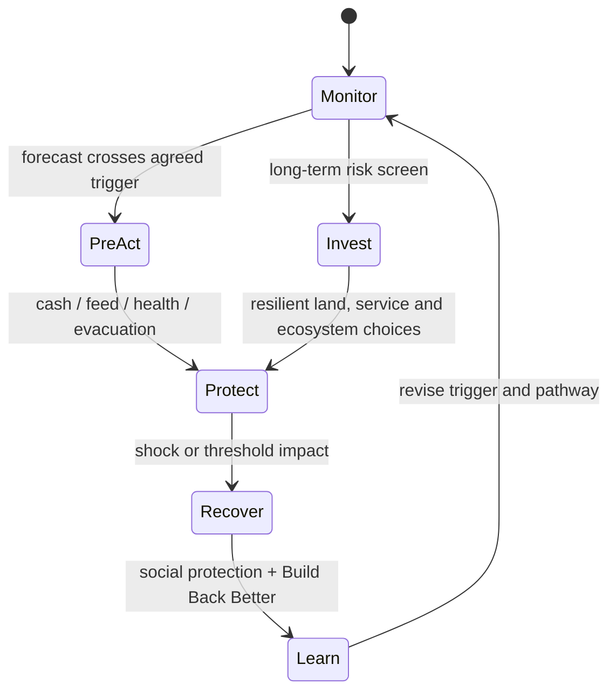

# Learning Session: Climate Risk, Slow-Onset Emergencies, Adaptation and Loss and Damage

**Subject:** Disaster Management | **Topic:** 15 | **Level:** Core first, then optional Advanced | **Current-status cut-off:** 4 October 2026

## Session contract and ownership

This session treats climate change as a risk multiplier and owns the disaster-management treatment of slow-onset or “creeping” emergencies, adaptation, residual risk, loss and damage, climate-linked displacement and implementation/evaluation. Detailed drought mechanics remain with Topic 09; other hazard mechanics remain with Topics 07–11 and 14. Disaster-finance instruments remain detailed in Topic 16. Economy owns macro green finance/carbon-market analysis, while Environment owns full UNFCCC negotiation history, NDC target accounting and mitigation policy.

✅ Facts are tied to canonical or official sources. ⚠️ Scenarios, recommendations and synthesis are analytical inference. A climate trend does not by itself attribute every individual disaster to anthropogenic climate change.

## ROADMAP

| Stage | Lessons | Learning outcome |
|---|---:|---|
| Foundation | 1–3 | Diagnose climate risk; distinguish mitigation, adaptation and DRR; identify transformation and maladaptation |
| Core planning | 4–7 | Build national/local and sectoral adaptation across water, agriculture, cities, health, ecosystems and communities |
| Core governance | 8–13 | Finance and measure adaptation; understand residual risk, loss and damage, global arrangements, justice and Indian institutions |
| Optional Advanced | 14–16 | Stress-test a district, allocate scarce resources and evaluate a portfolio |

**Navigation:** Read Lessons 1–13 for a complete Core answer. Lessons 14–16 are explicitly optional depth. Exact verified PYQs remain neutral.

---

## Lesson 1: Climate Risk System and Attribution Limits

Progress: 1 / 16 | Stage: Core | Subtopic: Climate Risk System and Attribution Limits

━━━ PRE-TEACH CHECKLIST ━━━━━━━━━━━━━━━━━━
📚 Book context: Queried — canonical Basic and Advanced owners
🔍 CA search: "official Climate Risk System and Attribution Limits climate adaptation UNFCCC IPCC India"
📰 CA found: Current facts use direct official records through 4 October 2026; inference is labelled.
━━━━━━━━━━━━━━━━━━━━━━━━━━━━━━━━━━━━━━━━━

### 🖼️ Risk equation board

| Component | Diagnostic question | Typical evidence |
|---|---|---|
| Climate-related hazard | Is probability, intensity, duration or timing changing? | Observations, projections, physical mechanism |
| Exposure | Who and what occupy the affected place? | People, assets, ecosystems, services |
| Vulnerability | Why would similar exposure produce unequal harm? | Sensitivity, inequality, condition, dependence |
| Capacity | Can systems anticipate, absorb, recover and adapt? | Institutions, finance, knowledge, redundancy |
| Attribution | What caused the observed change or event? | Counterfactual analysis and stated confidence |

> **Visual rule:** a trend or projection can alter risk without automatically attributing one particular event.

IPCC risk emerges from dynamic interaction among climate-related hazards, exposure and vulnerability. Capacity and development choices shape all three. A hotter baseline can alter heat extremes; sea-level rise can worsen coastal inundation; changing rainfall can affect drought or flood risk. Earthquakes remain non-climatic even when recovery occurs amid climate stress.

Detection establishes that a variable has changed beyond expected variability. Attribution assesses the contribution of causes. Event attribution compares the likelihood or intensity of an event in factual and counterfactual climates, with uncertainty and model limits. Evidence strength differs by hazard and region; a newspaper label such as “climate disaster” is not a scientific attribution study.

For disaster managers, exact attribution is not always required before no-regret action. Decisions can use observed exposure, vulnerability, forecasts and plausible future ranges while avoiding unsupported causal claims.

### Attribution ladder

State **observed event → longer trend → physical mechanism → formal attribution evidence → confidence**. Stop at the level supported by the source.

### REVISION NOTES

1. Risk is an interaction, not a synonym for hazard.
2. Climate change can alter hazard probability, intensity, duration or timing.
3. Exposure and vulnerability convert hazard into disaster.
4. Capacity is uneven and dynamic.
5. Detection and attribution are different tasks.
6. Event attribution is probabilistic and hazard-specific.
7. Every flood, fire or cyclone is not automatically climate-caused.
8. No-regret adaptation can proceed under uncertainty.
9. Earthquake causation remains outside climate attribution.

### Concept check

**Question:** (15 marks) A district has experienced three severe floods in five years. Explain what officials may and may not infer about climate causation.

**Model-answer ceiling:** 15 marks | actual 93 words | maximum 250 words

**Model answer:** Officials may state the observed recurrence, map changing rainfall and river conditions, and assess whether exposure, drainage, land use or reservoir operations raised loss. They may use authoritative regional projections to test future scenarios. They should not infer anthropogenic causation from frequency alone or call each flood climate-caused without a formal attribution study that compares factual and counterfactual likelihood and reports confidence. Yet uncertainty does not justify inaction: protecting floodplains, improving warning, restoring storage and planning for plausible extremes can be no-regret measures. Communication should separate observed facts, scientific attribution and precautionary planning.

**Adjacent rubric:** Risk diagnosis 4 + inference boundary 5 + decision under uncertainty 4 + communication 2 = **15 marks**

**Misconception to avoid:** A recent cluster of damaging events proves that climate change caused each event.

**Transition:** Having bounded causation, Lesson 2 separates the three policy jobs—mitigate, adapt and reduce disaster risk.

---

## Lesson 2: Mitigation, Adaptation, DRR and the Avoid–Adapt–Address Logic

Progress: 2 / 16 | Stage: Core | Subtopic: Mitigation, Adaptation, DRR and the Avoid–Adapt–Address Logic

━━━ PRE-TEACH CHECKLIST ━━━━━━━━━━━━━━━━━━
📚 Book context: Queried — canonical Basic and Advanced owners
🔍 CA search: "official Mitigation, Adaptation, DRR and the Avoid–Adapt–Address Logic climate adaptation UNFCCC IPCC India"
📰 CA found: Current facts use direct official records through 4 October 2026; inference is labelled.
━━━━━━━━━━━━━━━━━━━━━━━━━━━━━━━━━━━━━━━━━

### 🖼️ Four-job comparison

| Policy job | Primary object | Time/risk position | Illustrative test |
|---|---|---|---|
| Mitigate | Climate forcing | Avoid future amplification | Does it cut emissions or enhance sinks? |
| Adapt | Actual or expected climate effects | Adjust before thresholds are crossed | Does it sustain people, ecosystems or services? |
| Reduce disaster risk | New, existing and residual risk from all hazards | Before, during and after hazards | Does it reduce exposure, vulnerability or disruption? |
| Address loss and damage | Harm not fully averted or minimised | Residual or realised impact | Does it protect, recover, repair or recognise loss? |

**Sequence:** avoid/minimise → adapt and reduce risk → address what remains. Overlap does not make the jobs interchangeable.

### Classification move

For any measure write its **primary objective, hazard/time horizon and residual risk**. Classify by function rather than ministry or funding label.

Mitigation limits greenhouse-gas emissions or enhances sinks; adaptation adjusts human or natural systems to actual or expected climate and its effects. Disaster risk reduction prevents new risk, reduces existing risk and manages residual risk across climatic and non-climatic hazards.

The agendas overlap when a heat action plan, drought-resilient water system, mangrove restoration or risk-sensitive building standard reduces climate-linked disaster risk. They diverge when emissions policy has no immediate local preparedness function, or earthquake safety has no climate-adaptation purpose.

The useful sequence is **avoid/minimise future risk through mitigation and anticipatory planning → adapt to impacts that cannot be avoided → address residual loss and damage**. “Address” includes response, recovery, rehabilitation, finance, mobility and protection; it does not make earlier risk reduction optional.

### REVISION NOTES

1. Mitigation acts mainly on future climate forcing.
2. Adaptation adjusts to actual or expected climate effects.
3. DRR covers climatic and non-climatic hazards.
4. One intervention may serve adaptation and DRR.
5. Overlap does not erase distinct objectives.
6. Avoid–adapt–address is sequential but iterative.
7. Loss and damage concerns residual impacts.
8. Response finance is not a substitute for prevention.
9. Classification should follow function, not label.

### Concept check

**Question:** (15 marks) Classify urban tree cover, cyclone shelters, solar power and post-disaster livelihood grants across mitigation, adaptation, DRR and loss-and-damage response.

**Model-answer ceiling:** 15 marks | actual 96 words | maximum 250 words

**Model answer:** Urban trees may provide mitigation through carbon storage and adaptation through shade and runoff reduction, but survival, water demand and distribution matter. Cyclone shelters are primarily DRR and climate adaptation where cyclone risk is changing; they do not mitigate emissions. Solar power is mitigation, while decentralised solar with storage can support adaptation by maintaining critical services. Post-disaster livelihood grants address realised harm and recovery; they are not adaptation unless designed to reduce future vulnerability. The examples show that classification depends on objective and design, and one project can have multiple functions without making the concepts synonymous.

**Adjacent rubric:** Correct classification 6 + design qualifications 4 + overlap explanation 3 + conclusion 2 = **15 marks**

**Misconception to avoid:** Any environmentally beneficial project is simultaneously mitigation, adaptation, DRR and loss-and-damage finance.

**Transition:** Lesson 3 asks how adaptation ambition can deepen—and how badly designed action can create new risk.

---

## Lesson 3: Incremental, Transformational Adaptation and Maladaptation

Progress: 3 / 16 | Stage: Core | Subtopic: Incremental, Transformational Adaptation and Maladaptation

━━━ PRE-TEACH CHECKLIST ━━━━━━━━━━━━━━━━━━
📚 Book context: Queried — canonical Basic and Advanced owners
🔍 CA search: "official Incremental, Transformational Adaptation and Maladaptation climate adaptation UNFCCC IPCC India"
📰 CA found: Current facts use direct official records through 4 October 2026; inference is labelled.
━━━━━━━━━━━━━━━━━━━━━━━━━━━━━━━━━━━━━━━━━

### 🖼️ Adaptation pathway fork

> **Stay and improve:** incremental action preserves the system—better calendars, maintenance or operating hours.
>
> **Change the pathway:** transformational action alters land use, livelihood, settlement or resource allocation.
>
> **Wrong turn:** maladaptation transfers risk, locks in inflexibility, damages ecosystems, raises emissions or burdens excluded groups.

`action now → monitored threshold → next option → reversibility check → distribution check`

### 🖼️ Threshold decision table

| Pathway signal | Decision |
|---|---|
| Existing system remains viable | Improve incrementally |
| Threshold makes the old pathway untenable | Transform with safeguards |
| Risk is shifted or locked in | Stop and redesign |

### Decision-pathway prompt

Use **action now → threshold → next option → affected groups → lock-in test → monitoring signal** instead of one permanent forecast-dependent solution.

Incremental adaptation preserves the basic system while improving performance. Transformational adaptation changes fundamental attributes when existing pathways become untenable—such as relocating critical assets, changing cropping systems or redesigning urban form.

Transformation is not automatically superior: it has high transition costs, distributional conflict and irreversible choices. Decision pathways can stage low-regret action, monitor thresholds and preserve future options. Examples include a coastal protection measure now, land-use controls before lock-in and planned relocation only after participatory trigger review.

Maladaptation increases climate-related risk, transfers it spatially or socially, creates emissions or ecosystem damage, or locks in inflexible assets. Embankments may induce settlement behind them; groundwater irrigation may protect crops now but exhaust aquifers; air-conditioning can exclude poor households and raise peak load. Safeguards require distributional, lifecycle and future-climate tests.

### REVISION NOTES

1. Incremental adaptation improves an existing system.
2. Transformational adaptation changes a development pathway.
3. Transformation has transition and justice costs.
4. Pathways preserve options under uncertainty.
5. A threshold signals when the next action is needed.
6. Maladaptation can transfer risk across places or groups.
7. Lock-in can make future adjustment expensive.
8. Short-term benefit can coexist with long-term harm.
9. Distributional and lifecycle tests are essential.

### Concept check

**Question:** (15 marks) A drought programme subsidises deeper borewells for all farmers. Diagnose maladaptation and redesign the pathway.

**Model-answer ceiling:** 15 marks | actual 90 words | maximum 250 words

**Model answer:** Deeper borewells can stabilise output briefly but accelerate aquifer decline, favour farmers able to finance pumps, raise energy demand and leave smallholders and drinking-water users with greater scarcity. The programme therefore transfers risk across time and groups and locks agriculture into groundwater dependence. Redesign should map aquifer budgets, protect drinking water, meter or govern extraction collectively, improve soil moisture and recharge where hydrologically suitable, shift incentives toward less water-intensive crops and provide income and extension support. Monitoring groundwater level, quality and farm viability should trigger tighter allocation or livelihood transition.

**Adjacent rubric:** Maladaptation diagnosis 5 + distribution/lock-in 3 + redesigned portfolio 5 + thresholds 2 = **15 marks**

**Misconception to avoid:** An intervention counts as adaptation whenever it reduces one climate impact during its first year.

**Transition:** Lesson 4 converts these concepts into a national-to-local planning cycle.

---

## Lesson 4: NAP, NDC and Local Adaptation Planning

Progress: 4 / 16 | Stage: Core | Subtopic: NAP, NDC and Local Adaptation Planning

━━━ PRE-TEACH CHECKLIST ━━━━━━━━━━━━━━━━━━
📚 Book context: Queried — canonical Basic and Advanced owners
🔍 CA search: "official NAP, NDC and Local Adaptation Planning climate adaptation UNFCCC IPCC India"
📰 CA found: Current facts use direct official records through 4 October 2026; inference is labelled.
━━━━━━━━━━━━━━━━━━━━━━━━━━━━━━━━━━━━━━━━━

### 🖼️ Planning cascade

1. **Global science and Paris framework** establish shared evidence and reporting context.
2. **National risk assessment and NAP process** connect priorities to sector budgets, standards and an Adaptation Communication.
3. **State plans** translate national direction into territorial and departmental choices.
4. **District, city and village plans** identify local exposure, vulnerability, owners and finance.
5. **Monitoring and learning** revise pathways upward and downward.

> **Boundary marker:** an NDC communicates Paris commitments; it does not substitute for the NAP process.

| Science → national process → State translation → local delivery → learning |
|---|
| Each arrow needs an institution, budget, metric and revision route. |

### Cascade audit before policy detail

Ask whether each priority has **risk evidence, responsible institution, budget line, implementation scale, equity safeguard, metric and revision trigger**.

A National Adaptation Plan is a country-driven process for reducing vulnerability and integrating adaptation into development. Updated UNFCCC technical guidance links risk assessment, planning, readiness/finance, implementation and monitoring-learning. A plan should be dynamic, not a project list.

NDCs communicate national climate commitments under the Paris Agreement and are mitigation-led in Indian exam ownership; they can contain adaptation context but do not replace a NAP. India submitted its first Adaptation Communication in December 2023. Official March 2025 material described India’s first comprehensive NAP as under development across nine sectors; no completed national NAP is claimed here through 4 October 2026.

Localisation requires downscaled but uncertainty-aware risk assessment, ward/watershed livelihood data, community knowledge, statutory plans, departmental budgets and measurable service outcomes. Local plans should align upward without copying national language.

### REVISION NOTES

1. NAP is a process, not merely a report.
2. Risk assessment precedes option selection.
3. Implementation and learning belong inside the cycle.
4. NDC and NAP have different primary functions.
5. India submitted an Adaptation Communication in 2023.
6. India’s comprehensive NAP was officially under development in 2025.
7. Nine sectors were identified in the official process.
8. Local plans need budgets and statutory linkage.
9. Downscaling should not create false precision.

### Concept check

**Question:** (15 marks) A State copies national adaptation priorities into district plans without local risk data. Explain why implementation may fail and propose a planning correction.

**Model-answer ceiling:** 15 marks | actual 96 words | maximum 250 words

**Model answer:** National priorities cannot reveal which district settlements, crops, water sources, health facilities or ecosystems cross local thresholds. Copying them can fund irrelevant assets, overlook informal institutions and create false precision. District planning should combine observed climate and hazard data, future ranges, exposure and vulnerability mapping, service and livelihood dependence and community knowledge. It should screen options for effectiveness, equity, maladaptation and feasibility; assign departmental owners and budgets; link actions to land-use, health, agriculture and disaster plans; and define indicators and revision triggers. State and national frameworks should supply standards, finance and learning while allowing local sequencing.

**Adjacent rubric:** Failure diagnosis 4 + local evidence 4 + option/governance design 5 + multilevel conclusion 2 = **15 marks**

**Misconception to avoid:** National consistency requires identical adaptation measures in every district.

**Transition:** Lesson 5 applies the planning cycle to water and agriculture, where climate and development pressures interact.

### Lesson-local verified adjacent PYQ — 2025 GS-III Q18 (neutral)

> Write a review on India's climate commitments under the Paris Agreement (2015) and mention how these have been further strengthened in COP26 (2021). In this direction, how has the first Nationally Determined Contribution intended by India been updated in 2022?

**Answer in 250 words | 15 marks**

**Provenance:** `books\mains\UPSC Mains 2025 GS Paper 3 3.pdf`

This Environment/UNFCCC-led question is adjacent-only. No answer, outline, cue, model or rubric is attached.

---

## Lesson 5: Water, Agriculture and Livelihood Adaptation

Progress: 5 / 16 | Stage: Core | Subtopic: Water, Agriculture and Livelihood Adaptation

━━━ PRE-TEACH CHECKLIST ━━━━━━━━━━━━━━━━━━
📚 Book context: Queried — canonical Basic and Advanced owners
🔍 CA search: "official Water, Agriculture and Livelihood Adaptation climate adaptation UNFCCC IPCC India"
📰 CA found: Current facts use direct official records through 4 October 2026; inference is labelled.
━━━━━━━━━━━━━━━━━━━━━━━━━━━━━━━━━━━━━━━━━

### 🖼️ Nested water–farm–household balance sheet

| Scale | Adaptation portfolio | Failure signal |
|---|---|---|
| Basin/aquifer | Demand rules, diversified storage, recharge, quality and scarcity allocation | Total consumption or depletion rises |
| Farm | Soil, crop and seed diversity; calendar, extension, credit and market support | Equipment works but income remains unstable |
| Household | Income diversity, portable protection, skills and mobility choice | Tenants, women or landless workers are excluded |

**Scale warning:** one farm may appear efficient while the basin and vulnerable households maladapt.

### Basin-to-household application

Water adaptation begins with basin and aquifer budgets, demand management, water quality and rules for scarcity—not infrastructure alone. Storage can be distributed across soil moisture, wetlands, tanks, aquifers and reservoirs, each with ecological and social limits.

Agricultural options include climate-informed advisories, diversified crops and varieties, soil organic matter, efficient irrigation where water accounting supports it, risk-sharing, storage and market access. A seed or app is ineffective without extension, credit, input quality and a viable buyer.

Livelihood adaptation may require non-farm skills, portable social protection, planned seasonal mobility and protection against distress displacement. Household gains must be checked against basin-level extraction, tenant exclusion and unpaid labour burdens. Detailed drought mechanics remain with Topic 09; agritech and macro farm-finance design remain with Economy.

### REVISION NOTES

1. Water supply projects alone do not ensure adaptation.
2. Basin and aquifer budgets constrain local choices.
3. Demand management complements new supply.
4. Soil, crop and market measures form a portfolio.
5. Advisories require institutions and last-mile support.
6. Field efficiency may not reduce basin consumption.
7. Tenants can be excluded from asset subsidies.
8. Livelihood diversification reduces dependence.
9. Mobility can be adaptive or distress-driven.

### Water–farm balance sheet

Record **water saved at field, water consumed at basin, yield/income stability, who pays, who is excluded and what happens in consecutive bad years**.

### Concept check

**Question:** (15 marks) Why can a highly efficient irrigation programme fail as climate adaptation at basin scale?

**Model-answer ceiling:** 15 marks | actual 96 words | maximum 250 words

**Model answer:** Efficient irrigation may lower water applied per hectare but encourage farmers to expand irrigated area, shift to thirstier crops or pump for longer, so total consumptive use rises. Subsidised energy and weak aquifer governance amplify rebound. Benefits may accrue to landowners while tenants and drinking-water users face depletion. Basin-scale adaptation therefore needs water accounting, crop and procurement incentives, extraction rules, recharge based on local hydrogeology, energy reform, extension and livelihood support. Success should be measured through aquifer or river condition, reliable farm income and equitable access during drought—not equipment installed or water saved at one plot.

**Adjacent rubric:** Rebound mechanism 5 + equity/basin effects 3 + governance portfolio 5 + metric 2 = **15 marks**

**Misconception to avoid:** Higher application efficiency necessarily leaves the saved water available to other users.

**Transition:** Lesson 6 shifts from production landscapes to cities, infrastructure and climate-sensitive health services.

---

## Lesson 6: Urban, Infrastructure and Health Adaptation

Progress: 6 / 16 | Stage: Core | Subtopic: Urban, Infrastructure and Health Adaptation

━━━ PRE-TEACH CHECKLIST ━━━━━━━━━━━━━━━━━━
📚 Book context: Queried — canonical Basic and Advanced owners
🔍 CA search: "official Urban, Infrastructure and Health Adaptation climate adaptation UNFCCC IPCC India"
📰 CA found: Current facts use direct official records through 4 October 2026; inference is labelled.
━━━━━━━━━━━━━━━━━━━━━━━━━━━━━━━━━━━━━━━━━

### 🖼️ Lifeline dependency matrix

| Climate pressure | First-order effect | Cascading service test |
|---|---|---|
| Heat | Illness, labour loss, peak electricity and water demand | Can health, cooling and water continue during power stress? |
| Extreme rain/flood | Drainage overload and contamination | Can transport, sanitation and hospitals function together? |
| Coastal change | Surge, erosion and salinity | Can ports, roads, aquifers and settlements retain minimum service? |

Land use, buildings, blue-green systems and lifeline continuity must be designed against future ranges and unequal access.

### Start with a service threshold

For power, water, health and mobility specify **future hazard range, minimum service, vulnerable users, fallback endurance, upgrade trigger and residual risk**.

Urban adaptation combines risk-sensitive land use, heat-responsive buildings and public space, blue-green drainage, water security and continuity of power, health, mobility and communications. Hazard-specific design remains with Topics 07, 08 and 14.

Health adaptation includes surveillance for climate-sensitive disease, heat-health action, safe water and sanitation, air-quality and occupational protection, resilient facilities, workforce surge and risk communication. “More hospitals” alone does not address exposure or prevention.

Infrastructure should use future climate ranges, service criticality, maintenance and adaptive pathways. Design values must be periodically reviewed without inventing false local precision. Equity changes priorities: renters, informal workers, outdoor workers, older persons, children and people with disabilities may lack cooling, storage, insurance or mobility.

### REVISION NOTES

1. Urban adaptation is a system problem.
2. Land use can avoid new lock-in.
3. Blue-green and grey systems should be integrated.
4. Health adaptation includes prevention and service continuity.
5. Climate-sensitive surveillance requires action thresholds.
6. Infrastructure needs future-climate ranges.
7. Maintenance remains essential under changing hazards.
8. Equity changes which services are critical.
9. Hazard-specific mechanics stay with their topic owners.

### Concept check

**Question:** (15 marks) A city proposes air-conditioned cooling centres as its principal heat adaptation. Evaluate the design without writing a general heat-wave plan.

**Model-answer ceiling:** 15 marks | actual 94 words | maximum 250 words

**Model answer:** Cooling centres can protect high-risk people only if they are geographically accessible, affordable, safely operated, well publicised and supported by reliable power, water, transport and health referral. They may exclude outdoor workers, people with disabilities or residents unable to leave dependants. Concentrating adaptation in air-conditioned buildings can raise peak power demand and fail during outages. The city should test catchments, opening triggers, backup endurance and utilisation by vulnerable groups, while linking centres to shaded public space, passive cooling, worker protections and home outreach. Evaluation should measure safe access and health outcomes, not centre count.

**Adjacent rubric:** Conditional value 3 + access/dependency critique 5 + complementary design 4 + outcome metric 3 = **15 marks**

**Misconception to avoid:** A cooling centre is effective adaptation once a building and air-conditioners have been procured.

**Transition:** Lesson 7 examines ecosystems and community knowledge as protective infrastructure with rights and trade-offs.

### Lesson-local verified cross-application PYQ — 2024 GS-III Q17 (neutral)

> What is disaster resilience? How is it determined? Describe various elements of a resilience framework. Also mention the global targests of Sendai Framework for Disaster Risk Reduction (2015-2030).

**Answer in 250 words | 15 marks**

**Provenance:** `books\mains\03 UPSC 2024 Paper-III.pdf`

This is a resilience cross-application, not a direct climate-adaptation question. No answer, outline, cue, model or rubric is attached.

---

## Lesson 7: Ecosystem-Based and Community-Led Adaptation

Progress: 7 / 16 | Stage: Core | Subtopic: Ecosystem-Based and Community-Led Adaptation

━━━ PRE-TEACH CHECKLIST ━━━━━━━━━━━━━━━━━━
📚 Book context: Queried — canonical Basic and Advanced owners
🔍 CA search: "official Ecosystem-Based and Community-Led Adaptation climate adaptation UNFCCC IPCC India"
📰 CA found: Current facts use direct official records through 4 October 2026; inference is labelled.
━━━━━━━━━━━━━━━━━━━━━━━━━━━━━━━━━━━━━━━━━

### 🖼️ Evidence layers for ecosystem adaptation

- **Ecological layer:** species, habitat condition, hydrology and connectivity.
  - **Physical-service layer:** water retention, erosion or wave attenuation, cooling and runoff storage.
    - **Human-use layer:** exposed users, livelihoods, tenure and maintenance.
      - **Outcome layer:** measured buffering, equitable benefit and performance under extremes.

Plantation count sits at the input layer; it cannot prove adaptation performance.

| Input | Condition | Service | Distributed outcome |
|---|---|---|---|
| Restoration activity | Ecological fit and governance | Tested hazard buffering | Durable benefit without exclusion |

### Read the evidence chain first

Track **ecological condition → physical buffering/service → exposed users → livelihood co-benefit → distribution → performance under extremes**.

Ecosystem-based adaptation and Eco-DRR use biodiversity and ecosystem services to reduce climate risk while supporting livelihoods. Wetlands store water, mangroves can attenuate waves and erosion in suitable settings, forests influence slope and catchment processes, and urban vegetation can reduce local heat.

Benefits are site-specific and cannot justify planting inappropriate species or treating ecosystems as invulnerable barriers. Restoration needs hydrological connectivity, ecological condition, tenure, maintenance and limits under extreme events. Hybrid systems may combine ecosystems with engineered protection.

Community knowledge contributes seasonal signals, safe routes, crop and water practices and social networks. It should be documented with consent and tested alongside science, not romanticised or extracted. The MHA’s 2 December 2025 reply records ₹519.04 crore approved from NDMF for restoration and rejuvenation of 24 Assam wetlands—a financing input, not proof of restored performance or avoided loss.

### REVISION NOTES

1. Ecosystem-based adaptation uses ecosystem services to reduce risk.
2. Eco-DRR and adaptation strongly overlap.
3. Benefits depend on ecological and spatial fit.
4. Ecosystems have thresholds and residual risk.
5. Hybrid protection may be appropriate.
6. Tenure and community governance affect durability.
7. Traditional knowledge requires consent and validation.
8. Project approval is an input, not an outcome.
9. The Assam wetland figure is tied to the 2025 MHA reply.

### Concept check

**Question:** (15 marks) A coastal district proposes a uniform mangrove belt along its entire shoreline. Apply an ecosystem-based adaptation screen.

**Model-answer ceiling:** 15 marks | actual 93 words | maximum 250 words

**Model answer:** The district should first map salinity, sediment, tidal range, shoreline type, existing habitats, erosion processes and future sea-level and storm conditions. Mangroves suit some intertidal settings but not every beach, cliff, mudflat or densely used coast. The plan should protect natural regeneration and hydrological connectivity, avoid monoculture, secure community tenure and fishing access and compare hybrid or non-mangrove options. Performance indicators should include survival, habitat condition, shoreline or wave effects and livelihood distribution, with residual-risk and evacuation plans for extremes. A uniform plantation target could waste funds, damage habitats and create false security.

**Adjacent rubric:** Ecological suitability 5 + rights/governance 3 + alternatives/residual risk 4 + metrics/verdict 3 = **15 marks**

**Misconception to avoid:** Mangroves are a universally suitable wall that eliminates coastal disaster risk.

**Transition:** Lesson 8 turns from option design to the finance and measurement gap that often prevents delivery.

---

## Lesson 8: Adaptation Finance, Gaps and Metrics

Progress: 8 / 16 | Stage: Core | Subtopic: Adaptation Finance, Gaps and Metrics

━━━ PRE-TEACH CHECKLIST ━━━━━━━━━━━━━━━━━━
📚 Book context: Queried — canonical Basic and Advanced owners
🔍 CA search: "official Adaptation Finance, Gaps and Metrics climate adaptation UNFCCC IPCC India"
📰 CA found: Current facts use direct official records through 4 October 2026; inference is labelled.
━━━━━━━━━━━━━━━━━━━━━━━━━━━━━━━━━━━━━━━━━

### 🖼️ Results-chain dashboard

| Gate | Evidence before moving right |
|---:|---|
| 1. Need | Risk, exposure, vulnerability and distribution baseline |
| 2. Pipeline | Feasible design, safeguards and responsible owner |
| 3. Finance | Accessible grant, budget, concessional or viable private capital |
| 4. Delivery | Asset or service implemented and maintained |
| 5. Capability | Function tested under a credible stress |
| 6. Outcome | Lower vulnerability, downtime or loss without transferred risk |

**Dashboard alert:** money counted at Gate 3 is not an outcome at Gate 6.

### Metric basket before financing claims

Use at least one indicator for **risk reduction, reliability, equity, ecological condition, adaptive capacity, residual loss and corrective learning**.

The adaptation gap has three linked dimensions: risk and planning needs exceed implemented action; finance needs exceed available, accessible flows; and monitoring often counts spending or assets rather than reduced vulnerability. Exact global gap figures vary by report and year and are not imported without a dated source.

Finance may come from public budgets, grants, concessional resources, development finance, private investment where revenue exists and household/community effort. Additionality, debt burden, access cost and predictability affect justice. Private finance will undersupply public goods and support for populations without bankable revenue.

Metrics should follow a results chain: inputs, outputs, capability, service or livelihood outcome, distribution and sustainability. Avoided loss is useful but uncertain and can undervalue culture, health and ecosystems. Indicators need baselines, counterfactual caution, future-climate relevance and maladaptation checks.

### REVISION NOTES

1. Adaptation gaps include action, finance and implementation.
2. Finance quantity is not finance accessibility.
3. Public goods often lack private revenue.
4. Debt terms affect adaptation justice.
5. Spending and assets are inputs or outputs.
6. Capability must be tested.
7. Outcome metrics should be distributional.
8. Avoided-loss estimates carry uncertainty.
9. Maladaptation belongs in monitoring.

### Concept check

**Question:** (20 marks) Design a metric framework for a State climate-resilient drinking-water programme.

**Model-answer ceiling:** 20 marks | actual 99 words | maximum 250 words

**Model answer:** Establish baseline source reliability, quality, seasonal scarcity, household access, affordability and climate exposure. Track finance and outputs such as protected sources, storage and repaired networks, but test capability through drought and flood scenarios, backup power, water-quality response and trained operators. Outcome measures should include days of safe minimum service, outage and recovery time, disease signals, groundwater or catchment condition and household coping cost. Disaggregate by settlement, gender, caste, income, disability and remoteness. Compare observed change with rainfall and demand conditions, record residual shortages and test whether pumping, tariffs or source transfers create maladaptation. Publish corrective owners and revision triggers.

**Adjacent rubric:** Baseline 4 + input/capability chain 5 + outcome/ecology 5 + equity 3 + attribution/maladaptation 3 = **20 marks**

**Misconception to avoid:** Expenditure utilisation and litres of new storage are sufficient evidence of successful adaptation.

**Transition:** Finance and metrics reveal what adaptation cannot prevent; Lesson 9 defines that residual as loss and damage.

---

## Lesson 9: Slow-Onset “Creeping Emergencies,” Residual Risk and Loss and Damage

Progress: 9 / 16 | Stage: Core | Subtopic: Slow-Onset “Creeping Emergencies,” Residual Risk and Loss and Damage

━━━ PRE-TEACH CHECKLIST ━━━━━━━━━━━━━━━━━━
📚 Book context: Queried — canonical Basic and Advanced owner
🔍 CA search: "official slow onset events creeping emergencies residual risk loss and damage UNFCCC India"
📰 CA found: Current institutional status is tied to direct records through 4 October 2026.
━━━━━━━━━━━━━━━━━━━━━━━━━━━━━━━━━━━━━━━━━

### 🖼️ Two-speed loss clock

| Risk clock | Representative processes | Preparedness window | Typical loss signal |
|---|---|---|---|
| Rapid onset | Cyclone landfall, flash flood or heat emergency | Hours to days, with longer mitigation work | Acute mortality, asset damage and service interruption |
| Slow onset / “creeping emergency” | Climate change, desertification, soil degradation and drought in the canonical owner; UNFCCC also tracks processes such as sea-level rise, salinisation and glacial retreat | Months to years for thresholds, pathways and anticipatory investment | Progressive livelihood erosion, ecosystem decline, mobility and irreversible cultural or territorial loss |

### 🖼️ Residual-risk sequence

`avert/minimise → adapt and prepare → residual risk → economic + non-economic loss`

> A monetised loss is not automatically more important than a non-economic or irreversible one.

Loss and damage refers to adverse climate impacts that are not or cannot be fully avoided through mitigation and adaptation. It includes rapid events and slow-onset processes. “Residual risk” is the risk remaining after feasible risk-reduction measures; it changes with warming, development and capacity.

The canonical owner defines a slow-onset disaster or **“Creeping Emergency”** as one unfolding over months or years, often predictable much further in advance than a sudden event even though its impact is not felt immediately. Representative owner examples are climate change, desertification, soil degradation and drought. UNFCCC records a wider climate-loss context including sea-level rise, increasing temperatures, ocean acidification, glacial retreat and related impacts, salinisation, land and forest degradation, biodiversity loss and desertification. These are processes, not a claim that every local impact has one simple climate cause.

Longer lead time changes preparedness rather than removing urgency. Authorities should monitor trends and thresholds, protect water and ecosystem buffers, diversify livelihoods, make social protection scalable, govern land and mobility before distress peaks, preserve records of non-economic loss and pre-plan finance and institutional triggers. Detailed drought hydrology, drought indices and drought-response operations remain with Topic 09; this lesson owns the cross-hazard definition, preparedness logic and loss-and-damage implications.

Economic losses have market or replacement values, though informal work and subsistence production may be undercounted. Non-economic losses include life, health, mobility, territory, cultural heritage, identity, local knowledge, biodiversity and ecosystem services. They are not “non-material” or valueless; monetisation may be impossible or ethically inappropriate.

Assessment should record direct, indirect and cascading harm, distribution and duration. Response may involve relief, recovery, social protection, ecosystem restoration, memorialisation, mobility support and international finance, but some irreversible loss cannot be repaired.

### REVISION NOTES

1. Loss and damage follows incomplete avoidance and adaptation.
2. Residual risk remains after risk reduction.
3. Residual risk changes over time.
4. Slow-onset disasters unfold over months or years.
5. “Creeping Emergency” stresses gradual accumulation and delayed visibility.
6. Climate change, desertification, soil degradation and drought are canonical examples.
7. Longer warning horizons require threshold-based anticipatory preparedness.
8. Detailed drought mechanics remain with Topic 09.
9. Economic loss includes assets and income.
10. Informal and subsistence loss is often undercounted.
11. Non-economic loss includes health, culture and ecosystems.
12. Some losses are irreversible; assessment should capture distribution and duration.

### Loss inventory

Use **what was lost → for whom → duration/reversibility → market/non-market evidence → response possible → residual irreversible harm**.

### Concept check

**Question:** (15 marks) A coastal village loses homes, fishing income, a sacred site and access to ancestral graves after repeated erosion. Classify the losses and explain why one compensation rate is inadequate.

**Model-answer ceiling:** 15 marks | actual 100 words | maximum 250 words

**Model answer:** Homes and damaged equipment have replacement values, while interrupted fishing has income and indirect supply-chain effects. The sacred site, ancestral graves, place-based identity, social cohesion and knowledge tied to the coast are non-economic losses that cannot be reduced to house prices. Relocation may also create future livelihood, health and cultural loss. A uniform compensation rate misses tenure differences, informal assets, subsistence use, distribution and irreversible attachment. Assessment should combine asset and income records with participatory cultural and wellbeing evidence, then provide housing and livelihood support, culturally acceptable relocation choices, documentation or memorial measures and long-term monitoring. Some harm remains non-compensable.

**Adjacent rubric:** Classification 5 + valuation limitation 4 + response design 4 + irreversibility 2 = **15 marks**

**Misconception to avoid:** Everything important can be fully restored if a sufficiently high monetary compensation rate is calculated.

**Transition:** Lesson 10 maps the evolving international arrangements that know, coordinate, assist and finance responses.

---

## Lesson 10: WIM, Suva Expert Dialogue, Santiago Network and FRLD

Progress: 10 / 16 | Stage: Core | Subtopic: WIM, Suva Expert Dialogue, Santiago Network and FRLD

━━━ PRE-TEACH CHECKLIST ━━━━━━━━━━━━━━━━━━
📚 Book context: Queried — canonical Basic and Advanced owner
🔍 CA search: "official WIM Suva Expert Dialogue Santiago Network Fund responding loss damage UNFCCC"
📰 CA found: Current institutional status is tied to direct records through 4 October 2026.
━━━━━━━━━━━━━━━━━━━━━━━━━━━━━━━━━━━━━━━━━

### 🖼️ Institutional timeline strip

| Milestone | Added function in the architecture | Do not overclaim |
|---|---|---|
| **2013 — COP19** | WIM: knowledge, coordination and action/support | A mechanism is not automatic delivery |
| **2015 — Paris Article 8** | Recognition of averting, minimising and addressing loss and damage | Article 8 is not itself a disbursement |
| **2017 mandate / May 2018 dialogue** | Suva Expert Dialogue: mobilising expertise and enhancing support, including finance, technology and capacity-building | A dialogue is not a fund |
| **2019 — COP25** | Santiago Network: demand-driven technical assistance | Technical assistance is not the financing facility |
| **COP27 → COP28** | FRLD established and then operationalised | Establishment does not establish adequacy |
| **2025–2026** | Barbados Implementation Modalities: initial interventions and first call | A call is not proof of receipt by India |

### REVISION NOTES

1. WIM was established at COP19 in 2013.
2. WIM has knowledge, coordination and action/support functions.
3. Paris Article 8 recognises loss and damage.
4. COP23 mandated the Suva Expert Dialogue; it was held in May 2018.
5. Suva explored expertise and enhanced finance, technology and capacity support.
6. Suva was a dialogue, not a finance facility.
7. Santiago Network was established at COP25 for demand-driven technical assistance.
8. FRLD was established at COP27 and operationalised through COP28 decisions.
9. BIM covers first interventions in 2025–2026.
10. An operational architecture does not prove adequate delivery.

### Read institutions by function, not acronym

Write **mechanism/dialogue → date → distinct function → access/delivery evidence → unresolved gap**. Do not merge WIM, Suva, Santiago Network and FRLD.

The Warsaw International Mechanism was established at COP19 in 2013. Its functions are enhancing knowledge and understanding of comprehensive risk management; strengthening dialogue, coordination, coherence and synergies; and enhancing action and support, including finance, technology and capacity-building. Paris Agreement Article 8 recognises averting, minimising and addressing loss and damage.

The COP23 outcome mandated the **Suva Expert Dialogue**, held during the May 2018 subsidiary-body session in Bonn under WIM Executive Committee guidance. Its purpose was to explore ways to facilitate the mobilisation and securing of expertise and enhance support—including finance, technology and capacity-building—for averting, minimising and addressing loss and damage. Its topic areas spanned risk assessment, risk reduction, risk transfer, risk retention and comprehensive risk management. It exposed support needs and linked knowledge to action, but it was a dialogue process rather than a standing finance window or proof that support had been delivered.

The Santiago Network, established at COP25 in 2019, catalyses demand-driven technical assistance for vulnerable developing countries through organisations, bodies, networks and experts.

The Fund for responding to Loss and Damage was established at COP27 and operationalised at COP28. Official COP30-era records describe the Barbados Implementation Modalities as its first interventions for 2025–2026, with USD 250 million allocated and a first call for funding requests launched. This is verified institutional progress, not proof that global needs are met, that every request is approved, or that India has received finance. Current claims stop at the dated official record.

### Concept check

**Question:** (15 marks) Place WIM, the Suva Expert Dialogue, Santiago Network and FRLD in one functional chain and identify the evidence needed before claiming effective delivery.

**Model-answer ceiling:** 15 marks | actual 98 words | maximum 250 words

**Model answer:** WIM supplies the overarching knowledge, coordination and action/support architecture. The Suva Expert Dialogue explored how to mobilise expertise and enhance finance, technology and capacity-building support across comprehensive risk management; it did not itself finance projects. The Santiago Network connects vulnerable developing countries with organisations and experts for demand-driven technical assistance. FRLD is the dedicated financing institution, with initial 2025–2026 interventions under the Barbados Implementation Modalities. Effective delivery requires evidence of accessible country-led requests, completed assistance, approvals, disbursement, timeliness, community reach, treatment of economic and non-economic loss and transparent results. Adequacy must still be compared with needs and distribution.

**Adjacent rubric:** Four-part role distinction 7 + chronology/current status 3 + delivery evidence 3 + adequacy conclusion 2 = **15 marks**

**Misconception to avoid:** Suva, Santiago Network and FRLD are interchangeable delivery windows within WIM.

**Transition:** Institutional delivery raises who owes support, who bears loss and how justice principles guide decisions—Lesson 11.

---

## Lesson 11: Equity, CBDR-RC, Climate Justice and Displacement

Progress: 11 / 16 | Stage: Core | Subtopic: Equity, CBDR-RC, Climate Justice and Displacement

━━━ PRE-TEACH CHECKLIST ━━━━━━━━━━━━━━━━━━
📚 Book context: Queried — canonical Basic and Advanced owner
🔍 CA search: "official Equity, CBDR-RC, Climate Justice and Displacement UNFCCC IPCC India"
📰 CA found: Current institutional status is tied to direct records through 4 October 2026.
━━━━━━━━━━━━━━━━━━━━━━━━━━━━━━━━━━━━━━━━━

### 🖼️ Justice compass

| Direction | Governing question |
|---|---|
| **Distributive** | Who receives protection, finance and recovery support—and who bears debt or residual loss? |
| **Procedural** | Who has information, decision voice, consent, grievance and remedy? |
| **Recognition** | Whose tenure, identity, knowledge, culture and historical disadvantage are respected? |
| **Capability** | Can affected people actually use protection and recover livelihoods? |

At the centre: unequal contribution + unequal exposure + unequal capacity.
At the legal boundary: disaster-displaced persons are not automatically Convention refugees.

### Apply the justice matrix

For every policy identify **contributors, risk bearers, decision voice, benefit recipients, cost/debt bearer, remedy and cultural loss**.

Climate justice links responsibility for emissions, unequal exposure, adaptive capacity and voice. CBDR-RC—common but differentiated responsibilities and respective capabilities, in light of different national circumstances—is a principle of the climate regime; it does not itself calculate a project entitlement.

Distributive justice concerns who receives finance and protection; procedural justice concerns participation and remedy; recognition justice respects distinct histories, identities and knowledge. Within India, justice also asks whether adaptation benefits tenants, women, Adivasi communities, fishers, migrants, outdoor workers and remote settlements.

Disaster displacement may be temporary, prolonged, repeated or permanent. People displaced solely by disasters are not automatically refugees under the 1951 Refugee Convention’s persecution-based definition, but this does not mean they have no rights. Domestic law, disaster relief, human-rights obligations and non-binding displacement guidance remain relevant. Planned mobility should preserve choice, tenure, livelihood, culture and host-community services.

The canonical owners name compounding harms that generic references to “vulnerability” can hide: discrimination in humanitarian assistance and resource sharing; gender-based violence affecting displaced women; increased susceptibility of some displaced people to extremist recruitment; and disproportionately higher casualties in poorer countries for disasters of similar magnitude. These source-grounded categories diagnose protection failures; they do not establish a current incidence rate or imply that every displaced person experiences each harm. Prevention requires safe and accountable aid distribution, gender-responsive protection, livelihood and youth inclusion, equitable warning and evacuation, host-community support and durable legal entitlements.

### REVISION NOTES

1. Climate harm and adaptive capacity are unequally distributed.
2. CBDR-RC is a climate-regime principle.
3. It does not automatically set project compensation.
4. Distributive justice concerns allocation.
5. Procedural justice concerns voice and remedy.
6. Recognition justice protects identity and knowledge.
7. Disaster displacement has multiple durations.
8. Named harms include aid/resource discrimination and gender-based violence.
9. Livelihood exclusion can increase susceptibility to extremist recruitment.
10. Equivalent hazards can produce higher casualties in poorer countries.
11. Disaster-displaced people are not automatically Convention refugees.
12. Non-refugee status does not mean absence of rights.

### Concept check

**Question:** (20 marks) A planned relocation programme offers identical houses 50 kilometres inland to a fishing community. Apply a climate-justice test.

**Model-answer ceiling:** 20 marks | actual 110 words | maximum 250 words

**Model answer:** The programme must establish necessity, alternatives and a transparent trigger rather than assume relocation is the first option. Fishers need meaningful participation, independent information, grievance and the option to remain where risk can be reduced safely. Inland houses may sever landing access, markets, customary tenure, sacred places, social networks and identity. Valuation should include informal assets, transition income, transport, host-community services and non-economic loss. Site safety, water, schools, health care and future climate risk require assessment. Tenure should be secure for women and marginalised households. Livelihood restoration must precede or accompany movement and outcomes should be monitored for years. Identical structures are not equal protection when dependence and culture differ.

**Adjacent rubric:** Necessity/procedure 4 + livelihood/tenure 5 + non-economic loss 4 + host/site safeguards 4 + monitoring/verdict 3 = **20 marks**

**Misconception to avoid:** Providing a house of equal floor area fully restores the position of every displaced household.

**Transition:** Lesson 12 locates these duties within India’s climate, development and disaster institutions.

---

## Lesson 12: Indian Institutions, Policies and Adaptation Status

Progress: 12 / 16 | Stage: Core | Subtopic: Indian Institutions, Policies and Adaptation Status

━━━ PRE-TEACH CHECKLIST ━━━━━━━━━━━━━━━━━━
📚 Book context: Queried — canonical Basic and Advanced owner
🔍 CA search: "official Indian Institutions, Policies and Adaptation Status UNFCCC IPCC India"
📰 CA found: Current institutional status is tied to direct records through 4 October 2026.
━━━━━━━━━━━━━━━━━━━━━━━━━━━━━━━━━━━━━━━━━

### 🖼️ Institutional handshake stack

| Level | Climate/development role | Disaster-management handshake |
|---|---|---|
| Union | MoEFCC: NAP process, NAPCC and UNFCCC communication; sector ministries control major levers | NDMA/MHA: risk standards, mitigation and coordination |
| State | SAPCC, departments, infrastructure and service budgets | SDMA standards, escalation and State DM planning |
| District | Sector delivery, land and livelihood programmes | DDMA risk assessment, preparedness and continuity |
| Local/community | ULB/PRI services, local knowledge and implementation | Last-mile warning, shelters, mutual aid and grievance |

The handshake must join the climate plan, development plan, budget and disaster plan without erasing line-agency responsibility.

### Trace one institutional handshake

Connect **risk owner → planning instrument → budget authority → implementation agency → DM interface → local user → reporting system**.

India’s adaptation architecture is distributed. MoEFCC coordinates climate policy, the NAP process and UNFCCC communications. NAPCC missions and State Action Plans on Climate Change provide existing policy channels. Sector ministries and States control many water, agriculture, health, urban, infrastructure and ecosystem decisions; NDMA, MHA, SDMAs, DDMAs and local bodies connect them to disaster risk management.

India submitted its first Adaptation Communication to UNFCCC on 9 December 2023. A March 2025 national workshop described the NAP as a dynamic process covering water; agriculture; disaster management and infrastructure resilience; health; forests; ecosystems and biodiversity; poverty alleviation and livelihoods; traditional knowledge and heritage; and adaptation resourcing. Through the stated cut-off, this session does not claim a completed notified NAP.

Finance channels should be attributed carefully. The NDMF wetland approval is a disaster-mitigation example, not India’s entire adaptation-finance system. Local implementation requires convergence without double-counting the same expenditure or outcome.

### REVISION NOTES

1. India’s adaptation governance is distributed.
2. MoEFCC coordinates the national climate process.
3. NAPCC and SAPCC are existing channels.
4. Sector ministries control many adaptation levers.
5. DM institutions provide risk and response interfaces.
6. India submitted an Adaptation Communication in 2023.
7. The official NAP process identified nine sectors.
8. A completed NAP is not claimed through the cut-off.
9. Convergence should avoid double counting.

### Concept check

**Question:** (15 marks) Design an institutional arrangement for integrating climate adaptation into a State’s district disaster plans without creating a parallel bureaucracy.

**Model-answer ceiling:** 15 marks | actual 98 words | maximum 250 words

**Model answer:** The State climate and disaster authorities should adopt a common risk taxonomy and planning calendar. Sector departments provide climate-sensitive service and asset data; SDMA sets risk and continuity standards; SAPCC priorities guide long-term pathways; DDMAs and local bodies map exposure, vulnerable groups and implementation constraints. Existing departmental budgets should tag but not double-count adaptation, while a joint technical cell supports scenarios and metrics rather than replacing line agencies. District plans should assign owners, finance, thresholds and mutual-aid links and report outcomes into both climate and DM reviews. Community institutions and vulnerable groups require formal participation and grievance routes.

**Adjacent rubric:** Common framework 4 + role allocation 5 + budget/data integration 3 + participation/accountability 3 = **15 marks**

**Misconception to avoid:** Integration requires a new adaptation department to take over all sector and disaster-management functions.

**Transition:** Lesson 13 completes Core by joining early action, social protection, development and recovery into one implementation chain.

---

## Lesson 13: Risk-Informed Development, Early Action and Coherent Implementation

Progress: 13 / 16 | Stage: Core | Subtopic: Risk-Informed Development, Early Action and Coherent Implementation

━━━ PRE-TEACH CHECKLIST ━━━━━━━━━━━━━━━━━━
📚 Book context: Queried — canonical Basic and Advanced owner
🔍 CA search: "official Risk-Informed Development, Early Action and Coherent Implementation UNFCCC IPCC India"
📰 CA found: Current institutional status is tied to direct records through 4 October 2026.
━━━━━━━━━━━━━━━━━━━━━━━━━━━━━━━━━━━━━━━━━

### 🖼️ Trigger state machine



### Implementation debrief

Operational coherence is a closed learning loop, not the ceremonial citation of Sendai, Paris and the SDGs.

Climate adaptation succeeds when routine development stops creating risk. Public investment appraisal should screen future hazard ranges, exposure, ecosystem effects, distribution and lock-in. Standards, procurement and maintenance translate plans into assets and services.

Early warning becomes anticipatory action when a credible forecast crosses a pre-agreed trigger linked to finance and an action such as cash, livestock support, health outreach, water positioning or evacuation. Forecast uncertainty and false-action cost must be transparent; trigger design should be evaluated over repeated seasons.

Shock-responsive social protection can scale benefits after climate shocks while preserving regular services. Recovery should Build Back Better and update the adaptation pathway. Sendai, Paris and SDG coherence is not achieved by citing all three frameworks; it is achieved when common risk information, budgets and metrics reduce mortality, livelihood loss, service interruption and inequality without double counting.

### Coherence proof

Show **one risk assessment, differentiated mandates, aligned finance, interoperable data, common outcome, and learning back into plans**.

### REVISION NOTES

1. Development decisions can create future climate risk.
2. Appraisal should test future ranges and lock-in.
3. Forecasts need pre-agreed action and finance.
4. Anticipatory action precedes impact.
5. Trigger uncertainty and false action require evaluation.
6. Social protection can scale after shocks.
7. Recovery should revise adaptation pathways.
8. Framework coherence is operational, not rhetorical.
9. Common metrics should avoid double counting.

### Concept check

**Question:** (20 marks) How can forecast-based anticipatory action complement long-term adaptation without becoming repeated emergency relief?

**Model-answer ceiling:** 20 marks | actual 116 words | maximum 250 words

**Model answer:** Long-term adaptation should reduce structural exposure and vulnerability through land use, water security, resilient services, livelihoods and ecosystems. Anticipatory action addresses short lead-time residual risk: a forecast crossing an agreed threshold releases pre-arranged finance for measures such as cash, livestock feed, health outreach, water positioning or evacuation. It becomes repetitive relief if triggers substitute for correcting chronic risk, exclude uncovered groups or lack learning. Governance should assign forecast authority, action owners, financing, grievance and false-action review. Repeated activation data should reveal hotspots where transformative investment or planned mobility is needed. Social protection can provide scalable delivery while protecting routine benefits. Thus, early action manages residual variability and supplies evidence, while adaptation changes the underlying risk pathway.

**Adjacent rubric:** Role distinction 4 + trigger/action design 5 + relief trap 4 + learning/transformation 4 + synthesis 3 = **20 marks**

**Misconception to avoid:** A district that repeatedly releases forecast-based cash has necessarily solved its long-term adaptation deficit.

**Transition:** Mandatory Core is complete. The optional block now tests synthesis through scenarios, allocation and evaluation.

---

# OPTIONAL ADVANCED DEPTH — NOT REQUIRED FOR A CORE ANSWER

Lessons 14–16 apply the completed Core. They do not replace mandatory definitions, institutions or sector coverage.

## Lesson 14: Compound Coastal District Adaptation Scenario

Progress: 14 / 16 | Stage: Advanced | Subtopic: Compound Coastal District Adaptation Scenario

━━━ PRE-TEACH CHECKLIST ━━━━━━━━━━━━━━━━━━
📚 Book context: Queried — canonical Advanced owner
🔍 CA search: "official Compound Coastal District Adaptation Scenario UNFCCC IPCC India"
📰 CA found: Current institutional status is tied to direct records through 4 October 2026.
━━━━━━━━━━━━━━━━━━━━━━━━━━━━━━━━━━━━━━━━━

### 🖼️ 2035 pathway board

| Zone/system | Compound stress | Near-term reversible action | Threshold-dependent choice |
|---|---|---|---|
| Coastal settlements | Surge + erosion + heat | Warning, tenure records, safe water, retrofit | Accommodate, protect or planned mobility |
| Farms/aquifers | Salinity + rainfall variability | Soil-water measures and livelihood diversity | Crop-system or source transition |
| Wetlands/fisheries | Hydrological and ecological change | Restore connectivity and access rights | Change use zones or livelihood pathway |
| Ports/hospitals/roads | Flood, heat and common dependencies | Maintenance, redundancy and continuity drills | Elevate, reroute or relocate critical functions |

Every pathway needs a trigger, lead time, justice safeguard and explicit residual loss.

### Populate the district pathway board

For each zone record **current risk, 2035 range, option, threshold, lead time, distribution, residual loss and reversible/irreversible choice**.

A coastal district must avoid a single-hazard master plan. Salinity, erosion, surge, extreme rain, heat, ecosystem change and livelihood volatility interact across seasons and infrastructure. The scenario should use ranges and identify common failure points rather than one precise 2035 shoreline.

Options include protecting critical compact areas, restoring hydrology and ecosystems where suitable, flood-compatible buildings and services, crop and livelihood diversification, safe water systems, evacuation and selective planned mobility. Pathways stage decisions: an immediate no-regret portfolio, monitored thresholds and later irreversible choices.

Ports or tourism cannot dominate criticality. Fishing settlements, tenants, women processors, informal workers and cultural sites need representation. Residual risk requires recovery finance and loss-and-damage records even after adaptation.

### REVISION NOTES

1. Compound scenarios combine multiple drivers.
2. Ranges are safer than false precision.
3. Common failure points link sectors.
4. Protect, accommodate, restore and relocate are distinct choices.
5. Pathways stage irreversible decisions.
6. Livelihood adaptation belongs with physical measures.
7. Criticality is not only asset value.
8. Participation must include informal and cultural dependence.
9. Residual loss remains after the portfolio.

### Concept check

**Question:** (20 marks) Prepare the decision architecture—not a project list—for a climate-vulnerable coastal district to 2035.

**Model-answer ceiling:** 20 marks | actual 105 words | maximum 250 words

**Model answer:** Begin with zone-specific ranges for sea level, surge, rainfall, heat, salinity and ecosystem change, overlaid with people, livelihoods and lifelines. Define minimum water, health, mobility and warning services. Screen protect, accommodate, restore, diversify and relocate options for effectiveness, cost, ecological fit, equity, lock-in and failure under compound events. Implement no-regret measures now, such as safe water, warning, maintenance, land-use controls and livelihood support. Set monitored thresholds and lead times for larger barriers, network relocation or planned mobility. Give fishing and informal communities decision rights, secure tenure and grievance. Record residual economic and non-economic loss and pre-arrange recovery. Review the pathway as observations and development change.

**Adjacent rubric:** Scenario/risk system 5 + option/pathway design 6 + services/equity 4 + residual loss/learning 5 = **20 marks**

**Misconception to avoid:** A district adaptation plan should select one forecast and finish all permanent protection immediately.

**Transition:** Lesson 15 introduces the contested allocation between prevention, adaptation and addressing realised harm.

---

## Lesson 15: Scarce-Finance Allocation and Justice Scenario

Progress: 15 / 16 | Stage: Advanced | Subtopic: Scarce-Finance Allocation and Justice Scenario

━━━ PRE-TEACH CHECKLIST ━━━━━━━━━━━━━━━━━━
📚 Book context: Queried — canonical Advanced owner
🔍 CA search: "official Scarce-Finance Allocation and Justice Scenario UNFCCC IPCC India"
📰 CA found: Current institutional status is tied to direct records through 4 October 2026.
━━━━━━━━━━━━━━━━━━━━━━━━━━━━━━━━━━━━━━━━━

### 🖼️ Allocation balance

| Ring-fenced duty | Comparative portfolio | Disclosure |
|---|---|---|
| Life, shelter, water, dignity and urgent irreversible harm | Prevent exposure; adapt systems; act before forecasts; recover livelihoods; build institutional capacity | State beneficiaries, debt terms, double counting, residual need and what remains unfunded |

**Decision weights:** urgency × irreversibility × marginal risk reduction × equity × readiness × option value.
**Constraint:** culture, rights and life cannot be ranked solely by monetised avoided loss.

### Allocation rule before optimisation

First protect **minimum rights and urgent irreversible harm**; then compare marginal risk reduction and distribution; preserve a contingency and publish what remains unfunded.

Scarce resources create genuine trade-offs. Investing only in post-impact support permits preventable loss; investing only in adaptation abandons people already harmed and ignores adaptation limits. The decision is portfolio allocation across timescales and duties.

Criteria include expected marginal risk reduction, urgency, irreversibility, distribution, additionality, implementation readiness, debt burden and whether an option preserves future choices. Life, culture and ecosystem loss cannot be ranked solely through cost-benefit ratios. Minimum rights and emergency duties form constraints before optimisation.

Funding labels should not permit double counting. A relocated water system may be adaptation; temporary water after salinity may address realised harm; restoring livelihood after relocation may span recovery and adaptation. Transparent classification and participatory review matter more than semantic purity.

### REVISION NOTES

1. Prevention and response compete for scarce funds.
2. Neither should be reduced to zero.
3. Minimum rights constrain optimisation.
4. Urgency and irreversibility matter.
5. Cost-benefit analysis can undervalue non-economic loss.
6. Additionality and debt terms affect justice.
7. One programme can span functions.
8. Double counting should be prevented.
9. Unfunded residual need should be disclosed.

### Concept check

**Question:** (20 marks) Allocate a limited climate-risk fund among wetland restoration, hospital retrofit, forecast-based cash and relocation support after repeated coastal loss.

**Model-answer ceiling:** 20 marks | actual 111 words | maximum 250 words

**Model answer:** First ring-fence immediate life, shelter, water and dignified relocation duties for already affected households. Compare the remaining options by marginal risk reduction, beneficiaries, urgency, irreversibility and substitutes. Hospital retrofit protects a critical service and may merit priority where failure is imminent. Wetland restoration can deliver broad buffering and livelihood benefits if hydrologically suitable, but needs time and performance evidence. Forecast-based cash manages near-term residual risk and should have triggers and coverage safeguards. Relocation support must restore tenure, livelihood and culture, not only housing. The portfolio should reserve contingency, avoid counting one expenditure under several claims, publish distribution and identify unfunded needs. Periodic review should shift funds as thresholds and evidence change.

**Adjacent rubric:** Rights/constraints 4 + comparative allocation 7 + justice/non-economic loss 4 + transparency/review 5 = **20 marks**

**Misconception to avoid:** All funding should go to the option with the highest monetised avoided-loss ratio.

**Transition:** The final lesson tests whether a portfolio actually reduced risk rather than merely producing plans and projects.

---

## Lesson 16: Adaptation and Loss-and-Damage Programme Evaluation

Progress: 16 / 16 | Stage: Advanced | Subtopic: Adaptation and Loss-and-Damage Programme Evaluation

━━━ PRE-TEACH CHECKLIST ━━━━━━━━━━━━━━━━━━
📚 Book context: Queried — canonical Advanced owner
🔍 CA search: "official Adaptation and Loss-and-Damage Programme Evaluation UNFCCC IPCC India"
📰 CA found: Current institutional status is tied to direct records through 4 October 2026.
━━━━━━━━━━━━━━━━━━━━━━━━━━━━━━━━━━━━━━━━━

### 🖼️ Evaluation scorecard

| Lens | Core question | Warning sign |
|---|---|---|
| Relevance | Does the programme address the diagnosed and future risk? | Static design under changing hazards |
| Effectiveness | Did implementation create tested capability and outcomes? | Assets counted without stress tests |
| Equity | Who gained, paid, moved or remained exposed? | Average outcome hides excluded groups |
| Integrity | Is contribution distinguished from event attribution? | Climate label substitutes for evidence |
| Safety | Did action transfer risk, lock in or damage ecosystems? | Short-term gain creates later vulnerability |
| Durability | Are services, livelihoods and recovery sustained? | Benefits vanish after project closure |
| Learning | Were findings assigned, corrected and budgeted? | Evaluation ends with a score |

### Eight-question interrogation

Ask **relevant? effective? equitable? attributable/contributory? future-proof? non-maladaptive? durable? learned and corrected?**

### Evaluation debrief

Evaluation should separate climate attribution of hazards from contribution of a programme to outcomes. A programme may plausibly reduce heat mortality or water outage even when no single event is formally attributed to climate change.

Establish a baseline and theory of change before investment. Measure implementation quality and capability, then service, livelihood, ecological and wellbeing outcomes. Compare across time, similar places or phased rollout cautiously because climate and development conditions differ. Test future relevance: an intervention can work today but fail under later warming or lock-in.

Loss-and-damage evaluation adds timeliness, access, adequacy, dignity, non-economic loss, recovery durability and whether finance reaches affected groups. Independent review, community evidence and public corrective-action closure reduce self-reporting bias. Evaluation should change budgets and pathways, not just produce a score.

### REVISION NOTES

1. Programme contribution differs from event attribution.
2. A theory of change links action to outcome.
3. Baselines should precede implementation.
4. Capability is between output and outcome.
5. Comparison needs climate and development context.
6. Future relevance tests changing hazard ranges.
7. Loss-and-damage evaluation includes dignity and timeliness.
8. Community evidence can reveal hidden loss.
9. Corrective closure makes evaluation useful.

### Concept check

**Question:** (20 marks) Construct an evaluation framework for a combined adaptation and loss-and-damage programme.

**Model-answer ceiling:** 20 marks | actual 112 words | maximum 250 words

**Model answer:** Define the risk, affected groups and theory linking finance and activities to reduced vulnerability, maintained services, recovery and residual loss. Record baseline hazard ranges, exposure, adaptive capacity, ecosystem condition, wellbeing and economic and non-economic loss. Track access, implementation quality and tested capability before outcomes such as reliable water, stable livelihood, lower downtime or dignified relocation. Disaggregate by gender, income, tenure, disability and location. Use phased or comparable cases cautiously and distinguish programme contribution from event attribution. Test future climate relevance, lock-in, transferred risk and ecosystem harm. For loss-and-damage support measure timeliness, adequacy, participation, cultural protection and recovery durability. Independent review should publish uncertainty and corrective owners, with findings revising pathways and budgets.

**Adjacent rubric:** Theory/baseline 4 + results chain 5 + equity/L&D 4 + attribution/maladaptation 4 + learning 3 = **20 marks**

**Misconception to avoid:** A high disbursement rate and completed asset count establish that climate risk and loss have fallen.

**Transition:** The lesson sequence is complete; the final arc consolidates neutral PYQs, models, remediation, maps, notes, coverage and sources.

---

# VERIFIED PYQ LINKAGE AND ANSWER APPROACHES

No audited 2024–2025 GS-III question directly owns the complete Topic 15 syllabus. The two exact questions below are transparently labelled cross-application or adjacent-only and remain answer-neutral.

## 2024 GS-III Q17 — exact official wording; resilience cross-application

> What is disaster resilience? How is it determined? Describe various elements of a resilience framework. Also mention the global targests of Sendai Framework for Disaster Risk Reduction (2015-2030).

**Answer in 250 words | 15 marks**

**Provenance:** `books\mains\03 UPSC 2024 Paper-III.pdf`. The identical question appears lesson-locally in Lesson 6. No answer, outline, cue, model or rubric is attached.

## 2025 GS-III Q18 — exact official wording; Environment/UNFCCC adjacent-only

> Write a review on India's climate commitments under the Paris Agreement (2015) and mention how these have been further strengthened in COP26 (2021). In this direction, how has the first Nationally Determined Contribution intended by India been updated in 2022?

**Answer in 250 words | 15 marks**

**Provenance:** `books\mains\UPSC Mains 2025 GS Paper 3 3.pdf`. The identical question appears lesson-locally in Lesson 4. It is not reclassified as a direct Disaster Management PYQ. No answer, outline, cue, model or rubric is attached.

# CUMULATIVE CONCEPT CHECKS

## Check 1 — Attribution discipline

**Question:** Why does an observed hazard trend not by itself prove that anthropogenic climate change caused one event? **(3 marks)**

**Model answer:** A trend describes change across observations, whereas event attribution estimates how specified drivers altered an event’s probability or intensity against a counterfactual climate. The claim therefore needs a plausible mechanism, formal attribution evidence and stated confidence; exposure or land-use change may also shape the disaster.

**Adjacent rubric:** Trend–event distinction 1 + counterfactual/mechanism 1 + confidence/other drivers 1 = **3 marks**

## Check 2 — Adaptation and DRR

**Question:** Distinguish adaptation from disaster risk reduction while showing their operational overlap. **(3 marks)**

**Model answer:** Adaptation adjusts human or natural systems to actual or expected climate effects. DRR prevents new risk, reduces existing risk and manages residual risk across climatic and non-climatic hazards. They overlap when measures such as heat plans or mangrove restoration reduce climate-related disaster risk.

**Adjacent rubric:** Adaptation definition 1 + DRR scope 1 + valid overlap 1 = **3 marks**

## Check 3 — Transformational threshold

**Question:** When does adaptation become transformational rather than incremental? **(3 marks)**

**Model answer:** Adaptation is transformational when it changes a system’s fundamental attributes or development pathway rather than improving the existing arrangement. Examples include changing settlement patterns, livelihood bases or water-allocation regimes after monitored thresholds show incremental measures are no longer viable.

**Adjacent rubric:** Fundamental-change criterion 1 + contrast with incremental action 1 + threshold/example 1 = **3 marks**

## Check 4 — Maladaptation screen

**Question:** Apply one concise maladaptation screen to a proposed climate-risk project. **(3 marks)**

**Model answer:** Test whether the project shifts risk across places, groups or time; locks in an inflexible pathway; increases emissions or ecosystem damage; or excludes vulnerable users. A project that lowers near-term loss but worsens any of these dimensions needs redesign rather than an adaptation label.

**Adjacent rubric:** Risk-transfer test 1 + lock-in/ecology/emissions test 1 + equity/redesign judgment 1 = **3 marks**

## Check 5 — NAP versus NDC

**Question:** Why can a Nationally Determined Contribution not substitute for a National Adaptation Plan process? **(3 marks)**

**Model answer:** An NDC communicates national Paris commitments and may include adaptation context. A NAP is a continuous country-driven process linking risk assessment, priorities, implementation, finance, monitoring and learning. The former can inform the latter but cannot replace its planning and delivery cycle.

**Adjacent rubric:** NDC function 1 + NAP process 1 + relationship without conflation 1 = **3 marks**

## Check 6 — Slow onset and residual risk

**Question:** How does a slow-onset “creeping emergency” alter preparedness for residual risk? **(3 marks)**

**Model answer:** Its impacts accumulate over months or years and may be visible before a sudden crisis, permitting threshold monitoring, livelihood diversification, scalable protection and planned mobility. Yet delayed visibility can cause under-prioritisation, leaving residual economic and non-economic loss when adaptation limits are reached.

**Adjacent rubric:** Gradual-process definition 1 + anticipatory implication 1 + residual-loss/under-visibility link 1 = **3 marks**

## Check 7 — Non-economic loss

**Question:** Identify two non-economic losses and explain why ordinary asset compensation is insufficient. **(3 marks)**

**Model answer:** Loss of a sacred landscape and place-based identity are non-economic losses because they lack ordinary replacement prices and may be irreversible. Asset compensation can support recovery but cannot recreate cultural meaning, continuity or community attachment, so participatory recognition and protective measures are also needed.

**Adjacent rubric:** Two valid losses 1 + valuation limitation 1 + appropriate response implication 1 = **3 marks**

## Check 8 — Four-part international architecture

**Question:** Distinguish WIM, the Suva Expert Dialogue, Santiago Network and FRLD by function. **(3 marks)**

**Model answer:** WIM provides the knowledge, coordination and action/support architecture. Suva explored mobilisation of expertise and enhanced finance, technology and capacity support; Santiago catalyses demand-driven technical assistance; FRLD is the dedicated financing institution. Dialogue or institutional existence alone does not prove delivery.

**Adjacent rubric:** WIM 0.5 + Suva 0.5 + Santiago 0.5 + FRLD 0.5 + delivery caution 1 = **3 marks**

## Check 9 — Displacement protection

**Question:** Why is disaster displacement not synonymous with refugee status, and what protection consequence follows? **(3 marks)**

**Model answer:** The 1951 Refugee Convention ordinarily requires a well-founded fear of persecution on specified grounds, so disaster displacement alone does not automatically confer Convention refugee status. Protection must still be secured through domestic law, disaster relief, human-rights duties and relevant displacement guidance.

**Adjacent rubric:** Persecution-based legal distinction 1 + non-automatic status 1 + valid protection route 1 = **3 marks**

## Check 10 — Adaptation performance

**Question:** What evidence demonstrates adaptation performance beyond expenditure and asset completion? **(3 marks)**

**Model answer:** Evidence should show tested capability and sustained outcomes—such as reliable minimum service, stable livelihoods or reduced vulnerability—under observed and plausible future hazards. Results must be disaggregated across groups and screened for transferred risk, ecosystem harm and maladaptation.

**Adjacent rubric:** Capability/outcome evidence 1 + future-hazard test 1 + equity/maladaptation test 1 = **3 marks**

# ORIGINAL 10-, 15- AND 20-MARK MAINS MODEL PRACTICE

## Original 10-mark practice

**Question:** Explain why attribution discipline and adaptation urgency are compatible. **(10 marks; answer in no more than 150 words.)**

**Model answer (105 words):** Climate risk is not established by labelling every disaster climate-induced. Officials should identify the hazard, exposure, vulnerability and capacity, then separate observed trends, physical mechanisms and formal event-attribution evidence. Adaptation can still proceed under uncertainty through no-regret measures, flexible pathways and monitored thresholds. It differs from mitigation, which limits future climate forcing, and overlaps with DRR where it reduces climate-related hazard exposure or vulnerability. Each option should be tested for effectiveness, equity, future climate relevance and maladaptation. Success is lower vulnerability and reliable services across groups, not plans, spending or assets alone. Residual risk should be recorded rather than hidden by an unsupported causation claim.

**Adjacent rubric:** Attribution boundary 3 + action-under-uncertainty 3 + policy distinctions 2 + metrics/residual risk 2 = **10 marks**

## Original 15-mark practice

**Question:** Examine how India can mainstream adaptation without creating a parallel planning bureaucracy. **(15 marks; answer in no more than 250 words.)**

**Model answer (134 words):** India’s adaptation task is distributed across MoEFCC, sector ministries, States, disaster-management institutions and local governments. Its 2023 Adaptation Communication and the ongoing comprehensive NAP process provide national direction, while NAPCC missions and SAPCCs are existing channels. Effective mainstreaming requires common risk information, future-climate screening in public investment, departmental budgets, resilient standards and district or city pathways. Water, agriculture, health, ecosystems, infrastructure, livelihoods and traditional knowledge need sector-specific actions but shared equity and maladaptation safeguards. NDMA, SDMAs and DDMAs can connect climate planning to warning, continuity, preparedness and recovery without replacing line agencies. Local bodies and communities must shape priorities and metrics. Evaluation should measure service reliability, livelihood stability, ecosystem condition and distribution under changing hazards, with revision triggers. India should not claim a completed NAP or international fund receipt without a dated official record.

**Adjacent rubric:** Institutional architecture 4 + mainstreaming instruments 4 + sector/local integration 4 + evaluation/status caution 3 = **15 marks**

## Original 20-mark practice

**Question:** Analyse the architecture and justice requirements for addressing climate-related loss and damage. **(20 marks; answer in no more than 250 words.)**

**Model answer (147 words):** Loss and damage is the adverse climate impact not fully averted or minimised through mitigation and adaptation. Economic loss includes assets, income and production; non-economic loss includes life, health, territory, culture, identity, knowledge, biodiversity and ecosystem services. The Warsaw International Mechanism supplies knowledge, coordination and action/support functions; the Santiago Network catalyses technical assistance; FRLD supplies a financing channel, with initial Barbados Implementation Modalities for 2025–2026. Institutional creation, however, is not evidence of adequate, timely or equitable delivery.

A just architecture should prioritise vulnerable developing countries and affected communities, provide accessible grants and technical support, recognise slow-onset and non-economic loss and avoid debt-heavy responses. Domestic systems must document informal and cultural loss, protect displaced people, restore livelihoods and preserve participation and remedy. Effectiveness should be judged by access, disbursement, timeliness, dignity, recovery durability and distribution against need. Mitigation and adaptation remain indispensable because finance cannot reverse every loss.

**Adjacent rubric:** Concept/classification 4 + international architecture 5 + justice/access design 5 + domestic protection/evaluation 4 + synthesis 2 = **20 marks**

# REMEDIATION

| Diagnostic failure | Repair action | Re-test |
|---|---|---|
| Calls every disaster climate-caused | Use detection–mechanism–attribution ladder | Qualify one flood claim |
| Treats mitigation and adaptation as synonyms | Apply objective and time-horizon test | Classify four measures |
| Assumes every adaptation is beneficial | Run transfer, lock-in and equity screen | Diagnose one maladaptation |
| Lists a NAP as projects | Add risk, owner, budget, metric and revision cycle | Audit one priority |
| Measures irrigation only at farm scale | Add basin consumption and distribution | Reassess efficiency |
| Counts adaptation money as outcome | Build input-to-welfare results chain | Replace three indicators |
| Defines loss only through rupees | Add health, culture, identity and ecosystems | Create a mixed loss inventory |
| Merges WIM, Suva, Santiago Network and FRLD | State date, institutional type and distinct function | Rebuild institution timeline |
| Calls disaster-displaced persons refugees automatically | Apply precise legal-category caveat | Rewrite protection paragraph |
| Claims India’s NAP/fund receipt without record | Use dated status language | Verify source and cut-off |

# MASTER COMPARISON, CAUSAL AND ARGUMENT MAPS

## Core distinctions

| Concept | Function | Trap |
|---|---|---|
| Mitigation | Limits future climate forcing | Does not replace present preparedness |
| Adaptation | Adjusts to actual/expected climate effects | Can maladapt |
| DRR | Prevents/reduces/manages risk from all hazards | Not limited to climate |
| Incremental adaptation | Improves existing system | May be insufficient near limits |
| Transformational adaptation | Changes pathway/system attributes | Has transition and justice costs |
| Loss and damage | Addresses residual adverse impacts | Not identical to relief or compensation |
| WIM | Knowledge, coordination, action/support architecture | Not the Fund |
| Suva Expert Dialogue | Explored mobilisation of expertise and enhanced finance, technology and capacity support | Dialogue, not a standing facility |
| Santiago Network | Technical-assistance catalysis | Not a finance facility |
| FRLD | Financing channel | Existence does not prove adequacy |

## Causal map

```text
warming / variability + development choices
          ↓
changing hazard × exposure × vulnerability ÷ capacity
          ↓
mitigation lowers future driver | adaptation/DRR reduce current risk
          ↓ limits, gaps, extremes
residual risk → economic + non-economic loss → response/recovery/finance
          ↘ learning changes development and adaptation pathway
```

## Mains answer spine

```text
DEFINE and bound attribution
DIAGNOSE risk system and unequal capacity
DISTINGUISH mitigate / adapt / DRR / address
DESIGN sector portfolio + pathways + local institutions
FINANCE accessibly; protect rights and ecosystems
MEASURE outcome, equity, maladaptation and residual loss
UPDATE plan as thresholds and evidence change
```

# COMPLETE CONSOLIDATED REGISTER NOTES

## 1. Climate-risk foundation

- Climate-related risk arises from hazard, exposure and vulnerability interacting over time; capacity changes outcomes.
- Climate change can affect hazard probability, intensity, duration, timing and compound conditions.
- Detection of a trend is not attribution of one event.
- Event attribution is probabilistic, hazard-specific and uncertainty-bearing.
- No-regret and flexible adaptation can proceed without overclaiming causation.

## 2. Policy distinctions

- Mitigation addresses future climate forcing; adaptation adjusts to climate effects; DRR manages all hazards.
- Adaptation and DRR overlap in heat plans, ecosystem buffers, resilient infrastructure and climate-informed warning.
- Avoid–adapt–address links mitigation/risk prevention, adaptation and residual loss-and-damage response.
- Loss-and-damage support must not weaken prevention or adaptation.

## 3. Adaptation quality

- Incremental action improves an existing system; transformation changes its pathway or fundamental attributes.
- Adaptation pathways stage action and preserve options through monitored thresholds.
- Maladaptation transfers risk, deepens inequality, damages ecosystems, raises emissions or locks in vulnerability.
- Test future climate relevance, lifecycle cost, distribution and reversibility.

## 4. Planning architecture

- A NAP is a continuous, country-driven risk, planning, implementation and learning process.
- NDC and NAP have different primary functions; the former must not substitute for adaptation planning.
- India submitted its first Adaptation Communication in December 2023.
- Official 2025 material described India’s comprehensive NAP as under development across nine sectors; this session makes no completed-NAP claim through 4 October 2026.
- Localisation requires risk evidence, statutory linkage, budget, owner, metric and revision trigger.

## 5. Sector portfolios

- Water: basin/aquifer accounting, quality, demand, diversified storage and scarcity rules.
- Agriculture: crop/soil diversity, advisories, extension, credit, markets and basin-level water safeguards.
- Livelihoods: diversification, portable protection and mobility choice.
- Cities/infrastructure: risk-sensitive land use, passive cooling, blue-green systems and lifeline continuity.
- Health: surveillance, heat and occupational protection, WASH and resilient facilities.
- Hazard mechanics remain with the respective hazard modules.

## 6. Ecosystem and community adaptation

- Ecosystems can buffer hazards while supporting biodiversity, livelihoods and carbon storage.
- Ecological suitability, hydrological connectivity, tenure and maintenance determine results.
- Hybrid green-grey systems may be necessary; ecosystems do not eliminate extremes.
- Community knowledge requires consent, recognition and scientific dialogue.
- The ₹519.04 crore/24 Assam wetland approval is an NDMF financing input, not performance evidence.

## 7. Finance and measurement

- The adaptation gap includes planning, implementation, finance, capacity and outcome gaps.
- Accessibility, predictability, debt terms and additionality matter alongside volume.
- Private finance undersupplies many public goods and vulnerable groups.
- Follow input → output → capability → outcome → welfare, with equity and sustainability.
- Avoided loss estimates need uncertainty and non-economic-loss safeguards.

## 8. Residual risk and loss

- Residual risk remains after feasible risk reduction and grows or falls with warming, development and capacity.
- Slow-onset disasters unfold over months or years; the canonical “Creeping Emergency” framing highlights delayed visibility despite a longer anticipatory window.
- Canonical examples are climate change, desertification, soil degradation and drought; UNFCCC also records processes including sea-level rise, salinisation and glacial retreat.
- Preparedness should use trend and threshold monitoring, livelihood and ecosystem protection, scalable social protection, planned mobility and pre-arranged institutional action.
- Detailed drought mechanics remain owned by Topic 09.
- Economic loss includes property, production, income and repair; informal losses can be missed.
- Non-economic loss includes life, health, territory, culture, identity, knowledge, biodiversity and ecosystem services.
- Some loss is irreversible and cannot be made whole through money.

## 9. International architecture

- WIM: COP19 (2013); knowledge, coordination and action/support; linked to Paris Article 8.
- Suva Expert Dialogue: mandated at COP23 and held in May 2018; explored mobilisation of expertise and enhanced support, including finance, technology and capacity-building, across comprehensive risk management.
- Santiago Network: established COP25 (2019); catalyses demand-driven technical assistance.
- FRLD: established COP27, operationalised COP28; BIM initial interventions for 2025–2026 with a USD 250 million allocation in official COP30-era records.
- Suva was a dialogue rather than a fund; do not infer adequate global delivery, approved Indian access or disbursement without a dated record.

## 10. Justice, displacement and India

- Climate justice covers unequal contribution, exposure, capacity, voice, benefit and loss.
- CBDR-RC guides international climate cooperation but does not mechanically calculate individual compensation.
- Disaster-displaced people are not automatically refugees under the 1951 Convention; non-refugee status is not absence of rights.
- Canonical displacement harms include discrimination in humanitarian/resource sharing, gender-based violence affecting displaced women, extremist-recruitment susceptibility and disproportionately higher casualties in poorer countries for equivalent-magnitude disasters.
- These named harms require accountable aid, gender-responsive safeguards, livelihood and youth inclusion, equitable evacuation and host-community support; they are categories, not current incidence estimates.
- India needs coordination across MoEFCC, sector ministries, NDMA/MHA, States, districts and local bodies.
- Early action, scalable social protection, resilient recovery and risk-informed development connect plans to protection.

> 🔑 **Mnemonic — climate-risk governance:** **ATTRIBUTE carefully → AVOID → ADAPT → ANTICIPATE → ADDRESS residual loss → AUDIT justice and outcomes.**

# COVERAGE MATRIX

| Owner-defined/requested unit | Core lesson(s) | Advanced/final consolidation | Status |
|---|---:|---|---|
| Hazard, exposure, vulnerability and attribution limits | 1 | Final 10-mark model | Complete |
| Adaptation, mitigation and DRR linkage | 2 | Comparison map | Complete |
| Incremental, transformational and maladaptation | 3 | Lessons 14–16 | Complete |
| NAP, NDC and local adaptation | 4 | Register §4 | Complete |
| Agriculture, water and livelihoods | 5 | Lesson 14 | Complete |
| Urban, infrastructure and health | 6 | Register §5 | Complete |
| Ecosystem and community adaptation | 7 | Register §6 | Complete |
| Adaptation finance, gaps and metrics | 8 | Lessons 15–16 | Complete |
| Slow-onset definition, “Creeping Emergency,” examples, preparedness and Topic 09 boundary | 9 | Register §8; cumulative check 6 | Complete |
| Residual risk; economic/non-economic loss | 9 | Final 20-mark model | Complete |
| WIM, Suva Expert Dialogue, Santiago Network and FRLD current status | 10 | Register §9; cumulative check 8 | Complete |
| Equity, CBDR-RC, justice and named displacement harms | 11 | Lesson 15; Register §10 | Complete |
| Indian institutions, policies and current NAP status | 12 | Final 15-mark model | Complete |
| Early action, social protection and coherence | 13 | Register §10 | Complete |
| Advanced scenario/allocation/evaluation | 14–16 | Models/maps/remediation | Complete |
| Economy/Environment and hazard boundaries | Header, 2, 5, 6 | Ownership check | Complete |
| Exact neutral PYQs | Lessons 4 and 6 | Local/consolidated equality | Complete |

# SOURCE LEDGER

## Truth-status legend

- **✅ Verified fact:** directly supported by a canonical owner, official scientific/institutional record or verified local official-paper PDF.
- **⚠️ Inference:** scenario, synthesis, recommendation or evaluation judgment.
- Current institutional status is bounded to **4 October 2026**; establishment, operationalisation, approval, disbursement and outcome are not conflated.

## SOURCE-MANIFEST GATE

| Category | Status | Evidence or reason |
|---|---|---|
| canonical markdown | checked | `upsc-ai-kit\knowledge\Disaster-Management\basic\15_Climate-Risk-Adaptation-and-Loss-and-Damage.md` |
| final learner package | not relevant | Excluded; not inspected |
| layered/complete session | not relevant | Excluded package/V2 paths not used |
| solved workbook | not relevant | Excluded; not inspected |
| advanced dossier | checked | `upsc-ai-kit\knowledge\Disaster-Management\advanced\15_Climate-Risk-Adaptation-and-Loss-and-Damage.md` |
| ocr books | not relevant | Only exact local official-paper text was used |
| pyqs through 2026 | checked | Exact 2024 cross-application and 2025 adjacent-only questions |
| official live sources | checked | Direct IPCC, UNFCCC, MoEFCC/PIB and MHA records below |

## Detailed source records

| # | Category | Exact source path or direct official URL | Use in this session |
|---:|---|---|---|
| 1 | Canonical Core owner | `upsc-ai-kit\knowledge\Disaster-Management\basic\15_Climate-Risk-Adaptation-and-Loss-and-Damage.md` | Core ownership, avoid–adapt–address, slow onset, displacement and cautions |
| 2 | Canonical Advanced owner | `upsc-ai-kit\knowledge\Disaster-Management\advanced\15_Climate-Risk-Adaptation-and-Loss-and-Damage.md` | Justice, institutional limits, allocation and evaluation depth |
| 3 | Verified official PYQs | `books\mains\03 UPSC 2024 Paper-III.pdf`; `books\mains\UPSC Mains 2025 GS Paper 3 3.pdf` | Exact neutral 2024 GS-III Q17 and 2025 GS-III Q18 |
| 4 | IPCC AR6 WGII | `https://www.ipcc.ch/report/ar6/wg2/resources/spm-headline-statements/`; `https://www.ipcc.ch/report/ar6/wg2/downloads/report/IPCC_AR6_WGII_SummaryForPolicymakers.pdf` | Risk, adaptation gaps, maladaptation, limits, justice and climate-resilient development |
| 5 | UNFCCC adaptation, slow-onset and loss-and-damage architecture | `https://unfccc.int/national-adaptation-plans`; `https://unfccc.int/process/bodies/constituted-bodies/WIMExCom/SOEs`; `https://unfccc.int/files/adaptation/application/pdf/mandate_and_topic_areas_final.pdf`; `https://unfccc.int/sites/default/files/resource/010818%20REPORT%20OF%20THE%20SUVA%20EXPERT%20DIALOGUE.pdf`; `https://unfccc.int/wim-excom`; `https://unfccc.int/santiago-network/about` | NAP process; official slow-onset scope; Suva mandate, May 2018 dialogue and support topics; WIM functions and Santiago Network role |
| 6 | FRLD official current record | `https://unfccc.int/fund-for-responding-to-loss-and-damage`; `https://unfccc.int/sites/default/files/resource/cop2025_10a1_cma2025_14a1_adv.pdf` | Establishment/operational status, BIM and first call; no India-receipt claim |
| 7 | India adaptation status | `https://pib.gov.in/PressReleasePage.aspx?PRID=2112351`; `https://moef.gov.in/uploads/pdf-uploads/pdf_67b322abe5df66.51806576.pdf`; `https://unfccc.int/ACR/India` | NAP process and nine sectors, Adaptation Cell and 2023 Adaptation Communication |
| 8 | Indian Eco-DRR finance example | `https://www.mha.gov.in/MHA1/Par2017/pdfs/par2025-pdfs/LS02122025/260.pdf` | ₹519.04 crore NDMF approval for 24 Assam wetlands, qualified as input |

## Ownership and exclusion check

- Topic 15 owns climate-risk diagnosis, cross-hazard slow-onset/“creeping emergency” preparedness, adaptation, residual risk, loss and damage, justice and displacement interfaces.
- Topic 16 retains detailed disaster-finance and risk-transfer instruments; Economy retains macro green finance; Environment retains full NDC target accounting and COP negotiation history.
- Topic 09 retains detailed drought mechanics; Topics 07–11 and 14 retain other hazard-specific science, warning and infrastructure mechanics.
- No package, learner-v2, workbook, `learning-sessions`, or `Final-Learning-Packages` artifact was inspected or used.
- No compiled MCQ corpus is included.
- Both exact PYQs remain lesson-local and consolidated, identical, transparently labelled and answer-neutral.
- Exactly one concept-check/model/misconception trio appears in each of 16 lessons.
