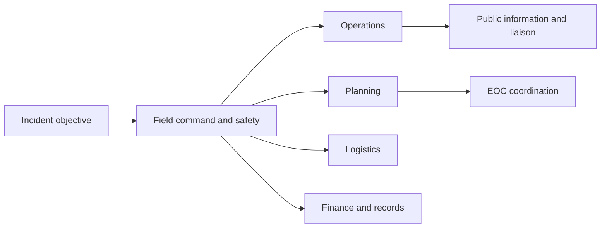

# Learning Session: Governance, Capacity and International Cooperation

**Subject:** Disaster Management | **Topic:** 18 | **Level:** Core first, then optional Advanced | **Current-status cut-off:** 4 October 2026

## Session contract and ownership

This session owns cross-cutting disaster governance, capacity development, accountability and disaster-specific international cooperation. Hazard operations remain with their hazard topics; infrastructure doctrine remains with Topic 14; disaster finance remains with Topic 16. General diplomacy, military strategy and internal-security doctrine remain with IR/Internal Security except where they directly shape HADR governance.

✅ Facts are tied to canonical or direct official sources. ⚠️ Recommendations, scenarios and evaluative judgments are inference. Institutional existence, membership, meetings and agreements are not treated as outcome evidence.

## ROADMAP

| Stage | Lessons | Learning outcome |
|---|---:|---|
| Core governance | 1–4 | Accountable multilevel roles, plans, EOCs and incident operations |
| Core capacity | 5–9 | Professional, volunteer, partnership, exercise, data and ethical capacity |
| Core cooperation | 10–13 | Sendai/UNDRR, humanitarian, regional, HADR and CDRI cooperation |
| Optional Advanced | 14–16 | Localisation, a compound scenario and evaluation |

**Navigation:** Lessons 1–13 complete the Core answer. Lessons 14–16 are explicitly optional depth. Verified PYQs remain neutral.

---

## Lesson 1: Multilevel Governance, Subsidiarity and Accountability

Progress: 1 / 16 | Stage: Core | Subtopic: Multilevel Governance, Subsidiarity and Accountability

━━━ PRE-TEACH CHECKLIST ━━━━━━━━━━━━━━━━━━
📚 Book context: Queried — canonical Basic and Advanced owners
🔍 CA search: "official multilevel disaster governance accountability India"
📰 CA found: Direct official institutional records used through 4 October 2026; inference is labelled.
━━━━━━━━━━━━━━━━━━━━━━━━━━━━━━━━━━━━━━━━━

### 🖼️ Accountability chain — visual

| Layer | Primary governance test | Accountability evidence |
|---|---|---|
| Union | National policy, standards, inter-State support and international interface | Plans, resource rules and review |
| State | Contextual planning, departments and mutual aid | Budget, staffing, exercises and correction |
| District | Convergence, readiness and local risk ownership | Updated plan, EOC readiness and reporting |
| Local/community | Last-mile prevention, services and participation | Accessible decisions, grievance and outcomes |

Disaster governance allocates authority, capability and answerability before, during and after disruption. Subsidiarity places decisions at the lowest capable level while higher levels retain standards, finance, information and surge support. It is not administrative abandonment.

Accountability requires a traceable chain: duty, authority, resources, decision record, service standard, public explanation and remedy. Coordination cannot erase responsibility. If several agencies meet but no one owns drainage, hospital continuity or evacuation transport, the gap remains.

✅ Fact: India’s legal architecture assigns differentiated national, State and district planning and coordination roles. ⚠️ Inference: performance should be judged through avoided risk, continuity, inclusion and corrective closure rather than committee counts.

### Diagnostic sequence

Write **risk owner → duty → finance → decision → outcome → review → remedy**. A broken arrow identifies the deficit.

### Current legal anchor

✅ Fact: the **Disaster Management (Amendment) Act, 2025 (Act No. 10 of 2025)** received presidential assent and was published on **29 March 2025**; notification **S.O. 1648(E), dated 8 April 2025**, brought it into force on **9 April 2025**. It amends—not replaces—the Disaster Management Act, 2005. Governance implications include an expanded National Authority role in preparedness assessment, post-disaster audit and the national disaster database; statutory recognition of the National Crisis Management Committee and High Level Committee; revised plan preparation/review arrangements; State approval of District and Urban Plans; and enabling Urban Disaster Management Authorities. These additions strengthen defined functions, but legal text alone does not establish staffing, finance or exercised capability.

### REVISION NOTES

1. Governance allocates authority, capability and answerability.
2. Subsidiarity means the lowest capable level acts.
3. Higher levels retain support duties.
4. Coordination does not dissolve responsibility.
5. Plans without finance are not operational.
6. Decision records enable review.
7. Service outcomes matter more than committee counts.
8. Grievance and remedy complete accountability.
9. Vertical and horizontal coordination are both necessary.
10. Act No. 10 of 2025 was assented to on 29 March and commenced on 9 April 2025.
11. The amendment adds functions and bodies; it does not itself prove operational capacity.

### Concept check

**Question:** Design accountability for overlapping district flood duties without centralisation or blame shifting. **(15 marks; answer in no more than 250 words.)**

**Model answer:** The district should identify risk and service owners before the monsoon: ULBs for drains and waste, water authorities for channels, health for surveillance and facilities, and police and transport for movement. Each duty needs a budget, trigger, minimum service and named officer. The EOC should maintain a shared picture without taking over technical liability. Local bodies and communities report barriers; State agencies supply standards and mutual aid. After exercises and events, a time-bound review should publish failures, corrective owners and grievance closure. Subsidiarity is preserved because local operators act first while higher levels remain accountable for capability and support.

**Adjacent rubric:** Role allocation 5 + subsidiarity/support 3 + accountability evidence 4 + review/remedy 3 = **15 marks**

**Misconception to avoid:** A coordination committee makes every participating agency jointly responsible for every failure.

**Transition:** Lesson 2 converts accountability into precise Centre–State–district–local roles.

---

## Lesson 2: Centre, State, District, Local and Community Roles

Progress: 2 / 16 | Stage: Core | Subtopic: Centre, State, District, Local and Community Roles

━━━ PRE-TEACH CHECKLIST ━━━━━━━━━━━━━━━━━━
📚 Book context: Queried — canonical Basic and Advanced owners
🔍 CA search: "official disaster management roles Centre State district local India"
📰 CA found: Direct legal and institutional records used through 4 October 2026.
━━━━━━━━━━━━━━━━━━━━━━━━━━━━━━━━━━━━━━━━━

### 🖼️ Governance relay — visual

> Union standards and inter-State support
> → State policy, departments and capability
> → district convergence and incident coordination
> → ULB/PRI service delivery and risk-sensitive development
> → community knowledge, mutual aid and social accountability

| Direction | Example |
|---|---|
| Vertical | district requests State mutual aid |
| Horizontal | health, fire and power protect hospital continuity |
| Networked | government, volunteers, firms and NGOs share bounded tasks |

### 🖼️ Statutory architecture and review platform

| Institution | Legal/governance position | Core function |
|---|---|---|
| NDMA / National Authority | Statutory national authority | national policy, National Plan approval, guidelines, preparedness assessment and national coordination |
| SDMA / State Authority | Statutory State authority | State policy, State Plan approval, departmental/district guidance and State-wide coordination |
| DDMA / District Authority | Statutory district authority | District Plan, local coordination, implementation and preparedness |
| NPDRR | Multi-stakeholder platform constituted by government resolution; not a substitute statutory command tier | review progress, appraise policy implementation and advise Centre–State–local/civil-society coordination |

### Role allocation and NPDRR bridge

The Union frames national policy and plans, coordinates ministries and States, supports major response and represents India internationally. **NDMA** lays down national policy, plans and guidelines and approves the National Plan. **SDMAs** coordinate and approve State planning and guide departments and districts. **DDMAs** prepare the District Plan and coordinate and implement district-level prevention, mitigation, preparedness and response. States and districts retain duties even when national support is requested.

The **National Platform for Disaster Risk Reduction (NPDRR)** is a multi-stakeholder and multi-sectoral review-and-advice platform, not another field-command authority. The official constitution places the Union Home Minister as Chairperson; the Minister of State in charge of disaster management and the NDMA Vice-Chairman as Vice-Chairpersons; and includes Union, State/UT, local-government, parliamentary, institutional, industry, media, civil-society and international representatives. Its functions include reviewing disaster-management progress, appraising policy implementation and advising coordination. A platform recommendation still requires a responsible statutory authority, budget and follow-through.

ULBs and PRIs influence land use, drainage, water, sanitation, roads, shelters and local health. Communities contribute route knowledge, household vulnerability, trust and monitoring; participation is not unpaid substitution for public duty.

Whole-of-government means interoperable mandates and budgets. Whole-of-society adds communities, business, media, academia, NGOs and professional bodies with safeguards. ⚠️ Inference: habitual centralisation may weaken local fit and learning.

### REVISION NOTES

1. Union institutions provide national direction.
2. States control many operational departments.
3. Districts are key convergence arenas.
4. ULBs and PRIs shape everyday risk.
5. Communities add knowledge and accountability.
6. Participation cannot replace public duty.
7. Whole-of-government crosses silos.
8. Whole-of-society needs role clarity.
9. Feedback must travel upward.
10. NDMA, SDMA and DDMA are differentiated statutory authorities.
11. NPDRR reviews and advises; it does not replace statutory command.
12. Platform recommendations need owners, finance and follow-through.

### Concept check

**Question:** Explain how a district can use community participation without transferring State responsibility to unpaid volunteers. **(15 marks; answer in no more than 250 words.)**

**Model answer:** Residents and community organisations can support risk mapping, warning feedback, shelter accessibility and social audit, while government retains finance, trained command, safety equipment, technical decisions and legal accountability. Participation needs inclusive representation, informed consent, defined tasks, supervision, protection and grievance. Volunteers should not enter unsafe rescue roles without competence and equipment. Local knowledge must feed plans and EOC information, and authorities should report how it changed decisions. The test is co-production with public responsibility, not withdrawal of the State.

**Adjacent rubric:** Public-duty boundary 4 + meaningful participation 4 + safeguards 4 + feedback/accountability 3 = **15 marks**

**Misconception to avoid:** Whole-of-society governance means replacing professional responders with spontaneous community effort.

**Transition:** Lesson 3 turns roles into plans, SOPs and EOC decisions.

---

## Lesson 3: Plans, SOPs and Emergency Operations Centres

Progress: 3 / 16 | Stage: Core | Subtopic: Plans, SOPs and Emergency Operations Centres

━━━ PRE-TEACH CHECKLIST ━━━━━━━━━━━━━━━━━━
📚 Book context: Queried — canonical Basic and Advanced owners
🔍 CA search: "official disaster management plans SOP EOC India"
📰 CA found: Official planning doctrine and institutional records checked.
━━━━━━━━━━━━━━━━━━━━━━━━━━━━━━━━━━━━━━━━━

### 🖼️ Plan-to-action matrix — visual

| System | Question answered | Failure mode |
|---|---|---|
| DM plan | What risks, capabilities, owners and priorities exist? | Generic catalogue |
| SOP | Who acts, when, with which trigger and resource? | Contact list only |
| EOC | How does information become coordinated decisions? | Display room without authority |
| Continuity plan | How do essential functions persist? | Recovery considered after failure |

### Operational debrief

A plan should connect risk assessment to prevention, preparedness, response, recovery, finance and review. It must name owners, dependencies, resource gaps, vulnerable groups, mutual aid and updates. An SOP operationalises a recurring task through triggers, authority, sequence, communication and fallback.

An EOC is a coordination and information node, not automatically field command. It maintains a common operating picture, logs decisions, verifies information, supports prioritisation and escalates unresolved issues. Premises are insufficient without trained staff, reliable communications and exercises.

Plans at different levels should align without becoming copies. A village plan identifies isolated households; a district plan organises resources; a State plan structures mutual aid. ⚠️ Inference: plan quality is demonstrated by exercised decisions and corrected gaps.

### REVISION NOTES

1. Plans translate risk into owned action.
2. SOPs require triggers and authority.
3. EOCs coordinate information and decisions.
4. Field command remains distinct.
5. Decision logs support accountability.
6. Hardware alone is not capability.
7. Plans should align without copying.
8. Continuity belongs before impact.
9. Exercises must revise documents.

### Concept check

**Question:** A new EOC fails during its first cyclone exercise. Diagnose the governance problem. **(15 marks; answer in no more than 250 words.)**

**Model answer:** Equipment was mistaken for capability. The audit should test staffing, role cards, resource authority, verification protocols, redundant communications, shift handover, accessibility and links with field command. The exercise log should reconstruct when warning arrived, who interpreted it and why decisions were delayed. Agencies must correct SOPs, data formats and escalation thresholds, retrain staff and repeat the scenario. Procurement is an input; an EOC succeeds when it produces timely, recorded and coordinated decisions under degraded conditions.

**Adjacent rubric:** Capability diagnosis 4 + EOC functions 4 + reconstruction 4 + correction/retest 3 = **15 marks**

**Misconception to avoid:** An EOC is operational once screens, maps and communications equipment are installed.

**Transition:** Lesson 4 separates EOC coordination from incident-level command.

---

## Lesson 4: Incident Response and Whole-of-Government Operations

Progress: 4 / 16 | Stage: Core | Subtopic: Incident Response and Whole-of-Government Operations

━━━ PRE-TEACH CHECKLIST ━━━━━━━━━━━━━━━━━━
📚 Book context: Queried — canonical Basic and Advanced owners
🔍 CA search: "official incident response system whole of government disaster India"
📰 CA found: Official institutional principles used; recommendations are inference.
━━━━━━━━━━━━━━━━━━━━━━━━━━━━━━━━━━━━━━━━━

### 🖼️ Incident functions — visual



### Command-interface debrief

Incident response needs objectives, span of control, safety, role clarity, resource tracking and a planning cycle. A scalable system organises functions rather than departmental turf. Unified coordination is appropriate where agencies share authority, but each retains legal and technical responsibility.

The EOC aggregates information, resolves cross-sector bottlenecks and obtains resources; field command directs tactics. Political executives set priorities and authorise exceptional measures but should not create parallel commands.

### REVISION NOTES

1. Incident systems organise functions around objectives.
2. Span of control protects supervision.
3. Safety authority must remain explicit.
4. Unified coordination preserves duties.
5. EOCs support field command.
6. Utilities and welfare are response actors.
7. Public information needs verification.
8. Resource tracking supports audit.
9. Demobilisation begins early.

### Whole-of-government application

Whole-of-government operations include health, police, fire, public works, utilities, transport, welfare, finance and information. Whole-of-society liaison brings NGOs, volunteers and private operators into bounded tasks. Demobilisation, expenditure records and recovery handover start early.

### Concept check

**Question:** During a chemical leak, the EOC and field commander issue conflicting evacuation messages. Redesign the interface. **(15 marks; answer in no more than 250 words.)**

**Model answer:** Field command should retain tactical responsibility for hazard zones and immediate life safety, while the EOC validates cross-agency information, secures resources and coordinates district-wide consequences. One authorised public-information process should translate the field decision into accessible messages and record changes. Liaison officers from police, health, fire, industry and local government should resolve disagreements through a fixed planning rhythm. The log must show evidence, authority, time and channels. Exercises should test communication failure and rumour. This preserves field speed while giving the district one verified message.

**Adjacent rubric:** Command boundary 4 + information protocol 4 + liaison/rhythm 4 + record/exercise 3 = **15 marks**

**Misconception to avoid:** The EOC should directly command every field team because it has the widest information display.

**Transition:** Lesson 5 shifts from operating structures to capacity needs and professionalisation.

---
## Lesson 5: Capacity Needs Assessment and Professionalisation

Progress: 5 / 16 | Stage: Core | Subtopic: Capacity Needs Assessment and Professionalisation

━━━ PRE-TEACH CHECKLIST ━━━━━━━━━━━━━━━━━━
📚 Book context: Queried — canonical Basic and Advanced owners
🔍 CA search: "official NIDM capacity building mandate professional disaster management"
📰 CA found: NIDM’s direct official mandate was checked.
━━━━━━━━━━━━━━━━━━━━━━━━━━━━━━━━━━━━━━━━━

### 🖼️ Capacity diagnostic — visual

| Dimension | Baseline question | Evidence of improvement |
|---|---|---|
| People | Are competencies mapped by role? | Demonstrated task performance |
| Institution | Are authority, staffing and budget stable? | Decisions without improvised approval |
| System | Do agencies and data interoperate? | Joint exercise performance |
| Community | Can warnings and services be used? | Last-mile action across groups |
| Learning | Are failures corrected? | Closed and retested actions |

Capacity development is not synonymous with training. Assessment begins with hazard and service objectives, identifies required functions and competencies, compares these with staffing, institutions, equipment, finance and partnerships, and prioritises gaps by consequence.

Professionalisation requires competency frameworks, role-based curricula, certification where safety-critical, continuing education, ethical standards and career pathways. General awareness cannot replace specialist engineering, medical, fire, logistics, information or psychosocial skills; specialists still need common coordination doctrine.

✅ Fact: NIDM is mandated to plan and promote training, research, documentation and human-resource development in disaster management. ⚠️ Inference: attendance should be separated from competence demonstrated in drills, deployment and audited practice.

### Needs sequence

Objective → task → competency → baseline → consequence of gap → remedy → assessment → refresher trigger.

### REVISION NOTES

1. Capacity includes people, institutions and systems.
2. Training is one capacity instrument.
3. Assessment begins with required tasks.
4. Gaps are prioritised by consequence.
5. Safety-critical roles need verified competence.
6. Professionalisation needs careers and ethics.
7. Specialists need common doctrine.
8. NIDM has a national training and research mandate.
9. Attendance is not proof of capability.

### Concept check

**Question:** Design a district capacity-needs assessment that avoids a generic annual training calendar. **(15 marks; answer in no more than 250 words.)**

**Model answer:** Begin with the district risk profile and minimum services, then map tasks for warning, EOC operation, evacuation, shelter, health, logistics, public information and recovery. Each task needs a competency standard and baseline based on observation, records and exercises. Rank gaps by life-safety consequence, frequency and substitutability. Remedies may include training, staffing, delegation, equipment, SOP redesign or mutual aid—not courses alone. Use demonstrations and scenario performance, with refreshers after role change, exercise failure or doctrine update. Results should inform budgets and individual development plans.

**Adjacent rubric:** Task/competency mapping 5 + prioritisation 3 + mixed remedies 4 + assessment/refresher 3 = **15 marks**

**Misconception to avoid:** A capacity gap is closed when every officer attends the same orientation.

**Transition:** Lesson 6 applies differentiated capacity to responders, volunteers and essential professions.

---

## Lesson 6: Responders, Volunteers and Essential Professional Services

Progress: 6 / 16 | Stage: Core | Subtopic: Responders, Volunteers and Essential Professional Services

━━━ PRE-TEACH CHECKLIST ━━━━━━━━━━━━━━━━━━
📚 Book context: Queried — canonical Basic and Advanced owners
🔍 CA search: "official fire civil defence volunteers health engineering disaster capacity India"
📰 CA found: Current claims are bounded; task design is inference.
━━━━━━━━━━━━━━━━━━━━━━━━━━━━━━━━━━━━━━━━━

### 🖼️ Capability rings — visual

> **Ring 1:** fire, police, medical and specialised rescue—trained and equipped.
>
> **Ring 2:** civil defence and registered volunteers—bounded tasks and supervision.
>
> **Ring 3:** engineers, utilities, public health and logistics—continuity and advice.
>
> **Ring 4:** spontaneous helpers—registration, briefing and safe referral.

### 🖼️ Non-delegable task boundary

| Never delegate without competence | structural entry · hazardous materials · advanced medical procedures · utility isolation |
|---|---|

### Professional-service application

Fire services need prevention, inspection, communications, rescue, equipment maintenance and interoperable command. Health capacity spans surveillance, triage, mass-casualty care, WASH, mental health and continuity. Engineers assess structures and lifelines; utilities restore minimum services.

Civil-defence organisations and volunteers can support warning, first aid, shelters, information and vulnerable households. They require role cards, training, supervision, protective equipment, welfare arrangements and a route to refuse unsafe tasks. Spontaneous volunteers should be received through a managed point.

### REVISION NOTES

1. Fire capacity includes prevention and inspection.
2. Health extends beyond emergency treatment.
3. Engineers protect safe restoration.
4. Volunteer tasks must be bounded.
5. Protective equipment and supervision are essential.
6. Spontaneous volunteers need reception.
7. Private assets need prior standards.
8. Responder fatigue is a safety risk.
9. Community and professional capacities complement each other.

### Mobilisation safeguard

Private ambulance, hospital, telecom, construction and logistics assets may be essential, but pre-arranged standards and reimbursement prevent chaos. ⚠️ Inference: responder fatigue and psychosocial support are governance obligations.

### Concept check

**Question:** A spontaneous volunteer turnout is obstructing professional rescue. Propose a rights-respecting management system. **(15 marks; answer in no more than 250 words.)**

**Model answer:** Establish a reception and registration point away from the hazard zone, explain access restrictions and identify safe tasks such as information, supplies, family assistance or shelter help. Record skills and availability; match trained volunteers to supervised teams, while unsafe rescue remains with competent responders. Briefing must cover conduct, protection, safeguarding, data privacy and grievance. Welfare, protective equipment and check-out procedures are necessary. Community organisations can verify trust and local need. Transparent allocation respects civic motivation while protecting volunteers, survivors and operations.

**Adjacent rubric:** Reception 4 + task matching 4 + protection/safeguarding 4 + accountability 3 = **15 marks**

**Misconception to avoid:** Willingness to help qualifies a person for any rescue or hazardous task.

**Transition:** Lesson 7 integrates NGOs, business, media and academia without deregulating public duty.

---

## Lesson 7: NGOs, Private Sector, Media and Academia

Progress: 7 / 16 | Stage: Core | Subtopic: NGOs, Private Sector, Media and Academia

━━━ PRE-TEACH CHECKLIST ━━━━━━━━━━━━━━━━━━
📚 Book context: Queried — canonical Basic and Advanced owners
🔍 CA search: "official media private sector NGO academia disaster coordination India"
📰 CA found: Canonical media evidence and direct institutional sources were checked.
━━━━━━━━━━━━━━━━━━━━━━━━━━━━━━━━━━━━━━━━━

### 🖼️ Partnership compact — visual

| Actor | High-value role | Safeguard |
|---|---|---|
| NGO | access, protection, relief, feedback | coordination and safeguarding |
| Private sector | lifelines, logistics, continuity | contracts, liability and data rules |
| Media | warning, scrutiny, explanation | briefing, correction and privacy |
| Academia | risk evidence and evaluation | transparent methods and uncertainty |

### Partnership safeguards

NGOs can reach excluded groups and monitor distribution; duplication and unsafe practice are reduced through sector coordination and transparent criteria. Private operators own critical telecom, transport, health, finance and supply-chain assets, making continuity and data-sharing agreements essential.

Media can amplify warnings, expose neglect and counter rumours, but sensational or identifying coverage can create panic and harm survivors. Authorities should provide frequent verified briefings, uncertainty statements and corrections rather than suppress scrutiny. Social media supplements but cannot replace authoritative, redundant communication.

### Hudhud bounded case trigger

✅ Verified documented case: a World Bank South Asia Disaster Risk Management account based on the post-Hudhud assessment with the Government of Andhra Pradesh, Asian Development Bank and GFDRR records that, after mobile connectivity returned, Public Works Department engineers used a closed WhatsApp group to report road breaches with locations, request tools and JCBs, assign clearance expectations and upload completion photographs. The District Magistrate joined the group and issued instructions; the account reports most roads functional within three to four days.

⚠️ Operational inference: the useful chain was **closed task group + named responsibility + location evidence + resource request + completion proof**. The example does not establish that WhatsApp remained available during the first three days, that consumer platforms can replace EOCs or official alert infrastructure, or that the practice automatically protected privacy, records and cybersecurity. A current design should integrate such supplementary channels with authoritative systems, retention rules, verified membership, fallback communications and after-action audit.

### REVISION NOTES

1. Partnership requires public role clarity.
2. NGOs can improve access and feedback.
3. Private operators control critical assets.
4. Contracts matter before crisis.
5. Media can warn and scrutinise.
6. Sensational reporting can harm.
7. Social media cannot replace official systems.
8. Academia should disclose uncertainty.
9. MOUs are inputs, not outcomes.
10. The Hudhud account documents a closed PWD WhatsApp coordination group after connectivity returned.
11. Location, responsibility, resource requests and completion photographs made the channel operationally useful.
12. Consumer messaging remains supplementary and needs verification, records, privacy and fallback safeguards.

### Evidence-to-decision application

Academia and professional bodies support analysis, standards, training and independent evaluation. Research must reach decision formats. ⚠️ Inference: performance is assessed through coverage, reliability, protection and accountability—not memoranda signed.

### Concept check

**Question:** Develop a media protocol that preserves scrutiny while limiting rumour and survivor harm. **(15 marks; answer in no more than 250 words.)**

**Model answer:** Designate trained spokespersons and a briefing schedule; publish verified facts, action instructions, uncertainty and what remains unknown. Access rules should protect rescue operations, children, bereaved families, patient confidentiality and sensitive infrastructure without blocking legitimate reporting. A rapid correction channel should answer false claims with evidence rather than censorship. Local-language and accessible formats must reach diverse users, while social-media monitoring identifies questions and harmful rumours. Independent scrutiny remains possible through decision logs and post-event data. Success is comprehension and protective action, not favourable coverage.

**Adjacent rubric:** Briefing architecture 4 + rights/privacy 4 + correction 4 + accessibility/accountability 3 = **15 marks**

**Misconception to avoid:** Authorities must control all reporting and release only reassuring information.

**Transition:** Lesson 8 makes exercises and audits the bridge from nominal to demonstrated capacity.

---

## Lesson 8: Drills, Exercises, Audits and Lessons Learning

Progress: 8 / 16 | Stage: Core | Subtopic: Drills, Exercises, Audits and Lessons Learning

━━━ PRE-TEACH CHECKLIST ━━━━━━━━━━━━━━━━━━
📚 Book context: Queried — canonical Basic and Advanced owners
🔍 CA search: "official disaster exercise audit lessons learned BIMSTEC India"
📰 CA found: Direct BIMSTEC exercise evidence was checked.
━━━━━━━━━━━━━━━━━━━━━━━━━━━━━━━━━━━━━━━━━

### 🖼️ Learning staircase — visual

1. Seminar clarifies doctrine.
2. Tabletop tests decisions.
3. Functional exercise tests systems.
4. Full-scale exercise deploys assets.
5. After-action review explains evidence.
6. Corrective plan assigns owner and deadline.
7. Retest proves closure.

### 🖼️ Weak-to-strong lesson comparison

| Weak lesson | Strong lesson |
|---|---|
| “coordination must improve” | named interface failure with evidence |
| recommendation list | owner, finance and deadline |
| completion assertion | observed retest under stress |

### Exercise-design debrief

Exercise design begins with capability objectives, not spectacle. A scenario should stress relevant decisions, interfaces and failure modes. Evaluators need observable criteria and safety controls. Announced drills test procedure; governed no-notice elements may test readiness without endangering people.

After-action review separates what occurred, why it occurred and what must change. Lessons are not learned until a corrective action has an owner, budget, deadline and retest. Near misses and successful adaptations deserve analysis.

### REVISION NOTES

1. Exercises test capability objectives.
2. Tabletops test decisions.
3. Functional exercises test systems.
4. Safety controls remain mandatory.
5. After-action review examines causes.
6. Near misses contain learning.
7. Corrective action needs finance.
8. Retesting proves closure.
9. Audits should include community evidence.

### Audit closure test

Audits examine plan currency, equipment, staffing, procurement, shelters, accessibility, data, finance and previous closure. Independent and community evidence reduce bias. ⚠️ Inference: ceremony cannot establish field capability.

### Concept check

**Question:** An annual mega-drill repeats the same recommendations. Explain why learning failed and redesign the cycle. **(15 marks; answer in no more than 250 words.)**

**Model answer:** Recommendations were not converted into owned, financed and retested changes. Define a few capability objectives, collect timing and decision evidence, identify root causes and separate doctrine, staffing, resource and interoperability gaps. Each corrective action needs an agency, deadline, budget and verification method. Smaller functional exercises should retest failed interfaces before the next full-scale event. Independent observers and community feedback expose blind spots. The next scenario should vary conditions. Closure means demonstrated improvement, not a report marked complete.

**Adjacent rubric:** Failure diagnosis 4 + evidence/root cause 4 + corrective governance 4 + retest/variation 3 = **15 marks**

**Misconception to avoid:** Repeating a large drill automatically institutionalises its report’s lessons.

**Transition:** Lesson 9 joins learning to data, ethics, inclusion, transparency and grievance.

---

## Lesson 9: Data, Ethics, Inclusion, Transparency and Grievance

Progress: 9 / 16 | Stage: Core | Subtopic: Data, Ethics, Inclusion, Transparency and Grievance

━━━ PRE-TEACH CHECKLIST ━━━━━━━━━━━━━━━━━━
📚 Book context: Queried — canonical Basic and Advanced owners
🔍 CA search: "official disaster data ethics inclusion grievance India"
📰 CA found: Recommendations are labelled inference and tied to public-law accountability.
━━━━━━━━━━━━━━━━━━━━━━━━━━━━━━━━━━━━━━━━━

### 🖼️ Ethical decision screen — visual

| Decision | Minimum test |
|---|---|
| Collect data | necessary, accurate and proportionate? |
| Prioritise aid | transparent vulnerability and urgency criteria? |
| Share information | purpose-bound, secure and accountable? |
| Restrict movement | necessary, time-bound and reviewable? |
| Use technology | accessible and contestable? |

### Rights-and-data debrief

Disaster registries, location data, health information and imagery require purpose limitation, access control, retention rules, correction and secure sharing. Interoperability is valuable only when semantics and safeguards are clear.

Ethical governance combines life safety with dignity, proportionality and non-discrimination. Inclusion requires accessible warnings, shelters, transport and consultation for women, children, older persons, persons with disabilities, migrants, tenants, informal workers and marginalised communities.

### REVISION NOTES

1. Disaster data needs purpose limitation.
2. Interoperability requires shared meaning.
3. Ethics includes dignity and proportionality.
4. Prioritisation should be explainable.
5. Inclusion changes warning and shelter design.
6. Participation must precede irreversible choices.
7. Transparency includes uncertainty.
8. Grievances need escalation and time limits.
9. Technology can reproduce exclusion.

### Grievance application

Transparency includes criteria, allocations, contracts, decision logs and uncertainty. Grievance systems need multiple channels, acknowledgement, escalation, time limits, protection against retaliation and aggregate closure. ⚠️ Inference: dashboards without correction rights can digitise exclusion.

### Concept check

**Question:** A digital relief registry excludes tenants without property documents. Apply an ethical and grievance redesign. **(15 marks; answer in no more than 250 words.)**

**Model answer:** Separate occupancy and disaster need from property title, accept alternative evidence and permit assisted or offline enrolment. Publish criteria in accessible languages, give reasons for rejection and provide rapid appeal. Local verification needs safeguards against elite capture and retaliation. Limit data to relief purposes, secure it and allow correction. Disaggregated audits should compare access by tenure, gender, disability and migration status. Provisional support can prevent appeal delay from becoming deprivation. Report aggregate decisions and correction rates without exposing personal data.

**Adjacent rubric:** Exclusion diagnosis 4 + alternative access 4 + grievance 4 + privacy/audit 3 = **15 marks**

**Misconception to avoid:** Property ownership is a neutral proxy for disaster-affected status.

**Transition:** Lesson 10 places domestic accountability inside Sendai’s global architecture.

---
## Lesson 10: Sendai Architecture, Targets, Monitoring and UNDRR

Progress: 10 / 16 | Stage: Core | Subtopic: Sendai Architecture, Targets, Monitoring and UNDRR

━━━ PRE-TEACH CHECKLIST ━━━━━━━━━━━━━━━━━━
📚 Book context: Queried — canonical Basic and Advanced owners
🔍 CA search: "official Sendai Framework targets monitoring UNDRR midterm review"
📰 CA found: Direct UNDRR framework and monitoring records were checked.
━━━━━━━━━━━━━━━━━━━━━━━━━━━━━━━━━━━━━━━━━

### 🖼️ Yokohama–Hyogo–Sendai evolution — visual

```text
YOKOHAMA STRATEGY (1994)
10 prevention, preparedness and development-linked principles
                ↓ institutionalisation across sectors
HYOGO FRAMEWORK FOR ACTION (2005–2015)
5 priorities; explicit national/local institutional basis and early warning
                ↓ measurable global loss and implementation frame
SENDAI FRAMEWORK (2015–2030)
4 priorities + 7 global targets
                ↓ operational acceleration of Target G
EARLY WARNINGS FOR ALL (2022 launch → universal coverage by end-2027)
4 connected pillars: risk knowledge → forecasting → communication → preparedness
```

The evolution is cumulative, not a claim that later frameworks automatically implemented earlier principles. Yokohama stressed prevention, preparedness, participation, capacity, early warning and development integration. Hyogo organised action into five priorities: institutional priority; risk identification and early warning; knowledge and education; reduction of underlying risk; and preparedness. Sendai shifted to four priorities and seven global targets while retaining voluntary, non-binding implementation.

### 🖼️ Sendai board — visual

| Priority | Governance meaning |
|---|---|
| Understand risk | interoperable evidence and public knowledge |
| Strengthen governance | mandates, coordination and accountability |
| Invest in resilience | risk-informed public/private decisions |
| Preparedness and BBB | capability, response and resilient recovery |

**Targets A–D:** mortality, affected people, economic loss, critical infrastructure/services. **Targets E–G:** strategies, international cooperation, warning/risk information.

The voluntary Sendai Framework 2015–2030 has four priorities and seven targets. A–D concern loss reduction; E–G concern means of implementation. Target E addresses national and local strategies and, uniquely among the seven targets, specified **2020** rather than 2030 as its deadline. Target F concerns cooperation to developing countries and Target G multi-hazard early warning and risk information. The earlier Target E deadline reflects the enabling role of strategies; counting a strategy still does not establish quality or implementation.

UNDRR supports implementation, monitoring, knowledge and convening. The Sendai Framework Monitor uses agreed indicators and national reporting; data still require scrutiny for definitions, completeness and disaggregation. The **Global Platform for Disaster Risk Reduction (GPDRR)** is the main multi-stakeholder review and knowledge forum rather than an enforcement court. ✅ Direct authority: paragraph 68 of **UN General Assembly Resolution 79/205** reaffirms the importance of the Global Platform and regional/subregional platforms as implementation-review and coherence forums, and recognises their outcomes as contributions to deliberations of the **High-Level Political Forum on Sustainable Development**. This establishes an institutional input linkage, not enforcement authority or automatic policy adoption.

✅ Fact: the High-Level Meeting on the Midterm Review was held at UN Headquarters in New York on **17–19 May 2023**. The General Assembly adopted the Political Declaration as **Resolution 77/289 on 18 May 2023**. The declaration renewed implementation attention; it did not convert Sendai into a binding treaty. **Early Warnings for All (EW4All)** was announced in 2022 and aims for universal protection through multi-hazard early-warning systems by the end of 2027. Its four pillars are led by UNDRR for risk knowledge, WMO for observations and forecasting, ITU for warning dissemination and communication, and IFRC for preparedness and response; WMO and UNDRR co-lead the initiative. EW4All operationalises the end-to-end logic of Sendai Target G but does not make a warning effective unless people receive, understand, trust and can act on it.

⚠️ Inference: a reported strategy or indicator must become budgeted local capability and equitable outcomes. Target E’s count is not proof of quality, and warning coverage is not equivalent to protective action.

### REVISION NOTES

1. Sendai covers 2015–2030.
2. It has four priorities and seven targets.
3. Targets A–D reduce losses.
4. Targets E–G concern implementation means.
5. Target E covers strategies and uniquely carried a 2020 deadline.
6. Target F covers cooperation.
7. Target G covers warning and risk information.
8. UNDRR supports monitoring and knowledge; UNGA Resolution 79/205, paragraph 68, recognises GPDRR/platform outcomes as contributions to HLPF deliberations.
9. Reporting is not implementation.
10. Yokohama set ten prevention-and-preparedness principles.
11. Hyogo 2005–2015 organised action through five priorities.
12. EW4All targets universal warning protection by the end of 2027.
13. Its four pillars join risk knowledge, forecasting, communication and preparedness.
14. Warning coverage must be tested through accessible protective action.
15. The Midterm Review met on 17–19 May 2023; UNGA Resolution 77/289 was adopted on 18 May.

### Concept check

**Question:** A country reports improving DRR compliance while district audits show stale plans and inaccessible warnings. Design an international-to-local verification chain. **(15 marks; answer in no more than 250 words.)**

**Model answer:** Begin by checking indicator definitions, reporting periods, missing data and disaggregation rather than accepting the national aggregate. Sample State and district plans for current risk evidence, budget, assigned owners and revision records. Test warning chains through exercises and user evidence on receipt, comprehension and protective action, especially among remote, disabled, migrant and informal-worker groups. Compare reported capability with service continuity, corrective closure and grievance records. Independent review should publish uncertainty and identify whether failure lies in national reporting, subnational finance, implementation or local access. International review then supports correction and peer learning instead of ranking alone.

**Adjacent rubric:** Reporting integrity 4 + district verification 4 + user/action evidence 4 + independent correction 3 = **15 marks**

**Misconception to avoid:** Improvement in a national reporting aggregate proves that local plans and warning systems work.

**Transition:** Lesson 11 examines international humanitarian support that does not replace domestic authority.

### Lesson-local verified PYQ — 2024 GS-III Q17 (neutral)

> What is disaster resilience? How is it determined? Describe various elements of a resilience framework. Also mention the global targests of Sendai Framework for Disaster Risk Reduction (2015-2030)

**Answer in 250 words | 15 marks**

**Provenance:** `books\mains\03 UPSC 2024 Paper-III.pdf`

This exact printed question is retained without correction. No answer, outline, cue, model or rubric is attached.

---

## Lesson 11: International Humanitarian Coordination and Surge Mechanisms

Progress: 11 / 16 | Stage: Core | Subtopic: International Humanitarian Coordination and Surge Mechanisms

━━━ PRE-TEACH CHECKLIST ━━━━━━━━━━━━━━━━━━
📚 Book context: Queried — canonical Basic and Advanced owners
🔍 CA search: "official OCHA UNDAC INSARAG disaster coordination"
📰 CA found: Direct UN humanitarian mechanism pages were checked.
━━━━━━━━━━━━━━━━━━━━━━━━━━━━━━━━━━━━━━━━━

### 🖼️ Request-to-support chain — visual

> affected State authority → needs and consent → bilateral/UN offer → agreed entry and coordination → specialised teams → handover and accountability

| Mechanism | Distinct function |
|---|---|
| OCHA | humanitarian coordination support |
| UNDAC | rapid assessment and coordination support |
| INSARAG | international USAR standards and coordination |
| Affected government | consent, direction and public accountability |

### Mechanism debrief

International disaster assistance is normally organised with the affected State’s consent and leadership. OCHA supports coordination; UNDAC can support assessment and coordination; INSARAG develops standards and coordination for international urban search-and-rescue teams. They are not a generic UN relief force.

Humanitarian action is guided by humanity, neutrality, impartiality and operational independence. International teams require entry, customs, communications, safety, information and coordination arrangements; unrequested or incompatible aid can burden logistics.

### REVISION NOTES

1. Affected-State leadership remains central.
2. Consent and need shape assistance.
3. OCHA supports coordination.
4. UNDAC supports assessment and coordination.
5. INSARAG focuses on international USAR standards.
6. Humanitarian principles guide conduct.
7. Unrequested aid can burden logistics.
8. Civil–military coordination needs safeguards.
9. International support requires handover.

### Civil–military application

Bilateral support, UN mechanisms, Red Cross/Red Crescent actors, NGOs and military assets may coexist. Civil–military coordination should protect humanitarian space while using scarce lift, engineering or medical capacity where appropriate. ⚠️ Boundary: general UN politics remains with IR.

### Concept check

**Question:** A major earthquake attracts multiple foreign rescue offers. Design an acceptance and coordination protocol. **(15 marks; answer in no more than 250 words.)**

**Model answer:** Publish priority needs, designate one offer-management channel and assess team capability, self-sufficiency, arrival time and interoperability. Accepted teams need expedited but recorded entry, customs and frequencies, an arrival/departure centre, INSARAG-compatible coordination, assigned tasks, safety information and reporting. Redirect unsuitable offers transparently. OCHA or UNDAC support may be requested without displacing national direction. Protection, data and media rules apply to foreign teams. Demobilisation, equipment disposition and handover to domestic services should be agreed at acceptance.

**Adjacent rubric:** Acceptance criteria 4 + entry/coordination 5 + safeguards 3 + handover 3 = **15 marks**

**Misconception to avoid:** Every foreign rescue offer should be accepted because more teams always increase capacity.

**Transition:** Lesson 12 moves from global surge to regional and bilateral preparedness and India’s HADR role.

---

## Lesson 12: BIMSTEC, SAARC, Bilateral Cooperation and India’s HADR Role

Progress: 12 / 16 | Stage: Core | Subtopic: BIMSTEC, SAARC, Bilateral Cooperation and India’s HADR Role

━━━ PRE-TEACH CHECKLIST ━━━━━━━━━━━━━━━━━━
📚 Book context: Queried — canonical Basic and Advanced owners
🔍 CA search: "official BIMSTEC disaster exercise India HADR cooperation"
📰 CA found: Direct BIMSTEC and MEA records through 2025 were checked.
━━━━━━━━━━━━━━━━━━━━━━━━━━━━━━━━━━━━━━━━━

### 🖼️ Cooperation maturity scale — visual

Meeting → agreement → SOP → exercise → corrected interoperability → activation → evaluated outcome

| Route | Best use | Evidence standard |
|---|---|---|
| BIMSTEC | Bay of Bengal hazards and exercises | corrected procedures |
| SAARC | South Asian arrangements and knowledge | dated activation evidence |
| Bilateral | warning, training and mutual aid | implemented activity |
| India HADR | evacuation, medical/logistics support | need, timeliness and handover |

Regional cooperation shares forecasts, SOPs, training, logistics and lessons. ✅ Fact: the fourth BIMSTEC Disaster Management Exercise was hosted virtually by India’s NDMA on 14–15 July 2025 and focused on cyclone and flood preparedness.

SAARC retains cooperation architecture in the canonical record, but historical arrangements should not be presented as currently active without dated evidence. Bilateral routes may be operational for warning, capacity and specialised support; value depends on implementation.

### 🖼️ India cooperation chronology — document-period evidence

| Year | Canonical named engagement | Disaster-management significance |
|---:|---|---|
| 2015 | SAADMEx, hosted in India | regional response procedures and exercise learning |
| 2016 | BRICS disaster-management meeting at Udaipur; AMCDRR at New Delhi | ministerial cooperation and Asian Sendai implementation |
| 2017 | SAARC Disaster Management Centre Interim Unit at GIDM; BIMSTEC DMEx | regional knowledge route and operational exercise |
| 2018 | IWDRI; India–Japan DRR workshop | infrastructure resilience and bilateral knowledge exchange |
| 2019 | SCOJtEx at New Delhi | multinational urban-earthquake search-and-rescue coordination |
| 2023 | G20 DRR Working Group; sixth World Congress on Disaster Management at Dehradun | global policy priorities and practitioner exchange |

✅ Source discipline: the canonical owners preserve this **2015–2023 chronology**. Direct NDRF, MHA and PIB records independently anchor SAADMEx 2015, AMCDRR 2016, BIMSTEC DMEx 2017, SCOJtEx 2019 and the G20 DRR Working Group in 2023. The sequence evidences sustained convening and exercise diplomacy, not continued activation, implementation quality or local outcomes in 2026.

### Named cooperation routes

The **SAARC Agreement on Rapid Response to Natural Disasters** supplies a treaty-based regional request/assistance route; MEA records signature on 11 November 2011 and India’s ratification on 2 July 2012. MHA’s official cooperation record identifies MoUs with **Russia, Germany and Indonesia** for disaster management, capacity building and knowledge sharing. Multilateral routes perform different jobs: **UNDRR/GPDRR/AMCDRR** support frameworks and review; **OCHA, UNDAC and INSARAG** support humanitarian coordination, assessment and USAR standards; **GFDRR, ADRC, ADPC and the ASEAN Regional Forum** provide finance/knowledge, regional capacity or dialogue channels. Naming a route is useful only when an answer states its function, activation evidence and domestic uptake. General diplomatic history remains with IR.

### Evidence anchor — Operation Brahma

✅ Fact: MEA’s **Annual Report 2025** records that India launched **Operation Brahma** after Myanmar’s 28 March 2025 earthquake, delivered nearly **1,000 metric tonnes** of HADR assistance through **nine aircraft and five naval ships**, deployed NDRF search-and-rescue teams and an Indian Army engineer unit, and established mobile medical clinics and a field hospital. This directly evidences lift, logistics, specialised rescue, engineering and medical capabilities in one consent-based overseas operation; it does not prove equal readiness for every theatre or hazard.

India’s HADR role can therefore combine civilian agencies, armed-forces lift and logistics, medical teams, evacuation or relief support and diplomacy where the affected State accepts assistance. Assess speed, appropriateness, consent, protection, coordination and handover—not strategic praise alone. ⚠️ Boundary: military strategy and geopolitical signalling belong to IR/Internal Security.

### REVISION NOTES

1. Regional cooperation can improve interoperability.
2. BIMSTEC has an active exercise route.
3. The fourth DMEx occurred on 14–15 July 2025.
4. It focused on cyclones and floods.
5. SAARC claims need current evidence.
6. Bilateral agreements need implementation.
7. India’s HADR combines civilian and military capabilities.
8. Consent and handover remain essential.
9. Hosting is not local resilience.
10. Operation Brahma directly evidences NDRF, engineering, lift/logistics and medical deployment.
11. One operation proves demonstrated components, not universal readiness.
12. The canonical 2015–2023 chronology demonstrates sustained exercises, workshops and convening.
13. SAARC’s Rapid Response Agreement is distinct from bilateral MoUs and multilateral knowledge routes.
14. MHA directly records cooperation MoUs with Russia, Germany and Indonesia.
15. Historical hosting or agreement evidence must be separated from current activation and local outcomes.

### Concept check

**Question:** Evaluate a regional disaster exercise without treating participation as proof of preparedness. **(15 marks; answer in no more than 250 words.)**

**Model answer:** Begin with objectives: warning exchange, request procedures, terminology, logistics, medical coordination and public information. Record decision time, data compatibility, resource tracking, legal bottlenecks and protection gaps. Participation and completion are inputs; capability is shown when agencies operate under degraded conditions. Each gap needs a regional or national owner, deadline and retest. Domestic districts should receive translated SOPs and training; otherwise learning remains diplomatic. The final measure is faster, safer and more equitable assistance during activation.

**Adjacent rubric:** Objective/evidence design 4 + interoperability 4 + correction 4 + localisation/outcome 3 = **15 marks**

**Misconception to avoid:** A multinational exercise proves seamless real-disaster interoperability.

**Transition:** Lesson 13 completes Core through CDRI, technology and knowledge exchange.

---

## Lesson 13: CDRI, Technology and Knowledge Exchange

Progress: 13 / 16 | Stage: Core | Subtopic: CDRI, Technology and Knowledge Exchange

━━━ PRE-TEACH CHECKLIST ━━━━━━━━━━━━━━━━━━
📚 Book context: Queried — canonical Basic and Advanced owners
🔍 CA search: "official CDRI headquarters agreement international organisation knowledge exchange"
📰 CA found: Direct Cabinet and MEA treaty records were checked.
━━━━━━━━━━━━━━━━━━━━━━━━━━━━━━━━━━━━━━━━━

### 🖼️ CDRI institution-and-initiative map — visual

```text
CDRI coalition and international-organisation status
        ├─ membership: 58 countries + 12 organisations (official live roster, checked 4 October 2026)
        ├─ IRIS: resilient infrastructure support for Small Island Developing States
        ├─ GIR reports: global infrastructure-resilience evidence and risk analysis
        └─ DRI Connect: knowledge, community, events and learning platform
                         ↓
 national standard → sector rule → procurement → operation → measured resilience
```

### 🖼️ Knowledge-uptake chain — visual

| Product | Adoption bridge | Outcome question |
|---|---|---|
| Risk method | common definitions and local data | did priorities change? |
| Standard | regulator and procurement uptake | did reliability improve? |
| Technology | interoperability and maintenance | did users act under stress? |
| Peer knowledge | contextual adaptation and retest | was capability retained? |

CDRI was launched by India in 2019. India’s Cabinet approved its categorisation as an international organisation in June 2022, and the Headquarters Agreement was signed in August 2022. This creates a legal basis for cooperation; it does not prove infrastructure outcomes. ✅ Fact: the official live membership roster displayed **58 member countries and 12 member organisations** when checked on 4 October 2026.

✅ Exact launch anchor: the Prime Minister of India launched CDRI on **23 September 2019 at the UN Climate Action Summit in New York**. The canonical disaster-management frame groups its technical contribution into four answer-organising areas:

| Canonical area | Governance question it raises |
|---|---|
| **Risk assessment** | Are hazard, exposure, vulnerability and interdependence visible before investment? |
| **Standards** | Do design, regulation, procurement and maintenance internalise resilience? |
| **Financing** | Who pays the incremental cost and how is lifecycle resilience rewarded? |
| **Reconstruction and recovery** | Does post-disaster investment reduce future risk rather than reproduce it? |

These four areas are a durable analytical frame from the canonical and official launch record; they should not be mislabelled as a verbatim statement of CDRI’s latest formal strategic priorities.

CDRI’s named cooperation anchors include **Infrastructure for Resilient Island States (IRIS)** for SIDS, the **Global Infrastructure Resilience (GIR) reports** for global evidence and risk analysis, and **DRI Connect** as its digital knowledge and collaboration platform. These are distinct products: IRIS supports an island-state programme, GIR synthesises evidence, and DRI Connect enables exchange and learning. Full infrastructure doctrine remains with Topic 14. Technology exchange should include standards, cybersecurity, maintenance, skills, accessibility and exit from vendor dependence.

Knowledge moves through translation: global evidence → national standard → sector rule → procurement/design → local operation → measured performance → feedback. Membership, reports and conferences evidence convening, not uptake.

### REVISION NOTES

1. CDRI was launched by India in 2019.
2. International-organisation categorisation came in 2022.
3. The Headquarters Agreement was signed in August 2022.
4. CDRI supports infrastructure-resilience cooperation.
5. Topic 14 owns full infrastructure doctrine.
6. Technology transfer includes maintenance.
7. Standards require procurement uptake.
8. Membership demonstrates convening, not outcomes.
9. Knowledge exchange needs partner feedback.
10. The checked roster lists 58 countries and 12 organisations.
11. IRIS, GIR reports and DRI Connect perform different cooperation functions.
12. Product reach must be traced to domestic uptake and service outcomes.
13. CDRI launched on 23 September 2019 at the UN Climate Action Summit in New York.
14. Its canonical frame spans risk assessment, standards, financing, and reconstruction/recovery.
15. That four-area answer frame is not a verbatim latest-strategy label.

### Concept check

**Question:** How should India judge whether an international resilience knowledge initiative produced domestic public value? **(15 marks; answer in no more than 250 words.)**

**Model answer:** Trace the product from publication to authorised use: whether a ministry or regulator adapted it, budgets and procurement incorporated it, operators were trained, maintenance was financed and service performance improved under stress. Users and vulnerable communities should assess accessibility and distribution. Costs, vendor dependence, cybersecurity and data safeguards require review. Independent evaluation should compare intended and actual uptake and feed lessons back to partners. Conferences, downloads and membership are reach indicators, not changed outcomes.

**Adjacent rubric:** Uptake chain 5 + capability/maintenance 3 + safeguards/equity 4 + outcome/feedback 3 = **15 marks**

**Misconception to avoid:** Membership and downloads are sufficient measures of knowledge-transfer success.

**Transition:** Core is complete. The optional block stress-tests localisation, network command and evaluation.

---

# OPTIONAL ADVANCED DEPTH — NOT REQUIRED FOR A CORE ANSWER

Lessons 14–16 apply the completed Core and are not necessary for a competent foundational answer.

## Lesson 14: Localisation and Adaptive Network Governance

Progress: 14 / 16 | Stage: Advanced | Subtopic: Localisation and Adaptive Network Governance

━━━ PRE-TEACH CHECKLIST ━━━━━━━━━━━━━━━━━━
📚 Book context: Queried — canonical Advanced owner
🔍 CA search: "official localisation adaptive network disaster governance"
📰 CA found: The framework is analytical inference grounded in official governance duties.
━━━━━━━━━━━━━━━━━━━━━━━━━━━━━━━━━━━━━━━━━

### 🖼️ Localisation test — visual

| Central element | Local adaptation | Upward feedback |
|---|---|---|
| Minimum standard | context route and language | barrier and innovation evidence |
| Indicator | disaggregation and local meaning | correction to national method |
| SOP | compatible role allocation | interface failure and mutual aid |
| Finance rule | accessible implementation | unfunded need and transaction cost |

### Localisation debrief

Localisation is not translation of a national plan. It reallocates voice, discretion, finance and accountability so risk owners can adapt standards without losing minimum protection. Local bodies need predictable resources, technical support and State escalation.

Adaptive governance uses monitoring and thresholds to revise decisions. Network governance recognises that utilities, hospitals, communities, firms, universities and NGOs hold capabilities outside hierarchy. Networks add speed and knowledge but may create opaque influence and fragmented accountability.

### REVISION NOTES

1. Localisation reallocates voice and resources.
2. Translation alone is not localisation.
3. Minimum standards remain necessary.
4. Local discretion needs escalation support.
5. Adaptive governance revises decisions.
6. Networks hold distributed capabilities.
7. Networks can obscure accountability.
8. Shared data and redundancy aid resilience.
9. Global commitments need household tests.

### Localisation audit

A strong design combines public mandate and minimum standards with modular partnerships, shared data rules, redundancy and review. ⚠️ Inference: trace international commitments to district budgets, local capability and household experience.

### Concept check

**Question:** A national warning protocol reaches districts but not informal settlements. Redesign it through localisation and network governance. **(15 marks; answer in no more than 250 words.)**

**Model answer:** Retain authoritative hazard standards while districts and local bodies map language, disability, migration, connectivity and trust barriers. Telecom firms, community groups, media, employers, schools and health workers can distribute consistent messages through redundant channels under agreed data and correction rules. Users should test comprehension and action, not receipt alone. Funds and authority must reach local operators, with State escalation where capacity fails. Grievances and missed-warning evidence should revise templates, recipient data and national monitoring. The network broadens reach while public agencies remain accountable.

**Adjacent rubric:** Local diagnosis 4 + network design 5 + resources/accountability 3 + feedback/metrics 3 = **15 marks**

**Misconception to avoid:** Localisation is forwarding the same message through every administrative level.

**Transition:** Lesson 15 tests network governance during a compound multi-jurisdiction emergency.

---

## Lesson 15: Compound Emergency Governance Scenario

Progress: 15 / 16 | Stage: Advanced | Subtopic: Compound Emergency Governance Scenario

━━━ PRE-TEACH CHECKLIST ━━━━━━━━━━━━━━━━━━
📚 Book context: Queried — canonical Advanced owner
🔍 CA search: "official compound emergency EOC network governance India"
📰 CA found: Scenario is inference; institutional roles follow verified principles.
━━━━━━━━━━━━━━━━━━━━━━━━━━━━━━━━━━━━━━━━━

### 🖼️ Compound operating picture — visual

```text
CYCLONE WARNING + INDUSTRIAL LEAK + HOSPITAL POWER FAILURE
        ↓ shared but uncertain picture
field commands ↔ district EOC ↔ State EOC ↔ national support
        ↕
utilities | industry | health | police | local bodies | communities
        ↓
life safety + containment + continuity + truthful communication
```

A compound event creates competing objectives, uncertain information and common dependencies. Governance must establish priorities, command interfaces and information confidence without waiting for perfect data. Technical control, evacuation, health continuity and cyclone sheltering may require different authorities but one coordinated picture.

The district should set life-safety objectives and request mutual aid early. Liaison officers connect field commands and utilities to the EOC. Public messages must distinguish confirmed facts, precautions and unknowns. Vulnerable groups need transport, medical continuity and non-digital communication.

Adaptive decisions use thresholds and reversible choices where possible. Records should capture dissent, evidence and consequences. ⚠️ Inference: networked response succeeds when authority is clear enough for action and flexible enough for correction.

### Ninety-minute board

0–15: objectives and safety. 15–30: command map. 30–45: exposed groups and lifelines. 45–60: support and message. 60–90: thresholds and review.

### REVISION NOTES

1. Compound events create competing objectives.
2. One picture can serve several commands.
3. Technical authority remains explicit.
4. Early mutual aid preserves options.
5. Messages separate facts and unknowns.
6. Vulnerable users need continuity.
7. Thresholds support adaptation.
8. Logs record dissent and evidence.
9. Flexibility must retain accountability.

### Concept check

**Question:** Structure the first ninety minutes of the compound scenario. **(15 marks; answer in no more than 250 words.)**

**Model answer:** Declare life-safety, leak-containment and hospital-continuity objectives; identify field commands and appoint industry, health, police, fire, utility and local-government liaisons. Verify wind, leak and hospital status with confidence labels, map exposed people and decide protective action using conservative thresholds. Request State power, medical and transport support early. Issue one accessible message stating confirmed facts, immediate action and the next update. Protect responders and arrange non-digital outreach. Record authority, evidence and dissent. At sixty minutes reassess cyclone timing, plume, routes, shelters and hospital endurance, then revise priorities.

**Adjacent rubric:** Objectives/command 4 + verified picture 4 + action/support 4 + communication/review 3 = **15 marks**

**Misconception to avoid:** Every technical decision should be placed under one generalist commander.

**Transition:** Lesson 16 evaluates maturity and outcomes rather than institutional activity.

---

## Lesson 16: Governance and Cooperation Evaluation

Progress: 16 / 16 | Stage: Advanced | Subtopic: Governance and Cooperation Evaluation

━━━ PRE-TEACH CHECKLIST ━━━━━━━━━━━━━━━━━━
📚 Book context: Queried — canonical Advanced owner
🔍 CA search: "official disaster governance capacity evaluation Sendai monitoring"
📰 CA found: Official monitoring structures anchor the analytical framework.
━━━━━━━━━━━━━━━━━━━━━━━━━━━━━━━━━━━━━━━━━

### 🖼️ Maturity ladder — visual

| Level | Observable condition |
|---|---|
| Nominal | body, plan or agreement exists |
| Resourced | staff, finance, data and equipment assigned |
| Exercised | interfaces tested under stress |
| Accountable | gaps disclosed and corrected |
| Adaptive | evidence changes standards and investment |
| Outcome-linked | gains are equitable and durable |

### Evaluation debrief

Evaluation begins with a theory of change: how authority, capacity, cooperation and participation reduce vulnerability and sustain services. Meetings, trainees, plans, agreements and equipment are necessary but insufficient.

Capability indicators include decision time, warning-to-action conversion, EOC endurance, interoperability, safe volunteer use, continuity and corrective closure. Governance indicators include transparency, participation, grievance, audit and inclusion. Cooperation indicators include request speed, standards uptake, exercise learning, localisation and handover.

### REVISION NOTES

1. Evaluation needs a theory of change.
2. Meetings and plans are outputs.
3. Capability requires performance.
4. Decision time and continuity matter.
5. Governance includes grievance.
6. Cooperation includes uptake and handover.
7. Outcome attribution needs caution.
8. Target gaming needs testing.
9. Findings should change budgets.

### Contribution and correction test

Outcomes require attribution caution because hazards and development vary. Comparative exercises, repeated events, audits and community evidence support contribution claims. Test target gaming, exclusion, ceremonial exercises, centralisation and dependence on outside experts. Findings must change budgets, doctrine and partnerships.

### Concept check

**Question:** Construct an evaluation framework for a national governance and international-cooperation programme. **(20 marks; answer in no more than 250 words.)**

**Model answer:** Define the risk and theory linking legal roles, capacity, partnerships and participation to warning action, continuity and recovery. Baseline staffing, budgets, plan quality, EOC endurance, exercises, warning reach, grievance and interoperability. Track outputs but test capability through varied scenarios and deployments. Disaggregate access and outcomes; examine transparency, privacy, responder safety and volunteer protection. For cooperation, measure request and arrival time, standards uptake, corrective closure, localisation and handover—not events hosted. Compare over time and across similar jurisdictions cautiously. Independent review and community evidence should identify gaming or exclusion, assign corrective owners and revise finance, doctrine and agreements.

**Adjacent rubric:** Theory/baseline 4 + capability/governance 6 + cooperation/localisation 4 + attribution/learning 6 = **20 marks**

**Misconception to avoid:** More meetings, trainees and agreements prove governance outcomes improved.

**Transition:** The lesson sequence is complete; the final arc consolidates neutral PYQs, assessments and audit material.

---

# VERIFIED PYQ LINKAGE AND ANSWER APPROACHES

## 2024 GS-III Q17 — exact official wording; direct Sendai linkage

> What is disaster resilience? How is it determined? Describe various elements of a resilience framework. Also mention the global targests of Sendai Framework for Disaster Risk Reduction (2015-2030)

**Answer in 250 words | 15 marks**

**Provenance:** `books\mains\03 UPSC 2024 Paper-III.pdf`. The identical question appears lesson-locally after Lesson 10. No answer, outline, cue, model or rubric is attached.

No additional historical PYQ is represented as exact because a permitted local official-paper copy was not available for independent text verification.

# CUMULATIVE CONCEPT CHECKS

## Check 1

**Question:** Why does subsidiarity not mean abandonment by higher levels? **(3 marks)**

**Model answer:** Local institutions should decide where capable, while higher levels retain standards, finance, information, mutual aid and accountability for capability gaps.

**Adjacent rubric:** Subsidiarity 1 + continuing support 1 + accountability 1 = **3 marks**

## Check 2

**Question:** Distinguish an EOC from field command. **(3 marks)**

**Model answer:** Field command directs tactical operations and safety; an EOC maintains the wider picture, coordinates sectors, resolves bottlenecks and escalates resource needs.

**Adjacent rubric:** Field role 1 + EOC role 1 + interface 1 = **3 marks**

## Check 3

**Question:** What converts course attendance into demonstrated capacity? **(3 marks)**

**Model answer:** A role-based competency standard, observed performance in exercise or deployment, and corrective retraining or reassessment convert attendance into demonstrated capacity.

**Adjacent rubric:** Standard 1 + demonstration 1 + correction 1 = **3 marks**

## Check 4

**Question:** Why must volunteers have bounded roles? **(3 marks)**

**Model answer:** Bounded roles align competence, supervision and protective equipment with task risk, protecting volunteers, survivors and professional operations while preserving useful participation.

**Adjacent rubric:** Competence 1 + protection 1 + operational value 1 = **3 marks**

## Check 5

**Question:** What is the minimum closure test for an exercise lesson? **(3 marks)**

**Model answer:** The gap needs an owner, financed action and deadline, followed by a retest demonstrating improvement under relevant stress.

**Adjacent rubric:** Owner 1 + action/deadline 1 + retest 1 = **3 marks**

## Check 6

**Question:** How can transparency coexist with privacy during relief? **(3 marks)**

**Model answer:** Publish criteria, allocations and aggregate closure while limiting personal data to necessary purposes, securing access and allowing correction and appeal.

**Adjacent rubric:** Public criteria 1 + data protection 1 + correction 1 = **3 marks**

## Check 7

**Question:** What turns an issued early warning into demonstrated protective capability? **(3 marks)**

**Model answer:** Authorities need trusted risk knowledge and forecasting, accessible redundant communication, and prepared people and institutions able to take a timely protective action.

**Adjacent rubric:** Risk/forecast basis 1 + accessible communication 1 + preparedness/action 1 = **3 marks**

## Check 8

**Question:** Distinguish OCHA, UNDAC and INSARAG. **(3 marks)**

**Model answer:** OCHA supports humanitarian coordination, UNDAC rapid assessment and coordination, and INSARAG standards and coordination for international urban search-and-rescue teams.

**Adjacent rubric:** OCHA 1 + UNDAC 1 + INSARAG 1 = **3 marks**

## Check 9

**Question:** Why is a regional exercise not proof of interoperability? **(3 marks)**

**Model answer:** Participation and scenario completion are outputs; interoperability requires measured decisions under stress, corrected interface gaps and successful retesting or activation.

**Adjacent rubric:** Output limit 1 + stress evidence 1 + correction/retest 1 = **3 marks**

## Check 10

**Question:** What proves localisation of an international commitment? **(3 marks)**

**Model answer:** Proof requires a traceable change in local authority, finance, capability and accessible service outcomes, with community feedback entering higher-level review.

**Adjacent rubric:** Authority/finance 1 + capability/outcome 1 + feedback 1 = **3 marks**

# ORIGINAL 10-, 15- AND 20-MARK MAINS MODEL PRACTICE

## Original 10-mark practice

**Question:** Explain how accountability converts multilevel disaster institutions into effective governance. **(10 marks; answer in no more than 150 words.)**

**Model answer (93 words):** Disaster governance converts legal authority into coordinated public value. Subsidiarity places action at the lowest capable level, while Union and State institutions retain standards, finance, information and surge support. Plans and SOPs must connect risk, trigger, owner, resource and minimum service. EOCs maintain a verified operating picture and resolve cross-sector bottlenecks without replacing field command. Capacity requires competent personnel, exercises, interoperable data and corrective closure. Communities, volunteers, firms, media and NGOs participate through bounded roles and safeguards. Accountability is demonstrated by transparent decisions, inclusive outcomes, grievance closure and learning—not committees or plans alone.

**Adjacent rubric:** Multilevel roles 3 + operational systems 3 + capacity/participation 2 + accountability test 2 = **10 marks**

## Original 15-mark practice

**Question:** Examine international cooperation as a multiplier of India’s disaster-management capacity. **(15 marks; answer in no more than 250 words.)**

**Model answer (122 words):** India should treat international disaster cooperation as a capacity multiplier, not a substitute for domestic duty. Sendai and UNDRR provide priorities, targets, monitoring and knowledge exchange; OCHA, UNDAC and INSARAG support coordination and specialised surge when requested. BIMSTEC exercises can improve regional interoperability, while bilateral routes support warning, training and logistics. CDRI advances infrastructure-risk knowledge and standards; India’s HADR role adds lift, medical, evacuation and relief capacity. Yet meetings, agreements and membership do not prove resilience. Each commitment should translate into national doctrine, State capability, district SOPs, local finance, accessible warning and tested services. Exercises need corrective closure; foreign assistance needs consent, protection and handover. Evaluation should measure uptake, response time, interoperability, inclusion and local outcomes while respecting IR and internal-security boundaries.

**Adjacent rubric:** International architecture 4 + India/regional instruments 4 + localisation 4 + evaluation/boundary 3 = **15 marks**

## Original 20-mark practice

**Question:** Critically evaluate how governance, capacity development and international cooperation should be integrated for accountable disaster resilience. **(20 marks; answer in no more than 250 words.)**

**Model answer (144 words):** A mature system links authority, capacity, participation and learning across levels. The Union sets policy, standards and inter-State support; States organise departments and mutual aid; districts converge operations; local bodies reduce everyday risk; communities provide knowledge and accountability. Plans, SOPs, EOCs and incident systems must define triggers, roles, information and minimum services. Capacity development should follow task-based needs assessment, professional competencies, safe volunteer use, exercises, audits and retesting. Ethics requires inclusion, privacy, transparent prioritisation and effective grievance. Internationally, Sendai targets and UNDRR monitoring create a shared frame; humanitarian mechanisms, BIMSTEC, bilateral cooperation, HADR and CDRI add surge, interoperability and knowledge. Their value depends on localisation. Evaluation should move from existence to resources, exercised capability, corrective closure, adaptive learning and equitable outcomes. Independent review and community evidence must change budgets and doctrine, preventing ceremonial drills, target gaming and diplomatic visibility from substituting for public resilience.

**Adjacent rubric:** Multilevel governance 5 + capacity/operations 5 + ethics/participation 3 + cooperation 4 + evaluation/synthesis 3 = **20 marks**

# REMEDIATION

| Diagnostic failure | Repair action | Re-test |
|---|---|---|
| Lists institutions without duties | Build duty–resource–outcome chain | Allocate one district risk |
| Treats EOC as field command | Separate tactical and coordination roles | Redraw an interface |
| Counts training as capacity | Add competency demonstration | Design a performance test |
| Uses volunteers without safeguards | Bound tasks and supervision | Audit one role |
| Calls drill report “learning” | Add owner, finance and retest | Close one gap |
| Calls dashboard accountability | Add correction and grievance | Trace one excluded claimant |
| Recites Sendai targets only | Link target to local capability | Localise Target G |
| Merges UN mechanisms | Separate OCHA/UNDAC/INSARAG | Classify one request |
| Equates hosting with preparedness | Add interoperability evidence | Evaluate one DMEx |
| Treats CDRI membership as resilience | Trace uptake to outcome | Audit one product |

# MASTER COMPARISON, CAUSAL AND ARGUMENT MAPS

## Governance maturity

| Element | Nominal | Operational | Accountable |
|---|---|---|---|
| Institution | constituted | staffed and authorised | outcomes reviewed and remedied |
| Plan | published | financed and exercised | corrected after evidence |
| Capacity | trained | demonstrated under stress | refreshed and tested |
| Partnership | MOU signed | roles activated | value and safeguards measured |
| Cooperation | event hosted | interoperable procedure | local uptake verified |

## Causal map

```text
law + risk evidence + finance
            ↓
people + plans + SOPs + EOCs + partnerships
            ↓ exercised interoperability
warning/action + continuity + response + recovery
            ↓ transparent review and grievance
corrective learning → revised investment and doctrine
```

## Mains answer spine

```text
DEFINE governance/capacity/cooperation
ALLOCATE duties vertically and horizontally
OPERATIONALISE plans, EOCs and incident systems
PROFESSIONALISE people and partnerships
PROTECT rights, inclusion, data and grievance
CONNECT global/regional support to localisation
MEASURE capability, correction and outcomes
```

# COMPLETE CONSOLIDATED REGISTER NOTES

## 1. Governance foundation

- Governance joins authority, capability and answerability.
- Subsidiarity means local action with continuing higher-level support.
- Coordination does not erase agency duty or technical liability.
- Accountability needs finance, records, standards, review and remedy.
- The Disaster Management (Amendment) Act, 2025—Act No. 10 of 2025—was assented to and published on 29 March 2025 and commenced on 9 April 2025 under S.O. 1648(E).
- It expands defined preparedness, audit, database, committee, planning and urban-authority arrangements; operational capacity still requires staff, finance and exercise.

## 2. Multilevel architecture

- Union: policy, standards, inter-State support and international interface.
- State: contextual plans, departments, capability and district support.
- District: convergence, EOC coordination and mutual aid.
- ULBs/PRIs: risk-sensitive services; communities add knowledge and social accountability.
- Whole-of-government crosses departments; whole-of-society adds bounded partners.
- NDMA, SDMA and DDMA form differentiated statutory national, State and district authorities.
- NPDRR is a Union Home Minister-chaired multi-stakeholder review-and-advice platform, not a replacement command tier.

## 3. Operational systems

- Plans connect risk to owners, finance, dependencies and updates.
- SOPs specify triggers, authority, sequence and fallbacks.
- EOCs coordinate information; field command retains tactics.
- Incident systems require objectives, safety, span of control, logistics and records.
- Demobilisation and recovery handover begin during response.

## 4. Capacity and professions

- Needs assessment maps objective → task → competency → gap → remedy → assessment.
- NIDM has training, research, documentation and HR-development functions.
- Professionalisation needs standards, continuing learning, ethics and careers.
- Fire, health, engineering, utilities and logistics need specialist competence.
- Volunteers need bounded tasks, supervision, protection and safe refusal.

## 5. Partnerships and learning

- NGOs improve access; firms supply lifelines; media warn and scrutinise; academia supplies evidence.
- Partnerships need contracts, data rules, safeguarding and grievance.
- Exercises progress from tabletop to functional and full-scale testing.
- Lessons are learned only when corrective action is retested.
- Audits should include accessibility, community evidence and prior closure.
- The documented Hudhud PWD WhatsApp group shows how a closed supplementary channel can connect locations, tasks, resources and completion evidence after connectivity returns.
- Consumer messaging still requires verified membership, records, privacy, cybersecurity and redundant official systems.

## 6. Ethics, inclusion and data

- Collect necessary data only; secure, correct and purpose-limit it.
- Explain prioritisation and preserve dignity and non-discrimination.
- Warnings, shelters, transport and consultation must be accessible.
- Transparency includes criteria, contracts, decisions and uncertainty.
- Grievances need multiple channels, deadlines and escalation.

## 7. Sendai and UNDRR

- Yokohama 1994 set ten prevention-and-preparedness principles; Hyogo 2005–2015 organised five priorities.
- Sendai 2015–2030 has four priorities and seven targets.
- A–D concern mortality, affected people, economic loss and critical infrastructure/services.
- E–G concern strategies, cooperation and warning/risk information; Target E uniquely specified a 2020 deadline.
- UNDRR supports implementation, monitoring, knowledge and convening.
- GPDRR is a review and knowledge forum, not an enforcement body; UNGA Resolution 79/205, paragraph 68, recognises Global Platform and regional/subregional platform outcomes as contributions to HLPF deliberations.
- The Midterm Review High-Level Meeting ran at UN Headquarters on 17–19 May 2023; UNGA adopted its Political Declaration as Resolution 77/289 on 18 May.
- EW4All links risk knowledge, forecasting, dissemination and preparedness and targets universal warning protection by end-2027.

## 8. Humanitarian and regional cooperation

- Affected-State consent and leadership frame assistance.
- OCHA coordinates; UNDAC supports assessment/coordination; INSARAG supports USAR standards.
- Humanity, neutrality, impartiality and operational independence guide humanitarian action.
- BIMSTEC DMEx tests interoperability; the fourth exercise occurred 14–15 July 2025.
- SAARC and bilateral claims require dated activation evidence.
- The canonical 2015–2023 sequence spans SAADMEx, BRICS/AMCDRR, SAARC/BIMSTEC, IWDRI/India–Japan, SCOJtEx, G20 DRR and WCDM engagements.
- Cooperation routes include the SAARC Rapid Response Agreement, MoUs with Russia/Germany/Indonesia, and function-specific UNDRR, OCHA/UNDAC/INSARAG, GFDRR, ADRC, ADPC and ARF channels.
- India’s HADR role is judged by need, timeliness, protection, coordination and handover.
- MEA’s Annual Report 2025 records Operation Brahma’s nearly 1,000 MT assistance, nine aircraft, five naval ships, NDRF teams, engineers, mobile clinics and field hospital.

## 9. CDRI and knowledge exchange

- CDRI was launched on 23 September 2019 at the UN Climate Action Summit in New York.
- International-organisation categorisation and Headquarters Agreement date to 2022.
- The official roster checked on 4 October 2026 displayed 58 member countries and 12 member organisations.
- Its canonical answer frame covers risk assessment, standards, financing, and reconstruction/recovery; this is not a verbatim latest-strategy label.
- IRIS supports island-state resilience; GIR reports provide global evidence; DRI Connect supports knowledge exchange.
- Full infrastructure doctrine remains with Topic 14.
- Knowledge value requires adoption in rules, procurement, operation and maintenance.
- Membership and conferences evidence convening, not outcomes.

## 10. Advanced governance

- Localisation changes voice, discretion, finance and accountability—not language alone.
- Adaptive governance revises choices through monitoring and thresholds.
- Network governance mobilises distributed capability but can obscure accountability.
- Evaluation moves from existence to resourcing, exercise, correction, adaptation and outcomes.

> 🔑 **Mnemonic:** **MANDATE → MAP roles → MOBILISE capacity → MANAGE incident → MONITOR rights/results → MEND gaps → MULTIPLY through cooperation.**

# COVERAGE MATRIX

| Owner-defined/requested unit | Core lesson(s) | Advanced/final consolidation | Status |
|---|---:|---|---|
| Multilevel governance, statutory NDMA–SDMA–DDMA, NPDRR, accountability and coordination | 1–2 | Lesson 14; Register §§1–2 | Complete |
| Plans, SOPs, EOCs and incident response | 3–4 | Lesson 15; Register §3 | Complete |
| Capacity needs, NIDM and professionalisation | 5 | Final 10-mark model | Complete |
| Volunteers, civil defence, fire, health and engineering | 6 | Register §4 | Complete |
| NGOs, private sector, media, academia and bounded Hudhud WhatsApp coordination example | 7 | Register §5 | Complete |
| Drills, lessons, audits, data and knowledge | 8–9 | Lesson 16 | Complete |
| Ethics, inclusion, participation, transparency and grievance | 9 | Lessons 14–16 | Complete |
| Yokohama–Hyogo–Sendai evolution, Target E’s 2020 deadline, EW4All, Midterm Review/77/289, monitoring, UNDRR and the GPDRR/platform-outcomes→HLPF linkage expressly recorded in UNGA Resolution 79/205 paragraph 68 | 10 | Cumulative check 7; Register §7 | Complete |
| International humanitarian mechanisms | 11 | Cumulative check 8 | Complete |
| India’s 2015–2023 cooperation chronology; BIMSTEC, SAARC, bilateral/multilateral routes and directly evidenced HADR capability | 12 | Final 15-mark model; Register §8 | Complete |
| CDRI exact launch/place, four canonical areas, membership, IRIS, GIR, DRI Connect, technology and knowledge exchange | 13 | Register §9 | Complete |
| Localisation, adaptive/network governance and evaluation | 14–16 | Final 20-mark model | Complete |
| IR/Internal-Security and topic boundaries | Header, 11–13 | Ownership check | Complete |
| Exact neutral verified PYQ | Lesson 10 | Consolidated identical copy | Complete |

# SOURCE LEDGER

## Truth-status legend

- **✅ Verified fact:** directly supported by canonical or direct official evidence.
- **⚠️ Inference:** synthesis, recommendation, scenario or evaluative judgment.
- Current claims are bounded to **4 October 2026**; agreement, exercise, capability and outcome are not conflated.

## SOURCE-MANIFEST GATE

| Category | Status | Evidence or reason |
|---|---|---|
| canonical markdown | checked | `upsc-ai-kit\knowledge\Disaster-Management\basic\18_Governance-Capacity-and-International-Cooperation.md` |
| final learner package | not relevant | Excluded and not inspected |
| layered/complete session | not relevant | Excluded Complete Package and subject-wide V2 paths were not used |
| solved workbook | not relevant | Excluded and not inspected |
| advanced dossier | checked | `upsc-ai-kit\knowledge\Disaster-Management\advanced\18_Governance-Capacity-and-International-Cooperation.md` |
| ocr books | not relevant | No OCR book evidence was required beyond the permitted official-paper PDF |
| pyqs through 2026 | checked | Exact 2024 GS-III Q17 verified from the local official-paper PDF |
| official live sources | checked | Direct Gazette, NIDM, UNDRR, UN humanitarian, BIMSTEC, MEA and CDRI-status records below |

## Detailed source records

| # | Category | Exact source path or direct official URL | Use in this session |
|---:|---|---|---|
| 1 | Canonical Core owner | `upsc-ai-kit\knowledge\Disaster-Management\basic\18_Governance-Capacity-and-International-Cooperation.md` | Core frameworks, capacity, cooperation, media and boundaries |
| 2 | Canonical Advanced owner | `upsc-ai-kit\knowledge\Disaster-Management\advanced\18_Governance-Capacity-and-International-Cooperation.md` | Accountability, localisation, CDRI and evaluation depth |
| 3 | Verified official PYQ | `books\mains\03 UPSC 2024 Paper-III.pdf` | Exact neutral 2024 GS-III Q17 including printed `targests` |
| 4 | Indian legal/institutional architecture | `https://nidm.gov.in/PDF/En_DM_act2005.pdf`; `https://egazette.gov.in/WriteReadData/2025/262126.pdf`; `https://ndmindia.mha.gov.in/ndmi/images/262343.pdf`; `https://ndmindia.mha.gov.in/ndmi/npdrr-constitution`; `https://nidm.gov.in/genesis.asp`; `https://nidm.gov.in/about.asp` | Disaster Management Act, 2005 statutory NDMA–SDMA–DDMA architecture; Disaster Management (Amendment) Act, 2025—Act No. 10 of 2025—assent/publication on 29 March 2025; S.O. 1648(E) dated 8 April commencing it on 9 April 2025; NPDRR composition/functions and NIDM mandate |
| 5 | Global DRR evolution, warning and monitoring | `https://www.undrr.org/publication/yokohama-strategy-and-plan-action-safer-world-guidelines-natural-disaster-prevention`; `https://www.undrr.org/publication/hyogo-framework-action-2005-2015-building-resilience-nations-and-communities-0`; `https://www.undrr.org/publication/sendai-framework-disaster-risk-reduction-2015-2030`; `https://www.undrr.org/news/summary-report-17-19-may-2023-high-level-meeting-midterm-review-sendai-framework`; `https://www.undrr.org/publication/political-declaration-high-level-meeting-midterm-review-sendai-framework-disaster-risk`; `https://docs.un.org/en/A/RES/77/289`; `https://globalplatform.undrr.org/2022/about-gp.html`; `https://docs.un.org/en/A/RES/79/205`; `https://www.undrr.org/implementing-sendai-framework/sendai-framework-action/early-warnings-for-all`; `https://wmo.int/sites/default/files/2024-06/Early-Warnings-for-All_Factsheet_EN.pdf`; `https://www.undrr.org/monitoring-sendai-framework/snapshot` | Yokohama–Hyogo–Sendai evolution; Target E’s unique 2020 deadline; 17–19 May 2023 Midterm Review; UNGA Resolution 77/289 adopted 18 May; GPDRR role and the explicit Resolution 79/205 paragraph 68 recognition of Global Platform/regional platform outcomes as contributions to HLPF deliberations; EW4All four-pillar 2027 objective and monitoring |
| 6 | International humanitarian mechanisms | `https://www.unocha.org/our-work/coordination`; `https://www.unocha.org/our-work/coordination/un-disaster-assessment-and-coordination-undac`; `https://www.insarag.org/` | OCHA, UNDAC and INSARAG distinctions |
| 7 | Regional, bilateral, HADR and operational communication cooperation | `https://ndmindia.mha.gov.in/ndmi/global-initiatives-and-partnerships`; `https://ndmindia.mha.gov.in/ndmi/leadership-initiatives`; `https://ndrf.gov.in/sites/default/files/Reports/SAADMEx-2015.pdf`; `https://ndrf.gov.in/en/pressrelease/bimstec-disaster-management-exercise-2017-concludes-13102017newblinking`; `https://pib.gov.in/newsite/PrintRelease.aspx?relid=149095`; `https://www.pib.gov.in/newsite/PrintRelease.aspx?relid=194246`; `https://pib.gov.in/PressReleasePage.aspx?PRID=1911343`; `https://www.mea.gov.in/Portal/LegalTreatiesDoc/11I0411.pdf`; `https://bimstec.org/images/content_page_pdf/1752727295_Press%20Release_16072025.pdf`; `https://www.mea.gov.in/doc/6d106d76-062e-4c80-9f1f-cf54fef7c6cc`; `https://blogs.worldbank.org/en/endpovertyinsouthasia/emergency-response-whatsapp-era` | Canonical 2015–2023 India cooperation chronology and named treaty/MoU/multilateral routes; fourth BIMSTEC DMEx; Operation Brahma HADR components; bounded Hudhud PWD WhatsApp coordination case after connectivity returned |
| 8 | CDRI launch, status, membership and initiatives | `https://ndmindia.mha.gov.in/ndmi/leadership-initiatives`; `https://pib.gov.in/PressReleaseIframePage.aspx?PRID=1586051`; `https://www.pmindia.gov.in/en/news_updates/cabinet-approves-categorization-of-the-cdri-as-an-international-organization-and-signing-of-the-headquarters-agreement-hqa-with-cdri-for-granting-it-the-exemptions-immunities-and/`; `https://www.mea.gov.in/treatydetail?3846`; `https://driconnect.cdri.world/more/cdri-member-countries?view=members`; `https://cdri.world/sids/`; `https://cdri.world/resilience-dividend/global-infrastructure-resilience-report-first-edition/`; `https://driconnect.cdri.world/` | Exact 23 September 2019 UN Climate Action Summit, New York launch; canonical risk-assessment, standards, financing and reconstruction/recovery frame; June/August 2022 legal status; current 58-country/12-organisation roster; IRIS, GIR report and DRI Connect anchors |

## Ownership and exclusion check

- Topic 18 owns governance, capacity, accountability and disaster-specific cooperation.
- Topic 14 retains full resilient-infrastructure/CDRI doctrine; Topic 16 retains detailed disaster finance.
- Hazard modules retain hazard operations; IR/Internal Security retain general diplomacy and military strategy.
- No Complete Package, Learner-V2, subject-wide V2 session, workbook, staging, release, INDEX or `Final-Learning-Packages` artifact was inspected or used.
- No compiled MCQ corpus is included.
- The verified PYQ is lesson-local and consolidated identically, with no solved or semantic leakage.
- Exactly one original concept-check/model/misconception trio appears in every lesson.
