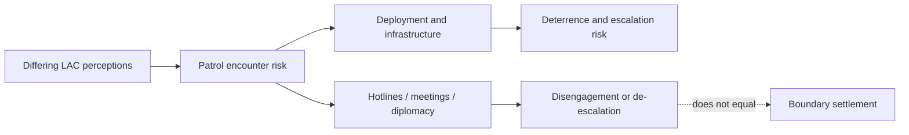

# Border Management and Border Area Development — Learning Session Live Edition

**Subject:** Internal Security | **GS Paper:** III | **Level:** Core first, then optional Advanced

## Session promise

This session treats a border as a legal, physical and human system. It first builds the complete Core: differentiated neighbour-wise challenges, guarding and civil institutions, lawful movement, infrastructure, technology, development, communities and current legal/scheme status. Only after Core closure does it add optional comparative and evaluation depth.

> **Boundary map:** Topic 04 owns North-East peace processes; Topic 05 owns J&K proxy-war depth; Topic 07 owns coastal and maritime security; Topic 11 owns organised crime; Topic 12 owns full force mandates, intelligence architecture and rights. This topic teaches the border-management interfaces needed for a complete GS-III answer.

> **Evidence key:** ✅ direct canonical/official fact · ⚠️ analytical inference · 🕰️ historical or book-period statement requiring date context.

## Roadmap

```text
CONCEPT → DIFFERENTIATED BORDERS → NETWORK THREATS → INSTITUTIONS
→ LEGAL MOVEMENT → INFRASTRUCTURE/TECHNOLOGY → DEVELOPMENT
→ COMMUNITIES → CORE SYNTHESIS → OPTIONAL REFORM/EVALUATION
```

**Navigation:** Lessons 1–18 are complete Core. Lessons 19–22 are explicitly optional Advanced depth and are not required for a sound Core answer.


---
## Lesson 1: A border is a legal line inside a wider human landscape

Progress: 1 / 22 | Stage: Foundation | Subtopic: border, boundary, frontier, security and management

━━━ PRE-TEACH CHECKLIST ━━━━━━━━━━━━━━━━━━
📚 Book context: Canonical Basic owner; Singh OCR PDF pp. 120–126; VisionIAS OCR PDF p. 4
🔍 Current official anchor: MHA Annual Report 2024–25, Border Management chapter
📰 Evidence status: Definitions are source-grounded; the layered model is analytical.
━━━━━━━━━━━━━━━━━━━━━━━━━━━━━━━━━━━━━━━━━

### 🖼️ From line to management system

```text
SOVEREIGN LINE
   ↓ gives jurisdiction
BORDER BELT
   ↓ contains terrain, settlements, routes and ecosystems
MANAGEMENT SYSTEM
   ├─ guard against hostile entry
   ├─ regulate lawful movement and trade
   ├─ develop communities and infrastructure
   └─ negotiate disputes and incidents
```

A border is not merely a fence. The legal boundary allocates sovereign jurisdiction; a **frontier** is the wider zone in which State presence, mobility and social ties may be uneven. **Border security** concentrates on defence and prevention of hostile or unauthorised entry. **Border management** is broader: Singh’s four-part frame combines guarding, regulation, development of border areas and bilateral institutional mechanisms.[^SINGH]

This distinction changes policy. A patrol may stop an intrusion, but customs and immigration regulate a legal crossing; a road improves deployment and market access; a hotline prevents a patrol encounter from escalating; a school or telecom link can reduce outward migration. No single instrument performs all four functions.

Borders also differ legally. An international boundary may be delimited and demarcated; a Line of Control is a military control line, not an accepted international boundary; the Line of Actual Control reflects differing perceptions and lacks mutually agreed alignment in several stretches. ⚠️ Therefore “seal the border” is usually an analytical error. The real task is to match authority, terrain, movement and threat while retaining lawful exchange.

### REVISION NOTES

1. A boundary allocates jurisdiction; a frontier is a wider zone.
2. Border security is narrower than border management.
3. Singh’s four functions are guarding, regulation, development and bilateral mechanisms.
4. A fence is one capability, not the complete management system.
5. Legal crossing and hostile crossing require different responses.
6. LoC, LAC and an international boundary are not synonyms.
7. Infrastructure can serve security and civilian development simultaneously.
8. A settled border may still be porous; a disputed border may have little civilian movement.
9. A good answer begins by identifying the border type and dominant flow.

### Concept check

**Question:** (10 marks; answer in ≤150 words) Why is border management broader than border security?

**Model-answer label:** Model: 122 words; ceiling: ≤150 words for this 10-mark question.

**Model answer:** Border security seeks to defend the boundary and prevent hostile or unauthorised entry. Border management includes that function but also regulates lawful passengers and trade, develops border settlements and infrastructure, and maintains bilateral mechanisms for disputes and incidents. The broader view is necessary because the same route can carry legal commerce, kinship travel, migrants, smugglers or armed infiltrators. A fence may deter crossing but cannot issue visas, inspect cargo, settle a disputed alignment or sustain a remote village. India therefore needs a border-specific mix of guarding forces, customs and immigration, roads and communications, community participation and diplomatic arrangements. The qualification is that development is not a substitute for defence, just as hardening is not a substitute for legal mobility and local trust.

**Adjacent rubric:** definition 2 + four-function frame 4 + application 3 + qualification 1 = **10 marks**

**Misconception to avoid:** Equating border management with fencing or troop deployment.

**Transition:** Lesson 2 classifies India’s borders before applying any instrument.

---
## Lesson 2: India’s land borders demand six different operating logics

Progress: 2 / 22 | Stage: Core | Subtopic: border typology, terrain and communities

━━━ PRE-TEACH CHECKLIST ━━━━━━━━━━━━━━━━━━
📚 Book context: Canonical Basic owner; VisionIAS OCR PDF pp. 4–9, 21 and 24–25
🔍 Current official anchor: MHA Annual Report 2024–25 records 15,106.7 km of land borders
📰 Evidence status: Official lengths are current-record facts; management categories are analytical.
━━━━━━━━━━━━━━━━━━━━━━━━━━━━━━━━━━━━━━━━━

### 🖼️ Neighbour–terrain–flow matrix

| Border | Dominant physical/legal character | High-yield management problem |
|---|---|---|
| Pakistan | desert, plains, LoC and glaciated AGPL | infiltration, tunnelling, smuggling, escalation |
| China | high-altitude disputed LAC | alignment dispute, military posture, logistics |
| Bangladesh | dense, riverine, cultivated, largely settled | irregular movement, crime, trade regulation |
| Nepal | open, socially connected | identity-light facilitation with targeted enforcement |
| Bhutan | largely settled, forested/hilly | open-border misuse without securitising normal ties |
| Myanmar | rugged, ethnic continuity, weak connectivity | insurgent mobility, narcotics, regulated kinship movement |

✅ MHA records India’s claimed land-border total as 15,106.7 km across seven countries, including the claimed Afghanistan segment.[^MHA-AR] Operational management in this lesson focuses on six administered sectors. Length is less important than character. A long settled border can create high-volume regulation demands; a shorter disputed stretch can carry major escalation risk.

Terrain changes the tool. River channels shift, deserts expose long approaches, forests reduce visibility, mountains constrain roads and sensors, and villages may sit beside the boundary. Communities change the legitimacy problem: an open or kinship border cannot be managed as if every routine crossing were hostile. Trade changes the incentive structure: cumbersome legal routes can push goods toward informal networks.

Use three questions for every neighbour: **What is the legal status? What moves across? What terrain mediates movement?** Then select guarding, regulation, development and bilateral mechanisms. This prevents the common error of giving the same fence–drone–road answer for every border.

### REVISION NOTES

1. India’s official claimed land-border total is 15,106.7 km.
2. Seven-country accounting includes a claimed Afghanistan segment.
3. Operational analysis here covers six administered sectors.
4. Pakistan combines IB, LoC and AGPL environments.
5. China is primarily a disputed-alignment and high-altitude challenge.
6. Bangladesh is largely settled but riverine and densely inhabited.
7. Nepal and Bhutan require open-border regulation, not blanket closure.
8. Myanmar combines terrain, ethnic continuity, insurgency and narcotics routes.
9. Terrain, legal status and flow should determine the management mix.
10. Uniform policy across all borders is analytically weak.

### Concept check

**Question:** (10 marks; answer in ≤150 words) Construct a typology for differentiating India’s land-border challenges.

**Model-answer label:** Model: 115 words; ceiling: ≤150 words for this 10-mark question.

**Model answer:** India’s land borders can be classified by legal status, terrain and dominant flow. The China border is disputed and high-altitude, so military posture, logistics and confidence-building dominate. Pakistan combines the international boundary, LoC and AGPL, requiring different mixes of BSF, Army, counter-infiltration and anti-smuggling measures. Bangladesh is largely settled but densely populated and riverine, making regulation, crime control and legal trade important. Nepal and Bhutan are open-border environments where normal mobility must be preserved while networks are targeted. Myanmar combines rugged terrain, ethnic continuity, insurgent movement and narcotics trafficking. This typology shows why border length alone does not determine risk. The appropriate response follows the border’s legal character, physical geography, community pattern and movement profile.

**Adjacent rubric:** classification axes 3 + neighbour application 4 + policy linkage 2 + conclusion 1 = **10 marks**

**Misconception to avoid:** Ranking every border only by length or calling all of them “porous”.

**Transition:** Lessons 3–7 now apply this typology border by border.

---
## Lesson 3: Pakistan border: three segments, three security grammars

Progress: 3 / 22 | Stage: Core | Subtopic: international boundary, LoC, AGPL and Sir Creek interface

━━━ PRE-TEACH CHECKLIST ━━━━━━━━━━━━━━━━━━
📚 Book context: Singh OCR PDF pp. 121–122; VisionIAS OCR PDF p. 11
🔍 Current official anchor: Current official border management records and bilateral ceasefire mechanisms
📰 Evidence status: Segment names are source-grounded; threat assessment is qualified.
━━━━━━━━━━━━━━━━━━━━━━━━━━━━━━━━━━━━━━━━━

### 🖼️ Segment strip rather than one border

```text
GUJARAT/PUNJAB/RAJASTHAN/JAMMU IB
  BSF-facing: fence gaps • tunnels • drones • contraband
                │
LINE OF CONTROL
  Army-facing: infiltration • firing/escalation • civilian protection
                │
ACTUAL GROUND POSITION LINE
  high altitude: logistics • surveillance • survival
                │
SIR CREEK
  tidal boundary interface → Topic 07 owns maritime depth
```

The Pakistan-facing boundary must be segmented. 🕰️ The canonical book-period map approximates the Radcliffe-line international-boundary sector at 2,308 km, the LoC at 776 km and the AGPL at 110 km; these figures organise the three environments and should not be silently converted into a fresh survey.[^SINGH] The international-boundary sector contains desert, agricultural plains, habitation and riverine gaps. Smuggling, tunnels and low-flying delivery systems require layered patrol, intelligence, engineering and forensic follow-through. The LoC is a military control line in Jammu and Kashmir, where infiltration and ceasefire stability interact. The AGPL around Siachen is an extreme-altitude deployment and logistics problem.

Sir Creek is a roughly 96-km tidal estuary and unresolved boundary interface. 🕰️ The canonical source contrasts India’s mid-channel/Thalweg position with Pakistan’s eastern-bank “green line” claim. Its legal geography affects fishermen, patrol jurisdiction and maritime claims, but Topic 07 owns the coastal and maritime-security depth. Topic 05 owns Pakistan-sponsored proxy warfare and J&K operations; this topic owns the border-management interface.

⚠️ A seizure is an output, not proof that the network is dismantled. A ceasefire reduction is an important outcome, not boundary settlement. Effective management links detection to handlers, finance, communications, prosecution and diplomatic signalling while protecting border civilians and lawful farming or trade.

### REVISION NOTES

1. Pakistan-facing management must be segment-specific.
2. The international boundary differs from the LoC and AGPL.
3. BSF guards the Pakistan international boundary; the Army has the LoC/AGPL military role.
4. Desert, cultivated and riverine stretches create different vulnerabilities.
5. Tunnels and UAV drops bypass a simple fence model.
6. Ceasefire stability is not boundary settlement.
7. Seizure counts do not prove network dismantling.
8. Sir Creek is a land–maritime interface; Topic 07 owns maritime depth.
9. Topic 05 owns proxy-war operations in depth.
10. Civilian protection and lawful livelihoods belong in the security design.

### Concept check

**Question:** (15 marks; answer in ≤250 words) Why must the Pakistan border be analysed segment by segment?

**Model-answer label:** Model: 131 words; ceiling: ≤250 words for this 15-mark question.

**Model answer:** The Pakistan-facing boundary contains three distinct operational environments. Along the international boundary, BSF confronts smuggling, tunnels, unauthorised crossings and UAV delivery across deserts, plains and cultivated areas. The Line of Control is a military control line where infiltration, firing, escalation management and civilian safety dominate. The Actual Ground Position Line is an extreme-altitude logistics and surveillance theatre. Sir Creek adds an unresolved tidal boundary interface, though its maritime dimension belongs to coastal-security analysis. Treating these as one “porous border” obscures mandate, terrain and legal status. A segment-specific policy combines fencing and technology where suitable, Army or BSF roles as applicable, intelligence-led network disruption, forensic attribution, protected farming and habitation, and bilateral incident mechanisms. Success must be measured by reduced hostile capability and civilian harm, not only kilometres fenced or seizures reported.

**Adjacent rubric:** segment distinction 4 + threat analysis 4 + institutional response 4 + qualification 3 = **15 marks**

**Misconception to avoid:** Writing “India–Pakistan border” as a single uniform fencing problem.

**Transition:** Lesson 4 contrasts this segmented boundary with the disputed LAC.

---
## Lesson 4: China border: managing disagreement over the line itself

Progress: 4 / 22 | Stage: Core | Subtopic: LAC sectors, posture, infrastructure and CBMs

━━━ PRE-TEACH CHECKLIST ━━━━━━━━━━━━━━━━━━
📚 Book context: VisionIAS OCR PDF pp. 6–9; canonical owners
🔍 Current official anchor: Official bilateral agreement record and dated 2020/2022 events
📰 Evidence status: Historical agreements and events are dated; no claim of final settlement is made.
━━━━━━━━━━━━━━━━━━━━━━━━━━━━━━━━━━━━━━━━━

### 🖼️ Dispute–deployment–dialogue triangle



The China boundary problem is not ordinary unauthorised migration. Large stretches are disputed or lack a mutually agreed LAC alignment. Differing patrol perceptions can therefore generate encounters even when each side claims to remain on its own side. High altitude, weather and distance make roads, bridges, communications, air support and acclimatised personnel central.

India and China concluded confidence-building and border-management agreements in 1993, 1996, 2005, 2012 and 2013. These mechanisms provide meetings, communication and restraint principles, but the 2020 Galwan clash and 2022 Yangtse/Tawang face-off demonstrate that an agreement is not the same as settled alignment or guaranteed compliance.

Infrastructure creates a dual effect. It improves access, civilian services and defensive response, yet faster mobilisation can intensify security dilemmas. ⚠️ The policy task is deterrence with crisis control: protect territorial claims, narrow surprise, maintain local and diplomatic communication, and distinguish disengagement, de-escalation and final settlement.

### REVISION NOTES

1. The LAC is not a mutually demarcated international boundary.
2. Differing perceptions create patrol-contact risk.
3. High-altitude logistics are a core security capability.
4. Roads and communications serve both civilians and forces.
5. CBM agreements existed before Galwan and Yangtse.
6. An agreement signed is not an outcome achieved.
7. Disengagement is not de-escalation; neither is final settlement.
8. Infrastructure can strengthen defence and sharpen a security dilemma.
9. Diplomatic and local commander channels complement deterrence.
10. China-border analysis should not be reduced to fencing.

### Concept check

**Question:** (15 marks; answer in ≤250 words) Assess the role and limits of infrastructure and confidence-building mechanisms on the India–China border.

**Model-answer label:** Model: 126 words; ceiling: ≤250 words for this 15-mark question.

**Model answer:** Infrastructure reduces response time, sustains high-altitude posts and connects remote communities, thereby strengthening deterrence and State presence. Yet roads and forward access are dual-use: each side may read the other’s defensive improvement as mobilisation capacity, increasing the security dilemma. Confidence-building mechanisms—agreements, commander meetings, hotlines and diplomatic dialogue—can clarify incidents, enable disengagement and prevent tactical contact from escalating. Their limit is structural. They do not create a mutually accepted LAC, settle territorial claims or guarantee compliance. Galwan in 2020 and Yangtse in 2022 show that formal mechanisms can coexist with serious confrontation. India therefore requires resilient logistics, surveillance and civilian connectivity alongside verified disengagement, communication and sustained boundary negotiation. The correct outcome ladder separates infrastructure completed, patrol friction reduced, disengagement achieved, de-escalation sustained and boundary settlement concluded.

**Adjacent rubric:** infrastructure value 4 + risk/trade-off 3 + CBM value 3 + limits/evidence 3 + verdict 2 = **15 marks**

**Misconception to avoid:** Claiming that more roads automatically produce either peace or escalation.

**Transition:** Lesson 5 shows a contrasting border where instruments did settle major questions.

---
## Lesson 5: Bangladesh border: settled by instruments, still demanding daily management

Progress: 5 / 22 | Stage: Core | Subtopic: LBA, riverine terrain, migration, trade and trans-border crime

━━━ PRE-TEACH CHECKLIST ━━━━━━━━━━━━━━━━━━
📚 Book context: Singh OCR pp. 122–123 corrected by VisionIAS OCR p. 21
🔍 Current official anchor: Constitution (One Hundredth Amendment) Act, 2015 and official border records
📰 Evidence status: Settlement facts are direct; migration and crime require stage-accurate claims.
━━━━━━━━━━━━━━━━━━━━━━━━━━━━━━━━━━━━━━━━━

### 🖼️ Before and after the settlement instruments

| Dimension | Earlier problem | Instrument/result | Remaining management task |
|---|---|---|---|
| land enclaves/adverse possessions | fragmented jurisdiction | 2015 LBA via 100th Amendment | administration and normal border regulation |
| maritime boundary | overlapping claims | 2014 arbitral award | implementation and cooperation |
| riverine/dense terrain | shifting channels and habitation | not solved by LBA | patrol, legal crossing, local coordination |
| migration/crime | networked movement | enforcement and cooperation | evidence-based, rights-aware management |

The India–Bangladesh border is the best correction to two myths: that every border dispute is permanent and that settlement removes all security work. The 2015 Land Boundary Agreement, constitutionally enabled by the One Hundredth Amendment, resolved enclaves and adverse possessions. A 2014 arbitral award settled the maritime boundary. These are examples of settlement by agreement, adjudication and constitutional implementation.[^LBA]

Yet the land border remains densely settled, cultivated and riverine. Rivers change courses; homes and fields lie near the line; legal trade and passenger movement coexist with cattle, narcotics, forged documents and other illicit markets. Migration claims require care: stock estimates, apprehensions and citizenship determinations are different evidentiary categories.

The management mix is therefore BSF guarding, State police and intelligence, designated legal crossings, customs and immigration, riverine capability, local grievance handling and bilateral coordination. Fencing near habitation can affect farms and access. ⚠️ Settlement improves the legal baseline; it does not replace humane, precise day-to-day administration.

### REVISION NOTES

1. The Bangladesh land-enclave issue was resolved, not left frozen.
2. The 100th Constitutional Amendment enabled the 2015 LBA.
3. The maritime boundary was settled by a 2014 arbitral award.
4. A settled border can remain operationally porous.
5. Riverine and inhabited stretches complicate fencing.
6. Apprehension, irregular presence and citizenship finding are different stages.
7. Legal trade routes can reduce incentives for informal movement.
8. BSF, State police, customs and immigration perform different functions.
9. Community access and grievance mechanisms affect legitimacy.
10. Bangladesh is India’s key “settled by instrument” comparison.

### Concept check

**Question:** (15 marks; answer in ≤250 words) How does the India–Bangladesh border illustrate both successful dispute settlement and continuing management difficulty?

**Model-answer label:** Model: 139 words; ceiling: ≤250 words for this 15-mark question.

**Model answer:** India and Bangladesh demonstrate that boundary questions can be resolved through law and diplomacy. The 2014 arbitral award settled the maritime boundary, while the 2015 Land Boundary Agreement, enabled by the One Hundredth Constitutional Amendment, resolved enclaves and adverse possessions. This created clear jurisdiction and removed a major historical dispute. Operational difficulty nevertheless continues because the border is long, densely inhabited, cultivated and riverine. Lawful trade and passenger movement coexist with smuggling, forged documents and irregular migration. Shifting channels and habitation constrain continuous fencing. Management therefore needs BSF patrol, riverine capability, State-police investigation, customs and immigration at legal crossings, bilateral coordination and local grievance protection. The analytical lesson is that dispute settlement and border management are different stages: the former clarifies sovereignty; the latter must regulate daily flows without treating every border resident or traveller as a security threat.

**Adjacent rubric:** settlement instruments 4 + continuing challenges 4 + response 4 + analytical conclusion 3 = **15 marks**

**Misconception to avoid:** Repeating the book-period claim that enclaves and the maritime boundary remain unresolved.

**Transition:** Lesson 6 turns to genuinely open borders where legal mobility is the starting condition.

---
## Lesson 6: Nepal and Bhutan: open borders need selective control, not collective suspicion

Progress: 6 / 22 | Stage: Core | Subtopic: open-border mobility, trade and network misuse

━━━ PRE-TEACH CHECKLIST ━━━━━━━━━━━━━━━━━━
📚 Book context: Singh OCR pp. 123–124; canonical owners
🔍 Current official anchor: MHA Border Management records and current immigration exemptions architecture
📰 Evidence status: Treaty and exemption-based mobility is direct; risk design is analytical.
━━━━━━━━━━━━━━━━━━━━━━━━━━━━━━━━━━━━━━━━━

### 🖼️ Open-border risk filter

```text
NORMAL FLOW                    RISK SIGNAL
kinship • work • pilgrimage    forged identity • covert handler
local trade • tourism          weapons/drugs • trafficking route
          \                    /
           \                  /
            ↓ targeted filter ↓
 identity where law requires • intelligence • financial link
 vehicle/cargo checks • joint investigation • lawful prosecution
```

An open border is a legal and political arrangement, not absence of sovereignty. The Nepal border supports deep kinship, employment, pilgrimage and trade. Bhutan’s border is largely peaceful and economically connected. These benefits would be damaged by treating routine mobility as presumptively criminal.

Open routes can nevertheless be exploited by smugglers, traffickers, forged-document networks or hostile actors seeking low-friction transit. The answer is selective enforcement: focus on conduct, documents where required, cargo, financial and communication linkages, repeat routes and network nodes. SSB guards the Nepal and Bhutan borders, but local police, customs, immigration and counterpart agencies remain necessary.

The Immigration and Foreigners Act, 2025 preserves space for exemptions and intergovernmental arrangements. Therefore a general visa rule should never be mechanically applied to every historically governed movement category. ⚠️ Security grows when lawful movement stays predictable and enforcement concentrates on demonstrable risk.

### REVISION NOTES

1. An open border is regulated mobility, not absence of a border.
2. Nepal mobility has economic, social and cultural value.
3. Bhutan is largely settled but can still face route misuse.
4. SSB guards both Nepal and Bhutan borders.
5. Network conduct is a better risk basis than identity.
6. Customs, police and immigration roles remain distinct.
7. Treaties and exemptions can modify general travel-document rules.
8. Blanket closure can divert lawful movement into informal routes.
9. Joint investigation is needed where crime crosses jurisdictions.
10. Trust and targeted enforcement can reinforce each other.

### Concept check

**Question:** (10 marks; answer in ≤150 words) Explain why open-border management requires targeted enforcement rather than blanket closure.

**Model-answer label:** Model: 123 words; ceiling: ≤150 words for this 10-mark question.

**Model answer:** Open borders with Nepal and Bhutan facilitate kinship, work, pilgrimage, tourism and trade under established arrangements. Blanket closure would impose high social and economic costs and may divert routine mobility toward informal routes. The security problem is not normal movement itself but exploitation by trafficking, smuggling, forged-document or hostile networks. Targeted enforcement therefore examines conduct and linkages: suspicious cargo, repeat routes, false identity, finance, communications and known facilitators. SSB guarding must connect with customs, immigration, State police, intelligence and counterpart agencies. Legal exemptions and bilateral arrangements must be respected. This model protects legitimate movement while concentrating coercive power on demonstrable risk. Its success depends on accurate intelligence and safeguards against profiling, because collective suspicion weakens the community cooperation needed to identify exceptional threats.

**Adjacent rubric:** open-border logic 3 + threat distinction 2 + targeted measures 3 + rights/trust 2 = **10 marks**

**Misconception to avoid:** Calling an open border “unguarded” or assuming closure is costless.

**Transition:** Lesson 7 examines the more contested balance between kinship mobility and security on the Myanmar border.

---
## Lesson 7: Myanmar border and the FMR: status discipline before policy argument

Progress: 7 / 22 | Stage: Core | Subtopic: terrain, insurgency, narcotics and regulated kinship movement

━━━ PRE-TEACH CHECKLIST ━━━━━━━━━━━━━━━━━━
📚 Book context: Singh OCR pp. 123–124; VisionIAS OCR pp. 24–25
🔍 Current official anchor: PIB 8 February 2024 FMR release; MHA IMBPMS portal; Mizoram official 2026 entry/exit coordination record
📰 Evidence status: The central announcement and later implementation records are kept distinct.
━━━━━━━━━━━━━━━━━━━━━━━━━━━━━━━━━━━━━━━━━

### 🖼️ FMR evidence ladder

```text
HISTORICAL ARRANGEMENT
border communities could move up to 16 km under the FMR
          ↓
8 FEBRUARY 2024 CENTRAL RECORD
decision to scrap + recommendation for immediate suspension
          ↓
IMPLEMENTATION EVIDENCE
MHA border-pass portal and State entry/exit coordination records
          ↓
SAFE CURRENT CLAIM
movement is under tighter regulated implementation;
do not invent a single nationwide replacement rule without its notification
```

The India–Myanmar border crosses rugged terrain and communities with kinship ties on both sides. It also lies near major narcotics routes and has been used by insurgent networks. Assam Rifles is the principal guarding force; State police, customs, intelligence and local administration supply the inland and legal-regulation layers.

✅ On 8 February 2024, MHA announced the decision to scrap the Free Movement Regime and recommended immediate suspension while the formal process was undertaken.[^FMR] This proves the policy decision and suspension recommendation—not, by itself, every later field rule. By 2026, MHA operated an Indo-Myanmar Border Pass Management System portal, while an official Mizoram Home Department record concerned committees for entry/exit-point operations.[^FMR-CURRENT]

⚠️ The current safe formulation is therefore that the old 16-km FMR framework was subjected to a central scrapping/suspension decision and movement is being channelled through tighter entry/exit and pass-management arrangements. Do not claim a uniform replacement distance or complete field closure without a direct operative notification. The trade-off is real: tighter control can disrupt insurgent or narcotics routes, but poorly designed restrictions can burden family, customary and livelihood ties and weaken cooperation.

### REVISION NOTES

1. Myanmar combines difficult terrain, ethnic continuity, insurgency and narcotics routes.
2. Assam Rifles is the principal guarding force on this border.
3. The historical FMR allowed specified border-community movement up to 16 km.
4. The 8 February 2024 record announced a decision to scrap and recommended suspension.
5. An announcement is not every later implementation rule.
6. Current evidence includes MHA pass-management and State entry/exit coordination.
7. Do not invent a uniform replacement distance without a direct notification.
8. Regulation gain must be weighed against kinship and livelihood costs.
9. Community trust is an intelligence asset, not an alternative to enforcement.
10. Topic 04 owns the North-East peace-process implications in depth.

### Concept check

**Question:** (15 marks; answer in ≤250 words) How should a current answer analyse the India–Myanmar Free Movement Regime without overstating its legal status?

**Model-answer label:** Model: 137 words; ceiling: ≤250 words for this 15-mark question.

**Model answer:** A current answer should separate evidence stages. Historically, the FMR permitted specified border communities to travel up to 16 km across the India–Myanmar border without ordinary passport and visa requirements. On 8 February 2024, MHA announced a decision to scrap the regime and recommended immediate suspension while the formal process was completed. That release proves policy intent and the suspension recommendation; it does not by itself establish every later field rule. Current official evidence also includes an MHA border-pass portal and State-level coordination for entry and exit points. The safe conclusion is that movement is under tighter regulated pass and entry-point management, while any precise replacement distance requires its operative notification. Policy analysis must balance control of insurgent and narcotics routes against legitimate kinship and livelihood ties, using designated crossings, identity verification, grievance channels and community liaison.

**Adjacent rubric:** historical rule 3 + 2024 status 4 + current evidence discipline 4 + trade-off 3 + conclusion 1 = **15 marks**

**Misconception to avoid:** Treating a press announcement, formal legal completion and field implementation as the same event.

**Transition:** Lesson 8 follows the routes from border crossing into inland crime–terror networks.

---
## Lesson 8: Trans-border crime becomes an internal-security threat through networks

Progress: 8 / 22 | Stage: Core | Subtopic: crime–terror linkage, trafficking and evidence

━━━ PRE-TEACH CHECKLIST ━━━━━━━━━━━━━━━━━━
📚 Book context: Canonical Basic owner; Singh and VisionIAS OCR
🔍 Current official anchor: PRAHAAR 2026 recognises crime–terror facilitation; MHA border records
📰 Evidence status: Network logic is analytical; named official threat domains are direct.
━━━━━━━━━━━━━━━━━━━━━━━━━━━━━━━━━━━━━━━━━

### 🖼️ Commodity–network–effect chain

| Flow | Border-stage actor | Inland network | Security effect |
|---|---|---|---|
| narcotics | carrier/route guide | wholesaler, finance, protection | corruption and possible terror finance |
| weapons/explosives | supplier/drop team | receiver, module, safe house | violent capability |
| people trafficking | recruiter/escort | document and labour network | exploitation and covert mobility |
| counterfeit/illicit value | courier | laundering and distribution | funding and institutional harm |
| wildlife/other contraband | local carrier | organised market | corruption and governance erosion |

A border offence becomes a national-security problem when it plugs into an inland network. The person crossing may be only a courier. Organisers, financiers, corrupt protectors, document suppliers, transporters and end users may be far from the boundary. Seizing a package therefore proves interception, not the purpose, sponsor or full network.

The crime–terror relationship can be transactional: a terrorist module buys documents, weapons or transport from profit-seeking criminals. It can become convergent when actors share routes and protection. Attribution must remain evidence-based; drugs found at a border do not automatically become “terror funding”.

Integrated response connects border guarding to State police, narcotics control, financial intelligence, cyber and telecom evidence, forensics and prosecutors. A common case identifier and chain of custody matter because different agencies may handle the route, seizure, digital device, finance and trial. Topic 11 owns organised-crime mechanics; Topic 10 owns terror finance; this lesson owns the border interface.

### REVISION NOTES

1. Border interception is only one point in a wider network.
2. Couriers and organisers may be different actors.
3. Crime–terror cooperation may be transactional or convergent.
4. Contraband does not automatically prove terror finance.
5. Seizure is an output; network capability reduction is an outcome.
6. Chain of custody must survive inter-agency handovers.
7. Financial, digital and travel evidence can connect border and inland nodes.
8. State police are essential after the border stage.
9. Topic 10 owns terror-finance depth; Topic 11 owns organised crime.
10. Community reporting must avoid collective criminalisation.

### Concept check

**Question:** (15 marks; answer in ≤250 words) Explain why border seizures alone are an incomplete measure of disruption of the crime–terror nexus.

**Model-answer label:** Model: 131 words; ceiling: ≤250 words for this 15-mark question.

**Model answer:** A seizure establishes that a specific consignment or crossing was intercepted; it does not identify the organiser, financier, recipient, corrupt protector or ultimate purpose. A courier may be replaceable, and the route may shift after enforcement. Nor does narcotics or counterfeit currency automatically prove terror financing without evidence connecting value to a terrorist actor or offence. Effective disruption therefore maps communications, travel, payments, documents, transport and end users; preserves forensic custody; and links the guarding force with State police, specialist agencies and prosecutors. Evaluation should track repeat-route decline, handler identification, assets lawfully restrained, prosecutions sustained and network regeneration. Seizures remain useful warning and output indicators, but the outcome is reduced hostile capability. The rights qualification is equally important: border residence, ethnicity or ordinary cross-border contact cannot substitute for proof of facilitation.

**Adjacent rubric:** seizure limit 4 + network analysis 4 + evaluation 4 + rights qualification 3 = **15 marks**

**Misconception to avoid:** Calling every smuggling case terrorism or every seizure a dismantled network.

**Transition:** Lesson 9 assigns the correct institutional owner to each stage.

---
## Lesson 9: Forces and institutions: one border, several necessary functions

Progress: 9 / 22 | Stage: Core | Subtopic: BGF mandates, State role and federal coordination

━━━ PRE-TEACH CHECKLIST ━━━━━━━━━━━━━━━━━━
📚 Book context: Singh OCR pp. 125–129; VisionIAS OCR pp. 4–5 and 29
🔍 Current official anchor: MHA Border Management-I Division and Annual Report 2024–25
📰 Evidence status: Force-to-border mapping is direct; operational overlaps are qualified.
━━━━━━━━━━━━━━━━━━━━━━━━━━━━━━━━━━━━━━━━━

### 🖼️ Mandate swimlane

```text
BOUNDARY / FIRST INTERCEPTION
BSF: Pakistan IB + Bangladesh | ITBP: China | SSB: Nepal + Bhutan | Assam Rifles: Myanmar
             ↓ handover / joint action
STATE POLICE: inland crime • FIR/investigation • local intelligence • public order
             ↓ specialist linkage
CUSTOMS / IMMIGRATION / NCB / NIA or others as law and offence require
             ↓
PROSECUTOR + COURT

Army role: defence and military lines/sectors; not interchangeable with routine civil border regulation.
```

The “one border, one force” principle seeks clear accountability, not institutional isolation. BSF guards the Pakistan international boundary and Bangladesh border; ITBP guards the China border; SSB guards Nepal and Bhutan; Assam Rifles guards Myanmar. The Army has the defence role and operates on military lines and sensitive sectors. Full mandates belong to Topic 12.

Border Guarding Forces detect, deter and intercept, but they do not own the entire downstream case. State police possess local intelligence, investigate ordinary and organised offences, secure inland evidence and maintain public order. Customs regulates goods; immigration regulates passengers; specialist agencies enter when their legal mandate is triggered. District administration handles land, compensation and services.

⚠️ Coordination failure appears at handover: delayed FIR, incompatible identifiers, lost digital context or unclear case lead. A practical protocol names the lead, evidence custodian, urgency, recipient and feedback deadline. Federalism is operational here: central forces need State knowledge, and States need national linkage and surge capacity.

### REVISION NOTES

1. BSF guards Pakistan IB and Bangladesh.
2. ITBP guards the China border.
3. SSB guards Nepal and Bhutan.
4. Assam Rifles guards Myanmar.
5. The Army’s defence role is not identical to civil border regulation.
6. One border–one force means lead accountability, not exclusion of support agencies.
7. State police own crucial inland intelligence and investigation.
8. Customs and immigration regulate different legal flows.
9. Handover quality affects prosecution.
10. Topic 12 owns complete force mandates and rights architecture.
11. Federal coordination should specify lead, custody, task and feedback.

### Concept check

**Question:** (15 marks; answer in ≤250 words) Discuss the role of security forces and civil agencies in managing trans-border threats.

**Model-answer label:** Model: 135 words; ceiling: ≤250 words for this 15-mark question.

**Model answer:** India assigns a lead Border Guarding Force by sector: BSF for the Pakistan international boundary and Bangladesh, ITBP for China, SSB for Nepal and Bhutan, and Assam Rifles for Myanmar. The Army performs national-defence and military-line functions, including sensitive LoC and high-altitude sectors. These forces deter, patrol and intercept, but border management continues inland. State police contribute local intelligence, register and investigate offences, protect witnesses and pursue receivers. Customs regulates goods; immigration regulates passengers; specialist financial, narcotics or national-investigation bodies enter only through their mandates. District authorities manage land, services and community grievances. Coordination must identify the operational lead, evidence custodian, common case identifier and feedback deadline. The “one border, one force” principle therefore creates accountability rather than a monopoly. Topic-specific success is lawful interdiction connected to a court-ready network case and sustained community cooperation.

**Adjacent rubric:** force mapping 5 + civil/specialist roles 4 + coordination 3 + qualified verdict 3 = **15 marks**

**Misconception to avoid:** Listing forces without explaining handover, State-police or civilian functions.

### Lesson-local verified PYQ

> Analyze internal security threats and transborder crimes along Myanmar, Bangladesh and Pakistan borders including Line of Control (LoC). Also discuss the role played by various security forces in this regard.

**Metadata:** 2020 GS-III, Question 20 | 15 marks | Answer in 250 words.
**Provenance:** Exact printed English text verified from the local official-paper scan `books\more_previous_papers\Gen_St_P3.pdf`; spelling and the word “transborder” are retained.
**Neutrality:** This is an answer-free record. No outline, dimension list or solution cue is attached.

**Transition:** Lesson 10 regulates lawful mobility at the crossing itself.

---
## Lesson 10: Legal movement: immigration posts, land ports and refugee discipline

Progress: 10 / 22 | Stage: Core | Subtopic: IFA 2025, ICPs, LPAI and protection claims

━━━ PRE-TEACH CHECKLIST ━━━━━━━━━━━━━━━━━━
📚 Book context: Canonical owners; VisionIAS OCR p. 29
🔍 Current official anchor: Immigration and Foreigners Act, 2025, effective 1 September 2025; LPAI official records
📰 Evidence status: Legal provisions are direct; refugee-policy implications are bounded.
━━━━━━━━━━━━━━━━━━━━━━━━━━━━━━━━━━━━━━━━━

### 🖼️ Person–goods–protection decision tree

```text
ARRIVAL AT A DESIGNATED LAND CROSSING
   ├─ PERSON → immigration: passport/travel document, visa or lawful exemption
   ├─ GOODS  → customs: declaration, duty, prohibition and inspection
   ├─ VEHICLE/CARRIER → transport and carrier duties
   └─ PROTECTION CLAIM → security check + applicable administrative/legal process

ICP = co-location platform; it does not merge these legal powers.
```

The Immigration and Foreigners Act, 2025 came into force on 1 September 2025.[^IFA] It regulates passports or travel documents, visas, registration, entry, stay, movement and exit, subject to exemptions and intergovernmental arrangements. Section 36 repealed four older statutes with savings: the Passport (Entry into India) Act, 1920; Registration of Foreigners Act, 1939; Foreigners Act, 1946; and Immigration (Carriers’ Liability) Act, 2000.

Integrated Check Posts co-locate passenger, customs, security and trade functions. The Land Ports Authority of India Act, 2010 creates LPAI to develop and manage facilities for cross-border movement of passengers and goods.[^LPAI] Co-location should reduce transaction time without erasing statutory roles.

India has no single comprehensive refugee statute. A protection claimant is not conceptually identical to a labour migrant, trafficked person, tourist or infiltrator, yet entry and stay remain governed through the general foreigners/immigration framework and administrative measures. ⚠️ Border answers should avoid both extremes: no automatic right follows from the label “refugee”, but security screening does not erase dignity, non-arbitrary procedure or individual assessment.

### REVISION NOTES

1. The Immigration and Foreigners Act, 2025 is current from 1 September 2025.
2. It covers travel documents, visa, registration, entry, stay, movement and exit.
3. It repealed four older immigration/foreigner statutes with savings.
4. Exemptions and intergovernmental arrangements remain legally relevant.
5. Immigration regulates persons; customs regulates goods.
6. An ICP co-locates functions but does not merge powers.
7. LPAI is a statutory authority under the 2010 Act.
8. India has no single comprehensive refugee statute.
9. Refugee, migrant, trafficked person and infiltrator are not synonyms.
10. Individual screening and humane procedure can coexist with security.

### Concept check

**Question:** (15 marks; answer in ≤250 words) Explain the current legal and institutional architecture for lawful land-border movement.

**Model-answer label:** Model: 141 words; ceiling: ≤250 words for this 15-mark question.

**Model answer:** Lawful land-border movement is governed principally by the Immigration and Foreigners Act, 2025, in force from 1 September 2025. It requires valid travel documents and, for foreigners, a visa unless an exemption or intergovernmental arrangement applies; it also regulates registration, stay, movement and exit. The Act repealed four older foreigner and immigration statutes with savings. At a designated crossing, immigration officers regulate persons, customs regulates goods, and security agencies address threats under their own laws. Integrated Check Posts physically co-locate these services, while the statutory Land Ports Authority of India develops and manages land-port facilities. Protection claims require individual, security and administrative assessment because India has no single comprehensive refugee statute. The architecture should facilitate legitimate passengers and trade while preserving document checks, anti-trafficking safeguards, grievance channels and judicially reviewable action. Institutional integration means interoperable process, not conflation of legal powers.

**Adjacent rubric:** current law 5 + institutional roles 4 + refugee distinction 3 + balanced conclusion 3 = **15 marks**

**Misconception to avoid:** Citing the repealed Foreigners Act, 1946 as the present principal statute.

**Transition:** Lesson 11 moves from legal gates to infrastructure between those gates.

---
## Lesson 11: Infrastructure is a capability input, not a security outcome

Progress: 11 / 22 | Stage: Core | Subtopic: fencing, floodlighting, roads, BOPs and implementation

━━━ PRE-TEACH CHECKLIST ━━━━━━━━━━━━━━━━━━
📚 Book context: VisionIAS OCR pp. 29–30 and 47; canonical owners
🔍 Current official anchor: MHA Annual Report 2024–25 and BIM official record
📰 Evidence status: Approved periods and components are direct; outcome claims are separated.
━━━━━━━━━━━━━━━━━━━━━━━━━━━━━━━━━━━━━━━━━

### 🖼️ Input–output–outcome staircase

```text
INPUT          OUTPUT                  OPERATIONAL OUTCOME
money/land  →  km road/fence built  →  response time reduced?
equipment   →  sensors installed    →  detection and action improved?
staff       →  BOP occupied         →  gaps and fatigue reduced?
training    →  patrol conducted     →  network capability reduced?

IMPACT: safer lawful mobility, lower hostile capability, resilient communities
```

Fencing channels movement and increases delay; floodlighting aids observation; patrol roads improve access; Border Out Posts sustain presence; bridges, helipads and communications support difficult terrain. 🕰️ The canonical implementation record identifies the Border Roads Organisation, CPWD and State PWDs among road-executing agencies, making standards, land handover and maintenance coordination part of the security problem. Each project can fail through land disputes, floods, maintenance gaps, power loss, blind zones or lack of trained operators.

The Border Infrastructure and Management umbrella scheme was officially continued for 2021–22 to 2025–26 with fencing, floodlighting, roads, BOPs/COBs and technology components.[^BIM] As of 4 October 2026, no direct official extension beyond that approved period was verified. A current answer may describe the last approved design and period but should not call it an active extended cycle without a later record.

Implementation must be distinguished from outcomes. “Road completed” is an output. Reduced response time is an operational outcome. Reduced infiltration or safer legal trade requires further evidence. Environmental design matters: mountain cutting, river flows and wildlife corridors can turn a security asset into a long-term vulnerability if assessment and maintenance are weak.

### REVISION NOTES

1. Fencing channels and delays movement; it does not seal every terrain.
2. Floodlighting requires power, maintenance and tactical integration.
3. Roads serve deployment, services and trade.
4. BOPs require staffing, logistics and communications.
5. BIM’s last directly verified approved period was 2021–22 to 2025–26.
6. No post-2025–26 extension should be assumed without a direct record.
7. Sanction, completion, functionality and outcome are different stages.
8. Land acquisition and habitation can delay projects.
9. Environmental damage can undermine border-community resilience.
10. Response time and hostile capability are better outcomes than kilometres alone.

### Concept check

**Question:** (10 marks; answer in ≤150 words) Why should border-infrastructure performance be evaluated beyond kilometres constructed?

**Model-answer label:** Model: 121 words; ceiling: ≤150 words for this 10-mark question.

**Model answer:** Kilometres of road, fence or floodlighting measure outputs, not whether border management improved. A road matters if it reduces response time, remains usable in adverse weather and also supports communities. A fence matters if patrol, lighting, sensors and legal crossing points prevent diversion rather than merely shift routes. A Border Out Post must be staffed, supplied and connected. Evaluation should therefore move from sanction and construction to functionality, maintenance, detection-to-response time, lawful trade facilitation, civilian access, environmental effects and change in hostile-network capability. The last directly verified BIM period was 2021–22 to 2025–26, so later continuity must not be assumed. Infrastructure is indispensable, but its security value emerges only when people, intelligence, procedure and maintenance convert the asset into reliable action.

**Adjacent rubric:** output limitation 3 + outcome indicators 4 + current-status discipline 2 + conclusion 1 = **10 marks**

**Misconception to avoid:** Treating sanctioned expenditure or completed construction as proof of reduced infiltration.

**Transition:** Lesson 12 tests the same distinction for sensors and counter-UAS systems.

---
## Lesson 12: CIBMS and hostile UAVs: sensing is only the first decision

Progress: 12 / 22 | Stage: Core | Subtopic: technology, surveillance, counter-UAS and evidence

━━━ PRE-TEACH CHECKLIST ━━━━━━━━━━━━━━━━━━
📚 Book context: VisionIAS OCR pp. 30 and 38; canonical owners
🔍 Current official anchor: BIM technology component and official 2023 PYQ
📰 Evidence status: Technology functions are grounded; no unsourced deployment result is claimed.
━━━━━━━━━━━━━━━━━━━━━━━━━━━━━━━━━━━━━━━━━

### 🖼️ Sensor-to-case kill chain

```text
DETECT → CLASSIFY → TRACK → AUTHORISE → INTERDICT → RECOVER → ATTRIBUTE
 radar     bird/UAV   route     lawful      safe       payload    device,
 EO/IR     friendly?  handover  response    action     custody    finance

Failure at any arrow can turn expensive sensing into no operational outcome.
```

CIBMS is an integration idea: sensors, cameras, radar or other detectors feed communications, command and response. It is most useful where continuous physical fencing is difficult. Yet a sensor creates data, not security. Operators must distinguish animals, civilians, weather and hostile movement; an agency must own the response; evidence must be preserved.

UAVs compress distance and cross a fence vertically. They may carry weapons, ammunition, narcotics, cash or surveillance equipment. Counter-UAS design needs layered detection, classification, electronic or physical response under legal authority, recovery safety, device forensics and linkage to sender and receiver. Jamming may interfere with legitimate systems; terrain and small signatures create blind spots.

⚠️ “Smart border” should mean a learning system, not a vendor list. False alarms, cyber compromise, maintenance, data retention and interoperability require audit. Human sources and community observations remain valuable because technology rarely explains intent.

### REVISION NOTES

1. CIBMS integrates sensors, networks, command and response.
2. Detection is not interdiction.
3. Classification reduces false alarms and unsafe response.
4. UAVs can bypass ground fencing.
5. Payload, route, sender and receiver must all be investigated.
6. Counter-UAS action requires legal authority and safety.
7. Recovered devices and payloads need forensic custody.
8. Jamming can affect legitimate communications.
9. Technology has maintenance, cyber and interoperability risks.
10. Human and community intelligence remain necessary.

### Concept check

**Question:** (10 marks; answer in ≤150 words) Comment on the measures needed to tackle adversarial UAV use across borders.

**Model-answer label:** Model: 118 words; ceiling: ≤150 words for this 10-mark question.

**Model answer:** Adversarial UAVs can ferry weapons, ammunition, narcotics or surveillance payloads across ground barriers at low altitude. Response should be layered: intelligence on launch and receiver networks; radar, radio-frequency and electro-optical detection; classification and tracking; lawful electronic or physical interdiction; safe payload recovery; and forensic examination of navigation data, devices and communications. Border forces must coordinate with police because the inland receiver and financier may be more important than the intercepted platform. Countermeasures need common operating procedures, airspace safety, trained operators, maintenance and cyber protection. Jamming or automated action cannot be indiscriminate because legitimate communications and aircraft may be affected. Performance should track detection-to-response time, false alarms, receiver-network disruption and court-ready attribution, not merely equipment purchased or drones recovered.

**Adjacent rubric:** threat explanation 2 + layered measures 4 + coordination/evidence 2 + limitations 2 = **10 marks**

**Misconception to avoid:** Assuming that buying anti-drone equipment completes the counter-UAS chain.

### Lesson-local verified PYQ

> The use of unmanned aerial vehicles (UAVs) by our adversaries across the borders to ferry arms/ammunitions, drugs, etc., is a serious threat to the internal security. Comment on the measures being taken to tackle this threat.

**Metadata:** 2023 GS-III, Question 10 | 10 marks | Answer in 150 words.
**Provenance:** Exact printed English text verified from the local official-paper scan `books\more_previous_papers\QP-CSM-23-GENERAL-STUDIES-PAPER-III-180923.pdf`.
**Neutrality:** This is an answer-free record. No outline, dimension list or solution cue is attached.

**Transition:** Lesson 13 places technology inside intelligence and diplomatic coordination.

---
## Lesson 13: Intelligence, diplomacy and CBMs prevent tactical incidents becoming strategic crises

Progress: 13 / 22 | Stage: Core | Subtopic: fusion, bilateral mechanisms and dispute resolution

━━━ PRE-TEACH CHECKLIST ━━━━━━━━━━━━━━━━━━
📚 Book context: Singh’s four-element framework; VisionIAS OCR pp. 6–9 and 38
🔍 Current official anchor: Official bilateral and border-management mechanisms
📰 Evidence status: Named agreement years are historical facts; effectiveness judgements are analytical.
━━━━━━━━━━━━━━━━━━━━━━━━━━━━━━━━━━━━━━━━━

### 🖼️ Three clocks of border management

| Clock | Typical horizon | Principal question |
|---|---|---|
| tactical | minutes–days | who crossed, what happened, who responds? |
| operational | weeks–months | what route/network/gap enabled it? |
| strategic | years | can alignment, mobility rules or disputes be settled? |

Hotline success at the tactical clock does not itself settle the strategic clock.

Intelligence must move both ways. A national picture can connect routes across States, while local police, residents and patrols provide meaning to anomalies. Dissemination should state source confidence, urgency, location, recipient and requested action. An alert without task ownership is not actionable coordination.

Bilateral institutions operate at several levels: flag meetings and hotlines handle incidents; joint working mechanisms address recurring problems; diplomatic negotiations pursue de-escalation or settlement; treaties and adjudication can close disputes. The India–Bangladesh instruments show final settlement is possible. China-border agreements show CBMs can remain useful even when they fail to settle alignment. Ceasefires can reduce harm without converting the LoC into an international boundary.

⚠️ Intelligence and diplomacy are complements. Secret collection may reveal capability; a bilateral channel may test intent and prevent miscalculation. Neither substitutes for resilient guarding or legal proof. Evaluation must ask what level changed: incident contained, network disrupted, tension reduced or dispute settled.

### REVISION NOTES

1. Local and national intelligence add different value.
2. An actionable alert names confidence, urgency, recipient and task.
3. Flag meetings and hotlines manage incidents.
4. Working mechanisms address recurring operational problems.
5. Diplomacy can pursue de-escalation and settlement.
6. CBMs are not boundary demarcation.
7. A ceasefire reduces violence but does not change legal status.
8. Bangladesh shows settlement by instruments is possible.
9. Intelligence can reveal capability; diplomacy can clarify intent.
10. Evaluate the tactical, operational and strategic clock separately.

### Concept check

**Question:** (15 marks; answer in ≤250 words) Assess the role of intelligence and bilateral mechanisms in border management.

**Model-answer label:** Model: 134 words; ceiling: ≤250 words for this 15-mark question.

**Model answer:** Intelligence identifies routes, facilitators, hostile capability and emerging patterns. Local sources and police provide context; national fusion connects cross-State or transnational fragments. Its value depends on confidence grading, timely dissemination, a named recipient and feedback. Bilateral mechanisms address a different problem. Flag meetings and hotlines can contain incidents; joint mechanisms can coordinate crime control or legal movement; diplomacy, treaties and adjudication can reduce tension or settle disputes. The India–Bangladesh settlement demonstrates the strongest outcome, while India–China CBMs show that useful crisis channels may coexist with unresolved alignment and confrontation. Intelligence cannot itself settle a boundary, and dialogue cannot replace guarding or evidence. An integrated design uses intelligence for precise prevention, bilateral channels for incident control and cooperation, and political negotiation for durable settlement, while measuring each at the correct tactical, operational or strategic level.

**Adjacent rubric:** intelligence role 4 + bilateral ladder 4 + examples 4 + limits/verdict 3 = **15 marks**

**Misconception to avoid:** Judging every hotline or agreement as either useless or equivalent to final settlement.

**Transition:** Lesson 14 separates border-development schemes by purpose and current status.

---
## Lesson 14: BADP and BIM: development programme versus security infrastructure

Progress: 14 / 22 | Stage: Core | Subtopic: BADP sunset, BIM period and scheme discipline

━━━ PRE-TEACH CHECKLIST ━━━━━━━━━━━━━━━━━━
📚 Book context: Canonical Basic owner; VisionIAS OCR pp. 29–30
🔍 Current official anchor: Rajya Sabha answer 25 March 2026; official BIM continuation record
📰 Evidence status: Current status is based only on dated official records.
━━━━━━━━━━━━━━━━━━━━━━━━━━━━━━━━━━━━━━━━━

### 🖼️ Scheme identity cards

| Instrument | Primary unit | Main purpose | Current-status discipline |
|---|---|---|---|
| BADP | village/town within 0–10 km priority coverage | special development needs and wellbeing | MHA: sunset phase on 25 Mar 2026 |
| BIM | border infrastructure system | fence, floodlight, road, BOP/COB, technology | last verified approval: 2021–22 to 2025–26 |
| VVP | selected strategic villages/blocks | living conditions, livelihoods, connectivity | VVP-I and VVP-II have separate approved designs |

BADP and BIM answer different questions. BADP historically addressed special development needs of settlements close to the international border through health, education, roads, agriculture, drinking water, sanitation, livelihoods and other works. A 25 March 2026 MHA parliamentary reply states that BADP covered villages/towns within 0–10 km aerial distance from the first habitation at the border and was **in its sunset phase**.[^BADP]

BIM is the security-infrastructure umbrella covering fencing, floodlighting, roads, BOPs/COBs and technological solutions. Its last directly verified approval was for 2021–22 to 2025–26.[^BIM] As of 4 October 2026, no direct extension was verified.

The exam trap is temporal. The 2024 PYQ asks candidates to explain BADP and BIM; historical design remains examinable, but a current answer must add the sunset/period qualification. Neither sanction nor scheme existence proves village wellbeing or reduced crime. Outputs need outcome evidence.

### REVISION NOTES

1. BADP and BIM are not the same scheme.
2. BADP focused on special development needs of border settlements.
3. The official 2026 BADP coverage description uses 0–10 km aerial distance.
4. MHA called BADP a sunset-phase programme on 25 March 2026.
5. BIM covers border-security infrastructure and technology.
6. BIM’s last verified approval period ended with 2025–26.
7. Do not invent a BIM extension after that period.
8. Historical scheme design remains relevant to a PYQ.
9. Scheme approval is not proof of delivery or security impact.
10. VVP should be treated as a separate current programme.

### Concept check

**Question:** (15 marks; answer in ≤250 words) Distinguish BADP from BIM and explain the importance of current-status qualification.

**Model-answer label:** Model: 136 words; ceiling: ≤250 words for this 15-mark question.

**Model answer:** BADP was a border-area development programme focused on the special needs and wellbeing of settlements near the international border through roads, health, education, water, agriculture, sanitation and livelihoods. MHA’s 25 March 2026 reply described its priority coverage as villages or towns within 0–10 km aerial distance from the first habitation and stated that it was in the sunset phase. BIM, by contrast, is a border-security infrastructure umbrella for fencing, floodlighting, roads, BOPs/COBs and technological solutions. Its last directly verified approval covered 2021–22 to 2025–26; no later extension should be assumed. The distinction matters because development, guarding infrastructure and their indicators differ. A completed clinic or livelihood work is not a fence, while a fence does not establish wellbeing. Current answers should teach the historical design demanded by PYQs but label sunset and expired approved periods accurately.

**Adjacent rubric:** BADP 4 + BIM 4 + current status 4 + analytical distinction 3 = **15 marks**

**Misconception to avoid:** Presenting BADP, BIM and VVP as interchangeable names for one current scheme.

### Lesson-local verified PYQ

> India has a long and trobled border with China and pakistan fraught with contentious issues. Examine the conflicting issues and security challenges along the border. Also give out the development Programme (BADP) and Border Infrastructure and management (BM) Scheme.

**Metadata:** 2024 GS-III, Question 19 | 15 marks | Answer in 250 words.
**Provenance:** Exact printed English text verified from the local official-paper scan `books\mains\03 UPSC 2024 Paper-III.pdf`; printed defects including “trobled”, lowercase “pakistan” and “BM” are retained.
**Neutrality:** This is an answer-free record. No outline, dimension list or solution cue is attached.

**Transition:** Lesson 15 introduces the current VVP architecture that now carries much border-village development.

---
## Lesson 15: Vibrant Villages: development as presence, not surveillance by another name

Progress: 15 / 22 | Stage: Core | Subtopic: VVP-I, VVP-II, livelihoods and convergence

━━━ PRE-TEACH CHECKLIST ━━━━━━━━━━━━━━━━━━
📚 Book context: Canonical owners updated by direct official scheme records
🔍 Current official anchor: MHA January 2026 scheme record; PIB Cabinet approval for VVP-II
📰 Evidence status: Scheme design and approved periods are direct; security effects are inference.
━━━━━━━━━━━━━━━━━━━━━━━━━━━━━━━━━━━━━━━━━

### 🖼️ VVP-I and VVP-II comparison

| Feature | VVP-I | VVP-II |
|---|---|---|
| approval | 15 Feb 2023 | 2 Apr 2025 |
| design | Centrally Sponsored Scheme | Central Sector Scheme, 100% Centre funding |
| geography | selected northern-border villages | selected villages on other international land-border blocks |
| approved horizon | allocation through 2025–26 | FY 2024–25 to 2028–29 |
| common logic | livelihoods, connectivity, services, tourism/culture and convergence |

VVP treats inhabited border space as a development and security asset. The official January 2026 scheme record states that VVP-I covers selected northern-border villages in Ladakh, Himachal Pradesh, Uttarakhand, Sikkim and Arunachal Pradesh, with an approved allocation period through 2025–26.[^VVP] VVP-II was approved on 2 April 2025 as a Central Sector Scheme with 100% central funding for selected strategic villages on other international land borders through FY 2028–29.[^VVP2]

Interventions include livelihoods, roads, electrification, telecom and television connectivity, health, education, skills, cooperatives, SHGs, FPOs, tourism and cultural outreach. Convergence is central because multiple departments own these services.

⚠️ The phrase “eyes and ears” can be operationally useful but must not reduce residents to informants. Development is justified by citizenship and equal access, not only intelligence value. Evaluation should track service reliability, income, demographic stability, women’s participation, environmental carrying capacity and grievance resolution—not only activities conducted.

### REVISION NOTES

1. VVP-I and VVP-II are distinct approved programmes.
2. VVP-I focuses on selected northern-border villages.
3. VVP-II covers selected villages on other international land-border blocks.
4. VVP-I is a Centrally Sponsored Scheme.
5. VVP-II is a 100% centrally funded Central Sector Scheme.
6. VVP-II is approved through FY 2028–29.
7. Livelihoods and basic connectivity are central interventions.
8. Convergence prevents isolated scheme silos.
9. Residents are citizens with rights, not merely intelligence assets.
10. Activities held are weaker evidence than durable services and incomes.
11. Environmental carrying capacity matters in fragile border regions.

### Concept check

**Question:** (15 marks; answer in ≤250 words) Critically examine the security logic of the Vibrant Villages Programme.

**Model-answer label:** Model: 128 words; ceiling: ≤250 words for this 15-mark question.

**Model answer:** The Vibrant Villages Programme links border security with viable settlement. VVP-I targets selected northern-border villages, while VVP-II extends a 100% centrally funded Central Sector design to selected villages on other international land borders through FY 2028–29. Roads, telecom, electricity, health, education, skills, cooperatives, tourism and livelihoods can reduce isolation, improve State presence and make lawful economic activity more attractive. Residents may also provide timely situational awareness. The security logic has limits. Development is a citizenship obligation, not payment for surveillance; poorly planned tourism or roads can damage fragile ecology; benefits may bypass women, pastoralists or remote hamlets; and activity counts do not prove reverse migration or reduced crime. Evaluation should combine service reliability, income and demographic stability with trust, grievance resolution, environmental safeguards and independently measured security outcomes.

**Adjacent rubric:** scheme architecture 4 + security rationale 4 + limitations 4 + evaluation 3 = **15 marks**

**Misconception to avoid:** Claiming that development automatically prevents infiltration or obliges residents to act as informants.

**Transition:** Lesson 16 places community rights and environmental limits at the centre of implementation.

---
## Lesson 16: Border communities are partners, rights-holders and risk-bearers

Progress: 16 / 22 | Stage: Core | Subtopic: trust, livelihoods, gender, grievance and environment

━━━ PRE-TEACH CHECKLIST ━━━━━━━━━━━━━━━━━━
📚 Book context: Canonical Basic and Advanced owners; VisionIAS community-participation discussion
🔍 Current official anchor: VVP official objectives and current border-development records
📰 Evidence status: Programme objectives are direct; inclusion design is analytical.
━━━━━━━━━━━━━━━━━━━━━━━━━━━━━━━━━━━━━━━━━

### 🖼️ Community impact wheel

```text
                 SECURITY
                    ▲
                    │
 LIVELIHOOD ◄── COMMUNITY ──► SERVICES
                    │
                    ▼
        RIGHTS • CULTURE • ENVIRONMENT

Policy failure occurs when one spoke is maximised by breaking the others.
```

Border residents experience policy directly: fencing can separate fields; protected-area rules can affect travel; roads can improve hospitals and accelerate extraction; trade closure can remove income; militarisation can create safety and accountability concerns. Women may face distinct documentation, trafficking, market-access and care burdens. Pastoral, tribal and forest-dependent communities can lose seasonal routes.

Trust is operational. Residents notice unfamiliar routes, abandoned packages or changes in local markets. Cooperation depends on non-discriminatory policing, prompt compensation, complaint channels and protection from retaliation. Community institutions cannot replace professional intelligence or evidence. 🕰️ The owner notes Village Defence Guards—earlier Village Defence Committees—in remote J&K villages under district-police supervision; they illustrate local self-protection but raise training, weapon-control and accountability questions owned mainly by Topic 05.

Environmental safeguards are security safeguards. Unstable slopes, blocked drainage, habitat fragmentation or unplanned tourism can damage roads and livelihoods. A robust project uses social and environmental assessment, local consultation, maintenance funding and public outcome reporting.

### REVISION NOTES

1. Border communities bear both security threats and policy costs.
2. Fencing may affect fields, paths and customary movement.
3. Women face distinct mobility, trafficking and livelihood risks.
4. Pastoral and tribal routes require specific assessment.
5. Trust improves early warning and evidence cooperation.
6. Community information is not a substitute for professional verification.
7. Compensation and grievance systems support legitimacy.
8. Village defence raises training and accountability issues.
9. Environmental damage can destroy infrastructure resilience.
10. Consultation should affect design, not merely follow approval.
11. Development should be evaluated for distribution, not only totals.

### Concept check

**Question:** (15 marks; answer in ≤250 words) Why is community trust an operational variable in border management?

**Model-answer label:** Model: 132 words; ceiling: ≤250 words for this 15-mark question.

**Model answer:** Border residents possess local knowledge of routes, terrain, markets and unusual movement, making trust relevant to early warning and investigation. They also bear policy costs: fences may divide fields, restrictions may disrupt kinship or trade, and roads or tourism may affect fragile ecosystems. Cooperation is therefore unlikely where policing profiles communities, compensation is delayed or complaints are unsafe. A trust-centred design provides predictable legal mobility, non-discriminatory checks, protected reporting, transparent land acquisition, prompt compensation and accessible grievance review. Women, pastoralists, tribal communities and remote hamlets require separate consultation because aggregate village benefits may conceal exclusion. Community information must still be verified and cannot replace professional intelligence or admissible evidence. Trust is neither softness nor surveillance outsourcing; it is the legitimacy condition that helps precise enforcement distinguish hostile networks from normal border life.

**Adjacent rubric:** operational logic 4 + costs/inclusion 4 + institutional safeguards 4 + qualification 3 = **15 marks**

**Misconception to avoid:** Treating development expenditure alone as proof of community trust.

**Transition:** Lesson 17 applies this rights-and-presence logic to Ladakh.

---
## Lesson 17: Ladakh: strategic location, civic action and constitutional demand

Progress: 17 / 22 | Stage: Core | Subtopic: BADP, Operation Sadbhavana and Sixth Schedule distinction

━━━ PRE-TEACH CHECKLIST ━━━━━━━━━━━━━━━━━━
📚 Book context: Canonical Basic owner’s 2026 PYQ integration
🔍 Current official anchor: Official 2026 GS-III paper; current BADP status and constitutional text
📰 Evidence status: PYQ facts are taught with current BADP qualification; unsupported programme statistics are omitted.
━━━━━━━━━━━━━━━━━━━━━━━━━━━━━━━━━━━━━━━━━

### 🖼️ Three institutions, three legal bases

| Instrument | Institutional character | What it can do | What it cannot prove |
|---|---|---|---|
| BADP | civilian border-development programme; now sunset phase | fund approved development works/liabilities | current expansion or security outcome |
| Operation Sadbhavana | Army civic action | education, health, skills and local outreach | substitute for elected civilian governance |
| LAHDC | statutory hill council | local development and administration | Sixth Schedule constitutional status |
| Sixth Schedule demand | constitutional-autonomy claim | seeks stronger protected competencies | not already granted merely because councils exist |

Ladakh fronts strategic China and Pakistan sectors, so population retention, logistics and legitimacy have security significance. BADP’s historical development role must now be labelled with MHA’s March 2026 sunset status. Army civic action under Operation Sadbhavana can support schools, health, skills and outreach, but it remains distinct from civilian schemes and constitutional institutions.

The Sixth Schedule under Articles 244(2) and 275(1) presently applies to specified tribal areas in Assam, Meghalaya, Tripura and Mizoram. Ladakh’s Autonomous Hill Development Councils are statutory bodies, not Sixth Schedule councils. The demand seeks stronger constitutional protection for land, culture, representation and local decision-making after Ladakh became a Union Territory without a legislature in 2019.

⚠️ “Hearts and minds” should not mean benefits in exchange for political compliance. Security legitimacy requires services, participation and lawful protection of identity alongside defence readiness.

### REVISION NOTES

1. Ladakh faces both China and Pakistan strategic sectors.
2. BADP must be described with its 2026 sunset status.
3. Operation Sadbhavana is Army civic action, not BADP.
4. Civic action cannot substitute for civilian institutions.
5. LAHDCs are statutory, not Sixth Schedule bodies.
6. The Sixth Schedule applies to specified areas in four North-Eastern States.
7. Ladakh’s demand concerns constitutional protection and local power.
8. Border development supports presence but is not proof of trust.
9. Identity and land safeguards have security relevance.
10. Use no unsupported current Sadbhavana count or allocation.

### Concept check

**Question:** (10 marks; answer in ≤150 words) Differentiate BADP, Operation Sadbhavana and Ladakh’s Sixth Schedule demand.

**Model-answer label:** Model: 127 words; ceiling: ≤150 words for this 10-mark question.

**Model answer:** BADP is a civilian border-development programme that historically supported roads, health, education and livelihoods near international borders; MHA described it as being in its sunset phase in March 2026. Operation Sadbhavana is an Army civic-action initiative using outreach such as education, health and skills to build goodwill; it is not a civilian scheme or constitutional body. Ladakh’s Autonomous Hill Development Councils are statutory institutions. The Sixth Schedule demand seeks constitutionally protected autonomy of a different order, especially for land, culture, representation and local decision-making after the 2019 Union Territory reorganisation. The three instruments can complement security and community resilience, but they are legally and institutionally distinct. Civic benefits should not be presented as a substitute for political participation or as proof that constitutional demands have been resolved.

**Adjacent rubric:** BADP 3 + Sadbhavana 2 + Sixth Schedule distinction 3 + qualification 2 = **10 marks**

**Misconception to avoid:** Saying Ladakh already has Sixth Schedule status because it has Hill Development Councils.

### Lesson-local verified PYQ

> Ladakh is strategically located between China and Pakistan. As a measure to win hearts and minds of locals, discuss the Border Area Development Programme (BADP) by the Central Government and civic actions by the Army. Also discuss demand of promulgation of provision of the Sixth Schedule of constitution for Ladakh.

**Metadata:** 2026 GS-III, Question 10 | 10 marks | Answer in 150 words.
**Provenance:** Exact printed wording controlled against the OCR of the local official paper `books\mains\2026\QP-CSM-26-010926-GENERAL-STUDIES-PAPER-III.pdf`; printed grammar and capitalisation are retained.
**Neutrality:** This is an answer-free record. No outline, dimension list or solution cue is attached.

**Transition:** Lesson 18 consolidates the complete Core into one decision framework.

---
## Lesson 18: Core synthesis: match border type, flow, institution and outcome

Progress: 18 / 22 | Stage: Core | Subtopic: integrated border-management answer method

━━━ PRE-TEACH CHECKLIST ━━━━━━━━━━━━━━━━━━
📚 Book context: Complete Basic owner and direct official updates
🔍 Current official anchor: MHA, PIB, India Code and official PYQ records through 4 October 2026
📰 Evidence status: This lesson synthesises taught facts; it adds no unsupported current statistic.
━━━━━━━━━━━━━━━━━━━━━━━━━━━━━━━━━━━━━━━━━

### 🖼️ Four-gate answer builder

```text
GATE 1 — BORDER TYPE
disputed / military line / settled porous / open / regulated kinship
        ↓
GATE 2 — FLOW
hostile actor / crime / migrant / trade / community movement
        ↓
GATE 3 — FUNCTION AND OWNER
guard • regulate • develop • negotiate
        ↓
GATE 4 — EVIDENCE LEVEL
sanction → output → operational outcome → durable impact
```

A complete answer does not begin with a generic list of fencing, drones and roads. It first classifies the border, then identifies the flow, assigns functions and chooses indicators. Pakistan requires segment separation; China requires disputed-alignment and military-diplomatic analysis; Bangladesh combines settled jurisdiction with dense riverine management; Nepal and Bhutan preserve open mobility; Myanmar requires status-sensitive pass regulation and community safeguards.

Institutions follow functions. BGF and Army roles differ; State police take inland cases; customs and immigration regulate distinct flows; LPAI manages land-port facilities; MHA schemes supply infrastructure and development; diplomacy manages incidents and disputes.

Finally, currentness controls credibility: BADP is sunset phase; BIM’s last verified approval ended 2025–26; VVP-II runs to 2028–29; the Immigration and Foreigners Act is current from 1 September 2025; FMR claims must distinguish the 2024 announcement from later implementation evidence. This method produces a differentiated, lawful and evaluable answer.

### REVISION NOTES

1. Start with border type, not a technology list.
2. Identify the dominant lawful and unlawful flows.
3. Match guarding, regulation, development and bilateral mechanisms.
4. Separate border-force and State-police functions.
5. Keep customs and immigration distinct.
6. Use current scheme status, not inherited book-period language.
7. BADP is sunset phase in the direct March 2026 record.
8. BIM extension beyond 2025–26 is not directly verified.
9. VVP-II has an approved horizon to FY 2028–29.
10. FMR announcement and field implementation are different evidence stages.
11. Evaluate outputs, outcomes and impacts separately.
12. Respect Topics 04, 05, 07, 11 and 12 boundaries.

### Concept check

**Question:** (20 marks; answer in ≤250 words) Develop an integrated framework for managing India’s differentiated land borders.

**Model-answer label:** Model: 135 words; ceiling: ≤250 words for this 20-mark question.

**Model answer:** India needs a border-type-specific framework. First classify legal and physical character: disputed LAC, military LoC/AGPL, settled but porous Bangladesh, open Nepal–Bhutan, or regulated kinship border with Myanmar. Second map flows—hostile entry, trade, migration, crime and community movement—without conflating them. Third assign functions: Border Guarding Forces and Army as applicable; State police for inland intelligence and investigation; customs and immigration for legal crossings; LPAI for land-port facilities; development agencies for communities; and diplomatic mechanisms for incidents and disputes. Fourth combine suitable infrastructure, technology and human intelligence. Finally evaluate sanction, functionality, response, network disruption, lawful facilitation, trust and environmental resilience separately. Current status matters: BADP is in sunset phase, BIM’s verified period ended in 2025–26, VVP-II continues to 2028–29, and FMR implementation requires evidence beyond the 2024 announcement. Integration means connected functions, not a uniform border policy.

**Adjacent rubric:** typology 4 + flows 3 + institutions 5 + capabilities 3 + evaluation/currentness 5 = **20 marks**

**Misconception to avoid:** Using the same fence–road–drone prescription for every neighbour.

**Transition:** The optional Advanced block now tests reform, optimisation and evaluation.

# OPTIONAL ADVANCED DEPTH — NOT REQUIRED FOR A CORE ANSWER

Lessons 19–22 add comparative theory, grid optimisation, institutional reform and evaluation. They enrich analysis but are not required for a sound Core answer.

---
## Lesson 19: OPTIONAL: disputed, porous and settled-by-instrument borders

Progress: 19 / 22 | Stage: Advanced | Subtopic: comparative border theory and conflict transformation

━━━ PRE-TEACH CHECKLIST ━━━━━━━━━━━━━━━━━━
📚 Book context: Complete Advanced owner; VisionIAS OCR comparative units
🔍 Current official anchor: India–Bangladesh legal instruments and India–China CBM record
📰 Evidence status: Comparison is evidence-based; political-will claims remain qualified.
━━━━━━━━━━━━━━━━━━━━━━━━━━━━━━━━━━━━━━━━━

### 🖼️ Three-category comparison

```text
DISPUTED / UNDEMARCATED
  alignment itself contested → deterrence + negotiation + crisis control

SETTLED BUT POROUS
  alignment accepted, flows difficult → guarding + regulation + development

SETTLED BY INSTRUMENT
  former dispute closed by award/agreement/law → implementation + normalisation
```

Binary thinking—secure or insecure, disputed or settled—misses transformation. Bangladesh moved from unresolved enclave and maritime questions to settlement through arbitration, agreement and constitutional amendment. That category matters because it reveals a sequence: political consent, precise instrument, domestic legal implementation and field administration.

China remains a disputed/undemarcated case where CBMs manage friction without settling the line. Pakistan combines mostly demarcated sectors, military control lines and an unresolved Sir Creek interface. Nepal and Bhutan demonstrate that accepted boundaries can remain deliberately open.

⚠️ The analytical lesson is not that the Bangladesh method can be copied mechanically. Power asymmetry, strategic stakes and willingness differ. The useful comparison asks what function is missing: information, bargaining space, authoritative delimitation, domestic ratification or implementation. Border policy can then target the actual blockage rather than repeat “dialogue” as a generic solution.

### REVISION NOTES

1. Disputed and porous are different dimensions.
2. A border can be legally settled yet operationally porous.
3. Settlement by instrument is a distinct analytical category.
4. Bangladesh used arbitration, agreement and constitutional implementation.
5. China CBMs manage friction without settling alignment.
6. Pakistan contains several legal and operational categories.
7. Open borders may be settled by consent.
8. Comparative policy should identify the missing settlement stage.
9. Political will and power asymmetry limit simple policy transfer.
10. Implementation follows legal settlement; it is not automatic.

### Concept check

**Question:** (15 marks; answer in ≤250 words) Evaluate the category of a border ‘settled by instrument’ using India’s experience.

**Model-answer label:** Model: 128 words; ceiling: ≤250 words for this 15-mark question.

**Model answer:** A border “settled by instrument” is one where a prior jurisdictional dispute is closed through an authoritative process and then implemented domestically. India–Bangladesh provides the clearest example: the 2014 arbitral award settled the maritime boundary, while the 2015 Land Boundary Agreement, enabled by the One Hundredth Constitutional Amendment, resolved enclaves and adverse possessions. The category is analytically useful because it separates legal settlement from continuing operational management of migration, trade and crime. It also supplies a counterfactual to the India–China boundary, where CBMs manage incidents but no mutually accepted alignment exists. However, the model cannot be transplanted mechanically: strategic stakes, power asymmetry, consent to adjudication and domestic politics differ. Its transferable lesson is procedural—clarify the claim, select an authoritative instrument, secure domestic legal authority and verify field implementation.

**Adjacent rubric:** concept 3 + Bangladesh evidence 5 + comparison 4 + limits 3 = **15 marks**

**Misconception to avoid:** Assuming that a settled boundary no longer requires regulation or security.

**Transition:** Lesson 20 tests whether grid protection can manage the remaining operational problem.

---
## Lesson 20: OPTIONAL: grid protection and the limits of the smart border

Progress: 20 / 22 | Stage: Advanced | Subtopic: Madhukar Gupta logic, sensor fusion and optimisation

━━━ PRE-TEACH CHECKLIST ━━━━━━━━━━━━━━━━━━
📚 Book context: Advanced owner; VisionIAS OCR pp. 30 and 38–39
🔍 Current official anchor: BIM/CIBMS official architecture
📰 Evidence status: Committee recommendation is source-grounded; optimisation model is analytical.
━━━━━━━━━━━━━━━━━━━━━━━━━━━━━━━━━━━━━━━━━

### 🖼️ Grid rather than wall

```text
                 NATIONAL FUSION
                /       |              district intel  sensors  counterpart input
             |           |           |
COMMUNITY — patrol — BOP/road — legal crossing — response reserve
             |           |           |
        police case   maintenance   diplomatic channel

Resilience comes from overlapping nodes; no single line must never fail.
```

Linear security imagines one continuous barrier. Grid protection creates overlapping detection, access, intelligence and response nodes. It is better suited to rivers, mountains, settlements and tunnels because failure at one node can be compensated by another.

Optimisation requires resource allocation by threat, vulnerability and consequence. A high-threat route may justify dense sensors and rapid reserve; a low-threat community route may need predictable legal access and liaison. The model should include adversary adaptation: smugglers shift timing, altitude, commodity or route after enforcement.

Smart-border limits are institutional. Sensors can produce incompatible data; procurement can outrun maintenance; algorithms can amplify false positives; networks can be jammed or hacked; classification can delay action. Human operators and residents provide context. ⚠️ A successful grid is modular, auditable and rehearsed, with fallback communications and after-action learning—not simply expensive.

### REVISION NOTES

1. Grid protection replaces single-line dependence with overlapping nodes.
2. It is suited to terrain where fencing is impossible or fragile.
3. Threat, vulnerability and consequence guide resource density.
4. Legal crossings are part of the grid, not a weakness outside it.
5. Adversaries adapt routes and methods.
6. Interoperability matters more than the number of sensor brands.
7. Maintenance and trained operators are recurring costs.
8. Algorithms can create false positives and opaque watchlists.
9. Fallback communication and manual operation are necessary.
10. After-action review should change deployment.
11. Human context remains essential to smart-border decisions.

### Concept check

**Question:** (15 marks; answer in ≤250 words) Critically examine grid border protection as an alternative to linear security.

**Model-answer label:** Model: 125 words; ceiling: ≤250 words for this 15-mark question.

**Model answer:** Grid protection links patrols, BOPs, roads, sensors, intelligence, legal crossings, reserves and community information rather than relying on one continuous barrier. It suits riverine, mountainous, inhabited or tunnelling-prone sectors because overlapping nodes can detect diversion and support rapid response. Resources can be weighted by threat, vulnerability and consequence. Its advantage is resilience and adaptability; its limits are interoperability, maintenance, cyber risk, false alarms and unclear task ownership. Technology may generate alerts without classification or response, while excessive monitoring can burden lawful movement and privacy. A credible grid therefore needs common standards, trained operators, fallback communications, lawful data governance, response exercises and feedback from interdiction and prosecution. It complements fencing where useful and human presence everywhere; it is not a claim that physical deployment can disappear.

**Adjacent rubric:** grid concept 4 + advantages 3 + limitations 4 + design safeguards 4 = **15 marks**

**Misconception to avoid:** Using “smart border” as a synonym for installing sensors.

**Transition:** Lesson 21 returns from technology to unfinished institutional reform.

---
## Lesson 21: OPTIONAL: one-border-one-force is a lead principle, not a literal monopoly

Progress: 21 / 22 | Stage: Advanced | Subtopic: Kargil/GoM reform, coordination gaps and scenario design

━━━ PRE-TEACH CHECKLIST ━━━━━━━━━━━━━━━━━━
📚 Book context: Advanced owner; Singh OCR pp. 125–129
🔍 Current official anchor: MHA current division and force records
📰 Evidence status: Historical reform is dated; present implementation is qualified.
━━━━━━━━━━━━━━━━━━━━━━━━━━━━━━━━━━━━━━━━━

### 🖼️ Responsibility–support matrix

| Decision | Lead | Mandatory support | Failure if blurred |
|---|---|---|---|
| patrol/intercept | sector BGF/Army as applicable | intelligence, local police | duplication or gap |
| inland pursuit | State police | BGF, specialist agencies | route ends at border |
| legal passenger/cargo | immigration/customs | LPAI, police, BGF | trade delay or security gap |
| infrastructure | MHA/implementer/State | district, environment, force | asset without usability |
| diplomatic incident | authorised bilateral channel | operational facts | tactical event escalates |

The Kargil Review and 2001 Group of Ministers reform agenda sought clearer border responsibility, a dedicated Department of Border Management, infrastructure acceleration and bilateral mechanisms. 🕰️ Singh records that the GoM’s Task Force on Border Management was chaired by Madhav Godbole.[^SINGH] The one-border-one-force principle reduces command ambiguity, but no border can operate through one institution alone.

Even on the China border, defence, ITBP, intelligence, road-building, State administration and diplomacy intersect. 🕰️ The Advanced owner records the specific coordination example of ITBP under MHA alongside Vikas Battalions reporting through a different command structure in parts of the western/middle sectors. It also uses the DS–DBO road, completed in 2019 and reported in the source as reducing travel time by 40%, as a dated illustration of strategic access—not a timeless performance statistic. On open borders, SSB needs customs, immigration and local police. The institutional question is therefore lead versus support: who decides, who supplies information, who holds evidence and who reports outcomes?

Scenario design exposes gaps. If a drone drops narcotics near a village, the BGF may detect; police pursue the receiver; forensic teams extract data; finance units trace value; prosecutors test charges. If one agency claims total ownership, inland nodes escape. If nobody owns the case, evidence fragments. ⚠️ Reform should use joint protocols, liaison, common identifiers, exercises and review, while preserving legal mandates and accountability.

### REVISION NOTES

1. The Kargil/GoM agenda sought clearer responsibility and faster reform.
2. One-border-one-force identifies a lead guarding force.
3. It does not remove Army, police, customs, immigration or diplomacy.
4. Lead and support roles should be written before an incident.
5. The evidence custodian may differ from the first interceptor.
6. Common identifiers help multi-agency cases.
7. Exercises reveal handover and communications gaps.
8. China-border coordination illustrates incomplete simplicity.
9. Open-border management requires strong civil interfaces.
10. Institutional monopoly can be as harmful as fragmentation.
11. Topic 12 owns full force mandate and rights analysis.
12. Madhav Godbole chaired the GoM Task Force on Border Management.
13. Vikas Battalions and the dated DS–DBO example illustrate coordination and access questions.

### Concept check

**Question:** (20 marks; answer in ≤250 words) Critically examine the one-border-one-force principle in India.

**Model-answer label:** Model: 136 words; ceiling: ≤250 words for this 20-mark question.

**Model answer:** The one-border-one-force principle emerged from post-Kargil reform to reduce fragmented command and create a clear lead guarding force. India broadly maps BSF to Pakistan’s international boundary and Bangladesh, ITBP to China, SSB to Nepal and Bhutan, and Assam Rifles to Myanmar. This improves accountability, doctrine and logistics. It cannot be literal monopoly. The Army retains defence and military-line roles; State police investigate inland networks; customs and immigration regulate legal flows; district authorities handle land and services; specialist agencies and diplomacy address specific offences and incidents. Even the China border requires several command and support structures. Reform should therefore define lead authority, not exclusive ownership. Joint protocols must identify tasking, evidence custody, handover, liaison and feedback; common systems and exercises should test them. The principle succeeds when it reduces gaps without bypassing federal, statutory or judicial accountability.

**Adjacent rubric:** origin/purpose 4 + mapping 4 + limits 5 + reform design 5 + verdict 2 = **20 marks**

**Misconception to avoid:** Interpreting one-border-one-force as a legal claim that no other agency may operate.

**Transition:** Lesson 22 builds an evaluation system that can distinguish architecture from performance.

---
## Lesson 22: OPTIONAL: adaptive evaluation for a border system under pressure

Progress: 22 / 22 | Stage: Advanced | Subtopic: scenario, metrics and policy learning

━━━ PRE-TEACH CHECKLIST ━━━━━━━━━━━━━━━━━━
📚 Book context: Complete Advanced owner
🔍 Current official anchor: Current official schemes, law and border-status records through 4 October 2026
📰 Evidence status: The scenario is hypothetical; all current baselines are labelled.
━━━━━━━━━━━━━━━━━━━━━━━━━━━━━━━━━━━━━━━━━

### 🖼️ Balanced border scorecard

| Dimension | Weak metric | Stronger metric |
|---|---|---|
| security | seizures | network capability and repeat-route change |
| infrastructure | sanctioned/completed | uptime, response time, resilience |
| legal mobility | people stopped | lawful processing time and error correction |
| community | activities held | service reliability, trust, grievance closure |
| diplomacy | meetings | incidents contained, commitments implemented |
| rights | complaints counted | investigated, remedied and recurrence reduced |

Consider a compound scenario: a flood damages fencing; a UAV drop occurs; displaced families approach a legal crossing; false messages blame a border community; a patrol encounter raises bilateral tension. A competent system runs parallel lanes rather than one security queue.

Life safety and infrastructure restoration proceed with alternative surveillance. Counter-UAS teams recover evidence and police pursue receivers. Immigration applies the current legal framework and separates protection, trafficking and ordinary travel cases. Public communication corrects rumours without prejudging guilt. Community liaison protects cooperation. A bilateral channel contains the patrol incident.

Evaluation must prevent gaming. More apprehensions may reflect more attempts, better enforcement or wrongful targeting. Lower seizures may mean deterrence or missed detection. Use paired indicators and independent review. After-action learning should update vulnerability maps, maintenance, legal SOPs, training and scheme convergence. ⚠️ Adaptive management is disciplined revision based on evidence, not permanent emergency discretion.

### REVISION NOTES

1. Compound border incidents require parallel command lanes.
2. Life safety can coexist with evidence preservation.
3. Legal categories must remain distinct during surges.
4. Public communication protects both safety and trust.
5. Bilateral channels can contain tactical incidents.
6. Single metrics can be ambiguous or gamed.
7. Pair activity metrics with outcome and error indicators.
8. Independent review improves credibility.
9. After-action learning should alter maps, SOPs and training.
10. Emergency flexibility must remain lawful and reviewable.
11. Adaptive management is evidence-led, not ad hoc.

### Concept check

**Question:** (20 marks; answer in ≤250 words) Design an evaluation framework for integrated and rights-aware border management.

**Model-answer label:** Model: 136 words; ceiling: ≤250 words for this 20-mark question.

**Model answer:** Evaluation should combine security, mobility, infrastructure, community, diplomatic and rights outcomes. Security indicators include hostile-network capability, repeat routes, response time and court-ready attribution, not seizures alone. Mobility indicators track lawful processing time, trafficking identification and correction of wrongful decisions. Infrastructure measures require uptime, weather resilience and civilian as well as operational access. Community measures examine reliable services, livelihoods, women’s participation, trust and grievance closure. Diplomatic indicators distinguish meetings held from incidents contained and commitments implemented. Rights indicators track complaints investigated, remedies and recurrence. Every indicator needs a baseline, responsible owner, data quality statement and periodic independent review. Compound exercises should test handover across BGF, police, immigration, customs, health and diplomacy. After-action findings must update vulnerability maps, maintenance, SOPs, training and scheme convergence. The framework should reward durable risk reduction without incentivising indiscriminate stops or hidden under-reporting.

**Adjacent rubric:** dimensions 5 + indicators 6 + governance 4 + learning loop 3 + rights verdict 2 = **20 marks**

**Misconception to avoid:** Using one rising or falling statistic as self-explanatory proof of success.

**Transition:** The final arc consolidates PYQs, checks, practice, remediation and register notes.

# VERIFIED PYQ LINKAGE AND ANSWER APPROACHES

The four owned PYQs appear below as answer-free consolidated records. Each has an identical lesson-local copy after the relevant lesson assessment.

## 2020 GS-III, Question 20

> Analyze internal security threats and transborder crimes along Myanmar, Bangladesh and Pakistan borders including Line of Control (LoC). Also discuss the role played by various security forces in this regard.

**Metadata:** 15 marks | Answer in 250 words.
**Provenance:** Exact printed English text verified from the local official-paper scan `books\more_previous_papers\Gen_St_P3.pdf`; spelling and the word “transborder” are retained.
**Lesson map:** Identical neutral copy after Lesson 9.

## 2023 GS-III, Question 10

> The use of unmanned aerial vehicles (UAVs) by our adversaries across the borders to ferry arms/ammunitions, drugs, etc., is a serious threat to the internal security. Comment on the measures being taken to tackle this threat.

**Metadata:** 10 marks | Answer in 150 words.
**Provenance:** Exact printed English text verified from the local official-paper scan `books\more_previous_papers\QP-CSM-23-GENERAL-STUDIES-PAPER-III-180923.pdf`.
**Lesson map:** Identical neutral copy after Lesson 12.

## 2024 GS-III, Question 19

> India has a long and trobled border with China and pakistan fraught with contentious issues. Examine the conflicting issues and security challenges along the border. Also give out the development Programme (BADP) and Border Infrastructure and management (BM) Scheme.

**Metadata:** 15 marks | Answer in 250 words.
**Provenance:** Exact printed English text verified from the local official-paper scan `books\mains\03 UPSC 2024 Paper-III.pdf`; printed defects including “trobled”, lowercase “pakistan” and “BM” are retained.
**Lesson map:** Identical neutral copy after Lesson 14.

## 2026 GS-III, Question 10

> Ladakh is strategically located between China and Pakistan. As a measure to win hearts and minds of locals, discuss the Border Area Development Programme (BADP) by the Central Government and civic actions by the Army. Also discuss demand of promulgation of provision of the Sixth Schedule of constitution for Ladakh.

**Metadata:** 10 marks | Answer in 150 words.
**Provenance:** Exact printed wording controlled against the OCR of the local official paper `books\mains\2026\QP-CSM-26-010926-GENERAL-STUDIES-PAPER-III.pdf`; printed grammar and capitalisation are retained.
**Lesson map:** Identical neutral copy after Lesson 17.

# CUMULATIVE CONCEPT CHECKS

## Check 1 — status discipline

**Question:** (10 marks; answer in ≤150 words) State the safest current formulation for BADP, BIM and the Myanmar FMR.

**Model-answer label:** Model: 107 words; ceiling: ≤150 words for this 10-mark question.

**Model answer:** MHA’s 25 March 2026 parliamentary reply states that BADP is in its sunset phase, so it should be described historically and through committed works rather than as an expanding new programme. BIM’s last directly verified approval covered 2021–22 to 2025–26; no extension beyond that period should be asserted without a later official record. For the Myanmar FMR, the 8 February 2024 central release proves a decision to scrap and a recommendation for immediate suspension. Later official evidence shows pass-management and entry/exit coordination, but a uniform replacement distance or complete field closure should not be invented without its operative notification. These formulations separate announcement, approved period and implementation.

**Adjacent rubric:** BADP 3 + BIM 3 + FMR 3 + evidence principle 1 = **10 marks**

## Check 2 — institutional handover

**Question:** (15 marks; answer in ≤250 words) Trace a border interception into a court-ready inland network case.

**Model-answer label:** Model: 128 words; ceiling: ≤250 words for this 15-mark question.

**Model answer:** The Border Guarding Force first detects and safely intercepts the person, vehicle, payload or device, recording location, time, personnel and initial custody. It alerts the competent State police and specialist agency where the offence requires one. The police identify the inland receiver, handler and route; customs or narcotics authorities address commodity offences; digital and financial teams preserve devices, accounts and communications. A common case identifier and signed handover prevent fragmented custody. Intelligence may guide searches, but admissible proof requires lawful seizure, forensic imaging, witness protection and corroboration. Prosecutors should review offence ingredients, jurisdiction and disclosure early. Feedback then returns to the guarding force and intelligence system so vulnerability maps and patrol priorities change. The outcome is not the seizure itself but a sustained prosecution and reduced network capability.

**Adjacent rubric:** interception/custody 4 + inland investigation 4 + evidence/prosecution 4 + feedback/outcome 3 = **15 marks**

## Check 3 — differentiated strategy

**Question:** (20 marks; answer in ≤250 words) Compare the management logic of the China, Bangladesh and Nepal borders.

**Model-answer label:** Model: 132 words; ceiling: ≤250 words for this 20-mark question.

**Model answer:** The China border is disputed and high-altitude. Management centres on defensive posture, logistics, surveillance, patrol-contact control, diplomatic mechanisms and eventual alignment settlement. Bangladesh is largely settled by legal instruments but densely inhabited and riverine. Its challenge is daily regulation of legal trade and passengers alongside irregular migration and trans-border crime, requiring BSF, police, customs, immigration and bilateral cooperation. Nepal is an open-border arrangement supporting kinship, work and pilgrimage. Policy should preserve lawful mobility while targeting forged identity, trafficking, smuggling or hostile transit through intelligence and network evidence. The three borders therefore need different infrastructure and indicators: readiness and crisis stability for China; lawful-flow efficiency, crime disruption and community safeguards for Bangladesh; and low-friction normal mobility with selective enforcement for Nepal. A uniform fencing answer would misunderstand legal status, terrain and social purpose.

**Adjacent rubric:** China 5 + Bangladesh 5 + Nepal 4 + comparison 4 + verdict 2 = **20 marks**

# ORIGINAL 10-, 15- AND 20-MARK MAINS MODEL PRACTICE

## 10-mark practice

**Question:** (10 marks; answer in ≤150 words) Distinguish an Integrated Check Post from a Border Out Post.

**Model-answer label:** Model: 118 words; ceiling: ≤150 words for this 10-mark question.

**Model answer:** An Integrated Check Post is a designated land-port facility that co-locates immigration, customs, security and passenger or cargo services for lawful cross-border movement. The Land Ports Authority of India develops and manages such facilities under its statutory mandate. A Border Out Post is a guarding presence used by a Border Guarding Force for patrol, observation, logistics and response along the boundary. The ICP facilitates and regulates authorised flows; the BOP deters and responds to unauthorised or hostile movement. They must exchange information, but their legal functions are not interchangeable. Performance also differs: an ICP should be assessed for secure processing, trade time and passenger safeguards, while a BOP requires readiness, area coverage, response time and sustained field support.

**Adjacent rubric:** ICP 3 + BOP 3 + distinction 2 + evaluation 2 = **10 marks**

**Why this earns marks:** It defines both institutions, names the statutory LPAI link and compares functions and indicators.

## 15-mark practice

**Question:** (15 marks; answer in ≤250 words) “Border development is a security capability, but not a substitute for political and operational management.” Examine.

**Model-answer label:** Model: 139 words; ceiling: ≤250 words for this 15-mark question.

**Model answer:** Border development improves roads, telecom, health, education, markets and livelihoods. It can sustain population, reduce isolation, strengthen State legitimacy and support deployment and local situational awareness. VVP-I and VVP-II embody this convergence, while BADP historically addressed special development needs and is now in sunset phase. Development cannot settle a disputed LAC, stop an armed infiltration by itself or determine the legality of migration. Poorly designed roads, tourism or fencing may damage ecology, exclude women or pastoralists, and intensify grievances. Security gains therefore require complementary guarding, lawful regulation, intelligence, police investigation, grievance mechanisms and bilateral diplomacy. Evaluation should separate services and incomes from infiltration, crime or escalation outcomes rather than assume causation. Development is strongest as a legitimate citizenship investment that also improves resilience; it becomes counterproductive when residents are treated merely as informants or benefits replace participation and rights.

**Adjacent rubric:** development value 4 + limits 4 + integration 4 + evaluation/verdict 3 = **15 marks**

**Why this earns marks:** It uses current scheme status, causal limits and a rights-aware qualified conclusion.

## 20-mark practice

**Question:** (20 marks; answer in ≤250 words) Critically evaluate India’s land-border management architecture.

**Model-answer label:** Model: 160 words; ceiling: ≤250 words for this 20-mark question.

**Model answer:** India’s architecture has a sound four-function base: guarding, regulation, development and bilateral mechanisms. Lead-force mapping creates accountability; State police, customs, immigration, LPAI and diplomacy connect the border to inland law and lawful exchange. BIM expanded fencing, roads, BOPs and technology; VVP links services and livelihoods with strategic presence; the Immigration and Foreigners Act, 2025 updates passenger regulation. India–Bangladesh settlement shows that disputes can be closed by instruments. Weaknesses remain. Border types are too different for uniform hardening; multi-agency handovers fragment evidence; technology can outrun maintenance; scheme outputs are mistaken for security outcomes; and restrictions can burden communities and ecology. The China border remains unsettled despite CBMs, while Myanmar movement rules demand precise status discipline. Reform should use risk-based grid protection, interoperable case systems, joint exercises, predictable legal mobility, environmental and grievance safeguards, and dashboards separating sanction, functionality, lawful facilitation, network disruption, rights and diplomatic outcomes. The objective is not a sealed frontier but a differentiated, legitimate and adaptive border system.

**Adjacent rubric:** architecture 5 + strengths/evidence 5 + weaknesses 5 + reforms 3 + verdict 2 = **20 marks**

**Why this earns marks:** It evaluates rather than lists, uses current law and schemes, and closes with an operational standard.

# REMEDIATION

| Error | Why it fails | Repair |
|---|---|---|
| “All borders are porous” | erases legal and terrain differences | classify disputed, military-line, settled, open and regulated-kinship cases |
| fence equals seal | ignores rivers, tunnels, air and legal gates | use layered/grid protection |
| list of forces only | misses handover and civil agencies | map function, lead, support and evidence |
| old Foreigners Act as current | legally outdated after 1 Sep 2025 | use Immigration and Foreigners Act, 2025 |
| BADP called expanding current scheme | contradicts March 2026 record | state sunset phase |
| BIM called extended after 2025–26 | unsupported | state last verified period and uncertainty |
| VVP-I and II merged | different design and geography | compare separately |
| FMR fully abolished by one release | collapses decision and implementation | use evidence ladder |
| seizure equals dismantling | measures output only | trace inland network and prosecution |
| development automatically creates security | assumes causation | add governance, rights and outcome evidence |
| community equals informant | undermines citizenship and trust | use participation, services and protected reporting |
| CBM equals settlement | confuses crisis tool with final status | state outcome level precisely |

# MASTER COMPARISON, CAUSAL AND ARGUMENT MAPS

## Neighbour strategy map

| Border | Legal/physical type | Dominant flow/risk | Core response |
|---|---|---|---|
| Pakistan | IB + LoC + AGPL | infiltration, drones, smuggling, escalation | segment-specific BGF/Army, network investigation, incident control |
| China | disputed high-altitude LAC | patrol friction and escalation | deterrence, logistics, CBMs and negotiation |
| Bangladesh | settled, dense and riverine | crime, migration, trade regulation | BSF, legal gates, riverine capacity, bilateral cooperation |
| Nepal | open | lawful mobility plus transit misuse | SSB and targeted network enforcement |
| Bhutan | settled/open | limited route misuse | SSB, cooperation and facilitation |
| Myanmar | rugged, kinship border | insurgency, narcotics, regulated movement | Assam Rifles, passes/entry points, community safeguards |

## Complete management chain

```text
border type → flow diagnosis → guarding/regulation/development/diplomacy
→ correct institutional lead → infrastructure + people + intelligence
→ lawful action and evidence → bilateral/community feedback
→ measured outcome → revised vulnerability map
```

## Current-status card: 4 October 2026

| Item | Safest supported statement |
|---|---|
| BADP | MHA stated on 25 March 2026 that it was in sunset phase |
| BIM | last directly verified approved cycle: 2021–22 to 2025–26; later extension not verified |
| VVP-I | approved northern-border design with allocation period through 2025–26 |
| VVP-II | approved 2 April 2025 through FY 2028–29 for selected other land-border villages |
| FMR | 8 Feb 2024 decision/suspension recommendation plus later pass/entry-point implementation evidence; do not invent one replacement rule |
| immigration | Immigration and Foreigners Act, 2025 in force from 1 Sep 2025 |

## Answer spine

> Classify the border → identify lawful and hostile flows → allocate functions → choose terrain-appropriate tools → protect communities and environment → distinguish output from outcome → state current status and uncertainty.

# COMPLETE CONSOLIDATED REGISTER NOTES

## Concepts

1. Boundary = legal jurisdictional line; frontier = wider zone.
2. Border security is defence-focused; border management adds regulation, development and bilateral mechanisms.
3. Classify by legal status, terrain, community pattern and flow.
4. Disputed, settled-porous, open and settled-by-instrument are distinct categories.
5. LoC, LAC, AGPL and international boundary are not synonyms.

## Border-by-border

1. Pakistan: separate international boundary, LoC, AGPL and Sir Creek interface.
2. China: disputed high-altitude LAC; infrastructure, deterrence and CBMs; disengagement is not settlement.
3. Bangladesh: 2014 maritime award and 2015 LBA/100th Amendment settled major boundary questions; dense riverine management continues.
4. Nepal: open-border mobility with targeted enforcement.
5. Bhutan: largely settled/open; preserve lawful ties while targeting misuse.
6. Myanmar: terrain, ethnic continuity, insurgency and narcotics; FMR status requires evidence-stage discipline.
7. Claimed Afghanistan segment belongs to official seven-country accounting, not day-to-day administered-sector analysis.

## Institutions

1. BSF: Pakistan international boundary and Bangladesh.
2. ITBP: China.
3. SSB: Nepal and Bhutan.
4. Assam Rifles: Myanmar.
5. Army: defence and military-line/high-altitude roles; not routine immigration/customs.
6. State police: local intelligence, inland investigation, witnesses and public order.
7. Customs regulates goods; immigration regulates persons.
8. LPAI manages land-port facilities; an ICP co-locates statutory functions.
9. One-border-one-force means clear lead, not institutional monopoly.
10. Topic 12 owns full mandates and rights architecture.

## Lawful movement and migration

1. Immigration and Foreigners Act, 2025 is in force from 1 September 2025.
2. It regulates travel documents, visa, registration, entry, stay, movement and exit.
3. It repealed four older statutes with savings.
4. Exemptions and intergovernmental arrangements remain relevant.
5. India has no single comprehensive refugee statute.
6. Refugee, migrant, trafficked person and infiltrator are not synonyms.
7. Security screening must remain individual, lawful and reviewable.

## Infrastructure and technology

1. Fence, floodlight, road, BOP, bridge, communications and technology perform different functions.
2. CIBMS integrates sensors, network, command and response.
3. Detection → classification → tracking → lawful interdiction → recovery → attribution.
4. UAVs bypass ground barriers; receiver networks matter.
5. Grid protection creates overlapping nodes and fallback.
6. Sanction → construction → functionality → outcome → impact.
7. Maintenance, interoperability, cyber risk and false alarms must be audited.
8. Environmental resilience is part of infrastructure resilience.
9. BRO, CPWD and State PWDs require coordinated standards, land handover and maintenance.

## Development and community

1. BADP historically addressed special development needs near the border.
2. MHA described BADP as sunset phase on 25 March 2026.
3. BIM’s last verified approval was 2021–22 to 2025–26.
4. VVP-I targets selected northern-border villages.
5. VVP-II is a Central Sector Scheme approved through FY 2028–29 for selected other land-border villages.
6. Services, livelihoods and population stability are relevant outcomes.
7. Residents are rights-holders, not merely “eyes and ears”.
8. Women, pastoralists, tribal communities and remote hamlets need distinct inclusion checks.
9. Grievance, compensation and protected reporting strengthen trust.
10. Development cannot settle a boundary or replace guarding.
11. Village Defence Guards are a bounded J&K community-security example; Topic 05 owns their accountability depth.

## FMR and currentness

1. Historical FMR permitted specified movement up to 16 km.
2. MHA’s 8 February 2024 record announced a decision to scrap and recommended immediate suspension.
3. Current evidence includes MHA pass-management and State entry/exit coordination.
4. Do not invent a uniform replacement distance or claim complete closure without a direct operative record.
5. Balance security with kinship, customary and livelihood ties.

## Evaluation

1. Seizure is an output; network capability reduction is an outcome.
2. Road completed is an output; response-time and service resilience are outcomes.
3. Meeting held is an output; incident containment or settlement is an outcome.
4. More apprehensions are ambiguous without denominator and error data.
5. Use security, mobility, development, trust, rights, environment and diplomacy indicators.
6. After-action findings must change maps, SOPs, training and maintenance.
7. Final verdict: India needs differentiated, lawful and adaptive border management—not one uniform wall.

# COVERAGE MATRIX

| Required unit | Lesson(s) | Result |
|---|---:|---|
| concepts, typologies and management framework | 1–2 | Complete Core |
| differentiated Pakistan border | 3 | Complete; Topic 05/07 boundaries explicit |
| disputed China/LAC and CBMs | 4 | Complete |
| Bangladesh settlement, terrain and flows | 5 | Complete |
| Nepal/Bhutan open borders | 6 | Complete |
| Myanmar, drugs/insurgency and current FMR status | 7 | Complete with 2024 + 2026 direct records |
| trans-border crime–terror link | 8 | Complete within Topics 10/11 boundary |
| BGF mapping, Army, police and federal coordination | 9 | Complete within Topic 12 boundary |
| ICP/LPAI and lawful movement | 10 | Complete |
| Immigration and Foreigners Act 2025; refugee distinction | 10 | Complete at owned depth |
| fencing, floodlighting, roads, BOPs and outcome discipline | 11 | Complete |
| CIBMS, UAVs and smart-border limits | 12, 20 | Complete |
| intelligence, diplomacy, CBMs and settlement | 13, 19 | Complete |
| BADP current sunset and BIM verified-period status | 14 | Complete |
| VVP-I/VVP-II direct current architecture | 15 | Complete |
| communities, rights, gender, trust and environment | 16 | Complete |
| Ladakh BADP/Sadbhavana/Sixth Schedule | 17 | Complete |
| integrated Core answer architecture | 18 | Complete |
| advanced grid, Madhav Godbole task force, Vikas Battalions, DS–DBO, reform, scenario and evaluation | 19–22 | Optional Advanced complete |
| exact 2020 local/consolidated PYQ | 9 + final arc | Identical and neutral |
| exact 2023 local/consolidated PYQ | 12 + final arc | Identical and neutral |
| exact 2024 local/consolidated PYQ | 14 + final arc | Identical with printed defects, neutral |
| exact 2026 local/consolidated PYQ | 17 + final arc | Identical with printed grammar, neutral |
| visual-first, revision-before-practice, one trio | 1–22 | Complete |
| Topics 04/05/07/11/12 ownership | Throughout | Preserved |

# SOURCE LEDGER

## Canonical and permitted local sources

1. `upsc-ai-kit\knowledge\Internal-Security\basic\06_Border-Management-and-Border-Area-Development.md` — complete Core owner.
2. `upsc-ai-kit\knowledge\Internal-Security\advanced\06_Border-Management-and-Border-Area-Development.md` — complete optional Advanced owner.
3. `books\Challenges_to_Internal_Security_of_India_Ashok_kumar_singh.pdf`, PDF pp. 120–129 — book-period definitions, border map and reform framework.
4. `books\VisionIAS_Value_Added_Material_Security_Challenges_and_Their_Management.pdf`, relevant border-management pages identified by the owners: pp. 4–9, 11, 21, 24–30, 38–39 and 47.
5. Local official GS-III papers listed in each PYQ provenance record.

## Direct official sources

- MHA, *Annual Report 2024–25*, Border Management chapter, accessed 4 October 2026: https://www.mha.gov.in/sites/default/files/AREnglish_24032026.pdf
- MHA Border Management-I Division: https://www.mha.gov.in/en/divisionofmha/border-management-i-division
- MHA, scheme record published January 2026, VVP-I/VVP-II/LPAI: https://www.mha.gov.in/sites/default/files/2026-01/schemes.pdf
- MHA Rajya Sabha Unstarred Question 3745, answered 25 March 2026, BADP status: https://www.mha.gov.in/MHA1/Par2017/pdfs/par2026-pdfs/RS25032026/3745.pdf
- PIB, VVP-II Cabinet approval, 2 April 2025: https://pib.gov.in/PressReleasePage.aspx?PRID=2157894
- PIB, BIM continuation for 2021–22 to 2025–26, 21 February 2022: https://pib.gov.in/PressReleasePage.aspx?PRID=1800072
- PIB, FMR decision and suspension recommendation, 8 February 2024: https://pib.gov.in/PressReleasePage.aspx?PRID=2003884
- MHA Indo-Myanmar Border Pass Management System: https://imbpass.mha.gov.in/
- Mizoram Home Department, official entry/exit-point coordination record, accessed 4 October 2026: https://home.mizoram.gov.in/post/committee-to-oversee-the-smooth-operation-of-entry-exit-points-along-the-indo-myanmar-border1773213717
- MHA, Immigration and Foreigners Act, 2025: https://www.mha.gov.in/sites/default/files/2025-09/Immigration_and_Foreigners_Act_2025_16092025.pdf
- MHA commencement notification, effective 1 September 2025: https://www.mha.gov.in/sites/default/files/2025-09/Notification_on_commencement_date_of_Immigration_and_Foreigners_Act_2025_16092025.pdf
- MHA Foreigners Division rules/orders index: https://www.mha.gov.in/en/divisionofmha/foreigners-division/acts-rules-and-regulations-pertaining-foreigners-division
- India Code, Land Ports Authority of India Act, 2010: https://www.indiacode.nic.in/handle/123456789/2105
- Legislative Department, Constitution of India: https://legislative.gov.in/constitution-of-india/
- UPSC previous-question-paper portal: https://upsc.gov.in/examinations/previous-question-papers

## Current-status cautions

- BADP was officially described as in sunset phase on 25 March 2026.
- BIM’s last directly verified approval period ended with FY 2025–26; no later extension was verified by 4 October 2026.
- VVP-II is directly approved through FY 2028–29.
- The 8 February 2024 FMR release proves a decision and suspension recommendation; current pass/entry-point records do not justify inventing one uniform replacement rule.
- Book-period border lengths, scheme numbers and institutional descriptions are not silently converted into current claims.

## SOURCE-MANIFEST GATE

| Category | Status | Evidence or reason |
|---|---|---|
| Canonical Markdown | checked | Exact Basic and Advanced Topic 06 owners were read completely and mapped. |
| Final learner package | not relevant | Permanently excluded and not inspected. |
| Layered/complete session | not relevant | Existing topic and subject-wide session artifacts were excluded and not inspected. |
| Solved workbook | not relevant | Workbooks were excluded and not consulted. |
| Advanced dossier | checked | Exact Advanced Topic 06 owner supplied the distinct optional Lessons 19–22. |
| OCR books | checked | Singh pp. 120–129 and owner-specified VisionIAS border-management pages were used for book-period depth. |
| PYQs through 2026 | checked | Exact 2020, 2023, 2024 and 2026 GS-III records were verified from permitted local official papers. |
| Official live sources | checked | Direct MHA, PIB, India Code, Legislative Department, Mizoram Home Department and UPSC records are listed above. |

[^SINGH]: Ashok Kumar Singh, *Challenges to Internal Security of India*, local OCR PDF, pp. 120–129.
[^MHA-AR]: Ministry of Home Affairs, *Annual Report 2024–25*, Border Management chapter, https://www.mha.gov.in/sites/default/files/AREnglish_24032026.pdf
[^LBA]: Constitution (One Hundredth Amendment) Act, 2015 and official constitutional record; Constitution portal: https://legislative.gov.in/constitution-of-india/
[^FMR]: Press Information Bureau, Ministry of Home Affairs, FMR decision and immediate-suspension recommendation, 8 February 2024, https://pib.gov.in/PressReleasePage.aspx?PRID=2003884
[^FMR-CURRENT]: MHA Indo-Myanmar Border Pass Management System, https://imbpass.mha.gov.in/ ; Mizoram Home Department entry/exit-point coordination record, accessed 4 October 2026, https://home.mizoram.gov.in/post/committee-to-oversee-the-smooth-operation-of-entry-exit-points-along-the-indo-myanmar-border1773213717
[^IFA]: Ministry of Home Affairs, Immigration and Foreigners Act, 2025 and commencement notification effective 1 September 2025, https://www.mha.gov.in/sites/default/files/2025-09/Immigration_and_Foreigners_Act_2025_16092025.pdf and https://www.mha.gov.in/sites/default/files/2025-09/Notification_on_commencement_date_of_Immigration_and_Foreigners_Act_2025_16092025.pdf
[^LPAI]: India Code, Land Ports Authority of India Act, 2010, https://www.indiacode.nic.in/handle/123456789/2105
[^BIM]: Press Information Bureau, BIM continuation for 2021–22 to 2025–26, 21 February 2022, https://pib.gov.in/PressReleasePage.aspx?PRID=1800072
[^BADP]: Ministry of Home Affairs, Rajya Sabha Unstarred Question 3745, answered 25 March 2026, https://www.mha.gov.in/MHA1/Par2017/pdfs/par2026-pdfs/RS25032026/3745.pdf
[^VVP]: Ministry of Home Affairs, January 2026 scheme record, https://www.mha.gov.in/sites/default/files/2026-01/schemes.pdf
[^VVP2]: Press Information Bureau, Cabinet approval of VVP-II, 2 April 2025, https://pib.gov.in/PressReleasePage.aspx?PRID=2157894
