# Amendment and Basic Structure — Complete Uncompressed Learning Session

#### SOURCE, PYQ AND CURRENT-AFFAIRS AUDIT — 28 AUGUST 2026

- Source order followed: certified answer-complete Core owner `Polity/basic/Amendment-and-Basic-Structure.md` -> separately labelled optional owner `Polity/advanced/10_Amendment-and-Basic-Structure.md` -> local official-question routing ledgers, official/local 2024 and 2025 Set-A keys, searchable local papers and OCR-searchable *Indian Polity* -> live Constitution, judgments, Gazette and PRS controls -> Qdrant not used.
- [LIMIT] The Foundation and Core session is independently answer-complete. The optional Advanced section adds constitutional-identity, replacement and comparative-doctrine depth. Skipping it does not remove any procedure, route, proviso item, case holding, Ninth Schedule rule, current control, PYQ or answer framework required for the examination.
- [CURRENT] Legal and parliamentary status is controlled to **24 August 2026, Asia/Kolkata**.
- [CURRENT] **Six-month live official anchor:** Gazette S.O. 1922(E), dated 16 April 2026, was
  fetched again from `https://egazette.gov.in/WriteReadData/2026/271834.pdf` on 28 August 2026.
  It verifies commencement of the 106th Amendment framework; Article 334A still separates
  commencement from operational reservation.
- [FACT] The official Constitution places Article 368 in **Part XX** and authorises Parliament, in exercise of its **constituent power**, to amend the Constitution by **addition, variation or repeal**, subject to the prescribed procedure.
- [FACT] The Constitution (One Hundred and Sixth Amendment) Act, 2023 was brought into force on **16 April 2026** by Gazette notification **S.O. 1922(E)**. [LIMIT] Its commencement did not itself operationalise women's reservation: Article 334A still requires publication of the relevant figures of the first census taken after commencement and a delimitation exercise for that purpose.
- [CURRENT] The Constitution (One Hundred and Thirty-first Amendment) Bill, 2026 was introduced in Lok Sabha on 16 April and negatived on 17 April 2026. It is used only to demonstrate the two simultaneous special-majority limbs. It is not law, precedent or proof that State ratification was or was not required.
- [CURRENT] *Anjum Kadari v. Union of India*, 2024 INSC 831, supplies the controlling technical boundary: an ordinary statute cannot be invalidated solely for violating an undefined “basic structure”; invalidity must be traced to legislative incompetence, Part III or another constitutional provision.

**Concise source/control note**

- Constitution of India, Part XX, Article 368 and its proviso; connected Articles 2-4, 11, 13, 31A, 31B, 54, 55, 73, 107, 162, 169, 241, 279A, 330A, 332A and 334A; official Legislative Department edition and amendment texts.
- Official judgments or Supreme Court records: *Shankari Prasad* (1951), *Sajjan Singh* (1965), *I.C. Golak Nath* (1967), *Kesavananda Bharati* (24 April 1973), *Indira Nehru Gandhi* (1975), *Minerva Mills* (1980), *Waman Rao* (1981), *S.R. Bommai* (1994), *L. Chandra Kumar* (1997), *I.R. Coelho* (2007), the NJAC judgment (2015), and *Anjum Kadari* (5 November 2024).
- Constitution (One Hundred and Sixth Amendment) Act, 2023; Gazette S.O. 1922(E), 16 April 2026.
- PRS bill text and legislative analysis for the Constitution (One Hundred and Thirty-first Amendment) Bill, 2026; parliamentary division figures controlled to 17 April 2026.
- Local official papers for all routed PYQs; local official Set-A answer keys directly checked for **2024 Q66 = D** and **2025 Q58 = A**. Historical 2018-2023 Prelims keys are not held locally, so every answer from those years is prominently labelled **INFERRED ANSWER - NOT OFFICIALLY VERIFIED**.
- Package counts: **10 verified routed PYQs** (2 Mains + 8 Prelims); **28 original hard MCQs**; **8 remedial MCQs**; **7 original solved Mains questions**; **14 original compact PNG visuals**.

#### LEARNING ROADMAP

| Stage | Complete coverage | Exam outcome |
|---|---|---|
| Constitutional design | Part XX; Article 368; constituent power; addition, variation and repeal; flexibility-rigidity synthesis | Frames the topic correctly |
| Power distinction | Ordinary legislative power versus constituent power; constitutional supremacy | Prevents sovereignty errors |
| Exact procedure | Introduction, sponsorship, recommendation, two Houses, dual majority, no joint sitting, ratification and assent | Secures procedure questions |
| Three routes | Ordinary-law changes outside Article 368; special majority; special majority plus State ratification | Solves classification traps |
| Federal proviso | Exact Articles, Chapters, Seventh Schedule, State representation and Article 368 | Fixes the ratification list |
| Doctrine chronology | 1951 to 2024 with exact holdings and amendment responses | Builds case-law command |
| Basic features | Illustrative and case-attributed elements, not a closed Kesavananda list | Improves analytical precision |
| Ninth Schedule | Articles 31A/31B, Waman Rao cut-off and I.R. Coelho impact test | Prevents immunity overstatement |
| Anjum boundary | Constitutional amendments versus ordinary statutes | Adds the crucial current technical limit |
| Current controls | Defeated 131st Bill, 106th commencement-versus-operation, 2023 political debate | Supplies verified current value |
| Evaluation | Unwritten doctrine, uncertainty, counter-majoritarian concern, identity and limited-government defence | Produces a qualified verdict |
| Practice | Every routed PYQ, 36 rotated MCQs and 7 solved original Mains answers | Converts knowledge into marks |
| Optional Advanced | Amendment versus replacement; comparative unconstitutional-amendment doctrine | Adds 20-mark depth without burdening Core |

#### OWNERSHIP AND CROSS-LINKS

- This package owns the **constitutional amendment mechanism**, Article 368 procedure, the basic-structure ceiling and its case-law applications.
- Detailed Fundamental Rights and the wider Ninth Schedule rights jurisprudence -> **Polity 07**.
- Article 31C and the Fundamental Rights-Directive Principles balance -> **Polity 08**.
- Ordinary bill stages, joint sittings and general parliamentary procedure -> **Polity 17**.
- Judicial appointments, collegium design and the NJAC controversy -> **Polity 18**.
- Full comparative amendment procedures -> **Polity 47**.
- [LIMIT] Cross-linking avoids repetition; every amendment-specific rule necessary to answer Topic 10 remains here.

## BASIC LEARNING SESSION

### 01. Constitutional design: change without constitutional destruction

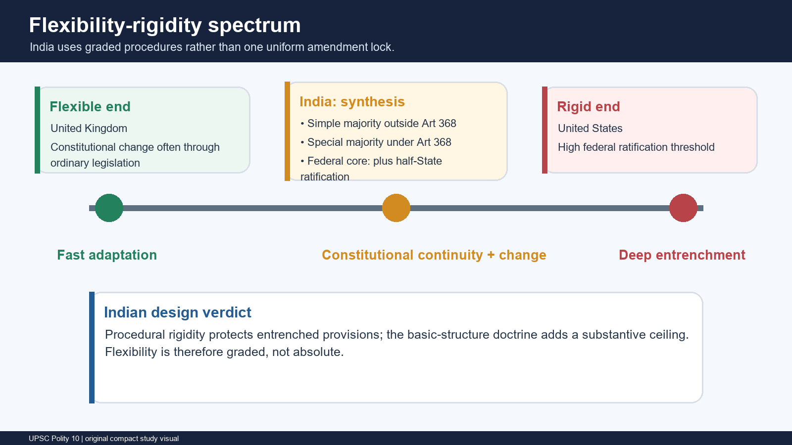

#### Part XX and Article 368

- [FACT] Article 368 is the sole Article in **Part XX**, titled “Amendment of the Constitution”.
- [FACT] Article 368(1), inserted in its present constituent-power form by the 24th Amendment, declares that Parliament may, in exercise of its **constituent power**, amend any provision of the Constitution by addition, variation or repeal in accordance with the Article.
- [ANALYSIS] “Addition, variation or repeal” gives breadth to the form of change. It does not answer the separate substantive question whether a change destroys the Constitution's identity.
- [FACT] Amendment power belongs to the ordinary legislative institutions - Lok Sabha, Rajya Sabha and the President - but the institutions act in a special constitutional capacity and under special thresholds.

#### Flexibility-rigidity synthesis

- [FACT] India does not adopt the United Kingdom's ordinary-legislation model for every constitutional change or the United States' high federal ratification threshold for every amendment.
- [FACT] The Constitution distributes change across three routes: some constitutionally authorised changes through ordinary law, most entrenched text through Article 368 special majority, and the federal core through special majority plus State ratification.
- [ANALYSIS] The design is flexible in subject coverage but rigid in procedure. *Kesavananda Bharati* later added a substantive identity limit.
- [LIMIT] “Flexible” and “rigid” are comparative descriptions, not legal tests. The exact route must always be identified from the constitutional text.

> **Qualified thesis:** India permits constitutional adaptation through graded procedures, but neither an ordinary majority nor an Article 368 super-majority is legally sovereign.

#### Constitutional supremacy, not parliamentary sovereignty

- [FACT] Parliament is created and limited by the Constitution. Its ordinary legislative competence is distributed by the Constitution; its amending competence is conferred and procedurally confined by Article 368.
- [FACT] Courts exercise judicial review under constitutional authority. *Minerva Mills* treats judicial review and limited amending power as basic features.
- [ANALYSIS] The legally accurate contrast is **constitutional supremacy versus parliamentary sovereignty**, not “judiciary versus democracy”.
- [LIMIT] Judicial review does not mean an unlimited judicial power to rewrite policy. Courts must identify a constitutional standard, apply precedent and supply reasons.

### 02. Ordinary legislative power and constituent power

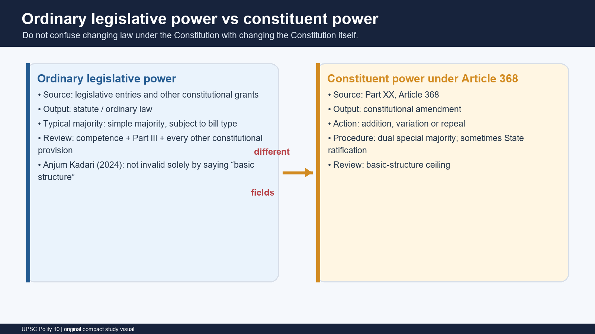

| Dimension | Ordinary legislative power | Constituent power under Article 368 |
|---|---|---|
| Source | Legislative entries and specific constitutional grants | Part XX, Article 368 |
| Product | Statute / ordinary law | Constitutional Amendment Act |
| Typical procedure | Ordinary bill rules, subject to special categories | Article 368 special procedure |
| Main validity tests | Legislative competence; Part III; every other constitutional provision | Procedural compliance; basic-structure ceiling |
| Basic-structure doctrine | Not a free-standing invalidation ground after *Anjum Kadari* | Direct substantive control |
| Democratic function | Governs within the constitutional framework | Alters the framework without destroying its identity |

#### Why the distinction matters

- [FACT] A law can be invalid for violating equality, liberty, secularism-linked provisions or separation-of-powers requirements even though “basic structure” is not the free-standing test.
- [FACT] A constitutional amendment may comply with every voting threshold yet fail because it damages a basic feature.
- [ANALYSIS] The same constitutional value may operate differently: secularism can invalidate an ordinary law through Articles 14, 15, 25-30 or another express provision; it can invalidate a constitutional amendment through the basic-structure doctrine.
- [LIMIT] Do not say all parliamentary acts are exercises of constituent power. The label attaches only when Parliament acts under Article 368 or a separately authorised non-Article-368 constitutional route.

### 03. Three constitutional change routes

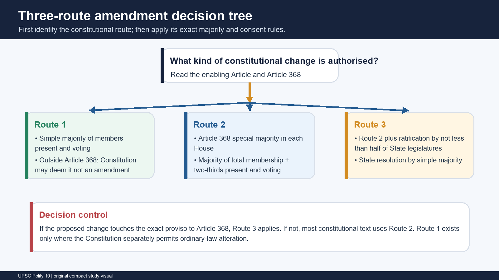

#### Route 1 - Constitutionally authorised ordinary law outside Article 368

[FACT] These measures are commonly called “amendment by simple majority”, but the precise legal point is that the Constitution authorises Parliament to act by ordinary law and often declares that the resulting textual or schedule change is **not deemed an amendment for Article 368**.

| Group | High-yield examples | Qualification |
|---|---|---|
| Territory and State structure | Admission or establishment of new States; formation of new States; alteration of areas, boundaries or names; consequential First and Fourth Schedule changes | Articles 2-4; Article 4 supplies the non-Article-368 rule |
| Legislative Councils | Creation or abolition of a State Legislative Council | Parliament acts by ordinary law under Article 169, but the initiating State Assembly resolution itself needs a majority of total membership plus two-thirds present and voting |
| Citizenship | Acquisition, termination and other citizenship matters | Article 11 authorises parliamentary law; detailed citizenship doctrine belongs to Polity 06 |
| Union territories | Administration, legislatures and Council of Ministers where the Constitution authorises ordinary law | Article 239A(3) is a clear non-Article-368 deeming provision; routes must be checked provision by provision |
| Fifth and Sixth Schedules | Amendment of the Fifth Schedule and Sixth Schedule under their respective amendment paragraphs | Each Schedule contains an express non-Article-368 mechanism |
| Representation and elections | Delimitation, readjustment and election machinery where Parliament is authorised to legislate | An ordinary election law is not itself an Article 368 amendment; changing an entrenched federal item may still require Article 368 |
| Parliamentary operation | Salaries and allowances, quorum as Parliament may by law provide, procedural regulation and privileges where constitutionally authorised | These are ordinary-law adjustments, not a general licence to rewrite every related Article |
| Judiciary details | Number of Supreme Court puisne judges; conferral of further Supreme Court jurisdiction within the constitutional grant | Structural alteration of the Union Judiciary Chapter triggers the Article 368 proviso |
| Language and schedules | Continued use of English and other constitutionally authorised language adjustments; specified Second Schedule emolument changes | Apply the exact enabling Article; do not assume every language or Schedule change is simple-majority |

> **Close-option trap:** “Outside Article 368” does not always mean that every prior step uses a simple majority. Article 169 is the classic exception: the State Assembly resolution uses a special majority, while Parliament's law is ordinary.

#### Route 2 - Special majority under Article 368

- [FACT] Most constitutional provisions, including Fundamental Rights and Directive Principles unless they enter the proviso field, are amended by:
  1. a majority of the **total membership** of each House; and
  2. a majority of **not less than two-thirds of members present and voting** in each House.
- [FACT] Both limbs must be satisfied at the same division.
- [FACT] “Total membership” refers to the full strength of the House, not merely occupied seats or those present.
- [FACT] “Present and voting” excludes abstentions from that denominator; absence may reduce the second denominator but never the total-membership threshold.

#### Route 3 - Special majority plus State ratification

- [FACT] The same dual special majority must first be secured in each House.
- [FACT] Before Presidential assent, the amendment must be ratified by resolutions of the legislatures of **not less than one-half of the States**.
- [FACT] State ratification is by an ordinary/simple majority of members present and voting on the resolution.
- [FACT] The Constitution prescribes no time limit for ratification.
- [LIMIT] Article 368 is silent on withdrawal of a ratification already given. Do not present either revocability or irrevocability as conclusively settled without an authoritative ruling.
- [LIMIT] Union territories do not count as “States” for this ratification threshold.

### 04. Exact Article 368 procedure

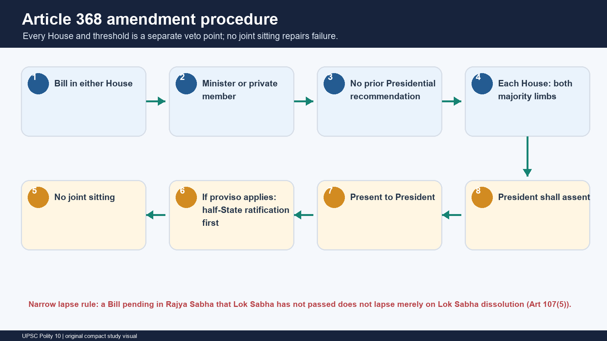

#### Step-by-step

1. [FACT] An amendment can be initiated **only by a Bill in either House of Parliament**. A State legislature cannot introduce an Article 368 Bill.
2. [FACT] The Bill may be introduced by a **Minister or a private member**.
3. [FACT] **No prior recommendation of the President** is required for introduction.
4. [FACT] Each House must pass the Bill **separately** by both special-majority limbs.
5. [FACT] There is **no joint sitting** under Article 108 for a constitutional-amendment deadlock or rejection.
6. [FACT] If the Bill changes a proviso subject, ratification by not less than half of the State legislatures must occur **before** presentation to the President.
7. [FACT] The Bill is then presented to the President.
8. [FACT] The President **shall give assent**. The 24th Amendment made assent obligatory; there is no power to return the Bill for reconsideration or withhold assent.
9. [FACT] On assent, the Constitution stands amended according to the Act's commencement terms.

#### A narrow, verified lapse rule

- [FACT] Article 107(5) states that a Bill pending in Rajya Sabha which Lok Sabha has **not passed** does not lapse merely because Lok Sabha is dissolved.
- [ANALYSIS] This protects a constitutional-amendment Bill introduced and still pending in Rajya Sabha from automatic lapse on dissolution of Lok Sabha.
- [LIMIT] Do not turn the narrow rule into “constitutional-amendment Bills never lapse”. A Bill pending in Lok Sabha, or passed by Lok Sabha and pending in Rajya Sabha, is governed by the relevant dissolution rules; the exact procedural posture matters.

#### Procedure traps

- No prior Presidential recommendation -> but mandatory Presidential assent at the end.
- Bill may start in either House -> but both Houses have equal amendment power.
- State ratification -> by State **legislatures**, not governments or Governors.
- Ratification -> not less than half the States, not two-thirds or three-fourths.
- Joint sitting -> unavailable even if one House rejects or delays.
- Referendum -> not part of Article 368.

### 05. Federal ratification: the exact proviso list

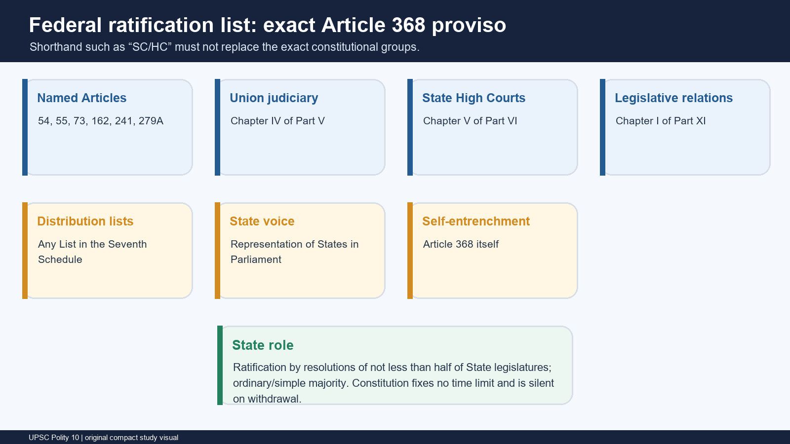

An amendment must be ratified by not less than half of the State legislatures if it seeks to change:

1. [FACT] **Articles 54 and 55** - election of the President and manner of election.
2. [FACT] **Articles 73 and 162** - extent of executive power of the Union and States.
3. [FACT] **Article 241** - High Courts for Union territories.
4. [FACT] **Article 279A** - Goods and Services Tax Council.
5. [FACT] **Chapter IV of Part V** - the Union Judiciary.
6. [FACT] **Chapter V of Part VI** - the High Courts in the States.
7. [FACT] **Chapter I of Part XI** - legislative relations and distribution of legislative powers.
8. [FACT] **Any of the Lists in the Seventh Schedule**.
9. [FACT] **Representation of States in Parliament**.
10. [FACT] **Article 368 itself**.

#### Exact-text discipline

- [LIMIT] “Supreme Court and High Courts” is useful shorthand but incomplete. The proviso uses the two exact Judiciary Chapters and separately names Article 241.
- [LIMIT] “Centre-State relations” is too broad. The proviso identifies executive power Articles, legislative-relations Chapter, Seventh Schedule Lists, State representation and Article 279A.
- [FACT] Conditions of the Governor's office are not in the proviso list.
- [ANALYSIS] The list protects the federal bargain by requiring State consent where an amendment changes the Union-State constitutional compact or the States' voice in national institutions.

### 06. Dual special-majority arithmetic: the 2026 defeated Bill

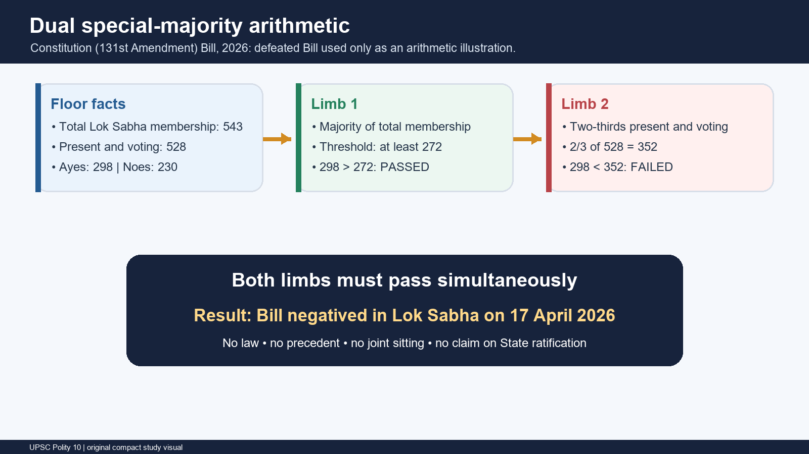

#### Constitution (131st Amendment) Bill, 2026

- [CURRENT] PRS records introduction in Lok Sabha on **16 April 2026**. The Bill proposed, among other changes, substituting Article 81(1) with ceilings of up to **815** directly elected members from States and **35** members for Union territories - a combined proposed ceiling of **850**.
- [CURRENT] The Bill was put to a division on **17 April 2026**: **298 ayes, 230 noes, 528 present and voting**.
- [FACT] Majority of total Lok Sabha membership (543) requires at least **272**. The Bill's 298 ayes satisfied this limb.
- [FACT] Two-thirds of 528 present and voting equals **352**. The Bill's 298 ayes failed this limb.
- [CURRENT] The Bill was therefore **negatived in Lok Sabha**.

| Control | Correct use | Prohibited overstatement |
|---|---|---|
| Legal status | A defeated constitutional-amendment Bill | “The Lok Sabha ceiling is now 850” |
| Evidentiary use | Demonstrates both Article 368 majority limbs | Precedent binding future Houses |
| Joint sitting | None is available to rescue the Bill | “It may be resolved at joint sitting” |
| State ratification | Stage never arose | Assertion that ratification definitely was or was not required |
| Women's reservation | Bill attempted to alter the linked design | Claim of an implementation election or year |

> **Exam line:** The 2026 division separates ordinary political control from constituent capacity: 298 votes were enough for the total-membership limb but not for the two-thirds present-and-voting limb.

### 07. Doctrine chronology: from Fundamental Rights amendability to constitutional identity

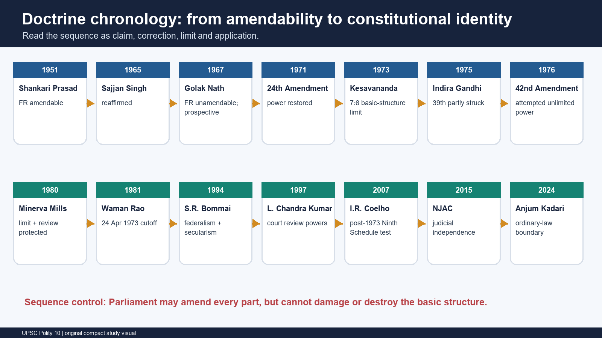

| Case / amendment | Exact holding or constitutional response | Exam qualification |
|---|---|---|
| *Shankari Prasad v. Union of India* (1951) | Parliament could amend Fundamental Rights; a constitutional amendment under Article 368 was not “law” for Article 13(2) | Upheld the First Amendment |
| *Sajjan Singh v. State of Rajasthan* (1965) | Reaffirmed *Shankari Prasad* and upheld Parliament's power to amend Fundamental Rights | Separate opinions raised early doubts about alteration of basic features |
| *I.C. Golak Nath v. State of Punjab* (1967) | Constitutional amendment was “law” under Article 13; Parliament could not abridge Fundamental Rights | Applied **prospective overruling**, preserving earlier amendments |
| 24th Amendment (1971) | Expressly affirmed constituent power; excluded Article 368 amendments from Article 13; made Presidential assent mandatory | Constitutional response to *Golak Nath* |
| *Kesavananda Bharati v. State of Kerala* (1973) | Parliament may amend any part, including Fundamental Rights, but cannot damage or destroy the basic structure | 13 judges; 7:6; judgment on 24 April 1973 |
| 39th Amendment (1975) and *Indira Nehru Gandhi v. Raj Narain* | Attempted to insulate specified high-office election disputes; the Court struck the offending part and applied basic features including free and fair elections, rule of law and judicial review | Do not confuse the 39th Amendment with the 44th |
| 42nd Amendment (1976) | Inserted Article 368(4) and (5), seeking to exclude review and declare no limitation on amending power; also expanded Article 31C | Attempted constitutional supremacy of Parliament |
| *Minerva Mills v. Union of India* (1980) | Struck Article 368(4) and (5); limited amending power and judicial review are basic; harmony between Fundamental Rights and Directive Principles is basic | Also invalidated the 42nd Amendment's expanded Article 31C |
| *Waman Rao v. Union of India* (1981) | Applied the doctrine prospectively to Ninth Schedule insertions after 24 April 1973 | The cut-off concerns constitutional amendments placing laws in the Schedule |
| *S.R. Bommai v. Union of India* (1994) | Reaffirmed secularism and federalism as basic features in the Article 356 context | Basic features can guide interpretation outside an amendment challenge |
| *L. Chandra Kumar v. Union of India* (1997) | Judicial review under Articles 32 and 226/227 is part of the basic structure; tribunal decisions remain subject to High Court review | Court powers are not exhausted by the word “judicial review” |
| *I.R. Coelho v. State of Tamil Nadu* (2007) | Post-24 April 1973 Ninth Schedule insertions are reviewable for their impact on Part III rights forming the basic structure | No automatic invalidity of every post-1973 law |
| NJAC judgment (2015) | Struck the 99th Amendment and the NJAC framework; independence of the judiciary is a basic feature | Detailed appointments debate belongs to Polity 18 |
| *Anjum Kadari v. Union of India* (2024 INSC 831) | Ordinary legislation cannot be invalidated solely for violating basic structure; the defect must be traced to competence, Part III or another constitutional provision | Major technical boundary for current answers |

#### Chronology logic

1. *Shankari* and *Sajjan* treated Fundamental Rights as amendable.
2. *Golak Nath* protected them through Article 13 and prospective overruling.
3. The 24th Amendment restored wide constituent power.
4. *Kesavananda* replaced an absolute rights lock with an identity-based limit.
5. *Indira Gandhi*, *Minerva Mills*, *Coelho* and NJAC demonstrated that the ceiling is judicially enforceable.
6. *Anjum Kadari* prevented the doctrine from becoming an undefined free-standing attack on ordinary statutes.

### 08. Kesavananda Bharati: holding architecture

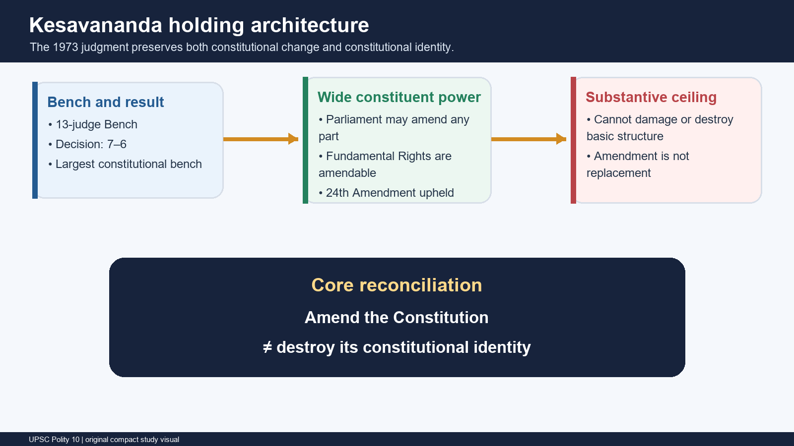

#### What the Court held

- [FACT] A **13-judge Bench** decided the case by a narrow **7:6** majority.
- [FACT] Parliament's Article 368 power extends to every part of the Constitution, including Fundamental Rights.
- [FACT] The power is nevertheless limited: an amendment cannot damage, destroy or abrogate the Constitution's basic structure or framework.
- [FACT] The 24th Amendment's restoration of amending power was upheld subject to this limitation.
- [ANALYSIS] The doctrine shifts the question from “which provision is absolutely unamendable?” to “does the amendment preserve the Constitution's identity after change?”

#### What the Court did not do

- It did not freeze the Constitution in 1973.
- It did not publish one authoritative, closed list of every basic feature.
- It did not make every Fundamental Right textually unamendable.
- It did not confer a free-standing basic-structure test against every ordinary statute.
- It did not establish parliamentary or judicial absolutism.

> **Memory formula:** wide power over every provision + no power to destroy constitutional identity = limited constituent power.

### 09. Basic-structure elements: illustrative and case-attributed

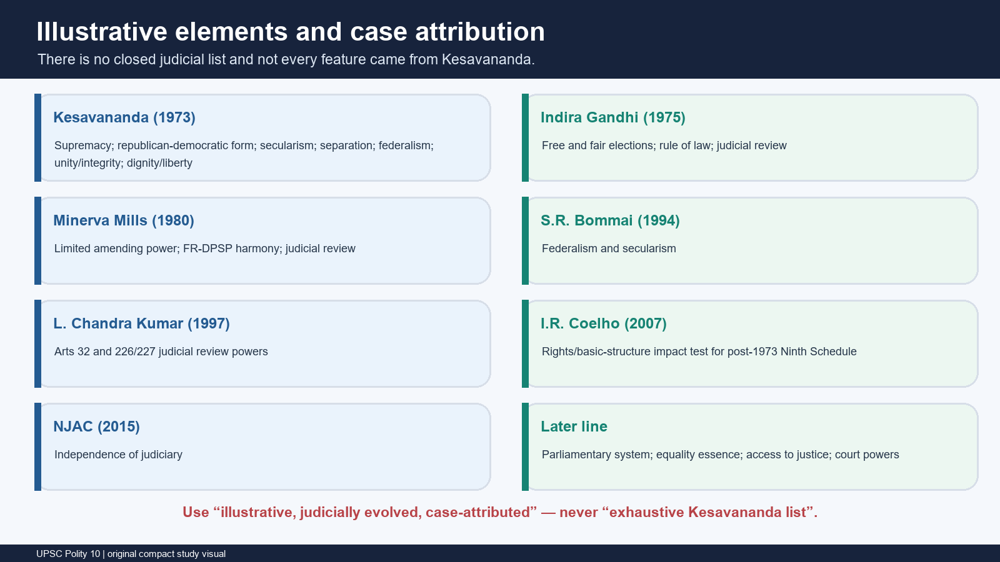

| Feature | Principal attribution / use | Safe formulation |
|---|---|---|
| Supremacy of the Constitution | *Kesavananda* opinions | Parliament remains constitutionally limited |
| Republican and democratic form | *Kesavananda* opinions | Elections alone do not exhaust democracy |
| Secularism | *Kesavananda*; strongly reaffirmed in *S.R. Bommai* | State neutrality/equal concern is constitutionally entrenched |
| Federalism | *Kesavananda*; *S.R. Bommai* | Indian federalism may be asymmetric yet cannot be destroyed |
| Separation of powers | *Kesavananda* and later cases | Functional overlap is permitted; institutional obliteration is not |
| Rule of law | *Indira Nehru Gandhi* and later cases | Public power remains governed by law and review |
| Judicial review | *Indira Gandhi*, *Minerva Mills*, *L. Chandra Kumar* | Review is an essential constitutional control |
| Independence of judiciary | NJAC judgment and earlier judicial-independence cases | Appointments design cannot destroy decisional independence |
| Free and fair elections | *Indira Nehru Gandhi* | Electoral legitimacy must remain legally contestable |
| Dignity, liberty and equality essence | *Kesavananda* opinions; Part III impact cases including *Coelho* | Not every textual detail is frozen, but rights identity cannot be destroyed |
| Fundamental Rights-Directive Principles harmony | *Minerva Mills* | Neither liberty nor social transformation may annihilate the other |
| Limited amending power | *Minerva Mills* | Parliament cannot enlarge a limited power into an unlimited one |
| Parliamentary system | Recognised across the doctrine's later applications | Responsible government cannot be converted without identity review |
| Unity and integrity | *Kesavananda* opinions | Constitutional unity must coexist with federalism and pluralism |
| Access to justice | Later constitutional jurisprudence | Effective access, not a merely formal courthouse, is constitutionally central |
| Core powers of constitutional courts | *L. Chandra Kumar* and related cases | Articles 32, 226 and 227 review cannot be excluded |

#### Attribution cautions

- [LIMIT] Different judges in *Kesavananda* proposed overlapping lists; the narrow majority ratio is the limitation on destruction of basic structure, not one unanimous catalogue.
- [LIMIT] A feature's inclusion does not mean every policy touching it is unconstitutional.
- [ANALYSIS] Courts examine the **degree and effect** of a constitutional amendment: adjustment is permitted; damage or destruction is not.
- [FACT] The list remains illustrative and judicially evolving.

### 10. Ninth Schedule architecture

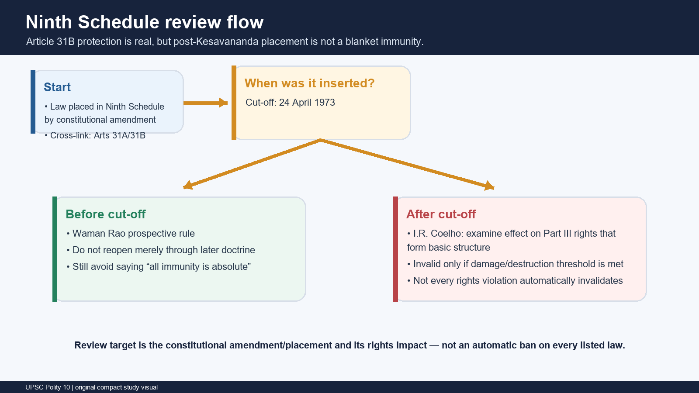

#### Articles 31A and 31B

- [FACT] Article 31A protects specified categories of laws, historically including agrarian-reform measures, subject to its text.
- [FACT] Article 31B validates the Acts and Regulations placed in the Ninth Schedule notwithstanding inconsistency with Part III, subject to later basic-structure review of the constitutional amendment that grants that protection.
- [FACT] The Ninth Schedule and Article 31B were introduced by the **First Amendment Act, 1951**.
- [LIMIT] Article 31A and Article 31B are connected property-reform protections but are not identical mechanisms.

#### Waman Rao cut-off

- [FACT] *Waman Rao* treated **24 April 1973**, the date of *Kesavananda*, as the prospective dividing line.
- [FACT] Constitutional amendments inserting laws into the Ninth Schedule after that date are open to basic-structure scrutiny.
- [LIMIT] The proposition is not “every pre-1973 law is perfect” or “every post-1973 law is void”.

#### I.R. Coelho impact test

- [FACT] *I.R. Coelho* unanimously rejected blanket post-1973 immunity.
- [FACT] The Court asks whether Ninth Schedule protection takes away or abridges Part III rights in a manner that damages a basic feature.
- [ANALYSIS] The analysis moves from the affected right to the underlying basic feature and then to the degree of damage.
- [LIMIT] A post-1973 insertion is **reviewable**, not automatically invalid. Invalidity follows only if the basic-structure impact threshold is crossed.

#### Cross-link control

- Full Fundamental Rights doctrine and Article 31A/31B rights detail -> **Polity 07**.
- Article 31C and the Fundamental Rights-Directive Principles balance -> **Polity 08**.
- This package retains the amendment review architecture, cut-off and impact test.

### 11. The Anjum Kadari boundary: what basic structure does not do

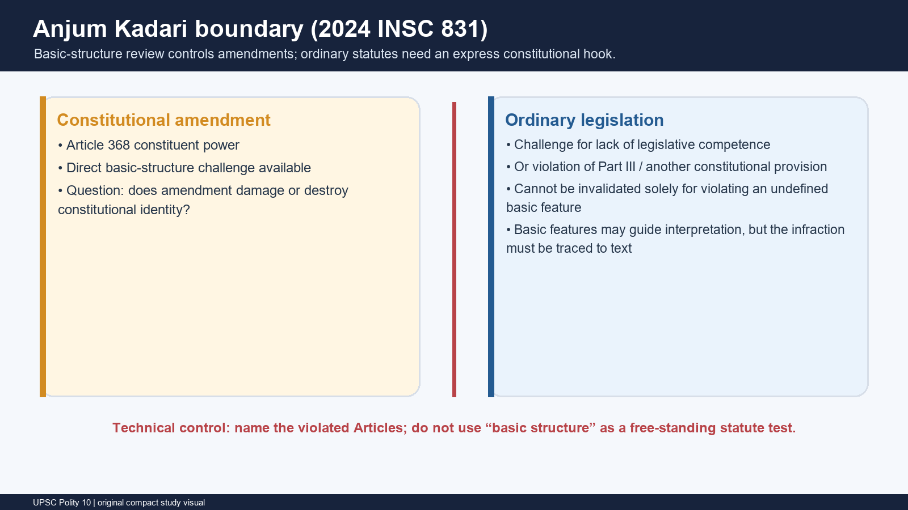

#### Controlling proposition

- [FACT] *Anjum Kadari v. Union of India*, 2024 INSC 831, held that a statute can be struck down for:
  1. lack of legislative competence; or
  2. violation of Part III or another constitutional provision.
- [FACT] The constitutional validity of an ordinary statute cannot be challenged **solely** for violation of the basic structure.
- [FACT] If secularism or another basic feature is invoked against a statute, the infringement must be traced to the constitutional provisions that embody that feature.

#### Why the boundary exists

- [FACT] Constitutional amendments and ordinary laws operate in different fields and face different limitations.
- [ANALYSIS] A free-standing, undefined basic-feature test for statutes would introduce uncertainty and risk replacing the written Constitution's competence and rights tests.
- [FACT] Basic-structure review technically controls constitutional amendments, including post-1973 constitutional amendments that place laws in the Ninth Schedule.
- [ANALYSIS] Basic features may still inform interpretation, proportionality, institutional design and identification of the relevant express provisions.

#### NJAC and tribunal qualification

- [LIMIT] The NJAC litigation involved the 99th Constitutional Amendment as the primary basic-structure target; the dependent Act did not create a general free-standing statute test.
- [LIMIT] Tribunal cases may use separation of powers and judicial independence, but the statutory defect should be connected to Articles governing judicial review, equality, court substitution or another express constitutional command.

> **High-value correction:** “The Act violates the basic structure” is incomplete. For ordinary legislation write: “The Act violates Articles X/Y, which give concrete constitutional form to the relevant basic feature.”

### 12. Current control I: 106th Amendment - commenced, not operational

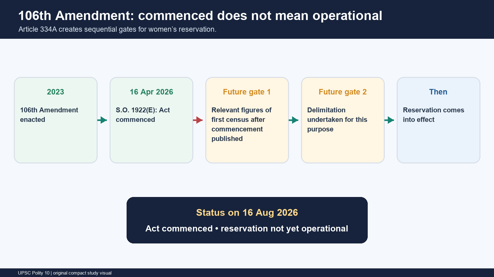

- [FACT] The Constitution (One Hundred and Sixth Amendment) Act, 2023 inserted Articles 330A, 332A and 334A and amended Article 239AA.
- [FACT] Section 1(2) authorised the Central Government to appoint a commencement date by Gazette notification.
- [CURRENT] Gazette **S.O. 1922(E)** appointed **16 April 2026** as the commencement date.
- [FACT] Article 334A(1) states that the reservation provisions come into effect after:
  1. publication of the relevant figures of the **first census taken after commencement**; and
  2. a delimitation exercise undertaken for this purpose.
- [CURRENT] Therefore, as of 16 August 2026, **the Act has commenced but the reservation is not operational**.
- [LIMIT] Do not state an implementation election, implementation year, delimitation date or census final-publication date.
- [LIMIT] Do not compute the reservation's end date. Quote the constitutional phrase “fifteen years from such commencement” when duration is relevant.

> **Close-option trap:** commencement activates the amendment's legal framework; Article 334A separately postpones the reservation's operational effect.

### 13. Current control II: the 2023 anniversary and sovereignty debate

- [CURRENT] 24 April 2023 marked fifty years since the *Kesavananda Bharati* judgment.
- [CURRENT] Vice-President Jagdeep Dhankhar publicly criticised the doctrine in the parliamentary-sovereignty debate and questioned judicial invalidation of constitutional change, including the NJAC episode.
- [LIMIT] These remarks are a political and institutional debate. They did not change Article 368, overrule *Kesavananda* or remove judicial review.
- [ANALYSIS] The strongest answer does not caricature the dispute:
  - criticism: an unelected Court polices the work of elected super-majorities through an unwritten doctrine;
  - response: Indian Parliament is not legally sovereign, and electoral mandate cannot authorise destruction of democratic competition, rights, federalism or judicial review.

### 14. Evaluation: guardian of constitutionalism or judicial overreach?

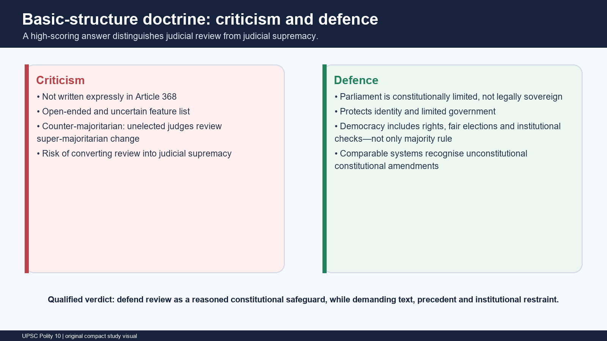

#### Criticisms

1. [FACT] The Constitution does not enumerate a “basic structure” list or expressly state the doctrine.
2. [ANALYSIS] Open-ended features create ex ante uncertainty for Parliament and citizens.
3. [ANALYSIS] A court can invalidate an amendment passed by national and federal super-majorities, creating a counter-majoritarian concern.
4. [ANALYSIS] If feature identification becomes impressionistic, judicial review can drift toward judicial supremacy.
5. [ANALYSIS] The doctrine gives the judiciary the final institutional word on constitutional identity even though judges are not electorally accountable.

#### Defences

1. [FACT] Article 368 confers an amending power, not an express power to replace or destroy the Constitution.
2. [ANALYSIS] Constitutional democracy is more than current majority rule: it preserves future elections, opposition, rights, federal voice, lawful government and independent adjudication.
3. [FACT] *Minerva Mills* demonstrates the self-defeating nature of unlimited amendment: a limited power cannot enlarge itself into an unlimited one.
4. [ANALYSIS] The doctrine preserves a constitutional identity while permitting extensive social, economic and institutional change.
5. [ANALYSIS] Comparative constitutionalism recognises the broader problem of “unconstitutional constitutional amendments”, sometimes through express eternity clauses and sometimes through judicially inferred identity limits.

#### Judicial review versus judicial supremacy

| Judicial review | Judicial supremacy |
|---|---|
| Enforces constitutional limits through text, structure and precedent | Treats judicial preference as sufficient |
| Gives reasons and identifies the damaged feature | Uses an undefined feature as a policy veto |
| Respects amendment unless damage/destruction is shown | Substitutes the Court for the amending body |
| Accepts institutional fallibility and narrow remedies | Claims unreviewable judicial finality |

> **Qualified verdict:** The doctrine is best defended as a necessary form of judicial review under constitutional supremacy, but its legitimacy depends on disciplined attribution, a demanding damage test and refusal to use “basic structure” as an all-purpose policy objection.

### 15. Prelims close-option controls

- Article 368 is in **Part XX**, not Part III or Part XI.
- Amendment forms are **addition, variation and repeal**.
- An amendment Bill may begin in **either House**.
- It may be introduced by a Minister **or private member**.
- Prior Presidential recommendation is **not** required.
- Each House must separately satisfy **both** special-majority limbs.
- There is **no joint sitting**.
- State ratification applies only to the exact proviso list and uses resolutions of not less than half the States.
- State ratification uses a **simple majority**, not Article 368 special majority.
- President **shall assent** after the 24th Amendment.
- Basic structure was propounded in **Kesavananda**, not *Golak Nath*.
- *Golak Nath* used prospective overruling.
- 39th Amendment, not 44th, attempted to insulate specified election disputes.
- 99th Amendment/NJAC was struck for judicial-independence concerns.
- Post-1973 Ninth Schedule laws are **reviewable**, not automatically void.
- Ordinary laws are not invalid solely for violating basic structure after *Anjum Kadari*.
- 131st Amendment Bill, 2026 was **defeated**, not enacted.
- 106th Amendment has **commenced** but the reservation is **not operational**.

### 16. Answer-writing architecture

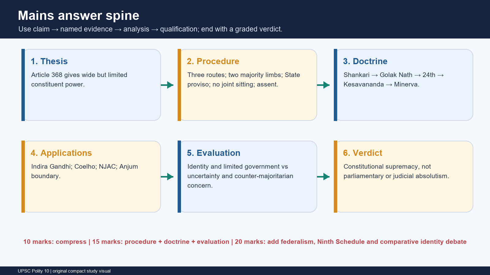

#### Demand decoding

| Demand | Mandatory spine | Frequent failure |
|---|---|---|
| Explain Article 368 | Constituent power -> procedure -> three routes -> basic-structure ceiling | Listing cases without procedure |
| Examine procedural and substantive limits | Dual majority, ratification, no joint sitting, assent -> *Kesavananda*, *Minerva*, applications | Treating basic structure as a procedural rule |
| Critically evaluate doctrine | Holding -> cases -> criticism -> defence -> qualified verdict | Declaring either Parliament or Court absolutely supreme |
| Discuss federal role | Exact proviso -> ratification mechanics -> State limitations -> evaluation | Loose “federal provisions need consent” |
| Ninth Schedule | Articles 31A/31B -> cut-off -> *Coelho* impact test | “All listed laws are immune/invalid” |
| Apply current law | 131st arithmetic; 106th commencement distinction; *Anjum* boundary | Using proposed law or political debate as settled law |

#### Mark-scaled structures

| Marks | Structure | Named evidence target |
|---:|---|---|
| 10 | Direct thesis -> 3-4 dimensions -> one qualification -> verdict | 2-3 precise Articles/cases |
| 15 | Thesis -> procedure/doctrine -> applications -> criticism/defence -> verdict | 4-6 precise Articles/cases/current controls |
| 20 | Constitutional design -> procedure -> chronology -> applications -> evaluation/comparison -> nuanced verdict | 6-8 linked evidence units |

#### Reusable theses

- Article 368 creates a wide constituent power, but procedure limits its exercise and the basic-structure doctrine limits its reach.
- India rejects both British parliamentary sovereignty and constitutional immobility: it permits amendment but not constitutional destruction.
- The doctrine's strength and controversy arise from the same feature - a judicially inferred, open-ended identity limit.
- Federal ratification is selective rather than universal: States consent to alteration of the federal compact, while most constitutional change remains Parliament-centred.

## BASIC MCQS / REMEDIATION

### Original hard MCQs

> **Rotation control:** Correct options run strictly **A -> B -> C -> D**, repeated seven times. Every option has been written to avoid answer-giving language.

#### Original hard MCQ 1

With reference to Article 368, which formulation is the most accurate?

A. Parliament exercises constituent power to amend by addition, variation or repeal, subject to procedure and the basic-structure ceiling.  
B. Parliament exercises ordinary legislative power and may amend only provisions outside Part III.  
C. Parliament exercises sovereign power once half the States have ratified every amendment.  
D. Parliament exercises constituent power that is immune from judicial review after Presidential assent.

**Answer: A. Parliament exercises constituent power to amend by addition, variation or repeal, subject to procedure and the basic-structure ceiling.**

**Explanation:** Article 368(1) expressly uses constituent power and the three forms of amendment. *Kesavananda* and *Minerva Mills* deny immunity or unlimited power.

#### Original hard MCQ 2

In a House with total membership 245, 180 members are present and voting on an Article 368 Bill. What is the minimum number of affirmative votes needed?

A. 120, because only two-thirds present and voting matters.  
B. 123, because both a majority of total membership and two-thirds present and voting must be crossed.  
C. 91, because a majority of those present is sufficient if no member abstains.  
D. 164, because two-thirds of total membership is mandatory.

**Answer: B. 123, because both a majority of total membership and two-thirds present and voting must be crossed.**

**Explanation:** Majority of total membership requires 123; two-thirds of 180 requires 120. Both apply, so the higher operative minimum is 123.

#### Original hard MCQ 3

Which statement correctly describes creation or abolition of a State Legislative Council?

A. It is completed by an Article 368 amendment ratified by half the States.  
B. Parliament and the State Assembly both use an ordinary majority.  
C. The State Assembly first passes the prescribed special-majority resolution; Parliament then enacts an ordinary law outside Article 368.  
D. The Governor creates or abolishes the Council after Parliament approves a resolution.

**Answer: C. The State Assembly first passes the prescribed special-majority resolution; Parliament then enacts an ordinary law outside Article 368.**

**Explanation:** Article 169 is the classic qualification to the phrase “simple-majority amendment”: the parliamentary law is ordinary, but the initiating Assembly resolution has a special threshold.

#### Original hard MCQ 4

Which group is entirely within the ratification proviso to Article 368?

A. Articles 54, 55 and conditions of the Governor's office  
B. Chapter IV of Part V, Article 324 and the Tenth Schedule  
C. Article 241, Fundamental Duties and the Second Schedule  
D. Article 279A, Chapter I of Part XI and representation of States in Parliament

**Answer: D. Article 279A, Chapter I of Part XI and representation of States in Parliament.**

**Explanation:** All three are exact proviso subjects. The distractors insert Governor conditions, Article 324, Fundamental Duties, Tenth Schedule or Second Schedule, none of which appears in the proviso as such.

#### Original hard MCQ 5

A Constitution Amendment Bill is introduced in Rajya Sabha and remains pending there without having been passed by Lok Sabha when Lok Sabha is dissolved. Which is correct?

A. It does not lapse merely because of the dissolution, under the narrow rule in Article 107(5).  
B. It lapses because every amendment Bill requires simultaneous existence of both Houses.  
C. It is deemed passed by Rajya Sabha and may be sent directly to the President.  
D. It must be referred to a joint sitting after the new Lok Sabha is constituted.

**Answer: A. It does not lapse merely because of the dissolution, under the narrow rule in Article 107(5).**

**Explanation:** The protected posture is a Bill pending in Rajya Sabha that Lok Sabha has not passed. This must not be generalised into “amendment Bills never lapse”.

#### Original hard MCQ 6

Consider the following statements about introduction of a Constitution Amendment Bill:

1. It may be introduced in either House.
2. It may be introduced by a private member.
3. It needs prior Presidential recommendation.

Which are correct?

A. 1 only  
B. 1 and 2 only  
C. 2 and 3 only  
D. 1, 2 and 3

**Answer: B. 1 and 2 only.**

**Explanation:** Either House and either a Minister or private member are permitted. Prior Presidential recommendation is not required.

#### Original hard MCQ 7

Which combination is most defensibly classified as constitutionally authorised ordinary-law change outside Article 368?

A. Altering Article 368; changing State representation in Parliament; amending List I  
B. Rewriting the Union Judiciary Chapter; altering Article 279A; changing Article 54  
C. Forming a new State under Articles 3-4; changing citizenship law under Article 11; amending the Fifth Schedule through its express mechanism  
D. Amending Fundamental Rights; Directive Principles; and the Preamble

**Answer: C. Forming a new State under Articles 3-4; changing citizenship law under Article 11; amending the Fifth Schedule through its express mechanism.**

**Explanation:** These are separately authorised ordinary-law fields. Options A and B require the federal route; D normally requires Article 368 special majority.

#### Original hard MCQ 8

What does the Lok Sabha division on the Constitution (131st Amendment) Bill, 2026 establish?

A. The proposed Article 81 ceiling of 850 became operative after 298 ayes.  
B. State ratification was judicially held unnecessary for seat allocation.  
C. A joint sitting may be summoned if the two-thirds limb fails.  
D. A Bill can satisfy the total-membership-majority limb yet fail the two-thirds-present-and-voting limb.

**Answer: D. A Bill can satisfy the total-membership-majority limb yet fail the two-thirds-present-and-voting limb.**

**Explanation:** 298 exceeded 272 but not 352, two-thirds of 528. The Bill was defeated and created no law or precedent.

#### Original hard MCQ 9

Which proposition belongs to *Shankari Prasad* (1951)?

A. A constitutional amendment under Article 368 was not “law” under Article 13(2), and Fundamental Rights could be amended.  
B. Fundamental Rights were transcendental and could not be amended prospectively.  
C. Basic structure limited constituent power.  
D. Judicial review and limited amending power were basic features.

**Answer: A. A constitutional amendment under Article 368 was not “law” under Article 13(2), and Fundamental Rights could be amended.**

**Explanation:** B is *Golak Nath*; C is *Kesavananda*; D is *Minerva Mills*.

#### Original hard MCQ 10

The distinctive remedial technique used in *Golak Nath* (1967) was:

A. Reading down Article 368 to require State ratification for all rights amendments  
B. Prospective overruling, so earlier amendments were not invalidated by the new rule  
C. Suspending the judgment until a constitutional convention was held  
D. Applying basic structure only to future Ninth Schedule laws

**Answer: B. Prospective overruling, so earlier amendments were not invalidated by the new rule.**

**Explanation:** *Golak Nath* treated amendments as Article 13 law and protected Fundamental Rights, but prospectively preserved the earlier constitutional position.

#### Original hard MCQ 11

Which statement best captures the *Kesavananda Bharati* settlement?

A. Fundamental Rights cannot be amended under any circumstances.  
B. Only the Preamble is beyond amendment.  
C. Every part is amendable, but the basic structure cannot be damaged or destroyed.  
D. Every amendment requires half-State ratification.

**Answer: C. Every part is amendable, but the basic structure cannot be damaged or destroyed.**

**Explanation:** The judgment rejected both unlimited power and *Golak Nath*'s absolute rights lock.

#### Original hard MCQ 12

Why are Article 368(4) and (5), inserted by the 42nd Amendment, central to *Minerva Mills*?

A. They required ratification by three-fourths of States.  
B. They transferred amendment power to a constitutional convention.  
C. They made the Preamble the only review standard.  
D. They attempted to exclude judicial review and declare the amending power unlimited.

**Answer: D. They attempted to exclude judicial review and declare the amending power unlimited.**

**Explanation:** *Minerva Mills* struck them because limited amending power and judicial review are basic features.

#### Original hard MCQ 13

The principal significance of *Waman Rao* for Ninth Schedule analysis is:

A. It fixed 24 April 1973 as the prospective cut-off for basic-structure scrutiny of later insertions.  
B. It held every Ninth Schedule law void.  
C. It abolished Article 31B prospectively.  
D. It extended the *Golak Nath* rule to ordinary statutes.

**Answer: A. It fixed 24 April 1973 as the prospective cut-off for basic-structure scrutiny of later insertions.**

**Explanation:** The date is that of *Kesavananda*. Reviewability after the cut-off does not mean automatic invalidity.

#### Original hard MCQ 14

Under *I.R. Coelho* (2007), a law placed in the Ninth Schedule after 24 April 1973:

A. is invalid merely because it abridges any Fundamental Right  
B. is reviewable to determine whether the rights impact damages a basic feature  
C. receives absolute immunity once the President assents to the amendment  
D. can be examined only for legislative competence, never for rights impact

**Answer: B. is reviewable to determine whether the rights impact damages a basic feature.**

**Explanation:** *Coelho* uses an impact test linking Part III rights to basic structure; it rejects both blanket immunity and automatic invalidity.

#### Original hard MCQ 15

Which is the technically correct use of *Anjum Kadari* (2024)?

A. Every ordinary statute affecting secularism is immune from review.  
B. Ordinary statutes may be struck solely because a court labels a value “basic”.  
C. An ordinary statute challenge must trace the defect to competence, Part III or another constitutional provision.  
D. The basic-structure doctrine no longer applies to Ninth Schedule amendments.

**Answer: C. An ordinary statute challenge must trace the defect to competence, Part III or another constitutional provision.**

**Explanation:** Basic features can guide interpretation, but an express constitutional hook is required for ordinary legislation.

#### Original hard MCQ 16

Which statement most accurately connects the NJAC judgment with basic structure?

A. It upheld the 99th Amendment because appointments are political questions.  
B. It created a rule that all judicial statutes violate basic structure.  
C. It removed Parliament's power to legislate on court administration.  
D. It invalidated the 99th Amendment framework because judicial independence is a basic feature.

**Answer: D. It invalidated the 99th Amendment framework because judicial independence is a basic feature.**

**Explanation:** The holding is amendment-specific and does not create a free-standing basic-structure attack on every ordinary Act.

#### Original hard MCQ 17

Which pairing is the most accurate?

A. *Indira Nehru Gandhi* - free and fair elections; *Minerva Mills* - Fundamental Rights-Directive Principles harmony  
B. *Golak Nath* - judicial independence; *Waman Rao* - secularism  
C. *Sajjan Singh* - Ninth Schedule impact test; *Coelho* - prospective overruling  
D. *Bommai* - mandatory Presidential assent; *Anjum Kadari* - unlimited constituent power

**Answer: A. *Indira Nehru Gandhi* - free and fair elections; *Minerva Mills* - Fundamental Rights-Directive Principles harmony.**

**Explanation:** The remaining pairings transpose unrelated holdings.

#### Original hard MCQ 18

An ordinary State law is alleged to destroy federalism. After *Anjum Kadari*, the court should first ask:

A. Whether federalism appears in any judge's basic-feature list  
B. Whether the State lacked legislative competence or the law violates an express constitutional provision embodying federalism  
C. Whether half the States ratified the ordinary law  
D. Whether the President gave mandatory assent under Article 368

**Answer: B. Whether the State lacked legislative competence or the law violates an express constitutional provision embodying federalism.**

**Explanation:** The ordinary-law inquiry is text-linked. Article 368 ratification and assent do not apply to a State statute.

#### Original hard MCQ 19

What is the present constitutional status of women's reservation under the 106th Amendment as controlled to 28 August 2026?

A. It never commenced because no notification was issued.  
B. It became operational immediately on Presidential assent in 2023.  
C. The Act commenced on 16 April 2026, but reservation awaits the Article 334A census-publication and delimitation conditions.  
D. It became operational when the 131st Amendment Bill was introduced.

**Answer: C. The Act commenced on 16 April 2026, but reservation awaits the Article 334A census-publication and delimitation conditions.**

**Explanation:** S.O. 1922(E) commenced the Act. Article 334A separately controls operational effect.

#### Original hard MCQ 20

Consider the following about State ratification under Article 368:

1. It is by resolutions of State legislatures.
2. It must be obtained from not less than half the States.
3. The Constitution fixes a six-month deadline.
4. The Constitution expressly permits withdrawal of ratification.

Which option is correct?

A. 1 and 3 only  
B. 2 and 4 only  
C. 1, 2 and 3 only  
D. 1 and 2 only

**Answer: D. 1 and 2 only.**

**Explanation:** The text prescribes neither a time limit nor an express withdrawal rule.

#### Original hard MCQ 21

Which provision was added to the Article 368 ratification proviso in connection with the GST constitutional design?

A. Article 279A  
B. Article 280  
C. Article 301  
D. Article 312

**Answer: A. Article 279A.**

**Explanation:** Article 279A establishes the GST Council and is expressly named in the proviso.

#### Original hard MCQ 22

Which constitutional amendment-case sequence is correct?

A. 44th Amendment -> insulation of Prime Ministerial election -> *Indira Nehru Gandhi*  
B. 39th Amendment -> attempted insulation of specified election disputes -> *Indira Nehru Gandhi*  
C. 42nd Amendment -> creation of NJAC -> NJAC judgment  
D. 24th Amendment -> Ninth Schedule cut-off -> *Waman Rao*

**Answer: B. 39th Amendment -> attempted insulation of specified election disputes -> *Indira Nehru Gandhi*.**

**Explanation:** The distractors deliberately attach correct doctrines to the wrong amendments.

#### Original hard MCQ 23

The central basic-structure holding of *L. Chandra Kumar* is that:

A. tribunal decisions are wholly immune from High Court review  
B. Parliament cannot create tribunals under Articles 323A or 323B  
C. judicial review under Articles 32 and 226/227 is an inviolable basic feature  
D. every tribunal statute must be enacted under Article 368

**Answer: C. judicial review under Articles 32 and 226/227 is an inviolable basic feature.**

**Explanation:** Tribunals may act as courts of first instance, but their decisions remain reviewable by High Courts.

#### Original hard MCQ 24

Which is the safest statement about withdrawal of a State's Article 368 ratification?

A. Withdrawal is always valid until Presidential assent.  
B. Withdrawal is never valid after the first State ratifies.  
C. Withdrawal needs approval of the Rajya Sabha.  
D. The constitutional text is silent, so a categorical rule should not be asserted without authority.

**Answer: D. The constitutional text is silent, so a categorical rule should not be asserted without authority.**

**Explanation:** UPSC answers should identify the ambiguity rather than invent a settled rule.

#### Original hard MCQ 25

Why is “Supreme Court and High Courts” an incomplete shorthand for the Article 368 proviso?

A. The text names Chapter IV of Part V, Chapter V of Part VI and separately Article 241.  
B. The text covers only appointment of judges, not court powers.  
C. The text excludes the Union Judiciary Chapter.  
D. The text includes every tribunal and subordinate court.

**Answer: A. The text names Chapter IV of Part V, Chapter V of Part VI and separately Article 241.**

**Explanation:** Exact Chapter and Article references prevent both omission and overbreadth.

#### Original hard MCQ 26

Which institutional position best distinguishes judicial review from judicial supremacy?

A. Courts may invalidate any policy they regard as unwise.  
B. Courts enforce identified constitutional limits with reasons, while recognising that policy choice remains with elected institutions within those limits.  
C. Parliament may override every judgment by ordinary law.  
D. Judicial decisions are beyond constitutional criticism.

**Answer: B. Courts enforce identified constitutional limits with reasons, while recognising that policy choice remains with elected institutions within those limits.**

**Explanation:** Review is constitutionally bounded adjudication; supremacy implies an unbounded policy veto.

#### Original hard MCQ 27

Which combination correctly states two central targets of *Minerva Mills*?

A. Articles 54 and 55 as amended by the 39th Amendment  
B. Article 31B and the Ninth Schedule as inserted in 1951  
C. The expanded Article 31C and Article 368(4)-(5) introduced by the 42nd Amendment  
D. Article 169 and State Legislative Councils

**Answer: C. The expanded Article 31C and Article 368(4)-(5) introduced by the 42nd Amendment.**

**Explanation:** The judgment protected rights-DPSP harmony, limited amending power and judicial review.

#### Original hard MCQ 28

The amendment-versus-replacement distinction most directly asks whether:

A. the Bill was introduced by a Minister  
B. every State ratified the amendment  
C. the President delayed assent  
D. the Constitution retains its basic identity after the change

**Answer: D. the Constitution retains its basic identity after the change.**

**Explanation:** Article 368 permits alteration of the existing Constitution, not use of a constituted power to abolish the constitutional order that created it.

### Remedial MCQs

> These target the highest-frequency errors. Rotation continues **A -> B -> C -> D**, repeated twice.

#### Remedial MCQ 29 - Denominator error

In an Article 368 division, 300 members are present, 270 vote and 30 abstain. For the two-thirds limb, the denominator is:

A. 270, because abstainers are present but not voting  
B. 300, because all present members count  
C. total membership of the House  
D. only the affirmative votes

**Answer: A. 270, because abstainers are present but not voting.**

**Explanation:** “Present and voting” excludes abstentions. The separate total-membership-majority limb remains unchanged.

#### Remedial MCQ 30 - “Simple majority” overstatement

Which correction is necessary to the sentence “Abolition of a Legislative Council needs only a simple majority”?

A. It always needs Article 368 and half-State ratification.  
B. Parliament's law is ordinary, but the State Assembly's initiating resolution requires its prescribed special majority.  
C. Only the Governor can initiate abolition.  
D. Rajya Sabha alone passes the final law.

**Answer: B. Parliament's law is ordinary, but the State Assembly's initiating resolution requires its prescribed special majority.**

**Explanation:** The shorthand is incomplete unless the Article 169 precondition is supplied.

#### Remedial MCQ 31 - Ratification shorthand

Which exact constitutional unit, rather than a loose subject label, appears in the Article 368 proviso?

A. All provisions concerning courts  
B. The whole of Part XI  
C. Chapter I of Part XI  
D. Every Article concerning Centre-State relations

**Answer: C. Chapter I of Part XI.**

**Explanation:** The proviso uses exact Articles, Chapters, Lists and institutional subjects. Overbroad shorthand creates wrong options.

#### Remedial MCQ 32 - Anjum boundary

An ordinary law is challenged only on the statement that it “violates democracy, a basic feature”. The legally sufficient response is:

A. Strike it down because every basic-feature allegation is self-proving.  
B. Refer the law for State ratification.  
C. Convert the challenge into an Article 368 proceeding.  
D. Require the challenger to identify legislative incompetence or violated constitutional provisions embodying democracy.

**Answer: D. Require the challenger to identify legislative incompetence or violated constitutional provisions embodying democracy.**

**Explanation:** *Anjum Kadari* rejects a free-standing ordinary-statute basic-structure test.

#### Remedial MCQ 33 - Ninth Schedule absolutism

Which statement is correct?

A. Post-24 April 1973 Ninth Schedule insertions are reviewable, but invalidity depends on basic-structure impact.  
B. Every Ninth Schedule law is immune forever.  
C. Every post-1973 Ninth Schedule law is automatically void.  
D. Article 31B was repealed by *I.R. Coelho*.

**Answer: A. Post-24 April 1973 Ninth Schedule insertions are reviewable, but invalidity depends on basic-structure impact.**

**Explanation:** Reviewability is an opening of the judicial inquiry, not its predetermined result.

#### Remedial MCQ 34 - Defeated Bill status

The proposed Article 81 ceiling of 850 should be described as:

A. the current constitutional maximum  
B. a proposal in the defeated 131st Amendment Bill, 2026  
C. a binding precedent from the 2026 Lok Sabha division  
D. a provision operationalised by the 106th Amendment

**Answer: B. a proposal in the defeated 131st Amendment Bill, 2026.**

**Explanation:** The Bill was negatived and never became law.

#### Remedial MCQ 35 - Commencement trap

Which sequence correctly represents Article 334A?

A. Assent -> immediate reservation -> later census  
B. Introduction of delimitation Bill -> automatic reservation  
C. Commencement -> publication of relevant first-post-commencement census figures -> delimitation -> reservation effect  
D. Commencement -> Presidential order selecting an election year

**Answer: C. Commencement -> publication of relevant first-post-commencement census figures -> delimitation -> reservation effect.**

**Explanation:** Commencement and operational effect are distinct constitutional stages.

#### Remedial MCQ 36 - State ratification mechanics

State ratification of an Article 368 proviso amendment is:

A. by Governors acting collectively  
B. by State referendums  
C. by State legislatures using the Article 368 dual special majority  
D. by resolutions of not less than half the State legislatures, using ordinary/simple majority

**Answer: D. by resolutions of not less than half the State legislatures, using ordinary/simple majority.**

**Explanation:** The Union special majority and State ratification majority are different.

## PYQS AND ANSWER PRACTICE

### Every verified routed previous-year question

#### PYQ provenance and answer-control ledger

| Year | Stage | Question | Local source | Key control |
|---:|---|---:|---|---|
| 2019 | GS-II Mains | Q12 | Official local paper and Mains routing ledger | 15 marks, 250 words |
| 2025 | GS-II Mains | Q12 | Official local paper and Mains routing ledger | 15 marks, 250 words |
| 2018 | Prelims GS-I | Q5 | Official local question booklet | Historical official key unavailable locally; answer inferred and labelled |
| 2019 | Prelims GS-I | Q45 | Official local question booklet | Historical official key unavailable locally; answer inferred and labelled |
| 2019 | Prelims GS-I | Q47 | Official local question booklet | Historical official key unavailable locally; answer inferred and labelled |
| 2020 | Prelims GS-I | Q13 | Official local question booklet; OCR artefact checked | Historical official key unavailable locally; answer inferred and labelled |
| 2022 | Prelims GS-I | Q13 | Official local question booklet | Historical official key unavailable locally; answer inferred and labelled |
| 2023 | Prelims GS-I | Q34 | Official local question booklet | Historical official key unavailable locally; answer inferred and labelled |
| 2024 | Prelims GS-I | Q66 | Official local Set-A paper | Official local Set-A key directly checked: **D** |
| 2025 | Prelims GS-I | Q58 | Official local Set-A paper | Official local Set-A key directly checked: **A** |

### A. Solved Mains PYQs

#### Mains PYQ 1 - 2019 GS-II Q12

**Question:** “Parliament's power to amend the Constitution is a limited power and it cannot be enlarged into absolute power.” In the light of this statement explain whether Parliament under Article 368 of the Constitution can destroy the Basic Structure of the Constitution by expanding its amending power. **(15 marks, 250 words)**

**Model solution**

Article 368 grants Parliament a broad **constituent power**, but the expression “amendment” does not authorise constitutional destruction. The Supreme Court has therefore treated the power as wide in subject matter and limited in legal effect.

**Evolution of the limit.** *Shankari Prasad* (1951) and *Sajjan Singh* (1965) accepted amendment of Fundamental Rights. *Golak Nath* (1967) reversed course, treating amendments as “law” under Article 13, but used prospective overruling. Parliament responded through the 24th Amendment, expressly affirming constituent power and mandatory Presidential assent.

**Kesavananda settlement.** A 13-judge Bench in *Kesavananda Bharati* (1973), by 7:6, upheld Parliament's capacity to amend every part, including Fundamental Rights, but denied the power to damage or destroy the Constitution's basic structure. Thus breadth of amendment coexists with continuity of constitutional identity.

**Why Parliament cannot expand the limit away.** The 42nd Amendment inserted Article 368(4) and (5), seeking to exclude judicial review and declare the power unlimited. *Minerva Mills* (1980) invalidated these clauses: limited amending power and judicial review are themselves basic features. A limited, Constitution-created power cannot convert itself into an unlimited one.

Applications confirm the rule: *Indira Nehru Gandhi* protected free and fair elections and review; *I.R. Coelho* opened post-1973 Ninth Schedule insertions to impact review; the NJAC judgment protected judicial independence.

**Conclusion:** Parliament may transform constitutional arrangements, but it cannot use Article 368 to abolish constitutional supremacy, democratic competition, rights, federalism or independent review. Amendment ends where replacement begins.

**Why this earns marks:** It answers the precise “expanding its own power” issue, uses the 42nd Amendment-*Minerva Mills* evidence chain, explains rather than merely lists *Kesavananda*, and ends with a direct graded verdict.

**How to improve this answer:** In the exam, compress the opening to one sentence and draw a
three-link margin chain — `Art. 368(4)-(5) -> Minerva Mills -> limited power cannot become
unlimited`. If space permits, add one sentence distinguishing amendment from constitutional
replacement; do not spend words listing every basic feature.

#### Mains PYQ 2 - 2025 GS-II Q12

**Question:** Indian Constitution has conferred the amending power on the ordinary legislative institutions with a few procedural hurdles. In view of this statement, examine the procedural and substantive limitations on the amending power of the Parliament to change the Constitution. **(15 marks, 250 words)**

**Model solution**

The Constitution entrusts amendment to the ordinary parliamentary institutions, but they exercise a special **constituent power**, not ordinary legislative power. Article 368 consequently places limits on both **how** the power is exercised and **what** it may accomplish.

**Procedural limitations**

1. An amendment Bill can originate only in either House of Parliament, though it may be introduced by a Minister or private member without prior Presidential recommendation.
2. Each House must separately satisfy a majority of total membership and not less than two-thirds present and voting. There is no joint sitting.
3. Amendments to the federal proviso subjects - including Articles 54, 55, 73, 162, 241 and 279A; the specified Judiciary and legislative-relations Chapters; Seventh Schedule Lists; State representation; and Article 368 - require ratification by not less than half the State legislatures.
4. Ratification must precede presentation to the President, who shall assent after the 24th Amendment.

The defeated 131st Amendment Bill (2026) illustrates the dual test: 298 votes cleared the total-membership limb but fell below two-thirds of 528, or 352.

**Substantive limitation**

*Kesavananda Bharati* (1973) permits amendment of every provision but forbids damage or destruction of the basic structure. *Minerva Mills* made limited amending power and judicial review basic features. *Indira Nehru Gandhi*, *I.R. Coelho* and the NJAC judgment protected free elections, post-1973 Ninth Schedule review and judicial independence respectively.

The doctrine is criticised as unwritten and counter-majoritarian, yet it reflects constitutional rather than parliamentary supremacy. *Anjum Kadari* (2024) also keeps the test technically confined to amendments, requiring ordinary statutes to be challenged through express constitutional provisions.

**Conclusion:** Parliament's amending power is procedurally entrenched and substantively limited: it can change the Constitution, not destroy its identity.

**Why this earns marks:** The answer explicitly separates procedural from substantive limits, uses the exact proviso groups, adds a verified current arithmetic example, supplies case-linked analysis and qualifies the doctrine's democratic tension.

**How to improve this answer:** Use two visible subheads, **Procedural** and **Substantive**, and
reserve the final 35-40 words for evaluation. For a tighter 250-word script, cite only three
proviso groups plus “the remaining exact proviso subjects”, while retaining *Kesavananda*,
*Minerva Mills* and the 2026 division arithmetic.

### B. Solved Prelims PYQs

#### Prelims PYQ 1 - 2018 GS-I Q5

Consider the following statements:

1. The Parliament of India can place a particular law in the Ninth Schedule of the Constitution of India.
2. The validity of a law placed in the Ninth Schedule cannot be examined by any court and no judgement can be made on it.

Which of the statements given above is/are correct?

A. 1 only  
B. 2 only  
C. Both 1 and 2  
D. Neither 1 nor 2

**Answer: A. 1 only**

> **INFERRED ANSWER - NOT OFFICIALLY VERIFIED.** The official 2018 key is unavailable locally. Confidence: high.

**Explanation:** Parliament places a law in the Ninth Schedule through a constitutional amendment, so Statement 1 is correct. Statement 2 is absolute and false. *Waman Rao* and *I.R. Coelho* establish that post-24 April 1973 insertions are reviewable for basic-structure impact. Reviewability does not mean every inserted law is invalid.

#### Prelims PYQ 2 - 2019 GS-I Q45

Consider the following statements:

1. The 44th Amendment to the Constitution of India introduced an Article placing the election of the Prime Minister beyond judicial review.
2. The Supreme Court of India struck down the 99th Amendment to the Constitution of India as being violative of the independence of judiciary.

Which of the statements given above is/are correct?

A. 1 only  
B. 2 only  
C. Both 1 and 2  
D. Neither 1 nor 2

**Answer: B. 2 only**

> **INFERRED ANSWER - NOT OFFICIALLY VERIFIED.** The official 2019 key is unavailable locally. Confidence: high.

**Explanation:** Statement 1 confuses the 44th Amendment with the 39th Amendment's attempted insulation of specified high-office election disputes. Statement 2 is correct: the NJAC judgment invalidated the 99th Amendment, with judicial independence treated as a basic feature.

#### Prelims PYQ 3 - 2019 GS-I Q47

The Ninth Schedule was introduced in the Constitution of India during the prime ministership of:

A. Jawaharlal Nehru  
B. Lal Bahadur Shastri  
C. Indira Gandhi  
D. Morarji Desai

**Answer: A. Jawaharlal Nehru**

> **INFERRED ANSWER - NOT OFFICIALLY VERIFIED.** The official 2019 key is unavailable locally. Confidence: high.

**Explanation:** Article 31B and the Ninth Schedule were introduced by the First Amendment Act, 1951, during Jawaharlal Nehru's prime ministership.

#### Prelims PYQ 4 - 2020 GS-I Q13

Consider the following statements:

1. The Constitution of India defines its “basic structure” in terms of federalism, secularism, Fundamental Rights and democracy.
2. The Constitution of India provides for judicial review to safeguard the citizens' liberties and to preserve the ideals on which the Constitution is based.

Which of the statements given above is/are correct?

A. 1 only  
B. 2 only  
C. Both 1 and 2  
D. Neither 1 nor 2

**Answer: B. 2 only**

> **INFERRED ANSWER - NOT OFFICIALLY VERIFIED.** The official 2020 key is unavailable locally. Confidence: high.

**Explanation:** The Constitution does not textually define or enumerate the basic structure; courts developed the doctrine, so Statement 1 is false. Judicial review is constitutionally provided through provisions including Articles 13, 32, 136 and 226, and is itself treated as a basic feature; Statement 2 is correct.

#### Prelims PYQ 5 - 2022 GS-I Q13

Consider the following statements:

1. A bill amending the Constitution requires a prior recommendation of the President of India.
2. When a Constitution Amendment Bill is presented to the President of India, it is obligatory for the President of India to give his/her assent.
3. A Constitution Amendment Bill must be passed by both the Lok Sabha and the Rajya Sabha by a special majority and there is no provision for joint sitting.

Which of the statements given above are correct?

A. 1 and 2 only  
B. 2 and 3 only  
C. 1 and 3 only  
D. 1, 2 and 3

**Answer: B. 2 and 3 only**

> **INFERRED ANSWER - NOT OFFICIALLY VERIFIED.** The official 2022 key is unavailable locally. Confidence: high.

**Explanation:** Prior Presidential recommendation is not required, making Statement 1 false. The President shall assent after the 24th Amendment, and both Houses must separately pass the Bill by special majority with no joint sitting; Statements 2 and 3 are correct.

#### Prelims PYQ 6 - 2023 GS-I Q34

In India, which one of the following Constitutional Amendments was widely believed to be enacted to overcome the judicial interpretations of the Fundamental Rights?

A. 1st Amendment  
B. 42nd Amendment  
C. 44th Amendment  
D. 86th Amendment

**Answer: A. 1st Amendment**

> **INFERRED ANSWER - NOT OFFICIALLY VERIFIED.** The official 2023 key is unavailable locally. Confidence: high.

**Explanation:** The First Amendment Act, 1951 responded to early Fundamental Rights decisions, including speech and property-related judicial interpretations, by altering Article 19 restrictions and adding Articles 31A and 31B with the Ninth Schedule.

#### Prelims PYQ 7 - 2024 GS-I Q66

As per Article 368 of the Constitution of India, the Parliament may amend any provision of the Constitution by way of:

1. Addition
2. Variation
3. Repeal

Select the correct answer using the code given below:

A. 1 and 2 only  
B. 2 and 3 only  
C. 1 and 3 only  
D. 1, 2 and 3

**Answer: D. 1, 2 and 3**

> **OFFICIAL LOCAL KEY VERIFIED.** The official 2024 Set-A key directly records Q66 as **D**.

**Explanation:** Article 368(1) expressly uses all three forms: addition, variation or repeal.

#### Prelims PYQ 8 - 2025 GS-I Q58

Consider the following subjects under the Constitution of India:

I. List I - Union List, in the Seventh Schedule  
II. Extent of the executive power of a State  
III. Conditions of the Governor's office

For a constitutional amendment with respect to which of the above is ratification by the Legislatures of not less than one-half of the States required before presenting the Bill to the President of India for assent?

A. I and II only  
B. II and III only  
C. I and III only  
D. I, II and III

**Answer: A. I and II only**

> **OFFICIAL LOCAL KEY VERIFIED.** The official 2025 Set-A key directly records Q58 as **A**.

**Explanation:** Any Seventh Schedule List and Article 162, concerning the extent of State executive power, are in the Article 368 proviso. Conditions of the Governor's office are not.

### Original Mains practice with model solutions

#### Original Mains 1 - 10 marks, 150 words

**Question:** Explain how India's constitutional amendment design synthesises flexibility and rigidity. **(10 marks, 150 words)**

**Model solution**

India rejects a single amendment threshold. Its Constitution is flexible where institutional adaptation can safely occur and rigid where constitutional or federal identity is implicated.

First, constitutionally authorised ordinary laws operate outside Article 368: Articles 2-4 permit State reorganisation; Article 11 supports citizenship legislation; Article 169 permits creation or abolition of a Legislative Council after the prescribed State resolution; and the Fifth and Sixth Schedules contain express amendment mechanisms.

Second, most entrenched provisions use Article 368's dual special majority in each House - a majority of total membership and not less than two-thirds present and voting. Failure in either House cannot be cured by joint sitting.

Third, alteration of the federal compact requires the same parliamentary majority plus ratification by not less than half the State legislatures. The exact proviso includes specified executive-power Articles, Judiciary and legislative-relations Chapters, Seventh Schedule Lists, State representation, Article 279A and Article 368.

Finally, *Kesavananda Bharati* adds substantive rigidity: Parliament may amend every part but cannot damage the basic structure.

**Conclusion:** India's graded model enables constitutional evolution while protecting federal consent and constitutional identity.

**Why this earns marks:** It defines the synthesis, uses one example from every route, adds the doctrine as substantive rigidity and avoids an abstract UK-USA comparison.

**How to improve this answer:** For 150 words, convert the three routes into a compact
`ordinary law -> special majority -> special majority + States` flow and use only one example per
route. Keep *Kesavananda* as the final substantive-rigidity sentence rather than opening a case
chronology.

#### Original Mains 2 - 10 marks, 150 words

**Question:** The role of States in constitutional amendment is significant but narrowly confined. Discuss. **(10 marks, 150 words)**

**Model solution**

States cannot introduce an Article 368 Bill and have no formal ratification role in most amendments. Their constitutional voice is therefore selective rather than co-equal.

The role becomes decisive when an amendment touches the federal proviso: Articles 54, 55, 73, 162, 241 or 279A; Chapter IV of Part V; Chapter V of Part VI; Chapter I of Part XI; any Seventh Schedule List; representation of States in Parliament; or Article 368. After both Houses pass the Bill by the dual special majority, resolutions of not less than half the State legislatures are required before Presidential assent.

Ratification is by a simple majority, not Article 368's special majority. The Constitution provides no time limit and is silent on withdrawal. Union territories do not count as States.

The design is federal because States can block alteration of the constitutional compact, but Parliament-centred because States cannot initiate amendments and only half, not all or three-fourths, need consent.

**Conclusion:** State participation protects the federal core while preserving national amendability; it is asymmetric federalism, not a general State veto.

**Why this earns marks:** It gives the exact proviso, mechanics, limitations and a reasoned federalism verdict within the 10-mark scale.

**How to improve this answer:** Write the proviso as three clusters — named Articles, named
Chapters/Lists, and State representation/Article 368 — instead of a long prose list. Explicitly
contrast “blocking voice over the federal core” with “no initiation power” to sharpen the
federalism assessment.

#### Original Mains 3 - 15 marks, 250 words

**Question:** Critically examine the claim that the basic-structure doctrine converts judicial review into judicial supremacy. **(15 marks, 250 words)**

**Model solution**

The basic-structure doctrine authorises courts to invalidate a constitutional amendment that damages the Constitution's essential identity. Because the limit is judicially inferred rather than expressly listed in Article 368, it creates a serious judicial-supremacy concern.

**Why the criticism has force.** *Kesavananda Bharati* was a 7:6 decision without one exhaustive feature list. Later cases added free and fair elections (*Indira Nehru Gandhi*), limited amending power and rights-DPSP harmony (*Minerva Mills*), federalism and secularism (*S.R. Bommai*), and judicial independence (NJAC). An open list gives unelected judges the final word over amendments passed by parliamentary and, sometimes, State super-majorities. An impressionistic test could convert disagreement with institutional design into invalidity.

**Why review remains defensible.** Indian Parliament is not legally sovereign; Article 368 is a Constitution-created power. *Minerva Mills* exposed the contradiction in permitting that limited power to make itself unlimited through Article 368(4) and (5). Democracy also includes fair future elections, opposition rights, federal voice, liberty and independent courts, not only a present electoral mandate. *I.R. Coelho* shows disciplined impact review rather than automatic invalidity.

**Necessary restraint.** Courts should identify the feature's textual and precedential basis, demand actual damage rather than policy inconvenience, and tailor remedies narrowly. *Anjum Kadari* reinforces discipline by refusing a free-standing basic-structure attack on ordinary statutes.

**Conclusion:** The doctrine is judicial review, not judicial supremacy, when used as a reasoned identity safeguard. It risks supremacy when “basic structure” becomes an undefined substitute for constitutional text and institutional restraint.

**Why this earns marks:** It accepts the counter-majoritarian objection, answers it with named cases and constitutional theory, and gives judicially administrable safeguards rather than a one-sided defence.

**How to improve this answer:** Use a two-column criticism/defence mini-table if handwriting
allows, then make the restraint test executable: textual basis, settled precedent, actual damage
and narrow remedy. Avoid presenting *S.R. Bommai* as a direct amendment-invalidating case.

#### Original Mains 4 - 15 marks, 250 words

**Question:** Explain the significance of *Anjum Kadari v. Union of India* (2024) for the scope of the basic-structure doctrine. **(15 marks, 250 words)**

**Model solution**

*Anjum Kadari*, 2024 INSC 831, supplies an important technical boundary between review of constitutional amendments and review of ordinary legislation.

**The rule.** A statute may be invalidated for lack of legislative competence or for violating Part III or another constitutional provision. It cannot be struck down solely because a court concludes that it violates an undefined basic feature such as democracy, federalism or secularism.

**Doctrinal basis.** Article 368 constituent power alters the constitutional framework; *Kesavananda* therefore subjects it to an identity-preserving basic-structure ceiling. Ordinary legislation operates within that framework. Its validity is tested through legislative entries, Article 13 and other express constitutional limits. The Court drew on the majority reasoning in *Indira Nehru Gandhi*, *State of Karnataka* and *Kuldip Nayar*, while addressing contrary or broader observations in tribunal and NJAC cases.

**What the judgment does not mean.** It does not immunise ordinary law from secularism, equality, judicial-independence or separation-of-powers review. The challenger must trace the defect to concrete provisions - for example Articles 14, 15 or 25-30 for a secularism claim, or Articles 32 and 226/227 for exclusion of constitutional review. Basic features may still guide interpretation and show the cumulative meaning of those provisions.

**Ninth Schedule qualification.** Post-1973 placement is accomplished through a constitutional amendment, so *Waman Rao* and *I.R. Coelho* basic-structure scrutiny remains available.

**Conclusion:** *Anjum Kadari* narrows rhetoric, not constitutional control. It preserves amendment review while making ordinary-law adjudication text-linked, predictable and consistent with separation of powers.

**Why this earns marks:** It states the holding, explains the amendment-statute distinction, handles apparent case tension, preserves express-provision review and identifies the Ninth Schedule exception.

**How to improve this answer:** Lead with the one-line holding and then apply it to one concrete
ordinary-law example through Articles 14/15/25-30 or competence. Keep the Ninth Schedule
qualification to two sentences so the answer remains focused on *Anjum Kadari* rather than
becoming a general basic-structure essay.

#### Original Mains 5 - 15 marks, 250 words

**Question:** Ninth Schedule protection is neither fictitious nor absolute. Analyse with reference to *Waman Rao* and *I.R. Coelho*. **(15 marks, 250 words)**

**Model solution**

Article 31B, inserted with the Ninth Schedule by the First Amendment Act, 1951, gives listed laws protection against inconsistency with Part III. The protection is constitutionally significant, but later doctrine prevents it from becoming a device for destroying basic rights.

**Protection architecture.** Parliament places a law in the Ninth Schedule through a constitutional amendment. Article 31B then validates the listed law notwithstanding Part III inconsistency. Article 31A is a related but distinct protection for specified categories of laws.

**Temporal control.** *Waman Rao* (1981) applied the basic-structure doctrine prospectively to constitutional amendments made after **24 April 1973**, the date of *Kesavananda Bharati*. The cut-off protected constitutional finality for earlier insertions while warning Parliament that future immunising amendments were reviewable.

**Impact control.** *I.R. Coelho* (2007) unanimously held that post-cut-off Ninth Schedule laws do not receive blanket immunity. The Court examines whether exclusion of Part III review damages the basic structure. The analytical chain is: identify the affected Fundamental Right -> determine whether its essence forms a basic feature -> assess whether the immunising amendment causes damage or destruction.

**Qualifications.** Reviewability is not automatic invalidity. A minor or constitutionally permissible rights adjustment does not become void merely because insertion occurred after 1973. Conversely, Parliament cannot use Article 31B as a vault for measures annihilating equality, liberty, judicial review or another basic feature.

**Conclusion:** The Ninth Schedule remains a real protective mechanism, but after *Waman Rao* and *Coelho* it operates under constitutional supremacy, not as an exclusion zone from the basic structure.

**Why this earns marks:** It distinguishes Articles 31A/31B, explains both temporal and impact tests, rejects both immunity and automatic-invalidity extremes, and follows a clear analytical sequence.

**How to improve this answer:** Draw the review sequence as `insertion date -> affected Part III
right -> underlying basic feature -> degree of damage`. State expressly that the constitutional
amendment inserting the law, not merely the listed statute in isolation, attracts the
basic-structure inquiry.

#### Original Mains 6 - 20 marks, 250 words

**Question:** Trace the evolution of Parliament's power to amend Fundamental Rights and evaluate how the Supreme Court constructed a limited constituent power. **(20 marks, 250 words)**

**Model solution**

The amendment controversy evolved from a binary question - whether Fundamental Rights were amendable - into an identity question - how far any constitutional provision may be changed.

**Initial breadth.** *Shankari Prasad* (1951) held that a constitutional amendment was not “law” under Article 13(2), permitting amendment of Fundamental Rights. *Sajjan Singh* (1965) reaffirmed this, though separate opinions foreshadowed concern about basic features.

**Rights lock.** *Golak Nath* (1967) treated constitutional amendments as Article 13 law and declared Fundamental Rights beyond abridgement, while using prospective overruling to preserve earlier amendments. This protected rights but risked constitutional immobility.

**Constitutional response.** The 24th Amendment (1971) expressly affirmed Parliament's constituent power, excluded Article 368 amendments from Article 13 and required Presidential assent.

**Identity settlement.** *Kesavananda Bharati* (1973), 13 judges and 7:6, upheld amendment of every part including Fundamental Rights, but prohibited damage or destruction of the basic structure. It replaced an absolute rights lock with a limited constituent power.

**Enforcement and refinement.** *Indira Nehru Gandhi* invalidated election-dispute insulation; the 42nd Amendment's attempt to declare unlimited power was struck in *Minerva Mills*, which protected limited power, judicial review and rights-DPSP harmony. *Waman Rao* and *I.R. Coelho* applied the ceiling to post-1973 Ninth Schedule protection. The NJAC judgment protected judicial independence.

**Evaluation.** The doctrine is unwritten and counter-majoritarian, yet it prevents a temporary super-majority from abolishing the conditions of future democracy. *Anjum Kadari* adds restraint by confining the free-standing doctrine to amendments.

**Conclusion:** The Court did not make Fundamental Rights textually immutable; it made Parliament's constituent power broad, reviewable and incapable of constitutional self-destruction.

**Why this earns marks:** It traces every doctrinal turn, links amendments to cases, explains why the final doctrine differs from *Golak Nath*, and ends with a balanced institutional assessment.

**How to improve this answer:** In a 250-word response, retain only the turning points
*Shankari/Sajjan -> Golak Nath -> 24th Amendment -> Kesavananda -> Minerva Mills*, then use
*Coelho* or NJAC as one application. A short timeline saves words for the evaluation demanded by
the question.

#### Original Mains 7 - 20 marks, 300 words

**Question:** “A constitutional amendment may change the Constitution, but it cannot replace its identity.” Discuss the proposition using the amendment procedure, basic-structure doctrine and current examples. **(20 marks, 300 words)**

**Model solution**

Article 368 authorises amendment by addition, variation or repeal. The breadth of those verbs permits major institutional change, but the word “amendment” presupposes continuity of the constitutional order.

**Procedural identity safeguards.** India uses graded entrenchment. Some constitutionally authorised matters change through ordinary law; most provisions require a majority of total membership plus two-thirds present and voting in each House; the federal proviso additionally needs ratification by not less than half the State legislatures. The failed 131st Amendment Bill (2026) illustrates procedural rigidity: 298 ayes crossed the 272 total-membership threshold but not the 352 votes required from 528 present and voting. No joint sitting could rescue it.

**Substantive identity safeguard.** *Kesavananda Bharati* (1973) upheld power over every provision but prohibited damage to the basic structure. Justice Khanna's continuity reasoning distinguishes alteration from destruction. *Minerva Mills* then invalidated the 42nd Amendment's attempt to convert a limited power into an unlimited one. Applications protected free and fair elections (*Indira Nehru Gandhi*), judicial review and rights-DPSP harmony (*Minerva Mills*), the post-1973 rights core against Ninth Schedule insulation (*I.R. Coelho*) and judicial independence (NJAC).

**Current precision.** *Anjum Kadari* (2024) prevents identity language from becoming a free-standing attack on ordinary statutes; the violated constitutional provisions must be identified. The 106th Amendment also shows that constitutional design can sequence change: S.O. 1922(E) commenced the Act on 16 April 2026, but Article 334A postpones operational reservation until census-publication and delimitation conditions are met.

**Critical balance.** The doctrine is uncertain and counter-majoritarian because judges infer the protected identity. Yet electoral majority cannot legitimately abolish future elections, federal voice, liberty or independent adjudication. Courts should therefore demand a text-and-precedent foundation and actual damage, not mere policy disagreement.

**Conclusion:** India's Constitution is transformable but not self-cancelling. Procedure protects deliberation and federal consent; basic structure protects continuity of constitutional identity.

**Why this earns marks:** It integrates procedure, doctrine, current verified examples and critique; each example proves a distinct part of the argument and the conclusion directly resolves amendment versus replacement.

**How to improve this answer:** Allocate roughly 70 words to procedure, 120 to doctrine and
applications, 60 to current controls/critique, and 30 to the verdict. Label the 131st Bill
“defeated proposal” and the 106th Amendment “commenced, not operational” every time so current
examples cannot be mistaken for settled implementation.

## OPTIONAL ADVANCED DEPTH — NOT REQUIRED FOR A CORE ANSWER

> **Optional status:** The following material is additive. Every examinable mechanism, case, PYQ and answer route is already complete above.

### 17. Amendment versus replacement

- [ANALYSIS] An “amendment” presupposes continuity of the Constitution before and after change. If the old identity disappears, the act resembles replacement or constituent founding rather than amendment.
- [FACT] Justice H.R. Khanna's *Kesavananda* reasoning emphasised survival of the old Constitution without loss of identity.
- [ANALYSIS] This supplies the doctrine's conceptual core: Article 368 can revise institutions, powers and rights, but cannot use a constituted power to abolish the framework that created it.
- [LIMIT] “Identity” is not a licence to constitutionalise every historical practice. The protected identity must be derived from the Constitution's text, structure, history and settled precedent.

#### Substitution test for answers

Ask four questions:

1. What feature is claimed to be basic?
2. Which constitutional provisions and precedents establish it?
3. Does the amendment regulate, rebalance or actually disable the feature?
4. Does the Constitution remain recognisably the same constitutional order after the change?

### 18. Comparative unconstitutional-constitutional-amendment doctrine

- [FACT] Germany's Basic Law contains an express eternity clause protecting specified fundamentals from amendment.
- [ANALYSIS] India's doctrine is implied rather than textually enumerated, making it more adaptable but less predictable.
- [ANALYSIS] Other constitutional courts, including in jurisdictions such as Bangladesh and Colombia, have used basic-structure, identity or substitution reasoning to review constitutional amendments.
- [LIMIT] Comparative examples illuminate the common problem but do not determine the Indian holding. Article 368 and Indian precedent remain controlling.

| Model | Source of limit | Strength | Risk |
|---|---|---|---|
| Express eternity clause | Constitutional text | Predictability | Rigidity and drafting gaps |
| Implied basic structure | Text, structure and judicial inference | Adaptability | Uncertainty and judicial discretion |
| Political-only control | Elections and super-majorities | Majoritarian legitimacy | Weak protection against democratic self-destruction |

### 19. State ratification as asymmetric federalism

- [FACT] States cannot initiate an Article 368 amendment.
- [FACT] Their formal role is confined to ratification of the exact proviso subjects.
- [ANALYSIS] The model is federal at the constitutional core but Parliament-centred elsewhere.
- [ANALYSIS] Requiring only half the States makes change feasible; critics argue that a bare half threshold permits alteration despite substantial regional opposition.
- [LIMIT] Article 368 provides no national referendum, inter-State weighted vote or population-based ratification.
- [ANALYSIS] The absence of a ratification deadline may allow deliberation but also strategic delay. Silence on withdrawal leaves an avoidable procedural ambiguity.

### 20. Institutional restraint after Anjum Kadari

- [ANALYSIS] *Anjum Kadari* narrows doctrinal rhetoric without weakening ordinary constitutional review.
- Courts remain able to invalidate statutes for equality, liberty, secularism-linked rights, competence, court independence and other express violations.
- The required discipline is one of legal form: identify the Article or structural provision that the statute infringes.
- [ANALYSIS] This protects both sides of separation of powers: legislatures are not exposed to an undefined all-purpose test, while courts retain full written-constitutional review.
- [LIMIT] Basic features remain interpretive context; they do not disappear from ordinary adjudication.

## CONSOLIDATED REGISTER NOTES

#### Constitutional location and governing idea

- **Part XX, Article 368:** Parliament's **constituent power** to amend by **addition, variation or repeal**.
- India uses a **graded flexibility-rigidity synthesis**:
  - constitutionally authorised ordinary law outside Article 368;
  - Article 368 dual special majority;
  - dual special majority plus ratification by not less than half the States.
- **Constitutional supremacy**, not British-style parliamentary sovereignty.
- Parliament may change every part but cannot damage or destroy constitutional identity.

#### Ordinary legislative power versus constituent power

| Control | Ordinary legislation | Constitutional amendment |
|---|---|---|
| Source | Legislative entries / specific constitutional grants | Article 368 |
| Product | Statute | Constitutional Amendment Act |
| Review | Competence + Part III + other constitutional provisions | Procedure + basic structure |
| Anjum rule | No free-standing basic-structure invalidation | Direct basic-structure review available |

- Ordinary legislation operates **within** the Constitution.
- Constituent power alters the constitutional framework without replacing it.
- A basic feature may guide statutory interpretation, but invalidity must be traced to express provisions.

#### Three routes - rapid classification

**Route 1: outside Article 368**

- Articles 2-4: admission/establishment, formation, area, boundary and name changes; consequential First/Fourth Schedule changes.
- Article 169: creation/abolition of Legislative Council; State resolution uses its prescribed special majority, Parliament's Act is ordinary.
- Article 11 citizenship law.
- Constitutionally authorised UT arrangements, including Article 239A's deeming rule.
- Fifth Schedule paragraph 7 and Sixth Schedule paragraph 21 mechanisms.
- Election, delimitation, parliamentary operation, specified language, court-strength/jurisdiction and Second Schedule adjustments only where the exact enabling provision authorises ordinary law.
- **Trap:** not every related constitutional subject is freely amendable by ordinary law.

**Route 2: Article 368 special majority**

- Majority of **total membership** of each House.
- Plus not less than **two-thirds present and voting**.
- Both limbs simultaneous; both Houses separately.
- Covers most entrenched provisions, including Fundamental Rights and Directive Principles unless the proviso field is entered.

**Route 3: Route 2 plus States**

- Ratification by resolutions of **not less than half** State legislatures.
- State resolution: ordinary/simple majority.
- No constitutional time limit.
- Withdrawal question: text silent; avoid categorical claims.
- UT legislatures do not count as States.

#### Exact amendment procedure

1. Bill only in Parliament; either House.
2. Minister or private member.
3. No prior Presidential recommendation.
4. Each House separately passes both special-majority limbs.
5. No joint sitting.
6. If proviso subject: State ratification before assent.
7. Present to President.
8. President **shall assent** after the 24th Amendment.
9. Commencement follows the Amendment Act's terms.

**Lapse precision**

- Article 107(5): a Bill pending in Rajya Sabha that Lok Sabha has not passed does not lapse merely on Lok Sabha dissolution.
- Do not write “amendment Bills never lapse”; procedural posture controls.

#### Federal ratification list - exact text

1. Articles **54, 55, 73, 162, 241, 279A**.
2. **Chapter IV of Part V**.
3. **Chapter V of Part VI**.
4. **Chapter I of Part XI**.
5. Any List in the **Seventh Schedule**.
6. Representation of States in Parliament.
7. Article **368**.

**Trap controls**

- “SC/HC” is shorthand, not exact text.
- Conditions of Governor's office are outside the proviso.
- State ratification is not required for every constitutional amendment.
- Article 279A is expressly included.

#### Special-majority arithmetic

Formula:

`Required ayes = higher of (majority of total membership) and (2/3 of present and voting)`

**131st Amendment Bill, 2026**

- Introduced: 16 April 2026.
- Negatived in Lok Sabha: 17 April 2026.
- Proposed Article 81 ceiling: 815 State seats + 35 UT seats = 850.
- Division: 298 ayes, 230 noes; 528 present and voting.
- Total-membership limb: 272 -> passed.
- Two-thirds limb: 352 -> failed.
- Status: defeated Bill; no law, precedent, joint sitting or settled State-ratification conclusion.

#### Case chronology - one-line holdings

| Year | Authority | Recall line |
|---:|---|---|
| 1951 | *Shankari Prasad* | Amendment not Article 13 law; FR amendable |
| 1965 | *Sajjan Singh* | Reaffirmed; early basic-feature doubts in separate opinions |
| 1967 | *Golak Nath* | Amendment treated as law; FR unamendable; prospective overruling |
| 1971 | 24th Amendment | Constituent power express; Article 13 exclusion; President shall assent |
| 1973 | *Kesavananda Bharati* | 13 judges, 7:6; every part amendable, basic structure indestructible |
| 1975 | *Indira Nehru Gandhi* | 39th Amendment part struck; elections, rule of law, review |
| 1976 | 42nd Amendment | Attempted unlimited power and review exclusion |
| 1980 | *Minerva Mills* | Limited power, judicial review and FR-DPSP harmony protected |
| 1981 | *Waman Rao* | 24 April 1973 Ninth Schedule cut-off |
| 1994 | *S.R. Bommai* | Secularism and federalism |
| 1997 | *L. Chandra Kumar* | Articles 32 and 226/227 review powers basic |
| 2007 | *I.R. Coelho* | Post-cut-off Ninth Schedule rights/basic-structure impact test |
| 2015 | NJAC | 99th Amendment invalid; judicial independence basic |
| 2024 | *Anjum Kadari* | Ordinary statutes need competence/express-provision challenge |

#### Kesavananda architecture

- Bench: **13 judges**.
- Result: **7:6**.
- Parliament may amend:
  - Fundamental Rights;
  - the Preamble;
  - institutional and federal provisions;
  - any constitutional text.
- Parliament may not:
  - abolish constitutional supremacy;
  - remove democratic identity;
  - destroy judicial review;
  - make limited amending power unlimited;
  - replace the Constitution through Article 368.
- Formula: **wide subject-matter power + identity-preserving substantive ceiling**.

#### Illustrative basic features with attribution

- *Kesavananda* opinions: constitutional supremacy; republican-democratic form; secularism; separation of powers; federalism; unity/integrity; dignity/liberty.
- *Indira Nehru Gandhi*: free and fair elections; rule of law; judicial review.
- *Minerva Mills*: limited amending power; judicial review; FR-DPSP harmony.
- *S.R. Bommai*: federalism and secularism.
- *L. Chandra Kumar*: Articles 32 and 226/227 judicial review powers.
- *I.R. Coelho*: rights/basic-structure impact in post-1973 Ninth Schedule review.
- NJAC: independence of judiciary.
- Later jurisprudence: parliamentary system, equality essence, access to justice and core court powers.
- **Always write:** illustrative, open-ended, judicially evolved and case-attributed.
- **Never write:** one exhaustive list unanimously delivered in *Kesavananda*.

#### Ninth Schedule answer capsule

- First Amendment, 1951 -> Article 31B + Ninth Schedule.
- Article 31A = category protection; Article 31B = listed-law validation.
- *Waman Rao* -> 24 April 1973 prospective cut-off.
- *I.R. Coelho* -> post-cut-off insertions reviewable.
- Test:
  1. identify affected Part III right;
  2. connect its essence to a basic feature;
  3. assess damage/destruction caused by immunity.
- Reviewable does not mean automatically invalid.

#### Anjum Kadari technical boundary

- Ordinary statute may be struck for:
  - lack of legislative competence;
  - violation of Part III;
  - violation of another constitutional provision.
- It may not be struck **solely** for violating an undefined basic structure.
- Secularism/federalism/democracy claims against statutes must identify the Articles embodying the feature.
- Basic structure directly controls:
  - constitutional amendments;
  - post-1973 constitutional amendments placing laws in Ninth Schedule.
- Basic features may still guide interpretation and cumulative reading.

#### 106th Amendment current capsule

- Enacted: 2023.
- Commenced: **16 April 2026**, Gazette **S.O. 1922(E)**.
- Article 334A operational gates:
  1. first census taken after commencement;
  2. relevant figures published;
  3. delimitation undertaken for reservation purpose;
  4. reservation comes into effect.
- Current label: **commenced, not operational**.
- Do not state implementation year/election, delimitation date or final census-publication date.

#### Doctrine evaluation

**Criticism**

- judicially inferred and unwritten;
- open-ended and uncertain;
- counter-majoritarian;
- judges have final institutional word;
- danger of judicial supremacy.

**Defence**

- Article 368 is limited, Constitution-created power;
- democracy includes rights, opposition, future elections and checks;
- preserves constitutional identity and limited government;
- prevents democratic self-destruction;
- comparable unconstitutional-amendment reasoning exists elsewhere.

**Qualified verdict**

- Defend the doctrine as judicial review under constitutional supremacy.
- Demand textual foundation, precedent, actual damage and narrow remedy.
- Reject both parliamentary absolutism and judicial policy supremacy.

#### Rapid PYQ routes

- **2019 GS-II:** limited power cannot enlarge itself -> *Kesavananda* + 42nd Amendment + *Minerva Mills*.
- **2025 GS-II:** split procedural limits from substantive limit; use 131st Bill arithmetic.
- **2018 Prelims:** Ninth Schedule is not absolutely immune.
- **2019 Q45:** 39th, not 44th; NJAC/99th struck.
- **2019 Q47:** First Amendment, Nehru.
- **2020 Q13:** Constitution does not define basic structure; judicial review exists.
- **2022 Q13:** no prior recommendation; mandatory assent; no joint sitting.
- **2023 Q34:** First Amendment responded to rights interpretation.
- **2024 Q66 official D:** addition + variation + repeal.
- **2025 Q58 official A:** Union List + State executive power; not Governor conditions.

#### Last-minute close-option traps

- Part XX, not Part XI.
- Constituent power, not sovereign power.
- Either House, not Lok Sabha only.
- Private member permitted.
- Prior Presidential recommendation not needed.
- President shall assent.
- Two majority limbs, not one.
- No joint sitting.
- State ratification by simple majority of half the States.
- Exact proviso list, not “all federal matters”.
- *Golak Nath* did not create basic structure.
- 39th Amendment, not 44th, in *Indira Gandhi* election dispute.
- Post-1973 Ninth Schedule: reviewable, not automatically invalid.
- Ordinary law: express constitutional hook after *Anjum Kadari*.
- 131st Bill: defeated proposal.
- 106th Amendment: commenced does not equal operational.

#### Mains conclusion bank

- “Article 368 permits constitutional transformation, not constitutional self-destruction.”
- “India's amending power is limited twice: procedurally in its exercise and substantively in its reach.”
- “The basic-structure doctrine is legitimate as disciplined judicial review, not as an undefined judicial policy veto.”
- “Federal ratification protects the constitutional compact selectively; it does not give States a general amendment initiative.”
- “Constitutional supremacy requires that neither an electoral super-majority nor a judicial institution become legally absolute.”
