# Polity 12 - Federal System - Complete Topic Package

> **Subject:** Indian Polity | **Topic:** 12 | **GS-II + Prelims** | **Content control:** 2026-08-28
>
> **Approval:** false - awaiting explicit user approval.
>
> **Evidence key:** [FACT] constitutional, judicial or source-verified proposition; [ANALYSIS] reasoned exam synthesis; [CURRENT] dated status; [LIMIT] qualification preventing overstatement.

#### SOURCE, PYQ AND CURRENT-AFFAIRS AUDIT — 28 AUGUST 2026

- Source order followed: certified Core owner `Polity/basic/Federal-System.md` -> optional Advanced owner `Polity/advanced/12_Federal-System.md` -> local PYQ routing ledgers -> Constitution, Supreme Court and official current controls -> Qdrant not used.
- [LIMIT] Foundation and Core are independently answer-complete. Optional Advanced adds scholar labels and deeper classifications only. Skipping it does not remove a provision, doctrine, case, current control, PYQ route or answer framework required for marks.
- [CURRENT] Legal and policy status is controlled to **28 August 2026, Asia/Kolkata**.
- [CURRENT] The standard examination counts used here are **Union List 100, State List 61 and Concurrent List 52**. Omitted and inserted entry numbers can make a literal count of visible live clauses look different; quote the standard subject counts unless a question reproduces the Schedule itself.
- [CURRENT] For Governor assent, the controlling position is the Constitution Bench advisory opinion of **20 November 2025**: no judicially fixed timelines and no deemed assent, but prolonged unexplained inaction can attract limited judicial direction to act.
- [CURRENT] The Constitution (131st Amendment) Bill, 2026 and connected delimitation package were defeated in Lok Sabha. Their proposed numbers are not law. The Census 2027 schedule does not establish a publication date, delimitation date or a women's-reservation election date.
- [LIMIT] This package owns federal **architecture and concepts**. Detailed legislative, administrative and financial Centre-State mechanisms are cross-linked to Polity 13; Governor procedure to Polity 19; Finance Commission to Polity 29; GST Council to Polity 33; inter-State bodies and water disputes to Polity 14.
- [CURRENT] The Sixteenth Finance Commission submitted its report on **17 November 2025** for
  the 2026-31 award period and recommended retaining States' vertical share at **41% of the
  divisible pool**.
- [CURRENT] The GST Council and Inter-State Council Secretariat remain official consultation
  anchors. Their existence does not make Union-State bargaining equal or every recommendation
  binding.
- Package target: **10 routed PYQs**, **28 original hard MCQs**, **8 remedials**, **7 original
  solved Mains questions**, and **14 original visuals**.

#### LEARNING ROADMAP

| Stage | Complete coverage | Exam outcome |
|---|---|---|
| Meaning | Federal test, federal versus unitary, federation versus confederation | Defines before evaluating |
| Formation | Coming-together and holding-together models | Places India correctly |
| Federal features | Seven structural safeguards | Solves direct Prelims questions |
| Centralising features | Fourteen features grouped by logic | Explains the strong-Union tilt |
| Power distribution | Articles 245-255, Seventh Schedule, residuary power and doctrines | Solves lists and conflict questions |
| State-field entry | Articles 249, 250, 252, 253 and 356 | Prevents exception traps |
| Administrative relations | Articles 256-263 and 355-357 | Distinguishes directions, delegation, consultation, duty and emergency remedy |
| Judicial doctrine | West Bengal, Kesavananda, Rajasthan and Bommai | Uses federalism as Basic Structure |
| Working modes | Cooperative, competitive, bargaining, coercive and confrontational | Answers the 2020 GS-II demand |
| Institutions | ISC, Zonal Councils, GST Council, Finance Commission, NITI and courts | Links architecture to operation |
| Asymmetry | Fifth/Sixth Schedules, Article 371 family and differentiated UT designs | Explains accommodation |
| Fiscal dimension | Assignment, devolution, grants, cesses and 16th FC control | Adds contemporary depth |
| Representation | Rajya Sabha, seat freeze, delimitation and demographic fairness | Handles emerging federalism debate |
| Advanced | Scholars, quasi-federal debate, multi-level and dialogic federalism | Optional analytical lift |
| Practice | All ten routed PYQs, 36 MCQs and seven solved Mains | Converts knowledge into marks |

#### OWNERSHIP AND CROSS-LINKS

- This chapter is self-sufficient on the nature, structure, tilt, interpretation and working modes of Indian federalism.
- Detailed Articles 256-263, Union directions, All-India Services and emergency effects -> **Polity 13**.
- Inter-State Council, Zonal Councils and water disputes in operational depth -> **Polity 14**.
- Governor appointment, discretion, assent and floor-test procedure -> **Polity 19**.
- Finance Commission formula, grants and local-body transfers -> **Polity 29**.
- GST constitutional mechanics and Council voting -> **Polity 33**.
- Fifth/Sixth Schedules and Article 371 State-specific detail -> **Polity 43-44**.
- [LIMIT] Cross-linking avoids duplication; every rule necessary to answer Topic 12 remains explained here.

## BASIC LEARNING SESSION

### 01. Meaning: what makes a political system federal?

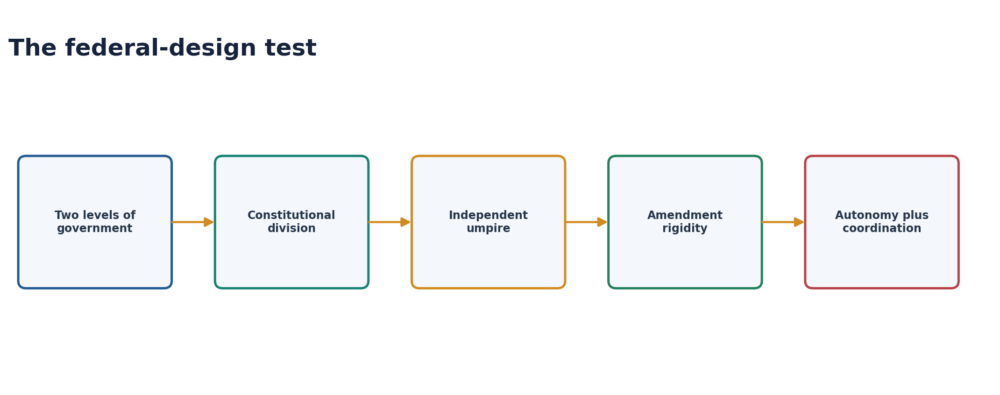

#### The controlling definition

- [FACT] Federal government constitutionally divides public power between a general government and regional governments so that each operates directly on citizens within an assigned sphere.
- [FACT] The allocation comes from the Constitution, not from ordinary delegation by the Union.
- [ANALYSIS] The essence is **constitutionally protected autonomy plus mechanisms of shared rule**. Neither complete separation nor constant harmony is required.
- [LIMIT] A federation is not a confederation. In a federation, the Constitution creates one sovereign legal order; constituent units ordinarily have no unilateral right to secede.

#### Federal, unitary and confederal systems

| Test | Federal | Unitary | Confederation |
|---|---|---|---|
| Source of regional power | Constitution | Central law/devolution | Treaty among sovereign members |
| Legal sovereignty | One constitutional order | Central State | Member States retain sovereignty |
| Regional autonomy | Constitutionally protected | Legally alterable by centre | Very high |
| Central action on citizens | Direct | Direct | Often mediated through members |
| Secession | Not ordinarily permitted | Not applicable | May remain politically possible |

> **Core thesis:** Federalism is not measured by the weakness of the Union; it is measured by whether regional autonomy has constitutional, judicial and political protection.

### 02. Formation: coming together and holding together

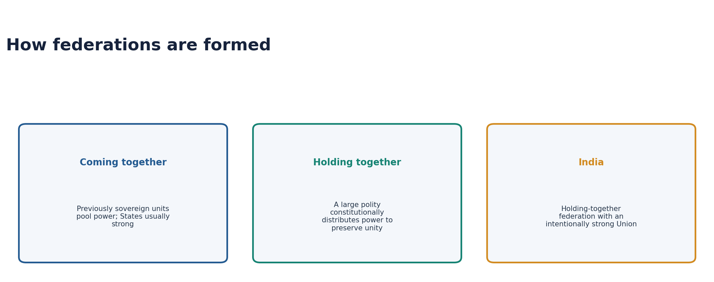

| Model | Formation logic | Typical structural tendency | Example use |
|---|---|---|---|
| Coming together | Previously sovereign units pool authority | Stronger constituent units; often equal second-chamber representation | United States, Switzerland, Australia |
| Holding together | A large polity distributes authority to preserve unity and diversity | Stronger federal centre; asymmetry more likely | India, Belgium, Spain in comparative discussion |

- [FACT] Article 1 calls India a **Union of States**, not a federation formed by an agreement among sovereign States.
- [FACT] Parliament may alter State areas, boundaries or names under Articles 2-4 through the constitutionally prescribed process; affected State views are sought but are not binding.
- [ANALYSIS] India is best classified as a **holding-together federation with a strong Union**: federal distribution was chosen to govern diversity without creating a secession-based compact.
- [LIMIT] “Indestructible Union of destructible States” is a useful summary, not constitutional text.

### 03. Seven federal features

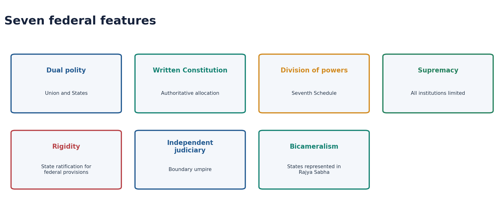

1. **Dual polity:** Union and State governments each exercise constitutionally assigned authority.
2. **Written Constitution:** allocation and limits are available in an authoritative text.
3. **Division of powers:** Articles 245-255 and the Seventh Schedule allocate legislative competence.
4. **Constitutional supremacy:** Union and States are limited by the Constitution.
5. **Rigidity in federal provisions:** specified Article 368 amendments require ratification by at least half of State legislatures.
6. **Independent judiciary:** constitutional courts police legislative boundaries and federal disputes.
7. **Bicameralism:** Rajya Sabha supplies representation of States in Parliament.

#### Qualifications UPSC rewards

- Rajya Sabha representation is broadly population-weighted, not equal for every State as in the US Senate.
- State autonomy is protected but not sovereign; Parliament has constitutionally enumerated routes into the State field.
- The judiciary is integrated rather than dual, yet integration can strengthen uniform constitutional adjudication.
- Indian amendment rigidity is selective: many provisions are amendable without State ratification.

### 04. Centralising features: why India is federal with a Union bias

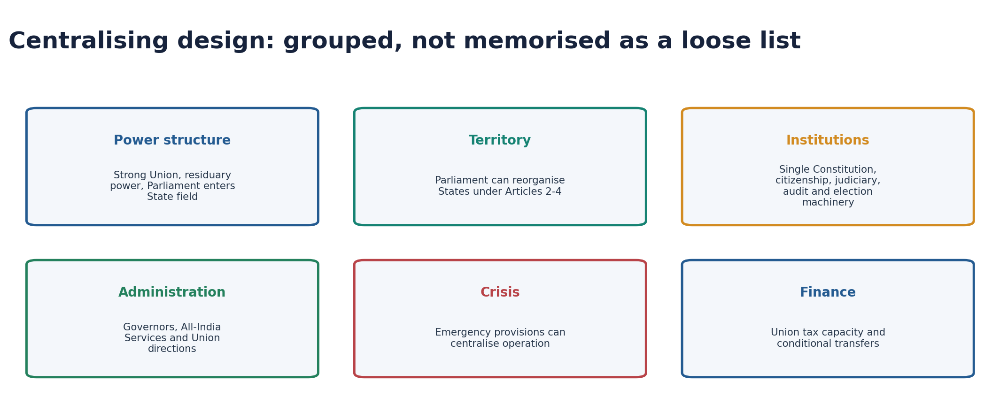

#### Fourteen features, grouped

| Group | Centralising feature | Constitutional significance |
|---|---|---|
| Power | Strong Union List and superior Union competence in overlap | National coordination capacity |
| Power | Residuary legislative power with Parliament | Article 248 + Union Entry 97 |
| Power | Parliament may legislate on State subjects through Articles 249, 250, 252, 253 and 356 | State exclusivity has express exceptions |
| Territory | Parliament may reorganise States | Union is not a compact requiring State consent |
| Constitution | One Constitution for Union and States | No separate State constitutions in the ordinary scheme |
| Citizenship | Single citizenship | Common national political membership |
| Judiciary | Integrated court hierarchy | Uniform constitutional and legal order |
| Administration | Governor appointed by President and holding office during presidential pleasure | Potential Union influence, subject to constitutional limits |
| Administration | All-India Services | Common administrative cadre serving Union and States |
| Administration | Union directions in specified fields | Coordination may become leverage |
| Institutions | Integrated Election Commission, CAG and other national machinery | Uniform standards and accountability |
| Crisis | Emergency provisions | Federal operation can become strongly centralised |
| Finance | Greater Union tax capacity and transfer dependence | Vertical fiscal imbalance |
| Representation | Rajya Sabha gives unequal State representation and Lok Sabha is population-based | Large States possess greater numerical weight |

- [ANALYSIS] These do not cancel federalism because each centralising power is itself constitutional, reviewable and politically contested.
- [LIMIT] Do not call the Governor merely the “Centre's agent.” That phrase describes a misuse critique; the office is constitutionally the State's head.

### 05. Legislative distribution: Articles 245-255 and the Seventh Schedule

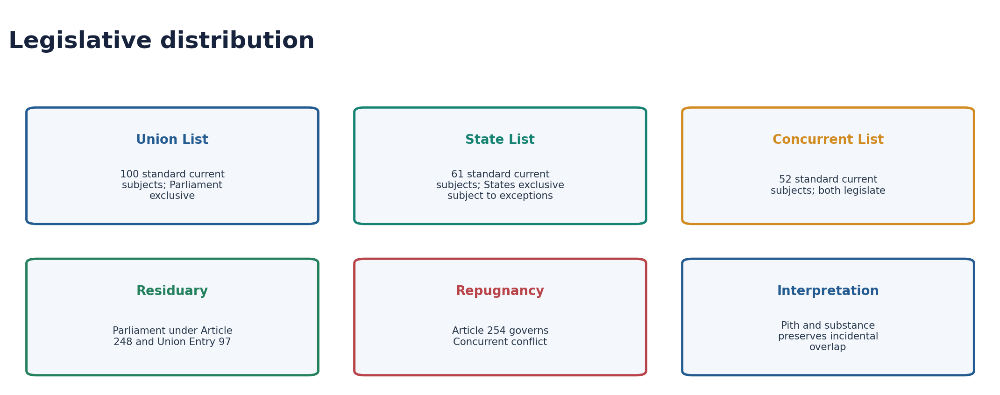

#### The Article 246 hierarchy

- [FACT] Article 245 addresses territorial extent of laws. Parliamentary law is not invalid merely for extra-territorial operation, though a real constitutional nexus is required.
- [FACT] Article 246(1) gives Parliament exclusive power over Union List matters, notwithstanding clauses (2) and (3).
- [FACT] Article 246(2) gives Parliament and State legislatures concurrent power over List III.
- [FACT] Article 246(3), subject to clauses (1) and (2), gives States exclusive power over List II for the State or its part.
- [FACT] Article 246(4) permits Parliament to legislate for territories not included in a State even on State List matters.
- [FACT] Article 246A separately creates special GST competence.

#### Standard current list counts

| List | Standard current examination count | Character | Examples |
|---|---:|---|---|
| Union List | 100 | Parliament exclusive | Defence, foreign affairs, currency, atomic energy |
| State List | 61 | State exclusive subject to constitutional exceptions | Public order, police, public health, agriculture, prisons |
| Concurrent List | 52 | Both Parliament and States | Criminal law, marriage, education, forests |

- [LIMIT] Amendments preserve historical numbering and mark some entries “omitted”; inserted entries also carry lettered numbers. This explains why a literal visual count may differ from the standard subject count.
- [FACT] Article 248 and Union List Entry 97 place residuary legislative power with Parliament, including residuary taxation subject to later GST design.

#### Five competence doctrines

| Doctrine | Function | Exam-safe formulation |
|---|---|---|
| Pith and substance | Identifies a law's true nature | Incidental encroachment does not invalidate a law within competence |
| Colourable legislation | Tests indirect transgression | What cannot be done directly cannot be done by disguise |
| Territorial nexus | Connects State law to extra-State facts | Nexus must be real, not illusory |
| Harmonious construction | Reconciles apparently overlapping entries | Entries receive broad meaning while avoidable conflict is reduced |
| Repugnancy | Resolves Concurrent List conflict | Article 254 ordinarily gives parliamentary law precedence |

#### Article 254 and Presidential assent

- [FACT] If a State law is repugnant to a parliamentary law on a Concurrent subject, the parliamentary law ordinarily prevails and the State law is void to the extent of repugnancy.
- [FACT] A repugnant State law reserved for and receiving Presidential assent can operate in that State.
- [FACT] Parliament may later override that assented State law.
- [LIMIT] Article 254 is not a universal conflict clause for every Union-State disagreement; it is principally a Concurrent List doctrine.

### 06. When Parliament may legislate on the State List

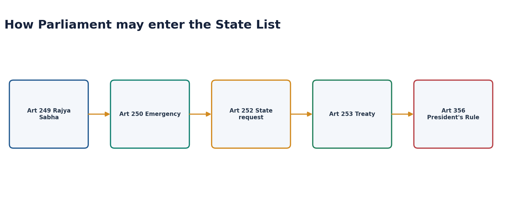

| Route | Trigger | Duration / consequence | Key trap |
|---|---|---|---|
| Article 249 | Rajya Sabha resolution by two-thirds of members present and voting that national interest requires it | Resolution up to one year, renewable; law survives six months after resolution ends | State power is suspended only to the extent of inconsistency |
| Article 250 | Proclamation of Emergency in operation | Law survives six months after Emergency ends | Requires Article 352 emergency, not every emergency |
| Article 252 | Two or more State legislatures request Parliament | Applies to requesting/adopting States | Only Parliament can amend or repeal such law |
| Article 253 | Implementing treaty, agreement or international decision | No State consent requirement in text | Can reach State subjects |
| Article 356 | Parliament exercises State legislature's power during President's Rule | Subject to constitutional restoration and review | Bommai limits abuse |

- [ANALYSIS] Articles 249 and 252 contain federal safeguards: the first uses the States' chamber; the second starts with State initiative.
- [LIMIT] Article 253 is powerful but remains subject to constitutional rights, judicial review and the actual treaty-implementation nexus.

### 07. Administrative and financial distribution: the missing operational bridge

#### Articles 256-263: administration, delegation and consultation

| Provision | Exact Core rule | Federal significance / trap |
|---|---|---|
| Article 256 | State executive power must secure compliance with parliamentary laws and existing laws applicable in the State; Union directions may be given for that purpose | A compliance power, not a general Union takeover of State administration |
| Article 257 | State executive power must not impede Union executive power; specified Union directions and cost rules apply | Coordination is text-bounded and reviewable |
| Article 258 | With State consent, the President may entrust Union functions to the State or its officers, with conditions | Delegation does not transfer legislative ownership |
| Article 258A | A Governor may, with Union consent, entrust State functions to the Union or its officers | The Constitution permits delegation in both directions |
| Article 261 | Public acts, records and judicial proceedings receive full faith and credit throughout India | Supports one legal space across federal units |
| Article 262 | Parliament may provide adjudication of inter-State river-water disputes and may exclude court jurisdiction by law | Exclusion is not automatic from Article 262 alone |
| Article 263 | The President may establish an Inter-State Council for inquiry, discussion and recommendations | Consultative and recommendatory unless another legal rule supplies binding force |

#### Article 355 is a duty; Articles 356-357 provide an exceptional remedy

- [FACT] Article 355 places a duty on the Union to protect every State against external aggression
  and internal disturbance and to ensure constitutional government.
- [FACT] Article 356 requires the President to be satisfied that State government cannot be
  carried on according to the Constitution; Article 357 governs exercise of legislative powers
  under such a proclamation.
- [LIMIT] Article 355 is not a free-standing licence for every coercive measure, and a difficulty
  under Article 355 does not automatically establish the Article 356 threshold.
- [FACT] *S.R. Bommai* subjects a proclamation to judicial review and permits restoration; House
  majority should ordinarily be tested on the floor rather than inferred by the Governor.

#### Articles 268-281 and 293: fiscal capacity follows constitutional assignment

| Route | Core constitutional anchor | Answer use |
|---|---|---|
| Levy/collection assignment | Articles 268, 269 and GST-specific 269A | Revenue may be levied, collected and assigned through different Union-State combinations |
| Divisible pool | Article 270 | Prescribed Union taxes are distributed between Union and States |
| Grants | Articles 275 and 282 | Constitutional grants-in-aid coexist with discretionary public-purpose grants; do not treat them as identical |
| GST shared rule | Articles 246A, 269A and 279A | Simultaneous competence, inter-State apportionment and Council negotiation form one design |
| Finance Commission | Articles 280-281 | A periodic constitutional body recommends distribution and grants; its report and explanatory memorandum go before Parliament |
| State borrowing | Article 293 | State borrowing can require Union consent where specified Union debt remains outstanding |

> **Answer-grabbing line:** Indian federalism distributes not only law-making subjects but also
> administrative responsibility and usable fiscal capacity; autonomy without implementation
> machinery or predictable finance is merely formal.

### 08. Federalism as Basic Structure: case chronology

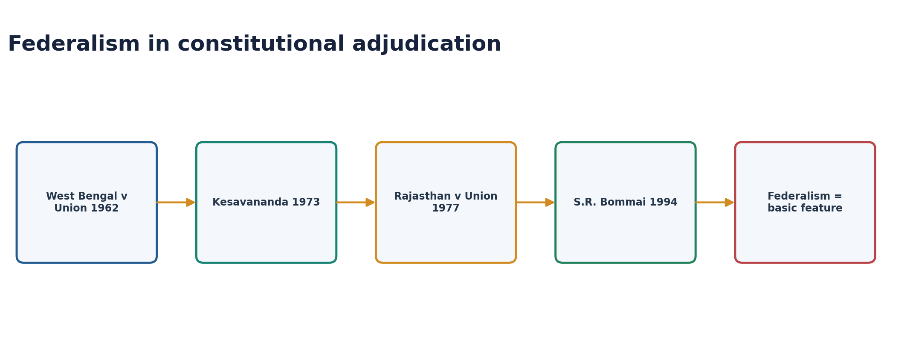

| Case | Deployable proposition | Qualification |
|---|---|---|
| *State of West Bengal v. Union of India* (1962) | India was not formed by an agreement among sovereign States; Parliament possessed the challenged acquisition competence | Strong-Union description did not erase all State autonomy |
| *Kesavananda Bharati* (1973) | Parliament's amending power is limited by Basic Structure | Federalism later becomes a named component |
| *State of Rajasthan v. Union of India* (1977) | Recognised the Union-weighted constitutional scheme while reviewing Article 356-related conflict cautiously | Predates Bommai's stronger review framework |
| *S.R. Bommai v. Union of India* (1994) | Federalism is a Basic Structure feature; Article 356 proclamations are reviewable; majority ordinarily belongs on the House floor | Does not make India a compact of sovereign States |
| *Kuldip Nayar v. Union of India* (2006) | Rajya Sabha residence requirement was not indispensable to federalism; Indian federalism has distinctive design | Do not infer that State representation is irrelevant |

#### Bommai answer value

1. Converts federalism from description into a constitutional limitation.
2. Restrains partisan dismissal of State governments.
3. Supports floor tests where majority is disputed.
4. Allows restoration after an unconstitutional proclamation.
5. Shows that a strong Union remains bounded by constitutional federalism.

### 09. How Indian federalism actually works

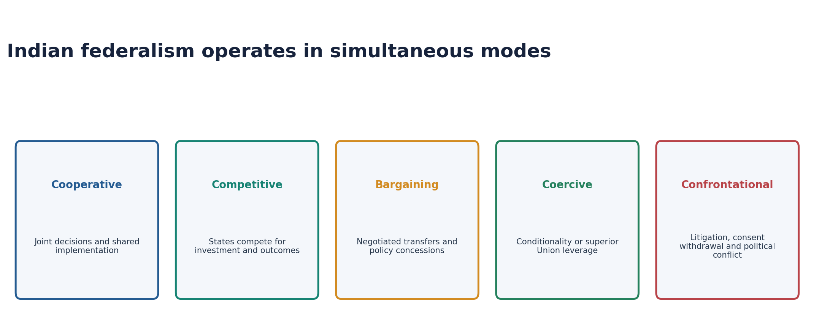

| Mode | Meaning | Indian illustrations | Analytical limit |
|---|---|---|---|
| Cooperative | Joint rule-making or implementation | GST Council, disaster response, centrally supported schemes | Cooperation may reflect unequal bargaining power |
| Competitive | States compete on outcomes and investment | Reform rankings, investment summits, policy innovation | Can widen capacity gaps |
| Bargaining | Outcomes emerge through negotiation | Finance Commission representations, coalition politics, scheme design | Bargaining power varies |
| Coercive | Union leverage narrows effective State choice | Conditional grants, directions, investigative or gubernatorial pressure claims | Not every national standard is coercive |
| Confrontational | Governments litigate or resist | CBI consent disputes, Governor assent, fiscal and river-water conflict | Conflict can remain constitutional and productive |

#### The 2020 GS-II verdict

- [ANALYSIS] Indian federalism is not moving linearly from cooperation to confrontation. The five modes coexist by sector and political alignment.
- [ANALYSIS] Granville Austin's “cooperative federalism” identifies design aspiration; Morris-Jones's “bargaining federalism” better captures negotiated operation.
- [ANALYSIS] The health test is whether institutions convert confrontation into reasons, negotiation, adjudication and electoral accountability.

### 10. Institutions of shared rule

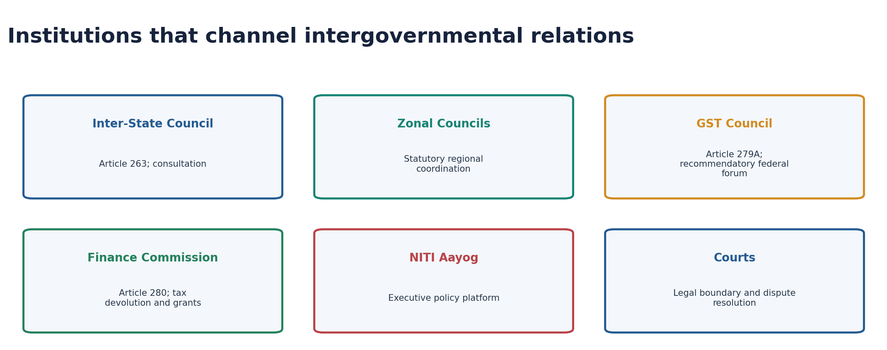

| Institution | Constitutional/statutory base | Federal function |
|---|---|---|
| Inter-State Council | Article 263; established by presidential order | Inquiry, discussion and recommendations on common interests |
| Zonal Councils | States Reorganisation Act, 1956 | Regional coordination; North Eastern Council is separately statutory |
| GST Council | Article 279A | Union-State tax negotiation and harmonisation |
| Finance Commission | Article 280 | Vertical and horizontal tax devolution and grants |
| NITI Aayog | Executive resolution | Policy consultation, data and programme coordination |
| Constitutional courts | Supreme Court: Articles 32, 131 and 136; High Courts: Article 226 | Adjudicate legal boundaries, rights and specified Union-State disputes |
| Rajya Sabha | Articles 80, 249, 312 | State representation and special federal powers |

#### GST Council after *Union of India v. Mohit Minerals* (2022)

- [FACT] GST Council recommendations are not binding commands on Parliament or State legislatures.
- [FACT] Article 246A gives simultaneous GST legislative power within its scheme.
- [CURRENT] The official GST Council continues to describe consultation and cooperative federalism
  as its operating aspiration; the 56th meeting was held in September 2025. This is a dated
  institutional illustration, not proof that every decision is unanimous or binding.
- [ANALYSIS] The Council works through political persuasion, structured voting and the need for harmonisation: cooperative federalism is dialogic, not hierarchical.
- [LIMIT] “Not binding” does not mean irrelevant; departure can create political, administrative and market costs.

### 11. Asymmetric federalism

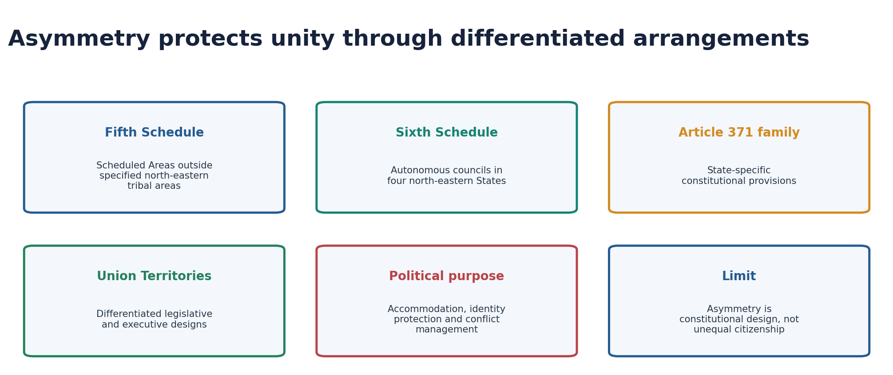

- [FACT] Symmetric federalism gives constituent units substantially similar constitutional powers; asymmetric federalism constitutionally differentiates them.
- [FACT] India's asymmetry appears through the Fifth and Sixth Schedules, Article 371 and related provisions, special arrangements for some Union Territories, and differentiated legislative fields.
- [ANALYSIS] Asymmetry is an integration device: it permits common citizenship while protecting distinct institutions, land relations, customary practices or administrative needs.
- [LIMIT] Asymmetry is not the same as arbitrary discrimination. Its legitimacy rests on constitutional text, purpose and equal-citizenship limits.

#### Fifth and Sixth Schedule distinction

| Fifth Schedule | Sixth Schedule |
|---|---|
| Scheduled Areas in States other than the four Sixth Schedule States | Tribal areas in Assam, Meghalaya, Tripura and Mizoram |
| Governor and Tribes Advisory Council architecture | Autonomous District and Regional Councils |
| Protective administration and modification of law | Greater local legislative, judicial and administrative space |

#### Jammu and Kashmir caution

- [CURRENT] The post-2019 constitutional and territorial arrangement must be described through current law, not the former Article 370 framework as if still operational.
- [LIMIT] The full legal chronology and Supreme Court decision belong to the dedicated Jammu and Kashmir topic; here it illustrates that territorial and asymmetric design can be constitutionally reconfigured and contested.

### 12. Fiscal federalism

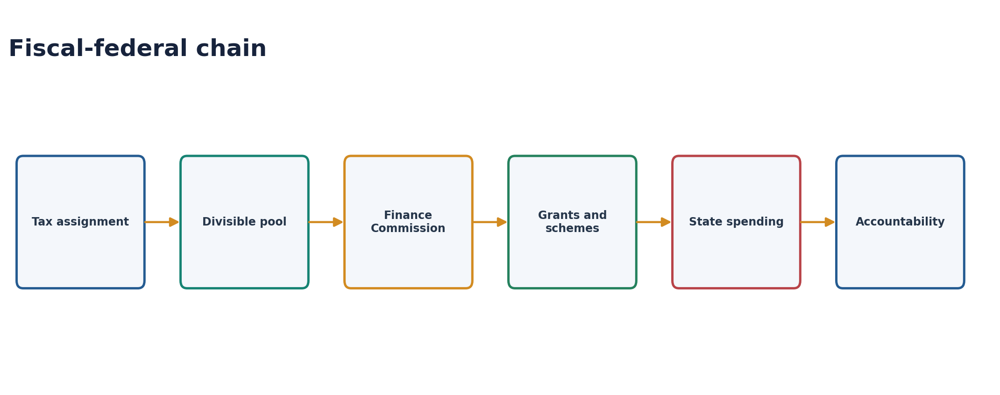

#### Structural problem: vertical fiscal imbalance

- [FACT] The Union possesses broad and productive tax bases, while States carry major expenditure responsibilities in health, police, agriculture, local infrastructure and welfare implementation.
- [ANALYSIS] Transfers are therefore not charity; they are a structural feature of the constitutional division of revenue and responsibility.

#### Instruments

| Instrument | Federal role | Risk |
|---|---|---|
| Tax assignment | Gives each level own-source revenue | Unequal bases |
| Tax devolution | Shares divisible-pool taxes | Formula conflict |
| Finance Commission grants | Addresses needs and externalities | Conditionality and predictability |
| Centrally sponsored schemes | Supports national priorities | One-size design and State fiscal burden |
| GST | Common market with pooled tax sovereignty | Rate autonomy and compensation disputes |
| Cesses and surcharges | Union revenue outside divisible pool under current scheme | States argue effective share is compressed |

#### 16th Finance Commission current control

- [CURRENT] The Sixteenth Finance Commission submitted its report to the President on **17
  November 2025** for the award period **2026-27 to 2030-31**; the official report is public.
- [CURRENT] The Commission's 2026-31 award retains States' vertical share at **41% of the divisible pool**.
- [CURRENT] Its horizontal formula combines equalisation and performance considerations. Quote
  exact criteria or weights only from the official report, not from memory.
- [LIMIT] The detailed weights and grant architecture belong to Polity 29; in this chapter use the award to show that fiscal federalism balances **equalisation, performance and political legitimacy**.

### 13. Representational federalism and delimitation

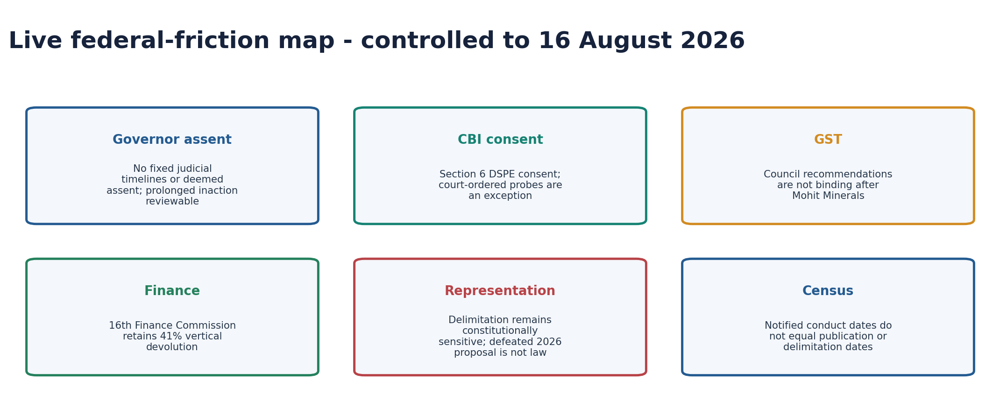

#### Rajya Sabha and demographic representation

- [FACT] Rajya Sabha represents States but not equally; Fourth Schedule allocation broadly reflects population.
- [FACT] Lok Sabha seat allocation and constituency readjustment are governed by Articles 81 and 82, subject to constitutional freeze provisions.
- [ANALYSIS] Population control creates a federal fairness dilemma: equal vote value points toward updated population, while rewarding demographic performance points toward protecting relative representation of lower-growth States.

#### 2026 proposal: use only as a defeated proposal

- [CURRENT] The Constitution (131st Amendment) Bill, 2026 and connected delimitation Bills were introduced on **16 April 2026** and the constitutional Bill was defeated on **17 April 2026**, receiving **298 votes in favour and 230 against**, short of the special-majority requirement.
- [LIMIT] The proposed Lok Sabha ceiling of 850 belongs only to the defeated Bill. It is not the current constitutional ceiling and creates no precedent.
- [CURRENT] Census 2027 has notified enumeration phases, but conduct/reference dates are not publication dates.
- [LIMIT] No delimitation date, State-wise seat projection or election date for operational women's reservation should be asserted.

#### Safe analytical frame

1. **Democratic equality:** constituencies should not become indefinitely unequal.
2. **Federal fairness:** States that achieved population stabilisation should not perceive political punishment.
3. **House capacity:** a larger House can reduce constituency size but needs physical and procedural redesign.
4. **Women's representation:** Article 334A creates a census-delimitation sequence; commencement is not the same as operational reservation.
5. **Process legitimacy:** broad consultation matters because representation changes the Union's political balance.

### 14. Current federal-friction controls

#### Governor assent after the 20 November 2025 advisory opinion

- [FACT] Courts cannot prescribe fixed timelines for the Governor or President under Articles 200-201.
- [FACT] Deemed assent is constitutionally impermissible.
- [FACT] Prolonged unexplained inaction can attract limited judicial intervention directing the authority to act, without dictating the choice.
- [ANALYSIS] The current doctrine protects constitutional discretion while rejecting a pocket veto by silence.
- [LIMIT] Do not use the superseded April 2025 timeline/deemed-assent position as current law.

#### CBI and State consent

- [FACT] Section 6 of the Delhi Special Police Establishment Act, 1946 requires State consent for DSPE/CBI exercise of powers in a State.
- [FACT] Withdrawal of general consent ordinarily means fresh cases require case-specific consent.
- [FACT] High Courts and the Supreme Court can order a CBI investigation without State consent under constitutional jurisdiction.
- [CURRENT] *State of West Bengal v. Union of India* (2024) rejected the Union's preliminary maintainability objection to West Bengal's Article 131 suit; it did **not** finally decide the merits of every post-withdrawal investigation.
- [ANALYSIS] The controversy demonstrates confrontational federalism through courts rather than extra-constitutional resistance.

#### Answer-writing framework

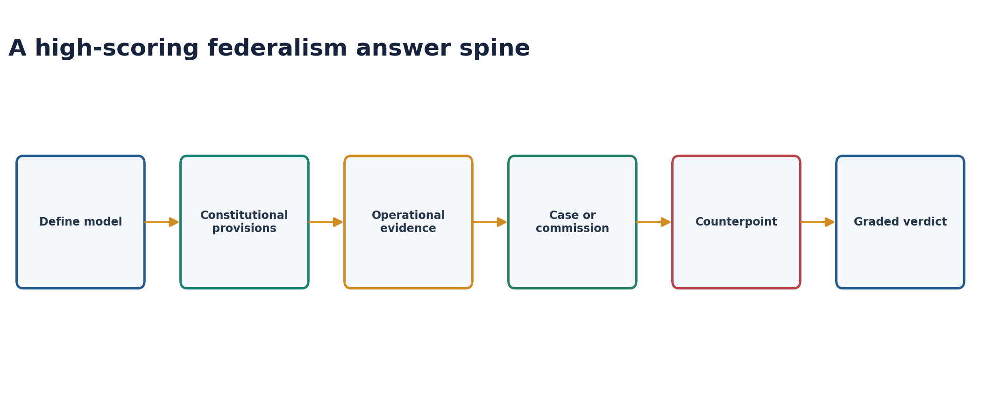

`Model -> constitutional allocation -> operating mode -> case/institution -> tension -> reform -> graded verdict`

> **Best conclusion:** India is neither administratively unitary nor a compact federation. It is a constitutionally federal, Union-weighted and politically bargaining system whose legitimacy depends on converting superior Union capacity into consultation rather than domination.

#### Reform agenda: strengthen federal capacity without disabling the Union

| Problem | Reform direction | Constitutional purpose |
|---|---|---|
| Irregular consultation | Regular Inter-State Council agenda and follow-up | Shared rule |
| Governor conflict | Transparent reasons, constitutional conventions and prompt action | Neutral headship |
| Fiscal mistrust | Predictable transfers and transparent scheme consultation | State planning autonomy |
| CBI conflict | Clear statutory accountability and consent protocols | Police autonomy plus national investigation |
| GST friction | Better dispute resolution and publication of reasoned decisions | Cooperative tax governance |
| Article 356 risk | Continue Bommai discipline and floor-test priority | Elected State government |
| Capacity inequality | Equalisation plus outcome-linked support | Meaningful, not merely formal autonomy |
| Delimitation conflict | Broad federal bargain before redistribution | Democratic equality plus federal legitimacy |

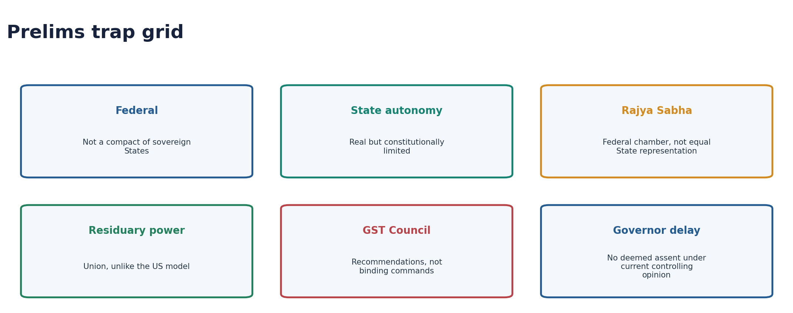

## BASIC MCQS / REMEDIATION

### Original hard MCQ set - strict A -> B -> C -> D rotation

#### OM1. Federal essence

Which proposition best defines a federation?

A. The Constitution protects authority of general and regional governments in assigned spheres.  
B. A treaty league alone is federal.  
C. Courts must always be dual.  
D. Regional governments receive revocable powers from the Union.  

**Answer: A.**

Constitutionally protected distribution, not mere administrative devolution, is the controlling test.

#### OM2. Holding together

India is best described as:

A. a confederation of sovereign States.  
B. a holding-together federation with a strong Union.  
C. a coming-together compact with a secession right.  
D. a legally unitary State with no State autonomy.  

**Answer: B.**

India constitutionally distributes power to govern an existing diverse polity; States did not create the Union by compact.

#### OM3. Article 1

The phrase 'Union of States' most safely indicates that:

A. State governments are Union departments.  
B. the Seventh Schedule is optional.  
C. the Union is not the result of an agreement among sovereign States with a secession right.  
D. State boundaries can never change.  

**Answer: C.**

The expression rejects compact/secession theory while coexisting with real constitutional federalism.

#### OM4. Federal feature

Which combination most directly protects federal allocation?

A. Single citizenship and emergency provisions  
B. Governor appointment and All-India Services  
C. Parliamentary government and collective responsibility  
D. Written supreme Constitution, division of powers and independent judiciary  

**Answer: D.**

These features make the allocation authoritative and judicially enforceable.

#### OM5. Rajya Sabha

Which statement is correct?

A. Rajya Sabha is a federal chamber, but States do not receive equal representation.  
B. Each State has two members.  
C. Rajya Sabha can amend the Seventh Schedule alone.  
D. Union Territories have no possible representation.  

**Answer: A.**

Fourth Schedule allocation broadly follows population; India does not copy US Senate equality.

#### OM6. Residuary power

Residuary legislative power in India belongs to:

A. State legislatures collectively.  
B. Parliament under Article 248 and Union Entry 97.  
C. the Supreme Court.  
D. the Inter-State Council.  

**Answer: B.**

This is a centralising feature and differs from several classic federations.

#### OM7. List counts

Which is the standard current examination statement?

A. Union 97, State 66, Concurrent 47  
B. Union 98, State 59, Concurrent 52  
C. Union 100, State 61, Concurrent 52  
D. Union 100, State 60, Concurrent 50  

**Answer: C.**

Use 100/61/52; omitted and inserted numbering explains alternative literal counts.

#### OM8. Article 246

Which statement is correct?

A. State List always overrides Union List.  
B. Concurrent power belongs only to Parliament.  
C. Article 246 contains no hierarchy.  
D. Union List power operates notwithstanding Concurrent and State clauses.  

**Answer: D.**

Article 246(1) uses a notwithstanding clause; State power is expressly subject to clauses (1) and (2).

#### OM9. Pith and substance

The doctrine primarily asks:

A. What is the true nature and character of the law?  
B. Was presidential assent politically wise?  
C. Did Parliament consult every State?  
D. Is the law popular?  

**Answer: A.**

A law within competence survives incidental encroachment into another field.

#### OM10. Article 254

A State law repugnant to an existing parliamentary law on a Concurrent subject may operate in that State if:

A. Rajya Sabha alone approves it.  
B. it is reserved for and receives Presidential assent.  
C. the Governor signs without reservation.  
D. the Inter-State Council recommends it.  

**Answer: B.**

Parliament can subsequently override the assented State law.

#### OM11. Article 249

Parliament may legislate on a State subject in national interest after:

A. a simple Lok Sabha resolution.  
B. every State consents.  
C. Rajya Sabha passes the prescribed two-thirds present-and-voting resolution.  
D. the Chief Justice certifies necessity.  

**Answer: C.**

The States' chamber supplies the special federal trigger.

#### OM12. Article 252

Which statement is correct about a law under Article 252?

A. It automatically applies to every State.  
B. A requesting State may repeal it unilaterally.  
C. It requires an Article 352 emergency.  
D. Parliament enacts on State request and Parliament alone can amend or repeal it.  

**Answer: D.**

Other States may later adopt the law.

#### OM13. Article 253

Article 253 permits Parliament to:

A. implement treaties even where legislation touches a State subject.  
B. suspend judicial review.  
C. change State boundaries without Article 3.  
D. abolish Rajya Sabha.  

**Answer: A.**

Treaty implementation is an express route into the State field, subject to the Constitution.

#### OM14. Bommai

The strongest federal proposition from S.R. Bommai is:

A. Article 356 is non-justiciable.  
B. federalism is Basic Structure and Article 356 material is reviewable.  
C. States have a right to secede.  
D. Governors decide majority finally in private.  

**Answer: B.**

Bommai constitutionalises federalism and favours floor determination of disputed majority.

#### OM15. Kuldip Nayar

Kuldip Nayar is safely used to show that:

A. Rajya Sabha is not a federal chamber.  
B. State representation is unconstitutional.  
C. a State residence requirement for Rajya Sabha candidature is not indispensable to Indian federalism.  
D. all States require equal seats.  

**Answer: C.**

The judgment recognises India's distinctive, not textbook-identical, federal design.

#### OM16. Cooperative federalism

Which statement is most precise?

A. It eliminates State autonomy.  
B. It requires unanimous agreement.  
C. It excludes competition.  
D. It denotes joint action while preserving constitutionally distinct governments.  

**Answer: D.**

Cooperation addresses interdependence; it does not merge the two levels.

#### OM17. Competitive federalism

A central benefit of competitive federalism is:

A. policy innovation and diffusion among States.  
B. automatic equalisation of all capacities.  
C. abolition of transfers.  
D. removal of constitutional limits.  

**Answer: A.**

Competition can improve outcomes but may widen capacity gaps.

#### OM18. Morris-Jones

The label 'bargaining federalism' is associated with:

A. K.C. Wheare.  
B. Morris-Jones.  
C. B.R. Ambedkar.  
D. A.V. Dicey.  

**Answer: B.**

It captures negotiated Union-State political operation.

#### OM19. GST Council

After Mohit Minerals, GST Council recommendations are:

A. binding constitutional commands.  
B. binding only on States.  
C. recommendatory, within a system requiring collaboration.  
D. irrelevant to GST law.  

**Answer: C.**

The Court preserved simultaneous legislative authority and dialogic cooperation.

#### OM20. Inter-State Council

Which pairing is correct?

A. Article 280 - Inter-State Council  
B. Article 279A - Zonal Councils  
C. Article 312 - Finance Commission  
D. Article 263 - Inter-State Council  

**Answer: D.**

Zonal Councils are statutory; the Finance Commission is Article 280.

#### OM21. Asymmetry

Asymmetric federalism means:

A. constitutionally differentiated arrangements for some units or regions.  
B. unequal citizenship by default.  
C. no judicial review.  
D. temporary President's Rule.  

**Answer: A.**

India uses asymmetry for accommodation through Schedules, Article 371 provisions and differentiated UT designs.

#### OM22. Sixth Schedule

The Sixth Schedule principally applies to tribal areas in:

A. all north-eastern States.  
B. Assam, Meghalaya, Tripura and Mizoram.  
C. only Assam.  
D. every Fifth Schedule State.  

**Answer: B.**

It creates autonomous council architecture in the four named States.

#### OM23. Vertical imbalance

Vertical fiscal imbalance refers to:

A. equal revenue and spending at both levels.  
B. only horizontal inequality among States.  
C. mismatch between revenue capacity and expenditure responsibilities across levels.  
D. a conflict within one State budget.  

**Answer: C.**

States bear substantial spending duties while the Union controls broad tax bases.

#### OM24. 16th Finance Commission

Which current statement is used in this package?

A. States receive 50% of all Union revenue.  
B. Cesses are automatically divisible.  
C. The Finance Commission was abolished.  
D. The 2026-31 vertical share remains 41% of the divisible pool.  

**Answer: D.**

Divisible pool is narrower than gross Union tax revenue because cesses and surcharges are excluded.

#### OM25. Governor assent

Under the controlling 20 November 2025 opinion:

A. no fixed judicial timelines or deemed assent exist, but prolonged inaction can invite a direction to act.  
B. every Bill is deemed assented after three months.  
C. courts choose assent or reservation.  
D. the Governor may keep a Bill forever without review.  

**Answer: A.**

Judicial intervention is limited: require action, not dictate the constitutional option.

#### OM26. CBI consent

Which is correct?

A. State consent can defeat a Supreme Court-ordered probe.  
B. Section 6 DSPE consent is ordinarily required, but constitutional courts can order CBI investigation.  
C. Police is in the Union List.  
D. Withdrawal automatically voids every earlier proceeding.  

**Answer: B.**

Consent protects federal police autonomy but is not absolute against constitutional judicial power.

#### OM27. Delimitation proposal

The 850-seat figure discussed in 2026 should be described as:

A. the current Article 81 ceiling.  
B. an Election Commission notification.  
C. a proposal in the defeated 131st Amendment Bill, not law.  
D. a Supreme Court direction.  

**Answer: C.**

Proposal text must never be converted into current constitutional fact.

#### OM28. Census control

Which statement is safest as of the control date?

A. Enumeration dates are final publication dates.  
B. Delimitation must occur in 2027.  
C. Women's reservation is already operational.  
D. Notified census conduct dates do not establish publication, delimitation or election dates.  

**Answer: D.**

The constitutional triggers depend on later steps; avoid invented timelines.

### Remedial MCQ loop - strict A -> B -> C -> D rotation

#### RM1. Federal versus unitary

What makes State power federal rather than devolved?

A. Its constitutional protection.  
B. The size of the State.  
C. A Governor's speech.  
D. A central grant.  

**Answer: A.**

Constitutional origin and protection distinguish autonomy from revocable delegation.

#### RM2. Residuary power

Who holds residuary legislative power?

A. States  
B. Parliament  
C. Rajya Sabha alone  
D. President personally  

**Answer: B.**

Article 248 and Union Entry 97 place it with Parliament.

#### RM3. State List entry

Which route begins with resolutions by two or more State legislatures?

A. Article 249  
B. Article 250  
C. Article 252  
D. Article 253  

**Answer: C.**

Article 252 is consensual State initiation followed by parliamentary law.

#### RM4. Repugnancy

Article 254 principally concerns conflict on:

A. Union List  
B. State List  
C. residuary subjects  
D. Concurrent List  

**Answer: D.**

It is not a general conflict clause for all Union-State disputes.

#### RM5. Bommai

Which is correct?

A. Federalism is Basic Structure.  
B. Article 356 is immune from review.  
C. Governors decide majority conclusively.  
D. States can secede.  

**Answer: A.**

Bommai supplies the core constitutional protection.

#### RM6. GST Council

Its recommendations are:

A. binding on States only  
B. recommendatory  
C. judicial orders  
D. constitutional amendments  

**Answer: B.**

Mohit Minerals confirms recommendatory status.

#### RM7. Governor assent

Which current proposition is correct?

A. Deemed assent after one month  
B. Courts prescribe one universal deadline  
C. No deemed assent, but prolonged inaction may be reviewed  
D. No review of inaction is possible  

**Answer: C.**

Use the November 2025 controlling opinion.

#### RM8. 2026 delimitation package

Its proposed numbers are:

A. already in Article 81  
B. binding after introduction  
C. approved by the Supreme Court  
D. defeated proposal details, not current law  

**Answer: D.**

Always preserve the proposal/not-law label.

## PYQS AND ANSWER PRACTICE

### Routed PYQs with model solutions

#### PYQ 1 - UPSC GS-II 2020, Q3 - direct

**Question:** How far do you think cooperation, competition and confrontation have shaped the nature of federation in India?  
**10 marks | 150 words**

**Model solution**

Indian federalism is constitutionally divided but politically dynamic; cooperation, competition
and confrontation operate simultaneously.

**Cooperation** appears in the GST Council, Finance Commission, disaster response and shared
schemes: the Union contributes scale while States supply implementation and local knowledge.
**Competition** arises through investment, welfare innovation and outcome rankings, though unequal
capacity can widen gaps. **Confrontation** occurs over Governor assent, CBI consent, devolution,
cesses and river waters.

Conflict need not destroy federalism when councils, Parliament, courts and elections channel it.
*S.R. Bommai* makes federalism Basic Structure, while *Mohit Minerals* preserves legislative
autonomy within GST cooperation. Granville Austin states the cooperative aspiration; Morris-Jones
better captures bargaining practice.

Thus, cooperation remains the institutional base, competition drives innovation and confrontation
tests whether bargaining remains constitutional.

##### Why this earns marks

It answers the extent demand, gives named examples of all three modes and closes with a hierarchy
rather than treating them as chronological stages.

##### How to improve this answer

Use a three-branch diagram and one example per branch; do not spend scarce 150-word space defining
general federal features.

#### PYQ 2 - UPSC GS-II 2021, Q11 - cross-owned

**Question:** The jurisdiction of the Central Bureau of Investigation regarding lodging an FIR and conducting a probe within a particular State is being questioned by various States. However, the power of States to withhold consent to the CBI is not absolute. Explain with special reference to the federal character of India.  
**15 marks | 250 words**

**Model solution**

Police and public order are State subjects, while the CBI derives investigative authority from the Delhi Special Police Establishment Act, 1946. Section 6 therefore requires State consent before DSPE personnel exercise powers within a State.

States commonly grant **general consent**. Its withdrawal means the CBI ordinarily needs case-specific consent for fresh cases. This protects territorial police autonomy and prevents a central agency from becoming an unrestricted parallel State police.

The power is not absolute for three reasons. First, the Supreme Court under Article 32 and High Courts under Article 226 may order a CBI probe without State consent to protect fundamental rights and fair investigation. Second, withdrawal does not automatically invalidate every investigation validly begun earlier. Third, the legal effect can depend on the territorial acts, accused, offence and terms of existing consent.

In *State of West Bengal v. Union of India* (2024), the Supreme Court held West Bengal's Article 131 suit maintainable against the Union's preliminary objection. The merits remained for adjudication; the ruling should not be overstated as a final ban on all CBI action.

Federalism here requires balance. State consent protects police autonomy; constitutional-court power protects justice where State investigation fails; national offences may require coordination. A clear CBI statute, transparent consent protocols and judicially supervised exceptions would reduce political confrontation.

Thus, consent is a federal safeguard, not an immunity from constitutional judicial power.

##### Why this earns marks

It states Section 6, explains general and case-specific consent, identifies the constitutional-
court exception and qualifies the 2024 Article 131 order.

##### How to improve this answer

Separate `rule`, `exceptions` and `federal balance`; avoid implying that maintainability finally
decided the legality of every investigation.

#### PYQ 3 - UPSC GS-II 2022, Q13 - cross-owned

**Question:** While the national political parties in India favour centralisation, the regional parties are in favour of State autonomy. Comment.  
**15 marks | 250 words**

**Model solution**

The proposition captures an important tendency but is too absolute. Federal preferences often follow institutional position and electoral incentives more than permanent ideology.

National parties controlling the Union may favour centralisation because uniform policy, national security, macroeconomic management and common markets strengthen their governing programme. Constitutional tools include residuary power, centrally sponsored schemes, Union directions, All-India Services and Parliament's exceptional access to State subjects.

Regional parties derive legitimacy from State-specific identities and interests. They commonly demand larger tax devolution, fewer scheme conditions, protection from partisan Governor action, stronger Inter-State Council consultation and restraint in deploying central agencies. Coalition governments from 1989 onward often increased their bargaining power at the Union.

However, counterevidence qualifies the claim. National parties seek State autonomy when they govern a State but oppose the Union. Regional parties may centralise authority within their own States. National-party-led coalitions have accommodated regional demands, while regional parties participating in Union government may support national uniformity. GST also shows parties accepting pooled sovereignty for a common market.

The Constitution itself combines both impulses: State List autonomy and federal amendment safeguards coexist with a strong Union and emergency powers. *S.R. Bommai* prevents the political majority at the Centre from erasing the federal basic structure.

Therefore, party type influences federal preference, but control of office, coalition arithmetic and issue-specific interests explain behaviour more reliably than the national/regional label alone.

##### Why this earns marks

It comments rather than agrees mechanically, supplies constitutional tools and political
counterevidence, and gives a qualified causal verdict.

##### How to improve this answer

Organise around `incentive → evidence → reversal`; use one coalition-era example if confidently
recalled, rather than listing parties.

#### PYQ 4 - UPSC Prelims 2021, Q86 - direct

**Question:** Which one of the following in Indian polity is an essential feature that indicates that it is federal in character?

A. The independence of judiciary is safeguarded  
B. The Union Legislature has elected representatives from constituent units  
C. The Union Cabinet can have elected representatives from regional parties  
D. Fundamental Rights are enforceable by Courts of Law

**Answer: A. INFERRED ANSWER - NOT OFFICIALLY VERIFIED.**

An independent judiciary is essential to interpret the Constitution and adjudicate competence disputes between two levels. The other options can exist in non-federal systems or do not create constitutional autonomy.

#### PYQ 5 - UPSC Prelims 2023, Q32 - direct

**Question:** Consider the following statements:

1. In India, prisons are managed by State Governments with their own rules and regulations for day-to-day administration.
2. The Prisons Act, 1894 kept the subject of prisons under the control of Provincial Governments.

Which one of the following is correct in respect of the above statements?

A. Both Statement-I and Statement-II are correct and Statement-II is the correct explanation for Statement-I  
B. Both Statement-I and Statement-II are correct, but Statement-II is not the correct explanation for Statement-I  
C. Statement-I is correct, but Statement-II is incorrect  
D. Statement-I is incorrect, but Statement-II is correct

**Answer: B. INFERRED ANSWER - NOT OFFICIALLY VERIFIED.**

Prisons are a State List subject under Entry 4, explaining current State management. The colonial Act also placed administration with provincial governments, but it is not the constitutional reason for the present federal allocation.

#### PYQ 6 - UPSC GS-II 2020, Q11 - supporting/cross-owned

**Question:** The Indian Constitution exhibits centralising tendencies to maintain unity and
integrity of the nation. Elucidate in the perspective of the Epidemic Diseases Act, 1897, the
Disaster Management Act, 2005 and the recently passed Farm Acts.  
**15 marks | 250 words**

**Demand decoding:** Explain the constitutional centralising design, apply it to all three named
laws, acknowledge the federal objection and give a graded verdict.

**Model solution**

India's holding-together federation equips the Union to coordinate threats crossing State
boundaries, but that capacity must remain tied to constitutional competence and consultation.

During COVID-19, the Union used the Disaster Management Act, 2005 for nationwide directions,
while States also used the Epidemic Diseases Act, 1897 and their public-health machinery. The
arrangement displayed national coordination resting heavily on State implementation. The 2020
Farm Acts relied principally on Concurrent List Entry 33 concerning trade and commerce in
foodstuffs, but affected agriculture and markets associated with State List Entries 14 and 28.
Their enactment without adequate State consensus produced a competence-and-legitimacy dispute;
their 2021 repeal showed political federalism correcting legislative centralisation.

The wider constitutional tilt includes Parliament's Articles 249, 250, 252 and 253 routes,
residuary power under Article 248, Union directions and emergency provisions. Yet State List
autonomy, Rajya Sabha, judicial review, Finance Commission transfers and the *Bommai* basic-
structure limit prevent a general Union police power.

Thus, centralising capacity can protect unity during genuine externalities, but legitimacy
depends on necessity, List competence, proportionality and prior intergovernmental consultation.

##### Why this earns marks

It addresses every named statute, connects each to the competence structure, supplies a
counterweight and distinguishes constitutional coordination from unlimited centralisation.

##### How to improve this answer

In the exam, compress the examples to one line each and add a small `Union capacity ↔ State
implementation` diagram; do not analyse the merits of farm policy beyond the federal demand.

#### PYQ 7 - UPSC GS-II 2023, Q13 - supporting/cross-owned

**Question:** Account for the legal and political factors responsible for the reduced frequency
of using Article 356 by the Union Governments since the mid-1990s.  
**15 marks | 250 words**

**Demand decoding:** Explain causation after the mid-1990s through both law and politics; do not
merely describe Article 356 procedure.

**Model solution**

The decline in Article 356 use reflects the conversion of President's Rule from a broad political
weapon into a reviewable exceptional remedy.

Legally, *S.R. Bommai* (1994) made federalism part of the Basic Structure, subjected
proclamations to judicial review, preferred a floor test for disputed majority and permitted
restoration after unconstitutional dismissal. The Court's insistence on relevant material,
combined with later floor-test jurisprudence, raised the legal and reputational cost of partisan
action. Article 355's Union duty cannot by itself prove the Article 356 threshold that government
cannot be carried on according to the Constitution.

Politically, coalition governments and stronger regional parties after 1989 increased State
bargaining power. A more competitive party system made dismissals electorally costly, while
media scrutiny, civil society and an assertive judiciary strengthened accountability. The
Sarkaria and Punchhi recommendations also reinforced the convention that Article 356 is a last
resort after warnings and feasible alternatives.

Use has not disappeared: breakdowns, hung Houses and security crises may still trigger it.
Therefore, the reduced frequency is best explained by legal discipline interacting with
coalition-era political federalism, not by removal of the constitutional power.

##### Why this earns marks

It answers “account for” with two causal baskets, uses Article 355 as a close distinction, and
ends with a qualified rather than absolute conclusion.

##### How to improve this answer

Use a two-column `legal/political` structure and reserve procedure details for one sentence; avoid
unsupported counts of proclamations unless recalled from an authoritative source.

#### PYQ 8 - UPSC GS-II 2023, Q15 - supporting/cross-owned

**Question:** Explain the significance of the 101st Constitutional Amendment Act. To what extent
does it reflect the accommodative spirit of federalism?  
**15 marks | 250 words**

**Demand decoding:** Explain the constitutional redesign and then evaluate, rather than merely
celebrate, its accommodative character.

**Model solution**

The 101st Amendment restructured India's fiscal Constitution by creating a shared indirect-tax
field instead of transferring the whole field to either level.

Article 246A gives Parliament and State legislatures simultaneous GST competence, while
inter-State supplies remain with Parliament. Article 269A creates the levy-and-apportionment
bridge for inter-State GST. Article 279A establishes the GST Council, where the Union holds
one-third and States collectively two-thirds of weighted votes; a three-fourths majority means
neither side can decide alone. The reform reduced cascading, supported a common market and
replaced several separate Union and State taxes.

Its federalism is accommodative because both levels pooled pre-existing tax autonomy, States
participate institutionally and the transition included compensation. The qualification is
substantial: States lost unilateral rate flexibility, the Union can block the voting threshold,
compensation disputes exposed unequal fiscal capacity and exclusions prevent a completely uniform
base. In *Mohit Minerals* (2022), the Supreme Court held Council recommendations non-binding,
preserving legislative autonomy within cooperative dialogue.

Thus, the Amendment embodies negotiated, not hierarchical, federalism; accommodation depends on
reasoned consultation and fair revenue adjustment in practice.

##### Why this earns marks

It uses the three-Article architecture, explains the voting safeguard, evaluates both autonomy and
coordination, and deploys the controlling judgment.

##### How to improve this answer

Draw the `246A → 269A → 279A` chain and keep compensation as a qualification, not the whole answer.

#### PYQ 9 - UPSC GS-II 2024, Q13 - direct application

**Question:** What changes has the Union Government recently introduced in the domain of
Centre-State relations? Suggest measures to be adopted to build the trust between the Centre and
the States and for strengthening federalism.  
**15 marks | 250 words**

**Demand decoding:** Identify recent changes across more than one federal dimension, assess their
trust effect and make institution-specific suggestions.

**Model solution**

Recent Centre-State relations combine greater rule-based coordination with new sites of mistrust.
GST created a permanent shared-tax council and Finance Commission devolution remains the principal
constitutional transfer route. NITI Aayog replaced plan allocation through the Planning
Commission with a consultative platform. At the same time, cesses outside the divisible pool,
centrally sponsored scheme conditions, borrowing controls, Governor-assent disputes and central-
agency jurisdiction have generated claims of coercive federalism. Nationwide use of disaster
powers and legislation touching State fields intensified the competence debate.

Trust requires process, predictability and neutral offices. The Inter-State Council should meet
regularly with published follow-up; States should be consulted early on laws and schemes affecting
List II. Finance Commission transfers and scheme shares should be predictable, with transparent
cess data and a credible GST dispute mechanism. Governors should give prompt, reasoned decisions
within the current Article 200 doctrine, without partisan delay. Article 356 must retain
*Bommai* discipline, while central investigations should follow clear consent and accountability
rules. Parliamentary committees and Rajya Sabha should scrutinise major federal measures.

India needs a capable Union, but capacity earns legitimacy when exercised through consultation.
Cooperative federalism therefore requires institutionalised disagreement, not compelled unanimity.

##### Why this earns marks

It answers both limbs, covers legislative, administrative and fiscal change, and pairs each trust
deficit with an executable institutional remedy.

##### How to improve this answer

Use a `change → trust deficit → remedy` table. Name only changes you can date or legally anchor;
avoid turning the response into a list of political allegations.

#### PYQ 10 - UPSC GS-II 2025, Q14 - direct application

**Question:** Examine the evolving pattern of Centre-State financial relations in the context of
planned development in India. How far have the recent reforms impacted the fiscal federalism in
India?  
**15 marks | 250 words**

**Demand decoding:** Trace the shift from plan-era discretion to the current mixed system, then
judge how far reforms improved State autonomy and equalisation.

**Model solution**

Centre-State finance has moved from a dual system of constitutional Finance Commission transfers
and Planning Commission plan assistance toward a more rule-based but still mixed architecture.

During planned development, discretionary plan grants and centrally sponsored schemes gave the
Union substantial influence over State priorities. After the Planning Commission's replacement by
NITI Aayog, Finance Commission devolution became more prominent. GST pooled major indirect-tax
powers through Articles 246A, 269A and 279A, while Article 280 remains the equalisation mechanism.
The Sixteenth Finance Commission's 2026-31 award retains 41% vertical devolution.

Reforms improved transparency, formula-based transfers and common-market coordination. States
participate in GST decisions, and *Mohit Minerals* confirms that Council recommendations do not
erase legislative autonomy. Yet vertical imbalance persists because States carry major service
responsibilities while the Union controls buoyant bases. Cesses and surcharges outside the
divisible pool, conditional schemes, unequal tax capacity and Article 293 borrowing constraints
can narrow effective choice.

The impact is therefore significant but incomplete: India has shifted from plan discretion toward
constitutionalised interdependence, not fiscal independence. Predictable scheme design,
transparent cesses, stronger State tax capacity and regular Union-State consultation are needed.

##### Why this earns marks

It supplies chronology, Articles, a current Finance Commission anchor, benefits, limits and a
clear “how far” verdict.

##### How to improve this answer

Use a three-stage timeline—Planning Commission, post-2015 devolution, GST/16th FC—and avoid quoting
horizontal weights unless verified from the official report.

### Original Mains practice with examiner-grade models

#### M1. 10 marks | 150 words

**Question:** Distinguish federalism from administrative decentralisation and explain why India remains federal despite a strong Union.

**Demand decoding**

- Define the legal test, then show both State autonomy and Union tilt.
- Use provisions plus one case; avoid label-only answers.

**Model solution**

Federalism constitutionally protects two levels; administrative decentralisation grants powers
that the superior government may ordinarily withdraw.

India meets the federal test through a supreme written Constitution, dual polity, Seventh Schedule
distribution, selective State ratification, judicial review and Rajya Sabha. States legislate
directly on police, public health and agriculture; this is not Union delegation.

The Union is stronger: Parliament has residuary power, exceptional access to State subjects under
Articles 249, 250, 252 and 253, territorial reorganisation power, integrated services and greater
fiscal capacity. These features qualify rather than erase federalism because they are
constitutionally limited and reviewable. *S.R. Bommai* makes federalism Basic Structure and
disciplines Article 356.

India is therefore a holding-together, Union-weighted federation. The decisive test is protected
State competence, not equal institutional weight.

##### Why this earns marks

It defines the distinction, proves both autonomy and Union tilt through Articles, and reaches a
case-supported classification within 150 words.

##### How to improve this answer

Open with a two-line comparison and use only one Article cluster; do not reproduce all fourteen
centralising features in a 10-marker.

#### M2. 10 marks | 150 words

**Question:** Explain how the doctrines of pith and substance, repugnancy and harmonious construction maintain the federal distribution of legislative power.

**Demand decoding:** Define each doctrine's distinct job, show their sequence in resolving overlap
and include the Article 254 qualification.

**Model solution**

The Seventh Schedule distributes subjects, but modern laws inevitably overlap. Constitutional doctrines preserve workable federalism without making every incidental encroachment fatal.

**Pith and substance** identifies a law's true nature. If its dominant character lies within the enacting legislature's field, incidental impact on another List does not invalidate it. **Harmonious construction** reads entries broadly yet seeks to reconcile them so that each retains meaningful operation. **Repugnancy**, principally under Article 254, resolves an irreconcilable conflict between parliamentary and State laws on a Concurrent subject: parliamentary law ordinarily prevails. A reserved State law receiving Presidential assent may operate within that State, though Parliament can later override it.

Together, the doctrines combine autonomy with national coherence. Pith and substance prevents rigid compartmentalisation; harmonious construction reduces avoidable collision; repugnancy supplies a final rule where coexistence is impossible.

The qualification is important: Article 254 is not a universal conflict rule, and judicial interpretation cannot create legislative competence absent from the Constitution.

##### Why this earns marks

It distinguishes three doctrines, explains how each preserves workable allocation and states the
Concurrent-List limit on repugnancy.

##### How to improve this answer

Present the sequence as `characterise → reconcile → resolve`; if space permits, add one verified
case name rather than another abstract definition.

#### M3. 15 marks | 250 words

**Question:** Indian federalism is cooperative in design, bargaining in operation and sometimes coercive in effect. Discuss.

**Demand decoding:** Test all three labels with institutions and examples, then determine how they
coexist without treating every Union standard as coercive.

**Model solution**

India's Constitution combines separate spheres with institutions requiring continuing interaction. The resulting federation cannot be captured by one adjective.

**Cooperative in design:** The GST Council, Finance Commission, Inter-State Council, Rajya Sabha's Articles 249 and 312 roles, centrally supported programmes and disaster coordination require joint action. Granville Austin's cooperative federalism captures this nation-building architecture.

**Bargaining in operation:** Union-State outcomes depend on party alignment, coalition arithmetic, Finance Commission submissions, scheme negotiations and fiscal capacity. Morris-Jones's label explains why formal Union superiority does not always determine practical outcomes.

**Sometimes coercive in effect:** Conditional grants, Union directions, Governor controversies, deployment of central agencies and large vertical fiscal imbalance can narrow State choice. Cesses and scheme contributions may increase perceived dependence. Yet not every national standard is coercive; common markets, rights and externalities can justify coordination.

Confrontation is also constitutionalised. States litigate under Article 131, withdraw CBI general consent, contest tax arrangements and mobilise politically. *S.R. Bommai* ensures that Union strength cannot erase the federal basic structure. *Mohit Minerals* similarly treats the GST Council as recommendatory, preserving legislative autonomy within collaboration.

Therefore, Indian federalism is a negotiated continuum. Cooperation is its institutional aspiration, bargaining its daily method and coercion its recurrent risk. Regular consultation, transparent transfers and neutral constitutional offices are needed to keep Union capacity from becoming domination.

##### Why this earns marks

It evaluates three analytical labels with named institutions, includes a counterpoint and gives a
graded verdict plus reforms.

##### How to improve this answer

Use a three-column comparison and attach one constitutional anchor to each mode; avoid repeating
the same Governor/GST example under multiple headings.

#### M4. 15 marks | 250 words

**Question:** Critically examine the role of the Governor in India's federal system in the light of the current law on assent to State Bills.

**Demand decoding:** Balance constitutional headship against federal friction, state the current
Article 200 doctrine precisely and suggest convention-based as well as legal correctives.

**Model solution**

The Governor links constitutional headship, State government and the Union, making the office both necessary and conflict-prone.

The federal concern begins with appointment by the President and tenure during presidential pleasure. Discretion in government formation, reports under Article 356 and reservation of Bills can be perceived as Union leverage, especially under opposing parties. Delayed assent can disable a State legislature without openly rejecting its policy.

The controlling Constitution Bench advisory opinion of 20 November 2025 recalibrates Article 200. Courts cannot impose fixed timelines or create deemed assent, and they cannot substitute their own choice for the Governor's. However, prolonged unexplained inaction is not a constitutional pocket veto; limited judicial intervention may require the Governor to act without dictating assent, return, withholding or reservation.

The position protects decisional space but creates a higher duty of constitutional statesmanship. Reasons, prompt communication and fidelity to the elected government's legislative mandate are central to legitimacy. *S.R. Bommai* also requires gubernatorial action affecting State government to remain reviewable and ordinarily favours floor testing of majority.

Reform should emphasise politically detached appointments, consultation with the Chief Minister, secure conventions, publicly reasoned action and compliance with Sarkaria/Punchhi norms.

Thus, the Governor should be a constitutional sentinel and mediator, not a parallel executive or partisan gatekeeper. Federal balance depends as much on convention and restraint as on justiciable rules.

##### Why this earns marks

It identifies the source of federal concern, states the controlling 2025 opinion without deemed-
assent error, and balances review with constitutional discretion.

##### How to improve this answer

Keep government formation, Article 356 and assent as three separate functions; spend most space on
assent because the question expressly demands it.

#### M5. 20 marks | 250-300 words

**Question:** Evaluate whether fiscal federalism in India provides States meaningful autonomy or primarily produces transfer dependence.

**Demand decoding:** Establish a test for meaningful fiscal autonomy, weigh own-source and transfer
institutions against dependence, and deliver an extent-based verdict.

**Model solution**

Meaningful federal autonomy requires both legal competence and usable fiscal capacity. India gives States major responsibilities but combines them with substantial dependence on Union transfers.

**Autonomy:** States possess assigned taxes, borrow within constitutional rules, set expenditure priorities and receive a constitutionally structured share of the divisible pool. The Finance Commission is an independent periodic mechanism rather than a discretionary executive grant alone. GST gives States a voice in common-market taxation through the GST Council. The 16th Finance Commission retains 41% vertical devolution for 2026-31.

**Dependence:** The Union controls broad and buoyant tax bases, while States finance health, police, agriculture and welfare delivery. Cesses and surcharges lie outside the divisible pool, reducing the effective shareable base. Centrally sponsored schemes may impose design conditions and matching contributions. Unequal State tax capacity also means formal autonomy yields unequal outcomes.

**Balancing devices:** Horizontal devolution pursues equalisation through need, population, demographic performance, area, ecology and contribution-related criteria. Grants can address externalities and local-body capacity. *Mohit Minerals* protects legislative autonomy by holding GST Council recommendations non-binding.

However, dependence is not inherently anti-federal: redistribution and national standards can secure equal citizenship. It becomes coercive when conditions are opaque, consultation weak or States cannot exit without sacrificing essential services.

India therefore has constitutionally mediated interdependence, not fiscal independence. Greater transparency on cesses, predictable scheme shares, stronger State tax administration, a robust GST dispute mechanism and regular intergovernmental consultation would convert transfer dependence into accountable shared finance.

##### Why this earns marks

It balances autonomy and dependence, uses Articles and current 16th Finance Commission evidence,
and explains when redistribution becomes coercive.

##### How to improve this answer

Add an `own revenue / shared revenue / grants / borrowing` matrix; avoid unverified percentages
other than the official 41% vertical award.

#### M6. 20 marks | 250-300 words

**Question:** Delimitation after a new Census presents a conflict between democratic equality and federal fairness. Analyse.

**Demand decoding:** Explain both constitutional values, identify the current legal sequence and
propose safeguards without forecasting seats or implementation dates.

**Model solution**

Delimitation seeks broadly equal population representation, but long-term demographic divergence turns that democratic principle into a federal conflict.

**Democratic-equality case:** Constituency populations should not diverge indefinitely. Updated allocation can reduce unequal vote weight, improve constituency manageability and reflect migration and urbanisation. A larger House may also lower the citizen-representative ratio.

**Federal-fairness concern:** States that successfully reduced fertility fear losing relative influence to higher-growth States. Representation affects Union governments, fiscal bargaining and constitutional amendment politics. A purely population-driven redistribution may therefore appear to punish policy success and alter the original political balance.

**Constitutional setting:** Articles 81 and 82 govern representation and readjustment, while constitutional amendments created the seat freeze. Rajya Sabha already uses unequal State representation, so Lok Sabha change affects both popular and federal power. Article 334A also links operational women's reservation to a post-commencement census and subsequent delimitation.

**Current control:** The 2026 constitutional-delimitation package was defeated; its proposed 850-seat ceiling is not law. Census conduct dates do not supply a publication or delimitation date, and State-wise seat projections are speculative.

**Possible principles:** increase total seats to reduce zero-sum loss; protect a floor of relative State representation for a transition; reward demographic performance through transparent criteria; strengthen Rajya Sabha's federal role; and secure broad inter-State consultation before amendment.

The solution cannot be arithmetic alone. Democratic equality requires updated representation, but federal legitimacy requires that population stabilisation not translate into abrupt political dispossession. A negotiated constitutional bargain is therefore essential.

##### Why this earns marks

It treats delimitation as a two-value constitutional conflict, uses Articles 81/82/334A, dates the
defeated proposal and avoids speculative projections.

##### How to improve this answer

Draw a balance scale labelled `vote equality` and `federal fairness`; clearly separate current law,
the defeated 2026 proposal and your reform suggestions.

#### M7. 20 marks | 250-300 words

**Question:** Does the combination of regional parties, judicial review and intergovernmental councils adequately counterbalance India's centralising constitutional design?

**Demand decoding:** Evaluate each counterweight's mechanism and limitation, then answer
“adequately” through a graded institutional verdict.

**Model solution**

India's Constitution gives the Union substantial power, but political and institutional safeguards often decentralise its operation.

**Regional parties** articulate State-specific fiscal, linguistic and developmental interests. Coalition eras enabled them to bargain over ministries, schemes and national policy. Yet their influence depends on electoral arithmetic; they may also centralise power within their States.

**Judicial review** supplies a legal boundary. *S.R. Bommai* makes federalism Basic Structure and reviews Article 356; competence doctrines protect State laws from invalidation for incidental overlap; Article 131 provides an original forum for specified Union-State disputes. Courts, however, cannot replace continuous political negotiation and may defer in policy-heavy fields.

**Councils and commissions** institutionalise shared rule. The GST Council, Finance Commission, Inter-State Council and Zonal Councils permit information exchange, bargaining and coordination. *Mohit Minerals* preserves autonomy by treating GST Council recommendations as recommendatory. Weaknesses include irregular meetings, executive dominance, non-binding recommendations and unequal fiscal leverage.

These safeguards are meaningful but uneven. A single-party Union majority reduces coalition bargaining; councils can become consultative rituals; litigation is slow and adversarial. Governors, central agencies, conditional schemes and cesses can still generate coercive effects.

Therefore, the counterbalance is adequate to prevent easy destruction of federalism but not always adequate to ensure equal participation. Regular council meetings, reasoned decisions, stronger parliamentary scrutiny, neutral Governors, transparent transfers and better State capacity are required. India's federal equilibrium is maintained through repeated political contestation, not by constitutional text alone.

##### Why this earns marks

It tests three distinct counterweights, supplies limits for each and answers adequacy rather than
merely listing institutions.

##### How to improve this answer

Allocate one short paragraph to each counterweight and one comparative paragraph to their combined
effect; avoid treating non-binding councils as legally co-equal with courts.

## OPTIONAL ADVANCED DEPTH — NOT REQUIRED FOR A CORE ANSWER

### 14. Advanced classifications and scholars - optional

#### Scholar toolkit

| Scholar / label | Use | Limit |
|---|---|---|
| K.C. Wheare - quasi-federal / unitary features | Opens the strong-Centre debate | Do not stop at the label; Basic Structure and practice matter |
| Granville Austin - cooperative federalism | Explains shared national transformation | Cooperation may coexist with conflict |
| Morris-Jones - bargaining federalism | Captures negotiated politics | Bargaining power is unequal |
| Paul Appleby - extremely federal | Corrects excessive quasi-federal shorthand | A historical analytical view, not doctrine |
| Ivor Jennings - federation with strong centralising policy | Connects design to nation-building | Avoid treating all central policy as anti-federal |
| Louise Tillin - asymmetry and territorial accommodation | Adds contemporary analytical depth | Use only after constitutional examples |

#### Four deeper ideas

1. **Political federalism:** party competition, coalition arithmetic and regional parties can decentralise or centralise actual power without textual amendment.
2. **Executive federalism:** much coordination occurs among executives and officials, which can improve speed but weaken legislative transparency.
3. **Multi-level federalism:** local governments complicate a simple Union-State binary even though Parts IX and IX-A do not create co-equal sovereign units.
4. **Dialogic federalism:** councils, commissions, courts and elections create repeated exchanges rather than one final allocation of every dispute.

#### National parties and regional parties

- [ANALYSIS] The 2022 GS-II proposition is broadly plausible as an incentive pattern, not an ideological law.
- National parties controlling the Union may prefer uniformity and central leverage; regional parties may seek fiscal and administrative autonomy.
- Counterevidence matters: national parties demand autonomy when in State opposition; regional parties can centralise within their States; coalition governments led by national parties strengthened State bargaining.
- Best verdict: **institutional location and electoral incentives often explain federal preference better than party label alone**.

## CONSOLIDATED REGISTER NOTES

### Federal identity

- Federation = constitutionally protected Union and regional authority, each acting directly in assigned spheres.
- Unitary devolution = regional power legally revocable by the centre.
- Confederation = treaty association of sovereign members; not India.
- India = holding-together, Union-weighted federation; Article 1 “Union of States.”
- No compact-based secession right; Parliament can reorganise States through Articles 2-4.

### Seven federal features

1. Dual polity.
2. Written Constitution.
3. Seventh Schedule division.
4. Constitutional supremacy.
5. Selective rigidity and State ratification.
6. Independent judiciary.
7. Bicameral State representation.

### Centralising recall

- Strong Union List; residuary power with Parliament.
- Parliament enters State field: 249, 250, 252, 253, 356.
- State reorganisation by Parliament.
- Single Constitution and citizenship.
- Integrated judiciary, CAG and Election Commission.
- Governors and All-India Services.
- Union directions and emergency provisions.
- Union fiscal strength and transfer dependence.
- Rajya Sabha representation unequal by State.

### Legislative architecture

| Provision | Recall |
|---|---|
| 245 | Territorial extent; extra-territorial parliamentary operation |
| 246 | Union/Concurrent/State hierarchy |
| 246A | GST special competence |
| 248 + UL 97 | Residuary power with Parliament |
| 249 | Rajya Sabha national-interest route |
| 250 | Emergency route; six-month tail |
| 252 | State-request route; Parliament amends/repeals |
| 253 | Treaty implementation |
| 254 | Concurrent repugnancy and Presidential-assent exception |

- Standard counts: **100 / 61 / 52**.
- Pith and substance = true nature; incidental overlap allowed.
- Colourable legislation = indirect competence evasion invalid.
- Territorial nexus = real connection required.
- Harmonious construction = preserve operation of entries.
- Repugnancy = Concurrent conflict, not universal conflict rule.

### Case strip

- *State of West Bengal v Union* (1962): not a compact of sovereign States.
- *Kesavananda* (1973): Basic Structure limitation.
- *Rajasthan v Union* (1977): strong-Union context.
- *S.R. Bommai* (1994): federalism Basic Structure; Article 356 review; floor-test logic.
- *Kuldip Nayar* (2006): residence requirement not indispensable to Indian federalism.
- *Mohit Minerals* (2022): GST Council recommendations not binding.
- *West Bengal v Union* (2024): CBI-consent Article 131 suit maintainable; merits not finally decided by that ruling.

### Operating modes

- Cooperative = joint institutions and implementation.
- Competitive = State innovation/investment competition.
- Bargaining = negotiated transfers and political concessions.
- Coercive = superior leverage narrows effective choice.
- Confrontational = litigation, consent withdrawal and political resistance.
- Granville Austin = cooperative; Morris-Jones = bargaining; Wheare = quasi-federal debate.
- Best verdict: modes coexist; institutions must keep conflict constitutional.

### Shared-rule institutions

- ISC Article 263.
- Zonal Councils statutory.
- GST Council Article 279A.
- Finance Commission Article 280.
- Rajya Sabha Articles 249 and 312.
- NITI Aayog executive platform.
- Supreme Court legal umpire and Article 131 forum.

### Asymmetry

- Fifth Schedule = Scheduled Areas outside four Sixth Schedule States.
- Sixth Schedule = autonomous councils in Assam, Meghalaya, Tripura, Mizoram.
- Article 371 family = State-specific arrangements.
- Differentiated UT design also reflects asymmetry.
- Purpose = accommodation, identity protection and integration; not unequal citizenship.

### Fiscal federalism

- Vertical imbalance = Union revenue strength versus State spending responsibilities.
- Administrative bridge = Articles 256-263: compliance/directions, reciprocal delegation,
  full faith and credit, water-dispute law and Inter-State Council consultation.
- Article 355 creates a Union duty; Articles 356-357 provide a reviewable exceptional remedy.
- Instruments = Articles 268/269/269A assignment, Article 270 divisible pool, Articles 275/282
  grants, Articles 280-281 Finance Commission, Article 293 borrowing and GST.
- 16th FC: report submitted 17 Nov 2025; 41% of divisible pool for States in 2026-31.
- Cesses/surcharges outside divisible pool are a recurring State grievance.
- Autonomy requires predictable finance, not merely List II competence.

### Current control

- Governor assent: 20 Nov 2025 opinion; no fixed judicial timelines, no deemed assent, prolonged inaction reviewable through direction to act.
- CBI: Section 6 DSPE consent ordinarily required; constitutional courts can order probes.
- 131st Amendment/delimitation package: defeated proposal; 850 not law.
- Census enumeration/reference dates are not publication/delimitation dates.
- 106th Amendment commencement does not mean women's reservation is operational.

### PYQ routes

- 2020 GS-II Q3: cooperation + competition + confrontation -> simultaneous modes + Bommai verdict.
- 2021 GS-II Q11: Section 6 consent + court exception + federal balance.
- 2022 GS-II Q13: qualified party-incentive thesis.
- 2021 Prelims Q86: independent judiciary as essential federal feature.
- 2023 Prelims Q32: prisons in State List; colonial Act is not constitutional explanation.
- 2020 GS-II Q11: centralising laws -> competence + consultation + political correction.
- 2023 GS-II Q13: reduced Article 356 use -> *Bommai* + coalition/party federalism.
- 2023 GS-II Q15: Articles 246A/269A/279A -> accommodative but unequal GST federalism.
- 2024 GS-II Q13: recent changes -> trust deficits paired with institutional remedies.
- 2025 GS-II Q14: plan discretion -> rule-based devolution/GST -> persistent dependence.

### Mains answer spines

**Nature question:** definition -> seven federal -> Union tilt -> Bommai -> qualified classification.

**Working question:** modes -> institutions -> examples -> coercive risk -> constitutionalised-conflict verdict.

**Legislative question:** Articles -> Lists -> exceptions -> doctrines -> case -> federal balance.

**Current friction:** verified status -> constitutional rule -> competing values -> institution/reform -> no speculative date.

### Final trap checklist

- Federalism does not require equal State representation.
- “Union of States” does not make States administrative units.
- Residuary power is with Parliament.
- Article 254 principally concerns Concurrent List repugnancy.
- Article 249 uses Rajya Sabha; Article 252 starts with State resolutions.
- Article 253 can reach State subjects for treaty implementation.
- Article 256 directions are compliance-specific, not a general takeover power.
- Article 262 permits Parliament to exclude jurisdiction by law; exclusion is not automatic.
- Article 355 duty does not automatically satisfy Article 356.
- Bommai does not create State sovereignty or secession.
- GST Council recommendations are not binding.
- Governor assent has no current deemed-assent rule.
- Court-ordered CBI investigation does not require State consent.
- Use 100/61/52 standard counts.
- The 2026 850-seat proposal was defeated and is not law.
- Census conduct dates do not prove publication or delimitation dates.
- Core is complete; Advanced scholars are optional enrichment.
