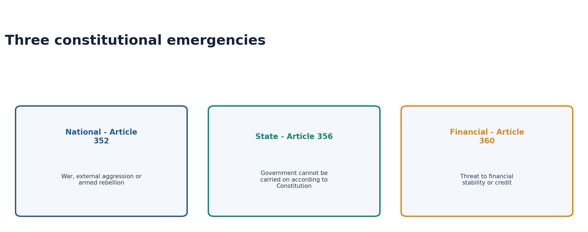
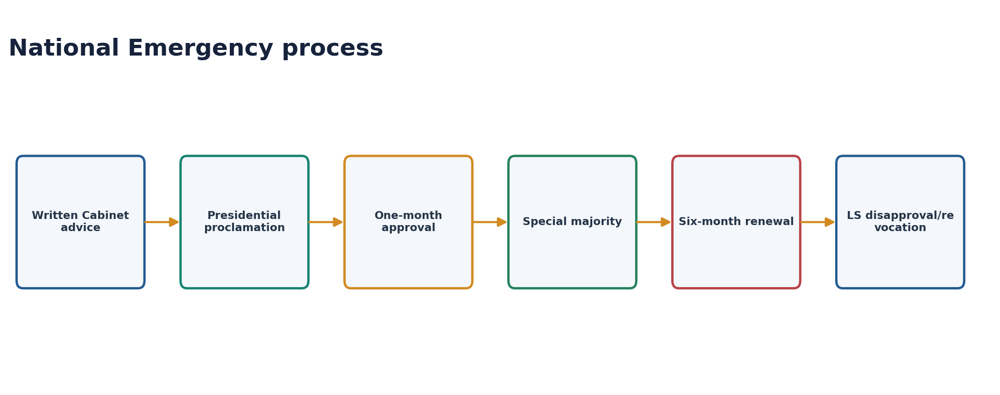
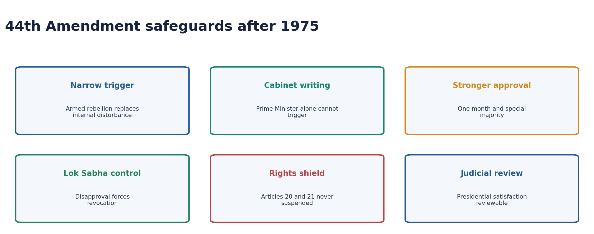
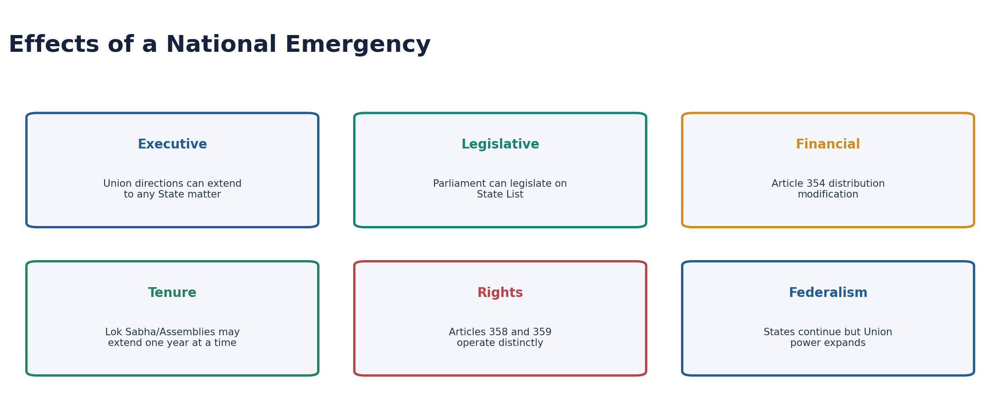
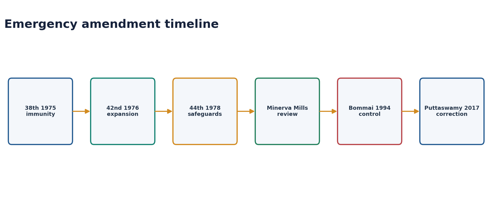
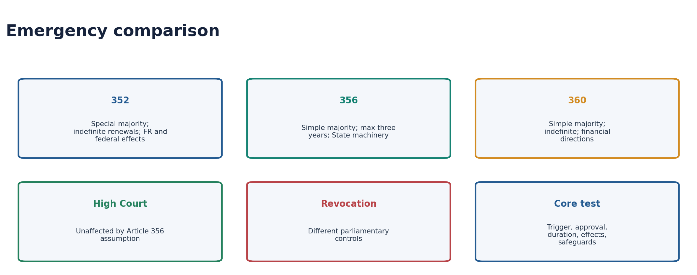

# Polity 14 - Emergency Provisions - Complete Topic Package

> **Subject:** Indian Polity | **Topic:** 14 | **GS-II + Prelims** | **Content control:** 2026-08-28
>
> **Approval:** false - awaiting explicit user approval.
>
> **Evidence key:** [FACT] constitutional, judicial or source-verified proposition; [ANALYSIS] reasoned exam synthesis; [CURRENT] dated status; [LIMIT] qualification preventing overstatement.

#### Package method, scope boundary and current control

- Source order followed: certified Core owner `Polity/basic/Emergency-Provisions.md` -> optional Advanced owner `Polity/advanced/14_Emergency-Provisions.md` -> official/local PYQ routes and recent official key -> Constitution, judgments and current controls -> Qdrant not used.
- [LIMIT] Foundation and Core are independently answer-complete. Optional Advanced adds Constituent Assembly criticism and deeper theory only.
- [CURRENT] Status is controlled to **28 August 2026, Asia/Kolkata**.
- [CURRENT] *S.R. Bommai*, the 44th Amendment safeguards and *K.S. Puttaswamy*'s rejection of *ADM Jabalpur* remain controlling.
- [CURRENT] No National Emergency or Financial Emergency is in force. India has never proclaimed a Financial Emergency under Article 360. President's Rule imposed in Manipur on 13 February 2025 was revoked on **4 February 2026**, restoring elected government; State-specific Article 356 status must always be dated rather than treated as permanent history.
- [CURRENT] 25 June is officially observed as **Samvidhaan Hatya Diwas**, commemorating resistance to abuse during the 1975 Emergency; this is commemorative policy, not a constitutional amendment.
- [LIMIT] Centre-State relation mechanics are cross-linked to Polity 13; Governor office to Polity 19; Fundamental Rights doctrine to Polity 07. Every emergency-specific rule remains complete here.
- Package target: **6 routed PYQs**, **28 original MCQs**, **8 remedials**, **7 original solved Mains questions**, **10 guided Mains answers** and **14 original visuals**.

#### Roadmap

| Stage | Coverage | Exam outcome |
|---|---|---|
| Overview | Three emergencies and constitutional purpose | Prevents category mixing |
| National trigger | War, external aggression, armed rebellion and imminent danger | Solves Article 352 stems |
| Procedure | Written Cabinet advice, approval, renewal and revocation | Masters numbers and majorities |
| Effects | Executive, legislative, financial, tenure and federal effects | Builds Mains analysis |
| Rights | Articles 358 and 359, 20/21 shield, ADM Jabalpur | Solves hardest traps |
| History | 1962, 1971, 1975 and 38th/42nd/44th Amendments | Explains safeguards |
| President's Rule | Trigger, approval, consequences and duration | Solves Article 356 |
| Bommai | Review, floor test, dissolution and restoration | Answers 2023 GS-II |
| Decline | Legal, political and commission factors | Completes causal analysis |
| Financial | Trigger, consequences and never-used status | Answers 2018 GS-II |
| Comparison | 352 versus 356 versus 360 | Rapid revision |
| Advanced | Criticism, constitutional dictatorship and safety-valve debate | Optional analytical lift |
| Practice | Six PYQs, 36 MCQs and ten guided Mains models | Converts knowledge into marks |

#### Scope ownership and cross-links

- **Polity 07:** general Fundamental Rights, preventive detention and writs.
- **Polity 12:** federalism and Basic Structure.
- **Polity 13:** Article 355, 365 and Union directions as Centre-State relations.
- **Polity 19:** Governor reports, government formation and floor-test procedure.
- [LIMIT] Cross-linking prevents repetition, not missing knowledge.

## BASIC LEARNING SESSION

### 01. Why emergency provisions exist

| Type | Article | Trigger |
|---|---|---|
| National Emergency | 352 | War, external aggression or armed rebellion threatens security of India or part |
| President's Rule | 356 | State government cannot be carried on according to the Constitution |
| Financial Emergency | 360 | Financial stability or credit of India or part is threatened |

- [FACT] Part XVIII contains Articles 352-360.
- [ANALYSIS] Emergency provisions preserve the constitutional order by temporarily centralising authority; they do not create an extra-constitutional regime.
- [ANALYSIS] Ambedkar described the Constitution as capable of being federal or unitary according to circumstances.
- [LIMIT] “State Emergency” and “Constitutional Emergency” are descriptive names for Article 356, not headings used in Article 356.

### 02. National Emergency: trigger and territorial scope

- [FACT] Article 352 permits proclamation where security of India or any part is threatened by war, external aggression or armed rebellion.
- [FACT] A proclamation may issue before the actual occurrence if imminent danger exists.
- [FACT] War/external aggression is commonly called external Emergency; armed rebellion is internal Emergency.
- [FACT] The 44th Amendment replaced vague “internal disturbance” with “armed rebellion.”
- [FACT] The 42nd Amendment permits an Emergency to operate in the whole or a specified part of India.
- [LIMIT] “Internal disturbance” remains in Article 355 but is no longer a National Emergency ground.

### 03. National Emergency procedure

#### Written Cabinet recommendation

- [FACT] The President cannot issue a proclamation unless the decision of the Union Cabinet to issue it has been communicated in writing.
- [FACT] “Cabinet” here means the Council consisting of the Prime Minister and Cabinet-rank ministers; the Prime Minister alone cannot constitutionally trigger Article 352.

#### Approval and renewal

- [FACT] Each House must approve within one month.
- [FACT] Approval and every six-month continuation require a special majority: majority of total House membership plus at least two-thirds of members present and voting.
- [FACT] Once approved, it continues six months and can be renewed indefinitely in six-month blocks.
- [FACT] If Lok Sabha is dissolved during the approval window, Rajya Sabha approval preserves the proclamation until 30 days after the first sitting of the reconstituted Lok Sabha, which must approve it.

#### Revocation and Lok Sabha disapproval

- [FACT] The President may revoke by subsequent proclamation; revocation needs no parliamentary approval.
- [FACT] If Lok Sabha passes a disapproval resolution by simple majority, the President must revoke.
- [FACT] At least one-tenth of Lok Sabha members may give notice seeking a special sitting; the sitting must be held within 14 days.
- [LIMIT] This special disapproval mechanism belongs to National Emergency, not Article 356.

### 04. The 44th Amendment safeguard architecture

| Pre-1978 vulnerability | 44th Amendment response |
|---|---|
| “Internal disturbance” was vague | Replaced with armed rebellion |
| Prime-ministerial advice could dominate | Written Cabinet decision required |
| Two-month/simple-majority approval | One-month/special-majority approval |
| Weak lower-House exit | Lok Sabha disapproval forces revocation |
| Article 19 suspension too broad | Article 358 confined to external Emergency and emergency-related laws |
| Court enforcement could be blocked for life/personal liberty | Articles 20 and 21 excluded from Article 359 |
| Satisfaction immunity after 38th Amendment | Immunity removed; judicial review restored |

- [ANALYSIS] The 44th Amendment did not abolish emergency government; it converted political discretion into a more rule-bound and reviewable power.

### 05. Effects of National Emergency

#### Executive

- [FACT] Union executive power extends to giving directions to any State on the manner in which State executive power is exercised.
- [FACT] After the 42nd Amendment, this effect can extend beyond the territory where the Emergency is operative where security is affected by activities connected to that territory.

#### Legislative

- [FACT] Parliament may legislate on State List matters under Article 250.
- [FACT] State legislatures continue; parliamentary competence becomes concurrent for the period.
- [FACT] Such parliamentary law ceases to have effect six months after the Emergency ends, except for completed acts.
- [FACT] The President may promulgate ordinances on State subjects when Parliament is not in session.

#### Financial

- [FACT] Article 354 permits the President to modify application of Articles 268-279 revenue-distribution provisions during the Emergency.
- [FACT] An order cannot extend beyond the financial year in which the proclamation ceases and must be laid before Parliament.

#### Legislative terms

- [FACT] Parliament may extend Lok Sabha and State Assembly terms by one year at a time during National Emergency.
- [FACT] No such extension can continue beyond six months after the Emergency ceases.
- [LIMIT] Emergency does not automatically extend terms; Parliament must enact the extension.

### 06. Fundamental Rights: Article 358 versus Article 359

| Test | Article 358 | Article 359 |
|---|---|---|
| Right affected | Article 19 only | Rights named in presidential order except 20 and 21 |
| Trigger | War/external aggression Emergency only | Either external or armed-rebellion Emergency |
| Operation | Automatic | Requires presidential order |
| Constitutional effect | Article 19 restrictions do not constrain qualifying emergency-related law/action | Right to move specified courts for enforcement is suspended as ordered |
| Territorial/duration scope | Emergency operation subject to constitutional text | Whole/part and period stated in order |

#### Post-44th nexus protection

- [FACT] Article 358 protection applies only to laws containing the required recital that they relate to the proclamation and executive action under such law.
- [FACT] Similar recital-linked protection applies to emergency laws under Article 359(1A).
- [ANALYSIS] Ordinary unrelated illegality does not receive an Emergency shield.

#### Articles 20 and 21

- [FACT] Article 359 cannot suspend court enforcement of Articles 20 and 21.
- [FACT] Protection against retrospective penal law/double jeopardy/self-incrimination and life/personal liberty therefore remain judicially enforceable.
- [LIMIT] Article 358 never concerned Articles 20 or 21; it concerns Article 19.

### 07. ADM Jabalpur, Khanna and Puttaswamy

- [FACT] During the 1975 Emergency, the *ADM Jabalpur* majority held that a detained person could not seek habeas corpus for enforcement of Article 21 while the relevant Article 359 order operated.
- [FACT] Justice H.R. Khanna dissented, affirming that life and liberty are not dependent solely on executive grace.
- [FACT] The 44th Amendment constitutionally protected Articles 20 and 21 from Article 359 suspension.
- [FACT] *K.S. Puttaswamy* (2017) expressly held *ADM Jabalpur* wrongly decided and overruled it.
- [ANALYSIS] The correction is both textual and jurisprudential: non-suspendability plus recognition that constitutional liberty survives executive emergency claims.

### 08. Historical declarations and amendment timeline

| Declaration | Ground/context | Control point |
|---|---|---|
| 1962 | External aggression during China conflict | Continued until 1968 |
| 1971 | External aggression during Pakistan conflict | Continued alongside 1975 proclamation |
| 1975 | Internal disturbance under pre-44th text | Most controversial; ended in 1977 |

- [FACT] 38th Amendment (1975): attempted to make presidential satisfaction final and non-justiciable.
- [FACT] 42nd Amendment (1976): permitted territorially limited proclamation and broadened effects.
- [FACT] 44th Amendment (1978): added the principal democratic safeguards.
- [FACT] *Minerva Mills* recognised review of emergency satisfaction for mala fides or wholly extraneous grounds.
- [CURRENT] 25 June is officially observed as Samvidhaan Hatya Diwas to commemorate those who resisted abuse during the 1975 Emergency.
- [CURRENT] No Article 352 proclamation is in force as of 28 August 2026. President's Rule in Manipur (imposed 13 February 2025) was revoked on 4 February 2026; this recent State-specific episode must not be confused with National Emergency.
- [LIMIT] The official observance changes no Emergency Article.

### 09. President's Rule: trigger and procedure

#### Trigger

- [FACT] The President must be satisfied that State government cannot be carried on according to the Constitution.
- [FACT] Satisfaction may arise on the Governor's report or otherwise.
- [FACT] Article 355 supplies the Union duty to protect States and ensure constitutional government; Article 365 concerns failure to comply with Union directions.
- [LIMIT] Political disagreement or maladministration alone is not automatically constitutional breakdown.

#### Approval and duration

- [FACT] Both Houses must approve within two months by simple majority.
- [FACT] If Lok Sabha is dissolved during the approval window, Rajya Sabha approval can preserve it until 30 days after the reconstituted Lok Sabha first sits.
- [FACT] Once approved, it continues six months at a time.
- [FACT] Maximum duration is three years.
- [FACT] Extension beyond one year requires both: a National Emergency operating in whole India or whole/part of the State, and Election Commission certification that Assembly elections cannot be held.
- [FACT] The President may revoke at any time without parliamentary approval.

### 10. Consequences of President's Rule

- [FACT] The President may assume State executive functions and Governor powers, except High Court functions.
- [FACT] The State Council of Ministers is dismissed.
- [FACT] The President may declare State legislative powers exercisable by or under Parliament's authority.
- [FACT] Parliament may confer legislative power on the President and authorise further delegation.
- [FACT] The Assembly may be suspended or dissolved, but *Bommai* bars irreversible dissolution before parliamentary approval.
- [FACT] State laws made during President's Rule continue after revocation until altered or repealed by competent authority.
- [FACT] President may authorise expenditure from the State Consolidated Fund pending parliamentary sanction where necessary.
- [LIMIT] Article 356 has no automatic Article 19 or other Fundamental Rights suspension.

### 11. S.R. Bommai: the controlling Article 356 doctrine

1. Presidential proclamation is judicially reviewable.
2. Satisfaction must rest on relevant material; the Union must produce material when challenged.
3. Mala fide or irrelevant-material action is invalid.
4. Legislative majority should ordinarily be tested on the Assembly floor.
5. Assembly should not be dissolved before Parliament approves the proclamation.
6. Court can restore the government and Assembly after invalid proclamation.
7. Article 356 is an exceptional, last-resort power.
8. A new Union government cannot dismiss State governments merely for political difference.
9. Secularism is Basic Structure; anti-secular State action can have Article 356 relevance.
10. Parliamentary approval does not completely exclude judicial review.

#### Rameshwar Prasad (2006)

- [FACT] The Supreme Court held the 2005 Bihar Assembly dissolution unconstitutional based on an unreliable/mala fide preventive assessment of possible majority formation.
- [LIMIT] The Court did not restore the dissolved Assembly because elections had advanced; the case still demonstrates review of Governor-based material.

### 12. Why Article 356 use declined after the mid-1990s

| Factor | Mechanism |
|---|---|
| *Bommai* review | Irrelevant or mala fide proclamations risk invalidation and restoration |
| Floor-test rule | Governor's subjective majority assessment loses finality |
| Coalition era | Union governments depended on regional allies |
| Regional-party strength | State dismissals carried national coalition costs |
| Sarkaria/Punchhi norms | Warning, floor test and last-resort standards gained legitimacy |
| Media/civil society | Partisan use became more visible and politically costly |

- [ANALYSIS] The decline was produced without removing Article 356: law changed incentives while political federalisation changed costs.
- [LIMIT] Reduced frequency does not mean the controversy has disappeared; Governor/floor-test disputes remain litigated.

### 13. Financial Emergency

#### Trigger and procedure

- [FACT] The President may proclaim if financial stability or credit of India or any part is threatened.
- [FACT] Both Houses must approve within two months by simple majority.
- [FACT] Lok Sabha dissolution receives the same Rajya Sabha/30-day reconstituted-House continuity logic.
- [FACT] Once approved, it continues indefinitely without periodic renewal.
- [FACT] The President may revoke at any time; revocation needs no parliamentary approval.
- [FACT] Presidential satisfaction is subject to constitutional judicial review after repeal of the 38th Amendment immunity.

#### Consequences

- [FACT] Union executive power extends to directions requiring States to observe canons of financial propriety and other necessary directions.
- [FACT] Directions may require reduction of salaries and allowances of all or any class serving a State.
- [FACT] Directions may require State Money Bills and other specified financial Bills to be reserved for presidential consideration.
- [FACT] President may direct reduction of salaries and allowances of all or any class serving Union affairs, including Supreme Court and High Court judges.
- [FACT] No Financial Emergency has ever been proclaimed.
- [LIMIT] The 1991 crisis is a comparison point, not an invocation.

### 14. Three-emergency comparison

| Test | National - 352 | President's Rule - 356 | Financial - 360 |
|---|---|---|---|
| Approval window | 1 month | 2 months | 2 months |
| Majority | Special | Simple | Simple |
| Renewal | Every 6 months | Every 6 months | None |
| Maximum | Indefinite | 3 years | Indefinite |
| Main effect | Union/federal/rights expansion | State executive/legislature control | Financial directions |
| Fundamental Rights | Articles 358/359 may operate | No direct effect | No direct effect |
| High Court | Continues | Cannot be assumed | Judges' salaries may be reduced |
| Forced lower-House revocation | Lok Sabha mechanism | No equivalent | No equivalent |

### 15. Commission safeguards and constitutional alternatives

- Issue a warning to the State where feasible.
- Use Article 356 only after less drastic constitutional alternatives fail.
- Test majority on the Assembly floor.
- Governor report should be reasoned and based on verifiable material.
- Avoid dissolving Assembly before parliamentary approval.
- Distinguish political instability from constitutional impossibility.
- Maintain political neutrality in Governor appointment and conduct.

## BASIC MCQS / REMEDIATION

### Original hard MCQ set - strict A -> B -> C -> D rotation

#### OM1. Emergency grounds

Which is a current Article 352 ground?

A. Armed rebellion  
B. Internal disturbance  
C. Financial instability  
D. Failure of State machinery  

**Answer: A.**

The 44th Amendment replaced internal disturbance with armed rebellion.

#### OM2. Imminent danger

A National Emergency:

A. requires completed invasion  
B. may be proclaimed before occurrence where imminent danger exists  
C. cannot apply to part of India  
D. needs Governor consent  

**Answer: B.**

Article 352 expressly covers imminent danger.

#### OM3. Cabinet advice

The President may proclaim National Emergency only after:

A. PM oral advice  
B. Rajya Sabha request  
C. written Union Cabinet decision communicated  
D. Supreme Court approval  

**Answer: C.**

This is a post-1975 44th Amendment safeguard.

#### OM4. Approval majority

National Emergency approval requires:

A. simple majority  
B. two-thirds total membership  
C. State ratification  
D. majority of total membership plus two-thirds present and voting  

**Answer: D.**

The special majority applies to approval and six-month continuation.

#### OM5. Approval window

Both Houses must approve Article 352 within:

A. one month  
B. two months  
C. six months  
D. 14 days  

**Answer: A.**

Pre-44th it was two months; now one.

#### OM6. Renewal

Once approved, National Emergency continues:

A. indefinitely without vote  
B. six months per special-majority renewal  
C. one year maximum  
D. until Supreme Court review  

**Answer: B.**

There is no maximum if valid six-month renewals continue.

#### OM7. Disapproval notice

A special Lok Sabha sitting can be requisitioned by at least:

A. one-half members  
B. one-third members  
C. one-tenth members  
D. 50 members regardless of strength  

**Answer: C.**

It must be held within 14 days.

#### OM8. Ground distinction

Which statement is correct?

A. Article 355 no longer uses internal disturbance.  
B. Armed rebellion triggers Article 356 only.  
C. Financial Emergency affects Article 19.  
D. Article 358 applies only to war/external aggression Emergency.  

**Answer: D.**

Article 358 does not operate for armed rebellion.

#### OM9. Executive effect

During National Emergency, Union executive power may:

A. direct States on exercise of executive power  
B. dismiss every State ministry automatically  
C. take over High Courts  
D. abolish State List  

**Answer: A.**

States continue, but Union directions expand.

#### OM10. State-list law

Parliamentary State-list law under Emergency ordinarily ceases:

A. immediately  
B. six months after Emergency ends  
C. after one year  
D. only if State repeals  

**Answer: B.**

Completed acts remain protected.

#### OM11. Article 354

It permits:

A. suspension of Article 21  
B. dissolution of Rajya Sabha  
C. temporary modification of constitutional revenue distribution  
D. creation of Financial Emergency  

**Answer: C.**

The order is temporally bounded and laid before Parliament.

#### OM12. Term extension

Lok Sabha/Assembly term extension during Emergency:

A. is automatic  
B. can be five years at once  
C. continues forever  
D. may be one year at a time and not beyond six months after cessation  

**Answer: D.**

Parliament must legislate the extension.

#### OM13. Article 358

Which is correct?

A. It automatically concerns Article 19.  
B. It suspends all Fundamental Rights.  
C. It needs a presidential order.  
D. It operates in Article 356.  

**Answer: A.**

Post-44th it is external-Emergency and nexus-limited.

#### OM14. Article 359

It principally permits the President to:

A. suspend the Constitution  
B. suspend court enforcement of specified rights except 20/21  
C. abolish High Courts  
D. suspend Article 19 automatically  

**Answer: B.**

The rights are not textually erased; enforcement is suspended as ordered.

#### OM15. Non-suspendable rights

Which pair is protected from Article 359 suspension?

A. 14 and 19  
B. 19 and 22  
C. 20 and 21  
D. 21 and 32  

**Answer: C.**

This was added by the 44th Amendment.

#### OM16. ADM Jabalpur

Current law treats it as:

A. binding for habeas corpus  
B. partly controlling  
C. restored by 44th Amendment  
D. wrongly decided and overruled by Puttaswamy  

**Answer: D.**

Justice Khanna's dissent became constitutionally vindicated.

#### OM17. Historical declarations

National Emergency has been proclaimed:

A. three times  
B. once  
C. five times  
D. never  

**Answer: A.**

1962, 1971 and 1975.

#### OM18. Article 356 trigger

President's Rule may be based on:

A. only Supreme Court advice  
B. Governor report or otherwise  
C. only ECI certificate  
D. Lok Sabha no-confidence  

**Answer: B.**

The constitutional test is inability to carry on State government according to Constitution.

#### OM19. 356 approval

Both Houses approve within:

A. one month special majority  
B. six months simple majority  
C. two months simple majority  
D. two months special majority  

**Answer: C.**

Each continuation is six months.

#### OM20. 356 maximum

Ordinary constitutional maximum is:

A. one year  
B. indefinite  
C. five years  
D. three years  

**Answer: D.**

Beyond one year requires Emergency plus ECI certification.

#### OM21. Beyond one year

Extension requires:

A. National Emergency condition plus ECI certification  
B. Governor request alone  
C. Supreme Court permission  
D. State referendum  

**Answer: A.**

Both constitutional conditions must be met.

#### OM22. Bommai floor test

Disputed majority should ordinarily be tested:

A. by Governor interview  
B. on Assembly floor  
C. in Rajya Sabha  
D. by ECI  

**Answer: B.**

Raj Bhavan assessment is not a substitute.

#### OM23. Assembly dissolution

Bommai requires:

A. immediate dissolution  
B. no suspension  
C. no dissolution before parliamentary approval  
D. State consent  

**Answer: C.**

Courts can restore an improperly dismissed government/Assembly.

#### OM24. Article 356 and rights

Which is correct?

A. Article 19 automatically suspends.  
B. Article 359 always applies.  
C. Article 21 is suspended.  
D. President's Rule has no direct Fundamental Rights suspension.  

**Answer: D.**

Do not merge Articles 352 and 356.

#### OM25. Financial trigger

Article 360 concerns threat to:

A. financial stability or credit of India or part  
B. State majority  
C. national security only  
D. municipal finances only  

**Answer: A.**

The trigger is broad but financial.

#### OM26. Financial duration

Once approved, it:

A. needs six-month special-majority renewal  
B. continues indefinitely without renewal  
C. ends in one year  
D. requires State ratification  

**Answer: B.**

It may be revoked by the President.

#### OM27. Financial consequences

Which may be directed?

A. Suspension of Article 19  
B. Dissolution of High Courts  
C. salary reductions including SC/HC judges  
D. abolition of Finance Commission  

**Answer: C.**

State Money Bills can also be required to be reserved.

#### OM28. Financial status

As of the control date, Financial Emergency has:

A. been used in 1991  
B. been used during COVID-19  
C. been proclaimed once  
D. never been proclaimed  

**Answer: D.**

Economic crisis does not equal Article 360 proclamation.

### Remedial MCQ loop - strict A -> B -> C -> D rotation

#### RM1. Ground

The internal ground under Article 352 is:

A. armed rebellion  
B. internal disturbance  
C. public disorder  
D. State failure  

**Answer: A.**

Internal disturbance remains in Article 355, not Article 352.

#### RM2. Majority

Article 356 approval uses:

A. special majority  
B. simple majority  
C. State ratification  
D. joint sitting  

**Answer: B.**

Only National Emergency uses the special majority among the three.

#### RM3. Rights

Article 358 operates during:

A. armed rebellion only  
B. President's Rule  
C. war/external aggression Emergency  
D. Financial Emergency  

**Answer: C.**

It automatically affects Article 19 subject to post-44th limits.

#### RM4. Liberty

Which can never be suspended through Article 359?

A. 14/15  
B. 19/22  
C. 32/226  
D. 20/21  

**Answer: D.**

Life, liberty and penal protections remain enforceable.

#### RM5. Bommai

The correct majority forum is:

A. Assembly floor  
B. Governor's office  
C. Supreme Court facts hearing first  
D. Rajya Sabha  

**Answer: A.**

Floor test is the default democratic mechanism.

#### RM6. High Court

During President's Rule:

A. President assumes High Court functions  
B. High Court remains constitutionally untouched by assumption  
C. High Court is dissolved  
D. Chief Justice reports to Parliament  

**Answer: B.**

Article 356 expressly protects High Court functions.

#### RM7. Article 360

Its parliamentary approval window is:

A. one month  
B. six months  
C. two months  
D. one year  

**Answer: C.**

Simple majority in both Houses.

#### RM8. Article 360 use

India has:

A. used it in 1962  
B. used it in 1975  
C. used it in 1991  
D. never proclaimed it  

**Answer: D.**

The severity helps explain its non-use.

## PYQS AND ANSWER PRACTICE

### Routed PYQs with model solutions

#### PYQ 1 - UPSC GS-II 2018, Q3 - direct

**Question:** Under what circumstances can the Financial Emergency be proclaimed by the President of India? What consequences follow when such a declaration remains in force?  
**10 marks | 150 words**

**Demand decoding:** Under what circumstances requires Article 360's trigger, procedure and consequences, followed by the never-used qualified verdict.

**Model solution**

Article 360 permits the President to proclaim Financial Emergency when satisfied that the financial stability or credit of India or any part is threatened.

Both Houses must approve within two months by simple majority. It then continues without periodic renewal and may be revoked by the President.

Its consequences are strongly centralising. Union executive power extends to directing States to observe canons of financial propriety and other necessary measures. Directions may require reduction of salaries and allowances of persons serving a State and reservation of State Money Bills or specified financial Bills for presidential consideration. The President may also direct salary reductions for persons serving Union affairs, including Supreme Court and High Court judges.

The provision sharply centralises finance without suspending Fundamental Rights or abolishing State institutions. It has never been invoked, reflecting its severity.

Thus, Article 360 is a last-resort stabilisation power whose constitutional legitimacy depends on necessity, proportionality and review.

**Why this earns marks:** It states the constitutional threshold, approval, duration and every major direction without confusing Financial Emergency with ordinary fiscal stress.

**How to improve this answer:** Use a trigger → approval → consequences → status flow; omit 1991 detail if the 150-word limit is tight.

#### PYQ 2 - UPSC Prelims 2018, Q53 - direct

**Question:** If the President of India exercises power under Article 356 in respect of a particular State, then:

A. The State Assembly is automatically dissolved.  
B. The powers of the State Legislature shall be exercisable by or under the authority of Parliament.  
C. Article 19 is suspended in that State.  
D. The President can personally make every law relating to that State without parliamentary authority.

**Answer: B. INFERRED ANSWER - NOT OFFICIALLY VERIFIED.**

Article 356 permits declaration that State legislative powers are exercisable by or under Parliament's authority. The Assembly may be suspended rather than automatically dissolved, and Fundamental Rights are not automatically affected.

#### PYQ 3 - UPSC GS-II 2020, Q11 - supporting/cross-owned

**Question:** The Indian Constitution exhibits centralising tendencies to maintain unity and integrity of the nation. Elucidate in the perspective of the Epidemic Diseases Act, 1897, the Disaster Management Act, 2005 and the recently passed Farm Acts.  
**15 marks | 250 words**

**Demand decoding:** Elucidate requires showing centralising capacity through the named laws while distinguishing ordinary legislation from formal Emergency powers.

**Model solution**

India's holding-together Constitution gives the Union crisis and common-market capacity beyond a classical federation.

During COVID-19, the Union used the Disaster Management Act, 2005 for national directions, while the Epidemic Diseases Act operated through State authorities. Central coordination enabled uniform movement, procurement and containment rules, but public health is substantially a State field and implementation burdens rested on States.

The 2020 Farm Acts relied on Concurrent Entry 33 concerning trade in foodstuffs but affected agriculture and markets under State Entries 14 and 28. Their enactment without adequate federal consultation became a competence and trust dispute. Repeal in 2021 demonstrated political federalism.

Emergency provisions strengthen this tendency: Article 352 permits Union directions and State-field legislation; Article 356 transfers State legislative authority; Article 360 centralises financial directions. Yet these were not the direct legal basis of the Farm Acts.

The counterbalance lies in *S.R. Bommai*, judicial competence doctrines, parliamentary accountability, GST/ISC consultation and State electoral power.

Thus, centralising authority may protect unity, but ordinary statutes should not borrow emergency logic. Necessity, correct List entry and structured State consultation distinguish coordination from coercion.

**Why this earns marks:** It discusses each named statute, locates the federal competence dispute and balances Union coordination with State consultation.

**How to improve this answer:** Give the three named statutes separate lines and explicitly say Articles 352-360 were not the direct legal basis of the Farm Acts.

#### PYQ 4 - UPSC Prelims 2023, Q77 - direct

**Question:** Consider the following statements:

1. According to the Constitution, the Central Government has a duty to protect States from internal disturbances.
2. The Constitution exempts the States from providing legal counsel to a person being held for preventive detention.
3. According to the Prevention of Terrorism Act, 2002, confession of an accused before police cannot be used as evidence.

How many statements are correct?

A. Only one  
B. Only two  
C. All three  
D. None

**Answer: B. INFERRED ANSWER - NOT OFFICIALLY VERIFIED.**

Article 355 establishes the Union duty. Article 22(3) excludes preventive-detention cases from clauses (1) and (2), including counsel/arrest-production safeguards. POTA allowed specified police confessions as evidence; it was repealed in 2004.

#### PYQ 5 - UPSC GS-II 2023, Q13 - direct

**Question:** Account for the legal and political factors responsible for the reduced frequency of using Article 356 by the Union Governments since the mid-1990s.  
**15 marks | 250 words**

**Demand decoding:** Account for requires causal explanation of both legal and political reasons for declining Article 356 use.

**Model solution**

Article 356 declined after the mid-1990s because judicial doctrine and political federalisation raised the cost of partisan dismissal.

**Legal watershed:** *S.R. Bommai* (1994) made proclamations judicially reviewable, required relevant material, placed majority testing on the Assembly floor, prevented dissolution before parliamentary approval and allowed restoration after invalid action. *Rameshwar Prasad* (2006) reinforced review by finding the Bihar dissolution unconstitutional.

**Political change:** Coalition Union governments after 1989 often depended on regional parties. Strong State-based parties increased parliamentary and electoral costs of dismissing opposition governments. Greater media and civil-society scrutiny also raised reputational cost.

**Institutional norms:** Sarkaria and Punchhi recommended warning, floor tests, speaking Governor reports and last-resort use. Although not binding, they shaped constitutional expectations.

The decline is not attributable to textual repeal: Article 356 retains broad “report or otherwise” language and Governor disputes continue. Rather, law altered litigation risk while political federalism altered survival incentives.

Thus, Article 356 moved from a routine partisan instrument toward an exceptional constitutional remedy through the combined discipline of courts, coalitions and conventions.

**Why this earns marks:** It combines Bommai and Rameshwar Prasad with coalition, regional-party and commission factors, then qualifies the continuing Governor problem.

**How to improve this answer:** Use Legal, Political and Institutional subheads; retain Rameshwar Prasad's non-restoration limit if adding case detail.

#### PYQ 6 - UPSC Prelims 2024, Q74 - supporting, official key

**Question:** Which of the following statements about the Constitution are correct?

1. Powers of Municipalities are given in Part IX-A.
2. Emergency provisions are given in Part XVIII.
3. Constitutional amendment provisions are given in Part XX.

Select the correct answer:

A. 1 and 2 only  
B. 2 and 3 only  
C. 1 only  
D. 1, 2 and 3

**Answer: D. OFFICIAL UPSC SET-A KEY.**

All three Part references are correct.

### Original Mains practice with examiner-grade models

#### M1. 10 marks | 150 words

**Question:** Explain the written-Cabinet, parliamentary and Lok Sabha safeguards governing a National Emergency.

**Demand decoding:** Explain the three safeguards and show how each checks executive initiation or continuation.

**Model solution**

Article 352 now combines executive initiation with strong parliamentary checks.

First, the President cannot proclaim Emergency unless the Union Cabinet's decision is communicated in writing. This prevents prime-ministerial or informal advice from substituting for collective Cabinet responsibility.

Second, both Houses must approve within one month through a special majority: majority of total membership and at least two-thirds present and voting. Continuation requires the same majority every six months, preventing an open-ended executive proclamation.

Third, Lok Sabha possesses a special exit mechanism. The President must revoke if the House passes a simple-majority disapproval resolution. At least one-tenth of Lok Sabha members may requisition a special sitting within 14 days.

Finally, presidential satisfaction is judicially reviewable after removal of the 38th Amendment immunity.

These 44th Amendment safeguards respond directly to 1975. They preserve rapid crisis action but require written collective advice, recurring legislative legitimacy, lower-House control and constitutional review.

**Why this earns marks:** It gives written Cabinet advice, special-majority renewal, Lok Sabha exit and restored review in a compact sequence.

**How to improve this answer:** Draw four boxes in rough work and keep the special-majority definition exact.

#### M2. 10 marks | 150 words

**Question:** Differentiate Articles 358 and 359 and explain the significance of the protection of Articles 20 and 21.

**Demand decoding:** Differentiate requires a side-by-side 358/359 comparison and the significance of the 20/21 firewall.

**Model solution**

Article 358 operates automatically and concerns only Article 19. After the 44th Amendment, it applies only to Emergency based on war or external aggression, not armed rebellion, and protects only emergency-related laws carrying the required recital and action under them.

Article 359 requires a presidential order. It suspends the right to move specified courts for enforcement of named Fundamental Rights for the stated period and territory; it does not automatically suspend every right.

Articles 20 and 21 are constitutionally excluded from Article 359. Protection against retrospective punishment, double jeopardy and compelled self-incrimination, along with life and personal liberty, remain enforceable.

This protection answers *ADM Jabalpur*, whose majority denied habeas corpus during the 1975 Emergency. *Puttaswamy* overruled it.

Thus, Article 358 creates a narrow automatic Article 19 rule; Article 359 creates a specified enforcement restriction, bounded by an inviolable liberty core.

**Why this earns marks:** It distinguishes trigger, operation, rights and legal effect, then connects ADM Jabalpur to Puttaswamy.

**How to improve this answer:** Avoid saying rights are abolished or suspended generally; use 'Article 19 limits do not apply' and 'right to move court is suspended'.

#### M3. 15 marks | 250 words

**Question:** “Emergency provisions make the Indian federation unitary without formally abolishing States.” Examine.

**Demand decoding:** Examine requires testing temporary functional centralisation separately under Articles 352, 356 and 360.

**Model solution**

The statement captures the temporary centralisation enabled by Part XVIII, but each emergency changes federalism differently.

Under Article 352, Union executive directions extend broadly, Parliament legislates on the State List and Article 354 can modify revenue distribution. State legislatures and governments nevertheless continue; Union competence becomes temporarily dominant rather than States being abolished.

Under Article 356, centralisation is sharper within the affected State. The Council of Ministers is dismissed and State legislative power becomes exercisable by or under Parliament. Yet the High Court remains untouched, parliamentary approval is required and the State's legal identity continues.

Article 360 centralises financial direction: the Union may prescribe financial propriety, salary reductions and reservation of State financial Bills. It does not itself dismiss State institutions.

Post-1978 safeguards qualify the unitary transformation. National Emergency requires written Cabinet advice, special-majority renewal and Lok Sabha disapproval control. Articles 20 and 21 remain enforceable. *S.R. Bommai* makes Article 356 reviewable, prioritises floor tests and permits restoration.

Therefore, Emergency creates temporary functional unitarism within a continuing federal Constitution. The provisions are legitimate as a safety-valve only where necessity, parliamentary control, rights protection and judicial review prevent exceptional power from becoming ordinary governance.

**Why this earns marks:** It explains different institutional effects and balances them with the 44th Amendment and Bommai safeguards.

**How to improve this answer:** Use one paragraph per emergency and replace 'unitary' with 'temporarily Union-weighted' in the conclusion.

#### M4. 15 marks | 250 words

**Question:** Assess the constitutional significance of S.R. Bommai beyond merely reducing misuse of Article 356.

**Demand decoding:** Assess significance beyond frequency by identifying Bommai's federal, democratic, remedial and secularism doctrines.

**Model solution**

*S.R. Bommai* transformed Article 356 and clarified the nature of Indian constitutional democracy.

First, it subjected presidential satisfaction to judicial review. Relevant material, absence of mala fides and constitutional purpose became legal requirements, rejecting the view that Article 356 was purely political.

Second, it constitutionalised the floor test as the ordinary method for deciding legislative majority. This protects the Assembly's democratic authority from subjective Governor assessment.

Third, it limited irreversible action: the Assembly should not be dissolved before Parliament approves the proclamation, and courts may restore an unlawfully dismissed government and House.

Fourth, the Court identified federalism and secularism as Basic Structure features. Article 356 can therefore protect the constitutional order against genuinely anti-secular State action, but cannot become a partisan weapon against opposition governments.

Fifth, the burden placed on the Union to produce supporting material strengthened reason-giving and accountability.

The judgment's reach extends beyond frequency statistics. It links federalism, representative majority, judicial review, secularism and remedial restoration. Later cases such as *Rameshwar Prasad* demonstrate continued scrutiny of Governor-based material.

Thus, *Bommai* did not merely tame a provision; it converted emergency federalism into a justiciable branch of constitutional morality.

**Why this earns marks:** It covers review, floor test, dissolution, restoration, Basic Structure and burden of producing material.

**How to improve this answer:** Add Rameshwar Prasad's invalidation-without-restoration qualification as the best later application.

#### M5. 20 marks | 250-300 words

**Question:** Critically evaluate whether the 44th Amendment adequately prevents repetition of the constitutional abuses associated with the 1975 Emergency.

**Demand decoding:** Critically evaluate requires achievements, residual vulnerabilities and a graded adequacy verdict.

**Model solution**

The 44th Amendment directly repaired major vulnerabilities exposed in 1975.

It replaced “internal disturbance” with the narrower “armed rebellion,” required written Cabinet advice, reduced the approval period to one month and imposed a special majority. Six-month renewal prevents passive continuation. Lok Sabha disapproval forces revocation, while one-tenth of members can requisition a special sitting.

Rights protection was equally important. Article 358 was confined to external Emergency and emergency-related laws. Article 359 can never block enforcement of Articles 20 and 21. The amendment removed the 38th Amendment's satisfaction immunity, restoring judicial review. *Puttaswamy*'s overruling of *ADM Jabalpur* supplies jurisprudential reinforcement.

However, no text eliminates abuse. A disciplined parliamentary majority may approve executive action; threat information remains controlled by government; preventive detention and censorship can operate through ordinary statutes; institutions may defer during perceived crisis. National Emergency can still be renewed indefinitely.

Prevention therefore also depends on opposition capacity, free media, independent courts, reasoned Cabinet material and political memory. Official commemoration of Emergency abuse may strengthen memory but is not a legal safeguard.

The 44th Amendment substantially closes the exact 1975 pathways, especially vague grounds and denial of life/liberty remedies. It cannot guarantee democratic courage. Its adequacy is institutional rather than automatic: strong text must be activated by Parliament, courts and citizens.

**Why this earns marks:** It maps each 1975 vulnerability to a 44th Amendment repair and recognises institutional limits that text cannot eliminate.

**How to improve this answer:** Prioritise armed rebellion, Cabinet writing, special-majority renewal and 20/21 protection; compress commemorative material.

#### M6. 20 marks | 250-300 words

**Question:** Why has Article 360 never been invoked despite serious economic crises? Does non-use indicate redundancy?

**Demand decoding:** Why and redundancy require explaining non-use through severity, alternatives and retained contingency value.

**Model solution**

Article 360 permits Financial Emergency when India's financial stability or credit, or that of any part, is threatened. Its non-use reflects severity and availability of alternatives, not necessarily redundancy.

Once approved by simple majority within two months, it continues indefinitely. Union directions may prescribe financial propriety, reduce salaries of State and Union personnel including constitutional-court judges, and require State Money Bills to be reserved. Such measures deeply centralise fiscal federalism and can undermine judicial and administrative independence perceptions.

India managed the 1991 balance-of-payments crisis through devaluation, external assistance, fiscal adjustment and economic reform; later shocks used monetary, fiscal, disaster and borrowing instruments. Article 293 conditions, Finance Commission transfers, RBI action and Union budgets provide less constitutionally dramatic tools.

Political economy also discourages invocation. The proclamation publicly signals exceptional loss of financial credibility and distributes austerity through direct central command. Judicial review and parliamentary debate add accountability.

Non-use therefore demonstrates a high activation threshold and preference for ordinary institutions. Yet the provision retains contingency value where systemic collapse prevents normal fiscal coordination.

Reform could require published reasons, periodic parliamentary renewal rather than indefinite continuation, an independent fiscal assessment and protection for judicial remuneration.

Article 360 is a constitutional fire alarm: rarely or never used because activation itself signals catastrophe. Its legitimacy lies in last-resort availability, but its indefinite duration deserves scrutiny.

**Why this earns marks:** It accurately sets out Article 360, compares ordinary fiscal tools and gives a balanced reform-oriented conclusion.

**How to improve this answer:** Do not call 1991 a near-proclamation; call it a crisis managed without Article 360.

#### M7. 20 marks | 250-300 words

**Question:** Emergency powers are necessary for constitutional survival but dangerous when crisis reasoning enters ordinary governance. Discuss.

**Demand decoding:** Discuss requires a necessity-versus-normalisation dialectic with safeguards and a constitutional-survival test.

**Model solution**

A Constitution must respond to war, rebellion, State breakdown and financial collapse. Ordinary allocation may be too slow or fragmented; Emergency provisions therefore concentrate authority to preserve sovereignty and constitutional government.

Necessity is evident in Article 352's defence coordination, Article 356's response to genuine constitutional impossibility and Article 360's potential stabilisation of systemic finance. Alladi Krishnaswami Ayyar's “life-breath” and Mahabir Tyagi's “safety-valve” capture this case.

The danger is normalisation. The 1975 Emergency showed how vague “internal disturbance,” executive dominance, detention and blocked judicial remedies could turn legal power into constitutional dictatorship. Similar reasoning can enter ordinary governance when disaster statutes, preventive detention or central directions bypass consultation.

India's safeguards now distinguish exception from normality: armed rebellion is narrow; Cabinet advice must be written; Article 352 needs special-majority renewal; Lok Sabha can force revocation; Articles 20 and 21 remain enforceable; *Bommai* and *Puttaswamy* reject executive finality.

Yet institutions must actively enforce these rules. Parliament requires information, courts must remain accessible, media must remain free and emergency-related laws must show genuine nexus and proportionality.

Emergency power is therefore legitimate only as temporary constitutional self-defence. The decisive test is whether exceptional authority restores ordinary democratic government or becomes a convenient model for governing without it.

**Why this earns marks:** It uses all three emergencies, 1975 evidence, amendments and cases to reach a qualified temporary-self-defence standard.

**How to improve this answer:** Keep ordinary disaster/preventive-detention examples subordinate and end with restoration of normal government as the decisive test.

## OPTIONAL ADVANCED DEPTH — NOT REQUIRED FOR A CORE ANSWER

### 16. Safety-valve versus constitutional dictatorship - optional

| Critic/defender | Argument use |
|---|---|
| H.V. Kamath | Risk of totalitarian/police State |
| K.T. Shah | Reaction and retrogression |
| T.T. Krishnamachari | Constitutional dictatorship warning |
| H.N. Kunzru | Financial Emergency threat to State autonomy |
| Alladi Krishnaswami Ayyar | Emergency provisions as life-breath |
| Mahabir Tyagi | Safety-valve necessary for constitutional survival |

- [ANALYSIS] Both sides are partly correct: a Constitution needs crisis capacity, but unchecked crisis power can destroy the order it claims to preserve.
- [ANALYSIS] The modern answer should judge the provisions together with 44th Amendment safeguards, judicial review and political federalism.

### 17. Constitutional dictatorship as a design problem - optional

- Emergency power concentrates authority temporarily under legal forms.
- The risk is normalisation: crisis standards may become ordinary governance.
- Procedural safeguards, sunset/renewal, reasons, parliamentary opposition, judicial access and protected rights prevent normalisation.
- India's strongest design choice is not merely special-majority approval but non-suspendable Articles 20 and 21.
- The remaining weakness is information asymmetry: Parliament and courts depend on executive material concerning threat and State breakdown.

## CONSOLIDATED REGISTER NOTES

#### Three emergencies

- Article 352: war, external aggression, armed rebellion.
- Article 356: State government cannot be carried on according to Constitution.
- Article 360: threat to financial stability or credit of India or part.
- Part XVIII = Articles 352-360.

#### National Emergency procedure

- May cover whole or part; imminent danger sufficient.
- Written Union Cabinet decision mandatory.
- Approval within one month.
- Special majority in each House.
- Six-month blocks; no maximum.
- If Lok Sabha dissolved: Rajya Sabha approval + new Lok Sabha within 30 days of first sitting.
- President revokes anytime.
- Lok Sabha simple-majority disapproval forces revocation.
- One-tenth LS members can requisition special sitting within 14 days.

#### 44th Amendment safeguards

- Internal disturbance -> armed rebellion.
- Cabinet advice in writing.
- One month + special majority.
- Lok Sabha disapproval route.
- Article 358 external-Emergency only.
- Articles 20 and 21 never suspended under 359.
- Judicial-review immunity removed.

#### National Emergency effects

- Union directions to States on any matter.
- Parliament legislates State List; law has six-month tail.
- President may issue State-subject ordinances.
- Article 354 revenue-distribution modification.
- LS/Assembly term extension one year at a time; max six months after cessation.
- States continue: functional centralisation, not abolition.

#### Articles 358 and 359

| Test | 358 | 359 |
|---|---|---|
| Scope | Article 19 | Specified rights except 20/21 |
| Trigger | War/external aggression | Either Article 352 type |
| Operation | Automatic | Presidential order |
| Effect | Emergency-related State action freed from Article 19 limits | Court enforcement suspended as specified |

- Required emergency-related recital/nexus matters post-44th.
- ADM Jabalpur majority denied habeas corpus; Khanna dissented.
- Puttaswamy overruled ADM Jabalpur.

#### Historical control

- National Emergency: 1962, 1971, 1975.
- 38th Amendment: satisfaction immunity.
- 42nd: territorial/effect expansion.
- 44th: democratic safeguards.
- 25 June official observance is commemorative, not legal amendment.

#### President's Rule

- Governor report or otherwise.
- Approval within two months, simple majority.
- Six-month renewals; maximum three years.
- Beyond one year: National Emergency condition + ECI certification.
- CM/Council dismissed.
- State legislative power by/under Parliament.
- Assembly suspended or dissolved.
- High Court functions cannot be assumed.
- No direct FR suspension.
- State laws continue until altered.

#### Bommai propositions

- Judicial review.
- Relevant material; Union produces it.
- Floor test for majority.
- No dissolution before parliamentary approval.
- Court restoration possible.
- Federalism and secularism Basic Structure.
- Article 356 last resort.
- New Union majority cannot dismiss States merely for political difference.
- Rameshwar Prasad: Bihar dissolution unconstitutional.

#### Decline after mid-1990s

- Bommai litigation risk.
- Floor-test norm.
- Coalition Union governments.
- Regional-party leverage.
- Sarkaria/Punchhi conventions.
- Media/civil society scrutiny.
- Text remained; incentives changed.

#### Financial Emergency

- Trigger: financial stability/credit threatened.
- Approval two months, simple majority.
- Indefinite; no renewal.
- President revokes.
- Canons of financial propriety.
- State salary reductions.
- State Money/financial Bills reserved.
- Union salary reductions including SC/HC judges.
- Never proclaimed; 1991 was not Article 360.

#### Rapid comparison

| Test | 352 | 356 | 360 |
|---|---|---|---|
| Majority | Special | Simple | Simple |
| Renewal | 6 monthly | 6 monthly | None |
| Maximum | Indefinite | 3 years | Indefinite |
| FR effect | 358/359 possible | None direct | None direct |
| Core effect | National/federal | State machinery | Financial directions |

#### PYQ routes

- 2018 Mains: Article 360 trigger -> procedure -> consequences -> never-used verdict.
- 2018 Prelims: State legislative power exercisable by/under Parliament.
- 2020 Mains: distinguish emergency power from ordinary centralising statutes.
- 2023 Prelims: Article 355 true; Article 22 preventive-detention exception; POTA statement false.
- 2023 Mains: Bommai + coalitions + regional parties + commissions.
- 2024 Prelims: Emergency provisions in Part XVIII.

#### Final trap checklist

- Internal disturbance is not Article 352 ground.
- Article 352 approval is one month and special majority.
- Article 356/360 approval is two months and simple majority.
- Article 352 can continue indefinitely by renewals.
- Article 356 maximum is three years.
- Article 360 is indefinite after approval, with no renewal.
- Article 358 = Article 19 + external Emergency only.
- Article 359 never covers Articles 20 and 21.
- ADM Jabalpur is overruled.
- Article 356 does not automatically dissolve Assembly.
- High Court cannot be assumed under Article 356.
- Article 365 is not automatic President's Rule.
- Financial Emergency has never been proclaimed.
- 1991 crisis was not Article 360.
