# Union Territories — Complete Uncompressed Learning Session

> **Subject:** Indian Polity | **Topic:** 25 | **GS-II + Prelims** | **Export date:** 2026-08-24
>
> **Approval:** false - awaiting explicit user approval.
>
> **Evidence key:** [FACT] verified constitutional, statutory, judicial or official proposition; [ANALYSIS] reasoned exam synthesis; [CURRENT] dated legal or institutional control; [LIMIT] qualification preventing overstatement.

#### Package method, source priority and current legal control

- [CURRENT] Status is controlled to **28 August 2026, Asia/Kolkata**.

- [CURRENT] **Live official refresh, 28 August 2026:** MHA, India Code, Delhi, Jammu and Kashmir and Ladakh official portals were rechecked on 28 August 2026. India continues to have eight Union Territories; Delhi, Puducherry and Jammu and Kashmir have legislatures.
- [FACT] Source order followed: `basic/Union-Territories.md` -> `advanced/25_Union-Territories.md` -> `basic/Union-and-Territory.md` and Polity 05 only for Articles 1-4 boundaries -> local OCR-searchable M. Laxmikanth Union Territories chapter -> audited PYQ ledgers and the locally held official 2025 GS-II paper -> authoritative constitutional, statutory, judicial, MHA, Department of Justice and Jammu and Kashmir government sources. Qdrant was not used.
- [CURRENT] Legal and institutional control date is **28 August 2026, Asia/Kolkata**.
- [CURRENT] India has **8 Union Territories**: Andaman and Nicobar Islands; Chandigarh; Dadra and Nagar Haveli and Daman and Diu; National Capital Territory of Delhi; Jammu and Kashmir; Ladakh; Lakshadweep; and Puducherry.
- [CURRENT] The three UTs with legislatures are **NCT Delhi, Puducherry and Jammu and Kashmir**. Their legal bases are not identical.
- [CURRENT] Jammu and Kashmir has an elected Assembly and Council of Ministers after the 2024 election. The official J&K Budget Speech 2026-27 is presented by Omar Abdullah as Chief Minister and Minister of Finance to the House. Statehood has **not** been legally restored.
- [CURRENT] The Government of NCT of Delhi (Amendment) Act, 2023 is operative. It created the National Capital Civil Service Authority and gives the Lieutenant Governor the final decision where he differs from an Authority recommendation. Therefore, the May 2023 services judgment cannot be stated as the complete present rule by itself.
- [LIMIT] No final Supreme Court judgment striking down the 2023 Delhi amendment was located in the official judgment/order search by the control date. The Act must therefore be treated as operative law while its constitutional challenge remains unresolved.
- [LIMIT] The official Article 370 judgment directed elections by 30 September 2024 and said restoration of statehood should occur at the earliest and as soon as possible. It fixed no statehood date and did not finally decide the validity of converting J&K into a UT because of the Union's assurance.
- [LIMIT] Administrator/LG officeholders, vacancy figures, litigation listings and dashboard counts change. This package states durable offices and dated legal status, not volatile officeholder lists or unsourced counts.
- [LIMIT] "Union Territory" is not one uniform governmental model. Direct administration, a statutory legislature and Delhi's constitutionally entrenched NCT arrangement must be separated.

**Authoritative control set**

1. Constitution of India, Legislative Department: Articles 239, 239A, 239AA, 239AB, 239B, 240, 241 and 246(4).
2. Government of Union Territories Act, 1963, India Code consolidated text as on 6 April 2026.
3. Government of NCT of Delhi Act, 1991 and Government of NCT of Delhi (Amendment) Act, 2023, Gazette Act 19 of 2023.
4. *Government of NCT of Delhi v. Union of India*, Constitution Bench, 4 July 2018.
5. *Government of NCT of Delhi v. Union of India*, Constitution Bench services judgment, 11 May 2023.
6. Jammu and Kashmir Reorganisation Act, 2019 and its later amendments.
7. Transaction of Business of the Government of Union Territory of Jammu and Kashmir (Second Amendment) Rules, 2024, G.S.R. 386(E).
8. *In Re: Article 370 of the Constitution*, 2023 INSC 1058.
9. *K. Lakshminarayanan v. Union of India*, Supreme Court, 6 December 2018.
10. Official J&K Finance Department Budget Speech 2026-27 and official High Court/government portals.

#### Roadmap

| Stage | Coverage | Exam outcome |
|---|---|---|
| Rationale and evolution | chief commissioners' provinces to the present 8 UTs | explains why UTs exist |
| Constitutional map | Articles 239-241 and 246(4) | solves provision and competence questions |
| Administrative architecture | President, Administrator/LG, Parliament and regulations | distinguishes central administration from State government |
| Territorial profiles | five UTs without legislatures | applies the framework accurately |
| Three legislatures | Delhi, Puducherry and J&K | prevents false equivalence |
| Delhi deep dive | Article 239AA, 2018, 2023 and NCCSA | controls the most litigated UT model |
| Puducherry | Article 239A, 1963 Act and nominated members | handles statutory-legislature traps |
| Jammu and Kashmir | 2019 Act, 2024 election, LG powers and statehood | updates stale notes |
| Judiciary | Article 241 and current High Court arrangements | solves jurisdiction questions |
| Federal evaluation | asymmetry, accountability and institutional friction | builds GS-II analysis |
| Workbook | two verified routed PYQs, 48 MCQs and eight solved Mains | converts doctrine into marks |

#### Scope ownership and cross-links

- **Polity 05 - Union and Territory:** owns Articles 1-4, territorial reorganisation, cession, Berubari and the State-to-UT map-changing power.
- **Polity 09/13 - Federal System and Centre-State Relations:** owns the general federal distribution and cooperative-federalism doctrine.
- **Polity 19 - Governor, Chief Minister and State Council:** owns the State Governor/CoM model. This package uses it only to contrast an Administrator.
- **Polity 20 - State Legislature:** owns the complete State-legislature procedure. This package owns UT-legislature deviations.
- **Polity 21 - High Court and Subordinate Courts:** owns general High Court doctrine. This package owns the Article 241 UT allocation matrix.
- **Polity 22 - Special Provisions:** owns Article 370 history, Article 371 family and full *In Re Article 370* doctrine. This package owns the post-2019 J&K UT institutions.
- **Polity 26 - Scheduled and Tribal Areas:** owns Fifth/Sixth Schedule design; Ladakh safeguard demands are only a current cross-link here.
- **Parliament / President topics:** own general parliamentary legislation and presidential office. This package owns their UT-specific operation.
- [LIMIT] Cross-links do not remove the need for an independently answer-complete UT package; they prevent duplicate ownership of Articles 1-4, Article 370 history and general State institutions.

## BASIC LEARNING SESSION

### SESSION 1 — WHY THE CONSTITUTION USES UNION TERRITORIES

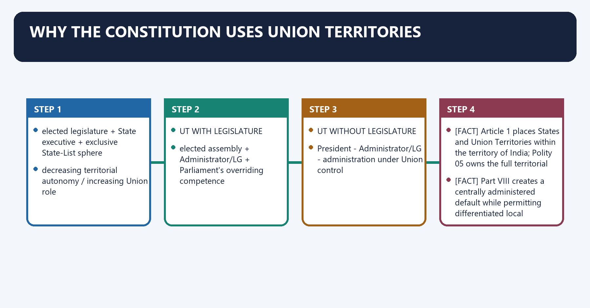
**Visual 1 - The territorial-governance spectrum**

```text
FULL STATE
  elected legislature + State executive + exclusive State-List sphere
        |
        | decreasing territorial autonomy / increasing Union role
        v
UT WITH LEGISLATURE
  elected assembly + Administrator/LG + Parliament's overriding competence
        |
        v
UT WITHOUT LEGISLATURE
  President -> Administrator/LG -> administration under Union control
```

Caption: A UT is constitutionally part of India but not necessarily a constituent State with the same federal autonomy.

- [FACT] Article 1 places States and Union Territories within the territory of India; Polity 05 owns the full territorial distinction.
- [FACT] Part VIII creates a centrally administered default while permitting differentiated local institutions.
- [ANALYSIS] UT status is a constitutional technique for combining territorial inclusion with stronger Union supervision.
- [LIMIT] "Centrally administered" does not mean absence of courts, local bodies or public representation; it means the federal distribution differs from that of a State.

### SESSION 2 — EVOLUTION FROM CENTRALLY ADMINISTERED TERRITORIES

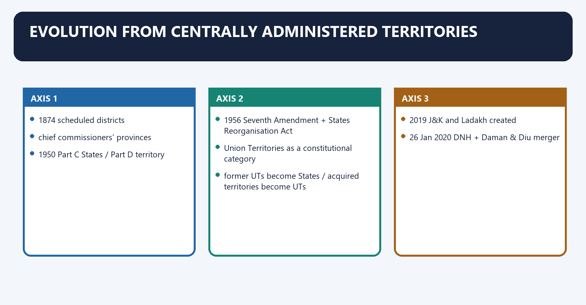
**Visual 2 - Evolution timeline**

```text
1874 scheduled districts
        |
chief commissioners' provinces
        |
1950 Part C States / Part D territory
        |
1956 Seventh Amendment + States Reorganisation Act
        |
Union Territories as a constitutional category
        |
former UTs become States / acquired territories become UTs
        |
2019 J&K and Ladakh created
        |
26 Jan 2020 DNH + Daman & Diu merger
        |
28 Aug 2026: 8 UTs
```

- [FACT] The Seventh Amendment and States Reorganisation Act, 1956 replaced the earlier Part C/D arrangements with the modern UT framework.
- [FACT] Himachal Pradesh, Manipur, Tripura, Mizoram, Arunachal Pradesh and Goa were once UTs before becoming States.
- [FACT] Former French and Portuguese possessions entered the Union through distinct constitutional and statutory steps.
- [ANALYSIS] UT status has been both a durable model and a transitional stage; no universal trajectory from UT to State exists.

### SESSION 3 — CURRENT MAP: THE EIGHT UNION TERRITORIES

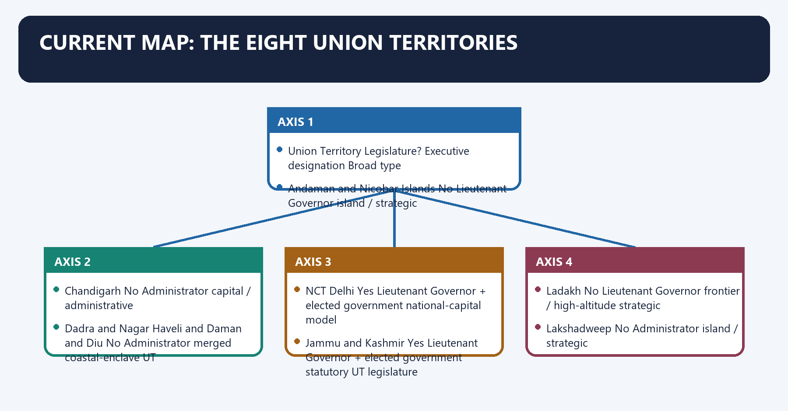
**Visual 3 - Current legal inventory**

| Union Territory | Legislature? | Executive designation | Broad type |
|---|---:|---|---|
| Andaman and Nicobar Islands | No | Lieutenant Governor | island / strategic |
| Chandigarh | No | Administrator | capital / administrative |
| Dadra and Nagar Haveli and Daman and Diu | No | Administrator | merged coastal-enclave UT |
| NCT Delhi | Yes | Lieutenant Governor + elected government | national-capital model |
| Jammu and Kashmir | Yes | Lieutenant Governor + elected government | statutory UT legislature |
| Ladakh | No | Lieutenant Governor | frontier / high-altitude strategic |
| Lakshadweep | No | Administrator | island / strategic |
| Puducherry | Yes | Lieutenant Governor + elected government | Article 239A statutory model |

- [CURRENT] The official National Portal of India and MHA material identify these eight UTs.
- [FACT] The merger Act combined Dadra and Nagar Haveli with Daman and Diu from 26 January 2020.
- [LIMIT] The table states offices, not current officeholders; personnel appointments can change without changing the constitutional model.

### SESSION 4 — WHY DIFFERENT UTS WERE CREATED

**Visual 4 - Rationale matrix**

| Rationale | Illustrative UTs | Governance logic | Qualification |
|---|---|---|---|
| national capital / administration | Delhi, Chandigarh | Union-wide interest and capital functions | local democracy still matters |
| strategic geography | A&N, Lakshadweep, Ladakh | defence, maritime/frontier and connectivity concerns | strategy does not erase rights |
| cultural-historical distinctiveness | Puducherry, DNHDD | distinct colonial and linguistic histories | internal diversity remains |
| security / transition | J&K | 2019 statutory reorganisation | statehood remains a live legal-political issue |
| small scale / special administration | several non-legislature UTs | direct coordination and limited scale | population alone is not a legal test |

- [ANALYSIS] The strongest justification for UT status is functional differentiation, not a claim that residents deserve less democracy.
- [LIMIT] These are explanatory categories, not constitutional grounds that automatically determine status.

### SESSION 5 — PART VIII MASTER MAP

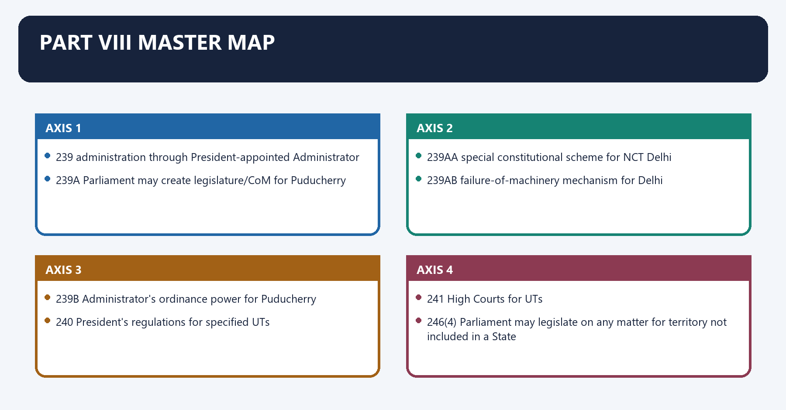
**Visual 5 - Article chain**

```text
239   administration through President-appointed Administrator
239A  Parliament may create legislature/CoM for Puducherry
239AA special constitutional scheme for NCT Delhi
239AB failure-of-machinery mechanism for Delhi
239B  Administrator's ordinance power for Puducherry
240   President's regulations for specified UTs
241   High Courts for UTs

Supporting power:
246(4) Parliament may legislate on any matter for territory not included in a State
```

- [FACT] Part VIII currently runs from Articles 239 to 241; Article 242 was omitted.
- [FACT] Section 13 of the J&K Reorganisation Act applies Article 239A's provisions to J&K.
- [ANALYSIS] The scheme moves from a central-administration default to carefully specified exceptions.

### SESSION 6 — ARTICLE 239: THE ADMINISTRATIVE CHAIN

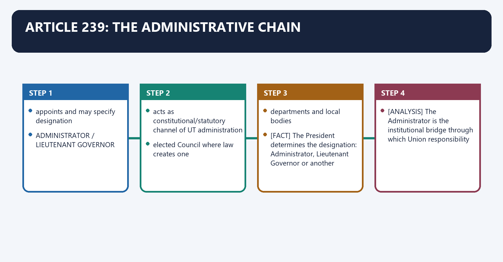
**Visual 6 - Formal executive chain**

```text
PRESIDENT
   |
   | appoints and may specify designation
   v
ADMINISTRATOR / LIEUTENANT GOVERNOR
   |
   | acts as constitutional/statutory channel of UT administration
   v
UT ADMINISTRATION
   |
   +--> elected Council where law creates one
   +--> departments and local bodies
```

- [FACT] Article 239(1) says every UT shall, save as Parliament otherwise provides by law, be administered by the President acting through an Administrator appointed by him.
- [FACT] The President determines the designation: Administrator, Lieutenant Governor or another specified designation.
- [ANALYSIS] The Administrator is the institutional bridge through which Union responsibility enters territorial administration.
- [LIMIT] The exact degree of discretion depends on the Constitution and the governing statute; Article 239 alone does not answer every Delhi, Puducherry or J&K dispute.

### SESSION 7 — ADMINISTRATOR IS NOT A STATE GOVERNOR

**Visual 7 - Administrator versus Governor**

| Dimension | UT Administrator/LG | State Governor |
|---|---|---|
| constitutional role | President's agent under Article 239 | constitutional head of a State |
| federal unit | UT is not a State | State is a constituent federal unit |
| legislative competence around unit | Parliament retains State-List power for UT | State legislature has ordinary State-List sphere |
| local CoM | only where Constitution/statute provides | normal parliamentary executive under Part VI |
| discretion | model-specific and often wider | bounded by Part VI, law and case law |

- [FACT] The Supreme Court and the standard constitutional text reject treating an Administrator as simply another Governor.
- [ANALYSIS] Importing State-Governor assumptions into UT disputes produces the most common conceptual error.
- [LIMIT] Both offices can act as formal heads in some functions, but similarity of ceremony does not erase different legal sources.

### SESSION 8 — A STATE GOVERNOR MAY ADMINISTER AN ADJOINING UT

**Visual 8 - Dual-capacity rule**

```text
ONE PERSON
   |
   +--> Governor of State: ordinarily works within Part VI + State CoM
   |
   +--> Administrator of adjoining UT: acts independently of State CoM
```

- [FACT] Article 239(2) permits the President to appoint the Governor of a State as Administrator of an adjoining UT.
- [FACT] In that UT capacity, the Governor acts independently of the State Council of Ministers.
- [ANALYSIS] Constitutional capacity, not personal identity, determines whose advice controls.
- [LIMIT] This rule does not make the adjoining State government responsible for the UT.

### SESSION 9 — PARLIAMENT'S PLENARY UT COMPETENCE

**Visual 9 - Article 246(4) law-making map**

```text
STATE
  List I -> Parliament
  List II -> State Legislature
  List III -> both, subject to supremacy rules

UNION TERRITORY
  Parliament -> List I + List II + List III
  local Assembly, if any -> only the field granted by Constitution/statute
```

- [FACT] Article 246(4) authorises Parliament to make laws on any matter for territory not included in a State, even if the matter lies in the State List.
- [FACT] This competence continues for Delhi, Puducherry and J&K despite their Assemblies.
- [ANALYSIS] A UT legislature has granted competence; Parliament has continuing constitutional competence.
- [LIMIT] Continuing competence does not mean every parliamentary law automatically displaces every local law; the applicable repugnancy and assent provisions must be examined.

### SESSION 10 — THREE GOVERNMENTAL MODELS, NOT ONE

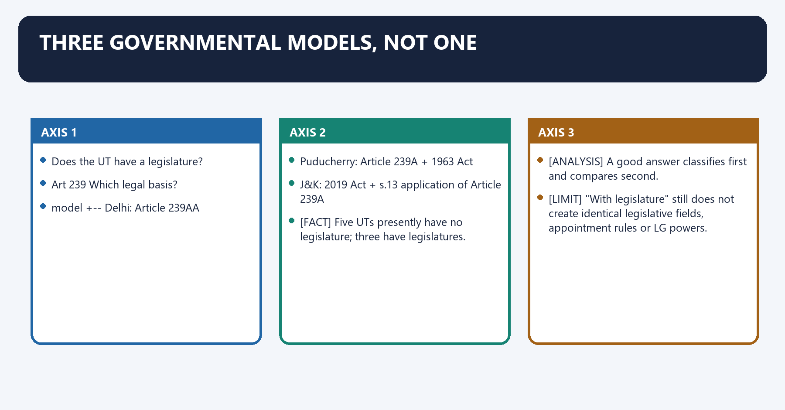
**Visual 10 - Classification decision tree**

```text
Does the UT have a legislature?
        |
   +----+----+
   |         |
  NO        YES
   |         |
Art 239     Which legal basis?
direct       |
model        +--> Delhi: Article 239AA
             +--> Puducherry: Article 239A + 1963 Act
             +--> J&K: 2019 Act + s.13 application of Article 239A
```

- [FACT] Five UTs presently have no legislature; three have legislatures.
- [ANALYSIS] A good answer classifies first and compares second.
- [LIMIT] "With legislature" still does not create identical legislative fields, appointment rules or LG powers.

### SESSION 11 — ARTICLE 239A: ENABLING LOCAL GOVERNMENT

**Visual 11 - Article 239A architecture**

```text
ARTICLE 239A
      |
Parliament may by law create for Puducherry:
      |
      +--> elected or partly nominated legislature
      +--> Council of Ministers
      +--> or both
      |
law may specify constitution + powers + functions
```

- [FACT] Article 239A currently names Puducherry and permits Parliament to create a partly nominated and partly elected legislature and/or CoM.
- [FACT] A law under Article 239A is not deemed an Article 368 amendment even if it amends or has the effect of amending the Constitution.
- [FACT] The Government of Union Territories Act, 1963 operationalises the Puducherry model.
- [FACT] Section 13 of the J&K Reorganisation Act, 2019 applies the provisions of Article 239A to J&K.
- [ANALYSIS] Puducherry's legislature is constitutionally enabled but statutorily constituted; Delhi's Assembly is itself written into Article 239AA.

### SESSION 12 — ARTICLE 239B: ORDINANCE POWER

**Visual 12 - Puducherry ordinance cycle**

```text
Legislature not in session
        |
Administrator finds immediate action necessary
        |
prior instructions from President
        |
Ordinance promulgated
        |
laid before Legislature
        |
ceases six weeks after reassembly unless earlier disapproved
```

- [FACT] Article 239B gives the Administrator of Puducherry ordinance power during recess, subject to prior presidential instructions.
- [FACT] No ordinance may be promulgated while the Legislature is dissolved or its functioning is suspended.
- [FACT] Article 239AA(8) applies Article 239B, so far as may be, to Delhi with textual substitutions.
- [FACT] J&K has a separate ordinance provision in section 52 of the 2019 Act, limited to matters within Assembly competence.
- [LIMIT] An ordinance is not a substitute for Article 240 presidential regulation; the institutions, trigger and legal route differ.

### SESSION 13 — ARTICLE 240: PRESIDENTIAL REGULATIONS

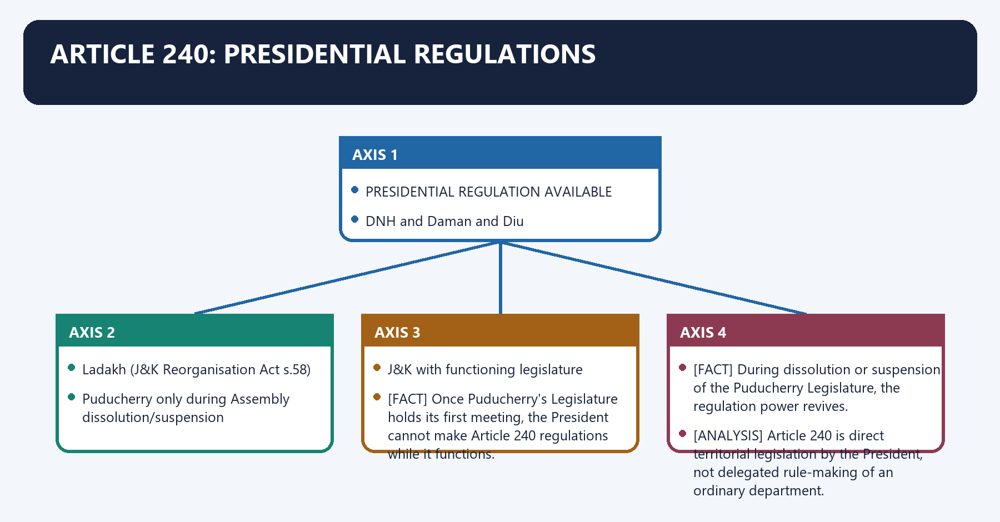
**Visual 13 - Regulation power filter**

```text
PRESIDENTIAL REGULATION AVAILABLE
  A&N Islands
  Lakshadweep
  DNH and Daman and Diu
  Ladakh (J&K Reorganisation Act s.58)
  Puducherry only during Assembly dissolution/suspension

NOT THIS ROUTE
  Chandigarh
  Delhi
  J&K with functioning legislature
```

- [FACT] Article 240 expressly covers A&N, Lakshadweep, DNHDD and Puducherry; section 58(2) of the 2019 Act applies the regulation route to Ladakh.
- [FACT] Once Puducherry's Legislature holds its first meeting, the President cannot make Article 240 regulations while it functions.
- [FACT] During dissolution or suspension of the Puducherry Legislature, the regulation power revives.
- [FACT] A regulation may repeal or amend an applicable parliamentary Act or other law and has the force and effect of an Act of Parliament for that territory.
- [ANALYSIS] Article 240 is direct territorial legislation by the President, not delegated rule-making of an ordinary department.
- [LIMIT] Chandigarh's omission is a deliberate close-option trap.

### SESSION 14 — ARTICLE 241: HIGH COURTS FOR UTS

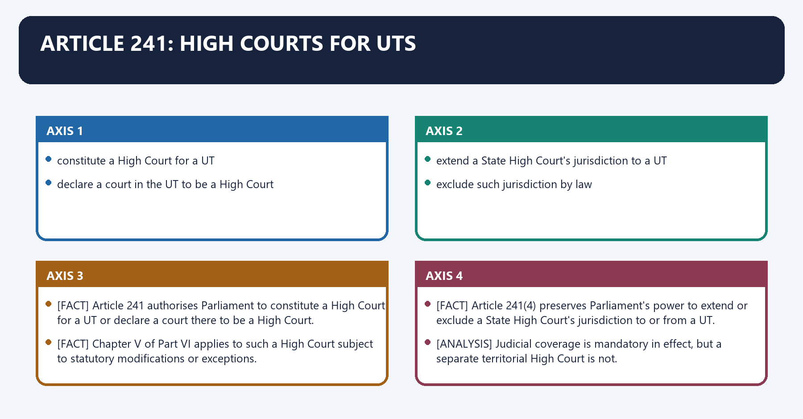
**Visual 14 - Judicial allocation choices**

```text
PARLIAMENT MAY
   |
   +--> constitute a High Court for a UT
   |
   +--> declare a court in the UT to be a High Court
   |
   +--> extend a State High Court's jurisdiction to a UT
   |
   +--> exclude such jurisdiction by law
```

- [FACT] Article 241 authorises Parliament to constitute a High Court for a UT or declare a court there to be a High Court.
- [FACT] Chapter V of Part VI applies to such a High Court subject to statutory modifications or exceptions.
- [FACT] Article 241(4) preserves Parliament's power to extend or exclude a State High Court's jurisdiction to or from a UT.
- [ANALYSIS] Judicial coverage is mandatory in effect, but a separate territorial High Court is not.

### SESSION 15 — CURRENT HIGH COURT ARRANGEMENTS

**Visual 15 - UT judicial matrix**

| Union Territory | High Court arrangement |
|---|---|
| NCT Delhi | Delhi High Court - separate High Court |
| Andaman and Nicobar Islands | Calcutta High Court; circuit arrangements at Port Blair |
| Chandigarh | Punjab and Haryana High Court |
| DNH and Daman and Diu | Bombay High Court |
| Lakshadweep | Kerala High Court |
| Puducherry | Madras High Court |
| Jammu and Kashmir | High Court of Jammu & Kashmir and Ladakh |
| Ladakh | High Court of Jammu & Kashmir and Ladakh |

- [CURRENT] Delhi remains the only UT with a separate High Court of its own.
- [CURRENT] The common court's official current name is the **High Court of Jammu & Kashmir and Ladakh**.
- [LIMIT] A circuit bench is not a separate High Court.

### SESSION 16 — UTS WITHOUT LEGISLATURES: COMMON ARCHITECTURE

**Visual 16 - Direct-administration workflow**

```text
Parliament / President under Constitution and law
              |
              v
MHA and competent Union ministries
              |
              v
Administrator / Lieutenant Governor
              |
              +--> territorial departments
              +--> elected Panchayats/Municipal bodies where applicable
              +--> advisory forums
```

- [FACT] A UT without a legislature is not governed by a local State-type Cabinet.
- [FACT] Parliament can legislate; the President may use Article 240 where legally available; administrators implement the applicable framework.
- [ANALYSIS] Local bodies can provide representation without becoming a territorial legislature.
- [LIMIT] Advisory committees and local bodies cannot be described as substitutes for a Legislative Assembly.

### SESSION 17 — ANDAMAN AND NICOBAR ISLANDS

**Visual 17 - Island administration profile**

| Dimension | Control |
|---|---|
| legislature | none |
| executive | Lieutenant Governor under Article 239 |
| direct law route | Article 240 regulations available |
| High Court | Calcutta High Court |
| rationale | strategic archipelago, maritime administration and dispersed islands |

- [FACT] A&N is a UT without a legislature and is expressly named in Article 240.
- [ANALYSIS] Its administrative design reflects the need to coordinate strategic, environmental, tribal-protection and connectivity concerns.
- [LIMIT] Strategic importance does not justify treating protected communities or environmental safeguards as administratively expendable.

### SESSION 18 — LAKSHADWEEP

**Visual 18 - Small-island governance chain**

```text
small dispersed islands
      |
ecological carrying capacity + connectivity + local livelihood
      |
Administrator under Article 239
      |
Article 240 regulation route
      |
Kerala High Court jurisdiction
```

- [FACT] Lakshadweep has no legislature, is administered by an Administrator and is covered by Article 240.
- [ANALYSIS] Small-island governance requires legal sensitivity to ecology and livelihood, not merely administrative uniformity.
- [LIMIT] Policy controversy should be analysed through statutory power, consultation, rights and proportionality; do not assume that direct administration eliminates judicial review.

### SESSION 19 — CHANDIGARH

**Visual 19 - Shared-capital distinction**

| Feature | Position |
|---|---|
| territorial status | Union Territory |
| legislature | none |
| executive | Administrator |
| High Court | Punjab and Haryana High Court |
| Article 240 | not included |
| State relationship | serves as capital of Punjab and Haryana but is not governed by either State legislature |

- [FACT] Chandigarh's capital role does not convert it into a State territory.
- [FACT] The Punjab and Haryana High Court has jurisdiction over Chandigarh.
- [ANALYSIS] The arrangement separates territorial administration from shared-capital functions.
- [LIMIT] A Punjab Governor appointed as Chandigarh Administrator acts in the UT capacity independently of the Punjab Council of Ministers.

### SESSION 20 — DADRA AND NAGAR HAVELI AND DAMAN AND DIU

**Visual 20 - Merger control**

```text
DNH (separate UT) + Daman and Diu (separate UT)
                  |
Merger of Union Territories Act, 2019
                  |
appointed day: 26 January 2020
                  |
single UT: Dadra and Nagar Haveli and Daman and Diu
```

- [FACT] The 2019 merger Act created one UT from the two earlier UTs.
- [FACT] It has no legislature, is administered by an Administrator, is covered by Article 240 and falls under Bombay High Court jurisdiction.
- [ANALYSIS] Administrative consolidation can reduce duplication, but geographic separation still creates coordination costs.
- [LIMIT] The merged name must be used; treating DNH and Daman and Diu as two current UTs produces the stale count of nine.

### SESSION 21 — LADAKH

**Visual 21 - Ladakh's present institutional model**

```text
J&K Reorganisation Act, 2019
          |
          v
LADAKH UT WITHOUT LEGISLATURE
          |
President -> Lieutenant Governor
          |
Article 240 regulation route through section 58
          |
High Court of Jammu & Kashmir and Ladakh
```

- [FACT] Section 58 of the 2019 Act places Ladakh under a Lieutenant Governor, permits Article 240 regulations and provides Union-appointed advisers.
- [CURRENT] Ladakh remains a UT without a legislature.
- [CURRENT] Statehood, Sixth Schedule and other safeguard demands remain political-negotiation issues; no enacted change was located by the control date.
- [ANALYSIS] Ladakh illustrates the tension between frontier strategy, ecological fragility, tribal representation and demand for local law-making.
- [LIMIT] A demand, committee discussion or Union assurance is not current constitutional status.

### SESSION 22 — THE THREE UT LEGISLATURES COMPARED

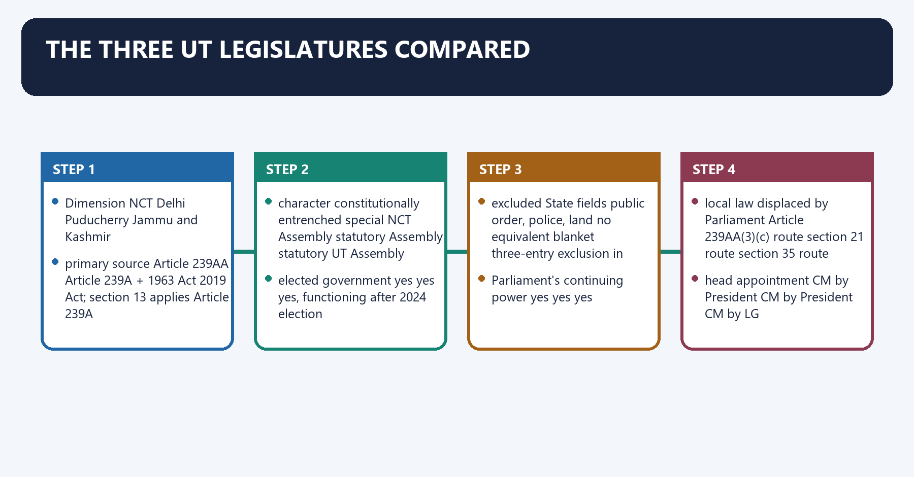
**Visual 22 - Legal-basis matrix**

| Dimension | NCT Delhi | Puducherry | Jammu and Kashmir |
|---|---|---|---|
| primary source | Article 239AA | Article 239A + 1963 Act | 2019 Act; section 13 applies Article 239A |
| character | constitutionally entrenched special NCT Assembly | statutory Assembly | statutory UT Assembly |
| elected government | yes | yes | yes, functioning after 2024 election |
| ordinary legislative field | State + Concurrent Lists subject to exclusions | State + Concurrent Lists as applicable to UTs | State + Concurrent Lists subject to exclusions |
| excluded State fields | public order, police, land | no equivalent blanket three-entry exclusion in section 18 | public order and police |
| Parliament's continuing power | yes | yes | yes |
| local law displaced by Parliament | Article 239AA(3)(c) route | section 21 route | section 35 route |
| head appointment | CM by President | CM by President | CM by LG |

- [FACT] J&K's land field is not excluded in section 32, unlike Delhi.
- [FACT] All three Councils are collectively responsible to their Assemblies.
- [ANALYSIS] The phrase "UT with legislature" describes a family, not a uniform constitution.

### SESSION 23 — DELHI'S CONSTITUTIONAL EVOLUTION

**Visual 23 - Delhi timeline**

```text
1956 Union Territory
   |
Metropolitan Council / Executive Council phase
   |
69th Constitutional Amendment Act, 1991
   |
Article 239AA effective 1992
   |
NCT Delhi + Legislative Assembly + Council of Ministers
   |
2018 Constitution Bench
   |
2023 services Constitution Bench
   |
GNCTD Amendment Act, 2023 / NCCSA
```

- [FACT] The 69th Amendment redesignated Delhi as the National Capital Territory and its Administrator as Lieutenant Governor.
- [FACT] Parliament enacted the GNCTD Act, 1991 to supplement Article 239AA.
- [ANALYSIS] Delhi's design attempts to combine a national capital under Union protection with representative government for residents.
- [LIMIT] Delhi remains a UT; "special status" does not mean Statehood.

### SESSION 24 — ARTICLE 239AA: DELHI'S LEGISLATIVE FIELD

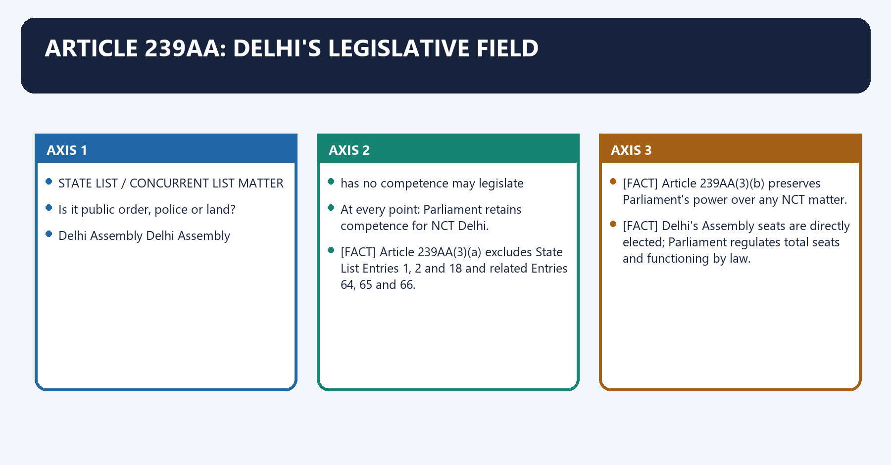
**Visual 24 - Delhi competence filter**

```text
STATE LIST / CONCURRENT LIST MATTER
               |
Is it public order, police or land?
       |                    |
      YES                  NO
       |                    |
Delhi Assembly          Delhi Assembly
has no competence       may legislate
       |
Union competence

At every point: Parliament retains competence for NCT Delhi.
```

- [FACT] Article 239AA(3)(a) excludes State List Entries 1, 2 and 18 and related Entries 64, 65 and 66.
- [FACT] Article 239AA(3)(b) preserves Parliament's power over any NCT matter.
- [FACT] Delhi's Assembly seats are directly elected; Parliament regulates total seats and functioning by law.
- [FACT] Article 239AA(4) limits the CoM to not more than ten per cent of Assembly strength.
- [LIMIT] "Police" does not mean every service officer; the 2023 services case addressed Entry 41 separately.

### SESSION 25 — DELHI: PARLIAMENTARY OVERRIDE AND REPUGNANCY

**Visual 25 - Delhi law-conflict ladder**

```text
Delhi Assembly law
        |
conflict with parliamentary / earlier law
        |
Parliamentary or earlier law prevails
        |
Exception: reserved Delhi law receives President's assent
        |
Even then Parliament may later add, amend, vary or repeal
```

- [FACT] Article 239AA(3)(c) creates the repugnancy rule.
- [FACT] Presidential assent can allow the local law to prevail in Delhi, subject to Parliament's later power.
- [ANALYSIS] Delhi legislative autonomy is real but constitutionally defeasible.
- [LIMIT] "Parliament can override" should be proved through the relevant clause, not used as a slogan that erases the Assembly.

### SESSION 26 — DELHI'S EXECUTIVE: AID, ADVICE AND REFERENCE

**Visual 26 - Article 239AA(4) workflow**

```text
Matter within Delhi Assembly's legislative field
             |
Council of Ministers decides
             |
LG ordinarily acts on aid and advice
             |
genuine difference of opinion?
        |                 |
       NO                YES
        |                 |
 implement          discussion/dialogue
                          |
               exceptional reference to President
                          |
                urgent interim action possible
```

- [FACT] The CoM aids and advises the LG in fields where the Assembly can legislate, except where law requires discretion.
- [FACT] The proviso allows reference of a difference to the President and urgent interim action.
- [ANALYSIS] The provision creates a constitutional partnership but also an escalation channel.
- [LIMIT] The text says "any matter"; the 2018 judgment held that this cannot mean "every matter".

### SESSION 27 — THE 2018 CONSTITUTION BENCH

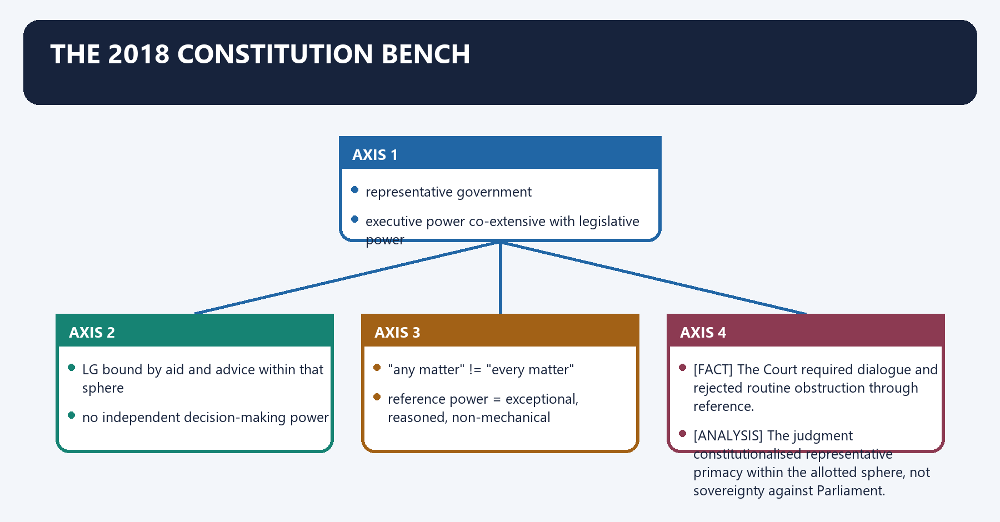
**Visual 27 - 2018 holding chain**

```text
representative government
        |
executive power co-extensive with legislative power
        |
LG bound by aid and advice within that sphere
        |
no independent decision-making power
        |
"any matter" != "every matter"
        |
reference power = exceptional, reasoned, non-mechanical
```

- [FACT] *Government of NCT of Delhi v. Union of India* (4 July 2018) held that Delhi's executive power follows its legislative field, subject to Constitution and parliamentary law.
- [FACT] The majority said the LG has no independent decision-making power: he acts on aid and advice or implements the President's decision after a valid reference.
- [FACT] The Court required dialogue and rejected routine obstruction through reference.
- [ANALYSIS] The judgment constitutionalised representative primacy within the allotted sphere, not sovereignty against Parliament.
- [LIMIT] It did not permanently settle every allocation dispute; services generated later litigation.

### SESSION 28 — THE MAY 2023 SERVICES JUDGMENT

**Visual 28 - Judicial services rule before the later Act**

```text
Entry 41: State public services / PSC
               |
not one of Delhi's three express exclusions
               |
NCTD has legislative power
               |
executive power is co-extensive
               |
LG bound by elected government's decisions
               |
EXCEPT services connected to public order, police and land
```

- [FACT] The 11 May 2023 Constitution Bench held that NCTD had legislative and executive power over services under Entry 41, excluding the three reserved fields.
- [FACT] It described NCTD as **sui generis**, not identical to other UTs.
- [FACT] It linked officer accountability to the "triple chain" of civil service, ministers, legislature and electorate.
- [ANALYSIS] Control of postings and discipline was treated as necessary for democratic responsibility.
- [LIMIT] This judicial rule was followed by parliamentary legislation; current answers must include the 2023 Act.

### SESSION 29 — GNCTD AMENDMENT ACT, 2023 AND NCCSA

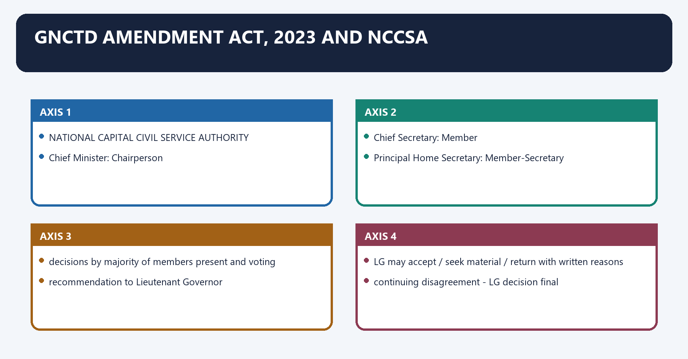
**Visual 29 - NCCSA decision structure**

```text
NATIONAL CAPITAL CIVIL SERVICE AUTHORITY
   |
   +--> Chief Minister: Chairperson
   +--> Chief Secretary: Member
   +--> Principal Home Secretary: Member-Secretary
   |
decisions by majority of members present and voting
   |
recommendation to Lieutenant Governor
   |
LG may accept / seek material / return with written reasons
   |
continuing disagreement -> LG decision final
```

- [FACT] Act 19 of 2023 is deemed in force from 19 May 2023.
- [FACT] Section 45E creates the three-member NCCSA; two senior officials sit with the Chief Minister and decisions are by majority.
- [FACT] Section 45H covers transfer/posting recommendations for Group A and DANICS officers and vigilance/disciplinary recommendations, subject to statutory exclusions.
- [FACT] If the LG differs, he may return the recommendation with recorded reasons; after difference persists, the LG's decision is final.
- [FACT] The Act also expands statutory routes for matters to be placed before the LG and gives the Central Government rule-making power under Part IV-A.
- [ANALYSIS] The Act converts services control from direct elected-government primacy into an Authority-plus-LG structure with ultimate LG primacy on disagreement.
- [LIMIT] Do not write that the elected Delhi government presently enjoys unqualified control over services.

### SESSION 30 — DELHI'S CURRENT LEGAL POSITION: HOW TO WRITE IT

**Visual 30 - Current-law answer sequence**

```text
ARTICLE 239AA TEXT
       +
2018 aid/advice judgment
       +
May 2023 services judgment
       +
GNCTD Amendment Act, 2023 / NCCSA
       +
pending constitutional challenge
       =
CURRENT QUALIFIED ANSWER
```

- [CURRENT] The constitutional principles from 2018 remain essential.
- [CURRENT] The May 2023 judgment explains why services fall within Entry 41 and democratic accountability.
- [CURRENT] Parliament then enacted the 2023 amendment, which presently governs the NCCSA/LG process.
- [LIMIT] The constitutional challenge remains relevant, but a pending challenge does not suspend the Act.
- [ANALYSIS] Delhi therefore has elected executive authority within a constitutionally and statutorily bounded sphere, not a clean State-style services command.

### SESSION 31 — PUDUCHERRY'S STATUTORY LEGISLATURE

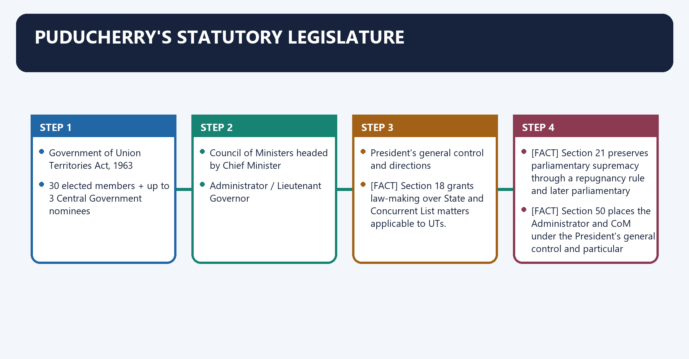
**Visual 31 - Puducherry institutional chain**

```text
Article 239A
      |
Government of Union Territories Act, 1963
      |
30 elected members + up to 3 Central Government nominees
      |
Council of Ministers headed by Chief Minister
      |
Administrator / Lieutenant Governor
      |
President's general control and directions
```

- [FACT] Section 3 of the 1963 Act provides thirty directly elected seats and permits the Central Government to nominate not more than three non-government-service persons.
- [FACT] Section 18 grants law-making over State and Concurrent List matters applicable to UTs.
- [FACT] Section 21 preserves parliamentary supremacy through a repugnancy rule and later parliamentary override.
- [FACT] Sections 44-46 govern aid/advice, differences, ministerial appointment and business; the Chief Minister is appointed by the President.
- [FACT] Section 50 places the Administrator and CoM under the President's general control and particular directions.
- [ANALYSIS] Puducherry combines a broad local legislative field with a strong statutory Union-supervision layer.

### SESSION 32 — K. LAKSHMINARAYANAN AND NOMINATED MEMBERS

**Visual 32 - Nominated-member rule**

```text
Central Government nomination under section 3(3)
                |
no statutory requirement of Puducherry CoM concurrence
                |
nominated member becomes full Assembly member
                |
votes on "all questions"
                |
includes budget and no-confidence motion
```

- [FACT] In *K. Lakshminarayanan v. Union of India* (6 December 2018), the Supreme Court upheld the Central Government's nomination power.
- [FACT] The Court found no established convention requiring names to emanate from or receive concurrence of the Chief Minister.
- [FACT] It held nominated members may vote on all questions, including the budget and a no-confidence motion.
- [ANALYSIS] Nomination can affect government survival, illustrating the democratic sensitivity of statutory design.
- [LIMIT] The judgment interpreted the existing Act; criticism of the design must not be presented as a contrary legal rule.

### SESSION 33 — PUDUCHERRY: ARTICLE 240'S CONDITIONAL RETURN

**Visual 33 - Legislature functioning test**

```text
Puducherry Legislature functioning?
          |
     +----+----+
     |         |
    YES       NO: dissolved or suspended
     |         |
President      President may make
cannot use     Article 240 regulations
Art 240 route  during that period
```

- [FACT] Article 240's first proviso stops presidential regulations after the Legislature's first meeting while it functions.
- [FACT] The second proviso revives the power during dissolution or suspension.
- [FACT] Article 239B ordinance power is unavailable during dissolution/suspension, preventing the two emergency routes from being confused.
- [ANALYSIS] The Constitution switches law-making mechanisms according to whether representative institutions function.

### SESSION 34 — JAMMU AND KASHMIR: 2019 REORGANISATION

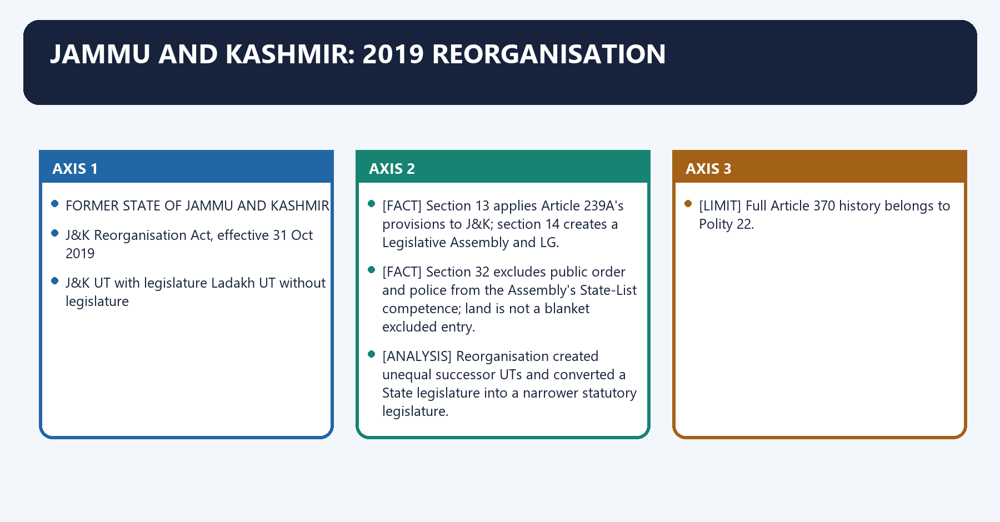
**Visual 34 - Reorganisation outcome**

```text
FORMER STATE OF JAMMU AND KASHMIR
                 |
J&K Reorganisation Act, effective 31 Oct 2019
                 |
        +--------+--------+
        |                 |
J&K UT with legislature   Ladakh UT without legislature
```

- [FACT] Section 13 applies Article 239A's provisions to J&K; section 14 creates a Legislative Assembly and LG.
- [FACT] Section 32 excludes public order and police from the Assembly's State-List competence; land is not a blanket excluded entry.
- [FACT] Section 35 makes parliamentary law prevail over repugnant local law, subject to presidential-assent and later-Parliament qualifications.
- [ANALYSIS] Reorganisation created unequal successor UTs and converted a State legislature into a narrower statutory legislature.
- [LIMIT] Full Article 370 history belongs to Polity 22.

### SESSION 35 — J&K ASSEMBLY: POWERS AND FUNCTIONS

**Visual 35 - Functional map**

| Function | Named legal basis | What it proves | Qualification |
|---|---|---|---|
| legislation | section 32 | State/Concurrent field except public order and police | Parliament retains full UT power |
| finance | sections 36 and financial provisions | taxes, grants, appropriation and budget scrutiny | LG recommendation/Union architecture matters |
| accountability | section 53 collective responsibility | CoM must retain Assembly confidence | LG discretion remains wider than State Governor model |
| debate and privilege | sections 30-31 | speech, committees and representative scrutiny | statutory, not Part VI, privileges |
| bills and assent | sections 38-39 | Assembly can enact laws | reservation for President and override remain |
| anti-defection | section 28 | party discipline framework applies | modified Tenth Schedule route |

- [FACT] The Assembly is a real legislature with law-making, financial, deliberative and confidence functions.
- [ANALYSIS] Its weakness relative to a State lies not in absence of functions but in narrower competence and stronger Union/LG control.
- [LIMIT] "Statutory" does not mean legally insignificant; it means Parliament shaped and can amend the institutional design through law.

### SESSION 36 — J&K LIEUTENANT GOVERNOR AND THE 2024 BUSINESS-RULE AMENDMENTS

**Visual 36 - LG discretion and routing**

```text
2019 Act section 53
  discretion outside Assembly field
  + matters legally requiring discretion
  + All India Services / Anti-Corruption Bureau
          |
2024 Second Amendment Rules, G.S.R. 386(E)
          |
specified police/public order/AIS/ACB finance proposals
and legal/prosecution/secretary-posting matters
          |
routed to LG through Chief Secretary and prescribed channels
```

- [FACT] Section 53 requires aid and advice within the Assembly's field but expressly gives discretion outside it and for All India Services and the Anti-Corruption Bureau.
- [FACT] The 2024 rules inserted routing requirements for specified police, public order, AIS, ACB, law-officer, prosecution, prisons, forensic and senior-posting matters.
- [ANALYSIS] The rules sharpen operational LG control before and after the elected government's return.
- [LIMIT] The rules govern transaction and routing; they should not be paraphrased as abolition of the CoM or Assembly.

### SESSION 37 — J&K AFTER THE 2024 ELECTION

**Visual 37 - Present status control**

```text
11 Dec 2023 Supreme Court judgment
          |
election direction by 30 Sep 2024
          |
Sep-Oct 2024 Assembly election
          |
elected Chief Minister + Council + functioning House
          |
official Budget 2026-27 presented to House
          |
28 Aug 2026: UT status continues; Statehood pending
```

- [CURRENT] It is stale and false to say J&K remains without an elected legislature.
- [CURRENT] The official 2026-27 Budget Speech identifies Omar Abdullah as Chief Minister and Finance Minister and addresses the Speaker and members of the House.
- [CURRENT] Statehood has not been restored by constitutional amendment, parliamentary law or appointed-day notification located by the control date.
- [LIMIT] The Court's "earliest and as soon as possible" direction did not supply a fixed date.
- [ANALYSIS] Democratic government has been restored within the UT framework; federal status has not been restored to State level.

### SESSION 38 — ASYMMETRIC GOVERNANCE ACROSS THE UTS

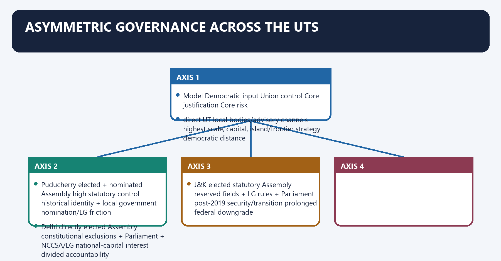
**Visual 38 - Asymmetry matrix**

| Model | Democratic input | Union control | Core justification | Core risk |
|---|---|---|---|---|
| direct UT | local bodies/advisory channels | highest | scale, capital, island/frontier strategy | democratic distance |
| Puducherry | elected + nominated Assembly | high statutory control | historical identity + local government | nomination/LG friction |
| Delhi | directly elected Assembly | constitutional exclusions + Parliament + NCCSA/LG | national-capital interest | divided accountability |
| J&K | elected statutory Assembly | reserved fields + LG rules + Parliament | post-2019 security/transition | prolonged federal downgrade |

- [ANALYSIS] Asymmetry is constitutionally legitimate when linked to a reason, bounded by law and accompanied by accountable institutions.
- [ANALYSIS] The democratic objection grows when residents elect a government but effective control over officers, bills or reserved fields lies elsewhere.
- [LIMIT] Equal citizenship does not require identical territorial institutions, but differentiation must remain constitutionally reviewable.

### SESSION 39 — WHY ADMINISTRATOR-VERSUS-ELECTED-GOVERNMENT FRICTION OCCURS

**Visual 39 - Friction mechanism**

```text
ELECTORAL MANDATE
      |
minister promises policy
      |
needs law + money + officers + assent
      |
split control over one or more inputs
      |
LG reference / reservation / service control / parliamentary law
      |
delay + blame shifting + litigation
```

- [ANALYSIS] The conflict is structural: responsibility may lie with elected ministers while decisive instruments lie with the Union-appointed administrator.
- [FACT] Delhi services, Puducherry nominations and J&K business routing are named examples of different mechanisms producing similar accountability tension.
- [ANALYSIS] Party conflict can intensify the structure but does not create the legal overlap.
- [LIMIT] Not every disagreement is obstruction; reserved national interests and legality checks can justify intervention.

### SESSION 40 — ACCOUNTABILITY TEST FOR ANY UT ARRANGEMENT

**Visual 40 - Five-question audit**

```text
1. WHO MAKES THE LAW?
2. WHO CONTROLS THE OFFICER?
3. WHO CONTROLS THE MONEY?
4. WHO CAN STOP / RESERVE / REFER THE DECISION?
5. WHO FACES THE VOTER OR COURT?
```

- [ANALYSIS] A credible evaluation follows authority across the entire implementation chain.
- [FACT] Delhi's services dispute proves that legislative competence without officer control can weaken accountability.
- [FACT] Article 241 and judicial review ensure that direct administration remains subject to law.
- [LIMIT] More local control is not automatically better; strategic, minority, fiscal and integrity safeguards must be designed rather than ignored.

### SESSION 41 — TERRITORIAL STATUS AND TOPIC-OWNERSHIP BOUNDARY

**Visual 41 - Ownership flow**

```text
Should territory be a State or UT?
        |
Articles 1-4 / reorganisation -> POLITY 05
        |
Once it is a UT, how is it governed?
        |
Articles 239-241 / statutes -> POLITY 25
        |
Does Article 370 / 371 / Schedule protection apply?
        |
Special provisions -> POLITY 22 / 26
```

- [FACT] Article 3 enables territorial reorganisation; it does not itself supply the day-to-day UT governance code.
- [ANALYSIS] A Mains answer on J&K Statehood should use Polity 05 for status change and this package for the consequences of UT status.
- [LIMIT] Do not duplicate full Berubari, Article 370 or Sixth Schedule doctrine here.

### SESSION 42 — EVIDENCE-LINKED ANSWER METHOD

**Visual 42 - Claim-to-verdict spine**

```text
CLAIM
  -> NAMED ARTICLE / SECTION / CASE / OFFICIAL CURRENT SOURCE
  -> WHAT THE EVIDENCE PROVES
  -> LIMIT OR COUNTERPOINT
  -> DIRECT VERDICT
```

**Worked example**

- **Claim:** [ANALYSIS] Delhi's elected government has meaningful but not State-equivalent executive authority.
- **Named evidence:** [FACT] Article 239AA grants a legislative field; the 2018 judgment binds the LG to aid and advice within it; the 2023 services judgment includes Entry 41; Act 19 of 2023 creates NCCSA and final LG primacy on disagreement.
- **What it proves:** [ANALYSIS] democratic control exists, but its service mechanism is now statutorily shared and Union-weighted.
- **Qualification:** [LIMIT] the 2023 Act is under constitutional challenge and its final validity is unresolved.
- **Verdict:** [ANALYSIS] Delhi is a bounded representative government inside a continuing Union-territory framework.

### SESSION 43 — PRELIMS CLOSE-OPTION DISTINCTIONS

**Visual 43 - Rapid discrimination table**

| Confusion | Correct distinction |
|---|---|
| current UT count | 8, not 9 |
| with legislatures | Delhi, Puducherry, J&K |
| Article 239A | Puducherry; applied to J&K by 2019 Act section 13 |
| Article 239AA | Delhi only |
| Article 239AB | Delhi failure-of-machinery mechanism |
| Article 239B | Puducherry ordinance power; applied to Delhi by 239AA(8) |
| Article 240 | A&N, Lakshadweep, DNHDD, Ladakh route; Puducherry conditionally |
| Chandigarh and Article 240 | Chandigarh is not listed |
| Delhi exclusions | public order, police, land |
| J&K exclusions | public order, police; not blanket land exclusion |
| Puducherry nominees | up to three; Central Government nomination |
| separate High Court | Delhi only |
| Administrator | President's agent, not State Governor |
| Parliament and UT State List | competence continues under Article 246(4) |

### SESSION 44 — CURRENT LEGAL-STATUS CONTROL SHEET

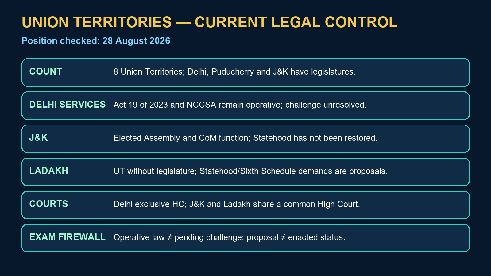

**Visual 44 - Dated current controls**

| Issue | Current control at 28 Aug 2026 | Unsafe statement |
|---|---|---|
| count | 8 UTs | "India has 9 UTs" |
| legislatures | Delhi, Puducherry, J&K | "only Delhi and Puducherry" |
| Delhi services | 2023 Act/NCCSA operative; LG final on Authority disagreement | "Delhi govt has unqualified services control" |
| J&K Assembly | elected and functioning after 2024 | "J&K has no elected legislature" |
| J&K Statehood | not legally restored | "Court restored Statehood" |
| Ladakh | UT without legislature | "Ladakh has Assembly/Sixth Schedule" |
| Puducherry nominees | full voting members under 2018 ruling | "nominees cannot vote on confidence/budget" |
| High Court name | High Court of Jammu & Kashmir and Ladakh | stale shorter name as current official title |

- [LIMIT] Current-control statements should always carry a date where litigation or political transition could change the position.

### SESSION 45 — MAINS THESIS BANK

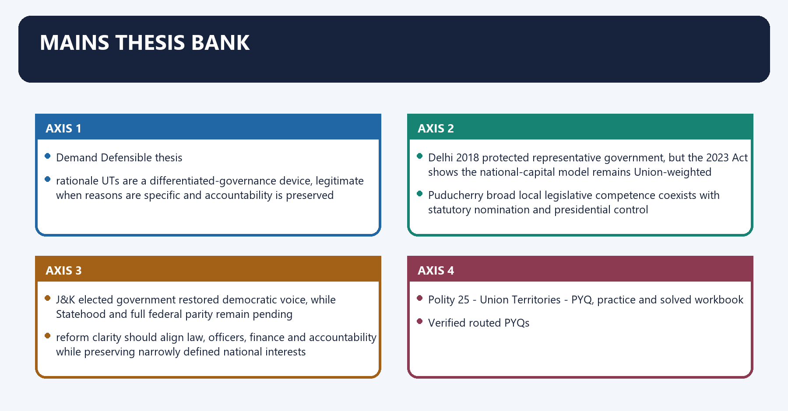
**Visual 45 - Thesis selector**

| Demand | Defensible thesis |
|---|---|
| rationale | UTs are a differentiated-governance device, legitimate when reasons are specific and accountability is preserved |
| democracy | a UT legislature is real self-government but not State-equivalent because Parliament and the Administrator retain decisive powers |
| Delhi | 2018 protected representative government, but the 2023 Act shows the national-capital model remains Union-weighted |
| Puducherry | broad local legislative competence coexists with statutory nomination and presidential control |
| J&K | elected government restored democratic voice, while Statehood and full federal parity remain pending |
| reform | clarity should align law, officers, finance and accountability while preserving narrowly defined national interests |

## BASIC MCQS / REMEDIATION

### Original MCQ loop - strict continuous A -> B -> C -> D rotation

#### OM1. Current inventory

Which statement is correct as on 28 August 2026?

A. India has 8 Union Territories.  
B. India has 9 Union Territories.  
C. Delhi and Puducherry are the only UTs with legislatures.  
D. Dadra and Nagar Haveli and Daman and Diu remain separate UTs.

**Answer: A.**

**Explanation:** [CURRENT] The eight include J&K and Ladakh separately and DNHDD as one merged UT.

#### OM2. Administrative default

The constitutional default for administration of a Union Territory is found in:

A. Article 238.  
B. Article 239.  
C. Article 243.  
D. Article 356.

**Answer: B.**

**Explanation:** [FACT] Article 239 places administration through a President-appointed Administrator, save as Parliament otherwise provides by law.

#### OM3. Administrator's character

Which description is constitutionally most accurate?

A. A UT Administrator is always the elected territorial head.  
B. A UT Administrator is identical to a State Governor in legal source and role.  
C. A UT Administrator acts as an agent/channel of the President under Article 239.  
D. A UT Administrator is appointed by the Chief Minister.

**Answer: C.**

**Explanation:** [FACT] The office is not a Part VI State headship; powers vary by the UT's special framework.

#### OM4. Parliament's State-List power

Parliament's power to legislate on a State-List matter for territory not included in a State is expressly stated in:

A. Article 239A.  
B. Article 240.  
C. Article 241.  
D. Article 246(4).

**Answer: D.**

**Explanation:** [FACT] This is the core reason Parliament's UT competence continues even where an Assembly exists.

#### OM5. Puducherry's constitutional hook

Parliament's power to create Puducherry's Legislature and Council of Ministers comes primarily from:

A. Article 239A.  
B. Article 239AA.  
C. Article 240 alone.  
D. Article 371.

**Answer: A.**

**Explanation:** [FACT] The Government of Union Territories Act, 1963 operationalises Article 239A.

#### OM6. Delhi's special article

The National Capital Territory and its Legislative Assembly are constitutionally anchored in:

A. Article 239.  
B. Article 239AA.  
C. Article 239B only.  
D. Article 241.

**Answer: B.**

**Explanation:** [FACT] The 69th Amendment inserted Article 239AA.

#### OM7. Delhi failure of machinery

Which provision allows suspension of the Article 239AA arrangement when Delhi cannot be administered in accordance with it?

A. Article 239A(2).  
B. Article 239B.  
C. Article 239AB.  
D. Article 356 directly and exclusively.

**Answer: C.**

**Explanation:** [FACT] Article 239AB is Delhi's specific failure-of-constitutional-machinery provision.

#### OM8. Ordinances in Puducherry

The Administrator's ordinance power during recess of Puducherry's Legislature is in:

A. Article 123.  
B. Article 213.  
C. Article 240.  
D. Article 239B.

**Answer: D.**

**Explanation:** [FACT] Prior presidential instructions are required.

#### OM9. Article 240 set

Which UT is expressly within Article 240's presidential-regulation text?

A. Andaman and Nicobar Islands.  
B. Chandigarh.  
C. Delhi.  
D. Jammu and Kashmir.

**Answer: A.**

**Explanation:** [FACT] A&N is expressly listed; Ladakh uses the route through section 58 of the 2019 Act.

#### OM10. Article 240 trap

Which UT is **not** covered by the Article 240 regulation route?

A. Lakshadweep.  
B. Chandigarh.  
C. Dadra and Nagar Haveli and Daman and Diu.  
D. Ladakh.

**Answer: B.**

**Explanation:** [FACT] Chandigarh is administered under Article 239 but is not in Article 240's specified set.

#### OM11. UT High Courts

Parliament's power to constitute a High Court for a UT or extend/exclude State High Court jurisdiction is addressed by:

A. Article 214 alone.  
B. Article 231 alone.  
C. Article 241.  
D. Article 262.

**Answer: C.**

**Explanation:** [FACT] Articles 214/231 support the wider High Court framework, but Article 241 is the UT-specific provision.

#### OM12. Separate High Court

Which Union Territory has a separate High Court of its own?

A. Puducherry.  
B. Jammu and Kashmir.  
C. Chandigarh.  
D. NCT Delhi.

**Answer: D.**

**Explanation:** [CURRENT] J&K and Ladakh share a common High Court; Delhi alone has a separate UT High Court.

#### OM13. Andaman jurisdiction

Andaman and Nicobar Islands fall under:

A. Calcutta High Court.  
B. Madras High Court.  
C. Kerala High Court.  
D. Bombay High Court.

**Answer: A.**

**Explanation:** [FACT] The circuit arrangement at Port Blair does not create a separate High Court.

#### OM14. DNHDD jurisdiction

Dadra and Nagar Haveli and Daman and Diu fall under:

A. Gujarat High Court.  
B. Bombay High Court.  
C. Madras High Court.  
D. Delhi High Court.

**Answer: B.**

**Explanation:** [FACT] The merged UT continues under Bombay High Court jurisdiction.

#### OM15. Lakshadweep jurisdiction

Lakshadweep falls under:

A. Karnataka High Court.  
B. Madras High Court.  
C. Kerala High Court.  
D. Calcutta High Court.

**Answer: C.**

**Explanation:** [FACT] Do not confuse Lakshadweep with Puducherry's Madras High Court link.

#### OM16. Puducherry jurisdiction

Puducherry falls under:

A. Kerala High Court.  
B. Bombay High Court.  
C. Calcutta High Court.  
D. Madras High Court.

**Answer: D.**

**Explanation:** [FACT] Puducherry has an Assembly but not its own High Court.

#### OM17. Common J&K-Ladakh court

The correct current institutional description is:

A. High Court of Jammu & Kashmir and Ladakh is common to both UTs.  
B. J&K and Ladakh each have a separate High Court.  
C. Both are under Punjab and Haryana High Court.  
D. Ladakh has no High Court jurisdiction.

**Answer: A.**

**Explanation:** [CURRENT] The official name expressly includes both territories.

#### OM18. Legislature set

Which set contains all current UTs with legislatures?

A. Delhi, Puducherry, Chandigarh.  
B. Delhi, Puducherry, Jammu and Kashmir.  
C. Delhi, Jammu and Kashmir, Ladakh.  
D. Puducherry, J&K, Andaman and Nicobar Islands.

**Answer: B.**

**Explanation:** [CURRENT] Ladakh, Chandigarh and A&N do not have territorial legislatures.

#### OM19. Delhi exclusions

Which group is excluded from Delhi Assembly's ordinary State-List competence?

A. agriculture, irrigation and markets.  
B. prisons, public health and local government.  
C. public order, police and land.  
D. land, education and electricity.

**Answer: C.**

**Explanation:** [FACT] These correspond to Entries 1, 2 and 18 plus related entries.

#### OM20. J&K exclusions

Under section 32 of the J&K Reorganisation Act, the Assembly is excluded from:

A. land and agriculture.  
B. education and local government.  
C. forests and water.  
D. public order and police.

**Answer: D.**

**Explanation:** [FACT] Unlike Delhi, land is not a blanket excluded field.

#### OM21. Puducherry competence

Which statement best states section 18 of the Government of Union Territories Act, 1963?

A. Puducherry's Assembly may legislate on applicable State and Concurrent List matters, subject to the Act.  
B. It may legislate only on the Concurrent List.  
C. It has no taxation competence.  
D. Parliament loses State-List competence after the Assembly is created.

**Answer: A.**

**Explanation:** [FACT] Parliament's power is expressly preserved by section 18(2).

#### OM22. Delhi parliamentary power

Article 239AA provides that:

A. Parliament cannot legislate on Delhi State-List matters.  
B. Parliament's NCT competence continues and its law can prevail under the constitutional scheme.  
C. Presidential assent permanently immunises a Delhi law from Parliament.  
D. the Delhi Assembly is sovereign in all non-reserved fields.

**Answer: B.**

**Explanation:** [FACT] Parliament can later add to, amend, vary or repeal even a reserved local law that received assent.

#### OM23. 2018 reference power

The 2018 Constitution Bench held that the phrase "any matter" in Article 239AA(4):

A. means every administrative decision.  
B. eliminates the need for ministerial advice.  
C. does not mean every matter; reference is an exceptional power.  
D. transfers all disputes directly to the Supreme Court.

**Answer: C.**

**Explanation:** [FACT] The LG must not mechanically refer every decision and should seek dialogue.

#### OM24. May 2023 services judgment

The Court held in May 2023 that:

A. services are outside every UT's constitutional framework.  
B. Delhi controls police services.  
C. Parliament has no competence over Delhi services.  
D. NCTD had legislative and executive power over Entry 41 services outside public order, police and land.

**Answer: D.**

**Explanation:** [FACT] This judicial position must now be read with the later 2023 Act.

#### OM25. NCCSA composition

The NCCSA consists of:

A. Chief Minister, Chief Secretary and Principal Home Secretary.  
B. LG, Chief Minister and Speaker.  
C. Union Home Minister, LG and Chief Minister.  
D. Chief Minister and two elected MLAs.

**Answer: A.**

**Explanation:** [FACT] The Chief Minister chairs; the two senior officials are members, with the Home Secretary as Member-Secretary.

#### OM26. NCCSA disagreement

Under section 45H after reconsideration:

A. the Chief Minister's view is automatically final.  
B. the LG's decision is final where difference persists.  
C. the Speaker decides.  
D. the recommendation lapses without decision.

**Answer: B.**

**Explanation:** [FACT] The LG must record reasons when returning a recommendation; persistent disagreement ends with the LG's decision.

#### OM27. Puducherry nomination

Who may nominate up to three persons to Puducherry's Legislative Assembly under section 3(3)?

A. Lieutenant Governor personally.  
B. Chief Minister.  
C. Central Government.  
D. Election Commission of India.

**Answer: C.**

**Explanation:** [FACT] The Supreme Court upheld this statutory allocation in *K. Lakshminarayanan*.

#### OM28. Nominated-member vote

The Supreme Court's Puducherry ruling held that nominated members:

A. may vote only on ordinary Bills.  
B. cannot vote on the budget.  
C. cannot vote in a no-confidence motion.  
D. may vote on all questions, including budget and no-confidence.

**Answer: D.**

**Explanation:** [FACT] The Court relied on the Act's treatment of all Assembly members and all questions.

#### OM29. Puducherry and Article 240

When Puducherry's Legislature is dissolved or its functioning suspended:

A. the President may make Article 240 regulations during that period.  
B. the Administrator alone uses Article 213.  
C. Parliament loses law-making power.  
D. Article 240 permanently ceases to apply.

**Answer: A.**

**Explanation:** [FACT] This is the second proviso to Article 240(1).

#### OM30. J&K current institution

Which proposition is accurate at the control date?

A. J&K has never held a UT Assembly election.  
B. J&K has an elected Assembly and Council of Ministers after the 2024 election.  
C. J&K Statehood automatically returned with the election.  
D. the Assembly controls police.

**Answer: B.**

**Explanation:** [CURRENT] The official 2026-27 Budget Speech independently evidences a functioning elected House and government.

#### OM31. Statehood control

Which statement is legally correct?

A. The Supreme Court itself converted J&K back into a State in 2023.  
B. Statehood returned when the 2024 result was declared.  
C. Statehood remains pending; the Court directed earliest restoration without a fixed date.  
D. J&K has a constitutional right to a specified restoration year.

**Answer: C.**

**Explanation:** [CURRENT] No enacted restoration or appointed-day legal change was located by 28 August 2026.

#### OM32. J&K 2024 business rules

The Second Amendment Rules, 2024 principally:

A. abolished the J&K Assembly.  
B. transferred police to the Assembly.  
C. restored Statehood.  
D. prescribed LG-routing/approval channels for specified police, public order, AIS, ACB, legal and senior-posting matters.

**Answer: D.**

**Explanation:** [FACT] The rules operationalise the wider discretion already present in section 53.

#### OM33. Dual-capacity trap

When a State Governor is appointed Administrator of an adjoining UT:

A. the Governor acts in the UT capacity independently of the State CoM.  
B. the State CoM controls the UT.  
C. the UT becomes part of the State.  
D. Article 239 ceases to apply.

**Answer: A.**

**Explanation:** [FACT] Article 239(2) expressly separates the capacities.

#### OM34. Strategic-rationale inference

Which is the best constitutional analysis?

A. Strategic importance removes fundamental rights.  
B. Strategic importance may justify stronger Union coordination, but authority remains legally bounded and reviewable.  
C. Every border territory must be a UT.  
D. A UT cannot have elected local bodies.

**Answer: B.**

**Explanation:** [ANALYSIS] Rationale explains differentiation; it does not create a rights-free zone.

#### OM35. Merger recall

Which event reduced the UT count from nine to eight?

A. J&K becoming a UT.  
B. Ladakh becoming a UT.  
C. Merger of DNH with Daman and Diu from 26 January 2020.  
D. Puducherry's renaming.

**Answer: C.**

**Explanation:** [FACT] J&K reorganisation first increased the count; the later merger reduced it.

#### OM36. Best evaluation

Which conclusion most accurately evaluates UTs with legislatures?

A. They are legally identical to States.  
B. Their Assemblies are merely advisory.  
C. Parliament loses overriding competence.  
D. They provide real but bounded self-government within a continuing Union-administered framework.

**Answer: D.**

**Explanation:** [ANALYSIS] The exact boundary differs among Delhi, Puducherry and J&K.

### Remedial MCQs - strict continuation A -> B -> C -> D rotation

#### RM1. Eight-UT list

Which list contains no stale or duplicate territory?

A. A&N, Chandigarh, DNHDD, Delhi, J&K, Ladakh, Lakshadweep, Puducherry.  
B. A&N, Chandigarh, DNH, Daman and Diu, Delhi, J&K, Ladakh, Lakshadweep, Puducherry.  
C. A&N, Chandigarh, Delhi, J&K, Goa, Ladakh, Lakshadweep, Puducherry.  
D. A&N, Chandigarh, DNHDD, Delhi, J&K, Ladakh, Lakshadweep.

**Answer: A.**

**Explanation:** [CURRENT] Option B double-counts the merged UT and therefore gives nine.

#### RM2. Three Assembly bases

Which matching is correct?

A. Delhi-239A; Puducherry-239AA; J&K-Article 240.  
B. Delhi-239AA; Puducherry-239A/1963 Act; J&K-2019 Act with section 13 application of 239A.  
C. Delhi-Article 356; Puducherry-Article 371; J&K-239B.  
D. All three derive solely from Article 246(4).

**Answer: B.**

**Explanation:** [FACT] The legal-source distinction is central to the topic.

#### RM3. Regulation exclusion

Which UT should be removed from an Article 240 list?

A. Andaman and Nicobar Islands.  
B. Lakshadweep.  
C. Chandigarh.  
D. Dadra and Nagar Haveli and Daman and Diu.

**Answer: C.**

**Explanation:** [FACT] Chandigarh is the recurring close-option trap.

#### RM4. Delhi services current law

The safest present statement is:

A. the 2018 judgment alone gives Delhi all service control.  
B. the 2023 judgment transferred police officers to Delhi.  
C. NCCSA recommendations bind the LG without exception.  
D. the 2023 Act creates an NCCSA process and gives the LG final authority on persistent disagreement.

**Answer: D.**

**Explanation:** [CURRENT] The constitutional challenge does not by itself displace the enacted statute.

#### RM5. J&K and land

Which distinction is correct?

A. Delhi excludes land; J&K's section 32 does not blanket-exclude land.  
B. Both exclude land.  
C. J&K excludes land but Delhi does not.  
D. Neither excludes police.

**Answer: A.**

**Explanation:** [FACT] Delhi has three express exclusions; J&K has two.

#### RM6. Chief Minister appointment

Which matching is accurate?

A. Delhi-LG; Puducherry-LG; J&K-President.  
B. Delhi-President; Puducherry-President; J&K-LG.  
C. all three-President.  
D. all three-LG.

**Answer: B.**

**Explanation:** [FACT] The differing appointment routes reinforce non-uniformity.

#### RM7. Puducherry confidence vote

Under *K. Lakshminarayanan*, a nominated Puducherry member:

A. is excluded from quorum.  
B. cannot vote on supply.  
C. may vote on a no-confidence motion.  
D. loses membership on joining debate.

**Answer: C.**

**Explanation:** [FACT] The Court rejected special voting exclusions not written into section 12.

#### RM8. Judicial map

Which pair is incorrectly matched?

A. A&N-Calcutta High Court.  
B. Lakshadweep-Kerala High Court.  
C. Puducherry-Madras High Court.  
D. Chandigarh-Delhi High Court.

**Answer: D.**

**Explanation:** [FACT] Chandigarh is under Punjab and Haryana High Court.

#### RM9. Parliament after a UT Assembly

Creation of a UT legislature:

A. does not extinguish Parliament's Article 246(4) competence.  
B. creates exclusive State-List power identical to a State.  
C. prevents future parliamentary law.  
D. converts the UT into a State.

**Answer: A.**

**Explanation:** [FACT] This remains true for all three legislated UT models.

#### RM10. Delhi reference discipline

The 2018 judgment requires the LG to:

A. refer every Cabinet decision.  
B. use reference exceptionally, with rationale and an effort at dialogue.  
C. ignore presidential decisions.  
D. exercise all executive power independently.

**Answer: B.**

**Explanation:** [FACT] "Any matter" was not read as "every matter".

#### RM11. Evidence of current J&K Assembly

Which is the strongest named official evidence that elected government is functioning in 2026?

A. an undated political speech.  
B. a generic news summary.  
C. the official J&K Budget 2026-27 speech by the Chief Minister/Finance Minister to the House.  
D. the 2019 Bill's statement of objects alone.

**Answer: C.**

**Explanation:** [CURRENT] It directly records a sitting elected executive presenting finance to the Legislature.

#### RM12. Answer-writing discipline

The strongest structure for a Delhi-services answer is:

A. judgement slogan -> conclusion.  
B. political allegation -> unsourced statistic.  
C. Article list without legal sequence.  
D. Article 239AA -> 2018 holding -> May 2023 services holding -> Act 19 of 2023/NCCSA -> pending-challenge qualification.

**Answer: D.**

**Explanation:** [ANALYSIS] The sequence preserves claim, named evidence, analysis and current legal qualification.

## PYQS AND ANSWER PRACTICE

### Verified routed PYQs

#### PYQ 1 - UPSC GS-II 2018, Q11

**Verified question:** Whether the Supreme Court Judgement (July 2018) can settle the political tussle between the Lt. Governor and elected government of Delhi? Examine.  
**15 marks | 250 words | Directive: Examine**

**Demand decoding**

- "Can settle" requires an extent judgement, not a summary of the case.
- "Political tussle" requires constitutional rule plus structural and behavioural limits.
- A current solved answer may use later developments to test whether the 2018 settlement proved complete.

**Model solution**

**Thesis:** [FACT] The July 2018 Constitution Bench settled the governing constitutional principle: within Delhi's legislative field, the LG is ordinarily bound by the elected CoM's aid and advice. [ANALYSIS] It could reduce legal ambiguity but could not eliminate conflict built into the national-capital design.

**What the Court settled:** [FACT] Article 239AA gives Delhi competence over State and Concurrent List matters except public order, police and land. The Court held executive power co-extensive with this field; the LG has no independent decision-making power; "any matter" is not "every matter"; and presidential reference must be exceptional, reasoned and preceded by dialogue. [ANALYSIS] This protects collective responsibility and prevents routine administrative veto.

**Why the tussle could persist:** [FACT] Parliament retains competence over every NCT subject and may override local law. The three reserved fields remain Union-controlled. Article 239AA(4) still contains a reference mechanism. [ANALYSIS] Divided authority therefore survives the judgment.

**Later named evidence:** [FACT] The May 2023 Constitution Bench located services in Entry 41 and gave NCTD executive control outside the reserved fields. Parliament then enacted the GNCTD Amendment Act, 2023, creating NCCSA and making the LG's decision final on a continuing disagreement. [ANALYSIS] The sequel proves that judicial principle alone did not settle the institutional contest.

**Qualification:** [LIMIT] Union control is not inherently unconstitutional in a national capital; intervention must remain textually grounded and non-obstructionist.

**Verdict:** The judgment settled the norm of representative primacy within Delhi's sphere, not the politics or all legal instruments of shared rule. Durable settlement requires statutory clarity, constitutional trust and accountable use of reserved powers.

**Why this earns marks:** It answers the extent question, uses Article 239AA and the operative 2018 propositions, tests them against the named 2023 sequel and ends with a qualified verdict.

**How to improve:** For 250 words, organise the answer as constitutional field → 2018 ratio → 2023 services holding → operative 2023 statute → qualified verdict; do not narrate litigation without evaluating the shift.

#### PYQ 2 - UPSC GS-II 2025, Q4

**Verified question from the locally held official paper:** Discuss the nature of Jammu and Kashmir Legislative Assembly after the Jammu and Kashmir Reorganization Act, 2019. Briefly describe the powers and functions of the Assembly of the Union Territory of Jammu and Kashmir.  
**10 marks | 150 words | Directive: Discuss and briefly describe**

**Demand decoding**

- "Nature" requires classification as a statutory UT legislature, not a State legislature.
- "Powers and functions" requires legislation, finance and accountability.
- The current answer must acknowledge the elected Assembly after 2024 without claiming Statehood.

**Model solution**

**Thesis:** [FACT] The 2019 Act created a statutory legislature for the UT of J&K and applied Article 239A's provisions through section 13. [ANALYSIS] It restores representative government but remains weaker than a State Assembly.

**Legislative power:** [FACT] Section 32 permits laws on applicable State and Concurrent List matters except public order and police; land is not blanket-excluded. Parliament nevertheless retains competence over every UT subject, and section 35 gives parliamentary law priority.

**Functions:** [FACT] The Assembly legislates, debates policy, grants supply, authorises appropriation, examines CAG reports, exercises privileges and holds the Chief Minister-led CoM collectively responsible. Bills pass through LG assent/reservation routes.

**Current institutional evidence:** [CURRENT] Elections were held in 2024; the official Budget 2026-27 was presented by the elected Chief Minister/Finance Minister to the House.

**Qualification:** [LIMIT] LG discretion over excluded fields, AIS/ACB and specified business-rule matters remains substantial; Statehood is pending.

**Verdict:** J&K has democratic self-government within a Union-weighted statutory framework, not restored State-level federal autonomy.

**Why this earns marks:** It classifies the institution, names sections and functions, supplies current evidence and directly qualifies the extent of autonomy.

**How to improve:** For 150 words, spend one sentence on statutory origin, two on legislative/executive powers, one on current elected functioning and one on the Statehood limitation.

#### PYQ coverage control

- [FACT] The audited local ledgers route these two direct Mains demands to Union Territories.
- [LIMIT] No additional direct Union-Territories Prelims PYQ was found in the audited 2018-2026 routing ledgers. No objective key or question has been invented to inflate coverage.

### Original solved Mains practice

#### M1. Explain the constitutional rationale for Union Territories and distinguish direct administration from a UT with a legislature. (10 marks, 150 words)

**Model solution**

**Thesis:** [ANALYSIS] Union Territories are devices of differentiated territorial governance: the Constitution permits stronger Union supervision where capital, strategic, historical or scale considerations make the ordinary State model unsuitable.

**Direct administration:** [FACT] Article 239 places a UT under the President acting through an Administrator. Article 246(4) lets Parliament legislate even on State-List matters. For specified territories, Article 240 permits presidential regulations. [ANALYSIS] A&N, Lakshadweep and Ladakh illustrate Union-led administration shaped by strategic geography.

**Legislature model:** [FACT] Delhi has a constitutionally entrenched Assembly under Article 239AA; Puducherry has a statutory Assembly under Article 239A and the 1963 Act; J&K has a statutory Assembly under the 2019 Act. These bodies legislate, vote supply and hold Councils responsible. [ANALYSIS] Yet Parliament retains overriding competence and the LG/Administrator retains special powers.

**Qualification:** [LIMIT] UT status does not eliminate local bodies, rights or judicial review under Article 241.

**Verdict:** The distinction is between Union administration with local representation and bounded territorial self-government, not between government and no government.

**Why this earns marks:** It explains rationale, names the governing Articles, compares the two categories and avoids treating every UT as identical.

**How to improve:** Use a three-column State–UT with legislature–UT without legislature comparison and reserve the conclusion for a proportionality test linking Union interest with democratic accountability.

#### M2. Article 240 is an exceptional law-making mechanism, not a general synonym for Union Territory administration. Explain. (10 marks, 150 words)

**Model solution**

**Thesis:** [FACT] Article 239 is the general administrative rule; Article 240 is a narrower presidential power to make regulations for specified territories.

**Scope:** Article 240 expressly covers A&N, Lakshadweep, DNHDD and Puducherry; section 58 of the J&K Reorganisation Act applies the route to Ladakh. [FACT] Chandigarh, Delhi and the J&K UT-with-legislature are not governed through this general regulation list.

**Effect:** [FACT] A regulation may amend or repeal an applicable parliamentary Act or other law and has the force of an Act of Parliament in the territory. [ANALYSIS] It is therefore direct primary territorial legislation, not an ordinary executive rule.

**Puducherry condition:** Once its Legislature functions, the President cannot use Article 240; the power revives during dissolution or suspension. Article 239B ordinances, conversely, cannot be made during that suspension.

**Qualification:** [LIMIT] Regulations remain subject to the Constitution and judicial review.

**Verdict:** Article 240 is a territory-specific legislative safety mechanism nested inside, but distinct from, Article 239 administration.

**Why this earns marks:** It separates source, territories, legal effect and Puducherry's switch between representative and direct law-making.

**How to improve:** Name Article 240 territories precisely, distinguish Puducherry’s conditional revival and explain why a presidential regulation is stronger than ordinary delegated legislation.

#### M3. Compare the legislatures of Delhi, Puducherry and Jammu and Kashmir. Why is the category "Union Territory with legislature" internally unequal? (15 marks, 250 words)

**Model solution**

**Thesis:** [ANALYSIS] All three legislatures supply representation and responsible government, but different constitutional sources, excluded fields and Administrator powers produce three unequal models.

**Delhi:** [FACT] Article 239AA constitutionally creates the NCT Assembly. It covers applicable State and Concurrent List matters except public order, police and land. Parliament retains all-subject competence and Article 239AA(4) supplies an LG-President reference route. [CURRENT] Services now operate under the 2023 NCCSA statute.

**Puducherry:** [FACT] Article 239A enables, and the 1963 Act creates, thirty elected plus up to three nominated members. Section 18 grants applicable State/Concurrent competence; sections 21, 44 and 50 preserve parliamentary supremacy, Administrator-President control and difference reference. [FACT] *K. Lakshminarayanan* confirms nominees' full voting role.

**J&K:** [FACT] The 2019 Act creates a statutory Assembly and applies Article 239A through section 13. Section 32 excludes public order and police, not blanket land. Sections 53 and the 2024 rules give the LG significant discretion over AIS/ACB and specified routed matters. [CURRENT] The Assembly functions after the 2024 election.

**Common core:** legislation, budget, scrutiny and collective responsibility. **Common limit:** Article 246(4) and parliamentary override.

**Qualification:** [LIMIT] Delhi's constitutional entrenchment does not make it a State; J&K's elected restoration does not itself restore Statehood.

**Verdict:** "UT with legislature" is a family of asymmetric compromises ranging from constitutional NCT government to Parliament-designed statutory self-government.

**Why this earns marks:** It compares legal source, competence, executive relation and current status rather than offering three disconnected descriptions.

**How to improve:** Compare Delhi, Puducherry and J&K under four fixed heads—legal source, excluded fields, Administrator relationship and parliamentary override—then add one dated status line.

#### M4. "The 2018 Delhi judgment protected representative government, but the 2023 developments reconfigured its operational content." Critically examine. (15 marks, 250 words)

**Model solution**

**Thesis:** [FACT] The 2018 Constitution Bench made aid and advice the rule and LG reference the exception; [ANALYSIS] the 2023 judgment extended that logic to services, while the later statute shifted the operational balance toward an NCCSA-LG model.

**2018 constitutional principle:** Article 239AA creates a directly elected Assembly and CoM. The Court held executive power co-extensive with legislative competence, the LG without independent decision power and "any matter" not "every matter". [ANALYSIS] This protected collective responsibility and limited administrative obstruction.

**May 2023 extension:** [FACT] Entry 41 services was not among public order, police and land. The Court therefore gave NCTD legislative/executive services power and linked officer control to the triple chain of accountability.

**Legislative reconfiguration:** [FACT] Act 19 of 2023 created NCCSA with the Chief Minister and two senior officials, majority decision, recommendations to the LG and final LG authority upon persistent disagreement. [ANALYSIS] Services control became institutionally shared but Union-weighted.

**Critical balance:** Parliament's Article 239AA/246 power supports legislation for the capital; however, frequent displacement of the elected chain can blur answerability. Conversely, national-capital security and all-India service coordination are legitimate concerns.

**Qualification:** [LIMIT] The Act's constitutional challenge remains unresolved; pending litigation is not invalidation.

**Verdict:** 2018 remains the constitutional grammar of representative government, but current services administration must be stated through the 2023 statute until judicially altered.

**Why this earns marks:** It preserves chronological and doctrinal sequence, presents both legitimacy arguments and states the exact current-law limitation.

**How to improve:** Compress the litigation chronology into 2018 principle, May 2023 services holding and August 2023 statutory response; separate constitutional validity from policy desirability.

#### M5. Evaluate the democratic and constitutional implications of nominated members in the Puducherry Legislative Assembly. (15 marks, 250 words)

**Model solution**

**Thesis:** [FACT] Article 239A expressly permits a partly nominated legislature and section 3(3) of the 1963 Act allows the Central Government to nominate up to three members. [ANALYSIS] The arrangement is constitutional and statutory, but its influence over confidence and supply raises democratic-design concerns.

**Constitutional case:** Puducherry is a UT, not a State; Parliament may define the Assembly's composition. Nominees can supply expertise or representation without a separate election. [FACT] *K. Lakshminarayanan* found no legal requirement of Chief Ministerial concurrence.

**Voting effect:** The Court read section 12's "all questions" and "members present and voting" to include nominees in budget and no-confidence votes. [ANALYSIS] Since such votes determine government survival, Union nomination can affect the elected executive's stability.

**Democratic concern:** appointment without local electoral accountability may alter majority arithmetic and encourage partisan distrust. The absence of a consultation requirement intensifies this risk.

**Counterpoint:** [LIMIT] Judicial interpretation cannot add restrictions omitted by Parliament; nominated members are legally full members, not second-class participants.

**Reform options:** transparent eligibility and reasons; pre-notified timelines; conflict-of-interest disclosure; convention of broad consultation; parliamentary review if the representational purpose is no longer served.

**Verdict:** The design is legally valid but democratically sensitive; legitimacy depends on transparent, representational rather than tactical use of nomination.

**Why this earns marks:** It separates validity from desirability, names the Act and case, explains the confidence-vote mechanism and offers legally compatible safeguards.

**How to improve:** Anchor the answer in Section 3(3) and K. Lakshminarayanan, then evaluate voting power, confidence consequences and safeguards without implying nominated members lack full voting rights.

#### M6. Assess the nature and democratic significance of the Jammu and Kashmir Assembly after the 2024 election. (15 marks, 250 words)

**Model solution**

**Thesis:** [CURRENT] The 2024 election restored an elected Assembly and CoM within J&K's UT framework; [ANALYSIS] this is substantial democratic restoration but incomplete federal restoration.

**Nature:** [FACT] Sections 13-14 of the 2019 Act apply Article 239A and create a statutory UT legislature. It is not a Part VI State legislature. Section 32 grants applicable State/Concurrent competence except public order and police; Parliament retains all-subject power under Article 246(4).

**Functions:** It makes laws, authorises taxation and expenditure, debates policy, examines audit material and holds the CoM collectively responsible. The official 2026-27 Budget presentation by the Chief Minister/Finance Minister to the House demonstrates functioning financial accountability.

**Limits:** [FACT] section 53 gives the LG discretion outside the Assembly field and in AIS/ACB matters; the 2024 business rules route specified policing, prosecution, legal-officer and senior-posting matters through the LG. Parliamentary law prevails under section 35.

**Democratic significance:** Elections restore voice, opposition, public debate and ministerial answerability after a long institutional gap. [ANALYSIS] Yet responsibility may still exceed control where officers or reserved subjects lie outside the elected chain.

**Qualification:** [LIMIT] *In Re Article 370* directed elections and earliest statehood restoration but fixed no statehood date; Statehood remains pending.

**Verdict:** The Assembly is meaningful self-government under Union supervision, not symbolic, but only Statehood can restore full constituent-unit parity.

**Why this earns marks:** It uses the current election and budget as evidence, distinguishes democracy from federal status and identifies the exact LG/Parliament limits.

**How to improve:** Use the 2024 election and 2026–27 Budget only as dated evidence of functioning democracy; contrast that with reserved subjects, LG powers and pending Statehood.

#### M7. "Union Territory asymmetry is administratively useful but democratically costly." Critically examine with reference to Delhi, Puducherry, Jammu and Kashmir and UTs without legislatures. (20 marks, 250 words)

**Model solution**

**Thesis:** [ANALYSIS] UT asymmetry lets India tailor government to national-capital, island, frontier and historical needs, but its democratic cost rises when electoral responsibility is separated from control over law, officers and finance.

**Administrative utility:** [FACT] Article 239 enables unified presidential administration; Article 240 supports direct law-making for specified small/strategic territories. A&N and Lakshadweep require island-wide coordination; Chandigarh serves a shared-capital function; Ladakh combines frontier and ecological constraints. Delhi's reserved public order, police and land fields protect national-capital interests.

**Representative adaptation:** Article 239A/239AA and the 2019 Act show that central control can coexist with elected government. Puducherry retains a broad local legislative field; J&K has a functioning Assembly; Delhi has constitutionally entrenched representation.

**Democratic costs:** Delhi's NCCSA can leave ministers electorally liable without final service control. Puducherry's centrally nominated members may influence supply and confidence. J&K's LG discretion and business routing narrow the elected chain. Non-legislature UTs rely on local bodies and advisory forums rather than territorial law-making.

**Constitutional safeguards:** Article 241 judicial review, legislative scrutiny, collective responsibility and reasoned-reference duties prevent unbounded administration.

**Counterpoint:** [LIMIT] uniform Statehood is not always feasible or desired; national security, scale and minority protection can justify difference.

**Reform principle:** define reserved fields narrowly; publish decision reasons; align officers with accountable ministers where possible; strengthen local consultation; periodically review whether direct administration remains proportionate.

**Verdict:** Asymmetry is defensible as calibrated governance, not as permanent democratic discount.

**Why this earns marks:** It covers four models, supplies named legal mechanisms, balances utility and cost and derives a proportional reform test.

**How to improve:** Classify each model before evaluating it; use one benefit, one democratic cost and one tailored reform for direct administration, Delhi, Puducherry and J&K.

#### M8. Design a reform framework to reduce Administrator-elected government conflict while preserving legitimate Union interests. (20 marks, 250 words)

**Model solution**

**Thesis:** [ANALYSIS] Reform should not erase UT asymmetry; it should align authority, procedure and public accountability so that reserved Union interests are protected without routine paralysis.

**1. Competence clarity:** publish consolidated subject maps for Delhi, Puducherry and J&K, identifying the law-maker, executive controller and assent route. Use Article 239AA entries and sections 18/32 as legal anchors.

**2. Officer accountability:** create transparent posting and performance protocols. For Delhi NCCSA and J&K AIS matters, record institutional reasons, timelines and dissent rather than relying on opaque files.

**3. Difference resolution:** operationalise the 2018 Delhi principle - dialogue first, reference exceptionally, written rationale always. Adapt comparable consultation norms in Puducherry and J&K without contradicting their statutes.

**4. Legislative transparency:** publish the status and reasons for reserved/returned Bills, subject to legitimate confidentiality; require periodic Assembly reporting.

**5. Nomination safeguards:** for Puducherry, use public eligibility criteria, conflict disclosure and a representational purpose statement, while respecting *K. Lakshminarayanan*.

**6. Direct-UT participation:** strengthen elected local bodies, advisory committees, indigenous/community consultation and accessible grievance review in island/frontier territories.

**7. Periodic proportionality review:** Parliament should review whether the scope of direct administration still matches scale, strategy and democratic demand. J&K Statehood must be addressed through law, not converted into an assumed date.

**Qualification:** [LIMIT] security-sensitive material and urgent action may require confidentiality and speed.

**Verdict:** The objective is not maximum local power, but congruence between who decides, who can implement and who is publicly answerable.

**Why this earns marks:** It provides a sequenced institution-specific framework, protects Union interests and applies claim -> named evidence -> mechanism -> qualification throughout.

**How to improve:** Present reforms in sequence—clear field allocation, bounded referral, accountable services, fiscal transparency and judicial remedy—and tie each proposal to a named institutional friction.

## OPTIONAL ADVANCED DEPTH — NOT REQUIRED FOR A CORE ANSWER

> **Subject:** Polity · **Tier:** Advanced (exam depth) · **GS Paper:** GS-II
> **Grounded in:** Indian Polity by M. Laxmikant, Ch. 40 (direct check of the local Sixth Revised Edition PDF).
> ✅ = from source book · ⚠️ = inference / case law · 📰 = current affairs.
> *Companion: `basic/Union-Territories.md`.*

---

### PART A — CREATION & LIST ⭐
✅ UTs were constituted in **1956** by the **7th Amendment Act** + **States Reorganisation Act** (from the old
Part C/D territories). Created for varied reasons: **political/administrative** (Delhi, Chandigarh),
**cultural distinctiveness** (Puducherry, DNH, Daman & Diu), **strategic importance** (A&N, Lakshadweep),
**tribal/backward care** (later became states).

📰 **CURRENT COUNT — 8 UTs** (Laxmikant's list of 9 is pre-2020):
- ✅ **J&K** and **Ladakh** created **2019** by the **J&K Reorganisation Act** (J&K **with** legislature, Ladakh
  **without**).
- 📰 **Dadra & Nagar Haveli and Daman & Diu merged** into a single UT on **26 Jan 2020** → total dropped from 9 to
  **8**.
- Current 8: **A&N Islands · Chandigarh · DNH & Daman & Diu · Delhi (NCT) · J&K · Ladakh · Lakshadweep ·
  Puducherry.**

---

### PART B — ADMINISTRATION (Art 239–241) ⭐
✅ Every UT is administered by the **President** through an **Administrator** he appoints — an **agent of the
President**, *not* a head of state like a Governor. Designation may be **Lieutenant Governor / Chief Commissioner
/ Administrator**.
- ✅ **LG:** Delhi, Puducherry, A&N, J&K, Ladakh. **Administrator:** Chandigarh, DNH-DD, Lakshadweep.
- ✅ President may appoint a **state Governor as administrator** of an adjoining UT (acts **independently** of his
  CoM).

#### Legislature & law-making
| Point | Detail |
|---|---|
| ✅ UTs with legislature + CoM | **Puducherry (1963), Delhi (1992), J&K (2019)** |
| ✅ **Parliament's power** | Can legislate on **any list (incl. State List)** for **all** UTs — unaffected even where a local assembly exists |
| ✅ **Delhi assembly** | State List **except public order, police, land** + Concurrent List |
| ✅ **J&K assembly** | State List **except public order, police** + Concurrent List |
| ✅ **Puducherry assembly** | **Any** State + Concurrent List subject |
| ✅ **President's Regulations** | For A&N, Lakshadweep, DNH-DD, Ladakh (and Puducherry when its assembly is suspended/dissolved) — have the **force of an Act of Parliament** |

✅ **High Courts:** only **Delhi** has its own HC. Others fall under an adjacent state's HC (e.g., A&N → Calcutta;
Chandigarh → Punjab & Haryana; J&K & Ladakh → common J&K HC).

---

### PART C — SPECIAL STATUS OF DELHI (Art 239-AA) ⭐⭐
✅ **69th Amendment Act, 1991** → redesignated Delhi as the **National Capital Territory (NCT)**, administrator =
**LG**. Assembly of **70** members (elections by the **ECI**); CoM = **10%** of assembly = **7** (CM + 6).
- ✅ **CM appointed by the President** (not the LG); ministers hold office during President's pleasure.
- ✅ On a **difference** between LG and ministers, the LG refers the matter to the **President**.
- ✅ President's Rule provision resembles **Art 356**.

#### 📰 Delhi Services controversy (CA)
- 📰 **SC (May 2023):** the elected Delhi government has control over **services** (admin control over officers),
  except public order, police, land.
- 📰 **GNCTD (Amendment) Act 2023 + National Capital Civil Services Authority** effectively restored the LG/Centre's
  primacy over services — the live **federalism / LG-vs-elected-govt** tussle.

---

#### UPSC Traps
- ❌ There are 9 UTs → **8** (DNH + DD merged on 26 Jan 2020).
- ❌ An Administrator is like a Governor → he is an **agent of the President**, not a head of state.
- ❌ Delhi CM is appointed by the LG → appointed by the **President**.
- ❌ Delhi assembly can legislate on police/land → **excludes public order, police, land**.
- ❌ Ladakh has a legislature → **no legislature** (J&K has one).
- ❌ Every UT has its own High Court → only **Delhi** does.
- ❌ Puducherry got special status via the 69th Amendment → that was **Delhi**; Puducherry got its assembly in 1963.

#### 📰 CA hooks
- 📰 Delhi **Services** verdict + GNCTD 2023 Act — Centre vs elected NCT government.
- 📰 **Ladakh Sixth Schedule / statehood demand** (links to Special Provisions, Ch 22).
- 📰 **J&K statehood restoration** pending post-2024 assembly elections (2026 status).

#### Mains angles
- Art 239-AA and the Delhi model: an asymmetric, unresolved federal experiment. Examine.
- The "agent of the President" design vs democratic aspirations in UTs with legislatures.

#### Verified PYQ cross-link

- ✅ **2025 GS-II Q4 (10 marks, 150 words)** asks the nature, powers and functions of
  the J&K UT Legislative Assembly after the 2019 Reorganisation Act. Use this file for
  the UT-vs-State distinction; the complete verified-PYQ route is in
  `22_Special-Provisions.md`.

<!-- BEGIN GENERATED PYQ INTEGRATION: 2018-2023 -->
#### Historical PYQ Integration (2018-2023)

> **Status:** Question-level PYQ demand is integrated into this owner.
> **Provenance:** Audited local official-paper routing ledgers: `_PYQ-ROUTING-MAINS-GS1-GS2-ESSAY-2018-2023.md`.

- **Years represented:** 2018
- **Paper(s):** GS-II
- **Routed question demands:** 1

| Year | Paper | Q | PYQ demand (neutral rendering) | Directive / format | Source status | Owner requirement |
|---:|---|---:|---|---|---|---|
| 2018 | GS-II | 11 | Supreme Court judgement on the Lt Governor and the Delhi government | Examine · 15 marks · 250 words | Routed to owning topic | Prepare context, core dimensions, evidence/examples, counterpoint and a concise conclusion. |

##### What this owner must now support

- Supreme Court judgement on the Lt Governor and the Delhi government

> The table integrates the examinable demand and paper metadata. It does not turn an unkeyed objective question into a solved answer, and it does not claim that lexical presence alone proves full conceptual sufficiency.
<!-- END GENERATED PYQ INTEGRATION: 2018-2023 -->

## CONSOLIDATED REGISTER NOTES

### Current territorial ledger

```text
8 UNION TERRITORIES
  |
  +--> with legislature: Delhi | Puducherry | Jammu and Kashmir
  |
  +--> without legislature: A&N | Chandigarh | DNHDD | Ladakh | Lakshadweep
```

- DNH and Daman and Diu merged from 26 January 2020.
- J&K and Ladakh became UTs from 31 October 2019.
- J&K has an elected Assembly after the 2024 election.
- J&K Statehood remains pending as on 28 August 2026.
- Ladakh remains without a legislature.

### Constitutional spine

| Provision | Rapid recall |
|---|---|
| 239 | President administers through appointed Administrator; adjoining State Governor may be Administrator in independent UT capacity |
| 239A | Parliament may create Puducherry legislature/CoM; 2019 Act section 13 applies its provisions to J&K |
| 239AA | NCT Delhi; Assembly, CoM, competence, Parliament and reference |
| 239AB | Delhi failure-of-machinery route |
| 239B | Puducherry ordinance power; 239AA(8) adapts it to Delhi |
| 240 | presidential regulations for specified UTs; Puducherry conditionally; Ladakh via 2019 Act |
| 241 | UT High Courts and extension/exclusion of State HC jurisdiction |
| 246(4) | Parliament may legislate on any matter, including State List, for territory not included in a State |

### Administrator and Governor distinction

```text
ADMINISTRATOR / LG
  President's Article 239 channel
  UT-specific powers
  not a constituent-State head

STATE GOVERNOR
  Part VI constitutional head
  ordinary State parliamentary framework
```

- One person may hold both capacities.
- As adjoining UT Administrator, a State Governor acts independently of the State CoM.
- Never transfer State-Governor assumptions mechanically to a UT.

### Article 240 regulation map

| Available | Not available as general route |
|---|---|
| A&N | Chandigarh |
| Lakshadweep | Delhi |
| DNHDD | J&K with functioning Assembly |
| Ladakh through section 58 |  |
| Puducherry during dissolution/suspension |  |

- Regulation has force of parliamentary Act and may amend applicable law.
- Puducherry: functioning Assembly blocks Article 240; dissolution/suspension revives it.
- Article 239B ordinance is a different route and is unavailable during dissolution/suspension.

### High Court map

| UT | High Court |
|---|---|
| Delhi | Delhi HC |
| A&N | Calcutta HC |
| Chandigarh | Punjab and Haryana HC |
| DNHDD | Bombay HC |
| Lakshadweep | Kerala HC |
| Puducherry | Madras HC |
| J&K and Ladakh | High Court of Jammu & Kashmir and Ladakh |

- Delhi alone has its own separate UT High Court.
- Circuit bench does not equal separate High Court.

### Delhi legal sequence

```text
69th Amendment / Article 239AA
   -> 2018: aid/advice rule, no independent LG power, exceptional reference
   -> May 2023: Entry 41 services within NCTD field except three exclusions
   -> Act 19 of 2023: NCCSA + final LG decision on persistent disagreement
   -> challenge unresolved; Act treated as operative
```

- Exclusions: public order, police, land.
- Parliament retains competence over every NCT field.
- CM is appointed by President.
- CoM maximum: 10 per cent of Assembly strength.
- Current trap: never state unqualified elected-government services control.

### NCCSA quick recall

| Component | Rule |
|---|---|
| Chairperson | Chief Minister |
| other members | Chief Secretary; Principal Home Secretary |
| decision | majority of present and voting |
| function | service transfer/posting and vigilance recommendations within statutory field |
| LG | may accept, seek material, return with reasons; final on persistent difference |

### Puducherry quick recall

- Article 239A + Government of Union Territories Act, 1963.
- 30 elected members; Central Government may nominate up to 3.
- Section 18: applicable State + Concurrent List competence.
- Section 21: Parliament/ealier law prevails, with assent qualification and later override.
- CM appointed by President.
- Section 50: Administrator and CoM under President's general control/directions.
- *K. Lakshminarayanan*:
  - no mandatory Chief Minister concurrence for nominations;
  - nominees are full members;
  - nominees vote on all questions, including budget and no-confidence.

### Jammu and Kashmir institutional recall

```text
2019 Act
  s.13 applies Article 239A
  s.14 creates Assembly
  s.32 State/Concurrent competence except public order + police
  s.35 parliamentary supremacy
  s.53 aid/advice + LG discretion including AIS/ACB
  s.55 business rules
  s.73 failure mechanism
  s.75 common High Court
```

- 2024 election restored an elected Assembly and CoM.
- Official 2026-27 Budget proves a functioning House and elected finance executive.
- 2024 Second Amendment Rules route specified police/public order/AIS/ACB, law, prosecution, prisons, forensic and senior-posting matters to LG channels.
- Statehood not restored; no fixed Supreme Court deadline.
- Land is not one of section 32's blanket exclusions.

### Non-legislature UT profiles

| UT | Executive | Article 240 | High Court | Key recall |
|---|---|---:|---|---|
| A&N | LG | yes | Calcutta | strategic archipelago |
| Chandigarh | Administrator | no | Punjab and Haryana | shared capital, separate UT |
| DNHDD | Administrator | yes | Bombay | one merged UT |
| Ladakh | LG | yes via s.58 | J&K and Ladakh | no Assembly |
| Lakshadweep | Administrator | yes | Kerala | small-island ecology |

### Federal and democratic debate

| Claim | Named evidence | Analysis | Qualification |
|---|---|---|---|
| asymmetry serves function | Article 239/240; island/frontier/capital models | permits tailored coordination | reason must remain proportionate |
| legislatures create accountability | Articles 239A/AA; 2019 Act | voters can sanction ministers | officer/reserved-field control may be split |
| Union supremacy is durable | Article 246(4), repugnancy clauses | UT legislature is not State-equivalent | local competence remains legally real |
| courts protect elected sphere | Delhi 2018/2023 | aid/advice and accountability have constitutional force | Parliament may legislate within competence |
| status change remains open | Article 3 and J&K debate | UT can be transitional | promise is not legal restoration |

### Friction diagnosis

```text
electoral promise
 -> needs law
 -> needs officer
 -> needs money
 -> may need assent / no reference
 -> split control
 -> delay and blame shifting
```

- Ask who controls each step.
- Separate legal overlap from party-political behaviour.
- Test intervention for textual source, reason, proportionality and review.

### PYQ routes

- **2018 GS-II Q11:** Article 239AA -> 2018 holdings -> limits of judicial settlement -> 2023 judgment -> 2023 Act -> qualified verdict.
- **2025 GS-II Q4:** statutory nature -> sections 32/35/53 -> legislative/financial/accountability functions -> 2024 election + 2026 budget -> pending Statehood.
- No additional direct Prelims route was found in audited 2018-2026 ledgers; do not fabricate one.

### Evidence bank for Mains

1. Article 239 - President through Administrator.
2. Article 246(4) - Parliament's all-subject UT competence.
3. Article 240 - direct regulations for specified UTs.
4. 2018 Delhi Constitution Bench - aid/advice, no independent LG decision, exceptional reference.
5. May 2023 Delhi services judgment - Entry 41 and triple-chain accountability.
6. GNCTD Amendment Act, 2023 - NCCSA and final LG disagreement decision.
7. *K. Lakshminarayanan* - Central nomination and full nominee vote.
8. J&K Reorganisation Act sections 13, 32, 35, 53 and 75.
9. G.S.R. 386(E), 2024 - specified J&K business routing.
10. J&K official Budget Speech 2026-27 - functioning elected government.
11. *In Re Article 370* - election direction and earliest statehood restoration, no fixed date.
12. Article 241 - judicial coverage and review architecture.

### Last-minute traps

1. Eight UTs, not nine.
2. DNHDD is one UT.
3. Delhi, Puducherry and J&K have legislatures.
4. Administrator is not a State Governor.
5. Article 246(4), not Article 240, is Parliament's general State-List UT power.
6. Article 239A is Puducherry's enabling provision; J&K uses it through section 13.
7. Article 239AA is Delhi only.
8. Article 239AB concerns Delhi failure of machinery.
9. Chandigarh is not in the Article 240 set.
10. Puducherry Article 240 power is conditional on dissolution/suspension.
11. Delhi excludes public order, police and land.
12. J&K excludes public order and police, not blanket land.
13. 2018: "any matter" does not mean "every matter".
14. 2023 services judgment is not the entire current rule; add Act 19 of 2023.
15. NCCSA has CM plus two senior officials; majority decision.
16. Persistent NCCSA-LG difference ends with LG's decision under section 45H.
17. Puducherry nominees can vote on budget and no-confidence.
18. J&K has an elected Assembly after 2024.
19. Election did not automatically restore J&K Statehood.
20. Delhi alone has a separate UT High Court.
21. Current common court name: High Court of Jammu & Kashmir and Ladakh.
22. A pending legal challenge is not a completed invalidation.

### Final verdicts

- **Constitutional design:** UTs are differentiated instruments of territorial governance, not a uniform category.
- **Parliament:** Article 246(4) ensures continuing Union legislative supremacy over every UT.
- **Democracy:** a UT Assembly creates real responsible government but not State-equivalent autonomy.
- **Delhi:** representative primacy survives as a constitutional principle; services currently operate through the 2023 NCCSA-LG statute.
- **Puducherry:** broad statutory self-government coexists with central nomination and presidential control.
- **J&K:** elected government has returned, while Statehood and full federal parity remain pending.
- **Reform:** legitimacy depends on narrow reserved fields, reasoned intervention, transparent routing and alignment of implementation control with public accountability.
