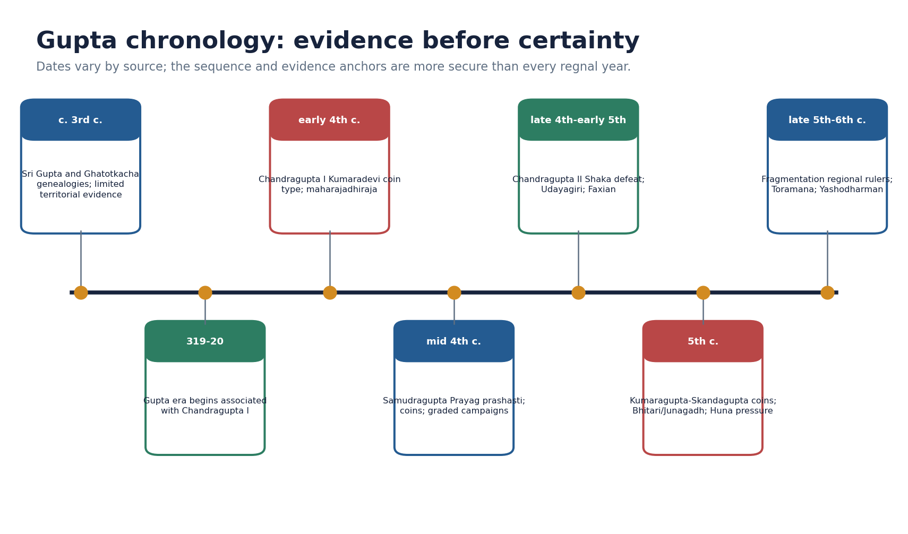
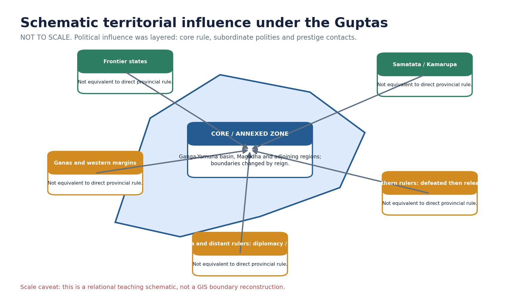
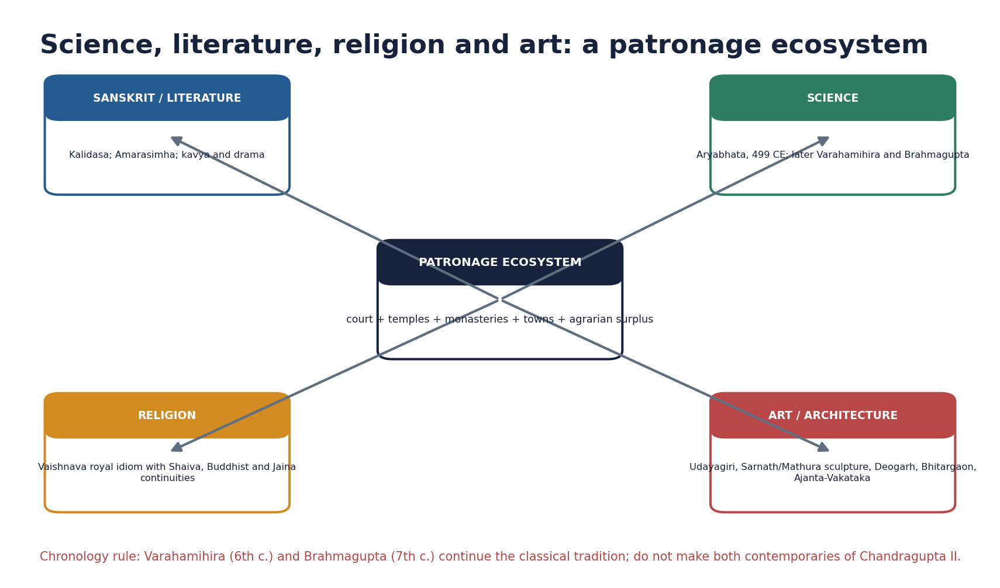
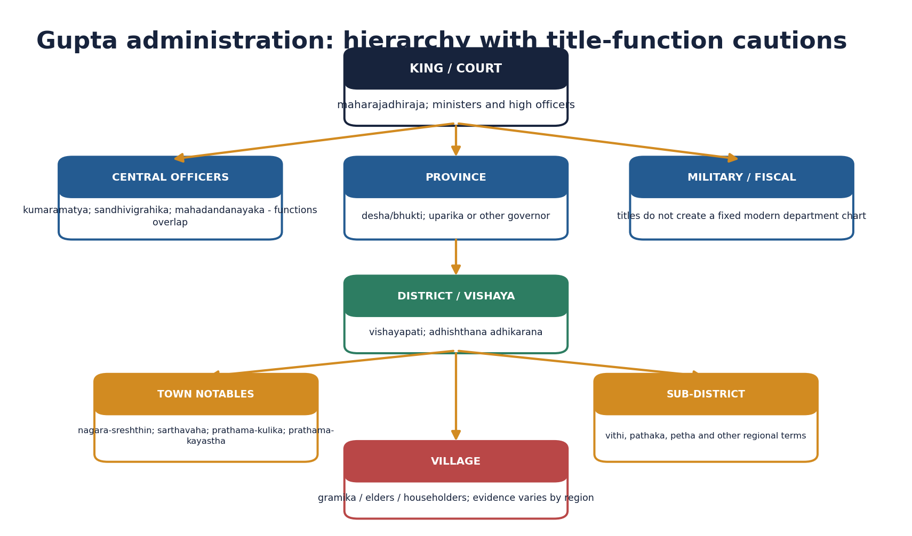
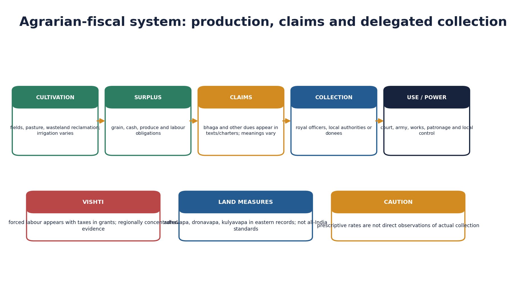
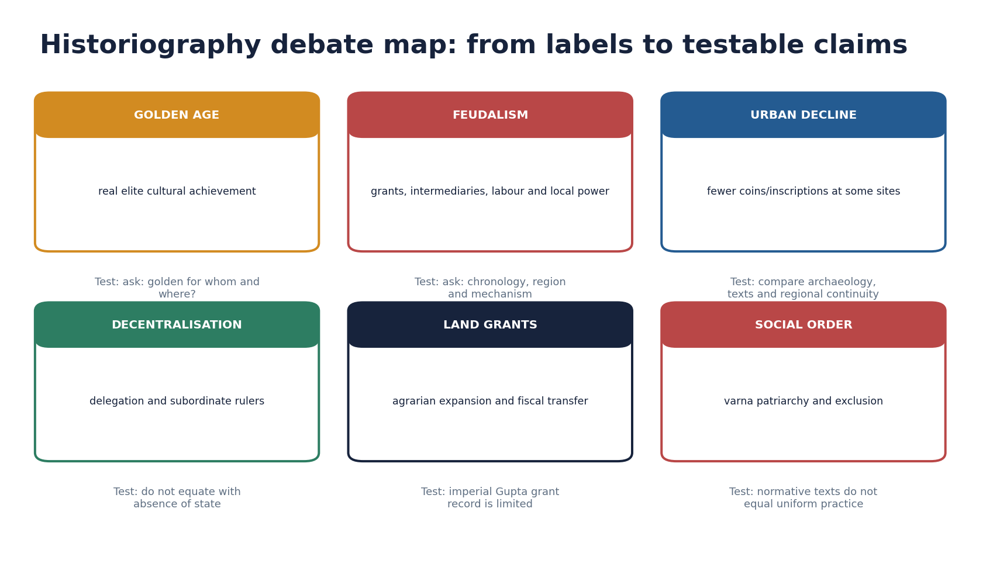

# The Gupta Empire - Complete Topic Package

> **Subject:** Ancient Indian History | **GS:** Prelims GS-I; GS-I culture/analysis support | **Topic:** 20  
> **Export date:** 2026-08-14 | **Approval:** false - awaiting explicit user approval  
> **Source order used:** repository Markdown -> OCR-searchable R.S. Sharma and Upinder Singh PDFs -> no forced live current-affairs claim -> Qdrant not used.  
> **Tag rule:** [FACT] directly sourced; [ANALYSIS] evidence-led synthesis; [LIMIT] evidentiary, regional or chronological boundary.

## Package counts, provenance and honest limitations

- Complete learning sections: 24; integrated verified/routed PYQs: 6; broad MCQs: 32; remedials: 8; solved original Mains: 6; final register modules: 6.
- Original PNG visuals: 12, all deterministic and fact-checked against the named sources. The territorial visual is explicitly schematic and not to scale.
- Direct topic-owned Mains PYQ: none found. The 2022 Gupta-Chola culture question is cross-owned and labelled accordingly.
- Prelims 2019 and 2020 official keys are not held locally; answers are prominently labelled inferred rather than official.
- No dated current-affairs claim was necessary. Heritage linkage is bounded to source criticism, conservation and attribution.

## Original visual asset index

- `notes/Ancient-Indian-History/assets/20_Gupta-Empire/01_evidence_led_chronology.png`
- `notes/Ancient-Indian-History/assets/20_Gupta-Empire/02_territorial_influence_schematic_map.png`
- `notes/Ancient-Indian-History/assets/20_Gupta-Empire/03_ruler_achievement_evidence_matrix.png`
- `notes/Ancient-Indian-History/assets/20_Gupta-Empire/04_administration_hierarchy.png`
- `notes/Ancient-Indian-History/assets/20_Gupta-Empire/05_land_grant_decentralisation_process.png`
- `notes/Ancient-Indian-History/assets/20_Gupta-Empire/06_agrarian_fiscal_system_flow.png`
- `notes/Ancient-Indian-History/assets/20_Gupta-Empire/07_trade_coinage_transformation_matrix.png`
- `notes/Ancient-Indian-History/assets/20_Gupta-Empire/08_social_order_evidence_diagram.png`
- `notes/Ancient-Indian-History/assets/20_Gupta-Empire/09_science_literature_art_ecosystem.png`
- `notes/Ancient-Indian-History/assets/20_Gupta-Empire/10_huna_late_gupta_pressure_chain.png`
- `notes/Ancient-Indian-History/assets/20_Gupta-Empire/11_historiography_debate_map.png`
- `notes/Ancient-Indian-History/assets/20_Gupta-Empire/12_gs1_answer_spine.png`

# PART I - Complete learning session

## 01. Scope, source base and chronology

[FACT] The Gupta political phase is conventionally placed c. 319-550 CE. Its reconstruction is inscription- and coin-led, supplemented by seals, sculpture, architecture, legal-literary texts and Faxian.

*Original deterministic teaching schematic; any scale or attribution caveat is printed on the visual.*

| Source | Best use | Limit |
|---|---|---|
| Prayag prashasti | campaign categories and royal ideology | eulogistic; identifications disputed |
| Coins | titles, images, ritual and monetary zones | circulation is uneven |
| Copper plates / seals | administration, land and local actors | regionally concentrated |
| Faxian | Buddhist sites and selected social observations | idealising pilgrim perspective |
| Sites / art | patronage, technique and religious landscape | dating and attribution require care |

### Core teaching / solved practice

- [FACT] The Prayag pillar carries Ashokan, Samudragupta and later Jahangir inscriptions; Samudragupta's Sanskrit prashasti was composed by Harishena.
- [FACT] Coins communicate titles, ritual claims, marriage, martial prowess, sectarian emblems and monetary choices; they do not by themselves map exact borders.
- [FACT] Damodarpur copper plates and Vaishali/Bhita seals illuminate offices and land transactions, especially in Bengal.
- [LIMIT] Prashastis are courtly eulogies, Smritis are prescriptive, coins are selective royal media and Faxian wrote for a Buddhist audience.
- [ANALYSIS] A safe answer triangulates at least two source classes and states what each can and cannot prove.

### Must-know facts

- Gupta era begins in 319-20 CE.
- Harishena composed the Prayag prashasti.
- Evidence categories must not be collapsed.

### UPSC traps

- WRONG: Every inscription is a neutral chronicle.
  CORRECT: Prashasti genre amplifies conquest and virtue.
- WRONG: One date sequence is uncontested.
  CORRECT: Regnal dates vary across scholarly reconstructions.

**Mains angle:** Open with method: 'Gupta history is visible through royal media, but its social reach requires non-royal and material evidence.'

**Study link:** Master Chronology; basic/20; advanced/20; Topic 21 culture files.

## 02. Pre-Gupta context and imperial formation

[FACT] The Guptas emerged after centuries of post-Mauryan regional state formation, commercial integration and Sanskrit political expression. Their early base lay in the middle Ganga region, but the precise homeland and early territorial extent remain debated.

### Core teaching / solved practice

- [FACT] Genealogies name Sri Gupta and Ghatotkacha before Chandragupta I; their title maharaja does not prove a large empire.
- [ANALYSIS] Gupta consolidation benefited from a productive Ganga agrarian core, older urban-route networks, political fragmentation and alliance-building.
- [LIMIT] 'Second empire after the Mauryas' is a textbook comparison of scale and prestige, not proof of identical institutions.
- [ANALYSIS] The transition was cumulative: earlier coinage, Sanskrit inscriptions, devotional cults and regional elites supplied reusable political resources.

### Must-know facts

- Early Guptas preceded the imperial title maharajadhiraja.
- Pre-Gupta institutions shaped Gupta state formation.

### UPSC traps

- WRONG: The Guptas rose in an institutional vacuum.
  CORRECT: They inherited post-Mauryan political, commercial and cultural developments.

**Mains angle:** Explain formation through resources, political opportunity, alliances and symbolic legitimacy rather than a founder-only story.

**Study link:** Topics 16-19; Mauryan comparison.

## 03. Chandragupta I: legitimacy, title and marriage alliance

[FACT] Chandragupta I marks the imperial phase. He used maharajadhiraja and is associated with the Gupta era beginning 319-20 CE and with Kumaradevi-Lichchhavi coin imagery.

### Core teaching / solved practice

- [FACT] The king-and-queen coin type names Kumaradevi and the Lichchhavis, showing that the alliance was publicly commemorated.
- [ANALYSIS] Marriage supplied legitimacy, alliance and possibly access to networks or territory, but the exact material gain cannot be calculated.
- [LIMIT] The proposition that Chandragupta I directly controlled every territory later held by Samudragupta is unsupported.
- [ANALYSIS] Use the marriage coin as evidence of dynastic politics, not as a romantic anecdote.

### Must-know facts

- Kumaradevi was a Lichchhavi princess.
- Marriage imagery was political communication.

### UPSC traps

- WRONG: A marriage coin proves the precise dowry or border change.
  CORRECT: It proves advertised alliance and status, not quantified transfer.

**Mains angle:** Claim: imperial formation joined coercive capacity with alliance-based legitimacy.

**Study link:** Dynastic alliances; Prabhavatigupta-Vakataka bridge.

## 04. Samudragupta and the Prayag prashasti

[FACT] Samudragupta's reign is reconstructed chiefly from coins and the Prayag prashasti. The inscription presents the Gupta centre within a web of differentiated political relationships.

*Original deterministic teaching schematic; any scale or attribution caveat is printed on the visual.*

| Campaign category | Prashasti treatment | Safe inference |
|---|---|---|
| Aryavarta | uprooted / exterminated | stronger incorporation into core |
| Atavika rulers | made servants | subordination; exact machinery unclear |
| Frontier states and ganas | tribute, orders, obeisance | layered dependence |
| Dakshinapatha | captured then released | demonstration and reinstatement |
| Distant rulers / islands | service, gifts, seal, alliances | prestige diplomacy, not provinces |

### Core teaching / solved practice

- [FACT] Aryavarta rulers are described as violently uprooted; their territories appear to have been incorporated into the northern core.
- [FACT] Forest rulers were made servants/subordinates, while frontier states and ganas offered tribute, obeyed orders and performed obeisance.
- [FACT] Southern rulers were captured and released; this is not the language of permanent provincial annexation.
- [FACT] Distant north-western rulers and Sri Lanka appear in a prestige-diplomatic category involving service, seal requests, gifts or alliance.
- [LIMIT] Place identifications and court claims are debated; 'conquered India' is an overstatement.
- [ANALYSIS] Samudragupta's significance lies in graded sovereignty: annexation, subordination, reinstatement and prestige coexisted.

### Must-know facts

- Harishena held multiple high titles.
- Southern campaign did not yield uniform annexation.
- The pillar is a layered archive.

### UPSC traps

- WRONG: Every named ruler became a provincial subject.
  CORRECT: The inscription itself distinguishes modes of relationship.
- WRONG: The prashasti is useless because it is praise.
  CORRECT: Genre-aware reading still yields names, categories and ideology.

**Mains angle:** Use campaign categories as the body headings of any territoriality answer.

**Study link:** Source criticism; layered sovereignty.

## 05. Chandragupta II: western expansion and political culture

[FACT] Chandragupta II defeated the western Kshatrapas, issued silver coins in a western monetary idiom and strengthened Gupta power in Malwa and Gujarat.

*Original deterministic teaching schematic; any scale or attribution caveat is printed on the visual.*

### Core teaching / solved practice

- [FACT] Western expansion brought the Gupta state into major route and coastal zones; Ujjain was an important political-commercial centre.
- [FACT] Udayagiri's early fifth-century complex links Vaishnava imagery, royal presence and conquest symbolism; it also contains Shaiva and Jaina evidence.
- [FACT] A Sanchi inscription records land and money support connected with Chandragupta II and commander Amrakardava.
- [FACT] Faxian travelled in India during this broad reign-context.
- [LIMIT] Kalidasa's exact date and identification as a formal court 'navaratna' are not securely established.
- [ANALYSIS] Chandragupta II combined expansion, monetary adaptation and sacred-political communication.

### Must-know facts

- Western Shaka defeat is a central achievement.
- Silver coinage reflects regional adaptation.
- Udayagiri is ideological and plural, not only decorative.

### UPSC traps

- WRONG: Vikramaditya proves every later Vikrama legend belongs to this king.
  CORRECT: The title and later legendary cycles must be separated.
- WRONG: Udayagiri shows exclusive religious intolerance.
  CORRECT: Its landscape contains multiple traditions and multidirectional gifts.

**Mains angle:** Connect western conquest to routes, coinage and Udayagiri rather than listing victories alone.

**Study link:** Trade transformation; royal ideology.

## 06. Kumaragupta, Skandagupta and Huna pressure

[FACT] Kumaragupta I's long reign continued imperial authority and coin-ritual communication. Skandagupta's inscriptions emphasise restoration, defence and provincial public works.

*Original deterministic teaching schematic; any scale or attribution caveat is printed on the visual.*

### Core teaching / solved practice

- [FACT] Kumaragupta issued varied gold coin types, including ashvamedha imagery; ritual claims should be read as royal communication.
- [FACT] Skandagupta's Junagadh inscription records appointment of Parnadatta and repair of the Sudarshana lake breach by Chakrapalita in 456-57 CE.
- [FACT] Bhitari evidence presents Skandagupta as restoring family fortune amid enemies; exact identification and sequence of every conflict require caution.
- [ANALYSIS] Early Huna pressure could be checked, but sustained frontier warfare increased military and fiscal strain.
- [LIMIT] Hunas did not end the empire in one invasion, and Toramana-Mihirakula belong to later stages of north Indian power change.

### Must-know facts

- Junagadh links provincial delegation with waterwork repair.
- Huna pressure was prolonged and phased.

### UPSC traps

- WRONG: Skandagupta's success means no later Huna impact.
  CORRECT: A checked incursion can precede later penetration.
- WRONG: Every late coin change has one cause.
  CORRECT: Weight, purity, metal supply, territory and fiscal needs must be assessed together.

**Mains angle:** Treat Huna pressure as one interacting cause within a longer fragmentation process.

**Study link:** Late-Gupta decline; post-Gupta Topic 22.

## 07. Succession, late Guptas and decline

[FACT] After Skandagupta, succession is less clear and imperial authority contracted. Western losses, external pressure and regional rulers changed the balance of power.

### Core teaching / solved practice

- [FACT] Coin and inscription finds become sparse in western Malwa and Saurashtra after the later fifth century, consistent with loss of western authority.
- [FACT] Toramana and Mihirakula represent Huna power in north and central India; Yashodharman's 532 inscription marks a later regional challenge.
- [ANALYSIS] Causes interacted: succession disputes, military costs, territorial revenue loss, changing trade, delegated power and regional assertion.
- [LIMIT] 'Decline' describes contraction and political regionalisation, not disappearance of Gupta lineages, culture or institutions.
- [ANALYSIS] The strongest causal answer uses a feedback loop, not a shopping list.

### Must-know facts

- Decline was gradual and uneven.
- Political fragmentation did not erase cultural continuities.

### UPSC traps

- WRONG: A single invasion gives a complete explanation.
  CORRECT: Multi-causal interaction is required.
- WRONG: The year 550 is an event-date for total collapse.
  CORRECT: It is a periodisation marker.

**Mains angle:** Organise causes as external pressure, internal political strain, fiscal-territorial change and regionalisation.

**Study link:** Topic 22; early-medieval transition.

## 08. Territoriality and the limits of 'empire'

[ANALYSIS] The Gupta order was an empire because it possessed a substantial core, military capacity, paramount titles and a wide hierarchy of subordinate relations; it was not a uniform map of direct administration.

*Original deterministic teaching schematic; any scale or attribution caveat is printed on the visual.*

### Core teaching / solved practice

- [FACT] Samudragupta's own prashasti differentiates annexed northern lands, frontier tribute, ganas, forest rulers, reinstated southern kings and distant prestige relations.
- [FACT] Subordinate rulers could be powerful in their own domains and reproduce imperial-style praise.
- [ANALYSIS] 'Layered hegemony' or 'graded sovereignty' describes this structure better than either a Mauryan clone or a loose cultural sphere.
- [LIMIT] Modern border lines and continuous territorial colour falsely imply equivalent control everywhere.
- [ANALYSIS] Territoriality changed by reign: Chandragupta II's westward expansion and late-Gupta western losses matter.

### Must-know facts

- Core and periphery differed in control.
- The empire's reach was relational as well as territorial.

### UPSC traps

- WRONG: Political influence equals direct tax administration.
  CORRECT: Tribute and prestige relations may lack provincial machinery.

**Mains angle:** Define empire operationally: core extraction + military superiority + recognised paramountcy + differentiated peripheries.

**Study link:** Mauryan and post-Mauryan comparison.

## 09. Kingship, titles and political ideology

[FACT] Gupta kingship used paramount titles, Sanskrit prashasti, coins, ritual, genealogy and sectarian affiliation to represent exceptional but not simply divine rulers.

*Original deterministic teaching schematic; any scale or attribution caveat is printed on the visual.*

### Core teaching / solved practice

- [FACT] Maharajadhiraja, parama-bhattaraka and related titles articulated hierarchy; title meanings depend on context.
- [FACT] Coins portray kings as warriors, hunters, sacrificers, musicians and recipients of Shri/Lakshmi's favour; Garuda communicates Vaishnava association.
- [FACT] Udayagiri's Varaha imagery entwines cosmic rescue, conquest and royal power while leaving room for interpretive ambiguity.
- [LIMIT] Comparison with gods is not identical to a formal claim that the king is a god.
- [ANALYSIS] Ideology was productive: it converted military success, piety and prosperity into legitimate paramountcy.

### Must-know facts

- Coins had wider physical circulation than monumental prashastis.
- Inclusive sectarianism is safer than blanket 'tolerance'.

### UPSC traps

- WRONG: Paramabhagavata means worship by subjects as a god.
  CORRECT: It identifies the ruler as foremost devotee.
- WRONG: Political religion excluded every rival tradition.
  CORRECT: Donative and site evidence shows plural patronage.

**Mains angle:** Use one coin image and Udayagiri as named evidence for the political work of culture.

**Study link:** Religion, art and legitimacy.

## 10. Central, provincial and local administration

[FACT] Gupta administration had central officers, provinces (desha/bhukti), districts (vishaya), sub-district units and village institutions, but the exact function of many titles is uncertain and regionally variable.

*Original deterministic teaching schematic; any scale or attribution caveat is printed on the visual.*

| Level | Common term / actor | Caution |
|---|---|---|
| Court | kumaramatya, sandhivigrahika, mahadandanayaka | rank and function can overlap |
| Province | desha/bhukti; uparika/goptri/lokapala | terminology varies |
| District | vishaya; vishayapati; adhikarana | Bengal evidence is unusually rich |
| Town board | sreshthin, sarthavaha, kulika, kayastha | elite participation, not mass franchise |
| Village | gramika, elders, householders | local practice is uneven |

### Core teaching / solved practice

- [FACT] Kumaramatya was a high rank; Harishena also held sandhivigrahika and mahadandanayaka, demonstrating multiple titles.
- [FACT] Uparikas governed provinces and often appointed district heads; Damodarpur records provide detailed Bengal examples.
- [FACT] District boards could include the chief merchant/banker, caravan leader, chief artisan and chief scribe alongside the official head.
- [FACT] Village elders, gramika/gramadhyaksha and record-keeping actors appear, but no single all-India panchayat template is proven.
- [ANALYSIS] Participation of notables can indicate administrative incorporation of local wealth, not democratic representation.
- [LIMIT] Translating every Sanskrit title into a fixed modern ministry creates false precision.

### Must-know facts

- Damodarpur is central for district administration.
- Junagadh shows delegated provincial works.

### UPSC traps

- WRONG: The Guptas had no bureaucracy.
  CORRECT: They had offices and records, though less elaborate than Mauryan descriptions.
- WRONG: All offices were hereditary.
  CORRECT: Some family continuities exist; universal heredity is unproven.

**Mains angle:** Compare administrative depth, local notables and delegation; avoid a static organogram.

**Study link:** Mauryan comparison; land transactions.

## 11. Feudatories and the samanta trajectory

[ANALYSIS] Gupta political hierarchy included subordinate rulers, but the fully developed early-medieval samanta system should not be projected backwards without evidence.

### Core teaching / solved practice

- [FACT] The Prayag inscription describes frontier rulers and ganas offering tribute and obeying orders; later records show maharajas under Gupta paramountcy.
- [FACT] Subordinate rulers could retain local power, imitate imperial titles and become autonomous as central power weakened.
- [LIMIT] 'Feudatory' is an analytical translation; specific obligations such as troop supply should be stated only where the source supports them.
- [ANALYSIS] The trajectory is best framed as increasing political intermediation and regional assertion, not a completed system born on one date.
- [ANALYSIS] Compare the language of subordination with actual fiscal, military and territorial evidence.

### Must-know facts

- Hierarchy was fluid.
- Subordinate status did not mean administrative insignificance.

### UPSC traps

- WRONG: Every local ruler was a samanta with identical duties.
  CORRECT: Status and obligations differed by source and region.

**Mains angle:** Use 'trajectory' and 'intermediation' to remain accurate in feudalism debates.

**Study link:** Land grants; decline; Topic 26.

## 12. Revenue, taxation and the agrarian base

[FACT] Agriculture remained the principal fiscal base. Texts and inscriptions mention cultivated, waste, pasture and habitat land, irrigation works, measures, produce shares, cash dues and labour obligations.

*Original deterministic teaching schematic; any scale or attribution caveat is printed on the visual.*

### Core teaching / solved practice

- [FACT] Eastern records use adhavapa, dronavapa and kulyavapa; their values and use are regional, not universal.
- [FACT] The Junagadh repair record shows provincial responsibility for a major waterwork.
- [FACT] Land-sale records show application, record consultation, payment, inspection, demarcation and public notification.
- [FACT] Vishti appears with taxes in grant inscriptions and can be treated as a labour contribution; evidence is concentrated in central and western regions.
- [LIMIT] Textual tax rates are prescriptions, not direct accounts of actual collection.
- [ANALYSIS] Fiscal power concerned control over streams of produce, cash and labour as much as abstract ownership of soil.

### Must-know facts

- Land measures varied regionally.
- Vishti was a burden and fiscal resource.
- Private rights coexisted with overarching royal claims.

### UPSC traps

- WRONG: Kulyavapa was a uniform all-India acre.
  CORRECT: It was an eastern sowing-based measure with variable conversion.
- WRONG: The king legally owned every field absolutely.
  CORRECT: Sources show layered and sometimes conflicting rights.

**Mains angle:** Build the answer from production -> assessment -> collection -> use -> social burden.

**Study link:** Topic 21; agrarian transition.

## 13. Land grants, immunities and decentralisation debate

[FACT] Royal land grants expanded from the fourth-fifth centuries, but the imperial Guptas themselves are not represented by a large body of secure grant charters.

*Original deterministic teaching schematic; any scale or attribution caveat is printed on the visual.*

### Core teaching / solved practice

- [FACT] Upinder Singh identifies Skandagupta's Bhitari temple gift as the one bona fide imperial-Gupta grant inscription; Gaya and Nalanda plates attributed to Samudragupta are disputed.
- [FACT] Vakataka and subordinate-ruler charters provide richer evidence for exemptions, non-entry clauses, rights and agrarian expansion.
- [ANALYSIS] Grants could reclaim wasteland, support Brahmanas or institutions, transfer revenue, build local authority and extend cultural-political integration.
- [LIMIT] Not every grant transferred police, judicial, mineral, labour and tax rights; clauses must be charter-specific.
- [ANALYSIS] Decentralisation is strongest when demonstrated as cumulative fiscal and administrative delegation, not assumed from the existence of a pious gift.
- [ANALYSIS] The same instrument could strengthen royal integration in the short run and empower intermediaries over time.

### Must-know facts

- Imperial Gupta grant evidence is limited.
- Vakataka evidence cannot be silently relabelled Gupta.
- Effects could be integrative and decentralising.

### UPSC traps

- WRONG: All Gupta grants contained full fiscal immunities.
  CORRECT: Terms vary and many famous clauses come from related or later polities.
- WRONG: Every grant immediately caused feudalism.
  CORRECT: Mechanism, scale and regional chronology must be shown.

**Mains angle:** Present a two-sided verdict: agrarian-cultural integration versus delegated fiscal power and hierarchy.

**Study link:** Feudalism debate; Topic 26.

## 14. Guilds, crafts, trade and coinage

[FACT] Gupta economic history combines continued craft skill, guild and endowment evidence, long-distance routes and impressive coinage with signs of regional commercial change.

*Original deterministic teaching schematic; any scale or attribution caveat is printed on the visual.*

### Core teaching / solved practice

- [FACT] Gold coins carried royal iconography and high-value functions; Chandragupta II adapted western silver coin traditions after defeating the Shakas.
- [FACT] Faxian's Tamralipti and links with Sri Lanka, China, Southeast Asia, Persia, Arabia and Byzantium indicate continuing exchange.
- [FACT] Texts and art attest textiles, jewellery, stone work, architecture, painting and other specialist crafts.
- [ANALYSIS] Changes in gold purity/weight, fewer low-denomination finds or declining donor references can indicate stress but require regional and chronological control.
- [LIMIT] Coin abundance among royal issues does not prove a uniformly monetised peasant economy.
- [ANALYSIS] The question is transformation: trade circuits and media changed rather than commerce simply ending.

### Must-know facts

- Gupta silver coinage is tied to western expansion.
- Tamralipti remained an eastern maritime node.

### UPSC traps

- WRONG: Gold coinage proves universal prosperity.
  CORRECT: It disproportionately reflects elite/state transactions.
- WRONG: Trade decline means zero overseas contact.
  CORRECT: Multiple circuits continued.

**Mains angle:** Use a matrix of coin type, route, guild/craft evidence and regional variation.

**Study link:** Topic 19 continuity; urban debate.

## 15. Urban continuity and decline

[ANALYSIS] The urban-decline thesis identifies contraction after the early-historic peak, but a subcontinental, simultaneous collapse is difficult to sustain.

*Original deterministic teaching schematic; any scale or attribution caveat is printed on the visual.*

### Core teaching / solved practice

- [FACT] R.S. Sharma links reduced long-distance trade, fewer merchant/artisan references and archaeological contraction to urban decay.
- [FACT] Upinder Singh notes counter-evidence: urban Sanskrit literary worlds, continued craft production, Sanchi/Sarnath/Nalanda/Ajanta activity and flourishing southern cities.
- [LIMIT] Land-grant inscriptions naturally describe rural land and are a biased corpus for counting cities.
- [LIMIT] Poetic city descriptions cannot be read literally, but they do reveal an urban social imagination and audience.
- [ANALYSIS] Best verdict: decline, continuity and relocation occurred at different sites and times; ask which urban functions changed.

### Must-know facts

- Urban change was regional and functional.
- Literature and archaeology must be read by genre and context.

### UPSC traps

- WRONG: Every Gupta city declined.
  CORRECT: Site histories diverge.
- WRONG: Literary cities directly measure population.
  CORRECT: They are stylised but historically informative.

**Mains angle:** Define urban function - administration, craft, sacred centre, market, port - before judging decline.

**Study link:** Topic 19; historiography.

## 16. Social structure, gender, labour and Faxian

[FACT] Gupta-period sources show Brahmanical varna norms, multiplying jati and occupational distinctions, patriarchy, labour dependence, slavery and untouchability alongside elite female agency and varied lived practice.

*Original deterministic teaching schematic; any scale or attribution caveat is printed on the visual.*

### Core teaching / solved practice

- [FACT] Smritis discuss inheritance, property, wages, slavery and gender from a normative Brahmanical perspective.
- [FACT] Royal women appear on coins and seals; Prabhavatigupta exercised regency and issued grants in the Vakataka realm.
- [FACT] Vishti, hired labour and slavery are distinct categories and should not be merged.
- [FACT] Faxian describes Chandalas living outside towns and signalling their approach, important evidence for untouchability.
- [LIMIT] Faxian idealises peace and prosperity and selects details relevant to Buddhist pilgrimage; his silence is not proof of absence.
- [LIMIT] Prescriptive subordination of women does not erase agency, and exceptional royal women do not prove general equality.
- [ANALYSIS] The Golden Age label must be tested against peasants, labourers, women and excluded communities.

### Must-know facts

- Faxian visited during Chandragupta II's broad reign context.
- Chandala evidence must retain traveller-source limits.
- Prabhavatigupta is a named example of political agency.

### UPSC traps

- WRONG: Faxian gives a census-like social report.
  CORRECT: His account is selective and religiously purposed.
- WRONG: Golden Age equals egalitarian age.
  CORRECT: Cultural achievement coexisted with hierarchy.

**Mains angle:** Write social history through norm, practice, agency and exclusion.

**Study link:** Topic 21; Golden Age debate.

## 17. Religion and plural patronage

[FACT] Gupta rulers prominently used Vaishnava titles and Garuda imagery, while Shaiva, Buddhist, Jaina and local traditions continued to receive patronage.

*Original deterministic teaching schematic; any scale or attribution caveat is printed on the visual.*

### Core teaching / solved practice

- [FACT] Udayagiri combines dominant Vishnu imagery with Shaiva, Durga, Ganesha and Jaina remains.
- [FACT] Chandragupta II-associated support at Sanchi and Sri Lankan monastery diplomacy at Bodh Gaya complicate a single-sect patronage story.
- [FACT] Puranic Hinduism consolidated temple-based devotional traditions while Buddhism and Jainism remained institutionally active.
- [ANALYSIS] 'Inclusive sectarianism' captures rulers' strong affiliations combined with accommodation better than assuming modern secularism.
- [LIMIT] Plural patronage does not prove absence of competition or hierarchy among traditions.

### Must-know facts

- Garuda was a royal Vaishnava emblem.
- Plural patronage and strong sectarian affiliation coexisted.

### UPSC traps

- WRONG: Brahmanical consolidation means Buddhism vanished.
  CORRECT: Major monasteries and donations continued.
- WRONG: Tolerance is self-explanatory.
  CORRECT: Specify the evidence and its limits.

**Mains angle:** Show how religion legitimised kingship while institutions competed and coexisted.

**Study link:** Udayagiri; Sanchi; Nalanda.

## 18. Sanskrit, literature and education

[FACT] Sanskrit became the principal language of royal eulogy and elite literary culture, though Prakrit and regional languages did not disappear.

### Core teaching / solved practice

- [FACT] Kalidasa's dramas and poems are central to classical Sanskrit literature; his precise date and Chandragupta II court link remain debated.
- [FACT] Amarasimha is associated with the Amarakosha, an important lexicon; the popular 'nine gems' list is later tradition, not a secure court roster.
- [FACT] Education occurred through Brahmanical, Buddhist and other institutions; Nalanda's early Gupta-period development should be stated without inventing a single founder claim.
- [ANALYSIS] Sanskrit served aesthetic, intellectual and political integration across regional courts.
- [LIMIT] Elite literary florescence does not directly reveal mass literacy or vernacular cultural absence.

### Must-know facts

- Kalidasa chronology needs caution.
- Amarakosha is linked with Amarasimha.
- Nalanda grew through stages.

### UPSC traps

- WRONG: Panini was a Gupta scholar.
  CORRECT: Panini predates the Guptas by many centuries.
- WRONG: Navaratnas are an inscriptionally verified cabinet.
  CORRECT: The roster is a later literary tradition.

**Mains angle:** Connect language, patronage, political communication and education, then qualify social reach.

**Study link:** Topic 21; Art and Culture literature.

## 19. Science, mathematics, astronomy and medicine

[FACT] The Gupta and immediately post-Gupta centuries produced major mathematical-astronomical texts, but chronology and attribution must be exact.

*Original deterministic teaching schematic; any scale or attribution caveat is printed on the visual.*

### Core teaching / solved practice

- [FACT] Aryabhata completed the Aryabhatiya in 499 CE; it treats mathematics and astronomy and explains the apparent daily motion of the heavens through Earth's rotation.
- [FACT] Aryabhata's procedures presuppose decimal place value; this must be distinguished from the separate history of zero as a numeral and number.
- [FACT] Varahamihira belongs to the sixth century and synthesised astronomical traditions; Brahmagupta belongs to the seventh century and is post-Gupta.
- [FACT] Medical traditions continued through Ayurveda and compendia, but sweeping claims about a specific 'Gupta invention' require named texts and dates.
- [LIMIT] Scientific achievements were cumulative and connected with earlier Indian and Greek-inspired streams; civilisational isolation claims are inaccurate.
- [ANALYSIS] Use 'classical scientific tradition' rather than assigning every later scholar to the Gupta court.

### Must-know facts

- Aryabhatiya: 499 CE.
- Varahamihira: sixth century.
- Brahmagupta: seventh century, post-Gupta.

### UPSC traps

- WRONG: Aryabhata invented every aspect of zero.
  CORRECT: Place value, placeholder notation and zero as number have distinct histories.
- WRONG: All three scholars served Chandragupta II.
  CORRECT: Their chronologies differ.

**Mains angle:** Score with accurate chronology, one named contribution and a cumulative-knowledge qualification.

**Study link:** Topic 21; history of science.

## 20. Art, architecture, sculpture and painting

[FACT] Gupta-period art is marked by refined sculptural idioms, early structural temples and powerful religious-political imagery, while major Vakataka Ajanta work belongs to a connected but distinct patronage context.

*Original deterministic teaching schematic; any scale or attribution caveat is printed on the visual.*

| Form | Named example | Safe significance |
|---|---|---|
| Rock-cut sacred landscape | Udayagiri Varaha | royal-religious ideology |
| Structural temple | Bhitargaon | early brick shikhara-form evidence |
| Stone temple | Deogarh Dashavatara | early developed temple iconographic programme |
| Buddha sculpture | Sarnath / Mathura | distinct regional idioms |
| Painting | Ajanta; Bagh | courtly-monastic narratives; patronage must be distinguished |

### Core teaching / solved practice

- [FACT] Named temple examples include the brick temple at Bhitargaon and the stone Dashavatara temple at Deogarh; dating and reconstruction details should follow specialist art-history evidence.
- [FACT] Udayagiri Varaha connects sacred landscape with kingship; Sarnath and Mathura developed influential Buddha-image styles.
- [FACT] Ajanta's fifth-century phase flourished under Vakataka Harishena and elite donors, not directly as an imperial Gupta court project.
- [FACT] Bagh paintings are broadly associated with the Gupta-Vakataka cultural horizon, with site-specific chronology.
- [LIMIT] 'Gupta style' is a useful art-historical category but can hide regional workshops and non-Gupta patrons.
- [ANALYSIS] Architecture and images created ritual space, political meaning and durable cultural models.

### Must-know facts

- Ajanta's major fifth-century patronage is Vakataka.
- Deogarh and Bhitargaon are named structural examples.

### UPSC traps

- WRONG: All Ajanta caves were made by Gupta emperors.
  CORRECT: Major fifth-century work is Vakataka and donor-led.
- WRONG: Gupta temples already had the scale of later complexes.
  CORRECT: They are formative structural examples.

**Mains angle:** Name forms and sites, explain innovation, then distinguish political patronage and regional workshop.

**Study link:** Indian Art and Culture owners; Topic 21.

## 21. Golden Age: achievement, distribution and exclusion

[ANALYSIS] 'Golden Age' captures exceptional elite literary, artistic, scientific and political production, but becomes misleading when converted into universal prosperity or equality.

*Original deterministic teaching schematic; any scale or attribution caveat is printed on the visual.*

### Core teaching / solved practice

- [FACT] Evidence supports major Sanskrit works, mathematics-astronomy, refined sculpture, early temples, coin artistry and broad political prestige.
- [FACT] The same period provides evidence for forced labour, slavery, untouchability, patriarchal norms, fiscal delegation and uneven urban change.
- [ANALYSIS] Ask four questions: golden in which domain, for which group, in which region and for how long?
- [LIMIT] Rejecting the label entirely can obscure real achievement; accepting it uncritically erases social distribution.
- [ANALYSIS] Best verdict: a classical age of high culture and knowledge, socially selective and regionally uneven.

### Must-know facts

- Golden Age is an evaluative label, not a date.
- Achievement and inequality must appear in the same answer.

### UPSC traps

- WRONG: Critical evaluation means only criticism.
  CORRECT: It requires achievement, counter-evidence and a graded verdict.

**Mains angle:** Use domain-group-region-duration as the four-part test.

**Study link:** Historiography; Topic 21.

## 22. Mauryan, post-Mauryan and Gupta comparison

[ANALYSIS] Comparison should identify dimensions rather than rank dynasties on a single scale.

| Dimension | Mauryan | Post-Mauryan | Gupta |
|---|---|---|---|
| Territorial form | large directly articulated imperial project | regional polities and networks | substantial core plus layered hegemony |
| Public ideology | dhamma edicts and royal orders | plural titles, coin languages, donations | Sanskrit prashasti, coins, sectarian kingship |
| Administration | elaborate textual/epigraphic ideal | regional institutions | provinces/districts plus notables/delegation |
| Economy | agrarian-tax base and routes | commercial and coinage expansion | agrarian base with commercial transformation |
| Legacy | imperial governance model | cultural-economic interaction | classical culture and regionalisation trajectory |

### Core teaching / solved practice

- [FACT] Mauryan evidence suggests a more explicitly centralised fiscal-administrative ideal and empire-wide edict communication; Gupta evidence shows strong cores with more visible local notables and subordinate rulers.
- [FACT] Post-Mauryan centuries expanded coinage, trade, Sanskrit-Prakrit political forms, devotional cults and regional state traditions inherited by the Guptas.
- [ANALYSIS] Gupta rule was less bureaucratically documented than Mauryan rule but more than a mere ritual confederacy.
- [LIMIT] Arthashastra prescriptions are not a photograph of Mauryan practice, just as Gupta grants are not a complete administrative census.
- [ANALYSIS] Compare evidence, territorial form, ideology, economy, local institutions and legacy.

### Must-know facts

- Comparison must be evidence-aware.
- Gupta was neither Mauryan copy nor powerless shell.

### UPSC traps

- WRONG: Less centralised means weak everywhere.
  CORRECT: Core power and delegated systems can coexist.

**Mains angle:** Use a dimension table and end with a non-teleological verdict.

**Study link:** Topics 14-19.

## 23. Historiographical debates

[ANALYSIS] Gupta history is a field of debates over feudalism, land grants, urban decline, decentralisation, empire and social distribution.

*Original deterministic teaching schematic; any scale or attribution caveat is printed on the visual.*

### Core teaching / solved practice

- [ANALYSIS] Feudalism thesis: grants, intermediaries, vishti, agrarian dependence and reduced monetisation are linked into a structural transition.
- [LIMIT] Critics stress regional diversity, continuing trade/towns, varied grant clauses and the danger of importing a rigid European model.
- [ANALYSIS] Urban-decline thesis is strongest at specific sites and functions, weakest as a simultaneous all-India disappearance.
- [ANALYSIS] Land grants may expand cultivation and integrate frontier zones while also transferring fiscal authority and strengthening hierarchy.
- [ANALYSIS] Decentralisation may be an intended mode of imperial governance before becoming a route to autonomy.
- [ANALYSIS] The answer should name the mechanism and counter-evidence, not merely cite historians as labels.

### Must-know facts

- A debate answer needs thesis, evidence, counter-evidence and scale.
- Regional variation is a central qualification.

### UPSC traps

- WRONG: One historian's model is a settled fact.
  CORRECT: Historiographical claims must be tested against evidence.
- WRONG: Debate means indecision.
  CORRECT: A graded conclusion is expected.

**Mains angle:** For each debate: define proposition -> evidence -> criticism -> regional/time qualification -> verdict.

**Study link:** Topic 26 transition.

## 24. Bounded heritage linkage and answer architecture

[LIMIT] No current-affairs story is forced into this export. The useful contemporary linkage is methodological: conservation, provenance, museum interpretation and public claims about Udayagiri, Sanchi, Deogarh, Ajanta, inscriptions and coins must preserve chronology and patronage distinctions.

*Original deterministic teaching schematic; any scale or attribution caveat is printed on the visual.*

### Core teaching / solved practice

- [ANALYSIS] Heritage linkage is strongest when it shows why source criticism matters: reused pillars, disputed attributions, conservation layers and illicit-provenance risks.
- [LIMIT] A modern heritage label cannot prove an ancient political claim.
- [ANALYSIS] For 10 marks use 2-3 named pieces of evidence; 15 marks use 4-6; 20 marks use 5-8 plus counterpoint and historiography.
- [ANALYSIS] Every paragraph should follow claim -> named evidence -> significance -> limitation/qualification.
- [ANALYSIS] End with a verdict that answers the directive, not a slogan.

### Must-know facts

- No dated current claim was needed.
- Answer evidence must scale to marks.

### UPSC traps

- WRONG: More names automatically mean analysis.
  CORRECT: Each example must prove a claim.
- WRONG: Conclusion can repeat the introduction.
  CORRECT: It must weigh evidence and answer the directive.

**Mains angle:** Use the six-stage visual spine for every Gupta answer.

**Study link:** Workbook and final register notes.

# PART II - Solved practice workbook content

## PYQ 1. UPSC Prelims 2019 Q10 - direct owner: Vishti

**Question / demand:** Locally routed wording tests the nature of forced labour (vishti) in the Gupta period.

**Solution:** INFERRED ANSWER - NOT OFFICIALLY VERIFIED LOCALLY: vishti could be treated as a source of state income, a labour-form tax. Upinder Singh notes its appearance with taxes in land-grant inscriptions and its concentration in Madhya Pradesh and Kathiawar evidence. Eliminate claims of absence from these regions or guaranteed wage rights. Confidence: high.

## PYQ 2. UPSC Prelims 2020 Q36 - direct owner: scholar-dynasty matching

**Question / demand:** Locally routed wording pairs Panini, Amarasimha and Kalidasa with dynasties.

**Solution:** INFERRED ANSWER - NOT OFFICIALLY VERIFIED LOCALLY: the safe distinction is that Panini long predates the Guptas; Amarasimha is associated with the Gupta classical milieu and Amarakosha; Kalidasa is conventionally associated with Chandragupta II but exact court chronology is debated. Solve by chronology, not by accepting the later Navaratna roster. Confidence: high on chronology, moderate on the question's conventional court association.

## PYQ 3. UPSC Prelims 2025 Q15 - direct owner: Faxian

**Question / demand:** Fa-hien (Faxian), the Chinese pilgrim, travelled to India during whose reign?

**Solution:** OFFICIALLY KEYED LOCALLY: Chandragupta II. The trap is ruler sequence: Samudragupta precedes the visit, while Kumaragupta I and Skandagupta are later. Retain the source limitation: the visit gives a pilgrim's selective view, not a census.

## PYQ 4. UPSC Mains 2022 GS-I Q12 - cross-owner Gupta and Chola culture

**Question / demand:** Discuss the main contributions of Gupta period and Chola period to Indian heritage and culture. (15 marks, 250 words)

**Solution:** **Model (15 marks).** [CLAIM] The Gupta and Chola periods created two durable but regionally distinct classical repertoires: the former in Sanskritic literature, science, sculpture and formative temples; the latter in monumental Dravida temples, bronzes, inscriptions and temple-centred institutions. [EVIDENCE AND ANALYSIS] 1. Gupta Sanskrit production is represented by Kalidasa and Amarasimha, while Aryabhata's 499 CE Aryabhatiya anchors mathematical-astronomical achievement. 2. Udayagiri, Sarnath/Mathura sculpture, Bhitargaon and Deogarh show Gupta innovation in sacred imagery and structural temple forms. 3. Chola Brihadishvara at Thanjavur demonstrates mature Dravida architecture and imperial inscriptional patronage. 4. Chola Nataraja bronzes join metallurgical skill, bhakti theology and mobile ritual practice. 5. Temple institutions under the Cholas linked land, craft, performance and local society, while Gupta-Vakataka patronage connected courts, temples and monasteries. [LIMIT] Neither period was culturally uniform or socially golden; Ajanta's major fifth-century phase is Vakataka, and Chola achievements must not erase regional patrons or labour. [VERDICT] Together they shaped literary, scientific, visual and institutional traditions, but a high-scoring answer preserves chronology, region and patronage. **Why this earns marks:** It answers the directive directly, uses 5 named evidence units, states what each proves, adds a qualification and closes with a graded judgement.

## PYQ 5. UPSC Prelims 2020 Q82 - adjacent true owner Topic 19

**Question / demand:** With reference to the Gupta period, Ghantasala, Kadura and Chaul were known as what?

**Solution:** INFERRED ANSWER - NOT OFFICIALLY VERIFIED LOCALLY: ports handling foreign trade. Included as an adjacent commercial-change application; true owner is Topic 19. The item demonstrates continuing maritime nodes but does not prove uniform urban prosperity.

## PYQ 6. UPSC Prelims 2020 Q29 - adjacent true owner Topic 21

**Question / demand:** Kulyavapa and dronavapa denote what?

**Solution:** INFERRED ANSWER - NOT OFFICIALLY VERIFIED LOCALLY: measures of land based on the area sown by quantities of grain. Included as an adjacent agrarian application; true owner is Topic 21. Values varied regionally and should not be memorised as one all-India acre standard.

## Broad MCQs 1-8

**Q1. Which source most directly classifies Samudragupta's campaign relationships?**

A. Prayag prashasti  
B. Junagadh inscription  
C. Faxian's account  
D. Amarakosha  

**Answer: A.** The Prayag prashasti supplies the categories, while its eulogistic genre limits literal use.

**Q2. Which ruler is linked with the Lichchhavi Kumaradevi coin type?**

A. Sri Gupta  
B. Chandragupta I  
C. Skandagupta  
D. Budhagupta  

**Answer: B.** The coin publicly advertises Chandragupta I's alliance with Kumaradevi.

**Q3. Southern rulers in Samudragupta's prashasti were generally described as:**

A. annexed into bhuktis  
B. made hereditary governors  
C. captured and released  
D. ignored after tribute  

**Answer: C.** Capture-release indicates demonstration and reinstatement, not uniform annexation.

**Q4. Which inference from the Gupta territorial map is least defensible?**

A. Core and periphery differed  
B. Frontier tribute did not equal a province  
C. Political relationships varied  
D. Every coloured zone had identical direct taxation  

**Answer: D.** Layered influence must not be converted into uniform administration.

**Q5. Chandragupta II's western conquest is best linked with:**

A. Shaka defeat and western silver issues  
B. Huna conquest of Magadha  
C. annexation of Sri Lanka  
D. founding the Mauryan Sudarshana lake  

**Answer: A.** Western Shaka defeat and adapted silver coinage form the secure pair.

**Q6. The Udayagiri Varaha complex is primarily useful for studying:**

A. only Buddhist monastic law  
B. royal-religious ideology with plural remains  
C. a Gupta naval battle  
D. a land-measure system  

**Answer: B.** It links Vaishnava power symbolism with Shaiva and Jaina evidence.

**Q7. The Junagadh inscription of Skandagupta records:**

A. Aryabhata's calculations  
B. Faxian's monastery list  
C. repair of the Sudarshana lake under provincial officials  
D. Samudragupta's southern route  

**Answer: C.** Parnadatta and Chakrapalita illustrate delegated provincial responsibility.

**Q8. Which statement on Huna pressure is incorrect?**

A. It intensified in phases  
B. Skandagupta could check early pressure  
C. Later Huna rulers affected north India  
D. One invasion instantaneously ended all Gupta power  

**Answer: D.** Decline was prolonged and multi-causal.

## Broad MCQs 9-16

**Q9. Maharajadhiraja is best treated as:**

A. a paramount title whose practical reach needs evidence  
B. a fixed district office  
C. a guild title  
D. a land measure  

**Answer: A.** Titles express claims and hierarchy but do not map administration by themselves.

**Q10. Kumaramatya in Gupta records most safely denotes:**

A. a village tax  
B. a high-ranking officer/rank  
C. a coin standard  
D. a Buddhist sect  

**Answer: B.** Its exact duties varied; it was a high rank associated with offices.

**Q11. A Gupta vishaya was generally a:**

A. province  
B. village  
C. district  
D. guild  

**Answer: C.** Bhukti/desha were provincial terms; vishaya was a district.

**Q12. Which claim about town-board notables is excessive?**

A. Merchants and artisans could assist administration  
B. Damodarpur is key evidence  
C. Local wealth was incorporated  
D. They prove universal democratic elections  

**Answer: D.** Elite participation is not the same as representative democracy.

**Q13. The safest use of 'samanta trajectory' is:**

A. growing political intermediation over time  
B. a fully uniform Gupta legal code  
C. proof of no central power  
D. a synonym for every village elder  

**Answer: A.** Trajectory avoids projecting a mature later system backwards.

**Q14. Which eastern land measure appears in Gupta-period records?**

A. Nishka  
B. Kulyavapa  
C. Karshapana  
D. Yojana only  

**Answer: B.** Kulyavapa and dronavapa are sowing-based land measures in eastern records.

**Q15. Vishti is best distinguished as:**

A. a gold coin  
B. a temple style  
C. forced labour obligation  
D. a royal title  

**Answer: C.** It appears with taxes and could function as labour-form revenue.

**Q16. Which land-right claim is least defensible?**

A. Private rights existed  
B. Royal claims could overlay private rights  
C. Land transactions were recorded  
D. The king was always absolute modern owner of every field  

**Answer: D.** Sources reveal layered and contested ownership concepts.

## Broad MCQs 17-24

**Q17. What is the strongest fact-check on imperial Gupta grants?**

A. Secure imperial grant evidence is limited  
B. Every Gupta king issued hundreds  
C. No related polity issued grants  
D. All grants were to Buddhist monasteries  

**Answer: A.** Upinder Singh stresses the limited bona fide imperial-Gupta corpus.

**Q18. A non-entry or immunity clause should be used only when:**

A. it is famous in any textbook  
B. the specific charter supports it  
C. a later dynasty used it  
D. a prashasti praises the king  

**Answer: B.** Grant clauses are document-, region- and date-specific.

**Q19. Land grants could simultaneously:**

A. abolish cultivation  
B. end all state authority  
C. integrate frontiers and empower intermediaries  
D. prove urban prosperity  

**Answer: C.** Their effects could be integrative in the short run and decentralising over time.

**Q20. Which statement is incorrect?**

A. Vakataka grants illuminate the age  
B. Subordinate rulers also granted land  
C. Grant effects varied  
D. Every Vakataka clause can be attributed to Gupta emperors  

**Answer: D.** Related-polity evidence must remain correctly labelled.

**Q21. Chandragupta II's silver coinage most directly reflects:**

A. adaptation after western expansion  
B. a ban on gold  
C. Roman provincial rule  
D. Huna minting  

**Answer: A.** Western monetary adaptation followed the Shaka conquest.

**Q22. Tamralipti in Faxian is evidence for:**

A. a vanished desert town  
B. an eastern maritime node  
C. a Gupta capital in Gujarat  
D. a Huna fort  

**Answer: B.** It linked eastern India with sea routes.

**Q23. The urban-decline debate is best resolved by:**

A. one literary quotation  
B. one coin hoard  
C. regional and functional comparison  
D. assuming uniform collapse  

**Answer: C.** Different urban functions and sites changed at different times.

**Q24. Which inference from gold coins is excessive?**

A. Royal imagery mattered  
B. High-value exchange existed  
C. Political communication travelled  
D. All peasants used gold daily  

**Answer: D.** Elite gold issues cannot establish universal everyday monetisation.

## Broad MCQs 25-32

**Q25. Faxian's social account should be read as:**

A. important but selective pilgrim evidence  
B. a modern census  
C. a Gupta tax manual  
D. a neutral court chronicle  

**Answer: A.** Purpose and audience shape his idealised and selective account.

**Q26. Which named woman exercised political authority in the Gupta-Vakataka world?**

A. Kumaradevi only as poet  
B. Prabhavatigupta  
C. Vasantasena  
D. Gargi under Chandragupta II  

**Answer: B.** Prabhavatigupta's regency and grants are secure named evidence.

**Q27. Which group is linked in Faxian with residence outside towns and avoidance practices?**

A. Sarthavahas  
B. Kumaramatyas  
C. Chandalas  
D. Uparikas  

**Answer: C.** The passage is important evidence for untouchability, with traveller limits.

**Q28. Which conclusion is least defensible?**

A. Normative texts reveal ideals  
B. Elite women could show agency  
C. Labour forms differed  
D. One royal woman proves general gender equality  

**Answer: D.** Exceptional agency does not erase wider patriarchal structure.

**Q29. Aryabhatiya is dated to:**

A. 499 CE  
B. 319 CE  
C. 606 CE  
D. c. 800 CE  

**Answer: A.** Aryabhata's text is securely dated 499 CE.

**Q30. Who belongs primarily to the sixth century?**

A. Panini  
B. Varahamihira  
C. Brahmagupta  
D. Harishena  

**Answer: B.** Varahamihira is sixth century; Brahmagupta is seventh.

**Q31. Ajanta's major fifth-century phase is principally linked with:**

A. imperial Mauryas  
B. Chola emperors  
C. Vakataka Harishena and elite donors  
D. Skandagupta alone  

**Answer: C.** The cultural horizon overlaps but patronage must be correctly labelled.

**Q32. Which Golden Age formulation is weakest?**

A. Classical production was substantial  
B. Distribution was unequal  
C. Regional variation mattered  
D. The age was uniformly golden for every social group  

**Answer: D.** The label needs domain, group, region and duration qualifications.

## Remedial MCQs

**R1. A map shading southern India under Samudragupta should be labelled as:**

A. campaign/prestige influence with reinstated rulers  
B. direct province  
C. permanent Gupta tax district  
D. archaeologically proven border  

**Answer: A.** Southern rulers were captured and released; avoid direct-rule shading.

**R2. Harishena's titles prove that Gupta offices were:**

A. single-purpose modern ministries  
B. overlapping ranks and functions  
C. always elected  
D. all hereditary  

**Answer: B.** He held several titles, so fixed one-to-one translation is unsafe.

**R3. The safest statement on Kalidasa is:**

A. securely one of nine ministers  
B. certainly pre-Mauryan  
C. major classical author whose exact court/date remain debated  
D. unrelated to Gupta culture  

**Answer: C.** Preserve achievement and chronology caution.

**R4. The first step in a feudalism answer is to:**

A. list every tax term  
B. assume no trade  
C. equate grant with serfdom  
D. define the mechanism being claimed  

**Answer: D.** A model must specify intermediation, rights, labour and regional chronology.

**R5. A claim that every Gupta town declined is corrected by:**

A. comparing site functions and regional continuities  
B. ignoring archaeology  
C. using only poetry  
D. counting gold coins alone  

**Answer: A.** Urban change was uneven and multi-evidentiary.

**R6. The distinction between place value and zero matters because:**

A. both are identical inventions  
B. their evidence and chronology differ  
C. neither existed  
D. Aryabhata rejected calculation  

**Answer: B.** Do not compress several mathematical histories into one slogan.

**R7. Which answer ending is inadequate?**

A. graded verdict  
B. comparison with limitations  
C. Guptas were great, therefore Golden Age  
D. return to directive  

**Answer: C.** The celebratory option is analytically empty.

**R8. For a 20-marker, named evidence should normally be:**

A. one example repeated  
B. no sources  
C. only dates  
D. 5-8 units plus counterpoint  

**Answer: D.** Evidence density must scale to marks.

## Original solved Mains practice

### M1. 10 marks - Examine the evidentiary value and limits of the Prayag prashasti for reconstructing Samudragupta's empire.

**Model (10 marks).** [CLAIM] The Prayag prashasti is indispensable because it classifies Samudragupta's relationships, but it reconstructs an imperial self-image rather than a neutral territorial survey. [EVIDENCE AND ANALYSIS] 1. Harishena's list of uprooted Aryavarta rulers supports a directly incorporated northern core. 2. Captured-and-released Dakshinapatha rulers prove differentiated policy rather than uniform annexation. 3. Frontier tribute, ganas and distant seal/gift relations reveal layered paramountcy. [LIMIT] It is a court eulogy; several places and rulers remain disputed, and silence cannot prove absence. [VERDICT] Used with coins and regional inscriptions, it supports graded sovereignty, not an all-India province map. **Why this earns marks:** It answers the directive directly, uses 3 named evidence units, states what each proves, adds a qualification and closes with a graded judgement.

### M2. 10 marks - Why should the Gupta age be described as a qualified Golden Age?

**Model (10 marks).** [CLAIM] The label is defensible for elite cultural production but not as a universal social condition. [EVIDENCE AND ANALYSIS] 1. Kalidasa and Amarasimha represent Sanskrit florescence. 2. Aryabhata's 499 CE work anchors mathematical-astronomical achievement. 3. Udayagiri, Deogarh, Bhitargaon and Sarnath/Mathura show visual and architectural innovation. [LIMIT] Vishti, untouchability, patriarchal norms and uneven urban change expose unequal distribution. [VERDICT] It was a classical age in selected domains, socially selective and regionally varied. **Why this earns marks:** It answers the directive directly, uses 3 named evidence units, states what each proves, adds a qualification and closes with a graded judgement.

### M3. 15 marks - Analyse the Gupta administrative system and the role of local notables.

**Model (15 marks).** [CLAIM] Gupta government combined royal appointment and provincial hierarchy with incorporation of local commercial and scribal elites. [EVIDENCE AND ANALYSIS] 1. Damodarpur records uparikas appointed by the king and district heads under provincial authority. 2. Kotivarsha's board included nagara-sreshthin, sarthavaha, prathama-kulika and prathama-kayastha. 3. Junagadh shows Parnadatta and Chakrapalita handling provincial and city responsibilities, including lake repair. 4. Village elders and record offices participated in land transactions. 5. Harishena's multiple titles show overlapping high ranks rather than rigid departments. [LIMIT] Bengal's detailed epigraphy cannot be generalised mechanically to every province, and office translations remain uncertain. [VERDICT] The system was real and layered, less uniformly centralised than Mauryan ideals but not administratively empty. **Why this earns marks:** It answers the directive directly, uses 5 named evidence units, states what each proves, adds a qualification and closes with a graded judgement.

### M4. 15 marks - Discuss land grants as instruments of agrarian expansion and decentralisation.

**Model (15 marks).** [CLAIM] Land grants could extend cultivation and ideological integration while transferring revenue and strengthening intermediaries. [EVIDENCE AND ANALYSIS] 1. Applications for wasteland and boundary demarcation indicate reclamation and regulated land transactions. 2. Agrahara and institutional gifts directed resources to Brahmanas, temples and monasteries. 3. Vakataka charters preserve exemptions and non-entry clauses that illuminate fiscal delegation in the age. 4. Subordinate rulers' grants show that authority operated below imperial level. 5. Vishti and dues could be redirected toward beneficiaries in some charters. [LIMIT] Imperial Gupta grant evidence is limited; the Gaya/Nalanda plates are disputed and clauses vary by document. [VERDICT] Grants were neither harmless piety nor automatic feudalism: their effects depended on rights, scale, region and time. **Why this earns marks:** It answers the directive directly, uses 5 named evidence units, states what each proves, adds a qualification and closes with a graded judgement.

### M5. 20 marks - Evaluate the nature and causes of Gupta decline.

**Model (20 marks).** [CLAIM] Gupta decline was a prolonged contraction produced by interacting external, fiscal and regional pressures rather than a single Huna invasion. [EVIDENCE AND ANALYSIS] 1. Skandagupta's defence claims show serious military pressure but also initial resilience. 2. Later Huna power under Toramana and Mihirakula altered north-central Indian politics. 3. Loss of Saurashtra and western Malwa narrowed route, coin and revenue bases. 4. Obscure succession after Skandagupta weakened coherent dynastic authority. 5. Subordinate rulers and governors possessed local resources that could support autonomy. 6. Changing coinage and uneven commercial contraction may reflect fiscal stress. 7. Yashodharman's 532 claim marks the success of new regional powers. [LIMIT] Regional state formation and cultural continuity mean 'collapse' is too abrupt; some Gupta lineages and institutions survived. [VERDICT] The empire declined through a feedback loop of military cost, territorial loss, reduced resources and regional assertion. **Why this earns marks:** It answers the directive directly, uses 7 named evidence units, states what each proves, adds a qualification and closes with a graded judgement.

### M6. 20 marks - Critically examine whether the Gupta state was a centralised empire or a layered hegemony.

**Model (20 marks).** [CLAIM] The Guptas formed a genuine empire with a powerful core and recognised paramountcy, but their own evidence describes differentiated control that is better called layered hegemony. [EVIDENCE AND ANALYSIS] 1. Aryavarta annexations support direct expansion in the Ganga-Yamuna core. 2. Frontier states and ganas paid tribute and obeyed orders without becoming identical provinces. 3. Southern kings were captured and released, preserving local rule. 4. Bhukti-vishaya administration and Damodarpur records prove direct machinery in core provinces. 5. Subordinate maharajas retained substantial local authority. 6. Coins and Udayagiri projected sovereignty beyond routine administration. 7. Late-Gupta regional assertion reveals the structural importance of intermediaries. [LIMIT] The Mauryan comparison is source-skewed: Arthashastra and edicts also cannot be treated as a complete administrative census. [VERDICT] Gupta power was neither uniform centralisation nor symbolic emptiness; it was a core-centred imperial network with graded sovereignty. **Why this earns marks:** It answers the directive directly, uses 7 named evidence units, states what each proves, adds a qualification and closes with a graded judgement.

# PART III - Final consolidated register notes

## Final Register 1 - Chronology and ruler anchors

[FACT] Rapid sequence for revision.

*Original deterministic teaching schematic; any scale or attribution caveat is printed on the visual.*

### Core teaching / solved practice

- 319-20: Gupta era; Chandragupta I imperial phase.
- Mid-fourth century: Samudragupta and Prayag categories.
- Late fourth-early fifth: Chandragupta II, Shaka defeat, Udayagiri, Faxian.
- Fifth century: Kumaragupta and Skandagupta; Junagadh repair; Huna pressure.
- Late fifth-sixth: western loss, Huna states, regionalisation and late Guptas.

### Must-know facts

- Kumaradevi coin = alliance legitimacy.
- Harishena = Prayag composer.
- Faxian = Chandragupta II context.

### UPSC traps

- WRONG: Treat dates as perfectly fixed.
  CORRECT: Use source-aware ranges where scholarship differs.

**Mains angle:** Chronology should support causation, not replace it.

**Study link:** Sections 1-7.

## Final Register 2 - Empire, ideology and administration

[ANALYSIS] Core formula: substantial core + differentiated peripheries + symbolic paramountcy.

*Original deterministic teaching schematic; any scale or attribution caveat is printed on the visual.*

### Core teaching / solved practice

- Campaign categories: Aryavarta annexation; atavika subordination; frontier tribute; southern release; distant prestige.
- Ideology: titles + Sanskrit prashasti + coins + ritual + Garuda/Lakshmi + Udayagiri.
- Administration: court ranks -> bhukti/desha -> vishaya -> sub-district -> village.
- Title caution: rank and function overlap; Bengal evidence is not automatically all-India.
- Notables on district board reveal elite incorporation, not democracy.

### Must-know facts

- Uparika = common provincial designation.
- Vishayapati = district head.
- Damodarpur = key record set.

### UPSC traps

- WRONG: Empire means one intensity of rule.
  CORRECT: Gupta sovereignty was graded.

**Mains angle:** Compare with Mauryas dimension by dimension.

**Study link:** Sections 8-11.

## Final Register 3 - Agrarian fiscal order and grants

[FACT] Agrarian surplus, land transactions and delegated claims form the fiscal spine.

*Original deterministic teaching schematic; any scale or attribution caveat is printed on the visual.*

### Core teaching / solved practice

- Land categories and measures were regionally varied; kulyavapa/dronavapa are eastern terms.
- Vishti = forced labour obligation appearing with taxes; do not merge with hired labour or slavery.
- Grant process can include application, records, price, survey, boundaries and public notice.
- Imperial Gupta secure grant corpus is limited; Vakataka/subordinate evidence must retain labels.
- Grant verdict: cultivation/integration plus fiscal intermediation and possible decentralisation.

### Must-know facts

- Junagadh = waterwork and provincial delegation.
- Private rights coexisted with overarching royal claims.

### UPSC traps

- WRONG: Every grant had every immunity.
  CORRECT: Use charter-specific clauses.

**Mains angle:** Show mechanism and two-sided effect.

**Study link:** Sections 12-13.

## Final Register 4 - Economy, towns and society

[ANALYSIS] Transformation and unevenness are the safe master terms.

*Original deterministic teaching schematic; any scale or attribution caveat is printed on the visual.*

### Core teaching / solved practice

- Gold and silver coinage show royal communication and regional monetary adaptation, not universal prosperity.
- Tamralipti and other routes indicate continuing exchange; trade contraction was not total.
- Urban debate: site-specific decline, continuity, relocation and sacred/administrative functions.
- Society: varna-jati norms, patriarchy, vishti, slavery, untouchability and elite female agency.
- Faxian is valuable but selective and idealising.

### Must-know facts

- Prabhavatigupta = political agency.
- Chandala passage = exclusion evidence with source limits.

### UPSC traps

- WRONG: Gold coins describe peasant daily life.
  CORRECT: High-value media are socially selective.

**Mains angle:** Always ask region, social group and evidence genre.

**Study link:** Sections 14-16.

## Final Register 5 - Culture, science and Golden Age

[ANALYSIS] Classical achievement must be chronologically exact and socially qualified.

*Original deterministic teaching schematic; any scale or attribution caveat is printed on the visual.*

### Core teaching / solved practice

- Religion: Vaishnava kingship with plural Shaiva, Buddhist and Jaina patronage.
- Literature: Kalidasa and Amarasimha; Navaratna roster and exact court claims need caution.
- Science: Aryabhata 499; Varahamihira sixth century; Brahmagupta seventh/post-Gupta.
- Art: Udayagiri, Sarnath/Mathura, Bhitargaon, Deogarh; Ajanta major phase is Vakataka.
- Golden Age verdict: elite cultural florescence, unequal distribution, regional variation.

### Must-know facts

- Place value is not identical to the full history of zero.
- Nalanda developed in stages.

### UPSC traps

- WRONG: All classical scholars served one Gupta king.
  CORRECT: Chronology disproves this.

**Mains angle:** Use domain-group-region-duration test.

**Study link:** Sections 17-21.

## Final Register 6 - Historiography, traps and answer spine

[ANALYSIS] Debate formula: proposition -> named evidence -> counter-evidence -> scale -> verdict.

*Original deterministic teaching schematic; any scale or attribution caveat is printed on the visual.*

### Core teaching / solved practice

- Feudalism: grants/intermediaries/labour versus regional continuity and model caution.
- Urban decline: archaeological contraction versus continuing literary, sacred and southern urban worlds.
- Decentralisation: delegated integration can later enable autonomy.
- Top traps: prashasti = fact; all conquests = annexation; all grants = full immunity; all Ajanta = Gupta; Golden Age = all people.
- Answer rule: claim -> named evidence -> significance -> limitation; scale examples to marks.

### Must-know facts

- No direct owned Mains PYQ exists beyond the cross-owned 2022 culture question.
- Adjacent PYQs retain true owners.

### UPSC traps

- WRONG: A debate answer may remain neutral.
  CORRECT: UPSC needs a reasoned, graded conclusion.

**Mains angle:** Finish with the directive and a qualified judgement.

**Study link:** Workbook and Topics 21, 22, 26.
