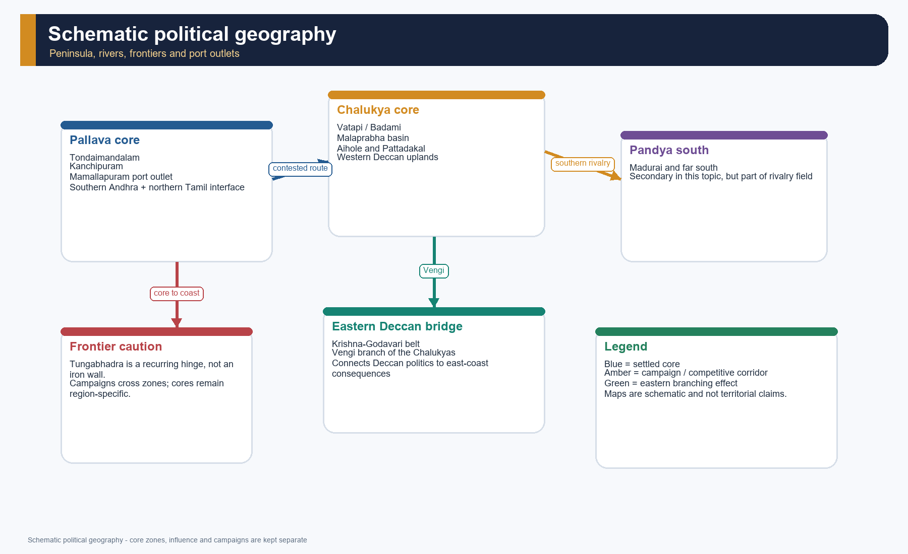
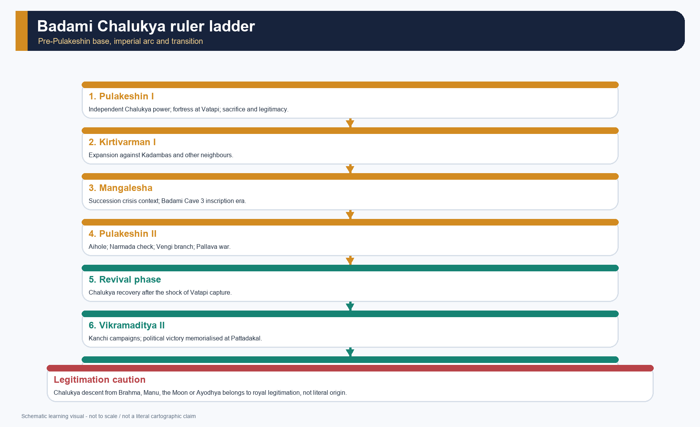
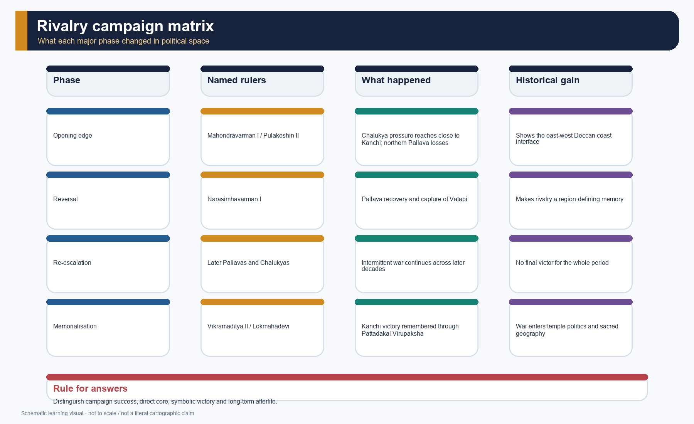
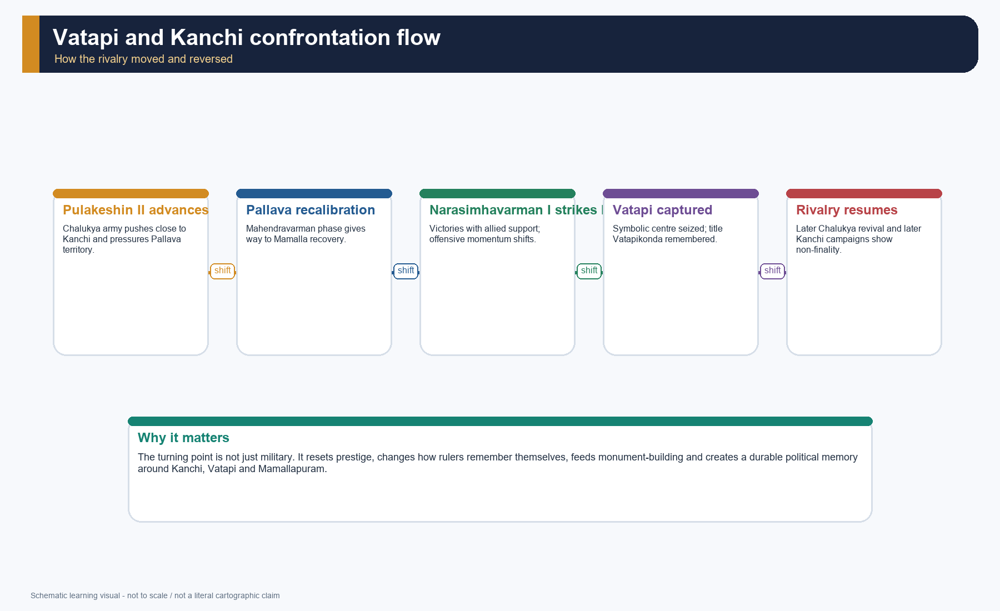
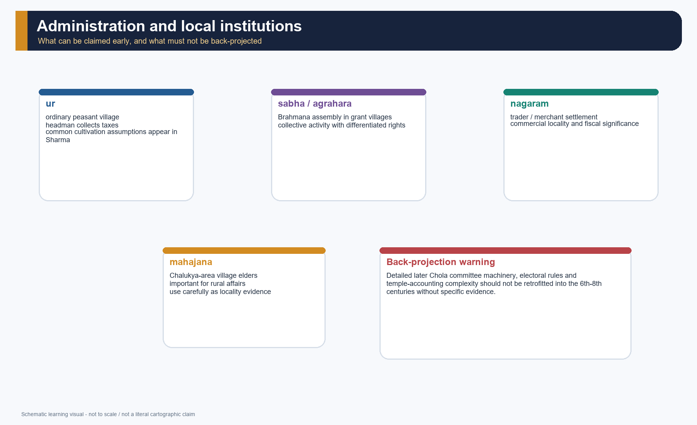
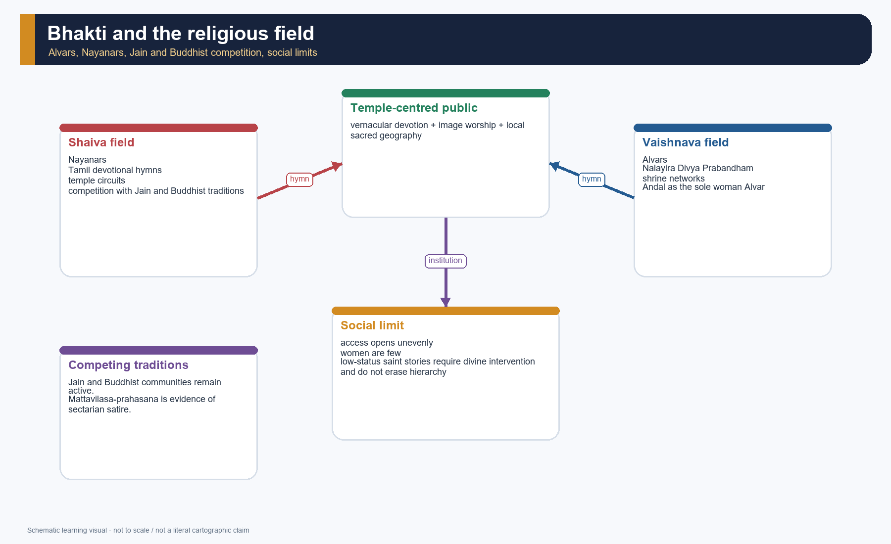

# Peninsular India: Pallavas, Chalukyas and Brahmanization - Complete Topic Package

> **Subject:** Ancient Indian History | **Topic:** 23 | **Export date:** 2026-08-15
>
> **Approval:** false - awaiting explicit user approval.
>
> **Source order:** repository Markdown -> local OCR-searchable R.S. Sharma and Upinder Singh exports -> bounded architecture/literature support from repository Art and Culture owners -> no forced current-affairs hook -> Qdrant not used.
>
> **Tag rule:** [FACT] source-grounded statement; [ANALYSIS] evidence-led synthesis; [DEBATE] historiographical or conceptual disagreement; [LIMIT] evidentiary, chronological or source-critical caution.

## Package counts, provenance and honest limitations

- Learning sections: 22; learning MCQ loops: 16.
- Workbook content: 4 verified/routed/adjacent PYQs; 40 broad MCQs; 8 remedials; 6 original solved Mains questions; final register modules: 6.
- Original PNG visuals: 16. All maps are schematic, not to scale, and distinguish core zones, influence and campaign claims.
- Exact local wording is securely available for 2024 GS-I Q2 and 2025 Prelims GS-I Q14. The 2020 Prelims chronology question is held in the official paper with readable stem and event list, though option OCR is imperfect. The 2026 Prelims architecture question is held exactly in the official Set-A paper, but the repository's rule on the provisional key is preserved: no answer letter is claimed as official here.
- OCR caveat: the Sharma export is serviceable but noisy in long lines; the Upinder export contains table-of-contents and index noise, and some later Pallava architectural references are thinner than the Mamallapuram, Kailasanatha and Aihole-Pattadakal dossiers. Where OCR is thin, this package stays approximate and says so.
- No dated current-affairs story is forced into a static historical topic. Heritage-status references are used only where stable and already institutionalised in the repository's Art and Culture owners.

## Original visual asset index

- `notes/Ancient-Indian-History/assets/23_Peninsular-India-Pallavas-Chalukyas/01_evidence_chronology_spine.png`
- `notes/Ancient-Indian-History/assets/23_Peninsular-India-Pallavas-Chalukyas/02_peninsular_political_geography.png`
- `notes/Ancient-Indian-History/assets/23_Peninsular-India-Pallavas-Chalukyas/03_pallava_ruler_ladder.png`
- `notes/Ancient-Indian-History/assets/23_Peninsular-India-Pallavas-Chalukyas/04_chalukya_ruler_ladder.png`
- `notes/Ancient-Indian-History/assets/23_Peninsular-India-Pallavas-Chalukyas/05_rivalry_campaign_matrix.png`
- `notes/Ancient-Indian-History/assets/23_Peninsular-India-Pallavas-Chalukyas/06_vatapi_kanchi_confrontation_flow.png`
- `notes/Ancient-Indian-History/assets/23_Peninsular-India-Pallavas-Chalukyas/07_land_grant_to_settlement_process.png`
- `notes/Ancient-Indian-History/assets/23_Peninsular-India-Pallavas-Chalukyas/08_brahmanization_multidirectional_model.png`
- `notes/Ancient-Indian-History/assets/23_Peninsular-India-Pallavas-Chalukyas/09_bhakti_religious_field.png`
- `notes/Ancient-Indian-History/assets/23_Peninsular-India-Pallavas-Chalukyas/10_temple_architecture_evolution_and_site_comparison.png`
- `notes/Ancient-Indian-History/assets/23_Peninsular-India-Pallavas-Chalukyas/11_inscriptions_source_criticism_matrix.png`
- `notes/Ancient-Indian-History/assets/23_Peninsular-India-Pallavas-Chalukyas/12_administration_local_institutions.png`
- `notes/Ancient-Indian-History/assets/23_Peninsular-India-Pallavas-Chalukyas/13_trade_maritime_networks.png`
- `notes/Ancient-Indian-History/assets/23_Peninsular-India-Pallavas-Chalukyas/14_regionalisation_causal_map.png`
- `notes/Ancient-Indian-History/assets/23_Peninsular-India-Pallavas-Chalukyas/15_gs1_answer_spine.png`
- `notes/Ancient-Indian-History/assets/23_Peninsular-India-Pallavas-Chalukyas/16_art_style_comparison.png`

# PART I - Complete learning session

## 01. Scope, chronology and evidence discipline

[FACT] Topic 23 owns the peninsular transition from post-Satavahana regional formations to the better-documented early medieval south, especially c. AD 550-900, while centring the strongest political arc in c. AD 575-750.

[ANALYSIS] The best organising frame is not "great southern dynasties" in isolation. It is the interaction of rivalry, land grants, temple-centred settlement, multilingual court culture, devotional change and regionally rooted kingship.

*Original deterministic chronology and evidence spine. It shows what can be dated securely, what is dynastic narrative and where source criticism is compulsory.*

### Evidence map

| Source family | Best use | Main limit |
|---|---|---|
| [FACT] Royal inscriptions and copper-plate grants | rulers, titulature, gifts, territorial claims, institutions | [LIMIT] prashasti rhetoric and selective survival |
| [FACT] Aihole inscription of Ravikirti | Pulakeshin II's political self-image and Chalukya genealogy | [LIMIT] commemorative eulogy, not neutral chronicle |
| [FACT] Literary works such as *Mattavilasa-prahasana*, Dandin and Tamil bhakti hymns | court culture, religious contestation, language and literary ecology | [LIMIT] genre conventions and later compilation |
| [FACT] Architecture and sculpture | patronage, technology, sacred geography and political symbolism | [LIMIT] monuments outlast perishable arts and cannot alone map sovereignty |
| [FACT] Archaeology, port evidence and settlement history | production, trade and urban continuities | [LIMIT] uneven regional recovery and dating precision |

### Core teaching / solved practice

- [FACT] Repository owners read first: Ancient History basic/23 and advanced/23; Topic 17 Satavahanas; Topic 18 Sangam; Topic 22 Harsha and Eastern India; Topic 26 transition debate; Art and Culture basic/03, /07, /11 and /13.
- [FACT] OCR evidence then checked: R.S. Sharma's chapter "Brahmanization, Rural Expansion, and Peasant Protest in the Peninsula" and Upinder Singh's early-medieval south sections on the Chalukyas, Pallavas, bhakti, temple architecture, trade and royal land grants.
- [LIMIT] This package does not convert any prashasti, hagiography or later temple legend into literal chronicle.
- [ANALYSIS] The safest period labels are phase labels - emergence, rivalry, consolidation, later survival - not fixed textbook empires with hard borders.
- [DEBATE] "Brahmanization" is retained because it is part of the repository spine and the chapter title in Sharma, but it is not treated as a one-way civilizing mission.

### Must-know facts

- c. AD 550-750 is the core rivalry zone; c. AD 750-900 matters for later Pallavas and the Rashtrakuta boundary.
- Kanchi and Vatapi/Badami are the two primary political centres.
- Mamallapuram, Kanchipuram, Badami, Aihole and Pattadakal are evidence clusters, not decorative monument lists.

### UPSC traps

- **Wrong:** reduce the topic to "who defeated whom". **Correct:** dynasty, grant, temple, port and language must be read together.
- **Wrong:** treat a single monument or a single inscription as the whole south. **Correct:** triangulate literary, inscriptional and archaeological evidence.

**Mains angle:** Open with "peninsular regional state formation through rivalry, grants and sacred landscapes" and then anchor it in named evidence.

**Study link:** Topic 17 for Deccan background; Topic 18 for the deep south before Pallava-Chalukya dominance; Topic 26 for the wider early medieval transition.

## 02. After the Satavahanas: Deccan and far-south political geography

[FACT] The post-Satavahana landscape did not move directly from one imperial centre to another. It contained Ikshvakus, Kadambas, Western Gangas, local chiefs, residual Chola-Pandya-Chera traditions and multiple frontier zones before the better-known Pallava-Chalukya phase hardened.

[ANALYSIS] Geography mattered through the eastern coast, the Palar-Kaveri zone, the Krishna-Godavari belt, the Malaprabha basin and the Tungabhadra frontier. It did not produce a single political order, but it conditioned communication, agrarian cores and campaign routes.

*Teaching map only. Core zones, claimed influence and campaign corridors are visually separated to avoid disputed-boundary overclaim.*

### Spatial grid

| Zone | Why it matters | Bound it carefully |
|---|---|---|
| [FACT] Tondaimandalam / Kanchi zone | Pallava heartland, temple and literary centre | [LIMIT] not identical to all later "Tamil south" |
| [FACT] Vatapi-Malaprabha belt | Chalukya capital region and temple laboratory | [LIMIT] influence varied beyond core river basins |
| [FACT] Krishna-Godavari / Vengi | bridge to eastern Chalukya history | [LIMIT] later trajectory extends beyond Topic 23 |
| [FACT] Tungabhadra frontier | recurring north-south political hinge | [LIMIT] not an absolute wall |
| [FACT] Coromandel ports | maritime outlet for Kanchi-Mamallapuram world | [LIMIT] port prominence changed over time |

### Core teaching / solved practice

- [FACT] Sharma treats c. AD 300-750 as a "new phase" in the peninsula marked by new states, land charters and rural expansion.
- [FACT] Upinder's larger early-medieval picture ties the south to wider regional configurations rather than to an isolated civilisational block.
- [ANALYSIS] The Pallava-Chalukya story becomes intelligible only when set between the eastern Deccan, the Tamil coast and the Karnataka uplands.
- [LIMIT] The map in this package is schematic because exact territorial reach fluctuated and is often known only through victory claims or grant findspots.

### Must-know facts

- Tondaimandalam and Vatapi are the principal poles.
- Vengi matters because it extends the Chalukya story eastward.
- The Tungabhadra is a recurring but not absolute frontier.

### UPSC traps

- **Wrong:** write the south as one undifferentiated "Dravidian" space. **Correct:** distinguish Pallava coast, Chalukya Deccan and Pandya south.
- **Wrong:** convert campaign movement into settled administration. **Correct:** mark campaign, core and influence separately.

**Mains angle:** Geography is useful only when connected to resource zones, capitals, ports and military corridors.

**Study link:** Topic 03 Geography and Ecology; Topic 17 Satavahanas and the Deccan.

## 03. Evidence base: inscriptions, grants, monuments and literary source criticism

[FACT] This topic is unusually rich in inscriptions and monuments, but every major source family is politically loaded.

*The matrix separates what each source can establish from what it cannot. This is central to answer-worthiness.*

### Source matrix

| Source | What it securely gives | What must be qualified |
|---|---|---|
| [FACT] Aihole inscription (Ravikirti) | Pulakeshin II's genealogy, victories, date frame, literary ambition | [LIMIT] court praise and exaggeration |
| [FACT] Pallava grants and epigraphy | early rulers, land rights, bilingual political culture | [LIMIT] uneven survival and grant-specific purpose |
| [FACT] *Mattavilasa-prahasana* | religious satire and courtly milieu under Mahendravarman I | [LIMIT] satire is not census data |
| [FACT] Bhakti canon and hagiographies | devotional language, shrine networks, social imagination | [LIMIT] later compilation, miracle narratives |
| [FACT] Temples and caves | patronage sequence, technical shifts, iconographic programme | [LIMIT] artistic survival is not total cultural history |

### Core teaching / solved practice

- [FACT] Ravikirti's Aihole inscription is not merely a date marker; it is a Chalukya political text written with literary self-consciousness.
- [FACT] Upinder notes that Pallava and Chola inscriptions reveal a division of labour between Sanskrit prashasti and Tamil documentary portions.
- [FACT] Sharma's land-charter emphasis reminds us that grants are economic and social documents, not only ritual piety.
- [DEBATE] Monumental remains privilege elite and sacred patronage. They tell us much about kingship and much less about everyday peasant voices.
- [LIMIT] The archive is asymmetrical: some rulers survive richly through stone and inscription, others only through brief references or later memory.

### Must-know facts

- Aihole is indispensable but rhetorical.
- Bilingual epigraphy is a historical fact, not an optional flourish.
- Architecture is evidence for politics and social ordering, not just "art".

### UPSC traps

- **Wrong:** call Aihole a neutral biography. **Correct:** call it a prashasti with historical value.
- **Wrong:** cite later bhakti hagiography as if all incidents are directly contemporary. **Correct:** use it for devotional geography and social imagination, not literal chronicle.

**Mains angle:** A strong answer on this topic should contain at least one explicit sentence of source criticism.

**Study link:** Topic 02 Sources of Ancient Indian History.

## 04. Pallava origins debate, early Pallavas and the making of Kanchipuram

[FACT] The secure historical Pallava story begins with inscriptions of early kings such as Shivaskandavarman and with their association with Tondaimandalam and Kanchi.

[DEBATE] The origin of the Pallavas remains debated. Older theories traced them in different directions, but the repository's strongest evidence only supports a cautious conclusion: they were entrenched in Tondaimandalam, had southern-Andhra linkages, and cannot be assigned a simple ethnic origin with confidence.

*The ladder separates early attested rulers from the later politically decisive line so that uncertain ethnogenesis does not masquerade as secure chronology.*

### Core teaching / solved practice

- [FACT] Sharma connects the Pallavas with Tondai/Tondainadu and notes the term pallava as "creeper", while also acknowledging older social memory that made their early respectability a matter of political work.
- [FACT] The Pallava authority extended over southern Andhra and northern Tamil Nadu, with Kanchi becoming a town of temples and Vedic learning.
- [FACT] Upinder places the crucial political rise not in the obscure earliest line but in the late-6th-century revival under Simhavishnu.
- [LIMIT] The temptation to narrate the Pallavas as a seamless line from the 4th to the 9th century must be resisted. The evidentiary density changes sharply over time.
- [ANALYSIS] Kanchi's later cultural weight should not erase the fact that early Pallava state-making was a frontier process across Andhra-Tamil interfaces.

### Must-know facts

- Tondaimandalam is the secure regional anchor.
- Kanchipuram is the Pallava capital and later cultural centre.
- Early kings are attested, but the politically decisive expansion comes later.

### UPSC traps

- **Wrong:** present Pallava origin as settled and singular. **Correct:** say that origin theories exist, but inscriptions securely ground them in Tondaimandalam and Kanchi.
- **Wrong:** begin the Pallavas directly with Mahendravarman I. **Correct:** note earlier rulers and then explain why Simhavishnu becomes the real turning point.

**Mains angle:** The best way to handle the origin debate is to be brief, source-bound and non-dogmatic.

**Study link:** Topic 18 on the deep south; Topic 26 on early medieval social change.

## 05. The Chalukyas of Badami: Pulakeshin I, Kirtivarman I and Mangalesha

[FACT] The Badami Chalukyas established a powerful western-Deccan kingdom in the 6th century, with Vatapi/Badami as their capital.

[ANALYSIS] Their rise is the Deccan counterpart to Pallava consolidation on the eastern coast: both lines used genealogy, sacrifice, warfare and monumental patronage to transform regional chiefship into durable kingship.

*This ladder keeps the pre-Pulakeshin II succession visible so that the Aihole inscription is not read as if the dynasty begins with its most famous ruler.*

### Core teaching / solved practice

- [FACT] Sharma says the Chalukyas claimed descent from Brahma or Manu or the Moon and even an Ayodhya past, but explicitly treats this as a search for legitimacy rather than literal origin.
- [FACT] Upinder identifies Pulakeshin I (c. 535-566) as the ruler who established independent Chalukya power and built a strong fortress at Vatapi.
- [FACT] Kirtivarman I expanded the kingdom through wars against Kadambas, Mauryas of the Konkan and others, before a succession struggle between Mangalesha and Pulakeshin II.
- [FACT] The Badami cave complex is linked in repository Art and Culture notes to Pulakeshin I, Kirtivarman I and Mangalesha, culminating in the dated Cave 3 inscription of 578 CE under Mangalesha.
- [LIMIT] Grand origin myths and sacrifice lists are part of royal idiom; they should not be mistaken for neutral social history.

### Must-know facts

- Vatapi/Badami is the capital.
- Pulakeshin I, Kirtivarman I and Mangalesha form the indispensable prelude to Pulakeshin II.
- Chalukya legitimacy mixed genealogy, sacrifice, fortress-building and campaign.

### UPSC traps

- **Wrong:** start the Chalukyas only with Pulakeshin II. **Correct:** the dynasty's institutional base predates him.
- **Wrong:** treat origin claims as ethnographic fact. **Correct:** explain them as legitimising narratives.

**Mains angle:** Mention the pre-Pulakeshin build-up to show institutional continuity, not just heroic kingship.

**Study link:** Deccan political background in Topic 17.

## 06. Simhavishnu and Mahendravarman I: recovery, court culture and the first hard edge of rivalry

[FACT] Simhavishnu ended the disruptions associated with the Kalabhras and extended Pallava power up to the Kaveri, making him the political founder of the later Pallava ascendency.

[FACT] Mahendravarman I (c. 590-630) was both a ruler and a cultural patron, remembered in the repository's cross-linked evidence as patron of the earliest Pallava rock-cut phase and as author of the Sanskrit farce *Mattavilasa-prahasana*.

### Core teaching / solved practice

- [FACT] Upinder presents Simhavishnu as the decisive ruler in the late 6th century, not merely a genealogical predecessor.
- [FACT] Mahendravarman's reign saw the beginning of the sharper Pallava-Chalukya conflict when Pulakeshin II's forces advanced close to Kanchipuram.
- [FACT] Repository Art and Culture notes identify Mandagapattu and Mamandur with the Mahendravarman phase, including the famous claim of a temple made without timber, brick or metal.
- [FACT] The 7th-century *Mattavilasa-prahasana* mocks Buddhists, Kapalikas and Pashupatas and is therefore precious evidence for inter-religious competition and courtly self-confidence.
- [DEBATE] Later tradition associates Mahendravarman with conversion from Jainism to Shaivism through Appar, but the safest exam use is to note religious contestation rather than turn hagiography into fixed biography.
- [LIMIT] Even when a ruler is an author-patron, literary production is never reducible to one king's personality alone.

### Must-know facts

- Simhavishnu is the later Pallava political turning point.
- Mahendravarman I is the most important pre-Mamalla cultural ruler.
- The rivalry with the Chalukyas sharpens under Mahendravarman.

### UPSC traps

- **Wrong:** write Mahendravarman only as a temple patron. **Correct:** include literature and religious satire.
- **Wrong:** treat later conversion legends as fully verified biography. **Correct:** use them only to indicate sectarian competition.

**Mains angle:** Mahendravarman is ideal when a question wants art, literature and politics in one frame.

**Study link:** Art and Culture basic/03, /07 and /11.

## 07. Pulakeshin II, Ravikirti and the Aihole inscription

[FACT] Pulakeshin II (c. 610/11-642/43) is the best-documented Badami Chalukya ruler, and the Aihole inscription composed by Ravikirti is the central source for his political image.

[ANALYSIS] Aihole matters because it does three things at once: it offers Chalukya genealogy, presents Pulakeshin II as conqueror and defender, and demonstrates that political prestige in the Deccan was inseparable from Sanskrit literary accomplishment.

*The matrix distinguishes direct control, campaign success, frontier checking and later reversal so that Pulakeshin II is neither inflated nor diminished.*

### Core teaching / solved practice

- [FACT] Upinder notes that the Aihole inscription is dated in Shaka 556 (634-35 CE), was composed by Ravikirti and is embedded in a Jain setting - important for the religious landscape of Karnataka.
- [FACT] The inscription celebrates Pulakeshin II's victories over Kadambas, Alupas, Gangas, Latas, Malavas, Gurjaras, parts of Kosala and Kalinga, and most memorably Harsha on the Narmada.
- [LIMIT] Topic 23 uses the Harsha link only as a southern boundary marker. The northern political story belongs to Topic 22.
- [FACT] Sharma explicitly calls the inscription valuable despite exaggeration and connects Pulakeshin II with the conquest of the Krishna-Godavari zone and the foundation of the eastern Chalukya line in Vengi.
- [ANALYSIS] Ravikirti's self-display matters: a king's political claim is being voiced through a poet who also boasts literary parity with the greats. That is evidence of court culture, not background ornament.

### Must-know facts

- Ravikirti composed the Aihole inscription.
- The Narmada victory over Harsha is remembered through a rival inscriptional voice.
- Vengi emerges from Pulakeshin II's eastern expansion.

### UPSC traps

- **Wrong:** quote every campaign claim as final territorial history. **Correct:** differentiate eulogy, frontier check and long-term control.
- **Wrong:** ignore the Jain setting. **Correct:** it indicates plural religious patronage around the Chalukya court.

**Mains angle:** "Aihole is simultaneously a historical source, a political argument and a literary performance."

**Study link:** Topic 22 for the Narmada frontier from the Harsha side.

## 08. Narasimhavarman I Mahamalla and the capture of Vatapi

[FACT] Under Narasimhavarman I Mahamalla (c. 630-668), the Pallavas reversed Chalukya pressure, captured Badami/Vatapi and carried the rivalry to its dramatic climax.

[ANALYSIS] This turning point shows why the rivalry cannot be read as a simple permanent balance. Supremacy shifted, and those shifts reshaped both monument-building and dynastic memory.

*The flow emphasises sequence - Pulakeshin's advance, Pallava recovery, Vatapi capture, later resumption - rather than a flattened "constant war" narrative.*

### Core teaching / solved practice

- [FACT] Upinder states that Narasimhavarman I won several victories over the Chalukyas with support from the Sri Lankan prince Manavarman and ultimately captured Badami.
- [FACT] Sharma says Narasimhavarman occupied Vatapi around 642 and adopted the title Vatapikonda, "conqueror of Vatapi".
- [FACT] Narasimhavarman was an energetic patron of architecture; the port of Mamallapuram and its ratha complex are associated in repository evidence with his reign.
- [ANALYSIS] Sri Lankan intervention should be used cautiously: it shows transmarine political linkage and naval capacity, but not a standing southern thalassocracy.
- [LIMIT] The Pallava occupation of Badami was real but not permanent. Long rivalry resumed.

### Must-know facts

- Narasimhavarman I = Mahamalla and Vatapikonda.
- Pallava victory over Vatapi is the dramatic counter-stroke to Pulakeshin II.
- Mamallapuram's architectural programme belongs to the political confidence of this phase.

### UPSC traps

- **Wrong:** say the Pallavas permanently extinguished the Chalukyas in 642. **Correct:** Vatapi was captured, but Chalukya power revived.
- **Wrong:** exaggerate Sri Lankan linkage into empire. **Correct:** use it as allied intervention and political connection.

**Mains angle:** The capture of Vatapi should be written as both military reversal and symbolic capital.

**Study link:** Maritime links in Section 20; architecture in Section 16.

## 09. Later rivalry: Paramesvaravarman, Rajasimha, Vikramaditya I and II, and the Nandivarman line

[FACT] The Pallava-Chalukya struggle did not end with Vatapi. It passed through renewed campaigns, peaceful interludes, later Chalukya offensives and a prolonged Pallava afterlife into the 9th century.

### Core teaching / solved practice

- [FACT] After Narasimhavarman I, the conflict continued under later rulers, including Paramesvaravarman and Narasimhavarman II Rajasimha on the Pallava side.
- [FACT] Upinder notes that the early-8th-century Shore Temple at Mamallapuram and the Rajasimheshvara/Kailasanatha temple at Kanchipuram belong to Narasimhavarman II Rajasimha's architectural phase.
- [FACT] Sharma records that Vikramaditya II (733-745) overran Kanchi three times and in 740 decisively defeated the Pallavas, even though the ruling house continued thereafter.
- [FACT] Repository Art and Culture notes connect the Virupaksha temple at Pattadakal to Vikramaditya II's Kanchi victory, commissioned by queen Lokmahadevi.
- [FACT] Upinder shows that in the 9th century Dantivarman and Nandivarman III still mattered; the Pallavas were finally overthrown by Aditya I around 893.
- [LIMIT] The package treats the Nandivarman line only to the extent needed for later Pallava continuity, literary memory and monuments such as Vaikuntha Perumal.
- [FACT] Later Pallava Kanchi architecture included the Vaikuntha Perumal tradition usually linked to the Nandivarman/Pallavamalla phase; [LIMIT] repository OCR is thinner here than for Shore Temple and Kailasanatha, so the temple is used as a later Pallava marker rather than over-described.

### Must-know facts

- Rajasimha marks the structural-temple high point.
- Vikramaditya II's Kanchi victories matter politically and architecturally.
- Pallava history continues long after Vatapi, into Dantivarman and Nandivarman III.

### UPSC traps

- **Wrong:** end the Pallavas with Narasimhavarman I. **Correct:** later Pallava survival and structural-temple patronage are essential.
- **Wrong:** make later conflict a blur. **Correct:** remember Kanchi reversals, Vikramaditya II and the later Pallava line.

**Mains angle:** Later rivalry is useful for showing how warfare could be memorialised in architecture.

**Study link:** Section 17 on Pattadakal; Topic 27 for later Chola takeover of Tondaimandalam.

## 10. Eastern Chalukyas of Vengi and the Rashtrakuta boundary

[FACT] The eastern Chalukya line in Vengi began when Pulakeshin II placed his brother in the conquered Andhra territory. It outlasted the Badami line and shaped the eastern Deccan for centuries.

[ANALYSIS] This matters because it prevents Topic 23 from being read as a closed Pallava-vs-Badami duel. The rivalry had eastern consequences, and the collapse of Badami power opened later trajectories rather than ending the Chalukya story.

### Core teaching / solved practice

- [FACT] Sharma links Vengi directly to Pulakeshin II's eastern conquest between the Krishna and Godavari.
- [FACT] Upinder says the eastern Chalukya line survived till 999 CE, when Rajaraja Chola conquered Vengi - important as a later bridge, not as the main focus of this topic.
- [FACT] The Badami Chalukyas were overthrown in AD 757 by their Rashtrakuta feudatories.
- [LIMIT] The Rashtrakutas belong here only as a boundary marker and transitional bridge. Their fuller political and architectural story lies outside this topic's centre of gravity.
- [ANALYSIS] Vengi shows how conquest, delegation and dynastic branching could produce durable secondary centres of power.

### Must-know facts

- Vengi = eastern Chalukya branch.
- AD 757 = end of Badami Chalukya hegemony.
- Topic 23 stops at the bridge, not the full Rashtrakuta or later-Chola narrative.

### UPSC traps

- **Wrong:** assume "Chalukya decline" means all Chalukya lines disappear together. **Correct:** distinguish Badami, Vengi and later western lines.
- **Wrong:** overtake the topic with Rashtrakuta detail. **Correct:** use Rashtrakutas only as the transition beyond Badami.

**Mains angle:** The eastern Chalukyas are the best evidence that peninsular political processes were branching, not linear.

**Study link:** Topic 27 for later Chola-Vengi entanglement.

## 11. Kingship, ritual and political legitimation

[FACT] Both Pallavas and Chalukyas drew legitimacy from brahmanical idioms: genealogies, Vedic sacrifices, dharma rhetoric, temple patronage and prashasti.

[ANALYSIS] Kingship here was not merely coercive. It was performative and distributive - it had to be seen, praised, inscribed and spatially anchored.

### Core teaching / solved practice

- [FACT] Sharma says Chalukyas, Pallavas and their contemporaries were champions of Vedic sacrifices such as ashvamedha and vajapeya.
- [FACT] The title dharma-maharaja appears in Sharma's discussion of how rulers represented themselves as restorers of social order.
- [FACT] Chalukya genealogical claims to Brahma, Manu or the Moon and Pallava respectability claims via priests show political use of lineages.
- [FACT] Temple commissions, especially after the 7th century, translated abstract legitimacy into visible sacred architecture.
- [DEBATE] Legitimacy was not only "Brahmanical". Jain and Buddhist patronage survived, and bhakti introduced vernacular devotional idioms into the same political field.
- [LIMIT] Royal ideology cannot simply be equated with social consent.

### Must-know facts

- Vedic sacrifice and temple-building coexist.
- Prashasti is political theatre in textual form.
- Kingship is tied to restoration of dharma and ordering of local society.

### UPSC traps

- **Wrong:** describe legitimacy only as military success. **Correct:** include sacrifice, genealogy, temple, inscription and gift.
- **Wrong:** reduce political idiom to one religion. **Correct:** recognise multi-sect patronage within hierarchised royal culture.

**Mains angle:** Use kingship language to connect polity, society and culture in one paragraph.

**Study link:** Topic 26 on social change and legitimacy.

## 12. Administration, local institutions and the problem of back-projection

[FACT] Early-medieval south India offers evidence of locality types, assemblies, headmen and merchant groupings, but the documentation is uneven and later Chola institutional detail must not be projected backward wholesale.

*This chart shows only what Topic 23 can safely claim for the c. 300-750 phase and what must be reserved for later Chola evidence.*

### Core teaching / solved practice

- [FACT] Sharma identifies three village types in the south: ur, sabha and nagaram.
- [FACT] The ur was the ordinary peasant village; the sabha was associated with brahmadeya or agrahara settlements; the nagaram reflected trader-merchant settlement.
- [FACT] In Chalukya areas, rural affairs were managed by village elders called mahajana.
- [FACT] Upinder's broader land-grant debate shows that local institutions were linked to revenue collection, landed management and temple-related activity.
- [LIMIT] Detailed committee machinery known from later Chola inscriptions should not be smuggled into the 6th-8th centuries unless specifically evidenced.
- [ANALYSIS] The key exam value lies in showing that locality was becoming corporately organised, not that a fully mature Chola-style bureaucracy already existed.

### Must-know facts

- ur = ordinary village; sabha = Brahmana assembly in grant villages; nagaram = trader-dominated settlement.
- mahajana is the Chalukya-area village elder term highlighted by Sharma.
- Institutional evidence is early, real and uneven.

### UPSC traps

- **Wrong:** project Uttaramerur-style later Chola committee detail backward. **Correct:** keep Topic 23 to earlier, thinner institutional evidence.
- **Wrong:** treat these terms as purely abstract categories. **Correct:** connect them to land, revenue and social composition.

**Mains angle:** "Institutionalisation is visible, but not yet fully bureaucratically transparent."

**Study link:** Topic 27 for later Chola locality detail.

## 13. Land grants, brahmadeya/agrahara and agrarian expansion

[FACT] Land grants are central to this topic because they linked kingship, revenue, Brahmana settlement, cultivation and locality formation.

*The process flow separates grant issue, fiscal transfer, settlement insertion, agrarian change and social consequence.*

### Core teaching / solved practice

- [FACT] Sharma says the Pallavas granted numerous villages, often tax-free, to Brahmanas and records as many as 16 early Pallava land charters.
- [FACT] He also notes extensive immunities granted to Brahmanas and the role of grants in stimulating agrarian expansion in south Andhra and north Tamil Nadu.
- [FACT] Upinder argues that brahmadeyas had a political dimension, were created by royal order and should not be reduced to mere symptoms of state disintegration.
- [FACT] From the state's point of view, the creation of brahmadeyas involved transferring revenue rights and often restricting interference by royal officers.
- [ANALYSIS] Some grants expanded cultivation at the margins, but Upinder also stresses that many inserted Brahmana donees into already settled rural webs rather than clearing empty wilderness from scratch.
- [LIMIT] The effect of each grant varied. No single formula covers every region or every century.

### Must-know facts

- brahmadeya = land gifted to Brahmanas; agrahara = tax-privileged Brahmana settlement/village form.
- Land grants could transfer revenue rights, immunities and local authority.
- Agrarian expansion and social hierarchy often moved together.

### UPSC traps

- **Wrong:** "all grants opened virgin forest". **Correct:** some did, many inserted donees into already cultivated society.
- **Wrong:** "grants prove state weakness". **Correct:** they can also reflect royal control, alliance and legitimisation.

**Mains angle:** The strongest sentence is: "Land grants were not only pious gifts; they were political technologies of locality-making."

**Study link:** Topic 26 for wider agrarian transition debates.

## 14. Brahmanization, Sanskritization, acculturation and the making of hierarchy

[FACT] Sharma's chapter makes Brahmanization central to the peninsula's c. AD 300-750 transformation, but later scholarship requires a more differentiated treatment.

*This model is deliberately multi-directional. It rejects a flat one-way "civilizing mission" narrative.*

### Core teaching / solved practice

- [FACT] Sharma describes a society dominated by princes and priests, with many new rulers receiving high-varna status through priestly legitimation.
- [FACT] Upinder's broader land-grant discussion shows Brahmanas becoming dominant in many brahmadeya settings and shaping access to land, resources and people.
- [FACT] Upinder also notes that where brahmadeya villages were close to tribal communities, plough agriculture spread and some groups were absorbed into caste society while others were pushed into degraded status.
- [DEBATE] "Brahmanization" captures royal-brahmana alliance, grant-based authority, ritual legitimation and hierarchy. "Sanskritization" is a later sociological heuristic and is too narrow if it ignores political economy. "Acculturation" and "integration" better register reciprocity, especially in local cult adaptation.
- [ANALYSIS] The process was reciprocal but unequal: Brahmanical norms spread, yet Brahmanism too changed through contact with regional and tribal traditions.
- [LIMIT] We have much better elite evidence than subaltern self-representation. Peasant and tribal experience enters largely through inference.

### Must-know facts

- New rulers often claimed high-varna identity through legitimation, not primordial purity.
- Caste proliferation and new sub-castes are part of the story.
- Tribal-peasant transitions were historically important but uneven.

### UPSC traps

- **Wrong:** Brahmanization = only religious conversion. **Correct:** it includes land, status, hierarchy, cult integration and locality-making.
- **Wrong:** reciprocal interaction means equal interaction. **Correct:** reciprocity existed, but power was asymmetrical.

**Mains angle:** A high-scoring answer defines the term, qualifies it and then shows mechanism through grants, cults and agrarian change.

**Study link:** Topic 13 on varna society; Topic 26 on social transformation.

## 15. Bhakti, Jain and Buddhist interaction, and the social limits of devotion

[FACT] The 7th-9th centuries in the south saw the rise of powerful Shaiva and Vaishnava devotional currents, especially in the hymns of the Nayanars and Alvars, in active interaction - and often competition - with Jaina and Buddhist traditions.

*The field is shown as interaction, not a single triumphant line. Vernacular devotion, temple ritual, sectarian competition and social limits coexist.*

### Core teaching / solved practice

- [FACT] Sharma says that from the 7th century the Alvars popularised Vishnu devotion and the Nayanars did the same for Shiva; bhakti came to dominate religious life in the south.
- [FACT] Repository Art and Culture notes define the canonical numbers clearly: 63 Nayanars and 12 Alvars; Andal is the only woman Alvar.
- [FACT] Upinder shows that Alvar bhakti worked through temple networks, lover-beloved imagery, shrine circuits and ritual image worship.
- [FACT] Upinder's social discussion is nuanced: saints came from varied backgrounds, but women were very few; stories of Nandanar and Tiruppan Alvar show inclusion and exclusion together.
- [FACT] *Mattavilasa-prahasana* is evidence that Buddhists, Kapalikas and Pashupatas could be objects of courtly satire under Mahendravarman I.
- [ANALYSIS] Bhakti could soften some social boundaries rhetorically, but it did not dissolve hierarchy automatically. It also worked through increasingly temple-centred institutions.

### Must-know facts

- Alvars = Vishnu; Nayanars = Shiva.
- Bhakti develops in Tamil devotional language, not only Sanskrit liturgy.
- Social inclusion in bhakti is real but bounded.

### UPSC traps

- **Wrong:** bhakti was a fully anti-caste revolution. **Correct:** it opened devotional access but did not abolish hierarchy.
- **Wrong:** Jainism and Buddhism simply vanished. **Correct:** they remained part of a competitive religious field.

**Mains angle:** The best formulation is "vernacular devotion within a temple-centred and still hierarchical society."

**Study link:** Art and Culture basic/13; Topic 24 on philosophical developments.

## 16. Temple architecture I: Pallava trajectory from rock-cut to structural

[FACT] The Pallava contribution to South Indian architecture lies not in a single monument but in a sequence - cave temples, monolithic experiments and mature structural forms.

*This visual uses phase comparison rather than a single stylistic label so that rock-cut, monolithic and structural stages can be remembered as a trajectory.*

### Core teaching / solved practice

- [FACT] Repository Art and Culture notes, grounded in Nitin Singhania, identify four later analytical phases of Pallava architecture: Mahendravarman, Mamalla, Rajasimha and Nandivarman.
- [FACT] Under Mahendravarman I, the earliest rock-cut phase includes Mandagapattu and Mamandur, with the Mandagapattu inscription stressing a shrine without timber, brick or metal.
- [FACT] Under Narasimhavarman I Mamalla, the Pancha Rathas and the Mamallapuram mandapas show deliberate experimentation with plan and elevation.
- [FACT] The great open-air relief at Mamallapuram is read either as the Descent of the Ganga or Arjuna's Penance; [LIMIT] the ambiguity is itself historically meaningful and should not be flattened.
- [FACT] Under Narasimhavarman II Rajasimha, structural architecture comes to the fore: the Shore Temple at Mamallapuram and the Rajasimheshvara/Kailasanatha temple at Kanchipuram are the key exemplars.
- [FACT] Later Pallava Kanchi architecture includes Vaikuntha Perumal, often associated with the Nandivarman/Pallavamalla phase and remembered for dynastic panels and mature structural planning; [LIMIT] the local OCR dossier is thinner here, so use it as a later-Pallava marker rather than a detail-heavy case study.

### Must-know facts

- rock-cut -> monolithic ratha -> structural temple is the safest Pallava trajectory.
- Mamallapuram and Kanchipuram are the twin architectural centres.
- Kailasanatha and Shore Temple are the most exam-useful structural markers.

### UPSC traps

- **Wrong:** say the Pallavas created only one Dravida form. **Correct:** they experimented across techniques and forms.
- **Wrong:** force one interpretation of the great Mamallapuram relief as certain. **Correct:** mention the two leading readings.

**Mains angle:** Pallava architecture should be written as a technical and political transition, not just as an art gallery.

**Study link:** Art and Culture basic/03 and /07.

## 17. Temple architecture II: Aihole, Badami, Pattadakal and the "Vesara" caution

[FACT] Early Chalukya architecture in the Malaprabha zone is best remembered through Aihole, Badami and Pattadakal, where plan types, sectarian affiliations and superstructure vocabularies were explored in unusually visible ways.

*The comparison avoids treating Vesara as a rigid civilisational category. The evidence is monument-first, label-second.*

### Core teaching / solved practice

- [FACT] Aihole is the architectural laboratory, associated in repository Art and Culture notes with over 100 temples and multiple plan experiments.
- [FACT] The Durga temple at Aihole is apsidal, named after a nearby fort rather than a Durga dedication, and is often linked to Surya/Aditya; it mixes Dravida and Nagara features and resists easy classification.
- [FACT] Badami's cave complex shows sectarian plurality: Brahmanical caves and a Jaina cave, with the dated Cave 3 inscription of 578 CE under Mangalesha.
- [FACT] Pattadakal is the culmination site where Dravida and Nagara superstructure vocabularies stand side by side, especially in the Virupaksha and Papanatha pair.
- [FACT] The Virupaksha temple was commissioned by queen Lokmahadevi to commemorate Vikramaditya II's Kanchi victory; the Mallikarjuna temple reflects parallel female patronage by Trilok Mahadevi.
- [DEBATE] "Vesara" can be a useful descriptive label for Deccan hybridity, but it should never replace monument-specific description. The safest route is always Aihole -> Badami -> Pattadakal, then label with caution.

### Must-know facts

- Aihole = experiment; Badami = cave-plus-capital complex; Pattadakal = culmination.
- Durga temple at Aihole is not a Durga dedication.
- Virupaksha = Dravida shikhara; Papanatha = Nagara shikhara on a related plan.

### UPSC traps

- **Wrong:** use Vesara as a lazy half-Nagara half-Dravida formula. **Correct:** describe the site and monument before using the term.
- **Wrong:** confuse the Pattadakal Virupaksha with the Hampi Virupaksha. **Correct:** one is Early Chalukya, the other Vijayanagara.

**Mains angle:** The Deccan case is strongest when written as experimentation, comparison and queenly patronage.

**Study link:** Art and Culture basic/03 for the larger temple-architecture framework.

## 18. Painting, sculpture and iconographic communication

[FACT] The Pallava-Chalukya age was also an age of imagery: Somaskanda panels, Shaiva and Vaishnava reliefs, Hari-Hara forms, narrative and martial iconography, and surviving mural fragments.

### Core teaching / solved practice

- [FACT] Repository Art and Culture notes connect Mahendravarman's court to painting epithets and connect Narasimhavarman II Rajasimha to surviving Pallava mural fragments at Kailasanatha and Panamalai.
- [FACT] Upinder's architectural discussion highlights Somaskanda frequency at Kailasanatha and the erosive but still legible sculptural programme of the Shore Temple.
- [FACT] The Durga temple at Aihole preserves major Chalukya-period reliefs such as Shiva with Nandi, Varaha, Narasimha, Hari-Hara and Mahishasuramardini.
- [FACT] Early Chalukya cave sculpture at Badami includes strong Shaiva-Vaishnava programmes and some of the earliest Deccan Nataraja imagery.
- [ANALYSIS] Iconography here is political as well as devotional. Royal houses inscribe preferred sacred worlds into durable public stone.
- [LIMIT] Mural survival is extremely thin. Any claim about "Pallava painting as a full school" must be tightly qualified as a survival issue.

### Must-know facts

- Somaskanda is a recurring Pallava theme.
- Chalukya reliefs are sect-plural and sculpturally ambitious.
- Surviving murals are limited but important.

### UPSC traps

- **Wrong:** separate iconography from kingship. **Correct:** ask why particular deities and relief narratives were foregrounded.
- **Wrong:** inflate fragmentary murals into a complete surviving painting tradition. **Correct:** emphasise survival caution.

**Mains angle:** One line on iconography often upgrades an architecture answer into an art-history answer.

**Study link:** Art and Culture basic/06 and /07.

## 19. Languages, literature and bilingual political culture

[FACT] The Pallava-Chalukya world is multilingual: Sanskrit prestige, Tamil devotional growth, Prakrit residue in earlier southern inscriptions, and bilingual epigraphy in the Pallava realm.

### Core teaching / solved practice

- [FACT] Mahendravarman I's *Mattavilasa-prahasana* is the clearest named literary text directly tied to the topic.
- [FACT] Repository Art and Culture basic/11 identifies Kanchipuram as a centre of Sanskrit scholarship and cites Dandin's association with the Pallava world.
- [FACT] The same file records bilingual Tamil-Sanskrit Pallava inscriptions from the 7th century onward and the courtly shift from Vatteluttu to Pallava-Grantha script.
- [FACT] Upinder notes that Pallava and Chola inscriptions show Sanskrit prashasti for the politically expressive portion and Tamil for documentary portions.
- [FACT] Upinder also preserves the literary memory of Nandivarman III in the Tamil *Nandikkalambakam*.
- [ANALYSIS] Language here is not merely literary ornament. It maps the layering of elite prestige, local administration, temple networks and devotional publics.

### Must-know facts

- Mahendravarman I = *Mattavilasa-prahasana*.
- Dandin is the strongest named Pallava literary citation for UPSC.
- Bilingual epigraphy is institutional evidence, not anecdote.

### UPSC traps

- **Wrong:** say Pallava literary contribution means only Sanskrit court poetry. **Correct:** add Tamil bhakti, bilingual epigraphy and script politics.
- **Wrong:** equate script change with the disappearance of all earlier scripts. **Correct:** speak of court usage and administrative preference.

**Mains angle:** For the 2024 Pallava PYQ, literature must be explicit - text, language and inscriptional culture, not just temples.

**Study link:** Art and Culture basic/11.

## 20. Economy, guilds, ports and Bay of Bengal links

[FACT] The economic story of Topic 23 is one of agrarian expansion linked to selective urban and port growth rather than a simple choice between "ruralisation" and "trade boom".

*The network diagram marks production centres, port outlets and political crossings without claiming colonial or maritime domination beyond the evidence.*

### Core teaching / solved practice

- [FACT] Upinder describes Kanchipuram as a managaram, a centre of weaving and commerce whose major port outlet became Mamallapuram.
- [FACT] Mamallapuram developed under the Pallavas; the eastern coast contained a web of coastal towns and customs points rather than one monopoly port.
- [FACT] Corporate merchant organisations played an important role in fixing customs duties in port towns.
- [FACT] Aihole/Ayyavole later became associated with merchant guild networks; [LIMIT] the richest guild evidence belongs more securely to later centuries and should not be mechanically projected into every 7th-century context.
- [FACT] Sri Lankan political connections during Narasimhavarman I's reign show active seaborne linkages across the Bay of Bengal.
- [ANALYSIS] The right frame is "maritime contact and political-commercial linkage" rather than speculative southern colonisation stories.

### Must-know facts

- Kanchipuram = weaving plus commerce.
- Mamallapuram = major Pallava port outlet.
- Merchant guilds, customs and coastal-town networks matter, but the evidence is phase-sensitive.

### UPSC traps

- **Wrong:** claim the Pallavas "founded Southeast Asian colonies" as settled fact. **Correct:** speak of maritime links, port networks and later transregional connections with caution.
- **Wrong:** assume trade disappeared because land grants increased. **Correct:** agrarian expansion and selective urban-commercial vitality coexisted.

**Mains angle:** A good economy paragraph combines hinterland, port, guild and evidence limit.

**Study link:** Topic 19 on crafts, commerce and urban growth; Topic 27 on later maritime power under the Cholas.

## 21. Why the age matters: regional state formation, sacred geography and the early medieval threshold

[FACT] The Pallava-Chalukya age is historically significant because it turned peninsular regional polities into durable political and cultural formations with stronger local anchoring than earlier imperial overlays.

*The causal map integrates war, grants, temple growth, devotional publics, language politics and port-hinterland linkage into one regionalisation argument.*

### Core teaching / solved practice

- [FACT] Sharma's frame highlights new states, rural expansion and Brahmanization.
- [FACT] Upinder's wider early-medieval analysis interprets grants as integrative and legitimising policies rather than simple proof of fragmentation.
- [FACT] Temples, ports, grants and devotional canons tied rulers to particular landscapes and localities.
- [ANALYSIS] This is the phase in which sacred geography and political geography become more tightly interwoven: Kanchi, Mamallapuram, Aihole, Badami and Pattadakal are not just sites but political statements in space.
- [DEBATE] The term "feudal" can sometimes illuminate hierarchy, grants and intermediaries, but it can also flatten regional dynamism. Topic 23 is best taught through regional state formation and local integration.
- [LIMIT] Not every feature associated with the later medieval south is already fully present here. The period is foundational, not final.

### Must-know facts

- rivalry + grant + temple + bhakti = the integrated formula.
- Regional states proliferate rather than disappear.
- Early medieval south is a process, not a ready-made end state.

### UPSC traps

- **Wrong:** call the whole age a dark interlude. **Correct:** show creation as well as conflict.
- **Wrong:** project fully developed later temple-cities and administrative systems backward. **Correct:** emphasise foundation and transition.

**Mains angle:** "The age matters because it converted contested landscapes into regionally rooted political-cultic orders."

**Study link:** Topic 26 in full.

## 22. UPSC answer architecture, owner boundaries and memory map

[FACT] Topic 23 sits between Topic 22's north Indian post-Gupta boundary and Topic 27's later Chola consolidation. It also cross-links directly with Art and Culture Topic 03 and Languages Topic 11.

*This answer spine is intentionally compact: polity -> source -> social process -> art/literature -> verdict.*

### Core teaching / solved practice

- [ANALYSIS] For 10 marks, 3-4 evidence units are enough - e.g. Mahendravarman I, Aihole, Mamallapuram, bilingual epigraphy.
- [ANALYSIS] For 15 marks, add one social mechanism and one source caveat - e.g. grants, bhakti, prashasti rhetoric or Vesara caution.
- [ANALYSIS] For 20 marks, build through context -> rivalry -> grants and locality -> bhakti and architecture -> historical significance.
- [FACT] PYQ anchors owned or routed here: 2024 GS-I Q2; 2025 Prelims Q14; 2020 Prelims Q24 cross-route; 2026 Prelims Q4 adjacent architecture route.
- [FACT] Owner boundaries: Harsha's northern story belongs to Topic 22; full Chola locality and temple-administration detail to Topic 27; detailed formal temple typology to Art and Culture Topic 03.

### Must-know facts

- Named evidence must lead the answer.
- Source criticism is a scoring device, not a luxury.
- Art and literature must appear together for the 2024 Pallava PYQ.

### UPSC traps

- **Wrong:** answer only with monuments. **Correct:** include polity, grants, language and bhakti.
- **Wrong:** copy Art and Culture form labels without social and political context. **Correct:** use architecture as evidence of kingship and regionalisation.

**Mains angle:** A model closing line: "The Pallava-Chalukya age mattered not only because dynasties fought, but because rivalry, grants, shrines and bilingual court culture gave the peninsula an early medieval regional depth."

**Study link:** entire package.

# PART II - Learning MCQ loops

## Learning MCQ 01

Which source most directly frames Pulakeshin II as the Chalukya ruler who checked Harsha and projected power into the peninsula?

- A. Ravikirti's Aihole inscription
- B. Hathigumpha inscription
- C. Junagadh inscription of Rudradaman
- D. Allahabad pillar inscription

**Answer: A.** Aihole is the core Chalukya political text for Pulakeshin II.

## Learning MCQ 02

The safest way to describe the Pallava origin problem is:

- A. fully solved in favour of a northern foreign line
- B. fully solved in favour of a pure Andhra line
- C. debated, but securely grounded in Tondaimandalam and Kanchi through inscriptional evidence
- D. impossible because there are no inscriptions

**Answer: C.** The secure core is regional anchoring, not a single ethnic theory.

## Learning MCQ 03

What is the most useful exam function of the term brahmadeya?

- A. it means any temple
- B. it means any tax collection
- C. it identifies land gifted to Brahmanas and opens the social history of grants
- D. it identifies only Buddhist villages

**Answer: C.** The term is central to grants, locality and hierarchy.

## Learning MCQ 04

The title Vatapikonda is associated with:

- A. Vikramaditya II
- B. Narasimhavarman I
- C. Mahendravarman I
- D. Simhavishnu

**Answer: B.** It memorialises the Pallava capture of Vatapi/Badami.

## Learning MCQ 05

Which pairing best captures the Pallava architectural sequence?

- A. structural -> rock-cut -> stupa
- B. vihara -> chaitya -> mosque
- C. cave temples -> monolithic rathas -> structural temples
- D. gopura -> minaret -> mandapa

**Answer: C.** This is the safest exam-ready Pallava trajectory.

## Learning MCQ 06

The Durga temple at Aihole is best remembered because it:

- A. was unquestionably dedicated to goddess Durga
- B. is an apsidal and classification-resistant Chalukya monument often linked to Surya/Aditya
- C. is a Pallava port shrine
- D. marks the founding of the Pala dynasty

**Answer: B.** Its name and cultic identification both require caution.

## Learning MCQ 07

Why should the 2024 Pallava PYQ never be answered with monuments alone?

- A. because literature is absent in the question
- B. because the question asks only chronology
- C. because the wording explicitly demands art and literature
- D. because temples are not relevant to the Pallavas

**Answer: C.** Dandin, *Mattavilasa-prahasana* and bilingual epigraphy must appear.

## Learning MCQ 08

In Sharma's formulation, the Kalabhra revolt is important mainly because it:

- A. proves all peasant revolts were successful
- B. ended all brahmana settlements permanently
- C. is linked to social-political protest around Brahmana land rights
- D. founded the eastern Chalukya line

**Answer: C.** That is the specific analytical value of the episode.

## Learning MCQ 09

Which locality type is trader-merchant dominated in Sharma's south-Indian village triad?

- A. ur
- B. sabha
- C. nagaram
- D. mahajana

**Answer: C.** nagaram is the trader/merchant settlement form.

## Learning MCQ 10

The eastern Chalukyas matter in Topic 23 because they:

- A. replace the Pandyas in Madurai
- B. show that Pulakeshin II's expansion had durable eastern consequences in Vengi
- C. built the Brihadishvara temple
- D. abolish all grant systems

**Answer: B.** They extend the Chalukya story beyond Badami.

## Learning MCQ 11

Which statement about bhakti in Topic 23 is strongest?

- A. it completely erased caste and gender hierarchy
- B. it was only a Sanskrit court movement
- C. it was vernacular devotion with real but limited social opening in a temple-centred world
- D. it belongs only to North India

**Answer: C.** That is the balanced historical formulation.

## Learning MCQ 12

The Virupaksha temple at Pattadakal is especially useful because it combines:

- A. a queen patron, a victory memory and a Dravida superstructure
- B. a Buddhist relic chamber and a Mauryan pillar
- C. a Chola bronze and a Jain cave
- D. an Arabic inscription and a gopura

**Answer: A.** Lokmahadevi, Kanchi victory and Dravida form make it a high-yield monument.

## Learning MCQ 13

Which sentence best captures Upinder's corrective to a crude feudal-fragmentation reading of grants?

- A. grants always weakened kings
- B. grants were one of several integrative and legitimising policies adopted by kings
- C. grants belonged only to the Cholas
- D. grants eliminated all local society

**Answer: B.** This is the key conceptual correction.

## Learning MCQ 14

Kanchipuram's link with Mamallapuram in Upinder's account shows:

- A. every inland city had no port dependence
- B. ports were irrelevant to temple centres
- C. hinterland and port outlet were connected through commerce, craft and politics
- D. only foreign traders shaped the south

**Answer: C.** That is the correct port-hinterland reading.

## Learning MCQ 15

Which statement is safest for "Vesara" in an exam answer?

- A. it is a fixed official Chalukya self-description
- B. it is useless and should never be used
- C. it is a careful modern descriptive label that must follow site-specific evidence
- D. it means any southern temple

**Answer: C.** Use the label only after describing Aihole-Badami-Pattadakal evidence.

## Learning MCQ 16

The best overall label for the Pallava-Chalukya age is:

- A. a simple dynastic war detached from society
- B. the foundational phase of peninsular regional state formation through rivalry, grants, shrines and multilingual court culture
- C. a pan-Indian empire under one ruler
- D. only an art-history appendix to Gupta India

**Answer: B.** This label integrates polity, society and culture.

# PART III - Solved practice workbook content

> Objective answers without a secure official key are labelled inferred or route-based. This is deliberate and mandatory.

## Solved topic-specific MCQs

## Verified PYQ 1 - GS-I Mains 2024 Q2 (exact wording locally preserved)

Estimate the contribution of Pallavas of Kanchi for the development of art and literature of South India. (Answer in 150 words)

**Status:** Exact wording preserved locally in the official `UPSC Mains 2024 GS Paper I.pdf` and in the 2024-2025 Mains routing ledger.

**Model answer:** [CLAIM] The Pallavas of Kanchi were crucial not because they completed South Indian art and literature, but because they initiated a durable early-medieval template that joined court culture, shrine building and multilingual prestige. [NAMED EVIDENCE -> MECHANISM] Mahendravarman I began the major rock-cut phase at sites such as Mandagapattu and Mamandur and is linked with the Sanskrit farce *Mattavilasa-prahasana*, showing literary as well as artistic patronage. Under Narasimhavarman I Mamalla, the Pancha Rathas and Mamallapuram reliefs turned experimentation in stone into a political landscape. Under Narasimhavarman II Rajasimha, the Shore Temple and Kailasanatha at Kanchi mark the transition to mature structural temples. Pallava literary culture included Kanchi's Sanskrit scholarship, Dandin's court association and bilingual Tamil-Sanskrit inscriptions, which show that literary production and administration were institutionally layered. [LIMIT] Our evidence is heavily monumental and courtly; it does not capture the whole literary field. [VERDICT] The Pallava contribution was therefore foundational: they linked art, language and kingship in a way that later South Indian polities developed further. **Why this earns marks:** It answers the directive directly, gives named monuments and texts, connects them to what they prove and ends with a graded verdict rather than a list.

## Verified PYQ 2 - Prelims GS-I 2025 Q14 (exact wording and official Set-A key held locally)

Who among the following rulers in ancient India had assumed the titles Mattavilasa, Vichitrachitta and Gunabhara?

- A. Mahendravarman I
- B. Simhavishnu
- C. Narasimhavarman I
- D. Simhavarman

**Official local key status:** Set-A official answer key present locally. Correct option: **A. Mahendravarman I**.

**Explanation:** The titles point to Mahendravarman I, the Pallava ruler associated with early rock-cut patronage, courtly literary culture and the Sanskrit farce *Mattavilasa-prahasana*. The distractors are useful chronology traps: Simhavishnu is the major late-6th-century Pallava consolidator; Narasimhavarman I is Mamalla and Vatapikonda; Simhavarman belongs to an earlier Pallava line and is not the title cluster tested here. **Why this earns marks:** It uses the local official key, explains the title-memory anchor and eliminates each alternative historically.

## Routed PYQ 3 - Prelims GS-I 2020 Q24 (exact event list preserved locally; official key unavailable)

1. Rise of Pratiharas under King Bhoja  
2. Establishment of Pallava power under Mahendravarman I  
3. Establishment of Chola power by Parantaka I  
4. Pala dynasty founded by Gopala  

What is the correct chronological order of the above events, starting from the earliest time?

**Status:** Original official paper held locally. The stem and event list are readable from the official paper; the option OCR is imperfect, and no official 2020 key is held locally.

**Answer / route:** **INFERRED ORDER - 2 -> 4 -> 1 -> 3.**

- Mahendravarman I belongs to the early 7th century.
- Gopala's foundation of the Pala dynasty belongs to the mid-8th century.
- The question specifies the rise of the Pratiharas **under King Bhoja**, i.e. the 9th-century Bhoja phase, not the earliest Pratihara beginnings.
- Parantaka I belongs to the early 10th century.

**Why this earns marks:** It solves the chronology from the actual wording of the question, especially the phrase "under King Bhoja", while honestly stating that the official key is unavailable locally.

## Adjacent PYQ 4 - Prelims GS-I 2026 Q4 (exact wording held locally; provisional key not converted into an official answer here)

Which of the following temples has/have a Nagara-style shikhara?

1. Malegitti Shivalaya, Badami  
2. Huchimalligudi Temple, Aihole  
3. Dashavatara Temple, Deogarh  
4. Virupaksha Temple, Pattadakal  

Select the answer using the code given below.

**Status:** Exact wording preserved locally in the official 2026 Set-A paper. The repository also holds the provisional Set-A key, but the controlling PYQ rule does not record or infer the answer letter from a provisional key. This question is adjacent-owned by Indian Art and Culture Topic 03 and is included here because it directly tests Chalukya architectural discrimination.

**Concept route:** Deogarh is the obvious Nagara anchor. Virupaksha at Pattadakal is the Dravida side of the Pattadakal pair. The exam discriminators are therefore Badami/Aihole versus Deogarh, which is why Topic 23 must clearly separate site, plan and superstructure instead of using the word "Vesara" loosely. **Why this earns marks:** It teaches the discrimination the question actually tests without pretending that a provisional key is a settled official answer.

## Workbook MCQ 01

The most secure regional anchor of early Pallava power is:

- A. Tondaimandalam around Kanchi
- B. Saurashtra around Valabhi
- C. upper Narmada valley
- D. Kashmir basin

**Answer: A.** Tondaimandalam and Kanchi are the secure Pallava regional anchors.

## Workbook MCQ 02

Ravikirti is best identified as:

- A. the Sri Lankan ally of Narasimhavarman I
- B. the poet of the Aihole inscription
- C. the author of *Mattavilasa-prahasana*
- D. the founder of the Pala dynasty

**Answer: B.** Ravikirti composed the Aihole prashasti of Pulakeshin II.

## Workbook MCQ 03

Pulakeshin II is most memorably linked in north Indian history to:

- A. the conquest of Pataliputra
- B. the annexation of Kamarupa
- C. checking Harsha on the Narmada
- D. the foundation of Kannauj

**Answer: C.** The Narmada check on Harsha is the best-known inter-regional marker.

## Workbook MCQ 04

The title Vatapikonda belongs to:

- A. Mahendravarman I
- B. Vikramaditya II
- C. Pulakeshin I
- D. Narasimhavarman I

**Answer: D.** Narasimhavarman I took the title after the capture of Vatapi.

## Workbook MCQ 05

The eastern Chalukya branch emerged in:

- A. Vengi
- B. Madurai
- C. Korkai
- D. Thanesar

**Answer: A.** Vengi in the Krishna-Godavari zone became the eastern Chalukya base.

## Workbook MCQ 06

In Sharma's narrative, the Kalabhra episode is linked most closely to:

- A. the first Chola naval expedition
- B. protest around Brahmana land rights and the older order
- C. the rise of Kashmir Shaivism
- D. the destruction of Nalanda

**Answer: B.** The Kalabhra revolt is treated as social-political protest around the established order.

## Workbook MCQ 07

Which locality type in the south was dominated by traders and merchants?

- A. ur
- B. mahasabha
- C. nagaram
- D. vithi

**Answer: C.** nagaram is the trader-merchant dominated settlement form.

## Workbook MCQ 08

In the Chalukya areas, Sharma says rural affairs were managed by village elders called:

- A. uparikas
- B. ayuktas
- C. gavundas
- D. mahajana

**Answer: D.** mahajana is the key term highlighted for Chalukya-area village elders.

## Workbook MCQ 09

The Sanskrit farce *Mattavilasa-prahasana* is associated with:

- A. Mahendravarman I
- B. Simhavishnu
- C. Mangalesha
- D. Nandivarman III

**Answer: A.** It is the most important named literary work directly linked to Mahendravarman I.

## Workbook MCQ 10

The best description of Pallava bilingual epigraphy is:

- A. Tamil for prashasti, Sanskrit for the documentary record
- B. Sanskrit for prashasti and Tamil for documentary sections
- C. Prakrit only throughout
- D. Kannada only throughout

**Answer: B.** The repository's evidence repeatedly notes this division of labour.

## Workbook MCQ 11

The Mamallapuram rathas are most usefully understood as:

- A. fully developed later Chola gopurams
- B. Buddhist stupas on the coast
- C. monolithic experiments in plan and elevation
- D. Rashtrakuta caves

**Answer: C.** Their experimental variety is exactly why they matter.

## Workbook MCQ 12

The Durga temple at Aihole should be remembered first as:

- A. the surest goddess temple in the Deccan
- B. a Pallava structural temple
- C. the earliest Chola brick shrine
- D. an apsidal Chalukya monument whose dedication must be qualified

**Answer: D.** The name is misleading and the cultic identity requires caution.

## Workbook MCQ 13

Queen Lokmahadevi is linked with the commission of:

- A. Virupaksha temple at Pattadakal
- B. Shore Temple at Mamallapuram
- C. Kailasanatha at Ellora
- D. Brihadishvara at Thanjavur

**Answer: A.** Lokmahadevi commissioned the Virupaksha temple to commemorate Vikramaditya II's success.

## Workbook MCQ 14

The Papanatha temple at Pattadakal is especially important because it:

- A. is a Jain Narayana temple
- B. carries a Nagara-style shikhara on a related site-plan
- C. is the earliest Mauryan stone temple
- D. stands in Sri Lanka

**Answer: B.** Papanatha and Virupaksha together make the Pattadakal comparison decisive.

## Workbook MCQ 15

The Alvars are primarily associated with devotion to:

- A. Surya
- B. Shiva
- C. Vishnu
- D. Brahma

**Answer: C.** Alvars are the Vaishnava devotional saints.

## Workbook MCQ 16

Who is the only woman in the canonical Alvar list?

- A. Karaikkal Ammaiyar
- B. Mangaiyarkkarasiyar
- C. Isainaniyar
- D. Andal

**Answer: D.** Andal is the sole woman Alvar.

## Workbook MCQ 17

In Upinder's corrective interpretation, brahmadeyas were:

- A. one of several integrative and legitimising policies of kings
- B. only signs of royal weakness
- C. always empty waste-land colonies
- D. only late-medieval inventions

**Answer: A.** Upinder's position is that brahmadeyas were **not** merely symptoms of royal weakness, but could serve integrative and legitimising functions.

## Workbook MCQ 18

Where brahmadeya villages were situated close to tribal communities, Upinder most clearly suggests:

- A. no interaction occurred
- B. plough agriculture spread and unequal incorporation into caste society could follow
- C. Buddhism automatically displaced Brahmanism
- D. all tribal groups became Kshatriyas

**Answer: B.** Upinder's formulation is reciprocal but unequal.

## Workbook MCQ 19

Kanchipuram in Upinder's account is especially noted as:

- A. an inland fort with no commercial role
- B. a deserted ritual centre
- C. a managaram linked to weaving, commerce and major religious activity
- D. a purely Jain city

**Answer: C.** Kanchi's political, commercial and religious significance is threefold.

## Workbook MCQ 20

Mamallapuram is best described in relation to Kanchipuram as:

- A. a western-Deccan cave centre
- B. the later Chola inland market
- C. a Pala monastic network
- D. a major Pallava port outlet

**Answer: D.** Upinder makes the port-hinterland link explicit.

## Workbook MCQ 21

The secure early Pallava ruler attested in inscriptions before the later revival line is:

- A. Shivaskandavarman
- B. Bhoja I
- C. Gopala
- D. Rajendra I

**Answer: A.** He anchors the early inscriptional Pallava line.

## Workbook MCQ 22

What does the phrase "under King Bhoja" do in the 2020 chronology PYQ?

- A. it makes the Pratihara event earlier than Mahendravarman I
- B. it narrows the Pratihara event to a later 9th-century phase
- C. it turns the question into a Chola question
- D. it removes the need for chronology

**Answer: B.** The wording matters because Bhoja belongs later than Gopala.

## Workbook MCQ 23

The title of Mahendravarman I's literary text helps the historian chiefly because it:

- A. gives a fiscal survey of villages
- B. proves Buddhist political supremacy
- C. reveals a courtly environment of sectarian competition
- D. proves that satire did not exist in ancient India

**Answer: C.** The historical value of *Mattavilasa-prahasana* lies in revealing sectarian competition and court culture, not Buddhist supremacy.

## Workbook MCQ 24

Which statement about Aihole is strongest?

- A. it matters because it is the earliest Chola capital
- B. it is identical with Pattadakal
- C. it is important only for one inscription and nothing else
- D. it is a laboratory of temple forms and also a site of important epigraphic evidence

**Answer: D.** Aihole is architectural and epigraphic at once.

## Workbook MCQ 25

The safest statement on Vesara is:

- A. it is a modern descriptive label best used after describing the monuments
- B. it means every southern temple
- C. it is identical with Nagara
- D. it is a rigid Chalukya self-designation in inscriptions

**Answer: A.** The safest approach is to use Vesara cautiously as a modern descriptive label after monument-first description.

## Workbook MCQ 26

Which monument pair best demonstrates side-by-side superstructure contrast at Pattadakal?

- A. Shore Temple and Kailasanatha
- B. Papanatha and Virupaksha
- C. Lad Khan and Brihadishvara
- D. Ellora Kailasa and Airavatesvara

**Answer: B.** Papanatha versus Virupaksha is the decisive pair.

## Workbook MCQ 27

The phrase "purchased peace by ceding their northern provinces" in Sharma refers to:

- A. Mauryas and Greeks
- B. Rashtrakutas and Palas
- C. Pallavas and Pulakeshin II
- D. Pandyas and Cholas

**Answer: C.** Sharma uses it for the phase before Pallava recovery under Narasimhavarman I.

## Workbook MCQ 28

The later-8th-century shift from rock-cut to structural dominance in Pallava architecture is tied most closely to:

- A. Mangalesha
- B. Kadungon
- C. Bhoja I
- D. Narasimhavarman II Rajasimha

**Answer: D.** Rajasimha's phase foregrounds the Shore Temple and Kailasanatha.

## Workbook MCQ 29

Which one is the clearest later-Pallava literary memory anchor?

- A. *Nandikkalambakam* on Nandivarman III
- B. *Rajatarangini*
- C. *Harshacharita*
- D. *Arthashastra*

**Answer: A.** It is the named Tamil royal biography associated with Nandivarman III.

## Workbook MCQ 30

The best concise description of Kanchipuram in Topic 23 is:

- A. only a military camp
- B. a capital, religious centre, commercial node and literary milieu
- C. only a Vaishnava shrine-town
- D. a political capital without literary importance

**Answer: B.** That full combination is what makes Kanchi historically important.

## Workbook MCQ 31

The capture of Badami by Narasimhavarman I should be interpreted as:

- A. an event irrelevant to architecture
- B. a purely mythical episode
- C. a dramatic but temporary reversal in a long rivalry
- D. a permanent end of all Chalukya power

**Answer: C.** The correct reading is that it was a dramatic but temporary reversal.

## Workbook MCQ 32

The strongest line on bhakti and social hierarchy is:

- A. bhakti made hierarchy disappear
- B. bhakti mattered only to Brahmanas
- C. bhakti belongs outside early medieval state formation
- D. bhakti opened devotional access but remained embedded in temple-centred hierarchy

**Answer: D.** This is the most balanced and source-sensitive formulation.

## Workbook MCQ 33

Which social process is most directly linked by Upinder to the spread of brahmadeya villages near tribal zones?

- A. introduction to plough agriculture and uneven caste incorporation
- B. total isolation of tribal groups
- C. instant urbanisation
- D. the end of temple religion

**Answer: A.** That is the most specific process she identifies.

## Workbook MCQ 34

The phrase "managaram" in Upinder's description of Kanchipuram helps establish:

- A. it was only a Buddhist monastery
- B. it was a significant urban-commercial centre
- C. it had no craft activity
- D. it was a desert outpost

**Answer: B.** The term is used to show Kanchi's urban-commercial importance.

## Workbook MCQ 35

Which monument is the best later-Pallava structural marker in Kanchipuram?

- A. Junagadh rock
- B. Sanchi stupa
- C. Kailasanatha
- D. Barabar cave

**Answer: C.** Kailasanatha is the key Kanchi structural temple marker of the Rajasimha phase.

## Workbook MCQ 36

The recurring Pallava iconographic theme especially frequent at Kailasanatha is:

- A. Surya driving a chariot
- B. Buddha in dharmachakra mudra
- C. Ashokan lions
- D. Somaskanda

**Answer: D.** Somaskanda is a signature recurring Pallava motif.

## Workbook MCQ 37

In this package, the term "regional state formation" mainly means:

- A. the rooting of political power in localities, grants, shrines and regional identities
- B. disappearance of kingship
- C. replacement of all ports by forests
- D. identical administration across all India

**Answer: A.** This is the analytical centre of the topic.

## Workbook MCQ 38

Which statement on maritime links is safest?

- A. the Pallavas ruled all of Southeast Asia
- B. maritime contact can be shown through ports, Sri Lankan intervention and coastal town networks without imperial overclaim
- C. the south had no overseas links before the Cholas
- D. only Roman trade mattered

**Answer: B.** The safest reading is the evidence-led maritime-link formulation without imperial overclaim.

## Workbook MCQ 39

Which title best captures the way new rulers were legitimised in Sharma's account?

- A. emperor by census
- B. priestless republic
- C. high-varna claims backed by priestly family trees and sacrifice
- D. merchant guild election

**Answer: C.** This is how new regional rulers were made respectable.

## Workbook MCQ 40

The single best closing sentence for a long answer on Topic 23 would argue that the age:

- A. mattered only for one architecture site
- B. was merely a background to the Cholas
- C. replaced politics with religion
- D. linked rivalry, grants, bhakti and monumentality into a durable early-medieval peninsular order

**Answer: D.** That is the most complete synthetic verdict.

## Remedial MCQ 01

Which site-dynasty pairing is correct?

- A. Mamallapuram - Pallava
- B. Pattadakal - Pala
- C. Kanchi - Rashtrakuta
- D. Badami - Maurya

**Answer: A.** Mamallapuram is securely Pallava.

## Remedial MCQ 02

Which statement best corrects a common chronology error?

- A. Gopala founded the Pala dynasty after Parantaka I
- B. Gopala preceded the rise of the Pratiharas under Bhoja I
- C. Mahendravarman I ruled after Rajendra I
- D. Vikramaditya II preceded Pulakeshin I

**Answer: B.** The wording "under Bhoja" pushes the Pratihara event later than Gopala.

## Remedial MCQ 03

What is the safest reading of a prashasti?

- A. literal census and revenue return
- B. neutral annal free of ideology
- C. politically charged praise text with usable historical data
- D. temple sculpture in prose form only

**Answer: C.** That is exactly how Aihole should be used.

## Remedial MCQ 04

Which statement should be avoided in a 2024 Pallava answer?

- A. Mahendravarman I opened the major rock-cut phase
- B. Dandin helps with the literature half
- C. bilingual epigraphy mattered
- D. Pallava contribution can be estimated entirely through architecture

**Answer: D.** The question explicitly demands both art and literature.

## Remedial MCQ 05

Which is the correct caution about local institutions?

- A. ur, sabha and nagaram exist in early evidence, but detailed later Chola machinery should not be back-projected
- B. no local institutions existed before the Cholas
- C. later Chola sabha committees can be projected backward without evidence
- D. mahajana was a Buddhist monastic council

**Answer: A.** That is the key institutional discipline.

## Remedial MCQ 06

What is the best corrective to a one-way Brahmanization narrative?

- A. there was no hierarchy at all
- B. the process was reciprocal but unequal and tied to land, cult and power
- C. all tribal groups remained unchanged
- D. Brahmanization was only language change

**Answer: B.** This is the most precise conceptual correction.

## Remedial MCQ 07

Which monument should be used first to demonstrate the Nagara-Dravida contrast at one Chalukya site?

- A. Sanchi and Bharhut
- B. Shore Temple and Pancha Rathas
- C. Papanatha and Virupaksha at Pattadakal
- D. Brihadishvara and Airavatesvara

**Answer: C.** The Pattadakal pair is the decisive exam evidence.

## Remedial MCQ 08

Which social point about bhakti is safest?

- A. women led the movement everywhere
- B. there were no lower-status saints
- C. bhakti ended temple hierarchy
- D. inclusion narratives exist, but leadership remained overwhelmingly male

**Answer: D.** That is the balanced line supported by Upinder's discussion.

## Original Mains Practice 01 - 10 marks - 150 words

Explain why the Pallava-Chalukya rivalry mattered more than a mere dynastic war in early medieval peninsular India.

**Model answer:** [CLAIM] The rivalry mattered because it reorganised political space, not because it produced a simple list of victories and defeats. [NAMED EVIDENCE -> MECHANISM] Pulakeshin II's Aihole prashasti, Narasimhavarman I's capture of Vatapi, and Vikramaditya II's later Kanchi victories show that warfare shaped frontiers, prestige and succession. The conflict also drove monumental patronage - Mamallapuram, Kailasanatha and Pattadakal were political statements as much as sacred sites. Vengi's emergence from Pulakeshin II's eastern expansion proves that campaigns could create durable secondary states. [LIMIT] Victory claims are highly rhetorical and cannot be read as stable cartography. [VERDICT] The rivalry therefore mattered as an engine of regional state formation, architectural memory and sacred geography. **Why this earns marks:** It moves from war to mechanism, uses named evidence and closes with a reasoned historical significance.

## Original Mains Practice 02 - 10 marks - 150 words

How far can the term "Brahmanization" explain agrarian and social change in the Pallava-Chalukya age?

**Model answer:** [CLAIM] Brahmanization explains an important part of the change, but only if used as a political-social process rather than a one-way religious slogan. [NAMED EVIDENCE -> MECHANISM] Pallava grants, brahmadeya and agrahara settlements, and Sharma's evidence on ur-sabha-nagaram village forms show that rulers redistributed land and revenue to Brahmanas, strengthening hierarchy and locality-making. Upinder adds that brahmadeyas near tribal zones could spread plough agriculture and unequal caste incorporation. [LIMIT] Many grants inserted donees into already settled landscapes, and local/tribal traditions also reshaped Brahmanism. The term "Sanskritization" alone is too narrow because land and power are central. [VERDICT] Thus Brahmanization is useful when qualified by reciprocity, inequality and agrarian mechanism. **Why this earns marks:** It defines the term, gives evidence, qualifies the concept and avoids teleology.

## Original Mains Practice 03 - 15 marks - 250 words

Critically evaluate the Aihole inscription as a source for the political history of Pulakeshin II.

**Model answer:** [CLAIM] The Aihole inscription is indispensable for Pulakeshin II, but it is valuable precisely because it is read critically as a prashasti, not because it is taken literally. [NAMED EVIDENCE -> MECHANISM] Composed by Ravikirti and dated to Shaka 556 (634-35 CE), it offers the Chalukya genealogy, names early rulers such as Pulakeshin I, Kirtivarman I and Mangalesha, and presents Pulakeshin II's victories across the western Deccan, on the eastern seaboard and against Harsha on the Narmada. It thereby anchors succession, chronology and royal self-image. Its literary ambition also tells us that political legitimacy in the Deccan required Sanskritic cultural display. The inscription's Jain setting further reveals the religious landscape of the court world. [LIMIT] Yet it is not a neutral chronicle. Campaigns are magnified, reversals minimised, and long-term control is not the same as martial success. It does not tell us the Pallava side of the conflict, the peasant cost of campaigning or the exact administrative extent of Chalukya power. Those must be checked against later events, grants, monuments and rival evidence. [VERDICT] Aihole is therefore a first-rank source when used comparatively: it is strongest on royal ideology, genealogy and the event-framework of Pulakeshin's reign, and weakest when pressed into literal territorial cartography. **Why this earns marks:** It answers "critically evaluate" by showing both value and limit, not by merely praising or dismissing the inscription.

## Original Mains Practice 04 - 15 marks - 250 words

Discuss the shift from rock-cut to structural temples under the Pallavas and Chalukyas without reducing it to a simple linear style history.

**Model answer:** [CLAIM] The shift from rock-cut to structural temple-building in the peninsula was real, but it was not a neat one-way ladder from crude beginnings to finished perfection. [NAMED EVIDENCE -> MECHANISM] Under the Pallavas, Mahendravarman I's cave temples at Mandagapattu and Mamandur opened the major rock-cut phase, Narasimhavarman I's Mamallapuram rathas turned stone into monolithic experiment, and Narasimhavarman II Rajasimha's Shore Temple and Kailasanatha at Kanchi foregrounded structural construction. In the Chalukya zone, however, rock-cut and structural forms coexisted: Badami caves continued while Aihole developed structural experiments such as the Lad Khan and Durga temples, and Pattadakal culminated in mature stone temples like Virupaksha and Papanatha. [ANALYSIS] This proves that technological and ritual experimentation overlapped. Monumental choice depended on patronage, sectarian programme, stone availability, artisanship and political ambition. [LIMIT] Labels like Dravida or Vesara are useful only after the monuments themselves are described. Nor should one assume that every structural advance implies social progress or territorial expansion. [VERDICT] The correct historical reading is therefore not a simple ladder but a phased, regionally varied transition in which technique, cult and kingship changed together. **Why this earns marks:** It supplies named monuments from both dynasties, explains mechanism and includes the label-caution the directive demands.

## Original Mains Practice 05 - 20 marks - 250 words

Examine how land grants, temple-centred settlement and bhakti contributed to regional state formation in peninsular India c. AD 550-900.

**Model answer:** [CLAIM] Regional state formation in the peninsula rested on more than warfare; it depended on the embedding of power in land rights, shrines and devotional publics. [NAMED EVIDENCE -> MECHANISM] Pallava land charters, brahmadeya and agrahara settlements, and the village forms ur, sabha and nagaram show rulers redistributing revenue and jurisdiction in order to anchor authority locally. Upinder's broader interpretation helps explain that grants were not merely evidence of weakness; they could integrate elites, extend cultivation and bind donees to kings. Temples converted this fiscal geography into durable sacred geography. Mamallapuram, Kailasanatha, Aihole, Badami and Pattadakal were not only ritual sites but also political statements in stone. Bhakti deepened the social reach of this order. Alvar and Nayanar hymns created shrine networks, vernacular devotional communities and new emotional ties to specific places. [ANALYSIS] Together, grant, temple and hymn helped transform lineages and campaign states into more regionally rooted polities. [LIMIT] The process was uneven and hierarchical. Many grants inserted Brahmanas into already settled societies; bhakti did not abolish caste or patriarchy; and elite sources dominate the archive. [VERDICT] Even with these limits, the combined evidence shows that locality, devotion and landed power were central to the making of the early medieval south. **Why this earns marks:** It integrates polity, economy, religion and society in one causal chain and ends with a graded judgement.

## Original Mains Practice 06 - 20 marks - 250 words

Was the Pallava-Chalukya age a foundation stage of the early medieval south? Assess with reference to polity, society, religion, art and maritime links.

**Model answer:** [CLAIM] Yes, with qualification: the Pallava-Chalukya age was foundational, not because every later institution already existed in finished form, but because the main building blocks of the early medieval south became visible and mutually reinforcing in this period. [NAMED EVIDENCE -> MECHANISM] Politically, the rivalry between Kanchi and Vatapi created regionally rooted state formations and branching consequences such as Vengi. Socially, land grants, brahmadeya settlements and new locality forms reorganised agrarian society and caste hierarchy. Religiously, Alvar and Nayanar bhakti, temple patronage and sectarian contestation linked sacred space with regional identity. Artistically, the age saw the Pallava transition from cave to monolithic to structural temples and the Chalukya experiment at Aihole-Badami-Pattadakal, with later labels such as Vesara emerging from visible monument practice. Economically, Kanchipuram's weaving and commerce, Mamallapuram's port function and eastern-coast town networks show that agrarian expansion and selective maritime vitality coexisted. [LIMIT] Yet this was still a formative stage. Later Chola inscriptions reveal fuller locality mechanisms, and many subaltern experiences remain indirect in the record. [VERDICT] The age was therefore foundational precisely as a transitional stage: it created the political, social, devotional and monumental frameworks within which the later south would operate more intensively. **Why this earns marks:** It assesses rather than asserts, covers every named dimension and distinguishes foundation from completion.

## Final examiner checklist for Topic 23 answers

Use this before closing any long answer or before self-marking a workbook response.

| If the answer discusses... | Do not miss |
|---|---|
| Pallava polity | Simhavishnu, Mahendravarman I, Narasimhavarman I or Rajasimha with one named site or text |
| Chalukya polity | Pulakeshin II, Aihole/Ravikirti, Narmada check, Vengi consequence or Pattadakal memory |
| Society / agrarian change | brahmadeya or agrahara, ur-sabha-nagaram, hierarchy and one [LIMIT] line |
| Religion / bhakti | Alvar-Nayanar devotion plus Jain/Buddhist interaction and social-limit caution |
| Art / architecture | monument first, style label later; avoid using "Vesara" as a substitute for description |
| Economy / maritime links | Kanchi-Mamallapuram linkage, port network or trade evidence without overseas-imperial exaggeration |

- End with **regional state formation** or **foundational early-medieval transition**, not a monument list.
- If you use the word **Brahmanization**, qualify it as reciprocal but unequal, linked to grants, cults and local society.
- If you cite Aihole, add that it is a **prashasti** and therefore a source of both data and exaggeration.
- If you mention local institutions, do **not** project fully developed later Chola committee structures backward into the 6th-8th centuries.

## Final consolidated register notes

# PART IV - Final consolidated register notes

## Final Register 1/6 - Chronology, space and ruler ladder

[ANALYSIS] Learn the topic through a time-space ladder, not a dynasty paragraph.

### Core teaching / solved practice

- Core frame: c. AD 550-750 for rivalry; later survival to c. 893 for Pallava afterlife.
- Pallava sequence to remember: early attested line -> Simhavishnu -> Mahendravarman I -> Narasimhavarman I -> Paramesvaravarman -> Narasimhavarman II Rajasimha -> Dantivarman -> Nandivarman III -> Aparajita.
- Chalukya sequence to remember: Pulakeshin I -> Kirtivarman I -> Mangalesha -> Pulakeshin II -> revival -> Vikramaditya II -> fall to Rashtrakutas in 757.
- Core places: Kanchi, Mamallapuram, Badami/Vatapi, Aihole, Pattadakal, Vengi.

### Must-know facts

- Narmada = Pulakeshin II vs Harsha boundary memory.
- Vatapi capture = Narasimhavarman I.
- Vengi = eastern Chalukya branch.

### UPSC traps

- **Wrong:** Bhoja in the 2020 chronology question is the earliest Pratihara moment. **Correct:** the wording is "under King Bhoja", therefore later than Gopala.

**Mains angle:** Always separate core, campaign and later afterlife.

## Final Register 2/6 - Sources, prashasti discipline and legitimation

[ANALYSIS] Aihole, grants and literary texts must be used with genre-awareness.

### Core teaching / solved practice

- Aihole = Ravikirti's prashasti; historical value high, neutrality low.
- Pallava epigraphy = Sanskrit prashasti + Tamil documentary portions.
- Royal origin myths = legitimacy, not literal ethnography.
- *Mattavilasa-prahasana* = courtly satire and sectarian field, not census.
- Vedic sacrifice + temple patronage + genealogy = political legitimation package.

### Must-know facts

- prashasti is evidence and ideology together.
- kingship was textual, ritual and monumental.
- source criticism is a scoring device.

### UPSC traps

- **Wrong:** quote one source as complete truth. **Correct:** compare inscription, grant, monument and literary text.

**Mains angle:** One sentence on genre often lifts the answer above handbook narration.

## Final Register 3/6 - Locality, grants and agrarian change

[ANALYSIS] Grants created revenue shifts, locality forms and social hierarchy.

### Core teaching / solved practice

- ur = peasant village; sabha = Brahmana assembly in grant village; nagaram = trader settlement.
- mahajana = Chalukya-area village elders.
- brahmadeya/agrahara = not only ritual charity; revenue and jurisdiction matter.
- Some grants extended cultivation; many inserted donees into already settled webs.
- Do not project later Chola committee detail backward.

### Must-know facts

- land -> revenue -> locality -> hierarchy is the mechanism.
- agrarian expansion is real, but regionally uneven.
- grants can indicate royal integration, not only fragmentation.

### UPSC traps

- **Wrong:** every grant created virgin settlements. **Correct:** many operated inside existing agrarian society.

**Mains angle:** Put grants in political economy, not only in religion.

## Final Register 4/6 - Brahmanization, bhakti and social limits

[ANALYSIS] The social story is reciprocal but unequal.

### Core teaching / solved practice

- Brahmanization = grants, legitimation, hierarchy, cult integration and caste spread.
- Better than a one-word formula: reciprocal interaction, but under unequal power.
- Alvars and Nayanars expand devotional language and shrine circuits.
- inclusion stories exist; women are few; leadership is overwhelmingly male.
- Jain and Buddhist traditions remain active competitors.

### Must-know facts

- Andal = only woman Alvar.
- Nandanar/Tiruppan Alvar = inclusion with severe limits.
- Sanskritization is too narrow if land and polity are ignored.

### UPSC traps

- **Wrong:** bhakti abolished caste. **Correct:** rhetorical opening coexisted with hierarchy.

**Mains angle:** Use one line each on access and limit.

## Final Register 5/6 - Architecture, art and literature

[ANALYSIS] The topic's highest-yield answer route is architecture plus text.

### Core teaching / solved practice

- Pallava sequence: Mahendravarman cave phase -> Mamalla rathas and reliefs -> Rajasimha structural temples -> later Vaikuntha Perumal marker.
- Chalukya sequence: Aihole experiment -> Badami cave/capital complex -> Pattadakal culmination.
- Durga temple at Aihole is not a Durga dedication.
- Virupaksha vs Papanatha = safest Vesara caution pair.
- Literature: *Mattavilasa-prahasana*, Dandin, bilingual epigraphy, *Nandikkalambakam*.

### Must-know facts

- 2024 GS-I Q2 demands art **and** literature.
- Kailasanatha and Shore Temple are the strongest Pallava structural anchors.
- Lokmahadevi's Virupaksha commission turns war memory into stone.

### UPSC traps

- **Wrong:** answer Pallava contribution through temples alone. **Correct:** add text, language and epigraphy.

**Mains angle:** Name monument + named text + source caveat.

## Final Register 6/6 - Economy, regionalisation and PYQ route map

[ANALYSIS] Topic 23 is best remembered as a regionalisation package.

### Core teaching / solved practice

- Kanchi = weaving + commerce + religion + literature.
- Mamallapuram = major port outlet, not proof of maritime empire.
- Merchant organisations matter, but periodise guild evidence carefully.
- Routed and verified PYQs: 2024 GS-I Q2; 2025 Prelims Q14; 2020 chronology cross-route; 2026 architecture adjacent route.
- Answer spine: claim -> named evidence -> mechanism/significance -> limitation -> verdict.

### Must-know facts

- This topic bridges Topic 22 and Topic 27.
- Region-building, not just dynasty-building, is the final verdict.
- Avoid totalising words like "first", "only", "complete" unless directly evidenced.

### UPSC traps

- **Wrong:** the age matters only because it precedes the Cholas. **Correct:** it is a foundational stage in its own right.
- **Wrong:** maritime link = overseas empire. **Correct:** port-hinterland and political contact are enough.

**Mains angle:** Close with a bounded verdict, not a civilisational slogan.
