# Ancient History 24 - Developments in Philosophy - Complete Topic Package

> **Subject:** Ancient Indian History | **Topic:** 24 | **Export date:** 2026-08-15
>
> **Approval:** false - awaiting explicit user approval.
>
> **Source order:** repository Markdown -> local OCR-searchable R.S. Sharma and Upinder Singh exports -> bounded local philosophy-reference PDFs used only for terminology precision such as Kautilya's anviksiki classification -> no forced current-affairs hook -> Qdrant not used.
>
> **Tag rule:** [FACT] source-grounded statement; [ANALYSIS] evidence-led synthesis; [DEBATE] historiographical or classificatory disagreement; [LIMIT] evidentiary, chronological or source-critical caution.

## Package counts, provenance and honest limitations

- Learning sections: 22; learning MCQ loops: 16.
- Workbook content: 3 verified/routed/adjacent PYQs; 32 broad MCQs; 12 remedials; 6 original solved Mains questions; final register modules: 8.
- Original PNG visuals: 20. All diagrams are explanatory schematics, not decorative pseudo-art, and avoid fabricated portraits, false maps or invented manuscript imagery.
- Exact local wording is securely available for 2024 Prelims GS-I Q58 through the checked official paper/key workflow already validated inside Topic 09. Topic 24 therefore reuses the verified statement-level logic without reopening a settled route.
- The 2022 Prelims GS-I scholar-identification demand is locally preserved in the official paper, but the preserved page is Hindi; the workbook therefore uses a faithful English rendering and clearly marks the absence of a locally held official key.
- The 2020 GS-I question on philosophy and monuments is genuinely adjacent but owner-routed to Indian Art and Culture Topic 13. It is included here only as an adjacent analytical bridge, not as a transfer of owner status.
- Ajivika and Charvaka evidence is structurally thin and often adversarial. This package therefore prefers formulations such as "is associated with" or "is presented as" where direct internal texts do not survive.
- Kautilya's use of anviksiki is historically important, but the Arthashastra itself is layered and debated in date. The classification is used as a bounded intellectual-history marker, not as a literal photograph of one single Mauryan syllabus.
- Bhartrhari and sphota are mentioned only as a late-ancient / early-medieval boundary signal for the philosophy of language. This package does not turn Topic 24 into a philosophy-of-language optional paper.
- No current-affairs insertion is forced into a static intellectual-history topic. Preservation of manuscripts is mentioned only as a bounded afterlife of transmission where relevant.

## Original visual asset index

- `notes/Ancient-Indian-History/assets/24_Developments-in-Philosophy/01_intellectual_chronology_spine.png`
- `notes/Ancient-Indian-History/assets/24_Developments-in-Philosophy/02_vedic_to_upanishadic_transition.png`
- `notes/Ancient-Indian-History/assets/24_Developments-in-Philosophy/03_shramana_second_urbanisation_ecosystem.png`
- `notes/Ancient-Indian-History/assets/24_Developments-in-Philosophy/04_astika_nastika_classification_caveat.png`
- `notes/Ancient-Indian-History/assets/24_Developments-in-Philosophy/05_six_darshana_comparison_matrix.png`
- `notes/Ancient-Indian-History/assets/24_Developments-in-Philosophy/06_pramana_comparison_matrix.png`
- `notes/Ancient-Indian-History/assets/24_Developments-in-Philosophy/07_self_no_self_metaphysics_map.png`
- `notes/Ancient-Indian-History/assets/24_Developments-in-Philosophy/08_causation_theories_comparison.png`
- `notes/Ancient-Indian-History/assets/24_Developments-in-Philosophy/09_samkhya_tattva_map.png`
- `notes/Ancient-Indian-History/assets/24_Developments-in-Philosophy/10_yoga_eight_limb_mind_discipline_flow.png`
- `notes/Ancient-Indian-History/assets/24_Developments-in-Philosophy/11_nyaya_five_member_inference.png`
- `notes/Ancient-Indian-History/assets/24_Developments-in-Philosophy/12_vaisheshika_category_atomism_map.png`
- `notes/Ancient-Indian-History/assets/24_Developments-in-Philosophy/13_mimamsa_hermeneutic_action_chain.png`
- `notes/Ancient-Indian-History/assets/24_Developments-in-Philosophy/14_vedanta_textual_triangle_boundary.png`
- `notes/Ancient-Indian-History/assets/24_Developments-in-Philosophy/15_buddhist_madhyamaka_yogacara_development.png`
- `notes/Ancient-Indian-History/assets/24_Developments-in-Philosophy/16_jain_anekanta_syadvada_nayavada.png`
- `notes/Ancient-Indian-History/assets/24_Developments-in-Philosophy/17_ajivika_charvaka_source_criticism.png`
- `notes/Ancient-Indian-History/assets/24_Developments-in-Philosophy/18_language_grammar_philosophy_network.png`
- `notes/Ancient-Indian-History/assets/24_Developments-in-Philosophy/19_institutions_patronage_network.png`
- `notes/Ancient-Indian-History/assets/24_Developments-in-Philosophy/20_gs1_answer_historiography_matrix.png`

# PART I - Complete learning session

## 01. Scope, chronology and evidence discipline

[FACT] Topic 24 owns ancient Indian philosophy as intellectual history: late Vedic speculation, Upanishadic interiorisation, the shramana challenge, sutra-style systematisation, late-ancient scholastic expansion and the institutions that sustained debate.

[ANALYSIS] The right frame is not "all Indian philosophy in one list." The historical task is to ask what questions were being posed in each phase: cosmic order, ritual efficacy, self, liberation, suffering, causation, language, proof, social order and the authority of texts.

[DEBATE] This is not Philosophy Optional in disguise. Optional-level doctrinal refinements matter only where they clarify an Ancient History question. The owner priority here is chronology, context, inter-school contact, textual form and source criticism.

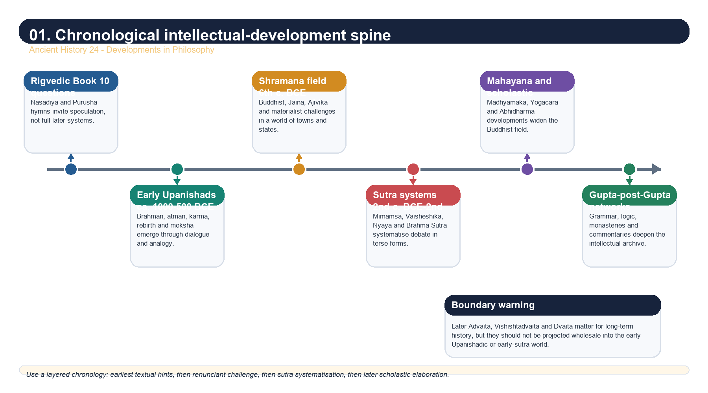

*Original deterministic chronology spine. It separates earliest textual hints from later sutra systematisation and later scholastic elaboration.*

### Phase map

| Phase | Strongest anchor | What it contributes | Bound it carefully |
|---|---|---|---|
| [FACT] Vedic and late Vedic | Samhitas, Brahmanas, Aranyakas | rta, sacrifice, speculative questioning | [LIMIT] not yet a neat six-school world |
| [FACT] Early Upanishadic | Brihadaranyaka, Chandogya and related corpora | brahman, atman, karma, rebirth, release | [LIMIT] plural voices, not one final doctrine |
| [FACT] Shramana field | Buddhism, Jainism, Ajivikas, materialist critique | argument against or beyond ritual centrality | [LIMIT] social context is enabling, not monocausal |
| [FACT] Sutra and classical systematisation | Nyaya, Vaisheshika, Mimamsa, Yoga, Brahma Sutra traditions | compressed school identities and debate tools | [LIMIT] neat pairing and six-school canon emerge late |
| [FACT] Late-ancient scholastic networks | Mahayana, Buddhist logic, grammar, commentaries | technical debate across institutions | [LIMIT] avoid projecting later medieval doctrines backward |

### Core teaching / solved analysis

- [FACT] Repository owners first consulted: `basic/24_Developments-in-Philosophy.md`, `advanced/24_Developments-in-Philosophy.md`, Topic 09 on the later Vedic phase, Topic 10 on Jainism and Buddhism, and the adjacent Art and Culture owner on religion-philosophy links.
- [FACT] OCR evidence then checked: R.S. Sharma's philosophy chapter; Upinder Singh's sections on Upanishadic methods, Ajivikas, grammar and the late crystallisation of the six-school doxography; local scholar-identification evidence for Aryadeva, Dignaga and Nathamuni.
- [FACT] A bounded local philosophy-reference source was used only to stabilise Kautilya's fourfold knowledge classification around anviksiki, trayi, varta and dandaniti.
- [ANALYSIS] The best answer is therefore layered: what terms meant, who argued with whom, what texts and institutions carried the debate, and which later labels distort the earlier field.
- [LIMIT] School dates are layered because oral teaching, sutra redaction, commentary and later doxography rarely coincide.

### Must-know facts

- "Six orthodox systems" is a later grouping applied to older, uneven traditions.
- Upanishadic philosophy belongs within the Vedic corpus even where it transforms its emphasis.
- Ajivika and Charvaka must be handled with stronger source caution than Buddhism, Jainism or Nyaya.

### UPSC traps

- **Wrong:** ancient Indian philosophy is one timeless spiritual consensus. **Correct:** it is a plural argumentative field with rival positions on self, causation, authority and liberation.
- **Wrong:** later Advaita, Vishishtadvaita and Dvaita can be projected backward into the early Upanishads. **Correct:** early Vedanta must be bounded to its ancient textual core and later doctrinal owners clearly signposted.

**Mains angle:** Open with chronology and close with pluralism plus source caution.

**Study link:** Topic 09 for the Vedic-Upanishadic transition; Topic 10 for Buddhist and Jaina owners; Art and Culture Topic 13 for the monuments-and-philosophy adjacent route.

## 02. What counted as philosophy: darshana, anviksiki and an argumentative civilisation

[FACT] Upinder Singh notes that the indigenous word `darshana` literally means "view." Another important term is `anviksiki`, literally "looking at," which later came to mean critical inquiry and logical reasoning.

[ANALYSIS] Ancient Indian philosophy is therefore not just abstract metaphysics. It joins vision, disciplined inquiry, ethics, release, language, debate and practical life. Knowledge is repeatedly linked to what a human being should do, avoid, prove, experience or transcend.

[FACT] In the Arthashastra tradition, anviksiki appears as a distinct branch of learning alongside trayi, varta and dandaniti. This matters because statecraft acknowledges inquiry as a specialised competence.

[LIMIT] The Arthashastra is layered and debated in chronology. Topic 24 therefore uses this classification only as a secure sign that philosophical reasoning was viewed as a recognisable field, not as evidence for a single fixed curriculum in one exact century.

### Key terms

| Term | Safe historical sense | Why it matters | Caution |
|---|---|---|---|
| [FACT] Darshana | view, standpoint, philosophical seeing | philosophy is often framed as a way of seeing reality | [LIMIT] not identical to every later modern use of "philosophy" |
| [FACT] Anviksiki | inquiry, analytical reflection, logical reasoning | reasoning becomes a recognisable knowledge-branch | [LIMIT] meaning widens over time |
| [FACT] Moksha / nirvana / kevala | liberation ideals in different traditions | philosophy often integrates theory and soteriology | [LIMIT] release does not mean the same thing across schools |
| [FACT] Shastric debate | argument, refutation, proof, commentary | the field is public and inter-school | [LIMIT] surviving victories are often written by winners |

### Core teaching / solved analysis

- [FACT] Philosophy in ancient India repeatedly joined knowledge and practice: Upanishadic knowledge, Buddhist path, Jaina ethics, Yoga discipline, Mimamsa action and Nyaya proof are all historically central.
- [FACT] Kautilya's classification prevents an over-simple story that philosophy was detached from polity or economy; inquiry was recognised alongside Vedic learning, material life and governance.
- [ANALYSIS] A high-scoring Ancient History answer therefore treats philosophy as part of a wider knowledge order: teaching, disputation, memory, discipline, textual interpretation and political patronage.
- [DEBATE] Imposing a single Western category can flatten differences between liberation thought, grammar, ritual hermeneutics, logic and scepticism.
- [LIMIT] "Indian philosophy" is itself a retrospective umbrella. Ancient actors often identified more narrowly - Vedic, Buddhist, Jaina, Naiyayika, Mimamsaka and so on.

### Must-know facts

- `Darshana` is view, not merely a list of schools.
- `Anviksiki` marks philosophical reasoning as a named mode of inquiry.
- Ancient Indian philosophy often integrates epistemology, ethics and release rather than separating them sharply.

### UPSC traps

- **Wrong:** philosophy in ancient India was only about renunciation. **Correct:** inquiry also addressed ritual, language, kingship, economy and debate.
- **Wrong:** anviksiki simply means "atheism" or "science." **Correct:** it is better rendered as inquiry or analytical reasoning in a historically specific knowledge classification.

**Mains angle:** Define the field historically before listing schools.

**Study link:** Topic 14 for Arthashastra chronology cautions; Topic 24 Section 21 below for institutions of debate and transmission.

## 03. Vedic background: rta, sacrifice and speculative questioning

[FACT] The Vedic background supplied more than ritual performance. It also generated categories of order, reciprocity, sacred speech, kingship and cosmic speculation that later philosophical traditions inherited, contested or reinterpreted.

[FACT] `Rta` expressed ordered reality; `yajna` organised ritual exchange; Brahmana texts systematised sacrificial explanation; Aranyakas marked a movement toward interior, symbolic reading.

[LIMIT] The Nasadiya Sukta and Purusha Sukta should be read with restraint. They are important for speculative questioning and cosmic-sacrificial imagination, but they do not amount to finished later systems such as Vedanta, Samkhya or materialism.

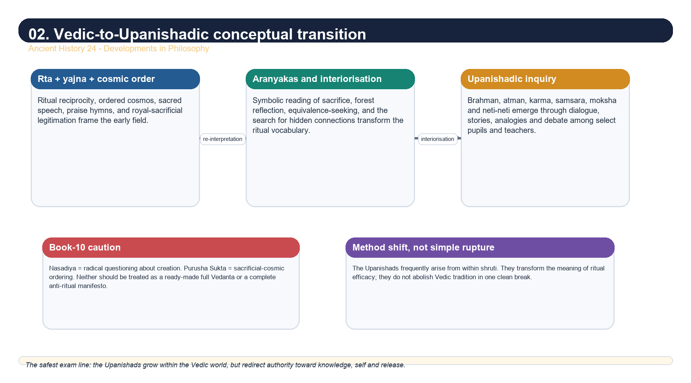

*The diagram tracks movement from ritual order to symbolic interiorisation and then to Upanishadic inquiry, while keeping the Book-10 caution explicit.*

### Vedic philosophical inheritance

| Element | Historical role | What later traditions do with it | Caution |
|---|---|---|---|
| [FACT] Rta | cosmic and moral order | becomes background for thinking about truth, order and duty | [LIMIT] do not equate it mechanically with later dharma |
| [FACT] Yajna | sacrificial efficacy and exchange | is interiorised, critiqued or defended in later traditions | [LIMIT] not every later school rejects sacrifice |
| [FACT] Nasadiya questioning | radical uncertainty about creation | models speculative doubt and anti-dogmatic inquiry | [LIMIT] not a ready-made sceptical school |
| [FACT] Purusha imagery | cosmic person and social-sacrificial integration | feeds later symbolic and metaphysical reading | [LIMIT] not a full doctrine of social determinism by itself |

### Core teaching / solved analysis

- [FACT] Later Vedic literature already shows a shift from sheer ritual instruction toward symbolic correspondence, hidden equivalence and knowledge as power.
- [FACT] Brahmana and Aranyaka materials prepared the ground for Upanishadic philosophical questioning by re-reading sacrifice rather than simply abandoning it.
- [ANALYSIS] This is why the safest bridge to later philosophy is one of transformation, not abrupt rupture.
- [DEBATE] Some modern readings either romanticise Vedic speculation as pure philosophy or reduce it to brute ritualism. Both miss the mixed nature of the sources.
- [LIMIT] The Vedic corpus is layered across centuries and regions. It cannot be treated as one synchronised book.

### Must-know facts

- `Rta` and sacrificial thought are crucial background categories.
- Book 10 hymns invite speculation, but do not by themselves settle later metaphysical debates.
- The Aranyakas and Brahmanas are transition zones, not dead appendices.

### UPSC traps

- **Wrong:** the Nasadiya Sukta proves that the Vedic people were materialists. **Correct:** it shows speculative questioning and epistemic restraint, not a finished materialist doctrine.
- **Wrong:** Vedic thought is only ritual and has no conceptual depth. **Correct:** speculative and symbolic dimensions are already visible within the corpus.

**Mains angle:** Present Vedic thought as the conceptual background out of which later inquiry deepened and diversified.

**Study link:** Topic 08 for early Vedic background; Topic 09 for the later Vedic and Upanishadic deepening.

## 04. Upanishadic developments: brahman, atman, karma, rebirth and release

[FACT] Early Upanishads such as Brihadaranyaka and Chandogya are among the earliest prose Upanishads. They develop themes of brahman, atman, knowledge, karma, rebirth and release through dialogues, analogies, paradoxes and disputation.

[FACT] The Upanishadic method is not one-dimensional. It includes direct instruction, question-and-answer, symbolic interpretation, stories, negation (`neti neti`) and competitive dialogue.

[ANALYSIS] This plurality is crucial. "The Upanishads say" is often too blunt a phrase. Different texts emphasise different relations among self, reality, knowledge, ritual and release.

[LIMIT] The Upanishads are within shruti and cannot be cleanly detached from the Vedic world. Yet they do redirect prestige from outer sacrifice toward deeper knowing and interiorisation.

*The same transition visual is reused here because Topic 24 depends on seeing continuity and redirection together.*

### Concept grid

| Idea | Ancient-history safe meaning | Named anchor | Caution |
|---|---|---|---|
| [FACT] Brahman | ultimate or underlying reality in several Upanishadic settings | Brihadaranyaka / Chandogya lineages | [LIMIT] not one finished later Vedanta doctrine |
| [FACT] Atman | self as a deeper reality to be known | Yajnavalkya dialogues; Uddalaka-Shvetaketu teaching | [LIMIT] formulations vary |
| [FACT] Karma and rebirth | actions linked to future existence | early release speculation | [LIMIT] later technical karmic theories differ by school |
| [FACT] Moksha | release from repetitive birth-death | knowledge-centred liberation horizon | [LIMIT] the full four-purushartha synthesis is historically layered |
| [FACT] Neti neti | via negativa or negation strategy | Brihadaranyaka style | [LIMIT] do not over-simplify it into pure monism without context |

### Core teaching / solved analysis

- [FACT] Upanishadic teaching frequently uses concrete narrative forms. This directly supports the 2024 Prelims route: the claim that there are no parables in the Upanishads is unsafe.
- [FACT] Yajnavalkya, Gargi and Maitreyi show that philosophical exchange could be dramatic, interrogative and socially situated, not just formulaic.
- [ANALYSIS] Knowledge in the Upanishads is not mere information. It is transformative, often tied to liberation and to a new reading of ritual and selfhood.
- [DEBATE] Some passages support strong identity language between self and ultimate reality; others stage caution, hierarchy or unresolved tension.
- [LIMIT] Later Advaita, Vishishtadvaita and Dvaita belong to a later exegetical history and should not be simply retrofitted onto every early passage.

### Must-know facts

- Early Upanishads belong to the later Vedic horizon and predate the Puranic compilatory world.
- The Upanishads do use stories, analogies, dialogues and paradoxes.
- Internal diversity is an exam-safe qualifier, not a weakness.

### UPSC traps

- **Wrong:** the Upanishads are anti-Vedic texts from outside shruti. **Correct:** they belong within the Vedic corpus while transforming its emphasis.
- **Wrong:** every Upanishadic passage teaches one identical doctrine of brahman-atman identity. **Correct:** the corpus is layered, plural and open to later competing interpretations.

**Mains angle:** Explain Upanishadic thought as interiorisation plus debate, not just metaphysical slogan-listing.

**Study link:** 2024 Prelims Q58; Topic 09 for the later Vedic owner lane; Topic 17 below for the later Vedanta boundary.

## 05. Shramana milieu and the second urbanisation

[FACT] The rise of Buddhism, Jainism, Ajivikas and materialist-sceptical currents occurred in a wider world of towns, routes, monarchies, gana-sanghas, merchants and mobile teachers often associated with the so-called second urbanisation.

[ANALYSIS] This context widened the space for renunciation, public argument, new patronage and critique of ritual hierarchy. But it did not mechanically generate one uniform doctrine. Anatta, anekantavada, niyati and materialist critique are too conceptually different for monocausal explanation.

[FACT] The shramana field is best understood as a dense argumentative ecology. Traditions disagreed sharply, yet also shared techniques of mendicancy, debate, memory, institutional discipline and ethical self-fashioning.

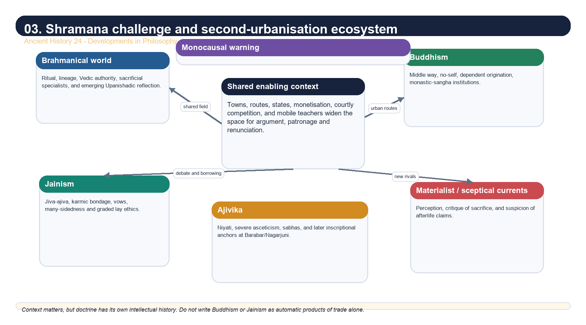

*The ecosystem map shows enabling conditions without collapsing doctrine into economy alone.*

### Context matrix

| Context | What it made easier | What it did not automatically decide |
|---|---|---|
| [FACT] Towns and trade routes | teacher mobility, donor networks, wider audiences | precise doctrine of non-self or fate |
| [FACT] Competing states and courts | patronage, disputation, prestige rivalry | the truth of one school over another |
| [FACT] Social stratification and ritual cost | critique of sacrificial exclusivity | one single anti-Brahmanical front |
| [FACT] Ascetic and mendicant culture | disciplined communities beyond household centrality | identical ethics across Buddhists, Jainas and Ajivikas |

### Core teaching / solved analysis

- [FACT] The shramana challenge is historically crucial because it made the categories of suffering, bondage, self, karma, discipline and liberation explicitly contested across traditions.
- [FACT] Early Buddhism, Jainism and Ajivika traditions all emerged in this wider field, though they resolved its questions differently.
- [ANALYSIS] The best GS answer uses social and economic change as enabling background, then quickly moves to doctrinal distinctiveness.
- [DEBATE] Treating the shramana world as pure protest literature misses its internal metaphysics, discipline and technicality.
- [LIMIT] Textual survival is uneven. Buddhist sources survive better than Ajivika internal voices, and Jaina canonical chronology is layered.

### Must-know facts

- The shramana field is connected to, but not exhausted by, the second urbanisation.
- Renunciation, debate and patronage are shared structural features.
- Buddhism, Jainism, Ajivikas and materialist currents are not interchangeable heterodoxy.

### UPSC traps

- **Wrong:** Buddhism and Jainism were simply products of trade. **Correct:** trade and towns aided spread, but doctrines had their own intellectual histories.
- **Wrong:** all non-Vedic traditions rejected karma and rebirth. **Correct:** Buddhists and Jainas reworked them differently; Charvaka-style currents often rejected them.

**Mains angle:** Use context to open the answer, not to replace doctrine.

**Study link:** Topic 10 for full Buddhist-Jaina owner depth; Topic 13 for the Age of the Buddha social context.

## 06. Buddhism: early conceptual core and philosophical orientation

[FACT] The Buddha's teaching gave ancient India a powerful philosophical grammar centred on suffering, causation, discipline and release. The four noble truths and eightfold path are best treated here as conceptual anchors rather than devotional slogans.

[FACT] Dependent origination (`pratityasamutpada`) explains conditioned arising; impermanence (`anitya`) denies lasting fixity; non-self (`anatman`) denies a permanent independent self; the middle way avoids both self-mortification and unrestrained sensuality.

[ANALYSIS] The philosophical importance of early Buddhism lies in how it redefined the person as process, suffering as conditioned, and liberation as an achieved discipline rather than as union with an eternal self.

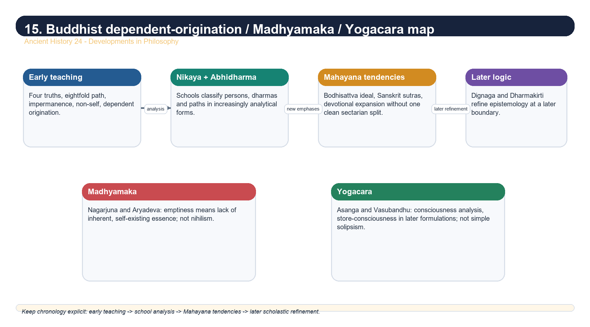

*The later development map is introduced here because even early Buddhist categories set the baseline for later scholastic refinement.*

### Early Buddhist concept map

| Concept | Safe meaning | Why it matters | Trap |
|---|---|---|---|
| [FACT] Four truths | suffering, origin, cessation, path | philosophy tied to diagnosis and cure | not a pessimism slogan |
| [FACT] Eightfold path | ethical, meditative and cognitive discipline | joins right understanding with practice | not only monastic ritual |
| [FACT] Dependent origination | phenomena arise through conditions | rejects independent permanent essence | not fatalism |
| [FACT] Impermanence | flux of compounded things | blocks eternalist metaphysics | not "nothing matters" |
| [FACT] Non-self | no permanent atman-like substance | sharp distinction from Upanishadic self-centred lines | not denial of conventional personhood |

### Core teaching / solved analysis

- [FACT] Early Buddhism did not merely negate Vedic ritual; it supplied an alternative analysis of bondage and release.
- [FACT] The sangha institutionalised disciplined transmission, making philosophy inseparable from monastic organisation, memory and ethical life.
- [ANALYSIS] The school matters historically because it shifted explanation from cosmic sacrifice or eternal self toward conditioned process and practical transformation.
- [DEBATE] "Buddhism rejected the world" is too crude. It re-described worldly existence, causation and suffering without positing a permanent atman-like self.
- [LIMIT] Topic 24 uses early Buddhist schools only where useful; the owner depth for Buddhist sect history remains Topic 10.

### Must-know facts

- Dependent origination, impermanence and non-self are the central conceptual triad.
- Early Buddhism is path-centred, not merely doctrine-centred.
- The middle way is ethical and epistemic, not just lifestyle advice.

### UPSC traps

- **Wrong:** non-self means Buddhists deny all experience. **Correct:** they deny a permanent, independent self, not the conventional flow of personhood.
- **Wrong:** dependent origination is just another word for predestination. **Correct:** it is a theory of conditioned arising.

**Mains angle:** Compare Buddhist process-thinking with Upanishadic and Samkhya self-models.

**Study link:** Topic 10 for owner depth on early Buddhism, sangha and sectarian development.

## 07. Buddhism after the early canon: Abhidharma, Mahayana, Madhyamaka, Yogacara and late logic

[FACT] Later Buddhist thought deepened analysis through Abhidharma classification, Mahayana expansion, Madhyamaka's critique of inherent existence, Yogacara's consciousness analysis and late epistemological refinement through thinkers such as Dignaga and Dharmakirti.

[FACT] Upinder Singh notes later Mahayana thinkers such as Nagarjuna, Vasubandhu, Asanga, Aryadeva and Dignaga as part of a Sanskrit scholastic world. This is especially useful for the 2022 scholar-identification route.

[ANALYSIS] Ancient History needs a bounded, chronology-aware treatment: early teaching -> school analysis -> Mahayana tendencies -> Madhyamaka/Yogacara -> later logic. This prevents two distortions at once: reducing Buddhism to one early sermon set, or exploding Topic 24 into a full Buddhist philosophy optional paper.

*The development map distinguishes early teaching, school analysis, Mahayana tendencies and later epistemic refinement.*

### Stage comparison

| Stage / school | Named anchors | Ancient-history safe idea | Do not say |
|---|---|---|---|
| [FACT] Abhidharma | analytic scholastic traditions | classification of dharmas, paths and persons | Buddhism stayed anti-intellectual |
| [FACT] Mahayana | bodhisattva ideal, new sutra worlds | enlarged soteriological and devotional horizon | one clean overnight sect split |
| [FACT] Madhyamaka | Nagarjuna, Aryadeva | emptiness = lack of inherent existence | nihilism |
| [FACT] Yogacara | Asanga, Vasubandhu | consciousness / representation analysis | simple solipsism |
| [FACT] Later Buddhist logic | Dignaga, Dharmakirti | technical epistemology at a later boundary | part of the earliest Buddhist layer |

### Core teaching / solved analysis

- [FACT] Aryadeva and Dignaga are Buddhist scholars; this is a secure identification anchor for the 2022 routed Prelims demand.
- [FACT] Madhyamaka radicalises dependent arising by denying self-subsisting essence; Yogacara turns intensely toward cognition and representation.
- [ANALYSIS] Mahayana is best taught as a historically cumulative expansion, not a rejection of every earlier Buddhist commitment.
- [DEBATE] Relations among Mahasanghika, Mahayana and later schools are debated and regionally complex.
- [LIMIT] Dignaga and Dharmakirti belong near the late-ancient boundary. Mention them to show the widening intellectual field, but do not back-project them into the Buddha's own time.

### Must-know facts

- Aryadeva and Dignaga are Buddhist, not Jaina or Vaishnava.
- Shunyata means emptiness of inherent existence, not nothingness.
- Yogacara should be described in its own Buddhist terms, not crudely as Western-style idealism.

### UPSC traps

- **Wrong:** Mahayana replaced early Buddhism in one sudden break. **Correct:** think in terms of layered tendencies, texts and institutional expansions.
- **Wrong:** Madhyamaka and Yogacara are mutually exclusive slogans. **Correct:** both are major Mahayana scholastic developments answering the problem of experience and reality differently.

**Mains angle:** Use Madhyamaka and Yogacara only to show later Buddhist depth, not to drown a GS-I answer in technicality.

**Study link:** Topic 10 for owner-depth Buddhist schools, monastic spread and doctrinal routes.

## 08. Jain philosophy: jiva, karmic bondage, anekantavada, syadvada and ethics

[FACT] Jain philosophy centres on the distinction between `jiva` and `ajiva`, the bondage of soul by karmic matter, disciplined ethics, graded vows, liberation through purification, and a distinctive epistemological humility expressed through `anekantavada`, `nayavada` and `syadvada`.

[FACT] Upinder Singh highlights anekantavada and syadvada as doctrines of the many-sidedness of reality and the relativity or conditionality of judgement.

[ANALYSIS] Jain thought matters historically because it joins austere ethics with a sophisticated theory of qualified knowing. It neither dissolves truth into relativism nor reduces knowledge to one rigid absolute standpoint.

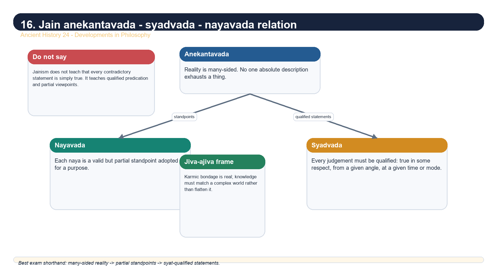

*The diagram shows many-sided reality, standpoints and qualified predication without collapsing them into "anything goes."*

### Jaina concept matrix

| Concept | Safe formulation | Historical significance | Caution |
|---|---|---|---|
| [FACT] Jiva / ajiva | living soul and non-living categories | metaphysical realism and ethical seriousness | [LIMIT] later taxonomies are more elaborate |
| [FACT] Karma as material bondage | karmic particles bind the soul | explains ascetic discipline and release | [LIMIT] not identical to Buddhist or Upanishadic karma |
| [FACT] Anekantavada | reality is many-sided | blocks one-sided absolutism | [LIMIT] not a permission-slip for contradiction |
| [FACT] Nayavada | partial standpoint logic | organises perspectival discourse | [LIMIT] does not deny truth |
| [FACT] Syadvada | conditional predication | requires qualified judgement | [LIMIT] later systematisation is dense and technical |

### Core teaching / solved analysis

- [FACT] Jainism offers both severe monastic discipline and graded lay ethics, making it historically important for the relation between renunciation and social life.
- [FACT] Ahimsa is central, but in philosophical history it is tied to the ontology of living beings and karmic accumulation, not only to a moral slogan.
- [ANALYSIS] The Jaina contribution to Indian philosophy is twofold: a rigorous karma-soul liberation model and an anti-absolutist method of knowing.
- [DEBATE] Later highly systematic formulations should not be projected unchanged into the earliest Jaina horizon.
- [LIMIT] Topic 24 foregrounds philosophy; fuller canonical, sectarian and art-historical depth remains with Topic 10 and related owners.

### Must-know facts

- Jiva-ajiva and karmic matter are foundational Jaina categories.
- Anekantavada, nayavada and syadvada are related but not identical.
- Ahimsa has metaphysical and epistemic grounding, not only ethical appeal.

### UPSC traps

- **Wrong:** anekantavada means all views are equally true. **Correct:** it teaches many-sided reality and qualified judgement.
- **Wrong:** Jaina karma is the same as Buddhist momentariness. **Correct:** Jainism treats soul and karmic bondage very differently.

**Mains angle:** Link ontology, epistemology and ethics instead of discussing Jainism only as non-violence.

**Study link:** Topic 10 for Mahavira, sects, canon and social spread.

## 09. Ajivikas: niyati, asceticism and the hostile-source problem

[FACT] Ajivikas were a distinct shramana current associated in hostile Buddhist and Jaina sources with Makkhali Gosala, severe asceticism and the doctrine of `niyati` or fate.

[FACT] Upinder Singh's treatment is especially valuable because it combines doctrinal notice with source criticism and inscriptional anchors such as the Barabar and Nagarjuni caves associated with Mauryan patronage.

[ANALYSIS] Ajivikas matter for Topic 24 not because we possess a clean internal philosophical canon, but because their thin, adversarial archive teaches how ancient intellectual history must work under conditions of loss.

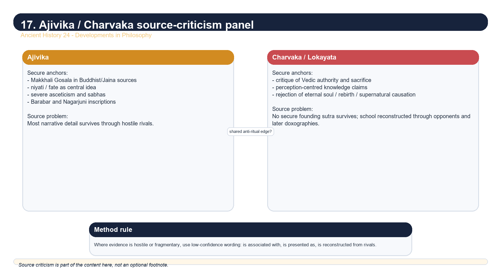

*The panel separates secure anchors from reconstructions and shows why source caution is part of the content itself.*

### Evidence grid

| What is relatively secure | Why it matters | What remains thin or contested |
|---|---|---|
| [FACT] Makkhali Gosala appears in rival traditions | proves a historically remembered current | detailed internal doctrine is not preserved evenly |
| [FACT] Niyati / fate is central in hostile descriptions | marks Ajivika distinctiveness | how fully it explained moral effort remains debated |
| [FACT] Mauryan cave patronage exists | gives inscriptional and architectural anchoring | patronage does not give a full doctrinal manual |
| [FACT] Severe ascetic reputation | links Ajivikas to wider renouncer culture | rival caricature is always possible |

### Core teaching / solved analysis

- [FACT] Ajivikas cannot be collapsed into Buddhists or Jainas; niyati gives them a recognisably different philosophical edge.
- [ANALYSIS] Fate as an explanatory principle creates a strong contrast with Buddhist conditioned effort and Jaina karmic purification.
- [DEBATE] Because most evidence is hostile, even confident claims about Ajivika social organisation or fine metaphysics must be toned down.
- [LIMIT] Topic 24 therefore prefers secure comparisons: fate, asceticism, shramana placement, hostile evidence and Mauryan patronage.

### Must-know facts

- Ajivika evidence is thinner and more hostile than Buddhist or Jaina evidence.
- Niyati is the central exam anchor.
- Barabar / Nagarjuni patronage provides a rare hard historical anchor.

### UPSC traps

- **Wrong:** Ajivikas are just another name for Jains. **Correct:** they are a separate shramana tradition with a determinist reputation.
- **Wrong:** because evidence is thin, nothing can be said at all. **Correct:** some secure anchors exist, but claims must be lower-confidence and source-aware.

**Mains angle:** Use Ajivikas to demonstrate historiographical discipline.

**Study link:** Topic 10 for Mauryan-age religious field; Topic 14 for Mauryan patronage context.

## 10. Lokayata / Charvaka, materialism and sceptical critique

[FACT] Charvaka or Lokayata represents the strongest ancient Indian materialist-sceptical strand preserved in later doxographies and hostile references. It is associated with rejection of Vedic authority, suspicion toward sacrifice, denial of afterlife and a strong reliance on perception.

[FACT] R.S. Sharma's treatment is important here because it reminds the learner that ancient Indian thought was not uniformly salvation-centred or idealist; materialist currents were present and intellectually significant.

[LIMIT] No secure foundational Charvaka text survives in a form comparable to the major preserved sources of Buddhism or Nyaya. Brihaspati attribution is conventional and unstable.

*The same panel is reused because the chief teaching problem is reconstruction from fragmentary and adversarial survival.*

### Secure claim versus overclaim

| Safer claim | Why it is safer | Overclaim to avoid |
|---|---|---|
| [FACT] Charvaka privileged perception | repeatedly preserved in rival summaries | Charvaka had a single unchanged canon for centuries |
| [FACT] It criticised unseen ritual and afterlife claims | matches its anti-ritual and anti-supernatural profile | it denied all practical inference in daily life |
| [FACT] It challenged priestly authority | explains its place in doxographic argument | it alone explains every materialist tendency in India |
| [FACT] It widens the spectrum of Indian thought | breaks the myth of uniform spiritualism | it was the dominant popular ideology of ancient India |

### Core teaching / solved analysis

- [FACT] Lokayata means something like "that which is found among people," but the label's exact historical implications remain debated.
- [ANALYSIS] The school matters because it compels every answer on ancient Indian philosophy to acknowledge plurality: ritualists, self-theorists, sceptics, logicians and renouncers all coexist.
- [DEBATE] A useful nuance is that hostile accounts may exaggerate crude hedonism. The safer exam line is materialist critique and perception-privileging, not caricature.
- [LIMIT] Charvaka should not be romanticised as a modern scientific movement avant la lettre.

### Must-know facts

- Charvaka / Lokayata is heterodox, not one of the six orthodox schools.
- Perception is its most secure epistemic anchor.
- Source survival is the biggest methodological caution.

### UPSC traps

- **Wrong:** Charvaka rejected all forms of reasoning whatsoever. **Correct:** the safer line is that it denied inference or testimony as independent secure routes to unseen metaphysical claims.
- **Wrong:** Charvaka had a fully preserved founder-text like the Nyaya Sutra. **Correct:** its reconstruction comes mostly through opponents.

**Mains angle:** Use Charvaka as the best evidence against the myth that ancient India was uniformly other-worldly.

**Study link:** Art and Culture Topic 13 for the wider philosophy-owner bridge; Topic 24 Section 19 for pramana comparison.

## 11. Astika, nastika and the late doxography problem

[FACT] Upinder Singh cautions that the familiar list of six orthodox systems crystallised fairly late. The traditions themselves are older than the neat doxographic package.

[FACT] `Astika` and `nastika` also do not simply mean theist and atheist. In different texts and traditions they can refer to acceptance of Veda, belief in the other world, or other classificatory criteria.

[ANALYSIS] This section is exam-critical because modern shorthand often produces three errors together: astika equals believer, nastika equals atheist, and six-school grouping equals timeless Vedic canon. All three are unsafe.

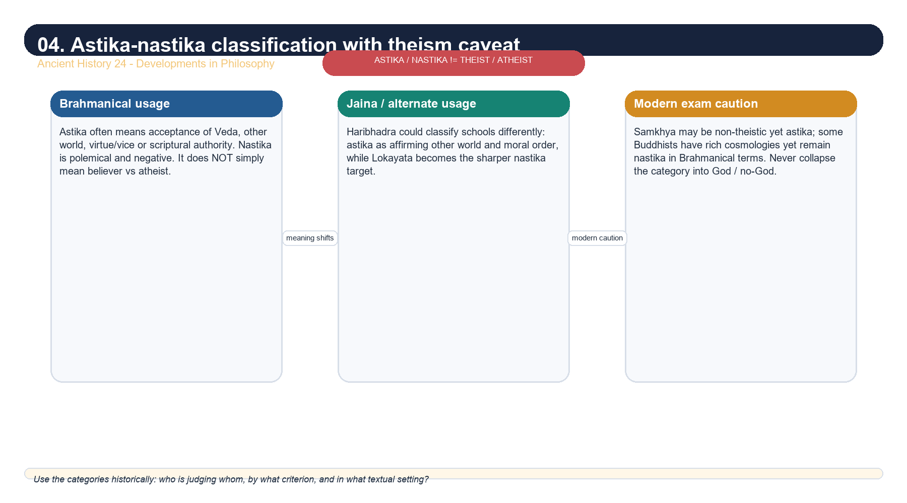

*The panel shows changing criteria and highlights the central caution: classification is historical and polemical, not timeless and innocent.*

### Classification matrix

| Criterion | Astika tends to mean | Nastika tends to mean | Why caution is needed |
|---|---|---|---|
| [FACT] Brahmanical doxography | accepts Vedic authority or allied assumptions | rejects Veda and related authority-claims | Samkhya can be non-theistic yet astika |
| [FACT] Alternate usage such as Haribhadra's | affirms moral order / other-world in a wider sense | strong denier such as Lokayata | criteria are not identical across traditions |
| [ANALYSIS] Modern reduction | "believes in God" | "does not believe in God" | historically misleading |

### Core teaching / solved analysis

- [FACT] Samkhya is a classic example of why theism is the wrong shortcut: it can be non-theistic in orientation yet still count as astika in the Brahmanical list.
- [FACT] Buddhism may have a rich cosmology and monastic theology of its own but still appear as nastika in Brahmanical classification.
- [ANALYSIS] Classification always involves a judging standpoint. Ask who is classifying whom, and by what criterion.
- [DEBATE] The six-school list is historically useful, but only if the learner remembers that it is a late organising scheme.
- [LIMIT] Topic 24 uses the list as a teaching aid while continuously flagging its historical layering.

### Must-know facts

- Astika / nastika is not a simple God / no-God opposition.
- The six-school grouping is later than the origins of individual schools.
- Paired school names are teaching conveniences, not proof of simultaneous birth.

### UPSC traps

- **Wrong:** nastika means atheist, therefore Buddhism and Jainism are atheist in every possible historical sense. **Correct:** the classification is relative to Brahmanical authority criteria.
- **Wrong:** the six systems existed as a fixed list from the Rigvedic age. **Correct:** the list is a later doxographic crystallisation.

**Mains angle:** A one-line classification caution often raises the answer above handbook-level writing.

**Study link:** Topic 24 Sections 12-17 for the six-school cores; Topic 22 below for historiographical cautions.

## 12. Samkhya: purusha, prakriti, gunas and real transformation

[FACT] Samkhya is one of the oldest and most influential philosophical traditions in India. Its core teaching distinguishes `purusha` (witness-consciousness) from `prakriti` (primordial nature) and explains the world through the dynamic of the three gunas.

[FACT] Satkaryavada and parinamavada are the safest historical markers: the effect pre-exists in the cause, and development is a real transformation of prakriti rather than creation out of nothing.

[ANALYSIS] Samkhya matters because it offers a systematic cosmology without requiring a creator-God as its primary explanatory device. This is one reason it disrupts the lazy equation of astika with theism.

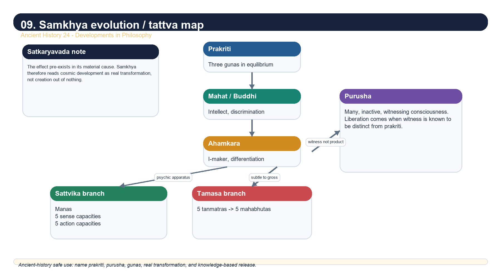

*The tattva map shows prakriti's evolution, the branches of mental and material development, and purusha as witness rather than product.*

### Samkhya core

| Element | Safe meaning | Why it matters |
|---|---|---|
| [FACT] Purusha | many witnessing selves | liberation through discriminative knowledge |
| [FACT] Prakriti | primordial nature | source of cosmic evolution |
| [FACT] Three gunas | sattva, rajas, tamas | explain dynamism and imbalance |
| [FACT] Satkaryavada | effect pre-exists in cause | distinctive causation theory |
| [FACT] Kaivalya | isolation of purusha from prakriti | release model |

### Core teaching / solved analysis

- [FACT] Sharma notes early Samkhya as a major system with materialist elements and no necessary divine creation.
- [ANALYSIS] Samkhya gives ancient India one of its clearest dualist cosmologies: consciousness is not the world, and the world is not illusory nothingness.
- [DEBATE] Exact chronology of Samkhya layers is difficult; its later textbook formulation should not be compressed into one founder-date.
- [LIMIT] Topic 24 needs the conceptual core, not every later commentator.

### Must-know facts

- Purusha and prakriti are the central pair.
- Samkhya is dualist and explanatory, not primarily devotional.
- Satkaryavada is a major Ancient History-safe technical term.

### UPSC traps

- **Wrong:** Samkhya teaches one universal self identical with brahman. **Correct:** it posits multiple purushas distinct from prakriti.
- **Wrong:** Samkhya created the world out of nothing. **Correct:** it teaches real transformation of pre-existing nature.

**Mains angle:** Compare Samkhya's witness-self with Buddhist non-self and Upanishadic self-knowledge.

**Study link:** Topic 24 Section 13 for Yoga's practical pairing and Section 20 for cross-school causation.

## 13. Yoga: citta-vritti-nirodha, disciplined practice and the eight limbs

[FACT] Yoga is closely allied to Samkhya in metaphysical background, but it foregrounds discipline, mental control and the practical path to liberation.

[FACT] Patanjali's classic formulation revolves around `citta-vritti-nirodha` - the stilling of the modifications of mind - and the eightfold path of restraint, discipline, posture, breath, sensory withdrawal, concentration, meditation and absorption.

[ANALYSIS] In Topic 24, Yoga should be treated not as modern posture culture, but as a historical discipline that transformed cosmology into embodied practice.

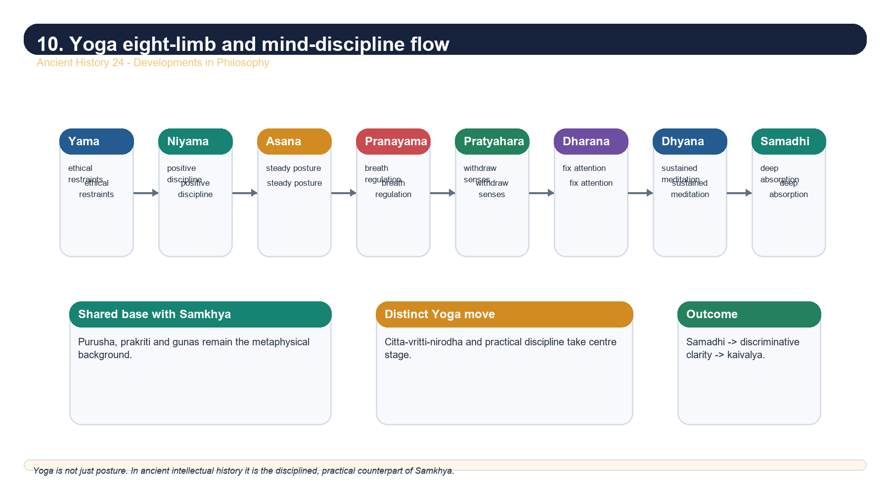

*The flowchart makes the practical ladder visible and keeps Yoga tied to Samkhya without collapsing the two.*

### Eight-limb summary

| Limb | Function in the path |
|---|---|
| [FACT] Yama | restraint |
| [FACT] Niyama | positive discipline |
| [FACT] Asana | steady posture |
| [FACT] Pranayama | breath regulation |
| [FACT] Pratyahara | sense withdrawal |
| [FACT] Dharana / Dhyana / Samadhi | concentration, meditation, absorption |

### Core teaching / solved analysis

- [FACT] Yoga shares Samkhya's broad distinction between consciousness and nature, but its contribution is the disciplined route by which that distinction becomes experiential.
- [ANALYSIS] This makes Yoga historically important in the bridge between philosophy and ascetic-psychological practice.
- [DEBATE] The Yoga tradition is textually layered. A precise single-date simplification is unsafe.
- [LIMIT] Topic 24 does not need later postural or modern nationalist appropriations of Yoga.

### Must-know facts

- Yoga is the practical partner of Samkhya in the classical pairing.
- `Citta-vritti-nirodha` is the key phrase.
- The eight limbs show that ancient Yoga is ethical, mental and contemplative, not merely physical.

### UPSC traps

- **Wrong:** Yoga means only posture. **Correct:** posture is one limb in a larger ethical-mental discipline.
- **Wrong:** Yoga is unrelated to philosophy and is only a health system. **Correct:** its whole structure presupposes metaphysics and liberation theory.

**Mains angle:** Use Yoga to demonstrate knowledge-practice integration in ancient Indian philosophy.

**Study link:** Topic 24 Section 12 for the Samkhya background; Topic 24 Section 22 for broader ethics and release.

## 14. Nyaya: pramanas, inference and public reasoning

[FACT] Nyaya made inquiry, proof and debate central philosophical tasks. It is associated with a technical discussion of valid knowledge (`pramana`), doubt, inference, analogy and testimony.

[FACT] The famous five-member inference - proposition, reason, example, application and conclusion - is the most exam-safe marker of the school's logical structure.

[ANALYSIS] Nyaya matters historically because it formalised the conditions under which a claim can be defended in public argument. This gave ancient India an explicit debate grammar shared across inter-school contest.

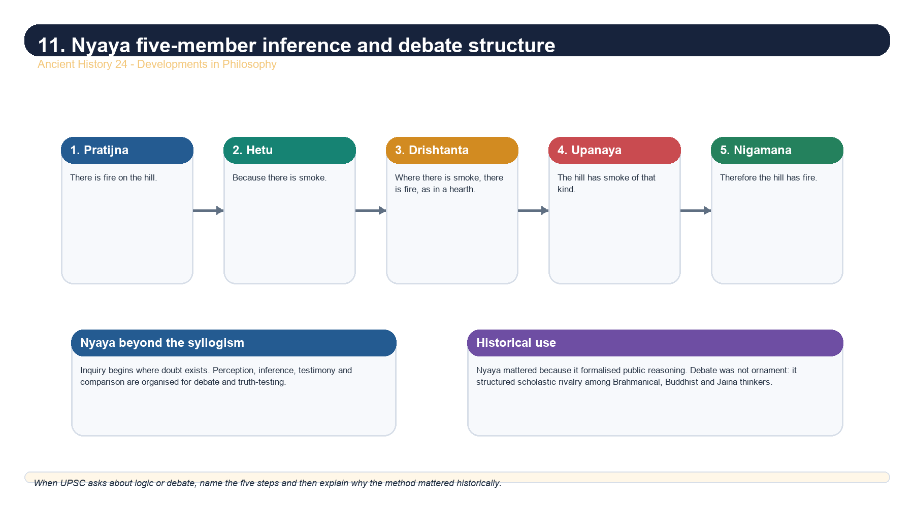

*The inference structure is shown through the classic smoke-fire example because UPSC usually tests form plus significance, not isolated technical jargon.*

### Nyaya essentials

| Feature | Safe meaning | Historical use |
|---|---|---|
| [FACT] Pratyaksha | perception | direct cognition |
| [FACT] Anumana | inference | proof beyond immediate perception |
| [FACT] Upamana | comparison / analogy | recognition by similarity |
| [FACT] Shabda | testimony | especially reliable verbal authority |
| [FACT] Five-member syllogism | formal inferential structure | debate and pedagogy |

### Core teaching / solved analysis

- [FACT] Nyaya begins from doubt and the need for determination, making it a powerful bridge between philosophy and disputation.
- [ANALYSIS] The school's historical significance lies not only in abstract logic, but in the disciplining of argumentative culture across Buddhist, Jaina and Brahmanical debates.
- [DEBATE] Later Nyaya becomes highly technical; Topic 24 stays with the classical historical markers.
- [LIMIT] "Nyaya = logic" is useful as shorthand, but the school also addresses self, error, liberation and epistemic trust.

### Must-know facts

- Nyaya is the premier logical-epistemological school in the classical list.
- Inference and debate are its best exam anchors.
- The five-member structure is a high-yield Prelims and short-note device.

### UPSC traps

- **Wrong:** Nyaya is simply temple architecture or literary style. **Correct:** Nyaya is a philosophical school of reasoning and proof.
- **Wrong:** Nyaya depends only on perception. **Correct:** it recognises multiple pramanas, including inference, analogy and testimony.

**Mains angle:** Use Nyaya to show that ancient Indian philosophy produced explicit public reasoning, not only mystical intuition.

**Study link:** Topic 24 Section 19 for the cross-school pramana comparison.

## 15. Vaisheshika: categories, substances and atomism

[FACT] Vaisheshika is the great classificatory-realist school of the orthodox list. It analyses reality through `padarthas` such as substance, quality, motion, universal, particularity, inherence and, in mature formulations, absence.

[FACT] It is also associated with atomistic explanation, especially for the material world, making it a major counterweight to over-spiritualised readings of ancient Indian thought.

[ANALYSIS] If Nyaya asks how claims are proved, Vaisheshika asks what kinds of things exist. Together they shape one of the most durable realist-intellectual formations in Indian philosophy.

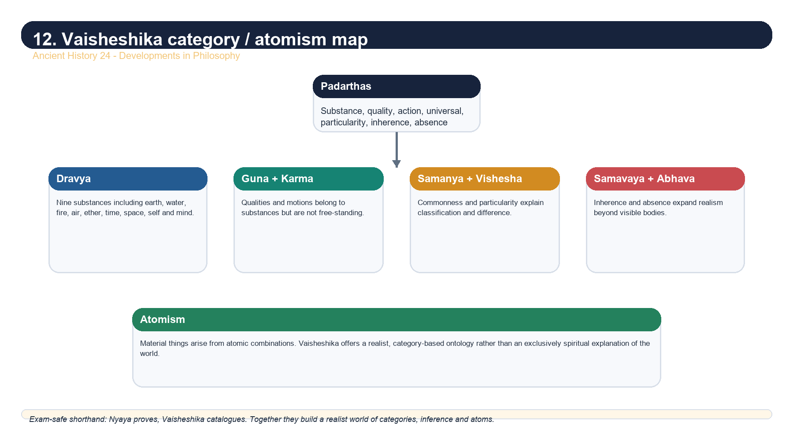

*The map foregrounds categories and atomism rather than later formula-memorisation.*

### Vaisheshika grid

| Category cluster | Why it matters |
|---|---|
| [FACT] Dravya | names the substantive bearers of qualities and action |
| [FACT] Guna / karma | explains attribute and motion without collapsing them into substance |
| [FACT] Samanya / vishesha | handles commonness and difference |
| [FACT] Samavaya | accounts for inherence |
| [FACT] Atomism | gives a realist account of material constitution |

### Core teaching / solved analysis

- [FACT] Vaisheshika's category-analysis helps explain why ancient Indian philosophy cannot be reduced to salvation-mysticism alone.
- [ANALYSIS] It provides an ontological map that can converse with Nyaya's epistemology and with other schools' causation theories.
- [DEBATE] Mature seven-category lists are later than the earliest intuitive core; Topic 24 therefore uses the category system historically, not dogmatically.
- [LIMIT] The school becomes entwined with Nyaya in later reception, but the conceptual distinction remains useful for GS answers.

### Must-know facts

- Vaisheshika is the category-and-atomism school.
- It is realist and classificatory.
- Padartha is the key technical term.

### UPSC traps

- **Wrong:** Vaisheshika is mainly a devotional school. **Correct:** it is an ontological and atomistic school.
- **Wrong:** Vaisheshika and Nyaya are identical from the beginning. **Correct:** they become closely linked, but their core emphases are distinct.

**Mains angle:** Pair Nyaya and Vaisheshika as proof plus ontology.

**Study link:** Topic 24 Section 20 for causation and realism comparison.

## 16. Purva Mimamsa: Vedic authority, dharma and ritual hermeneutics

[FACT] Purva Mimamsa is the great school of ritual exegesis and dharma. It asks how Vedic injunctions are to be interpreted, how duty is known and how proper performance carries force.

[FACT] Its philosophical importance lies in turning interpretation itself into a rigorous field: language, textual sequence, command, obligation and ritual efficacy become intellectually central.

[ANALYSIS] Mimamsa matters historically because it shows that ancient Indian philosophy did not move in one straight line from ritual to anti-ritual. Powerful traditions defended sacrificial and textual authority at a highly technical level.

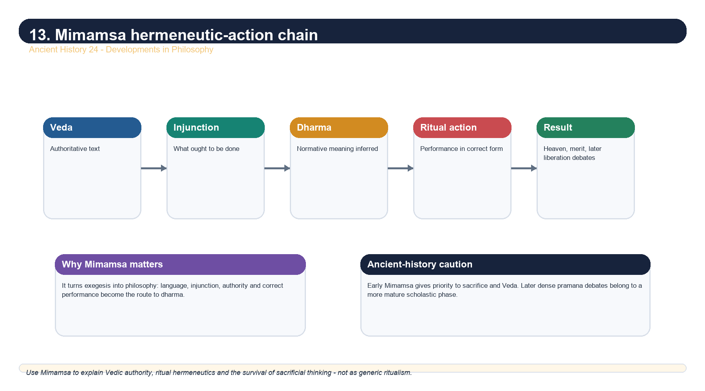

*The chain keeps the school tied to injunction, dharma and performance instead of reducing it to generic "ritualism."*

### Mimamsa focus

| Concern | Safe description |
|---|---|
| [FACT] Veda | authoritative verbal source |
| [FACT] Vidhi / injunction | what is to be done |
| [FACT] Dharma | obligation known through proper interpretation |
| [FACT] Ritual performance | site where textual command becomes action |
| [FACT] Hermeneutics | rules of interpretation and textual relation |

### Core teaching / solved analysis

- [FACT] Mimamsa prioritises Vedic authority without making God the necessary centre of the system's logic.
- [ANALYSIS] This makes it philosophically significant for law, language, duty and social order, not just for sacrificial ritual.
- [DEBATE] Later Mimamsa produces dense epistemological debates; Topic 24 keeps the ancient core on injunction and dharma.
- [LIMIT] Terms such as `apurva` may be mentioned as later explanatory devices, but GS-I answers should not drown in scholastic excess.

### Must-know facts

- Mimamsa is the dharma-and-ritual interpretation school.
- It defends Vedic authority through hermeneutics, not only through inherited prestige.
- It is a major counterweight to shramana anti-ritual pressure.

### UPSC traps

- **Wrong:** Mimamsa is just another name for Vedanta. **Correct:** Purva Mimamsa is ritual-hermeneutic; Uttara Mimamsa / Vedanta is Upanishadic-metaphysical.
- **Wrong:** Mimamsa is a crude survival of ritual with no philosophical depth. **Correct:** it is one of the strongest interpretive traditions in India.

**Mains angle:** Use Mimamsa to show continuity of Vedic authority within a changing intellectual field.

**Study link:** Topic 24 Section 17 for Vedanta; Topic 24 Section 18 for the role of language and interpretation.

## 17. Early Vedanta / Uttara Mimamsa: textual core and chronological boundaries

[FACT] Vedanta or Uttara Mimamsa grows from the Upanishadic corpus and is closely tied to the Brahma Sutra tradition associated with Badarayana. In Sharma's chronology, the Brahma Sutra belongs around the 2nd century CE, though exact dating remains debated.

[FACT] The safest ancient-history treatment is textual rather than sectarian: Upanishadic inquiry, Brahma Sutra synthesis and the early exegetical field.

[LIMIT] Later Advaita, Vishishtadvaita and Dvaita are indispensable for long-term Indian intellectual history, but full doctrinal ownership lies beyond the ancient-core frame of Topic 24. They should be signposted, not projected backward as if already fully settled in the early Upanishadic age.

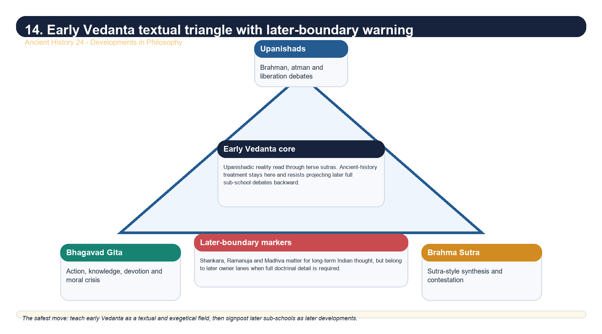

*The triangle emphasises texts and boundaries, not later sectarian back-projection.*

### Ancient core versus later boundary

| Layer | What Topic 24 owns | What Topic 24 only signposts |
|---|---|---|
| [FACT] Ancient textual base | Upanishads, Brahma Sutra, early exegetical field | full later doctrinal sub-school detail |
| [FACT] Early concern | brahman, atman, liberation, scriptural interpretation | later institutional maths and sectarian theology |
| [LIMIT] Chronology caution | layered redaction and commentary | false projection of 8th-12th century debates into 600 BCE |

### Core teaching / solved analysis

- [FACT] Vedanta is the classic school that makes Upanishadic speculation the centre of philosophical systematisation.
- [ANALYSIS] Its importance lies not only in metaphysical claims, but in the very attempt to harmonise, rank and interpret diverse shruti statements.
- [DEBATE] Later doxographies often let one Vedantic school appear as the summit of all philosophy. This is historically valuable evidence of later intellectual politics, not proof that the ancient field always looked that way.
- [LIMIT] Because later Vedanta is so famous, students often over-write the ancient section. The safer move is to anchor Vedanta to texts, not to later sectarian summary charts.

### Must-know facts

- Brahma Sutra / Badarayana is the key textual anchor.
- Vedanta means the "end" or culmination of Vedic / Upanishadic inquiry.
- Later Advaita, Vishishtadvaita and Dvaita are boundary markers, not the whole ancient story.

### UPSC traps

- **Wrong:** all Vedanta is simply Shankara. **Correct:** Shankara is a later major interpreter, not the whole Vedantic field.
- **Wrong:** Vedanta existed in finished sectarian form in the earliest Upanishadic era. **Correct:** ancient textual base and later scholastic elaboration must be separated.

**Mains angle:** Treat early Vedanta as exegetical systematisation of Upanishadic concerns.

**Study link:** Art and Culture Topic 13 for later Vedanta doctrinal routes where owner-bound.

## 18. Grammar, language and philosophy: Panini, Katyayana, Patanjali and the language turn

[FACT] Panini, Katyayana and Patanjali show that language itself became a major site of ancient Indian intellectual labour. Grammar was not mere linguistic housekeeping; it was a disciplined technology of thought.

[FACT] Upinder Singh highlights Panini as a master grammarian whose Ashtadhyayi was compiled in sutra form, Katyayana's varttikas as refinements, and Patanjali's Mahabhashya as a monumental commentary that already comments on pedagogical decline and careless students.

[ANALYSIS] Language mattered because exegesis, debate, memory, law, kingship, ritual and philosophy all depended on controlled verbal precision.

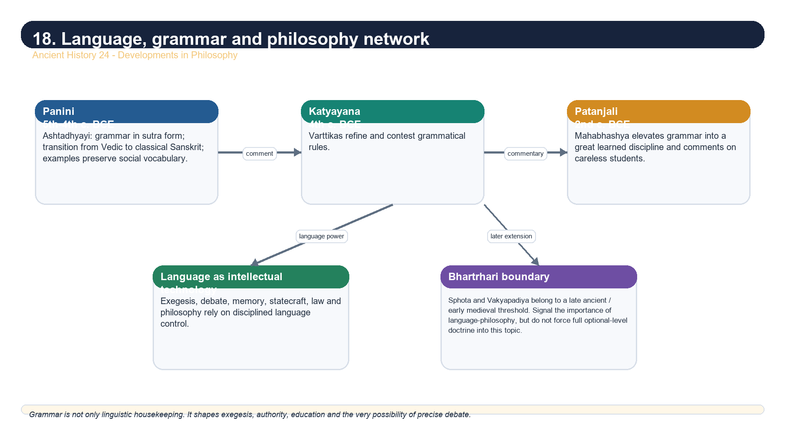

*The network shows grammar as an intellectual infrastructure connecting commentary, debate and social order.*

### Grammar-philosophy grid

| Figure / layer | Historical role | Why Topic 24 cares |
|---|---|---|
| [FACT] Panini | sutra grammar; transition toward classical Sanskrit | precision, analysis and linguistic ordering |
| [FACT] Katyayana | critical supplements / varttikas | grammar as an evolving debate field |
| [FACT] Patanjali | Mahabhashya commentary | language, pedagogy and interpretive depth |
| [LIMIT] Bhartrhari boundary | philosophy of language and sphota at late-ancient threshold | signpost only; do not let it overtake the topic |

### Core teaching / solved analysis

- [FACT] Grammar belongs inside ancient philosophical history because argument about meaning, correctness and verbal authority underpins Mimamsa, Nyaya and Vedic exegesis.
- [ANALYSIS] A civilisation that preserved texts orally, argued publicly and commented obsessively had to make language itself a philosophical object.
- [DEBATE] Bhartrhari's later philosophy of language is important for long-term intellectual history, but Topic 24 only signals it as a threshold development.
- [LIMIT] Do not confuse Patanjali the grammarian with later Yoga appropriations of the name in a simplistic way.

### Must-know facts

- Panini, Katyayana and Patanjali form the major grammar chain.
- Grammar is a philosophical infrastructure, not a side topic.
- Language precision underwrites ritual interpretation and logical debate alike.

### UPSC traps

- **Wrong:** grammar is unrelated to philosophy. **Correct:** ancient Indian philosophy repeatedly depends on verbal precision, textual interpretation and semantic control.
- **Wrong:** Bhartrhari must be fully taught here as if Topic 24 were philosophy of language optional. **Correct:** mention the boundary and move on.

**Mains angle:** Insert one line on grammar when discussing textual transmission, proof or Vedic authority.

**Study link:** Art and Culture Topic 11 for broader literature-manuscript context.

## 19. Epistemology in comparison: pramanas across schools

[FACT] Ancient Indian schools repeatedly argue over valid knowledge (`pramana`). The central routes are perception, inference, testimony, comparison, postulation and non-cognition, though no single school accepts the same full list in the same way.

[ANALYSIS] A comparative pramana map is one of the fastest ways to answer a cross-school question. It shows who trusted what, and why.

[LIMIT] Mature six-pramana lists are later scholastic formulations. Do not back-project them into the earliest Vedic or shramana horizon without qualification.

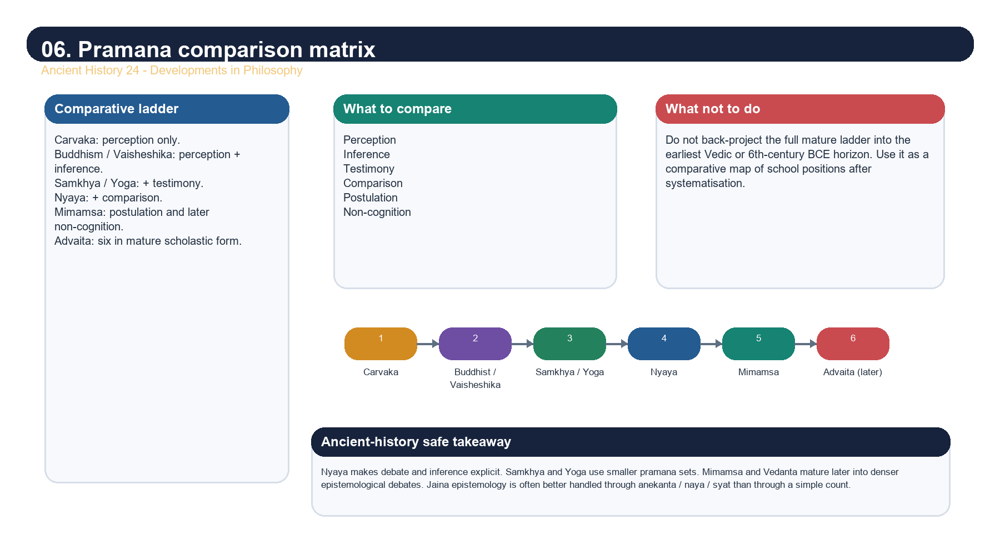

*The matrix is intentionally comparative and flagged with an anachronism warning so that the learner does not flatten chronology.*

### Comparative pramana table

| School / cluster | Common exam-safe pramana line | Best caution |
|---|---|---|
| [FACT] Charvaka | perception privileged | reject unseen metaphysical inference more than daily practical expectation |
| [FACT] Buddhism / Vaisheshika | perception and inference central | sub-school detail varies |
| [FACT] Samkhya / Yoga | perception, inference, testimony | keep the set smaller than Nyaya or Mimamsa |
| [FACT] Nyaya | perception, inference, comparison, testimony | remember debate context |
| [FACT] Mimamsa / later Vedanta | larger pramana acceptance including postulation and non-cognition in mature phases | do not back-project mature list too early |
| [ANALYSIS] Jainism | better remembered through standpoint logic and qualified judgement | simple counts can mislead |

### Core teaching / solved analysis

- [FACT] Pramana disputes are not empty technicalities; they decide what counts as proof, authority, error and liberation-worthy knowledge.
- [ANALYSIS] Once the learner knows each school's preferred pramanas, many doctrinal differences become easier to organise.
- [DEBATE] Some school positions change across commentators and phases; treat the table as a strong map, not as frozen metaphysical law.
- [LIMIT] Ancient History needs comparative clarity, not advanced formal logic.

### Must-know facts

- Pramana means valid means of knowledge.
- Perception and inference are the most widely contested anchors.
- Nyaya is the strongest gateway school for comparative epistemology.

### UPSC traps

- **Wrong:** every school accepted six pramanas. **Correct:** pramana counts and emphases vary sharply.
- **Wrong:** Charvaka is only hedonism. **Correct:** its epistemic challenge to unseen claims is historically central.

**Mains angle:** Use the pramana grid to compare schools efficiently under exam pressure.

**Study link:** Topic 24 Sections 14-17 for school-specific anchors.

## 20. Metaphysics in comparison: self, causation, substance, process and reality

[FACT] Ancient Indian philosophical traditions disagree not only about proof, but about what the world and the person fundamentally are: self, no-self, witness, soul, atoms, conditioned process, karmic matter or ultimate reality.

[ANALYSIS] This is where students often write vague words like "spirituality." A better answer compares schools across a few hard axes: self/no-self, causation, substance/process and universal/particular.

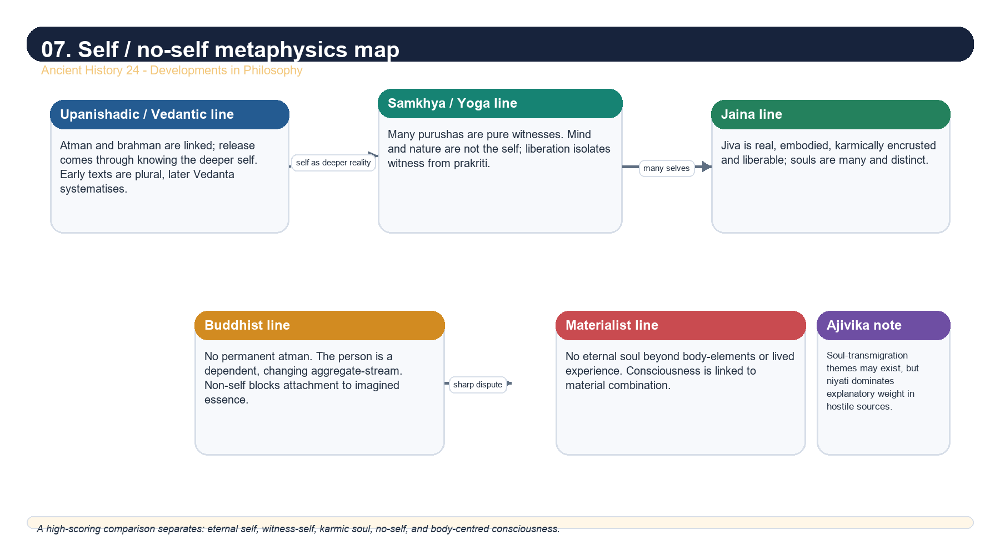

*This map visually separates eternal self, witness-self, karmic soul, no-self and materialist body-centred lines.*

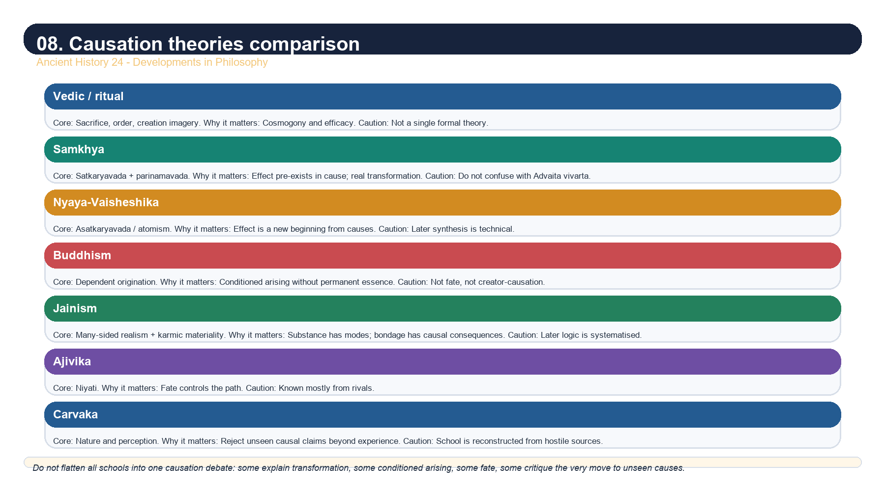

*The causation panel prevents one-school causation language from being imposed on the rest.*

### Comparison grid

| School / stream | Self | Causation / reality | Fast contrast |
|---|---|---|---|
| [FACT] Upanishadic / early Vedantic | deeper self linked to ultimate reality | reality interpreted through brahman-centred speculation | self-centred liberation |
| [FACT] Samkhya-Yoga | many purushas, witness-consciousness | real transformation of prakriti | dualist witness model |
| [FACT] Buddhism | no permanent self | dependent origination, process-thinking | anti-essentialist line |
| [FACT] Jainism | many real souls bound by karmic matter | many-sided realism | plural soul realism |
| [FACT] Nyaya-Vaisheshika | enduring self plus realism about substances | inference and category-driven causation | realist ontological line |
| [FACT] Charvaka | no eternal soul beyond body-centred material life | naturalist / perceptual line | anti-metaphysical unseen claims |
| [FACT] Ajivika | fate-heavy worldview in hostile reports | niyati central | determinist contrast |

### Core teaching / solved analysis

- [FACT] Selfhood is the cleanest comparison axis: atman, purusha, jiva, anatman and materialist anti-afterlife positions cannot be collapsed into one vocabulary.
- [FACT] Causation is the second clean axis: satkaryavada, asatkaryavada, dependent origination, karmic material bondage and niyati represent genuinely different explanatory worlds.
- [ANALYSIS] The best comparative answer never says "all schools sought liberation" and stops there. It shows what kind of world each school thought we were trapped in.
- [LIMIT] Idealism versus realism is a useful but partial modern shorthand; ancient concepts should still be named in their own terms.

### Must-know facts

- Self / no-self is an exam-high-yield contrast.
- Samkhya causation is not Buddhist dependent origination.
- Jaina many-sided realism is different from both Vedantic identity and Buddhist no-self.

### UPSC traps

- **Wrong:** all Indian schools believe in one eternal self. **Correct:** Buddhism and Charvaka sharply resist that claim, and Samkhya's purusha is not the same as Vedantic brahman-atman identity.
- **Wrong:** emptiness, fate, atomism and satkaryavada are interchangeable "theories of reality." **Correct:** they address reality from different conceptual premises.

**Mains angle:** Structure the comparison around self, causation and liberation-path rather than around school names alone.

**Study link:** Topic 24 Sections 6-17 for the school-specific evidence blocks.

## 21. Debate institutions, transmission and patronage

[FACT] Ancient Indian philosophy lived in institutions: forest teachers, household lineages, monasteries, courts, public disputations, scholarly commentaries, scriptorial and oral transmission chains.

[FACT] Sutra form, bhashya, vritti and tika traditions show that philosophical knowledge was compressed, taught, debated and expanded over time rather than delivered in one final canonical paragraph.

[ANALYSIS] Institutions matter because they explain how ideas persisted, specialised, recruited followers and competed for authority. They also explain why some traditions are text-rich while others survive only in rivals' accounts.

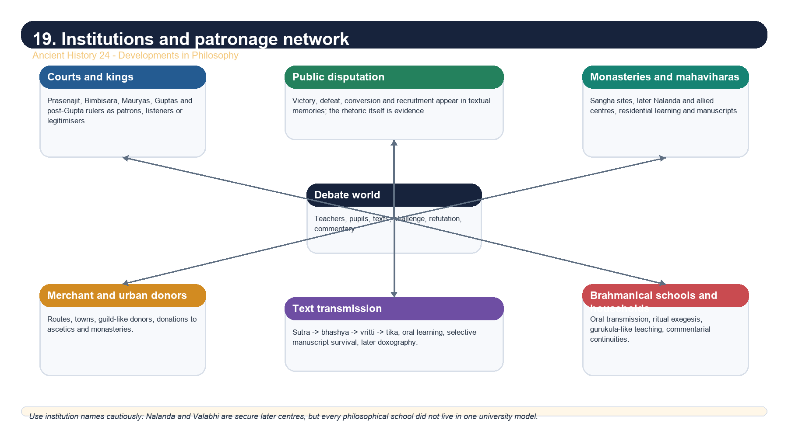

*The network diagram shows courts, monasteries, donors, textual chains and debate as interacting supports of intellectual life.*

### Institution matrix

| Institution / support | What it did | Best caution |
|---|---|---|
| [FACT] Household and lineage teaching | oral preservation, Vedic learning, grammar, Mimamsa continuity | [LIMIT] not all philosophy was monastic |
| [FACT] Monasteries / sangha / mahaviharas | Buddhist and sometimes wider scholastic depth, residential training, manuscripts | [LIMIT] Nalanda and Valabhi are important but should not stand in for every school |
| [FACT] Courts and rulers | patronage, prestige, debate arenas, legitimation | [LIMIT] royal patronage does not prove doctrinal authorship |
| [FACT] Merchant and urban donors | support for ascetics, monasteries and institutions | [LIMIT] donor support does not fix doctrine |
| [FACT] Commentarial chains | preserve and reshape meaning | [LIMIT] commentary is interpretation, not transparent transmission |

### Core teaching / solved analysis

- [FACT] Public disputation mattered historically because victory, refutation and recruitment were part of intellectual prestige.
- [FACT] Monasteries and universities such as Nalanda or Valabhi can be used only with evidence-bounded caution: they are important centres, but not universal containers of every philosophy.
- [ANALYSIS] Oral transmission and sutra compression help explain both durability and ambiguity. Brevity invited commentary; commentary created schools.
- [DEBATE] Surviving texts often reflect institutional winners more clearly than institutional losers.
- [LIMIT] Manuscript survival is late and uneven. Absence of manuscripts is not proof of absence of thought.

### Must-know facts

- Sutra -> commentary -> sub-commentary is a major historical pattern.
- Institutions of debate and patronage shaped visibility and survival.
- Monasteries, courts and lineages all matter; no single institutional model explains the whole field.

### UPSC traps

- **Wrong:** all ancient philosophy was private mystical reflection. **Correct:** much of it was taught, contested and institutionally reproduced.
- **Wrong:** Nalanda explains the whole philosophical world. **Correct:** it is a major Buddhist centre, not a universal shorthand for all Indian philosophy.

**Mains angle:** Add one sentence on institutional life whenever you discuss scholastic expansion.

**Study link:** Art and Culture Topic 11 for manuscript afterlives; Topic 10 for Buddhist institutional routes.

## 22. Ethics, liberation, pluralism, historiography and owner boundaries

[FACT] Ancient Indian philosophy repeatedly joined ethics and liberation: knowledge, action, discipline, restraint, compassion, non-violence, renunciation, household duty and political order all enter the field in different combinations.

[ANALYSIS] The field's great historical significance lies in its pluralism. Schools borrowed, criticised and sharpened one another. Buddhism, Jainism, Mimamsa, Nyaya, Vedanta, Samkhya, Yoga, Ajivika and Charvaka did not simply coexist; they co-produced an argumentative civilisation.

[DEBATE] This pluralism must still be written carefully. "Hindu philosophy" is a retrospective shorthand; astika/nastika is historically variable; later school-boundaries are cleaner on paper than in long historical formation; philosophical ideals often diverged from lived social practice.

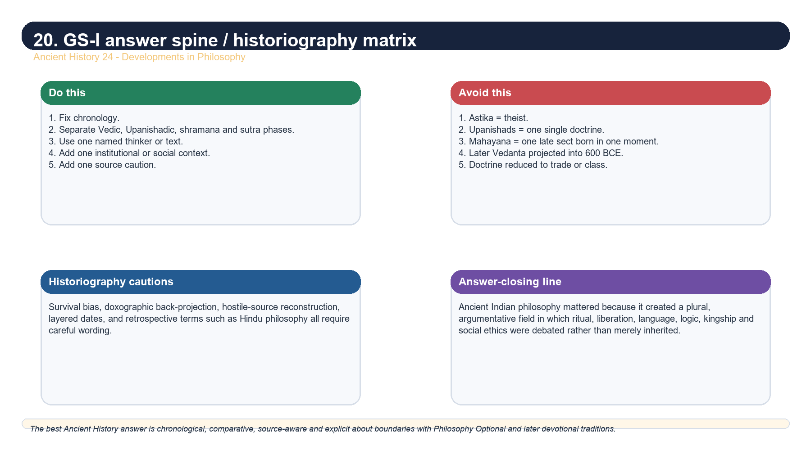

*The answer spine converts the entire topic into a scoring method: chronology, comparison, source caution, significance and boundary-control.*

### Owner-boundary matrix

| Topic 24 fully owns | Topic 24 signposts but does not absorb |
|---|---|
| [FACT] Vedic-Upanishadic to late-ancient philosophical development | full Philosophy Optional doctrinal criticism-reply traditions |
| [FACT] Ajivika, Charvaka, six-school cores, pramana comparison, debate institutions | full Buddhism / Jainism religious history already owner-deep in Topic 10 |
| [FACT] grammar and language as intellectual infrastructure | full Bhakti, later Vedanta and Ramanuja-Madhva owner lanes |
| [FACT] historiographical cautions | monument-form ownership in Art and Culture Topic 13 |

### Core teaching / solved analysis

- [FACT] Purushartha language - dharma, artha, kama, moksha - helps connect philosophy with social ethics, although the mature fourfold synthesis is historically layered.
- [ANALYSIS] Distinguish philosophical ideals from everyday social practice. A doctrine of ahimsa, liberation or equality does not prove uniform social transformation.
- [FACT] Mutual borrowing and polemic are both central: debate sharpened categories across schools.
- [DEBATE] Retrospective labels can hide fragmentation, regionality and textual loss. Source criticism is therefore not an optional appendix.
- [LIMIT] A GS-I answer should be conceptually rich but not optional-level over-technical.

### Must-know facts

- Ancient Indian philosophy is plural, argumentative and institutionally sustained.
- School boundaries are historically layered.
- Owner boundaries protect the answer from drifting into Bhakti, medieval Vedanta or optional-level doctrinal overload.

### UPSC traps

- **Wrong:** astika means theist and nastika means atheist. **Correct:** classification is historically relative and polemical.
- **Wrong:** philosophy alone explains social practice. **Correct:** distinguish doctrine, institution, patronage and lived society.

**Mains angle:** Conclude with pluralism, mutual critique and the making of an argumentative civilisation.

**Study link:** Topic 10 for Buddhism/Jainism owner depth; Art and Culture Topic 13 for philosophy-art adjacency; later devotional and medieval Vedanta owners for post-ancient elaboration.

# PART II - Learning MCQ loops

## Learning MCQ 01

The safest translation of `darshana` in the context of ancient Indian philosophy is:

- A. military ordinance
- B. view or way of seeing
- C. monastery revenue code
- D. ritual tax

**Answer: B.** `Darshana` literally means "view." It points to a philosophical standpoint or way of seeing reality, not simply to a later list of schools.

## Learning MCQ 02

Kautilya's use of `anviksiki` is most useful for Topic 24 because it shows that:

- A. all philosophy was anti-state
- B. the Vedas were rejected by the state
- C. inquiry was recognised as a distinct knowledge-branch
- D. Buddhist logic already dominated Mauryan courts

**Answer: C.** The fourfold classification around anviksiki, trayi, varta and dandaniti shows inquiry as a named branch of learning, though the text itself is chronologically layered.

## Learning MCQ 03

Which statement about the Nasadiya Sukta is safest?

- A. It is a finished Charvaka manifesto.
- B. It proves that Vedic religion rejected sacrifice.
- C. It is the earliest full Vedanta commentary.
- D. It preserves speculative questioning and epistemic restraint about creation.

**Answer: D.** The hymn is valuable because it shows questioning, not because it already contains a complete later school.

## Learning MCQ 04

Early Upanishads are best described as:

- A. post-Puranic sectarian texts
- B. manuals of temple construction
- C. Jain Agamas
- D. part of the Vedic corpus that redirects attention toward knowledge and self

**Answer: D.** They remain within shruti while transforming the centre of gravity from ritual explanation toward philosophical interiorisation.

## Learning MCQ 05

The most accurate statement about the "second urbanisation" is:

- A. It enabled wider debate and patronage, but does not mechanically explain every doctrine.
- B. It automatically produced Buddhism and Jainism as identical protest movements.
- C. It ended all sacrificial traditions immediately.
- D. It proves philosophy was only an economic reflex.

**Answer: A.** The context mattered greatly, but doctrinal content still needs its own intellectual history.

## Learning MCQ 06

The early Buddhist doctrine of `anatman` most directly denies:

- A. all worldly suffering
- B. karma
- C. a permanent independent self
- D. ethical effort

**Answer: C.** Non-self attacks the idea of an enduring self-substance; it does not deny conventional life or moral effort.

## Learning MCQ 07

Which statement about Madhyamaka is safest?

- A. It teaches pure fate.
- B. It teaches the worship of one creator deity.
- C. It is a Jaina doctrine of many-sidedness.
- D. It argues that things lack inherent self-existing essence.

**Answer: D.** Emptiness in Madhyamaka means lack of independent inherent existence, not annihilation or nihilism.

## Learning MCQ 08

The best one-line description of Jaina `anekantavada` is:

- A. nothing is true
- B. only monastic life is valid
- C. reality is many-sided and cannot be exhausted by one absolute statement
- D. all contradictory statements are equally correct

**Answer: C.** It is a doctrine of many-sided reality, not a surrender of truth.

## Learning MCQ 09

The strongest secure Ajivika anchor is:

- A. a complete surviving canonical corpus
- B. niyati in hostile sources plus inscriptional patronage markers
- C. Upanishadic authorship
- D. direct ownership of Nalanda

**Answer: B.** Ajivika history is thin, but niyati and Mauryan cave patronage give real though limited anchors.

## Learning MCQ 10

Which is the safest Charvaka statement?

- A. It is one of the six orthodox systems.
- B. It privileges perception and rejects many unseen ritual or afterlife claims.
- C. It accepts Vedic ritual as final authority.
- D. It survives through a full founder-text.

**Answer: B.** Charvaka is preserved largely through opponents and is most securely associated with perceptual materialism and anti-ritual critique.

## Learning MCQ 11

Why is `astika = theist` an unsafe shortcut?

- A. because Samkhya and Mimamsa are modern ideologies
- B. because the words never appear in any source
- C. because historical criteria include Vedic authority or other-world assumptions, not simply belief in God
- D. because Buddhists accepted the Veda

**Answer: C.** The classification is historical and polemical; theism alone is too blunt.

## Learning MCQ 12

Samkhya is best remembered in Topic 24 for:

- A. bhakti to a personal god
- B. one universal soul identical with all reality
- C. medieval temple ritual
- D. purusha-prakriti dualism and satkaryavada

**Answer: D.** Samkhya gives a major dualist cosmology with real transformation of prakriti.

## Learning MCQ 13

`Citta-vritti-nirodha` belongs most directly to:

- A. Yoga
- B. Vaisheshika
- C. Charvaka
- D. Ajivika

**Answer: A.** It is the classic Yoga formulation of mind-discipline and the path to experiential release.

## Learning MCQ 14

The five-member inference is most strongly associated with:

- A. Mimamsa
- B. Vedanta
- C. Jaina canon
- D. Nyaya

**Answer: D.** Nyaya formalises public reasoning through pramanas, doubt and inferential structure.

## Learning MCQ 15

Which pair is correctly matched?

- A. Vaisheshika - temple bhakti
- B. Mimamsa - Vedic injunction and ritual hermeneutics
- C. Yoga - atomism
- D. Vedanta - only political economy

**Answer: B.** Mimamsa is the school of Vedic interpretation and dharma-centred ritual exegesis.

## Learning MCQ 16

The safest final line for a GS-I answer on ancient Indian philosophy is:

- A. all schools said the same thing
- B. only spirituality mattered
- C. philosophy had no relation to institutions
- D. ancient India developed a plural argumentative civilisation sustained by debate, texts and patronage

**Answer: D.** That conclusion captures plurality, institutions and historical significance without forcing sameness.

# PART III - Solved practice workbook content

## Solved topic-specific MCQs

> Objective answers without a secure local official key are labelled inferred, translated or adjacent exactly as required.

## Verified PYQ 1 - Prelims GS-I 2024 Q58 (exact wording locally preserved)

Consider the statements:

1. There are no parables in Upanishads.
2. Upanishads were composed earlier than the Puranas.

Which statement(s) is/are correct?

**Status:** Official local Set-A question paper and official Series-A answer key were already validated in Topic 09. Official answer: **B, statement 2 only**.

**Explanation:** Statement 1 is incorrect because early Upanishads teach through dialogues, stories, analogies and paradoxes. Uddalaka's teaching to Shvetaketu is a standard narrative-analogy anchor. Statement 2 is correct because the early Upanishadic corpus belongs to the later Vedic / early first-millennium BCE horizon, whereas the Puranas were compiled and expanded much later over long centuries. [LIMIT] Exact dates of individual Upanishads and Puranic layers remain debated, but the relative chronology tested here is secure.

**Why this earns marks:** It answers at the level of both statement logic and source chronology, which is exactly what the Prelims trap is testing.

## Routed PYQ 2 - Prelims GS-I 2022 Q56 (faithful English rendering from locally preserved Hindi paper; official key unavailable locally)

Consider the following pairs:

1. Aryadeva - Jaina scholar  
2. Dignaga - Buddhist scholar  
3. Nathamuni - Vaishnava scholar

How many pairs given above are correctly matched?

**Status:** The local official paper page is preserved and was visually checked, but the accessible preserved question page is Hindi. The rendering above is faithful in content, not claimed as locally verified official English wording. No official local answer key is held.

**Answer / route:** **Only two pairs are correct.**

- Aryadeva is not a Jaina scholar in this route; he is a Buddhist thinker associated with the Madhyamaka tradition.
- Dignaga is correctly identified as a Buddhist scholar and later logician.
- Nathamuni is correctly identified as a Vaishnava scholar associated with collecting the Alvar hymns into the Nalayira Divya Prabandham.

**Why this earns marks:** It solves the exact conceptual demand honestly without inventing a missing official key or pretending that the English wording was locally preserved when it was not.

## Adjacent PYQ 3 - GS-I Mains 2020 Q11 (adjacent owner route, verbatim demand preserved in Art and Culture owner)

Indian philosophy and tradition played a significant role in conceiving and shaping the monuments and their art in India. Discuss. (250 words)

**Status:** This demand is owner-routed to Indian Art and Culture Topic 13, not to Topic 24. It is included here because a student preparing Topic 24 should still understand how philosophical concepts move outward into artistic form without collapsing art history into pure doctrine.

**Model answer:** [CLAIM] Indian monuments and art were not mechanically "designed by philosophy," but philosophical traditions strongly shaped their symbolic programmes, ritual use and visual logic. [NAMED EVIDENCE -> MECHANISM] Buddhist ideas of relic veneration, sacred presence and the path generated the stupa form, circumambulation and narrative reliefs. Jaina ideals of renunciation, tirthankara veneration and ordered cosmology informed cave shrines and later iconographic discipline. Brahmanical and Upanishadic-Vedantic currents shaped temple iconography through cosmic ordering, sacred axis, image as embodied divinity and the integration of dharma, artha, kama and moksha within sacred space. Bhakti and sectarian theology later deepened this logic through Shaiva and Vaishnava image programmes. [QUALIFICATION] Yet philosophy was never the sole cause: patronage, craft skill, materials, regional politics and donor communities also mattered. [VERDICT] Indian philosophy and tradition therefore shaped monument conception most strongly at the level of sacred meaning, symbolic programme and ritual use, while actual built form emerged through interaction with society, patronage and technology.

**Why this earns marks:** It links concept to monument without making the false claim that one doctrine mechanically "produced" one form.

### Workbook MCQ 01

The safest meaning of `darshana` in ancient Indian philosophy is:

- A. a view or way of seeing reality
- B. a temple-tax assessment
- C. a grammatical accent mark
- D. a dynastic genealogy

**Answer: A.** `Darshana` literally means view. It is best handled as a philosophical standpoint rather than as a mere exam list.

### Workbook MCQ 02

In the Arthashastra tradition, anviksiki is placed alongside:

- A. bhakti, tantra and temple ritual
- B. trayi, varta and dandaniti
- C. Ayurveda, music and drama
- D. sculpture, painting and dance

**Answer: B.** The classification marks inquiry as a distinct knowledge-branch next to Vedic learning, economic activity and governance.

### Workbook MCQ 03

The safest reading of the Nasadiya Sukta is that it:

- A. proves the later Vedanta doctrine of maya
- B. is a complete Ajivika text on fate
- C. preserves speculative questioning about creation without becoming a finished later school
- D. abolishes sacrifice in the Vedic world

**Answer: C.** Its importance lies in radical questioning and epistemic restraint, not in supplying a ready-made later doctrine.

### Workbook MCQ 04

Early Upanishads are best understood as:

- A. post-Gupta Puranic compilations
- B. purely secular court manuals
- C. anti-Vedic tracts from outside shruti
- D. part of the Vedic corpus that redirects attention toward knowledge, self and release

**Answer: D.** They remain within shruti even while transforming the meaning of ritual and authority.

### Workbook MCQ 05

Which feature most strongly supports the statement that the Upanishads do contain parabolic or narrative teaching?

- A. dialogues, analogies and story-based instruction
- B. temple ground-plans
- C. merchant guild charters
- D. Mauryan cave donations

**Answer: A.** Narrative pedagogy is a real feature of early Upanishadic instruction.

### Workbook MCQ 06

The best statement about the second urbanisation as a philosophical background is that it:

- A. automatically produced one single heterodox ideology
- B. widened the space for debate, renunciation and patronage without by itself fixing every doctrine
- C. ended Vedic learning immediately
- D. makes doctrinal study unnecessary

**Answer: B.** It is enabling background, not an all-purpose explanation of content.

### Workbook MCQ 07

In early Buddhism, `anatman` most directly means:

- A. worship of one universal soul
- B. denial of ethical causation
- C. denial of a permanent independent self
- D. denial of all conventional personhood

**Answer: C.** Buddhism denies a fixed self-substance, not the practical existence of persons and consequences.

### Workbook MCQ 08

Abhidharma is best described as:

- A. a Vedic ritual manual
- B. a Jaina lay-ethics text
- C. a Persian translation movement
- D. a Buddhist analytic scholastic effort to classify teachings, states and paths

**Answer: D.** It signals the growth of systematic Buddhist analysis after the earliest teaching layer.

### Workbook MCQ 09

Which statement about Madhyamaka is safest?

- A. It teaches emptiness as absence of inherent self-existing essence.
- B. It teaches that fate alone governs the world.
- C. It is a pure ritual school defending sacrifice.
- D. It proves that nothing at all exists.

**Answer: A.** Shunyata is a critique of inherent existence, not a claim that all reality is nullity.

### Workbook MCQ 10

Yogacara is most safely introduced in Ancient History as:

- A. a doctrine of creator-God theism
- B. a Buddhist analysis of cognition or representation within Mahayana scholasticism
- C. a branch of Vedic sacrifice
- D. a medieval temple tax system

**Answer: B.** Topic 24 needs the bounded historical idea, not a caricature or optional-level expansion.

### Workbook MCQ 11

`Anekantavada` in Jain philosophy means:

- A. denial of karma
- B. absolute scepticism about all truth
- C. many-sidedness of reality
- D. only ascetics can know anything

**Answer: C.** It insists that reality exceeds one rigid, one-sided verbal capture.

### Workbook MCQ 12

`Syadvada` is best described as:

- A. atomism
- B. monastic taxation
- C. a creator-God doctrine
- D. qualified predication from a given standpoint or condition

**Answer: D.** It disciplines judgement through the language of conditional assertion.

### Workbook MCQ 13

Which is the strongest secure Ajivika anchor?

- A. niyati in hostile sources plus rare inscriptional and patronage markers
- B. a large surviving canonical library
- C. ownership of the six-school canon
- D. direct authorship of the Brahma Sutra

**Answer: A.** Ajivikas are historically real, but the archive is thin and often adversarial.

### Workbook MCQ 14

Charvaka / Lokayata is most strongly associated with:

- A. six-pramana scholasticism
- B. privileging perception and criticising many unseen ritual or afterlife claims
- C. the eightfold path
- D. karmic matter binding the soul

**Answer: B.** Perception and anti-supernatural critique are its safest markers.

### Workbook MCQ 15

Why is `astika = theist` an unsafe formula?

- A. because all astika schools worship the same deity
- B. because the terms mean only political loyalty
- C. because historical criteria include Vedic authority or other-world assumptions, not simply belief in God
- D. because no source uses the terms at all

**Answer: C.** The labels are classificatory and polemical; they are not simple God/no-God badges.

### Workbook MCQ 16

The neat list of six orthodox systems should be treated as:

- A. a Rigvedic-era canon
- B. a Mauryan examination syllabus
- C. a list fixed by Panini
- D. a later doxographic crystallisation applied to older uneven traditions

**Answer: D.** The traditions are old, but the neat grouped canon is later.

### Workbook MCQ 17

The central Samkhya pair is:

- A. purusha and prakriti
- B. jiva and ajiva
- C. nirvana and samsara
- D. dravya and guna

**Answer: A.** Witness-consciousness and primordial nature are the foundational Samkhya distinction.

### Workbook MCQ 18

`Satkaryavada` means that:

- A. fate is the only cause
- B. the effect pre-exists in the cause
- C. ritual alone produces all knowledge
- D. universals are unreal

**Answer: B.** This is Samkhya's best-known causation marker.

### Workbook MCQ 19

`Citta-vritti-nirodha` is most directly linked to:

- A. Mimamsa
- B. Vaisheshika
- C. Yoga
- D. Charvaka

**Answer: C.** The formula expresses Yoga's project of disciplining the mind toward release.

### Workbook MCQ 20

Nyaya is most distinctively remembered for:

- A. karmic matter
- B. temple sculpture
- C. royal genealogy
- D. pramanas, inference and structured debate

**Answer: D.** Nyaya's historical strength is public reasoning and proof.

### Workbook MCQ 21

Vaisheshika is best described as the school of:

- A. categories / padarthas and atomistic realism
- B. exclusive devotional surrender
- C. the monastic Vinaya
- D. Persian political ethics

**Answer: A.** If Nyaya proves, Vaisheshika classifies what kinds of things exist.

### Workbook MCQ 22

Purva Mimamsa is most closely associated with:

- A. non-self
- B. Vedic injunction, dharma and ritual hermeneutics
- C. emptiness of inherent existence
- D. materialist rejection of scripture

**Answer: B.** It is the major interpretive school of Vedic authority and action.

### Workbook MCQ 23

The safest Ancient History description of Vedanta is:

- A. only Shankara's Advaita
- B. only temple bhakti
- C. an Upanishad-and-Brahma-Sutra-centred exegetical field whose later sectarian systems should be clearly bounded
- D. identical with Samkhya

**Answer: C.** Topic 24 owns the ancient textual base and must signpost later full doctrines as later developments.

### Workbook MCQ 24

The Panini -> Katyayana -> Patanjali chain is important because it shows:

- A. grammar had no relation to philosophy
- B. Sanskrit replaced all Prakrits immediately
- C. language only mattered for poetry
- D. grammar became a rigorous intellectual technology with rule, critique and commentary

**Answer: D.** This chain underwrites exegesis, memory and verbal precision across schools.

### Workbook MCQ 25

In the 2022 routed scholar-identification demand, Dignaga is correctly identified as:

- A. a Buddhist scholar
- B. a Jaina Tirthankara
- C. a Pallava ruler
- D. a Vedic rishi

**Answer: A.** Dignaga belongs to the Buddhist scholastic and logical tradition at the late-ancient boundary.

### Workbook MCQ 26

Nathamuni is correctly identified as:

- A. a Madhyamaka monk
- B. a Vaishnava scholar associated with the Alvar hymn tradition
- C. an Ajivika ascetic
- D. a Charvaka founder

**Answer: B.** He is connected with collecting the Alvar hymns into the Nalayira Divya Prabandham.

### Workbook MCQ 27

The safest caution when using pramana tables is that:

- A. all schools accepted the same six pramanas from the earliest Vedic age
- B. pramanas do not matter in Indian philosophy
- C. mature comparative ladders are useful, but should not be back-projected unchanged into the earliest phases
- D. only Nyaya used perception

**Answer: C.** Comparative clarity is valuable, but chronology still matters.

### Workbook MCQ 28

Dependent origination differs from Ajivika `niyati` because dependent origination:

- A. denies causation completely
- B. proves one eternal soul
- C. is a theory of atomism
- D. explains conditioned arising rather than pure fate-driven inevitability

**Answer: D.** It is relational and conditional, not deterministic in the Ajivika sense.

### Workbook MCQ 29

The sequence `sutra -> bhashya -> vritti -> tika` most strongly indicates:

- A. a compressed-text tradition that invited commentary and school formation
- B. total absence of oral teaching
- C. the end of debate
- D. purely political record-keeping

**Answer: A.** Compression and commentary are key reasons why school identities deepen over time.

### Workbook MCQ 30

Nalanda and Valabhi should be used in Topic 24 as:

- A. proof that every school lived in one university model
- B. important but evidence-bounded centres, not universal stand-ins for all ancient philosophy
- C. Vedic sacrificial villages
- D. exact founders of the six-school canon

**Answer: B.** They matter, but they cannot replace the diversity of institutions across traditions.

### Workbook MCQ 31

Which closing statement best captures the significance of ancient Indian philosophy?

- A. It was only mystical withdrawal from society.
- B. It was only royal propaganda.
- C. It created a plural argumentative civilisation marked by borrowing, polemic, proof and competing paths to liberation.
- D. It produced one unchanging orthodox doctrine.

**Answer: C.** That line preserves plurality, institutions and the historical force of debate.

### Workbook MCQ 32

Which topic most clearly lies outside the core owner boundary of Topic 24?

- A. Nyaya's inferential structure
- B. Ajivika source criticism
- C. Panini's role in the language turn
- D. full later Ramanuja-Madhva doctrinal elaboration

**Answer: D.** Later Vedantic system-detail should be signposted, not absorbed wholesale into this ancient-core package.

## Remedial MCQs for common confusions

### Remedial MCQ 01

Which statement about the Upanishads and the Puranas is safest?

- A. The earliest Upanishads are earlier than the Puranic compilatory world.
- B. All Puranas are earlier than the Upanishads.
- C. Both were composed at one fixed date.
- D. Neither belongs to textual history.

**Answer: A.** This is the exact chronological discriminator tested in the 2024 Prelims route.

### Remedial MCQ 02

The Purusha Sukta should be used in Topic 24 mainly as:

- A. a complete medieval caste constitution
- B. a cosmic-sacrificial hymn that later thinkers could reinterpret, not a finished social philosophy textbook
- C. a Buddhist sermon
- D. a Mimamsa commentary

**Answer: B.** It is important, but over-reading it into a total later system is unsafe.

### Remedial MCQ 03

The safest sentence about Mahayana is that it:

- A. began after the Gupta period only
- B. had nothing to do with monastic institutions
- C. grew through layered doctrinal and devotional expansions rather than one overnight break from all earlier Buddhism
- D. rejected the Buddha completely

**Answer: C.** A layered expansion model is historically safer than the crude "single schism" model.

### Remedial MCQ 04

In Topic 24, `shunyata` should be explained as:

- A. denial of ethics
- B. proof of soul-substance
- C. creator-God doctrine
- D. absence of inherent independent existence

**Answer: D.** This guards against the common error of calling Madhyamaka nihilism.

### Remedial MCQ 05

Why should Yogacara not be reduced to "simple solipsism"?

- A. Because it is a Buddhist analysis of consciousness and representation within a wider soteriological framework.
- B. Because it rejects all cognition.
- C. Because it is a Vedic ritual school.
- D. Because it is identical with Charvaka.

**Answer: A.** Ancient-history treatment should stay conceptually accurate and bounded.

### Remedial MCQ 06

Which statement best corrects the misuse of `anekantavada`?

- A. It proves that no judgement is ever possible.
- B. It requires qualified, standpoint-aware judgement rather than careless contradiction.
- C. It denies karmic bondage.
- D. It abolishes truth.

**Answer: B.** Jain epistemic humility is disciplined, not chaotic.

### Remedial MCQ 07

Which contrast is correct?

- A. Ajivika = eightfold path; Charvaka = karma-matter
- B. Ajivika = Vedic ritual; Charvaka = bodhisattva ideal
- C. Ajivika = niyati-heavy ascetic current; Charvaka = perception-centred materialist critique
- D. Ajivika = Upanishadic self-knowledge; Charvaka = Vaishnava bhakti

**Answer: C.** This is the cleanest way to prevent the two heterodox streams from being blurred together.

### Remedial MCQ 08

Which distinction best separates Samkhya from early Vedanta?

- A. Samkhya alone uses Sanskrit.
- B. Samkhya alone values liberation.
- C. Samkhya alone uses dialogue.
- D. Samkhya is a purusha-prakriti dualism, whereas early Vedanta is an Upanishad-centred exegetical field around brahman and atman.

**Answer: D.** This is a much safer distinction than "one is spiritual and the other is not."

### Remedial MCQ 09

Which pair is correctly matched?

- A. Purva Mimamsa - ritual hermeneutics; Vedanta - Upanishadic / Brahma-Sutra exegesis
- B. Purva Mimamsa - atomism; Vedanta - non-self
- C. Purva Mimamsa - fate; Vedanta - skepticism
- D. Purva Mimamsa - cave architecture; Vedanta - grammar

**Answer: A.** The Purva / Uttara Mimamsa distinction is one of the most testable owner-boundary lines in the topic.

### Remedial MCQ 10

The cleanest shorthand for Nyaya and Vaisheshika together is:

- A. devotion and renunciation
- B. proof and ontology
- C. fate and ritual
- D. mythology and architecture

**Answer: B.** Nyaya foregrounds reasoning; Vaisheshika foregrounds what kinds of things exist.

### Remedial MCQ 11

The best owner-safe sentence on Bhartrhari is:

- A. He fully belongs to the earliest Vedic phase.
- B. He is irrelevant to philosophy.
- C. He signals a late-ancient / early-medieval philosophy-of-language threshold and should be treated as a bounded extension, not as the core body of Topic 24.
- D. He founded Mimamsa.

**Answer: C.** That preserves usefulness without letting a boundary figure take over the package.

### Remedial MCQ 12

The best structure for a GS-I answer on ancient Indian philosophy is:

- A. school list only
- B. only a spiritual conclusion
- C. only socio-economic background
- D. chronology -> concepts -> inter-school comparison -> source caution -> significance

**Answer: D.** That structure delivers both coverage and historical discipline.

## Original solved Mains questions

## Original Mains Question 1 - 10 marks - 150 words

How did early Upanishadic speculation transform the meaning of Vedic ritual without simply rejecting the Vedic world?

**Model answer:** [CLAIM] Early Upanishadic thought transformed rather than simply discarded the Vedic world. [NAMED EVIDENCE -> MECHANISM] The Brahmanas and Aranyakas had already begun symbolic interpretation of sacrifice; the early Upanishads pushed this further by shifting prestige toward knowledge of brahman, atman, karma, rebirth and release. Dialogues such as Yajnavalkya's and the teaching of Uddalaka to Shvetaketu show that inner knowledge, not only outer performance, became central. [ANALYSIS] Ritual language was re-read rather than erased: sacrifice became interiorised, equivalence-seeking and philosophically charged. [LIMIT] This was not a total break. The Upanishads remain within shruti, and they do not uniformly denounce Vedic ritual. [VERDICT] The transformation therefore lies in redirection of authority from external efficacy alone toward reflective knowing and liberation while preserving continuity with the Vedic textual world.

**Why this earns marks:** It gives continuity plus change, names the transition texts and avoids the simplistic "anti-Vedic revolt" line.

## Original Mains Question 2 - 10 marks - 150 words

Why must Ajivikas and Charvakas be studied with stronger source criticism than Buddhism or Nyaya?

**Model answer:** [CLAIM] Ajivikas and Charvakas require stronger source criticism because their internal archives survive far more poorly than those of Buddhism, Jainism, Nyaya or Mimamsa. [NAMED EVIDENCE -> MECHANISM] Ajivikas are known largely through hostile Buddhist and Jaina accounts, with rare hard anchors such as Mauryan cave patronage and the doctrine of niyati. Charvaka or Lokayata is preserved mostly through later doxographies and rival refutations, not through a secure foundational text. [ANALYSIS] This means historians often know these schools through the language of opponents, who may caricature determinism, hedonism or anti-ritual critique. [LIMIT] Source-poverty does not make the schools unreal. It simply lowers the confidence with which details should be stated. [VERDICT] Strong source criticism is therefore part of the actual content of these traditions, not an external methodological extra.

**Why this earns marks:** It explains not only that evidence is thin, but why that changes the form of historical judgement.

## Original Mains Question 3 - 15 marks - 250 words

Discuss how the shramana challenge reshaped the intellectual field of ancient India without being reducible to urbanisation alone.

**Model answer:** [CLAIM] The shramana challenge reshaped ancient Indian thought by relocating debate from sacrificial centrality toward suffering, bondage, discipline, karma, selfhood and liberation, but this shift cannot be reduced to a simple by-product of urban growth. [NAMED EVIDENCE -> MECHANISM] Buddhism recast the human problem through dependent origination, impermanence and non-self. Jainism developed a rigorous soul-karmic bondage model alongside anekantavada and syadvada. Ajivikas were remembered for niyati, while materialist currents challenged scriptural and afterlife claims. These traditions flourished in a wider world of towns, trade routes, kings, gana-sanghas and patronage, which made itinerant debate and renouncer communities more viable. [ANALYSIS] Urbanisation mattered because it widened audiences, donors and social mobility. Yet doctrines were not mechanically caused by commerce. Buddhist non-self, Jaina karmic materialism and Ajivika determinism are conceptually distinct responses to shared existential and social pressures. [QUALIFICATION] Nor did the shramana field annihilate the Vedic world; Mimamsa and Vedanta show strong Brahmanical philosophical continuities. [VERDICT] The shramana challenge is therefore best understood as an argumentative reconfiguration of ancient Indian thought within a changing social landscape, not as an economic reflex.

**Why this earns marks:** It combines context and doctrine, gives named evidence from multiple traditions and closes with a balanced causal qualification.

## Original Mains Question 4 - 15 marks - 250 words

Compare Nyaya, Vaisheshika, Mimamsa and Vedanta as distinct answers to knowledge, world and authority.

**Model answer:** [CLAIM] These four schools answer different leading questions, which is why grouping them all as "orthodox philosophy" hides their real intellectual diversity. [NAMED EVIDENCE -> MECHANISM] Nyaya asks how truth-claims are established through pramanas such as perception, inference, comparison and testimony; its five-member inference turns proof into public method. Vaisheshika asks what kinds of things exist and builds a realist ontology through padarthas and atomism. Mimamsa treats Vedic injunction, dharma and ritual interpretation as the core problem, turning hermeneutics into philosophy. Vedanta re-centres inquiry on the Upanishads, brahman, atman and the Brahma Sutra, trying to synthesise a metaphysical-exegetical field. [ANALYSIS] Thus Nyaya privileges epistemic procedure, Vaisheshika ontological categories, Mimamsa textual-action authority and Vedanta ultimate reality through scripture. [QUALIFICATION] Later histories pair Nyaya with Vaisheshika and Mimamsa with Vedanta, but the pairings should not erase their distinct original emphases. [VERDICT] The comparison shows that ancient Indian philosophy was not one doctrinal bloc; even within the so-called orthodox field, proof, world, duty and ultimate reality were separately and rigorously argued.

**Why this earns marks:** It compares by problem-type rather than by memorised label and therefore produces analytical depth quickly.

## Original Mains Question 5 - 20 marks - 250 words

Ancient Indian philosophy was a plural argumentative field rather than a single spiritual consensus. Examine.

**Model answer:** [CLAIM] Ancient Indian philosophy was indeed plural and argumentative; describing it as one spiritual consensus erases the very debates that made the tradition historically powerful. [NAMED EVIDENCE -> MECHANISM] The Upanishads shifted authority toward self-knowledge and liberation but did so in internally diverse ways. Buddhism denied a permanent self and explained existence through dependent origination. Jainism defended real souls, karmic bondage and many-sided knowing. Ajivikas were remembered for niyati, while Charvaka challenged Vedic authority and unseen metaphysical claims. Among the astika schools, Samkhya offered purusha-prakriti dualism, Yoga disciplined mind toward release, Nyaya built public reasoning, Vaisheshika classified being, Mimamsa defended ritual-hermeneutic authority and Vedanta systematised Upanishadic metaphysics. [ANALYSIS] These are not variations of one identical spiritual message. They disagree about self, causation, proof, scripture and liberation. Yet the field is not chaotic: debate, commentary and institutions created shared argumentative rules. [QUALIFICATION] "Plural" does not mean every school was equally preserved; doxography and hostile sources create distortions. [VERDICT] Ancient Indian philosophy is therefore best described as an argumentative civilisation in which rivalry, borrowing and commentary produced long-lived intellectual plurality.

**Why this earns marks:** It uses range without becoming a list, and it ties plurality to actual points of doctrinal disagreement plus institutional form.

## Original Mains Question 6 - 20 marks - 250 words

Trace the movement from late Vedic speculation to classical darshana systematisation, bringing out both continuity and rupture.

**Model answer:** [CLAIM] The movement from late Vedic speculation to classical darshana systematisation involved both continuity of vocabulary and rupture in emphasis, method and institutional location. [NAMED EVIDENCE -> MECHANISM] Vedic and later Vedic texts supplied categories such as rta, sacrifice, sacred speech and speculative questioning. Aranyakas and early Upanishads interiorised ritual and developed brahman, atman, karma, rebirth and moksha through dialogue and paradox. The shramana field then radicalised the debate: Buddhism reframed bondage through non-self and conditioned arising; Jainism through soul and karmic matter; Ajivikas through fate; materialists through perceptual critique. Over time, sutra traditions such as Nyaya, Vaisheshika, Mimamsa, Yoga and the Brahma Sutra compressed and systematised distinctive positions. Grammar, commentary and public disputation deepened the field further. [ANALYSIS] Continuity lies in long concern with order, duty, speech, liberation and knowledge. Rupture lies in new critiques of ritual centrality, sharper school identities and more technical epistemological and metaphysical debate. [QUALIFICATION] The process was uneven, and later six-school doxography can falsely tidy it up. [VERDICT] Ancient Indian philosophy thus moved from layered speculative beginnings to increasingly explicit schools without ever losing the marks of cumulative borrowing and contest.

**Why this earns marks:** It is chronological, comparative and source-aware, which is exactly what a long GS-I answer on this topic requires.

## Workbook closing recap

- Start long answers with chronology, not with an isolated school list.
- Keep Vedic, Upanishadic, shramana and sutra phases distinct.
- Use at least one named thinker or text if time permits.
- Treat astika / nastika as historical classifications, not as theist / atheist labels.
- Use Ajivika and Charvaka with stronger source caution.
- Do not project later Vedanta backward into the earliest Upanishads.
- For comparison answers, organise by self, causation, pramana and liberation-path.
- For 2024 Q58, remember both parts: Upanishadic parables exist, and early Upanishads predate the Puranic world.
- For 2022 Q56, remember the pairing triangle: Aryadeva and Dignaga are Buddhist; Nathamuni is Vaishnava.
- End with plural argumentative civilisation, not with spiritual homogenisation.

## Final consolidated register notes

# PART IV - Final consolidated register notes

## Final Register 1/8 - Chronology and the shape of the field

[ANALYSIS] Learn Topic 24 as a sequence of argumentative enlargements, not as one static list.

### Core teaching / solved analysis

- Late Vedic speculation, early Upanishads, shramana challenge, sutra systematisation and late-ancient scholasticism are the key phases.
- The six-school canon is later than the origins of its constituent traditions.
- Topic 24 is Ancient History intellectual history, not Philosophy Optional.

### Must-know facts

- Upanishads predate the Puranic compilatory world.
- Ajivika and Charvaka require heavier source caution.
- Later Vedantic sects are boundary markers, not the whole ancient story.

### UPSC traps

- **Wrong:** all philosophy begins with the six schools. **Correct:** start with Vedic and Upanishadic background.

**Mains angle:** Organise by chronology before doctrine.

## Final Register 2/8 - Vedic to Upanishadic transition

[ANALYSIS] The strongest early movement is from ritual centrality toward interiorised knowledge without total civilisational rupture.

### Core teaching / solved analysis

- Rta, yajna and sacred speech form the early background.
- Aranyakas mark symbolic and interior transition.
- Early Upanishads develop brahman, atman, karma, rebirth and release through dialogue and analogy.

### Must-know facts

- Nasadiya = questioning, not a finished later school.
- Purusha Sukta = cosmic-sacrificial imagery, not a complete social philosophy textbook.
- `Neti neti` is a key Upanishadic negation strategy.

### UPSC traps

- **Wrong:** Upanishads are anti-Vedic texts from outside shruti. **Correct:** they are internal transformations of the Vedic field.

**Mains angle:** Explain change as redirection, not total rejection.

## Final Register 3/8 - Shramana reconfiguration

[ANALYSIS] Social change widened the stage; doctrines still had to be argued separately.

### Core teaching / solved analysis

- Towns, routes, courts and donors supported new renouncer and debate worlds.
- Buddhism, Jainism, Ajivikas and materialist critique are distinct responses, not one protest-bloc.
- Use "enabling context" rather than monocausal reduction.

### Must-know facts

- Shramana challenge = new debate on suffering, self, karma and release.
- Context matters, but doctrine matters too.
- Monastic and mendicant institutions are central to spread.

### UPSC traps

- **Wrong:** trade alone explains Buddhism or Jainism. **Correct:** context widened opportunities; doctrine still requires its own history.

**Mains angle:** Pair one social factor with one doctrinal distinction.

## Final Register 4/8 - Buddhism, Jainism, Ajivikas and Charvaka

[ANALYSIS] Remember the heterodox field by its contrasting answers to self, knowledge and causation.

### Core teaching / solved analysis

- Buddhism: dependent origination, impermanence, non-self, later Madhyamaka and Yogacara.
- Jainism: jiva-ajiva, karmic bondage, anekantavada, syadvada, nayavada.
- Ajivikas: niyati, asceticism, hostile evidence.
- Charvaka: perception, anti-ritual critique, source-loss.

### Must-know facts

- Aryadeva and Dignaga are Buddhist; Nathamuni is Vaishnava.
- Shunyata is not nihilism.
- Anekantavada is not "anything goes."

### UPSC traps

- **Wrong:** Ajivika and Charvaka are the same. **Correct:** one is fate-heavy ascetic, the other perception-centred materialist critique.

**Mains angle:** Compare by self, causation and pramana.

## Final Register 5/8 - The six darshanas

[ANALYSIS] The grouped canon is late, but the comparative map is still useful if handled historically.

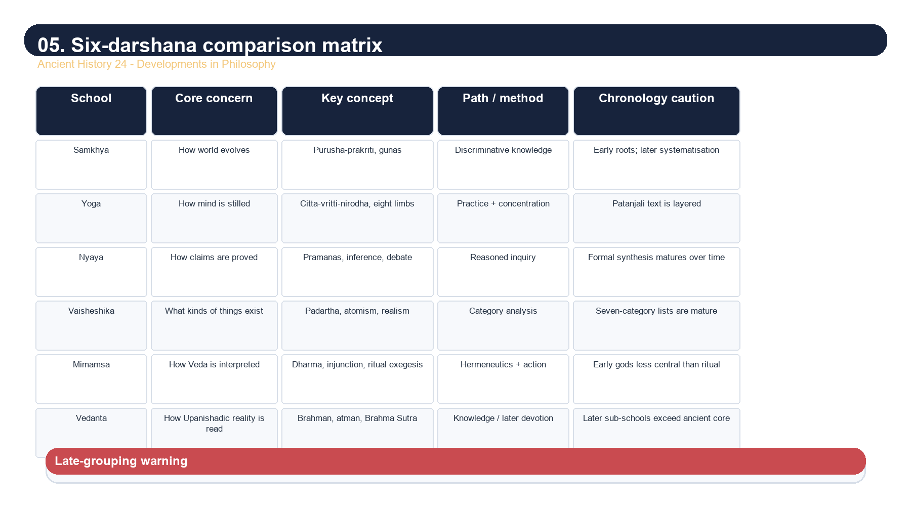

### Core teaching / solved analysis

- Samkhya = purusha-prakriti and satkaryavada.
- Yoga = citta-vritti-nirodha and disciplined practice.
- Nyaya = proof and inference.
- Vaisheshika = categories and atomism.
- Mimamsa = Vedic injunction and dharma.
- Vedanta = Upanishadic / Brahma-Sutra exegesis.

### Must-know facts

- Astika does not simply mean theist.
- Pairings are teaching aids, not proof of simultaneous origin.
- Later full sectarian Vedanta should be bounded.

### UPSC traps

- **Wrong:** the six schools are timeless and homogeneous. **Correct:** their grouping and later textbook presentation are historically layered.

**Mains angle:** Compare by leading problem each school is answering.

## Final Register 6/8 - Pramana and metaphysics

[ANALYSIS] Two efficient answer axes are "how do they know?" and "what do they think exists?"

### Core teaching / solved analysis

- Charvaka privileges perception; Nyaya formalises multiple pramanas; Mimamsa and later Vedanta widen the ladder.
- Upanishadic / Vedantic self, Samkhya purusha, Jaina jiva, Buddhist non-self and Charvaka materialism are the main personhood contrasts.
- Samkhya, Nyaya-Vaisheshika, Buddhism and Ajivika each handle causation differently.

### Must-know facts

- Do not back-project the mature six-pramana list too early.
- Self / no-self is a high-yield comparison frame.
- Dependent origination is not niyati.

### UPSC traps

- **Wrong:** all Indian schools believe in one eternal self. **Correct:** Buddhist and materialist lines directly resist that claim.

**Mains angle:** Build the answer around self, causation and valid knowledge.

## Final Register 7/8 - Language, institutions and transmission

[ANALYSIS] Philosophy survived because it was taught, argued, compressed and commented on.

### Core teaching / solved analysis

- Panini, Katyayana and Patanjali make grammar a major intellectual infrastructure.
- Sutra -> bhashya -> vritti -> tika explains school-deepening.
- Courts, monasteries, lineages and donors shape survival and prestige.

### Must-know facts

- Grammar is part of philosophy's infrastructure.
- Nalanda and Valabhi are major centres, but not universal stand-ins for all schools.
- Commentary is interpretation, not transparent duplication.

### UPSC traps

- **Wrong:** ancient philosophy was only private spirituality. **Correct:** it was institutionally reproduced and publicly debated.

**Mains angle:** One sentence on transmission often upgrades the answer.

## Final Register 8/8 - Historiography, boundaries and the GS-I answer spine

[ANALYSIS] Topic 24 scores best when it stays chronological, comparative and source-aware.

### Core teaching / solved analysis

- Distinguish doctrine from social practice.
- Use retrospective labels such as "Hindu philosophy" cautiously.
- Keep Philosophy Optional, Bhakti and later Vedanta boundaries explicit.

### Must-know facts

- Astika / nastika is polemical and historical.
- Survival bias affects what we think was central.
- Topic 24's safest closing line is plural argumentative civilisation.

### UPSC traps

- **Wrong:** answer by school list only. **Correct:** write chronology -> concept -> comparison -> source caution -> significance.

**Mains angle:** End with pluralism, mutual borrowing and historical significance.
