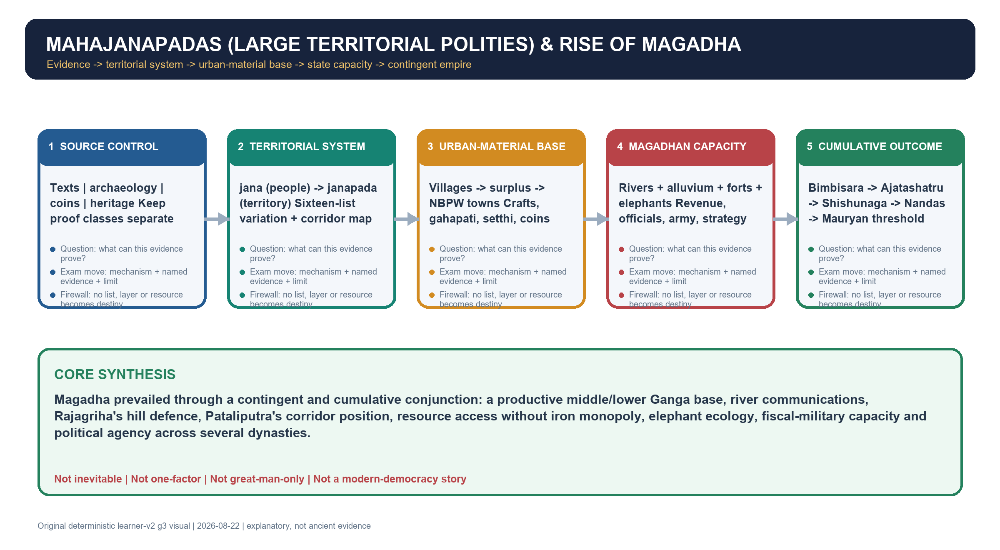

# Mahajanapadas (large territorial polities) & Rise of Magadha - Learner-v2 Complete Learning Session

> **Catalogue identity:** Ancient History · Subject-wide Syllabus · `ancient-indian-history-11`  
> **Generation date:** 22 August 2026 · **Identity:** `ancient-indian-history-11:learner-v2:g3` · **Approval:** false pending explicit topic approval  
> **Source order used:** complete legacy Topic 11 owner -> Basic owner -> prior learner-v2 g2 -> master chronology, README, official syllabus mapping, revision chart and Topics 02/09/10/13/14/19 cross-links -> OCR-searchable R. S. Sharma and Upinder Singh -> bounded ASI/Bihar live verification -> exact Advanced owner in the optional block. Qdrant was not required. Every g1/g2 file remains immutable.  
> **Evidence discipline:** g2 is preserved and deepened without compression. Text/list/site/dynasty claims remain separate proof classes; official heritage pages establish present stewardship only, not ancient constitutional or regnal proof.



*Original deterministic visual: a topic-specific evidence-to-explanation spine. It is a learning aid, not historical evidence.*


### G3 terminology translation lock

> Every Sanskrit, Pali or Prakrit technical term is translated at its first use below.
> Plain ASCII spellings are retained where they make the PDF and flowchart more robust.

| Term | Immediate exam-safe English meaning |
|---|---|
| mahajanapada | large territorial polity |
| jana | people/kin collective |
| janapada | territorial domain of a people |
| gana-sangha | clan-based oligarchic polity/confederacy |
| santhagara | assembly hall |
| salaka | voting token in later procedural descriptions |
| gahapati | substantial property-owning householder/producer |
| setthi | wealthy merchant-banker or urban credit figure |
| shramana | renunciant seeker/tradition |
| NBPW | Northern Black Polished Ware, a fine glossy early-historic ceramic category |
| rathamusala | chariot with blades or maces in textual war tradition |
| mahasilakantaka | stone-throwing engine in textual war tradition |
| ekarat | sole ruler/sole sovereign in Puranic political praise |
| sarva-kshatrantaka | destroyer/uprooter of Kshatriya rulers in Puranic praise |

### G3 source-completeness ledger

| Source layer | Topic 11 use | Non-negotiable limit |
|---|---|---|
| Repository Markdown | Legacy owner, Basic/Advanced, g2, chronology, syllabus, revision and Topics 02/09/10/13/14/19 | No single file proves completeness |
| R. S. Sharma OCR | Territorial states, four powers, ruler sequence and standard Magadha factors | Textbook chronology and eastern-social thesis remain source-attributed |
| Upinder Singh OCR | List variation, gana institutions, sites, urbanism and anti-monopoly cautions | Conflicting traditions are not harmonised into false certainty |
| Official papers/keys | 2025 Prelims Q17; 2023 and 2024 Mains routes | Official objective key status is preserved exactly; no official Mains model is claimed |
| Live official heritage | ASI excavation-report portal, ASI Patna Circle and Bihar Kumhrar page | Current stewardship/presentation only; no tourism copy proves an ancient constitution or king |
| Qdrant | Not used | Direct Markdown and OCR evidence were sufficient |

### Coverage lock

- **Required scope:** Mahajanapadas, gana-sanghas, monarchies, second urbanisation, coinage, routes, Magadha, dynasties and geography-resource-state explanations with explicit limits.
- **Basic completeness:** the complete detailed legacy learner session and g2 substantive body are retained in order before practice; g3 adds translations, answer lines, source refinements and missing dynasty detail without compression.
- **Practice completeness:** verified PYQs, strict-rotation MCQs/remediation and solved 10/15/20-mark answers are retained.
- **Advanced boundary:** the exact Advanced owner is placed only after all Basic and practice material.
- **Register-last rule:** complete topic-specific consolidated notes remain the final H2 section.

### Legacy package source and coverage ledger

> **Subject:** Ancient Indian History | **Paper:** Prelims GS-I + GS-I | **Topic:** 11 | **Date:** 13 August 2026
>
> **Evidence key:** FACT/ARCHAEOLOGICAL EVIDENCE = directly supported by named repository, local-book, official-paper or bounded official heritage source. TEXTUAL TRADITION = what a specific tradition narrates. INTERPRETATION/INFERENCE = analytical conclusion with a stated limit.
>
> **Approval state:** generated, **approved=false**. Only explicit user approval can change the status to approved.

### Package Practice Counts

| Component | Count |
| --- | ---: |
| Verified/routed Prelims PYQs | 1 |
| Solved relevant/adjacent Mains PYQs | 2 |
| Hard MCQs with explanations | 48 |
| Remedial MCQs with explanations | 12 |
| Original solved 10-mark Mains | 3 |
| Original solved 15-mark Mains | 3 |
| Original solved 20-mark Mains | 3 |

### Bounded authoritative heritage links

- Archaeological Survey of India, excavation-report portal: https://asi.nic.in/pages/Publications/excavationReports
- Archaeological Survey of India, Patna Circle: https://asipatnacircle.gov.in/
- Bihar Tourism, Kumhrar Archaeological Park: https://tourism.bihar.gov.in/en/destinations/patna/kumrahar-puratav-park
- Bihar Tourism, Vaishali public-heritage page: https://tourism.bihar.gov.in/en/destinations/vaishali

These pages are used only for present-day heritage framing. Live checks on 22 August 2026 found the ASI portal and Patna Circle landing page active, but no official 2025/2026 Rajgir excavation report was found; therefore no new excavation claim is added. The Vaishali 'first republic' label remains public history, not proof of modern democracy or a precise ancient constitution.

## BASIC LEARNING SESSION

### Source hierarchy, evidence labels and scope

> **ANSWER-GRABBING LINE — WRITE/ADAPT IN THE EXAM**  
> The mahajanapada (large territorial polity) age was an early-historic system in which larger territorial states, towns, exchange networks and renunciant traditions overlapped across uneven regional chronologies.

> **ANSWER-GRABBING LINE — WRITE/ADAPT IN THE EXAM**  
> The safest method is to keep textual lists and ruler traditions, archaeological layers, coins and modern heritage claims as separate proof classes before seeking convergence.


This package reconstructs the mahajanapada age through separately controlled textual, archaeological, numismatic and modern heritage evidence. A conventional list or dynastic story is not treated as excavation proof, and a present-day tourism label is not treated as an ancient constitutional description.

#### Evidence / comparison matrix

| Layer | Named evidence | Proper use / limit |
| --- | --- | --- |
| Text | Anguttara Nikaya; Bhagavati Sutra; Puranas; Buddhist/Jain traditions | Lists, political memory and ruler traditions; compositional date and sectarian perspective require caution. |
| Material | NBPW; punch-marked coins; fortifications; Kumrahar/Bulandibagh | Settlement, consumption, exchange and defence; not automatic proof of a named dynasty. |
| Landscape | Rajagriha hills; Ganga-Son-Gandak routes; Kaushambi and Vaishali locations | Opportunity and constraint, not environmental destiny. |
| Modern heritage | ASI excavation-report portal; ASI Patna Circle; Bihar Tourism Kumhrar | Current stewardship and public presentation only. |

#### Core teaching / solved analysis

- REPOSITORY FACT: Topic 11 basic/advanced, README, Master Chronology, Revision Chart, syllabus/PYQ routing, and bounded Topics 09, 10 and 13 supply the audited architecture.
- LOCAL BOOK FACT: R. S. Sharma, India's Ancient Past, Chapter 15 supplies the standard territorial-state and Magadha explanation; Upinder Singh, Chapter 6 supplies list variation, political institutions, archaeology, urbanism and historiographical cautions.
- OFFICIAL-PAPER FACT: the local UPSC 2025 Set-A paper and official answer-key file control Prelims Q17; the local 2023 GS-I paper controls the geographical-factors Mains question.
- LIVE HERITAGE FACT: ASI pages and official Bihar/India tourism pages are used only for present-day protection, visitation and public-heritage framing, never to date an early layer.
- INTERPRETATION: claims are strongest when text, site, artefact and landscape converge; silence or contradiction must be retained rather than filled with certainty.
- SOURCE FIREWALL: Anguttara Nikaya and Mahavastu lists, the Jain Bhagavati Sutra, Buddhist/Jain ruler traditions, Puranic dynastic lists, Panini and later Greek/classical notices answer different questions from NBPW, punch-marked coins, fortifications and settlement layers.
- QDRANT: not used because authored Markdown and searchable local books were sufficient.

> **Memory hook:** T-M-L-Q: Textual control, Material control, Live heritage bounded, Qdrant optional.

#### Must-know facts

- The evidence labels used are FACT, TEXTUAL TRADITION, ARCHAEOLOGICAL EVIDENCE, INTERPRETATION and LIMIT.
- No precise chronology is presented as undisputed where Buddhist, Jain and Puranic lines conflict.

#### UPSC traps

- **Wrong:** A named city in a text proves that every excavated layer belonged to the narrated ruler. **Correct:** Correlate text and layer cautiously; identification, dating and political attribution are separate steps.
- **Wrong:** An official tourism page is an archaeological report. **Correct:** Use tourism pages for present-day heritage framing; use excavation and scholarly evidence for ancient claims.

**Mains/PYQ use:** Begin every analytical answer by naming the evidence class and end the claim with its limit.

**Study link:** Topics 02 (sources), 09 (Later Vedic bridge), 10 (renunciants), 13 (social economy).
### Chronology: a long transition, not a single event in 600 BCE

> **ANSWER-GRABBING LINE — WRITE/ADAPT IN THE EXAM**  
> The c. 600–321/324 BCE frame is a heuristic transition, not a synchronous starting or ending date for states, cities, coinage or renunciation across India.


The mahajanapada age is a heuristic phase within the early historic transition. Different regions moved from kin-centred chiefdoms to territorial states, oligarchies, urban centres and monetised exchange at different rates.

#### Timeline

| Date/phase | Event |
| --- | --- |
| c. 1000-600 BCE | Later Vedic territoriality, agriculture and regional differentiation. |
| c. 7th-6th c. BCE | Early NBPW horizon and clearer large-state traditions in parts of north India. |
| c. 6th-5th c. BCE | Magadha, Kosala, Vatsa and Avanti contest; Buddha and Mahavira traditions. |
| 5th c. BCE | Ajatashatru traditions, Vajji war and Pataligrama fortification. |
| 4th c. BCE | Nanda consolidation and transition toward Mauryan empire. |

#### Compact visual / answer logic

```text
LATER VEDIC WORLDS
 kinship + cultivation + ritual kingship
             |
     regionally uneven change
             v
JANAPADAS <-> towns/routes <-> ganas and monarchies
             |
             v
MAHAJANAPADA SYSTEM -> Magadhan consolidation

Not one date, one route or one inevitable outcome.
```

*The arrows show interacting processes; they do not claim a uniform evolutionary ladder.*

#### Core teaching / solved analysis

- FACT: the repository chronology places Later Vedic change broadly before c. 600 BCE and the mahajanapada/second-urbanisation phase broadly c. 600-321 BCE.
- FACT: Upinder Singh dates the NBPW phase broadly from the seventh century BCE to the second/first centuries BCE and treats its early phase as the relevant horizon here.
- LIMIT: radiocarbon and ceramic sequences vary by site; an exceptional early date at Ayodhya cannot be generalized to the whole Ganga valley.
- INTERPRETATION: political consolidation, urbanism, coin use and renunciation overlap, but they neither began simultaneously nor advanced uniformly.
- CHRONOLOGY CAUTION: Bimbisara, Ajatashatru, Udayin, Shishunaga and Nanda dates are reconstructions from discordant Buddhist, Jain, Puranic and later classical traditions.

> **Memory hook:** PACE: Process, Asynchrony, Caution, Evidence.

#### Must-know facts

- Use c. 600 BCE as a convenient threshold, not a switch that transformed every region.
- The end-point 321/324 BCE varies with the chronology used for the Nanda-Maurya transition.

#### UPSC traps

- **Wrong:** Every janapada became a mahajanapada through the same stages. **Correct:** State formation was regionally varied; some areas retained chiefdoms, forest polities or smaller states.
- **Wrong:** NBPW, coins and large states all started together everywhere. **Correct:** Their local chronologies and distributions differ.

**Mains/PYQ use:** A chronology paragraph should establish overlap and variation before explaining causation.

**Study link:** Master Chronology; Topic 09 transition; Topic 14 Mauryan threshold.

```closure-flow
SUBTOPIC: Chronology: a long transition, not a single event in 600 BCE
KEY TERMS / DEFINITIONS: 600–321/324 BCE frame is a heuristic transition, not a synchronous starting or ending date for states, cities, coinage or renunciation across India.
MECHANISM / ARGUMENT: The arrows show interacting processes; they do not claim a uniform evolutionary ladder.
CONSEQUENCE / CONTRAST: The mahajanapada age is a heuristic phase within the early historic transition.
UPSC TRAP / ANSWER-USE: 600–321/324 BCE frame is a heuristic transition, not a synchronous starting or ending date for states, cities, coinage or renunciation across India.
ANSWER-GRABBING FORMULATION: ANSWER-GRABBING LINE — WRITE/ADAPT IN THE EXAM
```

### From jana to janapada to mahajanapada: territoriality without teleology

> **ANSWER-GRABBING LINE — WRITE/ADAPT IN THE EXAM**  
> Territorialisation linked a jana (people/kin collective) to a janapada (territorial domain of a people) through settlement, extraction, routes, coercion and labour mobilisation without erasing kinship.


Jana denoted a people or lineage collective, while janapada increasingly joined a people to a territorial domain of rural and urban settlements. Mahajanapada signalled a large or powerful territorial polity in textual classification, not a legally standardized rank.

#### Evidence / comparison matrix

| Term | Safe meaning | What not to assume |
| --- | --- | --- |
| Jana | People/kin collective; political community | A fixed mapped territory |
| Janapada | Territorial domain plus settlements and inhabitants | A uniform centralized state |
| Mahajanapada | Large/powerful state in textual lists | A constitutional category identical across texts |
| Rashtra/rajya | Context-specific domain or kingship | A modern nation-state |

#### Core teaching / solved analysis

- TEXTUAL FACT: Panini refers to several janapadas; Buddhist and Jain sources later classify powerful polities as solasa-mahajanapadas.
- PROCESS: denser cultivation, claims over land, routes and labour, fortified centres, revenue extraction and organized coercion expanded the scale of political competition.
- CONTINUITY: lineage, clan and sacrificial idioms survived inside territorial polities; territoriality did not erase kinship.
- VARIATION: Kuru and Panchala had Later Vedic antecedents; Magadha and Anga rose in the east; Ashmaka indicates a trans-Vindhyan trajectory; Gandhara belonged to a north-western corridor.
- LIMIT: 'chiefdom -> kingdom -> empire' is a model, not a universal sequence. Ganas, monarchies, forest communities and tributary relations coexisted.
- INTERPRETATION: the decisive change was not simply size, but a stronger capacity to mobilise people, produce, taxes and armed force across territory.

> **Memory hook:** PELT: People -> Earth/territory -> Levy -> Troops, with kinship retained.

#### Must-know facts

- Janapada can refer to a region and its inhabitants, not merely a capital.
- Large states still depended on villages, local headmen and uneven layers of control.

#### UPSC traps

- **Wrong:** Mahajanapada means a fully bureaucratic sovereign nation-state. **Correct:** It is a textual category for major territorial polities with variable institutional depth.
- **Wrong:** Territoriality replaced clan organization overnight. **Correct:** Kin and territory overlapped for long periods.

**Mains/PYQ use:** Define the terms, show mechanisms of scale, then insert regional and institutional variation.

**Study link:** Topic 09 jana-to-janapada bridge; Topic 13 state and social structure.

```closure-flow
SUBTOPIC: From jana to janapada to mahajanapada: territoriality without teleology
KEY TERMS / DEFINITIONS: Territorialisation linked a jana (people/kin collective) to a janapada (territorial domain of a people) through settlement, extraction, routes, coercion and labour mobilisation without erasing kinship.
MECHANISM / ARGUMENT: Territorialisation linked a jana (people/kin collective) to a janapada (territorial domain of a people) through settlement, extraction, routes, coercion and labour mobilisation without erasing kinship.
CONSEQUENCE / CONTRAST: Jana denoted a people or lineage collective, while janapada increasingly joined a people to a territorial domain of rural and urban settlements.
UPSC TRAP / ANSWER-USE: Mahajanapada signalled a large or powerful territorial polity in textual classification, not a legally standardized rank.
ANSWER-GRABBING FORMULATION: ANSWER-GRABBING LINE — WRITE/ADAPT IN THE EXAM
```

### The sixteen mahajanapadas: conventional list and textual variation

> **ANSWER-GRABBING LINE — WRITE/ADAPT IN THE EXAM**  
> The Anguttara Nikaya's sixteen mahajanapadas are a conventional textual map whose names, borders and simultaneity must be qualified through Mahavastu and Bhagavati Sutra variations.


The famous sixteen are best treated as a conventional Buddhist list reflecting a particular political geography. The number acquired mnemonic authority, but parallel traditions change names, emphasis and regional reach.

#### Evidence / comparison matrix

| Tradition | List feature | Historical use |
| --- | --- | --- |
| Anguttara Nikaya | Standard sixteen from Gandhara/Kamboja to Anga/Ashmaka | Primary mnemonic map with chronology caveat |
| Mahavastu | Shibi and Dasharna replace two north-western names | Proof that the canon was not a single fixed map |
| Bhagavati Sutra | Different eastern/southern emphasis | Jain political geography; later-list caution |
| Puranic traditions | Dynastic king lists rather than one matching sixteen | Succession memory; contradictions must be retained |

#### Core teaching / solved analysis

- TEXTUAL FACT: the Anguttara Nikaya lists Kashi, Kosala, Anga, Magadha, Vajji, Malla, Chedi, Vatsa, Kuru, Panchala, Matsya, Shurasena, Ashmaka, Avanti, Gandhara and Kamboja.
- TEXTUAL FACT: the Mahavastu gives a similar list but substitutes Shibi and Dasharna for Gandhara and Kamboja.
- TEXTUAL FACT: the Jain Bhagavati Sutra offers a significantly different list with stronger eastern and southern names; Upinder Singh treats it as later and less reliable for a sixth-century map.
- LIMIT: the first four Nikayas and Vinaya contain early layers but are composite transmitted texts, not contemporary gazetteers.
- LIMIT: omission from a list does not prove political non-existence; smaller states, chiefdoms and forest polities lay beyond the sixteen.
- INTERPRETATION: lists encode the horizon, priorities and memory of a textual community as well as political conditions.

> **Memory hook:** A-M-B-P: Anguttara standard, Mahavastu substitutions, Bhagavati variation, Puranic dynasties.

#### Must-know facts

- Sixteen is conventional, not an archaeologically counted total.
- The lists mix monarchies and gana-sanghas.

#### UPSC traps

- **Wrong:** All Buddhist, Jain and Puranic traditions reproduce the same sixteen. **Correct:** They vary in names, chronology, form and regional emphasis.
- **Wrong:** The textual list proves sixteen simultaneous states with fixed borders. **Correct:** Borders and power shifted; archaeological identification is independent evidence.

**Mains/PYQ use:** A high-scoring list answer treats classification itself as evidence requiring source criticism.

**Study link:** Topic 02 textual transmission and source criticism.

```closure-flow
SUBTOPIC: The sixteen mahajanapadas: conventional list and textual variation
KEY TERMS / DEFINITIONS: TEXTUAL FACT: the Anguttara Nikaya lists Kashi, Kosala, Anga, Magadha, Vajji, Malla, Chedi, Vatsa, Kuru, Panchala, Matsya, Shurasena, Ashmaka, Avanti, Gandhara and Kamboja.
MECHANISM / ARGUMENT: The Anguttara Nikaya's sixteen mahajanapadas are a conventional textual map whose names, borders and simultaneity must be qualified through Mahavastu and Bhagavati Sutra variations.
CONSEQUENCE / CONTRAST: The famous sixteen are best treated as a conventional Buddhist list reflecting a particular political geography.
UPSC TRAP / ANSWER-USE: LIMIT: the first four Nikayas and Vinaya contain early layers but are composite transmitted texts, not contemporary gazetteers.
ANSWER-GRABBING FORMULATION: ANSWER-GRABBING LINE — WRITE/ADAPT IN THE EXAM
```

### Text map: the political geography of the mahajanapada system

> **ANSWER-GRABBING LINE — WRITE/ADAPT IN THE EXAM**  
> The political map is best remembered as connected corridors—from Gandhara-Kamboja through the upper and middle Ganga systems to Avanti-Chedi and Ashmaka on the Godavari—not as isolated dots.


A map answer should show corridors and river basins, not isolated dots. The north-west, upper Ganga-Yamuna, middle/lower Ganga, Malwa and Godavari zones interacted through routes, warfare and migration.

#### Compact visual / answer logic

```text
                         GANDHARA--KAMBOJA
                              |
MATSYA--SHURASENA--KURU--PANCHALA--KOSALA--VAJJI--MALLA
          |              |       |        |       |
       AVANTI----------VATSA---KASHI---MAGADHA---ANGA
          |              |                |
        CHEDI        Yamuna/Ganga     Rajagriha -> Pataliputra
          |
       ASHMAKA (Godavari corridor)

Route logic: NW <-> Ganga plain <-> lower Ganga; Malwa <-> Deccan.
```

*Schematic orientation only; it is not a scale map or a claim of fixed borders.*

#### Core teaching / solved analysis

- NORTH-WEST: Gandhara centred on Taxila and Kamboja occupied adjoining highland/frontier zones.
- UPPER GANGA-YAMUNA: Kuru, Panchala, Matsya and Shurasena linked older Vedic and new urban worlds.
- MIDDLE GANGA: Kashi, Kosala, Vatsa, Vajji, Malla and Magadha formed an intensely competitive belt.
- EAST: Anga connected the Ganga-Champa zone and routes toward the lower Ganga and overseas traditions.
- CENTRAL/WESTERN: Avanti's Ujjain-Mahishmati axis connected Malwa, Deccan and western routes; Chedi lay in Bundelkhand.
- TRANS-VINDHYAN: Ashmaka on the Godavari shows that state formation was not confined north of the Vindhyas.
- LIMIT: ancient borders cannot be drawn as precise modern administrative lines; many identifications are approximate.

> **Memory hook:** NW-U-M-C-D: North-west, Upper plain, Middle Ganga, Central India, Deccan.

#### Must-know facts

- Ashmaka-Godavari and Kosala-Sarayu are high-yield river associations.
- Vatsa's Kaushambi stood on the Yamuna; Shurasena's Mathura also lay on the Yamuna.

#### UPSC traps

- **Wrong:** Kamboja is securely paired with the Vipasa in the 2025 UPSC item. **Correct:** The official Set-A key leaves that pair incorrect; Kamboja belongs to the north-western frontier zone.
- **Wrong:** Avanti lay on the Mahanadi. **Correct:** Avanti centred on Malwa and the Narmada-linked Ujjain-Mahishmati axis.

**Mains/PYQ use:** A small schematic map can earn value-addition only when paired with a caution on approximate frontiers.

**Study link:** 2025 Prelims Q17 and Topic 03 geographical setting.

```closure-flow
SUBTOPIC: Text map: the political geography of the mahajanapada system
KEY TERMS / DEFINITIONS: The political map is best remembered as connected corridors—from Gandhara-Kamboja through the upper and middle Ganga systems to Avanti-Chedi and Ashmaka on the Godavari—not as isolated dots.
MECHANISM / ARGUMENT: The political map is best remembered as connected corridors—from Gandhara-Kamboja through the upper and middle Ganga systems to Avanti-Chedi and Ashmaka on the Godavari—not as isolated dots.
CONSEQUENCE / CONTRAST: A map answer should show corridors and river basins, not isolated dots.
UPSC TRAP / ANSWER-USE: The political map is best remembered as connected corridors—from Gandhara-Kamboja through the upper and middle Ganga systems to Avanti-Chedi and Ashmaka on the Godavari—not as isolated dots.
ANSWER-GRABBING FORMULATION: ANSWER-GRABBING LINE — WRITE/ADAPT IN THE EXAM
```

### Major monarchies: Magadha, Kosala, Vatsa and Avanti

> **ANSWER-GRABBING LINE — WRITE/ADAPT IN THE EXAM**  
> Magadha, Kosala, Vatsa and Avanti formed a competitive four-power system in which each possessed cities and corridors, but only Magadha converted successive gains into a durable cumulative advantage.


The four strongest monarchies formed a competitive quadrilateral. Their relative power changed through conquest, marriage, route control and internal consolidation; Magadha's victory was not predetermined.

#### Evidence / comparison matrix

| State | Capital / corridor | Strength and caveat |
| --- | --- | --- |
| Magadha | Rajagriha; later Pataliputra | Rivers, fertile core, forests and expansion; iron-monopoly thesis rejected |
| Kosala | Shravasti; Sarayu basin | Absorbed Kashi; strong under Prasenajit; later succession/war weakened position |
| Vatsa | Kaushambi on Yamuna | Trade/textile node; political history heavily legend-mediated |
| Avanti | Ujjain and Mahishmati | Malwa-western/Deccan links; resource access shows iron was not Magadha's monopoly |

#### Core teaching / solved analysis

- MAGADHA: middle/eastern Ganga core; Rajagriha then Pataliputra; expansion through Anga, Kosala, Vajji and Avanti contests.
- KOSALA: Sarayu-divided territory with Shravasti in the north; conquered Kashi and exercised influence over smaller clan polities.
- RULER NAME: Pasenadi (Prasenajit) is the Pali/Sanskrit name pair for Kosala's securely source-owned contemporary ruler.
- VATSA: Kaushambi on the Yamuna; textile and route traditions; Udayana-Pradyota narratives preserve rivalry and marriage memory.
- AVANTI: Malwa with northern Ujjain and southern Mahishmati traditions; Pradyota competed with Vatsa, Kosala and Magadha.
- NAME FORM: Ujjayini (Ujjain) is retained where the ancient capital's classical name needs immediate English framing.
- INTERPRETATION: each had cities and strategic corridors; Magadha prevailed because structural advantages were converted into durable capacity.
- LIMIT: romantic narratives and retrospective dynastic stories cannot be read as court archives.

> **Memory hook:** M-K-V-A: Magadha combines, Kosala absorbs, Vatsa routes, Avanti rivals.

#### Must-know facts

- Kosala, Vatsa, Avanti and Magadha are consistently identified as the most powerful sixth-century states.
- Competitive equality in the sixth century makes later Magadhan supremacy an explanation problem.

#### UPSC traps

- **Wrong:** Only Magadha possessed cities, iron access or trade routes. **Correct:** Its rivals had substantial assets; the issue is combination, location and political use.
- **Wrong:** Marriage permanently ended interstate rivalry. **Correct:** Marriage alliances could coexist with later war.

**Mains/PYQ use:** Compare capacities before explaining why one polity converted them into supremacy.

**Study link:** Magadha factor matrix below.

```closure-flow
SUBTOPIC: Major monarchies: Magadha, Kosala, Vatsa and Avanti
KEY TERMS / DEFINITIONS: RULER NAME: Pasenadi (Prasenajit) is the Pali/Sanskrit name pair for Kosala's securely source-owned contemporary ruler.
MECHANISM / ARGUMENT: Their relative power changed through conquest, marriage, route control and internal consolidation; Magadha's victory was not predetermined.
CONSEQUENCE / CONTRAST: The four strongest monarchies formed a competitive quadrilateral.
UPSC TRAP / ANSWER-USE: Their relative power changed through conquest, marriage, route control and internal consolidation; Magadha's victory was not predetermined.
ANSWER-GRABBING FORMULATION: ANSWER-GRABBING LINE — WRITE/ADAPT IN THE EXAM
```

### Eastern polities: Kashi, Anga, Vajji and Malla

Eastern India combined monarchies, confederacies, commercial centres and clan-based polities. Its political diversity is essential to understanding both Magadhan expansion and the social world of Buddhism and Jainism.

#### Evidence / comparison matrix

| Polity | Political form | Exam evidence |
| --- | --- | --- |
| Kashi | Monarchy | Varanasi; Kashi-Kosala rivalry; eventual absorption |
| Anga | Monarchy | Champa; Bimbisara's annexation; eastern commercial link |
| Vajji | Gana/confederacy | Vaishali; Licchhavi-led coalition; Ajatashatru conflict |
| Malla | Gana/confederacy tradition | Kusinara and Pava; multiple clans/centres |

#### Core teaching / solved analysis

- KASHI: Varanasi on the Ganga, traditionally bounded by Varuna and Asi; powerful earlier, then absorbed by Kosala.
- ANGA: Champa near the Ganga-Champa confluence; commercial traditions and eastern routes; annexed by Bimbisara.
- VAJJI: confederacy north of the Ganga, including Licchhavis, Videhas and Jnatrikas; Vaishali was its key centre.
- MALLA: a confederated polity with centres at Kusinara and Pava; traditions link it closely to Buddhist sacred geography.
- INTERPRETATION: Magadha's eastern contests were struggles over routes, populations, fertile zones and rival political coalitions.
- LIMIT: 'confederacy of eight/nine clans' and large numerical claims in narrative texts are institutional memories, not census data.

> **Memory hook:** K-A-V-M: Kashi absorbed, Anga annexed, Vajji confederated, Malla multi-centred.

#### Must-know facts

- Vaishali's oligarchic institutions should not be translated as universal democracy.
- Anga's annexation gave Magadha control of Champa and an eastern-facing corridor.

#### UPSC traps

- **Wrong:** Vaishali's modern 'first republic' publicity is sufficient constitutional evidence. **Correct:** Use early texts critically and describe a clan oligarchy/confederacy, not a modern republic.
- **Wrong:** Malla was a unitary territorial monarchy throughout. **Correct:** The relevant early historic tradition presents multiple centres and a gana/confederated form.

**Mains/PYQ use:** Use eastern diversity to disprove a monarchy-only account of state formation.

**Study link:** Topic 10 biographies and Topic 13 gana-sangha society.

```closure-flow
SUBTOPIC: Eastern polities: Kashi, Anga, Vajji and Malla
KEY TERMS / DEFINITIONS: Its political diversity is essential to understanding both Magadhan expansion and the social world of Buddhism and Jainism.
MECHANISM / ARGUMENT: KASHI: Varanasi on the Ganga, traditionally bounded by Varuna and Asi; powerful earlier, then absorbed by Kosala.
CONSEQUENCE / CONTRAST: KASHI: Varanasi on the Ganga, traditionally bounded by Varuna and Asi; powerful earlier, then absorbed by Kosala.
UPSC TRAP / ANSWER-USE: LIMIT: 'confederacy of eight/nine clans' and large numerical claims in narrative texts are institutional memories, not census data.
ANSWER-GRABBING FORMULATION: Eastern India combined monarchies, confederacies, commercial centres and clan-based polities.
```

### Upper-plain, central, north-western and trans-Vindhyan profiles

The remaining mahajanapadas prevent an east-Ganga-only story. They connected older Kuru-Panchala territoriality, Mathura and Malwa routes, the Achaemenid-facing north-west and the Godavari valley.

#### Evidence / comparison matrix

| Cluster | Named states | Why it matters |
| --- | --- | --- |
| Upper plain | Kuru, Panchala | Later Vedic continuity plus new oligarchic/territorial forms |
| Mathura-Rajasthan | Shurasena, Matsya | Yamuna and western-route connections |
| Central India | Chedi, Avanti | Bundelkhand-Malwa and Deccan/western links |
| North-west | Gandhara, Kamboja | Taxila, frontier mobility and Persian interface |
| Godavari | Ashmaka | Trans-Vindhyan state formation and 2025 river mapping |

#### Core teaching / solved analysis

- KURU: Indraprastha tradition; a reduced sixth-century power; traditions suggest later movement from monarchy to sangha.
- PANCHALA: Ahichchhatra and Kampilya; upper/central Ganga divide; later oligarchic traditions.
- MATSYA: Viratanagara/Bairat in the Rajasthan zone; linked in Buddhist texts with Shurasena.
- SHURASENA: Mathura on the Yamuna; route and cultural node with Yadava/Vrishni traditions.
- CHEDI: Bundelkhand zone; central link rather than a leading sixth-century imperial contender.
- GANDHARA: Taxila in the north-west; trade/learning and Achaemenid-interface context.
- KAMBOJA: adjoining north-western/highland frontier; textual geography is less precise than modern map questions imply.
- ASHMAKA: Buddhist tradition places it on the Godavari with Potana/Podana; other texts use Ashmaka/Ashvaka differently, requiring source control.

> **Memory hook:** KPM-SC-GKA: Kuru-Panchala-Matsya; Shurasena-Chedi; Gandhara-Kamboja-Ashmaka.

#### Must-know facts

- Gandhara's capital Taxila was a major route and learning centre.
- The Buddhist Assaka/Ashmaka is safely associated with the Godavari, but names vary across traditions.

#### UPSC traps

- **Wrong:** The sixteen describe only the Ganga valley. **Correct:** Gandhara, Kamboja, Avanti and Ashmaka widen the political geography.
- **Wrong:** Identical-looking names in different texts always denote the same region. **Correct:** Ashmaka/Ashvaka traditions demonstrate the need for source-specific geography.

**Mains/PYQ use:** A complete map paragraph must include the north-west, Malwa and Godavari exceptions.

**Study link:** 2025 territorial region-river PYQ.

```closure-flow
SUBTOPIC: Upper-plain, central, north-western and trans-Vindhyan profiles
KEY TERMS / DEFINITIONS: KAMBOJA: adjoining north-western/highland frontier; textual geography is less precise than modern map questions imply.
MECHANISM / ARGUMENT: They connected older Kuru-Panchala territoriality, Mathura and Malwa routes, the Achaemenid-facing north-west and the Godavari valley.
CONSEQUENCE / CONTRAST: KURU: Indraprastha tradition; a reduced sixth-century power; traditions suggest later movement from monarchy to sangha.
UPSC TRAP / ANSWER-USE: CHEDI: Bundelkhand zone; central link rather than a leading sixth-century imperial contender.
ANSWER-GRABBING FORMULATION: The remaining mahajanapadas prevent an east-Ganga-only story.
```

### State formation: interacting capacities rather than one master cause

Large states became possible when agrarian, coercive, communicative and legitimating capacities reinforced one another. No single variable—iron, rice, trade, ritual or leadership—can carry the explanation.

#### Compact visual / answer logic

```text
CULTIVATION + LAND CONTROL
            |
            v
SURPLUS -- extraction/tax --> TREASURY
   |                           |
   v                           v
TOWNS/CRAFTS/ROUTES <---- ARMY + OFFICIALS
   |                           |
   +------ legitimacy --------+
            |
            v
LARGER BUT UNEVEN TERRITORIAL CONTROL
```

*State capacity emerged from feedback among production, extraction, force, communication and legitimacy.*

#### Core teaching / solved analysis

- PRODUCTION: expanding cultivation and land claims increased the surplus potentially available to households, elites and states.
- EXTRACTION: shares of produce, tribute, tolls and other dues turned surplus into state resources, though actual rates varied.
- COERCION: recruited troops, hereditary warriors, mercenaries, fortifications and punishment expanded territorial capacity.
- CONNECTION: rivers, roads and urban nodes lowered some costs of movement, trade, diplomacy and campaigning.
- INSTITUTIONS: kings, officials, village headmen, assemblies and confederacies organized decision-making at different scales.
- LEGITIMATION: kingship theories, ritual idioms and protection-for-tax arguments justified extraction and force.
- LIMIT: capacities were uneven, local and contested; urban centres coexisted with rural and forest zones.

> **Memory hook:** PECIL: Production, Extraction, Coercion, Institutions, Legitimacy.

#### Must-know facts

- A state-formation answer should distinguish resources from the institutions that mobilised them.
- Coercion and consent/legitimation were complementary, not mutually exclusive.

#### UPSC traps

- **Wrong:** Iron tools automatically created kingdoms. **Correct:** Technology mattered through access, labour, ecology, property and political mobilization.
- **Wrong:** Urbanisation alone proves centralized state control. **Correct:** Cities could have layered authorities and dependent hinterlands.

**Mains/PYQ use:** Use a causal flow, then add variation and the difference between potential resources and realized capacity.

**Study link:** Topics 09 and 13; Magadha matrix.

```closure-flow
SUBTOPIC: State formation: interacting capacities rather than one master cause
KEY TERMS / DEFINITIONS: State capacity emerged from feedback among production, extraction, force, communication and legitimacy.
MECHANISM / ARGUMENT: Correct: Technology mattered through access, labour, ecology, property and political mobilization.
CONSEQUENCE / CONTRAST: State capacity emerged from feedback among production, extraction, force, communication and legitimacy.
UPSC TRAP / ANSWER-USE: Coercion and consent/legitimation were complementary, not mutually exclusive.
ANSWER-GRABBING FORMULATION: Large states became possible when agrarian, coercive, communicative and legitimating capacities reinforced one another.
```

### Monarchical institutions: court, officials, villages and organized force

> **ANSWER-GRABBING LINE — WRITE/ADAPT IN THE EXAM**  
> Early Magadhan state capacity meant stronger revenue, officials, fortified centres, standing force and logistics, but it should not be projected as a fully developed Mauryan bureaucracy.


Early monarchies were more than a king but less than a fully documented bureaucracy. Texts suggest courts, high officials, village headmen, treasuries and armies, while the precise administrative depth remains difficult to reconstruct.

#### Evidence / comparison matrix

| Institution | Probable function | Evidence limit |
| --- | --- | --- |
| King and court | War, diplomacy, patronage, adjudication | Narratives magnify royal agency |
| Mahamatra/amatya | High executive or advisory office | Functions varied; terminology is not a fixed manual |
| Gramakas/assemblies | Village coordination and local authority | Local practice was likely diverse |
| Army | Defence, conquest and coercive extraction | Size figures in later sources are rhetorical/problematic |
| Fort/capital | Command, storage, defence and communication | A wall does not prove uniform central control |

#### Core teaching / solved analysis

- TEXTUAL FACT: Buddhist traditions around Bimbisara refer to mahamatras with probable executive, judicial and military functions.
- TEXTUAL FACT: villages could be governed through assemblies under gramakas or village headmen.
- INTERPRETATION: a regular army supported by revenue would reduce dependence on episodic clan levies, but the evidence is indirect.
- KINGSHIP IDEOLOGY: texts present taxation as the king's wage for protection and punishment as a defence against matsya-nyaya.
- POLITICAL PRACTICE: conquest, marriage, viceroyalty, fort building and appointment of ministers appear as tools of rule.
- LIMIT: later Arthashastra-style administrative categories should not be projected wholesale into the sixth century BCE.

> **Memory hook:** K-V-O-A: King, Villages, Officials, Army.

#### Must-know facts

- Monarchies could incorporate assemblies and local corporate bodies.
- Administration must be inferred from scattered textual references, not a complete archive.

#### UPSC traps

- **Wrong:** Monarchy means the king personally administered every village. **Correct:** Layered officials, headmen, assemblies and local elites mediated rule.
- **Wrong:** The Mauryan bureaucracy existed unchanged under Bimbisara. **Correct:** Use only institutions securely suggested for the pre-Mauryan horizon.

**Mains/PYQ use:** Distinguish evidence for institutional tendencies from claims of a uniform bureaucracy.

**Study link:** Topic 14 Mauryan administration for a later comparison.

```closure-flow
SUBTOPIC: Monarchical institutions: court, officials, villages and organized force
KEY TERMS / DEFINITIONS: TEXTUAL FACT: Buddhist traditions around Bimbisara refer to mahamatras with probable executive, judicial and military functions.
MECHANISM / ARGUMENT: TEXTUAL FACT: villages could be governed through assemblies under gramakas or village headmen.
CONSEQUENCE / CONTRAST: Early monarchies were more than a king but less than a fully documented bureaucracy.
UPSC TRAP / ANSWER-USE: Early Magadhan state capacity meant stronger revenue, officials, fortified centres, standing force and logistics, but it should not be projected as a fully developed Mauryan bureaucracy.
ANSWER-GRABBING FORMULATION: ANSWER-GRABBING LINE — WRITE/ADAPT IN THE EXAM
```

### Ganas and sanghas: assemblies, oligarchic power and social limits

Gana and sangha could denote non-monarchical corporate polities. 'Republic' is convenient shorthand only if immediately qualified: political power rested with a group of elite male clansmen, not an equal citizen body.

#### Compact visual / answer logic

```text
ELITE CLAN HOUSEHOLDS
        |
        v
WIDER ASSEMBLY (santhagara)
        |
   chief + small executive
        |
 decision / diplomacy / war

Excluded or subordinate: women, slaves, labourers,
many artisans, clients and non-clan residents.
```

*The visual shows oligarchic corporate rule, not universal popular sovereignty.*

#### Core teaching / solved analysis

- TEXTUAL FACT: Ashtadhyayi and Majjhima Nikaya use gana and sangha in the political sense.
- INSTITUTION: a chief—ganapati, ganaraja or sanghamukhya—worked with an aristocratic council meeting in a santhagara.
- PROCEDURE: later textual descriptions mention announced meetings, quorum, salaka voting and vote collectors.
- POWER: effective executive management probably lay with a smaller group inside the wider assembly.
- SOCIAL BASE: membership was lineage- and status-bound; women, slaves, dependent labourers, artisans and outsiders lacked equal political rights.
- COMPARISON: Brahmanical texts say less about ganas, partly because their political ideology privileged kingship.
- LIMIT: Buddhist monastic procedure may be analogous to, but is not identical with, secular gana practice.

> **Memory hook:** C-A-S-E: Clan elite, Assembly, Small executive, Exclusions.

#### Must-know facts

- Vajji and Malla are the major mahajanapada examples of gana/confederated traditions.
- Shakya is a useful adjacent example but not one of the standard sixteen as a separate entry.

#### UPSC traps

- **Wrong:** Gana-sangha equals modern parliamentary democracy. **Correct:** It was an aristocratic/clan oligarchy with restricted participation.
- **Wrong:** All non-monarchical polities had identical rules. **Correct:** Institutions varied, and much procedural detail comes from later or analogical evidence.

**Mains/PYQ use:** Name the santhagara and salaka procedure, then make the social-base qualification explicit.

**Study link:** Vajji/Malla profiles; Topic 13 social hierarchy.

```closure-flow
SUBTOPIC: Ganas and sanghas: assemblies, oligarchic power and social limits
KEY TERMS / DEFINITIONS: 'Republic' is convenient shorthand only if immediately qualified: political power rested with a group of elite male clansmen, not an equal citizen body.
MECHANISM / ARGUMENT: COMPARISON: Brahmanical texts say less about ganas, partly because their political ideology privileged kingship.
CONSEQUENCE / CONTRAST: POWER: effective executive management probably lay with a smaller group inside the wider assembly.
UPSC TRAP / ANSWER-USE: 'Republic' is convenient shorthand only if immediately qualified: political power rested with a group of elite male clansmen, not an equal citizen body.
ANSWER-GRABBING FORMULATION: Gana and sangha could denote non-monarchical corporate polities.
```

### Monarchy versus gana-sangha: two state forms, not progress versus freedom

> **ANSWER-GRABBING LINE — WRITE/ADAPT IN THE EXAM**  
> Monarchies concentrated authority in a dynasty and court, whereas gana-sanghas (clan-based oligarchic polities/confederacies) shared it among restricted elite clans; neither form was socially egalitarian.


Monarchies and ganas were competing ways of organising elite power. The contrast should be institutional and sociological rather than moral: centralized succession did not mean despotism in every case, and assembly did not mean equality.

#### Evidence / comparison matrix

| Dimension | Monarchy | Gana/sangha |
| --- | --- | --- |
| Core authority | King, court and dynastic household | Elite clan assembly plus chief/executive |
| Strength | Quicker concentration of revenue and command | Collective legitimacy and shared elite stake |
| Vulnerability | Succession conflict and court faction | Faction, slow coordination and narrow clan base |
| Social reach | Subjects mediated by officials/local elites | Political members narrower than population |
| Safe label | Territorial monarchy | Oligarchic corporate polity/confederacy |

#### Core teaching / solved analysis

- DECISION: monarchies concentrated final authority in a ruler and court; ganas distributed it among an aristocratic body.
- SUCCESSION: dynastic kingship offered continuity but invited palace conflict; oligarchies reduced single-family succession risk but faced faction.
- MOBILISATION: centralized monarchies may have coordinated taxation, armies and prolonged war more effectively at expanding scale.
- DIPLOMACY: marriage alliances served monarchies; confederacies depended on cohesion among constituent clans.
- SOCIAL ORDER: both forms rested on hierarchy and coercion, although elite configurations differed.
- OUTCOME: Magadha defeated Vajji through a mixture of fortification, intelligence/dissension tradition and prolonged war; this does not prove universal monarchical superiority.

> **Memory hook:** D-S-M-F: Decision, Succession, Mobilisation, Faction.

#### Must-know facts

- The relevant contrast is who shared sovereign decision-making, not whether hierarchy existed.
- Magadha's eventual success is an outcome to explain, not proof of an evolutionary law.

#### UPSC traps

- **Wrong:** Ganas were egalitarian while monarchies were hierarchical. **Correct:** Both were hierarchical; the location of elite power differed.
- **Wrong:** Monarchy always mobilised better than confederacy. **Correct:** This is a contextual tendency, not a universal rule.

**Mains/PYQ use:** Compare institutions across the same dimensions and finish with a non-teleological verdict.

**Study link:** Ajatashatru-Vajji contest and final comparison notes.

```closure-flow
SUBTOPIC: Monarchy versus gana-sangha: two state forms, not progress versus freedom
KEY TERMS / DEFINITIONS: SUCCESSION: dynastic kingship offered continuity but invited palace conflict; oligarchies reduced single-family succession risk but faced faction.
MECHANISM / ARGUMENT: OUTCOME: Magadha defeated Vajji through a mixture of fortification, intelligence/dissension tradition and prolonged war; this does not prove universal monarchical superiority.
CONSEQUENCE / CONTRAST: Monarchies concentrated authority in a dynasty and court, whereas gana-sanghas (clan-based oligarchic polities/confederacies) shared it among restricted elite clans; neither form was socially egalitarian.
UPSC TRAP / ANSWER-USE: The contrast should be institutional and sociological rather than moral: centralized succession did not mean despotism in every case, and assembly did not mean equality.
ANSWER-GRABBING FORMULATION: ANSWER-GRABBING LINE — WRITE/ADAPT IN THE EXAM
```

### Second urbanisation: definition, NBPW and dating discipline

> **ANSWER-GRABBING LINE — WRITE/ADAPT IN THE EXAM**  
> Second urbanisation was a regionally uneven interaction of agrarian surplus, fortified towns, NBPW, crafts, exchange and state extraction, not the automatic product of iron or coinage.


Second urbanisation refers to the renewed growth of towns and cities after the Harappan urban decline, especially in the Ganga plains and connected regions. NBPW is a major archaeological marker, not a synonym for every feature of urban life.

#### Evidence / comparison matrix

| Indicator | What it supports | What it cannot alone prove |
| --- | --- | --- |
| NBPW | Fine-ware network and early historic horizon | A named king or uniform urban date |
| Fortification | Defence, labour mobilisation, bounded settlement | Continuous occupation or centralized monarchy |
| Coins | Monetised transactions and political/economic authority | End of barter or full rural monetisation |
| Craft debris/tools | Specialisation and production | Guild structure without textual support |
| Texts calling mahanagara | Perceived urban importance | Exact population or excavated plan |

#### Core teaching / solved analysis

- ARCHAEOLOGICAL FACT: NBPW is a fine wheel-made glossy ware found across a wide distribution, with concentration in north India.
- DATING FACT: Upinder Singh gives a broad seventh-century BCE to second/first-century BCE range, subdividing early and late phases.
- SITE FACT: NBPW occurs at Taxila, Kaushambi, Shravasti, Vaishali, Patna and many other sites.
- INTERPRETATION: its production and circulation indicate specialised craft, elite consumption and interregional connections.
- LIMIT: NBPW is not always black, only northern, or demonstrably 'polished' by one known technique.
- LIMIT: pottery presence alone cannot establish city size, political status or exact founding date.
- URBAN CRITERIA: fortification, density, occupational diversity, exchange, administrative/religious functions and hinterland relations must be considered together.

> **Memory hook:** P-F-C-H: Pottery, Fortification, Crafts/coins, Hinterland.

#### Must-know facts

- Second urbanisation differs from the Harappan first urbanisation in region, material package and political context.
- NBPW is a chronological/material horizon with significant local variation.

#### UPSC traps

- **Wrong:** NBPW is a state-issued pottery of the sixteen mahajanapadas. **Correct:** It is an archaeological ceramic category with broad distribution and uncertain production mechanisms.
- **Wrong:** A single NBPW sherd proves a city. **Correct:** Urban identification requires a bundle of settlement evidence.

**Mains/PYQ use:** Define second urbanisation, use NBPW as one marker, then test it against a multi-indicator urban bundle.

**Study link:** Revision Chart; Topic 13 NBPW and social economy.

```closure-flow
SUBTOPIC: Second urbanisation: definition, NBPW and dating discipline
KEY TERMS / DEFINITIONS: Second urbanisation was a regionally uneven interaction of agrarian surplus, fortified towns, NBPW, crafts, exchange and state extraction, not the automatic product of iron or coinage.
MECHANISM / ARGUMENT: LIMIT: NBPW is not always black, only northern, or demonstrably 'polished' by one known technique.
CONSEQUENCE / CONTRAST: Second urbanisation refers to the renewed growth of towns and cities after the Harappan urban decline, especially in the Ganga plains and connected regions.
UPSC TRAP / ANSWER-USE: Second urbanisation was a regionally uneven interaction of agrarian surplus, fortified towns, NBPW, crafts, exchange and state extraction, not the automatic product of iron or coinage.
ANSWER-GRABBING FORMULATION: ANSWER-GRABBING LINE — WRITE/ADAPT IN THE EXAM
```

### Cities and fortifications: Rajagriha, Kaushambi, Vaishali and Champa

Early historic cities combined political, commercial, religious and defensive functions. Textual descriptions and excavated sequences rarely align perfectly, so site-specific evidence must replace a single model of 'the ancient city'.

#### Evidence / comparison matrix

| Site | Named evidence | Historical inference / limit |
| --- | --- | --- |
| Rajagriha | Hill circuit and stone walls | Defensible capital landscape; wall dates remain debated |
| Kaushambi | Ramparts, NBPW, Yamuna position | Political-commercial node; long sequence not one sixth-century plan |
| Vaishali | Basarh, rampart, textual confederacy | Gana capital and route node; popular republic label overstates certainty |
| Champa | NBPW fortification/moat, river confluence | Anga urbanism and eastern access; literary trade tales need caution |

#### Core teaching / solved analysis

- RAJAGRIHA: old city nestled among hills with massive stone fortifications; dating of the earliest walls remains difficult.
- KAUSHAMBI: Vatsa capital on the Yamuna; excavated fortification and NBPW horizon support a major urban node, while phases need local dating.
- VAISHALI: Basarh identification, rampart and route toward the Nepal terai; textual prominence as Licchhavi/Vajji centre exceeds the precision of its early layers.
- CHAMPA: Anga capital near Ganga-Champa routes; NBPW-phase fortification and moat support an eastern urban centre.
- TEXTUAL FACT: Pali categories distinguish pura, nagara, nigama, rajadhani and mahanagara, but usage is not a modern statistical hierarchy.
- LIMIT: many early historic cities lack large-area excavation; later occupation and groundwater complicate reconstruction.

> **Memory hook:** R-K-V-C: Rajagriha hills, Kaushambi Yamuna, Vaishali rampart, Champa confluence.

#### Must-know facts

- Fortifications demonstrate organised labour and security concerns but not one political constitution.
- Urban functions were composite: court, market, craft, storage, ritual and route services.

#### UPSC traps

- **Wrong:** Every fortification is precisely dated to the ruler credited in a text. **Correct:** Wall construction, repair and textual attribution require independent chronology.
- **Wrong:** Mahanagara is an excavated population category. **Correct:** It is a textual descriptor whose usage varies.

**Mains/PYQ use:** Use two sites to prove urban diversity and one limitation on excavation coverage.

**Study link:** Rajagriha and Pataliputra detailed sections.

```closure-flow
SUBTOPIC: Cities and fortifications: Rajagriha, Kaushambi, Vaishali and Champa
KEY TERMS / DEFINITIONS: TEXTUAL FACT: Pali categories distinguish pura, nagara, nigama, rajadhani and mahanagara, but usage is not a modern statistical hierarchy.
MECHANISM / ARGUMENT: Textual descriptions and excavated sequences rarely align perfectly, so site-specific evidence must replace a single model of 'the ancient city'.
CONSEQUENCE / CONTRAST: RAJAGRIHA: old city nestled among hills with massive stone fortifications; dating of the earliest walls remains difficult.
UPSC TRAP / ANSWER-USE: TEXTUAL FACT: Pali categories distinguish pura, nagara, nigama, rajadhani and mahanagara, but usage is not a modern statistical hierarchy.
ANSWER-GRABBING FORMULATION: Early historic cities combined political, commercial, religious and defensive functions.
```

### Crafts, corporate organisation, trade routes and urban social elites

> **ANSWER-GRABBING LINE — WRITE/ADAPT IN THE EXAM**  
> The material economy joined village surplus to NBPW towns, craft specialists, gahapati (substantial householders), setthi (wealthy merchant-bankers), punch-marked coins and uneven exchange without displacing local extraction or payments in kind.


Cities supported artisans, merchants, lenders, performers and wealthy property-holders. Texts indicate corporate organisation, but later Jataka detail should not be projected wholesale into the sixth century BCE.

#### Evidence / comparison matrix

| Category | Named evidence | Caveat |
| --- | --- | --- |
| Crafts | Kammara, dantakara, kosiyakara, kumbhakara | Textual occupation lists do not measure workforce size |
| Corporate bodies | Shreni, puga, nigama | Terms overlap and evolve; guild detail is often later |
| Rural elite | Gahapati | Broader than simple householder in early Pali usage |
| Urban elite | Setthi | Business/credit prominence; not interchangeable with gahapati |
| Routes | Uttarapatha, Dakshinapatha | Routes were corridors, not paved imperial highways throughout |

#### Core teaching / solved analysis

- TEXTUAL FACT: the Pali canon names metalworkers, ivory workers, carpenters, weavers, potters and other specialists.
- CORPORATE TERMS: shreni, puga, nigama, vrata and sangha can denote forms of association; the Vinaya mentions pugas supporting monastics.
- LATER-LAYER CAUTION: Jatakas list eighteen guilds and guild heads linked with kings, but their compositional layers complicate precise dating.
- ROUTES: Uttarapatha connected the north-west through the Indo-Gangetic plain toward Tamralipti; Dakshinapatha linked central and peninsular zones.
- SOCIAL FACT: gahapati often denotes a wealthy property-owning producer, while setthi denotes a high-level urban businessman/money-lender; they are not synonyms.
- INTERPRETATION: states, towns and religious institutions interacted with corporate wealth, but merchants were not the sole makers of urbanisation.

> **Memory hook:** C-R-GS: Crafts, Routes, Gahapati-Setthi.

#### Must-know facts

- Guilds are evidence-supported only to the level allowed by the source and date.
- Gahapati-setthi vocabulary reveals wealth distinctions beyond a simple four-varna diagram.

#### UPSC traps

- **Wrong:** The Jataka list of eighteen guilds is a sixth-century BCE census. **Correct:** Use it as evidence of developing corporate memory with a later-layer caveat.
- **Wrong:** Gahapati and setthi are interchangeable names for merchants. **Correct:** They have distinct agrarian/property and urban-business emphases in early Pali texts.

**Mains/PYQ use:** Evidence-led urban answers name occupations and categories, then qualify chronology and social reach.

**Study link:** Topic 13 social elites; Topic 19 later crafts and commerce.

```closure-flow
SUBTOPIC: Crafts, corporate organisation, trade routes and urban social elites
KEY TERMS / DEFINITIONS: The material economy joined village surplus to NBPW towns, craft specialists, gahapati (substantial householders), setthi (wealthy merchant-bankers), punch-marked coins and uneven exchange without displacing local extraction or payments in kind.
MECHANISM / ARGUMENT: ROUTES: Uttarapatha connected the north-west through the Indo-Gangetic plain toward Tamralipti; Dakshinapatha linked central and peninsular zones.
CONSEQUENCE / CONTRAST: Cities supported artisans, merchants, lenders, performers and wealthy property-holders.
UPSC TRAP / ANSWER-USE: Texts indicate corporate organisation, but later Jataka detail should not be projected wholesale into the sixth century BCE.
ANSWER-GRABBING FORMULATION: ANSWER-GRABBING LINE — WRITE/ADAPT IN THE EXAM
```

### Punch-marked coins, credit and uneven monetisation

Coinage altered transactions and state symbolism but did not abolish barter. The earliest punch-marked series must be handled through hoards, metal, symbols, contexts and uncertain issuers.

#### Evidence / comparison matrix

| Evidence | Significance | Limit |
| --- | --- | --- |
| Pali coin terms | Language of valuation and payment | Text date/context varies |
| Silver punch-marked coins | Monetised exchange and issuing authority | Issuer and exact date often uncertain |
| Hoards | Circulation, storage and insecurity | Deposition date differs from minting date |
| Credit/debt references | Financial relations and inequality | Narrative evidence is not aggregate data |

#### Core teaching / solved analysis

- TEXTUAL FACT: Pali sources contain early definite coin terms such as kahapana, nikkha, kamsa, pada, masaka and kakanika.
- ARCHAEOLOGICAL FACT: silver punch-marked coins and unfinished blanks occur at sites including Taxila/Bhir, Narhan and other hoards.
- INTERPRETATION: coin use facilitated valuation, tax/payment possibilities, credit and long-distance exchange.
- SOCIAL FACT: texts also mention lending, debt, pledging and bankruptcy, showing monetisation's unequal consequences.
- LIMIT: punch marks do not always identify a ruler; local, regional and supra-regional series require numismatic analysis.
- LIMIT: rural exchange and payments in kind persisted; 'money economy' was neither total nor uniform.

> **Memory hook:** T-H-C-L: Terms, Hoards, Credit, Limits.

#### Must-know facts

- The beginning of coinage did not mean the end of barter.
- Punch-marked coins are a material class, not a single Magadhan royal currency from the start.

#### UPSC traps

- **Wrong:** Every punch-marked coin was issued by Magadha. **Correct:** Series and issuers varied; context and symbols need numismatic study.
- **Wrong:** Coin finds prove universal monetisation. **Correct:** Distribution was uneven and payments in kind continued.

**Mains/PYQ use:** Link coins to transactions and state capacity, then explicitly preserve barter and issuer uncertainty.

**Study link:** 2026 Pali coin-term emphasis in README; Topic 19 later monetisation.

```closure-flow
SUBTOPIC: Punch-marked coins, credit and uneven monetisation
KEY TERMS / DEFINITIONS: Coinage altered transactions and state symbolism but did not abolish barter.
MECHANISM / ARGUMENT: The earliest punch-marked series must be handled through hoards, metal, symbols, contexts and uncertain issuers.
CONSEQUENCE / CONTRAST: TEXTUAL FACT: Pali sources contain early definite coin terms such as kahapana, nikkha, kamsa, pada, masaka and kakanika.
UPSC TRAP / ANSWER-USE: Coinage altered transactions and state symbolism but did not abolish barter.
ANSWER-GRABBING FORMULATION: Coinage altered transactions and state symbolism but did not abolish barter.
```

### Agriculture, iron, surplus, taxation and social change

The agrarian base widened, but technology did not act alone. Iron tools, rice cultivation, labour, land rights, forests, rainfall, settlement and coercive extraction interacted.

#### Compact visual / answer logic

```text
IRON + ECOLOGY + LABOUR + KNOWLEDGE
                |
                v
 CULTIVATION / CRAFT CAPACITY
                |
       household surplus
          /           \
 consumption/market   tax/tribute/toll
          |             |
      social elites   state army/capital

Every arrow depends on institutions and regional conditions.
```

*Technology creates possibilities; labour, ecology and institutions determine outcomes.*

#### Core teaching / solved analysis

- ARCHAEOLOGICAL FACT: the number and range of iron artefacts increase in many NBPW levels compared with preceding horizons.
- TEXTUAL/MATERIAL FACT: rice remained important in the Ganga valley; urban growth suggests greater and more appropriable surplus.
- INTERPRETATION: iron could aid clearance, cultivation, crafts and weapons, but access, labour and ecology determined its effect.
- REVENUE: land became a central source of state income; normative texts mention variable shares such as one-sixth, one-eighth or one-tenth.
- LIMIT: normative tax fractions state ideals and options, not a uniform assessed rate actually collected across every polity.
- SOCIAL CHANGE: wealthy gahapatis, dependent labourers, artisans, debtors and state officials indicate differentiated control over resources.
- COERCION: surplus appropriation and land claims involved force or its threat; state formation cannot be romanticised as voluntary coordination.

> **Memory hook:** I-LER: Iron, Labour, Ecology, Revenue.

#### Must-know facts

- Iron was one agent among several in first-millennium BCE change.
- Normative tax shares must not be treated as universal fiscal statistics.

#### UPSC traps

- **Wrong:** Iron ploughshares mechanically produced cities and states. **Correct:** Insert ecology, labour, property, demand and extraction between technology and outcome.
- **Wrong:** One-sixth was the exact tax rate everywhere. **Correct:** Texts prescribe variable shares; actual collection remains regionally uncertain.

**Mains/PYQ use:** Use technology as an enabling factor inside a political-economy chain, never as a self-acting cause.

**Study link:** Topic 09 iron debate; Topic 13 agrarian society.

```closure-flow
SUBTOPIC: Agriculture, iron, surplus, taxation and social change
KEY TERMS / DEFINITIONS: The agrarian base widened, but technology did not act alone.
MECHANISM / ARGUMENT: Technology creates possibilities; labour, ecology and institutions determine outcomes.
CONSEQUENCE / CONTRAST: INTERPRETATION: iron could aid clearance, cultivation, crafts and weapons, but access, labour and ecology determined its effect.
UPSC TRAP / ANSWER-USE: The agrarian base widened, but technology did not act alone.
ANSWER-GRABBING FORMULATION: The agrarian base widened, but technology did not act alone.
```

### State, society and the shramana setting

> **ANSWER-GRABBING LINE — WRITE/ADAPT IN THE EXAM**  
> Cities, kings, merchants and renunciants interacted through patronage and debate, but urbanisation did not mechanically cause Buddhism or Jainism and the doctrinal boundary belongs to Topic 10.


Buddhism, Jainism and other renunciant traditions developed within a landscape of states, towns, warfare, household wealth, debt and social hierarchy. Context shaped audiences and institutions, but it did not mechanically generate doctrines.

#### Evidence / comparison matrix

| Linkage | Evidence | Qualification |
| --- | --- | --- |
| War and ahimsa | State violence plus renunciant ethics | Context raises a question; it does not derive doctrine |
| Urban donors | Setthi/gahapati and monastery support | Followers were socially diverse |
| Gana background | Mahavira and Buddha clan traditions | Do not idealise ganas as egalitarian |
| Royal patronage | Competing Jain/Buddhist claims on rulers | Sectarian memory requires comparison |

#### Core teaching / solved analysis

- FACT: Rajagriha, Vaishali, Shravasti, Kaushambi and Champa recur in Buddhist and Jain textual geographies.
- FACT: rulers, gana elites, gahapatis, setthis, artisans, women and monastic communities appear as patrons or interlocutors.
- INTERPRETATION: non-violence gained salience in an age of organised war, animal sacrifice and coercive states, but ahimsa has intellectual and ascetic lineages beyond material reaction.
- INTERPRETATION: monastic-lay reciprocity used routes and towns, while rural and clan settings remained equally important.
- LIMIT: Buddhism and Jainism cannot be reduced to 'merchant religions' or anti-Brahmanical products of iron urbanisation.
- SOURCE CAUTION: Buddhist and Jain traditions also shape political portraits of patrons such as Bimbisara and Ajatashatru.

> **Memory hook:** C-K-R, not C->R: Cities, Kings, Renunciants; context is not a complete cause.

#### Must-know facts

- The safe formulation is 'cities, kings and renunciants', not 'cities caused Buddhism'.
- Competing religious traditions can preserve contradictory portraits of the same ruler.

#### UPSC traps

- **Wrong:** Economic change fully explains anatta, karma or anekantavada. **Correct:** Material context explains relevance and institutional spread, not the full content of doctrine.
- **Wrong:** Bimbisara can be assigned exclusively to one religion from sectarian texts. **Correct:** Buddhist and Jain traditions both claim association; treat them as patronage memory.

**Mains/PYQ use:** Use one paragraph for material context, one for institutional opportunity and one for doctrinal autonomy.

**Study link:** Topic 10 complete package.

```closure-flow
SUBTOPIC: State, society and the shramana setting
KEY TERMS / DEFINITIONS: Cities, kings, merchants and renunciants interacted through patronage and debate, but urbanisation did not mechanically cause Buddhism or Jainism and the doctrinal boundary belongs to Topic 10.
MECHANISM / ARGUMENT: Cities, kings, merchants and renunciants interacted through patronage and debate, but urbanisation did not mechanically cause Buddhism or Jainism and the doctrinal boundary belongs to Topic 10.
CONSEQUENCE / CONTRAST: Buddhism, Jainism and other renunciant traditions developed within a landscape of states, towns, warfare, household wealth, debt and social hierarchy.
UPSC TRAP / ANSWER-USE: Cities, kings, merchants and renunciants interacted through patronage and debate, but urbanisation did not mechanically cause Buddhism or Jainism and the doctrinal boundary belongs to Topic 10.
ANSWER-GRABBING FORMULATION: ANSWER-GRABBING LINE — WRITE/ADAPT IN THE EXAM
```

### Why Magadha? The complete causal matrix

> **ANSWER-GRABBING LINE — WRITE/ADAPT IN THE EXAM**  
> Magadha's rise rested on a portfolio of agrarian, riverine, defensive, resource, fiscal-military and demographic advantages converted into power by institutions and rulers.


Magadha's rise must be explained as a conjunction of landscape, resources, capitals, routes, fiscal-military capacity, leadership, diplomacy and rival vulnerability. Every factor needs named evidence and a counterpoint.

#### Evidence / comparison matrix

| Factor | Named evidence | Counterpoint / limit |
| --- | --- | --- |
| Rivers/soil | Ganga-Son-Gandak-Champa system | Other states also had fertile basins and routes |
| Iron/resources | Chota Nagpur proximity; forest timber/elephants | No secure Magadhan iron monopoly; exploitation chronology debated |
| Defence/capitals | Rajagriha hills; Pataligrama/Pataliputra junction | Walls and location need political organisation to matter |
| Economy/revenue | Prosperous-village traditions; towns and coins | Narrative scale and actual tax reach uncertain |
| Rulers/strategy | Anga, marriages, Vajji war, Avanti defeat | Sources are court/sectarian/retrospective |
| Rival weakness | Faction/succession and sequential absorption | Often narrated from Magadha's winning perspective |

#### Core teaching / solved analysis

- GEOGRAPHY: middle Ganga location, fertile plains and river communications created opportunity, but rival states also occupied rich corridors.
- RESOURCES: forests, timber and elephants mattered; nearby mineral zones were useful, but an early iron monopoly is not demonstrated.
- CAPITALS: Rajagriha's hill-ring favoured defence; Pataliputra's riverine position improved communication and strategic depth.
- ECONOMY: villages, agriculture, towns and eastern trade created a taxable base; the scale and mechanisms remain incompletely documented.
- POLITICAL AGENCY: Bimbisara's Anga conquest and marriages, Ajatashatru's wars and fortification, Shishunaga's Avanti victory and Nanda consolidation converted assets into power.
- ADMINISTRATION/MILITARY: officials, village mediation, standing-force traditions, forts and intelligence/diplomacy improved mobilisation.
- RIVALS: Kosalan succession/conflict, Vajjian faction tradition, Vatsa's weakness and Avanti's eventual defeat opened space; retrospective victor narratives may exaggerate inevitability.

> **Memory hook:** G-R-C-E-P-A-R: Geography, Resources, Capitals, Economy, Politics, Administration, Rivals.

#### Must-know facts

- Magadha's advantage was combinational and cumulative.
- A resource becomes a cause only through access, extraction, organisation and strategic use.

#### UPSC traps

- **Wrong:** Iron deposits alone made Magadhan victory inevitable. **Correct:** The monopoly thesis is disputed; combine resources with political capacity and rival context.
- **Wrong:** Great rulers alone explain expansion. **Correct:** Agency operated through a favourable but non-exclusive structural base.

**Mains/PYQ use:** Structure a 20-marker by factor -> evidence -> significance -> counterpoint, then give a conjunctural verdict.

**Study link:** All Magadha subsections and final causal matrix.

```closure-flow
SUBTOPIC: Why Magadha? The complete causal matrix
KEY TERMS / DEFINITIONS: Every factor needs named evidence and a counterpoint.
MECHANISM / ARGUMENT: Magadha's rise rested on a portfolio of agrarian, riverine, defensive, resource, fiscal-military and demographic advantages converted into power by institutions and rulers.
CONSEQUENCE / CONTRAST: Mains/PYQ use: Structure a 20-marker by factor -> evidence -> significance -> counterpoint, then give a conjunctural verdict.
UPSC TRAP / ANSWER-USE: RESOURCES: forests, timber and elephants mattered; nearby mineral zones were useful, but an early iron monopoly is not demonstrated.
ANSWER-GRABBING FORMULATION: ANSWER-GRABBING LINE — WRITE/ADAPT IN THE EXAM
```

### Geography and rivers: opportunity, communication and floodplain limits

> **ANSWER-GRABBING LINE — WRITE/ADAPT IN THE EXAM**  
> Alluvium, wet-rice potential, river transport, forests and elephants enlarged Magadha's possibilities only when labour, taxation, boats, training and command converted ecology into capacity.


Magadha occupied a strategically connected but environmentally demanding zone. Rivers supported movement and fertile alluvium, while floods, marshes, seasonal variation and crossing costs prevent a simplistic 'river advantage' claim.

#### Evidence / comparison matrix

| Geographical asset | Possible advantage | Required qualification |
| --- | --- | --- |
| Ganga system | Bulk movement and east-west linkage | Seasonal hydrology and controlled crossings matter |
| Alluvial plains | Cultivation and settlement density | Labour, land rights and extraction mediate output |
| Southern uplands | Forest/mineral access and defensive depth | Access is not monopoly or automatic exploitation |
| Riverine capital | Communication and defence | Flood/water risk and channel shifts persist |

#### Core teaching / solved analysis

- LANDSCAPE FACT: Magadha lay broadly between the Ganga to the north, Son to the west, Champa/Anga to the east and uplands to the south.
- ROUTE FACT: the Ganga and tributaries connected eastern, northern and western corridors; Pataliputra later sat near major river approaches.
- AGRICULTURAL INFERENCE: alluvial plains and rice cultivation could sustain dense settlement and surplus under suitable labour and water management.
- STRATEGIC INFERENCE: rivers aided transport and defence but also required ferries, boats, embankment knowledge and control of crossings.
- LIMIT: exact ancient channels changed; the conventional Ganga-Son 'confluence' description should not be converted into unsupported precise coordinates.
- COMPARISON: Kosala, Vatsa and Anga also possessed river advantages, so geography explains potential, not final supremacy.

> **Memory hook:** F-R-U-L: Floodplain, Rivers, Uplands, Limits.

#### Must-know facts

- Geography supplied a portfolio of opportunities rather than a single advantage.
- The 2023 Mains geography PYQ rewards enabling/limiting analysis, not determinism.

#### UPSC traps

- **Wrong:** Rivers always lower military costs. **Correct:** They help movement but can obstruct campaigns and require transport capacity.
- **Wrong:** Fertile soil automatically yields taxable surplus. **Correct:** Cultivation, labour, rights and state reach are intervening variables.

**Mains/PYQ use:** Use the phrase 'enabling and constraining landscape' and compare Magadha with another riverine rival.

**Study link:** Solved 2023 GS-I geography PYQ.

```closure-flow
SUBTOPIC: Geography and rivers: opportunity, communication and floodplain limits
KEY TERMS / DEFINITIONS: LANDSCAPE FACT: Magadha lay broadly between the Ganga to the north, Son to the west, Champa/Anga to the east and uplands to the south.
MECHANISM / ARGUMENT: Alluvium, wet-rice potential, river transport, forests and elephants enlarged Magadha's possibilities only when labour, taxation, boats, training and command converted ecology into capacity.
CONSEQUENCE / CONTRAST: Magadha occupied a strategically connected but environmentally demanding zone.
UPSC TRAP / ANSWER-USE: LIMIT: exact ancient channels changed; the conventional Ganga-Son 'confluence' description should not be converted into unsupported precise coordinates.
ANSWER-GRABBING FORMULATION: ANSWER-GRABBING LINE — WRITE/ADAPT IN THE EXAM
```

### Iron, elephants, forests and the resource-monopoly debate

> **ANSWER-GRABBING LINE — WRITE/ADAPT IN THE EXAM**  
> Iron access strengthened tools and weapons, but Magadha had no proven monopoly—Avanti also accessed iron zones, and exploitation chronology and logistics remain decisive caveats.


Traditional explanations emphasise iron and elephants. Both are relevant, but their weight depends on chronology, access and organisation; no resource acts without labour, knowledge and institutions.

#### Compact visual / answer logic

```text
RESOURCE IN LANDSCAPE
 iron ore | timber | elephants | fertile land
              |
 access + labour + skill + transport
              |
 treasury + workshops + animal training
              |
 weapons / forts / logistics / army

Resource presence alone is not state power.
```

*The institutional chain is the answer to resource determinism.*

#### Core teaching / solved analysis

- SHARMA THESIS: rich iron deposits not far from Rajagriha helped arm Magadhan rulers.
- UPINDER CAUTION: Magadha did not possess a demonstrated iron monopoly, and large-scale exploitation of south Bihar ores may be later than once assumed.
- COMPARISON: Avanti also had access to iron-bearing zones and iron-working evidence, weakening a monopoly claim.
- FOREST FACTOR: adjoining forests supplied timber and elephants; elephants could aid battlefield shock, transport and royal power.
- LIMIT: elephant abundance does not reveal training systems, numbers, costs or battlefield effectiveness in each reign.
- INTERPRETATION: Magadha's advantage lay in integrating multiple resource zones with routes, revenue and command.

> **Memory hook:** R-A-I: Resource, Access, Institution.

#### Must-know facts

- Use 'iron access' rather than 'iron monopoly' unless discussing the rejected thesis.
- Elephants are one military-ecological factor, not a complete causal explanation.

#### UPSC traps

- **Wrong:** Chota Nagpur proximity proves sixth-century Magadhan monopoly and intensive mining. **Correct:** Proximity, exploitation date and political control are separate claims.
- **Wrong:** Elephants guaranteed victory against all rivals. **Correct:** Training, command, terrain, cost and combined arms determined utility.

**Mains/PYQ use:** Evaluate the traditional factor, state its named evidence, then test monopoly, chronology and conversion into capacity.

**Study link:** Topic 09 iron debate; Magadha causal matrix.

```closure-flow
SUBTOPIC: Iron, elephants, forests and the resource-monopoly debate
KEY TERMS / DEFINITIONS: Both are relevant, but their weight depends on chronology, access and organisation; no resource acts without labour, knowledge and institutions.
MECHANISM / ARGUMENT: Iron access strengthened tools and weapons, but Magadha had no proven monopoly—Avanti also accessed iron zones, and exploitation chronology and logistics remain decisive caveats.
CONSEQUENCE / CONTRAST: LIMIT: elephant abundance does not reveal training systems, numbers, costs or battlefield effectiveness in each reign.
UPSC TRAP / ANSWER-USE: SHARMA THESIS: rich iron deposits not far from Rajagriha helped arm Magadhan rulers.
ANSWER-GRABBING FORMULATION: ANSWER-GRABBING LINE — WRITE/ADAPT IN THE EXAM
```

### Capitals and fortifications: Rajagriha to Pataliputra

> **ANSWER-GRABBING LINE — WRITE/ADAPT IN THE EXAM**  
> Rajagriha/Girivraja offered five-hill defence, while Pataligrama-Pataliputra offered riverine command near Ganga-Son and northern tributary approaches; the shift was gradual and its exact river geometry and founder chronology remain qualified.


The capital shift represents changing strategic scale: Rajagriha suited a defended inland core, while Pataligrama/Pataliputra opened a riverine command position for a larger Gangetic polity. The chronology and founder traditions are not fully consistent.

#### Evidence / comparison matrix

| Dimension | Rajagriha | Pataliputra |
| --- | --- | --- |
| Landscape | Hill-enclosed inland basin | Riverine plain near major approaches |
| Defence | Stone walls and difficult access | Water barriers plus constructed fortification |
| Communication | Strong local core, less direct river command | Ganga-system connectivity |
| Political scale | Early Magadhan consolidation | Expanded north/east/west orientation |
| Evidence limit | Wall dates uncertain | Earliest occupation poorly known |

#### Core teaching / solved analysis

- RAJAGRIHA FACT: Old Rajagriha lay among five hills and had extensive stone fortifications; New Rajagriha lay on the northern plain.
- DATING LIMIT: Upinder Singh notes that the massive old outer fortifications are not securely dated, though texts connect walls with early Magadhan rulers.
- PATALIGRAMA TRADITION: Ajatashatru ordered fortifications on the Ganga during conflict with the Licchhavis.
- UDAYIN TRADITION: Jain and other narratives associate Udayin with founding or establishing Pataliputra; Puranic succession differs.
- STRATEGIC INTERPRETATION: the riverine site improved access to north-Ganga rivals, east-west routes and the enlarged territorial centre.
- LIMIT: capital relocation was likely a process; Rajagriha retained religious and political significance after Pataliputra's rise.

> **Memory hook:** H-R: Hill-ring -> River-ring, with overlap.

#### Must-know facts

- Rajagriha and Pataliputra represent complementary strategic logics, not a primitive-modern binary.
- Ajatashatru-fort and Udayin-foundation traditions can be presented together with source labels.

#### UPSC traps

- **Wrong:** Udayin's role and the exact capital-shift date are uncontested. **Correct:** Buddhist, Jain and Puranic succession/foundation traditions differ.
- **Wrong:** Rajagriha ceased to matter once Pataliputra appeared. **Correct:** It retained sacred, settlement and regional significance.

**Mains/PYQ use:** Explain the shift as a change of strategic scale and explicitly separate text tradition from excavated evidence.

**Study link:** Rajagriha and Kumrahar material-evidence sections.

```closure-flow
SUBTOPIC: Capitals and fortifications: Rajagriha to Pataliputra
KEY TERMS / DEFINITIONS: Rajagriha/Girivraja offered five-hill defence, while Pataligrama-Pataliputra offered riverine command near Ganga-Son and northern tributary approaches; the shift was gradual and its exact river geometry and founder chronology remain qualified.
MECHANISM / ARGUMENT: LIMIT: capital relocation was likely a process; Rajagriha retained religious and political significance after Pataliputra's rise.
CONSEQUENCE / CONTRAST: LIMIT: capital relocation was likely a process; Rajagriha retained religious and political significance after Pataliputra's rise.
UPSC TRAP / ANSWER-USE: The chronology and founder traditions are not fully consistent.
ANSWER-GRABBING FORMULATION: ANSWER-GRABBING LINE — WRITE/ADAPT IN THE EXAM
```

### Political agency: diplomacy, marriage, conquest and administration

> **ANSWER-GRABBING LINE — WRITE/ADAPT IN THE EXAM**  
> Structural opportunity became supremacy through conquest, marriage alliances, diplomacy, fortification, intelligence, delegation and institutional learning across several dynasties.


Structures became historical outcomes through decisions. Bimbisara and Ajatashatru traditions show conquest, matrimonial alliance, viceroyalty, officials, regular force, fortification and intelligence working together.

#### Evidence / comparison matrix

| Tool | Named example | What it achieved / limit |
| --- | --- | --- |
| Conquest | Bimbisara-Anga | Eastern corridor; account is tradition-mediated |
| Marriage | Kosala, Videha, Madra links | Network/claims; did not prevent later war |
| Delegation | Ajatashatru at Champa | Holding annexed territory; detail from textual tradition |
| Fortification | Pataligrama | Vajji-front strategy; exact phase requires archaeology |
| Intelligence | Vassakara dissension story | Explains coalition fracture; moralised retrospective narrative |

#### Core teaching / solved analysis

- BIMBISARA: annexed Anga and placed prince Kunika/Ajatashatru at Champa in tradition, integrating conquest with provincial control.
- MARRIAGES: alliances with Kosala, Videha and Madra traditions widened legitimacy and networks; the Kashi dowry story later fed conflict.
- ADMINISTRATION: mahamatra, gramaka and prosperous-village references suggest layered rule, though not a complete bureaucratic map.
- AJATASHATRU: fought Kosala and Vajji, fortified Pataligrama and used diplomacy/intelligence traditions represented by minister Vassakara.
- MILITARY TRADITION: Jain texts name stone-throwing and mace-chariot devices; present them as narrative weapon traditions, not technically verified machines.
- DEVICE NAMES: Jain texts call these the rathamusala (chariot with blades or maces, tradition) and mahasilakantaka (stone-throwing engine, tradition); these are textual war-device traditions, not archaeologically verified machines or secure engineering reconstructions.
- INTERPRETATION: durable expansion required holding territory after victory, not battlefield success alone.
- LIMIT: religious texts seek moral and patronage narratives; royal biographies are not neutral.

> **Memory hook:** C-M-D-F-I: Conquest, Marriage, Delegation, Fort, Intelligence.

#### Must-know facts

- Bimbisara's strength lies in the combination of conquest and alliance.
- Ajatashatru's Vajji victory is traditionally explained through prolonged war and political fragmentation.

#### UPSC traps

- **Wrong:** Marriage alliances prove peaceful interstate relations. **Correct:** They were instruments that could fail or be reinterpreted during conflict.
- **Wrong:** Narrative super-weapons can be described as archaeologically verified technology. **Correct:** Label them Jain textual traditions and avoid technical certainty.

**Mains/PYQ use:** Agency paragraphs should show the instrument, named episode, strategic effect and source limit.

**Study link:** Haryanka timeline and rivalry section.

```closure-flow
SUBTOPIC: Political agency: diplomacy, marriage, conquest and administration
KEY TERMS / DEFINITIONS: Ajatashatru's Vajji victory is traditionally explained through prolonged war and political fragmentation.
MECHANISM / ARGUMENT: Structural opportunity became supremacy through conquest, marriage alliances, diplomacy, fortification, intelligence, delegation and institutional learning across several dynasties.
CONSEQUENCE / CONTRAST: Mains/PYQ use: Agency paragraphs should show the instrument, named episode, strategic effect and source limit.
UPSC TRAP / ANSWER-USE: ADMINISTRATION: mahamatra, gramaka and prosperous-village references suggest layered rule, though not a complete bureaucratic map.
ANSWER-GRABBING FORMULATION: ANSWER-GRABBING LINE — WRITE/ADAPT IN THE EXAM
```

### Haryanka expansion: Bimbisara, Ajatashatru and Udayin

> **ANSWER-GRABBING LINE — WRITE/ADAPT IN THE EXAM**  
> Bimbisara's importance lay in combining Anga's conquest with Champa-oriented control, marriage alliances and layered administration, though exact dates and patronage stories remain tradition-bound.


The Haryanka phase is reconstructed from conflicting traditions. The safest account presents a sequence of Anga annexation, Kosala-Vajji conflict and movement toward Pataliputra without claiming an uncontested ruler list or exact regnal year.

#### Timeline

| Date/phase | Event |
| --- | --- |
| Bimbisara (conventional c. mid-6th to early 5th c. BCE) | Anga annexation, marriage networks, Rajagriha base. |
| Ajatashatru (conventional 5th c. BCE) | Kosala and Vajji contests; Pataligrama fortification tradition. |
| Udayin/Udayibhadda tradition | Pataliputra foundation/capital association; succession conflicts across sources. |

#### Core teaching / solved analysis

- BIMBISARA CHRONOLOGY: Upinder Singh uses c. 545-493 BCE; R. S. Sharma gives 544-492 BCE. Treat these as scholarly conventions.
- BIMBISARA POLICY: Anga annexation, Champa viceroyalty, marriages and relations with Avanti traditions expanded Magadha's options.
- AJATASHATRU: Kosala conflict ended in a settlement tradition; Vajji war was prolonged and linked to Pataligrama fortification.
- DISTINCT FORTIFICATION TRADITION: R. S. Sharma also connects Ajatashatru's Rajagriha fortification to an Avanti threat; keep this distinct from the Vajji-front Pataligrama tradition.
- RELIGIOUS MEMORY: Buddhist and Jain traditions both claim Bimbisara and Ajatashatru, illustrating competitive patronage memory.
- UDAYIN: successor names and sequence vary; Jain tradition makes him a devoted son and Pataliputra founder, while Puranic lists insert or rename rulers.
- LIMIT: patricide stories, reign lengths and exact succession are especially vulnerable to moralisation and textual contradiction.

> **Memory hook:** B-A-U: Build by Anga/alliance, Assault rivals, Urban-capital transition.

#### Must-know facts

- Always attribute exact dates to a scholarly/textbook chronology.
- The Haryanka line is historically clearer than earlier dynasties but remains tradition-mediated.

#### UPSC traps

- **Wrong:** One source provides an uncontested Haryanka succession list. **Correct:** Buddhist, Jain and Puranic names and sequences differ.
- **Wrong:** Religious patronage stories establish exclusive personal conversion. **Correct:** They often express sectarian memory and prestige claims.

**Mains/PYQ use:** Use broad sequence plus source conflict; do not sacrifice accuracy for a neat king list.

**Study link:** Topic 10 religious memory; capitals section.

```closure-flow
SUBTOPIC: Haryanka expansion: Bimbisara, Ajatashatru and Udayin
KEY TERMS / DEFINITIONS: Bimbisara's importance lay in combining Anga's conquest with Champa-oriented control, marriage alliances and layered administration, though exact dates and patronage stories remain tradition-bound.
MECHANISM / ARGUMENT: Memory hook: B-A-U: Build by Anga/alliance, Assault rivals, Urban-capital transition.
CONSEQUENCE / CONTRAST: The Haryanka phase is reconstructed from conflicting traditions.
UPSC TRAP / ANSWER-USE: Mains/PYQ use: Use broad sequence plus source conflict; do not sacrifice accuracy for a neat king list.
ANSWER-GRABBING FORMULATION: ANSWER-GRABBING LINE — WRITE/ADAPT IN THE EXAM
```

### Magadha's contests: Anga, Kosala, Vajji and Avanti

> **ANSWER-GRABBING LINE — WRITE/ADAPT IN THE EXAM**  
> Ajatashatru's Vajji war joined prolonged campaigning, Pataligrama fortification and a dissension tradition; the rathamusala and mahasilakantaka remain textual war-device traditions, not archaeologically verified machines.


Magadhan supremacy emerged through sequential contests against different rival types: an eastern monarchy, a powerful neighbouring kingdom, a confederacy and a western imperial competitor.

#### Evidence / comparison matrix

| Rival | Contest type | Strategic result / caution |
| --- | --- | --- |
| Anga | Conquest | Champa/eastern access; tradition controls motive |
| Kosala | Marriage -> war -> settlement | Kashi and status; chronology varies |
| Vajji | Prolonged war against confederacy | North-Ganga expansion; dissension story is narrative |
| Avanti | Long western rivalry | Shishunaga victory; extent/timing of annexation debated |

#### Core teaching / solved analysis

- ANGA: Bimbisara's annexation brought Champa and removed an eastern rival; motive stories about avenging an earlier defeat are traditional.
- KOSALA: marriage linked Bimbisara and Prasenajit, but succession and the Kashi revenue/dowry tradition led to war under Ajatashatru.
- VAJJI: a north-Ganga confederacy with Vaishali; Ajatashatru's victory followed a prolonged conflict and dissension narrative.
- AVANTI: Pradyota was a major rival; relations ranged from hostility to the Jivaka medical story; Shishunaga is credited with ending Avanti's independent power.
- INTERPRETATION: Magadha avoided facing all rivals at peak strength simultaneously and accumulated resources after each success.
- LIMIT: sequential-victory narratives can be retrospective compression; exact dates, territorial reach and annexation mechanisms are uncertain.

> **Memory hook:** A-K-V-A: Annex Anga, contest Kosala, fracture Vajji, absorb Avanti.

#### Must-know facts

- The four contests demonstrate that Magadha used different instruments against different political forms.
- Cumulative annexation increased later capacity, creating path dependence without making the initial outcome inevitable.

#### UPSC traps

- **Wrong:** Ajatashatru personally completed every Magadhan conquest. **Correct:** Expansion spans Haryanka, Shishunaga and Nanda phases.
- **Wrong:** Vajji fell only because monarchy was structurally superior. **Correct:** Use prolonged war, fortification, coalition cohesion and narrative dissension together.

**Mains/PYQ use:** A rivalry answer should compare opponent type, Magadhan instrument, gain and source caution.

**Study link:** Dynasty chronology and causal matrix.

```closure-flow
SUBTOPIC: Magadha's contests: Anga, Kosala, Vajji and Avanti
KEY TERMS / DEFINITIONS: AVANTI: Pradyota was a major rival; relations ranged from hostility to the Jivaka medical story; Shishunaga is credited with ending Avanti's independent power.
MECHANISM / ARGUMENT: Magadhan supremacy emerged through sequential contests against different rival types: an eastern monarchy, a powerful neighbouring kingdom, a confederacy and a western imperial competitor.
CONSEQUENCE / CONTRAST: Magadhan supremacy emerged through sequential contests against different rival types: an eastern monarchy, a powerful neighbouring kingdom, a confederacy and a western imperial competitor.
UPSC TRAP / ANSWER-USE: Ajatashatru's Vajji war joined prolonged campaigning, Pataligrama fortification and a dissension tradition; the rathamusala and mahasilakantaka remain textual war-device traditions, not archaeologically verified machines.
ANSWER-GRABBING FORMULATION: ANSWER-GRABBING LINE — WRITE/ADAPT IN THE EXAM
```

### Shishunaga and Nanda consolidation

> **ANSWER-GRABBING LINE — WRITE/ADAPT IN THE EXAM**  
> Shishunaga's Avanti incorporation and Nanda fiscal-military expansion widened Magadhan scale, while Kalashoka, Mahapadma Nanda/Ugrasena, Dhana Nanda and origin traditions require source-specific qualification.


After the Haryankas, source disagreement intensifies. Shishunaga traditions emphasise Avanti's defeat; Nanda traditions emphasise wealth, low-status origin polemic, large force and wide conquest. Each must be separated from hostile or legitimating rhetoric.

#### Evidence / comparison matrix

| Phase | Secure analytical point | Source caution |
| --- | --- | --- |
| Shishunaga | Avanti rivalry ended in Magadha's favour | Election, parentage and annexation details are traditional |
| Kalashoka | Pataliputra/Vaishali religious-political memory | Names and council chronology vary |
| Early Nanda | Greater concentration of territory and fiscal-military power | Founder name/origin conflicts |
| Late Nanda | Formidable kingdom before Chandragupta | Greek and Indian numbers/rhetoric are not census data |

#### Core teaching / solved analysis

- SHISHUNAGA: tradition says an amatya was elevated after the Haryankas; Vaishali may have served as a second capital.
- EXPANSION: Shishunaga is credited with destroying the Pradyota power of Avanti; Vatsa and Kosala may also have been incorporated.
- KALASHOKA/KAKAVARNA: traditions connect him with Pataliputra and the second Buddhist council, but names and sequences vary.
- NANDA ORIGIN: Puranic, Jain, Buddhist and Greek accounts give conflicting and socially charged origin stories.
- MAHAPADMA/UGRASENA: different traditions name the founder differently; Puranic 'destroyer of kshatriyas' claims express imperial and ideological memory.
- FOUNDER PRAISE: Mahapadma Nanda/Ugrasena is named differently in Puranic and Buddhist traditions; the Puranic ekarat (sole ruler) and sarva-kshatrantaka (destroyer/uprooter of Kshatriya rulers) claims express imperial and ideological memory rather than audited territorial fact.
- DHANA NANDA/GREEK HORIZON: Dhana Nanda is placed at Alexander's invasion horizon; Greek Agrammes/Xandrames forms and enormous army figures preserve perceptions of a formidable eastern power, not precise census data.
- FISCAL-MILITARY INTERPRETATION: later accounts of immense wealth and armies point to perceptions of strong extraction, but precise numbers are not reliable.
- OUTCOME: Nanda consolidation provided the immediate political base contested and inherited by the Mauryas.

> **Memory hook:** S-A-N: Shishunaga absorbs Avanti; Nandas consolidate.

#### Must-know facts

- Use Haryanka -> Shishunaga -> Nanda as the conventional sequence with an explicit source-conflict note.
- Do not reproduce huge army figures as precise fact.

#### UPSC traps

- **Wrong:** Mahapadma and Ugrasena are uncontested names in one source tradition. **Correct:** They are different traditional names/identifications for the Nanda founder.
- **Wrong:** Hostile low-origin stories are neutral biography. **Correct:** They may encode social prejudice and retrospective delegitimation.

**Mains/PYQ use:** A dynasty answer earns marks by converting contradictions into source criticism rather than hiding them.

**Study link:** Topic 14 Mauryan takeover and inheritance.

```closure-flow
SUBTOPIC: Shishunaga and Nanda consolidation
KEY TERMS / DEFINITIONS: EXPANSION: Shishunaga is credited with destroying the Pradyota power of Avanti; Vatsa and Kosala may also have been incorporated.
MECHANISM / ARGUMENT: OUTCOME: Nanda consolidation provided the immediate political base contested and inherited by the Mauryas.
CONSEQUENCE / CONTRAST: After the Haryankas, source disagreement intensifies.
UPSC TRAP / ANSWER-USE: FOUNDER PRAISE: Mahapadma Nanda/Ugrasena is named differently in Puranic and Buddhist traditions; the Puranic ekarat (sole ruler) and sarva-kshatrantaka (destroyer/uprooter of Kshatriya rulers) claims express imperial and ideological memory rather than audited territorial fact.
ANSWER-GRABBING FORMULATION: ANSWER-GRABBING LINE — WRITE/ADAPT IN THE EXAM
```

### Rajagriha/Rajgir: landscape archaeology and the problem of dating walls

> **ANSWER-GRABBING LINE — WRITE/ADAPT IN THE EXAM**  
> At Rajagriha, Vaishali, Kaushambi, Ujjayini and Pataliputra, walls, NBPW and settlement layers demonstrate material processes but do not automatically identify a named king or exact constitution.


Rajagriha is a rare case where topography, walls and dense textual memory converge. Yet the most impressive fortification cannot be assigned automatically to Bimbisara or Ajatashatru.

#### Evidence / comparison matrix

| Evidence class | Named evidence | Claim allowed |
| --- | --- | --- |
| Topography | Five-hill basin | Defensible capital setting |
| Architecture | Stone wall circuits | Large organised labour and security investment |
| Text | Royal/religious Rajagriha traditions | Political importance in remembered geography |
| Modern ASI | Protected heritage landscape | Present stewardship only |

#### Core teaching / solved analysis

- ARCHAEOLOGICAL FACT: Old Rajagriha lies among five hills and is enclosed by massive stone fortification circuits.
- ARCHAEOLOGICAL FACT: New Rajagriha on the plain also had stone fortifications.
- TEXTUAL TRADITION: Buddhist and Jain texts make Rajagriha a royal and religious centre associated with early Magadhan rulers and teachers.
- INTERPRETATION: the hill-ring offered surveillance, controlled approaches and defence; the basin also connected upland resources and Gangetic routes.
- DATING LIMIT: Upinder Singh explicitly notes that the massive outer fortifications have not been securely dated.
- HERITAGE FACT: ASI Patna Circle currently administers/protects ancient remains in the Rajgir area; this confirms stewardship, not an early wall date.

> **Memory hook:** T-W-D: Topography strong, Walls real, Date cautious.

#### Must-know facts

- Rajagriha's walls are evidence of fortification, not a securely dated signature of one king.
- Old and New Rajagriha should be distinguished.

#### UPSC traps

- **Wrong:** The cyclopean wall is precisely Ajatashatru's construction. **Correct:** Textual association exists, but the massive outer wall lacks secure absolute dating.
- **Wrong:** A protected-monument listing proves an ancient interpretation. **Correct:** It proves modern legal/administrative status.

**Mains/PYQ use:** Rajagriha is ideal for claim -> wall/topography -> strategic meaning -> dating limit.

**Study link:** ASI Patna Circle: https://asipatnacircle.gov.in/

```closure-flow
SUBTOPIC: Rajagriha/Rajgir: landscape archaeology and the problem of dating walls
KEY TERMS / DEFINITIONS: At Rajagriha, Vaishali, Kaushambi, Ujjayini and Pataliputra, walls, NBPW and settlement layers demonstrate material processes but do not automatically identify a named king or exact constitution.
MECHANISM / ARGUMENT: At Rajagriha, Vaishali, Kaushambi, Ujjayini and Pataliputra, walls, NBPW and settlement layers demonstrate material processes but do not automatically identify a named king or exact constitution.
CONSEQUENCE / CONTRAST: Rajagriha is a rare case where topography, walls and dense textual memory converge.
UPSC TRAP / ANSWER-USE: At Rajagriha, Vaishali, Kaushambi, Ujjayini and Pataliputra, walls, NBPW and settlement layers demonstrate material processes but do not automatically identify a named king or exact constitution.
ANSWER-GRABBING FORMULATION: ANSWER-GRABBING LINE — WRITE/ADAPT IN THE EXAM
```

### Pataliputra and Kumrahar: early settlement versus later imperial remains

Pataliputra's early history is easy to overstate because the site's famous Mauryan remains dominate public memory. NBPW at Kumrahar and Bulandibagh supports an early historical settlement, but the earliest occupation is poorly known.

#### Evidence / comparison matrix

| Claim | Evidence | Qualification |
| --- | --- | --- |
| Early Pataliputra existed | NBPW at Kumrahar/Bulandibagh | Earliest layout and scale remain poorly known |
| Fortified frontier role | Pataligrama narrative | Needs phase-specific material correlation |
| Later monumental capital | Mauryan pillared remains/public archaeology | Do not project backward to Haryanka phase |
| Modern heritage identity | Official Bihar/India tourism pages | Public presentation can simplify chronology |

#### Core teaching / solved analysis

- TEXTUAL TRADITION: Ajatashatru fortified Pataligrama during the Vajji conflict; Udayin is linked in some traditions to Pataliputra's foundation.
- ARCHAEOLOGICAL FACT: NBPW at Kumrahar and Bulandibagh supports an early historic settlement identifiable with Pataliputra.
- LIMIT: Upinder Singh states that hardly anything is known about the earliest occupation at the site.
- PHASE CONTROL: the celebrated pillared hall and many public-heritage features belong to later Mauryan or post-Magadha phases and cannot be back-projected into Bimbisara's age.
- STRATEGIC INTERPRETATION: the riverine location served communication, defence and the enlarged geographical centre of Magadha.
- LIVE HERITAGE FACT: Bihar Tourism currently presents Kumhrar as the archaeological remains of Pataliputra and notes excavated halls, monasteries and drainage; this is a modern site interpretation, not a substitute for stratigraphy.

> **Memory hook:** N-E-L: NBPW early, Earliest obscure, Later monuments distinct.

#### Must-know facts

- NBPW proves an early historic horizon, not the eighty-pillared hall's sixth/fifth-century date.
- Kumrahar and Bulandibagh are the named material anchors for early Pataliputra.

#### UPSC traps

- **Wrong:** Every Kumrahar remain belongs to the mahajanapada period. **Correct:** Separate early NBPW settlement from later Mauryan/post-Mauryan structures.
- **Wrong:** The earliest occupation of Pataliputra is archaeologically complete. **Correct:** It remains poorly known.

**Mains/PYQ use:** A material-evidence paragraph must separate early settlement, textual fortification and later imperial architecture.

**Study link:** Bihar Tourism Kumhrar: https://tourism.bihar.gov.in/en/destinations/patna/kumrahar-puratav-park

```closure-flow
SUBTOPIC: Pataliputra and Kumrahar: early settlement versus later imperial remains
KEY TERMS / DEFINITIONS: Pataliputra's early history is easy to overstate because the site's famous Mauryan remains dominate public memory.
MECHANISM / ARGUMENT: Pataliputra's early history is easy to overstate because the site's famous Mauryan remains dominate public memory.
CONSEQUENCE / CONTRAST: TEXTUAL TRADITION: Ajatashatru fortified Pataligrama during the Vajji conflict; Udayin is linked in some traditions to Pataliputra's foundation.
UPSC TRAP / ANSWER-USE: PHASE CONTROL: the celebrated pillared hall and many public-heritage features belong to later Mauryan or post-Magadha phases and cannot be back-projected into Bimbisara's age.
ANSWER-GRABBING FORMULATION: Pataliputra's early history is easy to overstate because the site's famous Mauryan remains dominate public memory.
```

### Transition to empire: Nanda accumulation and the Mauryan threshold

> **ANSWER-GRABBING LINE — WRITE/ADAPT IN THE EXAM**  
> Magadhan accumulation prepared Nanda and Mauryan imperial scale, but empire was contingent rather than inevitable and the Alexander horizon remains a bounded transition.


The Magadhan sequence created an enlarged territorial and fiscal-military platform, but
the Mauryan outcome was not pre-programmed. Nanda accumulation, rival weakening, northwest
disruption and political contest made empire possible; they did not make Chandragupta's
victory inevitable.

#### Evidence / comparison matrix

| Transition element | Historical significance | Required limit |
|---|---|---|
| Nanda scale | Wider extraction, army and territorial memory | Army numbers and exact frontiers are rhetorical/uncertain |
| Pataliputra | Riverine command centre for a larger realm | Early occupation must be separated from Mauryan monumentality |
| Alexander/northwest | Bounded geopolitical transition and Greek horizon | It does not explain Magadhan rise in the middle Ganga |
| Mauryan takeover | Inheritance plus rupture under Chandragupta | Do not make empire the inevitable end of mahajanapada history |

- FACT: Dhana Nanda belongs to the Greek-contact horizon, while the Magadhan core had been
  accumulated across Haryanka, Shishunaga and earlier Nanda phases.
- INTERPRETATION: institutional learning, expanded revenue and a strategic capital reduced
  the cost of scaling rule, yet legitimacy, coalition and conquest still had to be remade.
- TOPIC BOUNDARY: detailed Alexander belongs to Topic 12 and Mauryan administration to Topic 14.

**Mains/PYQ use:** End the topic with 'prepared but did not predetermine' before crossing into
the Mauryan answer.

**Study link:** Topic 12 northwest transition; Topic 14 Mauryan Empire.

```closure-flow
SUBTOPIC: Transition to empire: Nanda accumulation and the Mauryan threshold
KEY TERMS / DEFINITIONS: FACT: Dhana Nanda belongs to the Greek-contact horizon, while the Magadhan core had been
MECHANISM / ARGUMENT: Magadhan accumulation prepared Nanda and Mauryan imperial scale, but empire was contingent rather than inevitable and the Alexander horizon remains a bounded transition.
CONSEQUENCE / CONTRAST: The Magadhan sequence created an enlarged territorial and fiscal-military platform, but
UPSC TRAP / ANSWER-USE: Magadhan accumulation prepared Nanda and Mauryan imperial scale, but empire was contingent rather than inevitable and the Alexander horizon remains a bounded transition.
ANSWER-GRABBING FORMULATION: ANSWER-GRABBING LINE — WRITE/ADAPT IN THE EXAM
```

### Traditional explanations of Magadha: evaluation rather than checklist

Older textbook accounts correctly identify important factors but often turn correlation into inevitability. Evaluation asks what the factor explains, whether rivals shared it, and how it was converted into power.

#### Evidence / comparison matrix

| Model | Contribution | Correction |
| --- | --- | --- |
| Iron determinism | Highlights material/weapon base | No monopoly; dating and access matter |
| Hydraulic/river geography | Shows transport and fertile core | Needs institutions; rivers also constrain |
| Great rulers | Restores strategy and contingency | Agency depends on fiscal/social structures |
| Orthodoxy/flexibility | Raises cultural-political variation | Impact hard to measure; avoid stereotype |
| Cumulative path dependence | Explains why victories increased later capacity | Does not make the first victory inevitable |

#### Core teaching / solved analysis

- MATERIALIST STRENGTH: iron, agriculture, routes and surplus explain the resource base of larger states better than a ruler-only narrative.
- MATERIALIST LIMIT: iron chronology and monopoly claims are contested; urban and state growth do not correlate uniformly across regions.
- GEOPOLITICAL STRENGTH: rivers, hills and centrality explain defence/communication; geography remains inert without boats, forts, labour and command.
- LEADERSHIP STRENGTH: named conquests and alliances show agency; great-man history alone cannot explain why gains survived rulers.
- CULTURAL THESIS: eastern distance from Brahmanical orthodoxy has been proposed as an advantage, but its political effect is difficult to demonstrate.
- HISTORIOGRAPHICAL QUALIFICATION: an eastern social/ritual flexibility thesis—distance from older Brahmanical cores, mixed populations and wider recruitment—has been proposed as an advantage, but it is historiographical, difficult to measure and never a biological or ethnic fact.
- SOCIAL THESIS: flexible recruitment and new elites may have widened capacity, but evidence is scattered and should not become an ethnic stereotype.
- SYNTHESIS: conjunctural and cumulative explanation—advantages interacted and early victories enlarged the base for later victories.

> **Memory hook:** E-M-C: Evidence, Mechanism, Counterpoint.

#### Must-know facts

- Evaluation converts every factor into evidence, mechanism and counterpoint.
- The best verdict is multi-causal, contingent and cumulative.

#### UPSC traps

- **Wrong:** Adding more factors automatically produces analysis. **Correct:** Show mechanism, comparative test and limitation for each factor.
- **Wrong:** Rejecting determinism means iron or geography did not matter. **Correct:** It means their effects were conditional and non-exclusive.

**Mains/PYQ use:** Use three columns mentally: factor, proof, limit; conclude with interaction and contingency.

**Study link:** 20-mark practice on Magadha's rise.

```closure-flow
SUBTOPIC: Traditional explanations of Magadha: evaluation rather than checklist
KEY TERMS / DEFINITIONS: Older textbook accounts correctly identify important factors but often turn correlation into inevitability.
MECHANISM / ARGUMENT: Memory hook: E-M-C: Evidence, Mechanism, Counterpoint.
CONSEQUENCE / CONTRAST: CULTURAL THESIS: eastern distance from Brahmanical orthodoxy has been proposed as an advantage, but its political effect is difficult to demonstrate.
UPSC TRAP / ANSWER-USE: MATERIALIST LIMIT: iron chronology and monopoly claims are contested; urban and state growth do not correlate uniformly across regions.
ANSWER-GRABBING FORMULATION: Older textbook accounts correctly identify important factors but often turn correlation into inevitability.
```

### Historiography and source criticism

> **ANSWER-GRABBING LINE — WRITE/ADAPT IN THE EXAM**  
> A sound synthesis combines geographical-resource, iron-surplus, urban-network and political-agency/state-capacity models while rejecting environmental determinism, iron monopoly and great-man-only explanation.


The topic sits at the meeting point of textual political history, materialist state formation, archaeology, numismatics and institutional history. Each approach corrects blind spots in the others.

#### Compact visual / answer logic

```text
TEXTS -------- ruler memory / lists / institutions
  |                         |
  v                         v
ARCHAEOLOGY --------- MATERIAL ECONOMY
  |                         |
  +---- REGIONAL COMPARISON-+
              |
              v
QUALIFIED HISTORICAL EXPLANATION

No source class is a mirror of the whole society.
```

*Triangulation produces a qualified explanation rather than false certainty.*

#### Core teaching / solved analysis

- TEXTUAL-POLITICAL APPROACH: reconstructs rulers, wars and alliances from Buddhist, Jain, Puranic and classical traditions; vulnerable to contradiction and retrospective moralisation.
- MATERIALIST APPROACH: links iron, agriculture, surplus, towns and state power; strongest on structures, weakest when converted into technological inevitability.
- GEOGRAPHICAL/RESOURCE MODEL: explains alluvium, river corridors, hill defence, forests and mineral access; weak when geography becomes destiny.
- IRON-SURPLUS MODEL: links tools, weapons, cultivation and appropriable surplus; weak when it assumes a Magadhan monopoly or synchronous exploitation.
- URBAN-NETWORK MODEL: links NBPW towns, routes, crafts, merchants and monetisation; weak when cities are detached from villages and extraction.
- POLITICAL-AGENCY/STATE-CAPACITY MODEL: explains conquest, diplomacy, taxation, forts, logistics and cumulative learning; weak when converted into great-man history.
- ARCHAEOLOGICAL APPROACH: tests settlement, ceramics, walls, crafts and coins; cannot automatically name a king or constitutional form.
- INSTITUTIONAL APPROACH: compares monarchy and ganas, assemblies, officials and coercion; must avoid modern democracy/state analogies.
- REGIONAL APPROACH: highlights Ashmaka, Gandhara, Avanti and uneven urbanism, correcting a linear middle-Ganga master narrative.
- SOURCE-BIAS APPROACH: asks why Buddhist/Jain texts remember some rulers and cities, why Brahmanical texts marginalise ganas, and why victorious Magadha dominates later memory.
- PUBLIC-HISTORY APPROACH: audits 'first republic', 'oldest city' and single-ruler monument labels against primary evidence.

> **Memory hook:** T-M-A-I-R-P: Text, Materialism, Archaeology, Institutions, Region, Public history.

#### Must-know facts

- Archaeology can disprove a simple text correlation without supplying a full political narrative.
- Source disagreement is evidence about memory and perspective, not merely an inconvenience.

#### UPSC traps

- **Wrong:** Text and archaeology must tell the same story to be useful. **Correct:** Productive divergence reveals chronology, genre and social visibility.
- **Wrong:** Calling a claim 'historiography' removes the need for evidence. **Correct:** Every interpretive model must be tied to named texts, sites or artefacts.

**Mains/PYQ use:** A critical answer should state what each source can prove and where it fails.

**Study link:** Topic 01 historiography; Topic 02 sources.

```closure-flow
SUBTOPIC: Historiography and source criticism
KEY TERMS / DEFINITIONS: URBAN-NETWORK MODEL: links NBPW towns, routes, crafts, merchants and monetisation; weak when cities are detached from villages and extraction.
MECHANISM / ARGUMENT: A sound synthesis combines geographical-resource, iron-surplus, urban-network and political-agency/state-capacity models while rejecting environmental determinism, iron monopoly and great-man-only explanation.
CONSEQUENCE / CONTRAST: The topic sits at the meeting point of textual political history, materialist state formation, archaeology, numismatics and institutional history.
UPSC TRAP / ANSWER-USE: Triangulation produces a qualified explanation rather than false certainty.
ANSWER-GRABBING FORMULATION: ANSWER-GRABBING LINE — WRITE/ADAPT IN THE EXAM
```

### Terminology bank, memory hooks and integrated answer spine

> **ANSWER-GRABBING LINE — WRITE/ADAPT IN THE EXAM**  
> In Prelims, solve Topic 11 through list variants, state-capital-river pairs, polity type, material markers, dynastic sequence and archaeology-versus-text distinctions rather than keyword familiarity.


Precision in terminology prevents anachronism and turns factual recall into an analytical answer.

#### Evidence / comparison matrix

| Prompt | Fast evidence | Mandatory limit |
| --- | --- | --- |
| List/map | Anguttara sixteen; river/capital pairs | List variation and approximate borders |
| State formation | Surplus, extraction, force, institutions | Regional variation; no linear ladder |
| Ganas | Santhagara, chief, salaka | Oligarchic social base; later/analogical detail |
| Urbanism | NBPW, coins, forts, crafts | No single marker proves a city |
| Magadha | Ganga system, Rajagriha, Anga/Vajji, Nandas | No iron monopoly or inevitability |

#### Core teaching / solved analysis

- SOLASA-MAHAJANAPADA: conventional sixteen great states in Buddhist/Jain list traditions.
- GANA/SANGHA: non-monarchical corporate polity; safely rendered oligarchy/confederacy with source-specific detail.
- SANTHAGARA: assembly hall in gana traditions; SALAKA: voting token in later procedural descriptions.
- NBPW: Northern Black Polished Ware, a fine glossy early historic ceramic category with broad range and dating variation.
- GAHAPATI: wealthy property-owning producer/householder in early Pali social vocabulary; SETTHI: high-level urban businessman/credit figure.
- UTTARAPATHA/DAKSHINAPATHA: major northern/southern corridors and sometimes regional designations.
- PATLIGRAMA/PATALIPUTRA: frontier fortification/future capital traditions; spelling variants should not obscure phase distinction.
- ANSWER SPINE: define -> map -> evidence classes -> causal mechanisms -> comparison -> source limits -> graded verdict.

> **Memory hook:** D-M-E-C-L-V: Define, Map, Evidence, Cause, Limit, Verdict.

#### Must-know facts

- Terminology should carry its built-in caveat.
- A map, matrix and causal flow are value-addition only when accurate and compact.

#### UPSC traps

- **Wrong:** Republic, guild, city and currency can be used without qualification. **Correct:** Each modern English label compresses historically specific evidence.
- **Wrong:** A conclusion should restate the factor list. **Correct:** It should rank the explanation as conjunctural, contingent and cumulative.

**Mains/PYQ use:** Use the integrated spine for any 10/15/20-marker and scale evidence density to marks.

**Study link:** Final register PYQ answer spine.

```closure-flow
SUBTOPIC: Terminology bank, memory hooks and integrated answer spine
KEY TERMS / DEFINITIONS: Precision in terminology prevents anachronism and turns factual recall into an analytical answer.
MECHANISM / ARGUMENT: In Prelims, solve Topic 11 through list variants, state-capital-river pairs, polity type, material markers, dynastic sequence and archaeology-versus-text distinctions rather than keyword familiarity.
CONSEQUENCE / CONTRAST: Precision in terminology prevents anachronism and turns factual recall into an analytical answer.
UPSC TRAP / ANSWER-USE: In Prelims, solve Topic 11 through list variants, state-capital-river pairs, polity type, material markers, dynastic sequence and archaeology-versus-text distinctions rather than keyword familiarity.
ANSWER-GRABBING FORMULATION: ANSWER-GRABBING LINE — WRITE/ADAPT IN THE EXAM
```

## BASIC MCQS / REMEDIATION

### Diagnostic and repair protocol

- Attempt before reading the explanation.
- Classify each error as chronology, evidence, identity, causation, region or overclaim.
- The original answer sequence is preserved and must remain strict A -> B -> C -> D.

#### Hard MCQ 01 - list source

Which source supplies the standard conventional list of sixteen mahajanapadas?

#### Evidence / comparison matrix

| Option | Choice |
| --- | --- |
| A | Anguttara Nikaya |
| B | Bhagavati Sutra alone |
| C | Arthashastra alone |
| D | Allahabad pillar inscription |

#### Core teaching / solved analysis

- OPTIONS: A. Anguttara Nikaya | B. Bhagavati Sutra alone | C. Arthashastra alone | D. Allahabad pillar inscription
- CORRECT ANSWER: A - Anguttara Nikaya
- EXPLANATION: The Anguttara list is the standard mnemonic list, although other traditions vary.
- EVIDENCE CAVEAT: A standard list is textual evidence, not an archaeological count.
- WHY THE DISTRACTORS FAIL: each wrong option changes the region, source class, chronology or degree of certainty required by the evidence.

> **Memory hook:** Q01 key A: The Anguttara list is the standard mnemonic list, although other traditions vary.

#### Must-know facts

- Coverage area: list source.
- Rotation position: 1 -> A.

#### UPSC traps

- **Wrong:** Choose by familiar keyword. **Correct:** Test place, chronology, institution, evidence class and absolute wording.
- **Wrong:** Ignore caveats in the stem. **Correct:** UPSC distractors often convert a qualified claim into an absolute.

**Mains/PYQ use:** MCQ loop: answer -> explain -> eliminate -> state one evidence limit.

**Study link:** Topic 11 consolidated practice.

#### Hard MCQ 02 - list variation

Which statement about mahajanapada lists is safest?

#### Evidence / comparison matrix

| Option | Choice |
| --- | --- |
| A | Every early text gives an identical list. |
| B | The Mahavastu and Bhagavati Sutra show that names and regional emphasis varied. |
| C | The Puranas excavated all sixteen states. |
| D | Sixteen were fixed constitutional provinces. |

#### Core teaching / solved analysis

- OPTIONS: A. Every early text gives an identical list. | B. The Mahavastu and Bhagavati Sutra show that names and regional emphasis varied. | C. The Puranas excavated all sixteen states. | D. Sixteen were fixed constitutional provinces.
- CORRECT ANSWER: B - The Mahavastu and Bhagavati Sutra show that names and regional emphasis varied.
- EXPLANATION: Parallel textual traditions prevent treating the list as a uniform gazetteer.
- EVIDENCE CAVEAT: The Bhagavati list is generally considered later for this political map.
- WHY THE DISTRACTORS FAIL: each wrong option changes the region, source class, chronology or degree of certainty required by the evidence.

> **Memory hook:** Q02 key B: Parallel textual traditions prevent treating the list as a uniform gazetteer.

#### Must-know facts

- Coverage area: list variation.
- Rotation position: 2 -> B.

#### UPSC traps

- **Wrong:** Choose by familiar keyword. **Correct:** Test place, chronology, institution, evidence class and absolute wording.
- **Wrong:** Ignore caveats in the stem. **Correct:** UPSC distractors often convert a qualified claim into an absolute.

**Mains/PYQ use:** MCQ loop: answer -> explain -> eliminate -> state one evidence limit.

**Study link:** Topic 11 consolidated practice.

#### Hard MCQ 03 - janapada

Janapada is best understood in this context as:

#### Evidence / comparison matrix

| Option | Choice |
| --- | --- |
| A | Only a royal palace. |
| B | A modern sovereign nation. |
| C | A territorial region of settlements and inhabitants, often retaining kin identities. |
| D | A pottery culture. |

#### Core teaching / solved analysis

- OPTIONS: A. Only a royal palace. | B. A modern sovereign nation. | C. A territorial region of settlements and inhabitants, often retaining kin identities. | D. A pottery culture.
- CORRECT ANSWER: C - A territorial region of settlements and inhabitants, often retaining kin identities.
- EXPLANATION: The term joins people and place without proving uniform centralisation.
- EVIDENCE CAVEAT: Meaning varies by text and period.
- WHY THE DISTRACTORS FAIL: each wrong option changes the region, source class, chronology or degree of certainty required by the evidence.

> **Memory hook:** Q03 key C: The term joins people and place without proving uniform centralisation.

#### Must-know facts

- Coverage area: janapada.
- Rotation position: 3 -> C.

#### UPSC traps

- **Wrong:** Choose by familiar keyword. **Correct:** Test place, chronology, institution, evidence class and absolute wording.
- **Wrong:** Ignore caveats in the stem. **Correct:** UPSC distractors often convert a qualified claim into an absolute.

**Mains/PYQ use:** MCQ loop: answer -> explain -> eliminate -> state one evidence limit.

**Study link:** Topic 11 consolidated practice.

#### Hard MCQ 04 - chronology

Which is the best chronology statement?

#### Evidence / comparison matrix

| Option | Choice |
| --- | --- |
| A | All sixteen states began on the same date. |
| B | NBPW started everywhere in 600 BCE. |
| C | The Later Vedic and Mauryan phases are identical. |
| D | c. 600 BCE is a heuristic threshold within an uneven long transition. |

#### Core teaching / solved analysis

- OPTIONS: A. All sixteen states began on the same date. | B. NBPW started everywhere in 600 BCE. | C. The Later Vedic and Mauryan phases are identical. | D. c. 600 BCE is a heuristic threshold within an uneven long transition.
- CORRECT ANSWER: D - c. 600 BCE is a heuristic threshold within an uneven long transition.
- EXPLANATION: Processes overlap and site dates vary.
- EVIDENCE CAVEAT: Exceptional early dates cannot be generalized.
- WHY THE DISTRACTORS FAIL: each wrong option changes the region, source class, chronology or degree of certainty required by the evidence.

> **Memory hook:** Q04 key D: Processes overlap and site dates vary.

#### Must-know facts

- Coverage area: chronology.
- Rotation position: 4 -> D.

#### UPSC traps

- **Wrong:** Choose by familiar keyword. **Correct:** Test place, chronology, institution, evidence class and absolute wording.
- **Wrong:** Ignore caveats in the stem. **Correct:** UPSC distractors often convert a qualified claim into an absolute.

**Mains/PYQ use:** MCQ loop: answer -> explain -> eliminate -> state one evidence limit.

**Study link:** Topic 11 consolidated practice.

#### Hard MCQ 05 - Ashmaka

The Assaka/Ashmaka of Buddhist texts is most safely associated with:

#### Evidence / comparison matrix

| Option | Choice |
| --- | --- |
| A | The Godavari valley |
| B | The Mahanadi delta |
| C | The Vipasa basin |
| D | The Kaveri delta |

#### Core teaching / solved analysis

- OPTIONS: A. The Godavari valley | B. The Mahanadi delta | C. The Vipasa basin | D. The Kaveri delta
- CORRECT ANSWER: A - The Godavari valley
- EXPLANATION: This is the secure pair tested in 2025.
- EVIDENCE CAVEAT: Other texts can use related names differently.
- WHY THE DISTRACTORS FAIL: each wrong option changes the region, source class, chronology or degree of certainty required by the evidence.

> **Memory hook:** Q05 key A: This is the secure pair tested in 2025.

#### Must-know facts

- Coverage area: Ashmaka.
- Rotation position: 5 -> A.

#### UPSC traps

- **Wrong:** Choose by familiar keyword. **Correct:** Test place, chronology, institution, evidence class and absolute wording.
- **Wrong:** Ignore caveats in the stem. **Correct:** UPSC distractors often convert a qualified claim into an absolute.

**Mains/PYQ use:** MCQ loop: answer -> explain -> eliminate -> state one evidence limit.

**Study link:** Topic 11 consolidated practice.

#### Hard MCQ 06 - Kosala river

Which river divided Kosala into northern and southern parts?

#### Evidence / comparison matrix

| Option | Choice |
| --- | --- |
| A | Mahanadi |
| B | Sarayu |
| C | Narmada |
| D | Champa |

#### Core teaching / solved analysis

- OPTIONS: A. Mahanadi | B. Sarayu | C. Narmada | D. Champa
- CORRECT ANSWER: B - Sarayu
- EXPLANATION: Upinder Singh identifies the Sarayu division.
- EVIDENCE CAVEAT: Do not turn approximate state borders into modern survey lines.
- WHY THE DISTRACTORS FAIL: each wrong option changes the region, source class, chronology or degree of certainty required by the evidence.

> **Memory hook:** Q06 key B: Upinder Singh identifies the Sarayu division.

#### Must-know facts

- Coverage area: Kosala river.
- Rotation position: 6 -> B.

#### UPSC traps

- **Wrong:** Choose by familiar keyword. **Correct:** Test place, chronology, institution, evidence class and absolute wording.
- **Wrong:** Ignore caveats in the stem. **Correct:** UPSC distractors often convert a qualified claim into an absolute.

**Mains/PYQ use:** MCQ loop: answer -> explain -> eliminate -> state one evidence limit.

**Study link:** Topic 11 consolidated practice.

#### Hard MCQ 07 - Avanti

Which capital-corridor association is correct?

#### Evidence / comparison matrix

| Option | Choice |
| --- | --- |
| A | Avanti-Vaishali and Gandak |
| B | Avanti-Champa and Ganga |
| C | Avanti-Ujjain/Mahishmati and the Malwa-Narmada-linked zone |
| D | Avanti-Taxila and Indus |

#### Core teaching / solved analysis

- OPTIONS: A. Avanti-Vaishali and Gandak | B. Avanti-Champa and Ganga | C. Avanti-Ujjain/Mahishmati and the Malwa-Narmada-linked zone | D. Avanti-Taxila and Indus
- CORRECT ANSWER: C - Avanti-Ujjain/Mahishmati and the Malwa-Narmada-linked zone
- EXPLANATION: Avanti connected Malwa with western and Deccan routes.
- EVIDENCE CAVEAT: The polity's exact reach changed over time.
- WHY THE DISTRACTORS FAIL: each wrong option changes the region, source class, chronology or degree of certainty required by the evidence.

> **Memory hook:** Q07 key C: Avanti connected Malwa with western and Deccan routes.

#### Must-know facts

- Coverage area: Avanti.
- Rotation position: 7 -> C.

#### UPSC traps

- **Wrong:** Choose by familiar keyword. **Correct:** Test place, chronology, institution, evidence class and absolute wording.
- **Wrong:** Ignore caveats in the stem. **Correct:** UPSC distractors often convert a qualified claim into an absolute.

**Mains/PYQ use:** MCQ loop: answer -> explain -> eliminate -> state one evidence limit.

**Study link:** Topic 11 consolidated practice.

#### Hard MCQ 08 - Vatsa

Vatsa is most securely paired with:

#### Evidence / comparison matrix

| Option | Choice |
| --- | --- |
| A | Shravasti on Sarayu |
| B | Rajagriha on the Indus |
| C | Potana on Vipasa |
| D | Kaushambi on the Yamuna |

#### Core teaching / solved analysis

- OPTIONS: A. Shravasti on Sarayu | B. Rajagriha on the Indus | C. Potana on Vipasa | D. Kaushambi on the Yamuna
- CORRECT ANSWER: D - Kaushambi on the Yamuna
- EXPLANATION: Kaushambi was Vatsa's capital and a major route node.
- EVIDENCE CAVEAT: Legendary Udayana stories need source caution.
- WHY THE DISTRACTORS FAIL: each wrong option changes the region, source class, chronology or degree of certainty required by the evidence.

> **Memory hook:** Q08 key D: Kaushambi was Vatsa's capital and a major route node.

#### Must-know facts

- Coverage area: Vatsa.
- Rotation position: 8 -> D.

#### UPSC traps

- **Wrong:** Choose by familiar keyword. **Correct:** Test place, chronology, institution, evidence class and absolute wording.
- **Wrong:** Ignore caveats in the stem. **Correct:** UPSC distractors often convert a qualified claim into an absolute.

**Mains/PYQ use:** MCQ loop: answer -> explain -> eliminate -> state one evidence limit.

**Study link:** Topic 11 consolidated practice.

#### Hard MCQ 09 - Vajji

Which description of Vajji is safest?

#### Evidence / comparison matrix

| Option | Choice |
| --- | --- |
| A | A confederacy including Licchhavis and other clans, centred on Vaishali. |
| B | A universal adult democracy. |
| C | A Nanda province from its foundation. |
| D | A single-family hereditary monarchy throughout. |

#### Core teaching / solved analysis

- OPTIONS: A. A confederacy including Licchhavis and other clans, centred on Vaishali. | B. A universal adult democracy. | C. A Nanda province from its foundation. | D. A single-family hereditary monarchy throughout.
- CORRECT ANSWER: A - A confederacy including Licchhavis and other clans, centred on Vaishali.
- EXPLANATION: Vajji represents a gana/confederated political form.
- EVIDENCE CAVEAT: Clan numbers and institutions come through textual traditions.
- WHY THE DISTRACTORS FAIL: each wrong option changes the region, source class, chronology or degree of certainty required by the evidence.

> **Memory hook:** Q09 key A: Vajji represents a gana/confederated political form.

#### Must-know facts

- Coverage area: Vajji.
- Rotation position: 9 -> A.

#### UPSC traps

- **Wrong:** Choose by familiar keyword. **Correct:** Test place, chronology, institution, evidence class and absolute wording.
- **Wrong:** Ignore caveats in the stem. **Correct:** UPSC distractors often convert a qualified claim into an absolute.

**Mains/PYQ use:** MCQ loop: answer -> explain -> eliminate -> state one evidence limit.

**Study link:** Topic 11 consolidated practice.

#### Hard MCQ 10 - Malla

The Malla polity is associated with which two centres?

#### Evidence / comparison matrix

| Option | Choice |
| --- | --- |
| A | Ujjain and Mahishmati |
| B | Kusinara and Pava |
| C | Ayodhya and Saketa |
| D | Taxila and Pushkalavati |

#### Core teaching / solved analysis

- OPTIONS: A. Ujjain and Mahishmati | B. Kusinara and Pava | C. Ayodhya and Saketa | D. Taxila and Pushkalavati
- CORRECT ANSWER: B - Kusinara and Pava
- EXPLANATION: Malla traditions preserve multiple centres.
- EVIDENCE CAVEAT: Do not assume a unitary modern-style state.
- WHY THE DISTRACTORS FAIL: each wrong option changes the region, source class, chronology or degree of certainty required by the evidence.

> **Memory hook:** Q10 key B: Malla traditions preserve multiple centres.

#### Must-know facts

- Coverage area: Malla.
- Rotation position: 10 -> B.

#### UPSC traps

- **Wrong:** Choose by familiar keyword. **Correct:** Test place, chronology, institution, evidence class and absolute wording.
- **Wrong:** Ignore caveats in the stem. **Correct:** UPSC distractors often convert a qualified claim into an absolute.

**Mains/PYQ use:** MCQ loop: answer -> explain -> eliminate -> state one evidence limit.

**Study link:** Topic 11 consolidated practice.

#### Hard MCQ 11 - Kashi

What was the eventual political fate of Kashi in the sixth-century contest?

#### Evidence / comparison matrix

| Option | Choice |
| --- | --- |
| A | It annexed Magadha permanently. |
| B | It became Kamboja. |
| C | It was absorbed into Kosala. |
| D | It founded the Nanda dynasty. |

#### Core teaching / solved analysis

- OPTIONS: A. It annexed Magadha permanently. | B. It became Kamboja. | C. It was absorbed into Kosala. | D. It founded the Nanda dynasty.
- CORRECT ANSWER: C - It was absorbed into Kosala.
- EXPLANATION: Kashi had earlier power but lost the long rivalry with Kosala.
- EVIDENCE CAVEAT: The process is reconstructed mainly from texts.
- WHY THE DISTRACTORS FAIL: each wrong option changes the region, source class, chronology or degree of certainty required by the evidence.

> **Memory hook:** Q11 key C: Kashi had earlier power but lost the long rivalry with Kosala.

#### Must-know facts

- Coverage area: Kashi.
- Rotation position: 11 -> C.

#### UPSC traps

- **Wrong:** Choose by familiar keyword. **Correct:** Test place, chronology, institution, evidence class and absolute wording.
- **Wrong:** Ignore caveats in the stem. **Correct:** UPSC distractors often convert a qualified claim into an absolute.

**Mains/PYQ use:** MCQ loop: answer -> explain -> eliminate -> state one evidence limit.

**Study link:** Topic 11 consolidated practice.

#### Hard MCQ 12 - state formation

Which chain best avoids determinism?

#### Evidence / comparison matrix

| Option | Choice |
| --- | --- |
| A | Iron directly created empire. |
| B | Ritual alone produced cities. |
| C | Coins abolished villages. |
| D | Cultivation and routes created resources that extraction, institutions and coercion converted into state capacity. |

#### Core teaching / solved analysis

- OPTIONS: A. Iron directly created empire. | B. Ritual alone produced cities. | C. Coins abolished villages. | D. Cultivation and routes created resources that extraction, institutions and coercion converted into state capacity.
- CORRECT ANSWER: D - Cultivation and routes created resources that extraction, institutions and coercion converted into state capacity.
- EXPLANATION: State power emerged through interacting capacities.
- EVIDENCE CAVEAT: Regional trajectories remained uneven.
- WHY THE DISTRACTORS FAIL: each wrong option changes the region, source class, chronology or degree of certainty required by the evidence.

> **Memory hook:** Q12 key D: State power emerged through interacting capacities.

#### Must-know facts

- Coverage area: state formation.
- Rotation position: 12 -> D.

#### UPSC traps

- **Wrong:** Choose by familiar keyword. **Correct:** Test place, chronology, institution, evidence class and absolute wording.
- **Wrong:** Ignore caveats in the stem. **Correct:** UPSC distractors often convert a qualified claim into an absolute.

**Mains/PYQ use:** MCQ loop: answer -> explain -> eliminate -> state one evidence limit.

**Study link:** Topic 11 consolidated practice.

#### Hard MCQ 13 - monarchy

Which is evidence-supported for early Magadhan monarchy?

#### Evidence / comparison matrix

| Option | Choice |
| --- | --- |
| A | References to mahamatras, gramakas and organised military capacity. |
| B | A complete surviving civil-service manual. |
| C | Universal elected governors. |
| D | A modern cabinet constitution. |

#### Core teaching / solved analysis

- OPTIONS: A. References to mahamatras, gramakas and organised military capacity. | B. A complete surviving civil-service manual. | C. Universal elected governors. | D. A modern cabinet constitution.
- CORRECT ANSWER: A - References to mahamatras, gramakas and organised military capacity.
- EXPLANATION: Scattered terms suggest layered administration.
- EVIDENCE CAVEAT: Functions and bureaucratic depth remain uncertain.
- WHY THE DISTRACTORS FAIL: each wrong option changes the region, source class, chronology or degree of certainty required by the evidence.

> **Memory hook:** Q13 key A: Scattered terms suggest layered administration.

#### Must-know facts

- Coverage area: monarchy.
- Rotation position: 13 -> A.

#### UPSC traps

- **Wrong:** Choose by familiar keyword. **Correct:** Test place, chronology, institution, evidence class and absolute wording.
- **Wrong:** Ignore caveats in the stem. **Correct:** UPSC distractors often convert a qualified claim into an absolute.

**Mains/PYQ use:** MCQ loop: answer -> explain -> eliminate -> state one evidence limit.

**Study link:** Topic 11 consolidated practice.

#### Hard MCQ 14 - gana

Why is translating gana-sangha simply as 'republic' misleading?

#### Evidence / comparison matrix

| Option | Choice |
| --- | --- |
| A | They lacked any assembly. |
| B | Power was concentrated among elite male clansmen rather than an equal citizen body. |
| C | They were all ruled by Mauryan emperors. |
| D | They had no warfare. |

#### Core teaching / solved analysis

- OPTIONS: A. They lacked any assembly. | B. Power was concentrated among elite male clansmen rather than an equal citizen body. | C. They were all ruled by Mauryan emperors. | D. They had no warfare.
- CORRECT ANSWER: B - Power was concentrated among elite male clansmen rather than an equal citizen body.
- EXPLANATION: The safer description is oligarchic corporate polity.
- EVIDENCE CAVEAT: Procedures varied and later texts may preserve analogies.
- WHY THE DISTRACTORS FAIL: each wrong option changes the region, source class, chronology or degree of certainty required by the evidence.

> **Memory hook:** Q14 key B: The safer description is oligarchic corporate polity.

#### Must-know facts

- Coverage area: gana.
- Rotation position: 14 -> B.

#### UPSC traps

- **Wrong:** Choose by familiar keyword. **Correct:** Test place, chronology, institution, evidence class and absolute wording.
- **Wrong:** Ignore caveats in the stem. **Correct:** UPSC distractors often convert a qualified claim into an absolute.

**Mains/PYQ use:** MCQ loop: answer -> explain -> eliminate -> state one evidence limit.

**Study link:** Topic 11 consolidated practice.

#### Hard MCQ 15 - santhagara

Santhagara refers to:

#### Evidence / comparison matrix

| Option | Choice |
| --- | --- |
| A | A punch-marked coin |
| B | An iron mine |
| C | An assembly hall associated with gana deliberation |
| D | A Vedic sacrifice |

#### Core teaching / solved analysis

- OPTIONS: A. A punch-marked coin | B. An iron mine | C. An assembly hall associated with gana deliberation | D. A Vedic sacrifice
- CORRECT ANSWER: C - An assembly hall associated with gana deliberation
- EXPLANATION: It is a named institutional feature of gana traditions.
- EVIDENCE CAVEAT: An assembly hall does not imply universal participation.
- WHY THE DISTRACTORS FAIL: each wrong option changes the region, source class, chronology or degree of certainty required by the evidence.

> **Memory hook:** Q15 key C: It is a named institutional feature of gana traditions.

#### Must-know facts

- Coverage area: santhagara.
- Rotation position: 15 -> C.

#### UPSC traps

- **Wrong:** Choose by familiar keyword. **Correct:** Test place, chronology, institution, evidence class and absolute wording.
- **Wrong:** Ignore caveats in the stem. **Correct:** UPSC distractors often convert a qualified claim into an absolute.

**Mains/PYQ use:** MCQ loop: answer -> explain -> eliminate -> state one evidence limit.

**Study link:** Topic 11 consolidated practice.

#### Hard MCQ 16 - salaka

In later procedural descriptions, salakas were used as:

#### Evidence / comparison matrix

| Option | Choice |
| --- | --- |
| A | Elephant goads |
| B | Tax fractions |
| C | Fortification stones |
| D | Voting tokens |

#### Core teaching / solved analysis

- OPTIONS: A. Elephant goads | B. Tax fractions | C. Fortification stones | D. Voting tokens
- CORRECT ANSWER: D - Voting tokens
- EXPLANATION: Salaka voting is described with vote collectors and quorum roles.
- EVIDENCE CAVEAT: Do not assume every gana followed one codified procedure.
- WHY THE DISTRACTORS FAIL: each wrong option changes the region, source class, chronology or degree of certainty required by the evidence.

> **Memory hook:** Q16 key D: Salaka voting is described with vote collectors and quorum roles.

#### Must-know facts

- Coverage area: salaka.
- Rotation position: 16 -> D.

#### UPSC traps

- **Wrong:** Choose by familiar keyword. **Correct:** Test place, chronology, institution, evidence class and absolute wording.
- **Wrong:** Ignore caveats in the stem. **Correct:** UPSC distractors often convert a qualified claim into an absolute.

**Mains/PYQ use:** MCQ loop: answer -> explain -> eliminate -> state one evidence limit.

**Study link:** Topic 11 consolidated practice.

#### Hard MCQ 17 - comparison

Which comparison is most defensible?

#### Evidence / comparison matrix

| Option | Choice |
| --- | --- |
| A | Monarchies could concentrate command, while ganas shared elite authority but risked faction. |
| B | Ganas were classless democracies. |
| C | Monarchies had no assemblies. |
| D | Only ganas collected revenue. |

#### Core teaching / solved analysis

- OPTIONS: A. Monarchies could concentrate command, while ganas shared elite authority but risked faction. | B. Ganas were classless democracies. | C. Monarchies had no assemblies. | D. Only ganas collected revenue.
- CORRECT ANSWER: A - Monarchies could concentrate command, while ganas shared elite authority but risked faction.
- EXPLANATION: The contrast concerns elite organisation and mobilisation.
- EVIDENCE CAVEAT: It is a tendency, not an evolutionary law.
- WHY THE DISTRACTORS FAIL: each wrong option changes the region, source class, chronology or degree of certainty required by the evidence.

> **Memory hook:** Q17 key A: The contrast concerns elite organisation and mobilisation.

#### Must-know facts

- Coverage area: comparison.
- Rotation position: 17 -> A.

#### UPSC traps

- **Wrong:** Choose by familiar keyword. **Correct:** Test place, chronology, institution, evidence class and absolute wording.
- **Wrong:** Ignore caveats in the stem. **Correct:** UPSC distractors often convert a qualified claim into an absolute.

**Mains/PYQ use:** MCQ loop: answer -> explain -> eliminate -> state one evidence limit.

**Study link:** Topic 11 consolidated practice.

#### Hard MCQ 18 - NBPW

Which statement about NBPW is correct?

#### Evidence / comparison matrix

| Option | Choice |
| --- | --- |
| A | It is always black and only northern. |
| B | It is a fine glossy early historic ware with broad distribution and variable dating. |
| C | It proves Mauryan rule wherever found. |
| D | It is Harappan painted pottery. |

#### Core teaching / solved analysis

- OPTIONS: A. It is always black and only northern. | B. It is a fine glossy early historic ware with broad distribution and variable dating. | C. It proves Mauryan rule wherever found. | D. It is Harappan painted pottery.
- CORRECT ANSWER: B - It is a fine glossy early historic ware with broad distribution and variable dating.
- EXPLANATION: Its conventional name is partly misleading.
- EVIDENCE CAVEAT: One sherd cannot establish an urban centre.
- WHY THE DISTRACTORS FAIL: each wrong option changes the region, source class, chronology or degree of certainty required by the evidence.

> **Memory hook:** Q18 key B: Its conventional name is partly misleading.

#### Must-know facts

- Coverage area: NBPW.
- Rotation position: 18 -> B.

#### UPSC traps

- **Wrong:** Choose by familiar keyword. **Correct:** Test place, chronology, institution, evidence class and absolute wording.
- **Wrong:** Ignore caveats in the stem. **Correct:** UPSC distractors often convert a qualified claim into an absolute.

**Mains/PYQ use:** MCQ loop: answer -> explain -> eliminate -> state one evidence limit.

**Study link:** Topic 11 consolidated practice.

#### Hard MCQ 19 - urban criteria

Which bundle best supports identification of an early historic city?

#### Evidence / comparison matrix

| Option | Choice |
| --- | --- |
| A | A single literary adjective |
| B | One coin without context |
| C | Density, fortification, specialised crafts, exchange and hinterland functions |
| D | One wall alone |

#### Core teaching / solved analysis

- OPTIONS: A. A single literary adjective | B. One coin without context | C. Density, fortification, specialised crafts, exchange and hinterland functions | D. One wall alone
- CORRECT ANSWER: C - Density, fortification, specialised crafts, exchange and hinterland functions
- EXPLANATION: Urbanism is multi-indicator.
- EVIDENCE CAVEAT: Excavation coverage and local chronology remain crucial.
- WHY THE DISTRACTORS FAIL: each wrong option changes the region, source class, chronology or degree of certainty required by the evidence.

> **Memory hook:** Q19 key C: Urbanism is multi-indicator.

#### Must-know facts

- Coverage area: urban criteria.
- Rotation position: 19 -> C.

#### UPSC traps

- **Wrong:** Choose by familiar keyword. **Correct:** Test place, chronology, institution, evidence class and absolute wording.
- **Wrong:** Ignore caveats in the stem. **Correct:** UPSC distractors often convert a qualified claim into an absolute.

**Mains/PYQ use:** MCQ loop: answer -> explain -> eliminate -> state one evidence limit.

**Study link:** Topic 11 consolidated practice.

#### Hard MCQ 20 - Kaushambi

Kaushambi is important because it was:

#### Evidence / comparison matrix

| Option | Choice |
| --- | --- |
| A | Kamboja's Himalayan capital |
| B | Malla's second centre |
| C | Nanda's founder |
| D | Vatsa's Yamuna capital with fortification and NBPW evidence |

#### Core teaching / solved analysis

- OPTIONS: A. Kamboja's Himalayan capital | B. Malla's second centre | C. Nanda's founder | D. Vatsa's Yamuna capital with fortification and NBPW evidence
- CORRECT ANSWER: D - Vatsa's Yamuna capital with fortification and NBPW evidence
- EXPLANATION: Text and archaeology together support its political-commercial role.
- EVIDENCE CAVEAT: Its long sequence is not one frozen sixth-century plan.
- WHY THE DISTRACTORS FAIL: each wrong option changes the region, source class, chronology or degree of certainty required by the evidence.

> **Memory hook:** Q20 key D: Text and archaeology together support its political-commercial role.

#### Must-know facts

- Coverage area: Kaushambi.
- Rotation position: 20 -> D.

#### UPSC traps

- **Wrong:** Choose by familiar keyword. **Correct:** Test place, chronology, institution, evidence class and absolute wording.
- **Wrong:** Ignore caveats in the stem. **Correct:** UPSC distractors often convert a qualified claim into an absolute.

**Mains/PYQ use:** MCQ loop: answer -> explain -> eliminate -> state one evidence limit.

**Study link:** Topic 11 consolidated practice.

#### Hard MCQ 21 - Vaishali

Which statement on Vaishali is safest?

#### Evidence / comparison matrix

| Option | Choice |
| --- | --- |
| A | It was a Licchhavi/Vajji centre with rampart and route significance. |
| B | Its 'first republic' tourism label proves modern democracy. |
| C | It was Avanti's capital. |
| D | No archaeology exists there. |

#### Core teaching / solved analysis

- OPTIONS: A. It was a Licchhavi/Vajji centre with rampart and route significance. | B. Its 'first republic' tourism label proves modern democracy. | C. It was Avanti's capital. | D. No archaeology exists there.
- CORRECT ANSWER: A - It was a Licchhavi/Vajji centre with rampart and route significance.
- EXPLANATION: Vaishali connects textual gana memory and material urban evidence.
- EVIDENCE CAVEAT: Popular labels exceed what institutions securely show.
- WHY THE DISTRACTORS FAIL: each wrong option changes the region, source class, chronology or degree of certainty required by the evidence.

> **Memory hook:** Q21 key A: Vaishali connects textual gana memory and material urban evidence.

#### Must-know facts

- Coverage area: Vaishali.
- Rotation position: 21 -> A.

#### UPSC traps

- **Wrong:** Choose by familiar keyword. **Correct:** Test place, chronology, institution, evidence class and absolute wording.
- **Wrong:** Ignore caveats in the stem. **Correct:** UPSC distractors often convert a qualified claim into an absolute.

**Mains/PYQ use:** MCQ loop: answer -> explain -> eliminate -> state one evidence limit.

**Study link:** Topic 11 consolidated practice.

#### Hard MCQ 22 - Champa

The annexation of Anga gave Magadha access to:

#### Evidence / comparison matrix

| Option | Choice |
| --- | --- |
| A | Taxila and the Khyber route |
| B | Champa and an eastern river-commercial corridor |
| C | Ujjain and the Narmada source |
| D | Mathura and the Yamuna headwaters |

#### Core teaching / solved analysis

- OPTIONS: A. Taxila and the Khyber route | B. Champa and an eastern river-commercial corridor | C. Ujjain and the Narmada source | D. Mathura and the Yamuna headwaters
- CORRECT ANSWER: B - Champa and an eastern river-commercial corridor
- EXPLANATION: Champa was Anga's capital near Ganga-Champa routes.
- EVIDENCE CAVEAT: Overseas sailing stories are literary evidence.
- WHY THE DISTRACTORS FAIL: each wrong option changes the region, source class, chronology or degree of certainty required by the evidence.

> **Memory hook:** Q22 key B: Champa was Anga's capital near Ganga-Champa routes.

#### Must-know facts

- Coverage area: Champa.
- Rotation position: 22 -> B.

#### UPSC traps

- **Wrong:** Choose by familiar keyword. **Correct:** Test place, chronology, institution, evidence class and absolute wording.
- **Wrong:** Ignore caveats in the stem. **Correct:** UPSC distractors often convert a qualified claim into an absolute.

**Mains/PYQ use:** MCQ loop: answer -> explain -> eliminate -> state one evidence limit.

**Study link:** Topic 11 consolidated practice.

#### Hard MCQ 23 - guilds

Which statement about guild evidence is best?

#### Evidence / comparison matrix

| Option | Choice |
| --- | --- |
| A | Guilds are entirely unattested. |
| B | Eighteen guilds are a sixth-century census. |
| C | Pali corporate terms are early evidence, while detailed Jataka guild lists need later-layer caution. |
| D | Every artisan belonged to a state guild. |

#### Core teaching / solved analysis

- OPTIONS: A. Guilds are entirely unattested. | B. Eighteen guilds are a sixth-century census. | C. Pali corporate terms are early evidence, while detailed Jataka guild lists need later-layer caution. | D. Every artisan belonged to a state guild.
- CORRECT ANSWER: C - Pali corporate terms are early evidence, while detailed Jataka guild lists need later-layer caution.
- EXPLANATION: Corporate organisation developed, but evidence is layered.
- EVIDENCE CAVEAT: Terms such as shreni and puga can overlap.
- WHY THE DISTRACTORS FAIL: each wrong option changes the region, source class, chronology or degree of certainty required by the evidence.

> **Memory hook:** Q23 key C: Corporate organisation developed, but evidence is layered.

#### Must-know facts

- Coverage area: guilds.
- Rotation position: 23 -> C.

#### UPSC traps

- **Wrong:** Choose by familiar keyword. **Correct:** Test place, chronology, institution, evidence class and absolute wording.
- **Wrong:** Ignore caveats in the stem. **Correct:** UPSC distractors often convert a qualified claim into an absolute.

**Mains/PYQ use:** MCQ loop: answer -> explain -> eliminate -> state one evidence limit.

**Study link:** Topic 11 consolidated practice.

#### Hard MCQ 24 - gahapati

In early Pali social vocabulary, gahapati most often indicates:

#### Evidence / comparison matrix

| Option | Choice |
| --- | --- |
| A | Only a wandering monk |
| B | A north-western tribe |
| C | A royal elephant |
| D | A wealthy property-owning producer/householder |

#### Core teaching / solved analysis

- OPTIONS: A. Only a wandering monk | B. A north-western tribe | C. A royal elephant | D. A wealthy property-owning producer/householder
- CORRECT ANSWER: D - A wealthy property-owning producer/householder
- EXPLANATION: Its meaning exceeds the generic household head.
- EVIDENCE CAVEAT: It is not automatically identical with setthi.
- WHY THE DISTRACTORS FAIL: each wrong option changes the region, source class, chronology or degree of certainty required by the evidence.

> **Memory hook:** Q24 key D: Its meaning exceeds the generic household head.

#### Must-know facts

- Coverage area: gahapati.
- Rotation position: 24 -> D.

#### UPSC traps

- **Wrong:** Choose by familiar keyword. **Correct:** Test place, chronology, institution, evidence class and absolute wording.
- **Wrong:** Ignore caveats in the stem. **Correct:** UPSC distractors often convert a qualified claim into an absolute.

**Mains/PYQ use:** MCQ loop: answer -> explain -> eliminate -> state one evidence limit.

**Study link:** Topic 11 consolidated practice.

#### Hard MCQ 25 - setthi

Setthi is most safely linked to:

#### Evidence / comparison matrix

| Option | Choice |
| --- | --- |
| A | High-level urban business and credit |
| B | Only plough labour |
| C | Gana voting tokens |
| D | Fort wall construction |

#### Core teaching / solved analysis

- OPTIONS: A. High-level urban business and credit | B. Only plough labour | C. Gana voting tokens | D. Fort wall construction
- CORRECT ANSWER: A - High-level urban business and credit
- EXPLANATION: Setthis had urban wealth and royal access.
- EVIDENCE CAVEAT: Setthi and gahapati could overlap in a compound but remain analytically distinct.
- WHY THE DISTRACTORS FAIL: each wrong option changes the region, source class, chronology or degree of certainty required by the evidence.

> **Memory hook:** Q25 key A: Setthis had urban wealth and royal access.

#### Must-know facts

- Coverage area: setthi.
- Rotation position: 25 -> A.

#### UPSC traps

- **Wrong:** Choose by familiar keyword. **Correct:** Test place, chronology, institution, evidence class and absolute wording.
- **Wrong:** Ignore caveats in the stem. **Correct:** UPSC distractors often convert a qualified claim into an absolute.

**Mains/PYQ use:** MCQ loop: answer -> explain -> eliminate -> state one evidence limit.

**Study link:** Topic 11 consolidated practice.

#### Hard MCQ 26 - routes

The Uttarapatha primarily connected:

#### Evidence / comparison matrix

| Option | Choice |
| --- | --- |
| A | Only Rajagriha's five hills |
| B | The north-west through the Indo-Gangetic plain toward the eastern coast |
| C | The Kaveri delta to Sri Lanka alone |
| D | Avanti exclusively to Mahanadi |

#### Core teaching / solved analysis

- OPTIONS: A. Only Rajagriha's five hills | B. The north-west through the Indo-Gangetic plain toward the eastern coast | C. The Kaveri delta to Sri Lanka alone | D. Avanti exclusively to Mahanadi
- CORRECT ANSWER: B - The north-west through the Indo-Gangetic plain toward the eastern coast
- EXPLANATION: It was a long-lived northern corridor and regional term.
- EVIDENCE CAVEAT: Do not imagine a uniform engineered highway.
- WHY THE DISTRACTORS FAIL: each wrong option changes the region, source class, chronology or degree of certainty required by the evidence.

> **Memory hook:** Q26 key B: It was a long-lived northern corridor and regional term.

#### Must-know facts

- Coverage area: routes.
- Rotation position: 26 -> B.

#### UPSC traps

- **Wrong:** Choose by familiar keyword. **Correct:** Test place, chronology, institution, evidence class and absolute wording.
- **Wrong:** Ignore caveats in the stem. **Correct:** UPSC distractors often convert a qualified claim into an absolute.

**Mains/PYQ use:** MCQ loop: answer -> explain -> eliminate -> state one evidence limit.

**Study link:** Topic 11 consolidated practice.

#### Hard MCQ 27 - coin terms

Which set consists of Pali monetary terms?

#### Evidence / comparison matrix

| Option | Choice |
| --- | --- |
| A | Santhagara, salaka, gana and sangha |
| B | Rajan, purohita, sabha and samiti |
| C | Kahapana, nikkha, masaka and kakanika |
| D | Stupa, chaitya, vihara and arama |

#### Core teaching / solved analysis

- OPTIONS: A. Santhagara, salaka, gana and sangha | B. Rajan, purohita, sabha and samiti | C. Kahapana, nikkha, masaka and kakanika | D. Stupa, chaitya, vihara and arama
- CORRECT ANSWER: C - Kahapana, nikkha, masaka and kakanika
- EXPLANATION: Pali texts provide early definite references to coins/values.
- EVIDENCE CAVEAT: Textual denominations and excavated coins are not always one-to-one.
- WHY THE DISTRACTORS FAIL: each wrong option changes the region, source class, chronology or degree of certainty required by the evidence.

> **Memory hook:** Q27 key C: Pali texts provide early definite references to coins/values.

#### Must-know facts

- Coverage area: coin terms.
- Rotation position: 27 -> C.

#### UPSC traps

- **Wrong:** Choose by familiar keyword. **Correct:** Test place, chronology, institution, evidence class and absolute wording.
- **Wrong:** Ignore caveats in the stem. **Correct:** UPSC distractors often convert a qualified claim into an absolute.

**Mains/PYQ use:** MCQ loop: answer -> explain -> eliminate -> state one evidence limit.

**Study link:** Topic 11 consolidated practice.

#### Hard MCQ 28 - punch-marked

What is the safest inference from punch-marked coins?

#### Evidence / comparison matrix

| Option | Choice |
| --- | --- |
| A | All were Bimbisara's coins. |
| B | Barter ended immediately. |
| C | Only monasteries used money. |
| D | Monetised transactions expanded, but issuers and circulation were varied. |

#### Core teaching / solved analysis

- OPTIONS: A. All were Bimbisara's coins. | B. Barter ended immediately. | C. Only monasteries used money. | D. Monetised transactions expanded, but issuers and circulation were varied.
- CORRECT ANSWER: D - Monetised transactions expanded, but issuers and circulation were varied.
- EXPLANATION: Hoards and blanks show coin production/circulation.
- EVIDENCE CAVEAT: Deposit date, issue date and political attribution differ.
- WHY THE DISTRACTORS FAIL: each wrong option changes the region, source class, chronology or degree of certainty required by the evidence.

> **Memory hook:** Q28 key D: Hoards and blanks show coin production/circulation.

#### Must-know facts

- Coverage area: punch-marked.
- Rotation position: 28 -> D.

#### UPSC traps

- **Wrong:** Choose by familiar keyword. **Correct:** Test place, chronology, institution, evidence class and absolute wording.
- **Wrong:** Ignore caveats in the stem. **Correct:** UPSC distractors often convert a qualified claim into an absolute.

**Mains/PYQ use:** MCQ loop: answer -> explain -> eliminate -> state one evidence limit.

**Study link:** Topic 11 consolidated practice.

#### Hard MCQ 29 - iron

Which statement best reflects current caution on iron and Magadha?

#### Evidence / comparison matrix

| Option | Choice |
| --- | --- |
| A | Iron access mattered, but a Magadhan monopoly and automatic causation are not established. |
| B | Iron played no role. |
| C | Only Magadha knew iron. |
| D | Iron directly caused Buddhism. |

#### Core teaching / solved analysis

- OPTIONS: A. Iron access mattered, but a Magadhan monopoly and automatic causation are not established. | B. Iron played no role. | C. Only Magadha knew iron. | D. Iron directly caused Buddhism.
- CORRECT ANSWER: A - Iron access mattered, but a Magadhan monopoly and automatic causation are not established.
- EXPLANATION: Upinder Singh corrects a strong monopoly thesis.
- EVIDENCE CAVEAT: Resource access must be linked to exploitation and institutions.
- WHY THE DISTRACTORS FAIL: each wrong option changes the region, source class, chronology or degree of certainty required by the evidence.

> **Memory hook:** Q29 key A: Upinder Singh corrects a strong monopoly thesis.

#### Must-know facts

- Coverage area: iron.
- Rotation position: 29 -> A.

#### UPSC traps

- **Wrong:** Choose by familiar keyword. **Correct:** Test place, chronology, institution, evidence class and absolute wording.
- **Wrong:** Ignore caveats in the stem. **Correct:** UPSC distractors often convert a qualified claim into an absolute.

**Mains/PYQ use:** MCQ loop: answer -> explain -> eliminate -> state one evidence limit.

**Study link:** Topic 11 consolidated practice.

#### Hard MCQ 30 - tax

Normative references to one-sixth, one-eighth or one-tenth of produce show:

#### Evidence / comparison matrix

| Option | Choice |
| --- | --- |
| A | One exact rate across all states |
| B | Variable fiscal ideals, not a uniform measured tax rate |
| C | No land revenue existed |
| D | Only gana polities taxed |

#### Core teaching / solved analysis

- OPTIONS: A. One exact rate across all states | B. Variable fiscal ideals, not a uniform measured tax rate | C. No land revenue existed | D. Only gana polities taxed
- CORRECT ANSWER: B - Variable fiscal ideals, not a uniform measured tax rate
- EXPLANATION: Texts preserve prescriptive ranges.
- EVIDENCE CAVEAT: Actual collection and regional practice are uncertain.
- WHY THE DISTRACTORS FAIL: each wrong option changes the region, source class, chronology or degree of certainty required by the evidence.

> **Memory hook:** Q30 key B: Texts preserve prescriptive ranges.

#### Must-know facts

- Coverage area: tax.
- Rotation position: 30 -> B.

#### UPSC traps

- **Wrong:** Choose by familiar keyword. **Correct:** Test place, chronology, institution, evidence class and absolute wording.
- **Wrong:** Ignore caveats in the stem. **Correct:** UPSC distractors often convert a qualified claim into an absolute.

**Mains/PYQ use:** MCQ loop: answer -> explain -> eliminate -> state one evidence limit.

**Study link:** Topic 11 consolidated practice.

#### Hard MCQ 31 - second urbanisation

Why is the term 'second urbanisation' used?

#### Evidence / comparison matrix

| Option | Choice |
| --- | --- |
| A | It means Harappa was rebuilt by Magadha. |
| B | It began only under Ashoka. |
| C | It distinguishes early historic town growth from the earlier Harappan urbanisation. |
| D | It refers only to Taxila. |

#### Core teaching / solved analysis

- OPTIONS: A. It means Harappa was rebuilt by Magadha. | B. It began only under Ashoka. | C. It distinguishes early historic town growth from the earlier Harappan urbanisation. | D. It refers only to Taxila.
- CORRECT ANSWER: C - It distinguishes early historic town growth from the earlier Harappan urbanisation.
- EXPLANATION: The two urbanisations differ in region, material package and politics.
- EVIDENCE CAVEAT: There was no single synchronous urban onset.
- WHY THE DISTRACTORS FAIL: each wrong option changes the region, source class, chronology or degree of certainty required by the evidence.

> **Memory hook:** Q31 key C: The two urbanisations differ in region, material package and politics.

#### Must-know facts

- Coverage area: second urbanisation.
- Rotation position: 31 -> C.

#### UPSC traps

- **Wrong:** Choose by familiar keyword. **Correct:** Test place, chronology, institution, evidence class and absolute wording.
- **Wrong:** Ignore caveats in the stem. **Correct:** UPSC distractors often convert a qualified claim into an absolute.

**Mains/PYQ use:** MCQ loop: answer -> explain -> eliminate -> state one evidence limit.

**Study link:** Topic 11 consolidated practice.

#### Hard MCQ 32 - religion context

Which formulation best links urban change to Buddhism/Jainism?

#### Evidence / comparison matrix

| Option | Choice |
| --- | --- |
| A | Merchants invented all doctrines. |
| B | The religions rejected every ruler. |
| C | Iron caused anatta. |
| D | States and towns shaped audiences and institutions, but did not mechanically produce doctrine. |

#### Core teaching / solved analysis

- OPTIONS: A. Merchants invented all doctrines. | B. The religions rejected every ruler. | C. Iron caused anatta. | D. States and towns shaped audiences and institutions, but did not mechanically produce doctrine.
- CORRECT ANSWER: D - States and towns shaped audiences and institutions, but did not mechanically produce doctrine.
- EXPLANATION: Context explains salience and spread, not complete intellectual content.
- EVIDENCE CAVEAT: Followers and patrons were socially diverse.
- WHY THE DISTRACTORS FAIL: each wrong option changes the region, source class, chronology or degree of certainty required by the evidence.

> **Memory hook:** Q32 key D: Context explains salience and spread, not complete intellectual content.

#### Must-know facts

- Coverage area: religion context.
- Rotation position: 32 -> D.

#### UPSC traps

- **Wrong:** Choose by familiar keyword. **Correct:** Test place, chronology, institution, evidence class and absolute wording.
- **Wrong:** Ignore caveats in the stem. **Correct:** UPSC distractors often convert a qualified claim into an absolute.

**Mains/PYQ use:** MCQ loop: answer -> explain -> eliminate -> state one evidence limit.

**Study link:** Topic 11 consolidated practice.

#### Hard MCQ 33 - Magadha geography

Which is a defensible geographical claim?

#### Evidence / comparison matrix

| Option | Choice |
| --- | --- |
| A | Magadha combined Gangetic routes, alluvial potential and access to southern uplands. |
| B | It alone possessed a river. |
| C | Its rivers removed all flood risk. |
| D | Its borders never changed. |

#### Core teaching / solved analysis

- OPTIONS: A. Magadha combined Gangetic routes, alluvial potential and access to southern uplands. | B. It alone possessed a river. | C. Its rivers removed all flood risk. | D. Its borders never changed.
- CORRECT ANSWER: A - Magadha combined Gangetic routes, alluvial potential and access to southern uplands.
- EXPLANATION: The landscape offered multiple opportunities.
- EVIDENCE CAVEAT: Geography required labour, transport and political control.
- WHY THE DISTRACTORS FAIL: each wrong option changes the region, source class, chronology or degree of certainty required by the evidence.

> **Memory hook:** Q33 key A: The landscape offered multiple opportunities.

#### Must-know facts

- Coverage area: Magadha geography.
- Rotation position: 33 -> A.

#### UPSC traps

- **Wrong:** Choose by familiar keyword. **Correct:** Test place, chronology, institution, evidence class and absolute wording.
- **Wrong:** Ignore caveats in the stem. **Correct:** UPSC distractors often convert a qualified claim into an absolute.

**Mains/PYQ use:** MCQ loop: answer -> explain -> eliminate -> state one evidence limit.

**Study link:** Topic 11 consolidated practice.

#### Hard MCQ 34 - Rajagriha

What is the strongest evidence-led statement on Rajagriha?

#### Evidence / comparison matrix

| Option | Choice |
| --- | --- |
| A | Every wall is precisely dated to Bimbisara. |
| B | Its hill setting and stone fortifications made it a defensible capital, but wall dates remain uncertain. |
| C | It lay on the Mahanadi. |
| D | It was founded by the Nandas after Pataliputra. |

#### Core teaching / solved analysis

- OPTIONS: A. Every wall is precisely dated to Bimbisara. | B. Its hill setting and stone fortifications made it a defensible capital, but wall dates remain uncertain. | C. It lay on the Mahanadi. | D. It was founded by the Nandas after Pataliputra.
- CORRECT ANSWER: B - Its hill setting and stone fortifications made it a defensible capital, but wall dates remain uncertain.
- EXPLANATION: Topography and walls are secure; royal attribution is less secure.
- EVIDENCE CAVEAT: Old and New Rajagriha should be separated.
- WHY THE DISTRACTORS FAIL: each wrong option changes the region, source class, chronology or degree of certainty required by the evidence.

> **Memory hook:** Q34 key B: Topography and walls are secure; royal attribution is less secure.

#### Must-know facts

- Coverage area: Rajagriha.
- Rotation position: 34 -> B.

#### UPSC traps

- **Wrong:** Choose by familiar keyword. **Correct:** Test place, chronology, institution, evidence class and absolute wording.
- **Wrong:** Ignore caveats in the stem. **Correct:** UPSC distractors often convert a qualified claim into an absolute.

**Mains/PYQ use:** MCQ loop: answer -> explain -> eliminate -> state one evidence limit.

**Study link:** Topic 11 consolidated practice.

#### Hard MCQ 35 - Pataligrama

Pataligrama fortification is traditionally associated with:

#### Evidence / comparison matrix

| Option | Choice |
| --- | --- |
| A | Bimbisara's Taxila campaign |
| B | Pradyota's conquest of Kamboja |
| C | Ajatashatru's conflict with the Licchhavis/Vajji |
| D | Mahapadma's Harappan excavation |

#### Core teaching / solved analysis

- OPTIONS: A. Bimbisara's Taxila campaign | B. Pradyota's conquest of Kamboja | C. Ajatashatru's conflict with the Licchhavis/Vajji | D. Mahapadma's Harappan excavation
- CORRECT ANSWER: C - Ajatashatru's conflict with the Licchhavis/Vajji
- EXPLANATION: The fort supported operations on the north-Ganga front.
- EVIDENCE CAVEAT: Text tradition and archaeological phase must be separated.
- WHY THE DISTRACTORS FAIL: each wrong option changes the region, source class, chronology or degree of certainty required by the evidence.

> **Memory hook:** Q35 key C: The fort supported operations on the north-Ganga front.

#### Must-know facts

- Coverage area: Pataligrama.
- Rotation position: 35 -> C.

#### UPSC traps

- **Wrong:** Choose by familiar keyword. **Correct:** Test place, chronology, institution, evidence class and absolute wording.
- **Wrong:** Ignore caveats in the stem. **Correct:** UPSC distractors often convert a qualified claim into an absolute.

**Mains/PYQ use:** MCQ loop: answer -> explain -> eliminate -> state one evidence limit.

**Study link:** Topic 11 consolidated practice.

#### Hard MCQ 36 - Udayin

Which statement about Udayin is safest?

#### Evidence / comparison matrix

| Option | Choice |
| --- | --- |
| A | All sources give identical dates. |
| B | He founded Rajagriha's oldest wall securely. |
| C | He was a Vajji assembly officer. |
| D | Some traditions associate him with founding/establishing Pataliputra, while succession lists conflict. |

#### Core teaching / solved analysis

- OPTIONS: A. All sources give identical dates. | B. He founded Rajagriha's oldest wall securely. | C. He was a Vajji assembly officer. | D. Some traditions associate him with founding/establishing Pataliputra, while succession lists conflict.
- CORRECT ANSWER: D - Some traditions associate him with founding/establishing Pataliputra, while succession lists conflict.
- EXPLANATION: Jain, Buddhist and Puranic traditions differ.
- EVIDENCE CAVEAT: Avoid an exact uncontested capital-shift date.
- WHY THE DISTRACTORS FAIL: each wrong option changes the region, source class, chronology or degree of certainty required by the evidence.

> **Memory hook:** Q36 key D: Jain, Buddhist and Puranic traditions differ.

#### Must-know facts

- Coverage area: Udayin.
- Rotation position: 36 -> D.

#### UPSC traps

- **Wrong:** Choose by familiar keyword. **Correct:** Test place, chronology, institution, evidence class and absolute wording.
- **Wrong:** Ignore caveats in the stem. **Correct:** UPSC distractors often convert a qualified claim into an absolute.

**Mains/PYQ use:** MCQ loop: answer -> explain -> eliminate -> state one evidence limit.

**Study link:** Topic 11 consolidated practice.

#### Hard MCQ 37 - Kumrahar

What does NBPW at Kumrahar and Bulandibagh securely support?

#### Evidence / comparison matrix

| Option | Choice |
| --- | --- |
| A | An early historical settlement identifiable with Pataliputra |
| B | A complete plan of Bimbisara's palace |
| C | The sixth-century date of the eighty-pillared hall |
| D | A modern democratic assembly |

#### Core teaching / solved analysis

- OPTIONS: A. An early historical settlement identifiable with Pataliputra | B. A complete plan of Bimbisara's palace | C. The sixth-century date of the eighty-pillared hall | D. A modern democratic assembly
- CORRECT ANSWER: A - An early historical settlement identifiable with Pataliputra
- EXPLANATION: The material anchors early settlement.
- EVIDENCE CAVEAT: The earliest occupation remains poorly known.
- WHY THE DISTRACTORS FAIL: each wrong option changes the region, source class, chronology or degree of certainty required by the evidence.

> **Memory hook:** Q37 key A: The material anchors early settlement.

#### Must-know facts

- Coverage area: Kumrahar.
- Rotation position: 37 -> A.

#### UPSC traps

- **Wrong:** Choose by familiar keyword. **Correct:** Test place, chronology, institution, evidence class and absolute wording.
- **Wrong:** Ignore caveats in the stem. **Correct:** UPSC distractors often convert a qualified claim into an absolute.

**Mains/PYQ use:** MCQ loop: answer -> explain -> eliminate -> state one evidence limit.

**Study link:** Topic 11 consolidated practice.

#### Hard MCQ 38 - Bimbisara

Which policy combination is associated with Bimbisara?

#### Evidence / comparison matrix

| Option | Choice |
| --- | --- |
| A | Only isolation from neighbours |
| B | Anga conquest, Champa viceroyalty and marriage alliances |
| C | Destruction of Avanti by Shishunaga |
| D | Foundation of the Mauryan dynasty |

#### Core teaching / solved analysis

- OPTIONS: A. Only isolation from neighbours | B. Anga conquest, Champa viceroyalty and marriage alliances | C. Destruction of Avanti by Shishunaga | D. Foundation of the Mauryan dynasty
- CORRECT ANSWER: B - Anga conquest, Champa viceroyalty and marriage alliances
- EXPLANATION: He used conquest and diplomacy together.
- EVIDENCE CAVEAT: Motives and dates come through later traditions.
- WHY THE DISTRACTORS FAIL: each wrong option changes the region, source class, chronology or degree of certainty required by the evidence.

> **Memory hook:** Q38 key B: He used conquest and diplomacy together.

#### Must-know facts

- Coverage area: Bimbisara.
- Rotation position: 38 -> B.

#### UPSC traps

- **Wrong:** Choose by familiar keyword. **Correct:** Test place, chronology, institution, evidence class and absolute wording.
- **Wrong:** Ignore caveats in the stem. **Correct:** UPSC distractors often convert a qualified claim into an absolute.

**Mains/PYQ use:** MCQ loop: answer -> explain -> eliminate -> state one evidence limit.

**Study link:** Topic 11 consolidated practice.

#### Hard MCQ 39 - Ajatashatru

Which combination best fits Ajatashatru traditions?

#### Evidence / comparison matrix

| Option | Choice |
| --- | --- |
| A | Gandhara university foundation |
| B | Harappan drainage construction |
| C | Kosala/Vajji wars, Pataligrama fortification and Vassakara diplomacy |
| D | Nanda overthrow by Chandragupta |

#### Core teaching / solved analysis

- OPTIONS: A. Gandhara university foundation | B. Harappan drainage construction | C. Kosala/Vajji wars, Pataligrama fortification and Vassakara diplomacy | D. Nanda overthrow by Chandragupta
- CORRECT ANSWER: C - Kosala/Vajji wars, Pataligrama fortification and Vassakara diplomacy
- EXPLANATION: His reign marks expansion against major neighbours.
- EVIDENCE CAVEAT: Weapon and intrigue narratives are tradition-mediated.
- WHY THE DISTRACTORS FAIL: each wrong option changes the region, source class, chronology or degree of certainty required by the evidence.

> **Memory hook:** Q39 key C: His reign marks expansion against major neighbours.

#### Must-know facts

- Coverage area: Ajatashatru.
- Rotation position: 39 -> C.

#### UPSC traps

- **Wrong:** Choose by familiar keyword. **Correct:** Test place, chronology, institution, evidence class and absolute wording.
- **Wrong:** Ignore caveats in the stem. **Correct:** UPSC distractors often convert a qualified claim into an absolute.

**Mains/PYQ use:** MCQ loop: answer -> explain -> eliminate -> state one evidence limit.

**Study link:** Topic 11 consolidated practice.

#### Hard MCQ 40 - Vajji war

What is the best explanation of Magadha's victory over Vajji?

#### Evidence / comparison matrix

| Option | Choice |
| --- | --- |
| A | Monarchy always defeats assemblies. |
| B | One weapon ended the war instantly. |
| C | Vajji had no army. |
| D | Prolonged war, fortification, coalition strain and dissension traditions worked together. |

#### Core teaching / solved analysis

- OPTIONS: A. Monarchy always defeats assemblies. | B. One weapon ended the war instantly. | C. Vajji had no army. | D. Prolonged war, fortification, coalition strain and dissension traditions worked together.
- CORRECT ANSWER: D - Prolonged war, fortification, coalition strain and dissension traditions worked together.
- EXPLANATION: The account combines structural and narrative factors.
- EVIDENCE CAVEAT: The sixteen-year length and intrigue details are not equally secure.
- WHY THE DISTRACTORS FAIL: each wrong option changes the region, source class, chronology or degree of certainty required by the evidence.

> **Memory hook:** Q40 key D: The account combines structural and narrative factors.

#### Must-know facts

- Coverage area: Vajji war.
- Rotation position: 40 -> D.

#### UPSC traps

- **Wrong:** Choose by familiar keyword. **Correct:** Test place, chronology, institution, evidence class and absolute wording.
- **Wrong:** Ignore caveats in the stem. **Correct:** UPSC distractors often convert a qualified claim into an absolute.

**Mains/PYQ use:** MCQ loop: answer -> explain -> eliminate -> state one evidence limit.

**Study link:** Topic 11 consolidated practice.

#### Hard MCQ 41 - Shishunaga

Shishunaga's major traditional achievement was:

#### Evidence / comparison matrix

| Option | Choice |
| --- | --- |
| A | Breaking the power of Avanti's Pradyota line |
| B | Conquering Harappa |
| C | Writing the Anguttara Nikaya |
| D | Founding Gandhara |

#### Core teaching / solved analysis

- OPTIONS: A. Breaking the power of Avanti's Pradyota line | B. Conquering Harappa | C. Writing the Anguttara Nikaya | D. Founding Gandhara
- CORRECT ANSWER: A - Breaking the power of Avanti's Pradyota line
- EXPLANATION: This ended a long western rivalry in Magadha's favour.
- EVIDENCE CAVEAT: Vatsa/Kosala annexation details are less certain.
- WHY THE DISTRACTORS FAIL: each wrong option changes the region, source class, chronology or degree of certainty required by the evidence.

> **Memory hook:** Q41 key A: This ended a long western rivalry in Magadha's favour.

#### Must-know facts

- Coverage area: Shishunaga.
- Rotation position: 41 -> A.

#### UPSC traps

- **Wrong:** Choose by familiar keyword. **Correct:** Test place, chronology, institution, evidence class and absolute wording.
- **Wrong:** Ignore caveats in the stem. **Correct:** UPSC distractors often convert a qualified claim into an absolute.

**Mains/PYQ use:** MCQ loop: answer -> explain -> eliminate -> state one evidence limit.

**Study link:** Topic 11 consolidated practice.

#### Hard MCQ 42 - Nanda

Which statement on the Nandas is safest?

#### Evidence / comparison matrix

| Option | Choice |
| --- | --- |
| A | All traditions agree on low birth and exact numbers. |
| B | They represent strong pre-Mauryan consolidation, while founder names, origins and army figures vary by source. |
| C | They ruled only one village. |
| D | They preceded the Haryankas. |

#### Core teaching / solved analysis

- OPTIONS: A. All traditions agree on low birth and exact numbers. | B. They represent strong pre-Mauryan consolidation, while founder names, origins and army figures vary by source. | C. They ruled only one village. | D. They preceded the Haryankas.
- CORRECT ANSWER: B - They represent strong pre-Mauryan consolidation, while founder names, origins and army figures vary by source.
- EXPLANATION: Nanda wealth and power are remembered across sources.
- EVIDENCE CAVEAT: Hostile origin stories and huge numbers require criticism.
- WHY THE DISTRACTORS FAIL: each wrong option changes the region, source class, chronology or degree of certainty required by the evidence.

> **Memory hook:** Q42 key B: Nanda wealth and power are remembered across sources.

#### Must-know facts

- Coverage area: Nanda.
- Rotation position: 42 -> B.

#### UPSC traps

- **Wrong:** Choose by familiar keyword. **Correct:** Test place, chronology, institution, evidence class and absolute wording.
- **Wrong:** Ignore caveats in the stem. **Correct:** UPSC distractors often convert a qualified claim into an absolute.

**Mains/PYQ use:** MCQ loop: answer -> explain -> eliminate -> state one evidence limit.

**Study link:** Topic 11 consolidated practice.

#### Hard MCQ 43 - iron thesis

How should the classic iron thesis be evaluated?

#### Evidence / comparison matrix

| Option | Choice |
| --- | --- |
| A | It must be accepted without comparison. |
| B | It proves Avanti had no iron. |
| C | It identifies a real resource factor but fails as a monopoly or sufficient cause. |
| D | It makes rulers irrelevant. |

#### Core teaching / solved analysis

- OPTIONS: A. It must be accepted without comparison. | B. It proves Avanti had no iron. | C. It identifies a real resource factor but fails as a monopoly or sufficient cause. | D. It makes rulers irrelevant.
- CORRECT ANSWER: C - It identifies a real resource factor but fails as a monopoly or sufficient cause.
- EXPLANATION: A factor can matter without determining the outcome.
- EVIDENCE CAVEAT: Exploitability and chronology are central.
- WHY THE DISTRACTORS FAIL: each wrong option changes the region, source class, chronology or degree of certainty required by the evidence.

> **Memory hook:** Q43 key C: A factor can matter without determining the outcome.

#### Must-know facts

- Coverage area: iron thesis.
- Rotation position: 43 -> C.

#### UPSC traps

- **Wrong:** Choose by familiar keyword. **Correct:** Test place, chronology, institution, evidence class and absolute wording.
- **Wrong:** Ignore caveats in the stem. **Correct:** UPSC distractors often convert a qualified claim into an absolute.

**Mains/PYQ use:** MCQ loop: answer -> explain -> eliminate -> state one evidence limit.

**Study link:** Topic 11 consolidated practice.

#### Hard MCQ 44 - elephants

Which is the best use of elephants in a Magadha answer?

#### Evidence / comparison matrix

| Option | Choice |
| --- | --- |
| A | As proof of guaranteed victory |
| B | As evidence of universal cavalry |
| C | As the only reason Alexander stopped |
| D | As one forest-linked military/logistical resource whose value required training and organisation |

#### Core teaching / solved analysis

- OPTIONS: A. As proof of guaranteed victory | B. As evidence of universal cavalry | C. As the only reason Alexander stopped | D. As one forest-linked military/logistical resource whose value required training and organisation
- CORRECT ANSWER: D - As one forest-linked military/logistical resource whose value required training and organisation
- EXPLANATION: Elephants belong in a multi-causal matrix.
- EVIDENCE CAVEAT: Precise force numbers in later accounts are unreliable.
- WHY THE DISTRACTORS FAIL: each wrong option changes the region, source class, chronology or degree of certainty required by the evidence.

> **Memory hook:** Q44 key D: Elephants belong in a multi-causal matrix.

#### Must-know facts

- Coverage area: elephants.
- Rotation position: 44 -> D.

#### UPSC traps

- **Wrong:** Choose by familiar keyword. **Correct:** Test place, chronology, institution, evidence class and absolute wording.
- **Wrong:** Ignore caveats in the stem. **Correct:** UPSC distractors often convert a qualified claim into an absolute.

**Mains/PYQ use:** MCQ loop: answer -> explain -> eliminate -> state one evidence limit.

**Study link:** Topic 11 consolidated practice.

#### Hard MCQ 45 - rival weakness

Why should rival weakness be included in Magadha's rise?

#### Evidence / comparison matrix

| Option | Choice |
| --- | --- |
| A | Supremacy reflects both Magadhan capacity and changing cohesion/succession among opponents. |
| B | Winners never need structural advantages. |
| C | All rivals collapsed simultaneously. |
| D | Only geography matters. |

#### Core teaching / solved analysis

- OPTIONS: A. Supremacy reflects both Magadhan capacity and changing cohesion/succession among opponents. | B. Winners never need structural advantages. | C. All rivals collapsed simultaneously. | D. Only geography matters.
- CORRECT ANSWER: A - Supremacy reflects both Magadhan capacity and changing cohesion/succession among opponents.
- EXPLANATION: Outcomes are relational and cumulative.
- EVIDENCE CAVEAT: Victorious traditions may exaggerate opponents' weakness.
- WHY THE DISTRACTORS FAIL: each wrong option changes the region, source class, chronology or degree of certainty required by the evidence.

> **Memory hook:** Q45 key A: Outcomes are relational and cumulative.

#### Must-know facts

- Coverage area: rival weakness.
- Rotation position: 45 -> A.

#### UPSC traps

- **Wrong:** Choose by familiar keyword. **Correct:** Test place, chronology, institution, evidence class and absolute wording.
- **Wrong:** Ignore caveats in the stem. **Correct:** UPSC distractors often convert a qualified claim into an absolute.

**Mains/PYQ use:** MCQ loop: answer -> explain -> eliminate -> state one evidence limit.

**Study link:** Topic 11 consolidated practice.

#### Hard MCQ 46 - historiography

Which method best handles a conflict between king lists and excavated layers?

#### Evidence / comparison matrix

| Option | Choice |
| --- | --- |
| A | Choose the neatest list. |
| B | Preserve the disagreement and test chronology, genre and independent material context. |
| C | Make archaeology name the king automatically. |
| D | Discard both sources. |

#### Core teaching / solved analysis

- OPTIONS: A. Choose the neatest list. | B. Preserve the disagreement and test chronology, genre and independent material context. | C. Make archaeology name the king automatically. | D. Discard both sources.
- CORRECT ANSWER: B - Preserve the disagreement and test chronology, genre and independent material context.
- EXPLANATION: Triangulation uses divergence productively.
- EVIDENCE CAVEAT: No source class is a complete mirror.
- WHY THE DISTRACTORS FAIL: each wrong option changes the region, source class, chronology or degree of certainty required by the evidence.

> **Memory hook:** Q46 key B: Triangulation uses divergence productively.

#### Must-know facts

- Coverage area: historiography.
- Rotation position: 46 -> B.

#### UPSC traps

- **Wrong:** Choose by familiar keyword. **Correct:** Test place, chronology, institution, evidence class and absolute wording.
- **Wrong:** Ignore caveats in the stem. **Correct:** UPSC distractors often convert a qualified claim into an absolute.

**Mains/PYQ use:** MCQ loop: answer -> explain -> eliminate -> state one evidence limit.

**Study link:** Topic 11 consolidated practice.

#### Hard MCQ 47 - public history

How should a modern 'world's first republic' label for Vaishali be treated?

#### Evidence / comparison matrix

| Option | Choice |
| --- | --- |
| A | As proof of universal suffrage |
| B | As an ASI excavation date |
| C | As public-heritage language requiring correction through oligarchic institutional evidence |
| D | As a Puranic quotation |

#### Core teaching / solved analysis

- OPTIONS: A. As proof of universal suffrage | B. As an ASI excavation date | C. As public-heritage language requiring correction through oligarchic institutional evidence | D. As a Puranic quotation
- CORRECT ANSWER: C - As public-heritage language requiring correction through oligarchic institutional evidence
- EXPLANATION: Modern presentation can popularise but oversimplify.
- EVIDENCE CAVEAT: Official status does not convert a slogan into ancient proof.
- WHY THE DISTRACTORS FAIL: each wrong option changes the region, source class, chronology or degree of certainty required by the evidence.

> **Memory hook:** Q47 key C: Modern presentation can popularise but oversimplify.

#### Must-know facts

- Coverage area: public history.
- Rotation position: 47 -> C.

#### UPSC traps

- **Wrong:** Choose by familiar keyword. **Correct:** Test place, chronology, institution, evidence class and absolute wording.
- **Wrong:** Ignore caveats in the stem. **Correct:** UPSC distractors often convert a qualified claim into an absolute.

**Mains/PYQ use:** MCQ loop: answer -> explain -> eliminate -> state one evidence limit.

**Study link:** Topic 11 consolidated practice.

#### Hard MCQ 48 - capital shift

What is the best interpretation of Rajagriha to Pataliputra?

#### Evidence / comparison matrix

| Option | Choice |
| --- | --- |
| A | A total abandonment of Rajagriha |
| B | A move from coast to desert |
| C | A change proved by one tourism page |
| D | A shift from a hill-defended core toward riverine command of a larger territorial system |

#### Core teaching / solved analysis

- OPTIONS: A. A total abandonment of Rajagriha | B. A move from coast to desert | C. A change proved by one tourism page | D. A shift from a hill-defended core toward riverine command of a larger territorial system
- CORRECT ANSWER: D - A shift from a hill-defended core toward riverine command of a larger territorial system
- EXPLANATION: The capitals encode different strategic scales.
- EVIDENCE CAVEAT: Relocation was a process and chronology is contested.
- WHY THE DISTRACTORS FAIL: each wrong option changes the region, source class, chronology or degree of certainty required by the evidence.

> **Memory hook:** Q48 key D: The capitals encode different strategic scales.

#### Must-know facts

- Coverage area: capital shift.
- Rotation position: 48 -> D.

#### UPSC traps

- **Wrong:** Choose by familiar keyword. **Correct:** Test place, chronology, institution, evidence class and absolute wording.
- **Wrong:** Ignore caveats in the stem. **Correct:** UPSC distractors often convert a qualified claim into an absolute.

**Mains/PYQ use:** MCQ loop: answer -> explain -> eliminate -> state one evidence limit.

**Study link:** Topic 11 consolidated practice.

#### Remedial MCQ 49 - remedial-list

A candidate writes 'archaeology proves exactly sixteen states.' What is the correction?

#### Evidence / comparison matrix

| Option | Choice |
| --- | --- |
| A | Sixteen is a conventional textual classification with variations; archaeology tests sites separately. |
| B | Archaeology proves seventeen. |
| C | Only Puranas contain lists. |
| D | All lists are modern. |

#### Core teaching / solved analysis

- OPTIONS: A. Sixteen is a conventional textual classification with variations; archaeology tests sites separately. | B. Archaeology proves seventeen. | C. Only Puranas contain lists. | D. All lists are modern.
- CORRECT ANSWER: A - Sixteen is a conventional textual classification with variations; archaeology tests sites separately.
- EXPLANATION: This repairs evidence-class confusion.
- EVIDENCE CAVEAT: Text and material data answer different questions.
- WHY THE DISTRACTORS FAIL: each wrong option changes the region, source class, chronology or degree of certainty required by the evidence.

> **Memory hook:** Q49 key A: This repairs evidence-class confusion.

#### Must-know facts

- Coverage area: remedial-list.
- Rotation position: 49 -> A.

#### UPSC traps

- **Wrong:** Choose by familiar keyword. **Correct:** Test place, chronology, institution, evidence class and absolute wording.
- **Wrong:** Ignore caveats in the stem. **Correct:** UPSC distractors often convert a qualified claim into an absolute.

**Mains/PYQ use:** MCQ loop: answer -> explain -> eliminate -> state one evidence limit.

**Study link:** Topic 11 consolidated practice.

#### Remedial MCQ 50 - remedial-republic

A candidate calls Vajji 'a modern democracy.' What should replace it?

#### Evidence / comparison matrix

| Option | Choice |
| --- | --- |
| A | A stateless commune |
| B | An oligarchic clan confederacy with assembly institutions and restricted participation |
| C | A Mauryan district |
| D | A priestly monarchy |

#### Core teaching / solved analysis

- OPTIONS: A. A stateless commune | B. An oligarchic clan confederacy with assembly institutions and restricted participation | C. A Mauryan district | D. A priestly monarchy
- CORRECT ANSWER: B - An oligarchic clan confederacy with assembly institutions and restricted participation
- EXPLANATION: The replacement retains institutions and social limits.
- EVIDENCE CAVEAT: Do not deny all collective procedure.
- WHY THE DISTRACTORS FAIL: each wrong option changes the region, source class, chronology or degree of certainty required by the evidence.

> **Memory hook:** Q50 key B: The replacement retains institutions and social limits.

#### Must-know facts

- Coverage area: remedial-republic.
- Rotation position: 50 -> B.

#### UPSC traps

- **Wrong:** Choose by familiar keyword. **Correct:** Test place, chronology, institution, evidence class and absolute wording.
- **Wrong:** Ignore caveats in the stem. **Correct:** UPSC distractors often convert a qualified claim into an absolute.

**Mains/PYQ use:** MCQ loop: answer -> explain -> eliminate -> state one evidence limit.

**Study link:** Topic 11 consolidated practice.

#### Remedial MCQ 51 - remedial-NBPW

A single NBPW sherd is found. What can be claimed?

#### Evidence / comparison matrix

| Option | Choice |
| --- | --- |
| A | A capital city |
| B | Bimbisara's palace |
| C | An NBPW-related material horizon, subject to context and dating |
| D | A universal coin economy |

#### Core teaching / solved analysis

- OPTIONS: A. A capital city | B. Bimbisara's palace | C. An NBPW-related material horizon, subject to context and dating | D. A universal coin economy
- CORRECT ANSWER: C - An NBPW-related material horizon, subject to context and dating
- EXPLANATION: Context controls inference.
- EVIDENCE CAVEAT: Urban status requires multiple indicators.
- WHY THE DISTRACTORS FAIL: each wrong option changes the region, source class, chronology or degree of certainty required by the evidence.

> **Memory hook:** Q51 key C: Context controls inference.

#### Must-know facts

- Coverage area: remedial-NBPW.
- Rotation position: 51 -> C.

#### UPSC traps

- **Wrong:** Choose by familiar keyword. **Correct:** Test place, chronology, institution, evidence class and absolute wording.
- **Wrong:** Ignore caveats in the stem. **Correct:** UPSC distractors often convert a qualified claim into an absolute.

**Mains/PYQ use:** MCQ loop: answer -> explain -> eliminate -> state one evidence limit.

**Study link:** Topic 11 consolidated practice.

#### Remedial MCQ 52 - remedial-iron

Which sentence repairs iron determinism?

#### Evidence / comparison matrix

| Option | Choice |
| --- | --- |
| A | Iron had no effect. |
| B | Iron alone caused empire. |
| C | Only bronze made states. |
| D | Iron expanded possibilities, but ecology, labour, access and state organisation mediated outcomes. |

#### Core teaching / solved analysis

- OPTIONS: A. Iron had no effect. | B. Iron alone caused empire. | C. Only bronze made states. | D. Iron expanded possibilities, but ecology, labour, access and state organisation mediated outcomes.
- CORRECT ANSWER: D - Iron expanded possibilities, but ecology, labour, access and state organisation mediated outcomes.
- EXPLANATION: The corrected sentence retains causation without inevitability.
- EVIDENCE CAVEAT: Compare Avanti and exploitation chronology.
- WHY THE DISTRACTORS FAIL: each wrong option changes the region, source class, chronology or degree of certainty required by the evidence.

> **Memory hook:** Q52 key D: The corrected sentence retains causation without inevitability.

#### Must-know facts

- Coverage area: remedial-iron.
- Rotation position: 52 -> D.

#### UPSC traps

- **Wrong:** Choose by familiar keyword. **Correct:** Test place, chronology, institution, evidence class and absolute wording.
- **Wrong:** Ignore caveats in the stem. **Correct:** UPSC distractors often convert a qualified claim into an absolute.

**Mains/PYQ use:** MCQ loop: answer -> explain -> eliminate -> state one evidence limit.

**Study link:** Topic 11 consolidated practice.

#### Remedial MCQ 53 - remedial-tax

How should one-sixth tax be presented?

#### Evidence / comparison matrix

| Option | Choice |
| --- | --- |
| A | As a normative share mentioned in texts, alongside other fractions and uncertain practice |
| B | As audited Magadhan revenue data |
| C | As a guild fee only |
| D | As a coin weight |

#### Core teaching / solved analysis

- OPTIONS: A. As a normative share mentioned in texts, alongside other fractions and uncertain practice | B. As audited Magadhan revenue data | C. As a guild fee only | D. As a coin weight
- CORRECT ANSWER: A - As a normative share mentioned in texts, alongside other fractions and uncertain practice
- EXPLANATION: Prescription is not measurement.
- EVIDENCE CAVEAT: Actual rates varied.
- WHY THE DISTRACTORS FAIL: each wrong option changes the region, source class, chronology or degree of certainty required by the evidence.

> **Memory hook:** Q53 key A: Prescription is not measurement.

#### Must-know facts

- Coverage area: remedial-tax.
- Rotation position: 53 -> A.

#### UPSC traps

- **Wrong:** Choose by familiar keyword. **Correct:** Test place, chronology, institution, evidence class and absolute wording.
- **Wrong:** Ignore caveats in the stem. **Correct:** UPSC distractors often convert a qualified claim into an absolute.

**Mains/PYQ use:** MCQ loop: answer -> explain -> eliminate -> state one evidence limit.

**Study link:** Topic 11 consolidated practice.

#### Remedial MCQ 54 - remedial-guild

How should the Jataka reference to eighteen guilds be used?

#### Evidence / comparison matrix

| Option | Choice |
| --- | --- |
| A | As no evidence at all |
| B | As later-layer evidence of developed corporate memory, not a sixth-century census |
| C | As an official Magadhan register |
| D | As proof all crafts were hereditary from 600 BCE |

#### Core teaching / solved analysis

- OPTIONS: A. As no evidence at all | B. As later-layer evidence of developed corporate memory, not a sixth-century census | C. As an official Magadhan register | D. As proof all crafts were hereditary from 600 BCE
- CORRECT ANSWER: B - As later-layer evidence of developed corporate memory, not a sixth-century census
- EXPLANATION: The source is useful when its layer is qualified.
- EVIDENCE CAVEAT: Early Pali corporate terms provide firmer baseline support.
- WHY THE DISTRACTORS FAIL: each wrong option changes the region, source class, chronology or degree of certainty required by the evidence.

> **Memory hook:** Q54 key B: The source is useful when its layer is qualified.

#### Must-know facts

- Coverage area: remedial-guild.
- Rotation position: 54 -> B.

#### UPSC traps

- **Wrong:** Choose by familiar keyword. **Correct:** Test place, chronology, institution, evidence class and absolute wording.
- **Wrong:** Ignore caveats in the stem. **Correct:** UPSC distractors often convert a qualified claim into an absolute.

**Mains/PYQ use:** MCQ loop: answer -> explain -> eliminate -> state one evidence limit.

**Study link:** Topic 11 consolidated practice.

#### Remedial MCQ 55 - remedial-capital

Which statement correctly separates Pataliputra phases?

#### Evidence / comparison matrix

| Option | Choice |
| --- | --- |
| A | The eighty-pillared hall belongs securely to Bimbisara. |
| B | No early settlement existed. |
| C | Early NBPW settlement is distinct from later Mauryan monumental remains. |
| D | Kumrahar is Vaishali. |

#### Core teaching / solved analysis

- OPTIONS: A. The eighty-pillared hall belongs securely to Bimbisara. | B. No early settlement existed. | C. Early NBPW settlement is distinct from later Mauryan monumental remains. | D. Kumrahar is Vaishali.
- CORRECT ANSWER: C - Early NBPW settlement is distinct from later Mauryan monumental remains.
- EXPLANATION: Phase control prevents back-projection.
- EVIDENCE CAVEAT: Earliest occupation remains poorly known.
- WHY THE DISTRACTORS FAIL: each wrong option changes the region, source class, chronology or degree of certainty required by the evidence.

> **Memory hook:** Q55 key C: Phase control prevents back-projection.

#### Must-know facts

- Coverage area: remedial-capital.
- Rotation position: 55 -> C.

#### UPSC traps

- **Wrong:** Choose by familiar keyword. **Correct:** Test place, chronology, institution, evidence class and absolute wording.
- **Wrong:** Ignore caveats in the stem. **Correct:** UPSC distractors often convert a qualified claim into an absolute.

**Mains/PYQ use:** MCQ loop: answer -> explain -> eliminate -> state one evidence limit.

**Study link:** Topic 11 consolidated practice.

#### Remedial MCQ 56 - remedial-dynasty

What is the safest Haryanka-Shishunaga-Nanda chronology practice?

#### Evidence / comparison matrix

| Option | Choice |
| --- | --- |
| A | Give one source as certain. |
| B | Remove all rulers. |
| C | Use Greek numbers as exact. |
| D | Use the conventional sequence but label disputed dates, names and successions. |

#### Core teaching / solved analysis

- OPTIONS: A. Give one source as certain. | B. Remove all rulers. | C. Use Greek numbers as exact. | D. Use the conventional sequence but label disputed dates, names and successions.
- CORRECT ANSWER: D - Use the conventional sequence but label disputed dates, names and successions.
- EXPLANATION: Qualified chronology is more accurate than false precision.
- EVIDENCE CAVEAT: Different traditions preserve different agendas.
- WHY THE DISTRACTORS FAIL: each wrong option changes the region, source class, chronology or degree of certainty required by the evidence.

> **Memory hook:** Q56 key D: Qualified chronology is more accurate than false precision.

#### Must-know facts

- Coverage area: remedial-dynasty.
- Rotation position: 56 -> D.

#### UPSC traps

- **Wrong:** Choose by familiar keyword. **Correct:** Test place, chronology, institution, evidence class and absolute wording.
- **Wrong:** Ignore caveats in the stem. **Correct:** UPSC distractors often convert a qualified claim into an absolute.

**Mains/PYQ use:** MCQ loop: answer -> explain -> eliminate -> state one evidence limit.

**Study link:** Topic 11 consolidated practice.

#### Remedial MCQ 57 - remedial-religion

Which sentence avoids economic reductionism?

#### Evidence / comparison matrix

| Option | Choice |
| --- | --- |
| A | Urban and political change shaped audiences and institutions, while doctrines retained intellectual autonomy. |
| B | Merchants invented Buddhism. |
| C | Jainism was only an anti-tax movement. |
| D | Iron caused ahimsa. |

#### Core teaching / solved analysis

- OPTIONS: A. Urban and political change shaped audiences and institutions, while doctrines retained intellectual autonomy. | B. Merchants invented Buddhism. | C. Jainism was only an anti-tax movement. | D. Iron caused ahimsa.
- CORRECT ANSWER: A - Urban and political change shaped audiences and institutions, while doctrines retained intellectual autonomy.
- EXPLANATION: Context and doctrine are linked without collapse.
- EVIDENCE CAVEAT: Patronage was socially diverse.
- WHY THE DISTRACTORS FAIL: each wrong option changes the region, source class, chronology or degree of certainty required by the evidence.

> **Memory hook:** Q57 key A: Context and doctrine are linked without collapse.

#### Must-know facts

- Coverage area: remedial-religion.
- Rotation position: 57 -> A.

#### UPSC traps

- **Wrong:** Choose by familiar keyword. **Correct:** Test place, chronology, institution, evidence class and absolute wording.
- **Wrong:** Ignore caveats in the stem. **Correct:** UPSC distractors often convert a qualified claim into an absolute.

**Mains/PYQ use:** MCQ loop: answer -> explain -> eliminate -> state one evidence limit.

**Study link:** Topic 11 consolidated practice.

#### Remedial MCQ 58 - remedial-geography

Which conclusion avoids environmental determinism?

#### Evidence / comparison matrix

| Option | Choice |
| --- | --- |
| A | Rivers made victory inevitable. |
| B | Magadha's landscape offered advantages that rulers and institutions converted into power. |
| C | Geography had no role. |
| D | All fertile plains produced empires. |

#### Core teaching / solved analysis

- OPTIONS: A. Rivers made victory inevitable. | B. Magadha's landscape offered advantages that rulers and institutions converted into power. | C. Geography had no role. | D. All fertile plains produced empires.
- CORRECT ANSWER: B - Magadha's landscape offered advantages that rulers and institutions converted into power.
- EXPLANATION: It joins structure and agency.
- EVIDENCE CAVEAT: Rivals shared some geographical assets.
- WHY THE DISTRACTORS FAIL: each wrong option changes the region, source class, chronology or degree of certainty required by the evidence.

> **Memory hook:** Q58 key B: It joins structure and agency.

#### Must-know facts

- Coverage area: remedial-geography.
- Rotation position: 58 -> B.

#### UPSC traps

- **Wrong:** Choose by familiar keyword. **Correct:** Test place, chronology, institution, evidence class and absolute wording.
- **Wrong:** Ignore caveats in the stem. **Correct:** UPSC distractors often convert a qualified claim into an absolute.

**Mains/PYQ use:** MCQ loop: answer -> explain -> eliminate -> state one evidence limit.

**Study link:** Topic 11 consolidated practice.

#### Remedial MCQ 59 - remedial-rivals

Why is Anga-Kosala-Vajji-Avanti sequencing useful?

#### Evidence / comparison matrix

| Option | Choice |
| --- | --- |
| A | It proves one simultaneous war. |
| B | It removes source conflict. |
| C | It shows different opponent types and cumulative expansion across dynasties. |
| D | It makes Nandas irrelevant. |

#### Core teaching / solved analysis

- OPTIONS: A. It proves one simultaneous war. | B. It removes source conflict. | C. It shows different opponent types and cumulative expansion across dynasties. | D. It makes Nandas irrelevant.
- CORRECT ANSWER: C - It shows different opponent types and cumulative expansion across dynasties.
- EXPLANATION: The sequence supports a relational causal account.
- EVIDENCE CAVEAT: Exact dates and territorial extent remain debated.
- WHY THE DISTRACTORS FAIL: each wrong option changes the region, source class, chronology or degree of certainty required by the evidence.

> **Memory hook:** Q59 key C: The sequence supports a relational causal account.

#### Must-know facts

- Coverage area: remedial-rivals.
- Rotation position: 59 -> C.

#### UPSC traps

- **Wrong:** Choose by familiar keyword. **Correct:** Test place, chronology, institution, evidence class and absolute wording.
- **Wrong:** Ignore caveats in the stem. **Correct:** UPSC distractors often convert a qualified claim into an absolute.

**Mains/PYQ use:** MCQ loop: answer -> explain -> eliminate -> state one evidence limit.

**Study link:** Topic 11 consolidated practice.

#### Remedial MCQ 60 - remedial-verdict

Choose the best final verdict on Magadha's rise.

#### Evidence / comparison matrix

| Option | Choice |
| --- | --- |
| A | An inevitable result of iron |
| B | A miracle of one king |
| C | An unexplained textual legend |
| D | A contingent, cumulative convergence of structural advantages, political strategy and rival vulnerability |

#### Core teaching / solved analysis

- OPTIONS: A. An inevitable result of iron | B. A miracle of one king | C. An unexplained textual legend | D. A contingent, cumulative convergence of structural advantages, political strategy and rival vulnerability
- CORRECT ANSWER: D - A contingent, cumulative convergence of structural advantages, political strategy and rival vulnerability
- EXPLANATION: The verdict ranks and integrates causes.
- EVIDENCE CAVEAT: Contingency does not mean randomness.
- WHY THE DISTRACTORS FAIL: each wrong option changes the region, source class, chronology or degree of certainty required by the evidence.

> **Memory hook:** Q60 key D: The verdict ranks and integrates causes.

#### Must-know facts

- Coverage area: remedial-verdict.
- Rotation position: 60 -> D.

#### UPSC traps

- **Wrong:** Choose by familiar keyword. **Correct:** Test place, chronology, institution, evidence class and absolute wording.
- **Wrong:** Ignore caveats in the stem. **Correct:** UPSC distractors often convert a qualified claim into an absolute.

**Mains/PYQ use:** MCQ loop: answer -> explain -> eliminate -> state one evidence limit.

**Study link:** Topic 11 consolidated practice.

## PYQS AND ANSWER PRACTICE

### Verification and answer protocol

- Preserve official-key status exactly; inferred keys remain prominently labelled.
- Every Mains answer must use claim -> named evidence -> analysis -> qualification -> verdict.
- Every solved Mains answer retains its specific Why this earns marks note.

### Verified Prelims PYQ - 2025 GS-I Set A Q17

Consider the following pairs: Territorial region and river flowing in the region: I. Asmaka-Godavari; II. Kamboja-Vipas; III. Avanti-Mahanadi; IV. Kosala-Sarayu. How many pairs are correctly matched?

#### Evidence / comparison matrix

| Pair | Verdict | Reason |
| --- | --- | --- |
| Asmaka-Godavari | Correct | Buddhist Assaka lies on the Godavari |
| Kamboja-Vipas | Incorrect | Kamboja is north-western; pair is not supported |
| Avanti-Mahanadi | Incorrect | Avanti is Malwa/Narmada-linked |
| Kosala-Sarayu | Correct | Sarayu divides north and south Kosala |

#### Core teaching / solved analysis

- OFFICIAL LOCAL SET-A KEY: B - Only two.
- PAIR I CORRECT: the Assaka/Ashmaka of Buddhist texts is located on the Godavari; its capital is associated with Potana/Podana.
- PAIR II INCORRECT: Kamboja belongs to the north-western frontier/highland zone; Vipasa is not the secure defining river pair in this item.
- PAIR III INCORRECT: Avanti centred on Malwa, with Ujjain and Mahishmati/Narmada-linked geography, not the Mahanadi.
- PAIR IV CORRECT: the Sarayu divided Kosala into northern and southern parts.
- ELIMINATION: two correct pairs means option B under the printed Set-A choices.
- KEY STATUS: the answer is taken from the local official 2025 Series-A answer-key PDF, not inferred.

> **Memory hook:** A-K-A-K: Ashmaka yes, Kamboja no, Avanti no, Kosala yes.

#### Must-know facts

- Correct count: two; Set-A option B.
- The question tests region-river mapping plus source-specific Ashmaka geography.

#### UPSC traps

- **Wrong:** Match every north-western polity to a famous Punjab river. **Correct:** Use the polity's securely attested zone, not association by proximity.
- **Wrong:** Mahishmati's central-Indian location makes Avanti a Mahanadi state. **Correct:** Avanti is linked to Malwa and the Narmada corridor.

**Mains/PYQ use:** Prelims method: locate the political core, identify its river basin, then test textual variation.

**Study link:** Local 2025 Set-A question and official answer-key files.

### Solved Mains PYQ - 2023 GS-I Q1

Explain the role of geographical factors towards the development of Ancient India. (150 words, 10 marks)

#### Evidence / comparison matrix

| Claim | Named evidence | Significance / limit |
| --- | --- | --- |
| Corridors shape contact | North-western passes/Indus | Exchange and invasion; not cultural replacement |
| Floodplains support states | Ganga-Son and Magadha | Agriculture/transport; requires labour and statecraft |
| Plateaus create resource regions | Deccan minerals/forests | Regional states; difficult terrain also fragments |
| Coasts enable networks | Monsoon seas and ports | Maritime exchange; seasonal and technological limits |

#### Core teaching / solved analysis

- DEMAND: explain causal roles across Ancient India, not merely list rivers; show both enabling and constraining geography within the word limit.
- DIRECT THESIS: India's mountains, river basins, plateaus, coasts and ecological diversity created corridors and regional resource bases, but communities and states converted these opportunities through technology and institutions.
- NORTH-WEST: passes and the Indus system enabled Harappan exchange and later Persian/Macedonian contact; the same corridor also exposed polities to invasion.
- GANGA PLAIN: alluvium, rainfall and navigable rivers supported agrarian and urban growth; Magadha used the Ganga-Son system and Rajagriha-Pataliputra locations, but labour, iron access and statecraft mediated the advantage.
- DECCAN/CENTRAL INDIA: mineral zones, forests and plateau routes supported Chalcolithic, megalithic and later state formations; ecological diversity produced regional rather than uniform trajectories.
- COASTS: long littorals and monsoon navigation enabled peninsular ports and overseas exchange, while Ghats channelled rather than stopped movement.
- CULTURAL EFFECT: ecological zones shaped crops, settlement and political cores, yet routes such as Uttarapatha and Dakshinapatha connected them.
- VERDICT: geography set opportunities, constraints and regional diversity; historical development resulted from human adaptation, production and political organisation, not environmental destiny.
- WHY THIS EARNS MARKS: it answers 'role', covers four geographical zones, uses Harappan, Magadhan, plateau and coastal examples, shows mechanisms and explicitly rejects determinism.

> **Memory hook:** P-R-C-A: Passes, Rivers, Coasts, Adaptation.

#### Must-know facts

- Evidence count: more than three named geographical-historical examples, suitable for 10 marks.
- No official model answer is claimed; the question wording is verified from the local official paper.

#### UPSC traps

- **Wrong:** Write a physiography list. **Correct:** Explain mechanisms connecting landform, resources, movement and historical outcomes.
- **Wrong:** Conclude that geography determined civilization. **Correct:** Use enabling, constraining and mediated language.

**Mains/PYQ use:** Use as the geography model: claim -> place -> historical effect -> limiting condition.

**Study link:** Topic 03 owns the full PYQ; Topic 11 supplies the Magadha case.

### Adjacent solved Mains PYQ - 2024 GS-I Q1

Underline the changes in the field of society and economy from the Rig Vedic to the later Vedic period. (150 words, 10 marks)

#### Evidence / comparison matrix

| Dimension | Rig Vedic baseline | Later Vedic change |
| --- | --- | --- |
| Production | Agro-pastoral with cattle prominence | More settled plough agriculture |
| Territory | Kin/jana emphasis | Janapada and stronger territoriality |
| Hierarchy | Differentiation present but flexible | More elaborate varna/patriarchy |
| Exchange | Gift/redistribution prominent | Craft diversity; urban coin horizon still later |

#### Core teaching / solved analysis

- DEMAND: compare changes, not describe two periods separately; remain within the Vedic horizon and end with the bridge to territoriality.
- THESIS: the transition was from a predominantly pastoral, kin-centred and relatively flexible early Vedic order toward a more agrarian, stratified and territorially rooted Later Vedic society, though change was uneven.
- ECONOMY: cattle retained value, but plough agriculture, crop vocabulary and settled production became more prominent; iron appears late and should not be made the sole cause.
- POLITY/SOCIETY: jana and vis identities persisted while janapada territoriality and stronger kingship grew; bali and royal ritual supported extraction, but full mahajanapada taxation and monetised urbanism lay later.
- STRATIFICATION: varna hierarchy, Brahmana-Kshatriya privilege, patriarchal household and gotra norms became more elaborated; normative texts do not describe every community.
- CRAFT/EXCHANGE: occupational diversity grew, yet NBPW cities and punch-marked coinage belong to the subsequent early historic phase.
- VERDICT: Later Vedic change created agrarian, social and territorial preconditions, not an automatic or complete transition to the mahajanapada state.
- WHY THIS EARNS MARKS: it uses direct comparison, named concepts—jana, janapada, bali, varna, iron—and protects the chronology boundary with Topic 11.

> **Memory hook:** A-T-S-B: Agriculture, Territory, Stratification, Boundary.

#### Must-know facts

- The PYQ is verified from the local 2024 GS-I paper and is included as the immediate transition bridge.
- Topic 09 remains the primary owner; Topic 11 uses its conclusion, not a duplicated chronology.

#### UPSC traps

- **Wrong:** Push NBPW and punch-marked coins into the Later Vedic period. **Correct:** Use them as the following mahajanapada/early historic horizon.
- **Wrong:** Describe a total pastoral-to-agrarian rupture. **Correct:** Emphasise growing agricultural weight with continuity and regional variation.

**Mains/PYQ use:** Use to open a janapada-to-mahajanapada answer with a disciplined prehistory.

**Study link:** Topic 09 complete package; Topic 11 transition section.

### Original Solved 10-Marker 1 - From janapada to mahajanapada

Explain why the transition from janapada to mahajanapada should be understood as a regionally varied state-formation process. (10 marks). DEMAND: Explain process and variation, not a linear chronology.

#### Evidence / comparison matrix

| Answer unit | Named evidence and analysis | Use |
| --- | --- | --- |
| TERRITORIALITY | Later Vedic Kuru-Panchala traditions show jana identities becoming linked to janapadas; this proves continuity, not a sudden sixth-century rupture. | Use as claim -> evidence -> significance -> qualification. |
| EASTERN PATH | Magadha and Anga developed in the middle/lower Ganga with different ritual and ecological histories; it widens the Vedic heartland model. | Use as claim -> evidence -> significance -> qualification. |
| POLITICAL DIVERSITY | Vajji and Malla gana-sanghas coexisted with Magadha/Kosala monarchies; state formation did not require one constitutional form. | Use as claim -> evidence -> significance -> qualification. |
| TRANS-VINDHYAN EVIDENCE | Ashmaka on the Godavari shows similar scale-building beyond the north; the conventional list itself records regional plurality. | Use as claim -> evidence -> significance -> qualification. |
| MATERIAL VARIATION | NBPW, forts and coins appear with site-specific chronologies; one package cannot date every polity. | Use as claim -> evidence -> significance -> qualification. |

#### Core teaching / solved analysis

- DIRECT THESIS: Mahajanapadas emerged when territorial, fiscal and coercive capacities deepened, but older kin structures and alternative polities survived across regions.
- TERRITORIALITY: Later Vedic Kuru-Panchala traditions show jana identities becoming linked to janapadas; this proves continuity, not a sudden sixth-century rupture.
- EASTERN PATH: Magadha and Anga developed in the middle/lower Ganga with different ritual and ecological histories; it widens the Vedic heartland model.
- POLITICAL DIVERSITY: Vajji and Malla gana-sanghas coexisted with Magadha/Kosala monarchies; state formation did not require one constitutional form.
- TRANS-VINDHYAN EVIDENCE: Ashmaka on the Godavari shows similar scale-building beyond the north; the conventional list itself records regional plurality.
- MATERIAL VARIATION: NBPW, forts and coins appear with site-specific chronologies; one package cannot date every polity.
- REASONED VERDICT: The transition was a family of pathways toward larger territorial control, connected by war and exchange but neither synchronous nor inevitable.
- WHY THIS EARNS MARKS: It defines the process, supplies five named regional/institutional examples, distinguishes continuity from change and directly rejects teleology.

> **Memory hook:** C-E-S-L: Claim, Evidence, Significance, Limit.

#### Must-know facts

- Evidence density is calibrated to a 10-mark answer.
- Every claim is linked to a named text, site, artefact, institution or ruler and a limitation.

#### UPSC traps

- **Wrong:** Write a memorised factor or ruler list. **Correct:** Answer the directive and connect evidence to significance.
- **Wrong:** Omit source criticism to save words. **Correct:** Use one compact qualification after the relevant claim.

**Mains/PYQ use:** Model answer: preserve demand fidelity, evidence density, balance and a graded verdict.

**Study link:** Final register PYQ answer spine.

### Original Solved 10-Marker 2 - Monarchy and gana-sangha

Compare monarchies and gana-sanghas in the mahajanapada age. (10 marks). DEMAND: Compare institutions and social bases across identical dimensions.

#### Evidence / comparison matrix

| Answer unit | Named evidence and analysis | Use |
| --- | --- | --- |
| DECISION | Magadha's king, court and mahamatra references contrast with Vajji's santhagara, chief and aristocratic council; neither system represented all inhabitants. | Use as claim -> evidence -> significance -> qualification. |
| PROCEDURE | salaka voting and quorum traditions show collective deliberation; their later/analogical character limits uniform reconstruction. | Use as claim -> evidence -> significance -> qualification. |
| MOBILISATION | monarchies could coordinate revenue, forts and regular force more directly; Ajatashatru's Pataligrama strategy illustrates capacity, not a universal law. | Use as claim -> evidence -> significance -> qualification. |
| VULNERABILITY | dynastic states faced succession conflict, while confederacies faced faction; the Vassakara story narrates the latter from a Magadhan/Buddhist perspective. | Use as claim -> evidence -> significance -> qualification. |

#### Core teaching / solved analysis

- DIRECT THESIS: Both were hierarchical state forms; monarchies concentrated authority in a dynasty, while ganas distributed it among a restricted clan oligarchy.
- DECISION: Magadha's king, court and mahamatra references contrast with Vajji's santhagara, chief and aristocratic council; neither system represented all inhabitants.
- PROCEDURE: salaka voting and quorum traditions show collective deliberation; their later/analogical character limits uniform reconstruction.
- MOBILISATION: monarchies could coordinate revenue, forts and regular force more directly; Ajatashatru's Pataligrama strategy illustrates capacity, not a universal law.
- VULNERABILITY: dynastic states faced succession conflict, while confederacies faced faction; the Vassakara story narrates the latter from a Magadhan/Buddhist perspective.
- REASONED VERDICT: The contrast is centralized versus corporate elite power, not despotism versus democracy; both need source and social-base qualification.
- WHY THIS EARNS MARKS: It uses named institutions, one conflict, balanced strengths/limits and avoids projecting modern democracy.

> **Memory hook:** C-E-S-L: Claim, Evidence, Significance, Limit.

#### Must-know facts

- Evidence density is calibrated to a 10-mark answer.
- Every claim is linked to a named text, site, artefact, institution or ruler and a limitation.

#### UPSC traps

- **Wrong:** Write a memorised factor or ruler list. **Correct:** Answer the directive and connect evidence to significance.
- **Wrong:** Omit source criticism to save words. **Correct:** Use one compact qualification after the relevant claim.

**Mains/PYQ use:** Model answer: preserve demand fidelity, evidence density, balance and a graded verdict.

**Study link:** Final register PYQ answer spine.

### Original Solved 10-Marker 3 - NBPW and coins

Assess the value of NBPW and punch-marked coins for reconstructing second urbanisation. (10 marks). DEMAND: Assess usefulness and limits of two material classes.

#### Evidence / comparison matrix

| Answer unit | Named evidence and analysis | Use |
| --- | --- | --- |
| CERAMIC VALUE | NBPW's fine manufacture and wide distribution at Kaushambi, Vaishali, Patna and Taxila support specialist production and connected consumption. | Use as claim -> evidence -> significance -> qualification. |
| CERAMIC LIMIT | its broad seventh-century BCE to second/first-century BCE range and local exceptions prevent one urban founding date. | Use as claim -> evidence -> significance -> qualification. |
| NUMISMATIC VALUE | silver punch-marked hoards and Pali kahapana terminology show expanding valuation and monetised exchange. | Use as claim -> evidence -> significance -> qualification. |
| NUMISMATIC LIMIT | issuers, minting dates and circulation differ; coin use did not end barter or prove universal rural monetisation. | Use as claim -> evidence -> significance -> qualification. |
| URBAN BUNDLE | fortification, craft debris, density and hinterland functions must accompany pottery and coins. | Use as claim -> evidence -> significance -> qualification. |

#### Core teaching / solved analysis

- DIRECT THESIS: NBPW and punch-marked coins are central markers of early historic production and exchange, but neither independently defines a city or political authority.
- CERAMIC VALUE: NBPW's fine manufacture and wide distribution at Kaushambi, Vaishali, Patna and Taxila support specialist production and connected consumption.
- CERAMIC LIMIT: its broad seventh-century BCE to second/first-century BCE range and local exceptions prevent one urban founding date.
- NUMISMATIC VALUE: silver punch-marked hoards and Pali kahapana terminology show expanding valuation and monetised exchange.
- NUMISMATIC LIMIT: issuers, minting dates and circulation differ; coin use did not end barter or prove universal rural monetisation.
- URBAN BUNDLE: fortification, craft debris, density and hinterland functions must accompany pottery and coins.
- REASONED VERDICT: Together the artefacts reveal a changing urban economy when embedded in stratigraphy and settlement context, not when used as isolated labels.
- WHY THIS EARNS MARKS: It assesses both evidence classes, names sites and terms, and gives a clear multi-indicator test.

> **Memory hook:** C-E-S-L: Claim, Evidence, Significance, Limit.

#### Must-know facts

- Evidence density is calibrated to a 10-mark answer.
- Every claim is linked to a named text, site, artefact, institution or ruler and a limitation.

#### UPSC traps

- **Wrong:** Write a memorised factor or ruler list. **Correct:** Answer the directive and connect evidence to significance.
- **Wrong:** Omit source criticism to save words. **Correct:** Use one compact qualification after the relevant claim.

**Mains/PYQ use:** Model answer: preserve demand fidelity, evidence density, balance and a graded verdict.

**Study link:** Final register PYQ answer spine.

### Original Solved 15-Marker 1 - Second urbanisation without determinism

Analyse the causes of the second urbanisation in north India without resorting to technological or economic determinism. (15 marks). DEMAND: Build a multi-causal analysis and evaluate causation.

#### Evidence / comparison matrix

| Answer unit | Named evidence and analysis | Use |
| --- | --- | --- |
| AGRARIAN BASE | rice cultivation and increased iron artefacts in NBPW levels could raise productive capacity; labour, ecology and land control mediate the inference. | Use as claim -> evidence -> significance -> qualification. |
| STATE EXTRACTION | normative tax shares and organised force indicate the appropriation needed to support capitals and armies; prescriptions do not measure actual rates. | Use as claim -> evidence -> significance -> qualification. |
| POLITICAL COMPETITION | Magadha, Kosala, Vatsa and Avanti invested in forts and capitals; war could stimulate concentration but also destroy settlements. | Use as claim -> evidence -> significance -> qualification. |
| CRAFTS/CORPORATIONS | Pali artisan lists and shreni/puga terms show specialisation; detailed Jataka guild systems are later-layer evidence. | Use as claim -> evidence -> significance -> qualification. |
| ROUTES/COINS | Uttarapatha, Dakshinapatha and punch-marked coins widened transactions; barter and uneven monetisation persisted. | Use as claim -> evidence -> significance -> qualification. |
| SOCIAL/RELIGIOUS NODES | gahapatis, setthis and monasteries concentrated people and donations; religious institutions were participants, not causes of urbanism alone. | Use as claim -> evidence -> significance -> qualification. |

#### Core teaching / solved analysis

- DIRECT THESIS: Second urbanisation resulted from reinforcing changes in cultivation, surplus appropriation, political competition, craft production, routes and institutions; iron and trade enabled but did not command the process.
- AGRARIAN BASE: rice cultivation and increased iron artefacts in NBPW levels could raise productive capacity; labour, ecology and land control mediate the inference.
- STATE EXTRACTION: normative tax shares and organised force indicate the appropriation needed to support capitals and armies; prescriptions do not measure actual rates.
- POLITICAL COMPETITION: Magadha, Kosala, Vatsa and Avanti invested in forts and capitals; war could stimulate concentration but also destroy settlements.
- CRAFTS/CORPORATIONS: Pali artisan lists and shreni/puga terms show specialisation; detailed Jataka guild systems are later-layer evidence.
- ROUTES/COINS: Uttarapatha, Dakshinapatha and punch-marked coins widened transactions; barter and uneven monetisation persisted.
- SOCIAL/RELIGIOUS NODES: gahapatis, setthis and monasteries concentrated people and donations; religious institutions were participants, not causes of urbanism alone.
- REASONED VERDICT: Urbanisation was regionally uneven and institutionally produced: technology and markets created possibilities that states, households and corporate groups converted differently.
- WHY THIS EARNS MARKS: It covers six causal dimensions, names artefacts/texts/institutions, supplies a limit after each and ends with a non-deterministic synthesis.

> **Memory hook:** C-E-S-L: Claim, Evidence, Significance, Limit.

#### Must-know facts

- Evidence density is calibrated to a 15-mark answer.
- Every claim is linked to a named text, site, artefact, institution or ruler and a limitation.

#### UPSC traps

- **Wrong:** Write a memorised factor or ruler list. **Correct:** Answer the directive and connect evidence to significance.
- **Wrong:** Omit source criticism to save words. **Correct:** Use one compact qualification after the relevant claim.

**Mains/PYQ use:** Model answer: preserve demand fidelity, evidence density, balance and a graded verdict.

**Study link:** Final register PYQ answer spine.

### Original Solved 15-Marker 2 - Bimbisara and Ajatashatru

Evaluate the role of Bimbisara and Ajatashatru in converting Magadha's structural advantages into territorial power. (15 marks). DEMAND: Evaluate agency within structure, not write biographies.

#### Evidence / comparison matrix

| Answer unit | Named evidence and analysis | Use |
| --- | --- | --- |
| ANGA | Bimbisara's annexation and Ajatashatru's Champa viceroyalty combined conquest with holding an eastern commercial corridor; motive stories remain traditional. | Use as claim -> evidence -> significance -> qualification. |
| MARRIAGES | Kosala, Videha and Madra alliances widened networks and claims; later Kosala war proves their impermanence. | Use as claim -> evidence -> significance -> qualification. |
| ADMINISTRATION | mahamatra, gramaka and regular-force references suggest mobilisation beyond personal retinue; exact bureaucratic depth is unknown. | Use as claim -> evidence -> significance -> qualification. |
| KOSALA | Ajatashatru's conflict and settlement tradition maintained Magadha against a major monarchy; Kashi dowry details vary. | Use as claim -> evidence -> significance -> qualification. |
| VAJJI | Pataligrama fortification, prolonged campaigning and Vassakara's dissension story show military-political combination; intrigue is a retrospective narrative. | Use as claim -> evidence -> significance -> qualification. |
| CAPITAL SCALE | the move toward Pataliputra used riverine geography for a larger realm; Udayin traditions show the process exceeded Ajatashatru alone. | Use as claim -> evidence -> significance -> qualification. |

#### Core teaching / solved analysis

- DIRECT THESIS: The two rulers did not create Magadha's landscape and resources, but their conquest, alliance, delegation, fortification and diplomatic strategies transformed potential into cumulative power.
- ANGA: Bimbisara's annexation and Ajatashatru's Champa viceroyalty combined conquest with holding an eastern commercial corridor; motive stories remain traditional.
- MARRIAGES: Kosala, Videha and Madra alliances widened networks and claims; later Kosala war proves their impermanence.
- ADMINISTRATION: mahamatra, gramaka and regular-force references suggest mobilisation beyond personal retinue; exact bureaucratic depth is unknown.
- KOSALA: Ajatashatru's conflict and settlement tradition maintained Magadha against a major monarchy; Kashi dowry details vary.
- VAJJI: Pataligrama fortification, prolonged campaigning and Vassakara's dissension story show military-political combination; intrigue is a retrospective narrative.
- CAPITAL SCALE: the move toward Pataliputra used riverine geography for a larger realm; Udayin traditions show the process exceeded Ajatashatru alone.
- REASONED VERDICT: Their importance lies in strategic conversion and sequencing, but later Shishunaga and Nanda consolidation proves that supremacy was dynastic and institutional, not the achievement of two individuals alone.
- WHY THIS EARNS MARKS: It evaluates six named policies against structural conditions, qualifies every narrative and gives a balanced agency verdict.

> **Memory hook:** C-E-S-L: Claim, Evidence, Significance, Limit.

#### Must-know facts

- Evidence density is calibrated to a 15-mark answer.
- Every claim is linked to a named text, site, artefact, institution or ruler and a limitation.

#### UPSC traps

- **Wrong:** Write a memorised factor or ruler list. **Correct:** Answer the directive and connect evidence to significance.
- **Wrong:** Omit source criticism to save words. **Correct:** Use one compact qualification after the relevant claim.

**Mains/PYQ use:** Model answer: preserve demand fidelity, evidence density, balance and a graded verdict.

**Study link:** Final register PYQ answer spine.

### Original Solved 15-Marker 3 - Capital shift

Analyse the strategic significance of the shift from Rajagriha to Pataliputra. (15 marks). DEMAND: Explain changing strategic scale and evidence limits.

#### Evidence / comparison matrix

| Answer unit | Named evidence and analysis | Use |
| --- | --- | --- |
| RAJAGRIHA DEFENCE | five hills and stone walls protected the early core; the massive fortification's exact date remains uncertain. | Use as claim -> evidence -> significance -> qualification. |
| RESOURCE INTERFACE | Rajagriha linked the Ganga plain with southern uplands, forests and mineral zones; proximity is not proof of monopoly. | Use as claim -> evidence -> significance -> qualification. |
| PATLIGRAMA FRONT | Ajatashatru's fortification tradition placed a base opposite the Vajji theatre, showing immediate military logic. | Use as claim -> evidence -> significance -> qualification. |
| RIVER NETWORK | the Ganga-Son and northern tributary approaches improved movement, taxation possibilities and east-west communication; river risks persisted. | Use as claim -> evidence -> significance -> qualification. |
| TERRITORIAL CENTRALITY | as Magadha expanded north/east/west, Pataliputra was better placed than the inland basin; centrality depends on controlled boats and crossings. | Use as claim -> evidence -> significance -> qualification. |
| MATERIAL LIMIT | NBPW at Kumrahar/Bulandibagh proves early settlement, while famous Mauryan remains belong to later phases and cannot date the shift exactly. | Use as claim -> evidence -> significance -> qualification. |

#### Core teaching / solved analysis

- DIRECT THESIS: The shift moved Magadha's command centre from a highly defensible hill-ring to a riverine node better suited to governing an expanded Gangetic polity.
- RAJAGRIHA DEFENCE: five hills and stone walls protected the early core; the massive fortification's exact date remains uncertain.
- RESOURCE INTERFACE: Rajagriha linked the Ganga plain with southern uplands, forests and mineral zones; proximity is not proof of monopoly.
- PATLIGRAMA FRONT: Ajatashatru's fortification tradition placed a base opposite the Vajji theatre, showing immediate military logic.
- RIVER NETWORK: the Ganga-Son and northern tributary approaches improved movement, taxation possibilities and east-west communication; river risks persisted.
- TERRITORIAL CENTRALITY: as Magadha expanded north/east/west, Pataliputra was better placed than the inland basin; centrality depends on controlled boats and crossings.
- MATERIAL LIMIT: NBPW at Kumrahar/Bulandibagh proves early settlement, while famous Mauryan remains belong to later phases and cannot date the shift exactly.
- REASONED VERDICT: The capital change was an adaptive, gradual reorientation rather than a clean break; Rajagriha retained importance while Pataliputra became the platform for larger imperial scale.
- WHY THIS EARNS MARKS: It uses landscape, fortification, conflict, rivers and archaeology, includes six pieces of evidence and separates early from Mauryan phases.

> **Memory hook:** C-E-S-L: Claim, Evidence, Significance, Limit.

#### Must-know facts

- Evidence density is calibrated to a 15-mark answer.
- Every claim is linked to a named text, site, artefact, institution or ruler and a limitation.

#### UPSC traps

- **Wrong:** Write a memorised factor or ruler list. **Correct:** Answer the directive and connect evidence to significance.
- **Wrong:** Omit source criticism to save words. **Correct:** Use one compact qualification after the relevant claim.

**Mains/PYQ use:** Model answer: preserve demand fidelity, evidence density, balance and a graded verdict.

**Study link:** Final register PYQ answer spine.

### Original Solved 20-Marker 1 - Multi-causal rise of Magadha

Critically examine the causes of Magadha's rise from a mahajanapada to the nucleus of empire. (20 marks). DEMAND: Critically examine structural, political and relational causes, testing traditional claims.

#### Evidence / comparison matrix

| Answer unit | Named evidence and analysis | Use |
| --- | --- | --- |
| GEOGRAPHY | the Ganga-Son-Champa system, fertile plains and southern uplands offered movement, cultivation and resource access; Kosala, Vatsa and Anga also had river advantages. | Use as claim -> evidence -> significance -> qualification. |
| IRON/FORESTS | iron access, timber and elephants could support weapons, forts and logistics; Upinder Singh rejects monopoly and questions the early exploitation chronology. | Use as claim -> evidence -> significance -> qualification. |
| CAPITALS | Rajagriha's hill walls secured the core, while Pataligrama/Pataliputra opened a north-Ganga and east-west command node; earliest Pataliputra occupation remains obscure. | Use as claim -> evidence -> significance -> qualification. |
| AGRARIAN-FISCAL BASE | rice cultivation, prosperous-village traditions, taxes and towns could sustain officials and force; normative rates and narrative scale are not fiscal statistics. | Use as claim -> evidence -> significance -> qualification. |
| BIMBISARA | Anga annexation, Champa delegation and Kosala/Videha/Madra marriages show conquest plus diplomacy; traditions are retrospective. | Use as claim -> evidence -> significance -> qualification. |
| AJATASHATRU | Kosala/Vajji wars, fortification and Vassakara diplomacy demonstrate strategic adaptation; super-weapon and intrigue details need labels. | Use as claim -> evidence -> significance -> qualification. |

#### Core teaching / solved analysis

- DIRECT THESIS: Magadha's rise was neither an iron-made inevitability nor a sequence of great kings; it was a cumulative convergence of resource geography, riverine-capital strategy, surplus mobilisation, political agency and opponents' changing weakness.
- GEOGRAPHY: the Ganga-Son-Champa system, fertile plains and southern uplands offered movement, cultivation and resource access; Kosala, Vatsa and Anga also had river advantages.
- IRON/FORESTS: iron access, timber and elephants could support weapons, forts and logistics; Upinder Singh rejects monopoly and questions the early exploitation chronology.
- CAPITALS: Rajagriha's hill walls secured the core, while Pataligrama/Pataliputra opened a north-Ganga and east-west command node; earliest Pataliputra occupation remains obscure.
- AGRARIAN-FISCAL BASE: rice cultivation, prosperous-village traditions, taxes and towns could sustain officials and force; normative rates and narrative scale are not fiscal statistics.
- BIMBISARA: Anga annexation, Champa delegation and Kosala/Videha/Madra marriages show conquest plus diplomacy; traditions are retrospective.
- AJATASHATRU: Kosala/Vajji wars, fortification and Vassakara diplomacy demonstrate strategic adaptation; super-weapon and intrigue details need labels.
- LATER CONSOLIDATION: Shishunaga's Avanti victory and Nanda fiscal-military concentration show institutional accumulation beyond one reign; origin and army stories are polemical.
- RIVALS/PATH DEPENDENCE: sequential defeats of Anga, Kosala, Vajji and Avanti enlarged Magadha's base and prevented a united counterweight; victor-centred sources can make the path appear inevitable.
- REASONED VERDICT: Magadha won because several non-exclusive advantages were repeatedly converted into state capacity. Geography and resources explain opportunity, rulers and institutions explain conversion, and rival politics plus cumulative gains explain timing.
- WHY THIS EARNS MARKS: It addresses 'critically examine', supplies eight named evidence units, evaluates monopoly and great-man theses, compares rivals and ends with a ranked conjunctural verdict.

> **Memory hook:** C-E-S-L: Claim, Evidence, Significance, Limit.

#### Must-know facts

- Evidence density is calibrated to a 20-mark answer.
- Every claim is linked to a named text, site, artefact, institution or ruler and a limitation.

#### UPSC traps

- **Wrong:** Write a memorised factor or ruler list. **Correct:** Answer the directive and connect evidence to significance.
- **Wrong:** Omit source criticism to save words. **Correct:** Use one compact qualification after the relevant claim.

**Mains/PYQ use:** Model answer: preserve demand fidelity, evidence density, balance and a graded verdict.

**Study link:** Final register PYQ answer spine.

### Original Solved 20-Marker 2 - State formation, urbanism and religious change

Discuss the relationship among state formation, second urbanisation and the rise of Buddhism and Jainism. (20 marks). DEMAND: Discuss reciprocal relationships while preserving doctrinal autonomy.

#### Evidence / comparison matrix

| Answer unit | Named evidence and analysis | Use |
| --- | --- | --- |
| STATE-URBAN LINK | surplus extraction and organised force supported fortified centres such as Rajagriha, Kaushambi and Vaishali; a fort does not prove one political form. | Use as claim -> evidence -> significance -> qualification. |
| URBAN ECONOMY | NBPW, punch-marked coins, crafts and Uttarapatha/Dakshinapatha indicate connected production and exchange; chronology and monetisation were uneven. | Use as claim -> evidence -> significance -> qualification. |
| NEW ELITES | gahapatis and setthis provided land, wealth and donations; early Pali usage distinguishes agrarian property from urban business. | Use as claim -> evidence -> significance -> qualification. |
| WAR/AHIMSA | larger armies and coercive kingship made violence a salient ethical question; ahimsa cannot be mechanically derived from war. | Use as claim -> evidence -> significance -> qualification. |
| POLITICAL PLURALITY | monarchies and clan oligarchies supplied patronage and social settings for Mahavira/Buddha traditions; ganas were not egalitarian democracies. | Use as claim -> evidence -> significance -> qualification. |
| MONASTIC NETWORKS | sanghas used towns, routes and lay reciprocity to reproduce institutions; rural households and rulers were also crucial. | Use as claim -> evidence -> significance -> qualification. |

#### Core teaching / solved analysis

- DIRECT THESIS: The three processes formed one connected early historic world: agrarian states and towns created new institutions, audiences and tensions, while renunciant communities reorganised patronage and ethical debate; none can be reduced to another.
- STATE-URBAN LINK: surplus extraction and organised force supported fortified centres such as Rajagriha, Kaushambi and Vaishali; a fort does not prove one political form.
- URBAN ECONOMY: NBPW, punch-marked coins, crafts and Uttarapatha/Dakshinapatha indicate connected production and exchange; chronology and monetisation were uneven.
- NEW ELITES: gahapatis and setthis provided land, wealth and donations; early Pali usage distinguishes agrarian property from urban business.
- WAR/AHIMSA: larger armies and coercive kingship made violence a salient ethical question; ahimsa cannot be mechanically derived from war.
- POLITICAL PLURALITY: monarchies and clan oligarchies supplied patronage and social settings for Mahavira/Buddha traditions; ganas were not egalitarian democracies.
- MONASTIC NETWORKS: sanghas used towns, routes and lay reciprocity to reproduce institutions; rural households and rulers were also crucial.
- DOCTRINAL AUTONOMY: anatta, dependent origination, jiva/ajiva and anekantavada require intellectual histories beyond trade or class interest.
- SOURCE REFLEXIVITY: Buddhist/Jain texts both document and shape memories of Bimbisara, Ajatashatru, Vaishali and Rajagriha.
- REASONED VERDICT: State formation and urbanism supplied context and infrastructure; Buddhism and Jainism responded creatively and built institutions within it. The relationship is reciprocal, mediated and regionally varied, not economically deterministic.
- WHY THIS EARNS MARKS: It integrates eight named social, material, political and doctrinal examples, distinguishes context from cause and treats religious texts as both evidence and actors.

> **Memory hook:** C-E-S-L: Claim, Evidence, Significance, Limit.

#### Must-know facts

- Evidence density is calibrated to a 20-mark answer.
- Every claim is linked to a named text, site, artefact, institution or ruler and a limitation.

#### UPSC traps

- **Wrong:** Write a memorised factor or ruler list. **Correct:** Answer the directive and connect evidence to significance.
- **Wrong:** Omit source criticism to save words. **Correct:** Use one compact qualification after the relevant claim.

**Mains/PYQ use:** Model answer: preserve demand fidelity, evidence density, balance and a graded verdict.

**Study link:** Final register PYQ answer spine.

### Original Solved 20-Marker 3 - Sources and historiography

How far can the political history of the mahajanapadas and early Magadha be reconstructed from literary traditions and archaeology? (20 marks). DEMAND: Assess the reach and limits of each source class and propose a method.

#### Evidence / comparison matrix

| Answer unit | Named evidence and analysis | Use |
| --- | --- | --- |
| LISTS | Anguttara's sixteen establish a political horizon; Mahavastu substitutions and Bhagavati variation reveal textual perspective rather than error alone. | Use as claim -> evidence -> significance -> qualification. |
| DYNASTIES | Buddhist, Jain and Puranic traditions converge on Haryanka-Shishunaga-Nanda broad sequence but differ on dates, names, patricide, origins and succession. | Use as claim -> evidence -> significance -> qualification. |
| POLITICAL EPISODES | Anga conquest, Kosala marriage/war, Vajji conflict and Avanti rivalry form a plausible outline; motives, duration and intrigue are narrative-shaped. | Use as claim -> evidence -> significance -> qualification. |
| ARCHAEOLOGY | NBPW, forts and settlement at Kaushambi, Vaishali, Rajagriha, Kumrahar and Bulandibagh establish material contexts; they rarely identify a named ruler. | Use as claim -> evidence -> significance -> qualification. |
| NUMISMATICS | punch-marked coins and regional series reveal monetisation and authority; issuers and dates are often uncertain. | Use as claim -> evidence -> significance -> qualification. |
| LANDSCAPE | Rajagriha hills and Pataliputra river approaches clarify strategy without proving textual events. | Use as claim -> evidence -> significance -> qualification. |

#### Core teaching / solved analysis

- DIRECT THESIS: A reliable outline is possible from converging political geography, rulers, sites and material horizons, but precise lists, dates, successions and causal attributions remain probabilistic.
- LISTS: Anguttara's sixteen establish a political horizon; Mahavastu substitutions and Bhagavati variation reveal textual perspective rather than error alone.
- DYNASTIES: Buddhist, Jain and Puranic traditions converge on Haryanka-Shishunaga-Nanda broad sequence but differ on dates, names, patricide, origins and succession.
- POLITICAL EPISODES: Anga conquest, Kosala marriage/war, Vajji conflict and Avanti rivalry form a plausible outline; motives, duration and intrigue are narrative-shaped.
- ARCHAEOLOGY: NBPW, forts and settlement at Kaushambi, Vaishali, Rajagriha, Kumrahar and Bulandibagh establish material contexts; they rarely identify a named ruler.
- NUMISMATICS: punch-marked coins and regional series reveal monetisation and authority; issuers and dates are often uncertain.
- LANDSCAPE: Rajagriha hills and Pataliputra river approaches clarify strategy without proving textual events.
- HISTORIOGRAPHY: iron/surplus models reveal structure but risk determinism; institutional studies reveal oligarchy but risk modern analogy.
- METHOD: triangulate independent sources, date each layer, distinguish fact/tradition/interpretation and retain contradictions in the verdict.
- REASONED VERDICT: Reconstruction is strongest at the level of regional system and broad sequence, moderate for institutions and conflicts, and weakest for exact chronology, motives and ruler-specific monuments.
- WHY THIS EARNS MARKS: It directly answers 'how far', uses eight source/evidence units, grades certainty and ends with a practical triangulation method.

> **Memory hook:** C-E-S-L: Claim, Evidence, Significance, Limit.

#### Must-know facts

- Evidence density is calibrated to a 20-mark answer.
- Every claim is linked to a named text, site, artefact, institution or ruler and a limitation.

#### UPSC traps

- **Wrong:** Write a memorised factor or ruler list. **Correct:** Answer the directive and connect evidence to significance.
- **Wrong:** Omit source criticism to save words. **Correct:** Use one compact qualification after the relevant claim.

**Mains/PYQ use:** Model answer: preserve demand fidelity, evidence density, balance and a graded verdict.

**Study link:** Final register PYQ answer spine.

## OPTIONAL ADVANCED DEPTH — NOT REQUIRED FOR A CORE ANSWER

> This block preserves the Advanced owner as optional enrichment. It is not a prerequisite for understanding or writing the core answer.

> **Subject:** History (Ancient India) · **Tier:** Advanced (analytical + historiographical) · **GS Paper:** GS-I (also Prelims).
> **Grounded in:** Upinder Singh, *A History of Ancient & Early Medieval India*, Ch-6 "Cities, Kings, and Renunciants: North India c.600–200 BCE" + current archaeology (📰).
> ✅ = from source book · ⚠️ = inference / standard knowledge · 📰 = current affairs.
> *Companion (foundation): `basic/11_Mahajanapadas-and-Rise-of-Magadha.md`. Chronology: `00_Master-Chronology.md`.*

---

### Mini-timeline

| Phase | Date | Marker |
|---|---|---|
| ✅ Mahajanapada age | c. 600–200 BCE | Cities, kings, renunciants and large states |
| ✅ Bimbisara | c. 545–493 BCE | Magadha's gradual rise begins |
| ✅ Ajatashatru / Rajagriha walls | 5th century BCE | Fortified New Rajagriha tradition |
| ✅ Pataliputra emergence | early historic | NBPW at Kumrahar/Bulandibagh suggests settlement |

### 1. Snapshot & core idea

**Foundation — early historic north India is a system, not a list.**

✅ Upinder Singh frames the period as **cities, kings and renunciants**. The 16 mahajanapadas, ganas/sanghas, forest tribes, trade, money, new elites and religious movements formed one connected early historic world.
- ✅ The Anguttara Nikaya list includes Kashi, Kosala, Anga, Magadha, Vajji, Malla, Chedi, Vatsa, Kuru, Panchala, Matsya, Shurasena, Ashmaka, Avanti, Gandhara and Kamboja.
- ✅ Political conflicts were struggles for power over people, land and resources.
- ✅ Successful states harnessed economic and human resources and developed effective strategies of administration and control.

**Advanced — Magadha's success is structural and strategic.**

✅ Upinder Singh accepts Magadha's favourable geography: Rajagriha was surrounded by five defensible hills, while Pataliputra was protected by its location near the Ganga-Son junction.
- ✅ The Ganga and tributaries connected Magadha with important trade routes.
- ✅ She notes the iron-ore argument but cautions against a simple monopoly explanation; political success involved armies, resources and administration.
- ✅ NBPW at Kumrahar and Bulandibagh suggests an early historical settlement identifiable with Pataliputra.

### 2. Key classification / data

| Factor | Upinder Singh reading |
|---|---|
| ✅ Geography | Rajagriha defensible; Pataliputra riverine and strategic |
| ✅ Resources | Iron mattered, but monopoly claims are debated |
| ✅ Political strategy | Armies, administration, control over people/land/resources |
| ✅ Urbanisation | NBPW, towns, trade routes and new social elites |
| ✅ Textual lists | Buddhist/Jain lists differ; Anguttara Nikaya list is key |

| Mahajanapadas (Anguttara Nikaya list) |
|---|
| ✅ Kashi, Kosala, Anga, Magadha, Vajji, Malla, Chedi, Vatsa, Kuru, Panchala, Matsya, Shurasena, Ashmaka, Avanti, Gandhara, Kamboja |

### 3. Study links

> **Study link:** ✅ History → Ancient → Cities, Kings and Renunciants (Upinder Singh Ch-6).
> **Study link:** ⚠️ Jainism/Buddhism → `advanced/10_Jainism-and-Buddhism.md`; Mauryan state formation follows Magadha's consolidation.

### 4. Must-Know Facts (Prelims)

- ✅ Bimbisara's reign is placed around **c. 545–493 BCE** in Upinder Singh's discussion.
- ✅ Rajagriha was defended by five hills; New Rajagriha walls are linked to Ajatashatru's time.
- ✅ Pataliputra's greatness is connected to its location near Ganga-Son routes.
- ✅ NBPW at Kumrahar and Bulandibagh supports early settlement at Pataliputra.
- ✅ Anguttara Nikaya gives the standard list of 16 mahajanapadas.
- ✅ Magadha's rise was about control of people, land, resources, armies and administration.

### 5. UPSC Traps

> 🔑 Trap: Advanced questions punish single-factor explanations.

- ❌ Iron monopoly alone explains Magadha. → Upinder cautions against monopoly; use geography + resources + administration.
- ❌ Mahajanapadas were only monarchies. → Ganas/sanghas also existed.
- ❌ Pataliputra was important from the Rig Vedic age. → It belongs to the early historic / mahajanapada-Mauryan trajectory.
- ❌ The 16-state list is uniform across all texts. → Buddhist and Jain lists vary.

### 6. 📰 Current link

⚠️ **Current-link discipline:** A Rajgir LiDAR result must be taken from the survey report. The safe linkage is the use of remote sensing to map ancient fortification and urban landscapes.

### 7. Mains angles

- ⚠️ Critically examine Magadha's rise beyond the iron-ore thesis.
- ⚠️ Discuss the mahajanapada age as the convergence of urbanisation, monetisation, renunciation and state formation.
- ⚠️ Use Rajgir-Pataliputra to show how capitals encode geography, defence and political ambition.

## CONSOLIDATED REGISTER NOTES

> These compressed topic-specific notes are deliberately last. Use optional Advanced depth only to qualify a secure core answer; never let enrichment replace the Basic evidence spine.

### FINAL REGISTER - Sources/list

Compress source control before recalling content.

#### Evidence / comparison matrix

| Evidence | Fast use | Fast caution |
| --- | --- | --- |
| Anguttara | Standard map | Composite transmitted text |
| Bhagavati | Variation/Jain geography | Later for sixth-century map |
| Puranas | Dynastic outline | Contradictory lists |
| NBPW/coins | Material economy | No automatic polity/ruler |

#### Core teaching / solved analysis

- Anguttara Nikaya standard sixteen: Kashi, Kosala, Anga, Magadha, Vajji, Malla, Chedi, Vatsa, Kuru, Panchala, Matsya, Shurasena, Ashmaka, Avanti, Gandhara, Kamboja.
- Mahavastu substitutes Shibi and Dasharna for Gandhara and Kamboja; Bhagavati Sutra gives a later, different eastern/southern list.
- Puranas, Buddhist and Jain texts disagree on king lists, succession and dates; Greek accounts are later and rhetorical.
- Archaeology: NBPW, forts, settlement layers, coins and craft debris; it does not automatically name a ruler.
- Certainty rule: fact -> tradition -> interpretation -> limit.

> **Memory hook:** A-M-B-P + material firewall.

#### Must-know facts

- Sixteen is conventional.
- Textual variation is a fact to explain, not erase.

#### UPSC traps

- **Wrong:** Text list equals excavated proof. **Correct:** Triangulate independently.
- **Wrong:** One chronology is official. **Correct:** Attribute dates and preserve conflict.

**Mains/PYQ use:** Open source questions by grading what can be reconstructed.

**Study link:** Topic 02 sources.

### FINAL REGISTER - Map/profiles

Recall states as corridors and rival clusters.

#### Compact visual / answer logic

```text
NW: Gandhara/Kamboja -> upper plain: Kuru/Panchala/Mathura
                         -> middle Ganga: Kosala/Vatsa/Vajji/Malla
                         -> east: Magadha/Anga
Central: Chedi/Avanti -> Godavari: Ashmaka
```

#### Core teaching / solved analysis

- Core four: Magadha-Rajagriha/Pataliputra; Kosala-Shravasti/Sarayu; Vatsa-Kaushambi/Yamuna; Avanti-Ujjain/Mahishmati.
- East: Kashi-Varanasi; Anga-Champa; Vajji-Vaishali; Malla-Kusinara/Pava.
- Upper/central: Kuru-Indraprastha; Panchala-Ahichchhatra/Kampilya; Matsya-Viratanagara; Shurasena-Mathura; Chedi-Bundelkhand.
- North-west: Gandhara-Taxila; Kamboja-frontier/highland zone.
- Trans-Vindhyan: Ashmaka-Godavari/Potana; source-specific name caution.

> **Memory hook:** MKVA + KAVM + KPM-SC-GKA.

#### Must-know facts

- 2025 correct river pairs: Ashmaka-Godavari and Kosala-Sarayu.
- Borders are approximate.

#### UPSC traps

- **Wrong:** Avanti-Mahanadi. **Correct:** Avanti is Malwa/Narmada-linked.
- **Wrong:** Kamboja-Vipas as secure pair. **Correct:** Treat Kamboja as north-western frontier.

**Mains/PYQ use:** Add a schematic map only with approximate-border caveat.

**Study link:** 2025 Prelims Q17.

### FINAL REGISTER - State formation

Recall the process as interacting capacities.

#### Core teaching / solved analysis

- Later Vedic territoriality was a bridge, not a complete mahajanapada state.
- Cultivation -> appropriable surplus -> extraction -> treasury -> army/officials/forts.
- Routes and towns connected states; legitimacy justified protection, punishment and taxes.
- Kinship survived inside territoriality; forest polities, chiefdoms, monarchies and ganas coexisted.
- No universal chiefdom-kingdom-empire ladder; trajectories were regional and asynchronous.

> **Memory hook:** PECIL.

#### Must-know facts

- Potential resources differ from realised state capacity.
- Coercion and legitimacy worked together.

#### UPSC traps

- **Wrong:** One linear stage sequence. **Correct:** Use multiple regional pathways.
- **Wrong:** Iron creates state directly. **Correct:** Insert labour, ecology and institutions.

**Mains/PYQ use:** Mechanism + variation + non-teleological verdict.

**Study link:** Topic 09 bridge and Topic 13 society.

### FINAL REGISTER - Monarchy/gana-sangha

Compare authority, mobilisation and social base.

#### Evidence / comparison matrix

| Axis | Monarchy | Gana |
| --- | --- | --- |
| Authority | Dynastic ruler/court | Elite clan assembly |
| Strength | Concentrated command | Collective elite stake |
| Risk | Succession/court faction | Coalition/faction |
| Limit | Not total bureaucracy | Not popular democracy |

#### Core teaching / solved analysis

- Monarchy: king/court, mahamatras, gramaka/local mediation, dynastic succession, concentrated command.
- Gana: elite clans, santhagara, chief/small executive, salaka/quorum traditions, faction risk.
- Both were hierarchical; gana is an oligarchic corporate polity, not modern democracy.
- Monarchies may mobilise prolonged war more centrally; ganas may possess shared elite legitimacy.
- Ajatashatru-Vajji outcome is contextual, not proof of an evolutionary law.

> **Memory hook:** CASE + DSMF.

#### Must-know facts

- Santhagara = assembly hall.
- Salaka = voting token in later procedural descriptions.

#### UPSC traps

- **Wrong:** Republic = democracy. **Correct:** State restricted oligarchic base.
- **Wrong:** All ganas identical. **Correct:** Preserve institutional variation.

**Mains/PYQ use:** Use same comparison dimensions and a balanced verdict.

**Study link:** Vajji/Malla profiles.

### FINAL REGISTER - Urban economy

Revise the material and social bundle.

#### Core teaching / solved analysis

- Second urbanisation: early historic towns after Harappan decline; no synchronous single start.
- NBPW: fine glossy ware, broad c. seventh BCE-second/first BCE range; not always black/northern/polished.
- Urban bundle: rampart + density + crafts + exchange/coins + administrative/religious function + hinterland.
- Corporate evidence: shreni/puga/nigama; Jataka eighteen-guild detail needs later-layer caution.
- Coins: kahapana etc.; punch-marked silver; monetisation without end of barter.
- Social elites: gahapati (property/production) versus setthi (urban business/credit).

> **Memory hook:** PFCH + CRGS + THCL.

#### Must-know facts

- Kaushambi, Vaishali, Rajagriha, Champa and Patna are key nodes.
- Coin issuer and date often uncertain.

#### UPSC traps

- **Wrong:** NBPW sherd = city. **Correct:** Require a bundle.
- **Wrong:** Guild list = census. **Correct:** Qualify source layer.

**Mains/PYQ use:** Material class -> historical meaning -> contextual limit.

**Study link:** Topic 13 and Topic 19.

### FINAL REGISTER - Magadha causal matrix

Use factor-evidence-limit, never a list.

#### Evidence / comparison matrix

| Factor | Evidence | Limit |
| --- | --- | --- |
| Landscape | Ganga-Son, fertile core | Not unique |
| Resources | Iron access, forests, elephants | No monopoly |
| Capitals | Rajagriha/Pataliputra | Phase/dating caution |
| Agency | Bimbisara to Nandas | Tradition-mediated |
| Rivals | Anga-Kosala-Vajji-Avanti | Victor-centred compression |

#### Core teaching / solved analysis

- Geography: Ganga system/alluvium/uplands -> movement, cultivation, resources; rivals also had rivers.
- Iron/forest/elephants -> weapons, timber, logistics; no secure monopoly or automatic exploitation.
- Rajagriha/Pataliputra -> hill defence then riverine command; dates and earliest layers cautious.
- Agrarian-fiscal base -> villages, taxes, towns, coins; actual reach/rates uncertain.
- Rulers -> Anga, marriages, Vajji fort/war, Avanti defeat, Nanda consolidation; traditions retrospective.
- Rivals/path dependence -> sequential gains enlarged capacity; winner's memory exaggerates inevitability.

> **Memory hook:** GRCEPAR + EMC.

#### Must-know facts

- Best verdict: conjunctural, contingent, cumulative.
- Resource -> access -> institution -> capacity.

#### UPSC traps

- **Wrong:** Iron inevitability. **Correct:** Evaluate monopoly and conversion.
- **Wrong:** Great-man list. **Correct:** Embed agency in structure.

**Mains/PYQ use:** Factor -> named proof -> mechanism -> counterpoint -> synthesis.

**Study link:** 20-mark solved practice.

### FINAL REGISTER - Dynasties/expansion

Retain the conventional sequence and the conflicts.

#### Core teaching / solved analysis

- Haryanka: Bimbisara (Anga, marriages), Ajatashatru (Kosala/Vajji, Pataligrama), Udayin tradition (Pataliputra).
- Shishunaga: amatya/election tradition; Avanti's Pradyota power defeated; Vaishali second-capital tradition.
- Nanda: Mahapadma/Ugrasena founder-name variation; wealth and force memory; origins polemical.
- Conflict chain: Anga conquest -> Kosala contest -> Vajji war -> Avanti absorption -> wider Nanda consolidation.
- Exact regnal dates, patricide stories, founder origins and army numbers are not equally secure.

- Ajatashatru: Pataligrama/Vajji war plus distinct Rajagriha/Avanti fortification traditions;
  rathamusala and mahasilakantaka are textual device traditions only.
- Nanda horizon: Mahapadma/Ugrasena founder variation; ekarat praise; Dhana Nanda/Greek
  horizon; precise army totals and social-origin stories remain qualified.


> **Memory hook:** BAU -> SAN; AKVA.

#### Must-know facts

- Haryanka -> Shishunaga -> Nanda is conventional.
- Do not quote huge army numbers as precise fact.

#### UPSC traps

- **Wrong:** One uncontested king list. **Correct:** Name tradition conflict.
- **Wrong:** All expansion under Ajatashatru. **Correct:** Spread across dynasties.

**Mains/PYQ use:** Sequence + policy + source conflict.

**Study link:** Topic 14 Mauryan threshold.

### FINAL REGISTER - Capitals/material evidence

Separate landscape, layer and later monument.

#### Core teaching / solved analysis

- Old Rajagriha: five hills, massive stone walls; exact wall date uncertain.
- New Rajagriha: plain settlement with fortification; distinguish from old hill circuit.
- Pataligrama: Ajatashatru fort tradition during Vajji war.
- Pataliputra: Udayin/foundation traditions vary; capital shift was a process.
- Kumrahar/Bulandibagh NBPW: early historic settlement; earliest occupation poorly known.
- Mauryan pillared/monumental remains: later phase; never back-project to Haryanka period.

> **Memory hook:** TWD + NEL.

#### Must-know facts

- Official heritage pages prove current stewardship/presentation, not ancient dates.
- Rajagriha retained importance after Pataliputra.

#### UPSC traps

- **Wrong:** Wall = named king. **Correct:** Date independently.
- **Wrong:** All Kumrahar = mahajanapada. **Correct:** Separate phases.

**Mains/PYQ use:** Site -> artefact/landscape -> inference -> phase/date limit.

**Study link:** ASI and Bihar Tourism bounded heritage links.

### FINAL REGISTER - Historiography/source limits

Use disagreements to improve the answer.

#### Core teaching / solved analysis

- Textual-political history gives rulers/conflicts but moralises and contradicts.
- Materialism reveals production/surplus but can become iron/economic determinism.
- Archaeology gives settlement/artefact sequences but rarely names rulers or constitutions.
- Institutional history clarifies oligarchy but modern analogy is dangerous.
- Regional history corrects the middle-Ganga linear model through Gandhara, Avanti and Ashmaka.
- Public history labels ('first republic', single-ruler monument) need evidence audit.

> **Memory hook:** TMAIRP.

#### Must-know facts

- Strongest claim where independent evidence converges.
- Exact dates/motives are weaker than broad system and sequence.

#### UPSC traps

- **Wrong:** Contradiction makes source useless. **Correct:** It reveals perspective and layer.
- **Wrong:** Archaeology is neutral and complete. **Correct:** Coverage and interpretation are limited.

**Mains/PYQ use:** Grade certainty: strong system, moderate institutions, weak exact motives/dates.

**Study link:** Topics 01 and 02.

### FINAL REGISTER - PYQ answer spine

> **ANSWER-GRABBING LINE — WRITE/ADAPT IN THE EXAM**  
> Magadha prevailed not because one resource or ruler guaranteed victory, but because a contingent, cumulative and institutionally mediated conjunction outlasted formidable rivals.


Last-page rapid architecture for Prelims and Mains.

#### Evidence / comparison matrix

| Directive | Do | Avoid |
| --- | --- | --- |
| Explain | Mechanism and mediation | Place/factor list |
| Analyse | Dimensions and interaction | Narration |
| Evaluate | Evidence plus counterpoint | Unranked pros/cons |
| Critically examine | Test traditional thesis and conclude | Automatic rejection |

#### Core teaching / solved analysis

- PRELIMS MAP: state -> capital -> river/corridor -> textual variation. 2025: I and IV correct -> B.
- 10 MARKS: direct thesis + 3-4 named examples + one qualification + verdict.
- 15 MARKS: 4-6 evidence units across dimensions + comparison/counterpoint.
- 20 MARKS: 5-8 evidence units; factor-evidence-limit matrix; historiography; ranked synthesis.
- MAGADHA: GRCEPAR; reject iron monopoly and great-man exclusivity.
- STATE FORMATION: PECIL; reject one ladder and one date.
- URBANISM: PFCH; NBPW/coins are markers, not complete definitions.
- SOURCES: claim -> named text/site/artefact -> significance -> limitation.

> **Memory hook:** DMECLV + CESL.

#### Must-know facts

- Every solved Mains answer ends with Why this earns marks.
- No official Mains model answer is claimed.

#### UPSC traps

- **Wrong:** Evidence as decoration. **Correct:** State what it proves.
- **Wrong:** Conclusion repeats body. **Correct:** Rank the causal verdict.

**Mains/PYQ use:** Final answer: demand fidelity, evidence density, balance, conclusion.

**Study link:** Revise Topic 11 -> Topic 14 Mauryan Empire.
