# India's Location and Extent - Complete Topic Package

> **Subject:** Geography | **Paper:** GS-I + Prelims
> **Rebuild date:** 2026-08-15
> **Tags:** [FACT] directly verified; [ANALYSIS] reasoned synthesis; [LIMIT] status/scope caution.
> **Map rule:** all package maps are schematic/not to scale and do not depict legal boundaries.

## Source and ownership note

Repository-first sources: retained Geography Core/Advanced Topic 01, local Majid Husain OCR-searchable pages, Geography framework/syllabus/audit, PYQ routing ledger and the local official 2021 GS-I paper. Current official verification is limited to the Government of India coastline remeasurement, MHA border total/list, official national profile and MEA maritime-neighbour context. Qdrant was not required.

## 1. Conceptual toolkit: location, site, situation and extent

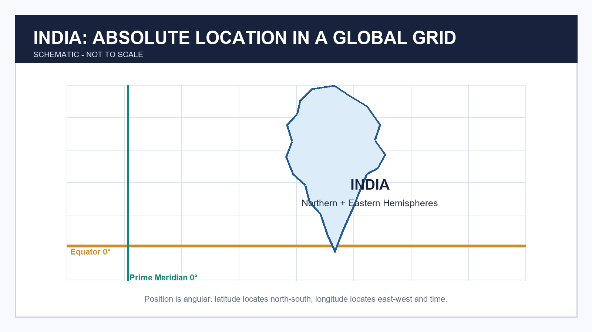

[FACT] Absolute location expresses a place through latitude and longitude. Latitude is angular distance north or south of the Equator; longitude is angular distance east or west of Greenwich. India lies wholly in the Northern and Eastern hemispheres. These are positional facts, not explanations of development.

[ANALYSIS] Site means the physical character of the ground occupied by a place; situation means its relationship to other places, routes and regions; extent measures spread; location can be absolute or relative. For India, the peninsula is a site feature, the position between West and South-East Asia is a situation feature, and the coordinate envelope is extent.

[ANALYSIS] UPSC answers become stronger when they move from position to relation: coordinates establish where India is, while seas, mountains, neighbours, routes and island chains show why the position matters. A coordinate dump without mechanism is a weak GS-I answer.

[LIMIT] Geography is enabling and constraining, not deterministic. India's position created opportunities for monsoon agriculture, cultural exchange and maritime trade, but technology, political choices and global demand mediate every outcome.

> **UPSC trap:** Location equals destiny -> Location supplies conditions and probabilities; agency matters.

## 2. Absolute location, hemispheres and verified extent

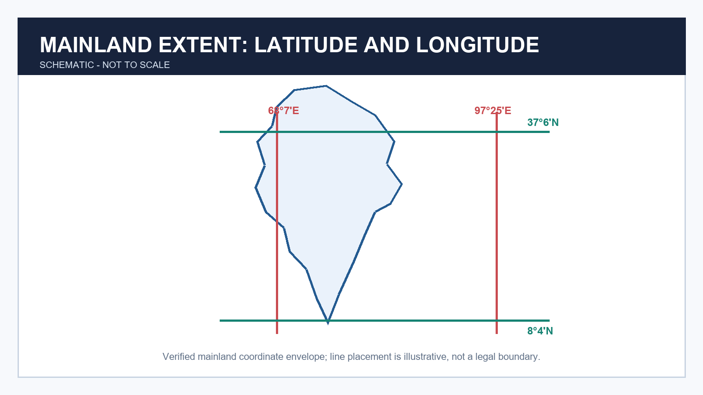

[FACT] The standard mainland coordinate envelope is 8°4'N to 37°6'N and 68°7'E to 97°25'E. The longitudinal span is about 29°18' and the latitudinal span about 29°02'. The mainland therefore appears nearly square in angular terms, though not in linear distance.

[FACT] India lies north of the Equator and east of the Prime Meridian. Every mainstream mainland coordinate is therefore marked N or E. Close-option questions often reverse a hemisphere letter or swap latitude and longitude.

[FACT] The mainland measures about 3,214 km north to south and 2,933 km east to west. India's area is 3,287,263 sq km; official national profiles describe it as the seventh-largest country and about 2.4 per cent of world land area.

[LIMIT] Coordinate figures refer to the conventional mainland envelope unless the source explicitly includes island territory. The national area is stable for exam use, but coastline length is measurement-dependent and must be dated.

> **UPSC trap:** The same 29° span means equal distances -> Longitude degrees contract away from the Equator.

## 3. Mainland versus entire territory: extremes without confusion

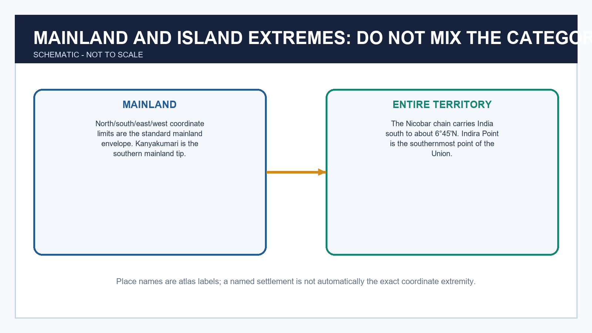

[FACT] The Nicobar Islands extend Indian territory south of the mainland to about 6°45'N. Indira Point on Great Nicobar is the southernmost point of the Union; Kanyakumari is the southern tip of the mainland. The two labels answer different questions.

[FACT] The mainland coordinate envelope gives the western and eastern longitudes as 68°7'E and 97°25'E. Common atlas labels associate the western edge with the Kachchh region and the eastern edge with Arunachal Pradesh.

[LIMIT] Ghuar Mota, Kibithu and Dong are useful map labels, but a settlement, an inhabited point, a sunrise claim and an exact coordinate extremity are not automatically identical. Use the verified longitude in a factual answer; add a place name only with the category stated.

[LIMIT] Indira Col nomenclature in the far north varies across atlases and disputed cartographic contexts. This package does not use it as a precise national extreme because the retained official/core sources do not supply a sufficiently bounded formulation.

> **UPSC trap:** Kanyakumari is India's southernmost point -> It is mainland south; Indira Point is territorial south.

## 4. Tropic of Cancer: spatial order and significance

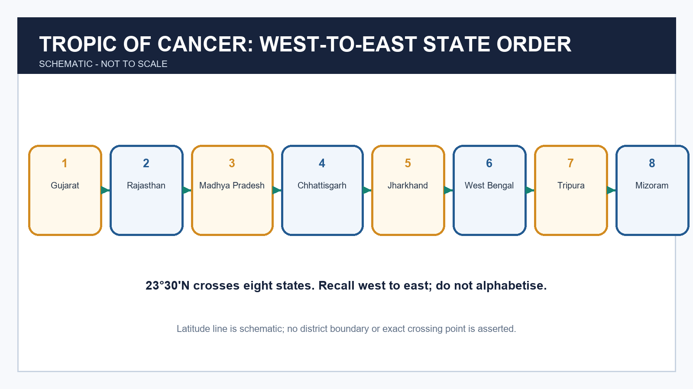

[FACT] The Tropic of Cancer at 23°30'N crosses eight states from west to east: Gujarat, Rajasthan, Madhya Pradesh, Chhattisgarh, Jharkhand, West Bengal, Tripura and Mizoram. The order is geographic, not alphabetical.

[ANALYSIS] The line is a solar-geometric reference, not a climatic wall. Areas south of it are not uniformly tropical in experienced climate, and areas north are not uniformly temperate. Altitude, monsoon circulation, continentality and local relief modify the broad latitudinal signal.

[ANALYSIS] As a map-elimination tool, the Tropic helps reject states too far north or south and supports location questions involving rivers, plateaus, forests and cities. It is especially useful when an option combines one correct western state with a false eastern state.

[LIMIT] Saying the Tropic 'divides India into two equal halves' is imprecise. It passes through the broad middle of the country, but territorial geometry and island extent prevent literal equality.

> **UPSC trap:** The Tropic creates two equal climatic halves -> It is a reference parallel; climate transitions are gradual.

## 5. Standard Meridian, Mirzapur wording and IST derivation

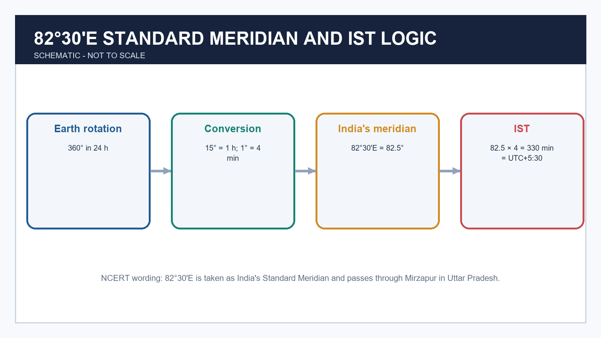

[FACT] India takes 82°30'E as its Standard Meridian. NCERT states that this longitude passes through Mirzapur in Uttar Pradesh and that the time along it is taken as standard time for the whole country. Use 'passes through Mirzapur' rather than embellishing it as a unique observatory or exact central point.

[FACT] Earth rotates 360° in 24 hours: 15° equals one hour and 1° equals four minutes. Therefore 82.5° east of Greenwich is 330 minutes, or 5 hours 30 minutes ahead of UTC/GMT. IST is UTC+5:30.

[ANALYSIS] 82°30'E is close to the mid-longitude of the mainland envelope: the midpoint of 68°7'E and 97°25'E is approximately 82°46'E. Standard time uses a convenient central meridian, not the mathematically exact midpoint.

[LIMIT] The standard meridian is a time-reference line, not a political boundary. Lists of states crossed are mapwork aids; the core legal-administrative fact is the adopted longitude and the national time offset.

> **UPSC trap:** 82°30'E is the exact central longitude -> It is near-central; the mainland midpoint is about 82°46'E.

## 6. East-west solar-time difference and unequal linear distances

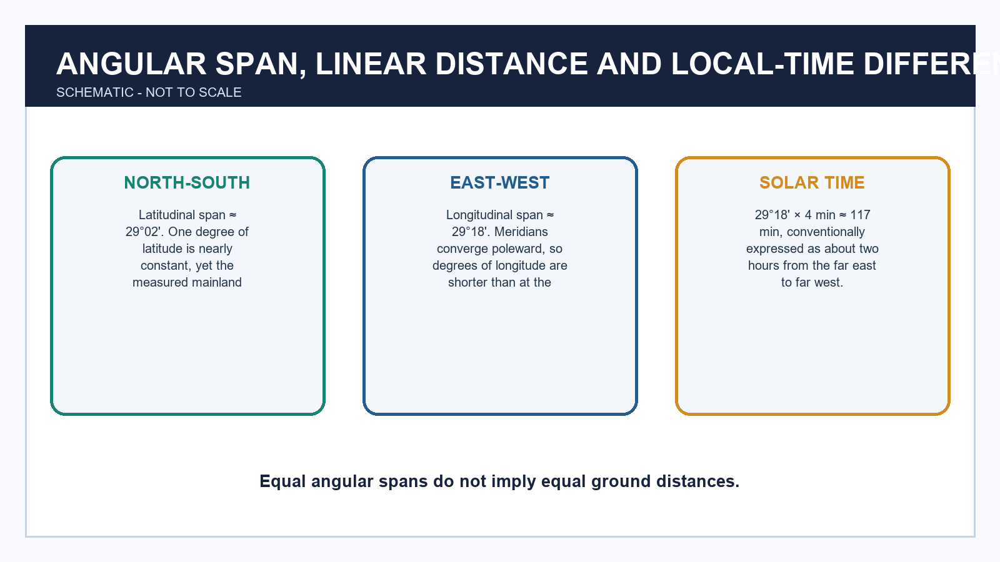

[FACT] India's longitudinal span is about 29°18'. Multiplying by four minutes per degree gives about 117 minutes, conventionally rounded to a two-hour difference in local solar time between the far east and far west.

[ANALYSIS] Eastern places experience local noon and sunrise earlier because Earth rotates west to east. Clock time remains IST everywhere, so solar schedules in the North-East can be substantially ahead of official schedules.

[FACT] A degree of latitude is nearly constant in length, while a degree of longitude equals roughly 111 km multiplied by cosine latitude. Meridians converge toward the poles. This is why similar angular north-south and east-west spans do not produce identical linear distances.

[LIMIT] A two-hour figure is an envelope calculation, not the sunrise difference on every date. Day length, terrain, refraction and the chosen locations change observed sunrise times.

> **UPSC trap:** Eastern India is behind western India -> East is ahead in local solar time.

## 7. Area, boundary and coastline: definitions before numbers

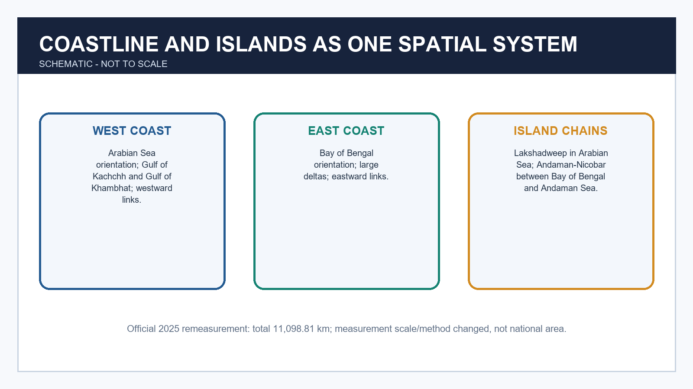

[FACT] India's official area is 3,287,263 sq km. MHA border-management material gives the total international land border as 15,106.7 km. Land boundary and coastline are separate measures and must never be added as if they described one uniform edge.

[FACT] A 2025 Government of India remeasurement revised the coastline from the legacy 7,516.6 km to 11,098.81 km using higher-resolution GIS/HWL methodology and more detailed treatment of offshore islands and coastal intricacy. The official breakup reported is about 7,870.5 km mainland and 3,228.3 km islands.

[ANALYSIS] The increase illustrates the coastline paradox: measured length rises as scale becomes finer and more indentations are captured. No territory or national area increased merely because the line was measured in more detail.

[LIMIT] The revised national coastline does not by itself redraw CRZ high-tide-line regulation or maritime boundaries. Quote the number with year and methodology context; use 7,516.6 km only as a clearly labelled legacy figure.

> **UPSC trap:** Longer remeasurement means territorial expansion -> It reflects finer measurement, not new land.

## 8. Neighbours, maritime setting and dispute-safe mapwork

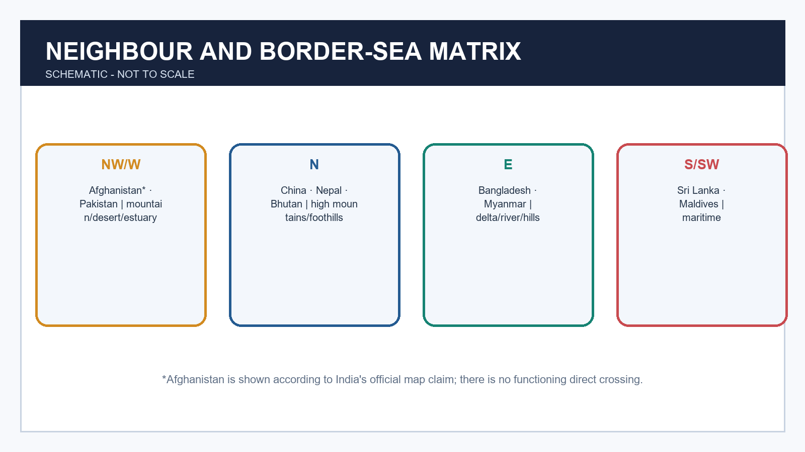

[FACT] India's official land-neighbour list comprises Afghanistan, Pakistan, China, Nepal, Bhutan, Bangladesh and Myanmar. Sri Lanka and Maldives are key maritime neighbours. Sri Lanka is separated by the Palk Strait and Gulf of Mannar; Maldives lies south-west of Lakshadweep.

[FACT] MHA's official land-border total includes Afghanistan according to India's map claim. Because intervening territory is under Pakistan's administration, India has no functioning direct crossing to Afghanistan. This status must be bounded, not casually converted into an accessible border.

[ANALYSIS] Border character varies: high mountain frontiers dominate the north; open foothill-plains connections matter with Nepal; alluvial and deltaic terrain shapes Bangladesh; forested hills structure Myanmar; desert and estuarine sectors occur toward Pakistan.

[LIMIT] This topic does not adjudicate sovereignty disputes or draw disputed boundaries. Use an official India map for legal cartography; in an exam schematic, label regions and border types without inventing a settled line.

> **UPSC trap:** All neighbours have the same border type -> Mountain, plains, deltaic, desert and maritime interfaces differ.

## 9. India as a subcontinent: unity without isolation

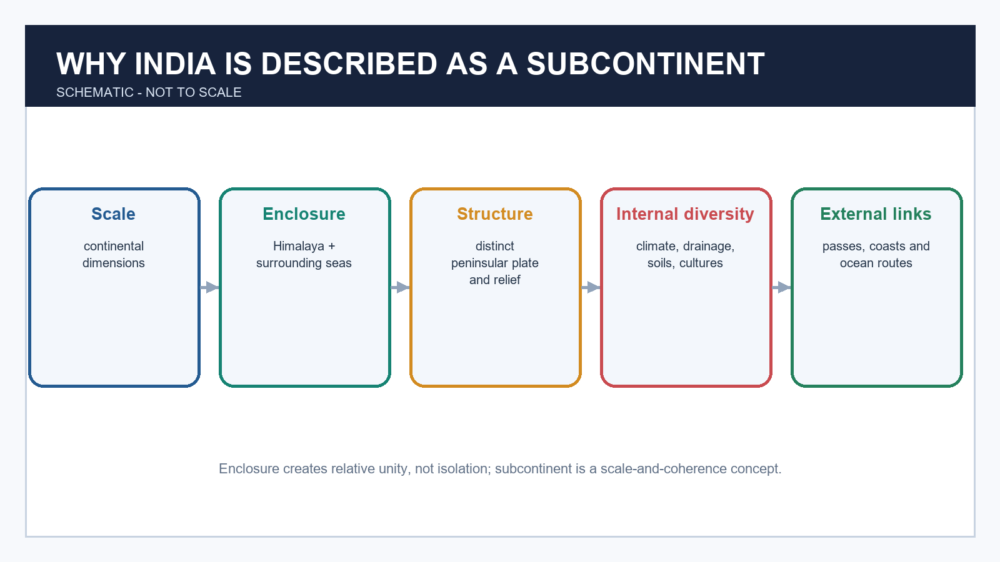

[FACT] UPSC Mains GS-I 2021 directly asked: 'Why is India considered as a subcontinent? Elaborate your answer.' The answer demands reasons, not merely a list of countries.

[ANALYSIS] India has continental scale, a distinctive triangular peninsula, a broad Himalayan arc, large internally connected drainage-plains systems, major climatic and ecological diversity, and a long surrounding maritime frontage. Together these create relative physical coherence within Asia.

[ANALYSIS] The Himalaya, Hindu Kush-Karakoram approaches, surrounding seas and island arcs provide partial enclosure. Yet passes, river valleys and maritime routes enabled movement of peoples, ideas, crops, faiths and trade. 'Subcontinent' therefore means a large, coherent subdivision, not an isolated container.

[LIMIT] The membership of the 'Indian subcontinent' varies by disciplinary convention. South Asia is a modern regional label and is not always identical in scope. State the usage rather than asserting one timeless list.

> **UPSC trap:** Subcontinent means culturally homogeneous -> It combines scale and coherence with deep internal diversity.

## 10. Indian Ocean centrality, seas and island chains

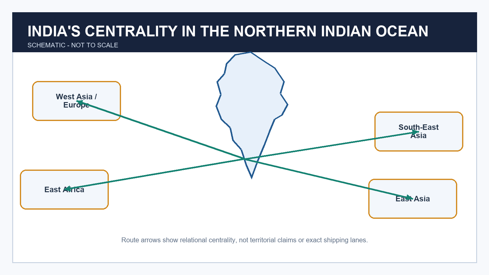

[FACT] The peninsula projects into the northern Indian Ocean, with the Arabian Sea to the west, Bay of Bengal to the east and the ocean to the south. The Andaman Sea lies east of the Andaman-Nicobar chain; Lakshadweep lies in the Arabian Sea.

[ANALYSIS] India's situation connects maritime approaches from the Gulf and Red Sea toward South-East and East Asia. This supports trade, energy transport, naval mobility, diaspora links and diplomatic engagement across the Indian Ocean region.

[FACT] Major external chokepoints relevant to these routes include Hormuz, Bab-el-Mandeb and Malacca. They should be drawn schematically as gateways on wider routes; India is affected by them but does not automatically control them.

[LIMIT] Centrality is relational. Shipping follows markets, port capacity, risk, vessel economics and political conditions. A central map position creates strategic relevance, not guaranteed commercial dominance.

> **UPSC trap:** Andaman Sea lies west of India -> It lies east of the Andaman-Nicobar chain.

## 11. Coast, peninsula and island spatial system

[ANALYSIS] Peninsular form gives India two major coastal orientations. The west coast faces the Arabian Sea and routes toward West Asia and East Africa; the east coast faces the Bay of Bengal and routes toward South-East Asia. Coastal plains, gulfs, estuaries and deltas modify port and hazard conditions.

[FACT] Lakshadweep is an Arabian Sea island group; Andaman and Nicobar Islands extend India's presence between the Bay of Bengal and Andaman Sea. The Ten Degree Channel separates the Andaman and Nicobar groups.

[ANALYSIS] Islands extend search-and-rescue reach, maritime domain awareness and ecological responsibility. They also hold coral reefs, mangroves, endemic species and vulnerable freshwater lenses, making ecology integral to strategy.

[LIMIT] Strategic language must not erase island communities, carrying capacity, seismic-tsunami exposure or environmental limits. Detailed project appraisal and security doctrine belong to Environment, IR and Internal Security owners.

> **UPSC trap:** All Indian islands are coral atolls -> Lakshadweep is coral; A&N has different geological origins.

## 12. Physiographic gateways: Himalaya and ocean as filters/connectors

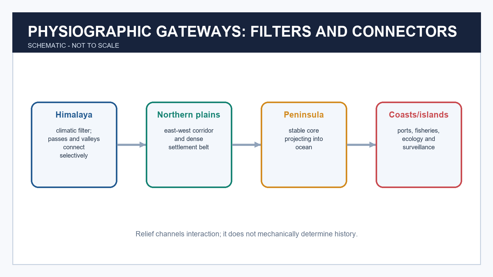

[ANALYSIS] The Himalaya is a climatic filter: it obstructs very cold continental air and forces uplift of moisture-bearing winds. It is also a selective connector through passes and valleys. Calling it an absolute wall ignores centuries of trans-Himalayan interaction.

[ANALYSIS] The northern plains form a longitudinal corridor linking river basins, settlement and transport. The peninsula projects into the ocean, while coastal plains and gaps create outward-facing gateways.

[ANALYSIS] Oceans moderate coastal temperature and provide routes, but storms, surges, saline intrusion and maritime distance impose costs. A sea can connect more efficiently than land for bulk trade while still exposing coasts to hazards.

[LIMIT] Detailed physiographic divisions, drainage evolution and monsoon mechanics belong to later Geography topics. Here they appear only as mechanisms through which location gains significance.

> **UPSC trap:** Mountains and seas only isolate -> Both obstruct and connect selectively.

## 13. Location linkages: climate, biodiversity, agriculture and culture

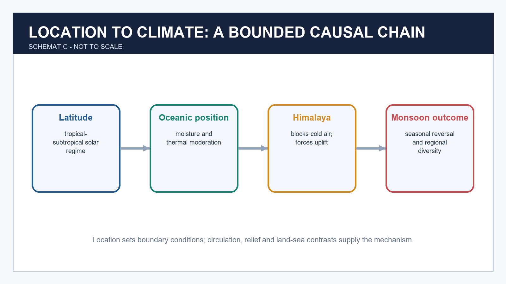

[ANALYSIS] Latitude places most of India in tropical and subtropical solar regimes. Oceanic surroundings supply moisture; the Himalayan arc and varied relief redirect air masses. These boundary conditions contribute to monsoon seasonality and regional climatic diversity.

[ANALYSIS] Climatic gradients, altitudinal range and two marine flanks help create varied habitats from alpine to tropical and arid to humid. Location is one layer; geology, relief, soils, evolutionary history and human land use complete the biodiversity explanation.

[ANALYSIS] Seasonal rainfall and temperature structure crop calendars, but irrigation, seed choice, markets and policy mediate agriculture. Avoid climatic determinism: similar latitudes can support different systems under different water and technological conditions.

[ANALYSIS] Passes, plains and coasts channelled cultural contacts. Overland and maritime routes connected India to Central Asia, West Asia, East Africa and South-East Asia. Interaction was multidirectional, not a one-way 'invasion route' story.

> **UPSC trap:** Tropic alone explains India's climate -> Monsoon circulation and relief are indispensable.

## 14. Location, trade and security: relational strategy

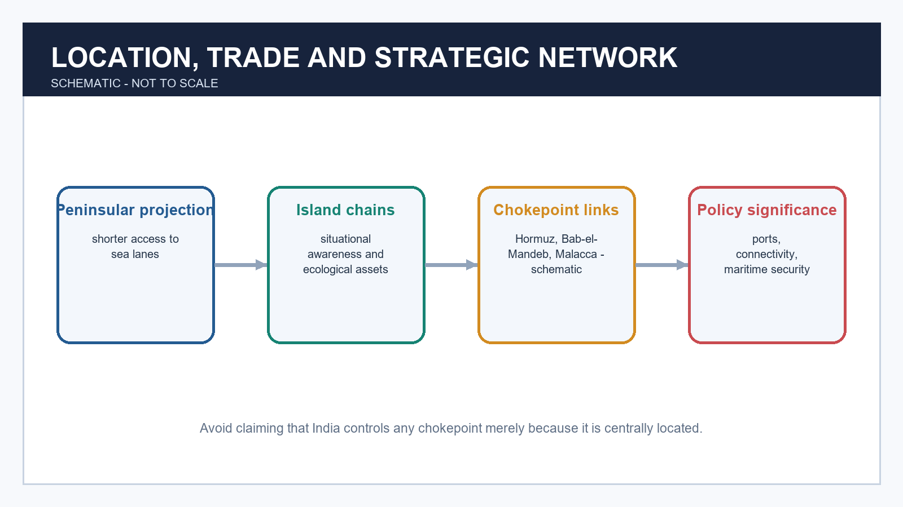

[ANALYSIS] India's position astride northern Indian Ocean routes gives it proximity to energy flows from West Asia and commercial connections toward Europe, Africa and Asia. Ports and hinterland connectivity convert geographic opportunity into economic value.

[ANALYSIS] The Andaman-Nicobar chain is near approaches linking the Bay of Bengal and wider eastern Indian Ocean; Lakshadweep sits amid western sea-lane geography. Their significance lies in awareness, logistics and partnerships, not in exaggerated claims of automatic control.

[ANALYSIS] Maritime strategy connects ports, merchant shipping, naval and coast-guard capacity, hydrography, disaster response, fisheries and regional diplomacy. Location supplies a network position; institutions determine usable capacity.

[LIMIT] Detailed SAGAR/MAHASAGAR policy, naval doctrine, port economics and border security are cross-link owners in IR, Internal Security, Economy and Environment. This chapter provides only the spatial base.

> **UPSC trap:** Central position guarantees control -> Control requires capacity, law and cooperation.

## 15. Map skills, coordinate elimination and close-option logic

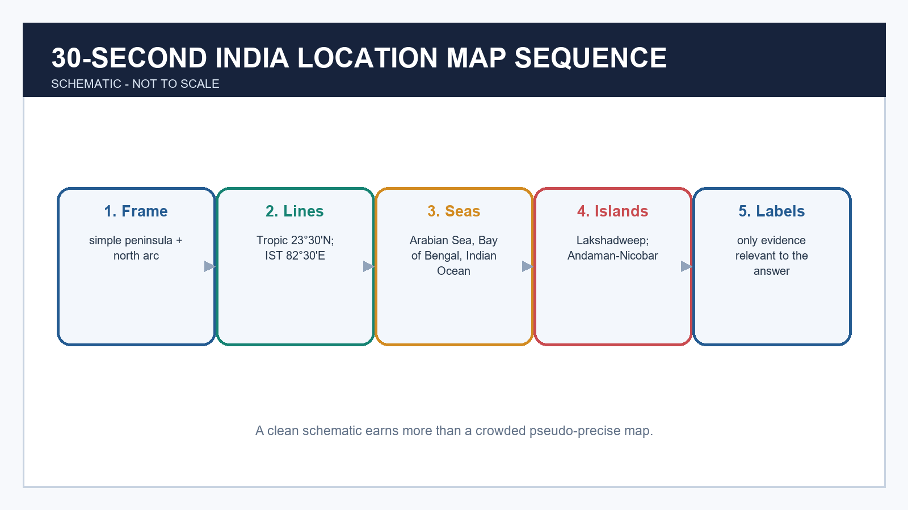

[ANALYSIS] Draw a simple north arc and tapering peninsula, then add only the evidence required: Tropic of Cancer, Standard Meridian, seas and island chains. Mark every such map 'schematic/not to scale' if geometry is simplified.

[FACT] Coordinate elimination starts with category: latitude uses N/S, longitude E/W; India is N and E. Next check range: mainland latitude begins near 8°N, but entire territory extends near 6°45'N. Then check order and arithmetic.

[ANALYSIS] For time questions, convert longitude difference to minutes before deciding who is ahead. For state-order questions, move mentally west-east rather than recalling an unordered list.

[LIMIT] Do not draw international boundaries from memory in disputed sectors. A rough national silhouette is adequate for GS-I analytical maps; precise legal cartography requires an official map.

> **UPSC trap:** More labels always earn more marks -> Relevant, accurate labels outperform clutter.

## 16. Answer architecture, current relevance and ownership limits

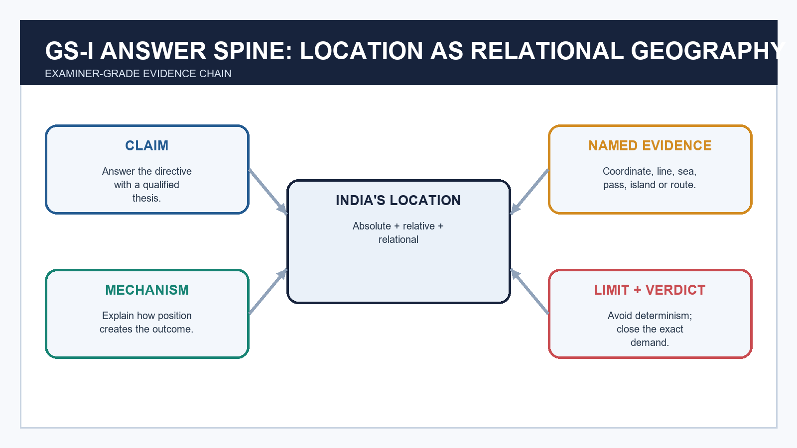

[ANALYSIS] Begin with a direct thesis: India's significance arises from the interaction of absolute location, continental-scale extent, Himalayan-oceanic enclosure and centrality in the northern Indian Ocean. Organise the body by physical unity, internal diversity, connectivity and strategic consequences.

[ANALYSIS] Every paragraph should follow claim -> named spatial evidence -> mechanism/significance -> limitation. Example: the peninsula projects into the Indian Ocean -> Arabian Sea/Bay of Bengal access -> connects west-east routes -> but port capacity and external chokepoints condition benefit.

[FACT] The bounded current anchor is the 2025 official coastline remeasurement to 11,098.81 km. It is useful for measurement-method questions and coastal planning context, but it does not replace static coordinate knowledge.

[LIMIT] There is one directly routed local Mains PYQ for this owner: GS-I 2021 on subcontinent status. No direct locally verified Prelims PYQ is forced into the package. Objective practice below is original and explicitly labelled.

> **UPSC trap:** A current figure can replace static theory -> Current data is an anchor, not the conceptual spine.

## Verified PYQ and solved answer

PYQ - UPSC GS-I 2021: Why is India considered as a subcontinent? Elaborate your answer. (10 marks, 150 words)

**Model answer (10 marks/150 words).** [CLAIM] India is considered a subcontinent because it combines continental scale with a relatively coherent physical frame inside Asia. [EVIDENCE] Its approximately 3.28 million sq km area, Himalayan arc, Indo-Gangetic-Brahmaputra plains, peninsular plateau, long coast and island extensions form a large, internally connected geographic unit. [MECHANISM] The Himalaya and surrounding seas provide relative enclosure; monsoon circulation, major river systems and the peninsula create shared environmental linkages, while scale produces striking climatic, ecological and cultural diversity. [EVIDENCE] Passes across the north-west and north-east and Arabian Sea-Bay of Bengal routes connected the region with Central Asia, West Asia, Africa and South-East Asia. [LIMIT] Therefore enclosure never meant isolation, nor does subcontinent imply homogeneity. The term is best understood as a large and distinctive subdivision of Asia whose physical coherence coexists with porous frontiers and deep internal diversity. **Why this earns marks:** it answers 'why', uses named spatial evidence, explains mechanism, qualifies isolation and closes with a graded definition.

## Learning MCQ loop

### Q1. India lies wholly in which hemispheres?
- A. Northern and Eastern
- B. Northern and Western
- C. Southern and Eastern
- D. Southern and Western
**Answer: A.** Both the mainland and islands lie north of the Equator and east of Greenwich.

### Q2. Which statement correctly distinguishes mainland and territorial south?
- A. Indira Point is mainland south
- B. Kanyakumari is mainland south; Indira Point is territorial south
- C. Both are on the mainland
- D. Kanyakumari is territorial south only
**Answer: B.** Kanyakumari and Indira Point answer different spatial categories.

### Q3. The Tropic of Cancer states begin west-to-east with:
- A. Rajasthan, Gujarat
- B. Madhya Pradesh, Gujarat
- C. Gujarat, Rajasthan
- D. Gujarat, Madhya Pradesh
**Answer: C.** The correct opening is Gujarat then Rajasthan.

### Q4. IST is UTC+5:30 because:
- A. India uses 75°E
- B. 82.5° divided by 4 gives hours
- C. India is 5.5° east
- D. 82.5° × 4 minutes = 330 minutes
**Answer: D.** Longitude is converted at four minutes per degree.

### Q5. The mainland latitudinal envelope begins near:
- A. 8°4'N
- B. 6°45'N
- C. 23°30'N
- D. 37°6'N
**Answer: A.** 6°45'N belongs to the southern island extension.

### Q6. Which is the correct west-east Tropic sequence fragment?
- A. Jharkhand-Chhattisgarh-West Bengal
- B. Chhattisgarh-Jharkhand-West Bengal
- C. West Bengal-Jharkhand-Tripura
- D. Madhya Pradesh-Rajasthan-Chhattisgarh
**Answer: B.** The central-east sequence is Chhattisgarh, Jharkhand, West Bengal.

### Q7. Why are the N-S and E-W linear distances unequal despite similar angular spans?
- A. Latitude circles shrink northward
- B. Earth rotates unevenly
- C. Meridians converge poleward
- D. The Tropic bends
**Answer: C.** Longitude-degree length varies with latitude.

### Q8. Which conclusion follows from the 2025 coastline revision?
- A. India gained land
- B. CRZ boundaries automatically moved
- C. India's area increased
- D. Finer methodology captured more coastal detail
**Answer: D.** The revision is methodological, not territorial.

## Solved Mains practice

### Original 10-marker: Explain why India's similar latitudinal and longitudinal spans produce unequal north-south and east-west distances.

**Model answer.** [CLAIM] Angular equality on a globe does not produce equal linear distance because latitude and longitude are geometrically different. [EVIDENCE] Mainland India spans about 29°02' in latitude and 29°18' in longitude, but about 3,214 km north-south and 2,933 km east-west. [MECHANISM] One degree of latitude remains nearly constant, whereas meridians converge poleward, so a longitude degree equals roughly 111 km multiplied by cosine latitude. India's east-west span therefore traverses shorter longitude degrees than at the Equator. [LIMIT] Published distances also follow the country's irregular outline rather than a perfect rectangle. [VERDICT] Coordinate span must be converted using spherical geometry, not read as a flat grid. **Why this earns marks:** exact figures serve a mechanism, with a shape qualification.

### Original 15-marker: Analyse how India's location has shaped climate, cultural contacts and maritime strategy.

**Model answer.** [CLAIM] India's location supplies an enabling physical and relational frame, but outcomes arise through circulation, routes and state capacity. [EVIDENCE] Tropical-subtropical latitude, the Himalayan arc and Arabian Sea-Bay of Bengal moisture combine with monsoon circulation to produce seasonal rainfall and regional contrasts. [MECHANISM] The Himalaya filters cold air and forces uplift, while the ocean moderates coasts; however relief and circulation, not latitude alone, explain rainfall. [EVIDENCE] North-western passes, Himalayan valleys and long coasts connected India with Central Asia, West Asia, East Africa and South-East Asia, enabling multidirectional movement of crops, faiths, technologies and communities. [EVIDENCE] The peninsula and island chains place India near northern Indian Ocean routes linking Gulf/Red Sea approaches with South-East Asia. [MECHANISM] This supports ports, energy security, maritime awareness and disaster response. [LIMIT] India does not automatically control Hormuz, Bab-el-Mandeb or Malacca, and strategic use must respect island ecology and communities. [VERDICT] Location is strategic potential converted into outcomes by infrastructure, institutions and cooperation. **Why this earns marks:** three dimensions, named evidence, mechanisms and anti-determinist qualification.

### Original 20-marker: 'The Himalaya and the Indian Ocean have made India both a relatively coherent geographic unit and an open arena of exchange.' Discuss.

**Model answer.** [CLAIM] The apparent contradiction is the core of India's situation: mountain-ocean enclosure creates relative coherence, while selective gateways sustain exchange. [EVIDENCE] The Himalayan-Karakoram arc separates the subcontinent from the Tibetan and Central Asian interiors, checks cold continental air and helps organise river and monsoon systems. [MECHANISM] This gives the northern plains and peninsula a shared environmental frame. [LIMIT] Yet passes and valleys were never sealed; they carried trade, pilgrimage, pastoral mobility and political contact. [EVIDENCE] To the south, the peninsula is flanked by the Arabian Sea and Bay of Bengal and extended by Lakshadweep and Andaman-Nicobar. [MECHANISM] Cheap maritime movement connected western India to Gulf-East African circuits and eastern India to Sri Lanka and South-East Asia; monsoon winds historically structured sailing seasons. [EVIDENCE] Modern shipping links West Asian energy routes with East Asian production networks through the wider Indian Ocean. [LIMIT] External chokepoints remain beyond Indian sovereignty, while coasts and islands face cyclones, tsunamis, erosion and ecological limits. [ANALYSIS] Thus mountains and seas are filters and connectors, not deterministic walls or highways. [VERDICT] India's geographic unity is relative and relational: enclosure supplies a recognisable subcontinental frame, but permeability explains its plural culture and maritime significance. **Why this earns marks:** the answer directly resolves the quotation, scales evidence to 20 marks and balances unity with permeability.

## Advanced refinements and future-question readiness

**A. Coordinate envelope versus polygon reality.** [ANALYSIS] A country's minimum and maximum latitude-longitude values define a bounding envelope, not a rectangular shape. Corners of that rectangle may fall outside the territory, while coastlines and borders curve within it. This distinction matters in close-option questions and in distance calculations: subtracting coordinates yields angular span, whereas the quoted 3,214 km and 2,933 km are standard geographic dimensions of an irregular mainland. [LIMIT] Do not use a bounding-box corner as a named extreme point unless an authoritative map identifies it.

**B. Why the mainland is the default coordinate convention.** [FACT] School and government profiles commonly state 8°4'N-37°6'N and 68°7'E-97°25'E for the mainland, then separately note that islands extend to about 6°45'N. [ANALYSIS] This two-stage convention keeps a compact continental envelope while acknowledging archipelagic territory. [LIMIT] A question saying 'India' may intend the entire Union, while a table headed 'mainland extent' does not. The safest answer states the category before the figure.

**C. Central meridian selection as administrative geography.** [ANALYSIS] A standard meridian is chosen to minimise nationwide divergence while retaining one clock for transport, communication, markets and administration. India's 82°30'E lies close to the midpoint of the mainland longitudes and produces a half-hour UTC offset. [LIMIT] 'Central' is functional rather than mathematically exact. Political adoption, not pure geometry, turns a longitude into legal time.

**D. Solar time versus civil time.** [FACT] Local solar noon occurs when the Sun crosses the local meridian; civil time follows the standard meridian. [ANALYSIS] In far eastern India, the Sun's daily cycle is ahead of the clock, creating debates over work hours, energy use and a second time zone. [LIMIT] A time-zone policy answer must consider rail and aviation scheduling, administrative coordination and social practice; the two-hour geographic envelope alone does not settle the policy.

**E. Latitude is not a climatic border.** [ANALYSIS] The Tropic of Cancer marks the northernmost overhead-Sun limit, but India's weather is produced by seasonal pressure gradients, ocean-atmosphere circulation, relief and land-sea thermal contrast. Elevation can make a southern highland cooler than a northern plain. [LIMIT] Use 'tropical and subtropical setting' as a first-order classification, not as a complete explanation of rainfall or temperature.

**F. Comparative scale without false equivalence.** [ANALYSIS] Comparisons with other large countries are useful only to reveal geometric principles. Australia is a large island-continent with a very different latitudinal position; Brazil straddles the Equator; China has greater east-west continentality. India combines a nearly 30-degree mainland span with a peninsula and monsoon-facing oceanic position. [LIMIT] Avoid unsourced rank tables or claiming that similar area produces similar climate.

**G. Subcontinent as a relational scale concept.** [ANALYSIS] 'Subcontinent' joins three ideas: size large enough to display continental diversity, relative physical coherence, and distinction within a larger continent. India's Himalayan arc, plains-plateau-peninsula system and surrounding seas support coherence; passes and sea routes maintain permeability. [LIMIT] It is neither a legal category nor proof of cultural sameness, and its regional membership varies by convention.

**H. Mountains as selective permeability.** [ANALYSIS] High relief raises movement costs and channels flows through corridors. The Himalaya therefore filters air masses and movement while passes and valleys focus exchange. This is stronger than the textbook shorthand 'barrier': a filter explains both obstruction and connection. [LIMIT] Detailed pass history and border doctrine belong to political geography and history owners.

**I. Oceans as routes and risk fields.** [ANALYSIS] Maritime transport lowers bulk-movement costs and links ports across long distances, making India's peninsula outward-facing. The same exposure creates cyclone, tsunami, erosion, storm-surge and saline-intrusion risks. [LIMIT] A balanced answer pairs opportunity with hazard and avoids treating every coast as equally suitable for ports or settlement.

**J. Coastline measurement as a scale lesson.** [FACT] The 2025 official revision used finer GIS/HWL measurement and included more coastal and island detail. [ANALYSIS] It demonstrates that coastline is not a single scale-free physical constant: more detailed measurement follows more inlets, estuaries and island perimeters. [LIMIT] The official administrative figure is still valid for its specified method; 'paradox' does not mean the government number is arbitrary.

**K. Island chains: extension without simplification.** [ANALYSIS] Lakshadweep and Andaman-Nicobar extend India's environmental, logistical and maritime relationships in different basins. Their geological character, community life and ecological vulnerability differ. [LIMIT] Do not compress islands into military dots or label all as coral. Strategic relevance and ecological stewardship must be stated together.

**L. Neighbour counts depend on category.** [FACT] The official land list has seven entries, while Sri Lanka and Maldives are prominent maritime neighbours. [ANALYSIS] A question may count land adjacency, maritime boundary, South Asian membership or broader neighbourhood policy; each produces a different set. [LIMIT] Always identify the counting rule before giving a number.

**M. Administrative accuracy after reorganisation.** [ANALYSIS] Older books may assign borders to the former state of Jammu and Kashmir or list undivided Union territories. Current answers should use Jammu and Kashmir and Ladakh as Union territories where relevant and avoid reproducing stale capital/state tables. [LIMIT] This package keeps only the locational principle and routes detailed current border-state mapping to Topic 35.

**N. Route maps require humility.** [ANALYSIS] Hormuz, Bab-el-Mandeb and Malacca are useful schematic gateways for showing India's dependence on west-east maritime circulation. The correct claim is exposure and proximity, not control. [LIMIT] Exact shipping tracks change with destination, vessel, draft, security conditions and commercial decisions; arrows in a GS-I map are relational symbols.

**O. From static fact to Mains analysis.** [ANALYSIS] Convert every fact by asking 'so what?': 82°30'E becomes administrative uniformity versus eastern solar-time mismatch; a peninsula becomes two maritime orientations; Himalayan enclosure becomes climate filtering plus selective exchange; islands become awareness plus ecological responsibility. [LIMIT] Stop before duplicating the full mechanisms owned by later chapters.

**P. Future-question transformations.** [ANALYSIS] The same knowledge can answer 'explain India's strategic location', 'examine the basis of subcontinental unity', 'why does one time zone create regional mismatch?', or 'how do mountains and seas both divide and connect?'. Change the thesis and evidence order to the directive. [LIMIT] Do not paste the 2021 subcontinent model into every locational question.

**Q. Latitude-longitude calculation protocol.** [ANALYSIS] First normalise degrees and minutes; second subtract with borrowing where required; third convert longitude to time at four minutes per degree; fourth state direction, remembering that east is ahead. For linear-distance estimates, do not multiply longitude degrees by a universal 111 km without applying latitude. [LIMIT] UPSC normally rewards the rule and clean working rather than false decimal precision, so the conventional 'about two hours' is preferable to presenting seconds as observed sunrise truth.

**R. Evidence selection by marks.** [ANALYSIS] A 10-marker on location can use three high-performing units: coordinate/extent, Himalayan-oceanic frame and Indian Ocean situation. A 15-marker should add islands, neighbours/routes and a qualification. A 20-marker can integrate climate, cultural contacts, trade, security and ecological limits while retaining one map. [LIMIT] Evidence density is not label density; every named feature must prove a claim.

**S. Map ethics and disputed space.** [ANALYSIS] A GS-I schematic is an analytical diagram, not a substitute for the official national map. Its job is to show relative position of a latitude, meridian, sea, island chain or route. Marking it not to scale prevents visual geometry from being mistaken for a surveyed claim. [LIMIT] Never create a false boundary, truncate island territory or use dotted/solid lines to imply a legal position from memory.

**T. Current-data discipline.** [ANALYSIS] Dynamic administrative and measurement facts should carry an issuing institution and date. The 2025 coastline revision is safe because the method and total were officially issued; old textbook coastline figures remain useful only as legacy comparators. [LIMIT] The package deliberately avoids volatile port rankings, shipping shares, neighbour-trade values and unverified extreme-point coordinates because they do not improve the core locational answer.

**U. Cross-subject deployment.** [ANALYSIS] In Environment, location explains marine ecosystems and hazard exposure; in IR, it explains neighbourhood and Indian Ocean relationships; in History, it frames passes and maritime contacts; in Economy, it frames ports, corridors and time coordination. [LIMIT] Geography supplies the spatial mechanism, while those owners supply law, diplomacy, chronology or economic policy. This boundary prevents shallow duplication and keeps evidence attributable.

**V. Coordinate close-option drill.** [ANALYSIS] When two options differ only by minutes, use anchor memory rather than visual intuition: 8°4'N, 37°6'N, 68°7'E and 97°25'E. When an option substitutes 6°45'N, ask whether the stem says mainland or entire territory. When latitude and longitude are swapped, check whether the values could physically describe India. [LIMIT] Do not reward a familiar place name when the coordinate category is wrong.

**W. Tropic-order reconstruction.** [ANALYSIS] Rebuild the eight-state sequence spatially: enter Gujarat, cross Rajasthan and central Madhya Pradesh, continue through Chhattisgarh and Jharkhand, then West Bengal, the detached north-eastern state of Tripura and finally Mizoram. This reconstruction is more durable than a bare mnemonic because it uses the map's west-east logic. [LIMIT] The line does not cross Odisha, Maharashtra or Assam despite their proximity to listed states.

**X. Border-sea matrix method.** [ANALYSIS] Arrange neighbours by terrain rather than memorising one list: north-west mountain/desert, northern high mountains and foothills, eastern delta/hills, southern maritime. Add Sri Lanka through Palk Strait-Gulf of Mannar and Maldives south-west of Lakshadweep. [LIMIT] A matrix is a study aid, not a legal boundary depiction, and the Afghanistan entry requires the official-claim/no-functional-crossing qualification.

**Y. Island comparison for answers.** [ANALYSIS] Lakshadweep strengthens the western Arabian Sea orientation and is dominated by low coral islands; Andaman-Nicobar creates an eastern archipelagic orientation near the Bay of Bengal-Andaman Sea transition and has a different tectonic-geological setting. [LIMIT] Neither chain should be reduced to strategic utility: freshwater, hazards, biodiversity, indigenous/community rights and carrying capacity shape any defensible policy conclusion.

**Z. Climate-link answer control.** [ANALYSIS] A location question may mention monsoon, but it should stop after establishing the causal bridge: tropical-subtropical latitude plus oceanic moisture plus Himalayan relief and land-sea contrast create the setting for seasonal circulation. [LIMIT] Jet streams, ITCZ migration, onset, breaks, ENSO and IOD belong to dedicated climate owners; importing them all would turn a location answer into an unfocused monsoon essay.

**AA. Final self-audit before submission.** [ANALYSIS] Check five things: every number has a category; every map is schematic and bounded; every strategic claim distinguishes proximity from control; every paragraph links evidence to mechanism; every conclusion answers the directive. [LIMIT] Delete decorative data that does no analytical work. The highest-value location answer is not the longest fact list but the clearest explanation of how absolute position, relative situation and extent interact.

## Complete solved-practice bank

### Verified PYQ

PYQ - UPSC GS-I 2021: Why is India considered as a subcontinent? Elaborate your answer. (10 marks, 150 words)

**Model answer (10 marks/150 words).** [CLAIM] India is considered a subcontinent because it combines continental scale with a relatively coherent physical frame inside Asia. [EVIDENCE] Its approximately 3.28 million sq km area, Himalayan arc, Indo-Gangetic-Brahmaputra plains, peninsular plateau, long coast and island extensions form a large, internally connected geographic unit. [MECHANISM] The Himalaya and surrounding seas provide relative enclosure; monsoon circulation, major river systems and the peninsula create shared environmental linkages, while scale produces striking climatic, ecological and cultural diversity. [EVIDENCE] Passes across the north-west and north-east and Arabian Sea-Bay of Bengal routes connected the region with Central Asia, West Asia, Africa and South-East Asia. [LIMIT] Therefore enclosure never meant isolation, nor does subcontinent imply homogeneity. The term is best understood as a large and distinctive subdivision of Asia whose physical coherence coexists with porous frontiers and deep internal diversity. **Why this earns marks:** it answers 'why', uses named spatial evidence, explains mechanism, qualifies isolation and closes with a graded definition.

### Original conceptual and map MCQs

#### Q1. India lies wholly in which hemispheres?
- A. Northern and Eastern
- B. Northern and Western
- C. Southern and Eastern
- D. Southern and Western
**Answer: A.** Both the mainland and islands lie north of the Equator and east of Greenwich.

#### Q2. Which statement correctly distinguishes mainland and territorial south?
- A. Indira Point is mainland south
- B. Kanyakumari is mainland south; Indira Point is territorial south
- C. Both are on the mainland
- D. Kanyakumari is territorial south only
**Answer: B.** Kanyakumari and Indira Point answer different spatial categories.

#### Q3. The Tropic of Cancer states begin west-to-east with:
- A. Rajasthan, Gujarat
- B. Madhya Pradesh, Gujarat
- C. Gujarat, Rajasthan
- D. Gujarat, Madhya Pradesh
**Answer: C.** The correct opening is Gujarat then Rajasthan.

#### Q4. IST is UTC+5:30 because:
- A. India uses 75°E
- B. 82.5° divided by 4 gives hours
- C. India is 5.5° east
- D. 82.5° × 4 minutes = 330 minutes
**Answer: D.** Longitude is converted at four minutes per degree.

#### Q5. The mainland latitudinal envelope begins near:
- A. 8°4'N
- B. 6°45'N
- C. 23°30'N
- D. 37°6'N
**Answer: A.** 6°45'N belongs to the southern island extension.

#### Q6. Which is the correct west-east Tropic sequence fragment?
- A. Jharkhand-Chhattisgarh-West Bengal
- B. Chhattisgarh-Jharkhand-West Bengal
- C. West Bengal-Jharkhand-Tripura
- D. Madhya Pradesh-Rajasthan-Chhattisgarh
**Answer: B.** The central-east sequence is Chhattisgarh, Jharkhand, West Bengal.

#### Q7. Why are the N-S and E-W linear distances unequal despite similar angular spans?
- A. Latitude circles shrink northward
- B. Earth rotates unevenly
- C. Meridians converge poleward
- D. The Tropic bends
**Answer: C.** Longitude-degree length varies with latitude.

#### Q8. Which conclusion follows from the 2025 coastline revision?
- A. India gained land
- B. CRZ boundaries automatically moved
- C. India's area increased
- D. Finer methodology captured more coastal detail
**Answer: D.** The revision is methodological, not territorial.

#### Q9. India's official land-neighbour list contains:
- A. Seven countries
- B. Five countries
- C. Nine countries including islands
- D. Only six accessible crossings
**Answer: A.** The official list includes Afghanistan under India's map claim.

#### Q10. Sri Lanka is separated from India principally by:
- A. Ten Degree Channel
- B. Palk Strait and Gulf of Mannar
- C. Eight Degree Channel
- D. Andaman Sea
**Answer: B.** These shallow maritime features separate Tamil Nadu and Sri Lanka.

#### Q11. Which water body lies east of the Andaman-Nicobar chain?
- A. Arabian Sea
- B. Gulf of Kachchh
- C. Andaman Sea
- D. Gulf of Mannar
**Answer: C.** The Andaman Sea is east of the island arc.

#### Q12. A sound subcontinent answer should NOT claim:
- A. continental scale
- B. relative enclosure
- C. internal diversity
- D. complete historical isolation
**Answer: D.** Passes and seas enabled continuous interaction.

#### Q13. Which term means relationship to routes and surrounding regions?
- A. Situation
- B. Site
- C. Extent
- D. Latitude
**Answer: A.** Situation is relational; site is the ground occupied.

#### Q14. A city at 97°E is locally solar-time ahead of one at 68°E by about:
- A. 29 minutes
- B. 116 minutes
- C. 240 minutes
- D. 330 minutes
**Answer: B.** 29° × four minutes is about 116 minutes.

#### Q15. Which is the strongest bounded statement?
- A. India controls Malacca
- B. The Himalaya is impenetrable
- C. India is affected by routes through Hormuz, Bab-el-Mandeb and Malacca
- D. All islands are naval assets only
**Answer: C.** Route relevance does not equal control.

#### Q16. Which pairing is incorrect?
- A. Lakshadweep-Arabian Sea
- B. Andaman-Nicobar-eastern maritime flank
- C. Kanyakumari-mainland south
- D. Indira Point-mainland south
**Answer: D.** Indira Point is territorial south.

### Remedial coordinate, time and map exercises

1. **Longitude span:** 97°25'E - 68°7'E = 29°18'. At four minutes per degree this is 117 minutes 12 seconds, conventionally about two hours.
2. **IST derivation:** 82°30'E = 82.5°. Dividing by 15° per hour gives 5.5 hours; therefore IST = UTC+5:30.
3. **Near-central test:** the midpoint of 68°7'E and 97°25'E is about 82°46'E. This proves that 82°30'E is conveniently near-central rather than the exact geometric midpoint.
4. **Map-label solution:** draw a schematic peninsula and northern arc; add Tropic of Cancer, 82°30'E, Arabian Sea, Bay of Bengal, Indian Ocean, Lakshadweep and Andaman-Nicobar. Do not improvise disputed borders.
5. **Endpoint remediation:** if an option equates Kanyakumari with territorial south, reject it; if it calls Indira Point the mainland south, reject it; if it names an eastern village without specifying inhabited versus coordinate extremity, treat it as category-unsafe.

### Original solved Mains questions

#### Original 10-marker: Explain why India's similar latitudinal and longitudinal spans produce unequal north-south and east-west distances.

**Model answer.** [CLAIM] Angular equality on a globe does not produce equal linear distance because latitude and longitude are geometrically different. [EVIDENCE] Mainland India spans about 29°02' in latitude and 29°18' in longitude, but about 3,214 km north-south and 2,933 km east-west. [MECHANISM] One degree of latitude remains nearly constant, whereas meridians converge poleward, so a longitude degree equals roughly 111 km multiplied by cosine latitude. India's east-west span therefore traverses shorter longitude degrees than at the Equator. [LIMIT] Published distances also follow the country's irregular outline rather than a perfect rectangle. [VERDICT] Coordinate span must be converted using spherical geometry, not read as a flat grid. **Why this earns marks:** exact figures serve a mechanism, with a shape qualification.

#### Original 15-marker: Analyse how India's location has shaped climate, cultural contacts and maritime strategy.

**Model answer.** [CLAIM] India's location supplies an enabling physical and relational frame, but outcomes arise through circulation, routes and state capacity. [EVIDENCE] Tropical-subtropical latitude, the Himalayan arc and Arabian Sea-Bay of Bengal moisture combine with monsoon circulation to produce seasonal rainfall and regional contrasts. [MECHANISM] The Himalaya filters cold air and forces uplift, while the ocean moderates coasts; however relief and circulation, not latitude alone, explain rainfall. [EVIDENCE] North-western passes, Himalayan valleys and long coasts connected India with Central Asia, West Asia, East Africa and South-East Asia, enabling multidirectional movement of crops, faiths, technologies and communities. [EVIDENCE] The peninsula and island chains place India near northern Indian Ocean routes linking Gulf/Red Sea approaches with South-East Asia. [MECHANISM] This supports ports, energy security, maritime awareness and disaster response. [LIMIT] India does not automatically control Hormuz, Bab-el-Mandeb or Malacca, and strategic use must respect island ecology and communities. [VERDICT] Location is strategic potential converted into outcomes by infrastructure, institutions and cooperation. **Why this earns marks:** three dimensions, named evidence, mechanisms and anti-determinist qualification.

#### Original 20-marker: 'The Himalaya and the Indian Ocean have made India both a relatively coherent geographic unit and an open arena of exchange.' Discuss.

**Model answer.** [CLAIM] The apparent contradiction is the core of India's situation: mountain-ocean enclosure creates relative coherence, while selective gateways sustain exchange. [EVIDENCE] The Himalayan-Karakoram arc separates the subcontinent from the Tibetan and Central Asian interiors, checks cold continental air and helps organise river and monsoon systems. [MECHANISM] This gives the northern plains and peninsula a shared environmental frame. [LIMIT] Yet passes and valleys were never sealed; they carried trade, pilgrimage, pastoral mobility and political contact. [EVIDENCE] To the south, the peninsula is flanked by the Arabian Sea and Bay of Bengal and extended by Lakshadweep and Andaman-Nicobar. [MECHANISM] Cheap maritime movement connected western India to Gulf-East African circuits and eastern India to Sri Lanka and South-East Asia; monsoon winds historically structured sailing seasons. [EVIDENCE] Modern shipping links West Asian energy routes with East Asian production networks through the wider Indian Ocean. [LIMIT] External chokepoints remain beyond Indian sovereignty, while coasts and islands face cyclones, tsunamis, erosion and ecological limits. [ANALYSIS] Thus mountains and seas are filters and connectors, not deterministic walls or highways. [VERDICT] India's geographic unity is relative and relational: enclosure supplies a recognisable subcontinental frame, but permeability explains its plural culture and maritime significance. **Why this earns marks:** the answer directly resolves the quotation, scales evidence to 20 marks and balances unity with permeability.

## Source ledger and current-data limitations

- [FACT] NCERT Class IX, *Contemporary India-I*, Chapter 1: mainland coordinates, island extension, standard meridian/Mirzapur wording, distances and basic locational relationships.
- [FACT] Majid Husain, *Indian and World Geography*, local OCR-searchable PDF, India Physical Setting pages 343-345: area, coordinates, distances, neighbours and physiographic context; obsolete coastline/administrative figures were not carried forward as current.
- [FACT] Ministry of Home Affairs Border Management: 15,106.7 km land border and official country breakup.
- [FACT] Ministry of Ports, Shipping and Waterways circular dated 29 April 2025 and PIB explanation: coastline 11,098.81 km after GIS/HWL remeasurement.
- [FACT] Local official UPSC GS-I 2021 paper and audited routing ledger: direct subcontinent PYQ.
- [LIMIT] Exact inhabited-village labels for eastern/western extremities vary by source and category; verified coordinate limits govern this package.
- [LIMIT] Disputed sectors are not redrawn or adjudicated. Use official Survey of India maps for legal cartography.
- [LIMIT] The package does not duplicate later physiography, drainage, climatology, coastal-regulation, biodiversity-law or security-doctrine owners.

# FINAL CONSOLIDATED REGISTER NOTES

> These compressed topic-specific notes are deliberately last.

- **Coordinate core:** mainland 8°4'N-37°6'N and 68°7'E-97°25'E; territory reaches about 6°45'N through the Nicobars. India is wholly in Northern and Eastern hemispheres.
- **Extent core:** about 3,214 km north-south and 2,933 km east-west; similar angular spans do not imply equal distances because meridians converge poleward.
- **Area and rank:** 3,287,263 sq km; seventh-largest; about 2.4% of world land area in official profiles.
- **Tropic order:** Gujarat-Rajasthan-Madhya Pradesh-Chhattisgarh-Jharkhand-West Bengal-Tripura-Mizoram.
- **IST arithmetic:** 82°30'E = 82.5°; 82.5 × 4 minutes = 330 minutes = UTC+5:30. NCERT: passes through Mirzapur, Uttar Pradesh.
- **Time gap:** 29°18' × 4 minutes ≈ 117 minutes, conventionally about two hours east-west local solar-time difference.
- **Extreme trap:** Kanyakumari = mainland south; Indira Point = entire territory south. Named settlements do not automatically equal exact coordinate endpoints.
- **Edges:** land border 15,106.7 km (MHA); revised coastline 11,098.81 km (2025 official remeasurement), about 7,870.5 mainland + 3,228.3 islands.
- **Neighbour frame:** seven official land neighbours; Sri Lanka and Maldives are maritime neighbours. Afghanistan entry follows India's official map claim and is not a functioning crossing.
- **Seas and islands:** Arabian Sea west; Bay of Bengal east; Indian Ocean south; Andaman Sea east of A&N; Lakshadweep west; A&N east.
- **Subcontinent thesis:** scale + Himalayan/oceanic relative enclosure + structural coherence + internal diversity; enclosure never equals isolation.
- **Location link:** latitude and ocean set boundary conditions; relief and circulation make climate; routes and institutions convert situation into trade and strategy.
- **Answer spine:** claim -> named spatial evidence -> mechanism/significance -> limitation -> graded verdict.
- **Ownership limits:** detailed physiography, drainage, climate, coast regulation, biodiversity law, port economics and security doctrine belong to later/cross-subject owners.