# India Geological Structure - Complete Topic Package

> **Subject:** Geography | **Paper:** GS-I + Prelims | **Export date:** 2026-08-15
> **Tags:** [FACT] directly supported by repository/OCR/official source; [ANALYSIS] reasoned synthesis; [LIMIT] caution, ownership or uncertainty.
> **Visual rule:** every map and cross-section is original, schematic and not to scale.

## Source, current-data and ownership note

[FACT] Repository-first sources were Geography Core Topic 02, Advanced Topic 02, Geography README/syllabus map, answer-worthiness audit, PYQ routing ledgers and cross-links to seismicity, drainage, islands and mineral resources. Deeper evidence was checked in local OCR copies of D.R. Khullar, Majid Husain's Geography of India, and Indian & World Geography. Qdrant was not required.

[FACT] Live official verification was deliberately bounded to the current public BIS four-zone seismic classification and the Ministry of Mines National Critical Mineral Mission approval/current exploration context. No volatile earthquake count, plate-speed value, reserve percentage or newly revised stratigraphic age has been inserted.

[LIMIT] Geological nomenclature and age boundaries vary by map, edition and modern stratigraphic revision. This package prioritises relative order, named regions, mechanisms and explicit source conventions.

## Roadmap

1. Separate geology from surface geography. 2. Establish time/evidence controls. 3. Reconstruct plate history. 4. Build the Peninsular rock-system sequence. 5. Explain Himalayan and foreland structure. 6. Connect lineaments to relief, water, resources and hazards. 7. Practise PYQs, maps, sequences and Mains answers. 8. Finish with consolidated register notes.

## 1. Scope: geological structure versus physiography and geomorphology

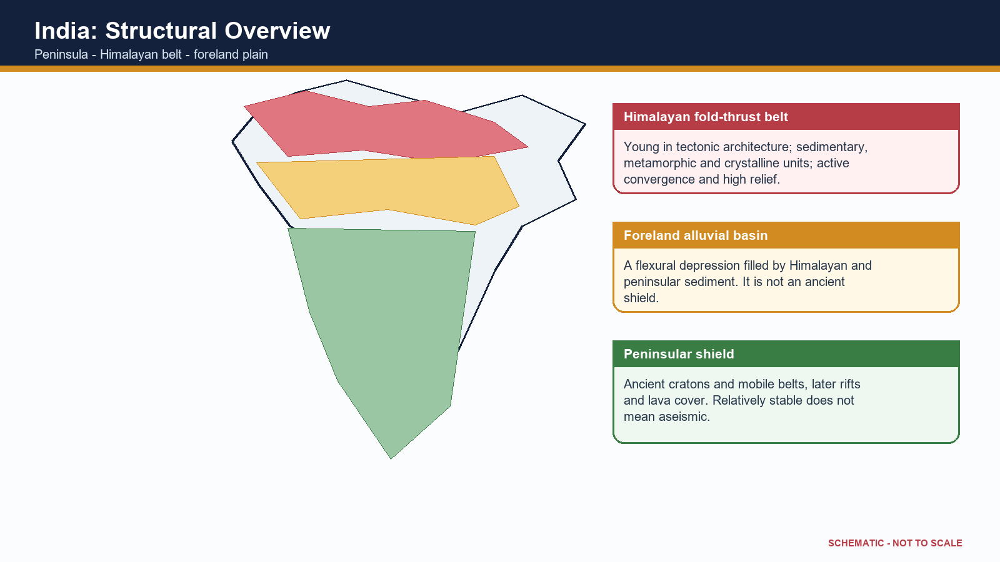

[FACT] Geological structure means the age, lithology, stratigraphic order, folds, faults, joints, basins, cratons and plate-tectonic relations of rocks beneath a region. Physiography describes the broad surface divisions; geomorphology explains the processes and forms of relief.

[ANALYSIS] The three are linked but not interchangeable. The Peninsular Plateau is a physiographic division; its cratons, mobile belts, rifts, sedimentary basins and basalt cover are geological structure; its scarps, residual hills, waterfalls and valleys are geomorphic expression.

[FACT] A useful national framework has three interacting provinces: the ancient Peninsular shield, the active Himalayan fold-thrust belt, and the Indo-Ganga-Brahmaputra sediment-filled foreland basin.

[ANALYSIS] Structure operates as an inherited template. Climate, weathering, rivers, vegetation and human action then modify the template. Therefore geology explains pattern and constraint, not every present landform by itself.

[LIMIT] Later Geography topics own detailed physiographic divisions, drainage evolution, soils, minerals and disaster management. This package supplies their geological mechanism and clearly identifies those cross-links.

[ANALYSIS] Exam method: identify the hidden structure, name a region, explain the mechanism, state a surface/resource/hazard consequence, then qualify the relationship.

### Evidence/recall matrix

| Term | What it asks | India example |
|---|---|---|
| Geology | rock age, type, structure and tectonic history | Dharwar belts, Gondwana basins, Himalayan thrusts |
| Physiography | broad relief division | plateau, mountains, plain, coast, islands |
| Geomorphology | landform process and evolution | escarpment, gorge, waterfall, delta |

### Must-know facts

- [FACT] Peninsula = ancient composite shield, not one uniform rock mass.
- [FACT] Himalaya = young fold-thrust system containing sedimentary, metamorphic and crystalline units.
- [FACT] Northern plain = alluvial fill in a foreland setting, not exposed ancient basement.

### Common UPSC traps

- **Wrong:** Geological structure is the same as physiography. **Correct:** Structure is subsurface architecture; physiography is broad surface form.
- **Wrong:** The stable peninsula is structurally inactive everywhere. **Correct:** It is relatively stable but retains rifts, faults and intraplate seismicity.

**Mains use:** [ANALYSIS] Begin an answer by separating structure, relief and process; this prevents the common error of turning a geology question into a list of physiographic divisions.

**Cross-link:** Geography Topics 03-11 for hazards and landforms; Topic 31 for resources.

## 2. Geological time, evidence and dating cautions

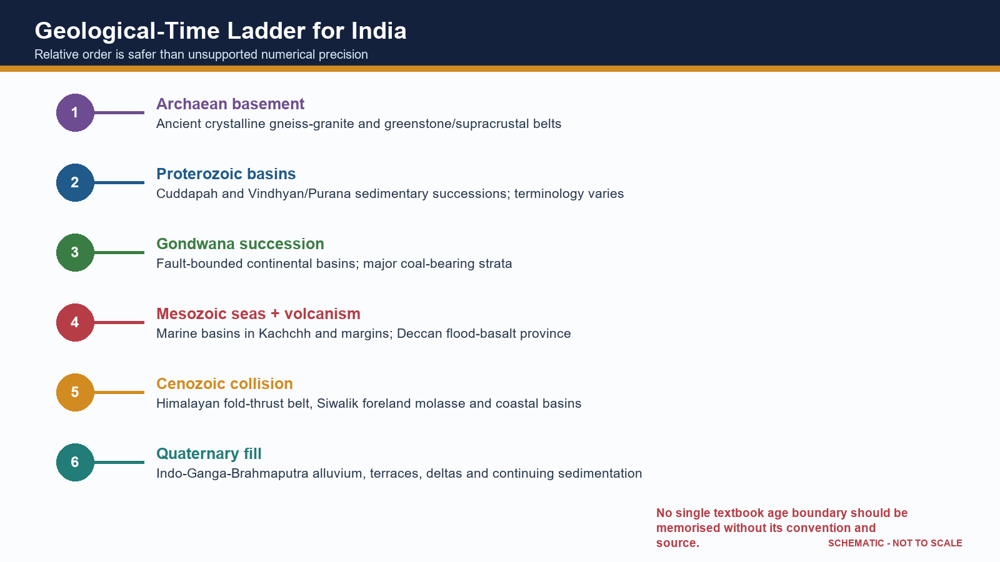

[FACT] India's geological record spans ancient crystalline basement, Proterozoic basins, Gondwana continental successions, Mesozoic marine and volcanic episodes, Cenozoic collision-related strata and Quaternary alluvium.

[FACT] Relative dating uses superposition, cross-cutting relations, unconformities, fossils and correlation. It orders events without necessarily assigning a numerical age.

[FACT] Radiometric dating estimates numerical ages from isotope decay systems in suitable minerals. A date may record crystallisation, metamorphism, cooling or later alteration; it must be interpreted geologically.

[FACT] Fossils are especially useful in sedimentary correlations, but many ancient Indian crystalline and Proterozoic successions are unfossiliferous or sparsely fossiliferous.

[FACT] Palaeomagnetism records past field directions and supports plate reconstruction, sea-floor spreading and movement of the Indian plate.

[ANALYSIS] Geological maps integrate field relations, petrography, geochemistry, geochronology and geophysics. Seismic reflection, gravity and magnetic methods extend interpretation beneath alluvium, sea and lava cover.

[LIMIT] Textbook systems differ: older Indian schemes use labels such as Purana, Dravidian and Aryan differently from modern international chronostratigraphy. State the scheme before using it.

[LIMIT] Numerical boundaries and formation ages are revised as dating improves. Relative order is safer in UPSC unless a precise number is source-verified.

### Evidence/recall matrix

| Evidence | What it can establish | Caution |
|---|---|---|
| Lithology/structure | rock character and relations | similar rocks can recur at different ages |
| Fossils | relative age and environment | not available in all units |
| Radiometric age | numerical event age | may date metamorphism/cooling, not deposition |
| Palaeomagnetism | past latitude/rotation and polarity | overprinting must be tested |
| Seismic imaging | subsurface geometry | interpretive, resolution-dependent |

### Must-know facts

- [FACT] Unconformity = missing time/erosional or non-depositional gap.
- [FACT] A radiometric date needs an event interpretation.
- [FACT] Stratigraphy is not merely a rock-name list.

### Common UPSC traps

- **Wrong:** One isotopic date gives the age of the entire rock system. **Correct:** The dated mineral and geological event must be specified.
- **Wrong:** Archaean, Precambrian and Purana are always exact synonyms. **Correct:** Usage varies by author and stratigraphic convention.

**Mains use:** [ANALYSIS] Use an evidence ladder: field relation -> dating/correlation -> geophysical image -> tectonic interpretation -> qualification.

**Cross-link:** Physical Geography Core Topic 02; Science and Technology cross-link for geophysical methods.

## 3. Indian plate: Gondwana origin, break-up, drift and collision

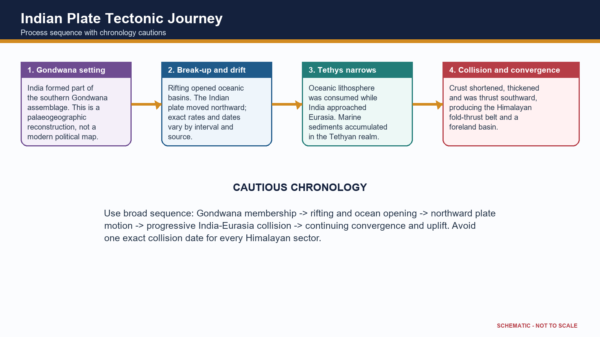

[FACT] The Indian continental block formed part of Gondwana. Rifting separated blocks, oceanic crust formed between them, and the Indian plate moved northward before colliding progressively with Eurasia.

[FACT] Continental fit, matching ancient rock belts, fossil and sediment correlations, palaeoclimatic indicators and palaeomagnetism together support former continental connections.

[FACT] Sea-floor spreading creates oceanic lithosphere at ridges; subduction consumes it at trenches. The disappearance of Tethyan oceanic domains and India-Eurasia convergence produced crustal shortening and the Himalayan-Tibetan orogen.

[ANALYSIS] Collision was not a single instant across the whole margin. Different sutures, terranes, sedimentary basins and metamorphic events record a prolonged and spatially variable process.

[FACT] Continuing convergence is expressed through active thrusting, earthquakes, uplift, erosion and sediment transfer into the foreland and offshore basins.

[LIMIT] Avoid an unsupported constant plate speed or one exact collision date. Values depend on the time interval, plate circuit and definition of initial versus hard collision.

[ANALYSIS] India is both an ancient continental fragment and part of an active plate system: this explains the contrast between old shield rocks and young Himalayan tectonic architecture.

### Evidence/recall matrix

| Stage | Process | Indian geological result |
|---|---|---|
| Gondwana assembly | continental continuity | shared shield and sediment evidence |
| Rifting | faulting and basin opening | passive-margin and rift-basin development |
| Northward motion | Tethys narrowing | marine sediment and arc/suture records |
| Collision | shortening and thickening | Himalayan thrust belts and Tibetan uplift |
| Post-collision | erosion and flexure | Siwalik molasse and foreland alluvium |

### Must-know facts

- [FACT] Gondwana is a palaeocontinent; Gondwana Supergroup is an Indian stratigraphic succession.
- [FACT] Himalayan collision thickens crust rather than creating a volcanic arc like the Andes.
- [FACT] Tethys was an oceanic realm, not one unchanged narrow sea.

### Common UPSC traps

- **Wrong:** Gondwanaland and Gondwana coal measures are identical terms. **Correct:** One is a palaeocontinent; the other is a named sedimentary succession.
- **Wrong:** The Himalaya is a subduction volcanic chain. **Correct:** It is primarily a continent-continent collision fold-thrust belt.

**Mains use:** [ANALYSIS] Present chronology as a process chain and explicitly distinguish evidence from reconstruction.

**Cross-link:** Core Topic 02 crustal dynamics; Topic 03 earthquakes; Topic 06 Himalayan glaciers.

## 4. Cratons, shields and the stabilised Peninsular block

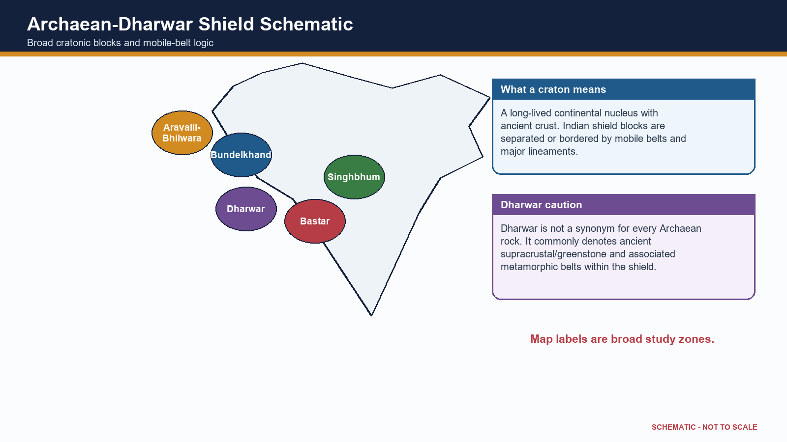

[FACT] Peninsular India is a mosaic of ancient cratonic nuclei and intervening mobile belts, later cut by faults, rifts and dykes and locally covered by younger sediments and basalt.

[FACT] Commonly recognised shield blocks include Dharwar in the south, Bastar in central India, Singhbhum in the east, Bundelkhand in north-central India and Aravalli-Bhilwara in the west. Boundaries and nomenclature differ among geological maps.

[FACT] Cratons preserve old continental crust; mobile belts record deformation, metamorphism and accretion between or around them.

[ANALYSIS] Long denudation exposes basement rocks and concentrates resistant residual uplands. Yet later tectonics produced the Narmada-Son, Cambay, Godavari and other structural corridors.

[FACT] Ancient crystalline rocks commonly have low primary porosity; groundwater occurs mainly in weathered mantles, joints, fractures, faults and locally permeable contacts.

[ANALYSIS] Metallic-mineral provinces are strongly associated with ancient shield geology, but ore localisation requires specific magmatic, hydrothermal, sedimentary or metamorphic processes.

[LIMIT] Stable means lower average deformation than an active plate boundary over recent geological time. It does not mean flat, homogeneous, immobile or earthquake-free.

### Evidence/recall matrix

| Block/belt | Broad region | Exam-safe cue |
|---|---|---|
| Dharwar | Karnataka and adjoining south | greenstone/metamorphic belts and metallic-mineral associations |
| Bastar | Chhattisgarh-central India | ancient shield with mineral and basin margins |
| Singhbhum | Jharkhand-Odisha | iron-ore and shear-zone associations |
| Bundelkhand | UP-MP | granite-gneiss basement and residual uplands |
| Aravalli-Bhilwara | Rajasthan-west | ancient deformed belt and non-ferrous mineral provinces |

### Must-know facts

- [FACT] Shield = exposed ancient continental crust; craton can include covered stable crust.
- [FACT] Peninsular basement is composite.
- [FACT] Secondary permeability is vital in hard-rock aquifers.

### Common UPSC traps

- **Wrong:** All peninsular rocks are Archaean. **Correct:** Proterozoic basins, Gondwana strata, Deccan basalt and younger sediments also occur.
- **Wrong:** Mineral wealth follows age alone. **Correct:** Ore-forming processes and later preservation/localisation are necessary.

**Mains use:** [ANALYSIS] Use 'mosaic' rather than 'single block'; then connect old crust to relative stability, minerals, hard-rock groundwater and residual relief.

**Cross-link:** Topic 31 mineral distribution; Topic 04 groundwater; Environment mining impacts.

## 5. Archaean and Dharwar systems: distribution and terminology control

[FACT] Older Indian geography texts distinguish fundamental gneiss-granite basement from Dharwar supracrustal and metamorphosed sediment-volcanic belts. Modern geological usage is more refined, so the terms must not be collapsed.

[FACT] Archaean basement rocks include ancient gneisses, granitoids and high-grade metamorphic complexes across large parts of the Peninsula and in crystalline Himalayan cores.

[FACT] Dharwar-type belts are best developed in Karnataka and adjoining southern India, with comparable ancient supracrustal/metamorphic belts in Singhbhum, central India, Aravalli-Delhi sectors and the eastern shield.

[FACT] These belts contain schists, quartzites, iron formations, metavolcanics and associated intrusions; exact stratigraphic grouping varies by geological province.

[ANALYSIS] Their economic importance derives from repeated magmatism, sedimentation, metamorphism and hydrothermal activity, not merely antiquity.

[FACT] Iron, manganese, gold and several base-metal associations occur in ancient shield belts. Named examples such as Kolar or Singhbhum are location anchors, not universal rules for every Dharwar rock.

[LIMIT] Do not repeat old claims that all Archaean rocks are entirely unfossiliferous or that one textbook's age span is definitive. Modern Precambrian geology uses finer subdivisions and evidence.

### Evidence/recall matrix

| Unit | Exam-safe description | Distribution hook |
|---|---|---|
| Fundamental gneiss/granitoid | ancient crystalline basement | wide Peninsular exposure |
| Dharwar/greenstone belts | metamorphosed supracrustal volcanic-sedimentary belts | Karnataka and other shield provinces |
| High-grade complexes | gneiss, granulite, charnockite associations | southern and eastern shield sectors |
| Ore belts | localised mineralised zones | Kolar, Singhbhum, Karnataka-Odisha-central belts |

### Must-know facts

- [FACT] Dharwar is not all Archaean.
- [FACT] Ancient shield belts are commonly metamorphosed and structurally complex.
- [FACT] Named ore belts are examples, not deterministic pairings.

### Common UPSC traps

- **Wrong:** Dharwar is a younger Phanerozoic sedimentary system. **Correct:** It belongs to India's ancient Precambrian shield record.
- **Wrong:** Every gneiss belongs to one formation and age. **Correct:** Gneiss is a rock/texture term and can form in different events.

**Mains use:** [ANALYSIS] In a classification answer, give lithology, structure, distribution, significance and a terminology caution.

**Cross-link:** Advanced Topic 31; local OCR: Khullar Ch.2 and Majid Geography of India Ch.1.

## 6. Proterozoic Purana basins: Cuddapah and Vindhyan

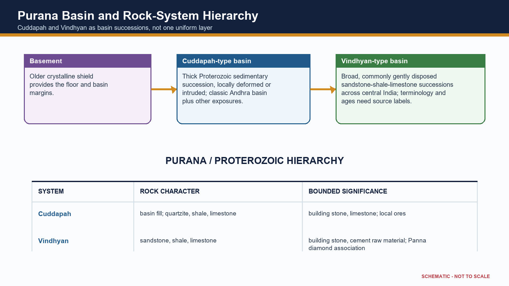

[FACT] Cuddapah and Vindhyan are major Proterozoic sedimentary basin successions resting unconformably on older basement. Older textbooks group them under Purana, but their detailed ages and correlations are convention-sensitive.

[FACT] The Cuddapah basin is classically developed in Andhra Pradesh, with related Proterozoic successions in central and western India. Thick sandstone, shale, limestone and quartzite record long-lived basin subsidence, sedimentation, deformation and intrusion.

[FACT] Vindhyan rocks form an extensive central Indian succession from eastern Rajasthan through Madhya Pradesh toward the Son valley, with other basin occurrences. Sandstone, shale and limestone dominate.

[ANALYSIS] Basin thickness and repeated unconformities show episodic subsidence and tectonic reorganisation rather than one uninterrupted quiet deposit.

[FACT] Vindhyan sandstones and limestones are important building and industrial materials; the Panna diamond association is a high-yield location cue.

[LIMIT] Resource links must be bounded: a whole system is not uniformly mineralised, and Panna diamonds do not make every Vindhyan sandstone diamond-bearing.

[LIMIT] Avoid treating Cuddapah and Vindhyan as identical, coeval everywhere or simply 'young sedimentary rocks'. They are old Proterozoic basin records with different internal histories.

### Evidence/recall matrix

| System | Broad lithology | Distribution | Significance |
|---|---|---|---|
| Cuddapah | quartzite, shale, limestone, sandstone; local intrusions | Andhra basin plus central/western exposures | limestone, stone and local mineral occurrences |
| Vindhyan | sandstone, shale, limestone | Rajasthan-MP-Son belt and related basins | building stone, cement raw material, Panna association |

### Must-know facts

- [FACT] Cuddapah and Vindhyan overlie older basement.
- [FACT] They are sedimentary basin successions, not cratons.
- [FACT] Terminology and age ranges vary across sources.

### Common UPSC traps

- **Wrong:** Vindhyan is a volcanic province. **Correct:** It is dominantly a sedimentary succession.
- **Wrong:** Cuddapah equals the modern Kadapa district only. **Correct:** The name originates there but the geological system is broader.

**Mains use:** [ANALYSIS] Explain them as long-lived intracratonic basin archives; do not present an unqualified memorised age table.

**Cross-link:** Topic 08 karst/limestone; Topic 31 resources; History/Art cross-link for building stone only.

## 7. Gondwana Supergroup: rift basins, coal and continental sedimentation

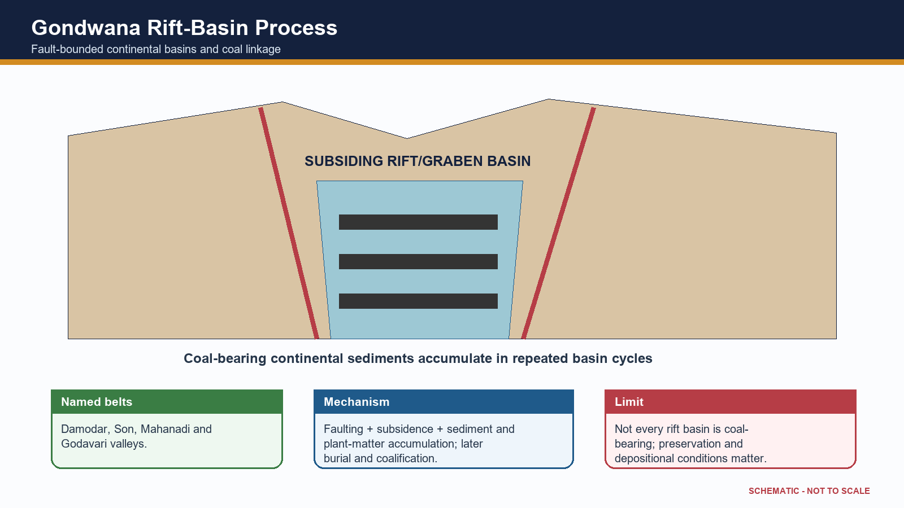

[FACT] India's Gondwana successions accumulated mainly in fault-bounded continental basins within the Peninsular shield. They are distinct from Gondwana the palaeocontinent.

[FACT] Major basins follow the Damodar, Son-Mahanadi, Satpura and Godavari structural belts. Faulting and subsidence created accommodation space for river, lake, floodplain and swamp deposits.

[FACT] Lower parts of the succession include glacially influenced deposits in some basins, followed by coal-bearing sandstone-shale cycles and younger continental strata.

[ANALYSIS] Coal linkage is mechanistic: vegetation accumulation in suitable low-oxygen settings, burial during basin subsidence, compaction and coalification, followed by preservation from erosion.

[FACT] Jharia, Raniganj, Bokaro, Talcher-Ib, Singrauli and Singareni are high-yield basin/coalfield anchors. Exact reserve percentages and current production shares belong to dated official resource sources.

[LIMIT] Gondwana coalfields are not simply surface strips along modern rivers. They occupy structural basins whose present drainage may only partly follow inherited troughs.

[LIMIT] Coal presence is not automatic in every Gondwana unit or every rift. Depositional environment, burial history and preservation control workable seams.

### Evidence/recall matrix

| Basin belt | Named anchors | Structural cue |
|---|---|---|
| Damodar | Raniganj, Jharia, Bokaro, Karanpura | faulted east-central troughs |
| Son-Mahanadi | Singrauli, Korba, Talcher-Ib | linked intracratonic basins |
| Godavari | Singareni/Godavari Valley | elongate rift/graben setting |
| Satpura | Pench-Kanhan and adjoining fields | central structural basin |

### Must-know facts

- [FACT] Gondwana coal basins are rift/fault-linked.
- [FACT] They are continental sedimentary basins.
- [FACT] Coal association is strong but not universal.

### Common UPSC traps

- **Wrong:** Gondwana coal occurs in the Deccan Trap. **Correct:** Coal measures are sedimentary and generally predate/underlie or lie outside basalt cover.
- **Wrong:** Gondwana means Palaeozoic only. **Correct:** The Indian succession extends across a broader late Palaeozoic-Mesozoic interval depending on subdivision.

**Mains use:** [ANALYSIS] A top answer draws a graben cross-section, locates three basin belts and qualifies geology-resource determinism.

**Cross-link:** Topic 31 owns coal/resource distribution and policy; Environment owns mining impact.

## 8. Marine sedimentary basins, coasts and offshore petroleum logic

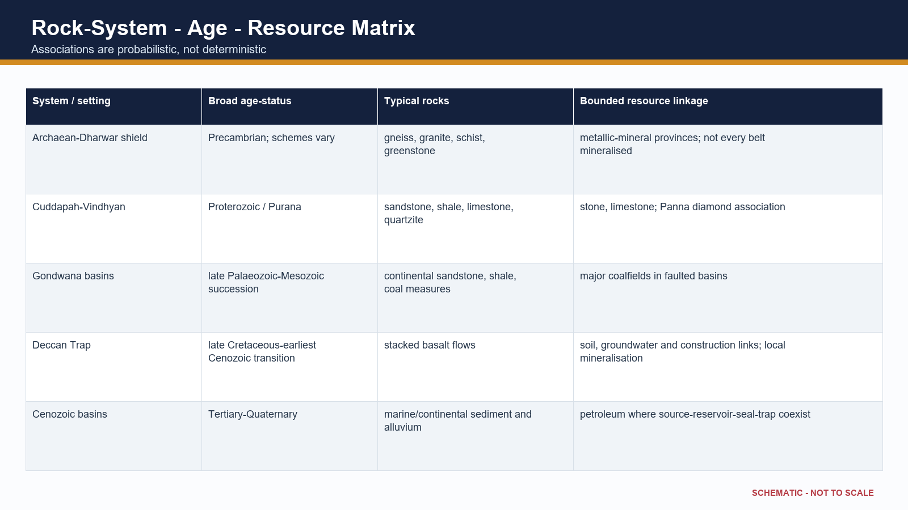

[FACT] India also preserves marine sedimentary records in Kachchh, Rajasthan, Himalayan Tethyan sectors, east-coast basins and younger coastal/offshore basins.

[FACT] Marine transgressions left fossiliferous limestone, sandstone, shale and related strata in Kachchh and other Mesozoic basins. Tethyan Himalayan sequences record environments on the northern continental margin and oceanic realm.

[FACT] Coastal and offshore sedimentary basins include Cambay, Mumbai Offshore, Assam-Arakan, Krishna-Godavari, Cauvery and other margin basins. Names are map anchors; resource status must come from current official basin data.

[ANALYSIS] Petroleum requires an effective source rock, burial and maturation, migration, porous reservoir, seal and trap. Thick sediment alone is necessary in many settings but never sufficient.

[ANALYSIS] Passive-margin subsidence, deltaic sediment supply, rifting and faulting can create favourable basin architecture. Offshore occurrence is therefore geological, not simply because an area is under the sea.

[LIMIT] Do not claim every named basin is equally productive or that all offshore oil is young. Exploration, economics, technology and environmental constraints modify geological potential.

[LIMIT] Detailed hydrocarbon distribution is owned by Geography Topic 31. This section explains basin formation and petroleum-system logic.

### Evidence/recall matrix

| Setting | Examples | Geological significance |
|---|---|---|
| Rift/onshore basin | Cambay, Assam-Arakan | faulted subsiding basin and traps |
| Passive/offshore margin | Mumbai Offshore, KG, Cauvery | thick sediment, delta/margin architecture |
| Mesozoic marine basin | Kachchh, Jaisalmer sectors | marine fossils and transgression record |
| Tethyan belt | Ladakh-Spiti and Himalayan sectors | former continental margin/ocean record |

### Must-know facts

- [FACT] Hydrocarbons are basin resources, unlike most shield-hosted metallic ores.
- [FACT] Source-reservoir-seal-trap is the minimum answer chain.
- [FACT] Marine strata also occur inland due to past seas.

### Common UPSC traps

- **Wrong:** All sedimentary basins contain petroleum. **Correct:** A complete petroleum system and preservation are required.
- **Wrong:** Offshore oil is produced by seawater pressure. **Correct:** It formed from buried organic matter within sedimentary basin systems.

**Mains use:** [ANALYSIS] Explain offshore concentration through basin evolution, not a memorised field list.

**Cross-link:** Geography Topic 31 petroleum; Environment Topic 24 coastal regulation.

## 9. Deccan Trap: flood-basalt province and bounded surface linkages

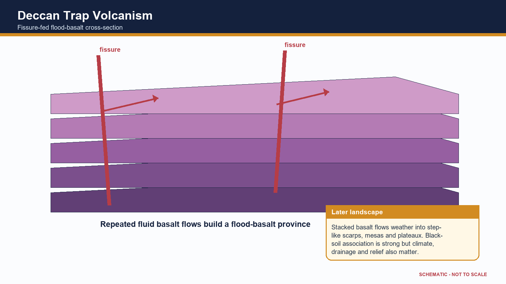

[FACT] The Deccan Trap is a vast flood-basalt province built by repeated, mainly fissure-fed lava flows around the end-Cretaceous to earliest Cenozoic transition.

[FACT] Stacked basalt flows create step-like topography; 'trap' derives from a word for stair/step. Present exposure is concentrated in Maharashtra and extends into Gujarat, Madhya Pradesh, northern Karnataka and adjoining outliers.

[FACT] Flow interiors, vesicular tops, weathered horizons, fractures, dykes and intertrappean beds create strong vertical and lateral variation.

[ANALYSIS] This architecture governs groundwater: compact basalt may transmit little water, while fractures, vesicular zones, weathered contacts and interflow horizons can form aquifers.

[ANALYSIS] Basalt weathering contributes parent material for black soils, but clay mineralogy, drainage, relief, climate and time control the final soil. Deccan Trap is a volcanic province, not a soil type.

[FACT] Differential erosion produces plateaux, mesas, buttes, scarps and flat-topped hills. Later river incision and structural lines organise drainage.

[LIMIT] The cause, duration and environmental effects of Deccan volcanism remain active research fields. Avoid precise eruption pulses or causal claims about mass extinction without a cited scientific source.

[LIMIT] Natural-resource potential of the Deccan Trap is a direct 2022 GS-I application owned by Topic 31; geology here supplies the mechanism.

### Evidence/recall matrix

| Feature | Geological cause | Surface/resource effect |
|---|---|---|
| Step relief | stacked resistant flows | terraced scarps and plateaux |
| Interflow zone | weathering/vesicles between flows | local groundwater storage |
| Dyke/fracture | magma intrusion and later jointing | barrier or conduit depending on condition |
| Black-soil belt | basaltic parent material plus pedogenesis | moisture-retentive clay-rich soils in many tracts |

### Must-know facts

- [FACT] Deccan Trap = extrusive igneous flood basalt.
- [FACT] Intertrappean beds occur between flows.
- [FACT] Black soil linkage is strong but not monocausal.

### Common UPSC traps

- **Wrong:** Deccan Trap is a Gondwana sedimentary system. **Correct:** It is a younger volcanic province.
- **Wrong:** Basalt is uniformly impermeable. **Correct:** Aquifer behaviour varies with fractures, weathering, vesicles and flow contacts.

**Mains use:** [ANALYSIS] Structure the answer as volcanism -> flow architecture -> relief/aquifer/soil/resource -> qualification.

**Cross-link:** Topic 04 groundwater; Topic 30 soils/agriculture; Topic 31 Deccan resources.

## 10. Himalaya: from geosynclinal language to modern plate tectonics

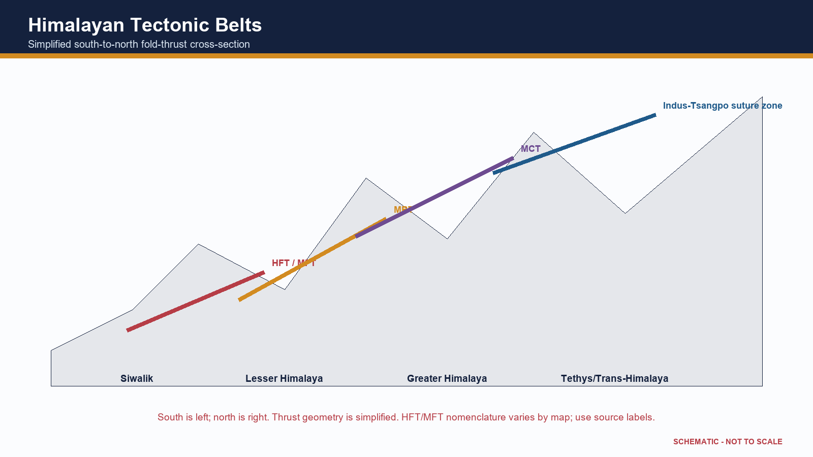

[FACT] Older texts describe Tethyan sediment accumulation in a geosyncline followed by folding. Modern plate tectonics explains the driving mechanism through subduction of oceanic domains, collision, shortening, thrusting, metamorphism and uplift.

[ANALYSIS] 'Geosyncline' can be retained as a historical descriptive term for a long subsiding sedimentary belt, but not as a self-sufficient causal theory.

[FACT] The Himalayan orogen includes Trans-Himalayan magmatic/tectonic units, Tethyan sedimentary sequences, Greater Himalayan crystalline rocks, Lesser Himalayan units and the Siwalik/Sub-Himalayan foreland fold-thrust belt.

[FACT] Major south-verging structures commonly mapped include the Main Central Thrust, Main Boundary Thrust and Himalayan Frontal Thrust/Main Frontal Thrust. The Indus-Tsangpo suture marks a broader collision/suture zone to the north.

[LIMIT] These structures branch, overlap and vary along strike. A simple north-south classroom cross-section is conceptual and cannot represent every local segment.

[FACT] Siwalik strata are relatively young foreland molasse derived from erosion of the rising Himalaya and folded at the mountain front. They are not the oldest Himalayan rocks.

[ANALYSIS] The Himalaya is not one simple fold. It is an imbricated fold-thrust wedge containing nappes, duplexes, faults, metamorphic cores and sedimentary belts.

[LIMIT] Detailed stratigraphic ages and local thrust order should be quoted only from an appropriate geological map or source; nomenclature can differ.

### Evidence/recall matrix

| South-north belt | Broad character | High-yield boundary |
|---|---|---|
| Siwalik/Sub-Himalaya | young foreland molasse, folded foothills | HFT/MFT at front; MBT to north |
| Lesser Himalaya | older sedimentary/metasedimentary thrust sheets | MBT-MCT zone |
| Greater Himalaya | high-grade crystalline/metamorphic core | MCT and northern detachments in detailed models |
| Tethys/Trans-Himalaya | marine sedimentary and magmatic/suture domains | Indus-Tsangpo suture region |

### Must-know facts

- [FACT] Himalaya = fold-thrust orogen, not one fold.
- [FACT] Siwalik = foreland molasse belt.
- [FACT] Greater Himalaya includes crystalline/metamorphic units.

### Common UPSC traps

- **Wrong:** Siwalik is the oldest Himalayan belt. **Correct:** It is the youngest major outer sedimentary belt.
- **Wrong:** All Himalayan rocks are Tertiary sediments. **Correct:** Older crystalline, metamorphic and sedimentary rocks are incorporated.

**Mains use:** [ANALYSIS] Contrast the historical geosynclinal description with the modern plate-tectonic mechanism; then draw a labelled cross-section.

**Cross-link:** Topic 03 seismicity; Topic 06 glaciers; Disaster Management landslides.

## 11. Indo-Ganga-Brahmaputra foreland basin and alluvial fill

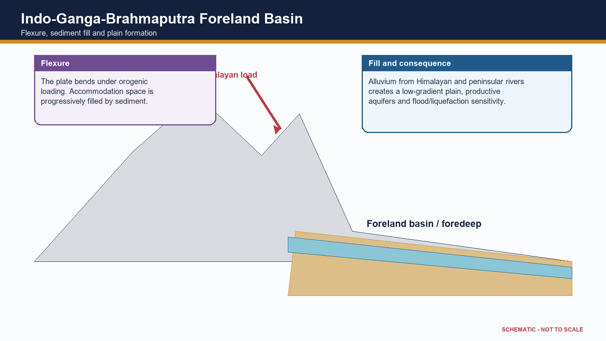

[FACT] The Northern Plain occupies a foreland depression between the Himalayan orogen and Peninsular basement, filled by large volumes of Cenozoic and Quaternary sediment.

[FACT] Orogenic loading flexes the Indian plate downward, creating accommodation space. Rivers from the Himalaya and Peninsula deliver gravel, sand, silt and clay into this depression.

[FACT] Coarse piedmont deposits grade basinward into finer alluvium. River migration, avulsion, floodplain deposition and subsidence continually reorganise the surface.

[ANALYSIS] Thick unconsolidated sediment explains level relief, fertile alluvial soils, major aquifers and dense settlement, but also flood, erosion, subsidence and liquefaction sensitivity.

[FACT] The Siwalik belt represents older foreland molasse now incorporated into the mountain front; the modern alluvial plain lies farther south/east as an actively filled basin.

[LIMIT] The plain is not one uniform layer or one age. Basement depth, sediment thickness, river history and tectonic influence vary regionally.

[LIMIT] Detailed bhabar-terai-bhangar-khadar and drainage topics belong later. Here the owner is flexure, sediment fill and structural context.

### Evidence/recall matrix

| Process | Result | Exam linkage |
|---|---|---|
| Flexural subsidence | foredeep/accommodation space | collision-relief connection |
| Sediment delivery | thick alluvial fill | fertility and aquifers |
| Channel migration | floodplain and avulsion belts | flood exposure |
| Soft sediment response | amplification/liquefaction potential | seismic hazard |

### Must-know facts

- [FACT] Foreland basin forms by flexure under mountain load.
- [FACT] Alluvium masks deeper basement.
- [FACT] Plain stability at surface does not imply low seismic risk.

### Common UPSC traps

- **Wrong:** The Northern Plain is an exposed ancient shield. **Correct:** It is a sediment-filled foreland basin.
- **Wrong:** Alluvial ground always reduces earthquake damage. **Correct:** Soft sediment can amplify shaking and liquefy.

**Mains use:** [ANALYSIS] Show the causal chain: Himalayan loading -> flexure -> sediment fill -> plain resources and hazards.

**Cross-link:** Topic 05 drainage; Topic 04 groundwater; Topic 03 earthquake effects.

## 12. Coasts, offshore basins and island-arc versus coral-island distinction

[FACT] India's coasts record rifting, passive-margin subsidence, sedimentation, faulting, volcanism and sea-level change. Its two major island systems have different geological settings.

[FACT] Western India includes the Cambay rift and faulted margin sectors; parts of the west coast show submergent features. East-coast basins receive large deltaic sediment loads and preserve thick sedimentary successions.

[FACT] Andaman-Nicobar lies along an active convergent margin/island-arc system linked to the Sunda-Andaman subduction zone and the continuation of the Arakan-Yoma tectonic trend.

[FACT] Barren Island is an active volcano in this arc setting. The island chain also includes sedimentary and uplifted components; it is not simply a row of volcanic cones.

[FACT] Lakshadweep consists of coral atolls and reef islands developed on a submarine volcanic-ridge foundation in the Arabian Sea. The emergent islands are coral, unlike the tectonic island-arc setting of Andaman-Nicobar.

[ANALYSIS] Geological origin shapes hazard: Andaman-Nicobar faces strong earthquake, tsunami and volcanic contexts; Lakshadweep's low coral islands face reef, freshwater-lens and sea-level vulnerability.

[LIMIT] Detailed coral ecology and coastal regulation belong to Environment/Geography Topics 10-11. This package owns only tectonic foundation and origin distinction.

### Evidence/recall matrix

| Island/coast | Foundation | Surface expression | Hazard cue |
|---|---|---|---|
| Andaman-Nicobar | subduction-related arc/forearc | elongate islands, volcano and uplifted/sedimentary units | earthquake-tsunami-volcanism |
| Lakshadweep | submarine ridge/volcanic foundation | coral atolls and reefs | sea-level, erosion, freshwater lens |
| West coast | rifted/faulted passive margin sectors | narrow coast, estuaries and basins | subsidence/local seismicity |
| East coast | sedimentary/deltaic margin basins | broad coastal plains and deltas | cyclone-flood-subsidence cross-link |

### Must-know facts

- [FACT] Andaman-Nicobar = active arc/forearc tectonic setting.
- [FACT] Lakshadweep = coral atolls on submarine volcanic foundation.
- [FACT] Indian coasts contain both rifted and sediment-loaded basin sectors.

### Common UPSC traps

- **Wrong:** All Indian islands are coral. **Correct:** Lakshadweep is coral; Andaman-Nicobar has an active tectonic arc setting.
- **Wrong:** Andaman-Nicobar is a continental shield extension. **Correct:** It belongs to an active plate-margin arc system.

**Mains use:** [ANALYSIS] A two-column island comparison is a high-return Prelims and GS-I device.

**Cross-link:** Geography Topics 10-11; Environment Topic 24; Disaster Management tsunami owner.

## 13. Major lineaments, faults and rifts

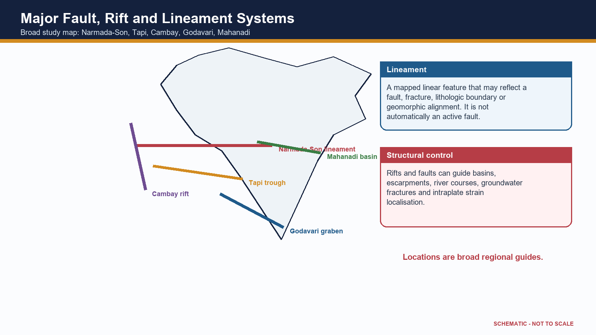

[FACT] Peninsular India contains major inherited structural corridors including the Narmada-Son lineament, Tapi trough, Cambay rift and the Godavari and Mahanadi basin systems.

[FACT] The Narmada-Son structural zone crosses central India and is associated with faulting, rift-valley segments, basin development, magmatism and seismicity in different sectors.

[FACT] Narmada and Tapi flow west through structurally controlled troughs. Their valleys cannot be explained by regional eastward slope alone.

[FACT] The Cambay rift is a north-south basin in western India connected to sedimentation and hydrocarbon geology. Godavari and Mahanadi structural basins preserve Gondwana and younger sedimentary histories.

[ANALYSIS] Lineaments can localise erosion, river courses, springs, groundwater fractures, basin margins and renewed stress. Some are composite zones with multiple episodes of reactivation.

[LIMIT] A lineament mapped from imagery is not automatically a proven active fault. Activity requires field, geomorphic, geodetic and seismological evidence.

[LIMIT] Schematic national maps must not imply exact fault traces or legal boundary precision.

### Evidence/recall matrix

| System | Orientation/region | Key geological link |
|---|---|---|
| Narmada-Son | central India, broadly east-west | rift/lineament, basin, magmatic and seismic links |
| Tapi | west-central India | fault-controlled west-flowing trough |
| Cambay | Gujarat, broadly north-south | rift basin and hydrocarbon sedimentation |
| Godavari | south-central/east | Gondwana graben and coal-bearing basin |
| Mahanadi | east-central | Gondwana and coastal/offshore basin continuation |

### Must-know facts

- [FACT] Narmada and Tapi are structurally controlled west-flowing rivers.
- [FACT] Rifts can host both sediments and later magmatism.
- [FACT] Lineament does not automatically mean active fault.

### Common UPSC traps

- **Wrong:** Every straight river segment proves active faulting. **Correct:** Lithology, joints, inherited structures and slope can all create linear reaches.
- **Wrong:** The Peninsula lacks major tectonic structures. **Correct:** It contains old sutures, faults, rifts and lineaments.

**Mains use:** [ANALYSIS] Use one map plus one mechanism paragraph; avoid asserting current activity without evidence.

**Cross-link:** Topic 05 drainage; Topic 03 intraplate seismicity; Topic 31 basin resources.

## 14. Structural control of relief, drainage, groundwater and waterfalls

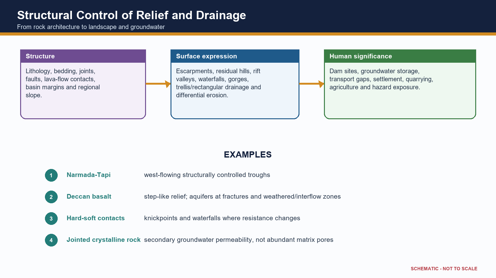

[ANALYSIS] Geological structure becomes examinable when it explains why relief, rivers, groundwater and resource patterns are spatially organised.

[FACT] Resistant quartzite, granite, gneiss or basalt can form uplands and scarps, while weaker shale or weathered zones erode into valleys. The result is differential erosion, not a simple hard-rock/soft-rock binary everywhere.

[FACT] Faults and joints guide river segments and tributaries, producing rectangular or structurally aligned drainage. Alternating resistant and weak strata can support trellis patterns.

[FACT] Waterfalls and knickpoints often occur at resistant rock bands, fault scarps, lava-flow contacts or rejuvenated reaches. Their persistence depends on erosion rates and downstream base level.

[FACT] In hard-rock terrain groundwater is concentrated in weathered zones, fractures and contacts. In sedimentary basins, primary pore space can be more important; in alluvium, connected sand and gravel bodies form major aquifers.

[ANALYSIS] Structural basins and lineaments influence dam siting, tunnelling, road stability and urban foundations. Engineering decisions require site investigation, not regional rock labels alone.

[LIMIT] Detailed river courses, aquifer statistics and individual waterfall heights belong to later topics and current official datasets.

### Evidence/recall matrix

| Structural element | Geomorphic/hydrologic expression | Named India cue |
|---|---|---|
| Rift/fault trough | linear valley and directed drainage | Narmada-Tapi |
| Joint/fracture | rectangular drainage and secondary aquifer | hard-rock Peninsula |
| Basalt flow contact | step relief and interflow aquifer | Deccan Plateau |
| Layer resistance contrast | cuesta/scarp/knickpoint | sedimentary plateau margins |
| Foreland alluvium | low gradient and high aquifer storage | Northern Plain |

### Must-know facts

- [FACT] Structure guides but does not fully fix drainage.
- [FACT] Hard-rock groundwater depends on secondary openings.
- [FACT] Waterfalls can mark lithologic or structural breaks.

### Common UPSC traps

- **Wrong:** Crystalline rock contains no groundwater. **Correct:** Weathered and fractured zones can store and transmit water.
- **Wrong:** Every waterfall lies on a fault. **Correct:** Lithologic contrast, rejuvenation and lava contacts are alternative controls.

**Mains use:** [ANALYSIS] Frame every example as structure -> process -> landform/water outcome -> local qualification.

**Cross-link:** Geography Topics 04-05; engineering geology is a supporting cross-link.

## 15. Geology, minerals, coal and petroleum: association without determinism

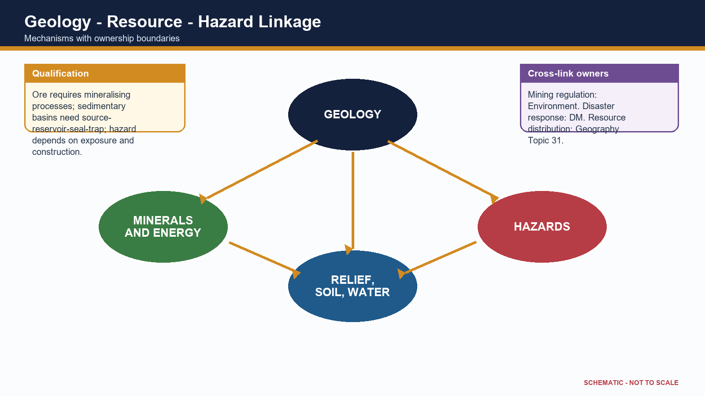

[FACT] India's resource map reflects ancient shield mineralisation, Gondwana coal basins, sedimentary petroleum systems, coastal placers and weathering-derived ores.

[FACT] Metallic ores such as iron, manganese, gold and base metals cluster in several ancient shield belts because of magmatic, hydrothermal, sedimentary and metamorphic histories.

[FACT] Coal is concentrated in Gondwana structural basins; younger coal also occurs in parts of the north-east. Exact shares must be dated to official Ministry of Coal or GSI/IBM sources.

[FACT] Petroleum and gas occur in sedimentary basins onshore and offshore where a complete petroleum system developed and survived.

[FACT] Lateritic weathering can enrich bauxite or iron under suitable climate, drainage and parent material. Coastal sorting can concentrate heavy-mineral placers.

[ANALYSIS] Geology creates potential; grade, depth, continuity, technology, infrastructure, environmental limits and prices determine whether a deposit becomes a resource or reserve.

[LIMIT] Mining governance, EIA, rehabilitation and mine closure are Environment/Governance owners. Resource distribution and industrial linkage belong primarily to Topic 31.

[FACT] The National Critical Mineral Mission was approved on 29 January 2025; it strengthens exploration, processing, recycling and supply security. It does not imply that all critical minerals lie in one geological province.

### Evidence/recall matrix

| Geological setting | Likely resource association | Essential qualification |
|---|---|---|
| Ancient shield/mobile belt | metallic ores | local mineralising event and grade |
| Gondwana rift basin | coal | coal-forming facies and preservation |
| Marine/deltaic basin | petroleum/gas | complete petroleum system |
| Lateritic surface | bauxite/iron enrichment | climate-drainage-parent control |
| Coastal placer | heavy minerals | erosion, transport and sorting |

### Must-know facts

- [FACT] Ore deposit is not the same as economic reserve.
- [FACT] Coal follows basin history; petroleum follows petroleum-system completeness.
- [FACT] NCMM is a current policy anchor, not a geological classification.

### Common UPSC traps

- **Wrong:** Old rocks are always mineral-rich. **Correct:** Specific ore-forming and preservation processes are required.
- **Wrong:** A sedimentary basin guarantees oil. **Correct:** Source, maturation, reservoir, seal, trap and timing must align.

**Mains use:** [ANALYSIS] Use the phrase 'geological necessary condition, not sufficient economic condition'.

**Cross-link:** Geography Topic 31; Environment EIA/mining; Economy critical-mineral value chains.

## 16. Seismicity: Himalaya, Kachchh and peninsular intraplate events

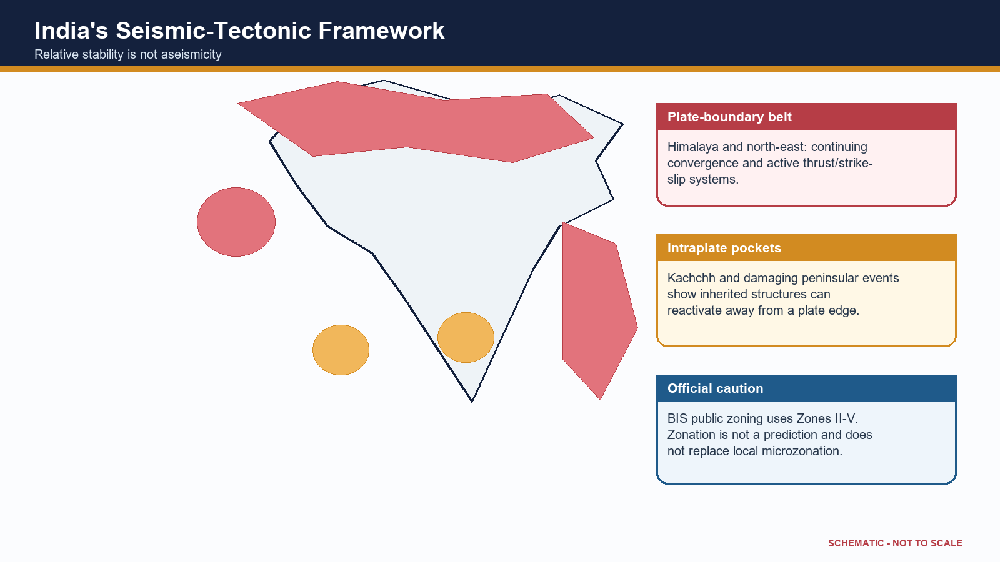

[FACT] India's seismicity reflects active plate-boundary deformation in the Himalaya and north-east, subduction near Andaman-Nicobar, and intraplate reactivation in Kachchh and parts of the Peninsula.

[FACT] Himalayan earthquakes release strain on the Main Himalayan Thrust system and connected structures. Thick alluvium in adjoining plains can amplify shaking and liquefy under suitable saturation and grain conditions.

[FACT] Kachchh is an intraplate high-hazard region with inherited rift faults and damaging historical earthquakes, including the 2001 Bhuj event.

[FACT] Peninsular earthquakes such as Koyna, Latur and Jabalpur demonstrate that stable continental crust can reactivate along old weaknesses. Individual event causes require event-specific seismological evidence.

[FACT] Andaman-Nicobar seismicity is linked to the Sunda-Andaman subduction system and includes tsunami-generating megathrust potential.

[FACT] Current public BIS seismic zoning uses Zones II, III, IV and V. Zone V denotes the highest damage-risk category; there is no verified public Zone VI in the current map.

[LIMIT] Zonation is a design/hazard generalisation, not an earthquake prediction. Local soil, basin geometry, building vulnerability and exposure require microzonation and site response analysis.

[LIMIT] Disaster response doctrine, building-code enforcement and preparedness are owned by Disaster Management; geology provides the source and site-condition framework.

### Evidence/recall matrix

| Tectonic setting | India region | Principal geological control |
|---|---|---|
| Collision boundary | Himalaya/foothills | active thrusting and crustal shortening |
| Strike-slip/complex boundary | north-east | interaction of Himalayan and Indo-Burma systems |
| Subduction margin | Andaman-Nicobar | megathrust, arc and tsunami context |
| Intraplate rift/fault | Kachchh | reactivated inherited structures |
| Stable continental interior | Koyna-Latur-Jabalpur examples | local reactivation; event-specific mechanisms |

### Must-know facts

- [FACT] Relative stability is not aseismicity.
- [FACT] Alluvium can amplify shaking.
- [FACT] BIS public zoning remains II-V at the 2026 cutoff.

### Common UPSC traps

- **Wrong:** Peninsular India cannot have damaging earthquakes. **Correct:** Intraplate reactivation has produced destructive events.
- **Wrong:** Seismic zone predicts the date and magnitude of the next quake. **Correct:** It is a broad design/hazard category, not prediction.

**Mains use:** [ANALYSIS] Explain source, path/site effect and vulnerability separately; do not equate tectonic activity with disaster magnitude.

**Cross-link:** Geography Topic 03; Disaster Management earthquake-resilient construction.

## 17. Regional comparisons, map skills and answer architecture

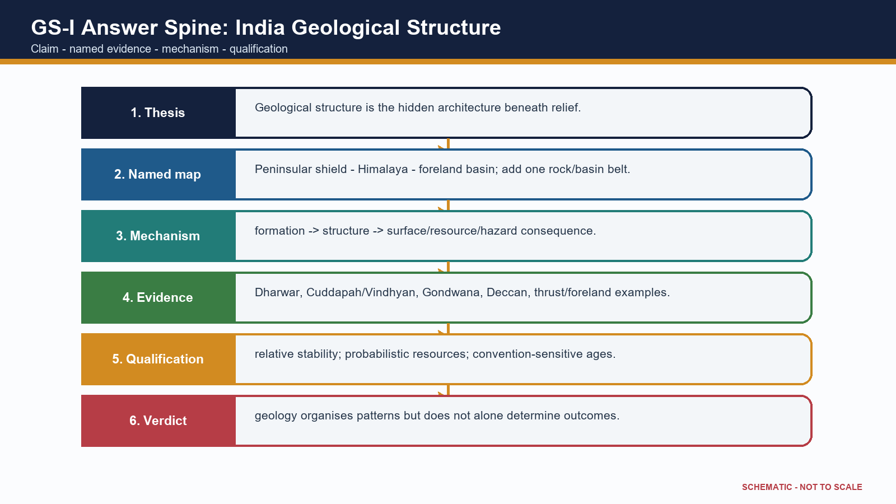

[ANALYSIS] UPSC rewards a small accurate map, a causal chain and a qualification more than a long unsupported age table.

[ANALYSIS] Peninsula versus Himalaya: ancient composite shield with inherited structures versus active fold-thrust orogen; relative stability versus high convergence; exposed basement/mineral belts versus tectonic relief and sediment production.

[ANALYSIS] Gondwana basin versus Deccan Trap: fault-bounded continental sedimentary basin with coal measures versus extrusive flood-basalt province with stacked flows.

[ANALYSIS] Siwalik versus Indo-Gangetic alluvium: folded foreland molasse at the mountain front versus younger and continuing basin fill across the plain.

[ANALYSIS] Andaman-Nicobar versus Lakshadweep: active subduction-related arc/forearc setting versus coral atolls on a submarine ridge foundation.

[ANALYSIS] A 10-mark answer needs thesis, 4-5 evidence units and qualification; 15 marks needs map/cross-section and comparison; 20 marks needs regional variation, cross-links and a reasoned verdict.

[LIMIT] A schematic map must be labelled not to scale and should avoid disputed political boundaries. Plot zones and structures, not false precision.

### Evidence/recall matrix

| Demand | Best visual | Core evidence |
|---|---|---|
| Explain Himalayan structure | south-north cross-section | belts, thrusts, foreland basin |
| Relate geology to resources | rock-system-resource matrix | shield, Gondwana, basin examples |
| Assess stability | seismic-tectonic map | Himalaya, Kachchh, intraplate events |
| Compare island origins | two-column sketch | arc/subduction versus coral atoll |
| Discuss geological structure | three-province India map | Peninsula-Himalaya-plain causal chain |

### Must-know facts

- [FACT] Map labels should support the argument.
- [FACT] Cross-sections show mechanism better than decorative maps.
- [FACT] Every model answer ends with a qualification.

### Common UPSC traps

- **Wrong:** More labels always earn more marks. **Correct:** Only relevant, correctly placed labels support the demand.
- **Wrong:** A conclusion should repeat the introduction. **Correct:** It should deliver a qualified verdict.

**Mains use:** [ANALYSIS] Use the spine: claim -> named geological evidence/region -> mechanism/significance -> limitation/qualification -> verdict.

**Cross-link:** Final register notes below; Workbook map and cross-section drills.

# Solved verified PYQs and ownership routes

## PYQ 2022 GS-I Q4 - Characteristics and types of primary rocks (10 marks)

**Ownership:** Direct owner: Geography Core Topic 02.

**Question/demand:** Describe the characteristics and types of primary rocks.

**Solution:** [CLAIM] Primary rocks are igneous rocks formed by solidification of magma or lava and constitute the original mineral source for later sedimentary and metamorphic rocks. [EVIDENCE] Intrusive or plutonic rocks such as granite and gabbro cool slowly at depth and therefore commonly develop coarse crystals. [MECHANISM] Insulation delays cooling and permits crystal growth. [EVIDENCE] Extrusive rocks such as basalt and rhyolite cool rapidly at or near the surface and are commonly fine-grained; glassy or vesicular textures may occur when cooling is very rapid or gases escape. [MECHANISM] Composition ranges broadly from silica-rich felsic to iron-magnesium-rich mafic types, influencing colour, density and weathering. [EVIDENCE] Indian examples include the Deccan flood basalts and widespread granitic-gneissic terrains of the Peninsular shield. [LIMIT] 'Primary' describes genetic origin, not present exposure or economic value; later alteration can metamorphose an igneous protolith. [VERDICT] Thus texture, composition and mode of occurrence together classify primary rocks and explain their landscape and resource significance.

**Examiner note:** Why this earns marks: it follows the directive 'describe', classifies both occurrence and composition, uses Indian evidence, gives mechanism and avoids confusing primary with oldest.

## PYQ 2025 GS-I Q16 - Continents and ocean basins due to crustal tectonics (15 marks)

**Ownership:** Direct owner: Geography Core Topic 02; applied here to India's plate history.

**Question/demand:** Discuss the changes in the continents and ocean basins due to crustal tectonics.

**Solution:** [CLAIM] Continents and ocean basins are temporary configurations within a plate cycle rather than permanent containers. [EVIDENCE] Matching continental margins, continuous ancient rock belts, fossil distributions, palaeoclimate and palaeomagnetism establish former continental connections. [MECHANISM] At divergent boundaries, rifting and sea-floor spreading create new oceanic crust, progressing from continental rift to narrow sea and mature ocean. At convergent boundaries, subduction consumes oceanic lithosphere, forms trenches and arcs, and progressively closes basins. Continent-continent collision then shortens and thickens buoyant crust, producing suture zones and fold-thrust mountains. [EVIDENCE] The East African Rift, Red Sea, Atlantic, Pacific, Mediterranean and Himalayan-Tethyan suture illustrate successive states. India's separation from Gondwana, northward motion and collision with Eurasia demonstrate continental translation, Tethys closure, Himalayan uplift and foreland-basin creation. [ANALYSIS] Transform motion offsets ridges and margins without creating or destroying crust, while sedimentation reshapes passive margins and deltas. [LIMIT] The Wilson-cycle sequence is conceptual: rates vary, microplates and terranes complicate margins, and not every basin completes the full cycle. [VERDICT] Crustal tectonics continuously redistributes land and sea while organising global relief, resources and geophysical hazards.

**Examiner note:** Why this earns marks: it answers both continents and oceans, integrates evidence with mechanism, uses India and world examples, and qualifies the idealised cycle.

## PYQ 2024 Prelims Q10 - Fold/block mountain matching

**Ownership:** Direct owner: Geography Core Topic 02. Official Set-A key: B.

**Question/demand:** Rows tested Vosges as fold, Alps as block, Appalachians as fold and Andes as fold; asked how many were correctly matched.

**Solution:** [FACT] Vosges is a block mountain, so row 1 is incorrect. Alps is a fold mountain, so row 2 is incorrect. Appalachians and Andes are fold-mountain systems, so rows 3 and 4 are correct. Therefore two rows are correct: option B.

**Examiner note:** Elimination hinge: reverse the first two classifications; do not confuse a rift-flank horst with a young fold belt.

## PYQ 2025 Prelims Q25 - Evidences of continental drift

**Ownership:** Direct owner: Geography Core Topic 02. Official Set-A key: C.

**Question/demand:** Statements covered matching ancient rocks of Brazil and western Africa, Ghana gold derived from the Brazil plateau when joined, and Gondwana sediment counterparts across southern landmasses.

**Solution:** [FACT] All three were accepted as evidence in the official key: geological continuity, placer/mineral-source reconstruction and cross-Gondwana stratigraphic correlation. Therefore option C.

**Examiner note:** Elimination hinge: continental-drift evidence is broader than coastline fit; it includes lithologic, mineral, fossil, climatic and stratigraphic continuity.

## PYQ 2026 Prelims Q34 - Peninsular Block characteristics

**Ownership:** Direct owner: Geography Core Topic 02. PROVISIONAL ANSWER - NOT OFFICIALLY FINAL.

**Question/demand:** Statements: western-coast submergence due to tectonic activity; residual ranges such as Veliconda and Mahendragiri; deep V-shaped valleys formed by fast-flowing rivers.

**Solution:** [FACT] Statements 1 and 2 match standard descriptions of the Peninsular Block: parts of the west coast show submergence/faulted-margin expression, and residual hill ranges occur within the ancient denuded terrain. [ANALYSIS] Statement 3 is not a general Peninsular-block characteristic; mature, structurally controlled valleys are more typical than youthful deep V-shaped valleys as a defining trait. The provisional Set-A key records option B (1 and 2). [LIMIT] The 2026 key is provisional at the repository cutoff and must not be presented as a final UPSC key.

**Examiner note:** Elimination hinge: distinguish isolated youthful incision from the broad geomorphic character of an old denuded shield.

## PYQ 2018 Prelims Q57 - Magnetic reversal and early atmosphere

**Ownership:** Direct owner: Geography Core Topic 02. **INFERRED ANSWER - NOT OFFICIALLY VERIFIED LOCALLY.**

**Question/demand:** Statements tested whether Earth's magnetic field has reversed over geological time, whether the earliest atmosphere had 54 per cent oxygen and no carbon dioxide, and whether living organisms modified the early atmosphere.

**Solution:** [FACT] Statement 1 is correct in concept: palaeomagnetic records preserve repeated polarity reversals, although reversal intervals are irregular and "every few hundred thousand years" is only a broad formulation. [FACT] Statement 2 is false: the early Earth did not possess an oxygen-rich atmosphere of the stated composition; substantial free oxygen accumulated much later. [FACT] Statement 3 is correct: photosynthetic life profoundly altered atmospheric chemistry by producing oxygen and participating in long-term carbon cycling. The defensible answer is statements 1 and 3 only, option C. [LIMIT] The local repository does not hold a readable official 2018 key, so the answer is inferred from established geoscience rather than presented as officially verified.

**Examiner note:** Elimination hinge: the implausible 54 per cent oxygen claim is false; use palaeomagnetism and biogenic atmospheric modification as the two valid concepts.

## PYQ 2023 Prelims Q9 - Amarkantak, Biligirirangan and Seshachalam hills

**Ownership:** Direct owner: Geography Core Topic 02. **INFERRED ANSWER - NOT OFFICIALLY VERIFIED LOCALLY.**

**Question/demand:** Statements claimed that Amarkantak lies at the confluence of Vindhya and Sahyadri, Biligirirangan forms the easternmost Satpura, and Seshachalam forms the southernmost Western Ghats.

**Solution:** [FACT] Statement 1 is incorrect: Amarkantak is associated with the meeting region of the Vindhya and Satpura highlands, not the Sahyadri/Western Ghats. [FACT] Statement 2 is incorrect: the Biligirirangan Hills are in southern Karnataka at an Eastern Ghats-Western Ghats biogeographic linkage, not the eastern Satpura. [FACT] Statement 3 is incorrect: the Seshachalam Hills are part of the Eastern Ghats in Andhra Pradesh, not the southern Western Ghats. Therefore none of the statements is correct, option D. [LIMIT] The question text is held locally, but the repository routing ledger records the official key as unavailable; the answer is therefore explicitly inferred.

**Examiner note:** Elimination hinge: all three statements deliberately attach a real hill range to the wrong larger mountain system.

## Adjacent PYQ 2022 GS-I Q6 - Natural-resource potential of the Deccan Trap

**Ownership:** True owner: Geography Topic 31; included as a bounded geology application.

**Question/demand:** Discuss the natural resource potentials of the Deccan Trap.

**Solution:** [CLAIM] The Deccan Trap's resource potential arises from its layered basalt architecture and later weathering, not from basalt alone. [EVIDENCE] Weathered basalt contributes parent material to extensive black-soil tracts supporting cotton, oilseeds and other crops. [MECHANISM] Clay-rich weathering products retain moisture, though drainage and climate modify productivity. [EVIDENCE] Vesicular tops, fractures, weathered contacts and intertrappean beds form local aquifers; compact flow interiors may be poor aquifers. [EVIDENCE] Basalt is used as construction aggregate and building stone, while lateritic caps and associated weathering profiles can host local industrial-mineral potential. [ANALYSIS] Step relief, plateaux and escarpments create tourism and hydropower/transport opportunities in selected sectors. [LIMIT] Groundwater is heterogeneous, black soil can face waterlogging or cracking, and not all critical minerals are hosted by Deccan basalt. [VERDICT] The province is best understood as a soil-water-construction-landscape resource system whose benefits require location-specific management.

**Examiner note:** Why this earns marks: it gives several resource dimensions, derives each from flow/weathering structure and avoids an exaggerated mineral list.

## Adjacent PYQ 2021 GS-I Q5 - Gondwanaland mineral base and mining share

**Ownership:** True owner: Geography Topic 31; geology application included without duplicating mining economics.

**Question/demand:** Discuss why India is well endowed with mineral resources due to Gondwanaland yet mining contributes relatively little to GDP.

**Solution:** [CLAIM] Gondwana-derived shield and basin history endowed India with diverse metallic ores and coal, but geological endowment is not identical to realised economic value. [EVIDENCE] Ancient Peninsular mobile belts host iron, manganese and base-metal provinces, while faulted Gondwana basins host major coalfields. [MECHANISM] Magmatism, metamorphism, hydrothermal activity, sedimentation and long preservation created deposits. [ANALYSIS] Low value addition, variable ore grade, deep or fragmented deposits, infrastructure gaps, environmental-social constraints, exploration uncertainty and cyclical prices can restrict mining's GDP contribution. [LIMIT] Gondwanaland should not be used as a blanket explanation for every mineral or petroleum basin, and current GDP shares require dated official data. [VERDICT] Policy must convert geological knowledge into responsible exploration, beneficiation, recycling and community-sensitive value chains rather than equating extraction volume with development.

**Examiner note:** Why this earns marks: it separates endowment from economic conversion, uses geological mechanisms and preserves the true Topic 31 ownership boundary.

# Learning MCQ loop

Correct keys rotate strictly A -> B -> C -> D.

## MCQ 1

Which statement best distinguishes geological structure from physiography?

- A. Structure concerns rock architecture; physiography concerns broad surface divisions
- B. Both terms mean relief only
- C. Physiography concerns mineral chemistry only
- D. Structure concerns climate zones

**Answer: A.** Structure is the hidden rock/tectonic framework; physiography is its broad surface expression.

## MCQ 2

Which is the safest description of the Peninsular block?

- A. Uniform Archaean slab
- B. Composite ancient shield cut by later rifts and partly covered by younger rocks
- C. Young volcanic arc
- D. Sediment-filled foredeep

**Answer: B.** The Peninsula is a mosaic of cratons/mobile belts with later basins, faults and lava cover.

## MCQ 3

Which evidence directly helps reconstruct past plate latitude?

- A. Modern rainfall
- B. River discharge
- C. Palaeomagnetism
- D. Population density

**Answer: C.** Magnetic remanence in rocks records ancient field orientation after careful correction.

## MCQ 4

Which statement about radiometric dating is correct?

- A. It always dates sediment deposition
- B. It makes stratigraphy unnecessary
- C. It gives the same age for all minerals
- D. It dates a mineral event that needs geological interpretation

**Answer: D.** The measured isotopic clock may represent crystallisation, metamorphism or cooling.

## MCQ 5

Gondwana in 'Gondwana Supergroup' refers primarily to

- A. a continental sedimentary succession in faulted basins
- B. the present Indian plate boundary
- C. the Deccan lava province
- D. the Himalayan crystalline core

**Answer: A.** The stratigraphic succession is distinct from Gondwana the palaeocontinent.

## MCQ 6

The main resource linkage of classic Gondwana basins is

- A. offshore petroleum only
- B. major coal measures in continental rift basins
- C. coral limestone
- D. gold-bearing greenstone belts

**Answer: B.** Coal-bearing sediment cycles accumulated in subsiding continental basins.

## MCQ 7

Which pair is correctly matched?

- A. Vindhyan-flood basalt
- B. Dharwar-modern alluvium
- C. Deccan Trap-stacked basalt flows
- D. Siwalik-oldest craton

**Answer: C.** Deccan Trap is an extrusive flood-basalt province.

## MCQ 8

Which is NOT sufficient to infer petroleum?

- A. sedimentary basin
- B. source rock
- C. reservoir and seal
- D. basin presence alone

**Answer: D.** A complete petroleum system and timing are required.

## MCQ 9

Siwalik rocks are best described as

- A. young foreland molasse folded at the Himalayan front
- B. oldest Himalayan crystalline basement
- C. oceanic crust of the Tethys
- D. Deccan basalt outliers

**Answer: A.** They are erosion products of the rising Himalaya deposited in a foreland setting.

## MCQ 10

Which order is broadly south-to-north?

- A. Greater-Lesser-Siwalik-plain
- B. Siwalik-Lesser-Greater-Tethyan/Trans-Himalaya
- C. Tethys-Siwalik-plain-Greater
- D. Plain-Trans-Himalaya-Siwalik-Lesser

**Answer: B.** The simplified cross-section runs outer foothills to higher crystalline and northern domains.

## MCQ 11

The Indo-Ganga-Brahmaputra Plain is structurally

- A. an exposed craton
- B. a volcanic plateau
- C. a sediment-filled foreland basin
- D. an island arc

**Answer: C.** Flexure under Himalayan loading created accommodation filled by alluvium.

## MCQ 12

Which distinction is correct?

- A. Both island groups are coral
- B. Lakshadweep is an active arc
- C. Andaman is a shield fragment
- D. Andaman-Nicobar is arc-related; Lakshadweep is coral-atoll terrain

**Answer: D.** Their geological settings and hazards differ fundamentally.

## MCQ 13

The Narmada and Tapi are high-yield examples of

- A. structurally controlled west-flowing trough rivers
- B. glacial antecedent rivers
- C. delta-building east-flowing rivers
- D. coral-island streams

**Answer: A.** They occupy major structural troughs across the regional slope.

## MCQ 14

Groundwater in crystalline hard rock commonly depends on

- A. abundant primary pore space
- B. weathering, joints and fractures
- C. coal seams only
- D. marine fossils

**Answer: B.** Secondary permeability controls most hard-rock aquifers.

## MCQ 15

Which statement best controls resource determinism?

- A. Every old rock is an ore
- B. Every basin has petroleum
- C. Geology creates potential but grade, system completeness and economics decide resources
- D. Minerals follow state boundaries

**Answer: C.** Geological association is necessary in many cases but not economically sufficient.

## MCQ 16

Which is the correct seismic caution?

- A. Peninsula is aseismic
- B. Zone V predicts the next earthquake
- C. Alluvium always protects buildings
- D. Relative stability does not exclude damaging intraplate earthquakes

**Answer: D.** Kachchh, Latur, Koyna and Jabalpur show inherited structures can reactivate.

# Map, chronology and cross-section drills

## Drill 1 - Blank India structural map

Mark and label: Peninsular shield, Himalayan fold-thrust belt, Indo-Ganga-Brahmaputra foreland basin, Deccan Trap, Dharwar region, Singhbhum region, Cuddapah basin, Vindhyan belt, Damodar-Godavari Gondwana basins, Narmada-Son lineament, Cambay rift, Andaman-Nicobar and Lakshadweep.

**Solution logic:** use broad zones, not precise boundaries. Keep the Himalayan arc north, the alluvial foreland immediately south, shield provinces across the Peninsula, basalt mainly west-central, Gondwana troughs east-central/south-central, active island arc in the Bay of Bengal and coral atolls in the Arabian Sea.

## Drill 2 - South-north Himalayan cross-section

Draw: alluvial foreland -> HFT/MFT -> Siwalik -> MBT -> Lesser Himalaya -> MCT -> Greater Himalayan crystalline -> Tethyan/Trans-Himalayan domain -> Indus-Tsangpo suture region.

**Solution caution:** thrusts are regionally complex and branch; the sequence is conceptual. Do not call the Siwalik oldest or the whole belt Tertiary sediment.

## Drill 3 - Chronology/order exercise

Arrange in broad relative order: Deccan flood basalt; Archaean-Dharwar shield formation; Quaternary alluvial fill; Cuddapah-Vindhyan basin sedimentation; Gondwana basin sedimentation; Himalayan collision and foreland development.

**Solution:** Archaean-Dharwar -> Cuddapah/Vindhyan -> Gondwana -> Deccan flood basalt -> Himalayan collision/foreland development -> Quaternary alluvial fill. [LIMIT] Several events overlap or continue, so this is a broad examination sequence rather than a universal boundary table.

## Drill 4 - Resource matrix

Match: shield/mobile belt-metallic ores; Gondwana rift basin-coal; complete sedimentary petroleum system-oil/gas; weathered/fractured hard rock-groundwater; basalt flow contacts-local aquifers; coastal sorting-heavy-mineral placers.

# Original solved Mains practice

## 10 marks: Distinguish India's geological structure from its physiographic divisions. Illustrate with two regions.

[CLAIM] Geological structure is the rock-and-tectonic architecture beneath India, whereas physiography is its broad surface expression. [EVIDENCE] The Peninsular Plateau is a physiographic unit, but geologically it contains Dharwar, Bastar, Singhbhum and Bundelkhand blocks, Proterozoic basins, Gondwana rifts and Deccan basalt. [MECHANISM] Differential resistance, faulting and long denudation generate residual hills, scarps and structurally guided rivers. [EVIDENCE] The Northern Plain appears as level physiography but geologically is a foreland depression filled by Himalayan and peninsular alluvium. [MECHANISM] Orogenic loading caused flexure and sediment created the plain. [LIMIT] Climate and rivers continue to reshape both provinces; structure is a template, not the sole cause. [VERDICT] Thus physiography is best read as the visible, modified expression of deeper geology. Why this earns marks: it defines both terms, uses two named regions, explains mechanisms and qualifies determinism.

## 15 marks: Explain how the geological evolution of Peninsular India controls coal, metallic minerals and groundwater.

[CLAIM] Peninsular resource geography reflects distinct stages of crustal evolution rather than one uniformly mineral-rich shield. [EVIDENCE] Ancient Dharwar-Singhbhum-Aravalli mobile belts experienced magmatism, metamorphism and hydrothermal activity, creating iron, manganese, gold and base-metal provinces. [MECHANISM] Ore localisation followed specific mineralising events and structural traps. [EVIDENCE] Later faulting formed Damodar, Son-Mahanadi and Godavari Gondwana basins where continental sediments and organic matter accumulated. [MECHANISM] Subsidence, burial and preservation produced major coal measures. [EVIDENCE] Crystalline rocks have low primary porosity, but weathered mantles, joints and faults store groundwater; Deccan basalt adds vesicular tops, fractures and interflow contacts. [ANALYSIS] Therefore metallic ore, coal and aquifer maps differ because their geological mechanisms differ. [LIMIT] Grade, recharge, technology, environmental constraints and economics decide usable resources. [VERDICT] The Peninsula is best understood as a layered resource system: ancient mineralised crust, younger sedimentary basins and structurally controlled aquifers. Why this earns marks: it covers all three demands with named belts, distinct mechanisms and an economic-hydrological qualification.

## 20 marks: 'India's geological stability is relative, spatially uneven and socially consequential.' Analyse.

[CLAIM] India's geological stability is a comparison of deformation regimes, not a division between active and inactive territory. [EVIDENCE] The Himalaya and north-east occupy an active collision system with thrusting, crustal shortening and frequent earthquakes. [MECHANISM] Continuing India-Eurasia convergence stores and releases elastic strain; adjoining alluvial basins can amplify shaking. [EVIDENCE] Andaman-Nicobar lies on a subduction-related arc with earthquake, tsunami and volcanic contexts. [EVIDENCE] Peninsular cratons are older and less deforming on average, yet inherited rifts and faults produce intraplate hazards in Kachchh and events such as Koyna, Latur and Jabalpur. [MECHANISM] Far-field stress and local structural weaknesses can reactivate old zones. [ANALYSIS] Social consequence depends on exposure: dense Himalayan towns, vulnerable masonry, unstable slopes, dams, industrial corridors and soft-sediment cities transform geological processes into risk. Resource consequences are also uneven: shield belts host metallic ores, Gondwana rifts coal, and sedimentary margins petroleum systems. [LIMIT] Seismic zonation does not predict earthquakes, and resource association does not ensure economic extraction. [VERDICT] Planning must replace the myth of a stable versus unstable India with region-specific microzonation, engineering investigation, responsible resource assessment and ecosystem-sensitive land use. Why this earns marks: it interprets 'relative', compares four tectonic settings, integrates resource and risk consequences, and ends with a qualified policy verdict.

# FINAL CONSOLIDATED REGISTER NOTES

## A. Three-province national skeleton

- [FACT] Peninsular India is a composite ancient shield of cratons and mobile belts, later cut by rifts/faults and partly covered by sediments and Deccan basalt.
- [FACT] The Himalaya is a young, active fold-thrust orogen containing sedimentary, metamorphic and crystalline units.
- [FACT] The Indo-Ganga-Brahmaputra Plain is a sediment-filled foreland basin produced by flexure and sediment loading, not an ancient shield.
- [LIMIT] Stable Peninsula means relatively lower recent deformation, not absence of faults or earthquakes.

## B. Relative sequence and terminology

- [FACT] Broad order: Archaean-Dharwar shield -> Proterozoic Cuddapah/Vindhyan basins -> Gondwana continental basins -> Mesozoic marine episodes/Deccan volcanism -> Himalayan collision and Cenozoic basins -> Quaternary alluvium.
- [LIMIT] Archaean, Precambrian, Purana, Dravidian and Aryan labels are convention-sensitive. State the scheme.
- [LIMIT] Do not quote an exact collision date, constant plate speed or system age without a cited source.

## C. Shield, basin and volcanic distinctions

- [FACT] Dharwar denotes ancient supracrustal/metamorphic belts within the shield; it is not every Archaean rock.
- [FACT] Cuddapah and Vindhyan are Proterozoic sedimentary basin successions over older basement.
- [FACT] Gondwana Supergroup is a continental sedimentary succession in faulted basins and hosts major coal measures.
- [FACT] Deccan Trap is a flood-basalt volcanic province, not a sedimentary system and not a coal basin.

## D. Himalayan structural order

- [FACT] Simplified south-north order: foreland alluvium -> Siwalik/Sub-Himalaya -> Lesser Himalaya -> Greater Himalayan crystalline -> Tethyan/Trans-Himalayan and suture domains.
- [FACT] Major structures commonly used: HFT/MFT, MBT, MCT and Indus-Tsangpo suture region.
- [LIMIT] The belt is imbricated and laterally variable; one textbook cross-section is schematic.
- [FACT] Siwalik is young foreland molasse, not the oldest Himalaya.

## E. Structure-to-surface causal chains

- Rift/fault -> linear basin or valley -> sediment/coal/hydrocarbon opportunity -> local seismic/groundwater influence.
- Resistant/weak rock contrast -> differential erosion -> scarps, residual hills, waterfalls and drainage adjustment.
- Weathered/fractured crystalline rock -> secondary permeability -> hard-rock aquifers.
- Stacked basalt flows -> step relief + heterogeneous interflow aquifers + strong black-soil parent-material linkage.
- Himalayan loading -> plate flexure -> foreland basin -> alluvial plain, aquifers, floods and shaking amplification.

## F. Resource associations with controls

- Ancient shield/mobile belts -> metallic-mineral provinces; [LIMIT] mineralising event, grade and economics are necessary.
- Gondwana basins -> coal; [LIMIT] not every unit or rift is coal-bearing.
- Sedimentary basins -> petroleum; [LIMIT] source-reservoir-seal-trap-timing must align.
- Lateritic/coastal processes -> bauxite/iron enrichment and placers; [LIMIT] climate, drainage and sorting matter.

## G. Island and seismic traps

- [FACT] Andaman-Nicobar is an active subduction-related island-arc/forearc setting; Lakshadweep is coral-atoll terrain on a submarine volcanic foundation.
- [FACT] Himalaya/north-east, Andaman-Nicobar and Kachchh are major tectonic contexts; damaging intraplate earthquakes also occur in the Peninsula.
- [FACT] Current public BIS classification uses Zones II-V; zonation is not prediction.
- [LIMIT] Disaster governance belongs to Disaster Management; this topic supplies source and site geology.

## H. Evidence hierarchy and answer spine

- Field lithology/structure and stratigraphy establish relations.
- Fossils, radiometric dates, palaeomagnetism and geochemistry test age and environment.
- Seismic, gravity, magnetic and drilling evidence image concealed structure.
- Best GS-I structure: claim -> named region/evidence -> mechanism/significance -> limitation -> qualified verdict.
- Best visuals: three-province India map, Gondwana graben, Deccan flow cross-section, Himalayan thrust section, foreland basin and rock-system-resource matrix.

## I. Rapid error checks

1. Deccan Trap volcanic, not sedimentary. 2. Gondwana coal rift-linked. 3. Siwalik youngest outer belt, not oldest. 4. Northern Plain foreland fill, not shield. 5. Peninsula relatively stable, not aseismic. 6. Andaman arc differs from Lakshadweep coral atolls. 7. Geological association is not resource determinism. 8. A lineament is not automatically an active fault.

## J. PYQ ownership route

- Direct: 2022 primary rocks; 2024 fold/block mountain matching; 2025 continental-drift evidence; 2025 continents/ocean basins; 2026 Peninsular Block (provisional key).
- Adjacent, true owner Topic 31: 2021 Gondwanaland mineral base; 2022 Deccan Trap natural-resource potential.
- [LIMIT] No direct Mains PYQ solely asking for a full Indian rock-system chronology was verified in the local routing ledgers; original practice therefore targets likely geology-application demands.
