# India Seismic Zones - Complete Topic Package

> **Subject:** Geography | **Coverage:** GS-I physical geography, Prelims, bounded GS-III disaster-risk support | **Export date:** 2026-08-15
> **Tags:** [FACT] repository, local OCR/book or official-source grounded; [ANALYSIS] reasoned synthesis; [LIMIT] uncertainty, ownership or scope caution.
> **Visual rule:** every visual linked below is original, deterministic, schematic, not to scale and not a legal-boundary claim.

## Source, current-data and ownership note

[FACT] Repository-first sources used: `Geography/basic/03_Vulcanism-and-Earthquakes.md`, `Geography/advanced/03_India-Seismic-Zones.md`, Geography framework/README/syllabus/audit, Topic 02 package, related Geography Topics 04/06/10/12/13/36, Disaster Management earthquake/tsunami boundaries, and central PYQ routing ledgers.

[FACT] Local book evidence was checked in the OCR-searchable `Indian & World Geography - Husain, Majid_Compressed.pdf` and the local register OCR extracts for G.C. Leong / D.R. Khullar / Majid Husain. Older textbook facts are not represented as current map or event data.

[FACT] Live source check on 15 August 2026: NCS's official Seismic Hazard Microzonation page was fetched. It defines GIS/site-specific microzonation and lists the Delhi 1:10,000 study plus named city-study status. Official BIS guidance was checked for the four-zone public reference. Search results asserting an unverified Zone VI were excluded.

[LIMIT] Geography owns the tectonic, spatial, geomorphic and site-response base. Institutional disaster-management doctrine is cross-linked to `Disaster-Management/basic/05` and `basic/06`; it is not silently claimed as Geography ownership.

## Roadmap

1. Mechanism and measurement. 2. Indian tectonic settings. 3. Alluvium, amplification and liquefaction. 4. BIS macro-zones and NCS microzonation. 5. Risk, construction and prediction limits. 6. PYQs, remedial MCQs and model answers. 7. Consolidated topic-specific register notes.

# Main learning session

## 1. Roadmap, source discipline and ownership boundary

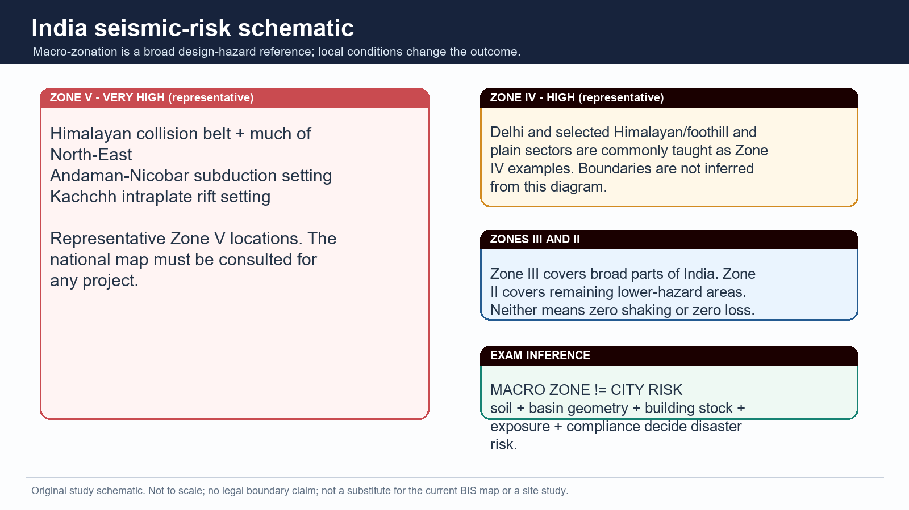

*Macro-zone labels are representative only. Read this with the caveat printed on the visual.*

> **PRE-TEACH CHECKLIST / Book context: queried in Geography Core 03, Advanced 03, and local Majid Husain / G.C. Leong / D.R. Khullar evidence. CA search: India seismic zone, microzonation, BIS and NCS official sources, checked 15 Aug 2026. CA found: Use the dated official NCS microzonation page as the current anchor; no unverified map revision is assumed.**

[FACT/ANALYSIS] This complete session moves from rupture mechanics to India's differentiated seismic settings, site effects, BIS macro-zonation, microzonation, urban risk and answer writing. It is a Geography package first: spatial source, path and site logic are primary; institutional disaster-management doctrine is linked, not duplicated.

[LIMIT/SOURCE NOTE] Source order used: repository Markdown first; local OCR-searchable Geography books second; official live NCS/BIS/PIB discovery third. Qdrant was not required. Facts are tagged in the Markdown edition as [FACT]; analytical deductions as [ANALYSIS]; limits as [LIMIT].

### Evidence / comparison matrix

| Learning block | Question it answers | Output |
| --- | --- | --- |
| Mechanism | Why does a fault rupture shake ground? | Focus, waves, magnitude/intensity |
| India pattern | Why are Himalaya, Kachchh and peninsula different? | Tectonic-setting comparison |
| Site and city | Why can nearby sites suffer differently? | Amplification, liquefaction, risk chain |
| Action | What follows from mapping? | Microzonation, codes, retrofit and answer spine |

### Teaching, explanation and solution

- [FACT] The official syllabus directly names earthquakes and tsunami under important geophysical phenomena; Geography owns the physical and spatial explanation.

- [LIMIT] Disaster Management owns institutional response architecture in depth. This package uses codes, preparedness and warning only to show how geographic hazard becomes risk.

- [ANALYSIS] The exam-safe master equation is source process -> wave/path -> site response -> exposure/vulnerability -> disaster outcome -> risk reduction.

> **Memory hook:** SOURCE -> PATH -> SITE -> STOCK -> SAFETY

### Must-know facts

- No Zone I is used in the current public BIS four-zone framing.
- No Zone VI is adopted without a verified current official source.
- Macro-zonation, microzonation and building compliance are different layers.

### UPSC traps and corrections

- **Wrong:** Calling all seismic content 'Disaster Management'. **Correct:** GS-I geography tests the tectonic, regional and geomorphic base directly.
- **Wrong:** Treating an old book number as current. **Correct:** Use book facts as source-era context and date dynamic standards or network claims.

### Mains / answer route

Open a broad answer with a spatial thesis, then separate tectonic source, site response and social vulnerability.

### Study link

Geography basic/03; advanced/03; Disaster Management basic/05 and basic/06 for bounded institutional links.

## 2. Earthquake mechanism: stress, faulting and elastic rebound

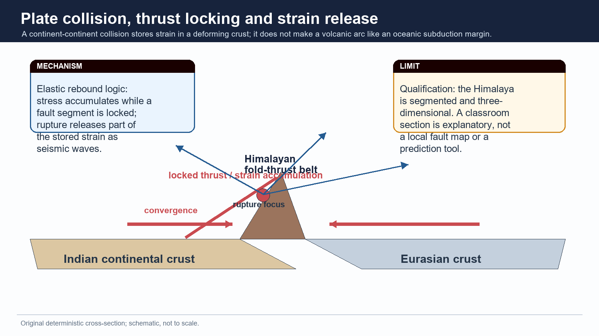

*A conceptual collision cross-section. It explains strain accumulation but cannot locate the next earthquake.*

> **PRE-TEACH CHECKLIST / Book context: queried in Geography Core 03, Advanced 03, and local Majid Husain / G.C. Leong / D.R. Khullar evidence. CA search: India seismic zone, microzonation, BIS and NCS official sources, checked 15 Aug 2026. CA found: Use the dated official NCS microzonation page as the current anchor; no unverified map revision is assumed.**

[FACT/ANALYSIS] An earthquake is sudden ground vibration caused by the release of stored elastic strain, commonly when rocks rupture or slip on a fault. Plate movement is a major driver, but the immediate physical event is fault rupture and radiated seismic energy.

### Evidence / comparison matrix

| Term | Meaning | Exam use |
| --- | --- | --- |
| Stress | force per area acting on rock | accumulates where movement is resisted |
| Strain | deformation produced by stress | elastic energy may be stored before rupture |
| Fault | fracture/zone across which displacement occurs | source of sudden slip |
| Elastic rebound | partial recovery after rupture | links gradual loading to sudden shaking |

### Teaching, explanation and solution

- [FACT] Rocks can deform elastically up to a limit; once frictional resistance or rock strength is exceeded, a fault segment can rupture.

- [ANALYSIS] The rupture front and slip history, not merely the existence of a named fault, determine an event's physical source characteristics.

- [LIMIT] A mapped fault or lineament is not by itself a time-and-place prediction. Activity requires geological, geodetic and seismological evidence.

- [ANALYSIS] In Himalaya answers, connect Indian-Eurasian convergence to shortening and thrust loading; do not incorrectly make the collision a simple volcanic arc.

> **Memory hook:** LOAD - LOCK - RUPTURE - RADIATE

### Must-know facts

- Faulting is the immediate rupture mechanism; plate tectonics is the larger driver.
- Mainshock and aftershock describe an event sequence; they are not synonyms.
- A broad hazard zone does not identify a particular future rupture.

### UPSC traps and corrections

- **Wrong:** Equating every mountain belt with a volcanic belt. **Correct:** Continent-continent collision chiefly creates shortening, thrusting and seismicity.
- **Wrong:** Calling an aftershock a prediction. **Correct:** Aftershocks are subsequent events in a sequence, not deterministic advance warning.

### Mains / answer route

For 'explain', draw one small thrust section and write loading -> rupture -> waves -> regional effect.

### Study link

Core 03 earthquake mechanics; Geological Structure Topic 02 for Himalayan thrust architecture.

## 3. Focus, epicentre, depth and seismic waves

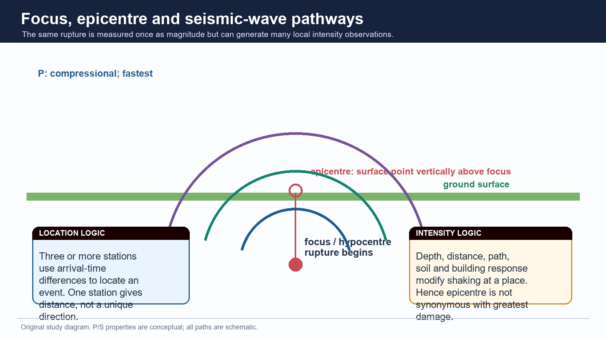

*P, S and surface-wave paths are schematic. The visual separates source location from local effects.*

> **PRE-TEACH CHECKLIST / Book context: queried in Geography Core 03, Advanced 03, and local Majid Husain / G.C. Leong / D.R. Khullar evidence. CA search: India seismic zone, microzonation, BIS and NCS official sources, checked 15 Aug 2026. CA found: Use the dated official NCS microzonation page as the current anchor; no unverified map revision is assumed.**

[FACT/ANALYSIS] The focus (hypocentre) is the point or initial rupture area within the Earth; the epicentre is the surface point vertically above it. They are linked coordinates, not interchangeable terms.

### Evidence / comparison matrix

| Wave | Motion / medium | High-yield implication |
| --- | --- | --- |
| P wave | compressional; solids and liquids | fastest first arrival |
| S wave | shear; solids only | cannot traverse liquid outer core |
| Surface waves | travel near surface | often most damaging to structures |

### Teaching, explanation and solution

- [FACT] P waves arrive before S waves because P waves travel faster; UPSC Prelims 2023 Q65 tests this directly.

- [FACT] S-wave particle motion is transverse to propagation and S waves require a solid medium; this is why their absence through the outer core is diagnostic.

- [ANALYSIS] Shallow rupture can produce strong local shaking, but distance, fault directivity, path and site response still matter; do not replace analysis with a depth slogan.

- [FACT] Event location uses arrival-time differences at multiple stations. An epicentre is not automatically the locality with the worst building damage.

### Must-know facts

- Focus is inside the Earth; epicentre is on the surface.
- P = primary/compressional/fastest; S = secondary/shear/solids only.
- Surface waves are a structural-damage concern near the surface.

### UPSC traps and corrections

- **Wrong:** Focus and epicentre are the same point. **Correct:** They are vertically related points at different depths.
- **Wrong:** S waves move through liquids. **Correct:** S waves require shear rigidity and do not travel through liquids.

### Mains / answer route

Use the focus-epicentre sketch only when a mechanism or measurement distinction is demanded.

### Study link

Prelims PYQ 2023 Q65; physical Geography interior and seismology.

## 4. Magnitude, intensity and the limits of generic 'Richter'

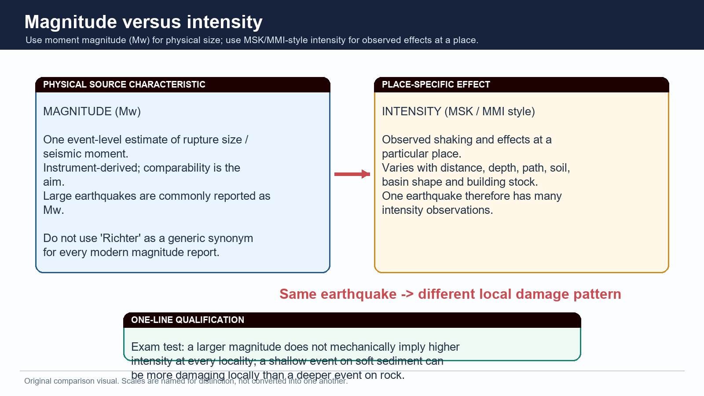

*The distinction explains why one event can produce different intensity observations across a city or region.*

> **PRE-TEACH CHECKLIST / Book context: queried in Geography Core 03, Advanced 03, and local Majid Husain / G.C. Leong / D.R. Khullar evidence. CA search: India seismic zone, microzonation, BIS and NCS official sources, checked 15 Aug 2026. CA found: Use the dated official NCS microzonation page as the current anchor; no unverified map revision is assumed.**

[FACT/ANALYSIS] Magnitude estimates the physical size of an earthquake event; intensity records observed shaking or damage at a particular place. Moment magnitude (Mw) is the modern event-size language for large earthquakes; 'Richter' should not be used as a generic label for all contemporary reporting.

### Evidence / comparison matrix

| Dimension | Question answered | Varies from place to place? |
| --- | --- | --- |
| Mw magnitude | How large was the rupture event? | No: one event estimate |
| MSK/MMI intensity | How was shaking/effect observed here? | Yes: site dependent |
| Damage | What failed and why? | Yes: site + building + exposure dependent |

### Teaching, explanation and solution

- [FACT] Intensity scales such as MSK or MMI describe effects at a location rather than a single event-wide energy value.

- [ANALYSIS] Soft soil, basin geometry, distance, depth and building stock can make intensity/damage uneven even within the same macro zone.

- [LIMIT] Do not convert magnitude to a fixed damage level; that ignores depth, fault style, path and vulnerability.

- [FACT] A seismic-zone label is a design-hazard input, not an intensity reading from a particular earthquake.

### Must-know facts

- Mw is not intensity; intensity is not a synonym for casualty or loss.
- One event can have many intensity observations.
- Use 'moment magnitude' rather than generic 'Richter' in modern analytical answers.

### UPSC traps and corrections

- **Wrong:** A larger magnitude must cause greater damage everywhere. **Correct:** Local effect depends on more than source size.
- **Wrong:** MSK/MMI is another name for Mw. **Correct:** They represent place-specific observed effects, not rupture size.

### Mains / answer route

A strong answer places a two-column Mw-versus-intensity distinction before the India case.

### Study link

BIS zonation and microzonation sections below; Core 03 measurement concepts.

## 5. India tectonic frame: collision, complex boundary, subduction and intraplate settings

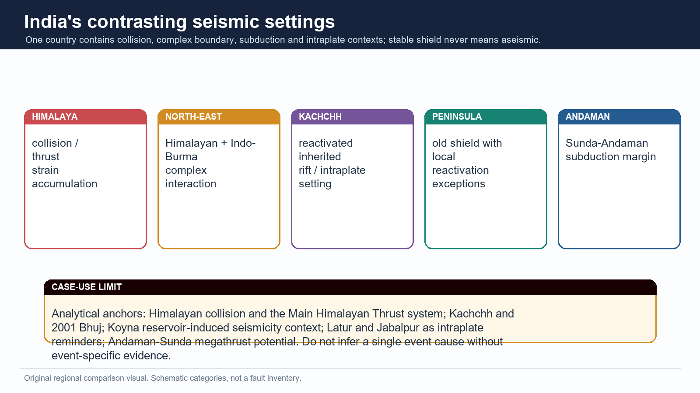

*Regional categories are explanatory. They do not turn a historic event into a forecast.*

> **PRE-TEACH CHECKLIST / Book context: queried in Geography Core 03, Advanced 03, and local Majid Husain / G.C. Leong / D.R. Khullar evidence. CA search: India seismic zone, microzonation, BIS and NCS official sources, checked 15 Aug 2026. CA found: Use the dated official NCS microzonation page as the current anchor; no unverified map revision is assumed.**

[FACT/ANALYSIS] India's seismicity cannot be explained by one belt. It reflects the active Himalayan collision system, North-East interaction with the Indo-Burma region, the Sunda-Andaman subduction margin, inherited rift/fault reactivation in Kachchh, and lower-frequency but consequential intraplate activity in the peninsula.

### Evidence / comparison matrix

| Setting | Primary physical logic | India anchor / qualification |
| --- | --- | --- |
| Himalaya | continent-continent shortening and thrusting | active deformation; segmented system |
| North-East | Himalayan and Indo-Burma interaction | complexity exceeds a single-line map |
| Andaman | Sunda-Andaman subduction | earthquake-tsunami-volcanic context |
| Kachchh | reactivated inherited structures | intraplate high-hazard setting |
| Peninsula | stable continental crust with exceptions | relative stability is not aseismicity |

### Teaching, explanation and solution

- [FACT] India contains both plate-boundary and intraplate seismic settings; regional differentiation is a core Prelims and Mains requirement.

- [ANALYSIS] A stable shield has lower average deformation than a collision belt, yet old faults, rifts and local loading can still be reactivated.

- [LIMIT] Avoid a precise plate speed, recurrence interval or claimed segment locking state unless a named current scientific source is supplied.

### Must-know facts

- Himalaya, North-East, Kachchh, Peninsula and Andaman must be kept as distinct settings.
- Andaman-Nicobar is a tectonic island-arc/subduction context, unlike coral Lakshadweep.
- Kachchh is an intraplate setting, not part of the Himalayan collision front.

### UPSC traps and corrections

- **Wrong:** All severe Indian seismicity is Himalayan. **Correct:** Kachchh, Andaman and peninsular exceptions require separate treatment.
- **Wrong:** The peninsula is stable, therefore aseismic. **Correct:** Relative stability cannot be converted into zero seismic possibility.

### Mains / answer route

Use a five-label schematic map, then give one causal sentence per region.

### Study link

Geology Topic 02 sections on Himalayan thrusts, rifts and Andaman-Nicobar.

## 6. Himalayan collision and thrust-belt seismicity

*Use this only as a conceptual cross-section; Himalayan structures branch and vary along strike.*

> **PRE-TEACH CHECKLIST / Book context: queried in Geography Core 03, Advanced 03, and local Majid Husain / G.C. Leong / D.R. Khullar evidence. CA search: India seismic zone, microzonation, BIS and NCS official sources, checked 15 Aug 2026. CA found: Use the dated official NCS microzonation page as the current anchor; no unverified map revision is assumed.**

[FACT/ANALYSIS] The Himalaya is a young, actively deforming continent-continent collision belt. Ongoing shortening is accommodated through a broad fold-thrust system; earthquakes release strain on parts of that system.

### Evidence / comparison matrix

| Causal step | Geographic result | Answer value |
| --- | --- | --- |
| Indian-Eurasian convergence | crustal shortening and thickening | source setting |
| Thrust loading / locking | strain accumulation | rupture potential |
| Uplift and erosion | young steep relief / sediment delivery | landslide and foreland link |
| Foothill/foreland exposure | dense settlements and alluvium | risk is wider than mountains |

### Teaching, explanation and solution

- [FACT] The Main Himalayan Thrust system is an analytical anchor for Himalayan seismicity; a simple north-south sketch must not erase its segmented, three-dimensional character.

- [ANALYSIS] Mountain seismicity and landslide susceptibility can cascade, but an earthquake does not automatically trigger a landslide or a dam failure at every site.

- [ANALYSIS] The Himalayan hazard extends into foothill and foreland settlements through shaking transmission, site effects, infrastructure networks and exposure.

- [LIMIT] Do not label every Himalayan sector Zone V from memory; use the current BIS map and local microzonation where a question requires a location.

### Must-know facts

- Collision means shortening/thrusting, not an Andean-type continental volcanic arc.
- A mountain belt's hazard is tectonic plus slope/site consequences.
- Foreland alluvium links Himalayan source to urban/river-plain risk.

### UPSC traps and corrections

- **Wrong:** The Himalaya is one uniform fault plane. **Correct:** It is a wide, segmented fold-thrust orogen.
- **Wrong:** A tectonic zone alone measures urban disaster risk. **Correct:** Site condition and exposure remain decisive.

### Mains / answer route

Explain -> collision-to-thrust mechanism; Discuss -> add foreland/alluvium and vulnerability; Critically examine -> include prediction and compliance limits.

### Study link

Geography Topic 06 Himalayan hazards; Disaster Management Topic 10 for landslide/GLOF doctrine.

## 7. North-East syntaxis and Indo-Burma interaction

> **PRE-TEACH CHECKLIST / Book context: queried in Geography Core 03, Advanced 03, and local Majid Husain / G.C. Leong / D.R. Khullar evidence. CA search: India seismic zone, microzonation, BIS and NCS official sources, checked 15 Aug 2026. CA found: Use the dated official NCS microzonation page as the current anchor; no unverified map revision is assumed.**

[FACT/ANALYSIS] North-East India's seismic setting is not reducible to a single Himalayan label. It lies near the interaction of the Himalayan system and the Indo-Burma region, with complex active structures, steep terrain, heavy rainfall and dispersed infrastructure.

### Evidence / comparison matrix

| Dimension | Why it matters | Qualification |
| --- | --- | --- |
| Tectonic complexity | multiple interacting structures | do not draw one false-precision boundary |
| Relief | slope failure and access disruption may compound shaking | event/site dependent |
| Rainfall and weathering | can precondition slopes | not the source of every earthquake |
| Settlement/lifelines | bridges, roads, hospitals and communications can be exposed | risk needs local audit |

### Teaching, explanation and solution

- [ANALYSIS] A high-quality North-East paragraph layers tectonic setting, steep relief, rainfall-conditioned slope material and connectivity constraints rather than repeating 'high seismic zone'.

- [LIMIT] Do not assign exact fault identities, event magnitudes or all-state zone labels without current official mapping.

- [ANALYSIS] The region illustrates why a risk answer needs secondary hazards and lifelines, not merely a map colour.

### Must-know facts

- North-East is a complex boundary-interaction setting.
- Topography can make access and secondary hazards important.
- Macro-zone label cannot replace city/site assessment.

### UPSC traps and corrections

- **Wrong:** North-East risk equals only fault rupture. **Correct:** Terrain, slope condition, built environment and connectivity modify consequences.
- **Wrong:** Heavy rainfall causes tectonic earthquakes. **Correct:** Rainfall may affect slopes/site conditions; tectonic stress drives most regional seismicity.

### Mains / answer route

Use this as a regional-variation paragraph after the Himalayan collision thesis.

### Study link

Geography Topics 04, 06 and 36 for slope, glacier and contemporary geography links.

## 8. Kachchh: inherited rifts, intraplate seismicity and Bhuj as evidence

> **PRE-TEACH CHECKLIST / Book context: queried in Geography Core 03, Advanced 03, and local Majid Husain / G.C. Leong / D.R. Khullar evidence. CA search: India seismic zone, microzonation, BIS and NCS official sources, checked 15 Aug 2026. CA found: Use the dated official NCS microzonation page as the current anchor; no unverified map revision is assumed.**

[FACT/ANALYSIS] Kachchh is a high-yield Indian example because it combines inherited rift/fault structures, intraplate reactivation and a damaging historical earthquake. It disproves the false contrast 'plate boundary = hazard, continental interior = safe'.

### Evidence / comparison matrix

| Claim | Named evidence | What it establishes |
| --- | --- | --- |
| Intraplate does not mean harmless | Kachchh / 2001 Bhuj | old structures can reactivate |
| Site response matters | liquefaction discussed in Bhuj context | ground condition modifies loss |
| Risk is constructed | built environment and lifelines | hazard alone is incomplete |

### Teaching, explanation and solution

- [FACT] Kachchh is an intraplate high-hazard setting associated with reactivated inherited structures; 2001 Bhuj is the named evidence anchor in repository sources.

- [ANALYSIS] Use Bhuj to explain source-plus-site-plus-building vulnerability, not as a memorised casualty or magnitude recital.

- [LIMIT] Precise loss figures, event magnitude and individual fault mechanism need event-specific sourced evidence and are intentionally not supplied from memory here.

- [ANALYSIS] The Kachchh example also lets an answer compare tectonic source with alluvial/coastal and urban site effects.

### Must-know facts

- Kachchh is not in the Himalayan collision belt.
- Bhuj is useful evidence for intraplate hazard and liquefaction discussion.
- An inherited lineament requires evidence before being called an active fault.

### UPSC traps and corrections

- **Wrong:** Intraplate means no severe earthquake. **Correct:** Reactivated internal structures can produce damaging events.
- **Wrong:** Bhuj proves all Gujarat has identical hazard. **Correct:** Macro zones, site conditions and exposure vary spatially.

### Mains / answer route

Compare Kachchh with Himalaya: inherited intraplate reactivation versus active collision; then add the common risk layer.

### Study link

Geological Structure Topic 02; soil/liquefaction section of this package.

## 9. Peninsular shield: relative stability, Koyna, Latur and Jabalpur cautions

> **PRE-TEACH CHECKLIST / Book context: queried in Geography Core 03, Advanced 03, and local Majid Husain / G.C. Leong / D.R. Khullar evidence. CA search: India seismic zone, microzonation, BIS and NCS official sources, checked 15 Aug 2026. CA found: Use the dated official NCS microzonation page as the current anchor; no unverified map revision is assumed.**

[FACT/ANALYSIS] Peninsular India is an old continental shield with generally lower tectonic activity than the Himalayan collision zone, but it is not aseismic. Koyna, Latur and Jabalpur are key reminders that stable continental crust can host damaging intraplate earthquakes.

### Evidence / comparison matrix

| Case anchor | Legitimate use | Do not claim |
| --- | --- | --- |
| Koyna | reservoir-induced seismicity context | every reservoir causes earthquakes |
| Latur (1993) | intraplate vulnerability reminder | one unverified universal causal story |
| Jabalpur | peninsular seismicity example | all shield regions have same mechanism |

### Teaching, explanation and solution

- [FACT] 'Stable shield' is a relative tectonic description, not a declaration of zero seismic hazard.

- [FACT] Koyna is widely used as a reservoir-induced seismicity context; reservoir loading/pore-pressure mechanisms must not be generalised to every dam without local evidence.

- [ANALYSIS] Latur and Jabalpur shift a Mains answer from deterministic plate-boundary language to the wider concept of reactivation and vulnerability.

- [LIMIT] A case name does not substitute for an event-specific mechanism, code audit or current local hazard assessment.

### Must-know facts

- Relative stability != aseismicity.
- Koyna, Latur and Jabalpur are evidence anchors, not interchangeable case histories.
- Peninsular risk often tests old structural weakness plus vulnerable construction.

### UPSC traps and corrections

- **Wrong:** Only the Himalaya matters in Indian seismicity. **Correct:** Peninsular intraplate examples are mandatory qualifications.
- **Wrong:** Reservoir-induced seismicity is the explanation for all peninsular events. **Correct:** Mechanisms must be established case by case.

### Mains / answer route

For 'assess', use the shield as a counterexample that refines - rather than negates - the national hazard map.

### Study link

Geology Topic 02; Disaster Management earthquake risk and resilient construction.

## 10. Andaman-Sunda subduction and the bounded tsunami route

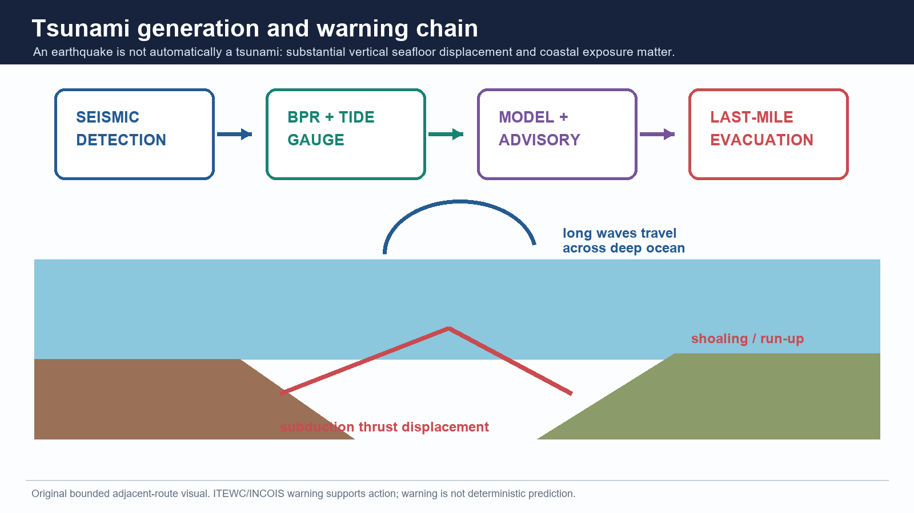

*Tsunami generation requires water displacement; an earthquake alone is not sufficient evidence of a destructive tsunami.*

> **PRE-TEACH CHECKLIST / Book context: queried in Geography Core 03, Advanced 03, and local Majid Husain / G.C. Leong / D.R. Khullar evidence. CA search: India seismic zone, microzonation, BIS and NCS official sources, checked 15 Aug 2026. CA found: Use the dated official NCS microzonation page as the current anchor; no unverified map revision is assumed.**

[FACT/ANALYSIS] Andaman-Nicobar belongs to an active Sunda-Andaman subduction/arc setting. Its earthquake, volcanic and tsunami context is distinct from the Himalaya and from coral Lakshadweep. Tsunami is included here only as a tectonically relevant adjacent route, not as a substitute for the earthquake topic.

### Evidence / comparison matrix

| Stage | Physical logic | India / answer link |
| --- | --- | --- |
| Source | vertical seabed displacement can move water column | subduction setting |
| Deep ocean | long wavelength, low amplitude | not a visible 'wall' offshore |
| Coast | shoaling, run-up and inundation | bathymetry and coastal form matter |
| Action | detection -> advisory -> evacuation | ITEWC/INCOIS as bounded warning link |

### Teaching, explanation and solution

- [FACT] A tsunami is a long-wavelength displacement wave, commonly generated by vertical seafloor movement at a subduction earthquake; landslides and volcanism can also trigger one.

- [FACT] The 2004 Indian Ocean event is a source-backed Indian case anchor. Use it for formation, coastal exposure and warning-system lessons, not unsourced fatality totals.

- [FACT] Repository Disaster Management material identifies ITEWC at INCOIS, Hyderabad, operational since 15 October 2007, with seismic, bottom-pressure-recorder and tide-gauge inputs.

- [LIMIT] Detection/early warning is not prediction, and a warning is not last-mile safety unless routes, communications and evacuation behaviour work.

### Must-know facts

- Earthquake != tsunami; vertical water displacement is the core mechanism.
- Andaman-Nicobar tectonic setting differs from Lakshadweep coral-island setting.
- Tsunami risk is shaped by source, bathymetry, coastline and exposure.

### UPSC traps and corrections

- **Wrong:** Tsunami is a tidal wave. **Correct:** It is a displacement wave, not a tide.
- **Wrong:** Every undersea earthquake causes destructive tsunami. **Correct:** Source geometry and water displacement determine tsunamigenic potential.

### Mains / answer route

For the 2025 PYQ, define -> mechanism -> where -> consequence -> one India warning/case line.

### Study link

Geography basic/03; Disaster Management basic/06 for warning, coastal planning and response ownership.

## 11. Indo-Gangetic alluvium: amplification, basin effects and exposure

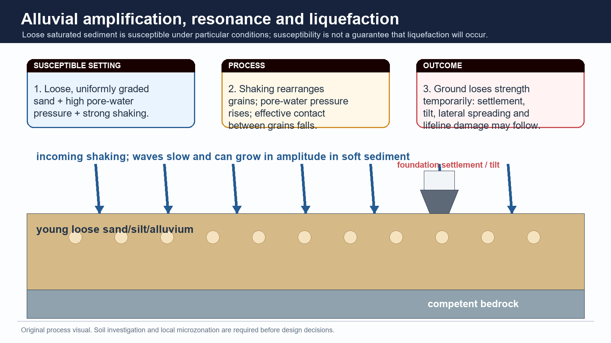

*The diagram shows a conditional site response mechanism; it does not declare all alluvium unsafe.*

> **PRE-TEACH CHECKLIST / Book context: queried in Geography Core 03, Advanced 03, and local Majid Husain / G.C. Leong / D.R. Khullar evidence. CA search: India seismic zone, microzonation, BIS and NCS official sources, checked 15 Aug 2026. CA found: Use the dated official NCS microzonation page as the current anchor; no unverified map revision is assumed.**

[FACT/ANALYSIS] The Indo-Gangetic foreland basin combines deep alluvial fill, high population density, major lifelines and links to Himalayan shaking. Soft sediment can alter wave amplitude and period relative to nearby hard-rock sites, so apparent surface stability cannot be read as low seismic risk.

### Evidence / comparison matrix

| Site effect | Mechanism | India relevance |
| --- | --- | --- |
| Amplification | waves slow / amplitudes may rise in soft sediment | alluvial basins and plains |
| Resonance | site period can match building period | building-height selective damage |
| Liquefaction | saturated loose sand loses strength under shaking | floodplains, deltas, reclaimed land |
| Exposure | dense settlement/lifelines | risk exceeds geological hazard alone |

### Teaching, explanation and solution

- [FACT] The northern plain is a sediment-filled foreland basin, not exposed ancient shield; its alluvium masks deeper structural context.

- [ANALYSIS] Site amplification arises when seismic waves pass from harder material into softer sediment; the local response can be stronger or longer-period, depending on the site.

- [ANALYSIS] Urban disaster risk grows when amplification intersects high-rise or vulnerable masonry stock, dense population, schools, hospitals and utilities.

- [LIMIT] 'Alluvium amplifies shaking' is a useful generalisation, not a substitute for site-specific geotechnical or microzonation evidence.

### Must-know facts

- Hazard is not only where a rupture occurs; path and site response matter.
- Alluvial plains may have high exposure and site amplification.
- Foreland-basin geography links Himalaya to plains risk.

### UPSC traps and corrections

- **Wrong:** Flat alluvial terrain is automatically safest in earthquakes. **Correct:** Soft sediment can amplify shaking and, under conditions, liquefy.
- **Wrong:** All sites in a macro zone shake equally. **Correct:** Local soil/basin conditions create differences.

### Mains / answer route

Use a foreland-basin sketch to connect Himalayan source, alluvial site effect and population exposure.

### Study link

Geological Structure Topic 02 foreland basin; Geography Topic 04 groundwater and sediment context.

## 12. Liquefaction, lateral spreading and resonance

*Susceptibility requires a particular material-water-shaking combination; do not treat it as guaranteed occurrence.*

> **PRE-TEACH CHECKLIST / Book context: queried in Geography Core 03, Advanced 03, and local Majid Husain / G.C. Leong / D.R. Khullar evidence. CA search: India seismic zone, microzonation, BIS and NCS official sources, checked 15 Aug 2026. CA found: Use the dated official NCS microzonation page as the current anchor; no unverified map revision is assumed.**

[FACT/ANALYSIS] Liquefaction is not ordinary flooding and not literal melting. Strong shaking can raise pore-water pressure in loose, saturated and suitably graded sediments until grain contacts lose effective strength.

### Evidence / comparison matrix

| Process | Necessary idea | Possible consequence |
| --- | --- | --- |
| Liquefaction | loose saturated sand loses effective strength | settlement / tilt / uplift |
| Lateral spreading | liquefied ground moves toward a free face | roads, embankments, pipes deform |
| Resonance | matching natural periods | selective building response |
| Basin amplification | soft sediment traps/modifies waves | prolonged or stronger shaking |

### Teaching, explanation and solution

- [FACT] Bhuj is the repository's India case anchor for liquefaction discussion; cite it to show ground failure can damage otherwise intact structures.

- [ANALYSIS] Liquefaction susceptibility maps onto depositional geography: floodplains, deltas, coastal plains, reclaimed land and old channel fills can contain young loose saturated sediment.

- [LIMIT] Saturation, grain size/packing, groundwater condition, shaking characteristics and topography matter. Do not say every sandy alluvial site will liquefy.

- [ANALYSIS] Resonance explains why adjacent buildings of different height/design can perform differently; it is a period-matching issue, not a simple tall-building rule.

### Must-know facts

- Liquefaction is a loss-of-strength process in a susceptible saturated deposit.
- Lateral spreading is a ground-deformation consequence, not merely shaking.
- Resonance is a match between vibration periods.

### UPSC traps and corrections

- **Wrong:** Liquefaction means soil becomes water permanently. **Correct:** It is temporary loss of effective strength under specific conditions.
- **Wrong:** Sandy soil always liquefies. **Correct:** Material, saturation and shaking all need examination.

### Mains / answer route

A three-arrow diagram earns value: shaking -> pore pressure -> loss of strength -> tilt/lateral spreading.

### Study link

Geography Topic 04 soil/water processes; city microzonation and engineering-geology boundary.

## 13. Secondary hazards and the urban-lifeline lens

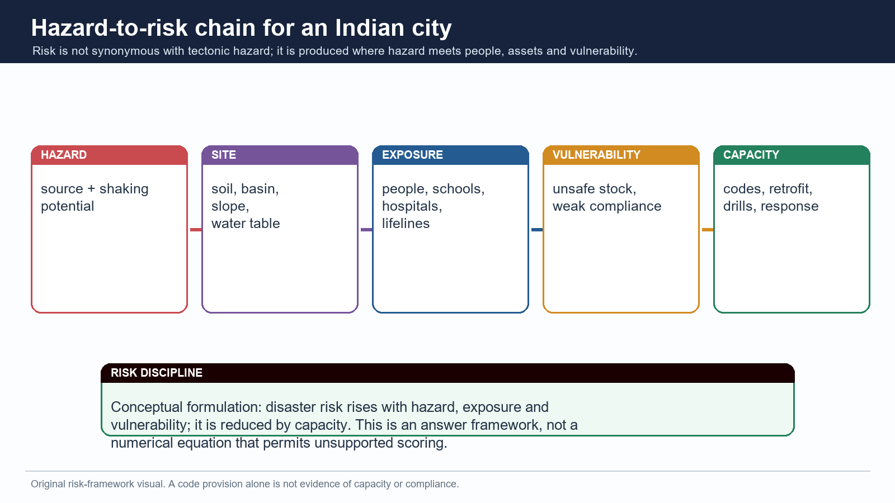

*Risk is produced through a chain; a tectonic source does not directly measure loss.*

> **PRE-TEACH CHECKLIST / Book context: queried in Geography Core 03, Advanced 03, and local Majid Husain / G.C. Leong / D.R. Khullar evidence. CA search: India seismic zone, microzonation, BIS and NCS official sources, checked 15 Aug 2026. CA found: Use the dated official NCS microzonation page as the current anchor; no unverified map revision is assumed.**

[FACT/ANALYSIS] Earthquake disaster is often a cascade: shaking can trigger landslides, surface rupture, fires, dam or utility disruption, hazardous-material release and transport failure. The likely cascade depends on terrain, site, infrastructure and governance.

### Evidence / comparison matrix

| Secondary route | Physical / system trigger | Qualification |
| --- | --- | --- |
| Landslide / rockfall | shaking on susceptible slopes | not every slope fails |
| Fire | damaged gas/electric systems | depends on network condition and response |
| Lifeline failure | bridge, road, water, telecom damage | network redundancy matters |
| Tsunami | coastal water displacement | tectonic setting and source geometry matter |

### Teaching, explanation and solution

- [ANALYSIS] A city answer should name lifelines - water, power, hospitals, schools, bridges, communications - because interrupted function turns structural damage into prolonged social loss.

- [FACT] Mountain belts require a slope-failure lens; coastal subduction settings require a tsunami lens; dense alluvial cities require site/building/lifeline lenses.

- [LIMIT] Do not claim that earthquakes cause every dam failure, fire or landslide. State conditional pathways and identify the added exposure factor.

- [ANALYSIS] Critical infrastructure resilience means both structural safety and continuity of essential service; retrofit priority is therefore not only a private-building question.

### Must-know facts

- Secondary hazards are conditional cascades, not automatic consequences.
- Lifelines convert geographical exposure into social vulnerability.
- Urban risk requires both buildings and network systems.

### UPSC traps and corrections

- **Wrong:** Earthquake impact ends when shaking ends. **Correct:** Secondary failures and recovery disruption can dominate later losses.
- **Wrong:** A city is safe if new towers are engineered. **Correct:** Masonry, schools, hospitals, utilities and response access also matter.

### Mains / answer route

For 'assess', use a source-site-stock-lifeline cascade and one place-appropriate qualification.

### Study link

Disaster Management critical infrastructure and landslide/tsunami modules; Geography Topic 36 urban issues.

## 14. BIS macro-zonation: Zones II-V and design meaning

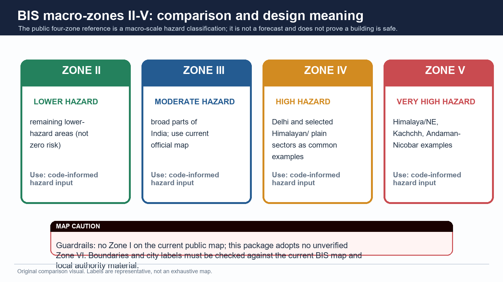

*Zone labels are representative and must be checked against the current official BIS map for any exact location.*

> **PRE-TEACH CHECKLIST / Book context: queried in Geography Core 03, Advanced 03, and local Majid Husain / G.C. Leong / D.R. Khullar evidence. CA search: India seismic zone, microzonation, BIS and NCS official sources, checked 15 Aug 2026. CA found: Use the dated official NCS microzonation page as the current anchor; no unverified map revision is assumed.**

[FACT/ANALYSIS] India's current public macro-zonation is framed through four seismic zones - II, III, IV and V - with V the highest category. It is a broad hazard/design reference, not a map of certain loss or a prediction calendar.

### Evidence / comparison matrix

| Zone | Exam-safe descriptor | Representative cue / caveat |
| --- | --- | --- |
| V | very high hazard | Himalaya/NE, Kachchh, Andaman-Nicobar examples; not exhaustive |
| IV | high hazard | Delhi and selected northern/foothill/plain sectors; verify map |
| III | moderate hazard | broad parts of country; site response still varies |
| II | lower hazard | remaining lower-hazard areas; never 'no earthquake' |

### Teaching, explanation and solution

- [FACT] The source discipline for this package is the current public four-zone reference II-V. No Zone I is asserted and no Zone VI is adopted without verified official material.

- [ANALYSIS] Macro-zonation supports code-level hazard input and regional planning; it does not substitute for local soil studies, building design or enforcement.

- [LIMIT] City/state labels can span zones and map revisions/local interpretations matter. Never infer a boundary from a coaching map or a schematic visual.

- [FACT] A macro zone measures hazard generalisation, not vulnerability, exposure, capacity or actual compliance.

### Must-know facts

- Zone V is the highest category in the public II-V framing.
- Zone II is lower hazard, not earthquake-free.
- BIS macro-zone != microzonation != site-specific design certificate.

### UPSC traps and corrections

- **Wrong:** Zone I is India's safest active category. **Correct:** The current public map used here runs II through V.
- **Wrong:** Zone V tells the magnitude/date of the next event. **Correct:** It is broad hazard/design classification, not prediction.

### Mains / answer route

Name four zones only when relevant; spend the analytical space on why zones must reach land use and construction.

### Study link

Official BIS materials; NCS microzonation page; Disaster Management code-compliance route.

## 15. Seismic microzonation: finer local hazard, not a fifth macro zone

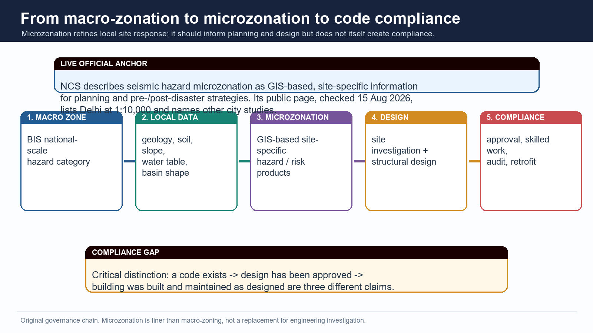

*The chain distinguishes mapping from design and compliance.*

> **PRE-TEACH CHECKLIST / Book context: queried in Geography Core 03, Advanced 03, and local Majid Husain / G.C. Leong / D.R. Khullar evidence. CA search: India seismic zone, microzonation, BIS and NCS official sources, checked 15 Aug 2026. CA found: NCS official microzonation page was fetched live: it describes GIS-based, site-specific products and lists Delhi/Jabalpur/Guwahati plus named ongoing city studies.**

[FACT/ANALYSIS] Microzonation refines broad regional hazard into site- or city-scale information using geology, geomorphology, soil, groundwater, slope, expected ground motion and related data. It does not replace macro-zonation and does not create a new national Zone VI.

### Evidence / comparison matrix

| Scale | Question asked | Typical output |
| --- | --- | --- |
| Macro-zonation | broad regional hazard class | BIS zone reference |
| Microzonation | how will local ground/site behave? | GIS/site-specific hazard/risk products |
| Site investigation | what must this foundation/design address? | geotechnical and structural input |
| Compliance audit | was it built/maintained as designed? | approval, inspection, retrofit record |

### Teaching, explanation and solution

- [FACT] The NCS official seismic-hazard-microzonation page, checked 15 Aug 2026, defines it as classifying a region into relatively similar exposure to earthquake-related effects using GIS-based site-specific hazard/risk information.

- [FACT] The same NCS page lists Delhi microzonation at 1:10,000 scale and refers to Jabalpur and Guwahati studies, while naming Chennai, Coimbatore, Bhubaneswar and Mangalore as studies in progress on that page.

- [ANALYSIS] Microzonation can guide land use, route choice, emergency planning, foundation assumptions and retrofit priority; it is especially valuable where soft sediment, basin geometry, slope or reclaimed ground vary sharply.

- [LIMIT] A microzonation report does not prove a building follows the report. Design, approval, construction quality, alteration and maintenance must be separately verified.

### Must-know facts

- Microzonation is finer and site-sensitive; it is not a renamed macro zone.
- NCS uses GIS-based hazard/risk information language.
- Delhi 1:10,000 is an official-page anchor, not a national completion claim.

### UPSC traps and corrections

- **Wrong:** Microzonation is merely recolouring the BIS map. **Correct:** It is a local data-based refinement of site response and related hazard/risk.
- **Wrong:** A city report proves every building in that city is safe. **Correct:** Mapping and compliance are distinct claims.

### Mains / answer route

Show the macro -> micro -> site investigation -> code compliance chain as a four-box value addition.

### Study link

NCS official Seismic Hazard Microzonation page, accessed 15 Aug 2026.

## 16. Hazard, vulnerability, exposure, capacity and risk

*The risk formulation is conceptual. It disciplines an answer; it is not an unsupported numerical score.*

> **PRE-TEACH CHECKLIST / Book context: queried in Geography Core 03, Advanced 03, and local Majid Husain / G.C. Leong / D.R. Khullar evidence. CA search: India seismic zone, microzonation, BIS and NCS official sources, checked 15 Aug 2026. CA found: Use the dated official NCS microzonation page as the current anchor; no unverified map revision is assumed.**

[FACT/ANALYSIS] Hazard is the potential physical shaking or associated ground failure. Risk emerges only when hazard intersects exposed people/assets and vulnerability; capacity reduces loss. This distinction prevents the common mistake of calling a zone label a disaster.

### Evidence / comparison matrix

| Concept | Earthquake example | Common error |
| --- | --- | --- |
| Hazard | strong ground shaking potential | calling it loss |
| Exposure | people, schools, lifelines in affected area | assuming it is a tectonic property |
| Vulnerability | unsafe masonry, poor detailing, weak services | treating it as inevitable |
| Capacity | codes, retrofit, drills, response | mistaking policy text for delivery |
| Risk | combined potential for loss | equating it with magnitude alone |

### Teaching, explanation and solution

- [ANALYSIS] The same Mw event can create different risk in a rural slope settlement, a dense alluvial city and an engineered low-density site because exposure and vulnerability differ.

- [ANALYSIS] Capacity is spatial: evacuation routes, local masons, hospital redundancy, water systems and response access vary by neighbourhood.

- [LIMIT] Avoid numerical risk formulas or city rankings unless a dated methodology and source are available. The relationship here is conceptual and explanatory.

### Must-know facts

- Hazard is not risk.
- Exposure is who/what lies in harm's way.
- Capacity reduces loss only when implemented and maintained.

### UPSC traps and corrections

- **Wrong:** High macro zone automatically means highest disaster risk. **Correct:** Risk also depends on site, exposure, vulnerability and capacity.
- **Wrong:** Codes eliminate hazard. **Correct:** Codes reduce vulnerability; they cannot stop tectonic rupture.

### Mains / answer route

Use this framework when a directive says vulnerability, resilience, urban risk, assess or critically examine.

### Study link

Disaster Management risk-resilience framework; Geography Topic 28/36 urban spatial exposure.

## 17. Earthquake-resistant planning: code, ductility, non-engineered construction and retrofit

*Mapping has value only when it reaches siting, design, workmanship, audit and retrofit.*

> **PRE-TEACH CHECKLIST / Book context: queried in Geography Core 03, Advanced 03, and local Majid Husain / G.C. Leong / D.R. Khullar evidence. CA search: India seismic zone, microzonation, BIS and NCS official sources, checked 15 Aug 2026. CA found: Use the dated official NCS microzonation page as the current anchor; no unverified map revision is assumed.**

[FACT/ANALYSIS] Earthquake risk reduction aims to prevent collapse and maintain essential function, not to prevent earthquakes. New construction, existing stock, non-structural components and lifelines require different interventions.

### Evidence / comparison matrix

| Intervention | Mechanism | Qualification |
| --- | --- | --- |
| Ductile detailing | permits controlled deformation without brittle collapse | requires correct design and workmanship |
| Siting / land use | avoids known fault traces/susceptible ground where evidence supports it | needs local investigation |
| Retrofitting | improves existing priority structures | prioritisation and finance matter |
| Non-engineered masonry improvement | ties, bands, connections and skilled construction | not a one-size technical prescription |
| Lifeline resilience | continuity of water, hospitals, power, bridges | network interdependence matters |

### Teaching, explanation and solution

- [FACT] Repository Disaster Management material frames mitigation around earthquake-resistant new construction, selective strengthening/retrofitting, regulation/enforcement, awareness, capacity development and response.

- [ANALYSIS] Ductility is a design philosophy that manages deformation and energy dissipation; saying 'stronger concrete' alone misses load path, connections and detailing.

- [ANALYSIS] Retrofitting is especially important for schools, hospitals, bridges, utilities and vulnerable existing housing because the risk stock already exists.

- [LIMIT] A building code, a sanctioned plan or a training workshop is not evidence that construction conforms in practice. Compliance is the decisive chain.

### Must-know facts

- Codes reduce vulnerability; they do not predict or prevent an earthquake.
- Ductile detailing and load paths are more meaningful than generic 'make buildings strong'.
- Existing stock and lifelines need retrofit/audit as well as new-build codes.

### UPSC traps and corrections

- **Wrong:** Code provision equals code compliance. **Correct:** Design, approval, construction, inspection and maintenance are distinct.
- **Wrong:** Retrofitting is only cosmetic strengthening. **Correct:** It is a targeted structural/non-structural vulnerability-reduction strategy.

### Mains / answer route

For a 15-marker, write zoning/microzonation -> design -> construction control -> audit/retrofit -> drills/lifeline continuity.

### Study link

BIS/NBC/NDMA materials; Disaster Management basic/05 for six-pillar institutional detail.

## 18. Monitoring, rapid information, early warning and prediction limits

> **PRE-TEACH CHECKLIST / Book context: queried in Geography Core 03, Advanced 03, and local Majid Husain / G.C. Leong / D.R. Khullar evidence. CA search: India seismic zone, microzonation, BIS and NCS official sources, checked 15 Aug 2026. CA found: Official NCS portal and microzonation page checked live; current event reporting is not treated as a deterministic prediction service.**

[FACT/ANALYSIS] Earthquakes cannot presently be predicted precisely in magnitude, place and time. Monitoring, rapid parameter reporting, shaking scenarios and possible seconds-scale early-warning functions are not the same as deterministic prediction.

### Evidence / comparison matrix

| Capability | What it can do | What it cannot honestly claim |
| --- | --- | --- |
| Monitoring | detect and locate/report an event | foretell exact next event |
| Rapid alerts | support immediate situational awareness | guarantee no harm |
| Early warning | provide limited lead time where configured | replace resilient construction |
| Forecast / probability | describe broad likelihood over time | state exact date/place/magnitude |

### Teaching, explanation and solution

- [FACT] NCS is the official Indian earthquake-monitoring anchor; its public portal is appropriate for event reports and official service information.

- [ANALYSIS] The policy conclusion follows from the prediction limit: prevention of vulnerability through codes, retrofit, land-use discipline and preparedness carries more weight than claims of foreknowledge.

- [LIMIT] Do not call an aftershock sequence, a foreshock-like event, a media rumour or a monitoring app an earthquake prediction.

- [ANALYSIS] Rapid information has real value for response and public communication, but it cannot undo unsafe construction already exposed to shaking.

### Must-know facts

- Monitoring != prediction.
- Early warning != forecast; forecast != deterministic prediction.
- Risk reduction must work before the event.

### UPSC traps and corrections

- **Wrong:** More sensors solve earthquake risk by predicting the next event. **Correct:** Sensors improve detection/analysis; construction and preparedness reduce vulnerability.
- **Wrong:** A warning system makes a coastal community automatically safe. **Correct:** Last-mile communication, routes and preparedness decide action.

### Mains / answer route

State the prediction limit early, then turn it into the thesis for mitigation and resilience.

### Study link

NCS official portal; Disaster Management warning and earthquake-resilience modules.

## 19. India cases as analytical evidence, with limits

> **PRE-TEACH CHECKLIST / Book context: queried in Geography Core 03, Advanced 03, and local Majid Husain / G.C. Leong / D.R. Khullar evidence. CA search: India seismic zone, microzonation, BIS and NCS official sources, checked 15 Aug 2026. CA found: Use the dated official NCS microzonation page as the current anchor; no unverified map revision is assumed.**

[FACT/ANALYSIS] Named events are evidence units, not decorative case lists. Each must prove a distinct proposition and carry a limit: event-specific magnitude, causal history and loss figures require case-specific sources.

### Evidence / comparison matrix

| Case | Use it to prove | Qualification |
| --- | --- | --- |
| Bhuj / Kachchh 2001 | intraplate hazard and ground/site vulnerability | avoid uncited losses/magnitude |
| Latur 1993 | shield is not aseismic | do not assign universal mechanism |
| Koyna | reservoir-induced seismicity context | not every dam triggers events |
| 2004 Indian Ocean | tsunami source-to-coast warning lesson | not only an earthquake-loss recital |
| Delhi / alluvial urban setting | macro zone plus site/exposure distinction | city needs local study |

### Teaching, explanation and solution

- [ANALYSIS] A 10-marker needs two or three named examples only when each advances a different claim; more names without analysis reduce precision.

- [ANALYSIS] Bhuj supports intraplate and liquefaction/site-effect discussion; Koyna supports reservoir-induced seismicity context; Latur rebuts aseismic-shield assumptions.

- [ANALYSIS] The 2004 event belongs in a bounded coastal/subduction/tsunami answer; it should not be forced into every inland earthquake answer.

- [LIMIT] Do not write fatality figures, exact Mw values, plate speeds or causal claims from memory. A case remains valid without unsupported numerics.

### Must-know facts

- Case -> claim -> mechanism -> limit is the safe Mains pattern.
- Koyna and Latur have different analytical uses.
- Bhuj is not a proxy for all Indian urban risk.

### UPSC traps and corrections

- **Wrong:** A long event list demonstrates analysis. **Correct:** Each case must prove a specific proposition.
- **Wrong:** Historical case figures are automatically current facts. **Correct:** Historical data must retain source/date and relevance.

### Mains / answer route

Use one India map label and three evidence units, each ending in a qualification.

### Study link

Workbook PYQ and original answer bank.

## 20. Current linkage and likely future demands

*The current hook is implementation: a map becomes safety only through planning, design and compliance.*

> **PRE-TEACH CHECKLIST / Book context: queried in Geography Core 03, Advanced 03, and local Majid Husain / G.C. Leong / D.R. Khullar evidence. CA search: India seismic zone, microzonation, BIS and NCS official sources, checked 15 Aug 2026. CA found: Live NCS microzonation page fetched 15 Aug 2026; a conflicting non-first-party Zone VI claim was deliberately excluded under the source-discipline rule.**

[FACT/ANALYSIS] The durable current-affairs link is not a daily tremor count; it is the implementation gap between macro-zonation, microzonation, safe construction, retrofit and urban preparedness. This is more UPSC-useful than unsupported claims of a new national seismic zone.

### Evidence / comparison matrix

| Live / dated anchor | Static concept linked | Exam-safe use |
| --- | --- | --- |
| NCS microzonation page checked 15 Aug 2026 | macro versus micro scale | cite GIS/site-specific planning role |
| BIS public four-zone framing | hazard design baseline | no unverified Zone VI claim |
| NCS event monitoring | monitoring versus prediction | avoid tremor-count trivia |
| ITEWC/INCOIS route | subduction-tsunami warning | warning-to-evacuation chain |

### Teaching, explanation and solution

- [FACT] The live NCS microzonation page remains the strongest official current anchor used here because it defines the concept and names city-study status.

- [ANALYSIS] Likely future Mains demand: assess whether urban seismic safety is achieved by macro zoning alone. The answer must distinguish hazard maps, site data, building stock and enforcement.

- [ANALYSIS] Likely Prelims demand: distinguish Mw/intensity, macro/micro zonation, alluvial amplification/liquefaction, and tectonic settings on a map.

- [LIMIT] Search results that assert a new Zone VI without a verified first-party operative public source are not adopted. This package preserves the current public II-V discipline demanded in the brief.

### Must-know facts

- Current affairs should deepen static concepts, not replace them.
- No unverified map revision is an exam fact.
- Monitoring reports are event information, not risk maps.

### UPSC traps and corrections

- **Wrong:** A media label for a proposed map is automatically operative standard. **Correct:** Use verified official public material and date the status.
- **Wrong:** Microzonation news means macro zones disappeared. **Correct:** The scales are complementary.

### Mains / answer route

Close with a dated implementation direction: locally informed planning plus verified code compliance and retrofit.

### Study link

NCS microzonation page; BIS official guidance; PIB/INCOIS official discovery sources.

## 21. Prelims map-elimination logic and rapid traps

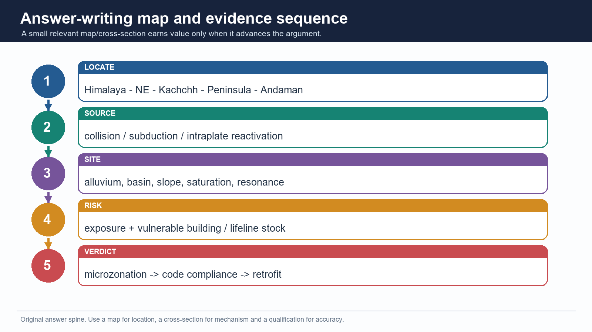

*The same sequence is useful for map elimination: locate -> mechanism -> site effect -> qualification.*

> **PRE-TEACH CHECKLIST / Book context: queried in Geography Core 03, Advanced 03, and local Majid Husain / G.C. Leong / D.R. Khullar evidence. CA search: India seismic zone, microzonation, BIS and NCS official sources, checked 15 Aug 2026. CA found: Use the dated official NCS microzonation page as the current anchor; no unverified map revision is assumed.**

[FACT/ANALYSIS] Prelims rewards exclusion of false absolutes. Locate the setting first, then test the mechanism, measurement scale and conditionality of the statement.

### Evidence / comparison matrix

| Stem cue | Elimination logic | Safe conclusion |
| --- | --- | --- |
| 'Stable peninsula' | relative does not mean zero | not aseismic |
| 'Richter damage' | size versus observed effect | magnitude != intensity |
| 'alluvial plain safest' | soft sediment/site response | may amplify or liquefy |
| 'BIS Zone I/VI' | current brief uses official public II-V | reject unsupported label |
| 'earthquake causes tsunami' | need vertical water displacement | not automatic |

### Teaching, explanation and solution

- [ANALYSIS] Map elimination sequence: identify Himalayan collision, North-East interaction, Kachchh intraplate, Peninsular shield exception or Andaman subduction; then reject any mechanism that belongs elsewhere.

- [ANALYSIS] Scale elimination sequence: Zone -> broad hazard; microzonation -> local site information; code -> design requirement; compliance -> delivered safety.

- [ANALYSIS] Conditionality elimination sequence: susceptibility is not occurrence; early warning is not prediction; a case is not a universal law.

### Must-know facts

- No Zone I on public II-V map used here.
- Mw/intensity and macro/micro zoning are paired distractor themes.
- Liquefaction requires conditions, not merely the word 'sand'.

### UPSC traps and corrections

- **Wrong:** Treating a true clause as proof that every linked clause is true. **Correct:** Test each statement independently.
- **Wrong:** Selecting option with more jargon. **Correct:** Choose the mechanism and scale that match the setting.

### Mains / answer route

For mapping questions, state 'schematic/not to scale/no legal boundary claim' beside a small sketch.

### Study link

Workbook hard MCQ and remedial drill sequence.

## 22. Solved PYQ: UPSC Mains 2021 GS-III Q8 (10 marks)

> **PRE-TEACH CHECKLIST / Book context: queried in Geography Core 03, Advanced 03, and local Majid Husain / G.C. Leong / D.R. Khullar evidence. CA search: India seismic zone, microzonation, BIS and NCS official sources, checked 15 Aug 2026. CA found: Use the dated official NCS microzonation page as the current anchor; no unverified map revision is assumed.**

[FACT/ANALYSIS] Discuss about the vulnerability of India to earthquake related hazards. Give examples including the salient features of major disasters caused by earthquakes in different parts of India during the last three decades. Answer in 150 words. Ownership: Disaster Management, with Geography supplying the source-and-site base.

### Teaching, explanation and solution

- [CLAIM] India's vulnerability is uneven because active tectonic sources intersect dense settlements, fragile building stock and locally adverse ground conditions; it is not confined to the Himalayan arc.

- [EVIDENCE -> ANALYSIS] The Himalayan collision belt and North-East accumulate deformation on active structures, while the Indo-Gangetic foreland's soft alluvium can amplify shaking. Thus a mountain-source earthquake may create risk across populated plains and lifelines, not only near a mapped epicentre.

- [EVIDENCE -> ANALYSIS] Kachchh and the 2001 Bhuj earthquake show that intraplate reactivation and liquefaction/site failure can be destructive. Latur (1993) and Jabalpur/Koyna reminders show why a Peninsular shield cannot be described as aseismic.

- [EVIDENCE -> ANALYSIS] The 2004 Indian Ocean event demonstrates the separate Andaman-Sunda subduction and tsunami route; coastal exposure, warning and evacuation determine consequences after offshore rupture.

- [QUALIFICATION -> VERDICT] Hazard maps alone do not determine loss. India needs macro zoning refined by microzonation, ductile code-compliant construction, priority retrofit of schools/hospitals/lifelines and community preparedness because exact earthquake prediction is unavailable.

- Why this earns marks: It answers vulnerability rather than narrating earthquakes, compares three Indian settings, uses named evidence, explains ground/building modifiers and ends with a qualified mitigation verdict.

### Must-know facts

- Model-answer discipline: claim -> named evidence/example -> analysis -> qualification -> verdict.
- Draw only a compact mechanism diagram or regional map that directly answers the directive.

### UPSC traps and corrections

- **Wrong:** Listing disaster cases without explaining risk. **Correct:** Tie every named case to source setting, site condition, exposure or vulnerability.
- **Wrong:** Presenting a code, warning system or zone label as completed safety. **Correct:** Separate provision, design, construction, maintenance and last-mile action.

### Mains / answer route

Discuss about the vulnerability of India to earthquake related hazards. Give examples including the salient features of major disasters caused by earthquakes in different parts of India during the last three decades. Answer in 150 words. Ownership: Disaster Management, with Geography supplying the source-and-site base.

### Study link

Use the answer-writing map sequence visual and the evidence bank in final register notes.

## 23. Solved PYQ: UPSC Mains 2025 GS-I Q7 (10 marks)

> **PRE-TEACH CHECKLIST / Book context: queried in Geography Core 03, Advanced 03, and local Majid Husain / G.C. Leong / D.R. Khullar evidence. CA search: India seismic zone, microzonation, BIS and NCS official sources, checked 15 Aug 2026. CA found: Use the dated official NCS microzonation page as the current anchor; no unverified map revision is assumed.**

[FACT/ANALYSIS] What are Tsunamis? How and where are they formed? What are their consequences? Explain with examples. Answer in 150 words. Ownership: Geography physical-process demand; Disaster Management supplies bounded warning/preparedness application.

### Teaching, explanation and solution

- [CLAIM] A tsunami is a series of long-wavelength displacement waves generated when an undersea disturbance suddenly displaces a large water column; it is not a tidal or ordinary wind-wave phenomenon.

- [EVIDENCE -> ANALYSIS] The dominant route is vertical seafloor movement at subduction-zone earthquakes. The 2004 Sumatra-Sunda event is the Indian Ocean example. Submarine landslides and volcanic collapse can also displace water, so an undersea earthquake is not automatically tsunamigenic.

- [EVIDENCE -> ANALYSIS] Source areas cluster near subduction belts, especially the Pacific and Sunda-Andaman system. In deep water waves can travel with low amplitude; on shoaling coasts their speed falls and height/run-up can rise.

- [EVIDENCE -> ANALYSIS] Consequences include inundation, drowning, damage to settlements/ports and salinisation of soils and groundwater; low-lying coasts, bathymetry and exposure shape loss.

- [QUALIFICATION -> VERDICT] ITEWC/INCOIS provides a named Indian detection-to-advisory route, but warning works only with credible last-mile communication, evacuation routes and risk-sensitive coastal planning.

- Why this earns marks: It directly covers definition, how, where and consequences; it adds the 2004 example and a careful warning qualification without converting the answer into a disaster-management list.

### Must-know facts

- Model-answer discipline: claim -> named evidence/example -> analysis -> qualification -> verdict.
- Draw only a compact mechanism diagram or regional map that directly answers the directive.

### UPSC traps and corrections

- **Wrong:** Listing disaster cases without explaining risk. **Correct:** Tie every named case to source setting, site condition, exposure or vulnerability.
- **Wrong:** Presenting a code, warning system or zone label as completed safety. **Correct:** Separate provision, design, construction, maintenance and last-mile action.

### Mains / answer route

What are Tsunamis? How and where are they formed? What are their consequences? Explain with examples. Answer in 150 words. Ownership: Geography physical-process demand; Disaster Management supplies bounded warning/preparedness application.

### Study link

Use the answer-writing map sequence visual and the evidence bank in final register notes.

## 24. Solved PYQ: UPSC Prelims 2023 GS-I Q65 - seismic waves

> **PRE-TEACH CHECKLIST / Book context: queried in Geography Core 03, Advanced 03, and local Majid Husain / G.C. Leong / D.R. Khullar evidence. CA search: India seismic zone, microzonation, BIS and NCS official sources, checked 15 Aug 2026. CA found: Use the dated official NCS microzonation page as the current anchor; no unverified map revision is assumed.**

[FACT/ANALYSIS] Question: (1) In a seismograph, P waves are recorded earlier than S waves. (2) In P waves particles vibrate to and fro in the direction of propagation whereas in S waves particles vibrate at right angles to propagation. Which statement(s) is/are correct? Options: A 1 only; B 2 only; C both 1 and 2; D neither.

### Teaching, explanation and solution

- [INFERRED ANSWER - NOT OFFICIALLY VERIFIED LOCALLY / High confidence] Option C, both statements. The local repository contains the official 2023 Set-A question paper but no official answer key for this year is treated as readable/available in the routing ledger.

- [ELIMINATION] Statement 1 is correct because P waves are faster than S waves and therefore arrive earlier at a seismograph.

- [ELIMINATION] Statement 2 is correct because P waves are longitudinal/compressional and S waves are transverse/shear. The phrase 'right angles' is the decisive S-wave cue.

- [LIMIT] This PYQ tests general seismology, not Indian zonation. Use it as the foundation for focus/waves rather than forcing a BIS-zone answer.

### Must-know facts

- P waves: compressional, fastest, solids and liquids.
- S waves: shear, slower, solids only.
- Answer confidence is stated because the official key is unavailable locally.

### UPSC traps and corrections

- **Wrong:** P stands for 'perpendicular' particle motion. **Correct:** P waves are primary/compressional with motion parallel to travel.
- **Wrong:** S waves arrive before P waves because they shake more strongly. **Correct:** Arrival order depends on speed, not apparent damage.

### Mains / answer route

Prelims bridge: use P/S facts to explain why focus/location and wave path matter before studying Indian site effects.

### Study link

Verified question text: local official CSP 2023 GS-I Set-A, page 27; key status per central PYQ routing ledger.

## 25. Adjacent PYQ: UPSC Mains 2023 GS-I Q15 (15 marks)

> **PRE-TEACH CHECKLIST / Book context: queried in Geography Core 03, Advanced 03, and local Majid Husain / G.C. Leong / D.R. Khullar evidence. CA search: India seismic zone, microzonation, BIS and NCS official sources, checked 15 Aug 2026. CA found: Use the dated official NCS microzonation page as the current anchor; no unverified map revision is assumed.**

[FACT/ANALYSIS] Comment on the resource potentials of the long coastline of India and highlight the status of natural hazard preparedness in these areas. Answer in 250 words. Ownership: coastline resource potential is Geography Topic 10; tsunami preparedness is a cross-cutting adjacent route here.

### Teaching, explanation and solution

- [CLAIM] India's coast combines fisheries, ports/shipping, tourism, offshore energy and ecosystem services with cyclone, surge, erosion, tsunami and sea-level-related exposure; resource use and hazard preparedness must be co-planned.

- [EVIDENCE -> ANALYSIS] Deltaic and low-lying east-coast settings concentrate fisheries, agriculture, ports and settlements but can magnify storm-surge/tsunami inundation. Mangroves, dunes and wetlands offer ecosystem-based buffers but cannot replace warning and evacuation.

- [EVIDENCE -> ANALYSIS] Andaman-Nicobar's Sunda-Andaman setting makes the 2004 Indian Ocean tsunami a tectonic preparedness lesson. ITEWC/INCOIS provides seismic, BPR and tide-gauge supported detection/advisory capability; coastal action still requires local routes, drills and communications.

- [QUALIFICATION -> VERDICT] Do not label the entire coastline equally prepared or treat sea walls as universal safety. Hazard mapping, CRZ-sensitive land use, ecosystem buffers, resilient ports/lifelines and community drills must be location-specific.

- Why this earns marks: It answers both resource potential and preparedness, uses a tectonic coastal example, balances ecosystem and structural measures, and ends with a location-specific qualification.

### Must-know facts

- Use this as an adjacent coastal-hazard answer, not as evidence that all earthquakes create tsunami.
- A good answer balances resource potential with differentiated coastal risk.

### UPSC traps and corrections

- **Wrong:** Turning a coastline question into only tsunami management. **Correct:** Begin with resource geography and add hazard preparedness as the directive requires.
- **Wrong:** Calling every coast tsunamigenic. **Correct:** Tsunami exposure depends on source, bathymetry and coastal form.

### Mains / answer route

A 15-marker needs a coast map, resource-hazard matrix and one bounded ITEWC/2004 example.

### Study link

Geography Topic 10 Coast/CRZ; Disaster Management Topic 06 tsunami preparedness.

## 26. Learning MCQ loop 1: mechanism and measurement (keys A-B-C-D)

> **PRE-TEACH CHECKLIST / Book context: queried in Geography Core 03, Advanced 03, and local Majid Husain / G.C. Leong / D.R. Khullar evidence. CA search: India seismic zone, microzonation, BIS and NCS official sources, checked 15 Aug 2026. CA found: Use the dated official NCS microzonation page as the current anchor; no unverified map revision is assumed.**

[FACT/ANALYSIS] Answer first, then use the remedial cue. Crafted keys rotate A -> B -> C -> D; the separately fixed PYQ key is not part of this authored practice sequence.

### Teaching, explanation and solution

- Q1 [Key A] Which is the best meaning of BIS macro-zonation? A broad regional design-hazard reference. B a precise earthquake forecast. C a building-compliance certificate. D a city soil profile. Answer A: macro-zone is broad hazard, not prediction/site/compliance.

- Q2 [Key B] Liquefaction is most plausibly promoted by: A dry massive granite. B loose saturated suitably graded sediment under strong shaking. C any clay soil without water. D only a surface fault rupture. Answer B: the material-water-shaking combination is decisive.

- Q3 [Key C] Which statement is correct? A Mw and intensity are synonyms. B intensity is one fixed event value. C Mw estimates event size while intensity records place-specific effects. D Richter is the only current magnitude language. Answer C.

- Q4 [Key D] Which chain correctly distinguishes scales? A microzone -> national map -> earthquake date. B code -> macrozone -> soil deposit. C compliance -> map -> rupture. D macro-zone -> microzonation -> site investigation -> design/compliance. Answer D.

### Must-know facts

- Remedial cue after Q1/Q4: map scale is not safety delivery.
- Remedial cue after Q2: susceptibility is conditional.
- Remedial cue after Q3: event size and place effect are different variables.

### UPSC traps and corrections

- **Wrong:** Using the zone label to answer a soil question. **Correct:** Match the scale and mechanism in the stem.
- **Wrong:** Choosing an absolute statement on liquefaction. **Correct:** Look for material-water-shaking conditions.

### Mains / answer route

Use these distinctions as the first two lines of any exam answer.

### Study link

Sections 4, 12, 14 and 15.

## 27. Learning MCQ loop 2: India settings and risk (keys A-B-C-D)

> **PRE-TEACH CHECKLIST / Book context: queried in Geography Core 03, Advanced 03, and local Majid Husain / G.C. Leong / D.R. Khullar evidence. CA search: India seismic zone, microzonation, BIS and NCS official sources, checked 15 Aug 2026. CA found: Use the dated official NCS microzonation page as the current anchor; no unverified map revision is assumed.**

[FACT/ANALYSIS] This loop checks map setting, prediction discipline and construction logic.

### Teaching, explanation and solution

- Q5 [Key A] Thick alluvial fill can raise local earthquake risk chiefly because it may: A modify/amplify shaking and, under conditions, liquefy. B stop all seismic waves. C prove a site lies on a volcano. D make a macro-zone unnecessary. Answer A.

- Q6 [Key B] Kachchh is most usefully classified as: A Himalayan collision front. B intraplate setting with inherited/reactivated structures. C coral-atoll setting. D an aseismic shield. Answer B.

- Q7 [Key C] Which claim is scientifically defensible? A an NCS alert predicts exact future magnitude/place/time. B a code eliminates tectonic hazard. C monitoring and rapid information do not equal deterministic prediction. D every aftershock proves a larger event is imminent. Answer C.

- Q8 [Key D] Which is the best risk-reduction chain? A macro-zone -> declare city safe. B issue a code -> assume compliance. C map a fault -> ignore existing houses. D local hazard/site data -> design -> workmanship/audit -> retrofit/preparedness. Answer D.

### Must-know facts

- Kachchh is a counterexample to 'only Himalayan risk'.
- Alluvium is a site-effect clue, not an automatic outcome.
- Prediction gap makes mitigation the central policy thesis.

### UPSC traps and corrections

- **Wrong:** Mistaking NCS monitoring for a prediction service. **Correct:** Monitoring assists knowledge and response; mitigation reduces vulnerability.
- **Wrong:** Treating code publication as implementation. **Correct:** Ask whether the full compliance chain exists.

### Mains / answer route

Use a counterexample plus a compliance qualification to turn a factual paragraph into analysis.

### Study link

Sections 8, 11, 17 and 18.

## 28. Original 10-marker: Why seismic zonation alone cannot determine earthquake disaster risk in an Indian city

> **PRE-TEACH CHECKLIST / Book context: queried in Geography Core 03, Advanced 03, and local Majid Husain / G.C. Leong / D.R. Khullar evidence. CA search: India seismic zone, microzonation, BIS and NCS official sources, checked 15 Aug 2026. CA found: Use the dated official NCS microzonation page as the current anchor; no unverified map revision is assumed.**

[FACT/ANALYSIS] Explain why seismic zonation alone cannot determine earthquake disaster risk in an Indian city. Answer in 150 words.

### Teaching, explanation and solution

- [CLAIM] Seismic zonation is necessary but insufficient because it is a macro-scale estimate of expected shaking/design hazard, whereas city disaster risk is produced at neighbourhood and building scales.

- [EVIDENCE -> ANALYSIS] The Indo-Gangetic foreland contains soft alluvium that can amplify shaking; NCS frames microzonation as GIS-based site-specific hazard/risk information. Thus two sites in one macro zone can require different foundation, land-use and emergency assumptions.

- [EVIDENCE -> ANALYSIS] Bhuj illustrates that ground failure such as liquefaction can magnify loss, while Delhi-type urban exposure places dense buildings, utilities and lifelines under the same regional hazard label.

- [EVIDENCE -> ANALYSIS] Ductile detailing, construction quality, non-engineered masonry condition and retrofit status determine whether shaking produces collapse or manageable damage.

- [QUALIFICATION -> VERDICT] Microzonation itself does not prove compliance. Risk reduction requires zone -> local site study -> design -> inspection -> retrofit and preparedness; no map can predict the next event.

- Why this earns marks: It explains the directive's 'alone', gives a map/site example and a case, distinguishes scales and finishes with an enforceable chain.

### Must-know facts

- Model-answer discipline: claim -> named evidence/example -> analysis -> qualification -> verdict.
- Draw only a compact mechanism diagram or regional map that directly answers the directive.

### UPSC traps and corrections

- **Wrong:** Listing disaster cases without explaining risk. **Correct:** Tie every named case to source setting, site condition, exposure or vulnerability.
- **Wrong:** Presenting a code, warning system or zone label as completed safety. **Correct:** Separate provision, design, construction, maintenance and last-mile action.

### Mains / answer route

Explain why seismic zonation alone cannot determine earthquake disaster risk in an Indian city. Answer in 150 words.

### Study link

Use the answer-writing map sequence visual and the evidence bank in final register notes.

## 29. Original 15-marker: Examine uneven earthquake risk from Himalaya to alluvial cities

> **PRE-TEACH CHECKLIST / Book context: queried in Geography Core 03, Advanced 03, and local Majid Husain / G.C. Leong / D.R. Khullar evidence. CA search: India seismic zone, microzonation, BIS and NCS official sources, checked 15 Aug 2026. CA found: Use the dated official NCS microzonation page as the current anchor; no unverified map revision is assumed.**

[FACT/ANALYSIS] Examine how Himalayan tectonics, alluvial basin conditions and urbanisation combine to produce uneven earthquake risk in India. Answer in 250 words.

### Teaching, explanation and solution

- [CLAIM] Indian earthquake risk is uneven because a tectonic source in the Himalayan collision belt is filtered through path/site effects and then multiplied by concentrated urban exposure; it cannot be read solely from a national zone colour.

- [EVIDENCE -> ANALYSIS] Indian-Eurasian convergence produces shortening and thrust loading in the Himalaya. This makes the mountain belt a major source region, while steep slopes can add conditional landslide/rockfall routes and disrupt roads and bridges.

- [EVIDENCE -> ANALYSIS] South of the front, the Indo-Gangetic foreland is a thick sediment-filled basin. Soft alluvium can alter/amplify shaking and loose saturated deposits may liquefy, so plains are not automatically low-risk merely because their relief is gentle.

- [EVIDENCE -> ANALYSIS] Delhi and other dense urban areas concentrate masonry, high-rises, hospitals, schools, water/power and transport lifelines. Resonance, weak detailing and blocked response routes turn physical shaking into cascading service loss.

- [EVIDENCE -> ANALYSIS] NCS microzonation material supplies the bridge from broad zoning to GIS/site-specific planning; it should inform land use, design and priority retrofit.

- [QUALIFICATION -> VERDICT] Local soil response does not make every alluvial site unsafe, and a microzonation product does not prove construction compliance. The policy answer is differentiated mapping, ductile new construction, audits/retrofit of existing stock and drills/lifeline continuity.

- Why this earns marks: It examines interaction rather than listing factors, connects source-site-city mechanisms, uses NCS and India geography evidence, and gives a balanced location-specific conclusion.

### Must-know facts

- Model-answer discipline: claim -> named evidence/example -> analysis -> qualification -> verdict.
- Draw only a compact mechanism diagram or regional map that directly answers the directive.

### UPSC traps and corrections

- **Wrong:** Listing disaster cases without explaining risk. **Correct:** Tie every named case to source setting, site condition, exposure or vulnerability.
- **Wrong:** Presenting a code, warning system or zone label as completed safety. **Correct:** Separate provision, design, construction, maintenance and last-mile action.

### Mains / answer route

Examine how Himalayan tectonics, alluvial basin conditions and urbanisation combine to produce uneven earthquake risk in India. Answer in 250 words.

### Study link

Use the answer-writing map sequence visual and the evidence bank in final register notes.

## 30. Original 20-marker: Critically examine a geography-first earthquake-risk framework

> **PRE-TEACH CHECKLIST / Book context: queried in Geography Core 03, Advanced 03, and local Majid Husain / G.C. Leong / D.R. Khullar evidence. CA search: India seismic zone, microzonation, BIS and NCS official sources, checked 15 Aug 2026. CA found: Use the dated official NCS microzonation page as the current anchor; no unverified map revision is assumed.**

[FACT/ANALYSIS] Critically examine a geography-first framework for reducing earthquake risk in India. Answer in 250 words.

### Teaching, explanation and solution

- [CLAIM] A geography-first framework starts with where and why shaking/ground failure may occur, but succeeds only when that knowledge is translated into local planning, construction and social capacity. It is stronger than a generic 'more awareness' approach.

- [EVIDENCE -> ANALYSIS] First, distinguish settings: Himalayan collision/thrust deformation, North-East interaction, Andaman-Sunda subduction, Kachchh intraplate reactivation and peninsular exceptions such as Koyna/Latur. This prevents a Himalaya-only policy and ties mapwork to mechanism.

- [EVIDENCE -> ANALYSIS] Second, map path and site modifiers. Indo-Gangetic alluvium, deltas, reclaimed land, slopes and basin geometry can amplify shaking, create resonance or enable liquefaction/lateral spreading. NCS microzonation's GIS/site-specific framing is therefore central.

- [EVIDENCE -> ANALYSIS] Third, convert local knowledge into risk reduction: avoid/condition development on susceptible sites where evidence warrants; require ductile design and competent masonry practice; audit and retrofit schools, hospitals, bridges and utilities; protect continuity of water, power and access.

- [EVIDENCE -> ANALYSIS] Fourth, link detection to action. NCS monitoring supports rapid information; ITEWC/INCOIS is relevant on the tsunami route. Neither replaces evacuation planning, drills, communication or code enforcement.

- [QUALIFICATION -> VERDICT] Maps are uncertain generalisations, local studies can be incomplete and codes can exist without compliance. Exact prediction is unavailable. Therefore the defensible verdict is a layered system: current macro zoning, transparent microzonation/site investigation, enforceable construction and retrofit, plus inclusive last-mile preparedness.

- Why this earns marks: It satisfies 'critically examine' by testing limits, uses five named setting/case anchors, builds a causal framework and ends with a graded rather than absolute verdict.

### Must-know facts

- Model-answer discipline: claim -> named evidence/example -> analysis -> qualification -> verdict.
- Draw only a compact mechanism diagram or regional map that directly answers the directive.

### UPSC traps and corrections

- **Wrong:** Listing disaster cases without explaining risk. **Correct:** Tie every named case to source setting, site condition, exposure or vulnerability.
- **Wrong:** Presenting a code, warning system or zone label as completed safety. **Correct:** Separate provision, design, construction, maintenance and last-mile action.

### Mains / answer route

Critically examine a geography-first framework for reducing earthquake risk in India. Answer in 250 words.

### Study link

Use the answer-writing map sequence visual and the evidence bank in final register notes.

## 31. Final consolidated register notes 1/3: mechanism, measurement and settings

*Visual spine: source location, wave types and place-specific effects.*

> **PRE-TEACH CHECKLIST / Book context: queried in Geography Core 03, Advanced 03, and local Majid Husain / G.C. Leong / D.R. Khullar evidence. CA search: India seismic zone, microzonation, BIS and NCS official sources, checked 15 Aug 2026. CA found: Use the dated official NCS microzonation page as the current anchor; no unverified map revision is assumed.**

[FACT/ANALYSIS] Compressed revision - not a second introduction. Recall the source-to-site chain before opening a map or answering a case question.

### Teaching, explanation and solution

- [FACT] Earthquake: sudden release of stored strain, commonly by fault rupture. Sequence: load -> lock/friction -> rupture -> waves -> site response.

- [FACT] Focus/hypocentre = inside source; epicentre = surface point vertically above. P = fastest compressional, solids/liquids; S = shear, solids only; surface waves are structurally damaging.

- [FACT] Mw = event size; MSK/MMI intensity = place-specific observed effect. Generic 'Richter' is not the best modern language for large-event reporting.

- [FACT] India settings: Himalayan collision/thrust; North-East interaction; Sunda-Andaman subduction; Kachchh intraplate reactivation; Peninsular relative stability with Koyna/Latur/Jabalpur exceptions.

- [TRAP] Stable shield != aseismic. Earthquake != tsunami. Mainshock != aftershock. Monitoring != prediction.

### Must-know facts

- Answer start: define + locate + mechanism.
- Prelims start: test each statement's scale and conditionality.
- Case use: Bhuj -> intraplate/site; Koyna -> reservoir context; Latur -> shield caution.

### UPSC traps and corrections

- **Wrong:** Writing magnitudes/intensities/casualty figures from memory. **Correct:** Use qualitative mechanism unless a precise verified source is provided.
- **Wrong:** Calling all Indian earthquakes Himalayan. **Correct:** Map the contrasting tectonic settings.

### Mains / answer route

10-mark spine: definition -> two mechanism facts -> India setting -> site/vulnerability qualification -> verdict.

### Study link

Register Notes 2/3 for zones/site effects; 3/3 for risk/action/PYQ.

## 32. Final consolidated register notes 2/3: zones, site effects and map traps

*Map caveat remains part of the fact: representative labels are not legal/project boundaries.*

> **PRE-TEACH CHECKLIST / Book context: queried in Geography Core 03, Advanced 03, and local Majid Husain / G.C. Leong / D.R. Khullar evidence. CA search: India seismic zone, microzonation, BIS and NCS official sources, checked 15 Aug 2026. CA found: Use the dated official NCS microzonation page as the current anchor; no unverified map revision is assumed.**

[FACT/ANALYSIS] Compressed recall for Prelims elimination and a compact GS-I diagram.

### Teaching, explanation and solution

- [FACT] Current public BIS macro-zonation used here: II lower, III moderate, IV high, V very high. No Zone I; no unverified Zone VI claim.

- [FACT] Zone map = broad design hazard. Macro-zone != microzonation != site investigation != construction compliance.

- [FACT] NCS microzonation page: GIS/site-specific hazard/risk information; Delhi 1:10,000 listed; page names Jabalpur/Guwahati and some ongoing city studies. Date it: checked 15 Aug 2026.

- [FACT] Soft alluvium can modify/amplify shaking. Liquefaction requires loose saturated suitably graded sediment plus strong shaking; it is susceptibility, not certainty.

- [FACT] Resonance = building/site period match; lateral spreading = sideways ground deformation where liquefied material moves toward a free face.

### Must-know facts

- Map cue: Himalaya/NE/Andaman vs Kachchh vs Peninsular exceptions.
- Statement cue: 'alluvial safest', 'zone predicts date', 'code proves safety' are false absolutes.
- Diagram cue: shaking -> pore pressure -> loss of strength -> settlement/tilt.

### UPSC traps and corrections

- **Wrong:** Treating microzonation as a fifth national zone. **Correct:** It is local refinement, not an unverified macro-zone label.
- **Wrong:** Assuming a lower zone has no risk. **Correct:** Site, construction and exposure still create loss.

### Mains / answer route

Map/diagram strategy: one five-setting map OR one alluvium cross-section, never a decorative national outline.

### Study link

Register Notes 3/3: risk, actions, PYQ routes and answer framework.

## 33. Final consolidated register notes 3/3: risk reduction, PYQ routes and answer framework

*Visual spine: locate -> source -> site -> risk -> verified action/qualification.*

> **PRE-TEACH CHECKLIST / Book context: queried in Geography Core 03, Advanced 03, and local Majid Husain / G.C. Leong / D.R. Khullar evidence. CA search: India seismic zone, microzonation, BIS and NCS official sources, checked 15 Aug 2026. CA found: Use the dated official NCS microzonation page as the current anchor; no unverified map revision is assumed.**

[FACT/ANALYSIS] Final compressed answer-ready sheet. Use it after mechanisms and mapwork, not instead of them.

### Teaching, explanation and solution

- [FACT] Risk = hazard interacting with exposure and vulnerability; capacity reduces loss. Do not equate zone, magnitude or hazard with disaster.

- [FACT] Action stack: macro zone -> microzonation/site study -> ductile design/competent construction -> audit and retrofit -> lifeline continuity -> drills/last-mile communication.

- [FACT] Prediction limit: monitor/rapidly report/issue warning where configured, but do not claim exact earthquake prediction. This makes vulnerability reduction the thesis.

- [PYQ] 2021 GS-III Q8: India vulnerability; use Himalaya + Bhuj + peninsular exception + code/retrofit. 2025 GS-I Q7: tsunami definition -> formation -> where -> consequences -> warning qualification. 2023 Prelims Q65: P/S waves, inferred C with high confidence because local official key unavailable.

- [ANSWER] Explain = mechanism; Discuss = regional variation plus consequences; Examine = causal interaction; Critically examine/Assess = action plus limits; Compare = setting-by-setting matrix; Account for = source -> site -> outcome.

> **Memory hook:** MAP THE SETTING; EXPLAIN THE MECHANISM; QUALIFY THE CLAIM.

### Must-know facts

- Every Mains answer ends: named evidence -> what it proves -> limitation -> verdict.
- Never say code provision equals compliance.
- Tsunami is an adjacent subduction/coastal route, not every earthquake's outcome.

### UPSC traps and corrections

- **Wrong:** Ending with generic 'awareness is needed'. **Correct:** Specify local mapping, compliance, retrofit, lifelines and drills.
- **Wrong:** Replacing a qualification with a disclaimer. **Correct:** Use the qualification to improve the verdict: maps guide; they do not guarantee safety.

### Mains / answer route

Universal spine: Claim -> India setting/case -> mechanism -> site/exposure -> action -> qualification -> verdict.

### Study link

Solved workbook for examiner-grade PYQ and practice solutions.

# Solved-practice workbook

## Workbook orientation: verified PYQ scope, answer standard and key policy

> **PRE-TEACH CHECKLIST / Book context: queried in Geography Core 03, Advanced 03, and local Majid Husain / G.C. Leong / D.R. Khullar evidence. CA search: India seismic zone, microzonation, BIS and NCS official sources, checked 15 Aug 2026. CA found: Use the dated official NCS microzonation page as the current anchor; no unverified map revision is assumed.**

[FACT/ANALYSIS] This workbook covers all relevant seismic/tsunami PYQs proven by the repository routing ledgers and readable local official papers: 2021 GS-III Q8, 2023 Prelims GS-I Q65, 2023 GS-I Q15 adjacent coastal hazard route, and 2025 GS-I Q7. Volcanism-only questions routed to Core 03 are not falsely relabelled as India Seismic Zones PYQs.

### Teaching, explanation and solution

- [FACT] PYQ ownership is stated honestly: 2021 earthquake vulnerability is Disaster Management-owned with Geography source/site support; 2025 tsunami formation is Geography physical-process-owned with Disaster Management application support.

- [FACT] Prelims 2023 Q65 text is verified in the local official Set-A paper. Its official key is not locally available/readable in the central ledger, so its answer is explicitly marked INFERRED ANSWER - NOT OFFICIALLY VERIFIED with confidence/elimination.

- [ANSWER STANDARD] Every Mains solution follows claim -> named evidence/example -> analysis -> qualification -> verdict and ends with Why this earns marks.

### Must-know facts

- No PYQ year, question number or wording is invented.
- Official-PYQ answers are not forced into the authored A-B-C-D rotation.
- All authored practice MCQs below rotate A -> B -> C -> D.

### UPSC traps and corrections

- **Wrong:** Including all earthquake-adjacent questions without ownership. **Correct:** State direct, support or adjacent route explicitly.
- **Wrong:** Presenting an inferred Prelims answer as official. **Correct:** Label it prominently and explain confidence/elimination.

### Mains / answer route

Use directives and word limit exactly; a model is assessed for demand fidelity, evidence, analysis, balance and presentation.

### Study link

Central PYQ routing ledgers and local official papers named in the Markdown source list.

## PYQ solution 1: UPSC Mains 2021 GS-III Q8 (10 marks)

> **PRE-TEACH CHECKLIST / Book context: queried in Geography Core 03, Advanced 03, and local Majid Husain / G.C. Leong / D.R. Khullar evidence. CA search: India seismic zone, microzonation, BIS and NCS official sources, checked 15 Aug 2026. CA found: Use the dated official NCS microzonation page as the current anchor; no unverified map revision is assumed.**

[FACT/ANALYSIS] Discuss about the vulnerability of India to earthquake related hazards. Give examples including the salient features of major disasters caused by earthquakes in different parts of India during the last three decades. Answer in 150 words. Direct owner: Disaster Management; Geography contribution: tectonic setting, site effects and spatial variation.

### Teaching, explanation and solution

- [CLAIM] India is vulnerable because high and moderate seismic hazards meet a large stock of vulnerable construction, dense settlement and uneven site conditions; the problem is national but spatially differentiated.

- [EVIDENCE -> ANALYSIS] In the Himalaya and North-East, Indian-Eurasian convergence and related active structures generate strong shaking; steep slopes and disrupted access can compound loss. Thick alluvium in adjoining plains can amplify shaking, so hazard is not restricted to visible mountain relief.

- [EVIDENCE -> ANALYSIS] Bhuj/Kachchh (2001) demonstrates intraplate hazard and liquefaction/site vulnerability. Latur (1993) and Koyna/Jabalpur reminders prove that the Peninsular shield is relatively stable, not aseismic.

- [EVIDENCE -> ANALYSIS] The 2004 Indian Ocean event adds a distinct Andaman-Sunda subduction/tsunami route where coastal form, exposure, warning and evacuation shape consequence.

- [QUALIFICATION -> VERDICT] Macro zones do not predict loss. India needs microzonation, ductile compliant construction, priority retrofit of schools/hospitals/lifelines and community readiness because exact earthquake prediction remains unavailable.

- Why this earns marks: It directly answers vulnerability, compares settings, uses four named India evidence units, explains site/building modifiers and closes with a qualified mitigation route in 150-word discipline.

### Must-know facts

- Model-answer discipline: claim -> named evidence/example -> analysis -> qualification -> verdict.
- Draw only a compact mechanism diagram or regional map that directly answers the directive.

### UPSC traps and corrections

- **Wrong:** Listing disaster cases without explaining risk. **Correct:** Tie every named case to source setting, site condition, exposure or vulnerability.
- **Wrong:** Presenting a code, warning system or zone label as completed safety. **Correct:** Separate provision, design, construction, maintenance and last-mile action.

### Mains / answer route

Discuss about the vulnerability of India to earthquake related hazards. Give examples including the salient features of major disasters caused by earthquakes in different parts of India during the last three decades. Answer in 150 words. Direct owner: Disaster Management; Geography contribution: tectonic setting, site effects and spatial variation.

### Study link

Use the answer-writing map sequence visual and the evidence bank in final register notes.

## PYQ solution 2: UPSC Mains 2025 GS-I Q7 (10 marks)

> **PRE-TEACH CHECKLIST / Book context: queried in Geography Core 03, Advanced 03, and local Majid Husain / G.C. Leong / D.R. Khullar evidence. CA search: India seismic zone, microzonation, BIS and NCS official sources, checked 15 Aug 2026. CA found: Use the dated official NCS microzonation page as the current anchor; no unverified map revision is assumed.**

[FACT/ANALYSIS] What are Tsunamis? How and where are they formed? What are their consequences? Explain with examples. Answer in 150 words. Direct owner: Geography physical process; warning/response is a bounded adjacent link.

### Teaching, explanation and solution

- [CLAIM] Tsunamis are long-wavelength displacement waves produced when an undersea disturbance moves a large water column; they are not tides or ordinary wind-driven waves.

- [EVIDENCE -> ANALYSIS] The principal mechanism is vertical displacement of the seabed at a subduction earthquake. The 2004 Sumatra-Sunda event is the India-relevant example. Volcanic collapse and submarine landslides are alternative triggers, which prevents an earthquake-only explanation.

- [EVIDENCE -> ANALYSIS] They occur mainly near subduction belts, notably the Pacific and Sunda-Andaman region. In deep water they can be low-amplitude; coastal shoaling slows and steepens them, increasing run-up and inundation.

- [EVIDENCE -> ANALYSIS] Consequences include drowning, damage to settlements/ports, salinisation of soil/groundwater and livelihood disruption. Bathymetry, coast shape and exposure determine severity.

- [QUALIFICATION -> VERDICT] ITEWC/INCOIS detection-to-advisory capacity is valuable, but warning is effective only with local evacuation, communication, coastal planning and drills.

- Why this earns marks: It covers every directive word - what, how, where and consequences - then anchors the physics in a named event and ends with an appropriately bounded Indian application.

### Must-know facts

- Model-answer discipline: claim -> named evidence/example -> analysis -> qualification -> verdict.
- Draw only a compact mechanism diagram or regional map that directly answers the directive.

### UPSC traps and corrections

- **Wrong:** Listing disaster cases without explaining risk. **Correct:** Tie every named case to source setting, site condition, exposure or vulnerability.
- **Wrong:** Presenting a code, warning system or zone label as completed safety. **Correct:** Separate provision, design, construction, maintenance and last-mile action.

### Mains / answer route

What are Tsunamis? How and where are they formed? What are their consequences? Explain with examples. Answer in 150 words. Direct owner: Geography physical process; warning/response is a bounded adjacent link.

### Study link

Use the answer-writing map sequence visual and the evidence bank in final register notes.

## PYQ solution 3: UPSC Prelims 2023 GS-I Q65 (seismic waves)

> **PRE-TEACH CHECKLIST / Book context: queried in Geography Core 03, Advanced 03, and local Majid Husain / G.C. Leong / D.R. Khullar evidence. CA search: India seismic zone, microzonation, BIS and NCS official sources, checked 15 Aug 2026. CA found: Use the dated official NCS microzonation page as the current anchor; no unverified map revision is assumed.**

[FACT/ANALYSIS] Consider statements: (1) In a seismograph, P waves are recorded earlier than S waves. (2) In P waves particles vibrate to and fro in the direction of propagation whereas in S waves they vibrate at right angles. Options: A 1 only; B 2 only; C Both 1 and 2; D Neither 1 nor 2.

### Teaching, explanation and solution

- [INFERRED ANSWER - NOT OFFICIALLY VERIFIED / High confidence] C, both 1 and 2. The official 2023 Set-A question text is locally verified (page 27), but the repository routing ledger states that the official Prelims key is unavailable locally.

- [ELIMINATION 1] P waves are faster compressional waves and therefore arrive before S waves at a seismograph. Statement 1 is correct.

- [ELIMINATION 2] P-particle motion is parallel to propagation; S-particle motion is transverse/right-angled. Statement 2 is correct.

- [REMEMBER] S waves travel only through solids. This becomes a separate inference about Earth's liquid outer core, but the question only tests wave properties.

### Must-know facts

- Confidence is high, but the answer is not labelled official.
- Test P/S direction and arrival separately; no India zone knowledge is required.

### UPSC traps and corrections

- **Wrong:** Using P = perpendicular. **Correct:** P = primary/compressional/parallel particle motion.
- **Wrong:** Assuming a local answer key exists because the question paper exists. **Correct:** Key availability is an independent verification issue.

### Mains / answer route

Prelims explanation must show why both statements are independently correct.

### Study link

Local official 2023 CSP GS-I Set-A paper, page 27; central Prelims routing ledger.

## PYQ solution 4: UPSC Mains 2023 GS-I Q15 (adjacent coastal route, 15 marks)

> **PRE-TEACH CHECKLIST / Book context: queried in Geography Core 03, Advanced 03, and local Majid Husain / G.C. Leong / D.R. Khullar evidence. CA search: India seismic zone, microzonation, BIS and NCS official sources, checked 15 Aug 2026. CA found: Use the dated official NCS microzonation page as the current anchor; no unverified map revision is assumed.**

[FACT/ANALYSIS] Comment on the resource potentials of the long coastline of India and highlight the status of natural hazard preparedness in these areas. Answer in 250 words. Direct owner: Geography coast; this workbook includes it for the earthquake-tsunami preparedness boundary.

### Teaching, explanation and solution

- [CLAIM] India's long coastline creates fisheries, aquaculture, ports/shipping, tourism, offshore energy and ecosystem-service opportunities, but the same deltaic, island and low-lying settings face differentiated cyclone, surge, erosion, tsunami and sea-level risks.

- [EVIDENCE -> ANALYSIS] The west coast's estuaries/backwaters and the east coast's major deltas support fisheries, ports and tourism. Deltaic lowlands also concentrate population and infrastructure, making coastal inundation and salinisation socially costly.

- [EVIDENCE -> ANALYSIS] The Andaman-Nicobar Sunda-Andaman setting connects tectonic source geography to the 2004 Indian Ocean tsunami lesson. ITEWC/INCOIS uses seismic, BPR and tide-gauge information to support advisories; this converts detection into a preparedness input.

- [EVIDENCE -> ANALYSIS] Hazard preparedness needs coast-specific inundation/hazard mapping, evacuation routes and drills, resilient ports/lifelines, CRZ-sensitive land-use choices and ecosystem buffers such as mangroves/dunes where appropriate.

- [QUALIFICATION -> VERDICT] Neither a sea wall nor a warning centre makes every shore safe. Preparedness must be tailored to bathymetry, coastal form, settlement exposure and last-mile capacity while retaining resource-based livelihoods.

- Why this earns marks: It comments on resources before hazards, supplies a tectonic tsunami example without overclaiming, balances structural/ecosystem measures and ends with a location-sensitive verdict.

### Must-know facts

- Model-answer discipline: claim -> named evidence/example -> analysis -> qualification -> verdict.
- Draw only a compact mechanism diagram or regional map that directly answers the directive.

### UPSC traps and corrections

- **Wrong:** Listing disaster cases without explaining risk. **Correct:** Tie every named case to source setting, site condition, exposure or vulnerability.
- **Wrong:** Presenting a code, warning system or zone label as completed safety. **Correct:** Separate provision, design, construction, maintenance and last-mile action.

### Mains / answer route

Comment on the resource potentials of the long coastline of India and highlight the status of natural hazard preparedness in these areas. Answer in 250 words. Direct owner: Geography coast; this workbook includes it for the earthquake-tsunami preparedness boundary.

### Study link

Use the answer-writing map sequence visual and the evidence bank in final register notes.

## Hard and remedial MCQs 1-4 (strict authored A-B-C-D rotation)

> **PRE-TEACH CHECKLIST / Book context: queried in Geography Core 03, Advanced 03, and local Majid Husain / G.C. Leong / D.R. Khullar evidence. CA search: India seismic zone, microzonation, BIS and NCS official sources, checked 15 Aug 2026. CA found: Use the dated official NCS microzonation page as the current anchor; no unverified map revision is assumed.**

[FACT/ANALYSIS] Attempt without looking at the explanation. All authored questions in this workbook follow the fixed A -> B -> C -> D answer rotation; no consecutive authored key repeats.

### Teaching, explanation and solution

- 1. [Key A] Which statement best distinguishes hazard from risk?
Options: A Hazard is physical shaking potential; risk also depends on exposure and vulnerability. B Hazard is a code-compliance certificate. C Risk is Mw alone. D Risk exists only after a disaster.
Solution: A. Hazard is physical potential; risk requires people/assets and vulnerability.

- 2. [Key B] A city-specific microzonation study most directly adds which input beyond a national macro zone?
Options: A A prediction date. B Local soil, geology, groundwater, slope and site-response information. C A guarantee of compliance. D A new national Zone VI.
Solution: B. It refines local site effects; it is not prediction/compliance/new macro zoning.

- 3. [Key C] Which combination most plausibly favours liquefaction?
Options: A Dry crystalline bedrock and weak shaking. B Clay at any moisture content. C Loose saturated sand under strong shaking. D Only a surface volcanic eruption.
Solution: C. Liquefaction is conditional on susceptible material, water and shaking.

- 4. [Key D] Which is the soundest statement about the Peninsular shield?
Options: A It is uniformly Zone II and aseismic. B It has no inherited faults. C It is the same tectonic setting as Andaman. D It is relatively stable but has intraplate exceptions such as Koyna/Latur/Jabalpur.
Solution: D. Relative stability does not erase intraplate seismicity.

### Must-know facts

- Remedial rule: identify whether the stem tests source, site, scale, construction or prediction.
- Do not let the intentionally rotated key influence elimination; solve the mechanism first.

### UPSC traps and corrections

- **Wrong:** Selecting the most absolute option. **Correct:** Most seismic propositions need a site/implementation qualification.
- **Wrong:** Mixing a map category with a building outcome. **Correct:** Macro zone is not proof of local intensity or compliance.

### Mains / answer route

Convert every wrong answer into a one-line claim -> evidence -> qualification correction.

### Study link

Return to the associated main-session section named in the solution.

## Hard and remedial MCQs 5-8 (strict authored A-B-C-D rotation)

> **PRE-TEACH CHECKLIST / Book context: queried in Geography Core 03, Advanced 03, and local Majid Husain / G.C. Leong / D.R. Khullar evidence. CA search: India seismic zone, microzonation, BIS and NCS official sources, checked 15 Aug 2026. CA found: Use the dated official NCS microzonation page as the current anchor; no unverified map revision is assumed.**

[FACT/ANALYSIS] Attempt without looking at the explanation. All authored questions in this workbook follow the fixed A -> B -> C -> D answer rotation; no consecutive authored key repeats.

### Teaching, explanation and solution

- 5. [Key A] Why can a soft alluvial basin increase local shaking effects?
Options: A Wave speed/site response can change in soft sediment, allowing amplification or longer-period motion. B Alluvium absorbs all waves. C It creates earthquakes. D It proves a site is in Zone V.
Solution: A. Site response changes; a soil layer does not generate the tectonic event.

- 6. [Key B] Which statement correctly describes Mw and intensity?
Options: A Both are place-specific damage scales. B Mw estimates event size; intensity records observed effects at a place. C Intensity is a synonym for Richter. D Mw predicts future losses exactly.
Solution: B. The source-event versus local-effect distinction is central.

- 7. [Key C] Kachchh is best used in an answer as evidence of:
Options: A Himalayan volcanic-arc seismicity. B coral-island tsunami ecology. C intraplate hazard linked to reactivated inherited structures. D total absence of site effects.
Solution: C. Kachchh is an intraplate high-hazard example.

- 8. [Key D] Which chain best describes delivered earthquake safety?
Options: A macro zone -> safety declaration. B code text -> automatic compliance. C sensor network -> precise prediction. D local data -> design -> workmanship/inspection -> audit/retrofit/drills.
Solution: D. Safety is a chain, not a published map or code alone.

### Must-know facts

- Remedial rule: identify whether the stem tests source, site, scale, construction or prediction.
- Do not let the intentionally rotated key influence elimination; solve the mechanism first.

### UPSC traps and corrections

- **Wrong:** Selecting the most absolute option. **Correct:** Most seismic propositions need a site/implementation qualification.
- **Wrong:** Mixing a map category with a building outcome. **Correct:** Macro zone is not proof of local intensity or compliance.

### Mains / answer route

Convert every wrong answer into a one-line claim -> evidence -> qualification correction.

### Study link

Return to the associated main-session section named in the solution.

## Hard and remedial MCQs 9-12 (strict authored A-B-C-D rotation)

> **PRE-TEACH CHECKLIST / Book context: queried in Geography Core 03, Advanced 03, and local Majid Husain / G.C. Leong / D.R. Khullar evidence. CA search: India seismic zone, microzonation, BIS and NCS official sources, checked 15 Aug 2026. CA found: Use the dated official NCS microzonation page as the current anchor; no unverified map revision is assumed.**

[FACT/ANALYSIS] Attempt without looking at the explanation. All authored questions in this workbook follow the fixed A -> B -> C -> D answer rotation; no consecutive authored key repeats.

### Teaching, explanation and solution

- 9. [Key A] P waves are recorded before S waves chiefly because:
Options: A P waves travel faster. B P waves always cause more damage. C S waves pass through liquids faster. D P waves originate at the epicentre only.
Solution: A. Arrival order is a velocity property.

- 10. [Key B] Which condition is necessary for a tsunami-generation explanation?
Options: A Any felt earthquake on land. B Sudden displacement of a significant water column, commonly by vertical seafloor motion. C A high tide. D Monsoon wind.
Solution: B. Tides and wind are not the core tsunami mechanism.

- 11. [Key C] Which claim preserves the prediction distinction?
Options: A An aftershock predicts the exact next event. B Macro zones forecast precise event timing. C Monitoring/rapid reporting improve information but do not provide deterministic prediction. D A warning system makes construction standards unnecessary.
Solution: C. Monitoring and prediction must never be conflated.

- 12. [Key D] What is a defensible use of the public BIS zone map?
Options: A Proof that every building within a zone is safe. B A basis to skip site investigation. C A city intensity reading. D A broad hazard/design reference to be refined locally.
Solution: D. Macro zoning informs - but cannot complete - risk reduction.

### Must-know facts

- Remedial rule: identify whether the stem tests source, site, scale, construction or prediction.
- Do not let the intentionally rotated key influence elimination; solve the mechanism first.

### UPSC traps and corrections

- **Wrong:** Selecting the most absolute option. **Correct:** Most seismic propositions need a site/implementation qualification.
- **Wrong:** Mixing a map category with a building outcome. **Correct:** Macro zone is not proof of local intensity or compliance.

### Mains / answer route

Convert every wrong answer into a one-line claim -> evidence -> qualification correction.

### Study link

Return to the associated main-session section named in the solution.

## Hard and remedial MCQs 13-16 (strict authored A-B-C-D rotation)

> **PRE-TEACH CHECKLIST / Book context: queried in Geography Core 03, Advanced 03, and local Majid Husain / G.C. Leong / D.R. Khullar evidence. CA search: India seismic zone, microzonation, BIS and NCS official sources, checked 15 Aug 2026. CA found: Use the dated official NCS microzonation page as the current anchor; no unverified map revision is assumed.**

[FACT/ANALYSIS] Attempt without looking at the explanation. All authored questions in this workbook follow the fixed A -> B -> C -> D answer rotation; no consecutive authored key repeats.

### Teaching, explanation and solution

- 13. [Key A] A building's resonance concern is strongest when:
Options: A its natural period matches dominant ground-motion period. B it is painted a seismic colour. C it is situated on any hill. D P waves are absent.
Solution: A. Resonance is a period-matching problem.

- 14. [Key B] Which statement is most accurate about codes?
Options: A A code eliminates tectonic stress. B Codes reduce vulnerability if correctly designed, built, inspected and maintained. C A code is a city microzonation report. D Codes are a prediction tool.
Solution: B. Implementation determines benefit.

- 15. [Key C] Which India setting pairs correctly with its broad tectonic context?
Options: A Lakshadweep - Sunda subduction arc. B Himalaya - passive continental margin. C Andaman-Nicobar - Sunda-Andaman subduction setting. D Kachchh - no inherited structures.
Solution: C. The setting supports the tsunami/arc association.

- 16. [Key D] Which statement is the best final qualification in a seismic-risk answer?
Options: A All alluvial sites will liquefy. B Zone V guarantees collapse. C An early alert is prediction. D Risk maps guide priorities but require local evidence and verified compliance to reduce loss.
Solution: D. It states both utility and limit.

### Must-know facts

- Remedial rule: identify whether the stem tests source, site, scale, construction or prediction.
- Do not let the intentionally rotated key influence elimination; solve the mechanism first.

### UPSC traps and corrections

- **Wrong:** Selecting the most absolute option. **Correct:** Most seismic propositions need a site/implementation qualification.
- **Wrong:** Mixing a map category with a building outcome. **Correct:** Macro zone is not proof of local intensity or compliance.

### Mains / answer route

Convert every wrong answer into a one-line claim -> evidence -> qualification correction.

### Study link

Return to the associated main-session section named in the solution.

## Original solved 10-marker: Compare Himalayan and Kachchh seismicity

> **PRE-TEACH CHECKLIST / Book context: queried in Geography Core 03, Advanced 03, and local Majid Husain / G.C. Leong / D.R. Khullar evidence. CA search: India seismic zone, microzonation, BIS and NCS official sources, checked 15 Aug 2026. CA found: Use the dated official NCS microzonation page as the current anchor; no unverified map revision is assumed.**

[FACT/ANALYSIS] Compare Himalayan collision-belt and Kachchh intraplate seismicity in India. Answer in 150 words.

### Teaching, explanation and solution

- [CLAIM] Both regions can generate damaging earthquakes, but their source settings differ: the Himalaya is an active continent-continent collision/thrust belt, whereas Kachchh is an intraplate region where inherited structures can reactivate.

- [EVIDENCE -> ANALYSIS] Indian-Eurasian convergence shortens Himalayan crust and loads thrust structures, creating a broad deforming orogen. Steep relief can add landslide/road-disruption pathways and adjoining alluvium can transmit/amplify shaking.

- [EVIDENCE -> ANALYSIS] Kachchh is tied to inherited rift/fault architecture; the 2001 Bhuj case demonstrates why internal continental regions cannot be treated as safe. Liquefaction/site effects make the built-ground interface important.

- [QUALIFICATION -> VERDICT] Both require current macro zoning, local site investigation and safe construction; neither regional label predicts a specific future event or an identical loss pattern.

- Why this earns marks: It genuinely compares source mechanisms, uses Bhuj as evidence, adds a common site-risk conclusion and avoids a false Himalayan-versus-safe-interior dichotomy.

### Must-know facts

- Model-answer discipline: claim -> named evidence/example -> analysis -> qualification -> verdict.
- Draw only a compact mechanism diagram or regional map that directly answers the directive.

### UPSC traps and corrections

- **Wrong:** Listing disaster cases without explaining risk. **Correct:** Tie every named case to source setting, site condition, exposure or vulnerability.
- **Wrong:** Presenting a code, warning system or zone label as completed safety. **Correct:** Separate provision, design, construction, maintenance and last-mile action.

### Mains / answer route

Compare Himalayan collision-belt and Kachchh intraplate seismicity in India. Answer in 150 words.

### Study link

Use the answer-writing map sequence visual and the evidence bank in final register notes.

## Original solved 15-marker: Assess the value and limits of seismic microzonation

> **PRE-TEACH CHECKLIST / Book context: queried in Geography Core 03, Advanced 03, and local Majid Husain / G.C. Leong / D.R. Khullar evidence. CA search: India seismic zone, microzonation, BIS and NCS official sources, checked 15 Aug 2026. CA found: Use the dated official NCS microzonation page as the current anchor; no unverified map revision is assumed.**

[FACT/ANALYSIS] Assess the value and limits of seismic microzonation for Indian urban planning. Answer in 250 words.

### Teaching, explanation and solution

- [CLAIM] Seismic microzonation is valuable because a national macro zone cannot capture city-scale changes in soil, basin geometry, groundwater, slope and expected ground motion; it is necessary for risk-sensitive planning but insufficient by itself.

- [EVIDENCE -> ANALYSIS] NCS defines it as GIS-based site-specific hazard/risk information and lists Delhi at 1:10,000, with other city studies. Such information can identify local amplification, liquefaction susceptibility, slope instability and differential ground conditions.

- [EVIDENCE -> ANALYSIS] This supports land-use decisions, foundation/design assumptions, critical-facility siting, emergency routes, retrofit prioritisation and public communication. It is especially significant in alluvial/reclaimed/basin terrains where nearby sites can respond differently.

- [EVIDENCE -> ANALYSIS] A city map can also expose the gap between formal hazard designation and the actual exposure of informal housing, schools, hospitals and utilities.

- [QUALIFICATION] Inputs may age, groundwater/land use change and maps retain uncertainty. A report may be incomplete at parcel scale; it cannot replace geotechnical investigation, professional design or community knowledge.

- [VERDICT] Microzonation must feed a governed chain - transparent planning, enforceable codes, construction inspection, retrofit finance and drills - otherwise it remains an information product rather than reduced risk.

- Why this earns marks: It assesses both value and limit, uses the live NCS anchor, distinguishes scale and delivery, and ends with a specific governance chain.

### Must-know facts

- Model-answer discipline: claim -> named evidence/example -> analysis -> qualification -> verdict.
- Draw only a compact mechanism diagram or regional map that directly answers the directive.

### UPSC traps and corrections

- **Wrong:** Listing disaster cases without explaining risk. **Correct:** Tie every named case to source setting, site condition, exposure or vulnerability.
- **Wrong:** Presenting a code, warning system or zone label as completed safety. **Correct:** Separate provision, design, construction, maintenance and last-mile action.

### Mains / answer route

Assess the value and limits of seismic microzonation for Indian urban planning. Answer in 250 words.

### Study link

Use the answer-writing map sequence visual and the evidence bank in final register notes.

## Original solved 20-marker: Account for India's earthquake-risk diversity

> **PRE-TEACH CHECKLIST / Book context: queried in Geography Core 03, Advanced 03, and local Majid Husain / G.C. Leong / D.R. Khullar evidence. CA search: India seismic zone, microzonation, BIS and NCS official sources, checked 15 Aug 2026. CA found: Use the dated official NCS microzonation page as the current anchor; no unverified map revision is assumed.**

[FACT/ANALYSIS] Account for India's spatial diversity of earthquake risk and assess a suitable risk-reduction strategy. Answer in 250 words.

### Teaching, explanation and solution

- [CLAIM] India's earthquake-risk diversity follows from contrasting tectonic sources, site responses and uneven human exposure; a single national prescription or a single zone colour cannot explain it.

- [EVIDENCE -> ANALYSIS] Himalayan collision and thrust deformation create a major source belt; North-East adds complex boundary interaction. In both, steep young relief and constrained connectivity can turn shaking into slope and lifeline cascades.

- [EVIDENCE -> ANALYSIS] The Indo-Gangetic foreland's alluvium can amplify motion, and loose saturated layers can liquefy. Thus high risk can extend into dense plains even where relief appears tranquil.

- [EVIDENCE -> ANALYSIS] Kachchh/Bhuj demonstrates intraplate reactivation, while Koyna/Latur/Jabalpur prevent the false assertion that the Peninsular shield is aseismic. Andaman-Nicobar adds the Sunda-Andaman subduction and tsunami route.

- [EVIDENCE -> ANALYSIS] Exposure and vulnerability vary through building stock, poverty, high-rise periods, hospitals, schools, bridges, water/power systems and emergency access. Macro zoning therefore needs NCS-style microzonation and site studies.

- [QUALIFICATION -> VERDICT] Exact prediction remains unavailable and code text does not prove compliance. Strategy should layer current macro zones, local site mapping, ductile new construction, non-engineered-masonry improvement, priority retrofit of lifelines, transparent audit and inclusive evacuation/response capacity.

- Why this earns marks: It accounts for five regions/settings, separates physical hazard from urban risk, provides a complete action strategy and ends with the prediction/compliance qualification expected in a 20-marker.

### Must-know facts

- Model-answer discipline: claim -> named evidence/example -> analysis -> qualification -> verdict.
- Draw only a compact mechanism diagram or regional map that directly answers the directive.

### UPSC traps and corrections

- **Wrong:** Listing disaster cases without explaining risk. **Correct:** Tie every named case to source setting, site condition, exposure or vulnerability.
- **Wrong:** Presenting a code, warning system or zone label as completed safety. **Correct:** Separate provision, design, construction, maintenance and last-mile action.

### Mains / answer route

Account for India's spatial diversity of earthquake risk and assess a suitable risk-reduction strategy. Answer in 250 words.

### Study link

Use the answer-writing map sequence visual and the evidence bank in final register notes.

## Workbook final revision sheet: PYQ-safe facts and examiner checklist

*Use the visual as the one-minute answer-outline sequence.*

> **PRE-TEACH CHECKLIST / Book context: queried in Geography Core 03, Advanced 03, and local Majid Husain / G.C. Leong / D.R. Khullar evidence. CA search: India seismic zone, microzonation, BIS and NCS official sources, checked 15 Aug 2026. CA found: Use the dated official NCS microzonation page as the current anchor; no unverified map revision is assumed.**

[FACT/ANALYSIS] Use after attempting the questions. It is a checking sheet, not a substitute for the full learning session.

### Teaching, explanation and solution

- [PYQ FACT] 2021 GS-III Q8: write vulnerability as hazard + site + stock + capacity, not an earthquake list.

- [PYQ FACT] 2025 GS-I Q7: define tsunami, explain vertical displacement/subduction and shoaling, locate belts, state consequences, add one warning qualification.

- [PYQ FACT] 2023 Prelims Q65: P earlier than S; P parallel, S transverse; inferred C, high confidence, not officially verified locally.

- [CHECK] India settings: Himalaya collision; North-East interaction; Kachchh intraplate; Peninsular exceptions; Andaman subduction.

- [CHECK] Scale: macro zone -> microzonation -> site investigation -> design -> construction/audit -> retrofit/drill.

- [CHECK] Ending: named evidence -> what it proves -> limitation -> reasoned verdict. Write 'Why this earns marks' mentally before closing.

### Must-know facts

- No Zone I / no unverified Zone VI claim.
- Mw != intensity; hazard != risk; code != compliance; warning != prediction.
- Liquefaction susceptibility != guaranteed liquefaction.

### UPSC traps and corrections

- **Wrong:** A precise but unsourced event number. **Correct:** Use a named mechanism or sourced fact instead.
- **Wrong:** A generic conclusion. **Correct:** Close with a layered, location-sensitive action chain.

### Mains / answer route

Directive decoding: Explain mechanism; Discuss variation; Examine interaction; Assess/Critically examine limits plus verdict; Compare settings; Account for cause chain.

### Study link

Canonical package Markdown and main learning-session PDF.

# Source trail

- Geography Core/Advanced Topic 03 and linked framework files, repository-local Markdown.
- Majid Husain, *Indian & World Geography* (local searchable PDF); G.C. Leong and D.R. Khullar local OCR/register extracts.
- National Centre for Seismology, [Seismic Hazard Microzonation](https://seismo.gov.in/seismic-hazard-microzonation), fetched 2026-08-15 (page last-modified date shown as 2020-04-20).
- Bureau of Indian Standards, [Simplified Guidelines for Earthquake Safety of Buildings from NBC 2016](https://www.bis.gov.in/wp-content/uploads/2022/11/Simplified_Guidelines_Sep_20211-1.pdf), accessed 2026-08-15; use current edition/map for actual design.
- Local official papers: `books/more_previous_papers/QP-CSM-21-GENSTUDIESPAPER-III-110122.pdf`; `books/more_previous_papers/QP_CS_Pre_Exam_2023_280523.pdf`; `books/more_previous_papers/QP-CSM-23-GENERAL-STUDIES-PAPER-I-180923.pdf`; `books/mains/UPSC Mains 2025 GS Paper 1.pdf`.
- Central routing ledgers: `_PYQ-ROUTING-MAINS-GS3-GS4-2018-2023.md`, `_PYQ-ROUTING-MAINS-GS1-GS2-ESSAY-2024-2025.md`, `_PYQ-ROUTING-PRELIMS-2018-2023.md`.
