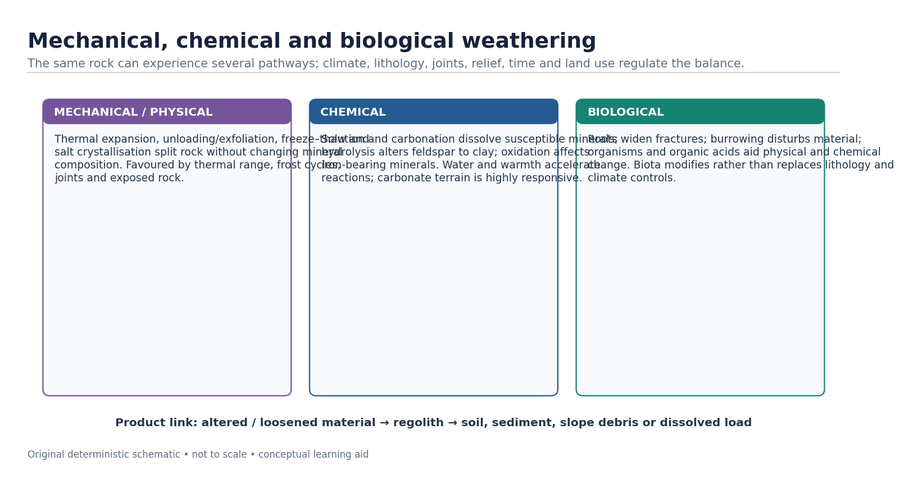
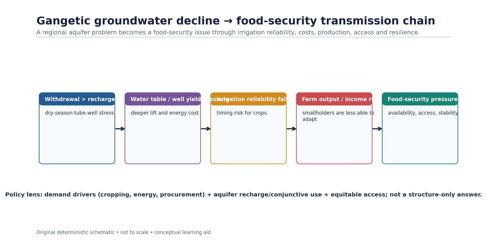
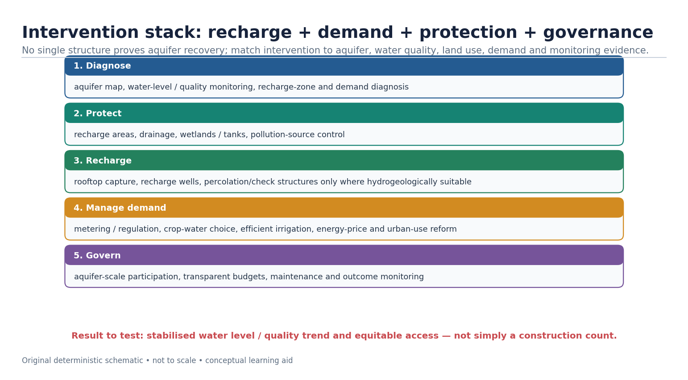
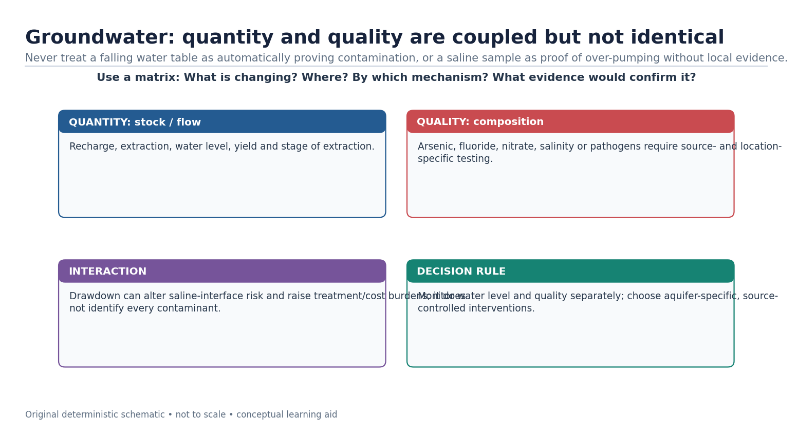

# India Erosion, Landslides & Groundwater — Complete Topic Package

> **Subject:** Geography | **Coverage:** GS-I physical geography, Prelims and bounded GS-III links | **Export date:** 2026-08-15
> **Tags:** `[FACT]` repository/local-PDF/official-source grounded; `[ANALYSIS]` reasoned synthesis; `[LIMIT]` uncertainty, ownership or scope caution.
> **Visual rule:** All visual assets linked below are original deterministic schematics, conceptual and not to scale. They do not depict legal boundaries or site-specific measurements.

## Source, current-data and ownership note

[FACT] Repository-first sources used: Geography Basic 04 `Weathering-MassMovement-Groundwater`, Advanced 04 `India-Erosion-Landslides-Groundwater`, Geography README, Master Framework, official syllabus mapping, answer-worthiness/revision material, completed Topics 02/03 and relevant Topics 05/06/07/08/09/10/23/30/36.

[FACT] Local book/PYQ evidence checked: G.C. Leong, *Certificate Physical and Human Geography*; Majid Husain, *Indian & World Geography* and *Indian Geography*; D.R. Khullar, *India: A Comprehensive Geography*; and local official UPSC papers/keys. The repository's direct PDF/OCR audit is the local book trace where scanned volumes have no reliable live text layer.

[FACT] Live official-source check on 2026-08-15: Ministry of Jal Shakti’s **Availability of Surface and Groundwater Resources** release (5 February 2026) reports the 2025 assessment values used here—annual recharge 448.52 BCM, annual extractable resource 407.75 BCM and annual extraction 247.22 BCM. The Ministry’s 3 August 2026 management/conservation material is used only as programme/status context for CGWB/NAQUIM and participation/recharge initiatives. GSI and ISRO/NRSC sources are used as hazard inventory/mapping context. The last-six-month official search did not identify a new exclusive Joshimath technical bulletin, so this package deliberately avoids a settled one-cause claim.

[LIMIT] Direct PYQ ownership is preserved. Geography Topic 04 directly owns 2018 urban water harvesting. Geography Topic 36 is the direct 2024 Gangetic-food-security owner, with Topic 04 supplying groundwater mechanism. The 2021 landslide comparison remains Disaster Management-owned; 2025 coastal intrusion remains Environment-owned; 2025 groundwater depletion/government steps remains Economy-owned.

### Official/current source register

- Ministry of Jal Shakti, Department of Water Resources, **Availability of Surface and Groundwater Resources**, 5 February 2026: <https://www.jalshakti-dowr.gov.in/static/uploads/2026/02/8d38113ec2876a8159a6b9ed4ea6d889.pdf>
- Ministry of Jal Shakti, **Groundwater Management and Conservation**, 3 August 2026: <https://www.jalshakti-dowr.gov.in/static/uploads/2026/08/917051e5b16fdca21f77904a3f1c9eff.pdf>
- Geological Survey of India, landslide-hazard information: <https://www.gsi.gov.in/>
- ISRO, **Landslide Atlas of India**: <https://www.isro.gov.in/Landslide_Atlas_India.html>

# Main learning session

## 1. Roadmap, evidence discipline and ownership boundary

[FACT] This complete session joins exogenetic rock breakdown, runoff erosion, gravity-driven slope movement and groundwater as one system. [ANALYSIS] The exam sequence is process → India pattern → risk/resource consequence → mechanism-matched response. [LIMIT] Geography owns the physical and spatial explanation; Disaster Management owns detailed response architecture, Environment owns coastal regulation/pollution depth, and Economy owns irrigation incentives in depth.

> **PRE-TEACH CHECKLIST**
> Book context: queried: Geography Basic 04 `Weathering-MassMovement-Groundwater`, Advanced 04 `India-Erosion-Landslides-Groundwater`, Master Framework, revision chart, Topics 02/03 and related Topics 05–10, 23, 30 and 36; local G.C. Leong, Majid Husain and D.R. Khullar OCR/source audit consulted.
> CA Search: "official India groundwater, landslide and subsidence sources, last six months".
> CA Found: Ministry of Jal Shakti 5 Feb 2026 provides a dated national groundwater-assessment anchor; GSI/ISRO provide hazard inventory and mapping context.

*Use this first visual to prevent category errors before learning India cases.*

### Evidence / comparison matrix

| Block | Question answered | Output |
| --- | --- | --- |
| Weathering / regolith | How does rock become loose material? | Process + products |
| Erosion / conservation | How does loose material leave a slope? | Agent + landform + control |
| Mass movement | Why does a slope fail? | Predisposition + trigger + risk |
| Groundwater | How does water enter, move and leave an aquifer? | Stock-flow + quality + governance |

### Teaching, explanation and solution

- [FACT] Weathering is in-situ disintegration/decomposition; erosion includes removal and transport by an external agent.
- [FACT] Mass movement is gravity-driven downslope movement and need not have a river, wind, ice or wave transporting the material.
- [FACT] Groundwater is stored and transmitted in permeable geological material; its condition depends on recharge, discharge, extraction and quality.
- [ANALYSIS] One slope can experience weathering, erosion and a slide in sequence, yet each term should retain its own mechanism in an answer.
- [LIMIT] A mapped hazard is not an event prediction; a constructed recharge structure is not proof of aquifer recovery.

### Must-know facts

- Use the language **process → pattern → consequence → response**.
- Distinguish trigger from predisposition, and hazard from risk.
- Treat groundwater as a stock governed by flows, not as an unlimited underground lake.

### UPSC traps and corrections

- **Wrong:** Calling every downslope movement erosion. **Correct:** Use mass movement where gravity directly mobilises the material.
- **Wrong:** Assigning every water/slope question to one GS paper. **Correct:** Keep Geography's mechanism, then state the bounded Disaster Management, Environment or Economy link.

### Mains / answer route

Open with the physical process; then locate it in India, show why exposure/vulnerability matters, and end with a response matched to the mechanism.

### Study link

Geography 02 geological structure; 03 seismic zones; 05 running water; 10 coast; 36 contemporary issues.

## 2. Weathering, regolith, soil and the process boundary

[FACT] Weathering acts at or near the surface and produces altered or loosened material in place. Regolith is the weathered mantle; soil becomes a biologically active, horizon-differentiated body when mineral material, organisms, organic matter and water interact over time.

> **PRE-TEACH CHECKLIST**
> Book context: queried: Geography Basic 04 `Weathering-MassMovement-Groundwater`, Advanced 04 `India-Erosion-Landslides-Groundwater`, Master Framework, revision chart, Topics 02/03 and related Topics 05–10, 23, 30 and 36; local G.C. Leong, Majid Husain and D.R. Khullar OCR/source audit consulted.
> CA Search: "India rainfall weathering rocks current affairs official source".
> CA Found: No event headline is needed to establish the process; use official landslide/rainfall reports only after separating rainfall trigger from antecedent material and slope conditions.

*A concept chain, not a time scale: materials can be removed before a mature soil forms.*

### Evidence / comparison matrix

| Term | Exam-safe definition | Do not confuse with |
| --- | --- | --- |
| Weathering | In-situ physical break-up and/or chemical alteration of rock | Transport by an agent |
| Regolith | Loose, weathered material over bedrock | Necessarily fertile soil |
| Soil | Organised mineral–organic body with horizons and biotic activity | Crushed rock alone |
| Erosion | Detachment/removal and transport by water, wind, ice or waves | All slope movement |

### Teaching, explanation and solution

- [FACT] Rock structure/hardness, climate, slope/topography, vegetation, time and land use are standard controls on weathering; none works in isolation.
- [FACT] Mechanical weathering fragments rock; chemical weathering changes mineral composition; biological processes may facilitate both.
- [FACT] Hydrolysis can alter feldspar to clay; carbonation/solution are central in soluble carbonate settings; oxidation affects iron-bearing minerals.
- [FACT] Black cotton (regur) soil is linked to weathering of Deccan basalt and has clay-rich moisture-retention and shrink–swell behaviour; it is not simply 'fertile because black'.
- [ANALYSIS] Weathering creates both a resource base (soil, secondary porosity, dissolved ions) and a hazard material (loose regolith, clay-rich weak zones).
- [LIMIT] Do not turn an India soil case into a global climate rule: parent material and relief can strongly modify climatic tendencies.

### Must-know facts

- Weathering is **in situ**; erosion adds **transport**.
- Regolith is not automatically soil.
- Chemical alteration commonly needs water; a rock's response still depends on mineralogy and pathways.

### UPSC traps and corrections

- **Wrong:** Rainfall alone proves chemical weathering is the only process. **Correct:** Rain can supply water/CO2/O2, but temperature, mineralogy, joints and drainage matter too.
- **Wrong:** Porosity and permeability mean the same thing. **Correct:** Pore space is porosity; connected transmitting capacity is permeability.

### Mains / answer route

For a 10-marker, define the boundary first, then use one India process-product example and one limitation.

### Study link

Basic 04 soil formation section; Topic 07 arid processes; Topic 08 karst; Topic 30 agriculture.

## 3. Mechanical, chemical and biological weathering: controls and products

[FACT] Mechanical weathering includes freeze–thaw, thermal expansion, salt crystallisation and unloading/exfoliation. Chemical weathering includes solution, carbonation, hydrolysis and oxidation. Biological activity includes roots, burrowing and organic-acid pathways.

> **PRE-TEACH CHECKLIST**
> Book context: queried: Geography Basic 04 `Weathering-MassMovement-Groundwater`, Advanced 04 `India-Erosion-Landslides-Groundwater`, Master Framework, revision chart, Topics 02/03 and related Topics 05–10, 23, 30 and 36; local G.C. Leong, Majid Husain and D.R. Khullar OCR/source audit consulted.
> CA Search: "weathering groundwater India official assessment 2026".
> CA Found: The 2024 Prelims weathering/rainwater statement item is the direct static anchor; no unsourced national weathering-rate figure is used.

*The diagram emphasises process–product logic rather than a false single-process zoning of India.*

### Evidence / comparison matrix

| Family | Mechanism cue | Product / India use |
| --- | --- | --- |
| Mechanical | fracture, expansion, frost/salt action | scree, blocks, joint opening; high-relief/cold or exposed settings |
| Chemical | water-driven mineral alteration/dissolution | clay, solution features, weathered mantle; humid/monsoon settings |
| Biological | root, burrow, organic-acid action | joint widening and enhanced mineral alteration |

### Teaching, explanation and solution

- [FACT] Frost action requires water access and repeated freezing; it is a conditional mechanism, not a generic mountain label.
- [FACT] Carbonation involves carbonic-acid-bearing water dissolving carbonate minerals; it does not mean limestone 'melts'.
- [FACT] Chemical weathering can generate clay minerals, which can influence slope material behaviour and hard-rock aquifer weathered zones.
- [ANALYSIS] A useful answer joins climate to lithology and structure: warmth/water may accelerate reactions, but minerals and fractures determine the pathway.
- [LIMIT] Do not quote an unsupported national rate, depth or percentage of weathering from a textbook edition as a current fact.

### Must-know facts

- Mechanical = disintegration; chemical = alteration; biological can reinforce both.
- Solution/carbonation are especially important in carbonate terrain.
- The product of weathering can be both a soil parent material and a potential slope-failure material.

### UPSC traps and corrections

- **Wrong:** Chemical weathering is absent from a seasonal monsoon setting. **Correct:** Water availability, temperature and mineralogy can support it even where a dry season exists.
- **Wrong:** A biological process is separate from physical/chemical action. **Correct:** Roots and organisms often alter the physical and chemical pathways together.

### Mains / answer route

Draw a three-column mini-table only if it clarifies the directive; then connect one weathering product to landform, soil, slope or groundwater.

### Study link

PYQ 2024 Prelims Q7; Topics 08 karst and 30 agriculture.

## 4. Erosion: agents, sheet–rill–gully–ravine sequence and conservation logic

[FACT] Erosion removes and transports material. Rain-splash and overland flow can progress from sheet erosion to rills, gullies and ravines where flow concentrates and protection/drainage fail. Chambal ravines are an India location cue for severe gully dissection.

> **PRE-TEACH CHECKLIST**
> Book context: queried: Geography Basic 04 `Weathering-MassMovement-Groundwater`, Advanced 04 `India-Erosion-Landslides-Groundwater`, Master Framework, revision chart, Topics 02/03 and related Topics 05–10, 23, 30 and 36; local G.C. Leong, Majid Husain and D.R. Khullar OCR/source audit consulted.
> CA Search: "India soil erosion ravine conservation watershed official sources".
> CA Found: No new national erosion percentage is inserted without an attributable, dated report; the teaching anchor is process and conservation matching.

*Schematic sequence: not every rill becomes a ravine, and form depends on material, drainage and management.*

### Evidence / comparison matrix

| Form | Hydrological signal | Mechanism-matched response |
| --- | --- | --- |
| Sheet | broad shallow overland flow | cover, contouring, residue and infiltration |
| Rill | small concentrated channels | break slope length, spread flow, early repair |
| Gully | incised concentrated runoff | gully-head control, check structures, vegetative stabilisation |
| Ravine | dense mature gully network | catchment-scale drainage, land-use and rehabilitation |

### Teaching, explanation and solution

- [FACT] Running water, wind, ice and waves can erode; gravity-driven movement is classified separately as mass movement.
- [FACT] Wind transport vocabulary includes surface creep, saltation and suspension; dry bare surfaces and sparse cover increase susceptibility.
- [FACT] Chambal is an exam-safe ravine/badland anchor; do not give it a false all-India rank or an unsupported area figure.
- [ANALYSIS] Soil conservation works by reducing erosive energy, retaining protective cover, improving infiltration and controlling concentrated flow.
- [ANALYSIS] Contour bunding/terracing shorten effective slope length; shelterbelts reduce wind velocity; drainage and gully-head work prevent headward erosion.
- [LIMIT] A check dam is not automatically a recharge or erosion cure: location, sediment load, maintenance, drainage and aquifer conditions decide performance.

### Must-know facts

- Sheet erosion can be diffuse but agriculturally serious because it removes topsoil.
- Rills may be small; gullies are persistent erosional channels beyond ordinary tillage.
- Conservation must be catchment and slope specific, not a generic 'plant trees' list.

### UPSC traps and corrections

- **Wrong:** Ravines are just any river valley. **Correct:** They are intensely dissected badland/gully terrain, classically associated with the Chambal tract.
- **Wrong:** Erosion control means only retaining sediment at the bottom. **Correct:** Control begins upslope by reducing raindrop/runoff energy and flow concentration.

### Mains / answer route

For a soil-erosion answer, draw the sequence and pair each stage with a mechanism rather than listing conservation schemes.

### Study link

Topic 05 running water; Topic 07 aeolian processes; Environment land-degradation owner; Agriculture soil-health link.

## 5. Mass movements, slope stability and the trigger–predisposition distinction

[FACT] Mass movements include falls, slides/slumps, flows and creep. They move rock, soil or debris downslope under gravity. Stability changes when driving stresses exceed resisting strength; water can increase weight and pore-water pressure while reducing effective resistance.

> **PRE-TEACH CHECKLIST**
> Book context: queried: Geography Basic 04 `Weathering-MassMovement-Groundwater`, Advanced 04 `India-Erosion-Landslides-Groundwater`, Master Framework, revision chart, Topics 02/03 and related Topics 05–10, 23, 30 and 36; local G.C. Leong, Majid Husain and D.R. Khullar OCR/source audit consulted.
> CA Search: "India landslide susceptibility mapping rainfall slope failure official GSI ISRO".
> CA Found: official GSI landslide-hazard portal and ISRO Landslide Atlas checked 15 Aug 2026; the official sources are inventory/mapping evidence, not a license for single-cause attribution

*A conceptual force diagram: no individual slope should be diagnosed from this drawing alone.*

### Evidence / comparison matrix

| Movement | Typical material / behaviour | Diagnostic clue |
| --- | --- | --- |
| Rockfall | detached blocks from steep face | rapid, fall/bounce path |
| Slide / slump | mass moves along a surface | coherent block or rotational geometry |
| Debris / earth flow | water-rich loose material deforms | channelised or lobate movement |
| Creep | very slow soil/regolith movement | tilted posts/trees, subtle deformation |
| Subsidence | ground lowers/settles | vertical/settlement change; not automatically a slide |

### Teaching, explanation and solution

- [FACT] Predisposition includes steep relief, weak/jointed or weathered material, old debris, adverse structure, toe erosion and poor drainage.
- [FACT] Intense/prolonged rainfall, earthquake shaking, cutting, leakage, loading and vegetation/land-use change can be triggers or amplifiers depending on the site.
- [ANALYSIS] The phrase 'rain caused the landslide' is incomplete when rainfall is the immediate trigger but slope geometry, drainage and construction created susceptibility.
- [ANALYSIS] Hazard is the likelihood/intensity of a physical process; risk adds exposed people, assets and vulnerability.
- [LIMIT] A landslide type cannot be assigned remotely from a news headline; field/imagery and material evidence determine classification.

### Must-know facts

- Mass movement is gravity-driven and may be rapid or very slow.
- Saturation can change strength and stress; it is not merely 'extra water on a slope'.
- Subsidence and landslide may co-occur in a mountain settlement but are not synonyms.

### UPSC traps and corrections

- **Wrong:** A rainfall trigger explains all causal pathways. **Correct:** Separate trigger, predisposition and human amplification.
- **Wrong:** A hazard map measures disaster loss. **Correct:** Loss also depends on exposure, vulnerability, construction and response capacity.

### Mains / answer route

Use a two-part body: (i) material–slope–water mechanics; (ii) exposure/land-use and matched prevention.

### Study link

Disaster Management landslide/GLOF owner for institutions; Geography Topic 03 seismic triggers; Topic 05 toe erosion.

## 6. India hazard geography: Himalaya, North-East, Western Ghats, Nilgiris and peninsular exceptions

[FACT] India's landslide-prone terrain includes the Himalaya and North-East, and parts of the Western Ghats/Nilgiris. [ANALYSIS] Regional tendencies derive from a different mix of relief, lithology/structure, weathered material, rainfall, drainage, road cutting and land use; no region is a deterministic single-cause zone.

> **PRE-TEACH CHECKLIST**
> Book context: queried: Geography Basic 04 `Weathering-MassMovement-Groundwater`, Advanced 04 `India-Erosion-Landslides-Groundwater`, Master Framework, revision chart, Topics 02/03 and related Topics 05–10, 23, 30 and 36; local G.C. Leong, Majid Husain and D.R. Khullar OCR/source audit consulted.
> CA Search: "GSI National Landslide Susceptibility Mapping and ISRO Landslide Atlas India".
> CA Found: official GSI landslide-hazard portal and ISRO Landslide Atlas checked 15 Aug 2026; the official sources are inventory/mapping evidence, not a license for single-cause attribution

*Use the comparison to differentiate mechanisms, not to rank regions or imply a fixed boundary.*

### Evidence / comparison matrix

| Setting | Dominant answer cues | Caution |
| --- | --- | --- |
| Himalaya / North-East | young tectonic relief, fractured material, seismicity, river incision, monsoon, road cuts | event trigger and local lithology still vary |
| Western Ghats / Nilgiris | escarpment/plateau slopes, deeply weathered material, intense orographic rain, cuts/drainage/land use | do not make it a tectonic copy of Himalaya |
| Kachchh / Peninsula | local scarps, weathered material, drainage and inherited structure can matter | not a claim that all peninsular areas share mountain-slope hazard |

### Teaching, explanation and solution

- [FACT] The GSI landslide-hazard programme and ISRO Landslide Atlas are mapping/inventory resources; they support spatial reasoning and do not predict a specific future failure.
- [ANALYSIS] Himalaya answers should combine tectonic youth/high relief with rainfall, weathering, drainage, road alignment and settlement pressure rather than choosing one factor.
- [ANALYSIS] Western Ghats/Nilgiris answers should connect intense rain and material/drainage/land-use context without using 'old mountains' as an explanation by itself.
- [FACT] Road cutting can remove lateral/toe support and alter drainage; design, maintenance and site investigation determine whether it becomes an amplifier.
- [LIMIT] Avoid unsupported landslide-ranking claims, casualty figures, susceptibility percentages, aquifer depths or event counts.

### Must-know facts

- India-hazard geography is comparative, not a one-line hot-spot list.
- Road alignment and drainage are physical-risk variables, not merely infrastructure issues.
- An official atlas/inventory records mapped events; it is not a complete risk assessment.

### UPSC traps and corrections

- **Wrong:** Every Western Ghats failure has an earthquake cause. **Correct:** Rainfall, material, drainage and land-use factors are often central; assess each site.
- **Wrong:** A stable peninsula cannot have slope or groundwater hazards. **Correct:** Relative tectonic stability does not erase weathering, drainage, escarpments or human modification.

### Mains / answer route

Differentiate regions through one comparison table, then add a cross-cutting drainage/road-cutting paragraph and a qualification.

### Study link

2021 GS-I Q4 is an adjacent Disaster Management owner; Geography supplies the physical comparison.

## 7. Joshimath: subsidence, old debris, drainage and uncertainty

[FACT] Joshimath is a settlement in a fragile Himalayan setting where ground/structural distress has been monitored and studied. [ANALYSIS] A defensible geography answer treats it as a multi-causal terrain–water–loading problem involving old landslide/debris material, slope/ground conditions, drainage and human modification, with site-specific evidence needed for attribution.

> **PRE-TEACH CHECKLIST**
> Book context: queried: Geography Basic 04 `Weathering-MassMovement-Groundwater`, Advanced 04 `India-Erosion-Landslides-Groundwater`, Master Framework, revision chart, Topics 02/03 and related Topics 05–10, 23, 30 and 36; local G.C. Leong, Majid Husain and D.R. Khullar OCR/source audit consulted.
> CA Search: "Joshimath subsidence GSI NDMA ISRO official 2026".
> CA Found: official-source search (GSI, NDMA, ISRO/NRSC, PIB; last six months) found no new exclusive Joshimath technical bulletin; use prior evidence cautiously and do not claim a settled one-cause attribution

*Explicitly non-single-cause: use this as an answer architecture, not as a definitive diagnosis.*

### Evidence / comparison matrix

| Evidence layer | What it can support | What it cannot prove alone |
| --- | --- | --- |
| Geomorphology / material | old debris, slope morphology and settlement context | a unique cause of each damage site |
| Drainage / water | saturation, leakage or flow-path hypotheses | that water alone explains all movement |
| Construction / loading | possible amplification and carrying-capacity concern | a national rule from one town |
| Monitoring | where/when displacement or cracks are observed | complete causation without integrated investigation |

### Teaching, explanation and solution

- [FACT] Subsidence is lowering/settlement of ground; a landslide is a downslope mass movement. A mountain settlement can face both, but the labels are not interchangeable.
- [ANALYSIS] The high-scoring answer structure is: terrain/material context → water/drainage → construction/loading → observed monitoring → uncertainty → cautious planning response.
- [FACT] Old landslide/debris material may be heterogeneous and water-sensitive; it should not be treated as a uniform foundation by assumption.
- [LIMIT] Do not state an unsupported causal hierarchy, casualty count, measured rate, aquifer depth, tunnel attribution or final expert conclusion.
- [ANALYSIS] Zonation, drainage audit, slope-sensitive construction and continued monitoring are mechanism-aligned recommendations; implementation requires site investigation and social safeguards.

### Must-know facts

- Joshimath is an example of **multi-causal ground instability**, not a proof of a one-cause narrative.
- Observed displacement is evidence of change; causal attribution requires integrated geotechnical/hydrological/geomorphic evidence.
- The safe formulation is ‘contributing factors / hypotheses constrained by evidence’, not ‘settled cause’.

### UPSC traps and corrections

- **Wrong:** Using 'landslide' and 'subsidence' as synonyms. **Correct:** Describe the observed process and explain possible interaction carefully.
- **Wrong:** Turning a current-affairs case into an unsupported universal conclusion. **Correct:** State local evidence, uncertainty and the mechanism-specific planning lesson.

### Mains / answer route

Use a labelled four-factor mini-map; end with a qualification that monitoring and site investigation precede definitive attribution.

### Study link

Topic 02 Himalayan geology; Topic 03 seismicity; Disaster Management slope-risk governance; Environment carrying-capacity links.

## 8. Groundwater foundations: infiltration, percolation, aquifers, recharge and discharge

[FACT] Infiltration is water entering soil/surface material; percolation is its downward movement through pores/fractures. An aquifer both stores and transmits groundwater. Recharge adds water to storage; discharge occurs through springs, baseflow, pumping or other outflows.

> **PRE-TEACH CHECKLIST**
> Book context: queried: Geography Basic 04 `Weathering-MassMovement-Groundwater`, Advanced 04 `India-Erosion-Landslides-Groundwater`, Master Framework, revision chart, Topics 02/03 and related Topics 05–10, 23, 30 and 36; local G.C. Leong, Majid Husain and D.R. Khullar OCR/source audit consulted.
> CA Search: "CGWB groundwater assessment recharge aquifer mapping India 2026".
> CA Found: Ministry of Jal Shakti official 5 Feb 2026 groundwater-resource release and 3 Aug 2026 groundwater-management release checked; dated national assessment and programme-status facts are used only with their stated status

*Schematic cross-section; real aquifers are spatially heterogeneous and water-table form varies with geology and topography.*

### Evidence / comparison matrix

| Term | Meaning | Prelims elimination cue |
| --- | --- | --- |
| Infiltration | water enters soil/surface | entry is not the same as deep recharge |
| Percolation | downward movement through material | needs transmissive pathways |
| Aquifer | stores and transmits usable groundwater | not every porous body yields well |
| Aquitard | restricts transmission relative to aquifer | restriction ≠ absolute zero storage |
| Water table | upper surface of saturated zone in unconfined setting | moves with flows/extraction |

### Teaching, explanation and solution

- [FACT] Porosity is the amount of pore space; permeability is the capacity for connected flow. High porosity alone does not guarantee high permeability.
- [FACT] Hard-rock aquifers commonly depend on weathered mantles, joints, fractures, faults and interflow contacts; primary pore-space assumptions can mislead.
- [FACT] Alluvial aquifers may have layered, heterogeneous sand/silt/clay arrangements; water availability and quality vary vertically and spatially.
- [ANALYSIS] Recharge is a process and resource assessment is an estimate; do not equate annual recharge with extractable resource, extraction or stage of extraction.
- [LIMIT] A local water-table fall does not automatically establish whole-aquifer depletion; use time series, location, abstraction and recharge evidence.

### Must-know facts

- Infiltration ≠ percolation ≠ recharge.
- Aquifer = storage **and** transmission; aquitard restricts flow.
- Water table is a dynamic surface, not a fixed underground lake roof.

### UPSC traps and corrections

- **Wrong:** All porous rocks are good aquifers. **Correct:** Pores must be sufficiently connected and yield must be meaningful.
- **Wrong:** A water-table decline equals contamination. **Correct:** Quantity and quality require separate evidence, though they can interact.

### Mains / answer route

Use a small cross-section and distinguish stock, recharge flow, extraction flow and quality before discussing policy.

### Study link

Topic 02 hard-rock geology; Topic 05 drainage/baseflow; CGWB aquifer-mapping context.

## 9. Confined and unconfined aquifers, artesian pressure and India aquifer diversity

[FACT] An unconfined aquifer has a water table as its upper boundary. A confined aquifer lies between lower-permeability layers and may be pressurised. In an artesian condition, water in a confined aquifer rises in a well to its potentiometric level; it flows at ground surface only where that level is above ground.

> **PRE-TEACH CHECKLIST**
> Book context: queried: Geography Basic 04 `Weathering-MassMovement-Groundwater`, Advanced 04 `India-Erosion-Landslides-Groundwater`, Master Framework, revision chart, Topics 02/03 and related Topics 05–10, 23, 30 and 36; local G.C. Leong, Majid Husain and D.R. Khullar OCR/source audit consulted.
> CA Search: "India aquifer mapping hard rock alluvial groundwater official 2026".
> CA Found: Ministry of Jal Shakti’s 3 Aug 2026 release reports NAQUIM coverage of the mappable area and dissemination of management plans; this is programme status, not a claim that every aquifer is sustainable.

*Pressure conditions are schematic; a well does not create a new water source.*

### Evidence / comparison matrix

| System | Boundary / pressure | Answer caution |
| --- | --- | --- |
| Unconfined | open upper boundary at water table | vulnerable to surface recharge/contaminant pathways |
| Confined | between restricting layers; pressure may exist | not necessarily flowing at surface |
| Artesian | well water rises to potentiometric level | do not equate rising water with inexhaustible supply |
| Hard rock | weathered/fractured secondary pathways | high local variability |
| Alluvium | layered sediment bodies | heterogeneity and depth variation matter |

### Teaching, explanation and solution

- [FACT] The water-table concept is most directly applied to unconfined systems; confined systems are described by hydraulic/potentiometric head.
- [FACT] Clay may be porous yet have low permeability; chalk can be permeable where pore/fracture networks transmit water. This is the core of Prelims 2025 Q28.
- [ANALYSIS] A groundwater answer gains accuracy by naming aquifer type before proposing recharge, pumping limits or quality protection.
- [LIMIT] Artesian pressure does not eliminate recharge dependence, depletion risk, quality concern or need for well management.

### Must-know facts

- Unconfined ≠ confined; water table ≠ potentiometric surface.
- Flowing artesian wells are conditional.
- Hard-rock and alluvial aquifers have different storage/transmission pathways.

### UPSC traps and corrections

- **Wrong:** Clay cannot contain water because it is impermeable. **Correct:** It can have pore space yet transmit water slowly; storage and transmission differ.
- **Wrong:** A confined aquifer is safe from all contamination. **Correct:** Protection varies with confining layers, well integrity and pathways.

### Mains / answer route

When asked to compare, draw the two cross-sections, name head conditions and add an India aquifer-type example without unsupported depth values.

### Study link

PYQ 2025 Prelims Q28; Topic 02 hard-rock aquifer link; Basic 04 karst hydrology.

## 10. India groundwater distribution, use and assessment vocabulary

[FACT] India contains diverse alluvial, hard-rock, basaltic, coastal and fractured aquifer settings. The Ministry of Jal Shakti release dated 5 February 2026 reports the 2025 assessment values: total annual groundwater recharge 448.52 BCM, annual extractable groundwater resource 407.75 BCM, and annual groundwater extraction 247.22 BCM.

> **PRE-TEACH CHECKLIST**
> Book context: queried: Geography Basic 04 `Weathering-MassMovement-Groundwater`, Advanced 04 `India-Erosion-Landslides-Groundwater`, Master Framework, revision chart, Topics 02/03 and related Topics 05–10, 23, 30 and 36; local G.C. Leong, Majid Husain and D.R. Khullar OCR/source audit consulted.
> CA Search: "Ministry of Jal Shakti Availability of Surface and Groundwater Resources 5 February 2026".
> CA Found: Dated official release reports 2025 national recharge, extractable-resource and extraction estimates; distinguish the three quantities and do not derive an unverified state-level claim.

### Evidence / comparison matrix

| Assessment term | What it means | Do not substitute |
| --- | --- | --- |
| Annual recharge | estimated water added to groundwater system in a year | extractable resource |
| Annual extractable resource | assessed usable/recoverable resource under methodology | actual annual extraction |
| Annual extraction | estimated withdrawal | stage of extraction by itself |
| Stage of extraction | ratio/indicator used in assessment framework | a direct contaminant measurement |

### Teaching, explanation and solution

- [FACT] The 5 February 2026 official release attributes the quoted national values to the 2025 assessment; they are dated assessment figures, not a forecast or universal local condition.
- [FACT] Ministry of Jal Shakti’s 3 August 2026 release reports CGWB/NAQUIM mappable-area coverage and dissemination of district-level aquifer-management plans; this is an implementation/status claim, not an outcome guarantee.
- [ANALYSIS] Groundwater stress has spatial drivers: hydrogeology, recharge opportunity, irrigation and urban demand, cropping, energy incentives, pollution pathways and governance scale.
- [ANALYSIS] National totals cannot answer a block, city or well question; aquifer heterogeneity and seasonal timing matter.
- [LIMIT] Do not claim that a scheme, map or notification automatically produces water-level recovery; distinguish implementation from measured outcome.

### Must-know facts

- Quote 448.52 / 407.75 / 247.22 BCM only with the **2025 assessment / 5 Feb 2026 release** label.
- Recharge, extractable resource and extraction are different quantities.
- Aquifer-management scale often differs from administrative scale.

### UPSC traps and corrections

- **Wrong:** Annual recharge is the same as annual pumping. **Correct:** They are distinct assessment quantities with different definitions.
- **Wrong:** A national value describes every state or city. **Correct:** Groundwater is locally heterogeneous; disaggregate before inference.

### Mains / answer route

Use one dated assessment fact as evidence, then return to mechanisms and local variation rather than data dumping.

### Study link

CGWB/Ministry of Jal Shakti assessment and NAQUIM; Economy irrigation-demand owner; Geography Topic 36 issue lens.

## 11. Gangetic-valley groundwater decline and food security

[FACT] UPSC Mains 2024 GS-I Q14 asks how a serious decline in Gangetic-valley groundwater potential may affect India’s food security. [ANALYSIS] The demand is a hydrology-to-food-security chain: recharge–withdrawal imbalance → well/yield/energy consequences → irrigation reliability and crop risk → availability, access and stability.

> **PRE-TEACH CHECKLIST**
> Book context: queried: Geography Basic 04 `Weathering-MassMovement-Groundwater`, Advanced 04 `India-Erosion-Landslides-Groundwater`, Master Framework, revision chart, Topics 02/03 and related Topics 05–10, 23, 30 and 36; local G.C. Leong, Majid Husain and D.R. Khullar OCR/source audit consulted.
> CA Search: "Gangetic groundwater decline food security CGWB Ministry of Jal Shakti 2026".
> CA Found: The dated national assessment provides vocabulary and evidence context; the 2024 GS-I PYQ provides the direct exam anchor. No unsupported Gangetic decline rate is inserted.

*A causal chain: it does not say every part of the Gangetic plain has the same aquifer condition or crop response.*

### Evidence / comparison matrix

| Food-security pillar | Groundwater transmission route | Equity / policy implication |
| --- | --- | --- |
| Availability | irrigation reliability affects production | conjunctive use and crop-water fit |
| Access | deeper pumping raises cost and income risk | smallholder credit/energy burden |
| Stability | rainfall/seasonal buffer weakens | aquifer monitoring and drought planning |
| Utilisation | quality can add health/cost constraints | separate quality surveillance |

### Teaching, explanation and solution

- [FACT] The Gangetic plain contains productive alluvial aquifer systems, but neither ‘alluvial’ nor ‘fertile’ proves unlimited withdrawal.
- [ANALYSIS] Withdrawal concentrated in a dry-season irrigation regime can lower water levels, increase lift/energy costs and reduce well yield/reliability where extraction exceeds replenishment.
- [ANALYSIS] Food security is more than aggregate grain output: small farmers’ ability to deepen wells, buy energy or switch crops affects access and stability.
- [ANALYSIS] Crop diversification, efficient irrigation, conjunctive surface-groundwater use, recharge-zone protection and aquifer-scale participation address different parts of the chain.
- [LIMIT] Do not argue that tube-well irrigation is inherently harmful; it has supported productivity and resilience. The issue is imbalance and governance, not irrigation alone.

### Must-know facts

- Use availability–access–stability, not only ‘less food’.
- Link hydrogeology to crop/energy/procurement choices; avoid a generic rainwater-harvesting list.
- Conjunctive use means managing surface and groundwater together.

### UPSC traps and corrections

- **Wrong:** A water-table decline has only an environmental effect. **Correct:** It can transmit through irrigation costs, output risk, farm income and national food security.
- **Wrong:** Food security means foodgrain availability only. **Correct:** Use availability, access, utilisation and stability; qualify regional variation.

### Mains / answer route

Start with a one-line hydrological thesis and draw the chain; use a balanced conclusion on productivity, equity and demand-side governance.

### Study link

2024 GS-I Q14 direct; Economy 14 irrigation and sustainable agriculture adjacent owner; Topic 30 agriculture.

## 12. Urban water harvesting and managed recharge: effectiveness conditions

[FACT] The 2018 GS-I Q14 asks: ‘The ideal solution of depleting ground water resources in India is water harvesting system. How can it be made effective in urban areas?’ [ANALYSIS] The directive is not a list of structures; it asks how harvesting can work in an urban hydrogeological, water-quality, land-use and maintenance context.

> **PRE-TEACH CHECKLIST**
> Book context: queried: Geography Basic 04 `Weathering-MassMovement-Groundwater`, Advanced 04 `India-Erosion-Landslides-Groundwater`, Master Framework, revision chart, Topics 02/03 and related Topics 05–10, 23, 30 and 36; local G.C. Leong, Majid Husain and D.R. Khullar OCR/source audit consulted.
> CA Search: "urban rainwater harvesting groundwater recharge aquifer management Ministry of Jal Shakti 2026".
> CA Found: The 3 Aug 2026 official release describes aquifer-mapping/management status and recharge-conservation initiatives; it does not prove effectiveness for every constructed urban structure.

*Use the stack to avoid portraying recharge as unrestricted injection or a substitute for demand management.*

### Evidence / comparison matrix

| Condition | Why it matters | Evidence / maintenance question |
| --- | --- | --- |
| Aquifer fit | recharge pathways and storage vary | map recharge zone, depth/material and quality risk |
| Water quality | roof/runoff can carry contaminants | first flush, filtration and periodic inspection |
| Land/drainage | impervious cover redirects runoff | protect drains, tanks/wetlands and access routes |
| Demand control | recharge cannot offset unlimited pumping | metering, reuse, leakage/crop/industrial action |
| Governance | assets need upkeep and data | monitor level/quality and publicly review outcomes |

### Teaching, explanation and solution

- [FACT] Rooftop harvesting can capture rainfall and route it to storage or recharge after appropriate quality control; the choice depends on local aquifer and intended use.
- [FACT] Managed aquifer recharge is planned replenishment under hydrogeological safeguards; it is not unrestricted injection of any available water.
- [ANALYSIS] Urban effectiveness requires source separation, first-flush/filtration, recharge-zone protection, drainage integration, maintenance and monitoring of both level and quality.
- [ANALYSIS] Demand management—leakage reduction, reuse, metering/regulation and water-sensitive planning—prevents a recharge-only strategy from being overwhelmed by extraction.
- [LIMIT] Count of structures is an implementation indicator, not outcome evidence. Measure water-level/quality trend and distributional access before claiming success.

### Must-know facts

- Harvesting may be for storage **or** recharge; do not assume both.
- Recharge needs clean-enough water and aquifer suitability.
- Urban groundwater plans require demand reduction and storm-water/wetland integration.

### UPSC traps and corrections

- **Wrong:** Any recharge well is automatically beneficial. **Correct:** Poor-quality inflow or poor siting can damage aquifer quality or underperform.
- **Wrong:** Construction counts prove groundwater revival. **Correct:** Use monitoring outcomes and counterfactual demand/recharge context.

### Mains / answer route

Answer 2018 through a five-part architecture: capture → quality → aquifer fit → demand/drainage → monitoring/governance.

### Study link

2018 GS-I Q14 direct; urbanisation Topic 28; Environment water-pollution owner; CGWB/NAQUIM link.

## 13. Coastal aquifers: seawater intrusion, interface movement and upconing

[FACT] Seawater intrusion is landward/upward movement of saline water into a coastal freshwater aquifer. The 2025 GS-III Q8 asks causes and remedial measures. The direct PYQ owner is Environment and Ecology Topic 24; this Geography session supplies the hydrogeological mechanism.

> **PRE-TEACH CHECKLIST**
> Book context: queried: Geography Basic 04 `Weathering-MassMovement-Groundwater`, Advanced 04 `India-Erosion-Landslides-Groundwater`, Master Framework, revision chart, Topics 02/03 and related Topics 05–10, 23, 30 and 36; local G.C. Leong, Majid Husain and D.R. Khullar OCR/source audit consulted.
> CA Search: "coastal groundwater seawater intrusion CGWB Ministry of Jal Shakti India".
> CA Found: Official-source search found continuing resource-assessment/management material but no new verified national coastal-intrusion field figure for this session; the 2025 GS-III PYQ anchors the mechanism.

*Schematic subsurface interface: not a coastal flood map and not a site-specific salinity boundary.*

### Evidence / comparison matrix

| Driver | Hydrogeological effect | Matched remedy |
| --- | --- | --- |
| Excessive pumping | freshwater head falls; interface may move landward/upward | abstraction control, well spacing/depth review, demand change |
| Reduced recharge / sealed recharge area | less freshwater pressure | protect recharge, suitable managed recharge |
| Sea-level / storm / coastal change | boundary stress can rise | risk-sensitive planning and monitoring |
| Poor drainage / saline pathways | local salinity vulnerability | site-specific barrier/drainage/source control |

### Teaching, explanation and solution

- [FACT] The central mechanism is freshwater hydraulic head: when excessive abstraction lowers it, saline water can advance inland or rise beneath a well (upconing).
- [FACT] The saline wedge is a subsurface interface; it should not be confused with visible coastal flooding.
- [ANALYSIS] Causes can include pumping, reduced recharge, coastal hydrogeology and sea-level/storm stresses; relative contribution is site-specific.
- [ANALYSIS] Remedy stack: monitor salinity/head; reduce or redistribute pumping; protect recharge; use suitable managed recharge/barrier methods; adapt crop/land use and prevent pollution.
- [LIMIT] Desalination can improve supplied water but does not by itself restore aquifer pressure. A recharge structure is not automatically suitable in a saline or contaminated setting.

### Must-know facts

- Seawater intrusion is a **groundwater interface** problem, not a synonym for surface flooding.
- Upconing is local saline rise toward a pumped well.
- Pumping control and recharge address different mechanisms; combine them where evidence supports.

### UPSC traps and corrections

- **Wrong:** Sea-level rise alone explains every coastal saline well. **Correct:** Assess extraction, recharge, geology and coastal drivers together.
- **Wrong:** Any injection equals managed aquifer recharge. **Correct:** Managed recharge requires source-water, aquifer and monitoring safeguards.

### Mains / answer route

Lead with the interface mechanism, group remedies as demand/recharge/barrier/monitoring, and state the true Environment owner boundary.

### Study link

2025 GS-III Q8 adjacent owner: Environment Topic 24; Geography Topic 10 coast; groundwater basics in this topic.

## 14. Groundwater quality, quantity and safe geographic framing

[FACT] Groundwater concerns include quantity and quality. Arsenic, fluoride, nitrate and salinity have different geochemical or anthropogenic pathways and need local testing. [ANALYSIS] A high-quality answer names the mechanism rather than converting a contaminant into an all-India label.

> **PRE-TEACH CHECKLIST**
> Book context: queried: Geography Basic 04 `Weathering-MassMovement-Groundwater`, Advanced 04 `India-Erosion-Landslides-Groundwater`, Master Framework, revision chart, Topics 02/03 and related Topics 05–10, 23, 30 and 36; local G.C. Leong, Majid Husain and D.R. Khullar OCR/source audit consulted.
> CA Search: "CGWB groundwater quality monitoring India 2026 official".
> CA Found: The Ministry of Jal Shakti 2 Apr/3 Aug 2026 programme-status material reports nationwide monitoring infrastructure; it is not a substitute for location-specific sample interpretation.

*The two axes can interact, but they must be monitored and explained separately.*

### Evidence / comparison matrix

| Issue | Safe geographic framing | Do not claim without evidence |
| --- | --- | --- |
| Arsenic | geogenic risk in some alluvial sediment settings | all alluvial groundwater is arsenic-contaminated |
| Fluoride | geogenic risk in some hard-rock/arid settings | one national fluoride belt/depth |
| Nitrate | often linked to fertiliser/sewage pathways | a single source at every well |
| Salinity | coastal intrusion or inland hydrogeochemical/irrigation pathways | salinity always means seawater intrusion |

### Teaching, explanation and solution

- [FACT] Quantity measurement concerns level, storage, recharge, extraction and well yield; quality concerns chemical/microbial composition measured in samples.
- [FACT] Arsenic, fluoride, nitrate and salinity are legitimate UPSC categories, but their geography and source mechanisms differ.
- [ANALYSIS] Quantity–quality interaction can occur: drawdown may change salinity risk or raise treatment costs; contamination can make nominal water availability unusable.
- [LIMIT] Avoid unsupported district lists, concentration values, exact aquifer depths or claims that one contamination pathway applies nationally.
- [ANALYSIS] Safe action pairs monitoring with source control, alternative safe supply/treatment where appropriate, aquifer protection and demand/recharge management.

### Must-know facts

- Contamination ≠ salinity; salinity ≠ seawater intrusion.
- Quality and quantity require different evidence streams.
- Use source-specific and aquifer-specific language.

### UPSC traps and corrections

- **Wrong:** A falling water table proves arsenic or fluoride contamination. **Correct:** A water-level trend and a quality sample answer different questions.
- **Wrong:** Recharge is always quality-neutral. **Correct:** Recharge water and pathways require quality safeguards.

### Mains / answer route

Use a two-column quantity–quality matrix, then identify the mechanism before offering monitoring, protection or treatment.

### Study link

CGWB monitoring; Environment water-pollution owner; coastal intrusion section; food-security quality link.

## 15. Integrated watershed, slope and aquifer management: response matched to mechanism

[ANALYSIS] Soil erosion, slope instability and groundwater stress are linked through a catchment: land cover, drainage and infiltration affect runoff, sediment, recharge and slope saturation. A response is robust only when it prevents the actual pathway, not when it repeats a generic structure list.

> **PRE-TEACH CHECKLIST**
> Book context: queried: Geography Basic 04 `Weathering-MassMovement-Groundwater`, Advanced 04 `India-Erosion-Landslides-Groundwater`, Master Framework, revision chart, Topics 02/03 and related Topics 05–10, 23, 30 and 36; local G.C. Leong, Majid Husain and D.R. Khullar OCR/source audit consulted.
> CA Search: "India groundwater recharge watershed landslide mitigation official GSI CGWB Ministry of Jal Shakti 2026".
> CA Found: Official mapping/monitoring and programme-status sources are current anchors; claimed outcomes remain conditional on site fit, maintenance and measured trends.

*A mechanism-matched stack for urban, rural, slope and coastal adaptation; select only relevant layers in an answer.*

### Evidence / comparison matrix

| Problem mechanism | Useful response families | Boundary / condition |
| --- | --- | --- |
| Runoff erosion | cover, contouring, gully/drainage control, catchment treatment | avoid dumping structures downstream |
| Slope instability | drainage, bioengineering, retaining/toe measures, zoning, early warning | site investigation and maintenance |
| Aquifer decline | demand management, conjunctive use, recharge-zone protection, managed recharge | aquifer fit and monitoring |
| Coastal salinity | abstraction control, recharge/barrier options, salinity monitoring | site-specific hydrogeology |

### Teaching, explanation and solution

- [FACT] Watershed/catchment management works across upslope–downslope connections; drainage divides and aquifer boundaries rarely align neatly with administrative limits.
- [ANALYSIS] Vegetation/bioengineering, drainage, retaining structures and land-use zoning serve different roles: cover and roots, water routing, mechanical support and exposure avoidance.
- [ANALYSIS] Early warning reduces exposure when a warning–communication–evacuation chain works; it does not stabilise a slope by itself.
- [ANALYSIS] Community/aquifer-level water budgeting makes withdrawal and recharge visible, but must be paired with credible demand incentives and equity safeguards.
- [LIMIT] Do not transfer a hill-slope retaining solution to a coastal aquifer, or a recharge solution to a debris-flow channel, without identifying the mechanism.

### Must-know facts

- Catchment management links runoff, sediment, recharge and downstream risk.
- Drainage is both a slope-stability and urban-water issue.
- A scheme/notification/map is an input; outcome needs monitoring.

### UPSC traps and corrections

- **Wrong:** All conservation means plantation. **Correct:** Select cover, drainage, structure, land-use or demand action based on process.
- **Wrong:** Early warning removes landslide hazard. **Correct:** It may reduce exposure; source/slope mitigation remains separate.

### Mains / answer route

Organise ‘measures’ by mechanism, scale and implementation condition; this avoids a generic way-forward paragraph.

### Study link

Disaster Management slope response; Environment land/coast; Economy crop/energy incentives; Geography 36 governance-scale lens.

## 16. Maps, diagrams, Prelims traps and directive-sensitive answer architecture

[ANALYSIS] A Geography answer becomes analytical when it locates the setting, names the physical mechanism, distinguishes evidence from inference, then matches the response. A compact cross-section, flow chain or comparison table can carry more marks than a decorative India outline.

> **PRE-TEACH CHECKLIST**
> Book context: queried: Geography Basic 04 `Weathering-MassMovement-Groundwater`, Advanced 04 `India-Erosion-Landslides-Groundwater`, Master Framework, revision chart, Topics 02/03 and related Topics 05–10, 23, 30 and 36; local G.C. Leong, Majid Husain and D.R. Khullar OCR/source audit consulted.
> CA Search: "UPSC geography groundwater landslide weathering PYQ pattern 2018-2025".
> CA Found: Local official-paper routing ledgers and official-paper PDFs were checked: 2018 urban harvesting, 2021 landslide differentiation, 2024 Gangetic food security, 2025 coastal intrusion and groundwater depletion.

*A reusable structure for 10/15/20 markers; maps are schematic and never legal-boundary claims.*

### Evidence / comparison matrix

| Directive | What examiner needs | Best visual |
| --- | --- | --- |
| Differentiate | clear basis of comparison + consequences | two-column table / paired sections |
| Explain / how | mechanism and transmission chain | causal arrows / cross-section |
| Examine | drivers, evidence, analysis, limitation and verdict | matrix + small map |
| Suggest measures | mechanism-matched interventions + implementation condition | response stack |

### Teaching, explanation and solution

- [FACT] 10-mark answer: thesis + 2–3 named evidence units + mechanism + qualification; 15/20 marks need wider regional/sectoral linkage, not merely more adjectives.
- [ANALYSIS] Evidence unit: claim → named evidence/example → what it demonstrates → limitation/qualification.
- [FACT] A map should label broad regions (Himalaya, Western Ghats/Nilgiris, Chambal, Ganga plain, coast) only where it advances the question; state ‘schematic/not to scale’ where appropriate.
- [ANALYSIS] Prelims elimination: test mechanism, scale and conditionality separately; reject absolute claims such as ‘all porous rocks are permeable’ or ‘all saline water is seawater intrusion’.
- [LIMIT] Cross-paper link is not ownership transfer: 2021 landslides is Disaster Management owner; 2025 coastal intrusion is Environment owner; 2025 groundwater depletion is Economy owner.

### Must-know facts

- Answer spine: **claim → named evidence → analysis → qualification → verdict**.
- Use one visual that answers the directive; do not decorate.
- Preserve direct-owner and adjacent-owner boundaries in PYQ discussion.

### UPSC traps and corrections

- **Wrong:** Writing a generic causes–effects–measures list for every directive. **Correct:** Decode the directive and use the correct comparison, mechanism or evaluation structure.
- **Wrong:** Treating a correlation or news claim as causation. **Correct:** State evidence limits and distinguish monitoring from attribution.

### Mains / answer route

A 20-marker can combine a process diagram, a regional comparison, an equity/governance lens and a qualified conclusion—only if each component answers the stem.

### Study link

All Topic 04 PYQs; Geography Master Framework and revision chart.

## 17. Solved PYQ bridge: direct owners, adjacent owners and answer routes

[FACT] Local official papers/routing ledgers verify these relevant demands: 2018 GS-I Q14 urban water harvesting (direct Topic 04); 2024 GS-I Q14 Gangetic groundwater/food security (direct owner Geography Topic 36, with Topic 04 mechanism); 2021 GS-I Q4 Himalaya vs Western Ghats landslides (Disaster Management owner); 2025 GS-III Q8 coastal intrusion (Environment owner); 2025 GS-III Q13 groundwater depletion/government steps (Economy owner).

> **PRE-TEACH CHECKLIST**
> Book context: queried: Geography Basic 04 `Weathering-MassMovement-Groundwater`, Advanced 04 `India-Erosion-Landslides-Groundwater`, Master Framework, revision chart, Topics 02/03 and related Topics 05–10, 23, 30 and 36; local G.C. Leong, Majid Husain and D.R. Khullar OCR/source audit consulted.
> CA Search: "local official UPSC papers and PYQ routing ledgers 2018-2025".
> CA Found: Direct official-paper OCR was checked for the 2018, 2021, 2024 and 2025 Mains stems; Prelims questions/keys were checked under their recorded key-status rule.

### Teaching, explanation and solution

- **2018 GS-I Q14 — direct:** Start with urban imperviousness and depletion, then show capture/quality/aquifer/demand/governance conditions. [Why this earns marks] It answers ‘how effective’ rather than praising harvesting.
- **2024 GS-I Q14 — direct mechanism, Topic 36 owner:** Draw withdrawal–recharge–irrigation–food-security chain; include smallholder access and crop/energy incentives. [Why this earns marks] It makes food security a hydrological and distributional outcome.
- **2021 GS-I Q4 — adjacent Disaster Management owner:** Contrast Himalayan young tectonic/high-relief/fractured setting with Western Ghats weathered escarpment/orographic rain/drainage context. [Why this earns marks] It differentiates rather than lists causes.
- **2025 GS-III Q8 — adjacent Environment owner:** Lead with freshwater-head decline/interface movement, then group remedies by pumping/recharge/barrier/monitoring. [Why this earns marks] It supplies the mechanism and respects owner boundary.
- **2025 GS-III Q13 — adjacent Economy owner:** Explain demand drivers and government steps with assessment/mapping/participation/demand reform, without claiming an outcome not verified. [Why this earns marks] It addresses both factors and state action.
- **Prelims route:** 2021 Q64 black cotton soil and 2023 Q76 groundwater share have no local official key, so solutions are labelled inferred; 2024 Q7 and 2025 Q28 have official Set-A keys locally.

### Must-know facts

- PYQ ownership controls depth; cross-linking supplies physical base without duplication.
- Official key available locally ≠ all historical keys available locally.
- State an inferred answer's confidence and elimination logic.

### UPSC traps and corrections

- **Wrong:** Calling every overlap a direct Topic 04 PYQ. **Correct:** State the registered owner and the exact physical contribution from this topic.
- **Wrong:** Presenting a defensible inferred Prelims key as official. **Correct:** Use the required INFERRED ANSWER — NOT OFFICIALLY VERIFIED label.

### Mains / answer route

Use the full examiner-grade solutions in the separate workbook; the main session keeps the linked answer route visible.

### Study link

Solved workbook; central PYQ ledgers; official local question papers.

## 18. Learning MCQ and remedial loop: authored keys A → B → C → D

[ANALYSIS] Attempt before reading the answer. The authored sequence below rotates correct options A → B → C → D. Fixed official PYQ choices are kept separately and do not alter the authored-practice rotation.

> **PRE-TEACH CHECKLIST**
> Book context: queried: Geography Basic 04 `Weathering-MassMovement-Groundwater`, Advanced 04 `India-Erosion-Landslides-Groundwater`, Master Framework, revision chart, Topics 02/03 and related Topics 05–10, 23, 30 and 36; local G.C. Leong, Majid Husain and D.R. Khullar OCR/source audit consulted.
> CA Search: "topic 04 concept checks and PYQ traps".
> CA Found: Static concept practice linked to local verified PYQ themes; no current fact is needed to decide these questions.

### Teaching, explanation and solution

- Q1 [Key A, weathering] Which statement is correct? A Weathering breaks/alters rock in situ; erosion includes removal/transport. B Weathering always needs a river. C Erosion cannot move sediment. D Regolith is necessarily mature soil. **Answer A:** process boundary.
- Q2 [Key B, weathering] Which process changes mineral composition? A exfoliation only. B hydrolysis/carbonation/oxidation. C gravity slide. D saltation. **Answer B:** chemical-weathering cue.
- Q3 [Key C, erosion] Which is the correct increasing runoff-concentration sequence? A ravine–gully–rill–sheet. B rill–sheet–ravine–gully. C sheet–rill–gully–ravine. D sheet–ravine–rill–gully. **Answer C:** geomorphic sequence.
- Q4 [Key D, slope] Which is a valid instability chain? A rainfall → event prediction. B road → all slopes fail. C clay → no groundwater. D saturation → higher pore pressure/weight → lower effective resistance. **Answer D:** water mechanism.
- Q5 [Key A, India pattern] The strongest Himalayan answer is: A young relief/structure + material + water/drainage + human modification. B rain alone. C roads alone. D seismicity alone. **Answer A:** multi-factor logic.
- Q6 [Key B, Joshimath] The safe statement is: A one cause is established by a crack. B multi-causal ground conditions, drainage, slope and loading require integrated evidence. C all subsidence is a landslide. D monitoring predicts exact collapse. **Answer B:** uncertainty discipline.
- Q7 [Key C, aquifer] Which pair is correctly matched? A porosity—flow speed only. B infiltration—deep recharge always. C aquifer—stores and transmits groundwater. D aquitard—unlimited flow. **Answer C:** aquifer definition.
- Q8 [Key D, artesian] A flowing artesian well requires: A any borewell. B a shallow water table. C saline water. D a confined system whose potentiometric surface is above ground. **Answer D:** pressure condition.
- Q9 [Key A, food security] The best Gangetic chain begins with: A withdrawal–recharge imbalance affecting irrigation reliability/cost. B food imports alone. C soil colour. D coastal flooding. **Answer A:** hydrology-to-food route.
- Q10 [Key B, coastal] Excess pumping in a coastal aquifer most directly: A improves freshwater head. B lowers it and can shift saline interface/upconing. C prevents salinity tests. D proves surface flooding. **Answer B:** interface mechanism.
- Q11 [Key C, quality] Which statement is correct? A salinity always means seawater intrusion. B decline proves fluoride. C quantity and quality need separate evidence although they may interact. D recharge is always quality neutral. **Answer C:** matrix logic.
- Q12 [Key D, intervention] Which is the most complete urban strategy? A build one pit. B inject runoff without testing. C map only. D aquifer fit + quality safeguards + demand/drainage action + monitoring. **Answer D:** stack logic.
- Q13 [Key A, terms] A water-table decline is best described as: A a possible level trend requiring local recharge/withdrawal evidence. B proof of all-aquifer depletion. C proof of contamination. D proof of artesian flow. **Answer A:** scale caution.
- Q14 [Key B, erosion] Gully-head treatment primarily aims to: A increase runoff energy. B arrest concentrated headward erosion with drainage/vegetative/structural measures. C make a ravine. D replace catchment work. **Answer B:** process matched.
- Q15 [Key C, risk] Which distinction is correct? A hazard equals loss. B trigger equals predisposition. C risk includes exposure and vulnerability in addition to hazard. D a map predicts failure date. **Answer C:** risk framing.
- Q16 [Key D, answers] The best 15-marker structure is: A fact list. B scheme list. C map only. D thesis → named evidence → mechanism/consequence → qualification → verdict. **Answer D:** examiner-grade spine.

### Must-know facts

- Remedial rule: if incorrect, return to the named subtopic visual and identify the mistaken boundary/mechanism.
- Authored MCQ keys are A, B, C, D repeated with no consecutive correct option.

### UPSC traps and corrections

- **Wrong:** Learning answer letters without mechanism. **Correct:** State why each distractor fails by scale, process or conditionality.
- **Wrong:** Applying the authored key rule to fixed official PYQ options. **Correct:** Preserve official order and label historical-key status separately.

### Mains / answer route

MCQ elimination is a compact version of Mains logic: locate, identify mechanism, test conditionality, reject category error.

### Study link

Workbook: 24 hard/remedial MCQs with explanations and an explicit rotation audit.

## 19. Original solved Mains practice: 10-mark answer (150 words)

**Question:** Distinguish weathering, erosion and mass movement. Show how their interaction can create risk along a Himalayan road corridor. Answer in 150 words.

> **PRE-TEACH CHECKLIST**
> Book context: queried: Geography Basic 04 `Weathering-MassMovement-Groundwater`, Advanced 04 `India-Erosion-Landslides-Groundwater`, Master Framework, revision chart, Topics 02/03 and related Topics 05–10, 23, 30 and 36; local G.C. Leong, Majid Husain and D.R. Khullar OCR/source audit consulted.
> CA Search: "Himalayan weathering mass movement road cutting India".
> CA Found: GSI/ISRO mapping is the spatial-risk anchor; this is an original practice question, not a claim about a named event.

### Teaching, explanation and solution

- [CLAIM] Weathering breaks or alters rock in place; erosion removes/transports loosened material by an agent; mass movement carries material downslope primarily under gravity. [EVIDENCE] In a Himalayan corridor, fractured rock and weathered regolith on high-relief slopes provide susceptible material. [ANALYSIS] A road cut may steepen/undercut the slope and reroute drainage; intense rain can saturate debris, increasing driving stress and pore-water pressure. The resulting slide can block a road and disrupt access even where river erosion is not the immediate transport mechanism. [EVIDENCE] GSI susceptibility mapping and ISRO’s Landslide Atlas establish why terrain/material/rainfall information matters spatially. [QUALIFICATION] Neither a road nor rain alone proves causation at every site; bedding, toe support, drainage design and exposure require investigation. [VERDICT] Corridor safety needs slope/drainage design, maintenance, site investigation and land-use control, not a generic plantation response. **Why this earns marks:** it defines all three terms, uses a named India evidence source, explains the coupled mechanism and qualifies attribution.

### Must-know facts

- Demand decoded: **distinguish** + **apply**; do not write a generic landslide essay.
- Evidence count: Himalayan corridor + GSI + ISRO map/inventory context.

### UPSC traps and corrections

- **Wrong:** Calling runoff erosion the only possible movement on a road slope. **Correct:** Separate erosional toe/drainage effects from gravity-driven slide mechanics.

### Mains / answer route

Sketch: cut slope → altered drainage/saturation → slide mass → road blockage; label as schematic.

### Study link

Sections 2, 4–6; 2021 adjacent landslide PYQ.

## 20. Original solved Mains practice: 15-mark answer (250 words)

**Question:** Examine why soil erosion and slope failure should be managed at watershed scale in India. Illustrate with distinct physiographic settings. Answer in 250 words.

> **PRE-TEACH CHECKLIST**
> Book context: queried: Geography Basic 04 `Weathering-MassMovement-Groundwater`, Advanced 04 `India-Erosion-Landslides-Groundwater`, Master Framework, revision chart, Topics 02/03 and related Topics 05–10, 23, 30 and 36; local G.C. Leong, Majid Husain and D.R. Khullar OCR/source audit consulted.
> CA Search: "India watershed soil erosion slope stability groundwater recharge official".
> CA Found: This original question integrates static physical geography with current mapping/monitoring tools; no unsourced national degradation statistic is used.

### Teaching, explanation and solution

- [CLAIM] Soil erosion and slope failure are connected watershed problems because land cover, slope length, drainage and infiltration govern runoff energy, sediment routing, pore-water conditions and downstream exposure. [EVIDENCE] The Chambal ravines show the sheet–rill–gully–ravine route where concentrated runoff dissects susceptible material. [ANALYSIS] Upslope cover, contour work and gully-head control reduce detachment and headward erosion before sediment reaches lower channels.
- [EVIDENCE] In Himalayan corridors, fractured/weathered material, high relief, road cuts and intense rain can combine to produce slope failure. [ANALYSIS] Drainage control, toe protection, bioengineering, retaining measures and hazard-sensitive siting must be designed together; a check structure downstream cannot restore an unstable cut slope.
- [EVIDENCE] Western Ghats/Nilgiris slopes demonstrate a different mix of deeply weathered material, intense orographic rain, drainage change and land use. [ANALYSIS] This regional difference requires local material and drainage diagnosis, not a Himalayan template.
- [EVIDENCE] CGWB aquifer mapping and the Ministry’s 2026 groundwater-assessment vocabulary show why infiltration/recharge and runoff cannot be managed through administrative boundaries alone. [ANALYSIS] Catchment action can improve soil moisture/recharge opportunities while avoiding unsafe recharge or sediment-clogged structures.
- [QUALIFICATION] Watershed scale does not erase plot-level incentives, tenure, maintenance or social safeguards; structural works can fail if flow paths and community use are ignored. [VERDICT] India needs nested management—plot/slope measures within sub-catchment planning, joined to aquifer and hazard monitoring. **Why this earns marks:** it examines a causal proposition, uses Chambal, Himalaya, Western Ghats and CGWB evidence, differentiates settings and gives a qualified governance verdict.

### Must-know facts

- Directive decoded: examine a watershed proposition; show mechanism, comparisons and limits.
- Named evidence: Chambal; Himalaya; Western Ghats/Nilgiris; CGWB/2026 assessment vocabulary.

### UPSC traps and corrections

- **Wrong:** Listing afforestation, dams and awareness without a pathway. **Correct:** Tie each action to runoff, sediment, drainage, strength, recharge or exposure.

### Mains / answer route

Use a watershed arrow diagram with three spatial settings; retain the local-material qualification.

### Study link

Sections 4–6, 8, 15; Environment and Disaster Management cross-links.

## 21. Original solved Mains practice: 20-mark answer (250 words)

**Question:** ‘Groundwater is a stock governed by flows, quality and institutions—not an invisible reserve waiting to be pumped.’ Analyse this proposition for India, including food security and coastal aquifers. Answer in 250 words.

> **PRE-TEACH CHECKLIST**
> Book context: queried: Geography Basic 04 `Weathering-MassMovement-Groundwater`, Advanced 04 `India-Erosion-Landslides-Groundwater`, Master Framework, revision chart, Topics 02/03 and related Topics 05–10, 23, 30 and 36; local G.C. Leong, Majid Husain and D.R. Khullar OCR/source audit consulted.
> CA Search: "India groundwater assessment NAQUIM Gangetic food security coastal aquifer 2026".
> CA Found: The Ministry of Jal Shakti 5 Feb 2026 assessment and 3 Aug 2026 management-status release supply dated official anchors; 2024/2025 PYQs supply the examination demand.

### Teaching, explanation and solution

- [CLAIM] Groundwater is a dynamic stock: recharge adds water, pumping/springs/baseflow remove it, and usable water is further constrained by aquifer permeability and quality. [EVIDENCE] The Ministry of Jal Shakti’s 5 February 2026 release reports the 2025 national assessment as 448.52 BCM annual recharge, 407.75 BCM annual extractable resource and 247.22 BCM annual extraction. [ANALYSIS] These distinct figures prohibit the common error of treating recharge, extractable resource and pumping as one number.
- [EVIDENCE] The Gangetic-valley PYQ links aquifer decline to food security. [ANALYSIS] Withdrawal–recharge imbalance can raise lift/energy costs and reduce irrigation reliability; in a foodgrain region this affects availability, access and stability, with smallholders least able to deepen wells. Crop choice, procurement and energy incentives are therefore water-governance drivers, not external footnotes.
- [EVIDENCE] Coastal-intrusion PYQ logic shows that excessive pumping lowers freshwater head and can move the saline interface landward/upward. [ANALYSIS] Salinity is a quality–quantity interaction, not a synonym for surface flooding; desalination alone does not rebuild aquifer pressure.
- [EVIDENCE] NAQUIM mapping/management-plan dissemination and participatory groundwater-management initiatives reported by the Ministry provide planning instruments. [ANALYSIS] Effective policy combines monitoring, recharge-zone protection, suitable managed recharge, demand/crop/energy reform, conjunctive use and aquifer-scale participation.
- [QUALIFICATION] A map, structure or scheme is not a measured recovery outcome; hydrogeology, water quality, maintenance, equity and local institutions vary. [VERDICT] Sustainable groundwater policy regulates flows and demand while protecting quality and sharing risk, rather than promising supply through pumping or construction alone. **Why this earns marks:** it uses dated official evidence, integrates food security/coastal mechanisms, separates stock/flow/quality and ends with a qualified institutional verdict.

### Must-know facts

- Evidence density: dated national assessment, Gangetic PYQ, coastal PYQ, NAQUIM/management status.
- Boundary: crop-price/energy reform needs Economy depth; coastal regulation needs Environment depth.

### UPSC traps and corrections

- **Wrong:** Making a national assessment number the entire answer. **Correct:** Use it to frame a stock-flow analysis and then show regional mechanisms and governance.

### Mains / answer route

Draw one aquifer stock-flow cross-section and one food/coastal side chain; do not crowd the answer with unverified schemes or data.

### Study link

Sections 8–15; 2024 GS-I and 2025 GS-III PYQs; Economy and Environment owner boundaries.

## FINAL CONSOLIDATED REGISTER NOTES — A. Process boundaries and material logic

[FACT] Final revision begins with non-negotiable definitions and linked process chains. It compresses, rather than repeats, the teaching session.

### Teaching, explanation and solution

- Weathering = in-situ physical disintegration and/or chemical alteration; erosion = detachment/removal **plus transport** by water, wind, ice or waves.
- Mass movement = gravity-driven downslope movement; it can be fall, slide/slump, flow or creep and need not use a transporting agent.
- Regolith = weathered mantle; soil needs organic matter, organisms, water movement and horizon differentiation—regolith is not automatically soil.
- Mechanical: freeze–thaw, expansion/unloading, salt action. Chemical: solution, carbonation, hydrolysis, oxidation. Biological: roots/burrows/organic acids.
- Climate, lithology, fractures, slope, vegetation, time and land use interact; do not use one control as deterministic explanation.
- Black cotton soil: Deccan basalt weathering; clay-rich shrink–swell / moisture retention; not ‘black therefore fertile’.

### Must-know facts

- Weathering ≠ erosion; erosion ≠ mass movement.
- Porosity = pore space; permeability = connected transmission.
- Mechanism first, India example second, policy last.

### UPSC traps and corrections

- **Wrong:** Rainfall alone proves chemical weathering or a landslide cause. **Correct:** Ask about water pathway, material, slope, antecedent condition and human modification.
- **Wrong:** All porous material is permeable. **Correct:** Clay can be porous but poorly transmitting; fractures can create secondary permeability.

### Mains / answer route

Rapid 10-marker spine: define → one named India example → mechanism → one limitation.

### Study link

Basic 04; Advanced 04; Topic 02 hard-rock / basalt link.

## FINAL CONSOLIDATED REGISTER NOTES — B. Erosion, slopes and India comparison

[ANALYSIS] Read a landscape through agent, material, slope/drainage and land use—not through a single headline cause.

### Teaching, explanation and solution

- Runoff sequence: sheet → rill → gully → ravine/badland; Chambal = ravine anchor. Conservation: cover + shorten slope + slow/spread runoff + gully-head/drainage control.
- Wind transport: creep, saltation, suspension. Preserve cover and reduce wind/runoff energy; do not copy a water-control measure into an aeolian setting without rationale.
- Slope stability: driving stress versus resisting strength. Saturation adds weight and pore pressure, reducing effective resistance.
- Predisposition: steep relief, weak/jointed/weathered material, adverse structure, old debris, toe erosion, poor drainage. Trigger/amplifier: rain, earthquake, cut, leakage, loading, vegetation/land-use change.
- Himalaya/North-East: young active relief, fractured material, incision, rain, seismicity, road cuts. Western Ghats/Nilgiris: escarpment/weathered material, intense orographic rain, drainage/land-use/cutting. Differentiate, do not rank.
- Joshimath: multi-causal settlement/slope-ground condition, old debris, drainage/water and loading frame; no one-cause or settled-attribution claim without evidence.

### Must-know facts

- Hazard = physical propensity; risk adds exposure and vulnerability.
- Subsidence ≠ landslide, though they may interact.
- GSI/ISRO inventory/mapping informs spatial risk; it does not predict a specific failure.

### UPSC traps and corrections

- **Wrong:** One trigger explains all failures in a region. **Correct:** Separate trigger, predisposition, exposure and local investigation.
- **Wrong:** Road cutting is automatically the root cause. **Correct:** It can amplify risk by slope/toe/drainage change; assess site evidence.

### Mains / answer route

Differentiate question: paired Himalaya–Western Ghats table + shared risk chain + qualification.

### Study link

2021 GS-I Q4 adjacent DM owner; Topics 03/05/06/07.

## FINAL CONSOLIDATED REGISTER NOTES — C. Aquifer and groundwater recall

[FACT] Groundwater is a dynamic, heterogeneous system: recharge, storage, transmission, discharge, extraction and quality must be kept conceptually separate.

### Teaching, explanation and solution

- Infiltration = entry into soil/surface; percolation = downward movement; recharge = addition to groundwater storage. Never use as synonyms.
- Aquifer stores/transmits water; aquitard restricts transmission. Water table = upper saturated surface in unconfined system.
- Confined aquifer lies between restricting layers. Artesian = pressurised water rises to potentiometric level; flowing condition requires head above ground.
- Hard-rock aquifers: weathered mantle, joints/fractures/faults/interflow contacts; alluvial aquifers: layered/heterogeneous sediments. Avoid universal depth/yield claims.
- 2025 assessment (Ministry 5 Feb 2026): recharge 448.52 BCM; extractable 407.75 BCM; extraction 247.22 BCM. Quote date/status and keep quantities distinct.
- Quantity ≠ quality. Arsenic, fluoride, nitrate, salinity need source/geographic evidence. Salinity ≠ automatically seawater intrusion.

### Must-know facts

- Stock (groundwater) governed by flows (recharge/discharge/pumping).
- Water-table decline is a local trend requiring evidence—not automatic whole-aquifer depletion.
- Assessment/notification/scheme ≠ implementation/outcome.

### UPSC traps and corrections

- **Wrong:** Annual recharge = extractable resource = extraction. **Correct:** They are distinct assessment terms.
- **Wrong:** A water-quality issue can be solved only by recharge. **Correct:** Use source control, safe supply/treatment and aquifer protection as relevant.

### Mains / answer route

Cross-section labels: surface, recharge, unsaturated zone, water table/head, aquifer, aquitard, discharge/pumping.

### Study link

PYQ 2025 Prelims Q28; Topics 02, 05 and 36; CGWB/NAQUIM.

## FINAL CONSOLIDATED REGISTER NOTES — D. Food security, coast, interventions and PYQ routes

[ANALYSIS] Convert every water problem into its causal and ownership route; a response must match the physical mechanism and implementation condition.

### Teaching, explanation and solution

- Gangetic food-security chain: recharge–withdrawal imbalance → water level/well-yield/energy pressure → irrigation reliability/crop risk → availability, access, stability. Qualify with tube-well productivity benefits and regional variation.
- Urban harvesting: capture → quality/first flush/filtration → aquifer fit → drainage/wetland integration → demand reduction → monitoring/maintenance. Structures alone do not prove recovery.
- Coastal intrusion: excessive pumping/reduced freshwater head → saline wedge shift or upconing. Remedies: abstraction/demand control, recharge-zone protection/suitable MAR, barrier options, monitoring and adapted land use. Wedge ≠ surface flood.
- Watershed stack: diagnose aquifer/slope/drainage → protect recharge/cover → stabilize/route water → manage demand → monitor outcomes/govern at functional scale.
- Direct / supporting PYQs: 2018 GS-I Q14 urban harvesting (direct); 2024 GS-I Q14 Gangetic food security (Geography Topic 36 owner, Topic 04 mechanism); 2021 GS-I Q4 landslides (DM owner); 2025 GS-III Q8 coast (Environment owner); 2025 GS-III Q13 depletion (Economy owner).
- Prelims: 2021 Q64 black soil and 2023 Q76 groundwater share require **INFERRED ANSWER — NOT OFFICIALLY VERIFIED** locally; 2024 Q7 and 2025 Q28 have official Set-A keys locally.

### Must-know facts

- Best Mains chain: claim → named evidence → analysis → qualification → verdict.
- Best Prelims check: mechanism + scale + conditionality.
- Use only dated official assessment values and preserve direct-owner boundaries.

### UPSC traps and corrections

- **Wrong:** Desalination alone restores coastal aquifer. **Correct:** It may supply water but does not automatically restore freshwater head.
- **Wrong:** A map or scheme proves recovery. **Correct:** Ask for measured level/quality outcome and implementation conditions.

### Mains / answer route

15/20-marker finish: mechanism-specific way forward + evidence limit + graded verdict.

### Study link

Solved workbook, central PYQ ledgers, Ministry of Jal Shakti 2026 releases, GSI/ISRO.

# Separate solved-practice workbook — canonical text edition

> This workbook preserves question/answer separation, direct-owner boundaries and official-key status. Original MCQ keys (not fixed PYQ option order) rotate A → B → C → D strictly.

## Workbook orientation: sources, key-status rule and answer standard

[FACT] Question wording/key status is controlled by local official-paper PDFs and routing ledgers. [LIMIT] Direct ownership is retained: 2018 urban harvesting is Topic 04; 2024 Gangetic food security is Geography Topic 36; 2021 landslides is Disaster Management; 2025 coastal intrusion is Environment; 2025 groundwater depletion is Economy.

*The solution pattern applies to every Mains answer below.*

### Teaching, explanation and solution

- [FACT] Local source priority: Geography Basic/Advanced 04 and related files; local book/PYQ PDFs; then dated official current sources. Qdrant was not required.
- [FACT] Mains solutions use **claim → named evidence/example → analysis → qualification → verdict** and end with **Why this earns marks**.
- [FACT] Official Prelims Set-A keys are locally available for 2024/2025 items used here. For 2018–2023, the routing ledger records no local official key; inferred answers remain explicitly labelled.
- [LIMIT] This workbook supplies physical Geography support to adjacent-owner PYQs but does not silently transfer Disaster Management, Environment or Economy ownership.
- [ANALYSIS] Original MCQs alone use strict A→B→C→D rotation; fixed official-PYQ option order is preserved and separately labelled.

### Must-know facts

- Question–answer separation is deliberate.
- Named evidence must support an inference, not decorate it.

### UPSC traps and corrections

- **Wrong:** Treating a local answer key absence as permission to omit a PYQ. **Correct:** Retain it with the required inferred-answer label, confidence and elimination.

### Mains / answer route

Before writing: decode directive, marks and word limit; then select evidence units and a visual only if it advances the demand.

### Study link

Main learning session Sections 16–21.

## PYQ 1 — UPSC Mains 2018 GS-I Q14 (direct owner): urban water harvesting

**Question (250 words):** ‘The ideal solution of depleting ground water resources in India is water harvesting system.’ How can it be made effective in urban areas?

### Teaching, explanation and solution

- Demand: assess **effectiveness in urban areas**, not merely define water harvesting. Direct owner: Geography Advanced 04.
- Answer plan: urban depletion/context → capture + water quality → aquifer/drainage fit → demand management → governance/monitoring → qualified verdict.

### Must-know facts

- Verified from local official 2018 GS-I paper OCR.
- No official answer key is relevant to a Mains answer.

### UPSC traps and corrections

- **Wrong:** Writing a rural check-dam list. **Correct:** Address impervious cover, roofs, drainage, contamination and urban demand.

### Mains / answer route

Use a city-water-system diagram: roof/road runoff → quality control → storage/recharge → demand/reuse → monitoring.

### Study link

Main Section 12; full model solution next.

## PYQ 1 — Model answer: urban harvesting effectiveness

### Teaching, explanation and solution

- [CLAIM] Urban water harvesting can reduce pressure on depleting groundwater only when it is designed as an aquifer-and-demand programme rather than as a construction target. [EVIDENCE] Impervious roofs and roads rapidly route monsoon runoff away from recharge, while dense urban abstraction can lower local water levels. [ANALYSIS] Capture at building and neighbourhood scale can either store water for non-potable use or recharge a suitable aquifer, reducing peak runoff and dependency where the water budget permits.
- [EVIDENCE] The Ministry of Jal Shakti’s 3 August 2026 groundwater-management release reports NAQUIM mapping/management-plan dissemination and conservation/recharge initiative status. [ANALYSIS] This makes hydrogeological screening possible: recharge wells must match transmissive strata, protect recharge zones and avoid pushing contaminated runoff into groundwater.
- [EVIDENCE] The 2025 national assessment vocabulary separates recharge, extractable resource and extraction. [ANALYSIS] Thus effectiveness must be measured through water-level/quality trends and reduced demand, not a count of pits or tanks.
- [QUALIFICATION] First-flush diversion, filtration, maintenance, storm-water-drain integration, wetland/tank protection, reuse, leakage control and pumping regulation are necessary; a recharge structure cannot compensate for unrestricted extraction or poor-quality inflow. [VERDICT] Cities should combine ward/aquifer mapping, enforceable building systems, public-space blue–green infrastructure and transparent monitoring. **Why this earns marks:** it answers effectiveness, uses a named official evidence base, connects urban hydrology to aquifer fit and includes a credible implementation limitation.

### Must-know facts

- Named evidence: Ministry of Jal Shakti 3 Aug 2026 / NAQUIM status; 2025 assessment vocabulary.

### UPSC traps and corrections

- **Wrong:** Claiming a programme or structure automatically revived water levels. **Correct:** Separate reported implementation/status from measured outcome.

### Mains / answer route

250-word structure: thesis (2 lines) → 4 mechanism headings → condition/limitation → one-line verdict.

### Study link

Direct 2018 GS-I route.

## PYQ 2 — UPSC Mains 2024 GS-I Q14 (Geography Topic 36 owner): Gangetic food security

**Question (250 words):** The groundwater potential of the Gangetic valley is on a serious decline. How may it affect the food security of India?

### Teaching, explanation and solution

- Demand: show a hydrology-to-food-security transmission mechanism. Registered owner: Geography Basic 36; Topic 04 supplies aquifer mechanism.
- Do not substitute a generic water-conservation list for food-security analysis.

### Must-know facts

- Verified from local official 2024 GS-I paper PDF, page 3.

### UPSC traps and corrections

- **Wrong:** Equating food security with only grain tonnage. **Correct:** Use availability, access, utilisation/quality and stability, with smallholder distributional effects.

### Mains / answer route

Use the groundwater–irrigation–food-security chain; state the owner boundary in a study note, not in an exam answer.

### Study link

Main Section 11; model solution next.

## PYQ 2 — Model answer: Gangetic groundwater and food security

### Teaching, explanation and solution

- [CLAIM] A serious decline in Gangetic-valley groundwater potential can weaken India’s food security because a productive alluvial agricultural belt relies on groundwater as a seasonal irrigation buffer. [EVIDENCE] The 2024 GS-I question itself foregrounds the Gangetic valley; the Ministry’s 2025 national assessment distinguishes recharge, extractable resource and extraction. [ANALYSIS] Where withdrawal persistently exceeds replenishment, water levels/well yields can fall and lifting water requires more energy and capital.
- [EVIDENCE] Tube-well irrigation supports dry-season reliability in the rice–wheat landscape. [ANALYSIS] Reduced reliability can delay irrigation, raise cultivation cost and expose yields to rainfall variability, affecting food **availability** and price/income **access**.
- [EVIDENCE] Smallholders typically have less capacity to deepen wells, pay higher energy bills or shift technology/crops. [ANALYSIS] The first impact can therefore be distributional: unequal access to irrigation translates into unequal production and purchasing power, while national supply stability faces regional stress.
- [EVIDENCE] Conjunctive use, crop diversification, efficient irrigation, recharge-zone/wetland protection and aquifer-level water budgeting address different links. [ANALYSIS] Demand-side crop, procurement and energy incentives matter alongside recharge.
- [QUALIFICATION] Groundwater irrigation has also raised productivity and drought resilience; the inference is not ‘stop pumping’, but govern abstraction/recharge equitably at aquifer scale. [VERDICT] Food security is protected when hydrological balance and farm incentives are jointly managed. **Why this earns marks:** it directly links aquifer stress to all food-security pillars, uses named evidence and smallholder analysis, and gives a balanced demand-side conclusion.

### Must-know facts

- Evidence density: Gangetic alluvium, 2024 PYQ, 2025 assessment vocabulary, tube wells, smallholders, conjunctive use.

### UPSC traps and corrections

- **Wrong:** Saying only ‘less groundwater means less crop’. **Correct:** Explain cost, timing, equity and national stability transmission routes.

### Mains / answer route

Sketch the five-box food-security chain; keep data dated and no unsupported Gangetic decline rate.

### Study link

2024 GS-I direct demand / Topic 36 owner.

## PYQ 3 — UPSC Mains 2021 GS-I Q4 (adjacent Disaster Management owner): landslides

**Question (150 words):** Differentiate the causes of landslides in the Himalayan region and Western Ghats.

### Teaching, explanation and solution

- Demand: **differentiate**, so use a paired regional comparison plus shared anthropogenic/drainage qualifiers.
- Owner: Disaster Management Basic 10. Geography contribution: relief, materials, water, tectonic setting and spatial comparison.

### Must-know facts

- Verified from local official 2021 GS-I paper PDF, page 2.

### UPSC traps and corrections

- **Wrong:** Writing only a common cause list. **Correct:** Contrast setting-specific predispositions while retaining shared triggers/amplifiers.

### Mains / answer route

150 words: Himalaya (3–4 distinctions) | Western Ghats (3–4 distinctions) | shared human/drainage qualification.

### Study link

Main Sections 5–6; model solution next.

## PYQ 3 — Model answer: Himalaya versus Western Ghats landslide causes

### Teaching, explanation and solution

- [CLAIM] Both regions experience gravity-driven slope failure, but their predispositions differ because their tectonic history, relief, material and rainfall–drainage settings differ. [EVIDENCE] The Himalaya is a young collision belt with steep relief, active deformation/seismicity, fractured rocks, deep river incision and widespread weathered/debris slopes. [ANALYSIS] Intense/prolonged monsoon rain or seismic shaking can therefore act on already stressed material; road cutting can remove toe/lateral support and concentrate drainage.
- [EVIDENCE] The Western Ghats and Nilgiris are older escarpment/plateau-margin landscapes where deeply weathered or lateritic/altered material, short intense orographic rain, slope cutting, quarrying, drainage change and land-use pressure can be important. [ANALYSIS] This does not make them tectonically identical to the Himalaya; material strength and water pathways require local diagnosis.
- [EVIDENCE] GSI susceptibility mapping and ISRO’s Landslide Atlas provide official spatial inventory/mapping context. [ANALYSIS] They reinforce that hazard assessment combines terrain, material, rain and exposure rather than one-factor labels.
- [QUALIFICATION] Rainfall is commonly an immediate trigger, but neither rainfall nor road construction alone establishes causation for an individual failure. [VERDICT] Region-specific zonation, drainage and slope design, regulated cutting/land use and warning/evacuation should be adapted to site evidence. **Why this earns marks:** it obeys ‘differentiate’, gives named regional evidence and official mapping sources, explains shared drivers and avoids deterministic attribution.

### Must-know facts

- Himalaya: young collision/high relief/fractures/seismicity. Western Ghats: weathered escarpment/orographic rain/drainage/land use.

### UPSC traps and corrections

- **Wrong:** Calling the Western Ghats a young active collision belt. **Correct:** Differentiate geology while recognising local structural and material variability.

### Mains / answer route

Mini-table with headings: setting, material/relief, water/trigger, human amplification, response.

### Study link

Adjacent DM owner retained.

## PYQ 4 — UPSC Mains 2025 GS-III Q8 (adjacent Environment owner): coastal intrusion

**Question (150 words):** Seawater intrusion in the coastal aquifers is a major concern in India. What are the causes of seawater intrusion and the remedial measures to combat this hazard?

### Teaching, explanation and solution

- Demand: causes **and** remedies; lead with freshwater-head / saline-interface mechanism.
- Owner: Environment and Ecology Basic 24. Geography contribution: aquifer/interface mechanism and coastal spatial reasoning.

### Must-know facts

- Verified from local official 2025 GS-III paper PDF, page 3.

### UPSC traps and corrections

- **Wrong:** Treating seawater intrusion as surface flooding. **Correct:** Explain landward/upward subsurface saline-interface movement.

### Mains / answer route

150 words: mechanism (2 lines) → causes (3 grouped) → remedies (demand/recharge/barrier/monitoring) → site-specific qualification.

### Study link

Main Section 13; model solution next.

## PYQ 4 — Model answer: coastal intrusion causes and remedies

### Teaching, explanation and solution

- [CLAIM] Seawater intrusion occurs when freshwater hydraulic head in a coastal aquifer becomes too low to resist saline-water movement; excessive pumping is commonly the central controllable driver. [EVIDENCE] A coastal well can create a local drawdown cone; saline water may move landward along the interface or rise beneath the well as upconing. [ANALYSIS] The process is subsurface and differs from visible storm-surge flooding.
- [EVIDENCE] Over-abstraction for irrigation, industry or urban supply lowers freshwater head; paved/altered recharge areas reduce replenishment; coastal geology, sea-level/storm stresses and poorly managed saline pathways can compound vulnerability. [ANALYSIS] Their relative importance varies by aquifer, so a universal causal ranking is unsafe.
- [EVIDENCE] The groundwater-management approach—monitoring, aquifer mapping and recharge planning—provides a decision framework. [ANALYSIS] Remedies should reduce/redistribute pumping, protect recharge zones, use safe managed recharge where hydrogeologically suitable, consider site-specific hydraulic/subsurface barriers, monitor salinity and head, and adapt water/crop/land use.
- [QUALIFICATION] Desalination may improve supplied water but does not itself restore freshwater head; unrestricted injection may worsen quality if source water/aquifer fit is ignored. [VERDICT] Coastal aquifer security needs monitored demand management plus recharge/protection at the aquifer scale. **Why this earns marks:** it gives the mechanism, groups causes and remedies, distinguishes flooding from intrusion and ends with an implementable qualification.

### Must-know facts

- Named evidence: interface/upconing mechanism; groundwater-management planning context.

### UPSC traps and corrections

- **Wrong:** Offering only desalination. **Correct:** Treat it as a supply option, not a substitute for aquifer-head management.

### Mains / answer route

Draw a freshwater wedge and pumping well; label schematic/not to scale.

### Study link

Adjacent Environment owner retained.

## PYQ 5 — UPSC Mains 2025 GS-III Q13 (adjacent Economy owner): depletion and government steps

**Question (250 words):** Examine the factors responsible for depleting groundwater in India. What are the steps taken by the government to mitigate such depletion of groundwater?

### Teaching, explanation and solution

- Demand: factors **and** state steps. Owner: Economy Basic 14. This solution supplies physical-geography evidence without replacing the agriculture/economic-policy owner.
- Use dated assessment/programme status but do not turn announced implementation into outcome claims.

### Must-know facts

- Verified from local official 2025 GS-III paper PDF, page 3.

### UPSC traps and corrections

- **Wrong:** Writing only natural drought causes. **Correct:** Include cropping, energy, urban/industrial demand, aquifer/recharge conditions, land-use and governance.

### Mains / answer route

250 words: diagnosis by demand/recharge/governance → government instruments → outcomes/limits → verdict.

### Study link

Main Sections 10, 12, 15; Economy owner retained.

## PYQ 5 — Model answer: depletion factors and government steps

### Teaching, explanation and solution

- [CLAIM] Groundwater depletion results when withdrawal persistently exceeds recharge at the relevant aquifer scale; India’s drivers combine hydrogeology with agricultural, urban and energy-policy choices. [EVIDENCE] The Ministry of Jal Shakti 5 February 2026 release reports separate 2025 national estimates of recharge (448.52 BCM), extractable resource (407.75 BCM) and extraction (247.22 BCM). [ANALYSIS] Their distinction shows why national pumping cannot be read as a local sustainability verdict.
- [EVIDENCE] Water-intensive cropping, assured irrigation demand, subsidised/low-cost energy, tube-well access, urban/industrial demand, leakage and sealed recharge areas can raise abstraction or reduce infiltration. [ANALYSIS] In hard-rock settings limited storage/fracture pathways and in alluvial/coastal systems depth/quality heterogeneity sharpen local vulnerability.
- [EVIDENCE] CGWB monitoring, NAQUIM aquifer maps/management-plan dissemination, groundwater assessment, rainwater/artificial-recharge guidance, Jal Shakti Abhiyan/participatory approaches and Atal Bhujal pilot learning are reported policy instruments. [ANALYSIS] They support diagnosis, recharge-zone identification, community water budgets and demand planning rather than a one-size-fits-all structure.
- [QUALIFICATION] Government steps work only with state/local regulation, crop/energy incentive reform, water-quality safeguards, maintenance and transparent level/quality outcomes; structure counts are not recovery proof. [VERDICT] India should couple aquifer mapping and recharge with demand-side irrigation/urban reforms and equitable local governance. **Why this earns marks:** it answers both parts, uses dated official evidence, links physical and incentive drivers, preserves outcome caution and offers a matched policy mix.

### Must-know facts

- Evidence density: assessment, CGWB/NAQUIM, recharge programmes, Atal Bhujal, crop/energy/urban drivers.

### UPSC traps and corrections

- **Wrong:** Claiming all government schemes restored every aquifer. **Correct:** Use status/implementation language unless measured outcome is verified.

### Mains / answer route

Name the adjacent Economy owner in revision notes, but answer the substantive demand in the exam.

### Study link

Adjacent Economy owner retained.

## PYQ 6 — UPSC Prelims 2024 GS-I Q7 (official Set-A key available)

**Question:** Statement-I: Rainfall is one of the reasons for weathering of rocks. Statement-II: Rain water contains carbon dioxide in solution. Statement-III: Rain water contains atmospheric oxygen. Which option is correct? A Both II and III are correct and both explain I. B Both II and III are correct, but only one explains I. C Only one of II and III is correct and explains I. D Neither II nor III is correct.

### Teaching, explanation and solution

- **OFFICIAL SET-A KEY VERIFIED LOCALLY: A.** Rainwater can contain dissolved CO2, supporting carbonic-acid/carbonation pathways, and dissolved atmospheric O2, supporting oxidation pathways. Thus both statements are correct and each can contribute to weathering.
- Elimination: do not reduce weathering to rainfall alone—mechanical, mineralogical, structural and climatic controls remain—but the question asks whether rainwater composition can explain its role.

### Must-know facts

- Official 2024 Set-A key scan records Q7 = A.
- Question text verified from local 2024 GS-I Set-A paper, page 5.

### UPSC traps and corrections

- **Wrong:** Assuming only CO2 matters because chemical weathering is mentioned. **Correct:** Test oxygen/oxidation independently; both statements support Statement I.

### Mains / answer route

Prelims bridge: distinguish a true contributing mechanism from a claim that it is the sole mechanism.

### Study link

Main Sections 2–3.

## PYQ 7 — UPSC Prelims 2025 GS-I Q28 (official Set-A key available)

**Question:** Statement I: In the context of effect of water on rocks, chalk is a very permeable rock whereas clay is quite impermeable or least permeable. Statement II: Chalk is porous and hence can absorb water. Statement III: Clay is not at all porous. Which option is correct? A Both II and III are correct and both explain I. B Both II and III are correct but only one explains I. C Only one of II and III is correct and explains I. D Neither II nor III is correct.

### Teaching, explanation and solution

- **OFFICIAL SET-A KEY VERIFIED LOCALLY: C.** Statement II is correct in the question’s intended contrast: chalk’s pore/fracture network permits absorption/transmission. Statement III is false because clay can have pore space even though its very small/poorly connected pores make it poorly permeable.
- Elimination: porosity is storage space; permeability concerns connected flow. Never treat ‘impermeable’ as ‘no pores at all’.

### Must-know facts

- Official 2025 Set-A key scan records Q28 = C.
- Question text verified from local 2025 GS-I Set-A paper, page 13.

### UPSC traps and corrections

- **Wrong:** Equating low permeability with zero porosity. **Correct:** Clay demonstrates why the two properties must be separated.

### Mains / answer route

Use the same distinction for aquifer versus aquitard answers.

### Study link

Main Sections 8–9.

## PYQ 8 — UPSC Prelims 2021 GS-I Q64 (official key unavailable locally)

**Question:** The black cotton soil of India has been formed due to the weathering of: A brown forest soil; B fissure volcanic rock; C granite and schist; D shale and limestone.

### Teaching, explanation and solution

- **INFERRED ANSWER — NOT OFFICIALLY VERIFIED. Confidence: High. Answer B (fissure volcanic rock).** Black/regur soil is associated with weathering of Deccan basalt, a fissure/flood-basalt volcanic province.
- Elimination: granite/schist may yield other soil materials; shale/limestone is not the standard parent-material cue; ‘brown forest soil’ is a soil category, not the named rock source. The repository holds no official 2021 Prelims Set-A key, so B is not presented as official.

### Must-know facts

- Question text verified from local 2021 official Prelims paper, page 29.
- Central routing ledger records 2018–2023 official keys unavailable locally.

### UPSC traps and corrections

- **Wrong:** Calling black soil a product of alluvium or black minerals. **Correct:** Use Deccan basalt parent material plus clay/shrink–swell properties.

### Mains / answer route

Prelims bridge: parent material → weathering/product → property → crop/management consequence.

### Study link

Main Section 2; local source/key status rule.

## PYQ 9 — UPSC Prelims 2023 GS-I Q76 (official key unavailable locally)

**Question:** Statement-I: According to the United Nations World Water Development Report, 2022, India extracts more than a quarter of the world's groundwater withdrawal each year. Statement-II: India needs to extract more than a quarter of the world's groundwater each year to satisfy drinking water and sanitation needs of almost 18% of the world's population living in its territory. Which option is correct? A both correct and II explains I; B both correct but II does not explain I; C I correct but II incorrect; D I incorrect but II correct.

### Teaching, explanation and solution

- **INFERRED ANSWER — NOT OFFICIALLY VERIFIED. Confidence: High. Answer C.** Statement I is the report-based claim tested by the question. Statement II is not a correct explanation because India’s groundwater withdrawal is driven substantially by uses beyond drinking water and sanitation, notably irrigation; the stated need cannot explain the total extraction share.
- Elimination: test the explanation clause, not only the population percentage. The local repository has the official 2023 question paper but no official key; this answer is an informed inference, not an official result.

### Must-know facts

- Question text verified from local 2023 official Prelims paper, page 31.
- Key status: unavailable locally under central routing ledger.

### UPSC traps and corrections

- **Wrong:** Assuming a true population share explains a groundwater-withdrawal share. **Correct:** Check sectoral use and causal relevance.

### Mains / answer route

Prelims bridge: water-use sector logic prevents a demographic-statistic distractor from becoming a causal explanation.

### Study link

Main Sections 10–11; local source/key status rule.

## Original hard MCQs 1–8 — strict authored rotation A → B → C → D

[ANALYSIS] These are original questions. Correct keys rotate exactly A, B, C, D, A, B, C, D.

### Teaching, explanation and solution

- 1. **Key A.** Which definition is correct? A Weathering is in-situ breakdown/alteration; erosion includes removal/transport. B Erosion is in-situ only. C Regolith is necessarily soil. D Mass movement needs a river. **Explanation:** A preserves all process boundaries.
- 2. **Key B.** Which best explains why clay can be a poor aquifer material? A It has no pore space. B Pores can be small/poorly connected, so permeability is low. C It cannot contain water. D It is always fractured. **Explanation:** B distinguishes porosity from permeability.
- 3. **Key C.** Which action directly reduces gully headward advance? A Deepening bare channels. B Moving sediment downstream only. C Upslope runoff control plus gully-head stabilisation. D Pumping groundwater. **Explanation:** C acts on concentrated-flow energy and head erosion.
- 4. **Key D.** A slope is most likely to lose stability when: A vegetation label changes alone. B all rainfall stops. C a hazard map is issued. D saturation raises pore pressure/weight while toe support is removed. **Explanation:** D captures mechanics.
- 5. **Key A.** The best regional statement is: A Himalayan landslide risk combines young high relief/material, rainfall, seismicity, drainage and human modification. B every failure is seismic. C Western Ghats have no landslides. D all India slopes are alike. **Explanation:** A is multi-factor and regional.
- 6. **Key B.** Which is the safest Joshimath formulation? A One cause has been finally proven. B Integrated evidence is needed across ground material, drainage, slope and loading. C Subsidence always means a slide. D a satellite trend proves the full mechanism. **Explanation:** B preserves evidence limits.
- 7. **Key C.** Which statement about groundwater is correct? A Recharge equals extraction. B Water table is fixed. C Aquifer management needs recharge, withdrawal and quality evidence. D a map proves recovery. **Explanation:** C is stock-flow/quality logic.
- 8. **Key D.** Which coastal remedy is most complete? A desalination alone. B only a sea wall. C unrestricted recharge injection. D monitor head/salinity, curb pumping, protect/suitably recharge aquifer and use site-specific barriers where viable. **Explanation:** D matches mechanism.

### Must-know facts

- Keys 1–8: A B C D A B C D.
- Each explanation identifies the precise category error avoided.

### UPSC traps and corrections

- **Wrong:** Choosing the option with more generic environmental words. **Correct:** Choose the option that contains the relevant physical mechanism and condition.

### Mains / answer route

Use every wrong-option pattern as a one-line trap in revision.

### Study link

Main Sections 2–15.

## Original hard MCQs 9–16 — strict authored rotation A → B → C → D

[ANALYSIS] Continuation of the original set. Keys rotate exactly A, B, C, D, A, B, C, D.

### Teaching, explanation and solution

- 9. **Key A.** Gangetic groundwater decline can affect food security first through: A irrigation reliability, pumping cost and farm output/income risk. B a change in coastal tide only. C disappearance of all alluvium. D an automatic arsenic diagnosis. **Explanation:** A gives the direct transmission route.
- 10. **Key B.** Which statement is correct for a confined aquifer? A Its upper boundary is necessarily the water table. B Water may rise in a well to a potentiometric level under pressure. C It cannot be depleted. D all wells must flow. **Explanation:** B describes confined head correctly.
- 11. **Key C.** Which quality statement is defensible? A Salinity always comes from sea. B Nitrate always has one source. C A water-quality claim needs sample/location/pathway evidence. D quantity and quality are identical. **Explanation:** C preserves source discipline.
- 12. **Key D.** A city recharge intervention is most defensible when it includes: A structure count only. B roof water without first flush. C unrestricted runoff injection. D hydrogeological fit, water-quality safeguards, demand reduction and monitoring. **Explanation:** D is a full effectiveness chain.
- 13. **Key A.** Which is a valid erosion-control principle? A Reduce runoff energy and protect surface cover before treating downstream symptoms. B Create longer bare slopes. C concentrate all flow. D remove vegetation on gullies. **Explanation:** A works at source.
- 14. **Key B.** The best distinction is: A hazard and risk are synonyms. B risk combines hazard with exposure/vulnerability. C trigger and predisposition are the same. D atlas equals prediction. **Explanation:** B is the standard risk framing.
- 15. **Key C.** Which is the best use of the 5 Feb 2026 assessment values? A apply them to a named well. B treat extraction as recharge. C date/attribute the national figures and separately analyse local aquifer drivers. D claim every district is safe. **Explanation:** C respects scale.
- 16. **Key D.** A strong 15-marker on coastal intrusion should: A list coast states. B discuss CRZ only. C call it surface flooding. D explain freshwater head/interface, group causes/remedies, and qualify site variation. **Explanation:** D matches directive and mechanism.

### Must-know facts

- Keys 9–16: A B C D A B C D.
- Full authored 16-question sequence has no consecutive correct option.

### UPSC traps and corrections

- **Wrong:** Using an official-PYQ key sequence to audit original practice. **Correct:** Audit original questions only; official wording/options remain fixed.

### Mains / answer route

Convert any MCQ explanation into a five-word Mains evidence cue.

### Study link

Main Sections 8–16.

## Remedial MCQs 17–24 — strict authored rotation A → B → C → D

[ANALYSIS] These target frequent errors. Keys continue A, B, C, D, A, B, C, D.

### Teaching, explanation and solution

- 17. **Key A.** A well becomes artesian-flowing only when: A its confined-aquifer potentiometric level is above ground. B it is deep. C it is coastal. D it reaches clay. **Explanation:** A is the conditional pressure criterion.
- 18. **Key B.** A saline coastal well proves: A a cyclone flooded it. B only that salinity exists; intrusion mechanism needs head/geology/pumping evidence. C all city wells are saline. D no recharge is possible. **Explanation:** B avoids correlation-to-causation.
- 19. **Key C.** Which is a correct Joshimath evidence statement? A Any crack names the cause. B Construction is irrelevant. C Monitoring locates/records change but integrated studies are needed for attribution. D subsidence is always a landslide. **Explanation:** C is evidence discipline.
- 20. **Key D.** Which statement correctly handles rainfall and landslides? A Rain always causes slides. B Rain is irrelevant. C only antecedent rock matters. D rainfall may trigger failure on a predisposed slope; mechanism needs site evidence. **Explanation:** D separates trigger/predisposition.
- 21. **Key A.** Which term names water entering the ground surface? A infiltration. B percolation only. C discharge. D artesian flow. **Explanation:** A is entry; further downward movement is percolation.
- 22. **Key B.** A recharge structure’s outcome should be evaluated with: A construction photograph alone. B level/quality trends, demand context, aquifer fit and maintenance evidence. C scheme name alone. D rainfall name alone. **Explanation:** B tests performance.
- 23. **Key C.** Which answer conclusion is best? A a one-cause certainty. B a scheme announcement equals success. C a mechanism-matched, monitored, region-sensitive intervention with qualification. D no intervention is possible. **Explanation:** C is a graded verdict.
- 24. **Key D.** Which statement is unsuitable in a UPSC answer without evidence? A water table can vary. B coastal aquifers may be vulnerable. C roads can alter drainage. D a precise national landslide rank/casualty/depth quoted from memory. **Explanation:** D violates factual discipline.

### Must-know facts

- Keys 17–24: A B C D A B C D.
- All 24 authored workbook MCQs rotate exactly A → B → C → D.

### UPSC traps and corrections

- **Wrong:** Memorising a key without reading the ‘why’. **Correct:** Classify the error: boundary, scale, mechanism, conditionality or evidence.

### Mains / answer route

If a remedial answer is wrong, redraw the corresponding original schematic before retrying.

### Study link

Main diagrams 01–13.

## Original Mains practice — 10 marks (150 words): integrated slope corridor

**Question:** Distinguish weathering, erosion and mass movement. Show how their interaction can create risk along a Himalayan road corridor.

### Teaching, explanation and solution

- [CLAIM] Weathering is in-situ breakdown/alteration; erosion removes/transports material by an external agent; mass movement is gravity-driven downslope transfer. [EVIDENCE] Himalayan high relief, fractured rock and weathered regolith create susceptible material. [ANALYSIS] Road cuts can steepen/undercut a slope and change drainage; intense rain can saturate debris, increasing driving stress and pore pressure. A slide can block a road even without fluvial transport as the immediate movement. [EVIDENCE] GSI mapping and ISRO’s Landslide Atlas show why terrain/material/rainfall information matters. [QUALIFICATION] Neither rain nor a road proves cause at a particular site; bedding, toe support and drainage require investigation. [VERDICT] Design needs site investigation, drainage/slope work and maintenance. **Why this earns marks:** it distinguishes all terms, applies them to a named India setting, uses official mapping evidence and qualifies causation.

### Must-know facts

- Evidence units: Himalayan corridor; GSI; ISRO.

### UPSC traps and corrections

- **Wrong:** Turning a differentiate question into a definition-only answer. **Correct:** Apply the distinctions to one linked corridor mechanism.

### Mains / answer route

Use one arrow diagram only: weathering → regolith + cut/drainage → saturation → slide → road disruption.

### Study link

Main Section 19.

## Original Mains practice — 15 marks (250 words): watershed-scale management

**Question:** Examine why soil erosion and slope failure should be managed at watershed scale in India. Illustrate with distinct physiographic settings.

### Teaching, explanation and solution

- [CLAIM] Erosion and slope failure are watershed problems because cover, slope length, drainage and infiltration govern runoff energy, sediment transfer, pore-water conditions and downstream exposure. [EVIDENCE] The Chambal ravines demonstrate the sheet–rill–gully–ravine route. [ANALYSIS] Cover, contouring and gully-head control lower detachment and concentrated-flow energy before sediment is routed downslope.
- [EVIDENCE] Himalayan corridors combine high relief, fractured/weathered material, road cuts and intense rain. [ANALYSIS] Drainage, toe support, bioengineering, retaining measures and siting must work together; a downstream check structure cannot stabilise an unsafe cut slope.
- [EVIDENCE] Western Ghats/Nilgiris add deeply weathered material, orographic rain and land-use/drainage change. [ANALYSIS] They need local material/water-pathway diagnosis, not a copied Himalayan remedy.
- [EVIDENCE] CGWB aquifer-mapping/assessment language highlights infiltration/recharge links. [ANALYSIS] Catchment treatment can support soil moisture/recharge when it does not introduce quality/sediment problems.
- [QUALIFICATION] Watershed scale does not solve tenure, incentives, maintenance or equity by itself. [VERDICT] Use nested plot–slope–subcatchment–aquifer planning. **Why this earns marks:** it examines the proposition, supplies four named evidence units, differentiates settings and ends with a governance qualification.

### Must-know facts

- Use 4–6 evidence units in a 15-marker.

### UPSC traps and corrections

- **Wrong:** A generic ‘afforestation and awareness’ conclusion. **Correct:** Map each action to runoff, sediment, drainage, strength, recharge or exposure.

### Mains / answer route

Comparison matrix + watershed arrow diagram.

### Study link

Main Section 20.

## Original Mains practice — 20 marks (250 words): groundwater stock, food and coast

**Question:** ‘Groundwater is a stock governed by flows, quality and institutions—not an invisible reserve waiting to be pumped.’ Analyse this proposition for India, including food security and coastal aquifers.

### Teaching, explanation and solution

- [CLAIM] Groundwater is dynamic: recharge adds to storage, pumping/springs/baseflow remove it, and usable water depends on aquifer transmission and quality. [EVIDENCE] Ministry of Jal Shakti’s 5 Feb 2026 release reports 2025 recharge 448.52 BCM, extractable resource 407.75 BCM and extraction 247.22 BCM. [ANALYSIS] The three figures are not interchangeable and cannot substitute for local aquifer diagnosis.
- [EVIDENCE] The 2024 Gangetic-valley PYQ connects decline to food security. [ANALYSIS] Recharge–withdrawal imbalance can increase lift/energy costs and reduce irrigation reliability, affecting food availability, access and stability; smallholders cannot adapt equally.
- [EVIDENCE] The 2025 coastal-intrusion PYQ shows that excessive pumping lowers freshwater head and shifts saline interface/upconing. [ANALYSIS] Salinity is a quality–quantity interaction, not surface flooding; desalination alone does not restore aquifer head.
- [EVIDENCE] NAQUIM, CGWB monitoring and participatory/management initiatives are institutional tools. [ANALYSIS] They must be combined with demand/crop/energy reform, recharge-zone protection, quality safeguards, conjunctive use and transparent monitoring.
- [QUALIFICATION] Maps, schemes and structure counts are not outcomes; local hydrogeology, maintenance and equity vary. [VERDICT] Manage groundwater as a monitored common-pool stock, not a supply-only asset. **Why this earns marks:** it uses dated official evidence, cross-links food/coast, distinguishes stock/flow/quality and finishes with a qualified institutional conclusion.

### Must-know facts

- Use 5–8 evidence units in a 20-marker; diagram should clarify stock-flow/interface links.

### UPSC traps and corrections

- **Wrong:** Claiming recharge alone makes pumping sustainable. **Correct:** Address demand, quality, scale and institutional conditions.

### Mains / answer route

Two compact diagrams: aquifer stock-flow and coastal interface/food chain.

### Study link

Main Section 21.

## Workbook final revision sheet — one-page recall and answer audit

[ANALYSIS] Final revision consolidates direct PYQ demands, category boundaries, India anchors and the evidence standard.

### Teaching, explanation and solution

- Definitions: weathering in situ; erosion transport; mass movement gravity; subsidence ground lowering; hazard physical propensity; risk hazard + exposure + vulnerability.
- Erosion: sheet → rill → gully → ravine; Chambal cue; cover/slope-length/drainage/gully-head response.
- Landslide: material + slope + water + trigger + exposure. Himalaya differs from Western Ghats; never one-cause attribution.
- Joshimath: old debris/ground conditions + drainage/water + slope + loading; monitoring ≠ settled causation.
- Groundwater: infiltration → percolation → recharge; aquifer vs aquitard; unconfined/confined/artesian; porosity vs permeability; hard-rock vs alluvial variability.
- 2025 assessment (5 Feb 2026): recharge 448.52 BCM; extractable 407.75 BCM; extraction 247.22 BCM—three distinct quantities.
- Gangetic food chain: balance → irrigation cost/reliability → output/income → availability/access/stability; qualify tube-well productivity benefits.
- Coastal intrusion: pumping/head decline → wedge/upconing; remedy demand + suitable recharge + barrier/monitoring; wedge ≠ flooding.
- PYQ boundary: direct 2018 urban harvest; 2024 Gangetic owner Topic 36; 2021 DM; 2025 Q8 Environment; 2025 Q13 Economy. 2024/2025 keys official locally; 2021/2023 inferred labels mandatory.
- Answer audit: directive met? 2–3/4–6/5–8 named evidence units for 10/15/20? mechanism explained? limit stated? final ‘Why this earns marks’ present?

### Must-know facts

- Original MCQ rotation audit: Q1–24 keys = A B C D repeated six times.
- All Mains model answers end with **Why this earns marks**.

### UPSC traps and corrections

- **Wrong:** Treating a source/status announcement as an outcome. **Correct:** State implementation status and require measured level/quality/maintenance evidence.
- **Wrong:** Ending with an unqualified generic solution. **Correct:** End with a mechanism-matched, regional and evidence-limited verdict.

### Mains / answer route

Last 30 seconds: claim → evidence → mechanism → qualification → verdict.

### Study link

Revisit original assets 01–13 and direct PYQ solutions.

# CANONICAL FINAL CONSOLIDATED REGISTER NOTES

## Rapid process–India–answer recall

- **Process boundaries:** weathering is in situ; erosion removes/transports; mass movement is gravity-driven; subsidence is ground lowering. Never merge labels before explaining evidence.
- **Erosion:** sheet → rill → gully → ravine; Chambal is the ravine cue. Preserve cover, reduce slope/runoff energy, stabilise gullies and manage catchment drainage.
- **Slopes:** predisposition (material/relief/drainage/old debris) + trigger (rain, shaking, cutting, leakage, loading) + exposure/vulnerability = risk. Himalaya and Western Ghats need differentiated material/setting analysis.
- **Joshimath:** multi-causal frame—ground/debris condition, drainage/water, slope process and loading. Monitoring records change; it does not establish one final cause by itself.
- **Aquifers:** infiltration → percolation → recharge; aquifer stores/transmits; aquitard restricts; porosity ≠ permeability; unconfined water table ≠ confined potentiometric head; flowing artesian condition is conditional.
- **Assessment vocabulary:** 2025 assessment, stated in Ministry release dated 5 Feb 2026—recharge 448.52 BCM; extractable 407.75 BCM; extraction 247.22 BCM. Do not interchange them.
- **Food and coast:** Gangetic decline runs through irrigation reliability/cost to availability, access and stability. Coastal intrusion follows freshwater-head decline and may include wedge movement/upconing; it is not surface flooding.
- **Intervention stack:** diagnose → protect → recharge where suitable → manage demand → monitor/govern. Scheme, map and structure count are not outcomes.
- **PYQ/key status:** direct 2018 harvesting; 2024 Gangetic Topic 36; 2021 DM; 2025 coast Environment; 2025 depletion Economy. 2024 Q7=A and 2025 Q28=C are official local Set-A keys. 2021 Q64 and 2023 Q76 are **INFERRED ANSWER — NOT OFFICIALLY VERIFIED** locally.
- **Answer spine:** claim → named evidence/example → analysis → qualification → verdict. Every full Mains solution ends **Why this earns marks**.

*End of canonical package.*
