# India Drainage and Interlinking - Complete Topic Package

> **Subject:** Geography | **Coverage:** GS-I physical geography, Prelims and bounded GS-III/GS-II links | **Export date:** 2026-08-16
> **Evidence labels:** `[FACT]` direct local/official source; `[ANALYSIS]` reasoned synthesis; `[LIMIT]` scope or evidentiary caution.
> **Visual note:** All linked visuals are original deterministic schematics, not to scale, and not legal-boundary depictions.

## Source, current-data and ownership note

[FACT] Repository-first source set: Geography Basic 05 `Landforms-by-Running-Water`, Advanced 05 `India-Drainage-and-Interlinking`, Geography README/framework/syllabus/audit/revision chart, completed Topics 01-04, related Geography Topics 02/04/09/10/12/16/29/30/36, and bounded Environment/Disaster/Polity/IR/Economy cross-links.

[FACT] Local second-layer evidence checked: G.C. Leong, *Certificate Physical and Human Geography*; Majid Husain, *Indian & World Geography* and *Indian Geography*; D.R. Khullar, *India: A Comprehensive Geography*; local OCR caches and official UPSC question-paper exports. Leong supports the work-of-a-river/long-profile sequence; Majid supports Indian drainage and landforms; Khullar supplies interlinking and India-applied drainage context.

[FACT] Live primary-source check on 2026-08-16: [NWDA, *Jal Vikas*, April 2026](https://nwda.gov.in/upload/jal%20VikasApril%202026.pdf) reports Ken-Betwa under implementation, Daudhan activity progressing and the eighth KBLPA meeting. [NWDA, *Ken-Betwa Link Project*](https://nwda.gov.in/upload/Ken-Betwa%20Link%20Project%20.pdf) identifies the project as the first ILR project under implementation and confirms the **Ken -> Betwa** transfer direction. [LIMIT] Status/source material is not treated as proof of final irrigation, drinking-water, power, navigation, ecological or rehabilitation outcomes.

[LIMIT] Geography owns spatial-process/basin logic. Detailed environmental clearance/EIA and wildlife law remain Environment depth; detailed flood operations remain Disaster Management depth; Article 262/tribunal doctrine remains Polity depth; treaty doctrine remains IR depth.

## Main learning session

### 1. Roadmap and pre-teach checklist

```text
fluvial process -> drainage pattern -> Indian systems/mapwork -> floodplain/mouth systems
      -> inter-basin-transfer screen -> Ken-Betwa case -> practice -> register notes
```

### PRE-TEACH CHECKLIST

- **Book context:** queried repository Basic/Advanced 05, Geography framework/audit/revision material and local OCR for Leong, Majid Husain and Khullar.
- **CA Search:** `official India river interlinking and Ken-Betwa status, last six months`.
- **CA Found:** NWDA *Jal Vikas* (April 2026) reports implementation/progress activity; it is used only as a dated status anchor.

### 2. Drainage vocabulary: get the unit of analysis right

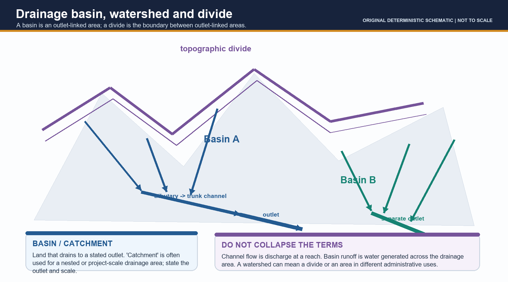

[FACT] A **river/channel** is the watercourse. A **tributary** joins a larger channel; a **distributary** leaves a trunk channel. A **drainage basin** is all land draining to a stated outlet; a **catchment** is commonly a drainage area named for a selected outlet/structure. A **drainage divide** separates adjacent basin outlets. `[LIMIT]` *Watershed* can mean a divide or management area, so state the convention.

| Term | Safe distinction |
|---|---|
| Channel flow | Discharge at a given reach/time |
| Basin runoff | Water generated across the drainage area after losses/storage |
| Source/headstream | Upstream-origin convention |
| Named-river formation | Conventionally named river after a confluence, e.g. Ganga at Devprayag |
| Perennial | Flows all year; does **not** mean uniform discharge |

> **UPSC trap:** Basin runoff is not channel discharge; a map line alone cannot establish water available for transfer.

### 3. Fluvial system: erosion, load and adjustment

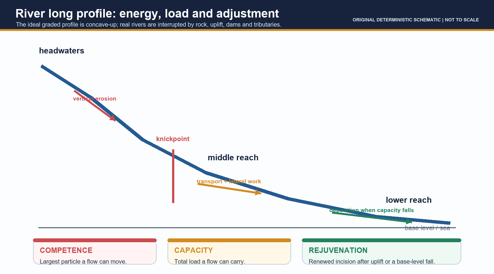

[FACT] **Hydraulic action** is water force in cracks/against banks; **abrasion/corrasion** is load grinding the boundary; **attrition** is load particles colliding and becoming smaller/rounder; **solution** is dissolved removal. Bed, suspended and dissolved load are transport modes. **Competence** is the largest particle a flow can move; **capacity** is the total load it can carry.

[FACT] A graded long profile is a concave-up dynamic adjustment toward balance between available energy and supplied load. Ultimate base level is broadly sea level; a lake, dam, resistant bed or confluence may provide a local base level. A **knickpoint** is a profile break; **rejuvenation** is renewed incision after uplift/base-level fall or another change.

[ANALYSIS] Rivers can erode, transport and deposit in the same reach. Do not apply a universal velocity number or turn the three-course model into an age law.

### 4. Upper-middle-lower course landforms

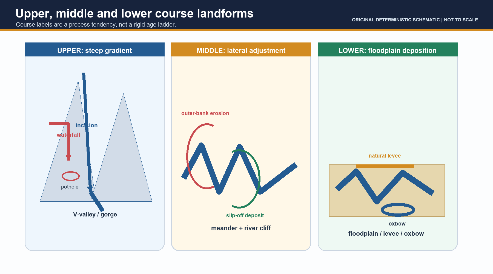

| Tendency | Dominant adjustment | Typical cues |
|---|---|---|
| Upper / steep | Vertical incision | V-valley, gorge, rapid, waterfall, pothole, interlocking spur |
| Middle / easing | Lateral erosion plus transport | Meander, river cliff/cut bank, slip-off deposit, valley widening |
| Lower / low gradient | Deposition relative to carrying power | Floodplain, natural levee, oxbow, bars, delta where mouth conditions permit |

[FACT] An alluvial fan is an inland break-of-slope deposit; a delta is a standing-water mouth deposit. `[FACT]` Gandikota canyon was created by the Pennar (2022 Prelims), showing that local incision/structure can matter in Peninsular terrain.

### 5. Drainage patterns and anomalous drainage

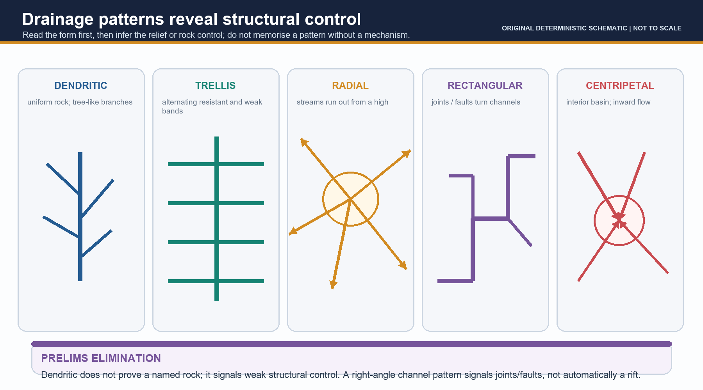

| Pattern | Main inference |
|---|---|
| Dendritic | Weak structural control/relatively uniform resistance |
| Trellis | Alternating resistant and weak folded/tilted strata |
| Radial | Outward flow from dome/cone/high |
| Rectangular | Joints/faults |
| Centripetal | Internal basin/inward drainage |

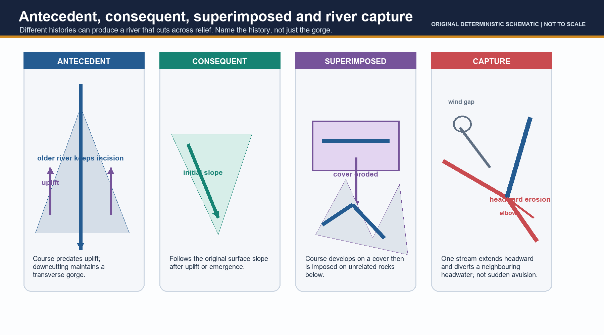

- **Antecedent:** older than uplift; maintains course by incision through rising relief.
- **Consequent:** follows initial slope of newly exposed/tilted surface.
- **Superimposed:** inherited on a cover later removed, so it crosses unrelated underlying structure.
- **River capture:** progressive headward erosion/divide migration diverts a headwater; elbow/wind gap are clues.
- **Avulsion:** sudden channel relocation across a floodplain; not capture.

[LIMIT] The Indo-Brahm account is a historical geomorphic **hypothesis** about Himalayan drainage evolution/capture. Do not present it as observed settled fact.

### 6. India drainage systems

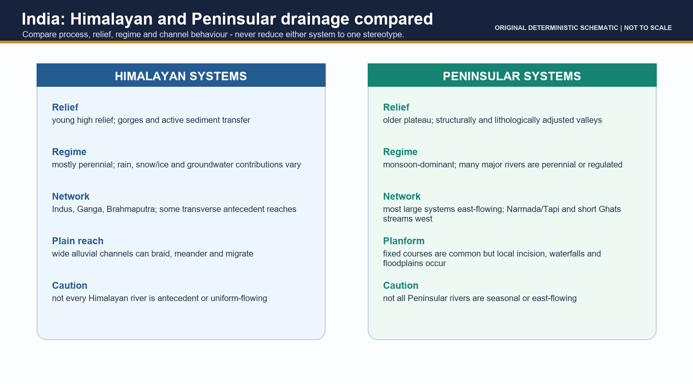

| Axis | Himalayan systems | Peninsular systems |
|---|---|---|
| Main systems | Indus, Ganga, Brahmaputra | Mahanadi, Godavari, Krishna, Cauvery; Narmada/Tapi exceptions |
| Regime | Mostly perennial; rain, snow/ice, groundwater contributions vary | Monsoon-dominant; many major rivers/reaches perennial or regulated |
| Relief/channel | High-relief gorges and high sediment transfer; broad alluvial plains downstream | Older plateau, adjusted valleys and structural controls |
| Caveat | Not every river antecedent or uniform-flowing | Not all seasonal or east-flowing |

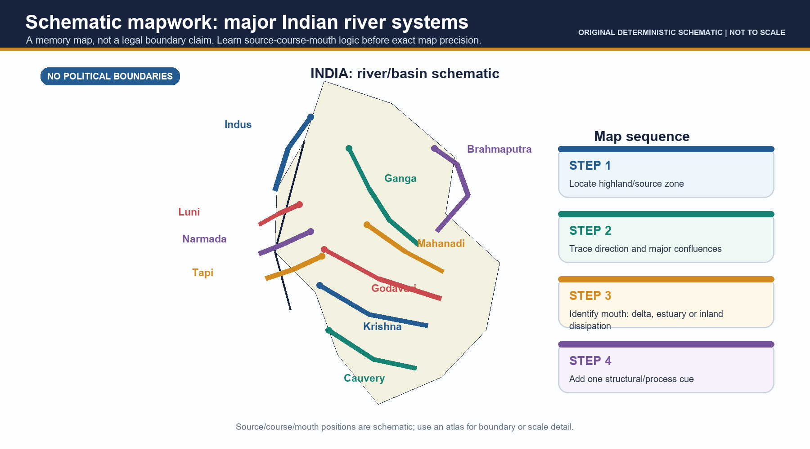

Map hooks: **Indus** - Tibetan Plateau near Manasarovar region -> Ladakh -> Pakistan -> Arabian Sea; **Ganga** - named at Devprayag after Bhagirathi-Alaknanda -> plains -> Bangladesh deltaic system; **Brahmaputra** - Yarlung Tsangpo -> Siang/Dihang -> Assam -> Bangladesh confluence system. **Mahanadi** begins in Sihawa highlands; **Godavari/Krishna/Cauvery** begin near Trimbakeshwar/Mahabaleshwar/Talakaveri and flow east; **Narmada/Tapi** rise at Amarkantak/near Multai and flow west to Gulf of Khambhat; **Luni** trends toward Rann of Kachchh.

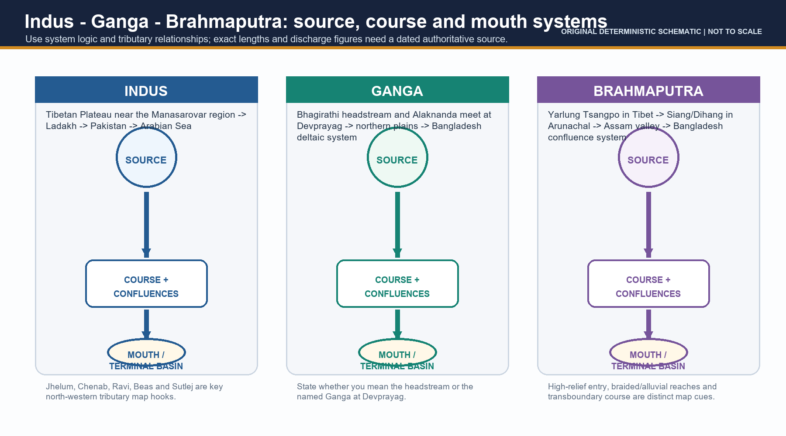

### 7. Peninsular direction, structural troughs and mouth form

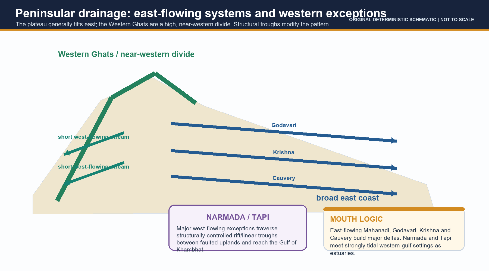

[FACT] The broad Peninsular slope is eastward from a near-western divide, explaining long east-flowing systems and east-coast deltas. Narmada and Tapi are major west-flowing exceptions through structurally controlled rift/linear troughs. Many short streams descend west from the Western Ghats.

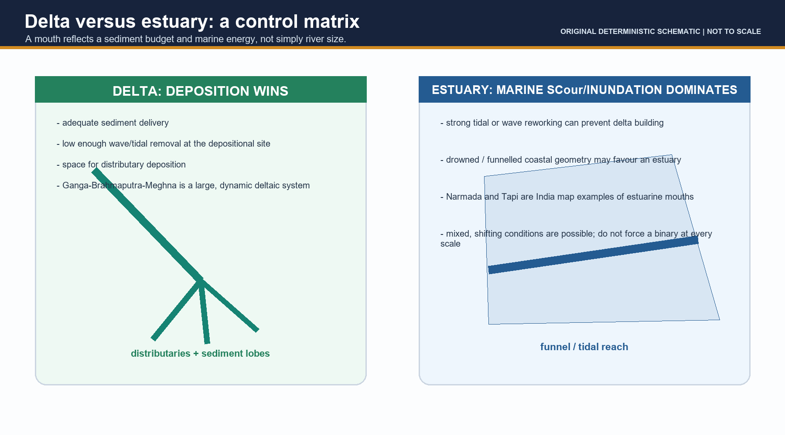

[FACT] A delta requires net sediment accumulation; controls include sediment supply, wave/tidal energy, coastal geometry, subsidence/relative sea level and distributary behaviour. The Ganga-Brahmaputra-Meghna is deltaic; Narmada and Tapi are estuarine mouth examples. `[LIMIT]` Do not quote sediment/erosion/subsidence figures without dated authoritative evidence.

### 8. Floodplain as landform, service and risk setting

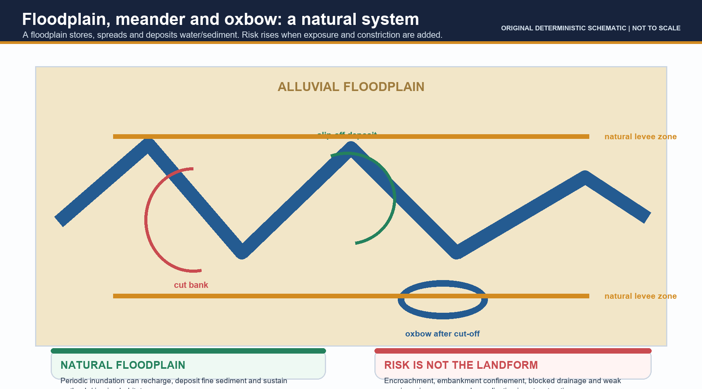

[FACT] Outer-bank erosion and inner-bank deposition move meanders; neck cut-off can create an oxbow. Floodplains/natural levees/backswamps record overbank deposition and provide storage, recharge, riparian/wetland habitat and productive land. `[ANALYSIS]` Flood risk rises when rainfall/runoff, channel capacity, storage/release, floodplain constriction and human exposure interact. `[LIMIT]` Detailed warning/evacuation/operational response is Disaster Management depth.

### 9. Inter-basin transfer: claims must be mechanism-tested

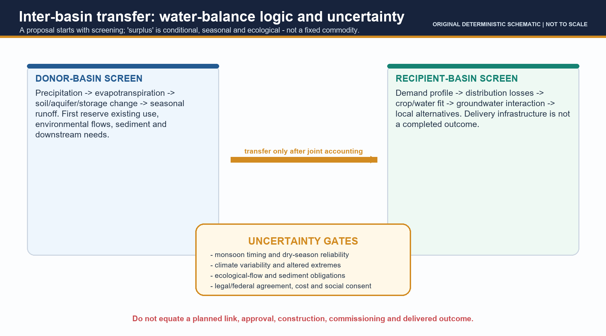

| Claim | Potential mechanism | Limit that must be tested |
|---|---|---|
| Irrigation/drinking water | Storage + conveyance + distribution | Losses, treatment, crop/demand fit, groundwater interaction |
| Drought moderation | Buffer a defined seasonal shortage | Does not erase meteorological drought or poor demand alignment |
| Flood moderation | Selected peak attenuation with storage/operation | Simultaneous extremes, sediment, releases, canal capacity, floodplain exposure |
| Navigation | Reliable depth plus works | Locks/terminals/sediment/seasonality/ecology |
| Hydropower | Head + controlled flow | Hydrology, competing releases, ecological constraints |

[FACT] The National Perspective Plan is a planning framework, not evidence that every link is approved, constructed, commissioned or delivering outcomes. `[ANALYSIS]` A donor screen needs seasonal precipitation, ET, soil/aquifer/storage change, existing use, downstream/ecological flow and uncertainty; a recipient screen needs demand, delivery, crop/hydrogeology fit and local alternatives.

### 10. Ken-Betwa: case with status discipline

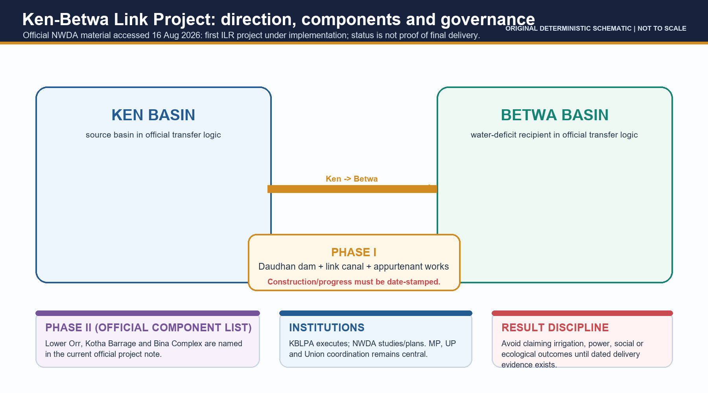

[FACT] NWDA current material identifies Ken-Betwa as the first ILR project under implementation. **Direction: Ken basin -> Betwa basin.** It names Phase I Daudhan dam/link-canal works and Phase II Lower Orr, Kotha Barrage and Bina Complex. `[FACT]` NWDA *Jal Vikas* April 2026 reports Daudhan activities progressing and the eighth KBLPA meeting. `[LIMIT]` These sources do not prove final benefits/outcomes.

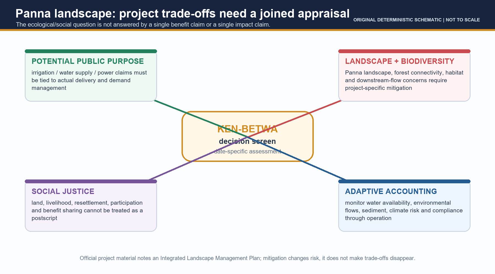

[FACT] Official material refers to an Integrated Landscape Management Plan/Greater Panna Landscape Council. `[ANALYSIS]` Appraise landscape connectivity, downstream flow/sediment, forest/habitat effects, land/livelihood/resettlement/participation, mitigation compliance and monitoring together. `[LIMIT]` No area/species/displacement/cost/command-area figure is asserted without a dated project-specific primary source.

### 11. Governance, alternatives and future demand

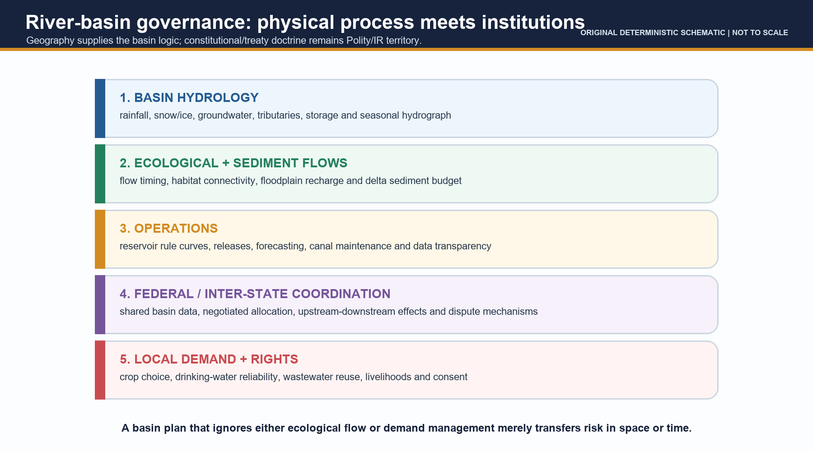

- **Complementary measures:** watershed management; aquifer recharge where hydrogeology permits; irrigation efficiency; crop alignment; reservoir rule curves; floodplain restoration; wastewater reuse; local storage; leakage/demand management; basin institutions.
- **Ecological flow:** timing, quantity/quality and sediment/connectivity conditions needed for river functions; not a decorative residual.
- **Climate uncertainty:** revise accounts with seasonal observations/scenarios and monitoring triggers; distinguish average availability from drought/flood extremes.
- **Boundary:** constitutional/tribunal detail is Polity; treaty law is IR. Geography supplies the upstream-downstream basin logic.

### 12. Map and answer-writing method

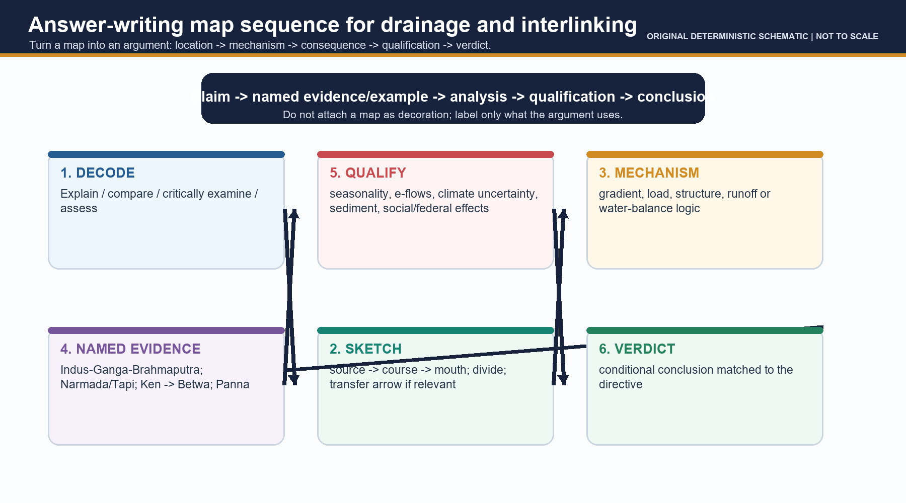

| Directive | Answer move |
|---|---|
| Explain | Mechanism -> labelled India example -> qualification |
| Compare | Same axes for both sides -> exception/refinement |
| Critically examine | Potential mechanism -> named evidence -> limits -> conditional verdict |
| Assess | State criteria -> test evidence -> ranked/conditional conclusion |

## Solved PYQs

### 2020 GS-I Q14 - Interlinking of rivers

> **Question:** The interlinking of rivers can provide viable solutions to the multi-dimensional inter-related problems of droughts, floods and interrupted navigation. Critically examine. (Answer in 250 words)

**Model answer.** `[CLAIM]` Interlinking can be viable in selected, rigorously assessed corridors, but cannot be presumed to solve droughts, floods and navigation together because each rests on a different physical mechanism. `[EVIDENCE]` NWDA's current Ken-Betwa material records a Ken-to-Betwa project under implementation. `[ANALYSIS]` Storage/conveyance can change seasonal location/timing of water for a defined recipient. It cannot remove meteorological drought, groundwater decline, conveyance loss or unsuitable demand/crop patterns; donor accounting must retain existing, downstream and environmental needs. `[EVIDENCE]` Reservoir operation can attenuate a selected peak only with planned flood space. `[ANALYSIS]` Simultaneous basin floods, sediment, release rules, canal capacity and floodplain exposure limit flood moderation. Navigation additionally needs reliable depth, locks, terminals and sediment/ecological management. `[QUALIFICATION]` Panna landscape, downstream-flow/sediment, social and MP-UP-Union coordination concerns show why a hydraulic line is not enough. `[VERDICT]` Use links selectively after seasonal basin accounting and alongside watershed/recharge, demand/crop management, wastewater reuse, reservoir operations and floodplain restoration. **Why this earns marks:** it answers all three limbs, uses dated named evidence without fabricated outcomes, explains limits and reaches a conditional verdict.

### Prelims PYQ route and solutions

- **2018 Q81, adjacent Environment owner:** heavy sand-mining consequences -> **INFERRED ANSWER - NOT OFFICIALLY VERIFIED: B (2 and 3 only), high confidence.** Sand removal can lower local water tables and disturb groundwater; decreased salinity is not a general consequence.
- **2019 Q23:** Pandharpur-Chandrabhaga; Tiruchirappalli-Cauvery; Hampi-Malaprabha -> **INFERRED: A (1 and 2 only), high confidence.** Hampi is on Tungabhadra.
- **2019 Q38, map extension:** Bandarpunch-Yamuna; Bara Shigri-Chenab; Milam-Mandakini; Siachen-Nubra; Zemu-Manas -> **INFERRED: A (1, 2 and 4), high confidence.** Milam is linked to Gori Ganga and Zemu to Teesta. Primary owner: glacial geography.
- **2020 Q68, map extension:** Mekong-Andaman Sea; Thames-Irish Sea; Volga-Caspian Sea; Zambezi-Indian Ocean -> **INFERRED: C (3 and 4), high confidence.** Mekong reaches South China Sea and Thames North Sea. Primary owner: World-Regional Geography.
- **2021 Q53:** Indus direct-junction trunk -> **INFERRED: A Chenab, high confidence.** Draw Jhelum/Ravi/Sutlej-Panjnad relations before the Indus.
- **2021 Q55:** Eastern-Ghats sources among Brahmani/Nagavali/Subarnarekha/Vamsadhara -> **INFERRED: B (2 and 4), high confidence.**
- **2022 Q24:** Gandikota canyon -> **INFERRED: C Pennar, high confidence.**
- **2023 Q1, adjacent Lakes owner:** Jhelum-Wular; Krishna-Kolleru; Gandak-Kanwar -> **INFERRED: B (only two), high confidence.** Krishna does not directly feed Kolleru.
- **2024 Q6:** Ganga tributary order downstream of Prayagraj -> **OFFICIAL: B, Gomati-Ghaghara-Gandak-Kosi.**
- **2024 Q9:** Dhuandhar/Hundru/Gersoppa matching -> **OFFICIAL: A, only one.** Hundru-Chota Nagpur-Subarnarekha is correct.
- **2026 Q11:** Pleistocene drainage evidence -> **INFERRED ANSWER - NOT OFFICIALLY VERIFIED: option containing 1, 2 and 3; moderate confidence.**
- **2026 Q25:** antecedent transboundary Tibetan irrigation river without distributaries -> **INFERRED: C Sutlej, high confidence.**

## Original MCQ loop - questions

### Q1
A drainage basin is best defined as:

- A. Land draining to a stated outlet
- B. A single deepest channel reach
- C. Any surface-water storage
- D. A river's entire wetted channel

### Q2
Which statement correctly distinguishes competence from capacity?

- A. Competence is total load; capacity is particle size
- B. Competence is largest movable particle; capacity is total load
- C. Both describe basin area
- D. Both describe water quality

### Q3
Which is the most defensible inference from a knickpoint?

- A. It proves a river is permanently youthful
- B. It proves a glacier cut the valley
- C. It is a profile break that may reflect local base level, structure or rejuvenation
- D. It proves the river cannot deposit downstream

### Q4
A rectangular drainage pattern most strongly indicates:

- A. Uniform unjointed rock
- B. An internal basin
- C. A volcanic cone
- D. Joint/fault control

### Q5
An antecedent river:

- A. Predates uplift and maintains course by incision
- B. Develops only after a cover is removed
- C. Is a sudden floodplain avulsion
- D. Must be a glacier-fed river

### Q6
River capture is most directly caused by:

- A. Tidal scour at a mouth
- B. Headward erosion and divide migration
- C. Chemical solution at a spring
- D. A delta distributary bifurcation

### Q7
Which statement about Peninsular drainage is correct?

- A. Every river is seasonal
- B. Every major river flows east
- C. Most large systems flow east, but Narmada and Tapi are major west-flowing structural exceptions
- D. Only rivers from Eastern Ghats flow east

### Q8
Which river-mouth pairing is correct?

- A. Godavari - Gulf of Khambhat estuary
- B. Tapi - Bay of Bengal delta
- C. Luni - normal perennial open-sea mouth
- D. Narmada - Gulf of Khambhat estuary

### Q9
A delta is most likely to persist where:

- A. Sediment delivery can keep pace with removal/subsidence over time
- B. Any large river reaches the sea
- C. A river has no tributaries
- D. Tides are always absent

### Q10
A natural floodplain is best understood as:

- A. A zone with no hydrological function
- B. A depositional/inundation surface with storage, recharge and habitat functions
- C. An artificial reservoir
- D. A legal category identical to encroachment

### Q11
Which claim about inter-basin transfer is most accurate?

- A. An annual average alone establishes surplus
- B. Construction proves benefits have been delivered
- C. A donor balance must account for season, storage, existing use and ecological/downstream needs
- D. A canal automatically moderates every flood

### Q12
For navigation, a transfer proposal must additionally establish:

- A. Only a donor basin name
- B. Only an irrigation command
- C. Only an annual rainfall average
- D. Reliable depth, works/terminals, sediment management and ecological safeguards

### Q13
The current official Ken-Betwa direction is:

- A. Ken basin -> Betwa basin
- B. Betwa basin -> Ken basin
- C. Narmada -> Betwa basin
- D. Ganga -> Ken basin

### Q14
The safest interpretation of the April 2026 NWDA KBLP update is:

- A. Final benefits are verified
- B. Implementation/progress activity is reported, not final outcome delivery
- C. The project is only a hypothetical map line
- D. No institution is involved

### Q15
A sound Panna landscape appraisal should include:

- A. Only a construction schedule
- B. Only a projected water benefit
- C. Landscape/connectivity, downstream flow, social effects, mitigation and monitoring
- D. Only a wildlife label

### Q16
Which is most clearly a complement to, rather than a synonym for, inter-basin transfer?

- A. Treating annual average as fixed surplus
- B. Ignoring crop demand
- C. Equating channelisation with restoration
- D. Watershed/recharge, demand management, wastewater reuse and reservoir operations

### Q17
Which answer structure best fits 'Critically examine interlinking'?

- A. Potential mechanism -> named case -> limits/safeguards -> conditional verdict
- B. River list -> generic conclusion
- C. Only project criticism
- D. Only project benefits

### Q18
The named Ganga convention most safely states that:

- A. Ganga begins only at Gomukh
- B. Ganga is named at Devprayag after Bhagirathi-Alaknanda confluence
- C. Alaknanda is a distributary
- D. Devprayag lies in the delta

### Q19
Which pairing is correct?

- A. Gersoppa/Jog - Netravati
- B. Dhuandhar - Godavari
- C. Hundru - Subarnarekha
- D. Gandikota - Cauvery

### Q20
Which statement best distinguishes river capture from an oxbow?

- A. Both are delta processes
- B. Both are structural troughs
- C. Both require a tidal estuary
- D. Capture diverts a headwater by headward erosion; an oxbow follows meander cut-off

### Q21 **[REMEDIAL]**
Remedial: which evidence most strongly supports an antecedent interpretation?

- A. A river cuts a transverse gorge while maintaining a course through uplifted relief
- B. A river has a wide delta
- C. A lake sits in an internal basin
- D. A channel takes right-angle bends

### Q22 **[REMEDIAL]**
Remedial: which statement about Himalayan flow is safest?

- A. All flow is from glaciers
- B. Most large systems are perennial, but rain/snow/ice/groundwater contributions and discharge vary seasonally
- C. Every reach has equal discharge
- D. No Peninsular river is perennial

### Q23 **[REMEDIAL]**
Remedial: a donor basin is called 'surplus' only after:

- A. A project brochure uses the word
- B. It has more annual rain than a recipient
- C. Seasonal balance, storage, existing/downstream/e-flow needs and uncertainty are assessed
- D. A canal is commissioned

### Q24 **[REMEDIAL]**
Remedial: which project statement is factually disciplined?

- A. Daudhan progress proves all benefits are complete
- B. Ken-Betwa reverses Betwa into Ken
- C. Panna effects can be dismissed after one mitigation plan
- D. An implementation update must be separated from commissioning and observed outcome

## Original MCQ loop - solutions

- **Q1: A.** A basin is the outlet-linked contributing area; the channel is only one pathway within it.
- **Q2: B.** Competence concerns maximum particle size; capacity concerns the total sediment quantity a flow can carry.
- **Q3: C.** Knickpoints mark a profile discontinuity; their cause must be investigated rather than assumed.
- **Q4: D.** Right-angle bends commonly reveal structural discontinuities such as joints and faults.
- **Q5: A.** Antecedence is a chronology relative to uplift, not a discharge regime.
- **Q6: B.** A more vigorous stream erodes headward and diverts a neighbouring headwater.
- **Q7: C.** The broad eastward tilt has important exceptions; regime is also not uniform.
- **Q8: D.** Narmada and Tapi are west-coast/gulf estuarine examples; Luni trends toward the Rann.
- **Q9: A.** Delta form is a sediment-budget outcome, not a simple river-size rule.
- **Q10: B.** Floodplains are part of the river system; exposure and encroachment are separate questions.
- **Q11: C.** Transfer feasibility requires joint, time-sensitive water accounting and non-hydraulic tests.
- **Q12: D.** Navigation has operational, infrastructure and ecological prerequisites beyond water transfer.
- **Q13: A.** NWDA's current project material states diversion from Ken to the water-deficit Betwa basin.
- **Q14: B.** Status evidence must not be inflated into irrigation, power or social outcome evidence.
- **Q15: C.** A project trade-off is ecological, hydrological, social and temporal.
- **Q16: D.** Different interventions address different points in the water-security chain.
- **Q17: A.** Critical examination tests viability rather than preaching approval or rejection.
- **Q18: B.** State the convention: a headstream can differ from the named-river formation.
- **Q19: C.** Hundru is on the Subarnarekha; the other pairs misuse the river-landform relation.
- **Q20: D.** They operate at different scales and by different mechanisms.
- **Q21: A.** Antecedence concerns maintained course relative to uplift, usually recorded by transverse incision.
- **Q22: B.** Perennial is not uniform; multiple sources contribute in changing proportions.
- **Q23: C.** Surplus is an accounting conclusion with climate and ecological conditions, not a fixed label.
- **Q24: D.** Status-stage precision prevents a construction claim becoming a delivery claim.

> **Rotation validation:** Original MCQ correct options are A, B, C, D repeated exactly across Q1-Q24. PYQ options retain official wording/options and are not artificially rotated.

## Original Mains practice and model solutions

### 10 marks - fluvial adjustment

> **Question:** Explain why a river can erode, transport and deposit within a short distance without fitting a rigid upper-middle-lower-course sequence. Answer in 150 words.

**Model answer.** `[CLAIM]` River work changes with local energy relative to load, so course labels are tendencies rather than fixed stages. `[EVIDENCE]` Steep Himalayan headwaters commonly incise gorges; the Pennar at Gandikota demonstrates local canyon incision in Peninsular terrain. `[ANALYSIS]` Tributaries, resistant rock and base-level breaks alter discharge/load/gradient; low-gradient alluvial reaches then permit lateral erosion, bars, floodplains and oxbows. The Ganga-Brahmaputra-Meghna system demonstrates continued downstream transport/deposition. `[QUALIFICATION]` Uplift, dams/backwater and floods interrupt any ideal profile, and all three processes can coexist. `[VERDICT]` Diagnose gradient, load, discharge and boundary resistance before applying a course label. **Why this earns marks:** it explains why, uses named evidence, analyses local controls and rejects the stage myth precisely.

### 15 marks - Himalayan versus Peninsular drainage

> **Question:** Compare Himalayan and Peninsular drainage systems. How do temporal regime and structural setting complicate a simple east-flowing versus west-flowing classification? Answer in 250 words.

**Model answer.** `[CLAIM]` Relief, regime and structure explain the broad contrast, but neither system is uniform. `[EVIDENCE]` Indus, Ganga and Brahmaputra are mostly perennial with changing rain, snow/ice and groundwater contributions; some transverse Himalayan gorges are antecedent. `[ANALYSIS]` High relief promotes incision/sediment transfer, then alluvial channel adjustment downstream. `[EVIDENCE]` Mahanadi, Godavari, Krishna and Cauvery broadly flow east from a near-western divide; Narmada/Tapi flow west through structural troughs to Gulf of Khambhat. `[ANALYSIS]` The plateau tilt explains the broad pattern, while rift/linear troughs and short Western-Ghat streams correct it. `[QUALIFICATION]` Mouth form depends on sediment/marine energy, and perennial does not mean uniform discharge. `[VERDICT]` Compare common axes and use exceptions to refine the rule. **Why this earns marks:** it compares like with like, supplies named evidence on both sides, links structure to pattern and qualifies stereotypes.

### 20 marks - inter-basin transfer under climate uncertainty

> **Question:** Assess inter-basin transfer as a water-security strategy under climate uncertainty. Use the Ken-Betwa case, but do not treat project implementation as proof of outcome. Answer in 250 words.

**Model answer.** `[CLAIM]` Inter-basin transfer is conditionally useful only when a seasonal donor balance and recipient demand are proven and monitored. `[EVIDENCE]` NWDA's April 2026 and current KBLP materials identify Ken-Betwa under implementation and Ken -> Betwa direction. `[ANALYSIS]` This proves a live implementation case, not final benefit delivery. A donor test requires precipitation, ET, storage/aquifer change, existing use, downstream/e-flow/sediment needs and seasonal timing; a recipient test needs delivery, treatment, crop/hydrogeology fit and local alternatives. `[EVIDENCE]` Panna landscape/ILMP context and MP-UP-Union coordination identify ecological/social/federal conditions. `[ANALYSIS]` Flood moderation requires flood space/operations; navigation requires depth/locks/terminals/sediment; neither follows automatically from a canal. `[QUALIFICATION]` Climate shifts means and extremes, while resettlement, connectivity and downstream flow need monitoring. `[VERDICT]` Use transfer as one staged, revisable basin instrument alongside recharge, efficiency/crop alignment, reservoir operations, floodplain restoration and reuse. **Why this earns marks:** explicit assessment criteria, dated case evidence, mechanisms and limits, alternatives and a conditional operational verdict.

# Final consolidated register notes

## A. Drainage and fluvial rapid recall

- Basin = land draining to stated outlet; tributary joins; distributary leaves; divide separates basins.
- Channel discharge != basin runoff. Perennial != uniform flow. Headstream != named-river formation.
- Hydraulic action / abrasion / attrition / solution; competence = largest particle, capacity = total load.
- Graded profile is dynamic; base level/knickpoint/rejuvenation explain interruptions.
- V-valley/gorge/waterfall/pothole -> meander/cut bank/slip-off -> floodplain/levee/oxbow/delta tendency.
- Fan is a break-of-slope deposit; delta is mouth deposit; estuary is a marine/tidal mouth.

## B. India map and evolution

- Himalayan: Indus, Ganga, Brahmaputra; mostly perennial but variable-source. Do not call all antecedent.
- Peninsular: broad eastward tendency; Mahanadi/Godavari/Krishna/Cauvery east. Narmada/Tapi west through structural troughs; short Western-Ghat rivers also west.
- Ganga named at Devprayag; Brahmaputra name sequence Yarlung Tsangpo -> Siang/Dihang -> Assam; Luni toward Rann.
- Dendritic/trellis/radial/rectangular/centripetal = uniform resistance/bands/high/joints/internal basin.
- Antecedent predates uplift; superimposed inherits cover course; capture is headward diversion; avulsion is sudden shift.

## C. Floodplain, mouths and governance

- Floodplain is natural river working space; risk changes with exposure, constriction, operations and drainage.
- Delta test: supply, tides/waves, coastal geometry, subsidence/relative sea level, channel distribution.
- Transfer test: seasonal balance, e-flow/sediment, recipient demand, climate uncertainty, social/federal feasibility.
- Ken-Betwa: **Ken -> Betwa**; under implementation per current NWDA; status != outcome.
- Complements: watershed/recharge, efficiency/crop alignment, reservoir rules, floodplain restoration, wastewater reuse, local storage, demand/basin institutions.

## D. PYQ and answer spine

- 2020 GS-I: drought, flood, navigation need separate mechanisms before conditional verdict.
- Prelims: source-course-mouth, tributary network, landform-region-river, pattern-control and status/key discipline.
- Answer: directive -> map/flow -> claim -> named evidence -> analysis -> qualification -> verdict.

