# 06 Himalayan Glaciers GLOF — Complete Topic Package

> **Subject:** Geography | **Coverage:** GS-I physical geography, Prelims, and bounded GS-III disaster/resource links | **Export date:** 2026-08-16  
> **Evidence labels:** `[FACT]` = retrieved local/official source; `[ANALYSIS]` = reasoned synthesis; `[LIMIT]` = uncertainty, scope or ownership caution.  
> **Visual rule:** Every linked asset is an original deterministic schematic, conceptual, not to scale, and not a legal-boundary depiction.

## Source register, current-data note and ownership boundary

[FACT] **Repository-first foundation:** Geography Basic 06 `Landforms-of-Glaciation`, Advanced 06 `Himalayan-Glaciers-GLOF`, Geography README, Master Framework, syllabus mapping, revision chart and answer-worthiness audit; completed Geography Topics 02–05; related Topics 03/04/05/09/10/11/12/13/16/23/25/36; Disaster Management Topic 10 (GLOF/landslide/early-warning owner); and Environment climate-science material.

[FACT] **Local second-layer evidence:** the local PDF audit checked G.C. Leong, *Certificate Physical & Human Geography*; Majid Husain, *Indian & World Geography* and *Indian Geography*; and D.R. Khullar, *India: A Comprehensive Geography*. Majid’s searchable local text defines flowing glacier ice and supports the erosion/deposition, glacial trough, moraine, esker and outwash distinctions. The image-only local volumes were checked through the repository’s OCR audit. Source-era numerical glacier estimates are not used as current inventory facts.

[FACT] **Official-paper provenance:** local official scans checked were `books/more_previous_papers/csp-p1.pdf` (2019 Prelims), `CSP_2020_GS_Paper-1.pdf`, `QP-CSP-21-GeneralStudiesPaper-I-121021.pdf`, `Gen_St_P1.pdf` (2020 GS-I), `QP-CSM-21-GENSTUDIESPAPER-I-110122.pdf`, and `QP-CSM-23-GENERAL-STUDIES-PAPER-I-180923.pdf`. Older official Prelims keys are not held locally; such answers below are prominently labelled **INFERRED ANSWER — NOT OFFICIALLY VERIFIED**.

[FACT] **Live primary-source check, 2026-08-16:**  
- Central Water Commission, [Glacial Lake Outburst Floods](https://cwc.gov.in/glacial-lake-outburst-floods-glof) (retrieved 2026-08-16): explains glacier/moraine/natural-depression impoundment, instability, sudden release and monitoring need.  
- ISRO SAC VEDAS, [Himalayan Glacier Inventory Atlas](https://vedas.sac.gov.in/en/Himalayan_Glacier_Inventory_Atlas.html) (retrieved 2026-08-16): official inventory/mapping portal.  
- NRSC/Bhuvan, [National Hydrology Project Glacial Lakes Information System](https://bhuvan.nrsc.gov.in/nhp/NHP_GlacialLake.html) (retrieved 2026-08-16): official geospatial-system context.  
- NDMA, *Guidelines on Management of Glacial Lake Outburst Floods* (2020): institutional doctrine; use for risk-reduction framing, not as a current lake forecast.  
- CWC/PIB, *Impact of Glacial Lake Outburst Floods* (2024, PRID 2042990): post-Teesta design-flood review context. Dynamic lake/monitoring status must be dated to the cited release rather than remembered.

[LIMIT] The official portals support monitoring and process context. This package deliberately does **not** assert an unsupported Himalayan glacier count, retreat rate, loss percentage, lake ranking/count, lake elevation, discharge share, fatality, infrastructure-loss figure or future projection. The direct Geography role is physical/spatial explanation; detailed operational response remains Disaster Management depth.

## Main Guided Tutor-style learning session

### 1. Roadmap and pre-teach contract

```text
glacier physics -> erosional/depositional signatures -> Himalayan geography
       -> water timing + climate links -> glacial lakes/GLOF
       -> South Lhonak caution -> PYQ studio -> practice -> final register notes
```

> **PRE-TEACH CHECKLIST**  
> 📚 **Book context:** queried Basic 06, Advanced 06, local Leong/Majid/Khullar audit, framework and linked topics.  
> 🔍 **CA Search:** `official India Himalayan glacier inventory glacial lake GLOF monitoring 2026`.  
> 📰 **CA Found:** CWC’s current GLOF page and ISRO SAC’s live Inventory Atlas were retrieved on 2026-08-16. They support monitoring/process context; no unsourced dynamic rate is inserted.

| Learning block | Question it answers | Output |
|---|---|---|
| Mass balance | Why does ice advance, thin or retreat? | ELA and budget logic |
| Geomorphology | What does moving ice erode/deposit? | Diagnostic landform comparison |
| Himalayan application | Where and why does response vary? | Map/heterogeneity discipline |
| Water and hazard | Why does ice loss matter downstream? | Phased flow + risk chain |
| Answer writing | How does UPSC reward explanation? | Claim → evidence → analysis → qualification |

[ANALYSIS] Keep four boundaries intact: glacier is not any snowfield; snowline is not snout; GLOF is not any mountain flood; hazard is not risk.

---

### 2. Glacier mechanics: accumulation, ablation, equilibrium line and net balance

> **PRE-TEACH CHECKLIST**  
> 📚 **Book context:** Majid’s local text: glacier = compacted/recrystallised snow thick enough to flow plastically.  
> 🔍 **CA Search:** `Himalayan glacier mass balance official India monitoring`.  
> 📰 **CA Found:** ISRO SAC inventory portal is a mapping context; annual balance requires glacier-specific observation.

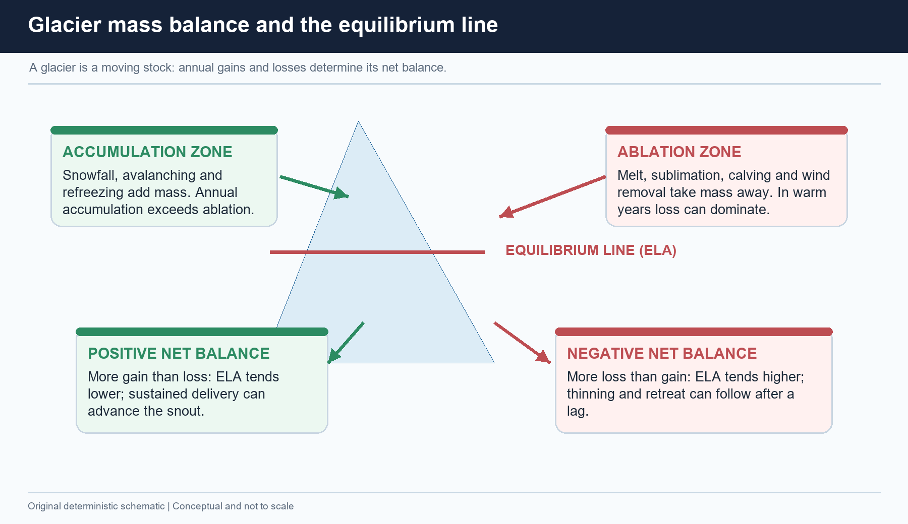

*The ELA is a balance boundary for a stated period; it is not the snout.*

| Term | Safe meaning | Do not confuse with |
|---|---|---|
| Accumulation | Snowfall, avalanching and refreezing adding mass | Any white surface snow |
| Ablation | Melt, sublimation, calving where relevant and other loss | Ice flow |
| ELA | Accumulation = ablation for stated glacier/period | Regional climatic snowline |
| Net balance | Accumulation minus ablation | Snout position alone |

- [FACT] Sustained positive net balance can lower the ELA and allow advance after a geometric lag; sustained negative net balance can raise the ELA, thin ice and later retreat the terminus.
- [ANALYSIS] A single warm/snowy year cannot prove a long-term trend. Glacier response varies with size, thickness, slope and local climate.
- [LIMIT] State the metric: snout retreat, area change, surface lowering and mass balance are not interchangeable.

> 🔑 **Mnemonic:** *Input – Compensation line – Exit* = accumulation – ELA – ablation.

**UPSC trap:** “The equilibrium line is the lowest end of a glacier.”  
**Correction:** it is where gains and losses balance; the lower terminus is the snout.

---

### 3. Flow and the retreat paradox

> **PRE-TEACH CHECKLIST**  
> 📚 **Book context:** Basic 06 mass-balance and flow refinement.  
> 🔍 **CA Search:** `glacier retreat snout forward ice flow explanation`.  
> 📰 **CA Found:** no dynamic rate is needed; the static flux-versus-ablation mechanism is the teaching anchor.

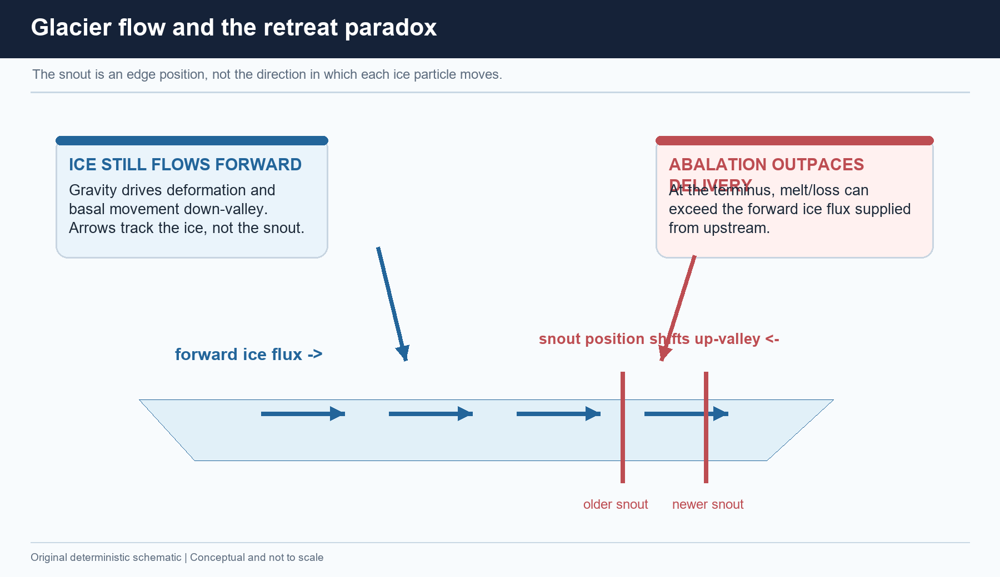

*The ice can move down-valley while the visible edge moves up-valley.*

[FACT] Ice moves down its pressure/slope gradient by deformation and/or basal movement. [ANALYSIS] If ablation at the terminus is greater than the forward ice flux arriving from above, the snout retreats despite forward ice motion.

| Observation | What it can mean | What it cannot prove alone |
|---|---|---|
| Snout retreats | Lower-glacier loss outpaces delivery | Exact total mass loss |
| Surface thins | Volume loss is likely | Snout must visibly retreat |
| Thick debris cover | Surface response is modified | No mass loss |

- [FACT] Thin debris can lower albedo and enhance melt; thick debris can insulate.  
- [LIMIT] There is no universal “debris accelerates retreat” rule.  
- [ANALYSIS] Debris-covered Himalayan tongues can thin without a dramatic snout movement.

**Why UPSC cares:** It tests causal precision. Write “terminus loss exceeds forward delivery,” not “ice flows backward.”

---

### 4. Anatomy and family of ice masses

> **PRE-TEACH CHECKLIST**  
> 📚 **Book context:** Leong/Majid glacier-system and type distinctions.  
> 🔍 **CA Search:** `grounded floating ice sea level glacier Indian UPSC`.  
> 📰 **CA Found:** current monitoring portals are used only for inventory context; the grounded/floating rule is stable physics.

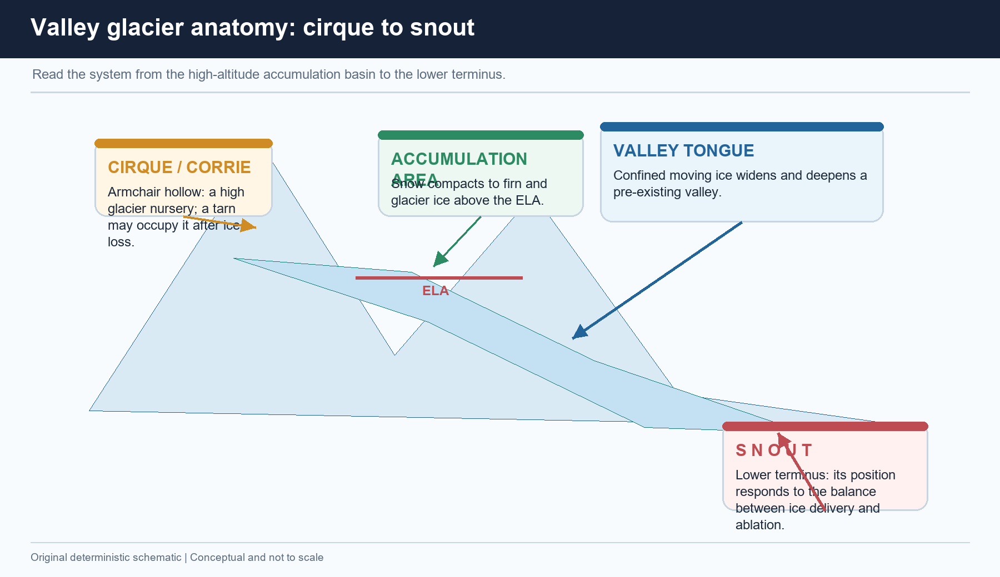

| Ice form | Setting | Prelims discriminator |
|---|---|---|
| Snowfield | Persistent snow | Need not flow |
| Cirque glacier | Armchair/corrie hollow | Can leave tarn/cirque |
| Valley glacier | Confined by valley walls | U-trough suite |
| Piedmont glacier | Spreads at mountain foot | Transitional form |
| Ice cap / sheet | Grounded dome / continental land ice | Can add ocean mass |
| Ice shelf / iceberg / sea ice | Floating ice | Direct melt follows displacement rule |

[FACT] An ice shelf is a floating extension of grounded ice; it can buttress inland grounded ice even though its own melting does not directly raise sea level. [FACT] Grounded mountain glaciers, ice caps and ice sheets transfer land-ice mass to the ocean as they lose ice. [LIMIT] Local sea level also depends on ocean dynamics and vertical land movement.

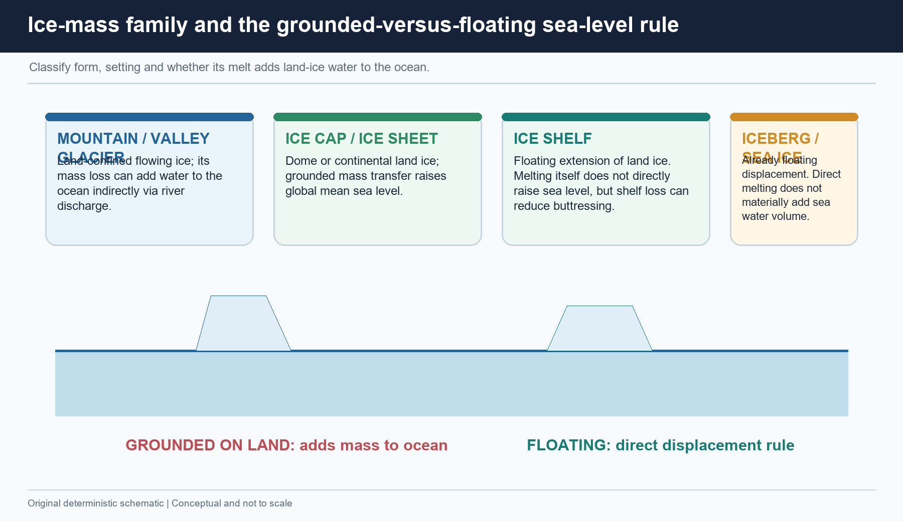

---

### 5. Glacial erosion: plucking and abrasion

> **PRE-TEACH CHECKLIST**  
> 📚 **Book context:** Majid local pages on glacial landforms; Basic 06.  
> 🔍 **CA Search:** `glacial erosion plucking abrasion UPSC`.  
> 📰 **CA Found:** no current event is required to teach the process; current cryosphere change increases its relevance.

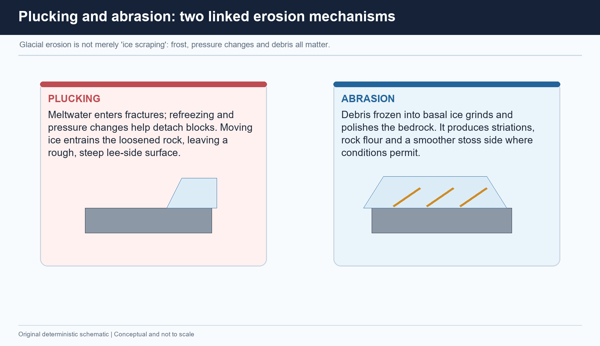

| Process | Mechanism cue | Typical signature |
|---|---|---|
| Plucking | Ice-water-rock interaction detaches jointed blocks | Rough/steep lee side |
| Abrasion | Debris in moving ice grinds bedrock | Polish, striations, rock flour |

[FACT] **Cirque/corrie**: armchair hollow; **arête**: sharp ridge between cirques; **horn**: pyramidal peak where several cirques erode headward. [FACT] **U-shaped valley**: broad steep-sided glacial trough; **hanging valley**: tributary left above a more deeply eroded main trough. [FACT] **Roche moutonnée**: smoother abraded stoss/up-ice side, steep plucked lee/down-ice side.

> 🔑 **Mnemonic:** *Abrasion = rub; plucking = pry.*

---

### 6. Fjords: process, coast and 2023 PYQ route

> **PRE-TEACH CHECKLIST**  
> 📚 **Book context:** Basic 06 plus coastal Topic 10.  
> 🔍 **CA Search:** `fjord formation glacial trough UPSC 2023 GS1`.  
> 📰 **CA Found:** 2023 GS-I official local paper is the direct anchor.

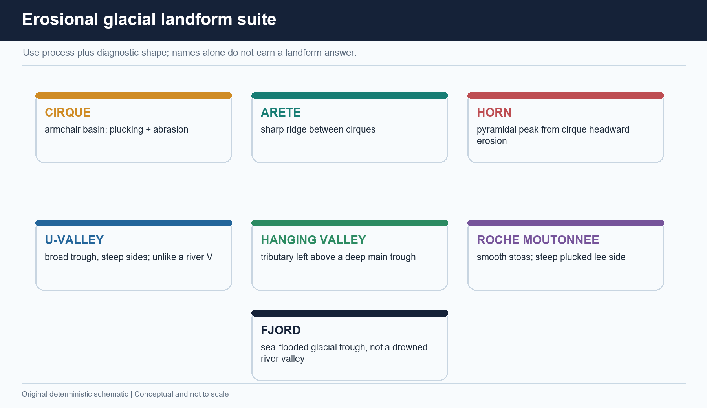

```text
valley glacier abrasion + plucking
             -> deep, broad U-shaped trough
             -> deglaciation / relative marine inundation
             -> FJORD: steep-walled, deep sea inlet
```

[FACT] A **fjord** is a marine-flooded glacial trough. [FACT] A **ria** is a drowned river valley. [ANALYSIS] Deep water, steep relief, hanging-valley waterfalls and irregular coastlines supply the “picturesque” character requested in the 2023 stem.

> 🔑 Trap: The sea fills the trough after its glacial excavation; it does not itself cut the glacial U-valley.

---

### 7. Deposition: moraine, till, drumlin, esker and outwash

> **PRE-TEACH CHECKLIST**  
> 📚 **Book context:** Basic 06 and Majid local text on outwash/eskers.  
> 🔍 **CA Search:** `moraine outwash sorted unsorted glacial landforms`.  
> 📰 **CA Found:** current GLOF relevance makes moraine vocabulary high yield.

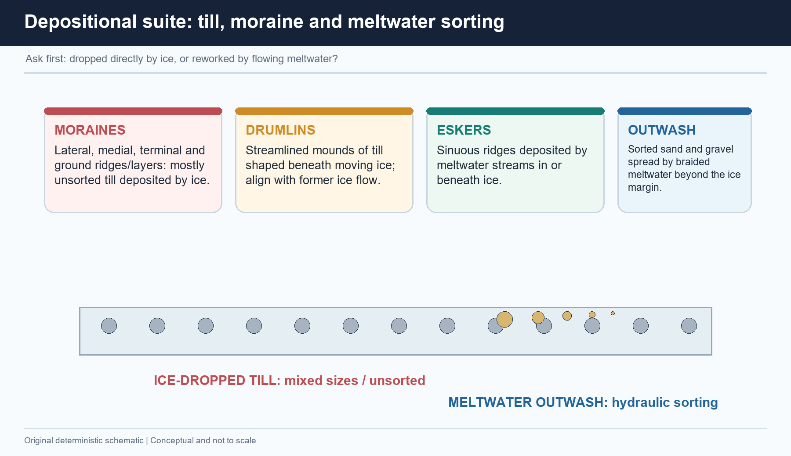

| Form/material | Agent | Sorting clue |
|---|---|---|
| Till / moraine | Direct ice deposition | Generally unsorted |
| Lateral / medial / terminal / ground moraine | Position of moraine | Still a till/debris family |
| Drumlin | Subglacial ice-related deposition/shaping | Streamlined mound of drift/till |
| Esker | Sub-/englacial meltwater stream | Sinuous ridge |
| Outwash / sandur | Braided meltwater | Relatively sorted sediment |

[ANALYSIS] Moraine dams can create lake basins after retreat, but a moraine lake only becomes a risk problem when dam/slope condition, trigger and downstream exposure are assessed.

---

### 8. Snowline, ELA and snout: three distinct altitude ideas

> **PRE-TEACH CHECKLIST**  
> 📚 **Book context:** Advanced 06 snowline guardrails.  
> 🔍 **CA Search:** `Himalayan snowline glacier snout distinction`.  
> 📰 **CA Found:** inventory portals map glaciers; they do not license conflating mapped snout with climatic snowline.

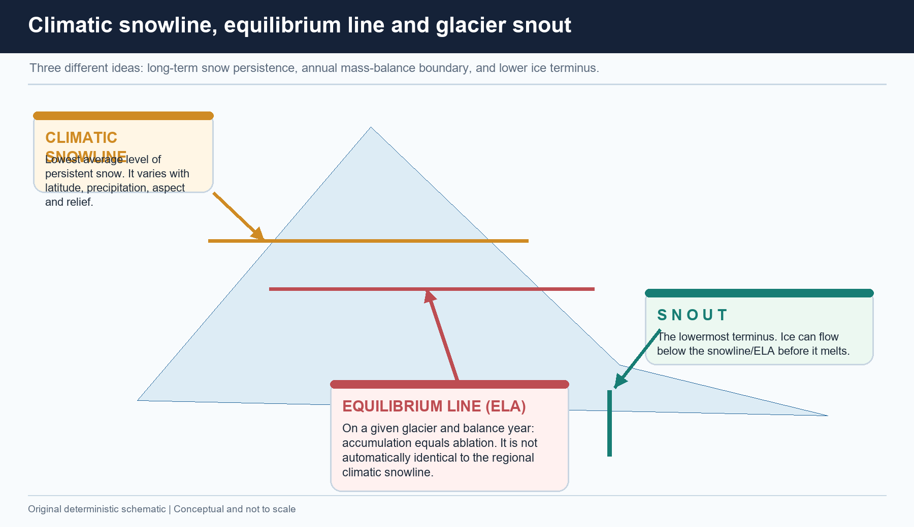

| Reference | Meaning | Controls |
|---|---|---|
| Climatic snowline | Long-term lowest limit of persistent snow | Latitude, precipitation, aspect, relief, energy |
| ELA | Accumulation = ablation for a stated glacier/time | Annual balance and glacier conditions |
| Snout | Lower glacier terminus | Forward flux versus ablation |

[FACT] Greater accumulation tends to lower a snowline relative to a dry setting; aspect/shading and local relief complicate any simple regional rule. [LIMIT] Do not quote a snout elevation as the climatic snowline.

---

### 9. Himalayan glacier geography and map discipline

> **PRE-TEACH CHECKLIST**  
> 📚 **Book context:** Advanced 06 and Geography README map-precision rule.  
> 🔍 **CA Search:** `Indian Himalayan glacier inventory ISRO Karakoram Ladakh Sikkim`.  
> 📰 **CA Found:** ISRO SAC Atlas retrieved 2026-08-16; use it as mapping context, not an unsupported count.

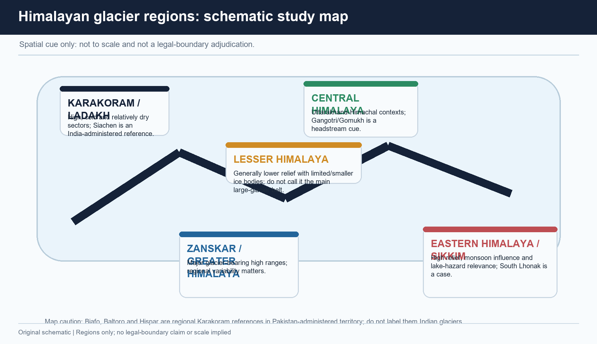

*Original schematic: regional learning cue only, not a scale or legal-boundary representation.*

- [FACT] The major large-glacier contexts are in the Greater and Trans-Himalaya: Karakoram, Ladakh and Zanskar, with high-range Himalayan sectors elsewhere.  
- [FACT] The Lesser Himalaya has more limited/smaller ice bodies; do not call it the main large-glacier belt.  
- [FACT] **Siachen** is an India-administered eastern Karakoram reference. **Biafo, Baltoro and Hispar** are regional references in Pakistan-administered territory; they are not Indian glaciers.  
- [LIMIT] Khullar’s approximate 15,000-glacier Himalaya figure is source-era/method-dependent and must not be presented as a current inventory.

---

### 10. Controls on Himalayan response: why uniform claims fail

> **PRE-TEACH CHECKLIST**  
> 📚 **Book context:** Advanced 06 plus climate/monsoon cross-links.  
> 🔍 **CA Search:** `Himalayan glacier debris aspect snowfall heterogeneity scientific monitoring`.  
> 📰 **CA Found:** current scientific/official monitoring is glacier/basin specific; that itself is a caution against one range-wide trend number.

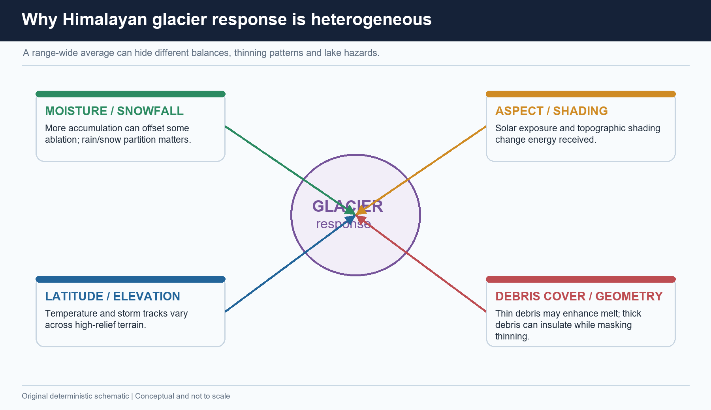

| Control | How it changes the balance/observation |
|---|---|
| Moisture and snowfall | Changes accumulation and rain-versus-snow partition |
| Elevation / latitude | Changes temperature and storm-track setting |
| Aspect / shading | Changes incoming energy and snow retention |
| Debris thickness | Thin debris may enhance melt; thick debris may insulate |
| Geometry / response time | Controls lag between forcing, thinning and snout change |

[ANALYSIS] The correct conclusion is heterogeneity, not indecision: basin-, elevation- and metric-specific evidence is more defensible than a universal Himalayan rate.

---

### 11. Water security: a phased and seasonal response

> **PRE-TEACH CHECKLIST**  
> 📚 **Book context:** Basic/Advanced 06 and Topic 05 Himalayan drainage.  
> 🔍 **CA Search:** `Himalayan glacier melt lean season water India official`.  
> 📰 **CA Found:** official inventory context supports monitoring; no uncited meltwater percentage is used.

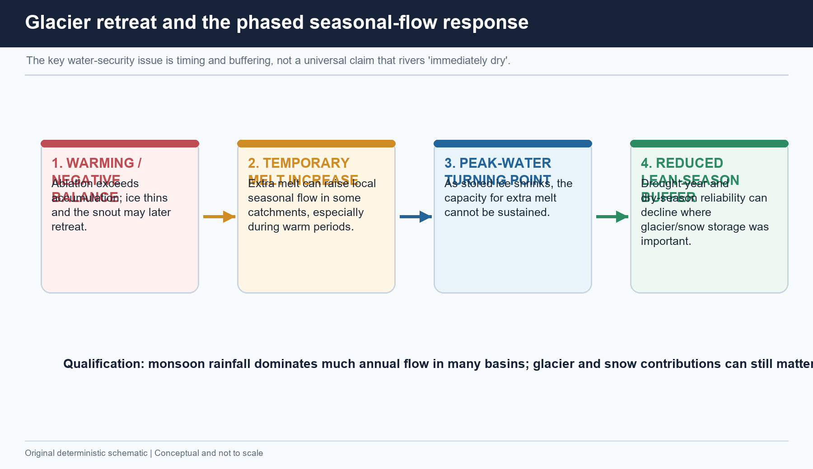

```text
negative balance -> temporary extra local melt possible -> smaller stored ice
                     -> reduced glacier melt buffer later in some catchments
```

[FACT] Glaciers and seasonal snow can release stored cold-season precipitation later in the year. [ANALYSIS] A shrinking glacier can produce an early period of higher local melt, followed by lower long-term meltwater contribution once ice storage is depleted. [LIMIT] Monsoon rainfall dominates much annual flow in many Himalayan basins; glacier/snow contributions can nevertheless be disproportionately important in lean seasons and drought years.

| Water dimension | Safer answer language |
|---|---|
| Annual flow | Varies; avoid all-river claims |
| Lean season / drought | Storage/buffering can be important in glacierised headwaters |
| Irrigation/hydropower | Timing, reliability, sediment and operations matter |
| Ecosystems | Flow seasonality and sediment regime matter |

---

### 12. From retreat to glacial lake: vocabulary before risk

> **PRE-TEACH CHECKLIST**  
> 📚 **Book context:** Basic 06 GLOF chain and Disaster Management Topic 10.  
> 🔍 **CA Search:** `CWC glacial lake outburst floods monitoring India`.  
> 📰 **CA Found:** CWC page retrieved 2026-08-16 describes ice/moraine/natural-depression lake formation and monitoring need.

| Term | Meaning |
|---|---|
| Proglacial lake | Lake in front of a glacier, often in a newly exposed basin |
| Supraglacial lake | Lake on glacier ice |
| Moraine-dammed lake | Lake impounded by glacial debris |
| GLOF | Sudden release after dam failure/overtopping |
| Hazard | Potentially damaging physical event |
| Risk | Hazard interacting with exposure and vulnerability |

[FACT] CWC notes that moraine-dammed lakes are common and unstable impoundment can release stored water rapidly. [LIMIT] Lake expansion or a mapped lake is not a forecast of failure.

---

### 13. GLOF trigger–breach–cascade chain

> **PRE-TEACH CHECKLIST**  
> 📚 **Book context:** Basic 06 and DM 10.  
> 🔍 **CA Search:** `glacial lake overtopping moraine breach cascade India`.  
> 📰 **CA Found:** current CWC material supports the impoundment/instability/monitoring chain.

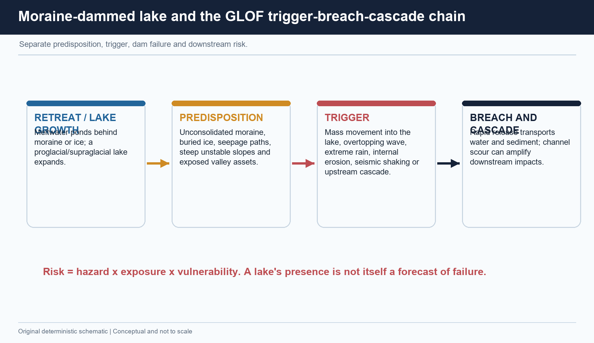

```text
retreat / lake growth
  -> predisposition: moraine, buried ice, seepage, unstable slopes
  -> trigger: mass movement/wave, rain, internal erosion, quake, upstream cascade
  -> overtopping or breach
  -> rapid water + sediment flood
  -> exposed settlements / bridges / hydropower / ecosystems
```

[ANALYSIS] A mass movement can create a displacement wave that overtops a dam; erosion can deepen a breach. Sediment and valley constrictions can amplify the downstream flood. [LIMIT] Do not say “warming caused the GLOF” without an event-specific attribution chain.

---

### 14. South Lhonak–Teesta (October 2023): a bounded case

> **PRE-TEACH CHECKLIST**  
> 📚 **Book context:** Advanced 06, DM 10 and Eastern Himalayan cross-links.  
> 🔍 **CA Search:** `South Lhonak Teesta GLOF trigger lateral moraine uncertainty peer reviewed official`.  
> 📰 **CA Found:** CWC/PIB post-event design-flood context; published analyses describe a lateral-moraine/impulse/overtopping-breach sequence.

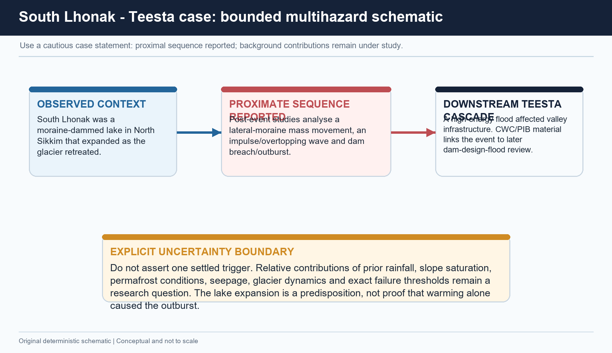

[FACT] South Lhonak in North Sikkim was a moraine-dammed glacial lake that expanded as its glacier retreated before the October 2023 outburst. [FACT] Post-event research analyses a lateral-moraine mass movement, impulse/overtopping and dam-breach sequence, and government material subsequently discussed GLOF-sensitive dam-design-flood review in the Teesta context.

[LIMIT] **Do not assert one settled trigger.** Relative roles of antecedent rainfall, slope saturation, permafrost conditions, seepage, glacier dynamics and exact failure thresholds remain under research. Lake expansion is a predisposition, not proof that climate warming alone caused the outburst. Do not quote deaths, losses or dam-status figures without a dated primary source.

---

### 15. Risk reduction: observation to safer exposure

> **PRE-TEACH CHECKLIST**  
> 📚 **Book context:** DM 10 GLOF mitigation, Advanced 06.  
> 🔍 **CA Search:** `NDMA GLOF guideline CWC dam design flood ISRO glacial lake early warning`.  
> 📰 **CA Found:** NDMA 2020 is the policy anchor; CWC/ISRO provide monitoring and hazard-context roles.

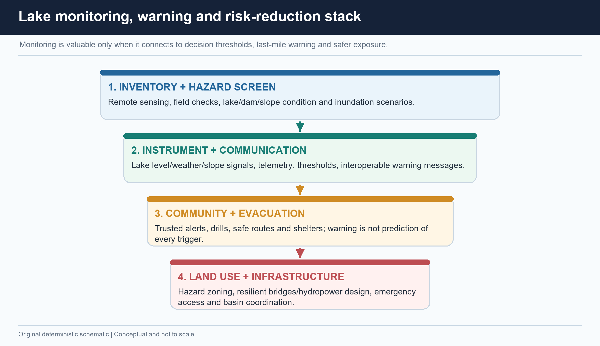

| Failure point | Matched response |
|---|---|
| Unknown lake/dam/slope condition | Inventory, remote sensing, field verification, inundation/risk screening |
| Signals not converted to action | Lake level/weather/slope observation, thresholds and interoperable messages |
| Last-mile vulnerability | Community drills, evacuation routes, shelters and trusted communication |
| Exposure created in flow path | Hazard zoning, siting, bridge/hydropower design, access and emergency redundancy |
| Lake needs physical risk reduction | Assess controlled lowering/siphoning/outlet/protection only where site-feasible |

[LIMIT] An inventory is not a prediction; an early-warning installation is not proof of universal end-to-end coverage; engineering must be site-specific and environmentally assessed.

---

### 16. Slope, sediment, albedo and landscape cascade

> **PRE-TEACH CHECKLIST**  
> 📚 **Book context:** Geography 04/06, Environment climate science, DM 10.  
> 🔍 **CA Search:** `deglaciation slope instability sediment Himalaya evidence`.  
> 📰 **CA Found:** no event-specific attribution is claimed; the focus is causal possibility and qualification.

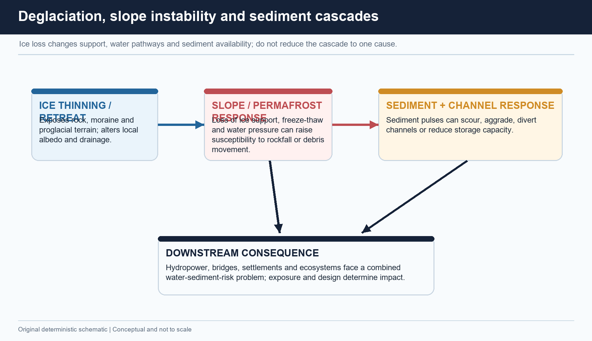

[FACT] Snow/ice loss exposes darker land/water, creating an ice-albedo feedback. [ANALYSIS] Retreat can expose moraine and alter water pathways; loss of ice support, freeze-thaw/permafrost change and water-pressure shifts can predispose some slopes to failure. Sediment pulses can scour/aggrade channels and affect reservoirs, bridges, intakes and habitat.

[LIMIT] Do not conflate landslide, avalanche, cloudburst and GLOF. They can interact but retain distinct mechanisms; individual events need site-specific evidence.

---

## Solved verified local-paper PYQs

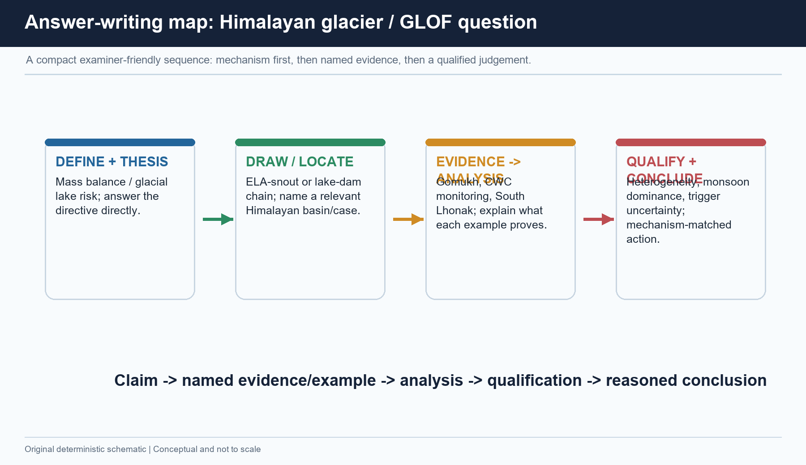

### 2020 GS-I Q6 — Himalayan glacier melting and India’s water resources

> **Question:** *How will the melting of Himalayan glaciers have a far-reaching impact on the water resources of India?* (Answer in 150 words)

**Model answer.**  
**[CLAIM]** Himalayan glacier loss matters chiefly because it changes water timing and reliability in glacierised headwaters, rather than making every downstream river immediately disappear.  
**[NAMED EVIDENCE / EXAMPLE]** Gomukh on Gangotri is the Bhagirathi headstream cue; NCPOR field monitoring and ISRO’s Himalayan Glacier Inventory Atlas show why observation must be glacier- and basin-specific.  
**[ANALYSIS]** Sustained negative mass balance can first increase local melt contribution; as stored ice declines, later lean-season and drought-year buffering can weaken. Irrigation scheduling, hydropower operations, sediment handling, ecosystem flow and storage decisions therefore face seasonal uncertainty. Retreat can also leave moraine-dammed lakes and add a GLOF-risk pathway.  
**[QUALIFICATION]** Monsoon rain supplies much annual flow in many basins; snow, groundwater, debris cover, elevation and glacier fraction vary. The strongest conclusion is about seasonal reliability, not uniform annual-flow collapse.  
**[CONCLUSION]** Use basin monitoring, demand/storage planning and risk-aware infrastructure alongside mitigation.  
**Why this earns marks:** It answers the directive, gives named evidence, explains phased hydrology, covers multiple water-resource dimensions and avoids the all-rivers-dry exaggeration.

### 2023 GS-I Q6 — Fjord formation and picturesque character

> **Question:** *How are the fjords formed? Why do they constitute some of the most picturesque areas of the world?* (Answer in 150 words)

**Model answer.**  
**[CLAIM]** Fjords are deep, narrow sea inlets occupying former glacial troughs; their scenery is a direct result of glacial overdeepening plus marine inundation.  
**[NAMED EVIDENCE / EXAMPLE]** The Majid/Leong glacial-trough sequence and Norway-type fjords link valley-glacier plucking/abrasion to broad U-shaped valleys and hanging tributaries.  
**[ANALYSIS]** Thick valley ice deepens and widens a trough, often below later sea level. After deglaciation, marine water enters. Steep rock walls, deep water, waterfalls from hanging valleys and high relief create the picturesque contrast.  
**[QUALIFICATION]** A ria is a drowned **river** valley; it is not a fjord.  
**[CONCLUSION]** The glacial excavation process explains both the physical form and scenic character.  
**Why this earns marks:** It answers both limbs through a causal sequence, gives a named regional/process cue and makes the decisive ria comparison.

### 2019 Prelims Q38 — glacier-river matching

> **Question:** Bandarpunch–Yamuna; Bara Shigri–Chenab; Milam–Mandakini; Siachen–Nubra; Zemu–Manas. Which pairs are correctly matched?  
> Options in local paper: A. 1, 2 and 4 only; B. 2 and 3 only; C. 3 only; D. 1, 2 and 3.

**INFERRED ANSWER — NOT OFFICIALLY VERIFIED: A (1, 2 and 4 only), high confidence.**  
Bandarpunch–Yamuna, Bara Shigri–Chenab and Siachen–Nubra are correct. Milam is associated with Gori Ganga, not Mandakini; Zemu is associated with Teesta, not Manas. **Why this earns marks:** It preserves the official stem, does not fabricate a key, and explains each elimination.

### 2020 Prelims Q96 — Siachen location

> **Question:** Siachen Glacier is situated to the: A. East of Aksai Chin; B. East of Leh; C. North of Gilgit; D. North of Nubra Valley.

**INFERRED ANSWER — NOT OFFICIALLY VERIFIED: D, high confidence.** The reliable geographical relation is north of Nubra Valley. Use a Karakoram–Ladakh–Nubra sketch and avoid adding unsourced legal claims. **Why this earns marks:** It gives the answer status honestly and provides a map-based elimination route.

### 2021 Prelims Q62 — water stores

> **Question:** (1) Water in rivers and lakes is more than groundwater. (2) Water in polar ice caps and glaciers is more than groundwater. Which is/are correct? A. 1 only; B. 2 only; C. Both; D. Neither.

**INFERRED ANSWER — NOT OFFICIALLY VERIFIED: B (2 only), high confidence.** Rivers/lakes are a smaller global store than groundwater; polar ice caps/glaciers are larger. **Why this earns marks:** It distinguishes global stock from accessible annual flow.

### 2021 GS-I Q15 — adjacent ice-mass comparison

> **Question:** *How do the melting of the Arctic ice and glaciers of the Antarctic differently affect the weather patterns and human activities on the Earth? Explain.* (Answer in 250 words)

**Model answer (adjacent route).**  
**[CLAIM]** The contrast is primarily between floating Arctic sea ice and Antarctic grounded ice-sheet/glacier mass, though both influence climate through albedo and ocean–atmosphere interaction.  
**[NAMED EVIDENCE / EXAMPLE]** IPCC AR6 identifies ice-albedo feedback; the grounded/floating rule shows why Antarctic grounded-ice loss adds ocean mass whereas floating sea-ice melt follows displacement.  
**[ANALYSIS]** Arctic sea-ice loss exposes dark ocean and modifies regional heat exchange; precise mid-latitude weather claims need confidence-qualified language. Antarctic grounded-ice discharge contributes to sea-level risk for deltas, islands and coasts; shelf loss can reduce inland-ice buttressing.  
**[QUALIFICATION]** Greenland is grounded Arctic ice, while Antarctic sea ice floats; neither pole is a single ice category.  
**Why this earns marks:** It answers the comparison with physical categories and avoids deterministic weather claims.

## Main-session MCQ loop

| Q | Correct option | Core reason |
|---:|:---:|---|
| 1 | A | Positive balance means accumulation exceeds ablation |
| 2 | B | Terminus loss can exceed forward ice delivery |
| 3 | C | Till/moraine unsorted; outwash meltwater-sorted |
| 4 | D | Fjord = sea-flooded glacial trough |
| 5 | A | Snowline/ELA differs from lower snout |
| 6 | B | Grounded mountain ice adds land-ice water to ocean |
| 7 | C | Himalayan response is heterogeneous |
| 8 | D | Predisposition → trigger → breach → cascade |

> **Remedial move:** If you missed Q2/Q5, redraw ELA–snout. If you missed Q3/Q4, sort landforms by agent. If you missed Q7/Q8, separate variability and causal stage.

## Original Mains practice with model solutions

### 10 marks — retreat versus flow

> **Question:** Explain why a retreating Himalayan glacier can still flow downslope. Assess one water-security implication. (150 words)

**Model answer.**  
**[CLAIM]** Retreat is a terminus-budget response, not reverse ice motion.  
**[NAMED EVIDENCE / EXAMPLE]** The ELA–snout diagram and Gangotri/Gomukh valley-glacier context show down-gradient ice delivery alongside lower-tongue ablation.  
**[ANALYSIS]** When terminus loss is faster than ice flux from above, the edge migrates up-valley. Sustained negative balance reduces stored ice and can later weaken lean-season/drought-year buffering.  
**[QUALIFICATION]** Monsoon rain, snow, groundwater and catchment geometry differ, so annual flow does not uniformly collapse.  
**Why this earns marks:** It corrects the core misconception, gives named India evidence, links a physical mechanism to water security and qualifies it.

### 15 marks — GLOF risk and valley-floor development

> **Question:** Discuss GLOF risk as an interaction between cryospheric change and valley-floor development. Use South Lhonak–Teesta critically. (250 words)

**Model answer.**  
**[CLAIM]** GLOF risk combines a lake-dam hazard chain with downstream exposure; it is not warming alone.  
**[NAMED EVIDENCE / EXAMPLE]** CWC describes moraine/ice impoundment and sudden outburst potential. South Lhonak was a growing moraine-dammed lake; post-event analysis examines lateral-moraine movement, impulse/overtopping and breach.  
**[ANALYSIS]** Retreat can enlarge a lake; unstable slopes, seepage, mass movement or rain can trigger a breach. Water and sediment in a narrow Teesta corridor can interact with roads, bridges and hydropower.  
**[QUALIFICATION]** Lake expansion does not forecast failure; relative roles of rainfall, permafrost, seepage and other conditions remain unsettled.  
**[CONCLUSION]** Use lake/slope assessment, thresholds and warning, drills, zoning and GLOF-informed design.  
**Why this earns marks:** It makes risk two-sided, uses a bounded case, distinguishes trigger from predisposition and gives stage-matched action.

### 20 marks — basin-scale adaptation

> **Question:** Evaluate Himalayan glacier change as a water, hazard and landscape problem. Frame a basin-scale adaptation response. (250 words)

**Model answer.**  
**[CLAIM]** Himalayan glacier change is a coupled seasonal-water, multihazard and sediment-landscape problem whose impacts depend on basin exposure.  
**[NAMED EVIDENCE / EXAMPLE]** Majid’s glacial-process base, NCPOR/ISRO monitoring context, CWC lake-risk explanation and South Lhonak–Teesta provide distinct evidence units.  
**[ANALYSIS]** Negative balance shifts ELA and ice storage; early extra melt may be followed by reduced lean-season buffering. Retreat exposes moraine/rock and changes drainage/sediment connectivity. Glacial lakes can fail after a trigger, while sediment and flood energy affect channel capacity and infrastructure. A basin plan needs glacier/snow/discharge/lake/slope monitoring, inundation and sediment scenarios, warning/drills, site-specific lowering where feasible, zoning and resilient design.  
**[QUALIFICATION]** Monsoon dominance, debris, elevation/aspect, local geology and data gaps rule out one rate or solution for all basins.  
**[CONCLUSION]** Manage timing, uncertainty and exposure rather than promise complete prediction.  
**Why this earns marks:** It evaluates all three dimensions, connects named evidence to analysis, qualifies regional variation and gives a coherent response stack.

# FINAL CONSOLIDATED REGISTER NOTES — topic-specific rapid recall

## A. Glacier budget and motion

- **Accumulation**: snowfall, avalanche input, refreezing. **Ablation**: melt, sublimation, calving where relevant, wind removal.
- **ELA**: gain equals loss on a stated glacier/period. **Snowline**: persistent-snow condition. **Snout**: lower terminus. Never equate them.
- **Retreat paradox**: ice still moves down-valley; snout retreats when terminus ablation exceeds incoming ice flux.
- **Metrics differ**: snout, area, thickness and net mass balance cannot replace one another.
- **Debris**: thin may enhance melt; thick may insulate. Use conditionals.

## B. Landform diagnostics

- **Plucking** pries/detaches blocks; **abrasion** grinds with embedded debris.
- **Cirque/tarn**: armchair basin/lake; **arête**: sharp ridge; **horn**: pyramidal multi-cirque peak.
- **U-trough**: broad steep-sided glacial valley; **hanging valley**: tributary left high; **roche moutonnée**: smooth stoss, steep plucked lee.
- **Fjord**: drowned glacial trough. **Ria**: drowned river valley.
- **Moraine/till**: generally unsorted direct ice deposit. **Outwash/sandur**: sorted meltwater deposit. **Drumlin**: till mound. **Esker**: sinuous meltwater ridge.

## C. Ice family and Himalayan mapwork

- Snowfield is not necessarily a glacier; glacier must flow.
- Grounded glacier/ice cap/ice sheet can add land-ice water to ocean. Floating shelf/berg/sea ice direct melt follows displacement rule; shelf buttressing still matters.
- Large glacier contexts: Greater/Trans-Himalaya, Karakoram, Ladakh, Zanskar. Qualify Lesser-Himalaya ice as more limited/smaller.
- Siachen: carefully worded India-administered Karakoram reference. Biafo/Baltoro/Hispar: Pakistan-administered regional references, not Indian glaciers.
- **2019 map eliminators:** Bandarpunch–Yamuna; Bara Shigri–Chenab; Siachen–Nubra; Milam–Gori Ganga; Zemu–Teesta.

## D. Water, climate and landscape

- Glacier/snow storage can matter especially for lean season and drought years in glacierised headwaters.
- Phased response: negative balance → potential temporary extra melt → smaller ice store → reduced later buffering.
- Monsoon dominates much annual flow in many basins; never say all Himalayan rivers are equally glacier-fed or immediately dry.
- Ice-albedo feedback, slope/drainage change and sediment cascades are links, not automatic event attribution.

## E. GLOF causal chain and risk stack

- **Lake types:** proglacial (in front), supraglacial (on ice), moraine/ice/bedrock impounded.
- **Chain:** retreat/lake growth → predisposition → trigger → overtopping/breach → water-sediment flood → exposure/vulnerability.
- **Predisposition:** weak moraine, buried ice, seepage, unstable slopes. **Trigger:** mass movement/wave, rain, internal erosion, seismicity, upstream cascade.
- **Risk ≠ hazard.** Lake existence/expansion is not failure prediction.
- **South Lhonak:** retain bounded phrasing: lake growth + analysed lateral-moraine/impulse/overtopping-breach sequence; relative background trigger roles remain under study.
- **Response:** inventory/remote + field assessment → instruments/thresholds → warning/drills/evacuation → site-specific physical mitigation → zoning/resilient design/basin coordination.

## F. PYQ and answer spine

- **2020 GS-I:** water impact = seasonal timing/reliability, phased response and basin qualification.
- **2023 GS-I:** fjord = trough excavation + marine inundation + scenic geomorphic effects; contrast ria.
- Older Prelims without local official key: label **INFERRED ANSWER — NOT OFFICIALLY VERIFIED**, then show elimination.
- **Answer sequence:** Claim → named evidence/example → analysis → qualification → conclusion → **Why this earns marks**.
