# 07 Thar Desertification - Complete Topic Package

> **Subject:** Geography | **Coverage:** GS-I physical and Indian geography, Prelims, and bounded Environment / restoration links
> **Export date:** 2026-08-16 | **Retrieval boundary:** 2026-08-16
> **Evidence labels:** `[FACT]` retrieved source; `[ANALYSIS]` reasoned synthesis; `[LIMIT]` uncertainty or scale caution; `[INFERENCE]` current-to-static linkage.
> **Visual rule:** all linked PNGs are original deterministic schematics, not to scale and not legal-boundary representations.

## Source register and evidence boundary

[FACT] Repository-first sources were `basic/07_Arid-Desert-Landforms.md`, `advanced/07_Thar-Desertification.md`, `basic/18_Hot-and-MidLatitude-Desert-Climate.md`, `advanced/18_Thar-Desert-and-GIB.md`, the Geography framework files and linked drainage, groundwater, climate, vegetation and agriculture topics.

[FACT] The local searchable layer included Majid Husain's geography PDF and official local UPSC question-paper scans. D.R. Khullar, G.C. Leong and one Majid India-geography copy exposed only watermark-level text to extraction in this environment, so their authored repository synthesis was used rather than pretending those files supplied searchable passages.

[FACT] Official current and longer-running sources:
- [SAC / ISRO DSM Atlas page](https://vedas.sac.gov.in/en/Desertification_Status_Mapping_(DSM)_Atlas.html)
- [SAC / ISRO 2021 Atlas PDF](https://vedas.sac.gov.in/content/vcms/atlas/dsm/DLD_Atlas_SAC_2021.pdf)
- [UNCCD desertification overview](https://www.unccd.int/land-and-life/desertification/overview)
- [UNCCD LDN overview](https://www.unccd.int/land-and-life/land-degradation-neutrality/overview)
- [UNCCD LDN principles](https://www.unccd.int/land-and-life/land-degradation-neutrality/ldn-principles)
- [UNCCD India 26 mha release](https://www.unccd.int/news-stories/press-releases/world-leaders-call-global-action-restore-degraded-land)
- [MoEFCC NAP 2023 PDF](https://moef.gov.in/uploads/2023/07/NAP%20final-2023.pdf)
- [MoEFCC Aravalli Green Wall brief](https://www.moef.gov.in/uploads/2023/05/MDO-April-12042023.pdf)
- [CGWB Ganganagar profile](https://cgwb.gov.in/sites/default/files/2022-10/ganganagar.pdf)
- [CAZRI institutional overview](https://www.cazri.res.in/English/director.php)
- [UNCCD Desertification and Drought Day 2026](https://www.unccd.int/sites/default/files/2026-06/EN_DDD_FINAL_PR_2026.pdf)
- [UNCCD COP17 page](https://www.unccd.int/cop17)

[LIMIT] SAC's Atlas was published in 2021 but maps the 2018-19 timeframe. Its statistics are a dated baseline. No newer official all-India or Thar status dataset was located in the checked February-August 2026 sources.

[LIMIT] COP17 was scheduled to begin on 17 August 2026. As this package was retrieved on 16 August, no negotiation or outcome is asserted.

## Learning roadmap

```text
definitions -> Thar map -> landforms -> climate / soils / adaptation
-> origin debate -> drivers -> beyond-desert logic -> Aravalli
-> Indira Gandhi Canal -> restoration architecture -> institutions
-> monitoring -> 2026 current linkage -> verified PYQs -> practice
-> FINAL CONSOLIDATED REGISTER NOTES
```

## 1. Vocabulary before causation: six non-equivalent terms

### PRE-TEACH CHECKLIST

- **Book context:** Basic 07 and Advanced 07 queried.
- **CA search:** `UNCCD desertification definition drylands land degradation neutrality indicators`
- **CA result:** UNCCD current overview and principles; no new definition was inferred.

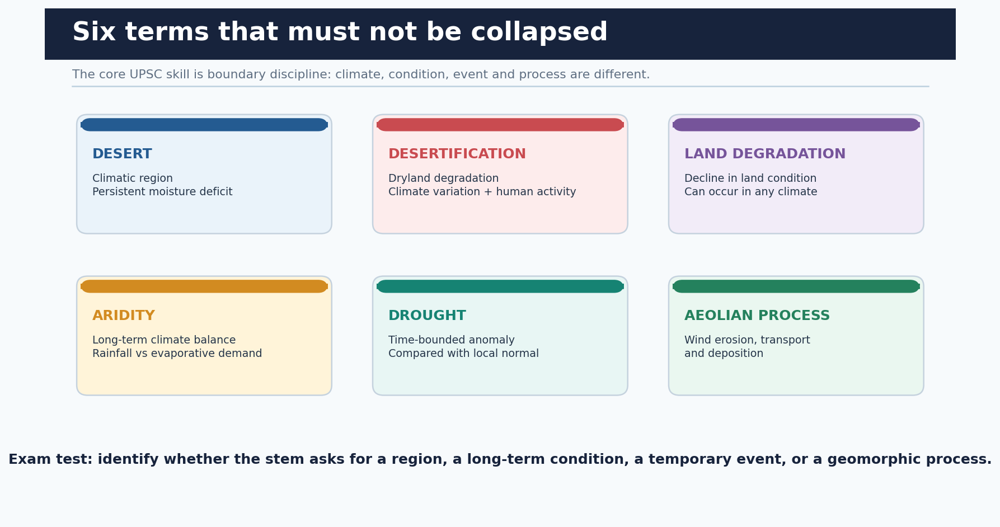

*Climate region, chronic condition, temporary event and geomorphic process occupy different analytical levels.*

```text
DESERT = climatic region
ARIDITY = long-term moisture deficit
DROUGHT = temporary anomaly relative to local normal
LAND DEGRADATION = decline in land condition in any climate
DESERTIFICATION = dryland land degradation
AEOLIAN PROCESS = wind erosion, transport and deposition
```

| Term | Exam-safe meaning | Decisive discriminator |
| --- | --- | --- |
| Desert | Climatic region with persistent moisture deficit | A region, not a degradation process |
| Desertification | Land degradation in arid, semi-arid and dry sub-humid areas | Dryland scope plus climatic and human drivers |
| Land degradation | Decline in land condition, function or productivity | Can occur beyond drylands |
| Drought | Time-bounded water deficit against local normal | An event; does not automatically equal desertification |
| Aridity | Long-term climate water deficit | Climatology rather than one bad season |
| Aeolian | Wind-driven erosion, transport and deposition | A process that may operate without desertification |

### Core teaching

- [FACT] UNCCD defines desertification as land degradation in arid, semi-arid and dry sub-humid areas resulting from climatic variations and human activities.
- [ANALYSIS] A desert may remain ecologically functional, while a productive semi-arid margin can desertify. Therefore, visible sand is neither necessary nor sufficient.
- [ANALYSIS] Drought can trigger vegetation and livelihood stress, but degradation requires a persistent loss of land condition or recovery capacity.
- [LIMIT] In ordinary speech, site degradation in humid areas is sometimes called desertification. In a UNCCD answer, preserve the dryland definition and call the wider phenomenon land degradation.

### Must-know facts

- Desert is a climate-region concept.
- Drought is relative to local climatology and time period.
- Desertification is not synonymous with desert expansion.
- Land degradation is the broader category.

### UPSC traps

- **Wrong:** All land degradation is desertification. **Correct:** Only degradation in arid, semi-arid and dry sub-humid areas fits the UNCCD term.
- **Wrong:** Every drought creates a desert. **Correct:** Drought is temporary; ecological recovery, land use and institutions determine longer-term outcomes.

**Mains use:** Begin every answer with this boundary matrix; it prevents the most common conceptual error in the 2020 GS-I PYQ.

**Study link:** Geography Basic 07 -> arid processes; Environment -> UNCCD and LDN.

## 2. Thar location and exam-use physiographic regionalisation

### PRE-TEACH CHECKLIST

- **Book context:** Advanced 07 and Advanced 18 queried; Majid local PDF checked.
- **CA search:** `SAC ISRO Desertification Land Degradation Atlas Rajasthan 2018-19 Thar`
- **CA result:** Rajasthan page in the official 2021 Atlas using the 2018-19 timeframe.

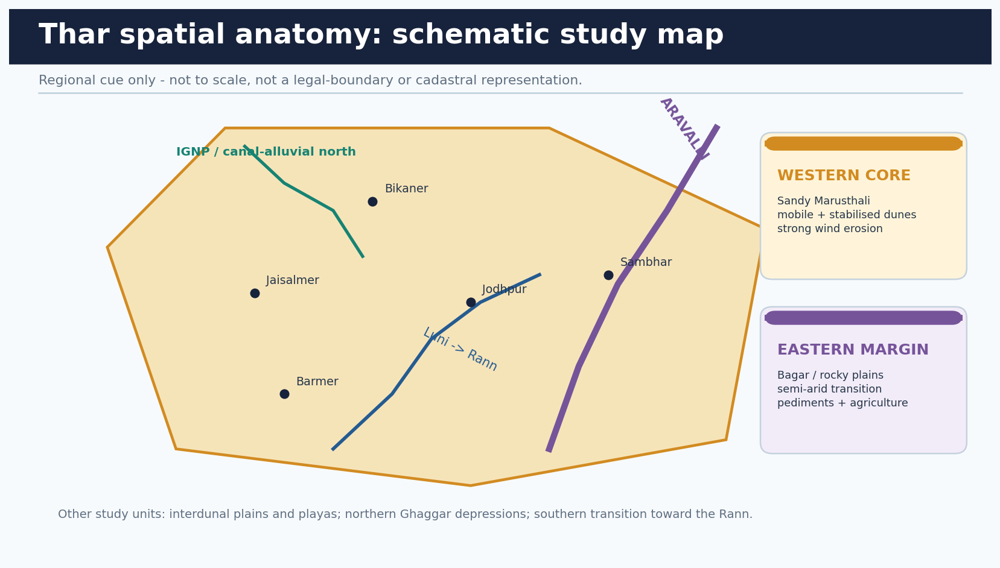

*A schematic map links the sandy western core, semi-arid margin, Aravalli, Luni, playas and canal-alluvial north.*

```text
NW / WEST: sandy Marusthali - Jaisalmer, Barmer, Bikaner
E / SE: Bagar and rocky-pediment semi-arid transition toward Aravalli
N: Ghaggar depressions and canal-alluvial transformation
SW: Luni basin and transition toward the Rann
Across the region: dunes + interdunes + playas + rocky residuals
```

| Study unit | Dominant character | Answer use |
| --- | --- | --- |
| Sandy Marusthali | Arid western core; dune and sand-sheet terrain | Wind erosion, pastoralism, dune mobility |
| Bagar / eastern margin | Semi-arid transition, rocky plains and pediments | Dry farming, water erosion and Aravalli linkage |
| Luni basin | Ephemeral south-westerly drainage | Flash runoff, salinity and inland drainage |
| Playas / salt basins | Closed depressions with evaporation concentration | Sambhar, Didwana, Pachpadra as named cues |
| Northern canal tract | Ghaggar-alluvial and IGNP influenced | Agricultural gains plus waterlogging risk |

### Core teaching

- [FACT] The Thar lies chiefly west of the Aravalli in western Rajasthan and extends into adjoining Gujarat, Punjab, Haryana and Pakistan.
- [FACT] Textbook regional labels vary. Marusthali is a useful name for the sandy arid core; Bagar is used for the more semi-arid eastern or north-eastern transition.
- [FACT] The Rann belongs to the wider arid-region context but is a distinct saline mudflat and marsh system, not simply another dune field.
- [ANALYSIS] Regionalisation should follow processes: wind-dominated sandy core, mixed wind-water margins, closed saline basins and canal-modified north.
- [LIMIT] This schematic is not a legal boundary. State and international-border disputes are irrelevant to the physical-geography demand.

### Must-know facts

- Aravalli forms the eastern physiographic reference.
- Jaisalmer and Barmer are core aeolian cues.
- Luni is the principal inland-draining river cue.
- The Rann is saline and geomorphically distinct from sandy Thar.

### UPSC traps

- **Wrong:** The entire Thar is a continuous erg. **Correct:** Dunes coexist with gravel plains, pediments, rocky residuals, alluvium, saline basins and settlements.
- **Wrong:** The Thar is confined to Rajasthan. **Correct:** Its wider arid system extends beyond Rajasthan and across the international boundary.

**Mains use:** Draw this map in 25 seconds: Aravalli line, western dune core, Luni arrow, one playa and IGNP in the north.

**Study link:** Geography Advanced 18 -> Thar climate and human adaptation.

## 3. Dunes, interdunes, playas and the work of wind and water

### PRE-TEACH CHECKLIST

- **Book context:** Basic 07 arid landforms and Majid searchable PDF pages on deflation, yardangs and barchans.
- **CA search:** `Thar aeolian dunes interdunal plains playas wind erosion official India`
- **CA result:** Current land monitoring keeps process diagnosis relevant; no event claim is inserted.

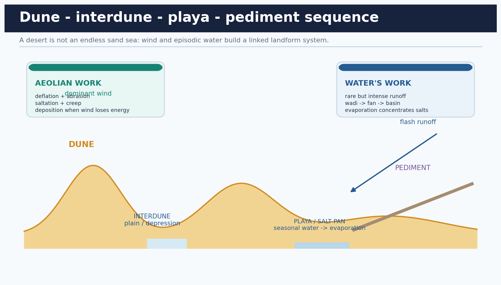

*Wind creates and reworks dunes; episodic runoff connects uplands, fans, interdunes and saline basins.*

```text
wind: deflation -> saltation / creep -> dune deposition
water: cloudburst -> wadi -> alluvial fan / bajada -> closed basin -> playa
surface sequence: dune crest -> slip face -> interdune -> playa / salt pan -> pediment
```

| Form / process | Diagnostic feature | Thar relevance |
| --- | --- | --- |
| Barchan | Crescent; horns point downwind | Limited sand with broadly one dominant wind |
| Longitudinal / seif dune | Long ridge broadly aligned with prevailing wind | Common desert-ridge cue |
| Interdune | Lower surface between dunes | Runoff storage, cultivation, grazing or salinity |
| Playa | Ephemeral closed-basin lake floor | Evaporation and salt concentration |
| Pediment / fan | Mountain-foot rock surface / depositional cone | Aravalli and rocky-margin water work |

### Core teaching

- [FACT] Deflation removes loose fines and may leave a gravel lag; abrasion is strongest near the ground where sand impacts rock.
- [FACT] Wind transports grains by suspension, saltation and surface creep. Saltation drives much of the grain-impact chain.
- [FACT] Barchan horns point downwind; a dune slip face lies on the lee side.
- [ANALYSIS] In arid landscapes, rare intense runoff can perform more geomorphic work than average annual rainfall suggests.
- [ANALYSIS] Stabilised dunes are not dead forms: grazing, cultivation, roads or drought can reactivate exposed sand; vegetation recovery can reduce mobility.
- [LIMIT] Not every Thar dune is active and not every salt lake has the same geological origin.

### Must-know facts

- Wind and episodic water are complementary agents.
- Interdunes are livelihood spaces, not empty gaps.
- Playas indicate internal drainage and evaporation.
- Loess is fine wind-blown silt deposited beyond source areas.

### UPSC traps

- **Wrong:** Wind alone shapes every desert landform. **Correct:** Flash runoff builds wadis, fans, bajadas and pediments and feeds playas.
- **Wrong:** Barchan horns point upwind. **Correct:** They point downwind.

**Mains use:** Use a wind-water cross-section to convert a list of landforms into a causal geomorphology answer.

**Study link:** Geography Basic 05 running water + Basic 07 arid landforms.

## 4. Climate, soils, vegetation and human adaptation

### PRE-TEACH CHECKLIST

- **Book context:** Advanced 07, Advanced 18, Basic 18 and CGWB Ganganagar profile.
- **CA search:** `CAZRI Thar climate resilient farming rangeland native grass official`
- **CA result:** CAZRI official institutional overview and species / rangeland work.

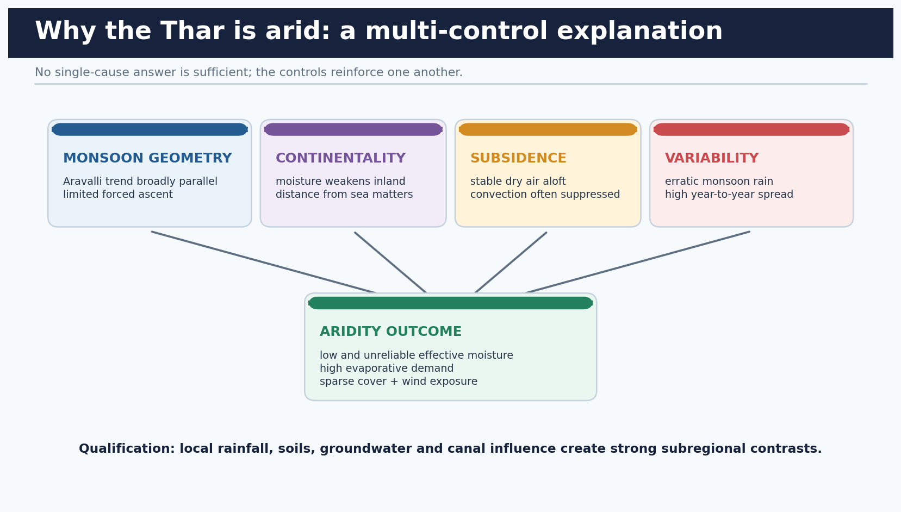

*Aridity is produced by monsoon geometry, continentality, subsidence and variability, then modified by local water and land use.*

```text
parallel Aravalli trend + weak inland moisture + dry subsidence + erratic rain
                               -> effective moisture deficit
                               -> sparse cover, wind exposure and episodic runoff
```

| Dimension | Characteristic | Adaptation |
| --- | --- | --- |
| Climate | Low, erratic rainfall; high evaporative demand; dust storms | Mobility, drought-tolerant crops, water storage |
| Soils | Sandy, low organic matter; calcareous; locally saline / alkaline | Mulch, mixed farming, low-water crops, drainage where irrigated |
| Vegetation | Thorn scrub, drought grasses and scattered trees | Khejri-based agroforestry and native pasture |
| Water | Deep or saline groundwater in many pockets; ephemeral runoff | Tanka, khadin, johad, naadi and canal water where available |
| Livelihood | Pastoralism plus rainfed farming and crafts / services | Bajra, moth, guar, fodder and livestock diversification |

### Core teaching

- [FACT] The source-era western-core example gives rainfall under 25 cm; the wider semi-arid margin receives more. Always state the spatial scope.
- [FACT] Aravalli alignment broadly parallel to the Arabian Sea branch limits orographic uplift; continentality and dry subsidence reinforce aridity.
- [FACT] Native cues include khejri (Prosopis cineraria), rohida (Tecomella undulata), phog, khimp and sewan grass. Prosopis juliflora is introduced.
- [FACT] Traditional systems store rainfall in space and time: tanka for household storage, khadin for runoff farming, johad / naadi for community water.
- [ANALYSIS] Pastoral mobility is an adaptation to variable forage, not evidence of backwardness. Settlement policies that restrict mobility can concentrate grazing pressure.
- [LIMIT] Avoid one rainfall or temperature number for the whole Thar; station means and arid-core boundaries differ.

### Must-know facts

- Khejri combines shade, fodder, soil and farm functions.
- Sewan is a major arid grass cue.
- Dryland farming is organised around risk spreading.
- High population does not make the desert non-arid.

### UPSC traps

- **Wrong:** Canal irrigation replaced pastoralism everywhere. **Correct:** Canal influence is spatially uneven; pastoral and mixed systems remain central.
- **Wrong:** Cacti define native Thar vegetation. **Correct:** Use native thorn trees, shrubs and grasses; many cacti are introduced.

**Mains use:** Show adaptation as water timing + mobility + biodiversity + institutions, not as a decorative list of customs.

**Study link:** Geography Advanced 30 agriculture; Environment grasslands and commons.

## 5. Origin and evolution: a polygenetic, contested landscape

### PRE-TEACH CHECKLIST

- **Book context:** Advanced 07 and regional geomorphology cross-links.
- **CA search:** `Thar Desert Quaternary evolution palaeochannel aeolian sediment India research`
- **CA result:** None used; the answer need is interpretive caution, not a new origin claim.

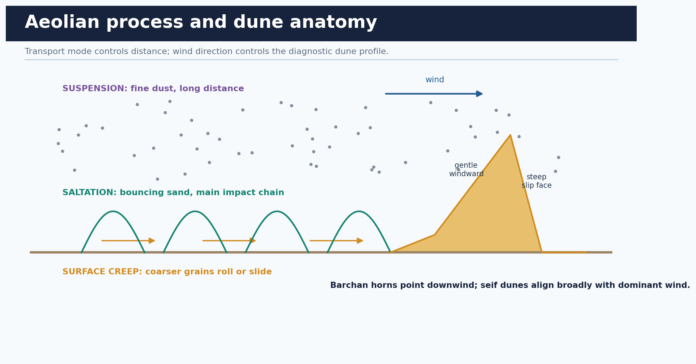

*Dune form records wind and sediment supply, but the regional desert evolved through several interacting histories.*

```text
tectonic setting + drainage reorganisation + Quaternary wet-dry phases
+ local and transported sediment + repeated aeolian reworking
= polygenetic Thar landscape
```

| Debate / evidence | What it can support | What it cannot settle alone |
| --- | --- | --- |
| Palaeochannels | Former or shifted drainage and wetter phases | One universal river-desiccation story |
| Dune chronology | Repeated phases of mobilisation and stability | A single date for the whole desert |
| Sediment provenance | Local rock weathering plus transported material | Only marine or only fluvial origin |
| Salt basins | Closed drainage, evaporation and geological inheritance | Every playa as a remnant sea |

### Core teaching

- [ANALYSIS] The safest answer calls the Thar polygenetic: tectonics, drainage reorganisation, Quaternary climate variability, sediment supply and aeolian reworking all matter.
- [FACT] Dunes can record multiple mobilisation and stabilisation phases; a present dune is not proof of uninterrupted aridity.
- [ANALYSIS] Palaeochannels are evidence of former drainage pathways, but their identity, chronology and hydrological continuity require site-specific evidence.
- [LIMIT] Avoid presenting an ancient-sea, lost-river or Aravalli-shadow theory as the single settled origin.
- [VERDICT] For GS-I, origin deserves one qualified paragraph; process, regional variation and present degradation deserve more space.

### Must-know facts

- Origin and current desertification are different questions.
- Dune age and regional desert age are not identical.
- Sediment can be locally derived and transported.
- Wet phases and dry phases have alternated.

### UPSC traps

- **Wrong:** The Thar was simply created when one river disappeared. **Correct:** Drainage change is one component of a longer, polygenetic evolution.
- **Wrong:** Every saline basin proves marine origin. **Correct:** Internal drainage and evaporation can create salt concentration without a former sea.

**Mains use:** Use the debate only to demonstrate evidence discipline and then return to answer-worthy present processes.

**Study link:** Geography 02 geological structure + Geography 05 drainage evolution.

## 6. Natural susceptibility and anthropogenic acceleration

### PRE-TEACH CHECKLIST

- **Book context:** Advanced 07, Basic 07 and Advanced 04 queried.
- **CA search:** `SAC Atlas Rajasthan wind erosion vegetation degradation water erosion 2018-19`
- **CA result:** official Atlas shows wind erosion as Rajasthan's dominant mapped process in 2018-19.

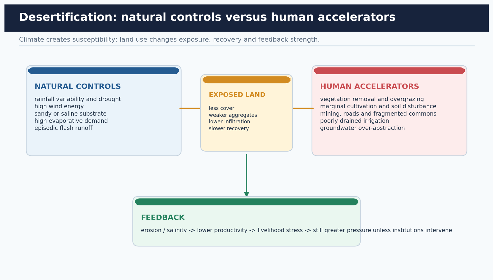

*Natural controls set susceptibility; human decisions alter cover, soil structure, hydrology and recovery.*

```text
drought / wind / sandy soil + vegetation removal / grazing concentration / mining
                              -> exposed surface
                              -> wind or water erosion
                              -> lower productivity and fodder
                              -> pressure feedback unless governance intervenes
```

| Driver | Mechanism | Diagnostic outcome |
| --- | --- | --- |
| Wind erosion | Deflation and saltation on exposed soil | Topsoil loss, drifting sand, abrasion |
| Overgrazing | Repeated biomass removal and trampling | Lower cover, compaction, poor regeneration |
| Marginal cultivation | Breaks crust and exposes dry soil | Erosion and yield instability |
| Mining / roads | Removes relief and vegetation; fragments drainage | Dust, spoil, altered runoff and habitat |
| Groundwater stress | Abstraction exceeds recharge or quality declines | Falling levels, salinity and livelihood risk |

### Core teaching

- [FACT] SAC reports 62.06% of Rajasthan's geographical area under desertification / land degradation in 2018-19, down from 62.90% in 2011-13.
- [FACT] In Rajasthan, wind erosion accounted for 43.37% of total geographical area in 2018-19; vegetation degradation 7.64% and water erosion 6.21%.
- [ANALYSIS] A fall in the state's total mapped share does not prove universal recovery. Process classes can move in opposite directions and district outcomes differ.
- [ANALYSIS] Overgrazing is often a governance problem of access, timing, herd concentration and commons loss, not merely 'too many animals'.
- [ANALYSIS] Mining and infrastructure can degrade through dust, slope and drainage disruption even without causing dune advance.
- [LIMIT] Satellite classes identify condition and process signatures; field evidence is needed for local causation and remedy.

### Must-know facts

- Rajasthan's 2018-19 total mapped DLD share was 62.06%.
- Wind erosion was the largest state process at 43.37% of TGA.
- The state total fell modestly from 2011-13.
- Irrigated agriculture can still be wind-eroded if soil remains exposed.

### UPSC traps

- **Wrong:** 62.90% of Rajasthan was degraded in 2018-19. **Correct:** 62.06% was the 2018-19 figure; 62.90% was 2011-13.
- **Wrong:** 43.37% means wind caused 43.37% of only the degraded area. **Correct:** The Atlas table reports the class as a share of Rajasthan's total geographical area.

**Mains use:** Use the Atlas as dated named evidence, then explain mechanisms and spatial variation rather than dumping percentages.

**Study link:** SAC Atlas 2021, Rajasthan pages 218-220.

## 7. Desertification beyond deserts and the 2020 PYQ logic

### PRE-TEACH CHECKLIST

- **Book context:** Basic 07 distinction section and official 2020 GS-I local scan.
- **CA search:** `UNCCD desertification drylands land degradation climate human activities`
- **CA result:** current UNCCD page stresses productive-land loss and dryland vulnerability.

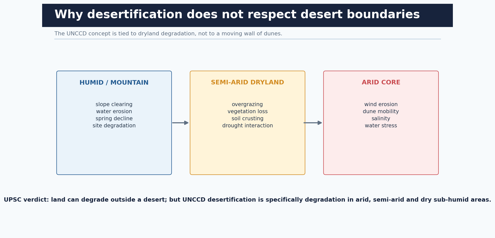

*Different climates exhibit land degradation, while UNCCD desertification retains a dryland scope.*

```text
humid mountain clearing -> water erosion and site degradation
semi-arid margin -> vegetation loss + overgrazing + drought interaction
arid core -> wind erosion + salinity + water stress
COMMON LOGIC: productivity and resilience decline; process differs by setting
```

| Example | Process | Qualification |
| --- | --- | --- |
| Himalayan slopes | Deforestation, runoff and soil loss | Land degradation; use 'desertification' only with definitional care |
| Punjab / Haryana irrigation | Waterlogging and secondary salinity | Can occur outside a sandy desert |
| Bundelkhand dryland | Drought, erosion, groundwater stress | Climate variability and land management interact |
| Thar margin | Wind erosion, vegetation loss and grazing stress | Dryland desertification in the convention sense |

### Core teaching

- [CLAIM] Desertification is a process of productivity and resilience loss, not a latitude line or a sand front.
- [NAMED EVIDENCE] The 2020 GS-I stem itself asks why the process has no climatic boundaries; Indian examples include irrigation salinity, mountain erosion and dryland vegetation degradation.
- [ANALYSIS] Similar outcomes arise through different process chains: wind in arid cores, water erosion on humid slopes and salinity in irrigated plains.
- [QUALIFICATION] In strict UNCCD usage, desertification applies to drylands. For humid examples, label the phenomenon land degradation and explain why the PYQ uses the broader conceptual sense.
- [VERDICT] Climate shapes the dominant mechanism, but land-use pressure, hydrology and recovery capacity determine degradation.

### Must-know facts

- Desertification risk is highest at productive dryland margins, not only in desert cores.
- Salinity is a degradation process without dune expansion.
- Water erosion can dominate nationally even though wind dominates western Rajasthan.
- The answer must reconcile broad PYQ wording with the UNCCD definition.

### UPSC traps

- **Wrong:** The PYQ allows calling every humid erosion process desertification without qualification. **Correct:** Use broad process logic, then preserve the convention's dryland definition.
- **Wrong:** Desertification is proved only by satellite browning. **Correct:** Trend, baseline, field validation and multiple land indicators are required.

**Mains use:** Structure: define -> show mechanisms across settings -> Indian examples -> definitional qualification -> integrated verdict.

**Study link:** 2020 GS-I Q5, verified from local official paper.

## 8. Aravalli ecological functions and dispute-safe implications

### PRE-TEACH CHECKLIST

- **Book context:** Advanced 07, Geography 02 and 04.
- **CA search:** `MoEFCC Aravalli Green Wall 5 km buffer official`
- **CA result:** MoEFCC's 2023 brief specifies a 5 km buffer initiative across four states.

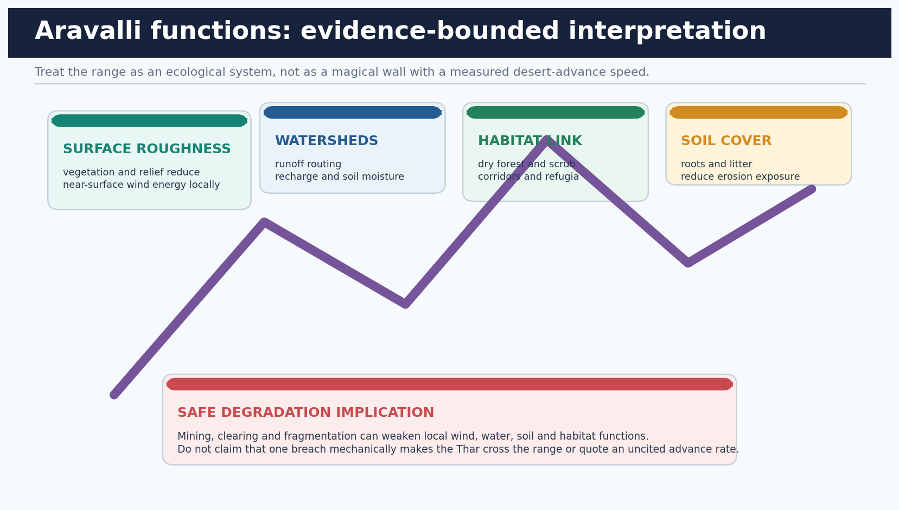

*The Aravalli matters through roughness, vegetation, water, soil and habitat functions rather than a simplistic wall metaphor.*

```text
relief + native cover -> roughness / wind moderation
                    -> runoff routing and recharge
                    -> soil retention
                    -> habitat connectivity
mining / clearing / fragmentation -> local weakening of these functions
```

| Function | Mechanism | Bounded implication of degradation |
| --- | --- | --- |
| Wind / dust | Relief and vegetation add roughness | Local transport and dust exposure may rise |
| Water | Catchments route runoff and support recharge | Faster runoff, sediment and recharge stress may rise |
| Soil | Roots and litter protect surfaces | Erosion susceptibility can increase |
| Biodiversity | Dry forest and scrub habitat | Fragmentation reduces connectivity and resilience |

### Core teaching

- [FACT] The Aravalli trend is broadly parallel to the Arabian Sea monsoon branch, so it does not create a major continuous orographic-rain belt over western Rajasthan.
- [FACT] MoEFCC's Aravalli Green Wall brief describes greening a 5 km buffer around the range in Haryana, Rajasthan, Gujarat and Delhi, with afforestation, water-body restoration and water conservation.
- [ANALYSIS] Ecological functions include surface roughness, catchment regulation, soil protection and habitat connectivity.
- [ANALYSIS] Degradation can weaken these services and increase local dust, runoff and habitat stress.
- [LIMIT] Do not assert that a mined gap mechanically allows a measurable desert front to cross the range. No such rate is used here.
- [VERDICT] The strongest policy case is landscape restoration and regulated land use, not a literal wall narrative.

### Must-know facts

- Aravalli has both climate-geometry and ecosystem-service relevance.
- Green Wall is a restoration programme, not a physical wall.
- The official 2023 brief mentions a 5 km buffer in four states.
- Water-body restoration is part of the programme.

### UPSC traps

- **Wrong:** Aravalli blocks the Arabian branch and should make western Rajasthan wet. **Correct:** Its broad alignment is parallel, so forced uplift is limited.
- **Wrong:** Any Aravalli degradation proves a fixed desert-advance rate. **Correct:** Discuss bounded ecological effects and demand site-specific evidence.

**Mains use:** Use four functions and one caution; never rely on the slogan 'Aravalli stops the desert' as the whole argument.

**Study link:** MoEFCC Aravalli Green Wall brief, 2023.

## 9. Indira Gandhi Canal: gains, water balance and ecological trade-offs

### PRE-TEACH CHECKLIST

- **Book context:** Advanced 07, Advanced 18 and Basic 18. Local official layer: CGWB Ganganagar profile.
- **CA search:** `CGWB Ganganagar IGNP waterlogging salinity conjunctive use official`
- **CA result:** CGWB directly documents command-area waterlogging mechanisms and management.

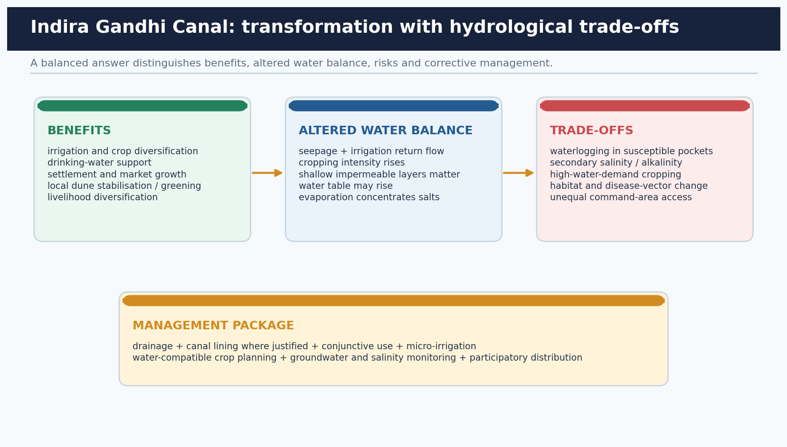

*The canal is neither an unqualified success nor failure: outcomes depend on soil, drainage, cropping and management.*

```text
canal water -> irrigation / drinking water / settlement / crop gains
            -> seepage + return flow + higher water demand
            -> shallow water table in susceptible pockets
            -> waterlogging + evaporation -> secondary salinity
management: drainage + conjunctive use + micro-irrigation + crop-water fit
```

| Dimension | Benefit | Trade-off / condition |
| --- | --- | --- |
| Agriculture | Irrigated production and diversification | High-water crops and inequity can erode gains |
| Settlement | Water access, towns and markets | Demand and sanitation / drainage pressures rise |
| Landscape | Local greening and dune stabilisation | Native open ecosystems can be altered |
| Hydrology | Surface-water availability | Seepage and return flow can raise water tables |
| Soil | Moisture constraint relaxed | Waterlogging and secondary salinity in susceptible areas |

### Core teaching

- [FACT] CGWB describes IGNP as a multidisciplinary irrigation project using Ravi-Beas water to cultivate Thar land; the Ganganagar profile records extensive canal irrigation.
- [FACT] CGWB identifies waterlogging in the IGNP command where shallow low-permeability layers, seepage, irrigation return flow, depressions and weak natural drainage interact.
- [FACT] CGWB recommends conjunctive surface-groundwater use, suitable wells, micro-irrigation, crop-pattern correction, bio-drainage and reclamation.
- [ANALYSIS] Canal benefits are real but spatially unequal; command head-tail location, soil permeability, drainage and landholding affect outcomes.
- [ANALYSIS] 'Greening' can indicate higher biomass without proving sustainable groundwater, soil or native-biodiversity outcomes.
- [LIMIT] Do not transfer a Ganganagar mechanism or statistic to every IGNP reach without local evidence.
- [VERDICT] Judge the canal by sustained productivity, water tables, salinity, equity and ecosystem condition together.

### Must-know facts

- Waterlogging is a water-balance and drainage problem.
- Secondary salinity follows shallow water and strong evaporation.
- Conjunctive use can lower a rising water table where water quality permits.
- Crop-water fit is part of canal management.

### UPSC traps

- **Wrong:** Irrigation always reverses desertification. **Correct:** It may improve productivity while creating waterlogging or salinity if drainage and water use fail.
- **Wrong:** Waterlogging occurs only because farmers over-irrigate. **Correct:** Canal seepage, return flow, shallow impermeable layers, depressions and drainage all matter.

**Mains use:** Use a four-part balance: benefits -> changed hydrology -> differentiated risks -> adaptive management.

**Study link:** CGWB Ganganagar district profile, sections 8-10.

## 10. India's land-degradation and restoration architecture

### PRE-TEACH CHECKLIST

- **Book context:** Advanced 07 and Environment institutional cross-links.
- **CA search:** `India National Action Plan desertification 2023 26 million hectares LDN official`
- **CA result:** official dated target and avoid-reduce-reverse principles.

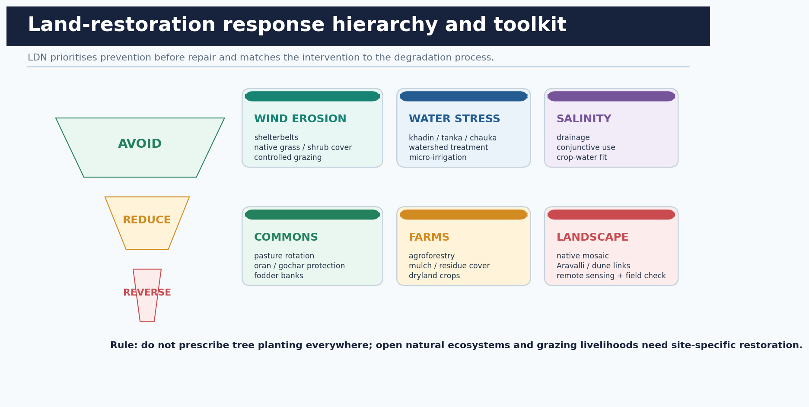

*India's architecture combines international concepts, national targets, schemes, research and local institutions.*

```text
UNCCD / SDG 15.3 -> LDN baseline and response hierarchy
SAC / ISRO -> spatial baseline and process mapping
MoEFCC Desertification Cell / NAP -> coordination and forestry interventions
CAMPA / Green India Mission / WDC-PMKSY / agroforestry -> implementation streams
State agencies + panchayats + communities + research institutes -> site action
```

| Layer | Instrument | Use and caution |
| --- | --- | --- |
| Global | UNCCD; SDG 15.3; LDN | Avoid, reduce and reverse; neutrality is accounting plus governance |
| National evidence | SAC Atlas / VEDAS | Dated remote-sensing baseline; not a live 2026 measure |
| National planning | MoEFCC NAP 2023; Desertification Cell | 26 mha restoration target by 2030 is a commitment, not verified completion |
| Programmes | CAMPA, GIM, WDC-PMKSY, agroforestry | Convergence needed; scheme activity is not outcome |
| Local | State departments, panchayats, WUAs, commons institutions | Tenure, participation and maintenance determine durability |

### Core teaching

- [FACT] India announced in 2019 that it would raise the degraded-land restoration ambition to 26 million hectares by 2030.
- [FACT] MoEFCC's 2023 NAP is specifically a plan through forestry interventions and identifies Rajasthan among priority states.
- [FACT] WDC-PMKSY activities include ridge and drainage-line treatment, soil-moisture conservation, rainwater harvesting, afforestation, horticulture and pasture development.
- [FACT] CAMPA channels compensatory-afforestation funds; Green India Mission and agroforestry policies add forest, tree and livelihood dimensions.
- [ANALYSIS] The architecture is fragmented across land, water, forest, agriculture and rural-development agencies; convergence and shared outcomes are essential.
- [LIMIT] The 26 million hectare figure is a dated target. Do not write that 26 million hectares had already been restored by 2026.
- [VERDICT] LDN requires preventing new losses and measuring land function, not simply counterbalancing damage with plantations elsewhere.

### Must-know facts

- LDN response hierarchy is Avoid -> Reduce -> Reverse.
- SAC 2018-19 mapping is a baseline, not 2026 status.
- NAP 2023 focuses on forestry interventions and convergence.
- Target and achieved restoration are different categories.

### UPSC traps

- **Wrong:** LDN permits unlimited degradation if trees are planted elsewhere. **Correct:** Avoid and reduce have priority; like-for-like and safeguards constrain counterbalancing.
- **Wrong:** Afforestation is suitable for every degraded dryland. **Correct:** Natural grasslands, dunes and open ecosystems require site-appropriate restoration.

**Mains use:** Draw the five-layer architecture and then evaluate coordination, ecological fit, tenure and monitoring.

**Study link:** UNCCD LDN principles + MoEFCC NAP 2023 + SAC Atlas.

## 11. Process-matched restoration and community institutions

### PRE-TEACH CHECKLIST

- **Book context:** NAP 2023 local PDF, CAZRI official page and basic dryland adaptation.
- **CA search:** `CAZRI sand dune stabilisation shelterbelt native grass Rajasthan official`
- **CA result:** official CAZRI reports long-running dune, shelterbelt and rangeland work.

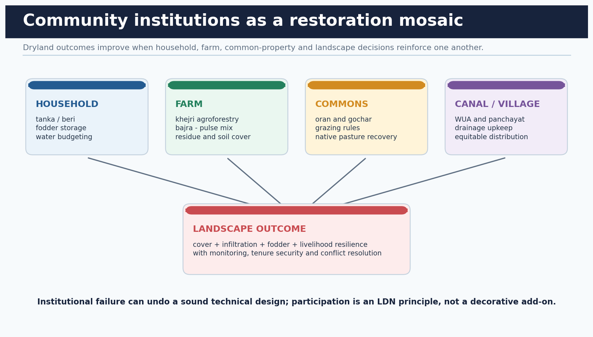

*Technical measures persist only when land tenure, grazing rules, water sharing and local maintenance align.*

```text
wind erosion -> native grasses / shrubs + shelterbelt + surface protection
overgrazing -> rotational access + pasture recovery + fodder planning
water erosion -> contour / watershed / vegetative checks
salinity -> drainage + conjunctive use + salt-aware crops
livelihood risk -> agroforestry + dryland crops + livestock and market diversity
```

| Process | Matched intervention | Failure to avoid |
| --- | --- | --- |
| Mobile dune / sand sheet | Mechanical barriers followed by native grass, shrub and tree mosaic | One exotic species or plantation-only approach |
| Pasture decline | Rest, rotational grazing, reseeding and commons governance | Excluding pastoralists without alternatives |
| Farm exposure | Khejri agroforestry, residue cover and dryland crop mix | Bare fallow and high-input water mismatch |
| Runoff loss | Khadin, johad, chauka and watershed treatment | Structures without catchment maintenance |
| Canal salinity | Drainage, conjunctive use and crop-water correction | More water as the only remedy |

### Core teaching

- [FACT] MoEFCC NAP models for north-western sandy areas emphasise fencing plus shrub-tree revegetation where moving dunes threaten.
- [FACT] The NAP describes the Chauka system on community pasture: shallow checkerboard runoff structures that support soil moisture, fodder and community ponds.
- [FACT] CAZRI documents long-running sand-dune stabilisation, shelterbelt, agroforestry and arid-grass work.
- [ANALYSIS] Native species are preferred because restoration must recover ecological function and fodder value, not only green colour.
- [ANALYSIS] Orans, gochars, panchayats, Water Users' Associations and user groups can supply rules, monitoring and conflict resolution.
- [LIMIT] Grazing exclusion can help establishment temporarily, but permanent exclusion without livelihood design may shift pressure elsewhere.
- [VERDICT] Restoration should be a negotiated landscape mosaic of farm, common, canal and habitat measures.

### Must-know facts

- CAZRI is the apex Indian arid-zone research institution.
- Chauka is a community-pasture runoff-harvesting practice.
- Native pasture is both ecological and livelihood infrastructure.
- Shelterbelt orientation and porosity matter more than planting counts alone.

### UPSC traps

- **Wrong:** Any tree plantation is restoration. **Correct:** Species, ecosystem type, survival, water demand and land rights determine whether planting restores or harms.
- **Wrong:** Overgrazing is solved only by fencing. **Correct:** Access rules, fodder alternatives, timing and community legitimacy are required.

**Mains use:** Match one intervention to each diagnosed process and name the institution responsible for maintenance.

**Study link:** MoEFCC NAP models + CAZRI technologies.

## 12. Monitoring: outcome indicators, scale and causation

### PRE-TEACH CHECKLIST

- **Book context:** SAC Atlas methodology and UNCCD LDN principles.
- **CA search:** `UNCCD 2026 reporting land cover land productivity soil organic carbon LDN indicators`
- **CA result:** UNCCD retains land cover, productivity and soil organic carbon as core indicators.

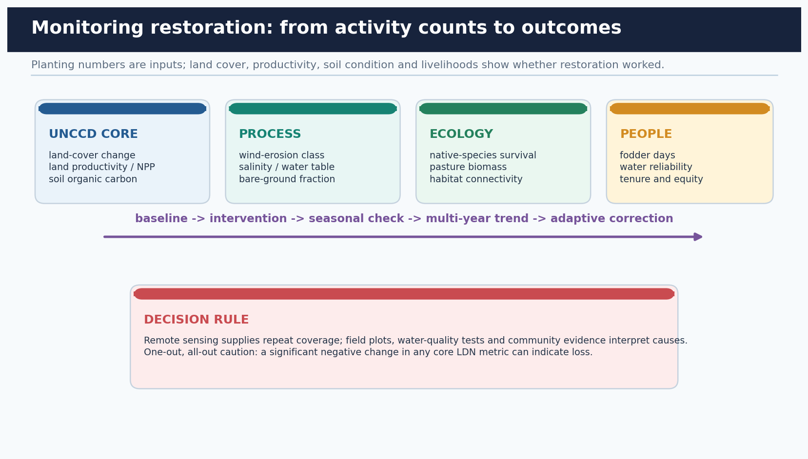

*A credible programme tracks condition, process, ecology and people against a baseline over several seasons.*

```text
BASELINE: land cover + productivity + soil carbon + process + livelihood
INTERVENTION: record location, species, water and governance
CHECK: survival, bare soil, wind erosion, water table, salinity, pasture biomass
TREND: compare multiple years and drought / normal years
ADAPT: change grazing, water, species or maintenance
```

| Indicator family | Examples | Why it matters |
| --- | --- | --- |
| UNCCD core | Land-cover change, NPP / productivity, soil organic carbon | Common LDN reporting base |
| Process | Wind-erosion class, bare soil, water table, electrical conductivity | Diagnoses the mechanism |
| Ecology | Native survival, grass biomass, habitat continuity | Prevents green-cover tunnel vision |
| Livelihood | Fodder days, water reliability, yield stability, equity | Tests social durability |
| Governance | Maintenance, participation, tenure disputes, WUA function | Explains success or failure |

### Core teaching

- [FACT] UNCCD minimum LDN metrics are land-cover change, land productivity and soil organic carbon.
- [FACT] The LDN one-out, all-out approach treats a significant negative change in any core metric as a loss.
- [FACT] SAC mapping uses satellite interpretation, ancillary data, ground checks and a minimum mapping unit; it is designed for regional planning.
- [ANALYSIS] Greening can coexist with falling groundwater, invasive spread or salinity. Therefore, biomass alone is inadequate.
- [ANALYSIS] Compare drought and normal years before attributing a trend to a project.
- [LIMIT] National remote-sensing products are not substitutes for field salinity, soil, hydrology and community evidence.
- [VERDICT] Measure avoided degradation and sustained function, not only hectares treated or saplings planted.

### Must-know facts

- Core LDN indicators are cover, productivity and soil carbon.
- Outcome monitoring begins with a baseline.
- Remote sensing and field evidence are complementary.
- Social equity is an outcome, not only a safeguard.

### UPSC traps

- **Wrong:** More NDVI always means restoration. **Correct:** Irrigated crops or invasive plants may green a pixel while water or biodiversity outcomes worsen.
- **Wrong:** A one-year comparison proves a trend. **Correct:** Dryland variability demands multi-year and seasonal interpretation.

**Mains use:** End policy answers with five indicators; it converts a generic way forward into an auditable framework.

**Study link:** UNCCD LDN Principles 15-19 + SAC Atlas methodology.

## 13. Current linkage: rangelands and UNCCD COP17 in 2026

### PRE-TEACH CHECKLIST

- **Book context:** pasture, pastoralism and LDN sections above. Live check on 2026-08-16: UNCCD June 2026 release and COP17 page. No conference outcome is claimed before the event begins.
- **CA search:** `UNCCD 2026 rangelands Desertification and Drought Day COP17 Ulaanbaatar`
- **CA result:** Book context: pasture, pastoralism and LDN sections above. Live check on 2026-08-16: UNCCD June 2026 release and COP17 page. No conference outcome is claimed before the event begins.

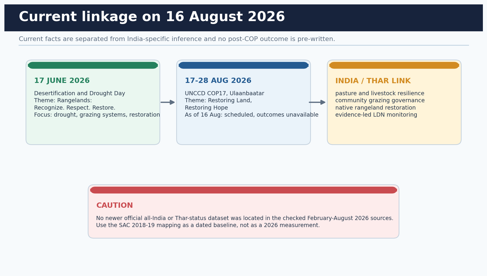

*The current link is rangeland restoration and pastoral resilience, not a newly published Thar degradation percentage.*

```text
17 June 2026: Rangelands - Recognize. Respect. Restore.
17-28 August 2026: COP17 scheduled in Ulaanbaatar
16 August retrieval boundary: outcomes not yet available
Thar inference: invest in pasture health, grazing institutions and drought readiness
```

| Current fact | Source status | Thar analytical link |
| --- | --- | --- |
| 2026 DDD theme: Rangelands: Recognize. Respect. Restore. | UNCCD release dated 17 June 2026 | Pasture and pastoral livelihoods are central to dryland resilience |
| COP17 theme: Restoring Land, Restoring Hope | Scheduled 17-28 August 2026 | Restoration, water and rangeland finance are relevant |
| International Year of Rangelands and Pastoralists | UN-linked 2026 context | Supports community-centred grazing and knowledge systems |
| No new official Thar-status dataset located | Checked official sources to 16 August 2026 | Use 2018-19 Atlas only as a dated baseline |

### Core teaching

- [FACT] UNCCD's 17 June 2026 release said up to half of world rangelands are degraded or at risk and highlighted drought and unsustainable land use.
- [FACT] COP17 is scheduled in Ulaanbaatar from 17 to 28 August 2026 under 'Restoring Land, Restoring Hope'.
- [FACT] As of the retrieval date, COP17 had not begun; negotiations, finance decisions and country outcomes cannot be stated.
- [INFERENCE] For the Thar, the current agenda strengthens the case for native pasture, livestock-water planning, drought preparedness and pastoral participation.
- [LIMIT] Global rangeland statistics must not be transferred as Rajasthan statistics.

### Must-know facts

- Current theme centres rangelands and pastoralists.
- COP17 outcomes were unavailable on 16 August 2026.
- The current link is institutional and thematic, not a new Thar percentage.
- Global figures are not state estimates.

### UPSC traps

- **Wrong:** COP17 decided a new restoration framework before 16 August. **Correct:** The conference was scheduled to begin on 17 August; no outcome is pre-claimed.
- **Wrong:** Half of Rajasthan's rangelands are officially degraded. **Correct:** The cited statement is global, not Rajasthan-specific.

**Mains use:** Use the current item in the conclusion: dryland restoration must include rangeland governance and pastoral livelihoods.

**Study link:** UNCCD DDD 2026 release and COP17 official page.

## 14. Advanced refinements that separate a strong answer

### PRE-TEACH CHECKLIST

- **Book context:** all preceding lessons synthesised.
- **CA search:** `No additional search - synthesis from verified static and official sources`
- **CA result:** No new item added; this block converts already verified evidence into answer discipline.

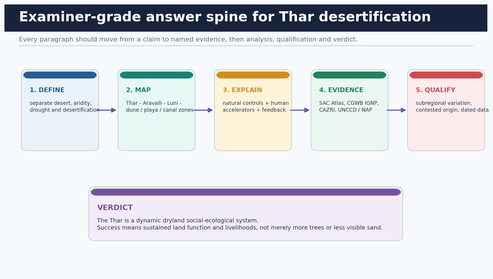

*A high-scoring answer uses evidence to prove a claim and then limits the claim to the scale the evidence supports.*

```text
claim -> named evidence -> what it proves -> limitation -> graded verdict
process diagnosis -> matched remedy -> responsible institution -> measurable outcome
```

| Weak formulation | Advanced replacement |
| --- | --- |
| The desert is expanding eastward. | Specify process, mapped class, period and location; avoid a metaphorical front. |
| Plant more trees. | Restore the right ecosystem with native species, water fit, survival and tenure safeguards. |
| The canal made the desert fertile. | Evaluate productivity, water table, salinity, equity and biodiversity together. |
| Aravalli stops the desert. | Explain roughness, catchment, soil and habitat functions with a bounded implication. |
| Rajasthan is worsening everywhere. | Use the Atlas trend and admit process and district heterogeneity. |

### Core teaching

- [REFINEMENT] Separate susceptibility, pressure, state and impact: aridity is susceptibility; grazing or irrigation is pressure; bare soil or salinity is state; livelihood loss is impact.
- [REFINEMENT] Distinguish restoration activity from additionality: a plantation that would have occurred anyway or fails after two years cannot demonstrate durable gain.
- [REFINEMENT] Distinguish land-cover greening from ecological restoration and groundwater sustainability.
- [REFINEMENT] Treat commons tenure, mobility and equity as causal variables, not an optional social paragraph.
- [REFINEMENT] State the denominator of every percentage and the year of every atlas figure.
- [REFINEMENT] End with a graded verdict: the Thar is dynamic and manageable, but no single engineering or plantation solution fits all subregions.

### Must-know facts

- Use susceptibility-pressure-state-impact language.
- Every percentage needs a denominator and date.
- Outcome is not the same as activity.
- Qualification increases, rather than weakens, analytical authority.

### UPSC traps

- **Wrong:** Balance means writing equal praise and criticism. **Correct:** Balance means weighing evidence and conditions, not artificial symmetry.
- **Wrong:** A way forward can replace causal analysis. **Correct:** Diagnose the process before prescribing the intervention.

**Mains use:** Use the answer spine for every 10, 15 or 20 marker and finish with a measurable outcome set.

**Study link:** Claim -> evidence -> analysis -> qualification -> verdict.

# Solved verified local-paper PYQs

## 2020 GS-I Q5 - Desertification and climatic boundaries

**Provenance:** VERIFIED PYQ - local official GS-I scan

> **Question:** The process of desertification does not have climatic boundaries. Justify with examples. (Answer in 150 words)

### Model solution

- [CLAIM] Desertification is best understood as a decline in land productivity and resilience, not as the visible march of a sandy desert.
- [NAMED EVIDENCE] UNCCD formally locates desertification in arid, semi-arid and dry sub-humid areas. Yet the stem's wider process logic is visible in Himalayan slope erosion after forest loss, irrigation-induced salinity in Punjab-Haryana and wind erosion or vegetation degradation in Rajasthan.
- [ANALYSIS] Climate changes the dominant mechanism: intense runoff strips humid slopes; high evaporation converts shallow irrigated water tables into salinity; sparse cover exposes dryland soil to wind. Human land use, hydrology and recovery capacity determine whether stress becomes persistent degradation.
- [QUALIFICATION] In strict convention usage, humid examples are land degradation rather than desertification. A strong answer says this explicitly while accepting the PYQ's broader productivity-loss argument.
- [VERDICT] Therefore degradation crosses climate zones through different pathways; policy must be process-specific rather than based on a moving-desert metaphor.

**Why this earns marks:** It directly justifies the proposition, uses named India examples, reconciles the PYQ wording with the UNCCD definition and ends with a graded verdict.

## 2018 Prelims Q2 - Desert leaf modifications

**Provenance:** VERIFIED PYQ - local official Prelims paper; key not held locally

> **Question:** Which leaf modifications occur in desert areas to inhibit water loss? 1. Hard and waxy leaves 2. Tiny leaves 3. Thorns instead of leaves. Options: A. 2 and 3 only; B. 2 only; C. 3 only; D. 1, 2 and 3.

### Model solution

- INFERRED ANSWER — NOT OFFICIALLY VERIFIED: D (1, 2 and 3), high confidence.
- Hard or waxy surfaces reduce cuticular loss; tiny leaves reduce transpiring area; leaves modified into thorns reduce area while green stems may perform photosynthesis.
- Elimination: each listed trait can reduce water loss, so any partial combination is incomplete.

**Why this earns marks:** It preserves the official stem, labels the non-official key honestly and explains each adaptation rather than relying on recall.

## 2018 Prelims Q82 - Irrigation and salinisation

**Provenance:** VERIFIED PYQ - local official Prelims paper; key not held locally

> **Question:** With reference to agricultural soils: 1. High organic matter drastically reduces water-holding capacity. 2. Soil plays no role in the sulphur cycle. 3. Irrigation over time can contribute to salinization of some agricultural lands. Which are correct? A. 1 and 2 only; B. 3 only; C. 1 and 3 only; D. 1, 2 and 3.

### Model solution

- INFERRED ANSWER — NOT OFFICIALLY VERIFIED: B (3 only), high confidence.
- Statement 1 is false: organic matter generally improves aggregation and water retention. Statement 2 is false: soils store and transform sulphur. Statement 3 is correct where irrigation plus inadequate drainage and evaporation concentrate salts.
- Thar link: the same mechanism explains why a canal can increase production and still create secondary salinity in susceptible command pockets.

**Why this earns marks:** It independently verifies all statements and connects the soil mechanism to the IGNP trade-off without claiming that every irrigated field salinises.

## 2020 Prelims Q95 - Desert National Park

**Provenance:** VERIFIED PYQ - local official Prelims paper; key not held locally

> **Question:** With reference to India's Desert National Park: 1. It is spread over two districts. 2. There is no human habitation inside the Park. 3. It is one of the natural habitats of Great Indian Bustard. Which are correct? A. 2 only; B. 2 and 3 only; C. 1 and 3 only; D. 1, 2 and 3.

### Model solution

- INFERRED ANSWER — NOT OFFICIALLY VERIFIED: C (1 and 3 only), high confidence.
- The park extends across Jaisalmer and Barmer districts and is a Great Indian Bustard habitat. The absolute claim of no human habitation is false.
- Elimination rule: protected-area questions often use an absolute human-exclusion statement as the trap.

**Why this earns marks:** It uses two spatial facts and rejects the absolute statement, while clearly separating inferred answer status from official verification.

## 2022 Prelims Q25 - Lake Faguibine

**Provenance:** VERIFIED PYQ - local official Prelims paper; key not held locally

> **Question:** Which lake of West Africa has become dry and turned into a desert? A. Lake Victoria; B. Lake Faguibine; C. Lake Oguta; D. Lake Volta.

### Model solution

- INFERRED ANSWER — NOT OFFICIALLY VERIFIED: B (Lake Faguibine), high confidence.
- Faguibine in Mali is the relevant desiccated-lake example. The other options are not the named West African lake in the stem.
- Concept link: a dried lake surface can result from hydrological and climatic change; it should not be treated as proof that all deserts form by lake desiccation.

**Why this earns marks:** It gives the correct geographical identification and prevents an over-generalised origin inference.

## 2018 CSAT passage set - Broad desertification usage

**Provenance:** VERIFIED PYQ PASSAGE - local official CSAT paper; keys not held locally

> **Question:** The passage linked desertification to biological-productivity decline, mountain erosion, irrigation salinity and site degradation. Q27 asked consequences of forest-cover decline; Q28 tested inferences; Q29 tested assumptions.

### Model solution

- INFERRED ANSWER — NOT OFFICIALLY VERIFIED: Q27 D (1, 2, 3 and 4); Q28 A (1 only); Q29 D (neither 1 nor 2), high confidence.
- Q27: the passage directly mentions topsoil loss, smaller-river / spring decline, agricultural harm and groundwater decline.
- Q28: altered river courses follow from the passage; 'human activities only' and the cross-continental monoculture claim overreach.
- Q29: desertification is not tropical-only; 'invariably leads to floods and desertification' is stronger than the passage supports.

**Why this earns marks:** It solves from passage language, identifies absolute-word traps and shows why broad CSAT usage still needs definition discipline in GS answers.

# Authored hard MCQs with explanations

> Rotation audit applies to authored practice. Verified PYQ options are preserved exactly rather than rearranged. Hard plus remedial keys run A -> B -> C -> D continuously.

## Hard MCQ 1

Which option best distinguishes desertification from a desert?

A. Desertification is dryland land degradation; a desert is a climatic region.
B. Desertification is any temporary rainfall deficit; a desert is permanent drought.
C. Desertification is wind erosion only; a desert is any sandy land.
D. Desertification occurs only inside existing desert cores.

**Answer: A.** A is correct. UNCCD desertification is degradation in arid, semi-arid and dry sub-humid areas; a desert is a climatic region.

## Hard MCQ 2

A district receives near-normal annual rainfall after three dry years, but soil productivity remains depressed because cover and soil structure have not recovered. Which description is best?

A. Aridity has ended, so degradation is impossible.
B. The drought may have ended while land degradation persists.
C. The district has necessarily become a hot desert.
D. Only aeolian deposition can explain the condition.

**Answer: B.** B is correct. Drought is a temporary anomaly; land condition can remain degraded after rainfall normalises.

## Hard MCQ 3

Which statement about a barchan dune is correct?

A. Its horns point upwind and its steep face is windward.
B. It forms only where vegetation cover is continuous.
C. Its horns point downwind and its slip face is leeward.
D. Its long axis must be perpendicular to the dominant wind.

**Answer: C.** C is correct. Barchan horns point downwind; sand climbs the gentler windward slope and avalanches down the lee slip face.

## Hard MCQ 4

Which sequence best represents episodic water work in an arid basin?

A. Playa -> glacier -> esker -> fjord
B. Loess -> delta -> oxbow -> levee
C. Dune -> moraine -> tarn -> cirque
D. Wadi -> alluvial fan / bajada -> closed basin -> playa

**Answer: D.** D is correct. Rare intense runoff leaves confined channels, spreads sediment at mountain fronts and may terminate in evaporation-dominated playas.

## Hard MCQ 5

Which regional description of the Thar is the most defensible?

A. A sandy western core, semi-arid eastern margin, inland drainage and canal-modified northern sectors coexist.
B. It is a uniform erg extending unchanged from the Aravalli to the Indus.
C. Its physiography is wholly controlled by the Indira Gandhi Canal.
D. The Rann is simply the southernmost barchan field of the Thar.

**Answer: A.** A is correct. The Thar is heterogeneous; the Rann is a distinct saline mudflat and marsh context.

## Hard MCQ 6

Why does the Aravalli not generate a major continuous rain belt over western Rajasthan?

A. It lies entirely north of monsoon influence.
B. Its trend is broadly parallel to the Arabian Sea monsoon branch, limiting forced ascent.
C. It is too young to influence airflow.
D. It blocks only winter monsoon winds from the Bay of Bengal.

**Answer: B.** B is correct. Alignment limits orographic uplift; continentality, subsidence and weak moisture penetration reinforce aridity.

## Hard MCQ 7

Which process most directly explains salt concentration in a Thar playa?

A. Permanent glacial meltwater inflow
B. Tidal exchange with the Arabian Sea
C. Internal drainage followed by strong evaporation
D. Continuous groundwater flushing

**Answer: C.** C is correct. Closed-basin inflow and high evaporation concentrate dissolved salts.

## Hard MCQ 8

Which statement about the origin of the Thar is most appropriate for a GS-I answer?

A. A former sea is the settled single cause.
B. One vanished river created the entire desert at one date.
C. Only local rock disintegration supplied all sand.
D. Its evolution is polygenetic, involving climate phases, drainage change, sediment supply and aeolian reworking.

**Answer: D.** D is correct. Multiple evidence streams support a polygenetic and regionally varied evolution.

## Hard MCQ 9

Which pair correctly distinguishes susceptibility from acceleration?

A. Erratic rainfall is susceptibility; vegetation removal can accelerate erosion.
B. Mining is susceptibility; aridity is always anthropogenic acceleration.
C. Canal drainage is susceptibility; drought is always land misuse.
D. Pastoral mobility is degradation; sandy soil is a restoration measure.

**Answer: A.** A is correct. Climate and substrate create susceptibility, while land-use pressure can increase exposure and slow recovery.

## Hard MCQ 10

Which chain best explains secondary salinity in a poorly drained canal command?

A. Drainage -> deeper water table -> salt removal -> salinity
B. Seepage / return flow -> shallow water table -> capillary rise and evaporation -> salt accumulation
C. Wind deposition -> glacier formation -> salt accumulation
D. Afforestation -> lower evapotranspiration -> salt accumulation

**Answer: B.** B is correct. The water table rises, dissolved salts move upward and evaporation concentrates them near the root zone.

## Hard MCQ 11

Which example best supports the proposition that degradation is not synonymous with desert expansion?

A. A barchan migrates within an uninhabited sand sea.
B. A dust storm crosses a state boundary.
C. Irrigated land loses productivity through waterlogging and salinity without dune advance.
D. A desert station records a high daytime temperature.

**Answer: C.** C is correct. Productivity can decline through hydrological and chemical processes without a moving sand front.

## Hard MCQ 12

Which statement accurately uses SAC's Rajasthan 2018-19 results?

A. Wind erosion affected 62.06% and total DLD affected 43.37% of TGA.
B. Rajasthan's DLD increased from 62.90% to 63.19% in 2018-19.
C. The Atlas proves every district improved.
D. Total DLD was 62.06% of TGA; wind erosion was 43.37%, with a modest total decline from 2011-13.

**Answer: D.** D is correct. It preserves denominator, date, process and trend; it does not claim uniform district recovery.

## Hard MCQ 13

What is the most balanced assessment of the Indira Gandhi Canal?

A. It relaxed water constraints and transformed livelihoods, but sustainability depends on drainage, crop-water fit, equity and ecosystem condition.
B. It completely ended desertification across western Rajasthan.
C. It was an ecological failure because all irrigation in deserts is harmful.
D. It affects agriculture but not hydrology or settlement.

**Answer: A.** A is correct. The canal produced benefits and differentiated trade-offs; a binary success-failure verdict is inadequate.

## Hard MCQ 14

Which inference about Aravalli degradation is evidence-bounded?

A. Every mined gap causes a fixed annual eastward desert advance.
B. Loss of relief and vegetation can weaken local wind, water, soil and habitat functions.
C. The Aravalli creates all rainfall in Rajasthan.
D. Restoration can rely on a concrete wall instead of landscape management.

**Answer: B.** B is correct. It identifies plausible ecological functions without asserting an unsupported desert-front rate.

## Hard MCQ 15

Which is a defensible native-species restoration set for the Thar?

A. Water hyacinth, rubber and spruce
B. Only Prosopis juliflora monoculture
C. Khejri, rohida, phog, khimp and sewan grass
D. Mangrove, teak and alpine fir

**Answer: C.** C is correct. The set contains arid-region native or characteristic species; Prosopis juliflora is introduced.

## Hard MCQ 16

What is the correct LDN response hierarchy?

A. Reverse -> reduce -> avoid
B. Offset -> ignore -> restore
C. Plant -> irrigate -> report
D. Avoid -> reduce -> reverse

**Answer: D.** D is correct. Prevention and reduction have priority over repairing past degradation.

## Hard MCQ 17

Which set contains the three minimum UNCCD land-based LDN indicators?

A. Land-cover change, land productivity and soil organic carbon
B. Tree count, rainfall and canal length
C. Livestock number, temperature and population
D. Only NDVI, with no field interpretation

**Answer: A.** A is correct. Additional local indicators should supplement the minimum core set.

## Hard MCQ 18

Which restoration design best fits a mobile dune threatening fields?

A. Deep flooding of the dune throughout the year
B. Temporary mechanical barriers followed by native grasses, shrubs, suitable trees and grazing control
C. Removing all vegetation so sand can move freely
D. A dense water-intensive exotic plantation without survival monitoring

**Answer: B.** B is correct. Stabilisation requires reducing near-surface wind, establishing cover and controlling disturbance with ecological fit.

## Hard MCQ 19

Which action most directly addresses pasture degradation as a commons-governance problem?

A. Permanent exclusion of all users without alternatives
B. Replacing pasture with a canal reservoir
C. Agreed rotational access, recovery periods, fodder planning and community monitoring
D. Counting saplings outside the grazing area

**Answer: C.** C is correct. Rules, timing, legitimacy and livelihood alternatives address concentrated pressure.

## Hard MCQ 20

Which statement about groundwater stress in the Thar is most accurate?

A. All groundwater is fresh and annually renewable.
B. Canal water automatically recharges every aquifer sustainably.
C. Falling water tables alone prove rainfall decline.
D. Quantity, salinity, recharge, pumping and canal interactions vary spatially and must be jointly assessed.

**Answer: D.** D is correct. Groundwater risk is a spatial water-balance and quality problem.

## Hard MCQ 21

Which transport-mode statement is correct?

A. Suspension carries fine dust far; saltation bounces sand; creep moves coarser grains.
B. Suspension moves only boulders; saltation moves dissolved salts.
C. Creep is atmospheric dust transport.
D. All three modes require flowing water.

**Answer: A.** A is correct. The three modes differ mainly by grain size and movement.

## Hard MCQ 22

Which feedback most plausibly locks a dryland into degradation?

A. More cover -> more infiltration -> recovery
B. Cover loss -> erosion -> lower fodder / yield -> greater pressure on remaining land
C. Drainage -> lower water table -> reduced salinity
D. Pasture rest -> seed recovery -> higher resilience

**Answer: B.** B is correct. Biophysical decline and livelihood pressure can reinforce one another.

## Hard MCQ 23

Which statement correctly distinguishes salinity from waterlogging?

A. They are identical terms.
B. Salinity can occur only in coastal deltas.
C. Waterlogging is excess water in the root zone; salinity is harmful salt accumulation, though the two can interact.
D. Waterlogging always lowers the water table.

**Answer: C.** C is correct. Shallow waterlogging and evaporation can contribute to salinity, but the conditions are analytically distinct.

## Hard MCQ 24

Which current-affairs statement was valid on 16 August 2026?

A. COP17 had already adopted its final decisions.
B. UNCCD published a new 2026 Rajasthan degradation percentage.
C. Desertification and Drought Day 2026 focused only on urban forests.
D. COP17 was scheduled for 17-28 August in Ulaanbaatar, while the 2026 Day foregrounded rangelands.

**Answer: D.** D is correct. It respects the retrieval boundary and does not invent conference outcomes.

# Remedial MCQs

## Remedial MCQ 25

A satellite image shows more vegetation in an irrigated desert tract. What can be concluded immediately?

A. Only that vegetation signal increased; groundwater, salinity, native ecology and durability still require evidence.
B. Land degradation neutrality has definitely been achieved.
C. The area is no longer arid.
D. Waterlogging is impossible.

**Answer: A.** A is correct. Greening is one observation, not a complete restoration verdict.

## Remedial MCQ 26

Which drainage association is most appropriate?

A. Luni is a perennial Himalayan tributary of the Ganga.
B. Luni is the principal Thar inland-drainage cue, while Ghaggar water may dissipate in plains and depressions.
C. Every Thar stream reaches the Arabian Sea throughout the year.
D. Playas are tidal estuaries.

**Answer: B.** B is correct. The region has ephemeral and internal drainage, with strong losses to infiltration and evaporation.

## Remedial MCQ 27

Which proposal most clearly violates ecological-fit principles?

A. Native grass recovery on a gochar
B. Drainage and crop correction in a saline canal pocket
C. A single water-intensive exotic tree monoculture across natural open desert grassland
D. Khadin repair with catchment maintenance

**Answer: C.** C is correct. It ignores ecosystem type, water balance, biodiversity and livelihood function.

## Remedial MCQ 28

Which verdict on the Indira Gandhi Canal should be rejected?

A. Benefits and costs vary across reaches and soils.
B. Drainage and crop choice affect sustainability.
C. Irrigation can green land and still create salinity risk.
D. It is either a complete success or a complete failure everywhere.

**Answer: D.** D is correct. A binary region-wide verdict ignores spatially differentiated outcomes.

## Remedial MCQ 29

Which was India's largest mapped land-degradation process nationally in SAC's 2018-19 assessment?

A. Water erosion
B. Wind erosion
C. Waterlogging
D. Frost shattering

**Answer: A.** A is correct. Water erosion was 11.01% of TGA, ahead of vegetation degradation and wind erosion.

## Remedial MCQ 30

Which Rajasthan statistic is correctly stated for the SAC 2018-19 timeframe?

A. Wind erosion was 62.06% of TGA.
B. Wind erosion was 43.37% of TGA.
C. Waterlogging was the dominant process.
D. The total DLD share was 29.77%.

**Answer: B.** B is correct. Rajasthan total DLD was 62.06%; 29.77% was the all-India total.

## Remedial MCQ 31

What is the strongest Thar linkage of the 2026 rangelands agenda?

A. Replace all pastoralism with settled rice cultivation.
B. Measure only tree cover.
C. Restore native pasture while supporting grazing governance, drought resilience and pastoral livelihoods.
D. Use the global rangeland statistic as a Rajasthan estimate.

**Answer: C.** C is correct. The linkage is community-centred rangeland health, not statistical transfer or land-use homogenisation.

## Remedial MCQ 32

Which final paragraph is most examiner-grade?

A. The government should take steps.
B. Plantation will solve everything.
C. The desert must be stopped at all costs.
D. A process-matched, community-governed and indicator-tracked strategy can protect land function while preserving dryland livelihoods.

**Answer: D.** D is correct. It contains mechanism, institution, monitoring and a balanced objective.

# Original Mains practice with examiner-grade model solutions

## Original 10-marker 1 - Desert versus desertification

**10 marks | 150 words**

> **Question:** Distinguish desert, aridity, drought and desertification. Why does this distinction matter for dryland policy in India?

### Model solution

- [CLAIM] The four terms operate at different analytical levels: desert is a climatic region, aridity a long-term moisture balance, drought a temporary anomaly and desertification persistent degradation in drylands.
- [NAMED EVIDENCE] UNCCD's dryland definition separates desertification from broader land degradation. Rajasthan's Thar can remain a functional desert, while an irrigated command pocket can lose productivity through salinity. Conversely, a drought year need not create lasting degradation if cover and institutions recover.
- [ANALYSIS] The distinction changes policy. Drought requires preparedness and relief; chronic aridity requires water-efficient livelihoods; wind erosion needs cover and surface protection; irrigation salinity needs drainage and conjunctive use. Treating all as 'desert spread' produces tree-planting or water-supply solutions that may miss the process.
- [QUALIFICATION] Terms are used loosely in public debate, so an answer may acknowledge broader site-degradation usage while retaining the convention definition.
- [VERDICT] Precision converts a slogan into process-matched policy.

**Why this earns marks:** It defines all four terms, uses a Thar and canal example, shows the policy consequence of the distinction and includes a terminology qualification.

## Original 10-marker 2 - Thar landform system

**10 marks | 150 words**

> **Question:** Explain how wind and episodic water together shape the Thar landscape.

### Model solution

- [CLAIM] The Thar is a coupled aeolian-fluvial landscape rather than an endless wind-built sand sea.
- [NAMED EVIDENCE] Wind deflates loose fines, abrades near the ground and moves sediment by suspension, saltation and creep, building barchans, longitudinal dunes and sand sheets. Around the Aravalli and rocky margins, cloudburst runoff moves through wadis, forms alluvial fans and pediments and terminates in interdunal or closed basins such as playa-salt-lake systems.
- [ANALYSIS] Interdunes receive runoff and support grazing or cultivation; strong evaporation can concentrate salts. Vegetation stabilises some dunes, while disturbance can reactivate them. The Luni supplies the main inland-drainage map cue.
- [QUALIFICATION] Not every dune is active and not every salt basin has the same origin.
- [VERDICT] The diagnostic answer is a wind-water sequence linked to subregional relief and drainage.

**Why this earns marks:** It explains processes, names landforms and a river, adds a stabilisation insight and avoids wind-only determinism.

## Original 15-marker 1 - Aravalli and Thar risk

**15 marks | 250 words**

> **Question:** Assess the ecological significance of the Aravalli for limiting land degradation around the Thar. Avoid a simplistic barrier narrative.

### Model solution

- [CLAIM] The Aravalli is significant less as a literal wall than as a landscape system supplying roughness, catchment, soil and habitat functions.
- [NAMED EVIDENCE] Its broad alignment parallel to the Arabian Sea monsoon branch explains why it does not create a continuous western rain belt. Yet vegetated relief can reduce near-surface wind locally, route runoff, support recharge, retain soil and connect dry-forest and scrub habitats. MoEFCC's 2023 Aravalli Green Wall brief accordingly combines a 5 km restoration buffer with afforestation, water conservation and water-body restoration across four states.
- [ANALYSIS] Mining, clearing and fragmentation may remove vegetation and relief, accelerate runoff and sediment, increase local dust exposure and weaken habitat connectivity. These changes can reduce resilience on the semi-arid Thar margin. Restoration therefore needs catchment repair, native vegetation, regulated extraction, corridor protection and local livelihoods rather than only plantation counts.
- [QUALIFICATION] There is no defensible basis here for a fixed desert-advance rate or for claiming that one breach mechanically carries the Thar eastward. Effects vary with wind, soils, land use and scale.
- [VERDICT] Protecting the Aravalli is a regional land-water-biodiversity strategy; its strongest justification is ecosystem function, not a magical-wall metaphor.

**Why this earns marks:** It answers 'assess', uses monsoon geometry and an official programme, gives four functions, explains degradation pathways and explicitly limits the claim.

## Original 15-marker 2 - Canal transformation

**15 marks | 250 words**

> **Question:** The Indira Gandhi Canal transformed the Thar but also relocated environmental risk. Discuss.

### Model solution

- [CLAIM] IGNP relaxed a fundamental water constraint and enabled irrigation, settlement, drinking-water support and diversified markets, but it also altered the desert water balance.
- [NAMED EVIDENCE] CGWB's Ganganagar profile describes extensive canal irrigation and records waterlogging in IGNP command pockets where seepage and return flow meet shallow low-permeability layers, interdunal depressions and weak natural drainage. It also records wide groundwater-salinity variation and recommends conjunctive use, suitable abstraction wells, micro-irrigation, crop correction, bio-drainage and reclamation.
- [ANALYSIS] Thus canal water can stabilise dunes and increase biomass while raising water tables; high evaporation then concentrates salts in the root zone. High-water-demand crops, head-tail inequality and maintenance gaps can magnify the problem. Ecologically, irrigated greening can also replace native open habitats and modify disease-vector or wildlife conditions.
- [QUALIFICATION] These effects are not uniform across the whole command. Soil permeability, drainage, water quality, farm size and location matter. Nor do trade-offs negate real livelihood and food-production gains.
- [VERDICT] The canal should be judged through a dashboard of yield stability, water-table depth, salinity, equity and native-ecosystem condition, not a success-versus-failure slogan.

**Why this earns marks:** It presents benefits and costs, uses specific CGWB mechanisms and remedies, recognises spatial differentiation and supplies measurable evaluation criteria.

## Original 20-marker 1 - Comprehensive desertification strategy

**20 marks | 250 words**

> **Question:** Evaluate the drivers of desertification in the Thar and design a process-matched restoration strategy consistent with Land Degradation Neutrality.

### Model solution

- [CLAIM] Thar desertification emerges when natural dryland susceptibility is amplified by pressures that reduce cover, disturb soils, alter hydrology or weaken recovery institutions.
- [NAMED EVIDENCE] SAC's 2018-19 Atlas mapped 62.06% of Rajasthan under DLD and wind erosion over 43.37% of state TGA, while vegetation and water erosion were secondary. CGWB identifies waterlogging and salinity in susceptible IGNP pockets. CAZRI provides dune, shelterbelt, agroforestry and rangeland technologies; MoEFCC's 2023 NAP links the 26 mha by 2030 ambition to forestry, watershed and convergence measures; UNCCD requires Avoid-Reduce-Reverse.
- [ANALYSIS - DRIVERS] Erratic rain, wind energy, sandy or saline substrates and drought set susceptibility. Overgrazing concentrated by commons loss, vegetation removal, marginal cultivation, mining, roads, groundwater over-abstraction and poorly drained irrigation accelerate loss. Feedback follows when lower fodder and yields increase pressure on remaining land.
- [ANALYSIS - STRATEGY] Avoid fragmentation of intact pasture, dunes and Aravalli catchments. Reduce pressure through rotational grazing, crop-water fit, soil cover, efficient irrigation and regulated mining. Reverse damage with native grass-shrub dune stabilisation, khejri agroforestry, khadin-johad-chauka watershed work, pasture reseeding and drainage-conjunctive use in saline commands. Panchayats, pastoral groups, WUAs, state agencies and research institutions need defined maintenance roles.
- [QUALIFICATION] Tree cover is not the universal objective; natural open ecosystems and pastoral mobility require safeguards. The Atlas is a dated regional baseline, not proof of local causation.
- [VERDICT] Monitor land cover, productivity, soil carbon, wind erosion, water table, salinity, native survival, fodder and equity. LDN succeeds when avoided losses and restored function persist across drought cycles.

**Why this earns marks:** It evaluates both natural and human drivers, uses five named evidence sources, applies the LDN hierarchy, assigns institutions, includes ecological safeguards and ends with indicators.

## Original 20-marker 2 - Dynamic Thar regional geography

**20 marks | 250 words**

> **Question:** The Thar is a dynamic social-ecological region rather than a static desert. Analyse with reference to landforms, water, livelihoods and contemporary restoration.

### Model solution

- [CLAIM] The Thar's identity comes from continuous interaction among wind-water processes, variable climate, human adaptation and modern infrastructure.
- [NAMED EVIDENCE] The sandy Marusthali, semi-arid Bagar margin, Luni drainage, playas and interdunes show physical diversity. Khejri agroforestry, bajra-pulse farming, tanka-khadin-johad systems and pastoral mobility show adaptation. IGNP created an irrigated northern frontier with both productivity gains and waterlogging-salinity risk. SAC maps changing degradation classes; CAZRI and the MoEFCC NAP promote dune, pasture, agroforestry and watershed restoration. The 2026 UNCCD rangelands agenda foregrounds pastoral institutions.
- [ANALYSIS] Dunes alternate between mobility and stability as wind, sediment, vegetation and disturbance change. Interdunes and playas convert episodic runoff into livelihood or salinity outcomes. Canal and groundwater access reorganise settlement and crops, while mining, renewable-energy corridors and roads can fragment commons and habitats. Institutions therefore mediate physical processes: grazing rules affect cover, WUAs affect canal outcomes and tenure affects restoration survival.
- [QUALIFICATION] Greening is not automatically restoration; higher biomass may coexist with falling groundwater, invasive spread or native-habitat loss. Origin theories remain contested and should not dominate a present-focused answer.
- [VERDICT] The Thar should be managed as a differentiated landscape whose success is sustained land function, water security, biodiversity and livelihood resilience - not the elimination of desert character.

**Why this earns marks:** It integrates regional geography, processes, adaptation, infrastructure, institutions and current linkage while preserving the desert's ecological identity.

# FINAL CONSOLIDATED REGISTER NOTES - THAR DESERTIFICATION

## Definitions and map skeleton

Write the six-term boundary first. Then draw the Aravalli line, western sandy core, Luni arrow, one playa and the northern canal tract.

| Recall unit | Compressed note |
| --- | --- |
| Desert | Climatic region; persistent effective-moisture deficit |
| Aridity / drought | Long-term condition / temporary anomaly |
| Land degradation | Decline in land condition in any climate |
| Desertification | Dryland land degradation; climate variation plus human activity |
| Thar map | West of Aravalli; Jaisalmer-Barmer-Bikaner core; Luni; playas; IGNP north |

- Marusthali = sandy arid core; Bagar = more semi-arid eastern / north-eastern margin; textbook boundaries vary.
- Rann = wider arid-region link but a distinct saline mudflat / marsh system.
- Do not equate a desert with degradation or drought with desertification.

**Rapid recall:**
- Always date Atlas figures.
- State the denominator of every percentage.
- Use a schematic, not a legal-boundary map.

**Error check:**
- **Wrong:** The Thar is one continuous erg. **Correct:** It contains dunes, interdunes, pediments, alluvium, rocky residuals, rivers and playas.

**Answer route:** Opening: define -> map -> thesis that the Thar is a dynamic dryland system.

**Revision link:** Revise Lessons 1-2.

## Process and landform diagnostics

Wind moves sediment; episodic water connects uplands to fans, interdunes and playas.

| Process | Diagnostic |
| --- | --- |
| Deflation / abrasion | Removal of fines / near-ground sand blasting |
| Suspension / saltation / creep | Fine dust / bouncing sand / rolling coarse grains |
| Barchan / seif | Horns downwind / long ridge aligned with wind |
| Wadi-fan-bajada-pediment | Flash-runoff sequence at mountain margin |
| Playa | Closed basin, episodic water and evaporative salt concentration |

- Active versus stabilised dune is a vegetation-sediment-wind-disturbance condition, not a permanent category.
- Interdunes support runoff storage, grazing, settlement or cultivation and may become saline.
- Origin is polygenetic: Quaternary climate phases, drainage change, sediment supply and aeolian reworking.

**Rapid recall:**
- Barchan horns point downwind.
- Water can be the major episodic geomorphic agent.
- Not every playa is a former sea.

**Error check:**
- **Wrong:** Wind alone shapes deserts. **Correct:** Rare intense runoff creates a major fluvial landform suite.

**Answer route:** Use the cross-section: dune -> interdune -> playa -> pediment.

**Revision link:** Revise Lessons 3 and 5.

## Climate, ecology and adaptation

Multi-cause aridity meets risk-spreading livelihoods and water systems.

| Dimension | Rapid recall |
| --- | --- |
| Aridity controls | Parallel Aravalli trend, continentality, subsidence, erratic monsoon |
| Soils | Sandy, low organic matter, calcareous; locally saline / alkaline |
| Native cues | Khejri, rohida, phog, khimp, sewan |
| Water systems | Tanka, khadin, johad, naadi, chauka |
| Livelihood | Bajra, moth, guar, fodder, livestock and mobility |

- Pastoral mobility tracks variable forage; forced concentration can increase local grazing pressure.
- Khejri agroforestry links fodder, shade, soil and crop resilience.
- Prosopis juliflora is introduced; do not present it as the native model for every restoration site.

**Rapid recall:**
- Western-core figures do not describe the whole Thar.
- High settlement density does not remove climatic aridity.

**Error check:**
- **Wrong:** Cacti define native Thar flora. **Correct:** Use indigenous thorn trees, shrubs and grasses as primary cues.

**Answer route:** Adaptation = water timing + mobility + biodiversity + institutions.

**Revision link:** Revise Lesson 4.

## Drivers, Aravalli and canal balance

Separate natural susceptibility from accelerators and evaluate interventions through changed process chains.

| Issue | Evidence and verdict |
| --- | --- |
| Rajasthan DLD | 62.06% of TGA in 2018-19; 62.90% in 2011-13 |
| Wind erosion | 43.37% of Rajasthan TGA in 2018-19; dominant state process |
| Aravalli | Roughness, watershed, soil and habitat functions; no fixed desert-front claim |
| IGNP benefits | Water, crops, settlement, markets and local greening |
| IGNP risks | Seepage / return flow + weak drainage -> waterlogging -> secondary salinity |

- Accelerators: vegetation loss, grazing concentration, marginal cultivation, mining, roads, groundwater stress and irrigation mismanagement.
- CGWB remedy set: conjunctive use, drainage / reclamation, micro-irrigation, crop-water correction and monitoring.
- Canal verdict must be spatially differentiated and indicator-based.

**Rapid recall:**
- The Rajasthan total fell modestly, but process and district trends differ.
- Aravalli Green Wall is restoration, not a literal wall.

**Error check:**
- **Wrong:** Irrigation automatically reverses desertification. **Correct:** It can improve productivity and simultaneously create hydrological or salinity risk.

**Answer route:** Aravalli: four functions + caution. Canal: benefits -> water balance -> risk -> management.

**Revision link:** Revise Lessons 6, 8 and 9.

## Restoration architecture and monitoring

LDN is prevention, reduction, repair, accounting and governance.

| Layer / indicator | Rapid recall |
| --- | --- |
| LDN hierarchy | Avoid -> Reduce -> Reverse |
| India target | 26 mha by 2030 announced in 2019; target, not completion |
| Implementation | NAP 2023, CAMPA, GIM, WDC-PMKSY, agroforestry and state schemes |
| Core indicators | Land cover, land productivity, soil organic carbon |
| Local indicators | Wind erosion, water table, salinity, native survival, pasture, fodder, equity |

- Match measure to process: dune cover, commons rules, watershed, drainage, crop-water fit or groundwater management.
- Use remote sensing with field and community interpretation.
- Measure avoided degradation and multi-year function, not hectares treated or saplings planted.

**Rapid recall:**
- Tree planting is not suitable for every open ecosystem.
- Participation and tenure are explicit LDN principles.

**Error check:**
- **Wrong:** LDN is permission to offset any loss. **Correct:** Avoid and reduce take priority; counterbalancing has safeguards and scale rules.

**Answer route:** End with an outcome dashboard and institutional responsibility.

**Revision link:** Revise Lessons 10-12.

## PYQ routes, current caution and verdict

The strongest answer moves claim -> named evidence -> analysis -> qualification -> verdict.

| Demand | Answer route |
| --- | --- |
| 2020 climatic boundaries | Define; mechanisms across settings; India examples; UNCCD qualification |
| Thar geography | Map; landforms; climate / soils / vegetation; adaptation |
| Aravalli | Monsoon geometry + ecosystem functions + bounded implication |
| IGNP | Benefits + changed water balance + differentiated risk + management |
| Restoration | Process diagnosis + LDN hierarchy + institution + indicators |

- Current fact: 2026 UNCCD agenda foregrounds rangelands and pastoralists.
- Retrieval boundary: COP17 was scheduled to begin 17 August 2026; no outcome is claimed on 16 August.
- Dated baseline: SAC 2018-19, published 2021. No newer official India-wide Thar status dataset was located in the checked six-month window.
- Final verdict: protect the Thar's land function, water, biodiversity and livelihoods; do not aim to erase desert character.

**Rapid recall:**
- Official Prelims keys were not held locally; inferred keys are labelled.
- Global rangeland figures are not Rajasthan estimates.

**Error check:**
- **Wrong:** A generic plantation way forward earns marks. **Correct:** Name process, measure, institution, indicator and qualification.

**Answer route:** Last line: sustainable dryland management preserves productive function and adaptive livelihoods under variable climate.

**Revision link:** Revise Lesson 13, Lesson 14 and all solved answers.
