# 08 India Caves and Meghalayan Age - Complete Topic Package

> **Subject:** Geography | **Coverage:** GS-I Physical and Indian Geography, Prelims, Environment linkages
> **Export date:** 2026-08-16 | **Retrieval boundary:** 2026-08-16
> **Evidence labels:** `[FACT]` retrieved evidence; `[ANALYSIS]` reasoned synthesis; `[LIMIT]` uncertainty; `[STATUS]` formal/current status; `[CURRENT FACT]` dated current source.
> **Visual rule:** all linked PNGs are original deterministic schematics, not to scale and not legal-boundary maps.

## Source register and evidence boundary

[FACT] Repository-first sources were `basic/08_Limestone-and-Karst-Landforms.md` and `advanced/08_India-Caves-Meghalayan-Age.md`, supplemented by linked groundwater and geomorphology framework files.

[FACT] The OCR-searchable local book layer supplied karst terminology and landform descriptions from `books/Indian & World Geography - Husain, Majid_Compressed.pdf`, especially extracted PDF pages 45-46 and 64-68. The local D.R. Khullar and G.C. Leong copies yielded limited searchable text in this environment, so their repository-authored syntheses were used rather than pretending to have extracted passages.

[FACT] Relevant local official question scans were checked across Prelims and Mains holdings. Three related Prelims items were retained. No direct cave/karst/Meghalayan Mains question was located in the checked local official GS-I scans from 2019-2025.

### Primary and official URLs

- [Authored repository Basic 08](upsc-ai-kit/knowledge/Geography/basic/08_Limestone-and-Karst-Landforms.md)
- [Authored repository Advanced 08](upsc-ai-kit/knowledge/Geography/advanced/08_India-Caves-Meghalayan-Age.md)
- [ICS International Chronostratigraphic Chart v2026/06](https://stratigraphy.org/ICSchart/ChronostratChart2026-06.pdf)
- [ICS Quaternary major divisions and Meghalayan GSSP](https://quaternary.stratigraphy.org/major-divisions)
- [Walker et al. formal ratification paper](https://stratigraphy.org/gssps/files/meghalayan.pdf)
- [IUGS-ICS Anthropocene statement](https://www.iugs.org/the-anthropocene-iugs-ics-statement/)
- [IUGS Mawmluh geoheritage page](https://iugs-geoheritage.org/geoheritage_sites/gssp-of-the-meghalayan-stage-in-the-mawmluh-cave/)
- [BSIP museum repository note](https://www.bsip.res.in/en/bsip_museum?lang=en)
- [BSIP geoheritage and geoconservation note](https://www.bsip.res.in/en/bsip_geo_heritage?lang=en)
- [NOAA Mawmluh KM-A dataset](https://www.ncei.noaa.gov/access/paleo-search/study/12912)
- [Berkelhammer et al. 2012 DOI](https://doi.org/10.1029/2012GM001207)
- [Giesche et al. 2019 monsoon study](https://cp.copernicus.org/articles/15/73/2019/)
- [2024 critique of a globally exceptional 4.2 ka event](https://www.nature.com/articles/s41467-024-50886-w)
- [Meghalaya SPCB public-hearing register](https://megspcb.gov.in/public-hearing)
- [PIB biodiversity-governance project](https://pib.gov.in/PressReleasePage.aspx?PRID=2255611)
- [Meghalaya Tourism Mawsmai Cave](https://www.meghalayatourism.in/explore/destinations/by-interest/cave-exploration/mawsmai-cave/)
- [Meghalaya Tourism Siju Cave](https://www.meghalayatourism.in/explore/destinations/by-interest/cave-exploration/siju-cave/)
- [Meghalaya Tourism Krem Liat Prah](https://www.meghalayatourism.in/explore/destinations/by-interest/cave-exploration/liat-prah-cave/)
- [ASI Ajanta](https://asi.nic.in/pages/WorldHeritageAjantaCaves)
- [ASI Ellora](https://asi.nic.in/pages/WorldHeritageElloraCaves)
- [AP Tourism Borra Caves](https://aptourism.gov.in/destinations/3/borra-caves)
- [Nandyal district Belum Caves](https://nandyal.ap.gov.in/places-of-interest/)

[CURRENT FACT] Within the last six months, the Meghalaya State Pollution Control Board public-hearing register listed on 14 July 2026 material for the Sohkhain Limestone Mine and Sohkhain Tyngwai Limestone Mine. This package uses it only as evidence of a live EIA/public-review context, not as proof of approval, rejection or damage to a named cave.

[CURRENT FACT] PIB reported an April 2026 launch of a 2025-2030 biodiversity-governance project with a Meghalaya landscape component. It is used as a governance linkage, not as cave-specific outcome evidence.

[STATUS] The ICS chart v2026/06 retains the Holocene Epoch and Meghalayan Age. The IUGS-ICS March 2024 decision rejected the proposed formal Anthropocene Epoch definition; informal use remains scientifically and socially widespread.

## Learning roadmap

```text
vocabulary -> chemistry -> hydrological zones -> surface landforms -> speleothems
-> cave development -> tropical monsoon karst -> India map -> natural vs rock-cut
-> proxy method -> time hierarchy -> Meghalayan GSSP -> 4.2 ka caution
-> Anthropocene status -> biodiversity and services -> threats -> conservation
-> verified PYQs -> hard and remedial MCQs -> solved Mains practice
-> FINAL CONSOLIDATED REGISTER NOTES
```

## 1. Cave and karst vocabulary: begin with process, not scenery

### PRE-TEACH CHECKLIST

- **Book context:** Repository Basic 08 and Advanced 08 queried; current search found no new definition requiring revision.
- **CA search:** official cave, stratigraphy, conservation and current-status sources checked to 2026-08-16.
- **CA result:** a dated current linkage is included only where a primary or official source supports it.

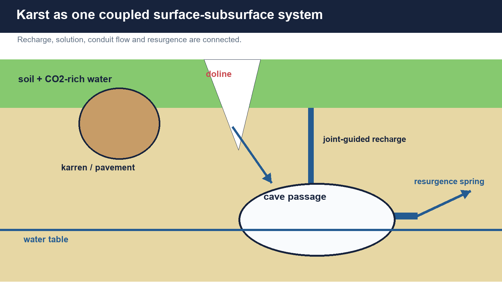

*Karst is a drainage system transferred underground; surface and cave features are hydraulically linked.*

### Core teaching

[FACT] Karst is terrain developed mainly by dissolution of soluble rock and characterised by underground drainage. A cave is a natural underground void large enough for access; 'cavern' commonly implies a large chamber but is not a separate universal genetic class.

- [FACT] Speleology studies caves; speleogenesis studies cave origin and development; speleothems are secondary mineral deposits formed in caves.
- [FACT] Limestone karst is common, but evaporites such as gypsum and salt can also develop solutional karst.
- [FACT] Not all caves are solution caves: lava tubes, sea caves, glacier caves, sandstone caves and tectonic fissure caves have different origins.
- [ANALYSIS] The diagnostic answer starts with rock, process, structure and water route, then names the landform.
- [LIMIT] 'Sinkhole' and 'doline' overlap in usage. State the process and scale rather than asserting a rigid universal sequence.

### Evidence and comparison matrix

| Term | Exam-safe meaning | Discriminator |
| --- | --- | --- |
| Karst | Soluble-rock terrain with distinctive underground drainage | Landscape and hydrology |
| Cave | Natural underground void | May have several genetic types |
| Cavern | Commonly a large cave chamber | Descriptive, not a separate process |
| Speleothem | Secondary mineral cave deposit | Depositional, not an erosional void |
| Rock-cut cave | Human-excavated chamber in rock | Architecture rather than natural speleogenesis |

### Must-know facts

- Karst is a coupled surface-subsurface system.
- Limestone is important but not the only soluble host rock.
- Natural cave and rock-cut cave are different categories.
- Cave form and cave deposit must not be confused.

### UPSC traps

- **Wrong:** All caves are limestone solution caves. **Correct:** Caves also form by lava, waves, ice, piping/weathering and tectonic opening.
- **Wrong:** Cavern is always a formally different landform. **Correct:** It usually denotes a large chamber; usage varies.
- **Wrong:** A cave entrance alone defines the conservation unit. **Correct:** Recharge, conduits, springs and catchment also matter.

**Mains use:** Open with the coupled-system thesis: water, voids, aquifer and surface depressions are one landscape.

**Study link:** Basic 08 -> terminology; Advanced 08 -> India applications.

## 2. Solution prerequisites and limestone chemistry

### PRE-TEACH CHECKLIST

- **Book context:** Local Majid PDF pp. 45-46 and 64-68 checked; ICS sources do not alter the basic chemistry.
- **CA search:** official cave, stratigraphy, conservation and current-status sources checked to 2026-08-16.
- **CA result:** a dated current linkage is included only where a primary or official source supports it.

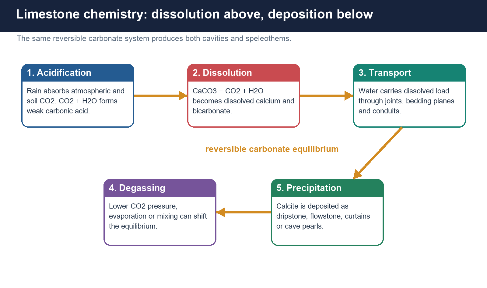

*Carbonate dissolution and calcite precipitation are opposite directions of the same equilibrium.*

### Core teaching

[FACT] Pure calcium carbonate is only sparingly soluble in neutral water. Dissolved carbon dioxide produces weak carbonic acid, while soil respiration commonly raises CO2 beyond atmospheric levels and makes infiltrating water more aggressive.

- [FACT] Acidification: CO2 + H2O forms weak carbonic acid.
- [FACT] Dissolution: CaCO3 + CO2 + H2O becomes dissolved calcium and bicarbonate.
- [FACT] Efficient karstification needs soluble and sufficiently thick rock, openings for water, recharge, a hydraulic gradient and an outlet or base-level relationship.
- [FACT] Joints, faults and bedding planes focus attack; lithological purity, grain fabric and insoluble beds modify the result.
- [FACT] In cave air, CO2 degassing, evaporation, mixing or prior calcite precipitation can favour calcite deposition.
- [ANALYSIS] Heavy rainfall alone does not make karst. Rainfall acts through rock chemistry, structure, vegetation-soil CO2 and drainage.

### Evidence and comparison matrix

| Control | Effect | Qualification |
| --- | --- | --- |
| Soluble rock | Supplies carbonate or evaporite for dissolution | Purity and thickness matter |
| CO2-rich water | Raises dissolution capacity | Soil and vegetation influence CO2 |
| Fractures / bedding | Provide pathways and anisotropy | Not every fracture becomes a cave |
| Hydraulic gradient | Moves aggressive water and exports solute | Base-level history changes passage levels |
| Cave-air exchange | Can drive degassing and deposition | Local ventilation and drip chemistry vary |

### Must-know facts

- Carbonation is chemical weathering; cave excavation also requires sustained water movement.
- Soil CO2 often makes recharge more aggressive than direct rain.
- Deposition is not simply 'evaporation'; degassing and solution saturation are central.
- Structure controls where dissolution is concentrated.

### UPSC traps

- **Wrong:** Water mechanically drills most limestone caves. **Correct:** Chemical dissolution is primary, though abrasion and collapse can modify passages.
- **Wrong:** More rain guarantees mature karst. **Correct:** Rock, openings, gradient, base level and time are also required.
- **Wrong:** Stalactites form where limestone is being dissolved from the cave roof. **Correct:** They are secondary calcite deposited from drip water.

**Mains use:** Derive landforms from chemistry: acidification -> dissolution -> conduit transport -> degassing -> deposition.

**Study link:** Geomorphology -> chemical weathering -> groundwater.

## 3. Epikarst, vadose and phreatic hydrology

### PRE-TEACH CHECKLIST

- **Book context:** Repository groundwater framework and Basic 08 queried; no six-month current item changes the zone definitions.
- **CA search:** official cave, stratigraphy, conservation and current-status sources checked to 2026-08-16.
- **CA result:** a dated current linkage is included only where a primary or official source supports it.

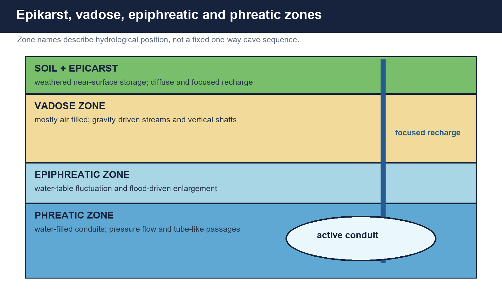

*Hydrological zones explain recharge storage, shaft development, flood pulses and tube-like passages.*

### Core teaching

[FACT] Karst aquifers transmit water through a mixed network of pores, fractures and conduits. The near-surface epikarst can store and redistribute recharge; vadose passages are largely air-filled; phreatic passages are water-filled.

- [FACT] Epikarst is the intensely weathered upper rock zone beneath soil, with variable storage and focused leakage.
- [FACT] Vadose water moves mainly under gravity, producing shafts, canyon passages and underground streams.
- [FACT] The epiphreatic zone fluctuates around the water table and can be enlarged rapidly during floods.
- [FACT] Phreatic flow occupies water-filled conduits under pressure and commonly creates rounded or elliptical tubes.
- [FACT] Perched water can occur above local impermeable beds; regional water table and local cave stream level need not coincide.
- [ANALYSIS] Cave levels can record former base levels, but tectonics, sediment fill and recharge capture complicate the interpretation.

### Evidence and comparison matrix

| Zone | Dominant condition | Typical implication |
| --- | --- | --- |
| Epikarst | Weathered near-surface rock | Storage and focused recharge |
| Vadose | Mostly air-filled | Gravity flow, shafts and canyons |
| Epiphreatic | Fluctuating saturation | Flood enlargement and complex cross-sections |
| Phreatic | Water-filled | Pressure flow and tube-like passages |

### Must-know facts

- Karst aquifers combine diffuse, fracture and conduit flow.
- Rapid conduit flow means high yield can coexist with low natural filtration.
- Water-table movement can create cave tiers.
- Floodwater can rise far above the normal cave-stream level.

### UPSC traps

- **Wrong:** Every cave passage forms above the water table. **Correct:** Many passages initiate and enlarge under phreatic conditions.
- **Wrong:** Groundwater in limestone moves only through pores. **Correct:** Fractures and conduits can dominate transmission.
- **Wrong:** A dry cave is hydrologically irrelevant. **Correct:** It may be relict, flood-prone or connected to recharge and ventilation.

**Mains use:** Use zones to explain both morphology and risk: rapid recharge, flash flooding, contamination and tiered passages.

**Study link:** Groundwater -> aquifers -> recharge-discharge.

## 4. Surface karst landforms and drainage disruption

### PRE-TEACH CHECKLIST

- **Book context:** Local Majid PDF pp. 64-68 checked; terminology cross-checked against repository Basic 08.
- **CA search:** official cave, stratigraphy, conservation and current-status sources checked to 2026-08-16.
- **CA result:** a dated current linkage is included only where a primary or official source supports it.

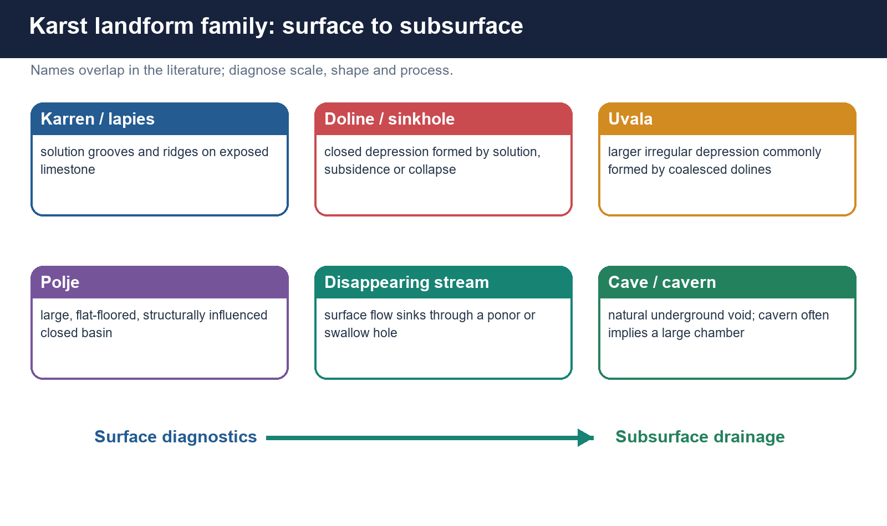

*Scale and morphology distinguish karren, dolines, uvalas, poljes and disappearing-stream systems.*

### Core teaching

[FACT] Surface karst expresses solution and subsurface drainage through etched rock, closed depressions and streams that disappear underground.

- [FACT] Karren or lapies are solution grooves, runnels, pits and ridges on exposed or soil-covered soluble rock; clints and grikes describe blocks and widened joints in limestone pavement.
- [FACT] Dolines are closed depressions produced by solution, subsidence, collapse or combinations; 'sinkhole' is a broad English term.
- [FACT] Uvalas are larger irregular compound depressions, often involving coalesced dolines and structural control.
- [FACT] Poljes are very large, commonly flat-floored and structurally influenced closed basins, often with seasonal flooding and ponors.
- [FACT] A ponor or swallow hole receives sinking surface flow; blind valleys terminate at sinks; dry valleys may record former surface drainage.
- [ANALYSIS] The best classification combines shape, size, hydrology and genesis rather than one word alone.

### Evidence and comparison matrix

| Landform | Diagnostic | Frequent trap |
| --- | --- | --- |
| Karren / lapies | Small solution sculpture | Not a large closed basin |
| Doline / sinkhole | Closed depression | May form by several mechanisms |
| Uvala | Large irregular compound depression | Not simply a mandatory next stage |
| Polje | Large flat-floored closed basin | Often structural and seasonally flooded |
| Ponor | Point of sinking flow | A hydrological opening, not every depression |

### Must-know facts

- Closed drainage is a core karst cue.
- Doline origin may be solutional, subsidence or collapse.
- Polje scale and structural influence distinguish it from a small sinkhole.
- Streams can sink and reappear at springs far away.

### UPSC traps

- **Wrong:** Doline -> uvala -> polje is a compulsory universal life cycle. **Correct:** The forms overlap and structural setting matters.
- **Wrong:** All sinkholes are cave-roof collapses. **Correct:** Many develop by solution or gradual subsidence.
- **Wrong:** Karst has no surface water at all. **Correct:** Surface reaches, wetlands and seasonal polje flooding can occur.

**Mains use:** Draw a surface-to-subsurface sequence and label recharge, ponor, conduit and resurgence.

**Study link:** Basic 08 -> erosional landforms.

## 5. Caves, caverns and the speleothem suite

### PRE-TEACH CHECKLIST

- **Book context:** Local Majid PDF pp. 66-68 checked; no current source changes diagnostic definitions.
- **CA search:** official cave, stratigraphy, conservation and current-status sources checked to 2026-08-16.
- **CA result:** a dated current linkage is included only where a primary or official source supports it.

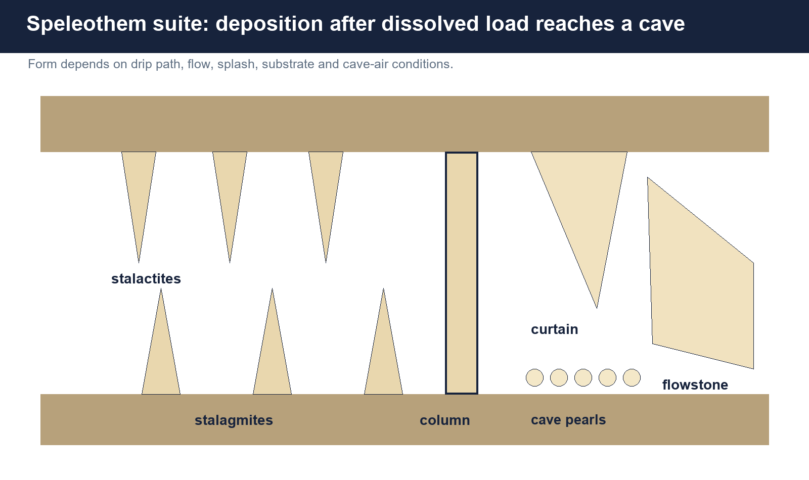

*Stalactites, stalagmites, columns, curtains, flowstone and cave pearls are depositional forms.*

### Core teaching

[FACT] Cave passages are erosional or solutional voids; speleothems are later mineral deposits. The same cave can contain active streams, breakdown, sediment fills and multiple generations of calcite.

- [FACT] Stalactites hang from ceilings; soda straws are hollow tubular stalactites formed around a drip path.
- [FACT] Stalagmites build upward where drops hit the floor; when roof and floor forms meet they create a column or pillar.
- [FACT] Flowstone coats sloping walls or floors; curtains or draperies form along inclined roof cracks.
- [FACT] Rimstone dams form terrace-like barriers; helictites grow in irregular directions under capillary and airflow controls.
- [FACT] Cave pearls form concentric coatings around a nucleus where agitation prevents attachment.
- [LIMIT] Colour and form depend on impurities, microbial processes and hydrology; appearance alone is not a precise age indicator.

### Evidence and comparison matrix

| Deposit | Position / process | Recall cue |
| --- | --- | --- |
| Stalactite | Ceiling drip path | Hangs tight |
| Stalagmite | Floor splash / drip site | Might reach roof |
| Column | Joined roof and floor deposits | Contact form |
| Flowstone | Sheet flow over wall or floor | Coating |
| Curtain | Inclined crack and sheet drip | Drapery |
| Cave pearl | Concentric coating around mobile nucleus | Agitated pool |

### Must-know facts

- Void formation and mineral deposition are different stages and processes.
- Stalactite is roof; stalagmite is floor.
- Flowstone records sheet flow rather than one drip point.
- Speleothem growth may stop, restart or dissolve.

### UPSC traps

- **Wrong:** A stalagmite hangs from the roof. **Correct:** It rises from the floor.
- **Wrong:** All cave decorations are calcium carbonate. **Correct:** Other minerals can occur, depending on host rock and water chemistry.
- **Wrong:** A large speleothem must be old at a known rate. **Correct:** Growth rates vary and hiatuses are common.

**Mains use:** Separate erosional voids, collapse forms, clastic sediments and chemical deposits.

**Study link:** Karst deposition -> palaeoclimate archives.

## 6. Cave development stages and structural controls

### PRE-TEACH CHECKLIST

- **Book context:** Basic 08 answer architecture checked; no current event required.
- **CA search:** official cave, stratigraphy, conservation and current-status sources checked to 2026-08-16.
- **CA result:** a dated current linkage is included only where a primary or official source supports it.

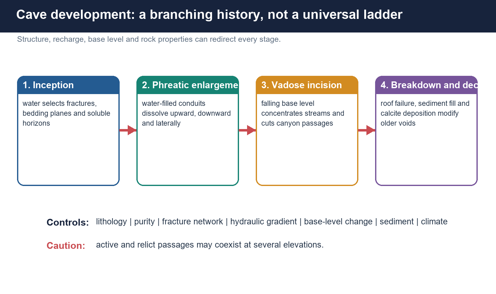

*Inception, phreatic enlargement, vadose incision and later modification can overlap or repeat.*

### Core teaching

[FACT] Cave development starts where water can repeatedly exploit a favourable path. Passage geometry reflects lithology, fracture orientation, hydraulic head, water-table history, sediment and collapse.

- [FACT] Inception often follows bedding planes, joints, faults or contacts where flow and dissolution are concentrated.
- [FACT] Phreatic enlargement can create tubes and maze caves; mixing of waters with different chemistry can increase aggressiveness.
- [FACT] Falling base level may drain old passages and focus vadose incision into canyon-shaped lower routes.
- [FACT] Breakdown enlarges some chambers mechanically after support is weakened; collapse is modification, not the origin of every cave.
- [FACT] Sediment can block, divert, protect or later expose passages; renewed uplift or river incision can create multi-level caves.
- [ANALYSIS] A cave map is a history of changing boundary conditions, not merely a plan of today's stream.

### Evidence and comparison matrix

| Control | Possible signature | Caution |
| --- | --- | --- |
| Bedding | Laterally extensive passage levels | Hydraulic gradient still matters |
| Joints / faults | Linear or angular routes | Not all fractures enlarge |
| Water table | Tubes, notches and passage tiers | Local perched flow complicates |
| Base-level fall | Vadose incision and abandoned levels | May be episodic |
| Sediment / collapse | Fill, diversion and chamber modification | Can obscure original form |

### Must-know facts

- Passage cross-section is a process clue.
- Cave tiers can reflect landscape incision and former water tables.
- Collapse modifies but does not explain all void origin.
- Active and relict networks can coexist.

### UPSC traps

- **Wrong:** Caves grow as a single tunnel from entrance inward. **Correct:** Networks develop along favourable structures and hydraulic paths.
- **Wrong:** Every large chamber is dissolved directly to its present size. **Correct:** Breakdown can enlarge a pre-existing void.
- **Wrong:** Lower cave levels must be older. **Correct:** Relative age depends on incision, capture, structure and reactivation.

**Mains use:** Use a four-panel sequence, then add a sentence rejecting deterministic linear evolution.

**Study link:** Geomorphology -> base level and landscape evolution.

## 7. Tropical karst, monsoon recharge and cave hazard

### PRE-TEACH CHECKLIST

- **Book context:** Recent cave-tourism pages and Meghalaya cave context checked; no casualty claim is inserted.
- **CA search:** official cave, stratigraphy, conservation and current-status sources checked to 2026-08-16.
- **CA result:** a dated current linkage is included only where a primary or official source supports it.


*Monsoon recharge can accelerate solution while also producing flash floods and unstable access conditions.*

### Core teaching

[FACT] Warm, wet tropical environments can favour rapid chemical weathering because water is abundant and biologically active soils supply CO2. Yet monsoon seasonality also creates intense flood pulses and alternating wet-dry cave conditions.

- [FACT] High rainfall increases recharge, but runoff may bypass diffuse infiltration through sinkholes and fractures.
- [FACT] Conduit water levels can rise quickly during storms; a dry passage can become a flood route.
- [FACT] Tropical vegetation can deepen soil CO2 production, while thick insoluble cover may either store water or restrict direct recharge.
- [FACT] Hazards include flash flooding, loose breakdown, low oxygen or high CO2 pockets, slippery surfaces and route complexity.
- [ANALYSIS] Tourism safety must follow hydrological forecasting, trained guides, route zoning and seasonal closure rather than lighting alone.
- [LIMIT] Tropical karst is diverse; high rainfall does not produce identical forms where lithology, relief or uplift differ.

### Evidence and comparison matrix

| Monsoon influence | Geomorphic / hydrologic effect | Management implication |
| --- | --- | --- |
| Intense recharge | Rapid conduit response | Forecasting and closure thresholds |
| Soil biological activity | More aggressive recharge water | Protect soil and vegetation |
| Seasonal water-table rise | Flooded passages and renewed solution | Map flood levels |
| High runoff at disturbed sites | Sediment and pollution pulses | Catchment controls |

### Must-know facts

- Karst floods can be rapid because storage and transmission are conduit-controlled.
- Tourist accessibility is seasonal and route-specific.
- Soil and vegetation influence cave chemistry.
- Catchment disturbance changes both water quantity and quality underground.

### UPSC traps

- **Wrong:** A dry cave passage is safe in heavy rain. **Correct:** It may lie on an active flood route.
- **Wrong:** Tropical karst means only faster stalactite growth. **Correct:** Solution, recharge, flooding, soil and erosion all change.
- **Wrong:** Artificial lighting resolves cave-tourism risk. **Correct:** Hydrology, air, route, carrying capacity and rescue planning remain essential.

**Mains use:** Link climate to both geomorphic opportunity and hazard, then add management.

**Study link:** Monsoon -> groundwater -> disaster risk.

## 8. India cave geography with bounded examples

### PRE-TEACH CHECKLIST

- **Book context:** Meghalaya Tourism, AP Tourism, Nandyal district and repository Advanced 08 checked on 2026-08-16.
- **CA search:** official cave, stratigraphy, conservation and current-status sources checked to 2026-08-16.
- **CA result:** a dated current linkage is included only where a primary or official source supports it.

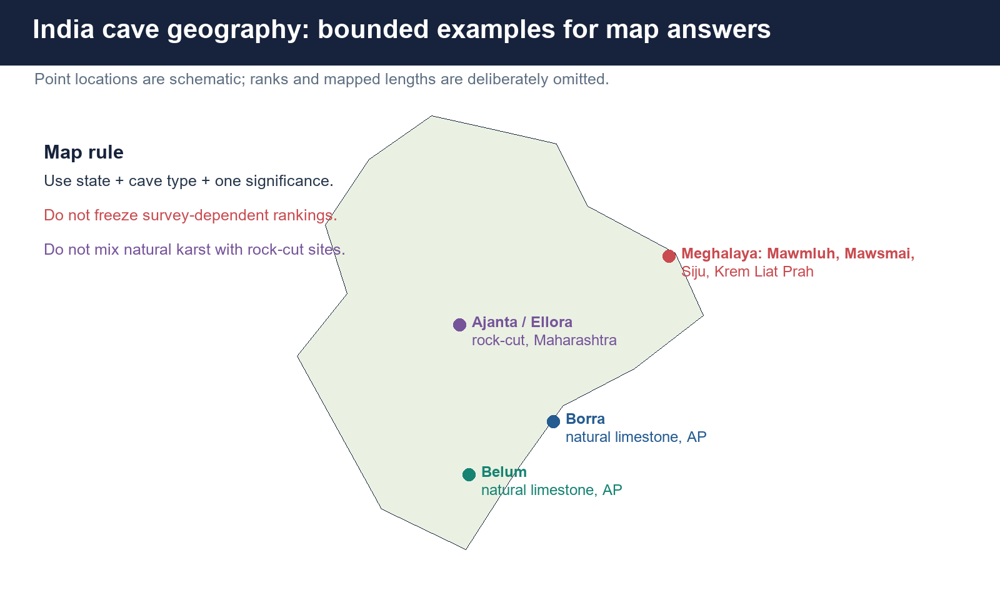

*Use locations and cave types; treat length and rank claims as dated survey statements.*

### Core teaching

[FACT] Meghalaya's limestone belts host extensive mapped cave systems under high rainfall. Mawmluh links Indian cave geography to formal stratigraphy; Mawsmai is a bounded tourist example; Siju links underground streams and cave biota; Krem Liat Prah illustrates continuing survey and ranking caution.

- [FACT] Mawmluh Cave near Sohra supplied the KM-A speleothem that defines the Meghalayan lower boundary.
- [FACT] Official Meghalaya Tourism pages describe Mawsmai, Siju and Krem Liat Prah as limestone-cave destinations with different accessibility and ecological contexts.
- [STATUS] The tourism portal retrieved on 2026-08-16 uses length and ranking language for Siju and Krem Liat Prah; such claims are survey-dependent and should be date-stamped, not memorised as timeless facts.
- [FACT] Borra in Andhra Pradesh is a natural limestone cave in the Eastern Ghats context; Belum in Nandyal district is a natural limestone cave system. No ranking is needed for a strong answer.
- [ANALYSIS] India's cave geography should be organised by geology and hydrology, not a list of tourist superlatives.
- [LIMIT] Cave inventories grow with exploration, connection surveys and revised mapping; mapped length is not the same as chamber volume, depth or scientific importance.

### Evidence and comparison matrix

| Example | State / region | Safe use |
| --- | --- | --- |
| Mawmluh | Meghalaya, near Sohra | Meghalayan GSSP source cave |
| Mawsmai | Meghalaya, Sohra area | Accessible limestone-tourism example |
| Siju | Meghalaya, Garo Hills | Underground stream and cave-life context |
| Krem Liat Prah | Meghalaya, East Jaintia Hills | Mapped-system example; date rank claims |
| Borra | Andhra Pradesh, Eastern Ghats | Natural limestone cave |
| Belum | Andhra Pradesh, Nandyal district | Natural limestone cave system |

### Must-know facts

- Meghalaya is the key Indian karst-cave map cluster.
- Mawmluh's scientific significance is stratigraphic, not merely tourism.
- Borra and Belum are safe non-Meghalaya natural-cave examples.
- Survey date belongs beside any length or rank.

### UPSC traps

- **Wrong:** India's famous 'caves' are one natural category. **Correct:** Natural caves and human-cut monuments must be separated.
- **Wrong:** Longest, largest and deepest are interchangeable. **Correct:** They measure different attributes and change with surveys.
- **Wrong:** A tourism page proves a geological superlative permanently. **Correct:** It is a dated source claim that requires survey context.

**Mains use:** Map Meghalaya plus Borra and Belum; add one process/value sentence for each cluster.

**Study link:** Advanced 08 -> India cave systems.

## 9. Natural caves versus rock-cut cave architecture

### PRE-TEACH CHECKLIST

- **Book context:** ASI Ajanta and Ellora pages checked; 2021 and 2023 local Prelims scans confirm the trap value.
- **CA search:** official cave, stratigraphy, conservation and current-status sources checked to 2026-08-16.
- **CA result:** a dated current linkage is included only where a primary or official source supports it.

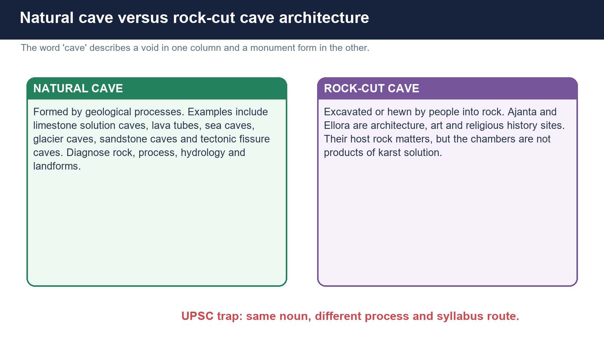

*Ajanta and Ellora are excavated rock architecture, not karst solution caves.*

### Core teaching

[FACT] ASI describes Ajanta's chambers as excavations hewn in a horseshoe-shaped rock face and Ellora as rock-hewn complexes in Deccan Trap basalt. Their cultural significance is immense, but their voids are human-made.

- [FACT] Natural cave classification asks which geological process formed the void.
- [FACT] Rock-cut architecture asks who excavated it, in which period, for what religious or secular function and with what art or structural form.
- [FACT] Host rock can still matter: Ellora's basalt and joints influenced excavation technique, but the chambers are not lava tubes or karst caves.
- [ANALYSIS] UPSC uses the shared word 'cave' to shift between physical geography, art and culture, archaeology and river-location knowledge.
- [ANALYSIS] In a mixed option set, identify whether the stem tests natural process, location, architecture or religious affiliation.

### Evidence and comparison matrix

| Question cue | Natural-cave route | Rock-cut route |
| --- | --- | --- |
| Formation | Solution, wave, lava, ice or tectonic process | Excavation and patronage |
| Evidence | Passage form, hydrology, deposits | Chaitya, vihara, sculpture, inscription |
| Examples | Mawmluh, Borra, Belum | Ajanta, Ellora, Bhaja, Sittanavasal |
| UPSC paper | Physical geography / environment | Art and culture / history |

### Must-know facts

- Ajanta and Ellora chambers are rock-hewn.
- Host-rock geology does not convert architecture into a natural cave.
- Bhaja and Sittanavasal are cave-shrine terms in cultural history.
- Location questions may combine river gorge and monument knowledge.

### UPSC traps

- **Wrong:** Ellora is a natural basalt lava tube complex. **Correct:** It is a human-excavated rock-hewn complex in basalt.
- **Wrong:** Ajanta is a limestone karst cave because it is called a cave. **Correct:** It is rock-cut architecture.
- **Wrong:** Natural and cultural significance cannot coexist. **Correct:** A landscape can have both, but formation categories remain distinct.

**Mains use:** A two-column distinction earns both geography precision and art-culture trap resistance.

**Study link:** Geography -> cave genesis; Art and Culture -> rock-cut architecture.

## 10. Speleothems as palaeoclimate archives

### PRE-TEACH CHECKLIST

- **Book context:** NOAA KM-A dataset, USGS proxy guidance and Berkelhammer et al. checked.
- **CA search:** official cave, stratigraphy, conservation and current-status sources checked to 2026-08-16.
- **CA result:** a dated current linkage is included only where a primary or official source supports it.

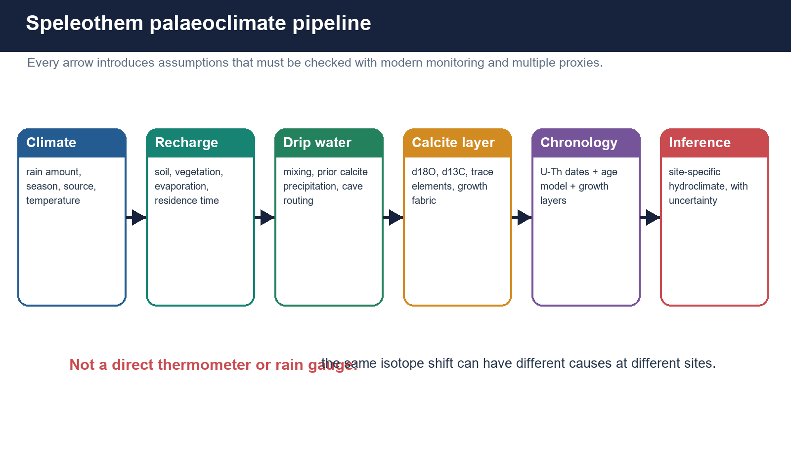

*Proxy interpretation passes through climate, recharge, cave routing, calcite and chronology.*

### Core teaching

[FACT] Speleothems can preserve layered, datable terrestrial records. Their strength lies in combining chronology with geochemical proxies, not in treating one isotope value as a direct rainfall reading.

- [FACT] Oxygen isotopes in calcite reflect drip-water isotopes plus temperature-dependent fractionation; precipitation amount, moisture source, seasonality, upstream rainout and evaporation can all contribute.
- [FACT] Carbon isotopes may respond to vegetation, soil respiration, bedrock carbon, degassing and prior calcite precipitation.
- [FACT] Trace elements such as Mg/Ca or Sr/Ca can reflect water-rock interaction, prior calcite precipitation and hydrological routing, but calibrations are site-specific.
- [FACT] Growth layers and fabric record changing deposition, while hiatuses may indicate non-deposition, erosion or hydrological change.
- [FACT] Uranium-thorium dating provides absolute age control for suitable carbonate; an age-depth model interpolates between dated points.
- [ANALYSIS] Strong reconstruction uses modern cave monitoring, replication, multiple proxies and comparison with independent archives.
- [LIMIT] A speleothem is neither a direct thermometer nor an automatic rain gauge.

### Evidence and comparison matrix

| Proxy / method | Possible information | Main qualification |
| --- | --- | --- |
| d18O | Rainfall, source, seasonality, circulation | Multiple controls |
| d13C | Soil-vegetation and cave processes | Bedrock and degassing effects |
| Trace elements | Hydrology and water-rock interaction | Site calibration required |
| Growth layers | Deposition rhythm and hiatus | Not always annual |
| U-Th dates | Absolute chronology | Detrital contamination and age modelling |

### Must-know facts

- Proxy meaning is conditional and site-specific.
- Chronology and interpretation are separate tasks.
- Multi-proxy replication is stronger than one record.
- Cave monitoring links present process to past signal.

### UPSC traps

- **Wrong:** Higher d18O always means lower rainfall everywhere. **Correct:** Moisture source, seasonality and cave processes can change the sign or cause.
- **Wrong:** Every visible band is annual. **Correct:** Band periodicity must be demonstrated.
- **Wrong:** U-Th dating directly measures past rainfall. **Correct:** It dates carbonate growth; climate interpretation comes from proxies.

**Mains use:** Write proxy -> process -> chronology -> calibration -> limitation; never jump from isotope to civilisation.

**Study link:** Physical geography -> palaeoclimate methods.

## 11. Geological time hierarchy and the GSSP method

### PRE-TEACH CHECKLIST

- **Book context:** ICS 2026/06 chart and Quaternary major-divisions page checked.
- **CA search:** official cave, stratigraphy, conservation and current-status sources checked to 2026-08-16.
- **CA result:** a dated current linkage is included only where a primary or official source supports it.

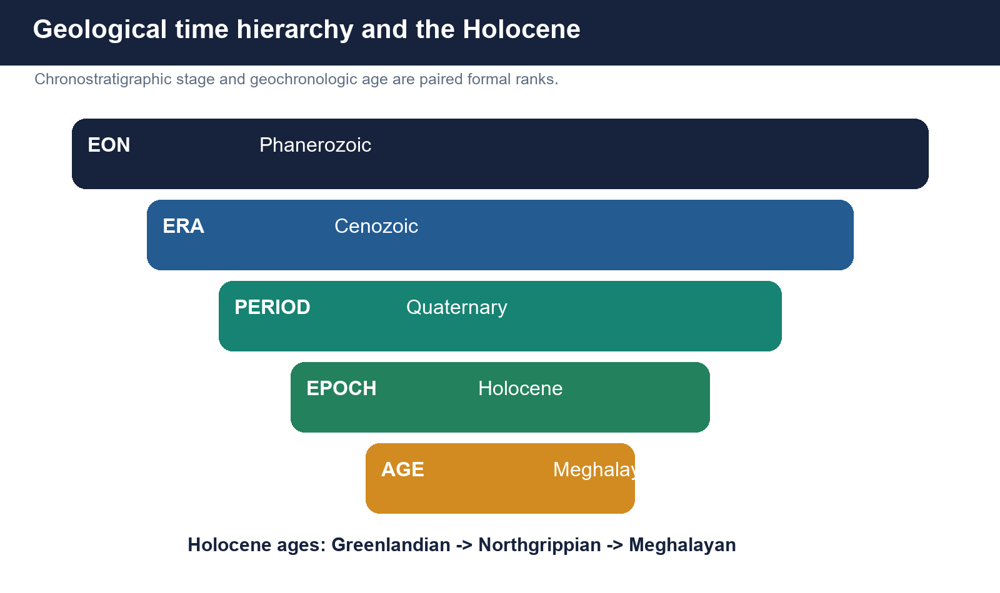

*Meghalayan is an Age within the Holocene Epoch, not a separate Epoch.*

### Core teaching

[FACT] The hierarchy relevant here is eon -> era -> period -> epoch -> age. Chronostratigraphic rock units use paired terms such as series and stage, while geochronologic time units use epoch and age.

- [FACT] A Global Boundary Stratotype Section and Point is the internationally agreed physical reference for the base of a formal unit.
- [FACT] A unit is defined by its lower boundary; its upper boundary is the base of the next unit.
- [FACT] The marker at the GSSP should be correlatable beyond the locality, but the boundary is the agreed point, not the event in the abstract.
- [FACT] The Holocene is an Epoch; Greenlandian, Northgrippian and Meghalayan are Ages.
- [ANALYSIS] A named place can define global time because international stratigraphy links an accessible physical section to a widely traceable signal.

### Evidence and comparison matrix

| Rank | Example | Paired rock-time term |
| --- | --- | --- |
| Eon | Phanerozoic | Eonothem |
| Era | Cenozoic | Erathem |
| Period | Quaternary | System |
| Epoch | Holocene | Series |
| Age | Meghalayan | Stage |

### Must-know facts

- GSSP means a physical reference point.
- Age and stage are paired time and rock terms.
- Meghalayan is below Epoch rank.
- Correlation uses multiple archives beyond the type locality.

### UPSC traps

- **Wrong:** The Meghalayan is a separate geological Epoch. **Correct:** It is an Age/Stage within the Holocene.
- **Wrong:** A GSSP is only a numerical date. **Correct:** It is a physical point with an estimated age.
- **Wrong:** The climate event and formal boundary are identical concepts. **Correct:** The event guides correlation; the boundary is the ratified point.

**Mains use:** A hierarchy ladder plus a point-signal-interval distinction resolves most Prelims traps.

**Study link:** Geology -> stratigraphy -> palaeoclimate.

## 12. Holocene subdivisions and the Meghalayan boundary

### PRE-TEACH CHECKLIST

- **Book context:** ICS major-divisions page, 2018 ratification paper, BSIP museum and 2026 chart checked.
- **CA search:** official cave, stratigraphy, conservation and current-status sources checked to 2026-08-16.
- **CA result:** a dated current linkage is included only where a primary or official source supports it.

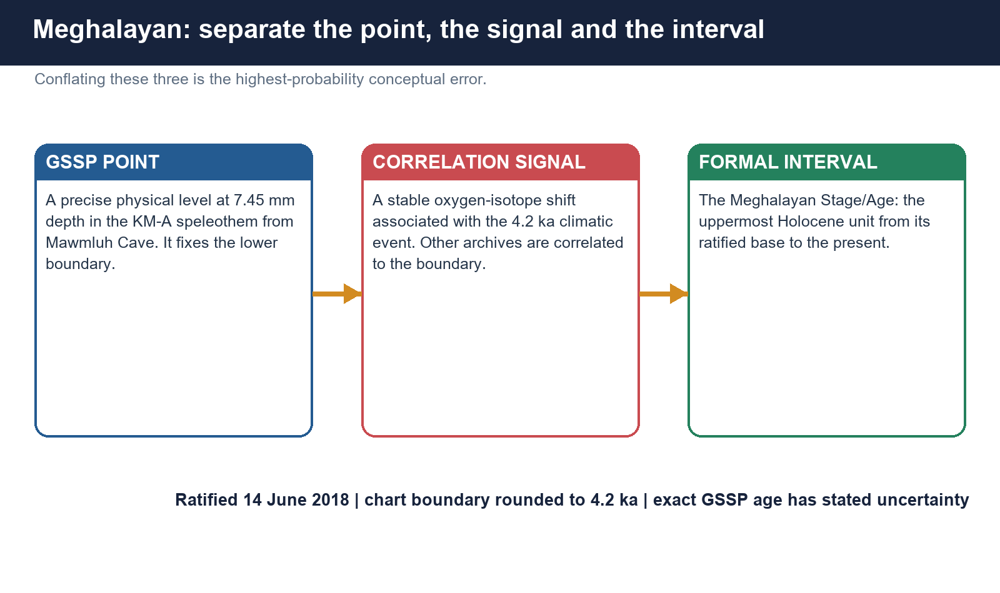

*KM-A at Mawmluh fixes the base; the 4.2 ka event is the correlation guide; Meghalayan names the interval.*

### Core teaching

[FACT] The Holocene subdivision into Greenlandian, Northgrippian and Meghalayan stages/ages was ratified on 14 June 2018. The Meghalayan GSSP lies at 7.45 mm depth in speleothem KM-A from Mawmluh Cave.

- [FACT] ICS gives the modelled GSSP age as 4.200 +/- 0.030 ka before 1950, equivalent to 4.250 +/- 0.030 ka before 2000; the chart convention rounds the boundary to 4.2 ka.
- [FACT] The KM-A stable oxygen-isotope record captures the 4.2 ka event; the point is placed approximately midway between its onset and intensification in that record.
- [FACT] Twelve U-Th dates underpin the age model cited by ICS.
- [FACT] The specimen is curated at the Birbal Sahni Institute of Palaeosciences, Lucknow.
- [FACT] The Meghalayan extends from its lower boundary to the present because no younger formal age has been ratified.
- [STATUS] The ICS chart v2026/06 still shows Meghalayan as the uppermost Holocene age.

### Evidence and comparison matrix

| Holocene age | Base / guide | Reference archive |
| --- | --- | --- |
| Greenlandian | 11,700 yr b2k; end of last cold episode | NGRIP2 ice core |
| Northgrippian | 8,236 yr b2k; 8.2 ka event | NGRIP1 ice core |
| Meghalayan | 4.2 ka chart boundary; 4.250 +/- 0.030 ka b2k GSSP age | KM-A, Mawmluh Cave |

### Must-know facts

- Ratification date: 14 June 2018.
- GSSP: 7.45 mm depth in KM-A speleothem.
- Repository: BSIP, Lucknow.
- Current formal age: Meghalayan.

### UPSC traps

- **Wrong:** The whole Mawmluh Cave is the GSSP. **Correct:** The GSSP is a precise point in the curated KM-A speleothem.
- **Wrong:** The Age began exactly 4,200 calendar years before today. **Correct:** ICS uses defined reference conventions and uncertainty; the chart is rounded.
- **Wrong:** Meghalayan is an India-only regional label. **Correct:** It is a globally ratified formal unit named from the GSSP locality.

**Mains use:** Always state GSSP location, physical point, marker signal, age convention, ratification and interval rank.

**Study link:** Advanced 08 -> Mawmluh and the geological time scale.

## 13. The 4.2 ka event and the limits of civilisation narratives

### PRE-TEACH CHECKLIST

- **Book context:** ICS synthesis, Giesche et al. 2019 and 2024-25 heterogeneity literature checked.
- **CA search:** official cave, stratigraphy, conservation and current-status sources checked to 2026-08-16.
- **CA result:** a dated current linkage is included only where a primary or official source supports it.

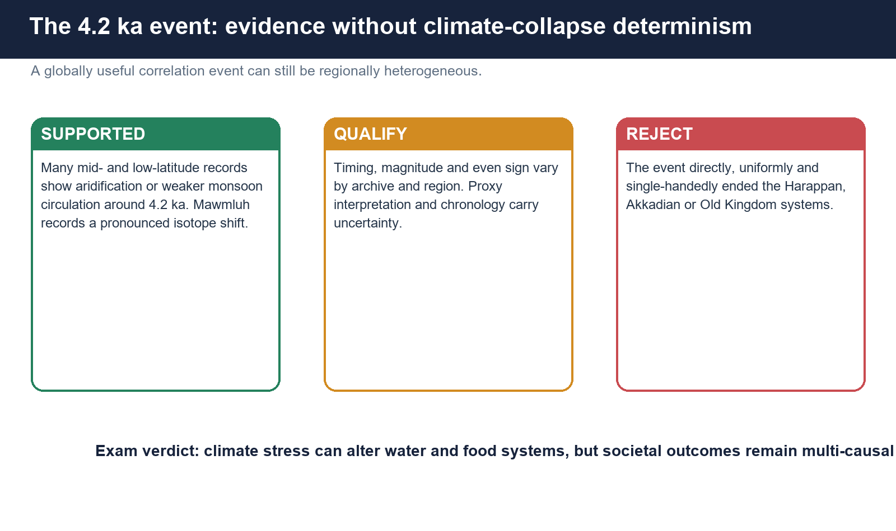

*Widespread hydroclimatic change does not imply one uniform global drought or a single cause of societal transformation.*

### Core teaching

[FACT] The 4.2 ka event is widely detected in palaeoclimate archives and provides a practical correlation horizon. Many mid- and low-latitude records show aridification or weaker monsoon circulation, but some regions show wetter conditions or weak expression.

- [FACT] ICS describes a two- to three-century aridification signal in many mid- and low-latitude records, while explicitly noting wetter expression in some locations.
- [FACT] Mawmluh's heavier oxygen-isotope values were interpreted as an abrupt precipitation decline associated with weaker monsoon circulation.
- [FACT] South Asian marine and terrestrial records do not all show identical timing, duration or seasonality.
- [ANALYSIS] Climate stress can reduce river flow, crop reliability and pastoral resources, influencing migration, settlement dispersal and political strain.
- [LIMIT] Harappan urban transformation, Akkadian change and Old Kingdom disruption had social, political, economic and landscape histories; a one-event collapse claim exceeds the evidence.
- [LIMIT] 'Globally correlatable' does not mean climatically identical everywhere or unique against every Holocene fluctuation.

### Evidence and comparison matrix

| Claim level | Defensible statement | Avoid |
| --- | --- | --- |
| Climate | Widespread but heterogeneous hydroclimatic reorganisation | Uniform global mega-drought |
| South Asia | Monsoon weakening appears in several records | One exact onset everywhere |
| Society | Climate may amplify water-food stress | Drought directly ended civilisation |
| Method | Compare dated multi-proxy archives | One proxy proves global causation |

### Must-know facts

- The event is a correlation guide, not a universal identical response.
- Regional sign, magnitude and timing vary.
- Societal outcomes require multi-causal analysis.
- Chronology overlap is not sufficient proof of causation.

### UPSC traps

- **Wrong:** The 4.2 ka event uniformly dried the entire planet. **Correct:** Spatially heterogeneous responses are documented.
- **Wrong:** It directly ended the Harappan civilisation. **Correct:** Climate stress is one factor within a long, regionally varied transformation.
- **Wrong:** A named event has one exact date in every archive. **Correct:** Age models and proxy resolution create uncertainty.

**Mains use:** Use the phrase 'climate stressor within a multi-causal transformation', followed by regional and chronological qualification.

**Study link:** Palaeoclimate -> historical geography -> human adaptation.

## 14. Meghalayan and Anthropocene: formal status as of 2026

### PRE-TEACH CHECKLIST

- **Book context:** IUGS-ICS 2024 statement and ICS chart v2026/06 checked on 2026-08-16.
- **CA search:** official cave, stratigraphy, conservation and current-status sources checked to 2026-08-16.
- **CA result:** a dated current linkage is included only where a primary or official source supports it.


*Formal chronostratigraphy and informal Earth-system terminology must be kept separate.*

### Core teaching

[STATUS] The Meghalayan remains the formally ratified current Age of the Holocene. In March 2024, IUGS-ICS approved rejection of the proposal to formalise an Anthropocene Epoch with a mid-twentieth-century base.

- [FACT] The rejected proposal would have ended the Holocene formally and used a proposed boundary around the Great Acceleration.
- [FACT] IUGS-ICS states that 'Anthropocene' may continue as an invaluable descriptor in Earth-system and environmental discourse.
- [STATUS] The ICS chart v2026/06 does not show Anthropocene as a formal epoch or age.
- [ANALYSIS] A term can be scientifically useful without being a ratified unit of the Geological Time Scale.
- [LIMIT] Rejection of one formal proposal does not erase human planetary impact or prevent future scientific debate.

### Evidence and comparison matrix

| Term | Formal status on 2026 chart | Correct use |
| --- | --- | --- |
| Meghalayan | Ratified Age/Stage | Current upper Holocene unit |
| Anthropocene | Not ratified as formal epoch | Informal Earth-system / environmental descriptor |
| Holocene | Ratified Epoch/Series | Current formal epoch |

### Must-know facts

- Meghalayan is formal; Anthropocene is not a formal epoch.
- The 2024 proposal was rejected by the stratigraphic process.
- Informal use of Anthropocene remains widespread and acknowledged.
- The current formal epoch remains Holocene.

### UPSC traps

- **Wrong:** Anthropocene officially replaced Holocene. **Correct:** It has not been ratified as a formal epoch.
- **Wrong:** Rejecting formalisation denies human influence. **Correct:** The decision concerned stratigraphic definition and rank.
- **Wrong:** Meghalayan and Anthropocene are competing ages of equal status. **Correct:** Only Meghalayan is formally ratified.

**Mains use:** State both status and nuance: formal rejection is not a rejection of Earth-system change.

**Study link:** Current affairs -> geological time governance.

## 15. Cave biodiversity, archives, culture and ecosystem services

### PRE-TEACH CHECKLIST

- **Book context:** Meghalaya Tourism Siju page, Meghalaya Biodiversity Board context, BSIP and PIB 2026 project checked.
- **CA search:** official cave, stratigraphy, conservation and current-status sources checked to 2026-08-16.
- **CA result:** a dated current linkage is included only where a primary or official source supports it.

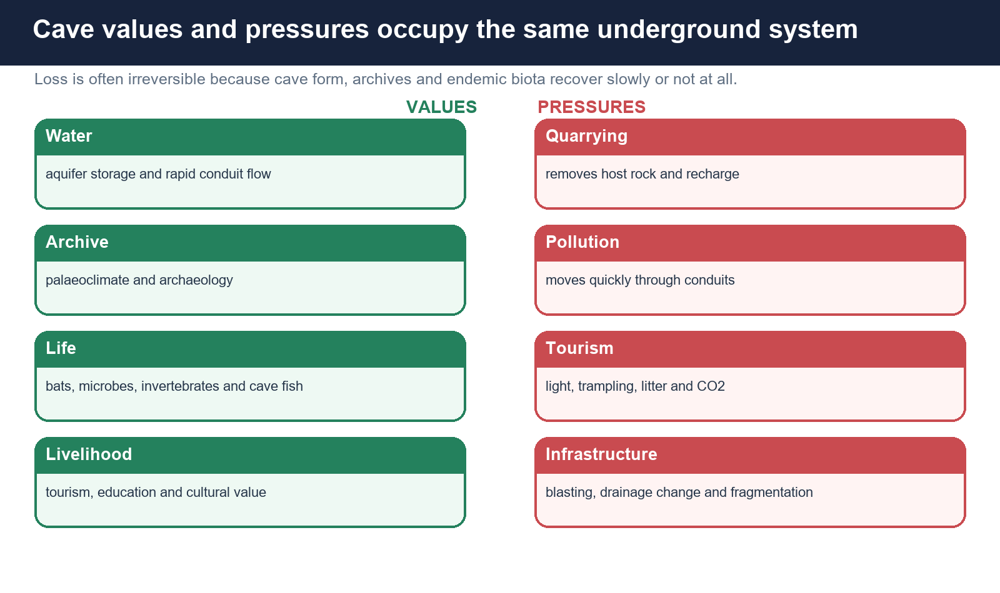

*Caves combine groundwater, evolutionary habitats, scientific archives, archaeology and livelihoods.*

### Core teaching

[FACT] Darkness, stable temperature, humidity and limited food create specialised ecosystems. Many cave food webs depend on external inputs carried by water, roots, bats or other animals.

- [FACT] Troglobionts are obligate cave species; troglophiles can complete life cycles in or outside caves; trogloxenes use caves but depend on outside habitat.
- [FACT] Common adaptations include reduced pigmentation or eyes, enhanced non-visual senses, slow metabolism and specialised life histories, but not every cave species has every trait.
- [FACT] Bat guano can support microbes and invertebrates; underground streams connect cave and surface ecosystems.
- [FACT] Caves preserve sediment, fossils, pollen, archaeological material and speleothem records under favourable conditions.
- [FACT] Services include groundwater, scientific knowledge, education, recreation, cultural meaning and local livelihoods.
- [ANALYSIS] Cave conservation must also protect surface feeding, breeding and recharge landscapes.
- [LIMIT] Tourism descriptions of 'unique species' are useful pointers, not substitutes for taxonomic inventories.

### Evidence and comparison matrix

| Value | Named route | Protection implication |
| --- | --- | --- |
| Biodiversity | Bats, invertebrates, fish, microbes | Dark-zone and surface-link protection |
| Water | Recharge, conduits and springs | Aquifer-scale pollution control |
| Archive | Speleothems, sediments and fossils | No-touch sampling governance |
| Culture | Archaeology and local meaning | Community stewardship |
| Tourism | Guiding and education | Carrying capacity and zoning |

### Must-know facts

- Cave ecosystems depend on surface-cave connections.
- Specialisation can increase disturbance sensitivity.
- Archives are non-renewable at human time scales.
- Water, biodiversity and heritage values overlap.

### UPSC traps

- **Wrong:** Caves are biologically empty because they lack sunlight. **Correct:** Food arrives through water, roots, guano and mobile organisms.
- **Wrong:** Protecting the entrance protects the ecosystem. **Correct:** Surface habitat, recharge and downstream springs also matter.
- **Wrong:** All blind cave animals are closely related. **Correct:** Similar traits can evolve independently under cave conditions.

**Mains use:** Frame caves as natural infrastructure plus archive plus habitat, then identify cross-boundary governance.

**Study link:** Environment -> biodiversity, groundwater and ecosystem services.

## 16. Threats and the six-month current linkage

### PRE-TEACH CHECKLIST

- **Book context:** Meghalaya SPCB public-hearing register and PIB biodiversity project checked for February-August 2026.
- **CA search:** official cave, stratigraphy, conservation and current-status sources checked to 2026-08-16.
- **CA result:** a dated current linkage is included only where a primary or official source supports it.


*Quarrying, pollution, altered recharge and unmanaged visitation can damage the same connected system.*

### Core teaching

[CURRENT FACT] The Meghalaya SPCB public-hearing register listed on 14 July 2026 hearing materials for the Sohkhain Limestone Mine and Sohkhain Tyngwai Limestone Mine, including draft EIA material. This is evidence of an active regulatory process, not proof of approval, rejection or measured cave damage.

- [FACT] Quarrying and blasting can remove host rock, intersect voids, change drainage, add vibration and sediment, and sever cave connections.
- [FACT] Karst contamination can travel rapidly through sinkholes and conduits with limited filtration.
- [FACT] Unmanaged tourism can alter cave temperature, CO2, light, microbial films, sediment and fauna; touching and breakage damage slow-growing deposits.
- [FACT] Roads, buildings and drainage works can reroute recharge and increase collapse or pollution risk beyond the entrance.
- [CURRENT FACT] PIB reported a 2025-2030 biodiversity-governance project launched in April 2026 with a Meghalaya landscape component. It is a governance example, not cave-specific impact evidence.
- [ANALYSIS] Current linkage is strongest when tied to EIA quality, cumulative hydrogeology, disclosure and community monitoring.
- [LIMIT] A hearing notice records proposal review. It must not be written as a finding that a project has harmed a named cave.

### Evidence and comparison matrix

| Pressure | Pathway | Evidence needed |
| --- | --- | --- |
| Mining / blasting | Rock removal, vibration, drainage interception | Cave inventory and hydrogeology |
| Pollution | Rapid conduit transport | Tracer tests and water monitoring |
| Tourism | Trampling, light, CO2, litter and disturbance | Visitor and condition data |
| Infrastructure | Recharge alteration and load | Cumulative catchment assessment |

### Must-know facts

- A public hearing is a procedural fact, not an impact verdict.
- Karst impact boundaries can cross project leases and village lines.
- Cumulative effects matter where many small quarries share an aquifer.
- Monitoring needs upstream, cave and spring locations.

### UPSC traps

- **Wrong:** A 2026 hearing proves mining was approved. **Correct:** It proves that public-review material was listed.
- **Wrong:** Only direct excavation at a cave entrance causes damage. **Correct:** Recharge and underground flow can be altered from outside.
- **Wrong:** A generic biodiversity project is proof of cave recovery. **Correct:** It is governance context unless cave outcomes are measured.

**Mains use:** Use proposal -> pathway -> evidence -> safeguard; do not litigate facts not in the source.

**Study link:** Current affairs -> EIA, mining and biodiversity governance.

## 17. Conservation architecture: from inventory to accountable use

### PRE-TEACH CHECKLIST

- **Book context:** BSIP geoconservation note, EIA current link and repository conservation framework checked.
- **CA search:** official cave, stratigraphy, conservation and current-status sources checked to 2026-08-16.
- **CA result:** a dated current linkage is included only where a primary or official source supports it.

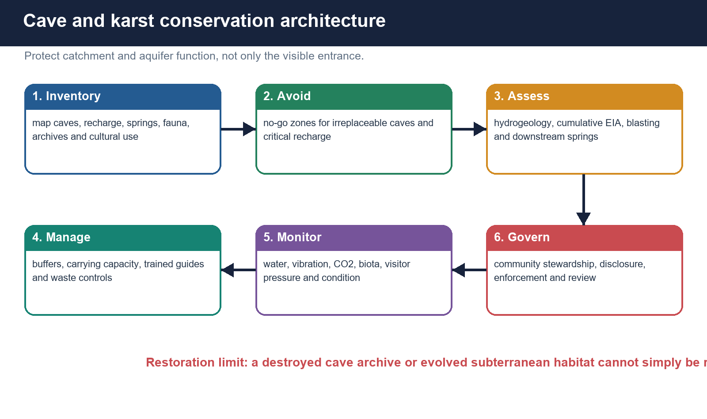

*The hierarchy is avoid irreversible loss, reduce pressure, manage use and monitor the aquifer-cave system.*

### Core teaching

[ANALYSIS] Cave conservation fails when it treats an entrance as an isolated tourist point. The management unit should follow the karst catchment, recharge, conduits, springs, biodiversity and cultural use.

- [ANALYSIS] Inventory: map caves, void probability, recharge zones, springs, water use, biological records, archives and cultural sites before allocation.
- [ANALYSIS] Avoid: designate no-go areas for irreplaceable GSSP, archive, habitat and critical recharge features; apply precaution where connectivity is uncertain.
- [ANALYSIS] Assess: require cave-sensitive baseline surveys, tracer-supported hydrogeology, vibration analysis, alternatives and cumulative impact assessment.
- [ANALYSIS] Buffer: define hydrogeological rather than only circular distance buffers; protect sinkholes, losing streams and spring catchments.
- [ANALYSIS] Tourism: zone routes, cap visitors, use trained local guides, control lighting, waste and touching, and close routes seasonally when hydrology demands.
- [ANALYSIS] Monitor: water quality and discharge, cave air, vibration, sediment, fauna, speleothem condition and visitor pressure with transparent thresholds.
- [ANALYSIS] Govern: empower community institutions, cavers, scientists, regulators and disaster services with clear roles and grievance routes.
- [LIMIT] Restoration can stabilise access or improve water quality, but cannot recreate a destroyed cave archive or evolved subterranean habitat.

### Evidence and comparison matrix

| Layer | Instrument | Outcome indicator |
| --- | --- | --- |
| Knowledge | Inventory, mapping, tracer tests | Known connectivity and baseline |
| Avoidance | No-go and sensitive-zone rules | Irreplaceable features intact |
| Assessment | Cumulative EIA and alternatives | Risk disclosed before decision |
| Tourism | Carrying capacity and zoning | Stable cave condition |
| Monitoring | Water, air, biota and vibration | Threshold-based correction |
| Governance | Community and agency accountability | Compliance and shared benefit |

### Must-know facts

- Hydrogeological buffers can be non-circular and cross boundaries.
- Cumulative assessment is essential in quarry clusters.
- Carrying capacity is ecological and safety-based, not only crowd comfort.
- Restoration has hard limits in subterranean systems.

### UPSC traps

- **Wrong:** Plantation is the main cave-restoration tool. **Correct:** Hydrology, pollution, access and habitat processes require tailored measures.
- **Wrong:** A fixed entrance buffer protects every cave. **Correct:** Recharge and conduit geometry determine the risk area.
- **Wrong:** More visitors always improve conservation finance. **Correct:** Beyond carrying capacity, damage and safety costs rise.

**Mains use:** End with institution + indicator + restoration limit, not a generic awareness slogan.

**Study link:** Environment governance -> EIA, community stewardship and monitoring.

## 18. Advanced refinements and map-answer design

### PRE-TEACH CHECKLIST

- **Book context:** All repository and live sources synthesised; no unsupported rank claim retained.
- **CA search:** official cave, stratigraphy, conservation and current-status sources checked to 2026-08-16.
- **CA result:** a dated current linkage is included only where a primary or official source supports it.

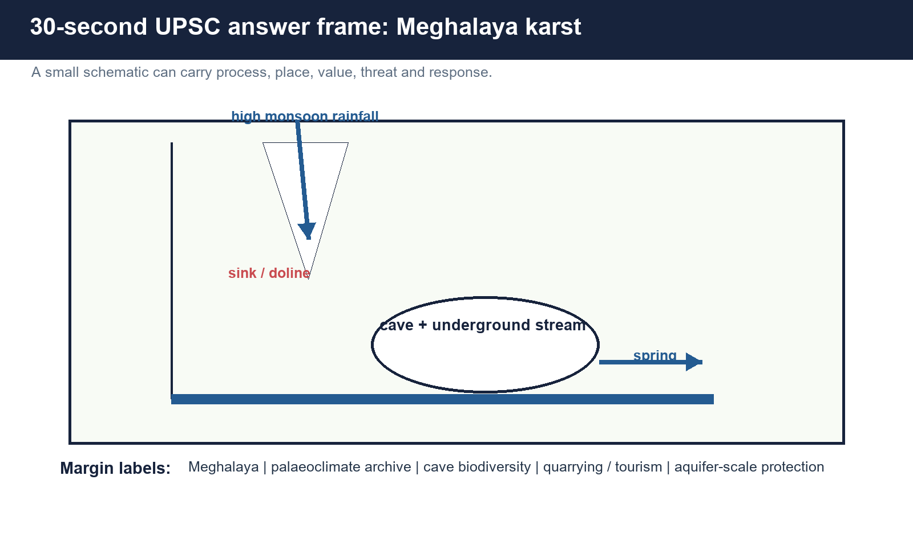

*A compact map-cross-section can integrate physical geography, evidence, threat and response.*

### Core teaching

[ANALYSIS] High-quality answers distinguish categories, show process chains, name bounded evidence and qualify scale.

- [ANALYSIS] Use lithology as an independent geographical control: adjacent soluble and impermeable rocks under similar rainfall can develop different drainage.
- [ANALYSIS] Distinguish storage from transmission: matrix and fractures can store water while conduits transmit storm pulses rapidly.
- [ANALYSIS] Distinguish susceptibility from trigger: pre-existing cavities create collapse susceptibility; pumping, leakage, loading or intense recharge may trigger failure.
- [ANALYSIS] Distinguish scientific archive from climatic truth: a proxy is measured evidence interpreted through a process model.
- [ANALYSIS] Distinguish formal status from popular usage: Meghalayan is ratified; Anthropocene is currently informal.
- [ANALYSIS] Use a 30-second Meghalaya frame: limestone belt, sinking recharge, cave stream, spring, archive, biodiversity, quarrying and aquifer-scale protection.
- [LIMIT] Do not force exact cave ranks, national totals or rates where the retrieved sources do not provide stable official figures.

### Evidence and comparison matrix

| Demand | Diagram | Qualification |
| --- | --- | --- |
| Explain karst | Chemistry plus cross-section | Not rainfall alone |
| Discuss Meghalaya caves | India locator plus cave-aquifer frame | No frozen rankings |
| Assess palaeoclimate | Proxy pipeline | Site-specific interpretation |
| Explain Meghalayan | Hierarchy plus point-signal-interval | Use age convention |
| Suggest conservation | Avoid-assess-manage-monitor chain | Restoration limits |

### Must-know facts

- One diagram should answer the directive, not decorate it.
- Named evidence must be followed by what it proves.
- Every strong claim needs a scale or uncertainty check.
- Map labels should remain bounded and source-safe.

### UPSC traps

- **Wrong:** More facts automatically mean more marks. **Correct:** Demand fidelity, linkage and qualification matter.
- **Wrong:** A cave list is an India-geography answer. **Correct:** Organise by geology, hydrology, value and risk.
- **Wrong:** Current affairs replaces static process. **Correct:** Current evidence should anchor, not displace, the geomorphology.

**Mains use:** Claim -> named evidence -> analysis -> qualification -> verdict.

**Study link:** All lessons -> PYQs and answer writing.

# Solved verified local-paper PYQs

## 2021 Prelims GS-I Q49 - Ajanta and the Waghora gorge

**Provenance:** VERIFIED PYQ - local official scan, books/more_previous_papers/QP-CSP-21-GeneralStudiesPaper-I-121021.pdf, PDF p.23. Official key not held locally.

> **Question:** Which statement is correct? A. Ajanta Caves lie in the gorge of Waghora river. B. Sanchi Stupa lies in the gorge of Chambal river. C. Pandu-lena Cave Shrines lie in the gorge of Narmada river. D. Amaravati Stupa lies in the gorge of Godavari river.

**Answer status:** INFERRED ANSWER - NOT OFFICIALLY VERIFIED: A, high confidence.

### Model solution

- [CLAIM] Option A is correct: Ajanta is cut into the horseshoe-shaped Waghora gorge.
- [NAMED EVIDENCE] The ASI Ajanta page states that the excavations overlook the Waghora stream.
- [ANALYSIS] The question tests monument-river geography, not natural karst. Sanchi is not in a Chambal gorge; Pandu-lena is associated with Nashik rather than the Narmada gorge; Amaravati is linked to the Krishna system, not the Godavari.
- [QUALIFICATION] Ajanta's chambers are rock-cut architecture; the natural gorge is the setting.
- [VERDICT] Select A while preserving the natural-versus-rock-cut distinction.

**Why this earns marks:** It uses the official monument setting, eliminates each distractor and identifies the syllabus shift hidden by the word 'caves'.

## 2023 Prelims GS-I Q82 - cave-shrine matching

**Provenance:** VERIFIED PYQ - local official scan, books/more_previous_papers/QP_CS_Pre_Exam_2023_280523.pdf, PDF p.35. Official key not held locally.

> **Question:** Pairs: 1. Besnagar - Shaivite cave shrine; 2. Bhaja - Buddhist cave shrine; 3. Sittanavasal - Jain cave shrine. How many pairs are correct? A. Only one; B. Only two; C. All three; D. None.

**Answer status:** INFERRED ANSWER - NOT OFFICIALLY VERIFIED: B, high confidence.

### Model solution

- [CLAIM] Two pairs are correct.
- [NAMED EVIDENCE] Bhaja is a Buddhist rock-cut cave complex; Sittanavasal is known for Jain rock-cut heritage. Besnagar is chiefly associated with the Heliodorus pillar, not the stated Shaivite cave shrine.
- [ANALYSIS] Pair 1 is false; pairs 2 and 3 are true, so option B follows.
- [QUALIFICATION] This is an art-culture question using cave terminology, not a geomorphology question.
- [VERDICT] Select B and route each site to its correct historical category.

**Why this earns marks:** It verifies every pair independently and resists importing natural-cave logic into rock-cut heritage.

## 2025 Prelims GS-I Q31 - limestone and cement emissions

**Provenance:** VERIFIED PYQ - local official scan, books/prelima_question_paper_answers/2025-GS1-Set A.pdf, PDF p.15. Local official answer-key file Ans-2025-GS1.pdf gives Series A Q31 = B.

> **Question:** Statement I: studies indicate cement industry CO2 emissions exceed 5 percent of global emissions. Statement II: silica-bearing clay is mixed with limestone in cement manufacture. Statement III: limestone is converted into lime during clinker production. Which option is correct? A. II and III both explain I; B. II and III are correct but only one explains I; C. only one is correct and explains I; D. neither is correct.

**Answer status:** OFFICIALLY VERIFIED LOCAL KEY: B.

### Model solution

- [CLAIM] Statements II and III are correct, but only III directly explains the process-emission part of Statement I.
- [NAMED EVIDENCE] Cement raw mix commonly combines limestone with silica-bearing materials; clinker production calcines calcium carbonate to lime and releases CO2.
- [ANALYSIS] Mixing clay is a material-input fact. Calcination directly generates CO2, while fuel and electricity add further emissions.
- [QUALIFICATION] This question does not quantify the share attributable to quarrying or a particular cave region.
- [VERDICT] Select B; connect limestone demand to karst risk only through a separate, site-specific impact chain.

**Why this earns marks:** It follows the official key, separates raw-material composition from causal explanation and avoids turning a global industry question into unsupported local impact proof.

# Authored hard MCQs with explanations

> Rotation audit: authored hard plus remedial keys run strictly A -> B -> C -> D continuously. Verified PYQ options remain unchanged.

## Hard MCQ 1

Which combination is most favourable for mature karst?

A. Soluble fractured rock, CO2-rich recharge, hydraulic gradient and an outlet
B. Any hard rock under high rainfall
C. Unfractured pure limestone with no drainage outlet
D. Dry sandstone with strong winds

**Answer: A.** Karst needs soluble rock, pathways, aggressive water and removal of dissolved load.

## Hard MCQ 2

Which reaction direction most directly enlarges a limestone joint?

A. Calcite precipitation after degassing
B. Carbonic-acid water converting CaCO3 to dissolved calcium and bicarbonate
C. Oxidation of quartz
D. Salt crystallisation in basalt

**Answer: B.** Carbonation and solution enlarge the opening.

## Hard MCQ 3

A rounded tube developed below the contemporaneous water table is most diagnostic of which setting?

A. Epikarst
B. Vadose canyon
C. Phreatic conduit
D. Sea cave notch

**Answer: C.** Water-filled pressure flow commonly produces phreatic tube forms.

## Hard MCQ 4

Which landform is a large, often flat-floored and structurally influenced closed karst basin?

A. Karren
B. Doline
C. Uvala
D. Polje

**Answer: D.** Poljes are the largest listed closed-basin form.

## Hard MCQ 5

Which is not primarily a limestone-solution cave type?

A. Lava tube
B. Mawmluh cave passage
C. Belum cave passage
D. Borra cave passage

**Answer: A.** A lava tube forms within or beneath flowing lava.

## Hard MCQ 6

Which deposit rises from a cave floor beneath a drip point?

A. Curtain
B. Stalagmite
C. Stalactite
D. Soda straw

**Answer: B.** Stalagmites build upward from the floor.

## Hard MCQ 7

Why are karst aquifers especially vulnerable to contamination?

A. Carbonate always sterilises water
B. Water remains trapped in soil for decades
C. Open fractures and conduits can transmit pollutants rapidly with little filtration
D. All recharge is excluded by limestone

**Answer: C.** Rapid focused recharge and conduit flow reduce natural attenuation.

## Hard MCQ 8

Which monsoon statement is most defensible?

A. Rain matters only for tourism
B. High rainfall removes all cave-flood risk
C. Monsoon recharge affects stalactites but not aquifers
D. Monsoon recharge can accelerate solution and create rapid cave floods

**Answer: D.** The same recharge drives geomorphic activity and hazard.

## Hard MCQ 9

Which set contains only Meghalaya cave examples used in this package?

A. Mawmluh, Mawsmai and Krem Liat Prah
B. Borra, Belum and Ajanta
C. Ellora, Siju and Belum
D. Mawmluh, Borra and Ellora

**Answer: A.** All three in A are Meghalaya examples.

## Hard MCQ 10

Which statement best classifies Ajanta and Ellora?

A. Natural karst caves later decorated
B. Human-excavated rock-cut architecture
C. Lava tubes in Deccan basalt
D. Marine caves enlarged by waves

**Answer: B.** ASI describes them as excavated or rock-hewn complexes.

## Hard MCQ 11

Which statement about speleothem d18O is correct?

A. It is a universal direct rain gauge
B. It records only cave temperature
C. It can reflect rainfall, source, seasonality and cave processes, requiring site calibration
D. It cannot preserve climate information

**Answer: C.** Multiple climatic and cave controls require calibration.

## Hard MCQ 12

Which hierarchy is correct from larger to smaller time rank?

A. Era -> eon -> period -> age -> epoch
B. Period -> era -> eon -> age -> epoch
C. Eon -> period -> era -> epoch -> age
D. Eon -> era -> period -> epoch -> age

**Answer: D.** Meghalayan occupies the Age rank.

## Hard MCQ 13

Which statement correctly separates Meghalayan concepts?

A. The GSSP is a physical point; the 4.2 ka signal guides correlation; Meghalayan names the interval
B. The whole cave is the formal age
C. The event alone is the GSSP wherever found
D. Meghalayan is only a tourism brand

**Answer: A.** Point, signal and interval are related but distinct.

## Hard MCQ 14

Which statement about the 4.2 ka event is most defensible?

A. It produced identical drought everywhere
B. It was widespread but regionally heterogeneous in timing, magnitude and even sign
C. It has no monsoon evidence
D. It directly ended every affected civilisation

**Answer: B.** Global correlation does not imply uniform climate response.

## Hard MCQ 15

What is the formal status of Anthropocene on the ICS 2026/06 chart?

A. Current Age below Meghalayan
B. Ratified Epoch replacing Holocene
C. Not ratified as a formal epoch; useful informal usage continues
D. A Period above Quaternary

**Answer: C.** The 2024 formal proposal was rejected.

## Hard MCQ 16

Which input commonly supports a cave food web in the absence of sunlight?

A. Only in-cave photosynthesis
B. Only dissolved limestone
C. Only geothermal heat
D. Guano, roots, flood-borne detritus and mobile animals

**Answer: D.** Most cave food webs depend on external organic inputs.

## Hard MCQ 17

How do cave pearls usually form?

A. Concentric mineral coating around a mobile nucleus in an agitated pool
B. Direct roof collapse
C. Wind abrasion of limestone
D. Human polishing

**Answer: A.** Movement prevents attachment while coatings accumulate.

## Hard MCQ 18

What is epikarst?

A. The deepest saturated cave zone
B. The weathered near-surface soluble-rock zone that stores and redistributes recharge
C. A sea cave bench
D. A rock-cut monastery

**Answer: B.** Epikarst lies beneath soil at the top of the karst rock mass.

## Hard MCQ 19

Which description best fits flowstone?

A. A closed surface depression
B. A roof tube
C. Sheet-like calcite coating on walls or floors
D. A river-borne gravel bar

**Answer: C.** Flowstone forms from thin films of mineral-bearing water.

## Hard MCQ 20

Which chain best explains an induced sinkhole hazard?

A. More vegetation -> more shade -> cave art
B. Wave attack -> sea arch -> stack
C. Glacial plucking -> moraine -> kettle
D. Pre-existing void -> groundwater or leakage change -> loss of support -> subsidence or collapse

**Answer: D.** Susceptibility and trigger must be separated.

## Hard MCQ 21

How should a cave 'longest' claim be written?

A. With source, retrieval or survey date and metric
B. As a timeless fact without method
C. As proof of maximum biodiversity
D. As equivalent to greatest depth

**Answer: A.** Mapped lengths and connections change with surveys.

## Hard MCQ 22

What does uranium-thorium dating primarily provide in a speleothem study?

A. Direct rainfall totals
B. Age control on carbonate growth
C. Cave-air CO2 concentration today
D. A national cave ranking

**Answer: B.** U-Th dating supports chronology, not direct climate magnitude.

## Hard MCQ 23

Which buffer approach is strongest for karst conservation?

A. A decorative fence at the entrance
B. The same radius for every cave
C. A hydrogeological buffer following recharge, conduits and springs
D. No buffer if the cave is not tourist-accessible

**Answer: C.** Connectivity determines the impact area.

## Hard MCQ 24

What does the July 2026 Meghalaya public-hearing listing prove?

A. Measured damage to Mawmluh Cave
B. Final approval of both mines
C. Rejection of limestone mining in Meghalaya
D. That proposal-review and draft EIA materials were listed, not an impact verdict

**Answer: D.** Procedural evidence must not be converted into an outcome claim.

# Remedial MCQs

## Remedial MCQ 25

A roof-hanging dripstone is a:

A. Stalactite
B. Stalagmite
C. Polje
D. Doline

**Answer: A.** Stalactites hang from ceilings.

## Remedial MCQ 26

Which comparison is correct?

A. Uvala is always smaller than a doline
B. Uvala is commonly a larger compound depression; doline is a smaller closed depression
C. Polje is a cave-roof deposit
D. Ponor is a stalagmite

**Answer: B.** Use scale and morphology without forcing a universal sequence.

## Remedial MCQ 27

Which statement corrects the 'all caves are limestone' error?

A. Every cave is rock-cut
B. Every cave is volcanic
C. Caves can also be lava tubes, sea caves, glacier caves, sandstone caves or tectonic fissures
D. Limestone cannot form caves

**Answer: C.** Cave is a broad natural-void category.

## Remedial MCQ 28

What exactly is the Meghalayan GSSP?

A. All of Meghalaya
B. The 4.2 ka event everywhere
C. The full Mawmluh cave system
D. A precise point at 7.45 mm depth in the KM-A speleothem

**Answer: D.** The GSSP is the ratified physical reference point.

## Remedial MCQ 29

Which status statement is correct?

A. Meghalayan is an Age within the Holocene
B. Meghalayan is a Period above Quaternary
C. Anthropocene is the current formal Age
D. Holocene ended in 1950

**Answer: A.** ICS 2026/06 retains the Holocene-Meghalayan scheme.

## Remedial MCQ 30

Why is a speleothem not a direct rain gauge?

A. It contains no chemistry
B. Climate, soil, recharge, cave routing and fractionation all mediate the signal
C. It cannot be dated
D. It forms only in deserts

**Answer: B.** Proxy interpretation requires a process model.

## Remedial MCQ 31

What should set a cave-tourism carrying capacity?

A. Parking-space count only
B. Demand from tour operators only
C. Hydrology, air, route safety, biota, deposit condition and acceptable change
D. The maximum number that physically fits

**Answer: C.** Capacity is ecological and safety-based.

## Remedial MCQ 32

Which EIA improvement is most important in a quarry cluster over shared karst?

A. Assess each lease as hydrologically isolated
B. Ignore springs outside lease lines
C. Use only entrance distance
D. Add cumulative hydrogeology, cave inventory, tracer evidence and downstream monitoring

**Answer: D.** Karst connectivity crosses administrative and project boundaries.

# Original Mains practice with examiner-grade model solutions

## Original 10-marker 1 - chemistry to landforms

**10 marks | 150 words**

> **Question:** Explain how carbonation and groundwater movement produce the characteristic surface and subsurface landforms of limestone karst.

### Model solution

- [CLAIM] Karst is produced when CO2-rich recharge dissolves carbonate rock and progressively transfers drainage underground.
- [NAMED EVIDENCE] Rainwater gains CO2 in biologically active soil, forming weak carbonic acid. Along joints and bedding planes it dissolves CaCO3 into soluble bicarbonate, enlarging karren, dolines, ponors and conduits. Coalesced depressions may create uvalas, while structurally controlled closed basins form poljes.
- [ANALYSIS] Below ground, phreatic flow enlarges tubes; falling base level permits vadose canyon incision. Where drip water loses CO2, calcite is deposited as stalactites, stalagmites, columns, curtains and flowstone.
- [QUALIFICATION] High rainfall alone is insufficient: rock purity, fracture network, hydraulic gradient, base level and time control form and rate.
- [VERDICT] Thus karst landforms are surface expressions of a chemically driven, structurally guided groundwater system.

**Why this earns marks:** It derives both erosional and depositional forms from chemistry, structure and hydrology, and adds the necessary control qualification.

## Original 10-marker 2 - natural versus rock-cut caves

**10 marks | 150 words**

> **Question:** Distinguish natural caves from rock-cut cave architecture. Why is the distinction important in Indian geography questions?

### Model solution

- [CLAIM] Natural caves are geological voids; rock-cut caves are human excavations whose principal evidence belongs to architecture and cultural history.
- [NAMED EVIDENCE] Mawmluh, Borra and Belum are natural limestone examples shaped by groundwater solution. ASI describes Ajanta as excavations overlooking the Waghora and Ellora as rock-hewn complexes in Deccan Trap basalt.
- [ANALYSIS] A natural-cave answer therefore examines lithology, recharge, passage morphology and speleothems. A rock-cut answer examines patronage, chronology, religious use, chaitya-vihara form, sculpture and painting. Host rock can condition excavation without creating the chamber naturally.
- [QUALIFICATION] Natural landscapes and cultural use may overlap, but origin categories must remain separate.
- [VERDICT] The distinction prevents a common UPSC trap created by one shared word across Physical Geography and Art and Culture.

**Why this earns marks:** It defines both classes, names Indian evidence, shows the different analytical routes and explains the examination relevance.

## Original 15-marker 1 - Meghalaya karst as a coupled asset

**15 marks | 250 words**

> **Question:** Assess Meghalaya's cave systems as geomorphic, hydrological, ecological and scientific assets, and identify the major governance challenges.

### Model solution

- [CLAIM] Meghalaya's caves are not isolated attractions but a monsoon-fed karst system linking landform, aquifer, biodiversity and globally important palaeoclimate evidence.
- [NAMED EVIDENCE] Mawmluh supplied the KM-A speleothem defining the Meghalayan GSSP; Mawsmai offers an accessible tourism example; Siju links underground streams and cave fauna; Krem Liat Prah illustrates extensive ongoing cave mapping. High rainfall over limestone and structural openings supports solution and rapid conduit recharge.
- [ANALYSIS] Geomorphically, the systems contain sinks, passages and dripstone. Hydrologically, they store and rapidly transmit groundwater but are vulnerable to pollution. Ecologically, dark zones support specialised biota and depend on surface inputs. Scientifically, speleothems and sediments preserve climate and environmental archives; tourism and guiding can support local livelihoods.
- [NAMED EVIDENCE] The Meghalaya SPCB's July 2026 public-hearing register for two limestone proposals shows why cave-sensitive EIA and cumulative hydrogeology are current governance issues.
- [QUALIFICATION] A hearing is not proof of harm or approval, and survey-dependent length rankings should be dated.
- [VERDICT] Governance should map the aquifer, protect critical recharge and archive sites, assess cumulative quarrying, set tourism carrying capacity and embed community monitoring.

**Why this earns marks:** It answers 'assess' across four dimensions, uses current and static evidence, qualifies both the regulatory fact and ranking claims, and gives process-matched governance.

## Original 15-marker 2 - speleothems and proxy limits

**15 marks | 250 words**

> **Question:** How do speleothems reconstruct palaeoclimate? Discuss the methodological strengths and limits of their interpretation.

### Model solution

- [CLAIM] Speleothems are valuable palaeoclimate archives because carbonate grows sequentially, preserves geochemical signals and can often be dated by uranium-thorium methods.
- [NAMED EVIDENCE] In Mawmluh's KM-A stalagmite, a stable oxygen-isotope shift and a U-Th-supported age model captured the 4.2 ka event used to define the Meghalayan boundary.
- [ANALYSIS] d18O may reflect rainfall amount, source, seasonality, upstream rainout and temperature-dependent fractionation. d13C can reflect vegetation, soil respiration, degassing and prior calcite precipitation. Trace elements and growth fabric add hydrological information; replicated records and modern drip monitoring test the process model.
- [STRENGTH] Caves provide terrestrial archives, potentially high resolution, precise dates and correlation with ice, lake, marine and tree-ring records.
- [QUALIFICATION] Drip routing, residence time, cave ventilation, hiatuses, detrital contamination and age-model interpolation create uncertainty. The same isotope direction need not mean the same climate at every site.
- [VERDICT] Speleothems are strongest as calibrated, multi-proxy and replicated archives, not as direct thermometers or rain gauges.

**Why this earns marks:** It explains proxy formation, names the Mawmluh example, balances strengths with process-specific limitations and ends with a methodological verdict.

## Original 20-marker 1 - Meghalayan and the 4.2 ka event

**20 marks | 250 words**

> **Question:** Explain the formal basis of the Meghalayan Age and critically examine the use of the 4.2 ka event in narratives of ancient societal change.

### Model solution

- [CLAIM] The Meghalayan is a formally ratified Age/Stage of the Holocene whose lower boundary is fixed by a physical GSSP, while the 4.2 ka climatic event provides the correlation guide.
- [NAMED EVIDENCE] IUGS ratified the tripartite Holocene subdivision on 14 June 2018. The GSSP lies at 7.45 mm depth in speleothem KM-A from Mawmluh Cave; ICS gives a modelled age of 4.200 +/- 0.030 ka before 1950, equivalent to 4.250 +/- 0.030 ka before 2000. The specimen is curated at BSIP, Lucknow.
- [ANALYSIS] The KM-A oxygen-isotope shift records monsoon weakening. Correlative archives across several continents show major hydroclimatic reorganisation, allowing global stratigraphic use.
- [CRITICAL DIMENSION] The event is not an identical worldwide drought: timing, magnitude and sign vary, and some records show wetter conditions. Chronology overlap can identify stress but cannot alone prove social causation.
- [NAMED EVIDENCE] Harappan settlement change, Akkadian political disruption and Old Kingdom stress occurred within distinct river, economy and governance histories.
- [QUALIFICATION] Climate may amplify water-food insecurity, migration and political strain, but 'the drought ended civilisation' is monocausal and spatially flattening.
- [STATUS] ICS 2026/06 retains the Meghalayan; Anthropocene is not a ratified formal epoch after the 2024 decision.
- [VERDICT] Use the 4.2 ka event as a dated environmental stressor and correlation horizon, not as a universal deterministic cause.

**Why this earns marks:** It separates point, signal and interval, uses exact ICS conventions, evaluates rather than narrates, and supplies a multi-causal historical qualification.

## Original 20-marker 2 - conservation strategy

**20 marks | 250 words**

> **Question:** Design an aquifer-scale conservation strategy for India's cave and karst landscapes facing quarrying, pollution and tourism pressure.

### Model solution

- [CLAIM] Because karst impacts travel through hidden recharge-conduit-spring networks, conservation must follow hydrogeology rather than a narrow entrance boundary.
- [NAMED EVIDENCE] Meghalaya's cave systems combine tourism, biodiversity and the Mawmluh GSSP; Borra and Belum show that natural cave values extend beyond the Northeast. BSIP warns that geoheritage can be lost through development, vandalism and weak protection.
- [ANALYSIS - INVENTORY] Map caves, sinkholes, losing streams, recharge, springs, water users, fauna, archives and cultural values; use tracer tests where connectivity is uncertain.
- [ANALYSIS - HIERARCHY] Avoid quarrying or construction at irreplaceable archives and critical recharge zones. Reduce risk with hydrogeological buffers, blasting controls, waste treatment and drainage design. Require alternatives and cumulative EIA for clusters sharing an aquifer.
- [ANALYSIS - TOURISM] Zone robust and sensitive passages, set hydrology- and ecology-based carrying capacity, use trained community guides, low-impact lighting, seasonal closure and rescue plans.
- [ANALYSIS - MONITORING] Track spring discharge and quality, turbidity, cave CO2, vibration, sediment, key fauna, speleothem condition and visitor pressure against public thresholds.
- [QUALIFICATION] Restoration can remove waste or improve recharge quality but cannot recreate an excavated GSSP, broken speleothem or extinct cave lineage.
- [VERDICT] A durable regime combines precaution, cumulative science, community stewardship, transparent monitoring and enforceable no-go zones.

**Why this earns marks:** It designs a full strategy, names Indian evidence, assigns instruments and indicators, and acknowledges the hard limits of restoration.

# FINAL CONSOLIDATED REGISTER NOTES - INDIA CAVES AND MEGHALAYAN AGE

## 1 - karst vocabulary and chemistry

- Karst = soluble-rock terrain with distinctive underground drainage; cave = natural void; speleothem = secondary mineral deposit.
- Not all caves are limestone: add lava tube, sea cave, glacier cave, sandstone cave and tectonic fissure cave.
- Chemistry: CO2-rich water dissolves CaCO3 into calcium and bicarbonate; degassing or saturation shift re-precipitates calcite.
- Prerequisites: soluble thick rock + fractures/bedding + aggressive recharge + hydraulic gradient + outlet/base-level relation + time.
- Answer spine: acidification -> dissolution -> structure-guided flow -> underground drainage -> calcite deposition.

| Recall | One-line distinction |
| --- | --- |
| Cave / rock-cut cave | Natural void / human excavation |
| Erosion / deposition | Passage enlargement / speleothem growth |
| Climate / lithology | Rate control / material and drainage control |

**Rapid recall:**

- Carbonation is necessary but not sufficient.
- Soil CO2 matters.
- High rainfall alone does not guarantee karst.

**Error check:**

- **Wrong:** All caves are limestone. **Correct:** Use the full cave-genesis family.
- **Wrong:** Evaporation alone forms all dripstone. **Correct:** Degassing and saturation shifts are central.

**Answer route:** Define, derive chemistry and show the coupled drainage system.

**Revision link:** Revise Lessons 1-2.

## 2 - hydrology, landforms and cave development

- Zones: epikarst -> vadose -> epiphreatic -> phreatic; perched flow and relict passages complicate the stack.
- Surface: karren/lapies, doline/sinkhole, uvala, polje, ponor, blind valley, dry valley.
- Subsurface: phreatic tube, vadose canyon, shaft, chamber, breakdown, clastic fill and cave stream.
- Deposits: stalactite roof, stalagmite floor, column join, curtain crack, flowstone sheet, cave pearl mobile nucleus.
- Development: inception -> phreatic enlargement -> vadose incision -> breakdown/deposition, but stages overlap and repeat.

| Feature | Diagnostic |
| --- | --- |
| Doline | Closed depression; multiple genetic types |
| Polje | Large flat-floored structurally influenced basin |
| Phreatic tube | Water-filled pressure-flow origin |
| Vadose canyon | Gravity stream incision |

**Rapid recall:**

- Conduit flow is rapid.
- Dry passages can flood.
- Cave tiers may record former base levels.

**Error check:**

- **Wrong:** Doline-uvala-polje is a compulsory sequence. **Correct:** Use scale, structure and genesis.
- **Wrong:** Every chamber is pure solution. **Correct:** Breakdown may enlarge older voids.

**Answer route:** Use cross-section plus a non-linear development qualification.

**Revision link:** Revise Lessons 3-7.

## 3 - India map and cave-category traps

- Meghalaya cluster: Mawmluh, Mawsmai, Siju, Krem Liat Prah; do not freeze length rankings.
- Mawmluh = GSSP source cave; Mawsmai = accessible tourism example; Siju = underground stream and cave-life context.
- Borra and Belum = bounded Andhra Pradesh natural-limestone examples.
- Ajanta and Ellora = rock-cut architecture; ASI uses excavated/hewn language.
- Map answer: Meghalaya in NE + Borra east coast/Eastern Ghats + Belum interior south + rock-cut Maharashtra cue.

| Example | Use |
| --- | --- |
| Mawmluh | Stratigraphy and monsoon archive |
| Siju | Cave ecology and stream |
| Borra / Belum | Natural cave comparison |
| Ajanta / Ellora | Rock-cut trap |

**Rapid recall:**

- Mapped length, depth and chamber size are different metrics.
- Date every superlative.

**Error check:**

- **Wrong:** Tourism rank is timeless. **Correct:** Write source and date.
- **Wrong:** Every named Indian cave is natural. **Correct:** Test origin before classification.

**Answer route:** State + cave type + one significance is enough for each map label.

**Revision link:** Revise Lessons 8-9.

## 4 - proxy method, time scale and Meghalayan

- Proxy chain: climate -> recharge -> drip water -> calcite -> measurement -> age model -> inference.
- d18O has multiple controls; d13C and trace elements also need site calibration; U-Th dates growth.
- Hierarchy: eon -> era -> period -> epoch -> age; Holocene = Epoch, Meghalayan = Age.
- Holocene ages: Greenlandian, Northgrippian, Meghalayan.
- Meghalayan GSSP: KM-A, Mawmluh, 7.45 mm; ratified 14 June 2018; curated at BSIP.
- Exact ICS convention: 4.200 +/- 0.030 ka before 1950 = 4.250 +/- 0.030 ka before 2000; chart rounded 4.2 ka.

| Do not conflate | Correct distinction |
| --- | --- |
| GSSP | Physical point |
| 4.2 ka event | Correlation signal |
| Meghalayan | Formal interval name |
| U-Th age | Chronology, not rainfall magnitude |

**Rapid recall:**

- Meghalayan remains current on ICS 2026/06.
- GSSP is not the whole cave.

**Error check:**

- **Wrong:** Meghalayan is an Epoch. **Correct:** It is an Age/Stage.
- **Wrong:** Proxy equals direct climate measurement. **Correct:** Interpret through process and uncertainty.

**Answer route:** Point -> signal -> interval -> global correlation -> limitation.

**Revision link:** Revise Lessons 10-11.

## 5 - 4.2 ka and Anthropocene cautions

- 4.2 ka: widespread hydroclimatic reorganisation; many mid-low latitude records show aridification/monsoon weakening.
- Regional heterogeneity: timing, magnitude and sign vary; some records are wetter or weak.
- Civilisation verdict: climate stressor within multi-causal transformation, not a universal collapse switch.
- Anthropocene: 2024 formal epoch proposal rejected; useful informal Earth-system term remains.
- Current formal scheme: Holocene Epoch, Meghalayan Age.

| Claim | Exam-safe form |
| --- | --- |
| Global event | Globally useful correlation, not identical climate everywhere |
| Harappan link | Possible stress and adaptation, multi-causal |
| Anthropocene | Informal, not ratified on 2026 chart |

**Rapid recall:**

- Chronology overlap is not causation.
- Formal status and scientific usefulness are different questions.

**Error check:**

- **Wrong:** 4.2 ka ended all named civilisations. **Correct:** Use regional and institutional qualification.
- **Wrong:** Anthropocene replaced Meghalayan. **Correct:** It did not enter the formal chart.

**Answer route:** Use evidence, then explicitly reject determinism.

**Revision link:** Revise Lessons 12-13.

## 6 - values, threats and conservation

- Values: groundwater, specialised biota, palaeoclimate/archaeology archives, education, tourism and cultural meaning.
- Threats: limestone quarrying, blasting, pollution, altered recharge, infrastructure, vandalism and unmanaged tourism.
- 2026 current fact: Meghalaya SPCB listed two limestone public-hearing packages on 14 July; procedural fact only.
- Architecture: inventory -> avoid -> cumulative assessment -> hydrogeological buffer -> manage visitors -> monitor -> community governance.
- Indicators: spring discharge/quality, turbidity, cave CO2, vibration, sediment, biota, speleothem condition and visitor pressure.
- Restoration limit: destroyed archives and evolved cave habitats are not readily replaceable.

| Risk | Response |
| --- | --- |
| Quarry cluster | Cumulative hydrogeology and no-go zones |
| Pollution | Recharge protection and spring monitoring |
| Tourism | Zoning, carrying capacity and seasonal closure |
| Knowledge gap | Precaution, mapping and tracer tests |

**Rapid recall:**

- Entrance-only protection is inadequate.
- Buffers should follow hydrology.

**Error check:**

- **Wrong:** A hearing proves damage or approval. **Correct:** It records a review process.
- **Wrong:** Restoration can recreate any cave loss. **Correct:** Some losses are irreversible.

**Answer route:** Name instrument, institution, indicator and qualification.

**Revision link:** Revise Lessons 14-16.

## 7 - PYQ routes and answer spine

- 2021 Ajanta-Waghora: location plus rock-cut distinction.
- 2023 cave shrines: Bhaja Buddhist, Sittanavasal Jain, Besnagar pair false; inferred B.
- 2025 cement: official local key B; calcination explains process emissions.
- No direct cave/karst/Meghalayan Mains PYQ was located in the checked local official GS-I scans from 2019-2025.
- Universal spine: claim -> named evidence -> what it proves -> qualification -> verdict.
- Diagram menu: chemistry cycle, karst cross-section, India locator, proxy pipeline, time hierarchy and conservation chain.

| Directive | Route |
| --- | --- |
| Explain | Mechanism and sequence |
| Discuss | Dimensions plus linkage |
| Assess | Value, evidence, limitation and verdict |
| Design | Instrument, institution, indicator and trade-off |

**Rapid recall:**

- Label inferred keys prominently.
- Preserve official PYQ wording and option order.

**Error check:**

- **Wrong:** A list of cave names is analysis. **Correct:** Link evidence to process or argument.
- **Wrong:** Qualification weakens an answer. **Correct:** A bounded claim is more defensible and scores better.

**Answer route:** End every answer with a graded verdict answering the directive.

**Revision link:** Revise all solved practice.
