# Geography 10 - India Coast and CRZ - Complete Topic Package

**Export date:** 16 August 2026
**Level:** Medium, with advanced refinements
**GS linkage:** GS-I Geography | GS-III Environment and Disaster Management | Essay | Prelims
**Source order used:** authored repository knowledge -> OCR-searchable local books and official PYQ scans -> live official sources -> no Qdrant dependency.

> **Evidence legend.** **FACT** = directly supported by a cited retrieved source. **STATUS** = date-specific administrative or legal position. **INFERENCE** = reasoned conclusion, not source text. **LIMIT** = boundary on what the evidence can prove.

> **Core warning.** A moving geomorphic shoreline, a regulatory HTL/LTL, an approved CZMP line, and a coastline length measured for national statistics are related but not interchangeable.

## Learning architecture

```text
VOCABULARY AND BOUNDARIES
        -> WAVES, TIDES, CURRENTS AND SEDIMENT CELLS
        -> EROSIONAL / DEPOSITIONAL LANDFORMS
        -> INDIAN COASTAL PHYSIOGRAPHY
        -> EROSION AND COMPOUND HAZARDS
        -> ECOSYSTEM SERVICES WITH THRESHOLDS
        -> CRZ 1991 -> 2011 -> 2019
        -> CZMP, CLEARANCE, CONSENT AND COMPLIANCE
        -> ICZM, ENGINEERING, RESTORATION AND MONITORING
        -> SOLVED PYQs + MCQ LOOPS + SOLVED MAINS
        -> FINAL CONSOLIDATED REGISTER NOTES
```

| Stage | Modules | Exam outcome |
|---|---|---|
| Foundation | Vocabulary, coastal energy, landforms | Eliminate close Prelims options and draw process diagrams |
| Core | Indian coast, erosion, hazards, ecosystems | Build causal 10/15-mark answers with bounded examples |
| Advanced | CRZ architecture, CZMP transition, institutions, trade-offs | Separate law, map, clearance, execution and outcome |
| Practice | Verified PYQs, 56 original MCQs, solved Mains | Convert concepts into scored answers |

## Source and verification register

### A. Authored repository knowledge read first

| Owner | Use in this package |
|---|---|
| `Geography/basic/10_Coastal-Landforms.md` | Coastal energy, erosional and depositional landforms, sea-level and storm-surge foundations |
| `Geography/advanced/10_India-Coast-and-CRZ.md` | Indian physiography, CRZ ownership and routed PYQs |
| `Geography/advanced/05_India-Drainage-and-Interlinking.md` | River sediment delivery, delta building and dam-related sediment interruption |
| `Geography/advanced/09_India-Lakes-and-Wetlands.md` | Lagoons, mudflats, wetlands and ecosystem-service cautions |
| `Geography/basic/11_Islands-and-Coral-Reefs.md`; `advanced/11_India-Islands-Great-Nicobar.md` | Reefs, island coasts and bounded island linkage |
| `Geography/basic/12_The-Oceans-Currents-Tides-Salinity.md`; `advanced/12_Indian-Ocean-and-IOD.md` | Tides, currents, salinity and ocean-atmosphere linkage |
| `Environment-and-Ecology/basic/24_Coastal-and-Marine-Ecology-CRZ-Blue-Economy.md`; advanced owner | Ecosystems, CRZ and blue-economy trade-offs |
| `Environment-and-Ecology/basic/16_Environmental-Impact-Assessment-and-NGT.md`; advanced owner | EIA, appraisal and compliance distinctions |
| Disaster Management topics 04, 06 and 07, basic and advanced | Early warning, tsunami, cyclone, storm surge, evacuation and shelters |

### B. OCR-searchable local books and official question papers

| Local source | Page/file evidence used | Use and limit |
|---|---|---|
| `Indian & World Geography - Husain, Majid_Compressed.pdf` | PDF pp. 68-69 | Marine erosional and depositional landforms; checked against process logic |
| Same | PDF pp. 51-53 | Delta-estuary distinction; Narmada and Tapi example |
| Same | PDF p. 105 | Storm surge as a major cyclone danger; unstable numerical anecdotes not carried forward |
| Same | PDF pp. 141-142, 151 | Coral, tsunami shoaling and mangrove habitat context |
| `VisionIAS Value Added Material Disaster Management.pdf` | PDF pp. 23-24 | Secondary tsunami/mitigation context only, not legal authority |
| Local UPSC scans | 2018 Prelims; 2019 GS-I/III; 2022 Prelims/GS-III; 2023 Prelims/GS-I; 2025 GS-I; 2026 Prelims | Exact wording verified locally; objective keys labelled official/provisional/inferred individually |

### C. Official legal and current sources retrieved through 16 August 2026

| Source | What is established | URL |
|---|---|---|
| MoEFCC CRZ repository | Official notification/amendment location | https://environmentclearance.nic.in/report/CRZ_Notifications.aspx |
| CRZ Notification 2011, S.O. 19(E), 6 Jan 2011 | 500 m sea-front, 100 m tidal-water-body and general 200 m CRZ-III NDZ architecture | https://environmentclearance.nic.in/writereaddata/CRZ_Notifications/CRZ_Notification_2011/0.pdf |
| CRZ Notification 2019, G.S.R. 37(E), 18 Jan 2019 | Current base classification, CZMP dependence, clearance and mapping architecture | https://environmentclearance.nic.in/writereaddata/CRZ_Notifications/CRZ_Notification_2019/0.pdf |
| 49th NCZMA meeting, 8 May 2026 | Plan recommendations and implementation gaps | https://parivesh.nic.in/publicdocument/UPLOAD_OM_NOTIFICATION/CRZ_DOCS/4015_26052026062145.pdf |
| Draft G.S.R. 410(E), 26 May 2026 | Proposed LAB, N-Paraffin and CBFS storage outside CRZ-IA; draft, not final law | https://parivesh.nic.in/publicdocument/UPLOAD_OM_NOTIFICATION/CRZ_DOCS/4002_11062026125353.pdf |
| Daman-Diu CZMP approval, 18 Jun 2026 | Final approval under CRZ 2019; specified transition for pending proposals | https://parivesh.nic.in/publicdocument/UPLOAD_OM_NOTIFICATION/CRZ_DOCS/4011_09062026025543.pdf |
| MoEFCC OM, 1 Jun 2026 | KSREC, ORSAC and KSRAC additionally authorised | https://parivesh.nic.in/publicdocument/UPLOAD_OM_NOTIFICATION/CRZ_DOCS/4013_09062026030532.pdf |
| MoPSW/Survey of India circular, 29 Apr 2025 | Re-verified coastline 11,098.81 km and measurement method | https://shipmin.gov.in/sites/default/files/Length%20of%20Indias%20Coastline%20Circular.pdf |
| PIB citing NCCR | 1990-2018 shoreline classes: about 33.6% erosion, 26.9% accretion, 39.6% stable | https://pib.gov.in/PressReleasePage.aspx?PRID=1811914 |
| PIB later response | Official reiteration and mitigation context | https://pib.gov.in/PressReleasePage.aspx?PRID=1982315 |
| INCOIS SAMUDRA | High-wave, swell, current, tsunami and storm-surge alerts | https://incois.gov.in/site/SAMUDRA/index.html |
| INCOIS tsunami warning | Seismic, bottom-pressure, tide-gauge, modelling and dissemination chain | https://tsunami.incois.gov.in/TEWS/searlywarnings.jsp |
| NDMA cyclone portal | Preparedness and mitigation context | https://ndma.gov.in/Natural-Hazards/Cyclone |
| World Bank ICZM/ENCORE release | Official integrated coastal-management and restoration context | https://www.worldbank.org/en/news/press-release/2020/04/28/india-integrated-coastal-zone-management |
| Gujarat CZMA portal | State-specific authority records; actual plan/order must still be checked | https://gczma.gujarat.gov.in/Home/aboutGCZMA |

> **LIMIT:** An official portal or national notification does not prove a timeless, identical implementation condition in every district. State/UT plan status must be checked for the retrieval date and specific map/project.

## Current linkage dashboard - retrieved 16 August 2026

| Label | Current item | Exam-safe reading |
|---|---|---|
| **STATUS** | 49th NCZMA meeting of 8 May 2026 recommended specified CZMPs | Recommendation is an expert-authority step, not final MoEFCC approval. |
| **STATUS** | Daman-Diu approval letter dated 18 June 2026 | Final ministry approval for that territory; it does not prove identical status nationally. |
| **STATUS** | G.S.R. 410(E), 26 May 2026 | A draft amendment. Proposed storage permissions cannot be written as binding final law. |
| **STATUS** | KSREC, ORSAC and KSRAC authorised on 1 June 2026 | Technical authorisation does not itself approve a CZMP. |
| **FACT** | Coastline re-verified at 11,098.81 km | The change reflects scale, method and island inclusion, not territorial expansion or instant physical coast creation. |
| **LIMIT** | NCCR percentages refer to 1990-2018 | Do not call 33.6% a present annual erosion rate or prediction for every beach. |
| **INFERENCE** | 2026 records show rule-to-plan implementation | The bottleneck includes mapping, consultation, approval, local translation, appraisal, monitoring and enforcement. |

# PART I - COMPLETE VISUAL-FIRST LEARNING SESSION

## Module 1 - Coastal system vocabulary and boundaries

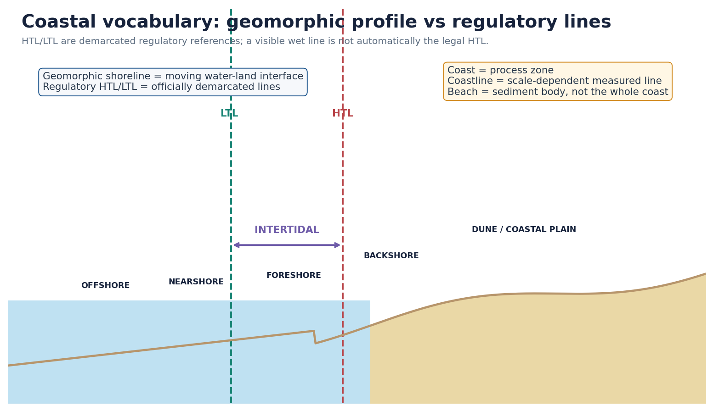

### Core concept

A **coast** is a process zone in which marine and terrestrial forces interact. A **shoreline** is the instantaneous water-land intersection; it moves with waves, tides, storms and seasons. A **coastline** is a chosen cartographic or statistical line and its measured length changes with scale and rules. A **beach** is a sediment body, often spanning foreshore and backshore, rather than a synonym for the entire coast.

| Term | Process meaning | Regulatory/legal caution |
|---|---|---|
| Foreshore | Frequently worked by swash and backwash between ordinary tidal positions | Not automatically identical to the full CRZ-I B map |
| Backshore | Normally above routine wave action but reached by storms | May still fall within a regulated landward zone |
| Nearshore | Breaking-wave and active sediment-transport zone | Physical, not cadastral, boundary |
| Offshore | Seaward of nearshore; lower-frequency bed interaction | CRZ-IV and maritime-law lines answer different questions |
| HTL | Highest water reached during spring tide as demarcated under NCSCM procedures | Do not draw it from one wet mark |
| LTL | Demarcated low-tide reference | HTL-LTL is CRZ-I B |
| Intertidal | Alternately exposed/submerged land between HTL and LTL | CRZ-I B under 2019 |
| Territorial water limit | Relevant to CRZ-IV A reach to 12 nautical miles | Not the national coastline-measurement method |

### Why the 2025 coastline number is not a CRZ shortcut

**FACT:** The circular used 2011 Electronic Navigation Chart High-Water Line data, WGS-84/UTM, generalised 1:250,000 scale, GIS, defined river-mouth treatment and offshore-island perimeters.
**ANALYSIS:** A finer map records more bays, inlets and irregularities - the coastline paradox.
**LIMIT:** Statistical HWL and regulatory CRZ HTL have different purposes. One cannot substitute for an approved CRZ map.

### UPSC traps

- **Wrong:** The longer coastline proves new territory.
  **Correct:** It primarily reflects measurement method, scale and island inclusion.
- **Wrong:** Shoreline, coastline and HTL are interchangeable.
  **Correct:** One is moving geomorphology, one a measurement convention and one a demarcated regulatory line.

```text
MOVING WATER-LAND EDGE = shoreline
MAPPED LENGTH = coastline
SEDIMENT BODY = beach
OFFICIALLY DEMARCATED CRZ REFERENCES = HTL / LTL
```

## Module 2 - Waves, refraction, breaking, drift and rip currents

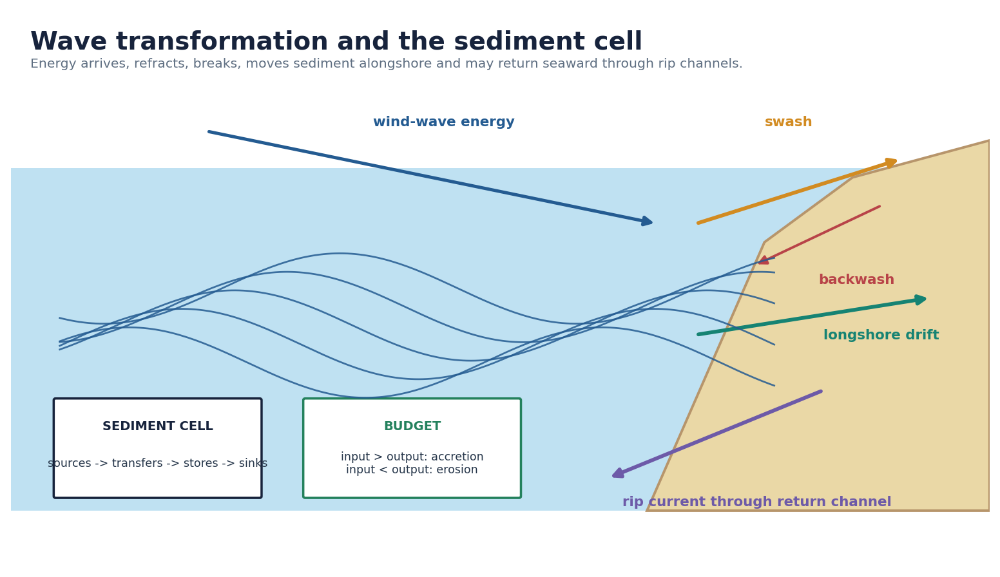

### Process derivation

1. **Generation:** Wind transfers energy; wave size depends on speed, duration and fetch.
2. **Shoaling:** In shallower water, speed and wavelength fall while height may increase.
3. **Refraction:** The shallow-water segment slows first; energy tends to converge on headlands and disperse in bays.
4. **Breaking:** Excess steepness collapses the crest and dissipates energy in the surf zone.
5. **Swash/backwash:** Swash runs up the beach; gravity-driven backwash returns downslope.
6. **Longshore drift:** Oblique breaking drives shore-parallel current and zig-zag sediment transport.
7. **Rip current:** Water piled nearshore returns through narrow channels as fast seaward flow. It is not an undertow that universally pulls swimmers to the seabed.

### Tides, currents and sediment cells

- **Tides** shift water level, expose intertidal flats and alter inlet/estuary currents.
- **Coastal currents** redistribute sediment, but response depends on bathymetry and wave climate.
- A **sediment cell** links sources, transfers, stores and sinks.
- The budget is: **change in storage = inputs - outputs**.

> **Memory hook:** **Fetch -> shoal -> refract -> break -> swash -> drift -> return.**

A groyne can trap sand updrift by interrupting littoral transport. This does not mean every groyne or seawall causes identical erosion everywhere. Impact depends on active transport, structure length/orientation, bypassing, nourishment, wave direction and cell boundaries.

## Module 3 - Erosional and depositional landforms

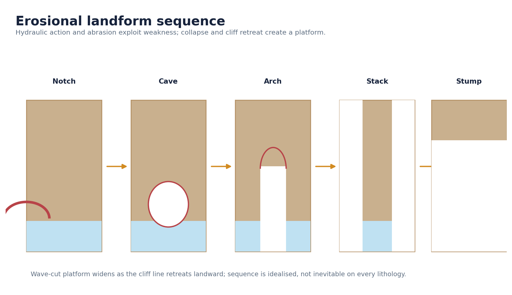

| Landform | Mechanism | Qualification |
|---|---|---|
| Cliff/notch | Wave attack undercuts the base; collapse retreats the face | Lithology, joints, exposure and debris removal control rate |
| Wave-cut platform | Repeated retreat leaves a gently sloping erosional surface | Relative sea-level change may submerge/raise it |
| Cave | Weakness enlarged by hydraulic action, abrasion and weathering | Not every cave follows one sequence |
| Arch | Caves breach a headland or a weakness is enlarged through it | Structural geology controls geometry |
| Stack | Roof collapse isolates a pillar | Survival reflects resistance and wave climate |
| Stump | Continued erosion lowers the remnant | Idealised final stage, often hidden at high tide |

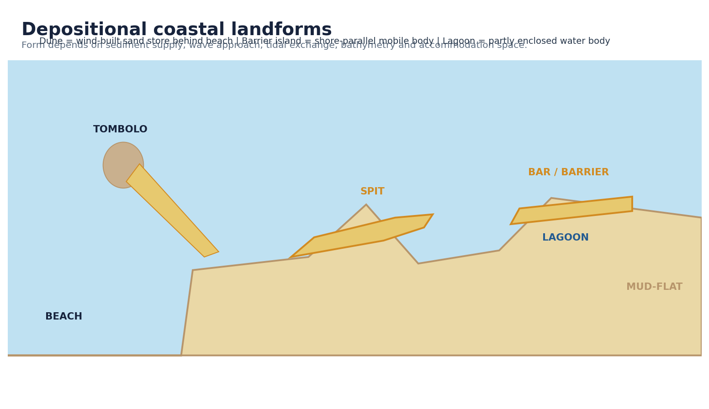

- **Beach:** temporary sand/gravel/shell store in the active wave zone.
- **Spit:** elongated deposit attached at one end, often built by longshore drift.
- **Bar:** ridge across a bay or shore-parallel in shallow water.
- **Tombolo:** deposit connecting an island to mainland or another island.
- **Barrier island:** shore-parallel mobile sand body separated by lagoon/marsh/channels.
- **Mudflat:** low-energy fine-sediment intertidal surface, often biologically active.
- **Dune:** wind-built sand store behind the beach; mobile despite vegetation.

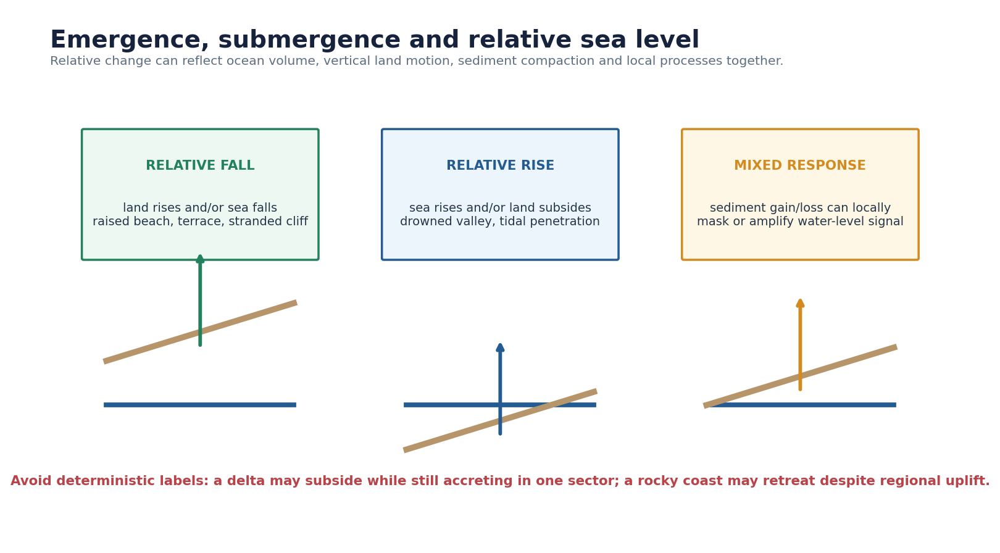

**Relative sea level** combines sea-surface change and land motion. Rise can reflect ocean warming/ice melt, subsidence, compaction or tectonics; fall can reflect sea-level fall or uplift. Sediment accumulation may offset inundation locally, while erosion can accentuate retreat.

- Emergent indicators: raised beaches, marine terraces, stranded cliffs.
- Submergent indicators: drowned valleys, deeper tidal penetration, embayed coasts.
- **LIMIT:** Landforms are evidence requiring chronology and process, not deterministic one-cause labels.

## Module 4 - Indian coastal physiography

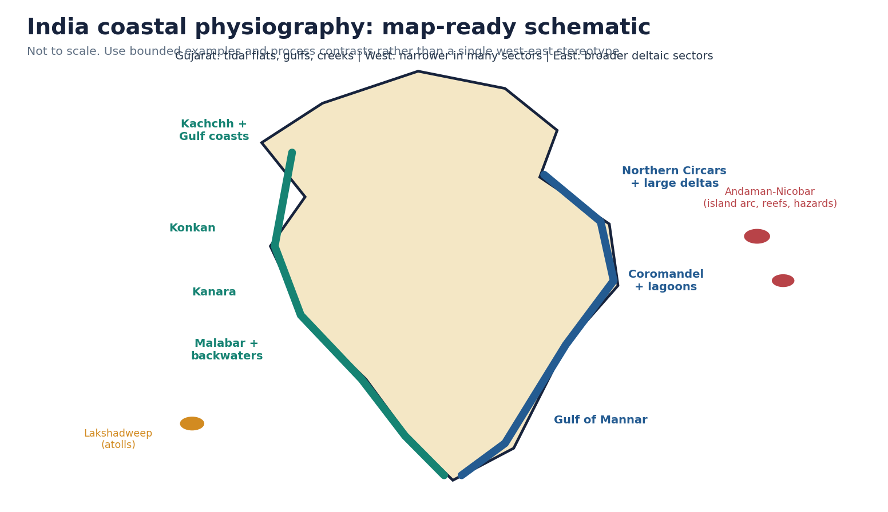

| Dimension | Western sectors | Eastern sectors | Caveat |
|---|---|---|---|
| Width | Often narrow where Western Ghats approach coast | Often broader across large deltaic plains | Gujarat/gulf sectors break the simple rule |
| River mouths | Narmada/Tapi estuaries; many short steep rivers | Major Mahanadi, Godavari, Krishna, Cauvery deltaic sectors | Tide, waves and engineering modify every mouth |
| Forms | Rocky headlands, pocket beaches, estuaries, Kerala backwaters | Deltas, beach ridges, lagoons, tidal wetlands | Both coasts contain mixed erosional/depositional stretches |
| Cyclone exposure | Arabian Sea risk exists and can be severe | Bay of Bengal has major cyclone/surge exposure | Use current hazard data, not a fixed ranking |
| Tidal range | Very high in Gulf of Khambat/Kachchh sectors | Variable, with major deltaic/tidal systems | Site-specific |

### Map-ready sequence

- **Gujarat/Kachchh and gulf coasts:** tidal flats, creeks, salt marshes, ports and high tidal energy.
- **Konkan:** rocky/embayed sectors, short rivers, estuaries and pocket beaches.
- **Kanara:** narrow plain in many sectors, estuaries and lateritic/rocky stretches.
- **Malabar:** beaches, spits, lagoons and linked backwaters; seasonal wave reversal matters.
- **Northern Circars:** deltaic plains, lagoons and cyclone/surge exposure.
- **Coromandel:** beach ridges, lagoons, northeast-monsoon/cyclone influence and dense urban-industrial coast.
- **Islands:** Lakshadweep atolls and Andaman-Nicobar island-arc coasts are linked only where reef, tsunami, ICRZ or process logic is relevant.

## Module 5 - Delta, estuary, lagoon and backwater

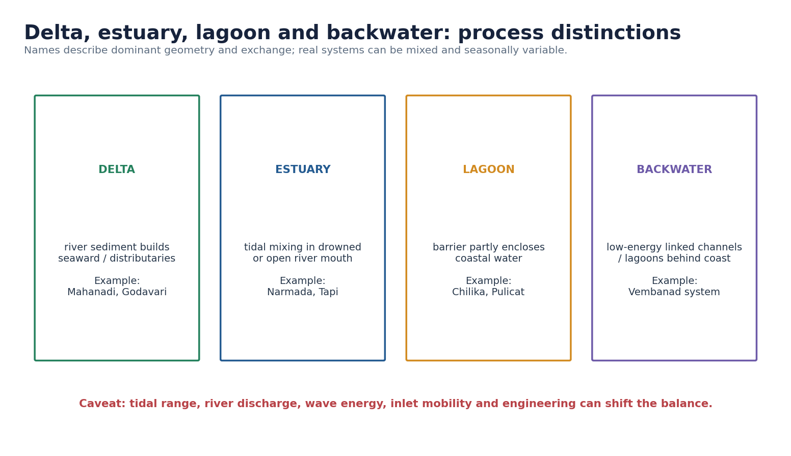

| System | Dominant process | Indian examples | Mixed-process caveat |
|---|---|---|---|
| Delta | River sediment accumulation near mouth, often with distributaries | Mahanadi, Godavari, Krishna, Cauvery, Ganga-Brahmaputra-Meghna | Waves, tides, dams, subsidence and embankments reshape sectors differently |
| Estuary | Tidal mixing and funnelled river-sea exchange | Narmada, Tapi, many west-coast rivers | Sediment bars and tidal deltas may coexist |
| Lagoon | Water partly enclosed by barrier/spit with restricted inlet exchange | Chilika, Pulicat | Salinity and inlet position vary seasonally and through management |
| Backwater | Linked low-energy lagoons/channels behind coast | Vembanad-associated Kerala system | Connected socio-ecological network, not a static freshwater lake |

```text
DAM / EXTRACTION / SAND MINING
        -> LESS OR ALTERED SEDIMENT DELIVERY
        -> DELTA COMPACTION + SUBSIDENCE NOT OFFSET
        -> SHORELINE RETREAT / SALINITY / FLOOD EXPOSURE
        -> LIVELIHOOD AND INFRASTRUCTURE RISK
```

**Qualification:** A dam does not mechanically cause erosion at every downstream beach. The effect depends on trapped fraction, tributary input, flood pulses, coastal pathways and engineering.

## Module 6 - Coastal erosion as a sediment-budget problem

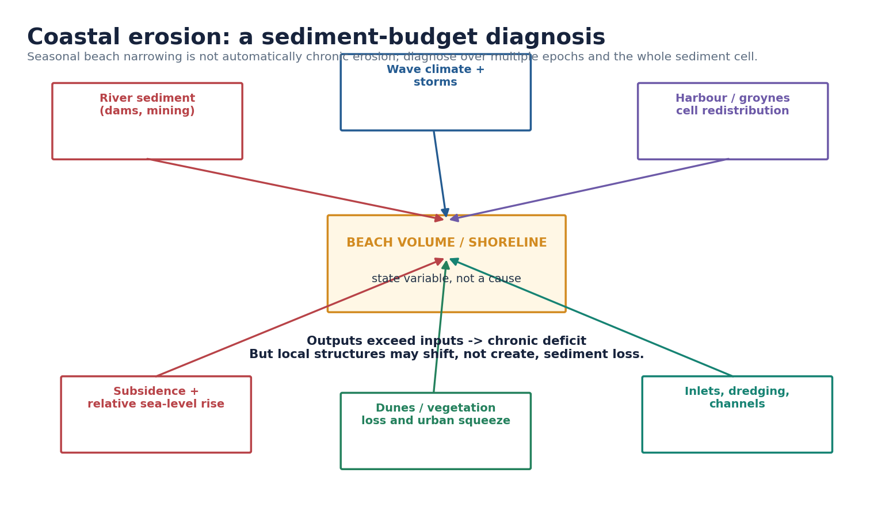

### Natural variability versus chronic erosion

A monsoon beach can narrow during a high-energy season and rebuild later. **Chronic erosion** requires persistent landward movement or sediment-volume loss across multiple comparable epochs, not one post-storm photograph.

| Driver | Mechanism | Diagnostic evidence |
|---|---|---|
| River dams/extraction | Reduce or alter sediment pulses reaching delta/coast | Reservoir trapping, grain-size change, mouth/bar evolution |
| Sand mining | Removes active-store material and can steepen profiles | Extraction records, volume surveys, local morphology |
| Harbours/groynes | Interrupt or redistribute alongshore transport | Updrift accretion plus downdrift deficit; bypass evidence |
| Inlet dynamics/dredging | Change tidal prism, channels and ebb/flood deltas | Bathymetry, dredge volume, inlet migration |
| Storms/wave-climate shifts | Episodic erosion, overwash and profile adjustment | Event chronology plus pre/post volume |
| Relative sea-level rise/subsidence | Raises baseline water level and accommodation demand | Tide gauges, land-motion and compaction evidence |
| Dune/vegetation loss and urban squeeze | Remove stores and block landward migration | Dune profiles, land-use history, hardening |

### Official assessment anchor

**FACT:** NCCR's national assessment for **1990-2018** classified about **33.6%** of the assessed mainland shoreline as eroding, **26.9%** as accreting and **39.6%** as stable.
**LIMIT:** These are period-bound national classes, not a present annual rate or a uniform state/beach prediction.

### Structure caveat

A seawall can protect the land immediately behind it while causing beach narrowing through reflection/scour or locking the shoreline as adjacent beaches move. Downdrift effects are especially relevant for structures interrupting littoral drift, but outcomes are context-specific. The correct principle is: diagnose the cell, compare alternatives, fund lifetime maintenance and monitor redistributed risk.

## Module 7 - Coastal hazards and end-to-end preparedness

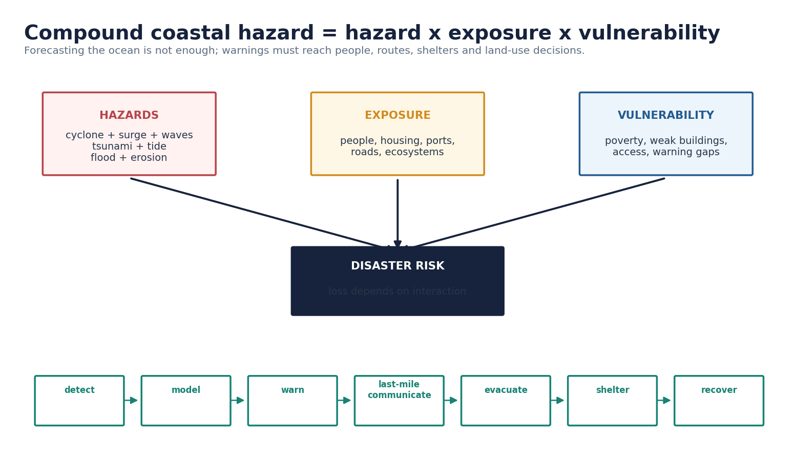

### Hazard mechanisms

- **Storm surge:** abnormal water-level rise driven mainly by cyclone winds and pressure, modified by bathymetry, coastal shape, tide and track.
- **Tsunami:** long waves from rapid water displacement, often undersea earthquakes; low offshore height can become destructive through shoaling and inundation.
- **Coastal flooding:** marine water, rain, river discharge, blocked drainage and tide can combine.
- **Saline intrusion:** seawater enters aquifers, soils or channels under pumping, drought, sea-level and barrier effects.
- **Cliff/dune instability:** toe erosion, saturation, wind erosion and disturbance trigger collapse/blowouts.
- **Rip currents:** narrow seaward flows create a high-frequency beach-safety hazard.

```text
CYCLONE RAIN + RIVER FLOOD + HIGH TIDE + STORM SURGE
             -> drainage reversal / overtopping
             -> wider and deeper inundation
             -> cascading power, transport, water and health failures
```

### Warning is a chain, not a message

INCOIS integrates seismic networks, bottom-pressure recorders, tide gauges, modelling and dissemination. IMD forecasts, state/district systems, local communication, evacuation routes, shelters and drills complete the chain. A technically accurate warning can fail if late, mistrusted, inaccessible or unactionable.

### Odisha lesson

**FACT/CASE:** Odisha demonstrates the value of forecast use, evacuation, shelters and administrative drills. Mangroves and dunes can reduce selected wave/surge energies and support livelihoods.
**LIMIT:** No ecosystem belt guarantees safety in an extreme event; evacuation, safe structures and land-use planning remain essential.

## Module 8 - Ecosystems, services and thresholds

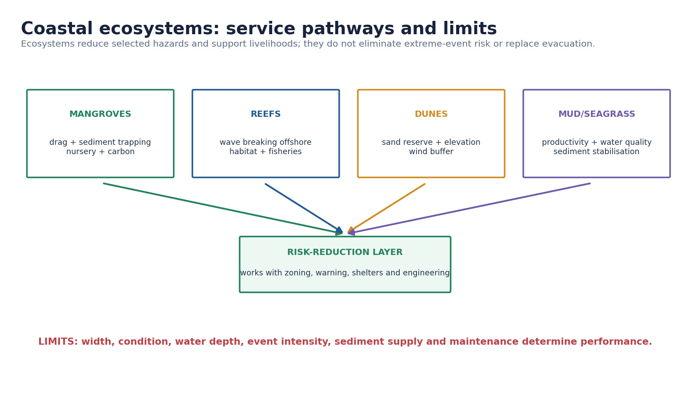

| Ecosystem | Services | Threshold/limit |
|---|---|---|
| Mangroves | Sediment trapping, nursery habitat, carbon, livelihoods, drag on flows | Width, density, species, depth, intensity and tidal connectivity matter |
| Coral reefs | Offshore wave breaking, biodiversity, fisheries and tourism | Bleaching, acidification, pollution, fishing and sedimentation reduce function |
| Seagrass | Nursery habitat, sediment stabilisation, carbon and water clarity feedbacks | Turbidity, dredging, anchors and eutrophication can cross recovery thresholds |
| Salt marsh | Flood storage, habitat and shoreline buffering | Coastal squeeze blocks landward migration |
| Mudflat | Benthic productivity, bird habitat and tidal storage | Reclamation and altered sediment/tidal exchange eliminate function |
| Dune | Sand reserve, elevation, wind buffer and post-storm recovery | Flattening, construction and poor access management interrupt mobility |
| Estuary/lagoon | Fisheries, nutrient transformation, navigation and flood storage | Inlet closure, dredging and upstream flow change alter salinity/ecology |

Ecosystem restoration belongs inside a portfolio: avoid high-risk occupation, protect sediment/water pathways, maintain warning and evacuation, use hybrids where suitable and retain hard protection for justified sites. “Nature-based” is not synonymous with maintenance-free or sufficient everywhere.

## Module 9 - CRZ evolution and current architecture

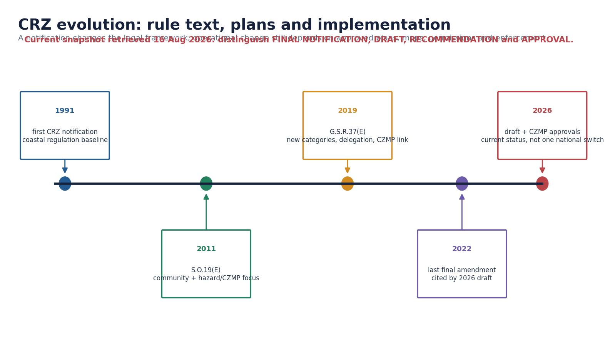

| Stage | Exam-safe description |
|---|---|
| 1991 | First national CRZ notification created a regulatory baseline. Do not import old clauses into current answers without checking. |
| 2011 | S.O. 19(E) superseded 1991: 500 m sea-front reach, generally 100 m/creek-width tidal reach and general 200 m CRZ-III NDZ, with community/hazard/CZMP provisions. |
| 2019 | G.S.R. 37(E) superseded 2011 prospectively and reorganised categories, NDZ treatment, delegation and plan dependence. |
| 2022 | The 2026 draft says the principal 2019 notification was last finally amended by S.O. 5495(E), 24 Nov 2022. |
| 2026 | Draft amendment and plan-specific records must be tagged. Draft is not law; recommendation is not approval. |

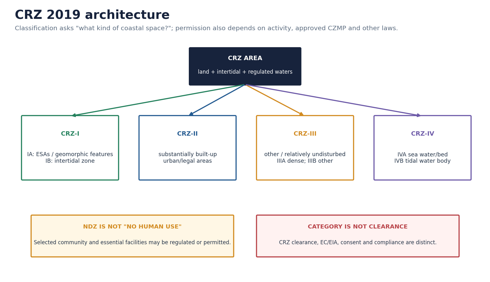

### Spatial reach under the 2019 base notification

- HTL to **500 m** landward along the sea front.
- Along connected tidal-influenced water bodies: **50 m or creek width, whichever is less**, only after corresponding updated CZMP approval; until then **100 m or creek width** continues.
- Intertidal land between HTL and LTL.
- Water/bed between LTL and territorial-water limit in sea, and tidal-influenced water bodies to defined tidal influence.

| Category | Exact architecture | Frequent trap |
|---|---|---|
| CRZ-I A | Mangroves, reefs, dunes, biologically active mudflats, protected areas, salt marshes, turtle grounds, horseshoe-crab habitat, seagrass, bird nesting and heritage sites | Official text contains narrow, safeguarded exceptions; “absolute no activity” is too broad |
| CRZ-I B | Intertidal LTL-HTL | Not every beach parcel landward of HTL |
| CRZ-II | Developed land in municipal/legally designated urban area, over 50% built-up plots and specified infrastructure | Urban location alone is insufficient |
| CRZ-III A | Density **more than 2161/km2** on 2011 Census base; 50 m NDZ after approved updated CZMP, otherwise 200 m continues | Density and plan approval both matter |
| CRZ-III B | Other CRZ-III area below 2161/km2; 200 m NDZ | Read actual approved map |
| CRZ-IV A | Water/bed from LTL to 12 nautical miles | Water category, not a land NDZ |
| CRZ-IV B | Water/bed of tidal-influenced body to 5 ppt driest-season salinity influence | Follows tidal influence, not district boundary |

“No Development Zone” restricts new construction but contains regulated permissions for repair/reconstruction, traditional-community dwellings, agriculture, local public facilities, fishing facilities, sewage treatment and specified temporary tourism. NDZ is not “no people/no use.”

## Module 10 - CZMP, mapping, clearance and enforcement

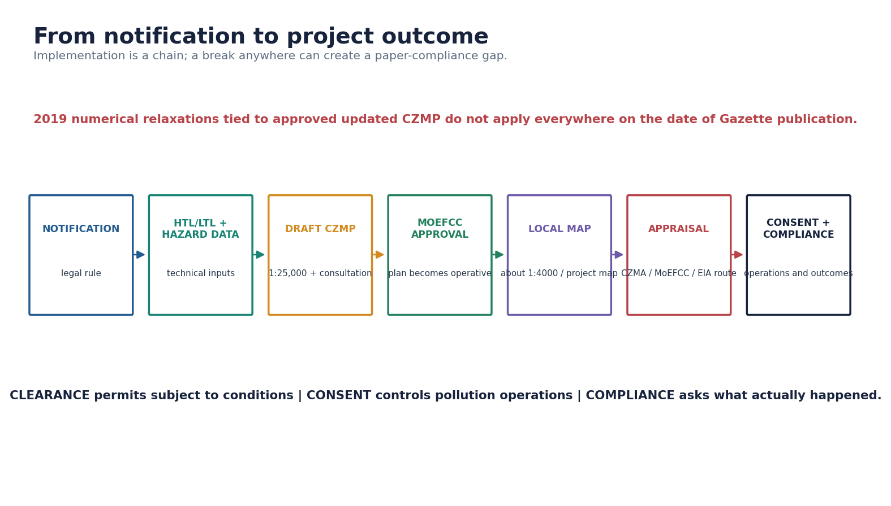

### Why Gazette publication did not create one instantaneous national switch

The 2019 text ties certain reduced distances and activity plans to an **approved updated CZMP**. States/UTs prepare plans with consultation, CZMAs appraise/recommend and MoEFCC approves. Until plan approval, specified 2011 distances/routes continue. Even after a 1:25,000 plan is approved, local/project maps and appraisal remain necessary.

**STATUS example:** The 49th NCZMA meeting recommended Daman-Diu's plan on 8 May 2026. MoEFCC issued a distinct final approval dated 18 June 2026. The second document changed the plan's status; the recommendation alone did not.

### Mapping architecture

- NCSCM HTL/LTL demarcation is the 2019 regulatory base.
- State/UT CZMPs: **1:25,000**.
- Project maps: normally **1:4,000**, with approved category and layout.
- Survey of India **hazard line**: adaptation/disaster-management input, not automatically a universal construction prohibition.
- The 49th NCZMA minutes call for faster local-scale translation of approved plans, proving that approval and plot-level implementation are separate.

| Project situation | Authority route under 2019 base |
|---|---|
| CRZ-I or CRZ-IV | MoEFCC, based on concerned CZMA recommendation |
| Pure CRZ-II/III and not EIA route | Concerned CZMA |
| II/III project crossing I/IV | MoEFCC on CZMA recommendation |
| Also attracts EIA Notification 2006 | Composite EC and CRZ treatment by competent EIA authority with CZMA recommendation |
| Smaller construction below EIA threshold | Local planning approval after CZMA recommendation, subject to specified exception |

```text
CRZ CLEARANCE = location/activity permission with conditions
ENVIRONMENTAL CLEARANCE = EIA-based appraisal where triggered
CONSENT TO ESTABLISH / OPERATE = pollution-control authorisation
COMPLIANCE = whether conditions and standards were followed
OUTCOME = what happened to shoreline, ecology, risk and livelihoods
```

One document does not substitute for another. Clearance is not proof of ecological success; an adverse outcome is not automatically proof that every condition was violated. Evidence must connect condition, action, pathway and observed effect.

## Module 11 - Institutions and contested trade-offs

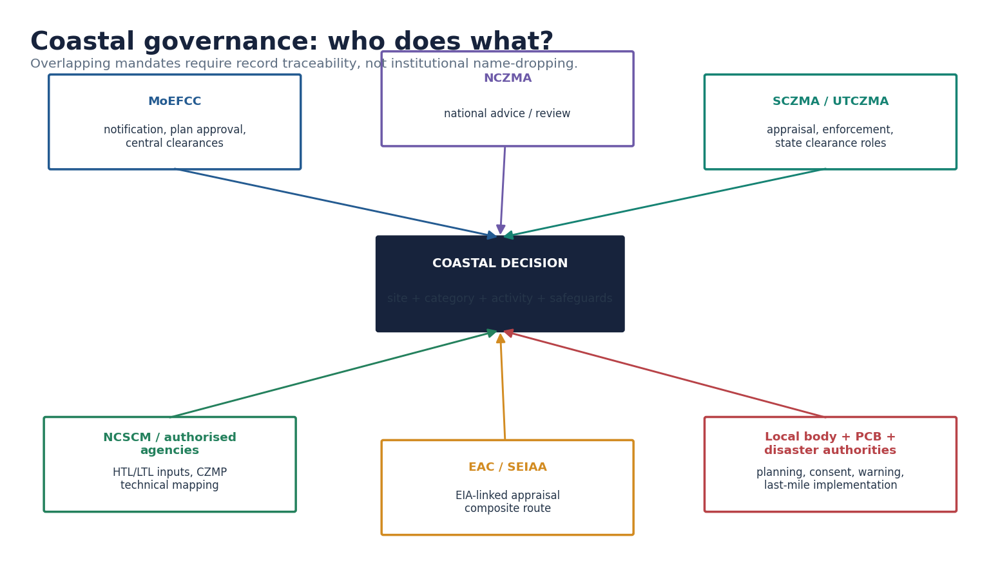

- **MoEFCC:** notification/amendment, CZMP approval and central clearance.
- **NCZMA:** national review/advice and plan recommendations.
- **SCZMA/UTCZMA:** appraisal, delegated clearances, monitoring and enforcement.
- **NCSCM/authorised institutes:** technical mapping/planning; 1 June 2026 OM added KSREC, ORSAC and KSRAC.
- **EAC/SEIAA:** appraisal where EIA route applies.
- **CPCB/SPCB/PCC:** pollution consent, standards and enforcement under their laws.
- **Local bodies:** land-use/building approvals and services.
- **IMD/INCOIS/disaster authorities:** hazard information, warnings, plans and evacuation.
- **District/community institutions:** local implementation and knowledge.

| Issue | Development claim | Environmental/social risk | Balanced test |
|---|---|---|---|
| Fisher housing/access | Tenure and proximity to landing sites | Exposure, access privatisation, sanitation gaps | Recognise rights, preserve corridors, risk-proof services |
| Urban roads/redevelopment | Mobility, housing and infrastructure | Reclamation, habitat loss, flood-path blockage, cumulative effects | Alternatives, cumulative modelling, disclosure and monitoring |
| Tourism | Jobs and revenue | Dune flattening, sewage, groundwater stress, exclusion | Capacity, public access, waste systems and benefit sharing |
| Ports/harbours | Trade, strategy and fishing infrastructure | Sediment interruption, dredging, habitat/water effects | Bypassing, dredge plan, cumulative assessment, downdrift triggers |
| Strategic projects | Security/connectivity | Sensitive siting and irreversible loss | Necessity, alternatives, least-damage design, independent monitoring |
| Conservation restrictions | Habitat and hazard reduction | Livelihood burden concentrated locally | Co-management, compensation, differentiated permission, grievance redress |

## Module 12 - ICZM, intervention hierarchy and monitoring

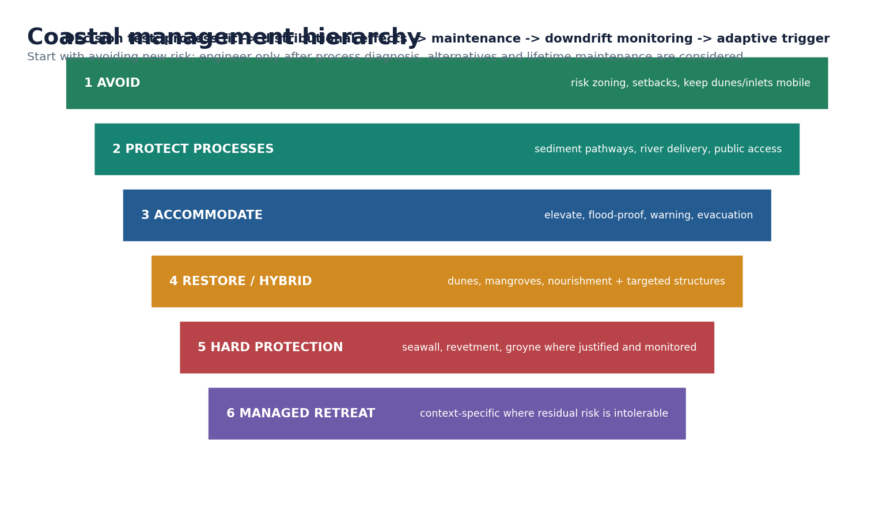

1. **Avoid new risk:** hazard-sensitive land use and evacuation/open-space networks.
2. **Protect process:** maintain river sediment, dunes, tidal channels, wetlands and access.
3. **Accommodate:** elevate/flood-proof critical assets, warnings, shelters and livelihood continuity.
4. **Restore/use hybrid systems:** nourishment, dune rebuilding, mangrove/reef restoration where conditions suit, plus targeted engineering.
5. **Hard protection:** seawalls, revetments, breakwaters or groynes where justified and sediment effects managed.
6. **Managed retreat:** context-specific relocation/rolling adaptation where residual risk makes defence inequitable or unsustainable.

### Tool-specific cautions

- **Beach nourishment:** needs compatible grain size, borrow safeguards and repeated replenishment.
- **Dune restoration:** access control/native vegetation can rebuild sand; over-fixing a mobile system can also harm it.
- **Mangrove restoration:** restore hydrology and elevation first; plantation survival is not ecosystem function.
- **Inlet management:** opening/dredging changes salinity, fisheries and tidal prism.
- **Hard structures:** protect target frontage but can transfer/conceal erosion; include bypassing and downdrift monitoring.

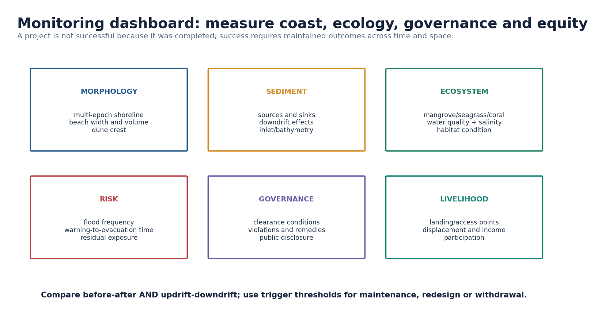

| Domain | Indicators |
|---|---|
| Morphology | Multi-epoch shoreline, beach width/volume, profile, dune crest, cliff toe, bathymetry |
| Sediment | River delivery, grain size, source-sink budget, dredging/nourishment, updrift-downdrift change |
| Ecology | Mangrove condition, seagrass/coral cover, mudflat extent, water quality, salinity, connectivity |
| Hazard | Inundation depth/frequency, warning lead time, evacuation, shelter functionality, residual exposure |
| Governance | Clearance conditions, consent, compliance, violations, remedies, map access and disclosure |
| Equity | Landing/access points, displacement, livelihood costs, participation and benefit distribution |

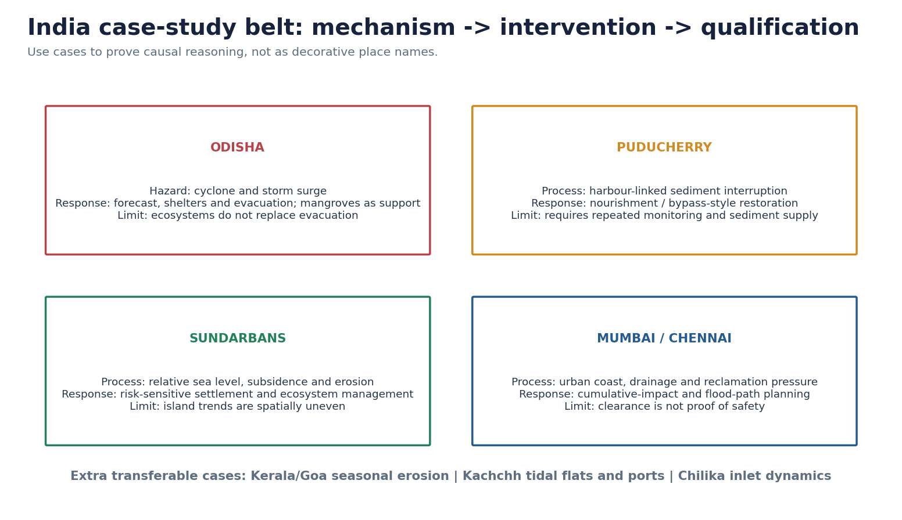

- **Odisha:** evacuation, shelters and administration with ecosystem support; do not credit mangroves alone.
- **Puducherry:** harbour-linked interruption and restoration show nourishment/bypass logic; monitor supply and maintenance.
- **Sundarbans:** relative sea-level, subsidence, channel migration, cyclone and embankment effects interact.
- **Mumbai/Chennai:** coastal water level, drainage, reclamation, impervious surfaces and extreme rain combine.
- **Kerala/Goa:** seasonal monsoon erosion and dense occupation require multi-season diagnosis.
- **Kachchh/gulfs:** tidal flats, creeks, ports and high range require estuary/gulf-specific modelling.

## Advanced refinements and answer-writing rules

1. **Shoreline change** is an observation; **erosion** is process diagnosis; **risk** adds exposure and vulnerability.
2. **Notification** is not **approved plan**; plan is not **project clearance**; clearance is not **compliance**; compliance is not automatically positive **outcome**.
3. **Hard defence** can protect one frontage while redistributing cell-scale risk.
4. **Ecosystem service** is conditional on state, width and event intensity.
5. **Current status** must be date-stamped and document-specific.

```text
DEFINE THE PROCESS / LEGAL STAGE
        -> NAME EVIDENCE OR INDIAN CASE
        -> EXPLAIN THE CAUSAL MECHANISM
        -> STATE A LIMIT / COUNTERVAILING CONDITION
        -> GIVE A PRIORITISED, MONITORED VERDICT
```

# PART II - SOLVED PRACTICE

## Solved topic-specific MCQs

> **Rotation rule:** The 56 original package MCQs follow one continuous A -> B -> C -> D sequence. Verified UPSC PYQs retain historical option order and are excluded because a PYQ key cannot be rearranged.

## Verified UPSC Prelims PYQs

### PYQ-P1 - UPSC Prelims 2018 - coral reefs

**Question.** Consider the following statements:

1. Most of the world's coral reefs are in tropical waters.
2. More than one-third of the world's coral reefs are located in the territories of Australia, Indonesia and Philippines.
3. Coral reefs host far more number of animal phyla than those hosted by tropical rainforests.

A. 1 and 2 only
B. 3 only
C. 1 and 3 only
D. 1, 2 and 3

**Answer: D - INFERRED ANSWER, NOT OFFICIALLY VERIFIED IN THE LOCAL KEY SET. Confidence: high.**

- Statement 1: correct; reef-building corals concentrate in warm, shallow, sunlit waters.
- Statement 2: correct in the UPSC framing.
- Statement 3: correct; reefs contain exceptionally high animal-phyla diversity.

### PYQ-P2 - UPSC Prelims 2022 - Biorock

**Question.** “Biorock technology” is talked about in which one of the following situations?

A. Restoration of damaged coral reefs
B. Building material from plant residues
C. Shale-gas exploration
D. Salt licks for wild animals

**Answer: A - INFERRED ANSWER, NOT OFFICIALLY VERIFIED IN THE LOCAL KEY SET. Confidence: high.**

Low-voltage mineral accretion encourages calcium-carbonate deposition and coral attachment. It does not remove thermal, sewage or sediment stress.

### PYQ-P3 - UPSC Prelims 2023 - repeated sea-level falls

**Question.** Which is the best example of repeated falls in sea level, giving rise to present-day extensive marshland?

A. Bhitarkanika Mangroves
B. Marakkanam Salt Pans
C. Naupada Swamp
D. Rann of Kutch

**Answer: D - INFERRED ANSWER, NOT OFFICIALLY VERIFIED IN THE LOCAL KEY SET. Confidence: high.**

Rann of Kutch is the intended emerged/marshy former marine setting. Relative sea level and geomorphic history matter; do not force one global cause onto every feature.

### PYQ-P4 - UPSC Prelims 2026 - mangrove climate resilience

**Question.** Which best explain(s) the rationale for protecting mangroves in climate resilience?

1. They reduce tidal energy and store freshwater, making saline estuarine belts ideal for paddy.
2. Salt-sensitive roots filter seawater and convert coast into freshwater aquaculture.
3. By withstanding tidal surges and offering biomass resources, they act as bio-shields and livelihood bases.

A. 1 only
B. 1 and 2
C. 2 and 3
D. 3 only

**Answer: D - PROVISIONAL LOCAL UPSC KEY, Series A, from `Ans-2026-GS1-Provisional.pdf`.**

Statements 1 and 2 wrongly convert a salt-tolerant tidal ecosystem into a freshwater-production system. Statement 3 is correct with the caveat that protection has thresholds.

## Original hard MCQ loop - questions 1-40

### MCQ-01

Which best distinguishes a shoreline from CRZ HTL?

A. Shoreline is an instantaneous water-land intersection; CRZ HTL is an officially demarcated regulatory reference.
B. Both are fixed cadastral lines.
C. Shoreline is always landward of HTL.
D. HTL is any observed wet mark.

**Answer: A**

Geomorphic position moves over tides/seasons; the notification requires formal HTL demarcation.

### MCQ-02

Obliquely breaking waves most directly create:

A. Permanent mean-sea-level rise.
B. Longshore current and zig-zag sediment movement.
C. Tidal bores in every estuary.
D. Offshore transport only.

**Answer: B**

Oblique swash plus downslope backwash generates net alongshore transfer.

### MCQ-03

A rip current is:

A. A tide-generating deep-ocean current.
B. The same as longshore drift.
C. A narrow, fast seaward return flow through the surf zone.
D. A wave that always drags swimmers to the seabed.

**Answer: C**

Water piled nearshore returns through channels; moving parallel to shore is safer than fighting it directly.

### MCQ-04

Chronic erosion in a sediment cell is most consistent with:

A. One post-storm narrowing.
B. Inputs persistently exceeding outputs.
C. Rising dune volume.
D. Outputs persistently exceeding inputs over comparable periods.

**Answer: D**

Trend diagnosis requires multi-epoch storage and cell-boundary evidence.

### MCQ-05

Which idealised erosional sequence is defensible?

A. Notch/cave -> arch -> stack -> stump.
B. Spit -> bar -> lagoon -> delta.
C. Dune -> estuary -> arch -> reef.
D. Tombolo -> cave -> marsh -> stack.

**Answer: A**

It is a teaching sequence, not an inevitable path on every lithology.

### MCQ-06

A tombolo is:

A. A drowned river valley.
B. A deposit linking an island with mainland or another island.
C. A cliff-foot bench.
D. A tidal channel through a delta.

**Answer: B**

Wave refraction and a wave shadow can favour deposition between land masses.

### MCQ-07

Relative sea-level rise at a delta may result from:

A. Global sea rise only.
B. Tectonic uplift only.
C. Ocean rise plus subsidence/compaction, with sediment partly offsetting local effects.
D. Annual rainfall alone.

**Answer: C**

Relative level compares water and land; sediment budget shapes the shoreline response.

### MCQ-08

Which statement about India's west/east coasts is best?

A. Entire west is erosional and east depositional.
B. Only east has estuaries.
C. Arabian Sea cyclones are impossible.
D. Broad contrasts help, but Gujarat gulfs, rocky sectors, deltas, lagoons and engineering create exceptions.

**Answer: D**

UPSC rewards qualified regional differentiation, not rigid binaries.

### MCQ-09

Which pair is correctly matched?

A. Narmada-Tapi: estuarine mouths influenced by tides.
B. Godavari-Krishna: classic rias.
C. Chilika: ocean trench.
D. Vembanad: coral atoll.

**Answer: A**

Narmada/Tapi enter the high-tidal Gulf of Khambat; major east-flowing rivers commonly form deltas.

### MCQ-10

A coastal lagoon is:

A. Any oxbow near a coast.
B. A partly enclosed water body behind a barrier/spit with inlet exchange.
C. Water beyond 12 nautical miles.
D. A permanently freshwater aquifer.

**Answer: B**

Inlet position, salinity and exchange can vary seasonally.

### MCQ-11

Best evidence separating chronic erosion from seasonal variability:

A. One post-cyclone photograph.
B. Presence of a seawall.
C. Comparable multi-epoch shoreline and beach-volume records.
D. One undated interview.

**Answer: C**

Time-consistent morphology is necessary to diagnose persistent loss.

### MCQ-12

A harbour arm across active littoral drift can:

A. Guarantee equal accretion both sides.
B. Stop relative sea-level rise.
C. Eliminate monitoring.
D. Accrete sand updrift and create downdrift deficit without bypassing/nourishment.

**Answer: D**

The structure redistributes a finite sediment flux; exact response is site-specific.

### MCQ-13

Storm surge is:

A. Abnormal coastal water-level rise driven mainly by cyclone winds/pressure, modified by tide, track and bathymetry.
B. Astronomical tide alone.
C. A fault-generated tsunami.
D. Permanent mean-sea-level rise.

**Answer: A**

Surge, tide, waves and rainfall can combine into compound inundation.

### MCQ-14

Which belongs to a tsunami-warning chain?

A. Rain gauges only.
B. Seismic networks, bottom-pressure recorders, tide gauges, models and communication.
C. Coastal CCTV alone.
D. Television only after landfall.

**Answer: B**

Detection and confirmation must connect to actionable dissemination and evacuation.

### MCQ-15

Coastal disaster risk is best represented by:

A. Wave height alone.
B. Population alone.
C. Hazard interacting with exposure and vulnerability, modified by capacity.
D. Shelter count alone.

**Answer: C**

The same surge produces different losses in differently exposed and prepared communities.

### MCQ-16

Soundest statement about mangrove protection:

A. Mangroves stop every tsunami.
B. They work equally regardless of width/condition.
C. Planting guarantees a functioning ecosystem.
D. They can attenuate selected flows and support livelihoods, but cannot replace evacuation everywhere.

**Answer: D**

Hydrology, forest structure, water depth and event intensity matter.

### MCQ-17

CRZ along the sea front under the 2019 base includes:

A. HTL to 500 m landward plus specified intertidal/water areas.
B. Only HTL-LTL.
C. Every coastal-district parcel.
D. Only ports.

**Answer: A**

CRZ includes land, intertidal and water categories; classification and activity govern regulation.

### MCQ-18

For CRZ 2019, HTL means:

A. Any storm-debris line.
B. Highest water reached during spring tide, demarcated under NCSCM procedure.
C. The national 1:250,000 coastline in every case.
D. Low-water line on an ENC.

**Answer: B**

Official demarcation, not visual guesswork, governs the notification.

### MCQ-19

Which belongs to CRZ-I A?

A. Every municipal ward within 500 m.
B. All water beyond territorial sea.
C. Biologically active mudflats.
D. Every cultivated coastal field.

**Answer: C**

Other examples include mangroves, reefs, dunes, salt marshes and seagrass.

### MCQ-20

CRZ-I B is:

A. All land 500 m from HTL.
B. Only mangrove buffers.
C. All developed urban land.
D. Intertidal area between LTL and HTL.

**Answer: D**

It is distinct from CRZ-I A ecologically sensitive areas.

### MCQ-21

CRZ-II requires:

A. Legally urban area, substantial built-up condition and specified infrastructure.
B. Any village with a beach.
C. Density over 2161/km2 alone.
D. Any port.

**Answer: A**

The built-up and infrastructure test matters; “urban” alone is insufficient.

### MCQ-22

CRZ-III A uses:

A. Density below 2161/km2 with automatic 50 m NDZ.
B. Density above 2161/km2 on 2011 Census base, with 50 m NDZ after approved updated CZMP.
C. No density criterion.
D. A 20 m rule for all mainland villages.

**Answer: B**

Without updated-plan approval, the 200 m NDZ continues for this relaxation.

### MCQ-23

CRZ-III B generally has:

A. Automatic CRZ-II classification.
B. No landward regulation.
C. Density below 2161/km2 and 200 m NDZ.
D. Only water and seabed.

**Answer: C**

The actual category must still be read from the approved plan.

### MCQ-24

CRZ-IV B covers:

A. Landward dunes.
B. Municipal construction.
C. Offshore islands only.
D. Water and bed of tidal-influenced bodies to defined tidal influence.

**Answer: D**

The 5 ppt salinity criterion in the driest season helps define tidal influence.

### MCQ-25

The 50 m tidal-water-body reach under 2019:

A. Depends on final updated-CZMP approval; meanwhile 100 m/creek-width continues.
B. Applied automatically nationwide in January 2019.
C. Never applies to creeks.
D. Is a coastline-length rule.

**Answer: A**

This is a central transition caveat.

### MCQ-26

The CRZ hazard line is best used as:

A. A universal prohibition identical to NDZ.
B. A disaster-management/adaptation input for land-use planning.
C. A substitute for HTL.
D. A maritime boundary.

**Answer: B**

The notification describes it as a planning tool, not a one-size setback.

### MCQ-27

Why did 2011 procedures continue in some places after 2019 publication?

A. The 2019 Gazette had no legal force.
B. States can ignore central rules indefinitely.
C. Operational changes are linked to approved updated CZMPs, so transition is plan-specific.
D. Only courts can prepare maps.

**Answer: C**

Notification, plan approval and project appraisal are distinct stages.

### MCQ-28

A non-EIA project purely in CRZ-II/III is generally considered for CRZ clearance by:

A. NCCR.
B. Survey of India.
C. INCOIS.
D. The concerned CZMA.

**Answer: D**

CRZ-I/IV involvement generally shifts the route to MoEFCC on CZMA recommendation.

### MCQ-29

A project attracting CRZ 2019 and EIA Notification 2006 generally receives:

A. Composite environmental and CRZ treatment through the competent EIA authority with CZMA recommendation.
B. Only a trade licence.
C. Only consent to operate.
D. No appraisal.

**Answer: A**

The exact authority depends on EIA category and CRZ location.

### MCQ-30

Which distinction is correct?

A. CRZ clearance automatically grants consent to operate.
B. Pollution-control consent is distinct from CRZ/EC clearance and compliance.
C. Consent proves zero impact.
D. CZMP approval is project consent.

**Answer: B**

Different laws and conditions govern different stages.

### MCQ-31

As of 16 August 2026, G.S.R. 410(E), 26 May 2026 was:

A. The final 2019 notification.
B. A Supreme Court order.
C. A draft proposing specified chemical storage outside CRZ-I A.
D. A national CZMP approval.

**Answer: C**

The “Draft Notification” heading and objection window determine status.

### MCQ-32

The 2025 increase in measured coastline is:

A. Rapid land creation.
B. A substitute for CRZ HTL.
C. Proof every beach accreted.
D. A remeasurement effect from scale, method, HWL treatment and island inclusion.

**Answer: D**

Measurement conventions can change length without changing sovereignty.

### MCQ-33

The Odisha cyclone lesson is:

A. Forecast-linked evacuation, shelters, drills and resilient administration, supported but not replaced by ecosystems.
B. Mangroves alone eliminate risk.
C. Warnings matter only after landfall.
D. Hard structures make evacuation unnecessary.

**Answer: A**

Layered risk reduction is more transferable than a single-cause story.

### MCQ-34

The Puducherry restoration lesson illustrates:

A. Every seawall creates a permanent beach.
B. Restoring sediment transfer/nourishing a harbour-affected coast can rebuild beach but needs monitoring and supply.
C. Nourishment never needs replenishment.
D. Harbours do not affect drift.

**Answer: B**

The mechanism is sediment-budget correction, not cosmetic sand placement.

### MCQ-35

Prudent intervention hierarchy:

A. Seawalls everywhere before diagnosis.
B. Plant mangroves after blocking tidal flow.
C. Avoid -> protect processes -> accommodate -> restore/hybrid -> justified hard defence -> context-specific retreat.
D. Approve development before hazard mapping.

**Answer: C**

The hierarchy prevents high-cost lock-in.

### MCQ-36

Best monitoring design for a groyne field:

A. Completion certificate only.
B. One updrift photograph.
C. Original clearance letter only.
D. Before-after and updrift-downdrift volumes, bypass records and triggers.

**Answer: D**

This measures redistribution, performance and unintended effects.

### MCQ-37

Mangrove restoration is most likely to succeed when:

A. Tidal hydrology, elevation and sediment conditions are restored with suitable species recovery.
B. Any species is planted in rows on any mudflat.
C. The site is isolated from tides.
D. One-month survival equals full recovery.

**Answer: A**

Hydrology is often the first-order constraint.

### MCQ-38

Beach nourishment is:

A. A permanent one-time cure.
B. Adding compatible sediment with borrow, replenishment and monitoring obligations.
C. A substitute for cell analysis.
D. Concrete armouring.

**Answer: B**

It works with the beach but remains a maintained intervention.

### MCQ-39

Managed retreat means:

A. Unplanned abandonment after every storm.
B. A mandatory rule for every coast.
C. Planned relocation/rolling adaptation where residual risk makes permanent defence unsuitable.
D. Prohibition of fishing.

**Answer: C**

It requires rights, finance and livelihood safeguards.

### MCQ-40

Which statement about clearance and outcome is correct?

A. Clearance proves no future erosion.
B. Any erosion proves illegality.
C. Consent substitutes for monitoring.
D. Clearance authorises subject to conditions; success requires compliance and outcome indicators.

**Answer: D**

Lawful permission, compliance and environmental outcome are separate empirical questions.

## Remedial MCQ loop - questions 41-56

The key rotation continues without reset.

### R-MCQ-41

A beach narrows during monsoon and rebuilds later. Safest conclusion:

A. Seasonal variability unless multi-epoch volume evidence shows chronic loss.
B. Permanent erosion is proven.
C. Sea-level rise is absent.
D. Annual accretion is proven.

**Answer: A**

Do not infer trend from one phase of a seasonal cycle.

### R-MCQ-42

Most accurate statement about seawalls:

A. They always cause identical downdrift erosion.
B. They may defend hinterland locally but narrow beach/alter adjacent process; effect is site-specific.
C. They always rebuild recreational beach.
D. They remove surge risk.

**Answer: B**

Separate asset protection from beach and cell outcomes.

### R-MCQ-43

A delta sector accretes despite regional relative sea-level rise. This means:

A. Sea-level data are false.
B. Subsidence is impossible.
C. Local deposition can temporarily exceed accommodation demand.
D. Every delta sector is safe.

**Answer: C**

Relative water level and sediment budget jointly shape shoreline position.

### R-MCQ-44

A table says CRZ-IIIA has 50 m NDZ everywhere. Correction:

A. IIIA has no NDZ.
B. 50 m applies beyond territorial waters.
C. States can waive it informally.
D. 50 m requires density criterion and approved updated CZMP; otherwise 200 m continues.

**Answer: D**

Every CRZ number must travel with its condition.

### R-MCQ-45

NCZMA recommends a CZMP. Immediate conclusion:

A. Recommendation is not final MoEFCC approval; check the later order.
B. Every project is automatically cleared.
C. The plan is rejected.
D. CRZ ceases to apply.

**Answer: A**

The Daman-Diu 2026 sequence demonstrates the distinction.

### R-MCQ-46

An approved 1:25,000 CZMP means a parcel project still needs:

A. No review.
B. Applicable local/project mapping and appraisal/clearance/consent.
C. Only coastline-length data.
D. A newspaper report.

**Answer: B**

Plan approval enables regulation; it does not approve each project.

### R-MCQ-47

The 11,098.81 km coastline figure should be used in a CRZ dispute as:

A. Proof HTL moved seaward.
B. Proof a beach accreted.
C. A national measurement fact distinct from parcel regulatory HTL/CZMP.
D. Substitute for approved maps.

**Answer: C**

Purpose and scale control evidentiary use.

### R-MCQ-48

A 2026 draft proposes additional chemical storage. A Mains answer should say:

A. It became final on publication.
B. All CRZ-I A storage became legal.
C. It repealed CRZ 2019.
D. It remained draft on the retrieval date unless a later final Gazette is verified.

**Answer: D**

Status words are legally substantive.

### R-MCQ-49

A mangrove plantation has 80% one-year survival. Strongest evaluation:

A. Promising establishment; hydrology, recruitment, habitat and livelihood outcomes still need tracking.
B. Full restoration is proven.
C. Surge risk is eliminated.
D. Monitoring can end.

**Answer: A**

Output and outcome must be separated.

### R-MCQ-50

A nourishment project widens a beach immediately. Next priority:

A. Declare permanent success.
B. Track retention, downdrift effects, borrow impacts and replenishment triggers.
C. Stop profiles.
D. Build on the new berm.

**Answer: B**

Dynamic interventions need maintenance criteria.

### R-MCQ-51

A cyclone warning is accurate but evacuation fails. Missing concept:

A. Wave refraction.
B. Territorial-sea delimitation.
C. End-to-end warning: trust, access, routes, transport, shelters and action.
D. Coral mineral accretion.

**Answer: C**

Forecast skill does not automatically become avoided loss.

### R-MCQ-52

A port EIA ignores nearby ports and river-sediment change. Key gap:

A. Tourism plan only.
B. Coastline-length calculation.
C. Coral definition.
D. Cumulative and sediment-cell assessment.

**Answer: D**

Multiple interventions interact across the same littoral system.

### R-MCQ-53

Improve “west coast = estuaries, east coast = deltas” by:

A. Add Gujarat gulfs and local exceptions, east-coast lagoons/rocky sectors and mixed processes.
B. Remove all comparison.
C. Say west has no deposition.
D. Say east has no tides.

**Answer: A**

Qualified generalisation earns more than a rigid binary.

### R-MCQ-54

Best first response to chronic dune erosion beside a new resort:

A. Flatten the dune.
B. Restore access/sediment pathways, reassess setback and diagnose beach-dune budget.
C. Plant mangroves on dry crest.
D. Assume offshore currents alone.

**Answer: B**

Match intervention to landform and causal pathway.

### R-MCQ-55

Pollution-control consent proves:

A. Approved CZMP.
B. Acceptable cumulative impacts.
C. A distinct pollution authorisation; CRZ/EC and compliance remain separate checks.
D. No future violation.

**Answer: C**

Permissions are law-specific and conditional.

### R-MCQ-56

Strongest final coastal-management verdict:

A. Ban all infrastructure.
B. Armour the entire shore.
C. Depend only on ecosystems.
D. Use adaptive, cell-based and equitable management with measurable triggers.

**Answer: D**

A ranked portfolio can match different assets, processes and residual risks.

## Verified UPSC Mains PYQs with model solutions

### M-PYQ 1 - UPSC GS-I 2019 - coral life and global warming - 10 marks

**Question:** Assess the impact of global warming on the coral life system with examples. (150 words)

**Model solution**

**Claim:** Global warming damages coral systems mainly through marine heatwaves that disrupt coral-algal symbiosis, causing bleaching, mortality and reef-structure loss.
**Named evidence/example:** Repeated bleaching across the Great Barrier Reef and thermal stress in Indian reef regions such as Lakshadweep and Gulf of Mannar show heat combining with pollution and sediment stress.
**Analysis:** Mortality reduces habitat complexity, nursery grounds, fisheries and tourism; weaker reef crests also reduce offshore wave dissipation. Acidification lowers calcification potential.
**Qualification:** Bleaching is not immediate death; recovery depends on duration, recurrence, tolerance, recruitment and local water quality. Local action cannot stop global heating but can improve resilience by controlling sewage, destructive fishing, anchors and sedimentation.
**Verdict:** Combine rapid global mitigation with enforced water-quality, fisheries, restoration and heat-response plans.

**Why this earns marks:** It links climate forcing to biology, names Indian/global evidence, adds service impacts, qualifies bleaching and ends with a two-scale verdict.

### M-PYQ 2 - UPSC GS-I 2019 - mangrove depletion and importance - 10 marks

**Question:** Discuss the causes of depletion of mangroves and explain their importance in maintaining coastal ecology. (150 words)

**Model solution**

**Claim:** Mangroves decline when tidal hydrology, sediment supply and habitat space are disrupted, not merely when trees are cut.
**Named evidence/example:** Reclamation and port/urban pressure around estuaries, aquaculture conversion in deltas and embankment-channel change in the Sundarbans illustrate pathways; Bhitarkanika shows nursery and hazard-buffer functions.
**Analysis:** Mangroves stabilise selected sediments, cycle nutrients, store carbon, support fish/crustacean nurseries and provide livelihoods. Root-canopy structure can reduce flow and wave energy.
**Qualification:** Performance depends on width, condition, bathymetry and event magnitude; a narrow plantation cannot replace evacuation. Planting without tidal exchange may fail.
**Verdict:** Protect existing hydrologically connected forests first, restore tidal processes second and monitor ecology plus community access.

**Why this earns marks:** It moves beyond plantation rhetoric, uses cases, explains mechanisms, gives a threshold caveat and prioritises process restoration.

### M-PYQ 3 - UPSC GS-III 2019 - coastal sand mining - 10 marks

**Question:** Coastal sand mining, whether legal or illegal, poses one of the biggest threats to our environment. Analyse the impact of sand mining along Indian coasts, citing specific examples. (150 words)

**Model solution**

**Claim:** Mining removes sediment from a finite beach-dune-river system and can convert a balanced littoral budget into chronic deficit.
**Named evidence/example:** Mining pressure in Kerala/Goa coastal and river-linked systems and dune removal highlighted after the 2004 tsunami illustrate exposure; placer-rich Tamil Nadu/Odisha/Kerala tracts show the need to distinguish regulated atomic-mineral activity from illegal bulk removal.
**Analysis:** Effects include beach lowering, dune weakening, saline intrusion, habitat loss, turbidity, infrastructure exposure and reduced storm recovery. River mining can reduce downstream coastal supply.
**Qualification:** Impact depends on volume, grain size, extraction location, replenishment and cell connectivity; not every permitted removal has equal effect.
**Verdict:** Use sediment budgets, transparent permits, remote-sensing plus field enforcement, no-mining active stores and restoration liability.

**Why this earns marks:** It supplies the sediment mechanism, Indian contexts, ecological/hazard effects, legal nuance and measurable enforcement.

### M-PYQ 4 - UPSC GS-III 2022 - coastal erosion - 15 marks

**Question:** Explain the causes and effects of coastal erosion in India. What management techniques are available for combating the hazard? (250 words)

**Model solution**

**Claim:** Coastal erosion is persistent sediment-volume or shoreline loss caused by interacting wave, sediment, land-level and human pressures; seasonal monsoon narrowing alone is not chronic erosion.
**Named evidence/example:** NCCR classified about 33.6% of assessed mainland shoreline as eroding during 1990-2018. Harbour-linked interruption and restoration at Puducherry, delta vulnerability in Sundarbans and dense Kerala/Goa occupation show different mechanisms.
**Analysis:** Natural drivers include storms, inlet migration, wave variability and relative sea-level rise. Human drivers include sediment trapping by dams, sand mining, ports/groynes, dredging, dune loss, reclamation and subsidence. Effects include land/infrastructure loss, salinity, habitat decline, displacement and repeated defence expenditure.
**Techniques:** Avoid-risk zoning; protect dunes/tidal channels and river sediment; nourish beaches; restore dunes/mangroves; bypass sediment at ports; use site-justified seawalls/revetments/groynes; strengthen warning/accommodation; consider managed retreat where residual risk is intolerable.
**Qualification:** Every intervention redistributes benefits and maintenance costs. A seawall may defend land yet narrow beach; ecosystems have thresholds.
**Verdict:** Use sediment-cell plans with before-after/updrift-downdrift monitoring, access safeguards and adaptive triggers.

**Why this earns marks:** It defines erosion, uses dated official evidence, classifies causes/effects, ranks solutions and qualifies hard and nature-based measures.

### M-PYQ 5 - UPSC GS-I 2023 - resource potential and hazard preparedness - 15 marks

**Question:** Comment on the resource potentials of the long coastline of India and highlight the status of natural hazard preparedness in these areas. (250 words)

**Model solution**

**Claim:** India's coast is a production, connectivity and ecological frontier, but resource value is sustainable only when compound hazard risk is internalised.
**Named evidence/example:** Ports/trade, fisheries, offshore energy, tourism, salt/minerals, mangrove blue carbon and reefs/seagrass show diversity. The 2025 official remeasurement records 11,098.81 km through changed method, not new territory. Odisha evacuation/shelters and INCOIS warning systems show preparedness capacity.
**Analysis:** Cyclones, surge, tsunami, erosion, flooding, saline intrusion and rip currents threaten dense settlements and infrastructure. India has IMD/INCOIS detection, NDMA/state plans, shelters, evacuation practice, CRZ/CZMP tools and restoration. Yet last-mile trust, informal housing, local maps, maintenance, cumulative urban/port effects and enforcement remain uneven.
**Qualification:** Preparedness cannot be judged only by forecast accuracy or clearance count. Outcomes depend on accessible routes, functioning shelters, compliant land use and ecosystem condition.
**Verdict:** Convert blue-economy planning into risk-screened ICZM with interoperable warning, approved/local CZMPs, cell monitoring and livelihood access.

**Why this earns marks:** It balances resources and risks, uses current official evidence, separates capacity from outcome and gives an integrated verdict.

### M-PYQ 6 - UPSC GS-I 2025 - tsunami - 10 marks

**Question:** What are Tsunamis? How and where are they formed? What are their consequences? Explain with examples. (150 words)

**Model solution**

**Claim:** A tsunami is a series of long-period waves generated by rapid displacement of a large water volume, commonly from vertical seabed movement in a major undersea earthquake.
**Named evidence/example:** The 26 December 2004 Indian Ocean event near the Sunda subduction zone caused severe inundation in Tamil Nadu, Andhra Pradesh, Kerala and Andaman-Nicobar. Landslides and volcanic collapse can also generate tsunamis.
**Analysis:** Offshore, low steepness enables fast travel; near shore, slowing and shoaling raise height and currents. Consequences include inundation, debris impact, erosion, salinisation, port damage, habitat loss and cascading utility failures.
**Qualification:** Not every submarine earthquake produces a tsunami; magnitude, depth, fault motion and displacement matter. Ecosystems cannot replace warning and evacuation.
**Verdict:** Combine INCOIS detection/modelling with last-mile alerts, mapped routes, drills, evacuation options and risk-sensitive land use.

**Why this earns marks:** It defines, explains generation/shoaling, names an Indian example, covers cascading effects, qualifies causation and gives an end-to-end response.

## Original solved Mains practice

### Practice 1 - 10 marks - CRZ implementation

**Question:** “CRZ Notification 2019 did not create an identical regulatory switch along every Indian coast on publication.” Explain. (150 words)

**Model solution**

**Claim:** The notification changed national law, but several operational provisions depend on state/UT-specific approved updated CZMPs.
**Named evidence/example:** The 50 m tidal-water-body reach and 50 m CRZ-IIIA NDZ apply after plan approval; otherwise specified 2011 distances continue. NCZMA recommended Daman-Diu on 8 May 2026, followed by separate final MoEFCC approval on 18 June.
**Analysis:** Implementation requires NCSCM HTL/LTL inputs, 1:25,000 plans, consultation, CZMA appraisal, ministry approval, project mapping and clearance. Notification, recommendation, approval and project permission are distinct.
**Qualification:** Plan approval also does not legalise each project; EIA, pollution consent, planning permission and compliance may remain necessary.
**Verdict:** Current CRZ answers must cite the base notification plus relevant plan/order and retrieval date.

**Why this earns marks:** It uses conditional distances, a 2026 document sequence, institutional logic and a precise legal verdict.

### Practice 2 - 15 marks - sediment cells and structures

**Question:** Analyse why coastal structures should be appraised at sediment-cell scale rather than only at the protected frontage. (250 words)

**Model solution**

**Claim:** Beaches are connected stores; a structure can protect one frontage while redistributing risk beyond its boundary.
**Named evidence/example:** Harbour arms can trap drift updrift and create downdrift deficit, illustrated by the process diagnosis behind Puducherry beach-restoration work. Groynes, breakwaters and dredged channels similarly alter waves, bypassing and inlet deltas.
**Analysis:** Frontage-only appraisal misses river supply, seasonal drift reversal, offshore stores, adjacent structures and cumulative effects. A seawall may prevent land retreat but cause reflection/scour and dry-beach loss. Cell appraisal compares sources, transfers, stores and sinks, then tests setback, bypassing, nourishment, dune restoration or targeted hard defence.
**Qualification:** No universal rule says every structure causes the same downdrift erosion. Orientation, transport rate, geology, wave climate, permeability and maintenance matter.
**Verdict:** Conditions should require baseline profiles/bathymetry, cumulative modelling, sediment plans, updrift-downdrift monitoring, disclosure and redesign/compensation triggers.

**Why this earns marks:** It explains mechanism, uses an Indian case, avoids absolutism and converts analysis into enforceable conditions.

### Practice 3 - 20 marks - climate-resilient ICZM

**Question:** Design a climate-resilient and socially just integrated coastal-zone management framework for India. (250 words)

**Model solution**

**Claim:** Resilient ICZM must manage interacting shoreline, watershed, ecosystem, settlement and livelihood systems rather than choose between development and conservation.
**Named evidence/example:** NCCR's 1990-2018 assessment shows mixed erosion/accretion/stability; Odisha shows warning-evacuation-shelter value; Sundarbans and Puducherry illustrate relative-level and sediment-cell problems; CRZ 2019 supplies plan/clearance architecture.
**Analysis:** A six-part framework should: (1) avoid new exposure through hazard-sensitive CZMP/local plans; (2) protect river sediment, dunes, wetlands and access; (3) ensure last-mile IMD/INCOIS evacuation; (4) restore mangroves, seagrass, reefs and dunes where process conditions fit; (5) use nourishment, bypassing and targeted hard structures after cumulative appraisal; (6) fund accommodation/retreat with tenure, compensation and livelihood continuity. Common maps and public compliance dashboards should link MoEFCC/CZMAs, pollution boards, local bodies and disaster authorities.
**Qualification:** Ecosystems have thresholds, retreat is distributionally difficult, and hard structures remain justified for some critical assets.
**Verdict:** Measure success through beach volume, ecosystem condition, flood loss, compliance, access and livelihoods - not plan count or construction completion.

**Why this earns marks:** It integrates process, law, institutions, equity and indicators; uses named evidence and a qualified portfolio verdict.

## Final consolidated register notes

## FINAL CONSOLIDATED REGISTER NOTES 1/6 - Vocabulary and process spine


- Coast = interaction zone; shoreline = instantaneous water-land edge; coastline = scale/rule-dependent line; beach = sediment body.
- Foreshore is regularly worked by swash/backwash; backshore is reached mainly by higher water/storms.
- CRZ HTL is an officially demarcated spring-tide reference, not one wet mark.
- LTL-HTL = intertidal = CRZ-I B.
- Wind speed + duration + fetch generate waves; shoaling raises steepness; refraction redistributes energy.
- Oblique breaking -> longshore current -> littoral drift; return through channels -> rip current.
- Sediment cell: sources -> transfers -> stores -> sinks; persistent output greater than input -> deficit.
- Tides modulate exposure, inlets and estuarine exchange.
- Coastline 11,098.81 km = measurement update, not territory or automatic HTL movement.

> **Mnemonic:** **S-C-B-H:** Shoreline moves; Coastline measures; Beach stores; HTL regulates.

## FINAL CONSOLIDATED REGISTER NOTES 2/6 - Landforms and Indian map


- Erosional chain: notch/cave -> arch -> stack -> stump; retreat leaves platform.
- Depositional forms: beach, spit, bar, tombolo, barrier island, lagoon, mudflat and dune.
- Relative sea level combines ocean change and land motion; sediment can offset/amplify response.
- West is often narrower but Gujarat gulfs/flats are major exceptions; east has broad deltas plus lagoons, tidal and urban sectors.
- Gujarat/Kachchh: creeks, flats, gulfs, high tides and ports.
- Konkan/Kanara: rocky/embayed coasts, estuaries and pocket beaches.
- Malabar: beaches, spits, lagoons/backwaters and seasonal wave regime.
- Northern Circars/Coromandel: deltas, beach ridges, lagoons and cyclone/surge exposure.
- Delta = river building; estuary = tidal mixing; lagoon = barrier-enclosed water; backwater = linked low-energy network.
- Use mixed-process caveat; no landform has one controller.

## FINAL CONSOLIDATED REGISTER NOTES 3/6 - Erosion, hazards and ecosystems


- Diagnose chronic erosion with multi-epoch shoreline/volume; one post-storm image is insufficient.
- Drivers: river interruption, mining, ports/groynes, inlet/dredging, storms, subsidence/relative sea-level rise, dune loss and urban squeeze.
- NCCR 1990-2018: about 33.6% erosion, 26.9% accretion, 39.6% stable - period-bound.
- Compound hazard: cyclone + surge + tide + waves + rain/river flood.
- Tsunami: displacement -> long-wave travel -> shoaling -> inundation/debris/salinity/cascades.
- Warning: detect -> model -> warn -> communicate -> evacuate -> shelter -> recover.
- Mangroves, reefs, seagrass, marshes, mudflats, dunes, estuaries and lagoons supply habitat, regulation and livelihoods.
- Protection depends on width, condition, bathymetry and event magnitude.
- Odisha: administration/evacuation/shelters first; ecosystems support.
- Puducherry: restore sediment transfer and monitor maintenance.

## FINAL CONSOLIDATED REGISTER NOTES 4/6 - CRZ numbers and categories


| Rule | Recall with condition |
|---|---|
| Sea-front reach | HTL to 500 m landward |
| Tidal water body | 50 m/creek width after approved updated CZMP; until then 100 m/creek width |
| CRZ-I A | ESAs/geomorphic features: mangroves, reefs, dunes, active mudflats, marsh, seagrass etc. |
| CRZ-I B | LTL-HTL intertidal |
| CRZ-II | Legally urban + more than 50% built plots + infrastructure |
| CRZ-III A | Density above 2161/km2; 50 m NDZ after approved updated CZMP, else 200 m |
| CRZ-III B | Density below 2161/km2; 200 m NDZ |
| CRZ-IV A | LTL to 12 nautical miles water/bed |
| CRZ-IV B | Tidal-water-body water/bed to 5 ppt driest-season influence |

- NDZ restricts development but includes regulated community/livelihood/essential permissions.
- 1991 = background; 2011 S.O.19(E); 2019 G.S.R.37(E) current base.
- G.S.R.410(E), 26 May 2026 was a draft on retrieval date.
- Draft != final law; NCZMA recommendation != MoEFCC approval.

## FINAL CONSOLIDATED REGISTER NOTES 5/6 - CZMP, clearance and governance


```text
NOTIFICATION
 -> NCSCM HTL/LTL + hazard inputs
 -> draft CZMP 1:25,000 + consultation
 -> CZMA recommendation
 -> MoEFCC approval
 -> local/project map about 1:4,000
 -> CRZ/EIA appraisal
 -> pollution consent + operation
 -> compliance + outcome
```

- Daman-Diu: recommended 8 May 2026; approved 18 June 2026.
- CRZ-I/IV generally central MoEFCC route; pure II/III generally CZMA.
- EIA trigger -> composite EC/CRZ route with CZMA recommendation.
- Clearance != consent != compliance != outcome.
- Institutions: MoEFCC, NCZMA, SCZMA/UTCZMA, NCSCM/authorised agencies, EAC/SEIAA, pollution boards, local bodies and disaster authorities.
- Hazard line is an adaptation tool, not automatically NDZ.
- Check plan/map/project status on official records; never generalise from one order.

## FINAL CONSOLIDATED REGISTER NOTES 6/6 - Management, monitoring and answer frame


- Hierarchy: avoid -> protect processes -> accommodate -> restore/hybrid -> justified hard defence -> context-specific retreat.
- Nourishment: compatible sediment + borrow safeguards + replenishment.
- Dune restoration: rebuild sand store and manage access while retaining mobility.
- Mangrove restoration: restore hydrology/elevation before plantation metrics.
- Port/harbour: require bypassing/nourishment and cumulative-cell assessment.
- Hard defence: judge protected frontage, dry-beach loss, downdrift transfer and lifetime maintenance together.
- Monitor shoreline epochs, beach volume, dune condition, sediment budget, ecosystems, salinity/water quality, inundation, warning/evacuation, compliance, access and livelihoods.
- Mains spine: **claim -> named evidence -> mechanism -> qualification -> prioritised verdict**.
- Prelims discipline: attach every CRZ number to category, plan approval and exception.
- Final verdict: adaptive, sediment-cell-based, ecosystem-aware and socially just management with date-stamped legal evidence and measurable triggers.
