# Geography 11 - India Islands and Great Nicobar - Complete Topic Package

**Export date:** 16 August 2026
**Level:** Medium with advanced legal, ecological and strategic refinements
**GS linkage:** GS-I Geography | GS-III Environment, Disaster Management and Infrastructure | GS-II tribal safeguards and IR linkage | Essay | Prelims
**Source order used:** authored repository knowledge -> OCR-searchable local books and official PYQ scans -> live official/current sources -> no Qdrant dependency.

> **Evidence legend:** **FACT** = directly supported by a retrieved source. **STATUS** = date-specific legal/administrative position. **INFERENCE** = reasoned conclusion. **LIMIT** = boundary on what the evidence proves.

> **Core warnings:** A&N is not uniformly volcanic. Lakshadweep cays are not stable coral bedrock. Biosphere recognition is not national-park law. Environmental clearance is not final forest diversion. Port notification is not construction. A strategic location is not deterministic chokepoint control.

## Learning architecture

```text
VOCABULARY AND GENETIC CLASSIFICATION
        -> SUNDA-ANDAMAN ARC / FOREARC / VOLCANIC EXCEPTIONS
        -> LAKSHADWEEP ATOLL AND REEF-ISLAND DYNAMICS
        -> INDIA MAP, CHANNELS AND COMPARISON
        -> GREAT NICOBAR PHYSICAL AND ECOLOGICAL SYSTEM
        -> BIOGEOGRAPHY, WATER, WASTE AND CARRYING CAPACITY
        -> HAZARDS, 2004 LESSON AND INCOIS WARNING
        -> TRIBAL SAFEGUARDS AND STRATEGIC GEOGRAPHY
        -> PROJECT ARCHITECTURE, STATUS, LAW AND TRADE-OFFS
        -> MITIGATION HIERARCHY AND ADAPTIVE TRIGGERS
        -> VERIFIED PYQs + ROTATING MCQs + SOLVED MAINS
        -> FINAL CONSOLIDATED REGISTER NOTES
```

## Source and verification register

### A. Authored repository knowledge read first

| Repository owner | Use |
|---|---|
| Geography/basic/11_Islands-and-Coral-Reefs.md | classification, reefs, Darwin/Daly, climate threats |
| Geography/advanced/11_India-Islands-Great-Nicobar.md | Indian map, A&N/Lakshadweep and prior project outline, corrected where necessary |
| Geography complete packages 02, 03 and 10 | tectonics, seismicity/tsunami and coast/CRZ methods |
| Environment coastal ecology, EIA, biodiversity and tribal owners | ecology, clearance and rights links |
| Disaster Management tsunami and early-warning owners | warning-to-evacuation architecture |
| IR/Internal Security maritime owners | bounded strategic geography |

### B. OCR-searchable local books and official papers

| Local source | Use and limit |
|---|---|
| G.C. Leong, Certificate Physical and Human Geography, pp. 82-86 | island classes, reef types, Darwin and Daly |
| Majid Husain, Indian and World Geography, p. 57 and related pages | A&N and Lakshadweep textbook baseline; old simplifications corrected |
| D.R. Khullar, India: A Comprehensive Geography, relevant island/tsunami pages | Indian distribution and hazard context; OCR used cautiously |
| Local official UPSC scans / routing ledgers | 2018, 2019, 2022, 2023, 2025 and 2026 exact demands and key-status checks |

### C. Official/current sources retrieved 16 August 2026

| Source | URL |
|---|---|
| PIB Great Nicobar Project factsheet, 1 May 2026 | https://static.pib.gov.in/WriteReadData/specificdocs/documents/2026/may/doc202651860401.pdf |
| PIB Great Nicobar Project FAQs, 1 May 2026 | https://static.pib.gov.in/WriteReadData/specificdocs/documents/2026/may/doc202651861901.pdf |
| MoPSW Annual Report 2025-26 | https://shipmin.gov.in/sites/default/files/Annual%20Report%202025-26%20english.pdf |
| Revised EOI for Galathea ICTP | https://shipmin.gov.in/sites/default/files/RevisedEOI-atGalathea.pdf |
| Rajya Sabha answer AU1486, 12 Feb 2026 | https://www.sansad.in/getFile/annex/270/AU1486_8zAFvF.pdf?source=pqars |
| EC and ICRZ clearance letter, 4 Nov 2022 | https://aniidco.and.nic.in/announcement/ECandCRZClearancePortPowerPlantTownship.pdf |
| Stage-I forest approval, 27 Oct 2022 | https://environmentclearance.nic.in/writereaddata/online/eds/0_0_28_oct_2022_1054379831fcapproval(stagei)frommoef&cc-gni.pdf |
| Shompen Policy, Gazette, 22 May 2015 | https://tribal.nic.in/downloads/PVTG/The%20Andaman%20and%20Nicobar%20Gazette%20dated%2022-05-2015%20-%20Policy%20on%20Shompen%20Tribes%20of%20Great%20Nicobar%20Island.pdf |
| Official PVTG list, retrieved 16 Aug 2026 | https://tribal.nic.in/downloads/Statistics/StatewiseListofPVTGs_09072024.pdf |
| WII RTI response on turtle work, 27 Apr 2023 | https://wii.gov.in/uploads/media/pdf/rti/2023-24_Qtr-I_RTI_02_Reply_Surbhi-Das_00012_0001.pdf |
| INCOIS early warning architecture | https://tsunami.incois.gov.in/TEWS/searlywarnings.jsp |
| INCOIS tsunami history | https://tsunami.incois.gov.in/TEWS/stsunamihistory.jsp |
| Lakshadweep Administration islands | https://lakshadweep.gov.in/islands/ |
| Lakshadweep Administration overview | https://lakshadweep.gov.in/about-lakshadweep/ |
| UNESCO 2013 biosphere additions | https://www.unesco.org/en/articles/twelve-sites-added-unescos-world-biosphere-reserve-network |
| MoEFCC biosphere reserve note | https://moef.gov.in/uploads/pdf/Approved%20copy%20of%20Website%20note%20of%20BR.pdf |
| ZSI Endemic Fauna of A&N Islands | https://zsi.gov.in/PDFVolumes/spb/057/index.pdf |
| BSI Flora of Great Nicobar Island | https://bsi.gov.in/uploads/documents/Public_Information/publication/books/district_flora/Flora%20of%20Great%20Nicobar%20Island.pdf |

### Project-status reconciliation

- **STATUS:** Stage-I forest approval is dated **27 October 2022** and remains conditional.
- **STATUS:** The EC/ICRZ letter itself is dated **4 November 2022** and carries EC ID `EC22A033AN162500`; do not substitute an 11 November summary date.
- **STATUS:** A Rajya Sabha answer dated **12 February 2026** states that Stage-II/final forest approval had not been granted, identifies pending NGT/Calcutta High Court matters and says project activities can begin only after final approval/diversion.
- **STATUS:** MoPSW's 2025-26 Annual Report says the ICTP proposal went to DEA on **31 December 2025** for PPPAC consideration and records Galathea Bay's Major Port notification of **4 September 2024**.
- **LIMIT:** May 2026 PIB documents state the government's rationale, safeguards and 2023 judicial-scrutiny position. They do not erase later pending litigation or independently prove mitigation outcomes.
- **LIMIT:** Official planning versions use 14.2, 16 and 20.4 MTEU and different cost/phasing frames. Each is quoted only with source and date.
- **LIMIT:** No unrelated NGT document is cited; one downloaded Karnataka compliance result was rejected during research.

# PART I - COMPLETE VISUAL-FIRST LEARNING SESSION

## 1. Learning architecture and evidence discipline

> **Current/PYQ anchor:** [STATUS, retrieved 16 Aug 2026] The Great Nicobar project remains a live UPSC case because planning, clearances, litigation, ecology, tribal safeguards and strategic arguments occupy different evidentiary stages.

This package moves from island vocabulary to Indian distribution, A&N tectonics, Lakshadweep reefs, Great Nicobar ecology, hazards, people, strategy, project appraisal, governance, practice and final register notes.

### Evidence / comparison matrix

| Stage | Modules | Exam outcome |
|---|---|---|
| Foundation | classification, reefs, plate setting, map-ready examples | close-option elimination and diagrams |
| Core | Great Nicobar ecology, hazards, people and strategy | causal GS-I answers |
| Advanced | project status, clearances, trade-offs and mitigation | date-bounded GS-III governance |
| Practice | verified PYQs, rotating MCQs and solved Mains | exam conversion |

### Teaching, explanation and solution

- Evidence order used: repository Markdown first; OCR-searchable books and official question scans second; live official sources third; Qdrant was not required.
- FACT means a sourced proposition; STATUS means a dated legal or administrative position; INFERENCE means analysis; LIMIT states what the evidence cannot establish.
- Geological origin, present landform, ecological state, administrative grouping and legal status must never be collapsed into one label.
- Proposal, appraisal, recommendation, clearance, compliance, tender, construction and outcome are separate stages.

### Must-know facts

- Export date is 16 August 2026.
- Current project facts are bounded to their source dates.
- No sensitive tribal locations or operational security details are reproduced.

### UPSC traps and corrections

- **Wrong:** A government factsheet proves every promised safeguard has delivered its outcome. **Correct:** It proves the official position and stated safeguards; implementation and outcome need monitoring evidence.
- **Wrong:** A court reference in one source closes all later litigation. **Correct:** The 12 Feb 2026 parliamentary answer lists later matters as sub judice.

### Mains / answer route

Use the sequence: define the physical system -> name evidence -> explain mechanism -> distinguish legal stage -> qualify -> give a monitored verdict.

### Study link

Geography Topics 2, 3, 10, 12; Environment coastal ecology and EIA; Disaster Management tsunami; IR maritime geography.

## 2. Island vocabulary and genetic classification

An island is land surrounded by water, but an exam answer must specify the question being answered: crustal relation, constructional process, reef form, relative land-level history or administrative grouping.

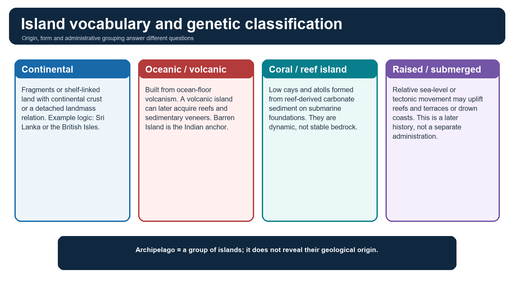

*A four-part classification with the crucial archipelago warning.*

### Evidence / comparison matrix

| Term | Exam-safe meaning | Indian anchor |
|---|---|---|
| continental / shelf-linked | detached or shelf-related continental land | Sri Lanka as regional comparator |
| oceanic volcanic | edifice built by ocean-floor volcanism | Barren Island |
| coral cay / reef island | carbonate sediment accumulated on a reef platform | Lakshadweep |
| barrier island | elongate wave/tide-built sediment body parallel to shore | do not call every coral island a barrier island |
| atoll | ring-like reef enclosing a lagoon | Lakshadweep examples |
| raised / submerged | later relative sea-level or tectonic history | uplift/subsidence within A&N |
| archipelago | group of islands | A&N and Lakshadweep administrative groups |

### Teaching, explanation and solution

- Geomorphic origin can be composite: a tectonic island may have volcanic rocks, sedimentary units, raised reefs and modern coral fringes.
- A reef island is not a block of solid coral bedrock; waves and currents redistribute reef-derived sediment.
- Raised and submerged describe relative movement between land and sea, not a permanent genetic class.

> **Memory hook:** ORIGIN - FORM - HISTORY - GROUPING: answer each separately.

### Must-know facts

- Fringing reef adjoins shore; barrier reef is separated by a wider lagoon; atoll surrounds a lagoon.
- Darwin's subsidence sequence is a model, not a claim that every reef follows one identical path.
- Daly's glacio-eustatic emphasis is a useful qualification.

### UPSC traps and corrections

- **Wrong:** All islands fit one pure category. **Correct:** Composite geological and geomorphic histories are common.
- **Wrong:** Archipelago describes geological origin. **Correct:** It describes a group.

### Mains / answer route

Begin any comparison by separating genetic classification from modern administrative identity.

### Study link

GC Leong coral-reef chapter; Geography basic 11.

## 3. Andaman-Nicobar genesis: arc, forearc and accretion

The A&N chain belongs to the Sunda-Andaman convergent-margin system associated with subduction of the Indian oceanic plate beneath the Burma/Sunda margin.

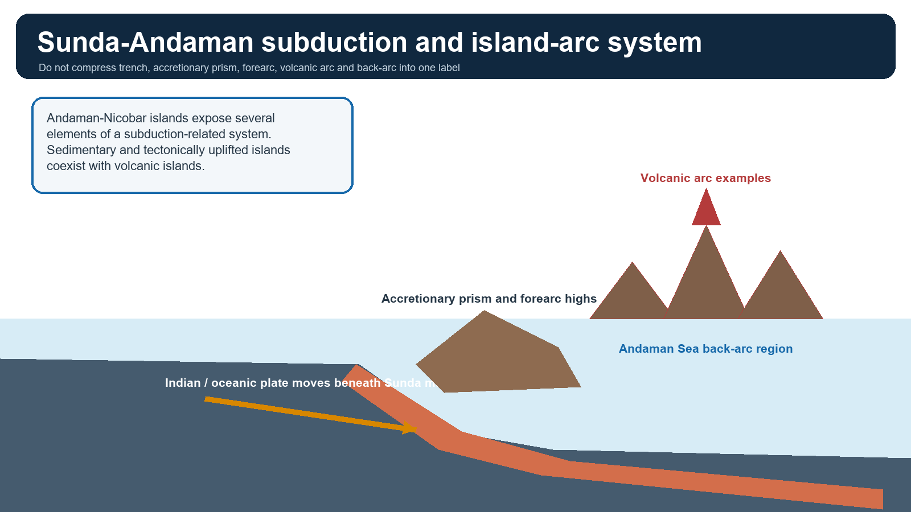

*A schematic distinction among subduction elements.*

### Evidence / comparison matrix

| Element | Meaning | Answer caution |
|---|---|---|
| trench / megathrust | plate interface and major earthquake source | not every earthquake makes a tsunami |
| accretionary prism | deformed trench sediments | not the same as volcanic arc |
| forearc high / islands | uplifted blocks between trench and arc | mixed rocks and reefs possible |
| volcanic arc | magma-related edifices | Barren/Narcondam examples |
| back-arc | region behind arc | Andaman Sea context; avoid oversimplified geometry |

### Teaching, explanation and solution

- The chain is often linked physiographically with the Arakan Yoma continuation, but modern answers should add the subduction-arc and accretionary context.
- An accretionary prism is sediment scraped and deformed near a trench; a forearc lies between trench and volcanic arc; a back-arc lies behind the volcanic arc.
- Many emergent A&N islands consist of deformed sedimentary and tectonically uplifted material; Barren and Narcondam are volcanic exceptions, not a template for the whole archipelago.
- Earthquake, vertical land movement, tsunami generation and volcanism all arise from the active-margin setting but are not spatially or temporally identical.

### Must-know facts

- A&N is a subduction-related system, not 'all volcanic'.
- The same tectonic setting creates both long-term relief and episodic hazards.
- Coral reefs can fringe tectonic islands without making the islands coral atolls.

### UPSC traps and corrections

- **Wrong:** Every A&N island is a volcano. **Correct:** The chain includes sedimentary, tectonically uplifted and volcanic components.
- **Wrong:** Forearc and volcanic arc are synonyms. **Correct:** They are distinct positions in a convergent margin.

### Mains / answer route

A high-scoring origin answer uses a labelled cross-section and then qualifies the simplified Arakan-Yoma textbook line.

### Study link

Geography 02 geological structure; Geography 03 seismic zones.

## 4. Barren Island, Narcondam and activity-status caution

Barren Island and Narcondam demonstrate volcanic construction within the wider A&N system, but they should not be used to label the entire archipelago volcanic.

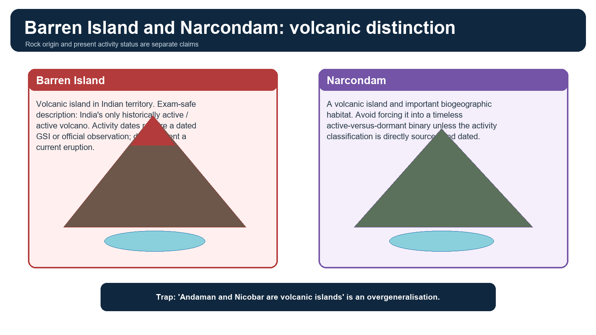

*Origin is stable; activity status must be dated.*

### Teaching, explanation and solution

- Barren Island is exam-safe as India's only historically active or active volcano.
- A current eruption date should be quoted only from a dated Geological Survey of India or other direct official update.
- Narcondam is volcanic and ecologically distinctive. Avoid a simplistic active/dormant binary unless the classification is directly sourced.
- Volcanic islands can acquire reefs, soils and forests; present ecology does not erase geological origin.

### Must-know facts

- Barren Island lies in Indian territory in the Andaman Sea region.
- The 2018 UPSC statement placing it about 140 km east of Great Nicobar is false.
- An eruption in 1991 did not imply permanent inactivity afterwards.

### UPSC traps and corrections

- **Wrong:** Narcondam is India's only active volcano. **Correct:** Barren Island is the standard active-volcano answer.
- **Wrong:** The last known eruption date can be recalled without attribution. **Correct:** Activity claims are time-sensitive.

### Mains / answer route

Use Barren Island as a precise example after explaining the larger tectonic system.

### Study link

Geography basic 03 vulcanism and earthquakes.

## 5. Lakshadweep: atolls, lagoons and mobile reef islands

Lakshadweep consists of low coral reef islands and atolls developed on submarine foundations in the Arabian Sea. Their visible land is young, mobile carbonate sediment, not a stable high island.

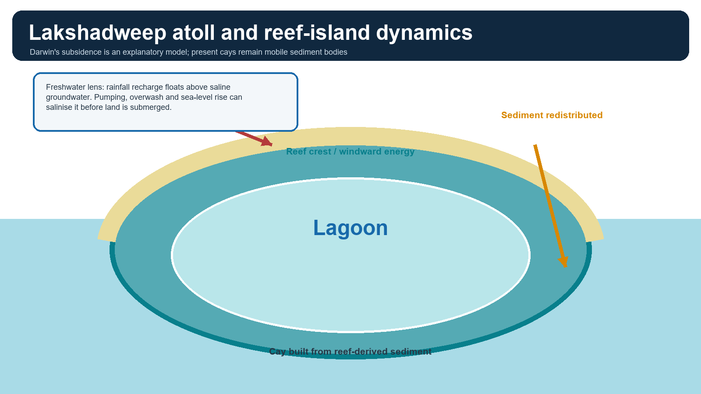

*Reef growth, lagoon and sediment-cay processes.*

### Evidence / comparison matrix

| Example | Use |
|---|---|
| Kavaratti | administrative and lagoon reference |
| Agatti | reef-island and air-connectivity example |
| Andrott | inhabited island example |
| Minicoy | southern island, separated by the Nine Degree Channel |

### Teaching, explanation and solution

- Darwin's model links fringing reef -> barrier reef -> atoll as a volcanic foundation subsides while coral grows upward and outward.
- Reef-island position and shape respond to wave climate, monsoon reversal, reef productivity and sediment transport.
- Broadly, exposed reef margins face higher wave energy while lagoons occupy sheltered sides; local geometry varies and should be read from maps.
- Freshwater occurs mainly as rain-fed lenses floating above saline groundwater; pumping and storm overwash can rapidly degrade quality.
- The Lakshadweep Administration uses differing island-count formulations across pages; avoid unstable totals unless the question specifies the category and date.

### Must-know facts

- Atolls are ring-like reef systems enclosing lagoons.
- Reef decline can reduce the sediment supply that maintains the island.
- Water insecurity may precede permanent inundation.

### UPSC traps and corrections

- **Wrong:** Coral cays are stable bedrock. **Correct:** They are dynamic sediment bodies dependent on living reef production and transport.
- **Wrong:** All lagoons face one universal direction. **Correct:** Broad patterns exist, but local orientation follows reef geometry and wave exposure.

### Mains / answer route

Link reef health to island morphology, freshwater and habitability rather than writing only about bleaching.

### Study link

Geography basic 11 and ocean-process Topic 12.

## 6. Map-ready Indian distribution and channels

A UPSC map should show orientation and relationships, not an unstable island count.

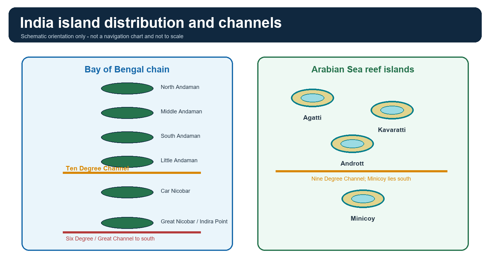

*Named examples and key channels; not to scale.*

### Evidence / comparison matrix

| Feature | Correct relation | Common trap |
|---|---|---|
| North/Middle/South Andaman | northern to southern Andaman chain | do not place Car Nicobar among them |
| Little Andaman | south of South Andaman; north of Ten Degree Channel | not a Nicobar island |
| Ten Degree Channel | separates Andaman and Nicobar groups | not Eight Degree Channel |
| Car Nicobar | north Nicobar example | not the southernmost |
| Great Nicobar | southern large Nicobar island | Campbell Bay and Indira Point anchors |
| Great / Six Degree Channel | south of Great Nicobar toward Sumatra approaches | do not equate every named channel |
| Nine Degree Channel | separates Minicoy from the main Lakshadweep cluster | not Ten Degree Channel |
| Eight Degree Channel | between Minicoy and Maldives | not within A&N |
| Preparis / Coco | northern approaches near Myanmar | use only as regional map detail |

> **Memory hook:** 10 separates Andaman-Nicobar; 9 separates Minicoy; 8 separates Minicoy-Maldives.

### Must-know facts

- Indira Point is India's southernmost point on Great Nicobar.
- Campbell Bay is the principal administrative settlement on Great Nicobar.
- Named channels are geographic relationships, not claims of control.

### UPSC traps and corrections

- **Wrong:** Ten Degree Channel separates Great Nicobar from Sumatra. **Correct:** It separates Andaman and Nicobar groups.
- **Wrong:** Minicoy lies north of the Nine Degree Channel. **Correct:** It lies south of it.

### Mains / answer route

Draw two compact north-south chains and label only the channels relevant to the question.

### Study link

Geography 01 location and extent.

## 7. Comparative geography: Andaman, Nicobar and Lakshadweep

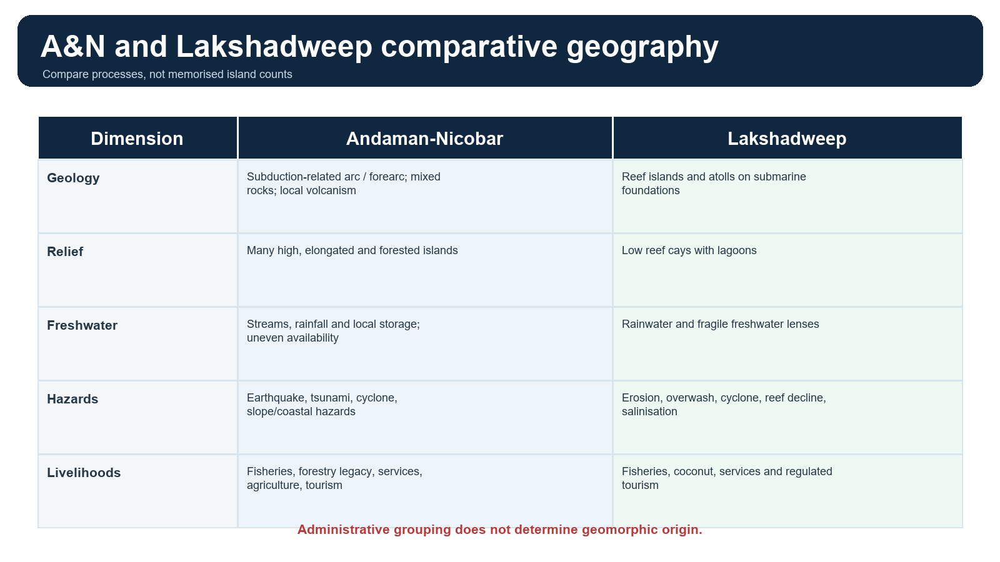

*Geology, relief, water, hazards and livelihoods.*

### Evidence / comparison matrix

| Dimension | Andaman | Nicobar | Lakshadweep |
|---|---|---|---|
| position | northern Bay of Bengal chain | southern Bay/Andaman Sea chain | Arabian Sea |
| relief/geology | elongate, forested, tectonic/sedimentary with local volcanism | tectonic forearc islands with reefs and high-relief Great Nicobar | low reef islands and atolls |
| climate | humid tropical maritime; monsoon rainfall | humid tropical maritime; strong oceanic influence | tropical maritime; monsoon seasonality |
| soil/water | weathered tropical soils; streams and rainfall storage vary | short streams, heavy rainfall, local reservoirs and groundwater constraints | thin carbonate soils; rain-fed freshwater lenses |
| settlement | largest urban/service concentration in the UT | tribal reserves plus limited settlements and Campbell Bay | densely settled low islands with tight carrying capacity |
| hazards | earthquake/tsunami/cyclone/coastal and slope risks | same plus 2004 subsidence/uplift contrasts | erosion, overwash, cyclone, salinisation and reef decline |

### Teaching, explanation and solution

- Andaman versus Nicobar is not simply 'same origin, different administration': relief, ecology, population history and protected/tribal landscapes differ.
- A&N versus Lakshadweep comparison should start with subduction margin versus reef-atoll foundation.
- Climate similarity does not erase hazard and freshwater differences.

### Must-know facts

- The 2026 UPSC climate question correctly identifies humid tropical coastal climate and rainfall from both monsoons.
- Maximum precipitation is not between December and May.

### UPSC traps and corrections

- **Wrong:** All Indian islands have identical soils and water systems. **Correct:** High islands with streams differ from low atolls with thin freshwater lenses.
- **Wrong:** A&N and Lakshadweep face the same hazard stack. **Correct:** Their tectonic, relief and reef contexts differ.

### Mains / answer route

Use a five-row comparison: origin, relief, water, hazards, people-economy.

### Study link

Geography climate Topics 13-16 and coast Topic 10.

## 8. Great Nicobar physical geography

Great Nicobar is the southernmost large island of the Nicobar group. High relief, heavy tropical rainfall, short drainage routes, rainforest and coastal ecosystems create both ecological richness and infrastructure constraints.

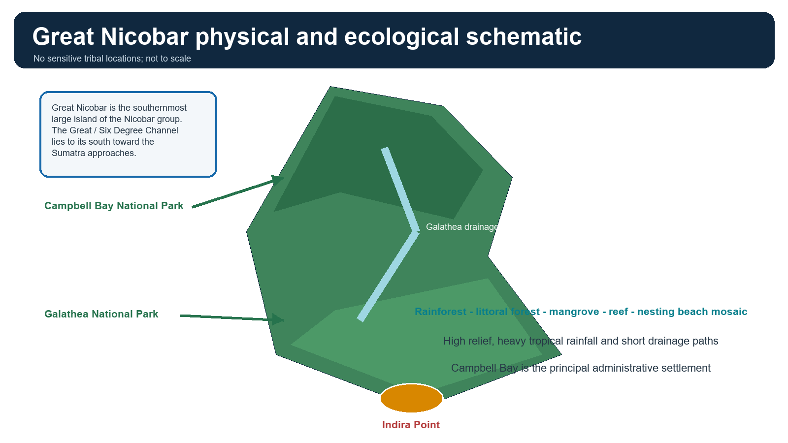

*Physical and ecological anchors without sensitive locations.*

### Evidence / comparison matrix

| Physical element | Significance | Planning implication |
|---|---|---|
| high interior relief | orographic rain and short catchments | slope and drainage design |
| Galathea Bay / river | coastal-estuarine and nesting context | water withdrawal, dredging and light controls |
| western nesting beaches | alternative leatherback habitat | no-development and disturbance controls in EC |
| Indira Point | tectonic-subsidence and tsunami memory | hazard-aware siting and evacuation |

### Teaching, explanation and solution

- Campbell Bay is the principal administrative settlement; Indira Point marks India's southern extremity.
- Official project records clearly name the Galathea River (Dak Kea) and several local water bodies; this package does not elevate a wider river inventory without direct map verification.
- Steep relief and short catchments make drainage, reservoir yield, slope disturbance and coastal sediment management tightly connected.
- The coast includes beaches, rocky sectors, estuaries/creeks, mangroves, reefs and littoral vegetation; one ecosystem cannot represent the island.

### Must-know facts

- Great Nicobar area is about 1,045 sq km in official district material.
- The project master-plan area, 166.10 sq km, is not the area of the whole island.
- The Stage-I forest diversion proposal is 130.75 sq km.

### UPSC traps and corrections

- **Wrong:** Project area and island area are interchangeable. **Correct:** They answer different spatial questions.
- **Wrong:** A humid island has unlimited freshwater. **Correct:** Storage, seasonality, catchment integrity, demand and salinity still constrain supply.

### Mains / answer route

Show how relief-water-coast ecology makes carrying capacity a systems question.

### Study link

Geography drainage, coast and tropical-forest owners.

## 9. Protected areas, biosphere zoning and legal categories

Great Nicobar Biosphere Reserve contains Campbell Bay and Galathea National Parks and received UNESCO World Network of Biosphere Reserves recognition in 2013.

### Evidence / comparison matrix

| Category | Purpose | Legal / governance caution |
|---|---|---|
| National Park | statutory protected area under wildlife law | stronger legal category with notified boundary |
| Biosphere Reserve | landscape conservation, research and sustainable-development framework | Indian designation; zoned core-buffer-transition approach |
| UNESCO MAB recognition | international network recognition | does not itself replace domestic wildlife/forest law |
| Eco-sensitive / coastal regulation | controls around protected/coastal assets | project-specific notification/map/clearance must be checked |

### Teaching, explanation and solution

- Core, buffer and transition are functional biosphere-reserve zones; they should not be equated automatically with national-park boundaries.
- A national park is not 'denotified' merely because an adjacent project obtains another clearance.
- UNESCO recognition adds global conservation significance but is not a project clearance or veto.

### Must-know facts

- Great Nicobar joined UNESCO's network in 2013.
- Campbell Bay and Galathea National Parks are separate protected areas within the wider landscape.
- Use the notified map/order for exact legal boundaries.

### UPSC traps and corrections

- **Wrong:** Biosphere-reserve transition zone equals unregulated development zone. **Correct:** It still operates within applicable forest, wildlife, coastal, tribal and planning law.
- **Wrong:** UNESCO status and national-park status are the same legal instrument. **Correct:** They are distinct.

### Mains / answer route

Separate conservation landscape, statutory protected area and international recognition.

### Study link

Environment protected-area and biosphere-reserve owner.

## 10. Island biogeography, endemism and extinction risk

Islands can be both diverse and fragile. Isolation encourages unique lineages, while small ranges and small populations can magnify extinction risk.

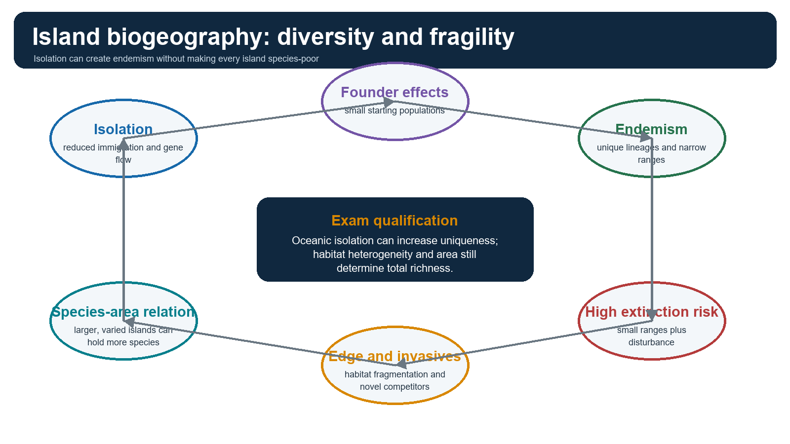

*Isolation, area, endemism and disturbance.*

### Teaching, explanation and solution

- Species-area relation: larger and more habitat-diverse islands generally support more species, all else equal.
- Isolation lowers immigration and rescue effects but can increase endemism over evolutionary time.
- Founder effects and genetic drift are stronger in small populations; adaptive radiation is possible where ecological opportunity exists.
- Edge effects expand when roads or clearings fragment continuous forest, changing light, humidity, wind and species interactions.
- Invasive species can outcompete, prey on or transmit disease to island endemics that evolved with fewer competitors or predators.
- Not every island is low in biodiversity: habitat heterogeneity, age, area and connectivity matter.

### Must-know facts

- Endemism and total species richness are different metrics.
- An endemic species with a narrow range has low spatial redundancy.
- Cumulative fragmentation may matter more than the footprint of one structure.

### UPSC traps and corrections

- **Wrong:** Isolation always lowers biodiversity. **Correct:** It may lower immigration while increasing uniqueness and endemism.
- **Wrong:** Compensatory planting anywhere recreates endemic habitat. **Correct:** Location, age, structure, species interactions and continuity matter.

### Mains / answer route

Use species-area + isolation + fragmentation + invasives as a four-link answer.

### Study link

Environment biodiversity, endemism and invasive species.

## 11. Coral, mangrove, seagrass, littoral forest and turtle systems

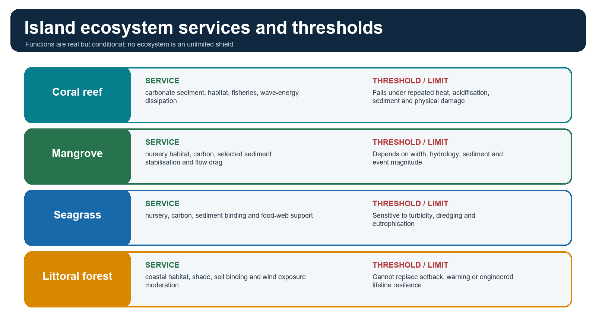

*Conditional functions across the coast.*

### Evidence / comparison matrix

| System | Functions | Threshold / project relevance |
|---|---|---|
| coral reef | habitat, fisheries, carbonate sediment, wave attenuation | heat, acidification, sediment, dredging and breakage |
| mangrove | nursery, carbon, tidal flow drag, selected sediment retention | hydrology, width, species and event magnitude |
| seagrass | nursery, food-web support, carbon and sediment binding | turbidity, nutrients and seabed disturbance |
| littoral forest | coastal habitat, soil and microclimate functions | fragmentation, salt/wind exposure and light |
| leatherback nesting beach | reproduction of a wide-ranging marine turtle | darkness, beach form, access, sand and disturbance |

### Teaching, explanation and solution

- The 2022 EC records scattered coral in the Galathea work area and a proposed translocation plan; this is an assessed management response, not proof of zero residual risk.
- The EC requires WII turtle work, protection of alternate western nesting beaches, illumination controls and timing of dredging around nesting/hatching.
- Seagrass and intertidal monitoring appear in the clearance conditions; absence from a headline does not mean ecological irrelevance.
- Artificial light can misorient hatchlings; shielding, spectral choice, timing and enforceable dark zones are necessary but not equivalent to avoiding habitat loss.

### Must-know facts

- Bleaching is stress and loss of symbionts; it is not automatically immediate death.
- Acidification reduces carbonate availability and recovery capacity.
- Leatherbacks are not endemic to Great Nicobar, but the nesting habitat is globally important.

### UPSC traps and corrections

- **Wrong:** Coral translocation guarantees ecological equivalence. **Correct:** Survival, donor-site effects, habitat matching and long-term function must be monitored.
- **Wrong:** A mangrove belt replaces evacuation. **Correct:** Ecosystems supplement warning, setback and evacuation.

### Mains / answer route

Write ecosystem service -> pressure -> threshold -> governance response for each named system.

### Study link

Environment coastal and marine ecology.

## 12. Freshwater, waste, carrying capacity and livelihoods

Island carrying capacity is the capacity of water, land, waste systems, ecosystems, transport and institutions to support activity without crossing unacceptable thresholds.

### Evidence / comparison matrix

| Capacity dimension | Indicator | Adaptive trigger |
|---|---|---|
| freshwater | safe yield, lens salinity, reservoir storage and demand | pause expansion if reliable supply margin fails |
| waste | collection, treatment, residual disposal and shipment | no occupancy growth without verified capacity |
| coast/reef | erosion, turbidity, coral and seagrass condition | redesign dredging/shore works when threshold exceeded |
| social services | health, emergency, housing and transport | phase population with service readiness |
| livelihood access | landing areas, fishing grounds and benefit distribution | compensate/redesign where access is impaired |

### Teaching, explanation and solution

- High rainfall does not eliminate freshwater scarcity: storage, dry spells, catchment condition, salinity, leakage and peak demand matter.
- The EC prohibits groundwater withdrawal and Galathea River withdrawal for the project, and proposes rainwater reservoirs plus storage augmentation.
- A reservoir area is not the same as dependable yield; watershed modelling, evaporation, water quality and climate variability matter.
- Waste cannot be treated as a mainland externality: landfill space, hazardous waste, sewage treatment, marine litter and reverse logistics are binding constraints.
- Tourism and induced settlement create seasonal peaks and land-price/livelihood pressures beyond resident population counts.
- Fisheries depend on reef, mangrove, seagrass and water-quality conditions; port and tourism benefits must be assessed alongside access and habitat effects.

### Must-know facts

- Carrying capacity is dynamic and scenario-based.
- A planned capacity is not proof of delivered service.
- Reef sediment budget links ecology directly to island morphology.

### UPSC traps and corrections

- **Wrong:** Heavy rainfall guarantees water security. **Correct:** Storage, quality, demand and saline intrusion still govern security.
- **Wrong:** Waste-to-energy removes all waste constraints. **Correct:** Segregation, emissions, residues and scale remain.

### Mains / answer route

Use water-waste-ecosystem-services-emergency capacity as an integrated test.

### Study link

Geography groundwater, coast and settlement; Environment waste.

## 13. Multi-hazard island geography and the 2004 lesson

A&N combines earthquake, tsunami, vertical land movement, volcanism, cyclone, coastal flooding, erosion and landslide risk. Risk arises when these hazards meet exposed people, ecosystems and lifelines.

### Evidence / comparison matrix

| Hazard | Mechanism | Island-specific implication |
|---|---|---|
| earthquake | megathrust or crustal rupture and shaking | lifelines, slopes, liquefaction and access |
| tsunami | rapid water-column displacement and shoaling | short warning windows and coastal concentration |
| subsidence/uplift | coseismic vertical land movement | relative sea level, drainage and reef exposure |
| volcanism | magma and eruption processes | localised around volcanic islands |
| cyclone/surge | wind, pressure and waves | compound flooding, power and communication failure |
| erosion/landslide | sediment imbalance and slope failure | road, settlement, beach and catchment impacts |

### Teaching, explanation and solution

- The 26 December 2004 Sumatra-Andaman event produced destructive Indian Ocean tsunami effects and tectonic land-level change across parts of A&N.
- Indira Point underwent tectonic subsidence; this package avoids a single exact figure because values vary by method and site.
- Some islands or reef sectors experienced uplift while others subsided, demonstrating spatially variable deformation.
- A project EIA can include design-basis hazards but cannot remove residual uncertainty in an active subduction setting.
- Emergency planning must consider simultaneous loss of port, runway, power, water, communications and roads.

### Must-know facts

- Not every undersea earthquake generates a tsunami.
- Bathymetry and coastal shape alter run-up.
- Vertical land movement can permanently alter relative sea level independent of gradual climate-driven sea-level rise.

### UPSC traps and corrections

- **Wrong:** 2004 effects were uniform across A&N. **Correct:** Uplift, subsidence and inundation varied spatially.
- **Wrong:** Cyclone and tsunami preparedness are identical. **Correct:** Warning lead times, evacuation cues and damage mechanisms differ.

### Mains / answer route

Draw hazard -> exposure -> vulnerability -> cascading lifeline failure.

### Study link

Geography 03 seismic zones; Disaster Management tsunami/cyclone.

## 14. INCOIS warning architecture and evacuation

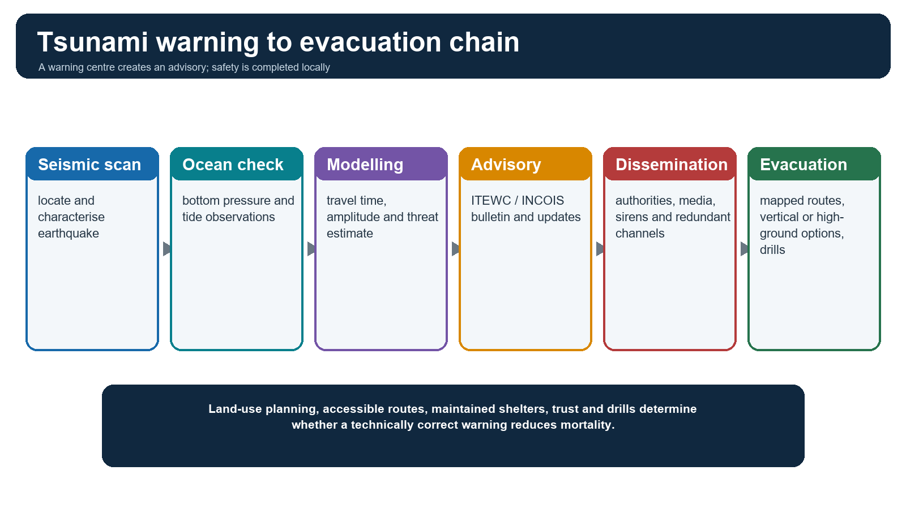

*Detection is only the first half of protection.*

### Teaching, explanation and solution

- Seismic networks rapidly detect and characterise an event.
- Bottom-pressure recorders and tide gauges help confirm ocean response, while models estimate travel time and threat.
- ITEWC at INCOIS issues advisories and updates to designated authorities.
- Local safety requires redundant dissemination, route signage, drills, accessible evacuation options and disciplined all-clear procedures.
- Land-use planning should keep critical facilities and high-occupancy uses out of intolerable inundation zones or provide robust vertical evacuation where defensible.
- Sensor counts change; describe the architecture rather than memorising a timeless total.

### Must-know facts

- Warning is probabilistic and time-sensitive.
- Natural cues such as strong/long shaking or sudden sea withdrawal should trigger immediate local action where guidance says so.
- Evacuation planning must include children, elderly people, persons with disabilities and visitors.

### UPSC traps and corrections

- **Wrong:** An advisory automatically evacuates the coast. **Correct:** Last-mile institutions and human action complete the chain.
- **Wrong:** Sea withdrawal always occurs before a tsunami. **Correct:** It depends on wave phase and location; do not wait for it.

### Mains / answer route

Evaluate the end-to-end chain, not only forecasting technology.

### Study link

INCOIS and Disaster Management early-warning owner.

## 15. Human geography: Scheduled Tribes, PVTGs and ethical framing

A&N tribal communities are distinct peoples with different histories, locations and legal-policy relationships. They must not be collapsed into one sensationalised category.

### Evidence / comparison matrix

| Community | Exam-safe classification | Ethical / policy caution |
|---|---|---|
| Shompen | Scheduled Tribe and officially listed PVTG; Great Nicobar | consent-sensitive, integrity-first Shompen Policy |
| Nicobarese | Scheduled Tribe; not in the official five A&N PVTGs | coastal livelihoods and community institutions vary |
| Onge | PVTG | Little Andaman context, not Great Nicobar |
| Jarawa | PVTG | Andaman context; restricted-contact safeguards |
| Sentinelese | PVTG | strict protection and non-contact principle |
| Great Andamanese | PVTG | distinct history and present circumstances |

### Teaching, explanation and solution

- The Shompen Policy dated 22 May 2015 prioritises social-cultural integrity, protection from exploitation, phased and willingness-sensitive communication, and special review of large projects.
- Do not reproduce sensitive maps, contact points or operational locations.
- Restricted-contact policy is a public-health, rights, autonomy and survival safeguard, not evidence of cultural inferiority.
- The project's official position says no tribal displacement is proposed and monitoring/consultation mechanisms are required; this remains a claim requiring compliance evidence.

### Must-know facts

- Nicobarese are Scheduled Tribes but not among the five A&N PVTGs on the official list.
- PVTG is an administrative vulnerability classification, not a hierarchy of human worth.
- Article 338A establishes the National Commission for Scheduled Tribes.

### UPSC traps and corrections

- **Wrong:** All A&N Scheduled Tribes are PVTGs. **Correct:** Official lists distinguish them.
- **Wrong:** Development consultation equals one meeting. **Correct:** Meaningful participation is informed, culturally appropriate, continuing and linked to remedies.

### Mains / answer route

Frame rights, health, culture, habitat and participation without exposing sensitive detail.

### Study link

Social Justice tribal welfare; Polity constitutional safeguards.

## 16. Constitutional, statutory and policy safeguards

### Evidence / comparison matrix

| Instrument | Role | Limit |
|---|---|---|
| Fifth Schedule / Sixth Schedule | general tribal-governance concepts | do not assume automatic application to A&N |
| Article 338A | NCST safeguards and consultation role | institutional consultation is not project outcome |
| ANPATR 1956 | tribal-reserve and entry/protection framework | project-specific notifications must be checked |
| Shompen Policy 2015 | integrity, welfare and contact principles | policy needs implementation evidence |
| FRA 2006 | forest-rights recognition/compliance route | Stage-I condition requires prescribed compliance certificate; do not infer adjudicated completion |
| Wildlife / forest / biodiversity law | habitat and diversion regulation | clearance is conditional, not blanket permission |

### Teaching, explanation and solution

- The 27 Oct 2022 Stage-I forest letter requires complete FRA compliance through the prescribed District Collector certificate before final approval.
- The same letter requires tribal interests to be protected to the highest order and statutory clearances obtained before forest land is handed over.
- The 2026 PIB FAQ states a Ministry of Tribal Affairs NOC and FRA adherence; the 12 Feb 2026 parliamentary answer still states Stage-II forest approval had not been granted.
- Therefore, the correct conclusion is not 'no safeguards' or 'all safeguards complete', but a conditional, document-specific compliance question.

### Must-know facts

- Forest diversion and tribal-reserve change are distinct legal acts.
- A net increase in notified reserve area does not by itself prove ecological or cultural equivalence.
- Rights assessment must consider access, mobility, disease risk and induced settlement, not only physical displacement.

### UPSC traps and corrections

- **Wrong:** No displacement means no social impact. **Correct:** Access, disease exposure, cultural change and livelihood effects may occur without relocation.
- **Wrong:** A NOC settles every constitutional and factual question. **Correct:** Ongoing compliance, representation and remedies still matter.

### Mains / answer route

Use safeguard -> evidence -> implementation gap -> monitoring/remedy.

### Study link

Polity, Social Justice and Environment governance.

## 17. Strategic geography without deterministic claims

Great Nicobar's location near east-west shipping routes and the approaches to the Malacca Strait gives it economic, logistics, surveillance, disaster-response and connectivity significance.

### Evidence / comparison matrix

| Claim | Evidence-safe version | Overclaim to avoid |
|---|---|---|
| shipping | near major east-west route and Malacca approaches | India will capture all transshipment |
| security | supports presence, awareness and logistics | single island guarantees chokepoint control |
| development | connectivity and service potential | infrastructure automatically benefits all residents |
| resilience | HADR staging and redundancy potential | more assets always reduce risk |

### Teaching, explanation and solution

- Proximity can reduce diversion distance for transshipment and improve access to Southeast Asian sea lanes, subject to commercial viability and network choices.
- Island infrastructure can support maritime-domain awareness, Coast Guard/Navy logistics, humanitarian assistance and disaster response.
- An island near a channel does not automatically 'control' the chokepoint: sovereignty, international navigation, technology, alliances, resilience and adversary responses matter.
- Dual-use infrastructure may provide civilian and strategic benefits, but security claims should use only officially published information.
- EEZ and maritime interests increase the value of connectivity, fisheries governance, environmental monitoring and search-and-rescue capacity.

### Must-know facts

- Six Degree / Great Channel is a strategic-geography reference south of Great Nicobar.
- Commercial port viability and military utility are related but not identical tests.
- Environmental resilience is a strategic asset because damaged infrastructure cannot provide logistics.

### UPSC traps and corrections

- **Wrong:** Location alone guarantees power. **Correct:** Capability, resilience, governance and regional responses mediate location.
- **Wrong:** Strategic importance cancels environmental law. **Correct:** Strategic projects still operate through statutory routes and conditions.

### Mains / answer route

Write location -> capability -> constraint -> balanced strategic verdict.

### Study link

IR Indo-Pacific and Internal Security maritime owners.

## 18. Great Nicobar project architecture and changing scopes

The official project architecture combines an international container transshipment port/terminal, greenfield airport, township/area development and power infrastructure.

### Evidence / comparison matrix

| Official source/date | Port capacity / cost statement | How to use |
|---|---|---|
| Revised EOI, earlier planning | Phase I about 4 MTEU in 2028; ultimate 16 MTEU in 2058; Phase-I about Rs 18,000 crore | EOI planning version |
| MoPSW Annual Report 2025-26 | 20.4 million TEU; estimated Rs 99,000 crore over 35 years | ministry's dated programme version |
| PIB factsheet, 1 May 2026 | 14.2 million TEU terminal; 4,000 PHP airport; 450 MVA power; 16,610 ha township/master-plan area | latest retrieved public factsheet |

### Teaching, explanation and solution

- The 166.10 sq km master-plan area includes 35.35 sq km revenue land and 130.75 sq km forest land in the May 2026 PIB description.
- Different capacity figures reflect changed scope, phasing or document purpose. They must not be averaged or merged.
- A port notification, PPP appraisal, tender and physical construction are separate stages.
- Economic aims include transshipment, connectivity, jobs and reducing reliance on foreign hubs; these are objectives, not guaranteed outcomes.

### Must-know facts

- Power component is described as 450 MVA gas-solar in the May 2026 factsheet.
- The project is phased in official planning documents.
- Capacity is measured in TEU/MTEU; passenger throughput uses different metrics.

### UPSC traps and corrections

- **Wrong:** One timeless capacity and cost exists. **Correct:** Quote source, date, scope and phase.
- **Wrong:** A planned opening year proves completion. **Correct:** Planning schedules are not outcomes.

### Mains / answer route

Use a source-date matrix before evaluating benefits or risks.

### Study link

Economy infrastructure/PPP and Geography transport.

## 19. Great Nicobar status ladder as of 16 August 2026

### Status chronology

- **27 Oct 2022:** Conditional Stage-I forest approval for 130.75 sq km.
- **4 Nov 2022:** EC/ICRZ clearance letter issued; EC ID EC22A033AN162500.
- **3 Apr 2023:** NGT order cited by 2026 PIB FAQ; do not treat as closure of later cases.
- **4 Sep 2024:** Galathea Bay notified as a Major Port.
- **31 Dec 2025:** ICTP proposal forwarded to DEA for PPPAC consideration.
- **12 Feb 2026:** Parliament: Stage-II/final forest approval not granted; listed cases remain sub judice.
- **1 May 2026:** PIB factsheet/FAQ state official rationale and safeguards.

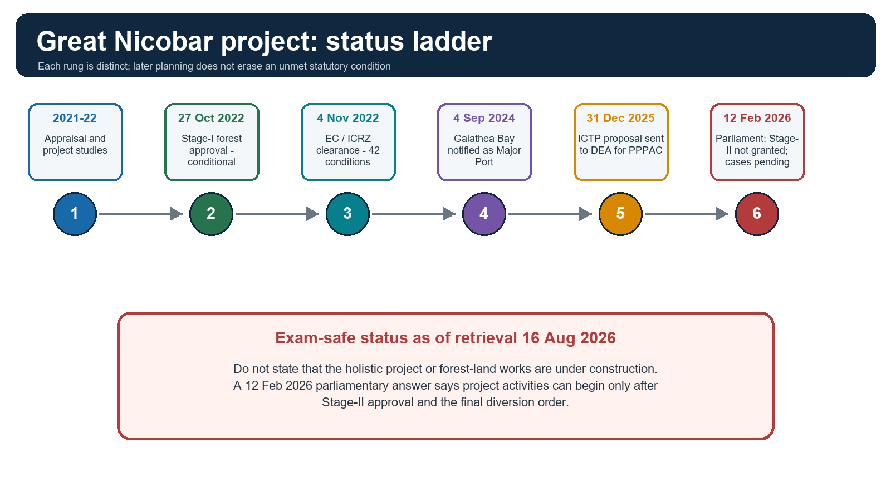

*Dated official stages and the key Stage-II limit.*

### Teaching, explanation and solution

- Stage-I is in-principle approval subject to conditions; it is not final diversion.
- The parliamentary answer says project activities can be initiated only after Stage-II approval and final diversion order.
- Litigation listed: NGT OA 93/2024/EZ, OA 95/2024/EZ, MA 23/2024/EZ in Appeal 32/2022/EZ; Calcutta High Court WPA(P) 12/2024, 16/2025 and 17/2025.
- The PIB FAQ's statement that clearances withstood judicial scrutiny refers to the 2023 NGT context; later pending matters prevent a claim of final judicial closure.
- No unrestricted public 2026 Stage-II letter was retrieved.

### Must-know facts

- EC letter date is 4 Nov 2022; some secondary summaries use 11 Nov, so cite the letter.
- Galathea Major Port notification is not a construction certificate.
- PPPAC consideration is not final financial closure.

### UPSC traps and corrections

- **Wrong:** The holistic project is under construction. **Correct:** The latest retrieved parliamentary answer bars project activities before Stage-II/final diversion.
- **Wrong:** EC automatically transfers forest land. **Correct:** Forest approval follows its own two-stage process.

### Mains / answer route

Make the status ladder the centre of any current-affairs answer.

### Study link

Environment EIA/forest-clearance and Governance compliance.

## 20. Official development case: benefits and conditions

The official case rests on strategic location, transshipment, connectivity, jobs, services, national security and integrated infrastructure.

### Evidence / comparison matrix

| Benefit claim | Indicator needed | Qualification |
|---|---|---|
| transshipment capture | traffic, cost, shipping-line commitments | competition and demand matter |
| employment | local skill, wage, access and displacement data | gross jobs are not net inclusive benefit |
| connectivity | reliability, affordability and emergency use | assets may fail under hazards |
| security | official capability and resilience outcomes | avoid operational detail |
| regional development | water, waste, health and housing readiness | induced population can exceed capacity |

### Teaching, explanation and solution

- Port rationale: deep water and proximity to east-west shipping routes may reduce diversion and foreign-hub dependence.
- Airport rationale: connectivity for residents, administration, tourism, logistics and emergencies.
- Township rationale: housing and services for project-linked population.
- Power rationale: reliable supply for port, airport and settlements with gas-solar design.
- Strategic rationale: stronger maritime presence, logistics and surveillance support.
- The EC and PIB cite 42 compliance conditions and monitoring committees for pollution, biodiversity and tribal welfare.

### Must-know facts

- Benefits are legitimate appraisal dimensions.
- Conditions and committees are governance inputs, not proof of outcomes.
- A strategic project can still have unacceptable site-specific residual impacts.

### UPSC traps and corrections

- **Wrong:** Economic benefits are fabricated because they are projections. **Correct:** They are official objectives; evaluate assumptions and evidence.
- **Wrong:** Strategic value makes alternatives irrelevant. **Correct:** Alternatives and mitigation remain necessary to reduce avoidable harm.

### Mains / answer route

Accept legitimate aims, test delivery assumptions and condition the verdict on thresholds.

### Study link

Economy logistics; IR maritime strategy.

## 21. Assessed ecological, hazard and social risks

Project-specific risks should be stated as assessed pathways and clearance conditions, not as already-proven damage.

### Evidence / comparison matrix

| Risk pathway | Official-document anchor | Bounded reading |
|---|---|---|
| forest conversion/fragmentation | 130.75 sq km Stage-I proposal; green areas and phased felling conditions | old-growth/endemic functions not fully replaceable |
| dredging/reclamation | EC records 17.7 million cubic m capital dredging and about 298 ha reclamation | figures belong to 2022 clearance design |
| coral/intertidal effects | about 10 ha translocation plan and monitoring conditions | translocation success uncertain until monitored |
| turtle nesting/light | WII plan, dark/no-development and timing controls | research and compliance remain necessary |
| freshwater/waste | reservoirs, no groundwater/Galathea withdrawal, treatment conditions | yield and demand still need verification |
| tribal/cultural effects | reserve changes, no-displacement claim, monitoring | indirect exposure can occur without relocation |
| seismic/tsunami | risk and disaster plan required | design cannot remove residual extreme risk |

### Teaching, explanation and solution

- The EC itself recognises information gaps and mandates research/monitoring for turtles and endemic species.
- Cumulative impacts include induced settlement, roads, utilities, edge effects, shipping, light, waste and repeated maintenance, not merely the port footprint.
- Compensatory afforestation outside the island may satisfy a regulatory condition but cannot recreate the island's endemic ecological relationships.
- No claim of project-caused present damage is made where implementation has not begun.

### Must-know facts

- Risk identification is not proof of realised damage.
- A mitigation condition is evidence that a risk pathway was material enough to regulate.
- Uncertainty strengthens adaptive monitoring; it does not automatically prove either zero impact or certain catastrophe.

### UPSC traps and corrections

- **Wrong:** No major reef in work area means no marine risk. **Correct:** Scattered coral, intertidal systems, seagrass, sediment and turtle pathways still matter.
- **Wrong:** Offsets erase all residual impact. **Correct:** Some old-growth, endemic and cultural losses are non-substitutable.

### Mains / answer route

Use pathway -> official condition -> uncertainty -> residual risk.

### Study link

Environment EIA and biodiversity; Disaster Management.

## 22. Governance stack: clearance, compliance and outcome

### Evidence / comparison matrix

| Layer | Key instrument | Question to ask |
|---|---|---|
| environment appraisal | Environment (Protection) Act; EIA Notification 2006 | what was appraised and conditioned? |
| coastal regulation | ICRZ/CRZ Notification 2019 and approved coastal maps | which zone/map and permission apply? |
| forest diversion | Forest (Conservation) Act at 2022 stage; current Van (Sanrakshan Evam Samvardhan) Adhiniyam title | Stage-I or Stage-II? |
| wildlife | Wild Life (Protection) Act 1972 and PA decisions | what habitat/PA permission or condition? |
| biodiversity | Biological Diversity Act 2002 framework | access, knowledge and ecological monitoring? |
| tribal safeguards | ANPATR, Shompen Policy, FRA compliance condition, constitutional institutions | participation, reserve, rights and remedy? |
| disaster | Disaster Management Act/plans and technical codes | warning, evacuation and lifeline resilience? |
| implementation | consents, contracts, monitoring reports and inspections | was the condition actually met? |

### Teaching, explanation and solution

- Clearance is permission subject to conditions, not a finding of zero impact.
- Compliance is demonstrated through records, monitoring and inspection; it is not inferred from the existence of a committee.
- Outcome asks whether environmental quality, rights and safety were actually protected over time.
- Project-specific maps, orders and amendments outrank generic memory.
- Current law names should be used carefully: the 2022 letter used Forest (Conservation) Act, while the 2026 parliamentary answer uses the current title.

### Must-know facts

- 42 EC conditions are an official May 2026 claim.
- Stage-I forest approval has 37 listed conditions in the retrieved letter.
- Three dedicated monitoring committees plus overarching coordination are described by PIB.

### UPSC traps and corrections

- **Wrong:** EC, CRZ and forest clearance are one approval. **Correct:** They are distinct statutory routes.
- **Wrong:** Compliance report equals successful ecological outcome. **Correct:** Metrics and independent verification are needed.

### Mains / answer route

Write law -> stage -> condition -> evidence -> remedy.

### Study link

Environment EIA/NGT, forest and coastal regulation.

## 23. Alternatives, mitigation hierarchy and adaptive triggers

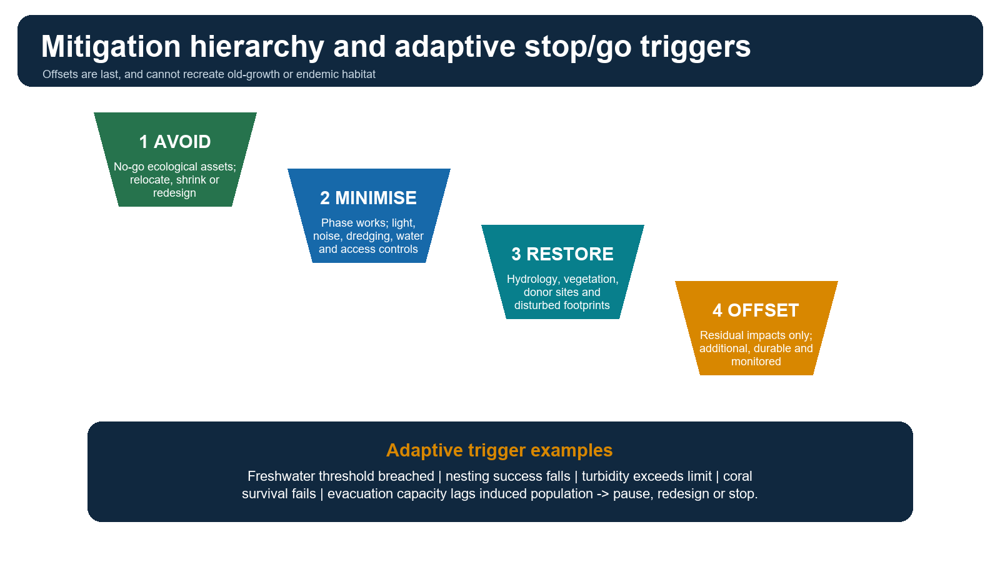

*Avoid first; offsets only for residual impacts.*

### Evidence / comparison matrix

| Asset | Control | Trigger |
|---|---|---|
| turtle beach | dark zones, timing, setback, access control | nesting/hatching decline beyond agreed threshold |
| coral/seagrass | dredge windows, silt control, donor-site limits | turbidity or survival threshold failure |
| freshwater | safe yield, demand caps, leakage and reuse | storage/quality margin fails |
| forest corridor | avoidance, crossings, road/edge controls | connectivity or mortality indicator worsens |
| community welfare | health surveillance, participation, grievance remedy | disease/access or consent safeguard fails |
| disaster safety | evacuation capacity, redundancy and drills | population exceeds tested capacity |

### Teaching, explanation and solution

- Avoid: identify no-go nesting beaches, old-growth/endemic habitat, critical corridors, freshwater catchments and intolerable hazard zones.
- Minimise: reduce footprint; relocate layouts; phase capacity; control light, noise, dredging, turbidity, vessel movement and access.
- Restore: repair disturbed hydrology, vegetation and temporary sites using ecological reference conditions.
- Offset: address only residual impacts with additional, durable and monitored measures; disclose equivalence limits.
- Alternatives should compare site, scale, technology, port layout, phasing, demand assumptions and no-project scenario.
- Independent monitoring should publish baseline, methods, thresholds, non-compliance and corrective action.
- Adaptive stop/go triggers convert monitoring from observation into governance.

### Must-know facts

- Avoidance is stronger than restoration or offset.
- Old-growth and endemic habitat may have hard non-equivalence limits.
- Monitoring without a decision trigger is descriptive, not adaptive.

### UPSC traps and corrections

- **Wrong:** Compensatory afforestation is the first response. **Correct:** Avoid and minimise precede offset.
- **Wrong:** A large budget guarantees mitigation success. **Correct:** Design, implementation, metrics and enforcement determine outcomes.

### Mains / answer route

End with a conditional verdict: proceed only by phases tied to transparent ecological, social and disaster thresholds.

### Study link

Environment EIA and adaptive governance.

## 24. Current linkage dashboard - retrieved 16 August 2026

### Evidence / comparison matrix

| Label | Dated item | Exam-safe reading |
|---|---|---|
| STATUS | 12 Feb 2026 Parliament | Stage-II/final forest approval not granted; listed cases sub judice; activities only after final diversion |
| STATUS | MoPSW Annual Report 2025-26 | ICTP proposal sent to DEA on 31 Dec 2025 for PPPAC; 20.4 MTEU / Rs 99,000 crore dated version |
| FACT | PIB factsheet 1 May 2026 | 14.2 MTEU, airport, 450 MVA gas-solar and township; official objectives and safeguards |
| STATUS | PIB FAQ 1 May 2026 | official position on judicial scrutiny, forest/tribal safeguards and balance |
| LIMIT | capacity/cost conflict | different official documents use different scopes; quote source/date |
| LIMIT | implementation evidence | no retrieved Stage-II letter or comprehensive 2026 compliance outcome report |
| INFERENCE | strategic-ecological trade-off | phase-gated development with hard no-go assets is more defensible than unconditional approval or rejection |

### Teaching, explanation and solution

- Current linkage window covers the last six months where official material was retrievable: February and May 2026 plus the 2025-26 annual report.
- The government's official rationale is a source for its position, not neutral proof of every projected benefit or mitigation outcome.
- The parliamentary status answer controls the claim about Stage-II as of its date.

### Must-know facts

- Retrieval date must accompany every current-status statement.
- No approval claim is made for this package itself.
- The user must separately approve the export.

### UPSC traps and corrections

- **Wrong:** Latest publication date always controls every fact. **Correct:** Use the competent source for each issue: Parliament for stated forest status, clearance letter for EC date, ministry report for PPP stage.
- **Wrong:** Official-source disagreement can be silently harmonised. **Correct:** Display the variants and explain scope.

### Mains / answer route

A current answer should include one FACT, one STATUS, one INFERENCE and one LIMIT.

### Study link

Source register at the end of the Markdown.

## 25. Verified Prelims PYQs: islands and reefs

### Teaching, explanation and solution

- 2018 Barren Island: statements were (1) active volcano in Indian territory, (2) about 140 km east of Great Nicobar, (3) last erupted in 1991 and inactive since. INFERRED answer A, 1 only; high confidence; no official local key.
- 2018 coral reefs: tropical concentration, Australia-Indonesia-Philippines share, and animal-phyla diversity. INFERRED answer D, all three; high confidence; no official local key.
- 2022 Biorock: restoration of damaged coral reefs. INFERRED answer A; high confidence; no official local key.
- 2026 A&N climate: humid tropical coastal climate; rain from SW and NE monsoons; maximum precipitation not Dec-May. PROVISIONAL local Set-A key B, statements 1 and 2.

### Must-know facts

- Fixed historical option order is not altered to satisfy authored MCQ rotation.
- Missing official keys are prominently labelled inferred.
- 2026 key is provisional, not final.

### UPSC traps and corrections

- **Wrong:** Question paper availability proves answer-key availability. **Correct:** Verification status is separate.
- **Wrong:** Barren's 1991 eruption implies no later activity. **Correct:** The statement is false.

### Mains / answer route

Use PYQs to identify UPSC's preferred distinctions: activity status, location, reef ecology and climate seasonality.

### Study link

Solved workbook contains full wording and eliminations.

## 26. Verified Mains PYQs: coral, coast, islands and tsunami

### Teaching, explanation and solution

- 2019 GS-I: Assess the impact of global warming on the coral life system with examples. 10 marks, 150 words.
- 2023 GS-I: Comment on the resource potentials of the long coastline of India and highlight the status of natural hazard preparedness in these areas. 15 marks, 250 words. Included as a cross-cutting island/coastal-hazard route.
- 2025 GS-I: How are climate change and the sea level rise affecting the very existence of many island nations? Discuss with examples. 10 marks, 150 words.
- 2025 GS-I: What are Tsunamis? How and where are they formed? What are their consequences? Explain with examples. 10 marks, 150 words.

### Must-know facts

- Every model answer follows claim -> named evidence -> analysis -> qualification -> verdict.
- Climate-island answers require water, sediment, culture, economy and statehood, not only inundation.
- Tsunami answers must explain generation and shoaling before consequences.

### UPSC traps and corrections

- **Wrong:** A 150-word answer can list every island fact. **Correct:** Select mechanisms and named evidence that answer the directive.
- **Wrong:** Preparedness equals existence of a warning centre. **Correct:** Last-mile action and land use complete preparedness.

### Mains / answer route

Workbook solutions are examiner-grade and include 'Why this earns marks'.

### Study link

Solved workbook.

# PART II - SOLVED PYQs AND PRACTICE

## PYQ verification rule

Fixed UPSC questions retain their historical options. Where the official objective key was not available locally, the answer is labelled **INFERRED ANSWER - NOT OFFICIALLY VERIFIED**, with confidence. The 2026 key is labelled **PROVISIONAL**.

## PYQ 1 - UPSC Prelims 2018: Barren Island

> **Current/PYQ anchor:** Question: Consider statements - (1) Barren Island volcano is an active volcano located in Indian territory; (2) it lies about 140 km east of Great Nicobar; (3) it last erupted in 1991 and has remained inactive since. Options: A 1 only; B 2 and 3 only; C 3 only; D 1 and 3 only.

### Teaching, explanation and solution

- INFERRED ANSWER - NOT OFFICIALLY VERIFIED IN THE LOCAL KEY SET: A, statement 1 only. Confidence: high.
- Statement 1 is correct: Barren Island is the standard active-volcano example in Indian territory.
- Statement 2 is false: the location/distance relative to Great Nicobar is wrong.
- Statement 3 is false: 1991 did not mark permanent inactivity.
- Elimination: statements 2 and 3 contain the decisive errors.

### Must-know facts

- Question text locally verified against the official scan.
- Historical option order retained.

### UPSC traps and corrections

- **Wrong:** Treating an eruption year as a permanent status. **Correct:** Activity status must be updated and sourced.

### Mains / answer route

Prelims route: location + activity + chronology.

### Study link

Main Modules 3-4.

## PYQ 2 - UPSC Prelims 2018: coral distribution and diversity

> **Current/PYQ anchor:** Question statements: (1) Most world coral reefs are in tropical waters; (2) more than one-third are in territories of Australia, Indonesia and Philippines; (3) reefs host far more animal phyla than tropical rainforests. Options A 1&2; B 3; C 1&3; D 1,2,3.

### Teaching, explanation and solution

- INFERRED ANSWER - NOT OFFICIALLY VERIFIED IN THE LOCAL KEY SET: D, all three. Confidence: high.
- Tropical shallow clear waters support most reef-building corals.
- The country-territory concentration is accepted in the UPSC framing.
- Reefs support exceptionally high animal-phyla diversity.

### Must-know facts

- Do not convert high phyla diversity into a claim that every reef has more species than every rainforest.

### UPSC traps and corrections

- **Wrong:** Tropical distribution means reefs occur only at the equator. **Correct:** Suitable currents and local conditions matter within the broad tropical belt.

### Mains / answer route

Prelims route: distribution, concentration and biodiversity metric.

### Study link

Main Modules 2 and 11.

## PYQ 3 - UPSC Mains 2019 GS-I: coral warming

> **Current/PYQ anchor:** Assess the impact of global warming on the coral life system with examples. 10 marks, 150 words.

### Teaching, explanation and solution

- CLAIM: Warming damages coral systems through marine heatwaves that disrupt coral-zooxanthellae symbiosis, causing bleaching, mortality and loss of reef complexity.
- NAMED EVIDENCE: Repeated Great Barrier Reef bleaching and heat stress in Lakshadweep, Gulf of Mannar and A&N show global forcing interacting with local water quality.
- ANALYSIS: Reef degradation reduces fisheries habitat, tourism, biodiversity, carbonate sediment supply and wave-energy attenuation. Acidification simultaneously makes calcification harder.
- QUALIFICATION: Bleaching is not instant death; recovery depends on heat duration, recurrence, tolerant colonies, recruitment and low local stress.
- VERDICT: Rapid emissions mitigation must be combined with sewage/sediment control, fisheries governance, anchor/light controls and heat-response monitoring.
- Why this earns marks: it links climate to coral biology, services and Indian examples, distinguishes bleaching from death and ends with global-plus-local action.

### Must-know facts

- Warming and acidification are distinct but compounding.
- Restoration does not replace emissions cuts.

### UPSC traps and corrections

- **Wrong:** Bleaching and acidification are synonyms. **Correct:** One disrupts symbiosis; the other changes carbonate chemistry.

### Mains / answer route

Mechanism -> service loss -> qualification -> two-scale response.

### Study link

Main Module 11.

## PYQ 4 - UPSC Prelims 2022: Biorock

> **Current/PYQ anchor:** "Biorock technology" is talked about in which situation? A restoration of damaged coral reefs; B building material from plant residues; C shale-gas exploration; D salt licks for wildlife.

### Teaching, explanation and solution

- INFERRED ANSWER - NOT OFFICIALLY VERIFIED IN THE LOCAL KEY SET: A. Confidence: high.
- Low-voltage mineral accretion encourages calcium-carbonate deposition on submerged frames and can support coral attachment/growth.
- It cannot remove heat stress, acidification, sewage, sediment or destructive fishing.

### Must-know facts

- Restoration is a supplementary intervention.
- Question text locally verified.

### UPSC traps and corrections

- **Wrong:** Technology restores the whole reef system automatically. **Correct:** Site stressors and ecological function still require management.

### Mains / answer route

Use as a bounded restoration example.

### Study link

Main Modules 11 and 23.

## PYQ 5 - UPSC Mains 2023 GS-I: coast resources and preparedness

> **Current/PYQ anchor:** Comment on the resource potentials of the long coastline of India and highlight the status of natural hazard preparedness in these areas. 15 marks, 250 words.

### Teaching, explanation and solution

- CLAIM: India's coast and islands are fisheries, port, tourism, energy and ecosystem-service frontiers whose value depends on risk-sensitive development.
- NAMED EVIDENCE: A&N's Sunda-Andaman setting and the 2004 tsunami show tectonic exposure; INCOIS provides seismic-ocean-model advisory capability; Odisha demonstrates evacuation and shelters.
- ANALYSIS: Resources include ports, transshipment, fisheries, offshore energy and blue carbon. Hazards include cyclone, surge, erosion, tsunami, flooding and salinisation; dense settlements and lifelines amplify risk.
- QUALIFICATION: Warning-centre capacity, CRZ clearance or sea walls do not prove uniform preparedness; routes, shelters, land use, maintenance and trust determine outcomes.
- VERDICT: Integrate coastal resource planning with hazard maps, ecosystem thresholds, resilient lifelines, local drills and livelihood access.
- Why this earns marks: it answers resources before preparedness, uses named Indian evidence and separates capability from outcome.

### Must-know facts

- Cross-cutting route; main owner is Geography coast.
- Island examples sharpen the hazard dimension.

### UPSC traps and corrections

- **Wrong:** Turning the answer into only tsunami management. **Correct:** Cover resources and the full coastal hazard stack.

### Mains / answer route

Map + resource-risk matrix + preparedness qualification.

### Study link

Geography Topic 10 and Main Modules 13-14.

## PYQ 6 - UPSC Mains 2025 GS-I: island nations and sea-level rise

> **Current/PYQ anchor:** How are climate change and the sea level rise affecting the very existence of many island nations? Discuss with examples. 10 marks, 150 words.

### Teaching, explanation and solution

- CLAIM: Sea-level rise becomes existential when low islands lose habitable land, freshwater, reef sediment, livelihoods, cultural sites and fiscal capacity faster than they can adapt.
- NAMED EVIDENCE: Maldives, Tuvalu and Kiribati illustrate low elevation, saline intrusion, erosion and relocation/statehood concerns; Lakshadweep provides an Indian reef-island analogue without being a sovereign island nation.
- ANALYSIS: Thermal expansion and land-ice melt raise mean sea level; storms and waves cause episodic overwash; warming/acidification weaken reefs that supply sediment and protection.
- QUALIFICATION: Island response is not uniform or automatic drowning; accretion, migration, engineered protection and adaptation differ, but require healthy reefs, finance and land.
- VERDICT: Deep emissions cuts, adaptation finance, freshwater and reef protection, planned mobility and legal protection of statehood/rights must proceed together.
- Why this earns marks: it goes beyond inundation to habitability, names examples, explains interacting mechanisms and qualifies deterministic narratives.

### Must-know facts

- Water security may fail before land disappears.
- Sovereignty/statehood is an advanced dimension.

### UPSC traps and corrections

- **Wrong:** All islands will vanish on one date. **Correct:** Exposure, morphology and adaptation vary.

### Mains / answer route

Existence = land + water + economy + culture + legal identity.

### Study link

Main Modules 5, 11-12.

## PYQ 7 - UPSC Mains 2025 GS-I: tsunami

> **Current/PYQ anchor:** What are Tsunamis? How and where are they formed? What are their consequences? Explain with examples. 10 marks, 150 words.

### Teaching, explanation and solution

- CLAIM: Tsunamis are long-period displacement waves generated when a disturbance rapidly moves a large water column, commonly through vertical seabed movement at a subduction earthquake.
- NAMED EVIDENCE: The 26 Dec 2004 Sumatra-Andaman event caused severe Indian Ocean impacts including A&N and India's east/south coasts. Volcanic collapse and submarine landslides are alternative triggers.
- ANALYSIS: Deep-ocean waves travel fast with low amplitude; shoaling slows and steepens them, producing inundation, currents, debris, erosion, salinisation and cascading lifeline failure.
- QUALIFICATION: Not every submarine earthquake generates a tsunami; magnitude, depth, fault motion, displacement, bathymetry and coast shape matter.
- VERDICT: INCOIS detection/model advisories must be completed by redundant alerts, routes, drills, land-use control and accessible evacuation.
- Why this earns marks: every directive word is answered with mechanism, place, consequence, example and qualification.

### Must-know facts

- Tsunami is not a tide.
- Shoaling explains coastal amplification.

### UPSC traps and corrections

- **Wrong:** Wait for sea withdrawal. **Correct:** Natural cues vary; follow immediate evacuation guidance.

### Mains / answer route

Definition -> source -> shoaling -> consequence -> response.

### Study link

Main Modules 13-14.

## PYQ 8 - UPSC Prelims 2026 Q33: A&N climate

> **Current/PYQ anchor:** Statements: (1) humid tropical coastal climate; (2) rainfall from South-west and North-east monsoons; (3) maximum precipitation between December and May. Options A 1; B 1&2; C 2&3; D 3.

### Teaching, explanation and solution

- PROVISIONAL LOCAL SET-A KEY: B, statements 1 and 2. This is not labelled final.
- Statement 1 is correct: oceanic tropical setting produces warm, humid coastal conditions.
- Statement 2 is correct: both monsoon systems contribute.
- Statement 3 is false: December-May is not the maximum-precipitation period.

### Must-know facts

- Question text locally verified from 2026 Set-A paper.
- Key read from provisional local Set-A key.

### UPSC traps and corrections

- **Wrong:** Both monsoons means uniform rainfall all year. **Correct:** Seasonality and peak months still matter.

### Mains / answer route

Climate linkage: maritime humidity + monsoon pathways + relief.

### Study link

Main Module 7.
# Complete authored MCQ bank

> **Audit rule:** Correct options rotate strictly A -> B -> C -> D through Q1-Q40. Fixed historical PYQs are excluded from this authored sequence.

### MCQ 1

Which is the best classification principle for an archipelago?

A. It is a group term and does not itself identify geological origin.
B. It means every island is continental.
C. It means every island is volcanic.
D. It means every island is an atoll.

**Answer: A.** Archipelago is a grouping term; origin must be established separately.

### MCQ 2

Which feature most clearly identifies a barrier reef?

A. A reef with no relation to land.
B. A reef separated from land by a relatively wide lagoon.
C. A high volcanic cone.
D. A tidal creek through mangroves.

**Answer: B.** The lagoon separating reef and land is the key distinction.

### MCQ 3

The Andaman-Nicobar chain is best understood as:

A. a uniform chain of coral atolls
B. a passive continental margin
C. a subduction-related arc/forearc-accretionary system with mixed island origins
D. a single uplifted delta

**Answer: C.** The convergent-margin setting explains mixed tectonic, sedimentary and volcanic components.

### MCQ 4

Which statement is the safest?

A. All A&N islands are volcanic.
B. All Nicobar islands are coral cays.
C. Barren and Narcondam prove a uniform origin.
D. Barren is volcanic, but the wider archipelago is not uniformly volcanic.

**Answer: D.** A precise example should not be generalised to the whole chain.

### MCQ 5

Barren Island is exam-safe as:

A. India's only historically active / active volcano
B. India's largest atoll
C. the southernmost point of India
D. a continental shelf island in Lakshadweep

**Answer: A.** Activity-date details still require a dated official source.

### MCQ 6

What is the best treatment of Narcondam?

A. Call it a coral atoll.
B. Call it volcanic and avoid an unsourced timeless active/dormant binary.
C. Call it India's only active volcano.
D. Treat it as part of Lakshadweep.

**Answer: B.** Origin is certain; simplified activity labels may be source-sensitive.

### MCQ 7

Darwin's subsidence model explains:

A. river capture
B. delta switching
C. fringing reef -> barrier reef -> atoll as the foundation subsides
D. formation of a tectonic trench

**Answer: C.** Coral growth keeps pace with a subsiding volcanic foundation in the model.

### MCQ 8

Why is a Lakshadweep cay not stable bedrock?

A. It is made only of clay.
B. It is permanently floating.
C. It is a lava raft.
D. It is reef-derived sediment redistributed by waves and currents.

**Answer: D.** Reef production and sediment transport maintain the visible island.

### MCQ 9

Which channel separates the Andaman and Nicobar groups?

A. Ten Degree Channel
B. Nine Degree Channel
C. Eight Degree Channel
D. Palk Strait

**Answer: A.** Ten Degree Channel is the standard group separator.

### MCQ 10

Which statement is correct?

A. Minicoy is north of Nine Degree Channel.
B. Minicoy lies south of Nine Degree Channel.
C. Eight Degree Channel separates Andaman and Nicobar.
D. Ten Degree Channel separates Minicoy and Maldives.

**Answer: B.** Nine Degree Channel separates Minicoy from the main Lakshadweep cluster.

### MCQ 11

Which combination best describes Great Nicobar?

A. low atoll, no streams, arid scrub
B. deltaic island in the Ganga-Brahmaputra
C. high-relief humid tropical island with short catchments and diverse coastal ecosystems
D. volcanic cone without rainforest

**Answer: C.** High relief, rainfall, streams and rainforest/coastal mosaics are central.

### MCQ 12

Which distinction is correct?

A. UNESCO recognition replaces wildlife law.
B. A biosphere transition zone is unregulated.
C. National park and biosphere reserve are synonyms.
D. National-park law, biosphere zoning and UNESCO recognition are distinct.

**Answer: D.** They operate through different legal and governance instruments.

### MCQ 13

Isolation can increase extinction risk mainly because:

A. small populations and narrow ranges have low redundancy
B. it guarantees unlimited immigration
C. it prevents endemism
D. it removes invasive-species risk

**Answer: A.** Small, isolated populations have fewer rescue options.

### MCQ 14

Species-area relation generally predicts that:

A. smaller islands always have more species
B. larger and more heterogeneous islands tend to support more species
C. area is irrelevant
D. all islands have equal richness

**Answer: B.** Area and habitat diversity raise carrying opportunities, all else equal.

### MCQ 15

Which ecosystem-service statement is best?

A. Corals eliminate tsunami risk.
B. Mangroves create freshwater.
C. Reefs, mangroves and seagrass provide different services with ecological thresholds.
D. Littoral forest makes evacuation unnecessary.

**Answer: C.** Services are real but conditional and non-substitutable.

### MCQ 16

What is the first freshwater warning on a low reef island?

A. glacier retreat
B. deep river incision
C. volcanic ash
D. salinisation of the rain-fed freshwater lens

**Answer: D.** Overwash, pumping and sea-level rise threaten the thin lens.

### MCQ 17

A multi-hazard Great Nicobar plan must begin by:

A. linking hazards to exposure, vulnerability and lifeline cascades
B. assuming one design event covers all hazards
C. ignoring vertical land movement
D. treating cyclone and tsunami as identical

**Answer: A.** Risk is not a hazard list; it is a system of consequences.

### MCQ 18

A major undersea earthquake generates a tsunami only when:

A. it occurs at any depth with no displacement
B. it rapidly displaces a large water column, commonly through vertical seabed motion
C. wind speed is high
D. the tide is spring tide

**Answer: B.** Water-column displacement is the decisive mechanism.

### MCQ 19

Which sequence is correct?

A. evacuation -> earthquake -> sensor
B. tide gauge -> no modelling -> all-clear
C. seismic detection -> ocean observations/modelling -> advisory -> dissemination -> evacuation
D. port closure -> coral growth -> warning

**Answer: C.** Warning is an end-to-end chain.

### MCQ 20

The 2004 A&N lesson is best stated as:

A. all islands subsided equally
B. only tsunami waves mattered
C. Indira Point rose sharply
D. uplift, subsidence and inundation varied spatially across an active margin

**Answer: D.** Coseismic deformation is spatially variable.

### MCQ 21

Which list contains the five officially listed A&N PVTGs?

A. Great Andamanese, Jarawa, Onge, Sentinelese and Shompen
B. Nicobarese, Shompen, Toda, Kota and Onge
C. Jarawa, Nicobarese, Bhil, Onge and Shompen
D. Sentinelese, Nicobarese, Toda, Onge and Kadar

**Answer: A.** Nicobarese are Scheduled Tribes but not in the official five A&N PVTGs.

### MCQ 22

Which statement is correct?

A. All Scheduled Tribes are automatically PVTGs.
B. Nicobarese are STs but not among the five A&N PVTGs.
C. PVTG is a biological category.
D. Shompen are not Scheduled Tribes.

**Answer: B.** The administrative classifications must be kept distinct.

### MCQ 23

The Shompen Policy's core approach is:

A. forced assimilation
B. unrestricted tourism contact
C. social-cultural integrity, protection and willingness-sensitive communication
D. publication of detailed contact locations

**Answer: C.** The policy centres integrity and protection.

### MCQ 24

Why are sensitive contact locations excluded?

A. They are irrelevant to rights.
B. They are all military secrets.
C. They do not exist.
D. Disclosure can undermine restricted-contact, health and safety safeguards.

**Answer: D.** Ethical learning does not require operational detail.

### MCQ 25

Great Nicobar's strategic value is best framed as:

A. location plus resilient capabilities for logistics, awareness and HADR
B. automatic ownership of Malacca Strait
C. guaranteed capture of all shipping
D. freedom from environmental law

**Answer: A.** Location matters through capability and resilience.

### MCQ 26

Which is the correct qualification?

A. A nearby island legally closes an international strait.
B. Proximity does not by itself amount to deterministic chokepoint control.
C. Commercial and military tests are identical.
D. Environment has no strategic value.

**Answer: B.** Power depends on capabilities, law, networks and adversary response.

### MCQ 27

Which set matches the official Great Nicobar architecture?

A. dam, steel plant, metro and coal mine
B. only a port
C. transshipment port, airport, township and power infrastructure
D. only tourism cottages

**Answer: C.** The project is an integrated four-component plan.

### MCQ 28

Which status sequence is correct?

A. construction -> proposal -> appraisal
B. EC -> no need for forest approval
C. major-port notification -> automatic Stage-II
D. proposal/appraisal -> conditional clearances -> final approvals -> implementation/tender -> construction/outcome

**Answer: D.** Stages must not be collapsed.

### MCQ 29

What does an environmental clearance prove?

A. Permission subject to conditions, not zero impact or successful outcome
B. all forest land has been transferred
C. all litigation is closed
D. every mitigation has succeeded

**Answer: A.** Clearance and outcome are separate.

### MCQ 30

Why do official port figures differ?

A. One source must be fabricated.
B. They reflect different dates, phases and planning scopes and must be cited separately.
C. TEU and rupees are interchangeable.
D. Capacity never changes during planning.

**Answer: B.** A source-date matrix is the safe method.

### MCQ 31

Which is the strongest trade-off framing?

A. strategic benefits make ecology irrelevant
B. all development is impossible
C. test legitimate benefits against irreversible habitat, hazard, water, waste and rights constraints
D. count only project expenditure

**Answer: C.** Balanced appraisal evaluates both benefits and residual limits.

### MCQ 32

Why are offsets limited?

A. They are always illegal.
B. They cost too little.
C. They never involve trees.
D. They cannot fully recreate old-growth, endemic relationships or cultural landscapes elsewhere.

**Answer: D.** Ecological equivalence has hard limits.

### MCQ 33

The mitigation hierarchy begins with:

A. avoidance of critical impacts
B. offsetting
C. post-damage compensation only
D. public relations

**Answer: A.** Avoidance is stronger than repair.

### MCQ 34

Best turtle-light control combines:

A. brighter white light
B. shielding, low-impact spectra, timing and enforceable dark zones
C. lighting the beach all night
D. moving nests without assessment

**Answer: B.** Light management needs multiple enforceable controls.

### MCQ 35

A sound sediment-water plan should monitor:

A. only annual rainfall
B. only port revenue
C. turbidity, dredging, reef sediment, catchment yield, storage and demand
D. only tree-planting count

**Answer: C.** The two budgets connect ecology and carrying capacity.

### MCQ 36

An adaptive trigger means:

A. monitoring without decisions
B. a promise to review someday
C. automatic expansion
D. a pre-agreed threshold that pauses, redesigns or stops activity

**Answer: D.** Triggers make monitoring consequential.

### MCQ 37

As of 12 Feb 2026, the official parliamentary position was:

A. Stage-II forest approval had not been granted.
B. the entire project was complete
C. all cases were dismissed
D. forest law did not apply

**Answer: A.** The answer is the controlling retrieved status statement.

### MCQ 38

How should the 2023 NGT reference and later cases be read?

A. Later cases do not matter.
B. The 2023 order can be cited, but 2024-25 matters listed in Parliament prevent a final-closure claim.
C. PIB is a court.
D. Litigation automatically cancels the EC.

**Answer: B.** The record is time-layered.

### MCQ 39

Which pair correctly answers the 2026 climate PYQ?

A. statements 2 and 3
B. statement 3 only
C. statements 1 and 2
D. all three

**Answer: C.** The provisional Set-A key is B in historical option lettering, corresponding to statements 1 and 2; this authored MCQ's correct option is C.

### MCQ 40

The best final verdict is:

A. approve every phase immediately
B. reject all island infrastructure categorically
C. rely only on offsets
D. use no-go assets, phase gates, independent monitoring and enforceable stop/go thresholds

**Answer: D.** A conditional adaptive approach respects both strategic aims and hard limits.
## 30. Original solved Mains - 10 marks: island origins

> **Current/PYQ anchor:** Question: Contrast the origin and physical character of Andaman-Nicobar and Lakshadweep islands. Answer in 150 words.

### Teaching, explanation and solution

- CLAIM: India's two major island systems represent different geodynamic settings: A&N is a subduction-related arc/forearc chain, whereas Lakshadweep is a low reef-atoll system on submarine foundations.
- NAMED EVIDENCE: A&N's deformed sedimentary islands, active Barren Island and volcanic Narcondam show mixed arc components; Kavaratti, Agatti, Andrott and Minicoy show reef islands and lagoons.
- ANALYSIS: The first setting produces greater relief, streams and earthquake-tsunami exposure; the second produces low carbonate cays, freshwater lenses and strong dependence on reef sediment budgets.
- QUALIFICATION: A&N islands can carry fringing reefs, and Lakshadweep atolls rest on deeper geological foundations, so 'tectonic versus coral' is a scale distinction, not a denial of composite history.
- VERDICT: Their planning priorities therefore diverge: tectonic-hazard and forest connectivity in A&N; reef health, freshwater and carrying capacity in Lakshadweep.
- Why this earns marks: direct contrast, named Indian examples, process-to-planning analysis and a qualification against binary oversimplification.

### Must-know facts

- Draw a two-column cross-section/map.
- Use mixed-origin caveat.

### UPSC traps and corrections

- **Wrong:** Calling all A&N volcanic. **Correct:** Use subduction-related mixed system.

### Mains / answer route

Claim -> evidence -> analysis -> qualification -> verdict.

### Study link

Modules 3-7.

## 31. Original solved Mains - 15 marks: Great Nicobar trade-offs

> **Current/PYQ anchor:** Question: Examine the strategic-development case for the Great Nicobar project against its ecological, hazard and tribal-rights constraints. Answer in 250 words.

### Teaching, explanation and solution

- CLAIM: Great Nicobar can support transshipment, connectivity, maritime awareness and HADR, but these gains depend on an ecologically and legally resilient project rather than location alone.
- NAMED EVIDENCE: Official plans combine port, airport, township and 450 MVA power infrastructure near east-west routes. Stage-I forest approval covers 130.75 sq km and the EC records dredging, reclamation, turtle, coral, freshwater and monitoring conditions.
- ANALYSIS: Benefits include reduced transshipment dependence, logistics and services. Costs may include old-growth fragmentation, marine turbidity, nesting-beach disturbance, induced settlement, water/waste stress, seismic-tsunami exposure and indirect effects on Shompen/Nicobarese rights.
- QUALIFICATION: These are risk pathways, not proof of realised damage; official safeguards and no-displacement claims are relevant. Conversely, conditions and offsets are not evidence of successful outcomes, and some endemic/old-growth functions are non-substitutable.
- STATUS: Parliament stated on 12 Feb 2026 that Stage-II forest approval had not been granted and listed pending cases; therefore no holistic-construction claim is safe.
- VERDICT: Protect no-go assets, compare layout/scale alternatives, phase capacity to water-waste-evacuation readiness, publish independent monitoring and enforce stop/go triggers.
- Why this earns marks: it accepts legitimate objectives, uses dated official evidence, distinguishes status from outcome, states uncertainty and gives an operational balanced verdict.

### Must-know facts

- Use a status ladder.
- Do not merge port capacity figures.

### UPSC traps and corrections

- **Wrong:** Balanced means vague. **Correct:** A balanced verdict must rank conditions and hard limits.

### Mains / answer route

Use benefits / risks / status / conditional verdict.

### Study link

Modules 18-24.

## 32. Original solved Mains - 20 marks: island-resilient governance

> **Current/PYQ anchor:** Question: Design an island-resilient governance framework for infrastructure in India's ecologically fragile islands. Answer in 300 words.

### Teaching, explanation and solution

- CLAIM: Island governance must integrate geodynamics, ecology, carrying capacity, community rights and strategic service delivery because each system has low redundancy.
- NAMED EVIDENCE: Great Nicobar's active-margin hazards and protected/tribal landscape contrast with Lakshadweep's reef-island sediment and freshwater-lens dependence; INCOIS demonstrates the warning-to-action architecture.
- ANALYSIS 1 - BASELINE: map habitats, currents, sediment, catchments, hazards, rights, livelihoods and seasonal population before design.
- ANALYSIS 2 - HIERARCHY: avoid critical assets; minimise footprint/light/dredging; restore temporary damage; offset only residual, substitutable effects.
- ANALYSIS 3 - CAPACITY: bind occupancy and tourism to safe water, sewage, waste export, health, transport and evacuation capacities.
- ANALYSIS 4 - LAW: separate EIA/ICRZ, forest, wildlife, biodiversity, tribal and disaster permissions; publish condition-wise compliance.
- ANALYSIS 5 - PARTICIPATION: culturally appropriate continuing consultation, public-health safeguards, grievance remedy and benefit/access tracking.
- QUALIFICATION: neither a blanket no-development rule nor clearance-led optimism recognises varied islands and legitimate public needs.
- VERDICT: approve only reversible phases, use independent science, public dashboards and pre-agreed pause/redesign/stop triggers; treat old-growth/endemic habitat as carrying hard offset limits.
- Why this earns marks: comparative Indian evidence, institutional design, measurable triggers, rights and strategic resilience are integrated into one framework.

### Must-know facts

- Framework answers need institutions and indicators.
- Place register notes last.

### UPSC traps and corrections

- **Wrong:** More monitoring alone is adaptive. **Correct:** Monitoring must trigger decisions.

### Mains / answer route

Baseline -> hierarchy -> capacity -> law -> participation -> triggers.

### Study link

All modules.
## 33. Advanced refinements and answer-writing rules

### Teaching, explanation and solution

- Origin is scale-dependent: an atoll is biologically built at the surface but sits on a geological foundation.
- Relative sea-level change = ocean-level change plus vertical land movement; Great Nicobar's 2004 experience makes the distinction essential.
- Reef resilience is a balance between carbonate production and physical/biological erosion, not merely live-coral percentage.
- Carrying capacity is scenario- and season-specific; population, tourism, climate and infrastructure reliability change it.
- Strategic geography creates opportunity, not deterministic control.
- Clearance architecture should be written as a ladder, and every current claim should carry a retrieval date.
- A condition signals recognised risk; success must be evidenced by outcome indicators.
- A strong verdict identifies non-negotiable no-go assets, reversible phases and transparent triggers.

```text
Define scale -> Map process -> Name Indian evidence -> Date legal status -> State uncertainty -> Rank response -> Give conditional verdict
```

### Must-know facts

- Avoid unsupported superlatives and administrative counts.
- Never present proposal figures as construction outcomes.

### UPSC traps and corrections

- **Wrong:** Nuance means refusing to answer. **Correct:** Give a clear conditional judgement after stating limits.

### Mains / answer route

Use compact diagrams: arc section, atoll section, warning chain and status ladder.

### Study link

Revision notes follow.

# PART III - FINAL CONSOLIDATED REGISTER NOTES

## 34. FINAL REGISTER NOTES 1/4 - Island origin, map and comparison

> **Current/PYQ anchor:** Rapid-recall sheet: genetic classification -> A&N arc -> Lakshadweep atoll -> channels -> comparison.

### Evidence / comparison matrix

| Prompt | Register answer |
|---|---|
| island classes | continental; oceanic/volcanic; coral/reef; raised/submerged history; archipelago is grouping |
| A&N origin | Sunda-Andaman subduction system: accretionary/forearc islands plus volcanic examples |
| Barren/Narcondam | Barren active/historically active; Narcondam volcanic, activity label source-sensitive |
| Lakshadweep | low atolls/cays, lagoons, reef-sediment budget, freshwater lens |
| channels | Ten: Andaman/Nicobar; Nine: Minicoy/main Lakshadweep; Eight: Minicoy/Maldives; Six/Great south of Great Nicobar |
| Great Nicobar anchors | Campbell Bay, Galathea, Indira Point, national parks and biosphere landscape |

### Teaching, explanation and solution

- Core diagram 1: trench -> accretionary prism/forearc -> volcanic arc -> back-arc.
- Core diagram 2: reef crest -> lagoon -> cay -> freshwater lens.
- Comparison: geology -> relief -> freshwater -> hazards -> livelihoods.
- Trap: A&N is not all volcanic; Lakshadweep cays are not stable bedrock.

### Must-know facts

- Use named examples rather than island totals.
- 2026 climate provisional key: statements 1 and 2.

### UPSC traps and corrections

- **Wrong:** Origin equals present surface form. **Correct:** State geological foundation and modern geomorphology separately.

### Mains / answer route

10-marker: one contrast table plus one qualification.

### Study link

Modules 2-8.

## 35. FINAL REGISTER NOTES 2/4 - Ecology, carrying capacity and hazards

> **Current/PYQ anchor:** Rapid-recall sheet: biogeography -> ecosystem mosaic -> water/waste -> hazard -> warning.

### Evidence / comparison matrix

| Theme | Keywords |
|---|---|
| biogeography | isolation, founder effect, endemism, species-area, edge, invasive, low redundancy |
| reef | bleaching, acidification, carbonate production, sediment, fisheries, threshold |
| mangrove/seagrass/littoral | nursery, carbon, hydrology/turbidity/light, non-substitutable functions |
| freshwater | rainfall, storage, safe yield, lens salinity, demand, no Galathea/groundwater withdrawal condition |
| waste/carrying | seasonal peaks, sewage, residuals, reverse logistics, service readiness |
| hazards | megathrust, tsunami, uplift/subsidence, cyclone, erosion, landslide, cascading lifelines |
| warning | seismic -> ocean observations -> modelling -> advisory -> dissemination -> evacuation |

### Teaching, explanation and solution

- 2004: destructive tsunami plus spatially variable uplift/subsidence; avoid one exact Indira Point figure without source.
- Ecosystem services have thresholds and cannot replace evacuation.
- Water insecurity and reef-sediment failure may precede submergence on low islands.
- Risk = hazard x exposure x vulnerability; add cascading lifeline failure.

### Must-know facts

- Not every submarine earthquake makes a tsunami.
- Sensor counts are not timeless.

### UPSC traps and corrections

- **Wrong:** Bleached coral is already dead. **Correct:** Bleaching is stress; mortality depends on duration and recovery.

### Mains / answer route

15-marker: mechanism -> service -> pressure -> threshold -> response.

### Study link

Modules 9-14.

## 36. FINAL REGISTER NOTES 3/4 - People, strategy and project status

> **Current/PYQ anchor:** Rapid-recall sheet: communities -> safeguards -> strategic case -> project architecture -> status.

### Evidence / comparison matrix

| Theme | Recall |
|---|---|
| PVTGs | Great Andamanese, Jarawa, Onge, Sentinelese, Shompen; Nicobarese are ST, not one of five |
| ethics | restricted contact, health, dignity, no sensitive locations, continuing participation |
| strategy | east-west route/Malacca approaches, MDA, logistics, HADR; no deterministic chokepoint control |
| components | ICTP/ICTT, airport, township, 450 MVA gas-solar power |
| scope variants | EOI 4->16 MTEU; Annual Report 20.4 MTEU/Rs 99,000 cr; PIB 14.2 MTEU - cite dates |
| status | Stage-I 27 Oct 2022; EC 4 Nov 2022; Major Port 4 Sep 2024; PPPAC referral 31 Dec 2025; no Stage-II as of 12 Feb 2026 |

### Teaching, explanation and solution

- Do not claim holistic construction or final judicial closure.
- Official benefits: transshipment, connectivity, jobs, services, security.
- Risks: forest fragmentation, marine sediment/turtle/coral, water/waste, induced settlement, tribal rights and active-margin hazards.
- No displacement does not equal no social impact.

### Must-know facts

- EC ID EC22A033AN162500.
- Listed litigation remains a LIMIT on closure claims.

### UPSC traps and corrections

- **Wrong:** One official figure is timeless. **Correct:** Quote date, phase and document purpose.

### Mains / answer route

Use status ladder before evaluating.

### Study link

Modules 15-21.

## 37. FINAL REGISTER NOTES 4/4 - Law, mitigation and exam routes

> **Current/PYQ anchor:** Last substantive section: legal stack, mitigation hierarchy, PYQ routes and final verdict.

### Evidence / comparison matrix

| Answer block | Recall |
|---|---|
| law | EIA 2006; ICRZ/CRZ 2019; forest Stage-I/II; wildlife; biodiversity; ANPATR/Shompen; FRA condition; DM |
| stage test | proposal -> appraisal -> clearance -> compliance -> tender -> construction -> outcome |
| hierarchy | avoid -> minimise -> restore -> offset |
| triggers | freshwater, nesting, coral/turbidity, corridor, community health/access, evacuation capacity |
| PYQs | 2018 Barren/coral; 2019 coral warming; 2022 Biorock; 2023 coast; 2025 islands/tsunami; 2026 climate |
| model-answer spine | claim -> named evidence -> analysis -> qualification -> verdict -> why it earns marks |

### Teaching, explanation and solution

- Hard limit: offsets cannot recreate old-growth/endemic ecological and cultural relationships.
- Current verdict: legitimate strategic-development objectives should be pursued only through no-go assets, alternatives, reversible phases, independent disclosure and enforceable pause/redesign/stop triggers.
- Every current fact must carry source and date; every inferred answer must carry confidence and verification status.
- Final line for Mains: island resilience is the capacity to preserve ecological and social life-support systems while delivering essential connectivity and security under low redundancy and high uncertainty.

### Must-know facts

- Register notes are the final substantive material.
- Package remains unapproved until explicit user approval.

### UPSC traps and corrections

- **Wrong:** Balanced verdict means splitting the difference. **Correct:** It means ranking benefits, limits and enforceable conditions.

### Mains / answer route

End with a conditional, monitored and rights-respecting verdict.

### Study link

Full source register in reusable Markdown.

## Source-use and uncertainty statement

- All live/current URLs above were retrieved or rechecked on **16 August 2026**.
- Current legal and project positions may change after retrieval; recheck Parliament, MoEFCC/PARIVESH, MoPSW and court records before using them as present status.
- Project-specific impact statements are framed as assessed pathways, appraisal findings or conditions unless an outcome record was available.
- No sensitive tribal locations, restricted-contact operational details or non-public military details are reproduced.
- This generated package is **not approved** until the user explicitly approves it.
