# Geography 12 - Indian Ocean and IOD - Complete Topic Package

**Export date:** 18 August 2026
**Level:** Medium with advanced physical-oceanography, climate, ecological and strategic refinements
**GS linkage:** GS-I Geography | GS-III Environment, Disaster Management and Blue Economy | GS-II IR | Essay | Prelims
**Source order used:** authored repository knowledge -> OCR-searchable local books and official PYQ scans -> live official/current sources -> no Qdrant dependency.

> **Evidence legend:** **FACT** = directly sourced; **STATUS** = observed/date-specific state; **FORECAST** = model-based future probability; **INFERENCE** = analysis; **LIMIT** = what evidence cannot establish.

> **Core warnings:** A positive IOD does not guarantee a good monsoon. Neutral DMI does not mean normal SST everywhere. A seasonal forecast is not an observed outcome. DMI alone does not attribute a cyclone or fish catch. Strategic proximity does not equal chokepoint control.

## Learning architecture

```text
BASIN MAP + PLATE SETTING
 -> SEASONAL CURRENTS + UPPER-OCEAN PHYSICS
  -> ARABIAN SEA / BAY CONTRASTS
   -> IOD MECHANICS + LIFECYCLE
    -> ENSO / MJO / MONSOON INTERACTION
     -> OBSERVATION + FORECAST + 2026 DASHBOARD
      -> ECOLOGY / CYCLONES / BLUE ECONOMY
       -> STRATEGIC GEOGRAPHY + INSTITUTIONS
        -> VERIFIED PYQs + MCQs + SOLVED MAINS
         -> FINAL CONSOLIDATED REGISTER NOTES
```

# PART I - COMPLETE VISUAL-FIRST LEARNING SESSION

## PART I - Learning architecture and evidence discipline

The Indian Ocean is simultaneously a seasonally reversing ocean basin, a coupled climate system, a marine-ecological commons and a strategic corridor. High-scoring answers connect these layers without converting association into certainty.

*Evidence order used: authored repository Markdown first; OCR-searchable local books and official UPSC scans second; live official and current sources third; Qdrant was not required.*

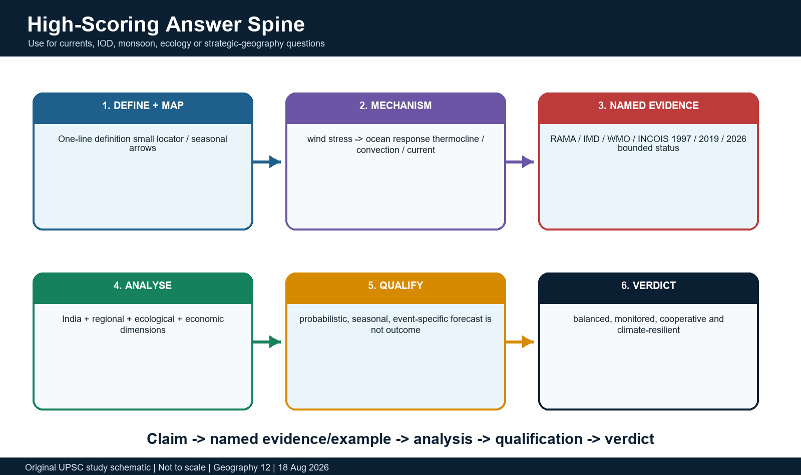

*The answer spine used throughout the package.*

### Evidence / comparison matrix

| Layer | Core question | Exam output |
| --- | --- | --- |
| Basin geography | Where are the ridges, trenches, islands, seas and gateways? | Map and location elimination |
| Physical oceanography | How do winds, Coriolis, pressure gradients and density drive flow? | Process derivation |
| IOD/monsoon | How does zonal SST contrast alter thermocline, convection and rainfall? | Causal GS-I answer |
| Ecology/economy | How do heat, nutrients, oxygen and hazards affect livelihoods? | GS-III linkage |
| Strategy/governance | How do chokepoints, islands and institutions shape cooperation? | Bounded GS-II/Essay use |

### Teaching, explanation and solution

- FACT means directly supported by a retrieved source. STATUS means an observed, date-specific condition. FORECAST means a model-based future probability, not an outcome. INFERENCE is reasoned analysis. LIMIT states what the evidence cannot prove.
- A seasonal current map must carry a month/season label. North Indian Ocean arrows reverse or reorganise; a timeless arrow map is misleading.
- IOD event, DMI reading, threshold convention, seasonal forecast, event peak and basin-wide warming are different statements.
- Every teleconnection is probabilistic and conditional on timing, amplitude, co-occurring ENSO/MJO states and internal variability.
- Strategic location creates leverage and vulnerability, but never automatic control of international sea lanes.

### Must-know facts

- Export date and retrieval cut-off: 18 August 2026.
- Current 2026 forecasts are not presented as verified seasonal outcomes.
- All original MCQs rotate answers A -> B -> C -> D without consecutive repeats.

### UPSC traps and corrections

- **Wrong:** Positive IOD means India must receive a good monsoon. **Correct:** Positive IOD may offset some adverse influences in some events, but no phase guarantees an all-India or regional outcome.
- **Wrong:** A current forecast proves the observed season. **Correct:** Forecast, status and final outcome must be kept separate.

### Mains / answer route

Define -> map -> derive mechanism -> name evidence -> analyse India and wider rim -> qualify -> balanced verdict.

### Study link

Geography basic/advanced Topics 12 and 16; cyclones, fisheries, islands, transport, IR maritime-security owners.

## 1. Basin boundaries and map-ready regional geography

The Indian Ocean is bounded by Africa to the west, Asia to the north, the Indonesian archipelago and Australia to the east, and opens southward toward the Southern Ocean. Hydrographic boundary conventions should be attributed because southern limits have changed across classification systems.

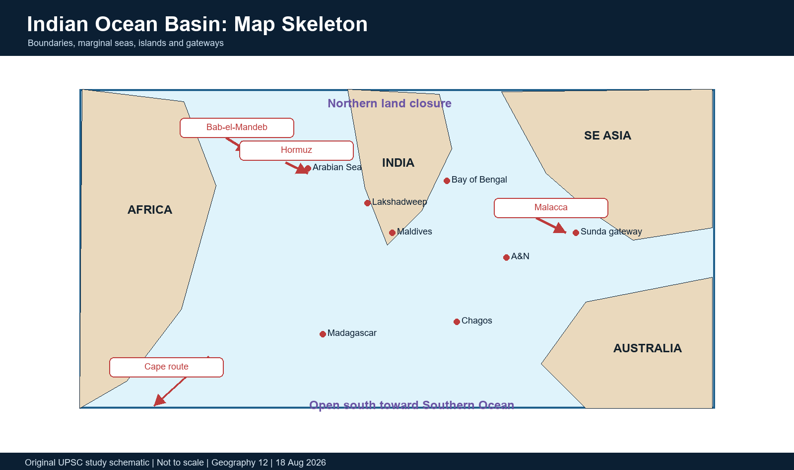

*A map skeleton for seas, islands and gateways.*

### Evidence / comparison matrix

| Gateway / water body | Connects | Why it matters |
| --- | --- | --- |
| Strait of Hormuz | Persian Gulf - Gulf of Oman/Arabian Sea | Energy and commercial access |
| Bab-el-Mandeb | Red Sea - Gulf of Aden | Suez-Indian Ocean route |
| Straits of Malacca/Singapore | Andaman Sea - South China Sea | Indian-Pacific shipping connection |
| Sunda/Lombok/Timor passages | Indonesian seas - eastern Indian Ocean | Shipping and Pacific-Indian exchange |
| Mozambique Channel | Between Mozambique and Madagascar | Southwest current system and Cape route |
| Palk Strait / Gulf of Mannar | India-Sri Lanka sector | Shallow regional geography; not a major deep-draft through-route |

### Teaching, explanation and solution

- Northern land closure is the basin's defining geometry: Asia blocks a northern connection comparable to the Atlantic-Arctic or Pacific-Arctic pathways.
- The northern basin is divided by peninsular India into the Arabian Sea and Bay of Bengal; the Andaman Sea lies east of the Andaman-Nicobar arc.
- Major marginal water bodies include the Red Sea, Gulf of Aden, Persian Gulf, Gulf of Oman, Gulf of Kachchh, Gulf of Khambhat, Gulf of Mannar and Gulf of Martaban.
- Map the southwest Indian Ocean around Madagascar, Mozambique Channel, Mascarene Plateau and the Cape route; map the southeast around Sunda passages, Timor Sea and western Australia.
- The IHO S-23 remains a historical hydrographic reference; use modern Southern Ocean conventions carefully rather than asserting one timeless southern line.

### Must-know facts

- Arabian Sea lies west of India; Bay of Bengal lies east.
- Andaman Sea is east of the A&N chain, not west.
- Madagascar is separated from mainland Africa by the Mozambique Channel.

### UPSC traps and corrections

- **Wrong:** Malacca connects the Arabian Sea directly to the Pacific. **Correct:** It connects the Andaman Sea side of the Indian Ocean system with the South China Sea.
- **Wrong:** Every named channel is a geopolitical chokepoint of equal scale. **Correct:** Navigational depth, traffic, alternatives and legal context differ.

### Mains / answer route

Draw Africa-India-SE Asia-Australia, then add Hormuz, Bab-el-Mandeb, Malacca, Madagascar and the open southern connection.

### Study link

Geography location, islands and transport; IR maritime geography.

## 2. Ridges, trenches, plate setting and island arcs

The basin floor records both crustal creation at spreading ridges and crustal consumption at the Sunda-Java subduction zone. It also contains hotspot traces, plateaus, fracture zones and diffuse deformation within the Indo-Australian plate system.

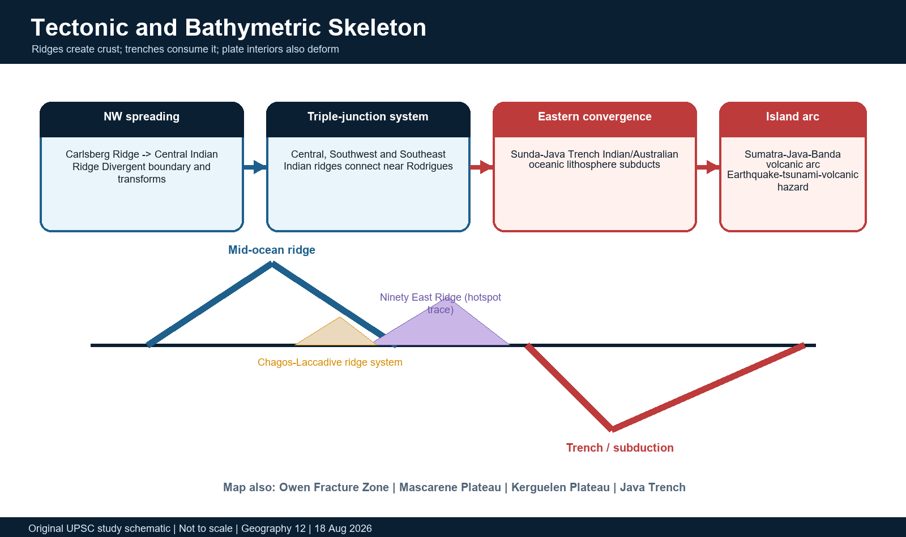

*Simplified plate and bathymetric structure.*

### Evidence / comparison matrix

| Feature | Process | Answer value |
| --- | --- | --- |
| Carlsberg/Central Indian Ridge | Divergent spreading | New oceanic crust and transform earthquakes |
| Sunda-Java Trench | Convergence/subduction | Megathrust, tsunami and volcanic arc |
| Ninety East Ridge | Hotspot trace / aseismic ridge | North-south bathymetric barrier and plate history |
| Chagos-Laccadive system | Hotspot-related ridge/plateau chain | Lakshadweep-Maldives-Chagos alignment |
| Mascarene/Kerguelen plateaus | Large elevated submarine provinces | Bathymetry, circulation and geologic history |

### Teaching, explanation and solution

- The Carlsberg Ridge continues southeastward into the Central Indian Ridge; the Southwest and Southeast Indian ridges complete the major spreading-ridge network.
- The Rodrigues triple-junction region links the Central, Southwest and Southeast Indian ridge systems.
- The Sunda-Java Trench marks subduction along Sumatra-Java and continues toward the Banda arc system; it is a major earthquake-tsunami-volcanic hazard margin.
- The Chagos-Laccadive ridge system, Ninety East Ridge, Mascarene Plateau and Kerguelen Plateau are prominent bathymetric features with different origins; do not call all of them active plate boundaries.
- The Owen Fracture Zone and transforms offset spreading or plate-motion domains; shallow ridge earthquakes differ from megathrust events at subduction zones.
- Island groups include continental fragments/highs, volcanic or arc islands, reef islands and atolls: Madagascar, Sri Lanka, A&N, Indonesia, Maldives, Lakshadweep, Seychelles, Mauritius/Reunion, Comoros and Cocos/Christmas occupy different geological settings.

### Must-know facts

- A ridge is not a trench; a hotspot ridge is not necessarily an active plate boundary.
- A&N belongs to an active convergent-margin system; Lakshadweep is a low reef-atoll system.
- Bathymetry steers currents, waves and tsunami propagation but does not alone determine their effects.

### UPSC traps and corrections

- **Wrong:** All Indian Ocean islands are volcanic. **Correct:** Origins include continental, arc/tectonic, volcanic and coral-reef settings.
- **Wrong:** Ninety East Ridge is the same type of feature as the active Central Indian Ridge. **Correct:** They have different tectonic meanings.

### Mains / answer route

Use create-crust ridge -> deform/transform -> consume-crust trench -> build arc as the tectonic spine.

### Study link

Geography plate tectonics, earthquakes, islands and tsunami.

## 3. Why the Indian Ocean differs from the Atlantic and Pacific

The Indian Ocean shares gyres, western boundary currents, equatorial dynamics and air-sea coupling with other oceans, but its northern land closure and monsoon wind reversal produce exceptional seasonality north of roughly 10S.

### Evidence / comparison matrix

| Dimension | Indian Ocean | Qualification / comparison |
| --- | --- | --- |
| Northern geometry | Closed by Asia | South remains open; exchanges still occur through Indonesia and around Africa |
| Wind regime | Monsoon reverses north-basin winds | Southern subtropical trades remain more persistent |
| Currents | Somali, WICC, EICC and monsoon currents reverse/reorganise | South Equatorial and Agulhas systems are more persistent |
| Tropical share | Large fraction lies in tropics | Southern Indian Ocean reaches temperate/subpolar belts |
| Inter-basin links | Indonesian Throughflow enters; Agulhas leakage exits toward Atlantic | Exchange strength varies and involves eddies/mixing |
| Equatorial jets | Semiannual Wyrtki jets during intermonsoons | Equatorial circulation is not a fixed westward-current cartoon |

### Teaching, explanation and solution

- The Pacific supplies warm, relatively fresh water through the Indonesian seas; this affects eastern Indian Ocean heat and freshwater budgets.
- The South Equatorial Current crosses the southern tropical basin and feeds Madagascar/Mozambique/Agulhas pathways.
- Agulhas retroflection returns much water eastward, while eddies and filaments leak some warm, salty Indian Ocean water into the South Atlantic.
- The Leeuwin Current flows poleward along western Australia, unlike the textbook cold equatorward eastern-boundary-current expectation; pressure gradients linked partly to Pacific-Indian exchange are important.
- Generalisation must be latitude-bounded: strong monsoon reversal is a northern-basin feature, not proof that every current in the entire ocean reverses.

### Must-know facts

- The Indian Ocean is not isolated from the global ocean.
- Northern land closure amplifies monsoon control of circulation.
- The ITF and Agulhas leakage connect Pacific-Indian-Atlantic heat and salt budgets.

### UPSC traps and corrections

- **Wrong:** Every Indian Ocean current reverses every six months. **Correct:** Reversal is strongest in northern and equatorial systems; southern currents are more persistent.
- **Wrong:** The Leeuwin Current is a standard cold equatorward eastern boundary current. **Correct:** It is a warm poleward current along western Australia.

### Mains / answer route

Compare geometry -> winds -> currents -> inter-basin exchange -> qualified conclusion.

### Study link

World ocean circulation and climatology.

## 4. From wind stress to Ekman transport and geostrophic flow

Surface currents are not simply water moving in the same direction as wind. Momentum transfer, Coriolis turning, friction, pressure gradients, density structure and boundaries combine to set the flow.

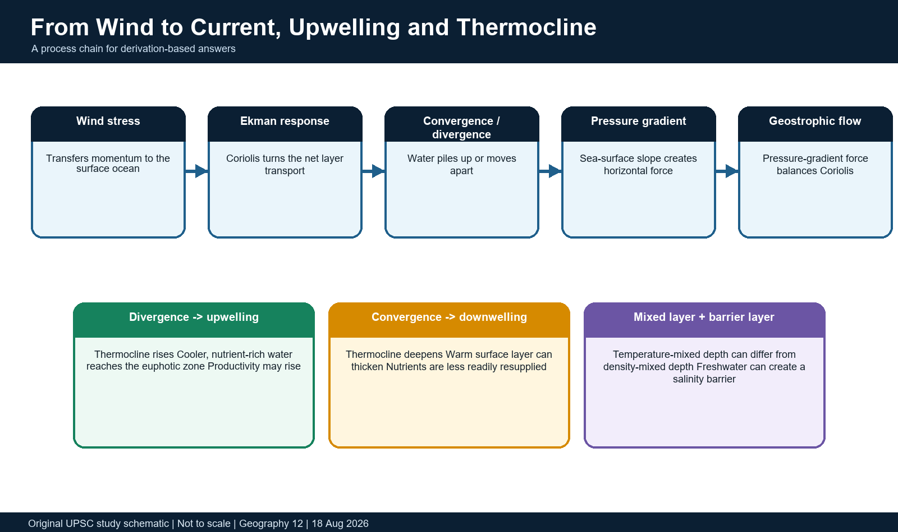

*The process chain from atmospheric forcing to currents and vertical motion.*

### Evidence / comparison matrix

| Process | Physical cue | Likely consequence |
| --- | --- | --- |
| Coastal upwelling | Alongshore wind + offshore Ekman transport | Cooler SST, shoaling thermocline, nutrient supply |
| Downwelling | Onshore transport or convergence | Deepened thermocline and reduced nutrient resupply |
| Geostrophic current | Horizontal pressure gradient balanced by Coriolis | Flow along height/density contours |
| Mixed-layer deepening | Wind stirring and surface cooling | More vertical exchange and potential SST cooling |
| Barrier layer | Salinity stratification separates density and temperature structures | Mixing may not reach cooler thermocline water |

### Teaching, explanation and solution

- Wind stress transfers momentum to the surface. Friction transmits it downward while Coriolis turns the motion: to the right in the Northern Hemisphere and left in the Southern Hemisphere.
- The depth-integrated Ekman transport is approximately 90 degrees to the wind in the idealised open ocean; coastlines and stratification modify the real response.
- Ekman divergence or offshore transport draws deeper water upward; convergence piles water up and promotes downwelling.
- Sea-surface height and density gradients create a pressure-gradient force. Large-scale geostrophic flow emerges when this balances Coriolis away from the equator and strong friction.
- At the equator the Coriolis parameter approaches zero, so equatorial wave adjustment, direct wind forcing and zonal pressure gradients require separate treatment.
- Density-driven circulation reflects temperature and salinity; wind-driven and thermohaline effects interact rather than forming two sealed systems.

### Must-know facts

- Upwelling can raise productivity only if light, nutrients, oxygen and ecosystem conditions permit.
- Geostrophic balance is weak exactly at the equator.
- A thermocline is a zone of rapid temperature change with depth; mixed-layer depth is a different metric.

### UPSC traps and corrections

- **Wrong:** Wind and surface current always point in exactly the same direction. **Correct:** Coriolis, friction, coastlines and pressure gradients alter direction.
- **Wrong:** Every upwelling event creates a large fish catch. **Correct:** Food-web response, oxygen, timing, access and management mediate catches.

### Mains / answer route

Derive wind stress -> Ekman transport -> convergence/divergence -> thermocline -> productivity or heat-content effect.

### Study link

Geography basic 12; Majid Husain pp. 133-137.

## 5. Southwest monsoon circulation: June to September

During the southwest monsoon, strong cross-equatorial winds and southwesterlies reorganise the North Indian Ocean. The Somali Current accelerates northward, major upwelling develops in the western Arabian Sea, and the monsoon current carries water eastward south of India/Sri Lanka.

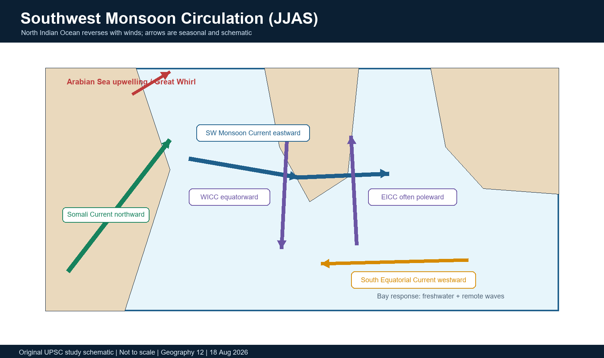

*Schematic summer circulation with seasonal caveats.*

### Teaching, explanation and solution

- The Somali Current behaves as a strong seasonally reversing western boundary current; during boreal summer it flows northward and can form the Great Whirl and associated eddies.
- Along Somalia and Oman, wind-driven divergence and curl produce intense upwelling and a cold SST wedge despite strong solar heating.
- The Southwest Monsoon Current generally moves eastward from the Arabian Sea around Sri Lanka into the Bay of Bengal, but eddies and intraseasonal forcing complicate a single line.
- The West India Coastal Current is broadly equatorward during the southwest monsoon, linked with coastal upwelling along parts of southwest India.
- The East India Coastal Current has a more complex, remotely forced seasonal structure; a poleward tendency in summer sectors should be qualified by location and month.
- Bay of Bengal circulation responds strongly to freshwater, eddies, coastal Kelvin waves and equatorial wave signals in addition to local wind.

### Must-know facts

- Summer Somali Current: northward.
- Southwest Monsoon Current: broadly eastward south of India/Sri Lanka.
- Arabian Sea summer upwelling is spatially concentrated, not basin-wide uniform cooling.

### UPSC traps and corrections

- **Wrong:** The summer monsoon makes the entire northern Indian Ocean flow eastward. **Correct:** Boundary currents, gyres, eddies and coastal reversals produce a structured field.
- **Wrong:** The EICC has one direction throughout the year and along the whole coast. **Correct:** Direction and strength vary by season, latitude and remote forcing.

### Mains / answer route

Season label -> wind arrows -> Somali/WICC/SWMC/EICC -> upwelling -> monsoon/ecology link.

### Study link

Geography monsoon mechanism and ocean currents.

## 6. Northeast monsoon circulation: December to February

Winter northeasterlies reverse or reorganise many northern currents. The Somali Current flows southward, the Northeast Monsoon Current carries water westward south of Sri Lanka, the WICC turns poleward and much of the EICC becomes equatorward.

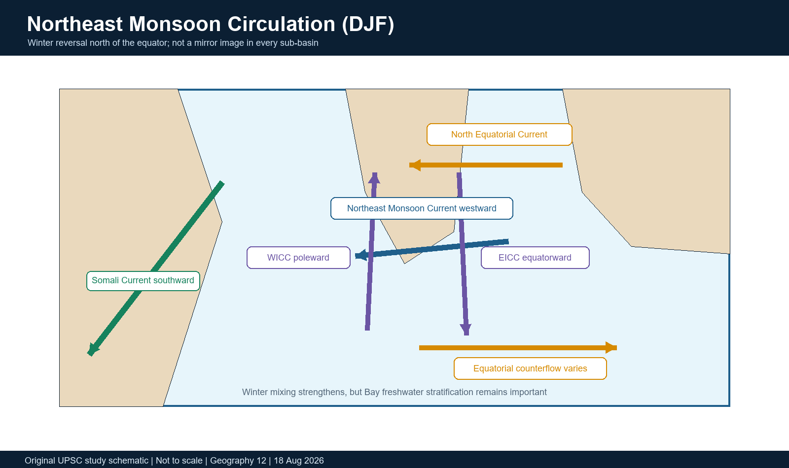

*Schematic winter circulation and coastal-current reversal.*

### Teaching, explanation and solution

- A westward North Equatorial Current becomes prominent in the tropical north during winter, unlike the summer pattern.
- The Northeast Monsoon Current transports relatively fresh Bay water westward south of Sri Lanka and can influence the southeastern Arabian Sea.
- The poleward winter WICC is partly driven by remote coastal-wave adjustment from the Bay and by alongshore pressure gradients, not only local wind.
- The winter EICC is broadly equatorward and exports freshwater southward from the Bay; eddies and pulses still matter.
- Winter surface cooling and evaporation can deepen mixing in the northern Arabian Sea, while the Bay's freshwater cap can maintain strong stratification.
- Seasonal reversal is not a perfect mirror: background density structure, basin geometry and wave adjustment retain memory.

### Must-know facts

- Winter Somali Current: southward.
- Northeast Monsoon Current: broadly westward south of Sri Lanka.
- WICC is broadly poleward in winter.

### UPSC traps and corrections

- **Wrong:** Winter circulation is simply summer arrows reversed everywhere. **Correct:** Magnitude, pathways, density structure and remote forcing differ.
- **Wrong:** Fresh Bay water remains confined to the Bay. **Correct:** Boundary and monsoon currents can export it around Sri Lanka.

### Mains / answer route

Use a separate winter map and explain why reversal is dynamic, not a mirror image.

### Study link

Ocean-current seasonality; Bay-Arabian exchange.

## 7. Equatorial jets, southern gyre, Indonesian Throughflow and Agulhas

Between monsoons, westerly winds drive strong eastward Wyrtki jets along the equatorial Indian Ocean. South of the monsoon-dominated north, a more persistent subtropical circulation links Pacific inflow, South Equatorial transport and the Agulhas system.

### Evidence / comparison matrix

| Feature | Broad direction | Seasonality / significance |
| --- | --- | --- |
| Wyrtki jets | Eastward along equator | Spring and autumn intermonsoons; heat/mass redistribution |
| South Equatorial Current | Westward | Persistent southern-tropical backbone |
| Agulhas Current | Southward along SE Africa | Strong western boundary current; retroflection/leakage |
| Indonesian Throughflow | Pacific to Indian | Heat/freshwater link; varies with winds and ENSO |
| Leeuwin Current | Poleward along western Australia | Warm eastern-boundary exception |

### Teaching, explanation and solution

- Wyrtki jets occur semiannually during boreal spring and autumn intermonsoons; NOAA moored ADCP observations near 80.5E document these strong eastward currents.
- The South Equatorial Current flows broadly westward and splits around Madagascar into pathways involving the North Madagascar Current, East Madagascar Current and Mozambique Channel eddies.
- These pathways feed the southward Agulhas Current along southeast Africa; retroflection returns much water eastward while leakage transfers some into the South Atlantic.
- The Indonesian Throughflow moves Pacific water through the Indonesian seas into the eastern Indian Ocean; its heat and freshwater influence upper-ocean structure and the Leeuwin Current system.
- The Leeuwin Current is poleward along western Australia and is often strongest in austral winter; it suppresses the simple textbook expectation of strong coastal upwelling along every eastern boundary.
- Equatorial countercurrents and undercurrents vary seasonally; avoid giving one permanent arrow without month and depth.

### Must-know facts

- RAMA/NOAA observations place Wyrtki-jet monitoring in the central equatorial Indian Ocean.
- Agulhas leakage is an inter-basin connection, not the entire Agulhas Current.
- ITF and Leeuwin effects show why basin boundaries do not imply isolation.

### UPSC traps and corrections

- **Wrong:** The Equatorial Countercurrent is the same as a Wyrtki jet. **Correct:** Wyrtki jets are strong, semiannual eastward equatorial events tied to intermonsoon westerlies.
- **Wrong:** Agulhas water simply enters the Atlantic as a steady pipe. **Correct:** Retroflection, rings, eddies and variable leakage create a complex exchange.

### Mains / answer route

Connect ITF -> SEC -> Madagascar/Mozambique -> Agulhas -> Atlantic, with Wyrtki jets as the equatorial seasonal bridge.

### Study link

Global ocean circulation and inter-basin climate links.

## 8. Mixed layer, thermocline, barrier layer and upper-ocean heat

The atmosphere interacts directly with the mixed layer, while the thermocline controls access to cooler subsurface water. Salinity can create a barrier layer, especially in the Bay of Bengal, so temperature-only intuition is insufficient.

### Teaching, explanation and solution

- Mixed-layer depth is the near-surface layer homogenised by turbulence; thermocline depth marks rapid temperature decrease; the 20 deg C isotherm depth is often used as a tropical heat-content proxy.
- Ocean Mean Temperature integrates upper-ocean heat to the 26 deg C isotherm rather than using only a skin temperature; it can support monsoon and cyclone diagnostics when method and season are specified.
- A barrier layer exists when the density-mixed layer is shallower than the isothermal layer because freshwater stabilises the surface.
- During a storm, a shallow thermocline and weak stratification can permit strong cold-water entrainment; a thick warm layer or barrier layer can reduce SST cooling.
- Eddies alter local thermocline depth and ocean heat content; cyclone intensification depends on the pre-storm upper-ocean profile, storm speed, shear and atmospheric moisture, not SST alone.
- Freshwater lenses and river plumes can spread laterally, influencing coastal currents and air-sea fluxes beyond the river mouth.

### Must-know facts

- SST is a surface metric; ocean heat content is volumetric.
- Barrier layer is a salinity-stratification concept, not simply a warm layer.
- D20, mixed-layer depth and thermocline depth are related but not interchangeable.

### UPSC traps and corrections

- **Wrong:** High SST alone guarantees rapid cyclone intensification. **Correct:** Atmospheric shear, moisture, storm structure and subsurface heat all matter.
- **Wrong:** The Bay's freshwater cap always prevents cyclone cooling. **Correct:** Barrier-layer strength, eddies, storm translation and season determine the response.

### Mains / answer route

Draw surface mixed layer -> barrier layer -> thermocline and connect to storm cooling and monsoon air-sea flux.

### Study link

Cyclones, monsoon prediction and 2020 OMT PYQ.

## 9. Arabian Sea versus Bay of Bengal: heat, salt, freshwater and oxygen

The Arabian Sea and Bay of Bengal sit at similar tropical latitudes but differ sharply in evaporation, river discharge, salinity stratification, wind mixing and biological response. These are broad tendencies, not universal basin labels.

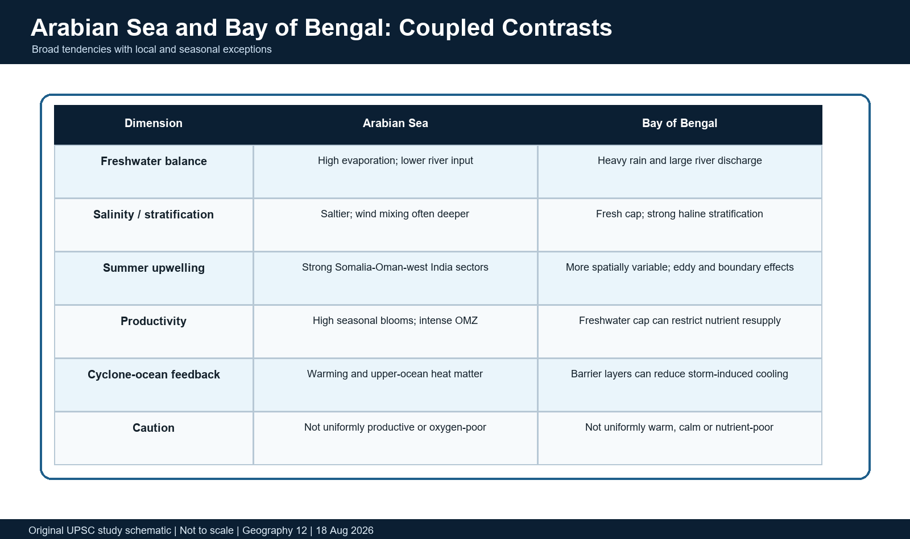

*A comparison matrix with explicit caveats.*

### Teaching, explanation and solution

- Arabian Sea evaporation generally exceeds precipitation and river input over large sectors, producing higher salinity; the Bay receives immense monsoon rainfall and Ganga-Brahmaputra-Meghna plus peninsular/Irrawaddy runoff.
- Strong summer winds and upwelling deepen mixing and resupply nutrients in Arabian Sea sectors; the Bay's freshwater cap often restricts vertical nutrient resupply despite warm SST.
- The Bay can maintain warm surface water under wind forcing because salinity stratification reduces entrainment of cooler subsurface water; river plumes, eddies and coastal upwelling create exceptions.
- The Arabian Sea contains one of the world's most intense oxygen minimum zones because productivity, respiration and ventilation interact. The Bay also has oxygen-poor subsurface waters but different productivity and nitrogen-cycle expression.
- Arabian Sea productivity does not mean every location or season is highly productive; Bay stratification does not mean the Bay lacks blooms, eddies, coastal fisheries or river nutrient effects.
- Monsoon coupling differs: Arabian Sea upwelling and SST gradients affect low-level jet/moisture; Bay heat, freshwater and convection influence monsoon depressions and intraseasonal propagation.

### Must-know facts

- Bay salinity stratification can be strong even where SST looks similar to the Arabian Sea.
- Both basins can host oxygen deficiency; intensity and biogeochemistry differ.
- River runoff is a climate forcing as well as a terrestrial input.

### UPSC traps and corrections

- **Wrong:** Bay of Bengal is always more cyclone-prone only because it is warmer. **Correct:** Warmth, stratification, genesis environment, basin geometry and atmospheric conditions all contribute.
- **Wrong:** Arabian Sea productivity proves fish catches will rise. **Correct:** Food-web, oxygen, access, management and species shifts mediate catches.

### Mains / answer route

Compare freshwater budget -> stratification -> mixing -> nutrients/oxygen -> cyclone/monsoon implication.

### Study link

Geography advanced 12; fisheries, cyclones and monsoon.

## 10. Indian Ocean Dipole: definition, boxes and state discipline

The Indian Ocean Dipole is a coupled ocean-atmosphere mode measured by a zonal SST-anomaly contrast. The Dipole Mode Index is the western tropical Indian Ocean SST anomaly minus the southeastern equatorial Indian Ocean SST anomaly.

### Evidence / comparison matrix

| Statement | What it means | What it does not mean |
| --- | --- | --- |
| DMI positive today | West-east anomaly difference is positive for that dataset/time | A mature event is certain |
| Positive IOD forecast | Model ensemble favours future positive phase | It has already occurred |
| Neutral IOD | DMI lies in the agency's neutral range | Indian Ocean SSTs are normal everywhere |
| Extreme positive event | Large, sustained coupled anomaly | Every impact is caused solely by IOD |
| Peak season | IOD commonly maximises in boreal autumn | Every event follows identical timing |

### Teaching, explanation and solution

- Standard DMI boxes are western 50E-70E, 10S-10N and eastern 90E-110E, 10S-equator. The index is west minus east, not east minus west.
- Positive DMI means the west is relatively warmer than the southeast; negative DMI means the southeast is relatively warmer than the west.
- An IOD event requires coupled, persistent evolution. A single weekly DMI excursion is not equivalent to a mature event.
- Operational thresholds and persistence rules vary by agency/product. IMD's August 2026 probabilistic figure uses plus/minus 0.4 deg C criteria; other products may use different averaging and declaration conventions.
- A basin-wide warm Indian Ocean can coexist with a neutral DMI if west and east anomalies warm similarly. DMI measures contrast, not basin mean.
- Observed status, model plume, ensemble probability, seasonal-mean forecast and final event classification must be quoted separately.

> **Memory hook:** WEST minus EAST: positive means the west is relatively warmer.

### Must-know facts

- DMI = western anomaly minus southeastern anomaly.
- DMI is a gradient index, not basin-average temperature.
- Agency, dataset, base period and averaging window must accompany precise threshold claims.

### UPSC traps and corrections

- **Wrong:** Any positive DMI is a declared positive IOD event. **Correct:** Persistence, coupling and the agency's operational convention matter.
- **Wrong:** Neutral IOD means no Indian Ocean climate signal. **Correct:** Basin warming, MJO, eddies and other modes can still matter.

### Mains / answer route

Begin with the formula and a two-box sketch before discussing impacts.

### Study link

IMD FAQ, BoM IOD definition and IMD August 2026 bulletin.

## 11. Positive and negative IOD mechanics: Bjerknes-type feedback

IOD growth involves mutual reinforcement among equatorial winds, thermocline slope, upwelling, SST contrast and convection. The feedback resembles ENSO logic but operates in a different basin with a much stronger monsoon seasonal cycle.

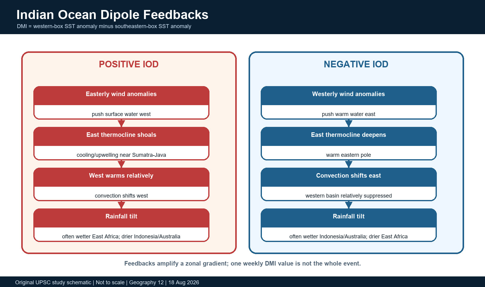

*Positive and negative IOD feedback chains.*

### Teaching, explanation and solution

- Positive IOD: easterly wind anomalies push warm surface water westward; the eastern thermocline shoals; upwelling/cooling strengthens near Sumatra-Java; convection shifts west; the zonal gradient can amplify.
- Negative IOD: westerly anomalies deepen the eastern thermocline, warm the southeastern pole and shift convection toward Indonesia/Australia; the west is relatively cooler/drier.
- Equatorial Kelvin and Rossby waves transmit adjustment; coastal waves connect equatorial anomalies with boundary-current and thermocline changes.
- Cloud-radiation and evaporation feedbacks can reinforce or damp SST anomalies. Intraseasonal westerly wind bursts can interrupt a developing positive event.
- The atmospheric Walker-type overturning is an anomaly circulation superimposed on a seasonally evolving climatology, not a fixed permanent cell.
- Positive and negative phases are not perfectly symmetric in intensity, seasonality or impacts.

### Must-know facts

- The eastern pole lies off Sumatra-Java in the southeastern equatorial Indian Ocean.
- Thermocline shoaling makes cold subsurface water more accessible to upwelling.
- Convection follows SST and moisture gradients but is also shaped by atmospheric dynamics.

### UPSC traps and corrections

- **Wrong:** IOD is only an ocean temperature pattern. **Correct:** It is a coupled ocean-atmosphere mode with wind, thermocline and rainfall feedbacks.
- **Wrong:** Negative IOD is simply the exact mirror of positive IOD. **Correct:** Nonlinearity and seasonal background create asymmetry.

### Mains / answer route

Wind anomaly -> thermocline tilt -> SST contrast -> convection shift -> wind reinforcement; then add a damping/termination process.

### Study link

Coupled climate dynamics and monsoon teleconnections.

## 12. IOD life cycle, seasonality and event diversity

Many IOD events begin to organise during boreal spring/early summer, grow with monsoon-season feedbacks, peak around September-November and decay rapidly toward winter. This is a common pattern, not a rigid calendar.

### Timeline / seasonality

- **Mar-May:** Weak precursor signals; forecasts face onset and model-spread uncertainty.
- **Jun-Aug:** Equatorial wind/thermocline anomalies may strengthen; DMI begins sustained evolution.
- **Sep-Nov:** Typical peak season for mature zonal SST and rainfall contrasts.
- **Dec-Jan:** Monsoon transition, equatorial adjustment and Wyrtki-jet/wind changes favour decay.

### Teaching, explanation and solution

- Events can be early, late, short, prolonged, canonical or structurally unusual; pole amplitudes need not be equal.
- IOD development may co-occur with El Nino, La Nina or ENSO-neutral conditions. Partial statistical independence means neither complete independence nor one-to-one dependence.
- Forecast skill changes with initialization month and event type; weak precursor signals and spring transition can produce rapid revisions.
- The event peak is commonly in boreal autumn, when East African short rains and Indonesian/Australian impacts are often strongest; Indian summer-monsoon effects occur earlier and are more conditional.
- Termination reflects seasonal wind reversal, equatorial waves, heat-budget changes and weakened positive feedback.

### Must-know facts

- Peak season is usually SON, not the whole calendar year.
- A DMI forecast months ahead should include ensemble spread and model/date.
- Event diversity explains why same-sign IOD years can produce different regional outcomes.

### UPSC traps and corrections

- **Wrong:** IOD begins and peaks on fixed dates every year. **Correct:** Onset, maturity and decay vary.
- **Wrong:** If ENSO is known, IOD is automatically known. **Correct:** The modes interact but retain partial independence.

### Mains / answer route

Use a four-stage life-cycle strip and then qualify with event diversity.

### Study link

Seasonal prediction and 2026 forecast divergence.

## 13. IOD is not merely an 'Indian Ocean El Nino'

The analogy is useful only at the level of coupled zonal SST-wind-thermocline feedback. Calling IOD an Indian Ocean El Nino without qualification hides major differences in geometry, climatology, persistence and teleconnections.

### Evidence / comparison matrix

| Dimension | IOD | ENSO |
| --- | --- | --- |
| Basin | Tropical Indian Ocean | Tropical Pacific |
| Index | West minus southeast Indian SST anomaly | Nino-region SST/atmospheric indices |
| Seasonality | Strongly phase-locked to boreal summer-autumn and monsoon cycle | Typically peaks boreal winter; longer Pacific memory |
| Background geometry | Northern land closure; no Pacific-scale permanent cold tongue | Very large equatorial basin and eastern cold tongue |
| Feedback | Wind-thermocline-SST-convection feedback | Bjerknes feedback with Pacific wave/recharge dynamics |
| Relationship | Can co-occur, reinforce, offset or develop partly independently | Can influence IOD probability but does not dictate it |

### Teaching, explanation and solution

- Both modes involve zonal SST gradients and coupled Walker-type circulation anomalies.
- The Indian Ocean's strong monsoon reversal and shorter zonal basin limit persistence and change event evolution.
- ENSO can alter Indian Ocean winds and convection; Indian Ocean anomalies can also feed back on the atmosphere and later climate.
- Use 'analogous coupled mode' rather than 'same phenomenon in another ocean'.

### Must-know facts

- Similar feedback does not imply identical dynamics.
- IOD has a stronger boreal-autumn phase lock.
- ENSO-IOD combinations matter more than a one-variable slogan.

### UPSC traps and corrections

- **Wrong:** IOD and ENSO are the same phenomenon with different names. **Correct:** They are distinct coupled modes in different basins.
- **Wrong:** IOD is always caused by El Nino. **Correct:** Some events co-occur; others have substantial internal Indian Ocean development.

### Mains / answer route

One similarity paragraph + four differences + interaction verdict.

### Study link

ENSO owner and monsoon mechanism.

## 14. ENSO-IOD-MJO-monsoon interaction: reinforcement and cancellation

Indian monsoon rainfall is an emergent outcome of coupled ocean-atmosphere and land processes. ENSO sets a broad seasonal background, IOD modifies Indian Ocean gradients, and MJO/monsoon intraseasonal oscillations organise active-break spells.

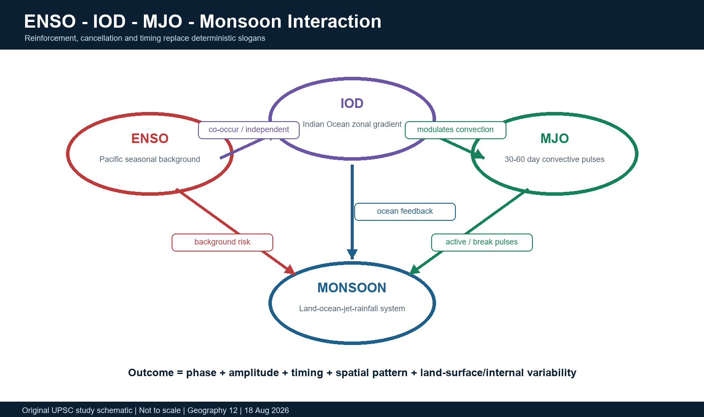

*The interaction logic behind non-deterministic outcomes.*

### Evidence / comparison matrix

| Combination | Broad risk tilt | Essential qualification |
| --- | --- | --- |
| El Nino + positive IOD | Competing influences over India | 1997 shows offset can occur; not a universal rescue |
| El Nino + neutral/negative IOD | Higher drought risk in many cases | MJO and regional circulation can still change distribution |
| La Nina + negative IOD | Competing influences | Flood/drought outcome varies by region and spell |
| ENSO neutral + strong IOD | Indian Ocean can become dominant regional driver | Still not a single-cause attribution |
| Any seasonal state + MJO pulse | Active/break and cyclone modulation | Subseasonal timing can override monthly averages locally |

### Teaching, explanation and solution

- El Nino often raises the probability of a weaker Indian summer monsoon, but the relationship is neither perfect nor spatially uniform.
- A positive IOD may support convection over the western Indian Ocean and offset part of El Nino's adverse tendency in some years; 1997 is a classic example of a strong El Nino with near-normal all-India monsoon rainfall and a strong positive IOD.
- A negative IOD can oppose a favourable La Nina background; conversely, a positive IOD during La Nina does not imply unlimited rainfall.
- The MJO moves eastward on intraseasonal timescales and can trigger or suppress monsoon active phases, cyclogenesis and equatorial wind bursts that also alter IOD evolution.
- Snow/land heating, Eurasian conditions, Indian Ocean basin mode, aerosols, soil moisture, synoptic systems and internal variability add further degrees of freedom.
- Cancellation and reinforcement depend on phase overlap: a late IOD peak cannot be assumed to determine early-June rainfall.

### Must-know facts

- Partial independence means interaction without deterministic dependence.
- Seasonal mean and active-break sequence can tell different stories.
- A forecast of one driver is not a forecast of every Indian rainfall region.

### UPSC traps and corrections

- **Wrong:** Positive IOD always cancels El Nino. **Correct:** Offset depends on strength, timing, spatial structure and other drivers.
- **Wrong:** MJO is another name for IOD. **Correct:** MJO is an eastward-propagating intraseasonal atmospheric-convective mode.

### Mains / answer route

Use a 2x2 ENSO-IOD matrix, then add MJO timing and internal variability as the qualification.

### Study link

Geography basic/advanced 16; IMD/IITM monsoon prediction.

## 15. Indian rainfall impacts by region and season

IOD influence over India is strongest as a modulation of moisture transport, convection, monsoon circulation and intraseasonal behaviour. The sign of the all-India association cannot be pasted onto every state or month.

### Evidence / comparison matrix

| Region / season | Potential positive-IOD pathway | Qualification |
| --- | --- | --- |
| West/central India, JJAS | Western Indian Ocean convection and moisture transport may support rainfall or reduce some El Nino stress | Synoptic depressions, MJO and land feedbacks decide distribution |
| Northwest India, JJAS | Circulation shifts can alter monsoon trough and moisture supply | Teleconnection is weaker/variable; no guaranteed benefit |
| Northeast India, JJAS | May respond differently from all-India mean | Positive IOD need not increase rainfall here |
| South peninsula, JJAS | Arabian Sea/Bay gradients and low-level flow matter | Local rain-shadow and active-break structure are decisive |
| Tamil Nadu / post-monsoon | Bay convection and northeast-monsoon circulation respond to Indian Ocean state | IOD sign alone is insufficient; cyclones/MJO and local SST structure matter |
| East Africa / Indonesia / Australia, SON | Positive IOD often wetter East Africa and drier Maritime Continent/Australia | Probabilistic association, not event attribution by itself |

### Teaching, explanation and solution

- Positive IOD can shift tropical convection westward, changing cross-equatorial pressure gradients and moisture pathways feeding India.
- Rainfall response depends on where monsoon troughs, lows and depressions form and track; a seasonal DMI cannot resolve district rainfall.
- The northeast monsoon is influenced by Bay of Bengal convection, MJO, cyclones, ENSO and IOD timing; a late positive IOD may affect it differently from JJAS.
- Regional verification should compare forecast probabilities with observed rainfall after the season; do not backfill causation from a single index.

### Must-know facts

- All-India rainfall can be normal while important subdivisions face deficits.
- IOD teleconnections are seasonally strongest outside India during SON.
- Monsoon impacts should be expressed as probability/risk tilts.

### UPSC traps and corrections

- **Wrong:** All Indian regions respond with the same sign. **Correct:** Regional atmospheric circulation and season produce heterogeneous impacts.
- **Wrong:** A normal all-India monsoon means agriculture everywhere was normal. **Correct:** Distribution, timing and extremes can diverge from the national mean.

### Mains / answer route

Separate JJAS India, post-monsoon south India and SON rim impacts; end with event-specific qualification.

### Study link

Indian monsoon regions, agriculture and disaster management.

## 16. Historical event cases: 1994, 1997, 2019 and negative IODs

Historical cases are evidence, not templates. Use official event classification and dated rainfall records, then distinguish association, mechanism and attribution.

### Timeline / seasonality

- **1994:** Strong positive IOD; strong Indian monsoon case.
- **1997:** Exceptional positive IOD co-occurred with very strong El Nino.
- **2019:** Strong positive IOD with major East Africa/Australia contrasts.
- **2021-22:** Recent negative-IOD examples in BoM historical classification.

### Evidence / comparison matrix

| Event | Verified use | Limit |
| --- | --- | --- |
| 1994 positive IOD | BoM lists it as a positive year; IMD/MAUSAM records a strong Indian monsoon season | Do not assign all rainfall anomaly to IOD alone |
| 1997 extreme positive IOD + El Nino | IPCC identifies an exceptionally strong IOD; India had near-normal monsoon despite very strong El Nino; East Africa suffered flooding | Offset is a case, not a guarantee |
| 2019 strong positive IOD | WMO links the strong phase with East African floods and severe dryness in Australia/SE Asia | Specific local disasters remain multi-factor events |
| 2010/2016/2021/2022 negative examples | BoM lists moderate-to-strong negative years under its historical criterion | Same-sign years differ because ENSO and atmospheric states differ |

### Teaching, explanation and solution

- 1997 demonstrates cancellation/reinforcement logic: strong El Nino did not mechanically force an Indian drought because Indian Ocean and internal monsoon states mattered.
- 2019 demonstrates teleconnection asymmetry: western-basin rainfall and eastern-basin dryness were pronounced, but impact magnitude reflected exposure and local weather sequences.
- Negative events commonly favour warmer eastern Indian Ocean and rainfall toward Indonesia/Australia, with drier East Africa risk; India outcomes remain conditional.
- Case-study method: state event classification -> name concurrent ENSO -> identify observed regional outcome -> explain mechanism -> explicitly limit attribution.

### Must-know facts

- BoM official historical pages list 1994, 1997 and 2019 among positive IOD years.
- BoM lists 2010, 2016, 2021 and 2022 among moderate-to-strong negative years under a stated criterion.
- WMO 2019 reporting provides an official East Africa/Australia impact anchor.

### UPSC traps and corrections

- **Wrong:** 1997 proves positive IOD always rescues India from El Nino. **Correct:** It proves interaction can alter outcomes, not a universal rule.
- **Wrong:** 2019 flood/drought impacts were caused only by IOD. **Correct:** IOD was a major climate driver; local weather, vulnerability and other forcing still mattered.

### Mains / answer route

Use one India case plus one rim case; avoid a list without mechanism.

### Study link

IMD, BoM, WMO and IPCC event records.

## 17. Observation architecture: RAMA, OMNI, Argo, satellites and ships

The Indian Ocean was historically data-sparse. Sustained prediction depends on complementary observing platforms rather than one instrument.

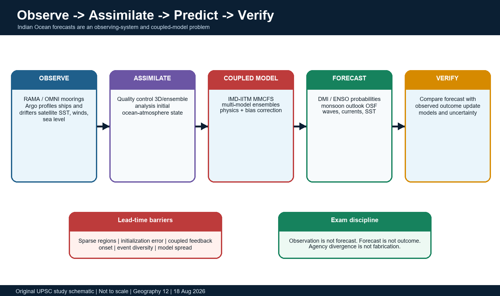

*The end-to-end observation and forecast chain.*

### Evidence / comparison matrix

| Platform | Strength | Limit |
| --- | --- | --- |
| RAMA/OMNI mooring | Continuous local time series and multi-depth profiles | Sparse fixed points; maintenance intensive |
| Argo float | Broad subsurface profiling | Drifts; weaker coastal/boundary sampling |
| Satellite | Frequent basin-wide surface maps | Indirect/subsurface inference and cloud/sensor limits |
| Ship/XBT/glider | High-resolution sections/process studies | Intermittent and route/campaign dependent |
| Data-assimilating model | Dynamically complete fields | Depends on observations and model physics |

### Teaching, explanation and solution

- RAMA, initiated in 2004, was designed to observe Indian Ocean-monsoon variability; moorings measure meteorology, temperature, salinity and currents at fixed locations.
- India's OMNI buoys provide high-resolution upper-ocean temperature, salinity, currents, surface meteorology and selected wave observations in the Bay and eastern Arabian Sea.
- Argo profiling floats sample temperature and salinity through the upper ocean over broad areas; Deep Argo and biogeochemical sensors extend capability but coverage remains uneven.
- Satellite products provide wide spatial coverage of SST, sea-surface height, winds, rainfall, ocean colour and waves, but most subsurface structure still requires in-situ observations and models.
- Ships, XBTs, gliders, drifters and tide gauges fill process, boundary and calibration gaps.
- Data quality control, continuity, vandalism/loss risk, telemetry and international cooperation are integral parts of an observing system.

### Must-know facts

- INCOIS states around 12 OMNI buoys operate at a given time; sensor/network counts can change.
- RAMA's purpose is climate/monsoon research, not only weather warnings.
- Observation and model output are different evidence classes.

### UPSC traps and corrections

- **Wrong:** Satellites directly measure the full thermocline everywhere. **Correct:** Subsurface structure needs in-situ profiles and model assimilation.
- **Wrong:** A dense network removes forecast uncertainty. **Correct:** Coupled-model error and intrinsic variability remain.

### Mains / answer route

Platform -> variable -> scale -> limit -> assimilation chain.

### Study link

INCOIS joint portal; NOAA PMEL RAMA; IndOOS-2.

## 18. Forecast systems, lead time and predictability barriers

IOD and monsoon forecasts begin from an imperfect ocean-atmosphere state and simulate coupled feedbacks months ahead. Skill depends on initialization, event onset, ensemble spread and model bias.

### Evidence / comparison matrix

| Term | Meaning | Exam caution |
| --- | --- | --- |
| Initialization | Observed/analysed starting state | Errors grow and interact with model bias |
| Ensemble mean | Average across members | Can hide spread and low-probability tails |
| Probability | Fraction/weight favouring a category | Not certainty |
| Hindcast | Past forecasts used to estimate skill/bias | Skill varies by season and region |
| Outcome | Observed state after target period | Must not be substituted by the forecast |

### Teaching, explanation and solution

- IMD's Monsoon Mission Coupled Forecast System produces ENSO/IOD plumes and probabilities from coupled atmosphere-ocean integrations; bias correction and a defined climatology are part of the product.
- Multi-model ensembles can sample structural uncertainty better than one model, but agreement does not eliminate shared bias.
- IOD onset is difficult when spring/early-summer precursors are weak and monsoon transition rapidly changes winds; predictability can improve after coupled anomalies become established.
- Lead time trades early action against uncertainty: later forecasts are usually better initialized but leave less preparation time.
- A forecast should report initialization month, target season, ensemble probability/spread, index definition and agency.
- Verification requires observed DMI, SST poles, winds, thermocline and rainfall outcome; comparing only one number can miss structural error.

### Must-know facts

- Forecast divergence can be scientifically meaningful, not necessarily a contradiction.
- Index forecasts and rainfall forecasts are separate products.
- A seasonal mean may conceal onset, breaks and extreme spells.

### UPSC traps and corrections

- **Wrong:** A narrow model spread guarantees correctness. **Correct:** Models can share biases and miss processes.
- **Wrong:** If agencies disagree, one must be fabricated. **Correct:** Initialization, models, ensembles and update dates can differ.

### Mains / answer route

Explain observe -> assimilate -> coupled ensemble -> probability -> verify, with uncertainty at each step.

### Study link

IMD MMCFS, WMO multi-model ensemble and INCOIS observing systems.

## 19. Current dashboard as of 18 August 2026

> **Current/PYQ anchor:** STATUS/FORECAST cut-off: 18 August 2026. Forecasts below are model- and date-bounded and are not final monsoon or IOD outcomes.

The 2026 dashboard contains real agency divergence: IMD observed neutral IOD in July and its MMCFS favoured neutral persistence, while the WMO multi-model seasonal update forecast a positive JAS mean. This must be preserved, not averaged away.

### Evidence / comparison matrix

| Label | Agency/date | Retrieved statement | Limit |
| --- | --- | --- | --- |
| STATUS | IMD August 2026 bulletin | Moderate El Nino in July; DMI/Indian Ocean assessed neutral at present | Status uses IMD data and July conditions |
| FORECAST | IMD MMCFS, initialized July 2026 | Neutral IOD had highest probability through end of southwest monsoon; positive second-highest by ASO/SON | Ensemble forecast, not event declaration |
| STATUS | NOAA CPC, Aug 2026 discussion | El Nino strengthened; July Nino-3.4 was +1.4 deg C | Pacific status, not an Indian rainfall outcome |
| FORECAST | NOAA CPC, Aug 2026 | Greater than 90% chance of very strong El Nino in NH fall/winter 2026-27 | Probabilistic; impacts not guaranteed |
| FORECAST | WMO JAS 2026 MME | Strong El Nino and positive-IOD seasonal mean around +0.6 deg C; enhanced below-normal rainfall probability over Indian subcontinent | Multi-model seasonal tilt, not observed outcome |
| FORECAST | IMD 29 May 2026 LRF | All-India JJAS rainfall 90% of LPA plus/minus 4%; below normal most likely | Issued before the season; regional probabilities differ |
| STATUS | INCOIS bulletin 2 Aug 2026 | Marine-heatwave Watch/Alert/Warning covered parts of Arabian Sea, Bay and southern Indian Ocean | Weekly status categories; not proof of ecosystem damage everywhere |

### Teaching, explanation and solution

- IMD's August bulletin: July 2026 Nino-3.4 was approximately +1.3 deg C in its ERSSTv5 analysis and moderate El Nino prevailed; neutral IOD status was reported.
- NOAA CPC used a July Nino-3.4 value of +1.4 deg C and stressed that even very strong-event impacts are not guaranteed.
- WMO's JAS seasonal update forecast a positive-IOD mean near +0.6 deg C and enhanced below-normal Indian-subcontinent rainfall probability.
- IMD's model continued to favour neutral IOD through the monsoon, while acknowledging rising positive-IOD probability later and positive forecasts from many international centres.
- The correct answer is 'agency/model divergence under evolving conditions', not 'observed positive IOD' and not 'IMD disproved WMO'.

### Must-know facts

- IMD LRF: 90% of LPA with model error plus/minus 4% was a 29 May forecast.
- IMD August IOD status was neutral; WMO positive IOD was a seasonal forecast.
- NOAA CPC explicitly says impacts consistent with El Nino are more likely but not guaranteed.

### UPSC traps and corrections

- **Wrong:** WMO's +0.6 forecast proves a positive IOD occurred. **Correct:** It is a JAS multi-model forecast; observed classification must be checked after the season.
- **Wrong:** IMD and WMO cannot both be cited. **Correct:** They answer with different models/products; cite both with dates and labels.

### Mains / answer route

Quote agency + issue date + target period + status/forecast label, then state the evidence limit.

### Study link

Current affairs dashboard; monsoon forecast literacy.

## 20. Ocean State Forecast and operational services

Climate indices operate at seasonal scales, while mariners and coastal users also need short-range waves, winds, currents, temperatures and hazards. INCOIS connects observing systems to operational decisions.

### Teaching, explanation and solution

- INCOIS Ocean State Forecast provides 3-hourly information for the next 5-10 days on waves, winds, currents, water temperature, cyclone heat potential and related parameters.
- Inputs include moored buoys, wave-rider buoys, Argo, XBT and satellite SST, sea level and wave-height products.
- Data assimilation refines the model initial state; nested models provide basin, state/UT, port, harbour and fish-landing-centre scales.
- Potential users include fishers, shipping, ports, offshore industry, Navy/Coast Guard, disaster managers and coastal communities.
- Seasonal IOD/ENSO prediction and 5-10 day Ocean State Forecast solve different problems and should not be merged.

### Must-know facts

- OSF is short-range operational forecasting; IOD is seasonal climate variability.
- Mixed-layer depth and D20 are among operationally relevant upper-ocean parameters.
- Early warning value depends on last-mile communication and user response.

### UPSC traps and corrections

- **Wrong:** A seasonal positive-IOD forecast tells a fisher tomorrow's wave height. **Correct:** Different scales require different products.
- **Wrong:** Forecast availability proves universal uptake. **Correct:** Access, language, trust, connectivity and decision protocols matter.

### Mains / answer route

Observation -> assimilation -> forecast -> last-mile user -> verified action.

### Study link

INCOIS OSF, Potential Fishing Zone and multi-hazard services.

## 21. Productivity, fisheries and oxygen minimum zones

Marine productivity reflects light, nutrient supply, stratification, upwelling, mixing and food-web conversion. A climate index can alter these controls, but it cannot by itself predict a local fish catch.

### Evidence / comparison matrix

| Driver | Ecological pathway | Caution |
| --- | --- | --- |
| Upwelling | Nutrients -> phytoplankton -> food web | Low oxygen or mismatch can limit benefit |
| Freshwater stratification | Reduces vertical nutrient supply; changes plume ecology | Rivers also carry nutrients/sediment/pollutants |
| Marine heatwave | Thermal stress, range shifts, bleaching | Local response depends on duration and ecosystem condition |
| IOD/ENSO | Shifts winds, thermocline, upwelling and fronts | Index alone cannot predict catch |
| Management | Effort, closures, bycatch and habitat protection | Ecology and governance jointly determine sustainability |

### Teaching, explanation and solution

- Arabian Sea summer upwelling and winter convective mixing can supply nutrients and support large blooms; coastal and open-ocean responses differ.
- Bay of Bengal freshwater stratification often restricts nutrient entrainment, but river plumes, coastal upwelling, cyclonic eddies and mixing can produce productive pockets.
- High organic-matter export and microbial respiration consume oxygen below the surface. Ventilation and circulation determine whether an oxygen minimum zone intensifies.
- The Arabian Sea OMZ is especially intense and supports major nitrogen-cycle transformations; deoxygenation can compress habitat and alter species composition.
- Climate variability can shift tuna and pelagic habitats, spawning, harmful blooms and fishing effort; catch also depends on regulation, technology, markets and overfishing.
- Potential Fishing Zone advisories combine ocean-colour/chlorophyll and SST fronts; they are decision support, not biomass guarantees.

### Must-know facts

- Primary productivity and fish catch are not synonyms.
- OMZ intensity reflects both oxygen consumption and ventilation.
- Fisheries risk should combine climate, ecosystem and governance indicators.

### UPSC traps and corrections

- **Wrong:** More upwelling always produces more fish. **Correct:** Oxygen, trophic timing, species and fishing pressure can reverse the outcome.
- **Wrong:** A positive DMI proves a local catch decline or increase. **Correct:** Local ocean fields and socioeconomic data are required.

### Mains / answer route

Process chain + one Arabian/Bay contrast + fisheries governance qualification.

### Study link

Blue economy, fisheries management and marine ecology.

## 22. Cyclone risk, coastal hazards and upper-ocean feedback

Tropical cyclones require warm ocean water, sufficient Coriolis away from the equator, moist instability, a seed disturbance and low-to-moderate vertical wind shear. SST rise increases potential energy but does not determine genesis or landfall alone.

### Teaching, explanation and solution

- Warm SST enhances evaporation and latent heat supply; deeper warm layers reduce storm-induced self-cooling and can favour intensification.
- Cyclone winds mix the upper ocean and cause upwelling beneath the track. A shallow thermocline can produce strong cold wakes; barrier layers or warm eddies can weaken cooling.
- Bay freshwater stratification and mesoscale eddies create strong local variation in cyclone-ocean coupling.
- Arabian Sea warming and marine heatwaves may increase favourable ocean conditions in some periods, but atmospheric shear, dry air and monsoon circulation remain decisive.
- Coastal impact combines wind, storm surge, waves, rainfall, river flooding, erosion and sea-level baseline. Bathymetry and coastal shape strongly alter surge.
- IOD/ENSO may influence genesis environments statistically, but a single cyclone cannot be attributed to DMI alone.

### Must-know facts

- SST is necessary but not sufficient for tropical-cyclone formation.
- Ocean heat content often explains intensification better than skin SST alone.
- Compound coastal flooding can join surge, rainfall and river discharge.

### UPSC traps and corrections

- **Wrong:** Every warmer sea creates more cyclones. **Correct:** Genesis frequency and intensity respond differently and atmospheric controls can dominate.
- **Wrong:** Barrier layers always intensify cyclones. **Correct:** They can reduce cooling, but storm and atmospheric context decide the result.

### Mains / answer route

Ocean preconditioning -> atmosphere -> storm-ocean feedback -> compound coast risk -> qualification.

### Study link

2024 GS-I SST PYQ; Disaster Management cyclones.

## 23. Marine heatwaves, coral bleaching, sea level and acidification

> **Current/PYQ anchor:** INCOIS Marine Heat Wave Advisory dated 2 August 2026 reported Watch, Alert and isolated Warning conditions across parts of the Arabian Sea, Bay of Bengal and southern Indian Ocean. This is a dated STATUS product, not basin-wide damage attribution.

Long-term warming raises the baseline on which seasonal modes and marine heatwaves operate. The climate-change signal and an individual IOD event must be separated.

### Evidence / comparison matrix

| Label | 2 Aug 2026 INCOIS area shares | Meaning |
| --- | --- | --- |
| Arabian Sea | Watch 31%; Alert 18%; Warning 1% | Weekly observed-status categories |
| Bay of Bengal | Watch 23%; Alert 27%; Warning 6% | Higher reported Warning share in this bulletin |
| Southern Indian Ocean | Watch 18%; Alert 7%; Warning 2% | Patchy basin conditions |
| LIMIT | Area shares are not ecosystem-loss shares | Exposure and biological response need field evidence |

### Teaching, explanation and solution

- A marine heatwave is prolonged anomalous ocean warmth relative to a local climatology; duration, intensity and timing matter for ecological impact.
- Coral bleaching is loss or expulsion of symbiotic algae under stress; bleaching is not automatically immediate coral death, but repeated/severe heat reduces recovery.
- Ocean acidification lowers pH and carbonate availability, adding stress to calcifying organisms even where temperature impacts vary.
- WMO State of Climate in Asia 2025 reports record regional ocean heat content, sea-level rise around 4.9 mm/year along the Indian coast for 1999-2025, and record-low pH in parts of the Arabian Sea, Bay and tropical Indian Ocean.
- IPCC assessments support increasing marine-heatwave risk with warming. Projected changes in extreme positive IOD frequency/intensity carry only assessed confidence and model uncertainty; state the confidence and avoid certainty.
- No single bleaching, cyclone or flood should be attributed to climate change or IOD without an event-attribution study.

### Must-know facts

- Marine heatwave uses a local percentile/climatology, not one universal SST threshold.
- INCOIS categories in the 2 Aug table use anomalies above the 90th-percentile climatology.
- Long-term warming can shift the baseline while DMI remains neutral.

### UPSC traps and corrections

- **Wrong:** Neutral IOD means no marine heatwave risk. **Correct:** DMI contrast and basin/regional heat anomalies are different.
- **Wrong:** A Watch/Alert map proves coral mortality. **Correct:** It indicates thermal conditions; biological impact requires observation.

### Mains / answer route

Separate long-term trend, marine-heatwave event, ecosystem exposure and attribution evidence.

### Study link

WMO Asia 2025, INCOIS MHW service, IPCC ocean/climate chapters.

## 24. Climate-change context and future IOD uncertainty

The Indian Ocean has warmed rapidly, but future IOD behaviour depends on changes in mean-state gradients, thermocline structure, winds and model representation. Strong claims require IPCC or peer-reviewed confidence language.

### Teaching, explanation and solution

- Anthropogenic warming increases ocean heat content and raises sea level through thermal expansion plus land-ice loss.
- Regional asymmetry matters: western and northern Indian Ocean warming, eastern upwelling zones, freshwater trends and circulation changes need not evolve uniformly.
- Marine heatwaves become more frequent/intense as the mean warms, but natural modes still create year-to-year variability.
- IPCC evidence supports a possible increase in extreme positive-IOD events with further warming at assessed confidence, while details of mean state and negative-event change remain uncertain.
- Model biases in the eastern equatorial Indian Ocean thermocline, Maritime Continent rainfall and monsoon winds affect IOD projections.
- Adaptation should be robust to a range of outcomes: stronger observation, heat/bleaching alerts, climate-resilient ports, fisheries diversification and ecosystem protection.

### Must-know facts

- Trend, mode and event are three different layers.
- Basin mean warming can occur without a positive DMI.
- Projection confidence must accompany claims about future IOD extremes.

### UPSC traps and corrections

- **Wrong:** Climate change permanently locks the IOD positive. **Correct:** IOD remains variable; projections concern distributions and extremes.
- **Wrong:** One extreme event proves a long-term frequency trend. **Correct:** Detection requires a longer record and attribution methods.

### Mains / answer route

Observed trend -> mechanism -> projected risk with confidence -> model limits -> no-regret adaptation.

### Study link

IPCC AR6/SROCC; MoES Indian-region assessment.

## 25. Shipping, energy flows and blue-economy linkages

The Indian Ocean links West Asian energy exporters, African and South Asian ports, and East/Southeast Asian manufacturing centres. Physical geography shapes route concentration, but shipping decisions also respond to security, canal access, costs, weather and regulation.

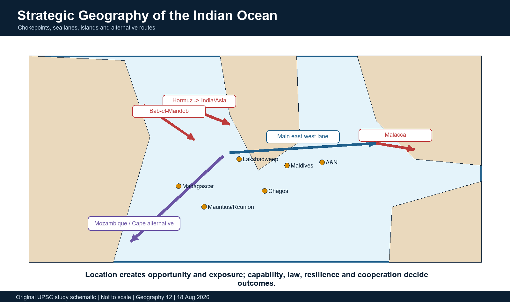

*Gateways, sea lanes, island positions and alternative routes.*

### Teaching, explanation and solution

- Hormuz connects Persian Gulf producers with the Arabian Sea; Bab-el-Mandeb links the Gulf of Aden to the Red Sea/Suez corridor; Malacca connects the eastern Indian Ocean with the South China Sea.
- The Cape of Good Hope route is a longer alternative when Suez/Red Sea routes are disrupted; UNCTAD documented major rerouting and higher ton-miles after late-2023 Red Sea disruption.
- EIA's March 2026 chokepoint update reports 2024 oil flows of about 20.7 million barrels/day through Hormuz, 22.5 through Malacca and 4.1 through Bab-el-Mandeb; these are data-year-specific, not timeless.
- Monsoon winds, tropical cyclones, waves, currents and marine heat affect routing, ports, offshore operations and insurance risk.
- Blue economy includes fisheries/aquaculture, ports/shipping, tourism, marine biotechnology, renewable energy and seabed resources, but sustainability requires ecosystem limits and equitable access.
- EEZ rights concern resources and jurisdiction under law; they do not convert international straits into national property.

### Must-know facts

- Chokepoint importance derives from flow concentration and limited alternatives, not only narrow width.
- Rerouting increases distance, fuel, emissions and inventory time.
- Blue economy is not synonymous with unrestricted ocean extraction.

### UPSC traps and corrections

- **Wrong:** A country near a chokepoint owns all traffic through it. **Correct:** International law, littoral sovereignty and transit regimes govern navigation.
- **Wrong:** The Cape route fully substitutes Suez at no cost. **Correct:** It is longer and raises time, fuel and emissions.

### Mains / answer route

Map gateway -> flow -> disruption consequence -> alternative -> resilience and legal qualification.

### Study link

Economy transport/energy; IR maritime security; Environment blue economy.

## 26. Islands, EEZs, HADR and maritime-domain awareness

Indian Ocean islands extend jurisdictional reach, host communities and ecosystems, support logistics and observation, and face acute climate/hazard exposure. Their value must not be reduced to military geometry.

### Evidence / comparison matrix

| Function | Geographic contribution | Limit |
| --- | --- | --- |
| EEZ/resources | Jurisdiction over living/non-living resources under UNCLOS | Rights come with conservation and legal duties |
| MDA | Observation and information-sharing nodes | Coverage is not perfect knowledge |
| HADR/SAR | Staging, refuelling and response proximity | Assets must survive hazards and coordinate with civilians |
| Connectivity | Ports, cables, aviation and services | Commercial viability and carrying capacity matter |
| Ecology | Reefs, mangroves, fisheries and carbon | Degradation can undermine livelihoods and infrastructure |

### Teaching, explanation and solution

- Lakshadweep and A&N expand India's maritime geography and support search-and-rescue, fisheries governance, communication and scientific observation.
- Maldives, Mauritius, Seychelles, Sri Lanka, Madagascar, Comoros and other islands shape sea-lane access, diplomacy and regional organisations.
- Maritime-domain awareness combines sensors, vessel data, information sharing, analysis, law enforcement and institutional trust; it is not simply surveillance hardware.
- HADR capability depends on resilient ports/airfields, pre-positioning, interoperable communication, local consent and rapid civilian coordination.
- Islands are exposed to sea-level rise, freshwater salinisation, reef loss, storm surge and shipping pollution; ecological resilience is strategic resilience.
- Avoid operational military details and deterministic claims that one island 'controls' Malacca, Hormuz or an entire ocean.

### Must-know facts

- Island geography creates both capability and vulnerability.
- EEZ is not territorial sea and does not grant full sovereignty over navigation.
- MDA is cooperative information fusion plus verified response.

### UPSC traps and corrections

- **Wrong:** A&N automatically controls Malacca. **Correct:** Proximity offers awareness/logistics; international navigation and regional capability constrain control claims.
- **Wrong:** HADR is separate from strategy. **Correct:** Disaster response, trust and resilient logistics are central regional-security functions.

### Mains / answer route

Location -> civilian/strategic capability -> ecological/hazard constraint -> cooperative verdict.

### Study link

Geography islands; IR maritime security; Disaster Management HADR.

## 27. IORA, IONS, SAGAR and MAHASAGAR: official status and limits

> **Current/PYQ anchor:** CURRENT FACT: India holds the IORA Chair for 2025-27. The 10th Indian Ocean Dialogue was held in New Delhi on 7-8 May 2026 under the theme 'Indian Ocean Region in a Transforming World'.

Regional initiatives operate at different levels: IORA is an intergovernmental association, IONS is a naval dialogue/cooperation forum, while SAGAR and MAHASAGAR are Indian strategic-policy visions. Declaration, institution, exercise and outcome must be separated.

### Evidence / comparison matrix

| Initiative | Official role | Evidence-safe use |
| --- | --- | --- |
| IORA | Regional intergovernmental cooperation | Maritime safety, blue economy, fisheries, disaster risk, trade and capacity building |
| IONS | Naval chiefs/forum for professional cooperation | Information sharing, HADR and maritime-safety dialogue; not a collective-defence treaty |
| SAGAR | Security and Growth for All in the Region | Cooperative maritime vision articulated from 2015 |
| MAHASAGAR | Mutual and Holistic Advancement for Security and Growth Across Regions | Announced in 2025 as an expanded vision; declaration is not outcome proof |
| IFC-IOR | Information-fusion and maritime-domain-awareness platform | Cooperative information sharing; avoid operational detail |

### Teaching, explanation and solution

- IORA's official priorities include maritime safety/security, trade/investment, fisheries, disaster risk, academic/science cooperation and tourism/cultural exchanges, with blue economy and women's economic empowerment as cross-cutting concerns.
- The May 2026 Indian Ocean Dialogue discussed maritime security, energy/shipping vulnerability, blue economy, resilience and multilateral cooperation.
- PIB reports India assumed IONS chairmanship at the February 2026 conclave; use only published institutional facts.
- MAHASAGAR was announced during the March 2025 India-Mauritius engagement. Treat it as a policy vision until specific implementation evidence is named.
- Institutions reduce collective-action costs but do not erase strategic competition, capacity gaps or legal disputes.

### Must-know facts

- IORA and IONS are not the same institution.
- India's IORA Chair period is 2025-27.
- A declaration, meeting or exercise is not by itself a measured regional outcome.

### UPSC traps and corrections

- **Wrong:** IORA is a military alliance. **Correct:** It is a broad intergovernmental regional association.
- **Wrong:** MAHASAGAR proves every announced project has been implemented. **Correct:** Use it as declaratory vision unless outcome evidence is provided.

### Mains / answer route

Institution -> mandate -> current fact -> implementation gap -> cooperative reform.

### Study link

IR Indo-Pacific/Indian Ocean and maritime-security owners.

## 28. Integrated answer frameworks and advanced refinements

The strongest answers move across scales: basin geometry, process mechanics, regional impact, evidence status and governance. They also expose the limit of every generalisation.


*Reusable structure for GS-I, GS-III, GS-II and Essay.*

```text
MAP / DEFINE
    -> PHYSICAL MECHANISM
        -> NAMED EVIDENCE OR CASE
            -> INDIA + RIM IMPACTS
                -> UNCERTAINTY / LIMIT
                    -> RESILIENT, COOPERATIVE VERDICT
```

### Teaching, explanation and solution

- Current question: always write the season on the map, because Somali, WICC, EICC and monsoon currents reverse or reorganise.
- IOD question: write DMI formula, draw positive feedback, add lifecycle, then interactions and one historical/current case.
- Cyclone question: distinguish SST, mixed-layer depth, barrier layer and ocean heat content; then add atmospheric shear/moisture.
- Fisheries question: link upwelling/nutrients/productivity/oxygen to food webs and management; avoid catch determinism.
- Strategic question: map Hormuz-Bab-el-Mandeb-Malacca-Cape, add islands/EEZ/MDA/HADR, then qualify control claims.
- Current-affairs question: label FACT/STATUS/FORECAST/INFERENCE/LIMIT and give issue date plus agency.

### Must-know facts

- A labelled diagram is part of the analysis, not decoration.
- One named official source is stronger than many unsourced numbers.
- Qualification earns marks when it narrows an overclaim rather than weakening the answer.

### UPSC traps and corrections

- **Wrong:** More facts always mean more marks. **Correct:** Selection, mechanism, evidence and judgement matter more than an unstructured list.
- **Wrong:** A qualification makes the answer indecisive. **Correct:** A bounded verdict demonstrates scientific and strategic judgement.

### Mains / answer route

Claim -> named evidence/example -> analysis -> qualification -> verdict.

### Study link

All sections of this package.

## 29. Official and local source register

The source register preserves provenance and dates. Direct official pages/PDFs are prioritised for current status; repository knowledge and local books provide the static teaching base.

### Evidence / comparison matrix

| Source / retrieval date | URL or local owner | Use |
| --- | --- | --- |
| IMD ENSO/IOD Bulletin, Aug 2026; retrieved 18 Aug | https://mausam.imd.gov.in/ClimateInformation/imdweb/CLIMATE_FCST/Bulletin/ENSO_IOD_Update_Bulletin.pdf | Observed July ENSO/IOD and MMCFS forecast |
| IMD LRF, 29 May 2026; retrieved 18 Aug | https://mausam.imd.gov.in/Forecast/marquee_data/Press_release_2nd_stage_LRF_29_May_2026-Final.pdf | 90% LPA forecast and regional probabilities |
| NOAA CPC ENSO Discussion; retrieved 18 Aug | https://www.cpc.ncep.noaa.gov/products/analysis_monitoring/enso_advisory/ensodisc.shtml | El Nino status/probability and impact caveat |
| WMO JAS 2026 update; retrieved 18 Aug | https://public.wmo.int/media/update/global-seasonal-climate-update-july-august-september-2026 | MME IOD/ENSO/rainfall forecast |
| INCOIS MHW Bulletin, 2 Aug 2026; retrieved 18 Aug | https://incois.gov.in/WEBSITE_FILES/Incois_docs/MHW/MHW_Bulletin_1785758836363.pdf | Dated marine-heatwave status |
| INCOIS OMNI/RAMA; retrieved 18 Aug | https://incois.gov.in/site/datainfo/jointportal.jsp | Observing-network variables and purpose |
| INCOIS OSF; retrieved 18 Aug | https://iioe-2.incois.gov.in/site/services/osf.jsp | 3-hourly 5-10 day forecast architecture |
| NOAA PMEL RAMA; retrieved 18 Aug | https://www.pmel.noaa.gov/gtmba/pmel-theme/indian-ocean-rama | RAMA initiation and monsoon purpose |
| WMO Asia 2025; retrieved 18 Aug | https://wmo.int/news/media-centre/extreme-heat-and-rainfall-glacier-loss-and-record-ocean-heat-impact-asia-2025 | Heat, sea level and pH observations |
| BoM IOD learning/historical pages; retrieved via official indexed results 18 Aug | https://www.bom.gov.au/resources/learn-and-explore/climate-knowledge-centre/climate-factors/indian-ocean-dipole | DMI definition and event cases; direct page returned 403 |
| IPCC AR6/SROCC; retrieved 18 Aug | https://www.ipcc.ch/report/ar6/wg1/ | Climate-change confidence and ocean risk |
| IORA Indian Ocean Dialogue 2026; retrieved 18 Aug | https://iora.int/sites/default/files/2026-05/Press%20Release%20-IOD%202026%20New%20Delhi.pdf | India chair/current regional agenda |
| EIA chokepoints, updated Mar 2026; retrieved 18 Aug | https://www.eia.gov/international/analysis/special-topics/World_Oil_Transit_Chokepoints | 2024 energy-flow data |
| UNCTAD Review of Maritime Transport 2024; retrieved 18 Aug | https://unctad.org/publication/review-maritime-transport-2024 | Rerouting/chokepoint resilience |
| GEBCO/IHO/USGS official references; retrieved 18 Aug | https://www.gebco.net/data-products / https://iho.int/en/standards-and-specifications / https://pubs.usgs.gov/publication/i380 | Bathymetry, boundaries and tectonic context |

### Teaching, explanation and solution

- Repository Markdown read first: Geography basic 12, advanced 12, basic/advanced 16, islands, cyclones, fisheries, blue economy, transport and IR maritime-security owners.
- Local OCR book: Majid Husain pp. 133-140, 189-191 and 205 for mixed layer, thermocline, salinity, currents and basin features; older simplifications were qualified.
- G.C. Leong and D.R. Khullar scans had little embedded text; repository authored notes already contained their extracted topic evidence.
- Official local UPSC scans verified exact wording for 2019, 2022, 2024 and 2025 Mains and 2020, 2021 and 2026 Prelims questions.
- No Qdrant dependency was used.

### Must-know facts

- Direct-fetch 403 on BoM is disclosed rather than hidden.
- Search-indexed official snippets are not upgraded into a direct-page quote.
- URLs and dates are retained so current claims can be rechecked.

### UPSC traps and corrections

- **Wrong:** A source URL makes every interpretation a fact. **Correct:** The claim still needs to match what the source actually states.
- **Wrong:** An old textbook number is timeless. **Correct:** Dynamic networks, climatologies and operational thresholds require dated official sources.

### Mains / answer route

Use source-date-status discipline as part of answer quality.

### Study link

AGENT_MEMORY source-order and verification rules.


# PART II - COMPLETE SOLVED PRACTICE

## PART II - Premium solved-practice workbook

This workbook contains every directly relevant locally verified PYQ identified for the topic, full original solutions, advanced MCQs, remedial MCQs and solved 10/15/20-mark practice.

### Evidence / comparison matrix

| Practice block | Coverage | Status rule |
| --- | --- | --- |
| Mains PYQs | 2019, 2022, 2024 and 2025 | Verified wording; original model answers |
| Prelims PYQs | 2020, 2021 and 2026 | Inferred/provisional labels retained |
| Advanced MCQs | 24 questions across physical, climate, ecology and observation | A-B-C-D rotation |
| Remedial MCQs | 8 common-error questions on gateways/institutions/overclaims | Rotation continues |
| Original Mains | 10, 15 and 20 marks | Full model answers and marking rationale |

### Teaching, explanation and solution

- Mains question wording is verified from local official scans. Model answers are original and are not official UPSC solutions.
- Fixed Prelims PYQs retain original option order.
- Where the local official final objective key was unavailable, the answer is labelled INFERRED ANSWER - NOT OFFICIALLY VERIFIED with confidence and elimination.
- 2026 objective answers are labelled PROVISIONAL because the UPSC final key was unavailable.
- Authored MCQs alone follow strict continuous A -> B -> C -> D rotation.

### Must-know facts

- No PYQ status is invented.
- Every Mains model answer ends with 'Why this earns marks'.
- Question demand and diagram route are stated.

### UPSC traps and corrections

- **Wrong:** Provisional means officially final. **Correct:** A provisional key can change.
- **Wrong:** A model answer should be memorised verbatim. **Correct:** Memorise structure, evidence and qualification.

### Mains / answer route

Practice under word limit, then compare claim-evidence-analysis-qualification-verdict sequence.

### Study link

All teaching sections and final register notes.

## Verified PYQ and key-status ledger

This ledger is the audit trail for question inclusion and key wording.

### Evidence / comparison matrix

| Year/paper | Question focus | Verification / key status |
| --- | --- | --- |
| 2019 GS-I Q17 | Currents versus water masses | Official local Mains scan; no objective key applicable |
| 2022 GS-I Q14 | Forces influencing currents and fishing | Official local Mains scan |
| 2022 GS-I Q16 | Straits and isthmuses in trade | Official local Mains scan |
| 2024 GS-I Q4 | SST rise and tropical cyclones | Official local Mains scan |
| 2024 GS-II Q20 | Maldives, trade/energy and maritime security | Official local Mains scan |
| 2025 GS-I Q5 | Non-farm primary activities and physiography | Official local Mains scan |
| 2020 Prelims Q93 | Ocean Mean Temperature | Official local paper; official final key absent locally; inferred |
| 2021 Prelims Q56 | International seabed exploration | Official local paper; official final key absent locally; inferred |
| 2021 Prelims Q58 | Winds and ocean temperature | Official local paper; official final key absent locally; inferred |
| 2026 Prelims Q30 | Hormuz access | Official local paper; provisional key only |
| 2026 Prelims Q33 | A&N climate | Official local paper; provisional Set-A key recorded |
| 2026 Prelims Q38 | FAO Blue Transformation | Official local paper; provisional key only |

### Teaching, explanation and solution

- A question is included because it directly tests Indian Ocean physical geography, ocean/climate processes, marine economy, islands or strategic gateways.
- No coaching-source wording substitutes for the official local scan.
- Fixed PYQs do not participate in the authored A-B-C-D answer sequence.

### Must-know facts

- Six Mains and six Prelims questions are included.
- Missing official objective keys are explicitly disclosed.
- 2026 remains provisional.

### UPSC traps and corrections

- **Wrong:** Every relevant-looking question is a verified PYQ. **Correct:** Year, paper and wording must be traceable.
- **Wrong:** An inferred solution can be labelled official. **Correct:** It cannot.

### Mains / answer route

Use the ledger to revise both content and evidence status.

### Study link

Local official UPSC scans under books.

## PYQ Mains 2019 GS-I Q17 - currents versus water masses

Model answer written in the required claim -> named evidence/example -> analysis -> qualification -> verdict form. It is an original solution, not an official UPSC key.

### Teaching, explanation and solution

- Question: How do ocean currents and water masses differ in their impacts on marine life and coastal environment? Give suitable examples. (Answer in 250 words)
- Demand decode: Differentiate moving flows from bodies of water with characteristic temperature-salinity properties, then compare ecological and coastal effects.
- Intro: Ocean currents are organised horizontal or vertical flows; water masses are three-dimensional bodies formed in source regions with identifiable temperature, salinity and density signatures.
- Claim: Currents redistribute heat. Evidence/example: Agulhas and Leeuwin carry warm water poleward, while Somali upwelling cools the western Arabian Sea. Analysis: They alter coastal temperature, evaporation, fog, rainfall and storm-energy availability.
- Claim: Currents redistribute nutrients and organisms. Evidence/example: Somali-Oman upwelling supplies nutrients; fronts and eddies aggregate plankton and pelagic fish. Analysis: Productivity rises where nutrient supply and light coincide, but hypoxia or mismatch can limit fisheries.
- Claim: Water masses regulate subsurface ventilation. Evidence/example: Arabian Sea intermediate waters interact with a strong oxygen minimum zone. Analysis: Temperature-salinity-density pathways determine oxygen and nutrient transport below the surface.
- Claim: Currents reshape coasts. Evidence/example: monsoon-reversing littoral and coastal flows alter sediment plumes, erosion and pollutant dispersion along India. Analysis: Direction changes create seasonal coastal consequences.
- Claim: Water masses preserve climate signals longer than a transient surface current. Evidence/example: subsurface heat and salinity anomalies influence thermocline, mixed-layer and cyclone response.
- Qualification: Neither category acts alone: currents advect water masses, while density contrasts help drive circulation; marine outcomes also depend on bathymetry, oxygen, management and season.
- Verdict: Currents are the transport pathways and water masses are the thermohaline properties being transported; their interaction links climate, ecosystems and coasts.
- Why this earns marks: It begins with a clean distinction, uses named Indian Ocean examples, compares impacts, integrates the two concepts and qualifies fisheries claims.

### Must-know facts

- Named evidence/example anchor: Somali upwelling, Agulhas/Leeuwin and Arabian Sea OMZ.
- Suggested diagram: Two-column flow: currents -> transport/fronts/upwelling; water masses -> heat/salt/oxygen; arrow showing interaction.
- Use the directive and word limit to control depth.

### UPSC traps and corrections

- **Wrong:** A model answer is an official UPSC answer. **Correct:** This is an examiner-grade original solution based on verified question wording.
- **Wrong:** A list of examples answers an analytical directive. **Correct:** Examples must support a causal or evaluative claim.

### Mains / answer route

Write the model answer with the named evidence and end in a qualified verdict.

### Study link

Solved PYQ workbook.

## PYQ Mains 2022 GS-I Q14 - forces influencing currents and fishing

Model answer written in the required claim -> named evidence/example -> analysis -> qualification -> verdict form. It is an original solution, not an official UPSC key.

### Teaching, explanation and solution

- Question: What are the forces that influence ocean currents? Describe their role in fishing industry of the world. (Answer in 250 words)
- Demand decode: Classify primary/secondary forces, derive current/upwelling effects and connect to fisheries with limitations.
- Intro: Ocean currents arise from wind stress, density gradients and gravity, and are organised by Coriolis force, pressure gradients, friction, basin shape, bathymetry, tides and sea-level differences.
- Claim: Winds drive surface gyres and coastal upwelling. Evidence/example: southwest-monsoon winds produce Somali-Oman and west-India upwelling. Analysis: nutrient-rich subsurface water fuels phytoplankton and higher trophic levels.
- Claim: Coriolis and pressure gradients organise boundary currents and fronts. Evidence/example: Agulhas Current and eddy/front systems. Analysis: convergence zones concentrate prey and support pelagic fishing grounds.
- Claim: Temperature-salinity density contrasts ventilate or isolate subsurface layers. Evidence/example: Arabian Sea OMZ. Analysis: oxygen compression can displace fish habitat and reduce the benefit of high productivity.
- Claim: Seasonal reversal moves fishing grounds. Evidence/example: WICC/EICC and monsoon-current changes alter SST, chlorophyll and fronts around India. Analysis: advisories and seasonal effort must track moving habitats.
- Claim: Observation converts dynamics into decisions. Evidence/example: INCOIS Potential Fishing Zone and Ocean State Forecast products use satellite and in-situ fields. Analysis: information can reduce search time and risk.
- Qualification: Upwelling does not guarantee catch: overfishing, oxygen, trophic timing, access, storms, market demand and regulation mediate landings.
- Verdict: Currents create productive and aggregating environments, but sustainable fisheries require ecosystem-based management and climate-ready advisories.
- Why this earns marks: It derives the physics, names global/Indian examples, directly answers the fishing clause and rejects a simplistic current-equals-catch claim.

### Must-know facts

- Named evidence/example anchor: Somali upwelling, Agulhas fronts, INCOIS PFZ and Arabian Sea OMZ.
- Suggested diagram: Wind -> Ekman divergence -> upwelling -> nutrients -> plankton -> fish, with OMZ/management qualifiers.
- Use the directive and word limit to control depth.

### UPSC traps and corrections

- **Wrong:** A model answer is an official UPSC answer. **Correct:** This is an examiner-grade original solution based on verified question wording.
- **Wrong:** A list of examples answers an analytical directive. **Correct:** Examples must support a causal or evaluative claim.

### Mains / answer route

Write the model answer with the named evidence and end in a qualified verdict.

### Study link

Solved PYQ workbook.

## PYQ Mains 2022 GS-I Q16 - straits and isthmuses in trade

Model answer written in the required claim -> named evidence/example -> analysis -> qualification -> verdict form. It is an original solution, not an official UPSC key.

### Teaching, explanation and solution

- Question: Mention the significance of straits and isthmus in international trade. (Answer in 250 words)
- Demand decode: Define both land/water bottlenecks, map examples, explain efficiency and vulnerability, then qualify deterministic control claims.
- Intro: A strait is a narrow navigable water passage connecting larger water bodies; an isthmus is a narrow land bridge whose canals, pipelines, roads or rail can shorten routes.
- Claim: Straits compress trade into efficient corridors. Evidence/example: Hormuz links Persian Gulf energy exports to the Arabian Sea; Malacca links the Indian and Pacific trading systems. Analysis: shorter routes reduce time and logistics cost.
- Claim: Canalised isthmuses transform distance. Evidence/example: Suez across the Isthmus of Suez links the Mediterranean and Red Sea. Analysis: Asia-Europe shipping avoids the longer Cape route.
- Claim: Concentration creates systemic vulnerability. Evidence/example: Bab-el-Mandeb/Red Sea disruption caused rerouting around the Cape, which UNCTAD associates with longer ton-miles, costs and emissions.
- Claim: Gateways support port, bunkering, repair, pipeline and logistics clusters. Evidence/example: Singapore/Malacca and Gulf ports. Analysis: geography can generate service economies beyond transit fees.
- Claim: Legal cooperation is essential. Evidence/example: UNCLOS transit-passage principles and IMO cooperative mechanisms. Analysis: proximity does not equal unilateral ownership of international navigation.
- Qualification: Alternative routes, pipelines, inventories and multimodal corridors reduce but do not eliminate chokepoint dependence; exact traffic shares are date-specific.
- Verdict: Straits and isthmuses are trade multipliers and risk concentrators, so resilience requires safe navigation, diversified routes, diplomacy and low-carbon logistics.
- Why this earns marks: It distinguishes the terms, maps Indian Ocean examples, links geography to economics/security and adds international-law and resilience qualifications.

### Must-know facts

- Named evidence/example anchor: EIA March 2026 chokepoint update and UNCTAD maritime-transport review.
- Suggested diagram: Hormuz/Bab-el-Mandeb/Malacca/Suez-Cape route map.
- Use the directive and word limit to control depth.

### UPSC traps and corrections

- **Wrong:** A model answer is an official UPSC answer. **Correct:** This is an examiner-grade original solution based on verified question wording.
- **Wrong:** A list of examples answers an analytical directive. **Correct:** Examples must support a causal or evaluative claim.

### Mains / answer route

Write the model answer with the named evidence and end in a qualified verdict.

### Study link

Solved PYQ workbook.

## PYQ Mains 2024 GS-I Q4 - SST rise and tropical cyclones

Model answer written in the required claim -> named evidence/example -> analysis -> qualification -> verdict form. It is an original solution, not an official UPSC key.

### Teaching, explanation and solution

- Question: What is sea surface temperature rise? How does it affect the formation of tropical cyclones? (Answer in 150 words)
- Demand decode: Define SST rise, explain thermodynamic pathway and list necessary atmospheric/oceanic conditions with a bounded climate conclusion.
- Intro: Sea-surface-temperature rise is an increase in the temperature of the ocean's near-surface layer relative to a defined climatological baseline; it may be a long-term trend or a shorter anomaly.
- Claim: Warmer SST increases evaporation and latent-heat availability. Evidence/example: warm North Indian Ocean pre-monsoon/post-monsoon waters. Analysis: moist convection can deepen and lower central pressure.
- Claim: Upper-ocean depth matters. Evidence/example: warm eddies and Bay barrier layers can reduce cyclone-induced cooling. Analysis: sustained heat flux may favour intensification.
- Claim: SST is not sufficient. Evidence/example: genesis still requires Coriolis away from the equator, a seed disturbance, moist instability and low-to-moderate vertical wind shear. Analysis: warm seas can coexist with no cyclone.
- Claim: Coastal risk is compound. Evidence/example: warmer baseline plus sea-level rise can worsen surge exposure, while rainfall and river floods add impact.
- Qualification: Do not infer that every SST increase raises cyclone count or caused a specific storm; frequency, intensity and tracks respond differently and attribution needs formal evidence.
- Verdict: SST rise enlarges the thermodynamic opportunity for cyclones, but atmospheric controls and subsurface heat determine whether that opportunity becomes genesis or rapid intensification.
- Why this earns marks: It defines the term, gives the heat-flux mechanism, distinguishes SST from ocean heat content and explicitly states necessary conditions.

### Must-know facts

- Named evidence/example anchor: IITM cyclone-ocean review and INCOIS mixed-layer/cyclone-heat diagnostics.
- Suggested diagram: Warm SST/deep warm layer -> evaporation -> convection -> pressure fall, alongside shear/moisture/Coriolis gatekeepers.
- Use the directive and word limit to control depth.

### UPSC traps and corrections

- **Wrong:** A model answer is an official UPSC answer. **Correct:** This is an examiner-grade original solution based on verified question wording.
- **Wrong:** A list of examples answers an analytical directive. **Correct:** Examples must support a causal or evaluative claim.

### Mains / answer route

Write the model answer with the named evidence and end in a qualified verdict.

### Study link

Solved PYQ workbook.

## PYQ Mains 2024 GS-II Q20 - Maldives, trade and maritime security

Model answer written in the required claim -> named evidence/example -> analysis -> qualification -> verdict form. It is an original solution, not an official UPSC key.

### Teaching, explanation and solution

- Question: Discuss the geopolitical and geostrategic importance of Maldives for India with a focus on global trade and energy flows. Further also discuss how this relationship affects India's maritime security and regional stability amidst international competition? (Answer in 250 words)
- Demand decode: Connect location to sea lanes, energy, MDA/HADR and diplomacy; then evaluate competition without a control narrative.
- Intro: Maldives lies astride central Indian Ocean approaches southwest of India, near sea lanes linking Hormuz/Bab-el-Mandeb with Malacca and East Asia.
- Claim: Location supports awareness of trade and energy flows. Evidence/example: west-east tanker/container routes across the Arabian Sea. Analysis: cooperation improves search-and-rescue, shipping safety and response time.
- Claim: Island partnership affects India's security perimeter. Evidence/example: hydrography, coast-guard capacity, information sharing and HADR cooperation. Analysis: trust-based MDA helps address trafficking, piracy, IUU fishing and disasters.
- Claim: Economic resilience is strategic. Evidence/example: tourism dependence, climate exposure, connectivity and essential supplies. Analysis: stable, sustainable development reduces crisis vulnerability.
- Claim: External competition raises sovereignty sensitivities. Evidence/example: infrastructure finance and strategic courtship by multiple powers. Analysis: coercive or transactional policy can trigger domestic backlash.
- Claim: Regional institutions provide a cooperative route. Evidence/example: IORA and Indian SAGAR/MAHASAGAR vision. Analysis: public goods can reduce zero-sum framing.
- Qualification: Maldives is a sovereign actor, not a strategic outpost; maritime proximity does not justify deterministic control or interference.
- Verdict: India's durable advantage lies in reliable development partnership, HADR, climate action and transparent security cooperation consistent with Maldivian agency.
- Why this earns marks: It answers trade/energy, security and competition; names civilian public goods; and ends with a sovereignty-sensitive verdict.

### Must-know facts

- Named evidence/example anchor: Indian Ocean sea-lane geography, IORA and official India-Maldives cooperation framing.
- Suggested diagram: Maldives at the centre of Hormuz/Bab-el-Mandeb-to-Malacca route, with MDA/HADR/climate links.
- Use the directive and word limit to control depth.

### UPSC traps and corrections

- **Wrong:** A model answer is an official UPSC answer. **Correct:** This is an examiner-grade original solution based on verified question wording.
- **Wrong:** A list of examples answers an analytical directive. **Correct:** Examples must support a causal or evaluative claim.

### Mains / answer route

Write the model answer with the named evidence and end in a qualified verdict.

### Study link

Solved PYQ workbook.

## PYQ Mains 2025 GS-I Q5 - non-farm primary activities and physiography

Model answer written in the required claim -> named evidence/example -> analysis -> qualification -> verdict form. It is an original solution, not an official UPSC key.

### Teaching, explanation and solution

- Question: What are non-farm primary activities? How are these activities related to physiographic features in India? Discuss with suitable examples. (Answer in 150 words)
- Demand decode: Define extraction-based primary activities beyond cultivation and link each to landform/geology/coast/ocean conditions.
- Intro: Non-farm primary activities directly obtain natural resources outside crop farming, including fishing, forestry, mining, quarrying, salt-making and selected animal/resource collection.
- Claim: Marine fishing follows shelves, upwelling, estuaries and fronts. Evidence/example: Kerala-Karnataka coast benefits from monsoon upwelling; Gujarat has a broad shelf and productive gulfs. Analysis: bathymetry and currents shape access and productivity.
- Claim: Inland fisheries follow floodplains, deltas, reservoirs and wetlands. Evidence/example: Ganga-Brahmaputra plains and deltaic estuaries. Analysis: water regime creates habitat and seasonal livelihood.
- Claim: Mining follows geological structure. Evidence/example: peninsular shield coal/iron/manganese belts and offshore hydrocarbons. Analysis: rock history and sedimentary basins govern resource location.
- Claim: Forestry and pastoral extraction follow relief and climate. Evidence/example: Himalayan forests and arid/semi-arid grazing systems.
- Qualification: Physiography creates opportunity but technology, conservation law, overuse, climate change and market access determine sustainability and income.
- Verdict: India's non-farm primary geography is the economic expression of its geological, fluvial, coastal and oceanographic diversity.
- Why this earns marks: It defines the category, uses India-specific physiographic examples and includes a sustainability qualification.

### Must-know facts

- Named evidence/example anchor: West-coast monsoon upwelling, broad Gujarat shelf, peninsular mineral belts.
- Suggested diagram: Physiography -> resource -> activity -> livelihood, with coast/upwelling as one branch.
- Use the directive and word limit to control depth.

### UPSC traps and corrections

- **Wrong:** A model answer is an official UPSC answer. **Correct:** This is an examiner-grade original solution based on verified question wording.
- **Wrong:** A list of examples answers an analytical directive. **Correct:** Examples must support a causal or evaluative claim.

### Mains / answer route

Write the model answer with the named evidence and end in a qualified verdict.

### Study link

Solved PYQ workbook.

## PYQ Prelims 2020 Q93 - Ocean Mean Temperature

Original UPSC option order is retained. Rotation rules do not apply to fixed PYQs.

### Teaching, explanation and solution

- Question: With reference to Ocean Mean Temperature (OMT), which of the following statements is/are correct? 1. OMT is measured up to a depth of 26 deg C isotherm which is 129 meters in the south-western Indian Ocean during January-March. 2. OMT collected during January-March can be used in assessing whether the amount of rainfall in monsoon will be less or more than a certain long-term mean.
- A. 1 only
- B. 2 only
- C. Both 1 and 2
- D. Neither 1 nor 2
- Answer status: INFERRED ANSWER - NOT OFFICIALLY VERIFIED (local official key absent)
- Selected answer: B. 2 only
- Confidence: High
- Statement 1 is rejected: OMT is integrated to the 26 deg C isotherm, but the isotherm depth is not a fixed universal 129 m for that region/season.
- Statement 2 is accepted: pre-monsoon upper-ocean heat metrics can support assessment of subsequent monsoon rainfall categories in the referenced research context.
- Elimination: the fixed-depth clause makes Statement 1 over-specific; therefore only Statement 2 remains.

### Must-know facts

- Question wording was checked against the local official paper scan.
- Key status is stated explicitly; no missing official key is presented as verified.

### UPSC traps and corrections

- **Wrong:** A solved explanation proves UPSC's official key. **Correct:** Only a retrieved official final key can establish that status.
- **Wrong:** PYQ options should be rearranged to fit answer rotation. **Correct:** Fixed PYQs retain original option order.

### Mains / answer route

Use statement-level elimination and preserve uncertainty labels.

### Study link

Verified Prelims ledger.

## PYQ Prelims 2021 Q56 - seabed exploration in international waters

Original UPSC option order is retained. Rotation rules do not apply to fixed PYQs.

### Teaching, explanation and solution

- Question: Consider the following statements: 1. The Global Ocean Commission grants licences for seabed exploration and mining in international waters. 2. India has received licences for seabed mineral exploration in international waters. 3. Rare earth minerals are present on seafloor in international waters. Which of the statements given above are correct?
- A. 1 and 2 only
- B. 2 and 3 only
- C. 1 and 3 only
- D. 1, 2 and 3
- Answer status: INFERRED ANSWER - NOT OFFICIALLY VERIFIED (local official key absent)
- Selected answer: B. 2 and 3 only
- Confidence: High
- Statement 1 is false: the International Seabed Authority, not the Global Ocean Commission, administers mineral-related contracts in the Area under UNCLOS.
- Statement 2 is true: India has held exploration contracts/allocations for seabed minerals in international waters.
- Statement 3 is true: seafloor deposits can contain rare-earth elements/minerals.
- Elimination: reject every option containing Statement 1; option B remains.

### Must-know facts

- Question wording was checked against the local official paper scan.
- Key status is stated explicitly; no missing official key is presented as verified.

### UPSC traps and corrections

- **Wrong:** A solved explanation proves UPSC's official key. **Correct:** Only a retrieved official final key can establish that status.
- **Wrong:** PYQ options should be rearranged to fit answer rotation. **Correct:** Fixed PYQs retain original option order.

### Mains / answer route

Use statement-level elimination and preserve uncertainty labels.

### Study link

Verified Prelims ledger.

## PYQ Prelims 2021 Q58 - winds and ocean-temperature patterns

Original UPSC option order is retained. Rotation rules do not apply to fixed PYQs.

### Teaching, explanation and solution

- Question: Consider the following statements: 1. In the tropical zone, the western sections of the oceans are warmer than the eastern sections owing to the influence of trade winds. 2. In the temperate zone, westerlies make the eastern sections of oceans warmer than the western sections. Which of the statements given above is/are correct?
- A. 1 only
- B. 2 only
- C. Both 1 and 2
- D. Neither 1 nor 2
- Answer status: INFERRED ANSWER - NOT OFFICIALLY VERIFIED (local official key absent)
- Selected answer: C. Both 1 and 2
- Confidence: High
- Statement 1: tropical trades drive warm surface water westward and favour eastern-boundary upwelling/cooling in idealised basin patterns.
- Statement 2: mid-latitude westerlies and warm western-boundary extensions carry heat toward eastern sides of ocean basins/high-latitude western continental margins.
- Qualification: Indian Ocean monsoon reversal and basin geometry create important seasonal exceptions, but both broad statements are correct.

### Must-know facts

- Question wording was checked against the local official paper scan.
- Key status is stated explicitly; no missing official key is presented as verified.

### UPSC traps and corrections

- **Wrong:** A solved explanation proves UPSC's official key. **Correct:** Only a retrieved official final key can establish that status.
- **Wrong:** PYQ options should be rearranged to fit answer rotation. **Correct:** Fixed PYQs retain original option order.

### Mains / answer route

Use statement-level elimination and preserve uncertainty labels.

### Study link

Verified Prelims ledger.

## PYQ Prelims 2026 Q30 - Strait of Hormuz access

Original UPSC option order is retained. Rotation rules do not apply to fixed PYQs.

### Teaching, explanation and solution

- Question: Ships from which of the following countries have to cross the Strait of Hormuz to reach out to the Indian Ocean? 1. Bahrain 2. Syria 3. Qatar 4. Egypt
- A. 1 and 2
- B. 1 and 3
- C. 2 and 3
- D. 3 and 4
- Answer status: PROVISIONAL KEY - UPSC FINAL KEY NOT AVAILABLE
- Selected answer: B. 1 and 3
- Confidence: High
- Bahrain and Qatar lie inside the Persian Gulf; ships leaving their ports for the Indian Ocean normally pass through Hormuz.
- Syria is on the eastern Mediterranean; Egypt has Mediterranean/Red Sea access and is not inside the Persian Gulf.
- Elimination: retain 1 and 3 only.

### Must-know facts

- Question wording was checked against the local official paper scan.
- Key status is stated explicitly; no missing official key is presented as verified.

### UPSC traps and corrections

- **Wrong:** A solved explanation proves UPSC's official key. **Correct:** Only a retrieved official final key can establish that status.
- **Wrong:** PYQ options should be rearranged to fit answer rotation. **Correct:** Fixed PYQs retain original option order.

### Mains / answer route

Use statement-level elimination and preserve uncertainty labels.

### Study link

Verified Prelims ledger.

## PYQ Prelims 2026 Q33 - Andaman and Nicobar climate

Original UPSC option order is retained. Rotation rules do not apply to fixed PYQs.

### Teaching, explanation and solution

- Question: With reference to the climate of Andaman and Nicobar Islands, which of the following statements is/are correct? 1. The climate can be defined as a humid, tropical coastal climate. 2. It receives rainfall from both South-west monsoon and North-east monsoon. 3. Maximum precipitation is between December and May.
- A. 1 only
- B. 1 and 2
- C. 2 and 3
- D. 3 only
- Answer status: PROVISIONAL SET-A KEY RECORDED LOCALLY - UPSC FINAL KEY NOT AVAILABLE
- Selected answer: B. 1 and 2
- Confidence: High
- Statements 1 and 2 are consistent with the islands' tropical maritime setting and dual-monsoon rainfall.
- Statement 3 is false: the wettest period is associated mainly with monsoon months, not December-May.
- Elimination: answer B.

### Must-know facts

- Question wording was checked against the local official paper scan.
- Key status is stated explicitly; no missing official key is presented as verified.

### UPSC traps and corrections

- **Wrong:** A solved explanation proves UPSC's official key. **Correct:** Only a retrieved official final key can establish that status.
- **Wrong:** PYQ options should be rearranged to fit answer rotation. **Correct:** Fixed PYQs retain original option order.

### Mains / answer route

Use statement-level elimination and preserve uncertainty labels.

### Study link

Verified Prelims ledger.

## PYQ Prelims 2026 Q38 - FAO Blue Transformation

Original UPSC option order is retained. Rotation rules do not apply to fixed PYQs.

### Teaching, explanation and solution

- Question: At the United Nations Ocean Conference held in June 2025 in France, FAO demonstrated its leading voice on marine and ocean issues, especially on sustainable fisheries and aquaculture for resilient livelihood and 'Blue Transformation'. Which combination about the 'Four Betters' proposed by FAO is correct?
- A. Better production, better nutrition, better environment and better ocean
- B. Better production, better nutrition, better environment and better life
- C. Better coral reefs, better nutrition, better environment and better life
- D. Better estuaries, better nutrition, better environment and better mangrove vegetation
- Answer status: PROVISIONAL KEY - UPSC FINAL KEY NOT AVAILABLE
- Selected answer: B. Better production, better nutrition, better environment and better life
- Confidence: High
- FAO's Four Betters are better production, better nutrition, a better environment and a better life.
- The distractors replace the broad fourth pillar with a sector-specific ocean/ecosystem phrase.
- Elimination: answer B.

### Must-know facts

- Question wording was checked against the local official paper scan.
- Key status is stated explicitly; no missing official key is presented as verified.

### UPSC traps and corrections

- **Wrong:** A solved explanation proves UPSC's official key. **Correct:** Only a retrieved official final key can establish that status.
- **Wrong:** PYQ options should be rearranged to fit answer rotation. **Correct:** Fixed PYQs retain original option order.

### Mains / answer route

Use statement-level elimination and preserve uncertainty labels.

### Study link

Verified Prelims ledger.

## Advanced MCQ set 1-4

Authored practice. Correct options continue the strict A -> B -> C -> D rotation.

### Teaching, explanation and solution

- Q1. Which expression correctly defines the Dipole Mode Index?
- A. Western-box SST anomaly minus southeastern-box SST anomaly
- B. Eastern-box rainfall minus western-box rainfall
- C. Arabian Sea SST minus Bay SST
- D. Nino-3.4 minus Indian Ocean mean SST
- Answer: A
- Explanation: DMI is the SST-anomaly difference between the western tropical and southeastern equatorial Indian Ocean boxes.
- Elimination / trap check: Reject rainfall and basin-subdivision distractors; DMI is a zonal SST-gradient index.
- Q2. Which process most directly reinforces a canonical positive IOD?
- A. Westerly anomalies deepen the eastern thermocline
- B. Easterly anomalies shoal the eastern thermocline and cool the Sumatra-Java sector
- C. Uniform basin warming removes the zonal gradient
- D. Northward Somali Current alone warms the eastern pole
- Answer: B
- Explanation: Easterly anomalies push surface water westward, shoal the east thermocline and strengthen eastern cooling.
- Elimination / trap check: Westerlies describe negative-IOD tendency; basin warming is not a dipole.
- Q3. Wyrtki jets are best described as:
- A. Persistent westward currents south of Madagascar
- B. Winter poleward currents along western India
- C. Strong eastward equatorial currents during spring and autumn intermonsoons
- D. Deep overflow from the Red Sea
- Answer: C
- Explanation: They are semiannual eastward equatorial jets driven by intermonsoon westerlies.
- Elimination / trap check: Season, latitude and direction eliminate the other options.
- Q4. Which statement about the Bay of Bengal barrier layer is most accurate?
- A. It is a permanent layer of sea ice
- B. It is caused only by tidal mixing
- C. It always forces cyclone intensification
- D. Salinity stratification can separate the shallow density-mixed layer from the deeper isothermal layer
- Answer: D
- Explanation: Freshwater can create a salinity-controlled density barrier above the thermocline.
- Elimination / trap check: The effect is conditional, not a cyclone guarantee.

### Must-know facts

- Every option was checked against the static/current evidence used in this package.
- Correct-option sequence is continuous and independently validated by the build script.

### UPSC traps and corrections

- **Wrong:** A correct answer without elimination is enough for durable revision. **Correct:** Record why each close distractor fails.
- **Wrong:** Absolute words are always false. **Correct:** They are warning cues, not a mechanical rule; verify the concept.

### Mains / answer route

Convert each explanation into a one-line Prelims fact and one Mains qualification.

### Study link

Topic-wide practice and error repair.

## Advanced MCQ set 5-8

Authored practice. Correct options continue the strict A -> B -> C -> D rotation.

### Teaching, explanation and solution

- Q5. During the southwest monsoon, the Somali Current generally flows:
- A. Northward along Somalia
- B. Southward along Somalia
- C. Eastward along Java
- D. Poleward along western Australia
- Answer: A
- Explanation: Summer monsoon winds produce a strong northward Somali Current and western Arabian Sea upwelling.
- Elimination / trap check: Southward is the winter tendency.
- Q6. The West India Coastal Current is broadly which way during the southwest monsoon?
- A. Poleward
- B. Equatorward
- C. Permanently eastward
- D. Absent
- Answer: B
- Explanation: The WICC is broadly equatorward in summer and poleward in winter.
- Elimination / trap check: A static direction is a classic trap.
- Q7. The Northeast Monsoon Current south of Sri Lanka is broadly:
- A. Northward
- B. Eastward
- C. Westward
- D. Abyssal and stationary
- Answer: C
- Explanation: Winter flow carries water westward from the Bay side toward the Arabian Sea.
- Elimination / trap check: The eastward counterpart is associated with the summer monsoon current.
- Q8. Why is the Leeuwin Current unusual in textbook gyre terms?
- A. It crosses Hormuz
- B. It is a cold equatorial jet
- C. It reverses with the Indian monsoon north of India
- D. It flows warm and poleward along an eastern ocean boundary
- Answer: D
- Explanation: Pressure gradients linked partly to Pacific-Indian exchange support a warm poleward current along western Australia.
- Elimination / trap check: Eastern boundaries are often associated with cold equatorward currents, making Leeuwin an exception.

### Must-know facts

- Every option was checked against the static/current evidence used in this package.
- Correct-option sequence is continuous and independently validated by the build script.

### UPSC traps and corrections

- **Wrong:** A correct answer without elimination is enough for durable revision. **Correct:** Record why each close distractor fails.
- **Wrong:** Absolute words are always false. **Correct:** They are warning cues, not a mechanical rule; verify the concept.

### Mains / answer route

Convert each explanation into a one-line Prelims fact and one Mains qualification.

### Study link

Topic-wide practice and error repair.

## Advanced MCQ set 9-12

Authored practice. Correct options continue the strict A -> B -> C -> D rotation.

### Teaching, explanation and solution

- Q9. Large-scale geostrophic flow is principally a balance between:
- A. Horizontal pressure-gradient force and Coriolis force
- B. Solar radiation and tides
- C. Evaporation and precipitation only
- D. Bottom friction and river discharge only
- Answer: A
- Explanation: Away from the equator and strong friction, pressure-gradient and Coriolis forces can balance.
- Elimination / trap check: The other pairs may influence the ocean but do not define geostrophic balance.
- Q10. In the idealised Northern Hemisphere open ocean, net Ekman transport is approximately:
- A. Parallel to the wind
- B. 90 degrees to the right of the wind
- C. 90 degrees to the left of the wind
- D. Always downward
- Answer: B
- Explanation: Coriolis turns the depth-integrated Ekman transport to the right in the Northern Hemisphere.
- Elimination / trap check: Coasts and stratification modify the idealised response.
- Q11. Which setting most directly favours coastal upwelling?
- A. Onshore Ekman transport and convergence
- B. No wind and no density gradient
- C. Alongshore wind causing offshore Ekman transport and surface divergence
- D. Permanent freshwater accumulation only
- Answer: C
- Explanation: Offshore surface transport must be replaced by water rising from below.
- Elimination / trap check: Convergence promotes downwelling.
- Q12. Which broad contrast is most defensible?
- A. Bay is always saltier than Arabian Sea
- B. Arabian Sea has no river input
- C. Bay has no productivity
- D. Arabian Sea is generally saltier, while the Bay has stronger freshwater-driven stratification
- Answer: D
- Explanation: Evaporation/runoff contrasts produce the broad salinity and stratification difference.
- Elimination / trap check: Absolute words such as always, no and none are false.

### Must-know facts

- Every option was checked against the static/current evidence used in this package.
- Correct-option sequence is continuous and independently validated by the build script.

### UPSC traps and corrections

- **Wrong:** A correct answer without elimination is enough for durable revision. **Correct:** Record why each close distractor fails.
- **Wrong:** Absolute words are always false. **Correct:** They are warning cues, not a mechanical rule; verify the concept.

### Mains / answer route

Convert each explanation into a one-line Prelims fact and one Mains qualification.

### Study link

Topic-wide practice and error repair.

## Advanced MCQ set 13-16

Authored practice. Correct options continue the strict A -> B -> C -> D rotation.

### Teaching, explanation and solution

- Q13. Which statement about positive IOD and the Indian monsoon is correct?
- A. It may offset some adverse influences in some events but cannot guarantee good rainfall
- B. It always produces excess rainfall in every subdivision
- C. It is identical to La Nina
- D. It determines district rainfall by itself
- Answer: A
- Explanation: IOD is a probabilistic modulator interacting with ENSO, MJO, synoptic systems and land processes.
- Elimination / trap check: Reject deterministic and identity claims.
- Q14. IOD events most commonly reach maturity during:
- A. Boreal late winter only
- B. Boreal autumn, often September-November
- C. Every February without exception
- D. Austral autumn only
- Answer: B
- Explanation: IOD is strongly phase-locked and commonly peaks in boreal autumn.
- Elimination / trap check: The calendar is typical, not rigid.
- Q15. The Madden-Julian Oscillation is:
- A. A permanent ocean ridge
- B. A decadal salinity trend only
- C. An eastward-propagating intraseasonal tropical convective disturbance
- D. Another name for positive IOD
- Answer: C
- Explanation: MJO modulates active-break spells, cyclogenesis and equatorial winds on subseasonal timescales.
- Elimination / trap check: It is atmospheric-convective, not a ridge or IOD synonym.
- Q16. Which is the best description of the ENSO-IOD relationship?
- A. They are fully independent
- B. IOD is always caused by ENSO
- C. They can never occur together
- D. They interact and co-occur, yet retain partial statistical independence
- Answer: D
- Explanation: Some IOD events are ENSO-linked while Indian Ocean feedbacks can also develop substantially on their own.
- Elimination / trap check: Avoid both complete-independence and complete-dependence extremes.

### Must-know facts

- Every option was checked against the static/current evidence used in this package.
- Correct-option sequence is continuous and independently validated by the build script.

### UPSC traps and corrections

- **Wrong:** A correct answer without elimination is enough for durable revision. **Correct:** Record why each close distractor fails.
- **Wrong:** Absolute words are always false. **Correct:** They are warning cues, not a mechanical rule; verify the concept.

### Mains / answer route

Convert each explanation into a one-line Prelims fact and one Mains qualification.

### Study link

Topic-wide practice and error repair.

## Advanced MCQ set 17-20

Authored practice. Correct options continue the strict A -> B -> C -> D rotation.

### Teaching, explanation and solution

- Q17. The 2019 strong positive IOD is an official example associated with:
- A. Wetter East Africa and severe dryness in Australia/parts of Southeast Asia
- B. Uniform rainfall increase across the whole rim
- C. Permanent closure of Bab-el-Mandeb
- D. A negative DMI
- Answer: A
- Explanation: WMO reporting links the strong phase to East African floods and severe Australian/SE Asian dryness.
- Elimination / trap check: Association does not mean sole causation of every local impact.
- Q18. Which platform is a fixed moored array designed for Indian Ocean-monsoon research?
- A. INSAT only
- B. RAMA
- C. GPS-Aided GEO Augmented Navigation
- D. Automatic Identification System only
- Answer: B
- Explanation: RAMA provides sustained meteorological and upper-ocean observations.
- Elimination / trap check: The distractors are not an Indian Ocean climate mooring array.
- Q19. Argo primarily contributes:
- A. Only port traffic counts
- B. Only surface wind maps
- C. Broad subsurface temperature and salinity profiles from drifting floats
- D. Seabed mining licences
- Answer: C
- Explanation: Argo floats profile the upper ocean and complement fixed moorings and satellites.
- Elimination / trap check: They do not administer law or measure only a surface variable.
- Q20. Which observation claim is false?
- A. Satellites provide broad surface coverage
- B. Moorings provide continuous local time series
- C. Ships/gliders can resolve sections and processes
- D. Satellites alone directly replace all subsurface observations
- Answer: D
- Explanation: Subsurface temperature, salinity and currents still require in-situ observations and model assimilation.
- Elimination / trap check: The word 'alone' exposes the false claim.

### Must-know facts

- Every option was checked against the static/current evidence used in this package.
- Correct-option sequence is continuous and independently validated by the build script.

### UPSC traps and corrections

- **Wrong:** A correct answer without elimination is enough for durable revision. **Correct:** Record why each close distractor fails.
- **Wrong:** Absolute words are always false. **Correct:** They are warning cues, not a mechanical rule; verify the concept.

### Mains / answer route

Convert each explanation into a one-line Prelims fact and one Mains qualification.

### Study link

Topic-wide practice and error repair.

## Advanced MCQ set 21-24

Authored practice. Correct options continue the strict A -> B -> C -> D rotation.

### Teaching, explanation and solution

- Q21. INCOIS Ocean State Forecast is best characterised as:
- A. A 3-hourly 5-10 day operational forecast suite for waves, winds, currents and related ocean state
- B. A century-scale IOD projection only
- C. A naval alliance
- D. A fixed fish-catch guarantee
- Answer: A
- Explanation: OSF serves short-range maritime decisions using observations, models and data assimilation.
- Elimination / trap check: It is neither a climate projection nor a guaranteed catch product.
- Q22. Why may IOD forecasts differ among agencies?
- A. Because one agency must be dishonest
- B. Different initialization dates, models, ensembles, bias corrections and target averages
- C. Because DMI has no definition
- D. Because observations are never used
- Answer: B
- Explanation: Forecast systems legitimately differ in design and update date.
- Elimination / trap check: Divergence should be source/date/model bounded, not averaged away.
- Q23. A marine heatwave is most accurately defined as:
- A. Any tropical cyclone
- B. Any SST above 26 deg C
- C. A prolonged anomalously warm ocean event relative to a local climatology
- D. A permanent positive IOD
- Answer: C
- Explanation: Percentile-based local climatology, duration and intensity define the event.
- Elimination / trap check: A universal absolute threshold is inadequate.
- Q24. Which inference is scientifically invalid?
- A. IOD can alter winds and thermocline
- B. Marine heat can stress coral
- C. Upper-ocean heat can affect cyclone intensification
- D. DMI alone proves the cause of a local fish-catch change or individual cyclone
- Answer: D
- Explanation: Local attribution requires multiple ocean, atmosphere, ecology and socioeconomic variables.
- Elimination / trap check: The single-index causation claim is the trap.

### Must-know facts

- Every option was checked against the static/current evidence used in this package.
- Correct-option sequence is continuous and independently validated by the build script.

### UPSC traps and corrections

- **Wrong:** A correct answer without elimination is enough for durable revision. **Correct:** Record why each close distractor fails.
- **Wrong:** Absolute words are always false. **Correct:** They are warning cues, not a mechanical rule; verify the concept.

### Mains / answer route

Convert each explanation into a one-line Prelims fact and one Mains qualification.

### Study link

Topic-wide practice and error repair.

## Remedial MCQ set 25-28

Authored practice. Correct options continue the strict A -> B -> C -> D rotation.

### Teaching, explanation and solution

- Q25. Strait of Hormuz connects the Persian Gulf with:
- A. Gulf of Oman and the Arabian Sea
- B. Red Sea directly
- C. Bay of Bengal
- D. Mozambique Channel
- Answer: A
- Explanation: Hormuz is the outlet from the Persian Gulf into the Gulf of Oman/Arabian Sea system.
- Elimination / trap check: Map the gateway rather than memorising an energy slogan.
- Q26. Bab-el-Mandeb connects:
- A. Persian Gulf and Gulf of Oman
- B. Red Sea and Gulf of Aden
- C. Arabian Sea and Bay of Bengal
- D. Maldives and Lakshadweep
- Answer: B
- Explanation: It is the southern gateway of the Red Sea/Suez route.
- Elimination / trap check: Hormuz is the Persian Gulf gateway.
- Q27. The Strait of Malacca links the eastern Indian Ocean system with:
- A. Mediterranean Sea
- B. Persian Gulf
- C. South China Sea / western Pacific routes
- D. South Atlantic directly
- Answer: C
- Explanation: Malacca/Singapore connect the Andaman Sea side with Southeast Asian and Pacific trade routes.
- Elimination / trap check: It is the eastern, not western, Indian Ocean gateway.
- Q28. The Cape of Good Hope route is important because it:
- A. Eliminates all shipping risk
- B. Is shorter than Suez for Asia-Europe trade
- C. Passes through Hormuz twice
- D. Provides a longer alternative when Red Sea/Suez routes are disrupted
- Answer: D
- Explanation: The Cape route adds distance, time, fuel and emissions but preserves connectivity.
- Elimination / trap check: Alternative does not mean costless substitute.

### Must-know facts

- Every option was checked against the static/current evidence used in this package.
- Correct-option sequence is continuous and independently validated by the build script.

### UPSC traps and corrections

- **Wrong:** A correct answer without elimination is enough for durable revision. **Correct:** Record why each close distractor fails.
- **Wrong:** Absolute words are always false. **Correct:** They are warning cues, not a mechanical rule; verify the concept.

### Mains / answer route

Convert each explanation into a one-line Prelims fact and one Mains qualification.

### Study link

Topic-wide practice and error repair.

## Remedial MCQ set 29-32

Authored practice. Correct options continue the strict A -> B -> C -> D rotation.

### Teaching, explanation and solution

- Q29. IORA is best described as:
- A. An intergovernmental association for broad Indian Ocean regional cooperation
- B. A collective-defence treaty
- C. A seabed licensing authority
- D. A weather satellite
- Answer: A
- Explanation: IORA works across maritime safety, blue economy, trade, fisheries, disaster risk and other cooperation areas.
- Elimination / trap check: It is not IONS, ISA or a sensor.
- Q30. Which is the most evidence-safe statement about SAGAR and MAHASAGAR?
- A. They legally close international straits
- B. They are Indian cooperative policy visions; declaration must be separated from measured implementation
- C. They are DMI forecast models
- D. They replace IORA
- Answer: B
- Explanation: SAGAR and MAHASAGAR frame policy; specific outcomes require programme evidence.
- Elimination / trap check: A vision is neither a treaty nor an ocean model.
- Q31. Effective maritime-domain awareness requires:
- A. Only one island
- B. Only a military radar
- C. Sensors, vessel data, analysis, information sharing, law and trusted response institutions
- D. Control of all international waters
- Answer: C
- Explanation: MDA is a cooperative information-to-action system.
- Elimination / trap check: Hardware without data fusion, law or response is incomplete.
- Q32. Which strategic-geography conclusion is most defensible?
- A. Proximity guarantees control
- B. Island infrastructure always reduces risk
- C. Every chokepoint has no alternative
- D. Location creates opportunity and exposure, while capability, law, resilience and cooperation determine outcomes
- Answer: D
- Explanation: Geography matters through institutions and capability rather than deterministic control.
- Elimination / trap check: Reject absolute control and always/never claims.

### Must-know facts

- Every option was checked against the static/current evidence used in this package.
- Correct-option sequence is continuous and independently validated by the build script.

### UPSC traps and corrections

- **Wrong:** A correct answer without elimination is enough for durable revision. **Correct:** Record why each close distractor fails.
- **Wrong:** Absolute words are always false. **Correct:** They are warning cues, not a mechanical rule; verify the concept.

### Mains / answer route

Convert each explanation into a one-line Prelims fact and one Mains qualification.

### Study link

Topic-wide practice and error repair.

## Original Mains 10-marker - why a static current map fails

Model answer written in the required claim -> named evidence/example -> analysis -> qualification -> verdict form. It is an original solution, not an official UPSC key.

### Teaching, explanation and solution

- Question: Why is a static current map misleading for the North Indian Ocean? Explain with seasonal examples. (Answer in 150 words)
- Demand decode: Explain the monsoon-reversal principle with two seasonal maps/examples and one qualified exception.
- Intro: North Indian Ocean circulation is phase-locked to the monsoon; winds, pressure gradients and coastal/equatorial waves reverse or reorganise many currents between JJAS and DJF.
- Claim: Western boundary flow reverses. Evidence/example: Somali Current is northward and intense in summer but southward in winter. Analysis: associated upwelling and heat transport change.
- Claim: Cross-basin flow reverses. Evidence/example: Southwest Monsoon Current is broadly eastward south of Sri Lanka, while Northeast Monsoon Current is westward.
- Claim: Indian coastal currents reverse. Evidence/example: WICC is broadly equatorward in summer and poleward in winter; EICC shows an opposing broad tendency with regional complexity.
- Claim: Intermonsoon circulation adds another state. Evidence/example: eastward Wyrtki jets appear near the equator in spring/autumn.
- Qualification: Not every current reverses: the southern South Equatorial-Agulhas system is more persistent, and eddies/remote forcing complicate exact arrows.
- Verdict: A valid map therefore needs season, latitude, direction and caveat; one timeless arrow set misrepresents the basin.
- Why this earns marks: It gives three named reversals, adds intermonsoon jets and qualifies the northern-basin generalisation.

### Must-know facts

- Named evidence/example anchor: Somali Current, WICC/EICC and Wyrtki jets.
- Suggested diagram: Side-by-side JJAS and DJF arrow maps.
- Use the directive and word limit to control depth.

### UPSC traps and corrections

- **Wrong:** A model answer is an official UPSC answer. **Correct:** This is an examiner-grade original solution based on verified question wording.
- **Wrong:** A list of examples answers an analytical directive. **Correct:** Examples must support a causal or evaluative claim.

### Mains / answer route

Write the model answer with the named evidence and end in a qualified verdict.

### Study link

Solved PYQ workbook.

## Original Mains 15-marker - IOD and monsoon non-determinism

Model answer written in the required claim -> named evidence/example -> analysis -> qualification -> verdict form. It is an original solution, not an official UPSC key.

### Teaching, explanation and solution

- Question: Explain the mechanics of the Indian Ocean Dipole and examine why a positive IOD does not guarantee a good Indian monsoon. (Answer in 250 words)
- Demand decode: Derive the coupled feedback, then test the deterministic claim through interaction, timing, regionality and evidence.
- Intro: IOD is measured by DMI: western tropical Indian Ocean SST anomaly minus southeastern equatorial Indian Ocean anomaly.
- Claim: Positive IOD growth is a coupled feedback. Evidence/example: easterly anomalies shoal the Sumatra-Java thermocline, cool the east, warm the west relatively and shift convection west. Analysis: changed pressure gradients reinforce winds.
- Claim: It can support Indian monsoon circulation. Evidence/example: 1997 combined very strong El Nino with strong positive IOD yet India avoided the expected severe all-India drought. Analysis: Indian Ocean forcing can offset Pacific influence.
- Claim: Offset is conditional. Evidence/example: event onset/peak often extends into SON, while India's JJAS rainfall depends on timing of troughs, lows and MJO active-break spells. Analysis: a late or structurally different IOD may not help key regions.
- Claim: Regional responses differ. Evidence/example: positive IOD's robust SON link is wetter East Africa/drier Indonesia-Australia, not a uniform Indian-state response.
- Claim: 2026 forecasts illustrate uncertainty. Evidence/example: IMD August guidance favoured neutral IOD, while WMO JAS MME forecast positive IOD. Analysis: agency/model/date must accompany the claim.
- Qualification: ENSO, MJO, land heating, synoptic systems and internal variability can reinforce or cancel IOD effects; DMI also does not measure basin-wide heat.
- Verdict: Positive IOD is a potentially favourable modulator for parts of the monsoon system, not an insurance policy for all-India rainfall.
- Why this earns marks: It defines the index, derives mechanism, uses 1997 and 2026 named evidence and systematically dismantles the deterministic proposition.

### Must-know facts

- Named evidence/example anchor: 1997 case; IMD and WMO August/JAS 2026 divergence.
- Suggested diagram: Positive-IOD feedback plus ENSO-IOD-MJO interaction matrix.
- Use the directive and word limit to control depth.

### UPSC traps and corrections

- **Wrong:** A model answer is an official UPSC answer. **Correct:** This is an examiner-grade original solution based on verified question wording.
- **Wrong:** A list of examples answers an analytical directive. **Correct:** Examples must support a causal or evaluative claim.

### Mains / answer route

Write the model answer with the named evidence and end in a qualified verdict.

### Study link

Solved PYQ workbook.

## Original Mains 20-marker - climate engine, commons and corridor

Model answer written in the required claim -> named evidence/example -> analysis -> qualification -> verdict form. It is an original solution, not an official UPSC key.

### Teaching, explanation and solution

- Question: The Indian Ocean is at once a climate engine, an ecological commons and a strategic corridor. Evaluate the statement and propose an integrated India-centric governance approach. (Answer in 250 words)
- Demand decode: Integrate physical geography, ecology/economy and strategy, then provide institutions and safeguards rather than three disconnected lists.
- Intro: Northern land closure, monsoon reversal and tropical heat make the Indian Ocean a coupled engine for Asian rainfall, cyclones and global inter-basin exchange.
- Claim: Climate engine. Evidence/example: Somali upwelling, Bay barrier layers, IOD and ENSO-MJO interaction. Analysis: currents and thermocline shape moisture, monsoon prediction and hazards.
- Claim: Ecological commons. Evidence/example: fisheries, coral reefs, mangroves, OMZs and 2026 INCOIS marine-heatwave alerts. Analysis: ecosystem services cross borders while warming, acidification, pollution and IUU fishing create shared risk.
- Claim: Strategic corridor. Evidence/example: Hormuz-Bab-el-Mandeb-Malacca routes and Cape alternative; EIA/UNCTAD document concentrated flows and disruption costs. Analysis: energy/trade security depends on safe navigation and resilience.
- Claim: India's island/forecast assets can provide public goods. Evidence/example: A&N/Lakshadweep, INCOIS OSF, RAMA/OMNI, MDA and HADR. Analysis: information and first response build regional trust.
- Claim: Institutions must connect sectors. Evidence/example: IORA 2025-27 Indian chair, IONS, SAGAR/MAHASAGAR and IFC-IOR. Analysis: combine observation, fisheries governance, disaster readiness, shipping safety and climate finance.
- Qualification: Strategic competition, sovereignty, unequal capacity and ecological thresholds limit any control-centric approach; declarations must be measured against implementation.
- Verdict: India should pursue science-led and law-consistent leadership: sustain IndOOS, share warnings, decarbonise/resilient ports, protect ecosystems, support island adaptation and strengthen IORA's delivery.
- Why this earns marks: It synthesises all three dimensions, names current evidence/institutions, proposes implementable measures and rejects deterministic control.

### Must-know facts

- Named evidence/example anchor: INCOIS, IORA 2026 dialogue, EIA/UNCTAD chokepoints and WMO ocean indicators.
- Suggested diagram: Three-circle engine-commons-corridor diagram feeding an integrated governance spine.
- Use the directive and word limit to control depth.

### UPSC traps and corrections

- **Wrong:** A model answer is an official UPSC answer. **Correct:** This is an examiner-grade original solution based on verified question wording.
- **Wrong:** A list of examples answers an analytical directive. **Correct:** Examples must support a causal or evaluative claim.

### Mains / answer route

Write the model answer with the named evidence and end in a qualified verdict.

### Study link

Solved PYQ workbook.


# PART III - FINAL CONSOLIDATED REGISTER NOTES

## FINAL REGISTER NOTES 1 - basin map, floor and gateways

One-page map recall: Africa - Asia - Indonesia/Australia - open south. Add seas, ridges, trench, islands and four gateways before writing analysis.


*Final map skeleton.*

### Evidence / comparison matrix

| Map label | Connection / process | One-line significance |
| --- | --- | --- |
| Hormuz | Persian Gulf-Arabian Sea | Energy and trade concentration |
| Bab-el-Mandeb | Red Sea-Gulf of Aden | Suez corridor |
| Malacca | Indian-Pacific gateway | Asia trade concentration |
| Mozambique Channel | Africa-Madagascar | Agulhas pathway and Cape route |
| Sunda-Java Trench | Subduction | Earthquake-tsunami-volcanic hazard |

### Teaching, explanation and solution

- Boundaries: Africa west; Asia north; Indonesian archipelago/Australia east; Southern Ocean connection south.
- Seas/gulfs: Arabian Sea, Bay of Bengal, Andaman Sea, Red Sea, Gulf of Aden, Gulf of Oman, Persian Gulf, Mannar, Martaban, Kachchh and Khambhat.
- Gateways: Hormuz = Persian Gulf outlet; Bab-el-Mandeb = Red Sea-Gulf of Aden; Malacca = Andaman Sea-South China Sea; Cape = longer Suez alternative.
- Floor: Carlsberg -> Central Indian Ridge; Southwest/Southeast Indian ridges; Sunda-Java Trench; Ninety East and Chagos-Laccadive ridges; Mascarene/Kerguelen plateaus.
- Islands: Sri Lanka, A&N, Lakshadweep, Maldives, Seychelles, Madagascar, Mauritius/Reunion, Comoros, Chagos, Cocos/Christmas and Indonesian arc.
- Plate logic: ridges create crust; transforms offset; Sunda-Java consumes crust and generates megathrust/tsunami/volcanic-arc hazard.

### Must-know facts

- Northern land closure drives exceptional monsoon seasonality.
- The basin still exchanges water through Indonesia and around southern Africa.
- Hydrographic boundaries must be attributed.

### UPSC traps and corrections

- **Wrong:** Every ridge is an active spreading centre. **Correct:** Hotspot traces/plateaus differ from active mid-ocean ridges.
- **Wrong:** Proximity equals control. **Correct:** Law, capability, alternatives and cooperation mediate geography.

### Mains / answer route

Start with the map; one correct map can organise climate, trade and strategy in the same answer.

### Study link

Revise with assets 01, 02 and 10.

## FINAL REGISTER NOTES 2 - current and upper-ocean physics

Season first. Then derive wind -> Ekman -> thermocline -> pressure gradient -> current/ecology.


*Final summer-current recall; pair it with the winter asset.*

### Evidence / comparison matrix

| Feature | JJAS | DJF / other |
| --- | --- | --- |
| Somali Current | Northward; strong; upwelling/Great Whirl | Southward/weaker |
| Cross-basin monsoon current | Southwest Monsoon Current eastward | Northeast Monsoon Current westward |
| WICC | Broadly equatorward | Broadly poleward |
| EICC | Broad poleward tendency in sectors; complex | Broadly equatorward |
| Equator | Monsoon transitions matter | Wyrtki jets eastward in spring/autumn |
| Southern basin | SEC westward -> Madagascar/Mozambique/Agulhas | More persistent than north-basin reversals |

### Teaching, explanation and solution

- Wind stress transfers momentum; Coriolis turns transport; offshore Ekman transport causes coastal upwelling.
- Convergence raises sea level/deepens thermocline; divergence shoals thermocline and draws water upward.
- Geostrophic flow balances pressure-gradient and Coriolis forces away from the equator/frictional boundaries.
- Mixed layer is turbulence-homogenised; thermocline is rapid temperature gradient; D20/OMT are heat-content proxies, not SST.
- Barrier layer arises when freshwater makes the density-mixed layer shallower than the isothermal layer.
- ITF enters from Pacific; Agulhas leakage connects to Atlantic; Leeuwin is warm poleward along western Australia.

### Must-know facts

- Never draw one timeless North Indian Ocean current map.
- Wyrtki jets are semiannual eastward equatorial currents.
- Upwelling raises nutrients but does not guarantee catch.

### UPSC traps and corrections

- **Wrong:** Wind and current are always parallel. **Correct:** Ekman and pressure-gradient dynamics alter direction.
- **Wrong:** Every Indian Ocean current reverses. **Correct:** Reversal is strongest north of about 10S.

### Mains / answer route

Season label + five arrows + one process derivation + one caveat.

### Study link

Assets 03, 04 and 05.

## FINAL REGISTER NOTES 3 - Arabian Sea, Bay of Bengal and IOD

Use contrasts as tendencies and IOD as a coupled gradient, never as a deterministic slogan.


*Final positive/negative feedback recall.*

### Evidence / comparison matrix

| State | Physical signature | Broad teleconnection |
| --- | --- | --- |
| Positive IOD | Warm west/cool southeast; east thermocline shallow | Often wetter East Africa, drier Indonesia/Australia; India conditional |
| Negative IOD | Cool west/warm southeast; east thermocline deep | Often opposite rim tilt; India conditional |
| Neutral DMI | West-east contrast within agency neutral range | Can coexist with basin warming or regional marine heat |

### Teaching, explanation and solution

- Arabian Sea: higher evaporation/salinity, strong summer wind mixing/upwelling, large blooms and intense OMZ; all spatially/seasonally variable.
- Bay: huge rain/river freshwater, shallow haline stratification and barrier layers, warm surface persistence, eddy/river/coastal exceptions.
- DMI = western SST anomaly (50E-70E, 10S-10N) minus southeastern anomaly (90E-110E, 10S-equator).
- Positive IOD: easterly anomalies -> east thermocline shoals/cools -> west relatively warms -> convection shifts west -> feedback.
- Negative IOD: westerly anomalies -> eastern thermocline deepens/warms -> convection shifts east.
- Lifecycle: spring/early-summer onset risk -> summer growth -> typical SON peak -> winter decay; event diversity is large.
- IOD is analogous to ENSO in coupled feedback, but differs in basin geometry, cold-tongue climatology, seasonal lock and persistence.

### Must-know facts

- One DMI reading is not a mature event.
- 1997 proves offset can occur, not that positive IOD guarantees rain.
- 2019 is a strong official rim-impact case.

### UPSC traps and corrections

- **Wrong:** Neutral IOD means normal SST everywhere. **Correct:** DMI is a contrast, not basin mean.
- **Wrong:** IOD is Indian Ocean El Nino. **Correct:** Use 'analogous coupled mode' and list differences.

### Mains / answer route

Formula -> feedback -> lifecycle -> interactions -> one case -> qualification.

### Study link

Assets 06, 07 and 08.

## FINAL REGISTER NOTES 4 - impacts, observation and 2026 dashboard

Forecast literacy: observed status, forecast probability and verified outcome are separate evidence columns.


*Final forecast-literacy chain.*

### Evidence / comparison matrix

| 18 Aug 2026 recall | Statement | Label |
| --- | --- | --- |
| IMD Aug | Moderate El Nino; current IOD neutral; MMCFS neutral highest probability through monsoon | STATUS + FORECAST |
| NOAA CPC Aug | El Nino strengthening; July Nino-3.4 +1.4 deg C; greater than 90% very-strong-event chance in fall/winter | STATUS + FORECAST |
| WMO JAS | Positive-IOD seasonal mean near +0.6 deg C and below-normal Indian-rainfall tilt | FORECAST |
| IMD 29 May | 90% LPA plus/minus 4% all-India JJAS forecast | FORECAST |
| INCOIS 2 Aug | MHW Watch/Alert/Warning in parts of Arabian Sea/Bay/south Indian Ocean | STATUS |

### Teaching, explanation and solution

- RAMA/OMNI = fixed upper-ocean + meteorological time series; Argo = broad profiling; satellite = surface spatial coverage; ships/gliders = sections/process.
- Assimilate observations into coupled models; use ensembles; report initialization, target, spread and climatology; verify after outcome.
- INCOIS OSF = 3-hourly forecasts for 5-10 days; it is not a seasonal IOD product.
- Productivity: upwelling/nutrients/light/oxygen/food web/management; DMI alone cannot predict fish catch.
- Cyclones: SST + deep warm layer/barrier/eddy + moisture/shear/Coriolis/seed disturbance; no single-driver causation.
- Climate: rising heat, marine heatwaves, sea level and acidification; trend, mode and individual event must be separated.

### Must-know facts

- IMD-neutral and WMO-positive forecasts can coexist because products/models differ.
- Forecast is not outcome.
- WMO Asia 2025 reported about 4.9 mm/year sea-level rise along Indian coast for 1999-2025.

### UPSC traps and corrections

- **Wrong:** WMO positive forecast means observed positive event. **Correct:** Keep the forecast label.
- **Wrong:** MHW alert proves coral mortality. **Correct:** Thermal exposure and biological impact are different observations.

### Mains / answer route

Agency + date + target + label + limit.

### Study link

Asset 09 and current-source register.

## FINAL REGISTER NOTES 5 - strategy, institutions and answer spine

The Indian Ocean is a trade-energy corridor and shared ecological/hazard space. India's best answer combines geography with public goods, law and resilience.


*The final answer-writing framework.*

```text
DEFINE + MAP
 -> MECHANISM
  -> NAMED EVIDENCE
   -> INDIA + RIM IMPACT
    -> QUALIFICATION
     -> RESILIENT / COOPERATIVE VERDICT
```

### Teaching, explanation and solution

- Chokepoints: Hormuz, Bab-el-Mandeb, Malacca; Cape route is a longer alternative. EIA flow numbers must carry data year/update.
- Island value: EEZ/resource governance, MDA, SAR/HADR, connectivity and science; island vulnerability includes sea level, freshwater, reefs and storms.
- IORA = intergovernmental regional cooperation; IONS = naval professional forum; SAGAR/MAHASAGAR = Indian policy visions; IFC-IOR = information fusion.
- India chairs IORA in 2025-27; May 2026 Indian Ocean Dialogue focused on security, blue economy and resilience.
- Do not write 'control of chokepoints'. Write awareness, access, logistics, cooperation, resilience and lawful navigation.
- Integrated policy: sustain IndOOS; share forecasts; protect reefs/mangroves/fisheries; climate-proof ports; support islands; strengthen HADR/MDA and IORA delivery.

### Must-know facts

- Location creates opportunity and exposure.
- Blue economy requires ecological limits and distributional fairness.
- Declaration is not implementation; exercise is not durable outcome.
- Every Mains answer: claim -> evidence -> analysis -> qualification -> verdict.

### UPSC traps and corrections

- **Wrong:** IORA is a military alliance. **Correct:** It is a broad regional association.
- **Wrong:** MAHASAGAR proves implementation. **Correct:** It is a declared vision unless a specific delivered programme is evidenced.
- **Wrong:** More military detail improves the answer. **Correct:** Use only official published strategic facts and avoid operational detail.

### Mains / answer route

Map -> climate/ecology/trade interdependence -> institutions -> implementation gaps -> science-led cooperative verdict.

### Study link

Revise asset 10, asset 11, PYQ ledger and error log.
