# Geography 13 - India Jet Streams and Western Disturbances - Complete Topic Package

**Export date:** 18 August 2026
**Level:** Medium with advanced upper-air dynamics, India monsoon, agriculture, hazard and climate refinements
**GS linkage:** GS-I Physical Geography | GS-III Agriculture and Disaster Management | Prelims
**Source order used:** authored repository Markdown -> OCR-searchable local books and official PYQ scans -> live official/current sources -> no Qdrant dependency.

> **Evidence legend:** **FACT** = directly sourced; **STATUS** = observed/date-specific analysis; **FORECAST** = future probability with agency/date/validity; **INFERENCE** = analytical synthesis; **LIMIT** = what evidence cannot establish.

> **Core warnings:** A jet is not a fixed-altitude wind. STWJ migration does not alone cause monsoon onset. A WD is not always a Mediterranean-born surface cyclone. More WD rain is not always good. Forecast is not outcome. One winter is not a climate trend.

## Learning architecture

```text
PRESSURE COORDINATES + FORCE BALANCE
 -> THERMAL WIND + JET FORMATION
  -> JET STREAKS + ROSSBY WAVES
   -> INDIA'S STWJ / TEJ / SOMALI LLJ
    -> MONSOON REORGANISATION
     -> WD DEFINITION / TRACK / MOISTURE / ASCENT
      -> WINTER RAIN-SNOW / AGRICULTURE / HAZARDS
       -> CLIMATOLOGY / CLIMATE CHANGE / FORECASTING
        -> CURRENT 2026 STATUS + VERIFIED PYQs
         -> MCQs + SOLVED MAINS
          -> FINAL CONSOLIDATED REGISTER NOTES
```

# PART I - COMPLETE VISUAL-FIRST LEARNING SESSION


## 1. Learning architecture, evidence labels and source order

> **Current/source trigger:** Export cut-off: 18 August 2026. Current-event claims are limited to official material within the preceding six months; forecasts are kept separate from observed outcomes.

This package moves from upper-air mechanics to India-specific jets, Western Disturbance dynamics, impacts, prediction, verified PYQs and answer writing. It deliberately rejects fixed-altitude definitions, one-cause monsoon stories and one-winter climate attribution.

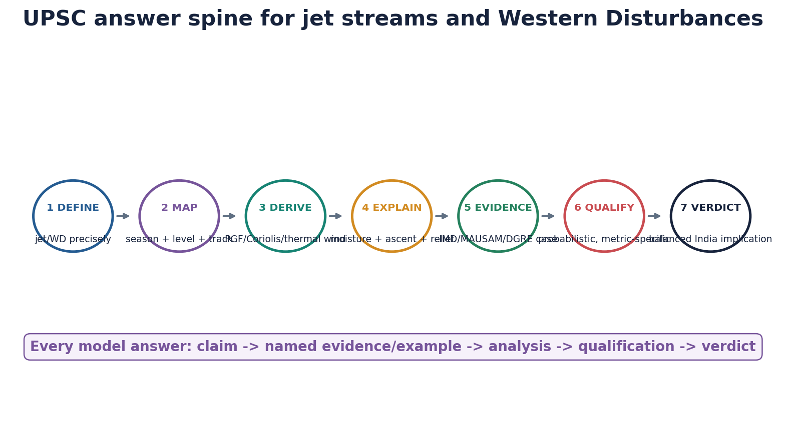

*The answer sequence used across teaching, practice and final register notes.*


| Evidence layer | Material used | Role |
|---|---|---|
| Authored Markdown | Geography basic 13; advanced 13; advanced 16, 06, 19, 20, 30; Disaster Management advanced 04 and 10; Environment advanced 17 | Read first; static owner and cross-owner synthesis |
| OCR/local books | Majid Husain Indian & World Geography pp. 75, 85-86, 94, 108-109; OCR register PDFs for Geography 13 and 16 | Troposphere, geostrophic flow, jets, India application |
| Official PYQ scans | UPSC Prelims 2020/2024/2026 and GS-I 2021/2022/2023/2024 held locally | Question text and key-status verification |
| Current primary | IMD 19 Mar 2026; DGRE 18 May and 1 Jun 2026; MoES/IITM Mission Mausam/BFS; WMO Jul 2026 | Current status/forecast architecture, date-bounded |
| Scientific context | MAUSAM 2025 coupled WD-easterly case; WCD 2025 review; ERA5 only as retrospective analysis in cited study | Dynamics, uncertainty, trends; not operational status |

### Teaching, explanation and solution

- **FACT** = directly supported by a cited static, official or peer-reviewed source.
- **STATUS** = an analysed or observed condition tied to a date/time.
- **FORECAST** = a future probability valid only for the stated agency, issue time and validity window.
- **INFERENCE** = analytical synthesis; it is not a quoted source claim.
- **LIMIT** = what the evidence cannot establish, especially causation or long-term trend.
- Source order: authored Markdown -> OCR/local books and official PYQ scans -> live primary/current sources -> Qdrant not required.

### Must-know facts

- A weather bulletin can contain STATUS, FORECAST and impact advice in the same document; read each sentence by tense and validity.
- A reanalysis is a model-data reconstruction for diagnosis, not a future forecast and not a direct observation at every grid point.

### UPSC traps and corrections

- **Wrong:** A single current weather event proves a climate-change trend. **Correct:** Trend and attribution require multi-decadal, metric-specific analysis.
- **Wrong:** A forecast warning is evidence that the forecast event occurred. **Correct:** Only later observations/verification establish the outcome.

### Mains / answer route

Define -> locate/diagram -> derive mechanism -> use named evidence -> analyse impacts -> state uncertainty -> verdict.

### Study / source link

Repository owners listed in the source matrix; URLs and retrieval dates appear in the source register.


## 2. Vertical atmosphere and pressure-coordinate basics

Jet streams and Western Disturbances are upper-air systems. Their analysis therefore uses constant-pressure surfaces and geopotential height rather than treating the atmosphere as a stack of fixed geometric altitudes.

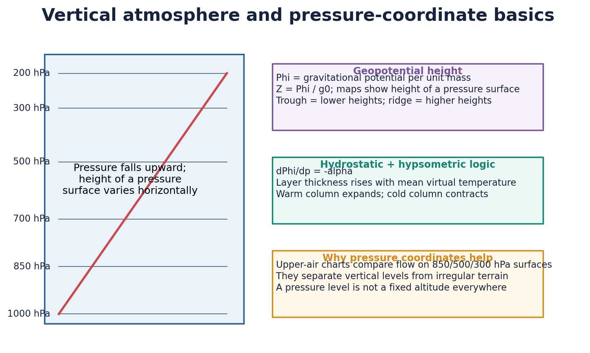

*Pressure decreases upward, but a given pressure surface sits at different heights in warm and cold columns.*


| Concept | UPSC-ready meaning | Application |
|---|---|---|
| Troposphere | Lowest, weather-producing layer; thickness varies with latitude, season and temperature | Deep convection and upper-air flow occur within it |
| Pressure surface | 850/500/300 hPa surface whose geometric height varies horizontally | Maps reveal troughs, ridges and jets |
| Geopotential Phi | Work per unit mass needed to raise air against gravity | Its horizontal gradient gives the pressure-gradient force on an isobaric surface |
| Geopotential height Z | Phi divided by standard gravity | Contours are isohypses; close spacing means strong height gradient |
| Thickness | Vertical distance between two pressure surfaces | Proportional to layer-mean virtual temperature by the hypsometric relation |

### Teaching, explanation and solution

- Hydrostatic balance: **dPhi/dp = -alpha**, where alpha is specific volume. Pressure coordinates turn vertical force balance into a compact relation.
- Hypsometric logic: a warm column is thicker than a cold column between the same two pressure levels; this connects horizontal temperature contrast to vertical wind shear.
- On a constant-pressure map, a trough is an elongated region of lower geopotential height and cyclonic curvature; a ridge is higher height and anticyclonic curvature.
- The 300/200 hPa level is often useful for jet diagnosis, but the jet core follows the tropopause/temperature-gradient structure and is not fixed to one pressure or altitude.
- The troposphere is generally deeper in the tropics because strong heating and convection expand the air column; it is shallower near the poles.

### Must-know facts

- Weather occurs mainly in the troposphere because it contains most atmospheric mass and water vapour.
- A pressure level is not at the same altitude over Delhi, the Himalaya and the Arabian Sea.
- Lower heights on a 500 hPa chart do not mean lower surface elevation; they describe the atmospheric pressure surface.

### UPSC traps and corrections

- **Wrong:** 300 hPa always equals one fixed altitude. **Correct:** Pressure-surface height changes with temperature, latitude and synoptic state.
- **Wrong:** Isobars and isohypses are interchangeable on every map. **Correct:** Isobars join equal pressure; isohypses join equal geopotential height on a pressure surface.

### Mains / answer route

Use a small warm-column/cold-column sketch before explaining thermal wind or the seasonal migration of jets.

### Study / source link

Basic Geography 13; UPSC Prelims 2024 Q2; GS-I 2022 troposphere PYQ.


## 3. PGF, Coriolis, geostrophic wind, gradient wind and thermal wind

Upper-air flow is governed by force balance. The key is not to say merely that air moves from high to low pressure: away from friction, Coriolis deflection turns the flow until it becomes approximately parallel to height contours.

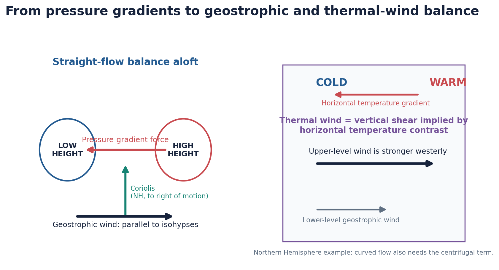

*Left: straight geostrophic balance. Right: temperature contrast creates vertical shear - the thermal wind.*


| Balance / relation | Core statement | Qualification |
|---|---|---|
| Horizontal PGF | On a pressure surface: force is directed from high toward low geopotential | Stronger contour gradient means stronger acceleration |
| Coriolis | Deflects moving air right in NH, left in SH; magnitude rises with speed and latitude | Zero at equator; it changes direction, not speed directly |
| Geostrophic wind | PGF and Coriolis balance; wind is parallel to straight isohypses | Approximation aloft, outside strong acceleration/friction |
| Gradient wind | Curved flow adds centrifugal/curvature effect | Cyclonic and anticyclonic winds differ from geostrophic speed |
| Thermal wind | Difference between upper and lower geostrophic winds reflects horizontal temperature gradient | It is vertical shear, not a separate wind observed at one level |

### Teaching, explanation and solution

- Geostrophic vector form: **f k x Vg = -grad(Phi)**. In the Northern Hemisphere, lower heights lie to the left of geostrophic flow.
- Thermal-wind layer form: **Vg(upper) - Vg(lower) = (R/f) ln(p_lower/p_upper) k x grad(T)**. A stronger meridional temperature gradient supports stronger westerly shear.
- The polar-front jet is strongly linked to baroclinic temperature gradients and eddy activity. The subtropical jet also reflects angular-momentum-rich poleward flow in the upper Hadley circulation and the tropopause break.
- Curvature matters: around cyclonic curvature, the gradient wind is commonly subgeostrophic; around anticyclonic curvature it can be supergeostrophic, with stability limits.
- Near the surface, friction weakens wind and Coriolis, allowing cross-isobar flow toward low pressure. This is why lower-level convergence can coexist with upper-level near-geostrophic flow.

### Must-know facts

- Thermal wind explains why winter jets strengthen when equator-to-pole temperature contrasts sharpen.
- Coriolis force increases with wind speed and latitude; both statements in UPSC Prelims 2024 Q14 are correct.
- Jet-level flow is not perfectly geostrophic inside jet-streak entrance/exit regions because acceleration creates an ageostrophic component.

### UPSC traps and corrections

- **Wrong:** Thermal wind is a hot local wind. **Correct:** It is the vector difference/vertical shear between geostrophic winds at two levels.
- **Wrong:** Upper air always flows directly from high to low pressure. **Correct:** Approximate geostrophic flow is parallel to straight height contours.

### Mains / answer route

Derive the causal chain: temperature gradient -> layer-thickness gradient -> height gradient aloft -> vertical shear -> jet.

### Study / source link

Majid Husain local PDF pp. 85-86; UPSC Prelims 2024 Q14.


## 4. Jet stream definition, core, jet streak and Rossby waves

A jet stream is a narrow, elongated current of high wind speed near the upper troposphere/tropopause, usually embedded in a broader westerly or easterly flow. It is defined relative to surrounding winds, not by one universal speed or height.

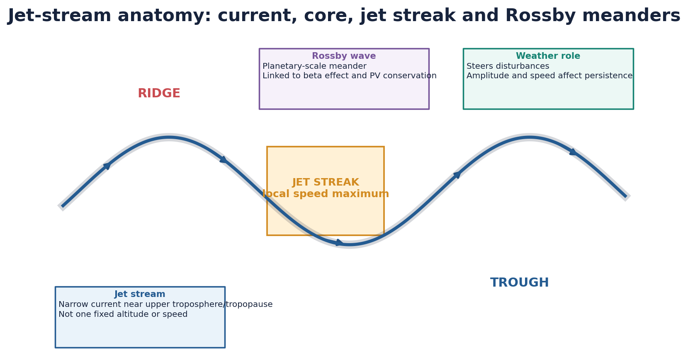

*A jet stream contains local speed maxima (jet streaks) and often follows planetary-scale Rossby meanders.*


| Term | Meaning | Do not confuse with |
|---|---|---|
| Jet core | Axis/region of strongest wind within the jet | Whole broad westerly belt |
| Jet streak | Local maximum of wind speed along the jet | A separate permanent jet |
| Rossby wave | Large meander governed by planetary vorticity/PV dynamics | Ocean wave or rainfall band |
| Ridge | Poleward/anticyclonic height bulge in NH westerlies | Surface mountain ridge |
| Trough | Equatorward/cyclonic height dip | Every trough being a closed surface cyclone |

### Teaching, explanation and solution

- Rossby-wave restoring dynamics arise because planetary vorticity varies with latitude (the beta effect) and large-scale flow approximately conserves potential vorticity.
- Low-amplitude zonal flow tends to move systems rapidly west-to-east; amplified ridges and troughs can slow or redirect them, but 'wavier jet = every extreme' is not a universal rule.
- Rossby-wave breaking and blocking can produce persistent ridges/troughs. Their India effects depend on season and longitude, including WD tracks, cold spells or stalled heat.
- A jet stream is distinct from a local strong wind such as the Loo and from a low-level jet such as the Somali/Findlater jet.

### Must-know facts

- Jets occur in both hemispheres; UPSC Prelims 2020 statement limiting them to the Northern Hemisphere is false.
- Jet position and strength vary daily, seasonally and interannually.
- The polar-front and subtropical jets can merge, split or become difficult to identify as separate branches.

### UPSC traps and corrections

- **Wrong:** Every strong wind is a jet stream. **Correct:** Jet refers to an elongated speed maximum with a specific upper- or lower-level circulation context.
- **Wrong:** Rossby waves directly create rain. **Correct:** They steer and dynamically support systems; moisture, ascent and stability determine precipitation.

### Mains / answer route

Define the jet, draw one meander, label core/streak/ridge/trough, then connect the wave pattern to steering and persistence.

### Study / source link

Basic Geography 13 section 10; advanced Geography 13 Rossby-wave owner.


## 5. Why jets form and why they migrate

Jet streams emerge from the interaction of differential heating, Earth rotation, angular momentum, baroclinic eddies and tropopause structure. No single process supplies a complete global explanation.

| Driver | Mechanism | Jet implication |
|---|---|---|
| Meridional temperature gradient | Creates thickness/height gradients with altitude | Thermal-wind shear strengthens upper westerlies |
| Hadley-cell angular momentum | Poleward upper-branch air retains high eastward speed | Supports subtropical jet near poleward Hadley edge |
| Baroclinic eddies | Mid-latitude waves exchange heat and momentum | Maintains eddy-driven/polar-front jet and storm track |
| Tropopause slope/break | Sharp contrast between deep tropical and shallow polar troposphere | Favourable zone for wind maximum |
| Seasonal heating shift | Temperature gradients and circulation cells move | Jets are stronger/equatorward in winter, weaker/poleward in summer in broad terms |

### Teaching, explanation and solution

- The winter hemisphere has a stronger meridional temperature contrast, usually strengthening upper westerlies and shifting key jets equatorward.
- In summer, reduced low-to-high-latitude contrast and poleward circulation shift weaken/reposition the westerly jets; regional plateaus and monsoon heating create additional reorganisation.
- The subtropical jet is not purely 'caused by the Tibetan Plateau'; it is a planetary feature modified strongly over Asia by plateau/Himalayan thermal and mechanical effects.
- The polar-front jet is not a sharp permanent line exactly over the surface polar front; it is an upper-level, time-varying eddy-driven current.

### Must-know facts

- Jets follow strongest horizontal temperature/height gradients but can be modified by momentum convergence and wave breaking.
- Seasonal migration is neither uniform in longitude nor instantaneous.

### UPSC traps and corrections

- **Wrong:** A jet exists at exactly 12 km and 300 km/h. **Correct:** Altitude, pressure level, width and speed vary with season, latitude and synoptic state.
- **Wrong:** Only thermal contrast forms every jet. **Correct:** Angular momentum and eddy momentum transport are also central.

### Mains / answer route

A good 15-marker separates subtropical/angular-momentum logic from polar-front/baroclinic-eddy logic, then shows how both interact.

### Study / source link

Atmospheric circulation, pressure belts and tropopause structure.


## 6. Jet-streak quadrants, divergence aloft and cyclogenesis

A jet streak contains along-stream acceleration and deceleration. The resulting ageostrophic transverse circulation can produce upper-level divergence in favoured sectors and convergence in others.

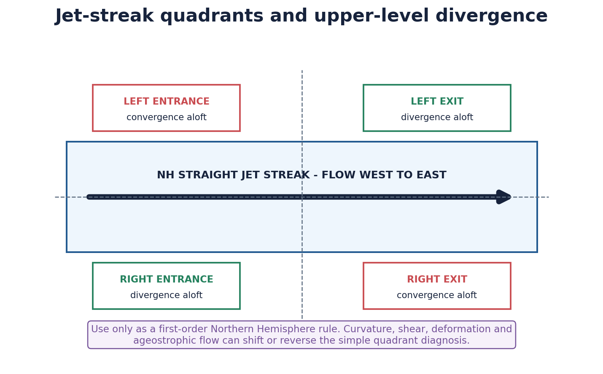

*First-order Northern Hemisphere straight-jet rule; never apply it mechanically to a curved or strongly sheared jet.*


| Sector in straight NH jet | First-order upper-level tendency | Possible weather implication |
|---|---|---|
| Left entrance | Convergence | Subsidence tendency |
| Right entrance | Divergence | Ascent can be supported below |
| Left exit | Divergence | Ascent/cyclogenesis can be supported below |
| Right exit | Convergence | Subsidence tendency |

### Teaching, explanation and solution

- Upper divergence removes mass from an air column and can support pressure falls below, but cyclogenesis also needs low-level baroclinicity, vorticity/temperature advection and a responsive lower circulation.
- Curvature changes the secondary circulation: cyclonically and anticyclonically curved jet streaks do not obey the simple four-quadrant pattern identically.
- Jet superposition, deformation, diabatic heating and orography can reorganise divergence zones. Use actual charts/model diagnostics for operational diagnosis.
- For WDs, active subtropical-jet dynamics and upper divergence can intensify ascent, as shown in the MAUSAM 2025 December 2024 case, but the event also required low-level convergence and moisture.

### Must-know facts

- Quadrant labels are relative to the direction of flow, not fixed compass directions globally.
- In a west-to-east NH jet, left is poleward/north and right is equatorward/south.

### UPSC traps and corrections

- **Wrong:** Left-exit divergence guarantees a surface cyclone. **Correct:** It is one supporting ingredient; lower-level structure and moisture still matter.
- **Wrong:** Quadrant rules are universal for every curved jet. **Correct:** They are a first-order straight-jet teaching aid.

### Mains / answer route

State the caveat in the diagram caption itself; that qualification separates analysis from rote meteorology.

### Study / source link

Jet streak dynamics -> WD intensification -> cyclogenesis and severe-weather support.


## 7. Polar-front jet, subtropical jet and India-relevant level distinctions

UPSC answers should classify jets by dynamical setting and atmospheric level. The polar-front jet and subtropical jet are upper-tropospheric westerly currents; the TEJ is an upper easterly; the Somali/Findlater jet is a lower-tropospheric cross-equatorial current.

| Current | Typical level/direction | Dynamical association | India relevance |
|---|---|---|---|
| Polar-front jet | Upper westerly | Baroclinic eddy-driven storm track | Upstream wave pattern can influence Eurasian troughs |
| Subtropical westerly jet (STWJ) | Upper westerly near subtropics | Hadley-edge/angular momentum + thermal gradients | Winter WD steering; seasonal reorganisation |
| Tropical easterly jet (TEJ) | Upper easterly in summer | Monsoon heating and Tibetan anticyclone circulation | Established monsoon upper-air signature |
| Somali/Findlater LLJ | Lower-tropospheric southwesterly | Cross-equatorial pressure gradient and channelled flow | Arabian Sea moisture and monsoon transport |

### Teaching, explanation and solution

- The word 'jet' does not imply the same altitude or direction. Always write upper/lower and westerly/easterly.
- A local strong wind such as Loo is a boundary-layer thermal wind, not an upper-tropospheric jet.
- The monsoon low-level jet is moisture-bearing and frictionally influenced; upper jets are better approximated by geostrophic/gradient balance.
- The STWJ and polar-front jet can interact or merge over Eurasia; India textbooks often simplify the Asian winter upper-air field into one STWJ branch.

### Must-know facts

- Somali/Findlater jet is not another name for TEJ.
- TEJ flows broadly east-to-west; STWJ broadly west-to-east.
- Level, direction and season are the fastest elimination tools in Prelims.

### UPSC traps and corrections

- **Wrong:** All jets are upper-tropospheric westerlies. **Correct:** TEJ is an upper easterly and Somali LLJ is lower-tropospheric.
- **Wrong:** The monsoon LLJ and TEJ perform the same role. **Correct:** LLJ transports low-level moisture; TEJ is part of upper outflow/circulation.

### Mains / answer route

Use a four-row comparison table rather than narrating four winds in one paragraph.

### Study / source link

Advanced Geography 13 and 16; basic planetary circulation.


## 8. Seasonal map of STWJ, TEJ, Somali LLJ and Tibetan anticyclone

India's seasonal circulation is a three-dimensional reorganisation. In winter the westerly jet is commonly south of the Himalayan-Tibetan barrier; in summer the westerly branch shifts/reorganises northward while a Tibetan anticyclone, TEJ and cross-equatorial low-level flow become established.

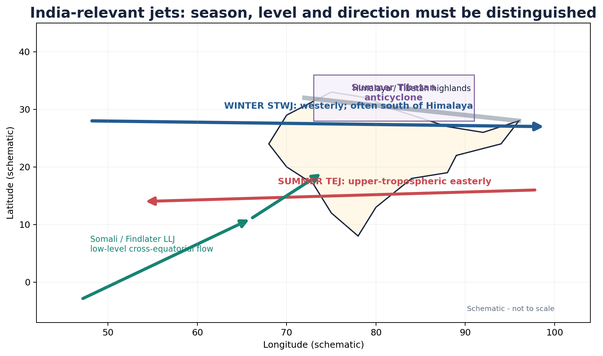

*Schematic map: directions and levels are the examinable point; exact daily axes require an upper-air chart.*


### Teaching, explanation and solution

- Winter STWJ south of the Himalaya provides a steering environment for eastward-moving WDs affecting northwest India.
- Spring/summer heating of South Asia and the Tibetan Plateau modifies thickness and pressure fields; the Asian westerly jet reorganises poleward/north of the plateau in association with monsoon onset.
- The Tibetan anticyclone is an upper-level high linked to deep monsoon heating; TEJ lies broadly on its southern flank.
- The Somali LLJ crosses the equator, turns right under Northern Hemisphere Coriolis influence and accelerates over the western Arabian Sea toward India.
- The Himalaya/Plateau both mechanically deflect flow and thermally reshape the atmospheric column; neither role should be reduced to a slogan.

### Must-know facts

- Winter: STWJ + WDs; summer: TEJ + Tibetan anticyclone + monsoon LLJ.
- Seasonal mean maps are not daily forecasts; transient troughs and breaks remain superimposed.

### UPSC traps and corrections

- **Wrong:** The STWJ vanishes globally in summer. **Correct:** Its Asian branch shifts/reorganises; westerly jets persist elsewhere.
- **Wrong:** The Tibetan Plateau alone switches on the monsoon. **Correct:** It is one component of a coupled land-ocean-atmosphere system.

### Mains / answer route

Map the currents with different arrow colours and label UPPER versus LOWER beside each arrow.

### Study / source link

India monsoon mechanism; Himalaya-Tibetan thermal and mechanical controls.


## 9. Monsoon relationship without single-cause determinism

The northward reorganisation of the STWJ and development of the monsoon upper-air circulation are important onset associations, not a sufficient deterministic trigger. Monsoon onset is an objective rainfall/circulation transition produced by multiple coupled processes.

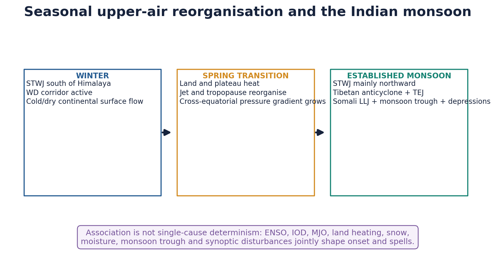

*Winter-to-summer circulation transition; the lower and upper branches evolve together but not as one causal switch.*


| Control | Potential role | Why it is not deterministic alone |
|---|---|---|
| STWJ migration | Removes persistent upper westerly regime from south of Himalaya | Daily onset still depends on low-level cross-equatorial flow and convection |
| TEJ/Tibetan anticyclone | Signals established diabatic heating and upper outflow | Strength follows and feeds back with convection |
| Somali LLJ | Transports Arabian Sea moisture | Moisture needs monsoon trough, instability and regional lift |
| Land/plateau heating | Builds thermal low and thickness gradients | Cloud/rain feedback can rapidly alter heating |
| ENSO/IOD/MJO | Modulate interannual and intraseasonal convection | Teleconnections are probabilistic and phase/timing dependent |
| Eurasian/Himalayan snow | Can influence spring heating and circulation | Relationship varies by region, season and background state |

### Teaching, explanation and solution

- Monsoon onset over Kerala is declared by IMD using rainfall and wind/outgoing-longwave criteria; no one jet-position observation is a substitute for the official onset definition.
- MJO can organise active and suppressed convective phases over the Indian Ocean; ENSO and IOD alter seasonal background probabilities.
- The monsoon trough, Bay depressions and local orography distribute rainfall after onset; jets alone do not explain spatial totals.
- Withdrawal is a separate seasonal retreat. A WD can interact with late-monsoon flow in an event, but it does not universally 'delay withdrawal'.

### Must-know facts

- STWJ northward movement is best written as an indicator/associated precondition, not the sole cause of onset.
- TEJ is strongest as part of an established monsoon circulation and latent-heating response.

### UPSC traps and corrections

- **Wrong:** STWJ withdrawal automatically causes the monsoon burst. **Correct:** Onset is a coupled lower- and upper-air transition with convection and moisture.
- **Wrong:** El Nino always causes drought and positive IOD always rescues India. **Correct:** Both are probabilistic and interact with other modes.

### Mains / answer route

A critical answer should use 'associated with', 'favours' and 'conditional on' rather than deterministic verbs.

### Study / source link

Advanced Geography 16; IOD/ENSO/MJO owners; IMD onset criteria.


## 10. Western Disturbance definition: what the term includes and excludes

A Western Disturbance is an eastward-moving synoptic-scale extratropical disturbance embedded in the subtropical westerlies, commonly expressed as an upper-air trough or cyclonic circulation and often accompanied by an induced lower-level circulation.

| Element | Precise description | Boundary |
|---|---|---|
| Scale | Synoptic, usually multi-day and multi-region | Not a small local thunderstorm cell |
| Upper structure | Trough/cyclonic circulation in middle-upper westerlies | Need not be a closed upper low |
| Lower response | May induce cyclonic circulation/low over Pakistan-NW India | Not every WD is a strong surface cyclone |
| Season | Most common/important in boreal winter, with shoulder-season events | Not absent outside Dec-Mar |
| Energy | Baroclinic/extratropical dynamics plus diabatic feedbacks | Not a tropical warm-core cyclone |

### Teaching, explanation and solution

- Classic IMD/MAUSAM usage describes eastward-moving upper-air troughs in subtropical westerlies extending into lower-tropospheric north-Indian latitudes in winter.
- The 2025 WCD review defines WDs as synoptic systems embedded in the subtropical westerly jet, often upper-level troughs associated with a lower-tropospheric low over western India.
- 'Mediterranean origin' is a useful route shorthand, but individual systems may form, re-form or amplify over the Mediterranean-West Asian-Central Asian corridor.
- The label is operationally identified from the analysed synoptic structure, not from tracing every air parcel to one sea.

### Must-know facts

- WD, induced cyclonic circulation and surface low are related but not identical terms.
- Extratropical means frontal/baroclinic dynamics, not that the system never reaches subtropical India.

### UPSC traps and corrections

- **Wrong:** Every WD is a surface cyclone born only over the Mediterranean Sea. **Correct:** Many are upper troughs/circulations; development and moisture pathways vary.
- **Wrong:** WD is a branch of the southwest monsoon. **Correct:** It is a mid-latitude/extratropical disturbance in westerlies.

### Mains / answer route

Start with the upper-air definition, then mention the possible induced lower circulation; this avoids the standard surface-low error.

### Study / source link

MAUSAM WD terminology and WCD 2025 review.


## 11. WD pathway, steering and event-specific moisture sources

The pathway combines upstream baroclinic development, Rossby-wave/trough evolution, subtropical-jet steering and Himalayan interaction. Moisture may be acquired or recycled from several seas and continental pathways depending on the event.

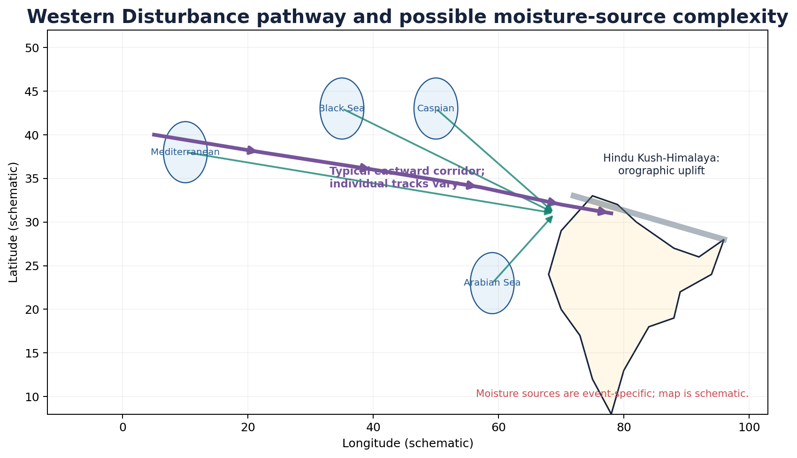

*Schematic route and possible moisture sources. It is incorrect to assign every event one identical origin or moisture reservoir.*


| Stage | Dynamical/thermodynamic ingredient | India result |
|---|---|---|
| Upstream development | Baroclinic wave/trough over Mediterranean-West Asia/Central Asia | Cyclonic vorticity and cold-air structure |
| Eastward steering | Subtropical westerlies and Rossby-wave phase speed | Track toward Iran-Afghanistan-Pakistan-NW India |
| Moisture supply | Mediterranean/Caspian/Black/Arabian Sea or regional recycling; event-specific | Precipitation efficiency varies |
| Lower circulation | Lee/baroclinic response and convergence over Pakistan/NW plains | Rain, hail and thunderstorms can organise |
| Orographic lift | Hindu Kush-Himalaya forces ascent | Snow/rain amplified on favoured slopes |

### Teaching, explanation and solution

- A system can carry upstream moisture and also tap Arabian Sea moisture through southerly lower-level flow. Bay of Bengal moisture becomes important in some coupled WD-easterly interactions.
- The December 2024 case analysed in MAUSAM 2025 used moisture diagnostics and found both Arabian Sea and Bay of Bengal sources during a rare WD-easterly trough coupling.
- Track and moisture source must be diagnosed separately: a Mediterranean-track system may precipitate efficiently only after drawing nearer moisture.
- Orography enhances ascent but also creates sharp rain/snow shadows and valley-specific gradients; one station cannot represent the whole western Himalaya.

### Must-know facts

- Steering current and moisture source are not the same concept.
- Cross-barrier moisture transport and terrain orientation influence precipitation distribution.

### UPSC traps and corrections

- **Wrong:** All WD precipitation water evaporated from the Mediterranean. **Correct:** Moisture sources vary and can include Arabian Sea, Caspian/Black Sea and recycled/regional sources.
- **Wrong:** A stronger WD automatically means more precipitation everywhere. **Correct:** Moisture, stability, track and terrain determine efficiency.

### Mains / answer route

Map route arrows in purple and moisture arrows in teal so the examiner can see that steering and water supply are distinct.

### Study / source link

WCD 2025 review; MAUSAM 2025 coupled-system case; Himalayan orography.


## 12. WD ascent, induced lows, cloud and precipitation

Precipitation occurs when the disturbance creates sustained ascent in air containing sufficient moisture. Upper dynamics, lower convergence, stability and Himalayan relief must align.

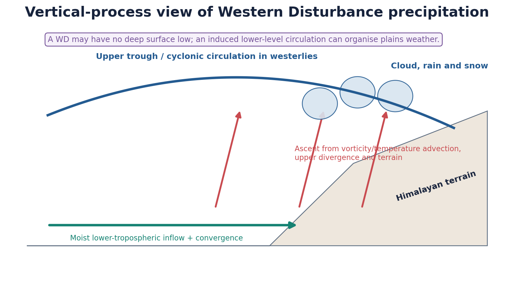

*Conceptual vertical section: upper trough, lower inflow/convergence and terrain jointly organise rain and snow.*


| Ingredient | Process | Diagnostic caution |
|---|---|---|
| Positive vorticity advection aloft | Can support column ascent ahead of a trough | Actual QG forcing varies with level and curvature |
| Warm advection/lower convergence | Raises air and organises induced circulation | Not present equally in all sectors |
| Upper divergence | Removes mass and supports pressure falls/ascent below | Jet-quadrant rule is not mechanical |
| Moisture transport | Raises condensate and precipitation efficiency | Source and depth require event diagnosis |
| Orographic uplift | Forces flow over Hindu Kush-Himalaya | Terrain can block, channel and shadow as well as lift |
| Microphysics/freezing level | Determines rain, snow, sleet/hail mix | Changes rapidly with elevation and temperature profile |

### Teaching, explanation and solution

- A WD may remain mostly an upper trough while a lower-tropospheric induced cyclonic circulation focuses plains convergence.
- Cloud shield and precipitation can precede the trough axis where ascent is strongest; surface weather does not sit directly under the upper centre in every case.
- Snowfall requires a sufficiently cold vertical profile, not simply high altitude. Warming can shift the freezing level and rain-snow partition.
- Convective cells embedded within a synoptic WD environment can produce hail/lightning, but a WD and a local thunderstorm are different scales.

### Must-know facts

- Rain/snow amount is an outcome of circulation x moisture x stability x terrain.
- Upper divergence supports, but does not alone cause, precipitation or cyclogenesis.

### UPSC traps and corrections

- **Wrong:** WD rainfall is purely frontal and never convective. **Correct:** Synoptic ascent can coexist with embedded convection, hail and lightning.
- **Wrong:** Every high-intensity Himalayan rain spell should be called a cloudburst. **Correct:** Cloudburst is an intensity-and-small-area term requiring appropriate observation.

### Mains / answer route

Use a vertical cross-section to link upper trough -> ascent -> lower convergence -> terrain -> precipitation phase.

### Study / source link

Jet-streak dynamics; orographic rainfall; cloud microphysics.


## 13. Winter rain, Himalayan snow, plains weather and agriculture

WDs are central to winter precipitation over northwest India and the western Himalaya. Their effects range from beneficial soil moisture and snow accumulation to crop, orchard and transport losses, depending on timing, phase and intensity.

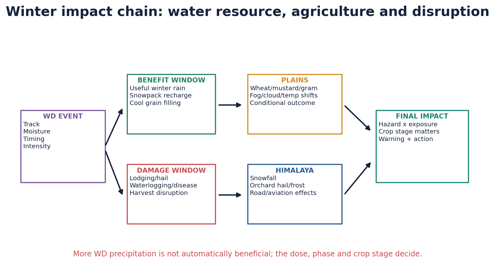

*Benefits and losses are conditional. The same event can aid one crop stage and damage another.*


| Sector | Potential benefit | Potential loss / condition |
|---|---|---|
| Rabi wheat | Useful rain and cool conditions can support soil moisture/grain filling | Hail, lodging, waterlogging, fungal disease or harvest rain can reduce quality/yield |
| Mustard/gram | Supplementary winter moisture | Flowering/pod-stage rain, hail or standing water can damage |
| Himalayan snow | Seasonal snowpack and water storage | Heavy snow loads, avalanches and access disruption |
| Orchards | Winter chill/snow where appropriate | Hail, frost, branch snow load and wet maturity conditions |
| Plains weather | Cloud can reduce daytime heating | Fog/inversion, cold-day interactions and aviation/road disruption |

### Teaching, explanation and solution

- Northwest plains rain may be locally called **mahawat**, but regional usage should not replace the meteorological term WD precipitation.
- Moderate, well-timed rain is most useful where irrigation or residual moisture is limited; an already saturated or harvest-ready field has a different risk profile.
- Lodging results when wind/rain bends stems; excess moisture can increase disease and delay harvest. Hail adds direct mechanical damage.
- Snow accumulation supports later meltwater but does not translate one-to-one into basin discharge; storage, sublimation, temperature and catchment conditions matter.
- Cloud/fog/cold-wave interactions are event-specific. WDs can raise minimum temperatures under cloud while post-WD clear conditions may favour cooling.

### Must-know facts

- Rabi response depends on crop stage, soil moisture and event intensity.
- More WD rain is not always good; too little and too much create different risks.
- Himalayan snowfall and northwest plains rain can occur in the same synoptic event but with different local phases.

### UPSC traps and corrections

- **Wrong:** Every WD benefits wheat. **Correct:** Late, intense or hail-bearing events can cause lodging, disease and harvest losses.
- **Wrong:** WD always causes a cold wave during precipitation. **Correct:** Cloud, advection and post-system clearing can produce different temperature responses.

### Mains / answer route

Write agriculture as a matrix: crop stage x rain amount x wind/hail x drainage, then state the conditional verdict.

### Study / source link

Advanced Geography 19, 20 and 30; IMD 19 March 2026 agromet advice.


## 14. Hazard cascade: snow, avalanche, landslide, flood, hail, lightning, fog and disruption

A WD is a hazard trigger, not a disaster by itself. Disaster risk emerges when heavy precipitation, unstable snow or severe convection intersects exposed slopes, roads, settlements, orchards and transport networks.

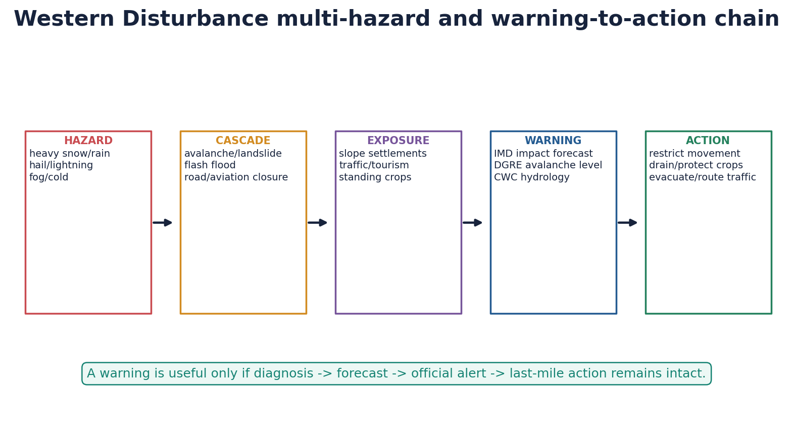

*Multi-hazard analysis must proceed from physical trigger to cascade, exposure, warning and action.*


| Hazard | Trigger pathway | Operational response owner / action |
|---|---|---|
| Avalanche | New snow + wind loading + weak snowpack + slope | DGRE danger level; movement restriction/evacuation |
| Landslide/debris flow | Saturation, snowmelt/rain, steep disturbed slope | GSI/State alerts, route control, slope management |
| Flash flood | Intense rain or rapid melt in steep catchment | IMD precipitation warning + CWC/State hydrology |
| Hail/lightning | Embedded deep convection in unstable air | IMD nowcast/impact advice; shelter and crop protection |
| Fog/cold interaction | Moisture + inversion + post/pre-system temperature state | Transport advisories, airport/road procedures |
| Road/aviation closure | Snow, icing, visibility, wind, slope failure | Impact-based route/airport decisions |

### Teaching, explanation and solution

- DGRE avalanche bulletins are built from current snow and meteorological data plus projected model weather; their own disclaimer stresses rapid spatial and temporal variability.
- Cloudburst-like is not a scientific label. Use 'very heavy/intense rain' unless the small-area hourly criterion and observation support cloudburst terminology.
- A synoptic WD can create mesoscale convective hazards; warning lead times differ for the synoptic system, thunderstorm cells, avalanches and flash floods.
- Warning-to-action requires route closures, avalanche-path discipline, drainage, anti-hail measures and last-mile communication, not merely a forecast map.

### Must-know facts

- DGRE, GSI, IMD and CWC have distinct hazard mandates; one Himalayan event can require all.
- Avalanche danger is slope/snowpack specific and can change even within the same district.

### UPSC traps and corrections

- **Wrong:** A green avalanche bulletin means every snow slope is safe. **Correct:** DGRE notes isolated instability and demands care even at low danger.
- **Wrong:** Any intense Himalayan rain is a cloudburst. **Correct:** Use the term only when intensity and spatial concentration are supported.

### Mains / answer route

Frame hazard -> exposure -> vulnerability -> warning -> action; avoid listing hazards without a causal chain.

### Study / source link

Disaster Management advanced 04 and 10; DGRE, IMD and CWC operational sources.


## 15. Interaction with pre-monsoon and monsoon systems

WDs can interact with tropical easterlies, moisture plumes, monsoon troughs or local convection. Such interactions can amplify rain or severe weather, but each case requires synoptic evidence.

| System | Identity | Possible interaction with WD | Key distinction |
|---|---|---|---|
| Pre-monsoon convection | Local/mesoscale thunderstorms in heated unstable air | WD ascent/shear can organise hail/lightning | Cell is not the WD itself |
| Monsoon depression | Lower-tropospheric cyclonic system, often Bay-origin, embedded in monsoon flow | Mid-latitude trough can alter track/ascent | Different genesis, vertical structure and season |
| Tropical cyclone | Warm-core oceanic vortex | Extratropical interaction possible after recurvature | Not a WD |
| Monsoon trough | Seasonal low-pressure zone across north India | A westerly trough can couple with it regionally | Persistent seasonal feature vs travelling WD |
| Easterly trough | Tropical/easterly wave feature | Coupling can enhance convergence and moisture | MAUSAM 2025 case is event-specific |

### Teaching, explanation and solution

- The MAUSAM 2025 study of 26-29 December 2024 found a rare WD-easterly trough interaction, active subtropical-jet divergence, enhanced lower convergence and moisture from Arabian Sea and Bay of Bengal.
- During monsoon, an upper westerly trough reaching north India can interact with monsoon moisture and terrain, but do not call every northwest monsoon extreme a WD without chart evidence.
- A WD may influence onset/withdrawal timing in a particular year by altering circulation or rainfall, yet seasonal onset/withdrawal is not controlled universally by one disturbance.
- System distinction should use season, thermal structure, level of circulation, moisture source and track rather than only the word 'low'.

### Must-know facts

- Synoptic interaction is nonlinear: the combined event can exceed the sum of isolated systems.
- Event-specific language protects against falsely converting one case into climatology.

### UPSC traps and corrections

- **Wrong:** Every north-India monsoon extreme is a WD-monsoon interaction. **Correct:** Require analysed upper westerly trough/WD evidence.
- **Wrong:** Monsoon depression and WD are both simply low pressure. **Correct:** Their dynamical origin, thermal structure and steering differ.

### Mains / answer route

Compare the systems in a four-column table, then use one verified coupled case with a clear LIMIT sentence.

### Study / source link

MAUSAM 2025 article; monsoon depressions; tropical cyclone and severe-convection owners.


## 16. Seasonal climatology and variability: separate the metrics

WD climatology depends on the tracking algorithm, pressure level, geographic box, season and intensity threshold. Therefore frequency, intensity, track, duration and precipitation efficiency must be analysed separately.

| Metric | Possible measure | Why conclusions can differ |
|---|---|---|
| Frequency | Number of tracked systems | Trackers split/merge troughs differently |
| Intensity | Vorticity, geopotential anomaly, wind or pressure | One system can be dynamically strong but moisture-poor |
| Track | Latitude/longitude/path density | Small shifts change which basin/slope receives precipitation |
| Duration/speed | Residence time or translation speed | Slow systems may accumulate more impact |
| Precipitation efficiency | Rain/snow per system or moisture flux | Moisture and terrain vary independently of count |
| Impact | Damage, snowfall, crop loss or disruption | Exposure and warning change over time |

### Teaching, explanation and solution

- The WCD 2025 review describes WDs as most common in boreal winter (December-March) and central to western-Himalayan rain/snow, while emphasising unresolved questions and method advances.
- A 1980-2019 Jammu and Kashmir MAUSAM study found month- and station-specific mixed trends, illustrating why one aggregate 'WD trend' is misleading.
- Seasonal activity can extend into spring or occur in other months; a climatological peak does not create a hard calendar boundary.
- A high-frequency winter can still be snow-deficient if systems are weak, poorly tracked, warm or moisture-poor.

### Must-know facts

- Count, strength and precipitation are different datasets.
- Station precipitation trends cannot be equated automatically with WD-frequency trends.
- Universal single-number climatology should be avoided unless method, domain and period are stated.

### UPSC traps and corrections

- **Wrong:** More WDs necessarily mean more Himalayan snow. **Correct:** Temperature, moisture, track and rain-snow phase can offset frequency.
- **Wrong:** One regional station represents the western Himalaya. **Correct:** Orography creates sharp spatial heterogeneity.

### Mains / answer route

Before citing any trend, state metric + season + period + domain + method.

### Study / source link

WCD 2025 review; MAUSAM 2022 Jammu and Kashmir study.


## 17. Climate-change science: thermodynamic and dynamic changes

Warming can intensify atmospheric moisture and raise freezing levels even while changes in WD frequency, track or circulation remain uncertain. The correct analytical task is to separate thermodynamic from dynamic effects.

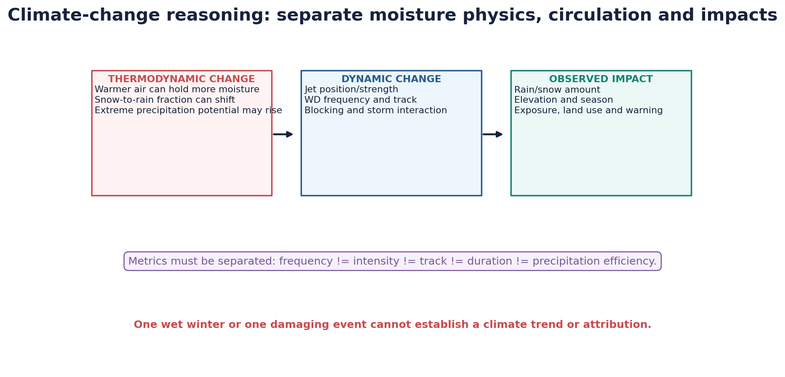

*Different metrics can move in different directions; impact also depends on elevation and exposure.*


| Question | More robust physical expectation | Higher-uncertainty dimension |
|---|---|---|
| Moisture loading | Warmer air generally permits greater water vapour | Event moisture access and convergence |
| Rain-snow partition | Freezing level tends to rise with warming | Local vertical profile and valley cold pools |
| Extreme precipitation | Thermodynamics can raise precipitation potential | How circulation frequency/track changes |
| Jet/WD dynamics | Large-scale gradients and eddies will reorganise | Sign, season and regional expression |
| Snowpack/water | Earlier melt and lower-elevation rain fraction are plausible | Basin-specific accumulation and Karakoram contrasts |

### Teaching, explanation and solution

- The WCD review synthesises projections in which increased specific humidity can raise WD-related precipitation even when circulation weakens; the balance varies by elevation and model.
- Observed and projected changes are heterogeneous. Some studies suggest changing seasonality or precipitation, but frequency and track responses remain less certain.
- Declining snowfall at lower elevations can coexist with heavier precipitation extremes or wetting at higher elevations; 'less snow' and 'less precipitation' are not synonyms.
- Attribution of one WD, hailstorm or flood to climate change requires a dedicated event-attribution design; general physical consistency is not event causation.
- Do not infer a long-term jet-waviness trend from Arctic warming as settled fact; the jet/extremes linkage remains scientifically debated and region-dependent.

### Must-know facts

- Thermodynamic intensification and dynamic frequency can change in opposite directions.
- Rain fraction, snowfall amount, snow water equivalent and glacier mass balance are distinct metrics.
- One winter cannot establish a trend.

### UPSC traps and corrections

- **Wrong:** Climate change has certainly increased every WD metric. **Correct:** Evidence differs by metric, season, region and study.
- **Wrong:** A wetter event proves more WDs. **Correct:** Moisture efficiency can increase without frequency increase.

### Mains / answer route

Use a two-column thermodynamic/dynamic framework and end with an uncertainty-aware, adaptation-relevant verdict.

### Study / source link

Environment advanced 17; WCD 2025 review; MoES India climate assessment.


## 18. Observation, diagnosis, forecast, warning and verification

Forecast skill depends on observing the initial atmosphere, representing upper-air dynamics and terrain, and communicating uncertainty. Diagnosis, forecast, warning and verified outcome are four different products.

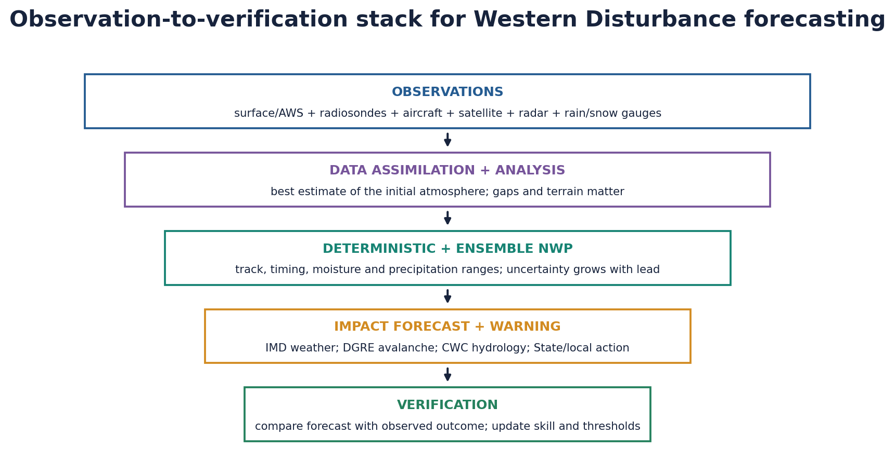

*Operational chain from observations to verification; each layer has its own uncertainty and institutional owner.*


| Tool | What it contributes | Limit |
|---|---|---|
| Radiosonde/pilot balloon | Vertical profiles of temperature, humidity and wind | Sparse over high mountains and oceans |
| Aircraft reports | Upper winds/temperature/turbulence along flight routes | Irregular spatial coverage |
| Satellite | Cloud, water vapour and broad circulation over data-sparse areas | Indirect retrievals and cloud/terrain limits |
| Doppler radar | Precipitation structure, storm motion and nowcasting | Beam blockage/overshoot in mountains |
| Rain/snow gauges & AWS | Ground truth for precipitation and snowpack weather | Undercatch, siting and sparse high-altitude network |
| Reanalysis (e.g., ERA5/IMDAA) | Retrospective dynamically consistent diagnosis | Not a real-time forecast or pure observation |
| Deterministic NWP | One high-resolution scenario | Sensitive to initial conditions and physics |
| Ensemble NWP | Range/probability of tracks and precipitation | Spread can be under/over-dispersive |

### Teaching, explanation and solution

- IMD analyses upper-air trough/circulation position and issues weather/impact forecasts; DGRE translates snowpack and projected weather into avalanche danger; CWC handles hydrological forecast functions.
- Bharat Forecast System is an IITM-developed high-resolution global system adopted operationally by IMD; higher resolution improves representation but does not eliminate uncertainty.
- Terrain precipitation remains difficult because small track errors move the heaviest band across steep gradients and gauge coverage is sparse.
- Verification asks what occurred after validity: rainfall/snowfall, track, timing, warning lead and impacts. It should not be replaced by forecast headlines.
- WMO's July 2026 HiM-DATA account highlights high-altitude observation gaps in Nepal/Bhutan as a regional scientific context, not an Indian operational-network claim.

### Must-know facts

- Forecast lead time and spatial resolution are different qualities.
- Ensembles communicate uncertainty; they do not mean the agency is unsure of everything.
- Radar is excellent for precipitation nowcasting but cannot alone diagnose the full upper-tropospheric WD.

### UPSC traps and corrections

- **Wrong:** A 6 km model gives exact 6 km truth. **Correct:** Grid spacing is not guaranteed forecast accuracy at that scale.
- **Wrong:** ERA5 is an observed weather station network. **Correct:** It assimilates observations into a model reconstruction.

### Mains / answer route

Evaluate the complete chain, including mountain observations and last-mile action, rather than listing instruments.

### Study / source link

IMD Upper Air/Radar/Satellite pages; Mission Mausam; NCMRWF dashboard; WMO July 2026.


## 19. Current 2026 linkage: IMD event bulletin and operational boundaries

> **Current/source trigger:** IMD Press Release issued 19 March 2026 at 1410 IST; forecast validity mainly 19-20 March for the western Himalaya/northwest plains. Retrieved 18 August 2026.

This is a date-bounded operational example, not evidence of the full 2025-26 winter climatology or a climate trend.

| Label | Official information | Boundary |
|---|---|---|
| FACT | Issue time, analysed upper-air circulation/trough, reported past weather and stated advice are reproduced from the official release | Direct document evidence; attribution remains limited to the bulletin's wording |
| STATUS | IMD analysed a WD as an upper-air cyclonic circulation over north Pakistan with a trough aloft in middle/upper westerlies, axis roughly 68E north of 28N | Synoptic analysis at issue time |
| STATUS | Past-24-hour realised weather included hail at isolated places including Haryana and other regions | Observed report; not all attributed to one mechanism in this package |
| FORECAST | Fairly widespread to widespread light/moderate rain/snow over western Himalayan region on 19-20 March, with isolated heavy rain/snow in specified subdivisions | Expired forecast window; not treated as outcome |
| FORECAST | Hail and gusty-wind risks over specified northwest states on 19-20 March | Location/date-specific probability |
| ACTION | IMD advised hail nets/caps, snow removal from fruit branches, drainage and safe storage/harvest actions | Impact advice, not a damage report |
| LIMIT | Bulletin cannot establish seasonal anomaly, long-term trend or climate attribution | Requires separate climatology/attribution |
| INFERENCE | The bulletin is a useful example of forecast literacy and correct WD terminology | Analytical teaching use; it is not a verified seasonal or climate conclusion |

### Teaching, explanation and solution

- The bulletin's wording demonstrates correct WD terminology: **upper-air cyclonic circulation + trough aloft**, not simply 'a surface cyclone from the Mediterranean'.
- It also separates realised weather, synoptic analysis, future forecast, expected impact and suggested action within one release.
- Use the event to demonstrate forecast literacy: agency, issue time, valid dates, affected regions and uncertainty must travel with the claim.

### Must-know facts

- The press release was issued 19 March 2026, 1410 IST.
- A fresh feeble WD was also forecast to affect northwest India from 22 March; this was a forecast at issue time.

### UPSC traps and corrections

- **Wrong:** The 19 March forecast proves heavy snow occurred everywhere listed. **Correct:** The document states a forecast; outcome requires later observations.
- **Wrong:** Frequent March bulletins prove climate-driven WD increase. **Correct:** Bulletin frequency is not a homogenised climate metric.

### Mains / answer route

Use as named evidence for operational terminology, impact advice and forecast/status separation.

### Study / source link

https://mausam.imd.gov.in/Forecast/marquee_data/Press%20Release%2019-03-2026.pdf


## 20. Current 2026 linkage: DGRE avalanche forecast lifecycle

> **Current/source trigger:** DGRE AWB No. 2025-26/199 dated 18 May 2026 was valid only from 1700 IST 18 May to 1700 IST 19 May. A 1 June 2026 DGRE notice then closed regular winter 2025-26 avalanche forecasting services. Retrieved 18 August 2026.

The pair of official documents shows how a seasonal hazard service changes from active daily warning to formal closure when the snow cover has largely ablated.

| Label | Official information | Boundary |
|---|---|---|
| FORECAST | 18 May AWB assigned danger level 1 to listed J&K/Ladakh/Himachal/Uttarakhand districts and level 2 to North/East Sikkim above stated altitudes | Only the bulletin's 24-hour validity |
| LIMIT | DGRE disclaimer: snow/weather vary rapidly in space/time and snow disturbance can alter stability | Danger level never replaces slope-level caution |
| STATUS | 1 June notice said seasonal snow cover in NWH, CH and NEH had almost ablated and danger reduced significantly | Agency assessment on that date |
| STATUS | Regular AWBs discontinued from 1 June 2026 | Service lifecycle, not 'zero avalanche risk' |
| FORECAST SERVICE | Regular winter service scheduled to resume 1 November 2026 | Future service date, not hazard prediction |

### Teaching, explanation and solution

- DGRE's five-level scale moves from generally safe to extremely unsafe and links danger to movement/evacuation action.
- Even at low danger, isolated instability may exist; terrain, new loading and human disturbance matter.
- A WD snowfall forecast feeds avalanche assessment, but avalanche danger additionally depends on snowpack layering, slope and wind redistribution.

### Must-know facts

- DGRE is the official avalanche-warning institution under DRDO.
- Operational closure was based on seasonal snow ablation, while residual loaded slopes still required precautions.

### UPSC traps and corrections

- **Wrong:** Closed seasonal service means every slope is safe. **Correct:** The notice retained precautions for residual snow/ice-loaded avalanche paths.
- **Wrong:** IMD snowfall warning and DGRE avalanche danger are identical. **Correct:** One forecasts weather; the other assesses snowpack/slope hazard using weather inputs.

### Mains / answer route

Use the bulletin pair to show warning validity, hazard-specific institutions and the need for action even under residual uncertainty.

### Study / source link

DGRE 18 May AWB and 1 June 2026 closing notice URLs in source register.


## 21. System distinction matrix for fast Prelims elimination

| System | Core/level | Energy and setting | India season/route |
|---|---|---|---|
| WD | Upper trough/circulation + possible induced lower low | Extratropical/baroclinic westerlies | Mainly winter/spring; west-to-east |
| Monsoon depression | Deep lower/mid cyclonic system | Monsoon moist instability/latent heating | Summer; often Bay to inland |
| Tropical cyclone | Deep warm-core ocean vortex | Warm ocean latent-heat engine | Pre/post-monsoon peaks; ocean-to-coast |
| Local convective storm | Mesoscale cell/squall | Buoyancy, shear and trigger | Hours; local to regional |
| STWJ | Upper westerly current | Thermal wind/angular momentum | Winter south of Himalaya; steering environment |
| TEJ | Upper easterly current | Monsoon heating/upper anticyclone | Summer over South Asia |
| Somali LLJ | Lower southwesterly jet | Cross-equatorial pressure gradient | Summer Arabian Sea moisture |

### Teaching, explanation and solution

- Use five discriminators: level, thermal structure, energy source, season and track.
- A WD can contain local convective storms, but containment does not erase the scale distinction.
- A monsoon depression and tropical cyclone may both be warm-core to varying degrees, yet organisation, intensity and operational classification differ.
- Jet is a current; disturbance is a travelling synoptic system. The STWJ steers WDs but is not itself a WD.

### Must-know facts

- Most confusion disappears when 'upper/lower' and 'westerly/easterly' are written.
- Operational labels should follow IMD analysis rather than visual similarity alone.

### UPSC traps and corrections

- **Wrong:** A trough, cyclone and jet are synonyms. **Correct:** They describe different structures: wave/height feature, vortex and wind maximum.
- **Wrong:** Every low over northwest India in winter is the WD centre. **Correct:** It may be an induced lower circulation beneath/ahead of the upper disturbance.

### Mains / answer route

Convert this matrix into a 60-second answer-planning tool.

### Study / source link

All system owners: weather elements, monsoon, cyclone and India climate.


# PART II - VERIFIED PYQS AND PREMIUM SOLVED PRACTICE


## PYQ P1. UPSC Prelims 2020 Q99 - jet streams and cyclone eye

> **Current/source trigger:** Official question scan held locally. The official answer key is unavailable locally.

Consider the following statements: (1) Jet streams occur in the Northern Hemisphere only. (2) Only some cyclones develop an eye. (3) The temperature inside the eye of a cyclone is nearly 10 C lesser than that of the surroundings. Options: (A) 1 only (B) 2 and 3 only (C) 2 only (D) 3 only.

### Teaching, explanation and solution

- **INFERRED ANSWER — NOT OFFICIALLY VERIFIED: C (2 only). Confidence: High.**
- Statement 1 is false: upper-tropospheric jets occur in both hemispheres.
- Statement 2 is correct: a well-defined eye is characteristic of sufficiently organised intense tropical cyclones; not every cyclone/depression develops one.
- Statement 3 is false: the eye is a warm-core feature and is warmer aloft than the surrounding eyewall environment, not about 10 C colder.
- Elimination: rejecting 1 removes A; rejecting 3 removes B and D; C remains.

### Must-know facts

- PYQ status is explicit because no local official key was available.

### UPSC traps and corrections

- **Wrong:** Inferred answer may be presented as official. **Correct:** Always retain the inferred-answer label and confidence.

### Mains / answer route

Prelims route: hemisphere -> cyclone structure -> warm-core logic.

### Study / source link

Local scan: books\more_previous_papers\CSP_2020_GS_Paper-1.pdf, page containing Q99.


## PYQ P2. UPSC Prelims 2024 Q2 - troposphere thickness

> **Current/source trigger:** Official Set A question and official Set A key are held locally.

Statement I: Thickness of the troposphere at the equator is much greater as compared to poles. Statement II: At the equator, heat is transported to great heights by strong convectional currents. Which statement combination is correct?

### Teaching, explanation and solution

- **OFFICIALLY VERIFIED ANSWER: A - both statements are correct and Statement II explains Statement I.**
- Strong tropical heating and deep convection expand the warm atmospheric column and raise the tropopause; the cold polar column is shallower.
- The question tests vertical atmosphere and causation, not a memorised altitude.

### Must-know facts

- Official local key: Series A, Q2 = A.

### UPSC traps and corrections

- **Wrong:** Troposphere thickness is uniform globally. **Correct:** It varies with latitude, season and temperature.

### Mains / answer route

Prelims route: equatorial heating -> deep convection -> higher tropopause.

### Study / source link

Local scans: 2024-GS1-Set A.pdf and Ans-2024-GS1.pdf.


## PYQ P3. UPSC Prelims 2024 Q14 - Coriolis force

> **Current/source trigger:** Official Set A question and official Set A key are held locally.

With reference to Coriolis force: (1) It increases with increase in wind velocity. (2) It is maximum at the poles and absent at the equator. Options ask which statements are correct.

### Teaching, explanation and solution

- **OFFICIALLY VERIFIED ANSWER: C - both 1 and 2.**
- Magnitude is proportional to wind speed and the Coriolis parameter f = 2 Omega sin(latitude).
- It is zero at the equator and reaches maximum magnitude at the poles.
- Coriolis acts perpendicular to motion: right in the Northern Hemisphere, left in the Southern Hemisphere.

### Must-know facts

- Official local key: Series A, Q14 = C.

### UPSC traps and corrections

- **Wrong:** Coriolis initiates wind from rest. **Correct:** Pressure-gradient force initiates acceleration; Coriolis requires motion.

### Mains / answer route

Prelims route: speed dependence + latitude dependence + direction.

### Study / source link

Local scans: 2024-GS1-Set A.pdf and Ans-2024-GS1.pdf.


## PYQ P4. UPSC Prelims 2026 Q84 - Bharat Forecast System

> **Current/source trigger:** Official question paper is held locally; only a provisional 2026 key exists locally.

Statements: (1) Bharat Forecast System aims to generate forecasts at the Panchayat-cluster level. (2) It was developed by IIT Delhi. Options: (A) 1 only (B) 2 only (C) both (D) neither.

### Teaching, explanation and solution

- **PROVISIONAL / INFERRED ANSWER — OFFICIAL UPSC KEY NOT AVAILABLE: A (1 only). Confidence: High.**
- Statement 1 is supported by official MoES/PIB descriptions of 6 km high-resolution, local/panchayat-cluster forecasting.
- Statement 2 is false: the system was developed by the Indian Institute of Tropical Meteorology (IITM), Pune, under MoES and adopted operationally by IMD.
- The local 2026 answer-key file is explicitly provisional; this package does not represent it as an official UPSC final key.

### Must-know facts

- BFS is a forecast model; resolution does not eliminate terrain or initial-condition uncertainty.

### UPSC traps and corrections

- **Wrong:** IITM and IIT Delhi are interchangeable institutions. **Correct:** IITM Pune developed BFS; institutional precision is examinable.

### Mains / answer route

Prelims route: objective + developer institution.

### Study / source link

Local 2026 paper/key plus official MoES/PIB BFS sources.


## PYQ M1. GS-I 2021 Q14 - mountain alignment and local weather

> **Current/source trigger:** Official UPSC GS-I 2021 scan held locally. Directive: briefly mention and explain; 15 marks, 250 words.

Question: Briefly mention the alignment of major mountain ranges of the world and explain their impact on local weather conditions, with examples.

### Teaching, explanation and solution

- **Thesis:** Mountain alignment controls whether air is blocked, channelled or forced upward; the same range can alter precipitation, temperature, wind and storm tracks.
- **Claim - Himalaya:** East-west alignment blocks cold Central Asian surface air and forces/deflects moist flows. **Evidence:** the Himalayan-Tibetan barrier modifies the Asian jets and creates heavy orographic rain/snow on favoured slopes. **Analysis:** India has warmer winters than comparable continental latitudes and strong rain-shadow contrasts. **Qualification:** passes and synoptic systems permit episodic exchange.
- **Claim - Rockies/Andes:** Broad north-south alignment allows meridional air-mass exchange on adjacent plains while forcing Pacific westerlies upward. **Evidence:** Rocky Mountain lee cyclogenesis/Chinook and the arid Patagonian lee of the Andes. **Analysis:** windward uplift and leeward subsidence generate sharp gradients. **Qualification:** latitude and ocean current modify the result.
- **Claim - Alps:** West-east/arc alignment intercepts Atlantic-Mediterranean flow. **Evidence:** Alpine windward snowfall and Foehn warming in lee valleys. **Analysis:** relief changes phase, intensity and local temperature.
- **Verdict:** Alignment is a first-order geographical control, but local weather emerges from alignment x prevailing flow x stability x moisture x season.
- **Why this earns marks:** It answers both alignment and impact, uses named ranges/processes, compares mechanisms and ends with a qualification rather than terrain determinism.

### Must-know facts

- Suggested value addition: a world outline with Himalaya/Alps east-west and Rockies/Andes north-south.

### UPSC traps and corrections

- **Wrong:** Only listing mountain directions answers the question. **Correct:** The directive requires weather-process explanation with examples.

### Mains / answer route

Claim -> range/example -> weather mechanism -> qualification -> comparative verdict.

### Study / source link

Local official scan: QP-CSM-21-GENSTUDIESPAPER-I-110122.pdf.


## PYQ M2. GS-I 2022 Q17 - why the troposphere determines weather

> **Current/source trigger:** Official UPSC GS-I 2022 scan held locally. Directive: How? 15 marks, 250 words.

Question: Troposphere is a very significant atmospheric layer that determines weather processes. How?

### Teaching, explanation and solution

- **Thesis:** The troposphere is the weather engine because it contains most atmospheric mass and water vapour, is heated largely from below and hosts the vertical/horizontal motions that convert temperature and moisture contrasts into clouds, winds and storms.
- **Claim - moisture and phase change:** Water vapour, cloud and aerosols are concentrated here. **Evidence:** condensation releases latent heat in thunderstorms, monsoon convection and tropical cyclones. **Analysis:** this couples moisture to pressure falls and circulation. **Qualification:** stratospheric variability can modulate tropospheric circulation, but weather occurs mainly below.
- **Claim - instability and convection:** Surface heating produces a normal decrease of temperature with height and buoyant overturning. **Evidence:** deep tropical convection raises the equatorial tropopause and powers monsoon clouds. **Analysis:** vertical transport creates rain, hail and lightning.
- **Claim - pressure and winds:** Horizontal temperature/pressure gradients plus Coriolis create surface winds and upper geostrophic flow. **Evidence:** subtropical jets and WDs occupy the upper troposphere; frictional convergence operates below.
- **Claim - topography/boundary layer:** Terrain, land-sea contrast and friction reshape near-surface flow. **Evidence:** Western Ghats rain shadow, Himalayan snow/rain and sea breezes.
- **Verdict:** Tropospheric depth, moisture, instability and circulation make it the immediate determinant of weather, while exchanges with the ocean, land and stratosphere condition its behaviour.
- **Why this earns marks:** It explains how rather than listing features, links microphysics to circulation and uses Indian examples plus an upper-atmosphere qualification.

### Must-know facts

- Diagram: surface heat/moisture -> convection -> upper outflow, with jet near tropopause.

### UPSC traps and corrections

- **Wrong:** Weather is only a surface process. **Correct:** Upper-tropospheric jets and troughs organise synoptic weather.

### Mains / answer route

Structure by moisture, instability, circulation and lower boundary.

### Study / source link

Local official scan: QP-CSM-22-GENERAL-STUDIES-PAPER I-190922.pdf.


## PYQ M3. GS-I 2023 Q7 - Purvaiya and Bhojpur cultural ethos

> **Current/source trigger:** Official UPSC GS-I 2023 scan held locally. Directive: Why and How; 10 marks, 150 words.

Question: Why is the South-West Monsoon called Purvaiya (easterly) in Bhojpur Region? How has this directional seasonal wind system influenced the cultural ethos of the region?

### Teaching, explanation and solution

- **Thesis:** Although the all-India system is the southwest monsoon, Bhojpur commonly receives its rain-bearing branch after Bay of Bengal flow turns westward along the Ganga plain, so the experienced local wind has an easterly/southeasterly component - hence Purvaiya.
- **Claim - physical geography:** The Bay branch is deflected by the Himalayan barrier and pressure pattern along the plains. **Evidence:** east-to-west advance of rain-bearing flow across Bihar/eastern Uttar Pradesh. **Analysis:** local naming follows felt direction, not the oceanic origin label. **Qualification:** daily wind varies with monsoon trough and depressions.
- **Claim - agrarian culture:** Purvaiya marks sowing, transplanting, relief from summer heat and river/soil renewal. **Evidence:** paddy-centred farm calendars and monsoon folk traditions such as Kajri across eastern UP-Bihar. **Analysis:** wind becomes a seasonal symbol of fertility, longing, travel and reunion. **Qualification:** cultural zones overlap and modern irrigation weakens but does not erase dependence.
- **Verdict:** Purvaiya shows how a planetary monsoon is translated by regional topography into a local direction and then into language, livelihood and memory.
- **Why this earns marks:** It resolves the apparent directional paradox, uses a map-ready Bay-branch explanation and links physical geography to named cultural expression with qualification.

### Must-know facts

- A one-line Ganga-plain arrow from east to west is the best value addition.

### UPSC traps and corrections

- **Wrong:** Southwest monsoon must blow southwest-to-northeast everywhere. **Correct:** Branching, deflection and regional pressure fields alter local direction.

### Mains / answer route

Physical explanation first; cultural ethos second; integrate in verdict.

### Study / source link

Local official scan: QP-CSM-23-GENERAL-STUDIES-PAPER-I-180923.pdf.


## PYQ M4. GS-I 2024 Q6 - phenomenon of cloudbursts

> **Current/source trigger:** Official UPSC GS-I 2024 scan held locally. Directive: Explain; 10 marks, 150 words. This is an adjacent hazard PYQ, not a claim that every WD extreme is a cloudburst.

Question: Explain the phenomenon of cloudbursts.

### Teaching, explanation and solution

- **Thesis:** A cloudburst is exceptionally intense rain concentrated over a very small area and short duration; IMD operational teaching commonly uses about 100 mm or more in an hour over a small area.
- **Claim - formation:** Deep moist convection produces powerful updrafts and rapid condensation. **Evidence:** Himalayan relief can repeatedly lift moisture into a near-stationary cell. **Analysis:** high rain rate overwhelms infiltration and channel capacity. **Qualification:** orography favours but is not sufficient; instability and moisture convergence are required.
- **Claim - disaster conversion:** Short steep catchments concentrate runoff into flash flood/debris flow. **Evidence:** the 2013 Uttarakhand disaster involved multiple cloudburst/flash-flood/landslide processes; it should not be reduced to one label. **Analysis:** settlement on valley floors and fans multiplies loss.
- **Claim - forecast limit:** Cells are small and short-lived. **Evidence:** radar/AWS/nowcasting improve detection but mountain beam blockage and sparse stations persist. **Analysis:** land-use control and local warning are as important as model improvement.
- **Verdict:** Cloudburst risk is the interaction of extreme rain rate with Himalayan relief and exposure, not simply 'heavy monsoon rain'.
- **Why this earns marks:** It defines the threshold logic, explains microphysics and terrain, names a qualified Indian example and includes forecast/land-use limits.

### Must-know facts

- Terminology caution is central to this package.

### UPSC traps and corrections

- **Wrong:** Every heavy WD rain spell is a cloudburst. **Correct:** Use the label only with suitable high-resolution rainfall evidence.

### Mains / answer route

Definition -> mechanism -> terrain/runoff -> forecasting/mitigation.

### Study / source link

Local official scan: UPSC Mains 2024 GS Paper I.pdf.


## Original hard MCQs - strict A -> B -> C -> D rotation


### Hard MCQ set 1-2

Original question set. Correct options continue the strict A -> B -> C -> D rotation.

### Teaching, explanation and solution

- **Q1. Which description best defines a jet stream?**
- A. A narrow elongated wind-speed maximum near the upper troposphere/tropopause
  B. Any wind faster than local surface winds
  C. A permanent current at exactly 12 km
  D. A low-level moisture plume only
- **Key: A** - A is correct. Jets are relative elongated speed maxima; level and speed vary.
- **Trap checked:** Fixed altitude/speed definition.
- **Q2. The thermal wind is best understood as:**
- A. A hot downslope wind
  B. Vertical shear of geostrophic wind linked to a horizontal temperature gradient
  C. Surface wind across isotherms
  D. Frictional inflow toward a low
- **Key: B** - B is correct. Thermal wind is a vector shear relation, not a separately observed local wind.
- **Trap checked:** Name-based confusion.

### Must-know facts

- Rotation keys in this card: A, B.

### UPSC traps and corrections

- **Wrong:** An option is made obviously longer or more qualified than others. **Correct:** Options were independently checked for plausibility and statement accuracy.

### Mains / answer route

After answering, explain why each rejected option fails; do not rely on the key letter.

### Study / source link

Coverage follows the complete teaching sequence.


### Hard MCQ set 3-4

Original question set. Correct options continue the strict A -> B -> C -> D rotation.

### Teaching, explanation and solution

- **Q3. On a constant-pressure chart, tightly packed geopotential-height contours most directly indicate:**
- A. High humidity
  B. Strong vertical motion
  C. Strong horizontal height gradient and potentially strong geostrophic wind
  D. Low surface elevation
- **Key: C** - C is correct. Wind strength follows the height gradient; ascent needs additional diagnosis.
- **Trap checked:** Equating contour spacing with rainfall.
- **Q4. Why can gradient wind differ from geostrophic wind?**
- A. Humidity changes Coriolis sign
  B. Pressure gradient disappears
  C. Friction is always dominant aloft
  D. Curvature adds a centrifugal/curvature term
- **Key: D** - D is correct. Curved flow requires a three-term balance.
- **Trap checked:** Applying straight-flow balance to curved jets.

### Must-know facts

- Rotation keys in this card: C, D.

### UPSC traps and corrections

- **Wrong:** An option is made obviously longer or more qualified than others. **Correct:** Options were independently checked for plausibility and statement accuracy.

### Mains / answer route

After answering, explain why each rejected option fails; do not rely on the key letter.

### Study / source link

Coverage follows the complete teaching sequence.


### Hard MCQ set 5-6

Original question set. Correct options continue the strict A -> B -> C -> D rotation.

### Teaching, explanation and solution

- **Q5. Which statement correctly contrasts the polar-front and subtropical jets?**
- A. The former is strongly eddy/baroclinic; the latter also reflects upper Hadley-cell angular momentum
  B. Both are surface winds
  C. Only the subtropical jet occurs in winter
  D. The polar-front jet is an easterly
- **Key: A** - A is correct; both are upper westerly currents with different dominant dynamical settings.
- **Trap checked:** Treating them as identical lines.
- **Q6. Rossby-wave meanders arise fundamentally from:**
- A. Ocean tides
  B. Latitudinal variation of planetary vorticity and potential-vorticity dynamics
  C. Local mountain breezes
  D. Surface friction alone
- **Key: B** - B is correct. Relief and heating can anchor waves, but beta/PV dynamics are fundamental.
- **Trap checked:** Calling them ocean waves.

### Must-know facts

- Rotation keys in this card: A, B.

### UPSC traps and corrections

- **Wrong:** An option is made obviously longer or more qualified than others. **Correct:** Options were independently checked for plausibility and statement accuracy.

### Mains / answer route

After answering, explain why each rejected option fails; do not rely on the key letter.

### Study / source link

Coverage follows the complete teaching sequence.


### Hard MCQ set 7-8

Original question set. Correct options continue the strict A -> B -> C -> D rotation.

### Teaching, explanation and solution

- **Q7. For a straight west-to-east Northern Hemisphere jet streak, the first-order divergence sectors are:**
- A. Left entrance and right exit
  B. Both entrance sectors
  C. Right entrance and left exit
  D. Both exit sectors
- **Key: C** - C is correct, with the major caveat that curvature and deformation modify the rule.
- **Trap checked:** Mechanical use in curved flow.
- **Q8. Which current is correctly identified as a lower-tropospheric moisture-bearing jet?**
- A. STWJ
  B. TEJ
  C. Polar-front jet
  D. Somali/Findlater jet
- **Key: D** - D is correct. It is the cross-equatorial monsoon low-level jet.
- **Trap checked:** Assuming every named jet is upper-level.

### Must-know facts

- Rotation keys in this card: C, D.

### UPSC traps and corrections

- **Wrong:** An option is made obviously longer or more qualified than others. **Correct:** Options were independently checked for plausibility and statement accuracy.

### Mains / answer route

After answering, explain why each rejected option fails; do not rely on the key letter.

### Study / source link

Coverage follows the complete teaching sequence.


### Hard MCQ set 9-10

Original question set. Correct options continue the strict A -> B -> C -> D rotation.

### Teaching, explanation and solution

- **Q9. The winter STWJ is most directly relevant to India because it:**
- A. Provides an upper westerly steering environment for WDs
  B. Carries Arabian Sea moisture at low level
  C. Is the same as TEJ
  D. Creates every cold wave
- **Key: A** - A is correct. Steering does not mean it alone determines rainfall or cold waves.
- **Trap checked:** Conveyor-belt determinism.
- **Q10. The TEJ over South Asia is best treated as:**
- A. A winter westerly
  B. A summer upper easterly associated with monsoon heating and the Tibetan anticyclone
  C. A surface sea breeze
  D. The only cause of onset
- **Key: B** - B is correct. It is both part of and responsive to established monsoon heating.
- **Trap checked:** Single-cause onset story.

### Must-know facts

- Rotation keys in this card: A, B.

### UPSC traps and corrections

- **Wrong:** An option is made obviously longer or more qualified than others. **Correct:** Options were independently checked for plausibility and statement accuracy.

### Mains / answer route

After answering, explain why each rejected option fails; do not rely on the key letter.

### Study / source link

Coverage follows the complete teaching sequence.


### Hard MCQ set 11-12

Original question set. Correct options continue the strict A -> B -> C -> D rotation.

### Teaching, explanation and solution

- **Q11. Which wording is most scientifically defensible?**
- A. STWJ withdrawal causes onset by itself
  B. TEJ always appears before convection
  C. Northward STWJ reorganisation is associated with onset but acts with low-level flow, heating and convection
  D. ENSO decides onset date exactly
- **Key: C** - C is correct because it preserves the multicausal, coupled nature of onset.
- **Trap checked:** Deterministic verbs.
- **Q12. The Tibetan anticyclone is primarily:**
- A. A surface winter high over Siberia
  B. A Western Disturbance
  C. The Somali jet
  D. An upper-level summer anticyclonic circulation linked to deep monsoon heating
- **Key: D** - D is correct; TEJ lies broadly on its southern flank.
- **Trap checked:** Confusing upper high with surface thermal low.

### Must-know facts

- Rotation keys in this card: C, D.

### UPSC traps and corrections

- **Wrong:** An option is made obviously longer or more qualified than others. **Correct:** Options were independently checked for plausibility and statement accuracy.

### Mains / answer route

After answering, explain why each rejected option fails; do not rely on the key letter.

### Study / source link

Coverage follows the complete teaching sequence.


### Hard MCQ set 13-14

Original question set. Correct options continue the strict A -> B -> C -> D rotation.

### Teaching, explanation and solution

- **Q13. Which is the most precise definition of a Western Disturbance?**
- A. An eastward-moving synoptic extratropical disturbance in subtropical westerlies, often an upper trough/circulation
  B. Every winter surface low over Delhi
  C. A Bay of Bengal monsoon depression
  D. A local hailstorm
- **Key: A** - A is correct and leaves room for an induced lower circulation without requiring a strong surface cyclone.
- **Trap checked:** Surface-low-only definition.
- **Q14. Which statement about WD moisture is correct?**
- A. It always comes only from the Mediterranean
  B. Sources are event-specific and may include Mediterranean/West Asian seas, Arabian Sea or regional pathways
  C. Moisture source and steering current are identical
  D. WDs require Bay of Bengal moisture
- **Key: B** - B is correct. Track shorthand must not become parcel-source certainty.
- **Trap checked:** Single-source universalisation.

### Must-know facts

- Rotation keys in this card: A, B.

### UPSC traps and corrections

- **Wrong:** An option is made obviously longer or more qualified than others. **Correct:** Options were independently checked for plausibility and statement accuracy.

### Mains / answer route

After answering, explain why each rejected option fails; do not rely on the key letter.

### Study / source link

Coverage follows the complete teaching sequence.


### Hard MCQ set 15-16

Original question set. Correct options continue the strict A -> B -> C -> D rotation.

### Teaching, explanation and solution

- **Q15. An induced cyclonic circulation associated with a WD most commonly refers to:**
- A. The TEJ core
  B. A tropical cyclone eye
  C. A lower-tropospheric cyclonic response that can organise convergence over Pakistan/NW India
  D. A polar high
- **Key: C** - C is correct. It is related to but distinct from the upper WD trough.
- **Trap checked:** Calling upper and lower centres identical.
- **Q16. Which combination best explains heavy WD precipitation over the western Himalaya?**
- A. Jet speed only
  B. Surface temperature only
  C. Mediterranean origin only
  D. Dynamic ascent + moisture + lower convergence + orographic lift
- **Key: D** - D is correct; precipitation efficiency is multicomponent.
- **Trap checked:** One-factor explanation.

### Must-know facts

- Rotation keys in this card: C, D.

### UPSC traps and corrections

- **Wrong:** An option is made obviously longer or more qualified than others. **Correct:** Options were independently checked for plausibility and statement accuracy.

### Mains / answer route

After answering, explain why each rejected option fails; do not rely on the key letter.

### Study / source link

Coverage follows the complete teaching sequence.


### Hard MCQ set 17-18

Original question set. Correct options continue the strict A -> B -> C -> D rotation.

### Teaching, explanation and solution

- **Q17. Which agriculture statement is correct?**
- A. WD rain can help Rabi crops when moderate and timely but can damage through hail, lodging or harvest rain
  B. More WD rain is always beneficial
  C. Wheat is a Kharif crop
  D. Hail affects orchards only
- **Key: A** - A is correct. Crop stage and drainage determine the sign of impact.
- **Trap checked:** Benefit-only narrative.
- **Q18. Which hazard warning is institutionally matched correctly?**
- A. DGRE - tropical cyclone naming
  B. DGRE - avalanche danger bulletins
  C. CWC - upper-air jet analysis
  D. IMD - glacier inventory
- **Key: B** - B is correct. IMD weather and CWC hydrology have different roles.
- **Trap checked:** One-agency Himalayan hazard assumption.

### Must-know facts

- Rotation keys in this card: A, B.

### UPSC traps and corrections

- **Wrong:** An option is made obviously longer or more qualified than others. **Correct:** Options were independently checked for plausibility and statement accuracy.

### Mains / answer route

After answering, explain why each rejected option fails; do not rely on the key letter.

### Study / source link

Coverage follows the complete teaching sequence.


### Hard MCQ set 19-20

Original question set. Correct options continue the strict A -> B -> C -> D rotation.

### Teaching, explanation and solution

- **Q19. Which feature most clearly distinguishes a WD from a monsoon depression?**
- A. Both can produce rain
  B. Both may show cyclonic circulation
  C. WD is an extratropical upper-westerly disturbance; monsoon depression is embedded in tropical monsoon flow
  D. Both always move east
- **Key: C** - C is correct. Level, energy source, season and track complete the distinction.
- **Trap checked:** Low-pressure synonym trap.
- **Q20. A robust WD climatology should avoid:**
- A. Separating track from intensity
  B. Naming the tracking method
  C. Stating the season
  D. Treating frequency, intensity and precipitation as one interchangeable metric
- **Key: D** - D is correct. Different metrics can trend differently.
- **Trap checked:** Single-number climatology.

### Must-know facts

- Rotation keys in this card: C, D.

### UPSC traps and corrections

- **Wrong:** An option is made obviously longer or more qualified than others. **Correct:** Options were independently checked for plausibility and statement accuracy.

### Mains / answer route

After answering, explain why each rejected option fails; do not rely on the key letter.

### Study / source link

Coverage follows the complete teaching sequence.


### Hard MCQ set 21-22

Original question set. Correct options continue the strict A -> B -> C -> D rotation.

### Teaching, explanation and solution

- **Q21. Which climate-change statement is most defensible?**
- A. Moisture loading can intensify precipitation even if WD circulation/frequency does not increase
  B. Every WD is now stronger
  C. One wet winter proves a trend
  D. Snowfall and precipitation are identical
- **Key: A** - A is correct; thermodynamic and dynamic changes must be separated.
- **Trap checked:** Universal metric claim.
- **Q22. Which sequence correctly separates operational products?**
- A. Warning -> diagnosis -> observation
  B. Diagnosis/status -> forecast -> warning/action -> verification
  C. Reanalysis -> outcome -> forecast
  D. Impact -> model initialisation -> satellite
- **Key: B** - B is correct. Products differ by time orientation and purpose.
- **Trap checked:** Treating forecast as outcome.

### Must-know facts

- Rotation keys in this card: A, B.

### UPSC traps and corrections

- **Wrong:** An option is made obviously longer or more qualified than others. **Correct:** Options were independently checked for plausibility and statement accuracy.

### Mains / answer route

After answering, explain why each rejected option fails; do not rely on the key letter.

### Study / source link

Coverage follows the complete teaching sequence.


### Hard MCQ set 23-24

Original question set. Correct options continue the strict A -> B -> C -> D rotation.

### Teaching, explanation and solution

- **Q23. ERA5 is best described as:**
- A. A rain gauge network
  B. An IMD warning
  C. A retrospective model-data reanalysis used for diagnosis
  D. A deterministic future forecast only
- **Key: C** - C is correct. It assimilates observations but is not direct observation everywhere.
- **Trap checked:** Reanalysis-as-observation.
- **Q24. A DGRE avalanche danger level should be interpreted as:**
- A. A guarantee for every slope
  B. A snowfall forecast only
  C. A district crop advisory
  D. A time-bounded hazard assessment based on snow/met data and projected weather, with residual uncertainty
- **Key: D** - D is correct and reflects DGRE's own disclaimer.
- **Trap checked:** Guarantee interpretation.

### Must-know facts

- Rotation keys in this card: C, D.

### UPSC traps and corrections

- **Wrong:** An option is made obviously longer or more qualified than others. **Correct:** Options were independently checked for plausibility and statement accuracy.

### Mains / answer route

After answering, explain why each rejected option fails; do not rely on the key letter.

### Study / source link

Coverage follows the complete teaching sequence.


### Hard MCQ set 25-26

Original question set. Correct options continue the strict A -> B -> C -> D rotation.

### Teaching, explanation and solution

- **Q25. In the IMD 19 March 2026 release, the valid 19-20 March rain/snow statement is:**
- A. A forecast, not proof of later outcome
  B. A climate trend
  C. A seasonal verification
  D. A glacier assessment
- **Key: A** - A is correct. Agency/date/validity must accompany the claim.
- **Trap checked:** Forecast-outcome conflation.
- **Q26. The WMO July 2026 HiM-DATA item is most safely used as:**
- A. Proof India has complete high-altitude coverage
  B. Regional evidence that high-Himalayan observation gaps remain and community AWS can help
  C. A WD forecast for India
  D. An avalanche warning
- **Key: B** - B is correct; the initiative discussed Nepal/Bhutan and is not an Indian operational-status claim.
- **Trap checked:** Geographic overextension.

### Must-know facts

- Rotation keys in this card: A, B.

### UPSC traps and corrections

- **Wrong:** An option is made obviously longer or more qualified than others. **Correct:** Options were independently checked for plausibility and statement accuracy.

### Mains / answer route

After answering, explain why each rejected option fails; do not rely on the key letter.

### Study / source link

Coverage follows the complete teaching sequence.


### Hard MCQ set 27-28

Original question set. Correct options continue the strict A -> B -> C -> D rotation.

### Teaching, explanation and solution

- **Q27. Bharat Forecast System was developed by:**
- A. IIT Delhi
  B. DGRE
  C. IITM Pune under MoES
  D. CWC
- **Key: C** - C is correct. IMD adopted it operationally.
- **Trap checked:** Institutional-name confusion.
- **Q28. When is 'cloudburst' terminology justified?**
- A. Any winter rain
  B. Any forecast of heavy rain
  C. Any WD over mountains
  D. When very high hourly rain is observed over a small area consistent with the operational criterion
- **Key: D** - D is correct. Use 'intense/heavy rain' when high-resolution evidence is absent.
- **Trap checked:** Decorative hazard language.

### Must-know facts

- Rotation keys in this card: C, D.

### UPSC traps and corrections

- **Wrong:** An option is made obviously longer or more qualified than others. **Correct:** Options were independently checked for plausibility and statement accuracy.

### Mains / answer route

After answering, explain why each rejected option fails; do not rely on the key letter.

### Study / source link

Coverage follows the complete teaching sequence.


## Remedial MCQs - continuous rotation retained


### Remedial MCQ set 1-2

Original question set. Correct options continue the strict A -> B -> C -> D rotation.

### Teaching, explanation and solution

- **Q1. A student writes: 'Thermal wind blows from warm to cold air.' The best correction is:**
- A. Thermal wind is the vertical geostrophic-wind shear implied by the horizontal temperature gradient
  B. It is an anabatic wind
  C. It is the TEJ
  D. The sentence is fully correct
- **Key: A** - A corrects the conceptual category error.
- **Trap checked:** Literal reading of 'wind'.
- **Q2. A strong WD produces little precipitation over one basin. The best explanation is:**
- A. Impossible by definition
  B. Track/moisture/stability or terrain may make the system precipitation-inefficient there
  C. All WDs carry equal moisture
  D. Jet speed determines rain exactly
- **Key: B** - B separates dynamical strength from precipitation efficiency.
- **Trap checked:** Strength-rain equivalence.

### Must-know facts

- Rotation keys in this card: A, B.

### UPSC traps and corrections

- **Wrong:** An option is made obviously longer or more qualified than others. **Correct:** Options were independently checked for plausibility and statement accuracy.

### Mains / answer route

After answering, explain why each rejected option fails; do not rely on the key letter.

### Study / source link

Coverage follows the complete teaching sequence.


### Remedial MCQ set 3-4

Original question set. Correct options continue the strict A -> B -> C -> D rotation.

### Teaching, explanation and solution

- **Q3. A forecast map shows a 60% chance of heavy snow. Which statement is correct?**
- A. Heavy snow definitely occurred
  B. No warning is possible
  C. It expresses conditional probability for the stated place/time and needs later verification
  D. It is a climate projection
- **Key: C** - C demonstrates forecast literacy.
- **Trap checked:** Probability-as-certainty.
- **Q4. After a WD passes, clear skies and light winds can sometimes favour:**
- A. TEJ formation
  B. Tropical cyclone genesis
  C. Permanent warming
  D. Radiational cooling, frost/fog or cold-wave intensification depending on air mass
- **Key: D** - D is correct; temperature response changes across event phases.
- **Trap checked:** One-temperature-response assumption.

### Must-know facts

- Rotation keys in this card: C, D.

### UPSC traps and corrections

- **Wrong:** An option is made obviously longer or more qualified than others. **Correct:** Options were independently checked for plausibility and statement accuracy.

### Mains / answer route

After answering, explain why each rejected option fails; do not rely on the key letter.

### Study / source link

Coverage follows the complete teaching sequence.


### Remedial MCQ set 5-6

Original question set. Correct options continue the strict A -> B -> C -> D rotation.

### Teaching, explanation and solution

- **Q5. Which answer sentence is best?**
- A. The STWJ shift is an onset association within a coupled monsoon reorganisation
  B. The STWJ alone causes onset
  C. TEJ is a winter jet
  D. Somali jet is upper easterly
- **Key: A** - A uses bounded causal language.
- **Trap checked:** Textbook determinism.
- **Q6. A district has more rain but fewer counted WDs in a decade. This is:**
- A. Logically impossible
  B. Possible if precipitation efficiency, track, duration or moisture increased
  C. Proof the data are false
  D. Proof of more surface cyclones
- **Key: B** - B is correct because metrics can diverge.
- **Trap checked:** Metric conflation.

### Must-know facts

- Rotation keys in this card: A, B.

### UPSC traps and corrections

- **Wrong:** An option is made obviously longer or more qualified than others. **Correct:** Options were independently checked for plausibility and statement accuracy.

### Mains / answer route

After answering, explain why each rejected option fails; do not rely on the key letter.

### Study / source link

Coverage follows the complete teaching sequence.


### Remedial MCQ set 7-8

Original question set. Correct options continue the strict A -> B -> C -> D rotation.

### Teaching, explanation and solution

- **Q7. Which qualification belongs after citing a jet-streak quadrant?**
- A. No caveat is needed
  B. It applies only in Southern Hemisphere
  C. Curvature, shear and ageostrophic structure can modify the straight-jet rule
  D. It predicts exact rainfall
- **Key: C** - C is the required scientific caveat.
- **Trap checked:** Mechanical quadrant use.
- **Q8. DGRE closes regular avalanche bulletins for summer. The best inference is:**
- A. No snow remains anywhere
  B. Climate change ended avalanches
  C. IMD stops weather forecasts
  D. Seasonal danger reduced enough to close routine service, while residual loaded slopes still require caution
- **Key: D** - D matches the 1 June 2026 official notice.
- **Trap checked:** Service closure-as-zero-risk.

### Must-know facts

- Rotation keys in this card: C, D.

### UPSC traps and corrections

- **Wrong:** An option is made obviously longer or more qualified than others. **Correct:** Options were independently checked for plausibility and statement accuracy.

### Mains / answer route

After answering, explain why each rejected option fails; do not rely on the key letter.

### Study / source link

Coverage follows the complete teaching sequence.


## Original Mains 10 marks - upper jets versus Somali low-level jet

Question: Distinguish the Subtropical Westerly Jet, Tropical Easterly Jet and Somali/Findlater low-level jet, and explain their seasonal relevance to India. Answer in 150 words.

### Teaching, explanation and solution

- **Thesis:** The three are not variants of one wind: they differ in level, direction, dynamical setting and seasonal function.
- **Claim - STWJ:** It is an upper westerly associated with subtropical temperature/momentum gradients. **Evidence:** in winter its Asian branch commonly lies south of the Himalaya and steers WDs. **Analysis:** it links mid-latitude waves to north-Indian winter weather. **Qualification:** position varies daily and it does not alone determine precipitation.
- **Claim - TEJ:** It is an upper easterly associated with the summer Tibetan anticyclone and monsoon heating. **Evidence:** it becomes prominent during established monsoon circulation. **Analysis:** it forms part of upper outflow/shear. **Qualification:** it is not the sole onset switch.
- **Claim - Somali LLJ:** It is lower-tropospheric cross-equatorial southwesterly flow. **Evidence:** it transports Arabian Sea moisture toward India. **Analysis:** it supplies low-level moisture and momentum. **Qualification:** rainfall still needs monsoon trough, convection and relief.
- **Verdict:** Level-direction-season labelling prevents the common error of equating every 'jet' with an upper westerly.
- **Why this earns marks:** It answers the directive comparatively, uses India-specific evidence, explains function and qualifies causation within the word-limit logic.

### Must-know facts

- Add a three-arrow vertical sketch for value.

### UPSC traps and corrections

- **Wrong:** Narrating the three jets without comparison. **Correct:** Use level, direction, season and role as parallel headings.

### Mains / answer route

Claim -> named jet/evidence -> analysis -> qualification -> verdict.

### Study / source link

Visual 05 and distinction matrix.


## Original Mains 15 marks - pathway and impacts of Western Disturbances

Question: Explain the pathway and precipitation mechanism of Western Disturbances and assess why the statement 'they originate over the Mediterranean and benefit Indian agriculture' is incomplete. Answer in 250 words.

### Teaching, explanation and solution

- **Thesis:** WDs are eastward-moving extratropical disturbances in subtropical westerlies; 'Mediterranean origin' and 'agricultural benefit' are useful entry points but incomplete generalisations.
- **Claim - pathway:** Baroclinic troughs/circulations develop or amplify across the Mediterranean-West Asian-Central Asian corridor. **Evidence:** IMD operationally analyses them as upper troughs/cyclonic circulations, sometimes with induced lower circulations over Pakistan-NW India. **Analysis:** the STWJ/Rossby pattern steers rather than supplies all moisture. **Qualification:** individual genesis and tracks differ.
- **Claim - moisture/ascent:** Precipitation needs upper forcing, lower convergence, moisture and Himalayan lift. **Evidence:** MAUSAM's 26-29 December 2024 case found active subtropical-jet divergence, WD-easterly coupling and Arabian Sea plus Bay moisture. **Analysis:** nearby moisture can dominate event efficiency. **Qualification:** this rare coupled case is not universal.
- **Claim - benefits:** Moderate winter rain can support Rabi soil moisture and snowfall stores water. **Evidence:** Punjab-Haryana-western UP wheat belt and western-Himalayan snow dependence. **Analysis:** timing complements irrigation/residual moisture. **Qualification:** hail, lodging, disease, waterlogging, avalanche and road disruption can reverse the sign.
- **Verdict:** WDs should be analysed as variable upper-air systems whose outcome is controlled by track x moisture x terrain x exposure, not by origin or benefit slogans.
- **Why this earns marks:** It corrects both halves of the statement, names official/scientific evidence, integrates physical and human geography and gives a conditional verdict.

### Must-know facts

- Map: corridor + separate moisture arrows + Himalaya.

### UPSC traps and corrections

- **Wrong:** Using the December 2024 coupled case as universal climatology. **Correct:** Retain the event-specific qualification.

### Mains / answer route

Definition -> track -> ascent/moisture -> impacts -> qualification -> verdict.

### Study / source link

Visuals 07-10; IMD/MAUSAM current evidence.


## Original Mains 20 marks - climate change and forecast governance

Question: Critically assess how climate change may alter Western-Disturbance impacts over India, and evaluate whether improved forecasting alone can manage the resulting risk. Answer in about 300 words.

### Teaching, explanation and solution

- **Thesis:** Climate change is more likely to alter moisture loading, rain-snow partition and extremes than to produce one uniform change in WD frequency; forecast improvement is necessary but insufficient without terrain observations, impact translation and exposure reduction.
- **Claim - thermodynamics:** Warmer air supports more water vapour and a higher freezing level. **Evidence:** the WCD review synthesises experiments where increased humidity raised WD precipitation despite weakened circulation. **Analysis:** lower elevations may receive more rain while extreme precipitation potential rises. **Qualification:** elevation, season and model produce heterogeneous outcomes.
- **Claim - dynamics:** Jet position, baroclinicity, blocking and WD track may change. **Evidence:** literature reviewed in WCD reports divergent frequency/track results and possible changing seasonality. **Analysis:** dynamic uncertainty can offset or reinforce thermodynamic change. **Qualification:** one winter or bulletin cannot establish trend/attribution.
- **Claim - risk:** More intense rain, wet snow or rapid phase shifts can cascade into avalanche, landslide, flood, crop loss and transport disruption. **Evidence:** DGRE's snowpack-based warning and IMD's 19 March 2026 hail/snow impact advice show hazard-specific pathways. **Analysis:** exposure converts weather into disaster.
- **Claim - forecast governance:** Mission Mausam/BFS, radiosondes, radar, satellites and ensembles improve diagnosis/lead time. **Evidence:** BFS is IITM's 6 km operational system; WMO July 2026 still notes high-altitude observational gaps regionally. **Analysis:** small track errors remain costly in steep terrain. **Qualification:** model resolution is not exact local truth.
- **Way forward:** denser mountain AWS/snow gauges, ensemble impact thresholds, IMD-DGRE-CWC-State interoperability, protected avalanche/flood corridors, crop advisories, drainage and verified warning performance.
- **Verdict:** Resilience requires forecast skill x institutional coordination x land-use/crop/route action; none can substitute for the others.
- **Why this earns marks:** It separates thermodynamic/dynamic evidence, uses named current institutions, evaluates the 'forecast alone' proposition and ends with a graded governance verdict.

### Must-know facts

- Use visual 12 for climate logic and visual 11 for forecast governance.

### UPSC traps and corrections

- **Wrong:** Claiming a settled increase in every WD metric. **Correct:** State where evidence is robust and where it remains uncertain.

### Mains / answer route

Critical structure: evidence for -> uncertainty/counterpoint -> governance evaluation -> integrated verdict.

### Study / source link

WCD 2025, IMD/DGRE 2026, Mission Mausam/BFS and WMO observation context.


## Examiner-grade answer checklist and self-review rubric


*Apply this sequence before comparing with the model solution.*


| Criterion | Self-check |
|---|---|
| Demand fidelity | Every directive, scope, mark and word limit answered |
| Evidence | 2-3 named examples (10m), 4-6 (15m), 5-8 (20m) where appropriate |
| Analysis | Each example states what it proves |
| Qualification | Event/trend/forecast uncertainty bounded |
| Structure | Map/diagram/table used where it improves clarity |
| Verdict | Direct, graded and derived from body |
| 10-mark timing | About 7 minutes: 1-line frame, 3 analytical blocks, qualified verdict |
| 15-mark timing | About 11 minutes: compact diagram plus 4-5 linked dimensions |
| 20-mark timing | About 15 minutes: define, explain mechanism, assess impacts, qualify and conclude |
| Revision log | Record the missing mechanism, wrong level/season, weak evidence and rewritten verdict |

### Teaching, explanation and solution

- Do not award yourself full credit for correct facts arranged as a list.
- Underline the metric and validity window in every current-affairs sentence.
- For diagrams, check arrow direction, atmospheric level, season and caveat.
- For climate questions, separate thermodynamic and dynamic change.
- For agriculture/disaster, write conditional impact rather than one-direction benefit/loss.
- A jet/WD answer should normally distinguish diagnosis, forecast, warning and verified outcome.
- A map should separate the steering corridor from event-specific moisture-source arrows.
- A mechanism paragraph should link forcing -> ascent/convergence -> cloud/precipitation -> conditional impact.
- A comparison answer should explicitly distinguish STWJ, TEJ, Somali LLJ, WD, monsoon depression and tropical cyclone where relevant.
- After review, rewrite only the weakest paragraph and the verdict; do not merely reread the model answer.

### Must-know facts

- Internal review weighting: demand 20; accuracy/evidence 30; analysis 20; structure 15; balance/conclusion 10; presentation 5.
- Minimum evidence audit: one named official/scientific source, one India-specific spatial example and one explicit qualification where the question permits.
- Diagram audit: title, orientation/level, labelled arrows, process link and one caveat.

### UPSC traps and corrections

- **Wrong:** Named evidence is decorative. **Correct:** Every example must advance or qualify an argument.
- **Wrong:** A forecast is cited as an observed disaster. **Correct:** Retain issue date, validity window and FORECAST label; verify outcomes separately.
- **Wrong:** One winter proves a long-term WD trend. **Correct:** Use metric-specific multi-year evidence and state uncertainty.

### Mains / answer route

Rewrite any answer lacking a named source/example or a LIMIT sentence.

### Study / source link

Repository Mains model-answer standard in AGENT_MEMORY.md.


# PART III - SOURCE REGISTER AND FORECAST/STATUS CAVEATS


## Local repository sources read first

- `upsc-ai-kit/knowledge/Geography/basic/13_Weather-Elements.md`
- `upsc-ai-kit/knowledge/Geography/advanced/13_India-JetStream-Western-Disturbances.md`
- `upsc-ai-kit/knowledge/Geography/advanced/16_India-Monsoon-Mechanism.md`
- `upsc-ai-kit/knowledge/Geography/advanced/06_Himalayan-Glaciers-GLOF.md`
- `upsc-ai-kit/knowledge/Geography/advanced/19_India-Himalayan-Fruit-Belt.md`
- `upsc-ai-kit/knowledge/Geography/advanced/20_India-Wheat-Granary.md`
- `upsc-ai-kit/knowledge/Geography/advanced/30_Primary-Economic-Activities-Agriculture.md`
- `upsc-ai-kit/knowledge/Disaster-Management/advanced/04_Multi-Hazard-Early-Warning-and-Disaster-Technology.md`
- `upsc-ai-kit/knowledge/Disaster-Management/advanced/10_Landslides-Avalanches-and-GLOF-Risk.md`
- `upsc-ai-kit/knowledge/Environment-and-Ecology/advanced/17_Climate-Change-Science-Greenhouse-Effect.md`

## OCR-searchable local books and official PYQ scans

- Majid Husain, *Indian & World Geography*, local PDF: troposphere (PDF p. 75), geostrophic winds (pp. 85-86), Asian jet/monsoon discussion (p. 94), jet stream (pp. 108-109).
- OCR-searchable repository register PDFs/text for Geography advanced Topics 13 and 16, grounded in D.R. Khullar and Majid Husain; old fixed speeds/latitudes were treated as source-era examples, not universal definitions.
- Official local UPSC scans listed in the workbook source card. The 2020 key is unavailable locally; 2026 key is provisional.

## Primary/current URLs - all retrieved 18 August 2026

1. IMD Press Release, 19 March 2026: https://mausam.imd.gov.in/Forecast/marquee_data/Press%20Release%2019-03-2026.pdf
2. DGRE Avalanche Warning Bulletin No. 2025-26/199, 18 May 2026: https://www.drdo.gov.in/drdo/sites/default/files/avalanche_warning_bulletin/DGRE_AWB_18-May-2026.pdf
3. DGRE closure of winter 2025-26 operational avalanche forecasting, 1 June 2026: https://www.drdo.gov.in/drdo/sites/default/files/avalanche_warning_bulletin/NDMA_closingofwinter2025_26.pdf
4. Mission Mausam objectives, IITM/MoES: https://monsoon-mission.tropmet.res.in/mission-mausam
5. PIB/MoES Bharat Forecast System description: https://pib.gov.in/PressReleasePage.aspx?PRID=2131392
6. IMD Upper Air Meteorological Services: https://mausam.imd.gov.in/responsive/servicesMetUpperAir.php
7. IMD Radar Services: https://mausam.imd.gov.in/responsive/radar.php
8. IMD Satellite Meteorology: https://mausam.imd.gov.in/imd_latest/contents/satmet.php
9. NCMRWF NWP dashboard: https://nwp.ncmrwf.gov.in/dashboard/
10. CWC Standard Operating Procedure for Flood Forecasting, April 2026: https://cwc.gov.in/sites/default/files/SOP_April_2026-FFM.pdf
11. WMO, Himalayan Monasteries Help Close Observation Gaps, July 2026: https://wmo.int/resources/meteoworld/meteoworld-july-2026/himalayan-monasteries-help-close-observation-gaps
12. NDMA SACHET official alert architecture: https://sachet.ndma.gov.in/About

## Scientific/terminology URLs - retrieved 18 August 2026

1. Hunt et al., *Western disturbances and climate variability: a review of recent developments*, Weather and Climate Dynamics 6 (2025): https://wcd.copernicus.org/articles/6/43/2025/
2. Kumar, Kumar and Jenamani, MAUSAM 76(4), WD-easterly trough interaction (2025): https://mausamjournal.imd.gov.in/index.php/MAUSAM/article/view/7061
3. Pisharoty and Desai, *Western Disturbances and Indian Weather*, MAUSAM archive: https://mausamjournal.imd.gov.in/index.php/MAUSAM/article/view/4555
4. Ahmed et al., WD frequency and precipitation trends over Jammu & Kashmir, MAUSAM 73(2) (2022): https://mausamjournal.imd.gov.in/index.php/MAUSAM/article/view/698

## Forecast/status caveats

- The IMD 19 March 2026 forecast was valid for specified dates and regions; it is not presented as a later verified outcome.
- The DGRE 18 May bulletin was valid for 24 hours; the 1 June notice describes service closure and residual safety precautions, not permanent zero risk.
- BFS grid spacing is not a guarantee of exact village-scale outcome.
- WMO HiM-DATA is used as regional Himalaya observation-gap context and is not represented as an Indian operational station network.
- ERA5 in the MAUSAM study is a reanalysis diagnostic, not an operational forecast or direct observation at every grid point.
- Climate trend statements remain metric-, season-, elevation-, method- and region-specific.

# PART IV - FINAL CONSOLIDATED REGISTER NOTES


## FINAL REGISTER NOTES 1 - upper-air mechanics and jet formation


*Rapid-recall force balance and thermal-wind relation.*


### Teaching, explanation and solution

- Pressure level != fixed altitude; use geopotential height/isohypses on constant-pressure charts.
- Hydrostatic: dPhi/dp = -alpha; hypsometric: warm layers are thicker.
- PGF crosses contours; geostrophic wind is parallel to straight isohypses aloft.
- NH lower heights lie to the left of geostrophic flow.
- Gradient wind adds curvature/centrifugal effect.
- Thermal wind = upper-minus-lower geostrophic wind; stronger meridional temperature contrast -> stronger westerly shear.
- Jets arise from thermal gradients + angular momentum + eddy momentum + tropopause structure.

### Must-know facts

- Winter jets generally strengthen/equatorward; summer jets generally weaken/poleward, with regional modification.

### UPSC traps and corrections

- **Wrong:** Thermal wind is a local hot wind. **Correct:** It is vertical geostrophic shear.
- **Wrong:** Jet has fixed altitude/speed. **Correct:** It is a variable relative speed maximum.

### Mains / answer route

Derive: temperature contrast -> thickness gradient -> upper height gradient -> shear -> jet.

### Study / source link

Revise visuals 01-04.


## FINAL REGISTER NOTES 2 - jet taxonomy and India seasonal map


*Map-ready winter/summer currents; schematic, not a daily chart.*


| Jet/current | Level + direction | Seasonal India use |
|---|---|---|
| STWJ | Upper westerly | Winter WD steering; northward reorganisation with monsoon transition |
| TEJ | Upper easterly | Summer monsoon/Tibetan anticyclone signature |
| Somali LLJ | Lower southwesterly | Cross-equatorial Arabian Sea moisture |
| PFJ | Upper westerly/eddy-driven | Upstream Eurasian wave context |

### Teaching, explanation and solution

- Jet streak = local speed maximum; Rossby wave = planetary meander.
- Straight NH jet divergence: right entrance + left exit; caveat curvature/shear.
- STWJ migration is associated with onset, not the sole cause.
- TEJ both reflects and supports established monsoon heating; not a single switch.
- ENSO/IOD/MJO/snow/land heating/monsoon trough/depressions jointly modulate outcomes.

### Must-know facts

- Always label upper/lower, westerly/easterly, winter/summer.

### UPSC traps and corrections

- **Wrong:** Somali jet = TEJ. **Correct:** They differ in level, direction and role.

### Mains / answer route

Four-row comparison + seasonal map.

### Study / source link

Revise visuals 03-06.


## FINAL REGISTER NOTES 3 - Western Disturbance definition and pathway


*Track and moisture source are separate diagnostic questions.*


### Teaching, explanation and solution

- WD = eastward-moving synoptic extratropical disturbance embedded in subtropical westerlies.
- Often upper trough/cyclonic circulation; may induce a lower circulation/low.
- Mediterranean-West Asia is a corridor shorthand, not a universal single birthplace/moisture source.
- Steering: STWJ/Rossby pattern. Moisture: Mediterranean/Caspian/Black/Arabian/regional, event-specific.
- Ascent: vorticity/temperature advection + upper divergence + lower convergence + terrain.
- Himalaya amplifies, channels and shadows; precipitation phase follows vertical temperature profile.

### Must-know facts

- MAUSAM 2025 coupled case: WD + easterly trough + Arabian/Bay moisture; event-specific.

### UPSC traps and corrections

- **Wrong:** Every WD is a surface cyclone. **Correct:** Upper-air structure is primary.
- **Wrong:** All moisture is Mediterranean. **Correct:** Source diagnostics vary by event.

### Mains / answer route

Definition -> route -> moisture -> ascent -> orography -> qualification.

### Study / source link

Revise visuals 07-08.


## FINAL REGISTER NOTES 4 - impacts, hazards and system distinctions


*Weather becomes disaster through cascade, exposure and failed action.*


| Dimension | Rapid recall |
|---|---|
| Benefit | Moderate timely Rabi rain; snowpack/water storage |
| Crop loss | Hail, lodging, disease, waterlogging, harvest disruption |
| Mountain hazard | Heavy snow, avalanche, landslide, flash flood, route/aviation closure |
| Plains weather | Cloud/temp shifts, fog/cold interactions, hail/lightning |
| Distinction | WD extratropical upper westerly; depression/tropical cyclone/local cell are different |

### Teaching, explanation and solution

- Impact is conditional on timing, intensity, phase, crop stage, drainage and exposure.
- Cloudburst term requires small-area hourly intensity evidence.
- DGRE avalanche warning != IMD snowfall forecast != CWC hydrological forecast.
- A WD can host local convection but is not identical to the convective cell.

### Must-know facts

- More WD rain is neither always good nor always harmful.

### UPSC traps and corrections

- **Wrong:** A green avalanche level guarantees safety. **Correct:** Residual isolated instability remains possible.

### Mains / answer route

Hazard -> cascade -> exposure -> warning -> action.

### Study / source link

Revise visuals 09-10 and distinction matrix.


## FINAL REGISTER NOTES 5 - climatology, climate change and forecast literacy


*Separate metrics before making trend or attribution claims.*


### Teaching, explanation and solution

- Frequency != intensity != track != duration != precipitation efficiency != impact.
- WCD review: WDs peak in boreal winter and supply major western-Himalayan rain/snow; future questions remain unresolved.
- Thermodynamic: warmer/moister atmosphere, higher freezing level, possible heavier precipitation.
- Dynamic: jet/track/frequency/blocking changes are more uncertain and region/season dependent.
- One event or winter cannot establish a trend.
- Diagnosis/status -> forecast -> warning/action -> verified outcome.
- Reanalysis diagnoses the past; ensemble NWP samples forecast uncertainty.
- Mountain forecast limits: sparse observations, terrain, phase and small track errors.

### Must-know facts

- Current examples must retain agency, issue date, validity and LIMIT label.

### UPSC traps and corrections

- **Wrong:** 6 km grid = exact panchayat truth. **Correct:** Resolution is not guaranteed accuracy.
- **Wrong:** Forecast headline = observed event. **Correct:** Verification is separate.

### Mains / answer route

Thermodynamic vs dynamic table + observation-warning chain + uncertainty verdict.

### Study / source link

Revise visuals 11-12; current 2026 cards.


## FINAL REGISTER NOTES 6 - PYQ routes, traps and answer spine


*Seven-step answer sequence for rapid reproduction.*


### Teaching, explanation and solution

- Prelims anchors: 2020 jet/eye (inferred C); 2024 troposphere (official A); 2024 Coriolis (official C); 2026 BFS (provisional/inferred A).
- Mains anchors: 2021 mountain alignment; 2022 troposphere; 2023 Purvaiya; 2024 cloudburst.
- Map route: Mediterranean-West Asia -> Pakistan -> NW India -> western Himalaya; separate moisture arrows.
- Best diagram set: pressure surfaces, thermal wind, jet-streak caveat, India seasonal jets, WD vertical section.
- Language: 'favours', 'is associated with', 'conditional on', 'event-specific', 'metric-specific'.
- Verdict: India needs better upper-air/mountain observations, ensemble impact forecasts, interoperable warnings and exposure reduction.

### Must-know facts

- Every Mains answer follows claim -> named evidence/example -> analysis -> qualification -> verdict.

### UPSC traps and corrections

- **Wrong:** Decorative evidence list. **Correct:** Explain what each named example proves and its limit.

### Mains / answer route

End each answer with a graded judgement, not a generic 'way forward' unless demanded.

### Study / source link

Reattempt PYQs and error-log the MCQ traps.


**End of complete topic package. Final register notes are intentionally last.**
