# Geography 14 — India Climatic Regions

> Complete learning session, solved practice, current linkage and final register notes. Generated on 18 August 2026. This document does not claim approval.

## Asset register

- `01_vocabulary-scale.png` — original conceptual study schematic.
- `02_india-climate-controls.png` — original conceptual study schematic.
- `03_seasonal-calendar.png` — original conceptual study schematic.
- `04_temperature-patterns.png` — original conceptual study schematic.
- `05_rainfall-patterns.png` — original conceptual study schematic.
- `06_koppen-decision-tree.png` — original conceptual study schematic.
- `07_koppen-india-mosaic.png` — original conceptual study schematic.
- `08_framework-comparison.png` — original conceptual study schematic.
- `09_stamp-kendrew-bounded.png` — original conceptual study schematic.
- `10_agro-climatic-15.png` — original conceptual study schematic.
- `11_agro-ecological-overlay.png` — original conceptual study schematic.
- `12_microclimates.png` — original conceptual study schematic.
- `13_boundary-shift-logic.png` — original conceptual study schematic.
- `14_answer-writing-spine.png` — original conceptual study schematic.

---

## 1. Roadmap, Evidence Order and Learning Outcomes

This package treats a climatic region as a purpose-built model of recurring climate, not as a hard natural wall. It proceeds from vocabulary and controls to seasonal patterns, classification, planning frameworks, applications, PYQs and final register notes.

*Source/evidence note:* Evidence order: authored repository Markdown -> OCR-searchable local books and official PYQ scans -> live official sources -> Qdrant only as optional fallback. Qdrant was not needed.

### Sequence
- **Normals** — WMO and IMD reference-period rules
- **Processes** — Monsoon, relief, jets, synoptic and ocean drivers
- **Regions** — Köppen and Indian regionalisation schemes
- **Planning** — Agro-climatic and agro-ecological frameworks
- **Use** — Risk, farming, water, health, design and planning

### Core learning / solution
- **Outcome 1:** distinguish weather, climate, normal, variability, anomaly, trend, regime and region.
- **Outcome 2:** explain India's patterns through interacting controls without one-factor determinism.
- **Outcome 3:** classify cautiously and state the variable, scale, period, threshold and purpose.
- **Outcome 4:** compare Köppen, Stamp/Kendrew, agro-climatic and agro-ecological frameworks.
- **Outcome 5:** answer Prelims and Mains questions using named Indian evidence and qualifications.

### Must-know facts
- ✅ FACT: All forecasts, observations, normals and trends are labelled separately.
- ✅ FACT: Old authored notes are corrected where they overstate one immutable Köppen map.

### UPSC traps
- ❌ **Wrong:** Start by memorising region names.  
  ✅ **Correct:** First establish evidence vocabulary, controls and classification purpose.

**Mains angle:** A high-scoring answer defines the model, maps a pattern, explains causes, adds use and limitation, and ends with a qualified verdict.

**Static link:** Geography -> Climatology -> India climatic regions

---

## 2. Weather, Climate, Normal, Variability, Anomaly, Trend, Regime and Region

These terms are not interchangeable. Each embeds a different time window, comparator and claim strength.

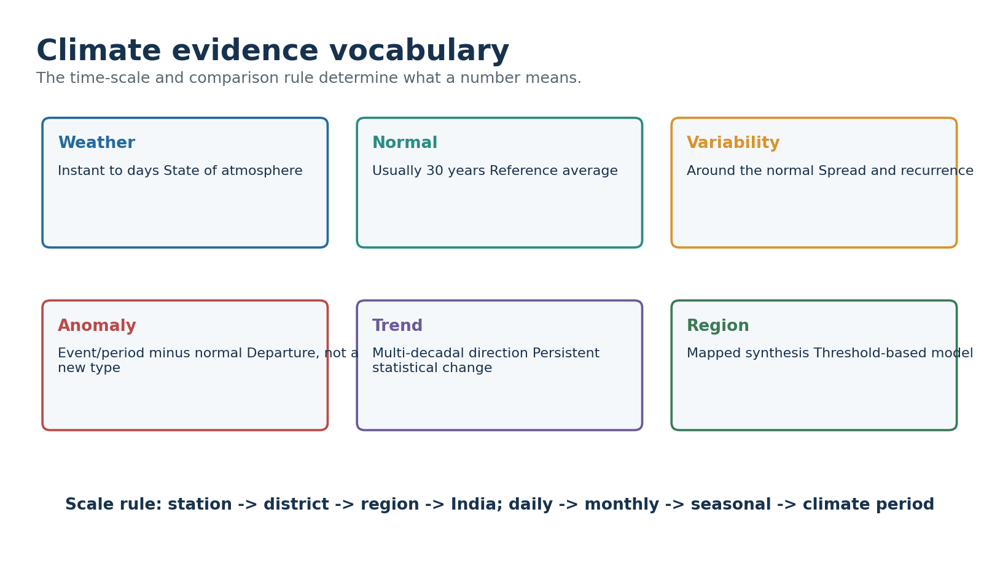

*Figure: Read horizontally from short-lived atmospheric state to long-period mapped synthesis. Original schematic; not a surveyed boundary map.*

| Term | Operational meaning | Common UPSC error |
| --- | --- | --- |
| Weather | Atmospheric state over minutes to days | Calling one event climate |
| Climate | Statistical description including means, variability and extremes | Reducing climate to average alone |
| Climatic normal | Reference average, normally 30 years; WMO standard normal updated by decade | Treating normal as a prediction |
| Variability | Spread, sequence and recurrence around a reference | Equating variability with trend |
| Anomaly | Observed value minus chosen normal | Ignoring baseline and unit |
| Trend | Estimated multi-decadal direction | Inferring it from one season |
| Regime | Recurring seasonal/dynamical pattern | Assuming fixed outcomes each year |
| Climatic region | Spatial synthesis using selected variables and thresholds | Treating boundary as a wall |

### Core learning / solution
- WMO defines climatological standard normals for consecutive 30-year periods; 1991-2020 is the current standard-normal block used for recent comparison.
- The 1961-1990 period remains important for long-term climate-change comparison; choice of baseline must be stated.
- IMD's 1991-2020 tables cover 405 observatories, use arithmetic averages and are updated decennially, while some parameters have shorter usable records.
- A region may represent a thermal-rainfall regime, a crop-planning zone or a land-resource unit. Name the scheme before naming the region.

### Must-know facts
- ✅ FACT: Normal is a reference, not a guarantee.
- ✅ FACT: Anomaly sign depends on the chosen baseline.
- ✅ FACT: Climate includes extremes and frequencies.

### UPSC traps
- ❌ **Wrong:** Normal rainfall means rain is evenly distributed.  
  ✅ **Correct:** Normal is an average; timing and spatial distribution may still be poor.
- ❌ **Wrong:** A positive anomaly proves climate change.  
  ✅ **Correct:** A trend requires repeated, quality-controlled evidence.

> 🔑 **Memory hook:** N-V-A-T-R: Normal -> Variability -> Anomaly -> Trend -> Region; each step increases the claim and evidence burden.

**Mains angle:** Begin answers by stating the temporal and spatial scale. This prevents confusion between a July departure, a monsoon regime and a climate type.

**Static link:** Geography -> Climatology -> Climate data and interpretation

---

## 3. Controls over India: The Coupled System

India lies across tropical and subtropical latitudes, but its climate is produced by coupled land-ocean-atmosphere and relief processes.

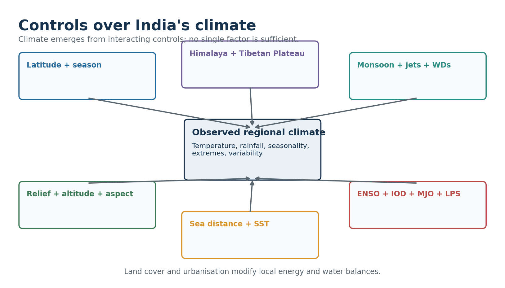

*Figure: Solid-earth, circulation, ocean and land-surface controls converge on regional climate. Original schematic; not a surveyed boundary map.*

| Control | Mechanism | Named Indian expression |
| --- | --- | --- |
| Latitude and season | Solar geometry and seasonal migration of heating belts | North-south thermal gradient; seasonal pressure reversal |
| Himalaya | Barrier, forced ascent, cold-air shielding and channelled gaps | Orographic rain; western Himalayan snow/rain; local valleys |
| Tibetan Plateau | Elevated heat source/sink and circulation coupling | Seasonal upper-air changes; not a stand-alone monsoon switch |
| Western/Eastern Ghats | Windward ascent, leeward drying and aspect | West-coast maxima; Deccan rain shadow; east-coast contrasts |
| Altitude | Pressure/temperature change, slope/aspect and snow effects | Mountain climates; variable lapse rates |
| Distance from sea | Ocean thermal inertia and moisture availability | Coastal small annual range vs north-west continentality |
| Jets and WDs | Upper-air steering, wave dynamics and winter synoptic systems | Western Himalayan winter precipitation |
| Cyclones/depressions/LPS | Moisture convergence and organised rainfall | Bay systems feeding central/eastern India; coastal hazards |
| ENSO/IOD/MJO | Remote and intraseasonal modulation of convection/circulation | Probability shifts, not deterministic commands |
| Land cover/urbanisation | Albedo, roughness, evapotranspiration and heat storage | Urban heat island; irrigated humidity; local runoff |

### Core learning / solution
- The Himalaya blocks and redirects air masses but contains passes and valleys; it is not an impermeable wall.
- The Tibetan Plateau participates in a wider seasonal circulation system. Avoid textbook monocausality.
- ENSO can alter monsoon probabilities, but IOD, MJO, snow/land conditions, Indian Ocean state and low-pressure systems can reinforce or offset effects.
- The same control can operate differently by season: relief enhances summer monsoon rainfall and shapes winter precipitation in different airflows.

### Must-know facts
- ✅ FACT: No one-factor determinism.
- ✅ FACT: Synoptic systems distribute rainfall within the seasonal monsoon envelope.
- ✅ FACT: Human land-cover change is strongest at local to regional scale.

### UPSC traps
- ❌ **Wrong:** El Niño equals drought everywhere in India.  
  ✅ **Correct:** ENSO is a probabilistic driver embedded in a multi-driver system.

**Mains angle:** Use a hierarchy: planetary/seasonal forcing -> regional circulation -> relief/land-ocean contrast -> synoptic weather -> local surface modification.

**Static link:** Geography 12-13 -> Monsoon, jet streams and western disturbances

---

## 4. India's Seasonal Rhythm

IMD's four-season convention is an analytical calendar. Actual onset, advance, active-break spells and withdrawal vary across India.

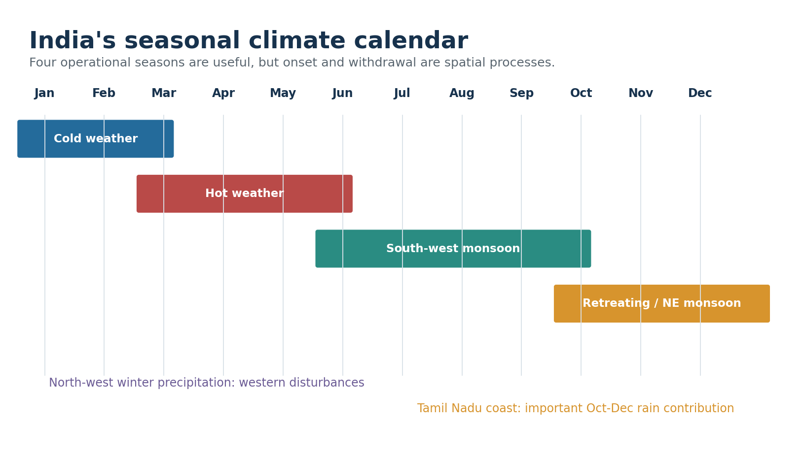

*Figure: The monsoon is a moving circulation regime, not a date switch. Original schematic; not a surveyed boundary map.*

| Season | Dominant processes | Spatial signatures |
| --- | --- | --- |
| Cold weather (Jan-Feb) | Subtropical westerlies, WDs, continental cooling, NE low-level flow | Cold north/interior; mild coasts; western Himalayan rain/snow; fog/inversions |
| Pre-monsoon hot weather (Mar-May) | Land heating, pressure fall, convection, dust storms, local thunderstorms | Heat waves; loo; Kalbaisakhi/Nor'westers; mango showers |
| South-west monsoon (Jun-Sep) | Cross-equatorial flow, monsoon trough, jets, active-break cycles, LPS | West coast/NE maxima; central rain corridor; leeward and north-west deficits |
| Retreating/NE monsoon (Oct-Dec) | Withdrawal, changing pressure, NE flow, Bay cyclones/depressions | Tamil Nadu/east-coast rain; humid heat; cyclone risk |

### Core learning / solution
- Onset over Kerala and nationwide coverage are status milestones, not fixed calendar dates for every year.
- Active and break phases reorganise rainfall even within the same season.
- North-west winter rainfall supports rabi crops but can also produce hail, avalanches and landslides.
- Tamil Nadu's late-year rainfall regime reflects coast orientation, NE flow over the Bay and cyclonic systems.

### Must-know facts
- ✅ FACT: Season definitions simplify a continuous transition.
- ✅ FACT: Retreating monsoon is not simply the reverse of the advancing monsoon.

### UPSC traps
- ❌ **Wrong:** India receives rain only in June-September.  
  ✅ **Correct:** Winter WDs, pre-monsoon storms and NE-monsoon/cyclonic rain matter regionally.

**Mains angle:** A season answer should combine circulation, synoptic systems and a small India map with named regional contrasts.

**Static link:** Geography -> Indian monsoon mechanism and weather systems

---

## 5. Spatial Temperature Patterns

Temperature fields reflect latitude, altitude, continentality, cloud, humidity, advection and surface properties.

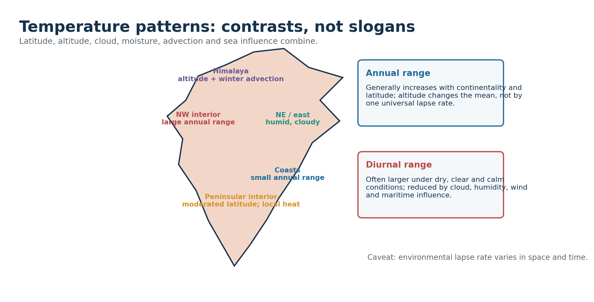

*Figure: Annual and diurnal ranges must be explained through energy balance and air-mass context. Original schematic; not a surveyed boundary map.*

| Contrast | Typical expression | Qualification |
| --- | --- | --- |
| Continental-maritime | Delhi-like interior vs Mumbai/Chennai coast | Cloud, wind and local relief modify |
| Plain-mountain | Lower mean temperature at elevation | Inversions and aspect break simple ordering |
| Dry-humid | Larger diurnal range in dry clear air | Advection and winds can dominate a day |
| Urban-rural | Warmer urban nights | Magnitude depends on city form and weather |

### Core learning / solution
- North-west interiors commonly show larger annual ranges because land heats/cools rapidly and winter advection is stronger; coasts are moderated by ocean thermal inertia.
- Altitude lowers mean temperature in broad terms, but the environmental lapse rate is variable and inversions can make valleys colder than slopes.
- Cloud and humidity reduce daytime heating and night-time cooling, narrowing diurnal range; dry clear conditions often widen it.
- Heat stress is not captured by air temperature alone: humidity, wind, radiation, night-time minima and acclimatisation matter.
- Urban built surfaces, low vegetation and anthropogenic heat can elevate night-time temperatures relative to rural surroundings.

### UPSC traps
- ❌ **Wrong:** Use a universal 6.5°C/km for every case.  
  ✅ **Correct:** State that environmental lapse rate varies; use only as a broad climatological approximation if needed.

**Mains angle:** Explain both the mean and the range. A map showing north-west continentality, coasts and mountains earns more than a list of temperatures.

**Static link:** Geography -> Atmospheric temperature and heat budget

---

## 6. Spatial Rainfall Patterns and Extremes

India's rainfall map is shaped by moisture pathways, relief orientation, convergence, synoptic systems and seasonal timing.

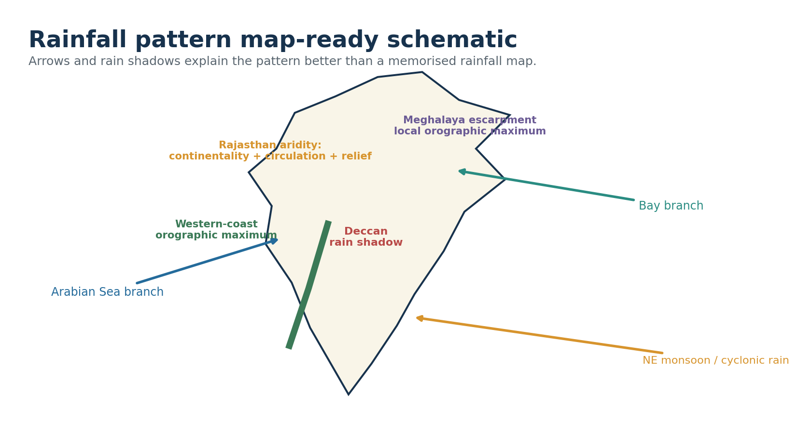

*Figure: The schematic links moisture branches to orographic maxima, rain shadows and seasonal east-coast rain. Original schematic; not a surveyed boundary map.*

| IMD realised-rainfall departure | Range |
| --- | --- |
| Large Excess | ≥ +60% |
| Excess | +20% to +59% |
| Normal | −19% to +19% |
| Deficient | −20% to −59% |
| Large Deficient | −60% to −99% |
| No Rain | −100% |

### Core learning / solution
- Western Ghats force ascent of Arabian Sea monsoon flow, producing a sharp windward maximum and a leeward Deccan rain shadow.
- The Bay branch and topographic funnelling help produce very high rainfall on favourably oriented Meghalaya slopes; totals fall rapidly across short distances.
- Rajasthan aridity reflects continentality, circulation, weak sustained moisture convergence and the Aravalli alignment; no single cause is adequate.
- Ladakh is a high-altitude cold desert because major ranges block moisture and the continental interior is dry.
- Tamil Nadu obtains a major share in Oct-Dec from NE flow modified over the Bay and from cyclonic disturbances.
- Annual totals conceal onset delay, long dry spells, short intense bursts and district-scale opposites.

### Must-know facts
- ✅ FACT: Operational realised-rainfall categories differ from seasonal forecast categories.
- ✅ FACT: A normal all-India value can coexist with major regional deficits.

### UPSC traps
- ❌ **Wrong:** Normal category means no flood or drought risk.  
  ✅ **Correct:** Distribution, extremes, dry-spell length and exposure remain decisive.

**Mains angle:** Map the west coast, Meghalaya, Thar, Ladakh, Deccan rain shadow and Tamil Nadu; then explain the circulation-relief interaction.

**Static link:** Geography -> Indian monsoon, rainfall variability and extremes

---

## 7. How Climatic Regionalisation Works

Regionalisation turns continuous fields into discrete units for a stated purpose. It is a modelling operation, not discovery of natural walls.

| Choice | Why it matters | Good disclosure |
| --- | --- | --- |
| Station vs grid | Interpolation and sparse coverage alter boundaries | State source/resolution |
| Period | Climate means and seasonality evolve | State years/baseline |
| Threshold | Near-threshold locations can flip code | Show transition/caveat |
| Scale | Microclimates disappear in broad maps | Match scale to question |
| Purpose | No scheme is best for all uses | Name intended application |

### Core learning / solution
- **Choose purpose:** description, biome relation, agricultural planning, water design, building design or hazard services.
- **Select variables:** monthly temperature, monthly/seasonal precipitation, aridity, growing period, extremes or combinations.
- **Choose data support:** stations, gridded observations, reanalysis or model output; each represents space differently.
- **Fix period and baseline:** a 30-year block may produce different threshold crossings from another block.
- **Apply thresholds:** empirical categories simplify climate but create boundary sensitivity.
- **Map transitions:** broad gradients, mosaics and mountain/coastal complexity should be acknowledged.
- **Validate use:** a classification useful for vegetation may be insufficient for flood risk or crop irrigation.

### Must-know facts
- ✅ FACT: Regions are models.
- ✅ FACT: Boundaries are usually zones of transition.
- ✅ FACT: Classification and causal explanation are complementary.

### UPSC traps
- ❌ **Wrong:** A precise line implies precise nature.  
  ✅ **Correct:** Cartographic precision may conceal data and threshold uncertainty.

> 🔑 **Memory hook:** P-V-D-P-T-S-U: Purpose, Variables, Data, Period, Threshold, Scale, Use.

**Mains angle:** This seven-step method is the ideal introduction or qualification paragraph for any regionalisation question.

**Static link:** Geography -> Quantitative methods, maps and regional planning

---

## 8. Köppen Fundamentals

Köppen compresses monthly temperature and precipitation seasonality into letter codes with an intended vegetation-climate relationship.

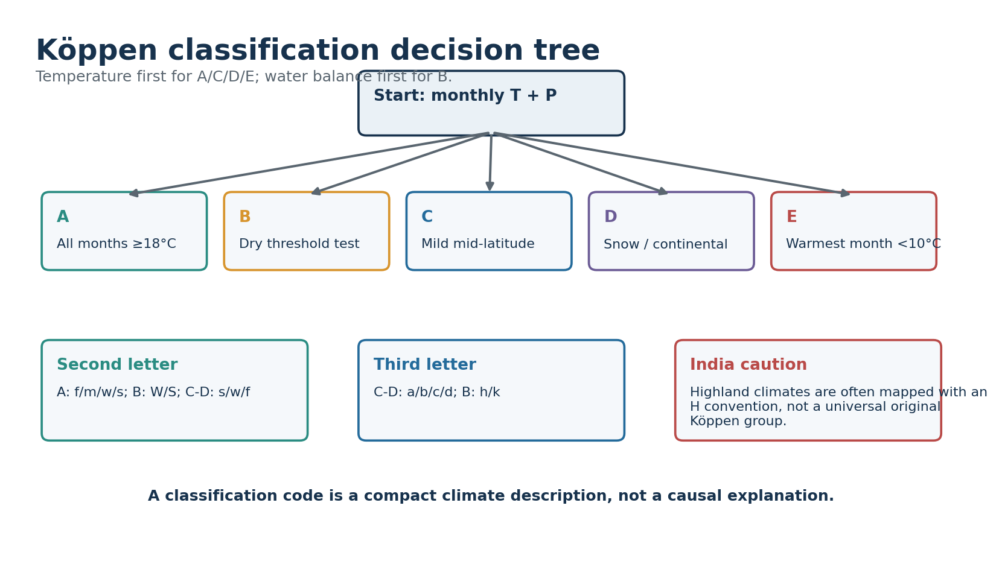

*Figure: The first letter sets the major group; later letters refine seasonality and thermal character. Original schematic; not a surveyed boundary map.*

| Group | Core logic | India relevance |
| --- | --- | --- |
| A Tropical | All months mean temperature ≥18°C | Large lowland areas; Af/Am/Aw distinctions |
| B Dry | Annual precipitation below temperature-seasonality threshold | Thar and semi-arid interiors; BW/BS and h/k |
| C Temperate/mild mid-latitude | Coldest-month and warmest-month thermal thresholds | North plains/NE/highland margins depending convention |
| D Snow/continental | Colder winter than C with warm season | Higher/northern mountain contexts in some mappings |
| E Polar | Warmest month below 10°C | Highest cold mountain areas in some implementations |
| H Highland | Common mapping convention, not a universal original major group | Himalayan complexity; requires explicit caveat |

### Core learning / solution
- For C/D separation, historical Köppen implementations used −3°C for the coldest month; many modern maps use 0°C. State the convention if precision matters.
- A second letters: f no dry season, m monsoon, w dry winter, s dry summer.
- B second letters: W desert, S steppe; B third letters commonly h hot and k cold.
- C/D second letters: s dry summer, w dry winter, f no dry season; third letters a hot summer, b warm summer, c cool/short summer and d very severe winter.
- Code describes climatic pattern. Relief, monsoon circulation and continentality explain why it occurs.

### UPSC traps
- ❌ **Wrong:** H is always an original Köppen first-order group.  
  ✅ **Correct:** Highland is a widely used later/cartographic convention; disclose it.
- ❌ **Wrong:** Every Indian Köppen map must be identical.  
  ✅ **Correct:** Different periods, grids and C/D conventions create differences.

**Mains angle:** Use Köppen for compact thermal-rainfall comparison, then add causation, transitions and application limits.

**Static link:** Geography -> World climate classification and biomes

---

## 9. Köppen Thresholds: Accurate UPSC Depth

Thresholds must be used accurately but need not be turned into unexamined arithmetic.

| Code test | Threshold logic |
| --- | --- |
| Af | Driest month precipitation ≥60 mm |
| Am | Driest month <60 mm but ≥ 100 − (annual precipitation / 25) |
| Aw/As | Driest month below monsoon threshold; dry winter/summer orientation |
| B threshold R | R = 20T; 20T + 140; or 20T + 280 according to precipitation seasonality |
| BW | Annual precipitation < half of R |
| BS | Annual precipitation between half of R and R |
| s in C/D | Driest summer month <40 mm and < one-third wettest winter month |
| w in C/D | Driest winter month < one-tenth wettest summer month |

### Core learning / solution
- The B test comes before assigning A/C/D in dry settings because water balance, not temperature alone, defines dry climate.
- For the dry threshold, the seasonal adjustment depends on how much annual rain falls in the high-sun/summer half-year. Textbook month blocks differ by hemisphere.
- A threshold result near the boundary should be treated as sensitive to record period, missing data and grid/station representation.
- Do not compare annual precipitation to a universal desert value; temperature and rainfall seasonality alter atmospheric water demand.

### Must-know facts
- ✅ FACT: BW is drier than BS.
- ✅ FACT: Am is not simply 'very rainy Aw'; it satisfies a specific monsoon threshold.
- ✅ FACT: As is much less extensive than Aw globally and must not be casually assigned.

### UPSC traps
- ❌ **Wrong:** Use the 60 mm rule for B climates.  
  ✅ **Correct:** The 60 mm driest-month test belongs to tropical Af differentiation, not the dry-climate threshold.

**Mains angle:** In Mains, show the decision logic and one worked verbal example; formula dumping without interpretation earns little.

**Static link:** Geography -> Köppen thresholds and climate graphs

---

## 10. India Köppen-Type Distribution: Cautious Map-Ready Zones

India is best shown as a transition mosaic. The labels below are broad study anchors, not one authoritative official national map.

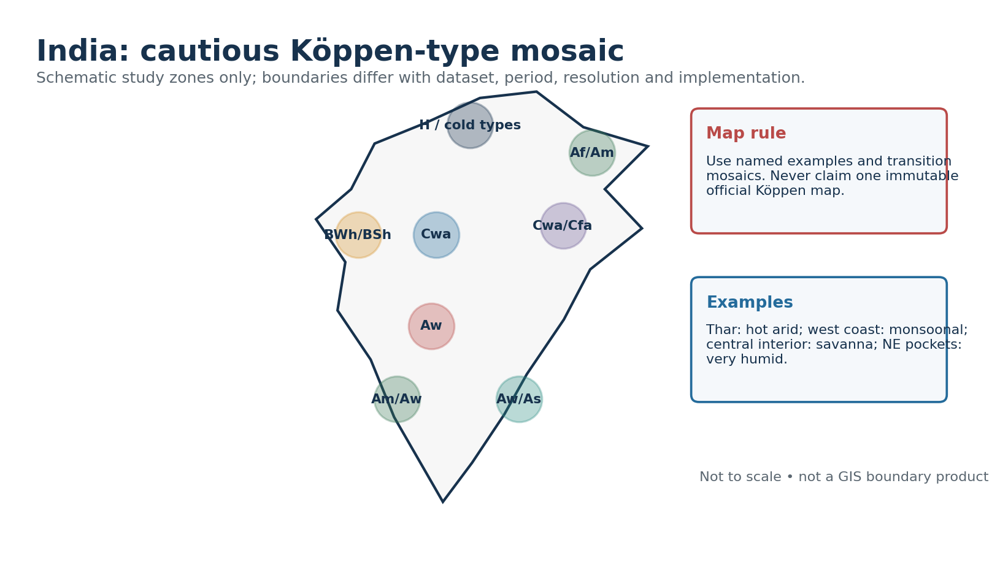

*Figure: Named zones are schematic and explicitly sensitive to period and implementation. Original schematic; not a surveyed boundary map.*

| Broad study zone | Likely type(s) | Named examples and caveats |
| --- | --- | --- |
| Western arid and semi-arid | BWh/BSh | Thar and adjoining margins; irrigation does not by itself change regional climate code |
| Central/peninsular seasonal interior | Aw with BSh mosaics | Distinct wet and dry seasons; relief and soil create local mosaics |
| West-coast windward belt | Am; local Af-like very humid pockets in some datasets | Strong monsoonal rain; short dry-season treatment varies |
| Tamil Nadu/east-coast sectors | Aw/As/Cwa-like assignments vary | Late-year rainfall and local thermal thresholds complicate mapping |
| North plains | Cwa and BSh/Aw transitions | Cold-season temperature and dry-winter seasonality; urban/irrigation effects local |
| North-east and Himalayan foothills | Cwa/Cfa/Am/Af mosaics | Altitude, exposure and high rainfall create short-distance changes |
| High Himalaya | C/D/E or H conventions | Strong elevation/aspect dependence; mapping convention must be named |
| Islands | Af/Am/Aw transitions | Maritime tropical regime; seasonal rain distribution matters |

### Core learning / solution
- Use 'Köppen-type' or 'in a stated dataset' when the exact national map source is not specified.
- Boundary disagreements are expected where station records, grid cells or threshold conventions differ.
- Mountain regions may change class over very short horizontal distances, which broad national maps smooth.
- The best UPSC map labels major anchors and adds a note: schematic zones, transitions omitted.

### UPSC traps
- ❌ **Wrong:** Assign one code to an entire state.  
  ✅ **Correct:** States span altitudinal, coastal and rainfall gradients; use subregional examples.

**Mains angle:** Draw broad zones, label examples, then write one line on period/data uncertainty. This is safer than false cartographic precision.

**Static link:** Geography -> India map practice -> Climate regions

---

## 11. Stamp and Kendrew: Scheme Without List-Mixing

The local Majid Husain scan verifies the scheme and a bounded subset of nomenclature but omits printed pages containing four temperate subregions.

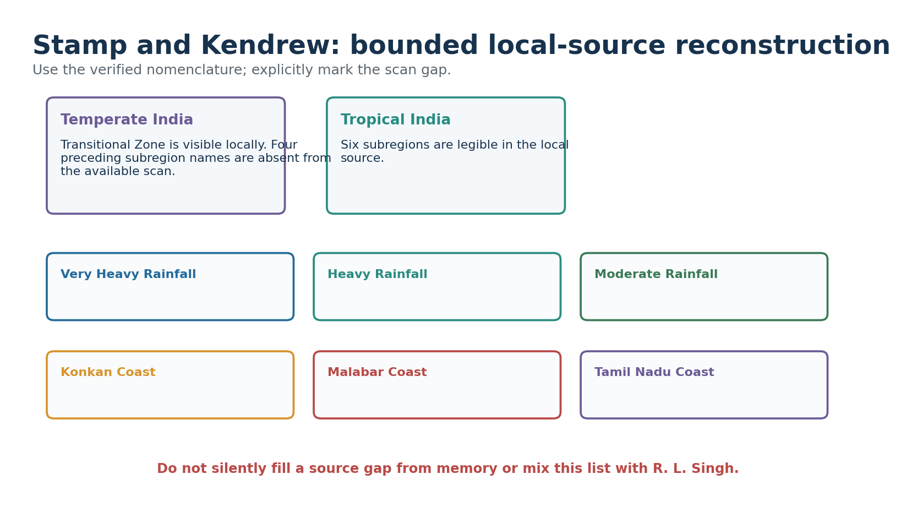

*Figure: The visual shows only locally legible names and explicitly marks the scan gap. Original schematic; not a surveyed boundary map.*

### Core learning / solution
- Stamp and Kendrew offered an India-oriented climatic regionalisation using temperature, rainfall and seasonal character.
- The local scan clearly shows a top-level Tropical India and the subregions: Very Heavy Rainfall, Heavy Rainfall, Moderate Rainfall, Konkan Coast, Malabar Coast and Tamil Nadu Coast.
- A Transitional Zone is locally visible under the preceding northern/temperate division.
- The available scan omits the printed pages containing the first four temperate subregion names. This package does not reconstruct them as certain.
- Use the scheme for comparative answer writing, not as a list to be blended with Köppen, Kendrew-only or R. L. Singh nomenclature.

### Must-know facts
- ✅ FACT: Source gap is disclosed.
- ✅ FACT: Exact list fidelity is more valuable than an invented complete list.
- ✅ FACT: Scheme purpose differs from agro-planning.

### UPSC traps
- ❌ **Wrong:** Fill missing subregions from memory.  
  ✅ **Correct:** Mark the scan gap or consult a complete authoritative edition.

**Mains angle:** Compare the scheme's India-specific descriptive purpose with Köppen's globally comparable letter-code logic.

**Static link:** Local source -> Majid Husain, Indian Geography, printed climatic-regions discussion

---

## 12. R. L. Singh and Other Indian Schemes: Answer-Worthy, Source-Bounded Use

Local evidence says R. L. Singh modified Stamp and Kendrew in 1971, producing ten major divisions using quantitative and qualitative temperature-rainfall criteria.

| Scheme family | Best exam use | Main caution |
| --- | --- | --- |
| Köppen | Global comparison through letter codes | Dataset/threshold versions |
| Stamp/Kendrew | Classic India descriptive regions | Do not mix lists |
| R. L. Singh | India refinement using T/P evidence | Local full list unavailable |
| Trewartha/modified Köppen | Thermal refinement in some sources | Version must be specified |

### Core learning / solution
- R. L. Singh's scheme is India-specific and intended to refine earlier regionalisation; it should not be relabelled as Köppen.
- The surviving local page provides detail only for Humid North-East: annual rainfall above 200 cm; July about 25-33°C; January about 10-25°C.
- The source's stated extent for that subregion excludes Tripura. This is reported as source evidence, not generalised beyond the scheme.
- Because the local scan does not preserve a reliable complete ten-name list, this package does not present one as verified.
- Kendrew, Trewartha and modified Köppen may be mentioned only to compare variables and purpose when the exact version/source is named.

### UPSC traps
- ❌ **Wrong:** A named scholar guarantees one timeless list.  
  ✅ **Correct:** Editions and modifications differ; cite the source used.

**Mains angle:** A scheme-comparison answer should compare variables, scale and purpose rather than reward raw list length.

**Static link:** Geography -> Regional geography -> History of Indian climatic classification

---

## 13. Four Frameworks Compared

The same district can legitimately carry a Köppen code, belong to a Stamp region, fall in one agro-climatic zone and one agro-ecological region.

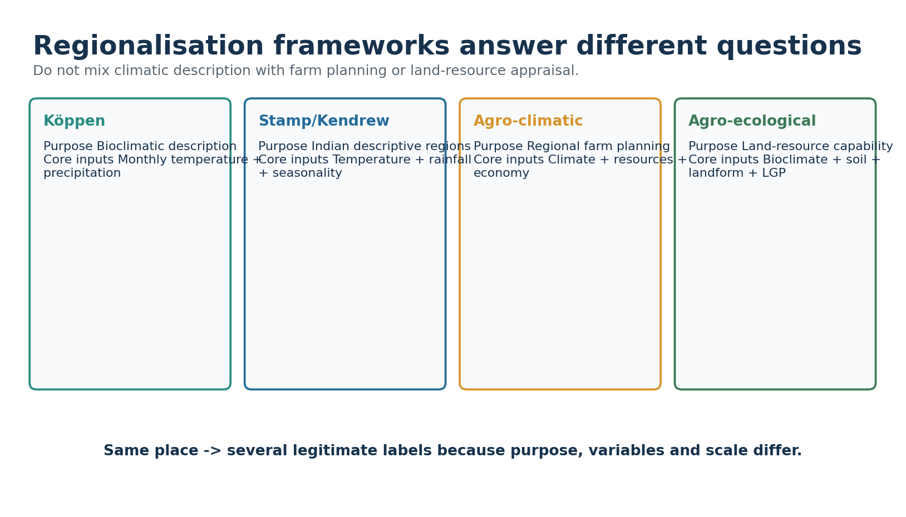

*Figure: Different labels coexist because each framework asks a different question. Original schematic; not a surveyed boundary map.*

| Framework | Primary variables | Scale/purpose | Not a substitute for |
| --- | --- | --- | --- |
| Köppen | Monthly temperature and precipitation | Bioclimatic comparison | Hazard/exposure analysis |
| Stamp/Kendrew or R. L. Singh | India-specific T/P and seasonality | Descriptive regional geography | Farm investment plan |
| Planning Commission ACRP | Agro-climate, resources and socio-economy | Regional agricultural planning | Pure climate taxonomy |
| NBSS&LUP AER | Bioclimate/LGP, soil and landform | Land-resource capability | Daily weather forecast |

### Core learning / solution
- Classification quality is judged against purpose, not by the number of regions.
- Global comparability favours Köppen; India-specific planning can require more variables.
- A planning region may deliberately follow operational/administrative feasibility rather than a climatic threshold alone.
- For climate risk, combine regional baseline with hazard frequency, exposure, vulnerability and adaptive capacity.
- **Error check:** Do not ask which scheme is universally best; ask which scheme serves the stated use and scale.

**Mains angle:** This comparison is a ready-made 15-mark structure: definition, matrix, Indian example, limitation and verdict.

**Static link:** Geography -> Regional planning -> Classification methods

---

## 14. Planning Commission's 15 Agro-Climatic Regions

The Agro-Climatic Regional Planning project, initiated in 1988, divided India into 15 regions and 73 subregions for resource-based agricultural planning.

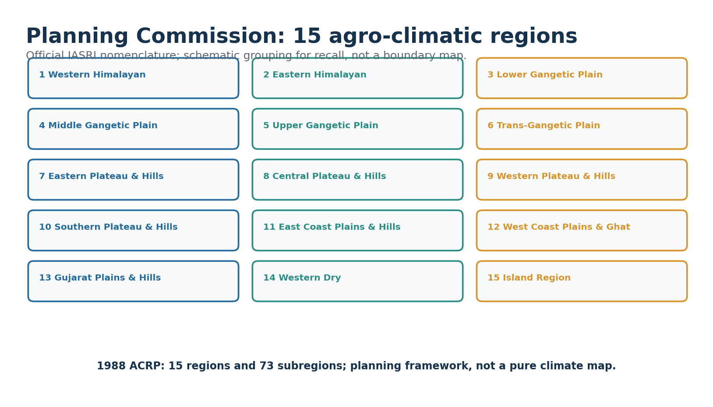

*Figure: The names follow the official IASRI table; the visual is not a boundary map. Original schematic; not a surveyed boundary map.*

| No. | Official region name | Planning cue |
| --- | --- | --- |
| 1 | Western Himalayan | Mountain farming, horticulture, water/erosion constraints |
| 2 | Eastern Himalayan | High rainfall, slopes, diverse crops and access constraints |
| 3 | Lower Gangetic Plain | Deltaic/wetland and flood-water management |
| 4 | Middle Gangetic Plain | Alluvial agriculture, flood/drought variability |
| 5 | Upper Gangetic Plain | Intensive irrigation, groundwater and diversification |
| 6 | Trans-Gangetic Plain | High-input systems, water/soil sustainability |
| 7 | Eastern Plateau and Hills | Rainfed farming, tribal livelihoods, land degradation |
| 8 | Central Plateau and Hills | Rainfed variability and watershed management |
| 9 | Western Plateau and Hills | Black soils, drought variability and crop choices |
| 10 | Southern Plateau and Hills | Mixed rainfed/irrigated systems and tank waters |
| 11 | East Coast Plains and Hills | Delta irrigation, cyclones and salinity |
| 12 | West Coast Plains and Ghat | High rainfall, plantations and slope management |
| 13 | Gujarat Plains and Hills | Semi-arid variability, irrigation and coastal issues |
| 14 | Western Dry | Aridity, pastoralism, groundwater and irrigation limits |
| 15 | Island Region | Small-island soils, water and coastal exposure |

### Core learning / solution
- Objectives included optimising production, farm income and employment, improving irrigation use and reducing regional inequality.
- The framework integrates environmental, technological and socio-economic considerations; it is not a map of climate alone.
- Use the official names exactly. 'West Coast Plains and Ghat' is retained as in the IASRI table.
- Current applicability should be discussed with changing markets, irrigation stress, urbanisation and climate risk.

### UPSC traps
- ❌ **Wrong:** Call the 15 regions India's Köppen zones.  
  ✅ **Correct:** They are agricultural-planning regions with broader inputs.

> 🔑 **Memory hook:** 2 Himalaya + 4 Gangetic/Trans-Gangetic + 4 Plateau/Hills + 2 Coasts + Gujarat + Western Dry + Islands = 15.

**Mains angle:** Use three representative regions to show how the same climatic opportunity is mediated by water, technology and institutions.

**Static link:** Economy/Agriculture -> Regional planning and sustainable resource use

---

## 15. NBSS&LUP Agro-Ecological Regions

Agro-ecological regionalisation overlays bioclimate/growing period with soils and landform. The local source records 20 broad regions and 60 subregions.

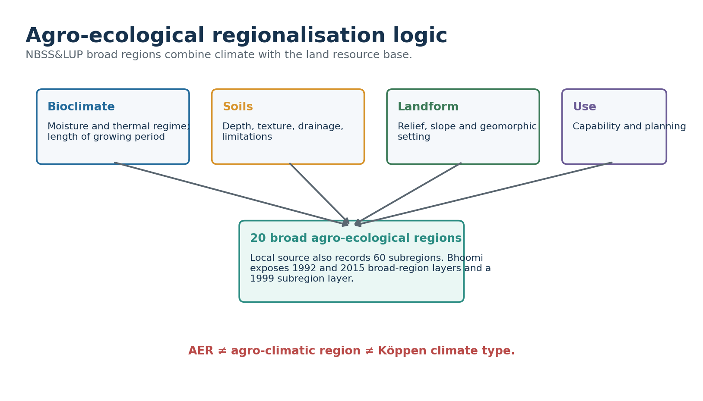

*Figure: AER starts where a pure climate map stops: it adds land capability and growing-period constraints. Original schematic; not a surveyed boundary map.*

| Question | Climate region | Agro-ecological region |
| --- | --- | --- |
| What is classified? | Atmospheric regime | Land-resource environment |
| Core data | Temperature/precipitation | Bioclimate + soil + landform/LGP |
| Typical use | Description/comparison | Capability, crop and conservation planning |
| Boundary meaning | Climate threshold | Integrated resource-unit threshold |

### Core learning / solution
- Length of growing period approximates the duration during which moisture and temperature permit crop growth; it is not identical to annual rainfall.
- Soil depth, texture, drainage and limitations control how rainfall translates into plant-available water.
- Landform and slope shape erosion, runoff, mechanisation and irrigation feasibility.
- The NBSS&LUP Bhoomi portal exposes broad AER layers for 1992 and 2015 and an agro-ecological subregion layer for 1999.
- Version/date qualification matters because mapping and planning layers evolve.

### UPSC traps
- ❌ **Wrong:** 20 AERs are 20 climatic regions.  
  ✅ **Correct:** AERs are integrated biophysical land-resource regions.

**Mains angle:** Distinguish ACRP's 15 planning regions from NBSS&LUP's 20 broad AERs in one comparative table.

**Static link:** Geography -> Soils, agriculture and land-resource planning

---

## 16. Climate-Soil-Vegetation-Crop-Settlement Links Without Determinism

Climate sets opportunities and constraints, but irrigation, technology, markets, culture, property relations and policy mediate outcomes.

| Climate setting | Biophysical tendency | Indian examples | Human mediation |
| --- | --- | --- | --- |
| Humid west coast/NE | Leaching, dense natural vegetation, high runoff | Plantations, rice, spices, forest mosaics | Terracing, drainage, roads, market access |
| Seasonally humid central/peninsular | Strong wet-dry rhythm, deciduous vegetation | Millets, pulses, cotton/soybean in suitable soils | Reservoirs, groundwater, seed choice, MSP/markets |
| Semi-arid west/interior | Moisture deficit, sparse cover, erosion risk | Pastoralism, millets, oilseeds | Irrigation, drought insurance, water governance |
| Alluvial north plains | Seasonal heat/cold, monsoon plus irrigation | Rice-wheat, sugarcane, diversified horticulture | Canals/tube wells, procurement, pollution and groundwater costs |
| Mountain climate | Altitude/aspect zonation, slope hazards | Horticulture, pastoral systems, tourism settlements | Roads, cold chains, terrace management, hazard regulation |
| Coastal/deltaic | Humidity, salinity/cyclone/flood exposure | Rice, fisheries, ports and dense settlements | Embankments, drainage, warnings and resilient housing |

### Core learning / solution
- Soil is not produced by climate alone: parent material, relief, organisms, time and human management matter.
- Natural vegetation reflects disturbance history as well as climate; fire, grazing and land use can maintain grasslands.
- Crop geography increasingly reflects irrigation, prices, procurement, technology and logistics.
- Settlement density relates to water, soils, transport, jobs, history and governance—not rainfall alone.

### UPSC traps
- ❌ **Wrong:** Humid climate inevitably means dense forest today.  
  ✅ **Correct:** Land use, fire, extraction and settlement can transform cover.

**Mains angle:** Use the phrase 'climatic opportunity/constraint mediated by institutions and technology' to avoid deterministic answers.

**Static link:** Geography -> Soils, natural vegetation, agriculture and settlement

---

## 17. Microclimates and Local Climate

Microclimates are local departures created by surface, topography and geometry within a broader regional climate.

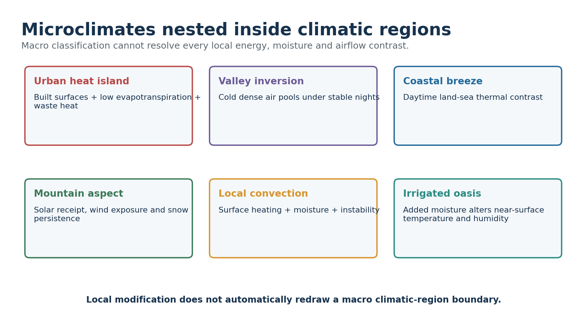

*Figure: Local contrasts are real but do not automatically redefine the macro-region. Original schematic; not a surveyed boundary map.*

| Microclimate | Mechanism | Planning relevance |
| --- | --- | --- |
| Urban heat island | Heat storage, low evapotranspiration, urban geometry, waste heat | Cool roofs, shade, ventilation, green-blue infrastructure |
| Valley inversion | Radiational cooling, cold-air drainage and stable pooling | Frost, fog and pollution exposure |
| Coastal breeze | Daytime/night-time land-sea thermal contrast | Ventilation, humidity and pollution dispersion |
| Slope aspect | Different solar receipt and wind exposure | Horticulture, snow persistence and habitat |
| Local convection | Surface heating, moisture and instability | Thunderstorm and flash-flood nowcasting |
| Irrigated landscape | Evapotranspiration and humidity changes | Heat comfort, fog and crop-water trade-offs |

### Core learning / solution
- Scale is explicit: a city, valley or slope can differ from its regional background without changing the national map.
- Urban heat and regional warming can compound, especially through warmer nights and humid heat.
- A climate service for a city needs neighbourhood-scale observations, not only the nearest synoptic station.

### UPSC traps
- ❌ **Wrong:** Urban heat island is synonymous with climate change.  
  ✅ **Correct:** UHI is local; global/regional warming changes the background on which it operates.

**Mains angle:** Pair one labelled cross-section with mitigation measures linked to the mechanism.

**Static link:** Geography -> Urbanisation, local winds and mountain climatology

---

## 18. Climate Change: Trends, Extremes and Possible Boundary Shifts

Climate change can alter thermal and moisture regimes, but classification-map shifts require a separate threshold analysis.

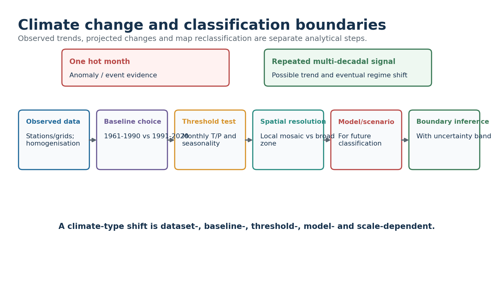

*Figure: The chain separates raw observation from a defensible reclassification claim. Original schematic; not a surveyed boundary map.*

| Change dimension | Regional implication | Required caution |
| --- | --- | --- |
| Warming | Heat stress, crop phenology, snowline/thermal-zone pressure | UHI and land use can amplify locally |
| Rain variability/extremes | Flood-drought coexistence; infrastructure stress | Mean rainfall alone is insufficient |
| Humid heat | Health and labour productivity risk | Needs humidity/wet-bulb and exposure data |
| Cryosphere | Seasonal runoff and hazard changes | Basin/glacier heterogeneity |
| Aridity | Soil moisture and water-demand stress | Irrigation and CO2 effects complicate |
| Boundary shift | Potential Köppen/AER remapping | Conditional analytical result, not instant fact |

### Core learning / solution
- **MoES/IITM FACT:** India warmed about 0.7°C during 1901-2018.
- **FACT:** Tropical Indian Ocean sea-surface temperature rose about 1°C during 1951-2015; atmospheric moisture increased.
- **FACT:** Localised heavy precipitation increased significantly over Central India; drought frequency and affected area increased since 1950.
- **FACT:** Hindu Kush Himalaya warming was around 0.2°C per decade over the preceding 6-7 decades, with overall snow/glacier decline and a Karakoram qualification.
- **PROJECTION:** Mean monsoon precipitation, extremes and interannual variability are projected to rise under warming, conditional on scenario and model.
- **INFERENCE:** Aridity, humid-heat and thermal-zone boundaries may shift, but exact maps depend on dataset, baseline, threshold, resolution and model.

### UPSC traps
- ❌ **Wrong:** One extreme proves a new climate type.  
  ✅ **Correct:** Use multi-decadal observations and rerun the classification thresholds.

**Mains angle:** Separate observed trend, attribution, projection and adaptation. Add a line that classification shifts are conditional on method.

**Static link:** Environment -> Climate change over the Indian region

---

## 19. Current Linkage: July-August 2026

The current linkage is an evidence-label exercise. It demonstrates spatial variability and the difference between observed status and forecast.

| Label | Official evidence | Interpretation |
| --- | --- | --- |
| FACT / observed July 2026 | All-India rainfall 283.3 mm vs 280.5 mm LPA: +1% | National near-normal total |
| FACT / observed July 2026 | East & NE 299.8 mm: sixth-lowest July since 1901 | Regional deficit hidden by national mean |
| FACT / observed July 2026 | South Peninsula 152.6 mm: tenth-lowest | Another regional shortfall |
| FACT / observed July 2026 | Central India 426.8 mm: thirteenth-highest since 1901 | Opposite regional anomaly |
| FACT / observed July 2026 | 3,019 heavy; 918 very heavy; 269 extremely heavy events | Event counts matter beyond mean |
| FACT / temperature | All-India July mean anomaly +0.59°C; max +0.51°C; min +0.68°C | Warm month relative to normal |
| STATUS / ERF 30 Jul | Week ending 29 Jul +1%; cumulative 1 Jun-29 Jul −15%, operationally normal | Period and category must be stated |
| FORECAST / 17 Aug | Heavy to very heavy rain forecast with depression over NW Bay/coasts | Forecast, not observed climate |

### Core learning / solution
- Kerala monsoon onset was 4 June 2026, three days after normal; nationwide coverage was achieved by 9 July.
- Four low-pressure systems matched the climatological count, while 24 LPS days exceeded the cited average of 13.56 days.
- **INFERENCE:** India can be simultaneously wet and dry across subregions; a climatic-region framework should retain spatial variability.
- **LIMIT:** One month's anomaly does not redefine Köppen, Stamp or agro-ecological boundaries.
- **LAST-SIX-MONTH CHECK:** The July summary and 17 August status/forecast are within six months of the package date.

### Must-know facts
- ✅ FACT: Observed status and forecast are separated.
- ✅ FACT: The anomaly baseline is retained.
- ✅ FACT: No reclassification claim is made.

### UPSC traps
- ❌ **Wrong:** Use a forecast as evidence of an observed trend.  
  ✅ **Correct:** Label FACT/STATUS/FORECAST/INFERENCE/LIMIT separately.

**Mains angle:** Use July 2026 as a contemporary example of aggregation bias and why regional climate services need spatial detail.

**Static link:** Current Affairs -> IMD climate summary and extended-range/press releases

---

## 20. Applications: Classification Plus Climate Services

A climate-region map is a first layer. Decisions need normals, variability, extremes, exposure, vulnerability and forecasts.

| Application | What region map contributes | What must be added |
| --- | --- | --- |
| Agriculture | Thermal/moisture regime and season length | Soil, LGP, irrigation, forecast, price and risk |
| Water | Recharge/seasonality context | Basin hydrology, demand, extremes and storage |
| Health | Heat/humidity and vector habitat baseline | Age, work, housing, surveillance and warnings |
| Buildings | Passive-design climate context | Urban form, materials, orientation and future extremes |
| Disaster planning | Background rainfall/temperature regime | Hazard intensity, return period, exposure and evacuation |
| Biodiversity | Broad habitat-climate envelope | Fragmentation, disturbance, migration corridors and species data |
| Regional planning | Resource opportunity/constraint | Institutions, equity, infrastructure and scenarios |

### Core learning / solution
- Climate services translate observations, forecasts and projections into sector-specific decisions.
- Classification is strongest for broad comparison and weakest for predicting rare extremes.
- Equity matters: two settlements in the same climatic region can have very different risk because housing, income and services differ.

### UPSC traps
- ❌ **Wrong:** A climate code is a complete adaptation plan.  
  ✅ **Correct:** Pair the code with hazard, exposure, vulnerability and adaptive capacity.

**Mains angle:** End policy answers with a layered framework: region baseline + extremes + socioeconomic exposure + adaptive institutions.

**Static link:** GS-III -> Disaster management, agriculture, health and climate services

---

## 21. Limitations and Advanced Refinements

Classification is useful because it simplifies; its limitations arise from the same simplification.

### Core learning / solution
- Threshold sensitivity: near-boundary values can change code with small data or period differences.
- Spatial smoothing: gridded maps can hide valleys, ridges, coasts and city microclimates.
- Temporal stationarity: historical normals may not represent future design conditions under rapid warming.
- Variable omission: two places with the same code can differ in extremes, wind, humidity and rainfall intensity.
- Data quality: station moves, urbanisation, missing records and interpolation require quality control/homogenisation.
- Causal silence: the code describes pattern but does not explain monsoon dynamics or relief effects.
- Social silence: no climate map contains exposure, inequality, institutions or adaptive capacity.
- Ecological lag: vegetation and soils may not equilibrate instantly with a changing climate.
- Model spread: future zone maps vary by scenario, climate model, downscaling and bias correction.

### Must-know facts
- ✅ FACT: Use ensembles and uncertainty bands for future maps.
- ✅ FACT: Keep observed anomaly, trend and projection labels separate.
- ✅ FACT: Version every planning layer.

### UPSC traps
- ❌ **Wrong:** Limitations make classification useless.  
  ✅ **Correct:** A bounded model is useful when matched to purpose and supplemented appropriately.

**Mains angle:** A critical answer should retain utility while qualifying scale, thresholds, data and decision context.

**Static link:** Geography -> Models, uncertainty and climate-risk assessment

---

## 22. India Map and Answer Toolkit

A compact map should explain the answer, not decorate it.

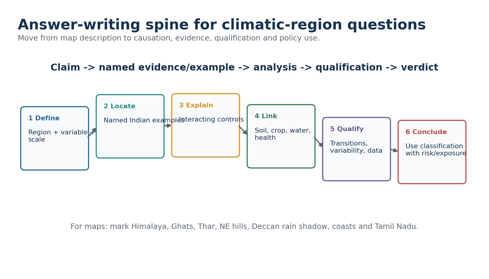

*Figure: The six-step sequence converts factual recall into analysis. Original schematic; not a surveyed boundary map.*

### Core learning / solution
- **Base map anchors:** Himalaya/Tibetan Plateau, Western and Eastern Ghats, Thar, north plains, central plateau, NE hills, coasts and islands.
- **Rainfall arrows:** Arabian Sea branch, Bay branch, west-coast ascent, Meghalaya ascent, leeward Deccan and NE-monsoon/east-coast flow.
- **Temperature labels:** north-west continentality, maritime coasts, altitude belts and inversion-prone valleys.
- **Classification labels:** show broad Köppen-type anchors and write 'schematic; transition mosaics omitted'.
- **Planning labels:** never put the 15 ACRP names on a map and call it a climatic classification.
- **Conclusion:** classification is a decision-support layer, not a substitute for variability, extremes and vulnerability.

> 🔑 **Memory hook:** D-L-E-L-Q-V: Define, Locate, Explain, Link, Qualify, Verdict.

**Mains angle:** Use one map, one mechanism chain and one caveat box. Every label must serve the directive.

**Static link:** Answer writing -> GS-I India geography

---

## 23. Solved Prelims PYQ: Isotherms in January (2024, Series A, Q4)

**Question:** Which inference(s) are correct from January isothermal maps? 1. Isotherms deviate north over ocean and south over continent. 2. Cold currents, Gulf Stream and North Atlantic Drift make the North Atlantic colder and bend isotherms north.

| Option | Text |
| --- | --- |
| A | 1 only |
| B | 2 only |
| C | Both 1 and 2 |
| D | Neither 1 nor 2 |

### Core learning / solution
- **Answer:** A — 1 only
- **Key status:** OFFICIALLY VERIFIED — UPSC 2024 final key, Series A Q4 = A.
- **Elimination and explanation:** Statement 1 captures winter land-ocean thermal contrast in the Northern Hemisphere. Statement 2 is false because the Gulf Stream/North Atlantic Drift are warm currents and help bend isotherms poleward.
- **Fixed-option rule:** PYQ wording and option order are retained; original-MCQ answer rotation never alters an official question.

**Mains angle:** Prelims method: test each statement/descriptor against the physical mechanism, not against a memorised label alone.

**Static link:** Prelims -> Climatology and India regional geography

---

## 24. Solved Prelims PYQ: Marine West Coast Climate (2024, Series A, Q13)

**Question:** Annual and daily temperature ranges are low; precipitation occurs throughout the year; annual precipitation is 50-250 cm. What is the climate?

| Option | Text |
| --- | --- |
| A | Equatorial climate |
| B | China type climate |
| C | Humid subtropical climate |
| D | Marine West coast climate |

### Core learning / solution
- **Answer:** D — Marine West coast climate
- **Key status:** OFFICIALLY VERIFIED — UPSC 2024 final key, Series A Q13 = D.
- **Elimination and explanation:** Strong oceanic moderation keeps annual and daily ranges low, while westerly maritime influence supports year-round precipitation. Equatorial climate is warmer with a different thermal setting; humid-subtropical/China types normally have stronger summer rainfall concentration.
- **Fixed-option rule:** PYQ wording and option order are retained; original-MCQ answer rotation never alters an official question.

**Mains angle:** Prelims method: test each statement/descriptor against the physical mechanism, not against a memorised label alone.

**Static link:** Prelims -> Climatology and India regional geography

---

## 25. Solved Prelims PYQ: Andaman and Nicobar Climate (2026, Series A, Q33)

**Question:** With reference to the climate of Andaman and Nicobar Islands: 1. Humid tropical coastal climate. 2. Rainfall from both SW and NE monsoons. 3. Maximum precipitation between December and May.

| Option | Text |
| --- | --- |
| A | 1 only |
| B | 1 and 2 |
| C | 2 and 3 |
| D | 3 only |

### Core learning / solution
- **Answer:** B — 1 and 2
- **Key status:** INFERRED ANSWER — NOT OFFICIALLY VERIFIED. Local file is a provisional key whose answer grid could not be reliably machine-read. Confidence: HIGH, based on climatic mechanism and elimination.
- **Elimination and explanation:** The islands are humid, tropical and maritime; both monsoonal flow regimes contribute. The main wet season is not December-May, so statement 3 is rejected.
- **Fixed-option rule:** PYQ wording and option order are retained; original-MCQ answer rotation never alters an official question.

**Mains angle:** Prelims method: test each statement/descriptor against the physical mechanism, not against a memorised label alone.

**Static link:** Prelims -> Climatology and India regional geography

---

## 26. Solved Mains PYQ: Desertification Beyond Climate Boundaries (2020)

**Verified official-paper wording:** The process of desertification does not have climatic boundaries. Justify with examples. (10 marks, 150 words)

### Core learning / solution
- **Claim:** Desertification is land degradation in drylands, but degradation processes resembling it can occur across climatic settings when human pressure and geomorphic vulnerability reduce biological productivity.
- **Named evidence:** Wind erosion and salinisation affect arid Rajasthan and irrigated tracts; water erosion and mining degrade humid/sub-humid hill and plateau landscapes; shifting cultivation under shortened fallows can degrade parts of the North-East; coastal salinity can damage deltaic land.
- **Analysis:** Climate controls moisture and recovery potential, yet deforestation, overgrazing, unsuitable irrigation, groundwater depletion, mining and poorly designed infrastructure transmit degradation beyond a single rainfall class.
- **Qualification:** Aridity and recurrent drought raise susceptibility, so climate still matters; the question rejects a hard climatic boundary, not the role of climate.
- **Verdict:** Management must therefore combine climate-sensitive drought planning with soil, vegetation, water and livelihood interventions across regions.
- **Why this earns marks:** It directly answers 'justify', spans arid to humid examples, explains mechanisms and qualifies rather than denying climate.
- **Scoring control:** The solution follows claim -> named evidence/example -> analysis -> qualification -> verdict.
- **Error check:** Answer the precise directive; do not replace analysis with a generic climate essay or treat a region as a sealed natural unit.
- **Examiner route:** Define in one line, use 3-5 causal points with Indian evidence, qualify, then deliver a direct verdict.
- **Study link:** Geography -> Climatology -> India climatic controls and regionalisation.

---

## 27. Solved Mains PYQ: Mountain Alignment and Local Weather (2021)

**Verified official-paper wording:** Briefly mention the alignment of major mountain ranges of the world and explain their impact on local weather conditions, with examples. (15 marks, 250 words)

### Core learning / solution
- **Claim:** Mountain alignment controls interception of prevailing winds, rain-shadow position, air-mass exchange and local downslope winds.
- **Named evidence:** The Himalaya is broadly west-east and intercepts summer monsoon flow while shaping western-disturbance precipitation; the Western Ghats run north-south near the west coast, creating a wet windward strip and dry Deccan leeward zone.
- **Comparative examples:** North-south Andes intercept Pacific/Atlantic flows differently by latitude; the Rockies channel and lift westerlies; the Alps create Foehn effects; coastal ranges can intensify short-distance rainfall gradients.
- **Analysis:** Orientation relative to moisture-bearing wind is decisive: transverse barriers maximise uplift, while parallel ranges may channel flow. Elevation, passes, stability and moisture depth control the actual response.
- **Qualification:** A range is not an impermeable wall; valleys, gaps, synoptic wind direction and seasonal reversal generate local exceptions.
- **Verdict:** Alignment converts regional circulation into highly local windward, leeward and valley weather regimes.
- **Why this earns marks:** It combines alignment, mechanism, Indian and world examples, and the essential qualification about gaps and seasonal flow.
- **Scoring control:** The solution follows claim -> named evidence/example -> analysis -> qualification -> verdict.
- **Error check:** Answer the precise directive; do not replace analysis with a generic climate essay or treat a region as a sealed natural unit.
- **Examiner route:** Define in one line, use 3-5 causal points with Indian evidence, qualify, then deliver a direct verdict.
- **Study link:** Geography -> Climatology -> India climatic controls and regionalisation.

---

## 28. Solved Mains PYQ: Troposphere and Weather Processes (2022)

**Verified official-paper wording:** Troposphere is a very significant atmospheric layer that determines weather processes. How? (15 marks, 250 words)

### Core learning / solution
- **Claim:** The troposphere is the weather-making layer because it contains most atmospheric mass and almost all water vapour, while receiving heat largely from the surface below.
- **Mechanism:** Surface heating creates buoyancy and convection; vertical temperature decline supports instability; condensation releases latent heat; pressure gradients generate winds; friction and topography organise low-level flow.
- **Named India evidence:** Moisture convergence in the monsoon trough, Western-Ghat ascent, Bay depressions and pre-monsoon convection all operate mainly within the troposphere. Western disturbances interact with the upper troposphere and mountains to produce winter weather.
- **Analysis:** Clouds, fronts, cyclones, thunderstorms and precipitation require tropospheric moisture and vertical motion. The tropopause caps or redirects deep convection and varies by latitude/season.
- **Qualification:** The stratosphere and coupled ocean-land system influence tropospheric weather; hence 'determines' should not mean isolated control.
- **Verdict:** The troposphere is the immediate arena where energy, moisture and motion combine to produce weather.
- **Why this earns marks:** It links atmospheric properties to processes, uses India examples, and qualifies cross-layer/ocean-land coupling.
- **Scoring control:** The solution follows claim -> named evidence/example -> analysis -> qualification -> verdict.
- **Error check:** Answer the precise directive; do not replace analysis with a generic climate essay or treat a region as a sealed natural unit.
- **Examiner route:** Define in one line, use 3-5 causal points with Indian evidence, qualify, then deliver a direct verdict.
- **Study link:** Geography -> Climatology -> India climatic controls and regionalisation.

---

## 29. Solved Mains PYQ: Climate Change and Tropical Food Security (2023)

**Verified official-paper wording:** Discuss the consequences of climate change on food security in tropical countries. (10 marks, 150 words)

### Core learning / solution
- **Claim:** Tropical food security is threatened through interacting production, access, utilisation and stability pathways.
- **Named evidence/examples:** Higher heat and humid heat reduce crop and labour productivity; rainfall variability and intense bursts damage sowing and soils; drought stresses rainfed millet/pulse and livestock systems; coastal salinity affects deltas; warmer seas disrupt fisheries.
- **Analysis:** Pest ranges, storage loss, price volatility and infrastructure disruption transmit climatic shocks from farms to nutrition and access.
- **Qualification:** Outcomes are not climatically predetermined: irrigation efficiency, heat/drought-tolerant varieties, agroforestry, advisories, insurance, storage and social protection mediate risk.
- **Verdict:** Resilience requires diversified climate-smart production plus equitable food systems and early-warning services.
- **Why this earns marks:** It uses the four food-security dimensions, named mechanisms and an adaptation-qualified verdict.
- **Scoring control:** The solution follows claim -> named evidence/example -> analysis -> qualification -> verdict.
- **Error check:** Answer the precise directive; do not replace analysis with a generic climate essay or treat a region as a sealed natural unit.
- **Examiner route:** Define in one line, use 3-5 causal points with Indian evidence, qualify, then deliver a direct verdict.
- **Study link:** Geography -> Climatology -> India climatic controls and regionalisation.

---

## 30. Solved Mains PYQ: Purvaiya in Bhojpur (2023)

**Verified official-paper wording:** Why is the South-West Monsoon called 'Purvaiya' (easterly) in Bhojpur Region? How has this directional seasonal wind system influenced the cultural ethos of the region? (10 marks, 150 words)

### Core learning / solution
- **Claim:** Local wind naming records the experienced direction of moisture-bearing monsoon flow, not the oceanic origin implied by the all-India label.
- **Named evidence:** In the middle Gangetic/Bhojpur region, the Bay branch and monsoon-trough circulation often bring rain-bearing flow with an easterly component, hence Purvaiya.
- **Analysis:** Seasonal arrival organises sowing, transplanting, water expectations and the emotional rhythm of agrarian life. Folk songs, migration memories, festivals and oral imagery associate the wind with relief from heat, fertility and reunion/separation.
- **Qualification:** Actual wind direction varies by synoptic situation; 'Purvaiya' is a regional cultural-climatological category rather than a constant vector.
- **Verdict:** The term demonstrates how macro monsoon circulation is translated into local environmental perception and cultural identity.
- **Why this earns marks:** It resolves the directional paradox, connects mechanism with culture, and qualifies variable synoptic winds.
- **Scoring control:** The solution follows claim -> named evidence/example -> analysis -> qualification -> verdict.
- **Error check:** Answer the precise directive; do not replace analysis with a generic climate essay or treat a region as a sealed natural unit.
- **Examiner route:** Define in one line, use 3-5 causal points with Indian evidence, qualify, then deliver a direct verdict.
- **Study link:** Geography -> Climatology -> India climatic controls and regionalisation.

---

## 31. MCQ Loop I — Evidence and Scale

Original practice set. Correct options follow the locked A -> B -> C -> D rotation.

### Core learning / solution
- **Q1.** A station records rainfall 35% below its 1991-2020 normal in one July. The safest conclusion is:  
(A) It changed Köppen type | (B) July was deficient relative to that reference | (C) The monsoon regime collapsed | (D) A drying trend is proved  
**Answer: A.** Operational departure describes the period; it neither proves a trend nor reclassifies climate.
- **Q2.** Which variable set is sufficient to begin a standard Köppen classification?  
(A) Relief and soil only | (B) Monthly temperature and precipitation | (C) Crop calendar and irrigation | (D) Population and settlement density  
**Answer: B.** Köppen uses monthly thermal and precipitation regimes; relief explains but is not itself the code input.
- **Q3.** The strongest first-order explanation for the west-coast rain maximum and leeward Deccan dryness is:  
(A) Latitude alone | (B) ENSO alone | (C) Moist monsoon flow interacting with Western Ghats relief | (D) Urban heat islands  
**Answer: C.** Windward ascent and leeward subsidence/rain shadow create the core contrast.
- **Q4.** Which statement about climate-region boundaries is most defensible?  
(A) They are permanent natural walls | (B) They follow state borders | (C) Every dataset gives identical lines | (D) They are threshold-model transitions sensitive to data and scale  
**Answer: D.** A mapped line compresses a gradient and inherits choices of baseline, resolution and method.
- **Rotation check:** ABCD.
- **Error check:** Explain why each distractor fails the mechanism or evidence test; do not memorise the answer letter.

**Mains angle:** After solving, convert each explanation into a two-line Prelims elimination note.

**Static link:** Practice -> Climate evidence, controls, classification and applications

---

## 32. MCQ Loop II — Controls and Seasons

Original practice set. Correct options follow the locked A -> B -> C -> D rotation.

### Core learning / solution
- **Q5.** For Köppen B climates, annual precipitation is assessed mainly against:  
(A) A temperature- and seasonality-dependent dryness threshold | (B) A universal 60 mm monthly rule | (C) Latitude only | (D) Potential crop yield  
**Answer: A.** The B test uses annual precipitation relative to a threshold based on mean annual temperature and rainfall seasonality.
- **Q6.** Why is Tamil Nadu's annual rainfall rhythm distinct from much of India?  
(A) It receives no south-west monsoon rain | (B) Retreating/NE monsoon flow and Bay cyclonic systems contribute importantly in Oct-Dec | (C) Western disturbances dominate | (D) The Himalaya directly blocks Arabian Sea flow  
**Answer: B.** The east-facing coast gains an important late-year rainfall maximum; SW-monsoon rain is reduced, not absent.
- **Q7.** Which pair best represents a macro-region and a nested microclimate?  
(A) Köppen and continent | (B) District and state | (C) Humid-subtropical belt and urban heat island within a city | (D) Normal and anomaly  
**Answer: C.** The UHI is a local energy-balance modification nested inside a broader climatic setting.
- **Q8.** A larger annual temperature range is generally favoured by:  
(A) Persistent marine influence | (B) High humidity and cloud in all seasons | (C) Low latitude alone | (D) Continentality with strong seasonal radiation/advection contrast  
**Answer: D.** Interior locations experience weaker ocean moderation and often stronger seasonal contrast.
- **Rotation check:** ABCD.
- **Error check:** Explain why each distractor fails the mechanism or evidence test; do not memorise the answer letter.

**Mains angle:** After solving, convert each explanation into a two-line Prelims elimination note.

**Static link:** Practice -> Climate evidence, controls, classification and applications

---

## 33. MCQ Loop III — Classification and Planning

Original practice set. Correct options follow the locked A -> B -> C -> D rotation.

### Core learning / solution
- **Q9.** Which statement correctly separates a normal from a trend?  
(A) A normal is a reference average; a trend is a direction estimated through time | (B) Both are single-day values | (C) A trend is always a forecast | (D) A normal excludes extremes and variability  
**Answer: A.** Climate description includes reference means, variability and extremes; trend requires temporal analysis.
- **Q10.** Under Köppen, Af differs from Am primarily because Af:  
(A) Is always cooler | (B) Keeps the driest month at or above 60 mm | (C) Occurs only on islands | (D) Has a dry winter  
**Answer: B.** Af lacks a dry month under the 60 mm criterion; Am permits a shorter dry season subject to the monsoon threshold.
- **Q11.** Why can Ladakh be arid despite high altitude?  
(A) Altitude always lowers rainfall | (B) It lies on the equator | (C) Himalayan rain shadow and continental position restrict moisture | (D) It receives only NE monsoon rain  
**Answer: C.** Relief blocks moist flows; cold conditions can coexist with aridity.
- **Q12.** Which claim about lapse rate is incorrect?  
(A) Temperature often falls with height | (B) Inversions can reverse the usual near-surface pattern | (C) Moist and dry lapse rates differ | (D) One fixed lapse rate exactly predicts every Indian mountain station  
**Answer: D.** Environmental lapse rate varies with moisture, stability, time and air mass.
- **Rotation check:** ABCD.
- **Error check:** Explain why each distractor fails the mechanism or evidence test; do not memorise the answer letter.

**Mains angle:** After solving, convert each explanation into a two-line Prelims elimination note.

**Static link:** Practice -> Climate evidence, controls, classification and applications

---

## 34. Remedial MCQ Loop — Common Errors

Remedial set targeting common classification and evidence errors.

### Core learning / solution
- **Q13.** The Planning Commission's 15 agro-climatic regions were designed chiefly for:  
(A) Region-specific agricultural and resource planning | (B) Replacing all climate classifications | (C) Defining city heat islands | (D) Cyclone naming  
**Answer: A.** The ACRP framework links resource endowment and socio-economic planning; it is not a pure climate taxonomy.
- **Q14.** NBSS&LUP agro-ecological regions add which core dimensions to bioclimate?  
(A) Language and religion | (B) Soil and landform, with growing-period logic | (C) Only state boundaries | (D) Only crop prices  
**Answer: B.** AER is a land-resource framework built from bioclimate, soil and physiography/landform.
- **Q15.** Which is the best interpretation of an ENSO association with the Indian monsoon?  
(A) ENSO determines every monsoon outcome | (B) El Niño always causes identical district rainfall | (C) It shifts probabilities within a multi-driver system | (D) IOD and MJO become irrelevant  
**Answer: C.** ENSO is influential but not deterministic; IOD, MJO, land-ocean conditions and synoptic systems matter.
- **Q16.** An observed July rainfall surplus in Central India and deficit in the South Peninsula demonstrates:  
(A) A uniform national monsoon | (B) A permanent climate-map shift | (C) The failure of normals | (D) Spatial variability hidden by an all-India average  
**Answer: D.** National aggregation can conceal opposite regional departures.
- **Rotation check:** ABCD.
- **Error check:** Explain why each distractor fails the mechanism or evidence test; do not memorise the answer letter.

**Mains angle:** After solving, convert each explanation into a two-line Prelims elimination note.

**Static link:** Practice -> Climate evidence, controls, classification and applications

---

## 35. Original Solved Mains Practice — 10 Marks

**Verified official-paper wording:** An observed seasonal anomaly is not the same as a change in climatic region. Explain with Indian examples. (10 marks, 150 words)

### Core learning / solution
- **Claim:** An anomaly measures departure from a chosen normal for a defined period; a climatic-region change requires sustained threshold crossing in a multi-decadal dataset.
- **Named evidence:** IMD July 2026 recorded near-normal all-India rainfall but opposing regional departures and a +0.59°C mean-temperature anomaly. These describe one month, not a new Köppen map.
- **Analysis:** Region codes depend on monthly temperature/precipitation seasonality over a reference period. A single wet, dry or hot season can arise from ENSO, IOD, MJO or synoptic systems within the existing regime.
- **Qualification:** Repeated anomalies can accumulate into a trend and eventually shift thresholds, but the result depends on baseline, resolution and method.
- **Verdict:** Label the anomaly, test the trend, then rerun the classification before claiming boundary change.
- **Why this earns marks:** It distinguishes concepts, uses a current official example, explains the evidentiary chain and ends with an operational test.
- **Scoring control:** The solution follows claim -> named evidence/example -> analysis -> qualification -> verdict.
- **Error check:** Answer the precise directive; do not replace analysis with a generic climate essay or treat a region as a sealed natural unit.
- **Examiner route:** Define in one line, use 3-5 causal points with Indian evidence, qualify, then deliver a direct verdict.
- **Study link:** Geography -> Climatology -> India climatic controls and regionalisation.

---

## 36. Original Solved Mains Practice — 15 Marks

**Verified official-paper wording:** Compare Köppen climatic regions, agro-climatic regions and agro-ecological regions as tools for understanding India. (15 marks, 250 words)

### Core learning / solution
- **Claim:** The three frameworks are complementary because they classify different objects for different decisions.
- **Köppen evidence:** Monthly temperature and precipitation produce globally comparable codes such as Aw, BSh and Cwa; the scheme is useful for broad bioclimatic description.
- **Agro-climatic evidence:** The 1988 ACRP created 15 regions and 73 subregions to integrate agro-climate, resources and socio-economic planning.
- **Agro-ecological evidence:** NBSS&LUP's 20 broad regions and 60 subregions overlay bioclimate/growing period with soils and landform for land capability.
- **Analysis:** A district may carry all three labels without contradiction: one describes atmospheric regime, another plans farm systems, and the third appraises the land-resource base.
- **Qualification:** None alone captures extremes, market access, irrigation governance, exposure or future climate uncertainty.
- **Verdict:** Use Köppen for comparison, ACRP for regional development and AER for resource capability, linked by climate services and socioeconomic data.
- **Why this earns marks:** It defines each scheme, uses verified counts, compares variables/purpose, and gives a non-hierarchical qualified verdict.
- **Scoring control:** The solution follows claim -> named evidence/example -> analysis -> qualification -> verdict.
- **Error check:** Answer the precise directive; do not replace analysis with a generic climate essay or treat a region as a sealed natural unit.
- **Examiner route:** Define in one line, use 3-5 causal points with Indian evidence, qualify, then deliver a direct verdict.
- **Study link:** Geography -> Climatology -> India climatic controls and regionalisation.

---

## 37. Original Solved Mains Practice — 20 Marks

**Verified official-paper wording:** India's climatic regions are transition mosaics produced by coupled physical controls and increasingly modified by human action and climate change. Analyse. (20 marks, 300 words)

### Core learning / solution
- **Claim:** India's climatic regions are scale-dependent syntheses of thermal and moisture regimes, while actual landscapes form gradients and mosaics.
- **Physical evidence:** Latitude and seasonal heating interact with the Himalaya/Tibetan Plateau, Ghats, altitude, continentality and sea influence. Monsoon circulation, jets/WDs, Bay systems, ENSO-IOD-MJO and active-break spells redistribute heat and moisture.
- **Named spatial analysis:** Western-coast orographic maxima contrast with the Deccan rain shadow; Meghalaya's exposed slopes differ from adjacent valleys; Rajasthan and Ladakh are arid for different coupled reasons; Tamil Nadu has a late-year rainfall emphasis; coasts have smaller annual thermal range than interiors.
- **Human modification:** Urban heat islands, irrigation, land-cover loss and reservoirs alter local energy/water balances, while markets, infrastructure and policy mediate crop and settlement response.
- **Climate-change evidence:** MoES/IITM reports about 0.7°C warming over India during 1901-2018, increasing moisture/heavy-rain signals and cryospheric change. Potential boundary shifts remain dataset-, baseline-, threshold-, model- and resolution-dependent.
- **Qualification:** A monthly anomaly or one extreme cannot redraw a climatic-region map; microclimates do not automatically redefine a macro-region.
- **Verdict:** Treat regions as revisable decision-support models, combine them with variability, extremes and vulnerability, and map transition zones rather than false walls.
- **Why this earns marks:** It integrates controls, named map evidence, human mediation, official trend evidence, scale qualifications and a policy-relevant verdict.
- **Scoring control:** The solution follows claim -> named evidence/example -> analysis -> qualification -> verdict.
- **Error check:** Answer the precise directive; do not replace analysis with a generic climate essay or treat a region as a sealed natural unit.
- **Examiner route:** Define in one line, use 3-5 causal points with Indian evidence, qualify, then deliver a direct verdict.
- **Study link:** Geography -> Climatology -> India climatic controls and regionalisation.

---

## 38. Advanced Refinements for High-Quality Answers

These refinements convert a competent answer into an examiner-grade one.

### Core learning / solution
- State whether the map uses stations, gridded observations, reanalysis or model output.
- Distinguish climatological normals used for present-day operations from fixed historical baselines used for trend comparison.
- Treat annual rainfall as one dimension; add seasonality, event intensity, dry-spell length and interannual variability.
- Use probability language for ENSO and other teleconnections.
- Separate lapse-rate reasoning from local inversions and slope aspect.
- Do not equate an agricultural-planning region with a climatic type.
- For future classification, report scenario/model spread and avoid a single deterministic boundary.
- For risk, use Hazard × Exposure × Vulnerability, moderated by adaptive capacity.
- For climate-crop links, explicitly name irrigation, technology, price and policy mediators.
- For every current-affairs statistic, attach date, spatial unit, reference normal and evidence label.

### Must-know facts
- ✅ FACT: Qualification is not hedging; it shows control of scale and evidence.
- ✅ FACT: Named Indian examples should carry the analysis, not merely decorate it.

### UPSC traps
- ❌ **Wrong:** Use caveats to avoid a verdict.  
  ✅ **Correct:** Qualify the evidence, then give a clear purpose-linked conclusion.

**Mains angle:** Use two refinements in a 10-marker, four in a 15-marker and a full evidence hierarchy in a 20-marker.

**Static link:** Answer writing -> Data literacy and geographical reasoning

---

## 39. One-Page Revision Matrix

Use this matrix for a 15-minute pre-exam recall.

| Prompt | Recall spine | India anchors |
| --- | --- | --- |
| Define climate region | Variables + threshold + period + scale + purpose | Transition mosaic |
| Controls | Seasonal forcing -> circulation -> relief -> synoptic -> local surface | Himalaya, Ghats, seas, ENSO/IOD/MJO |
| Patterns | Temperature range + rainfall amount/seasonality/extremes | NW, coasts, Meghalaya, Deccan, TN, Ladakh |
| Köppen | A/B/C/D/E; second/third letters; B threshold | Aw, Am, Af, BWh, BSh, Cwa/Cfa, H caveat |
| Indian schemes | Stamp/Kendrew and R. L. Singh source-bounded | Do not mix nomenclature |
| Planning | 15 ACRP vs 20 AER | 73 vs 60 subregions in cited sources |
| Microclimate | Energy/water balance at local scale | UHI, inversion, breeze, aspect |
| Change | Observed -> trend -> projection -> threshold rerun | 0.7°C warming evidence; July 2026 anomaly |
| Conclusion | Useful model + variability/extremes/exposure | Climate services |

> 🔑 **Memory hook:** PVTDSU + DLELQV: classify carefully, answer causally.

**Mains angle:** Reproduce this as a mental checklist before writing.

**Static link:** Final revision -> Topic 14

---

## 40. Source Register and Evidence Boundaries

Retrieval date for live/official web sources: 18 August 2026. Local files are repository-held OCR/searchable copies or official scans.

| Source | Use in package | Boundary/caveat |
| --- | --- | --- |
| Authored Geography basic/advanced Topic 14 and adjacent monsoon/WD owners | Structure, repository continuity and concepts | Old unsupported map-shift claims corrected |
| Majid Husain, Indian Geography, local OCR PDF | Stamp/Kendrew, R. L. Singh and agro-region discussion | Printed-page gap disclosed |
| WMO Climatological Normals | Normal/standard-normal definitions | Reference definition, not India data |
| IMD Climatological Tables 1991-2020 | Normals method and station coverage | Some parameters shorter than 30 years |
| IMD Monsoon FAQ/rainfall categories | Operational rainfall departure classification | Not the same as forecast category |
| IMD July 2026 Monthly Climate Summary | Observed rainfall, temperature and event counts | One month, not climate reclassification |
| IMD 30 Jul ERF and 17 Aug press release | Status versus forecast demonstration | Forecast retained as forecast |
| MoES/IITM 2020 assessment | Observed trends and projections | Scenario/model qualifications retained |
| IASRI official Table 1.2 | Exact 15 agro-climatic region names | Planning framework |
| NITI Aayog ACRP record | 1988, 15 regions, 73 subregions and purpose | Historical planning project |
| NBSS&LUP/Bhoomi | 20 AER/60 subregion logic and dated layers | Version/date qualified |
| Official UPSC papers and final 2024 key | PYQ wording and verified objective answers | 2026 key remains provisional/unreadable for Q33 |

### Core learning / solution
- **Primary URLs:** https://community.wmo.int/site/knowledge-hub/programmes-and-initiatives/climate-services/wmo-climatological-normals
- **Primary URLs:** https://mausam.imd.gov.in/ and https://internal.imd.gov.in/pages/aimonthlywx_mausam.php
- **Primary URLs:** https://link.springer.com/book/10.1007/978-981-15-4327-2
- **Primary URLs:** https://digitallibrary.niti.gov.in/items/05085f17-672c-45d0-91b4-fdc09b7395b5
- **Primary URLs:** https://www.iasri.res.in/agridata/23data/chapter1/db2020tb1_2.pdf
- **Primary URLs:** https://bhoomigeoportal-nbsslup.in/
- **Evidence rule:** FACT = directly retrieved; STATUS = observed operational statement; FORECAST = forward-looking official statement; INFERENCE = analysis; LIMIT = boundary of claim.

### Must-know facts
- ✅ FACT: No Qdrant evidence was required.
- ✅ FACT: No stale absolute weather record is presented as timeless.
- ✅ FACT: The 2026 objective answer is explicitly inferred.

### UPSC traps
- ❌ **Wrong:** Treat every official publication as answering the same question.  
  ✅ **Correct:** Normals, status, forecast, assessment and planning sources have distinct evidentiary roles.

**Mains angle:** Cite institution, date/period and evidence type in the answer body.

**Static link:** Source literacy -> UPSC Geography

---

## FINAL CONSOLIDATED REGISTER NOTES 1/4 - Vocabulary and Controls

Definition spine: climate region = spatial model of recurring thermal/moisture regime for a stated purpose, built from selected data, period and thresholds.

### Core learning / solution
- Weather: minutes-days; climate: statistical distribution over long periods.
- Normal: 30-year reference; variability: spread/sequence; anomaly: departure; trend: multi-decadal direction.
- Regime: recurring seasonal/dynamical behaviour; region: mapped synthesis.
- Controls hierarchy: latitude/season -> land-ocean contrast -> monsoon/jets/WDs -> relief/altitude -> synoptic systems -> teleconnections -> local land cover.
- Himalaya and Tibetan Plateau act within a coupled circulation system; avoid single-cause claims.
- ENSO/IOD/MJO shift probabilities, not deterministic outcomes.
- Environmental lapse rate varies; inversions and aspect matter.

### Must-know facts
- ✅ FACT: Always name period, baseline, spatial unit and evidence type.
- ✅ FACT: Regions are models; boundaries are transition zones.

### UPSC traps
- ❌ **Wrong:** One anomaly = climate change.  
  ✅ **Correct:** Trend testing and threshold rerun are required.

> 🔑 **Memory hook:** N-V-A-T-R and P-V-D-P-T-S-U.

**Mains angle:** Intro sentence: 'A climatic region is a scale- and purpose-dependent synthesis, not a hard natural wall.'

**Static link:** Revise Sections 2-7

---

## FINAL CONSOLIDATED REGISTER NOTES 2/4 - Patterns and Classifications

India pattern anchors: west-coast and Meghalaya maxima; Deccan rain shadow; Rajasthan/Ladakh aridity; TN late-year rain; coastal thermal moderation; western Himalayan winter precipitation.

*Figure: Use only broad zones and write the dataset/transition caveat. Original schematic; not a surveyed boundary map.*

### Core learning / solution
- Seasons: cold, pre-monsoon hot, SW monsoon, retreating/NE monsoon.
- Köppen A: all months ≥18°C; Af driest month ≥60 mm; Am monsoon threshold; Aw/As dry season.
- B: threshold R depends on temperature and rainfall seasonality; BW < half R; BS half R to R; h/k thermal modifier.
- C/D: s/w/f precipitation seasonality; a/b/c/d summer/winter thermal refinements; −3°C vs 0°C convention caveat.
- India: BWh/BSh west; Aw interiors; Am west coast; Cwa/Cfa north/NE mosaics; Af/Am humid pockets/islands; H/C/D/E mountain conventions.
- Stamp/Kendrew and R. L. Singh are source-bounded India schemes; do not mix nomenclature.

### Must-know facts
- ✅ FACT: No single immutable Indian Köppen map.
- ✅ FACT: Station/grid, period and resolution can shift boundaries.

### UPSC traps
- ❌ **Wrong:** Assign one code to a whole state.  
  ✅ **Correct:** Use subregional examples and transitions.

**Mains angle:** Map + mechanism + caveat is the scoring combination.

**Static link:** Revise Sections 8-13

---

## FINAL CONSOLIDATED REGISTER NOTES 3/4 - Planning, Microclimates and Change

Planning classifications add variables because decisions require more than a climate code.

| Framework | Count | Core use |
| --- | --- | --- |
| Planning Commission ACRP | 15 regions, 73 subregions | Regional agricultural/resource planning |
| NBSS&LUP AER | 20 broad regions, 60 subregions | Bioclimate + soil + landform/LGP capability |

### Core learning / solution
- Climate-soil-vegetation-crop-settlement links are mediated by irrigation, technology, markets, policy and history.
- Microclimates: UHI, valley inversion, coastal breeze, slope aspect, local convection and irrigated landscapes.
- MoES/IITM: India warmed ~0.7°C during 1901-2018; heavy-rain, drought, ocean and cryosphere signals require regional qualification.
- Future climate-type shifts depend on dataset, baseline, threshold, model, scenario and resolution.
- July 2026: near-normal all-India rain concealed strong regional opposites; one month did not redraw climatic regions.

### Must-know facts
- ✅ FACT: Climate code + extremes + variability + exposure + vulnerability = decision-relevant analysis.

### UPSC traps
- ❌ **Wrong:** AER and agro-climatic region are synonyms.  
  ✅ **Correct:** AER adds soil, landform and growing-period capability.

**Mains angle:** Use current evidence to illustrate scale/aggregation, not to overclaim reclassification.

**Static link:** Revise Sections 14-21

---

## FINAL CONSOLIDATED REGISTER NOTES 4/4 - Answer Frames, Traps and Verdicts

Final 30-second answer route: define -> locate -> explain -> link -> qualify -> verdict.

*Figure: Use a purpose-linked conclusion rather than ending with a list. Original schematic; not a surveyed boundary map.*

### Core learning / solution
- **10 marks:** definition, 3 mechanisms/examples, one qualification, verdict.
- **15 marks:** add a map/comparison table, scheme purpose and limitation.
- **20 marks:** integrate scale, data, change, human mediation and applications.
- **Prelims:** separate threshold rules, reject deterministic teleconnection statements and preserve evidence labels.
- **Top traps:** one immutable map; climate = mean only; normal = forecast; anomaly = trend; climate region = agro-region; altitude = fixed lapse rate; one-factor monsoon; environmental determinism.
- **Verdict line:** 'Climatic regions remain valuable comparative and planning baselines when treated as revisable transition models and combined with extremes, variability and socioeconomic exposure.'

### Must-know facts
- ✅ FACT: All original MCQs in this package rotate A-B-C-D.
- ✅ FACT: Official PYQ options remain unchanged.
- ✅ FACT: 2026 Q33 is labelled inferred, high confidence.

### UPSC traps
- ❌ **Wrong:** End with 'there are many limitations'.  
  ✅ **Correct:** State the bounded use and the supplementary data needed.

**Mains angle:** Every final sentence should answer: useful for what, at what scale, with which qualification?

**Static link:** Complete Topic 14 revision

---
