# Geography 15 - India Evergreen Forests

**Complete Topic Package | Dated 2026-08-18 | GS-I + GS-III | Medium level**

This reusable edition preserves the complete teaching session, verified PYQs, 40 original solved MCQs, remedial practice, solved 10/15/20-mark Mains questions, advanced refinements and final consolidated register notes. Chat prompts and tool logs are excluded.

## Non-negotiable category discipline

1. Evergreen habit is not a single forest type.
2. Forest type is not FSI canopy-density class.
3. Forest cover is not tree cover or recorded forest area.
4. Dense canopy is not proof of natural old-growth condition.
5. Hotspot, UNESCO, biosphere reserve, protected area, ESZ/ESA and rights status are distinct.
6. Draft/provisional status is retained exactly.

## Source order used

1. Authored Geography and Environment Markdown owners.
2. OCR-searchable local books and official UPSC scans.
3. Live official sources retrieved on **18 August 2026**.
4. Qdrant was not required.

## Primary source register

All live sources below were retrieved or re-verified on **18 August 2026**.

| Source | URL | Use |
| --- | --- | --- |
| FSI, India State of Forest Report 2023 Vol. I | https://fsi.nic.in/uploads/isfr2023/isfr_book_eng-vol-1_2023.pdf | Forest/tree cover, classes, definitions, Northeast and mangroves |
| FSI Scheme of Classification | https://www.fsi.nic.in/scheme-of-classification | Canopy-density classes |
| FSI National Forest Type Mapping | https://fsi.nic.in/uploads/documents/doc_1051_national_forest_type_mapping.pdf | Champion-Seth forest-type mapping context |
| MoEFCC Western Ghats ESA draft | https://moef.gov.in/storage/tender/1785309786.pdf | 27 Jul 2026 draft; proposed area and activity provisions |
| MoEFCC official listing | https://moef.gov.in/orders/update | Draft status and comment date |
| MoEFCC HLWG report | https://www.moef.gov.in/uploads/2021/08/1-HLWG-Report-Part-1_0.pdf | Kasturirangan / HLWG context |
| UNESCO Western Ghats | https://whc.unesco.org/en/list/1342 | 39 components in seven sub-clusters |
| India Code - Van Adhiniyam | https://www.indiacode.nic.in/handle/123456789/1724 | Current forest-diversion statute title/text |
| India Code - Wildlife Protection Act | https://www.indiacode.nic.in/handle/123456789/7175 | Protected-area architecture |
| India Code - Biological Diversity Act | https://www.indiacode.nic.in/handle/123456789/2024?sam_handle=123456789/1362 | Current biodiversity statute and amendments |
| NBA - People's Biodiversity Register | http://nbaindia.org/content/105/30/2/pbr.html | BMC/PBR role |
| WII shola-grassland study | https://digitalrepository.wii.gov.in/items/5d605771-cd04-4f03-95a7-d2dc7505239e | High-elevation grassland-shola physiognomy |
| Andaman Forest Department | https://forest.and.nic.in/WebPages/Forest.html | Official island forest overview |
| MoEFCC Green India Mission | https://moef.gov.in/green-india-mission-gim | Restoration mission context |
| MoEFCC ICRZ 2019 | https://moef.gov.in/wp-content/uploads/2019/12/ICRZ-Notification-8th-March-2019.pdf | Island coastal regulation context |

## Local evidence register

- `upsc-ai-kit/knowledge/Geography/basic/15_Hot-Wet-Equatorial-Climate.md`
- `upsc-ai-kit/knowledge/Geography/advanced/15_India-Evergreen-Forests.md`
- Adjacent Geography owners for climatic regions, monsoon, soils, Western Ghats, Northeast and islands.
- Environment owners for ecosystem structure, biodiversity, hotspots, protected areas, FRA, CAMPA/GIM, forest data and coastal regulation.
- `books/Indian & World Geography - Husain, Majid_Compressed.pdf`, especially OCR pages 147-148 for generic rainforest structure, lianas, epiphytes and buttress roots.
- Local official UPSC question papers and available answer keys under `books/more_previous_papers/` and `books/prelima_question_paper_answers/`.

## Original visual register

| Asset filename | Purpose |
| --- | --- |
| 01_classification-ladder.png | Classification |
| 02_environmental-controls.png | Controls |
| 03_india-distribution-schematic.png | Distribution |
| 04_western-ghats-gradient.png | Western Ghats |
| 05_northeast-mosaic-jhum.png | Northeast |
| 06_andaman-nicobar-mosaic.png | Andaman |
| 07_vertical-structure-gap-dynamics.png | Structure |
| 08_nutrient-cycle-paradox.png | Nutrient |
| 09_biodiversity-interaction-web.png | Biodiversity |
| 10_dpsir-threat-chain.png | Threats |
| 11_plantation-equivalence-trap.png | Plantation |
| 12_forest-data-literacy.png | Data |
| 13_conservation-governance-hierarchy.png | Conservation |
| 14_monitoring-answer-spine.png | Monitoring |

## Current-status rule

- **FACT:** directly stated by the cited official source.
- **STATUS:** draft, final, provisional, notified or otherwise procedurally bounded.
- **INFERENCE:** analytical implication, never presented as official fact.
- **LIMIT:** method, scale, date or uncertainty constraint.

---
## 1. How to Study This Package: Categories Before Facts

This topic joins physical geography, biogeography, ecology and environmental governance. The governing discipline is to ask four separate questions: What forest type is present? What is its ecological condition? What does the remote-sensing number measure? What legal or tenure status applies?

*Context:* Evidence order used here: authored Geography and Environment Markdown; OCR-searchable local books and official UPSC scans; live official sources retrieved on 18 August 2026; no Qdrant dependency.

### Evidence / comparison matrix

| Layer | Question | Typical evidence | Do not confuse with |
| --- | --- | --- | --- |
| Forest type | What climatic-floristic formation? | Champion-Seth / FSI type mapping; field ecology | Canopy-density class |
| Condition | How intact and functional? | Structure, composition, connectivity, regeneration | Green appearance |
| Measurement | What extent/density is detected? | ISFR forest cover / tree cover | Recorded forest area |
| Status | What law, rights or notification applies? | India Code, Gazette, PA/ESA/ICRZ records | Hotspot or UNESCO label |

### Core teaching

- The package uses 'evergreen forest' as a family of formations, not one homogeneous national belt.
- Classic rainfall bands are retained only as orientation; dry-season length, fog, altitude, soils and disturbance can change the realised vegetation.
- Every volatile figure is date-stamped. Every draft or provisional key is labelled by procedural status.
- Maps are schematic and intended for answer practice, not area calculation.

### Must-know facts

- Main exam homes: GS-I natural vegetation and regional geography; GS-III biodiversity, forest data and governance.
- The most common error is category collapse: evergreen habit = forest type = dense cover = protected forest.
- The second error is determinism: one rainfall number = one forest boundary.

### UPSC traps

- **Wrong:** 'Evergreen forest' always means tropical rainforest. **Correct:** India also has subtropical, temperate, montane and tidal evergreen formations.
- **Wrong:** A green satellite pixel proves a natural forest. **Correct:** Composition, age, land use and structure require additional evidence.

> **Memory hook:** TYPE - CONDITION - MEASURE - STATUS

**Mains use:** Open any answer by separating type, condition, measurement and legal status.

**Study link:** Geography Topic 14 climatic regions + Topic 16 monsoon mechanism + Environment Topics 01, 04, 11 and 12

## 2. Nomenclature Ladder: Habit, Physiognomy and Forest Type

An evergreen plant retains a functional crown throughout the year, usually by replacing leaves asynchronously. A forest type is a recurring ecosystem formation defined by climate, structure, dominant flora, site and disturbance history.

*Context:* FSI forest-type mapping continues to use the Champion-Seth tradition for spatial classification; ICFRE has also revisited Indian forest types. Descriptive terms in textbooks do not always map one-to-one onto a formal type group.

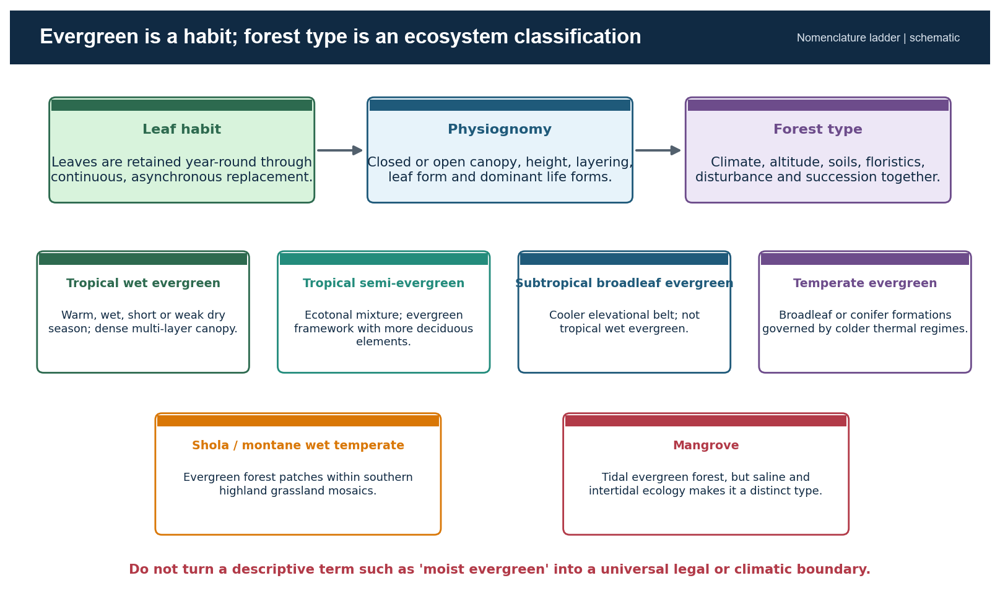

*Caption:* Use this ladder to stop category collapse in Prelims and to define terms precisely in Mains.

### Evidence / comparison matrix

| Term | Operational meaning | India use | Boundary warning |
| --- | --- | --- | --- |
| Evergreen habit | Year-round foliage continuity | Species or stand phenology | Does not mean zero leaf fall |
| Tropical wet evergreen | Warm, humid, multi-layer wet forest | Western Ghats, Northeast, islands | Not set by one legal rainfall line |
| Tropical semi-evergreen | Transition with more deciduous elements | Edges, gradients and disturbed mosaics | Not half plantation |
| Moist evergreen | Descriptive umbrella in some sources | Use only with source definition | Not always a formal Champion-Seth unit |
| Subtropical / temperate evergreen | Cooler elevational formations | Himalaya and highlands | Not tropical wet evergreen |
| Mangrove | Tidal evergreen woody formation | Coasts and islands | Ecologically distinct intertidal system |

### Core teaching

- Champion-Seth distinguishes tropical wet evergreen, tropical semi-evergreen and littoral/swamp formations; montane wet temperate formations include shola-type systems.
- Physiognomy describes appearance and structure; floristics identifies constituent taxa; biome language is broader than Indian forest-type mapping.
- Semi-evergreen can arise climatically, edaphically or through disturbance and succession; it is often an ecotone rather than a clean line.
- Conifer evergreen and broadleaf evergreen share leaf persistence but differ sharply in climate, structure and biogeography.

### Must-know facts

- Evergreen does not mean aseasonal physiology.
- Mangroves are evergreen in habit but should not be merged with upland tropical wet evergreen forest.
- Shola is both a vegetation term and a landscape-mosaic concept.

### UPSC traps

- **Wrong:** 'Tropical moist evergreen' is a universally fixed statutory class. **Correct:** Check the specific classification source; terminology varies.
- **Wrong:** All evergreen forests have the same dominant species. **Correct:** Floristic composition changes strongly by region, altitude and substrate.

**Mains use:** Define the level of classification before describing distribution or policy.

**Study link:** Environment Topic 03 -> biomes and succession; FSI forest type mapping

## 3. Environmental Controls: Effective Moisture, Not a Magic Number

Evergreen dominance emerges where atmospheric and soil moisture stress remains limited for enough of the year, temperatures permit growth, and disturbance has not pushed succession toward a more open or deciduous state.

*Context:* Rainfall amount is important, but its distribution, reliability and interaction with dry-season vapour demand explain why similar annual totals can support different vegetation.

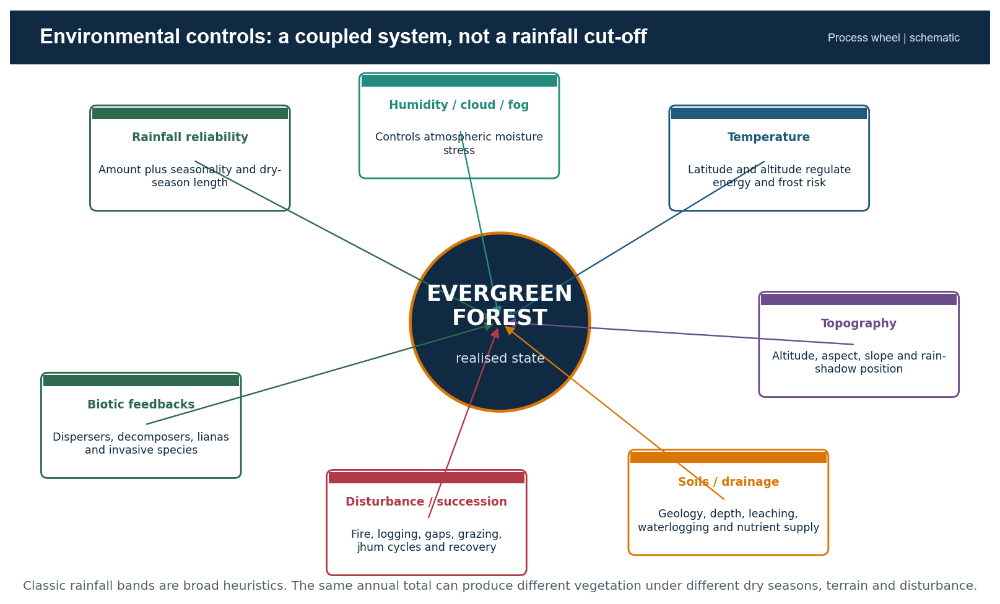

*Caption:* The realised forest is an interaction outcome; no single control is sufficient.

### Evidence / comparison matrix

| Control | Mechanism | Indian expression | Qualification |
| --- | --- | --- | --- |
| Rainfall | Supplies water and maintains humidity | Monsoon windward belts and wet hills | Annual total hides long dry spells |
| Cloud / fog | Reduces radiation and vapour deficit; adds occult moisture | Montane Ghats and Northeast | Varies by season and aspect |
| Temperature | Controls metabolism, frost and evapotranspiration | Altitudinal zonation | Warmth can also increase water demand |
| Aspect / relief | Orographic uplift, rain shadow, shelter | Western Ghats and hill valleys | Local topography creates refugia |
| Soil / geology | Water storage, nutrients, drainage | Basalt, laterite, alluvium, island substrates | No universal fertility rule |
| Disturbance | Resets structure and succession | Logging, fire, jhum, roads, storms | Frequency and recovery interval matter |

### Core teaching

- Dry-season length and intensity often separate wet evergreen from semi-evergreen or moist deciduous expression more effectively than one annual total.
- High humidity and fog can reduce canopy water stress even where gauge rainfall alone appears insufficient.
- Altitude cools air but can increase cloud exposure; beyond a threshold, tropical lowland flora gives way to subtropical or montane formations.
- Poor drainage can create swamp forest rather than the expected upland evergreen type.
- Succession means current vegetation can reflect historical logging, fire or cultivation as much as present climate.

### Must-know facts

- Controls operate jointly and at multiple scales.
- Ecotones are expected where moisture and disturbance gradients overlap.
- Rainfall heuristics are descriptive, not national legal boundaries.

### UPSC traps

- **Wrong:** More than a textbook rainfall threshold automatically creates evergreen forest. **Correct:** Check seasonality, evapotranspiration, soil and disturbance.
- **Wrong:** Altitude only reduces temperature. **Correct:** It also changes cloud, rainfall, wind and exposure.

**Mains use:** Build the causal chain: monsoon supply -> topographic redistribution -> effective moisture -> structure -> disturbance-modified outcome.

**Study link:** Geography 13 jet streams and western disturbances; Geography 16 monsoon mechanism

## 4. Rainfall Bands as Heuristics: How to Use Without Overclaiming

School texts often associate tropical evergreen forest with very high rainfall, commonly around 200 cm or more. This is useful for orientation but unsafe as a rigid national boundary.

*Context:* Forest-type classification relies on recurring formations and site conditions, while rainfall is a continuous variable measured with station and interpolation limits.

### Core teaching

- A 200 cm annual total delivered in a short monsoon can impose a longer dry season than a lower but well-distributed total.
- Cloud immersion, valley shelter, soil water storage and low vapour deficit can sustain evergreen elements below a simple threshold.
- Cyclone damage, fire, logging or repeated short fallows can create open or secondary vegetation in a climatically wet zone.
- Remote-sensing forest cover does not map rainfall-defined forest types; forest-type mapping and field verification answer a different question.

### Must-know facts

- Use terms such as 'broadly associated with' and 'typically favoured by'.
- State the dry-season qualifier immediately after any rainfall band.
- Avoid decimal precision for historical climatic forest boundaries unless an authoritative mapped source provides it.

### UPSC traps

- **Wrong:** A district above 200 cm must be entirely wet evergreen. **Correct:** District averages hide relief, land use and seasonal distribution.
- **Wrong:** A district below 200 cm cannot have evergreen refugia. **Correct:** Fog, valleys, aspect and soils can support local pockets.

**Mains use:** Write rainfall as one variable in a multi-factor model, not as the verdict.

**Study link:** Climatology -> water balance, seasonality and orographic rainfall

## 5. India Distribution: Core Tracts, Fragments, Ecotones and Plantations

India's main tropical wet evergreen and semi-evergreen landscapes occur in the Western Ghats, Northeast India and Andaman-Nicobar Islands. Evergreen formations also occur in Himalayan subtropical and temperate belts and in southern highland shola mosaics, but these are climatically distinct.

*Context:* Distribution must be drawn as zones and mosaics, not as a single continuous national strip.

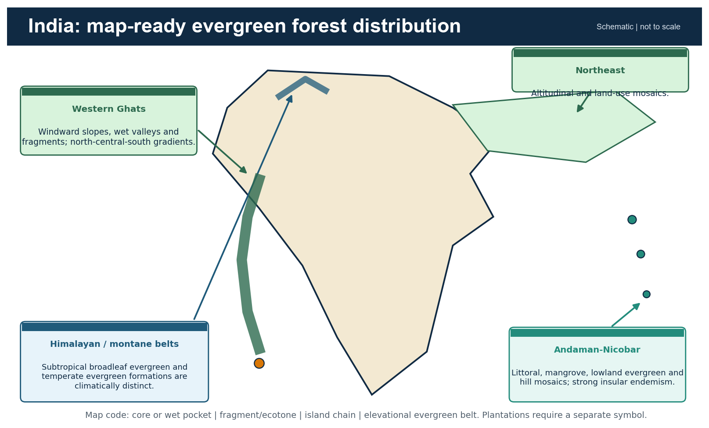

*Caption:* Schematic map for answer placement. It distinguishes tropical cores from montane and tidal evergreen systems.

### Evidence / comparison matrix

| Region | Map-ready placement | Dominant distinction | Do not imply |
| --- | --- | --- | --- |
| Western Ghats | Windward slopes, valleys and southern highlands | Orographic and altitudinal gradients | Uniform continuous belt |
| Northeast | Hills, foothills and valley-related mosaics | Altitude, rainfall, jhum and community forests | All NE is pristine rainforest |
| Andaman-Nicobar | Island lowlands, hills, creeks and coasts | Insular endemism and forest-coast mosaics | Every island has identical forest |
| Himalayan belts | Subtropical and temperate elevations | Thermal zonation | Tropical wet evergreen |
| Southern sholas | High-elevation pockets in grassland | Montane wet temperate mosaic | Degraded lowland evergreen |

### Core teaching

- Use four map symbols: relatively continuous core, fragment, ecotone and plantation/agroforestry.
- Wet evergreen can grade into semi-evergreen and moist deciduous forest over short distances along aspect and rain-shadow gradients.
- Administrative state boundaries are less explanatory than windward position, altitude, catchments and disturbance history.
- Plantations inside a high-rainfall belt must be mapped separately from natural forest condition.

### Must-know facts

- Western Ghats, Northeast and islands are the three tropical anchors.
- Himalayan evergreen belts require an altitude/temperature label.
- Mangroves require a tidal/coastal symbol, not the same fill as upland rainforest.

### UPSC traps

- **Wrong:** Drawing the entire west coast as one evergreen strip. **Correct:** Show windward Ghats, discontinuities and rain-shadow transition.
- **Wrong:** Colouring all Northeast states identically. **Correct:** Show altitude, valley and mosaic character.

**Mains use:** A high-scoring map adds a legend for ecological condition, not only location.

**Study link:** India map practice -> Western Ghats, Northeast, Andaman-Nicobar, Himalayan belts

## 6. Western Ghats: Windward-Rain Shadow Logic

Moist Arabian Sea flow rises along the Western Ghats, supporting wet evergreen and semi-evergreen formations on windward slopes, sheltered valleys and high-rainfall pockets. The leeward plateau grades toward more seasonal formations.

*Context:* The escarpment is not a wall with one vegetation boundary: elevation, gaps, valley orientation, soils and land use produce a fine-grained mosaic.

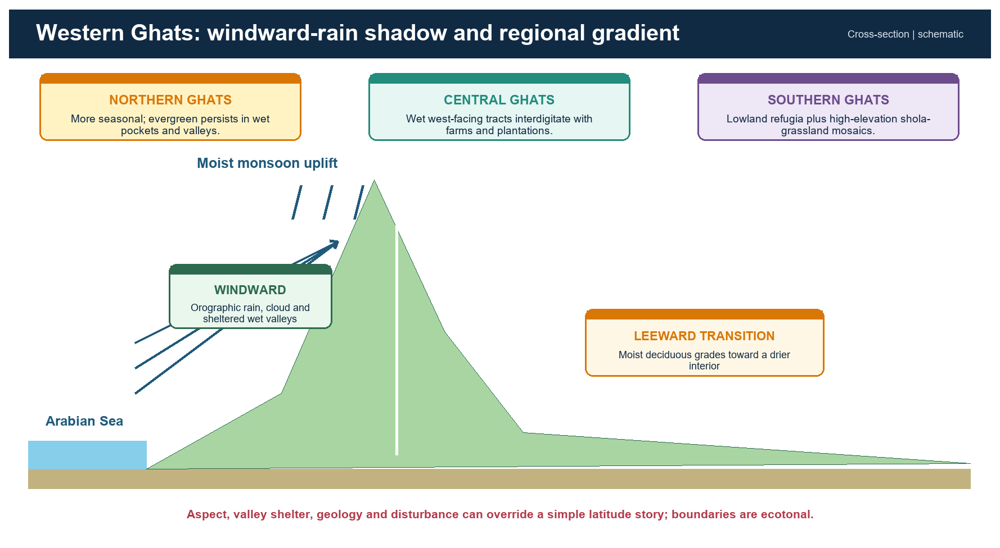

*Caption:* Use the cross-section for mechanism and the three regional boxes for nuanced spatial differentiation.

### Core teaching

- Windward uplift increases rainfall and cloud immersion; leeward subsidence and distance from moisture source intensify seasonality.
- Valleys can retain humidity and seed sources, functioning as refugia within more disturbed landscapes.
- Aspect changes solar exposure and drying; west-facing slopes can differ from sheltered east-facing valleys at the same altitude.
- Roads, reservoirs, mines, plantations and settlements can interrupt a climatically suitable belt.

### Must-know facts

- Use 'windward wet - crest cloud/fog - leeward transition' as the cross-section.
- The rain-shadow boundary is transitional and seasonally variable.
- Orographic rainfall explains potential vegetation, not current naturalness.

### UPSC traps

- **Wrong:** Every windward slope remains intact natural forest. **Correct:** Land-use history can override climatic suitability.
- **Wrong:** Every leeward slope is dry forest. **Correct:** Valley shelter, altitude and local rainfall can preserve wetter pockets.

**Mains use:** Pair physical-process explanation with a land-use and fragmentation qualification.

**Study link:** Western Ghats -> orographic rainfall, biodiversity hotspot, hydrology and slope stability

## 7. Western Ghats North-Central-South Gradient

A safe differentiation is qualitative: northern sectors are generally more seasonal with wet pockets; central sectors retain substantial west-facing wet tracts within human-use mosaics; southern sectors include major lowland evergreen refugia and high-elevation shola-grassland systems.

*Context:* Exact boundaries vary by classification, rainfall period, elevation and dataset; this package avoids unsupported range claims.

### Evidence / comparison matrix

| Subregion | Broad tendency | Ecological emphasis | Answer qualification |
| --- | --- | --- | --- |
| Northern | More pronounced seasonal and rain-shadow contrast | Valleys, sacred groves and wet pockets | Do not imply absence of evergreen |
| Central | Wet tracts interdigitated with plantations and settlements | Connectivity and riparian links | Condition varies greatly |
| Southern | High rainfall plus stronger montane differentiation | Lowland refugia, endemic centres, shola mosaics | Do not merge lowland and montane types |

### Core teaching

- Latitude modifies monsoon seasonality, but topography and land use can outweigh the simple north-south signal.
- Endemic centres often coincide with long-term climatic stability, relief-generated isolation and persistent wet habitat.
- Riparian corridors can connect fragments across plantation-dominated matrices.
- Conservation units must follow catchments and habitat connectivity rather than rely only on state boundaries.

### Must-know facts

- Use 'broad tendency' rather than exact latitude claims.
- Name one structural issue: fragmentation, edge or plantation matrix.
- Name one process: orographic moisture, cloud immersion or dispersal.

### UPSC traps

- **Wrong:** Southern Ghats is one continuous rainforest. **Correct:** It contains elevation, grassland, plantation and settlement mosaics.
- **Wrong:** Northern Ghats lacks biodiversity significance. **Correct:** Relict wet pockets and community-conserved sites can be highly important.

**Mains use:** Differentiate by seasonality, elevation, matrix and connectivity rather than by state list alone.

**Study link:** Western Ghats map -> northern, central and southern answer boxes

## 8. Myristica Swamps and Shola-Grassland Mosaics

Myristica swamps are relict freshwater swamp-forest pockets embedded in parts of the Western Ghats evergreen landscape. Sholas are montane evergreen forest patches occurring with grasslands in the southern highlands.

*Context:* Both are source-sensitive terms: their extent and ecological limits should be drawn from official or peer-reviewed mapping, not generic rainforest descriptions.

### Evidence / comparison matrix

| System | Hydrology / climate | Structure | Conservation logic |
| --- | --- | --- | --- |
| Myristica swamp | Persistent or seasonal waterlogging | Swamp-adapted evergreen trees and specialised roots | Protect local hydrology and tiny relict patches |
| Shola | Cool, humid montane setting with cloud/fog | Short-stature evergreen forest in sheltered folds | Protect forest-grassland mosaic, not forest alone |
| Montane grassland | Exposed highland climate and fire/grazing history | Open native grassland | Do not misclassify as wasteland |

### Core teaching

- Drainage alteration can destroy a swamp even when surrounding canopy remains.
- Afforesting native montane grassland with exotic trees can damage the shola-grassland mosaic rather than restore it.
- Shola patches support microclimatic refugia, headwater functions and high endemism.
- Use WII evidence for the distinctive grassland-shola physiognomic units of high-elevation southern Western Ghats.

### Must-know facts

- Myristica swamps are locally rare and hydrologically specialised.
- Shola is montane; it is not a synonym for every evergreen patch.
- Mosaic conservation requires both forest patches and grassland matrix.

### UPSC traps

- **Wrong:** Planting trees on every montane grassland is restoration. **Correct:** Native grassland is part of the ecological system.
- **Wrong:** Swamp conservation equals canopy protection only. **Correct:** Water regime is the controlling process.

**Mains use:** Use these as examples of why ecosystem restoration cannot be reduced to tree planting.

**Study link:** WII shola-grassland evidence + Western Ghats hydrology

## 9. Northeast India: Evergreen-Semi-Evergreen Mosaic

Northeast India contains tropical evergreen, semi-evergreen, subtropical and temperate formations arranged along steep gradients of altitude, monsoon exposure, valley position, soils and disturbance.

*Context:* The Brahmaputra and Barak systems organise valley-floor, foothill and hill connectivity, but no single river-basin label captures the full vegetation mosaic.

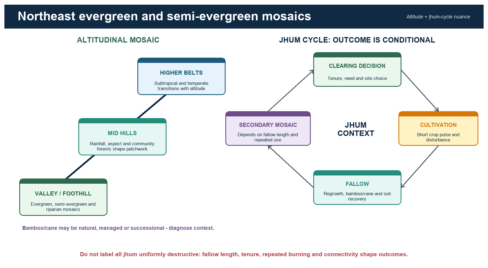

*Caption:* The left side shows altitudinal mosaics; the right side shows why jhum outcomes depend on recovery context.

### Evidence / comparison matrix

| Dimension | Low / valley expression | Hill / altitude expression | Human-landscape interaction |
| --- | --- | --- | --- |
| Moisture | Floodplain and foothill humidity | Orographic rain, cloud and aspect | Drainage and roads reshape patches |
| Vegetation | Evergreen, semi-evergreen, riparian mosaics | Subtropical to temperate transitions | Secondary forest, bamboo and cane |
| Tenure | State, private and community arrangements | Village and customary institutions | Rules influence fallow and extraction |
| Connectivity | Valley corridors and bottlenecks | Ridge-valley movement | Fragmentation can isolate endemic populations |

### Core teaching

- Evergreen dominance generally strengthens with reliable moisture but changes with elevation and exposure.
- Bamboo and cane can be natural components, secondary-stage dominants or managed resources; their presence alone does not diagnose degradation.
- Community forests vary from highly conserved groves to intensively used commons; tenure and enforcement matter.
- Roads and linear projects can trigger secondary access, hunting and settlement pressure beyond the direct footprint.

### Must-know facts

- Map the region as altitude and land-use mosaics.
- Distinguish primary structure, secondary regrowth and bamboo-dominated phases.
- High regional cover percentage does not rule out local fragmentation or adverse change.

### UPSC traps

- **Wrong:** All bamboo-dominated land is degraded. **Correct:** Bamboo can be natural, successional or managed; diagnose context.
- **Wrong:** All community forest is automatically intact. **Correct:** Institutions, rules, incentives and external pressures vary.

**Mains use:** Combine physical gradients with tenure and disturbance; avoid a state-wise catalogue.

**Study link:** Northeast -> Indo-Burma / Himalaya biogeography, jhum, community institutions

## 10. Jhum: Conditional Ecology, Not a Moral Label

Shifting cultivation is a rotational land-use system. Its ecological outcome depends on fallow duration, patch recurrence, slope, fire control, crop diversity, tenure, population pressure and the surrounding forest matrix.

*Context:* Long-fallow systems can maintain a shifting mosaic and livelihood diversity; shortened cycles and insecure tenure can reduce biomass, soil recovery and connectivity.

### Core teaching

- The causal chain is not 'jhum -> destruction' but repeated short interval -> incomplete succession -> lower biomass and soil cover -> erosion and invasive or fire risk.
- Secure collective tenure can support rules on patch choice, firebreaks, fallow and extraction; exclusionary policy can sometimes undermine stewardship.
- Secondary forests can retain biodiversity and connectivity, but they are not automatically equivalent to old growth.
- Alternatives must be livelihood-compatible; abrupt bans without viable transitions can displace pressure.

### Must-know facts

- Fallow length is a key variable, not the only variable.
- Landscape context matters: a small rotation inside a connected matrix differs from repeated clearing in isolated fragments.
- Use 'conditional sustainability' language.

### UPSC traps

- **Wrong:** All jhum is pristine traditional conservation. **Correct:** Shortened cycles and external pressures can be damaging.
- **Wrong:** All jhum is uniformly destructive. **Correct:** Long fallows, tenure and mosaic scale can support different outcomes.

**Mains use:** Judge the system through recovery interval, rights and landscape connectivity.

**Study link:** FRA / community rights + ecological succession + Northeast regional geography

## 11. Andaman-Nicobar Evergreen Forests

Andaman-Nicobar forests form an island mosaic of littoral vegetation, mangroves, lowland evergreen and semi-evergreen forest, moist formations and hill systems. Isolation raises endemism and makes small-range species vulnerable.

*Context:* The official Andaman Forest Department describes extensive natural forest and multiple forest types; any project-specific status claim must be checked against the latest clearance and litigation record.

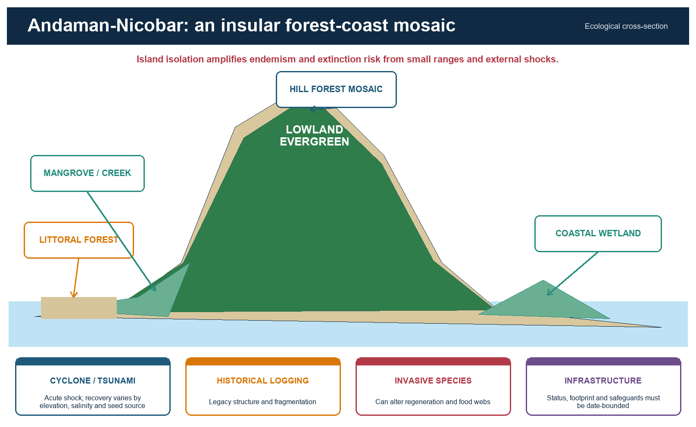

*Caption:* The cross-section prevents the common error of treating island evergreen forest as an isolated inland block.

### Evidence / comparison matrix

| Feature | Ecological meaning | Pressure | Safe answer use |
| --- | --- | --- | --- |
| Insularity | Isolation and short-range endemism | Small populations, invasives | High value plus high vulnerability |
| Forest-coast coupling | Creeks, mangroves, littoral and inland forest interact | Coastal alteration, salinity change | Use a mosaic diagram |
| Extreme events | Cyclones and tsunami create disturbance pulses | Compounded by fragmentation | Separate natural disturbance from chronic pressure |
| Land-use legacy | Historical logging and settlement influence structure | Road access and conversion | Do not call all canopy pristine |

### Core teaching

- The 2004 tsunami altered salinity, elevation and coastal vegetation in affected sectors; recovery pathways differ by island and site.
- Invasive species can change regeneration, herbivory and food webs even when canopy remains.
- Coastal and island regulation must be discussed through the Island Coastal Regulation Zone framework and dated project approvals.
- Mangrove, littoral and lowland evergreen systems require separate monitoring indicators.

### Must-know facts

- Island biogeography: isolation promotes endemism but limits rescue and recolonisation.
- Do not mix Great Nicobar project claims into a general answer unless directly relevant and date-bounded.
- The forest-coast mosaic is a stronger answer frame than a single forest-type label.

### UPSC traps

- **Wrong:** Every island has the same forest composition. **Correct:** Island size, elevation, geology and disturbance histories differ.
- **Wrong:** A cyclone impact is identical to chronic logging. **Correct:** Acute natural disturbance and persistent anthropogenic pressure have different recovery dynamics.

**Mains use:** Use insular endemism + mosaic coupling + cumulative pressure + status-bounded governance.

**Study link:** Geography 11 India Islands + ICRZ 2019 + island biogeography

## 12. Himalayan, Subtropical and Temperate Evergreen Zones

Evergreen formations extend beyond the tropical rainforest belt. Himalayan slopes include subtropical broadleaf evergreen forests and colder temperate evergreen broadleaf or conifer formations, arranged by altitude, aspect and moisture.

*Context:* The word evergreen describes leaf persistence; the controlling thermal regime separates these forests from tropical wet evergreen systems.

### Evidence / comparison matrix

| Zone | Dominant control | Broad structure | Key distinction |
| --- | --- | --- | --- |
| Subtropical broadleaf evergreen | Moderate elevations, humid exposure | Broadleaf evergreen with regional variation | Cooler than tropical lowland forest |
| Temperate evergreen broadleaf | Cool humid mountain climate | Lower-stature broadleaf formations | Cold-season constraints |
| Temperate conifer | Cold elevation and snow/frost regime | Needle-leaved evergreen canopy | Different leaf economics and fire regime |
| Cloud forest pockets | Persistent fog and low vapour deficit | Epiphyte-rich, stunted or dense | Cloud dependence may be climate-sensitive |

### Core teaching

- Altitude reorganises temperature, precipitation phase, cloud immersion and growing season.
- South-facing and north-facing slopes can differ in radiation and moisture stress.
- Conifers should not be used as the default image of every evergreen forest.
- Climate warming can shift suitable thermal belts upslope, creating range compression near summits.

### Must-know facts

- Label the elevation and thermal regime in maps.
- Evergreen broadleaf and evergreen conifer are separate physiognomic strategies.
- Cloud-base shifts are a plausible pressure but need local evidence before quantification.

### UPSC traps

- **Wrong:** All Indian evergreen forest is tropical. **Correct:** Subtropical and temperate evergreen belts are major exceptions.
- **Wrong:** Altitude only changes temperature. **Correct:** It changes cloud, snow, wind, exposure and soil development.

**Mains use:** Use altitude as a multi-variable climatic gradient, not a thermometer alone.

**Study link:** Mountain climatology + Himalayan vegetation zonation

## 13. Mangroves: Tidal Evergreen, Ecologically Distinct

Mangroves are woody evergreen or seasonally varying tidal forests adapted to salinity, inundation and oxygen-poor sediments. Their evergreen habit does not make them an upland tropical wet evergreen subtype.

*Context:* Champion-Seth places littoral and swamp forests separately; coastal regulation, tidal geomorphology and estuarine sediment dynamics are central.

### Evidence / comparison matrix

| Adaptation / process | Function | Limit |
| --- | --- | --- |
| Salt exclusion / excretion | Reduces ionic stress | Mechanism differs among taxa |
| Pneumatophores / aerial roots | Gas exchange in anoxic sediment | Not all species show the same root form |
| Vivipary / propagules | Establishment in tidal setting | Recruitment still depends on hydrodynamics |
| Root complexity | Traps sediment and attenuates flow | Cannot stop every cyclone or erosion regime |

### Core teaching

- Mangrove protection supports coastal habitat, fisheries, carbon storage and risk reduction.
- Hard engineering, altered sediment supply, aquaculture, pollution and upstream regulation can change the habitat even without direct tree cutting.
- Mangrove area statistics must be kept separate from total forest-cover trends.
- ICRZ/CRZ controls, protected-area status and community use rights are distinct governance layers.

### Must-know facts

- ISFR 2023 reports mangrove cover of 4,991.68 sq km and a net decrease of 7.43 sq km since 2021.
- Figures are assessment-specific and dated.
- Coastal risk reduction is conditional, not absolute.

### UPSC traps

- **Wrong:** Mangroves convert saline land into freshwater farmland. **Correct:** Their value lies in functioning within saline intertidal systems.
- **Wrong:** Any mangrove belt prevents all storm damage. **Correct:** Width, condition, bathymetry and storm magnitude matter.

**Mains use:** Distinguish ecological function, geomorphic setting and regulatory layer.

**Study link:** Geography 10 Coast and CRZ + Environment coastal ecology

## 14. Forest Structure: Emergent to Soil

A mature wet evergreen stand often contains emergent crowns, a relatively closed main canopy, sub-canopy and understorey trees, shrubs and saplings, herbs, litter, dead wood and a biologically active soil-root zone.

*Context:* Layer counts vary with site, disturbance and observer method. The important concept is vertical niche differentiation, not a rigid textbook number.

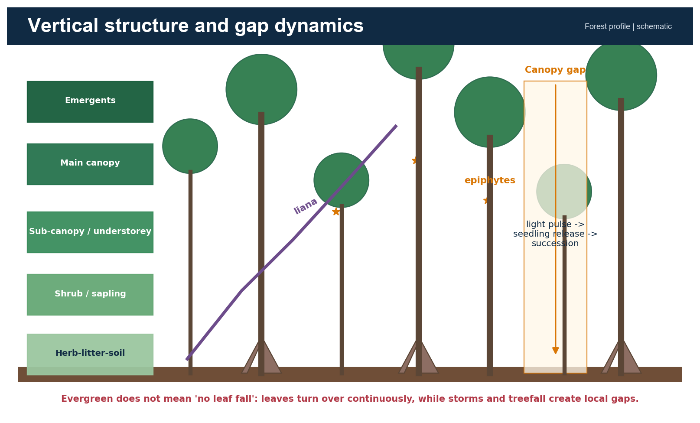

*Caption:* A field-profile diagram that links layers, plant adaptations and the local succession triggered by canopy gaps.

### Evidence / comparison matrix

| Layer | Light / moisture | Typical ecological role | Disturbance response |
| --- | --- | --- | --- |
| Emergent | High light, wind exposure | Large crowns, nesting and carbon stock | Storm and lightning exposure |
| Canopy | Captures most light | Primary productivity and habitat continuity | Gap formation after treefall |
| Understorey | Shade, humid microclimate | Shade-tolerant regeneration | Rapid release after gaps |
| Shrub / herb | Patchy light | Seedlings, herbs, browsing layer | Expands in disturbed openings |
| Litter / soil | Low light, high biological activity | Decomposition, roots, nutrient capture | Erosion if cover is removed |

### Core teaching

- Lianas remain soil-rooted and use trees for access to light; epiphytes use host structure without necessarily parasitising it.
- Buttress roots stabilise some large trees; cauliflory places flowers or fruit on trunks or older branches.
- Dead wood and cavities are structural habitat, not 'waste'.
- Selective logging can retain a green canopy while simplifying large-tree structure and microhabitats.

### Must-know facts

- Structure is a better quality indicator than canopy density alone.
- Vertical layering creates microclimates and niche space.
- Field profiles should show lianas, epiphytes, buttresses, gaps and litter-soil.

### UPSC traps

- **Wrong:** All wet evergreen forests have exactly three layers. **Correct:** Layer expression varies continuously.
- **Wrong:** Epiphytes are always parasites. **Correct:** Most use the host primarily as physical support.

**Mains use:** Use the vertical profile to connect structure, biodiversity, carbon and disturbance.

**Study link:** Ecosystem structure and function

## 15. Leaf Phenology, Shade Tolerance and Gap Dynamics

Evergreen stands continuously shed and replace leaves. Shade-tolerant juveniles can persist beneath the canopy, while light-demanding species exploit gaps created by branch fall, tree death, storms or disturbance.

*Context:* The forest is a shifting mosaic of patches at different recovery stages rather than a static climax wall.

### Core teaching

- Leaf longevity trades construction cost against photosynthetic return; evergreen leaves are often retained longer but still age and fall.
- A canopy gap raises light, temperature and vapour deficit near the floor and changes competition among seedlings.
- Small natural gaps can maintain diversity; repeated large disturbance can push the system toward secondary or invasive-dominated states.
- Seed banks, resprouting, seed rain and nearby mature trees determine recovery.

### Must-know facts

- Asynchronous turnover explains evergreen appearance.
- Shade tolerance is stage- and species-specific.
- Gap size and recurrence matter more than the word 'disturbance' alone.

### UPSC traps

- **Wrong:** Gap creation is always degradation. **Correct:** Small natural gaps are part of forest dynamics.
- **Wrong:** Any secondary regrowth equals old growth once canopy closes. **Correct:** Composition and time-dependent structures may remain different.

**Mains use:** Use gap dynamics to explain coexistence, succession and restoration limits.

**Study link:** Ecological succession -> disturbance regime -> regeneration

## 16. Nutrient Cycling: Rapid Biology over Variable Soils

Warm, moist conditions can accelerate decomposition and nutrient release, while dense roots, fungi and microbes rapidly recapture nutrients. Much of the active nutrient stock may therefore remain in biomass and the surface biological cycle.

*Context:* This explains the apparent paradox of luxuriant vegetation on some strongly weathered, leached tropical soils.

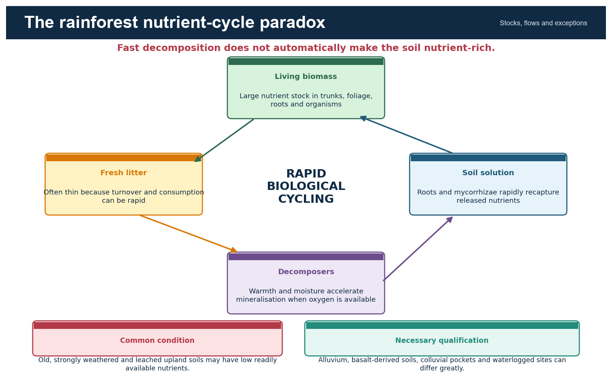

*Caption:* The cycle separates nutrient stock, flow and site-specific soil fertility.

### Evidence / comparison matrix

| Process | Direction | Exam significance | Qualification |
| --- | --- | --- | --- |
| Litterfall | Biomass -> surface | Transfers nutrients | Can be seasonal even in evergreen stands |
| Decomposition | Organic matter -> mineral forms | Fast under warm, moist, aerated conditions | Waterlogging and acidity can slow it |
| Root / fungal uptake | Soil solution -> biomass | Tight recycling | Disturbance can break capture |
| Leaching | Soil -> drainage | Loss under high rainfall | Depends on texture, parent material and rooting |
| Erosion | Topsoil export | Rises after clearing and roads | Slope and storm intensity matter |

### Core teaching

- High decomposition rate does not mean a deep nutrient-rich mineral soil.
- Clearing removes biomass nutrient capital and exposes soil to leaching and erosion.
- Old upland lateritic soils can be nutrient-limited, while alluvial, basaltic, colluvial or young island soils can differ.
- Waterlogged swamp soils can preserve organic matter because oxygen is limited.

### Must-know facts

- Biomass is a nutrient store, not only carbon.
- Root mats and mycorrhizae help intercept released nutrients.
- Soil claims require parent-material and drainage qualifiers.

### UPSC traps

- **Wrong:** All rainforest soils are infertile. **Correct:** Many are strongly weathered, but local geology and drainage create exceptions.
- **Wrong:** Rapid decomposition makes all nutrients permanently available. **Correct:** Uptake, leaching and erosion determine retention.

**Mains use:** Explain the cycle, then show why biomass removal can trigger rapid site impoverishment.

**Study link:** Biogeography -> soil system -> nutrient cycle

## 17. Soils, Geology and Drainage: Reject the Universal Infertility Claim

Evergreen forests occur on weathered lateritic uplands, basalt-derived terrain, alluvium, colluvium, swamp deposits and island substrates. Their fertility, depth, acidity and drainage vary sharply.

*Context:* Vegetation can maintain productivity through biological cycling even where exchangeable mineral nutrients are limited.

### Evidence / comparison matrix

| Site | Likely process | Possible forest expression | Caution |
| --- | --- | --- | --- |
| Weathered upland | Leaching and low base status | Nutrient-tight evergreen system | Not sterile |
| Basalt-derived terrain | Potentially higher base supply | Productive wet forest / altered land use | Weathering and slope still matter |
| Alluvial / colluvial pocket | Renewed sediment and nutrients | Tall valley forest | Flood and deposition regime matters |
| Waterlogged depression | Low oxygen and slow decay | Swamp evergreen | Hydrology is decisive |
| Steep cut slope | Shallow soil and erosion | Edge stress / landslide exposure | Roots cannot stabilise deep failures universally |

### Core teaching

- Soil depth and water-holding capacity can buffer short dry periods.
- Lateritisation is a weathering process; not every red or lateritic soil has the same fertility.
- Road cuts can sever subsurface flow and concentrate runoff, changing forest hydrology beyond the cleared strip.
- Restoration must repair drainage and soil processes, not only add seedlings.

### Must-know facts

- Parent material and topographic position are mandatory qualifiers.
- Hydrological damage can precede visible canopy decline.
- Old soil does not mean biologically inactive soil.

### UPSC traps

- **Wrong:** All basalt soil is uniformly fertile. **Correct:** Weathering, depth, erosion and management alter nutrient supply.
- **Wrong:** Tree roots prevent every landslide. **Correct:** Deep-seated failures and saturated slopes can exceed root reinforcement.

**Mains use:** Use geology -> soil properties -> water/nutrient process -> forest structure.

**Study link:** India geology and erosion topics -> evergreen ecology

## 18. Biodiversity and Biogeography

Evergreen forests support high species richness through stable moisture, vertical niche space, habitat heterogeneity and long interaction networks. Mountains and islands add isolation, refugia and short-range endemism.

*Context:* Endemism is a restricted-range property; species richness is a count; threat status is an extinction-risk assessment. These are related but not interchangeable.

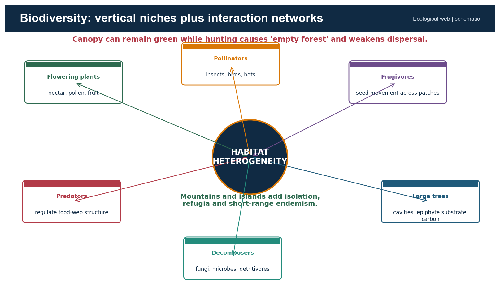

*Caption:* The web makes clear why composition and ecological interactions matter beyond area.

### Evidence / comparison matrix

| Dimension | Mechanism | Indian example frame | Monitoring need |
| --- | --- | --- | --- |
| Vertical niches | Layered light and humidity | Canopy, understorey, litter fauna | Layer-specific surveys |
| Pollination | Insects, birds, bats and other vectors | Flowering and phenology networks | Seasonal visitation |
| Seed dispersal | Frugivores move seeds | Large-fruited trees and mobile fauna | Recruitment and defaunation |
| Refugia | Climatic persistence in valleys/highlands | Western Ghats wet pockets | Microclimate and connectivity |
| Island isolation | Reduced gene flow and small ranges | Andaman-Nicobar endemics | Population and invasive tracking |

### Core teaching

- Habitat heterogeneity allows specialists to partition resources.
- Loss of large frugivores can alter tree recruitment even where canopy cover remains high: the 'empty forest' problem.
- Phenological mismatch under warming can disrupt pollination and fruiting interactions.
- Riparian and elevational corridors permit movement across climate and land-use gradients.

### Must-know facts

- Biodiversity quality cannot be read directly from canopy density.
- Endemism increases irreplaceability.
- Interaction loss can precede visible forest loss.

### UPSC traps

- **Wrong:** A green canopy proves an intact food web. **Correct:** Hunting and selective extraction can cause biological depletion.
- **Wrong:** High richness means every species is secure. **Correct:** Small-range endemics can remain highly threatened.

**Mains use:** Move from species lists to mechanisms: niche, interaction, isolation, refuge and connectivity.

**Study link:** Environment biodiversity levels, hotspots, protected areas and IUCN

## 19. Hotspot, World Heritage, Biosphere Reserve and Protected Area

A biodiversity hotspot is a global scientific prioritisation category. A UNESCO World Heritage property is an international heritage inscription. A biosphere reserve is a conservation-and-development framework. A national park, sanctuary, conservation reserve or community reserve is a statutory category under Indian law.

*Context:* These labels can overlap spatially, but each has a different criterion, authority and legal effect.

### Evidence / comparison matrix

| Label | Basis | Legal effect in India | Evergreen relevance |
| --- | --- | --- | --- |
| Biodiversity hotspot | Endemism plus habitat-loss criteria | No automatic statutory protection | Western Ghats-Sri Lanka, Indo-Burma, Himalaya, Sundaland/Nicobar |
| UNESCO World Heritage | Outstanding Universal Value | International obligation; domestic law still governs | Western Ghats serial property |
| Biosphere reserve / MAB | Core-buffer-transition model | Not identical to a Wildlife Act PA | Landscape research and sustainable-use frame |
| Wildlife Act PA | Statutory notification | Regulated rights and activities | Protects selected rainforest landscapes |
| ESZ / ESA | Environment Protection Act notification | Activity-specific regulation | Buffer or landscape safeguard; status must be dated |

### Core teaching

- The Western Ghats serial property has 39 components in seven sub-clusters; it does not cover the entire mountain chain.
- A hotspot can include private, community, production and protected landscapes.
- A biosphere reserve and a tiger reserve can overlap without becoming the same category.
- Legal effect follows the notifying instrument, not the ecological label.

### Must-know facts

- Hotspot is not a synonym for threatened species list.
- World Heritage recognition is not a new Indian forest class.
- Always name the authority and instrument.

### UPSC traps

- **Wrong:** Every hotspot area is legally protected. **Correct:** Hotspot designation itself has no statutory force.
- **Wrong:** UNESCO boundary equals Western Ghats ESA boundary. **Correct:** They arise from different purposes and processes.

**Mains use:** Use a four-column category table to show conceptual control.

**Study link:** Environment biodiversity hotspots + protected-area network

## 20. Ecosystem Services: Stocks, Flows and Beneficiaries

Evergreen forests store carbon, cycle moisture, regulate local microclimate, protect soil, influence stream response, support pollination and seed dispersal, provide non-timber products and carry cultural and spiritual value.

*Context:* Services are produced by structure and process; a simplified plantation may deliver some services without reproducing the full bundle.

### Evidence / comparison matrix

| Service | Mechanism | Beneficiary scale | Limit |
| --- | --- | --- | --- |
| Carbon stock | Long-lived biomass and soil carbon | Local to global | Stock differs from annual sequestration |
| Moisture recycling | Evapotranspiration and roughness | Local to regional | Does not create unlimited rain |
| Stream regulation | Infiltration, storage, roughness and soil cover | Catchment | Outcome depends on geology and saturation |
| Slope / erosion protection | Roots, litter and reduced raindrop impact | Slope and downstream | Cannot stop all deep failures |
| Pollination / dispersal | Mobile organisms connect plants and patches | Farm-forest landscape | Sensitive to hunting and pesticides |
| NTFP / culture | Material and relational values | Local communities | Access and rights shape benefit distribution |

### Core teaching

- Old-growth conservation protects a large existing carbon stock and avoids pulse emissions.
- Evapotranspiration can reduce total runoff while improving infiltration and moderating stormflow; direction depends on question and scale.
- Riparian forest filters sediment and shades streams, but upstream roads and extreme rainfall can overwhelm the function.
- Cultural services and customary stewardship are not captured by carbon accounting alone.

### Must-know facts

- Separate service, mechanism, beneficiary and limit.
- Natural forest often provides a more diverse service bundle than monoculture.
- Distributional justice determines who gains and who bears conservation costs.

### UPSC traps

- **Wrong:** Forests always increase dry-season flow. **Correct:** Results vary with soils, rooting, evapotranspiration and catchment condition.
- **Wrong:** Carbon is the only measurable forest value. **Correct:** Biodiversity, hydrology, culture and livelihood functions are distinct.

**Mains use:** Choose three services, explain mechanisms, and add one scale-dependent qualification.

**Study link:** Ecosystem services -> carbon, water, soil, biodiversity and livelihoods

## 21. Hydrology and Slope Stability: Qualified Claims

Intact forest cover intercepts rain, protects soil, promotes infiltration and adds root cohesion. These processes can moderate runoff and shallow erosion, but they do not make a saturated catchment immune to floods or landslides.

*Context:* Hydrological effects depend on rainfall intensity, antecedent moisture, soil depth, geology, slope, drainage alteration and spatial scale.

### Core teaching

- Interception and evapotranspiration can reduce water yield; infiltration and soil storage can support delayed flow in some settings.
- During extreme rainfall, soils can saturate and both natural and altered slopes can fail.
- Road cuts, blocked drains and spoil disposal may concentrate water and destabilise slopes more directly than canopy change alone.
- Riparian forest protects banks and filters sediment, but channel and basin-scale processes remain important.

### Must-know facts

- Use 'moderates risk' rather than 'prevents disaster'.
- Distinguish shallow erosion from deep-seated landslide mechanics.
- Catchment response is scale- and season-dependent.

### UPSC traps

- **Wrong:** More trees always means more streamflow. **Correct:** Evapotranspiration can lower total yield even as timing and quality improve.
- **Wrong:** Deforestation alone explains every landslide. **Correct:** Lithology, slope, rainfall and engineering works also matter.

**Mains use:** Write process -> context -> limit; avoid ecosystem-service slogans.

**Study link:** Geography erosion, groundwater and landslide topics

## 22. Carbon, Moisture Recycling and Climate Feedbacks

Evergreen forests contain large, long-lived carbon stocks and actively exchange water and energy with the atmosphere. Protection avoids emissions; restoration can add sequestration; neither claim should ignore biodiversity or water trade-offs.

*Context:* Stock is the amount already stored; sequestration is the net rate of additional storage.

### Core teaching

- Old-growth may have a lower percentage growth rate than a young plantation while holding much more total carbon.
- Forest loss raises sensible heat, reduces roughness and can alter local moisture recycling.
- Warming, drought and extreme rainfall can increase mortality, fire sensitivity and erosion.
- Cloud-dependent montane forests may face altered fog frequency or cloud-base height, but local trend claims require direct evidence.

### Must-know facts

- Avoided loss protects stock immediately.
- Restoration sequestration takes time and is vulnerable to reversal.
- Carbon accounting cannot establish ecological equivalence.

### UPSC traps

- **Wrong:** Fast-growing monoculture is always climatically superior to old growth. **Correct:** Compare stock, permanence, risk, biodiversity and water.
- **Wrong:** Forests are an unlimited substitute for emissions cuts. **Correct:** Land is finite and sequestration is reversible.

**Mains use:** Use stock + flow + permanence + co-benefit + limitation.

**Study link:** Climate policy + Green India Mission + ecosystem carbon

## 23. Threats Through the DPSIR Chain

Drivers such as demand for transport, minerals, power, land and income create pressures including clearing, roads, extraction, hunting, fire and invasive spread. These change forest state and generate ecological and social impacts.

*Context:* Separating driver, pressure, state and impact prevents loose threat lists and makes responses targetable.

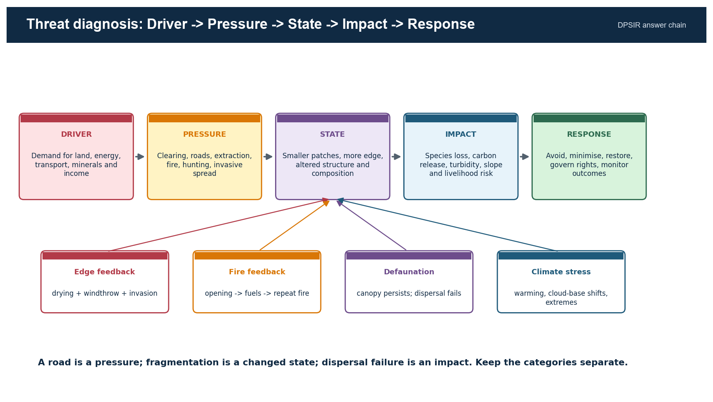

*Caption:* Use the top chain as the main answer spine and the lower boxes as feedback mechanisms.

### Evidence / comparison matrix

| Driver | Pressure | State change | Impact | Response |
| --- | --- | --- | --- | --- |
| Connectivity demand | Road / rail cut and traffic | Fragmentation, edge and access | Mortality, invasion, hunting | Avoidance, rerouting, crossings, access control |
| Commodity demand | Plantation conversion | Simplified structure | Native species and function loss | No-conversion sourcing, shade/native matrix |
| Energy / minerals | Mine, dam, transmission | Clearing and hydrological change | Sediment, barrier and displacement | Cumulative assessment and exclusion zones |
| Tourism / settlement | Waste, lighting, water and construction | Chronic edge pressure | Disturbance and pollution | Carrying capacity and enforcement |

### Core teaching

- Direct footprint can be smaller than the induced-access footprint.
- Fragmentation alters microclimate before total canopy loss becomes large.
- Biological depletion through hunting can change regeneration without obvious remote-sensing change.
- Cumulative impacts arise when multiple small projects intersect one corridor or catchment.

### Must-know facts

- Name the causal chain, not only the pressure.
- Linear infrastructure combines habitat loss, barrier, mortality and access.
- Response must target the stage in the chain.

### UPSC traps

- **Wrong:** A small direct footprint means small ecological impact. **Correct:** Access, edge and cumulative effects can extend much farther.
- **Wrong:** Canopy retention means no impact. **Correct:** Defaunation and hydrological change may remain invisible.

**Mains use:** DPSIR converts a list into analysis and a response hierarchy.

**Study link:** Infrastructure geography + cumulative environmental impact

## 24. Fragmentation, Edge Effects and Linear Infrastructure

Fragmentation reduces patch size, increases edge-to-core ratio and interrupts movement. Roads, railways, transmission lines and canals can add mortality, noise, light, invasive pathways and human access.

*Context:* The ecological effect is shaped by route, width, traffic, terrain, canopy continuity and the sensitivity of focal species.

### Core teaching

- Edges experience altered radiation, temperature, wind and humidity; wet-forest interiors can dry and suffer windthrow.
- A narrow linear opening may be crossable for some species but a strong barrier for canopy specialists or moisture-sensitive fauna.
- Wildlife crossings must match species behaviour and be accompanied by fencing or traffic control where appropriate.
- Connectivity assessment should include riparian, elevational and seasonal movement routes.

### Must-know facts

- Core-edge ratio is a stronger condition metric than area alone.
- Barrier effect and access effect are distinct.
- Cumulative corridors require landscape-level appraisal.

### UPSC traps

- **Wrong:** A green median or roadside plantation restores connectivity. **Correct:** Canopy structure, width, disturbance and species behaviour matter.
- **Wrong:** One underpass solves all fragmentation. **Correct:** Placement, design, maintenance and complementary controls determine use.

**Mains use:** Use footprint -> edge -> barrier -> access -> cumulative impact.

**Study link:** Landscape ecology -> patch, corridor, matrix and permeability

## 25. Fire, Invasives, Biological Depletion and Climate Stress

Many wet evergreen forests are not adapted to frequent fire. Drought, edge drying, logging debris and invasive fuels can create a feedback in which fire opens the canopy and later fires become more likely.

*Context:* Climate stress interacts with disturbance; it should not be written as an isolated future threat.

### Evidence / comparison matrix

| Pressure | Hidden mechanism | Visible signal | Monitoring |
| --- | --- | --- | --- |
| Fire | Canopy opening and fuel feedback | Scorch, mortality, grass/invasive spread | Burn scars, fuel and regeneration |
| Invasives | Competition and altered fire/herbivory | Simplified understorey | Native recruitment and spread front |
| Hunting | Loss of dispersers and predators | Canopy may remain green | Faunal occupancy and recruitment |
| Warming / cloud shift | Moisture stress and range movement | Mortality or upslope change | Microclimate and elevational plots |
| Extreme rain | Saturation, erosion and turbidity | Slope scars and stream pulse | Rain, soil moisture and sediment |

### Core teaching

- Invasive removal without closing the disturbance pathway can fail.
- Fire suppression alone is insufficient where roads, edges and ignition sources persist.
- Defaunation can create long-lag vegetation change through failed seed dispersal.
- Climate adaptation requires connected elevation gradients and protected refugia.

### Must-know facts

- Wet forest fire is often a disturbance signal, not a normal annual process.
- Canopy metrics miss biological depletion.
- Climate and land-use pressures amplify each other.

### UPSC traps

- **Wrong:** All forest fire is ecologically beneficial. **Correct:** Fire regime must match ecosystem adaptation.
- **Wrong:** Removing invasive stems once completes restoration. **Correct:** Seed banks, reinvasion pathways and native recovery require follow-up.

**Mains use:** Write feedbacks and monitoring, not a four-item threat list.

**Study link:** Fire ecology + invasive species + climate adaptation

## 26. Plantation Trap and Agroforestry Nuance

Rubber, tea, coffee, oil palm, eucalyptus and arecanut can create tree-covered or green landscapes, yet differ from natural evergreen forest in species composition, age structure, dead wood, hydrology and food webs.

*Context:* FSI forest cover is land-use neutral above its threshold; ecological equivalence therefore needs separate evidence.

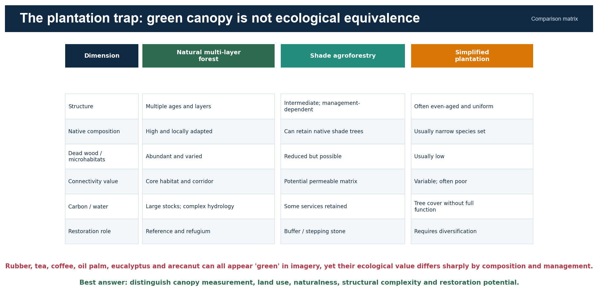

*Caption:* This matrix supports a nuanced answer: neither equivalence nor blanket dismissal.

### Evidence / comparison matrix

| Land use | Potential value | Core limitation | Best policy role |
| --- | --- | --- | --- |
| Natural old-growth | Reference, refugium, stock and full habitat | Irreplaceable and slow-forming | Avoid loss |
| Shade coffee / mixed agroforestry | Native shade, matrix permeability, livelihoods | Management-dependent and simplified | Buffer and corridor support |
| Rubber / oil palm monoculture | Tree cover and production | Uniform structure and low native diversity | Diversify; no conversion of natural forest |
| Tea / arecanut systems | Economic value; possible shade elements | Understorey and hydrology altered | Site-specific improvement |
| Eucalyptus block | Fast biomass on selected sites | Water, fire and habitat concerns vary | Do not use as universal restoration |

### Core teaching

- Shade-grown systems can retain more birds, insects and connectivity than open monocultures, but management intensity matters.
- Plantation age and canopy density can increase while native regeneration remains absent.
- Restoration may diversify a production matrix without relabelling it old growth.
- No-conversion of natural forest is higher priority than post-conversion certification.

### Must-know facts

- Tree cover, land use and ecosystem condition are three separate variables.
- Agroforestry can be a stepping stone or buffer.
- A plantation can store carbon without supporting old-growth assemblages.

### UPSC traps

- **Wrong:** All plantations are ecological deserts. **Correct:** Value varies; some retain useful matrix functions.
- **Wrong:** Any shaded crop equals natural forest. **Correct:** Composition, structure, dead wood and disturbance remain different.

**Mains use:** Use a gradient of value without losing the no-equivalence conclusion.

**Study link:** Agricultural geography + forest-cover methodology + restoration

## 27. Forest Data Literacy: Cover, Tree Cover and Recorded Forest Area

ISFR forest cover is a remote-sensing canopy measure. Tree cover captures smaller tree patches and isolated trees outside recorded forest area. Recorded forest area is a legal-administrative record. None alone measures natural forest condition.

*Context:* FSI defines forest cover as land at least one hectare with canopy density at least 10%, irrespective of ownership, legal status or land use; orchards, bamboo and palm can be included.

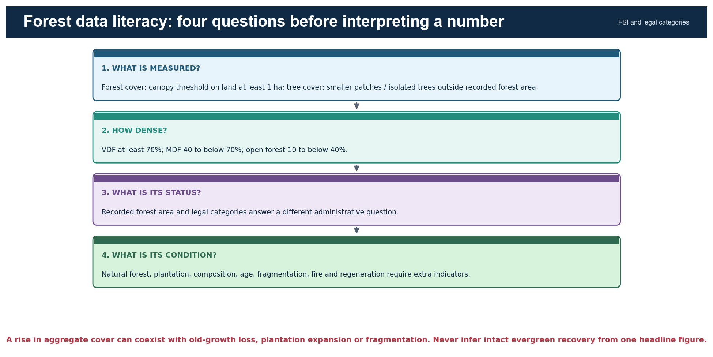

*Caption:* Ask measurement, density, status and condition in that order.

### Evidence / comparison matrix

| Term | What it measures | Can include | Cannot prove |
| --- | --- | --- | --- |
| Forest cover | Canopy extent on at least 1 ha at density threshold | Natural forest, plantation, orchard, bamboo, palm | Legal status or naturalness |
| Tree cover | Smaller patches / isolated trees outside recorded forest area | Farm and urban trees | Forest ecosystem |
| Recorded forest area | Land recorded as forest in government records | Reserved, protected and unclassed records | Actual canopy condition |
| VDF / MDF / open | Canopy-density class | Any qualifying land use | Species composition or age |
| Natural forest | Indigenous forest not planted by humans | Primary or naturally regenerated stands | Automatic legal protection |

### Core teaching

- A degraded legally recorded forest can have low canopy; a dense plantation outside it can meet forest-cover criteria.
- Change estimates depend on imagery, methodology, interpretation and reference period.
- State-level aggregate gains can mask local old-growth loss and vice versa.
- Forest-type area and forest-cover area are related but not interchangeable datasets.

### Must-know facts

- VDF: at least 70%; MDF: 40 to below 70%; open forest: 10 to below 40%.
- Naturalness requires composition and origin evidence.
- Date and edition belong beside every national figure.

### UPSC traps

- **Wrong:** VDF means virgin forest. **Correct:** VDF is a density class, not an origin class.
- **Wrong:** Recorded forest area is satellite-detected canopy. **Correct:** It is a legal-administrative record.

**Mains use:** Start any data paragraph by defining the metric and its blind spot.

**Study link:** FSI ISFR methodology + legal forest categories

## 28. ISFR 2023: Dated Status and Interpretation

As of 18 August 2026, ISFR 2023 is the latest officially available national assessment verified for this package. It should be cited as an edition-specific baseline, not as a timeless fact.

*Context:* Official FSI Volume I retrieved 18 August 2026.

### Evidence / comparison matrix

| Indicator | ISFR 2023 value | Change / share | Interpretive limit |
| --- | --- | --- | --- |
| Forest + tree cover | 827,356.95 sq km | 25.17% of geographical area | Combines different categories |
| Forest cover | 715,342.61 sq km | 21.76% | +156.41 sq km since 2021 |
| Tree cover | 112,014.34 sq km | 3.41% | Not forest ecosystem area |
| Combined change | +1,445.81 sq km | Forest + tree cover | Does not prove old-growth recovery |
| Northeast forest + tree cover | 174,394.70 sq km | 67% of regional geographical area | Forest cover fell 327.30 sq km |
| Mangrove cover | 4,991.68 sq km | Net -7.43 sq km since 2021 | Separate coastal ecosystem metric |

### Core teaching

- The combined increase is driven much more by tree-cover change than by forest-cover change.
- A high regional percentage can coexist with a negative change and local fragmentation.
- The report's canopy classes do not separate natural evergreen forest from plantation by themselves.
- Use FSI's method caveat whenever linking national cover to biodiversity or climate resilience.

### Must-know facts

- All values above are dated to ISFR 2023.
- Forest cover and tree cover must be quoted separately before the combined figure.
- Northeast and mangrove trends are directly relevant to this topic.

### UPSC traps

- **Wrong:** 25.17% is India's forest cover. **Correct:** It is combined forest and tree cover; forest cover alone is 21.76%.
- **Wrong:** A national gain proves intact evergreen expansion. **Correct:** Condition and location require finer evidence.

**Mains use:** Use one figure, define it, then add one method limitation.

**Study link:** FSI India State of Forest Report 2023

## 29. Governance Stack: Different Laws Answer Different Questions

Evergreen landscapes are governed through forest-status law, diversion approval, wildlife protection, biodiversity institutions, rights recognition, coastal regulation, environmental notification and restoration finance.

*Context:* The current title of the former Forest (Conservation) Act is the Van (Sanrakshan Evam Samvardhan) Adhiniyam, 1980 after the 2023 amendment.

### Evidence / comparison matrix

| Instrument | Primary function | Evergreen-forest use | Do not claim |
| --- | --- | --- | --- |
| Indian Forest Act, 1927 | Reserved, protected and village-forest architecture; offences | Legal/administrative status | Ecological condition |
| Van Adhiniyam, 1980 | Prior central approval framework for specified forest-land diversion | Clearance layer | Automatic ecological restoration |
| Wildlife Protection Act, 1972 | Protected areas and wildlife regulation | National parks, sanctuaries, conservation/community reserves | Covers every evergreen tract |
| Biological Diversity Act, 2002 as amended | Access-benefit sharing and institutions | NBA-SBB-BMC-PBR | PBR is a title deed or PA |
| FRA, 2006 | Recognises forest rights | CFR governance and Section 5 protection duties | Rights erase conservation |
| EPA notifications | ESZ/ESA and activity regulation | Landscape safeguards | Draft equals final |

### Core teaching

- Statutory status, project clearance, compliance, restoration finance and ecological outcome are separate stages.
- The Biological Diversity (Amendment) Act, 2023 came into force from 1 April 2024; cite current rules and notifications for operational detail.
- PBRs document local biological resources and knowledge; they do not by themselves create a protected area or settle tenure.
- Sacred groves may be strongly conserved through customary institutions without one uniform national legal category.

### Must-know facts

- Name the current statute title and year.
- State the authority: MoEFCC, state forest department, wildlife authority, NBA/SBB/BMC or Gram Sabha.
- Legal compliance does not prove biodiversity outcome.

### UPSC traps

- **Wrong:** One law 'protects forests' in every sense. **Correct:** Different instruments regulate status, diversion, wildlife, rights and restoration.
- **Wrong:** PBR notification makes land a sanctuary. **Correct:** PBR is a biodiversity documentation process.

**Mains use:** Build answers as a governance stack, then assess coordination and outcomes.

**Study link:** Environment forest governance, FRA, protected areas and biodiversity institutions

## 30. FRA, Community Forests and Sacred Groves

The Forest Rights Act recognises individual and community rights and, through Section 5, empowers and obliges right holders, Gram Sabhas and village institutions to protect wildlife, forests, biodiversity and ecologically sensitive areas and enforce community decisions.

*Context:* Rights and conservation are not inherently opposed; outcomes depend on recognition quality, local institutions, livelihood alternatives and external pressures.

### Core teaching

- Community Forest Resource rights can provide authority and incentives for locally legitimate management.
- Unresolved rights or exclusionary conservation can weaken trust and compliance.
- Community reserves under the Wildlife Act and customary sacred groves are distinct institutional forms.
- PBRs can support knowledge documentation but should respect consent, benefit-sharing and sensitive information.

### Must-know facts

- FRA is primarily a rights-recognition law with explicit conservation powers/duties.
- Gram Sabha decisions are central to CFR governance.
- Community institutions require capacity, secure tenure and fair benefit flows.

### UPSC traps

- **Wrong:** FRA only distributes individual land titles. **Correct:** It includes community and CFR rights.
- **Wrong:** Community use necessarily degrades forest. **Correct:** Rules, scale, market pressure and tenure determine outcome.

**Mains use:** Write secure rights + accountable institutions + ecological safeguards as complements.

**Study link:** FRA 2006 + community conservation + PBR

## 31. Protected Areas, Biodiversity Institutions and Spatial Safeguards

Protected areas can secure core habitat, but evergreen species and ecological processes often extend across reserve boundaries into community, private and production landscapes.

*Context:* The Wildlife Protection Act provides national parks, sanctuaries, conservation reserves and community reserves; ESZs under the Environment Protection framework regulate selected activities around protected areas.

### Core teaching

- Connectivity between protected cores may depend on riparian strips, sacred groves and agroforestry matrices.
- Relocation or restriction requires lawful, rights-aware process; ecological goals do not erase due process.
- BMCs and PBRs can enrich local biodiversity governance but need coordination with land and forest institutions.
- ESZ is not the same as a Western Ghats-wide ESA proposal.

### Must-know facts

- A PA boundary is a legal line; ecological edges and animal movement cross it.
- Community reserve is a statutory category distinct from customary community forest.
- Core-buffer-corridor is a landscape strategy, not one universal legal template.

### UPSC traps

- **Wrong:** All evergreen habitat lies inside protected areas. **Correct:** Large areas occur in multi-use landscapes.
- **Wrong:** ESZ and ESA are interchangeable abbreviations. **Correct:** Their scope and notification context differ.

**Mains use:** Protect cores while governing the surrounding matrix and rights fairly.

**Study link:** Protected-area network + biodiversity governance

## 32. CAMPA, Green India Mission and Restoration Quality

CAMPA manages compensatory-afforestation and related funds linked to forest diversion under the Compensatory Afforestation Fund Act, 2016 and Rules, 2018. The Green India Mission is a broader NAPCC mission for forest and ecosystem-service improvement.

*Context:* Funding or planted area is an input. Restoration success requires native composition, survival, regeneration, connectivity and social legitimacy.

### Evidence / comparison matrix

| Instrument | Trigger / mandate | Useful contribution | Core limitation |
| --- | --- | --- | --- |
| CAMPA | Diversion-linked payments and statutory funds | Finance afforestation and forest/wildlife measures | Offset cannot recreate irreplaceable old growth |
| GIM | Climate and ecosystem-service mission | Landscape restoration and co-benefits | Implementation and outcome measurement vary |
| Assisted natural regeneration | Existing seed sources and recovery potential | Often lower disturbance and more native recovery | Needs protection from recurring pressure |
| Native enrichment | Composition gaps in degraded stands | Adds missing functional groups | Wrong species/site can fail |

### Core teaching

- Compensatory land may differ in climate, soil and biogeography from the diverted evergreen site.
- Plantation survival is not equivalent to restoration of old-growth interactions.
- Community rights and livelihood use must be built into site selection and maintenance.
- Independent monitoring should continue beyond establishment grants.

### Must-know facts

- Avoidance remains above compensation.
- Assisted natural regeneration can outperform blanket planting where propagules and soil remain.
- Outcome metrics must include natural regeneration and native composition.

### UPSC traps

- **Wrong:** CAMPA payment means no net ecological loss. **Correct:** Money and area cannot guarantee like-for-like recovery.
- **Wrong:** More saplings equals restored forest. **Correct:** Survival, structure, origin and process matter.

**Mains use:** Evaluate inputs, additionality, ecological match, permanence and justice.

**Study link:** Environment Topic 12 -> CAMPA and Green India Mission

## 33. Western Ghats Governance: WGEEP, HLWG and the 2026 Draft ESA

Western Ghats governance debates combine ecological sensitivity, settlement, farming, mining, infrastructure and federal implementation. The WGEEP/Gadgil and HLWG/Kasturirangan exercises used different approaches and should not be conflated.

*Context:* The 27 July 2026 MoEFCC notification retrieved for this package is a draft, not a final ESA boundary.

### Evidence / comparison matrix

| Process | Broad approach | Status-safe use | Do not do |
| --- | --- | --- | --- |
| WGEEP / Gadgil | Ecologically graded, bottom-up emphasis across the Ghats | Historical expert recommendation | Present as current final boundary |
| HLWG / Kasturirangan | Distinguished natural and cultural landscapes; recommended an ESA | 2013 expert-group basis for later notifications | Treat as identical to WGEEP |
| 2026 draft notification | Proposes 56,825.7 sq km and activity regulation | Draft dated 27 July 2026; comments to 25 September 2026 | Call it notified final ESA |
| UNESCO property | 39-component World Heritage serial site | Outstanding Universal Value | Equate with ESA proposal |

### Core teaching

- The 2026 draft states that the actual area will be finalised using state recommendations, stakeholder views and ESA Expert Committee input.
- The draft proposes prohibition of mining, quarrying and sand mining in the proposed ESA and restrictions/regulation for specified industries and large projects.
- Draft boundaries and provisions can change before final notification.
- Governance quality depends on credible maps, village-level clarity, livelihood transition and enforcement.

### Must-know facts

- Draft date: 27 July 2026.
- Comment closing date stated in the official listing: 25 September 2026.
- Proposed area: 56,825.7 sq km; not a final area.

### UPSC traps

- **Wrong:** Gadgil and Kasturirangan recommended the same map by the same method. **Correct:** Keep reports, methods and dates separate.
- **Wrong:** UNESCO inscription finalises Indian ESA regulation. **Correct:** International heritage and domestic notification are different processes.

**Mains use:** Use STATUS language before evaluating likely environmental and livelihood effects.

**Study link:** MoEFCC 27 July 2026 Western Ghats draft ESA + HLWG report

## 34. UNESCO Western Ghats Serial Property

UNESCO lists the Western Ghats as a serial natural World Heritage property composed of 39 components in seven sub-clusters. UNESCO highlights non-equatorial tropical evergreen forests, high endemism and evolutionary significance.

*Context:* Serial inscription protects a selected network of components, not the entire Western Ghats.

### Core teaching

- Outstanding Universal Value is the inscription basis; management remains implemented through Indian legal and administrative institutions.
- Serial design can represent dispersed ecological values but increases coordination requirements.
- Buffer and connecting landscapes outside components may be crucial for ecological integrity.
- World Heritage, hotspot, biosphere reserve, national park and ESA labels must be mapped separately.

### Must-know facts

- 39 components; seven sub-clusters.
- Official UNESCO list entry: 1342.
- The listing emphasises globally important non-equatorial tropical evergreen forests.

### UPSC traps

- **Wrong:** The entire Ghats is one UNESCO site polygon. **Correct:** It is a serial property.
- **Wrong:** UNESCO inscription replaces domestic clearance law. **Correct:** Domestic statutes and notifications still govern activities.

**Mains use:** Use serial-property design to discuss connectivity and multi-jurisdiction coordination.

**Study link:** UNESCO World Heritage Centre -> Western Ghats list 1342

## 35. Conservation and Restoration Hierarchy

The first priority is to avoid conversion and fragmentation of old-growth, refugia, riparian buffers and endemic centres. Minimisation, restoration and offsets follow in that order.

*Context:* Old-growth structure, soil legacies and interaction networks are time-dependent and cannot be recreated quickly.

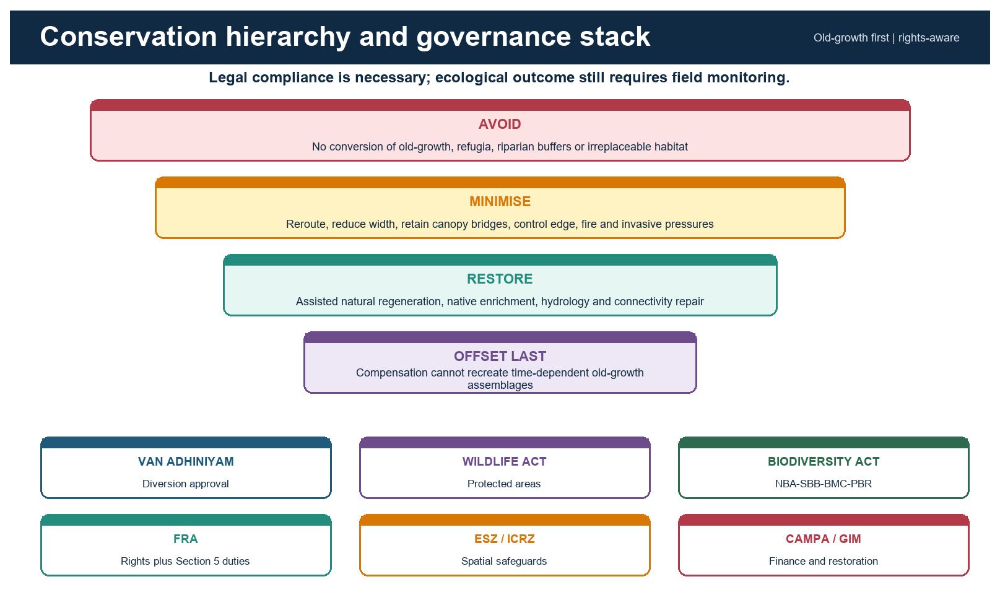

*Caption:* The pyramid puts irreplaceability first; the lower governance layers show why one instrument is insufficient.

### Evidence / comparison matrix

| Priority | Action | Evergreen application | Indicator |
| --- | --- | --- | --- |
| Avoid | Exclude irreplaceable sites and reroute | Old-growth, sholas, swamps, island endemics | No loss / no new edge |
| Minimise | Reduce footprint and operating pressure | Canopy bridges, buffers, drainage, fire control | Lower mortality and edge |
| Restore | Repair process and native composition | ANR, riparian repair, native enrichment | Regeneration and function |
| Offset last | Compensate residual impacts | Only after residual-impact proof | Additionality and permanence |
| Govern | Rights, incentives and compliance | CFR, community monitoring, benefit sharing | Legitimacy and livelihood outcome |

### Core teaching

- Protect source populations and seed trees before planting.
- Restore hydrology in swamps, riparian areas and road-affected slopes.
- Control recurring drivers - fire, grazing, invasives, extraction and access - before enrichment planting.
- Use landscape corridors and a permeable agroforestry matrix around core forest.
- Monitor a reference condition and disclose uncertainty.

### Must-know facts

- Avoidance is the only reliable response to irreplaceability.
- Assisted natural regeneration uses existing ecological memory.
- Offsets require additionality, ecological match, permanence and fair land governance.

### UPSC traps

- **Wrong:** Restoration begins with mass planting. **Correct:** Begin with threat removal, hydrology and natural recovery potential.
- **Wrong:** Offset area equal to diverted area means no net loss. **Correct:** Quality, location, time lag and composition matter.

**Mains use:** Present a sequenced hierarchy, not a list of schemes.

**Study link:** Mitigation hierarchy + landscape restoration + rights

## 36. Monitoring Dashboard

Area and canopy density are necessary but insufficient. Monitoring must detect landscape pattern, structure, composition, ecological process, pressure, water/soil response and social legitimacy.

*Context:* Indicators should be tied to a causal model and a baseline, with methods and dates disclosed.

*Caption:* The same logic improves field evaluation and examiner-facing argument structure.

### Evidence / comparison matrix

| Domain | Core indicators | Why it matters | Possible failure signal |
| --- | --- | --- | --- |
| Extent / density | Area, VDF/MDF/open | Broad canopy trend | Loss or thinning |
| Landscape pattern | Patch size, connectivity, core-edge ratio | Movement and microclimate | Isolation and rising edge |
| Structure / biomass | Large trees, basal area, dead wood, layers | Habitat and carbon | Simplification |
| Composition | Native species, functional groups, invasives | Naturalness and resilience | Biotic homogenisation |
| Process | Regeneration, fire, dispersal, phenology | Future persistence | Recruitment failure |
| Water / soil | Turbidity, baseflow context, erosion, soil carbon | Catchment function | Sediment pulse |
| Justice / compliance | Rights, livelihood, violations, grievance | Durability and fairness | Conflict and non-compliance |

### Core teaching

- Remote sensing should be combined with permanent plots, biodiversity surveys and community observations.
- Indicator fauna/flora must be chosen for the local ecosystem and pressure.
- Before-after-control-impact designs are stronger than unpaired post-project counts where feasible.
- Monitoring results should trigger adaptive management, not remain a reporting endpoint.

### Must-know facts

- Core-edge ratio and native regeneration are high-yield additions to area.
- Streams integrate catchment disturbance through sediment and temperature.
- Rights and livelihood indicators belong in ecological project evaluation.

### UPSC traps

- **Wrong:** Expenditure is an ecological outcome. **Correct:** It is an input.
- **Wrong:** Sapling survival alone proves forest restoration. **Correct:** Structure, composition and process remain untested.

**Mains use:** Use six indicator families and one adaptive-management sentence.

**Study link:** Forest monitoring + answer-writing discipline

## 37. Current Linkage - Western Ghats ESA and ISFR Status Literacy

Current-affairs check for the six months ending 18 August 2026 found a directly linked official item: MoEFCC's draft Western Ghats Ecologically Sensitive Area notification dated 27 July 2026.

*Context:* The latest official national forest assessment verified on the retrieval date is ISFR 2023; its figures are used for status literacy rather than as proof of evergreen condition.

### Evidence / comparison matrix

| Label | Statement | Date / source | Exam use |
| --- | --- | --- | --- |
| FACT | Draft proposes 56,825.7 sq km and specified activity restrictions | MoEFCC draft, 27 Jul 2026 | Named current anchor |
| STATUS | Draft; comments close 25 Sep 2026; actual area to be finalised | MoEFCC official listing | Do not call final |
| INFERENCE | If finalised and enforced, pressure reduction would depend on mapping, compliance and livelihood transition | Analytical, not official claim | Mains evaluation |
| LIMIT | Boundaries and provisions may change; notification does not itself prove ecological outcome | As of 18 Aug 2026 | Uncertainty control |
| FACT | ISFR 2023 forest + tree cover is 25.17% | FSI Volume I | Data baseline |
| LIMIT | Cover classes do not prove natural evergreen recovery | FSI method implication | Data caveat |

### Core teaching

- Current linkage must be embedded in static concepts: ESA/ESZ distinctions, fragmentation, forest-cover methodology and restoration hierarchy.
- Draft status belongs in the first sentence, not a footnote.
- The proposed ESA figure and restrictions should never be transferred to the final notification without re-verification.
- Use the FSI figure only after separating forest cover, tree cover and natural forest condition.

### Must-know facts

- Retrieval date: 18 August 2026.
- Official source order: MoEFCC draft and listing; FSI report.
- No claim of final approval is made.

### UPSC traps

- **Wrong:** Draft = notified final law. **Correct:** Use STATUS and recheck after the comment process.
- **Wrong:** National canopy gain = Western Ghats evergreen gain. **Correct:** Different scale, metric and ecosystem question.

**Mains use:** One current item + one static concept + one implementation limit is enough for a high-quality paragraph.

**Study link:** Current affairs -> Western Ghats ESA + ISFR 2023

## 38. Verified Prelims PYQ 2019 - Forest-Cover Ranking

UPSC CSE Prelims 2019, GS-I, Q33: Consider Chhattisgarh, Madhya Pradesh, Maharashtra and Odisha. In terms of percentage of forest cover to total State area, choose the correct ascending order.

*Context:* Options: A. 2-3-1-4 | B. 2-3-4-1 | C. 3-2-4-1 | D. 3-2-1-4.

### Core teaching

- INFERRED ANSWER - NOT OFFICIALLY VERIFIED LOCALLY: C (Maharashtra -> Madhya Pradesh -> Odisha -> Chhattisgarh).
- Confidence: High. Elimination: Maharashtra has the lowest percentage among the four; Chhattisgarh the highest; Madhya Pradesh precedes Odisha.
- Concept tested: percentage cover, not absolute forest area. Madhya Pradesh's large absolute forest area does not make it highest by State-area percentage.
- Data caution: a current answer should use the edition relevant to the question or clearly date a later comparison.

### Must-know facts

- PYQ wording verified from a local official UPSC scan.
- Local official 2019 objective key was unavailable in the searched corpus.
- The inferred label must be retained in both package and workbook.

### UPSC traps

- **Wrong:** Rank by absolute forest area. **Correct:** The stem asks percentage of State area.
- **Wrong:** Use today's figures without a date. **Correct:** The question belongs to its assessment period.

**Mains use:** Turn this PYQ into a data-literacy rule: read numerator, denominator, edition and category.

**Study link:** FSI state tables -> percentage versus absolute area

## 39. Verified Prelims PYQ 2021 - Rainforest Structure

UPSC CSE Prelims 2021, GS-I, Q60 describes leaf litter decomposing faster than in any other biome, a nearly bare soil surface, climbers and epiphytes reaching the canopy, and asks for the most likely biome.

*Context:* Options: A. coniferous forest | B. dry deciduous forest | C. mangrove forest | D. tropical rain forest.

### Core teaching

- INFERRED ANSWER - NOT OFFICIALLY VERIFIED LOCALLY: D, tropical rain forest.
- Confidence: High. Rapid decomposition, climbing life forms and epiphytes form a distinctive wet-tropical bundle.
- The word 'vicariously' signals access to canopy light through host support rather than independent tall trunks.
- Qualification: rapid decomposition does not prove all tropical rainforest mineral soils are nutrient-rich.

### Must-know facts

- PYQ wording verified from the local official UPSC question paper.
- The option order is preserved exactly.
- The key label remains inferred because a local official answer key was not available.

### UPSC traps

- **Wrong:** Epiphyte means parasite. **Correct:** Physical support need not involve nutrient extraction from the host.
- **Wrong:** Bare-looking surface means no nutrient cycle. **Correct:** Rapid litter processing can keep the standing litter layer thin.

**Mains use:** Use structure and process together: lianas/epiphytes + rapid decomposition + canopy competition.

**Study link:** Forest structure + nutrient cycle

## 40. Verified Prelims PYQ 2023 - Soil Nutrient Paradox

UPSC CSE Prelims 2023, GS-I, Q63: Statement I says tropical rainforest soil is rich in nutrients. Statement II says high temperature and moisture cause dead organic matter to decompose quickly.

*Context:* Options ask the standard statement-explanation relationship.

### Core teaching

- INFERRED ANSWER - NOT OFFICIALLY VERIFIED LOCALLY: D, Statement I is incorrect but Statement II is correct.
- Confidence: High. Many old tropical rainforest soils are strongly weathered and leached, while warm moist conditions accelerate decomposition.
- The conceptual bridge is rapid biological uptake: nutrients may cycle through biomass rather than accumulate in mineral soil.
- Qualification: the question tests the general biome pattern; real sites vary with alluvium, basalt, colluvium and drainage.

### Must-know facts

- Exact stem verified from the local official UPSC scan.
- The answer is retained as inferred because no local official 2023 key was verified.
- Statement-explanation questions often test a true process paired with a false generalisation.

### UPSC traps

- **Wrong:** Fast decomposition means nutrient-rich soil. **Correct:** Release, uptake and leaching are different stages.
- **Wrong:** The generalisation applies without exceptions. **Correct:** Local soil-forming factors still matter.

**Mains use:** Use the PYQ to write a nutrient-stock versus nutrient-flow distinction.

**Study link:** Nutrient-cycle paradox

## 41. Verified Prelims PYQ 2025 - Rainforest and Ocean Oxygen

UPSC CSE Prelims 2025, GS-I, Set A, Q40 asks about: I. rainforests producing more oxygen than oceans; II. marine phytoplankton and photosynthetic bacteria producing about 50% of world oxygen; III. well-oxygenated surface water containing several-fold more oxygen than atmospheric air.

*Context:* Options: A. I and II | B. II only | C. I and III | D. none.

### Core teaching

- OFFICIALLY VERIFIED LOCAL SET-A KEY: B, II only.
- Statement I is false: oceanic photosynthesis is enormous, and gross production must not be confused with net long-term atmospheric oxygen contribution.
- Statement II is accepted by the official key.
- Statement III is false because dissolved oxygen concentration in water is far lower than oxygen concentration in air.

### Must-know facts

- Question and Set-A key verified from local official UPSC PDFs.
- This is an ecosystem-service and unit-comparison question, not a forest-area question.
- Avoid slogans such as 'the lungs of the Earth' as quantitative evidence.

### UPSC traps

- **Wrong:** Gross photosynthesis equals net atmospheric oxygen addition. **Correct:** Respiration and decomposition consume much of the produced oxygen.
- **Wrong:** Well-oxygenated water has more oxygen than air. **Correct:** Dissolved concentration and atmospheric fraction are different orders of magnitude.

**Mains use:** Use the PYQ to qualify rainforest oxygen claims while retaining carbon, biodiversity and hydrological value.

**Study link:** Ecosystem productivity + global biogeochemical cycles

## 42. Verified Prelims PYQ 2026 - Mangrove Climate Resilience

UPSC CSE Prelims 2026, GS-I, Set A, Q23 asks which statements best explain the rationale for protecting mangroves for climate resilience.

*Context:* Statement 1 claims mangroves store freshwater and make saline estuaries ideal for paddy; Statement 2 calls roots salt-sensitive and says they convert coasts to freshwater aquaculture; Statement 3 identifies tidal-surge resistance, biomass resources, bio-shields and livelihoods.

### Core teaching

- PROVISIONAL OFFICIAL LOCAL SET-A KEY: D, statement 3 only.
- Status: the local answer key is explicitly provisional.
- Statements 1 and 2 misuse mangrove adaptations and the saline intertidal setting.
- Statement 3 correctly combines hazard buffering and livelihood resilience, while the package still qualifies that no mangrove belt stops every surge.

### Must-know facts

- Question and provisional Set-A key verified from local official UPSC PDFs.
- Do not remove the provisional label until a final key is verified.
- This question tests functional reasoning rather than species lists.

### UPSC traps

- **Wrong:** Mangroves are freshwater-conversion systems. **Correct:** They are adapted to saline and tidal conditions.
- **Wrong:** Bio-shield means absolute protection. **Correct:** Width, condition, geomorphology and storm magnitude matter.

**Mains use:** Use resilience = ecological buffering + livelihoods + governance, with a scale limit.

**Study link:** Mangrove ecology + coastal resilience

## 43. Solved Mains PYQ 2019 - Mangrove Depletion and Coastal Ecology

Verified UPSC Mains PYQ from local official scan. UPSC GS-I 2019 | 10 marks | 150 words. Question: Discuss the causes of depletion of mangroves and explain their importance in maintaining coastal ecology.

*Context:* Model-answer architecture: claim -> named evidence/example -> analysis -> qualification -> verdict.

### Core teaching

- CLAIM: Mangrove depletion is driven by conversion and hydrological disruption, while their value lies in linking coastal geomorphology, biodiversity and livelihoods.
- NAMED EVIDENCE / EXAMPLE: Named examples: Sundarbans and Andaman-Nicobar; ISFR 2023 reports 4,991.68 sq km mangrove cover and a net decline of 7.43 sq km since 2021.
- ANALYSIS: Aquaculture, ports and settlements remove habitat; embankments and upstream dams alter tidal exchange and sediment; pollution and extreme events impair regeneration. Root networks attenuate flow and trap sediment, nurseries support fisheries, biomass stores carbon and community products diversify livelihoods.
- QUALIFICATION: Mangroves are not an absolute cyclone wall: protection varies with belt width, condition, bathymetry, sediment supply and storm magnitude. Area gain alone may hide composition or fragmentation.
- VERDICT: Prioritise no-conversion of intact belts, restore tidal hydrology and sediment pathways, enforce CRZ/ICRZ safeguards and co-manage use with communities.
- Why this earns marks: It directly answers both verbs, names current official evidence, explains mechanisms, qualifies the bio-shield claim and ends with a sequenced verdict.

### Must-know facts

- Open with a controlling thesis, not a catalogue.
- Use named Indian landscapes, institutions or dated official data.
- Qualify hydrology, legal status and data-method claims.
- End with a prioritised judgement that answers the directive.

### UPSC traps

- **Wrong:** Treating an example as proof of a universal rule. **Correct:** Explain the causal mechanism and state its limits.
- **Wrong:** Ending with a generic call for awareness. **Correct:** Conclude with a sequenced, implementable verdict.

**Mains use:** Reproduce the six-part architecture under time pressure; compress evidence, never delete the qualification.

**Study link:** Answer writing -> claim, evidence, mechanism, limitation, verdict

## 44. Solved Mains PYQ 2020 - Forest Resources and Climate Change

Verified UPSC Mains PYQ wording from local official paper corpus. UPSC GS-I 2020 | 15 marks | 250 words. Question: Examine the status of forest resources of India and its resultant impact on climate change.

*Context:* Model-answer architecture: claim -> named evidence/example -> analysis -> qualification -> verdict.

### Core teaching

- CLAIM: India's aggregate canopy baseline has improved marginally, but climate significance depends on naturalness, carbon stock, fragmentation and regional losses rather than total cover alone.
- NAMED EVIDENCE / EXAMPLE: ISFR 2023: forest and tree cover 827,356.95 sq km or 25.17%; forest cover 21.76%, tree cover 3.41%; Northeast forest cover fell 327.30 sq km.
- ANALYSIS: Forests mitigate climate change through carbon stocks and sequestration and adapt landscapes through cooling, moisture cycling, soil cover and livelihood buffers. Yet plantations and small tree patches can raise aggregate cover without replacing old-growth carbon, endemic assemblages or catchment function. Fragmentation, fire and warming can create emissions and reduce resilience.
- QUALIFICATION: ISFR is a canopy assessment, not a natural-forest inventory. Forests cannot substitute for rapid fossil-emission reduction, and hydrological effects vary by catchment.
- VERDICT: Protect carbon-dense old growth and refugia first, connect fragments, improve native restoration under GIM/CAMPA, recognise community rights and monitor composition, biomass and permanence.
- Why this earns marks: It interprets rather than merely quotes ISFR, links stock and flow to climate, states the data blind spot and offers a prioritised policy judgement.

### Must-know facts

- Open with a controlling thesis, not a catalogue.
- Use named Indian landscapes, institutions or dated official data.
- Qualify hydrology, legal status and data-method claims.
- End with a prioritised judgement that answers the directive.

### UPSC traps

- **Wrong:** Treating an example as proof of a universal rule. **Correct:** Explain the causal mechanism and state its limits.
- **Wrong:** Ending with a generic call for awareness. **Correct:** Conclude with a sequenced, implementable verdict.

**Mains use:** Reproduce the six-part architecture under time pressure; compress evidence, never delete the qualification.

**Study link:** Answer writing -> claim, evidence, mechanism, limitation, verdict

## 45. Solved Mains PYQ 2023 - Vegetation Diversity and Rainforest Sanctuaries

Verified UPSC Mains PYQ from local official scan. UPSC GS-I 2023 | 15 marks | 250 words. Question: Identify and discuss the factors responsible for diversity of natural vegetation in India. Assess the significance of wildlife sanctuaries in rain forest regions of India.

*Context:* Model-answer architecture: claim -> named evidence/example -> analysis -> qualification -> verdict.

### Core teaching

- CLAIM: India's vegetation diversity arises from interacting climatic, relief, edaphic, biogeographic and disturbance gradients; rainforest sanctuaries conserve cores but need a connected, rights-aware matrix.
- NAMED EVIDENCE / EXAMPLE: Named landscapes: Western Ghats windward and shola mosaics, Northeast altitudinal forests, Andaman-Nicobar island systems; UNESCO Western Ghats has 39 components in seven sub-clusters.
- ANALYSIS: Rainfall reliability and dry season separate wet evergreen from seasonal formations; altitude and aspect create thermal and cloud belts; geology, drainage and soils generate swamps and refugia; isolation drives endemism; fire, jhum cycles and land use modify succession. Sanctuaries secure habitat, research baselines, headwaters and source populations, but roads, hunting, invasives and climate gradients cross boundaries.
- QUALIFICATION: Sanctuary notification is not the same as hotspot or UNESCO status, and fortress conservation can fail if rights and surrounding livelihoods are ignored.
- VERDICT: Protect statutory cores, secure corridors and riparian links, recognise lawful community rights, regulate cumulative infrastructure and monitor native regeneration and indicator fauna.
- Why this earns marks: It addresses both 'identify/discuss' and 'assess', uses regional examples, explains mechanisms, qualifies boundary-based conservation and reaches a landscape verdict.

### Must-know facts

- Open with a controlling thesis, not a catalogue.
- Use named Indian landscapes, institutions or dated official data.
- Qualify hydrology, legal status and data-method claims.
- End with a prioritised judgement that answers the directive.

### UPSC traps

- **Wrong:** Treating an example as proof of a universal rule. **Correct:** Explain the causal mechanism and state its limits.
- **Wrong:** Ending with a generic call for awareness. **Correct:** Conclude with a sequenced, implementable verdict.

**Mains use:** Reproduce the six-part architecture under time pressure; compress evidence, never delete the qualification.

**Study link:** Answer writing -> claim, evidence, mechanism, limitation, verdict

## 46. Foundation Loop - Definitions, Controls and Data

Attempt all questions before reading the keyed explanations. The correct option follows the package-wide A -> B -> C -> D rotation.

*Context:* These are original questions, not UPSC PYQs. They target category errors, causal reasoning and current-status discipline.

### Core teaching

- Q1. Which statement best defines the evergreen habit?
- Options: A. Leaves are replaced asynchronously, so the crown remains leafy through the year. | B. Every leaf remains on the tree for its entire life. | C. The forest experiences no seasonal change in litterfall. | D. Only conifers can be evergreen.
- ANSWER: A. Evergreen means continuity of foliage at stand level, not absence of leaf fall.
- ELIMINATION: Reject absolute phrases such as 'every leaf' and 'no seasonal change'; evergreen broadleaf trees are common.
- Q2. Why is a single annual-rainfall threshold inadequate for mapping India's evergreen forests?
- Options: A. Because rainfall has no influence on vegetation. | B. Because reliability, dry-season length, humidity, altitude, soils and disturbance modify the outcome. | C. Because all evergreen forests occur only on islands. | D. Because forest types are determined solely by law.
- ANSWER: B. Annual total is only one control; seasonality and site conditions decide effective moisture stress.
- ELIMINATION: Options A, C and D replace a coupled control system with a false absolute.
- Q3. Tropical semi-evergreen forest is best understood as:
- Options: A. A conifer belt above the snowline. | B. A plantation with half evergreen and half deciduous rows. | C. An ecotonal forest combining an evergreen framework with a larger deciduous component. | D. A synonym for mangrove.
- ANSWER: C. Semi-evergreen is a climatic-floristic transition, not a plantation formula.
- ELIMINATION: The other options confuse altitude, land use and tidal ecology with an ecotonal forest type.
- Q4. Which is the most precise statement about mangroves?
- Options: A. They are simply wet evergreen forest at sea level. | B. They require freshwater soils without tidal influence. | C. They are identified by canopy density alone. | D. They are tidal evergreen forests but ecologically distinct because of salinity, inundation and anoxic substrates.
- ANSWER: D. Mangroves share evergreen habit but belong to a specialised intertidal ecological system.
- ELIMINATION: The first three options erase the salinity, tidal and substrate controls that define mangroves.
- Q5. Subtropical broadleaf evergreen forest differs from tropical wet evergreen forest chiefly because it:
- Options: A. Occupies a cooler elevational or latitudinal thermal regime. | B. Cannot contain broad leaves. | C. Always occurs in tidal creeks. | D. Is a legal category under the Indian Forest Act.
- ANSWER: A. Altitude and temperature distinguish the subtropical belt even where moisture remains high.
- ELIMINATION: Broad leaves are compatible with subtropical evergreen forest; tidal and legal categories are unrelated.
- Q6. A shola landscape is most accurately described as:
- Options: A. A continuous lowland mangrove belt. | B. Montane evergreen forest patches embedded in a grassland mosaic in the southern highlands. | C. A tea plantation with windbreaks. | D. A dry thorn scrub formation.
- ANSWER: B. Sholas are part of a coupled montane forest-grassland mosaic, not isolated 'wasteland' patches.
- ELIMINATION: The alternatives misplace the ecosystem by altitude, hydrology or land use.
- Q7. Which option correctly matches FSI canopy-density classes?
- Options: A. VDF 40 to below 70%; MDF at least 70%; open forest below 10%. | B. VDF at least 80%; MDF 50 to below 80%; open forest 20 to below 50%. | C. VDF at least 70%; MDF 40 to below 70%; open forest 10 to below 40%. | D. VDF is natural forest; MDF is plantation; open forest is recorded forest area.
- ANSWER: C. FSI density classes are VDF at least 70%, MDF 40 to below 70%, and open forest 10 to below 40%.
- ELIMINATION: Option D confuses canopy density with naturalness and legal status.
- Q8. Under the ISFR forest-cover definition, the safest interpretation is:
- Options: A. Only legally notified reserved forest is counted. | B. Only native forest older than 50 years is counted. | C. All tree crops are automatically tree cover rather than forest cover. | D. Land at least one hectare with canopy density at least 10% can count irrespective of ownership, legal status or land use.
- ANSWER: D. The remote-sensing definition is deliberately independent of legal status and can include orchards, bamboo and palm.
- ELIMINATION: The other options add legal, age or land-use conditions absent from the FSI definition.

### Must-know facts

- Questions in this set: 1 to 8.
- Every option has been checked against the package definitions and stated date.
- The rotation is a production-quality control, not a clue for the examinee.

### UPSC traps

- **Wrong:** Using the rotation to guess answers. **Correct:** Use concept and elimination; option order is an authoring control only.
- **Wrong:** Reading 'evergreen' as a single Indian forest type. **Correct:** Check climate, altitude, tidal setting and classification level.

**Mains use:** Convert each explanation into a one-line Prelims elimination rule.

**Study link:** Workbook -> original MCQs with full explanations

## 47. Regional Loop - Western Ghats, Northeast and Islands

Attempt all questions before reading the keyed explanations. The correct option follows the package-wide A -> B -> C -> D rotation.

*Context:* These are original questions, not UPSC PYQs. They target category errors, causal reasoning and current-status discipline.

### Core teaching

- Q9. Why are wet evergreen tracts concentrated on the western side of the Western Ghats?
- Options: A. Orographic uplift gives windward slopes and valleys more reliable moisture. | B. The leeward plateau receives the first monsoon landfall. | C. Altitude has no influence on rainfall. | D. The Arabian Sea blocks evapotranspiration.
- ANSWER: A. Moist monsoon flow rises along the escarpment, enhancing windward precipitation and humidity.
- ELIMINATION: The leeward plateau is rain-shadowed; altitude and atmospheric moisture remain relevant.
- Q10. Which statement best captures north-central-south differentiation within the Western Ghats?
- Options: A. The entire chain has one uniform evergreen formation. | B. Seasonality, altitude, aspect, geology and land use produce shifting evergreen, semi-evergreen and montane mosaics. | C. Only latitude matters. | D. Evergreen forests occur only south of a single fixed parallel.
- ANSWER: B. The Ghats are a gradient with pockets and ecotones rather than a single homogeneous strip.
- ELIMINATION: Reject uniformity and one-factor boundary claims.
- Q11. The ecological effect of shifting cultivation in Northeast India depends most directly on:
- Options: A. Whether the cultivator uses hand tools. | B. Whether bamboo is present. | C. Fallow length, tenure security, site recurrence and landscape connectivity. | D. Whether the village lies east or west of the Brahmaputra.
- ANSWER: C. Longer recovery periods and secure, landscape-aware management can produce different outcomes from repeated short-cycle clearing.
- ELIMINATION: The other features can matter locally but do not provide the core causal diagnosis.
- Q12. Which characteristic makes Andaman-Nicobar evergreen forests especially vulnerable?
- Options: A. Absence of any coastal influence. | B. Uniform geology and vegetation across all islands. | C. Freedom from cyclones and tsunamis. | D. Small ranges, island isolation and exposure to external disturbance and invasive species.
- ANSWER: D. Insular endemism creates high conservation value and high extinction sensitivity.
- ELIMINATION: The first three options deny defining island conditions.
- Q13. Evergreen and semi-evergreen mosaics in Northeast India are best mapped by combining:
- Options: A. Altitude, rainfall seasonality, valley-hill position and disturbance history. | B. Only state boundaries. | C. Only annual rainfall. | D. Only canopy density.
- ANSWER: A. The ecological mosaic crosses administrative boundaries and changes with terrain and land use.
- ELIMINATION: Single-variable maps cannot separate forest type, condition and succession.
- Q14. What is the principal ecological consequence of a rising edge-to-core ratio?
- Options: A. Every patch becomes legally protected. | B. A larger share of the forest experiences altered light, heat, wind, drying and invasion pressure. | C. Canopy density necessarily rises. | D. Endemism automatically increases.
- ANSWER: B. Fragmentation exposes more habitat to edge microclimates and human access.
- ELIMINATION: Legal status, density and endemism do not mechanically follow from geometry.
- Q15. Which observation most strongly warns against equating tree cover with intact evergreen forest?
- Options: A. A natural forest contains trees. | B. A plantation may be commercially productive. | C. A uniform rubber or oil-palm stand may meet a canopy threshold while lacking native multi-layer structure. | D. Satellite imagery can detect canopy.
- ANSWER: C. Canopy presence alone does not reveal composition, age, dead wood, vertical niches or ecological interactions.
- ELIMINATION: Options A, B and D are true but do not expose the equivalence error.
- Q16. How should shade-grown coffee be assessed relative to natural evergreen forest?
- Options: A. It is always identical to old growth. | B. It has no possible biodiversity value. | C. It is legally a national park. | D. It may retain native shade, connectivity and habitat value, but remains management-dependent and not old-growth equivalent.
- ANSWER: D. Shade agroforestry can be a better matrix than open monoculture without replacing core natural forest.
- ELIMINATION: Avoid both romantic equivalence and blanket dismissal.

### Must-know facts

- Questions in this set: 9 to 16.
- Every option has been checked against the package definitions and stated date.
- The rotation is a production-quality control, not a clue for the examinee.

### UPSC traps

- **Wrong:** Using the rotation to guess answers. **Correct:** Use concept and elimination; option order is an authoring control only.
- **Wrong:** Reading 'evergreen' as a single Indian forest type. **Correct:** Check climate, altitude, tidal setting and classification level.

**Mains use:** Convert each explanation into a one-line Prelims elimination rule.

**Study link:** Workbook -> original MCQs with full explanations

## 48. Ecology Loop - Structure, Soil and Biodiversity

Attempt all questions before reading the keyed explanations. The correct option follows the package-wide A -> B -> C -> D rotation.

*Context:* These are original questions, not UPSC PYQs. They target category errors, causal reasoning and current-status discipline.

### Core teaching

- Q17. Which sequence best represents a simplified vertical profile of wet evergreen forest?
- Options: A. Emergents -> main canopy -> understorey -> shrub/sapling -> herb-litter-soil. | B. Snowline -> tundra -> taiga -> savanna. | C. Mangrove creek -> coral reef -> abyssal plain. | D. Plantation row -> canal -> fallow -> desert.
- ANSWER: A. Wet evergreen structure is vertically differentiated, though the number and clarity of layers vary.
- ELIMINATION: The alternatives mix unrelated biomes and land uses.
- Q18. Epiphytes are best described as plants that:
- Options: A. Always parasitise host vascular tissue. | B. Use another plant mainly for physical support while obtaining water and nutrients independently. | C. Can grow only on the forest floor. | D. Are synonymous with lianas.
- ANSWER: B. Many orchids and ferns are epiphytes; support does not necessarily mean parasitism.
- ELIMINATION: Lianas remain rooted in soil and climb; epiphytes have a different growth strategy.
- Q19. Buttress roots are especially useful as an evergreen-forest field clue because they:
- Options: A. Prove the soil is frozen. | B. Are aerial breathing roots of every mangrove. | C. Help support tall trees with shallow-spreading root systems in some wet tropical settings. | D. Show that the tree is deciduous.
- ANSWER: C. Buttresses are a structural adaptation, not a universal feature or a mangrove synonym.
- ELIMINATION: Pneumatophores and buttresses should not be confused.
- Q20. Which statement about leaf fall in evergreen forest is correct?
- Options: A. Leaves never fall. | B. All species shed simultaneously in a leafless season. | C. Only canopy trees shed leaves. | D. Leaf turnover continues, but asynchronous replacement keeps the stand green.
- ANSWER: D. Evergreen is a phenological pattern of crown continuity.
- ELIMINATION: Absolute or synchronised-leaflessness statements describe the wrong mechanism.
- Q21. Why can a tropical rainforest have luxuriant biomass over nutrient-poor old soil?
- Options: A. A large share of nutrients is held and rapidly recycled in living biomass and surface biological processes. | B. Because leaching does not occur in humid climates. | C. Because decomposition stops in warm conditions. | D. Because all rainforest soils are young alluvium.
- ANSWER: A. Rapid uptake can keep nutrients in the biotic cycle even where mineral-soil reserves are limited.
- ELIMINATION: The other options deny leaching, decomposition or site diversity.
- Q22. Which qualification is necessary when discussing evergreen-forest soils?
- Options: A. Every soil is uniformly infertile. | B. Alluvium, basalt-derived material, colluvium, slope position and drainage can create major local contrasts. | C. Soils have no effect on vegetation. | D. Waterlogged and aerated soils decompose litter at the same rate.
- ANSWER: B. Old leached uplands are common, but parent material and hydrology prevent a universal rule.
- ELIMINATION: Oxygen limitation in waterlogged soils also changes decomposition.
- Q23. A canopy treefall gap most directly creates:
- Options: A. A permanent desert. | B. A legal change in forest status. | C. A pulse of light and resources that reshuffles regeneration and succession. | D. Uniform mortality of all shade-tolerant seedlings.
- ANSWER: C. Gap dynamics maintain patch-scale heterogeneity and coexistence.
- ELIMINATION: Gaps are ecological events, not automatic legal or biome conversions.
- Q24. Cauliflory refers to:
- Options: A. Roots breathing above saline mud. | B. Leaves falling before the dry season. | C. Vines connecting neighbouring crowns. | D. Flowers or fruits borne directly on trunks or older branches.
- ANSWER: D. Cauliflory can facilitate access by particular pollinators or dispersers.
- ELIMINATION: The other options describe pneumatophores, deciduousness and lianas.

### Must-know facts

- Questions in this set: 17 to 24.
- Every option has been checked against the package definitions and stated date.
- The rotation is a production-quality control, not a clue for the examinee.

### UPSC traps

- **Wrong:** Using the rotation to guess answers. **Correct:** Use concept and elimination; option order is an authoring control only.
- **Wrong:** Reading 'evergreen' as a single Indian forest type. **Correct:** Check climate, altitude, tidal setting and classification level.

**Mains use:** Convert each explanation into a one-line Prelims elimination rule.

**Study link:** Workbook -> original MCQs with full explanations

## 49. Application Loop - Services, Threats and Data Interpretation

Attempt all questions before reading the keyed explanations. The correct option follows the package-wide A -> B -> C -> D rotation.

*Context:* These are original questions, not UPSC PYQs. They target category errors, causal reasoning and current-status discipline.

### Core teaching

- Q25. A biodiversity hotspot designation is:
- Options: A. A scientific global prioritisation category, not by itself a statutory protected-area status. | B. Equivalent to a national park notification. | C. A canopy-density class used by FSI. | D. A title under the Forest Rights Act.
- ANSWER: A. Hotspots identify exceptional endemism and habitat loss but confer no automatic Indian legal protection.
- ELIMINATION: Legal, measurement and rights categories must remain separate.
- Q26. Why does vertical stratification often raise species richness?
- Options: A. It eliminates competition. | B. It creates multiple light, humidity, food and nesting niches. | C. It makes every species a generalist. | D. It prevents predation.
- ANSWER: B. Different layers create distinct microclimates and resources.
- ELIMINATION: Stratification modifies rather than abolishes competition and predation.
- Q27. Which is the most defensible hydrological claim for evergreen forests?
- Options: A. They prevent every flood and landslide. | B. They always increase total annual runoff. | C. They can improve infiltration, soil protection and hydrograph moderation, but effects depend on catchment, geology, antecedent moisture and scale. | D. They create unlimited regional rainfall.
- ANSWER: C. Forests influence water partitioning, yet outcomes are conditional and extreme events can exceed buffering capacity.
- ELIMINATION: Absolute claims ignore evapotranspiration, saturation and geotechnical controls.
- Q28. Carbon stock and carbon sequestration differ because:
- Options: A. Both mean annual rainfall. | B. Only plantations have carbon stocks. | C. Old-growth has no climate value once growth slows. | D. Stock is carbon already stored; sequestration is the rate of additional uptake over time.
- ANSWER: D. Protecting a large existing stock avoids emissions even if current annual uptake is modest.
- ELIMINATION: Do not value forests only through short-term growth rate.
- Q29. In a DPSIR chain, road expansion is most directly a:
- Options: A. Pressure that can fragment habitat and increase access. | B. Biodiversity state indicator. | C. Final ecological impact only. | D. Canopy-density class.
- ANSWER: A. The underlying development demand is a driver; the road footprint and access are pressures.
- ELIMINATION: Fragmentation is the changed state and species loss may be an impact.
- Q30. Why can fire become self-reinforcing in a wet evergreen forest?
- Options: A. Wet forests are naturally adapted to annual surface fire everywhere. | B. Edges, drought and invasive fuels can open the canopy, dry the site and increase later fire probability. | C. Fire always increases humidity. | D. Every burn restores old growth within one season.
- ANSWER: B. A fire-sensitive system can shift through a drying-fuel feedback.
- ELIMINATION: The other options assume universal adaptation or instant recovery.
- Q31. Why can an increase in reported aggregate forest cover fail to prove evergreen recovery?
- Options: A. FSI does not use satellites. | B. Evergreen forests have no canopy. | C. Canopy gains may occur in plantations or elsewhere while native old-growth structure, composition or connectivity declines. | D. Recorded forest area always falls when cover rises.
- ANSWER: C. Extent and density must be paired with naturalness and condition indicators.
- ELIMINATION: The error is inference from aggregate quantity to ecosystem quality.
- Q32. ISFR 2023 reports which Northeast trend relative to the previous assessment?
- Options: A. A forest-cover increase of 327.30 sq km. | B. No measurable change. | C. A complete loss of tree cover. | D. A forest-cover decrease of 327.30 sq km.
- ANSWER: D. The Northeast remains heavily forested in aggregate, but the reported forest-cover change was negative.
- ELIMINATION: High percentage cover and adverse change can coexist.

### Must-know facts

- Questions in this set: 25 to 32.
- Every option has been checked against the package definitions and stated date.
- The rotation is a production-quality control, not a clue for the examinee.

### UPSC traps

- **Wrong:** Using the rotation to guess answers. **Correct:** Use concept and elimination; option order is an authoring control only.
- **Wrong:** Reading 'evergreen' as a single Indian forest type. **Correct:** Check climate, altitude, tidal setting and classification level.

**Mains use:** Convert each explanation into a one-line Prelims elimination rule.

**Study link:** Workbook -> original MCQs with full explanations

## 50. Remedial Loop - Governance, Restoration and Answer Traps

Attempt all questions before reading the keyed explanations. The correct option follows the package-wide A -> B -> C -> D rotation.

*Context:* These are original questions, not UPSC PYQs. They target category errors, causal reasoning and current-status discipline.

### Core teaching

- Q33. Which governance statement about the Forest Rights Act, 2006 is correct?
- Options: A. It recognises rights and Section 5 also empowers/duties right holders, Gram Sabhas and village institutions to protect forests, wildlife and biodiversity. | B. It applies only to timber corporations. | C. It abolishes all conservation obligations. | D. It is the law that defines VDF and MDF.
- ANSWER: A. Rights recognition and conservation responsibilities must be read together.
- ELIMINATION: FSI canopy classes and corporate forestry are separate domains.
- Q34. What is the strongest ecological limitation of compensatory afforestation?
- Options: A. It can never plant a tree. | B. A newly planted site cannot automatically replace time-dependent old-growth structure, endemic assemblages and place-specific interactions. | C. It is unrelated to forest diversion. | D. It always occurs inside the diverted site.
- ANSWER: B. Area or sapling counts do not establish like-for-like ecological equivalence.
- ELIMINATION: CAMPA can finance mitigation, but irreplaceability remains the central qualification.
- Q35. As of 18 August 2026, the Western Ghats ESA notification dated 27 July 2026 is:
- Options: A. A final UNESCO boundary. | B. A Supreme Court decree. | C. A draft MoEFCC notification open to comments, with the actual area still to be finalised. | D. A new forest-cover class.
- ANSWER: C. The official document proposes 56,825.7 sq km but expressly retains a finalisation process.
- ELIMINATION: Do not convert a draft administrative proposal into final law or UNESCO status.
- Q36. The UNESCO Western Ghats serial property should be described as:
- Options: A. All land in six Western Ghats states. | B. The same as the proposed ESA. | C. A single national park. | D. A World Heritage property of 39 components in seven sub-clusters, distinct from Indian statutory categories.
- ANSWER: D. International recognition and domestic legal protection overlap in places but are not identical.
- ELIMINATION: Avoid territorial and legal conflation.
- Q37. Which action belongs first in an ecologically sound mitigation hierarchy?
- Options: A. Avoid conversion and fragmentation of irreplaceable old-growth and refugia. | B. Create an offset after clearing. | C. Count saplings before assessing impact. | D. Move endemic species without habitat analysis.
- ANSWER: A. Avoidance protects values that restoration and offsets may not recreate.
- ELIMINATION: The remaining actions start too late or use inadequate metrics.
- Q38. Which monitoring set best complements area and canopy density?
- Options: A. Only plantation expenditure. | B. Patch connectivity, core-edge ratio, native composition, regeneration, fire/invasives, stream response and rights outcomes. | C. Only the number of notifications. | D. Only tourist arrivals.
- ANSWER: B. Ecological condition, process and justice indicators are needed to judge outcomes.
- ELIMINATION: Inputs and administrative counts alone do not prove recovery.
- Q39. What does the label sequence FACT / STATUS / INFERENCE / LIMIT achieve in a current-affairs note?
- Options: A. It makes all projections official. | B. It removes the need for sources. | C. It separates verified content, procedural stage, analysis and uncertainty. | D. It permits draft boundaries to be presented as final.
- ANSWER: C. The four labels prevent evidence and interpretation from being blended.
- ELIMINATION: They increase, rather than replace, source and date discipline.
- Q40. Which Mains answer sequence is most examiner-friendly?
- Options: A. Example -> slogan -> conclusion -> definition -> data. | B. Only a list of threats. | C. Law -> unrelated statistic -> generic awareness. | D. Claim -> named evidence/example -> analysis -> qualification -> verdict.
- ANSWER: D. The sequence answers the directive, demonstrates knowledge and controls overclaiming.
- ELIMINATION: The other structures lack mechanism, qualification or a coherent judgement.

### Must-know facts

- Questions in this set: 33 to 40.
- Every option has been checked against the package definitions and stated date.
- The rotation is a production-quality control, not a clue for the examinee.

### UPSC traps

- **Wrong:** Using the rotation to guess answers. **Correct:** Use concept and elimination; option order is an authoring control only.
- **Wrong:** Reading 'evergreen' as a single Indian forest type. **Correct:** Check climate, altitude, tidal setting and classification level.

**Mains use:** Convert each explanation into a one-line Prelims elimination rule.

**Study link:** Workbook -> original MCQs with full explanations

## 51. Original Solved Mains Practice - 10 Marks

Original practice. Original | 10 marks | 150 words. Question: Explain why 'evergreen' is an inadequate stand-alone category for mapping and conserving India's evergreen forests.

*Context:* Model-answer architecture: claim -> named evidence/example -> analysis -> qualification -> verdict.

### Core teaching

- CLAIM: Evergreen is a leaf-habit descriptor; conservation requires forest type, ecological condition, measurement and legal status to be separated.
- NAMED EVIDENCE / EXAMPLE: Examples: tropical wet evergreen in Western Ghats/Northeast/islands; shola montane mosaics; mangroves as tidal evergreen; FSI VDF as canopy density rather than naturalness.
- ANALYSIS: The same habit occurs across different thermal and hydrological regimes. A dense plantation can appear evergreen yet lack native layering, while a legally recorded forest can be degraded. Therefore mapping must combine type, composition, connectivity, hydrology and status.
- QUALIFICATION: Descriptive overlap is useful for broad biogeography, but boundaries remain ecotonal and source-dependent.
- VERDICT: Use a multi-layer legend and protect old-growth/refugia irrespective of whether a single umbrella label applies.
- Why this earns marks: The answer defines the category error, uses four named contrasts, qualifies classification boundaries and converts the diagnosis into a mapping verdict.

### Must-know facts

- Open with a controlling thesis, not a catalogue.
- Use named Indian landscapes, institutions or dated official data.
- Qualify hydrology, legal status and data-method claims.
- End with a prioritised judgement that answers the directive.

### UPSC traps

- **Wrong:** Treating an example as proof of a universal rule. **Correct:** Explain the causal mechanism and state its limits.
- **Wrong:** Ending with a generic call for awareness. **Correct:** Conclude with a sequenced, implementable verdict.

**Mains use:** Reproduce the six-part architecture under time pressure; compress evidence, never delete the qualification.

**Study link:** Answer writing -> claim, evidence, mechanism, limitation, verdict

## 52. Original Solved Mains Practice - 15 Marks

Original practice. Original | 15 marks | 250 words. Question: Analyse the controls and regional expression of tropical evergreen and semi-evergreen forests in India.

*Context:* Model-answer architecture: claim -> named evidence/example -> analysis -> qualification -> verdict.

### Core teaching

- CLAIM: Effective moisture - rainfall reliability plus short dry-season stress - interacts with altitude, fog, soils, drainage and disturbance to create regional evergreen-semi-evergreen mosaics.
- NAMED EVIDENCE / EXAMPLE: Western Ghats windward-rain-shadow cross-section; Northeast altitude-jhum-community forest mosaic; Andaman-Nicobar littoral-mangrove-lowland evergreen mosaic.
- ANALYSIS: Orographic uplift and cloud sustain the Ghats, with northern-central-southern differentiation and sholas at elevation. Northeast relief and monsoon exposure create valley-to-temperate transitions modified by fallow cycles. Island isolation produces endemism while cyclones, tsunami legacies and invasives shape succession.
- QUALIFICATION: Annual rainfall thresholds are heuristic; the same total can produce different vegetation under different seasonality, soils and disturbance. Plantations must be mapped separately.
- VERDICT: Conserve cores and hydrology, secure corridors across production matrices and monitor structure/composition rather than canopy area alone.
- Why this earns marks: It supplies the controlling mechanism, three map-ready regions, process analysis, a threshold and plantation qualification, and a landscape-scale conclusion.

### Must-know facts

- Open with a controlling thesis, not a catalogue.
- Use named Indian landscapes, institutions or dated official data.
- Qualify hydrology, legal status and data-method claims.
- End with a prioritised judgement that answers the directive.

### UPSC traps

- **Wrong:** Treating an example as proof of a universal rule. **Correct:** Explain the causal mechanism and state its limits.
- **Wrong:** Ending with a generic call for awareness. **Correct:** Conclude with a sequenced, implementable verdict.

**Mains use:** Reproduce the six-part architecture under time pressure; compress evidence, never delete the qualification.

**Study link:** Answer writing -> claim, evidence, mechanism, limitation, verdict

## 53. Original Solved Mains Practice - 20 Marks

Original practice. Original | 20 marks | 300 words. Question: India's evergreen forests are a test of whether forest governance can move from canopy accounting to ecological integrity. Critically examine.

*Context:* Model-answer architecture: claim -> named evidence/example -> analysis -> qualification -> verdict.

### Core teaching

- CLAIM: India has a sophisticated multi-law and monitoring architecture, but ecological integrity requires naturalness, connectivity, process and rights outcomes beyond canopy totals.
- NAMED EVIDENCE / EXAMPLE: ISFR 2023 canopy definitions and 25.17% combined forest/tree cover; Van Adhiniyam diversion approval; Wildlife Act PAs; FRA Section 5; CAMPA/GIM; 27 July 2026 Western Ghats draft ESA.
- ANALYSIS: Canopy accounting supports national trend detection, yet can include plantations and miss defaunation. Clearance and compensation create procedural control, yet offsets cannot recreate old-growth endemic assemblages. Protected cores matter, yet species and hydrology cross boundaries. FRA/CFR can align tenure and stewardship, while exclusion or unresolved rights can weaken legitimacy.
- QUALIFICATION: Lawful approval and fund release are inputs, not outcomes; current ESA boundaries are draft; hydrological and climate benefits remain scale-dependent.
- VERDICT: Adopt avoidance-first zoning, cumulative landscape assessment, rights-aware restoration, native-composition and connectivity metrics, independent monitoring and adaptive disclosure.
- Why this earns marks: It integrates current data, law, rights and ecological mechanisms, gives a balanced critique, marks status uncertainty and ends with a reform sequence.

### Must-know facts

- Open with a controlling thesis, not a catalogue.
- Use named Indian landscapes, institutions or dated official data.
- Qualify hydrology, legal status and data-method claims.
- End with a prioritised judgement that answers the directive.

### UPSC traps

- **Wrong:** Treating an example as proof of a universal rule. **Correct:** Explain the causal mechanism and state its limits.
- **Wrong:** Ending with a generic call for awareness. **Correct:** Conclude with a sequenced, implementable verdict.

**Mains use:** Reproduce the six-part architecture under time pressure; compress evidence, never delete the qualification.

**Study link:** Answer writing -> claim, evidence, mechanism, limitation, verdict

## 54. Advanced Refinements: What Distinguishes a Top Answer

Advanced answers do not add random facts; they improve category precision, causal depth, scale awareness and the quality of the final judgement.

*Context:* Use these refinements selectively after the basic structure is secure.

### Evidence / comparison matrix

| Refinement | Weak version | Advanced version |
| --- | --- | --- |
| Threshold | Evergreen above 200 cm | Effective moisture plus dry season, fog, soil and disturbance |
| Data | Forest cover rose | Which category, edition, location, naturalness and uncertainty? |
| Hydrology | Forest prevents floods | Interception/infiltration moderate some flows; saturation and geology constrain |
| Restoration | Plant more trees | Avoid -> remove pressure -> ANR -> native enrichment -> monitor |
| Rights | People versus wildlife | Tenure, institutions, distribution and conservation duties |
| Current affairs | ESA notified | Draft/status/date/proposed area/implementation limit |

### Core teaching

- Use counterfactuals: compared with what land use, baseline or no-project scenario?
- Use scale: plot, patch, catchment, landscape, region and national aggregate can show different trends.
- Use time: immediate canopy closure, decadal structure and centennial old-growth development are different outcomes.
- Use irreplaceability: endemic centres, sholas, swamps and island habitats carry high substitution limits.
- Use justice: identify who bears restrictions, who receives benefits and who monitors compliance.

### Must-know facts

- One named indicator can outperform three generic recommendations.
- A map legend is part of the argument.
- A qualification strengthens, rather than weakens, the answer.

### UPSC traps

- **Wrong:** Advanced means more jargon. **Correct:** Advanced means better causal and evidentiary control.
- **Wrong:** Every answer needs every law. **Correct:** Choose only instruments that answer the directive.

**Mains use:** Add one scale, one counterfactual and one limit to move from competent to analytical.

**Study link:** Advanced answer writing

## 55. Map and Diagram Practice

Practise four compact figures: India distribution map, Western Ghats cross-section, vertical forest profile and DPSIR/restoration flow.

*Context:* A diagram earns marks only when labels carry analysis.

### Evidence / comparison matrix

| Figure | Minimum labels | One analytical caption | Common error |
| --- | --- | --- | --- |
| India map | Ghats, Northeast, A&N, Himalayan belts, sholas, mangroves | Mosaics and ecotones, not a continuous national belt | Colouring whole states |
| Ghats section | Arabian Sea, windward, crest, rain shadow | Orography creates potential; land use modifies condition | No leeward transition |
| Vertical profile | Emergent, canopy, understorey, litter-soil, gap | Layering creates niches and gap succession | Rigid layer count |
| DPSIR | Driver, pressure, state, impact, response | Response targets the causal stage | Threat list without mechanism |
| Restoration | Avoid, minimise, restore, offset last | Old growth is not immediately replaceable | Tree planting first |

### Core teaching

- Use solid fill for core, hatch for fragment/ecotone and dots for plantation.
- Mark the map 'schematic' if it is not scale-accurate.
- Place the caption below the figure and state the inference.
- Keep diagrams within one-third page and write the answer around them.

### Must-know facts

- Four diagrams cover most Prelims-elimination and Mains-analysis needs.
- Labels should distinguish forest type from legal status.
- Maps need a legend and orientation.

### UPSC traps

- **Wrong:** A decorative map earns marks automatically. **Correct:** The caption and legend must answer the question.
- **Wrong:** More labels always improve a figure. **Correct:** Use only labels linked to the directive.

**Mains use:** Draw mechanism, distribution or evaluation - never all three in one unreadable figure.

**Study link:** Visual revision assets 01-14

## 56. Source Register and Evidence Caveats

All live URLs below were retrieved or re-verified on 18 August 2026. Local authored Markdown and official UPSC scans were read before live supplementation.

*Context:* Primary-source hierarchy is preserved; secondary textbook material supports generic process description only.

### Evidence / comparison matrix

| Source | Use in package | Status / caveat |
| --- | --- | --- |
| FSI ISFR 2023 Volume I | National forest/tree cover, classes, definitions, NE and mangrove trends | Latest official edition verified as of retrieval |
| FSI forest-type mapping / classification | Champion-Seth mapping context | Forest type is not canopy class |
| MoEFCC 27 Jul 2026 WG ESA draft | Current linkage, proposed area and restrictions | Draft; not final |
| MoEFCC HLWG report | Kasturirangan process | Historical expert recommendation |
| UNESCO Western Ghats | 39 components / seven sub-clusters | World Heritage, not Indian statutory category |
| India Code | Van Adhiniyam and Wildlife Act | Use current text and amendments |
| NBA / PBR | BMC-PBR architecture | Documentation is not tenure |
| WII shola study | Shola-grassland physiognomy | Site-specific official repository evidence |
| Andaman Forest Department | Island forest overview | Project-specific claims excluded unless current |
| Local UPSC scans | Exact PYQ wording and available keys | Inferred/provisional labels retained |
| Majid Husain local OCR book pp. 147-148 | Rainforest layers, lianas, epiphytes and buttress roots | Generic biome background, not current Indian status |

### Core teaching

- Forest-cover estimates, recorded forest area, legal status, canopy density, natural forest and plantation are never used interchangeably.
- Rainfall bands are presented as heuristic, not legal or universal ecological boundaries.
- Hydrology and slope claims are explicitly scale- and site-qualified.
- Draft ESA details require re-verification after 25 September 2026.
- Objective answers without a locally verified official final key retain their evidence status.

### Must-know facts

- Retrieval date is stated beside volatile material.
- No Qdrant evidence was required.
- No approval is claimed for this export.

### UPSC traps

- **Wrong:** A primary URL makes every inference official. **Correct:** The package labels interpretation separately.
- **Wrong:** A source date equals the phenomenon date. **Correct:** Retrieval, publication and assessment periods differ.

**Mains use:** Cite only the smallest sufficient set of sources inside an exam answer.

**Study link:** Full URLs appear in the Markdown source register

## FINAL CONSOLIDATED REGISTER NOTES 1/9 - Definitions and Classification

Evergreen = continuous foliage through asynchronous turnover. Evergreen forest = an ecosystem formation whose dominant canopy retains foliage year-round; it is not one national forest type.

*Context:* Keep habit, physiognomy, forest type, canopy class, naturalness and legal status separate.

### Core teaching

- Tropical wet evergreen: warm, humid, multi-layer wet forest.
- Tropical semi-evergreen: ecotonal mix with a stronger deciduous component.
- Moist evergreen: source-dependent descriptive term; verify classification.
- Subtropical broadleaf evergreen: cooler elevational belt.
- Temperate evergreen: broadleaf or conifer under colder regimes.
- Shola: southern montane evergreen patch within native grassland mosaic.
- Mangrove: tidal evergreen woody ecosystem, ecologically distinct.

### Must-know facts

- Evergreen does not mean zero leaf fall.
- VDF is density, not virgin forest.
- Hotspot is not legal protection.
- Plantation is not natural forest.

### UPSC traps

- **Wrong:** One term fits all evergreen systems. **Correct:** Name climate, altitude or tidal setting.
- **Wrong:** Textbook rainfall line is a legal boundary. **Correct:** It is a heuristic.

**Mains use:** Definition sentence: 'Evergreen is a phenological habit; Indian evergreen forests span multiple climatic and ecological formations.'

**Study link:** Register 1 -> category discipline

## FINAL CONSOLIDATED REGISTER NOTES 2/9 - Controls and Distribution

Control equation: reliable moisture - dry-season stress + humidity/fog + temperature/altitude + aspect/relief + soil/drainage + disturbance/succession.

*Context:* Distribution anchors: Western Ghats, Northeast and Andaman-Nicobar; add Himalayan evergreen belts and southern sholas with separate labels.

### Core teaching

- Western Ghats: windward wet slopes and valleys -> crest cloud/fog -> leeward transition.
- Northern/central/southern differentiation is qualitative and modified by land use.
- Northeast: valley-hill-altitude mosaic with community forests, bamboo/cane and jhum cycles.
- A&N: littoral-mangrove-lowland evergreen-hill mosaic with insular endemism.
- Himalayan evergreen: subtropical/temperate thermal regimes, not tropical rainforest.
- Map core, fragment, ecotone and plantation separately.

### Must-know facts

- Annual rainfall total alone is insufficient.
- Aspect and valleys create refugia.
- Fallow length and tenure condition jhum outcomes.
- Island isolation increases endemism and risk.

### UPSC traps

- **Wrong:** Colour whole states as evergreen. **Correct:** Use terrain and mosaic symbols.
- **Wrong:** All Northeast jhum has one outcome. **Correct:** Use conditional causal variables.

**Mains use:** Map + cross-section + one land-use qualification.

**Study link:** Register 2 -> map-ready distribution

## FINAL CONSOLIDATED REGISTER NOTES 3/9 - Structure and Nutrient Cycling

Vertical profile: emergent -> main canopy -> understorey -> shrub/sapling -> herb-litter-soil. Add lianas, epiphytes, buttresses, dead wood and a canopy gap.

*Context:* The forest is a shifting patch mosaic; leaf turnover and gap succession operate continuously.

### Core teaching

- Lianas are soil-rooted climbers; epiphytes use host support.
- Buttress roots support some large trees; cauliflory places flowers/fruit on old wood.
- Shade-tolerant juveniles persist; light-demanders respond to gaps.
- Warm, moist, aerated conditions accelerate decomposition.
- Nutrients can be concentrated in biomass and rapidly recaptured.
- Leaching is common on old uplands; alluvium, basalt, colluvium and waterlogging create exceptions.

### Must-know facts

- Fast decay does not guarantee nutrient-rich mineral soil.
- Waterlogging can slow decomposition.
- Selective logging can simplify structure under a green canopy.

### UPSC traps

- **Wrong:** Exactly three layers everywhere. **Correct:** Layering varies by site and disturbance.
- **Wrong:** All rainforest soil infertile. **Correct:** Qualify parent material and drainage.

**Mains use:** Structure -> niches; cycling -> biomass nutrient store; clearing -> leaching/erosion.

**Study link:** Register 3 -> process ecology

## FINAL CONSOLIDATED REGISTER NOTES 4/9 - Biodiversity and Services

High richness comes from stable moisture, vertical niches, habitat heterogeneity, interaction networks, mountain refugia and island isolation.

*Context:* Richness, endemism, threat status and hotspot designation are distinct.

### Core teaching

- Pollination and seed dispersal connect canopy, understorey and landscape patches.
- Hunting can create an empty forest and delayed recruitment failure.
- Services: carbon stock/sequestration, moisture recycling, stream and erosion moderation, pollination, NTFPs and culture.
- Stock is stored carbon; sequestration is additional uptake rate.
- Forests can moderate water and slope risks but cannot stop every flood or landslide.
- Natural forest usually supplies a broader service bundle than monoculture.

### Must-know facts

- Hotspot gives no automatic legal status.
- UNESCO Western Ghats: 39 components, seven sub-clusters.
- Hydrological effects depend on catchment and scale.

### UPSC traps

- **Wrong:** Forests create unlimited rainfall. **Correct:** Moisture recycling is one regional influence.
- **Wrong:** Old-growth has no climate value if growth slows. **Correct:** Existing stock and avoided emissions remain large.

**Mains use:** Service -> mechanism -> beneficiary -> limit.

**Study link:** Register 4 -> biodiversity and ecosystem services

## FINAL CONSOLIDATED REGISTER NOTES 5/9 - Threats and Plantation Trap

DPSIR: development and commodity demand -> clearing/roads/extraction/fire/hunting/invasives -> fragmentation and structural change -> biodiversity, carbon, water and livelihood impacts -> targeted response.

*Context:* Direct footprint understates access, edge and cumulative effects.

### Core teaching

- Edges dry interiors, increase windthrow and open invasive pathways.
- Linear infrastructure adds barrier, mortality, noise/light and access.
- Wet-forest fire feedback: edge/drought/fuels -> burn -> open/dry -> repeat burn.
- Climate warming, cloud shifts and extremes amplify existing disturbance.
- Rubber, tea, coffee, oil palm, eucalyptus and arecanut differ from natural forest.
- Shade agroforestry can be a buffer or stepping stone, not old-growth equivalent.

### Must-know facts

- Canopy can persist during defaunation.
- Cumulative landscape impact can exceed project footprint.
- No-conversion outranks certification after conversion.

### UPSC traps

- **Wrong:** All plantation is ecological desert. **Correct:** Value varies by shade, native trees and management.
- **Wrong:** Tree cover proves ecosystem recovery. **Correct:** Check structure, composition and connectivity.

**Mains use:** Use pressure -> state -> impact -> response, then add cumulative effect.

**Study link:** Register 5 -> threats and land-use quality

## FINAL CONSOLIDATED REGISTER NOTES 6/9 - ISFR Data Literacy

ISFR forest cover: land at least 1 ha, canopy at least 10%, regardless of ownership, legal status or land use. It can include orchard, bamboo, palm and plantation.

*Context:* Tree cover, recorded forest area, density class and natural forest answer different questions.

### Evidence / comparison matrix

| ISFR 2023 | Value | Recall caveat |
| --- | --- | --- |
| Forest + tree cover | 827,356.95 sq km; 25.17% | Combined category |
| Forest cover | 715,342.61 sq km; 21.76% | +156.41 sq km |
| Tree cover | 112,014.34 sq km; 3.41% | Not forest ecosystem |
| Combined change | +1,445.81 sq km | Does not prove old-growth gain |
| Northeast | 174,394.70 sq km forest + tree; 67% | Forest cover -327.30 sq km |
| Mangroves | 4,991.68 sq km | -7.43 sq km |

### Core teaching

- VDF at least 70%; MDF 40 to below 70%; open forest 10 to below 40%.
- Recorded forest area = government record, not remote-sensing condition.
- Natural forest = indigenous forest not planted by humans.
- Read edition, numerator, denominator, geography and method before interpreting change.

### Must-know facts

- 25.17% is combined forest and tree cover.
- Aggregate gain can mask regional or natural-forest loss.
- All figures are ISFR 2023 and date-bounded.

### UPSC traps

- **Wrong:** VDF = virgin. **Correct:** VDF = canopy density.
- **Wrong:** Higher cover = intact evergreen recovery. **Correct:** Naturalness and condition are missing.

**Mains use:** Quote one number + definition + limitation.

**Study link:** Register 6 -> FSI status literacy

## FINAL CONSOLIDATED REGISTER NOTES 7/9 - Governance

Governance stack: Indian Forest Act status; Van Adhiniyam diversion approval; Wildlife Act PAs; Biodiversity Act NBA-SBB-BMC-PBR; FRA rights and Section 5 duties; ESZ/ESA/ICRZ safeguards; CAMPA/GIM restoration finance.

*Context:* Statutory status, clearance, compliance, restoration and ecological outcome are separate.

### Core teaching

- Van (Sanrakshan Evam Samvardhan) Adhiniyam, 1980 is the current title after the 2023 amendment.
- Biological Diversity Act architecture is current as amended; 2023 amendment in force from 1 April 2024.
- PBR documents biodiversity; it is not a title deed or PA.
- FRA can align rights and stewardship through CFR and Section 5.
- ICRZ 2019 is the island coastal regulatory frame.
- CAMPA can finance mitigation but cannot recreate irreplaceable old growth.

### Must-know facts

- Name authority and instrument.
- Sacred groves have no one uniform national legal status.
- Compliance is an input; field outcome needs monitoring.

### UPSC traps

- **Wrong:** One law protects every value. **Correct:** Use the governance stack.
- **Wrong:** Rights versus conservation is a fixed binary. **Correct:** Institutions and incentives shape outcomes.

**Mains use:** Legal layer -> implementation gap -> ecological and justice verdict.

**Study link:** Register 7 -> current governance architecture

## FINAL CONSOLIDATED REGISTER NOTES 8/9 - Western Ghats Current Status

WGEEP/Gadgil and HLWG/Kasturirangan are distinct expert processes. The MoEFCC Western Ghats ESA notification dated 27 July 2026 is a draft.

*Context:* STATUS as of 18 August 2026: comments close 25 September 2026; actual area remains to be finalised.

### Core teaching

- Proposed draft area: 56,825.7 sq km.
- Draft proposes prohibition of mining, quarrying and sand mining and restrictions/regulation for specified high-impact activities.
- Do not present draft village lists, area or provisions as final.
- UNESCO Western Ghats serial property is separate: 39 components in seven sub-clusters.
- Implementation quality depends on mapping clarity, state coordination, livelihood transition and enforcement.

### Must-know facts

- FACT = what the official draft says.
- STATUS = draft and comment process.
- INFERENCE = possible pressure reduction if finalised/enforced.
- LIMIT = boundary and outcome uncertainty.

### UPSC traps

- **Wrong:** Gadgil = Kasturirangan. **Correct:** Different methods and recommendations.
- **Wrong:** ESA = UNESCO = PA. **Correct:** Different purposes and legal effects.

**Mains use:** Put 'draft' in sentence one; evaluate only after status control.

**Study link:** Register 8 -> current affairs

## FINAL CONSOLIDATED REGISTER NOTES 9/9 - Conservation, Monitoring and Answer Spine

Conservation hierarchy: avoid -> minimise -> restore -> offset last. Protect old-growth, refugia, riparian links and endemic centres before financing replacement.

*Context:* Monitoring must cover extent, pattern, structure, composition, process, water/soil and justice.

### Core teaching

- Reduce edge, fire, invasive and access pressure before planting.
- Use assisted natural regeneration where seed sources and soil remain.
- Add native enrichment only for diagnosed composition gaps.
- Connect cores through riparian, elevational and agroforestry matrices.
- Monitor patch size/connectivity, core-edge ratio, biomass, native composition, regeneration, fire/invasives, stream/turbidity and rights/livelihood outcomes.
- Answer spine: claim -> named evidence/example -> analysis -> qualification -> verdict.

### Must-know facts

- Avoidance is the response to irreplaceability.
- Area planted is an input, not an outcome.
- Every model answer in this package ends with 'Why this earns marks'.

### UPSC traps

- **Wrong:** Restoration = mass tree planting. **Correct:** Restore process, hydrology, composition and governance.
- **Wrong:** Generic conclusion. **Correct:** End with a prioritised, implementable verdict.

**Mains use:** One diagram, one dated fact, one mechanism, one limit, one sequenced verdict.

**Study link:** Register 9 -> final revision and answer writing

