# Geography 16 - India Monsoon Mechanism

**Complete Topic Package | Dated 2026-08-18 | GS-I + GS-III | Medium level**

This reusable edition contains the complete visual-first learning session, locally verified PYQs, original solved MCQs, remedial practice, original solved 10/15/20-mark Mains questions, a bounded 2026 dashboard and consolidated register notes. Chat prompts and tool logs are excluded.

## Non-negotiable scientific discipline

1. A monsoon is a **seasonal reversal and reorganisation of circulation and rainfall regime**, not a synonym for heavy rain.
2. The thermal, ITCZ, dynamic/jet, Himalaya-Tibetan and coupled ocean-atmosphere explanations are **complementary layers**, not mutually exclusive single theories.
3. The Arabian Sea and Bay of Bengal "branches" are useful moisture pathways; they are not permanently separate air masses and they interact with land recycling and synoptic systems.
4. A normal Kerala onset date is climatology, not a guarantee. Kerala onset, advance, nationwide coverage, withdrawal and northeast-monsoon onset are different operational questions.
5. Active/break spells redistribute rain. "Break" does not mean the entire country is rainless.
6. ENSO, IOD, MJO, snow, land state and aerosols alter probabilities. No one signal mechanically fixes India's seasonal outcome.
7. Onset date, all-India seasonal total, regional distribution, dry-spell timing and extreme rainfall are separate metrics.
8. A forecast remains agency-, issue-date-, target-period- and scale-bounded. It is not an observed outcome.
9. A single flood, cloudburst or cyclone cannot by itself be attributed to climate change.
10. Model resolution improves representation; it does not convert a gridded forecast into local truth.

## Source order used

1. Authored Geography Markdown owners: basic and advanced Topic 16, plus owners for Indian Ocean/IOD, ENSO, jet streams and western disturbances, climatic regions, Himalaya/cryosphere, cyclones, rainfall, agriculture, drought/flood and climate change.
2. OCR-searchable local books and local official UPSC question papers/answer keys.
3. Live official sources retrieved or re-verified on **18 August 2026**.
4. Qdrant was attempted but not used because the local database was locked; it was optional and did not block the package.

## Local evidence register

- `upsc-ai-kit/knowledge/Geography/basic/16_Tropical-Monsoon-and-Marine-Climate.md`
- `upsc-ai-kit/knowledge/Geography/advanced/16_India-Monsoon-Mechanism.md`
- `upsc-ai-kit/knowledge/Geography/basic/12_The-Oceans-Currents-Tides-Salinity.md`
- `upsc-ai-kit/knowledge/Geography/advanced/12_Indian-Ocean-and-IOD.md`
- `upsc-ai-kit/knowledge/Geography/basic/13_Weather-Elements.md`
- `upsc-ai-kit/knowledge/Geography/advanced/13_India-JetStream-Western-Disturbances.md`
- `upsc-ai-kit/knowledge/Geography/advanced/14_India-Climatic-Regions.md`
- `upsc-ai-kit/knowledge/Geography/advanced/06_Himalayan-Glaciers-GLOF.md`
- `upsc-ai-kit/knowledge/Geography/basic/30_Primary-Economic-Activities-Agriculture.md`
- `upsc-ai-kit/knowledge/Geography/advanced/30_Primary-Economic-Activities-Agriculture.md`
- `upsc-ai-kit/knowledge/Geography/basic/36_Contemporary-Geographical-Issues-India.md`
- `upsc-ai-kit/knowledge/Geography/advanced/36_Contemporary-Geographical-Issues-India.md`
- Majid Husain, *Indian and World Geography*, OCR-searchable local edition: monsoon mechanism, active-break spells, jets, depressions and Indian rainfall.
- Local official UPSC scans under `books/more_previous_papers/` and `books/prelima_question_paper_answers/`.

## Primary source register

All live sources below were retrieved or re-verified on **18 August 2026**.

| Institution / document | URL | Use and status |
| --- | --- | --- |
| IMD research report on new onset/advance/withdrawal normals | https://mausam.imd.gov.in/backend/assets/press_release_pdf/Onsetwithrawal_CRS_RESEARCH_REPORT_003_20201.pdf | Operational context and climatological normal-date framework |
| IMD Kerala-onset criteria release | https://mausam.imd.gov.in/backend/assets/press_release_pdf/PRESS_RELEASE_01_June_2020.pdf | Rainfall, wind-field and OLR thresholds |
| IMD 4 June 2026 press release | https://mausam.imd.gov.in/Forecast/marquee_data/Press%20Release%2004-06-2026_1780561794.pdf | Observed Kerala onset and advance status |
| IMD 9 July 2026 press release | https://internal.imd.gov.in/press_release/20260709_pr_5133.pdf | Observed entire-country coverage |
| IMD withdrawal information | https://mausam.imd.gov.in/responsive/monsooninformation_withdrawal.php | Initial and further withdrawal criteria |
| IMD second-stage 2026 seasonal forecast / PIB | https://pib.gov.in/PressReleasePage.aspx?PRID=2266479 | Forecast: JJAS all-India rainfall, issued 29 May 2026 |
| IITM Monsoon Online | https://mol.tropmet.res.in/ | Accumulated observed all-India status through 17 August 2026 |
| IMD extended-range bulletin, 13 August 2026 | https://mausam.imd.gov.in/newdelhi/mcdata/special_monsoon_bulletin.pdf | Observed-to-date and two-week guidance; bulletin-bounded |
| IMD 18 August 2026 press release | https://mausam.imd.gov.in/Forecast/marquee_data/Press%20Release%2018-08-2026.pdf | Depression and heavy-rain forecast; not an observed final impact |
| IITM/MoES Mission Mausam | https://monsoon-mission.tropmet.res.in/mission-mausam | Observation, modelling and service modernisation |
| PIB/MoES Bharat Forecast System | https://pib.gov.in/PressReleasePage.aspx?PRID=2131392 | IITM-developed high-resolution weather model and operational purpose |
| NCMRWF numerical-model dashboard | https://nwp.ncmrwf.gov.in/dashboard/ | Medium-range model guidance and forecast architecture |
| IMD radar services | https://mausam.imd.gov.in/responsive/radar.php | Radar observation role |
| IMD satellite meteorology | https://mausam.imd.gov.in/imd_latest/contents/satmet.php | Satellite cloud, moisture and OLR context |
| INCOIS Argo programme | https://incois.gov.in/portal/argo.jsp | Upper-ocean profiles and ocean observation architecture |
| NOAA CPC ENSO discussion | https://www.cpc.ncep.noaa.gov/products/analysis_monitoring/enso_advisory/ensodisc.shtml | ENSO status/forecast, explicitly date-bounded |
| Australian Bureau of Meteorology ENSO/IOD explainer | https://www.bom.gov.au/climate/enso/ | IOD definition and monitoring context |
| CWC Flood Forecasting SOP, April 2026 | https://cwc.gov.in/sites/default/files/SOP_April_2026-FFM.pdf | Hydrological forecast chain and warning use |
| ICAR-CRIDA district contingency plans | https://icar-crida.res.in/index.php?option=com_content&view=article&id=101&Itemid=922 | Agriculture response to delayed onset, dry spells, flood and drought |

## Original visual register

| Asset | Learning purpose |
| --- | --- |
| `01_system-reorganisation.png` | Monsoon as coupled circulation regime |
| `02_seasonal-energy-pressure.png` | Energy, pressure gradient and cross-equatorial flow |
| `03_cross-equatorial-branches.png` | Moisture pathways and recycling |
| `04_himalaya-tibetan-roles.png` | Mechanical versus thermal-dynamic roles |
| `05_jet-stream-stack.png` | STWJ, TEJ and low-level jet distinction |
| `06_imd-onset-criteria.png` | Operational Kerala-onset criteria |
| `07_advance-map-schematic.png` | Advance as a moving circulation envelope |
| `08_rainfall-distribution-map.png` | India rainfall pattern and rain shadows |
| `09_trough-depressions.png` | Trough, lows and depressions |
| `10_active-break-miso.png` | Active-break redistribution and MISO |
| `11_timescale-forecast-matrix.png` | Process/product timescale matching |
| `12_teleconnection-matrix.png` | Probabilistic teleconnections |
| `13_withdrawal-ne-monsoon.png` | Withdrawal and northeast monsoon |
| `14_prediction-architecture.png` | Observation-assimilation-model-ensemble-verification |
| `15_2026-dashboard-forecast-literacy.png` | Fact/status/forecast separation |
| `16_climate-risk-governance.png` | Climate hazard-to-action chain |
| `17_metric-separation.png` | Onset, total, distribution and extremes |
| `18_mains-answer-spine.png` | Claim-evidence-analysis-qualification-verdict |

---

# Complete learning session

## 1. Monsoon means regime reversal, not merely heavy rain

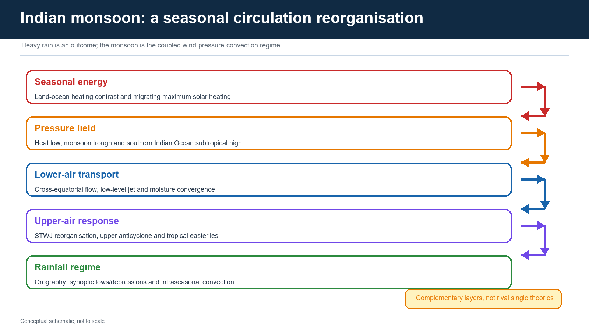

The Indian monsoon is the annually recurring reorganisation of the tropical circulation over the Indian Ocean-Asian landmass system. It changes low-level wind direction, pressure fields, moisture transport, deep convection, upper-air flow and the geographical focus of rainfall.

| Term | Precise meaning | Standard trap |
| --- | --- | --- |
| Southwest monsoon | Dominant June-September regime in which cross-equatorial maritime flow reaches India mainly as southwesterlies | Not every southwesterly shower proves onset |
| Northeast monsoon | Post-southwest-monsoon rainy regime important for southeast peninsular India, with easterly/northeasterly flow and Bay systems | Not dry continental air alone |
| ITCZ | Tropical convergence zone associated with ascent and convection; its regional continental expression contributes to the monsoon trough | Not a fixed latitude line |
| Heat low | Shallow/deep low-pressure tendency over strongly heated northwest India-Pakistan sector | Cannot alone explain onset or breaks |
| Monsoon trough | Elongated low-pressure/convergence zone from the northwest toward the Bay region | Not identical to one depression |
| Mascarene High | Subtropical high-pressure cell over the southern Indian Ocean that helps maintain the cross-equatorial pressure gradient | Its strength alone does not determine Indian rain |
| Cross-equatorial flow | Air crossing from the Southern Hemisphere toward South Asia and turning under Earth's rotation and regional pressure fields | Not a straight un-deflected path |
| Low-level jet | Fast lower-tropospheric moisture-bearing current, prominently the East African/Somali jet | Not the upper tropical easterly jet |
| Tropical easterly jet | Upper-tropospheric easterly current associated with mature monsoon heating/outflow | Not the Somali low-level jet |
| Monsoon low/depression | Synoptic-scale cyclonic system, often originating over the Bay and moving inland | Not every trough is a cyclone |

**Core inference:** heavy rain can occur without the monsoon, and monsoon conditions can coexist with a dry district. The regime must be diagnosed from circulation and convection at the relevant scale.

> **Memory hook:** REVERSE - REORGANISE - TRANSPORT - CONVERGE - RAIN

## 2. Evolution of explanation: complementary layers

The Indian monsoon has not moved from one "wrong" theory to one "correct" theory. Scientific explanation became layered as observations expanded from the surface to the upper atmosphere and coupled ocean-atmosphere system.

| Explanatory layer | What it adds | What it cannot explain alone |
| --- | --- | --- |
| Classical thermal / land-sea contrast | Seasonal pressure gradient caused by differential heating and cooling | Abrupt onset, active-break spells, teleconnections and upper-air organisation |
| ITCZ migration | Seasonal movement of tropical convergence over the heated landmass | Detailed jet, synoptic and ocean feedbacks |
| Dynamic / jet-stream view | STWJ reorganisation, upper anticyclone, TEJ and large-scale vorticity/divergence structure | Local rainfall without moisture, topography and synoptic systems |
| Himalaya-Tibetan framework | Barrier, elevated heating, snow/albedo and planetary-scale circulation effects | A single snow index cannot determine all-India rain |
| Coupled ocean-atmosphere view | ENSO, IOD, basin warming, upper-ocean heat, MJO and air-sea feedback | Teleconnections remain probabilistic and non-stationary |
| Intraseasonal view | MISO/BSISO, northward propagation, quasi-biweekly mode and synoptic systems | Does not replace seasonal boundary conditions |

**Balanced verdict:** the monsoon is simultaneously a thermal response, a migrating tropical convergence regime, an orographically modified cross-equatorial circulation, an upper-air reorganisation and a coupled ocean-land-atmosphere phenomenon.

## 3. Seasonal energy and pressure setup

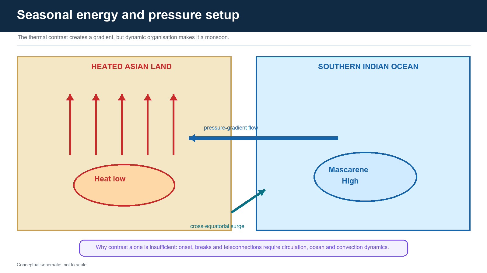

During boreal spring and early summer, the Asian landmass heats rapidly. Sensible heating, the northwest heat low and elevated heating over the high terrain contribute to a continental low-pressure tendency. The southern Indian Ocean subtropical high, often discussed through the Mascarene High, provides the opposite pole of a large-scale pressure gradient.

The air initially belongs to Southern Hemisphere trades. On crossing the equator, the pressure-gradient force, Coriolis deflection away from the equator and regional topography reshape it into a predominantly southwesterly flow toward India. Friction, vorticity and convection make the actual path curved and variable.

### Why the sea-breeze analogy is useful but insufficient

- It correctly begins with differential heating and a reversed pressure gradient.
- A sea breeze is local and diurnal; the monsoon is continental-basin scale and seasonal.
- Onset requires deep westerlies, organised convection and upper-air change, not surface pressure alone.
- Breaks occur while the broad seasonal land-sea contrast still exists.
- ENSO/IOD/MJO influence the system without reversing the basic seasonal heating contrast.
- Synoptic lows, depressions and orography decide where much of the rain falls.

**Answer line:** differential heating supplies the seasonal tendency; dynamic and coupled processes organise, modulate and distribute it.

## 4. Cross-equatorial flow, low-level jet and interacting branches

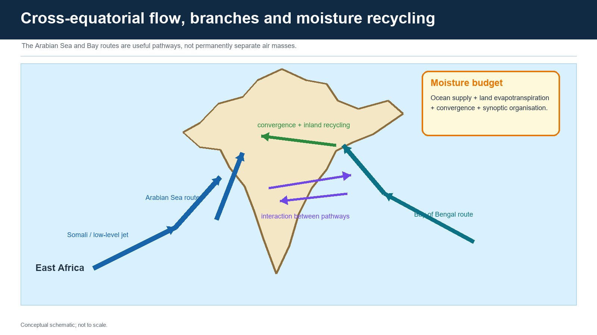

The strong pressure gradient accelerates cross-equatorial flow off East Africa. The East African/Somali or Findlater low-level jet transports moisture rapidly across the Arabian Sea. Part of this current approaches India's west coast and is lifted over the Western Ghats.

The Bay route reaches the Andaman Sea, Bay of Bengal, Northeast and the monsoon-trough corridor. It can be redirected along the Ganga plain, interact with Himalayan topography, and feed lows/depressions that travel inland.

### Branch language: use with qualification

The familiar Arabian Sea and Bay of Bengal branches describe dominant pathways. They do not mean:

- two permanently sealed air masses;
- no exchange across peninsular and central India;
- only ocean evaporation matters;
- every rain event retains one identifiable "branch" identity.

Moisture is recycled through evapotranspiration, boundary-layer mixing and repeated convergence. Arabian Sea moisture can feed central/north Indian systems; Bay systems can draw moisture from multiple sectors.

## 5. Himalaya and Tibetan Plateau: separate roles, active research

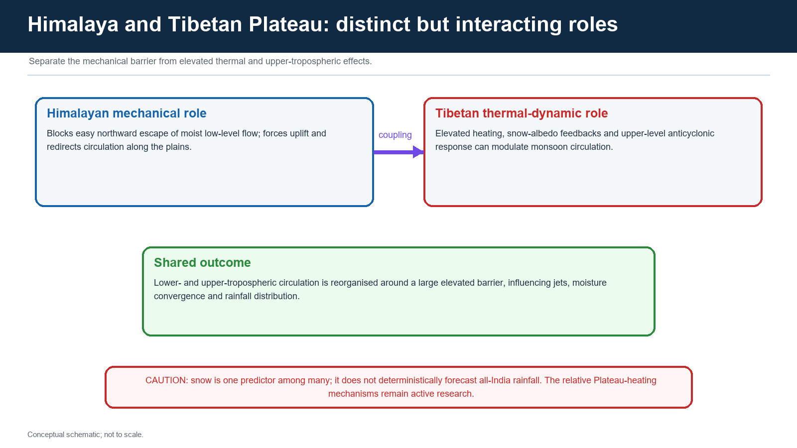

### Himalayan mechanical role

- A high barrier limits easy northward escape of lower-tropospheric moist flow.
- It forces uplift and shapes rainfall along windward slopes and foothills.
- It redirects circulation along the Indo-Gangetic plain.
- It affects the path and structure of upper-air westerlies and disturbances.

### Tibetan Plateau thermal-dynamic role

- Elevated heating can deepen the warm-season thermal structure and affect the upper-tropospheric anticyclone.
- Snow and albedo alter spring surface energy exchange.
- Plateau heating interacts with the South Asian high, jets and large-scale overturning.

### Necessary qualification

The Himalaya is not merely a wall, and the Tibetan Plateau is not merely a hot plate. Their mechanical and thermal effects interact. Snow cover is one predictor and boundary condition; it does not alone predict all-India monsoon rainfall. Research continues on the relative roles of Plateau heating, southern slopes, snow distribution and remote ocean forcing.

## 6. Upper and lower jets: a three-level distinction

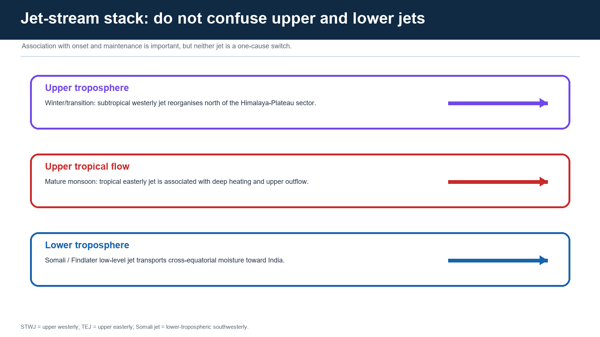

| Jet / flow | Level and direction | Monsoon relevance | Trap |
| --- | --- | --- | --- |
| Subtropical westerly jet (STWJ) | Upper troposphere, westerly | Winter/transition circulation south of the Himalaya reorganises poleward/northward as summer monsoon establishes | Withdrawal is associated with onset; it is not a single mechanical trigger |
| Tropical easterly jet (TEJ) | Upper tropical troposphere, easterly | Associated with deep monsoon heating and upper-level outflow | Not a moisture-bearing surface wind |
| Somali / low-level jet | Lower troposphere, southwesterly after equatorial crossing | Major Arabian Sea moisture and momentum transport | Not the TEJ |

Jet reorganisation is a diagnostic layer in the onset and mature monsoon circulation. It must be linked to convection, pressure fields and diabatic heating rather than presented as an isolated switch.

## 7. Operational onset over Kerala

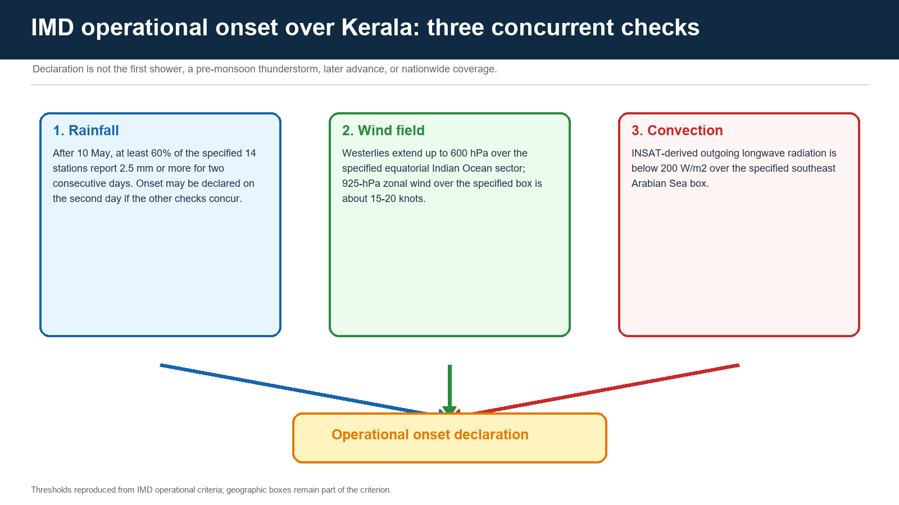

**FACT - IMD operational criteria:** after 10 May, if at least 60% of the specified 14 stations report rainfall of **2.5 mm or more for two consecutive days**, onset may be declared on the second day provided the wind-field and OLR criteria also concur.

**FACT - wind field:** westerlies should extend up to **600 hPa** over the specified equatorial Indian Ocean sector. The 925-hPa zonal wind over **5-10 degrees N, 70-80 degrees E** should be about **15-20 knots**.

**FACT - convection:** INSAT-derived outgoing longwave radiation should be below **200 W/m2** over **5-10 degrees N, 70-75 degrees E**.

### Distinctions

| Event | Meaning |
| --- | --- |
| First rain / pre-monsoon thunderstorm | Local rain before operational criteria are met |
| Kerala onset | IMD declaration based on concurrent rainfall, wind and convection checks |
| Burst | Popular term for abrupt establishment of widespread monsoon weather; not a separate national legal criterion |
| Advance | Subsequent movement of the monsoon envelope across regions |
| Nationwide coverage | Monsoon has advanced over the remaining country |

**LIMIT:** thresholds must be quoted with their geographic boxes. A single wet station, a cyclone-related shower or a calendar date cannot substitute for the operational declaration.

## 8. Advance: surge, pause and synoptic assistance

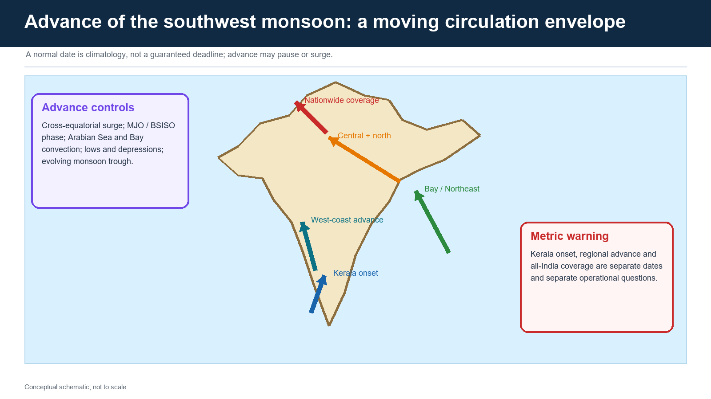

Advance depends on a sequence of favourable circulation and convection, not on the calendar alone:

1. cross-equatorial surge and sustained lower-tropospheric westerlies;
2. moisture convergence over the Arabian Sea, Bay and peninsula;
3. favourable MJO/BSISO/MISO phase and northward-moving convection;
4. Arabian Sea or Bay lows/depressions and offshore troughs;
5. evolution of the monsoon trough and upper anticyclone;
6. interaction with topography and pre-existing land heating.

The monsoon can advance rapidly in one sector, pause in another, or cover a region without producing uniform district rainfall. Normal onset/advance dates are climatological medians or normals used for comparison, not promises.

## 9. Rainfall distribution across India

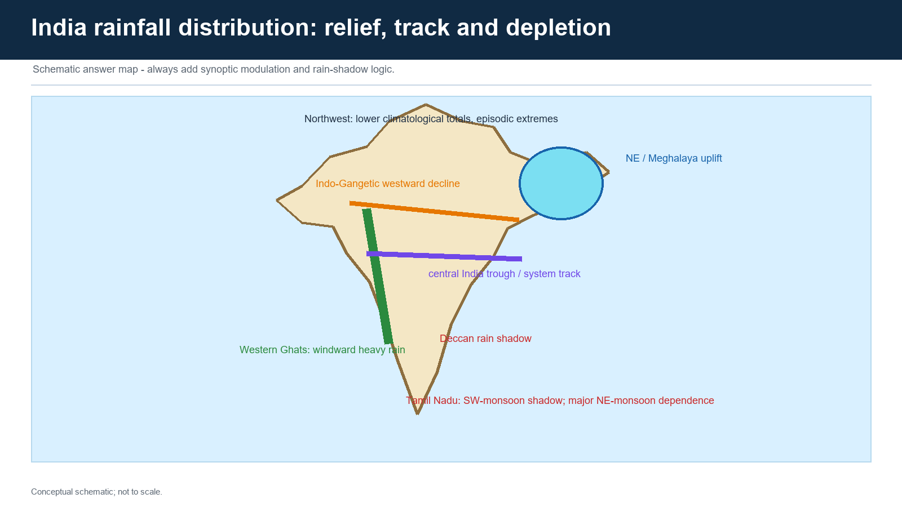

| Region | Mechanism | Qualification |
| --- | --- | --- |
| Western Ghats windward side | Moist Arabian Sea flow forced upward | Synoptic/offshore-trough strength changes totals |
| Interior Deccan | Leeward descent and moisture depletion | Local relief and Bay systems can interrupt the shadow |
| Northeast / Meghalaya | Bay moisture, steep relief and funnelled uplift | Event tracks and local orientation matter |
| Indo-Gangetic plain | Monsoon-trough flow, Himalayan deflection and progressive moisture loss westward | Western disturbances are a different winter system |
| Central India | Preferred track of lows/depressions and trough convergence | Track shifts create sharp spatial contrasts |
| Northwest | Lower climatological totals and greater continentality | Short extreme events can still produce floods |
| Tamil Nadu in SW-monsoon season | Located in a relative rain shadow for much of the southwesterly flow | Its principal rainy season is later; SW rain is not zero |

Windward/leeward position, slope orientation, rain-shadow descent, distance from moisture source, trough position and synoptic-system tracks work together. No one contour can be explained by branch labels alone.

## 10. Monsoon trough, lows, depressions and cyclones

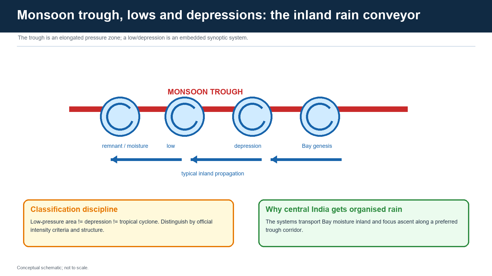

The monsoon trough is an elongated low-pressure and convergence zone. Embedded or nearby synoptic systems organise ascent and moisture transport. Bay-origin lows and depressions frequently move west-northwest across the monsoon zone, distributing rainfall through Odisha, Chhattisgarh, Madhya Pradesh and adjoining regions.

| Feature | Structure | Rainfall role |
| --- | --- | --- |
| Monsoon trough | Elongated convergence/low-pressure zone | Organises broad rain belt; shifts during active/break phases |
| Low-pressure area | Closed or organised low with weaker winds than depression thresholds | Can still produce widespread rain |
| Depression | Stronger officially classified cyclonic system | Concentrates convergence and transports moisture inland |
| Tropical cyclone | More intense warm-core cyclonic storm with its own classification | Not the routine name for every monsoon depression |

**UPSC trap:** "cyclone" is often used loosely in news. In an answer, preserve the official system category and bulletin time.

## 11. Active and break monsoon

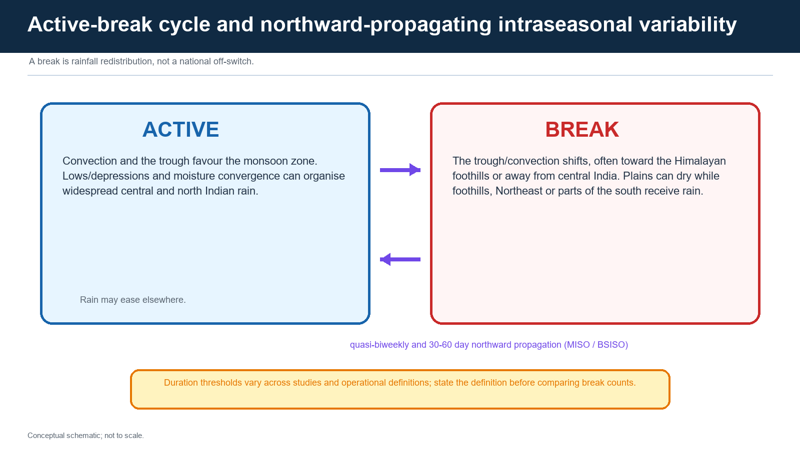

An active spell usually features stronger organised convection over the monsoon zone, a favourable trough position and more frequent/strong synoptic systems. A break features suppressed rainfall over large parts of central and northwest India while rain may increase along Himalayan foothills, Northeast India or parts of the peninsula.

### Why "on/off" is wrong

- A break is spatial redistribution, not national cessation.
- Definitions vary by index, region, rainfall threshold and duration.
- A district agricultural dry spell may not satisfy a research definition of an all-India break.
- A seasonal total can recover after a damaging break at sowing or flowering stage.

### MISO / BSISO and MJO

Monsoon intraseasonal oscillations include northward propagation of convective anomalies from the equatorial Indian Ocean toward the monsoon zone, commonly discussed on quasi-biweekly and 30-60 day scales. The Boreal Summer Intraseasonal Oscillation is the summer expression; the MJO is a broader eastward-propagating tropical mode. They interact but are not identical labels.

## 12. Timescale discipline

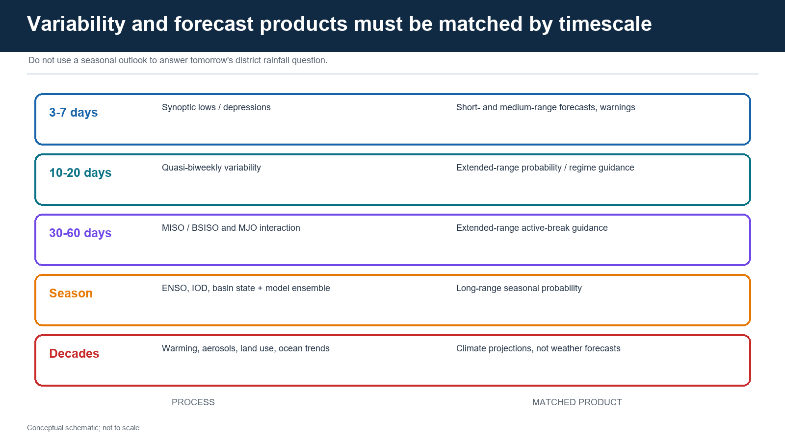

| Scale | Process | Appropriate forecast use |
| --- | --- | --- |
| 3-7 days | Lows, depressions, troughs, mesoscale rain organisation | Short/medium-range track, rainfall and warning guidance |
| About 10-20 days | Quasi-biweekly mode and regime transition | Extended-range probability and active/break tendency |
| About 30-60 days | MISO/BSISO and MJO-linked convection | Extended-range broad-regime guidance |
| Seasonal | ENSO, IOD, Indian Ocean state, land boundary conditions, coupled ensemble | Probabilistic seasonal category, not daily district rain |
| Decadal/climate | Warming, aerosols, land-use and slowly varying ocean background | Climate risk/projection, not a weather forecast |

**Forecast-literacy rule:** match the product's lead, target period and spatial resolution to the decision. A seasonal below-normal probability cannot specify whether a district will flood next week.

## 13. Teleconnections and boundary conditions

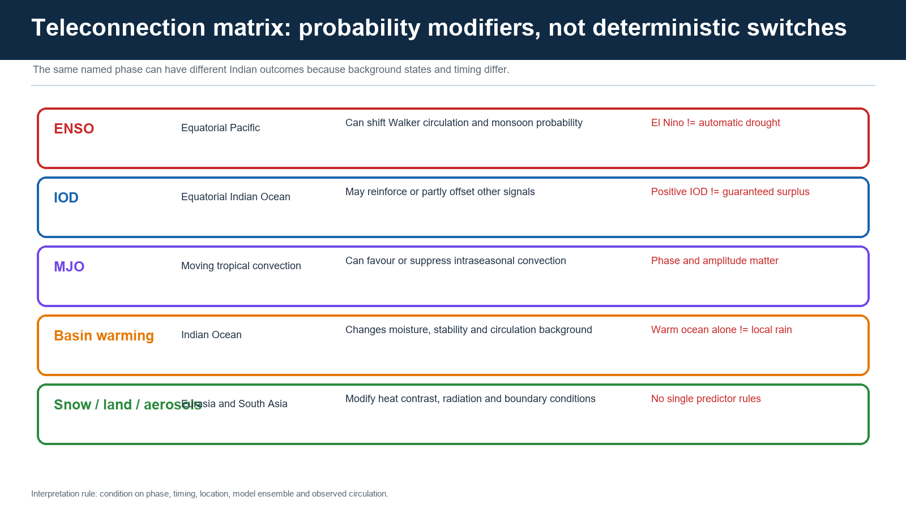

### ENSO

El Nino-related Pacific warming can alter Walker circulation and increase the probability of weaker Indian summer monsoon rainfall. The relationship is not one-to-one: timing, location of warming, Indian Ocean state, intraseasonal activity and synoptic systems matter. El Nino is not equivalent to automatic drought.

### Indian Ocean Dipole

The IOD compares western and eastern equatorial Indian Ocean temperature anomalies and associated winds/rainfall. A positive IOD can sometimes favour Indian monsoon circulation or offset part of an El Nino influence, but it cannot guarantee a good monsoon.

### Indian Ocean basin warming and upper-ocean heat

Warmer surface water can increase moisture availability, but basin-wide warming also changes gradients, stability and circulation. Ocean Mean Temperature (OMT), which samples the upper warm layer rather than only the skin, can carry predictive information. The depth of the 26 degrees C isotherm varies; it is not a universal fixed 129 m.

### MJO

The MJO's phase and amplitude alter tropical convection over the Indian Ocean-Maritime Continent-Pacific pathway. Its effect is lead- and phase-specific. It does not replace the northward-propagating boreal-summer mode.

### Snow, Eurasian land state and aerosols

Snow/albedo can alter spring heating. Soil moisture and vegetation affect surface fluxes. Aerosols alter radiation and cloud microphysics. All are interacting boundary conditions; none should be sold as a standalone seasonal key.

## 14. Withdrawal and northeast monsoon

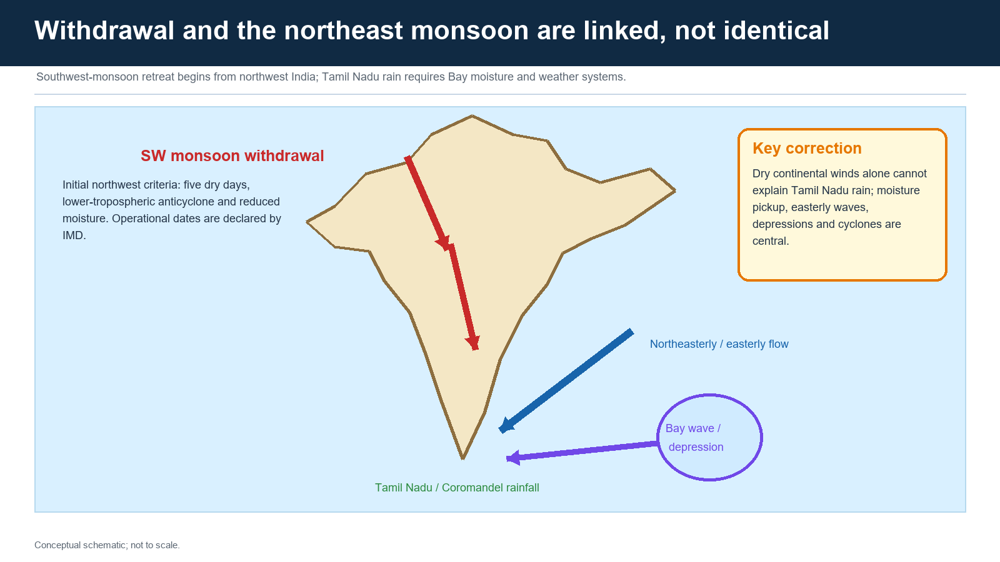

**FACT - initial withdrawal from northwest India:** IMD uses cessation of rainfall for five days, establishment of a lower-tropospheric anticyclone at and below 850 hPa, and considerable moisture reduction inferred from satellite water-vapour imagery and tephigrams.

**FACT - timing guardrail:** initial withdrawal from extreme northwest India is not attempted before **1 September**. Complete withdrawal from the country is only after **1 October**.

Further retreat is tracked through spatial continuity of dry weather, moisture reduction and circulation change. Withdrawal dates are declared, not presumed from the calendar.

### Northeast monsoon correction

The onset of the northeast monsoon is related to the post-southwest-monsoon circulation transition but is not identical to each withdrawal line. Tamil Nadu and the Coromandel coast receive major rain when northeasterly/easterly flow picks up Bay moisture and is organised by easterly waves, depressions and tropical cyclones. Calling it rain from "dry continental winds" is incomplete.

## 15. Separate the four metrics

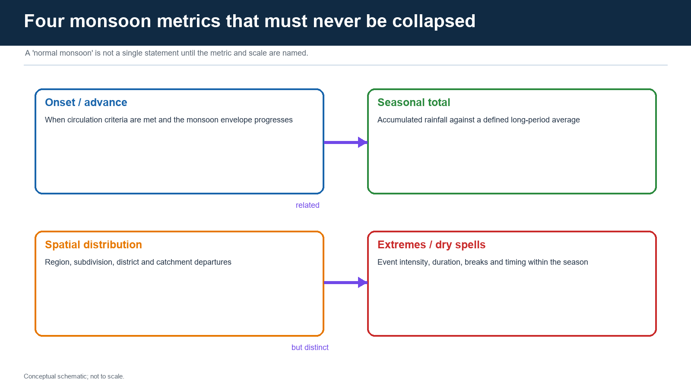

1. **Onset and advance:** operational establishment and geographical progress.
2. **Seasonal total:** accumulation against an agency-defined long-period average.
3. **Spatial distribution:** region, subdivision, district, catchment and rain-gauge pattern.
4. **Extremes and dry spells:** event intensity, duration, clustering and crop-stage timing.

A normal all-India total can coexist with a deficient region, a flooded district, prolonged dry spells and concentrated extreme rain. Likewise, an early onset does not guarantee a surplus season.

## 16. Prediction architecture

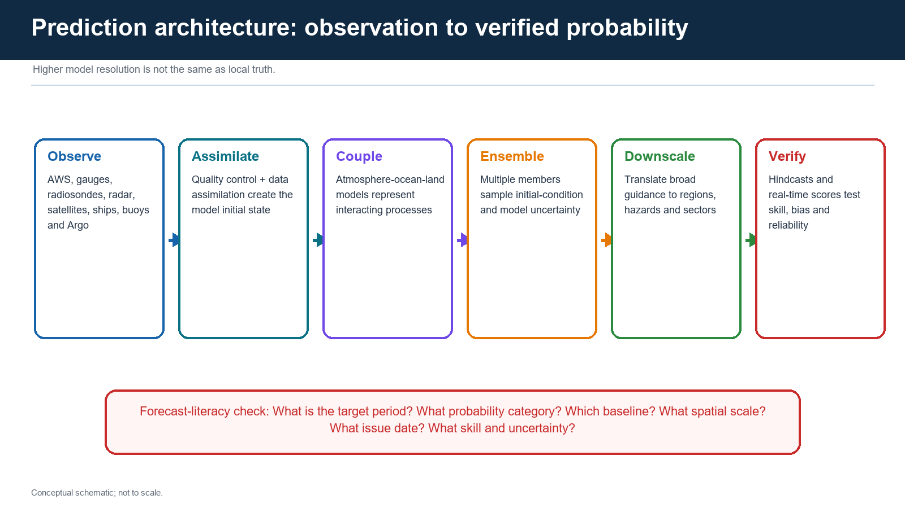

### Observation system

- rain gauges and automatic weather stations;
- radiosondes and aircraft/upper-air observations;
- Doppler weather radar;
- geostationary and polar satellites;
- ships, moored buoys and drifting buoys;
- Argo upper-ocean profiles;
- soil, hydrological and sectoral observations.

### From observations to forecast

1. quality control and data assimilation estimate the initial state;
2. coupled atmosphere-ocean-land models evolve that state;
3. ensembles sample uncertainty and produce probabilities;
4. hindcasts estimate skill, systematic bias and reliability;
5. downscaling/post-processing translates broad output to useful services;
6. verification compares forecast with later observation.

### IMD product ladder

| Product | Typical decision use | Limit |
| --- | --- | --- |
| Long-range / seasonal | Broad national and regional risk planning | Cannot time one depression |
| Extended range | Week-1/week-2 broad rainfall and active-break tendency | Limited local precision |
| Short/medium range | System track and rainfall zone | Track/intensity error remains |
| Nowcast / warning | Immediate local severe-weather action | Very short lead; coverage/observation limits |

**Model-resolution trap:** a 6-km or finer grid can represent terrain and convection better, yet local rainfall remains sensitive to initial conditions, physics, displacement error and unresolved features.

## 17. Current dashboard - cut-off 18 August 2026

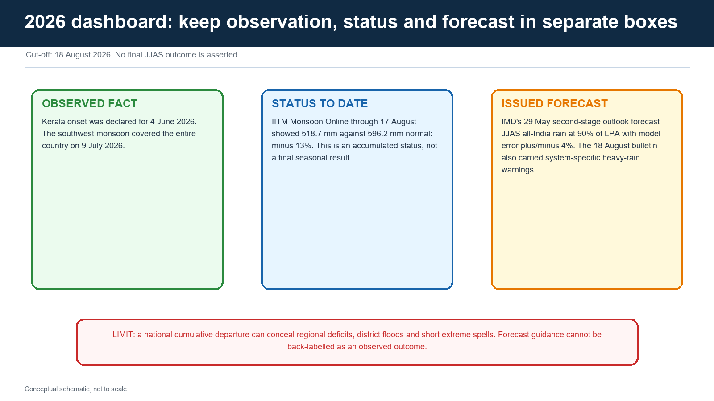

### FACT / OBSERVATION

- IMD declared the southwest monsoon onset over Kerala on **4 June 2026**, three days after the climatological normal date of 1 June.
- IMD reported that the southwest monsoon covered the entire country on **9 July 2026**.

### STATUS TO DATE - not final JJAS

- IITM Monsoon Online, through **17 August 2026**, displayed all-India rainfall of **518.7 mm** against **596.2 mm** normal, a departure of **-13%**.
- IMD's 13 August extended-range bulletin reported cumulative all-India rainfall through 12 August at about **-12%**, with the week 6-12 August about **-16%**. These values use a different cut-off from the IITM display.

### FORECAST - not observed outcome

- IMD's second-stage outlook issued **29 May 2026** forecast June-September all-India rainfall at **90% of LPA**, with model error **plus/minus 4%**.
- IMD's **18 August 2026** release described a depression over Jharkhand and adjoining northern Gangetic West Bengal and issued heavy to extremely heavy rainfall guidance for specified regions and validity periods.
- NOAA CPC's August update described strengthening El Nino conditions. This is a later observed/forecast Pacific-state update, not proof of India's final seasonal result.

### RECONCILIATION

The May seasonal forecast, mid-August accumulated status, August ENSO update and 18 August synoptic warning answer different questions. They should be placed chronologically and by target scale, not averaged into one verdict.

### LIMIT

The current date is 18 August 2026. No final June-September all-India outcome is asserted. National cumulative rainfall can conceal regional deficits and flood extremes. Forecast impacts remain forecasts until verified.

## 18. Climate change: confidence hierarchy

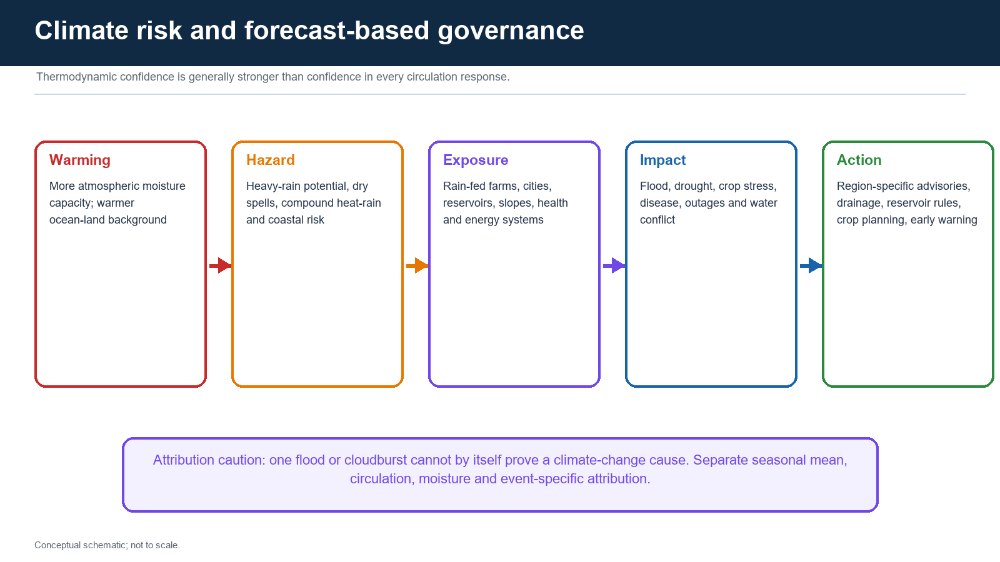

### Higher-confidence thermodynamic direction

- warmer air can hold more water vapour;
- warmer oceans and land alter evaporation and moisture supply;
- when dynamical lifting is present, heavy-rain potential can increase;
- rainfall intensity can rise even if seasonal mean circulation weakens or becomes more uncertain.

### Greater dynamic uncertainty

- changes in land-sea pressure gradients;
- monsoon circulation strength;
- active-break duration and propagation;
- synoptic-system frequency and tracks;
- aerosol and land-use interactions;
- regional seasonal-mean rainfall.

### Correct synthesis

Climate change can intensify the hydrological cycle and heavy-rain risk while leaving substantial uncertainty about regional circulation and seasonal mean. A trend in extremes is not identical to a trend in the all-India seasonal total. Event attribution requires a case-specific study.

## 19. Impacts and forecast-based governance

| Sector | Monsoon metric that matters | Measurable indicator | Action |
| --- | --- | --- | --- |
| Agriculture | Onset, sowing rain, dry-spell timing, withdrawal | Sown area, soil moisture, crop stage, yield risk | CRIDA contingency crops, advisories, protective irrigation |
| Reservoirs | Catchment rainfall and inflow sequence | Storage as percentage of capacity, rule-curve position | Coordinated release and flood cushion |
| Groundwater | Seasonal recharge distribution | Water-table change and extraction | Recharge protection and demand management |
| Floods | Basin rain, upstream state and routing | River level, inflow, warning lead | CWC forecast, evacuation and reservoir coordination |
| Urban drainage | Short-duration intensity | mm/hour, inundation depth/duration | Drain maintenance, blue-green storage, risk zoning |
| Health | Humidity, heat, floodwater and vector habitat | disease surveillance, heat stress | pre-positioning and public-health alerts |
| Energy | Reservoir inflow, demand and storm damage | hydropower storage, peak demand, outages | diversified supply and grid preparedness |

**Governance principle:** move from one all-India seasonal number to regional, catchment, district and sector-specific services. Forecast-based action should be triggered by probabilistic thresholds and vulnerability, not by deterministic headline language.

---

# Solved verified PYQs

## PYQ 1 - UPSC GS-I 2023, Q7, 10 marks, 150 words

**Verified official-paper wording:** "Why is the South-West Monsoon called 'Purvaiya' (easterly) in Bhojpur Region? How has this directional seasonal wind system influenced the cultural ethos of the region?"

**Demand decode:** resolve the apparent directional contradiction and connect experienced wind direction with agrarian-cultural life.

**Model answer**

**Claim:** "South-West Monsoon" names the large-scale ocean-to-subcontinent circulation, whereas **Purvaiya** records the wind as locally experienced in Bhojpur, where moisture-bearing currents and Bay-linked monsoon systems often approach from the east or southeast along the Ganga plain.

**Named evidence/example:** the Himalayan barrier and monsoon-trough corridor redirect Bay of Bengal moisture west-northwestward across the eastern Gangetic plain. Bhojpuri folk vocabulary therefore names the felt direction rather than the remote oceanic origin.

**Analysis:** this seasonal wind structures the agrarian calendar: ploughing and paddy transplantation follow its rain; songs invoke dark clouds, waiting, separation and the return of migrants; festivals, oral poetry and proverbs encode the hope and anxiety of rainfall. Purvaiya thus becomes both a meteorological sign and a cultural metaphor for fertility, longing and rural time.

**Qualification:** its arrival and rainfall are variable, and irrigation, migration and urbanisation have weakened but not erased the association.

**Verdict:** the term demonstrates how a planetary circulation is translated through regional geography into a lived cultural landscape.

**Why this earns marks:** it answers both "why" and "how," resolves scale-dependent wind naming, supplies a named geographical mechanism and links it to concrete Bhojpuri agrarian-cultural expressions with qualification.

## PYQ 2 - UPSC GS-I 2024, Q4, 10 marks, 150 words

**Verified official-paper wording:** "What is sea surface temperature rise? How does it affect the formation of tropical cyclones?"

**Demand decode:** define the anomaly/trend and explain the heat-engine pathway without claiming temperature alone creates cyclones.

**Model answer**

**Claim:** sea-surface-temperature rise is an increase in the ocean's near-surface temperature relative to a stated climatological baseline, whether as a short anomaly or long-term trend.

**Named evidence/example:** warm North Indian Ocean waters increase evaporation and boundary-layer moisture; a sufficiently deep warm layer can reduce cyclone-induced cooling.

**Analysis:** moist air rises in a pre-existing disturbance, condensation releases latent heat, the warm core strengthens, pressure falls and surface inflow accelerates. Higher moisture can raise potential rainfall and intensification risk.

**Qualification:** cyclone formation still requires adequate Coriolis force, low vertical wind shear, mid-level humidity, instability, upper outflow and a seed disturbance. Warming does not imply more cyclones everywhere; frequency, track and intensity respond differently.

**Verdict:** SST rise raises the thermodynamic ceiling, while atmospheric dynamics decide whether a cyclone forms and how it evolves.

**Why this earns marks:** it defines the term, supplies the full causal chain, names necessary genesis conditions and preserves the intensity-versus-frequency distinction.

## PYQ 3 - UPSC GS-I 2024, Q6, 10 marks, 150 words

**Verified official-paper wording:** "What is the phenomenon of 'cloudbursts'? Explain."

**Model answer**

**Claim:** a cloudburst is an exceptionally intense, short-duration rainfall event concentrated over a small area; IMD operationally uses about 100 mm or more in one hour over a small area.

**Named evidence/example:** in Himalayan valleys, monsoon moisture can be forced upward by steep relief while local convergence sustains a deep convective cell.

**Analysis:** strong updrafts recycle droplets and ice within the cloud; rapid coalescence and downdraft collapse then release intense rain. Steep, short catchments convert it quickly into debris-laden flash floods.

**Qualification:** not every extreme monsoon shower meets the criterion. Cells are small and short-lived, so radar coverage, terrain blockage and displacement error constrain deterministic warning.

**Verdict:** cloudburst disaster risk emerges from a high-intensity convective process interacting with vulnerable relief, drainage and settlement.

**Why this earns marks:** it defines the operational threshold, explains convection plus orography, links hazard to runoff and qualifies forecast and attribution limits.

## PYQ 4 - UPSC Prelims 2020, Q93

**Question:** With reference to Ocean Mean Temperature (OMT), which of the following statements is/are correct?

1. OMT is measured up to a depth of 26 degrees C isotherm which is 129 meters in the south-western Indian Ocean during January-March.
2. OMT collected during January-March can be used in assessing whether the amount of rainfall in monsoon will be less or more than a certain long-term mean.

A. 1 only
B. 2 only
C. Both 1 and 2
D. Neither 1 nor 2

**INFERRED ANSWER - NOT OFFICIALLY VERIFIED LOCALLY: B, 2 only. Confidence: high.**

The 26 degrees C isotherm depth varies; the cited fixed 129 m is incorrect for the stated seasonal-regional mean. January-March OMT can provide predictive information about later monsoon rainfall because it represents upper-ocean heat content more robustly than skin SST.

## PYQ 5 - UPSC Prelims 2020, Q99

**Question:** Consider the following statements:

1. Jet streams occur in the Northern Hemisphere only.
2. Only some cyclones develop an eye.
3. The temperature inside the eye of a cyclone is nearly 10 degrees C lesser than that of the surroundings.

A. 1 only
B. 2 and 3 only
C. 2 only
D. 1 and 3 only

**INFERRED ANSWER - NOT OFFICIALLY VERIFIED LOCALLY: C, 2 only. Confidence: high.**

Jet streams occur in both hemispheres. A well-defined eye develops only in sufficiently organised intense tropical cyclones. The eye is warm-cored, not colder by the stated amount.

## PYQ 6 - UPSC Prelims 2026, Q33, Set A

**Verified local official-paper wording:** With reference to the climate of Andaman and Nicobar Islands, which of the following statements is/are correct?

1. The climate can be defined as a humid, tropical coastal climate.
2. It receives rainfall from both South-west monsoon and North-east monsoon.
3. Maximum precipitation is between December and May.

A. 1 only
B. 1 and 2
C. 2 and 3
D. 3 only

**PROVISIONAL OFFICIAL SET-A KEY: B, 1 and 2.**

The islands have humid tropical maritime conditions and receive rain from both monsoon regimes. The assertion that maximum precipitation occurs from December to May is inconsistent with their principal wet-season pattern.

## PYQ 7 - UPSC Prelims 2026, Q84, Set A

**Verified local official-paper wording:** Which of the following statements with regard to India's indigenous new high resolution weather model, the 'Bharat Forecast System,' is/are correct?

1. Its objective is to generate forecasts at the Panchayats cluster level.
2. It was developed by IIT Delhi.

A. 1 only
B. 2 only
C. Both 1 and 2
D. Neither 1 nor 2

**PROVISIONAL OFFICIAL SET-A KEY: A, 1 only.**

The local official provisional key supports statement 1. Bharat Forecast System was developed by IITM under MoES, not IIT Delhi. Higher resolution supports finer guidance but does not eliminate local uncertainty.

---

# Original solved MCQ loop

Correct options rotate strictly **A -> B -> C -> D** throughout Q1-Q48.

## Q1-Q12: foundations, pressure, branches and relief

### Q1
Which statement best defines the Indian monsoon?

A. A seasonal reorganisation of circulation, moisture transport, convection and rainfall
B. Any rain caused by southwesterly winds
C. Only the four-month rainfall total
D. A continental-scale sea breeze with no upper-air component

**Answer: A.** The monsoon is a regime; heavy rain and southwesterlies are insufficient by themselves.

### Q2
Land-sea thermal contrast alone is insufficient mainly because it cannot by itself explain:

A. why land heats faster than sea
B. abrupt onset, active-break spells and remote teleconnections
C. why moist air contains water vapour
D. why India lies north of the equator

**Answer: B.** These require dynamic, intraseasonal and coupled ocean-atmosphere processes.

### Q3
Which pairing is correct?

A. TEJ - lower-tropospheric moisture jet
B. Somali jet - upper-tropospheric easterly
C. STWJ - upper westerly circulation that reorganises seasonally
D. Monsoon trough - one tropical cyclone

**Answer: C.**

### Q4
The safest statement about Arabian Sea and Bay of Bengal branches is:

A. they never interact
B. land evapotranspiration is irrelevant
C. every rain event belongs exclusively to one branch
D. they are dominant pathways that interact and undergo moisture recycling

**Answer: D.**

### Q5
The Mascarene High is most relevant as:

A. a southern Indian Ocean high contributing to the cross-equatorial pressure gradient
B. the heat low over northwest India
C. the Bay monsoon trough
D. the northeast-monsoon cyclone belt

**Answer: A.**

### Q6
Which statement correctly distinguishes the Himalaya and Tibetan Plateau?

A. both work only through surface blocking
B. the Himalaya has a strong mechanical role, while the Plateau also has elevated thermal-dynamic roles
C. Plateau snow alone determines seasonal rainfall
D. neither affects upper-air circulation

**Answer: B.**

### Q7
Why is the Deccan interior relatively drier during much of the southwest monsoon?

A. It is too close to the equator
B. Bay moisture cannot cross land
C. much of it lies leeward of the Western Ghats, subject to descent and moisture depletion
D. the TEJ blocks all rainfall

**Answer: C.**

### Q8
The westward decline of monsoon rainfall in much of the northern plain is best related to:

A. absence of any Bay influence
B. only altitude
C. a permanent subtropical high over the Ganga plain
D. progressive inland moisture loss plus changing convergence and system tracks

**Answer: D.**

### Q9
Which is an onset-over-Kerala rainfall condition used by IMD?

A. At least 60% of 14 specified stations receive 2.5 mm or more for two consecutive days after 10 May, with other criteria concurring
B. Every Kerala station receives 10 mm on one day
C. One cyclone crosses Kerala
D. The calendar reaches 1 June

**Answer: A.**

### Q10
Which variable represents the convection check in the onset criteria?

A. Sea-level pressure above 1020 hPa
B. INSAT-derived OLR below 200 W/m2 over the specified box
C. A 200-knot surface wind
D. Zero cloud cover over the Arabian Sea

**Answer: B.**

### Q11
Which sequence is correct?

A. nationwide coverage -> Kerala onset -> first shower
B. first shower -> nationwide coverage -> onset declaration
C. local pre-monsoon rain may occur before operational Kerala onset, which precedes later advance and nationwide coverage
D. all are the same event

**Answer: C.**

### Q12
A normal onset date should be read as:

A. an exact annual deadline
B. a forecast of seasonal total
C. a guarantee of district rain
D. climatological reference, not a promise

**Answer: D.**

## Q13-Q24: trough, active-break, timescales and teleconnections

### Q13
The monsoon trough is:

A. an elongated low-pressure/convergence zone that helps organise the rain belt
B. the eye of every cyclone
C. a winter frontal boundary only
D. identical to the ITCZ at all longitudes and dates

**Answer: A.**

### Q14
Bay lows and depressions are important because they:

A. prevent moisture from entering land
B. organise ascent and transport moisture inland along the monsoon zone
C. occur only after withdrawal
D. are always severe cyclonic storms

**Answer: B.**

### Q15
During a common break configuration:

A. every part of India is rainless
B. all Bay systems intensify into cyclones
C. central/plain rainfall may weaken while foothill or other regional rain increases
D. the southwest monsoon has permanently withdrawn

**Answer: C.**

### Q16
MISO/BSISO is most directly associated with:

A. only decadal Pacific variability
B. winter western disturbances
C. daily sea breeze
D. intraseasonal propagation and active-break organisation

**Answer: D.**

### Q17
Which product is best matched to a 3-7 day depression-track question?

A. short/medium-range numerical guidance and warnings
B. a century-scale climate projection alone
C. seasonal rainfall category alone
D. an IOD climatology alone

**Answer: A.**

### Q18
Which is the soundest ENSO statement?

A. Every El Nino causes drought in every Indian region
B. ENSO shifts probabilities, with effects conditioned by timing and other modes
C. ENSO is a 30-day mode
D. ENSO affects only sea level

**Answer: B.**

### Q19
A positive IOD:

A. guarantees above-normal all-India rainfall
B. is another name for La Nina
C. can modulate or partly offset other influences but is not deterministic
D. occurs only in the Atlantic

**Answer: C.**

### Q20
Which statement about MJO and BSISO is safest?

A. they are identical at every season and latitude
B. both are annual means
C. neither affects tropical convection
D. they interact, but BSISO emphasises boreal-summer northward propagation while MJO is a broader eastward tropical mode

**Answer: D.**

### Q21
Ocean Mean Temperature is useful because it:

A. represents upper-ocean thermal structure more fully than skin SST
B. assumes the 26 degrees C isotherm is always at 129 m
C. directly predicts district rainfall without a model
D. excludes ocean heat content

**Answer: A.**

### Q22
Which statement about aerosols is correct?

A. they have no radiation effect
B. they can alter radiation, stability and clouds, interacting with other monsoon controls
C. they guarantee a weak monsoon
D. they are equivalent to ENSO

**Answer: B.**

### Q23
An all-India normal seasonal total can coexist with:

A. no district deficits
B. identical rainfall every week
C. regional drought, district floods and damaging dry spells
D. a fixed onset date

**Answer: C.**

### Q24
Which metric is not interchangeable with the others?

A. onset date
B. seasonal total
C. extreme-rain frequency
D. all of them are distinct and must be named

**Answer: D.**

## Q25-Q36: withdrawal, prediction and climate change

### Q25
Initial southwest-monsoon withdrawal from northwest India requires:

A. five dry days, lower-tropospheric anticyclone and moisture reduction
B. one dry afternoon only
C. a tropical cyclone over Kerala
D. a fixed 15 August declaration

**Answer: A.**

### Q26
The northeast-monsoon rain of Tamil Nadu is best explained by:

A. dry continental air alone
B. post-monsoon easterly/northeasterly flow acquiring Bay moisture and being organised by waves/depressions/cyclones
C. only Western Ghats uplift of westerlies
D. the STWJ as a surface moisture current

**Answer: B.**

### Q27
Which pair is correctly distinguished?

A. withdrawal = break
B. northeast onset = every northwest withdrawal line
C. southwest withdrawal and northeast-monsoon establishment are related but operationally distinct
D. both occur before Kerala onset

**Answer: C.**

### Q28
Which statement about complete southwest-monsoon withdrawal is correct?

A. it is declared before 1 August
B. it automatically occurs with one anticyclone
C. it is the same as the first dry day in Rajasthan
D. IMD does not treat entire-country withdrawal as occurring before 1 October

**Answer: D.**

### Q29
Data assimilation primarily:

A. combines quality-controlled observations with a model to estimate the initial state
B. replaces all observations with climatology
C. verifies a forecast after the event
D. guarantees perfect rainfall placement

**Answer: A.**

### Q30
An ensemble forecast is valuable because it:

A. hides uncertainty
B. samples plausible evolutions and supports probabilistic guidance
C. is always lower resolution than all deterministic models
D. eliminates model bias

**Answer: B.**

### Q31
Hindcasts are used mainly to:

A. declare onset today
B. observe rainfall directly
C. estimate past model skill, bias and reliability under a consistent system
D. replace current initial conditions

**Answer: C.**

### Q32
Which is the correct resolution caution?

A. finer grid means every village value is observed truth
B. model physics no longer matters below 10 km
C. displacement error disappears
D. finer resolution can improve representation but cannot eliminate uncertainty or local error

**Answer: D.**

### Q33
Climate warming most directly raises confidence in:

A. greater atmospheric moisture capacity, conditional on dynamical lifting for rain
B. one fixed regional circulation response
C. elimination of breaks
D. identical seasonal means across India

**Answer: A.**

### Q34
Which climate statement is best?

A. any cloudburst proves climate change
B. heavy-rain intensity can increase even while seasonal-mean circulation remains uncertain
C. seasonal mean and extremes are the same metric
D. aerosols and land use are irrelevant

**Answer: B.**

### Q35
Event attribution requires:

A. only a news headline
B. only a high seasonal total
C. a case-specific comparison of probability/intensity under factual and counterfactual climates
D. no model or observational evidence

**Answer: C.**

### Q36
Which is the best governance response to monsoon variability?

A. use only the all-India total
B. wait for final-season data before every action
C. apply one crop advisory nationally
D. combine regional forecasts, vulnerability, reservoirs, crop stage and impact thresholds

**Answer: D.**

## Q37-Q48: remedial and advanced traps

### Q37
Why can an early Kerala onset coexist with a poor agricultural season in one region?

A. onset, spatial distribution and crop-stage dry spells are distinct metrics
B. Kerala onset determines every district total
C. agriculture depends only on annual temperature
D. early onset means early withdrawal everywhere

**Answer: A.**

### Q38
Which statement about a depression is correct?

A. every depression has a mature eye
B. it is an officially classified cyclonic system stronger than a low-pressure area but not automatically a tropical cyclone category used loosely in headlines
C. it is the same as the monsoon trough
D. it occurs only over land

**Answer: B.**

### Q39
Why does central India often receive organised monsoon rain?

A. it is always windward of the Western Ghats
B. the TEJ rains directly
C. the monsoon-trough and common inland tracks of Bay lows/depressions focus moisture and ascent
D. it lies in the northeast-monsoon core

**Answer: C.**

### Q40
Which forecast statement is valid on 18 August 2026?

A. the final JJAS outcome is known
B. a May outlook can be relabelled as observation
C. a depression warning proves every forecast impact occurred
D. observations-to-date and dated forecasts must remain separate, and final JJAS cannot yet be asserted

**Answer: D.**

### Q41
The 4 June 2026 Kerala onset should be written as:

A. an IMD-declared observed onset, three days after the climatological normal date
B. proof of a normal all-India season
C. a forecast issued after JJAS
D. the date of complete withdrawal

**Answer: A.**

### Q42
The 17 August IITM Monsoon Online figure of -13% is:

A. a final seasonal verdict
B. an accumulated all-India status through that date
C. a district forecast for 18 August
D. an ENSO index

**Answer: B.**

### Q43
The IMD 29 May value of 90% of LPA plus/minus 4% is:

A. observed rainfall through August
B. a flood warning
C. a seasonal forecast with stated model error
D. a withdrawal criterion

**Answer: C.**

### Q44
Differing official/global guidance should be handled by:

A. averaging every number without regard to target
B. selecting the most dramatic headline
C. treating forecasts as outcomes
D. aligning each product by issue date, target period, scale, variable and uncertainty

**Answer: D.**

### Q45
Which statement best describes Tamil Nadu's southwest-monsoon shadow?

A. much southwesterly flow loses moisture or is poorly oriented after crossing relief, while later Bay-fed easterly systems provide major rain
B. Tamil Nadu receives no rain in June-September
C. the state lies west of the Arabian Sea
D. only snowmelt causes its rain

**Answer: A.**

### Q46
Which observation is especially useful for upper-ocean thermal structure?

A. one land rain gauge
B. Argo profile and buoy observations
C. only a surface pressure chart
D. a cultural wind name

**Answer: B.**

### Q47
Which statement best connects forecast and action?

A. probabilities cannot support decisions
B. warnings should ignore exposure
C. a probability threshold combined with crop stage, reservoir state or flood vulnerability can trigger anticipatory action
D. action must wait for certainty

**Answer: C.**

### Q48
Which conclusion is most scientifically defensible?

A. land-sea contrast is irrelevant
B. ENSO controls every monsoon metric
C. model resolution equals truth
D. India's monsoon is a coupled, multi-scale system whose mechanisms are complementary and whose forecasts require explicit limits

**Answer: D.**

---

# Original solved Mains practice

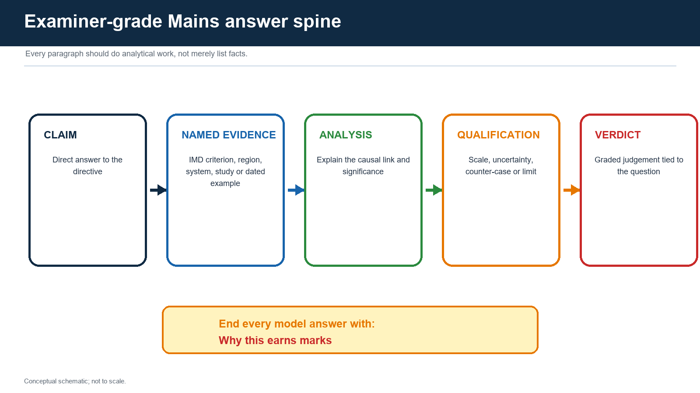

## Practice 1 - 10 marks, 150 words

**Question:** Explain why the thermal theory of the Indian monsoon is necessary but insufficient.

**Model answer**

**Claim:** differential heating of the Asian landmass and Indian Ocean is necessary because it reverses the seasonal pressure gradient and draws maritime air toward India, but it is insufficient as a complete mechanism.

**Named evidence/example:** the northwest heat low and southern Indian Ocean high help accelerate cross-equatorial flow, yet IMD's Kerala-onset declaration also requires deep westerlies and organised convection measured through OLR.

**Analysis:** abrupt onset, active-break spells, Bay depressions, STWJ/TEJ reorganisation and ENSO-IOD-MJO modulation cannot be derived from a simple sea-breeze analogy. Orography then redistributes rainfall across the Ghats, Northeast, plains and rain shadows.

**Qualification:** thermal contrast remains the seasonal energy-pressure foundation; dynamic and coupled explanations refine rather than reject it.

**Verdict:** the monsoon is best explained as a thermally initiated but dynamically organised and ocean-atmosphere-coupled circulation regime.

**Why this earns marks:** it answers "necessary but insufficient," uses an official operational example, preserves causal hierarchy and avoids presenting theories as mutually exclusive.

## Practice 2 - 15 marks, 250 words

**Question:** Analyse the role of the Himalaya, Tibetan Plateau and jet streams in the onset and maintenance of the Indian summer monsoon.

**Model answer**

**Claim:** the Himalaya-Plateau complex shapes the monsoon through distinct mechanical and thermal-dynamic pathways, while upper and lower jets express the resulting circulation reorganisation.

**Named evidence/example:** the Himalaya blocks easy northward escape of moist low-level flow, redirects currents along the plains and forces uplift. The elevated Tibetan Plateau modifies spring-summer heating, snow-albedo exchange and the upper-tropospheric anticyclone. Seasonally, the subtropical westerly jet reorganises northward from its winter position, the tropical easterly jet develops aloft, and the Somali low-level jet transports Arabian Sea moisture.

**Analysis:** together these processes support the vertical monsoon structure: lower-tropospheric convergence and moisture supply, deep convection, and upper-tropospheric outflow. They also explain why a surface heat low alone cannot account for abrupt onset or sustained rainfall.

**Qualification:** the STWJ shift is associated with onset rather than a solitary trigger; TEJ strength does not independently determine rain; Plateau heating and snow effects remain active research questions. ENSO, IOD, MJO and synoptic systems can override simple expectations.

**Verdict:** the orographic complex provides boundary forcing and the jets provide dynamical organisation, but monsoon success emerges only from their coupling with oceans, convection and synoptic disturbances.

**Why this earns marks:** it separates mechanical, thermal and jet roles, distinguishes upper and lower jets, names uncertainty and reaches a weighted coupled-system verdict.

## Practice 3 - 15 marks, 250 words

**Question:** "Break monsoon is a redistribution problem before it is a seasonal-total problem." Discuss.

**Model answer**

**Claim:** a break is a spatial-temporal reorganisation of convection within the monsoon season, not a countrywide switch-off.

**Named evidence/example:** when the monsoon trough shifts toward Himalayan foothills or convection moves away from central India, plains rainfall can decline while foothills, Northeast India or the southern peninsula receive rain. MISO/BSISO northward propagation and MJO phase help organise these transitions.

**Analysis:** agriculture responds to crop-stage soil moisture, not merely JJAS total. A ten-day dry spell near germination or flowering can reduce yield even if later rain restores the seasonal aggregate. Reservoir inflow, hydropower and urban flood risk similarly depend on sequencing: the same total concentrated in a few systems creates simultaneous drought and flood.

**Qualification:** break definitions vary by rainfall index, spatial domain and duration; a local agricultural dry spell may not meet an all-India research criterion. Synoptic lows can rapidly terminate or interrupt a break.

**Verdict:** seasonal total is useful for aggregate planning, but active-break distribution is the more actionable metric for crops, water, floods and forecast services.

**Why this earns marks:** it directly tests the quotation, explains the trough/intraseasonal mechanism, links it to measurable impacts and qualifies definitional variation.

## Practice 4 - 20 marks, 250 words

**Question:** Explain the architecture of Indian monsoon prediction and assess why forecast improvement does not remove uncertainty.

**Model answer**

**Claim:** monsoon prediction is an observation-assimilation-coupled-model-ensemble-verification chain; improvement raises skill and usefulness but cannot make a chaotic, multi-scale system deterministic.

**Named evidence/example:** IMD combines gauges, AWS, radiosondes, Doppler radar and satellites with INCOIS ocean buoys/Argo profiles. Data assimilation initialises atmosphere-ocean-land models; IMD seasonal multi-model ensembles, NCMRWF medium-range systems and IITM's Bharat Forecast System address different leads and scales. Hindcasts measure bias and reliability.

**Analysis:** seasonal forecasts estimate probabilities under ENSO, IOD and basin states; extended-range products track active-break regimes; short-range models predict lows/depressions; nowcasts target immediate convection. Ensembles expose alternative tracks and rainfall placements, while impact services translate them into crop, reservoir and flood decisions.

**Qualification:** sparse ocean/mountain observations, initial-condition error, imperfect convection and land-surface physics, teleconnection non-stationarity, displacement error and downscaling limits remain. Finer resolution can represent terrain better but cannot guarantee village truth. Users can also misuse a national seasonal forecast for a local daily decision.

**Verdict:** progress should be judged through verified reliability, lead time and avoided loss, not headline resolution alone; uncertainty must be communicated as an input to action.

**Why this earns marks:** it presents the full technical chain, differentiates product timescales, names Indian institutions and supplies a critical rather than celebratory assessment.

## Practice 5 - 20 marks, 250 words

**Question:** Climate change may intensify Indian monsoon extremes without producing a simple increase in seasonal-mean rainfall. Examine.

**Model answer**

**Claim:** warming strengthens the thermodynamic capacity for intense rain, but seasonal-mean monsoon rainfall also depends on circulation, aerosols, land use and ocean gradients whose regional responses are less certain.

**Named evidence/example:** warmer air holds more moisture and warm seas can supply greater evaporation; when a monsoon depression, offshore trough or orographic lift provides ascent, rainfall intensity can rise. Western Ghats, Himalayan catchments and cities with constrained drainage are therefore exposed to larger short-duration hazards.

**Analysis:** the seasonal mean averages wet extremes and dry breaks. A weaker or redistributed circulation can coexist with more moisture per event, generating fewer rainy days but heavier bursts. Indian Ocean warming, ENSO/IOD changes, aerosols and urbanisation further alter gradients, cloud processes and runoff.

**Qualification:** one flood or cloudburst cannot establish attribution; event-specific studies are required. Projections differ by region and metric, and observed disaster loss also reflects exposure, drainage, reservoir operation and settlement.

**Verdict:** policy should prepare simultaneously for intense rain and dry-spell stress, using robust drainage, catchment-reservoir coordination, climate-resilient agriculture and probabilistic early warning.

**Why this earns marks:** it separates thermodynamics from dynamics, extremes from means and hazard from disaster, then converts the distinction into a balanced India-specific policy verdict.

---

# Advanced refinements

1. **Moist static energy:** monsoon convection depends on the vertical and horizontal distribution of heat and moisture, not surface temperature alone.
2. **Thermal wind and upper anticyclone:** deep diabatic heating changes thickness gradients and upper-level circulation; jet changes should be read as part of this three-dimensional response.
3. **Moisture recycling:** land evapotranspiration can become a meaningful inland moisture source after initial ocean transport.
4. **Synoptic-intraseasonal interaction:** active MISO phases can create an environment favourable for lows/depressions, while those systems feed back on the seasonal rain belt.
5. **Air-sea feedback:** strong winds cool the ocean through mixing/upwelling; cloudiness changes radiation; ocean response then affects later convection.
6. **Teleconnection non-stationarity:** ENSO-monsoon correlations vary across decades and events because background Pacific/Indian Ocean states differ.
7. **Predictability barrier:** weather predictability declines with lead, while slow ocean boundary conditions offer seasonal information; extended range sits between the two.
8. **Scale mismatch:** a correct grid-scale forecast can still fail a point gauge, and a displaced heavy-rain band can dominate user impact.
9. **Verification hierarchy:** evaluate category skill, bias, reliability, Brier/ROC-type probabilistic performance, track error, rainfall displacement and impact lead according to product.
10. **Decision value:** a less "accurate" probabilistic forecast can still be useful if it reliably triggers low-regret action at the right cost-loss threshold.

---

# Final consolidated register notes

## A. Definition and causal hierarchy

- Monsoon = seasonal reversal/reorganisation of circulation plus rainfall regime.
- Thermal contrast creates the seasonal pressure tendency.
- ITCZ/monsoon-trough migration organises tropical convergence.
- Cross-equatorial flow supplies momentum and moisture.
- Himalaya/Plateau reshape lower and upper circulation.
- STWJ, TEJ and low-level jet must be distinguished.
- Orography, lows/depressions and intraseasonal modes distribute rain.
- ENSO/IOD/MJO/snow/land/aerosols modify probability, not fate.

## B. Operational onset

- After 10 May: at least 60% of 14 specified stations, at least 2.5 mm for two consecutive days.
- Westerlies up to 600 hPa over the specified equatorial sector.
- 925-hPa zonal wind about 15-20 knots over 5-10 N, 70-80 E.
- INSAT OLR below 200 W/m2 over 5-10 N, 70-75 E.
- First rain != onset declaration != advance != nationwide coverage.

## C. India map logic

- Western Ghats windward rain -> Deccan leeward shadow.
- Bay route + Meghalaya relief -> Northeast maxima.
- Monsoon trough/depression track -> central Indian rain corridor.
- Progressive depletion and circulation change -> westward decline in much of northern plain.
- Northwest lower climatological total but episodic extremes.
- Tamil Nadu relative SW shadow; major northeast-monsoon dependence.

## D. Active-break and timescales

- Synoptic systems: roughly 3-7 days.
- Quasi-biweekly mode: roughly 10-20 days.
- MISO/BSISO/MJO-linked variability: roughly 30-60 days.
- Seasonal boundary: ENSO/IOD/ocean-land state plus ensemble.
- Break = redistribution; define index/domain/duration.

## E. Withdrawal and northeast monsoon

- Initial northwest withdrawal: five dry days + anticyclone at/below 850 hPa + moisture reduction.
- No initial withdrawal attempt before 1 September.
- Entire-country withdrawal only after 1 October.
- Northeast onset related but not identical.
- Tamil Nadu rain requires Bay moisture, easterly waves, depressions/cyclones.

## F. Forecast architecture

- Observe -> quality control -> assimilate -> coupled model -> ensemble -> post-process -> communicate -> verify.
- Seasonal != extended != short-range != nowcast.
- Hindcast skill and reliability matter.
- Fine resolution != point truth.
- State issue date, target, baseline, probability and limit.

## G. 2026 bounded dashboard

- FACT: Kerala onset 4 June 2026.
- FACT: entire-country coverage 9 July 2026.
- STATUS: IITM through 17 August, 518.7 mm vs 596.2 mm, -13%.
- FORECAST: IMD 29 May JJAS forecast 90% LPA, error plus/minus 4%.
- FORECAST: 18 August depression/heavy-rain guidance is validity-bounded.
- LIMIT: no final JJAS outcome as of 18 August.

## H. Climate and governance

- Higher thermodynamic confidence: more moisture capacity and heavy-rain potential.
- Dynamic uncertainty: circulation, mean rainfall, tracks and breaks.
- One event != attribution.
- Manage onset, distribution, extremes and dry spells separately.
- Use crop-stage, catchment, reservoir and vulnerability indicators.

## I. Rapid traps

- Monsoon != heavy rain.
- Branches != sealed air masses.
- STWJ != TEJ != Somali jet.
- Heat low alone != complete mechanism.
- El Nino != automatic drought.
- Positive IOD != guaranteed good monsoon.
- Early onset != surplus season.
- Break != withdrawal.
- Normal all-India total != uniform regional rain.
- Northeast-monsoon rain != dry continental wind alone.
- Depression != every cyclone.
- Forecast != outcome.
- Resolution != truth.
- One flood != climate attribution.

## J. Mains answer frame

**Claim -> named evidence/example -> causal analysis -> qualification/scale limit -> graded verdict -> Why this earns marks.**

