# Geography 17 - India Deciduous and Grasslands

**Complete Topic Package | Dated 2026-08-18 | Medium level | Approval not claimed**

This reusable edition contains the full visual-first learning session, source and category discipline, locally verified PYQs, 48 solved MCQs with strict A -> B -> C -> D rotation, remedial practice, original solved 10/15/20-mark Mains questions, advanced refinements and final consolidated register notes.

## Non-negotiable discipline

1. Deciduous habit is not identical to deciduous forest.
2. Forest type, forest cover, tree cover, recorded forest area, scrub, grassland, grazing land and 'wasteland' are distinct.
3. Rainfall bands are heuristic; dry-season length, soils, drainage, groundwater, fire, herbivory and history modify boundaries.
4. Indian open ecosystems are not all degraded forests; recent clearings are not automatically ancient savannas.
5. Fire and grazing effects are regime- and ecosystem-specific.
6. Tree planting is not a universal restoration proxy.
7. No single unverified national grassland percentage is used.
8. Dynamic facts are labelled FACT, STATUS, INFERENCE or LIMIT and retrieved on 18 August 2026.

## Source order used

1. Authored repository Markdown.
2. OCR-searchable local books and official PYQ scans.
3. Live official sources retrieved or re-verified on 18 August 2026.
4. Qdrant was not required.

## Local evidence register

- `upsc-ai-kit/knowledge/Geography/basic/17_Savanna-Sudan-Climate.md`
- `upsc-ai-kit/knowledge/Geography/advanced/17_India-Deciduous-and-Grasslands.md`
- Adjacent Geography owners: Topics 04, 07, 14, 15, 16, 18, 20, 23, 30, 36 and 37.
- Environment owners: ecosystem structure, succession/biomes, biodiversity, protected areas, forest types/FRA, CAMPA/GIM, desertification, species tracker and forest-fire risk.
- Economy Topic 30: livestock, feed/fodder, commons and pastoral inclusion.
- OCR-searchable local `Indian & World Geography - Husain, Majid_Compressed.pdf`, especially PDF pages 145-153, 283 and 347.
- Local D.R. Khullar and GC Leong copies were image-dominant/non-searchable in direct extraction; authored Topic 17 owners grounded in them were used without inventing page citations.
- Official local UPSC scans: CSP 2020, CSP 2021, CSP 2023, CSM GS-I 2020 and CSM GS-I 2023.

## Primary source register

| Institution/document | URL | Use |
| --- | --- | --- |
| FSI, India State of Forest Report 2023 | https://fsi.nic.in/uploads/isfr2023/isfr_book_eng-vol-1_2023.pdf | Forest/tree cover, dated figures and methodology |
| FSI Scheme of Classification | https://fsi.nic.in/scheme-of-classification | VDF/MDF/open/scrub definitions |
| FSI National Forest Type Mapping | https://fsi.nic.in/uploads/documents/doc_1051_national_forest_type_mapping.pdf | Champion-Seth mapping context |
| WII ENVIS grassland bulletin release | https://v1.wii.gov.in/release-of-envis-bulletin-on-ecology-and-management-of-grassland-habitats-in-india | Official grassland ecology/management publication |
| WII Banni grassland repository PDF | https://digitalrepository.wii.gov.in/bitstreams/1dcd7e66-e8dc-4a01-805c-84c548eecc91/download | Banni evidence |
| MoEFCC Wildlife Division / IDWH | https://moef.gov.in/wildlife-wl | PA architecture and recovery programme list |
| MoEFCC Green India Mission | https://moef.gov.in/green-india-mission-gim | Mission aims, ecosystem services and convergence |
| Ministry of Tribal Affairs FRA portal | https://tribal.nic.in/FRA.aspx | Grazing, seasonal pastoral access, CFR and conservation duties |
| FAO IYRP 2026 | https://www.fao.org/rangelands-pastoralists-2026/about/en | Rangeland breadth and current global year |
| UNCCD Rangelands and Pastoralists | https://www.unccd.int/land-and-life/rangelands-and-pastoralists/overview | Rangeland governance and IYRP/COP context |
| ICAR feed-resource workshop | https://icar.gov.in/en/icar-workshop-strategic-assessment-feed-resources-increased-livestock-production-organised | 30 Jan 2026 fodder-planning status |
| ICAR-IGFRI hortipasture technology | https://icar.gov.in/en/icar-igfri-develops-apple-and-almond-based-hortipasture-technology-enhance-fodder-security-and | Official current managed-fodder technology |
| DAHD Revised NLM Guidelines | https://www.dahd.gov.in/sites/default/files/2026-02/RevisedNLMGuidelines.pdf | Current feed/fodder programme context |
| India Code - Van Adhiniyam | https://www.indiacode.nic.in/handle/123456789/1724 | Current forest-conservation statute title/text; portal returned 403 to fetch |
| India Code - Wild Life Protection Act | https://www.indiacode.nic.in/handle/123456789/7175 | Protected-area and wildlife law; portal returned 403 to fetch |
| India Code - Biological Diversity Act | https://www.indiacode.nic.in/handle/123456789/2024?sam_handle=123456789/1362 | Biodiversity law; portal returned 403 to fetch |

## Original visual register

| Asset | Learning purpose |
| --- | --- |
| 01_category-ladder.png | Category and Nomenclature Ladder |
| 02_controls-ecotone.png | Controls and Ecotones |
| 03_phenology-adaptations.png | Seasonal Adaptation Toolkit |
| 04_india-deciduous-distribution.png | India Deciduous Distribution |
| 05_sal-teak-mixed-assemblages.png | Species and Assemblage Logic |
| 06_forest-process-matrix.png | Seasonal Forest Process Matrix |
| 07_grassland-diversity-map.png | India Grassland Diversity |
| 08_savanna-evidence-test.png | Savanna Evidence Test |
| 09_fire-regime-space.png | Fire Regime Space |
| 10_grazing-pastoralism-feedback.png | Grazing and Pastoral Feedbacks |
| 11_flagship-habitat-matrix.png | Flagships Need Habitat Precision |
| 12_dpsir-threat-chain.png | Threats as a DPSIR Chain |
| 13_afforestation-baseline-decision.png | Biome-Appropriate Restoration Decision |
| 14_data-literacy-stack.png | India Data-Literacy Stack |
| 15_governance-institution-map.png | Governance Institution Map |
| 16_restoration-hierarchy.png | Restoration Hierarchy |
| 17_monitoring-dashboard.png | Monitoring Dashboard |
| 18_mains-answer-spine.png | Mains Answer Spine |

# Complete learning session

## 1. Roadmap and Category Firewall

India's deciduous forests and grasslands must be studied through four separate lenses: ecological formation, measured cover, legal status and land use. Most errors arise when one lens is used as a substitute for another.

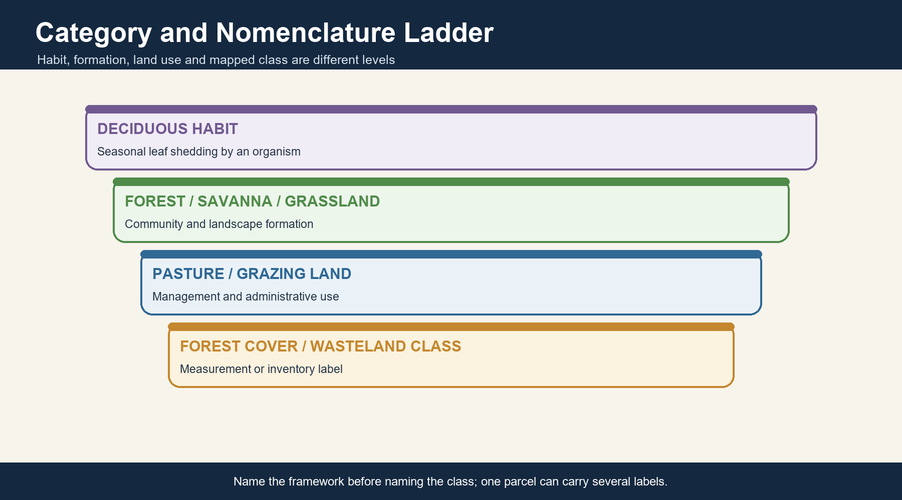

*Caption: Name the framework before naming the class; one parcel can carry several labels. Original deterministic study schematic; not to scale.*

| Layer | Question | Evidence | Do not infer |
| --- | --- | --- | --- |
| Ecological type | What formation and processes occur? | Forest-type maps, vegetation plots, fire and grazing history | Legal ownership |
| Condition | How intact and functional? | Composition, structure, recruitment, hydrology | From green colour alone |
| Measurement | What does a dataset count? | FSI, land-cover and wasteland methodology | Ancient biome status |
| Status and tenure | Which law, record or right applies? | Gazette, revenue and FRA records | Ecological quality |

### Core teaching

- Read every map with a legend, date, scale and purpose.
- Use rainfall bands only as orientation; dry-season length, soils and disturbance modify them.
- Treat forest, savanna and grassland boundaries as ecotones.
- Separate protection on paper from ecological outcome.

### Must-know facts

- Forest type, canopy density, recorded forest area and grassland condition are not synonyms.
- A natural grassland can lie within recorded forest land.
- A plantation can qualify as forest cover without being a native forest.

### UPSC traps

- **Wrong:** All open land is degraded forest. **Correct:** Open ecosystems include natural and secondary systems; origin requires evidence.
- **Wrong:** Tree cover is a proxy for ecosystem health everywhere. **Correct:** Composition, structure, hydrology and historical biome must be checked.

**Mains use:** Open answers with TYPE -> CONDITION -> DATASET -> STATUS; this prevents category collapse.

**Study link:** Geography Topics 14-18 + Environment Topics 01, 03, 11 and 12

---

## 2. Deciduous Habit versus Deciduous Forest

Deciduous describes a phenological strategy: plants shed leaves for part of the year. A deciduous forest is a community-level formation whose canopy, species mix and seasonal functioning contain a large deciduous component.

*Caption: Name the framework before naming the class; one parcel can carry several labels. Original deterministic study schematic; not to scale.*

| Term | Operational meaning | Indian application | Boundary caution |
| --- | --- | --- | --- |
| Deciduous habit | Seasonal leaf loss by a plant | Teak, sal, mahua and many associates | Timing and duration vary |
| Drought-deciduous | Leaf loss during moisture stress | Most tropical monsoon forests | Not necessarily cold-season response |
| Deciduous forest | Landscape formation with seasonal canopy opening | Moist and dry deciduous belts | May contain evergreen elements |
| Secondary deciduous stand | Regrowth after disturbance | Fallow, logged or repeatedly burnt tracts | Not identical to original forest |

### Core teaching

- Leaf shedding reduces transpiring surface and hydraulic risk.
- Species may shed asynchronously; a landscape need not be leafless at once.
- Some dry-deciduous trees leaf or flower before monsoon rain using stored reserves.
- Deciduous does not mean lifeless or dry for most of the year.

### Must-know facts

- Phenology is a plant strategy; forest type is a community classification.
- Canopy opening changes light, litter, herb growth and animal movement.
- Leaf-fall timing responds to moisture, temperature and species traits.

### UPSC traps

- **Wrong:** Deciduous means every tree loses all leaves together. **Correct:** Leaf-fall timing and completeness differ by species and site.
- **Wrong:** A leafless dry-season canopy is dead. **Correct:** Dormancy and drought avoidance conserve living tissues.

**Mains use:** Define the level of analysis before discussing distribution or adaptation.

**Study link:** Plant physiology -> phenology -> tropical seasonal forest

---

## 3. Open-Ecosystem Vocabulary

Grassland vocabulary changes across ecology, geography, animal husbandry, forestry, revenue records and remote sensing. The safest answer supplies an operational definition and states the source tradition.

*Caption: Name the framework before naming the class; one parcel can carry several labels. Original deterministic study schematic; not to scale.*

| Term | Core meaning | Typical use | Not equivalent to |
| --- | --- | --- | --- |
| Savanna | Continuous grass layer with variable woody cover in seasonal tropics | Ecology and biome analysis | Any cleared forest |
| Grassland | Herbaceous vegetation dominated by grasses and graminoids | Broad ecological umbrella | Treelessness by definition everywhere |
| Steppe | Usually semi-arid temperate/subtropical short-grass formation | World climatic-region texts | All Indian dry grasslands |
| Meadow | Mesic herb-rich opening, often montane or riparian | Alpine/subalpine and local usage | Livestock pasture automatically |
| Pasture | Land managed primarily for livestock forage | Agriculture and animal husbandry | Natural biome origin |
| Rangeland | Extensive grazing/browsing landscape including grassland, shrubland, savanna and open woodland | FAO/UNCCD and pastoral systems | Only grass |
| Grazing land | Administrative or functional land available for grazing | Revenue and village commons | Ecological condition |
| Wasteland | Administrative/remote-sensing class of land considered under-utilised or degraded | Land-use inventories | Ecologically valueless land |

### Core teaching

- The same parcel may be ecological savanna, revenue grazing land and legally recorded forest.
- Pasture is defined by management purpose; grassland by vegetation.
- Rangeland is broader than grassland.
- Use quotation marks around 'wasteland' when critiquing the administrative label.

### Must-know facts

- Definitions determine which department, dataset and remedy applies.
- Open woodland can be part of a savanna or rangeland.
- A meadow can be natural, semi-natural or managed.

### UPSC traps

- **Wrong:** Rangeland means only treeless grassland. **Correct:** It can include shrublands, savannas, deserts and open woodlands.
- **Wrong:** Wasteland is a scientific biome. **Correct:** It is an administrative or mapping label with heterogeneous ecological content.

**Mains use:** A high-scoring answer explicitly distinguishes ecological category, land use and revenue label.

**Study link:** FAO/UNCCD rangeland vocabulary + Indian land-record categories

---

## 4. Champion-Seth, Textbook, Ecology and Remote-Sensing Nomenclature

Champion-Seth forest types, school-geography belts, ecology's savanna framework and satellite land-cover classes answer different questions. They overlap, but they do not map one-to-one.

*Caption: Name the framework before naming the class; one parcel can carry several labels. Original deterministic study schematic; not to scale.*

| Framework | Primary purpose | Strength | Limit |
| --- | --- | --- | --- |
| Champion-Seth tradition | Climatic-floristic forest-type classification | Indian forestry detail | Open systems may be treated through forestry categories |
| Geography texts | Broad climate-vegetation regionalisation | Exam-ready gradients | Thresholds can look rigid |
| Ecology | Processes, states and disturbance regimes | Explains tree-grass coexistence | Needs site history |
| Remote sensing | Repeatable spectral/structural mapping | National coverage and change | Naturalness and tenure require other evidence |

### Core teaching

- Moist deciduous, dry deciduous and thorn are useful broad belts, not immutable isohyets.
- Formal forest types may distinguish sub-types not shown in school maps.
- Remote sensing sees structure and reflectance more readily than historical biome.
- Always name the classification before quoting a class.

### Must-know facts

- FSI forest-type mapping and FSI forest-cover mapping are separate products.
- Ecological savanna can occur within a forest department's administrative landscape.
- Different nomenclatures may all be valid for their purpose.

### UPSC traps

- **Wrong:** One official map settles every classification dispute. **Correct:** Each framework has a purpose, scale and method.
- **Wrong:** Aw climate is identical to a single Indian vegetation type. **Correct:** Climate permits a range shaped by site and disturbance.

**Mains use:** Use a framework comparison to turn a terminology problem into analytical value.

**Study link:** FSI forest-type mapping + Köppen and Indian climatic-region frameworks

---

## 5. Coupled Environmental Controls

The realised vegetation is the outcome of water balance, temperature, substrate, hydrology, disturbance and land use. Annual rainfall alone cannot determine whether a site is forest, savanna, grassland or thorn scrub.

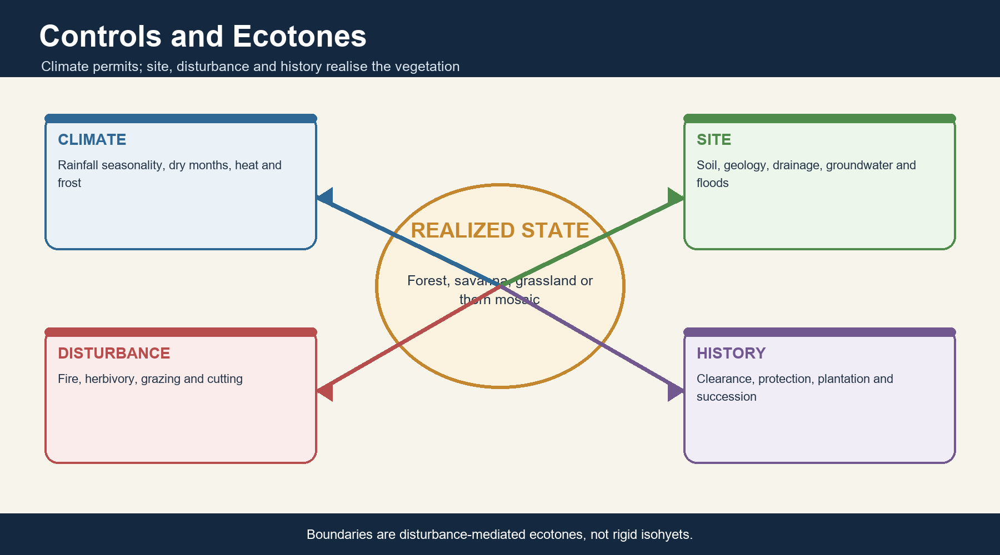

*Caption: Boundaries are disturbance-mediated ecotones, not rigid isohyets. Original deterministic study schematic; not to scale.*

| Control | Mechanism | Indian expression | Qualification |
| --- | --- | --- | --- |
| Rainfall seasonality | Sets growing pulse and drought stress | Monsoon wet season plus dry months | Same total can have different timing |
| Dry-season length and vapour demand | Controls hydraulic stress and leaf duration | Interior peninsular belts | Temperature and wind modify stress |
| Soil, geology and drainage | Change storage, nutrients and rooting | Basalt, alluvium, laterite, saline flats | Local patterns can reverse climate expectation |
| Groundwater and floods | Maintain or reset moisture and succession | Terai and Brahmaputra floodplains | Waterlogging can also limit trees |
| Fire and herbivory | Remove biomass and suppress recruitment | Savanna mosaics and managed grasslands | Regime, not mere presence, matters |
| Frost and altitude | Restrict growth season and woody recruitment | Himalayan meadows | Not a tropical savanna control |
| Land use | Clearance, protection, plantations and grazing reshape state | Central India and commons | Origin must be reconstructed |

### Core teaching

- Use effective moisture rather than annual rainfall alone.
- Boundaries are broad ecotones with feedbacks.
- Fire and grazing can maintain openness within a climate that could support more trees.
- Flooding can maintain tall grasslands by repeatedly resetting succession.

### Must-know facts

- Controls interact multiplicatively, not as a checklist.
- Soil depth and drainage can create local open systems in wetter regions.
- Human disturbance can either degrade or maintain valued heterogeneity.

### UPSC traps

- **Wrong:** A fixed rainfall threshold uniquely predicts vegetation. **Correct:** Thresholds are heuristic and regionally overlapping.
- **Wrong:** Disturbance is always external damage. **Correct:** Some ecosystems are historically disturbance-maintained; inappropriate regimes still degrade them.

**Mains use:** Write CLIMATE x SITE x DISTURBANCE x HISTORY instead of rainfall determinism.

**Study link:** Monsoon, soils, hydrology, fire and land-use history

---

## 6. Ecotones, Thresholds and Alternative States

Moist deciduous, dry deciduous, thorn and grassland often grade into one another. Small changes in dry-season stress, woody recruitment, fire frequency or grazing can shift structure without crossing a single climatic line.

*Caption: Boundaries are disturbance-mediated ecotones, not rigid isohyets. Original deterministic study schematic; not to scale.*

| Process | Forest-ward effect | Open-ward effect | Evidence needed |
| --- | --- | --- | --- |
| Wet years / hydrological recovery | Tree recruitment and canopy closure | Tall grass pulse may precede woody gain | Long time series |
| Frequent low-intensity fire | Can suppress saplings | Maintains grass layer in adapted savanna | Fire history and traits |
| Severe repeated fire | Adult mortality and degradation | Bare ground/invasives may rise | Severity and recovery |
| Heavy chronic grazing | Recruitment failure and soil pressure | Short turf or degradation | Stocking, season and rainfall |
| Grazing release | Woody thickening possible | Heterogeneity may decline | Baseline and browsers |

### Core teaching

- Alternative stable-state language is a hypothesis to test, not a licence to freeze every degraded site.
- Woody thickening may reflect fire/grazing change, carbon dioxide effects or recovery.
- Tree loss may reflect ancient openness or recent clearing; evidence decides.
- Management should target process and desired native state.

### Must-know facts

- Ecotones are dynamic zones, not errors on a map.
- Short observation periods can misread a transition.
- A restoration target must specify historical reference and feasible future climate.

### UPSC traps

- **Wrong:** More trees always indicate recovery. **Correct:** Woody encroachment can degrade native grassland.
- **Wrong:** Fewer trees always indicate a natural savanna. **Correct:** Recent clearing can produce superficially similar openness.

**Mains use:** Qualify every threshold and specify the temporal evidence required.

**Study link:** Disturbance ecology -> ecotones -> restoration baselines

---

## 7. Woody Phenology and Drought Adaptations

Tropical deciduous trees survive seasonal water stress through coordinated leaf, stem, root and reproductive strategies rather than through leaf shedding alone.

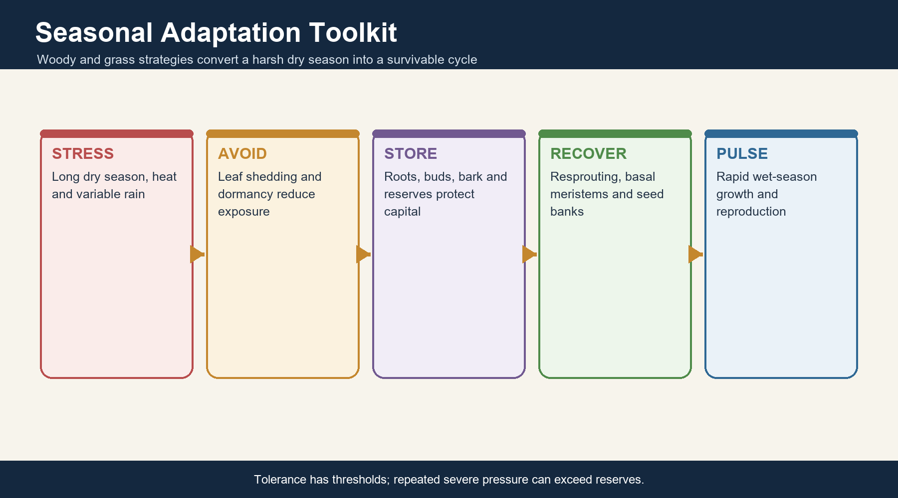

*Caption: Tolerance has thresholds; repeated severe pressure can exceed reserves. Original deterministic study schematic; not to scale.*

| Trait | Function | Example/application | Limit |
| --- | --- | --- | --- |
| Seasonal leaf shedding | Reduces transpiration | Dry-season canopy opening | Timing differs among species |
| Thick or protective bark | Buffers heat and some fire | Many savanna/deciduous trees | Not immunity to severe fire |
| Deep or spreading roots | Access water and capture pulses | Site-dependent woody persistence | Rock and waterlogging constrain roots |
| Resprouting | Recovers after top-kill | Coppice and fire response | Repeated stress can exhaust reserves |
| Seed dormancy / pulse germination | Matches establishment to wet season | Seasonal regeneration | Recruitment still needs safe sites |
| Stored reserves | Support pre-monsoon leafing or flowering | Mahua and other seasonal species | Species-specific |

### Core teaching

- Drought avoidance reduces exposure; drought tolerance maintains function under stress.
- Phenology links climate to pollinators, herbivores, NTFP collection and fire fuel.
- Bark, buds and belowground reserves determine recovery after disturbance.
- A dry canopy can coexist with active roots and stored carbon.

### Must-know facts

- Deciduousness saves water but has construction and carbon costs.
- Resprouting can preserve individuals while seed recruitment remains poor.
- Phenological mismatch under climate extremes can affect food webs.

### UPSC traps

- **Wrong:** Leaf fall is the only drought adaptation. **Correct:** Roots, bark, stomata, storage and regeneration traits also matter.
- **Wrong:** Resprouting proves a site is fully recovered. **Correct:** Composition and seedling recruitment may remain degraded.

**Mains use:** Link trait -> mechanism -> seasonal consequence -> livelihood/ecosystem implication.

**Study link:** Plant functional ecology + NTFP seasonality

---

## 8. Grass Adaptations: C4, Basal Meristems and Belowground Strategy

Many warm-season Indian grasses use C4 photosynthesis and retain growth tissues near the base, allowing rapid wet-season production and recovery from clipping, fire or grazing when the regime remains within tolerance.

*Caption: Tolerance has thresholds; repeated severe pressure can exceed reserves. Original deterministic study schematic; not to scale.*

| Trait | Advantage | UPSC use | Qualification |
| --- | --- | --- | --- |
| C4 photosynthesis | Efficient carbon fixation under high light, heat and low internal carbon dioxide | Warm seasonal grass productivity | Not all grasses are C4 |
| Basal/intercalary meristems | Growth points survive removal of leaf tips | Grazing and fire tolerance | Repeated severe defoliation still harms |
| Dense fibrous roots | Rapid resource capture and soil binding | Erosion control and soil carbon | Compaction reduces function |
| Belowground reserves | Support resprouting after dormancy/disturbance | Seasonal resilience | Drought duration can exceed reserves |
| Seed banks and dormancy | Track rainfall pulses | Post-fire/post-flood regeneration | Invasives can dominate seed banks |

### Core teaching

- Tolerance differs from unlimited resistance.
- Belowground biomass means a visually brown dry-season grassland may retain living roots and carbon.
- Fire removes standing biomass; recovery depends on season, intensity, moisture and species.
- Grazers can create patchiness that raises habitat heterogeneity at moderate pressure.

### Must-know facts

- C4 is a biochemical pathway, not a habitat label.
- Basal meristems explain clipping tolerance.
- Root-dominated carbon is poorly represented by canopy-centric metrics.

### UPSC traps

- **Wrong:** Grassland is inactive once shoots dry. **Correct:** Roots, buds, seeds and nutrient stores persist.
- **Wrong:** C4 grasses cannot be overgrazed. **Correct:** Tolerance has thresholds and depends on recovery time.

**Mains use:** Use adaptations to explain both resilience and the existence of ecological thresholds.

**Study link:** Grass physiology -> fire/grazing response -> soil carbon

---

## 9. India Distribution: Moist Deciduous Belts

Moist deciduous forests occur in seasonal but comparatively well-watered belts of eastern and central India, Himalayan foothills and transitions along the Western Ghats and eastern slopes. Distribution is patchy because topography, soils and land use interrupt the climatic envelope.

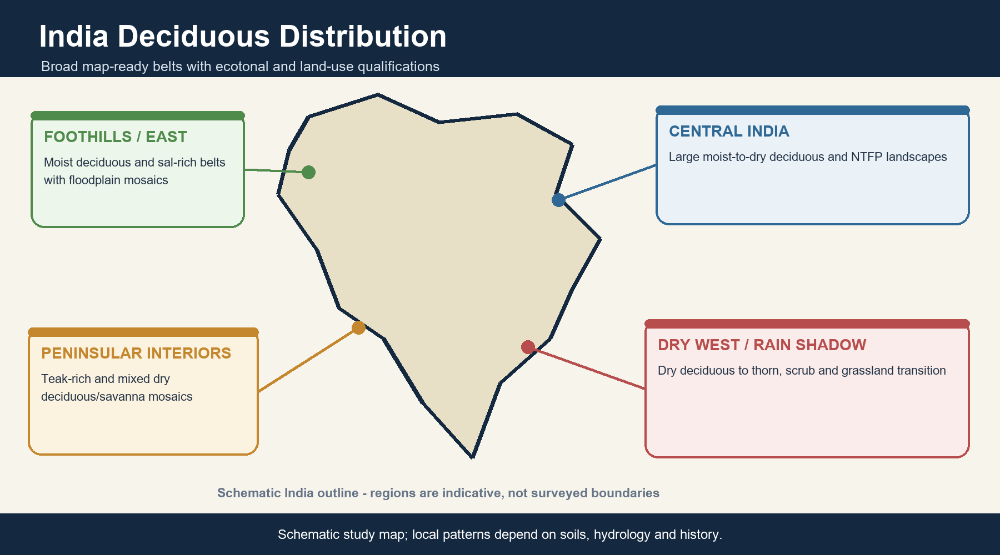

*Caption: Schematic study map; local patterns depend on soils, hydrology and history. Original deterministic study schematic; not to scale.*

| Map-ready belt | Process logic | Representative association | Caution |
| --- | --- | --- | --- |
| Eastern and central India | Monsoon moisture plus marked dry season | Sal-rich and mixed forests in suitable belts | Sal is not universal |
| Himalayan foothills / Terai margins | Alluvium, groundwater and seasonality | Sal forests interspersed with tall grassland | Floodplain grassland is distinct |
| Western Ghats transitions | Leeward and lower-rainfall gradients | Teak-rich and mixed deciduous tracts | Plantations alter pattern |
| Eastern Ghats and peninsular uplands | Seasonal rainfall and varied substrate | Mixed moist-to-dry deciduous mosaics | Fragmentation is extensive |

### Core teaching

- Moist deciduous is not a narrow line between evergreen and dry deciduous.
- River valleys, aspect and groundwater create local departures.
- Many landscapes are mosaics of forest, bamboo, scrub, agriculture and settlements.
- Map named belts, then write 'schematic and ecotonal'.

### Must-know facts

- Eastern-central belts, foothills and Ghats transitions are the safest national-scale description.
- Local dominance depends on substrate and biogeographic history.
- Human land use strongly modifies present cover.

### UPSC traps

- **Wrong:** Moist deciduous forest occurs only in the peninsula. **Correct:** It also occurs in eastern India and Himalayan foothills.
- **Wrong:** All moist deciduous forest is teak dominated. **Correct:** Sal, teak and mixed assemblages have different centres.

**Mains use:** Map broad belts and add process qualifiers rather than drawing hard rainfall borders.

**Study link:** India natural vegetation map + monsoon gradients

---

## 10. Dry Deciduous and Thorn/Scrub Transition

Dry deciduous forests occupy extensive central, peninsular and interior rain-shadow landscapes, grading toward thorn, scrub and grass-dominated systems as effective moisture declines or disturbance intensifies.

*Caption: Schematic study map; local patterns depend on soils, hydrology and history. Original deterministic study schematic; not to scale.*

| Zone | Water regime | Structure | Common confusion |
| --- | --- | --- | --- |
| Dry deciduous core | Longer or stronger dry season | More open canopy, seasonal grass and shrub layer | Not automatically degraded |
| Rain-shadow interior | Reduced monsoon delivery | Dry forest-savanna mosaic | Not a climatic desert |
| Thorn transition | High moisture stress and episodic rain | Low thorny woody cover with grasses | Can be natural, secondary or both |
| Degraded former forest | Biomass removal and recruitment failure | Scrub/open cover | Origin needs history |

### Core teaching

- Dry deciduous forests are among India's most extensive and human-used forest landscapes.
- Thorn/scrub can reflect climatic aridity, edaphic limits, repeated use or combinations.
- Open structure is not proof of low biodiversity.
- Interior mosaics carry agriculture, livestock, NTFP and wildlife functions.

### Must-know facts

- The dry-deciduous-to-thorn gradient is ecological, not a fixed administrative line.
- Drought, grazing and fire interact with land conversion.
- Use approximate rainfall bands only with explicit caveats.

### UPSC traps

- **Wrong:** Thorn forest is always degraded moist deciduous forest. **Correct:** Climatic and edaphic thorn formations also occur.
- **Wrong:** Dry deciduous equals grassland. **Correct:** They can intergrade but remain distinct structural formations.

**Mains use:** Use a gradient answer and separate natural transition from anthropogenic degradation.

**Study link:** Topics 07, 14, 16 and 18

---

## 11. Sal, Teak and Mixed Assemblages

Sal and teak are iconic deciduous trees but have different biogeographic centres, site preferences and management histories. Neither should be treated as universally dominant across India's deciduous belt.

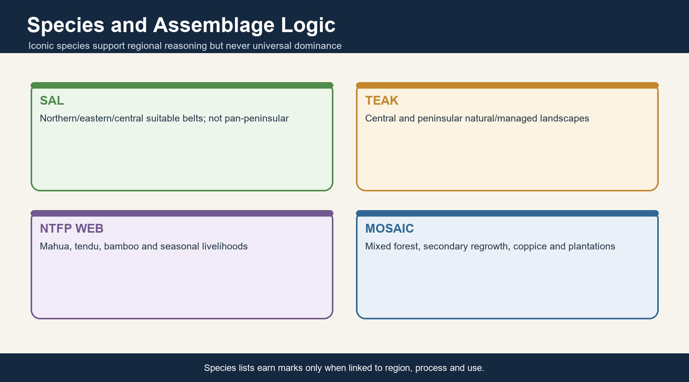

*Caption: Species lists earn marks only when linked to region, process and use. Original deterministic study schematic; not to scale.*

| Species/assemblage | Strong association | Ecological/economic role | Qualification |
| --- | --- | --- | --- |
| Sal (Shorea robusta) | Northern, eastern and central belts including foothills on suitable sites | Timber, litter and habitat structure | Avoid extending it across all peninsula |
| Teak (Tectona grandis) | Central and peninsular India, many managed forests and plantations | High-value timber | Plantation presence can distort natural pattern |
| Shisham (Dalbergia sissoo) | Riverine/alluvial and foothill contexts | Timber and agroforestry | Not a universal dry-forest dominant |
| Mahua (Madhuca longifolia) | Central Indian deciduous landscapes | Flowers, seeds, food, livelihood and culture | Harvest and regeneration need management |
| Tendu (Diospyros melanoxylon) | Central Indian dry/moist deciduous landscapes | Leaf-based NTFP value chain | Market pressure and labour conditions matter |
| Bamboo | Patches across several forest types | Fodder, material, habitat and livelihood | A grass, not a tree |

### Core teaching

- Dominance is local and site-dependent.
- Mixed deciduous forests contain multiple canopy and understorey species.
- Colonial and postcolonial forestry favoured selected commercial species.
- NTFP species link ecology, seasonal labour and tenure.

### Must-know facts

- Sal and teak have distinct distribution centres.
- Mahua and tendu are high-value livelihood examples.
- Bamboo classification is a common Prelims trap.

### UPSC traps

- **Wrong:** Sal and teak co-dominate every moist deciduous forest. **Correct:** Regional and edaphic differences are decisive.
- **Wrong:** A teak plantation proves natural teak forest. **Correct:** Origin, age structure and composition must be checked.

**Mains use:** Use species to support regional logic, not as a memorised national list.

**Study link:** Forest botany + NTFP economy + community rights

---

## 12. Plantations, Secondary Forests and Regeneration

A native deciduous landscape can include old natural forest, coppice, secondary regrowth, plantations, bamboo brakes, scrub and agroforestry. Similar canopy density does not mean similar ecological history or function.

*Caption: Species lists earn marks only when linked to region, process and use. Original deterministic study schematic; not to scale.*

| Formation | Origin | Potential value | Blind spot |
| --- | --- | --- | --- |
| Old natural forest | Long ecological continuity | Complex structure and refugia | May be selectively logged |
| Secondary forest | Regrowth after clearance/disturbance | Recovery, carbon and habitat | Composition may shift |
| Coppice forest | Vegetative regrowth from stumps/roots | Rapid biomass recovery | Seed recruitment can remain weak |
| Plantation | Deliberately established stand | Timber, fuel, carbon and some habitat | Low structural/floristic fidelity possible |
| Agroforestry | Trees integrated with farms | Livelihood and matrix connectivity | Not protected natural forest |

### Core teaching

- Natural regeneration is often preferable where seed sources, soil and hydrology remain.
- Assisted regeneration can remove bottlenecks.
- Plantation management can increase diversity, but cannot be relabelled old growth.
- Secondary forest trajectories depend on repeated disturbance and propagule supply.

### Must-know facts

- Origin and composition must accompany canopy data.
- Coppice persistence can mask recruitment failure.
- A production landscape can aid connectivity without replacing core habitat.

### UPSC traps

- **Wrong:** All secondary forest is ecologically worthless. **Correct:** Its value can rise substantially with time and management.
- **Wrong:** All plantations are restored forests. **Correct:** Restoration fidelity depends on baseline, native composition and process recovery.

**Mains use:** Present a value gradient while retaining the non-equivalence principle.

**Study link:** Succession + forest management + remote-sensing literacy

---

## 13. Forest Structure, Productivity and Seasonal Ecology

Deciduous forests shift strongly through the year: wet-season leaf area and production rise; dry-season canopy opening changes light, fuel, herbaceous growth, wildlife use and nutrient cycling.

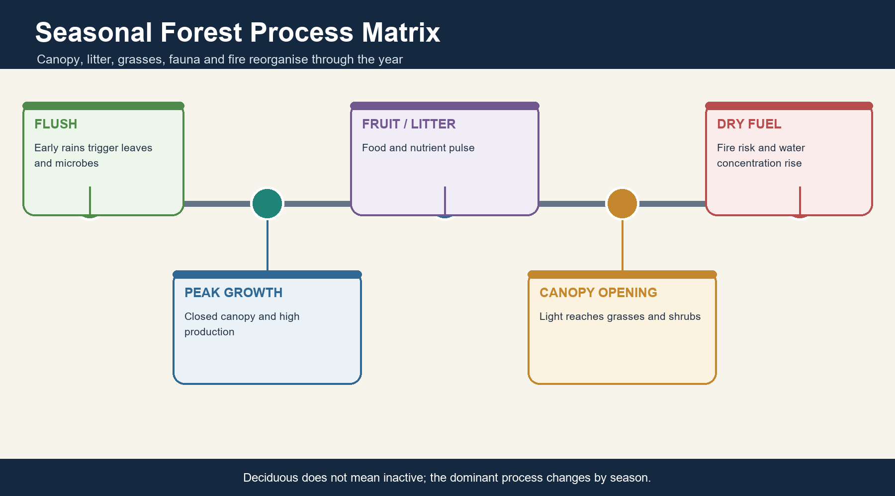

*Caption: Deciduous does not mean inactive; the dominant process changes by season. Original deterministic study schematic; not to scale.*

| Season/process | Canopy | Understorey/soil | Ecological consequence |
| --- | --- | --- | --- |
| Early wet season | Rapid flushing | Microbial and herb growth accelerates | High resource pulse |
| Peak wet season | High leaf area | Shaded, moist floor | Maximum production |
| Post-monsoon | Fruits/seeds and litter begin | Nutrient transfer | Wildlife/NTFP pulse |
| Dry season | Canopy opens | Fuel cures; light reaches grasses | Fire risk and forage pattern shift |

### Core teaching

- Net primary productivity depends on moisture, fertility, stand age and disturbance.
- Litterfall is seasonal and fuels nutrient cycling as well as fire.
- Many nutrients move rapidly between biomass, litter and soil.
- Animal movements track water, forage, fruit and cover.

### Must-know facts

- Seasonality reorganises ecosystem function rather than turning it off.
- Open dry-season canopies can support grasses and browsing.
- Frequent severe fire can short-circuit nutrient retention.

### UPSC traps

- **Wrong:** Dry-season leaf fall stops nutrient cycling completely. **Correct:** Processes slow or shift; litter decomposition and root activity continue variably.
- **Wrong:** More litter is always beneficial. **Correct:** Dry fuel continuity can raise fire severity.

**Mains use:** Use a seasonal calendar to transform a static vegetation answer into process ecology.

**Study link:** Ecosystem structure, NPP, nutrient cycles and forest fire

---

## 14. Process Matrix: Evergreen to Thorn

Evergreen, moist deciduous, dry deciduous and thorn formations are best compared through effective moisture, phenology, structure, fuel and regeneration rather than through one rainfall number.

*Caption: Deciduous does not mean inactive; the dominant process changes by season. Original deterministic study schematic; not to scale.*

| Dimension | Evergreen | Moist deciduous | Dry deciduous / thorn |
| --- | --- | --- | --- |
| Moisture stress | Low for much of year | Seasonal | Long/strong and variable |
| Leaf strategy | Asynchronous replacement | Marked seasonal shedding | Longer shedding / smaller leaves / thorn traits |
| Canopy | Multi-layer, more closed | Seasonally closed-to-open | Open canopy to scrub |
| Grass layer | Often light-limited | Seasonal gaps | Usually more prominent |
| Fire sensitivity | Frequent fire often damaging | Context-dependent | Some adapted mosaics, but severe fire degrades |
| Nutrient pulse | Rapid, relatively continuous | Strong seasonal pulse | Pulse tied to rain and litter |

### Core teaching

- This is a continuum with local exceptions.
- Dryness raises the relative role of belowground storage and pulse use.
- Disturbance can shift structure within the same climate.
- Comparison must separate natural formation from condition.

### Must-know facts

- Evergreen and deciduous refer to phenology; thorn also describes structure/traits.
- Fire response differs by ecosystem history.
- Open forest is an FSI density class, not the ecological endpoint of this matrix.

### UPSC traps

- **Wrong:** Evergreen is always more productive than every deciduous site. **Correct:** Site fertility, season length and disturbance can alter productivity.
- **Wrong:** Thorn is merely the lowest FSI canopy class. **Correct:** Thorn is an ecological formation; FSI density is a measurement class.

**Mains use:** A process matrix earns more marks than a species-only comparison.

**Study link:** Topic 15 evergreen forests + Topic 18 arid transition

---

## 15. India's Natural Grassland Diversity

India's grasslands are not one savanna type. They range from flood-maintained tall grasslands and semi-arid savannas to saline Banni, alpine meadows and montane shola-grassland mosaics.

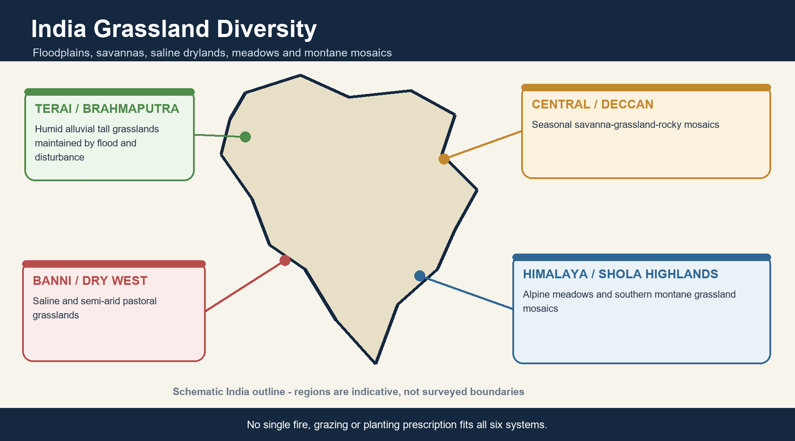

*Caption: No single fire, grazing or planting prescription fits all six systems. Original deterministic study schematic; not to scale.*

| System | Maintaining control | Map-ready region | Flagship linkage |
| --- | --- | --- | --- |
| Terai tall grasslands | Alluvial groundwater, floods, fire and cutting | Himalayan foothill belt | Swamp deer, rhinoceros and pygmy hog in relevant landscapes |
| Brahmaputra floodplain grasslands | Flood, sediment and channel dynamics | Assam valley | Rhino, Bengal florican and pygmy hog in relevant ranges |
| Central/Deccan savanna-grassland | Seasonality, soil, fire, herbivory and history | Peninsular and central interiors | Blackbuck, wolf and lesser florican in suitable landscapes |
| Banni and western semi-arid grasslands | Aridity, salinity, flooding, grazing and invasives | Kachchh and western India | Chinkara and pastoral livelihoods |
| Alpine/subalpine meadows | Altitude, snow, frost and short growing season | Himalaya | Seasonal pastoral use |
| Shola-grassland mosaic | Montane climate, soils and long disturbance history | Southern Western Ghats highlands | Endemic-rich mosaic |

### Core teaching

- Classify by origin and maintaining process, not appearance alone.
- Flood-maintained grassland can be wet and highly productive.
- Open natural ecosystems can carry ancient specialist biota.
- Management borrowed from one grassland type may damage another.

### Must-know facts

- Terai, Brahmaputra, Deccan, Banni, alpine and shola systems are distinct.
- No single national grassland percentage is used because datasets differ.
- Grasslands may occur inside and outside forest records.

### UPSC traps

- **Wrong:** Indian grasslands are confined to arid western India. **Correct:** Humid floodplains and high mountains also carry natural grasslands.
- **Wrong:** All grasslands need identical fire and grazing treatment. **Correct:** Regimes must match ecosystem history and conservation goals.

**Mains use:** Begin with a national typology, then select one process-rich case study.

**Study link:** WII grassland bulletin + regional landscape studies

---

## 16. Terai Alluvial Tall Grasslands

Terai grasslands are humid, groundwater- and flood-influenced systems embedded in a forest-wetland mosaic. Tall grasses do not indicate aridity; they reflect productive alluvial conditions and recurrent disturbance.

*Caption: No single fire, grazing or planting prescription fits all six systems. Original deterministic study schematic; not to scale.*

| Driver | Effect | Management implication | Risk |
| --- | --- | --- | --- |
| Flood and sediment | Reset succession and create bars/depressions | Retain hydrological dynamism | Embankment and channel alteration |
| High water table | Supports wet grass and marsh mosaics | Protect drainage gradients | Waterlogging shifts composition |
| Fire/cutting | Removes rank biomass and can maintain heterogeneity | Use timed, patchy treatment | Breeding-season mortality |
| Woody succession | Can close grassland without resetting disturbance | Maintain a planned mosaic | Blanket clearing harms riparian forest |

### Core teaching

- Tall grasslands interdigitate with sal forest, swamp and riverine woodland.
- Patch age and grass height create different wildlife niches.
- Burning schedules must account for nesting and refuge patches.
- Hydrology is the first restoration lever.

### Must-know facts

- Terai grassland is not a dry savanna.
- Hard-ground and swamp-adapted deer require precise habitat statements.
- Species management cannot substitute for the floodplain process.

### UPSC traps

- **Wrong:** Tall grass implies semi-arid climate. **Correct:** Terai tall grasslands are humid alluvial systems.
- **Wrong:** Annual complete burning is necessary. **Correct:** Patchy, timed and evidence-based management is safer.

**Mains use:** Write flood pulse -> mosaic -> structure -> fauna -> management.

**Study link:** Terai Arc landscape + protected-area grassland management

---

## 17. Brahmaputra Floodplain Grasslands

Brahmaputra grasslands are shaped by flood pulses, erosion, deposition, channel migration and succession. Their mobility makes fixed-boundary conservation difficult but ecologically essential.

*Caption: No single fire, grazing or planting prescription fits all six systems. Original deterministic study schematic; not to scale.*

| Process | Habitat result | Species relevance | Governance issue |
| --- | --- | --- | --- |
| Annual/episodic floods | Rejuvenated grasses and wetlands | Rhino and swamp/floodplain fauna | Flood is hazard and habitat process |
| Erosion/deposition | Patch creation and loss | Dynamic refuges | Static area targets mislead |
| Controlled burning/cutting | Forage and structure management | Florican/pygmy hog timing matters | Needs refuge mosaics |
| Invasive plants | Dense thickets and altered fire | Reduces native grass structure | Repeated follow-up required |

### Core teaching

- A floodplain cannot be conserved only by freezing one year's map.
- High ground refuges matter during extreme floods.
- Grassland, wetland and woodland patches form one functional landscape.
- Upstream infrastructure and embankments can alter sediment and inundation.

### Must-know facts

- Flood maintains habitat but extreme events can cause mortality.
- Bengal florican and pygmy hog need species-specific range caution.
- Rhino presence does not define every tall grassland.

### UPSC traps

- **Wrong:** Flood control always improves floodplain conservation. **Correct:** Removing the flood pulse can drive ecological succession and wetland loss.
- **Wrong:** A PA boundary contains the whole floodplain process. **Correct:** Rivers, sediment and wildlife movement cross boundaries.

**Mains use:** Balance flood risk reduction with maintenance of ecological flood pulses and refuges.

**Study link:** Assam floodplain ecology + landscape planning

---

## 18. Central and Deccan Savanna-Grassland Mosaics

Open systems across central and peninsular India often combine grasses, scattered trees, scrub, rocky outcrops, cultivation and seasonal grazing. Some are ancient savannas; others are secondary openings; many contain both histories.

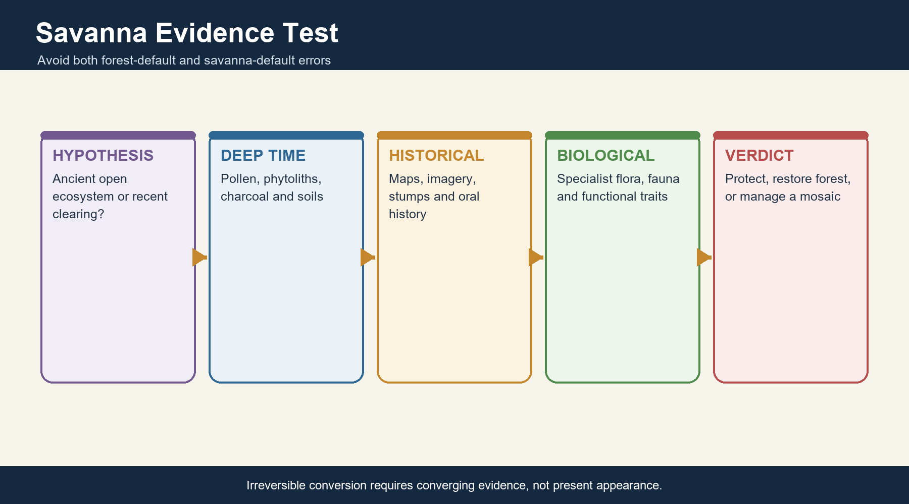

*Caption: Irreversible conversion requires converging evidence, not present appearance. Original deterministic study schematic; not to scale.*

| Evidence dimension | Natural-open signal | Secondary/degraded signal | Why inconclusive alone |
| --- | --- | --- | --- |
| Specialist flora/fauna | Open-habitat endemics and long continuity | Generalist/invasive dominance | Species can recolonise |
| Soil and charcoal | Long grass-fire signature | Erosion and recent charcoal | Interpretation needs chronology |
| Historical imagery/maps | Persistent openness | Recent canopy loss | Older records may be sparse |
| Tree age/structure | Stable sparse woodland | Stumps and even-aged regrowth | Past management can mimic patterns |

### Core teaching

- Tree-grass coexistence can be maintained by seasonal rainfall, fire, herbivory and soils.
- Rocky plateaus and shallow soils may sustain open biota even in wetter regions.
- Agricultural fallow can add secondary grassland value.
- Management must not choose a baseline from current appearance alone.

### Must-know facts

- Indian savanna is a legitimate ecological concept but not a universal reclassification.
- Open-habitat specialists are evidence, not automatic proof.
- Landscape histories can be mixed at fine scales.

### UPSC traps

- **Wrong:** Every peninsular grassland is a cleared forest. **Correct:** Some open ecosystems have long ecological continuity.
- **Wrong:** Every current clearing is an ancient savanna. **Correct:** Recent land-use history must be tested.

**Mains use:** Frame the debate as an evidence problem rather than an ideological forest-versus-grassland binary.

**Study link:** Savanna debate + palaeoecology + historical land-use evidence

---

## 19. Banni and Western Semi-Arid Grasslands

Banni is a semi-arid to arid grassland-pastoral landscape in Kachchh shaped by salinity, episodic water, grazing, settlement and invasive woody spread. It should not be reduced to either pristine grassland or simple wasteland.

*Caption: No single fire, grazing or planting prescription fits all six systems. Original deterministic study schematic; not to scale.*

| Control/pressure | Ecological effect | Livelihood link | Management response |
| --- | --- | --- | --- |
| Salinity and hydrology | Grass and shrub zonation | Forage variability | Restore water-flow understanding |
| Pastoral grazing | Patch use and nutrient movement | Maldhari livelihoods | Co-management and mobility |
| Prosopis juliflora spread | Woody thickets and altered access/fire | Fuel/charcoal benefits and forage costs | Strategic, not indiscriminate, control |
| Drought variability | Boom-bust forage | Herd movement and risk | Fodder reserves plus commons access |

### Core teaching

- Invasives can create both livelihood products and ecological costs.
- Pastoral mobility is an adaptation to variable forage.
- Salinity and episodic flooding distinguish Banni from generic dry grassland.
- Restoration must negotiate tenure, access and species composition.

### Must-know facts

- Banni is located in Kachchh, Gujarat.
- Prosopis management requires cost-benefit and follow-up analysis.
- Blanket enclosure can transfer costs to pastoral households.

### UPSC traps

- **Wrong:** Banni is equivalent to Thar dune desert. **Correct:** It is a distinct saline/semi-arid grassland landscape.
- **Wrong:** Removing every woody plant automatically restores Banni. **Correct:** Native woody elements, reinvasion and livelihood uses require strategy.

**Mains use:** Use Banni to integrate ecology, common property, invasives and pastoral political economy.

**Study link:** WII Banni evidence + pastoral commons

---

## 20. Himalayan Alpine and Subalpine Meadows

High-elevation meadows are governed by snow duration, frost, slope, aspect, soil moisture and a short growing season. Seasonal grazing and pilgrimage/tourism add a human pulse.

*Caption: No single fire, grazing or planting prescription fits all six systems. Original deterministic study schematic; not to scale.*

| Control | Ecological response | Use | Risk |
| --- | --- | --- | --- |
| Snowmelt timing | Controls growth onset | Seasonal forage | Climate-driven mismatch |
| Aspect and wind | Patchy moisture and exposure | Route choice | Erosion on concentrated paths |
| Short growing season | Slow recovery | Transhumant grazing | High sensitivity to trampling |
| Shrub/tree line dynamics | Woody expansion or contraction | Habitat change | Cannot attribute to warming alone |

### Core teaching

- Meadow is not synonymous with pasture, though it may be grazed.
- Mobility can distribute pressure; sedentarisation can concentrate it.
- Medicinal-plant collection and tourism create additional pressures.
- Restoration is slow because cold limits growth.

### Must-know facts

- Alpine meadows are not tropical savannas.
- Climate, snow and topography dominate their process regime.
- Seasonal rights and access are governance variables.

### UPSC traps

- **Wrong:** All Himalayan grazing is overgrazing. **Correct:** Pressure depends on timing, density, duration and recovery.
- **Wrong:** Tree-line movement has one cause. **Correct:** Climate, land use, fire and grazing interact.

**Mains use:** Map altitude and seasonality, then add mobility and slow recovery.

**Study link:** Geography Topics 22-25 + pastoral mobility

---

## 21. Shola-Grassland Mosaics

Southern Western Ghats highlands contain a fine-grained mosaic of stunted evergreen shola patches in sheltered valleys and montane grasslands on exposed slopes. The grassland is not simply an empty gap between forests.

*Caption: No single fire, grazing or planting prescription fits all six systems. Original deterministic study schematic; not to scale.*

| Landscape element | Site tendency | Function | Threat |
| --- | --- | --- | --- |
| Shola patch | Sheltered, moist depressions | Refugia, stream regulation and forest habitat | Fragmentation and invasive plants |
| Montane grassland | Exposed slopes and plateaus | Endemic open-habitat flora, water yield and forage | Wattle/eucalyptus/pine expansion |
| Edge/ecotone | Sharp microclimatic transition | High diversity and movement | Fire and plantation effects |
| Catchment | Cloud, soil and slope coupling | Headwater services | Roads and drainage change |

### Core teaching

- Historic tree planting converted many high-elevation grasslands.
- Restoration may require invasive-tree removal plus native grass recovery.
- Frequent hot fire can damage both grassland soil and shola edges.
- The mosaic, not either component alone, is the conservation unit.

### Must-know facts

- Shola is an evergreen forest patch within a montane mosaic.
- Grasslands occupy many exposed highland sites.
- Plantation removal without erosion control can fail.

### UPSC traps

- **Wrong:** Shola grasslands are necessarily degraded shola forest. **Correct:** Topography and long ecological history maintain the mosaic.
- **Wrong:** All trees in highland grassland are restoration gains. **Correct:** Invasive plantations can reduce native grassland and hydrological function.

**Mains use:** Use the shola mosaic as the clearest Indian example of biome-appropriate restoration.

**Study link:** WII shola evidence + Topic 15 evergreen forests

---

## 22. Natural, Edaphic, Flood-Maintained and Secondary Grasslands

Origin categories can overlap, but they guide restoration. Climatic grassland reflects regional water-energy balance; edaphic grassland reflects soil/substrate; flood-maintained grassland reflects recurrent resetting; secondary grassland follows human clearance or abandonment.

*Caption: Irreversible conversion requires converging evidence, not present appearance. Original deterministic study schematic; not to scale.*

| Origin | Diagnostic clue | Example class | Restoration implication |
| --- | --- | --- | --- |
| Climatic | Regional seasonal moisture limitation | Semi-arid western/open interiors | Maintain native open regime |
| Edaphic | Shallow, saline, waterlogged or nutrient-limiting soil | Rocky plateaus, Banni zones | Repair site process, not add generic trees |
| Flood-maintained | Repeated sediment/inundation reset | Terai/Brahmaputra tall grasslands | Restore hydrology and refuges |
| Anthropogenic/secondary | Recent clearance, fallow or grazing history | Farm-forest mosaics | Choose forest or grass target from evidence |

### Core teaching

- Categories are hypotheses supported by multiple evidence lines.
- Secondary grasslands can still carry conservation value.
- Naturalness is not the only criterion; rarity, function and feasibility also matter.
- Restoration may protect an open state even when human influence is old.

### Must-know facts

- Origin informs but does not mechanically dictate management.
- Cultural landscapes can be biodiverse.
- Palaeoecology, soils, maps and oral histories should converge.

### UPSC traps

- **Wrong:** Secondary grassland has no biodiversity value. **Correct:** Long-lived cultural grasslands can support specialist species.
- **Wrong:** Edaphic grassland can be restored by fertilisation and tree planting. **Correct:** Those actions may erase the native stress-adapted community.

**Mains use:** State origin, evidence confidence, current value and feasible target separately.

**Study link:** Restoration ecology + cultural landscapes

---

## 23. The Indian Savanna Debate: What Evidence Decides?

The debate has two symmetrical errors: treating all open ecosystems as degraded forest, and treating every cleared forest as ancient savanna. Both are resolved by reconstructing history and process.

*Caption: Irreversible conversion requires converging evidence, not present appearance. Original deterministic study schematic; not to scale.*

| Evidence | Question answered | Strength | Limit |
| --- | --- | --- | --- |
| Pollen, phytoliths and charcoal | Long vegetation/fire history | Deep time | Dating and spatial resolution |
| Soil profile and carbon isotopes | Long C3/C4 and erosion signals | Belowground evidence | Mixed signals possible |
| Historical maps and imagery | Persistence or recent change | Direct spatial comparison | Record length limited |
| Floristic specialists | Continuity and habitat fidelity | Biological evidence | Dispersal and extinction lag |
| Stumps, age structure and oral history | Recent use/disturbance | Local detail | Recall and sampling limits |

### Core teaching

- No single evidence line is sufficient.
- Ancient openness can coexist with local recent clearing.
- Fire-adapted traits support but do not prove natural savanna.
- A precautionary approach avoids irreversible conversion while evidence is assembled.

### Must-know facts

- Biome baseline is an empirical question.
- Open-system conservation and native-forest restoration are both valid on the right sites.
- The burden of proof rises for irreversible tree planting or clearing.

### UPSC traps

- **Wrong:** The savanna debate is only semantic. **Correct:** It changes land classification, finance and restoration outcomes.
- **Wrong:** One old photograph proves ancient biome status. **Correct:** Multiple time depths and evidence types are needed.

**Mains use:** Conclude with an evidence hierarchy and reversible interim management.

**Study link:** Palaeoecology + remote sensing + historical ecology

---

## 24. Fire Ecology: Regime, Not Slogan

Fire effects depend on frequency, intensity, severity, season, size, fuel, weather and evolutionary history. 'Fire is good' and 'fire is bad' are both incomplete.

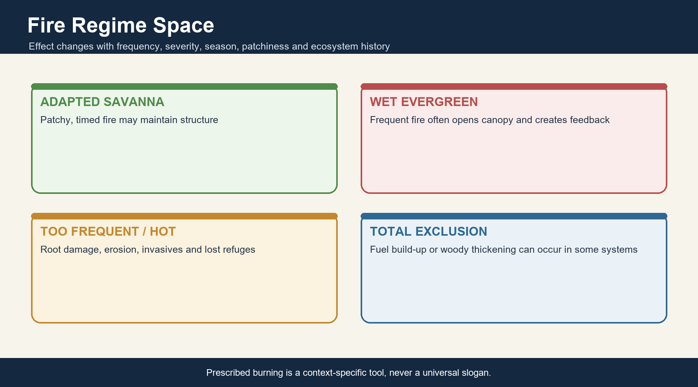

*Caption: Prescribed burning is a context-specific tool, never a universal slogan. Original deterministic study schematic; not to scale.*

| Regime element | Low/moderate expression | High/mistimed expression | Monitoring |
| --- | --- | --- | --- |
| Frequency | Can limit woody recruitment | Recovery interval becomes too short | Return interval |
| Intensity/severity | Removes cured biomass | Kills roots, adults and soil biota | Flame/char and mortality |
| Season | Early dry-season burns may be patchier | Late hot burns can be severe | Date and fuel moisture |
| Patchiness | Creates refuges and heterogeneity | Landscape-wide burn removes refuges | Burn mosaic |
| Ecosystem history | Adapted savanna can recover | Wet evergreen can enter fire feedback | Reference condition |

### Core teaching

- Prescribed burning is a tool, not a universal recommendation.
- Fire exclusion can permit woody thickening or fuel accumulation in some systems.
- Repeated fire can promote invasives and erosion.
- Traditional burning knowledge needs participatory testing and safety.

### Must-know facts

- Surface and crown fire are behaviour categories; ecological effect still varies.
- Wet evergreen and savanna have different fire histories.
- Satellite alerts detect heat, not ecological benefit.

### UPSC traps

- **Wrong:** All annual burning maintains healthy grassland. **Correct:** Timing, severity, extent and breeding cycles matter.
- **Wrong:** Complete suppression is always restoration. **Correct:** Some open systems lose heterogeneity or undergo woody encroachment.

**Mains use:** Write regime -> ecosystem history -> desired structure -> safeguards -> monitoring.

**Study link:** FSI fire monitoring + Disaster Management Topic 11

---

## 25. Grazing, Herbivory and Pastoral Mobility

Grazing is an ecological process and livelihood practice; overgrazing is pressure beyond recovery capacity. The distinction depends on stocking, animal type, timing, duration, rainfall and mobility.

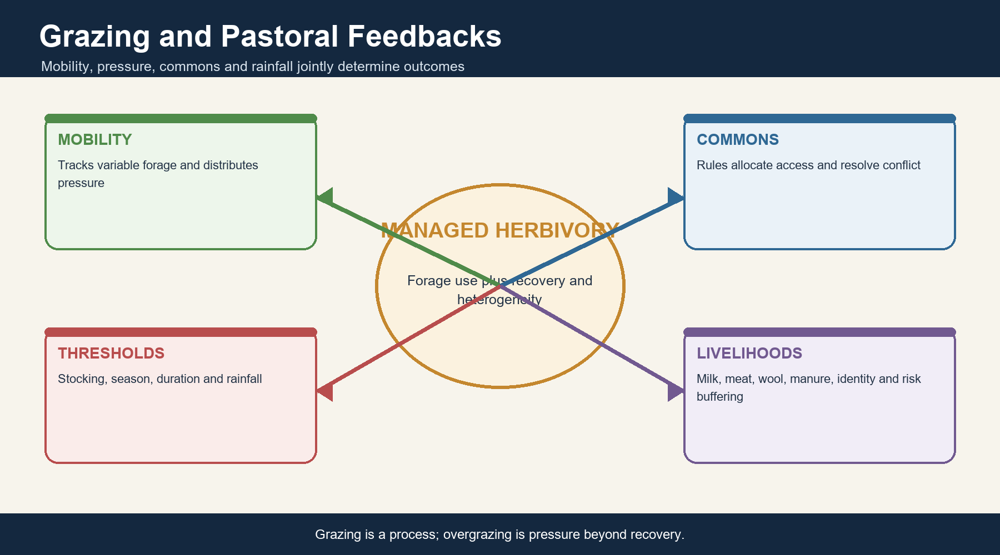

*Caption: Grazing is a process; overgrazing is pressure beyond recovery. Original deterministic study schematic; not to scale.*

| Variable | Potential benefit | Overuse pathway | Governance response |
| --- | --- | --- | --- |
| Mobility | Tracks variable forage and allows recovery | Blocked routes concentrate herds | Secure corridors and negotiated access |
| Moderate patch grazing | Creates height heterogeneity | Selective depletion | Rotational/seasonal planning |
| Livestock type | Different grazing/browsing niches | Soil compaction and disease risk | Species- and site-specific stocking |
| Water points | Enable dry-season use | Concentrated trampling and invasives | Disperse pressure and monitor |
| Exclusion | Protects breeding refuges or recovery plots | Woody thickening and livelihood loss | Targeted, time-bound exclosures |

### Core teaching

- Pastoralism can be a climate-adaptive extensive production system.
- Common-property institutions coordinate access but can erode under enclosure and land conversion.
- Livestock and wildlife may compete, facilitate each other or share disease depending on context.
- Blanket exclusion can harm heterogeneity and justice.

### Must-know facts

- Grazing is not synonymous with overgrazing.
- Mobility is a management strategy, not aimless movement.
- FRA recognises community grazing and traditional seasonal resource access in forest contexts.

### UPSC traps

- **Wrong:** Zero livestock is the universal conservation optimum. **Correct:** Some systems and communities depend on managed herbivory.
- **Wrong:** Traditional grazing is automatically sustainable. **Correct:** Market, herd size, routes and climate can change pressure.

**Mains use:** Use ecology plus tenure: pressure metrics without rights analysis are incomplete.

**Study link:** FRA rights + pastoral commons + livestock economics

---

## 26. Common Property, Fodder and Livelihoods

Grasslands and open forests provide fodder, water, NTFPs, fuel, cultural space and risk buffering. These flows are often seasonal and unequally accessed.

*Caption: Grazing is a process; overgrazing is pressure beyond recovery. Original deterministic study schematic; not to scale.*

| Resource | Beneficiary/use | Ecological condition | Equity issue |
| --- | --- | --- | --- |
| Grazing/fodder | Pastoralists, landless and smallholders | Biomass and recovery | Access and herd ownership |
| Mahua/tendu/bamboo | Forest-dependent households and value chains | Regeneration and harvest timing | Prices, contracts and labour |
| Water and shade | Herds, wildlife and travellers | Hydrology and tree retention | Enclosure and privatisation |
| Dung/nutrient transfer | Soils and fuel/manure users | Stocking and movement | Who captures benefits |
| Cultural landscapes | Festivals, identity and customary governance | Continuity of access | Recognition in formal plans |

### Core teaching

- Fodder shortage can transfer labour burdens to women and children.
- Income depends on market access as well as biomass.
- Commons degradation and commons enclosure are different problems.
- Restoration should track fodder availability and distribution, not only vegetation.

### Must-know facts

- Provisioning services can create stewardship incentives.
- NTFP value does not guarantee equitable value chains.
- Livelihood outcomes are part of ecological success.

### UPSC traps

- **Wrong:** A fenced restoration is socially neutral. **Correct:** It reallocates access, labour and risk.
- **Wrong:** More biomass automatically means better fodder. **Correct:** Palatability, timing, access and invasive composition matter.

**Mains use:** Add beneficiary, access and season to every ecosystem-service claim.

**Study link:** Economy Topic 30 + Geography cultural landscapes

---

## 27. Grassland Flagships and Habitat Precision

Flagship species help communicate open-ecosystem value, but each has a specific range and habitat. They must not be mixed into one imagined national grassland.

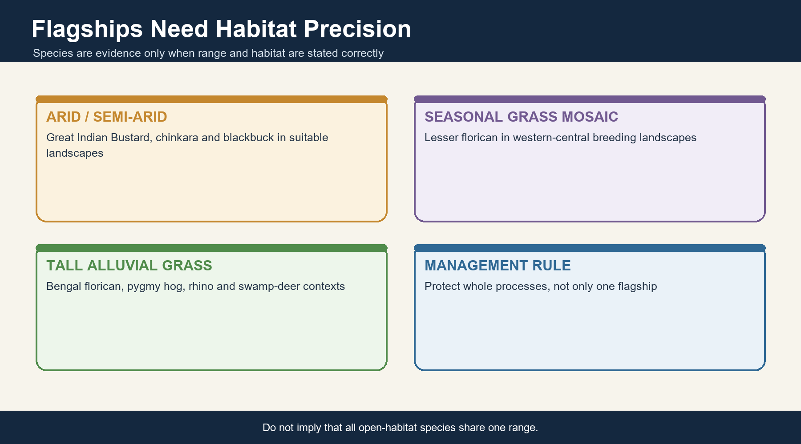

*Caption: Do not imply that all open-habitat species share one range. Original deterministic study schematic; not to scale.*

| Species | Relevant habitat association | Safe geographic framing | Management caution |
| --- | --- | --- | --- |
| Great Indian Bustard | Arid/semi-arid grassland-scrub and open landscapes | Primarily western India, especially Rajasthan in current conservation discourse | Power lines, fragmentation and breeding refuges |
| Lesser florican | Seasonal grasslands and agricultural mosaics | Western and central Indian breeding landscapes | Tall/short structure and monsoon timing |
| Bengal florican | Tall alluvial grasslands | Terai and Brahmaputra-range contexts | Patch burning and floodplain conversion |
| Blackbuck | Open grassland, scrub and farm mosaics | Several Indian regions | Conflict and connectivity |
| Chinkara | Arid/semi-arid scrub-grassland | Western and central drylands | Do not equate with tall grassland |
| Hard-ground barasingha | Grassy meadows and woodland mosaic | Kanha conservation example | Subspecies and site specificity |
| One-horned rhinoceros | Floodplain tall grassland-wetland-woodland mosaic | Brahmaputra and Terai protected landscapes | Flagship does not replace flood-process management |
| Pygmy hog | Dense tall wet grasslands | Restricted Assam-range conservation context | Avoid broad national range claims |

### Core teaching

- Flagships can attract finance but create taxonomic and habitat bias.
- Indicator value depends on monitoring design.
- Bird breeding seasons must shape burning/cutting.
- Whole food webs, plants and invertebrates require independent targets.

### Must-know facts

- GIB and floricans are different habitat/range cases.
- Hard-ground barasingha is linked to Kanha.
- Pygmy hog is a tall wet-grassland specialist in a restricted range.

### UPSC traps

- **Wrong:** Protecting one flagship protects every grassland process. **Correct:** Hydrology, plants, invertebrates and livelihoods still need monitoring.
- **Wrong:** All listed species co-occur in one grassland type. **Correct:** Their climatic and geographic ranges differ sharply.

**Mains use:** Name species only when it proves a habitat or governance point.

**Study link:** MoEFCC recovery programme + WII species ecology

---

## 28. Ecosystem Services and Carbon Qualification

Deciduous forests and grasslands provide different bundles of services. Comparisons must state the biome, baseline, time horizon and carbon pool.

| Service | Deciduous forest pathway | Grassland/open-system pathway | Qualification |
| --- | --- | --- | --- |
| Fodder/NTFP | Leaves, fruits, flowers, bamboo and forest-edge forage | Grazing, hay and seed resources | Access and sustainability vary |
| Pollination | Forest-edge and seasonal floral resources | Forb-rich grassland networks | Pesticides and fragmentation matter |
| Soil carbon | Litter, roots and woody inputs | Often root- and soil-dominated | Depth and management decide |
| Water regulation | Interception, infiltration and root pathways | Ground cover, infiltration and runoff moderation | Water yield is scale-dependent |
| Erosion control | Canopy, litter and roots | Dense sward and fibrous roots | Bare/compacted ground reverses benefit |
| Fire breaks/fuel | Managed strips may interrupt spread | Grazing/cutting can reduce cured fuel | Poorly designed breaks fragment habitat |
| Cultural/wildlife | Sacred species, NTFPs and forest fauna | Pastoral identity and open-habitat fauna | Non-market value is undercounted |

### Core teaching

- Grassland belowground carbon can be important and resilient to some aboveground disturbance.
- Forests often store more aboveground carbon, but wrong-site afforestation can lose native grassland carbon/biodiversity.
- Water benefits depend on climate, soil and catchment scale.
- Service trade-offs must identify winners and losers.

### Must-know facts

- Never make a universal forest-versus-grassland carbon ranking.
- Soil carbon requires depth and repeated measurement.
- Carbon is one service among biodiversity, water and livelihoods.

### UPSC traps

- **Wrong:** Trees always maximise total ecosystem carbon on every site. **Correct:** Biome and baseline determine the correct comparison.
- **Wrong:** Grasslands have negligible carbon because they lack tall biomass. **Correct:** Large pools can occur below ground.

**Mains use:** State pool, baseline, permanence and co-benefits before claiming a carbon advantage.

**Study link:** Carbon cycle + land restoration + ecosystem services

---

## 29. DPSIR Threat Chains

Threat lists score poorly unless they separate driver, pressure, state change, impact and response. The same driver can create multiple pressures and cumulative effects.

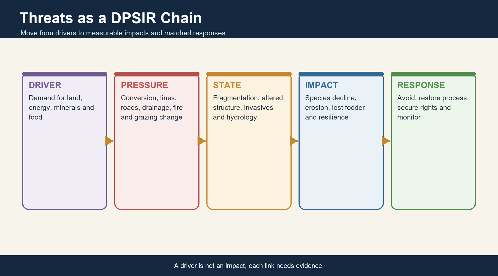

*Caption: A driver is not an impact; each link needs evidence. Original deterministic study schematic; not to scale.*

| Driver | Pressure | State change | Impact |
| --- | --- | --- | --- |
| Infrastructure/mining | Clearing, noise, dust, access and barriers | Fragmentation and edge | Mortality, invasion and lost connectivity |
| Intensive agriculture | Conversion, chemicals and drainage | Simplified matrix | Pollinator and breeding-habitat loss |
| Renewables/power lines | Site conversion and collision risk | Open-land industrialisation | Bustard/florican and corridor impacts |
| Afforestation targets | Tree planting on natural open systems | Woody conversion | Open-specialist decline and water change |
| Invasives | Competition and altered fuel | Native composition loss | Lower fodder and changed fire |
| Altered grazing/fire | Overuse, exclusion or mistimed burn | Structure homogenisation | Recruitment or nesting failure |
| Hydrological alteration | Embankment, drainage or impoundment | Flood-pulse loss | Tall-grass and wetland decline |
| Climate extremes | Drought, heat and extreme flood | Pulse failure/mortality | Livelihood and biodiversity shocks |

### Core teaching

- Linear projects create footprint, barrier, edge and access effects.
- Tourism pressure includes roads, vehicles, waste and disturbance.
- Under-grazing can also change structure.
- State change should be measured, not assumed from driver presence.

### Must-know facts

- Driver is not the same as impact.
- Cumulative assessment is necessary where projects cluster.
- Climate attribution requires more than one extreme event.

### UPSC traps

- **Wrong:** Renewable energy has zero local ecological cost. **Correct:** Low-carbon infrastructure still requires siting and mitigation.
- **Wrong:** Invasive removal once equals recovery. **Correct:** Reinvasion pathways and native recruitment need follow-up.

**Mains use:** Write a complete causal chain and match each response to the pressure.

**Study link:** DPSIR + cumulative impact assessment

---

## 30. Afforestation and Plantation Trap

Tree planting is restoration only when the historical biome, species, structure and processes support a woody target. Wrong-site afforestation can damage native grasslands; degraded former forest may genuinely need native woodland recovery.

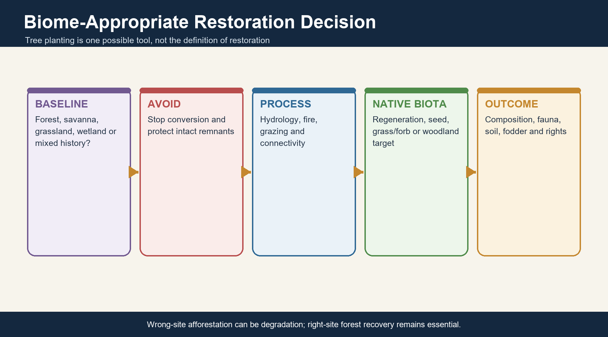

*Caption: Wrong-site afforestation can be degradation; right-site forest recovery remains essential. Original deterministic study schematic; not to scale.*

| Decision step | Question | Open-biome outcome | Former-forest outcome |
| --- | --- | --- | --- |
| 1. Establish baseline | What existed and for how long? | Protect native openness | Plan forest recovery |
| 2. Remove avoidable pressure | What causes current degradation? | Stop conversion/erosion | Stop fire, grazing or extraction beyond threshold |
| 3. Restore process | Hydrology, fire, grazing, seed source? | Rebuild open-system regime | Enable natural regeneration |
| 4. Add plants if needed | Which native functional types? | Native grasses/forbs/shrubs | Native trees plus understorey |
| 5. Monitor outcome | Composition, fauna, soil and livelihoods? | No woody encroachment/invasives | Recruitment and structure |

### Core teaching

- Avoidance precedes restoration.
- Planting targets measure inputs, not ecological outcomes.
- Monoculture can increase canopy while reducing native biodiversity.
- Natural regeneration can outperform planting where ecological memory remains.

### Must-know facts

- Biome-appropriate baseline is the central test.
- CAMPA/GIM/Green Credit inputs must be evaluated for site choice and ecological quality.
- No-conversion of intact habitat is usually the highest-return action.

### UPSC traps

- **Wrong:** Every 'wasteland' should receive trees. **Correct:** The label may contain natural grassland, scrub, wetland or rocky habitat.
- **Wrong:** Grassland protection means opposing all forest restoration. **Correct:** Degraded former forests need native recovery on evidence-based sites.

**Mains use:** Use a decision tree: BASELINE -> AVOID -> PROCESS -> NATIVE BIOTA -> OUTCOME.

**Study link:** Succession + CAMPA/GIM + open natural ecosystems

---

## 31. FSI Forest-Cover Data: What It Can and Cannot Say

ISFR 2023 is the latest officially verified national forest assessment for this package as of 18 August 2026. It measures canopy categories, not grassland condition or historical biome.

> **Current/status note:** FACT/STATUS: ISFR 2023 is the latest official national report verified on 18 August 2026. LIMIT: its canopy-density classes do not measure grassland ecological condition.

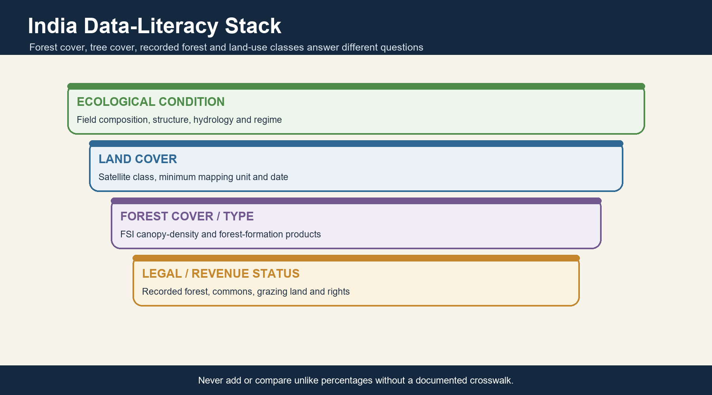

*Caption: Never add or compare unlike percentages without a documented crosswalk. Original deterministic study schematic; not to scale.*

| Indicator | ISFR 2023 value/definition | Correct use | Limit |
| --- | --- | --- | --- |
| Forest + tree cover | 827,356.95 sq km; 25.17% of geographical area | National canopy baseline | Combines distinct categories |
| Forest cover | 715,342.61 sq km; 21.76% | Canopy on qualifying patches | Land-use neutral above threshold |
| Tree cover | 112,014.34 sq km; 3.41% | Trees outside recorded forest in smaller configurations | Not forest ecosystem area |
| Very dense | Canopy density 70% and above | Density class | Not virgin forest |
| Moderately dense | 40% to below 70% | Density class | Not species composition |
| Open forest | 10% to below 40% | Density class | Not ecological grassland |
| Scrub | Forest land with poor/stunted tree growth below 10% canopy | FSI class | Not all national scrub/open land |

### Core teaching

- Date-stamp every figure.
- Forest cover is irrespective of ownership and legal status under the methodology.
- Plantations and orchards can enter canopy statistics when criteria are met.
- Grassland quality needs separate land-cover and field indicators.

### Must-know facts

- 25.17% is combined forest and tree cover, not forest cover alone.
- VDF/MDF/open are density classes.
- ISFR cannot settle the savanna debate.

### UPSC traps

- **Wrong:** Open forest is grassland. **Correct:** It is a canopy-density class with 10-40% tree cover.
- **Wrong:** An ISFR increase proves native forest restoration. **Correct:** Composition, origin and location require separate evidence.

**Mains use:** Quote one figure, define it, and immediately state its methodological blind spot.

**Study link:** FSI ISFR 2023 + scheme of classification

---

## 32. Forest, Grassland, Grazing Land, Scrub and 'Wasteland' Datasets

India lacks one universally comparable national grassland number because ecological, land-use, revenue, livestock and remote-sensing datasets use different legends, dates and minimum mapping units.

*Caption: Never add or compare unlike percentages without a documented crosswalk. Original deterministic study schematic; not to scale.*

| Dataset family | What it may count | Strength | Do not merge with |
| --- | --- | --- | --- |
| FSI forest cover/type | Canopy density or forest formation | National forest monitoring | Grassland condition |
| Land-use/land-cover | Spectral land-cover classes | Wall-to-wall mapping | Tenure and naturalness |
| Wasteland inventory | Mapped degradation/under-use categories | Management targeting | Ecological worth |
| Revenue commons/grazing records | Legal/administrative use | Access and tenure | Vegetation quality |
| Livestock/fodder statistics | Feed demand and supply | Livelihood planning | Native biodiversity |
| Protected-area habitat maps | Management units and species habitat | Site detail | National comparability |

### Core teaching

- Recorded forest area may contain open grasslands.
- High tree cover may be plantation outside recorded forest.
- Scrub in FSI and scrub in another land-cover legend may differ.
- Never add percentages from unlike datasets.

### Must-know facts

- Method, year, spatial resolution and class definition belong beside every statistic.
- A single unverified national grassland percentage is deliberately omitted.
- Crosswalks need uncertainty ranges.

### UPSC traps

- **Wrong:** All official datasets measure the same land categories. **Correct:** Their purposes and legends differ.
- **Wrong:** No number means grassland is unimportant. **Correct:** It means measurement architecture is fragmented.

**Mains use:** Turn data absence into data literacy: specify the institutional crosswalk needed.

**Study link:** FSI + NRSC/land records + DAHD/IGFRI + field monitoring

---

## 33. Governance and Legal Distinctions

No single law 'protects grasslands'. Status depends on forest records, wildlife notification, biodiversity institutions, FRA rights, revenue/common land and project-specific clearances.

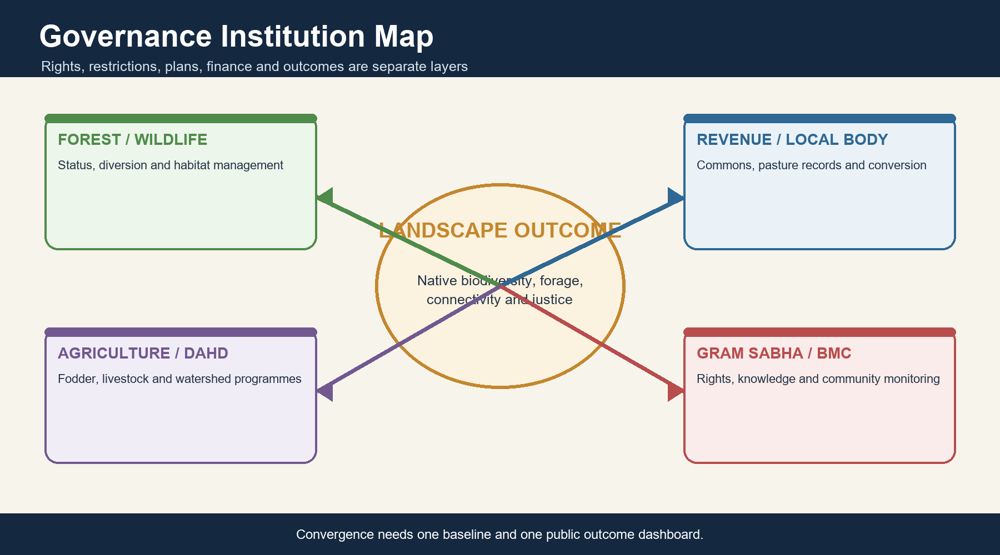

*Caption: Convergence needs one baseline and one public outcome dashboard. Original deterministic study schematic; not to scale.*

| Instrument | Primary function | Open-ecosystem relevance | Not the same as |
| --- | --- | --- | --- |
| Van (Sanrakshan Evam Samvardhan) Adhiniyam, 1980 | Prior central approval for specified forest-land use | Recorded forest grasslands/open forests | Ecological grassland law |
| Wild Life (Protection) Act, 1972 | PAs, species and wildlife regulation | NPs, sanctuaries, conservation/community reserves | All grasslands automatically |
| FRA, 2006 | Recognition of forest rights | Grazing and seasonal pastoral access; CFR governance | Unregulated use |
| Biological Diversity Act, 2002 as amended | Conservation, sustainable use and benefit sharing | BMC/PBR documentation and local action | Tenure title |
| CAMPA/GIM | Finance and mission-based restoration | Potential grassland/process work or wrong-site planting risk | Legal status |
| Revenue/common land rules | Village pasture and commons administration | Access and conversion decisions | National uniform regime |
| ESZ/EIA/project clearance | Activity regulation and appraisal | Infrastructure and cumulative pressure | Habitat restoration outcome |

### Core teaching

- Separate right, restriction, plan, finance, compliance and ecological outcome.
- Conservation/community reserves can support corridors and community participation.
- Rights recognition and conservation duties coexist under FRA.
- Legal approval does not prove ecological suitability.

### Must-know facts

- Use the current title of the 1980 forest-conservation statute.
- Institutional fragmentation is a central policy problem.
- PBR is documentation, not automatic protection.

### UPSC traps

- **Wrong:** Grassland outside a PA has no legal relevance. **Correct:** Forest, revenue, biodiversity, FRA and project laws may still apply.
- **Wrong:** CAMPA funding certifies restoration success. **Correct:** Finance is an input; ecological outcome needs monitoring.

**Mains use:** Build a governance stack and identify coordination failures.

**Study link:** India Code + MoTA FRA + MoEFCC wildlife/GIM

---

## 34. FRA, Grazing Rights and Community Forest Resource

The FRA recognises community rights including grazing, traditional seasonal resource access of nomadic and pastoral communities, and Community Forest Resource rights, while assigning conservation responsibilities to Gram Sabhas and rights holders.

*Caption: Convergence needs one baseline and one public outcome dashboard. Original deterministic study schematic; not to scale.*

| Right/institution | Content | Ecological opportunity | Implementation issue |
| --- | --- | --- | --- |
| Community grazing right | Customary grazing in forest contexts | Legitimate co-management | Recognition and boundaries |
| Seasonal pastoral access | Traditional mobile resource use | Maintains mobility | Routes cross jurisdictions |
| CFR right | Protect, regenerate, conserve and manage | Local planning and stewardship | Capacity and overlap |
| Gram Sabha duty | Protect biodiversity, wildlife, water and sensitive areas | Rule-making legitimacy | External market/agency pressure |

### Core teaching

- Rights are not a synonym for open access.
- Secure tenure can support long-term stewardship.
- Management plans should combine customary knowledge with ecological monitoring.
- Relocation or restriction must follow lawful rights-aware process.

### Must-know facts

- FRA is a rights-restoration law with conservation powers and duties.
- Grazing rights are explicit in the Ministry of Tribal Affairs summary.
- Forest and revenue commons may have different legal routes.

### UPSC traps

- **Wrong:** Recognised rights eliminate conservation rules. **Correct:** Rights holders also carry conservation responsibilities.
- **Wrong:** Pastoral mobility is irrelevant to forest governance. **Correct:** Traditional seasonal access is specifically recognised.

**Mains use:** Avoid rights-versus-conservation binaries; analyse institutions, incentives and safeguards.

**Study link:** Ministry of Tribal Affairs FRA portal

---

## 35. Institutional Fragmentation

Grassland governance is split across forest, wildlife, revenue, rural development, agriculture, animal husbandry, local bodies and infrastructure agencies. The land parcel is integrated; administration is not.

*Caption: Convergence needs one baseline and one public outcome dashboard. Original deterministic study schematic; not to scale.*

| Institution | Typical mandate | Coordination need | Failure mode |
| --- | --- | --- | --- |
| Forest/wildlife department | Habitat and legal forest/PA management | Fire, fauna and rights | Forest-centric tree target |
| Revenue/local bodies | Commons, pasture and land records | Tenure and conversion control | Wasteland disposal |
| Agriculture/rural development | Watershed, employment and productivity | Soil-water and invasive work | Uniform plantation |
| Animal husbandry/IGFRI | Fodder and livestock productivity | Carrying capacity and fodder banks | Production-only lens |
| Energy/roads/mining agencies | Infrastructure | Avoidance and cumulative assessment | Project-by-project fragmentation |
| BMC/Gram Sabha | Local biodiversity and rights | Co-management and monitoring | Token consultation |

### Core teaching

- One convergence plan should map ecological baseline, tenure, users, projects and indicators.
- Budget convergence without a common outcome can multiply wrong interventions.
- District-level platforms need transparent spatial data.
- Independent ecological and social audits close the feedback loop.

### Must-know facts

- Institutional fragmentation explains why grasslands fall between departments.
- A nodal agency is insufficient without shared metrics.
- Local bodies hold essential tenure and use information.

### UPSC traps

- **Wrong:** More schemes automatically improve conservation. **Correct:** Conflicting incentives can accelerate conversion.
- **Wrong:** Forest department alone can govern every grassland. **Correct:** Many systems lie on revenue, community and private land.

**Mains use:** Propose a landscape plan with a common baseline, rights map and outcome dashboard.

**Study link:** Cooperative federalism + district planning + commons governance

---

## 36. Restoration Hierarchy

Restoration begins by identifying the historical and future-suitable biome. It then prioritises avoiding conversion, repairing processes and securing rights before planting.

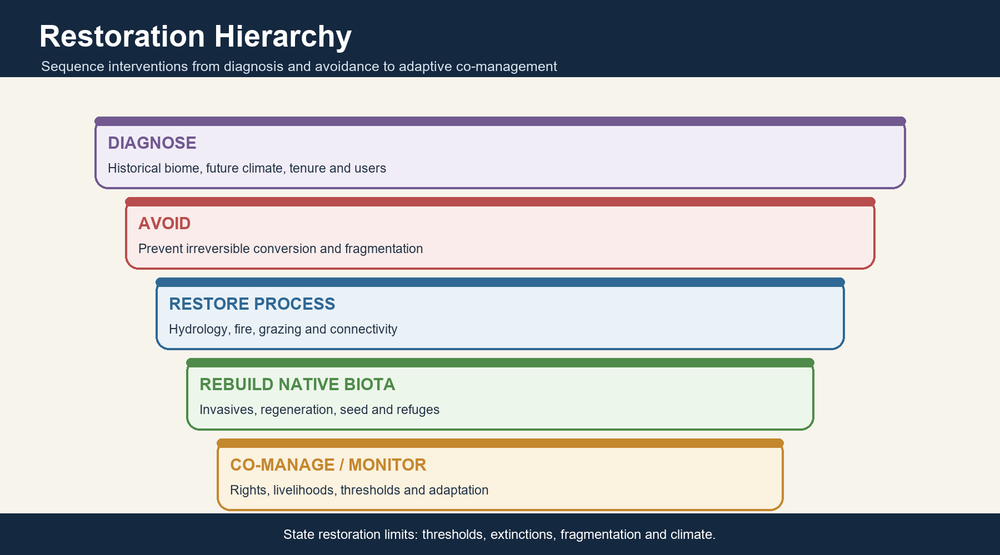

*Caption: State restoration limits: thresholds, extinctions, fragmentation and climate. Original deterministic study schematic; not to scale.*

| Priority | Action | Example | Limit |
| --- | --- | --- | --- |
| 1. Diagnose | History, soil, hydrology, flora, maps and tenure | Forest-versus-open baseline | Evidence can remain uncertain |
| 2. Avoid | Stop irreversible conversion and fragmentation | Protect breeding refuges/corridors | Cannot reverse all legacy loss |
| 3. Restore process | Hydrology, fire and grazing regime | Flood pulse or patch burns | Climate change may shift feasibility |
| 4. Control invasives | Strategic removal and follow-up | Prosopis/wattle context-specific work | Removal can expose soil |
| 5. Rebuild native biota | Seed, assisted regeneration and refuges | Native grass/forb or woodland target | Seed supply and genetics |
| 6. Co-manage | Community/pastoral institutions and benefit sharing | Fodder and habitat plans | Power asymmetry |
| 7. Monitor/adapt | Ecological and livelihood outcomes | Adjust stocking/burning | Long time horizons |

### Core teaching

- Protect intact remnants first.
- Restore hydrology before cosmetic planting.
- Use mosaics and refuges rather than uniform treatment.
- State limits: extinct interactions, fragmented catchments and future climate can cap recovery.

### Must-know facts

- Avoidance has priority over offsetting.
- Native seed provenance matters.
- Restoration success includes tenure and livelihood outcomes.

### UPSC traps

- **Wrong:** Invasive removal is the first step everywhere. **Correct:** Baseline, erosion risk and reinvasion pathways must be assessed first.
- **Wrong:** Restoration can recreate every lost ecosystem fully. **Correct:** Thresholds, extinctions and climate impose limits.

**Mains use:** A sequenced hierarchy demonstrates feasibility and prevents generic tree-planting answers.

**Study link:** Restoration ecology + community co-management

---

## 37. Monitoring Dashboard

Monitoring must detect ecological condition, process, species response and social legitimacy. Area treated or saplings planted are implementation outputs, not restoration outcomes.

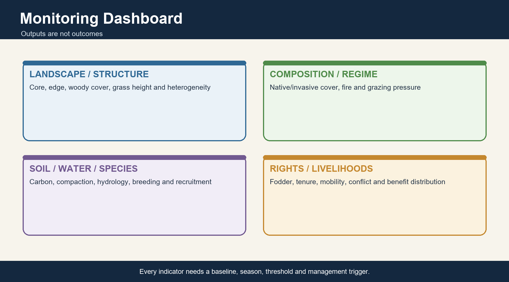

*Caption: Every indicator needs a baseline, season, threshold and management trigger. Original deterministic study schematic; not to scale.*

| Indicator family | Metric examples | Why it matters | Caution |
| --- | --- | --- | --- |
| Landscape | Patch size, core area, edge and connectivity | Fragmentation | Scale choice matters |
| Structure | Woody cover, grass height, bare ground and heterogeneity | Habitat state | Season affects reading |
| Composition | Native richness, functional groups and invasive cover | Fidelity | Sampling effort |
| Regime | Fire return/season/severity and grazing pressure | Maintaining processes | Detection versus cause |
| Soil/carbon | Compaction, erosion and belowground carbon | Hidden condition | Slow change |
| Hydrology | Flood duration, water table and infiltration | Floodplain/catchment function | Upstream drivers |
| Species | Occupancy, breeding and recruitment | Biological response | Flagship bias |
| Livelihood/rights | Fodder, access, tenure security and conflict | Legitimacy and distribution | Average can hide inequality |

### Core teaching

- Use baseline, control/reference and repeated seasons.
- Remote sensing should be paired with field plots and community observation.
- Targets need thresholds and management triggers.
- Publish methods and negative results.

### Must-know facts

- Monitoring must include belowground and social variables.
- Breeding success is stronger than presence alone.
- Fodder availability and tenure are legitimate restoration indicators.

### UPSC traps

- **Wrong:** Satellite green-up proves successful restoration. **Correct:** Species composition, regime and livelihoods remain unknown.
- **Wrong:** One flagship count is a complete dashboard. **Correct:** Whole-system indicators are required.

**Mains use:** Close Mains answers with indicators tied to adaptive decisions.

**Study link:** Landscape ecology + social audit + adaptive management

---

## 38. Current Linkage: IYRP 2026, ICAR-IGFRI and Latest Forest Baseline

The current anchor is not a forced news story: 2026 is the UN International Year of Rangelands and Pastoralists, while Indian official sources highlight fodder-resource planning and a temperate hortipasture technology. ISFR 2023 remains the latest verified national forest baseline.

> **Current/status note:** Retrieved 18 August 2026. Current searches covered the preceding six months; the package uses current official fodder/rangeland anchors and explicitly records the absence of a harmonised Indian grassland-condition percentage.

| Label | Official evidence retrieved 18 Aug 2026 | Exam use | Boundary |
| --- | --- | --- | --- |
| FACT | FAO/UNCCD describe rangelands as grasslands, savannas, shrublands, steppes, deserts, mountain areas, wetlands and open woodlands; 2026 is IYRP | Rangeland breadth and pastoral visibility | Global framing, not India area estimate |
| STATUS | ICAR workshop dated 30 Jan 2026 flagged declining and seasonal green-fodder availability and called for coordinated resource planning | Fodder security and institution linkage | Workshop statement, not a national grassland-condition audit |
| FACT | ICAR-IGFRI official page reports apple/almond hortipasture integrating perennial grasses and legumes in Himalayan orchards | Production landscape and fodder innovation | Managed hortipasture, not natural grassland restoration |
| STATUS | ISFR 2023 is latest official forest report verified for this package | Forest-data baseline | No grassland-condition inference |
| INFERENCE | India should use IYRP momentum to build a cross-department rangeland inventory and rights-aware monitoring system | Policy recommendation | Not an announced national programme |
| LIMIT | No recent official source located for a single harmonised national grassland-condition percentage | Data literacy | Do not fill the gap with an unverified number |

### Core teaching

- Current affairs should sharpen static category discipline.
- Hortipasture demonstrates land-sharing and fodder innovation but cannot justify conversion of natural meadows.
- IYRP emphasises tenure, investment and sustainable management.
- Use retrieval date beside dynamic claims.

### Must-know facts

- IYRP is a UN-designated year, not proof of Indian policy implementation.
- ICAR figures are technology/site claims from the official page.
- ISFR is a forest baseline only.

### UPSC traps

- **Wrong:** IYRP creates a new binding grassland treaty. **Correct:** It is an awareness and action year, not a treaty.
- **Wrong:** Hortipasture and natural grassland are the same. **Correct:** One is a managed production system; the other is an ecological formation.

**Mains use:** Use FACT -> STATUS -> INFERENCE -> LIMIT to keep current linkage honest.

**Study link:** FAO, UNCCD, ICAR-IGFRI, DAHD and FSI

---

# Solved verified PYQs

## PYQ 1 - UPSC Prelims 2021, Q61 - Savanna Tree Limitation

**Question:** The vegetation of savannah consists of grassland with scattered small trees, but extensive areas have no trees. Forest development is generally kept in check by which conditions? 1. Burrowing animals and termites 2. Fire 3. Grazing herbivores 4. Seasonal rainfall 5. Soil properties. Options: A. 1 and 2; B. 4 and 5; C. 2, 3 and 4; D. 1, 3 and 5.

**Source status:** Exact English stem verified from local official paper `QP-CSP-21-GeneralStudiesPaper-I-121021.pdf`, page 29. No official 2021 key is held locally.

**INFERRED ANSWER - NOT OFFICIALLY VERIFIED LOCALLY: C.**

**Confidence:** High.

**Elimination/solution:** Fire suppresses woody recruitment, grazers remove seedlings and seasonal rainfall creates a long dry period that favours grasses and limits continuous forest development. Soil and termite effects can matter locally, but the UPSC bundle targets the classic savanna regime of fire, grazing and rainfall seasonality.

## PYQ 2 - UPSC Prelims 2023, Q3 - Deciduous Trees

**Question:** Consider the following trees: 1. Jackfruit (Artocarpus heterophyllus) 2. Mahua (Madhuca indica) 3. Teak (Tectona grandis). How many are deciduous? A. Only one; B. Only two; C. All three; D. None.

**Source status:** Exact English stem verified from local official paper `QP_CS_Pre_Exam_2023_280523.pdf`, page 3. No official 2023 key is held locally.

**INFERRED ANSWER - NOT OFFICIALLY VERIFIED LOCALLY: B.**

**Confidence:** High.

**Elimination/solution:** Mahua and teak are deciduous; jackfruit is generally evergreen. The question tests species-level phenology, not whether a tree is found in a deciduous-forest landscape.

## PYQ 3 - UPSC Prelims 2020, Q75 - Hard-Ground Barasingha

**Question:** Which protected area is well known for conservation of a subspecies of Indian swamp deer (barasingha) that thrives on hard ground and is exclusively graminivorous? A. Kanha National Park; B. Manas National Park; C. Mudumalai Wildlife Sanctuary; D. Tal Chhapar Wildlife Sanctuary.

**Source status:** Exact English stem verified from local official paper `CSP_2020_GS_Paper-1.pdf`. No official 2020 key is held locally.

**INFERRED ANSWER - NOT OFFICIALLY VERIFIED LOCALLY: A.**

**Confidence:** High.

**Elimination/solution:** Kanha National Park is the classic conservation landscape for the hard-ground barasingha. The item reinforces that 'swamp deer' nomenclature does not mean every subspecies is restricted to swamp.

## PYQ 4 - UPSC Prelims 2020, Q95 - Desert National Park and GIB

**Question:** With reference to India's Desert National Park: 1. It is spread over two districts. 2. There is no human habitation inside the Park. 3. It is one of the natural habitats of the Great Indian Bustard. Options: A. 2 only; B. 2 and 3 only; C. 1 and 3 only; D. 1, 2 and 3.

**Source status:** Exact English stem verified from local official paper `CSP_2020_GS_Paper-1.pdf`. No official 2020 key is held locally.

**INFERRED ANSWER - NOT OFFICIALLY VERIFIED LOCALLY: C.**

**Confidence:** High.

**Elimination/solution:** The park spans Jaisalmer and Barmer districts and is a major GIB habitat. Human settlements and use exist within the wider landscape, so Statement 2 is incorrect.

## PYQ 5 - UPSC GS-I 2020, Q17 - Forest Resources and Climate Change

**Question:** Examine the status of forest resources of India and its resultant impact on climate change. (15 marks, 250 words)

**Source status:** Exact English stem verified from local official `Gen_St_P1.pdf`, page 3. Mains has no objective answer key.

### Model answer

- CLAIM: India's forest resource is substantial but heterogeneous: canopy extent, natural-forest quality, recorded status and community access must be assessed separately; its climate role is important but cannot substitute for fossil-emission reduction.
- NAMED EVIDENCE: ISFR 2023 reports 715,342.61 sq km of forest cover (21.76%) and 112,014.34 sq km of tree cover (3.41%), together 25.17% of geographical area. Central Indian deciduous forests store carbon and support NTFP livelihoods, while natural grasslands may occur inside forest records and should not be converted merely to raise tree-cover figures.
- ANALYSIS: Intact and regenerating forests store carbon in biomass/soil, moderate local heat and moisture, and reduce erosion. Fragmentation, recurrent severe fire, mining and linear infrastructure reduce stocks, permanence and resilience. Plantations may add canopy and carbon but usually simplify composition and can be vulnerable to fire or drought.
- QUALIFICATION: ISFR is a canopy assessment, not a naturalness inventory. Forest-water effects depend on catchment and climate; grasslands can hold major belowground carbon. Land sinks are finite and reversible.
- VERDICT: Prioritise avoided loss of old and native forest, protect deciduous corridors and CFR institutions, restore degraded former forest through native regeneration, avoid wrong-site grassland afforestation, and monitor composition, biomass, soil carbon and permanence.
- Why this earns marks: It answers status and climate impact, uses dated official evidence, distinguishes datasets and biomes, explains mechanisms, qualifies overclaims and gives a prioritised verdict.

## PYQ 6 - UPSC GS-I 2023, Q15 - Diversity of Natural Vegetation

**Question:** Identify and discuss the factors responsible for diversity of natural vegetation in India. Assess the significance of wildlife sanctuaries in rain forest regions of India. (15 marks, 250 words)

**Source status:** Exact English stem verified from local official `QP-CSM-23-GENERAL-STUDIES-PAPER-I-180923.pdf`, page 3.

### Model answer

- CLAIM: India's vegetation diversity arises from the interaction of monsoon seasonality, temperature/altitude, soils, hydrology, fire-herbivory and land-use history; wildlife sanctuaries are essential cores in rain-forest regions but cannot conserve landscape processes alone.
- NAMED EVIDENCE: Western Ghats windward evergreen-shola mosaics contrast with leeward deciduous interiors; sal belts in eastern/foothill India differ from teak-rich central-peninsular landscapes; Terai and Brahmaputra floods maintain tall grasslands; Banni reflects salinity, aridity and pastoral use.
- ANALYSIS: Relief creates rain shadows and elevational belts; dry-season length shapes phenology; geology/drainage create edaphic mosaics; disturbance maintains some savannas while degrading fire-sensitive wet forest. Sanctuaries secure representative habitat, control conversion and provide nodes for species recovery and research.
- QUALIFICATION: Boundaries remain ecotonal, and sanctuary notification does not secure corridors, hydrology or rights outside the boundary. Fortress conservation can weaken legitimacy; some open systems lie outside classic forest PAs.
- VERDICT: Maintain statutory cores but govern buffers, river systems and corridors through cumulative impact control, FRA-compliant co-management, BMC/PBR knowledge and biome-specific monitoring.
- Why this earns marks: It addresses both directives, gives named Indian contrasts, explains causation, assesses rather than praises sanctuaries, and closes with a landscape-scale judgement.

# Original solved MCQ and remedial loop

> Correct options rotate strictly A -> B -> C -> D without interruption.

## Q1-Q8: Concept and application

### Q1

Which statement best distinguishes deciduous habit from deciduous forest?

- A. Habit is species-level seasonal leaf loss; forest is a community formation.
- B. Both are FSI canopy classes.
- C. A forest is deciduous only if every tree is leafless together.
- D. Habit refers only to cold-climate trees.

**Answer: A.** Habit is species-level seasonal leaf loss; forest is a community formation.

### Q2

Why does deciduous not mean lifeless during the dry season?

- A. Every deciduous tree photosynthesises at peak rate without leaves.
- B. Roots, buds and stored reserves remain active or viable.
- C. Dry-season fire replaces all plant metabolism.
- D. All trees immediately flower after complete mortality.

**Answer: B.** Roots, buds and stored reserves remain active or viable.

### Q3

Which definition is most accurate for pasture?

- A. Any ecosystem dominated by grasses.
- B. A temperate steppe only.
- C. Land managed primarily to provide livestock forage.
- D. Every revenue wasteland.

**Answer: C.** Land managed primarily to provide livestock forage.

### Q4

The term 'wasteland' in Indian mapping is best treated as:

- A. A natural biome with no ecosystem services.
- B. Land legally outside all regulation.
- C. A synonym for overgrazed village pasture.
- D. An administrative/remote-sensing label requiring ecological examination.

**Answer: D.** An administrative/remote-sensing label requiring ecological examination.

### Q5

Which formulation best explains realised vegetation?

- A. Climate x site x disturbance x land-use history.
- B. Annual rainfall alone.
- C. Legal forest status alone.
- D. Current canopy density alone.

**Answer: A.** Climate x site x disturbance x land-use history.

### Q6

Why are deciduous-thorn-grassland boundaries ecotones?

- A. They are errors caused only by poor cartography.
- B. Interacting controls and feedbacks create gradual, shifting transitions.
- C. They follow district borders.
- D. They never move through time.

**Answer: B.** Interacting controls and feedbacks create gradual, shifting transitions.

### Q7

Two sites receive similar annual rain but support different vegetation. The best first explanation is:

- A. One site's rainfall must be fabricated.
- B. Latitude has no role anywhere.
- C. Dry-season length, drainage, soils and disturbance may differ.
- D. Forest law fixes plant physiology.

**Answer: C.** Dry-season length, drainage, soils and disturbance may differ.

### Q8

Which is the clearest edaphic control?

- A. Seasonal migration of the ITCZ.
- B. A change in wildlife law.
- C. A national afforestation target.
- D. Shallow or saline soil limiting woody growth despite regional climate.

**Answer: D.** Shallow or saline soil limiting woody growth despite regional climate.

## Q9-Q16: Concept and application

### Q9

Seasonal leaf shedding primarily reduces:

- A. Transpiring surface during moisture stress.
- B. Soil salinity immediately.
- C. All seed dormancy.
- D. River flooding.

**Answer: A.** Transpiring surface during moisture stress.

### Q10

Resprouting after fire demonstrates:

- A. That every fire is beneficial.
- B. Persistence of protected buds/reserves, not necessarily full ecosystem recovery.
- C. That seedling recruitment is always strong.
- D. That adult trees are immortal.

**Answer: B.** Persistence of protected buds/reserves, not necessarily full ecosystem recovery.

### Q11

C4 photosynthesis is especially advantageous under:

- A. Permanent snow cover.
- B. Deep shade and cold saturation.
- C. High light, warm conditions and low internal carbon dioxide.
- D. Complete absence of water in all tissues.

**Answer: C.** High light, warm conditions and low internal carbon dioxide.

### Q12

Basal meristems help many grasses because they:

- A. Turn grasses into woody plants.
- B. Prevent all herbivory.
- C. Eliminate the need for roots.
- D. Keep growth tissues near the base, below typical clipping height.

**Answer: D.** Keep growth tissues near the base, below typical clipping height.

### Q13

A safe national description of moist deciduous distribution includes:

- A. Eastern/central belts, Himalayan foothills and Ghats transitions.
- B. Only western Rajasthan.
- C. Only island rainforests.
- D. Only the high Himalaya.

**Answer: A.** Eastern/central belts, Himalayan foothills and Ghats transitions.

### Q14

Dry deciduous forest is best understood as:

- A. An FSI synonym for scrub.
- B. A seasonal open-canopy forest that can grade into savanna/thorn mosaics.
- C. A treeless desert.
- D. An evergreen plantation class.

**Answer: B.** A seasonal open-canopy forest that can grade into savanna/thorn mosaics.

### Q15

Which sal-teak statement is correct?

- A. Both dominate every Indian forest equally.
- B. Teak is confined to the Terai.
- C. Sal is strong in northern/eastern belts; teak is strong in central/peninsular belts.
- D. Sal is a grass.

**Answer: C.** Sal is strong in northern/eastern belts; teak is strong in central/peninsular belts.

### Q16

Which statement about plantations is most accurate?

- A. They are always old growth.
- B. They cannot contain trees.
- C. They prove ancient biome status.
- D. They can add biomass and some habitat but are not automatically equivalent to native forest.

**Answer: D.** They can add biomass and some habitat but are not automatically equivalent to native forest.

## Q17-Q24: Concept and application

### Q17

What creates the major dry-season nutrient pulse in deciduous forest?

- A. Seasonal litterfall followed by decomposition and uptake.
- B. Permanent frozen soil.
- C. Complete absence of microbial activity.
- D. Only river sediment.

**Answer: A.** Seasonal litterfall followed by decomposition and uptake.

### Q18

Compared with wet evergreen forest, dry deciduous forest generally has:

- A. No living roots.
- B. A longer canopy-open period and more prominent seasonal grass layer.
- C. Year-round closed canopy everywhere.
- D. No fire risk under any condition.

**Answer: B.** A longer canopy-open period and more prominent seasonal grass layer.

### Q19

Terai tall grasslands are maintained chiefly by:

- A. Mediterranean winter rain.
- B. Permafrost.
- C. Alluvial hydrology, floods and disturbance mosaics.
- D. Oceanic salinity alone.

**Answer: C.** Alluvial hydrology, floods and disturbance mosaics.

### Q20

Banni is best described as:

- A. A Himalayan alpine meadow.
- B. A tropical wet evergreen forest.
- C. A deltaic mangrove island.
- D. A saline/semi-arid pastoral grassland landscape in Kachchh.

**Answer: D.** A saline/semi-arid pastoral grassland landscape in Kachchh.

### Q21

Brahmaputra floodplain grassland conservation requires:

- A. Retention of flood-sediment dynamics plus high-ground refuges.
- B. Permanent elimination of every flood.
- C. Conversion to uniform plantations.
- D. Ignoring channel migration.

**Answer: A.** Retention of flood-sediment dynamics plus high-ground refuges.

### Q22

The shola-grassland mosaic consists of:

- A. Only teak plantations.
- B. Sheltered evergreen shola patches and exposed montane grasslands.
- C. Only arid thorn scrub.
- D. Continuous mangrove forest.

**Answer: B.** Sheltered evergreen shola patches and exposed montane grasslands.

### Q23

Alpine meadows differ from tropical savannas mainly because they are governed by:

- A. Only sea-surface temperature.
- B. Tidal salinity.
- C. Altitude, snow/frost and a short growing season.
- D. Year-round tropical convection.

**Answer: C.** Altitude, snow/frost and a short growing season.

### Q24

Which statement about secondary grasslands is correct?

- A. They are always ecologically empty.
- B. They are necessarily ancient climax systems.
- C. They must always be afforested.
- D. They can retain conservation value even when human-created or maintained.

**Answer: D.** They can retain conservation value even when human-created or maintained.

## Q25-Q32: Concept and application

### Q25

The best evidence strategy in the savanna debate is:

- A. Converge palaeoecology, soils, imagery, flora and use history.
- B. Use present appearance alone.
- C. Assume forest everywhere.
- D. Assume savanna everywhere.

**Answer: A.** Converge palaeoecology, soils, imagery, flora and use history.

### Q26

Why are not all Indian open ecosystems degraded forests?

- A. Trees cannot grow anywhere in India.
- B. Some have long-standing climate-, soil-, flood- or disturbance-maintained openness.
- C. All open lands are deserts.
- D. Remote sensing forbids woody cover.

**Answer: B.** Some have long-standing climate-, soil-, flood- or disturbance-maintained openness.

### Q27

Which fire variables must be specified?

- A. Only flame colour.
- B. Only district name.
- C. Frequency, intensity/severity, season, extent and ecosystem history.
- D. Only number of firefighters.

**Answer: C.** Frequency, intensity/severity, season, extent and ecosystem history.

### Q28

Frequent fire in wet evergreen forest can:

- A. Always increase old-growth specialists.
- B. Have identical effects to savanna fire.
- C. Guarantee permanent carbon storage.
- D. Open canopy, dry fuels and create a reinforcing degradation feedback.

**Answer: D.** Open canopy, dry fuels and create a reinforcing degradation feedback.

### Q29

Overgrazing differs from grazing because it:

- A. Exceeds vegetation/soil recovery under a given timing and climate.
- B. Involves any animal eating grass.
- C. Occurs only with wildlife.
- D. Is defined by one national livestock number.

**Answer: A.** Exceeds vegetation/soil recovery under a given timing and climate.

### Q30

Pastoral mobility can support sustainability by:

- A. Preventing all disease.
- B. Tracking variable forage and distributing pressure across seasons.
- C. Eliminating tenure needs.
- D. Keeping herds permanently at one water point.

**Answer: B.** Tracking variable forage and distributing pressure across seasons.

### Q31

Why can blanket livestock exclusion be counterproductive?

- A. Livestock never affect vegetation.
- B. All grasslands require maximum grazing.
- C. It may reduce heterogeneity, promote woody thickening and harm livelihoods.
- D. Rights have no ecological relevance.

**Answer: C.** It may reduce heterogeneity, promote woody thickening and harm livelihoods.

### Q32

Common-property governance primarily addresses:

- A. Photosynthesis pathways.
- B. Plate tectonics.
- C. Ocean salinity.
- D. Rules of access, timing, exclusion and conflict over shared resources.

**Answer: D.** Rules of access, timing, exclusion and conflict over shared resources.

## Q33-Q40: Concept and application

### Q33

The Great Indian Bustard is most safely linked with:

- A. Arid/semi-arid grassland-scrub and open landscapes of western India.
- B. Wet evergreen canopy.
- C. Alpine snowfields.
- D. Mangrove creeks.

**Answer: A.** Arid/semi-arid grassland-scrub and open landscapes of western India.

### Q34

Which florican distinction is correct?

- A. Both are mangrove specialists.
- B. Lesser florican uses seasonal western-central grass mosaics; Bengal florican uses tall alluvial grasslands.
- C. Both are confined to alpine meadows.
- D. They have identical ranges.

**Answer: B.** Lesser florican uses seasonal western-central grass mosaics; Bengal florican uses tall alluvial grasslands.

### Q35

Which habitat-species pairing is correct?

- A. Pygmy hog - Thar dunes.
- B. Rhino - alpine scree.
- C. Hard-ground barasingha - Kanha grassland-woodland mosaic.
- D. Chinkara - tall wet Terai only.

**Answer: C.** Hard-ground barasingha - Kanha grassland-woodland mosaic.

### Q36

What is the chief limitation of flagship-only management?

- A. Flagships cannot be monitored.
- B. Flagships have no public value.
- C. Every flagship occupies all habitats.
- D. It can miss plant, invertebrate, hydrological and livelihood outcomes.

**Answer: D.** It can miss plant, invertebrate, hydrological and livelihood outcomes.

### Q37

A provisioning service common in deciduous landscapes is:

- A. Mahua/tendu/bamboo and seasonal fodder.
- B. Permafrost mining.
- C. Coral calcification.
- D. Glacier calving.

**Answer: A.** Mahua/tendu/bamboo and seasonal fodder.

### Q38

The most defensible carbon comparison is:

- A. Trees always win on every site.
- B. Forest versus grassland depends on biome, baseline and carbon pool.
- C. Grasslands contain no soil carbon.
- D. Only aboveground carbon matters.

**Answer: B.** Forest versus grassland depends on biome, baseline and carbon pool.

### Q39

Healthy grass cover can regulate runoff by:

- A. Removing all soil pores.
- B. Stopping every flood.
- C. Increasing roughness, infiltration and root binding.
- D. Eliminating evapotranspiration.

**Answer: C.** Increasing roughness, infiltration and root binding.

### Q40

In a DPSIR chain, fragmentation is usually a:

- A. Driver identical to energy demand.
- B. Legal right.
- C. Climate normal.
- D. State change produced by pressures such as roads or conversion.

**Answer: D.** State change produced by pressures such as roads or conversion.

## Q41-Q48: Remedial and advanced traps

### Q41

Wrong-site afforestation is most likely when:

- A. Natural grassland is labelled wasteland and planted without baseline study.
- B. Native forest regenerates on a proven former-forest site.
- C. A riparian corridor is protected.
- D. An invasive is monitored.

**Answer: A.** Natural grassland is labelled wasteland and planted without baseline study.

### Q42

When is native woodland restoration justified?

- A. On every village pasture regardless of history.
- B. Where evidence shows degraded former forest and processes/seed sources can recover.
- C. Only when exotic monoculture is mandatory.
- D. Never in India.

**Answer: B.** Where evidence shows degraded former forest and processes/seed sources can recover.

### Q43

FSI very dense/moderately dense/open forest classes cannot by themselves reveal:

- A. Canopy-density category.
- B. Mapped area.
- C. Native composition, origin or grassland condition.
- D. Edition date.

**Answer: C.** Native composition, origin or grassland condition.

### Q44

Recorded forest area may contain:

- A. Only very dense natural forest.
- B. No community rights.
- C. Only orchards outside records.
- D. Legally recorded land with grassland, scrub or low current canopy.

**Answer: D.** Legally recorded land with grassland, scrub or low current canopy.

### Q45

The current title of the central forest-diversion statute is:

- A. Van (Sanrakshan Evam Samvardhan) Adhiniyam, 1980.
- B. National Grassland Act, 2026.
- C. Indian Savanna Code, 1972.
- D. Pasture Conservation Act, 2006.

**Answer: A.** Van (Sanrakshan Evam Samvardhan) Adhiniyam, 1980.

### Q46

The FRA expressly recognises, among other community rights:

- A. A right to unrestricted mining.
- B. Grazing and traditional seasonal resource access of nomadic/pastoral communities.
- C. Automatic conversion of every PA.
- D. A ban on all CFR management.

**Answer: B.** Grazing and traditional seasonal resource access of nomadic/pastoral communities.

### Q47

Which is the correct restoration sequence?

- A. Plant first -> classify later -> ignore tenure.
- B. Fence everything -> remove all disturbance -> stop monitoring.
- C. Diagnose baseline -> avoid conversion -> restore process -> rebuild native biota -> monitor.
- D. Count saplings -> declare success.

**Answer: C.** Diagnose baseline -> avoid conversion -> restore process -> rebuild native biota -> monitor.

### Q48

Which is the strongest restoration outcome indicator?

- A. Number of pits dug alone.
- B. Budget spent alone.
- C. One satellite green-up image alone.
- D. Native composition, regime, recruitment, soil/hydrology and livelihood results together.

**Answer: D.** Native composition, regime, recruitment, soil/hydrology and livelihood results together.

# Original solved Mains practice

## Original Mains Practice 1 - 10 Marks

**Question:** Distinguish deciduous habit, deciduous forest, savanna, pasture and rangeland. Why do these distinctions matter for Indian land restoration? (150 words)

### Model answer

- CLAIM: These terms occupy different analytical levels, and restoration fails when a plant trait, ecosystem formation, land use and administrative class are collapsed.
- NAMED EVIDENCE: Teak and mahua show deciduous habit; central Indian dry forests are community formations; Deccan tree-grass mosaics may be savanna; village grazing land is an administrative/use category; FAO/UNCCD rangeland includes grassland, shrubland, savanna and open woodland.
- ANALYSIS: If all open land is treated as degraded forest, tree planting can remove native grassland specialists and alter water balance. If every clearing is called savanna, degraded former forest loses a valid restoration route.
- QUALIFICATION: Categories can overlap on one parcel; a recorded forest may contain ecological grassland and pastoral use.
- VERDICT: Every project should state ecological baseline, present condition, dataset class, legal status and intended use before intervention.
- Why this earns marks: It defines every term, uses Indian and official examples, shows policy consequences, qualifies overlap and delivers an operational verdict.

## Original Mains Practice 2 - 15 Marks

**Question:** Indian open ecosystems are not all degraded forests, yet not every cleared forest is an ancient savanna. Discuss the evidence needed to resolve this debate. (250 words)

### Model answer

- CLAIM: The Indian savanna debate is an empirical baseline problem requiring converging deep-time, historical, biological and land-use evidence.
- NAMED EVIDENCE: Persistent Deccan open systems, Banni's saline pastoral landscape and shola-grassland mosaics caution against forest-default classification; recent stumps, abrupt imagery change and simplified invasive cover can indicate secondary clearing.
- ANALYSIS: Pollen/phytoliths and charcoal reconstruct vegetation and fire; soil carbon isotopes and profiles reveal long C3/C4 or erosion signals; historical maps and satellite series show persistence; specialist flora/fauna and age structure test ecological continuity; oral histories identify management changes.
- QUALIFICATION: Each line has limits of dating, scale or survival lag. Mixed histories are common, and present biodiversity value may justify protection even in a secondary grassland.
- VERDICT: Apply a precautionary no-conversion rule while evidence is assembled, then choose native grassland management, forest regeneration or a mosaic target through transparent review.
- Why this earns marks: It answers the controversy directly, provides a multi-method evidence hierarchy, recognises uncertainty and produces a reversible policy rule.

## Original Mains Practice 3 - 15 Marks

**Question:** Fire and grazing are neither universally beneficial nor universally harmful in India's deciduous and grassland landscapes. Analyse. (250 words)

### Model answer

- CLAIM: Ecological outcome depends on regime and recovery: frequency, severity, season, patchiness, stocking, mobility, rainfall and ecosystem history.
- NAMED EVIDENCE: Patchy burns/cutting maintain some Terai tall-grass mosaics; frequent fire can push wet evergreen edges into a grass-fire feedback; moderate grazing can create height heterogeneity, while blocked pastoral routes concentrate pressure around water points in drylands.
- ANALYSIS: Fire removes biomass and suppresses saplings; grasses recover through basal meristems and roots if intensity and timing remain tolerable. Grazers redistribute nutrients and select vegetation, but chronic defoliation and trampling reduce cover, infiltration and recruitment.
- QUALIFICATION: Prescribed fire requires breeding refuges, air-safety and follow-up. Traditional practice is not automatically sustainable under market and climatic change; zero-use exclusion can also cause woody thickening and livelihood loss.
- VERDICT: Use participatory, patch-scale fire and grazing plans with thresholds for fuel, grass height, bare ground, recruitment, invasive cover, fodder and breeding success.
- Why this earns marks: It explains mechanisms on both sides, uses contrasting Indian systems, avoids slogans and ends with measurable adaptive management.

## Original Mains Practice 4 - 20 Marks

**Question:** Critically evaluate India's governance architecture for deciduous forests, grasslands and pastoral commons. Suggest a biome-appropriate restoration framework. (250 words)

### Model answer

- CLAIM: India's central weakness is not absence of institutions but fragmented mandates and forest-centric metrics across forest, wildlife, revenue, agriculture, animal husbandry and local governance.
- NAMED EVIDENCE: The Van Adhiniyam regulates specified forest-land diversion; the Wildlife Act provides PAs and recovery programmes; FRA recognises grazing, seasonal pastoral and CFR rights; BMC/PBR documents biodiversity; CAMPA/GIM finance restoration; ISFR measures canopy, not grassland condition.
- ANALYSIS: Revenue 'wasteland' disposal can conflict with ecological grassland; plantation targets can reward wrong-site trees; PA management may ignore mobile routes; livestock schemes may maximise fodder without native biodiversity; project-by-project appraisal misses cumulative roads, mines and power lines.
- QUALIFICATION: Forest restoration remains essential on degraded former-forest sites, and some exclosures are necessary for breeding or recovery. Community management needs transparent rules and ecological safeguards.
- VERDICT: Create landscape plans that diagnose historical biome and tenure, avoid conversion, restore hydrology/fire/grazing, control invasives, use native regeneration/seed, secure corridors and rights, and publish ecological-livelihood dashboards.
- Why this earns marks: It separates instruments and outcomes, identifies cross-department contradictions, balances rights and safeguards, and supplies a sequenced restoration architecture.

## Original Mains Practice 5 - 20 Marks

**Question:** Why can an increase in tree cover coexist with ecological decline in India's open ecosystems? Design a data and monitoring framework to avoid this policy trap. (250 words)

### Model answer

- CLAIM: Tree-cover gain is a structural signal, not proof of native restoration; it can coexist with plantation expansion, woody encroachment, loss of open-habitat specialists or conversion of natural grasslands.
- NAMED EVIDENCE: ISFR 2023 separates forest cover (21.76%) and tree cover (3.41%) but its density classes do not identify historical biome. Shola-grasslands planted with exotic trees, Banni invaded by Prosopis and power-line/renewable conversion in bustard landscapes illustrate different green-cover traps.
- ANALYSIS: Canopy metrics miss native composition, grass structure, belowground carbon, flood/fire/grazing regime, connectivity and tenure. Recorded forest area and revenue grazing land add legal layers that cannot be inferred spectrally.
- QUALIFICATION: Tree cover is valuable in farms, cities and degraded forest landscapes, and remote sensing is indispensable for repeat monitoring; the problem is equivalence, not measurement itself.
- VERDICT: Build a crosswalk linking land-cover, forest type, revenue/rights and field plots; monitor patch/core, woody and grass structure, native/invasive cover, fire/grazing, soil carbon, hydrology, focal recruitment, fodder and tenure outcomes.
- Why this earns marks: It interprets an official metric, provides named Indian counterexamples, retains the value of tree cover, and designs a multi-layer monitoring solution.

# Advanced refinements

1. Use effective moisture and dry-season length, not annual rainfall alone.
2. Reconstruct biome history with converging evidence before irreversible planting or clearing.
3. Treat disturbance as a regime with thresholds, not as good/bad presence.
4. Distinguish grazing from overgrazing and mobility from uncontrolled access.
5. Use species as habitat evidence only with range precision.
6. Compare carbon by pool, baseline, permanence and biome.
7. Keep forest-cover, land-cover, recorded-area and commons datasets separate.
8. Separate right, restriction, plan, finance, compliance and ecological outcome.
9. Put avoidance and process restoration before planting.
10. End with measurable ecological and livelihood indicators.

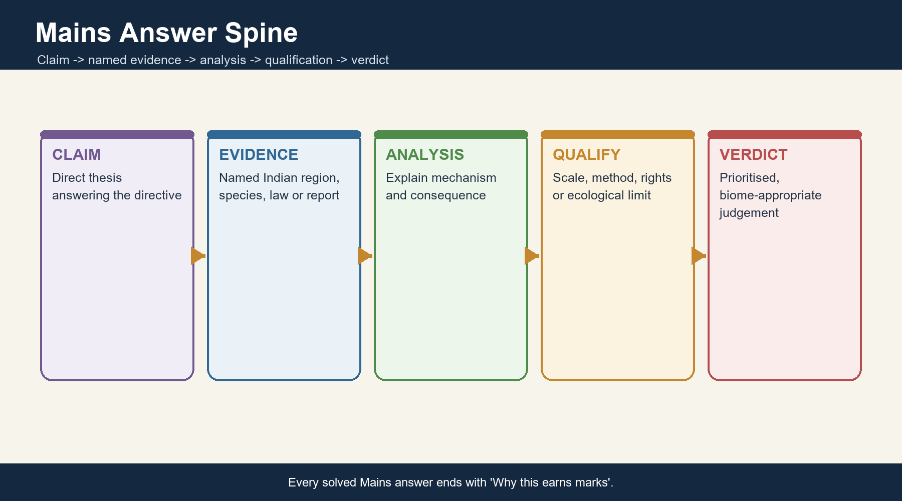

*Caption: Claim -> named evidence -> analysis -> qualification -> verdict. Original deterministic study schematic.*

# Source and uncertainty register

- All live official sources were retrieved or re-verified on **18 August 2026**.
- The India Code portal returned HTTP 403 to automated fetch; statute titles and handles are retained from the official portal and adjacent verified repository work.
- The ICAR-IGFRI hortipasture page did not expose a publication date in the fetched body; it is cited as an official page retrieved on the package date, not as a dated launch unless the page itself supplies one.
- DAHD's February 2026 revised NLM PDF is image-dominant in automated fetch; only the document identity and programme context are used here.
- The local D.R. Khullar and GC Leong copies were not directly OCR-searchable in this run; authored owners grounded in them were prioritised, while OCR page citations are supplied only for the searchable Majid Husain copy.
- Official objective keys for the 2020, 2021 and 2023 PYQs used here were unavailable locally. Answers are retained and prominently labelled **INFERRED ANSWER - NOT OFFICIALLY VERIFIED LOCALLY** with confidence and elimination.
- No single national grassland share is quoted because official datasets use unlike legends, dates and purposes.

# Final consolidated register notes

## FINAL CONSOLIDATED REGISTER NOTES 1/10 - Category Firewall

### Compressed revision logic

- Habit: seasonal leaf loss by a plant.
- Formation: forest, savanna or grassland community.
- Use: pasture/rangeland/grazing land.
- Measurement: forest cover, land cover or 'wasteland' class.
- Status: forest record, PA, commons and rights.
- Always state type, condition, dataset and legal status.

### Rapid-recall facts

- Deciduous does not mean lifeless.
- Rangeland is broader than grassland.
- One parcel can carry several valid labels.

### Last-mile traps

- **Wrong:** All open land is degraded forest. **Correct:** Origin requires multiple evidence lines.

## FINAL CONSOLIDATED REGISTER NOTES 2/10 - Controls and Ecotones

### Compressed revision logic

- Effective moisture = rainfall timing + dry-season demand + soil storage.
- Soils, geology, drainage, groundwater, floods, frost, fire, grazing and land use interact.
- Boundaries are ecotones.
- Alternative states are hypotheses, not assumptions.
- Use CLIMATE x SITE x DISTURBANCE x HISTORY.

### Rapid-recall facts

- Avoid rigid rainfall thresholds.
- Floods can maintain grassland.
- Woody gain is not always recovery.

### Last-mile traps

- **Wrong:** One isohyet fixes one vegetation type. **Correct:** Thresholds overlap and local controls matter.

## FINAL CONSOLIDATED REGISTER NOTES 3/10 - Adaptations and Seasonality

### Compressed revision logic

- Trees: leaf shedding, bark, roots, storage, dormancy and resprouting.
- Grasses: C4 pathway, basal meristems, fibrous roots, belowground reserves and seed banks.
- Wet-season productivity and dry-season dormancy form one cycle.
- Litter is nutrient input and fuel.

### Rapid-recall facts

- C4 is not universal.
- Resprouting is not full recovery.
- Brown shoots can hide living roots.

### Last-mile traps

- **Wrong:** Fire/grazing tolerance is unlimited. **Correct:** Tolerance has frequency, severity and recovery thresholds.

## FINAL CONSOLIDATED REGISTER NOTES 4/10 - Distribution and Species

### Compressed revision logic

- Moist deciduous: eastern/central belts, foothills and Ghats transitions.
- Dry deciduous: central/peninsular interiors and rain-shadow mosaics.
- Thorn/scrub: drier transition, climatic and/or secondary.
- Sal: northern/eastern suitable belts.
- Teak: central/peninsular strongholds.
- Mahua, tendu and bamboo: NTFP-livelihood anchors.

### Rapid-recall facts

- Sal and teak are not universally co-dominant.
- Plantation presence is not natural dominance.
- Mixed and secondary forests matter.

### Last-mile traps

- **Wrong:** Species list equals distribution analysis. **Correct:** Link each species to region, site and use.

## FINAL CONSOLIDATED REGISTER NOTES 5/10 - Grassland Typology

### Compressed revision logic

- Terai: humid alluvial tall grass.
- Brahmaputra: dynamic floodplain grassland.
- Central/Deccan: savanna-grassland-rock mosaic.
- Banni: saline/semi-arid pastoral landscape.
- Himalaya: alpine/subalpine meadows.
- Southern Ghats: shola-grassland mosaic.
- Origin classes: climatic, edaphic, flood-maintained and secondary.

### Rapid-recall facts

- Indian grasslands are not only arid.
- No single management regime fits all.
- No single national percentage is used.

### Last-mile traps

- **Wrong:** Banni, Terai and alpine meadow are one biome. **Correct:** Their climate, hydrology and management differ.

## FINAL CONSOLIDATED REGISTER NOTES 6/10 - Savanna, Fire and Grazing

### Compressed revision logic

- Savanna evidence: palaeoecology + soils + imagery/maps + specialist biota + disturbance history.
- Fire regime: frequency, severity, season, size and ecosystem history.
- Grazing pressure: stocking, animal, timing, duration, rainfall and mobility.
- Grazing is not overgrazing.
- Exclusion can protect refuges but also alter structure and livelihoods.

### Rapid-recall facts

- Prescribed burning is context-specific.
- Mobility can distribute pressure.
- Both forest-default and savanna-default are errors.

### Last-mile traps

- **Wrong:** Fire is always good/bad. **Correct:** Regime and ecosystem history decide.

## FINAL CONSOLIDATED REGISTER NOTES 7/10 - Biodiversity and Services

### Compressed revision logic

- Arid/open: GIB, chinkara, blackbuck in suitable ranges.
- Seasonal grass: lesser florican.
- Tall alluvial: Bengal florican, pygmy hog, rhino and swamp-deer contexts.
- Services: fodder, NTFPs, pollination, soil carbon, infiltration, erosion control, culture and habitat.
- Flagships do not replace whole-system monitoring.

### Rapid-recall facts

- State species range precisely.
- Grassland carbon is often belowground.
- Carbon comparison needs biome and baseline.

### Last-mile traps

- **Wrong:** All flagships share one grassland. **Correct:** Habitat and geographic ranges differ.

## FINAL CONSOLIDATED REGISTER NOTES 8/10 - Threats and Plantation Trap

### Compressed revision logic

- DPSIR: driver -> pressure -> state -> impact -> response.
- Threats: conversion, mining, roads, renewables/power lines, agriculture, invasives, altered fire/grazing, tourism, hydrological change and climate extremes.
- Wrong-site afforestation converts natural open systems.
- Right-site native forest restoration remains necessary.

### Rapid-recall facts

- Avoidance precedes offsetting.
- Inputs are not outcomes.
- Cumulative impact is essential.

### Last-mile traps

- **Wrong:** Every 'wasteland' needs trees. **Correct:** First identify historical biome and current value.

## FINAL CONSOLIDATED REGISTER NOTES 9/10 - Data and Governance

### Compressed revision logic

- ISFR 2023: forest cover 21.76%; tree cover 3.41%; combined 25.17%, all date-stamped.
- VDF/MDF/open are density classes.
- Recorded forest, ecological forest, grassland, grazing land and wasteland are distinct.
- Governance: Van Adhiniyam, Wildlife Act, FRA, Biodiversity Act, CAMPA/GIM, revenue commons and local institutions.

### Rapid-recall facts

- ISFR does not measure grassland condition.
- FRA recognises grazing and seasonal pastoral access.
- Law, finance and outcome are separate.

### Last-mile traps

- **Wrong:** A canopy gain proves native restoration. **Correct:** Composition, origin and process require separate evidence.

## FINAL CONSOLIDATED REGISTER NOTES 10/10 - Restoration, Monitoring and Answer Spine

### Compressed revision logic

- Hierarchy: diagnose -> avoid -> restore hydrology/fire/grazing -> invasives -> native biota -> co-manage -> monitor.
- Indicators: patch/core/connectivity; woody/grass structure; native/invasive cover; fire/grazing; soil carbon; hydrology; recruitment; fodder; tenure and livelihoods.
- Current anchor: IYRP 2026 + ICAR fodder/hortipasture + latest ISFR baseline.
- Answer: claim -> named evidence -> analysis -> qualification -> verdict.
- Ten-second map: east/foothills = moist deciduous and tall-grass mosaics; central/peninsular interiors = dry deciduous and savanna mosaics; dry west = thorn and semi-arid grasslands; highlands = alpine and shola-grassland systems.
- Ten-second data check: name the dataset, year, class definition and blind spot before using a percentage.
- Ten-second ecology check: distinguish climate permission from soil, hydrology, fire, grazing and historical realisation.
- Ten-second governance check: identify the right, restriction, responsible institution, finance source and measurable outcome.
- Ten-second restoration check: ask whether the baseline is native forest, open ecosystem, wetland or a mixed cultural landscape.
- Ten-second conclusion: protect intact remnants, repair process, secure rights and adapt from monitored outcomes.

### Rapid-recall facts

- State restoration limits.
- Use FACT/STATUS/INFERENCE/LIMIT.
- End every Mains model with Why this earns marks.

### Last-mile traps

- **Wrong:** Saplings planted equal restoration. **Correct:** Outcome needs ecological and social evidence.
