# Geography 18 - Thar Desert and Great Indian Bustard

**Complete Topic Package | Dated 2026-08-19 | Approval not claimed**

This reusable edition centres the Thar as a functional open ecosystem and the Great Indian Bustard as a landscape-conservation case. It includes complete teaching, original visuals, legal and programme status, verified local-paper PYQs, 48 solved MCQs, remedial practice, original solved Mains questions and final consolidated register notes.

## Non-negotiable discipline

1. Desert is a climatic region, not a synonym for barren wasteland.
2. Grassland, scrub, pasture, oran, gochar, cropland and administrative 'wasteland' are separate categories.
3. The Aravalli is an important but bounded aridity control.
4. Priority-area maps, telemetry, sightings, carcasses and population estimates answer different questions.
5. Collision and electrocution are separate mechanisms.
6. Diverters reduce but do not eliminate risk; undergrounding feasibility is context-specific.
7. The 2021, 2024 and 2025 Supreme Court decisions are distinct legal stages.
8. Captive stock, a hatch, a soft-release plan and a self-sustaining wild population are distinct outcomes.
9. No robust official 2026 national wild population estimate was located.
10. Dynamic claims are labelled FACT, STATUS, INFERENCE or LIMIT and retrieved on 19 August 2026.

## Source order used

1. Authored repository Markdown.
2. OCR-searchable local books, WII / court documents and official PYQ scans.
3. Live primary sources checked through 19 August 2026.
4. Qdrant was not required.

## Local evidence register

- `upsc-ai-kit/knowledge/Geography/basic/18_Hot-and-MidLatitude-Desert-Climate.md`
- `upsc-ai-kit/knowledge/Geography/advanced/18_Thar-Desert-and-GIB.md`
- `upsc-ai-kit/knowledge/Geography/07_Thar-Desertification_Complete-Topic-Package.md`
- `upsc-ai-kit/knowledge/Geography/17_India-Deciduous-and-Grasslands_Complete-Topic-Package.md`
- `upsc-ai-kit/knowledge/Geography/16_India-Monsoon-Mechanism_Complete-Topic-Package.md`
- `Environment owners: ecosystem structure, biomes, biodiversity, protected areas, Wildlife Act, CITES, CMS, EIA, CAMPA, renewable energy, institutions and species tracker`
- `Local OCR source: Indian & World Geography - Husain, Majid_Compressed.pdf, especially PDF pages 59-64 and 345-350`
- `Local WII, Supreme Court and India Code PDFs extracted directly for this package`
- `Official local PYQ scans: QP-CSP-18-GS-I-C.pdf, CSP_2020_GS_Paper-1.pdf and Gen_St_P1.pdf`

## Primary source register

| Institution / document | URL | Use | Retrieved |
| --- | --- | --- | --- |
| Supreme Court, order dated 19 Apr 2021 | https://api.sci.gov.in/supremecourt/2019/20754/20754_2019_31_1502_27629_Judgement_19-Apr-2021.pdf | Initial undergrounding / diverter directions | 2026-08-19 |
| Supreme Court, judgment dated 21 Mar 2024 | https://api.sci.gov.in/supremecourt/2019/20754/20754_2019_1_25_51677_Judgement_21-Mar-2024.pdf | Recall / substitution and expert committee | 2026-08-19 |
| Supreme Court, judgment dated 19 Dec 2025 | https://api.sci.gov.in/supremecourt/2019/20754/20754_2019_6_1501_67109_Judgement_19-Dec-2025.pdf | Current located legal endpoint and directions | 2026-08-19 |
| WII, GIB landscape report 2015-2020 | https://v1.wii.gov.in/images//images/documents/publications/rr_2020_GIB_Conserving_GIB_landscape_Report.pdf | Distribution, ecology, telemetry, threats and livelihoods | 2026-08-19 |
| WII, power-line mitigation booklet | https://v1.wii.gov.in/images/images/documents/publications/rr_2020_GIB%20Power-line_mitigation_conserve_bustards.pdf | Collision physics and mitigation limits | 2026-08-19 |
| WII, Bustard Recovery Annual Report 2022-23 | https://v1.wii.gov.in/images//images/documents/publications/rr_2023_GIB_Project_Report_CAMPA.pdf | Breeding programme, monitoring and dated field results | 2026-08-19 |
| Rajasthan Forest Department, Project GIB | https://forest.rajasthan.gov.in/content/raj/forest/en/footernav/department-wings/project-great-indian-bustard.html | Project and Desert National Park Sanctuary | 2026-08-19 |
| Rajasthan-WII-MoEFCC tripartite MoA | https://forest.rajasthan.gov.in/content/dam/raj/forest/rajasthan-wild-life/pdf/Wildlife%20Acts%20&%20Rules/Orders%20&%20Circulars/tripartite%20MoA.pdf | Institutional basis for conservation breeding | 2026-08-19 |
| MoEFCC Wildlife Division | https://moef.gov.in/wildlife-wl | Recovery programme and habitat support architecture | 2026-08-19 |
| India Code, Schedule I | https://upload.indiacode.nic.in/schedulefile?aid=AC_CEN_16_18_00007_197253_1517807324579&rid=759 | Current statutory listing | 2026-08-19 |
| CEA, BFD technical specification | https://cea.nic.in/notification/technical-specifications-for-bird-flight-diverterbfd-issued-by-sc-committee-in-consultation-with-central-electricity-authority-reg/?lang=en | Quality and engineering standard | 2026-08-19 |
| CGWB, Jaisalmer district profile | https://cgwb.gov.in/sites/default/files/2022-10/jaisalmer.pdf | Groundwater and salinity heterogeneity | 2026-08-19 |
| IUCN Red List assessment | https://www.iucnredlist.org/species/pdf/134188105 | Supplementary global category; 2018 assessment | 2026-08-19 |
| CMS species page | https://www.cms.int/species/ardeotis-nigriceps | CMS Appendix I | 2026-08-19 |
| CITES checklist | https://checklist.cites.org/ | CITES Appendix I | 2026-08-19 |
| PIB, 13 Mar 2026 | https://pib.gov.in/PressReleasePage.aspx?PRID=2239484&reg=3&lang=1 | Captive tally 70 and future soft-release statement | 2026-08-19 |
| PIB, 28 Mar 2026 | https://pib.gov.in/PressReleasePage.aspx?PRID=2246400&reg=3&lang=1 | Kutch jumpstart hatch | 2026-08-19 |
| PIB, 14 Jun 2026 | https://pib.gov.in/PressReleasePage.aspx?PRID=2272725&reg=3&lang=1 | Captive stock 94 and breeding breakdown | 2026-08-19 |

## Original visual register

| # | Asset | Learning purpose |
| --- | --- | --- |
| 1 | 01_thar-open-ecosystem-mosaic-map.png | 01 thar-open-ecosystem-mosaic-map |
| 2 | 02_aridity-controls-and-variability.png | 02 aridity-controls-and-variability |
| 3 | 03_landform-habitat-cross-section.png | 03 landform-habitat-cross-section |
| 4 | 04_open-ecosystem-terminology-firewall.png | 04 open-ecosystem-terminology-firewall |
| 5 | 05_productivity-pulse-and-food-web.png | 05 productivity-pulse-and-food-web |
| 6 | 06_gib-vision-flight-and-collision.png | 06 gib-vision-flight-and-collision |
| 7 | 07_gib-life-history-and-seasonal-use.png | 07 gib-life-history-and-seasonal-use |
| 8 | 08_gib-range-status-schematic-india.png | 08 gib-range-status-schematic-india |
| 9 | 09_desert-national-park-working-landscape.png | 09 desert-national-park-working-landscape |
| 10 | 10_gib-threat-hierarchy.png | 10 gib-threat-hierarchy |
| 11 | 11_power-line-mitigation-hierarchy.png | 11 power-line-mitigation-hierarchy |
| 12 | 12_supreme-court-gib-legal-timeline.png | 12 supreme-court-gib-legal-timeline |
| 13 | 13_renewable-energy-biodiversity-tradeoff.png | 13 renewable-energy-biodiversity-tradeoff |
| 14 | 14_gib-conservation-architecture.png | 14 gib-conservation-architecture |
| 15 | 15_community-livelihood-co-management.png | 15 community-livelihood-co-management |
| 16 | 16_breeding-programme-outcome-ladder.png | 16 breeding-programme-outcome-ladder |
| 17 | 17_data-status-literacy-stack.png | 17 data-status-literacy-stack |
| 18 | 18_gib-recovery-monitoring-dashboard.png | 18 gib-recovery-monitoring-dashboard |
| 19 | 19_claim-evidence-analysis-answer-spine.png | 19 claim-evidence-analysis-answer-spine |

# Complete visual-first learning session

## 1. Roadmap, Evidence Order and Category Discipline

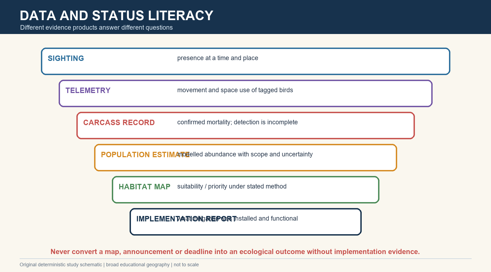

*Caption: 1. Roadmap, Evidence Order and Category Discipline: an India-centric visual for spatial, ecological and answer-writing recall. Original deterministic study schematic; not to scale.*

**Current / teaching focus:** PRE-TEACH CHECKLIST | Book context: authored Topics 18, 07, 17 and linked owners queried. Local WII, Supreme Court, India Code, CGWB and UPSC PDFs read directly. Current search window checked through 19 August 2026. Qdrant not required.

| Layer | Question | Rule |
| --- | --- | --- |
| Physical geography | What mosaic exists? | Read landforms, soils, water and variability together |
| Ecology | How does the mosaic function? | Do not equate open cover with degradation |
| Status | What is known now? | Attach date, scope and evidence type |
| Law | What direction applies? | Distinguish order, committee, implementation and outcome |

### Core teaching

- [FACT] Repository Markdown was used first, OCR-searchable local PDFs second and live primary sources third.
- [LIMIT] Topic 07 already covers desertification and broad Thar geomorphology; this package reuses only the physical base needed to explain GIB habitat.
- [ANALYSIS] Four category errors drive weak answers: desert equals barren, grassland equals degraded forest, court direction equals completion, and captive stock equals wild recovery.
- [RULE] Dynamic claims use FACT, STATUS, INFERENCE or LIMIT with retrieval date 19 August 2026.
- [RULE] Sensitive nest and telemetry locations are excluded; maps show only broad educational ranges.

### Must-know facts

- The current located Supreme Court endpoint is the 19 December 2025 judgment.
- No robust official 2026 national wild GIB census was located.
- Captive stock and wild abundance are separate metrics.

### UPSC traps

- **Wrong:** A priority-area map is a current population census. **Correct:** It is a planning layer under a stated method and date.
- **Wrong:** A legal deadline proves ecological recovery. **Correct:** Implementation and outcome need separate evidence.

**Mains use:** Open an answer by naming the ecological, evidentiary and legal lens before arguing policy.

**Study link:** Geography 07, 16, 17 and 18 + Environment biodiversity, law, energy and institutions

---

## 2. Thar Regional Geography as GIB Habitat

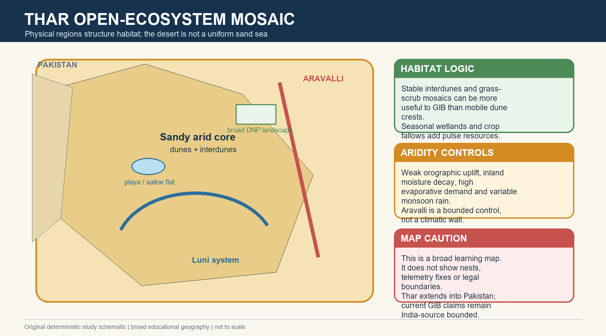

*Caption: 2. Thar Regional Geography as GIB Habitat: an India-centric visual for spatial, ecological and answer-writing recall. Original deterministic study schematic; not to scale.*

**Current / teaching focus:** The Thar is a transboundary arid and semi-arid system extending into Pakistan. This section focuses on how its Indian physical mosaic structures GIB habitat, not on repeating the full desertification package.

| Control / unit | Physical effect | Habitat consequence |
| --- | --- | --- |
| Aravalli orientation | Limited forced uplift for Arabian Sea flow | Supports aridity but does not alone determine rainfall |
| Continentality + subsidence | Moisture loss and stable dry air | High evaporative demand and patchy productivity |
| Variable monsoon | Pulse rainfall and episodic runoff | Seasonal forage, insects and temporary wetlands |
| Dunes / interdunes / plains | Mobility and moisture redistribution differ | Open visibility, nesting and feeding value vary |
| Luni / closed basins | Ephemeral drainage and salinity | Wet-season pulses and saline habitat heterogeneity |

### Core teaching

- [FACT] The Indian Thar lies chiefly west of the Aravalli in western Rajasthan and continues into adjoining Indian states and Pakistan.
- [ANALYSIS] The Aravalli's broadly parallel orientation reduces orographic forcing, while inland moisture decay, subsidence, variability and high evapotranspiration complete the aridity explanation.
- [FACT] Dunes coexist with interdunal plains, gravel or rocky surfaces, saline depressions, seasonal wetlands, cropland and settlements.
- [FACT] The Luni is the principal ephemeral drainage cue, but many depressions are internally drained and saline.
- [ANALYSIS] GIB habitat value is often concentrated in stable open plains and grass-scrub or crop-fallow mosaics rather than on highly mobile dune crests.
- [LIMIT] Rainfall and groundwater quality vary sharply; one number cannot represent the whole Thar.

### Must-know facts

- Thar is a mosaic, not a continuous erg.
- Aravalli is an important but bounded aridity control.
- Physical heterogeneity creates ecological heterogeneity.

### UPSC traps

- **Wrong:** The Aravalli is a high wall that completely blocks the monsoon. **Correct:** Its orientation provides limited uplift; several controls create aridity.
- **Wrong:** All GIB habitat is shifting sand. **Correct:** The species uses open grassland, scrub and agro-pastoral plains within the desert mosaic.

**Mains use:** Draw the mosaic first, then connect each physical unit to habitat function.

**Study link:** Topic 07 geomorphology and desertification; Topic 16 monsoon variability

---

## 3. Open Natural Ecosystem Vocabulary

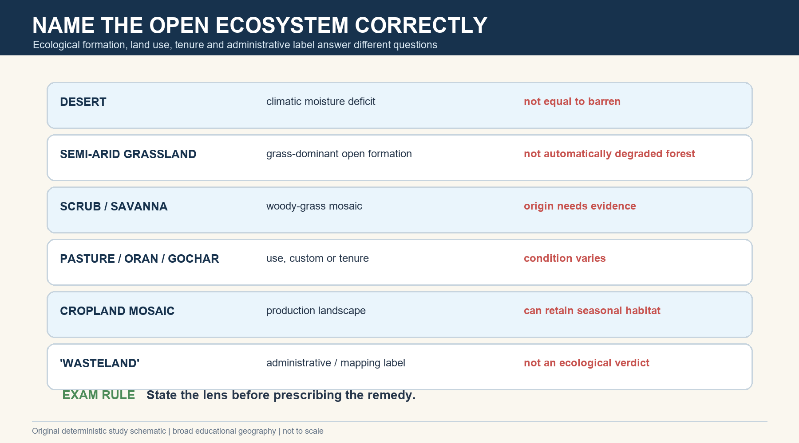

*Caption: 3. Open Natural Ecosystem Vocabulary: an India-centric visual for spatial, ecological and answer-writing recall. Original deterministic study schematic; not to scale.*

**Current / teaching focus:** Desert, grassland, scrub, savanna, pasture, oran, gochar, cropland mosaic and 'wasteland' are not interchangeable labels.

| Term | Exam-safe meaning | Do not infer |
| --- | --- | --- |
| Desert | Climatic moisture-deficit region | Ecological worthlessness |
| Semi-arid grassland | Grass-dominant open ecosystem | Recent deforestation everywhere |
| Scrub / savanna | Woody-grass mosaic under climate and disturbance | One uniform origin |
| Pasture / oran / gochar | Use, customary protection or village common | Fixed ecological condition |
| Cropland mosaic | Production matrix with fallows and field edges | No habitat value |
| 'Wasteland' | Administrative or mapping class | Barren land available for diversion |

### Core teaching

- [FACT] WII describes GIB habitat as dry grassland and desert, often interspersed with agriculture and villages.
- [ANALYSIS] Ecological formation, land use, tenure and administrative class must be separated before restoration or project siting.
- [ANALYSIS] Orans and gochars can retain open habitat, grazing value and cultural institutions, but their ecological condition is site-specific.
- [FACT] WII warned that marginalising dry grasslands as 'unproductive wastelands' contributes to conversion pressure.
- [RULE] Use quotation marks around 'wasteland' when critiquing the administrative label.

### Must-know facts

- Desert is not synonymous with barren.
- Pasture is a use category; grassland is a vegetation category.
- Open ecosystems may be natural, semi-natural or transformed.

### UPSC traps

- **Wrong:** Tree cover always improves a desert grassland. **Correct:** Wrong-site planting can reduce habitat for open-country species.
- **Wrong:** Cropland is automatically unusable to GIB. **Correct:** Low-intensity crop-fallow mosaics may form part of seasonal habitat.

**Mains use:** A high-scoring answer starts with a category firewall, then evaluates condition and compatible use.

**Study link:** Geography 17 open ecosystems; Environment succession, biomes and restoration

---

## 4. Landforms, Stability and Habitat Function

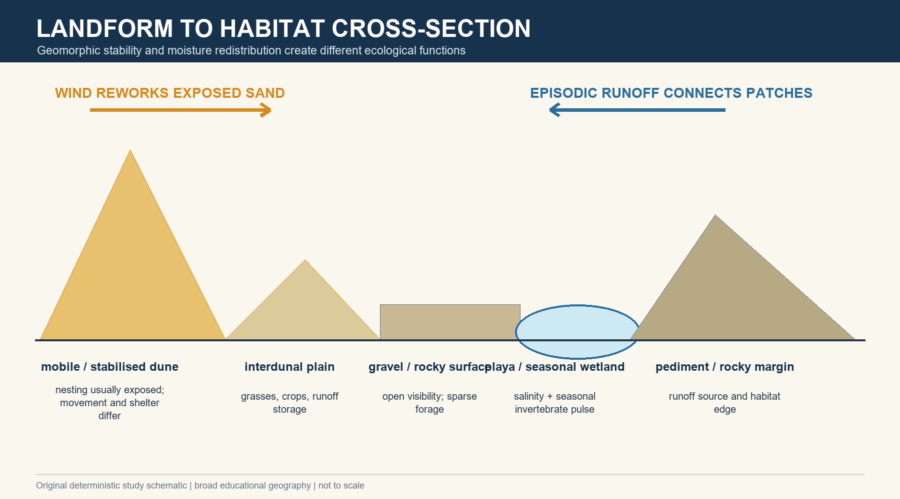

*Caption: 4. Landforms, Stability and Habitat Function: an India-centric visual for spatial, ecological and answer-writing recall. Original deterministic study schematic; not to scale.*

**Current / teaching focus:** Geomorphic mobility and hydrological position determine vegetation structure, prey pulses and exposure.

| Surface | Stability / water | Likely function |
| --- | --- | --- |
| Mobile dune | Wind-reworked, low stable cover | Movement barrier or exposed transit; limited persistent forage |
| Stabilised dune | Vegetated, less mobile | Shelter and patch vegetation |
| Interdunal plain | Runoff and finer material collect | Grass, crops, feeding and movement space |
| Gravel / rocky plain | Firm open surface | Visibility and sparse xeric forage |
| Playa / seasonal wetland | Closed drainage and salinity | Short-lived water and invertebrate pulse |
| Pediment / fan | Runoff redistribution | Habitat edge and episodic resource zone |

### Core teaching

- [FACT] Majid's local OCR text distinguishes aeolian erosion, transport and deposition, including deflation, abrasion, saltation and barchans.
- [ANALYSIS] Landform labels become ecological only when stability, vegetation, water and disturbance are added.
- [FACT] Rare intense runoff can connect uplands, fans, interdunes and playas despite low annual rainfall.
- [ANALYSIS] Stabilisation is not automatically good or bad: native grass stabilisation can create habitat, while dense woody planting can close an open system.
- [LIMIT] The same landform can perform different functions by season and management history.

### Must-know facts

- Barchan horns point downwind.
- Interdunes are productive livelihood and habitat spaces.
- Playas are episodic, saline and internally drained.

### UPSC traps

- **Wrong:** Wind is the only geomorphic agent in the Thar. **Correct:** Episodic water builds fans, channels and saline basins.
- **Wrong:** Every stabilised dune should be planted with trees. **Correct:** Restoration must match historical open-ecosystem structure and water limits.

**Mains use:** Convert a landform list into a process-to-habitat cross-section.

**Study link:** Basic 07 arid landforms; Environment ecosystem structure

---

## 5. Soils, Groundwater, Salinity and Ecological Heterogeneity

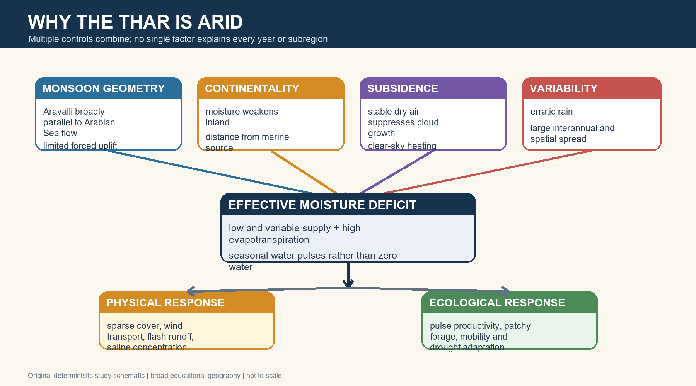

*Caption: 5. Soils, Groundwater, Salinity and Ecological Heterogeneity: an India-centric visual for spatial, ecological and answer-writing recall. Original deterministic study schematic; not to scale.*

**Current / teaching focus:** CGWB and authored Thar material show strong local variation; water availability and water quality are not the same.

| Dimension | Pattern | Ecological / livelihood implication |
| --- | --- | --- |
| Sandy soils | Low organic matter and rapid infiltration | Low water storage; responsive to short pulses |
| Finer interdunes | More moisture and nutrients | Grass, crops and seasonal prey |
| Saline depressions | Evaporative concentration | Specialised biota; limited drinking / irrigation value |
| Groundwater | Depth and salinity vary | Traditional harvesting and selective use remain important |
| Irrigated pockets | Higher production but waterlogging / salinity risk | Transformation is not uniformly restorative |

### Core teaching

- [FACT] CGWB's Jaisalmer profile records large groundwater-quality variation and saline soils in depressions.
- [ANALYSIS] Groundwater presence does not imply potable or irrigation-suitable water; quality, depth and recharge must be separated.
- [FACT] Traditional systems such as tankas and khadins store scarce rainfall in time or soil.
- [ANALYSIS] Canal or tube-well agriculture can add food and fodder while also changing vegetation, predators, pesticide exposure and line infrastructure.
- [LIMIT] Do not generalise one district or aquifer value to the entire Thar.

### Must-know facts

- Salinity is spatially heterogeneous.
- High evapotranspiration can concentrate salts.
- Water interventions alter both livelihoods and habitat.

### UPSC traps

- **Wrong:** Irrigation universally reverses desert ecology problems. **Correct:** Benefits and waterlogging, salinity or habitat conversion must be evaluated together.
- **Wrong:** All groundwater in the Thar is absent. **Correct:** Groundwater exists but depth, yield and quality vary greatly.

**Mains use:** Use water quantity -> quality -> access -> ecological consequence as the answer sequence.

**Study link:** CGWB groundwater owner; Topic 07 IGNP trade-off

---

## 6. Desert Adaptations and Food-Web Pulses

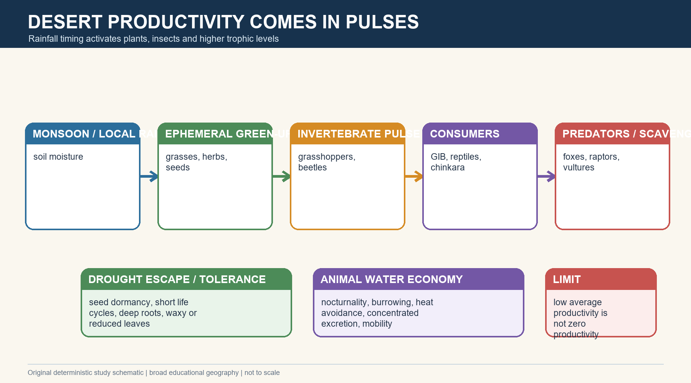

*Caption: 6. Desert Adaptations and Food-Web Pulses: an India-centric visual for spatial, ecological and answer-writing recall. Original deterministic study schematic; not to scale.*

**Current / teaching focus:** Low average productivity does not mean no productivity; rain timing creates short but important biological pulses.

| Adaptation / process | Mechanism | Example |
| --- | --- | --- |
| Drought escape | Complete life cycle during short wet window | Ephemeral herbs and insects |
| Drought tolerance | Deep roots, reduced leaves, water economy | Khejri, shrubs and perennial grasses |
| Heat avoidance | Nocturnality, burrowing and shade use | Desert mammals and reptiles |
| Pulse food web | Rain -> plants -> insects -> birds / reptiles | GIB breeding-season insect resources |
| Mobility | Track variable water and forage | Pastoral systems and wide-ranging fauna |

### Core teaching

- [FACT] WII describes GIB as a large omnivore feeding on insects, fruits and harvested crops.
- [FACT] WII links grasshoppers, locusts and beetles to an important portion of breeding-season diet and chick food availability.
- [ANALYSIS] Pesticides can create both toxic exposure and a bottom-up prey shortage.
- [ANALYSIS] Desert food webs are pulsed and spatially patchy; monitoring must track vegetation and insects, not only annual rainfall.
- [LIMIT] A rain pulse can improve resources without guaranteeing nesting success or recruitment.

### Must-know facts

- Desert productivity is pulsed, not zero.
- Insects link rainfall to bustard breeding ecology.
- Adaptation includes behaviour, physiology and mobility.

### UPSC traps

- **Wrong:** Sparse vegetation means no food web. **Correct:** Open deserts support seasonal primary production and multiple trophic levels.
- **Wrong:** Pesticides affect only target insects. **Correct:** They can reduce non-target prey and expose birds directly or indirectly.

**Mains use:** Use the pulse cascade to connect physical geography, ecology and farm practice.

**Study link:** Environment food webs; Agriculture pesticide governance

---

## 7. GIB Taxonomy and Status Stack

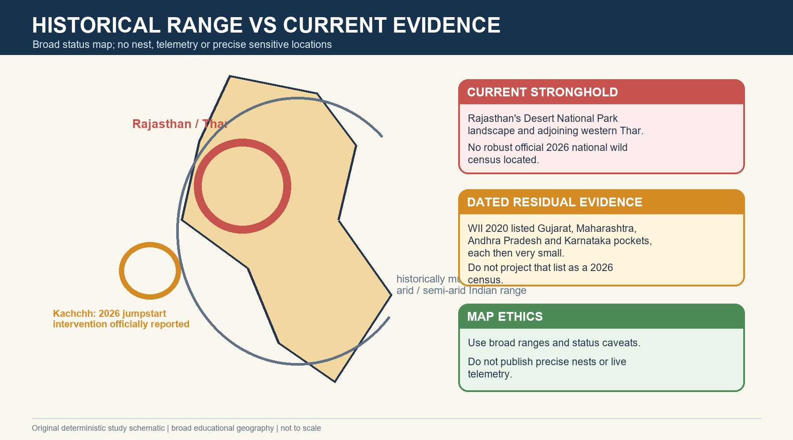

*Caption: 7. GIB Taxonomy and Status Stack: an India-centric visual for spatial, ecological and answer-writing recall. Original deterministic study schematic; not to scale.*

**Current / teaching focus:** Status must be read across separate systems: taxonomy, IUCN risk, Indian law and international conventions.

| Layer | Verified status | Meaning |
| --- | --- | --- |
| Taxonomy | Great Indian Bustard - Ardeotis nigriceps | Species identity |
| IUCN | Critically Endangered; latest located assessment 2018 | Global extinction-risk category |
| Wild Life (Protection) Act | Schedule I | Indian statutory protection |
| CITES | Appendix I | International trade control |
| CMS | Appendix I | Migratory-species protection and cooperation |
| Population | No robust official 2026 national wild estimate located | Do not substitute captive stock |

### Core teaching

- [FACT] The 19 December 2025 Supreme Court judgment records the IUCN category as Critically Endangered and the most recent assessment as 2018.
- [FACT] The current India Code Schedule I text lists Great Indian Bustard, Ardeotis nigriceps.
- [FACT] Official CMS and CITES sources place the species in Appendix I.
- [LIMIT] WII's 128 +/- 19 Thar estimate is a 2018 landscape estimate, not a 2026 national census.
- [LIMIT] PIB's 94 captive birds on 14 June 2026 is a programme-stock figure, not wild abundance.

### Must-know facts

- Scientific risk, domestic law and treaty listing are separate.
- Always attach assessment or retrieval date.
- Avoid a precise current wild number without a current robust census.

### UPSC traps

- **Wrong:** IUCN category automatically determines the Indian statutory schedule. **Correct:** The systems are separate even when both imply high concern.
- **Wrong:** Captive stock can be added to a wild estimate to claim recovery. **Correct:** Different populations and objectives cannot be merged.

**Mains use:** A status answer earns marks by separating category, law, treaty and population evidence.

**Study link:** Environment IUCN, Wildlife Act, CITES and CMS owners

---

## 8. Morphology, Flight and Collision Susceptibility

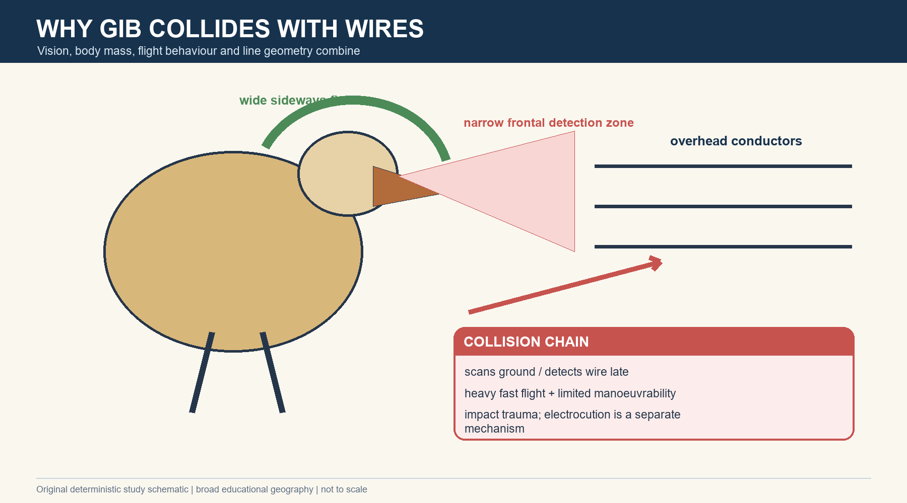

*Caption: 8. Morphology, Flight and Collision Susceptibility: an India-centric visual for spatial, ecological and answer-writing recall. Original deterministic study schematic; not to scale.*

**Current / teaching focus:** WII identifies a visual and biomechanical collision mechanism rather than a simple 'careless bird' explanation.

| Trait / condition | Mechanism | Risk |
| --- | --- | --- |
| Wide sideways vision | Predator detection in open habitat | Narrower frontal detection |
| Ground scanning in flight | Attention directed below | Wire detected late |
| Heavy body / fast flight | Limited rapid manoeuvre | High-impact collision |
| Wire visibility | Thin conductor against variable background | Detection depends on light and contrast |
| Line density / route | More crossings of used space | Cumulative mortality risk |

### Core teaching

- [FACT] WII states that bustards have wide sideways vision at the cost of narrow frontal vision and may scan the ground while flying.
- [FACT] WII links heavy flight and low manoeuvrability to inability to avoid wires detected at short distance.
- [FACT] Collision can cause impact trauma; electrocution is a distinct electrical-contact mechanism.
- [ANALYSIS] Risk depends on bird behaviour and the infrastructure network: route, density, height, contrast and use of the surrounding habitat.
- [LIMIT] A diverter improves visibility but cannot guarantee avoidance by every bird under every condition.

### Must-know facts

- Collision and electrocution are distinct.
- Line route and density matter, not only voltage.
- Adult mortality is demographically costly.

### UPSC traps

- **Wrong:** High-voltage lines mainly kill GIB by electrocution. **Correct:** The official record emphasises collision for high-voltage lines.
- **Wrong:** Any visible marker eliminates risk. **Correct:** Effectiveness is partial and depends on design, installation, maintenance and context.

**Mains use:** Explain the full collision chain before evaluating mitigation.

**Study link:** WII power-line booklet + CEA BFD specification

---

## 9. GIB Ecology, Breeding and Seasonal Movement

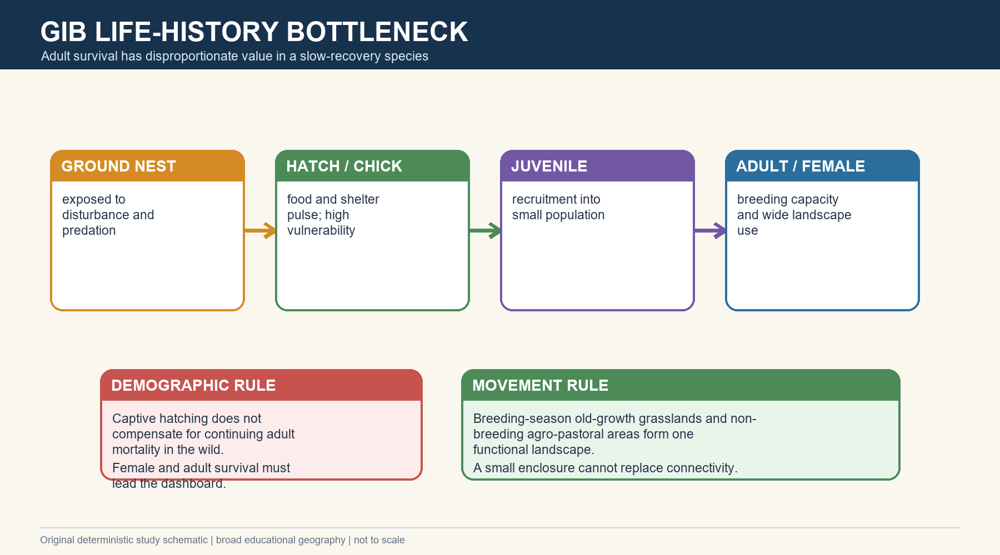

*Caption: 9. GIB Ecology, Breeding and Seasonal Movement: an India-centric visual for spatial, ecological and answer-writing recall. Original deterministic study schematic; not to scale.*

**Current / teaching focus:** Ground nesting, slow life history and seasonal landscape use make recruitment sensitive to both local disturbance and broad connectivity.

| Dimension | Dated official evidence | Interpretation |
| --- | --- | --- |
| Diet | Insects, fruits and harvested crops | Omnivory links grassland and low-intensity farmland |
| Nesting | Ground nests monitored in DNP and adjoining areas | Exposure to disturbance and predators |
| Breeding success | WII 2022-23 monitored eggs, hatching and chick survival | Dated programme evidence, not timeless constants |
| Seasonal use | Old-growth grasslands in breeding season; agro-pastoral / regenerating areas later | Landscape approach |
| Home range | Tagged individual examples ranged from tens to over 100 sq km | No single universal home-range number |

### Core teaching

- [FACT] WII's 2022-23 report records ground nests, telemetry and seasonal shifts between old-growth grasslands and agro-pastoral or regenerating areas.
- [FACT] The same report estimated 25-35 percent hatching success and 50-60 percent first-quarter chick survival from its monitored sample; these are dated study results.
- [FACT] Tagged individuals in WII's 2020 report used enclosures, crop fields and large areas; examples included 37, 98 and 159 sq km MCP home ranges.
- [ANALYSIS] Secure nest patches are necessary but insufficient if adults must cross unsafe infrastructure outside them.
- [LIMIT] Courtship details and one-size-fits-all movement rules are not asserted beyond the checked official material.

### Must-know facts

- Ground nesting increases exposure.
- Seasonal habitat includes working landscapes.
- Home range is individual-, season- and method-dependent.

### UPSC traps

- **Wrong:** GIB lives only inside protected enclosures. **Correct:** Telemetry shows use of adjoining crop and agro-pastoral areas.
- **Wrong:** A successful hatch equals recruitment. **Correct:** Fledging, juvenile survival and entry into the breeding population remain separate stages.

**Mains use:** Link life history to the need for adult survival, safe breeding zones and connected seasonal habitat.

**Study link:** WII recovery and telemetry reports

---

## 10. Historical and Current Distribution

*Caption: 10. Historical and Current Distribution: an India-centric visual for spatial, ecological and answer-writing recall. Original deterministic study schematic; not to scale.*

**Current / teaching focus:** Distribution statements must distinguish historical range, dated residual records, current stronghold and intervention sites.

| Evidence layer | What can be stated | Caveat |
| --- | --- | --- |
| Historical | Wider arid and semi-arid Indian distribution | Do not map as current occupancy |
| WII 2020 | Five isolated regions listed; Rajasthan largest | Based on older surveys and report date |
| Current stronghold | Western Rajasthan / DNP landscape | No exact sensitive locations |
| Kutch 2026 | Official jumpstart hatch reported | Intervention milestone, not population recovery |
| Other states | Residual history in Maharashtra, Karnataka and Andhra Pradesh | Do not claim current viable populations without current official evidence |

### Core teaching

- [FACT] WII's 2020 report described historical distribution across hot arid and semi-arid grasslands and listed five isolated regions at that time.
- [STATUS] Rajasthan remains the officially documented stronghold, centred on the Desert National Park landscape and adjoining western Thar.
- [STATUS] PIB reported a Kutch jumpstart hatch in March 2026 under an interstate intervention.
- [LIMIT] No current official evidence was located to support precise 2026 population claims for Maharashtra, Karnataka or Andhra Pradesh.
- [ANALYSIS] CMS Appendix I makes cross-border cooperation relevant, but no current Pakistan abundance is asserted.

### Must-know facts

- Map ranges by evidence date.
- Do not expose nests or live telemetry.
- Intervention presence is not equivalent to a viable population.

### UPSC traps

- **Wrong:** Every historically occupied state still has a viable breeding population. **Correct:** Current status must be verified separately for each landscape.
- **Wrong:** A broad priority polygon is an exact current range. **Correct:** It is a planning layer, not a census.

**Mains use:** Use a four-colour map legend: historical, dated residual, current stronghold and intervention site.

**Study link:** CMS and WII range evidence

---

## 11. Desert National Park: Legal and Lived Landscape

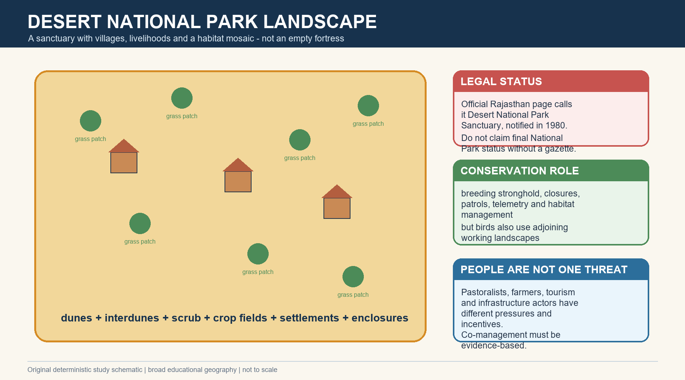

*Caption: 11. Desert National Park: Legal and Lived Landscape: an India-centric visual for spatial, ecological and answer-writing recall. Original deterministic study schematic; not to scale.*

**Current / teaching focus:** The official Rajasthan source calls the area Desert National Park Sanctuary; the 2020 PYQ tests both its two-district spread and human habitation.

| Dimension | Verified point | Answer caution |
| --- | --- | --- |
| Notification | Sanctuary notified in 1980 | Do not claim final National Park status without gazette |
| Extent | Official page gives 3,162 sq km | Dated official figure |
| Districts | Jaisalmer and Barmer | Verified PYQ statement |
| People | Villages / settlements and livelihoods exist | Reject empty-fortress assumption |
| Role | Representative desert ecosystem and GIB stronghold | Birds also use adjoining areas |

### Core teaching

- [FACT] Rajasthan's official page describes a 3,162 sq km Desert National Park Sanctuary across Jaisalmer and Barmer, notified in 1980.
- [FACT] WII's 2020 report described the sanctuary as non-inviolate and containing villages.
- [ANALYSIS] The conservation challenge is to secure breeding and movement while recognising grazing, farming, tourism and settlement realities.
- [ANALYSIS] Enclosures, patrols and predator management are targeted tools, not substitutes for the whole landscape.
- [LIMIT] 'Park' in the proper name must not be confused with proof of National Park legal category.

### Must-know facts

- DNP spans two districts.
- Human habitation exists.
- GIB is a flagship of the sanctuary and surrounding Thar landscape.

### UPSC traps

- **Wrong:** There is no human habitation inside DNP. **Correct:** The official evidence and PYQ logic reject this absolute statement.
- **Wrong:** Protected-area notification alone secures all movements. **Correct:** Birds use wider working landscapes and infrastructure corridors.

**Mains use:** Use DNP to demonstrate the difference between legal designation, management and ecological outcome.

**Study link:** Environment protected-area network and community conservation

---

## 12. Threat Hierarchy and Demographic Risk

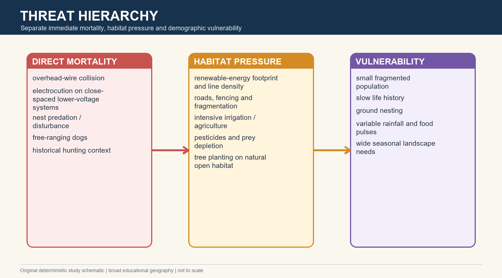

*Caption: 12. Threat Hierarchy and Demographic Risk: an India-centric visual for spatial, ecological and answer-writing recall. Original deterministic study schematic; not to scale.*

**Current / teaching focus:** Threats should be ranked by mechanism: direct mortality, habitat pressure and demographic vulnerability.

| Threat | Mechanism | Category |
| --- | --- | --- |
| Overhead lines | Collision; sometimes electrocution on lower-voltage configurations | Direct mortality |
| Energy / roads / fencing | Fragmentation, avoidance and line proliferation | Habitat pressure |
| Irrigation / intensive agriculture | Habitat conversion, altered vegetation and chemicals | Habitat pressure |
| Pesticides | Toxic exposure and insect-prey depletion | Direct + food-web pressure |
| Dogs / nest predators | Nest, chick and wildlife predation | Direct local pressure |
| Climate variability | Changes resource pulses and breeding conditions | Background vulnerability |

### Core teaching

- [FACT] WII recorded power-line mortality and treated overhead lines as a critical modern threat.
- [FACT] WII also documented free-ranging dogs, nest predators, pesticide concerns and habitat conversion.
- [ANALYSIS] A small, slow-recovering population cannot absorb repeated adult mortality even if habitat remains visually open.
- [ANALYSIS] Hunting is essential historical context, but current management must prioritise verified present mechanisms.
- [LIMIT] Threat ranking can vary by site and season; it must be monitored rather than frozen.

### Must-know facts

- Direct mortality and habitat loss are different pathways.
- Adult survival is a leading indicator.
- Threats compound rather than act independently.

### UPSC traps

- **Wrong:** Power lines are the only threat. **Correct:** They are a critical direct threat within a broader habitat and demographic crisis.
- **Wrong:** Climate variability alone explains decline. **Correct:** Infrastructure, land-use change, predators and slow life history also matter.

**Mains use:** Build a DPSIR or mortality-pressure-vulnerability framework rather than listing threats.

**Study link:** WII threat studies; climate and agriculture owners

---

## 13. Power-Line Physics and Mitigation

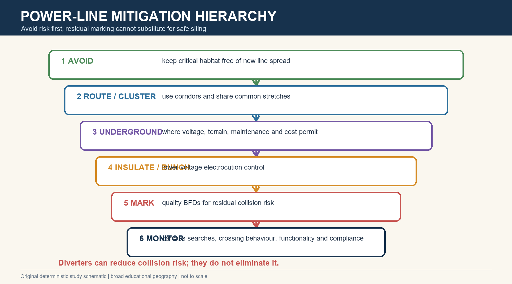

*Caption: 13. Power-Line Physics and Mitigation: an India-centric visual for spatial, ecological and answer-writing recall. Original deterministic study schematic; not to scale.*

**Current / teaching focus:** Mitigation is context-specific: avoid, route, underground, insulate, mark and monitor.

| Measure | Best use | Limit |
| --- | --- | --- |
| Avoidance | Keep new spread out of critical habitat | Requires early spatial planning |
| Corridor / clustering | Reduce network footprint and crossings | Poor corridor can concentrate risk |
| Undergrounding | Eliminates aerial collision on treated stretch | Voltage, terrain, heat, repair and cost constraints |
| Insulated / bunched cable | Reduce electrocution on lower-voltage lines | Not identical to collision elimination |
| Bird flight diverters | Increase wire visibility | Reduce but do not eliminate collision |
| Monitoring | Test functionality and mortality response | Needs baseline and repeated surveys |

### Core teaching

- [FACT] WII states that undergrounding removes aerial collision risk on the treated cable, while marked wires reduce but do not eliminate mortality.
- [FACT] CEA issued technical specifications; the 2025 judgment stressed quality, durability and scientific assessment.
- [FACT] The 2025 judgment accepted route optimisation and common stretches for lines feeding shared pooling stations.
- [ANALYSIS] Voltage alone does not determine collision risk; route, conductor visibility, line density and bird use are central.
- [LIMIT] Undergrounding feasibility is case-specific and must not be presented as technically impossible or universally easy.
- [RULE] Diverter installation coverage is an activity metric; carcass and crossing response are outcome metrics.

### Must-know facts

- Avoidance outranks residual marking.
- Diverters require quality and maintenance.
- Undergrounding feasibility varies.

### UPSC traps

- **Wrong:** Diverters fully solve the collision problem. **Correct:** They are a residual risk-reduction measure.
- **Wrong:** All voltage classes have identical engineering options. **Correct:** Configuration, terrain, load and maintenance change feasibility.

**Mains use:** Apply the mitigation hierarchy and name the indicator for each measure.

**Study link:** CEA specification; Supreme Court 2025 directions

---

## 14. Supreme Court Timeline and Current Legal Position

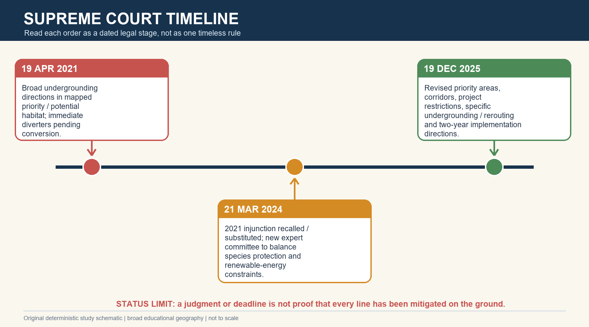

*Caption: 14. Supreme Court Timeline and Current Legal Position: an India-centric visual for spatial, ecological and answer-writing recall. Original deterministic study schematic; not to scale.*

**Current / teaching focus:** LEGAL STATUS RETRIEVED 19 AUGUST 2026 | The 19 December 2025 judgment is the latest official Supreme Court endpoint located. No later official order was found in the checked six-month window.

| Date | Legal step | Current reading |
| --- | --- | --- |
| 19 Apr 2021 | Broad undergrounding / diverter directions in priority and potential areas | Historic stage, not full current law |
| 21 Mar 2024 | 2021 injunction recalled and substituted; expert committee appointed | Committee process replaced blanket reading |
| 19 Dec 2025 | Revised priority areas and detailed directions accepted | Current located endpoint |
| 2025 direction | 14,013 sq km Rajasthan; 740 sq km Gujarat | Planning areas, not population maps |
| 2025 direction | 250 km critical lines in Rajasthan within two years | Deadline does not prove completion |
| 2025 direction | Project restrictions, corridors, 80 km 33 kV undergrounding and specific rerouting | Implementation remains project- and authority-specific |

### Core teaching

- [FACT] The 2024 judgment recalled the 2021 injunction across the earlier priority / potential areas and substituted a committee-led framework.
- [FACT] The 2025 judgment accepted revised priority areas, immediate in-situ and ex-situ measures, power corridors, restrictions on new overhead spread and certain renewable projects, and time-bound mitigation.
- [FACT] It directed undergrounding of 250 km of WII-identified critical lines within a period not exceeding two years and accepted immediate undergrounding of 80 km of 33 kV line in Rajasthan.
- [FACT] The Court did not issue the requested blanket mining prohibition; it relied on statutory regulators and the area's fragility.
- [FACT] For 11 kV and below, the Court directed mitigation using insulated horizontal or bunched cables rather than mandating one aerial-bunched configuration in all cases.
- [LIMIT] No official implementation report located in the last six months was sufficient to claim completion or ecological outcome as of 19 August 2026.

### Must-know facts

- 2021, 2024 and 2025 are distinct legal stages.
- Priority area is not a nest map.
- Direction, implementation and outcome are separate.

### UPSC traps

- **Wrong:** The 2021 blanket direction is the complete current law. **Correct:** The 2024 and 2025 judgments modified and specified the framework.
- **Wrong:** The Court banned all renewable energy across the Thar. **Correct:** Restrictions are tied to revised priority areas and specified project types / capacities.

**Mains use:** Use a dated timeline and finish with the current implementation limit.

**Study link:** M.K. Ranjitsinh v Union of India, official Supreme Court PDFs

---

## 15. Renewable Energy Trade-off and Siting

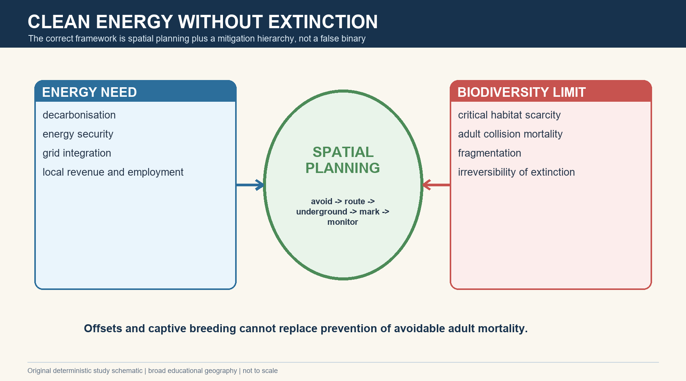

*Caption: 15. Renewable Energy Trade-off and Siting: an India-centric visual for spatial, ecological and answer-writing recall. Original deterministic study schematic; not to scale.*

**Current / teaching focus:** India needs clean power, but extinction risk creates a hard spatial constraint. The answer is planning, not a development-versus-environment slogan.

| Stage | Preferred action | Why |
| --- | --- | --- |
| Avoid | Exclude critical breeding / movement habitat from new spread | Prevents irreversible risk |
| Minimise | Reroute, cluster and share corridors | Reduces fragmentation and crossings |
| Engineer | Underground or insulate where technically appropriate | Treats residual infrastructure risk |
| Mark | Install compliant diverters on residual overhead risk | Visibility aid, not full remedy |
| Restore / compensate | Repair habitat and livelihoods | Cannot substitute for adult-mortality prevention |
| Monitor | Publish line, mortality and compliance indicators | Tests effectiveness |

### Core teaching

- [FACT] The 2024 Supreme Court judgment explicitly considered renewable energy and climate obligations while redesigning the remedy.
- [FACT] The 2025 judgment accepted no new wind turbines, no new solar parks / plants above 2 MW and no expansion of existing solar parks within revised priority areas, alongside corridor rules.
- [ANALYSIS] Clean energy has global climate benefits, but poor siting can impose locally irreversible biodiversity loss.
- [ANALYSIS] The relevant question is where and how capacity is built, not whether India chooses climate or biodiversity.
- [RULE] Offsets, captive breeding and CSR cannot be used as a licence for avoidable adult mortality.

### Must-know facts

- Mitigation hierarchy starts with avoidance.
- Grid corridors should minimise spread.
- Biodiversity-compatible siting supports, rather than opposes, durable decarbonisation.

### UPSC traps

- **Wrong:** Any renewable project is environmentally beneficial in every location. **Correct:** Technology and siting must both be evaluated.
- **Wrong:** Conservation requires stopping all clean-energy development in western India. **Correct:** Use spatial exclusions, corridors and context-specific engineering.

**Mains use:** Frame the issue as decarbonisation with extinction-safe spatial planning.

**Study link:** Environment renewable energy, EIA and biodiversity governance

---

## 16. Conservation Architecture

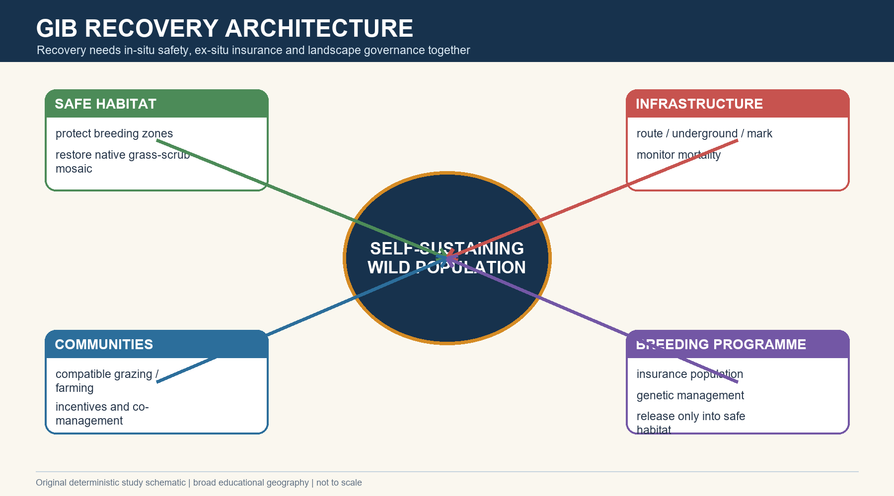

*Caption: 16. Conservation Architecture: an India-centric visual for spatial, ecological and answer-writing recall. Original deterministic study schematic; not to scale.*

**Current / teaching focus:** The recovery goal is a self-sustaining wild population, not simply a growing captive inventory.

| Pillar | Action | Outcome indicator |
| --- | --- | --- |
| In-situ habitat | Secure breeding zones; native grass-scrub restoration | Habitat quality and breeding attempts |
| Mortality prevention | Power-line and road mitigation | Adult survival and collision deaths |
| Predator / disturbance | Site-specific dog and nest management | Nest and chick survival |
| Ex-situ | Genetic, demographic and husbandry programme | Healthy, diverse insurance stock |
| Release | Soft release only into demonstrably safe habitat | Post-release survival and reproduction |
| Landscape governance | Interstate plans and compatible uses | Connectivity and compliance |

### Core teaching

- [FACT] MoEFCC's recovery architecture supports critically endangered species and habitats inside and outside protected areas.
- [FACT] WII's recovery plan combines enclosures, threat mitigation, livelihood-sensitive land use, research and conservation breeding.
- [ANALYSIS] Ex-situ conservation buys time; it cannot compensate for an unsafe release landscape.
- [ANALYSIS] Predator management must be evidence-led, humane, repeated and evaluated; one-off removal is not a complete solution.
- [ANALYSIS] Interstate planning matters because historic and residual landscapes cross administrative boundaries.
- [LIMIT] Cross-border relevance exists, but no current Pakistan population or joint programme outcome is asserted.

### Must-know facts

- In-situ and ex-situ are complementary.
- Adult-mortality prevention remains central.
- Release success requires habitat and governance readiness.

### UPSC traps

- **Wrong:** Captive breeding can substitute for habitat protection. **Correct:** It is insurance and a possible source for future recovery, not a substitute.
- **Wrong:** Protected areas alone contain the whole solution. **Correct:** Seasonal use and infrastructure extend into working landscapes.

**Mains use:** Organise the way forward by pillar, responsible institution and measurable outcome.

**Study link:** MoEFCC CSS-DWH; WII Bustard Recovery Programme

---

## 17. Communities, Orans, Gochars and Livelihoods

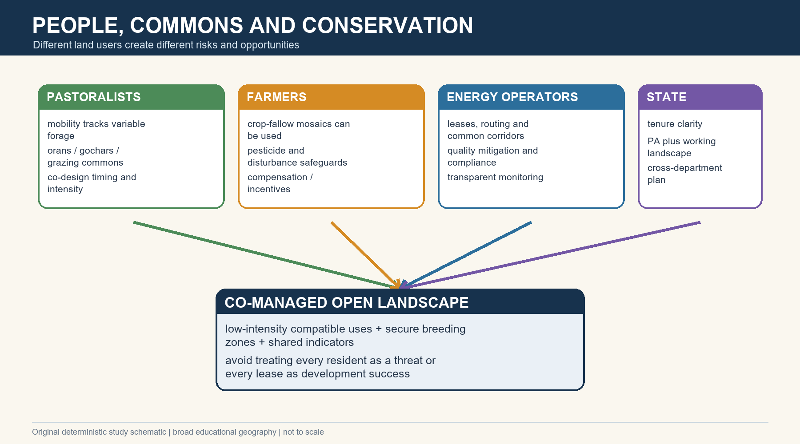

*Caption: 17. Communities, Orans, Gochars and Livelihoods: an India-centric visual for spatial, ecological and answer-writing recall. Original deterministic study schematic; not to scale.*

**Current / teaching focus:** Pastoralists, farmers, tourism operators and renewable-energy leaseholders have different relationships with the landscape.

| Actor / institution | Potential compatibility | Risk to manage |
| --- | --- | --- |
| Pastoralists | Mobility and low-intensity grazing can retain open structure | Concentration, exclusion or poorly timed pressure |
| Orans / gochars | Customary commons and cultural stewardship | Tenure erosion and diversion |
| Farmers | Fallow and low-input mosaics can provide seasonal habitat | Intensification, pesticides and fencing |
| Energy leases | Income and public revenue | Fragmentation, line density and unequal compensation |
| Tourism | Awareness and local income | Traffic, waste, dogs and disturbance |
| State agencies | Protection and compensation | Fragmented mandates and top-down exclusion |

### Core teaching

- [FACT] WII recommends incentives for bustard-friendly land uses and recognises that large habitats cannot be freed from all human use.
- [FACT] Rajasthan's official Project GIB page calls local involvement central to conservation.
- [ANALYSIS] Compatible use depends on intensity, timing, location and institutions; neither grazing nor farming is uniformly benign or harmful.
- [ANALYSIS] Compensation should address foregone pesticide use, route constraints, pasture access and conservation labour where evidence supports them.
- [ANALYSIS] Orans and gochars can function as social-ecological infrastructure when tenure and ecological condition are secured.
- [LIMIT] Community is not a homogeneous stakeholder; distributional effects must be measured.

### Must-know facts

- People are differentiated stakeholders.
- Mobility can be an adaptation.
- Co-management needs tenure, incentives and monitoring.

### UPSC traps

- **Wrong:** All residents are encroachers. **Correct:** The landscape contains long-standing livelihoods and conservation knowledge.
- **Wrong:** Any traditional use is automatically sustainable. **Correct:** Compatibility remains intensity-, season- and site-dependent.

**Mains use:** Add livelihoods as a causal and governance dimension, not a token final paragraph.

**Study link:** Geography 17 pastoralism; Economy livestock and commons

---

## 18. Conservation Breeding Programme and 2026 Milestones

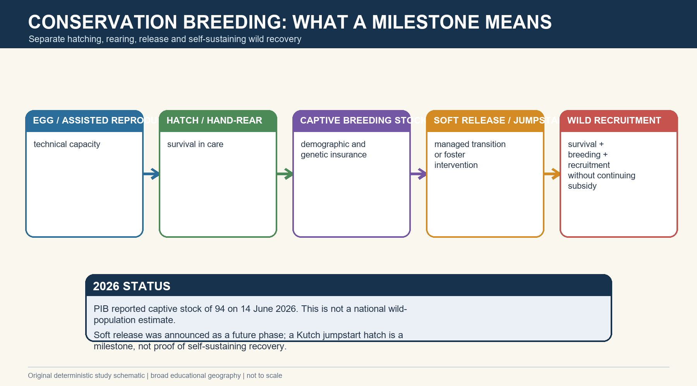

*Caption: 18. Conservation Breeding Programme and 2026 Milestones: an India-centric visual for spatial, ecological and answer-writing recall. Original deterministic study schematic; not to scale.*

**Current / teaching focus:** CURRENT LINKAGE | Official milestones are dated; successful hatching and rearing are not yet proof of a self-sustaining wild recovery.

| Date / facility | Official status | Boundary |
| --- | --- | --- |
| Sam, June 2019 | Temporary conservation breeding centre established | WII programme milestone |
| Ramdevra, Aug 2022 | Long-term facility made functional | WII 2022-23 report |
| 13 Mar 2026 | PIB: captive tally 70; two new chicks | Soft release described as future phase |
| 26 / 28 Mar 2026 | Kutch jumpstart chick hatched / announced | Foster intervention, not a viable population |
| 14 Jun 2026 | PIB: captive stock 94; 26 chicks in fourth year | Programme stock, not wild census |
| Release outcome | No self-sustaining released population demonstrated in checked sources | Explicit limit |

### Core teaching

- [FACT] WII records the tripartite MoA among MoEFCC, Rajasthan Forest Department and WII and facilities at Sam and Ramdevra.
- [FACT] PIB on 14 June 2026 reported 94 birds in captive stock and 26 chicks in the fourth year: 18 by artificial insemination, four by natural breeding and four from wild-collected eggs.
- [FACT] PIB on 28 March 2026 reported a Kutch hatch through a jumpstart approach using a fertile captive-bred egg and a wild foster female.
- [STATUS] Soft release / rewilding was announced as a forthcoming phase, not verified as a completed self-sustaining release outcome.
- [ANALYSIS] Genetic management, post-release survival, habitat safety and wild reproduction are the decisive next indicators.
- [LIMIT] Do not combine the 94 captive birds with any wild estimate.

### Must-know facts

- Hatching, rearing, release and recruitment are distinct.
- Sam and Ramdevra are the core Rajasthan facilities.
- 2026 milestones are programme achievements, not species recovery verdicts.

### UPSC traps

- **Wrong:** A captive-stock increase proves extinction risk has ended. **Correct:** Wild adult survival, recruitment and habitat safety remain unresolved.
- **Wrong:** Jumpstart means a new wild population is established. **Correct:** It is a managed intervention whose long-term outcome requires monitoring.

**Mains use:** Use a stage ladder and end with the next ecological outcome that must be demonstrated.

**Study link:** WII breeding reports + PIB 2026 releases

---

## 19. Flagship, Umbrella and Ecosystem Logic

*Caption: 19. Flagship, Umbrella and Ecosystem Logic: an India-centric visual for spatial, ecological and answer-writing recall. Original deterministic study schematic; not to scale.*

**Current / teaching focus:** GIB can mobilise protection for the Thar open ecosystem, but species-first measures must remain ecosystem- and livelihood-aware.

| Logic | Benefit | Caution |
| --- | --- | --- |
| Flagship | Public and political attention | Charisma can narrow priorities |
| Umbrella | Large open habitat can aid co-occurring fauna | Not every species shares identical needs |
| Indicator | Presence reflects some open-habitat conditions | Absence can have many causes |
| Ecosystem recovery | Grass-scrub, prey and connectivity | Avoid tree-centric restoration |
| Livelihood co-benefit | Commons and fodder security | Benefits must be distributed and measured |

### Core teaching

- [FACT] WII identifies co-beneficiaries such as spiny-tailed lizard, chinkara, foxes, Indian wolf and blackbuck.
- [ANALYSIS] Preventing line spread and conserving open mosaics can protect more than one species.
- [ANALYSIS] Umbrella logic is strongest when habitat overlap is demonstrated, not assumed from charisma.
- [ANALYSIS] Species-specific nest or breeding measures must fit broader fire, grazing, prey and community processes.
- [LIMIT] A flagship programme does not replace systematic biodiversity monitoring.

### Must-know facts

- GIB is a flagship of open ecosystems.
- Umbrella benefits require habitat overlap.
- Tree planting is not a universal biodiversity metric.

### UPSC traps

- **Wrong:** Saving GIB alone automatically saves every Thar species. **Correct:** Co-benefits are real but taxon- and process-specific.
- **Wrong:** Ecosystem conservation makes species-specific action unnecessary. **Correct:** Immediate mortality and breeding bottlenecks still need targeted action.

**Mains use:** Use GIB as an entry point, then widen to the open-ecosystem assemblage and institutions.

**Study link:** Environment biodiversity and ecosystem-function owners

---

## 20. Data Literacy, Monitoring and Current Status

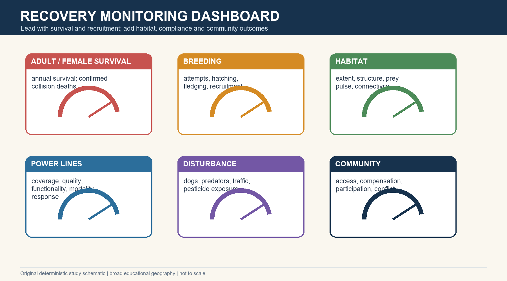

*Caption: 20. Data Literacy, Monitoring and Current Status: an India-centric visual for spatial, ecological and answer-writing recall. Original deterministic study schematic; not to scale.*

**Current / teaching focus:** RETRIEVAL DATE 19 AUGUST 2026 | FACT / STATUS / INFERENCE / LIMIT are kept separate.

| Label | Current statement | Boundary |
| --- | --- | --- |
| FACT | Supreme Court issued final located directions on 19 Dec 2025 | Legal direction, not implementation proof |
| FACT | PIB reported captive stock 94 on 14 Jun 2026 | Captive programme only |
| STATUS | Rajasthan remains the official stronghold; Kutch had a 2026 jumpstart hatch | No national wild census |
| INFERENCE | Avoidance-first transmission planning is necessary for recovery | Analytical conclusion |
| LIMIT | No sufficient official six-month implementation report found for completed 250 km mitigation | Do not claim completion |
| LIMIT | No robust official current national wild population estimate located | Use dated estimates only |

### Core teaching

- [RULE] Sightings show presence; telemetry shows tagged-bird movement; carcass records show detected mortality; population estimates model abundance; habitat maps prioritise space; implementation reports document action.
- [RULE] Leading indicators are adult and female survival, collision mortality, breeding attempts, hatching, fledging and recruitment.
- [RULE] Habitat indicators include open-habitat extent, vegetation structure, connectivity, insect prey and seasonal water pulses.
- [RULE] Infrastructure indicators include route, mitigation coverage, diverter functionality, undergrounded length, rerouting and post-treatment mortality.
- [RULE] Community indicators include access, compensation, participation, conflict and livelihood distribution.
- [RULE] Sensitive location data should be aggregated for public communication.

### Must-know facts

- Every datum needs scope, method and date.
- Implementation is not ecological outcome.
- Adult survival leads the recovery dashboard.

### UPSC traps

- **Wrong:** More sightings necessarily mean population growth. **Correct:** Survey effort, movement and detectability can change sightings.
- **Wrong:** A carcass-free short survey proves a line is safe. **Correct:** Detection is imperfect and exposure varies by season.

**Mains use:** End policy answers with a dashboard rather than a generic call for 'strict implementation'.

**Study link:** WII monitoring, CEA compliance and court implementation

---

# Solved verified local-paper PYQs

## PYQ 1 - UPSC GS-I 2020 Q5: Desertification and Climatic Boundaries

**Question:** The process of desertification does not have climatic boundaries. Justify with examples. (10 marks, 150 words)

**Source status:** VERIFIED PYQ - exact English stem verified from local official GS-I scan Gen_St_P1.pdf. Mains has no objective key.

### Model solution

- CLAIM: Land degradation mechanisms cross climate zones even though UNCCD uses desertification specifically for drylands.
- NAMED EVIDENCE: Wind erosion and vegetation loss in Rajasthan, irrigation-induced salinity in Punjab-Haryana and runoff-driven erosion on Himalayan slopes show different pathways to persistent productivity loss.
- ANALYSIS: Climate selects the dominant process, while land use, hydrology and recovery capacity determine whether stress becomes chronic degradation.
- QUALIFICATION: In strict convention usage, humid-zone examples should be called land degradation; the PYQ uses desertification in a broader process sense.
- VERDICT: Policy must diagnose the local process rather than imagine one advancing wall of sand.
- Why this earns marks: It answers the directive, uses named Indian examples, resolves the terminology tension and gives a graded verdict.

---

## PYQ 2 - UPSC Prelims 2018 Q2: Desert Leaf Modifications

**Question:** Which leaf modifications occur in desert areas to inhibit water loss? 1. Hard and waxy leaves 2. Tiny leaves 3. Thorns instead of leaves. Options: A. 2 and 3 only; B. 2 only; C. 3 only; D. 1, 2 and 3.

**Source status:** VERIFIED PYQ - exact English stem verified from local official Prelims paper QP-CSP-18-GS-I-C.pdf. Official key not held locally.

### Model solution

- INFERRED ANSWER - NOT OFFICIALLY VERIFIED: D (1, 2 and 3). Confidence: High.
- Hard or waxy surfaces reduce cuticular water loss; tiny leaves reduce transpiring area; leaves modified into thorns sharply reduce leaf area while stems may photosynthesise.
- Elimination: all three can reduce water loss, so every partial combination is incomplete.
- Why this earns marks: It labels the key honestly and explains each statement independently.

---

## PYQ 3 - UPSC Prelims 2018 Q82: Irrigation and Salinisation

**Question:** With reference to agricultural soils: 1. High organic matter drastically reduces water-holding capacity. 2. Soil plays no role in the sulphur cycle. 3. Irrigation over time can contribute to salinization of some agricultural lands. Options: A. 1 and 2 only; B. 3 only; C. 1 and 3 only; D. 1, 2 and 3.

**Source status:** VERIFIED PYQ - exact English stem verified from local official Prelims paper QP-CSP-18-GS-I-C.pdf. Official key not held locally.

### Model solution

- INFERRED ANSWER - NOT OFFICIALLY VERIFIED: B (3 only). Confidence: High.
- Statement 1 is false because organic matter generally improves aggregation and water retention. Statement 2 is false because soils store and transform sulphur. Statement 3 is correct where irrigation, shallow water tables, inadequate drainage and evaporation concentrate salts.
- Thar link: irrigation can raise production while generating local secondary salinity; both outcomes must be monitored.
- Why this earns marks: It verifies all statements and links the mechanism to a bounded Indian example.

---

## PYQ 4 - UPSC Prelims 2020 Q95: Desert National Park and GIB

**Question:** With reference to India's Desert National Park: 1. It is spread over two districts. 2. There is no human habitation inside the Park. 3. It is one of the natural habitats of the Great Indian Bustard. Options: A. 2 only; B. 2 and 3 only; C. 1 and 3 only; D. 1, 2 and 3.

**Source status:** VERIFIED PYQ - exact English stem verified from local official Prelims paper CSP_2020_GS_Paper-1.pdf. Official 2020 key not held locally.

### Model solution

- INFERRED ANSWER - NOT OFFICIALLY VERIFIED: C (1 and 3 only). Confidence: High.
- The sanctuary extends across Jaisalmer and Barmer and is a major GIB habitat. The absolute statement that no human habitation exists is false.
- Elimination: protected-area questions often use an absolute no-people claim as the trap.
- Why this earns marks: It uses official spatial and habitat facts while preserving the non-official status of the inferred key.

---

# Authored hard and remedial MCQs with explanations

> Rotation audit: authored keys run strictly A -> B -> C -> D, repeated 12 times. Verified PYQ option order is preserved and excluded from this rotation.

## MCQ 1

A parcel is mapped as 'wasteland' but supports native grasses, pastoral use and GIB movement. Which conclusion is strongest?

A. It may be an ecologically valuable open natural ecosystem despite the administrative label.
B. It must be afforested because all wasteland is barren.
C. It cannot have customary tenure.
D. It is necessarily outside all conservation planning.

**Answer: A.** Administrative class is not an ecological verdict.

## MCQ 2

Why does the Aravalli contribute only a bounded explanation of Thar aridity?

A. It lies east of the Bay of Bengal.
B. Its broad alignment limits uplift, but continentality, subsidence, evapotranspiration and variability also matter.
C. It prevents every monsoon current from entering Rajasthan.
D. It is too young to influence climate.

**Answer: B.** Aridity is multi-causal.

## MCQ 3

Which surface is most likely to combine runoff concentration, finer sediment and seasonal forage?

A. A mobile dune crest
B. A bare rocky inselberg
C. An interdunal plain
D. A high-voltage pylon base

**Answer: C.** Interdunes collect water and finer material.

## MCQ 4

Which statement best represents desert productivity?

A. It is uniformly high all year.
B. It exists only where canals operate.
C. It is absent outside oases.
D. It is often low on average but rises in short rainfall-driven pulses.

**Answer: D.** Pulse productivity is the correct model.

## MCQ 5

A playa in the Thar is best understood as

A. an ephemeral closed-basin depression where evaporation can concentrate salts
B. a perennial glacial lake
C. a marine coral lagoon
D. a deep river gorge

**Answer: A.** Playas reflect internal drainage and evaporation.

## MCQ 6

Which statement about the Luni system is most accurate?

A. It is a Himalayan perennial river.
B. It is the principal ephemeral drainage cue of the Thar and tends towards inland / saline termination.
C. It drains the entire desert uniformly.
D. It is unrelated to monsoon variability.

**Answer: B.** The Luni is ephemeral and spatially bounded.

## MCQ 7

Why must groundwater quantity and quality be separated in the Thar?

A. All aquifers are fresh.
B. Only rainfall determines salinity.
C. Groundwater may exist but be deep, brackish or saline.
D. Groundwater has no livelihood role.

**Answer: C.** Presence does not equal usability.

## MCQ 8

Which land-use statement is most defensible?

A. Pastoralism always degrades grassland.
B. Cropland is never used by GIB.
C. All grazing should be banned across the Thar.
D. Low-intensity pastoral and crop-fallow mosaics can be compatible when timing, intensity and location are managed.

**Answer: D.** Compatibility is conditional.

## MCQ 9

Which is the correct GIB status stack?

A. Ardeotis nigriceps; IUCN Critically Endangered; WPA Schedule I; CITES and CMS Appendix I
B. Endangered; WPA Schedule II; CITES Appendix III
C. Critically Endangered; no Indian legal protection
D. Least Concern; CMS Appendix II only

**Answer: A.** The systems are separate but converge on high protection.

## MCQ 10

What most directly creates GIB collision susceptibility?

A. Echolocation failure
B. Narrow frontal detection combined with ground scanning, heavy flight and limited rapid manoeuvre
C. Inability to fly
D. Attraction to electricity

**Answer: B.** WII identifies the visual-biomechanical chain.

## MCQ 11

Which diet description is supported by WII?

A. Only dry grass
B. Only reptiles
C. Omnivorous use of insects, fruits and harvested crops
D. Only livestock carrion

**Answer: C.** The species is omnivorous.

## MCQ 12

Why is a successful hatch not the final recovery metric?

A. Eggs have no conservation value.
B. Captive chicks are legally wild.
C. Hatching automatically prevents collisions.
D. Fledging, juvenile survival, recruitment and later breeding still have to occur.

**Answer: D.** Recovery is a stage sequence.

## MCQ 13

Which current-distribution statement is safest?

A. Rajasthan is the stronghold; other state claims require current dated evidence.
B. Every historical state has a viable 2026 population.
C. The species is now confined to one enclosure.
D. A priority map is a census.

**Answer: A.** Evidence must be time- and scale-bounded.

## MCQ 14

What is the legal-category caution for Desert National Park?

A. It is an unnotified forest.
B. The official Rajasthan source calls it a Wildlife Sanctuary despite 'National Park' in the proper name.
C. It is a biosphere reserve only.
D. It contains no settlements.

**Answer: B.** Name and legal category must be separated.

## MCQ 15

Which is a direct mortality pressure?

A. Administrative classification
B. Rainfall variability alone
C. Overhead-wire collision
D. A map legend

**Answer: C.** Collision directly kills birds.

## MCQ 16

Why is adult-female survival a leading recovery indicator?

A. Adults never move.
B. Females are easy to count.
C. Captive breeding makes adults irrelevant.
D. Slow life history and small population make each breeding adult disproportionately important.

**Answer: D.** Demographic value is high.

## MCQ 17

Which statement correctly separates collision and electrocution?

A. Collision is impact with a wire; electrocution requires electrical contact / current path.
B. They are synonyms.
C. Only underground cables cause collision.
D. High-voltage lines cannot be collision hazards.

**Answer: A.** Mechanisms differ.

## MCQ 18

What can bird flight diverters defensibly do?

A. Guarantee zero mortality
B. Increase wire visibility and reduce, but not eliminate, collision risk
C. Replace habitat avoidance
D. Eliminate electrocution on every configuration

**Answer: B.** They are residual mitigation.

## MCQ 19

Which undergrounding claim is strongest?

A. It is always infeasible.
B. It is always cheap.
C. It removes aerial collision on the treated stretch, but feasibility varies with voltage, terrain, maintenance and cost.
D. It has no ecological benefit.

**Answer: C.** Both benefit and feasibility must be stated.

## MCQ 20

Where should mitigation begin?

A. Offset purchase
B. Captive breeding
C. Diverters on every proposed line
D. Avoiding new infrastructure spread through critical habitat

**Answer: D.** Avoidance leads the hierarchy.

## MCQ 21

What did the 19 April 2021 order broadly do?

A. Directed undergrounding / diverters across mapped priority and potential habitat subject to feasibility processes
B. Disposed of all issues without directions
C. Created the 2025 revised priority areas
D. Reported the 2026 captive tally

**Answer: A.** This was the initial broad legal stage.

## MCQ 22

What is central to the 21 March 2024 judgment?

A. It proved all lines were underground.
B. It recalled / substituted the earlier injunction and appointed a new expert committee.
C. It banned all solar power in India.
D. It released captive birds.

**Answer: B.** The remedy shifted to committee-based balancing.

## MCQ 23

Which statement reflects the 19 December 2025 judgment?

A. It restored the untouched 2021 blanket rule.
B. It ended all monitoring.
C. It accepted revised priority areas and detailed corridor, project and time-bound mitigation directions.
D. It declared GIB recovered.

**Answer: C.** The 2025 judgment is the current located endpoint.

## MCQ 24

How did the 2025 judgment address the requested blanket mining prohibition?

A. It banned mining worldwide.
B. It approved every mine.
C. It ignored environmental law.
D. It did not issue that blanket prohibition and relied on statutory regulators mindful of the fragile area.

**Answer: D.** The legal distinction must be preserved.

## MCQ 25

Which proposition avoids a false energy-biodiversity binary?

A. Build clean energy with extinction-safe spatial planning and a mitigation hierarchy.
B. Stop all clean energy.
C. Treat every renewable project as impact-free.
D. Use captive breeding as an offset for collision mortality.

**Answer: A.** Siting and design reconcile objectives.

## MCQ 26

What is the correct mitigation order?

A. Mark -> offset -> ignore
B. Avoid -> minimise / route -> underground or insulate where suitable -> mark residual risk -> monitor
C. Breed -> build -> count
D. Compensate -> clear habitat

**Answer: B.** The standard hierarchy prioritises prevention.

## MCQ 27

Why can offsets not substitute for collision prevention?

A. Offsets are illegal everywhere.
B. Habitat has no value.
C. Avoidable adult mortality in a tiny population may be irreversible and non-equivalent.
D. All offsets are forests.

**Answer: C.** Equivalence fails under extinction risk.

## MCQ 28

What is the purpose of clustering routes and sharing common stretches?

A. Increase wire spread
B. Create more crossings
C. Replace monitoring
D. Reduce the spatial footprint and number of independent crossings.

**Answer: D.** Network design matters.

## MCQ 29

Which conservation architecture is most complete?

A. Safe habitat + mortality prevention + community participation + ex-situ insurance + monitoring
B. Captive breeding alone
C. One fenced enclosure alone
D. Tree planting alone

**Answer: A.** Recovery requires complementary pillars.

## MCQ 30

What is the best description of conservation breeding?

A. Proof that the wild population is safe
B. An insurance and learning population that may support future recovery
C. A substitute for line mitigation
D. A current national wild census

**Answer: B.** Ex-situ work buys time.

## MCQ 31

What did the March 2026 Kutch jumpstart milestone demonstrate?

A. A self-sustaining Gujarat population
B. Completion of all releases
C. A fertile egg was fostered in the wild and hatched under an interstate intervention
D. End of genetic risk

**Answer: C.** It was an intervention milestone.

## MCQ 32

How should the 2026 soft-release statement be reported?

A. As a completed national reintroduction
B. As proof of wild recruitment
C. As release of all 94 birds
D. As an announced future phase whose outcomes remain to be demonstrated

**Answer: D.** Plan and outcome are distinct.

## MCQ 33

Which community statement is strongest?

A. Stakeholders differ; compatible land use should be co-designed and monitored.
B. Every resident is a threat.
C. Every traditional practice is sustainable.
D. Compensation is unnecessary.

**Answer: A.** Communities are heterogeneous.

## MCQ 34

Why are orans and gochars relevant?

A. They are identical to national parks.
B. They can retain customary commons, pasture and open-habitat values, subject to site condition.
C. They are always vacant government land.
D. They exclude all livestock.

**Answer: B.** Tenure and ecology can overlap.

## MCQ 35

How can pesticide use affect GIB?

A. Only by changing feather colour
B. It cannot affect an omnivore
C. Through direct toxicity and depletion of insect prey
D. Only by increasing groundwater

**Answer: C.** The pathway is direct and bottom-up.

## MCQ 36

Why are free-ranging dogs included in monitoring?

A. They create rainfall.
B. They underground cables.
C. They determine IUCN categories.
D. They can prey on nests / wildlife and connect settlement resources to conservation areas.

**Answer: D.** They are a measurable local pressure.

## MCQ 37

What does a sighting record establish?

A. Presence at a time and place, not population growth by itself
B. A national census
C. The legal status of land
D. Completion of mitigation

**Answer: A.** Sightings have a limited evidentiary meaning.

## MCQ 38

What does telemetry best answer?

A. How many untagged birds exist nationally
B. How tagged birds move and use space
C. Whether a court order is implemented
D. Whether every habitat is suitable

**Answer: B.** Telemetry is movement evidence.

## MCQ 39

Why must population estimates retain confidence and scope?

A. Uncertainty is optional.
B. Models are always wrong.
C. An estimate applies to a defined area, method and period rather than all India forever.
D. The number is a legal direction.

**Answer: C.** Scale and method bound inference.

## MCQ 40

How should sensitive GIB data be handled in public maps?

A. Publish live nest coordinates
B. Publish all telemetry fixes
C. Ignore all spatial data
D. Aggregate to broad planning units and protect precise nests / live movements.

**Answer: D.** Conservation communication must protect sensitive locations.

## MCQ 41

Which is the best leading indicator of recovery?

A. Adult and female survival with collision mortality
B. Number of press releases
C. Number of project logos
D. Area coloured green on a map

**Answer: A.** Demography leads.

## MCQ 42

Which breeding dashboard is most complete?

A. Egg collection only
B. Attempts, hatching, fledging and recruitment
C. Captive stock only
D. Court hearings only

**Answer: B.** The full stage sequence is required.

## MCQ 43

Which habitat dashboard is strongest?

A. Only tree cover
B. Only protected-area area
C. Open-habitat extent, structure, connectivity, vegetation and insect prey
D. Only annual rainfall

**Answer: C.** Habitat quality is multidimensional.

## MCQ 44

What is a compliance outcome rather than an activity count?

A. Diverters purchased
B. Tender issued
C. Meeting held
D. Mitigation installed, functional and associated with measured mortality reduction

**Answer: D.** Function and response are outcomes.

## MCQ 45

Why can GIB be a flagship?

A. It can mobilise attention for threatened open ecosystems and co-occurring species.
B. It represents dense rainforest.
C. It eliminates the need for ecosystem monitoring.
D. It is the only Thar species.

**Answer: A.** Flagship value is communicative and ecological.

## MCQ 46

Why is CMS listing relevant?

A. It sets Indian electricity tariffs.
B. It supports protection and cooperation for a species with transboundary relevance.
C. It replaces the Wildlife Act.
D. It provides a current Pakistan census.

**Answer: B.** Treaty and domestic law remain distinct.

## MCQ 47

A map shows 14,013 sq km as Rajasthan's revised priority area. What can be inferred?

A. Exactly 14,013 birds occur there.
B. Every hectare is occupied equally.
C. It is a court-accepted planning area, not a population estimate.
D. All infrastructure is already mitigated.

**Answer: C.** Spatial planning layers are not counts.

## MCQ 48

Which final verdict is best?

A. Captive breeding alone has solved the crisis.
B. Renewable energy must stop everywhere.
C. DNP notification alone is sufficient.
D. Recovery requires extinction-safe infrastructure, adult survival, habitat mosaics, community co-management and evidence-led release.

**Answer: D.** The integrated verdict follows the evidence.

# Original solved Mains practice

## Original 10-marker: Why 'Desert = Barren Wasteland' Fails

**Question:** Explain why treating the Thar Desert as barren wasteland is geographically and ecologically misleading. (10 marks, 150 words)

### Model answer

- CLAIM: The label collapses climate, ecological formation, land use and administrative classification into one false category.
- NAMED EVIDENCE: WII describes the GIB landscape as dry grasslands and desert interspersed with agriculture; Rajasthan's Project GIB links grasslands to livestock and local livelihoods; the Thar contains dunes, interdunes, saline flats, scrub and seasonal wetlands.
- ANALYSIS: These patches support pulse productivity, insects, reptiles, chinkara, predators and GIB, while orans, gochars and crop fallows carry tenure and livelihood functions. Calling them vacant lowers the political cost of diversion and wrong-site tree planting.
- QUALIFICATION: Some parcels are degraded or heavily transformed; naturalness and condition still require site evidence.
- VERDICT: Classify by ecosystem, condition, tenure and use before restoration or infrastructure siting.
- Why this earns marks: It defines the category error, uses named evidence, explains policy consequences and avoids romanticising every open parcel.

---

## Original 15-marker: GIB and Renewable-Energy Siting

**Question:** Analyse the Great Indian Bustard-power-line conflict as a test of biodiversity-compatible renewable-energy planning in India. (15 marks, 250 words)

### Model answer

- CLAIM: The conflict is not clean energy versus conservation; it is poorly distributed infrastructure risk versus extinction-safe spatial planning.
- NAMED EVIDENCE: WII identifies narrow frontal vision, heavy flight and recorded collision mortality; the Supreme Court's 19 December 2025 judgment accepted revised priority areas, power corridors, route optimisation, 250 km of critical undergrounding and restrictions on specified new projects within revised priority areas.
- ANALYSIS: Renewable energy serves decarbonisation and energy security, but dispersed lines through scarce breeding and movement habitat create repeated adult mortality that a tiny slow-recovering population cannot absorb. Early avoidance and corridor design are cheaper ecologically than retrofits.
- QUALIFICATION: Undergrounding feasibility varies by voltage, terrain, maintenance and cost; diverters can reduce but not eliminate collision. A direction or deadline is not proof of completion.
- VERDICT: Apply avoid -> minimise / cluster -> underground or insulate where feasible -> mark residual risk -> monitor mortality, with transparent project and community safeguards.
- Why this earns marks: It balances both public objectives, names the latest legal evidence, explains the biological mechanism, qualifies engineering claims and gives a prioritised hierarchy.

---

## Original 20-marker: Landscape Recovery Plan for GIB

**Question:** Design a landscape-scale recovery strategy for the Great Indian Bustard that integrates habitat, infrastructure, breeding, communities and monitoring. (20 marks, 300 words)

### Model answer

- CLAIM: Recovery should be judged by a self-sustaining wild population, led by adult-female survival and recruitment rather than captive totals.
- NAMED EVIDENCE: WII telemetry shows seasonal use of breeding grasslands and agro-pastoral areas; DNP is a sanctuary with villages; WII and MoEFCC recovery plans combine enclosures, threat mitigation, incentives and conservation breeding; PIB reported captive stock of 94 on 14 June 2026; the 2025 Supreme Court judgment provides the current transmission framework.
- ANALYSIS - HABITAT: Secure broad breeding and movement mosaics, prevent wrong-site plantations, manage invasive woody cover, monitor vegetation and insect pulses, and connect DNP with adjoining working landscapes without publishing sensitive locations.
- ANALYSIS - MORTALITY: Avoid new line spread in critical habitat; implement court-approved undergrounding / rerouting; use insulated lower-voltage systems and compliant diverters for residual risk; manage roads, fences, dogs, nest disturbance and pesticides.
- ANALYSIS - PEOPLE: Co-design grazing timing, protect orans and gochars, reward bustard-friendly farming, compensate verified restrictions and publish distributional outcomes of energy leases and conservation rules.
- ANALYSIS - EX-SITU: Maintain genetic and demographic insurance at Sam / Ramdevra; treat soft release and jumpstart as staged experiments; release only into safe habitat with post-release telemetry and survival thresholds.
- QUALIFICATION: Dated estimates, sightings, priority maps, captive stock and legal orders answer different questions. No robust official 2026 national wild census or sufficient recent implementation report was located.
- VERDICT: Establish an interstate recovery authority or binding coordination platform with a dashboard for adult survival, collision mortality, breeding, recruitment, habitat connectivity, mitigation functionality and community outcomes.
- Why this earns marks: It is directive-complete, institutionally grounded, evidence-dense, spatially explicit, socially differentiated and measurable.

---

## Advanced Refinements and Examiner Cautions

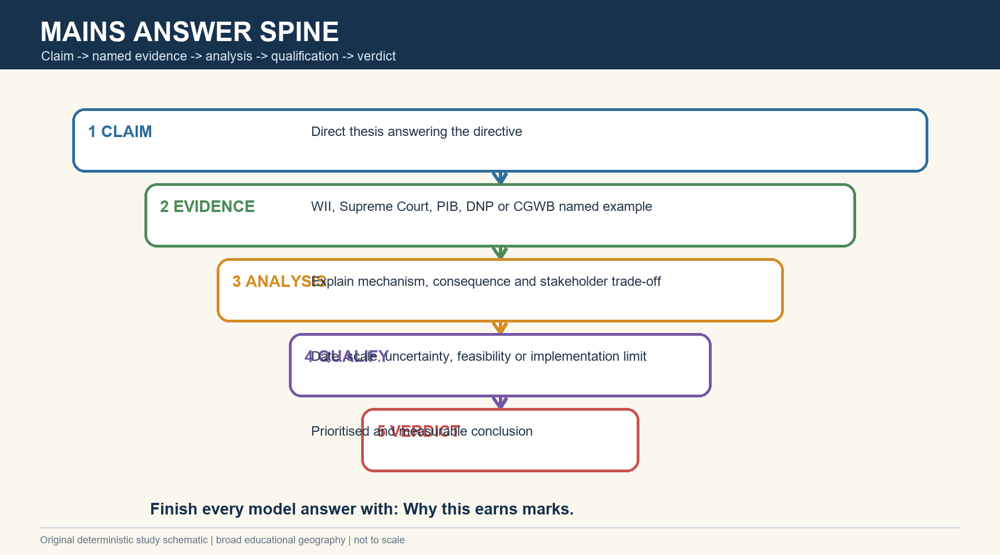

*Caption: Advanced Refinements and Examiner Cautions: an India-centric visual for spatial, ecological and answer-writing recall. Original deterministic study schematic; not to scale.*

**Current / teaching focus:** Advanced synthesis: qualify every physical, biological, legal and programme claim by scale and evidence type.

| Weak claim | Advanced replacement | Reason |
| --- | --- | --- |
| Desert is barren | Open natural ecosystem mosaic | Recognises ecology and tenure |
| Power lines are the only threat | Critical mortality within a compounding threat system | Avoids monocausal analysis |
| Underground everything | Avoid first; context-specific engineering; residual marking | Technically and legally current |
| 94 GIB recovered | 94 captive stock reported; wild recovery unproven | Metric discipline |
| Court saved GIB | Court set directions; implementation and outcome require evidence | Status discipline |
| Protect the park | Protect seasonal landscape and compatible livelihoods | Telemetry and governance logic |

### Core teaching

- [REFINEMENT] Distinguish ecological carrying capacity, observed abundance and policy target.
- [REFINEMENT] Separate priority habitat, potential habitat, revised priority area and actual bird use.
- [REFINEMENT] Adult mortality prevention has higher immediate demographic leverage than adding habitat without removing lethal lines.
- [REFINEMENT] Ex-situ success should be reported by founder representation, genetic diversity, survival, reproduction and release performance.
- [REFINEMENT] Community outcomes need disaggregated indicators rather than a generic participation claim.
- [REFINEMENT] Climate variability should be monitored as a modifier of forage and breeding, not used to obscure controllable infrastructure risk.

### Must-know facts

- Qualification increases authority.
- Current law is date-bounded.
- Outcome metrics outrank announcement metrics.

### UPSC traps

- **Wrong:** Balance means equal praise and criticism. **Correct:** Balance means weighing evidence, conditions and irreversibility.
- **Wrong:** A way forward can replace diagnosis. **Correct:** Mechanism and hierarchy must precede prescription.

**Mains use:** Use the claim-evidence-analysis-qualification-verdict chain in every answer.

**Study link:** Complete package synthesis

---

# FINAL CONSOLIDATED REGISTER NOTES

## FINAL CONSOLIDATED REGISTER NOTES 1/5 - Thar Physical Mosaic

*Caption: FINAL CONSOLIDATED REGISTER NOTES 1/5 - Thar Physical Mosaic: an India-centric visual for spatial, ecological and answer-writing recall. Original deterministic study schematic; not to scale.*

**Current / teaching focus:** Rapid revision: map the physical mosaic only to explain habitat; refer to Topic 07 for the full desertification treatment.

| Recall axis | One-line note | Exam use |
| --- | --- | --- |
| Location | Western Rajasthan, wider Indian margins and Pakistan transition | Broad map |
| Aridity | Weak uplift + continentality + subsidence + high ET + variable rain | Multi-causal flow |
| Landforms | Dunes, interdunes, rocky plains, playas and pediments | Habitat cross-section |
| Drainage | Luni + internal saline basins | Ephemeral water logic |
| Soils / water | Sandy to saline; groundwater quantity != quality | Avoid one-number generalisation |

### Core teaching

- Habitat value follows stability, moisture and vegetation.
- Desert productivity is pulsed.
- The Aravalli is important but not a complete explanation.

### Must-know facts

- Draw Thar mosaic in 30 seconds.
- Write water quantity -> quality -> access -> habitat.
- Keep map broad and non-sensitive.

### UPSC traps

- **Wrong:** All sand is equivalent habitat. **Correct:** Dunes, interdunes and plains perform different functions.
- **Wrong:** One rainfall value describes the whole Thar. **Correct:** Use core-margin and year / station caveats.

**Mains use:** Physical thesis: aridity creates a heterogeneous, pulse-driven open ecosystem rather than a vacant sand sheet.

**Study link:** Revise visuals 01-05

---

## FINAL CONSOLIDATED REGISTER NOTES 2/5 - Open Ecosystem and GIB Biology

*Caption: FINAL CONSOLIDATED REGISTER NOTES 2/5 - Open Ecosystem and GIB Biology: an India-centric visual for spatial, ecological and answer-writing recall. Original deterministic study schematic; not to scale.*

**Current / teaching focus:** Rapid revision: vocabulary, status, morphology, food and life history.

| Axis | Recall | Trap |
| --- | --- | --- |
| Category | Desert / grassland / pasture / oran / gochar / cropland / 'wasteland' differ | Do not collapse labels |
| Status | Ardeotis nigriceps; CR; WPA I; CITES I; CMS I | No current wild number guessed |
| Collision | Narrow frontal detection + heavy flight + late avoidance | Collision != electrocution |
| Diet | Insects, fruits and harvested crops | Not grass-only |
| Life history | Ground nest, slow recovery, seasonal wide landscape use | Hatch != recruitment |

### Core teaching

- Rajasthan is the current stronghold.
- Dated WII estimates are not a 2026 census.
- Adult and female survival lead the recovery dashboard.

### Must-know facts

- Use broad range categories.
- Protect precise nests and telemetry.
- Separate captive stock from wild abundance.

### UPSC traps

- **Wrong:** CITES and IUCN are the same system. **Correct:** Trade regulation and scientific risk are separate.
- **Wrong:** GIB remains only inside enclosures. **Correct:** Telemetry shows adjoining agro-pastoral use.

**Mains use:** Biology thesis: a wide-ranging, ground-nesting, slow-recovery bird cannot tolerate repeated avoidable adult mortality.

**Study link:** Revise visuals 06-08

---

## FINAL CONSOLIDATED REGISTER NOTES 3/5 - DNP, Threats and Power Lines

*Caption: FINAL CONSOLIDATED REGISTER NOTES 3/5 - DNP, Threats and Power Lines: an India-centric visual for spatial, ecological and answer-writing recall. Original deterministic study schematic; not to scale.*

**Current / teaching focus:** Rapid revision: legal landscape, threat ranking and engineering hierarchy.

| Axis | Recall | Indicator |
| --- | --- | --- |
| DNP | Sanctuary across Jaisalmer and Barmer; settlements exist | Legal category + lived landscape |
| Direct threat | Collision mortality | Carcasses / survival |
| Habitat threats | Energy spread, roads, fencing, intensive farming, pesticides | Extent / connectivity / prey |
| Mitigation | Avoid -> route -> underground / insulate -> mark -> monitor | Function and mortality response |
| Diverters | Residual visibility aid | Quality, coverage, functionality |

### Core teaching

- Undergrounding feasibility is context-specific.
- Lower-voltage electrocution and aerial collision need different controls.
- Offsets cannot replace adult-mortality prevention.

### Must-know facts

- Rank direct mortality before generic habitat language.
- Use a corridor and shared-route argument.
- Name outcome metrics.

### UPSC traps

- **Wrong:** Diverters eliminate risk. **Correct:** They reduce residual risk and require monitoring.
- **Wrong:** DNP has no human habitation. **Correct:** The absolute statement is false.

**Mains use:** Mitigation thesis: extinction-safe siting begins with avoidance; engineering treats residual risk.

**Study link:** Revise visuals 09-11

---

## FINAL CONSOLIDATED REGISTER NOTES 4/5 - Law, Energy and Recovery

*Caption: FINAL CONSOLIDATED REGISTER NOTES 4/5 - Law, Energy and Recovery: an India-centric visual for spatial, ecological and answer-writing recall. Original deterministic study schematic; not to scale.*

**Current / teaching focus:** Rapid revision: 2021 -> 2024 -> 2025, then recovery architecture and 2026 programme status.

| Date / pillar | Recall | Limit |
| --- | --- | --- |
| 2021 | Broad undergrounding and diverter directions | Historic stage |
| 2024 | Earlier injunction recalled / substituted; expert committee | Not final endpoint |
| 2025 | Revised priority areas; corridors; project restrictions; time-bound mitigation | Direction != completion |
| 2026 breeding | PIB captive stock 94 on 14 Jun | Not wild population |
| Recovery | Habitat + mortality + community + ex-situ + monitoring | Release only into safe habitat |

### Core teaching

- No later official Supreme Court order was located in the checked six-month window.
- Soft release was a future phase in the official 2026 statements.
- Kutch jumpstart hatch is a milestone, not a recovery verdict.

### Must-know facts

- Use the latest legal endpoint.
- State deadline and retrieval date.
- Reject false energy-versus-biodiversity binary.

### UPSC traps

- **Wrong:** The 2021 rule is unchanged current law. **Correct:** Read the 2024 and 2025 modifications.
- **Wrong:** The Court banned all renewable energy in the Thar. **Correct:** Restrictions are area- and project-specific.

**Mains use:** Governance thesis: combine extinction-safe spatial planning with time-bound, monitored implementation and livelihood safeguards.

**Study link:** Revise visuals 12-16

---

## FINAL CONSOLIDATED REGISTER NOTES 5/5 - Data, Monitoring and Answer Routes

*Caption: FINAL CONSOLIDATED REGISTER NOTES 5/5 - Data, Monitoring and Answer Routes: an India-centric visual for spatial, ecological and answer-writing recall. Original deterministic study schematic; not to scale.*

**Current / teaching focus:** Final rapid recall: evidence types, dashboard, PYQ traps and model-answer spine.

| Evidence / route | Answers | Never infer |
| --- | --- | --- |
| Sighting | Presence | Population growth |
| Telemetry | Tagged movement | National abundance |
| Carcass | Detected mortality | Complete mortality rate |
| Estimate | Modelled abundance with uncertainty | Timeless exact count |
| Order | Binding direction | Completed implementation |
| Answer spine | Claim -> evidence -> analysis -> qualification -> verdict | Generic way forward |

### Core teaching

- Monitor adult survival, breeding, recruitment, habitat, line mitigation, disturbance and community outcomes.
- Verified PYQ keys remain inferred where official keys are unavailable locally.
- Every model answer ends with Why this earns marks.

### Must-know facts

- 2020 DNP PYQ: 1 and 3 only, inferred C, high confidence.
- Main map is broad and non-sensitive.
- Use FACT / STATUS / INFERENCE / LIMIT.

### UPSC traps

- **Wrong:** More sightings prove recovery. **Correct:** Survey effort and movement affect sightings.
- **Wrong:** A press release is an ecological outcome. **Correct:** Treat it as a dated programme status unless outcome evidence follows.

**Mains use:** Final verdict: save the GIB by protecting the functional Thar mosaic, preventing adult mortality and measuring wild recovery rather than announcements.

**Study link:** Revise all visuals, PYQs and the monitoring dashboard

---
