# Geography 19 - India Himalayan Fruit Belt

**Complete Topic Package | Dated 2026-08-19 | Approval not claimed**

This reusable visual-first edition defines the Himalayan fruit belt as a differentiated
agroclimatic and value-chain system. It covers physical geography, altitudinal zonation,
chill physiology, phenology, orchard-site science, high-density systems, pollination,
water-soil-slope sustainability, hazards, climate evidence, rural transition, value chains,
policy, 2026 current linkage, verified local-paper PYQs, 56 strictly rotated MCQs,
solved 10/15/20-mark practice and final topic-specific register notes.

## Non-negotiable discipline

1. A fruit belt is a functional region, not a fixed statutory boundary.
2. The Himalaya is not one uniform apple belt.
3. Altitude is a proxy; cultivar, latitude, aspect, moisture, soil and access modify it.
4. No universal chill-hour threshold is applied to all apple cultivars.
5. Weather event, seasonal anomaly, climate trend, projection and farmer perception remain separate.
6. High density is a complete production system, not simply more trees.
7. Pollinizer (plant) and pollinator (animal vector) are separate terms.
8. Tree planting is not automatic slope stabilisation.
9. Farm yield, post-harvest value realisation and farmer income are separate outcomes.
10. Scheme eligibility, approval, disbursement, asset use and farmer outcome are separate.
11. Current claims are labelled FACT, STATUS, FORECAST, INFERENCE or LIMIT and retrieved on 2026-08-19.
12. Newly generated work remains `approved: false` until explicit user approval.

## Source order used

1. Authored repository Markdown.
2. OCR-searchable local books, official state / central PDFs and official local PYQ scans.
3. Live primary sources checked through 2026-08-19.
4. Qdrant was not required.

## Local evidence register

- `upsc-ai-kit/knowledge/Geography/basic/19_Mediterranean-Climate.md`
- `upsc-ai-kit/knowledge/Geography/advanced/19_India-Himalayan-Fruit-Belt.md`
- `Geography Topics 04, 06, 13, 14, 16 and linked advanced Topics 22-25, 30 and 33`
- `Economy owners 13-15: markets/FPOs, irrigation-credit-insurance, food processing/cold chain`
- `Environment owners: ecosystem services, pollination and climate-evidence discipline`
- `Indian & World Geography - Husain, Majid_Compressed.pdf`: orchard inversion, horticulture, apple and regional pages
- `D.R.Khullar.pdf`: local scan was not text-searchable in the extraction path; authored advanced notes retain its source-era propositions
- `Official local UPSC scans`: 2018, 2019, 2020, 2021, 2022, 2024 and 2025 papers plus official 2024 Set-A key

## Primary source register

| Institution / document | Primary URL | Use and caveat | Retrieved |
| --- | --- | --- | --- |
| MoA&FW, MIDH Operational Guidelines 2025 (posted 7 May 2026) | https://agriwelfare.gov.in/Documents/midh_English_07052026.pdf | Cluster, planting material, HD apple, pollination, post-harvest and anti-hail norms | 2026-08-19 |
| PIB, Support to Farmers under MIDH, 28 Jul 2026 | https://pib.gov.in/PressReleasePage.aspx?PRID=2290632 | Current scheme-support status; not an outcome claim | 2026-08-19 |
| PIB, Second Advance Estimates 2025-26, 11 Jun 2026 | https://pib.gov.in/PressReleasePage.aspx?PRID=2271770&reg=3&lang=1 | National horticulture area / production estimates | 2026-08-19 |
| NITI Aayog, Roadmap for Horticulture Development in J&K, Apr 2026 | https://niti.gov.in/sites/default/files/2026-04/Roadmap-for-Horticulture-Development-in-the-UT-of-Jammu-and-Kashmir.pdf | J&K agroclimatic zones, clusters, productivity, value chain and recommendations | 2026-08-19 |
| IMD MC Shimla, Agromet Bulletin 63/2026, 18 Aug 2026 | https://mausam.imd.gov.in/shimla/mcdata/Agro-Advisory-Service-Bulletin.pdf | Current heavy-rain warning and apple advisories | 2026-08-19 |
| ICAR, Western Arunachal wild edible fruit exploration, posted 18 Jun 2026 | http://icar.gov.in/en/unveiling-natures-hidden-treasure-conserving-wild-edible-fruit-wealth-western-arunachal-pradesh | Eastern Himalayan genetic resources and diversification | 2026-08-19 |
| ICAR-CITH, nursery technologies to Leh | https://icar.gov.in/en/icar-cith-transfers-breakthrough-nursery-technologies-leh-ladakh | Rootstock, feathered plants, walnut and stone-fruit propagation; page date not relied on | 2026-08-19 |
| ICAR-CITH, nursery technologies to Kargil | https://icar.gov.in/en/icar-cith-empowers-ladakh-farmers-cutting-edge-horticultural-technologies | Quality planting material and high-density systems; page date not relied on | 2026-08-19 |
| ICAR-IGFRI, apple-almond hortipasture, indexed Jun 2026 | https://icar.gov.in/en/icar-igfri-develops-apple-and-almond-based-hortipasture-technology-enhance-fodder-security-and | Orchard-floor cover, fodder, soil and livelihood integration | 2026-08-19 |
| ICAR, coloured apple strains in Himachal mid-hills | https://icar.gov.in/en/node/4744 | Named intervention and historical field results; not a universal climate attribution | 2026-08-19 |
| NHB, apple crop profile | https://nhb.gov.in/report_files/apple/APPLE.htm | Older cultivation, soil, pollinizer, rootstock and post-harvest reference | 2026-08-19 |
| Himachal horticulture, high-density apple package of practices | https://eudyan.hp.gov.in/cms/media/lnzefktl/20240514english.pdf | Rootstock-site matching, trellis, pollinizers, training and support requirements | 2026-08-19 |
| Uttarakhand Apple Mission 2030 / UTPADAC | https://investuttarakhand.uk.gov.in/investorsummit/policy/Apple_Mission-UTPADAC.pdf | Policy design and targets; targets are not achievement | 2026-08-19 |
| UT Ladakh, 1,000 MT apricot export action-plan review, 9 Jul 2026 | https://information.ladakh.gov.in/uploads/admin/press-releases/link_4d5291fc0aff389b5f9e8046744a434b.pdf | Procurement, grading, packaging, cold chain and road-contingency plan; not export outcome | 2026-08-19 |
| J&K Horticulture Department portal | https://horticulture.jk.gov.in/ | Official sector and scheme portal; homepage figures are portal status, not time series | 2026-08-19 |
| APEDA, Fresh Fruits and Vegetables | https://apeda.gov.in/FreshFruitsAndVegetables | FY26 aggregate fresh-fruit exports; apple is not separately isolated | 2026-08-19 |
| MoFPI, Integrated Cold Chain guidelines | https://www.mofpi.gov.in/en/Schemes/cold-chain/download-guidelines-0 | Cold-chain and value-addition architecture | 2026-08-19 |
| Agriculture Infrastructure Fund, Model DPR portal | https://agriinfra.dac.gov.in/Home/ModelDPR | Eligible post-harvest infrastructure and project planning | 2026-08-19 |
| PMFBY revised operational guidelines | https://pmfby.gov.in/pdf/Revised_Operational_Guidelines.pdf | Notification- and peril-specific crop insurance logic | 2026-08-19 |
| NABARD, National Sectoral Paper: Plantation and Horticulture (2025) | https://www.nabard.org/auth/writereaddata/tender/pub_3110250524531872.pdf | Credit, FPO and value-chain planning context | 2026-08-19 |

## Original visual register

| # | Asset | Learning purpose |
| --- | --- | --- |
| 1 | 01_india-himalayan-fruit-belt-map.png | India-centred belt map and functional-region definition |
| 2 | 02_altitudinal-crop-zonation-transect.png | Broad crop transect with altitude caveats |
| 3 | 03_himalayan-physical-template.png | Western-central-eastern physical differentiation |
| 4 | 04_chill-dormancy-heat-process.png | Dormancy, chill models and heat sequence |
| 5 | 05_phenology-and-hazard-calendar.png | Stage-specific climate and hazard timing |
| 6 | 06_orchard-site-microclimate.png | Slope, inversion, aspect, soil and drainage |
| 7 | 07_high-density-orchard-system.png | Rootstock-trellis-water-canopy-market stack |
| 8 | 08_pollination-network.png | Compatibility, bloom, bees and weather |
| 9 | 09_water-soil-slope-sustainability.png | Root-zone water and safe slope drainage |
| 10 | 10_hazard-pest-response-matrix.png | Hazard-response-limit matrix |
| 11 | 11_climate-evidence-ladder.png | Perception, observation, attribution and projection |
| 12 | 12_horticulture-transition-tradeoffs.png | Income and land-use gains versus costs |
| 13 | 13_himalayan-fruit-value-chain.png | Farm-to-market value creation and leakage |
| 14 | 14_policy-outcome-ladder.png | Eligibility-to-outcome policy discipline |
| 15 | 15_regional-case-study-matrix.png | Five differentiated regional cases |
| 16 | 16_adaptation-hierarchy.png | Prioritised adaptation sequence |
| 17 | 17_monitoring-dashboard.png | Climate-orchard-market-distribution indicators |
| 18 | 18_answer-framework.png | Claim-evidence-analysis-qualification-verdict spine |

# Complete Visual-First Learning Session

## 1. Roadmap, Evidence Order and Category Discipline

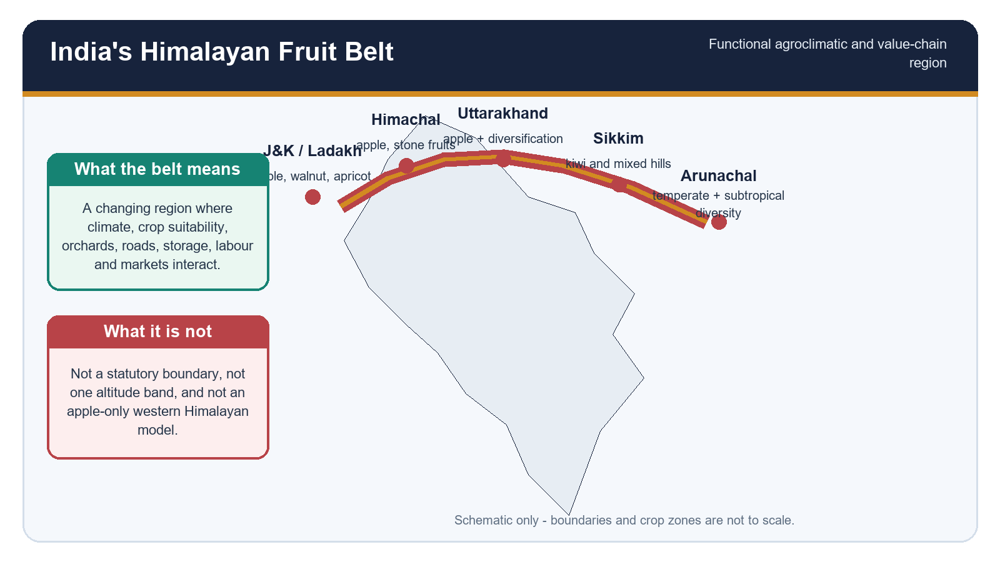

*Caption: A broad India-centred schematic of differentiated Himalayan fruit regions. Original deterministic study schematic; not to scale.*

**Current / teaching focus:** Repository Markdown was read first, local OCR-searchable books and official PYQ scans second, and live primary sources third. Qdrant was not required.

| Layer | Question | Rule |
| --- | --- | --- |
| Physical geography | What combination of altitude, relief, weather and soil exists? | Avoid one uniform Himalaya |
| Crop physiology | Can dormancy, chill, heat and frost-free growth align? | Use cultivar-specific requirements |
| Orchard system | Can site, rootstock, water, pollination and skills work together? | Density alone is not technology |
| Value chain | Can fruit retain quality and reach a remunerative market? | Separate yield from realised value |
| Policy | What stage has actually been reached? | Eligibility != approval != outcome |

### Core teaching

- [FACT] A fruit belt is a functional agroclimatic and value-chain region, not a fixed legal boundary.
- [ANALYSIS] The term combines environmental suitability with orchard concentration, knowledge, labour, roads, packhouses, storage, marketing and institutions.
- [LIMIT] Crop occurrence does not prove a commercially integrated belt; a market label does not prove climatic homogeneity.
- [RULE] Dynamic evidence is labelled FACT, STATUS, FORECAST, INFERENCE or LIMIT with retrieval date 19 August 2026.
- [RULE] Altitude bands and textbook climatic numbers are broad source contexts, not sharp Himalayan contour lines.
- [RULE] Historical expansion, recent suitability change and projected future change answer different questions.
- [RULE] Programme approval, expenditure, asset creation, utilisation and farmer outcome remain separate metrics.

### Must-know facts

- Himalayan fruit geography must be read longitudinally and vertically.
- Apple is important but does not represent every Himalayan sector.
- The complete answer sequence is climate and land -> plant physiology -> orchard management -> value chain -> governance.

### UPSC traps

- **Wrong:** Fruit belt means a notified government zone. **Correct:** It is primarily an analytical functional region; specific schemes may separately notify clusters.
- **Wrong:** A crop map is enough to explain the belt. **Correct:** Process and value-chain links are required.

**Mains use:** Open with the functional-region definition and a west-central-east map before discussing crops.

**Study link:** Geography 13, 14, 16, 22-25 and 30; Economy 13-15

---

## 2. Core Vocabulary: Fruit Belt, Pomology and Orchard Economy

*Caption: Vocabulary firewall for the Himalayan fruit-belt question. Original deterministic study schematic; not to scale.*

**Current / teaching focus:** Definitions establish the analytical units before any crop or district list.

| Term | Exam-safe meaning | Do not confuse with |
| --- | --- | --- |
| Fruit belt | Concentrated crop-value-chain region shaped by climate, orchards and market infrastructure | Statutory boundary |
| Temperate horticulture | Fruit production requiring a cool-season physiology, often including dormancy and chilling | Any crop at high altitude |
| Subtropical hill horticulture | Warm-to-mild hill crops with different cold and moisture needs | Lowland-only agriculture |
| Orchard economy | Tree-crop production plus labour, inputs, credit, packing, storage, trade and processing | Orchard area alone |
| Pomology | Science and practice of fruit crops | General floriculture |
| Phenology | Seasonal timing of bud break, bloom, fruit set, maturity and leaf fall | Climate trend by itself |
| Dormancy | Temporary suspension / control of visible growth in buds | Plant death |
| Frost-free period | Interval with sufficiently low frost risk for sensitive growth | A guarantee against hail or heat |

### Core teaching

- [FACT] Pomology includes cultivar, rootstock, flowering, fruit set, growth, harvest and post-harvest quality questions.
- [ANALYSIS] Orchard economy is perennial and sunk-cost intensive: a wrong site or planting-material choice locks risk in for years.
- [ANALYSIS] Phenology is the bridge between climate and yield because damaging weather matters differently at dormancy, bloom, fruit set and harvest.
- [FACT] Chill accumulation and heat units are physiological indices; altitude only influences them indirectly through local climate.
- [LIMIT] A frost-free period is a probability-based climatic description, not immunity from an individual late frost.
- [ANALYSIS] The same district can contain subtropical, intermediate and temperate systems along an elevation and valley gradient.

### Must-know facts

- Tree crops create delayed returns and replacement costs.
- Weather at bloom can matter more than the seasonal average.
- Value realisation depends on quality class and timing, not only tonnes.

### UPSC traps

- **Wrong:** Temperate means permanently cold. **Correct:** Temperate fruit needs include a winter rest and a suitable growing season.
- **Wrong:** Phenology proves climate change. **Correct:** Phenology is evidence only after period, site, cultivar and other controls are stated.

**Mains use:** Use definitions as a two-line introduction, then immediately show interactions.

**Study link:** Basic 19 Mediterranean orchard analogue; advanced 19 India fruit belt

---

## 3. Himalayan Physical Template

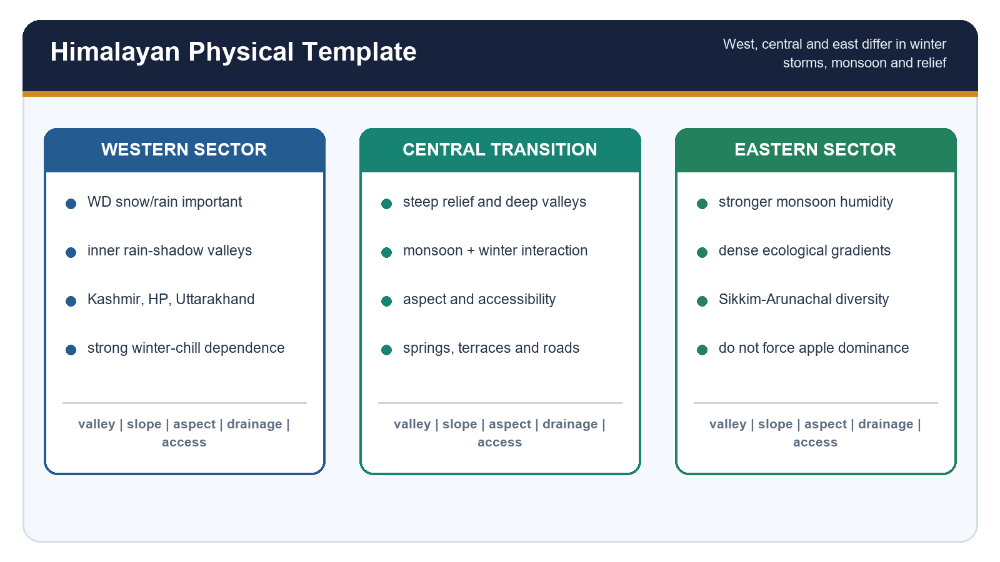

*Caption: Longitudinal and altitudinal diversity prevents a single Himalayan fruit model. Original deterministic study schematic; not to scale.*

**Current / teaching focus:** Relief, latitude, valley orientation, aspect, rain shadow, snow, western disturbances, monsoon exposure, drainage, soils and access interact.

| Control | Western / inner Himalaya | Eastern / humid Himalaya | Orchard implication |
| --- | --- | --- | --- |
| Winter systems | Western disturbances can supply rain and snow | Less dominant than monsoon influence | Chill, soil moisture and frost differ |
| Monsoon | Variable; rain shadow in inner valleys | Stronger and more humid | Disease, drainage and crop mix differ |
| Relief | deep valleys, terraces, inner dry basins | steep, dissected and ecologically dense | mechanisation and road access vary |
| Aspect / inversion | cold-air pools and sunny / shaded slopes | cloud, fog and moisture interact | microclimate may reverse simple altitude logic |
| Soils | mountain soils vary by parent material and slope position | brown / red and highly leached soils occur in humid sectors | soil depth and drainage decide root performance |

### Core teaching

- [FACT] The Himalaya is a mountain system with sharp local climatic transitions; broad sectors are educational simplifications.
- [ANALYSIS] Valley floors can be colder at night than adjacent slopes under inversion, creating frost pockets despite lower elevation.
- [ANALYSIS] South-facing slopes may warm earlier and accumulate heat faster, but can also face moisture stress; north-facing effects differ by latitude, elevation and water.
- [FACT] Western disturbances are important to western Himalayan winter precipitation; they are neither uniformly beneficial nor the sole winter control.
- [ANALYSIS] Snow can store water and insulate soil, yet heavy wet snow can break limbs or damage support systems.
- [ANALYSIS] Accessibility is geographical: steep roads, landslides, seasonal closure and long travel time alter the effective value of a suitable orchard site.
- [LIMIT] One lapse-rate assumption cannot generate crop zones across all sectors, aspects and seasons.

### Must-know facts

- Read the Himalaya as a climate-relief-access mosaic.
- Rain shadow is especially relevant to inner and trans-Himalayan fruit systems.
- Microclimate can differ over short horizontal distances.

### UPSC traps

- **Wrong:** Higher always means wetter. **Correct:** Inner high valleys may be arid because of rain shadow.
- **Wrong:** The Himalaya is an impermeable wall. **Correct:** Passes, valleys and circulation pathways create regional variation.

**Mains use:** Draw a three-sector strip and add altitude, aspect and valley-floor inversion.

**Study link:** Geography 04, 06, 13, 14, 16, 22-25

---

## 4. Altitudinal Crop Zonation

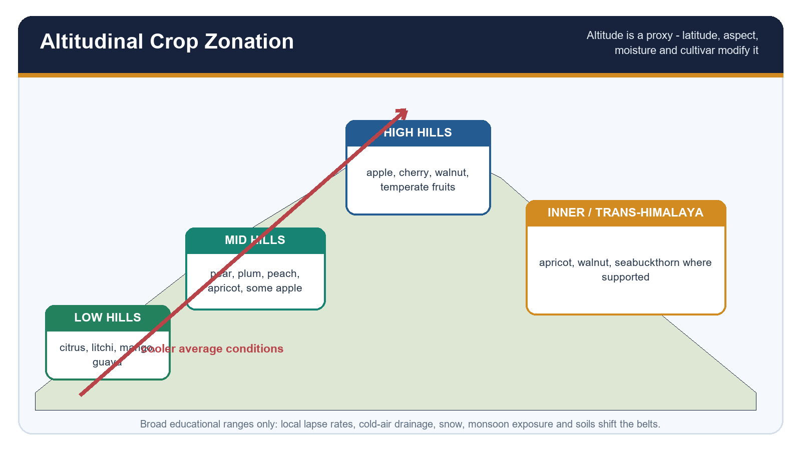

*Caption: Broad crop bands are source-safe only when altitude is treated as a proxy rather than an independent cause.. Original deterministic study schematic; not to scale.*

**Current / teaching focus:** Broad crop bands are source-safe only when altitude is treated as a proxy rather than an independent cause.

| Broad belt | Indicative crops | Dominant controls | Caveat |
| --- | --- | --- | --- |
| Low hills / subtropical | citrus, litchi, mango, guava where suitable | winter mildness, heat, monsoon and irrigation | not every Himalayan foothill supports each crop |
| Mid hills / intermediate | pear, plum, peach, apricot; apple in suitable pockets | moderate chill, frost timing, water and disease | cultivar and aspect shift limits |
| High hills / temperate | apple, cherry, walnut and other temperate fruits | winter chill + growing-season heat + frost-free window | high elevation can become too cold or inaccessible |
| Inner / trans-Himalaya | apricot, walnut, seabuckthorn or dry-fruit systems where official evidence supports | rain shadow, strong radiation, irrigation and short season | water and roads constrain expansion |

### Core teaching

- [FACT] NITI Aayog's 2026 J&K roadmap itself separates low subtropical, intermediate, high-hill and Kashmir temperate settings; overlapping zones permit mixed crops.
- [ANALYSIS] Altitude co-varies with temperature, snow, radiation, humidity, soils, season length and market access; it is therefore a proxy bundle.
- [FACT] NHB's older apple profile gives a broad 1,500-2,700 m Himalayan range, but it is a source-era generalisation and not a cultivar rule.
- [ANALYSIS] Mid-hill diversification can reduce dependence on one apple cultivar, but only if markets and extension exist for replacement crops.
- [FACT] Western Arunachal's official ICAR exploration documents wild Actinidia, Rubus, Ribes, Pyrus and other genetic resources across sub-temperate to alpine gradients.
- [LIMIT] A crop can occur outside the dominant belt through low-chill cultivars, protected sites, irrigation or local selection; occurrence does not erase the regional pattern.

### Must-know facts

- Use low-mid-high-inner as a broad transect, not a legal map.
- Fruit zoning is crop-cultivar-site specific.
- Eastern Himalaya requires a diversity model, not a copied western apple model.

### UPSC traps

- **Wrong:** Altitude causes apple cultivation by itself. **Correct:** Altitude is a climatic and ecological proxy.
- **Wrong:** All high hills favour apple. **Correct:** Excess cold, wind, shallow soil, water shortage and access can make sites unsuitable.

**Mains use:** A labelled transect earns marks when every belt includes both crop examples and a caveat.

**Study link:** Advanced 19, 24 and 25; NITI J&K Roadmap 2026

---

## 5. Chill Physiology: Dormancy Release and Heat Units

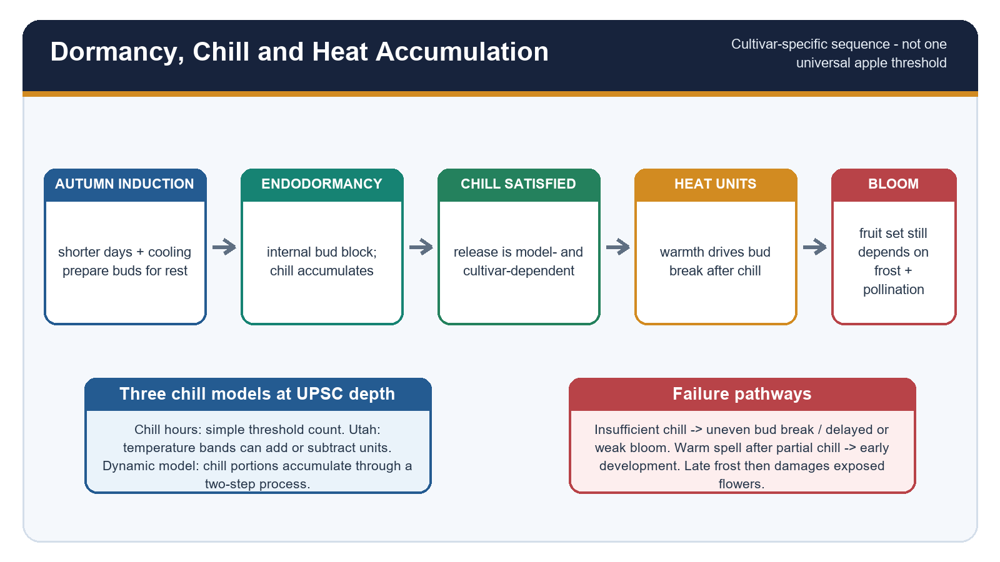

*Caption: The exam sequence is dormancy induction -> chill accumulation -> chill satisfaction -> heat accumulation -> bud break and bloom.. Original deterministic study schematic; not to scale.*

**Current / teaching focus:** The exam sequence is dormancy induction -> chill accumulation -> chill satisfaction -> heat accumulation -> bud break and bloom.

| Concept | Meaning | Use | Limit |
| --- | --- | --- | --- |
| Chill hours | Hours below a selected temperature threshold | Simple communication and some cultivar guidance | Ignores differential temperature effects |
| Utah model | Temperature bands add positive or negative chill units | Recognises that not all cool temperatures are equal | Calibration varies by region |
| Dynamic model | Chill portions form through a two-step process | Often more stable under fluctuating winters | Still needs crop / site calibration |
| Growing degree days | Accumulated heat above a base after dormancy release | Estimates development rate | Base temperature and stage are crop-specific |

### Core teaching

- [FACT] Dormancy is regulated; visible inactivity does not mean physiological inactivity.
- [ANALYSIS] Chilling requirement belongs to a cultivar-rootstock-site system. A single threshold for all apples is scientifically unsafe.
- [FACT] Himachal's official high-density guide states that its named imported high-colouring cultivars require about 800-1,200 hours, less than traditional Delicious types; this is guide-specific, not universal.
- [ANALYSIS] Insufficient chill can produce delayed, prolonged or uneven bud break, weak bloom overlap, reduced fruit set and uneven maturity.
- [ANALYSIS] Chill alone is not enough: heat accumulation after release drives development, while excessive early warmth can expose flowers to later frost.
- [ANALYSIS] Warm spells can create a false-spring pathway when development advances before the last damaging cold event.
- [LIMIT] Chill-hour totals calculated with different thresholds or models are not directly interchangeable.

### Must-know facts

- Chill precedes effective heat accumulation for normal spring development.
- Low-chill does not mean no-chill.
- Bud break, bloom and fruit set are separate stages.

### UPSC traps

- **Wrong:** Every apple needs 1,000 chill hours. **Correct:** Requirements vary by cultivar and model.
- **Wrong:** Warmer spring always improves yield. **Correct:** Early development can increase late-frost exposure.

**Mains use:** Explain the sequence with a process chain and one failure pathway.

**Study link:** Himachal high-density package; ICAR coloured-strain case

---

## 6. Seasonal Climate Controls and Phenology

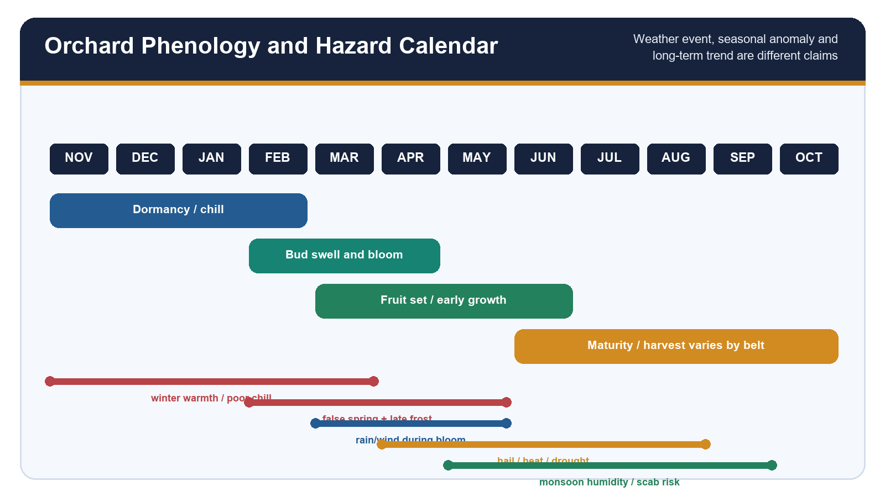

*Caption: Winter chill, spring bloom weather, summer heat and monsoon humidity affect different physiological stages.. Original deterministic study schematic; not to scale.*

**Current / teaching focus:** Winter chill, spring bloom weather, summer heat and monsoon humidity affect different physiological stages.

| Season / stage | Helpful condition | Risk | Likely effect |
| --- | --- | --- | --- |
| Winter dormancy | adequate cultivar-specific chill; soil-water recharge | warm winter or damaging snow load | uneven bud break or structural damage |
| Bud break / bloom | mild dry weather and pollinator flight | late frost, rain, wind, cold | flower injury or poor pollen transfer |
| Fruit set / growth | water, nutrients and moderate heat | drought, heat, hail | drop, sunburn, size or quality loss |
| Monsoon / maturity | soil moisture where drainage is safe | humidity, scab, heavy rain, erosion | quality and access loss |
| Harvest | dry handling window and functioning roads | rain, bruising, blocked routes | post-harvest loss and lower grade |

### Core teaching

- [ANALYSIS] Winter snow can support soil moisture but snow cover, snow-water equivalent and later irrigation availability must be measured separately.
- [FACT] Many apple cultivars require cross-pollination; cold, rain and strong wind during bloom can reduce bee activity even when pollinizer trees are present.
- [ANALYSIS] Sunshine and diurnal range influence colour and quality, but cultivar, canopy light and harvest maturity also matter.
- [ANALYSIS] Summer heat can accelerate development while reducing colour or causing sunburn; the response differs by elevation and cultivar.
- [FACT] Monsoon humidity and wetness can favour fungal disease; official advisories should determine any spray choice.
- [RULE] A weather event is one episode; a seasonal anomaly is departure in one season; a climate trend requires a multi-year record; adaptation is a decision under these uncertainties.
- [LIMIT] A poor crop cannot be attributed to climate without examining pollination, pruning, nutrition, pests, alternate bearing and market grading.

### Must-know facts

- Weather matters through stage-specific exposure.
- Pollination weather is a production input.
- Disease risk depends on host, pathogen and suitable weather.

### UPSC traps

- **Wrong:** Snowfall automatically guarantees a good apple crop. **Correct:** Chill, water, bloom weather and orchard management still determine outcome.
- **Wrong:** Rain is always beneficial in mountains. **Correct:** Timing, intensity, drainage and disease decide the effect.

**Mains use:** Use a month strip and distinguish event, anomaly and trend in the conclusion.

**Study link:** Geography 13 and 16; IMD agromet services

---

## 7. Western Himalayan Apple Geography

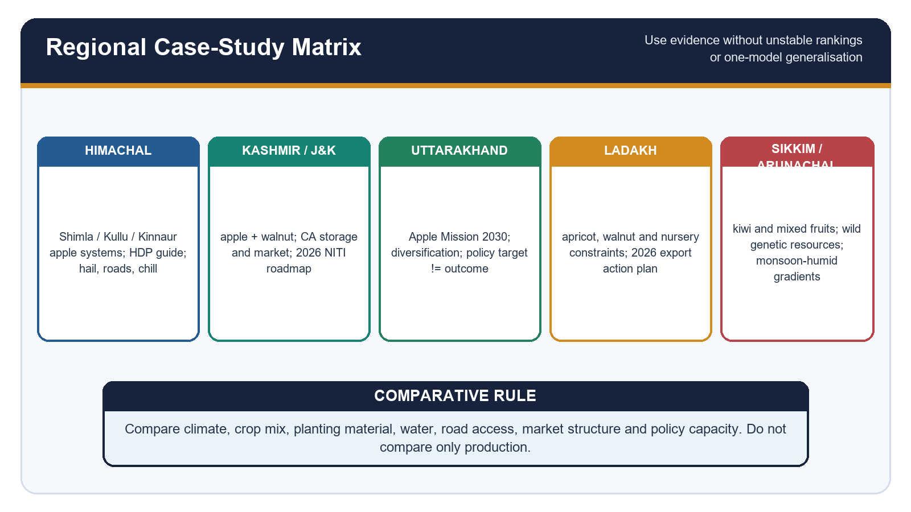

*Caption: Himachal Pradesh, Kashmir/J&K and Uttarakhand share temperate horticulture but differ in relief, crop mix, institutions and market structure.. Original deterministic study schematic; not to scale.*

**Current / teaching focus:** Himachal Pradesh, Kashmir/J&K and Uttarakhand share temperate horticulture but differ in relief, crop mix, institutions and market structure.

| Region | Source-safe examples | Distinctive issue | Caution |
| --- | --- | --- | --- |
| Himachal Pradesh | Shimla, Kullu and Kinnaur belts | HDP transition, hail, steep roads, elevation and colour | do not infer one statewide shift |
| Kashmir / J&K | Baramulla-Kupwara-Bandipora; Budgam-Shopian-Pulwama; Kulgam-Anantnag clusters in NITI 2026 | apple concentration, CA storage, imports and market logistics | roadmap uses dated datasets |
| Uttarakhand | Almora, Pithoragarh, Tehri, Uttarkashi and Chamoli in older NHB profile | low productivity in policy baseline and diversification | mission targets are not achievements |

### Core teaching

- [FACT] The authored advanced owner identifies Kullu, Shimla, Kashmir Valley and hilly Uttarakhand as core apple geographies.
- [FACT] NITI's April 2026 roadmap reports apple at about half of J&K fruit area and over three-quarters of fruit production in 2022-23; these are report-year data, not 2026 production.
- [ANALYSIS] The western apple belt is created by winter physiology plus labour, nursery networks, road corridors, packing and storage.
- [ANALYSIS] Historical expansion may reflect state support, roads, cultivars, prices, land-use decisions and farmer learning as well as climate.
- [ANALYSIS] Recent upward or northward suitability change can be discussed only with named station/crop evidence; farmer perception is valuable but separate.
- [LIMIT] Upward movement is bounded by shallow soils, forests, tenure, water, cold injury, short seasons and high transport costs.
- [ANALYSIS] Kashmir walnut and saffron matter as diversification and land-use context, not as substitutes for an apple analysis.

### Must-know facts

- Use district examples only when sourced and relevant.
- J&K apple clusters differ in productivity and access.
- The belt is climate-plus-connectivity.

### UPSC traps

- **Wrong:** All western Himalayan apple orchards are moving upward. **Correct:** Movement is uneven and multi-causal.
- **Wrong:** Kashmir is a Mediterranean climate. **Correct:** It is a temperate horticultural analogue, not a classic Cs climate.

**Mains use:** Compare three regions through the same six axes: climate, site, crop system, water, value chain and institutions.

**Study link:** Advanced 19; NITI J&K 2026; Uttarakhand Apple Mission

---

## 8. Eastern Himalaya, Northeast and Trans-Himalayan Diversity

*Caption: The eastern and trans-Himalayan systems require different crop and moisture models.. Original deterministic study schematic; not to scale.*

**Current / teaching focus:** The eastern and trans-Himalayan systems require different crop and moisture models.

| Subregion | Verified crop / resource cue | Physical logic | Development route |
| --- | --- | --- | --- |
| Sikkim / eastern hills | kiwi and mixed subtropical-temperate horticulture where state evidence supports | humid monsoon, steep gradients and fog | quality, drainage and niche markets |
| Western Arunachal | wild Actinidia, Rubus, Ribes, Pyrus and other fruit genetic resources | sub-temperate to alpine diversity | conservation + breeding + indigenous knowledge |
| Ladakh / inner valleys | apricot, walnut, apple nursery and stone-fruit systems | rain shadow, strong radiation, irrigation and road seasonality | quality planting material + processing + logistics |
| Northeast hills broadly | citrus, pineapple, pear, peach or plum by local zone | humid subtropical / temperate mosaics | avoid western apple monoculture template |

### Core teaching

- [FACT] ICAR's October 2025 western Arunachal expedition, posted 18 June 2026, collected 71 accessions representing 19 genera and 13 families.
- [FACT] The same official account recorded wild kiwi and major Rubus diversity, linking conservation to climate-resilient crop improvement.
- [ANALYSIS] Genetic-resource richness is not the same as a commercial value chain; domestication, propagation, standards and markets are additional stages.
- [FACT] ICAR-CITH pages document transfer of clonal-rootstock, feathered apple, walnut and stone-fruit propagation technologies to Ladakh nursery entrepreneurs; the public pages did not expose a reliable event date, so no exact date is claimed.
- [FACT] Ladakh's 9 July 2026 official apricot release describes an action plan for a 1,000 MT export initiative with FPOs, collection centres, grading, packaging, cold chain and road contingency.
- [STATUS] The Ladakh document records planned procurement and logistics; it does not by itself prove that the full quantity was exported.
- [LIMIT] Sikkim and Arunachal should not be described as a continuous apple-dominant belt.

### Must-know facts

- Eastern Himalaya = biodiversity and humid-gradient model.
- Ladakh = dry high-altitude water-logistics model.
- Wild genetic resource != commercial cultivar.

### UPSC traps

- **Wrong:** Northeast horticulture is simply western apple cultivation farther east. **Correct:** Crop mix and moisture regime are different.
- **Wrong:** An export MoU proves export completion. **Correct:** Procurement, shipment and payment outcomes require later evidence.

**Mains use:** Use Arunachal and Ladakh as contrasts showing why the Himalaya cannot be one belt.

**Study link:** Advanced 24-25; ICAR and UT Ladakh 2026

---

## 9. Orchard-Site Science

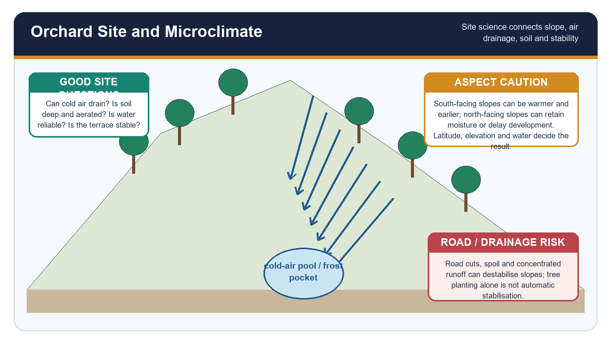

*Caption: A correct cultivar on a wrong slope, soil or drainage position remains a poor orchard decision.. Original deterministic study schematic; not to scale.*

**Current / teaching focus:** A correct cultivar on a wrong slope, soil or drainage position remains a poor orchard decision.

| Site variable | Why it matters | Diagnostic question | Management implication |
| --- | --- | --- | --- |
| Slope position | air and water move downslope | Is it a frost pocket or runoff concentration zone? | retain air drainage and safe drains |
| Aspect | changes radiation, heat and moisture | Will bloom advance or moisture stress rise? | match cultivar and water plan |
| Soil depth / structure | controls rooting and storage | Is there restrictive rock, compaction or shallow fill? | test before planting |
| Drainage / aeration | roots need oxygen; collar rot risk rises in wet sites | Where does intense rain go? | raised rows, cut-off drains or avoid site |
| Wind | affects evapotranspiration, fruit rub and pollinator flight | Is exposure seasonal? | windbreak without shading / turbulence penalty |
| Terrace stability | concentrated water and cuts alter slope | Is the terrace engineered and maintained? | stabilise drainage and avoid spoil dumping |

### Core teaching

- [FACT] Himachal's official high-density guide requires soil testing at 0-30 cm and 30-60 cm, drainage planning and terrace preparation where appropriate.
- [ANALYSIS] Cold-air drainage is as important as average elevation because dense cold air can collect on valley floors and behind barriers.
- [FACT] The guide links rootstock choice to elevation, soil fertility, water and aeration; rootstock is therefore a site decision, not a catalogue choice.
- [ANALYSIS] Pollinizer layout should account for compatible bloom and bee movement, not merely percentage of trees.
- [ANALYSIS] Windbreaks can protect flowers and fruit but badly designed barriers can shade rows, compete for water or create turbulence.
- [ANALYSIS] South-facing versus north-facing advice cannot be universalised without latitude, elevation, season and irrigation context.
- [LIMIT] Slope clearing followed by orchard planting is not automatic landslide mitigation; root depth, drainage, cut geometry and road spoil remain decisive.

### Must-know facts

- Map frost pocket, runoff path and access before planting.
- Soil pH alone is not a complete soil test.
- Deep, aerated and drainable soil is a perennial asset.

### UPSC traps

- **Wrong:** Flat valley floor is always safest. **Correct:** It may be a cold-air and waterlogging pocket.
- **Wrong:** Trees stabilise every slope. **Correct:** Poor drainage and cuts can overwhelm root reinforcement.

**Mains use:** Draw a valley cross-section with cold-air pooling, stable terrace and drainage arrows.

**Study link:** Geography 04; Himachal high-density package

---

## 10. Cultivars, Rootstocks and Orchard Systems

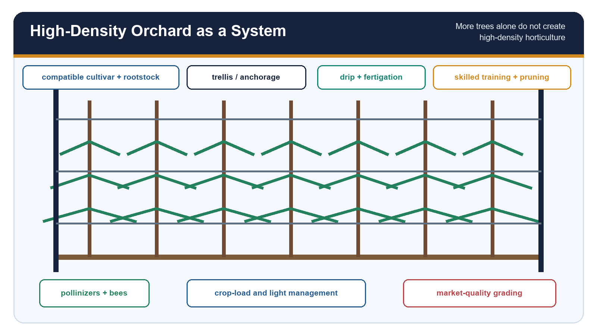

*Caption: Standard and high-density orchards are different production systems, not just different tree counts.. Original deterministic study schematic; not to scale.*

**Current / teaching focus:** Standard and high-density orchards are different production systems, not just different tree counts.

| Dimension | Standard / seedling system | High-density clonal system | Decision issue |
| --- | --- | --- | --- |
| Tree vigour | large, slower to bear | controlled, precocious | rootstock-site compatibility |
| Support | may be self-supporting | dwarfing stocks often require lifelong trellis | wind, rain and anchorage |
| Canopy | large framework and wider spacing | narrow trained wall / spindle | light and skilled pruning |
| Water / nutrients | broader root exploration | small intensive root zone | reliable drip / fertigation |
| Investment | lower density but longer gestation | high initial system cost | credit and price risk |
| Quality | variable canopy light | potentially uniform if managed | crop load and grading |

### Core teaching

- [FACT] Himachal's guide states that M9 is shallow-rooted and needs support; trellis can also carry anti-hail nets.
- [FACT] The guide recommends at least three to four pollinizer cultivars and a stated orchard proportion in its project context; this is a package recommendation, not a universal formula.
- [ANALYSIS] High density requires certified planting material, rootstock knowledge, trellis, irrigation, fertigation, training, pruning, crop-load management and a quality market.
- [FACT] MIDH 2025 separately lists high-density apple with support system and a minimum plant count for its cost norm; that administrative norm should not be mistaken for biological sufficiency.
- [ANALYSIS] Rejuvenation is appropriate where framework and roots remain useful; replacement is better when cultivar, rootstock, disease status or site is fundamentally wrong.
- [ANALYSIS] Nursery accreditation and clean planting material reduce disease and identity risk, but survival and long-term performance still need field management.
- [LIMIT] A demonstration yield or a project brochure cannot be converted into the expected yield for every farm.

### Must-know facts

- Rootstock controls vigour but also interacts with soil and water.
- HDP success is system success.
- Plant identity and health are value-chain foundations.

### UPSC traps

- **Wrong:** High density means planting many trees closely. **Correct:** The support-management-market package defines the system.
- **Wrong:** Dwarfing rootstock is best everywhere. **Correct:** Weak soils, water stress, wind or poor support can make it unsuitable.

**Mains use:** Contrast systems in a matrix, then give conditional criteria for adoption.

**Study link:** MIDH 2025; Himachal package; ICAR-CITH nursery technology

---

## 11. Pollination Biology and Ecosystem Services

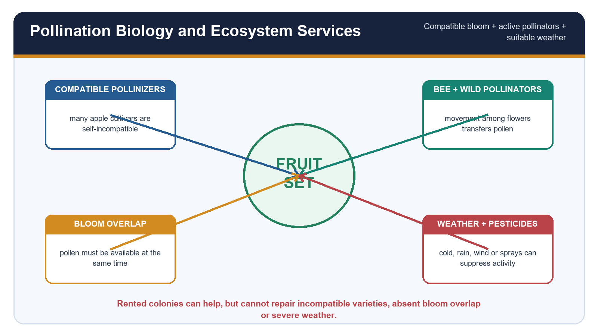

*Caption: Fruit set emerges from genetic compatibility, bloom overlap, pollinator activity and suitable weather.. Original deterministic study schematic; not to scale.*

**Current / teaching focus:** Fruit set emerges from genetic compatibility, bloom overlap, pollinator activity and suitable weather.

| Component | Function | Failure | Response |
| --- | --- | --- | --- |
| Self-incompatibility | prevents same-genotype fertilisation in many apples | poor fruit set in monocultivar blocks | compatible pollinizers |
| Bloom overlap | makes viable pollen available | early / late mismatch | multiple compatible pollinizers |
| Honeybees | move pollen among flowers | cold, rain, wind, weak colonies | timed colony placement and habitat |
| Wild pollinators | add functional diversity | habitat loss and pesticide exposure | flower resources and safe refuges |
| Pesticide timing | controls pests / disease | sprays during bloom can harm pollinators | official need-based advice and safer timing |

### Core teaching

- [FACT] Many commercial apple cultivars are self-incompatible and need compatible pollen from overlapping bloom.
- [ANALYSIS] A pollinizer is a pollen-source cultivar; a pollinator is the animal vector. The distinction is a classic Prelims trap.
- [FACT] MIDH includes bee-keeping for crop pollination as a mission element, but programme support does not guarantee orchard fruit set.
- [ANALYSIS] Rented honeybee colonies cannot compensate for incompatible cultivars, no bloom overlap, severe cold-rain-wind or pesticide injury.
- [ANALYSIS] Wild pollinators add resilience because species differ in weather tolerance and foraging behaviour.
- [ANALYSIS] Orchard-floor flowers can support pollinators but must be managed with competition, mowing and spray safety in mind.
- [LIMIT] Fruit set also depends on flower health, nutrition, frost injury and alternate bearing; pollination is necessary but not sufficient.

### Must-know facts

- Pollinizer != pollinator.
- Compatibility and synchrony precede bee numbers.
- Avoid harmful sprays during bloom unless an official emergency protocol requires action.

### UPSC traps

- **Wrong:** More bee boxes always guarantee yield. **Correct:** Genetics, weather and flower condition can still constrain set.
- **Wrong:** Self-fertile and self-compatible are interchangeable for all practical purposes. **Correct:** Cultivar behaviour and field conditions still need verification.

**Mains use:** Use the four-part fruit-set equation and one explicit limitation.

**Study link:** Environment ecosystem services; Himachal guide managed pollination

---

## 12. Water, Soil and Slope Sustainability

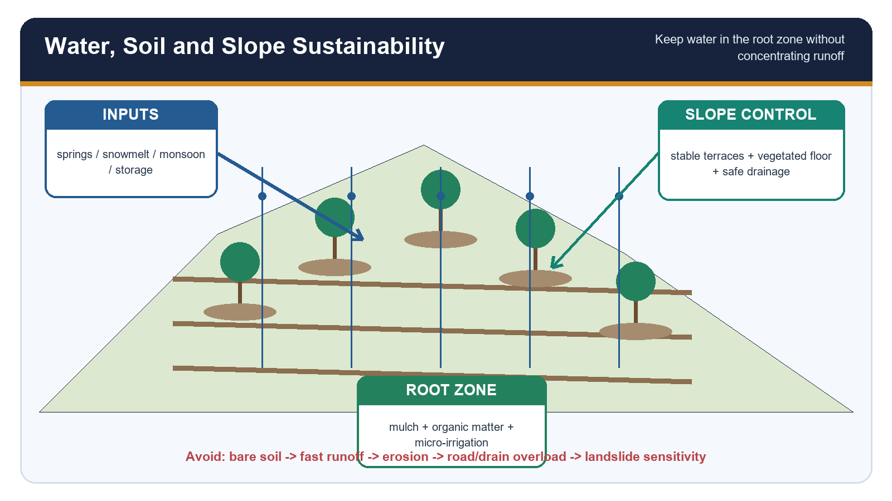

*Caption: The sustainable objective is reliable root-zone water, living soil and safe drainage without exporting risk downslope.. Original deterministic study schematic; not to scale.*

**Current / teaching focus:** The sustainable objective is reliable root-zone water, living soil and safe drainage without exporting risk downslope.

| Intervention | Benefit | Risk / rebound | Indicator |
| --- | --- | --- | --- |
| Micro-irrigation | timely water to root zone | expansion can raise total demand | water source + applied volume |
| Mulch | moisture, temperature and weed moderation | fire, rodents or plastic waste by material | soil moisture and cover |
| Organic matter | aggregation, infiltration and nutrient cycling | poorly composted material / imbalance | SOC and structure |
| Orchard-floor vegetation | erosion control and ecosystem services | water / nutrient competition | cover, erosion and tree response |
| Terracing and drains | reduce slope length and route water | failure if outlets concentrate flow | inspection after heavy rain |
| Spring / snowmelt storage | buffers timing | source variability and competing use | seasonal discharge and storage reliability |

### Core teaching

- [ANALYSIS] Springs, snowfall, snowmelt and monsoon rainfall have different seasonal timing and reliability; orchard water budgets must keep them separate.
- [FACT] IMD's 18 August 2026 bulletin advised mulch maintenance in apple basins in Kinnaur and Lahaul-Spiti and warned of heavy rain and local landslide / mudslide risk elsewhere.
- [ANALYSIS] Micro-irrigation improves field efficiency but does not prove basin savings if irrigated area or intensity expands.
- [FACT] ICAR-IGFRI's 2026 hortipasture page presents perennial grasses and legumes between apple / almond rows as a fodder-soil-cover system; its reported field outcomes remain technology-specific.
- [ANALYSIS] Bare orchard floors increase raindrop impact and runoff; unmanaged dense vegetation may compete for water or shelter pests.
- [ANALYSIS] Road-cut spoil and blocked culverts can concentrate runoff into orchards and slopes, making transport engineering part of horticulture resilience.
- [LIMIT] Tree roots cannot stabilise deep-seated failures or compensate for saturated fill, toe cutting or failed drainage.

### Must-know facts

- Water efficiency must be measured with total use.
- Keep vegetative cover where compatible with orchard water balance.
- Inspect drains and retaining structures before and after intense rain.

### UPSC traps

- **Wrong:** Drip irrigation automatically saves watershed water. **Correct:** Farm efficiency and total basin use are different.
- **Wrong:** Any ground cover is beneficial at all times. **Correct:** Species, competition, mowing and fire risk matter.

**Mains use:** Link root-zone management to downslope externalities and a measurable water budget.

**Study link:** Geography 04 and 06; Economy irrigation owner; ICAR-IGFRI

---

## 13. Hazards, Pests and Risk Management

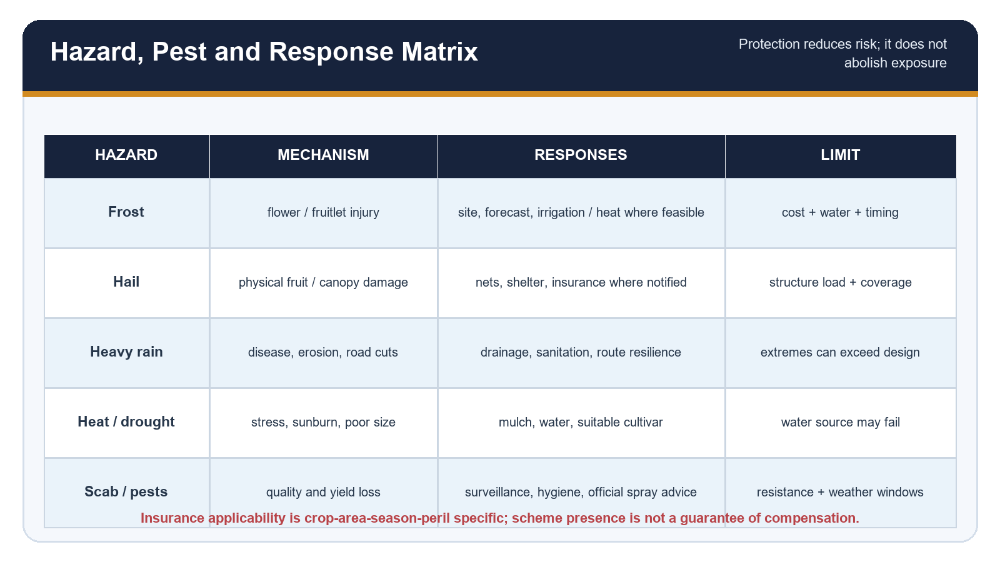

*Caption: Risk management must be stage-specific, source-advised and honest about residual risk.. Original deterministic study schematic; not to scale.*

**Current / teaching focus:** Risk management must be stage-specific, source-advised and honest about residual risk.

| Threat | Exposure pathway | Response set | Limit |
| --- | --- | --- | --- |
| Late frost | bloom / fruitlet tissue exposed after warm spell | site, forecast, compatible cultivar, active protection where feasible | water, labour, inversion and timing |
| Hail | fruit and canopy impact | nets / structures, forecast, insurance where notified | capital cost and structural load |
| Heavy rain | disease, erosion, landslide and blocked roads | drainage, sanitation, route contingency | extreme intensity may exceed capacity |
| Drought / heat | water stress, sunburn, poor size or colour | mulch, irrigation, canopy and crop choice | source scarcity |
| Scab / pests | leaf and fruit quality loss | surveillance, hygiene, resistant material and official spray window | resistance and weather |
| Snow / wind | limb, trellis or fruit rub damage | training, support, shelter and repair plan | rare extremes |

### Core teaching

- [FACT] NHB's older apple profile lists apple scab, collar rot, woolly apple aphid and San Jose scale among important threats; current control must follow current official advisories, not old chemical schedules.
- [FACT] IMD Bulletin 63/2026, issued 18 August, warned of heavy to very heavy rain at isolated places and possible partial horticulture damage and landslides / mudslides.
- [FACT] The bulletin advised avoiding spraying under persistent overcast / high humidity, maintaining air circulation, suspending harvest during or immediately after rain, and removing fallen diseased fruit in its Solan unit.
- [ANALYSIS] Anti-hail nets reduce direct impact but add cost, wind / snow load, maintenance and possible light or canopy effects.
- [ANALYSIS] Frost protection methods work only under particular atmospheric, water and operational conditions; no method offers universal protection.
- [FACT] Crop-insurance applicability depends on notified crop, area, season and peril; apple cannot be assumed covered everywhere each year.
- [LIMIT] A scheme or advisory is an input to resilience, not evidence that loss was prevented.

### Must-know facts

- Use live local advisories for pest and spray decisions.
- Hazard protection has engineering and ecological limits.
- Insurance transfers specified financial risk; it does not remove physical risk.

### UPSC traps

- **Wrong:** Anti-hail net removes hail risk. **Correct:** It reduces exposure subject to design, coverage and maintenance.
- **Wrong:** PMFBY covers every apple loss. **Correct:** Coverage is notification- and peril-specific.

**Mains use:** Write hazard -> stage -> exposure -> response -> residual risk.

**Study link:** IMD 18 Aug 2026; PMFBY; MIDH anti-hail norms

---

## 14. Climate Change: Evidence, Limits and Adaptation

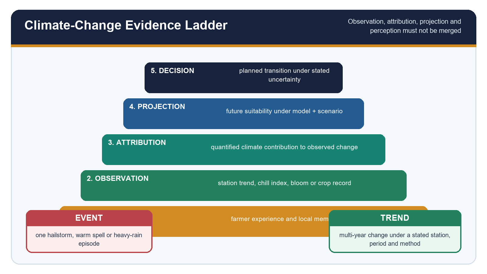

*Caption: Separate observed station/crop evidence, attribution, projections and farmer perception before prescribing adaptation.. Original deterministic study schematic; not to scale.*

**Current / teaching focus:** Separate observed station/crop evidence, attribution, projections and farmer perception before prescribing adaptation.

| Evidence type | Example | What it supports | What it cannot prove alone |
| --- | --- | --- | --- |
| Station observation | temperature, snowfall or chill-index series | local trend under stated period | crop cause without agronomic data |
| Crop observation | bloom date, fruit set, yield or quality | biological response | climate attribution without controls |
| Farmer perception | reported shift or new hazard timing | hypothesis and local experience | measured regional trend |
| Projection | future chill / suitability under model scenario | planning range | certain farm outcome |
| Event record | one frost, hail or heavy-rain episode | exposure and loss pathway | long-term trend by itself |

### Core teaching

- [FACT] ICAR's Himachal coloured-strain case explicitly identifies poor colour at lower elevation and delayed maturity at higher elevation under a climate-change framing, while reporting a specific intervention history.
- [LIMIT] That success story is not a complete controlled attribution study for all Himachal orchards.
- [ANALYSIS] Warming can reduce chill at marginal low sites, advance heat accumulation, change bloom timing and interact with late frost; effects can differ among cultivars and valleys.
- [ANALYSIS] Extreme rain, hail timing, heat and humidity can alter quality, disease and road reliability even where annual means remain suitable.
- [ANALYSIS] Pest and disease ranges can change with temperature and wetness, but surveillance evidence is needed before claiming a particular shift.
- [ANALYSIS] Upward suitability is not unlimited: land, forest, tenure, shallow soils, water, protected areas, cold injury and market distance constrain it.
- [RULE] Adapt first through site-crop-cultivar-rootstock matching and diversification; do not present higher-altitude migration as the only solution.

### Must-know facts

- Climate impact is a chain, not a slogan.
- Projection is conditional on model and scenario.
- Adaptation can create land and water trade-offs.

### UPSC traps

- **Wrong:** One warm winter proves long-term chill decline. **Correct:** A multi-year comparable series is required.
- **Wrong:** Apple can simply move upward indefinitely. **Correct:** Ecological and institutional ceilings apply.

**Mains use:** Use the evidence ladder and attach one limitation to every climate claim.

**Study link:** Environment climate science; Geography 06, 13 and 14

---

## 15. Horticulture Transition, Rural Economy and Land Use

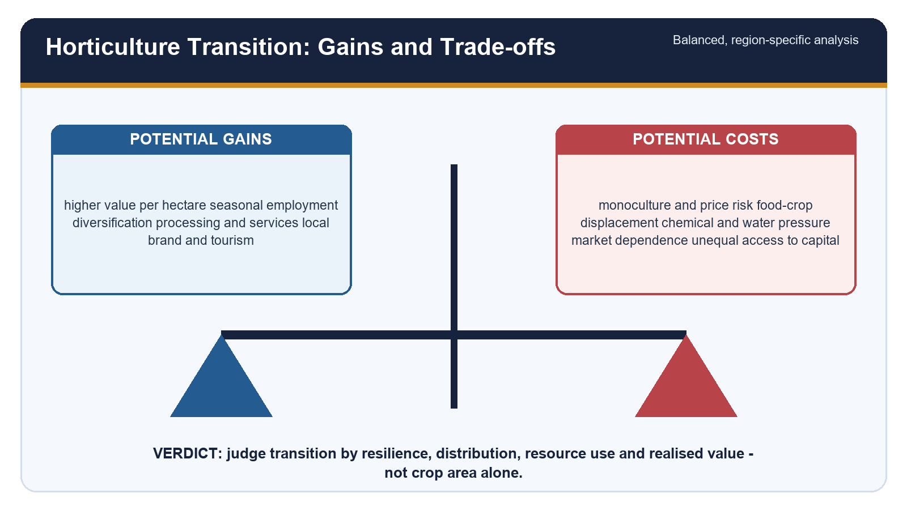

*Caption: Fruit-led diversification can raise value and employment while increasing perennial, market and ecological exposure.. Original deterministic study schematic; not to scale.*

**Current / teaching focus:** Fruit-led diversification can raise value and employment while increasing perennial, market and ecological exposure.

| Potential gain | Transmission route | Counter-risk | Equity question |
| --- | --- | --- | --- |
| Higher gross value | quality fruit and market timing | price crash / grade rejection | who has storage access? |
| Employment | pruning, picking, packing, transport, processing | seasonality and labour shortage | wages and gender roles? |
| Diversification | move from low-value staples to fruit / mixed systems | food-crop displacement | smallholder food security? |
| Asset formation | orchards, trellis, packhouses and CA storage | debt and sunk costs | who can finance transition? |
| Rural services | nurseries, bee-keeping, machinery and tourism | market dependence | local ownership or external capture? |

### Core teaching

- [ANALYSIS] Orchard expansion changes land use for decades; it is less reversible than an annual crop switch.
- [ANALYSIS] A high-value crop can deepen inequality when wealthier farmers control water, trellis capital, certified plants, storage and market information.
- [ANALYSIS] Orchard monoculture raises correlated climate, pest and price risk; crop, cultivar and income diversification reduce but do not eliminate it.
- [FACT] Uttarakhand Apple Mission 2030 is an end-to-end policy design spanning nurseries, model orchards, packhouses, mandis, ropeways, CA stores and processing; its targets and cost norms are plans, not achievements.
- [FACT] ICAR-IGFRI's hortipasture technology shows a possible fruit-livestock integration pathway, with official site-specific claims on fodder and ecosystem services.
- [ANALYSIS] Chemical intensity depends on cultivar susceptibility, humidity, advisory quality and market cosmetic standards; orchard agriculture is not automatically ecological.
- [LIMIT] Income claims require net returns, risk, labour, debt, distribution and time horizon - not gross yield alone.

### Must-know facts

- Tree-crop transition creates path dependence.
- Assess net, risk-adjusted and distributed income.
- Diversification can occur within and beyond the orchard.

### UPSC traps

- **Wrong:** Horticulture always doubles income. **Correct:** Outcome depends on survival, yield, grade, cost, price and market access.
- **Wrong:** Replacing food crops with fruit is automatically modernisation. **Correct:** Food security, water and inequality require assessment.

**Mains use:** Balance gains with perennial lock-in, distribution and resource use.

**Study link:** Indian Society rural change; Economy markets, credit and processing

---

## 16. Value Chain, Markets and Post-Harvest Realisation

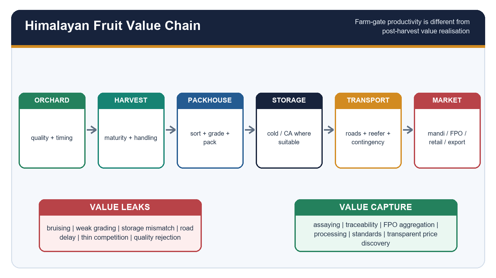

*Caption: The orchard creates biological output; grading, storage, logistics and market institutions convert it into value.. Original deterministic study schematic; not to scale.*

**Current / teaching focus:** The orchard creates biological output; grading, storage, logistics and market institutions convert it into value.

| Stage | Function | Typical failure | Indicator |
| --- | --- | --- | --- |
| Harvest | correct maturity and low injury | premature / wet harvest, bruising | grade-out percentage |
| Packhouse | sorting, grading, packing, traceability | mixed quality and weak standards | pack-out by grade |
| Cold / CA storage | slow deterioration and time market release | wrong temperature / atmosphere or poor utilisation | capacity and utilisation |
| Transport | move quickly across steep terrain | blocked roads, heat breaks, handling loss | time and temperature continuity |
| Market | price discovery and buyer competition | thin bidding / commission dependence | farm-retail price spread |
| Processing | use lower grades and extend shelf life | plant without throughput or market | capacity utilisation and farmer linkage |

### Core teaching

- [FACT] NITI's 2026 J&K roadmap maps post-harvest loss stages, CA stores, market routes and fruit processing as separate value-chain components.
- [ANALYSIS] Controlled-atmosphere storage is especially relevant to apples, but capacity alone does not prove scientific operation, equitable access or better price.
- [FACT] APEDA reports FY26 aggregate fresh-fruit exports of USD 1,161.31 million; its page does not isolate apple in that total, so no apple-export share is inferred.
- [FACT] The 9 July 2026 Ladakh apricot action plan explicitly covered FPOs, collection centres, grading, packaging, cold chain, road monitoring and transparent payment planning.
- [ANALYSIS] FPOs can aggregate quality and bargaining power, but governance, working capital, assaying and professional management determine performance.
- [ANALYSIS] e-NAM can digitise discovery and trade; it cannot replace physical grading, storage, logistics, dispute resolution and buyer competition.
- [ANALYSIS] Imports create quality and price competition, but the effect varies by season, tariff, variety, storage and consumer segment.

### Must-know facts

- Farm-gate yield != farmer value realisation.
- CA storage is a controlled process, not a warehouse label.
- Track price spread and grade-out, not arrivals alone.

### UPSC traps

- **Wrong:** More cold storage automatically raises farmer prices. **Correct:** Ownership, access, operation and market timing decide outcomes.
- **Wrong:** FPO registration creates bargaining power. **Correct:** Volume, quality, governance and buyers are required.

**Mains use:** Draw the chain and mark where quality, time and bargaining power are lost.

**Study link:** Economy 13 and 15; NITI J&K 2026; APEDA; MoFPI

---

## 17. Policy, Governance and Current 2026 Linkage

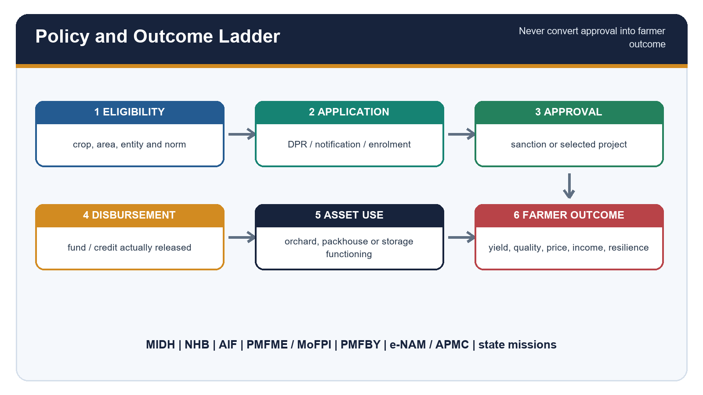

*Caption: Current policy evidence must identify stage, date, scope and outcome limit.. Original deterministic study schematic; not to scale.*

**Current / teaching focus:** Current policy evidence must identify stage, date, scope and outcome limit.

| Instrument | Relevant support | Status discipline | Outcome indicator |
| --- | --- | --- | --- |
| MIDH / state missions | planting material, HDP, pollination, post-harvest, anti-hail | guideline / assistance norm | survival, use, yield, quality |
| NHB | crop guidance, projects and horticulture infrastructure | approval does not prove viability | functioning asset and farmer access |
| AIF | credit support for packhouse, storage, grading and logistics | sanction != disbursement / operation | loan use and throughput |
| MoFPI / cold chain | integrated value-addition infrastructure | project count != loss reduction | temperature continuity and utilisation |
| PMFBY | notified crop-area-season-peril insurance | enrolment != timely settlement | claim ratio, time and basis risk |
| e-NAM / APMC | market access and price discovery | portal != competitive physical market | buyers, assaying and settlement |
| APEDA / GI | standards, market intelligence and export facilitation | GI / registration != export success | compliance and realised trade |

### Core teaching

- [FACT] MIDH Operational Guidelines 2025 were posted 7 May 2026 and emphasise regionally differentiated clusters, quality planting material, HDP, bee-keeping for pollination, cold chain and climate challenges.
- [FACT] The guidelines specify an administrative cost norm for high-density apple with support system and separate anti-hail / anti-bird net support; eligibility and assistance depend on the guideline conditions.
- [STATUS] PIB's 28 July 2026 'Support to Farmers under MIDH' confirms continued institutional and technical support; it does not establish a Himalayan apple outcome.
- [FORECAST / ESTIMATE] PIB's 11 June 2026 Second Advance Estimates put total horticulture area at 301.51 lakh ha and production at about 3777.76 lakh tonnes for 2025-26. These are national estimates, not Himalayan apple results.
- [INFERENCE] The national estimate establishes sector scale only; Himalayan fruit outcomes still require crop-, state- and belt-specific evidence.
- [FACT] NITI Aayog released its J&K horticulture roadmap in April 2026; recommendations, targets and timelines remain proposals until implementation evidence is reported.
- [STATUS] J&K's official horticulture portal invites high-density plantation participation and describes the sector; portal statements should be dated before trend use.
- [LIMIT] Operation Greens / TOP expansion should be invoked only when the official component and crop coverage are shown; it is not a generic label for every apple intervention.
- [RULE] A policy answer must track eligibility -> application -> approval -> disbursement -> asset creation -> utilisation -> farmer outcome.

### Must-know facts

- MIDH is a mission architecture, not one apple subsidy.
- AIF is credit-linked infrastructure support.
- Policy outputs and farm outcomes require different dashboards.

### UPSC traps

- **Wrong:** Scheme approval proves farmer benefit. **Correct:** Disbursement, functioning, use and outcome must follow.
- **Wrong:** GI status guarantees premium price. **Correct:** Quality control, enforcement and market demand are needed.

**Mains use:** Use the policy ladder and label the 2026 item as FACT, STATUS, FORECAST or LIMIT.

**Study link:** MIDH 2025; PIB 2026; NITI 2026; PMFBY; AIF; MoFPI

---

## 18. Regional Synthesis, Adaptation and Monitoring

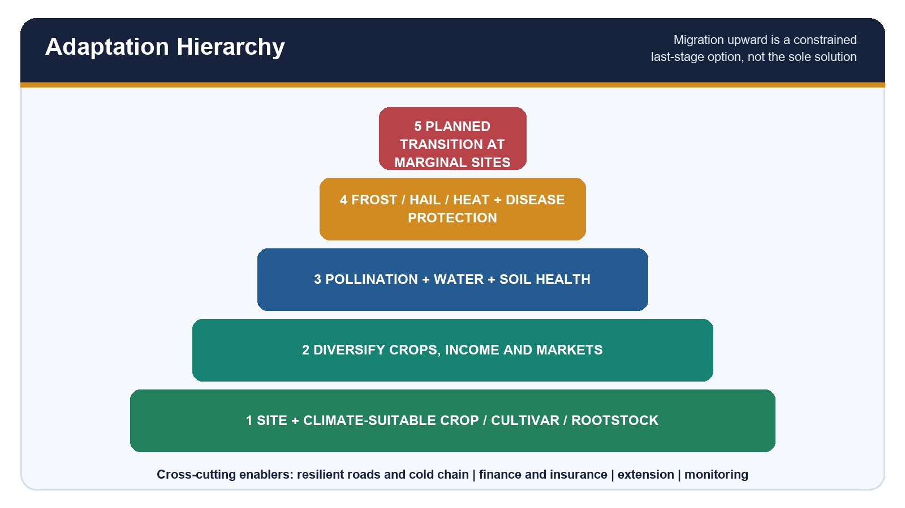

*Caption: Adaptation starts with avoiding maladaptation, then strengthens orchard ecology, protection, infrastructure and institutions.. Original deterministic study schematic; not to scale.*

**Current / teaching focus:** Adaptation starts with avoiding maladaptation, then strengthens orchard ecology, protection, infrastructure and institutions.

| Priority | Action | Why first / next | Metric |
| --- | --- | --- | --- |
| 1 | match site, crop, cultivar and rootstock | prevents locked-in biological mismatch | survival, chill / heat fit, quality |
| 2 | diversify crop, cultivar, income and market | reduces correlated risk | income concentration |
| 3 | improve pollination, water and soil | raises baseline resilience | fruit set, water and SOC |
| 4 | stage-specific frost, hail, heat and disease protection | reduces residual weather risk | damage and avoided loss |
| 5 | resilient roads, cold chain, finance, insurance and extension | protects realised value | downtime, utilisation and settlement |
| 6 | planned transition at marginal sites | last-stage response where fit is failing | net livelihood and ecological outcome |

### Core teaching

- [ANALYSIS] The first adaptation is not an expensive structure; it is avoiding a crop-site-rootstock mismatch.
- [ANALYSIS] Diversification includes fruit species, cultivars with different phenology, annual crops, livestock, processing and markets.
- [ANALYSIS] Road resilience and cold chain are climate adaptation because weather-related delay destroys quality and bargaining power.
- [ANALYSIS] Insurance and credit need extension and risk reduction; otherwise they can finance vulnerable systems or transfer only a fraction of loss.
- [FACT] IMD advisories, state horticulture packages, ICAR planting-material technology and policy missions provide complementary functions rather than substitutes.
- [RULE] Monitor chill / heat accumulation, bloom and frost dates, fruit set, yield and grade, water, soil, pests, slope, pollinators, losses, storage use, price spread, income distribution and scheme outcomes.
- [VERDICT] The resilient Himalayan fruit belt is differentiated, monitored and connected - not simply shifted upward.

### Must-know facts

- Adaptation hierarchy prevents technology-first answers.
- Monitoring must include distributional outcomes.
- A planned transition may include crop replacement at genuinely marginal sites.

### UPSC traps

- **Wrong:** Adaptation equals moving orchards uphill. **Correct:** It begins with suitability, diversification and system resilience.
- **Wrong:** A dashboard should track only yield. **Correct:** Quality, ecology, risk, value chain and distribution are equally important.

**Mains use:** End with a prioritised hierarchy and measurable dashboard.

**Study link:** All linked Geography, Economy, Environment and rural-economy owners

---
# Solved Verified Local-Paper PYQs

## PYQ 1 - UPSC Prelims 2018 Q18: Temperate Alpine National Park

Which one of the following National Parks lies completely in the temperate alpine zone?

A. Manas National Park
B. Namdapha National Park
C. Neora Valley National Park
D. Valley of Flowers National Park

**Source status:** VERIFIED PYQ - exact English stem verified from local official paper `csp-p1.pdf`. Official key is not held locally.

### Solution

**INFERRED ANSWER - NOT OFFICIALLY VERIFIED: D (Valley of Flowers National Park). Confidence: High.**
Valley of Flowers is the option explicitly associated with a high Himalayan temperate-alpine protected landscape. Manas is a foothill / alluvial-terai system; Namdapha spans a very large tropical-to-alpine gradient rather than lying completely in one zone; Neora Valley also spans lower montane to high-elevation habitats.
Fruit-belt link: this question tests why altitude must be interpreted as ecological zonation, not as a single crop contour.
**Why this earns marks:** It preserves the missing-key label and eliminates every option by biome range.

---

## PYQ 2 - UPSC Prelims 2020 Q87: Frost-Free Crop Requirement

The crop is subtropical in nature. A hard frost is injurious to it. It requires at least 210 frost-free days and 50 to 100 centimetres of rainfall for its growth. A light well-drained soil capable of retaining moisture is ideally suited for the cultivation of the crop. Which one of the following is that crop?

A. Cotton
B. Jute
C. Sugarcane
D. Tea

**Source status:** VERIFIED PYQ - exact English stem verified from local official paper `CSP_2020_GS_Paper-1.pdf`. Official key is not held locally.

### Solution

**INFERRED ANSWER - NOT OFFICIALLY VERIFIED: A (Cotton). Confidence: High.**
The defining combination is subtropical warmth, a long frost-free period, moderate rainfall and a light moisture-retentive well-drained soil. Jute needs a more humid environment; sugarcane generally needs a longer warm season with high water demand; tea is a humid perennial plantation crop.
Fruit-belt link: climatic thresholds identify crop suitability only when the entire requirement bundle is read together.
**Why this earns marks:** It verifies the requirement set rather than guessing from one clue.

---

## PYQ 3 - UPSC Prelims 2021 Q51: Permaculture and Conventional Farming

How is permaculture farming different from conventional chemical farming?

1. Permaculture farming discourages monocultural practices but in conventional chemical farming, monoculture practices are predominant.
2. Conventional chemical farming can cause increase in soil salinity but the occurrence of such phenomenon is not observed in permaculture farming.
3. Conventional chemical farming is easily possible in semi-arid regions but permaculture farming is not so easily possible in such regions.
4. Practice of mulching is very important in permaculture farming but not necessarily so in conventional chemical farming.

Select the correct answer using the code given below:

A. 1 and 3
B. 1, 2 and 4
C. 4 only
D. 2 and 3

**Source status:** VERIFIED PYQ - exact English stem verified from local official paper `QP-CSP-21-GeneralStudiesPaper-I-121021.pdf`. Official key is not held locally.

### Solution

**INFERRED ANSWER - NOT OFFICIALLY VERIFIED: B (1, 2 and 4). Confidence: Medium-High.**
Statement 1 fits permaculture's diversity orientation. Statement 2 captures salinity risk from poorly managed conventional irrigation / inputs, while permaculture design seeks to avoid it. Statement 3 is false because water-harvesting and dryland design can be central to permaculture. Statement 4 is correct.
Fruit-belt link: orchard-floor cover, mulch and diversity can improve resilience, but must be matched with orchard water and pest conditions.
**Why this earns marks:** Each statement is evaluated independently and the uncertainty of the unavailable key is explicit.

---

## PYQ 4 - UPSC Prelims 2024 Q92: Apple Imports and GM-Food Approval

Consider the following statements:

Statement-I: India does not import apples from the United States of America.

Statement-II: In India, the law prohibits the import of Genetically Modified food without the approval of the competent authority.

Which one of the following is correct in respect of the above statements?

A. Both Statement-I and Statement-II are correct and Statement-II explains Statement-I
B. Both Statement-I and Statement-II are correct, but Statement-II does not explain Statement-I
C. Statement-I is correct, but Statement-II is incorrect
D. Statement-I is incorrect, but Statement-II is correct

**Source status:** VERIFIED PYQ - exact English stem verified from local official Set-A paper `2024-GS1-Set A.pdf`; official local Set-A key `Ans-2024-GS1.pdf` gives D.

### Solution

**OFFICIALLY VERIFIED ANSWER: D.**
Statement-I is incorrect because India does import apples from the United States. Statement-II is correct: GM food import requires approval by the competent regulatory authority. The second statement does not create a general ban on ordinary US apples.
Fruit-belt link: domestic apple competitiveness must be analysed through quality, seasonality, tariffs, storage and consumer segments rather than an assumed import prohibition.
**Why this earns marks:** It uses the official key and separates trade status from biosafety regulation.

---

## PYQ 5 - UPSC GS-I 2020 Q6: Himalayan Glacier Melt and Water Resources

**Question:** How will the melting of Himalayan glaciers have a far-reaching impact on the water resources of India? (Answer in 150 words)

**Source status:** VERIFIED PYQ - exact English stem verified from local official GS-I scan `Gen_St_P1.pdf`. Mains has no objective key.

### Model answer

- **CLAIM:** Glacier loss changes the timing, buffering and hazard profile of Himalayan water rather than producing one uniform immediate river collapse.
- **NAMED EVIDENCE / EXAMPLE:** Himalayan glaciers store frozen water and contribute melt to headwater basins; repository Topic 06 distinguishes glacier mass balance, snow, monsoon rain and basin-specific flow.
- **ANALYSIS:** In an early phase, enhanced melt can add runoff and expand lakes; over time, a smaller ice store reduces dry-season buffering in glacier-sensitive headwaters. Sediment, GLOF and slope cascades can damage intakes, roads and irrigation. Orchard implications include changing spring / snowmelt timing and damaged access.
- **QUALIFICATION:** Monsoon rainfall dominates much annual flow in many basins, and glacier contribution varies sharply by basin and season. Do not say all Himalayan rivers will immediately dry.
- **VERDICT:** Plan basin-specific monitoring, storage, spring revival, efficient irrigation and hazard-resilient infrastructure.
- **Why this earns marks:** It gives a phased mechanism, connects water to horticulture and avoids the glacier-equals-river monocausality.

---

## PYQ 6 - UPSC GS-I 2019 Q15: Restoring Mountain Ecosystems

**Question:** How can the mountain ecosystem be restored from the negative impact of development initiatives and tourism? (Answer in 250 words)

**Source status:** VERIFIED PYQ - exact English stem verified from local official paper `QP-CSM19-GeneralStudies-I.pdf`. Mains has no objective key.

### Model answer

- **CLAIM:** Mountain restoration must repair slope-water-ecosystem processes and govern the location and intensity of development.
- **NAMED EVIDENCE / EXAMPLE:** Himalayan fruit belts show the coupled risk: road cuts and spoil alter drainage; orchard clearing changes cover; tourism and construction add water, waste and traffic demand; 18 August 2026 IMD warnings illustrate rain-triggered landslide and access exposure.
- **ANALYSIS:** Map carrying capacity; protect springs, forests and open drainage; enforce cut-slope and spoil standards; stabilise only with material-appropriate engineering plus vegetation; treat sewage and solid waste; regulate construction in flood / landslide corridors; promote low-impact tourism and resilient local value chains. Orchard floors, terraces and roads should be managed as one catchment.
- **QUALIFICATION:** Restoration cannot return every site to a pre-development state, and tree planting alone may be wrong for some ecosystems or failures.
- **VERDICT:** Adopt ridge-to-valley planning, polluter payment, community monitoring and transparent outcome indicators.
- **Why this earns marks:** It answers 'how', names mountain mechanisms, qualifies restoration and links livelihoods with ecological limits.

---

## PYQ 7 - UPSC GS-I 2021 Q4: Himalayan and Western Ghats Landslides

**Question:** Differentiate the causes of landslides in the Himalayan region and Western Ghats. (Answer in 150 words)

**Source status:** VERIFIED PYQ - exact English stem verified from local official paper `QP-CSM-21-GENSTUDIESPAPER-I-110122.pdf`. Mains has no objective key.

### Model answer

- **CLAIM:** Both regions combine predisposition and triggers, but their geology, relief evolution, weathering and land-use pathways differ.
- **NAMED EVIDENCE / EXAMPLE:** The young tectonically active Himalaya contains fractured rock, steep relief, seismicity, glacial / fluvial incision and deep road corridors; the older Western Ghats commonly show deeply weathered regolith / laterite, escarpments and intense monsoon saturation.
- **ANALYSIS:** In the Himalaya, earthquakes, snow / ice processes, river undercutting, road blasting, spoil and extreme rain act on weak structures. In the Ghats, saturated weathering mantles, quarrying, slope cutting and high-intensity monsoon rain are prominent. Orchard relevance is concentrated runoff from terraces, roads and blocked drains.
- **QUALIFICATION:** Neither region has one cause; local lithology, old slides, drainage and construction decide each failure.
- **VERDICT:** Use differentiated mapping, drainage and cut-slope design rather than a single national remedy.
- **Why this earns marks:** It directly differentiates mechanisms and rejects rainfall-only explanations.

---

## PYQ 8 - UPSC GS-III 2021 Q14: Crop Diversification

**Question:** What are the present challenges before crop diversification? How do emerging technologies provide an opportunity for crop diversification? (Answer in 250 words)

**Source status:** VERIFIED PYQ - exact English stem verified from local official paper `QP-CSM-21-GENSTUDIESPAPER-III-110122.pdf`. Mains has no objective key.

### Model answer

- **CLAIM:** Crop diversification is constrained less by agronomic possibility than by coordinated risk, infrastructure and market incentives.
- **NAMED EVIDENCE / EXAMPLE:** Himalayan horticulture requires certified planting material, cultivar-site fit, irrigation, pollination, packhouses, CA storage, roads and buyers; Uttarakhand Apple Mission explicitly treats these as an end-to-end chain.
- **ANALYSIS:** Challenges include perennial gestation, price volatility, small holdings, weak extension, climate and pest risk, tenant / credit exclusion and thin markets. Technologies create opportunities through climate-suitability mapping, low-chill / disease-tolerant material, clonal rootstocks, micro-irrigation, protected nurseries, weather advisories, digital traceability, grading and processing.
- **QUALIFICATION:** Technology can deepen debt, proprietary dependence or water demand when market and governance gaps remain.
- **VERDICT:** Build crop clusters only where agroclimatic fit, farmer choice, risk finance and physical value chains align.
- **Why this earns marks:** It integrates agronomy, technology, markets and equity instead of listing gadgets.

---

## PYQ 9 - UPSC GS-III 2022 Q4: Food Processing Scope and Significance

**Question:** Elaborate the scope and significance of the food processing industry in India. (Answer in 150 words)

**Source status:** VERIFIED PYQ - exact English stem verified from local official paper `QP-CSM-22-GENERAL-STUDIES-PAPER-III-190922.pdf`. Mains has no objective key.

### Model answer

- **CLAIM:** Food processing links farm diversification to shelf life, quality, jobs and market expansion.
- **NAMED EVIDENCE / EXAMPLE:** Apple and apricot chains need sorting, grading, controlled storage, juice / preserve / drying options, traceability and logistics; NITI's J&K roadmap and Ladakh's July 2026 apricot plan explicitly map these functions.
- **ANALYSIS:** Processing absorbs lower grades, reduces seasonal gluts, creates rural non-farm employment, improves standards and can support exports. It also stimulates packaging, testing, transport and cold-chain services.
- **QUALIFICATION:** A plant without reliable throughput, quality segregation, power, working capital and buyers can remain underutilised; processing does not automatically raise farm-gate prices.
- **VERDICT:** Promote cluster-linked, energy-reliable and farmer-connected facilities with utilisation and income metrics.
- **Why this earns marks:** It uses a named Himalayan chain and separates infrastructure from realised farmer value.

---

## PYQ 10 - UPSC GS-III 2025 Q14: Food Processing and Employment

**Question:** Examine the scope of the food processing industries in India. Elaborate the measures taken by the government in the food processing industries for generating employment opportunities. (Answer in 250 words)

**Source status:** VERIFIED PYQ - exact English stem verified from local official paper `UPSC Mains 2025 GS Paper 3 3.pdf`. Mains has no objective key.

### Model answer

- **CLAIM:** India's processing opportunity lies in connecting diverse farm output to distributed rural manufacturing and services.
- **NAMED EVIDENCE / EXAMPLE:** MoFPI's integrated cold-chain framework, AIF-eligible post-harvest assets, MIDH packhouse / storage support and APEDA standards together cover pre-cooling, grading, storage, transport, processing and export readiness.
- **ANALYSIS:** Employment arises in skilled nursery work, harvesting, packhouses, testing, refrigeration, repair, transport, food safety, branding and FPO management. Measures include cold-chain and value-addition infrastructure, micro-enterprise formalisation, credit-linked assets, cluster development, skill and quality systems.
- **QUALIFICATION:** Sanctioned projects are not employment outcomes; job quality, seasonality, female participation, capacity utilisation and local procurement must be measured.
- **VERDICT:** Prioritise decentralised primary processing near production clusters and higher-value facilities where throughput and markets are proven.
- **Why this earns marks:** It examines both scope and measures, then adds an outcome and job-quality test.

---

# Solved MCQ and Remedial Loops

> Rotation audit: authored keys run strictly A -> B -> C -> D for all 56 questions. Verified PYQ option order is preserved separately and is excluded from this rotation.

## MCQ 1

Which statement best defines a Himalayan fruit belt?

A. A functional agroclimatic and value-chain region whose boundaries may change
B. A permanently notified legal zone
C. Any district containing one fruit tree
D. A single contour line for apple

**Answer: A.** The belt combines suitability, orchard concentration, skills, logistics and markets.

## MCQ 2

Pomology is the study and practice of:

A. flowers only
B. fruit crops, including their production and quality
C. forest timber only
D. soil classification alone

**Answer: B.** Pomology is the fruit-crop branch of horticulture.

## MCQ 3

Why is altitude treated mainly as a proxy in orchard geography?

A. It directly supplies plant nutrients
B. It fixes one universal lapse rate
C. It co-varies with temperature, snow, humidity, radiation, soil and access
D. It removes cultivar differences

**Answer: C.** Altitude bundles several changing controls; it is not an independent biological cause.

## MCQ 4

Which is the safest description of eastern Himalayan horticulture?

A. A duplicate of Shimla's apple system
B. A uniformly dry temperate region
C. A legal kiwi zone
D. A humid, biodiverse subtropical-temperate mosaic rather than an apple-only belt

**Answer: D.** Eastern sectors need a diversity and moisture-gradient model.

## MCQ 5

Endodormancy in an apple bud refers to:

A. an internal block on growth that must be released before normal development
B. permanent tissue death
C. only drought stress during summer
D. fruit storage after harvest

**Answer: A.** Dormancy is regulated and stage-specific.

## MCQ 6

Which chill model explicitly allows temperature bands to add or subtract units?

A. A simple rainfall total
B. The Utah model
C. Growing degree days
D. The Thornthwaite moisture index

**Answer: B.** Utah chill units weight temperatures differently.

## MCQ 7

A likely effect of insufficient winter chill is:

A. guaranteed early harvest
B. automatic frost protection
C. uneven or delayed bud break and weak bloom synchrony
D. higher pollinator activity in rain

**Answer: C.** Poor chill can disrupt spring phenology.

## MCQ 8

A false-spring risk occurs when:

A. winter remains continuously cold
B. harvest is delayed by storage
C. monsoon arrives early in Kerala
D. warmth advances development before a later damaging frost

**Answer: D.** Warm spells can increase exposure by advancing vulnerable tissue.

## MCQ 9

Western disturbances are relevant to western Himalayan orchards because they can:

A. bring winter rain or snow and also create damaging weather depending on timing and intensity
B. guarantee adequate chill everywhere
C. replace the southwest monsoon in all seasons
D. prevent every spring frost

**Answer: A.** WD effects are conditional, not uniformly beneficial.

## MCQ 10

Rain and strong wind during apple bloom can reduce fruit set primarily by:

A. increasing compatible pollen production without limit
B. suppressing pollinator flight and disrupting pollen transfer
C. ending self-incompatibility
D. raising soil pH instantly

**Answer: B.** Bloom weather changes pollination performance.

## MCQ 11

Which site is most prone to cold-air pooling on a clear calm night?

A. A freely ventilated mid-slope
B. A convex ridge with air movement
C. A closed valley floor or depression below slopes
D. A coastal sand bar

**Answer: C.** Dense cold air drains downslope and collects in depressions.

## MCQ 12

Which statement about Himalayan slope aspect is correct?

A. South-facing is always best
B. North-facing is always frost-free
C. Aspect has no effect on radiation
D. Its effect depends on latitude, elevation, season, water and local exposure

**Answer: D.** Universal aspect prescriptions are unsafe.

## MCQ 13

For a perennial orchard, soil depth matters mainly because it affects:

A. rooting volume, water storage, anchorage and nutrient access
B. only fruit colour
C. only market price
D. only pollinizer compatibility

**Answer: A.** Tree crops depend on a durable root environment.

## MCQ 14

Why is poor drainage especially dangerous in an orchard?

A. It increases compatible pollen
B. It reduces root aeration and can favour root or collar disease
C. It guarantees high chill
D. It eliminates slope failure

**Answer: B.** Waterlogged roots face oxygen and disease stress.

## MCQ 15

High-density apple plantation is best understood as:

A. only a higher number of trees
B. a method requiring no pruning
C. an integrated rootstock-support-water-canopy-skill-market system
D. a substitute for pollinizers

**Answer: C.** Density is only one component.

## MCQ 16

Why does M9 commonly require a trellis or stake system?

A. It is a seedless cultivar
B. It cannot receive irrigation
C. It flowers only on the ground
D. Its dwarfing, shallow-rooted trees are not reliably self-supporting

**Answer: D.** Support is a rootstock-system requirement.

## MCQ 17

In orchard terminology, a pollinizer is:

A. a compatible pollen-source cultivar planted in the orchard
B. the bee carrying pollen
C. a fungicide used at bloom
D. the rootstock controlling vigour

**Answer: A.** Pollinizer is the plant; pollinator is the vector.

## MCQ 18

Managed honeybee colonies cannot by themselves solve:

A. pollen movement between compatible flowers
B. genetic incompatibility and absent bloom overlap
C. the need for foraging activity
D. some limitations of low wild-pollinator abundance

**Answer: B.** Bees cannot create compatible pollen.

## MCQ 19

The strongest pesticide precaution during apple bloom is to:

A. spray all products at midday regardless of need
B. remove all pollinizer trees
C. avoid harmful exposure and follow need-based official timing that protects pollinators
D. keep hives permanently closed

**Answer: C.** Pollinator-safe timing and necessity are essential.

## MCQ 20

An orchard microclimate is shaped by:

A. district average temperature alone
B. national GDP
C. export tariff alone
D. slope, aspect, canopy, soil moisture, wind and cold-air drainage

**Answer: D.** Microclimate is local and multi-factor.

## MCQ 21

Micro-irrigation improves field application efficiency, but basin savings are not assured because:

A. farmers may expand irrigated area or intensity and increase total use
B. drip always raises rainfall
C. tree roots stop transpiring
D. storage eliminates evaporation

**Answer: A.** This is the efficiency-rebound distinction.

## MCQ 22

A well-chosen mulch can:

A. guarantee no pests
B. moderate soil moisture and temperature while reducing weed pressure
C. replace drainage
D. create chill portions in buds

**Answer: B.** Mulch helps but has material-specific risks.

## MCQ 23

Why can managed orchard-floor vegetation improve slope resilience?

A. It makes every terrace structurally sound
B. It eliminates heavy-rain thresholds
C. It protects soil, slows runoff and supports organic matter when competition is managed
D. It replaces rootstock selection

**Answer: C.** Cover is useful but not a substitute for engineering.

## MCQ 24

Which statement about orchard planting and landslide stability is correct?

A. Any orchard prevents all landslides
B. Bare slopes are always safer
C. Road spoil has no slope effect
D. Trees may reinforce shallow soil, but cannot automatically stabilise deep or drainage-driven failures

**Answer: D.** Slope mechanism determines whether roots help.

## MCQ 25

Anti-hail nets should be evaluated as:

A. risk-reduction structures with cost, load, maintenance and coverage limits
B. complete elimination of hail
C. a substitute for compatible cultivars
D. a legal insurance policy

**Answer: A.** Protection retains residual risk.

## MCQ 26

Active frost protection is most likely to fail when:

A. the orchard has a name
B. water, energy, labour, forecast timing or atmospheric conditions are unsuitable
C. fruit is already in CA storage
D. a GI exists

**Answer: B.** Operational and weather conditions determine effectiveness.

## MCQ 27

Apple scab risk is best managed through:

A. an old chemical schedule used everywhere
B. more nitrogen regardless of need
C. surveillance, sanitation, resistant material and current official weather-based advice
D. removal of all pollinators

**Answer: C.** Disease management must be current and integrated.

## MCQ 28

Under PMFBY, apple coverage should be assumed only when:

A. MIDH exists nationally
B. the farm uses M9
C. the fruit is graded
D. the crop, area, season and peril are officially notified

**Answer: D.** Crop insurance is notification-specific.

## MCQ 29

Which is an observation rather than a projection?

A. A measured 20-year series of bloom dates at a named station and cultivar
B. A modelled 2050 suitability map
C. A farmer's expectation for next decade
D. A policy target for orchard expansion

**Answer: A.** Observation is recorded evidence.

## MCQ 30

Why is unlimited upslope apple migration implausible?

A. temperature never changes with height
B. Land, forests, tenure, water, soils, cold injury and access create ceilings
C. markets disappear above sea level
D. all rootstocks require plains

**Answer: B.** Biophysical and institutional constraints bound movement.

## MCQ 31

The main risk of orchard monoculture is:

A. automatic lower quality
B. absence of any economies of scale
C. correlated climate, pest and price exposure
D. guaranteed crop failure

**Answer: C.** Uniform systems can amplify shared shocks.

## MCQ 32

Diversification in a fruit-belt strategy can include:

A. only adding more apple trees
B. only replacing roads
C. only changing carton colour
D. species, cultivars, livestock, processing, income sources and markets

**Answer: D.** Diversification is multidimensional.

## MCQ 33

Farm-gate productivity differs from post-harvest value realisation because:

A. grade, loss, storage, timing, bargaining and price spread intervene after harvest
B. yield is measured in rupees only
C. storage changes orchard altitude
D. pollination occurs in the mandi

**Answer: A.** Tonnes and realised income are different outcomes.

## MCQ 34

The primary purpose of grading apples is to:

A. increase winter chill
B. separate produce by size and quality for transparent handling and markets
C. replace traceability
D. eliminate all intermediaries

**Answer: B.** Grading is a quality and market function.

## MCQ 35

Controlled-atmosphere storage differs from ordinary cold storage because it:

A. keeps fruit at field temperature
B. removes the need for maturity standards
C. controls gas composition as well as temperature and humidity
D. guarantees a high price

**Answer: C.** CA is a controlled process.

## MCQ 36

A resilient Himalayan fruit transport plan should include:

A. one road with no contingency
B. harvest during heavy rain by default
C. storage without electricity
D. road-condition monitoring, alternate routes, handling discipline and time-temperature continuity

**Answer: D.** Mountain logistics needs redundancy.

## MCQ 37

An FPO is most likely to improve farmer bargaining when it has:

A. member volume, quality control, working capital, governance and competing buyers
B. registration alone
C. a logo but no trade
D. only one dependent buyer

**Answer: A.** Organisation must perform commercial functions.

## MCQ 38

e-NAM cannot substitute for:

A. digital bidding
B. physical assaying, storage, logistics, settlement and buyer competition
C. electronic price display
D. market information

**Answer: B.** Digital exchange still needs physical institutions.

## MCQ 39

MIDH 2025 treats high-density apple with support system as:

A. proof of biological suitability everywhere
B. an automatic grant without eligibility
C. a defined assistance category subject to administrative conditions
D. a current yield result

**Answer: C.** A guideline norm is not a farm outcome.

## MCQ 40

Which sequence correctly tracks policy implementation?

A. announcement -> farmer outcome
B. approval -> eligibility -> application
C. asset use -> no monitoring
D. eligibility -> application -> approval -> disbursement -> asset use -> farmer outcome

**Answer: D.** Each stage needs separate evidence.

## MCQ 41

Crop-insurance basis risk refers to:

A. a mismatch between measured / triggered loss and the farmer's actual loss
B. rootstock incompatibility
C. fruit colour variation
D. lack of winter dormancy

**Answer: A.** Insurance may not perfectly match individual damage.

## MCQ 42

Agriculture Infrastructure Fund is relevant to fruit belts mainly through:

A. setting apple chill requirements
B. credit support for eligible post-harvest and community farm assets
C. issuing weather forecasts
D. declaring GI tags

**Answer: B.** AIF supports infrastructure finance.

## MCQ 43

MoFPI's integrated cold-chain approach is strongest when:

A. only a distant warehouse is built
B. orchard survival is ignored
C. farm-level handling, processing / storage and refrigerated movement form a linked chain
D. temperature records are absent

**Answer: C.** Integration, not isolated construction, is the core.

## MCQ 44

APEDA's FY26 aggregate fresh-fruit export value can be used to state:

A. the exact Himalayan apple export share
B. farm-gate apple prices
C. number of CA stores in Kashmir
D. India's total fresh-fruit export value, not an apple-specific share unless separately reported

**Answer: D.** Aggregate data must retain its scope.

## MCQ 45

NITI Aayog's April 2026 J&K horticulture roadmap should be cited as:

A. a current strategic report using dated sector data and proposing interventions
B. proof that all proposals are implemented
C. a 2026 apple census
D. a crop-insurance notification

**Answer: A.** Report, baseline and outcome are separate.

## MCQ 46

The 9 July 2026 Ladakh apricot document establishes that:

A. the entire quantity had already reached Dubai
B. an official action plan for a 1,000 MT export initiative was reviewed
C. all farmers were paid
D. road disruption was impossible

**Answer: B.** The source is a plan/status document.

## MCQ 47

ICAR's western Arunachal fruit exploration is most relevant because it:

A. proves a mature export chain
B. makes all wild fruit commercial
C. documents genetic-resource diversity for conservation, breeding and livelihood options
D. shows a dry Mediterranean climate

**Answer: C.** Genetic resources are a foundation, not a completed value chain.

## MCQ 48

IMD Bulletin 63/2026 is best used as:

A. a 30-year climate normal
B. an apple production estimate
C. a scheme guideline
D. a dated weather warning and advisory, not proof of a long-term climate trend

**Answer: D.** Forecast / advisory evidence is time-bounded.

## Remedial MCQ 49

The first step in the adaptation hierarchy is to:

A. match site, crop, cultivar and rootstock before investing in protection
B. move every orchard higher
C. build storage before assessing crops
D. buy bee boxes before selecting pollinizers

**Answer: A.** Avoiding mismatch has the highest leverage.

## Remedial MCQ 50

Higher-altitude migration is a limited adaptation because:

A. altitude has no climate effect
B. ecology, tenure, water, soils, cold and logistics constrain it
C. all high land is legally vacant
D. fruit cannot grow above 1,000 m

**Answer: B.** Movement encounters real ceilings.

## Remedial MCQ 51

A robust orchard-climate dashboard should pair chill accumulation with:

A. only annual rainfall
B. only export value
C. heat units, bloom dates, frost exposure, fruit set, yield and quality
D. only tree count

**Answer: C.** The full phenology chain is needed.

## Remedial MCQ 52

Pollinator monitoring should include:

A. only number of rented boxes
B. only fruit colour
C. only soil pH
D. activity during bloom, weather, colony strength and wild-pollinator presence

**Answer: D.** Activity and context matter more than a box count.

## Remedial MCQ 53

The farm-retail price spread is useful because it indicates:

A. how value is distributed across the chain, subject to service and loss costs
B. winter chill
C. rootstock vigour
D. slope angle

**Answer: A.** Price spread is a distribution indicator.

## Remedial MCQ 54

The strongest scheme outcome metric for a subsidised packhouse is:

A. sanction letter count
B. functional utilisation, quality improvement, farmer access and realised value
C. foundation-stone ceremony
D. budget announcement alone

**Answer: B.** Outputs and outcomes differ.

## Remedial MCQ 55

A high-scoring Mains qualification would state that:

A. all official data are timeless
B. every farmer experiences the state average
C. a report-year estimate or scheme target cannot be treated as a current realised outcome
D. uncertainty should be omitted

**Answer: C.** Qualification protects scale and status.

## Remedial MCQ 56

Which final thesis is most defensible?

A. Apple can move upward without limit
B. HDP alone solves rural development
C. Climate is irrelevant once cold storage exists
D. The Himalayan fruit belt is a differentiated climate-physiology-orchard-value-chain system requiring monitored adaptation

**Answer: D.** The integrated thesis preserves both physical and human geography.

# Original Solved Mains Practice

## Original 10-marker: Why Altitude Alone Cannot Define the Fruit Belt

**Question:** Explain why altitude alone cannot define India's Himalayan fruit belt. (10 marks, 150 words)

### Model answer

- **CLAIM:** Altitude is a proxy bundle, while orchard suitability is a crop-cultivar-site-value-chain decision.
- **NAMED EVIDENCE / EXAMPLE:** NITI's 2026 J&K roadmap separates overlapping subtropical, intermediate and temperate zones; Himachal's official guide changes rootstock and cultivar advice by elevation, soil, water and exposure.
- **ANALYSIS:** Height influences temperature, chill, snow, radiation and season length, but valley inversion, aspect, monsoon humidity, rain shadow, soil depth, irrigation, pollination and access can reverse a simple contour rule. Commercial belts further require nursery, roads, packing, storage and markets.
- **QUALIFICATION:** Broad altitude bands remain useful for map-based orientation when labelled approximate.
- **VERDICT:** Define belts with altitude plus local climate, site science and value-chain connectivity.
- **Why this earns marks:** It directly answers 'why', uses two named official examples, provides mechanism and retains the limited usefulness of altitude.

---

## Original 15-marker: Climate Risk in the Western Himalayan Apple Economy

**Question:** Analyse how climate variability and climate change interact with orchard management and markets in the western Himalayan apple economy. (15 marks, 250 words)

### Model answer

- **CLAIM:** Climate affects apple income through stage-specific physiology and infrastructure, not through temperature alone.
- **NAMED EVIDENCE / EXAMPLE:** ICAR's Himachal coloured-strain case records mid-hill colour and maturity problems; IMD's 18 August 2026 bulletin linked heavy rain to horticulture and road / landslide risk; NITI's 2026 J&K roadmap maps apple clusters, CA storage and post-harvest losses.
- **ANALYSIS:** Warm winters can reduce chill at marginal sites; warm spells can advance bloom into frost; rain and wind reduce pollination; hail damages grade; heat, drought and monsoon humidity affect size, colour and scab. Management mediates exposure through cultivar-rootstock fit, pollinizers, canopy, water, drainage and protection. Markets amplify biological shocks because lower grade, blocked roads and thin storage access widen the farm-retail gap.
- **QUALIFICATION:** One event is not a climate trend, and shifts reflect roads, varieties, prices and policy as well as warming.
- **VERDICT:** Prioritise suitability and diversification, then pollination-water-soil resilience, stage-specific protection, resilient logistics, insurance and monitoring.
- **Why this earns marks:** It integrates physiology, management and value chain, uses current named evidence and separates variability from trend.

---

## Original 20-marker: Resilient Himalayan Fruit-Belt Strategy

**Question:** Design a regionally differentiated strategy for a climate-resilient and inclusive Himalayan fruit economy. (20 marks, 300 words)

### Model answer

- **CLAIM:** Resilience requires differentiated agroclimatic planning linked to orchard ecology, value chains and measurable public outcomes.
- **NAMED EVIDENCE / EXAMPLE:** Himachal's high-density guide, NITI's April 2026 J&K roadmap, Uttarakhand Apple Mission, ICAR's Arunachal genetic-resource work, Ladakh's July 2026 apricot action plan and MIDH 2025 provide complementary regional evidence.
- **ANALYSIS:** WEST: protect apple quality through cultivar-rootstock-site fit, chill / bloom monitoring, pollination, hail-frost measures and resilient roads / CA storage. UTTARAKHAND: diversify suitable mid-hill fruits and judge the mission by survival, quality and net income. LADAKH: strengthen local nurseries, water-efficient orchards, apricot grading / drying and road-air logistics. EAST: conserve and evaluate kiwi, berries and other genetic resources without forcing apple monoculture. SYSTEM-WIDE: certified plants, springs and micro-irrigation, vegetated orchard floors, stable terraces, FPOs, packhouses, traceability, processing, notified insurance and extension.
- **QUALIFICATION:** High density, cold storage and export plans can fail through debt, poor utilisation, exclusion or ecological pressure; upward migration has hard land-water-tenure limits.
- **VERDICT:** Create a public dashboard for chill / heat, bloom-frost, fruit set, grade, water, soil, slope, pollinators, losses, storage use, price spread, income distribution and scheme outcomes.
- **Why this earns marks:** It is regionally differentiated, institutionally grounded, qualified, inclusive and measurable.

---

# Advanced Refinements and Examiner Cautions

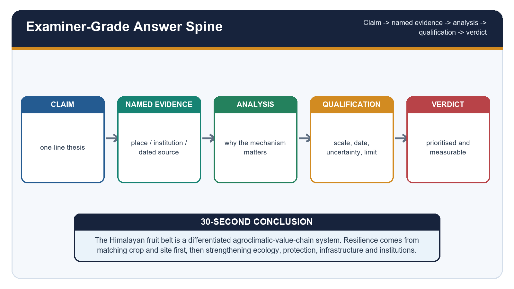

*Caption: Advanced claim-evidence-analysis answer framework. Original deterministic study schematic; not to scale.*

| Weak claim | Advanced replacement | Why it scores |
| --- | --- | --- |
| The apple belt is moving upward | Suitability and farm decisions are changing unevenly under climate, cultivar, water, land, market and policy controls | Avoids monocausality |
| More chill is always better | Cultivar-specific chill must be satisfied, then suitable heat and bloom weather must follow | Preserves physiology |
| High density raises yield | A matched rootstock-support-water-canopy-skill-market system can raise quality productivity | States conditions |
| Bees solve pollination | Compatible pollinizers, bloom overlap, active pollinators and weather jointly determine fruit set | Uses correct biology |
| Trees stop landslides | Orchard vegetation may reduce shallow erosion, while drainage, cuts and deep failures require mechanism-specific treatment | Avoids greenwashing |
| Cold storage raises price | Scientific operation, access, market timing, quality and buyer competition decide farmer value | Separates asset and outcome |
| A scheme helps farmers | Track eligibility, approval, disbursement, asset use and distributed outcomes | Governance discipline |
| Shift crops upward | Apply the adaptation hierarchy and recognise ecological and tenure ceilings | Prevents maladaptation |

### Advanced synthesis

- [REFINEMENT] Couple chill and heat indices with actual phenology rather than reporting one climate number.
- [REFINEMENT] Treat quality grade as an agronomic, climatic and market outcome.
- [REFINEMENT] Use orchard-floor biodiversity only with water-competition and pest-management safeguards.
- [REFINEMENT] Separate clean planting material identity, pathogen status and field survival.
- [REFINEMENT] Evaluate trellis and net structures for snow, hail and wind load.
- [REFINEMENT] Add road closure and power interruption to cold-chain risk analysis.
- [REFINEMENT] Compare public support by farmer type, gender, landholding and location.
- [REFINEMENT] Use price spread, storage utilisation and grade-out alongside production.
- [REFINEMENT] Keep current official estimates date-bound and never infer apple outcomes from aggregate horticulture totals.
- [REFINEMENT] A defensible answer ends with a prioritised, monitored and region-specific transition.

---

# FINAL CONSOLIDATED REGISTER NOTES

## FINAL CONSOLIDATED REGISTER NOTES 1/6 - Vocabulary and Physical Template

*Caption: FINAL CONSOLIDATED REGISTER NOTES 1/6 - Vocabulary and Physical Template. Original deterministic study schematic; not to scale.*

**Current / teaching focus:** Fruit belt, pomology, phenology, longitudinal diversity and microclimate.

| Axis | Rapid recall | Caution |
| --- | --- | --- |
| Fruit belt | functional climate-orchard-value-chain region | not legal boundary |
| Altitude | proxy for temperature, snow, radiation and season | not cause alone |
| West | WD + monsoon + inner rain-shadow variation | not uniform chill |
| East | humid gradient + biodiversity | not apple copy |
| Microclimate | aspect + inversion + canopy + soil water | district mean is insufficient |

### Core teaching

- Write longitudinal + altitudinal diversity in the first paragraph.
- Valley floor may be a frost pocket; mid-slope may drain cold air.
- Access belongs inside geographical suitability.

### Must-know facts

- Fruit belt is functional.
- Phenology links weather to yield.
- A crop map is not a value-chain map.

### UPSC traps

- **Wrong:** Himalaya = one belt. **Correct:** sector and valley differences.
- **Wrong:** Higher = wetter. **Correct:** inner rain shadow.

**Mains use:** Thesis: Himalayan fruit geography is a differentiated mountain system connected to markets.

**Study link:** Visuals 01-03

---

## FINAL CONSOLIDATED REGISTER NOTES 2/6 - Zonation, Chill and Phenology

*Caption: FINAL CONSOLIDATED REGISTER NOTES 2/6 - Zonation, Chill and Phenology. Original deterministic study schematic; not to scale.*

**Current / teaching focus:** Broad crop belts, dormancy, chill models, heat units and false spring.

| Axis | Rapid recall | Caution |
| --- | --- | --- |
| Low hills | citrus / litchi / mango / guava where suitable | mild winter |
| Mid hills | pear / plum / peach / apricot / some apple | moderate chill |
| High hills | apple / cherry / walnut | chill + heat + frost-free period |
| Chill | hours / Utah units / dynamic portions | cultivar-model specific |
| Heat | GDD after chill satisfaction | base and stage specific |

### Core teaching

- Sequence: induction -> endodormancy -> chill -> heat -> bloom.
- Insufficient chill: uneven bud break and weak synchrony.
- Warm spell + late frost = false-spring pathway.

### Must-know facts

- No universal apple chill threshold.
- Low-chill != no-chill.
- Weather effects are stage-specific.

### UPSC traps

- **Wrong:** Warm spring always helps. **Correct:** can advance frost exposure.
- **Wrong:** Altitude band is fixed. **Correct:** cultivar and microclimate shift it.

**Mains use:** Mechanism: climate affects fruit through dormancy, bloom, pollination, growth and harvest.

**Study link:** Visuals 02, 04 and 05

---

## FINAL CONSOLIDATED REGISTER NOTES 3/6 - Site, Rootstock and Pollination

*Caption: FINAL CONSOLIDATED REGISTER NOTES 3/6 - Site, Rootstock and Pollination. Original deterministic study schematic; not to scale.*

**Current / teaching focus:** Orchard site science and the complete high-density production system.

| Axis | Rapid recall | Caution |
| --- | --- | --- |
| Site | air drainage + soil depth + drainage + stable terrace | test before planting |
| Rootstock | vigour, anchorage and soil-water fit | not catalogue choice |
| HDP | trellis + drip + canopy + skill + market | not tree count |
| Pollinizer | compatible pollen-source cultivar | not bee |
| Pollinator | bee / wild vector | weather and pesticide sensitive |

### Core teaching

- M9 commonly needs lifelong support.
- Use multiple compatible pollinizers with bloom overlap.
- Rented bees cannot repair genetic incompatibility.

### Must-know facts

- Certified planting material matters.
- Canopy light affects quality.
- Fruit set is a system outcome.

### UPSC traps

- **Wrong:** HDP works everywhere. **Correct:** site and capital conditions.
- **Wrong:** Bee box guarantees crop. **Correct:** compatibility + weather.

**Mains use:** Adoption test: biological fit, management capacity, finance and quality market.

**Study link:** Visuals 06-08

---

## FINAL CONSOLIDATED REGISTER NOTES 4/6 - Sustainability, Hazards and Climate Evidence

*Caption: FINAL CONSOLIDATED REGISTER NOTES 4/6 - Sustainability, Hazards and Climate Evidence. Original deterministic study schematic; not to scale.*

**Current / teaching focus:** Water-soil-slope management, hazards and disciplined climate claims.

| Axis | Rapid recall | Caution |
| --- | --- | --- |
| Water | source reliability + micro-irrigation + mulch | watch rebound |
| Slope | cover + stable terrace + safe outlets | tree planting is not enough |
| Hazards | frost, hail, heat, heavy rain, snow | stage-specific |
| Disease | host + pathogen + weather | current advisory |
| Evidence | perception -> observation -> attribution -> projection | do not merge |

### Core teaching

- One event != seasonal anomaly != long-term trend.
- Upslope movement faces ecological and tenure ceilings.
- Insurance is notified and peril-specific.

### Must-know facts

- IMD bulletin is dated advisory evidence.
- Climate projection is conditional.
- Residual risk remains after protection.

### UPSC traps

- **Wrong:** Drip guarantees basin saving. **Correct:** total use may rise.
- **Wrong:** Net removes hail risk. **Correct:** engineering limits.

**Mains use:** Use evidence type, period, scale and limit in every climate paragraph.

**Study link:** Visuals 09-11

---

## FINAL CONSOLIDATED REGISTER NOTES 5/6 - Rural Economy, Value Chain and Policy

*Caption: FINAL CONSOLIDATED REGISTER NOTES 5/6 - Rural Economy, Value Chain and Policy. Original deterministic study schematic; not to scale.*

**Current / teaching focus:** Income transition, grading-storage-logistics and the policy outcome ladder.

| Axis | Rapid recall | Caution |
| --- | --- | --- |
| Farm output | yield + quality | not income alone |
| Post-harvest | grade + pack + cold / CA + transport | utilisation matters |
| Market | FPO / mandi / retail / export | buyer competition |
| Policy | MIDH / NHB / AIF / MoFPI / PMFBY | stage-specific |
| Outcome | price spread + income distribution + resilience | not sanction count |

### Core teaching

- APEDA FY26 fresh-fruit value is aggregate, not apple share.
- NITI roadmap is strategy with dated baselines, not implementation proof.
- Track eligibility -> approval -> disbursement -> use -> outcome.

### Must-know facts

- CA storage controls gases and temperature.
- FPO needs governance and capital.
- Processing needs throughput.

### UPSC traps

- **Wrong:** Cold storage raises price automatically. **Correct:** access and operation.
- **Wrong:** GI guarantees premium. **Correct:** quality and demand.

**Mains use:** Separate farm-gate productivity from value realisation and distribution.

**Study link:** Visuals 12-14

---

## FINAL CONSOLIDATED REGISTER NOTES 6/6 - Cases, Adaptation and Answer Spine

*Caption: FINAL CONSOLIDATED REGISTER NOTES 6/6 - Cases, Adaptation and Answer Spine. Original deterministic study schematic; not to scale.*

**Current / teaching focus:** Five regional cases, adaptation hierarchy, monitoring and examiner-grade writing.

| Axis | Rapid recall | Caution |
| --- | --- | --- |
| Himachal | apple + HDP + hail / roads | official package |
| J&K | apple / walnut + CA / markets | NITI 2026 |
| Uttarakhand | mission + diversification | target != outcome |
| Ladakh | apricot + nursery + logistics | plan != shipment |
| Arunachal | wild fruit genetic resources | resource != value chain |

### Core teaching

- Adapt: suitability -> diversify -> ecology -> protection -> logistics / finance -> transition.
- Monitor climate, orchard, resources, pollinators, value chain and distribution.
- Answer: claim -> named evidence -> analysis -> qualification -> verdict.

### Must-know facts

- Final thesis must be differentiated.
- Higher-altitude migration is not the sole answer.
- Every Mains solution ends with a marks rationale.

### UPSC traps

- **Wrong:** One technology solves the belt. **Correct:** systems approach.
- **Wrong:** Way forward can replace diagnosis. **Correct:** mechanism first.

**Mains use:** Verdict: a monitored, connected and regionally differentiated fruit economy is more resilient than simple crop migration.

**Study link:** Visuals 15-18; all PYQs and dashboards

---
