# Geography 20 - India Wheat Granary

**Complete Topic Package | Dated 2026-08-19 | Approval not claimed**

This independent visual-first learning session explains why parts of India perform the economic
role of a wheat granary without being a true temperate continental steppe or chernozem belt. It
integrates crop climate, the Indo-Gangetic alluvial plain, central Indian expansion, Green
Revolution technology, irrigation, production-yield-procurement distinctions, MSP and buffer
operations, terminal heat, groundwater and soil stress, diversification, verified adjacent PYQs,
56 strictly rotated original MCQs, eight solved original Mains questions and final topic-specific
register notes.

## Non-negotiable discipline

1. [FACT] Wheat is a Rabi crop in India, but sowing and harvest windows vary by region, preceding
   crop, variety, irrigation, altitude and season.
2. [FACT] India does not possess a true Eurasian-style temperate continental steppe wheat belt.
3. [ANALYSIS] India's functional analogue is the irrigated Indo-Gangetic alluvial system, joined
   increasingly by central Indian wheat regions.
4. [FACT] Alluvial or loam soils in the northern plains are not chernozem. Black-soil wheat areas
   in central India are a separate Indian setting, not a chernozem substitute.
5. [FACT] Production, yield, marketed surplus, market arrivals and government procurement are
   different variables; their rankings need not match.
6. [FACT] MSP announcement is not universal physical procurement. Procurement depends on crop,
   quality, centres, agency operations and farmer choice.
7. [ANALYSIS] Punjab-Haryana became a granary through a package: physical suitability plus seed,
   water, energy, fertiliser, mechanisation, markets, procurement and national distribution.
8. [LIMIT] Wheat needs irrigation in much of India, but it is generally less water-demanding than
   continuously flooded paddy. Wheat alone did not create the north-west groundwater crisis.
9. [ANALYSIS] Terminal heat acts chiefly by compressing grain filling; event damage, seasonal
   anomaly and long-term climate trend remain separate claims.
10. [FACT] Moderate winter rain can aid Rabi crops, while intense or untimely rain, hail and
    lodging near maturity can damage yield and quality.
11. [CURRENT] Every changing number is dated and tied to an official source. A target is not
    reported as procurement, and an advance estimate is not reported as final output.
12. [LIMIT] No claim that MSP payments covered 3.54 crore wheat farmers is used. The latest
    completed official wheat-procurement figure cited below reports a far smaller farmer count.
13. [RULE] Every analytical unit follows claim -> named evidence -> analysis -> qualification.
14. [RULE] Newly generated work remains `approved: false` until explicit user approval.

## Source order used

1. Authored repository Markdown.
2. OCR-searchable local geography and economy books plus official local UPSC papers.
3. Live primary government sources checked through 2026-08-19.
4. Qdrant was not required.

## Local evidence register

- `upsc-ai-kit/knowledge/Geography/advanced/20_India-Wheat-Granary.md`
- `upsc-ai-kit/knowledge/Geography/basic/20_Temperate-Continental-Steppe-Climate.md`
- `upsc-ai-kit/knowledge/Geography/basic/30_Primary-Economic-Activities-Agriculture.md`
- `upsc-ai-kit/knowledge/Geography/advanced/30_Primary-Economic-Activities-Agriculture.md`
- `upsc-ai-kit/knowledge/Geography/advanced/04_India-Erosion-Landslides-Groundwater.md`
- `upsc-ai-kit/knowledge/Geography/advanced/13_India-JetStream-Western-Disturbances.md`
- `upsc-ai-kit/knowledge/Geography/advanced/14_India-Climatic-Regions.md`
- `upsc-ai-kit/knowledge/Geography/advanced/16_India-Monsoon-Mechanism.md`
- `upsc-ai-kit/knowledge/Economy/basic/11_Land-Reforms-Green-Revolution-and-Cropping-Systems.md`
- `upsc-ai-kit/knowledge/Economy/basic/12_MSP-Procurement-Buffer-Stocks-PDS-and-Food-Security.md`
- `upsc-ai-kit/knowledge/Economy/basic/14_Irrigation-Inputs-Credit-Insurance-and-Sustainable-Agriculture.md`
- Corresponding Economy advanced owners 11, 12 and 14.
- OCR evidence: `books/Indian & World Geography - Husain, Majid_Compressed.pdf`,
  especially commercial grain agriculture and wheat crop-requirement passages.
- OCR evidence: `books/Indian economy ramesh singh.pdf`, especially Green Revolution, cropping
  pattern, MSP, procurement, storage and PDS passages.
- [LIMIT] `books/D.R.Khullar.pdf` and `books/Indian-geography-majid-hussain.pdf` did not yield
  searchable text in the local extraction path; their source-era propositions were used only
  through the already-authored repository owners.
- Official local UPSC papers: 2018, 2019, 2020, 2021, 2022, 2024 and 2025 GS papers, plus the
  official local 2020 Prelims question paper.

## Primary source register

| Institution / document | Official URL | Use and qualification | Retrieved |
| --- | --- | --- | --- |
| MoA&FW / PIB, Third Advance Estimates 2025-26, 27 May 2026 | https://pib.gov.in/PressReleasePage.aspx?PRID=2265965&reg=3&lang=1 | [CURRENT] National wheat estimate; advance, not final | 2026-08-19 |
| MoA&FW / PIB, Wheat Production Scenario 2025-26, 26 Apr 2026 | https://pib.gov.in/PressReleasePage.aspx?PRID=2255618&reg=3&lang=1 | [CURRENT] Early sowing, February heat, grain filling and local hail/rain; questionable procurement snippets omitted | 2026-08-19 |
| DES, Agricultural Statistics at a Glance 2024-25 | https://desagri.gov.in/document-report-category/agriculture-statistics-at-a-glance/ | [CURRENT] Tables 2.5(a-b) and 3.1(a): output, yield, irrigation and procurement by state | 2026-08-19 |
| DFPD / PIB, Year End Review 2025 | https://pib.gov.in/PressReleasePage.aspx?PRID=2210211 | [CURRENT] Completed RMS 2025-26 wheat procurement and farmer count | 2026-08-19 |
| DFPD / PIB, RMS 2026-27 procurement target, 6 Mar 2026 | https://pib.gov.in/PressReleasePage.aspx?PRID=2236215&reg=3&lang=1 | [CURRENT] 303 LMT is a target, not achieved procurement | 2026-08-19 |
| MoA&FW notification, MSP for Rabi crops 2026-27 | https://agriwelfare.gov.in/Documents/HomeWhatsNew/English_Notification_MSP_09102025.pdf | [CURRENT] Wheat MSP of Rs 2,585 per quintal for RMS 2026-27 | 2026-08-19 |
| ICAR-IISWC / ICAR-IIWBR wheat seed demonstration, 30 Oct 2025 | https://icar.gov.in/en/icar-iiswc-introduces-new-wheat-varieties-farmers-raipur-block-dehradun | [CURRENT] DBW 371/372 and a local early-sowing package; Dehradun trial, not a national calendar | 2026-08-19 |
| ICAR / NICRA climate-resilient agriculture, 11 Feb 2025 | https://pib.gov.in/PressReleasePage.aspx?PRID=2101836&reg=3&lang=1 | [FACT] District vulnerability, contingency plans and climate-resilient technologies | 2026-08-19 |
| IMD Agromet Advisory Services | https://mausam.imd.gov.in/responsive/agromet_adv_ser_state_current.php | [CURRENT] Location- and date-specific advisories; no universal wheat prescription inferred | 2026-08-19 |

## Current data dashboard

| Indicator | Official dated value | What it proves | Qualification |
| --- | --- | --- | --- |
| [CURRENT] India wheat production, 2025-26 | 120.657 million tonnes | National scale remains large | Third Advance Estimate, 27 May 2026; not final |
| [CURRENT] Previous-year comparator | 117.945 million tonnes in 2024-25 | Estimate is 2.712 million tonnes higher | Comparator reported in the same PIB release |
| [CURRENT] Wheat area and production, 2024-25 | 32.80 million ha; 117.94 million tonnes | Scale and high irrigation dependence | DES table; state detail belongs to 2024-25 |
| [CURRENT] RMS 2025-26 wheat procurement | 300.35 LMT | Latest completed national procurement total found | DFPD year-end review; procurement is not production |
| [CURRENT] Farmers in that wheat procurement | 2,513,143 farmers | Official count is about 25.13 lakh, not 3.54 crore | It covers procured sellers, not all wheat growers |
| [CURRENT] RMS 2026-27 wheat procurement target | 303 LMT | Food-management planning scale | Target set 6 Mar 2026; not actual procurement |
| [CURRENT] Wheat MSP, RMS 2026-27 | Rs 2,585 per quintal | Announced price floor for eligible procurement | MSP does not ensure universal purchase |

> [LIMIT] The October 2025 PIB explainer also displayed headline aggregates whose scope and
> arithmetic did not reconcile cleanly as wheat-only payment data. Those payout and broad farmer
> aggregates are deliberately omitted. No reliable state-wise actual RMS 2026-27 procurement
> snapshot was located in the checked official public pages by the control date; the package uses
> the completed RMS 2025-26 total and labels the 2026-27 figure only as a target.

## Text-native visual register

| # | Visual | Learning purpose |
| ---: | --- | --- |
| 1 | Concept boundary map | Separate true steppe from India's functional analogue |
| 2 | Granary systems equation | Show physical-human-institutional interaction |
| 3 | Crop-stage ribbon | Connect sowing, growth, grain filling and harvest |
| 4 | Regional calendar matrix | Prevent one rigid nationwide season |
| 5 | Requirement-risk matrix | Link climate need to crop-stage hazard |
| 6 | India wheat schematic map | Locate core and secondary regions |
| 7 | Seven-region archetype matrix | Explain internal diversity |
| 8 | Production ladder | Separate area, yield and production |
| 9 | Marketed-surplus ladder | Separate output from saleable quantity |
| 10 | Procurement funnel | Separate MSP, arrival, quality and purchase |
| 11 | 2024-25 state production table | Date state patterns |
| 12 | 2024-25 production-procurement comparison | Show ranking divergence |
| 13 | Northern-plain physical template | Relief-soil-winter-water interaction |
| 14 | Western-disturbance decision tree | Show beneficial and damaging paths |
| 15 | Central India contrast | Compare alluvial and black-soil wheat |
| 16 | Green Revolution package wheel | Explain complementary inputs |
| 17 | Granary-formation timeline | Show technological and institutional sequencing |
| 18 | Path-dependence loop | Explain self-reinforcing regional advantage |
| 19 | Regional-inequality matrix | Explain diffusion filters |
| 20 | Canal-tubewell-residual moisture triangle | Distinguish irrigation bases |
| 21 | Water-energy-crop nexus | Explain incentives and aquifer stress |
| 22 | Wheat-versus-paddy water caution | Avoid false equivalence |
| 23 | Soil-nutrient-residue cycle | Explain second-generation stress |
| 24 | Zero-till transition flow | Link residue, turnaround and wheat |
| 25 | Stubble decision matrix | Separate causes and remedies |
| 26 | Terminal-heat mechanism | Link heat to grain filling |
| 27 | Climate-evidence ladder | Separate event, anomaly, trend and projection |
| 28 | Compound-hazard calendar | Combine heat, frost, rain and hail |
| 29 | Food-security chain | Link procurement to NFSA/PDS |
| 30 | Quality-and-storage funnel | Show FAQ, handling and losses |
| 31 | Buffer-stock functions matrix | Separate operational, strategic and market roles |
| 32 | OMSS-policy loop | Connect public stocks and market release |
| 33 | MSP transmission chain | Explain why announcement differs from realised support |
| 34 | Production-market-procurement map overlay | Read three geographies together |
| 35 | Diversification feasibility gate | Match crop choice with buyers and risk |
| 36 | Sustainability reform ladder | Prioritise reforms |
| 37 | Steppe-prairie-India matrix | Compare global wheat geographies |
| 38 | Winter-versus-spring wheat table | Use global crop classification carefully |
| 39 | Chernozem substitution firewall | Prevent soil analogy error |
| 40 | Regional reform matrix | Match interventions to place |
| 41 | Monitoring dashboard | Define measurable outcomes |
| 42 | Examiner answer spine | Apply claim-evidence-analysis-qualification |
| 43 | Register-note granary map | Rapid spatial recall |
| 44 | Register-note current-data card | Rapid dated evidence recall |

# Complete Visual-First Learning Session

## Official 2026 agronomy, stock, weather and CRM source addendum

| Source | Official URL | Use and status | Retrieved |
| --- | --- | --- | --- |
| ICAR-IIWBR, *Wheat Cultivation in India: Pocket Guide* | https://iiwbr.org.in/wp-content/uploads/2023/08/EB-52-Wheat-Cultivation-in-India-Pocket-Guide.pdf | [FACT] Six zones, cultivated types and indicative irrigation stages; guide-era, not current output | 2026-08-19 |
| DES, Third Advance Estimate 2025-26 | https://desagri.gov.in/wp-content/uploads/2026/06/Time-Series-3rd-AE-2025-26-English.pdf | [ESTIMATE] 120.657 MT production as on 27 May 2026; not final | 2026-08-19 |
| PIB, Rabi sowing coverage update | https://pib.gov.in/PressReleasePage.aspx?PRID=2219750&reg=3&lang=1 | [STATUS] 334.17 lakh ha wheat sowing coverage in January 2026; not harvested area | 2026-08-19 |
| DFPD/FCI, stock position on 1 April 2026 | https://dfpd.gov.in/WriteReadData/Other/7cf285c6-6eb8-4ae9-84cd-51efafad2d87.pdf | [STOCK] 106.36 LMT Central Pool wheat opening balance | 2026-08-19 |
| IMD press release, 7 March 2026 | https://mausam.imd.gov.in/Forecast/marquee_data/Press%20Release%2007-03-2026.pdf | [FACT/FORECAST] dated temperature anomaly and short-range outlook; not crop-loss assessment | 2026-08-19 |
| CGWB, Dynamic Ground Water Resources of India 2025 | https://cgwb.gov.in/cgwbpnm/publication-detail/1741 | [FACT] national recharge/resource/extraction context; not a state percentage | 2026-08-19 |
| Soil Health Card portal | https://soilhealth.dac.gov.in/home/ | [FACT] soil parameters and test-based recommendation architecture | 2026-08-19 |
| PIB/CAQM preparedness review, 7 May 2026 | https://pib.gov.in/PressReleasePage.aspx?PRID=2258883&reg=3&lang=1 | [STATUS] pre-season coordination; not verified burning reduction | 2026-08-19 |
| PIB, Crop Residue Management, 16 June 2026 | https://pib.gov.in/PressReleasePage.aspx?PRID=2273815&reg=3&lang=1 | [STATUS/TARGET] Rs 544.15 crore provision; machine, CHC and supply-chain targets | 2026-08-19 |

> **Data firewall:** the latest complete APY set accessed remains 2024-25 (32.80 Mha and
> 117.94 MT; about 3.60 t/ha by arithmetic on rounded official values). For 2025-26, the package
> reports January sowing coverage and the May Third Advance production estimate separately.
> It does **not** fabricate an official 2025-26 yield by dividing non-matching stages.

## Original PNG visual asset register

| # | Asset | Purpose |
| ---: | --- | --- |
| 0 | `01_india-wheat-granary-system.png` | compact systems equation for dependable surplus |
| 1 | `01_functional-granary-map.png` | functional and institutional granary geography |
| 2 | `02_iiwbr-wheat-zones-map.png` | official six-zone framework, schematically mapped |
| 3 | `03_indo-gangetic-foundation.png` | relief-soil-drainage-aquifer foundation |
| 4 | `04_wheat-species-types.png` | bread, durum and dicoccum comparison |
| 5 | `05_phenology-hazard-calendar.png` | crop stages and stage-specific hazards |
| 6 | `06_stage-wise-water-nutrient-risk.png` | indicative IIWBR irrigation sequence |
| 7 | `07_granary-causal-chain.png` | physical-technological-institutional causation |
| 8 | `08_green-revolution-package-timeline.png` | gains, diffusion and second-generation costs |
| 9 | `09_rice-wheat-turnaround-bottleneck.png` | residue and delayed-sowing system |
| 10 | `10_canal-groundwater-conjunctive-use.png` | depletion-waterlogging-salinity contrast |
| 11 | `11_water-metrics-distinction.png` | efficiency, productivity and basin depletion |
| 12 | `12_soil-conservation-agriculture-matrix.png` | soil testing and conditional tools |
| 13 | `13_msp-procurement-pds-architecture.png` | CACP-to-NFSA grain chain |
| 14 | `14_production-procurement-geography.png` | separate dated production and purchase maps |
| 15 | `15_current-data-dashboard-2026.png` | status-labelled 2026 indicators |
| 16 | `16_climate-evidence-ladder.png` | weather, assessment, trend and projection |
| 17 | `17_diversification-policy-ladder.png` | viable crop-transition requirements |
| 18 | `18_monitoring-answer-framework.png` | monitoring dashboard and Mains spine |

All PNGs are original deterministic study schematics. They are not independent evidence; the
accompanying official source and caveat control every factual claim.

## 1. Roadmap, Evidence Order and Category Discipline

**Visual 01 - Learning pathway**

```text
FOUNDATION
crop season + climate + soil
        |
        v
SPATIAL PATTERN
area + yield + output + procurement
        |
        v
GRANARY FORMATION
technology + irrigation + markets + state
        |
        v
FOOD SECURITY
MSP + purchase + storage + movement + distribution
        |
        v
SECOND-GENERATION QUESTION
climate + water + soil + diversification + reform
```

*Caption: The topic moves from crop geography to a national food-management system.*

**Visual 02 - Variable firewall**

| Variable | Meaning | Typical error |
| --- | --- | --- |
| Area | hectares under wheat | treating it as output |
| Yield | output per hectare | treating high yield as high total output |
| Production | area multiplied by yield | treating it as marketed surplus |
| Marketed surplus | output sold after retention and losses | treating it as government purchase |
| Procurement | agency purchase under rules | treating it as all market sales |
| Stocks | accumulated public inventory | treating it as current harvest |

### Core teaching

- [FACT] A wheat-granary answer must join GS-I spatial reasoning with GS-III agriculture and food
  management.
- [ANALYSIS] The core question is not merely "where is wheat grown?" but "why do some regions
  generate reliable surplus, connect it to public purchase and support nationwide redistribution?"
- [LIMIT] "Granary" is an economic-geographical description, not a statutory boundary.
- [FACT] The source sequence matters: static crop geography first, then dated changing data.

### Must-know facts

- Wheat geography is multi-layered: ecological suitability, farm technology, marketable output and
  food-security institutions.
- The strongest answer explicitly separates production and procurement.

### UPSC traps

- **Wrong:** The largest producer must be the largest procurer. **Correct:** Procurement access and
  marketed surplus can reorder states.
- **Wrong:** A current national total updates every state rank. **Correct:** state tables need their
  own dated official source.

**Mains use:** Begin with the six-variable firewall, then draw the India schematic.

**Study link:** Geography basic/advanced 30; Economy 11-14

---

## 2. Wheat Granary: True Steppe and India's Functional Analogue

**Visual 03 - Concept boundary map**

```text
TRUE TEMPERATE CONTINENTAL GRANARY
Eurasian steppe / North American prairie
continental interior + grassland soils + large farms
                |
                | functional comparison only
                v
INDIAN WHEAT GRANARY
Indo-Gangetic alluvium + winter crop + irrigation
+ Green Revolution + procurement + national movement

NOT EQUIVALENT:
India != true steppe climate
alluvium != chernozem
intensive smallholder system != extensive prairie farming
```

*Caption: India performs a granary function through a different physical and institutional route.*

**Visual 04 - Granary systems equation**

```text
Granary function =
crop suitability
+ dependable water
+ yield-raising technology
+ repeated surplus
+ purchase and logistics
+ storage and redistribution
- ecological and climate risk
```

### Core teaching

- [FACT] The companion Steppe Climate owner links temperate grasslands with commercial wheat,
  chernozem, broad plains and mechanisation.
- [FACT] Northern India is largely monsoonal/subtropical, not a mid-latitude continental steppe.
- [ANALYSIS] Punjab, Haryana and western Uttar Pradesh became a functional analogue because cool
  winter cultivation, level alluvial plains, irrigation and state-supported technology produced
  dependable wheat surpluses.
- [ANALYSIS] Madhya Pradesh's rise shows that the granary is no longer reducible to the original
  north-west core.
- [LIMIT] "Analogue" means similar economic role, not identical soil, climate, farm size or trade
  structure.

### Claim-evidence-analysis-qualification unit

> [ANALYSIS] **Claim:** India's granary is institutionally constructed on a favourable physical
> base. **Named evidence:** the Green Revolution core combined semi-dwarf wheat, assured irrigation,
> fertiliser, extension, MSP and procurement in Punjab-Haryana-western UP. **Analysis:** each input
> raised the return to the others, converting seasonal suitability into repeatable surplus.
> **Qualification:** the same package diffused unevenly and created ecological and regional costs.

### UPSC traps

- **Wrong:** Punjab wheat grows on chernozem. **Correct:** the core plain is alluvial.
- **Wrong:** Every black soil is chernozem. **Correct:** Indian regur and Eurasian chernozem have
  different formation histories and properties.

**Mains use:** Define "functional analogue" in the introduction and qualify it in the same sentence.

**Study link:** `basic/20_Temperate-Continental-Steppe-Climate.md`

---

## 3. Wheat as a Rabi Crop: Growth Stages and Regional Calendars

**Visual 05 - Crop-stage ribbon**

```text
LAND PREPARATION
     -> SOWING
     -> ESTABLISHMENT / CROWN-ROOT INITIATION
     -> TILLERING
     -> STEM ELONGATION / BOOTING
     -> HEADING / FLOWERING
     -> GRAIN FILLING
     -> PHYSIOLOGICAL MATURITY
     -> DRY HARVEST
```

*Caption: Weather and irrigation have different consequences at different stages.*

**Visual 06 - Region-sensitive calendar**

| Region / system | Broad sowing tendency | Broad harvest tendency | Main qualification |
| --- | --- | --- | --- |
| Punjab-Haryana-western UP | late Oct to Nov is common | Mar to Apr | preceding paddy, variety and advisories shift dates |
| Central/eastern UP and Bihar | Nov; may extend later after rice | Mar to Apr / locally later | rice harvest and winter fog can delay operations |
| Madhya Pradesh and parts of Rajasthan | Oct to Nov | Feb to Mar / early Apr | temperature, irrigation and variety differ |
| Himalayan valleys / higher sites | locally later or longer | later than adjoining plains | altitude and frost-free window matter |

**Visual 07 - Why one calendar fails**

```text
calendar date
   + preceding crop harvest
   + soil moisture
   + irrigation access
   + variety duration
   + latitude / altitude
   + current advisory
   = actual farm window
```

### Core teaching

- [FACT] Wheat is sown after monsoon withdrawal and harvested in spring, but India has no single
  rigid October-to-March prescription.
- [FACT] A cool growing phase supports vegetative and reproductive development; warm, bright and
  relatively dry weather supports ripening and harvest.
- [ANALYSIS] Rice-wheat areas face a narrow turnaround: delayed rice harvest can push wheat sowing
  later, increasing exposure to heat during grain filling.
- [CURRENT] ICAR's 30 October 2025 Dehradun demonstration advised sowing DBW 371/372 between
  30 October and 20 November 2025.
- [LIMIT] That dated Dehradun window is evidence of a location-specific package, not a national
  wheat calendar.

### Crop-stage risk table

| Stage | Helpful condition | Major risk |
| --- | --- | --- |
| Germination / establishment | workable moisture and moderate temperature | delayed sowing, crusting, waterlogging |
| Tillering | adequate moisture and cool conditions | moisture stress, weeds, frost in exposed pockets |
| Heading / flowering | stable moderate weather | frost, heat, strong wind, disease-conducive humidity |
| Grain filling | moderate temperature and moisture | terminal heat and shortening duration |
| Maturity / harvest | warm dry weather | untimely rain, hail, lodging and quality loss |

### UPSC traps

- **Wrong:** Every delay has the same consequence. **Correct:** a late crop can shift grain filling
  into a hotter period.
- **Wrong:** Rain is always beneficial to wheat. **Correct:** timing and intensity decide the effect.

**Mains use:** Draw the crop-stage ribbon and place one hazard under each stage.

**Study link:** Geography 13; IMD agromet advisories; Economy 14

---

## 4. Agroclimatic Requirements and Hazard Logic

**Visual 08 - Requirement-risk matrix**

| Requirement | Functional benefit | If deficient | If excessive / mistimed |
| --- | --- | --- | --- |
| Cool growing weather | supports tillering and development | weak establishment or heat stress | severe frost can injure tissues |
| Moisture | supports establishment and grain formation | wilting, fewer grains, shrivelled grain | waterlogging, disease, lodging |
| Bright dry ripening | supports maturation and harvest | slow drying | hot winds can force maturity |
| Well-drained loam/alluvium | aeration, roots and workable seedbed | low water/nutrient supply | poor drainage restricts roots |
| Winter rain | supplements soil moisture | greater irrigation demand | hail/rain near maturity damages crop |

**Visual 09 - Broad textbook envelope, not prescription**

```text
Majid Husain broad world-crop context:
temperature about 10 C to 25 C
rainfall about 50 cm to 75 cm
well-drained loamy soil

[LIMIT]
Not a field prescription for every Indian region.
Indian wheat is frequently irrigated and stage-specific thresholds matter.
```

### Core teaching

- [FACT] Wheat prefers a cool growing season and a drier ripening phase.
- [FACT] It performs well on fertile, well-drained loams and alluvium; management can extend it to
  other soils.
- [ANALYSIS] Temperature averages are less informative than exposure at sensitive stages.
- [ANALYSIS] Irrigation makes low winter rainfall compatible with high production, but cannot fully
  cancel heat, hail, lodging, salinity or drainage stress.
- [LIMIT] "Wheat needs less rain" does not mean "wheat needs no water."

### Hazard chain

```text
late sowing
   -> later flowering and grain filling
   -> overlap with rising late-season temperature
   -> faster development
   -> shorter grain-filling duration
   -> smaller / lighter grain and possible yield loss
```

### UPSC traps

- **Wrong:** A seasonal mean proves crop damage. **Correct:** stage, duration and local exposure are
  required.
- **Wrong:** Frost and terminal heat are the same risk. **Correct:** one is cold injury; the other
  accelerates late-season development.

**Mains use:** Pair each requirement with its failure mode; do not list climate numbers alone.

---

## 5. Spatial Pattern: Core, Expansion and Regional Diversity

**Visual 10 - India wheat geography schematic, not to scale**

```text
                         HIMALAYAN / VALLEY WHEAT
                     [J&K] [HP] [Uttarakhand]
                               |
        PUNJAB ---- HARYANA ---- WEST / CENTRAL UTTAR PRADESH
           \             \              \
            \             \              EAST UP ---- BIHAR
             \             \
       NORTH / EAST RAJASTHAN
                    \
                     MADHYA PRADESH ---- adjoining central tracts
                           \
                       limited pockets in
                       Gujarat / Maharashtra

CORE SURPLUS-PROCUREMENT BELT: Punjab-Haryana-MP and selected UP/Rajasthan zones
LARGE OUTPUT BELT: UP + MP + Punjab + Haryana + Rajasthan + Bihar
```

*Caption: A schematic of major wheat regions; boundaries and intensity vary within every state.*

**Visual 11 - Seven regional archetypes**

| Archetype | Physical base | Human/institutional signature |
| --- | --- | --- |
| Punjab-Haryana | alluvial plain, cool winter, deep irrigation | high yield, mechanisation, dense procurement |
| Western/central UP | alluvium, canal and groundwater | very large production, mixed procurement intensity |
| Eastern UP-Bihar | fertile alluvium and winter moisture | later sowing constraints, smaller marketed surplus in many areas |
| Madhya Pradesh | plateau/plains, black and mixed soils | expanding output and procurement role |
| Rajasthan | irrigated and semi-arid tracts | wheat where water and soils permit |
| Himalayan valleys | altitude-modified winter | small-scale local systems |
| Gujarat/Maharashtra pockets | irrigated or suitable central-western soils | secondary, not national-core wheat geography |

**Visual 12 - Production and yield, official 2024-25**

| State | Area (million ha) | Production (million t) | Yield (kg/ha) |
| --- | ---: | ---: | ---: |
| Uttar Pradesh | 9.60 | 35.65 | 3,714 |
| Madhya Pradesh | 7.75 | 24.51 | 3,163 |
| Punjab | 3.51 | 17.99 | 5,123 |
| Haryana | 2.39 | 11.40 | 4,774 |
| Rajasthan | 3.17 | 11.27 | 3,559 |
| Bihar | 2.29 | 7.19 | 3,145 |

*[CURRENT] DES Table 2.5(b), Agricultural Statistics at a Glance 2024-25.*

### Core teaching

- [CURRENT] In the official 2024-25 table, Uttar Pradesh led the listed states in production,
  Punjab led them in yield, and Madhya Pradesh ranked second in production.
- [ANALYSIS] Large area can outweigh moderate yield; therefore output leadership need not imply
  yield leadership.
- [ANALYSIS] Punjab-Haryana remain "granary" anchors because high productivity combines with
  marketed surplus and dense procurement, not because they lead every production measure.
- [LIMIT] These state figures are dated 2024-25. The 2025-26 national total does not by itself
  update the state table.

### UPSC traps

- **Wrong:** Punjab is necessarily India's largest wheat producer. **Correct:** recent official
  production tables place larger-output states ahead, while Punjab remains a high-yield and
  procurement-heavy granary.
- **Wrong:** Bihar is irrelevant because procurement is lower. **Correct:** production geography
  and procurement geography differ.

**Mains use:** Use the map, then state that UP leads production, Punjab yield and procurement
concentration follows another order in the dated table.

---

## 6. Production, Yield, Marketed Surplus and Procurement

**Visual 13 - Production ladder**

```text
AREA
  x
YIELD
  =
PRODUCTION

Large area + medium yield can exceed
small area + very high yield.
```

**Visual 14 - Marketed-surplus ladder**

```text
gross production
- seed retained
- family / livestock use
- in-farm losses
- local obligations
= marketable surplus

marketable surplus
- quantity retained despite being saleable
= marketed surplus
```

**Visual 15 - Procurement funnel**

```text
marketed wheat
      |
      +--> private trader / mill / direct buyer
      |
      +--> public procurement possibility
              |
              + MSP announced
              + centre accessible
              + arrival during operation
              + FAQ / approved relaxation
              + farmer chooses to sell
              v
          wheat procured
```

**Visual 16 - Dated production-procurement comparison**

| State | 2024-25 production (MT) | 2024-25 procurement (MT) | Analytical reading |
| --- | ---: | ---: | --- |
| Uttar Pradesh | 35.65 | 0.931 | largest production, low public purchase relative to output |
| Madhya Pradesh | 24.51 | 4.839 | major production and important procurement role |
| Punjab | 17.99 | 12.457 | smaller output than UP/MP, very high procurement concentration |
| Haryana | 11.40 | 7.150 | high yield and high procurement relative to output |
| Rajasthan | 11.27 | 1.201 | important output, lower procurement depth |

*[CURRENT] Production: DES Table 2.5(b); procurement: DES Table 3.1(a), both 2024-25.*

### Core teaching

- [FACT] Production is a biological-economic output; procurement is an institutional transaction.
- [ANALYSIS] Procurement concentration reflects marketable surplus, public-centre density, state
  agencies, mandi routes, quality, transaction cost and private-market alternatives.
- [CURRENT] The dated comparison demonstrates that Uttar Pradesh produced much more wheat than
  Punjab in 2024-25, while Punjab's public procurement was far larger.
- [ANALYSIS] Madhya Pradesh's growing role appears in both production and procurement, though it
  does not replicate the north-west system exactly.
- [LIMIT] Procurement divided by production is not identical to marketed-surplus ratio because
  private sales, retention, inter-year timing and statistical definitions intervene.

### Claim-evidence-analysis-qualification unit

> [ANALYSIS] **Claim:** "Granary" is better captured by dependable public surplus than by output
> alone. **Named evidence:** in 2024-25, UP produced 35.65 MT but public procurement was 0.931 MT,
> while Punjab produced 17.99 MT and procurement was 12.457 MT. **Analysis:** institutional access
> and marketed-surplus structure radically change how output enters the national pool.
> **Qualification:** public purchase is only one market channel and is not a complete measure of
> commercialisation.

### UPSC traps

- **Wrong:** Marketed surplus equals procurement. **Correct:** government is one buyer among
  several.
- **Wrong:** Low procurement means low yield. **Correct:** procurement can be low despite large
  output.

**Mains use:** Quote one production-procurement contrast, not a long state list.

---

## 7. Physical Foundations of the Northern Granary

**Visual 17 - Northern-plain physical template**

```text
HIMALAYAN RIVERS
     -> deep alluvial plain
     -> level / gently sloping fields
     -> workable loam and silt
     -> canals + productive aquifers
     -> mechanisation and large contiguous operations
     -> assured Rabi wheat

WINTER CONTROLS:
cool season + fog / sunshine balance + western disturbances
```

**Visual 18 - Physical factor matrix**

| Factor | Contribution | Qualification |
| --- | --- | --- |
| Level relief | machinery, irrigation distribution and transport | local drainage and fragmentation still matter |
| Alluvial loam | root environment and nutrient response | soil fertility requires management |
| Cool winter | wheat development | cold waves/frost can damage |
| Residual moisture | aids establishment after monsoon | insufficient for high yield in many areas |
| Canal/tubewell water | reduces rainfall uncertainty | creates equity, energy and aquifer questions |
| Western disturbances | useful winter moisture | excess rain/hail can be destructive |

### Core teaching

- [FACT] Indo-Gangetic relief permits mechanised land preparation, sowing, harvesting and grain
  movement more easily than steep or dissected terrain.
- [FACT] Alluvial soils vary in texture, age, drainage and chemistry; "alluvial" does not mean
  uniformly fertile.
- [ANALYSIS] Winter aridity is not simply a disadvantage because irrigation supplies crop water
  while relatively dry maturity aids harvest.
- [ANALYSIS] Canal and groundwater systems converted climatic possibility into dependable output.
- [LIMIT] Physical suitability explains opportunity, not the timing or concentration of the Green
  Revolution by itself.

### UPSC traps

- **Wrong:** Winter rain is the sole water source. **Correct:** irrigation is central to high-output
  northern wheat.
- **Wrong:** Flat land eliminates all constraints. **Correct:** salinity, waterlogging, fragmentation
  and aquifer stress remain.

**Mains use:** Write "physical platform, not sufficient cause."

---

## 8. Western Disturbances: Helpful Moisture, Compound Damage

**Visual 19 - Western-disturbance decision tree**

```text
WESTERN DISTURBANCE
        |
        +--> moderate, well-timed rain
        |       -> soil moisture support
        |       -> possible irrigation saving
        |
        +--> persistent cloud / excess rain
        |       -> disease / lodging / delayed field work
        |
        +--> hail / strong wind near maturity
                -> broken stems / damaged grain / quality loss
```

**Visual 20 - Timing matrix**

| Event timing | Potential effect |
| --- | --- |
| establishment / vegetative stage | moisture support if moderate |
| flowering | weather can affect pollination and disease conditions |
| grain filling | moisture may help, but cloud/humidity/heat interaction matters |
| maturity / harvest | rain, hail and lodging can sharply reduce quality |

### Core teaching

- [FACT] Western disturbances are extra-tropical systems steered across north-west India in winter
  and early spring.
- [FACT] They can supply useful Rabi moisture in Punjab, Haryana, Delhi and Uttar Pradesh.
- [ANALYSIS] Benefit depends on track, intensity, moisture, antecedent soil condition and crop stage.
- [CURRENT] The 26 April 2026 MoA&FW release distinguished February heat stress from local damage
  due to untimely rain and hail near maturity.
- [LIMIT] One season cannot establish a long-term trend in western-disturbance frequency or impact.

### UPSC traps

- **Wrong:** More western disturbances always improve wheat. **Correct:** the response is
  stage- and event-specific.
- **Wrong:** Western disturbances are part of the southwest monsoon. **Correct:** they are
  extra-tropical winter systems.

**Mains use:** Present the decision tree, not a one-direction claim.

**Study link:** `advanced/13_India-JetStream-Western-Disturbances.md`

---

## 9. Central Indian Wheat and the Black-Soil Contrast

**Visual 21 - Alluvial core versus central Indian expansion**

| Axis | Punjab-Haryana-western UP | Madhya Pradesh / central Indian areas |
| --- | --- | --- |
| Soil base | alluvium and loam | black, alluvial and mixed soils by subregion |
| Moisture | dense canal/tubewell systems | irrigation plus moisture-retentive soils in suitable tracts |
| Historical pathway | early Green Revolution core | later diffusion, varieties, procurement and market expansion |
| Farm calendar | often follows paddy in rice-wheat areas | varies with preceding crop and local climate |
| Granary role | high yield and procurement intensity | large and growing production/procurement role |

**Visual 22 - Black-soil caution**

```text
black colour
   does not imply
chernozem origin

INDIAN REGUR:
basalt-linked clayey soil, shrink-swell behaviour,
high moisture retention in many tracts

CHERNOZEM:
temperate grassland soil with deep humus-rich horizon
```

### Core teaching

- [FACT] Madhya Pradesh was the second-largest listed wheat producer in the official 2024-25 table.
- [ANALYSIS] Moisture-retentive black soils can support wheat where drainage, fertility, irrigation,
  variety and season align.
- [ANALYSIS] MP's growing role reflects diffusion beyond the original Green Revolution core,
  supported by technology, irrigation, markets and procurement operations.
- [LIMIT] Central India is not one soil-climate unit; alluvial valleys, black soils and mixed
  plateaus coexist.
- [LIMIT] The rise of MP does not mean Punjab-Haryana have ceased to be procurement and high-yield
  anchors.

### UPSC traps

- **Wrong:** Black-soil wheat proves India has chernozem. **Correct:** similar crop outcome can arise
  on different pedogenic systems.
- **Wrong:** Diffusion erased regional inequality. **Correct:** infrastructure and market depth
  remain uneven.

**Mains use:** MP is the best counter to a frozen Punjab-only granary narrative.

---

## 10. Green Revolution and Granary Formation

**Visual 23 - Complementary package wheel**

```text
                 HYV / SEMI-DWARF SEED
                          |
        CREDIT ---- IRRIGATION ---- FERTILISER
           \              |              /
            \         EXTENSION         /
             \            |            /
              MECHANISATION + POWER
                       |
                 MSP / PROCUREMENT
                       |
              STORAGE + NATIONAL MOVEMENT
```

**Visual 24 - Causal sequence**

```text
semi-dwarf wheat
  + fertiliser response
  + controlled water
  -> less lodging and higher yield potential
  -> larger marketed surplus
  -> denser mandis / procurement / storage
  -> lower marketing uncertainty
  -> repeated investment
  -> granary path dependence
```

**Visual 25 - Granary-formation timeline**

| Phase | Dominant change | Spatial implication |
| --- | --- | --- |
| pre-package agriculture | variable seed, water and market access | lower and unstable surplus |
| 1960s wheat breakthrough | semi-dwarf varieties plus input package | north-west first-mover advantage |
| consolidation | irrigation, power, fertiliser, machines and procurement | high cropping intensity and surplus |
| diffusion | technology and procurement expand elsewhere | MP/Rajasthan and other regions gain |
| second-generation phase | ecological and climate costs become visible | reform shifts from output alone to resilience |

### Core teaching

- [FACT] The Green Revolution was not seed replacement alone.
- [FACT] M.S. Swaminathan's Indian contribution included adaptation and deployment of
  Norin-10-derived semi-dwarf wheat through institutional crop science.
- [ANALYSIS] Semi-dwarf plants could respond to fertiliser with less lodging than taller traditional
  types, but only where water and input access supported their potential.
- [ANALYSIS] Procurement reduced downside market risk and made repeated wheat investment rational
  in selected regions.
- [ANALYSIS] Mechanisation mattered because a narrow turnaround between rice and wheat rewards
  rapid harvesting, land preparation and sowing.
- [LIMIT] The transformation was a team and institutional achievement; it should not be attributed
  to one scientist or one input.

### Claim-evidence-analysis-qualification unit

> [ANALYSIS] **Claim:** procurement was productive infrastructure, not only post-harvest welfare.
> **Named evidence:** FCI/state purchase connected Punjab-Haryana surpluses to the central pool.
> **Analysis:** a credible buyer changed expected returns before sowing and reinforced adoption of
> seed, fertiliser and machinery. **Qualification:** concentrated purchase later strengthened crop
> lock-in and regional inequality.

### UPSC traps

- **Wrong:** The Green Revolution spread uniformly. **Correct:** preconditions filtered adoption.
- **Wrong:** Procurement followed productivity but never shaped it. **Correct:** expected purchase
  fed back into crop choice and investment.

**Mains use:** Explain complementarity: removing one spoke weakens the package.

**Study link:** Economy basic/advanced 11

---

## 11. Diffusion, Regional Inequality and Path Dependence

**Visual 26 - Diffusion filter**

```text
new wheat technology
        |
        v
Does the region have:
assured water?
credit?
input dealers?
extension?
timely power?
roads / mandis?
procurement or strong buyers?
        |
   yes / no filter
        |
uneven adoption and uneven surplus
```

**Visual 27 - Path-dependence loop**

```text
high procurement
 -> mandi and storage investment
 -> lower transaction cost
 -> more marketed surplus
 -> political and administrative capacity
 -> continued procurement concentration
 -> high procurement
```

**Visual 28 - Inequality matrix**

| Scale | Gain | Unequal outcome |
| --- | --- | --- |
| inter-regional | surplus core expanded national food availability | rainfed/eastern regions adopted later |
| intra-regional | irrigated owners captured high returns | tenants and water-poor farms faced weaker access |
| crop | wheat/rice gained technology and purchase depth | pulses/oilseeds often had thinner support |
| ecological | output and cropping intensity rose | aquifer, nutrient and residue stress accumulated |

### Core teaching

- [ANALYSIS] The original wheat core emerged where irrigation and institutions already lowered risk.
- [ANALYSIS] Later diffusion into MP and other states shows that granary geography is dynamic.
- [ANALYSIS] Eastern alluvial fertility alone could not erase constraints such as delayed rice
  harvest, small marketed surplus, weaker procurement reach and flood/water-control problems.
- [LIMIT] "Regional inequality" does not imply zero gains outside the core; it means unequal timing,
  scale and support.
- [LIMIT] Current state rankings should be dated rather than frozen from old textbook editions.

### UPSC traps

- **Wrong:** A fertile plain automatically adopts high-yield wheat. **Correct:** institutions and
  water control mediate adoption.
- **Wrong:** MP is simply a new Punjab. **Correct:** its soils, farm systems and diffusion pathway
  differ.

**Mains use:** Use precondition filter -> uneven adoption -> feedback loop.

---

## 12. Irrigation, Residual Moisture and the Water-Energy-Crop Nexus

**Visual 29 - Water-source triangle**

```text
              CANALS
             /      \
            /        \
GROUNDWATER -------- RESIDUAL SOIL MOISTURE

Actual wheat water supply is a local combination,
not one national irrigation type.
```

**Visual 30 - Water-energy-crop nexus**

```text
subsidised / reliable power
      -> lower private pumping cost
      -> greater irrigation security
      -> incentive for intensive crop rotation
      -> groundwater abstraction
      -> falling water table and higher energy need
      -> deeper pumping dependence
```

**Visual 31 - Wheat versus paddy caution**

| Question | Wheat | Transplanted flooded paddy |
| --- | --- | --- |
| Main season | Rabi | Kharif in the north-west |
| Water environment | scheduled irrigation / soil moisture | often prolonged ponding in conventional systems |
| Groundwater link | significant where pumped | generally stronger in the north-west rice phase |
| Safe conclusion | part of the annual nexus | major driver in rice-wheat aquifer stress |

### Core teaching

- [FACT] Irrigation coverage for wheat was reported at 95.48% in the official 2023-24 all-India
  table; the 2024-25 row did not provide the new percentage.
- [ANALYSIS] The figure confirms that India's high wheat output is overwhelmingly an irrigated
  achievement, not a rainfed steppe analogue.
- [ANALYSIS] Residual moisture reduces initial demand in some systems, while critical irrigations
  support establishment and later stages.
- [ANALYSIS] Free or cheap electricity can improve farm security while weakening the incentive to
  conserve a common aquifer.
- [LIMIT] Water-saving at plot level does not guarantee basin saving if irrigated area expands.
- [LIMIT] Do not say "wheat caused the groundwater crisis." The annual rice-wheat rotation,
  pumping incentives, conveyance, timing and local hydrogeology jointly matter.

### UPSC traps

- **Wrong:** Less water than paddy means ecologically harmless. **Correct:** scale and groundwater
  source still matter.
- **Wrong:** More irrigation always raises resilience. **Correct:** source sustainability and
  drainage decide long-run resilience.

**Mains use:** Name the water-energy-crop nexus and give the wheat-paddy qualification.

**Study link:** Geography 04; Economy 14

---

## 13. Soil, Nutrients, Residue and Conservation Agriculture

**Visual 32 - Soil-nutrient-residue cycle**

```text
high-yield rotation
 -> repeated nutrient removal
 -> fertiliser response and imbalance risk
 -> soil organic-matter pressure
 -> residue-management choice
 -> burning OR incorporation / mulch / collection
 -> effects on air, soil biology and next sowing
```

**Visual 33 - Zero-till transition**

```text
paddy harvest
     |
conventional delay + residue clearance
     |                         \
     |                          -> burning risk
     v
late wheat sowing

OR

residue-compatible seeding / zero till
     -> faster turnaround
     -> earlier wheat establishment
     -> lower soil disturbance and fuel use
     -> management needs for weeds, residue and machinery
```

**Visual 34 - Residue decision matrix**

| Route | Potential benefit | Limitation |
| --- | --- | --- |
| burning | rapid cheap clearance | severe air pollution and nutrient/biota loss |
| incorporation | nutrient and organic matter return | time, machinery and decomposition issues |
| surface retention / mulch | cover, moisture and erosion benefit | pest, sowing and equipment management |
| collection for fodder/energy/material | additional value | aggregation and transport cost |
| zero-till seeding through residue | faster turnaround and lower disturbance | access, skills and weed strategy |

### Core teaching

- [ANALYSIS] High yields remove nutrients rapidly; repeated cereal rotations can produce nutrient
  imbalance if fertilisation is narrow and soil testing is weak.
- [FACT] Conservation agriculture combines minimum soil disturbance, residue management and crop
  rotation; zero tillage alone is not the complete system.
- [FACT] The verified 2020 Prelims question explicitly linked zero tillage with sowing wheat without
  burning the preceding residue.
- [ANALYSIS] Faster sowing is also climate adaptation because it can reduce late-season heat
  exposure.
- [LIMIT] Residue retention is not automatically beneficial under every pest, moisture and equipment
  condition.
- [LIMIT] Stubble burning is a rice-wheat system issue concentrated at the paddy-to-wheat
  turnaround; it should not be attributed to the wheat crop alone.

### UPSC traps

- **Wrong:** Zero till means zero management. **Correct:** weeds, seeding depth, residues and
  machinery still require management.
- **Wrong:** All residue must remain on the field. **Correct:** safe use depends on local nutrient,
  livestock, energy and logistics needs.

**Mains use:** Connect residue management to both air quality and terminal-heat avoidance.

---

## 14. Terminal Heat, Frost, Rain and Hail

**Visual 35 - Terminal-heat mechanism**

```text
unusually high late-season temperature
        -> faster crop development
        -> shorter grain-filling duration
        -> reduced assimilate accumulation
        -> lighter / shrivelled grain
        -> possible yield and quality loss

Exposure rises when sowing is delayed.
```

**Visual 36 - Climate-evidence ladder**

```text
WEATHER EVENT
specific heat / rain / hail episode
        |
SEASONAL ANOMALY
departure over a crop season
        |
OBSERVED TREND
multi-year station / gridded record
        |
ATTRIBUTION
causal assessment with models and evidence
        |
PROJECTION
scenario-dependent future risk
```

**Visual 37 - Compound-hazard calendar**

| Stage | Heat | Cold/frost | Rain/hail |
| --- | --- | --- | --- |
| establishment | warm soil may speed emergence; extreme heat uncommon | cold slows growth | waterlogging possible |
| tillering | warmer winter changes development rate | frost/cold wave injury possible | moderate rain may help |
| flowering | heat can affect fertility | frost can injure reproductive tissue | humidity and storms raise risk |
| grain filling | terminal heat shortens duration | less common as season advances | lodging/disease interaction |
| maturity | hot dry weather aids drying until extreme | limited | hail/rain can damage quality |

### Core teaching

- [CURRENT] MoA&FW reported that unusually high February 2026 temperatures exposed wheat to heat
  stress, reducing grain-filling duration and yield in affected areas.
- [CURRENT] The same release identified early/timely sowing and improved varietal adoption as
  compensatory factors, while untimely rain and hail caused localised maturity-stage damage.
- [ANALYSIS] Early sowing is an avoidance strategy; heat-tolerant varieties are a genetic strategy;
  irrigation and advisories are management strategies.
- [FACT] ICAR/NICRA supports location-specific climate-resilient varieties, technologies and
  district contingency planning.
- [LIMIT] Early sowing is bounded by the preceding crop, suitable temperature, variety and local
  advisory.
- [LIMIT] A "climate-resilient variety" is not invulnerable, and one national output estimate can
  conceal local losses.

### Claim-evidence-analysis-qualification unit

> [ANALYSIS] **Claim:** climate resilience is partly a calendar problem. **Named evidence:** the
> April 2026 MoA&FW assessment linked more timely sowing with escape from terminal heat.
> **Analysis:** moving grain filling away from late heat protects duration without requiring a new
> irrigation source. **Qualification:** the option is constrained where paddy harvest delays land
> availability or where premature sowing is agronomically unsuitable.

### UPSC traps

- **Wrong:** Record output disproves climate risk. **Correct:** area and adaptation can offset local
  yield losses at national scale.
- **Wrong:** One hot February proves a permanent trend. **Correct:** it is event/season evidence.

**Mains use:** Use avoidance + tolerance + management + risk transfer as the four-part adaptation
framework.

---

## 15. Procurement, Buffer Stocks and Food-Security Geography

**Visual 38 - Food-security chain**

```text
FARM
 -> mandi / procurement centre
 -> FCI or state agency purchase
 -> quality check and handling
 -> central pool storage
 -> inter-state movement
 -> NFSA / TPDS / welfare allocation
 -> household access

Alternative route:
central pool -> OMSS(D) / market intervention
```

**Visual 39 - Institutional roles**

| Institution / tool | Core role | Do not confuse with |
| --- | --- | --- |
| CACP | recommends MSP | final Cabinet decision |
| CCEA / Union government | approves MSP | physical purchase at every farm |
| FCI / state agencies | procure, store, move and release | all private grain trade |
| Central pool | public stock accounting and movement | total grain in India |
| NFSA / TPDS | entitlement and distribution | farm price support |
| OMSS(D) | release into open market under policy | PDS entitlement |

**Visual 40 - Procurement status card**

```text
RMS 2025-26 actual:
300.35 LMT wheat procured
2,513,143 farmers reported benefited

RMS 2026-27 planning:
303 LMT procurement target
Rs 2,585 / quintal wheat MSP

ACTUAL != TARGET
PROCURED FARMERS != ALL WHEAT FARMERS
```

### Core teaching

- [FACT] Food security requires availability, access, utilisation/nutrition and stability; wheat
  stocks primarily support the availability-access-stability side.
- [ANALYSIS] Procurement converts geographically concentrated surplus into a national public stock.
- [CURRENT] DFPD reported 300.35 LMT wheat procurement in RMS 2025-26 through which 2,513,143
  farmers benefited.
- [CURRENT] The March 2026 target for RMS 2026-27 was 303 LMT; the target must not be reported as
  achieved procurement.
- [ANALYSIS] Punjab-Haryana matter beyond production because they are purchase, storage and
  logistics anchors; MP has become increasingly important in this network.
- [LIMIT] A farmer count attached to procurement excludes growers who retained wheat or sold
  privately. It must not be inflated into all wheat farmers.

### UPSC traps

- **Wrong:** Buffer stock is grain physically stored only by FCI. **Correct:** central-pool stocks
  can be held by FCI and state agencies under the food-management system.
- **Wrong:** More stock is always better. **Correct:** excess stocks create carrying, quality and
  fiscal costs.

**Mains use:** Show movement from surplus states to deficit/consumption regions.

**Study link:** Economy basic/advanced 12

---

## 16. Quality Norms, Storage, Logistics and Open-Market Linkages

**Visual 41 - Quality-and-storage funnel**

```text
harvested wheat
 -> cleaning / drying
 -> Fair Average Quality assessment
 -> bagging / handling
 -> covered storage or approved system
 -> pest / moisture / stock monitoring
 -> movement and issue

Loss risk at every transfer:
moisture + insects + rodents + spillage + delay + poor stacking
```

**Visual 42 - Buffer-stock functions**

| Function | How wheat stocks help | Trade-off |
| --- | --- | --- |
| NFSA / welfare supply | predictable public distribution | fiscal and carrying cost |
| emergency response | food availability during shocks | quality must be maintained |
| seasonal smoothing | bridge harvest and lean periods | rigid stock can crowd storage |
| price stabilisation | calibrated release can augment supply | release timing affects farmers/traders |
| strategic confidence | supports national food security | stock quantity alone does not ensure nutrition |

**Visual 43 - OMSS policy loop**

```text
high public stocks / price pressure
        -> policy decision on open-market release
        -> grain auction / sale to eligible buyers
        -> additional market supply
        -> possible price moderation

[LIMIT]
effect depends on quantity, timing, geography and market response.
```

### Core teaching

- [FACT] Public purchase normally requires grain to meet prescribed specifications; officially
  approved relaxations, where any, are event- and season-specific.
- [ANALYSIS] Quality is geographical because untimely rain/hail, harvest moisture, road delays and
  storage climate affect acceptance and losses.
- [ANALYSIS] Storage capacity near surplus nodes lowers movement friction, but a national system
  also needs rail/road connectivity to consumption regions.
- [ANALYSIS] OMSS(D) links stock policy with open-market supply, while NFSA/TPDS links stock policy
  with entitlements.
- [LIMIT] A warehouse sanction is not safe storage; utilisation, scientific management and
  turnover matter.

### UPSC traps

- **Wrong:** FAQ means premium grain only. **Correct:** it is an acceptance specification for
  procurement quality.
- **Wrong:** OMSS and PDS are identical releases. **Correct:** they serve different channels and
  policy purposes.

**Mains use:** Add one line on quality norms and one on movement; do not reduce procurement to MSP.

---

## 17. MSP, Mandis, Logistics and Farmer Incentives

**Visual 44 - MSP transmission chain**

```text
MSP notification
   -> farmer expectation before sowing
   -> crop choice and input decision
   -> harvest and market arrival
   -> procurement-centre access / private bid
   -> quality and transaction cost
   -> realised price

Breaks can occur at every arrow.
```

**Visual 45 - Incentive matrix**

| Instrument | Productive effect | Possible lock-in |
| --- | --- | --- |
| MSP signal | reduces downside expectation | favours crops with credible purchase |
| procurement centre | lowers sale risk | spatial concentration |
| APMC / mandi network | aggregation and price discovery | fees, intermediation and access issues |
| storage/logistics | enables movement and timing | high carrying cost if inefficient |
| electricity/input support | raises attainable yield | water and nutrient overuse |

### Core teaching

- [CURRENT] Wheat MSP for RMS 2026-27 is Rs 2,585 per quintal under the official notification.
- [FACT] MSP is announced support, not an automatic legal purchase of all wheat at every location.
- [ANALYSIS] Credible procurement makes MSP more influential in Punjab-Haryana-MP than in places
  where purchase centres or agency operations are thin.
- [ANALYSIS] APMC mandis, arthiyas or other intermediaries, transporters, quality labs and storage
  form a territorial market system; their effects cannot be captured by price alone.
- [LIMIT] Private prices can exceed MSP, and farmers may rationally choose private buyers.

### UPSC traps

- **Wrong:** MSP equals market price. **Correct:** it is a policy floor for specified operations.
- **Wrong:** Procurement must be spatially uniform to be useful. **Correct:** concentration supports
  the central pool but creates equity and crop-bias questions.

**Mains use:** Explain ex-ante signal versus ex-post transaction.

---

## 18. Sustainability: Groundwater, Rice-Wheat Lock-in and Diversification

**Visual 46 - Sustainability diagnosis**

```text
high-output rice-wheat system
 -> assured purchase and specialised assets
 -> narrow crop rotation
 -> repeated pumping and nutrient application
 -> aquifer / soil / residue stress
 -> rising climate exposure
 -> need for rebalanced incentives
```

**Visual 47 - Diversification feasibility gate**

```text
PROPOSED ALTERNATIVE CROP
        |
        + agroclimatic fit?
        + water advantage?
        + seed and extension?
        + buyer / processing?
        + storage and logistics?
        + insurance / price-risk cover?
        + transition income?
        |
        v
feasible diversification, not slogan
```

**Visual 48 - Reform ladder**

| Priority | Reform | Mechanism |
| ---: | --- | --- |
| 1 | protect timely wheat sowing | residue-compatible machinery and advisories |
| 2 | improve water accounting | aquifer budgets, metering proxies and community rules |
| 3 | rebalance crop incentives | credible buyers/procurement for suitable alternatives |
| 4 | restore soil function | balanced nutrients, organic matter and rotation |
| 5 | reduce climate exposure | early/appropriate sowing and resilient varieties |
| 6 | strengthen risk/logistics | insurance, quality handling and storage |
| 7 | monitor outcomes | water, yield, income, procurement and inclusion |

### Core teaching

- [ANALYSIS] The ecological problem is not "wheat versus environment" but an annual production
  system whose incentives can exceed local water and soil capacity.
- [FACT] Paddy usually exerts greater groundwater pressure in the north-west than wheat, but wheat
  irrigation, pumping energy and high cropping intensity still contribute to annual demand.
- [ANALYSIS] Diversification must replace income and market security, not only water use.
- [FACT] The 2021 GS-III crop-diversification PYQ explicitly asks both constraints and technology
  opportunities, reinforcing the need for an end-to-end answer.
- [ANALYSIS] Heat-tolerant or early-sown wheat can improve resilience even where wheat remains the
  suitable Rabi crop; diversification and wheat improvement are complements.
- [LIMIT] Universal replacement of wheat would damage food security and ignore its comparative
  suitability in many regions.

### UPSC traps

- **Wrong:** Diversification means removing wheat everywhere. **Correct:** rebalancing is
  agroclimatic and market-specific.
- **Wrong:** Technology alone can diversify crops. **Correct:** demand, processing, price and risk
  institutions decide adoption.

**Mains use:** Diagnose the incentive structure before giving a reform list.

---

## 19. Global Wheat Belts and the Limits of Comparison

**Visual 49 - Steppe-prairie-India matrix**

| Axis | Eurasian steppe / prairie | India wheat granary |
| --- | --- | --- |
| Climate | temperate continental | monsoonal/subtropical winter crop setting |
| Soil | chernozem/prairie soils common | alluvium, loams and Indian black/mixed soils |
| Rainfall role | seasonal rainfall; dryland systems important | irrigation is dominant in high-output wheat |
| Farm structure | often extensive, large and highly mechanised | intensive, varied holding sizes and multiple cropping |
| Crop type | winter or spring wheat by region | overwhelmingly Rabi wheat with regional varieties |
| Market | domestic plus major export belts | domestic food security and variable trade policy |

**Visual 50 - Winter versus spring wheat**

| Type | Broad logic | Indian relevance |
| --- | --- | --- |
| Winter wheat | sown before/through winter, requires suitable cold development, harvested after winter | useful global comparison, but Indian Rabi wheat should not be mechanically equated with every cold-temperate winter wheat |
| Spring wheat | sown after severe winter, grows in short warm season | relevant to colder continental interiors; limited direct analogy for India's plains |

**Visual 51 - Chernozem substitution firewall**

```text
Do not write:
"Punjab is India's steppe because both have black soil."

Write:
"Punjab-Haryana-western UP perform a comparable granary function,
but on irrigated Indo-Gangetic alluvium under a monsoonal winter-crop
regime and a dense procurement system."
```

### Core teaching

- [FACT] Temperate grasslands became world granaries through fertile soils, plains,
  mechanisation, transport and markets.
- [ANALYSIS] The strongest comparison is functional: both systems turn favourable crop geography
  into large tradable surplus.
- [ANALYSIS] The strongest contrast is causal: India's irrigation and procurement system
  substitutes for the steppe's summer growing climate and dryland commercial structure.
- [LIMIT] Global winter/spring wheat categories are broad; varietal vernalisation requirements and
  local calendars should not be guessed.

### UPSC traps

- **Wrong:** Rabi wheat equals Eurasian winter wheat in every physiological sense. **Correct:** use
  the terms only with variety and regional context.
- **Wrong:** All world granaries rely on the same physical environment. **Correct:** technology and
  institutions create different routes to surplus.

**Mains use:** One comparison table is enough; return quickly to India.

---

## 20. Regionally Differentiated Reform and Monitoring

**Visual 52 - Regional reform matrix**

| Region | Priority | Do not prescribe blindly |
| --- | --- | --- |
| Punjab-Haryana | paddy-side water reform, residue-compatible timely wheat, nutrient balance | blame wheat alone |
| Western/central UP | aquifer and canal efficiency, timely sowing, better purchase/logistics where justified | assume UP is one uniform belt |
| Eastern UP-Bihar | rice-wheat turnaround, drainage, seed/extension and market access | copy north-west input intensity |
| Madhya Pradesh | protect soil moisture, quality, irrigation efficiency and procurement logistics | call black soil chernozem |
| Rajasthan | match wheat to sustainable water availability | extend irrigated wheat into every dry tract |
| Hill/valley systems | local varieties, frost and water management | impose plains calendar |

**Visual 53 - Monitoring dashboard**

| Domain | Indicator |
| --- | --- |
| Crop | sowing date, area, yield, grain quality |
| Climate | heat during grain filling, frost, rain/hail at maturity |
| Water | source, depth trend, irrigation timing and energy use |
| Soil | organic carbon proxy, nutrient balance, salinity/waterlogging |
| Market | private price, MSP access, arrival and procurement |
| Food security | stock condition, movement, storage loss and issue |
| Inclusion | farm size, tenancy, women farmers and regional access |

**Visual 54 - Examiner answer spine**

```text
CLAIM
What is the direct answer?
   |
NAMED EVIDENCE
Which map, state table, institution, PYQ or official release?
   |
ANALYSIS
How and why does the evidence prove the claim?
   |
QUALIFICATION
Where does it not apply, or what differs by region/date?
   |
VERDICT
What prioritised geographical conclusion follows?
```

### Core teaching

- [ANALYSIS] Reform must distinguish an over-intensified procurement core from regions that still
  lack water control, timely sowing or market access.
- [ANALYSIS] Food-security reform should preserve dependable wheat while reducing ecological
  distortion and broadening regional procurement only where quality, surplus and logistics support
  it.
- [ANALYSIS] Monitoring must move beyond tonnes to water, grain quality, farmer distribution and
  stock condition.
- [LIMIT] A single national crop-diversification target cannot reflect basin and market variation.

### Final teaching synthesis

> [ANALYSIS] **Claim:** India's wheat granary is a coupled socio-ecological infrastructure system.
> **Named evidence:** 2024-25 official data separate UP's production scale, Punjab's yield and
> procurement intensity, and MP's expanded role; 2025-26 official releases add record national
> output and a terminal-heat warning. **Analysis:** the granary persists because physical
> suitability, technology and food institutions reinforce one another. **Qualification:** the same
> reinforcement can lock regions into groundwater, nutrient and residue stress. **Verdict:** retain
> wheat where it is comparatively suitable, reform the rice-wheat-water incentive nexus, diversify
> with full market support and monitor dated regional outcomes.

### Navigation-free recap

- India is a functional, not climatic, steppe analogue.
- Wheat is Rabi, but calendars are regional.
- UP production, Punjab yield/procurement and MP expansion answer different questions.
- Green Revolution complementarity created the granary.
- Procurement geography converts surplus into national food security.
- Climate resilience requires stage-specific and evidence-disciplined adaptation.
- Sustainability requires reform of the annual system, not a simplistic anti-wheat verdict.

---

## 21. Official IIWBR Zones and the Polycentric Wheat Map

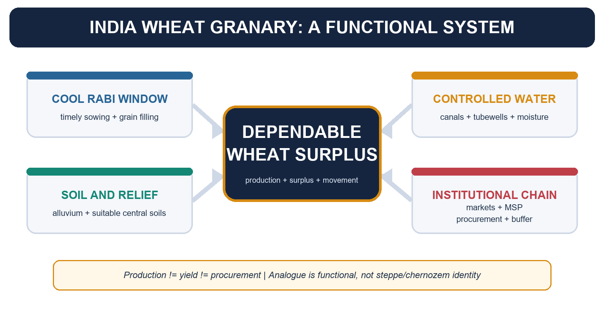

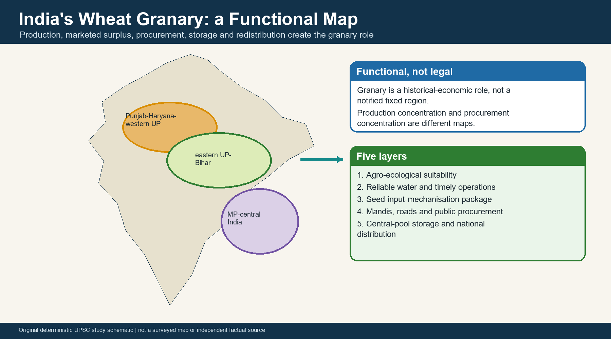

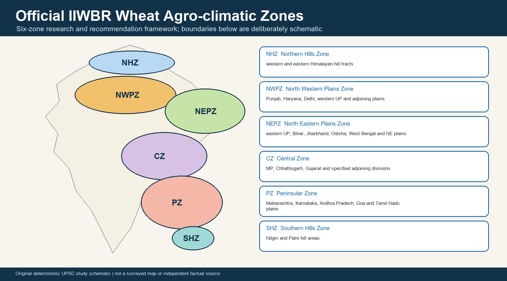

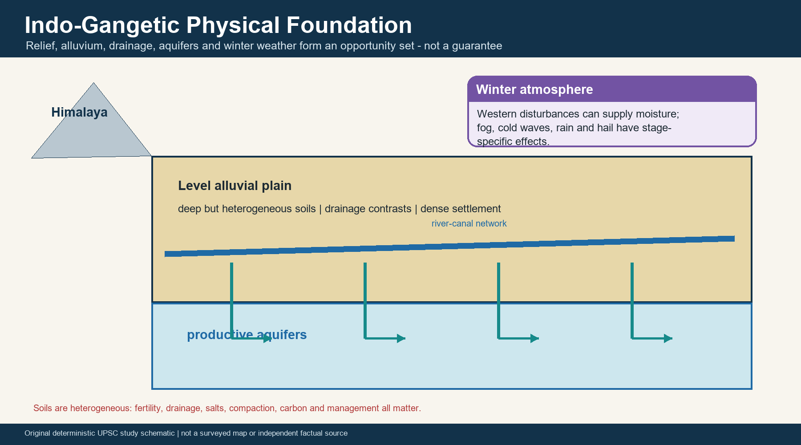

The official research framework has six zones: **Northern Hills Zone, North Western Plains Zone,
North Eastern Plains Zone, Central Zone, Peninsular Zone and Southern Hills Zone**. NWPZ and NEPZ
form the principal Indo-Gangetic tract. The map is a schematic learning aid; the guide itself
splits some states by division, valley, hill or plain setting.

| Zone | High-value geography | UPSC use |
| --- | --- | --- |
| NHZ | Himalayan hill tracts | altitude, frost, rust, local calendar |
| NWPZ | Punjab-Haryana-Delhi-western UP and adjoining plains | core surplus and procurement |
| NEPZ | eastern UP-Bihar-eastern plains | drainage, turnaround, access and yield gap |
| CZ | MP-Chhattisgarh-Gujarat and specified adjoining areas | central expansion and soil contrast |
| PZ | Maharashtra-Karnataka-AP-Goa and Tamil Nadu plains | shorter winter and niche types |
| SHZ | Nilgiri-Palni hill areas | local hill adaptation |

- [FACT] Zoning uses climate, soils and growing duration.
- [LIMIT] It is neither a legal granary boundary nor a permanent production ranking.
- [ANALYSIS] India is polycentric: the north-west remains a high-yield/procurement anchor while UP,
  MP, Rajasthan, Bihar and other regions perform different production, market and resilience roles.

## 22. Wheat Types, Physiology and Phenology

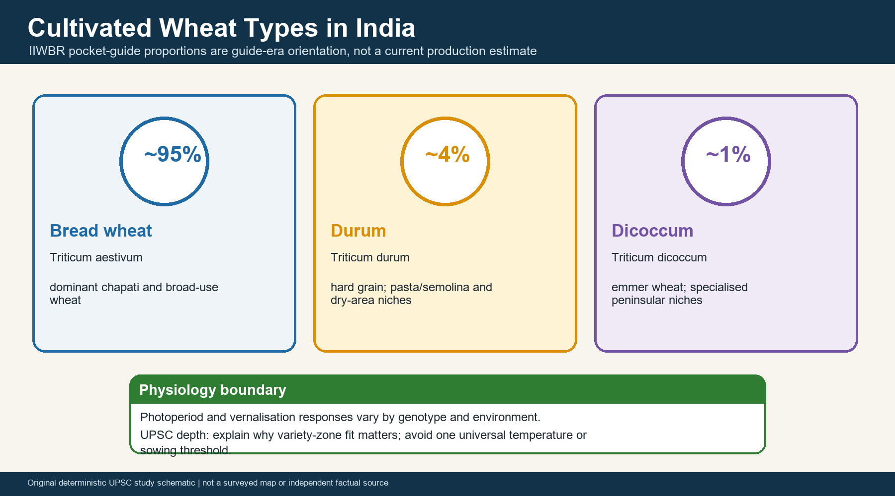

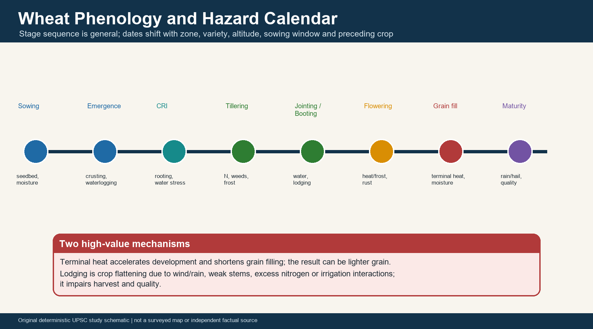

The IIWBR guide records bread wheat, durum and dicoccum, with approximate guide-era shares of
95, 4 and 1 per cent. These are orientation values, not a current output dashboard.
Photoperiod and vernalisation responses differ by genotype; the bounded UPSC point is that variety,
zone and sowing window must match. Avoid one national chilling or temperature threshold.

```text
sowing -> emergence -> CRI -> tillering -> jointing/booting
        -> flowering -> grain filling -> maturity
```

- [MECHANISM] Terminal heat accelerates development and shortens grain filling.
- [MECHANISM] Lodging links wind/rain with stem strength, nitrogen, density, variety and irrigation.
- [QUALIFICATION] An observed anomaly is not automatically a quantified crop-loss assessment.

## 23. Water at the Right Stage; Water at the Right Scale

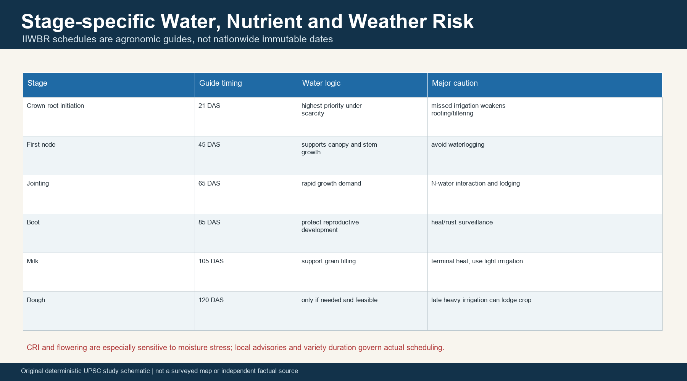

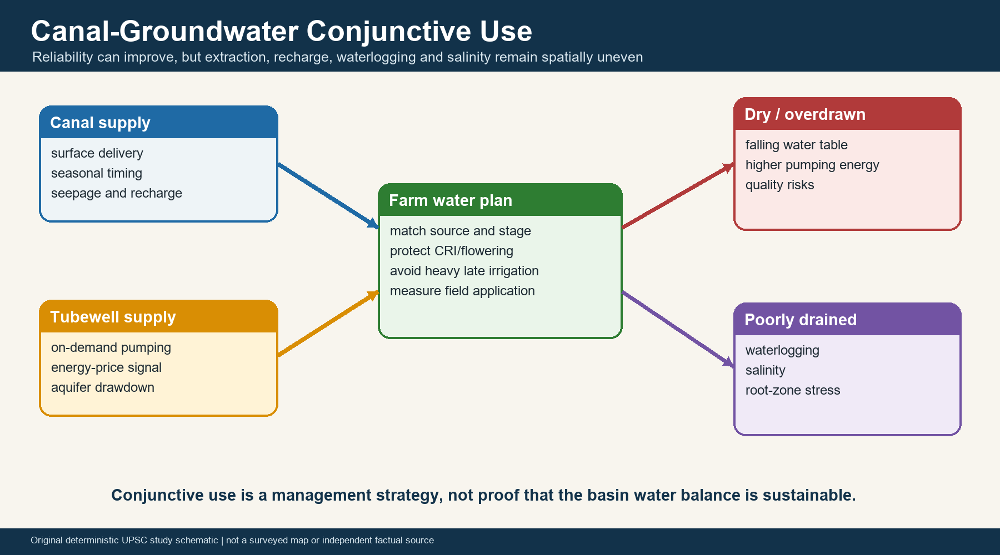

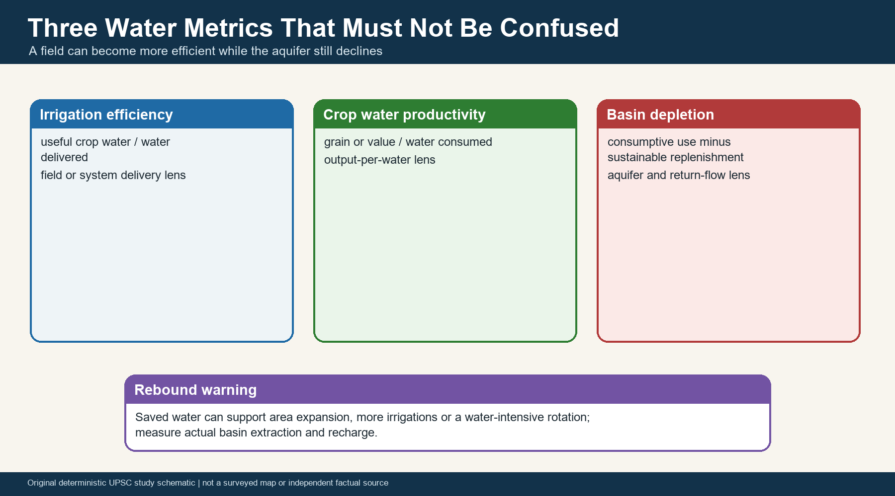

The IIWBR guide's indicative sequence is CRI 21 DAS, first node 45, jointing 65, boot 85,
milk 105 and dough 120. It gives CRI priority under scarcity and identifies CRI and flowering as
especially sensitive to moisture stress. These are guide stages, not immutable national dates.

CGWB's 2025 national assessment reports 448.68 bcm recharge, 407.88 bcm extractable resource and
247.18 bcm extraction. National totals cannot be converted into a Punjab/Haryana percentage.
Over-extraction, waterlogging and salinity are spatially contrasting outcomes.

> **Water trap:** irrigation efficiency, crop water productivity and basin depletion are different.
> Plot-level saving can rebound into more irrigated area or crop intensity.

## 24. Green-Revolution Institutions and the Rice-Wheat Bottleneck

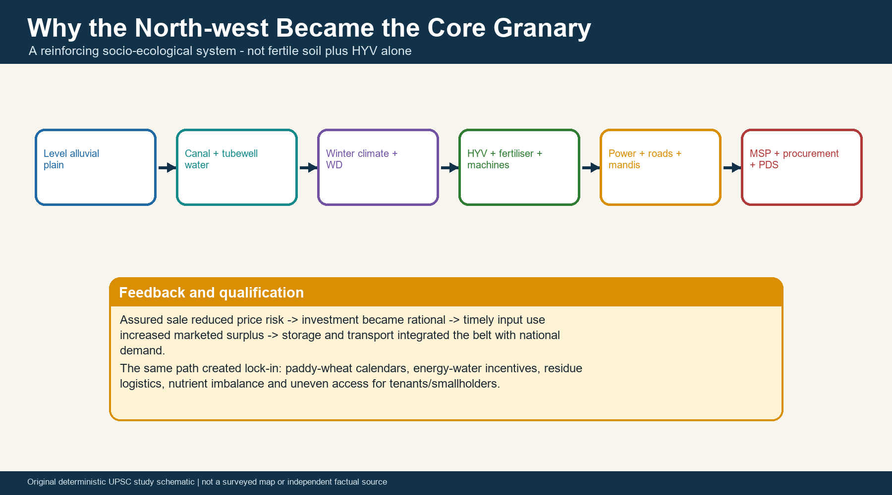

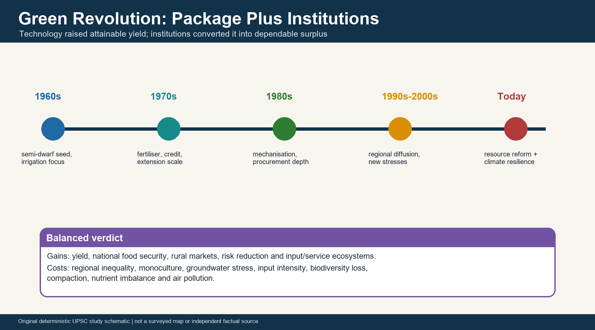

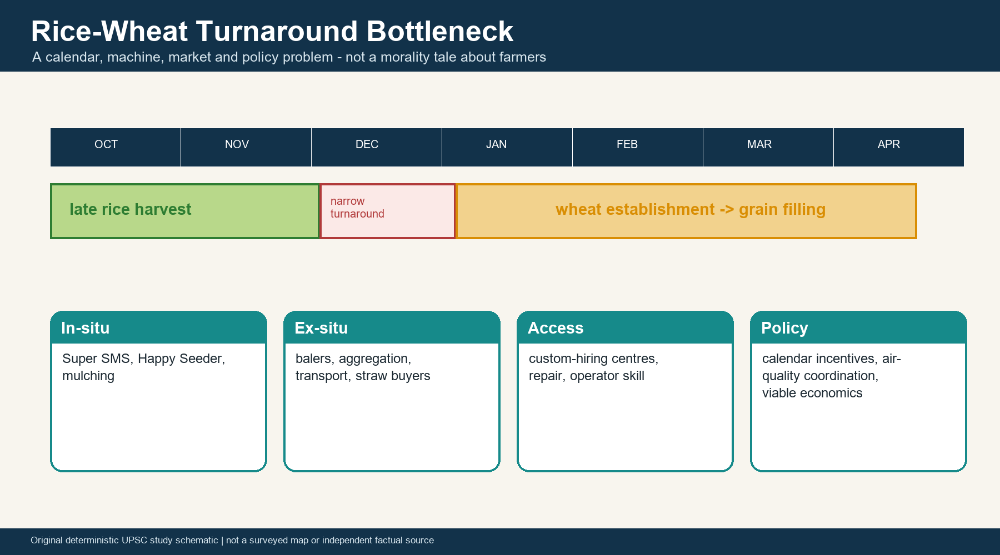

The core granary emerged from level plains and winter suitability **plus** canals/tubewells,
semi-dwarf seed, fertiliser, credit, extension, electrification, roads, machines, mandis and public
purchase. Assured sale altered ex-ante investment incentives. The same success produced path
dependence, regional inequality and a narrow rice-wheat turnaround.

- [STATUS] The official CRM release of 16 June 2026 provided Rs 544.15 crore, including a
  Rs 272.07 crore first instalment. It set targets of more than 46,000 machines, 910 CHCs and
  141 supply-chain projects.
- [LIMIT] Allocation and targets are not outcome evidence.
- [ANALYSIS] Happy Seeder/Super SMS, balers, custom hiring, straw buyers, transport and policy
  calendars solve different links; no single machine is universal.

## 25. Soil, Procurement and Post-harvest Architecture

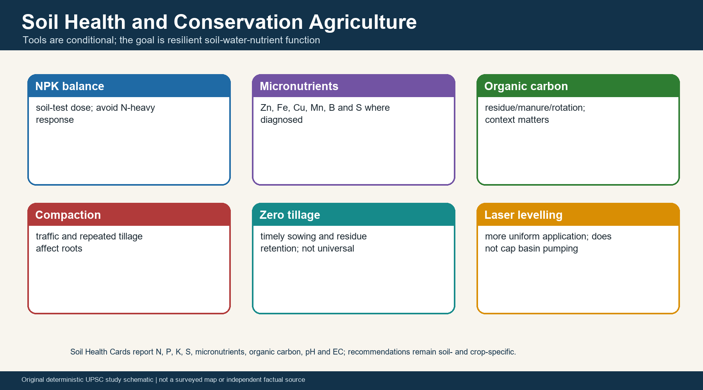

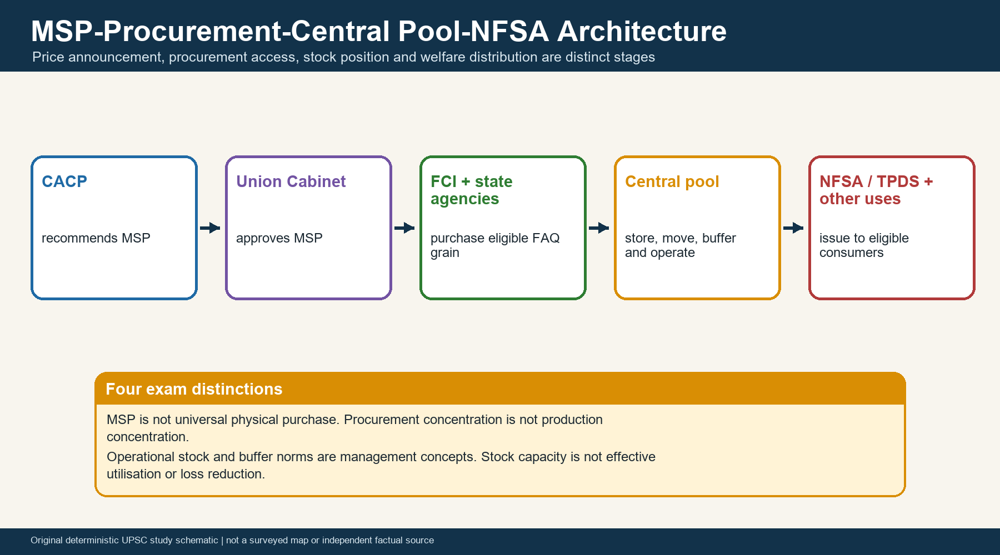

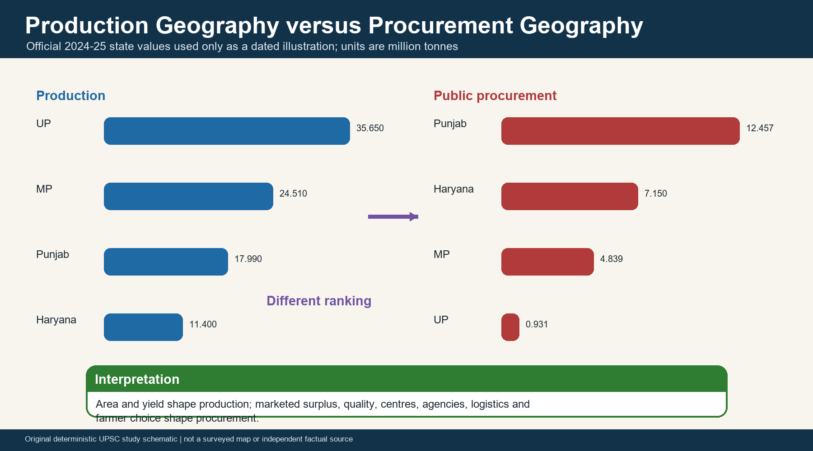

Soil Health Cards cover N, P, K, S, Zn, Fe, Cu, Mn, B, organic carbon, pH and EC. Zero tillage,
laser levelling, sensors and residue retention are conditional tools, not universal yield or
pollution guarantees.

```text
CACP recommendation -> Cabinet MSP decision -> FCI/state procurement
-> central pool -> storage/movement -> NFSA/TPDS and other authorised uses
```

MSP announcement, realised price, procurement access, FAQ quality, central-pool stock, buffer norm,
capacity and loss reduction remain separate. Harvest moisture, drying, pests, mycotoxins, stacking,
transport and effective silo/godown use determine post-harvest performance.

## 26. 2026 Status Dashboard and Climate-Evidence Ladder

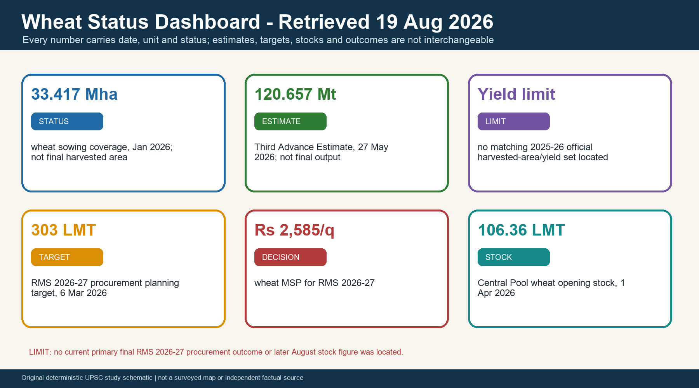

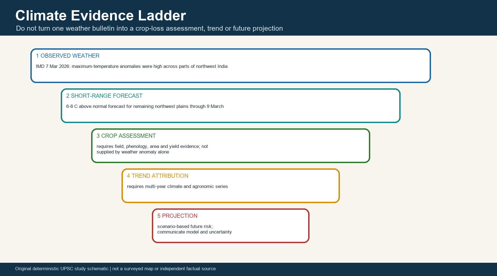

| Label | Dated statement | What it is not |
| --- | --- | --- |
| [STATUS] | 334.17 lakh ha wheat sowing coverage, January 2026 | final harvested area |
| [ESTIMATE] | 120.657 MT, Third Advance Estimate, 27 May 2026 | final production |
| [LIMIT] | no matched 2025-26 harvested-area/yield set located in the accessed summary | permission to fabricate yield |
| [TARGET] | 303 LMT procurement target, RMS 2026-27, 6 March 2026 | achieved procurement |
| [DECISION] | Rs 2,585/q wheat MSP, RMS 2026-27 | universal purchase |
| [STOCK] | 106.36 LMT Central Pool wheat opening stock, 1 April 2026 | later August balance or buffer norm |

[FACT] IMD on 7 March 2026 observed maximum temperatures 8-12 C above normal at most places over
J&K, Himachal Pradesh and Punjab and 3-7 C over Haryana-Delhi and western Rajasthan.
[FORECAST] It forecast 6-8 C above-normal maximum temperatures over remaining northwest plains
through 9 March before decline. [LIMIT] This is not a crop-loss assessment or climate attribution.

## 27. Diversification, Governance and Monitoring

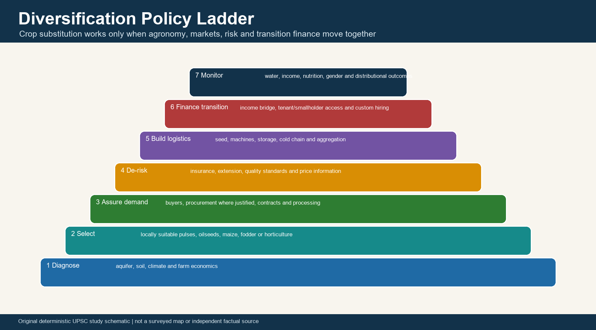

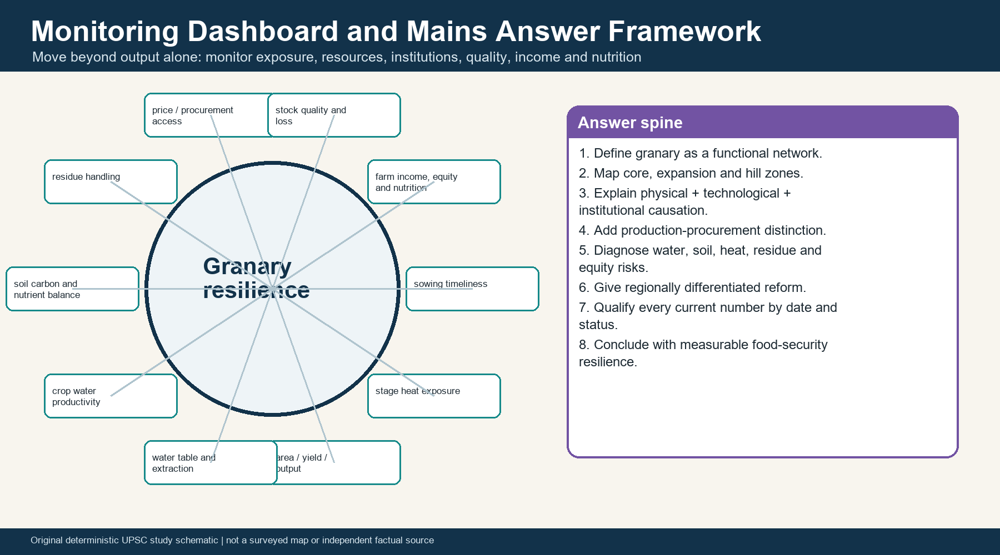

Diversification requires agro-climatic fit, seed, buyers, processing, price/risk instruments,
storage, machinery, transition finance and tenant/smallholder access. In Punjab-Haryana, the
water-saving priority can be Kharif-side reform while suitable Rabi wheat remains part of food
security. Nutrition policy should complement wheat-rice access with pulses, millets, oilseeds and
diverse diets rather than present cereals and nutrition as substitutes.

Monitor sowing timeliness, stage heat exposure, area/yield/output, water table and extraction,
crop water productivity, soil carbon/nutrient balance, residue handling, price/procurement access,
stock quality/loss, farm income/equity, diversification and nutrition.

## PYQ / PRACTICE / WORKBOOK START

> **PYQ disclosure:** No direct standalone UPSC question titled "India's Wheat Granary" was verified
> in the checked local official-paper corpus. The questions below are genuinely adjacent verified
> questions on zero tillage, MSP, Green Revolution science, rice-wheat systems, irrigation, crop
> diversification, NFSA/PDS, buffer stocks and groundwater. They are not relabelled as direct wheat-
> granary PYQs. Mains papers have no objective key. For the 2020 Prelims question, the exact stem is
> verified but an official key was not located in the local corpus; the reasoned solution is
> prominently non-official.

### PYQ 1 - UPSC Prelims 2020 Q83: Zero Tillage

**Question:** What is/are the advantage/advantages of zero tillage in agriculture?

1. Sowing of wheat is possible without burning the residue of previous crop.
2. Without the need for nursery of rice saplings, direct planting of paddy seeds in the wet soil is
   possible.
3. Carbon sequestration in the soil is possible.

Select the correct answer using the code given below:

A. 1 and 2 only  
B. 2 and 3 only  
C. 3 only  
D. 1, 2 and 3

**Source status:** VERIFIED PYQ - exact English stem checked in local official paper
`books/more_previous_papers/CSP_2020_GS_Paper-1.pdf`. Official key not held locally.

**INFERRED ANSWER — NOT OFFICIALLY VERIFIED: D (1, 2 and 3). Confidence: High.**

**Reasoned solution - not an official key:** D is the most defensible answer. Zero-till and
residue-compatible seeders permit wheat sowing without field burning; direct-seeded rice can avoid
the nursery-transplanting step under suitable systems; reduced disturbance and residue retention
can support soil-carbon storage. [LIMIT] Outcomes depend on management, soil, residue and weed
control. **Why this earns marks:** every statement is tested independently and key status is honest.

---

### PYQ 2 - UPSC GS-III 2018 Q3: MSP and Low-Income Trap

**Question:** What do you mean by Minimum Support Price (MSP)? How will MSP rescue the farmers from
the low income trap? (Answer in 150 words)

**Source status:** VERIFIED PYQ - exact English stem checked in local official paper
`books/more_previous_papers/GENERAL-STUDIES-PAPER-III.pdf`.

**Model solution:**

- [CLAIM] MSP is an announced floor-price instrument intended to reduce downside price risk; it
  rescues income only where transmission and productivity conditions work.
- [EVIDENCE] CACP recommends and the Union government approves MSP; FCI/state procurement makes the
  signal credible for wheat in procurement-heavy regions.
- [ANALYSIS] A credible floor reduces distress-sale risk, supports investment in seed and inputs,
  improves credit confidence and can stabilise marketed surplus.
- [QUALIFICATION] Announcement without purchase access, quality acceptance, market competition or
  cost control may not raise realised income. Cereal concentration can also distort crops and water.
- [VERDICT] Combine MSP with wider markets, efficient procurement, storage, FPOs, risk management
  and region-suitable diversification.

**Why this earns marks:** It answers both definition and rescue mechanism, then qualifies coverage.

---

### PYQ 3 - UPSC GS-III 2019 Q5: Visvesvaraya and Swaminathan

**Question:** How was India benefitted from the contributions of Sir M. Visvesvaraya and
Dr. M. S. Swaminathan in the fields of water engineering and agricultural science respectively?
(Answer in 150 words)

**Source status:** VERIFIED PYQ - exact English stem checked in local official paper
`books/more_previous_papers/QP-CSM19-GeneralStudies-III.pdf`.

**Model solution:**

- [CLAIM] Visvesvaraya strengthened systematic water engineering; Swaminathan helped adapt modern
  crop science to Indian food-security needs.
- [EVIDENCE] Visvesvaraya is associated with automatic sluice gates and planned irrigation systems;
  Swaminathan's IARI leadership helped adapt Norin-10-derived semi-dwarf wheat with the wider
  Borlaug-IARI-state-extension effort.
- [ANALYSIS] Water control reduced production uncertainty, while fertiliser-responsive semi-dwarf
  wheat raised yield potential and supported national self-sufficiency.
- [QUALIFICATION] Neither achievement was individual or sufficient alone: dams need governance;
  seed required irrigation, fertiliser, credit, extension and procurement.
- [VERDICT] Their combined legacy is infrastructure plus adaptive science, now requiring ecological
  efficiency.

**Why this earns marks:** The two contributions remain distinct and are connected without
hero-worship.

---

### PYQ 4 - UPSC GS-III 2020 Q13: Rice-Wheat System

**Question:** What are the major factors responsible for making rice-wheat system a success? In
spite of this success how has this system become bane in India? (Answer in 250 words)

**Source status:** VERIFIED PYQ - exact English stem checked in local official paper
`books/more_previous_papers/Gen_St_P3.pdf`.

**Model solution:**

- [CLAIM] The system succeeded because complementary technology and institutions stabilised two
  crops; it became a bane where the same incentives exceeded ecological capacity.
- [EVIDENCE] Punjab-Haryana-western UP combined canal/tubewell irrigation, semi-dwarf seed,
  fertiliser, mechanisation, electricity, mandis and paddy-wheat procurement.
- [ANALYSIS] Assured water and purchase enabled double cropping, high yield and central-pool
  surplus. Path dependence then narrowed rotation and encouraged pumping, nutrient imbalance,
  paddy-residue burning, pest/weed pressure and delayed wheat sowing.
- [QUALIFICATION] Wheat is generally less water-demanding than flooded paddy; the annual system and
  incentive structure, not wheat alone, drive the crisis.
- [VERDICT] Reform paddy incentives and groundwater governance, enable residue-compatible timely
  wheat, restore soils and build markets for region-suitable alternatives.

**Why this earns marks:** It gives success factors and negative consequences with a balanced causal
verdict.

---

### PYQ 5 - UPSC GS-III 2020 Q14: Water Storage and Irrigation

**Question:** Suggest measures to improve water storage and irrigation system to make its judicious
use under depleting scenario. (Answer in 250 words)

**Source status:** VERIFIED PYQ - exact English stem checked in local official paper
`books/more_previous_papers/Gen_St_P3.pdf`.

**Model solution:**

- [CLAIM] Judicious irrigation needs source augmentation, distribution efficiency and demand
  governance together.
- [EVIDENCE] PMKSY components, watershed ridge-to-valley treatment, Atal Bhujal Yojana, canal
  command management and micro-irrigation provide named instruments.
- [ANALYSIS] Rehabilitate tanks and canals, harvest rain, recharge aquifers, schedule critical
  irrigations, improve field levelling, measure water budgets and align electricity/crop incentives.
- [QUALIFICATION] Drip or improved efficiency can produce rebound if farmers expand irrigated area;
  recharge cannot justify continued over-extraction.
- [VERDICT] Manage water at aquifer/canal-command scale with farmer institutions and crop planning,
  not through isolated structures.

**Why this earns marks:** Storage, conveyance, field use and incentives are all addressed.

---

### PYQ 6 - UPSC GS-III 2021 Q13: NFSA and Hunger

**Question:** What are the salient features of the National Food Security Act, 2013? How has the
Food Security Bill helped in eliminating hunger and malnutrition in India? (Answer in 250 words)

**Source status:** VERIFIED PYQ - exact English stem checked in local official paper
`books/more_previous_papers/QP-CSM-21-GENSTUDIESPAPER-III-110122.pdf`.

**Model solution:**

- [CLAIM] NFSA converted cereal access for eligible households into a legal-entitlement framework,
  but hunger and malnutrition require more than grain delivery.
- [EVIDENCE] Priority households, Antyodaya households, TPDS, maternity and child-related nutrition
  provisions, grievance architecture and central-pool procurement-distribution form the system.
- [ANALYSIS] Wheat and rice stocks stabilise household cereal access and protect consumption during
  income shocks; portability and digitisation can improve access for migrants.
- [QUALIFICATION] Exclusion, outdated coverage, biometric failure, diet quality, sanitation, health
  and intra-household allocation limit nutritional impact.
- [VERDICT] Preserve entitlements while updating coverage and integrating pulses, millets, maternal
  health and accountable delivery.

**Why this earns marks:** It distinguishes foodgrain access from complete nutrition security.

---

### PYQ 7 - UPSC GS-III 2021 Q14: Crop Diversification

**Question:** What are the present challenges before crop diversification? How do emerging
technologies provide an opportunity for crop diversification? (Answer in 250 words)

**Source status:** VERIFIED PYQ - exact English stem checked in local official paper
`books/more_previous_papers/QP-CSM-21-GENSTUDIESPAPER-III-110122.pdf`.

**Model solution:**

- [CLAIM] Diversification is constrained by coordinated market and risk failures, not merely farmer
  preference.
- [EVIDENCE] Rice-wheat regions possess specialised machinery, procurement, storage and skills;
  alternatives often lack buyers, processing and insurance depth.
- [ANALYSIS] Remote sensing and suitability maps improve crop matching; climate-resilient seed,
  micro-irrigation, advisories, precision input use, digital markets, traceability and processing
  lower production and transaction risk.
- [QUALIFICATION] Technology cannot create remunerative demand and can deepen debt or exclusion.
- [VERDICT] Build cluster-specific buyer, processing, extension, credit and transition-income
  packages before shifting area.

**Why this earns marks:** It links technology to each identified constraint rather than listing
gadgets.

---

### PYQ 8 - UPSC GS-III 2022 Q3: PDS Effectiveness

**Question:** What are the major challenges of Public Distribution System (PDS) in India? How can it
be made effective and transparent? (Answer in 150 words)

**Source status:** VERIFIED PYQ - exact English stem checked in local official paper
`books/more_previous_papers/QP-CSM-22-GENERAL-STUDIES-PAPER-III-190922.pdf`.

**Model solution:**

- [CLAIM] PDS challenges arise from beneficiary identification, stock movement, dealer incentives,
  authentication and grievance failures.
- [EVIDENCE] NFSA entitlements rely on procurement, central-pool movement, state allocation and
  fair-price shops; ONORC and ePoS are named transparency reforms.
- [ANALYSIS] Update rolls, publish allocation and stock data, ensure portability, audit transport
  and shops, maintain offline fallback and strengthen social audit/grievance redress.
- [QUALIFICATION] Digitisation can reduce diversion but exclude genuine users through connectivity,
  biometric or seeding failure.
- [VERDICT] Combine traceability with human fallback, independent audit and nutritional
  diversification.

**Why this earns marks:** It follows grain from procurement to last-mile access.

---

### PYQ 9 - UPSC GS-III 2024 Q13: Irrigation Challenges

**Question:** What are the major challenges faced by Indian irrigation system in recent times?
State the measures taken by the government for efficient irrigation management. (Answer in
250 words)

**Source status:** VERIFIED PYQ - exact English stem checked in local official paper
`books/mains/03 UPSC 2024 Paper-III.pdf`.

**Model solution:**

- [CLAIM] India's irrigation problem is simultaneous under-access, low efficiency and
  over-extraction.
- [EVIDENCE] Canal tail-end inequity, siltation, groundwater-energy incentives and regional crop
  concentration coexist; PMKSY, Per Drop More Crop, Har Khet Ko Pani and Atal Jal address different
  links.
- [ANALYSIS] Modernise canals, improve scheduling and field channels, scale suitable drip/sprinkler,
  budget aquifers, use advisories and reform crop/power incentives.
- [QUALIFICATION] Micro-irrigation is not universally suitable for wheat and does not ensure basin
  saving without extraction limits.
- [VERDICT] Shift from project completion to water-service, aquifer and crop-outcome monitoring.

**Why this earns marks:** The answer distinguishes access, delivery efficiency and sustainability.

---

### PYQ 10 - UPSC GS-III 2024 Q14: Buffer Stocks

**Question:** Elucidate the importance of buffer stocks for stabilizing agricultural prices in
India. What are the challenges associated with the storage of buffer stock? Discuss. (Answer in
250 words)

**Source status:** VERIFIED PYQ - exact English stem checked in local official paper
`books/mains/03 UPSC 2024 Paper-III.pdf`.

**Model solution:**

- [CLAIM] Buffer stocks stabilise availability and expectations only when procurement, storage and
  release are calibrated.
- [EVIDENCE] FCI/state agencies procure wheat and rice for the central pool, support NFSA and can
  release stocks through OMSS(D).
- [ANALYSIS] Purchase supports farm prices; stocks bridge seasons and emergencies; calibrated
  release augments supply. Storage faces moisture, pests, ageing, excess stock, carrying cost,
  location mismatch and movement constraints.
- [QUALIFICATION] Excess procurement can distort crops and water, while aggressive release can
  weaken farmer prices.
- [VERDICT] Use transparent dynamic norms, scientific storage, decentralised capacity, quality
  monitoring and rule-based release.

**Why this earns marks:** It answers both stabilisation and storage, then adds policy trade-offs.

---

### PYQ 11 - UPSC GS-III 2025 Q13: Groundwater Depletion

**Question:** Examine the factors responsible for depleting groundwater in India. What are the
steps taken by the government to mitigate such depletion of groundwater? (Answer in 250 words)

**Source status:** VERIFIED PYQ - exact English stem checked in local official paper
`books/mains/UPSC Mains 2025 GS Paper 3 3.pdf`.

**Model solution:**

- [CLAIM] Depletion results from an open-access aquifer interacting with cheap pumping, crop
  incentives, urban demand and weak recharge governance.
- [EVIDENCE] The north-west rice-wheat system illustrates power-procurement-crop lock-in; Atal Jal,
  Jal Shakti Abhiyan, watershed programmes and aquifer mapping are named responses.
- [ANALYSIS] Meter or proxy-monitor extraction, budget aquifers, recharge suitable zones, improve
  canal reliability, align crop purchase with water, promote precision irrigation and strengthen
  local user institutions.
- [QUALIFICATION] Recharge potential varies by geology; wheat is not equivalent to flooded paddy;
  efficiency can rebound into greater total use.
- [VERDICT] Govern aquifers as common resources and publish water-crop-energy outcomes.

**Why this earns marks:** It explains causal interaction, names measures and avoids blaming one crop.

---

### Supplemental PYQ A - UPSC Prelims 2018 Q93: MSP Crops

**VERIFIED PYQ. INFERRED ANSWER — NOT OFFICIALLY VERIFIED: B. Confidence: High.**

The listed MSP set is barley, finger millet, groundnut and sesamum (2, 4, 5 and 6). Areca nut,
coffee and turmeric are eliminated. **Why this earns marks:** every crop is tested separately and
the unavailable local official key is not misrepresented.

### Supplemental PYQ B - UPSC Prelims 2019 Q79: FCI Economic Cost

**VERIFIED PYQ. INFERRED ANSWER — NOT OFFICIALLY VERIFIED: C. Confidence: High.**

FCI economic cost equals MSP/bonus plus procurement incidentals and distribution cost.
**Why this earns marks:** it separates acquisition and distribution instead of selecting one
visible expense.

### Supplemental PYQ C - UPSC Prelims 2020 Q69: Unlimited MSP Procurement

**VERIFIED PYQ. INFERRED ANSWER — NOT OFFICIALLY VERIFIED: D. Confidence: High.**

Neither statement is correct. Procurement is not unlimited for all covered crops in every
State/UT, and market price can rise above MSP. **Why this earns marks:** it rejects both absolute
claims using operational and price logic.

### Supplemental PYQ D - UPSC Prelims 2020 Q98: CGWA and Groundwater Irrigation

**VERIFIED PYQ. INFERRED ANSWER — NOT OFFICIALLY VERIFIED: B (2 and 3 only). Confidence: High.**

The first statement confuses assessment units with districts. CGWA's Environment (Protection) Act
basis and India's groundwater-irrigation scale make statements 2 and 3 correct.
**Why this earns marks:** the unit-of-analysis trap is identified before choosing the combination.

### Supplemental PYQ E - UPSC Prelims 2023 Q76: Global Groundwater Withdrawal

**VERIFIED PYQ. INFERRED ANSWER — NOT OFFICIALLY VERIFIED: C. Confidence: High.**

Statement I is correct; Statement II is incorrect because agriculture, not drinking water and
sanitation alone, drives the exceptional withdrawal. **Why this earns marks:** truth and
explanation are independently tested.

### Supplemental PYQ F - UPSC GS-I 2024 Q14: Gangetic Groundwater and Food Security

**Question:** The groundwater potential of the Gangetic valley is on a serious decline. How may
it affect the food security of India? (250 words)

**Model solution:**

- [CLAIM] Aquifer decline converts a high-surplus plain into an irrigation-reliability and equity
  risk.
- [EVIDENCE] The Gangetic plain combines rice-wheat intensity, productive aquifers, dense
  population and major market-procurement networks; CGWB 2025 shows why recharge and extraction
  must be measured rather than abundance assumed.
- [ANALYSIS] Falling water levels raise pumping energy and capital costs, delay critical-stage
  irrigation and divide deep-well owners from small/tenant farms. Yield/quality variability can
  weaken marketed surplus, procurement and buffer replenishment.
- [ANALYSIS] Higher costs and spatial production shocks affect consumer prices and stability;
  cereal lock-in can also crowd out pulses and dietary diversity.
- [QUALIFICATION] The valley is heterogeneous: some canal commands face waterlogging/salinity,
  while eastern areas may have groundwater but weaker energy, drainage, seed and market access.
  Conventionally flooded paddy usually places a heavier water burden than wheat.
- [VERDICT] Combine aquifer accounting, conjunctive use, reliable but better-designed energy
  support, Kharif diversification, timely wheat, efficient application, recharge/drainage,
  procurement reform and transition-income safeguards.

**Why this earns marks:** it gives a causal food-security chain, named evidence, intra-valley
differentiation, a crop qualification and an implementable verdict.

# Solved Original MCQ and Remedial Loops

> Rotation audit: the 48 original keys below run continuously A -> B -> C -> D, repeated exactly
> twelve times. PYQ option order above is preserved separately and excluded from this rotation.

### MCQ 1

Which formulation most accurately describes India's wheat granary?

A. A functional irrigated and institutional analogue of world wheat granaries, not a true steppe  
B. A chernozem belt identical to the Ukrainian steppe  
C. A statutory zone notified by FCI  
D. A rainfed belt confined to Punjab

**Answer: A.** India's granary role rests on winter crop suitability, irrigation, technology,
marketed surplus and procurement; climatic and pedological identity with the steppe is false.

### MCQ 2

Which soil comparison is correct?

A. Punjab alluvium and chernozem have identical origins  
B. Punjab-Haryana wheat is mainly linked with alluvium; central Indian wheat may also use black soils  
C. Every black soil in India is a temperate grassland soil  
D. Wheat can grow only on chernozem

**Answer: B.** The northern core is alluvial, while parts of central India use regur or mixed soils;
neither should be relabelled chernozem.

### MCQ 3

Why is one rigid India-wide wheat calendar unsafe?

A. Wheat is grown only in hill regions  
B. Wheat is a perennial crop  
C. preceding crop, variety, irrigation, latitude and altitude shift farm windows  
D. MSP changes the biological crop duration

**Answer: C.** Regional agroclimate and farm sequence determine actual sowing and harvest windows.

### MCQ 4

Terminal heat most directly threatens wheat by:

A. creating chernozem  
B. increasing winter chill indefinitely  
C. extending grain filling  
D. accelerating development and shortening grain filling

**Answer: D.** Late-season heat can compress the period in which grain accumulates dry matter.

### MCQ 5

In the official 2024-25 state table, which listed state had the largest wheat production?

A. Uttar Pradesh  
B. Punjab  
C. Haryana  
D. Bihar

**Answer: A.** Uttar Pradesh produced 35.65 million tonnes in the cited DES table.

### MCQ 6

In the same dated table, which listed state had the highest wheat yield?

A. Madhya Pradesh  
B. Punjab  
C. Uttar Pradesh  
D. Rajasthan

**Answer: B.** Punjab's reported yield was 5,123 kg per hectare, illustrating why yield and total
production ranks differ.

### MCQ 7

Which sequence correctly moves from farm output to public purchase?

A. procurement -> production -> yield -> area  
B. MSP -> stock -> rainfall -> seed  
C. production -> marketable/marketed surplus -> eligible arrival -> procurement  
D. buffer stock -> yield -> marketable surplus -> sowing

**Answer: C.** Government procurement is a filtered part of marketed output, not a synonym for
production.

### MCQ 8

Which statement about marketed surplus is most accurate?

A. It is always identical to procurement  
B. It equals yield minus area  
C. It includes only grain stored by FCI  
D. It is the quantity actually sold after farm retention and other uses

**Answer: D.** Marketed surplus includes public and private sales and differs from marketable
surplus in timing and farmer retention decisions.

### MCQ 9

The 2024-25 production-procurement comparison most strongly shows that:

A. production leadership and procurement leadership can differ sharply  
B. Punjab produced more wheat than Uttar Pradesh  
C. public purchase equals total output in every state  
D. yield has no role in production

**Answer: A.** UP's much larger production coexisted with far lower procurement than Punjab.

### MCQ 10

Why can Punjab-Haryana be called granary anchors despite not leading every output rank?

A. They have a statutory monopoly on wheat  
B. high yield, marketed surplus, purchase centres and logistics combine there  
C. all their wheat is exported  
D. their wheat is rainfed

**Answer: B.** Granary function includes dependable surplus extraction and movement, not output
alone.

### MCQ 11

Which physical combination best supports north Indian wheat?

A. steep slopes, laterite and summer cyclones  
B. mangrove mud and tidal irrigation  
C. level alluvial plains, cool winter and assured irrigation  
D. permanent snow and tundra soil

**Answer: C.** Relief, soil, winter weather and water control form the physical platform.

### MCQ 12

Which statement about western disturbances is correct?

A. They are a branch of the southwest monsoon  
B. More events always improve yield  
C. They affect only Himalayan tourism  
D. moderate timely rain may help, while hail or rain near maturity can damage wheat

**Answer: D.** Their agricultural effect is conditional on intensity, track and crop stage.

### MCQ 13

What best explains Madhya Pradesh's growing wheat role?

A. later diffusion of suitable varieties, irrigation, markets and procurement over diverse soils  
B. conversion into a true Eurasian steppe  
C. complete absence of climate risk  
D. exclusive dependence on chernozem

**Answer: A.** MP demonstrates dynamic diffusion beyond the original north-west core.

### MCQ 14

Which distinction between regur and chernozem is correct?

A. Both are simply names for Punjab alluvium  
B. regur is basalt-linked Indian black soil; chernozem is a temperate grassland soil  
C. chernozem is a coastal saline soil  
D. regur cannot support any cereal

**Answer: B.** Similar colour or crop use does not establish identical soil genesis.

### MCQ 15

Which was indispensable to the Green Revolution wheat package?

A. seed without water or fertiliser  
B. procurement without production technology  
C. complementarity among semi-dwarf seed, water, inputs, credit, extension and markets  
D. replacement of every traditional crop in India

**Answer: C.** The yield response depended on a package whose components reinforced one another.

### MCQ 16

Why did early Green Revolution gains concentrate spatially?

A. all Indian regions had identical preconditions  
B. wheat biology prohibited eastern cultivation  
C. procurement was illegal outside Punjab  
D. assured water, infrastructure, credit and markets were unevenly distributed

**Answer: D.** Adoption followed the geography of enabling preconditions.

### MCQ 17

What is path dependence in granary formation?

A. past procurement and infrastructure lower current transaction costs and reinforce the same region  
B. a river permanently fixes crop choice without institutions  
C. a crop cannot ever move to another state  
D. yield automatically falls after one season

**Answer: A.** Existing mandis, storage, machinery and administrative capacity make continued
specialisation more attractive.

### MCQ 18

Which statement best captures eastern Indo-Gangetic constraints?

A. Alluvial fertility guarantees Punjab-like procurement  
B. delayed rice harvest, water control, small surplus and market access can delay wheat intensification  
C. wheat cannot grow east of Delhi  
D. eastern India lacks winter

**Answer: B.** Physical fertility must be joined with timing, institutions and controlled water.

### MCQ 19

Which statement about wheat irrigation is best supported?

A. High-output Indian wheat is primarily a rainfed steppe system  
B. Irrigation coverage proves groundwater is sustainable  
C. official data show wheat is overwhelmingly irrigated, while sources and sustainability vary  
D. canals are the sole wheat-water source

**Answer: C.** The cited all-India irrigation share is high, but canal, groundwater and residual
moisture combinations differ.

### MCQ 20

Which is the safest conclusion about wheat and paddy water use?

A. Both require identical continuous ponding  
B. Wheat has no water footprint  
C. Paddy never affects groundwater  
D. wheat generally needs less water than flooded paddy, but still matters within the annual nexus

**Answer: D.** The groundwater crisis is a system outcome, not permission to ignore wheat
irrigation.

### MCQ 21

The water-energy-crop nexus refers to:

A. pumping incentives, irrigation security and crop choice reinforcing groundwater extraction  
B. photosynthesis alone  
C. export freight charges  
D. western disturbances creating electricity

**Answer: A.** Power pricing and pump access alter both private costs and aquifer pressure.

### MCQ 22

Why may plot-level irrigation efficiency fail to reduce basin extraction?

A. efficient systems cannot deliver water  
B. saved water may support area expansion or more intensive cropping  
C. aquifers refill instantly  
D. crop choice never changes water demand

**Answer: B.** This is the efficiency-rebound problem.

### MCQ 23

Conservation agriculture is best defined by:

A. burning all residue before sowing  
B. deep tillage every season  
C. minimum disturbance, residue management and crop rotation  
D. replacing irrigation with rainfall

**Answer: C.** Zero tillage is one component, not the entire conservation system.

### MCQ 24

How can residue-compatible zero tillage support climate resilience?

A. by creating winter rainfall  
B. by eliminating all weeds  
C. by converting regur into alluvium  
D. by reducing turnaround delay and helping wheat avoid later terminal heat

**Answer: D.** Timely establishment can move sensitive grain filling away from hotter late-season
conditions.

### MCQ 25

What is the most direct agronomic consequence of terminal heat?

A. compressed grain filling and lighter grain  
B. creation of more tillers after maturity  
C. longer vernalisation  
D. higher soil humus by definition

**Answer: A.** Heat accelerates late crop development and can reduce the time available for grain
weight accumulation.

### MCQ 26

Which is an avoidance strategy rather than a genetic-tolerance strategy?

A. breeding a heat-tolerant variety  
B. suitable early/timely sowing to shift grain filling  
C. changing alluvium into black soil  
D. increasing storage after harvest

**Answer: B.** Calendar adjustment aims to avoid exposure; tolerant varieties aim to perform better
under exposure.

### MCQ 27

Which statement follows the climate-evidence ladder?

A. One hailstorm proves a century-long trend  
B. A projection is an observed event  
C. event, anomaly, trend, attribution and projection require separate evidence  
D. national output reveals every district's loss

**Answer: C.** Each evidence category answers a different question and requires its own period and
method.

### MCQ 28

Why can national output remain high despite local heat damage?

A. heat cannot damage wheat  
B. procurement creates grain biologically  
C. state tables are never revised  
D. larger area, timely sowing or better varieties can offset local yield loss in the aggregate

**Answer: D.** Aggregate production can conceal spatially concentrated losses and compensatory
gains.

### MCQ 29

What does public wheat procurement primarily do in spatial terms?

A. converts selected surplus arrivals into stocks for national movement and distribution  
B. measures all household wheat consumption  
C. determines winter temperature  
D. replaces private markets everywhere

**Answer: A.** Procurement links surplus geographies to the central pool.

### MCQ 30

Which statement about the RMS 2026-27 figure of 303 LMT is correct?

A. It is verified achieved procurement as of 19 August 2026  
B. It is an official procurement target, not an achieved total  
C. It is India's wheat production  
D. It is a farmer count

**Answer: B.** The source is a March 2026 planning target and must retain that status.

### MCQ 31

Which statement correctly interprets the RMS 2025-26 farmer count?

A. It covers every wheat farmer in India  
B. It proves 3.54 crore wheat farmers received MSP  
C. it reports 2,513,143 farmers associated with completed public wheat procurement  
D. it is the number of FCI warehouses

**Answer: C.** The official count applies to procured sellers and is about 25.13 lakh.

### MCQ 32

Why are quality norms central to procurement geography?

A. they determine monsoon onset  
B. they replace MSP  
C. they make storage unnecessary  
D. weather, harvest moisture and handling affect whether grain is accepted and stored safely

**Answer: D.** Procurement is a quality-filtered transaction, not an automatic purchase of every
grain lot.

### MCQ 33

What is a core function of buffer stocks?

A. supporting distribution, emergencies and calibrated market stabilisation  
B. guaranteeing that every crop receives procurement  
C. measuring soil fertility  
D. setting the sowing date

**Answer: A.** Public stocks connect procurement with welfare, stability and emergency response.

### MCQ 34

Which statement distinguishes OMSS(D) from TPDS?

A. Both are identical entitlement channels  
B. OMSS(D) releases stocks into open-market channels; TPDS delivers entitlements  
C. TPDS is a crop-breeding programme  
D. OMSS(D) fixes rainfall

**Answer: B.** The two releases use public grain for different policy purposes.

### MCQ 35

Why can excess stocks become problematic?

A. grain cannot be stored at all  
B. they eliminate carrying costs  
C. storage, quality, movement and fiscal costs rise, while crop incentives may distort  
D. they automatically diversify diets

**Answer: C.** Security stocks require calibration; quantity alone is not an unqualified good.

### MCQ 36

Which statement about MSP transmission is correct?

A. notification guarantees a sale at every village  
B. MSP has no ex-ante effect on crop decisions  
C. private prices can never exceed MSP  
D. realised support depends on access, quality, operations and alternative buyers

**Answer: D.** The price signal passes through several spatial and institutional filters.

### Remedial MCQ 37

A student writes, "Punjab is India's largest wheat producer, so it is the granary." What is the
best correction?

A. Granary status should be explained through yield, surplus and procurement; dated output data put UP ahead  
B. Punjab grows no wheat  
C. production is irrelevant to granary analysis  
D. only soil colour matters

**Answer: A.** The correction preserves Punjab's granary role while separating current production
rank from procurement and yield.

### Remedial MCQ 38

Which statement repairs the "India is a steppe wheat belt" error?

A. India has no economic wheat regions  
B. India is a functional granary analogue built on monsoonal winter cropping, alluvium and irrigation  
C. Punjab is part of the Eurasian steppe  
D. chernozem covers the Ganga plain

**Answer: B.** Functional similarity must be paired with physical and institutional difference.

### Remedial MCQ 39

A map shows wheat across UP, MP, Punjab and Haryana. What cannot be inferred from that map alone?

A. wheat occurs in several states  
B. regional extent exists  
C. the ranking of government procurement  
D. India has a Rabi season

**Answer: C.** A crop-occurrence or output map is not a procurement map.

### Remedial MCQ 40

Which is the best qualification to "western disturbances help wheat"?

A. They are tropical cyclones  
B. They occur only in summer  
C. Their rain is never useful  
D. benefit depends on timing and intensity; hail or maturity-stage rain can cause damage

**Answer: D.** Stage-specific direction of effect is the essential repair.

### Remedial MCQ 41

Which statement avoids blaming wheat for all north-west groundwater depletion?

A. the annual rice-wheat-power-procurement system and hydrogeology jointly determine stress  
B. wheat uses no irrigation  
C. paddy uses no water  
D. procurement cannot affect crop choice

**Answer: A.** The system explanation is more accurate than single-crop causation.

### Remedial MCQ 42

What must accompany a diversification recommendation?

A. only a slogan to reduce wheat  
B. agroclimatic fit plus buyers, processing, risk cover and transition support  
C. a ban on every cereal  
D. a national one-crop replacement

**Answer: B.** Farmers need a viable alternative income system, not just a different seed.

### Remedial MCQ 43

Which statement about the official 2025-26 production number is correct?

A. It is a final state-wise table  
B. It proves no district suffered heat stress  
C. it is a national Third Advance Estimate of 120.657 million tonnes  
D. it is the wheat procurement target

**Answer: C.** Status, scale and date must remain attached to the figure.

### Remedial MCQ 44

Why was the claimed 3.54 crore wheat-farmer coverage excluded?

A. farmer counts are never official  
B. no procurement occurs in India  
C. the package avoids all numbers  
D. the checked completed official procurement count was 2,513,143 and no official confirmation supported 3.54 crore

**Answer: D.** The package uses the verified scoped count and rejects an unsupported aggregate.

### Remedial MCQ 45

What is the best answer order for a wheat-granary Mains question?

A. map/definition -> physical base -> technology/institutions -> distinctions -> stresses -> reform  
B. schemes -> conclusion -> climate -> question  
C. data list without thesis  
D. global comparison only

**Answer: A.** The order moves from spatial foundation to causal system and qualified reform.

### Remedial MCQ 46

Which metric best tests whether a granary is sustainable?

A. production alone  
B. yield and income together with aquifer, soil, climate and procurement outcomes  
C. MSP announcement alone  
D. number of tractors alone

**Answer: B.** Sustainability is a multi-outcome test, not a tonnes-only claim.

### Remedial MCQ 47

Which statement correctly handles Madhya Pradesh?

A. It has replaced every north-west granary function  
B. It is climatically identical to Punjab  
C. it is a major and growing production/procurement region with a different physical pathway  
D. it grows wheat only on chernozem

**Answer: C.** MP updates the geography without erasing regional difference.

### Remedial MCQ 48

What is the strongest final verdict?

A. Remove wheat from India  
B. Restore a prairie climate in Punjab  
C. Expand procurement everywhere regardless of surplus  
D. retain wheat where suitable, reform water-crop incentives, diversify viably and monitor dated outcomes

**Answer: D.** A regionally differentiated systems strategy balances food security and resilience.


## Supplemental Official-Zone and 2026-Status MCQs

The earlier 48 authored keys complete twelve A-B-C-D cycles. These eight continue the same
sequence, producing **56 authored MCQs = fourteen complete A-B-C-D cycles**.

### Supplemental MCQ 49
Which is the IIWBR six-zone framework?  
A. NHZ, NWPZ, NEPZ, CZ, PZ and SHZ  
B. Himalayan, Desert, Delta and Plateau only  
C. North, South, East and West only  
D. FCI procurement zones  
**Answer: A.** These are agro-climatic research/recommendation zones.

### Supplemental MCQ 50
Which statement is most accurate?  
A. India cultivates only bread wheat  
B. Bread wheat dominates, with durum and dicoccum in smaller niches  
C. Durum dominates Punjab  
D. Dicoccum is a procurement category  
**Answer: B.** The guide-era orientation is roughly 95:4:1.

### Supplemental MCQ 51
Under severe irrigation scarcity, which stage receives highest priority in the IIWBR guide?  
A. Post-harvest  
B. Dough only  
C. Crown-root initiation  
D. Storage  
**Answer: C.** CRI establishes roots and tiller potential.

### Supplemental MCQ 52
Which claim is unsafe?  
A. Stage sensitivity matters  
B. Local advisory matters  
C. Soil and variety alter scheduling  
D. 21/45/65/85/105/120 DAS is universal for every field  
**Answer: D.** It is an indicative guide.

### Supplemental MCQ 53
What did 106.36 LMT denote in the accessed official table?  
A. Central Pool wheat opening stock on 1 April 2026  
B. Final RMS 2026-27 procurement  
C. Buffer norm  
D. Sowing area  
**Answer: A.** It is a dated stock balance.

### Supplemental MCQ 54
The June 2026 CRM machine, CHC and supply-chain numbers are best read as:  
A. audited outcomes  
B. targets/status under the provision  
C. farmer counts  
D. stock norms  
**Answer: B.** Allocation and targets are not final outcomes.

### Supplemental MCQ 55
Which evidence sequence is methodologically sound?  
A. forecast -> certain loss -> trend  
B. one anomaly -> climate attribution  
C. observed weather -> crop assessment -> trend -> projection  
D. estimate -> final without revision  
**Answer: C.** Each evidentiary rung requires a distinct method.

### Supplemental MCQ 56
Which statement is defensible as of 2026-08-19?  
A. 303 LMT was final procurement  
B. 334.17 lakh ha was harvested area  
C. 120.657 MT was final production  
D. accessed primary sources did not establish a final RMS 2026-27 procurement outcome  
**Answer: D.** The package retains target, status, estimate and limit labels.

---

# Original Solved Mains Practice

### Original Mains 1 - 10 marks: Functional Analogue

**Question:** Why is the Indo-Gangetic wheat belt a functional rather than climatic analogue of the
world's temperate wheat granaries? (150 words)

**Model solution:**

- [CLAIM] The belt performs the surplus-grain function of the steppe/prairie but reaches it through
  a monsoonal, irrigated and institutionally dense pathway.
- [EVIDENCE] Punjab-Haryana-western UP combine cool Rabi weather, level alluvial plains, canal and
  groundwater irrigation, semi-dwarf wheat, mechanisation and procurement. Eurasian/North American
  belts are associated with temperate continental climates, chernozem/prairie soils and extensive
  commercial farms.
- [ANALYSIS] Both systems convert plains and crop suitability into large tradable surplus, yet
  irrigation and central-pool procurement substitute in India for the steppe's climatic and farm-
  structure advantages.
- [QUALIFICATION] MP's expansion further shows that India's granary is dynamic and not confined to
  one north-west climate-soil unit.
- [VERDICT] Use "functional analogue" to compare economic role while rejecting environmental
  identity.

**Why this earns marks:** It defines the comparison, names both similarity and difference and ends
with a precise geographical verdict.

---

### Original Mains 2 - 10 marks: Four Different Rankings

**Question:** Distinguish wheat production, yield, marketed surplus and procurement, using India's
regional pattern. (150 words)

**Model solution:**

- [CLAIM] The four measures answer different questions: total output, land productivity, grain sold
  and public purchase.
- [EVIDENCE] DES 2024-25 data show UP at 35.65 MT production, Punjab at 5,123 kg/ha yield, and public
  procurement of 12.457 MT in Punjab versus 0.931 MT in UP.
- [ANALYSIS] UP's large area generates output; Punjab's technology raises yield; household
  retention and private sales affect marketed surplus; centre density, quality and agencies shape
  procurement.
- [QUALIFICATION] Procurement/output is not a marketed-surplus ratio and state orders are dated.
- [VERDICT] A granary answer should overlay crop, market and state-purchase geographies rather than
  declare one universal ranking.

**Why this earns marks:** One official contrast demonstrates the conceptual distinction efficiently.

---

### Original Mains 3 - 10 marks: Weather at the Right Stage

**Question:** Explain why the effect of weather on wheat must be analysed by crop stage rather than
seasonal average. (150 words)

**Model solution:**

- [CLAIM] The same weather variable can help or harm wheat depending on phenological stage.
- [EVIDENCE] Moderate western-disturbance rain can support vegetative moisture, while hail or rain
  near maturity causes lodging and quality loss; MoA&FW's April 2026 assessment linked February
  heat with shorter grain filling.
- [ANALYSIS] Establishment needs workable moisture, flowering is sensitive to frost/heat, grain
  filling needs adequate duration, and maturity benefits from dry weather.
- [QUALIFICATION] A national seasonal mean can conceal local timing, duration, variety and
  irrigation differences.
- [VERDICT] Answers should map hazard -> crop stage -> mechanism -> outcome.

**Why this earns marks:** It replaces descriptive weather with a causal crop-stage framework.

---

### Original Mains 4 - 15 marks: Formation of the North-West Granary

**Question:** Analyse the physical and human factors that transformed Punjab-Haryana-western Uttar
Pradesh into India's wheat-granary core. (250 words)

**Model solution:**

- [CLAIM] The core was created when a favourable winter plain was connected to a complementary
  technology-market-state package.
- [EVIDENCE] The physical platform comprised level Indo-Gangetic alluvium, cool Rabi weather,
  residual moisture, canals and productive aquifers. The Green Revolution added Norin-10-derived
  semi-dwarf wheat, fertiliser, credit, extension, power and mechanisation; FCI/state procurement
  linked surplus to the central pool.
- [ANALYSIS] Level relief enabled machines and irrigation; controlled water made input-responsive
  varieties reliable; semi-dwarf form reduced lodging; rapid machines protected the rice-wheat
  turnaround; MSP/procurement reduced marketing uncertainty. Repeated surplus then attracted
  mandis, storage and political-administrative capacity, producing path dependence.
- [QUALIFICATION] Physical conditions were not sufficient, and success was unequal across farmers
  and regions. The system later accumulated groundwater, nutrient and residue stress.
- [VERDICT] Punjab-Haryana became a granary through applied geography, but its next phase requires
  paddy-side water reform, timely residue-compatible wheat and soil restoration.

**Why this earns marks:** It explains causality, feedback and the second-generation qualification.

---

### Original Mains 5 - 15 marks: Madhya Pradesh and a Changing Granary

**Question:** Madhya Pradesh's growing wheat role complicates the old Punjab-centred granary map.
Discuss. (250 words)

**Model solution:**

- [CLAIM] MP shows diffusion of wheat surplus beyond the original north-west core without making
  Indian wheat geography uniform.
- [EVIDENCE] DES 2024-25 reports MP at 24.51 MT, second among the listed states, with 4.839 MT public
  procurement; Punjab produced 17.99 MT but procured 12.457 MT.
- [ANALYSIS] MP's large area, suitable cool-season windows, moisture-retentive black and other
  soils, irrigation, improved varieties and procurement expansion raised output. Yet Punjab retains
  higher yield and much denser procurement relative to production.
- [QUALIFICATION] "Black soil" must not be relabelled chernozem, and MP contains varied soils and
  farm systems. One year's ranks cannot be frozen.
- [VERDICT] Replace the single-core map with a network: north-west high-yield/procurement anchors,
  UP production scale and MP's expanded production-procurement role.

**Why this earns marks:** It uses dated comparative evidence and updates, rather than discards, the
granary concept.

---

### Original Mains 6 - 15 marks: Procurement Geography and Food Security

**Question:** How does concentrated wheat procurement convert regional surplus into national food
security, and what problems does this concentration create? (250 words)

**Model solution:**

- [CLAIM] Concentrated procurement is the territorial bridge between farm surplus and national
  cereal entitlements, but it also concentrates incentives and costs.
- [EVIDENCE] FCI/state agencies procure FAQ wheat, store it in the central pool, move it across
  states and issue it for NFSA/TPDS or OMSS(D). RMS 2025-26 procurement was officially 300.35 LMT;
  RMS 2026-27's 303 LMT is only a target.
- [ANALYSIS] Dense centres lower transaction costs and stabilise farm expectations in Punjab,
  Haryana and MP. Stocks bridge seasons, welfare demand and emergencies. Concentration, however,
  reinforces cereal specialisation, regional inequity, transport cost, storage pressure and water-
  crop lock-in.
- [QUALIFICATION] Wider procurement is not automatically efficient; regions need genuine surplus,
  quality, logistics and fiscal justification, while private markets remain legitimate.
- [VERDICT] Diversify procurement and diets selectively, modernise storage and use transparent
  stock/release rules without weakening dependable wheat supply.

**Why this earns marks:** The answer follows the grain chain and balances security with distortion.

---

### Original Mains 7 - 20 marks: Sustainability of the Rice-Wheat Core

**Question:** Critically examine the sustainability crisis of the Punjab-Haryana rice-wheat system
and propose a sequenced transition. (300 words)

**Model solution:**

- [CLAIM] The crisis is not a failure of wheat alone but the outcome of a successful double-crop
  system whose incentives now exceed local water, soil and atmospheric capacity.
- [EVIDENCE] Assured paddy-wheat procurement, cheap pumping, canal/tubewell irrigation, fertiliser
  response and specialised machinery produced high surplus. The same system is associated with
  aquifer decline, nutrient imbalance, short paddy-wheat turnaround and residue burning. The 2020
  UPSC rice-wheat PYQ itself frames success turning into bane.
- [ANALYSIS] Paddy creates much of the north-west groundwater pressure; wheat adds annual pumping
  demand. Delayed paddy harvest compresses wheat sowing, encourages rapid residue clearance and
  increases terminal-heat exposure. Narrow rotation weakens biological diversity and reinforces
  input dependence.
- [SEQUENCED TRANSITION] First, preserve timely wheat through residue-compatible seeders and
  advisories. Second, reform paddy area and power-water incentives by aquifer zone. Third, guarantee
  buyers, processing and risk cover for suitable maize, pulses, oilseeds, fodder or horticulture.
  Fourth, restore balanced nutrients, residue use and rotation. Fifth, monitor water, income, grain
  quality and inclusion.
- [QUALIFICATION] Abrupt withdrawal of procurement would transfer ecological reform costs to
  farmers and risk central-pool stability; alternatives differ by district.
- [VERDICT] Protect the comparatively suitable Rabi wheat while restructuring the water-intensive
  Kharif and incentive system around it.

**Why this earns marks:** It identifies system causation, protects food security and sequences a
just regional transition.

---

### Original Mains 8 - 20 marks: Climate-Resilient National Wheat Strategy

**Question:** Design a regionally differentiated strategy for a climate-resilient, resource-
efficient and food-secure Indian wheat economy. (300 words)

**Model solution:**

- [CLAIM] National resilience requires different interventions for the over-intensified
  north-west, large-output UP, expanding MP, eastern plains and marginal dry/hill systems.
- [EVIDENCE] The 2025-26 Third Advance Estimate places wheat at 120.657 MT; MoA&FW's April 2026
  assessment records terminal-heat pressure, early-sowing adaptation and local rain/hail damage;
  DES 2024-25 separates state production, yield and procurement.
- [ANALYSIS] NORTH-WEST: protect timely wheat, reduce paddy groundwater load, rebalance nutrients
  and manage residue. UP: differentiate western aquifer stress from eastern turnaround, drainage
  and market constraints. MP: match irrigation and varieties to black/alluvial subregions and
  strengthen quality logistics. RAJASTHAN: expand only within sustainable water budgets.
  BIHAR/EAST: improve seed, drainage, machinery services and competitive buyers without copying
  north-west input intensity. HILLS: use local calendars and frost management.
- [SYSTEM MEASURES] Strengthen heat-tolerant/location-approved varieties, stage-specific IMD
  advisories, conservation agriculture, scientific storage, transparent stock release and
  insurance. Align procurement with quality and genuine surplus; enable viable diversification.
- [QUALIFICATION] Early sowing and resilient varieties are not universal prescriptions; advance
  estimates and targets must retain status; private trade remains part of the system.
- [VERDICT] Judge success by stable grain, farmer income, aquifer and soil outcomes, procurement
  efficiency and equitable regional access.

**Why this earns marks:** It is region-specific, evidence-led, institutionally complete and
measurable.

---

# Advanced Refinements and Examiner Cautions

**Visual 55 - Weak-to-strong answer upgrades**

| Weak statement | Examiner-grade replacement |
| --- | --- |
| Punjab is India's largest wheat producer | Punjab is a high-yield and procurement anchor; UP led dated 2024-25 production |
| India has a steppe wheat belt | India has a functional granary analogue under different climate, soils and institutions |
| Wheat caused groundwater depletion | rice-wheat-power-procurement incentives interact with local aquifers; paddy is generally more water-intensive |
| Western disturbances are good for wheat | moderate timely rain can help; intense/maturity-stage rain or hail can damage |
| MSP guarantees farmer income | MSP is a signal whose effect depends on purchase access, quality and costs |
| More buffer stock is safer | stocks support security but excess raises carrying, quality and distortion costs |
| Diversify away from wheat | retain suitable wheat and build viable alternatives by agroclimate, buyer and water budget |
| Climate change cut output | identify event, stage, local loss, adaptation, aggregate offset and evidence status |

**Visual 56 - Data-status firewall**

```text
2024-25 state table       = dated production/yield/procurement pattern
2025-26 120.657 MT        = Third Advance Estimate
RMS 2025-26 300.35 LMT    = completed procurement total
RMS 2026-27 303 LMT       = target
RMS 2026-27 Rs 2,585/q    = notified MSP

Never merge these into one undated "current figure."
```

### Advanced synthesis

- [REFINEMENT] Granary is a network property: production nodes, procurement nodes, storage nodes and
  consumption destinations.
- [REFINEMENT] Yield gaps can be closed only within water, soil and climate limits.
- [REFINEMENT] Procurement geography is both an efficiency outcome and a distributive political-
  economy choice.
- [REFINEMENT] Central-pool security should be measured through quantity, quality, location,
  turnover and delivery reliability.
- [REFINEMENT] Heat adaptation must be stage-specific and paired with the paddy-to-wheat turnaround.
- [REFINEMENT] Soil carbon, residue and zero tillage belong to one system but are not synonyms.
- [REFINEMENT] MP's rise strengthens a polycentric granary; it does not validate chernozem analogy.
- [REFINEMENT] Regional diversification must account for price covariance, processing capacity,
  labour demand and transition risk.
- [REFINEMENT] A record national crop can coexist with local disaster, quality loss and unequal
  farmer outcomes.
- [REFINEMENT] Every current number should carry year, unit, geographic scale and status.

---

## FINAL CONSOLIDATED REGISTER NOTES

### Register Note 1/7 - Granary Definition and India Map

**Visual 57 - Rapid granary schematic, not to scale**

```text
Punjab-Haryana-west UP = original high-yield / procurement core
UP                     = largest dated production scale
Madhya Pradesh         = major expanding production-procurement node
Rajasthan-Bihar        = important but distinct wheat geographies
Hills / other pockets  = locally adapted systems
```

| Recall axis | Exam-ready line |
| --- | --- |
| Granary | dependable surplus plus market, storage and redistribution |
| India analogue | functional, not climatic/pedological |
| Core soil | Indo-Gangetic alluvium/loam |
| Central contrast | Indian black/mixed soils, not chernozem |
| Map rule | output, yield and procurement need separate layers |

- [FACT] India is not a true temperate continental steppe.
- [ANALYSIS] Irrigation and institutions create the comparable granary function.
- [LIMIT] Granary is not a fixed statutory boundary.

**Trap:** Punjab granary status does not mean current production leadership.

**Answer spine:** define -> map -> compare -> qualify.

---

### Register Note 2/7 - Rabi Climate, Calendar and Hazards

**Visual 58 - Rapid crop-stage strip**

```text
sow -> establish -> tiller -> flower -> grain fill -> mature -> harvest
       moisture      frost/heat    terminal heat     rain/hail risk
```

| Requirement | Rapid recall | Caution |
| --- | --- | --- |
| season | cool growth, warm dry ripening | no one national calendar |
| water | residual moisture plus irrigation | less than paddy != zero |
| soil | well-drained loam/alluvium; managed black soils | not chernozem substitution |
| WD | winter moisture | excess/hail can damage |
| heat | grain-filling duration | event != trend |

- [FACT] Timely sowing can reduce terminal-heat exposure.
- [ANALYSIS] Delayed rice harvest can move grain filling into hotter weather.
- [LIMIT] Local variety and advisory decide sowing.

**Trap:** Rain is neither always good nor always bad; stage decides.

**Answer spine:** stage -> exposure -> mechanism -> outcome -> adaptation.

---

### Register Note 3/7 - Production, Yield, Surplus and Procurement

**Visual 59 - Four-variable memory ladder**

```text
AREA x YIELD = PRODUCTION
PRODUCTION - RETENTION = MARKETABLE SURPLUS
ACTUAL SALE = MARKETED SURPLUS
ELIGIBLE PUBLIC PURCHASE = PROCUREMENT
```

| [CURRENT] 2024-25 example | Production | Procurement |
| --- | ---: | ---: |
| Uttar Pradesh | 35.65 MT | 0.931 MT |
| Madhya Pradesh | 24.51 MT | 4.839 MT |
| Punjab | 17.99 MT | 12.457 MT |
| Haryana | 11.40 MT | 7.150 MT |

- [FACT] Punjab's yield in the cited table: 5,123 kg/ha.
- [ANALYSIS] Public-centre density and marketed surplus reorder the map.
- [LIMIT] Procurement/output is not marketed-surplus ratio.

**Trap:** largest producer != largest procurer != highest yield.

**Answer spine:** define variables -> one dated contrast -> causal explanation.

---

### Register Note 4/7 - Green Revolution, Water and Soil

**Visual 60 - Package and externality**

```text
seed + water + fertiliser + credit + extension + machine + purchase
                         |
                    high surplus
                         |
        path dependence + aquifer/nutrient/residue stress
```

| Mechanism | Gain | Second-generation cost |
| --- | --- | --- |
| semi-dwarf HYV | fertiliser-responsive yield | narrower genetic/crop base |
| irrigation/power | reliability | groundwater-energy nexus |
| machines | timely operations | capital and access inequality |
| procurement | price confidence | cereal/regional lock-in |
| rice-wheat rotation | double-crop surplus | residue and turnaround stress |

- [FACT] Green Revolution was a complementary package.
- [ANALYSIS] Procurement shaped production incentives before sowing.
- [LIMIT] Wheat is not solely responsible for groundwater depletion or stubble burning.

**Trap:** zero tillage is a tool within conservation agriculture, not the entire system.

**Answer spine:** success mechanism -> feedback -> externality -> sequenced reform.

---

### Register Note 5/7 - Food Security, Stocks and Current Data

**Visual 61 - Dated evidence card**

| Evidence | Status |
| --- | --- |
| 120.657 MT wheat, 2025-26 | Third Advance Estimate |
| 300.35 LMT, RMS 2025-26 | completed wheat procurement |
| 2,513,143 farmers | official procurement-linked count |
| 303 LMT, RMS 2026-27 | procurement target only |
| Rs 2,585/q, RMS 2026-27 | notified wheat MSP |

```text
procure -> quality -> store -> move -> NFSA/TPDS
                              \
                               -> OMSS(D)
```

- [FACT] CACP recommends; the Union government approves MSP.
- [FACT] FCI/state agencies procure, store and move central-pool grain.
- [ANALYSIS] Buffer stock supports welfare, emergencies and stabilisation.
- [LIMIT] Stock quantity alone does not prove safe storage or nutrition security.
- [LIMIT] No 3.54 crore wheat-farmer claim is supported here.

**Trap:** target, estimate, actual procurement and all-grower count are different statuses.

**Answer spine:** institution -> flow -> function -> storage/incentive trade-off.

---

### Register Note 6/7 - Climate Resilience, Diversification and Final Verdict

**Visual 62 - Resilience hierarchy**

```text
1 suitable sowing window
2 suitable resilient variety
3 critical water and soil management
4 residue-compatible turnaround
5 forecast / advisory use
6 quality, storage and risk cover
7 viable diversification where needed
8 monitor crop + water + income + inclusion
```

| Region | Priority recall |
| --- | --- |
| Punjab-Haryana | paddy-side water reform; protect timely wheat |
| Uttar Pradesh | differentiate western aquifer and eastern access constraints |
| Madhya Pradesh | soil-water fit, quality and logistics |
| Rajasthan | sustainable water budget |
| Bihar/east | turnaround, drainage, seed and buyers |
| hills | local calendar and frost management |

- [ANALYSIS] Avoidance, tolerance, management and risk transfer form the climate strategy.
- [ANALYSIS] Diversification succeeds only with buyers, processing, extension and transition income.
- [LIMIT] Do not remove wheat where it remains the suitable and food-secure Rabi choice.

**Final verdict:** India's wheat granary is a dynamic, polycentric socio-ecological system. Preserve
its food-security function, reform the rice-wheat-water incentive nexus, support region-specific
adaptation and diversification, and judge progress through dated production, procurement, resource
and farmer outcomes.

---

### Register Note 7/7 - Official Zones, Agronomy and 2026 Data Firewall

```text
NHZ | NWPZ | NEPZ | CZ | PZ | SHZ
          NWPZ + NEPZ = principal IGP tract
```

**Full names:** Northern Hills Zone | North Western Plains Zone | North Eastern Plains Zone |
Central Zone | Peninsular Zone | Southern Hills Zone.

| Rapid recall | Exam-safe qualification |
| --- | --- |
| bread / durum / dicoccum | guide-era orientation about 95 / 4 / 1 |
| CRI / first node / jointing / boot / milk / dough | indicative 21 / 45 / 65 / 85 / 105 / 120 DAS, not universal |
| 334.17 lakh ha | January 2026 sowing coverage, not harvested area |
| 120.657 MT | Third Advance Estimate, not final |
| 303 LMT | RMS 2026-27 procurement target |
| 106.36 LMT | Central Pool wheat opening stock on 1 April 2026 |
| Rs 2,585/q | RMS 2026-27 wheat MSP decision |

- [FACT] CRI and flowering are especially moisture-sensitive.
- [FACT] Terminal heat acts through compressed grain filling.
- [STATUS] CRM provisions and machine/CHC/supply-chain numbers are targets/status, not outcomes.
- [FORECAST] IMD short-range heat outlook is not a crop-loss assessment or trend.
- [LIMIT] No matched official 2025-26 harvested-area/yield set or primary final RMS 2026-27
  procurement outcome was located by the retrieval date.

**Final answer spine:** define functional granary -> map six zones -> crop-stage mechanism ->
physical + institutional causation -> production/procurement distinction -> water/soil/climate
risks -> region-specific reform -> dated monitoring verdict.
