# Geography 21 - India Humid Subtropical Northeast: Complete Topic Package

**Level:** Medium to advanced | **GS Paper:** GS-I, with GS-III disaster, agriculture and environment links  
**Date of export:** 19 August 2026 | **Evidence cut-off:** 19 August 2026  
**Core proposition:** Northeast India is a terrain-controlled hydroclimatic mosaic. “Humid subtropical” is a useful regional lens, not a single code that can describe every valley, plateau and mountain.

## How to use this package

1. First learn the physical frame: valleys, plateaus, hills, foothills and mountain belts.
2. Then connect circulation to terrain: Bay moisture, funnelling, uplift, convection and rain-shadow effects.
3. Treat climate as the driver of linked systems: rivers, soils, vegetation, farming, hazards and settlements.
4. In answers, separate **hazard**, **exposure**, **vulnerability** and **observed loss**.
5. For 2026 items, retain the labels **FACT**, **STATUS**, **FORECAST**, **INFERENCE** and **LIMIT**.

> **Classification firewall:** Do not call all of Northeast India “Cwa,” “Cfa,” “China type” or “tropical monsoon.” Köppen boundaries depend on station temperature and precipitation thresholds. Relief creates sharp local contrasts, and high mountain belts require highland or altitudinal treatment.

## Source register and evidence discipline

### Repository-first authored knowledge

- `Geography/basic/21_Warm-Temperate-Eastern-Margin-China-Type.md`: eastern-margin logic, summer rain and global comparison.
- `Geography/advanced/21_India-Humid-Subtropical-NE.md`: India application, Humid North-East and Bengal-Assam plain.
- Adjacent authored owners: climate classification, Indian monsoon, jet streams and western disturbances, Indian drainage, Himalaya and Northeast hills, landslides, soils, evergreen and deciduous forests, Eastern Himalayan vegetation, agriculture, urbanisation, transport, social geography and contemporary geographical issues.

### OCR-searchable local evidence

- Majid Husain, *Indian and World Geography*: India physical setting, drainage, shifting cultivation and Meghalaya-related climatic tables.
- D. R. Khullar and Majid Husain India geography PDFs: used as deeper local book context where OCR permitted.
- Official UPSC question-paper scans and locally available official answer-key scans listed in the solved-practice section.

### Primary current and institutional evidence

| Owner and document | Use in this package | Retrieval date | Evidence limit |
|---|---|---|---|
| IMD RMC Guwahati, Agromet Bulletin 66/2026, issued 18-08-2026 | Heavy-rain and thunderstorm forecast; agricultural impact advice | 19-08-2026 | Forecast valid only for its stated dates |
| NESAC/NERDRR, *Flood scenario of Assam as on 10th August 2026* | Satellite-mapped inundation in covered portions | 19-08-2026 | Partial satellite coverage; not a statewide season total |
| ASDMA, Guwahati advisory dated 20-07-2026 | Waterlogging, flash-flood and local landslide risk chain | 19-08-2026 | Advisory is not proof that every forecast impact occurred |
| Ministry of Earth Sciences, Parliament reply dated 19-03-2026 | India-scale warming and variability context | 19-08-2026 | National/regional context cannot attribute one flood event |
| Tea Board India, provisional production Jan-Apr 2026 | Assam Valley-Cachar production structure | 19-08-2026 | Provisional and period-specific |
| North Eastern Council, FY 2025-26 release | Current connectivity expenditure/project status | 19-08-2026 | Spending and completion are not resilience outcomes |
| NHIDCL, NH-717A RFP dated 03-06-2026 | Slope protection, rockfall and drainage design example | 19-08-2026 | Eastern Himalayan edge example, not Assam-wide proof |
| ICAR, Assam lemon on old jhum land, July 2026 | Bounded livelihood-transition example | 19-08-2026 | One 0.2 ha case cannot prescribe a universal jhum transition |

### Key official URLs

- IMD Assam agromet bulletin: https://mausam.imd.gov.in/guwahati/mcdata/ams_bulletin_en.pdf
- NESAC/NERDRR flood report: https://www.nerdrr.gov.in/assets/pdf/Flood/flood_reports/10-08-2026_1.pdf
- ASDMA advisory: https://asdma.assam.gov.in/sites/default/files/swf_utility_folder/departments/asdma_revenue_uneecopscloud_com_oid_70/this_comm/press_release_advisory_guwahati_july20_2026.pdf
- MoES Parliament reply: https://www.moes.gov.in/static/uploads/2026/03/e426e199748846469efb7559e95eb876.pdf
- Tea Board production statement: https://www.teaboard.gov.in/pdf/State_Region_wise_tea_production_2025_and_2025-26_and_Apr_2026.pdf
- NEC FY 2025-26 release: https://necouncil.gov.in/sites/default/files/nec-press-release-15th-fc-fy-2025-26.pdf
- NHIDCL RFP: https://www.nhidcl.com/sites/default/files/2026-07/rfp_10_0.pdf
- ICAR case: https://icar.gov.in/en/turning-abandoned-jhum-land-profitable-assam-lemon-orchard

---

## Part I - Complete visual-first learning session

## 1. The regional mosaic: map before climate label

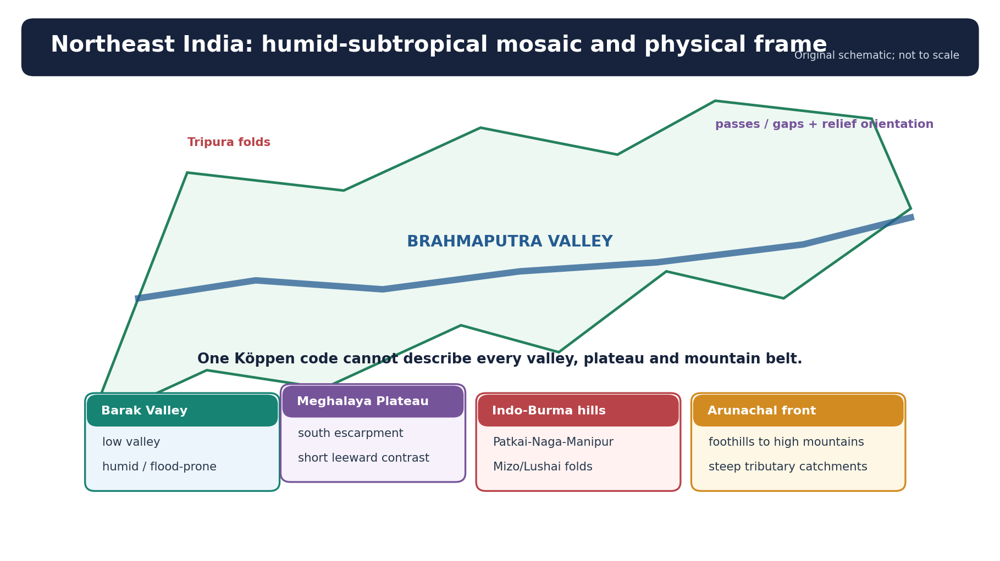

*Figure 1. A schematic physical frame. The valleys are not climatically equivalent to plateau escarpments, folded hills, foothills or high mountains.*

### The major physiographic units

| Unit | Physical character | Climatic and hydrological significance |
|---|---|---|
| Brahmaputra Valley | Broad alluvial trough between the Himalaya and Meghalaya/Assam hill systems | Hot, humid summers; winter fog and inversion; large trunk river with flashy tributaries, chars, beels and bank erosion |
| Barak Valley | Lower enclosed valley around the Barak and tributaries | Moist environment, flood and drainage-congestion exposure; distinct from the Brahmaputra trunk system |
| Meghalaya Plateau | Elevated block with a steep southern escarpment | Abrupt uplift of Bay moisture on southern slopes; strong windward-leeward contrast over short distance |
| Patkai-Naga-Manipur-Mizo/Lushai hills | Folded, dissected and forested hill chains | Terrain-channelled airflow, intense local rain, short response-time catchments and landslide-prone road corridors |
| Arunachal foothills and mountains | Sudden rise from Assam plain to Eastern Himalaya | Very steep tributary gradients, large altitudinal range, montane climatic transitions and upstream sediment production |
| Tripura folds | North-south ridges and intervening valleys | Ridge-valley contrasts, drainage bottlenecks and strong Bay influence |

### Orientation, gaps and proximity

- The Bay of Bengal supplies deep moisture, but the outcome depends on **wind direction relative to slopes**.
- Gaps and low corridors permit funnelling; closed or weakly ventilated valley sectors favour fog and winter inversion.
- Relief simultaneously produces uplift, rain-shadow pockets, fast runoff and ecological zonation.
- The region’s eastern and southern proximity to Bangladesh and Myanmar makes river and atmospheric processes transboundary.

**Exam link:** A map earns marks when arrows show moisture paths, escarpments, valleys, rain-shadow sectors and steep tributaries. A state-boundary outline without processes is decorative.

## 2. Classification: what “humid subtropical” does and does not mean

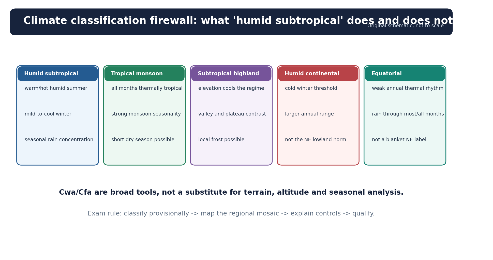

*Figure 2. Use climate codes only after checking station thresholds, elevation and rainfall seasonality.*

### Working definition

A humid subtropical climate generally combines a warm-to-hot humid summer, a mild-to-cool winter, and adequate precipitation, often with a monsoonal summer maximum. In Northeast India the term is most useful for many lower valley and foothill environments, but the region grades into tropical monsoon, subtropical highland and montane climates.

### Comparative firewall

| Climate | Typical distinction from Northeast humid-subtropical valleys |
|---|---|
| Tropical monsoon | Colder-month temperature remains tropical; a strong wet season and short dry season may dominate |
| Subtropical highland | Altitude lowers temperature; mild summers and cool winters may occur despite low latitude |
| Humid continental | Colder winter and larger annual thermal range; persistent freezing is more characteristic |
| Equatorial | Weak annual thermal range and year-round convection/rain without a pronounced cool winter |
| Cwa | Dry winter under Köppen precipitation thresholds; hot summer where the warmest-month threshold is met |
| Cfa | No dry season under Köppen thresholds; hot summer |
| Highland category | Used when vertical zonation and altitude overwhelm a simple lowland thermal label |

### Why “China type” is only an analogy

The textbook warm-temperate eastern-margin type explains a summer-maritime and winter-continental tendency. Northeast India, however, lies within the South Asian monsoon system, has exceptional relief complexity, and includes tropical valleys as well as high mountains. Therefore:

- use the analogy to explain **hot wet summers, relatively cool winters, rice-tea associations and eastern-margin moisture**;
- do not import East Asian winter severity or typhoon climatology mechanically;
- distinguish Köppen’s quantitative station classification from broad regional labels used by Indian geographers.

> **Mnemonic - CODE:** **C**heck station threshold, **O**rography, **D**ry-season rule, **E**levation.

## 3. Bay-to-Himalaya climate transect

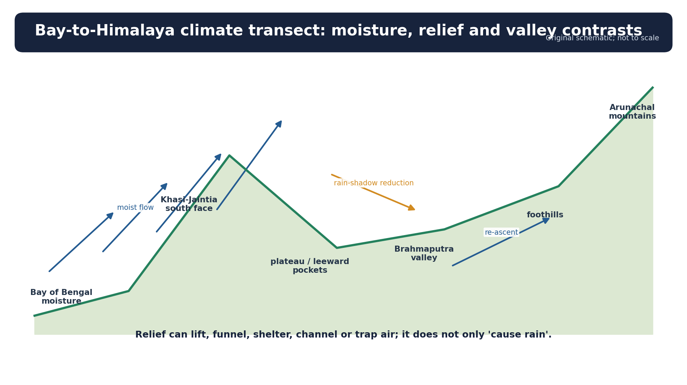

*Figure 3. A process transect: moisture source -> plains and gaps -> abrupt escarpment -> valley and leeward contrasts -> foothills and high mountains.*

### The chain of controls

1. **Latitude** gives a subtropical setting to much of the region but cannot explain local rainfall.
2. **Seasonal monsoon circulation** brings moist south-westerly/southerly flow from the Bay sector.
3. **Relief orientation** controls whether flow is lifted, channelled or partly sheltered.
4. **Altitude** lowers temperature and changes condensation level, vegetation and frost probability.
5. **Valley geometry** affects ventilation, fog, inversion and local thermal range.
6. **Synoptic disturbances** organise rain over larger areas; local convection modifies intensity and timing.

### One-factor explanations that fail

- “Meghalaya is wet only because it faces the Bay.” The Bay is the moisture source, but escarpment steepness, low-level flow direction, convergence, convection and cloud processes determine actual rainfall.
- “All Northeast hills are wetter than all valleys.” Windward slopes can be extremely wet, but sheltered slopes and rain-shadow sectors can be markedly drier.
- “Altitude always increases rainfall.” Rain may peak at a favourable elevation and then decline where moisture has already precipitated or flow is sheltered.

## 4. Monsoon, orography, convection and cloud microphysics

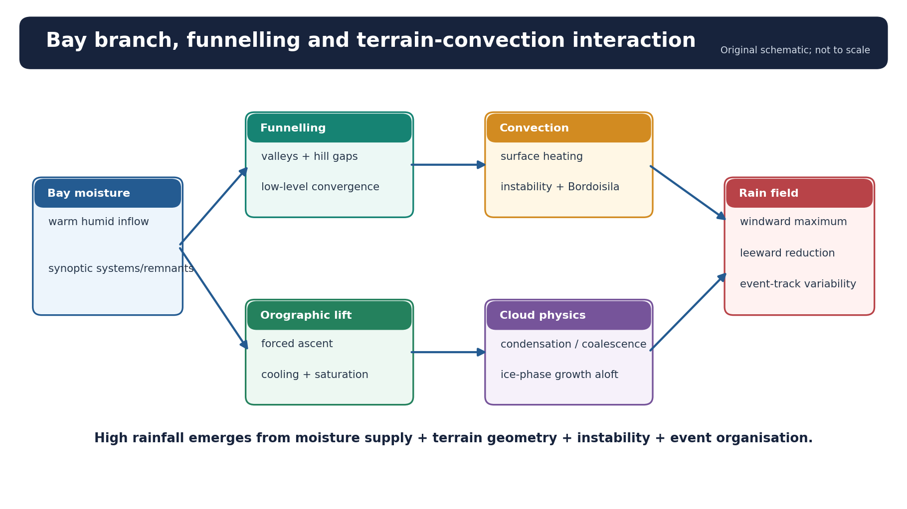

*Figure 4. Orographic rain is a coupled circulation-terrain-cloud process, not a mountain-as-wall slogan.*

### Mechanism in six stages

1. Warm Bay waters and monsoon circulation maintain a deep moist boundary layer.
2. Southerly or south-westerly flow enters Bangladesh and the Northeast through broad lowlands and gaps.
3. The Khasi-Jaintia southern escarpment forces rapid ascent when low-level flow is favourably oriented.
4. As air rises, pressure falls, expansion cools the parcel, relative humidity increases and condensation begins.
5. Existing convective instability can deepen uplift; collision-coalescence in warm clouds and ice processes aloft increase precipitation efficiency.
6. After moisture loss and descent, some leeward sectors receive less rain, though renewed convergence or convection can reverse the simple shadow locally.

### Terrain-convection interaction

- Terrain anchors convergence and can repeatedly regenerate cells.
- Pre-existing thunderstorms can intensify when forced upslope.
- Cold outflows from storms may meet moist inflow and initiate new cells.
- Slow-moving or “training” cells raise short-duration rainfall even without a tropical cyclone landfall.
- Cloud depth, aerosol environment, freezing level and wind shear modify rainfall efficiency; they do not eliminate the basic need for moisture and uplift.

### Bordoisila / Nor’westers

Pre-monsoon violent thunderstorms are locally associated with **Bordoisila** in Assam and with the broader eastern-Indian Nor’wester environment. They arise from strong surface heating, abundant low-level moisture and atmospheric instability, often aided by wind convergence or upper-air support. They bring:

- squally winds and lightning;
- intense short-duration rain and hail in some storms;
- crop, tree, power and housing damage;
- useful pre-monsoon moisture but high local hazard.

## 5. Seasonal calendar: rain is not confined to the southwest monsoon

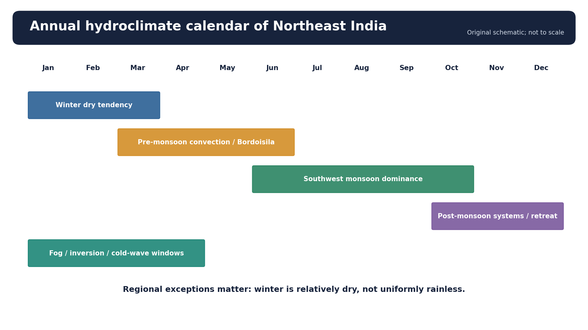

*Figure 5. The hydroclimatic year includes winter dryness, pre-monsoon storms, a monsoon maximum and post-monsoon disturbance rain.*

| Season | Dominant tendency | Important qualification |
|---|---|---|
| Winter | Cooler and generally drier; fog/inversions in valleys | Western disturbances may affect western/high mountain sectors; easterly moisture or local systems can produce exceptions |
| Pre-monsoon | Rapid warming, high humidity and thunderstorms | Bordoisila/Nor’westers can be damaging; tea and horticulture respond to timing, not annual total alone |
| Southwest monsoon | Main rainfall season; prolonged wetness, basin recharge and flood hazard | Rain is spatially uneven; event sequencing and antecedent saturation matter |
| Post-monsoon | Withdrawal tendency with occasional tropical-system/remnant rain | A single depression or remnant can create high-impact rain after an already wet monsoon |

### Western disturbances: use carefully

Western disturbances are most important for northwestern India and the western Himalaya. In the Northeast, their troughs or eastward-moving upper-air features may sometimes interact with local/easterly moisture, but they do not replace the Bay-monsoon explanation. Write “interaction where supported,” not “winter rain is caused uniformly by western disturbances.”

## 6. Temperature, altitude, fog and inversion

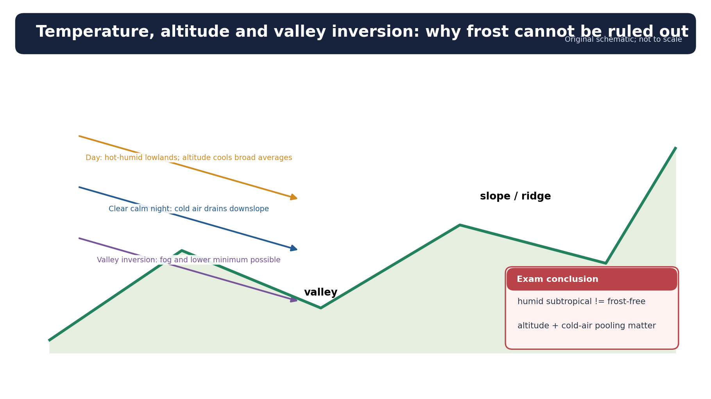

*Figure 6. Valley summers can be hot and humid while nearby uplands remain much cooler; winter inversion can temporarily reverse the normal lapse-rate pattern.*

### Thermal character

- Low valleys commonly experience hot, humid summers with high apparent temperature.
- Winters are mild or cool **by Indian lowland standards**, not uniformly warm.
- Higher plateaus and mountains have lower mean temperature and greater frost probability.
- Cloud and humidity can suppress daytime heating while limiting night-time cooling; clear winter nights permit sharper valley cooling.
- The annual range is moderated by humidity and maritime influence, but inland valley position can preserve noticeable seasonality.

### Inversion and fog

On calm winter nights, radiative cooling creates dense cold air that drains downslope and accumulates in valleys. Warmer air may then overlie colder valley air:

```text
clear night + weak wind
        ->
slope cooling + cold-air drainage
        ->
cold pool in valley floor
        ->
temperature inversion + fog
        ->
poor visibility / delayed daytime mixing / pollution trapping
```

**Trap:** “Humid subtropical” does not mean frost-free everywhere. Classification applies to a station or zone, while frost is controlled by elevation, exposure, cold-air drainage and individual weather events.

## 7. Spatial rainfall gradients

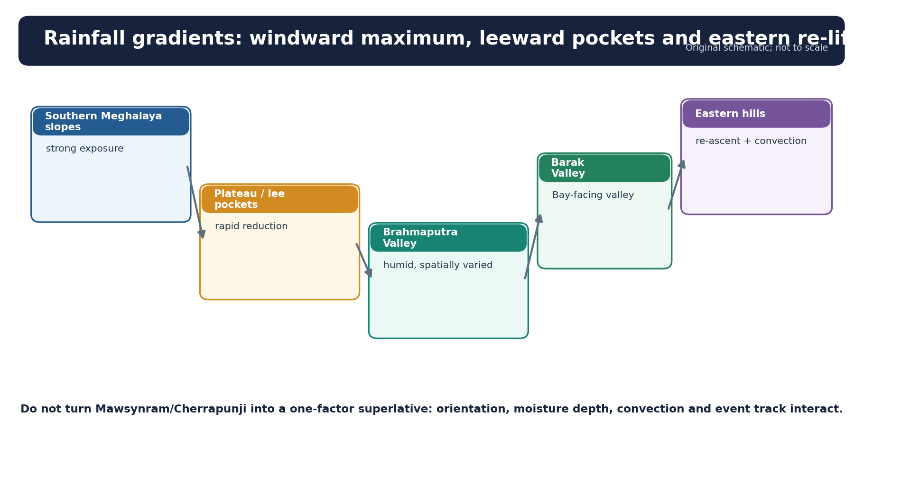

*Figure 7. A schematic gradient, deliberately without an unsourced record claim.*

### The high-value pattern

- **Southern Meghalaya slopes:** high rainfall where moist flow meets the abrupt escarpment.
- **Plateau and leeward pockets:** rainfall can decline sharply over short distances.
- **Brahmaputra Valley:** widespread monsoon rain but substantial longitudinal and north-south variation.
- **Barak Valley:** strongly humid, with flood and drainage-congestion exposure.
- **Eastern hills and foothills:** heavy orographic and convective rain in many sectors, with local shadows.

### Cherrapunji/Mawsynram discipline

They may illustrate an exceptionally wet windward setting, but:

- distinguish a long-period annual normal from a one-day, one-month or individual-year record;
- cite the reporting agency and time period;
- do not use “wettest” as a substitute for explaining orientation, uplift and storm organisation;
- never extrapolate one station’s total to all Meghalaya or all Northeast India.

## 8. Brahmaputra-Barak hydrological system

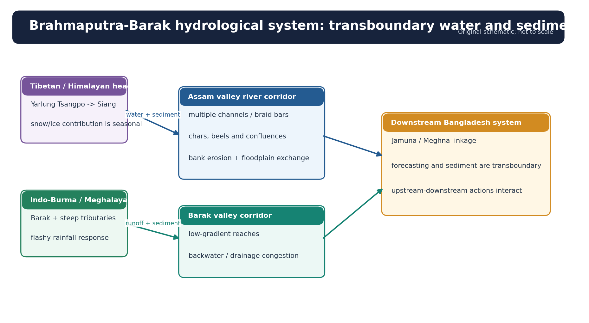

*Figure 8. The two systems combine transboundary headwaters, steep tributaries, sediment transfer, floodplains and downstream backwater effects.*

### Brahmaputra

- Transboundary headwaters originate on the Tibetan Plateau; the river enters India through the Eastern Himalaya and crosses Assam before entering Bangladesh.
- Steep Himalayan and hill tributaries deliver water and sediment quickly.
- In Assam, the trunk river is wide, multi-channel and dynamically braided/anabranching in many reaches.
- Bars and chars emerge, shift and erode; banklines are mobile over time.
- Beels and floodplain wetlands store water, support fisheries and biodiversity, and maintain hydrological connectivity.

### Barak

- The Barak drains the southern Northeast and flows through a low valley before bifurcating into the Surma-Kushiyara system in Bangladesh.
- High tributary inflow, low-gradient valley reaches, confluence/backwater effects and constrained drainage can create prolonged flooding or waterlogging.

### Why the river is dynamic

```text
high relief + intense rain + erodible material
                  ->
large water and sediment pulses
                  ->
bars / shoals / bed adjustment
                  ->
flow splits and concentrates
                  ->
bank attack + channel migration + char turnover
```

This is not simply “excess water in a fixed channel.” River geometry changes while people, fields, embankments and infrastructure occupy the floodplain.

## 9. Flood, erosion and waterlogging are different

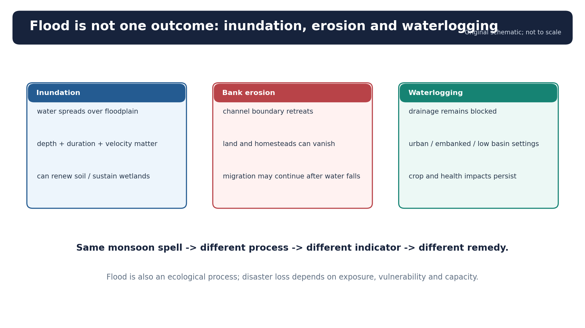

*Figure 9. Distinguishing processes improves diagnosis and policy.*

| Process | What happens | Typical duration/impact | Suitable policy emphasis |
|---|---|---|---|
| Inundation/flooding | River or runoff water covers land | Hours to weeks; crop, housing, transport and health impacts | Forecast, evacuation, shelters, flood-compatible land use and selective protection |
| Bank erosion | Flow removes riverbank and shifts channel edge | Progressive or episodic; permanent land and asset loss | Bankline monitoring, setback, selective protection, compensation and resettlement |
| Waterlogging | Water cannot drain from low land or urban surface | May persist after rain/river peak | Drainage, pump/gravity outlet management, wetland storage and obstruction removal |

### Flood as hazard and ecological process

Seasonal flooding can:

- renew soil moisture and deposit sediment;
- connect wetlands and fish habitats;
- sustain floodplain agriculture and grazing cycles.

It becomes a disaster when depth, velocity, duration or erosion intersect exposed and vulnerable communities. Therefore “eliminate all floods” is neither feasible nor ecologically sound.

## 10. Coupled flood causation

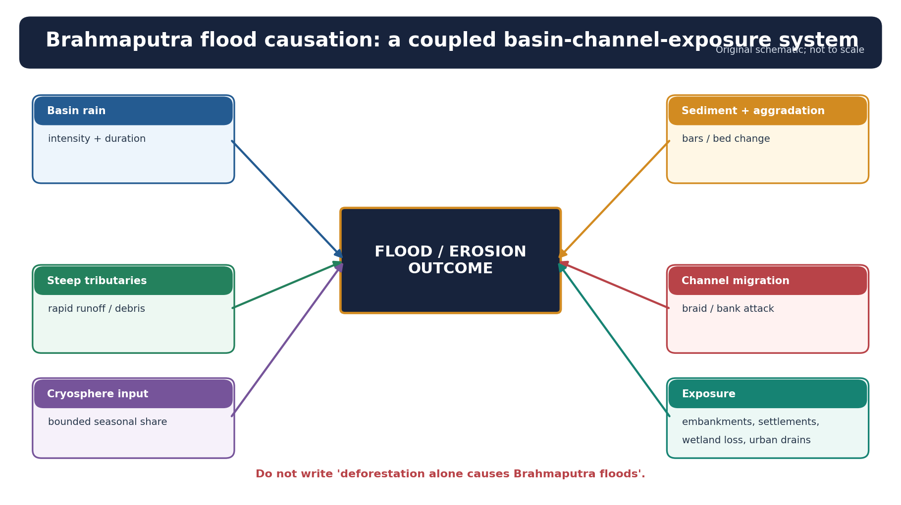

*Figure 10. Brahmaputra flood loss emerges from basin input, channel dynamics, drainage and exposure.*

### Physical drivers

- High-intensity and/or long-duration basin rainfall.
- Repeated wet spells that saturate soil and fill tributaries.
- Steep tributary catchments with short response time.
- Sediment pulses, bar formation, local aggradation and changing conveyance.
- Channel migration and bank erosion.
- Backwater at confluences when the trunk river is high.
- Snow and glacier melt as a bounded seasonal/upstream component, not a universal explanation for every Assam flood peak.

### Human-modified drivers of loss

- Settlement and cultivation in active flood and erosion corridors.
- Embankment breach, poor maintenance or drainage obstruction.
- Roads, railways and raised structures that interrupt cross-drainage.
- Wetland loss and urban surface sealing.
- Encroached drains and solid waste in city channels.
- Poverty, insecure tenure and limited mobility that increase vulnerability.

### Deforestation caveat

Land-cover degradation in individual catchments may increase erosion, slope runoff or sediment delivery, especially for moderate events. But writing “deforestation alone causes Brahmaputra floods” ignores:

- a vast transboundary basin;
- monsoon event scale;
- trunk-channel morphology;
- sediment storage and remobilisation;
- embankment and drainage effects;
- exposure and vulnerability.

## 11. Landslides and compound hazards

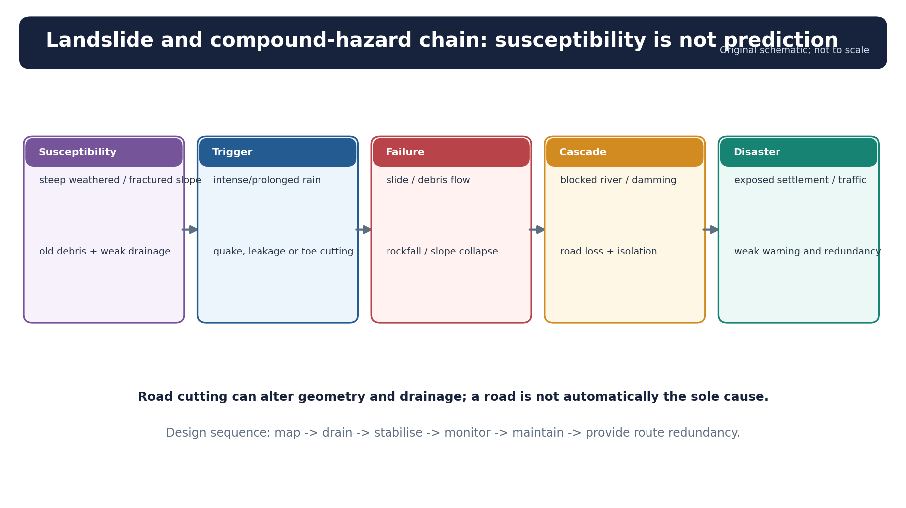

*Figure 11. Susceptibility is a precondition, rainfall or earthquake is a trigger, and disaster requires exposure.*

### Four-part diagnosis

| Component | Northeast examples |
|---|---|
| Susceptibility | Steep slopes, weathered rock, weak bedding/foliation, old slide debris, high relief |
| Trigger | Intense/prolonged rain, earthquake shaking, toe erosion, leaking drains |
| Exposure | Hill roads, houses below cut slopes, bridges, pipelines and hydropower works |
| Vulnerability | Weak retaining/drainage design, poor maintenance, no escape route, informal hill cutting |

### Compound chains

```text
heavy rain -> slope failure -> road blockage -> delayed relief
heavy rain -> debris enters stream -> temporary dam -> sudden breach flood
earthquake -> cracked slope -> later monsoon reactivation
road cut -> intercepted drainage -> pore pressure -> slide / debris flow
urban hill cutting -> debris blocks drain -> flash flood + local slope collapse
```

### Threshold concept

Rainfall thresholds relate intensity and duration to observed slide initiation. They are probabilistic:

- a short, extreme burst may trigger shallow debris flows;
- a long wet spell may raise groundwater and destabilise deeper material;
- antecedent wetness changes the threshold;
- thresholds require local calibration and cannot be copied unchanged from another hill belt.

## 12. Soils: a process mosaic, not universal infertility

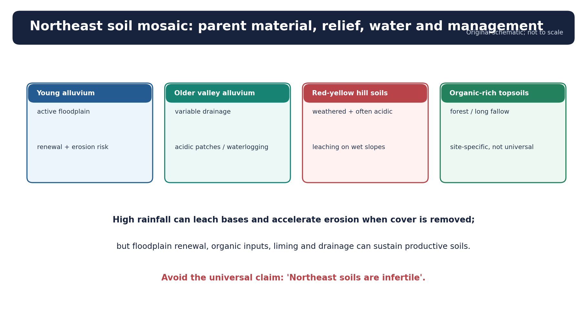

*Figure 12. Parent material, relief, drainage, vegetation, flood renewal and management create strong soil contrasts.*

| Setting | Typical tendencies | Management implication |
|---|---|---|
| Young floodplain/alluvium | Stratified deposits, variable texture, periodic renewal | Productive where drainage and flood timing are favourable; erosion and sand casting remain risks |
| Older valley terrace | More weathering, possible acidity and iron accumulation | Liming/nutrient management may be needed after soil testing |
| Red-yellow hill soil | Leaching, acidity, erosion on bare slopes | Maintain cover, contour barriers, agroforestry and organic matter |
| High-rainfall forest soil | Rapid nutrient cycling; nutrients may be stored in biomass/litter rather than soil | Clearing breaks the recycling system; fertility cannot be inferred from lush vegetation |
| Waterlogged lowland | Reduced aeration, slow decomposition and drainage constraints | Match crop and drainage practice to hydroperiod rather than simply “drain everything” |

### High rainfall: gain and loss

High rainfall supports biomass and weathering but may:

- leach bases and encourage acidity;
- remove topsoil where cover is disturbed;
- create reducing conditions in waterlogged soils;
- also renew floodplain surfaces through fresh sediment.

Therefore “high rainfall makes all Northeast soils infertile” is false.

## 13. Vegetation and biogeographic mosaic

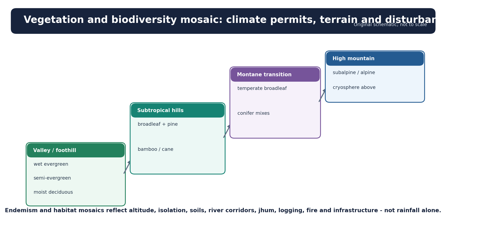

*Figure 13. Climate permits broad vegetation formations; altitude, soil, drainage and disturbance determine the actual patch.*

### Major formations

- Tropical wet evergreen and semi-evergreen forest in warm, very moist sectors.
- Tropical moist deciduous forest where seasonality or disturbance is stronger.
- Subtropical broadleaf forest at middle elevations.
- Subtropical pine in suitable drier or fire-influenced uplands.
- Temperate and subalpine transitions at greater altitude in Arunachal and adjoining highlands.
- Bamboo and cane across multiple disturbance and successional settings.
- Floodplain grasslands, riparian forest and wetlands in valley systems.

### Why biodiversity is high

- Strong altitudinal gradients compress climatic zones over short distance.
- The region lies near Indian, Himalayan and Indo-Malayan biogeographic transitions.
- High rainfall, varied geology and complex terrain create habitat diversity.
- River islands, wetlands, forests and elevation belts add ecological niches.

### Qualification

Climate sets the broad possibility, but forest mosaics are structured by:

- drainage and soil;
- landslide and flood disturbance;
- fire and extraction;
- jhum history and fallow succession;
- plantations, roads and settlement;
- fragmentation and connectivity.

## 14. Jhum: cycle, fallow and customary institutions

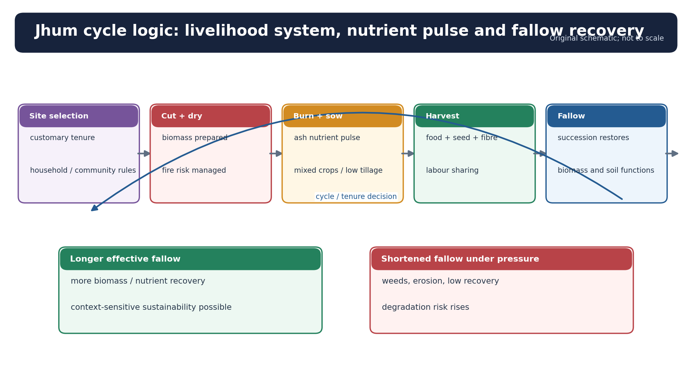

*Figure 14. Outcomes depend on fallow length, slope, fire control, tenure, crop diversity and market pressure.*

### The basic cycle

```text
community/site decision
        ->
selective clearing and controlled burning
        ->
mixed sowing / intercropping
        ->
one or more harvests
        ->
fallow succession
        ->
soil/biomass recovery
        ->
possible return after a locally determined interval
```

### Ecological logic

- Ash gives a short-lived pulse of available nutrients and temporarily raises pH.
- Mixed cropping spreads food and weather risk.
- Fallow vegetation rebuilds biomass, roots, litter and nutrient cycling.
- Long enough fallow can limit erosion and restore many functions; repeated short fallow reduces recovery.

### Social and livelihood logic

- Customary tenure regulates access, timing and community rights.
- Crop diversity supports subsistence, culture and risk sharing.
- Jhum may coexist with settled fields, forest products, wage work and horticulture.
- A change in fallow length may reflect population, tenure, road access, cash crops, policy restrictions or labour change.

### Balanced verdict

Blanket condemnation ignores context-sensitive, diversified and institutionally regulated forms. Romanticisation ignores short-fallow degradation, fire escape, erosion and livelihood constraints. Policy should:

- begin with participatory land-use mapping;
- protect customary and gendered rights;
- improve fallow and fire management;
- offer agroforestry, horticulture or terrace options by consent;
- preserve food diversity and avoid debt-heavy crop substitution.

### Current bounded example

**STATUS:** ICAR reported in July 2026 that an old jhum plot of 0.2 ha in Arunachal Pradesh was converted into a scientifically managed Assam lemon orchard with intercropping.  
**INFERENCE:** This illustrates one possible transition pathway combining perennial cover and income.  
**LIMIT:** One supported case does not prove that all old jhum land is agronomically, culturally or economically suited to the same model.

## 15. Agriculture, tea and livelihoods

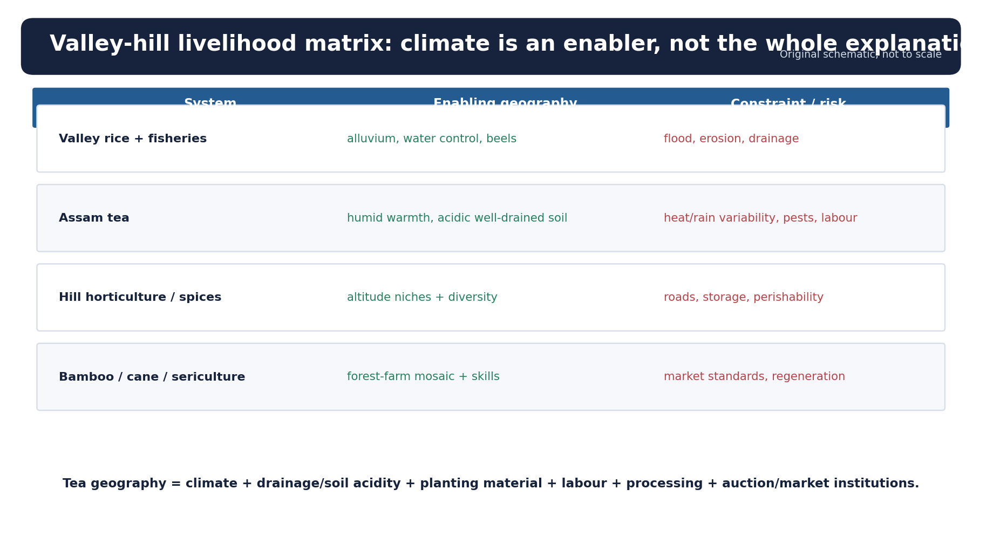

*Figure 15. Valley and hill systems face different production, storage, transport and ecological constraints.*

| System | Climatic/physical basis | Key constraints | Resilience options |
|---|---|---|---|
| Valley rice | Alluvial soils, standing water or monsoon moisture | Flood timing, sand deposition, submergence, drainage and pest outbreaks | Short-duration/submergence-tolerant varieties, seed reserves, drainage, crop calendars |
| Hill mixed farming | Diverse slopes and microclimates | Erosion, short fallow, labour and market access | Agroforestry, contour cover, community fallow, local processing |
| Tea | Warm humid growing season, acidic soils, drainage, skilled plucking and rapid processing | Heat/rainfall stress, waterlogging/drought sequence, pests, labour and quality loss | Shade/water management, drainage, soil organic matter, pest monitoring and climate services |
| Horticulture/spices | Altitudinal niches and crop diversity | Perishability, road disruption and limited cold chain | Grading, storage, aggregation, processing and resilient connectivity |
| Fisheries/beel livelihoods | Floodplain wetlands and seasonal connectivity | Siltation, pollution, barriers and tenure conflict | Wetland restoration, fish passage, community management |
| Bamboo/sericulture | Biomass productivity and local skill | Market volatility and processing gap | Cluster processing, design/value addition and sustainable harvest |

### Tea geography: climate is necessary, not sufficient

Assam tea depends on:

- warm and humid growing conditions;
- adequate but not stagnant water;
- acidic, well-managed soils;
- planting material, shade and pruning;
- skilled labour and rapid leaf-to-factory processing;
- auction, logistics, quality and market institutions.

Heavy rain can waterlog roots and interrupt plucking; drought and heat can reduce growth or alter quality; warm humid conditions may also favour pests and disease. Therefore “Assam tea exists because rainfall is high” is an incomplete answer.

### 2026 Tea Board status

**STATUS:** Tea Board’s provisional Jan-Apr 2026 statement reported 73.80 million kg for Assam: 70.27 million kg in Assam Valley and 3.53 million kg in Cachar.  
**LIMIT:** These are provisional, cover only January-April, and must not be presented as final 2026 production or as a timeless ranking.

## 16. Urbanisation and infrastructure trade-offs

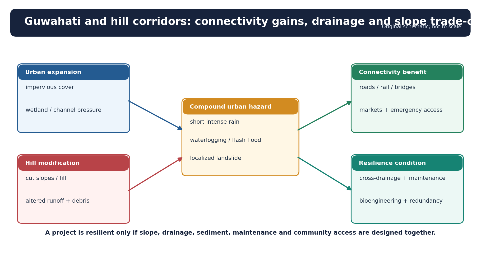

*Figure 16. Connectivity and urban growth can reduce isolation while increasing slope and drainage risk if design ignores the hydrogeomorphic setting.*

### Guwahati as a process example

Guwahati occupies lowlands, hills, wetlands and channels beside the Brahmaputra. Intense rain becomes urban flood loss through:

```text
intense rainfall
 + reduced wetland/storage space
 + sealed surfaces
 + encroached or waste-blocked drains
 + hill runoff and sediment
 + constrained outfall / high river level
 = flash flooding and persistent waterlogging
```

Hill cutting adds local landslide and debris risk. The correct answer is not “more drains” alone: protect receiving wetlands, maintain cross-drainage, control debris and waste, map flow paths, restrict unsafe construction and use impact-based warning.

### Roads, rail, bridges and hydropower

**Benefits**

- market and health access;
- disaster response;
- integration of remote settlements;
- reduced travel time and post-harvest loss;
- regional connectivity.

**Risks if poorly designed**

- over-steepened cut slopes;
- blocked natural drains and undersized culverts;
- spoil dumping in streams;
- toe erosion and river constriction;
- habitat fragmentation;
- induced settlement in hazard corridors.

### Current official illustrations

- **STATUS:** NEC reported FY 2025-26 expenditure of Rs 1,496.78 crore, including Rs 704.66 crore under NESIDS-Roads; it also reported 64 road projects sanctioned during the Fifteenth Finance Commission period and 30 completed.
- **LIMIT:** Expenditure and completion show implementation status, not proof of climate resilience, equitable access or ecological acceptability.
- **STATUS:** NHIDCL’s June 2026 NH-717A procurement included slope protection, landslide mitigation, road reconstruction and rockfall barriers near the Reshi border.
- **LIMIT:** This is an eastern-Himalayan edge design example and should not be generalised to every Northeast corridor.

## 17. Transboundary and regional dimension

### Why cooperation is physically necessary

The Brahmaputra and Barak cross borders; flood waves, sediment, fisheries and navigation do not follow administrative boundaries. Effective cooperation can include:

- real-time rainfall and river-level exchange;
- common gauge calibration and metadata;
- advance notice for high-flow or infrastructure operations;
- sediment and channel-change research;
- wetland, fish and biodiversity connectivity;
- interoperable forecasting and community warning;
- resilient road, rail and inland-water connectivity.

### Answer discipline

- Do not make unsupported claims about deliberate upstream flood manipulation.
- Separate confirmed data-sharing arrangements from proposals.
- State that upstream information improves lead time but cannot remove uncertainty from local tributary rain or embankment failure.
- Treat sediment as both a geomorphic resource and a management challenge, not merely “silt pollution.”

## 18. Climate change: observation, attribution and projection

### Four rungs of evidence

| Rung | Question | Correct wording |
|---|---|---|
| Station observation | What changed at a gauge/station? | “The station series shows…” |
| Regional trend | Is a pattern robust across sites and methods? | “Regional analysis indicates…” |
| Event attribution | Did anthropogenic warming alter a specific event’s probability/intensity? | “An attribution study estimates…” |
| Projection | What may occur under scenarios/models? | “Models project…, with uncertainty…” |

### What can reasonably be said

- **FACT:** MoES reported India-scale surface warming of about 0.7 degrees C during 1901-2018 and discussed increasing climatic variability and extremes.
- **INFERENCE:** A warmer atmosphere can hold more moisture and may intensify heavy-rain potential, but circulation, terrain and storm track determine where rain falls.
- **INFERENCE:** Tea may face heat, erratic moisture, pest and quality risks; responses will vary by elevation, cultivar and management.
- **INFERENCE:** Upstream cryosphere change can alter seasonal flow and sediment/glacial-lake hazards, but its contribution to an individual Assam flood must be quantified rather than assumed.
- **LIMIT:** One flood season, one station record or one landslide cluster is not proof of long-term climate change.

### Suitable answer formulation

> Climate change is a **risk multiplier** operating through warming, rainfall extremes, ecosystem shifts and changing antecedent conditions. It does not replace immediate geomorphic and governance explanations such as channel migration, drainage blockage, unsafe slope cutting or exposure.

## 19. Current 2026 evidence dashboard

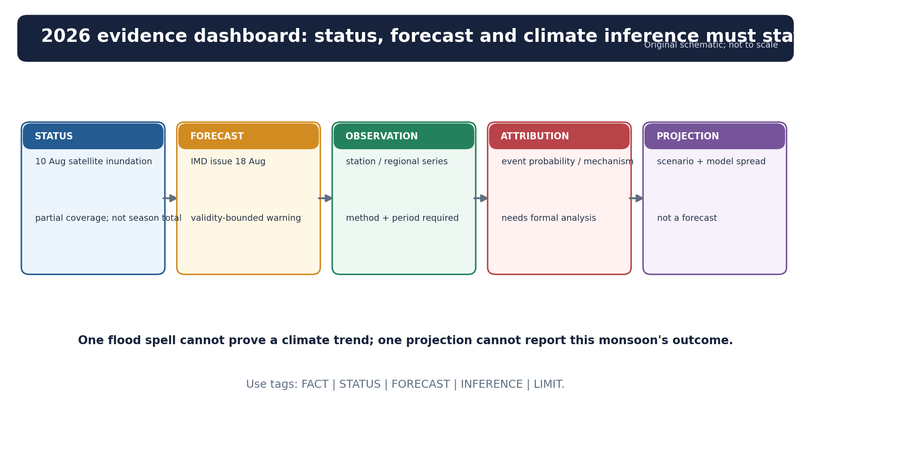

*Figure 17. The evidence label determines the permissible claim.*

| Label | Dated item | Permissible claim | Prohibited leap |
|---|---|---|---|
| FORECAST | IMD bulletin issued 18 Aug 2026: heavy rain and thunderstorm/lightning very likely at isolated places over Assam on 19 Aug; bulletin also covered later dates | A date-valid weather warning existed | “The forecast proves the rain/flood occurred everywhere” |
| STATUS | NESAC/NERDRR satellite report for 10 Aug 2026: 99 villages across Darang, Goalpara and Kamrup Rural in covered imagery; 2,155.17 ha inundated, about 2,058.68 ha agricultural land | A partial satellite snapshot mapped inundation in covered areas | “This is Assam’s final 2026 flood-season total” |
| STATUS | Tea Board provisional Jan-Apr 2026: Assam 73.80 million kg | Period-specific provisional production | “Assam produced this amount in full-year 2026” |
| STATUS | NEC FY 2025-26 spending/project release | Implementation and expenditure status | “The roads are therefore climate-resilient” |
| FACT | MoES national warming assessment cited in March 2026 Parliament reply | India-scale long-term warming context | Attribution of the 10 Aug Assam inundation to climate change |
| INFERENCE | Wet antecedent conditions plus further intense rain can amplify flood, slope and crop risk | Mechanism-based conditional inference | A realised loss count without an observed damage source |
| LIMIT | Date, coverage, method, provisionality and forecast validity | Keeps claim bounded | Removing caveats in revision notes |

### The correct 19 August 2026 statement

As of the export date, official sources supported a **valid weather forecast**, a **partial 10 August satellite inundation status**, and several **period-specific implementation/production statements**. They did **not** support a final 2026 monsoon rainfall conclusion or a final Assam flood-season outcome.

## 20. Governance and adaptation portfolio

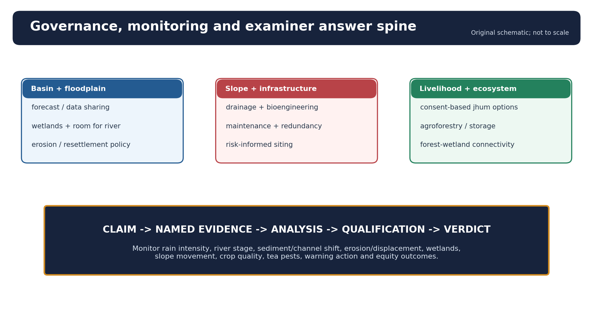

*Figure 18. Good policy combines basin, slope, ecosystem, livelihood and equity measures; good answers follow the same integrated spine.*

### Basin and floodplain

- Basin-scale rainfall-runoff and river forecasting with tributary detail.
- Cross-border and interstate data sharing with common protocols.
- Floodplain and erosion-corridor zoning based on updated channel maps.
- “Room for river” where feasible, with wetland and side-channel restoration.
- Selective embankments for critical settlements and infrastructure, with maintenance, safe drainage and breach planning.
- Erosion compensation and planned, rights-based resettlement because erosion is permanent land loss.
- Raised, accessible shelters and resilient water, sanitation and health systems.

### Slopes and infrastructure

- Corridor-scale susceptibility mapping before alignment.
- Benched cuts, retaining systems and bioengineering matched to material and groundwater.
- Drainage as a primary structural component, not an afterthought.
- Spoil management and protected stream crossings.
- Instrumented high-risk slopes, rainfall thresholds and road-closure protocols.
- Redundant routes and maintenance budgets.

### Agriculture, forests and jhum landscapes

- Soil testing, organic matter, contour cover and small watershed treatment.
- Community-led fallow and fire management.
- Consent-based agroforestry or horticulture pathways.
- Flood/drought-tolerant seed, community seed banks and agromet advice.
- Storage, processing, aggregation, cold chain and reliable last-mile links.
- Forest-wetland-river connectivity, not plantation cover alone.

### Urban systems

- Protect and reconnect wetlands and natural drains.
- Ward-scale flow-path and ponding maps.
- Hill-cut regulation and debris interception.
- Solid-waste enforcement aligned with drainage maintenance.
- Impact-based warnings linked to traffic, schools, hospitals and neighbourhood action.

### Monitoring indicators

| Domain | Indicators |
|---|---|
| Weather | Rainfall intensity, duration, spatial coverage, antecedent wetness |
| Rivers | Stage, discharge, lead time, sediment load, bars, channel migration |
| Social flood loss | Inundation depth/duration, erosion displacement, shelter access, recovery time |
| Wetlands | Area, storage, seasonal connectivity, fish access, water quality |
| Slopes and roads | Movement, blocked drains, cut-slope failures, closure hours, maintenance response |
| Soil and farming | Soil loss, acidity/organic matter, crop survival, yield and quality |
| Tea | Heat/moisture stress, pest incidence, plucking days, quality and smallholder income |
| Forest/jhum | Fallow age mosaic, burn escape, canopy recovery, livelihood diversity |
| Urban | Drain capacity, ponding duration, wetland encroachment, warning action |
| Governance/equity | Warning reach, action lead, resettlement security, gendered access and livelihood recovery |

## 21. Integrated answer frameworks

### Framework A - “Explain the climate”

```text
regional mosaic
 -> seasonal circulation
 -> moisture source
 -> terrain orientation / gaps
 -> convection and disturbances
 -> temperature and rainfall seasonality
 -> spatial exceptions
 -> human/ecological consequence
```

### Framework B - “Why are floods recurrent?”

```text
basin rain and antecedent wetness
 + steep tributaries
 + sediment and channel mobility
 + confluence/backwater and drainage
 + floodplain exposure
 + vulnerability / infrastructure condition
 = recurrent but spatially differentiated disaster risk
```

### Framework C - “Development versus ecology”

```text
connectivity benefit
 -> slope/drainage intervention
 -> direct + induced risk
 -> design and maintenance safeguard
 -> ecosystem/livelihood trade-off
 -> monitored, qualified verdict
```

### Framework D - “Climate change”

```text
observed baseline
 -> regional trend
 -> physical mechanism
 -> local exposure and vulnerability
 -> attribution/projection caveat
 -> no-regret adaptation
```

---

## Part II - Premium solved practice workbook

### Workbook rules

- Correct choices rotate continuously **A -> B -> C -> D**.
- “Officially verified” is used only where a local official key was available.
- Missing objective keys are retained as **INFERRED ANSWER - NOT OFFICIALLY VERIFIED**, with confidence and elimination.
- Every Mains solution follows **claim -> named evidence/example -> analysis -> qualification -> verdict** and ends with **Why this earns marks**.

## A. Solved Prelims PYQs and advanced MCQs

### Q1. UPSC Prelims 2024, GS-I, Set A, Q7 - officially verified

Consider the following statements:

**Statement-I:** Rainfall is one of the reasons for weathering of rocks.  
**Statement-II:** Rain water contains carbon dioxide in solution.  
**Statement-III:** Rain water contains atmospheric oxygen.

Which one of the following is correct in respect of the above statements?

A. Both Statement-II and Statement-III are correct and both of them explain Statement-I  
B. Both Statement-II and Statement-III are correct, but only one of them explains Statement-I  
C. Only one of Statements II and III is correct and that explains Statement-I  
D. Neither Statement-II nor Statement-III is correct

**Answer: A - officially verified from the locally available official Set-A key.**

**Explanation:** Rain provides water for physical and chemical weathering. Dissolved carbon dioxide forms weak carbonic acid, aiding carbonate and silicate reactions. Dissolved oxygen supports oxidation. In the humid Northeast, high water availability accelerates weathering, but slope erosion may remove profiles before deep soil develops.

### Q2. Original - classification

Which is the most defensible statement about Köppen Cwa/Cfa labels in Northeast India?

A. Cwa applies to every valley because all winter months are rainless.  
B. The labels require station thresholds, while highlands and tropical valleys may fall outside either label.  
C. Cfa is determined solely by annual rainfall above 200 cm.  
D. Any tea-growing district is automatically Cwa.

**Answer: B.**

**Explanation:** Köppen classes use monthly temperature and precipitation rules. Annual rainfall, crop type or state location alone cannot assign a code.

### Q3. Original - orographic rainfall

With reference to the very wet southern slopes of Meghalaya, which sequence is most appropriate?

A. Westerly dry air -> downslope warming -> frontal snowfall  
B. Bay moisture -> plateau descent -> evaporation -> rain maximum  
C. Moist low-level flow -> abrupt uplift -> cooling/condensation -> terrain-convection enhancement  
D. High altitude alone -> rain independent of wind direction

**Answer: C.**

**Explanation:** Moisture supply, favourable flow orientation, sharp uplift and convective/cloud processes combine. Altitude without moist inflow is insufficient.

### Q4. UPSC Prelims 2023, GS-I, Q63 - key unavailable locally

Consider the following statements:

**Statement-I:** The soil in tropical rain forests is rich in nutrients.  
**Statement-II:** The high temperature and moisture of tropical rain forests cause dead organic matter in the soil to decompose quickly.

Which one of the following is correct in respect of the above statements?

A. Both Statement-I and Statement-II are correct and Statement-II is the correct explanation for Statement-I  
B. Both Statement-I and Statement-II are correct and Statement-II is not the correct explanation for Statement-I  
C. Statement-I is correct but Statement-II is incorrect  
D. Statement-I is incorrect but Statement-II is correct

**INFERRED ANSWER - NOT OFFICIALLY VERIFIED: D. Confidence: high, subject to the exact official-set wording/key.**

**Elimination:** Nutrients are rapidly recycled and concentrated in biomass rather than forming a universally nutrient-rich soil. Warmth and moisture accelerate decomposition. Statement-I is therefore incorrect and Statement-II correct, routing to D. Retain the inferred label because no official local key was available.

### Q5. Original - flood processes

Which intervention best addresses **bank erosion**, rather than only temporary inundation?

A. Repeated bankline mapping combined with setbacks, selective protection and rights-based resettlement  
B. Increasing the number of rain gauges only  
C. Pumping water from all wetlands  
D. Declaring every floodplain a permanent no-use zone without tenure safeguards

**Answer: A.**

**Explanation:** Erosion removes land and shifts the channel edge. Forecasting helps, but land-loss policy, bankline monitoring and selective engineering are central.

### Q6. Original - Brahmaputra causation

Which combination best explains recurrent Brahmaputra flood and erosion risk?

A. Deforestation alone and daily tides  
B. Basin rain, steep tributaries, sediment/channel mobility, drainage effects and floodplain exposure  
C. Glacier melt alone and absence of all embankments  
D. Urban paving in Guwahati alone

**Answer: B.**

**Explanation:** The correct model is coupled basin-channel-exposure risk. Single-factor answers fail.

### Q7. Original - landslide threshold

Why can the same 24-hour rainfall total produce different landslide outcomes?

A. Rain totals never affect pore pressure.  
B. All slopes have identical geology.  
C. Intensity pattern, antecedent wetness, drainage, slope material and cutting differ.  
D. Earthquakes prevent rainfall-triggered slides.

**Answer: C.**

**Explanation:** Thresholds depend on both rainfall history and site susceptibility.

### Q8. UPSC Prelims 2022, GS-I, Q62 - tea-producing states; key unavailable locally

Consider the following States:

1. Andhra Pradesh
2. Kerala
3. Himachal Pradesh
4. Tripura

How many of the above are generally known as tea-producing States?

A. Only one State  
B. Only two States  
C. Only three States  
D. All four States

**INFERRED ANSWER - NOT OFFICIALLY VERIFIED: D. Confidence: high.**

**Elimination:** Kerala and Himachal Pradesh are established tea-producing states; Tripura has a recognised tea sector; Andhra Pradesh has tea cultivation, including the Eastern Ghats/Araku context. All four therefore route to D. The official key was not available locally, so this package does not upgrade the inferred routing to official status.

### Q9. Original - jhum

Which statement is most balanced?

A. Jhum outcomes depend on fallow length, customary tenure, crop diversity, slope and fire management.  
B. Every jhum field is sustainable regardless of shortened fallow.  
C. All jhum must be replaced by a single plantation crop.  
D. Burning has no nutrient or erosion effect.

**Answer: A.**

**Explanation:** Context matters. Long-fallow diversified systems and short-fallow degraded systems cannot be treated identically.

### Q10. Original - tea geography

Why is rainfall alone insufficient to explain Assam tea?

A. Tea grows only in dry alkaline soil.  
B. Drainage, acidity, planting material, labour, processing speed, pests and markets also shape output and quality.  
C. Tea leaves can be stored unprocessed for months without quality loss.  
D. Altitude and temperature never matter.

**Answer: B.**

**Explanation:** Tea is a coupled agroecological and institutional system.

### Q11. Original - urban flood

Which chain best explains Guwahati’s pluvial/flash-flood problem?

A. Snowmelt -> sea-level rise -> tsunami  
B. Winter western disturbance -> desert dune migration  
C. Intense rain + hill runoff + sealed surfaces + wetland/drainage loss + constrained outfalls  
D. Brahmaputra bank erosion alone in every ward

**Answer: C.**

**Explanation:** Urban flooding has a local catchment and drainage pathway even when river level creates backwater.

### Q12. Original - climate evidence

Which statement follows correct climate-evidence discipline?

A. One severe flood proves regional climate change.  
B. A national warming trend gives the exact rainfall trend at every Assam station.  
C. Any model projection is an observed fact.  
D. Event attribution requires a specific method; a trend or projection cannot by itself attribute one event.

**Answer: D.**

**Explanation:** Observation, trend, attribution and projection are distinct evidence classes.

### Q13. Remedial - temperature

Why can frost occur within the wider humid-subtropical Northeast?

A. Elevation, cold-air drainage and individual weather events create local cold pockets.  
B. Humidity guarantees all temperatures stay above freezing.  
C. Köppen classes prohibit frost by definition.  
D. Frost requires a desert climate.

**Answer: A.**

### Q14. Remedial - soils

Which statement is correct?

A. High rainfall makes every soil permanently sterile.  
B. Leaching may acidify hill soils, while floodplains can receive fresh alluvium and waterlogging creates other constraints.  
C. Forest biomass contains no nutrients.  
D. Red-yellow soils occur only in arid Rajasthan.

**Answer: B.**

### Q15. Remedial - flood and waterlogging

Waterlogging differs from river inundation mainly because:

A. it always causes permanent bank loss;  
B. it occurs only on mountain summits;  
C. it reflects poor or blocked drainage and can persist after rainfall or river peak;  
D. it has no urban dimension.

**Answer: C.**

### Q16. Remedial - infrastructure

Which is the best climate-resilient hill-road principle?

A. Maximise cut height to reduce length.  
B. Dump spoil into the nearest stream.  
C. Treat drainage as a maintenance issue only after opening.  
D. Align with susceptibility, design cross-drainage and slope support, manage spoil, monitor and maintain.

**Answer: D.**

### Q17. UPSC Prelims 2024, GS-I, Set A, Q70 - officially verified

The North Eastern Council (NEC) was established by the North Eastern Council Act, 1971. Subsequent to the amendment of the NEC Act in 2002, the Council comprises which of the following members?

1. Governor of the Constituent State
2. Chief Minister of the Constituent State
3. Three Members to be nominated by the President of India
4. The Home Minister of India

Select the correct answer using the code given below:

A. 1, 2 and 3 only  
B. 1, 3 and 4 only  
C. 2 and 4 only  
D. 1, 2, 3 and 4

**Answer: A - officially verified.**

**Exam takeaway:** NEC is a statutory regional planning and coordination institution. For live scheme details, use the current NEC administrative source; do not infer resilience merely from project count.

### Q18. Original - transboundary forecasting

What is the strongest benefit of upstream-downstream hydrometeorological data exchange?

A. It eliminates all forecast error.  
B. It can increase lead time and improve coordinated action, while local rain and failures remain uncertain.  
C. It stops channel migration.  
D. It converts every floodplain into dry land.

**Answer: B.**

### Q19. Original - vegetation

Why does climate not determine one uniform forest type across the Northeast?

A. Plants do not respond to water.  
B. Latitude is identical everywhere.  
C. Altitude, soil, drainage, disturbance, succession and connectivity modify the climatic envelope.  
D. Bamboo occurs only above the tree line.

**Answer: C.**

### Q20. Original - 2026 dashboard

Which is the valid interpretation of the NESAC/NERDRR report dated 10 August 2026?

A. It is the final Assam monsoon report.  
B. It proves exactly 99 villages were affected in the whole state for the entire season.  
C. It is a forecast issued before the rain.  
D. It is a satellite-coverage-bounded inundation status for the acquisition date.

**Answer: D.**

### Rotation audit

Q1-Q20 keys: **A, B, C, D, A, B, C, D, A, B, C, D, A, B, C, D, A, B, C, D.**

## B. Solved locally verified Mains PYQs

### PYQ 1. UPSC GS-I 2021

**Question:** Differentiate the causes of landslides in the Himalayan region and Western Ghats.

**Model solution**

**Claim:** Landslides in both regions require susceptible slopes and a trigger, but the Himalaya is dominated by young tectonics, extreme relief and active river incision, whereas the Western Ghats more often combine deeply weathered plateau margins, escarpments and intense rain.

**Named evidence/example:** In the eastern Himalaya and Northeast hill corridors, fractured rocks, steep relief, earthquakes, high monsoon rainfall, toe erosion and aggressive road cutting interact. The Patkai-Naga-Mizo folds and Arunachal corridors also contain weak, weathered and structurally complex material. In the Western Ghats, lateritic/weathered mantles, steep escarpments, quarrying and intense orographic rainfall are prominent.

**Analysis:** Himalayan river incision and ongoing uplift continually rejuvenate relief. Seismic shaking creates fresh failures or cracks that later monsoon rain reactivates. Road cuts intercept subsurface flow, and blocked drains raise pore pressure. In the Western Ghats, saturation of thick regolith and failures along cut or quarry faces are frequent mechanisms.

**Qualification:** Neither belt has a single cause. Local lithology, antecedent wetness, land use and design quality may outweigh the regional generalisation at a particular site.

**Verdict:** Policy must shift from post-slide clearance to corridor-scale susceptibility mapping, rainfall thresholds, drainage, slope reinforcement/bioengineering, spoil control and monitored closures.

**Why this earns marks:** It differentiates the two regions causally, names Northeast processes, retains site-level qualification and closes with targeted risk reduction.

### PYQ 2. UPSC GS-I 2021

**Question:** What are the environmental implications of the reclamation of water bodies into urban land use? Explain with examples.

**Model solution**

**Claim:** Reclamation converts flexible ecological storage into rigid exposure, increasing urban flood peaks while removing water-quality and habitat functions.

**Named evidence/example:** In Guwahati, the interaction of hills, wetlands, channels and the Brahmaputra makes natural storage and drainage continuity crucial. Encroachment or fragmentation of beels, sealed surfaces, hill sediment and waste-blocked drains increase ponding and flash-flood risk.

**Analysis:** Water bodies attenuate runoff, receive sediment, recharge groundwater in suitable settings, support fisheries and moderate microclimate. Filling them displaces water rather than eliminating it. The resulting flow enters roads and houses faster; constrained outfalls during high river stage prolong waterlogging. Habitat connectivity and livelihood access decline.

**Qualification:** Not every stagnant or polluted urban depression performs all functions equally, and restoration must address sewage and invasive species. Planned development may require limited intervention, but hydrological compensation must be demonstrated at catchment scale.

**Verdict:** Cities need mapped flow paths, protected wetland networks, drain-wetland connectivity, pollution control, permeable surfaces and enforceable development setbacks.

**Why this earns marks:** It gives environmental mechanisms rather than a generic list, uses Guwahati appropriately and offers a qualified planning solution.

### PYQ 3. UPSC GS-I 2020

**Question:** Account for the huge flooding of million cities in India including the smart ones like Hyderabad and Pune. Suggest lasting remedial measures.

**Model solution**

**Claim:** Large-city flooding is a drainage-basin failure created when extreme rainfall meets sealed surfaces, lost storage, obstructed drains and vulnerable land use.

**Named evidence/example:** Guwahati shows the same logic in a humid subtropical setting: short intense rain and hill runoff converge on lowlands; wetland loss, drain encroachment, sediment/waste and high receiving-water level can prolong flooding.

**Analysis:** Urbanisation shortens lag time and raises peak discharge. Roads and walls redirect flows, undersized culverts create bottlenecks, and building in low corridors converts a weather event into asset loss. Smart sensors cannot compensate for a physically broken drainage network.

**Qualification:** Design standards must reflect local rainfall data and climate uncertainty; river flooding, pluvial flooding, flash runoff and sewer surcharge should not be merged into one category.

**Verdict:** Use catchment-scale drainage plans, protect blue-green storage, maintain drains before monsoon, enforce flood-compatible zoning, retrofit culverts, manage solid waste and connect impact forecasts to ward action.

**Why this earns marks:** It explains the urban hydrograph, transfers the mechanism to Guwahati, distinguishes flood types and proposes structural plus governance reforms.

### PYQ 4. UPSC GS-I 2023

**Question:** Discuss the consequences of climate change on the food security in tropical countries.

**Model solution**

**Claim:** Climate change threatens food security through availability, access, utilisation and stability, with humid tropical/subtropical regions facing compound heat, flood, pest and infrastructure risks.

**Named evidence/example:** Northeast rice systems face submergence, erosion, sand casting and delayed field operations; hill horticulture faces road closures and post-harvest loss; tea faces heat-moisture stress and pest/quality risks. IMD agromet advice dated 18 August 2026 warned that heavy rain could submerge crops, cause root rot and wash nutrients, while advising field drainage.

**Analysis:** Extreme rain can destroy standing crops while longer dry gaps reduce establishment. Heat affects labour and livestock. Transport interruption raises food prices and reduces market access. Diet quality falls when diversified local systems are replaced by a narrow cash crop without storage or market security.

**Qualification:** Climate is not the sole determinant; seed systems, irrigation/drainage, tenure, credit, roads, storage and public distribution mediate outcomes. A warning is not an observed crop-loss estimate.

**Verdict:** Adaptation requires resilient varieties, seed reserves, soil-water management, diversified farming, agromet services, storage, reliable connectivity and social protection.

**Why this earns marks:** It uses the four pillars of food security, a bounded current example, regional specificity and a no-single-cause qualification.

### PYQ 5. UPSC GS-I 2023

**Question:** Identify and discuss the factors responsible for diversity of natural vegetation in India. Assess the significance of wildlife sanctuaries in rainforest regions of India.

**Model solution**

**Claim:** India’s vegetation diversity arises from the interaction of temperature, moisture, altitude, soil, drainage and disturbance, while rainforest sanctuaries protect ecological processes that exceed individual species.

**Named evidence/example:** Northeast India compresses tropical evergreen, semi-evergreen, moist deciduous, subtropical broadleaf/pine and montane transitions across short horizontal distances. Floodplain grasslands, beels, bamboo-cane systems and Eastern Himalayan forests add habitat diversity.

**Analysis:** Altitude lowers temperature; slope orientation changes moisture; flood and landslide create succession; soil and drainage filter species; jhum, fire, roads and plantations reshape the mosaic. Sanctuaries secure habitat, watersheds, pollination, carbon, genetic diversity and climate refugia.

**Qualification:** Isolated protected “islands” cannot sustain all ecological movement. Conservation must include corridors, community rights, invasive-species management and compatible livelihoods outside boundaries.

**Verdict:** Rainforest protection should be landscape-based: core habitats plus river, forest and elevation connectivity, participatory buffers and monitored development corridors.

**Why this earns marks:** It links vegetation to processes, uses a regionally rich example and moves beyond sanctuary notification to connectivity and rights.

### PYQ 6. UPSC GS-I 2023

**Question:** Discuss the meaning of the statement that the wind known as Purvaiya in the Bhojpur region has a strong influence on the cultural ethos of the region.

**Model solution**

**Claim:** Seasonal winds become cultural phenomena when their arrival reorganises agricultural time, sensory experience, labour, mobility and collective memory.

**Named evidence/example:** The Purvaiya example can be compared with Assam’s Bordoisila: a pre-monsoon storm tradition associated with squalls, lightning, relief from heat, crop effects and local narratives.

**Analysis:** Farmers read wind, cloud and humidity as a practical calendar. Songs and sayings encode anticipation, fear and seasonal change. Architecture, work timing and festivals respond to recurring weather. Thus climate is not an external background; it enters language and identity.

**Qualification:** Cultural meanings vary by community and generation, and scientific names should not erase local ecological knowledge. Conversely, folklore is not a substitute for forecast verification.

**Verdict:** Regional geography is strongest when it connects circulation and seasonality to lived landscapes without romanticising risk.

**Why this earns marks:** It directly interprets “cultural ethos,” adds a relevant Northeast comparison and balances local knowledge with scientific evidence.

## C. Original solved Mains practice

### Practice 1 - 10 marks, 150 words

**Question:** Explain why Northeast India should be described as a humid-subtropical mosaic rather than a single climatic region.

**Model solution**

**Claim:** “Humid subtropical” captures the hot-wet summer and mild/cool winter tendency of many lowland sectors, but relief divides Northeast India into sharply contrasting climatic units.

**Named evidence/example:** The Brahmaputra and Barak valleys, southern Meghalaya escarpment, plateau interior, Patkai-Naga-Mizo folds and Arunachal high mountains differ in elevation, slope orientation and exposure to Bay moisture.

**Analysis:** Monsoon inflow is uplifted on windward slopes, channelled through gaps and partly reduced leeward. Valley continentality, winter inversion and fog contrast with cooler plateaus and montane frost. Tropical monsoon, Cwa/Cfa-like and highland conditions can therefore occur within the wider region.

**Qualification:** Köppen codes apply to station thresholds, not administrative regions; “China type” is an analogy, not a complete classification.

**Verdict:** The correct regional unit is a circulation-linked but terrain-differentiated climatic mosaic.

**Why this earns marks:** It defines, maps, explains and qualifies the label within the word limit.

### Practice 2 - 15 marks, 250 words

**Question:** “Brahmaputra floods are simultaneously geomorphic processes, ecological events and social disasters.” Analyse.

**Model solution**

**Claim:** Brahmaputra flooding cannot be reduced to excess rainfall because water, sediment, channel change, ecology and exposure operate together.

**Named evidence/example:** Steep Himalayan and hill tributaries deliver rapid runoff and sediment to a wide braided/anabranching Assam reach with chars, beels and mobile banks. NESAC/NERDRR’s 10 August 2026 satellite report mapped 2,155.17 ha inundation in covered portions of Darang, Goalpara and Kamrup Rural, mainly agricultural land.

**Analysis:** Geomorphically, flood pulses build and erode bars, shift channels and attack banks. Ecologically, seasonal inundation connects wetlands, supports fisheries and renews soil moisture/sediment. Socially, the same processes destroy crops, homes, roads and tenure security when settlements occupy active corridors or when embankments and drainage fail. Erosion differs from inundation because it may permanently remove land; waterlogging differs because drainage remains blocked after peaks.

**Qualification:** The satellite figure is partial and date-specific, not a statewide seasonal total. Deforestation may alter individual catchments but cannot alone explain basin-scale flood behaviour. Snow/cryosphere contribution is event- and season-dependent.

**Verdict:** Policy must combine forecasting, wetland storage, selective embankments, flood-compatible land use, erosion compensation/resettlement and transboundary data rather than promise complete flood elimination.

**Why this earns marks:** It integrates physical and human geography, uses bounded current evidence, distinguishes three processes and gives a portfolio response.

### Practice 3 - 20 marks, 300 words

**Question:** Evaluate whether road-led connectivity can be made compatible with slope stability, drainage and livelihood resilience in Northeast India.

**Model solution**

**Claim:** Connectivity is indispensable for health, markets and strategic integration, but in high-rainfall mountains its benefits depend on whether road design treats slope and drainage as a living system.

**Named evidence/example:** NEC’s FY 2025-26 release recorded Rs 1,496.78 crore expenditure, including Rs 704.66 crore under NESIDS-Roads, while NHIDCL’s June 2026 NH-717A procurement explicitly included slope protection, landslide mitigation, reconstruction and rockfall barriers.

**Analysis:** Roads can lower travel time, reduce post-harvest loss and improve disaster access. Yet over-steep cuts remove toe support, intercepted subsurface flow raises pore pressure, undersized culverts concentrate runoff, and spoil dumping chokes streams. Failures then isolate settlements precisely during emergencies. New roads may also fragment forest and induce construction in hazard corridors.

Compatibility requires:

1. corridor-scale geological and hydrological investigation before alignment;
2. avoidance of old slides and critical habitat where alternatives exist;
3. staged excavation, benches, retaining and bioengineering matched to material;
4. continuous lined/unlined drainage with safe outlets and cross-drainage;
5. spoil sites outside channels, monitored for stability;
6. rainfall thresholds, sensors and pre-emptive closure;
7. maintenance contracts, local reporting and redundant links;
8. livelihood safeguards, fair land processes and benefit monitoring.

**Qualification:** Project sanction, expenditure or completion does not prove resilience. The NH-717A example is from the eastern Himalayan edge and does not establish performance across Assam or all Northeast geology.

**Verdict:** Road-led connectivity is compatible with resilience only when lifecycle drainage, slope monitoring, ecological safeguards and local access outcomes are treated as core project outputs rather than mitigation appendices.

**Why this earns marks:** It acknowledges development benefits, traces the full failure mechanism, names current official evidence, states its limit and provides implementable criteria.

### Practice 4 - 15 marks, 250 words

**Question:** Examine jhum as a socio-ecological system and suggest context-sensitive transition pathways.

**Model solution**

**Claim:** Jhum is a rotational land-use institution combining mixed cropping, fire, fallow succession and customary tenure; its sustainability depends more on cycle conditions than on the label itself.

**Named evidence/example:** Long enough fallow restores biomass, litter and nutrient cycling, while diversified crops distribute risk. ICAR’s July 2026 case converted 0.2 ha of old jhum land in Arunachal Pradesh to a managed Assam lemon orchard with intercropping.

**Analysis:** Shortened fallow can reduce recovery, increase weeds and erosion, and create repeated fire pressure. However, compulsory replacement may undermine food diversity, common rights and cultural identity, while exposing households to a single volatile market. Transition options include improved fallow, assisted natural regeneration, community fire lines, agroforestry, horticulture, terrace/water management, local processing and secure market access.

**Qualification:** The ICAR case is a bounded demonstration, not a universal prescription. Suitability depends on slope, water, tenure, labour, diet, market distance and community consent.

**Verdict:** Policy should move from “eradication of jhum” to negotiated landscape planning that measures soil cover, fallow recovery, income stability, food diversity and rights.

**Why this earns marks:** It avoids condemnation and romanticisation, explains the cycle and gives consent-based, measurable alternatives.

### Practice 5 - 10 marks, 150 words

**Question:** Distinguish FACT, STATUS, FORECAST and INFERENCE using current Northeast hydroclimate evidence.

**Model solution**

**Claim:** Evidence labels prevent a current-affairs example from becoming an exaggerated geographical conclusion.

**Named evidence/example:** FACT: MoES reports India-scale warming of about 0.7 degrees C during 1901-2018. STATUS: NESAC/NERDRR mapped inundation in covered Assam areas on 10 August 2026. FORECAST: IMD’s bulletin issued 18 August warned of isolated heavy rain and thunderstorm/lightning for 19 August. INFERENCE: further intense rain over wet catchments could increase flood and slope risk.

**Analysis:** Facts describe stable observations; status reports describe realised conditions at a date and coverage; forecasts are probabilistic and validity-bounded; inferences connect evidence through a stated mechanism.

**Qualification:** The flood map was partial, the IMD warning did not itself prove realised impact, and neither established a final 2026 monsoon outcome.

**Verdict:** UPSC answers should state source, date, spatial coverage and evidence class before drawing policy lessons.

**Why this earns marks:** It uses four labels accurately, attaches current examples and explicitly prevents forecast-to-outcome and event-to-climate errors.

## D. Answer-writing drills

### Map drill

In 90 seconds draw:

1. a broad Brahmaputra Valley west-east;
2. Barak Valley to the south;
3. Meghalaya Plateau and its southern escarpment;
4. Patkai-Naga-Manipur-Mizo hills;
5. Arunachal foothills/high mountains;
6. Bay-moisture arrows through Bangladesh;
7. windward uplift and one leeward pocket;
8. tributary arrows to Brahmaputra and Barak.

### Ten named evidence units

1. Khasi-Jaintia southern escarpment - orographic uplift.
2. Brahmaputra chars and beels - channel and floodplain dynamism.
3. Barak-Surma-Kushiyara - transboundary lowland drainage.
4. Bordoisila - pre-monsoon convection and cultural geography.
5. Guwahati wetlands and hill runoff - urban compound flooding.
6. IMD Bulletin 66/2026 - validity-bounded forecast.
7. NESAC/NERDRR 10 August 2026 - partial satellite status.
8. Tea Board Jan-Apr 2026 - provisional sector evidence.
9. NEC/NHIDCL 2026 - implementation/design status with outcome caveat.
10. ICAR old-jhum lemon case - bounded transition example.

### Common examiner deductions

- One Köppen code for the whole Northeast.
- “Mawsynram is wet because mountains block clouds” without circulation and orientation.
- Flood, erosion and waterlogging used interchangeably.
- Deforestation presented as the sole flood cause.
- Alluvial and hill soils treated as uniformly infertile.
- Jhum described as primitive without fallow or tenure.
- Project spending presented as resilience success.
- A forecast presented as realised damage.
- One flood season presented as climate attribution.
- A Mains conclusion that repeats the introduction without a qualified verdict.

---

## Final consolidated register notes

## Register 1 - Definition and map

- Humid subtropical: warm/hot humid summer, mild/cool winter and adequate precipitation, commonly with monsoonal summer maximum.
- Northeast India is a mosaic: Brahmaputra Valley, Barak Valley, Meghalaya Plateau, Indo-Burma hills, Arunachal front and Tripura folds.
- “China type” is a useful eastern-margin analogy, not a complete India classification.
- Köppen Cwa/Cfa requires station monthly thresholds.
- Tropical monsoon and subtropical highland conditions coexist within the wider region.
- Altitude, orientation, gaps and valley geometry create sharp local contrasts.
- Humid subtropical does not mean frost-free everywhere.
- Map arrows must show Bay moisture, escarpment uplift, valleys, hill belts and tributaries.

## Register 2 - Climate mechanism

- Bay branch supplies moisture; terrain determines uplift, funnelling and shelter.
- Khasi-Jaintia southern escarpment creates strong windward enhancement.
- Terrain and convection interact; training cells can create intense short-duration rain.
- Bordoisila/Nor’westers: pre-monsoon heat + moisture + instability + convergence.
- Monsoon is the main rainfall season, but pre- and post-monsoon rain matter.
- Winter is generally drier; fog and inversion occur in valleys.
- Western disturbance influence is conditional and secondary to regional Bay-monsoon logic.
- Never use an unsourced rainfall superlative; distinguish normal from event record.

## Register 3 - Rivers and hazards

- Brahmaputra is transboundary, sediment-rich and multi-channel; chars and banks are mobile.
- Barak is a distinct transboundary system with low-valley and backwater/drainage issues.
- Inundation covers land; erosion removes land; waterlogging reflects failed drainage.
- Floods are hazard plus ecological process: wetland connection, fisheries and sediment renewal.
- Causes: basin rain, antecedent wetness, steep tributaries, sediment/aggradation, migration, backwater and exposure.
- Cryosphere contribution must be event-bounded.
- Deforestation alone does not explain Brahmaputra floods.
- Landslide formula: susceptibility + trigger + exposure + vulnerability.
- Compound chain: rain -> slide -> road/stream blockage -> isolation or breach flood.

## Register 4 - Soil, vegetation and jhum

- Young alluvium, older terraces, acidic red-yellow hill soils and waterlogged lowlands differ.
- High rainfall may leach bases but floodplains receive new sediment.
- Forest nutrients may be concentrated in biomass and rapid cycling.
- Vegetation transitions: wet evergreen/semi-evergreen -> moist deciduous -> subtropical broadleaf/pine -> montane.
- Bamboo, cane, grasslands and wetlands are integral mosaics.
- Climate permits; altitude, soil, drainage and disturbance select the patch.
- Jhum logic: mixed crop -> harvest -> fallow succession -> recovery -> possible return.
- Sustainability depends on fallow, tenure, slope, fire and market context.
- Choose consent-based improved fallow, agroforestry, horticulture and value-chain options.

## Register 5 - Economy and settlements

- Valley rice differs from hill mixed farming and horticulture.
- Tea requires warm humidity plus drainage, acidic soil, labour, processing and markets.
- Tea risks: heat, drought-waterlogging sequence, pests, plucking disruption and quality.
- Provisional Jan-Apr 2026 Assam tea: 73.80 million kg; do not annualise.
- Guwahati flood chain: intense rain + hill runoff + sealed surfaces + wetland/drain loss + constrained outfall.
- Roads improve access but cuts, blocked drainage and spoil can destabilise slopes.
- Connectivity outcome must measure access, reliability, closures, ecology and equity, not spending alone.
- Transboundary data sharing improves lead time but cannot remove local uncertainty.

## Register 6 - Current dashboard

- FORECAST: IMD bulletin issued 18 Aug 2026, warning valid for stated dates including 19 Aug.
- STATUS: NESAC/NERDRR map reflects 10 Aug satellite coverage only.
- STATUS: 99 villages and 2,155.17 ha are coverage-bounded, not statewide season totals.
- STATUS: Tea Board Jan-Apr numbers are provisional and period-specific.
- STATUS: NEC project/expenditure data show implementation, not resilience outcome.
- FACT: India-scale warming context from MoES; not event attribution.
- INFERENCE must name the mechanism.
- LIMIT must preserve date, coverage, method and uncertainty.
- No final 2026 monsoon/flood-season conclusion as of 19 Aug 2026.

## Register 7 - Governance and answer spine

- Basin forecast + tributary gauges + cross-border data.
- Floodplain/erosion zoning + wetlands + room for river.
- Selective embankment maintenance; not one-size-fits-all hard engineering.
- Rights-based erosion compensation and resettlement.
- Climate-resilient road drainage, slope support, spoil control and monitoring.
- Community warning with action lead, not message dissemination alone.
- Consent-based jhum transitions, resilient crops, storage and processing.
- Monitor rainfall, river stage, sediment, bank shift, wetland connection, slope movement, crop quality, tea pests and equity.
- Mains spine: **claim -> named evidence/example -> analysis -> qualification -> verdict**.
- Final sentence must answer the directive, not merely repeat the topic.
