# Geography 22 - India Himalayan Temperate Forests: Complete Topic Package

**Level:** Medium to advanced | **GS Papers:** GS-I and GS-III  
**Date of export:** 19 August 2026 | **Evidence cut-off:** 19 August 2026  
**Core proposition:** Himalayan temperate forest is not one fixed altitudinal strip. It is a west-central-east mosaic produced by altitude, latitude, range position, monsoon exposure, western-disturbance snow, aspect, slope, soils, disturbance history and institutions.

## How to use this package

1. Begin with the **classification firewall**: forest type, canopy class, legal category and natural condition are different.
2. Locate the forest in a **sector-range-slope-valley** template before naming species.
3. Explain relative altitudinal order, but avoid universal contour bands.
4. Treat forest as a **dynamic mosaic** of old stands, gaps, regeneration, browsing, fire, snow, wind, landslide and land-use history.
5. In governance answers, separate **right, clearance, plan, finance, compliance and ecological outcome**.
6. In climate answers, separate **observation, trend, mechanism, attribution and projection**.
7. Use the final register notes only after completing the teaching and solved practice.

> **Master caution:** “Temperate,” “moist temperate,” “montane wet temperate,” “Himalayan moist temperate,” “oak forest,” “conifer forest,” “open forest,” “reserved forest” and “forest cover” do not denote the same category.

## Source register and evidence discipline

### Repository-first authored knowledge

- `Geography/basic/22_Cool-Temperate-Western-Margin-British-Type.md`: global cool-temperate foundation and broadleaf/mixed-forest comparison.
- `Geography/advanced/22_India-Himalayan-Temperate-Forests.md`: India application, broad temperate belts and source-era ranges.
- Linked Geography owners: geological/physiographic structure, erosion and landslides, Himalayan glaciers and snow, jet streams and western disturbances, climatic regions, evergreen forests, Indian monsoon, deciduous forests and grasslands, Himalayan fruit belt, subalpine-alpine belt, Eastern Himalayan temperate zone and contemporary geographical issues.
- Linked Environment and Ecology owners: succession/biomes, biodiversity/hotspots, protected areas, forest types and FRA, forest governance/CAMPA/GIM, climate-change science and species tracker.
- Linked Disaster Management owner: forest-fire risk management.

### OCR-searchable local books and official question papers

- D. R. Khullar, *India: A Comprehensive Geography*: India regional geography and Himalayan forest context where OCR/author files permitted reliable use.
- Majid Husain, *Indian Geography* and *Indian and World Geography*: montane forest types, broad altitudinal logic, forest products and geography-text nomenclature.
- G. C. Leong, *Certificate Physical and Human Geography*: cool-temperate broadleaf/mixed-forest comparison. India’s Himalayan belt is an altitudinal analogue, not a British-type maritime-climate replica.
- Locally held official UPSC scans verified:
  - CSE Prelims 2019, GS-I, Q18, Q31 and Q33.
  - CSE Mains 2019, GS-I, Q15.
  - CSE Prelims 2020, GS-I, Q77.
  - CSE Mains 2020, GS-I, Q17.
  - CSE Prelims 2022, GS-I, Q45 demand verified in the audited routing ledger; exact wording cross-checked during export.

### Primary current and institutional evidence

| Owner/document | Use | Retrieval date | Evidence limit |
|---|---|---:|---|
| Forest Survey of India, *India State of Forest Report 2023*, Vol. I | Forest/tree cover, canopy classes and methodology | 19-08-2026 | Canopy does not prove native composition, intactness or temperate-forest condition |
| FSI, Forest Fire Activities / Van Agni system page | Current monitoring architecture and historical system milestones | 19-08-2026 | Detection capacity is not suppression success; older incidence statistics remain period-bound |
| Indian Institute of Remote Sensing, “Uttarakhand Forest fire Activities and Burned Area Assessment 2026,” 02-06-2026 | Current Western Himalayan fire-status example | 19-08-2026 | Active-fire detections are not one-to-one incidents; Pauri result is not a Himalaya-wide trend |
| ICFRE-Himalayan Forest Research Institute, Forest Ecology and Climate Change Division | Western Himalayan research mandate and herbarium context | 19-08-2026 | Institutional mandate and collection size do not prove landscape condition |
| Uttarakhand Forest Department, Van Panchayat Rules 2005 | Community-forest institution example | 19-08-2026 | State-specific institution; not an all-Himalaya legal template |
| HP Forest Department, working plans/forest-type pages | Deodar and working-plan management context | 19-08-2026 | Cite a named division/year for operational prescriptions |
| UNESCO MAB / World Heritage official profiles, Nanda Devi and Khangchendzonga | Protected-landscape, biosphere and cultural-landscape examples | 19-08-2026 | International designation does not replace Indian legal categories |
| India Code: FRA 2006, Wild Life (Protection) Act 1972, Biological Diversity Act 2002, Compensatory Afforestation Fund Act 2016 | Rights, protected areas, biodiversity institutions and restoration finance | 19-08-2026 | Legal text defines authority/process; implementation outcome needs separate evidence |
| MoEFCC/forest-clearance portal: 2023 amendment to the 1980 forest-conservation law | Current statutory title and diversion-clearance context | 19-08-2026 | Statutory scope must be read with applicable court directions and project facts |
| MoEFCC, Green India Mission documents/dashboard | Landscape restoration and ecosystem-service mission | 19-08-2026 | Mission target or funding is not ecological recovery |

### Key primary URLs

- ISFR 2023 Vol. I: https://fsi.nic.in/uploads/isfr2023/isfr_book_eng-vol-1_2023.pdf
- ISFR 2023 Vol. II: https://fsi.nic.in/uploads/isfr2023/isfr_book_eng-vol-2_2023.pdf
- FSI forest-fire activities: https://fsi.nic.in/forest-fire-activities
- FSI forest-fire dashboard: https://fsiforestfire.gov.in/
- IIRS Uttarakhand fire assessment 2026: https://science.iirs.gov.in/?iirs_pdf=1&post_id=2146
- HFRI Forest Ecology and Climate Change Division: https://hfri.icfre.gov.in/hi/forest-ecology-climate-change-division
- Uttarakhand Forest Department general rules: https://forest.uk.gov.in/general-rules
- HP Forest Department working plans: https://hpforest.gov.in/working-plans
- Nanda Devi MAB profile: https://www.unesco.org/en/mab/nanda-devi
- Khangchendzonga MAB profile: https://www.unesco.org/en/mab/khangchendzonga
- Khangchendzonga World Heritage profile: https://whc.unesco.org/en/list/1513
- FRA 2006, India Code: https://www.indiacode.nic.in/handle/123456789/2070
- Wild Life (Protection) Act, India Code: https://www.indiacode.nic.in/handle/123456789/1726
- Biological Diversity Act, India Code: https://www.indiacode.nic.in/handle/123456789/21545
- Compensatory Afforestation Fund Act, India Code: https://www.indiacode.nic.in/handle/123456789/2151
- 2023 forest-conservation amendment reference: https://forestsclearance.nic.in/writereaddata/ACT/FCSimplifiedAmendment2023.pdf
- Green India Mission: https://moef.gov.in/green-india-mission-gim

---

## Part I - Complete visual-first learning session

## 1. Concept gateway: a forest mosaic, not one belt

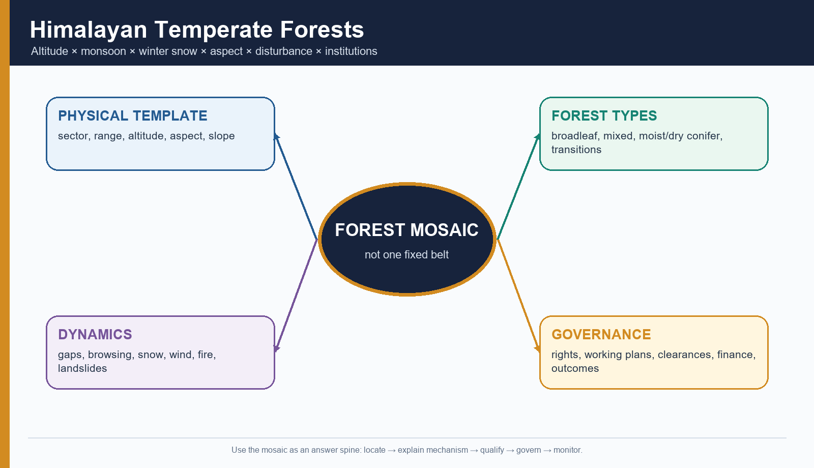

*Figure 1. The answer sequence is physical template → forest type → dynamics → governance → monitoring.*

### Working definition

A **temperate forest** is a tree-dominated ecosystem in a thermal regime with a marked cool season and physiological constraints from frost, snow, short growing season or cool mean conditions. In the Himalaya, low latitude is offset by altitude. The term therefore describes a **thermal-ecological belt**, not a single latitude or a universal height.

### What belongs inside the broad Himalayan temperate discussion?

| Formation | Exam-ready distinction | Boundary caution |
|---|---|---|
| Temperate broadleaf | Oak and other deciduous or evergreen broadleaf formations under cool montane conditions | Evergreen broadleaf is not automatically tropical rainforest |
| Mixed broadleaf-conifer | Broadleaf and conifer species share canopy or landscape patches | “Mixed” may describe stand composition or a wider mosaic |
| Moist temperate conifer | Deodar, blue pine/kail, fir, spruce or hemlock assemblages where cool moisture regimes fit | Species and dominance vary strongly west to east |
| Dry temperate | Inner, rain-shadow or continental valleys with drought- and cold-adapted assemblages | It is not a degraded form of moist temperate forest |
| Subtropical pine | Chir pine-dominated lower mountain transition | Chir pine is not equivalent to all Himalayan temperate conifers |
| Subalpine forest | Upper forest near treeline, often stunted and snow/wind constrained | It is an ecotone, not a hard contour |
| Alpine scrub/meadow | Shrub, herb and grass formations above climatic treeline | Meadow is not forest; local krummholz/scrub may blur the line |

> **Memory hook — BELT:** **B**oundaries overlap, **E**xposure modifies, **L**atitude shifts, **T**opoclimate decides.

### Why India’s Himalayan belt is only an analogue of the British type

- The textbook British type is a cool-temperate western-margin **maritime climate**, controlled by latitude, westerlies and oceanic moderation.
- Himalayan temperate forest is generated mainly by **altitude**, monsoon exposure, western-disturbance snow, continentality, aspect and relief.
- The useful analogy is the occurrence of cool-temperate broadleaf/mixed forest and a cool-season constraint.
- The dangerous error is to import Britain’s year-round maritime rainfall, small thermal range and low-relief vegetation geography into the Himalaya.

## 2. Nomenclature: Champion–Seth, geography texts and field ecology

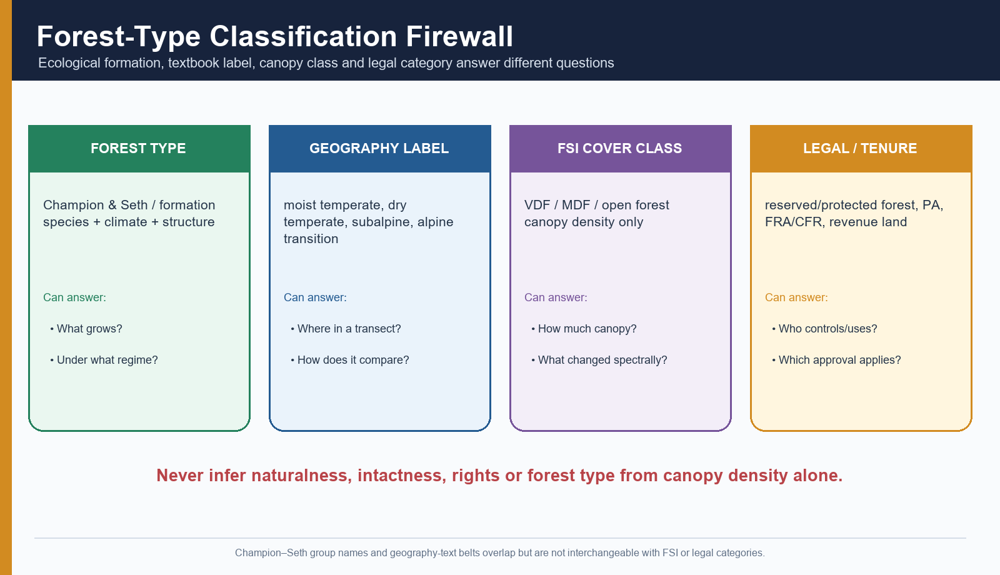

*Figure 2. Four classification systems can describe the same place differently because they answer different questions.*

### Champion and Seth versus geography-text labels

The Champion and Seth framework classifies Indian forests into major type groups and finer types using physiognomy, climate and floristic composition. Geography textbooks often compress these into broader belts such as:

- Himalayan moist temperate;
- montane wet temperate;
- Himalayan dry temperate;
- subtropical pine;
- subalpine and alpine.

These labels are useful for regional explanation but do not always map one-to-one onto a Champion–Seth type code. A forest department working plan may use a finer type, a geographer may use a belt, and FSI may simultaneously report the same patch as a canopy-density class.

### Source-era range: use, but qualify

The authored Majid Husain-based owner gives **approximately 1,500–3,300 m**, **100–250 cm rainfall** and **12–15°C** for a broad “montane wet temperate” treatment. Use this only as a **textbook indicative envelope**, because:

- the lower and upper limits move with latitude;
- north/south aspect alters radiation and snow;
- windward/leeward location changes moisture;
- valleys develop inversions and frost pockets;
- eastern monsoon cloud and western continentality create different thermal-moisture combinations.

Similarly, a source-era **2,200–3,000 m** range for silver fir is a useful recall aid, not a Himalayan-wide contour rule.

### Six distinctions UPSC can test

1. **Forest type** = ecological formation.
2. **Forest cover** = satellite-detected canopy under stated FSI criteria.
3. **Tree cover** = trees outside the forest-cover category under FSI methodology.
4. **Recorded forest area** = land recorded as forest in government records.
5. **Legal category** = reserved/protected forest, national park, sanctuary and so on.
6. **Natural condition** = old-growth, secondary, plantation, degraded, invaded or recovering.

> **UPSC trap:** Very Dense Forest does not mean virgin forest. It means canopy density of at least 70% under FSI classification.

## 3. Physical-climatic template

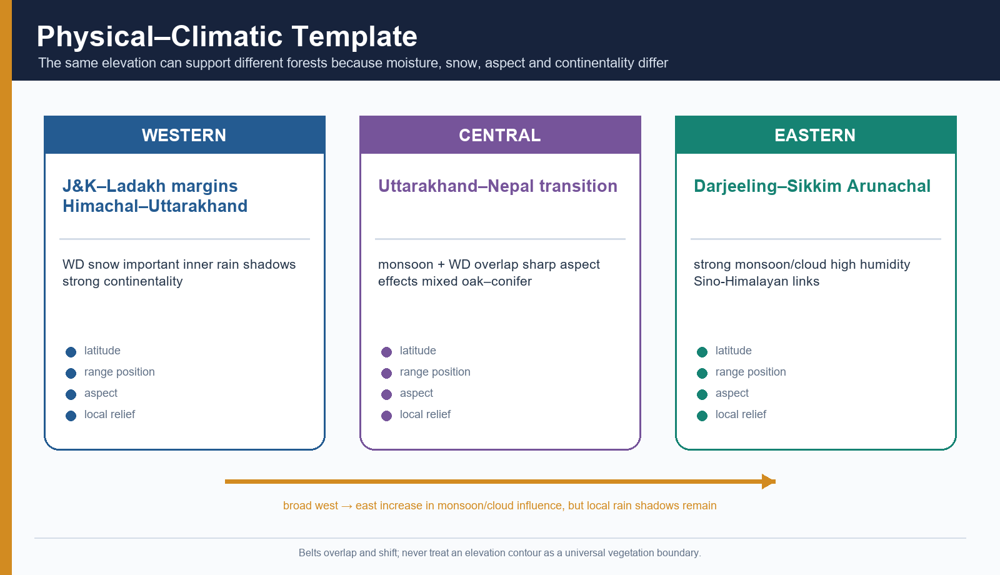

*Figure 3. Sectoral contrasts are broad tendencies; each sector contains strong local exceptions.*

### Range context

| Physiographic context | Forest significance |
|---|---|
| Outer Himalaya / Siwalik | Lower, warmer foothill systems; temperate forest is generally not the dominant image |
| Lesser Himalaya | Major temperate-forest setting in many western and central sectors; highly dissected and inhabited |
| Greater Himalaya | Upper temperate, subalpine and alpine transitions; snow, avalanche and short growing season gain importance |
| Inner valleys / Trans-Himalayan margins | Rain shadow and continentality support dry-temperate or cold-arid mosaics |
| Eastern syntaxis and associated ranges | Very steep gradients, strong monsoon/cloud influence and high floristic turnover |

### Control hierarchy

```text
LATITUDE + REGIONAL CIRCULATION
        ↓
WEST–EAST MONSOON / WD / CONTINENTALITY CONTRAST
        ↓
RANGE POSITION + WINDWARD/LEEWARD EXPOSURE
        ↓
ALTITUDE + ASPECT + SLOPE + VALLEY GEOMETRY
        ↓
SOIL / PARENT MATERIAL / DISTURBANCE HISTORY
        ↓
ACTUAL FOREST PATCH AND REGENERATION OUTCOME
```

### Western, central and eastern sectors

| Sector | Broad climatic emphasis | Forest implication | Qualification |
|---|---|---|---|
| Western Himalaya | Greater winter influence of western disturbances; strong inner-valley continentality and rain shadow | Moist and dry temperate types can occur within short horizontal distance | Monsoon still matters in Himachal/Uttarakhand; Kashmir and Ladakh are not one moisture regime |
| Central transition | Monsoon and winter systems overlap; aspect and valley geometry are strong | Oak-conifer mosaics and sharp local zonation | Political borders do not define ecological transitions |
| Eastern Himalaya | Strong summer monsoon, persistent cloud/fog in many belts, high humidity | Rich temperate broadleaf, mixed forest, fir/hemlock and bamboo-rhododendron transitions | Rain shadows and dry valleys still occur; “wet east” is not universal |

### Western disturbances and snow

- Western disturbances are extra-tropical systems embedded in the westerly circulation.
- They contribute winter rain and snow chiefly to north-west India and the western Himalaya.
- Snow affects soil insulation, frost exposure, breakage, moisture release and growing-season timing.
- A single snowy or snow-deficit winter is not a climate trend.
- More winter precipitation is not uniformly beneficial: rain-on-snow, wet snow, avalanches and delayed access may create hazards.

### Monsoon and cloud

- The southwest monsoon supplies most warm-season moisture to much of the Himalaya.
- Orographic uplift creates windward cloud and precipitation, while lee descent creates rain shadow.
- Persistent cloud can reduce daytime heating, raise leaf wetness and support epiphytes, but also increase fungal disease risk in managed forests or orchards.
- The Eastern Himalaya’s stronger monsoon/cloud regime helps explain higher broadleaf richness and floristic links; altitude alone cannot.

## 4. India-centric longitudinal and altitudinal transect

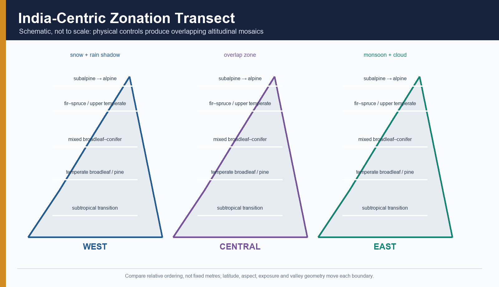

*Figure 4. Relative ordering is more reliable than one fixed set of metres.*

### Why belts overlap

- A south-facing slope may be warmer and drier than a north-facing slope hundreds of metres lower.
- Cold air can drain into a valley floor, creating frost below a warmer mid-slope.
- Cloud immersion may cool and moisten an exposed eastern ridge.
- An inner western valley can be drier at a high elevation than a lower monsoon-facing slope.
- Avalanche tracks maintain shrub-herb corridors inside a forest belt.
- A road cut, fire or former cultivation patch can reset succession and create a lower-seral patch at the “correct” forest altitude.

### Safe zonation language

Use:

- lower transition;
- middle temperate;
- upper temperate;
- inner dry-temperate;
- upper forest/subalpine ecotone;
- above-treeline alpine scrub/meadow.

Avoid:

- “oak begins exactly at X metres throughout the Himalaya”;
- “fir always occurs above deodar everywhere”;
- “every east-facing slope is wetter”;
- “tree line equals snowline.”

## 5. Western Himalaya zonation and species discipline

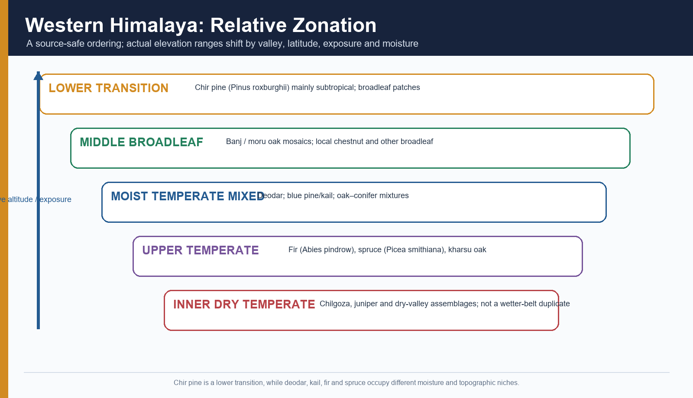

*Figure 5. A relative Western Himalayan sequence; local working plans and field surveys decide exact ranges.*

### Lower transition: chir pine

- **Chir pine — *Pinus roxburghii*** is primarily a subtropical pine of lower mountain slopes and lower-temperate transition zones.
- It is adapted to strong seasonality and can carry fire through resinous needle litter and grass.
- It must not be treated as a synonym for deodar, blue pine, fir, spruce or every “temperate conifer.”
- Chir-dominated slopes can contain broadleaf patches, riparian strips, former oak sites, plantations and settlement-use mosaics.

### Temperate oaks

| Common name | Scientific name used here | Broad ecological position | Caution |
|---|---|---|---|
| Banj oak | *Quercus leucotrichophora* | Lower/middle temperate western-central Himalayan oak | Taxonomic treatments may vary; cite a flora for fine taxonomy |
| Moru oak | *Quercus floribunda* | Temperate oak, often in mixed stands | Do not assume one aspect/elevation everywhere |
| Kharsu oak | *Quercus semecarpifolia* | Upper temperate/subalpine-transition oak | Not an alpine meadow species |

Oak forests are frequently lopped for fodder and leaf litter, browsed by livestock, cut for fuel and affected by fire. These uses can be sustainable, degrading or restorative depending on intensity, rotation, tenure and regeneration.

### Western conifers

| Common name | Scientific name | Distinction |
|---|---|---|
| Deodar | *Cedrus deodara* | A true cedar of the western Himalayan temperate belt; forms moist and dry deodar types in different settings |
| Blue pine / kail | *Pinus wallichiana* | A temperate pine, not chir pine |
| West Himalayan fir | *Abies pindrow* | Upper moist-temperate conifer in suitable western sectors |
| Himalayan spruce | *Picea smithiana* | Moist upper-temperate conifer; often associated with cool valley/slope settings |
| Chilgoza pine | *Pinus gerardiana* | Dry-temperate inner western Himalayan conifer with edible seeds |
| Juniper | *Juniperus* spp. | Dry-temperate to subalpine/cold-arid assemblages; do not collapse multiple species into one universal range |

### Moist versus dry temperate

**Moist temperate** forest reflects adequate cool-season/warm-season moisture and can support tall conifer or broadleaf-conifer stands. **Dry temperate** forest is associated with inner valleys, rain shadow and continentality. It is not merely moist forest after degradation.

Kashmir, Kinnaur, Lahaul-Spiti, Ladakh margins and other inner valleys contain different combinations of moisture, snow, valley orientation, elevation and parent material. Use a named valley or working plan before asserting a precise species boundary.

## 6. Eastern Himalaya zonation and biogeographic distinctness

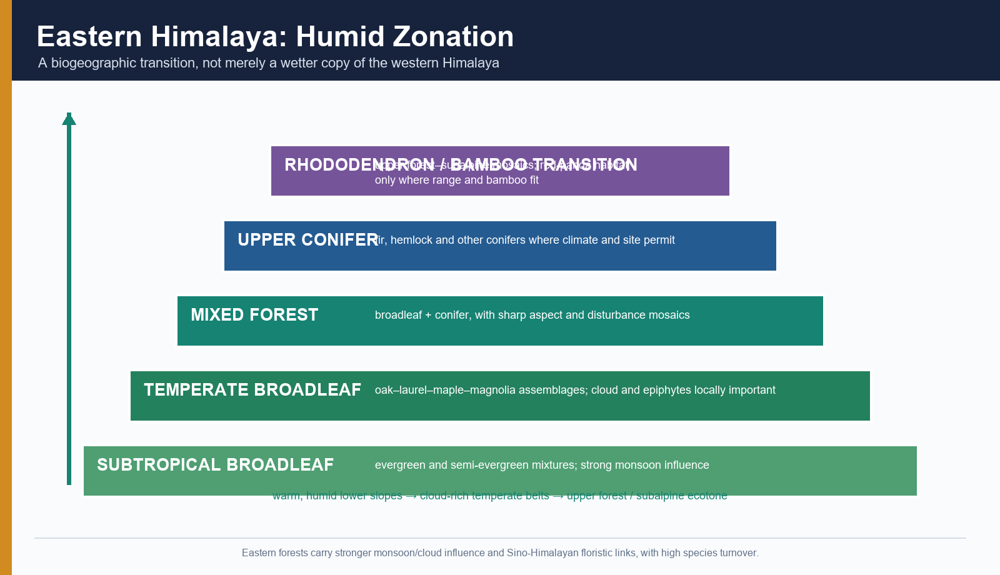

*Figure 6. Strong monsoon and cloud influence supports humid broadleaf and mixed transitions, but local topography remains decisive.*

### Relative sequence

1. Lower subtropical broadleaf evergreen and semi-evergreen formations.
2. Temperate broadleaf forests rich in oaks, laurels, maples and magnolia relatives.
3. Mixed broadleaf-conifer stands.
4. Upper conifer belts including fir and hemlock where suitable.
5. Bamboo-rhododendron and subalpine transitions.
6. Alpine scrub/meadow above climatic treeline.

### Useful species-level anchors

- Eastern Himalayan fir: *Abies densa* in suitable upper temperate/subalpine settings.
- Himalayan hemlock: *Tsuga dumosa* in humid eastern/central Himalayan montane forests.
- Oaks: multiple *Quercus* species, not a direct copy of western banj-moru-kharsu order.
- Rhododendrons: diverse shrubs and trees across temperate to alpine transitions.
- Bamboos: important understorey and disturbance-linked components; some species provide red-panda habitat.

### Why “wetter Western Himalaya” is inadequate

- The Eastern Himalaya is connected biogeographically to Sino-Himalayan and Indo-Burmese floristic regions.
- Persistent cloud and high rainfall interact with warmer latitude and extremely steep relief.
- Species turnover is high across short distances.
- Epiphytes, ferns, bamboo and evergreen broadleaf components can be much more prominent.
- Disturbance pathways—landslides, shifting cultivation in adjacent belts, roads and intense monsoon events—differ from western inner-valley dynamics.

> **UPSC trap:** Red panda does not occupy every eastern Himalayan temperate forest. Habitat suitability requires its actual range, forest structure and bamboo food/cover.

## 7. Broadleaf versus conifer: traits, mechanisms and limits

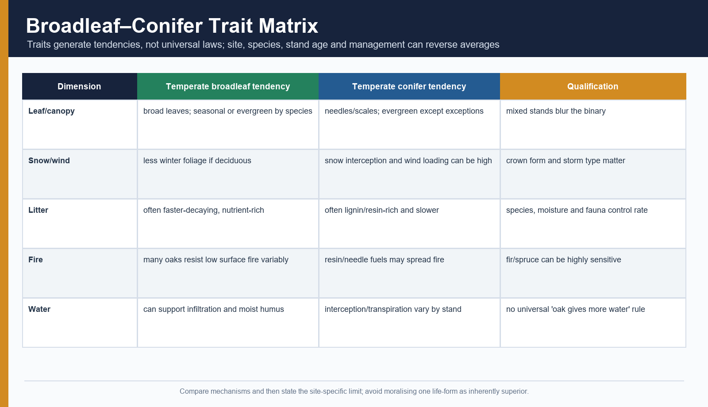

*Figure 7. Compare tendencies, then state species- and site-specific limits.*

### Leaf form and canopy

- Broad leaves offer large photosynthetic area but can be vulnerable to frost, drought or snow loading.
- Some temperate broadleaf species are deciduous; many Himalayan oaks are evergreen.
- Needles reduce leaf area and can persist through cold seasons, but “needle = drought-proof” is too simple.
- Conical crowns may shed snow, yet wet snow and wind can still break stems and crowns.

### Shade tolerance and regeneration

- Many firs and some broadleaf species regenerate under shade; pines commonly require brighter gaps.
- Oak seedlings may establish under partial shade but fail under repeated browsing/lopping.
- Deodar, kail, fir, spruce and oak each have distinct seed, light and moisture niches.
- Mast or seed years create pulses; absence of seedlings in one year is not proof of permanent failure.

### Litter and decomposition

- Broadleaf litter is often more nutrient-rich and decomposes faster.
- Needle litter can be resinous or lignin-rich and may decompose more slowly.
- Yet temperature, moisture, decomposer fauna, fungal communities, parent material and stand age can reverse simple averages.
- “Conifers always acidify soil” is therefore unsafe. They can contribute acidic litter and podzolisation tendencies under suitable conditions, but soil outcome is not controlled by leaf form alone.

### Water relations

- Forest canopies intercept rain and snow, alter evapotranspiration and shade soil.
- Broadleaf stands may promote moist litter and infiltration in some watersheds.
- Conifer stands can intercept snow and redistribute melt.
- The claim “oak always yields more water than pine” requires a named catchment, stand age, season, soil and measurement method.

### Fire

- Chir needles and resin can form continuous fine fuel.
- Crown-fire risk rises when surface fire reaches low branches and ladder fuels.
- Some thick-barked trees survive low-severity surface fire; fir and spruce regeneration can be highly sensitive.
- “Oak is fireproof” and “all pine needs fire” are both wrong.

## 8. Aspect, valley inversion and topoclimate

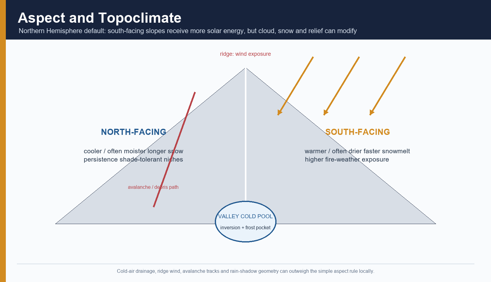

*Figure 8. The Northern Hemisphere aspect rule is a default, not an exception-free law.*

### North- and south-facing slopes

In the Northern Hemisphere, south-facing slopes generally receive more solar energy:

- warmer surface and soil;
- faster snowmelt;
- greater evaporative demand;
- often drier fuels and higher fire-weather exposure.

North-facing slopes are often:

- cooler and moister;
- more shaded;
- longer snow-retaining;
- favourable to shade-tolerant or moisture-demanding species.

### Why the rule can fail locally

- Persistent monsoon cloud can reduce solar contrast.
- Wind-driven snow may accumulate on an unexpected aspect.
- A slope can be windward to rain despite high solar receipt.
- Deep valleys can be shaded by surrounding ridges.
- Human disturbance and seed-source history may outweigh topoclimate.

### Valley and ridge processes

| Landform position | Process | Forest implication |
|---|---|---|
| Valley floor | Cold-air drainage and inversion | Frost pocket, fog, delayed mixing, different regeneration from mid-slope |
| Mid-slope | Thermal belt above inversion | Orchards/settlements and some forest species may perform better |
| Ridge | Wind exposure and shallow soils | Stunting, windthrow, desiccation, krummholz tendency |
| Concave hollow | Moisture and colluvium accumulation | Deep soil and regeneration, but debris-flow exposure |
| Avalanche path | Recurrent mechanical disturbance | Shrub/herb corridor within otherwise forested belt |
| Road-cut slope | Toe removal and drainage concentration | Landslide, edge drying, invasive spread and fire access |

## 9. Soils, humus and nutrient cycling

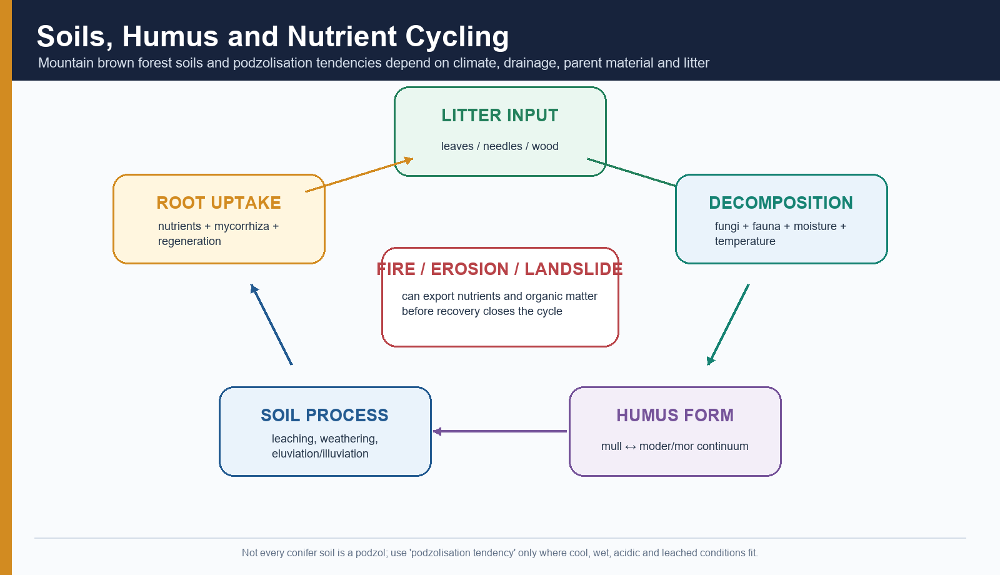

*Figure 9. Litter, decomposers, humus, mineral soil, roots and disturbance form one linked cycle.*

### Mountain brown forest soils

Mountain forest soils vary rapidly over short distance because of:

- parent rock and colluvium;
- slope angle and position;
- drainage;
- temperature and moisture;
- vegetation/litter;
- erosion and deposition;
- cultivation, grazing and fire.

“Brown forest soil” is a useful broad description in many temperate settings, but it should not hide local differences in depth, texture, acidity or organic matter.

### Podzolisation: tendency, not default

Podzolisation involves leaching of organic acids, iron and aluminium from an upper horizon and accumulation lower down. It is favoured by:

- cool, moist climate;
- acidic litter;
- free drainage and leaching;
- suitable parent material;
- sufficient time and stable surface.

Not every Himalayan conifer soil is a podzol because:

- many slopes are too young or erosion-prone for mature horizons;
- base-rich parent material can buffer acidity;
- seasonal dryness limits leaching;
- disturbance mixes or removes horizons;
- broadleaf-conifer mixtures alter litter chemistry.

### Mor, moder and mull

| Humus form | General tendency | Himalayan use |
|---|---|---|
| Mull | Rapid incorporation of organic matter into mineral soil; active fauna | More likely under biologically active, relatively base-rich and favourable moisture conditions |
| Moder | Intermediate organic-mineral integration | Common conceptual middle between mull and mor |
| Mor | Distinct acidic organic layer, slower mixing/decomposition | Can occur under cool, wet, acidic, conifer/heath-like conditions |

These are process categories, not labels that can be assigned from canopy type alone.

### Disturbance and nutrient export

- High-severity fire volatilises nutrients and removes protective litter.
- Low-severity fire may create a nutrient pulse but repeated burning can degrade soil.
- Landslides remove whole profiles and reset succession.
- Road drainage can gully forest soil.
- Heavy browsing/litter removal exports nutrients and suppresses regeneration.

## 10. Forest structure, gaps and multiple pathways

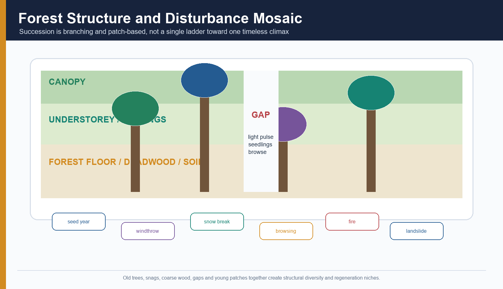

*Figure 10. Mature forest quality depends on vertical structure, deadwood, gaps and regeneration, not canopy percentage alone.*

### Structural layers

- emergent or upper canopy;
- main canopy;
- sub-canopy;
- shrub layer;
- herb/fern/bamboo layer;
- litter and humus;
- roots, fungi and soil biota;
- standing dead trees and coarse woody debris.

### Why deadwood matters

Deadwood:

- stores carbon and nutrients;
- holds moisture;
- supports fungi, insects and cavity users;
- provides nurse logs and microsites;
- records past disturbance.

A sanitation-felling approach that removes all deadwood may reduce some pest or fuel risks but can also simplify habitat. Management must distinguish hazardous fuel near settlements/roads from ecologically valuable deadwood in interior stands.

### Gap dynamics

```text
TREE FALL / SNOW BREAK / SMALL LANDSLIDE
        ↓
LIGHT + TEMPERATURE + SOIL-MOISTURE PULSE
        ↓
SEED BANK + ADVANCE REGENERATION + DISPERSAL
        ↓
BROWSING / COMPETITION / FROST / DROUGHT FILTER
        ↓
PINE-DOMINATED, OAK-DOMINATED, MIXED OR FAILED GAP RECOVERY
```

### Succession is not a straight ladder

- Initial species present after disturbance matter.
- Seed source and dispersal matter.
- Browsing can arrest tree recruitment.
- Repeated fire can maintain a pine/grass state.
- Landslide scars may undergo primary-succession-like soil building.
- Abandoned fields undergo secondary succession with soil and seed bank.
- Multiple stable or persistent states are possible; “climax” is climate-constrained but disturbance-sensitive.

## 11. Biodiversity and biogeographic turnover

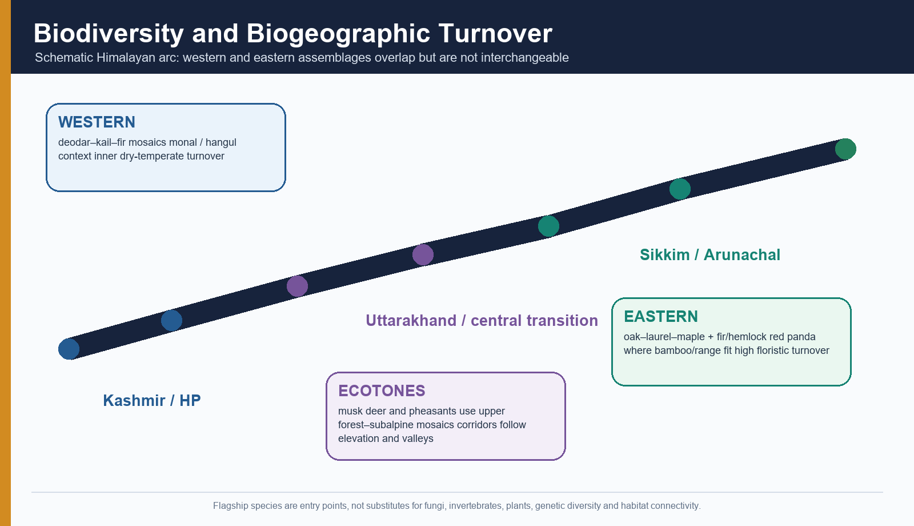

*Figure 11. Western and eastern assemblages turn over along the Himalayan arc and across elevation.*

### Western and eastern turnover

- Western forests include deodar, kail, West Himalayan fir, spruce, dry-temperate chilgoza/juniper assemblages and western oak mosaics.
- Eastern forests contain richer humid broadleaf mixtures, different oak species, laurels, maples, magnolia relatives, *Abies densa*, hemlock, bamboo and diverse rhododendrons.
- Central sectors contain overlaps and transitions.
- High beta diversity means adjacent elevations or valleys can have strongly different species composition.

### Species anchors—with habitat cautions

| Taxon | Safe use | Avoid |
|---|---|---|
| Himalayan monal (*Lophophorus impejanus*) | Western-central Himalayan upper forest, scrub and alpine-edge context | Calling it an obligate dense temperate-forest species |
| Musk deer (*Moschus* spp.; white-bellied/Himalayan treatments vary) | High Himalayan forest–subalpine–alpine mosaic; Askot and Gangotri PYQ context | Assigning every musk deer record to one forest type |
| Red panda (*Ailurus fulgens*) | Eastern Himalayan temperate/subalpine forest with bamboo in its actual range | Extending it across western Himalaya |
| Takin (*Budorcas taxicolor*) | Eastern Himalayan broad elevational mosaic | Reducing it to a temperate-forest-only animal |
| Asiatic black bear | Broad forest range and strong seasonal movement | Using it as proof of intact old-growth |
| Brown bear | Higher, colder western/northwestern landscapes | Treating it as a humid eastern temperate flagship |
| Hangul / Kashmir stag | Kashmir landscape and forest-grassland mosaic | Generalising to all Himalayan temperate forests |

### Endemism and hidden diversity

Temperate forests support:

- endemic and range-restricted plants;
- medicinal and aromatic plants;
- orchids, ferns and epiphytes in humid sectors;
- ectomycorrhizal and decomposer fungi;
- pollinators and saproxylic insects;
- genetic variation across isolated valleys.

Flagship mammals and pheasants attract attention, but forest function may depend heavily on fungi, invertebrates and soil biota.

### Protected landscapes

- Nanda Devi Biosphere Reserve/World Heritage landscape includes forest, alpine meadow, snow and inhabited buffer/transition zones.
- Khangchendzonga is a high-relief cultural and natural landscape with temperate broadleaf/mixed forest and alpine transitions.
- Great Himalayan National Park, Kedarnath Wildlife Sanctuary and other Himalayan protected areas represent different sectoral and elevational mosaics.

Protected status does not guarantee corridor connectivity outside the boundary or eliminate road, tourism, fire and climate pressures.

## 12. Ecosystem services—with ecological limits

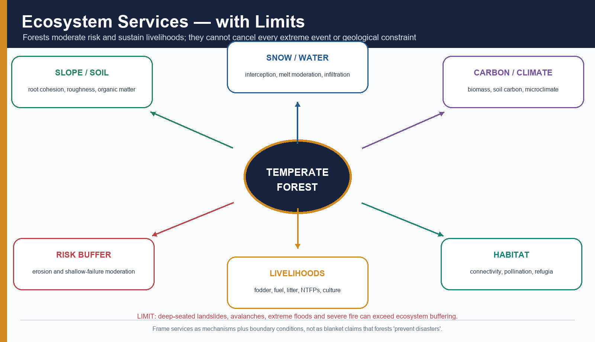

*Figure 12. State the service mechanism and the event/site conditions under which it can be exceeded.*

### Slope stability and erosion

Forest roots, litter and surface roughness can:

- increase shallow-soil cohesion;
- reduce raindrop impact;
- slow surface flow;
- support infiltration;
- trap small sediment.

**Limit:** Deep-seated landslides controlled by bedrock, tectonics, saturated debris, river undercutting or unsafe road cuts can exceed root reinforcement.

### Snow and stream regulation

Forest canopies:

- intercept and redistribute snow;
- shade snowpack;
- alter sublimation;
- slow melt in some settings;
- increase spatial heterogeneity.

Forest soils and litter can store water and support springs.

**Limit:** The direction and magnitude depend on species, canopy, snow type, wind, soil and season. Forest does not “create” water, and a catchment response cannot be inferred from leaf form alone.

### Carbon

- Live biomass, roots, deadwood and soil store carbon.
- Old forests can continue accumulating carbon while holding large stocks.
- Fire, logging, drought and landslide release or redistribute carbon.
- A plantation may increase tree cover while storing different carbon and supporting lower native biodiversity.

### Livelihood and cultural services

- fuelwood;
- fodder and leaf litter;
- timber and resin;
- medicinal/aromatic plants;
- edible fungi such as morels/gucchi where present;
- pollination;
- tourism and landscape identity;
- sacred groves and culturally protected patches.

**Limit:** Access is unequal; commercialisation can create overharvest; restrictions can impose costs on rights holders.

## 13. Human use, rights and institutions

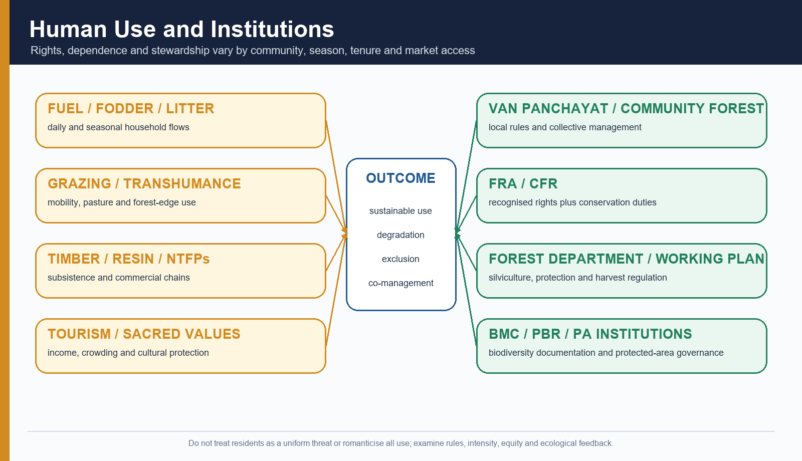

*Figure 13. Ecological outcome emerges from use intensity, tenure, institutions and enforcement—not from community presence alone.*

### Van panchayats

Uttarakhand’s van panchayats are a distinctive community-forest institution governed through state rules. They can:

- regulate access and grazing;
- organise protection and fire response;
- distribute forest products;
- mediate local stewardship.

They are neither identical across villages nor a substitute for every statutory right/clearance.

### Forest Rights Act

The FRA recognises:

- individual rights;
- community use rights, including grazing and minor forest produce;
- Community Forest Resource rights to protect, regenerate, conserve and manage;
- habitat rights for eligible PVTGs/pre-agricultural communities;
- procedural safeguards.

Rights holders also carry conservation responsibilities. Rights recognition is not unregulated extraction, and conservation cannot be equated with automatic exclusion.

### Grazing and transhumance

- Seasonal livestock movement can link valley settlements, forest edges and alpine pastures.
- Moderate, spatially distributed grazing can coexist with a mosaic.
- Concentrated grazing near roads, camps or water points can suppress seedlings and compact soil.
- Blanket exclusion may damage livelihoods and shift pressure elsewhere.

### Timber, resin and NTFPs

- Deodar and other conifers have high timber value.
- Chir resin tapping and needle collection alter use and fire incentives.
- Medicinal plants and morels can provide seasonal income.
- Working plans, harvest rules, access rights and market chains determine sustainability.

### Sacred forests and tourism

Sacred values can protect patches, species or springs. Tourism can finance conservation and livelihoods but also increase:

- road traffic;
- waste;
- water demand;
- construction;
- ignition;
- trail erosion;
- wildlife disturbance.

## 14. Oak–pine dynamics: replace slogan with causal web

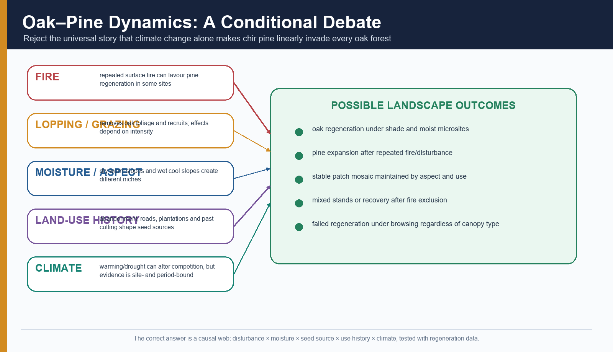

*Figure 14. Pine expansion, oak recovery and stable mosaics are all possible outcomes.*

### Common claim

“Climate change is making chir pine invade oak forests.”

### Better analysis

| Driver | Possible mechanism | Qualification |
|---|---|---|
| Repeated fire | Kills/suppresses oak recruits; creates open light-rich sites; pine seed can colonise | Severe fire can also kill pine; seed source and interval matter |
| Grazing/browsing | Removes oak seedlings and compacts soil | Livestock intensity and season matter |
| Lopping/litter removal | Reduces oak vigour and nutrient return | Regulated use can be sustainable |
| Aspect/moisture | Warm dry slopes favour different regeneration from cool moist slopes | Local cloud/rain can reverse aspect expectation |
| Land-use history | Former cultivation, cutting, plantation and abandonment set seed sources | Present canopy may reflect decades-old decisions |
| Climate | Warming, drought and altered snow may change competition and fire weather | Site, period and measurement must be named |

### Correct verdict

Oak–pine change is a **disturbance-moisture-history-climate interaction**. The right monitoring variables are:

- oak and pine seedlings/saplings by height class;
- browsing and lopping intensity;
- fire frequency and severity;
- soil moisture and organic layer;
- canopy gaps and seed sources;
- aspect and elevation;
- land-use history.

## 15. Fire ecology and risk management

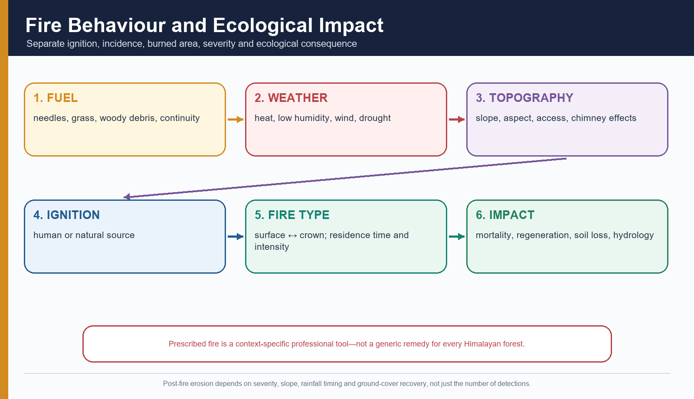

*Figure 15. A fire count is not a burned-area estimate, and burned area is not severity.*

### Fire components

1. **Fuel:** fine needles/grass, shrubs, woody debris and vertical ladder fuels.
2. **Weather:** temperature, humidity, wind, recent rain and drought.
3. **Topography:** slope accelerates upslope spread; aspect affects dryness; terrain constrains access.
4. **Ignition:** deliberate, accidental or natural.
5. **Fire behaviour:** surface, ground or crown involvement; intensity and residence time.
6. **Ecological effect:** mortality, regeneration, soil, erosion, carbon and habitat.

### Surface versus crown fire

- **Surface fire** burns litter, grass and low vegetation.
- **Crown fire** spreads through tree crowns, often after surface fire climbs ladder fuels.
- Conifer resin and needle fuel can raise spread potential, but stand structure and weather are decisive.

### Prescribed fire

Prescribed burning may be used under trained, legally authorised and carefully bounded conditions to manage fuel or meet an ecosystem objective. It is not a generic remedy because:

- many moist temperate and upper conifer species are fire-sensitive;
- smoke and escape risk are high;
- steep slopes complicate control;
- post-fire monsoon rain can erode exposed soil;
- cultural burning knowledge and rights must be respected.

### Detection versus suppression

FSI’s satellite system and Van Agni support:

- near-real-time detections;
- pre-fire danger information;
- large-fire tracking;
- dissemination to forest departments.

An alert does not prove:

- crew availability;
- road/trail access;
- equipment or water;
- response time;
- containment;
- ecological recovery.

## 16. Threat chains: driver → pressure → state → impact

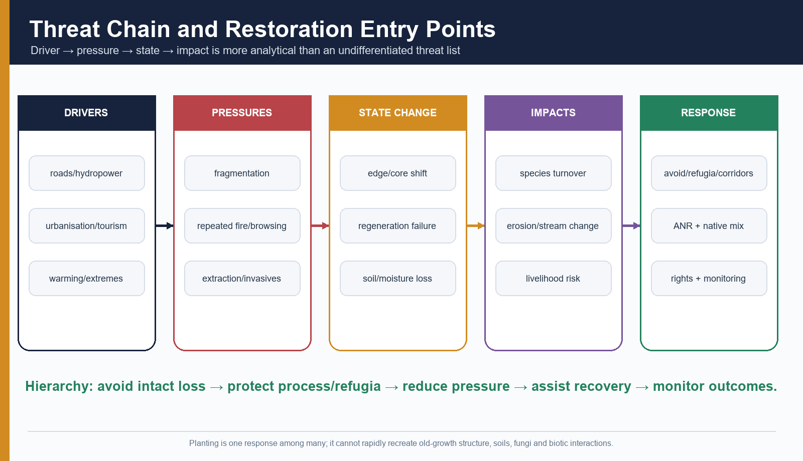

*Figure 16. Link each driver to a measurable forest-state change and a targeted response.*

### Development and fragmentation

```text
ROAD WIDENING / HYDROPOWER / URBAN GROWTH / TOURISM
        ↓
CLEARING + EDGE + BLASTING + SPOIL + DRAINAGE CHANGE + ACCESS
        ↓
FRAGMENTATION + SLOPE INSTABILITY + EXTRACTION + IGNITION
        ↓
REGENERATION FAILURE + SPECIES TURNOVER + EROSION + WILDLIFE CONFLICT
```

### Additional pressures

- illegal or unsustainable logging/extraction;
- repeated low-interval fire;
- over-browsing and concentrated grazing;
- invasive plants on disturbed edges;
- pests and pathogens;
- extreme snow/wind breakage;
- intense rain, landslides and debris flows;
- warming and drought;
- poorly designed plantation or compensatory afforestation.

### Why access is double-edged

Roads can:

- support livelihoods, emergency response and fire access;
- fragment habitat;
- dry edges;
- introduce weeds;
- increase extraction and ignition;
- concentrate runoff on unstable slopes.

The answer is not “no roads” or “roads are development.” It is route avoidance, cumulative appraisal, slope/drainage engineering, spoil management, speed/traffic control, corridor structures and compliance monitoring.

## 17. Climate-change evidence and migration constraints

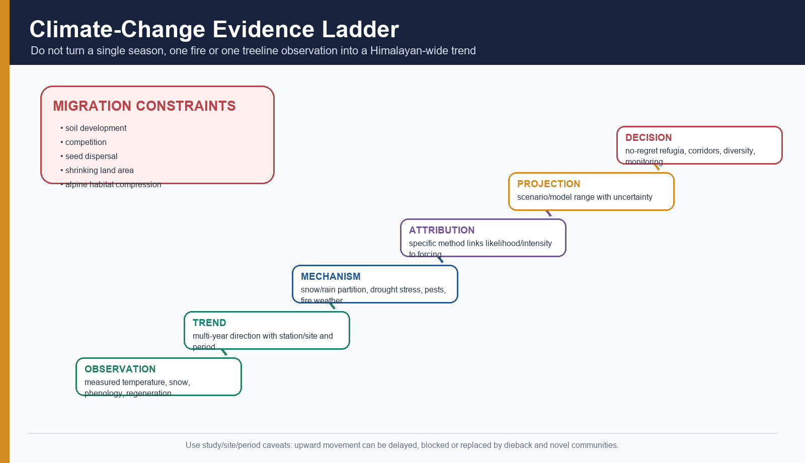

*Figure 17. Evidence gains strength as observation, trend, mechanism and attribution are separated.*

### Plausible climate-linked pathways

| Climate pressure | Forest pathway | Evidence caution |
|---|---|---|
| Warming | Longer warm season, heat stress, altered competitive balance | Specify station/site and period |
| Snow-to-rain shift | Reduced snow insulation, faster runoff, changed spring soil moisture | Elevation and storm type matter |
| Drought / high vapour-pressure deficit | Hydraulic stress, reduced growth, mortality and fire weather | Drought definition and stand condition matter |
| Extreme precipitation | Soil saturation, landslide, root damage and channel disturbance | One event is not a regional trend |
| Phenological change | Earlier leaf-out/flowering or mismatch with pollinators/frost | Species-specific observation required |
| Pest/pathogen change | Warmer winters or stressed hosts may alter outbreak risk | Causal attribution needs surveillance |
| Treeline/elevation shift | Recruitment above former limits or dieback below | Treeline is controlled by snow, wind, soil, grazing and land use too |

### Why “upward migration” is not automatic

- Soil may be absent or poorly developed.
- Alpine rock and snow leave little area.
- Established alpine plants compete.
- Seed dispersal may be slow.
- Grazing and fire can prevent recruitment.
- Mountain area narrows upward: the **escalator-to-extinction** risk.
- A species may decline at the lower edge without successfully colonising above.
- Novel mixed communities may form instead of a neat belt shift.

### Evidence grammar

Use:

- **FACT:** a named measurement at a named site and period.
- **STATUS:** a current report, programme or monitoring result.
- **INFERENCE:** the mechanism that could link climate to forest response.
- **LIMIT:** spatial, temporal or methodological boundary.

Avoid:

- “This year’s fire proves climate change.”
- “All species are moving uphill.”
- “Treeline and snowline are the same.”
- “A model projection is an observed trend.”

## 18. Forest data/status literacy

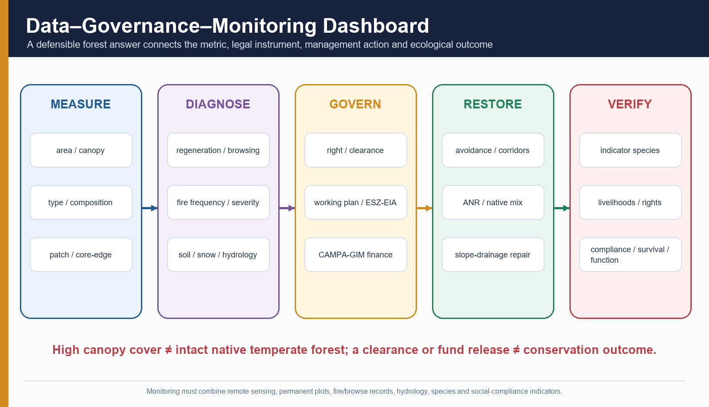

*Figure 18. The monitoring chain must move from canopy to composition, process, rights and outcome.*

### ISFR 2023 national baseline

| Indicator | ISFR 2023 value/definition | Correct use | Limit |
|---|---|---|---|
| Forest + tree cover | 827,356.95 sq km; 25.17% of geographical area | National canopy/tree baseline | Combines distinct categories |
| Forest cover | 715,342.61 sq km; 21.76% | Land at least 1 ha with canopy at least 10%, irrespective of ownership/legal status, under methodology | Can include plantation/orchard/bamboo/palm; not native forest condition |
| Tree cover | 112,014.34 sq km; 3.41% | Trees outside forest-cover category under FSI method | Not forest ecosystem area |
| Very Dense Forest | Canopy density at least 70% | Density class | Not “virgin” |
| Moderately Dense Forest | 40% to below 70% | Density class | Not species composition |
| Open Forest | 10% to below 40% | Density class | Not alpine meadow or every degraded forest |
| Recorded Forest Area | Land recorded as forest in government records | Legal/administrative extent | May lack dense canopy; may contain open ecosystems |

### What high canopy cover cannot prove

- native species composition;
- old-growth status;
- deadwood and structural complexity;
- wildlife connectivity;
- regeneration;
- low browsing;
- healthy soil;
- absence of invasive plants;
- community rights;
- ecological equivalence to the pre-diversion forest.

### Forest-type maps versus cover maps

- Cover map: how much canopy?
- Forest-type map: which formation?
- Land-use map: what use/cover class?
- Legal map: which notification/record?
- Condition survey: what structure, composition and pressure?

A correct Himalayan temperate assessment needs all five.

## 19. Governance and legal stack

### Current forest-conservation law

The Forest (Conservation) Act, 1980 was renamed the **Van (Sanrakshan Evam Samvardhan) Adhiniyam, 1980** by the 2023 amendment. Its central function is prior approval for specified forest-land diversion/non-forest use.

Do not say:

- the 1980 law was repealed;
- every tree-covered parcel is automatically governed identically;
- clearance proves ecological suitability;
- compensatory afforestation replaces the original forest.

### Indian Forest Act categories

| Category | Basic permission logic |
|---|---|
| Reserved Forest | Most restrictive: activities are prohibited unless permitted |
| Protected Forest | Activities generally remain permitted unless prohibited/restricted |
| Village forest / other categories | State-specific governance and records require checking |

Legal status and canopy condition can diverge.

### Wild Life (Protection) Act

The Act governs protected areas, species and wildlife regulation. National parks and sanctuaries may contain temperate forest, but:

- protected status is not forest type;
- corridors often extend beyond boundaries;
- rights/settlement processes differ by category and history;
- notification does not guarantee staffing or ecological outcome.

### Biological Diversity Act

- National Biodiversity Authority;
- State Biodiversity Boards;
- Biodiversity Management Committees;
- People’s Biodiversity Registers;
- conservation, sustainable use and access-benefit sharing.

A PBR documents knowledge/resources; it is not automatic tenure or protected-area notification.

### FRA

Separate:

- recognised right;
- claims process;
- community management;
- conservation duty;
- protected-area process;
- diversion clearance.

### CAMPA and Green India Mission

- CAMPA/CAF is financed through forest-diversion-related payments and supports compensatory afforestation and related activities.
- Green India Mission is a broader landscape-restoration and ecosystem-service mission.
- A fund release, plantation count or survival figure is an **input/output**, not proof of biodiversity, hydrological or livelihood recovery.

### Working plans, ESZ and EIA

- Working plans guide forest management and silviculture for a named division/period.
- Eco-sensitive zones regulate specified activities around protected areas.
- EIA/forest clearance appraises project impacts and conditions.
- Disaster/road design must address slope, drainage, spoil and cumulative corridor effects.

> **Governance mnemonic — RCPFO:** **R**ight, **C**learance, **P**lan, **F**inance, **O**utcome.

## 20. Conservation and restoration hierarchy

### 1. Avoid

- Avoid fragmentation of old-growth and moist refugia.
- Avoid road/hydropower alignments through core habitat and unstable slopes where alternatives exist.
- Avoid wrong-site plantations in alpine meadows, natural scrub or native open habitats.

### 2. Protect processes

- riparian buffers;
- avalanche and landslide pathways;
- wildlife corridors;
- seed-source stands;
- springsheds and moist north-facing refugia;
- natural fire breaks and heterogeneous mosaics.

### 3. Reduce pressure

- fire prevention and rapid response;
- grazing/browsing plans;
- lopping and fuelwood alternatives;
- invasive and pest surveillance;
- tourism carrying-capacity and waste control;
- road drainage/spoil compliance.

### 4. Assist recovery

- Assisted Natural Regeneration where seed source and soil remain.
- Native mixed planting where natural recruitment is inadequate.
- Nurse shrubs and soil stabilisation on severe scars.
- Mycorrhizal/soil-organic restoration where required.
- Slope, drainage and gully repair before tree planting.

### 5. Govern with communities

- recognise rights;
- support van panchayats/CFR institutions;
- pay for patrol, nursery, monitoring and restoration work;
- use local ecological knowledge with scientific plots and remote sensing;
- publish benefit-sharing and compliance results.

### 6. Monitor for decades

Plantation cannot rapidly recreate:

- old trees;
- cavities and deadwood;
- mature soil horizons;
- fungal networks;
- genetic diversity;
- complex food webs;
- historical hydrology.

## 21. Regional cases

### Uttarakhand oak–conifer and upper Alaknanda/Kedarnath context

Use as a **coupled-system case**:

- steep, young relief and monsoon rain;
- oak-conifer and upper forest/subalpine mosaics;
- pilgrimage/tourism and road pressures;
- landslide and flash-flood exposure;
- van panchayat/community use in parts of the state;
- fire concentrated in lower/middle dry pre-monsoon belts;
- climate and snow effects requiring site-specific monitoring.

Do not claim forest could have prevented the 2013 Kedarnath disaster. Forest can moderate shallow erosion/runoff locally but cannot cancel extreme precipitation, glacial/snow, channel and geomorphic processes.

### Himachal deodar

Use deodar as:

- a western Himalayan temperate conifer;
- an economically and culturally important timber;
- a working-plan management example;
- a moist-versus-dry deodar distinction.

Do not generalise one divisional working-plan range to all Himachal.

### Kashmir and inner dry/moist contrast

- Kashmir Valley and surrounding slopes contain moist temperate forests, orchards, meadows and settlements.
- Inner sectors toward high rain-shadow valleys support dry-temperate and cold-arid transitions.
- Winter snow, continentality and valley inversion matter more than in humid eastern sectors.
- Hangul habitat is a landscape mosaic, not a “deodar-only” habitat.

### Sikkim and Arunachal

- Strong monsoon/cloud, steep gradients and eastern biogeographic links.
- Oak-laurel-maple, mixed conifer, fir/hemlock and bamboo-rhododendron transitions where verified.
- Khangchendzonga supplies a protected cultural-landscape example.
- Arunachal contains broad subtropical-to-alpine gradients; a state label cannot define one forest belt.

## 22. Current linkage: 2026 Uttarakhand fire assessment

### FACT

The Indian Institute of Remote Sensing assessment published **2 June 2026** reported MODIS active-fire detections across Uttarakhand of:

| Month, 2026 | Active-fire detections |
|---|---:|
| January | 200 |
| February | 113 |
| March | 178 |
| April | 207 |
| May | 433 |

For January–May, the assessment reported the largest cumulative district counts in Pauri Garhwal (207), Chamoli (190) and Tehri Garhwal (130).

### STATUS

For Pauri Garhwal, the assessment used Sentinel-2 pre- and post-fire composites and differenced Normalized Burn Ratio to identify approximately **838.66 sq km** of burned area. It classified most mapped area as low severity:

| Severity class | Area reported | Share reported |
|---|---:|---:|
| Low | 686.05 sq km | 81.8% |
| Moderate-low | 137.62 sq km | 16.4% |
| Moderate-high | 14.05 sq km | 1.7% |
| High | 0.94 sq km | 0.1% |

### INFERENCE

The pre-monsoon rise is consistent with increasing fuel dryness, warm conditions and widespread ignition/spread opportunities. The report links the predominantly low-severity pattern to surface-fire characteristics commonly observed in chir-pine-dominated Western Himalayan landscapes.

### LIMIT

- MODIS detections are satellite observations, not a one-to-one count of independent incidents.
- The burned-area product depends on imagery, date window and classification method.
- Burned area is not equal to permanent forest loss.
- Low severity does not mean no ecological or health impact.
- Pauri’s chir-pine context is mainly lower/subtropical-transition forest and cannot represent every moist temperate, fir-spruce, dry-temperate or eastern Himalayan forest.
- One 2026 fire season is not a climate trend.

### Exam use

Use the case to demonstrate:

1. detection versus burned area;
2. area versus severity;
3. lower pine-transition versus all temperate forest;
4. current event versus long-term climate trend;
5. satellite alert versus field suppression and post-fire restoration.

## 23. Monitoring indicators

### Landscape

- forest-type area, not cover alone;
- patch size;
- core-to-edge ratio;
- corridor continuity;
- elevation/aspect distribution;
- road and settlement proximity.

### Composition and structure

- native broadleaf/conifer share;
- invasive cover;
- tree-size distribution;
- canopy/sub-canopy complexity;
- standing and fallen deadwood;
- old-tree/cavity abundance.

### Regeneration and pressure

- seedlings and saplings by species/height class;
- browsing and lopping;
- grazing concentration;
- extraction;
- seed years;
- pest/pathogen incidence.

### Fire

- ignition count;
- active-fire detections;
- independent incidents;
- burned area;
- severity;
- fire-return interval;
- response time;
- post-fire erosion and regeneration.

### Soil, water and snow

- organic-layer depth;
- soil moisture;
- infiltration and erosion plots;
- spring discharge;
- snow duration/depth where relevant;
- stream turbidity and peak-flow response;
- slope/drainage condition.

### Biodiversity

- indicator species;
- occupancy and breeding evidence;
- fungi/invertebrates;
- pollinators;
- genetic/valley-level variation;
- roadkill and corridor use.

### Rights and governance

- FRA/CFR/van panchayat status;
- participation and representation;
- benefit sharing;
- grievance resolution;
- working-plan compliance;
- clearance-condition compliance;
- CAMPA/GIM expenditure linked to survival and ecological function.

## 24. Answer frameworks and advanced refinements

### 10-marker spine: explain Himalayan temperate zonation

```text
Definition
→ sectoral map
→ altitude + monsoon/WD + aspect mechanism
→ western and eastern contrast
→ one qualification on overlapping belts
→ concise verdict
```

### 15-marker spine: evaluate threats and conservation

```text
Claim: forest is a dynamic social-ecological mosaic
→ named driver-pressure-state-impact chain
→ fire / road / browsing / climate mechanisms
→ rights + working plans + clearance + finance distinctions
→ avoid-protect-reduce-restore-monitor hierarchy
→ qualified verdict
```

### 20-marker spine: data, climate and governance

```text
Classification firewall
→ ISFR metric and limit
→ site-specific climate evidence ladder
→ two regional cases
→ governance stack
→ measurable monitoring dashboard
→ no-equivalence verdict on plantations
```

### Advanced refinements

1. **Scale:** leaf trait, stand, catchment and Himalayan arc are different scales.
2. **Time:** one fire season, a decade of regeneration and an old-growth century are different clocks.
3. **Non-equilibrium:** disturbance can produce multiple pathways rather than one climax.
4. **Refugia:** cool moist slopes and riparian pockets may preserve species despite regional warming.
5. **Novel ecosystems:** climate and disturbance may create mixtures with no exact historical analogue.
6. **Connectivity:** vertical corridors are necessary but not sufficient if roads sever lateral valley links.
7. **Equity:** restrictions, tourism revenue and restoration employment have distributional effects.
8. **Additionality:** plantation or carbon claims must ask what would have occurred without the intervention.
9. **Leakage:** reduced extraction in one patch may shift pressure elsewhere.
10. **Permanence:** fire, drought, pests and tenure change can reverse restoration/carbon gains.

---

## Part II - Premium solved practice workbook

### Workbook rules

- Objective answers rotate continuously **A → B → C → D** from Q1 through Q32.
- Authentic PYQ option order is retained; PYQs are placed at rotation-compatible positions.
- “Officially verified” is used only where a locally available official key exists.
- The relevant 2019, 2020 and 2022 objective keys were not held locally; answers are retained as **INFERRED ANSWER — NOT OFFICIALLY VERIFIED**, with confidence and elimination.
- Every Mains solution follows **claim → named evidence/example → analysis → qualification → verdict** and ends **Why this earns marks**.

## A. Solved Prelims PYQs, hard MCQs and remedial MCQs

### Q1. UPSC Prelims 2020, GS-I, Q77 — official key unavailable locally

Which of the following are the most likely places to find the musk deer in its natural habitat?

1. Askot Wildlife Sanctuary  
2. Gangotri National Park  
3. Kishanpur Wildlife Sanctuary  
4. Manas National Park

A. 1 and 2 only  
B. 2 and 3 only  
C. 3 and 4 only  
D. 1 and 4 only

**INFERRED ANSWER — NOT OFFICIALLY VERIFIED: A. Confidence: high.**

**Elimination:** Askot and Gangotri are high Himalayan protected landscapes suitable for musk-deer habitat. Kishanpur is a Terai protected area and Manas is a foothill-alluvial/subtropical landscape rather than the paired high-Himalayan habitat tested. The answer is not upgraded to official status because the local official key was unavailable.

### Q2. Original — classification firewall

Which statement is most defensible?

A. Very Dense Forest is an old-growth ecological class.  
B. Forest type, FSI canopy class, recorded forest area and legal category are separate descriptors.  
C. Every recorded forest is densely wooded.  
D. A plantation cannot enter forest-cover statistics.

**Answer: B.**

**Explanation:** FSI density, ecological formation, government record and legal status answer different questions. A plantation may qualify as forest cover under the methodology.

### Q3. UPSC Prelims 2022, GS-I, Q45 — stem verified; official key unavailable locally

With reference to “Gucchi” sometimes mentioned in the news, consider the following statements:

1. It is a fungus.  
2. It grows in some Himalayan forest areas.  
3. It is commercially cultivated in the Himalayan foothills of north-eastern India.

Which of the statements given above is/are correct?

A. 1 only  
B. 3 only  
C. 1 and 2  
D. 2 and 3

**INFERRED ANSWER — NOT OFFICIALLY VERIFIED: C. Confidence: high.**

**Elimination:** Gucchi refers to morel mushrooms (*Morchella* spp.), a fungus collected in Himalayan forest landscapes. The statement of established commercial cultivation in the north-eastern Himalayan foothills is not supported. The exact answer remains inferred because an official local key was unavailable.

### Q4. UPSC Prelims 2019, GS-I, Q18 — official scan verified; key unavailable locally

Which one of the following National Parks lies completely in the temperate alpine zone?

A. Manas National Park  
B. Namdapha National Park  
C. Neora Valley National Park  
D. Valley of Flowers National Park

**INFERRED ANSWER — NOT OFFICIALLY VERIFIED: D. Confidence: high.**

**Elimination:** Manas is a foothill/alluvial landscape. Namdapha spans a very large tropical-to-alpine gradient. Neora Valley also spans montane belts. Valley of Flowers is the high Himalayan option identified with the temperate-alpine setting. “Temperate alpine” is a PYQ phrase; ecological teaching should still distinguish upper forest, subalpine scrub and alpine meadow.

### Q5. Original — physical template

Which sequence best explains the actual forest patch on a Himalayan slope?

A. Regional circulation → range exposure → altitude/aspect/topoclimate → soil/disturbance → vegetation outcome  
B. State boundary → latitude only → tree species  
C. Elevation alone → fixed belt everywhere  
D. Canopy density → legal status → climate

**Answer: A.**

**Explanation:** The Himalayan forest mosaic is nested. Regional circulation and range position set moisture, then local topoclimate, soil and disturbance filter species and regeneration.

### Q6. Original — western/eastern contrast

Which comparison is correct?

A. Eastern temperate forests are merely western species receiving more rain.  
B. Eastern forests combine stronger monsoon/cloud influence and distinct biogeographic links; western forests show stronger inner-valley dry-temperate and winter-snow contrasts.  
C. Western disturbances uniformly control eastern Himalayan summer rain.  
D. Dry temperate forest is absent from all Himalayan rain shadows.

**Answer: B.**

**Explanation:** The contrast is climatic and biogeographic. Local exceptions remain in both sectors.

### Q7. Original — chir pine

Which statement about chir pine is correct?

A. It is the same species as blue pine/kail.  
B. It is an upper subalpine fir.  
C. It is mainly a subtropical/lower mountain pine and must not represent all Himalayan temperate conifers.  
D. It cannot carry surface fire.

**Answer: C.**

**Explanation:** Chir is *Pinus roxburghii*. Blue pine is *Pinus wallichiana*. Fir belongs to *Abies*.

### Q8. Original — upper conifer distinctions

Which pair is incorrectly treated as interchangeable in a careless answer?

A. Deodar and cedar  
B. Blue pine and kail  
C. Spruce and *Picea smithiana*  
D. Fir and spruce as one species

**Answer: D.**

**Explanation:** Fir and spruce are distinct genera and ecological components. Common-name/scientific-name discipline matters.

### Q9. Original — aspect

On a western Himalayan slope, which is the safest default expectation?

A. South-facing slopes often receive more solar energy and may be warmer/drier, while local cloud, snow and relief can modify the pattern.  
B. North-facing slopes are always drier.  
C. Aspect has no effect below treeline.  
D. East-facing slopes are universally wettest.

**Answer: A.**

**Explanation:** The Northern Hemisphere radiation rule is useful only with a qualification.

### Q10. Original — soils

Why is “every conifer soil is a podzol” incorrect?

A. Podzolisation occurs only in deserts.  
B. Leaching, litter, parent material, drainage, erosion and time must jointly favour the process.  
C. Conifers produce no litter.  
D. Mountain soils never form horizons.

**Answer: B.**

**Explanation:** Podzolisation is a process tendency, not a canopy label.

### Q11. Original — broadleaf/conifer water relations

Which statement is best?

A. Broadleaf forest always produces more streamflow than conifer forest.  
B. Conifers always reduce soil water.  
C. Catchment response depends on species, stand age, season, interception, evapotranspiration, soil and snow; leaf form alone is insufficient.  
D. Forest has no hydrological effect.

**Answer: C.**

**Explanation:** Water claims require scale and measurement discipline.

### Q12. Original — succession

Which is the most accurate description of Himalayan forest succession?

A. It always ends in one permanent climatic climax.  
B. Fire always converts forest to grassland permanently.  
C. A plantation is automatically the climax stage.  
D. Disturbance history, seed source, browsing, fire and chance can produce multiple recovery pathways.

**Answer: D.**

**Explanation:** Modern succession ecology is probabilistic and patch-based.

### Q13. Original — oak–pine debate

Which monitoring design best tests alleged pine expansion into oak forest?

A. Compare mapped canopy with seedling/sapling, fire, browse, soil moisture, aspect, seed source and land-use history data.  
B. Record only adult pine trees in one year.  
C. Assume every pine patch is caused by climate change.  
D. Compare state-level rainfall with one photograph.

**Answer: A.**

**Explanation:** Regeneration and disturbance data test mechanism; canopy alone cannot.

### Q14. Original — fire metrics

Which pair must be kept distinct?

A. Surface fire and litter  
B. Active-fire detections and independent incidents/burned area  
C. Slope and aspect  
D. Fir and snow

**Answer: B.**

**Explanation:** One incident can generate multiple detections, while small fires may be missed. Burned area and severity require separate products.

### Q15. Original — ecosystem services

Which claim is defensible?

A. Forest prevents every Himalayan landslide.  
B. Forest has no role in erosion.  
C. Roots, litter and roughness can reduce shallow erosion/failure risk, but deep-seated failures and extreme events can exceed buffering.  
D. Afforestation stabilises any road cut without drainage work.

**Answer: C.**

**Explanation:** Mechanism plus limit earns marks.

### Q16. Original — ISFR data

Which conclusion cannot be drawn from a patch classified as Very Dense Forest?

A. Canopy density meets the relevant threshold.  
B. The patch can be compared through a stated remote-sensing method.  
C. It has high detected canopy closure.  
D. It is necessarily intact old-growth native temperate forest with secure regeneration.

**Answer: D.**

**Explanation:** Naturalness, composition, age and regeneration need field/type evidence.

### Q17. Original — legal stack

Which sequence correctly separates instruments?

A. FRA = rights; forest-conservation law = diversion approval; working plan = management plan; CAMPA = finance; monitoring = outcome evidence  
B. FRA = satellite canopy class; CAMPA = protected area  
C. EIA = community title; working plan = court order  
D. Green India Mission = automatic forest clearance

**Answer: A.**

**Explanation:** Right, clearance, plan, finance and outcome are separate.

### Q18. Original — community institutions

Which statement is most balanced?

A. Every local use is degrading.  
B. Van panchayats/CFR institutions can support stewardship, but ecological outcome depends on rules, equity, capacity, pressure and monitoring.  
C. Community rights remove all conservation duties.  
D. State departments have no role after rights recognition.

**Answer: B.**

**Explanation:** Avoid both exclusionary and romanticised extremes.

### Q19. Original — restoration hierarchy

Which is the correct order?

A. Plant first → assess later → clear old forest if needed  
B. Compensate → divert → measure canopy only  
C. Avoid intact loss → protect refugia/corridors → reduce pressure → assist native recovery → monitor  
D. Replace every mixed forest with one commercially valuable conifer

**Answer: C.**

**Explanation:** Avoidance comes before offset/restoration.

### Q20. Original — climate evidence

Which statement is correct?

A. One severe fire establishes a long-term climate trend.  
B. Any upward seedling proves species migration.  
C. A projection is an observation.  
D. A robust claim names site, period, variable and method, then separates trend, mechanism and attribution.

**Answer: D.**

**Explanation:** Evidence grammar prevents overclaiming.

### Q21. Remedial — species and habitat

Which statement is safest?

A. Red panda is an eastern Himalayan range-and-bamboo-associated temperate/subalpine species, not a western-Himalaya-wide forest indicator.  
B. Musk deer is restricted to subtropical chir forest.  
C. Takin occurs only in deodar forest.  
D. Monal proves a stand is old-growth.

**Answer: A.**

**Explanation:** Species use ecotones and seasonal ranges; flagship presence does not describe the whole forest.

### Q22. Remedial — prescribed fire

Which statement is correct?

A. Prescribed fire is always prohibited and ecologically useless.  
B. It is a context-specific, authorised professional tool requiring ecosystem, weather, terrain, smoke and escape-risk assessment.  
C. Every fir-spruce forest requires annual burning.  
D. Fire severity equals detection count.

**Answer: B.**

**Explanation:** A qualified management statement is required.

### Q23. Remedial — current forest-law title

The current title of the amended 1980 central forest-conservation law is:

A. Indian Forest Rights Act, 1980  
B. National Forest Conservation Code, 1980  
C. Van (Sanrakshan Evam Samvardhan) Adhiniyam, 1980  
D. Compensatory Afforestation Act, 1980

**Answer: C.**

**Explanation:** The 2023 amendment renamed, rather than repealed, the Act.

### Q24. Remedial — plantation equivalence

Why can compensatory plantation not quickly recreate an old Himalayan temperate forest?

A. Trees cannot grow in mountains.  
B. Plantations have no carbon.  
C. Native species are legally prohibited.  
D. Old trees, soils, fungi, deadwood, genetic structure, hydrology and food webs require long development and site continuity.

**Answer: D.**

**Explanation:** The critique is ecological non-equivalence, not opposition to restoration.

### Q25. Advanced — monitoring

Which dashboard is most complete?

A. Patch/connectivity + composition/structure + regeneration/browse + fire severity + soil/water/snow + species + rights/compliance  
B. Plantation count only  
C. Forest-cover percentage only  
D. Tourism receipts only

**Answer: A.**

**Explanation:** Forest condition is multidimensional.

### Q26. Advanced — Eastern Himalaya

Which factor most clearly prevents treating eastern temperate forest as a wetter western duplicate?

A. Eastern Himalaya has no conifers.  
B. Distinct biogeographic links and floristic turnover combine with monsoon/cloud and steep relief.  
C. Western disturbances are absent from Earth.  
D. Eastern forests occur at sea level only.

**Answer: B.**

**Explanation:** Composition and evolutionary geography matter alongside climate.

### Q27. Advanced — dry temperate

Which statement is correct?

A. Dry temperate forest is always a burned moist forest.  
B. It is the same as alpine meadow.  
C. Inner rain-shadow and continental settings can support distinct chilgoza, juniper, deodar or dry broadleaf assemblages.  
D. It occurs only in Sikkim.

**Answer: C.**

**Explanation:** Dry temperate is an ecological setting, not a degradation label.

### Q28. Advanced — IIRS 2026 fire case

Which interpretation is valid?

A. The Pauri burned-area estimate proves equal high-severity forest loss.  
B. MODIS detections equal independent fires exactly.  
C. The 2026 season proves a long-term climate trend.  
D. The assessment separates detections, mapped burned area and severity, with most mapped Pauri area classified low severity.

**Answer: D.**

**Explanation:** The correct reading preserves measurement categories and time bounds.

### Q29. Advanced — old-growth structure

Which field observation most strongly adds information that canopy density alone cannot provide?

A. A mixed tree-size distribution with large old trees, cavities, standing deadwood, fallen logs and continuous native regeneration  
B. The district’s total geographical area  
C. The colour assigned to the state on a political map  
D. Annual tourist arrivals without site location

**Answer: A.**

**Explanation:** Old-growth/structural condition requires stand-level evidence. Canopy closure alone cannot reveal age structure, deadwood or regeneration.

### Q30. Advanced — snow and hydrology

Which statement about forest and snowmelt is most defensible?

A. Every conifer canopy always increases annual river flow.  
B. Canopy interception, wind redistribution, shading, sublimation, soil storage and storm type jointly determine the seasonal response.  
C. Forest has no influence on snow.  
D. Tree line and permanent snowline are identical.

**Answer: B.**

**Explanation:** Forest-snow hydrology is process- and season-specific; universal yield claims are unsafe.

### Q31. UPSC Prelims 2019, GS-I, Q33 — official scan verified; key unavailable locally

Consider the following States:

1. Chhattisgarh  
2. Madhya Pradesh  
3. Maharashtra  
4. Odisha

With reference to the States mentioned above, in terms of percentage of forest cover to the total area of State, which one of the following is the correct ascending order?

A. 2–3–1–4  
B. 2–3–4–1  
C. 3–2–4–1  
D. 3–2–1–4

**INFERRED ANSWER — NOT OFFICIALLY VERIFIED: C. Confidence: high for the report period tested.**

**Elimination:** Maharashtra had the lowest percentage among the four, followed by Madhya Pradesh, Odisha and Chhattisgarh. The question is report-vintage sensitive: never transfer its ranking to a later ISFR without checking the later state table.

### Q32. UPSC Prelims 2019, GS-I, Q31 — official scan verified; key unavailable locally

There was growing awareness in India about the importance of Himalayan nettle (*Girardinia diversifolia*) because it is found to be a sustainable source of:

A. Anti-malarial drug  
B. Biodiesel  
C. Pulp for paper industry  
D. Textile fibre

**INFERRED ANSWER — NOT OFFICIALLY VERIFIED: D. Confidence: high.**

**Elimination:** Himalayan nettle yields bast fibre used for textiles and illustrates a non-timber forest/livelihood resource. The item does not establish that every nettle harvest is sustainable; tenure, harvest method and regeneration still matter.

## B. Solved Mains PYQs

### PYQ 1 — UPSC Mains 2019, GS-I, Q15

**Question:** How can the mountain ecosystem be restored from the negative impact of development initiatives and tourism? (15 marks, 250 words)

**Demand:** “How can” requires an implementable restoration strategy, not only a threat list. “Mountain ecosystem” requires slope, forest, water, biodiversity and community integration.

**Model solution**

- **Claim:** Mountain restoration must begin by preventing new irreversible damage because steep relief, slow soil formation and fragmented altitudinal habitats make post-impact repair costly and incomplete.
- **Named evidence/example:** In the Himalaya, road cutting, hydropower works, pilgrimage/tourism growth and urban expansion can remove forest, alter drainage and destabilise debris. The upper Alaknanda-Kedarnath landscape illustrates the overlap of extreme hydro-geomorphic processes with corridor and tourism exposure; the 2026 IIRS Uttarakhand fire assessment adds a current lower/middle-slope fire-management context.
- **Analysis:** First, map carrying capacity and no-go zones around old forest, springs, avalanche paths, unstable slopes and wildlife corridors. Second, require cumulative basin/corridor appraisal rather than project-by-project clearance. Third, enforce hill-road geometry, drainage, retaining/bioengineering, spoil disposal and post-construction slope audits. Fourth, regulate tourist numbers, construction, waste, water use, traffic and ignition during high-risk periods. Fifth, restore with assisted natural regeneration, native mixed planting, riparian/springshed repair and invasive control. Sixth, recognise van panchayat/FRA institutions and finance community patrol, nursery and monitoring work. Finally, track patch connectivity, regeneration, fire severity, soil erosion, spring discharge and livelihood outcomes.
- **Qualification:** Forests can reduce shallow erosion and runoff but cannot prevent every deep landslide, avalanche or extreme flood. Compensatory plantation cannot rapidly recreate old-growth soils, fungi and structure.
- **Verdict:** Mountain restoration is an **avoid–regulate–repair–co-govern–monitor** programme, not a tree-planting event.

**Why this earns marks:** It follows the restorative directive, uses named Himalayan evidence, links engineering with ecology and rights, qualifies forest protection claims, and ends with measurable implementation.

### PYQ 2 — UPSC Mains 2020, GS-I, Q17

**Question:** Examine the status of forest resources of India and its resultant impact on climate change. (15 marks, 250 words)

**Demand:** “Examine” requires evidence, interpretation, counterpoint and a balanced verdict. The answer must separate cover quantity from forest quality.

**Model solution**

- **Claim:** India has a substantial and monitored forest resource, but canopy extent alone gives an incomplete account of native composition, fragmentation and climate function.
- **Named evidence/example:** ISFR 2023 reports forest cover of **715,342.61 sq km (21.76%)** and tree cover of **112,014.34 sq km (3.41%)**, together **25.17%** of geographical area. Its forest-cover definition is land at least one hectare with canopy density at least 10%, irrespective of ownership/legal status, so plantations and orchards may enter the category.
- **Analysis:** Forests mitigate climate change through biomass, soil and deadwood carbon and through microclimate/water regulation. Himalayan temperate forests add large elevational carbon and biodiversity mosaics. Yet fragmentation, repeated fire, roads, extraction, pests and regeneration failure can reduce resilience even when canopy remains. Fire and degradation release carbon; warming, drought and snow/rain shifts can increase stress. Conversely, rights-based protection, avoided deforestation, assisted natural regeneration and native mixed restoration can improve mitigation and adaptation together.
- **Qualification:** Forest area, tree cover, carbon stock and ecological integrity are not synonyms. A plantation may sequester carbon but cannot quickly replace old-growth habitat and soil. One fire season cannot establish a climate trend.
- **Verdict:** India’s forest-climate policy should retain national canopy monitoring but judge success by native composition, connectivity, regeneration, soil carbon, fire severity, hydrology and equitable governance.

**Why this earns marks:** It uses a dated official baseline, exposes the metric’s blind spot, explains two-way forest–climate interaction, recognises plantation value without claiming equivalence, and proposes outcome indicators.

## C. Original solved Mains practice

### Original 10-marker — zonation

**Question:** Explain why altitude alone cannot define the distribution of Himalayan temperate forests. (10 marks, 150 words)

**Model solution**

- **Claim:** Altitude supplies the broad thermal gradient, but actual forest distribution is a multi-control topoclimatic outcome.
- **Named evidence/example:** The Western Himalaya contains chir transition, oak, deodar, kail, fir-spruce and inner dry-temperate assemblages, while the Eastern Himalaya supports humid oak-laurel-maple, mixed conifer and bamboo-rhododendron transitions. The same indicative montane belt therefore differs longitudinally.
- **Analysis:** Latitude shifts thermal limits; monsoon exposure and rain shadow alter moisture; western disturbances change winter snow; aspect changes radiation and melt; valleys create inversions; ridges face wind; soils, fire, browsing and land-use history filter regeneration.
- **Qualification:** Textbook elevation ranges remain useful as indicative envelopes, not universal contour boundaries.
- **Verdict:** Map relative lower-middle-upper belts, then explain the sector, aspect, moisture and disturbance controls that move them.

**Why this earns marks:** It answers “why,” contrasts west and east, names physical and ecological filters, and preserves the value—but limits—of altitude.

### Original 15-marker — oak–pine debate

**Question:** “Chir pine is invading Himalayan oak forests because of climate change.” Critically examine. (15 marks, 250 words)

**Model solution**

- **Claim:** The statement may describe some observed transitions but is too linear and climate-deterministic for the Himalayan mosaic.
- **Named evidence/example:** Chir pine is mainly a subtropical/lower mountain species, while banj, moru and kharsu oaks occupy different temperate niches. Western Himalayan slopes differ by aspect, moisture, repeated fire, grazing, lopping, former cultivation and seed-source history.
- **Analysis:** Fire can kill oak recruits and create open, light-rich sites favourable to pine colonisation. Browsing and lopping can suppress oak regeneration. Warmer/drier conditions may intensify moisture stress and fire weather. Conversely, moist north-facing slopes, fire exclusion, seed-source protection and reduced browse can permit oak recovery; some landscapes remain stable mosaics.
- **Qualification:** Adult canopy snapshots cannot identify causation. Evidence needs seedling/sapling cohorts, fire frequency/severity, browse intensity, soil moisture, aspect, land-use history and multi-year climate data. Chir is not equivalent to all temperate conifers.
- **Verdict:** Frame oak–pine change as **disturbance × moisture × history × climate**, and manage the limiting process rather than demonising one species.

**Why this earns marks:** It deconstructs the slogan, gives mechanisms on both sides, specifies a testable monitoring design and reaches a nuanced management verdict.

### Original 20-marker — integrated governance

**Question:** Design a climate-resilient conservation and restoration strategy for India’s Himalayan temperate forests. (20 marks, 300 words)

**Model solution**

- **Claim:** Climate resilience requires protection of spatial heterogeneity and ecological processes, not uniform plantations or upward-shift assumptions.
- **Named evidence/example:** Western deodar-kail-fir-spruce and inner dry-temperate systems contrast with eastern oak-laurel-maple, fir/hemlock and bamboo-rhododendron mosaics. ISFR 2023 provides a canopy baseline but not natural condition. The IIRS 2026 Uttarakhand assessment demonstrates the need to distinguish detections, burned area and severity.
- **Analysis:**  
  1. **Avoid:** exclude old-growth, moist refugia, riparian zones, avalanche corridors and unstable slopes from avoidable fragmentation.  
  2. **Connect:** protect lateral valley and vertical elevational corridors, including forest–subalpine ecotones.  
  3. **Reduce pressure:** fire-weather planning, fuel treatment near assets, grazing/browsing agreements, sustainable lopping/NTFP rules, invasive/pest surveillance and tourism regulation.  
  4. **Restore:** assisted natural regeneration first; native mixed planting only after soil, drainage and seed-source diagnosis; repair road drainage, gullies and spoil.  
  5. **Govern:** converge working plans, FRA/CFR/van panchayats, wildlife corridors, EIA/ESZ conditions, CAMPA and GIM while publishing benefit and compliance data.  
  6. **Monitor:** patch/core-edge, composition, regeneration, deadwood, fire severity, soil moisture, snow/hydrology, indicator species, rights and livelihoods.
- **Qualification:** Climate projections guide risk screening but site interventions require local trend and ecological evidence. Plantations can add trees/carbon yet cannot quickly recreate old growth.
- **Verdict:** Resilience is a monitored **refugia–connectivity–diversity–rights** strategy that preserves options under uncertainty.

**Why this earns marks:** It is regionally differentiated, uses current official evidence carefully, integrates ecology with law and livelihoods, provides an implementation hierarchy and names measurable outcomes.

---

## Part III - Final consolidated register notes

## A. Definition and classification firewall

- Himalayan temperate forest = altitude-mediated cool-season forest mosaic, not one fixed contour.
- Broad categories: temperate broadleaf; mixed broadleaf-conifer; moist temperate conifer; dry temperate; lower subtropical pine transition; subalpine; alpine scrub/meadow.
- Champion–Seth forest types, geography belts, FSI canopy classes and legal categories are separate.
- Indicative geography-text “montane wet temperate” envelope: about 1,500–3,300 m, 100–250 cm and 12–15°C; never apply universally.
- Very Dense Forest = canopy at least 70%; not virgin/old-growth.
- Forest cover, tree cover, recorded forest area, forest type, plantation and natural condition must remain distinct.

## B. Physical template

- Western → stronger WD winter rain/snow and inner-valley continentality/rain shadow.
- Central → overlap of monsoon and winter influences; strong aspect and valley contrasts.
- Eastern → stronger monsoon/cloud and distinct Sino-Himalayan/Indo-Burmese links.
- Control chain: circulation → range exposure → altitude/aspect/valley → soil/disturbance → forest patch.
- Outer/Lesser/Greater/inner-Himalayan context matters.
- South-facing default: warmer/drier; north-facing: cooler/moister; cloud/snow/relief can modify.
- Valley floor: cold-air drainage/inversion/frost pocket.
- Ridge: wind exposure; avalanche paths interrupt forest.

## C. Western Himalaya species and zonation

- Chir pine = *Pinus roxburghii*; subtropical/lower transition; not all temperate conifers.
- Banj oak = *Quercus leucotrichophora*.
- Moru oak = *Quercus floribunda*.
- Kharsu oak = *Quercus semecarpifolia*.
- Deodar = *Cedrus deodara*.
- Blue pine/kail = *Pinus wallichiana*.
- West Himalayan fir = *Abies pindrow*.
- Spruce = *Picea smithiana*.
- Chilgoza = *Pinus gerardiana*.
- Dry temperate = inner/rain-shadow assemblage, not degraded moist temperate.

## D. Eastern Himalaya

- Relative order: subtropical broadleaf → temperate broadleaf → mixed → upper conifer → bamboo/rhododendron/subalpine → alpine.
- Humid oaks, laurels, maples and magnolia relatives are important.
- Eastern fir = *Abies densa*; hemlock = *Tsuga dumosa* where verified.
- Red panda needs actual eastern range + bamboo/forest structure.
- Eastern Himalaya is not simply wetter Western Himalaya; biogeographic turnover matters.

## E. Broadleaf–conifer comparison

| Dimension | Broadleaf tendency | Conifer tendency | Trap |
|---|---|---|---|
| Leaf | Broad; deciduous or evergreen | Needles/scales; mostly evergreen | Evergreen ≠ conifer only |
| Litter | Often faster/nutrient-rich | Often slower/resin/lignin-rich | Site controls decomposition |
| Regeneration | Many shade/intermediate niches | Pines often gap-light; fir can be shade tolerant | “All conifers need open fire-created sites” wrong |
| Fire | Variable resistance | Fine needle/resin fuel can spread fire | Fir/spruce may be fire-sensitive |
| Water | Moist humus/infiltration possible | Snow interception and seasonal redistribution | No universal oak-water superiority |

## F. Soil and dynamics

- Mountain brown forest soils vary by parent material, slope, drainage, litter and erosion.
- Podzolisation tendency needs cool-wet-acidic-leached conditions; not every conifer soil is podzol.
- Mull–moder–mor = humus continuum; do not infer from canopy alone.
- Old-growth quality includes old trees, gaps, deadwood, fungi, vertical layers and regeneration.
- Succession is branching; fire, browse, seed source and chance permit multiple pathways.
- Landslide scars may need soil-building stages; plantation does not equal mature forest.

## G. Biodiversity

- West/east species turnover and high beta diversity.
- Monal: upper forest/alpine-edge mosaic.
- Musk deer: high Himalayan forest–subalpine–alpine mosaic.
- Red panda: Eastern Himalayan bamboo-associated forest in actual range.
- Takin: broad eastern elevational mosaic.
- Hangul: Kashmir landscape mosaic.
- Fungi, invertebrates, pollinators and genetic diversity are as important as flagships.
- Hotspot is an international prioritisation label, not a statutory Indian category.

## H. Services—with limits

- Roots/litter reduce shallow erosion; cannot stop every deep landslide.
- Canopy alters snow interception/melt; direction depends on stand and storm.
- Forest stores biomass/soil/deadwood carbon; fire and degradation release carbon.
- Springs/stream regulation depends on soil, geology, rainfall and stand.
- NTFPs, fuel, fodder, timber, resin, tourism and sacred values support livelihoods.
- Forest cannot prevent every avalanche, flood or severe fire.

## I. Human use and oak–pine debate

- Van panchayat = Uttarakhand community-forest institution, not all-Himalaya template.
- FRA: IFR, community rights, CFR management and conservation duties.
- Grazing/transhumance outcomes depend on intensity, timing, route and tenure.
- Oak–pine causal web: fire + browse + lopping + moisture/aspect + seed source + land-use history + climate.
- Correct test: seedlings/saplings, fire severity, browse, soil moisture, aspect and history.
- Do not demonise communities or one tree species.

## J. Fire

- Separate ignition, detection, incident, burned area, severity and impact.
- Surface fire burns litter/low fuel; crown fire burns canopy.
- Slope accelerates upslope spread.
- Prescribed fire is context-specific and professional.
- FSI/Van Agni = detection/alert architecture; alert ≠ field suppression.
- Post-fire erosion depends on severity, slope, rain timing and ground-cover recovery.

## K. Threat and restoration hierarchy

```text
DRIVER → PRESSURE → STATE → IMPACT → RESPONSE
roads/tourism → edge/drainage/fire → fragmentation/regeneration failure
→ biodiversity/soil/water/livelihood loss
→ avoid → protect → reduce pressure → ANR/native mix → monitor
```

- Avoid old-growth/refugia/corridors first.
- Protect riparian, moist, avalanche and wildlife pathways.
- Manage fire, browse, lopping, tourism, invasives and road drainage.
- ANR before planting where seed source exists.
- Native mixed planting after site diagnosis.
- Plantation/compensatory afforestation cannot rapidly recreate old growth.

## L. Climate evidence

- Warming, snow/rain shift, drought, phenology, pests, fire weather and extreme rain are plausible pathways.
- Always name study/site/period.
- Upward migration constrained by soil, dispersal, competition, shrinking area and alpine compression.
- One season is not a trend; projection is not observation; mechanism is not attribution.
- Refugia and connectivity preserve options under uncertainty.

## M. Data and governance

- ISFR 2023: forest cover 21.76%; tree cover 3.41%; combined 25.17%—date-stamped national figures.
- High canopy does not prove native temperate forest.
- Current title: Van (Sanrakshan Evam Samvardhan) Adhiniyam, 1980.
- Indian Forest Act: reserved versus protected permission logic.
- Wild Life Act: PAs/species; protected status ≠ forest type.
- Biological Diversity Act: NBA/SBB/BMC/PBR; PBR ≠ title/protection.
- FRA: rights and duties.
- CAMPA: diversion-linked finance; GIM: broader mission.
- Working plan, ESZ/EIA, clearance and compliance are distinct.
- Governance mnemonic: Right–Clearance–Plan–Finance–Outcome.

## N. 2026 current card

- **FACT:** IIRS, 02-06-2026, Uttarakhand active-fire detections rose to 433 in May after 207 in April.
- **STATUS:** Pauri mapped burned area about 838.66 sq km; 81.8% classified low severity.
- **INFERENCE:** pre-monsoon fuel drying and chir-pine surface-fire context.
- **LIMIT:** detections ≠ incidents; burned area ≠ permanent forest loss; Pauri ≠ all Himalayan temperate forest; one season ≠ climate trend.

## O. Monitoring dashboard

- area/canopy + forest type;
- patch/connectivity/core-edge;
- native broadleaf-conifer composition;
- regeneration/browsing;
- old trees/deadwood/structure;
- fire frequency/severity/response;
- soil moisture/erosion;
- snow/springs/stream hydrology;
- pests/invasives;
- indicator species;
- extraction/rights/livelihoods;
- clearance/working-plan/CAMPA-GIM compliance and ecological outcome.

## P. Rapid answer spines

### Zonation

Definition → west-east map → altitude/monsoon/WD/aspect → western/eastern species → overlap caveat → verdict.

### Threats

Driver-pressure-state-impact → named road/fire/browse/climate example → governance gap → avoid-protect-restore-monitor → qualified verdict.

### Data

Quote one ISFR figure → define it → state blind spot → add type/field/connectivity indicators → no-equivalence verdict.

### Mains quality test

Every paragraph should contain:

**claim → named evidence/example → analysis → qualification → verdict.**
