# Geography 23 - India Subalpine-Alpine Belt: Complete Topic Package

**Level:** Medium to advanced | **GS Papers:** GS-I and GS-III\
**Export date:** 19 August 2026 | **Evidence cut-off:** 19 August 2026\
**Approval status:** Generated for review; **not approved**\
**Core proposition:** India's subalpine-alpine belt is a patchy, regionally differentiated mountain ecotone. It cannot be represented by one elevation, one west-to-east species ladder, one treeline contour or one deterministic warming response.

## How to use this package

1. Begin with the **boundary firewall**: upper montane forest, subalpine forest, forest line, treeline, timberline, species line, snowline, equilibrium-line altitude and glacier snout are not synonyms.
2. Locate every example in a **west-central-east, outer-inner, slope-aspect and snow-duration** template.
3. Use relative zonation, not one universal elevation band.
4. Separate **natural alpine meadow**, **grazing-maintained or secondary opening**, and **degraded patch** through evidence.
5. Treat grazing, fire, shrubification, tourism and treeline change as **threshold- and site-dependent processes**.
6. Separate **observation, trend, mechanism, attribution, projection, plan, clearance, compliance and outcome**.
7. Distinguish the alpine Himalaya from the **Trans-Himalayan cold desert and plateau**.
8. Complete the solved practice before using the final consolidated register notes.

> **Evidence legend:** **FACT** = directly retrieved from repository, local OCR/book evidence or a named primary source. **STATUS** = date-bound observation, project result or administrative stage. **INFERENCE** = reasoned synthesis. **LIMIT** = what the evidence cannot establish.

## Original visual asset register

All assets below are original deterministic study schematics generated for this package. They are conceptual, not surveyed boundary maps.

1. `01_altitudinal-zonation-transect.png`
2. `02_boundary-firewall.png`
3. `03_west-east-controls-map.png`
4. `04_treeline-ecotone-patchwork.png`
5. `05_alpine-plant-adaptations.png`
6. `06_animal-habitat-matrix.png`
7. `07_snow-soil-phenology-chain.png`
8. `08_meadow-origin-evidence-ladder.png`
9. `09_pastoralism-threshold-matrix.png`
10. `10_tourism-pressure-response.png`
11. `11_treeline-paradox.png`
12. `12_data-literacy-dashboard.png`
13. `13_governance-legal-stack.png`
14. `14_restoration-hierarchy.png`
15. `15_regional-case-map.png`
16. `16_mains-answer-spine.png`

---

# Source Register and Evidence Discipline

## 1. Repository-first authored knowledge

The package first read the authored knowledge owners listed below.

| Owner | Use in this package |
| --- | --- |
| `Geography/basic/23_Cool-Temperate-Continental-Siberian.md` | Core Topic 23 cold-conifer, short-growing-season and taiga analogy; India is an altitudinal analogue, not continental taiga |
| `Geography/advanced/23_India-Subalpine-Alpine-Belt.md` | Direct India-applied owner: upper conifer, alpine pastures, source-era terminology and cautions |
| `Geography/22_India-Himalayan-Temperate-Forests_Complete-Topic-Package.md` | Upper temperate transition, west-east template, forest-snow-soil-human-use and legal distinctions |
| `Geography/advanced/24_India-Eastern-Himalaya-Temperate.md` | Eastern Himalaya moisture, biogeography and Teesta/Sikkim context |
| `Geography/advanced/25_India-Cold-Desert-and-Poles.md` | Cold-desert and plateau distinction; Changpa/kiang contexts kept separate from generic alpine meadow |
| `Geography/06_Himalayan-Glaciers-GLOF_Complete-Topic-Package.md` | Snowline, ELA, glacier-snout and hydrological distinctions |
| `Geography/13_India-JetStream-Western-Disturbances_Complete-Topic-Package.md` | Western-disturbance snow and evidence grammar |
| `Geography/14_India-Climatic-Regions_Complete-Topic-Package.md` | Climate-region, normal, anomaly, trend and scale discipline |
| `Geography/16_India-Monsoon-Mechanism_Complete-Topic-Package.md` | Monsoon exposure, cloud, rainfall and circulation context |
| `Geography/17_India-Deciduous-and-Grasslands_Complete-Topic-Package.md` | Grassland/meadow origin debate, grazing thresholds and wrong-site planting caution |
| `Geography/19_India-Himalayan-Fruit-Belt_Complete-Topic-Package.md` | Mountain livelihoods, snow/frost, tourism and restoration crossover |
| Environment and Ecology owners | Ecological succession, biodiversity, protected areas, FRA, CAMPA/GIM, Biological Diversity Act, climate change and species context |
| Indian Society/Economy owners | Pastoral livelihoods, commons, value chains and institutional conflict |
| Disaster Management owners | Landslide, avalanche, GLOF, infrastructure and carrying-capacity risk |

## 2. OCR-searchable local books and official papers

**FACT:** The local OCR cache was searched after the authored Markdown.

- Majid Husain, *Indian Geography*: Himalayan vegetation ranges from humid tropical vegetation through conifers to alpine pastures; high-altitude `mergs` are described as summer grazing grounds. The source also distinguishes variable Himalayan snowline controls and names fir, spruce, deodar, silver fir and birch in upper forest contexts.
- Majid Husain, *Indian and World Geography*: snowline varies by latitude, altitude and continentality; high alpine pastures provide fodder for sheep, goats and yak. This is used as a textbook foundation, not as a current ecological inventory.
- D. R. Khullar, *India: A Comprehensive Geography*: the OCR cache records transhumance among Himalayan communities, summer use of alpine pastures, musk deer in high birch-forest contexts, and coniferous-forest geography. Source-era national numbers are not treated as current.
- G. C. Leong, *Certificate Physical and Human Geography*: mountain snowline, glacial landforms, scree and seasonal movement to mountain pastures supply comparative physical-geography foundations. India is not presented as a copy of the European Alps.
- Official local UPSC scans and audited routing ledgers were used for the 2019, 2020, 2021 and 2022 objective/Mains stems reproduced below. Where a locally held official objective key was unavailable, the answer remains explicitly **INFERRED ANSWER - NOT OFFICIALLY VERIFIED**.

## 3. Live and current primary sources

All sources in this table were retrieved or re-verified on **19 August 2026**.

| Institution / source | URL | Use | Evidence limit |
| --- | --- | --- | --- |
| Govind Ballabh Pant National Institute of Himalayan Environment, alpine-treeline soil-microbial project | https://www.gbpihed.gov.in/Key_research_detail.php?Res_id=Res_14407539981756556854 | Direct current linkage: Darma and Parvati valleys; land use, elevation, season, soil carbon/nutrients and microbial functioning | Page does not display a clear publication/update date; two project landscapes cannot establish a Himalaya-wide trend |
| Forest Survey of India, ISFR 2023 portal | https://www.fsi.nic.in/forest-report-2023 | Forest-cover methodology and data-literacy boundary | Forest cover is not alpine-meadow condition, floristic quality, grazing pressure or treeline movement |
| UNESCO World Heritage, Nanda Devi and Valley of Flowers | https://whc.unesco.org/en/list/335/ | West-Himalaya alpine biodiversity, regulated use, long-term monitoring and tourism/development caution | World Heritage description is not a current visitor quota or meadow-condition audit |
| UNESCO World Heritage, Khangchendzonga National Park | https://whc.unesco.org/en/list/1513/ | Eastern Himalayan vertical sweep, krummholz, biodiversity and sacred landscape | International designation is not a substitute for Indian legal categories or local ecological monitoring |
| Wildlife Institute of India, Snow Leopard Population Assessment in India release | https://v1.wii.gov.in/status_snow_leopard_2024 | Range-wide monitoring design and alpine/Trans-Himalayan habitat context | 2019-2023 assessment period; not a 2026 population update and not a meadow-condition indicator |
| H.N.B. Garhwal University, High Altitude Plant Physiology Research Centre | https://www.hnbgu.ac.in/school/agriculturescience/high-altitude/srinagar/research | Alpine plant adaptation, propagation, medicinal-plant cultivation and conservation | Institutional work list does not prove wild-population recovery or sustainable harvest at every site |
| Ministry of Tribal Affairs, Forest Rights Act text | https://tribal.nic.in/FRA/data/FRAAct.pdf | Grazing, transhumant and seasonal-resource access rights framework | Legal recognition and implementation outcomes must be assessed separately |
| National Biodiversity Authority | https://www.nbaindia.org/ | Biological Diversity Act institutions, BMC/PBR and ABS context | Registration or an agreement does not itself prove equitable benefit delivery |
| National Medicinal Plants Board | https://nmpb.nic.in/ | Conservation, cultivation and value-chain policy context | Scheme support is not evidence of reduced wild harvest without field monitoring |
| MoEFCC forest-conservation amendment reference | https://forestsclearance.nic.in/writereaddata/ACT/FCSimplifiedAmendment2023.pdf | Current title: Van (Sanrakshan Evam Samvardhan) Adhiniyam, 1980; project-clearance distinction | A clearance condition is not compliance or ecological recovery |
| UNESCO MAB, Nanda Devi | https://www.unesco.org/en/mab/nanda-devi | Biosphere-reserve zonation and landscape context | MAB status differs from National Park and World Heritage status |
| UNESCO MAB, Khangchendzonga | https://www.unesco.org/en/mab/khangchendzonga | Biosphere-reserve and cultural-landscape context | Status does not erase rights, management or monitoring questions |

## 4. Six-month current-affairs check

**STATUS:** Searches covering **19 February-19 August 2026** were run across MoEFCC/FSI/WII, GBPNIHE, HNBGU/HAPPRC, NMPB/NBA, MoTA, state forest/tourism sources and IMD/MoES snow-climate material. They did **not** yield a clearly date-stamped, national official alpine-meadow or treeline policy/outcome published within that exact six-month window that was both directly relevant and sufficiently evidenced.

**INFERENCE:** The package therefore uses the latest directly relevant official GBPNIHE project page as its current linkage rather than forcing a weak news hook.

**LIMIT:** Absence from indexed search is not proof that no field report, state order or management-plan update exists. Any future use of a visitor number, meadow-area estimate, treeline rate or restoration outcome must cite the named document, site, period and method.

---

# Part I - Complete Visual-First Learning Session

## 1. Roadmap: from boundary vocabulary to governed mountain ecotones

> **PRE-TEACH CHECKLIST**\
> **Book context:** Core and Advanced Topic 23, Topic 22, glacier/snow and climate owners queried.\
> **CA Search:** `official India alpine treeline meadow restoration tourism medicinal plants 2026`.\
> **CA Found:** no sufficiently documented national six-month policy/outcome; latest directly relevant GBPNIHE project retained with a date caveat.

```text
boundary vocabulary
  -> Himalayan physical-climatic template
    -> west / central / east zonation
      -> treeline ecology and adaptations
        -> soils, snow, meadows and pastoralism
          -> medicinal plants, services and threats
            -> climate evidence and data literacy
              -> law, restoration, cases and monitoring
                -> solved PYQs, hard MCQs and Mains practice
                  -> final consolidated register notes
```

### Learning outcomes

- Define every boundary and habitat term precisely.
- Explain why treeline is a **patchy ecotone**, not one contour.
- Compare Western/Central and Eastern Himalayan subalpine-alpine systems without copying a western species order eastward.
- Distinguish alpine Himalaya from Trans-Himalayan cold desert/plateau.
- Evaluate grazing, tourism, afforestation, shrubification and warming through thresholds and evidence.
- Construct examiner-grade answers using **claim -> named evidence/example -> analysis -> qualification -> verdict**.

### First diagnostic

If an answer says, “Above 3,000 m forests end, then alpine meadow begins, then snowline,” it contains four weaknesses:

1. it universalises an elevation;
2. it collapses forest line, treeline and species line;
3. it treats the ecotone as sharp;
4. it equates snowline with the vegetation boundary.

---

## 2. Boundary firewall: distinct lines and ecological units

> **PRE-TEACH CHECKLIST**\
> **Book context:** Majid snowline and alpine-pasture OCR; Geography 06 ELA/snout; Topics 22-23 upper forest.\
> **CA Search:** `site:gbpihed.gov.in alpine treeline India official`.\
> **CA Found:** GBPNIHE describes the alpine treeline as the forest-to-treeless-meadow ecotone; project scale remains site-bound.

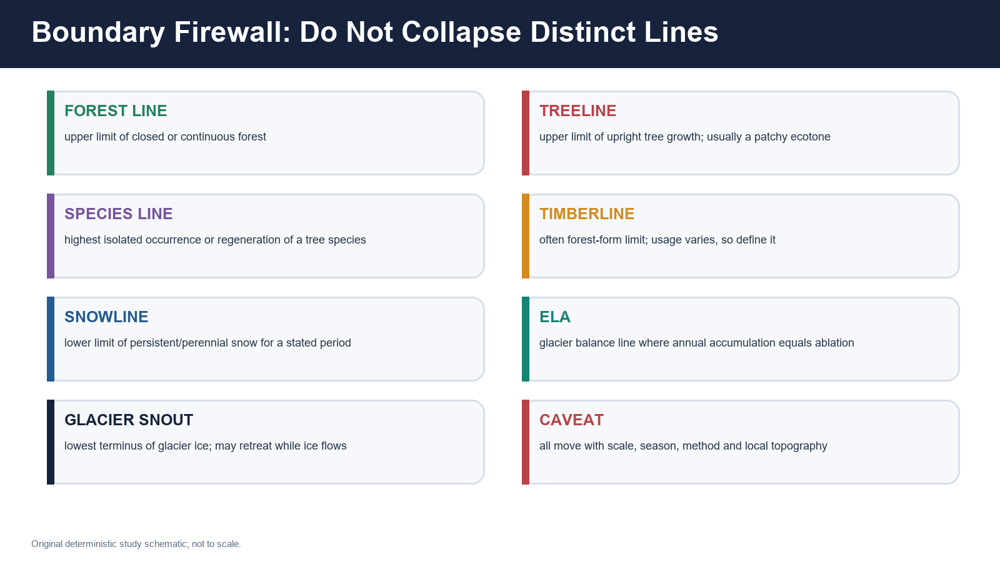

*Figure: The terms answer different questions. Original schematic.*

| Term | UPSC-safe definition | Critical distinction |
| --- | --- | --- |
| **Upper montane / temperate forest** | Highest part of the closed montane forest belt below the subalpine transition; composition varies by sector, moisture, aspect and disturbance | Not automatically subalpine; “temperate” is broad |
| **Subalpine forest** | Open, cold-limited upper forest/woodland close to the treeline, often with birch, fir, rhododendron, juniper or regional equivalents | A transition mosaic, not one all-India association |
| **Forest line** | Upper limit of closed or substantially continuous forest | May lie below isolated upright trees |
| **Treeline** | Upper limit where trees attain upright tree form under the stated definition and scale | Usually a patchy ecotone, not a smooth contour |
| **Climatic treeline** | Broad potential limit imposed mainly by growing-season heat and related physiological constraints | Actual treeline may be lower or fragmented by land use/disturbance |
| **Species line** | Highest isolated individuals or regeneration of a particular tree species | Can extend above the forest line and sometimes above upright-tree continuity |
| **Actual land-use/disturbance treeline** | Observed tree limit after grazing, burning, cutting, avalanche history and other local filters | Must not be read as pure climate |
| **Timberline** | Often used for upper forest-form or exploitable timber limit; usage varies among authors | Define the term rather than assuming it equals treeline |
| **Krummholz** | Stunted, wind- and snow-shaped woody growth near/above treeline | May be shrub or distorted tree form; not a meadow |
| **Alpine scrub** | Low woody vegetation above or around the treeline ecotone | Not identical to krummholz in every classification |
| **Alpine meadow / turf** | Treeless high-elevation herbaceous vegetation dominated by varying mixtures of grasses, sedges and forbs | May be natural, history-shaped, secondary or degraded; diagnose |
| **Fellfield / scree** | Open, frost-disturbed rocky surface with sparse plants; scree emphasises loose angular debris | Not automatically barren or permanently frozen |
| **Nival zone** | Snow/ice-dominated upper zone with very restricted biological activity and exposed rock patches | Seasonal snow can occur far below it |
| **Snowline** | Lower limit of persistent/perennial snow for a stated climate/reference period and surface context | Not treeline and not glacier snout |
| **Equilibrium-line altitude (ELA)** | Glacier-specific altitude where annual accumulation equals annual ablation | Balance boundary for a stated glacier/year, not regional treeline |
| **Glacier snout / terminus** | Lowest end of glacier ice | Can retreat while ice continues to flow down-valley |

> **Memory hook:** **Forest continuity -> upright tree -> isolated species -> persistent snow -> glacier balance -> glacier end.**

### Why “timberline” needs caution

- Some literature uses timberline and treeline interchangeably.
- Some uses timberline for the upper limit of closed forest or commercially usable timber.
- A strong answer states the operational meaning: “Here, timberline refers to the upper continuous-forest limit, while treeline refers to upright trees.”

### Boundary trap

**Wrong:** A rising snowline proves an upward-moving treeline.\
**Correct:** Snow persistence, glacier balance and tree recruitment respond through different processes and time scales.

---

## 3. Himalayan physical-climatic template

> **PRE-TEACH CHECKLIST**\
> **Book context:** physiography, climatic regions, western disturbances, monsoon, glacier/snow and upper forest owners queried.\
> **CA Search:** `official India Himalayan snow western disturbance alpine ecology 2026`.\
> **CA Found:** no site-level six-month snow-duration dataset suitable for a Himalaya-wide claim; process evidence retained.

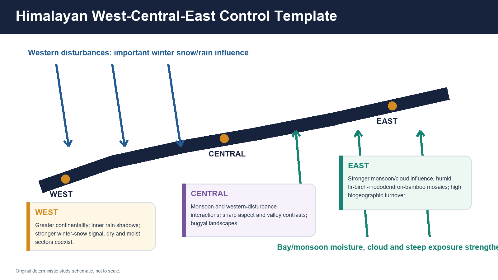

*Figure: Longitudinal and range-position controls alter moisture, snow and biogeography. Original schematic; not a political map.*

### Control hierarchy

| Control | Mechanism | Ecological consequence |
| --- | --- | --- |
| **Latitude** | Modifies temperature and seasonality at a given elevation | Broad thermal limits shift along the arc |
| **Altitude** | Lowers temperature and changes pressure, radiation, snow and growing-season length | Creates the broad vertical sequence |
| **West-east circulation** | Western disturbances matter greatly for western winter snow; monsoon/cloud influence strengthens eastward | Western and Eastern alpine belts differ in moisture and phenology |
| **Outer versus inner range** | Windward exposure versus rain shadow/continentality | Moist subalpine forest and dry juniper/scrub can occur in the same broad region |
| **Aspect** | Changes solar receipt, evapotranspiration, snowmelt and frost | Opposing slopes can carry different tree/shrub/meadow mosaics |
| **Slope and landform** | Control drainage, avalanche chutes, stability and cold-air movement | Concave snowbeds, ridges and avalanche tracks differ |
| **Substrate and soil depth** | Affect rooting, nutrients, water storage and frost disturbance | Recruitment may fail despite suitable mean temperature |
| **Snow duration** | Insulates in winter but delays exposure when persistent | Produces snowbed, turf, shrub and scree mosaics |
| **Wind** | Abrasion, desiccation, mechanical damage and snow redistribution | Krummholz and treeless wind gaps |
| **Disturbance history** | Grazing, fire, cutting, routes, war-time/general border infrastructure, tourism and avalanches | Actual treeline and meadow condition diverge from climatic potential |

### West, central and east

- **Western Himalaya:** stronger continentality and inner rain-shadow contrasts; important western-disturbance snow; dry and moist subalpine sectors coexist.
- **Central Himalaya:** interacting monsoon and winter-snow influences; pronounced aspect/valley contrasts; Uttarakhand bugyal landscapes provide useful but non-uniform examples.
- **Eastern Himalaya:** stronger monsoon/cloud influence, steep vertical compression and high biogeographic turnover; fir-birch-rhododendron-bamboo sequences cannot be copied from a western ladder.

### Evidence rule

Always attach a treeline or snow statement to:

`site + slope/aspect + period + variable + method + uncertainty`.

---

## 4. Relative zonation: use a transect, not one elevation

> **PRE-TEACH CHECKLIST**\
> **Book context:** Majid montane wet-temperate, silver-fir and alpine-pasture passages; Khullar transhumance context.\
> **CA Search:** `official Himalayan alpine zonation India birch fir rhododendron treeline`.\
> **CA Found:** UNESCO Nanda Devi and Khangchendzonga profiles support high-altitude habitat mosaics, not a universal contour.

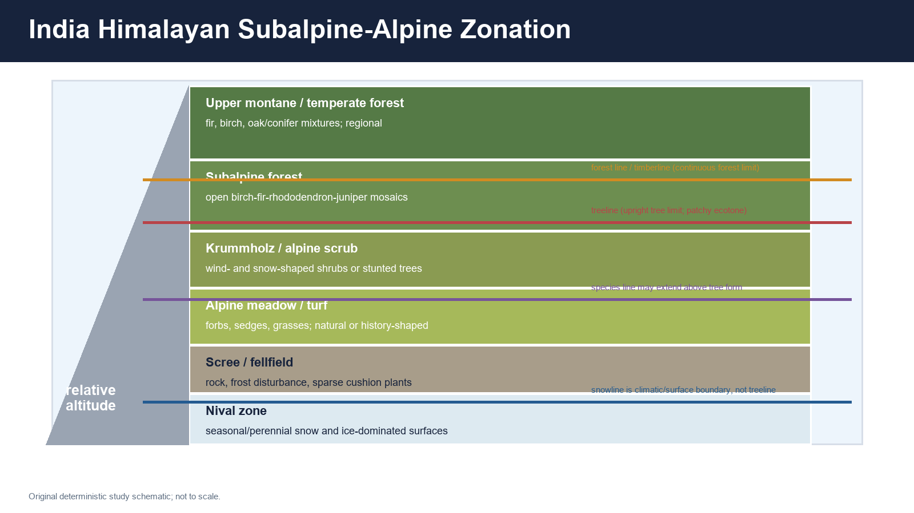

*Figure: A relative Himalayan transect. Boundaries overlap and move with sector, slope, snow and land-use history.*

### Source-safe sequence

```text
upper montane / temperate forest
    -> subalpine forest or woodland
        -> krummholz / low shrub / alpine scrub
            -> alpine meadow, turf or snowbed mosaic
                -> scree / fellfield / rock
                    -> nival snow-and-ice-dominated zone
```

### Why belts overlap

1. An avalanche chute can carry meadow downslope through forest.
2. A sheltered hollow can support shrubs above an exposed ridge's tree limit.
3. Fire, cutting or grazing can lower the actual forest line.
4. Isolated seedlings or dwarf forms can occur above closed forest.
5. Snowbeds can delay growth below wind-scoured, earlier-exposed slopes.
6. Limestone, silicate, moraine, colluvium and wet peat-like meadow soils support different plants.

### Safe phrasing

> “In a typical sectoral transect, upper temperate forest grades into subalpine woodland, krummholz or scrub, then alpine meadow/turf and rocky-nival surfaces. The actual sequence and elevation vary with latitude, monsoon exposure, western-disturbance snow, aspect, slope, substrate and disturbance.”

### Unsafe phrasing

> “The alpine belt begins everywhere at 3,000 m.”

No single value can represent Kashmir, Himachal, Uttarakhand, Sikkim, Arunachal, north-facing hollows, wind-scoured ridges and inner rain shadows.

---

## 5. Treeline concepts: potential, forest form, species and observed history

> **PRE-TEACH CHECKLIST**\
> **Book context:** Topic 23 and GBPNIHE treeline definition; Topic 22 forest structure and disturbance.\
> **CA Search:** `site:gbpihed.gov.in treeline ecotone Western Himalaya soil land use`.\
> **CA Found:** official project outcomes name land use, elevation and season/site interactions in Darma and Parvati valleys.

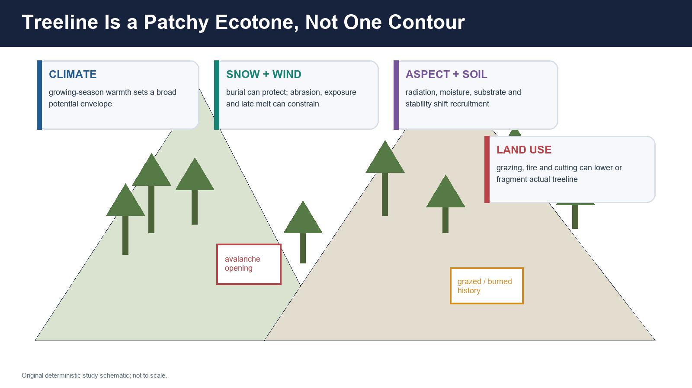

*Figure: Climate sets a broad envelope; topography, snow, soil and disturbance determine the observed patchwork.*

### Four different questions

| Question | Correct indicator |
| --- | --- |
| Where does continuous forest end? | Forest line / stand continuity |
| Where do upright trees end? | Treeline, with stated tree-height definition |
| Where does the species occur highest? | Species line, including isolated individuals/seedlings |
| Where would trees potentially grow without historical disturbance? | Climatic/potential treeline inferred through multiple evidence lines |

### Temperature and growing-season constraint

**INFERENCE:** At the broad scale, heat deficiency and a short growing season constrain cell division, tissue formation, root function and carbon allocation near treeline. This does not mean one universal mean temperature predicts every Himalayan site.

### Local modifiers

- **Wind:** abrasion, desiccation and asymmetric crowns.
- **Snow:** winter burial can protect stems; late melt can shorten growth.
- **Aspect:** warm exposure may improve heat but worsen moisture stress.
- **Avalanche:** repeated mechanical disturbance creates openings.
- **Grazing/browse:** selectively suppresses recruits and changes competition.
- **Fire/cutting:** can lower or fragment observed treeline.
- **Land-use legacy:** old grazing, seasonal settlements or route corridors may remain visible long after pressure changes.

### Recruitment is not movement

Finding seedlings above adult forest may indicate:

1. recent recruitment;
2. a long-standing species line;
3. release from grazing;
4. sheltered microsites;
5. one episodic favourable season.

It does **not** by itself prove an advancing forest line.

---

## 6. Western and central Himalayan examples

> **PRE-TEACH CHECKLIST**\
> **Book context:** Advanced 23, Topic 22, Khullar/Majid OCR, Nanda Devi/Valley of Flowers official profile.\
> **CA Search:** `official Uttarakhand Himachal alpine meadow treeline restoration 2026`.\
> **CA Found:** no date-stamped six-month national outcome; official protected-landscape and GBPNIHE evidence used.

### Regional elements

| Element | Western/central Himalayan examples | Caveat |
| --- | --- | --- |
| Upper forest | fir, spruce and other conifers; Himalayan birch/bhojpatra in upper transitions; regional broadleaf mixtures | Species order differs with moisture, aspect and valley |
| Subalpine woodland | birch-fir-rhododendron-juniper mosaics or regional equivalents | Do not assume every species co-dominates at every site |
| Krummholz/scrub | rhododendron or juniper forms, wind-shaped woody patches | Shrub identity and form vary |
| Alpine meadow names | **bugyal** in Uttarakhand; **thach** in Himachal; **marg/merg** in Kashmir usage | A vernacular name does not prove identical ecology or legal status |
| Rocky/nival transition | scree, moraine, cliffs, snowbeds and glacier forefields | Not all surfaces are permafrost |

### Bhojpatra / Himalayan birch

- **FACT:** Local geography texts place Indian birch on higher Himalayan slopes; official and scientific high-altitude literature commonly treats birch as a key upper-forest/treeline element in parts of the Himalaya.
- **INFERENCE:** Birch's presence is a useful zonation cue, but a birch patch can vary from relatively closed woodland to open, disturbance-shaped treeline.
- **LIMIT:** “Bhojpatra belt” should not be assigned one all-Himalaya elevation.

### Bugyals, thaches and margs

Use named meadows as **landscape examples**, not interchangeable ecological units:

- slope and snow regime differ;
- some are within protected areas, others are commons or forest land under different regimes;
- grazing history differs;
- pilgrimage/trekking pressure differs;
- legal access and management differ.

### Nanda Devi and Valley of Flowers

**FACT:** UNESCO describes Nanda Devi and Valley of Flowers as high-altitude West Himalayan landscapes with glaciers, moraines, alpine meadows and important threatened fauna/flora. It also records regulated use and long-term monitoring value.

**LIMIT:** The World Heritage profile does not justify exporting its grazing closure, visitor regime or monitoring result to every Uttarakhand meadow.

---

## 7. Eastern Himalayan subalpine-alpine systems

> **PRE-TEACH CHECKLIST**\
> **Book context:** Advanced 24, Topic 22 Eastern Himalaya, Khangchendzonga official profile.\
> **CA Search:** `site:sikkimforest.gov.in OR site:gbpihed.gov.in eastern Himalaya alpine rhododendron bamboo`.\
> **CA Found:** latest official profiles support vertical diversity and krummholz; no new six-month universal trend used.

### Do not copy the western ladder

The Eastern Himalaya has:

- stronger monsoon/cloud influence;
- steep vertical compression;
- high plant and animal turnover;
- complex fir, birch, rhododendron, bamboo and broadleaf/conifer transitions;
- different snow-cloud-rain interactions;
- strong sacred-cultural landscape dimensions in places such as Khangchendzonga.

| Dimension | Western/central tendency | Eastern tendency |
| --- | --- | --- |
| Winter input | Western disturbances more prominent | Winter snow remains relevant but monsoon/cloud influence is stronger |
| Moisture | Moist and dry sectors; inner rain shadows pronounced | Generally more humid, though local rain shadows/exposure still matter |
| Upper woody transition | birch, fir, juniper, rhododendron mosaics | fir, birch, diverse rhododendron, bamboo and regional scrub mosaics |
| Biogeography | West Himalayan and inner Asian influences | Eastern Himalayan and Southeast/East Asian affinities stronger |
| Meadow expression | bugyal/thach/marg examples | humid alpine scrub-meadow mosaics; terminology and species differ |

### Khangchendzonga

**FACT:** UNESCO's World Heritage profile records an extraordinary altitudinal sweep, pronounced vegetation zones and an extensive krummholz zone. It also stresses biodiversity and sacred-cultural associations.

**INFERENCE:** The case demonstrates why conservation must integrate vertical connectivity, cultural meaning and lower-to-upper habitat continuity.

**LIMIT:** UNESCO's broad profile is not a species-by-elevation field key and does not prove current condition at each meadow.

### Red panda caution

Red panda belongs mainly to eastern Himalayan forest-bamboo and forest-subalpine ranges. It should not be used as a generic open-alpine indicator or as a western-Himalaya-wide species.

---

## 8. Alpine plant adaptations

> **PRE-TEACH CHECKLIST**\
> **Book context:** HAPPRC official research themes; basic alpine/tundra comparison; ecology owners.\
> **CA Search:** `site:hnbgu.ac.in high altitude plant physiology alpine adaptation official`.\
> **CA Found:** HAPPRC lists alpine population biology, biophysical/biochemical adaptation, climate response and propagation research.

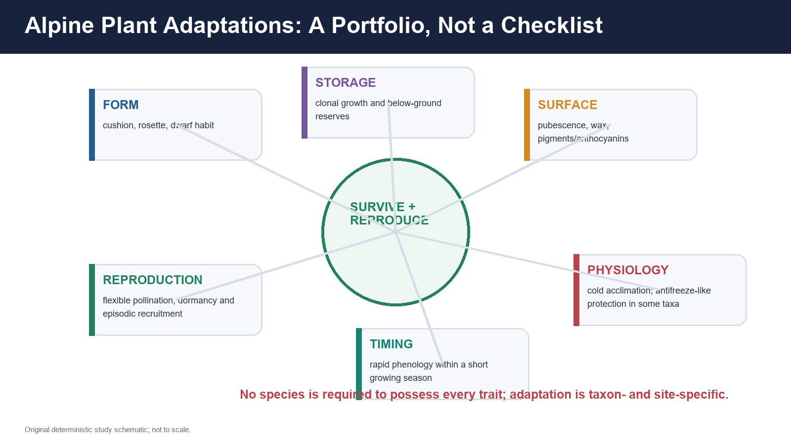

*Figure: Adaptation is a portfolio. No alpine plant is required to possess every listed trait.*

| Trait | Functional value | Qualification |
| --- | --- | --- |
| Cushion/dwarf form | Reduces exposure, traps heat and protects meristems near ground | Not all alpine plants are cushions |
| Rosette form | Keeps leaves close to warmer boundary layer and protects the growing point | Works differently across wind/snow regimes |
| Clonal growth | Permits persistence when seed recruitment is episodic | Can limit genetic mixing if sexual recruitment is rare |
| Below-ground storage | Supports rapid regrowth during a short season | Storage organ differs among taxa |
| Pubescence/wax | Alters boundary layer, water loss and radiation load | Hairiness is not universally cold-specific |
| Anthocyanins/pigments | May protect against high radiation and oxidative stress | Pigment presence has multiple causes |
| Cold acclimation | Seasonal physiological adjustment improves freezing tolerance | “Antifreeze” should not be claimed for every species |
| Rapid phenology | Fast leafing/flowering/seed set within short snow-free period | Early melt can create frost mismatch |
| Pollination flexibility | Generalist insects, selfing or clonal persistence may buffer poor weather | Strategies differ greatly |
| Seed dormancy | Avoids germination in unsuitable brief windows | Dormancy can also delay colonisation |

### HAPPRC evidence

**FACT:** HAPPRC lists research on population biology and productivity of alpine plants; seed biology and propagation of temperate/subalpine trees; biochemical/biophysical adaptation; climate response; and medicinal-plant cultivation.

**INFERENCE:** Conservation therefore requires both habitat protection and species-specific regeneration/propagation knowledge.

**LIMIT:** Ex situ propagation or agrotechnology does not automatically restore the genetic, soil and interaction network of a wild alpine population.

---

## 9. Animal adaptations and biodiversity

> **PRE-TEACH CHECKLIST**\
> **Book context:** Topic 23/25, Environment species owner, WII snow-leopard assessment, UNESCO cases.\
> **CA Search:** `site:wii.gov.in snow leopard alpine Himalaya musk deer official`.\
> **CA Found:** WII's 2024 SPAI release provides a dated monitoring framework; no 2026 population update is inferred.

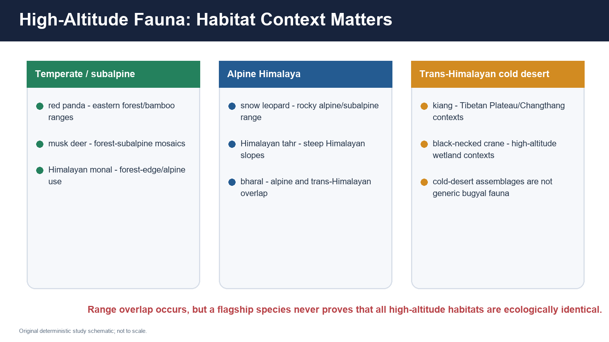

*Figure: Species can cross ecotones, but alpine Himalaya and Trans-Himalayan cold desert are not interchangeable.*

### Adaptation dimensions

- **Insulation:** dense fur/feathering and seasonal coat changes in some taxa.
- **Body/appendage form:** heat conservation and locomotion on snow/rock.
- **Behaviour:** basking, shelter use, altitudinal/seasonal movement and flexible activity.
- **Diet:** seasonal switches as forage and prey availability change.
- **Reproduction:** timing with short productive seasons.
- **Physiology:** hypoxia tolerance varies among taxa and populations.

### Species anchors

| Species | Safe habitat statement | Trap |
| --- | --- | --- |
| Snow leopard | Rocky high-altitude alpine and Trans-Himalayan ranges, with prey and connectivity requirements | Not proof of meadow quality; range includes multiple high-altitude habitats |
| Himalayan tahr | Steep Himalayan mountain slopes and alpine/subalpine landscapes | Do not confuse with all bharal habitats |
| Bharal / blue sheep | Alpine and Trans-Himalayan overlap, often important prey | Not restricted to lush bugyals |
| Musk deer | Upper forest-subalpine mosaics, including birch/rhododendron contexts in parts of Himalaya | Not a subtropical chir-pine species |
| Red panda | Eastern Himalayan forest-bamboo and subalpine ranges | Not an open-alpine or western-wide indicator |
| Himalayan monal | Forest, forest-edge and alpine-use mosaic depending on season/site | Presence does not prove old growth |
| Kiang | Trans-Himalayan/Tibetan Plateau and Changthang contexts | Do not insert into every alpine-meadow answer |
| Black-necked crane | High-altitude wetland/plateau contexts where present | Not a generic Himalayan grassland bird |

### WII SPAI literacy

**FACT:** The WII release states that the SPAI exercise covered a large potential range using sign surveys, occupancy analysis and camera trapping during 2019-2023.

**INFERENCE:** Landscape-scale carnivore conservation requires prey, corridors and human-use monitoring, not only protected-area counts.

**LIMIT:** The assessment period and potential-range definition must travel with any number; it is not a 2026 update and cannot measure alpine meadow condition.

---

## 10. Soils and geomorphic processes

> **PRE-TEACH CHECKLIST**\
> **Book context:** weathering/mass movement, glacial landforms, Khullar/Majid upper vegetation and GBPNIHE soil project.\
> **CA Search:** `official Indian Himalaya alpine soil carbon treeline land use`.\
> **CA Found:** GBPNIHE project outcomes directly link land use/elevation with soil nutrients, microbial biomass and enzyme activity in two valleys.

### Soil mosaic

| Setting | Likely soil condition | Management implication |
| --- | --- | --- |
| Stable moist meadow | Organic-rich surface horizon can develop; root mat stores water/carbon | Avoid compaction, drainage damage and topsoil stripping |
| Wind-scoured ridge | Thin, coarse, dry and weakly developed | Recruitment/restoration is slow |
| Snowbed/hollow | Longer moisture period, delayed warmth; sometimes organic accumulation | Trail concentration can create persistent damage |
| Scree/fellfield | Young, coarse, unstable material with sparse fine earth | Planting without substrate stabilisation often fails |
| Avalanche track | Repeated disturbance, deposition/scour and young soils | Treat as dynamic corridor, not “wasteland” |
| Moraine/forefield | Recently exposed heterogeneous substrate | Primary succession and hydrology are site-specific |

### Processes

- **Freeze-thaw:** water freezes/expands in cracks and soil, contributing to weathering and particle movement.
- **Frost heave:** differential freezing can lift particles and disturb roots.
- **Solifluction/gelifluction:** saturated active material can move slowly downslope under cold-season conditions.
- **Scree formation:** angular debris accumulates below cliffs through weathering and gravity.
- **Avalanche erosion/deposition:** repeated snow movement creates corridors and deposits.
- **Sheet/rill erosion:** trampling, bare ground and concentrated runoff remove fine soil.

### Permafrost caution

**Wrong:** The entire Indian alpine belt is underlain by permafrost.\
**Correct:** Permafrost occurrence depends on elevation, latitude, aspect, ground cover, substrate and local climate; it must be demonstrated through site evidence.

### Soil carbon caution

Alpine meadow may store important soil organic carbon, but:

- stock varies with moisture, depth and stability;
- erosion and drainage can expose carbon;
- shrub/forest change alters inputs and snow;
- one surface sample cannot represent a landscape.

---

## 11. Snow ecology, hydrology and avalanche pathways

> **PRE-TEACH CHECKLIST**\
> **Book context:** glacier/snow owner, western-disturbance and monsoon owners, slope/hazard owners.\
> **CA Search:** `site:imd.gov.in OR site:moes.gov.in Himalayan snow duration 2026 official India`.\
> **CA Found:** official broad snow/forecast material was not suitable for a site-level alpine trend; static mechanisms and dated site evidence retained.

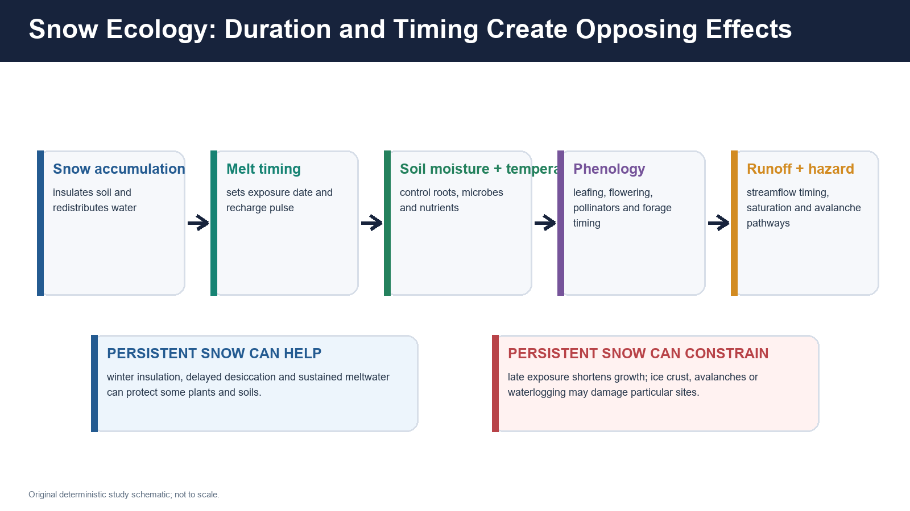

*Figure: Snow persistence can protect and constrain; timing matters as much as amount.*

### Mechanism chain

```text
snow amount + redistribution + density
  -> insulation / ice crust / avalanche loading
    -> melt timing and soil recharge
      -> soil temperature and microbial activity
        -> leafing, flowering, forage and pollinators
          -> runoff timing, saturation and stream response
```

### Benefits of snow persistence

- insulates low vegetation and soil from extreme air temperatures;
- supplies meltwater into the growing season;
- supports snowbed specialists and wet meadow patches;
- delays winter desiccation.

### Constraints

- late melt shortens the growing season;
- rain-on-snow or crusting can damage forage access;
- persistent wetness may reduce aeration;
- avalanche loading/scour can reset vegetation;
- early melt can expose plants to later frost and lengthen dry-season stress.

### Basin-flow caution

Forest or meadow change does not straightforwardly “increase” or “decrease” all basin flow.

Relevant processes include:

- snow interception and sublimation;
- shading and melt timing;
- wind redistribution;
- soil infiltration/storage;
- evapotranspiration;
- storm intensity and antecedent saturation;
- glacier/snow/rain fractions of the basin.

### Avalanche distinction

An avalanche is rapid downslope movement of snow/ice and entrained debris. It is not a landslide, though the two can interact and share exposed corridors.

---

## 12. Meadow ecology and the origin debate

> **PRE-TEACH CHECKLIST**\
> **Book context:** Topic 17 grassland debate, Topic 23 alpine pasture, soil/succession owners.\
> **CA Search:** `official India bugyal alpine meadow natural secondary grazing evidence`.\
> **CA Found:** official protected-landscape sources recognise alpine meadows; no source supports classifying every opening identically.

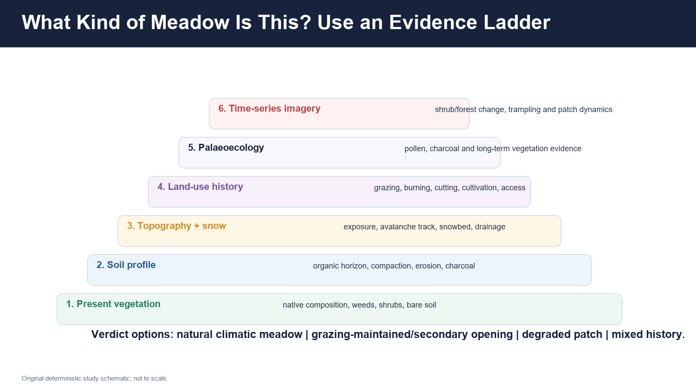

*Figure: Diagnose meadow origin through multiple lines of evidence before prescribing planting or exclusion.*

### Four meadow states

1. **Natural climatic alpine meadow:** above the climatic tree-growth limit or maintained by persistent snow/wind/topography.
2. **Natural disturbance meadow:** avalanche, wetland/snowbed or unstable substrate maintains treelessness.
3. **Grazing-maintained or secondary opening:** historical grazing, burning or cutting has maintained an opening within potential woodland.
4. **Degraded patch:** loss of native cover, compaction, erosion, unpalatable/invasive spread and damaged hydrology.

### Evidence ladder

| Evidence | What it can show | Limitation |
| --- | --- | --- |
| Current flora | native assemblage, weeds, shrub/tree recruits | Present composition alone cannot reconstruct deep history |
| Soil profile | organic horizon, compaction, charcoal, erosion | Charcoal source/date may be uncertain |
| Topography/snow | avalanche, wind, snowbed, drainage control | Does not quantify human pressure |
| Historical records/local knowledge | grazing, burning, seasonal settlements, routes | Memory and written records may be incomplete |
| Pollen/charcoal/palaeoecology | longer-term vegetation and fire history | Site cores represent bounded catchments |
| Time-series imagery | shrub/forest expansion, trail and bare-ground change | Sensor and season differences can mislead |

### Afforestation error

Planting trees on a natural alpine meadow can:

- replace rare open-habitat assemblages;
- change snow deposition and albedo;
- alter hydrology and soil temperature;
- fragment grazing and wildlife habitat;
- fail because the site is climatically or edaphically unsuitable.

### Opposite error

Assuming every opening is pristine can ignore:

- erosion and compaction;
- historical forest removal;
- invasive/unpalatable dominance;
- altered drainage;
- unsustainable grazing or visitor concentration.

**Verdict:** Diagnose first; restore the limiting process and the correct ecosystem.

---

## 13. Pastoralism and transhumance

> **PRE-TEACH CHECKLIST**\
> **Book context:** Khullar transhumance OCR, Majid summer alpine pasture, FRA and society/livelihood owners.\
> **CA Search:** `site:tribal.nic.in Forest Rights Act pastoral transhumance grazing rights Himalayan`.\
> **CA Found:** FRA text supports grazing and seasonal-access rights categories; implementation remains state/site specific.

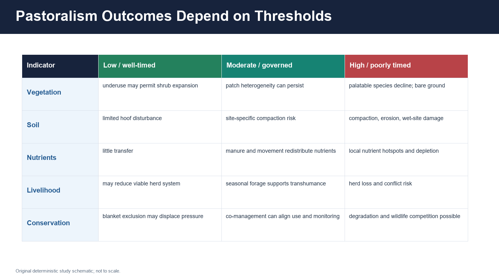

*Figure: Grazing outcome depends on timing, intensity, herd composition, site moisture, slope and governance.*

### Transhumance

Transhumance is seasonal movement between complementary grazing areas, often:

```text
winter/lower settlement
  -> spring movement and route use
    -> summer high pasture
      -> autumn return
```

Himalayan examples include diverse Gujjar/Bakarwal, Gaddi and Bhotiya/Bhutia pastoral histories. Avoid treating every named community as having the same route, species, tenure or present livelihood.

### Potential ecological roles

- maintains patch heterogeneity in some sites;
- redistributes nutrients through dung and movement;
- restrains shrub dominance in some grazing-maintained openings;
- supports local breeds, fibre, dairy, manure and cultural landscapes;
- produces detailed local knowledge of snow, forage and hazards.

### Degradation pathways

- excessive stocking relative to site productivity;
- use during saturated/early growth stages;
- repeated camping around water/snowbeds;
- concentrated routes after access closures;
- mismatch between herd composition and vegetation;
- loss of rotational institutions;
- blocked migration corridors causing pressure concentration.

### Why blanket exclusion can fail

- redistributes animals to fewer sites;
- breaks seasonal calendars and livelihoods;
- removes local monitoring/stewardship;
- may allow shrub expansion in grazing-maintained openings;
- can intensify conflict and illegal/hidden use.

### Why blanket access can fail

Rights do not remove ecological thresholds. A co-management system can:

1. recognise customary/seasonal access;
2. map sensitive wetlands, eroding slopes and wildlife periods;
3. agree on timing, route, herd and campsite thresholds;
4. monitor condition jointly;
5. revise rules through evidence and compensation/alternatives.

### FRA distinction

**FACT:** FRA includes community rights over grazing and traditional seasonal resource access for nomadic/pastoral communities.

**LIMIT:** A statutory right, a recognised title, an operational route and an ecologically sustainable outcome are separate stages.

---

## 14. Medicinal and aromatic plants

> **PRE-TEACH CHECKLIST**\
> **Book context:** Majid medicinal-herb context, HAPPRC research page, NMPB and NBA owners.\
> **CA Search:** `site:hnbgu.ac.in OR site:nmpb.nic.in Himalayan alpine medicinal plants official`.\
> **CA Found:** HAPPRC provides directly relevant adaptation, propagation and cultivation evidence; no forced 2026 harvest figure is used.

### Value-chain map

```text
wild population / cultivation
  -> collector or grower
    -> local trader / cooperative
      -> cleaning, grading and processing
        -> herbal, pharmaceutical or wellness market
          -> benefit sharing, traceability and conservation feedback
```

### Source-safe examples

HAPPRC lists agrotechnology work on high-altitude medicinal plants including:

- *Aconitum heterophyllum* and related *Aconitum* taxa;
- *Angelica glauca*;
- *Nardostachys jatamansi*;
- *Picrorhiza kurrooa*;
- *Podophyllum hexandrum*;
- *Rheum* taxa;
- *Saussurea costus*.

These are examples for conservation/cultivation discussion, **not a harvesting guide**. Sensitive wild locations are deliberately omitted.

### Overharvest chain

high value + uncertain tenure + destructive root/rhizome collection + weak traceability\
`->` reduced reproductive stock `->` smaller/fragmented population `->` price pressure `->` further illegal/unsustainable collection.

### Conservation portfolio

- in situ habitat and population protection;
- seasonal/part restrictions based on species biology;
- community stewardship and harvest records;
- cultivation and quality planting material;
- traceable procurement;
- value addition near source communities;
- Access and Benefit Sharing;
- research that does not disclose sensitive micro-locations.

### NMPB and NBA distinction

| Institution/framework | Core role | Do not claim |
| --- | --- | --- |
| NMPB / Ministry of AYUSH | conservation, cultivation, research, planting material and medicinal-plant sector support | A supported crop equals wild-population recovery |
| Biological Diversity Act / NBA-SBB-BMC | conservation, sustainable use, local institutions, PBR and ABS framework | A PBR is a public map of sensitive species locations |
| ABS | sharing benefits from use of biological resources/associated knowledge as applicable | Every market transaction automatically delivers equitable benefits |

---

## 15. Ecosystem services - and their limits

> **PRE-TEACH CHECKLIST**\
> **Book context:** forest, grassland, snow, biodiversity and livelihood owners queried.\
> **CA Search:** `official Himalayan alpine ecosystem services water forage medicinal tourism`.\
> **CA Found:** official protected-landscape and research sources support multiple services, not universal hazard prevention.

| Service | Mechanism | Limit |
| --- | --- | --- |
| Water regulation | snow capture/melt timing, infiltration, soil storage and wetland function | Does not fix total basin flow under every storm or season |
| Forage | seasonal high-quality herbaceous production | Productivity and sustainable stocking vary by site/year |
| Biodiversity | open-habitat flora, pollinators, prey and corridors | Flagship presence does not measure community condition |
| Medicinal/cultural value | biological resources, knowledge, sacred landscape and identity | Commercial value can accelerate overharvest |
| Tourism/recreation | scenic and educational value | Visitor growth can exceed waste, trail and water capacity |
| Soil carbon | root inputs and organic-rich stable meadow horizons | Thin/eroding sites may store far less; disturbance can release carbon |
| Pollination | short-season plant-pollinator networks | Phenological mismatch and weather can disrupt service |
| Hazard buffering | turf/root mat can reduce shallow erosion; shrubs/forest can alter snow/wind locally | No meadow prevents every landslide, flood or avalanche |

### Water-tower caution

Calling the Himalaya a “water tower” is useful, but a complete answer separates:

- seasonal snow;
- glacier ice;
- monsoon rain;
- winter precipitation;
- soil/groundwater storage;
- wetlands and lakes;
- reservoir/abstraction management.

### Carbon caution

Greening is not automatically carbon gain if it accompanies:

- drying/erosion of organic meadow soil;
- fire;
- loss of wetland function;
- replacement of diverse turf by low-diversity shrubs;
- measurement limited to above-ground biomass.

---

## 16. Threat chains: driver -> pressure -> state -> impact

> **PRE-TEACH CHECKLIST**\
> **Book context:** mountain development/tourism PYQ, landslide, forest, climate and governance owners.\
> **CA Search:** `official Himalayan tourism carrying capacity alpine meadow waste infrastructure 2026`.\
> **CA Found:** no defensible universal visitor cap; official sources support site-specific regulation and monitoring.

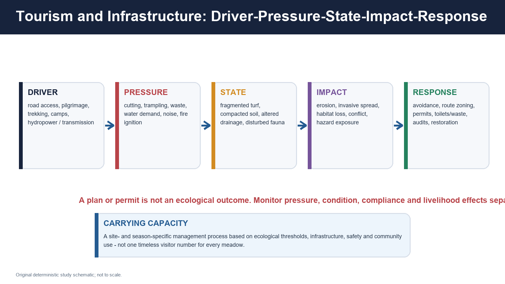

*Figure: Plans and permits sit within a causal chain; ecological outcome must be measured separately.*

### Driver-pressure-state-impact matrix

| Driver | Pressure | State change | Impact |
| --- | --- | --- | --- |
| Roads and slope cutting | vegetation removal, spoil, drainage concentration | fragmented turf/woodland, unstable slope | erosion, landslide exposure, corridor loss |
| Trekking/pilgrimage/tourism | trampling, camps, waste, water demand, noise | compaction, bare trail, disturbed wildlife | erosion, pollution, avoidance and conflict |
| Hydropower/transmission | access roads, excavation, flow and corridor alteration | fragmented habitats and changed drainage | cumulative landscape risk |
| General border/military infrastructure | construction and logistic pressure in sensitive high-altitude terrain | local fragmentation, waste and disturbance | ecological stress; discuss only at non-sensitive general level |
| Altered grazing | concentration, abandonment or calendar change | degradation or shrub expansion depending on site | forage/livelihood and habitat change |
| Medicinal harvest | destructive collection, trader pressure | declining wild populations | biodiversity and livelihood loss |
| Fire in ecotones | seedling/shrub mortality, soil heating | altered recruitment and cover | erosion, composition change |
| Invasive species | competition and altered disturbance | native compositional loss | forage/biodiversity decline |
| Extreme rain/snow | saturation, snow loading, avalanche and erosion | physical disturbance | casualties, route loss and habitat reset |
| Warming | altered snow, moisture and growing season | recruitment, shrubification or stress | range shifts and meadow compression |

### Carrying capacity

It is not one eternal number. A credible carrying-capacity process specifies:

- ecological unit and season;
- trail/campsite/waste/water infrastructure;
- safety and evacuation;
- local livelihood and rights;
- thresholds such as bare ground, waste load, water quality and wildlife disturbance;
- adaptive permit/closure triggers.

### Infrastructure caution

“Strategic” or “green” purpose does not erase:

- cumulative fragmentation;
- slope and drainage effects;
- spoil disposal;
- wildlife and pastoral routes;
- restoration and compliance obligations.

---

## 17. Climate-change evidence and the treeline paradox

> **PRE-TEACH CHECKLIST**\
> **Book context:** climate regions, snow/glacier, treeline, forest and GBPNIHE project owners.\
> **CA Search:** `official India Himalayan treeline climate change 2025 2026 GBPNIHE`.\
> **CA Found:** latest official project page supplies soil/land-use outcomes; no one-site result is treated as a Himalayan trend.

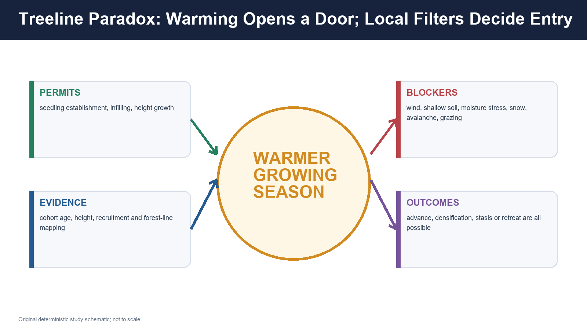

*Figure: Warming can relax heat limitation, but local filters determine recruitment, forest infilling, stasis or retreat.*

### Plausible pathways

- rising temperatures and longer snow-free periods;
- earlier melt and earlier phenology;
- altered winter snow, cloud, rain and soil moisture;
- increased seedling recruitment in sheltered sites;
- height growth and infilling below/within treeline;
- shrub expansion into meadow;
- upslope species shifts;
- compression against rock/nival surfaces;
- extreme-event mortality and disturbance reset.

### Four different vegetation responses

| Response | What moves/changes | Evidence needed |
| --- | --- | --- |
| Individual-tree advance | isolated trees establish higher | mapped individuals, ages and repeated surveys |
| Species-line shift | highest occurrence changes | species-specific records and detection consistency |
| Infilling/densification | more stems within old ecotone | density/age structure, not only uppermost tree |
| Forest-line movement | closed forest boundary shifts | stand-continuity mapping through time |

### Treeline paradox

Warming may permit recruitment, yet the same site may experience:

- moisture stress;
- stronger exposure or wind damage;
- shallow/unstable soil;
- reduced protective snow or damaging late snow;
- grazing/browse;
- avalanche/fire/extreme-rain mortality;
- absence of seed source or mycorrhizal partners.

Therefore:

> **Warmer climate does not guarantee upward forest movement.**

### Meadow compression

If shrubs/trees expand upward while nival/rock limits provide no suitable soil above, alpine species can lose area. Yet the response remains patchy because:

- scree/substrate may block colonisation;
- wind/snow refugia persist;
- grazing can suppress woody recruits;
- dispersal and soil development lag.

### Evidence grammar

**Observation:** seedlings increased on a named slope during a stated interval.\
**Mechanism:** warmer/longer growing season could improve establishment.\
**Attribution:** requires ruling in/out grazing, snow, seed supply and disturbance.\
**Projection:** modelled future suitability under scenarios is not observed movement.

---

## 18. Forest-grassland data literacy

> **PRE-TEACH CHECKLIST**\
> **Book context:** ISFR/data-literacy owner, remote sensing, forest and grassland packages.\
> **CA Search:** `site:fsi.nic.in ISFR 2023 alpine meadow forest cover treeline`.\
> **CA Found:** latest official FSI baseline is useful for canopy mapping; it does not measure alpine-meadow condition.

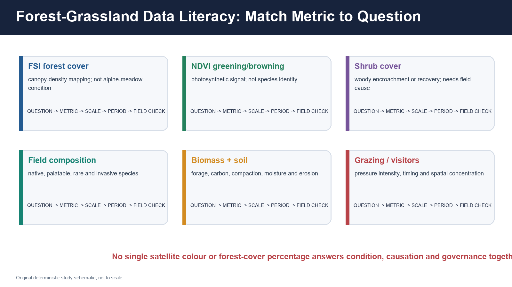

*Figure: Each metric answers a different question.*

| Metric | Good for | Cannot prove alone |
| --- | --- | --- |
| FSI forest cover | canopy-density change under national methodology | native forest, old growth, alpine-meadow health or treeline cause |
| NDVI/EVI greening | vegetation photosynthetic signal | species identity, palatability, shrub versus grass without added data |
| Woody/shrub cover | shrubification or woody recovery | whether change is climatic, grazing-related or restoration |
| Field composition | native, rare, invasive and forage species | long-term landscape trend from one visit |
| Biomass | forage/production and above-ground stock | soil carbon or biodiversity |
| Soil carbon/moisture | below-ground condition and hydrology | whole-landscape stock without sampling design |
| Bare ground/erosion | degradation and trampling pathways | driver without pressure/history evidence |
| Grazing/visitor counts | pressure | ecological damage without thresholds and spatial concentration |
| Phenology | timing response | climate attribution from one year |
| Wildlife occupancy | habitat use | abundance, causation or complete corridor function by itself |

### Greening/browning caution

- greening can be native recovery, shrub expansion, invasive growth or a wet year;
- browning can be drought, snow timing, fire, grazing, sensor/season mismatch or land conversion;
- trend needs comparable dates, atmospheric correction, snow/cloud masking and field validation.

### FSI firewall

**Forest cover** is a remote-sensing canopy class under a stated methodology. It is not:

- legal forest status;
- forest type;
- intactness;
- alpine meadow condition;
- a direct measure of community rights;
- a treeline-movement rate.

---

## 19. Governance and legal distinctions

> **PRE-TEACH CHECKLIST**\
> **Book context:** forest governance, protected areas, FRA, Biological Diversity Act, CAMPA/GIM, NMPB and tourism owners.\
> **CA Search:** `official India alpine meadow law FRA Biological Diversity CAMPA NMPB tourism`.\
> **CA Found:** current statutory frameworks verified; no legal status is treated as ecological success.

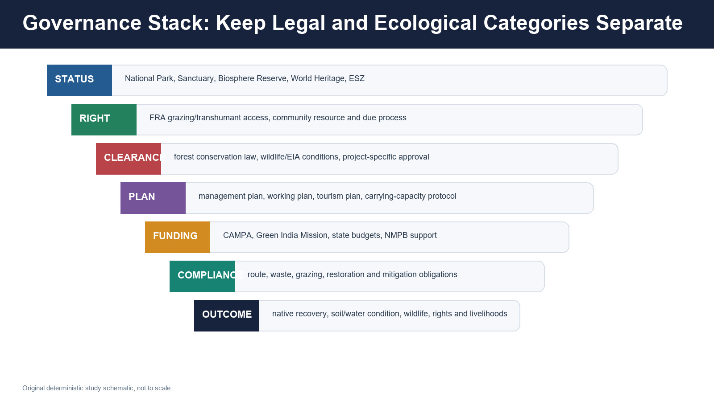

*Figure: Status, right, clearance, plan, funding, compliance and outcome are separate.*

### Protected-area and international status

| Category | Meaning | Caveat |
| --- | --- | --- |
| National Park / Sanctuary | statutory protected area under Wild Life (Protection) Act framework | rights, settlement and permitted activity vary with category/process |
| Biosphere Reserve | landscape conservation, research and sustainable-development framework with zonation | not a single equivalent legal prohibition |
| World Heritage | international recognition of Outstanding Universal Value | does not replace Indian law or management |
| Eco-Sensitive Zone | regulatory buffer/transition around protected areas under notified terms | notification-specific |

### Forest conservation

- Current title of the amended 1980 central forest-conservation law: **Van (Sanrakshan Evam Samvardhan) Adhiniyam, 1980**.
- Project approval, conditions, compensatory obligations and compliance are distinct.
- A clearance does not prove ecological safety; refusal does not by itself restore damage already present.

### FRA and community rights

- community grazing and transhumant seasonal-access rights are relevant;
- Gram Sabha and claim/recognition processes matter;
- conservation responsibility and rights can be designed together;
- blanket “people versus park” framing is analytically weak.

### Biological Diversity Act

- NBA, State Biodiversity Boards and Biodiversity Management Committees have distinct roles;
- People's Biodiversity Registers document knowledge/resources under safeguards;
- ABS links commercial/research use and benefit-sharing obligations as applicable;
- do not publish sensitive rare-plant micro-locations.

### CAMPA and Green India Mission

Potential uses:

- restoration finance;
- assisted natural regeneration;
- soil/water work;
- native planting where ecologically appropriate;
- monitoring and community livelihoods.

Risks:

- tree-count targets;
- wrong-site afforestation of natural meadow;
- non-native/low-diversity plantations;
- survival reporting without condition outcomes;
- ignoring grazing/rights and hydrology.

### Tourism and disaster regulation

Plans should align:

- route/camp permits;
- waste and sanitation;
- building/slope/drainage standards;
- weather/avalanche closure protocols;
- emergency response;
- visitor and ecological thresholds;
- local guide/porter/pastoral livelihood interests.

---

## 20. Conservation and restoration hierarchy

> **PRE-TEACH CHECKLIST**\
> **Book context:** grassland restoration, forest restoration, protected-area, biodiversity and mountain-ecosystem PYQ owners.\
> **CA Search:** `official India alpine meadow restoration Himalayan 2026`.\
> **CA Found:** no single new national restoration outcome; hierarchy based on official landscape/process evidence and ecological diagnosis.

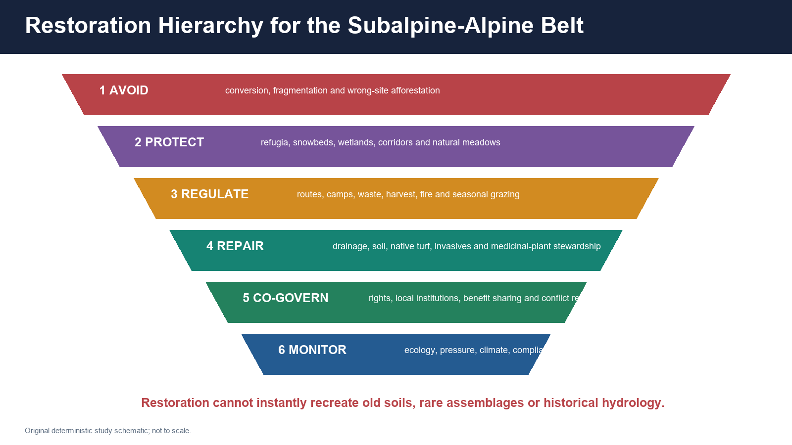

*Figure: Avoid irreversible conversion first; planting is only one possible lower-level tool.*

### 1. Avoid

- conversion of natural meadows and snowbeds;
- fragmentation of vertical/lateral corridors;
- roads/camps on unstable or wet sites;
- spoil dumping and drainage concentration;
- wrong-site tree planting;
- disclosure of sensitive medicinal-plant locations.

### 2. Protect processes and refugia

- moist hollows and snowbeds;
- alpine wetlands and headwater springs;
- avalanche corridors where naturally dynamic;
- native seed sources and pollinator habitat;
- wind/snow refugia;
- forest-subalpine-alpine connectivity.

### 3. Regulate pressures

- site/season-based grazing thresholds;
- route hardening or rotation where necessary;
- camp and toilet zoning;
- pack-in/pack-out and waste accountability;
- fire/harvest rules;
- project cumulative-impact assessment.

### 4. Repair

- restore drainage before planting;
- stabilise gullies and compacted trail margins;
- use locally appropriate native turf/forbs/shrubs;
- control invasives through follow-up;
- protect recovering soil and seed rain;
- support medicinal-plant cultivation/stewardship.

### 5. Co-govern

- recognise rights and seasonal institutions;
- include women, collectors, herders, guides and local governments;
- publish benefit-sharing and compliance;
- build conflict-resolution and compensation mechanisms;
- use local observations with scientific monitoring.

### 6. Monitor for decades

Restoration success requires:

- survival **and** native composition;
- soil stability and hydrology;
- pollinators and wildlife use;
- pressure displacement;
- livelihood/rights outcomes;
- comparison with reference and untreated sites.

### Non-equivalence

Restoration cannot instantly recreate:

- old meadow soil;
- rare plant-pollinator networks;
- historical microbial communities;
- complex snow redistribution;
- long-developed genetic structure.

---

## 21. Regional cases and comparison

> **PRE-TEACH CHECKLIST**\
> **Book context:** Topics 22-25, official Nanda Devi/Valley of Flowers and Khangchendzonga profiles, WII SPAI.\
> **CA Search:** `official Nanda Devi Valley of Flowers Khangchendzonga alpine meadow management`.\
> **CA Found:** official profiles provide bounded protected-landscape evidence; site-specific 2026 condition is not inferred.

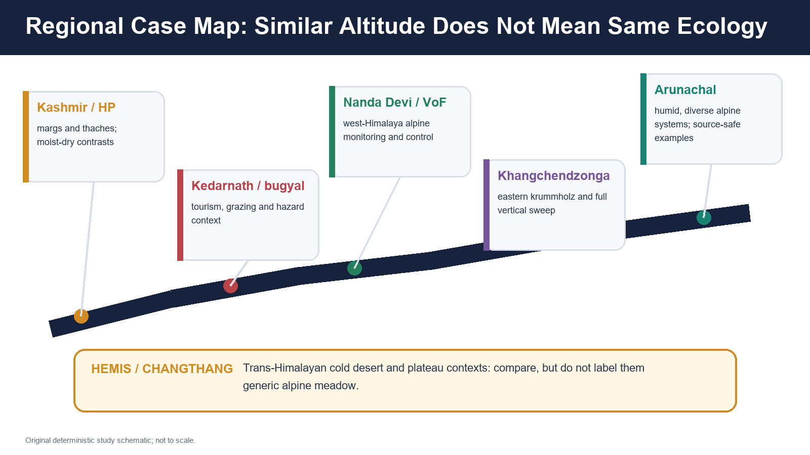

*Figure: Cases demonstrate regional variation. Hemis/Changthang remain a Trans-Himalayan comparison, not a generic meadow template.*

### Valley of Flowers and Nanda Devi

- **FACT:** UNESCO identifies West Himalayan alpine flora, threatened species, glaciers, moraines and meadows.
- **FACT:** The profile records regulated access and long-term monitoring significance.
- **INFERENCE:** The landscape is useful for discussing reference/control value, visitor regulation and buffer-zone development risk.
- **LIMIT:** Management history cannot be copied to every commons meadow.

### Great Himalayan National Park

Use as a western-Himalaya protected-landscape example linking temperate forest, subalpine and alpine habitats, seasonal wildlife use and community-interface questions. Cite a current management document before claiming a visitor limit, grazing status or population outcome.

### Kedarnath/bugyal context

Useful for integrating:

- pilgrimage and trekking pressure;
- transhumance/grazing debate;
- road and slope risk;
- extreme rain/snow and avalanche pathways;
- meadow diagnosis and restoration.

Do not claim that every Kedarnath-region opening has the same origin or legal regime.

### Khangchendzonga

- eastern Himalayan full vertical sweep;
- extensive krummholz in UNESCO description;
- high biodiversity and sacred-cultural landscape;
- need for vertical connectivity and culturally informed governance.

### Sikkim and Arunachal

- humid, cloud/monsoon-influenced upper belts;
- diverse rhododendron, bamboo, fir, birch and alpine scrub/meadow mosaics;
- high turnover and strong protected-area/community context;
- avoid applying Kashmir/Himachal species sequence unchanged.

### Hemis and Changthang

- high-altitude cold-desert/plateau comparison;
- snow leopard, bharal, kiang and black-necked-crane contexts where correct;
- sparse arid steppe, wetlands and rocky terrain differ from humid bugyals;
- do not merge “alpine Himalaya” and “Trans-Himalayan cold desert” into one biome.

---

## 22. Current linkage: GBPNIHE alpine-treeline soil project

> **PRE-TEACH CHECKLIST**\
> **Book context:** Topic 23 treeline and soil-carbon mechanisms established first.\
> **CA Search:** `site:gbpihed.gov.in alpine treeline 2026 project outcomes Darma Parvati Valley`.\
> **CA Found:** official project page with objectives and 2022-2024 outcome statements; page update date not displayed.

### FACT

The official GBPNIHE page:

- treats alpine/subalpine ecosystems and the treeline ecotone as climate-sensitive;
- focuses on rhizospheric communities, soil carbon/nitrogen, enzymes and microbial composition;
- uses Darma Valley in Pithoragarh, Uttarakhand, and Parvati Valley in Kullu, Himachal Pradesh as study landscapes;
- reports that land use significantly influenced key soil parameters, microbial biomass and enzyme activities in Darma Valley across 2022-2024;
- reports strong roles for land use/elevation and vegetation type in nutrient pools and microbial functioning in Parvati Valley.

### STATUS

- Source retrieved: **19 August 2026**.
- The page presents project outcomes, but its visible text does not provide a clear publication or last-update date.
- The package therefore labels it the **latest directly relevant official project page found**, not a confirmed “new August 2026 result.”

### INFERENCE

Treeline monitoring should not stop at “how high are the trees?” It should integrate:

- land use;
- soil organic carbon and nitrogen;
- moisture;
- microbial biomass and enzymes;
- vegetation type;
- season;
- elevation and topography.

This strengthens the case for **below-ground and governance indicators** in climate-sensitive ecotones.

### LIMIT

- Two valleys do not represent the entire Indian Himalaya.
- Elevation as a temperature proxy does not reproduce every future-climate interaction.
- Statistical association among land use, elevation and soil variables is not proof of one universal causal pathway.
- Project outcomes do not establish a treeline-advance rate.

### UPSC use

> **Mains line:** “A recent GBPNIHE alpine-treeline project in Darma and Parvati valleys shows why high-altitude monitoring must combine vegetation position with land use, soil nutrients, microbial biomass and season; however, two-valley outcomes cannot be scaled into a Himalaya-wide trend.”

---

## 23. Monitoring dashboard

> **PRE-TEACH CHECKLIST**\
> **Book context:** all ecological, climate, livelihood and governance owners synthesised.\
> **CA Search:** `official Himalayan alpine monitoring indicators treeline meadow soil grazing tourism`.\
> **CA Found:** official sources support multi-metric monitoring; no one dashboard is statutorily universal.

| Domain | Indicators | Why it matters |
| --- | --- | --- |
| Treeline | adult/seedling height, age structure, density, species line, forest-line continuity | separates recruitment, infilling and boundary movement |
| Shrub | cover, height, species and patch connectivity | distinguishes shrubification from generic greening |
| Snow | onset, duration, melt date, depth/density where monitored | links insulation, phenology and water timing |
| Soil | moisture, organic carbon, nutrients, microbial biomass, compaction, erosion | detects below-ground condition |
| Vegetation | native composition, functional groups, rare/invasive cover, biomass | condition and forage quality |
| Phenology/pollinators | flowering/leafing dates, visitation and seed set | detects timing mismatch |
| Grazing | herd composition, timing, routes, campsite concentration and browse | pressure and institutional function |
| Medicinal plants | population structure, harvest part/season, traceability and cultivation | sustainability and benefit sharing |
| Wildlife | occupancy, prey signs, corridor use and disturbance | landscape function |
| Water/wetlands | spring/stream timing, wetland extent/condition, turbidity | hydrological service |
| Tourism | visitor/camp nights, trail width/bare ground, waste, water use, compliance | carrying-capacity management |
| Rights/livelihood | recognised seasonal access, income distribution, conflict and rule participation | social legitimacy and pressure displacement |
| Projects | clearance conditions, spoil/drainage, restoration survival and audit findings | compliance versus outcome |

### Design principles

- fixed plots plus landscape remote sensing;
- paired grazed/ungrazed or treatment/reference sites where ethical;
- permanent photo points;
- repeated seasonally comparable surveys;
- local observations and institutional records;
- metadata on sensor, method and uncertainty;
- open reporting without sensitive species locations.

---

## 24. Answer-writing frames and advanced refinements

> **PRE-TEACH CHECKLIST**\
> **Book context:** PYQ owners and examiner-grade answer standard applied.\
> **CA Search:** `UPSC mountain ecosystem alpine treeline current official India`.\
> **CA Found:** no new PYQ; current GBPNIHE and official protected-landscape evidence used as named examples.


*Figure: Every answer below follows claim, named evidence, analysis, qualification and verdict.*

### 10-marker spine: distinguish boundaries

1. Define forest line, treeline, species line, snowline and ELA.
2. Draw a relative slope transect.
3. Explain scale/period and patchy ecotone.
4. Add one local control: wind, snow, aspect or grazing.
5. Conclude that treeline is a biological boundary, snowline a snow-persistence boundary and ELA a glacier-balance boundary.

### 15-marker spine: evaluate meadow use

1. Classify meadow origin/state.
2. Map grazing/tourism rights and pressures.
3. Explain threshold-dependent ecological effects.
4. Use one protected landscape and one commons/transhumance example.
5. Recommend site-season co-management and measurable indicators.
6. Reject both blanket exclusion and blanket access.

### 20-marker spine: climate-resilient governance

1. Physical-climatic west-east template.
2. Treeline and meadow climate pathways.
3. Non-climatic filters and livelihood history.
4. Data-literacy and attribution.
5. Legal stack.
6. Restoration hierarchy.
7. Regional cases.
8. Monitoring dashboard and qualified verdict.

### Advanced refinements

- **Ecotone width:** measure transition width, not only a line.
- **Demographic lag:** seedlings may establish long before a forest boundary visibly moves.
- **Extinction debt:** isolated alpine populations may persist temporarily after habitat deterioration.
- **Microrefugia:** snowbeds, north-facing hollows, rock shade and cold-air pockets can preserve species.
- **Biotic interaction:** pollinators, herbivores, pathogens and mycorrhizae mediate range shifts.
- **No-analogue communities:** species may respond at different rates, creating new combinations.
- **Compound disturbance:** warming, extreme rain, fire, grazing change and infrastructure interact.
- **Restoration debt:** soil and rare assemblages recover more slowly than green cover.
- **Governance feedback:** a closure can move pressure rather than remove it.

---

# Part II - Premium Solved Practice Workbook

## Workbook rules

- Objective answers rotate continuously **A -> B -> C -> D** from Q1 through Q32.
- Authentic PYQ option order is retained; PYQs are placed at rotation-compatible positions.
- Older objective keys unavailable in the local official-key holdings remain **INFERRED ANSWER - NOT OFFICIALLY VERIFIED**, with confidence and elimination.
- Every Mains solution follows **claim -> named evidence/example -> analysis -> qualification -> verdict**.
- Every solved Mains answer ends with **Why this earns marks**.

## A. Solved Prelims PYQs, hard MCQs and remedial MCQs

### Q1. UPSC Prelims 2020, GS-I, Q77 - official key unavailable locally

Which of the following are the most likely places to find the musk deer in its natural habitat?

1. Askot Wildlife Sanctuary\
2. Gangotri National Park\
3. Kishanpur Wildlife Sanctuary\
4. Manas National Park

A. 1 and 2 only\
B. 2 and 3 only\
C. 3 and 4 only\
D. 1 and 4 only

**INFERRED ANSWER - NOT OFFICIALLY VERIFIED: A. Confidence: high.**

**Elimination:** Askot and Gangotri are high-Himalayan protected landscapes suitable for musk-deer forest-subalpine habitat. Kishanpur is a Terai protected area, while Manas is primarily a foothill/alluvial and subtropical landscape rather than the paired high-Himalayan habitat tested.

### Q2. Original - boundary firewall

Which statement is most accurate?

A. Treeline is the lower end of a glacier.\
B. Forest line, treeline, species line, snowline and ELA answer different ecological or glaciological questions.\
C. Timberline always has one universally accepted definition.\
D. Snowline is fixed by altitude alone.

**Answer: B.**

**Explanation:** Forest continuity, upright-tree form, highest species occurrence, persistent snow and glacier annual balance are distinct.

### Q3. UPSC Prelims 2022, GS-I, Q45 - stem verified; official key unavailable locally

With reference to “Gucchi” sometimes mentioned in the news, consider the following statements:

1. It is a fungus.\
2. It grows in some Himalayan forest areas.\
3. It is commercially cultivated in the Himalayan foothills of north-eastern India.

Which of the statements given above is/are correct?

A. 1 only\
B. 3 only\
C. 1 and 2\
D. 2 and 3

**INFERRED ANSWER - NOT OFFICIALLY VERIFIED: C. Confidence: high.**

**Elimination:** Gucchi refers to morel mushrooms, a fungus collected in Himalayan forest landscapes. The statement of established commercial cultivation in the north-eastern Himalayan foothills is not supported.

### Q4. UPSC Prelims 2019, GS-I, Q18 - official scan verified; key unavailable locally

Which one of the following National Parks lies completely in the temperate alpine zone?

A. Manas National Park\
B. Namdapha National Park\
C. Neora Valley National Park\
D. Valley of Flowers National Park

**INFERRED ANSWER - NOT OFFICIALLY VERIFIED: D. Confidence: high.**

**Elimination:** Manas is a foothill/alluvial landscape. Namdapha spans a very large tropical-to-alpine gradient. Neora Valley spans montane belts. Valley of Flowers is the high-Himalayan option identified with the temperate-alpine setting. The PYQ phrase should not erase the internal subalpine-alpine distinctions taught here.

### Q5. UPSC Prelims 2019, GS-I, Q38 - official scan verified; key unavailable locally

Consider the following pairs:

1. Bandarpunch - Yamuna\
2. Bara Shigri - Chenab\
3. Milam - Mandakini\
4. Siachen - Nubra\
5. Zemu - Manas

Which pairs are correctly matched?

A. 1, 2 and 4 only\
B. 2 and 3 only\
C. 3 only\
D. 1, 2 and 3

**INFERRED ANSWER - NOT OFFICIALLY VERIFIED: A. Confidence: high.**

**Elimination:** Bandarpunch-Yamuna, Bara Shigri-Chenab and Siachen-Nubra are correct. Milam is associated with Gori Ganga, not Mandakini; Zemu is associated with the Teesta system, not Manas.

### Q6. Original - relative zonation

Which sequence is the safest broad transect?

A. Alpine meadow -> closed forest -> nival -> shrub\
B. Upper temperate forest -> subalpine forest -> krummholz/scrub -> alpine meadow/turf -> scree/fellfield -> nival\
C. Nival -> tropical forest -> alpine meadow\
D. Subtropical chir -> glacier snout -> species line

**Answer: B.**

**Explanation:** It preserves relative order while allowing overlap, local inversions and disturbance openings.

### Q7. Original - treeline concepts

Which observation most directly demonstrates forest-line movement rather than only species-line change?

A. One seedling occurs above adult forest.\
B. One mature tree is taller after a warm summer.\
C. Repeated mapping shows the upper boundary of substantially continuous forest shifting, with stand structure and age evidence.\
D. Regional snowline was higher in one dry season.

**Answer: C.**

**Explanation:** Forest-line movement requires stand-continuity evidence through time; an isolated seedling indicates recruitment/species occurrence.

### Q8. UPSC Prelims 2019, GS-I, Q31 - official scan verified; key unavailable locally

There was growing awareness in India about the importance of Himalayan nettle (*Girardinia diversifolia*) because it is found to be a sustainable source of:

A. Anti-malarial drug\
B. Biodiesel\
C. Pulp for paper industry\
D. Textile fibre

**INFERRED ANSWER - NOT OFFICIALLY VERIFIED: D. Confidence: high.**

**Elimination:** Himalayan nettle yields bast fibre used for textiles. The item does not prove that every harvest is sustainable; regeneration, tenure and extraction method still matter.

### Q9. Original - west-east template

Which statement is most defensible?

A. Western and Eastern Himalayan alpine belts differ in moisture regime and biogeographic composition; neither has one uniform species order.\
B. Eastern Himalaya has no winter snow.\
C. Western Himalaya is uniformly dry.\
D. Monsoon and western disturbances affect every slope identically.

**Answer: A.**

**Explanation:** Longitudinal circulation, inner/outer position, aspect and biogeography produce distinct mosaics.

### Q10. Original - alpine plant adaptations

Which statement correctly interprets alpine adaptation?

A. Every alpine plant produces antifreeze proteins.\
B. Cushion/dwarf form, clonal growth, storage, pubescence, pigments, rapid phenology and dormancy are alternative portfolios that vary among taxa.\
C. Seed dormancy is absent because the growing season is short.\
D. Pollination is exclusively wind-driven.

**Answer: B.**

**Explanation:** Adaptation is species- and site-specific; no universal checklist applies.

### Q11. Original - fauna context

Which combination is correctly contextualised?

A. Red panda - western cold-desert plateau; kiang - humid bugyal\
B. Black-necked crane - every Himalayan conifer forest; musk deer - Thar scrub\
C. Musk deer - upper forest/subalpine mosaics; kiang - Trans-Himalayan plateau contexts\
D. Himalayan monal - proof of old-growth forest

**Answer: C.**

**Explanation:** The item preserves habitat and regional distinctions.

### Q12. UPSC Prelims 2020, GS-I, Q96 - official key unavailable locally

Siachen Glacier is situated to the:

A. East of Aksai Chin\
B. East of Leh\
C. North of Gilgit\
D. North of Nubra Valley

**INFERRED ANSWER - NOT OFFICIALLY VERIFIED: D. Confidence: high.**

**Elimination:** The reliable geographical relationship is north of Nubra Valley. It also helps separate Karakoram cold-desert/cryosphere geography from humid alpine-meadow examples.

### Q13. Original - alpine soils

Which soil statement is most accurate?

A. Stable moist meadows may develop organic-rich horizons, while ridges, scree and avalanche tracks can have thin or young soils.\
B. Every alpine soil is a deep podzol.\
C. Permafrost is universal across the Indian alpine belt.\
D. Meadow soil carbon can be inferred from forest cover.

**Answer: A.**

**Explanation:** Soil depth, moisture and carbon vary with landform, stability, snow and disturbance.

### Q14. Original - snow insulation

Persistent snow can:

A. only damage vegetation;\
B. insulate soil and supply meltwater, yet also delay exposure and shorten growth where it persists late;\
C. determine the treeline without wind or soil;\
D. prove annual glacier mass gain.

**Answer: B.**

**Explanation:** Snow has opposing effects depending on timing, depth, density and site.

### Q15. Original - ELA

Which definition is correct?

A. ELA is the highest tree species occurrence.\
B. ELA is the glacier snout.\
C. ELA is the glacier-specific annual balance line where accumulation equals ablation.\
D. ELA is the forest-line contour.

**Answer: C.**

**Explanation:** It is a glaciological budget boundary for a stated period.

### Q16. Original - meadow debate

Which management approach is most defensible?

A. Afforest every treeless patch.\
B. Assume every opening is pristine.\
C. Ban all research because history is uncertain.\
D. Diagnose current flora, soil, snow/topography, land-use history, palaeoecology and imagery before classifying and restoring.

**Answer: D.**

**Explanation:** Natural, disturbance-maintained, secondary and degraded meadows require different responses.

### Q17. Original - pastoralism

Which statement best captures grazing ecology?

A. Grazing can maintain heterogeneity or cause degradation depending on timing, intensity, herd composition, site and institutions.\
B. Grazing is always beneficial.\
C. Grazing is always destructive.\
D. Blanket exclusion never displaces pressure.

**Answer: A.**

**Explanation:** Thresholds and governance determine outcome.

### Q18. UPSC Prelims 2021, GS-I, Q62 - official key unavailable locally

Consider the following statements:

1. The amount of water in the rivers and lakes is more than the amount of groundwater.\
2. The amount of water in polar ice caps and glaciers is more than the amount of groundwater.

Which of the statements given above is/are correct?

A. 1 only\
B. 2 only\
C. Both 1 and 2\
D. Neither 1 nor 2

**INFERRED ANSWER - NOT OFFICIALLY VERIFIED: B. Confidence: high.**

**Elimination:** Rivers/lakes are a smaller global water store than groundwater, while polar ice caps/glaciers store more. Global stock must not be confused with accessible annual basin flow.

### Q19. Original - FRA

Which statement is correct?

A. FRA contains no relevance for pastoral communities.\
B. Recognition of a right automatically proves sustainable ecological use.\
C. FRA includes grazing and traditional seasonal resource access for nomadic/pastoral communities, while recognition, operation and ecological outcomes remain distinct.\
D. FRA converts every alpine meadow into private property.

**Answer: C.**

**Explanation:** The Act's right categories and implementation/ecological outcomes must be separated.

### Q20. Original - medicinal plants and ABS

Which statement is most accurate?

A. Publishing rare-plant micro-locations improves conservation.\
B. Cultivation automatically makes wild harvest sustainable.\
C. A People's Biodiversity Register is a commercial extraction licence.\
D. Conservation should combine in situ stewardship, cultivation/propagation where suitable, traceability and applicable access-benefit sharing.

**Answer: D.**

**Explanation:** It links ecology, livelihoods and governance while protecting sensitive information.

### Q21. Original - ecosystem services

Which claim is safest?

A. Alpine meadow can support forage, biodiversity, soil carbon, pollination, water regulation and cultural value, but cannot prevent every flood, landslide or avalanche.\
B. Meadow always increases annual basin flow.\
C. Shrub expansion always increases total ecosystem carbon.\
D. Tourism has no ecological cost below a fixed elevation.

**Answer: A.**

**Explanation:** Services are real but process- and scale-bounded.

### Q22. Original - climate evidence

Which statement follows strong evidence grammar?

A. One warm season proves climate change.\
B. A claim should name site, slope, period, variable and method, then separate observation, mechanism, attribution and projection.\
C. A model projection is an observed outcome.\
D. One seedling proves forest-line migration.

**Answer: B.**

**Explanation:** It prevents spatial and causal overclaiming.

### Q23. Original - treeline paradox

Which outcome is possible under warming?

A. Only upward treeline advance.\
B. Only retreat.\
C. Recruitment or infilling may increase, but wind, snow, moisture stress, shallow soil, grazing, avalanches and seed limitation can produce stasis or reversal.\
D. Local controls become irrelevant.

**Answer: C.**

**Explanation:** Warming changes the thermal opportunity, not every local filter.

### Q24. Original - data literacy

Why can FSI forest-cover data not directly measure alpine meadow condition?

A. FSI uses no remote sensing.\
B. Meadows are legally outside India.\
C. Forest cover is always field inventory.\
D. Canopy-density mapping does not by itself measure meadow composition, soil, grazing, shrub cover or erosion.

**Answer: D.**

**Explanation:** Match the metric to the question.

### Q25. Original - governance stack

Which sequence is analytically correct?

A. Legal status/right/clearance/plan/funding/compliance/ecological outcome are separate stages or categories.\
B. World Heritage status automatically sets a visitor quota.\
C. CAMPA funding proves native recovery.\
D. A clearance proves absence of impact.

**Answer: A.**

**Explanation:** Governance analysis fails when documents and outcomes are collapsed.

### Q26. Original - restoration hierarchy

What should usually precede planting?

A. A tree-count target.\
B. Avoiding conversion, diagnosing the ecosystem and repairing drainage/soil while protecting natural regeneration.\
C. Replacing native turf with fast-growing exotics.\
D. Ignoring rights and access.

**Answer: B.**

**Explanation:** Avoidance and process repair are higher in the hierarchy than planting.

### Q27. Original - regional cases

Which comparison is correct?

A. Hemis/Changthang are humid eastern bugyals.\
B. Valley of Flowers and Changthang have identical hydrology.\
C. Khangchendzonga illustrates an eastern full-altitudinal and krummholz-rich landscape, while Hemis/Changthang are Trans-Himalayan cold-desert/plateau contexts.\
D. Nanda Devi is a tropical coastal park.

**Answer: C.**

**Explanation:** It preserves east-west and alpine-cold-desert distinctions.

### Q28. Original - monitoring

Which dashboard is most complete?

A. Tree height alone\
B. Visitor revenue alone\
C. NDVI alone\
D. Treeline demography, shrub cover, snow, soil, composition, phenology, pressure, wildlife, water, rights, livelihoods and compliance

**Answer: D.**

**Explanation:** Ecotone condition is multidimensional.

### Q29. Remedial - wrong-site afforestation

Why can planting trees in a natural alpine meadow be harmful?

A. It can replace open-habitat biota and alter snow, albedo, hydrology and grazing/wildlife use.\
B. Trees are always legally prohibited above 1,000 m.\
C. Meadow has no soil.\
D. Every sapling causes a GLOF.

**Answer: A.**

**Explanation:** The objection is ecological mismatch, not opposition to all restoration.

### Q30. Remedial - blanket grazing exclusion

Which is the strongest caution?

A. Exclusion always improves every meadow.\
B. Exclusion can displace pressure, break seasonal institutions and encourage shrub change in some history-shaped sites; site thresholds are still required.\
C. Rights remove all conservation duties.\
D. Herders never monitor snow or forage.

**Answer: B.**

**Explanation:** Social and ecological feedbacks must be tracked.

### Q31. Remedial - remote-sensing greening

What does a greening signal require before ecological interpretation?

A. Immediate plantation target\
B. No field work\
C. Season/snow/cloud checks plus field evidence on shrubs, native composition, biomass, soil and pressure\
D. Assumption that greening equals biodiversity gain

**Answer: C.**

**Explanation:** Greening is a signal, not a cause or complete condition measure.

### Q32. Remedial - permafrost claim

Which statement is correct?

A. Permafrost occurs uniformly beneath every Himalayan meadow.\
B. Any winter-frozen soil is permafrost.\
C. Permafrost can be inferred from altitude alone.\
D. Permafrost requires site evidence and varies with climate, aspect, ground cover, substrate and terrain.

**Answer: D.**

**Explanation:** Seasonal frost and permafrost are distinct.

## B. Solved Mains PYQs

### PYQ 1 - UPSC Mains 2019, GS-I, Q15

**Question:** How can the mountain ecosystem be restored from the negative impact of development initiatives and tourism? (15 marks, 250 words)

**Demand:** “How can” requires an implementable hierarchy. “Mountain ecosystem” requires slope, water, forest-meadow ecotones, biodiversity, hazard and community integration.

**Model solution**

- **Claim:** Mountain restoration must begin with avoidance because thin soils, steep relief, slow succession and vertically connected habitats make post-impact repair incomplete.
- **Named evidence/example:** UNESCO's Nanda Devi-Valley of Flowers profile identifies alpine meadows, glaciers, threatened species, regulated access and buffer-zone development/tourism risks. In the Kedarnath-upper Himalayan context, routes, camps, roads, drainage and extreme-weather exposure overlap.
- **Analysis:** First, map no-go/refugia zones around natural meadows, snowbeds, wetlands, unstable slopes, avalanche paths and wildlife/pastoral corridors. Second, replace isolated project appraisal with cumulative basin/corridor assessment. Third, enforce hill-road drainage, spoil disposal, slope audits and native-site restoration. Fourth, regulate visitors through seasonal permits, route/camp zoning, sanitation, waste accountability, water limits and weather closures. Fifth, co-manage grazing/seasonal access with rights holders using site thresholds. Sixth, control invasives and protect medicinal-plant populations. Finally, monitor soil erosion, native composition, snow/water timing, wildlife, visitor pressure, compliance and livelihoods.
- **Qualification:** Vegetation can reduce shallow erosion and protect soil, but cannot prevent every deep landslide, avalanche or extreme flood. Plantation cannot quickly recreate old meadow/forest soil and interaction networks.
- **Verdict:** Restoration is an **avoid -> regulate -> repair -> co-govern -> monitor** programme, not a compensatory tree-count exercise.

**Why this earns marks:** It directly answers “how,” uses a named protected landscape, integrates engineering, ecology, tourism and rights, states physical limits and gives measurable implementation.

### PYQ 2 - UPSC Mains 2020, GS-I, Q6

**Question:** How will the melting of Himalayan glaciers have a far-reaching impact on the water resources of India? (10 marks, 150 words)

**Demand:** Explain multiple water-resource pathways without claiming that all rivers immediately dry.

**Model solution**

- **Claim:** Glacier loss matters mainly by changing the timing, reliability and hazard profile of glacierised headwaters.
- **Named evidence/example:** Gangotri-Gomukh is the Bhagirathi headstream cue; the glacier-river PYQ links Bara Shigri with Chenab and Zemu with the Teesta system, illustrating basin specificity.
- **Analysis:** Sustained negative mass balance can initially add melt locally, but declining ice storage later weakens lean-season and drought-year buffering. Hydropower operation, irrigation scheduling, sediment management, ecosystem flows and storage design face greater uncertainty. Retreat can also leave or enlarge moraine-dammed lakes and add GLOF pathways. Alpine snowbeds, wetlands and soils further mediate the seasonal pulse.
- **Qualification:** Monsoon rain supplies much annual flow in many basins; snow, groundwater, debris cover, elevation and glacier fraction vary. Snowline, ELA and glacier snout are different indicators.
- **Verdict:** The strongest conclusion is reduced seasonal reliability and higher planning complexity, requiring basin-specific monitoring and risk-aware infrastructure.

**Why this earns marks:** It explains phased hydrology, gives named basin evidence, distinguishes glacier/snow metrics and avoids the “all Himalayan rivers vanish” exaggeration.

### PYQ 3 - UPSC Mains 2021, GS-I, Q4

**Question:** Differentiate the causes of landslides in the Himalayan region and Western Ghats. (10 marks, 150 words)

**Demand:** Compare causes; do not list generic triggers without geological and climatic differentiation.

**Model solution**

- **Claim:** Both regions experience rain-triggered slope failure, but the young tectonic Himalaya and old dissected Western Ghats differ in structure, cryosphere influence and development context.
- **Named evidence/example:** Himalayan slopes combine active tectonics, fractured/folded rocks, high relief, river incision, glacial/periglacial debris, snow/avalanche processes and road/hydropower cutting. Western Ghats failures commonly involve deeply weathered regolith/laterite, escarpment relief and intense monsoon rain, with quarrying and slope modification as local amplifiers.
- **Analysis:** In the Himalaya, earthquakes, thrust-related weakness, glacial/moraine material, freeze-thaw and extreme rain/snow interact with rapidly incised valleys. In the Ghats, prolonged chemical weathering and saturation of thick soil/regolith are more prominent. Drainage obstruction, deforestation and construction intensify both.
- **Qualification:** No region has one landslide mechanism; site lithology, slope, antecedent moisture and engineering decide failure type.
- **Verdict:** Risk mapping must be process-specific: tectonic-cryosphere-corridor integration in the Himalaya, and weathered-mantle-rainfall-drainage/quarry focus in the Ghats.

**Why this earns marks:** It differentiates rather than narrates, names geology, climate and development controls, and preserves site-level variation.

### PYQ 4 - UPSC Mains 2020, GS-I, Q17

**Question:** Examine the status of forest resources of India and its resultant impact on climate change. (15 marks, 250 words)

**Demand:** Examine needs evidence, interpretation and counterpoint. The alpine link is forest-cover and treeline data literacy.

**Model solution**

- **Claim:** India's forest resource is nationally mapped, but canopy extent cannot alone reveal native composition, fragmentation, old growth, treeline dynamics or alpine-meadow condition.
- **Named evidence/example:** FSI's ISFR 2023 is the current official forest-cover baseline used in this package. Its canopy methodology can include diverse land covers meeting the threshold; it should not be read as a subalpine-forest quality or meadow-health survey.
- **Analysis:** Forests mitigate climate change through biomass and soil carbon and support water, slope and microclimate functions. Himalayan upper forests also provide seed sources and vertical corridors. Yet fragmentation, fire, grazing/browse imbalance, roads and poor regeneration can reduce resilience while canopy remains. Wrong-site plantation can harm natural meadows; assisted natural regeneration and protection of native mosaics can support mitigation and adaptation.
- **Qualification:** Forest cover, recorded forest area, carbon stock, native ecosystem and legal status are different. Greening may be shrubification, plantation or seasonal signal; one fire/snow season is not a trend.
- **Verdict:** Forest-climate policy should retain canopy monitoring but judge outcomes through native composition, age/regeneration, connectivity, soil carbon, hydrology, disturbance and rights.

**Why this earns marks:** It uses a named official baseline, exposes the metric's blind spot, applies it to the subalpine-alpine ecotone and balances mitigation value with ecological non-equivalence.

## C. Original solved Mains practice

### Original 10-marker - boundary distinctions

**Question:** Distinguish treeline, timberline, snowline and equilibrium-line altitude. Why is their separation important in Himalayan climate analysis? (10 marks, 150 words)

**Model solution**

- **Claim:** The four terms describe different biological, landscape and glaciological boundaries and therefore cannot be used as proxies for one another.
- **Named evidence/example:** Near Himalayan upper forests, forest continuity can end below isolated upright birch/fir or krummholz; by contrast, snowline marks persistent snow, while the ELA marks annual glacier accumulation-ablation balance. The glacier snout lies still lower on many valley glaciers.
- **Analysis:** Treeline concerns upright tree growth; timberline often denotes continuous forest or usable timber and must be defined; snowline depends on snow persistence and surface climate; ELA is glacier- and year-specific. Wind, aspect, grazing and avalanche can lower observed treeline without shifting ELA. A negative glacier balance can raise ELA and retreat the snout without immediate forest-line movement.
- **Qualification:** Terminology varies among authors, so scale, period and operational definition must be stated.
- **Verdict:** Separation prevents false climate attribution and enables correct monitoring of vegetation, snow and glacier change.

**Why this earns marks:** It defines each term, uses a slope/glacier example, explains analytical consequences and qualifies terminology.

### Original 15-marker - pastoralism and meadow conservation

**Question:** “Grazing is both a driver of alpine-meadow degradation and a component of Himalayan cultural landscapes.” Critically examine. (15 marks, 250 words)

**Model solution**

- **Claim:** The statement is valid only through a threshold lens: grazing outcome depends on meadow origin, season, intensity, herd composition, moisture, slope and institutions.
- **Named evidence/example:** Majid and Khullar describe summer use of alpine pastures and transhumance; FRA recognises grazing and seasonal access categories. Uttarakhand bugyals and Himachal/Kashmir high pastures illustrate diverse commons and protected-area contexts rather than one system.
- **Analysis:** Moderate, rotational use can maintain patch heterogeneity, recycle nutrients, support local breeds/livelihoods and restrain shrubs in some history-shaped openings. Conversely, early-season use on saturated soils, concentrated camps/routes, excessive stocking and loss of rotation can compact soil, expose bare ground, shift palatable species and damage wetlands. Blanket exclusion may displace pressure, erode knowledge and undermine livelihoods; blanket access can ignore ecological thresholds and wildlife needs.
- **Qualification:** Natural climatic meadow, grazing-maintained opening and degraded patch require different baselines. Rights recognition does not predetermine stocking level, and ungrazed exclosures can alter vegetation in ways that need interpretation.
- **Verdict:** Use rights-based co-management with mapped sensitive sites, seasonal calendars, negotiated thresholds, pressure-displacement tracking and joint ecological-livelihood monitoring.

**Why this earns marks:** It presents both mechanisms, names book/legal evidence, distinguishes meadow histories and ends with an implementable balanced model.

### Original 20-marker - climate-resilient governance

**Question:** Design a climate-resilient conservation and restoration strategy for India's subalpine-alpine belt. (20 marks, 300 words)

**Model solution**

- **Claim:** Resilience requires protecting heterogeneous ecotones, snow-soil processes and livelihood institutions rather than assuming uniform upward vegetation migration or relying on plantations.
- **Named evidence/example:** GBPNIHE's Darma-Parvati project links land use/elevation with soil nutrients, microbial biomass and enzyme activity; UNESCO's Nanda Devi-Valley of Flowers and Khangchendzonga profiles demonstrate western and eastern high-altitude mosaics; WII's SPAI illustrates landscape-scale monitoring.
- **Analysis:**\
  1. **Map correctly:** forest line, treeline, species line, shrub, meadow, snowbed, scree, wetland and corridor at sector/slope scale.\
  2. **Avoid:** no-go natural meadows, refugia, avalanche/wetland processes and unstable slopes; prevent wrong-site afforestation and cumulative fragmentation.\
  3. **Regulate:** site-season grazing, route/camp/waste/water limits, medicinal harvest, fire and infrastructure drainage/spoil.\
  4. **Restore processes:** repair hydrology and soil, assist natural regeneration, use native meadow vegetation where diagnosed, control invasives and steward medicinal plants.\
  5. **Co-govern:** integrate FRA/community rights, protected-area plans, BMC/PBR/ABS, NMPB support, CAMPA/GIM and tourism/disaster protocols while separating funding from outcome.\
  6. **Monitor:** tree demography, shrub cover, snow/melt, soil carbon/moisture/microbes, composition, pollinators, grazing/visitors, wildlife, water, rights and compliance.
- **Qualification:** Projections guide risk screening, but local intervention needs field trends. Natural meadows, secondary openings and degraded patches are not interchangeable; restoration cannot instantly recreate old soil or rare assemblages.
- **Verdict:** The strategy is **refugia + connectivity + threshold use + process restoration + rights + long-term evidence**, differentiated west-to-east and from the Trans-Himalayan cold desert.

**Why this earns marks:** It uses three named evidence units, integrates ecology, climate, law and livelihoods, gives a sequenced implementation plan and states regional/data limitations.

---

# Part III - Final Consolidated Register Notes

## A. Boundary matrix

- Upper montane/temperate forest = highest closed montane belt; subalpine = cold upper transition.
- Forest line = continuous forest limit.
- Treeline = upright-tree limit; patchy.
- Species line = highest isolated occurrence/recruitment.
- Climatic treeline = broad heat-limited potential.
- Actual treeline = climate filtered by wind, snow, aspect, soil, avalanches, grazing, fire and history.
- Timberline usage varies; define it.
- Snowline = persistent snow boundary.
- ELA = glacier annual accumulation-ablation balance.
- Snout = lowest glacier terminus.
- Never equate treeline, snowline or snout.

## B. Relative zonation and regional controls

```text
upper temperate forest
 -> subalpine birch/fir/rhododendron/juniper or regional equivalents
  -> krummholz / scrub
   -> alpine meadow/turf/snowbed
    -> scree/fellfield
     -> nival
```

- Use relative order, not universal elevation.
- West: continentality, inner rain shadows, strong western-disturbance snow influence.
- Central: monsoon-winter snow interaction and strong valley/aspect contrasts.
- East: stronger monsoon/cloud, steep vertical compression, richer turnover; do not copy western ladder.
- Outer-inner range, latitude, aspect, substrate, wind and snow duration move every boundary.

## C. Treeline evidence

- Measure adult, sapling and seedling ages/heights.
- Separate individual advance, species-line shift, infilling and forest-line movement.
- Warming may permit recruitment; moisture stress, wind, shallow soil, snow, avalanche, grazing, fire and seed limitation may block it.
- One site/season is not a Himalayan trend.
- Evidence sentence: `site + slope + period + variable + method + uncertainty`.

## D. Plant and animal adaptations

- Plant: cushion/rosette/dwarf, clonal growth, storage, pubescence/wax, pigments, cold acclimation, rapid phenology, pollination flexibility, dormancy.
- No plant has every trait.
- Animal: insulation, movement, hypoxia tolerance, seasonal diet/behaviour and reproductive timing.
- Musk deer = upper forest-subalpine; red panda = eastern forest-bamboo/subalpine; snow leopard = rocky alpine/Trans-Himalayan ranges.
- Kiang and black-necked crane require Trans-Himalayan plateau/wetland context.

## E. Soil, snow and hydrology

- Stable moist meadow can build organic-rich topsoil; ridge/scree/avalanche sites are thin/young.
- Processes: freeze-thaw, frost heave, solifluction, scree, avalanches and erosion.
- Permafrost is not universal.
- Snow insulates and supplies meltwater but late persistence shortens growth.
- Forest/meadow change has mixed effects through interception, sublimation, shading, evapotranspiration, soil storage and storm/snow regime.

## F. Meadow diagnosis

- Natural climatic meadow.
- Natural disturbance/snowbed/avalanche opening.
- Grazing-maintained or secondary opening.
- Degraded patch.
- Evidence ladder: flora -> soil -> topography/snow -> history -> palaeoecology -> time-series imagery.
- Reject blanket afforestation and blanket pristine assumption.

## G. Pastoralism and medicinal plants

- Grazing outcomes depend on timing, intensity, herd, site and institutions.
- Potential benefit: heterogeneity, nutrient transfer, livelihoods, knowledge.
- Potential harm: compaction, bare ground, wetland damage, palatable-species loss.
- FRA recognises grazing/transhumant seasonal-access categories; right, recognition, operation and outcome differ.
- Medicinal plants: protect habitat/populations, cultivate where appropriate, trace value chain, use ABS, avoid sensitive locations.
- HAPPRC examples: *Aconitum*, *Angelica glauca*, *Nardostachys jatamansi*, *Picrorhiza kurrooa*, *Podophyllum hexandrum*, *Rheum*, *Saussurea costus*.

## H. Services and threats

- Services: water regulation, forage, medicinal/cultural value, tourism, biodiversity, soil carbon, pollination and bounded hazard buffering.
- No meadow prevents every flood/landslide/avalanche.
- Driver-pressure-state-impact: roads/tourism/hydropower/transmission/general border infrastructure, grazing change, fire, invasive species, harvest, extreme rain/snow and warming.
- Carrying capacity = site-season adaptive process, not one universal number.

## I. Climate and data literacy

- Climate pathways: warming, snow-duration/melt change, phenology, recruitment, infilling, shrubification, upslope shifts, meadow compression.
- Separate observation, mechanism, attribution and projection.
- FSI cover != meadow condition.
- NDVI != species composition.
- Greening can be shrubs, invasives, recovery or wet-year signal.
- Use field composition, biomass, soil, grazing, snow and phenology together.

## J. Legal and governance stack

- Status: National Park/Sanctuary/Biosphere Reserve/World Heritage/ESZ.
- Right: FRA/community/seasonal access.
- Clearance: Van (Sanrakshan Evam Samvardhan) Adhiniyam and project conditions.
- Plan: management/working/tourism/disaster plan.
- Funding: CAMPA/GIM/NMPB/state.
- Compliance: actual implementation.
- Outcome: ecological and livelihood condition.
- BDA: NBA-SBB-BMC, PBR and ABS; protect sensitive data.

## K. Restoration hierarchy

1. Avoid conversion/fragmentation and wrong-site afforestation.
2. Protect refugia, wetlands, snowbeds and corridors.
3. Regulate routes, camps, waste, grazing, harvest and fire.
4. Repair hydrology/soil and native vegetation; control invasives.
5. Co-govern rights, benefits and conflict.
6. Monitor ecology, pressure, compliance and livelihood for decades.

## L. Regional cases

- Nanda Devi/Valley of Flowers: west-Himalaya alpine biodiversity, regulated access and monitoring value.
- GHNP: temperate-subalpine-alpine continuity and community interface.
- Kedarnath/bugyal: tourism-grazing-hazard integration.
- Khangchendzonga: eastern full vertical sweep, krummholz, biodiversity and sacred landscape.
- Sikkim/Arunachal: humid, diverse eastern mosaics.
- Hemis/Changthang: Trans-Himalayan cold desert/plateau - compare, do not conflate.

## M. Current card

- **FACT:** GBPNIHE Darma-Parvati project links land use/elevation/season with soil nutrients, microbial biomass and enzymes.
- **STATUS:** official page retrieved 19-08-2026; visible update date absent.
- **INFERENCE:** monitor below-ground and governance variables, not only tree position.
- **LIMIT:** two valleys do not establish a Himalaya-wide trend.

## N. Rapid answer spines

### Boundaries

Define -> relative diagram -> local modifiers -> analytical consequence -> no-equivalence verdict.

### Meadow governance

Diagnose origin -> map rights/pressures -> threshold effects -> regional example -> co-management -> indicators.

### Climate

Observation -> mechanism -> confounders -> west-east/site variation -> monitoring -> qualified verdict.

### Restoration

Avoid -> protect process -> regulate -> repair -> co-govern -> monitor.

### Final factual traps

- Treeline is not snowline or glacier snout.
- Timberline must be defined.
- Alpine meadow is not Trans-Himalayan cold desert.
- Red panda is not a generic open-alpine indicator.
- Kiang/black-necked crane require plateau/wetland context.
- FSI forest cover does not measure meadow condition.
- Greening does not automatically mean biodiversity or carbon gain.
- Permafrost is not universal.
- Grazing and exclusion both have threshold effects.
- A plan, clearance or fund is not an ecological outcome.
