# Geography 24 - India Eastern Himalaya Temperate: Complete Topic Package

**Level:** Medium to advanced | **GS Papers:** GS-I and GS-III  
**Export date:** 19 August 2026 | **Evidence cut-off:** 19 August 2026  
**Approval status:** Generated for review; **not approved**  
**Core proposition:** The Indian Eastern-Himalaya temperate forest is a short-gradient, high-turnover mountain mosaic shaped by monsoon, cloud, relief, biogeography, disturbance and institutions - not one state-wide altitude ladder or a wetter Western-Himalaya duplicate.

## How to use this package

1. Map the core and transition firewall before naming a forest.
2. Define the classification and use relative zonation rather than universal metres.
3. Compare Darjeeling-Sikkim, west/central Arunachal and eastern Arunachal through the same controls.
4. Link forest composition to cloud, soil, gaps, bamboo and biogeographic turnover.
5. Separate rights, clearance, project stage, compliance, forest data and ecological outcome.
6. Use FACT / STATUS / INFERENCE / LIMIT for all current and climate claims.
7. Complete the solved practice before reading the final register notes.

## Original visual asset register

1. `01_core-sector-map.png`
2. `02_classification-firewall.png`
3. `03_physical-climatic-controls.png`
4. `04_sector-comparison.png`
5. `05_altitudinal-zonation-transect.png`
6. `06_flora-role-matrix.png`
7. `07_cloud-fog-ecology.png`
8. `08_soil-nutrient-reset.png`
9. `09_forest-structure-dynamics.png`
10. `10_bamboo-cycle.png`
11. `11_biodiversity-corridor.png`
12. `12_ecosystem-services-limits.png`
13. `13_community-jhum-tenure.png`
14. `14_infrastructure-hazard-chain.png`
15. `15_landslide-compound-risk.png`
16. `16_climate-evidence-ladder.png`
17. `17_forest-data-literacy.png`
18. `18_governance-legal-stack.png`
19. `19_restoration-hierarchy-cases.png`
20. `20_monitoring-answer-spine.png`

---

# Source Register and Evidence Discipline

## Repository-first authored knowledge

- `Geography/advanced/24_India-Eastern-Himalaya-Temperate.md`: direct owner for Eastern-Himalaya application, Darjeeling-Sikkim-Arunachal frame and source-era cautions.
- `Geography/22_India-Himalayan-Temperate-Forests_Complete-Topic-Package.md`: classification, west-east contrast, soils, dynamics, biodiversity, data, law and restoration.
- `Geography/23_India-Subalpine-Alpine-Belt_Complete-Topic-Package.md`: upper forest, treeline, bamboo-rhododendron and Khangchendzonga linkages.
- `Geography/21_India-Humid-Subtropical-NE_Complete-Topic-Package.md`: Bay moisture, Northeast physiographic mosaic, jhum/fallow, roads and compound hazards.
- Linked owners: physiography, drainage, monsoon, climate regions, weathering/landslides, evergreen forests, biodiversity, forest rights, CAMPA/GIM, protected areas, climate science, Northeast connectivity and social geography.

## OCR-searchable local books and official scans

- Majid Husain, *Indian and World Geography*: direct searchable passages on Himalayan setting, shifting cultivation and ecological/soil concepts.
- D. R. Khullar and Majid Husain India-geography PDFs: repository-authored OCR synthesis used where the source scans did not expose a stable text layer.
- G. C. Leong: comparative cool-temperate and mountain foundations; India is not treated as a copied Laurentian climate.
- Official local UPSC question papers and keys: 2019, 2020, 2022, 2024 and 2026. The 2026 key is explicitly provisional.

## Primary and official URLs

All were retrieved or re-verified on **19 August 2026**.

| Institution / document | URL | Use and limit |
|---|---|---|
| Forest Survey of India, ISFR 2023 | https://fsi.nic.in/forest-report-2023 | Cover/density and methodology; not composition, legal status or naturalness |
| Botanical Survey of India, *Rhododendrons of Sikkim and Darjeeling Himalaya* | https://bsi.gov.in/uploads/documents/whatsnew/english/Rhododendrons_of_Sikkim_Darjeeling_Himalaya_%282023%29.pdf | 45-taxon regional flora anchor; not a slope-by-slope current inventory |
| Zoological Survey of India digital archives/checklists | https://zsi.gov.in/fauna-of-india-digital-archive | Faunal documentation and range verification; use document-specific records |
| Sikkim Forest Department red-panda/biodiversity publications | http://sikkimforest.gov.in/Reports%20and%20Publications/Biodiveristy-of-Sikkim/20%20Red%20Panda_363-378%20web.pdf | Regional habitat context; older report, not a 2026 population estimate |
| Wildlife Institute of India red-panda studbook | https://v1.wii.gov.in/images/images/documents/rr_2013_stud_book_red_panda.pdf | Species biology/range context; not current wild-population census |
| UNESCO, Khangchendzonga World Heritage | https://whc.unesco.org/en/list/1513/ | Vertical and sacred-cultural landscape; not Indian legal notification or site-condition audit |
| UNESCO MAB, Khangchendzonga | https://www.unesco.org/en/mab/khangchendzonga | Biosphere-reserve framework; distinct from National Park/World Heritage |
| West Bengal Forest Directorate, Neora Valley | https://www.wildbengal.com/neoravally-np.php | Bounded protected-landscape example; spans multiple belts |
| Arunachal Forest Department, Eaglenest | https://arunachalforests.gov.in/wildlife_eaglenest_ws.html | West Kameng protected gradient; not whole-Arunachal condition |
| Arunachal Forest Department, Sessa Orchid Sanctuary | https://arunachalforests.gov.in/wildlife_sessa_os.html | Orchid/conservation example; sanctuary objective and elevation are bounded |
| GB Pant National Institute, Sikkim unit | https://www.gbpihed.gov.in/Sikkim_Unit_details.php | Institutional Himalayan research context; mandate is not outcome evidence |
| GB Pant National Institute, Northeast unit | https://www.gbpihed.gov.in/North_East_Unit_detail.php | Regional research context; use project-specific evidence for trends |
| ICFRE-RFRI bamboo training bulletin | https://rfri.icfre.gov.in/bulletin_board/bulletin282.pdf | 16-02-2026 status item; training is not ecological recovery |
| NHIDCL Rabongla NH-510 bid | https://www.nhidcl.com/sites/default/files/2026-04/rfp_2_0.pdf | April 2026 procurement/drainage status; not completion or resilience outcome |
| GSI Bhusanket landslide incidence | https://bhusanket.gsi.gov.in/landslideIncidence.html | 2026 Lower Siang preliminary-assessment listing; site-specific |
| IMD press release, 27-06-2026 | https://internal.imd.gov.in/press_release/20260627_pr_5101.pdf | Forecast-status evidence; not realised impact or climate attribution |
| FRA text, Ministry of Tribal Affairs | https://tribal.nic.in/FRA/data/FRAAct.pdf | Rights/duties framework; claim recognition and outcome require local verification |
| Forest-conservation amendment reference | https://forestsclearance.nic.in/writereaddata/ACT/FCSimplifiedAmendment2023.pdf | Current statutory title and diversion context; clearance is not compliance |
| National Biodiversity Authority | https://www.nbaindia.org/ | BMC/PBR/ABS institutions; registration is not outcome |
| Green India Mission | https://moef.gov.in/green-india-mission-gim | Landscape mission; finance/target is not recovery |

## Six-month current-affairs result

**STATUS:** The search window was **19 February-19 August 2026**. Directly relevant official items were found for bamboo capacity building, Sikkim road/drainage procurement, Lower Siang landslide assessment and an IMD heavy-rain forecast.

**INFERENCE:** Together they show that forest livelihoods, drainage-sensitive connectivity and compound slope-weather risk remain current governance themes.

**LIMIT:** None proves Eastern-Himalaya-wide forest recovery, degradation, cloud-base shift, biodiversity change or climate attribution. No weaker news item was forced into the package.

---

# Part I - Complete Visual-First Learning Session

## 1. Evidence Order, Scope and Geographic Boundary

This package treats the Indian Eastern Himalaya as a carefully bounded mountain system, not as a synonym for all of Northeast India. The core examination frame is Sikkim, the Darjeeling-Kalimpong Himalaya and the Arunachal Himalaya. Adjacent Patkai-Naga-Manipur-Mizo, Meghalaya and Assam hill systems may share monsoon, bamboo, biodiversity or livelihood features, but must not be automatically assigned to the same tectonic or biogeographic unit.

| Evidence layer | Material used | Role and limit |
|---|---|---|
| 1. Authored Markdown | Topic 24 Advanced plus Topics 21-23 and linked physiography, monsoon, soils, forests, biodiversity, jhum, landslide, infrastructure and climate owners | Primary conceptual and repository-owned foundation |
| 2. Local OCR / books | Majid Husain, D. R. Khullar and G. C. Leong holdings; official UPSC scans and keys | Textbook nomenclature and verified PYQ demand; source-era data not treated as current |
| 3. Live primary sources | FSI, BSI, ZSI/WII/state forest departments, UNESCO, GBPNIHE, ICFRE-RFRI, GSI, NHIDCL, IMD/MoES and India Code | Current status, institutions and bounded cases, all retrieved 19-08-2026 |
| 4. Qdrant | Not required | Optional fallback did not block or delay the package |

### Must-know facts

- FACT: BSI's illustrated account records 45 rhododendron taxa for Sikkim and Darjeeling Himalaya: 36 species, 1 subspecies, 1 variety and 7 natural hybrids.
- FACT: FSI canopy-density classes are not forest-type, naturalness or legal-status classes.
- LIMIT: A state or protected-area name cannot substitute for slope, basin, elevation and habitat evidence.

### UPSC traps

- **Wrong:** All Northeast hills are Eastern Himalaya. **Correct:** Use tectonic, physiographic and biogeographic boundaries explicitly.
- **Wrong:** Eastern Himalayan temperate forest is a true Laurentian climate. **Correct:** It is an Indian altitudinal analogy only; latitude, continentality and circulation differ.

### Mains / answer route

Map first: label Darjeeling-Kalimpong, Sikkim, western/central/eastern Arunachal, Teesta-Rangeet and Siang-Dibang-Lohit contexts, then add the transition firewall.

### Study link

Repository owners: Geography 21-24; Himalayan physiography; monsoon; soils; evergreen forests; biodiversity; jhum; landslide; infrastructure; climate change.

---

## 2. Current Linkage and Six-Month Evidence Check

The six-month search window was 19 February-19 August 2026. Four directly linked official items were retained. Each is labelled by what it proves, not by what a current-affairs headline might imply.

| Owner / date | FACT or STATUS | INFERENCE and LIMIT |
|---|---|---|
| ICFRE-RFRI, 16-02-2026 | STATUS: CAMPA-sponsored week-long training began on bamboo resource development and community livelihoods. | Capacity building supports propagation and use; it does not prove forest recovery or sustainable harvest at every site. |
| NHIDCL, April 2026 | STATUS: third-call bid document for balance rectification of pavement and roadside drain damage linked to PHED pipeline work at Rabongla on NH-510. | Drainage is an infrastructure-resilience variable; a bid or contract is not proof of completed or effective mitigation. |
| GSI Bhusanket, 2026 | STATUS: preliminary landslide assessment listed for Likabali-Basar Road near Magi Basti, Lower Siang. | A site assessment supports event diagnosis, not an Arunachal-wide trend or a single-cause claim. |
| IMD, 27-06-2026 | FORECAST: heavy to very heavy rain over Northeast India and Sub-Himalayan West Bengal-Sikkim, with isolated extremely heavy rain forecast for 27-29 June. | A forecast establishes a valid warning, not realised rain, damage or climate attribution. |

### Must-know facts

- Retrieval date for every live item: 19 August 2026.
- Status, project stage, legal clearance, compliance and ecological outcome are kept separate.
- The search did not identify a stronger date-stamped six-month official forest-condition outcome for the whole Eastern Himalaya; no weak news hook was forced.

### UPSC traps

- **Wrong:** A current tender proves a resilient road. **Correct:** It proves a procurement or implementation stage only.
- **Wrong:** An IMD forecast proves landslides occurred. **Correct:** Observed rainfall and documented impacts require separate sources.

### Mains / answer route

Use these items as bounded examples of bamboo institutions, drainage-sensitive roads, site-level landslide diagnosis and forecast-status discipline.

### Study link

Full official URLs and retrieval notes appear in the reusable Markdown source register.

---

## 3. 1. Eastern Himalaya: Core, Sectors and Map Skeleton

> **PRE-TEACH CHECKLIST**  
> **Book context:** Advanced Topic 24 plus Topics 21-23 and Indian physiography owners queried.  
> **CA Search:** `official Eastern Himalaya Sikkim Arunachal forest biodiversity map 2026`  
> **CA Found:** No single official 2026 map was used as a universal boundary; sector-based synthesis retained.  

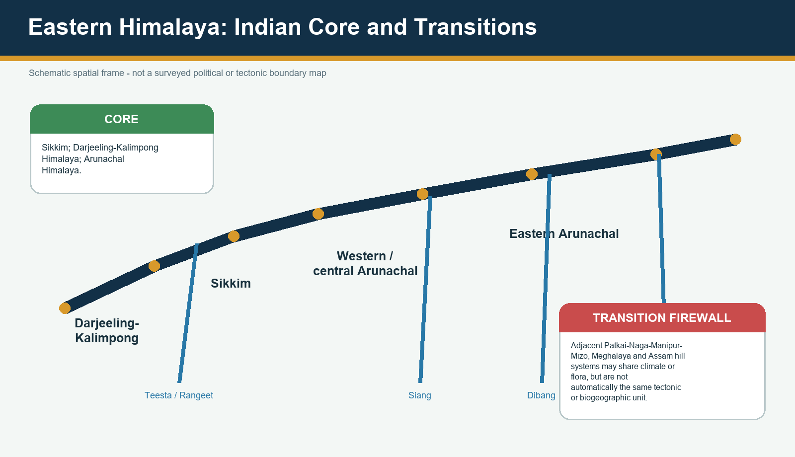

*Map-ready schematic of the core sectors, major basin cues and transition firewall.*

The Indian Eastern Himalaya is best treated as a west-to-east and valley-to-ridge mosaic. Its core comprises the Darjeeling-Kalimpong Himalaya, Sikkim and the Arunachal Himalaya. The range meets highly diverse adjoining hills and valleys, but climatic similarity must not erase tectonic and biogeographic differences.

| Map unit | Safe exam use | Caution |
|---|---|---|
| Darjeeling-Kalimpong | Outer/eastern Himalayan hill system; Teesta-linked corridors; Neora-Singalila cases | Administrative Darjeeling district includes non-montane areas; do not map the whole district as temperate forest |
| Sikkim | Teesta-Rangeet basin, Khangchendzonga vertical landscape, humid montane transitions | Inner valleys and rain-shadow effects prevent one state-wide ladder |
| Western/central Arunachal | Kameng/Subansiri and adjoining high-relief contexts; Eaglenest-Sessa | Valley orientation and altitude create sharp local contrasts |
| Eastern Arunachal | Siang-Dibang-Lohit and farther-east contexts; broad vertical gradients | Humid outer slopes and sheltered/continental sectors can coexist |

### Core learning

- Latitude supplies a subtropical base, while altitude creates cool temperate conditions over short horizontal distances.
- Political borders are convenient for maps but do not create ecological boundaries.
- Teesta, Rangeet, Siang, Dibang and Lohit are basin cues, not a claim that every valley has the same vegetation.
- The Arunachal Himalaya is not one forest staircase: west, central and east differ in monsoon exposure, access and biogeographic connections.
- Adjacent Meghalaya, Patkai-Naga and other Northeast hills can be comparative or transitional cases without being relabelled Eastern Himalaya.

### Must-know facts

- Core answer map: Darjeeling-Kalimpong -> Sikkim -> western/central Arunachal -> eastern Arunachal.
- Always add one north-south element: outer/inner range, windward/leeward slope or valley-ridge gradient.

### UPSC traps

- **Wrong:** Hilly Assam is automatically Eastern Himalaya. **Correct:** State which hilly unit and why it belongs or is only transitional.
- **Wrong:** Sikkim equals one Teesta valley climate. **Correct:** Range position, tributary valleys, aspect and elevation fragment the pattern.

### Mains / answer route

A high-scoring map shows sector, basin and exposure. The written thesis should say 'mosaic', not 'uniform belt'.

### Study link

Link Geography 01 location, 02 geological structure, 05 drainage, 14 climatic regions and 21 humid Northeast.

---

## 4. 2. Temperate-Forest and Boundary Vocabulary

> **PRE-TEACH CHECKLIST**  
> **Book context:** Topic 22 nomenclature and Topic 23 boundary vocabulary queried.  
> **CA Search:** `FSI forest type canopy density legal status official India 2026`  
> **CA Found:** ISFR 2023 remains the current FSI report; methodology used only for canopy/data distinctions.  

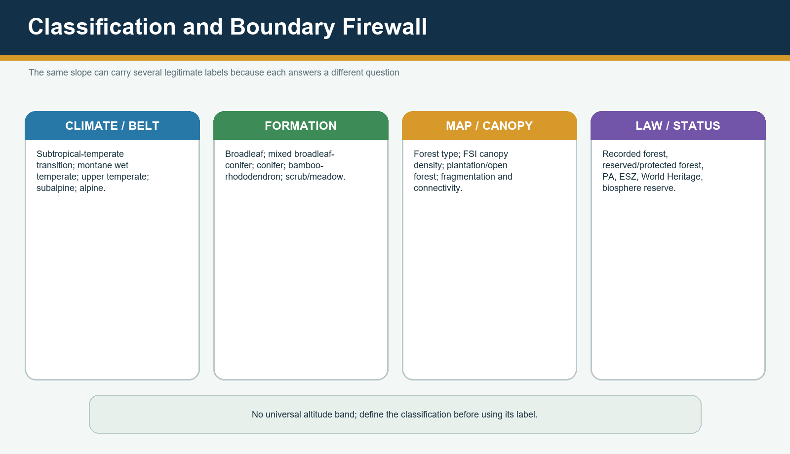

*Classification firewall separating belts, formations, canopy maps and legal status.*

Temperate forest here is an altitude-created thermal-ecological belt with a cool-season constraint. Nomenclature varies among Champion-Seth forest types, geography textbooks, ecological field studies and management plans. A strong answer defines its operational label before using it.

| Term | Working definition | Boundary caution |
|---|---|---|
| Subtropical-temperate transition | Overlap where lower warm broadleaf or pine gives way to cool montane forest | Not a fixed contour |
| Montane wet temperate / broadleaf | Cool humid broadleaf forest, often evergreen-rich in the east | Textbook and Champion-Seth usage may not map one-to-one |
| Mixed broadleaf-conifer | Stand or landscape mosaic containing both functional groups | Mixed can describe a plot or a wider patchwork |
| Temperate conifer | Hemlock, fir, spruce or other conifers where the local moisture-temperature niche fits | Do not transplant the western deodar-kail sequence |
| Subalpine | Upper forest/woodland near treeline, often stunted or patchy | Not identical to alpine scrub |
| Alpine | Above climatic treeline: scrub, meadow, scree, rock and snow mosaics | Meadow is not forest |

### Core learning

- Forest line, treeline, species line, timberline, snowline, equilibrium-line altitude and glacier snout answer different questions.
- Geography-text altitude envelopes are indicative, not universal rules.
- Champion-Seth types, forest working-plan types and field associations may use different resolutions.
- FSI 'open forest' is a canopy-density class, not a synonym for degraded eastern temperate broadleaf forest.
- World Heritage, biosphere reserve, national park, sanctuary and ESZ are different designations or legal layers.

> **Memory hook:** LABEL -> DEFINITION -> SCALE -> LIMIT. Never let one classification answer another classification's question.

### Must-know facts

- Use relative terms: lower transition, middle temperate, upper temperate, subalpine ecotone and alpine.
- Define 'timberline' if used because literature varies.

### UPSC traps

- **Wrong:** Temperate begins at the same altitude everywhere. **Correct:** Limits shift by latitude, slope, cloud, snow, drainage and disturbance.
- **Wrong:** Montane wet temperate means all such soils are wet and podzolic. **Correct:** Formation label does not determine every soil property.

### Mains / answer route

Begin a 10-marker with the classification firewall; it prevents most species, altitude and data errors.

### Study link

Link Topic 22 forest-type firewall and Topic 23 treeline vocabulary.

---

## 5. 3. Physical-Climatic Controls

> **PRE-TEACH CHECKLIST**  
> **Book context:** Topics 13, 14, 16, 21-23 and Advanced 24 queried.  
> **CA Search:** `IMD eastern Himalaya Sikkim extreme rainfall cloud 2026 official`  
> **CA Found:** IMD 27-06-2026 forecast retained as weather-status evidence, not forest or climate attribution.  

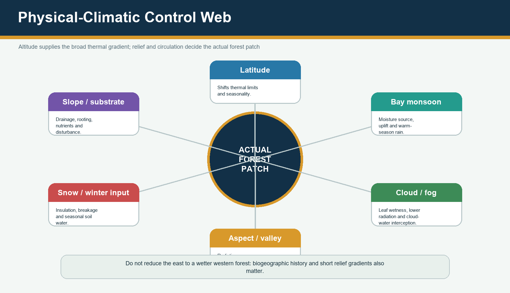

*Control web showing why altitude alone cannot predict an Eastern Himalayan forest patch.*

The eastern forest mosaic is produced by nested controls. Altitude and latitude set the broad thermal envelope; the Bay monsoon, cloud, valley orientation, aspect, rain shadow, winter precipitation, snow, substrate and disturbance decide actual composition and regeneration.

| Control | Mechanism | Forest effect |
|---|---|---|
| Extreme relief | Large height change over short distance | Compressed belts, sharp turnover and short catchment response |
| Bay monsoon | Moist inflow plus terrain uplift | Summer rain, cloud and windward-leeward contrast |
| Cloud/fog | Immersion changes radiation, leaf wetness and water exchange | Epiphytes, moss, slower drying and disease risk |
| Aspect / valley orientation | Radiation, ventilation, funnelled wind and cold-air drainage | Opposing slopes and valley floors differ |
| Inner valleys / rain shadow | Moisture loss and partial continentality | Drier patches within the humid regional image |
| Winter input / snow | Insulation, breakage, soil-water timing | Upper-belt phenology and regeneration filters |
| Substrate / disturbance | Rooting, nutrients, drainage and reset | Patch history can override climatic potential |

### Core learning

- Persistent cloud can cool a ridge while a sheltered valley at similar elevation is warmer and drier.
- A rain gauge measures falling precipitation, not all cloud-water interception.
- Winter snow remains ecologically relevant in the upper east, even though western disturbances are a stronger western-Himalaya control.
- Short horizontal gradients create high beta diversity: neighbouring valleys may not share the same species order.
- Biogeographic connection toward China, Tibet and Southeast Asia influences the species pool available to the climatic filter.

### Must-know facts

- The best causal order is regional circulation -> range exposure -> topoclimate -> soil/disturbance -> vegetation.
- Eastern does not mean uniformly windward or uniformly wetter.

### UPSC traps

- **Wrong:** Eastern Himalaya is simply the Western Himalaya with more rainfall. **Correct:** Add cloud, relief compression, biogeographic turnover and distinct disturbance history.
- **Wrong:** More altitude always means more rainfall. **Correct:** Rain can peak and then decline in sheltered or moisture-depleted sectors.

### Mains / answer route

Use a nested-control diagram and qualify every altitude claim with sector, slope and exposure.

### Study link

Link monsoon mechanism, climatic regions, western disturbances, glaciers/snow and physiography.

---

## 6. 4. Sector Comparison: Darjeeling-Sikkim to Eastern Arunachal

> **PRE-TEACH CHECKLIST**  
> **Book context:** Advanced 24, Topics 21-23 and regional-case owners queried.  
> **CA Search:** `official Sikkim Arunachal forest protected area road 2026`  
> **CA Found:** NHIDCL and GSI date-bound cases used only for their named corridors/sites.  

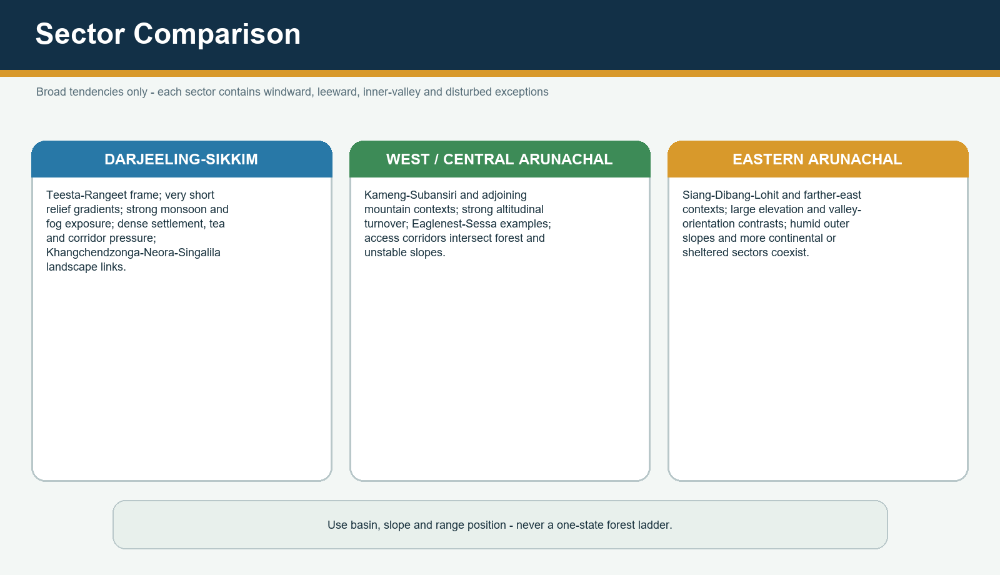

*Three-sector comparison with basin and access cues.*

Sector comparison should use the same dimensions - relief, monsoon exposure, valley orientation, continentality, species pool, access and disturbance - rather than listing states independently.

| Dimension | Darjeeling-Sikkim | West/central Arunachal | Eastern Arunachal |
|---|---|---|---|
| Basin cues | Teesta-Rangeet and tributary valleys | Kameng/Subansiri and adjoining basins | Siang-Dibang-Lohit and farther-east valleys |
| Monsoon / cloud | Strong exposure; fog-prone ridges; local inner-valley contrasts | Strong relief-controlled exposure; deep valleys | Humid outer/eastern influence with sheltered and more continental sectors |
| Biogeography | Sino-Himalayan and Darjeeling-Sikkim floristic richness | High turnover; Eaglenest-Sessa gradients | Strong eastward affinities and very broad gradients |
| Access pressure | Dense corridor, tourism, tea/settlement and NH-10 vulnerability | Long mountain roads and border access | Remote valleys, new connectivity and cumulative basin concerns |
| Case discipline | Khangchendzonga, Neora, Singalila - temperate portions only | Eaglenest/Sessa - bounded elevation and habitat use | Dibang/Namdapha - do not describe entire multi-elevation landscapes as temperate |

### Core learning

- Darjeeling-Sikkim has concentrated settlement and corridor exposure, but its inner valleys and high ridges differ markedly.
- West/central Arunachal contains strong subtropical-to-alpine compression and important bird/orchid/forest cases.
- Eastern Arunachal cannot be treated as a single wetter endpoint; valley orientation and proximity to Tibetan/Myanmar-facing influences matter.
- Access changes the disturbance regime by creating edges, drainage interception, extraction routes and invasive pathways.
- Protected-area examples must specify whether the cited evidence concerns the temperate portion or the full elevational landscape.

### Must-know facts

- Compare like with like: same dimension across all sectors.
- Use basins as spatial anchors, not as universal vegetation boundaries.

### UPSC traps

- **Wrong:** Arunachal Pradesh has one forest ladder. **Correct:** Use west/central/east and valley-specific variation.
- **Wrong:** Namdapha or Khangchendzonga is entirely temperate. **Correct:** Both span multiple elevation belts.

### Mains / answer route

A three-column sector table plus one schematic map provides high value in GS-I regional-geography answers.

### Study link

Link drainage, Northeast connectivity and regional protected landscapes.

---

## 7. 5. Altitudinal Zonation without a Universal Ladder

> **PRE-TEACH CHECKLIST**  
> **Book context:** Topics 22-23 and Majid source-era envelopes queried.  
> **CA Search:** `official Khangchendzonga altitudinal vegetation zones`  
> **CA Found:** UNESCO supports a broad vertical sweep but not a universal species-by-metre key.  

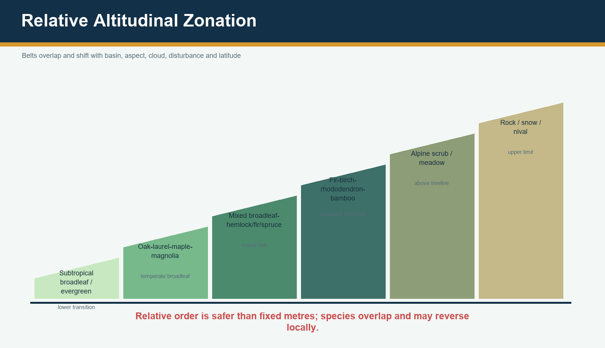

*Relative Eastern Himalayan zonation; exact limits move by sector and slope.*

The safest broad sequence is lower subtropical broadleaf/evergreen -> temperate oak-laurel-maple-magnolia -> mixed broadleaf-conifer -> upper fir/hemlock/spruce where suitable -> rhododendron-bamboo-birch/fir subalpine -> alpine scrub/meadow. Every arrow permits overlap, inversion and disturbance gaps.

| Relative belt | Structural tendency | Movement controls |
|---|---|---|
| Lower transition | Subtropical evergreen/semi-evergreen and broadleaf mixtures | Latitude, valley warmth, exposure and land use |
| Middle temperate | Evergreen/deciduous broadleaf; oak-laurel-maple-magnolia | Cloud, aspect, soil and disturbance |
| Mixed temperate | Broadleaf with hemlock/fir/spruce or regional conifers | Moisture, seed source and gap history |
| Upper forest / subalpine | Fir, birch, rhododendron, bamboo and stunted woody mosaics | Snow, wind, grazing and treeline processes |
| Alpine | Scrub, meadow, scree and snowbed mosaics | Treeline, snow duration, substrate and exposure |

### Core learning

- Cold-air drainage can place a frost pocket below a warmer mid-slope.
- South-facing slopes often receive greater solar energy, but monsoon cloud and windward exposure can modify the default.
- Landslides and avalanche tracks maintain herb-shrub corridors inside a forest belt.
- Former cultivation, fire, grazing and road edges can create lower-seral vegetation at the 'correct' climatic altitude.
- Species ranges overlap; one species can occur across more than one named belt.

### Must-know facts

- Relative order is more defensible than exact metres.
- Treeline is a patchy ecotone, not a contour copied from a textbook.

### UPSC traps

- **Wrong:** Above 3,000 m, forest ends everywhere. **Correct:** State that altitude is site- and definition-dependent.
- **Wrong:** Subalpine equals alpine meadow. **Correct:** Subalpine remains a woody upper-forest transition.

### Mains / answer route

Draw the transect, then write the six controls that move its boundaries.

### Study link

Link Topic 23 subalpine-alpine belt and Topic 22 broad Himalayan comparison.

---

## 8. 6. Flora: Composition, Roles and Range Discipline

> **PRE-TEACH CHECKLIST**  
> **Book context:** Topic 22 eastern zonation and BSI official flora queried.  
> **CA Search:** `BSI rhododendrons Sikkim Darjeeling official`  
> **CA Found:** BSI illustrated account provides a verified regional taxonomic anchor.  

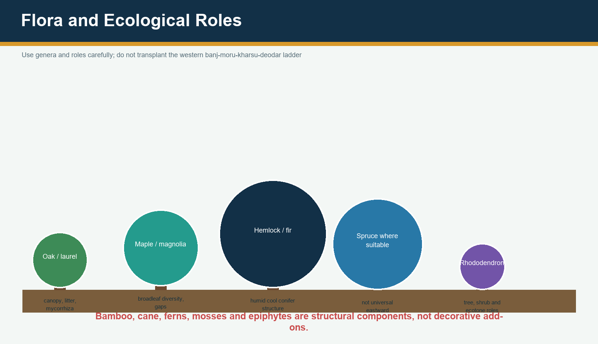

*Original forest-profile visual showing functional roles rather than a universal species ladder.*

> **CURRENT LINK:** FACT (BSI; retrieved 19-08-2026): the illustrated Sikkim-Darjeeling account treats 45 rhododendron taxa. LIMIT: a regional flora does not assign every taxon to every slope.

Eastern temperate forest is floristically distinct. Multiple oaks, laurels, maples and magnolia relatives combine with Himalayan hemlock, East Himalayan fir, spruce where suitable, rhododendrons, bamboo/cane, ferns, mosses and epiphytes. The western banj-moru-kharsu-deodar sequence must not be copied eastward.

| Floral group | Safe ecological role | Caution |
|---|---|---|
| Oaks (multiple Quercus spp.) | Canopy, litter, mycorrhiza and habitat | Do not use only western common-name sequence |
| Laurels / maples / magnolias | Humid broadleaf diversity, gaps and food-web support | Species vary strongly by sector |
| Himalayan hemlock (Tsuga dumosa) | Humid cool montane conifer component | Not present on every slope |
| East Himalayan fir (Abies densa) | Upper temperate/subalpine in suitable eastern settings | Not a universal upper boundary |
| Spruce | Suitable cool-moist valleys/slopes where locally present | Do not force it into every eastern ladder |
| Rhododendrons | Trees/shrubs across temperate-subalpine-alpine transitions | High diversity does not mean identical range |
| Bamboo/cane, ferns, moss, epiphytes | Understorey, habitat, moisture and nutrient functions | Species and response to gaps/flowering differ |

### Core learning

- Evergreen broadleaf does not automatically mean tropical rainforest; altitude can produce cool evergreen temperate forest.
- Hemlock and fir often indicate humid cool conditions, but local dominance depends on seed source, disturbance and soil.
- Rhododendrons may be canopy trees, understorey shrubs or krummholz-like forms depending on species and belt.
- Epiphytes use trees as substrate; they are not automatically parasites.
- Mosses and coarse woody debris retain moisture and create microsites for fungi and regeneration.
- BSI's Sikkim-Darjeeling rhododendron account documents 45 taxa and demonstrates the need for flora-based range claims.

### Must-know facts

- Use scientific names only where verified and useful; genera plus role are often safer.
- Bamboo and cane are not one species or one ecological strategy.

### UPSC traps

- **Wrong:** Deodar is the defining Eastern Himalayan temperate conifer. **Correct:** Use hemlock, East Himalayan fir and regional mixtures; deodar is primarily western.
- **Wrong:** All rhododendrons occur above treeline. **Correct:** They span tree, shrub and alpine forms.

### Mains / answer route

A flora answer earns marks when it links named groups to structure, biogeography and ecological function, then qualifies range.

### Study link

BSI flora and herbarium work; Geography 15 evergreen forests; Topic 22 temperate forests.

---

## 9. 7. Cloud and Fog Ecology

> **PRE-TEACH CHECKLIST**  
> **Book context:** Topics 16, 21-22 and cloud/forest owners queried.  
> **CA Search:** `official Eastern Himalaya cloud fog forest climate 2026`  
> **CA Found:** No date-stamped official cloud-base trend suitable for a region-wide claim was found; mechanism taught without forced trend.  

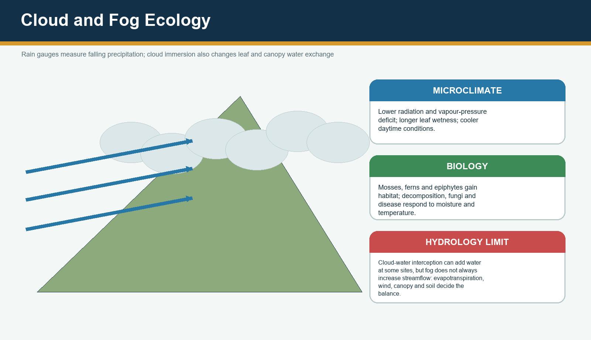

*Mechanism visual: moist flow, cloud immersion, canopy exchange and the hydrological limit.*

Cloud immersion is both a climatic and ecological process. It may add intercepted cloud water, reduce solar radiation and vapour-pressure deficit, prolong leaf wetness, cool the canopy and create habitat for epiphytes and mosses. The direction of streamflow response remains site-specific.

| Process | Likely effect | Qualification |
|---|---|---|
| Horizontal precipitation | Wind-driven droplets intercepted by canopy | Requires cloud/fog, wind and suitable leaf/branch surfaces |
| Reduced radiation | Lower daytime heating and evaporative demand | Can also reduce photosynthetic energy |
| Lower VPD | Reduced atmospheric drying stress | Leaf wetness and disease may increase |
| Epiphyte/moss habitat | High surface moisture and canopy complexity | Sensitive to disturbance and cloud-base change |
| Decomposition | Moisture promotes microbes; cool temperature can slow rates | Net effect depends on temperature, oxygen and litter |
| Catchment water | Can supplement water input and alter timing | Evapotranspiration and canopy interception may offset gains |

### Core learning

- Fog frequency, duration, height and season matter; annual rainfall alone cannot represent immersion.
- Cloud-base change can alter which ridges remain immersed, but a regional claim needs site/period evidence.
- Persistent leaf wetness may aid epiphytes while increasing fungal disease in managed stands or crops.
- Reduced radiation can cool and moisten a site but also constrain energy and photosynthesis.
- Canopy structure and wind determine interception efficiency.

### Must-know facts

- Rainfall gauge data and fog/cloud-water data are different measurements.
- Cloud forest is a process-defined environment, not any forest photographed in mist.

### UPSC traps

- **Wrong:** Fog always increases streamflow. **Correct:** State the full water balance and site dependence.
- **Wrong:** High humidity means no plant water stress. **Correct:** Soil drought, wind and rooting limits can coexist with humid air.

### Mains / answer route

Use the chain: immersion -> radiation/VPD/leaf wetness -> epiphytes/decomposition/disease -> hydrology, followed by the water-balance limit.

### Study link

Link monsoon, weather elements, cloud microphysics and ecosystem processes.

---

## 10. 8. Soils and Nutrient Cycling

> **PRE-TEACH CHECKLIST**  
> **Book context:** Topic 22 soil/humus section and Geography 04 weathering-landslide owner queried.  
> **CA Search:** `official Eastern Himalaya soil carbon landslide forest GBPNIHE`  
> **CA Found:** GBPNIHE institutional work supports site-specific soil-ecosystem research; no universal 2026 soil trend claimed.  

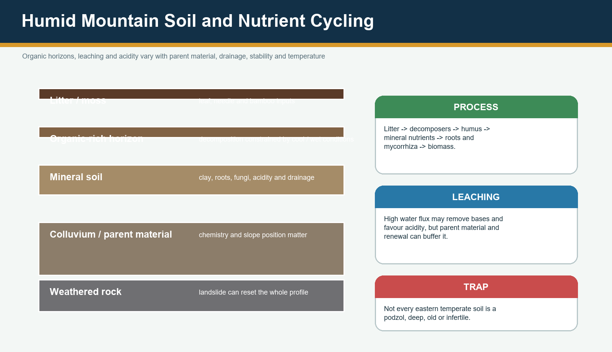

*Soil profile and nutrient-cycle schematic with a landslide-reset boundary.*

Humid mountain soils reflect slope position, parent material, drainage, vegetation, temperature, organic inputs, erosion and landslide renewal. High rainfall can favour leaching and acidity, but not every Eastern Himalayan temperate soil is a podzol, deep profile or infertile substrate.

| Control | Soil response | Exam limit |
|---|---|---|
| Cool/wet conditions | Organic accumulation and sometimes slower decomposition | Warm seasons and active biota can still produce rapid turnover |
| Leaching | Base loss and acidity where water flux, drainage and time favour it | Parent material can buffer acidity |
| Slope position | Ridges thin/dry; hollows deeper/moister; footslopes receive colluvium | Local drainage can reverse simple expectations |
| Landslide / stream reset | Young mineral surfaces and truncated horizons | Disturbed soil is not merely 'poor old forest soil' |
| Vegetation and fungi | Litter quality, mycorrhiza and nutrient uptake alter cycling | Canopy type alone cannot diagnose humus form |

### Core learning

- Nutrients may be stored in biomass and organic horizons even where mineral soil is leached.
- Mor, moder and mull are humus-process categories, not automatic conifer/broadleaf labels.
- Road drainage can concentrate runoff and export soil and nutrients through gullies.
- Repeated litter removal, burning and heavy browsing may reduce nutrient return.
- Landslide succession starts with substrate stability, organic accumulation and seed arrival, not a fixed species sequence.

### Must-know facts

- Soil fertility is crop- and species-specific, not a single adjective.
- Name parent material, slope position and drainage when using a soil example.

### UPSC traps

- **Wrong:** All humid conifer soils are podzols. **Correct:** Podzolisation needs suitable litter, water flux, drainage, parent material, time and stability.
- **Wrong:** High rainfall always creates deep soil. **Correct:** Erosion and landslides can repeatedly remove profiles.

### Mains / answer route

A good soil paragraph follows inputs -> transformation -> storage -> export/reset -> vegetation feedback.

### Study link

Link weathering, mass movement, groundwater, climatic regions and forest dynamics.

---

## 11. 9. Forest Structure, Gaps and Multiple Pathways

> **PRE-TEACH CHECKLIST**  
> **Book context:** Topic 22 gap dynamics and Ecology succession owners queried.  
> **CA Search:** `official Eastern Himalaya forest regeneration bamboo disturbance research`  
> **CA Found:** Institutional research mandates identified; no single plot result generalised.  

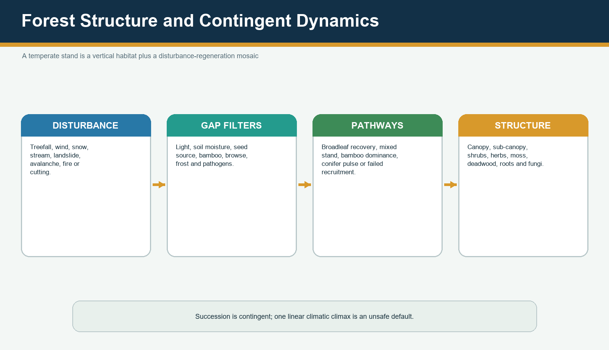

*Disturbance-gap-regeneration flow showing several possible pathways.*

A mature temperate forest is vertically layered and patchy. Canopy, sub-canopy, bamboo/shrub/herb layers, moss, litter, roots, fungi, standing deadwood and fallen logs interact. Gaps created by wind, snow, streams, treefall and landslides generate contingent regeneration pathways.

| Structural unit | Function | Management caution |
|---|---|---|
| Large old trees / cavities | Nesting, microclimate, carbon and continuity | Canopy density alone does not reveal age structure |
| Deadwood | Fungi, insects, nurse logs, moisture and nutrients | Hazardous fuel near assets differs from interior habitat wood |
| Gap mosaic | Light and regeneration opportunities | Gap size and seed source change outcomes |
| Bamboo / shrub layer | Cover, food, competition and post-gap response | Dense bamboo may aid fauna yet suppress tree recruits |
| Seedlings / saplings | Future composition | Browse and repeated disturbance can decouple canopy from recovery |

### Core learning

- Treefall may favour shade-intolerant species in large gaps and advance regeneration in smaller gaps.
- Windthrow and wet-snow breakage create coarse woody debris and patch heterogeneity.
- Landslide scars can follow primary-succession-like soil building; abandoned fields follow secondary succession.
- Browsing, bamboo competition, pathogens and seed limitation can arrest recovery.
- Repeated disturbance can maintain a persistent bamboo, shrub, grass or open state.
- One 'climax forest' is an unsafe description for a disturbance-rich mountain landscape.

### Must-know facts

- Measure vertical structure, deadwood and regeneration - not canopy cover alone.
- Succession is contingent on history and filters.

### UPSC traps

- **Wrong:** Every gap naturally returns to the same forest. **Correct:** Seed, soil, browse, bamboo, fire and chance produce multiple pathways.
- **Wrong:** Deadwood is always waste or fuel. **Correct:** It is also habitat and nutrient structure; manage by location and risk.

### Mains / answer route

Use the DPSIR logic: disturbance -> gap state -> filters -> pathway -> monitored condition.

### Study link

Link ecological succession, forest condition and restoration.

---

## 12. 10. Bamboo Ecology, Flowering and Fauna Links

> **PRE-TEACH CHECKLIST**  
> **Book context:** Topics 21-23, Environment forest-rights owner and RFRI material queried.  
> **CA Search:** `site:rfri.icfre.gov.in bamboo livelihood training 2026`  
> **CA Found:** 16 February 2026 official bulletin retained.  

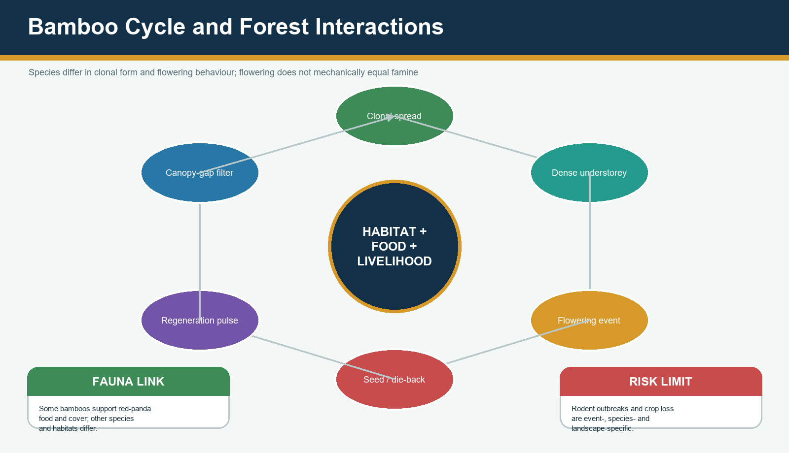

*Bamboo cycle showing clonal spread, flowering, die-back and regeneration filters.*

> **CURRENT LINK:** STATUS (ICFRE-RFRI, 16-02-2026; retrieved 19-08-2026): CAMPA-sponsored training addressed bamboo resource development and livelihoods. LIMIT: training output is not forest-condition outcome.

Bamboo is an understorey, gap coloniser, habitat component, livelihood resource and, for some species and landscapes, an essential red-panda food/cover element. Species differ in clonal spread, culm form, flowering periodicity and post-flowering response.

| Dimension | Role | Qualification |
|---|---|---|
| Understorey | Cover, forage, soil protection and regeneration competition | Density and species matter |
| Clonal spread | Rapid occupation of gaps and disturbed patches | Can inhibit or facilitate tree regeneration |
| Flowering / die-back | Seed pulse, canopy opening and nutrient/debris change | Not all species flower together or at the same interval |
| Fauna | Food and cover for red panda in suitable range; habitat for other taxa | Bamboo presence alone does not prove red-panda occupancy |
| Livelihood | Construction, crafts, edible shoots and income | Harvest rules, tenure, processing and regeneration decide sustainability |

### Core learning

- Gregarious flowering can produce abundant seed and extensive culm death in some species, but flowering behaviour differs.
- Rodent responses and crop losses require event- and landscape-specific evidence.
- Post-flowering dead biomass may alter fuel and nutrient conditions.
- Tree regeneration after die-back depends on seed source, browsing, light and subsequent bamboo recruitment.
- Bamboo management should distinguish natural understorey habitat from plantation and industrial supply.
- RFRI's 16 February 2026 training shows current institutional attention to propagation and livelihoods, not proven ecological outcomes.

### Must-know facts

- Bamboo is minor forest produce under the FRA framework.
- Do not conflate all species, cycles or famine narratives.

### UPSC traps

- **Wrong:** Every bamboo flowering causes famine. **Correct:** State species, event, seed/rodent response, crop exposure and evidence.
- **Wrong:** Bamboo dominance is always degradation. **Correct:** It may be natural, disturbance-linked, transitional or persistent; diagnose.

### Mains / answer route

Balance ecology, fauna, disturbance, livelihood and tenure; finish with species-specific monitoring.

### Study link

RFRI/FRC-BR; FRA; red-panda habitat; forest-gap dynamics.

---

## 13. 11. Biodiversity, Biogeography and Range-Safe Fauna

> **PRE-TEACH CHECKLIST**  
> **Book context:** Topics 22-23 and Environment biodiversity/species owners queried.  
> **CA Search:** `official Eastern Himalaya red panda hoolock orchid biodiversity 2026`  
> **CA Found:** Official/local 2026 provisional PYQs and stable government biodiversity sources retained with range caveats.  

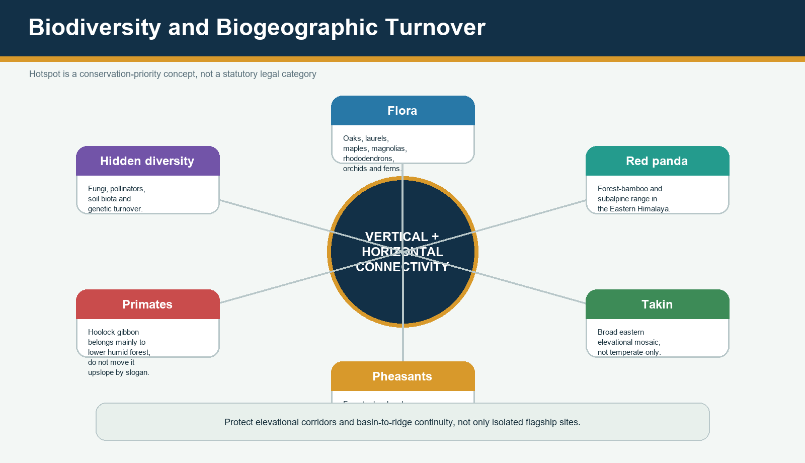

*Corridor visual linking floristic turnover, fauna and hidden biodiversity.*

The Eastern Himalaya is a global biodiversity-hotspot region with high species turnover and endemism. Hotspot is a conservation-priority concept; it is not a legal protected-area category. Faunal examples must be tied to actual range, elevation, habitat structure and seasonal movement.

| Taxon / group | Safe use | Avoid |
|---|---|---|
| Red panda | Eastern Himalayan temperate/subalpine forest with suitable bamboo and connectivity | Generic western or open-alpine indicator |
| Takin | Broad eastern elevational mosaic and seasonal movement | Temperate-forest-only animal |
| Clouded leopard | Lower/middle humid forest mosaics where range supports it | Proof of upper temperate old growth |
| Hoolock gibbon | Primarily lower humid forest canopy and connectivity | Moving it into upper temperate forest because it is a Northeast species |
| Pheasants | Species-specific forest, edge, bamboo and alpine use | One habitat for all pheasants |
| Medicinal plants | Range-specific in situ conservation plus sustainable use | Publishing sensitive micro-locations |

### Core learning

- Eastward floristic affinity toward Sino-Himalayan and Indo-Burmese regions enriches the available species pool.
- High beta diversity means conservation must protect turnover across elevation and valley systems, not only local richness.
- Flagship mammals cannot substitute for fungi, invertebrates, pollinators, epiphytes and soil biota.
- Climate refugia require stable microclimates and connectivity, not simply high elevation.
- Protected areas may secure cores while roads, farms and settlements determine matrix permeability.
- The 2026 provisional UPSC hoolock-gibbon and foxtail-orchid questions reinforce range and statement-level discipline.

### Must-know facts

- Red panda is bamboo-associated but not bamboo-presence-equivalent.
- Hotspot designation does not itself create Indian legal protection.

### UPSC traps

- **Wrong:** Every Northeast flagship is an Eastern Himalayan temperate species. **Correct:** Check range, elevation and habitat.
- **Wrong:** Protected area notification guarantees connectivity. **Correct:** Corridors often cross the surrounding matrix.

### Mains / answer route

Use composition -> turnover -> corridor -> threat -> legal/monitoring framework.

### Study link

BSI, ZSI, WII/state fauna; biodiversity-hotspot and corridor concepts.

---

## 14. 12. Ecosystem Services and Physical Limits

> **PRE-TEACH CHECKLIST**  
> **Book context:** Topic 22 ecosystem-service section and Ecology owners queried.  
> **CA Search:** `official Himalayan ecosystem services forest restoration India`  
> **CA Found:** Stable official frameworks used; no unsupported monetary valuation inserted.  

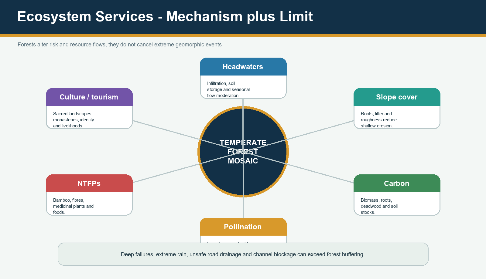

*Service wheel pairing forest functions with a physical-limit statement.*

Temperate forests support headwater regulation, erosion control, carbon storage, pollination, NTFPs, cultural landscapes, tourism and climate refugia. Each service must be expressed as a mechanism with a scale and limit.

| Service | Mechanism | Limit |
|---|---|---|
| Headwaters | Litter/soil storage, infiltration and slower pathways | Extreme rain and saturated slopes can produce rapid runoff |
| Slope stability | Roots reinforce shallow soil; cover reduces splash and surface erosion | Deep-seated failures, bedrock and unsafe cuts can dominate |
| Carbon | Biomass, roots, soil and deadwood | Landslide, fire and logging redistribute or release carbon |
| Pollination | Forest nesting/forage and seasonal floral resources | Crop and wild-pollinator responses vary |
| NTFPs | Bamboo, fibre, foods and medicinal plants | Commercial demand can exceed regeneration |
| Culture / tourism | Sacred forests, monasteries, identity and landscape value | Visitor, waste, water and road pressure can undermine the service |

### Core learning

- Forests can alter timing and pathways of water but do not manufacture rainfall or eliminate basin floods.
- Cloud forests may be hydrologically important at specific sites; streamflow claims need measurement.
- Old forests hold structural, soil and genetic values that plantations do not rapidly recreate.
- Sacred and cultural protection can conserve patches, but outcomes depend on social continuity and external pressure.
- Tourism can finance livelihoods and conservation while increasing construction, traffic, waste and disturbance.

### Must-know facts

- Always pair service with limit.
- Different services can trade off: denser canopy, water yield, forage, fire and habitat do not move together automatically.

### UPSC traps

- **Wrong:** Forest prevents every flood and landslide. **Correct:** State the shallow-process benefit and extreme/deep-process limit.
- **Wrong:** More plantation equals equivalent ecosystem services. **Correct:** Composition, age, soil, structure and location matter.

### Mains / answer route

Use mechanism -> named example -> limit -> monitoring indicator.

### Study link

Link ecosystem processes, hydrology, carbon and mountain hazards.

---

## 15. 13. Human Geography, Community Institutions and Jhum

> **PRE-TEACH CHECKLIST**  
> **Book context:** Topic 21 jhum/fallow logic, social-geography and FRA owners queried.  
> **CA Search:** `official Arunachal jhum agroforestry community 2026`  
> **CA Found:** Current examples remain case-specific; no universal transition prescription used.  

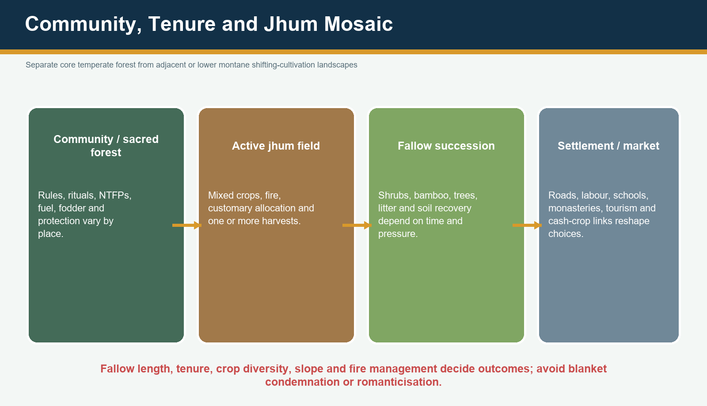

*Landscape mosaic distinguishing community forest, active jhum, fallow and settlement-market links.*

Eastern Himalayan landscapes are inhabited and governed through diverse indigenous, village, monastic, state and statutory institutions. Fuel, fodder, timber, grazing, bamboo, medicinal plants, sacred sites and tourism cannot be discussed through one homogenised 'tribal community' model.

| Dimension | Balanced treatment | Evidence needed |
|---|---|---|
| Community forest | Rules can support stewardship or exclude users; institutions differ | Tenure, rules, equity, pressure and ecological indicators |
| Sacred/monastic landscape | Cultural values may protect forest and species | Actual boundary, practice and continuity |
| Grazing / collection | Effects depend on season, intensity and regeneration | Browse, trails, extraction and livelihood dependence |
| FRA | Rights and conservation duties; applicability/recognition verified locally | Claim status and implementation, not Act text alone |
| Jhum | Customary tenure, mixed crops, fire and fallow succession | Fallow length, slope, crop diversity, fire escape and consent |

### Core learning

- Jhum is more common in adjacent/lower montane belts than in the core of every temperate forest; spatially distinguish the two.
- Longer fallow allows biomass, roots, litter and nutrient cycles to recover; shortened fallow can reduce recovery.
- Mixed cropping spreads food and weather risk and may carry cultural value.
- Blanket bans can displace pressure or undermine tenure; blanket praise can ignore short-fallow erosion and fire escape.
- Transitions to horticulture, agroforestry or settled farming must be consent-based and suitable to slope, soil, markets and culture.
- Gendered access and knowledge may shape NTFP collection and benefit distribution.

### Must-know facts

- FRA rights, claim recognition, operational access and ecological outcome are distinct.
- Do not call all Eastern Himalayan communities identical or all shifting cultivation unsustainable.

### UPSC traps

- **Wrong:** Jhum is the cause of all Eastern Himalayan forest loss. **Correct:** Compare tenure, fallow, roads, logging, plantations, infrastructure and fire.
- **Wrong:** Community presence guarantees conservation. **Correct:** Institutions, equity, capacity and pressure determine outcome.

### Mains / answer route

Answer through tenure -> use -> ecological threshold -> livelihood -> rights -> monitoring.

### Study link

Link Geography 21 jhum, cultural geography, FRA and biodiversity governance.

---

## 16. 14. Roads, Hydropower and Cumulative Basin Effects

> **PRE-TEACH CHECKLIST**  
> **Book context:** Topics 04, 05, 21-23 and contemporary-connectivity owner queried.  
> **CA Search:** `site:nhidcl.com Sikkim Arunachal drainage slope protection 2026`  
> **CA Found:** April/July 2026 official procurement material found; only the directly verified Rabongla item used.  

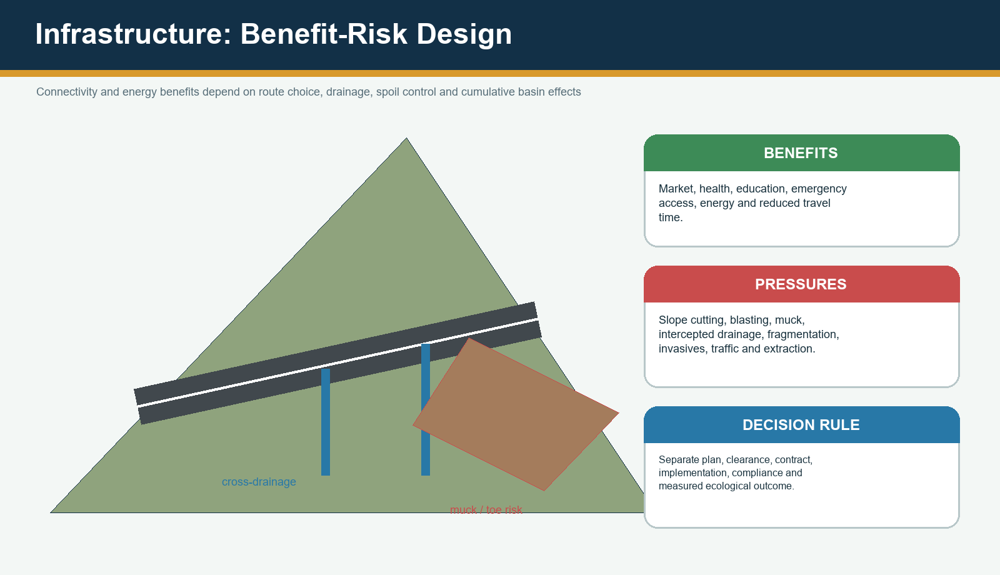

*Road-slope schematic showing drainage, cut, muck and decision-stage distinctions.*

> **CURRENT LINK:** STATUS (NHIDCL, April 2026; retrieved 19-08-2026): Rabongla NH-510 balance work included rectification of roadside-drain damage linked to PHED pipeline work. LIMIT: procurement status is not proof of completion or resilience.

Connectivity and energy can reduce isolation, support services and improve emergency response. In steep humid mountains, however, route cutting, blasting, muck disposal, intercepted drainage, river constriction, fragmentation, traffic and induced development create cumulative slope-basin effects.

| Stage | Question | Do not infer |
|---|---|---|
| Plan / DPR | What alignment, design and alternatives are proposed? | Final construction or performance |
| Clearance | What legal permission and conditions exist? | No impact or compliance |
| Tender / contract | What work has been procured? | Completion or resilience |
| Implementation | Was design built and maintained? | Ecological success |
| Outcome | What changed in slope, drainage, habitat and livelihoods? | Causation without baseline/control |

### Core learning

- Cut slopes remove support and expose weathered/fractured material.
- Roadside drains and culverts are structural risk controls, not minor maintenance details.
- Muck dumped into streams narrows channels, raises sediment load and can redirect flow.
- Road edges increase light, wind, invasives, ignition and access-related extraction.
- Hydropower impacts include diversion, sediment, environmental-flow and construction-corridor effects in addition to forest clearance.
- Cumulative appraisal should consider multiple projects and the entire corridor/basin, not isolated footprints.

### Must-know facts

- NHIDCL April 2026 Rabongla document is a balance-work bid for pavement and roadside-drain damage; it is not an ecological outcome report.
- Benefits and risks should be assessed together rather than through a roads-versus-forest binary.

### UPSC traps

- **Wrong:** A project clearance proves ecological acceptability. **Correct:** Conditions, compliance and measured outcomes remain separate.
- **Wrong:** Bioengineering can stabilise any road cut. **Correct:** Geometry, drainage, material and toe support come first.

### Mains / answer route

Use benefit -> pressure -> state change -> impact -> design/compliance -> measured outcome.

### Study link

NHIDCL, forest clearance, EIA, basin planning and disaster-risk owners.

---

## 17. 15. Landslide, Earthquake and Flash-Flood Hazards

> **PRE-TEACH CHECKLIST**  
> **Book context:** Landslide, seismic, drainage and forest-service owners queried.  
> **CA Search:** `site:bhusanket.gsi.gov.in Arunachal landslide 2026`  
> **CA Found:** Lower Siang preliminary assessment listing found.  

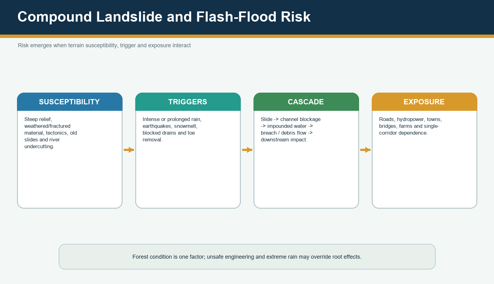

*Compound-risk chain separating susceptibility, trigger, cascade and exposure.*

> **CURRENT LINK:** STATUS (GSI Bhusanket, 2026; retrieved 19-08-2026): preliminary assessment listed for Likabali-Basar Road near Magi Basti, Lower Siang. LIMIT: preliminary site diagnosis is not regional causation.

Eastern Himalayan risk is compound. Steep relief, intense rain, weathering, fractured material, tectonics, river undercutting, road cuts and blocked drainage can interact. A landslide may block a river and create a later breach/debris-flow pathway.

| Component | Examples | Policy implication |
|---|---|---|
| Susceptibility | Steep slopes, weak/weathered material, old slide, faults, river incision | Map before alignment and settlement |
| Trigger | Intense/prolonged rain, earthquake, snowmelt or drainage blockage | Thresholds plus field condition |
| Human modifier | Toe cutting, blasting, surcharge, muck and failed drains | Engineering audit and maintenance |
| Cascade | Slide dam, impoundment, breach, debris flow and bridge/road failure | River-corridor monitoring and evacuation |
| Exposure | Single roads, hydropower works, towns, farms and tourists | Redundancy, closures and land-use planning |

### Core learning

- Rainfall intensity, duration and antecedent wetness all matter.
- Earthquakes can trigger immediate failures or create cracks that later monsoon rain reactivates.
- Forest roots mostly influence shallow soil; deep-seated failures can be controlled by bedrock and groundwater.
- Drain blockage converts a design/maintenance problem into pore-pressure and erosion risk.
- Flash flood, river flood, debris flow and GLOF should not be used interchangeably.
- GSI's 2026 Likabali-Basar preliminary assessment is a site-level status example, not a regional trend.

### Must-know facts

- Risk = hazard x exposure x vulnerability, with capacity reducing consequences.
- A forest-loss explanation alone is incomplete.

### UPSC traps

- **Wrong:** Landslides are caused only by deforestation. **Correct:** Use geology, relief, trigger, drainage, engineering and exposure.
- **Wrong:** Every high-flow event is a GLOF. **Correct:** Confirm source, trigger and flood-wave evidence.

### Mains / answer route

Differentiate susceptibility, trigger, human modifier and exposure; then propose corridor-scale measures.

### Study link

Geography 03 seismic zones, 04 landslides, 06 GLOF and Disaster Management landslide owner.

---

## 18. 16. Climate Change: Observation, Attribution and Projection

> **PRE-TEACH CHECKLIST**  
> **Book context:** Climate regions, monsoon, WD/snow and forest-climate owners queried.  
> **CA Search:** `site:imd.gov.in Sikkim rainfall 2026 site:moes.gov.in Himalayan warming`  
> **CA Found:** IMD dated forecast used; no slope-specific forest attribution inferred.  

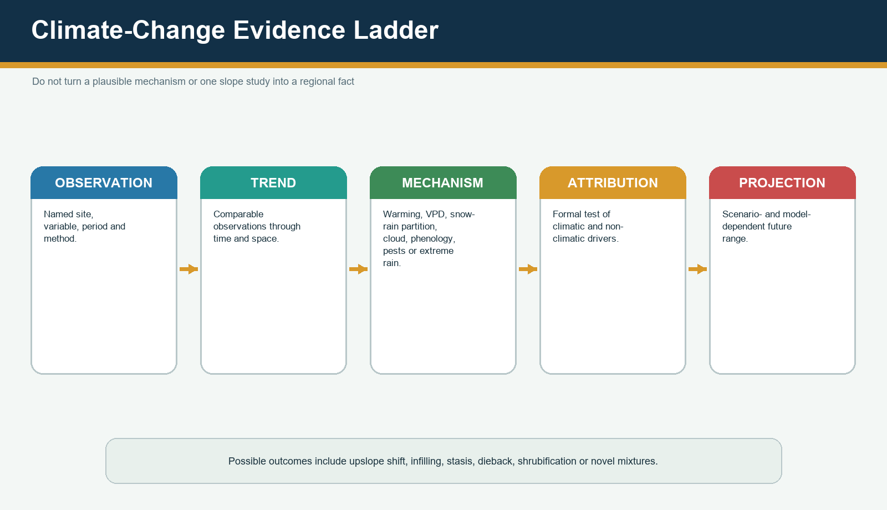

*Evidence ladder separating observation, trend, mechanism, attribution and projection.*

> **CURRENT LINK:** FORECAST (IMD, 27-06-2026; retrieved 19-08-2026): isolated extremely heavy rainfall was forecast over Sub-Himalayan West Bengal-Sikkim during 27-29 June. LIMIT: forecast is not realised impact or attribution.

Plausible climate pathways include warming, altered vapour-pressure deficit, changing cloud/fog immersion, snow-rain partition, phenology, pest/pathogen pressure, upslope recruitment, lower-edge stress, shrubification and heavier rainfall. Each claim must state site, period, variable and method.

| Pathway | Possible response | Evidence caveat |
|---|---|---|
| Warming / VPD | Longer warm season or hydraulic stress | Humidity does not remove soil/rooting constraints |
| Cloud-base / fog change | Shift in immersion, epiphyte habitat and leaf wetness | Requires direct cloud/fog series |
| Snow-to-rain shift | Changed insulation, runoff and spring soil water | Storm type and elevation matter |
| Phenology | Earlier leaf-out/flowering or frost mismatch | Species- and site-specific observation |
| Upslope shift | Recruitment, infilling or composition change | Treeline, forest line and species line differ |
| Extreme rain | Saturation, landslide and disturbance reset | One event is not a climate trend or attribution |

### Core learning

- Warming may increase recruitment in sheltered sites while drought, shallow soil, wind, browsing and seed limitation cause stasis elsewhere.
- Cloud-forest species may face reduced immersion if cloud base rises, but the claim needs measured height/frequency/duration.
- Earlier phenology can expose tissues to late frost or decouple plants and pollinators.
- Pests and pathogens respond to host stress, winter temperature, moisture and surveillance effort.
- An extreme-rain forecast or event is weather evidence; climate attribution needs a formal method.
- One slope, plot or species cannot represent the entire Eastern Himalaya.

### Must-know facts

- Use FACT / STATUS / INFERENCE / LIMIT labels.
- Treeline advance is one possible response, not the automatic response.

### UPSC traps

- **Wrong:** All species are moving uphill. **Correct:** State observed species/site/period and allow stasis, dieback or novel mixtures.
- **Wrong:** A 2026 rainfall warning proves climate change. **Correct:** It proves a dated forecast only.

### Mains / answer route

Write observation -> trend -> mechanism -> attribution -> projection, and stop at the evidence rung reached.

### Study link

IMD/MoES climate evidence; Geography 13-16; Environment climate-science owner.

---

## 19. 17. Forest Data Literacy

> **PRE-TEACH CHECKLIST**  
> **Book context:** Topic 22 ISFR firewall and Environment forest-type owner queried.  
> **CA Search:** `site:fsi.nic.in forest report 2023 methodology canopy density`  
> **CA Found:** ISFR 2023 portal and FSI methodology retained.  

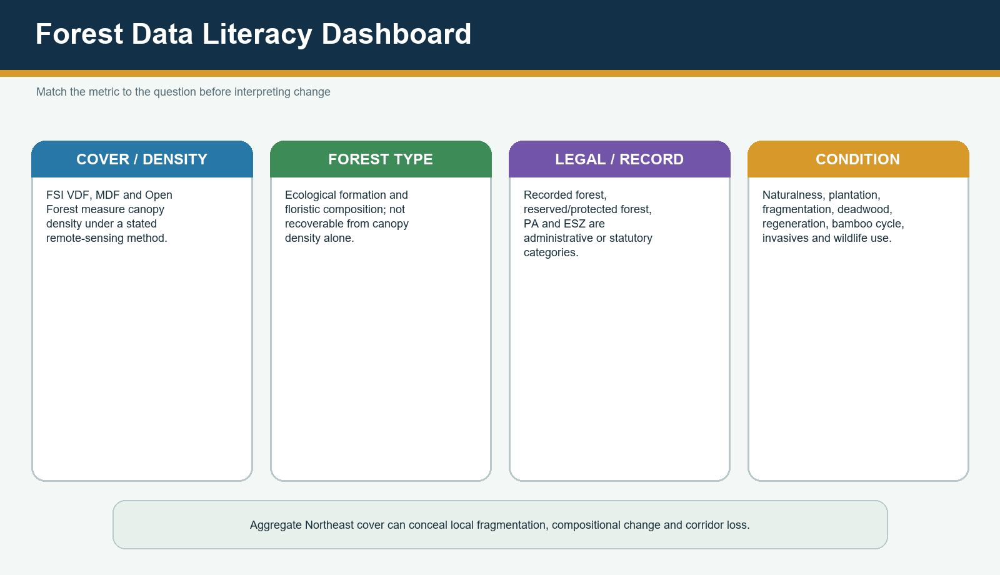

*Dashboard separating canopy, ecological formation, legal record and condition.*

Forest cover, forest type, recorded forest area, plantation, bamboo/open forest, legal status and natural condition are distinct. Aggregate Northeast or state cover can conceal local fragmentation, edge increase and compositional change.

| Metric / map | It can answer | It cannot answer alone |
|---|---|---|
| FSI cover / density | Canopy extent and VDF/MDF/Open Forest under method | Native composition, old growth, rights or regeneration |
| Forest-type map | Broad ecological formation | Current pressure, legal title or field condition |
| Recorded forest area | Administrative land record | Actual canopy or naturalness |
| Plantation / land-use map | Managed tree crop or land-use context | Equivalence to old cloud forest |
| Condition survey | Structure, deadwood, regeneration, browse, invasives and bamboo | State-wide trend without representative design |
| Connectivity analysis | Patch/core/edge and corridor structure | Species movement without occupancy or genetic data |

### Core learning

- FSI Very Dense Forest means canopy density at least 70 percent, not virgin forest.
- Open Forest means 10 to below 40 percent canopy density under the FSI scheme; it is not every natural open habitat.
- Tree cover is distinct from forest cover under FSI methodology.
- A bamboo-rich or plantation patch may enter canopy statistics but differ strongly from native temperate forest condition.
- Time-series comparison must check method, classification and boundary consistency.
- Report-vintage rankings from PYQs should not be transferred to later ISFR editions.

### Must-know facts

- Latest official FSI forest report used here: ISFR 2023.
- Condition dashboard requires canopy + composition + structure + regeneration + connectivity + pressure + rights.

### UPSC traps

- **Wrong:** Rising forest cover proves biodiversity recovery. **Correct:** Check type, naturalness, fragmentation, regeneration and species.
- **Wrong:** Hotspot or PA status appears in FSI density class. **Correct:** Those are different datasets and legal concepts.

### Mains / answer route

Begin any forest-data answer with 'what was measured, at what resolution, under which definition?'

### Study link

FSI ISFR 2023 methodology; forest-type and legal maps; field-condition monitoring.

---

## 20. 18. Governance and Legal Distinctions

> **PRE-TEACH CHECKLIST**  
> **Book context:** Environment forest-rights, CAMPA/GIM and protected-area owners queried.  
> **CA Search:** `India Code forest biodiversity wildlife FRA current title official`  
> **CA Found:** Current statutory titles and institutions verified through official portals; implementation claims kept separate.  

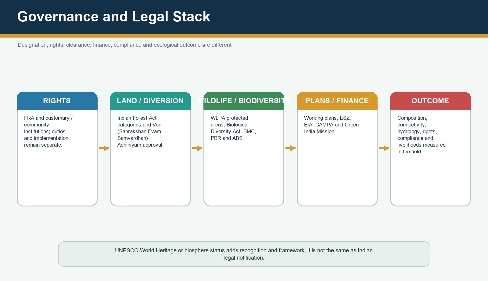

*Legal and institutional stack from rights and diversion to measured outcome.*

Governance is a stack, not one law. The Indian Forest Act categories, current forest-conservation law title, Wildlife (Protection) Act, Biological Diversity Act, FRA, CAMPA, Green India Mission, working plans, ESZs, EIA/clearances, UNESCO recognition and state/community rules serve different purposes.

| Instrument | Core role | Do not equate with |
|---|---|---|
| Indian Forest Act, 1927 | Reserved/protected/village forest and state forest administration | FSI canopy class or PA type |
| Van (Sanrakshan Evam Samvardhan) Adhiniyam, 1980 | Prior approval framework for specified diversion/non-forest use | Ecological suitability or compliance |
| Wild Life (Protection) Act, 1972 | Protected areas, species and wildlife regulation | Forest type or UNESCO status |
| Biological Diversity Act, 2002 | Conservation, sustainable use, BMC/PBR and ABS institutions | Tenure title or PA notification |
| FRA, 2006 | Recognition of eligible individual/community forest rights and duties | Automatic recognition or unrestricted extraction |
| CAMPA / GIM | Finance and landscape-restoration mission | Old-growth equivalence or outcome proof |
| Working plan / ESZ / EIA | Management prescription, surrounding regulation and project appraisal | Measured implementation success |

### Core learning

- The 1980 central forest-conservation law's current title is Van (Sanrakshan Evam Samvardhan) Adhiniyam, 1980.
- Reserved Forest is generally more restrictive than Protected Forest, but state notifications and rules must be checked.
- National park, sanctuary, conservation reserve and community reserve are distinct WLPA categories.
- BMC and PBR support biodiversity governance; a PBR is not an extraction licence or land title.
- FRA right, claim process, recognised title, operational access and ecological outcome must be separately verified.
- A clearance condition is an obligation, not evidence of compliance.
- UNESCO World Heritage and MAB biosphere recognition differ from Indian statutory categories.

### Must-know facts

- Governance mnemonic: Right -> Clearance -> Plan -> Finance -> Compliance -> Outcome.
- Hotspot, World Heritage and biosphere reserve are not interchangeable legal protections.

### UPSC traps

- **Wrong:** CAMPA plantation replaces a diverted old-growth cloud forest. **Correct:** Compensation cannot rapidly recreate structure, soils, fungi and connectivity.
- **Wrong:** FRA removes conservation duties. **Correct:** The Act recognises rights and includes conservation responsibilities.

### Mains / answer route

Separate instrument, authority, stage, implementation and ecological outcome.

### Study link

India Code; MoEFCC; NBA; MoTA; state forest rules and working plans.

---

## 21. 19. Conservation, Restoration and Regional Cases

> **PRE-TEACH CHECKLIST**  
> **Book context:** Topics 22-23 restoration and case sections plus Environment owners queried.  
> **CA Search:** `official Khangchendzonga Neora Eaglenest Sessa forest conservation`  
> **CA Found:** Official profiles provide bounded landscape evidence, not 2026 condition outcomes.  

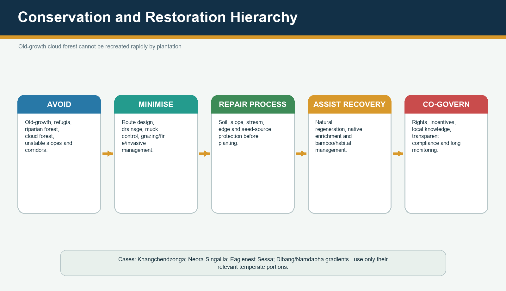

*Restoration hierarchy with bounded regional cases.*

Restoration follows a hierarchy: avoid irreversible loss, minimise pressure, repair slope-water-soil processes, assist native recovery, co-govern with rights holders and monitor for decades. Plantations cannot rapidly recreate old-growth cloud forest.

| Case | Safe use | Boundary |
|---|---|---|
| Khangchendzonga landscape | Full vertical sweep, biodiversity and sacred-cultural landscape | Temperate portion is only one part; UNESCO status is not a field-condition audit |
| Neora Valley / Singalila | Darjeeling-Kalimpong-Sikkim corridor and red-panda/temperate-alpine transitions | Protected landscapes span multiple belts |
| Eaglenest / Sessa | West Kameng gradients, bird/orchid diversity and community/tourism interface | Sessa's lower range and sanctuary objectives differ from upper temperate forest |
| Dibang / Namdapha gradients | Eastern Arunachal vertical connectivity and cumulative development questions | Do not label entire landscapes temperate |

### Core learning

- Avoid conversion of old-growth, moist refugia, riparian forest, cloud-immersed ridges and key corridors.
- Repair drainage, slope geometry, toe support, soil and stream processes before planting.
- Assisted natural regeneration is preferred where seed source, soil and protection remain.
- Native enrichment should be composition- and site-specific; avoid exotic monocultures and wrong-site afforestation.
- Protect bamboo/red-panda habitat without reducing the forest to one flagship species.
- Manage grazing, fire, invasives and harvest through thresholds and co-governance.
- Monitor composition, connectivity, hydrology, livelihoods and project compliance for decades.

### Must-know facts

- Avoidance ranks above offset.
- Restoration success is a trajectory of process and condition, not a sapling count.

### UPSC traps

- **Wrong:** Tree planting is the first restoration step. **Correct:** Diagnose ecosystem, rights, slope and hydrology; protect natural regeneration.
- **Wrong:** Every protected landscape should follow one exclusion model. **Correct:** Legal history, rights, habitat and pressure differ.

### Mains / answer route

Use avoid -> minimise -> repair process -> assist native recovery -> co-govern -> monitor.

### Study link

UNESCO Khangchendzonga; state PA pages; restoration and corridor monitoring.

---

## 22. 20. Monitoring Indicators and Answer Architecture

> **PRE-TEACH CHECKLIST**  
> **Book context:** All Topic 24 and linked owners consolidated.  
> **CA Search:** `current official Eastern Himalaya forest monitoring 2026`  
> **CA Found:** No one dashboard covers all domains; integrated indicator set constructed from official measurement distinctions.  

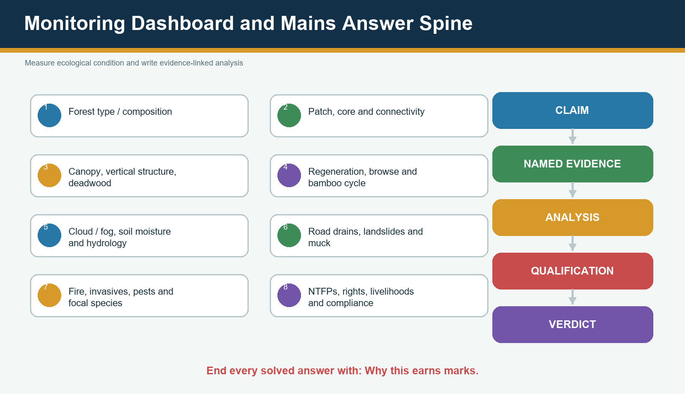

*Integrated monitoring dashboard and claim-evidence-analysis-qualification-verdict spine.*

Monitoring must match the ecological and governance question. A complete dashboard combines forest type/composition, patch/core/connectivity, vertical structure/deadwood, regeneration/browse, bamboo cycle, cloud/fog and soil moisture, road drainage/landslides, fire/invasives/pests, focal species, NTFP extraction, rights/livelihood, compliance and hydrological indicators.

| Domain | Indicators | Interpretation caution |
|---|---|---|
| Landscape | Forest type, patch, core-edge, corridor and elevation/aspect | Connectivity potential is not confirmed movement |
| Structure | Canopy layers, tree-size classes, cavities and deadwood | Density alone misses age and complexity |
| Regeneration | Seedlings/saplings, browse, bamboo cycle and seed source | One year may reflect mast or recruitment pulse |
| Microclimate / soil / water | Fog duration, soil moisture, organic horizon, spring/stream timing | Rain gauge alone is insufficient |
| Hazard / infrastructure | Drain blockage, slope movement, muck, closures and maintenance | Project completion is not performance |
| Biodiversity / use | Occupancy, corridor use, NTFP extraction, rights and livelihood | Flagships do not represent all taxa or equity |

### Core learning

- Write every Mains paragraph as claim -> named evidence/example -> what it proves -> qualification.
- A map or transect should be analytical, showing moisture arrows, sector/basin labels and transition boundaries.
- Use data only after defining metric, date, scale and method.
- A final verdict should be graded: forests reduce some risks and supply services, but cannot cancel extreme geomorphic processes.
- For governance questions, separate designation, legal protection, finance, compliance and outcome.
- For climate questions, separate observation, trend, mechanism, attribution and projection.

### Must-know facts

- Why this earns marks: precise boundary, mechanism, named evidence, qualification and monitorable verdict.
- Best 15-marker skeleton: definition/map -> controls -> ecology -> services/people -> threats -> governance/restoration -> qualified verdict.

### UPSC traps

- **Wrong:** A long species list is analysis. **Correct:** Link composition to controls, role, range and conservation.
- **Wrong:** A generic way forward answers every directive. **Correct:** Match conclusion to examine, assess, compare or restore.

### Mains / answer route

Claim -> named evidence -> analysis -> qualification -> verdict; end each solved answer with 'Why this earns marks'.

### Study link

Use the final register notes only after completing the solved practice.

---

# Part II - Solved Objective Practice

- Correct choices rotate continuously **A -> B -> C -> D** from Q1 through Q40.
- Authentic PYQ option order is retained and PYQs are placed at compatible rotation positions.
- Missing older objective keys remain **INFERRED ANSWER - NOT OFFICIALLY VERIFIED**.
- The locally held 2026 key remains **PROVISIONAL OFFICIAL KEY - NOT FINAL**.

## Q1. UPSC Prelims 2020 GS-I Q77 - Musk deer habitat

Which of the following are the most likely places to find the musk deer in its natural habitat?
1. Askot Wildlife Sanctuary
2. Gangotri National Park
3. Kishanpur Wildlife Sanctuary
4. Manas National Park

A. 1 and 2 only
B. 2 and 3 only
C. 3 and 4 only
D. 1 and 4 only

**INFERRED ANSWER - NOT OFFICIALLY VERIFIED (confidence: high): A.**

**Explanation:** Askot and Gangotri are high-Himalayan protected landscapes suitable for musk-deer forest-subalpine habitat. Kishanpur is Terai, while Manas is mainly foothill-alluvial/subtropical in the distinction tested. The local official key was unavailable.

## Q2. UPSC Prelims 2026 GS-I Q22 - Western hoolock gibbon

With respect to Western Hoolock Gibbons, which statements are correct?
1. A sanctuary in Northeast India is home to this ape species listed as Endangered in the IUCN Red List.
2. They have specialised brachiation and can easily swing between trees.
3. They possess a strong and heavy build like gorillas, yet are remarkably agile tree climbers.

A. 1 only
B. 1 and 2
C. 2 and 3
D. 3 only

**PROVISIONAL OFFICIAL KEY - NOT FINAL: B.**

**Explanation:** The locally held 2026 provisional Set-A key marks B. Statements 1 and 2 are correct; statement 3 is an inaccurate gorilla-like characterisation. Exam use: a Northeast species is not automatically an upper-temperate Eastern Himalayan species.

## Q3. UPSC Prelims 2022 GS-I Q45 - Gucchi

With reference to 'Gucchi', consider the statements:
1. It is a fungus.
2. It grows in some Himalayan forest areas.
3. It is commercially cultivated in the Himalayan foothills of north-eastern India.

A. 1 only
B. 3 only
C. 1 and 2
D. 2 and 3

**INFERRED ANSWER - NOT OFFICIALLY VERIFIED (confidence: high): C.**

**Explanation:** Gucchi refers to morel mushrooms (Morchella spp.), a fungus collected in Himalayan forest landscapes. Established commercial cultivation in northeastern Himalayan foothills is not supported. The exact official local key was unavailable.

## Q4. UPSC Prelims 2019 GS-I Q18 - Temperate alpine national park

Which one of the following National Parks lies completely in the temperate alpine zone?

A. Manas National Park
B. Namdapha National Park
C. Neora Valley National Park
D. Valley of Flowers National Park

**INFERRED ANSWER - NOT OFFICIALLY VERIFIED (confidence: high): D.**

**Explanation:** Manas is foothill/alluvial, Namdapha spans tropical-to-alpine gradients and Neora spans montane belts. Valley of Flowers is the high-Himalayan option. The PYQ wording should not erase upper-forest, subalpine and alpine distinctions.

## Q5. UPSC Prelims 2024 GS-I Q7 - Rainfall and weathering

Statement-I: Rainfall is one of the reasons for weathering of rocks.
Statement-II: Rain water contains carbon dioxide in solution.
Statement-III: Rain water contains atmospheric oxygen.

A. Statements II and III are correct and both explain Statement I
B. Statements II and III are correct, but only one explains Statement I
C. Only one of Statements II and III is correct and that explains Statement I
D. Neither Statement II nor Statement III is correct

**OFFICIALLY VERIFIED - local final Set-A key: A.**

**Explanation:** Dissolved carbon dioxide supports carbonic-acid weathering and dissolved oxygen supports oxidation. In humid mountains, weathering can be rapid while erosion and landslides remove profiles.

## Q6. UPSC Prelims 2026 GS-I Q36 - Foxtail orchid

Consider the statements about Rhynchostylis retusa (Foxtail orchid):
1. It is an epiphytic orchid.
2. The species is endemic to Northeast India.
3. It is the State flower of Arunachal Pradesh and Assam.

A. 1 only
B. 1 and 3
C. 2 and 3
D. 3 only

**PROVISIONAL OFFICIAL KEY - NOT FINAL: B.**

**Explanation:** The locally held 2026 provisional Set-A key marks B. The orchid is epiphytic and is the state flower of Arunachal Pradesh and Assam; it is not endemic only to Northeast India.

## Q7. UPSC Prelims 2026 GS-I Q40 - Plan Vivo REDD+

Which one is the first Plan Vivo certified Reducing Emissions from Deforestation and Forest Degradation (REDD+) project in India?

A. Uttarakhand REDD+ project
B. ICFRE-ICIMOD Transboundary REDD+ project in North-Eastern Himalayas
C. Khasi Hills Community REDD+ project
D. Sikkim Mamley Kamrang Community REDD+ project

**PROVISIONAL OFFICIAL KEY - NOT FINAL: C.**

**Explanation:** The locally held 2026 provisional Set-A key marks C. Khasi Hills is an adjacent Northeast hill context, not automatically the core Eastern Himalaya - a useful regional-boundary trap.

## Q8. UPSC Prelims 2019 GS-I Q31 - Himalayan nettle

Himalayan nettle (Girardinia diversifolia) is found to be a sustainable source of:

A. Anti-malarial drug
B. Biodiesel
C. Pulp for paper industry
D. Textile fibre

**INFERRED ANSWER - NOT OFFICIALLY VERIFIED (confidence: high): D.**

**Explanation:** Himalayan nettle yields bast fibre used for textiles. The item does not prove that every harvest is sustainable; tenure, harvest method and regeneration matter.

## Q9. Boundary firewall

Which is the most defensible geographical statement?

A. Sikkim, Darjeeling-Kalimpong and the Arunachal Himalaya form the core Indian Eastern-Himalaya frame, while adjacent Northeast hills require separate justification
B. Every Northeast hill is tectonically Eastern Himalayan
C. The Brahmaputra Valley is a temperate mountain belt
D. Political state boundaries define forest belts

**ORIGINAL - verified against package sources: A.**

**Explanation:** The core-plus-transition frame prevents climatic similarity from becoming a false tectonic or biogeographic equivalence.

## Q10. UPSC Prelims 2019 GS-I Q55 - FRA and bamboo

Consider the statements:
1. As per the amendment to the Indian Forest Act, forest dwellers have the right to fell bamboo grown on forest areas.
2. Under FRA 2006, bamboo is a minor forest produce.
3. FRA 2006 allows ownership of minor forest produce to forest dwellers.

A. 1 and 2 only
B. 2 and 3 only
C. 3 only
D. 1, 2 and 3

**INFERRED ANSWER - NOT OFFICIALLY VERIFIED (confidence: high): B.**

**Explanation:** Statements 2 and 3 are correct. The bamboo amendment did not create a blanket right to fell bamboo in forest areas. The local official key was unavailable.

## Q11. UPSC Prelims 2019 GS-I Q33 - Forest-cover ranking

For Chhattisgarh, Madhya Pradesh, Maharashtra and Odisha, what was the correct ascending order of percentage forest cover to total state area in the report period tested?

A. 2-3-1-4
B. 2-3-4-1
C. 3-2-4-1
D. 3-2-1-4

**INFERRED ANSWER - NOT OFFICIALLY VERIFIED (confidence: high for report vintage): C.**

**Explanation:** Maharashtra was lowest, followed by Madhya Pradesh, Odisha and Chhattisgarh. Never transfer a report-vintage ranking to a later ISFR without checking the later table.

## Q12. Cloud-water hydrology

Which statement about cloud immersion is most accurate?

A. Fog is already fully represented by annual rain-gauge totals
B. Fog always raises annual streamflow
C. Cloud water has no ecological effect unless rain falls
D. Cloud interception, radiation, leaf wetness, evapotranspiration and soil storage jointly determine the outcome

**ORIGINAL - verified against package sources: D.**

**Explanation:** The full water and energy balance is required. Cloud immersion can add water and change microclimate, but net streamflow is site-specific.

## Q13. Core sector comparison

Which sequence best represents a valid Eastern-Himalaya comparison?

A. Darjeeling-Sikkim -> west/central Arunachal -> eastern Arunachal, compared through basin, exposure, continentality, species pool and access
B. Assam Valley -> Meghalaya Plateau -> every Arunachal slope as one forest belt
C. Only state-wise rainfall totals
D. Only altitude without basin or aspect

**ORIGINAL - verified against package sources: A.**

**Explanation:** Like-with-like sector comparison is stronger than independent state descriptions.

## Q14. UPSC Prelims 2026 GS-I Q77 - NIRANTAR

With reference to NIRANTAR under MoEFCC, consider:
1. Ecosystem Survey and Analysis is led by Botanical Survey of India, Kolkata.
2. Research and Management of Ecosystem Service is led by Central Zoo Authority, New Delhi.
3. Capacity Development Support is led by Indian Institute of Forest Management, Bhopal.

A. 1, 2 and 3
B. 1 and 3 only
C. 2 only
D. 3 only

**PROVISIONAL OFFICIAL KEY - NOT FINAL: B.**

**Explanation:** The locally held 2026 provisional Set-A key marks B. Statements 1 and 3 are correct; statement 2 incorrectly assigns the lead institution.

## Q15. Forest data literacy

Which finding most directly adds information not provided by an FSI canopy-density class?

A. The political boundary of the district
B. The name of the state capital
C. Native composition, tree-size distribution, deadwood, regeneration and invasive cover
D. The colour used on a tourism brochure

**ORIGINAL - verified against FSI distinctions: C.**

**Explanation:** Canopy density cannot reveal naturalness, structural complexity, species composition or regeneration.

## Q16. Forest service limit

Which claim is indefensible?

A. Roots can reinforce shallow soil
B. Litter can reduce splash erosion
C. Forest structure can alter runoff pathways
D. Forest cover prevents every deep landslide and extreme flood

**ORIGINAL - verified against geomorphic limits: D.**

**Explanation:** Deep-seated failures, tectonics, saturated debris, channel blockage and extreme rain can exceed forest buffering.

## Q17. Sector variation

Which statement about Arunachal is safest?

A. Western/central and eastern sectors differ in basin, exposure, access and biogeographic setting; no one-state ladder is valid
B. Every valley has identical cloud and snow conditions
C. All forests are temperate
D. Siang, Dibang and Lohit are interchangeable vegetation boundaries

**ORIGINAL - verified against sector synthesis: A.**

**Explanation:** The state contains very broad gradients and must be divided by sector, basin and slope.

## Q18. Cloud-forest microclimate

Persistent cloud immersion may:

A. Eliminate all fungal disease
B. Reduce radiation and VPD while increasing leaf wetness and epiphyte habitat
C. Guarantee deep fertile soil
D. Make aspect irrelevant

**ORIGINAL - verified against cloud-process evidence: B.**

**Explanation:** Cloud immersion changes the energy and moisture environment, but does not erase soil, aspect or disease processes.

## Q19. Mountain-soil process

Why is 'all Eastern Himalayan temperate soils are podzols' incorrect?

A. Podzolisation occurs only under desert shrubs
B. Mountain soils never develop horizons
C. Parent material, drainage, leaching, litter, stability and time must jointly favour it
D. High rainfall prevents acidity

**ORIGINAL - verified against soil-process evidence: C.**

**Explanation:** Podzolisation is a process tendency, not a forest label.

## Q20. Forest succession

Which statement best describes post-disturbance recovery?

A. All gaps return to the same climax
B. Bamboo always prevents all trees
C. Landslide scars are instantly fertile
D. Seed source, soil, bamboo, browse, frost, pathogens and repeated disturbance create multiple pathways

**ORIGINAL - verified against gap dynamics: D.**

**Explanation:** Recovery is contingent and patch-based.

## Q21. Bamboo ecology

Which statement is most accurate?

A. Bamboo can be natural understorey, gap coloniser, habitat and livelihood resource; species and cycles differ
B. Every flowering event causes famine
C. Every dense bamboo patch proves degradation
D. All bamboo species flower together

**ORIGINAL - verified against bamboo ecology: A.**

**Explanation:** Species, flowering behaviour, fauna response and management differ.

## Q22. Biogeographic range

Which statement is correct?

A. Red panda is a western cold-desert indicator
B. Red panda is associated with suitable Eastern Himalayan forest-bamboo and subalpine habitat, but bamboo alone does not prove occupancy
C. Hoolock gibbon is an open-alpine specialist
D. Takin occurs only in one fir forest type

**ORIGINAL - verified against official range anchors: B.**

**Explanation:** Range and habitat structure must accompany a flagship example.

## Q23. Jhum and fallow

Which policy statement is most balanced?

A. Ban every shifting-cultivation system immediately
B. Assume every jhum system is sustainable
C. Assess fallow length, tenure, crop diversity, slope, fire escape and consent before transition support
D. Replace all mixed crops with one plantation crop

**ORIGINAL - verified against jhum/fallow evidence: C.**

**Explanation:** Ecological and livelihood outcomes depend on context and institutions.

## Q24. Road-resilience design

Which sequence is strongest for a mountain-road decision?

A. Clear forest -> plant later -> inspect drains after failure
B. Choose shortest alignment only
C. Treat muck as an unavoidable river input
D. Avoid unstable/core areas -> design drainage/slope support -> control muck -> monitor and maintain

**ORIGINAL - verified against NHIDCL/hazard logic: D.**

**Explanation:** Route avoidance and drainage are primary, followed by implementation and maintenance.

## Q25. Landslide causation

Which explanation is most complete?

A. Susceptible terrain + trigger + human modification + exposure
B. Deforestation alone
C. Rainfall total alone
D. Earthquake history alone

**ORIGINAL - verified against compound-risk framework: A.**

**Explanation:** Risk analysis separates susceptibility, trigger, modifier and exposure.

## Q26. Climate evidence

Which statement follows strong evidence grammar?

A. One slope proves the whole Eastern Himalaya
B. Name site, period, variable and method; separate observation, trend, mechanism, attribution and projection
C. A forecast is an observed impact
D. One seedling proves forest-line movement

**ORIGINAL - verified against climate-evidence ladder: B.**

**Explanation:** The evidence rung determines the permissible claim.

## Q27. Current forest-conservation law

The current title of the amended central forest-conservation law of 1980 is:

A. Indian Forest Rights Act, 1980
B. National Forest Conservation Code, 1980
C. Van (Sanrakshan Evam Samvardhan) Adhiniyam, 1980
D. Compensatory Afforestation Act, 1980

**ORIGINAL - verified through official statutory source: C.**

**Explanation:** The 2023 amendment renamed the Act; it did not create a new canopy-density scheme.

## Q28. Restoration hierarchy

Which is the correct priority?

A. Plant fast-growing exotics first
B. Offset before avoidance
C. Count saplings without monitoring
D. Avoid old-growth loss -> protect processes -> reduce pressure -> assist native recovery -> co-govern -> monitor

**ORIGINAL - verified against restoration hierarchy: D.**

**Explanation:** Avoidance and process repair rank above planting and offset.

## Q29. Species remedial

Which pairing is safest?

A. Hoolock gibbon - primarily lower humid forest canopy; red panda - suitable eastern forest-bamboo/subalpine habitat
B. Hoolock gibbon - nival zone; red panda - Thar scrub
C. Takin - deodar only; clouded leopard - alpine meadow only
D. Every pheasant - identical habitat

**REMEDIAL - range discipline: A.**

**Explanation:** Northeast presence does not equal one Eastern Himalayan temperate habitat.

## Q30. Fog remedial

A rain gauge cannot by itself measure:

A. Falling rain
B. Cloud immersion duration and horizontal cloud-water interception
C. Daily rainfall total
D. A recorded rain event

**REMEDIAL - measurement discipline: B.**

**Explanation:** Fog/cloud measurements require additional instruments or methods.

## Q31. Plantation remedial

Which component is least likely to be recreated rapidly by a new plantation?

A. A row of saplings
B. A reported planting count
C. Old-tree structure, mature soil horizons, fungal networks, deadwood and historical hydrology
D. A nursery invoice

**REMEDIAL - ecological equivalence: C.**

**Explanation:** Old-growth complexity requires long continuity and cannot be reduced to tree count.

## Q32. Forest-cover remedial

Which conclusion cannot be drawn from Very Dense Forest classification?

A. Canopy density meets the class threshold
B. The patch can be mapped under the stated method
C. Detected canopy closure is high
D. The patch is necessarily intact native old-growth with secure regeneration

**REMEDIAL - FSI firewall: D.**

**Explanation:** Naturalness, composition, age and regeneration need field/type evidence.

## Q33. Elevational connectivity

Which conservation design best supports climate adaptation?

A. Protect core forest plus elevational/riparian corridors and permeable matrix
B. Protect one isolated summit only
C. Measure only total state canopy
D. Replace every meadow with trees

**ADVANCED - corridor logic: A.**

**Explanation:** Species turnover and movement require vertical and horizontal connectivity.

## Q34. Headwater hydrology

Which claim is most defensible?

A. Forest always raises annual river discharge
B. Canopy, litter, roots, soil, fog, snow/rain and storm scale alter timing and pathways; net effect is site-specific
C. Cloud forest has no water role
D. Roots prevent channel avulsion

**ADVANCED - mechanism plus limit: B.**

**Explanation:** Hydrological direction and magnitude depend on the full water balance.

## Q35. Monitoring dashboard

Which monitoring package is most complete?

A. Canopy percentage only
B. Tourist arrivals only
C. Type/composition + patch/connectivity + structure/deadwood + regeneration/bamboo + soil/fog/water + hazards + species + rights/compliance
D. Plantation count only

**ADVANCED - integrated condition: C.**

**Explanation:** Ecological condition and governance outcome are multidimensional.

## Q36. Current-link evidence

Which interpretation of the April 2026 NHIDCL Rabongla document is valid?

A. It proves the road is climate resilient
B. It proves all Sikkim roads have drainage failure
C. It is a completed ecological-restoration audit
D. It is a bid-stage balance-work document including rectification of roadside-drain damage; outcome requires later evidence

**ADVANCED - status discipline: D.**

**Explanation:** Procurement/implementation stage is distinct from completion, compliance and ecological outcome.

## Q37. Altitude remedial

Which phrase is safest?

A. Relative lower/middle/upper temperate and subalpine belts shift with sector, slope and disturbance
B. Temperate forest begins at exactly 1,500 m everywhere
C. Treeline equals snowline
D. All east-facing slopes are wettest

**REMEDIAL - boundary language: A.**

**Explanation:** Relative zonation avoids false precision.

## Q38. Hotspot remedial

What does a biodiversity hotspot designation establish?

A. Automatic Indian national-park status
B. A global conservation-priority concept based on exceptional biodiversity and threat, not a statutory Indian protection by itself
C. Uniform habitat throughout the region
D. A forest-clearance exemption

**REMEDIAL - legal distinction: B.**

**Explanation:** Priority concept and legal designation must be separated.

## Q39. Rights remedial

Which statement about FRA is correct?

A. Act text proves every claim is recognised
B. Rights remove conservation duties
C. Right category, claim recognition, operational access, conservation duty and ecological outcome are separate
D. FRA is an FSI canopy class

**REMEDIAL - governance distinction: C.**

**Explanation:** Legal framework and implementation outcome require separate verification.

## Q40. Evidence remedial

Which statement is incorrect?

A. A GSI preliminary assessment is site-specific
B. An IMD forecast is date-valid weather information
C. An RFRI training bulletin demonstrates an institutional activity
D. Any one of these proves Eastern-Himalaya-wide ecological recovery or climate attribution

**REMEDIAL - current-affairs discipline: D.**

**Explanation:** Current official evidence must remain within its spatial, temporal and methodological boundary.

## Rotation audit

Q1-Q40 keys: **A, B, C, D, A, B, C, D, A, B, C, D, A, B, C, D, A, B, C, D, A, B, C, D, A, B, C, D, A, B, C, D, A, B, C, D, A, B, C, D**.

---

# Part III - Solved Mains PYQs and Original Practice

## Mains 1. Verified PYQ 1 - UPSC GS-I 2019 Q15

**Question:** How can the mountain ecosystem be restored from the negative impact of development initiatives and tourism? (15 marks, 250 words)

**Demand:** How can requires an implementable hierarchy; mountain ecosystem requires slope, water, forest, biodiversity, culture and community integration.

**Claim:** Eastern-Himalayan restoration must start with avoidance because steep relief, slow soil/forest development and vertical connectivity make post-impact repair incomplete.

**Named evidence/examples:**

- Khangchendzonga demonstrates a full altitudinal and sacred-cultural landscape; Neora-Singalila and Eaglenest-Sessa show corridor and multi-belt conservation needs.
- NHIDCL's April 2026 Rabongla bid identifies roadside drainage damage as a live infrastructure variable; it does not prove completed mitigation.

**Analysis:**

- Map no-go old-growth, cloud refugia, riparian forest, unstable slopes, wildlife corridors and sacred sites.
- Require cumulative basin/corridor appraisal for roads, hydropower, tourism and induced construction.
- Engineer drainage, slope geometry, toe protection and muck disposal before bioengineering or planting.
- Set site-season visitor, traffic, water, waste, trail and ignition rules.
- Use assisted natural regeneration and native enrichment after soil-water processes are repaired.
- Recognise FRA/customary institutions and finance community patrol, nursery and monitoring work.
- Track composition, connectivity, regeneration, soil, stream timing, slope movement, compliance and livelihood outcomes.

**Qualification:** Forests can reduce shallow erosion and runoff but cannot prevent every deep landslide, flash flood or extreme-rain impact. Plantation cannot rapidly reproduce old forest soils, fungi and structure.

**Verdict:** Restoration is avoid -> regulate -> repair process -> assist native recovery -> co-govern -> monitor, not a compensatory sapling count.

**Why this earns marks:** It answers how, uses named eastern landscapes and a current drainage example, integrates engineering-ecology-rights, states physical limits and ends with measurable implementation.

---

## Mains 2. Verified PYQ 2 - UPSC GS-I 2020 Q17

**Question:** Examine the status of forest resources of India and its resultant impact on climate change. (15 marks, 250 words)

**Demand:** Examine requires evidence, interpretation, counterpoint and a balanced verdict; forest quantity and quality must be separated.

**Claim:** India has extensive monitored canopy resources, but forest-cover totals alone cannot establish native composition, intactness or climate resilience.

**Named evidence/examples:**

- ISFR 2023 distinguishes forest cover, tree cover and canopy-density classes; VDF is at least 70 percent canopy, not 'virgin forest'.
- Eastern Himalayan cloud forest, old broadleaf-conifer mosaics, plantations and bamboo-rich patches can enter different mapping categories while storing different carbon and supporting different biodiversity.

**Analysis:**

- Biomass, roots, deadwood and soil store carbon; intact old forests hold large stocks and microclimatic refugia.
- Fragmentation raises edge exposure, fire/weed access and movement barriers even if aggregate cover changes little.
- Plantations may add tree cover and carbon but do not immediately recreate old-growth structure, soil or food webs.
- Landslide, fire, logging and drought release or redistribute carbon.
- Cloud/fog, snow-rain partition and soil moisture shape forest-climate feedbacks in mountains.
- Rights and community institutions affect protection, use and restoration persistence.
- Assessment therefore needs cover plus type, naturalness, structure, regeneration, connectivity and soil-carbon monitoring.

**Qualification:** Carbon accounting does not capture every biodiversity, hydrological or livelihood value; one national total cannot diagnose the Eastern Himalaya.

**Verdict:** Forest policy should protect quality and connectivity first, restore native processes second and report ecological condition alongside canopy area.

**Why this earns marks:** It distinguishes FSI metrics from ecological condition, links forest quality to climate mechanisms, uses Eastern Himalayan examples and provides a balanced policy verdict.

---

## Mains 3. Verified PYQ 3 - UPSC GS-I 2021

**Question:** Differentiate the causes of landslides in the Himalayan region and Western Ghats. (10 marks, 150 words)

**Demand:** Differentiate requires paired causal comparison, not two unrelated descriptions.

**Claim:** Both regions need susceptible slopes and a trigger, but the Himalaya combines young tectonics, extreme relief and active river incision, whereas the Western Ghats more often involve old escarpments and deeply weathered mantles.

**Named evidence/examples:**

- Eastern Himalayan corridors add intense monsoon rain, fractured/weathered material, seismicity, river undercutting and aggressive road cuts.
- GSI's 2026 Likabali-Basar preliminary assessment illustrates site-level diagnosis; Western Ghats cases often feature laterite/regolith saturation, quarry/cut slopes and orographic rain.

**Analysis:**

- Himalayan uplift and incision continually rejuvenate relief.
- Earthquake damage may create cracks later activated by rain.
- Road cuts and blocked drains raise pore pressure and remove support.
- Western Ghats failures commonly mobilise thick weathered material on escarpments and cut faces.
- Antecedent wetness and local lithology can outweigh the regional tendency at a site.

**Qualification:** Neither region has one cause; hazard mapping and rainfall thresholds must be local.

**Verdict:** Use corridor-scale susceptibility, drainage, cut-slope design, quarry/muck control, monitoring and closure protocols rather than post-slide clearance alone.

**Why this earns marks:** It directly differentiates geology, relief and human modifiers, names an Eastern Himalayan current case and preserves local variation.

---

## Mains 4. Verified PYQ 4 - UPSC GS-I 2023

**Question:** Identify and discuss the factors responsible for diversity of natural vegetation in India. Assess the significance of wildlife sanctuaries in rainforest regions of India. (15 marks, 250 words)

**Demand:** Identify and discuss requires factors plus mechanism; assess requires significance, limits and a reasoned verdict.

**Claim:** Vegetation diversity arises from interacting temperature, moisture, altitude, soil, drainage, biogeographic history and disturbance, while sanctuaries conserve processes only when embedded in connected landscapes.

**Named evidence/examples:**

- Eastern Himalaya compresses subtropical evergreen, temperate broadleaf, mixed conifer, bamboo-rhododendron, subalpine and alpine formations over short distances.
- Neora Valley and Eaglenest-Sessa protect different portions of humid mountain gradients; Khangchendzonga adds vertical and sacred-cultural continuity.

**Analysis:**

- Altitude and latitude create thermal gradients; monsoon, cloud and aspect alter moisture.
- Parent material, drainage and landslide reset filter vegetation.
- Sino-Himalayan/Indo-Burmese links enrich the species pool and turnover.
- Jhum/fallow, grazing, roads, plantations, fire and tourism reshape succession.
- Sanctuaries protect habitat, watersheds, pollination, genetic resources and climate refugia.
- Their significance declines if corridors, rights, invasive control and surrounding land use are ignored.
- Monitoring must measure occupancy, connectivity, composition and community outcomes.

**Qualification:** A sanctuary is a legal designation, not proof of uniform rainforest or effective management; cited landscapes include several elevation belts.

**Verdict:** Rainforest and montane conservation should combine protected cores with elevational/riparian corridors and rights-compatible management outside boundaries.

**Why this earns marks:** It explains vegetation through mechanisms, uses three named Eastern Himalayan landscapes, assesses sanctuary limits and ends with landscape-scale conservation.

---

## Mains 5. Original 10-marker - Eastern is not a wetter western duplicate

**Question:** Why should the Eastern Himalayan temperate forest not be described merely as a wetter version of the Western Himalayan temperate forest? Explain. (10 marks, 150 words)

**Demand:** Explain requires causal differentiation with a concise comparative verdict.

**Claim:** The east differs not only in moisture but in cloud regime, relief compression, biogeographic history, species pool and disturbance-access pattern.

**Named evidence/examples:**

- Eastern forests include humid oak-laurel-maple-magnolia mixtures, Tsuga dumosa, Abies densa, bamboo and rich rhododendron transitions; western answers more often feature deodar, kail, Abies pindrow and stronger dry-temperate/WD contrasts.
- BSI's 45-taxon Sikkim-Darjeeling rhododendron account and Khangchendzonga's vertical landscape demonstrate distinct turnover and connectivity.

**Analysis:**

- Bay monsoon and cloud immersion shape leaf wetness, radiation and epiphytes.
- Very steep relief compresses belts and magnifies valley/aspect differences.
- Sino-Himalayan and Indo-Burmese affinities alter the available flora/fauna.
- Inner valleys and sheltered slopes prevent a uniformly wet east.
- Roads, jhum in adjacent belts, bamboo dynamics and intense-rain disturbance create different mosaics.

**Qualification:** Both sectors contain broadleaf, conifer, snow and rain-shadow variation; the comparison is a tendency, not two homogeneous blocks.

**Verdict:** The correct formula is moisture + topoclimate + biogeography + relief + disturbance, not rainfall alone.

**Why this earns marks:** It directly answers why, names comparative species and official examples, includes local exceptions and closes with a compact causal formula.

---

## Mains 6. Original 15-marker - Bamboo in forest and livelihood systems

**Question:** Evaluate the ecological and social role of bamboo in Eastern Himalayan temperate and adjacent montane landscapes. (15 marks, 250 words)

**Demand:** Evaluate requires roles, trade-offs, institutional context and a graded verdict.

**Claim:** Bamboo is simultaneously habitat, food, soil cover, gap competitor, disturbance responder and livelihood material; its value and risk are species- and institution-specific.

**Named evidence/examples:**

- Red panda uses suitable bamboo-rich forest/subalpine habitat within its actual range; bamboo presence alone does not prove occupancy.
- ICFRE-RFRI began CAMPA-sponsored bamboo livelihood training on 16 February 2026, showing current institutional attention to propagation and use.

**Analysis:**

- Clonal spread can stabilise soil and rapidly occupy gaps.
- Dense understorey can supply cover/food yet suppress some tree recruits.
- Flowering and die-back create seed, debris, fuel and regeneration pulses.
- Rodent/crop outcomes vary by bamboo species, landscape and event.
- Construction, crafts, shoots and value addition support livelihoods.
- FRA recognises bamboo as minor forest produce, but claim status and harvest rules require local verification.
- Sustainable management needs species inventory, cycle tracking, harvest rotation, habitat protection and community benefit monitoring.

**Qualification:** Neither 'bamboo equals degradation' nor 'all bamboo harvest is sustainable' is defensible.

**Verdict:** Manage bamboo as a differentiated ecological-livelihood system embedded in forest structure, fauna habitat and tenure.

**Why this earns marks:** It balances ecological benefits and competition, uses named fauna, current institutional evidence and FRA, and ends with monitorable species-specific governance.

---

## Mains 7. Original 20-marker - Basin-and-corridor infrastructure

**Question:** A road or hydropower project in the Eastern Himalaya should be judged as a basin-and-corridor intervention rather than as an isolated engineering work. Discuss. (20 marks, 300 words)

**Demand:** Discuss requires a reasoned case, benefits, multiple impact pathways, counterpoint and an implementable verdict.

**Claim:** Because slopes, streams, habitats, settlements and access networks are vertically connected, a project footprint understates cumulative basin and corridor effects.

**Named evidence/examples:**

- NHIDCL's April 2026 Rabongla bid explicitly concerns pavement and roadside-drain damage, showing that drainage and utility interaction are structural project variables.
- GSI's 2026 Lower Siang preliminary landslide assessment illustrates site diagnosis along a mountain road; Khangchendzonga, Neora-Singalila and Eaglenest-Sessa show the ecological value of connected gradients.

**Analysis:**

- Benefits include market, health, education, energy, emergency response and reduced isolation.
- Cutting/blasting remove support and expose weathered material.
- Drain interception and undersized culverts concentrate flow and pore pressure.
- Muck narrows channels, raises sediment and transfers impact downstream.
- Edges fragment habitat, spread invasives, increase ignition and alter wildlife movement.
- Hydropower adds diversion, sediment, environmental-flow and construction-corridor effects.
- Induced settlement and traffic expand exposure beyond the original footprint.
- Cumulative appraisal should cover alternatives, multiple projects, thresholds and downstream/upslope interactions.
- Implementation needs route avoidance, drainage, toe/slope design, muck sites, corridor measures, maintenance and transparent compliance monitoring.

**Qualification:** A blanket ban ignores strategic and livelihood needs; engineering and ecological risk can be reduced but not eliminated in extreme terrain.

**Verdict:** Approve or reject through an avoid-minimise-monitor hierarchy at basin/corridor scale, and judge success by performance and ecological outcomes, not clearance or completion alone.

**Why this earns marks:** It addresses benefits and risks, uses two date-bound official examples and named landscapes, explains cumulative mechanisms, avoids absolutism and supplies measurable governance.

---

# Part IV - Final Consolidated Register Notes

## 1. FINAL REGISTER NOTES 1/6 - Boundary, Map and Classification

Compressed recall: define the region before defining its forest.

### Core learning

- Core Indian sector: Darjeeling-Kalimpong Himalaya + Sikkim + Arunachal Himalaya.
- Transition firewall: adjacent Northeast hills may share climate/flora/livelihoods but are not automatically the same tectonic/biogeographic unit.
- Map cues: Teesta-Rangeet; west/central/east Arunachal; Siang-Dibang-Lohit; outer/inner and windward/leeward.
- Temperate forest is an altitude-created thermal-ecological belt, not a universal metre band.
- Keep separate: forest type, FSI canopy class, recorded forest, legal category, plantation and natural condition.
- Keep separate: upper temperate, subalpine, forest line, treeline, species line, snowline, ELA and glacier snout.

### Must-know facts

- Relative zonation beats false precision.
- Eastern Himalayan forest is an Indian altitudinal analogy, not a true Laurentian climate.

### UPSC traps

- **Wrong:** All Northeast hills = Eastern Himalaya. **Correct:** Name the unit and justify inclusion.
- **Wrong:** VDF = virgin forest. **Correct:** VDF is a canopy-density class.

### Mains / answer route

Opening line: 'The Indian Eastern Himalaya is a short-gradient, high-turnover mountain mosaic rather than one state-wise forest ladder.'

### Study link

Rapid map: Darjeeling-Kalimpong -> Sikkim -> Arunachal west/central/east.

---

## 2. FINAL REGISTER NOTES 2/6 - Controls, Zonation and Flora

Compressed causal spine from circulation to species.

### Core learning

- Control order: latitude/altitude -> Bay monsoon/cloud/winter input -> range/aspect/valley -> soil/substrate -> disturbance/history.
- Sequence: subtropical broadleaf -> oak-laurel-maple-magnolia -> mixed broadleaf-conifer -> hemlock/fir/spruce where suitable -> rhododendron-bamboo-birch/fir subalpine -> alpine.
- Eastern flora: multiple oaks, laurels, maples, magnolias, Tsuga dumosa, Abies densa, regional spruce, rhododendrons, bamboo/cane, ferns, mosses and epiphytes.
- Do not transplant banj-moru-kharsu-deodar as the eastern ladder.
- BSI anchor: 45 Sikkim-Darjeeling rhododendron taxa in the illustrated account.
- Cloud immersion changes radiation, VPD, leaf wetness, epiphytes, decomposition/disease and water exchange.

### Must-know facts

- Rain gauge does not measure all fog/cloud-water processes.
- Inner valleys and rain shadows exist within the humid east.

### UPSC traps

- **Wrong:** East = wetter west. **Correct:** Add relief compression, cloud and biogeographic turnover.
- **Wrong:** Fog always raises streamflow. **Correct:** Use the whole water balance.

### Mains / answer route

One-line mechanism: Bay moisture + extreme relief + cloud/topoclimate + eastern species pool = high-turnover humid temperate mosaic.

### Study link

Revise visuals 03-07.

---

## 3. FINAL REGISTER NOTES 3/6 - Soil, Dynamics, Bamboo and Biodiversity

Compressed ecological-process recall.

### Core learning

- Soils vary by parent material, slope, drainage, leaching, organic inputs, temperature and landslide reset; not all are podzols or infertile.
- Structure: canopy, sub-canopy, shrub/bamboo/herb, moss/litter, roots/fungi, standing/fallen deadwood and regeneration.
- Succession is contingent: gaps plus seed source, bamboo, browse, frost, pathogens and repeated disturbance produce multiple pathways.
- Bamboo: understorey/habitat/livelihood + clonal spread + species-specific flowering/die-back + regeneration/fauna links.
- Red panda: actual Eastern Himalayan forest-bamboo/subalpine range; not every bamboo patch.
- Takin, clouded leopard, hoolock gibbon, pheasants and medicinal plants require range/habitat discipline.
- Hotspot = conservation-priority concept, not Indian legal protection.

### Must-know facts

- Hidden biodiversity: fungi, pollinators, epiphytes, invertebrates and soil biota.
- High beta diversity makes connectivity essential.

### UPSC traps

- **Wrong:** Every bamboo flowering causes famine. **Correct:** Specify species, event and landscape evidence.
- **Wrong:** Flagship presence proves forest condition. **Correct:** Measure composition, structure, regeneration and occupancy.

### Mains / answer route

Ecology paragraph: structure -> disturbance -> regeneration -> fauna/function -> monitoring limit.

### Study link

Revise visuals 08-11.

---

## 4. FINAL REGISTER NOTES 4/6 - Services, People, Jhum and Infrastructure

Compressed socio-ecological and development recall.

### Core learning

- Services: headwater timing, shallow erosion control, carbon, pollination, NTFPs, culture/sacred landscapes, tourism and refugia.
- Limit: forest cannot prevent every deep landslide, extreme flood or unsafe road-drainage failure.
- Community systems vary; use tenure, rules, equity, pressure and indicators - not romanticisation or homogenisation.
- Jhum: customary tenure + mixed cropping + fire + fallow succession; distinguish core temperate forest from adjacent/lower montane jhum landscapes.
- Fallow length, slope, crop diversity and fire escape decide recovery.
- Infrastructure chain: plan -> clearance -> contract -> implementation -> compliance -> outcome.
- Road/hydropower risks: cutting, blasting, muck, drains, fragmentation, invasives, traffic, sediment and cumulative basin effects.

### Must-know facts

- NHIDCL Rabongla 2026 is bid-stage drainage/pavement rectification evidence, not outcome.
- FRA right, recognition and ecological outcome remain separate.

### UPSC traps

- **Wrong:** All jhum is destructive. **Correct:** Assess fallow and institutions.
- **Wrong:** Connectivity is automatically resilience. **Correct:** Design and cumulative effects decide.

### Mains / answer route

Development answer: benefit -> pressure -> ecological/hazard effect -> rights -> design/compliance -> measured outcome.

### Study link

Revise visuals 12-14.

---

## 5. FINAL REGISTER NOTES 5/6 - Hazards, Climate, Data and Law

Compressed evidence and governance firewall.

### Core learning

- Landslide = susceptibility + trigger + human modifier; risk adds exposure/vulnerability.
- Compound chain: slide -> river blockage -> impoundment -> breach/debris flow -> downstream impact.
- Climate ladder: observation -> trend -> mechanism -> attribution -> projection.
- Possible forest responses: recruitment/infilling, upslope shift, stasis, lower-edge dieback, shrubification, pests and novel mixtures.
- Data firewall: cover/density vs type vs record/legal status vs natural condition.
- Law stack: Indian Forest Act; Van (Sanrakshan Evam Samvardhan) Adhiniyam; WLPA; Biological Diversity Act; FRA; CAMPA/GIM; working plans/ESZ/EIA.
- Designation, rights, clearance, finance, compliance and outcome are different.

### Must-know facts

- IMD 27-06-2026 item was a forecast; GSI 2026 item was a preliminary site assessment.
- ISFR 2023 is the current report used; canopy does not prove composition.

### UPSC traps

- **Wrong:** One event proves climate change. **Correct:** Use formal trend/attribution evidence.
- **Wrong:** Clearance proves no impact. **Correct:** Check conditions, compliance and outcome.

### Mains / answer route

Evidence grammar: FACT / STATUS / INFERENCE / LIMIT, with site, date, method and scale.

### Study link

Revise visuals 15-18.

---

## 6. FINAL REGISTER NOTES 6/6 - Restoration, Monitoring and Answer Frames

Final topic-specific recall sheet.

### Core learning

- Hierarchy: avoid old-growth/refugia/riparian/cloud/corridor loss -> minimise pressure -> repair slope/water/soil -> assist native recovery -> co-govern -> monitor.
- Plantation cannot rapidly recreate old trees, cavities, deadwood, mature soils, fungal networks, genetic structure, hydrology and food webs.
- Cases: Khangchendzonga; Neora-Singalila; Eaglenest-Sessa; Dibang/Namdapha gradients - cite only the relevant temperate portion.
- Monitoring: type/composition; patch/core/connectivity; vertical structure/deadwood; regeneration/browse; bamboo cycle; fog/soil moisture; roads/landslides; fire/invasives/pests; focal species; NTFPs; rights/livelihood; compliance; hydrology.
- Mains spine: claim -> named evidence/example -> analysis -> qualification -> verdict.
- PYQ routes: mountain restoration; forest resources/climate; Himalaya vs Western Ghats landslides; vegetation diversity and sanctuaries.
- Current keys: 2026 objective keys remain PROVISIONAL OFFICIAL KEY - NOT FINAL.

### Must-know facts

- Every solved Mains answer ends: Why this earns marks.
- MCQ rotation verified continuously A -> B -> C -> D through Q40.

### UPSC traps

- **Wrong:** Way forward = plantation list. **Correct:** Use avoidance, process repair, rights and monitoring.
- **Wrong:** Named evidence can be decorative. **Correct:** State what it proves and its limit.

### Mains / answer route

Best verdict: protect heterogeneous, connected forest processes and rights; engineer unavoidable development for drainage and slope reality; monitor condition rather than inputs.

### Study link

Revise visual 19 restoration and visual 20 answer spine.

---
