# Geography 28 - Human Settlements and Urbanisation

**Complete Topic Package + Solved Practice Edition**

**Export date / evidence retrieval date:** 19 August 2026

**Status:** Generated for review; **NOT APPROVED**.

## Evidence and terminology protocol

Source order: existing authored Markdown -> OCR-searchable local books/PYQ scans -> live primary sources -> optional Qdrant. Qdrant was not required.

- Census 2011 is the observed official baseline, not a current share.
- UN/World Bank values are labelled estimate or projection with vintage/horizon.
- Mission approvals, sanctions, expenditure, capacity and project completion are administrative outputs, not automatic outcomes.
- Statutory town, census town, UA, million-plus city/UA, metropolitan area, peri-urban area and rural-urban continuum remain distinct.
- Slum households, notified/recognised/identified slums, informal settlements, housing shortage, rental stress and homelessness remain distinct.
- An unverified objective key would be labelled **INFERRED ANSWER - NOT OFFICIALLY VERIFIED** with confidence and elimination logic. No included objective PYQ requires that label.

## Source register

| Institution | Source | Primary URL | Use and boundary |
| --- | --- | --- | --- |
| Census India | Census 2011 Concepts and Definitions | https://censusindia.gov.in/nada/index.php/catalog/115 | Statutory/census town and UA definitions; observed 2011 baseline. |
| MoHUA | Annual Report 2025-26 | https://mohua.gov.in/static/uploads/2026/06/474a0fe6915bd7c7c3dd7b7502583882.pdf | Mission architecture and dated ministry reporting. |
| PIB/MoHUA | Smart Cities Mission 10-year note, 9 May 2025 | https://pib.gov.in/PressNoteDetails.aspx?NoteId=154736&ModuleId=3 | Pre-annual-report project status and investment; later 31 Dec 2025 status is taken from the annual report. |
| PIB/MoHUA | Repurposing Smart City SPVs, 10 Jun 2025 | https://pib.gov.in/PressReleasePage.aspx?PRID=2135474 | Post-mission institutional transition. |
| PIB/MoHUA | PMAY-U / PMAY-U 2.0 status, 13 Jul 2026 | https://pib.gov.in/PressReleasePage.aspx?PRID=2286773&reg=48&lang=1 | 16.20 lakh PMAY-U 2.0 sanctions; not completion/occupation. |
| PIB/MoHUA | AMRUT 2.0 project status | https://pib.gov.in/PressReleasePage.aspx?PRID=2078409 | Approval, tender, award and expenditure pipeline. |
| PIB/MoHUA | SBM-U 2.0 status, Jan 2026 | https://pib.gov.in/PressReleasePage.aspx?PRID=2220345 | Administrative waste generation/processing and dumpsite status. |
| PIB/MoHUA | Urban Challenge Fund FAQ/guidelines, 2026 | https://static.pib.gov.in/WriteReadData/specificdocs/documents/2026/feb/doc2026214790101.pdf | Funding architecture; not outcomes. |
| World Bank | Towards Resilient and Prosperous Cities in India, 22 Jul 2025 | https://www.worldbank.org/en/news/press-release/2025/07/22/india-has-a-critical-opportunity-to-drive-resilient-urban-development-says-new-world-bank-report | Projection and 24-city resilience study. |
| UN DESA | World Urbanization Prospects 2025 | https://desapublications.un.org/publications/world-urbanization-prospects-2025-summary-results | Estimates/projections and Degree of Urbanization. |
| UN DESA | Sustainable Development Goal 11 | https://sdgs.un.org/goals/goal11 | Normative and indicator framework. |

### Local authored, OCR and PYQ evidence

- Core owners: `upsc-ai-kit/knowledge/Geography/basic/28_Human-Settlements-and-Urbanisation.md` and `advanced/28_Human-Settlements-and-Urbanisation.md`.
- Benchmark: topic 27 complete package and both PDFs.
- Local official scans verify the included GS-I questions for 2019-2025 and Prelims 2019/2024.
- The OCR-searchable Majid Husain scan yielded limited direct text for this chapter; authored owner files were therefore the primary static base. Unsearchable Khullar pages were not reconstructed.

## Visual register - 31 original deterministic PNGs

1. `notes/Geography/assets/28_Human-Settlements-and-Urbanisation/01_settlement-system-roadmap.png`
2. `notes/Geography/assets/28_Human-Settlements-and-Urbanisation/02_site-situation-patterns.png`
3. `notes/Geography/assets/28_Human-Settlements-and-Urbanisation/03_rural-settlement-morphology.png`
4. `notes/Geography/assets/28_Human-Settlements-and-Urbanisation/04_urban-models-firewall.png`
5. `notes/Geography/assets/28_Human-Settlements-and-Urbanisation/05_burgess-concentric-model.png`
6. `notes/Geography/assets/28_Human-Settlements-and-Urbanisation/06_hoyt-sector-model.png`
7. `notes/Geography/assets/28_Human-Settlements-and-Urbanisation/07_multiple-nuclei-model.png`
8. `notes/Geography/assets/28_Human-Settlements-and-Urbanisation/08_bid-rent-accessibility.png`
9. `notes/Geography/assets/28_Human-Settlements-and-Urbanisation/09_settlement-hierarchy-threshold-range.png`
10. `notes/Geography/assets/28_Human-Settlements-and-Urbanisation/10_central-place-logic.png`
11. `notes/Geography/assets/28_Human-Settlements-and-Urbanisation/11_rank-size-primate-city.png`
12. `notes/Geography/assets/28_Human-Settlements-and-Urbanisation/12_rural-urban-continuum.png`
13. `notes/Geography/assets/28_Human-Settlements-and-Urbanisation/13_statutory-census-UA-firewall.png`
14. `notes/Geography/assets/28_Human-Settlements-and-Urbanisation/14_india-urban-transition.png`
15. `notes/Geography/assets/28_Human-Settlements-and-Urbanisation/15_india-urban-system-dashboard.png`
16. `notes/Geography/assets/28_Human-Settlements-and-Urbanisation/16_metropolitanisation-periurbanisation.png`
17. `notes/Geography/assets/28_Human-Settlements-and-Urbanisation/17_land-use-sprawl-typology.png`
18. `notes/Geography/assets/28_Human-Settlements-and-Urbanisation/18_housing-slum-informality-firewall.png`
19. `notes/Geography/assets/28_Human-Settlements-and-Urbanisation/19_agglomeration-economies-diseconomies.png`
20. `notes/Geography/assets/28_Human-Settlements-and-Urbanisation/20_segregation-distributive-justice.png`
21. `notes/Geography/assets/28_Human-Settlements-and-Urbanisation/21_74th-amendment-governance.png`
22. `notes/Geography/assets/28_Human-Settlements-and-Urbanisation/22_ULB-finance-cycle.png`
23. `notes/Geography/assets/28_Human-Settlements-and-Urbanisation/23_water-sewerage-service-chain.png`
24. `notes/Geography/assets/28_Human-Settlements-and-Urbanisation/24_waste-circularity-chain.png`
25. `notes/Geography/assets/28_Human-Settlements-and-Urbanisation/25_mobility-TOD-system.png`
26. `notes/Geography/assets/28_Human-Settlements-and-Urbanisation/26_urban-heat-resilience.png`
27. `notes/Geography/assets/28_Human-Settlements-and-Urbanisation/27_urban-flood-resilience.png`
28. `notes/Geography/assets/28_Human-Settlements-and-Urbanisation/28_urban-mission-architecture.png`
29. `notes/Geography/assets/28_Human-Settlements-and-Urbanisation/29_monitoring-dashboard.png`
30. `notes/Geography/assets/28_Human-Settlements-and-Urbanisation/30_current-data-firewall-SDG11.png`
31. `notes/Geography/assets/28_Human-Settlements-and-Urbanisation/31_UPSC-answer-spine.png`

# Part I - Complete visual-first learning session

## 1. Evidence protocol and current-data firewall

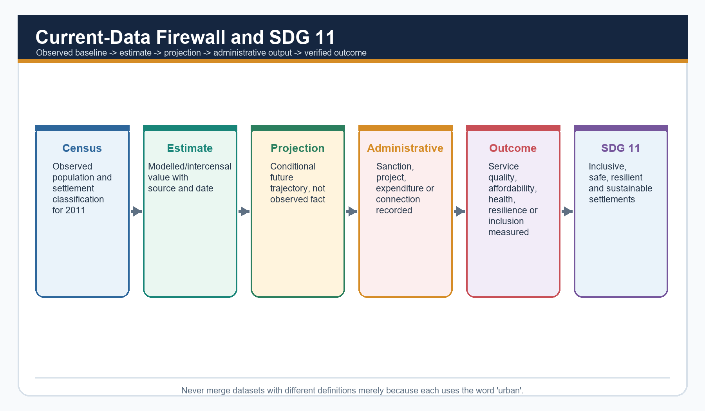

*The data ladder prevents stocks, projections, approvals and outcomes from being merged.*

This package follows repository Markdown first, OCR-searchable local books and official PYQ scans second, live primary/current sources third, and optional Qdrant last. Qdrant was not required.

- **Observed baseline:** Census 2011 is the last completed decennial urban baseline used here. It is not a 2026 urban share.
- **Estimate/projection:** UN World Urbanization Prospects 2025 and World Bank projections are explicitly labelled with vintage and horizon.
- **Administrative output:** sanction, approval, expenditure, project completion, treatment capacity and dashboard entry are not automatically household, health or ecological outcomes.
- **Category firewall:** statutory town, census town, urban agglomeration, million-plus city/UA, metropolitan area, peri-urban area and rural-urban continuum are not synonyms.
- **Housing firewall:** slum household, notified/recognised/identified slum, informal settlement, homelessness, rental stress and housing shortage are distinct measures.
- **Missing objective-key protocol:** retain the PYQ and label an unverified answer as INFERRED ANSWER - NOT OFFICIALLY VERIFIED with confidence and elimination logic. Both objective PYQs used here have verified keys.

**Must-know facts**
- Export/evidence retrieval date: 19 August 2026.
- Census 2011 figures are historical observed facts.
- Every volatile mission number is date-bound.

**UPSC traps**
- **Wrong:** A project marked complete proves equitable service delivery. **Correct:** Completion is an output; verify coverage, quality, affordability, O&M and ward-wise distribution.
- **Wrong:** A UN projection updates India's Census count. **Correct:** A projection is a modelled future series and must remain labelled.

**Mains / practice route:** Begin every contemporary answer by naming the data type and date.

**Study link:** Census 2011 concepts | UN WUP 2025 | MoHUA 2025-26 | SDG 11

## 2. Source register and local evidence

Primary and local sources used for this export are listed with their valid analytical boundary.

| Source | Dated use | Boundary |
| --- | --- | --- |
| Census India 2011 | 377.1m urban; 31.16%; 7,935 towns; definitions | Observed baseline, not current share |
| MoHUA Annual Report 2025-26 | SCM: 7,755/8,064 completed; AMRUT 2.0: 8,799 projects worth Rs 1.93 lakh crore approved as on 31 Dec 2025 | Administrative reporting; test outcomes separately |
| PIB PMAY-U 2.0, 13 Jul 2026 | 16.20 lakh houses sanctioned | Sanction, not completion/occupation |
| PIB SBM-U, Jan 2026 | 1,31,837 of 1,62,162 TPD reported processed (81.3%) | Administrative processing measure |
| World Bank, 22 Jul 2025 | 951m urban projection by 2050; heat/flood resilience study | Projection/study results, not Census |
| UN WUP 2025 | Estimates to 2025, projections to 2050; Degree of Urbanization | International comparability differs from national definition |
| UN SDG 11 | Inclusive, safe, resilient, sustainable settlements | Normative/indicator framework |

- Core owners: `basic/28_Human-Settlements-and-Urbanisation.md` and `advanced/28_Human-Settlements-and-Urbanisation.md`.
- OCR-searchable Majid Husain scan yielded limited direct settlement-chapter text; authored owner files supplied the static base. The local Khullar scans were not reliably searchable for this chapter and were not reconstructed.
- Local official PYQ scans verify relevant GS-I questions for 2019-2025 and Prelims 2019/2024. The 2019 and 2024 objective answers were checked against official keys/searchable official-key evidence.

**Must-know facts**
- Source register is part of the canonical Markdown.
- Retrieval date is fixed at 19 August 2026.

**UPSC traps**
- **Wrong:** Coaching compilations can supply volatile mission numbers. **Correct:** Use the cited primary official release/report for volatile figures.

**Mains / practice route:** Named evidence should prove a claim and carry its date/definition limit.

**Study link:** Evidence protocol -> learning content -> solved practice -> final register notes

## 3. Roadmap: settlement as form, node, system and territory

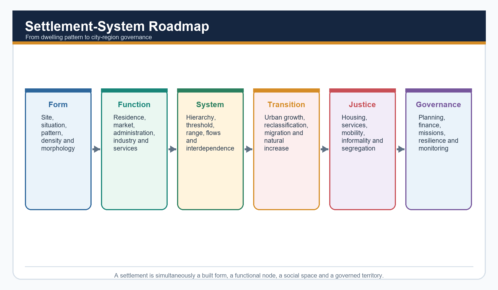

*The topic moves from morphology and hierarchy to India's transition, services, justice, governance and resilience.*

Human settlement geography studies where people live, how built form is organised, what functions a place performs, how it connects to other places and how power distributes land, services and risk.

- **Form:** density, street pattern, plot structure, building type and land-use arrangement.
- **Node:** concentration of residence, exchange, administration, production, culture and services.
- **System:** hierarchy and flows of people, goods, capital, information, waste, water and ecological risk.
- **Territory:** statutory boundary, planning area, service jurisdiction and lived functional region rarely coincide perfectly.
- **Answer logic:** define scale first; a village pattern, municipal city and metropolitan region require different explanations.

**Must-know facts**
- Site is immediate ground; situation is relative location.
- Settlement size and settlement function are related but not identical.

**UPSC traps**
- **Wrong:** Urbanisation is simply city population growth. **Correct:** It includes change in urban share and can reflect natural increase, migration, reclassification and boundary change.

**Mains / practice route:** Use the four lenses - form, function, flow and governance - to structure broad questions.

**Study link:** Human geography -> population -> migration -> settlements -> regional development

## 4. Settlement vocabulary: site, situation, pattern, morphology and function

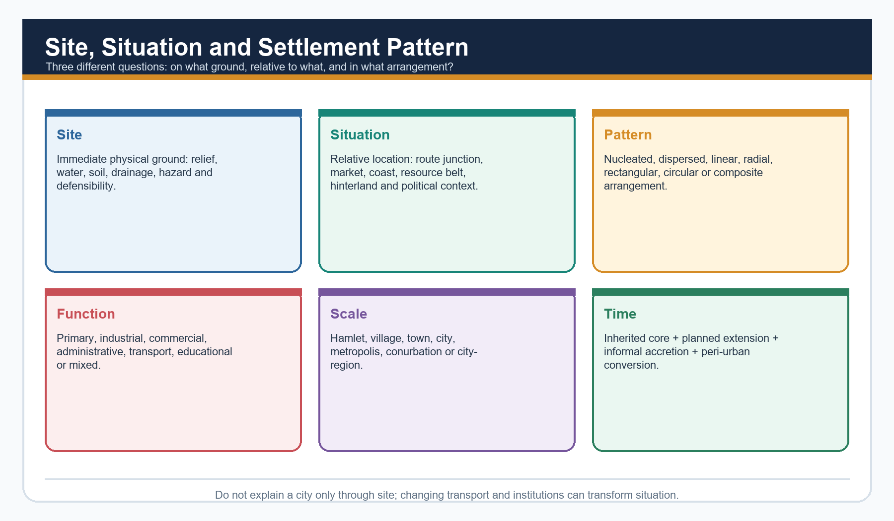

*Six analytical questions separate immediate ground, relative location, geometry, function, scale and historical layering.*

A precise vocabulary prevents descriptive answers from becoming causal guesses.

- **Site** refers to immediate physical attributes: relief, water, drainage, soil, hazard, harbour or defence.
- **Situation** refers to relational location: route junction, coast-hinterland relation, resource belt, market access or political centrality.
- **Pattern** is the observable arrangement of dwellings and routes.
- **Morphology** is the internal physical structure produced through streets, parcels, buildings, land uses and historical layers.
- **Function** is the dominant or mixed role: market, industrial, administrative, transport, educational, religious or residential.
- **Spacing and hierarchy** describe relations among settlements, not only conditions inside one settlement.

**Must-know facts**
- A favourable site can lose importance if transport technology changes its situation.
- Most large Indian cities are multifunctional and historically layered.

**UPSC traps**
- **Wrong:** Linear pattern proves a transport origin. **Correct:** It may follow a river, levee, coast, valley, canal or road; identify local evidence.
- **Wrong:** Morphology is a synonym for land use. **Correct:** Morphology includes street/plot/building form as well as land use.

**Mains / practice route:** For a locational question, write site -> situation -> changing technology/institution -> present function.

**Study link:** Topic 33 transport and trade | Topic 29 regional development

## 5. Rural settlement types and morphology

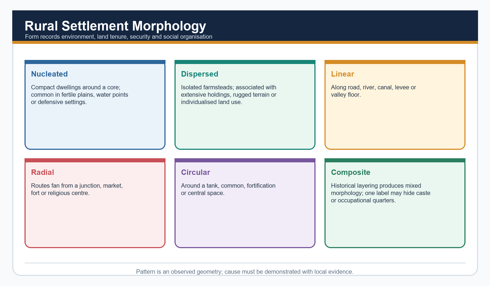

*The visual classifies common patterns while warning that composite settlements require local historical explanation.*

Rural settlements range from compact nucleated villages to dispersed farmsteads and mixed patterns. Form is produced by environment, land tenure, production system, security, caste/kinship and transport.

- **Nucleated/compact:** dwellings cluster around a core; common where water, collective defence or fertile land favours concentration.
- **Dispersed/scattered:** isolated dwellings may reflect extensive holdings, rugged relief, pasture or individualised farm management.
- **Linear:** houses align along a route, river, canal, levee, valley or coast.
- **Radial/circular/rectangular:** geometry may reflect a junction, tank, fort, planned grid or land survey.
- **Social morphology:** separate hamlets or quarters can encode caste, tribe, occupation and landownership; geometry must be read with social relations.
- **Dynamic view:** roads, remittances, rural non-farm work and subdivision can transform a village without immediate statutory reclassification.

**Must-know facts**
- Rural is not equivalent to agricultural.
- One settlement can contain a compact core and dispersed extensions.

**UPSC traps**
- **Wrong:** One physical cause determines a rural pattern. **Correct:** Use a multi-causal explanation: ecology + tenure + security + society + accessibility.

**Mains / practice route:** A high-quality rural-morphology answer links observed pattern to named environmental and institutional evidence.

**Study link:** Agriculture | cultural geography | rural-urban continuum

## 6. Urban morphology models: what each model can and cannot do

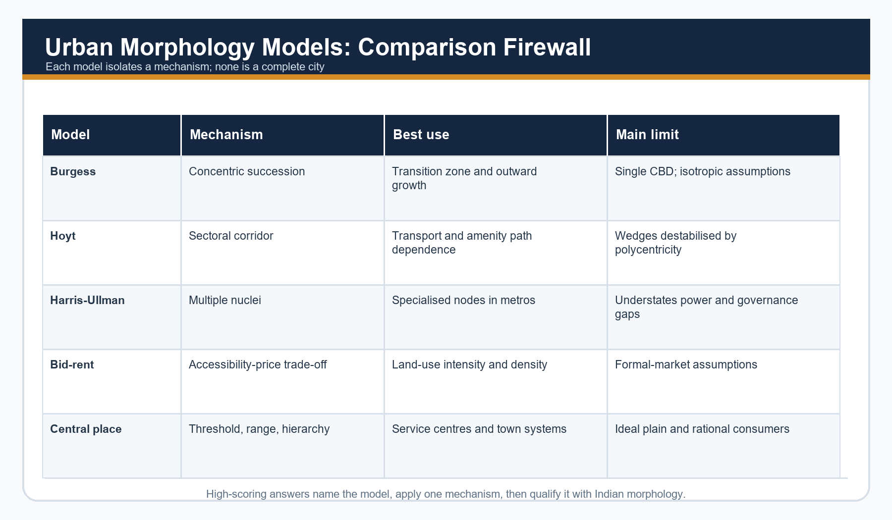

*The matrix identifies the mechanism, best analytical use and main limitation of five core models.*

Urban models are simplified explanatory devices. They should be used as mechanisms, not traced as universal maps.

- **Burgess:** outward succession in concentric zones around a dominant CBD.
- **Hoyt:** land-use sectors persist along transport and amenity corridors.
- **Harris-Ullman:** specialised activities create several nuclei because of compatibility, incompatibility and differentiated access.
- **Bid-rent:** users bid differently for accessible land, trading transport cost against space.
- **Central-place theory:** explains spacing and hierarchy of service centres through threshold and range.
- **Indian qualification:** historic cores, bazaars, cantonments, planned capitals, industrial estates, informal settlements, IT corridors and satellite nodes overlap.

**Must-know facts**
- Models can be combined if each mechanism is stated.
- A model's assumptions are part of the answer.

**UPSC traps**
- **Wrong:** Finding rings proves the Burgess model. **Correct:** Demonstrate succession and a dominant centre; otherwise use it only as a partial analogy.

**Mains / practice route:** Write model -> assumption -> mechanism -> Indian example -> limitation.

**Study link:** Urban land use | central place | metropolitanisation

## 7. Burgess concentric-zone model

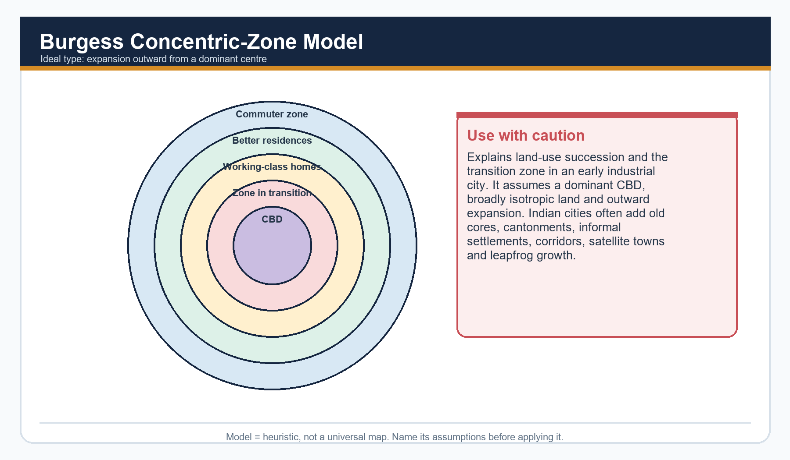

*Concentric structure clarifies succession and transition, while the side panel states its assumptions and Indian limits.*

Burgess's 1925 ideal type described expansion from a central business district through a transition zone toward outer residential and commuter zones.

- The **zone in transition** carries land-use change, ageing housing, industry and newcomer accommodation.
- The model draws on ecological ideas of invasion and succession; these metaphors must not naturalise inequality.
- It is most useful for explaining accessibility gradients and redevelopment pressure around a dominant centre.
- It is weak where terrain, multiple centres, zoning, highways or planned satellite towns redirect growth.
- Indian application should note an inherited old city, colonial/administrative enclave, industrial estates and informal/peripheral growth.

**Must-know facts**
- Date/name: Ernest Burgess, 1925.
- Use 'ideal type' and 'partial fit' in Mains.

**UPSC traps**
- **Wrong:** All cities evolve through five fixed rings. **Correct:** The zones are an idealised sequence from a particular historical setting.

**Mains / practice route:** Apply to transition-zone pressure, then qualify with polycentric and historically layered morphology.

**Study link:** Hoyt sector | multiple nuclei | bid-rent

## 8. Hoyt sector model

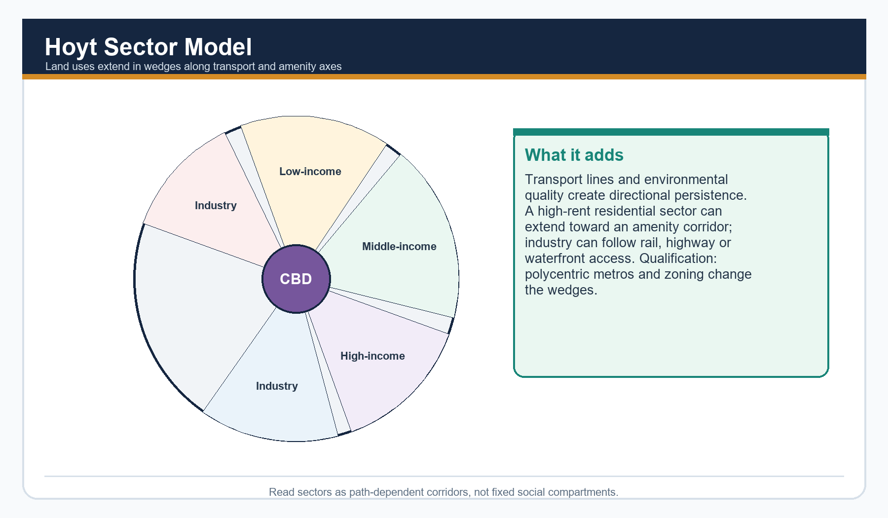

*Wedges show directional growth along access and amenity axes; real metropolitan sectors evolve and overlap.*

Hoyt's 1939 model argued that urban land uses extend outward in sectors, especially along transport corridors and environmental-amenity axes.

- Industry can follow rail, highway, port or river corridors; lower-income housing may develop near industrial access.
- High-income sectors may persist toward cleaner, elevated or amenity-rich directions.
- Sectoral path dependence explains why early infrastructure decisions shape later land value and social geography.
- A corridor can become polycentric as offices, housing and retail accumulate around nodes.
- Zoning, new transit, environmental regulation and changing employment can interrupt or reverse a sector.

**Must-know facts**
- Date/name: Homer Hoyt, 1939.
- A sector is directional persistence, not an immutable wedge.

**UPSC traps**
- **Wrong:** Sector model rejects all rings. **Correct:** It modifies concentric thinking by adding directional bias.

**Mains / practice route:** Use for IT/highway/industrial corridors, while noting corridor congestion and peri-urban conversion.

**Study link:** Transport corridors | land value | urban sprawl

## 9. Harris-Ullman multiple-nuclei model

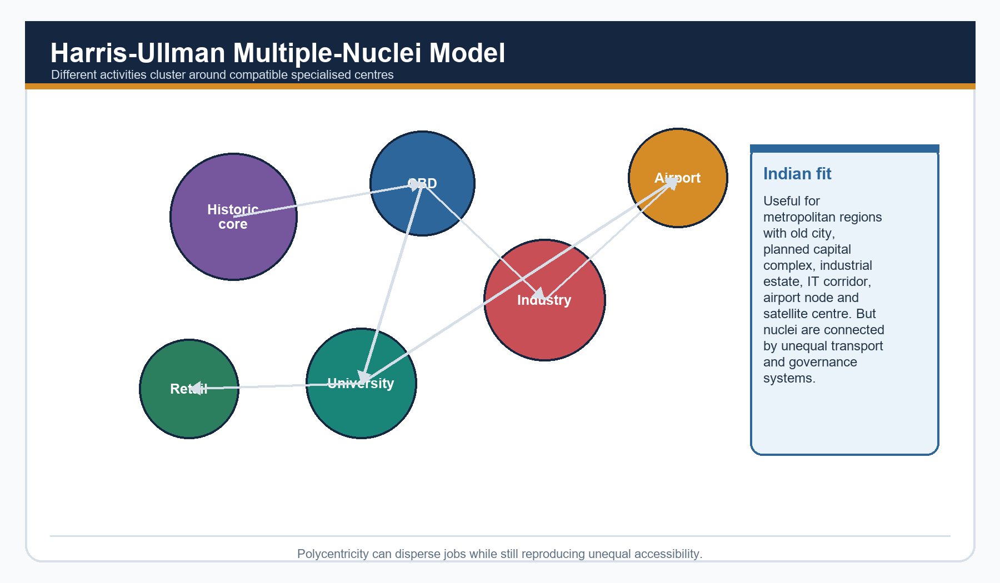

*Specialised nodes create a polycentric metropolitan structure connected by unequal mobility networks.*

Harris and Ullman (1945) explained urban structure through several specialised centres rather than one dominant CBD.

- Activities cluster where they need specialised facilities or benefit from proximity.
- Some land uses repel one another because of congestion, pollution, land cost or incompatible externalities.
- Historic core, CBD, industrial estate, university, airport and suburban business district can form distinct nuclei.
- The model fits many Indian metropolitan regions better than a single-centre model.
- It still needs a governance layer: several nuclei may lie in different municipalities, panchayats and development-authority areas.

**Must-know facts**
- Date/names: Chauncy Harris and Edward Ullman, 1945.
- Polycentricity does not guarantee balanced access.

**UPSC traps**
- **Wrong:** More nuclei automatically reduce congestion. **Correct:** Jobs and housing can remain spatially mismatched; cross-city trips may increase.

**Mains / practice route:** Use node specialisation + connectivity + jurisdiction fragmentation as a three-part analysis.

**Study link:** Metropolitanisation | city-region governance | mobility

## 10. Bid-rent, land value and accessibility

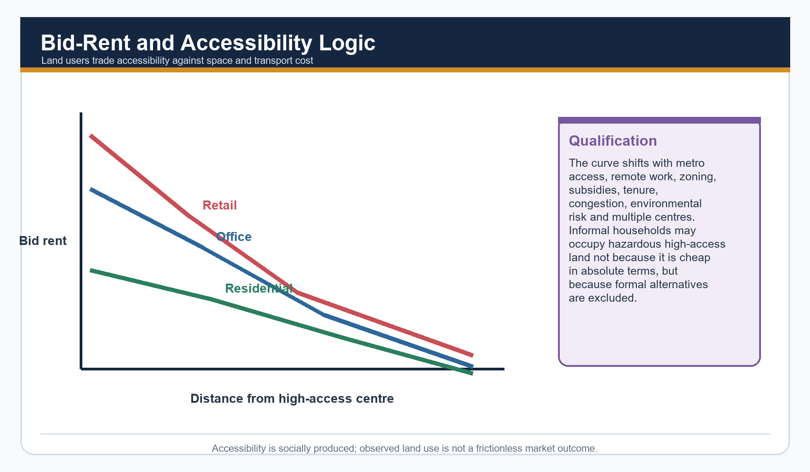

*Declining bid-rent curves are qualified by polycentricity, regulation, informality and risk.*

Bid-rent theory explains how different users value accessible land and how transport cost, floor-space demand and regulation shape land-use intensity.

- Retail can bid highly for footfall and central access; offices value interaction; households trade access against space and amenity.
- The land-rent gradient can flatten with fast transport or polycentric employment, and steepen around high-access nodes.
- Zoning, floor-space rules, public land, tenure informality and subsidies alter market outcomes.
- Informal households may choose hazardous but accessible land because formal affordable supply is absent.
- Transit investment can capitalise into land values; value capture must be paired with anti-displacement and affordable-housing safeguards.

**Must-know facts**
- Accessibility is measured door-to-door, not by radial distance alone.
- Observed price includes legal and speculative institutions.

**UPSC traps**
- **Wrong:** Highest accessibility always produces the densest inclusive housing. **Correct:** Commercial demand, exclusionary regulation and speculation can displace housing.

**Mains / practice route:** Use bid-rent to explain density/land-use change, then add tenure, planning and equity.

**Study link:** TOD | housing affordability | municipal land instruments

## 11. Settlement hierarchy, threshold and range

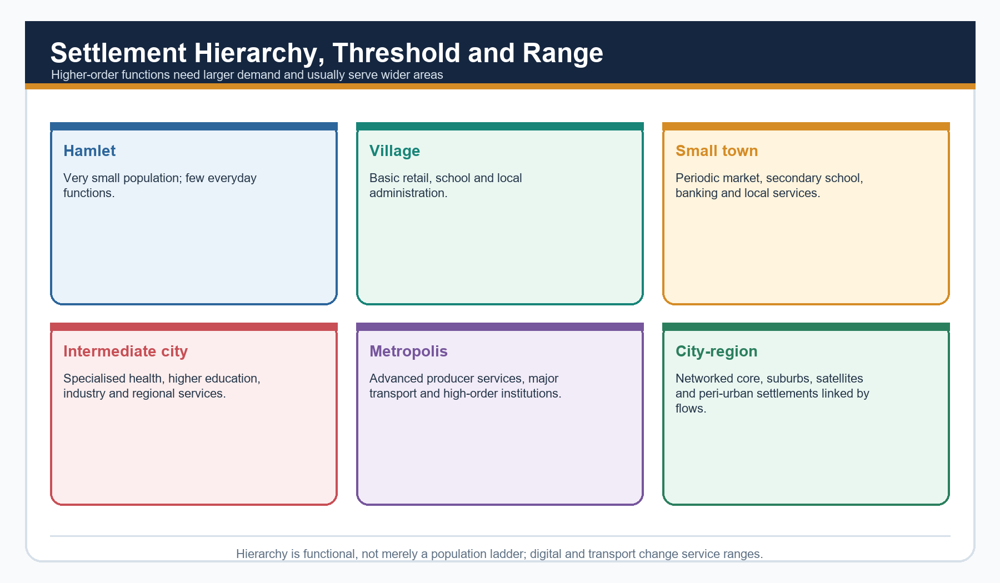

*The ladder shows increasing functional order while retaining a caution against treating population as the sole criterion.*

A settlement hierarchy orders places by the number and level of functions they provide. Higher-order services usually require a larger threshold population and have a wider range.

- **Threshold:** minimum demand needed to sustain a service.
- **Range:** maximum distance/time/cost users accept to obtain it.
- Daily goods have low threshold and short range; specialised hospitals and universities have higher thresholds and wider ranges.
- Transport, income, digital delivery, urgency and social barriers modify range.
- A small town can perform a high-order specialised function; population rank and functional rank need not coincide.
- Policy should strengthen intermediate centres where they can improve rural access and reduce metropolitan over-concentration.

**Must-know facts**
- Hierarchy is a network relation.
- Threshold and range are service-specific.

**UPSC traps**
- **Wrong:** Every higher-order centre is simply larger. **Correct:** Function, connectivity and institutional specialisation can outweigh population size.

**Mains / practice route:** Use a service example to explain threshold and range, then qualify with digital and mobility change.

**Study link:** Central-place theory | regional development | small towns

## 12. Christaller central-place theory

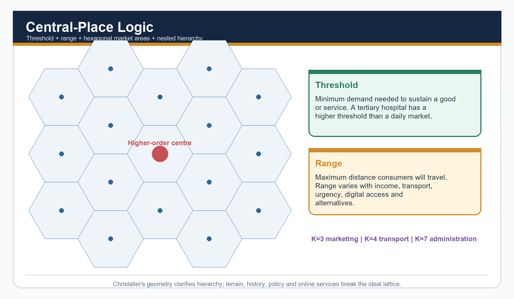

*The hexagonal lattice visualises market coverage while the threshold/range panels state the operative concepts.*

Christaller's 1933 theory modelled the spacing and hierarchy of settlements on an ideal plain using threshold, range and hexagonal market areas.

- Hexagons avoid gaps/overlaps that circles would create in an ideal service lattice.
- **K=3 marketing principle:** lower-order centres orient to higher-order market efficiency.
- **K=4 transport principle:** centres align to improve route connections.
- **K=7 administrative principle:** lower-order areas nest within one higher-order jurisdiction.
- Assumptions include an isotropic plain, evenly distributed population/resources, comparable purchasing power and rational travel behaviour.
- Terrain, history, colonial gateways, state capitals, transport corridors and online services produce departures from the ideal.

**Must-know facts**
- Name Walter Christaller and 1933.
- K-values are organisational principles, not empirical constants.

**UPSC traps**
- **Wrong:** A hexagonal map proves central-place theory. **Correct:** The explanatory concepts are threshold, range and hierarchy under stated assumptions.

**Mains / practice route:** Use central-place theory to analyse service gaps, intermediate towns and regional hierarchy, not metropolitan internal land use.

**Study link:** Rank-size | town-service regions | regional planning

## 13. Rank-size rule, primate city and urban-system concentration

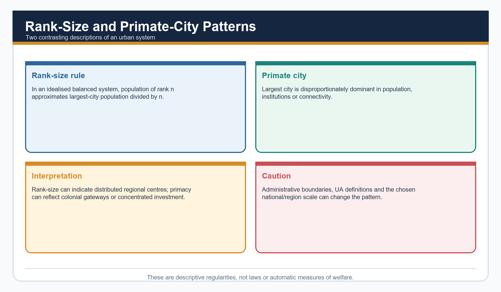

*The comparison distinguishes an idealised distributed hierarchy from disproportionate dominance.*

Rank-size and primacy describe the distribution of city sizes within a defined urban system.

- **Rank-size:** idealised Pn = P1/n; city population declines inversely with rank.
- **Primate city:** the largest city is disproportionately dominant in population and/or high-order functions.
- Primacy can arise from colonial ports, capital-city concentration, gateway trade or cumulative investment.
- A more even hierarchy can support regional service diffusion, but it does not automatically prove social balance.
- Results change with municipal versus UA boundaries and national versus regional scale.
- Use size distribution together with functional connectivity and accessibility.

**Must-know facts**
- Zipf is associated with the rank-size regularity; Mark Jefferson with primate-city formulation.
- Specify the territorial system used.

**UPSC traps**
- **Wrong:** Primate city means national capital. **Correct:** Primacy concerns disproportionate dominance; the city need not be the political capital.

**Mains / practice route:** Explain city-size pattern -> historical mechanism -> regional effect -> measurement qualification.

**Study link:** Metropolitan concentration | balanced regional development

## 14. Rural-urban continuum and functional transition

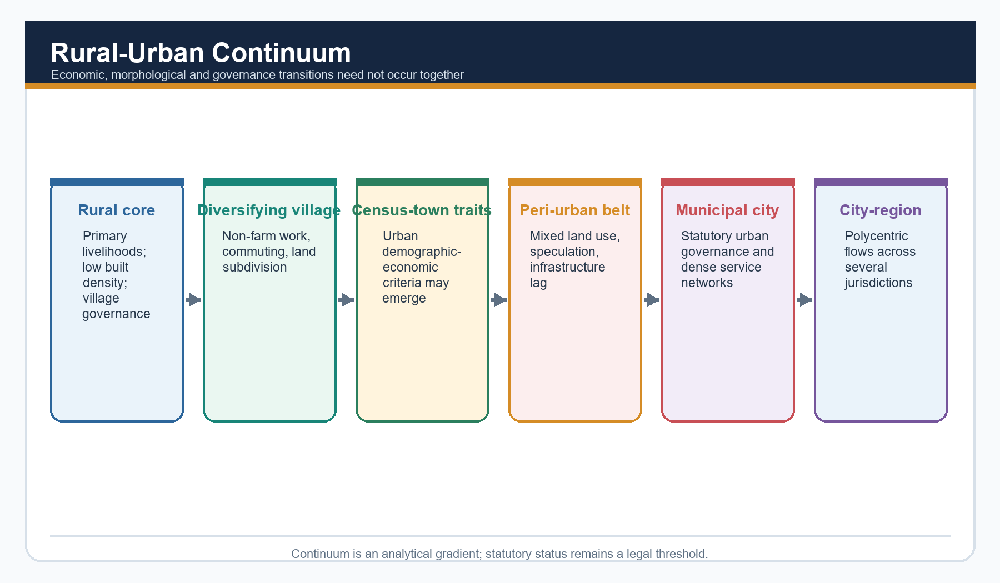

*Economic and morphological urbanisation can precede municipal reclassification.*

The continuum captures gradients in occupation, commuting, built density, land market and service dependence. It must not erase legal or statistical categories.

- A village can have urban livelihoods and commuting while remaining under a gram panchayat.
- A census town meets demographic-economic criteria but may lack statutory municipal governance.
- Peri-urban belts combine agriculture, warehouses, housing, institutions and infrastructure fragments.
- Households can be multi-local: farming, commuting and city work operate as one livelihood system.
- Planning must follow functional flows of water, waste, mobility and land conversion across boundaries.

**Must-know facts**
- Continuum is analytical.
- Statutory status is legal; census-town status is statistical.

**UPSC traps**
- **Wrong:** Continuum means there is no rural/urban boundary. **Correct:** Administrative and census thresholds still have operational consequences.

**Mains / practice route:** Use the continuum to explain hidden urbanisation, then restore the statutory/census distinction.

**Study link:** Census towns | peri-urbanisation | migration

## 15. India official-category firewall

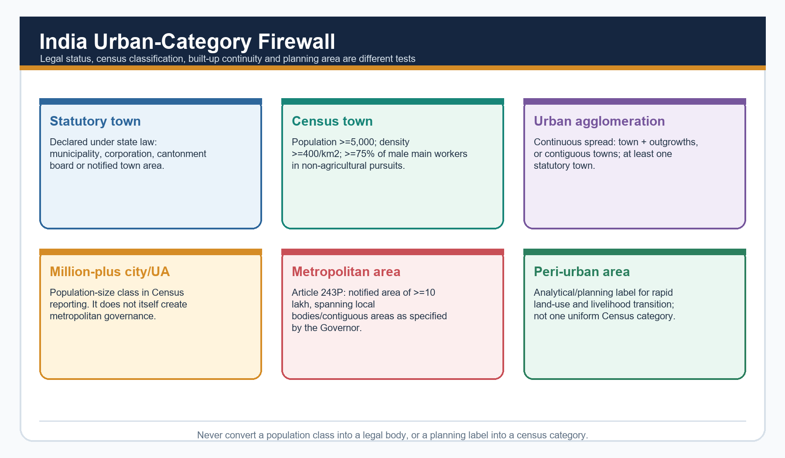

*The six boxes separate the tests that UPSC commonly mixes in close options.*

India's urban picture changes depending on whether the question concerns legal status, census criteria, physical continuity, population class or constitutional planning.

- **Statutory town:** municipality, corporation, cantonment board, notified town area committee or equivalent declared by law.
- **Census town:** minimum 5,000 population; at least 75% of male main workers in non-agricultural pursuits; density at least 400 persons/km2.
- **Urban agglomeration:** continuous urban spread of a town plus outgrowths, or contiguous towns, with at least one statutory town.
- **Million-plus city/UA:** Census population-size class; it does not create a governing body.
- **Metropolitan area:** Article 243P definition of a notified area of at least 10 lakh spanning specified local bodies/contiguous areas.
- **Peri-urban:** planning/analytical concept without one uniform nationwide census test.

**Must-know facts**
- Census town uses male main-worker criterion in Census 2011.
- Metropolitan area is a constitutional/legal planning category.

**UPSC traps**
- **Wrong:** Every census town has a municipality. **Correct:** A census town may remain under rural local governance.
- **Wrong:** Urban agglomeration and metropolitan area are interchangeable. **Correct:** UA is census built-up continuity; metropolitan area is a notified constitutional planning category.

**Mains / practice route:** Define each category before discussing hidden urbanisation or metropolitan governance.

**Study link:** Census India Concepts and Definitions | Constitution Part IX-A

## 16. Census 2011 observed urban baseline

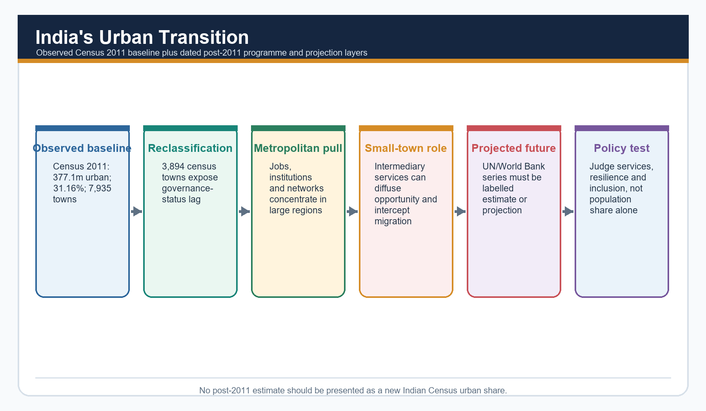

*The transition visual keeps the observed Census baseline separate from programmes and future projections.*

Census 2011 remains the last completed official decennial baseline for the national urban classification used in this package.

| Indicator | Census 2011 | Use |
| --- | --- | --- |
| Urban population | 377.1 million | Historical stock |
| Urban share | 31.16% | Historical share |
| Total towns | 7,935 | Settlement count |
| Statutory towns | 4,041 | Legal status |
| Census towns | 3,894 | Statistical criteria |
| Million-plus UAs/cities | 53 | Population class |

- Urban population: **377.1 million**; urban share: **31.16%**.
- Total towns: **7,935** = **4,041 statutory towns + 3,894 census towns**.
- Final official count of million-plus UAs/cities: **53**.
- A large increase in census towns exposed the gap between changing settlement economy/morphology and municipal status.
- Census figures must be paired with the unit: town, city, UA, household or slum area.

**Must-know facts**
- Observed date: 2011.
- 377.1 million is not a 2026 estimate.

**UPSC traps**
- **Wrong:** India is 31.16% urban today. **Correct:** 31.16% is the official Census 2011 observed share.

**Mains / practice route:** State 'Census 2011 observed baseline' every time these numbers are used.

**Study link:** Official urban picture -> census towns -> metro growth

## 17. Urbanisation mechanics and India's transition

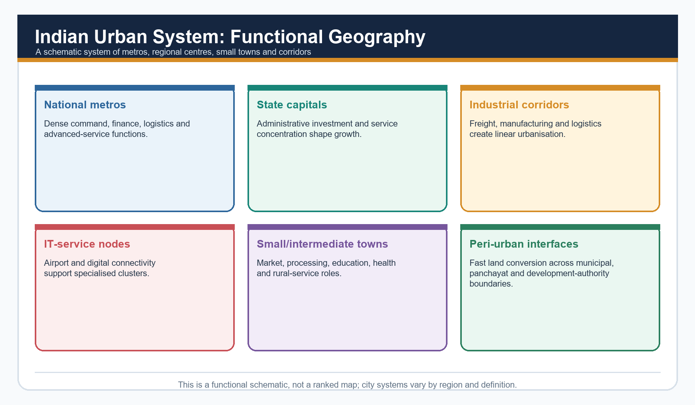

*The functional dashboard shows why India's urban transition must be read across metros, intermediate centres, corridors and peri-urban interfaces.*

Urbanisation is change in the share and spatial organisation of population living in places classified as urban. Urban growth is increase in the absolute population of an urban place or system.

- **Natural increase:** births minus deaths within urban areas.
- **Net migration:** in-migration minus out-migration across the chosen boundary.
- **Reclassification:** settlement meets criteria or gains statutory status.
- **Boundary expansion:** municipal/UA area absorbs adjacent settlements or outgrowths.
- **Economic transformation:** non-farm work, productivity and service concentration can precede demographic reclassification.
- India's trajectory reflects industrialisation, services, state capitals, transport corridors, migration and numerous census-town transitions.

**Must-know facts**
- Urban growth can occur without an increase in national urban share if total population grows similarly.
- Reclassification is not migration.

**UPSC traps**
- **Wrong:** All increase in urban population comes from rural-urban migration. **Correct:** Decompose natural increase, migration, reclassification and boundary change.

**Mains / practice route:** Use the four-component decomposition before evaluating causes or policy.

**Study link:** Population balance equation | migration | census classification

## 18. Census towns and hidden urbanisation

*Census-town traits can emerge between diversifying village and municipal city, while the legal threshold remains distinct.*

Census towns reveal settlements with urban demographic-economic traits but without statutory urban local-body status.

- The governance mismatch can leave dense non-farm settlements under institutions designed for rural service norms.
- Reclassification can improve planning focus but also changes taxes, regulations, political representation and access to programmes.
- The male-main-worker criterion can understate women's work and changing livelihood combinations.
- A settlement can meet census criteria yet remain morphologically connected to rural land and social systems.
- Policy needs a transparent transition framework with finance, staff, service plans and local consent, not a label-only change.

**Must-know facts**
- Census town is a statistical category.
- Hidden urbanisation refers to under-recognised functional/morphological transition.

**UPSC traps**
- **Wrong:** Municipalisation is always the first sign of urbanisation. **Correct:** Demographic-economic change can precede statutory status.

**Mains / practice route:** Problem statement -> governance mismatch -> worker-criterion limitation -> transition pathway.

**Study link:** Article 243Q Nagar Panchayat | state municipal law | peri-urban planning

## 19. Metropolitanisation, suburbs, satellites and peri-urban belts

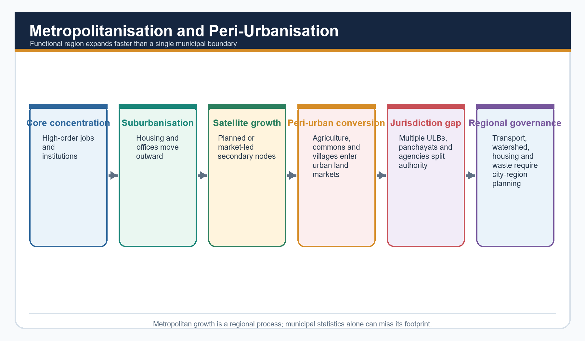

*The chain shows outward growth and the jurisdiction gap that requires regional planning.*

Metropolitanisation concentrates high-order functions in an extended city-region while residence, industry and logistics spread across multiple jurisdictions.

- **Suburbanisation:** population or activities move outward while remaining functionally dependent on the core.
- **Satellite town:** a secondary planned/market node with varying functional independence.
- **Conurbation:** adjoining urban areas grow into a continuous built-up region.
- **Peri-urbanisation:** rapid land-use, livelihood and governance transition at the fringe.
- Metropolitan problems are network problems: transport, housing, airshed, watershed, waste and labour markets cross municipal lines.
- Regional coordination must preserve local accountability; a powerful development authority is not a substitute for elected ULB capacity.

**Must-know facts**
- Article 243ZE provides for Metropolitan Planning Committees.
- Functional region and notified metropolitan area may differ.

**UPSC traps**
- **Wrong:** Satellite town necessarily decongests the core. **Correct:** If jobs and services remain centralised, it can generate long commutes.

**Mains / practice route:** Use core-periphery flows + jurisdiction fragmentation + regional institution.

**Study link:** MPC | transport authority | watershed and airshed governance

## 20. Land-use conversion, sprawl, density and TOD

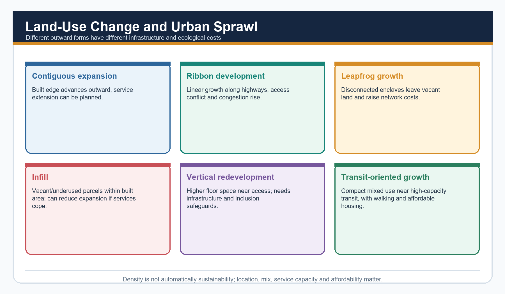

*Six outward/inward growth forms have distinct infrastructure and ecological implications.*

Sprawl is not simply low density. It includes discontinuous, segregated and automobile-dependent expansion that raises network and ecological costs.

- Ribbon and leapfrog development can outpace water, sewerage, drainage and public transport.
- Infill and redevelopment can conserve land but may overload infrastructure or displace renters and small enterprises.
- Density supports transit and service efficiency only when mixed use, public space, ventilation and infrastructure are adequate.
- Transit-oriented development aligns higher density and mixed use with high-capacity transit, walking and cycling.
- Peri-urban land conversion affects agriculture, commons, wetlands, groundwater and livelihoods.
- Monitor built-up expansion, vacant land, travel distance, service cost and ecological fragmentation together.

**Must-know facts**
- Compactness is a spatial measure; liveability and justice require additional indicators.
- TOD needs affordable housing.

**UPSC traps**
- **Wrong:** Higher FAR alone creates sustainable density. **Correct:** Network capacity, mix, public realm and affordability determine outcomes.

**Mains / practice route:** Define form -> trace service/ecological cost -> prescribe land-use and transit integration.

**Study link:** Urban mobility | flood risk | municipal finance

## 21. Housing, slums and urban informality

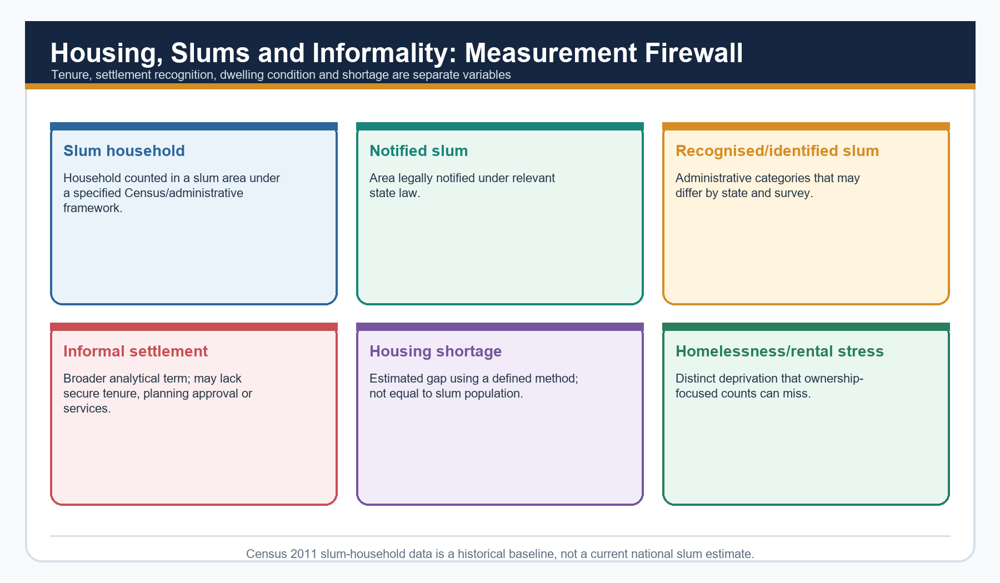

*The measurement firewall separates six commonly conflated deprivation indicators.*

Urban housing is a location-tenure-service-livelihood bundle. A dwelling unit without secure tenure, basic services or access to work can reproduce deprivation.

- Census 2011 provisional slum release recorded **13.71 million urban slum households**, **17.4%** of urban households: a historical baseline, not a current estimate.
- Notified, recognised and identified slums are administrative categories; informal settlements can extend beyond them.
- Housing shortage is a modelled gap under a defined method and is not equal to slum households.
- Informality includes employment, land tenure, building approval, rental contract and service access; these dimensions need not coincide.
- In-situ upgrading can preserve livelihood networks; relocation can provide a formal unit but impose mobility and social costs.
- Affordable rental housing, serviced land, incremental improvement and tenure security complement ownership assistance.

**Must-know facts**
- Slum-household baseline date: 2011.
- PMAY-U 2.0 sanction status is not an occupied-house outcome.

**UPSC traps**
- **Wrong:** All informal settlements are notified slums. **Correct:** Notification is a legal/administrative subset.
- **Wrong:** Housing delivered at the fringe solves housing poverty. **Correct:** Measure occupancy, commute, service costs and livelihood access.

**Mains / practice route:** Use the bundle approach: adequacy + affordability + tenure + services + location + livelihood.

**Study link:** PMAY-U 2.0 | rental housing | distributive justice

## 22. Agglomeration economies, productivity and urban diseconomies

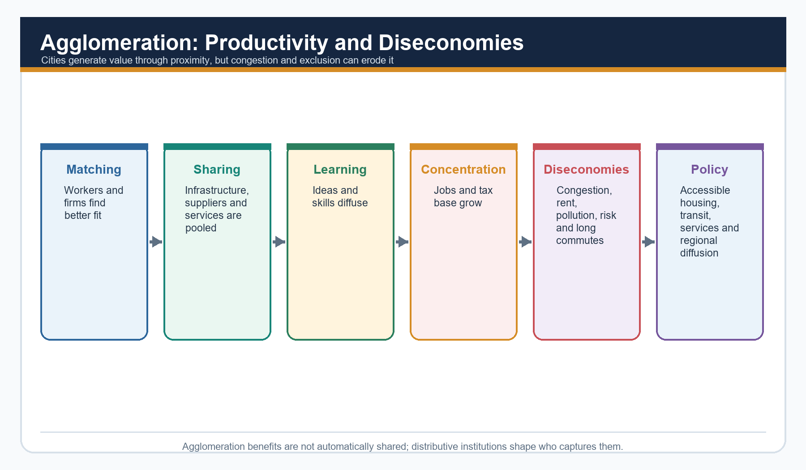

*The causal chain moves from matching/sharing/learning to concentration, diseconomies and policy.*

Cities raise productivity through matching, sharing and learning, but gains can be eroded by congestion, exclusion and environmental risk.

- **Matching:** thick labour markets improve worker-firm fit.
- **Sharing:** firms and households share suppliers, infrastructure and specialised services.
- **Learning:** proximity supports knowledge spillovers and innovation.
- **Consumption/agglomeration amenities:** diversity of services can attract skilled labour.
- **Diseconomies:** high land cost, congestion, pollution, long commutes, disease exposure and disaster loss.
- The policy goal is not to suppress agglomeration but to make it accessible, serviced and resilient while strengthening intermediate centres.

**Must-know facts**
- World Bank's 2025 report projects 70% of new jobs by 2030 coming from cities; this is a dated projection/report claim.
- Agglomeration is a mechanism, not a welfare guarantee.

**UPSC traps**
- **Wrong:** Large cities are productive because they are large. **Correct:** Productivity depends on connectivity, institutions, skills, infrastructure and inclusion.

**Mains / practice route:** Balance productivity benefits against distributional and ecological costs.

**Study link:** Migration | industrial location | regional development

## 23. Segregation, marginalisation and distributive justice

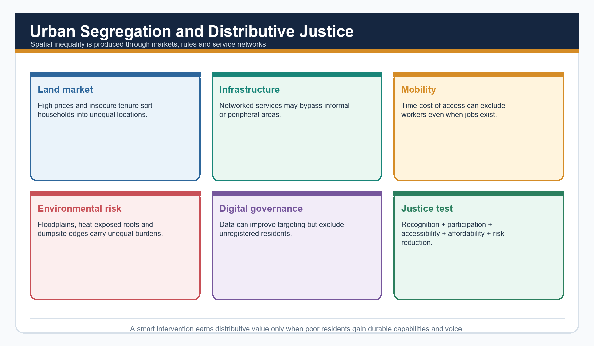

*Six mechanisms connect land, networks and risk to an urban-justice test.*

Urban segregation is the spatial separation of groups; marginalisation is exclusion from power, livelihood, services and security. They overlap but are not identical.

- Land values, rental discrimination, tenure rules and zoning shape residential sorting.
- Peripheral relocation can increase time poverty and weaken access to work, schools, care and social networks.
- Environmental injustice places low-income groups near dumpsites, polluted corridors, heat-exposed roofs and flood-prone land.
- Digital systems can improve targeting but exclude residents lacking documents, devices or recognised addresses.
- Distributive justice asks who receives benefits/burdens; procedural justice asks who participates; recognitional justice asks whose needs/status are acknowledged.
- Ward-level outcome data and participatory planning are needed to expose citywide-average bias.

**Must-know facts**
- Segregation can be economic, caste, religious, occupational or tenure-based.
- Mixed use does not automatically mean social integration.

**UPSC traps**
- **Wrong:** A service exists, so access is equal. **Correct:** Access includes continuity, quality, affordability, safety, distance and voice.

**Mains / practice route:** Use distributive + procedural + recognitional justice for evaluative questions.

**Study link:** 2023/2025 PYQs | housing | mobility | climate risk

## 24. 74th Constitutional Amendment and municipal governance

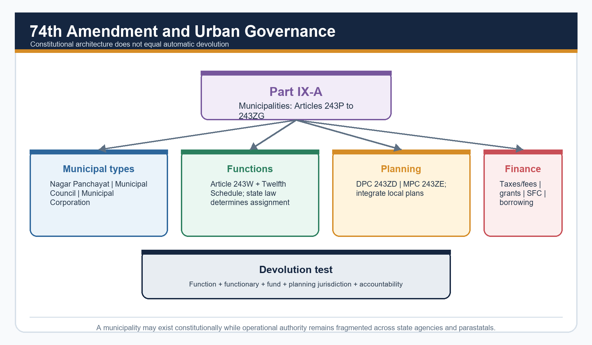

*The architecture separates municipal types, functions, planning and finance, then applies the devolution test.*

The 74th Amendment constitutionalised urban local government through Part IX-A, but state law and institutional design determine actual devolution.

- Article 243Q provides Nagar Panchayat, Municipal Council and Municipal Corporation, subject to constitutional/state-law provisions.
- Article 243W enables state legislatures to endow municipalities with powers and responsibilities; the Twelfth Schedule lists 18 functions.
- Articles 243X and 243Y concern municipal taxation/finance and State Finance Commissions.
- Article 243ZD provides District Planning Committees; Article 243ZE Metropolitan Planning Committees.
- Parastatals and development authorities often control water, transport, land or planning, fragmenting accountability.
- Effective devolution requires functions, functionaries, funds, jurisdiction, data and answerability.

**Must-know facts**
- Part IX-A = Municipalities.
- Twelfth Schedule has 18 functional items.

**UPSC traps**
- **Wrong:** The Twelfth Schedule automatically transfers all 18 functions. **Correct:** State legislation and administrative arrangements determine devolution.
- **Wrong:** MPC is the municipal corporation. **Correct:** MPC is a metropolitan planning institution covering a wider area.

**Mains / practice route:** Constitutional design -> state-level devolution -> fragmentation -> reform.

**Study link:** Polity local government | urban planning | ULB finance

## 25. Urban local-body finance and lifecycle capacity

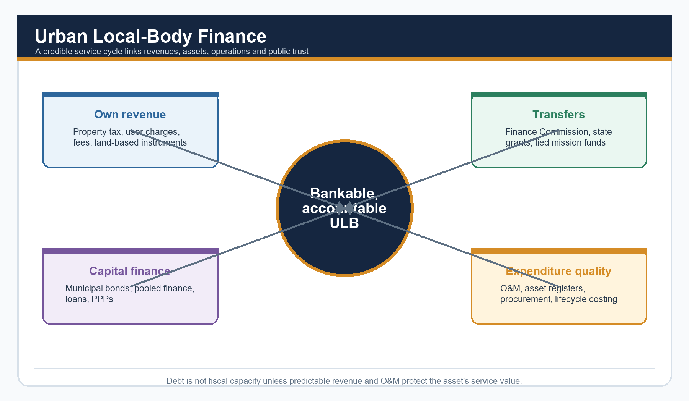

*Four revenue/expenditure pillars feed a bankable and accountable ULB.*

Urban finance converts legal responsibility into service capacity. Capital expenditure without operations and maintenance creates stranded or deteriorating assets.

- **Own source:** property tax, user charges, fees, licences and land-based instruments.
- **Transfers:** Finance Commission and state grants can equalise capacity but may be tied or unpredictable.
- **Borrowing:** municipal bonds, pooled finance and loans require credible accounts, revenue and debt management.
- **PPP:** can mobilise expertise/capital but creates contingent liabilities and affordability concerns.
- **Lifecycle:** project preparation -> procurement -> construction -> asset register -> O&M -> renewal.
- **Equity:** user charges need lifeline design and transparent subsidy; weak billing should not justify exclusion.

**Must-know facts**
- Urban Challenge Fund guidelines reported in 2026 use a challenge/market-linked architecture; funding design is not an outcome.
- MoHUA Annual Report 2025-26 records Rs 5,559 crore raised through municipal bonds by 18 ULBs; issuance remains an output, not proof of universal creditworthiness.
- Property-tax reform needs updated records and fair valuation.

**UPSC traps**
- **Wrong:** Municipal bond issuance proves a financially healthy ULB. **Correct:** Examine debt service, revenue predictability, accounts and project cash flow.

**Mains / practice route:** Diagnose revenue base + transfers + capital finance + O&M + accountability.

**Study link:** 74th Amendment | Urban Challenge Fund | service delivery

## 26. Water, sewerage, septage and reuse systems

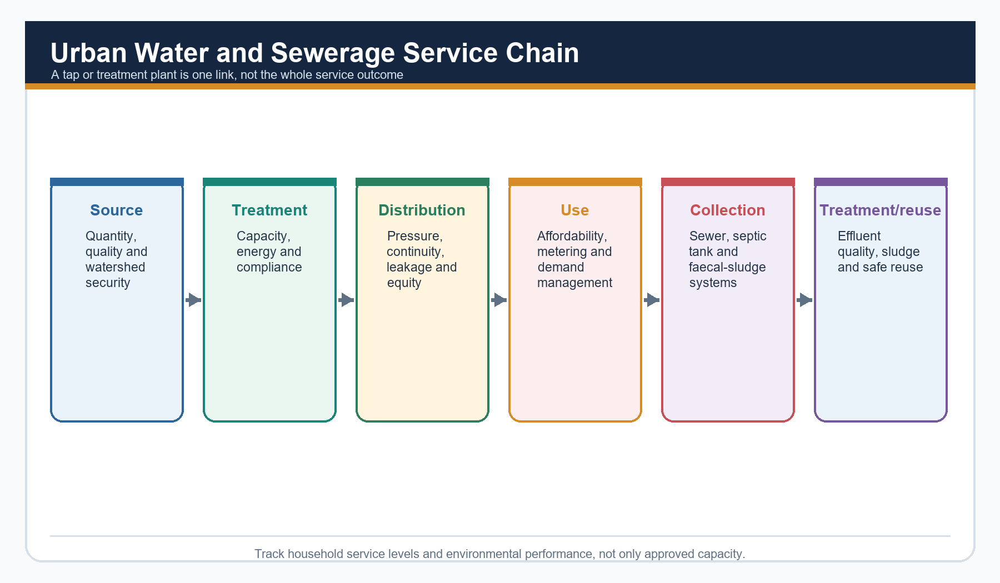

*The source-to-reuse chain identifies outcome checks at each stage.*

Urban water security is a service chain from source to safe reuse; a treatment plant or household connection measures only one link.

- Source sustainability includes basin allocation, groundwater recharge, water quality and drought risk.
- Distribution outcomes include continuity, pressure, quality, leakage, affordability and equitable ward coverage.
- Sewer networks are not universal substitutes for decentralised sanitation and faecal-sludge management.
- Treatment capacity must be compared with actual inflow, compliance, power reliability, sludge management and receiving-water condition.
- Reuse needs fit-for-purpose quality, demand agreements and monitoring; 'capacity approved' is not water reused.
- AMRUT 2.0 approvals should be read as infrastructure pipeline, not proof of household service outcomes.

**Must-know facts**
- MoHUA Annual Report 2025-26 status as on 31 December 2025: 8,799 AMRUT 2.0 projects worth Rs 1.93 lakh crore approved; works worth Rs 50,000 crore physically completed.
- State/city performance varies, and project completion is not household service quality.

**UPSC traps**
- **Wrong:** Universal tap connection means 24x7 safe water. **Correct:** Connection, continuity, quality, quantity and affordability are separate indicators.

**Mains / practice route:** Use service-chain diagnosis, then add basin and affordability dimensions.

**Study link:** AMRUT 2.0 | SDG 6 | urban watershed

## 27. Solid waste, circularity and dumpsite remediation

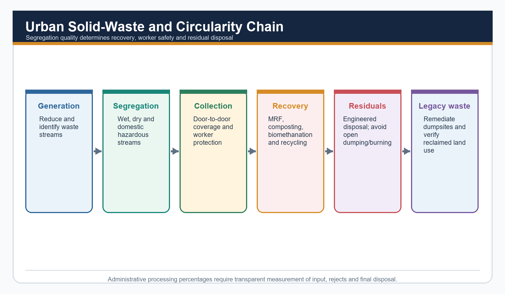

*The chain shows why segregation quality governs recovery and residual disposal.*

A circular urban waste system prioritises reduction, segregation, material recovery, biological treatment and safe residual disposal.

- Solid Waste Management Rules 2016 widened applicability beyond notified ULBs and require source segregation under the regulatory framework.
- Door-to-door collection without segregation can shift mixed waste to another location rather than recover value.
- Waste pickers provide recovery services; formalisation should protect livelihood, safety and bargaining power.
- Processing rates require a clear denominator, technology, reject fraction and final-disposal record.
- Dumpsite remediation must verify legacy-waste quantity, material fate, pollution control and future land use.
- PIB's January 2026 SBM-U status reported 1,31,837 of 1,62,162 TPD processed (81.3%); treat as a dated administrative measure.

**Must-know facts**
- 2019 Prelims tested SWM Rules site criteria.
- Open dumping and open burning are not processing.

**UPSC traps**
- **Wrong:** Waste-to-energy makes mixed waste circular. **Correct:** Feedstock quality, emissions, rejects, economics and upstream segregation determine performance.

**Mains / practice route:** Use material-flow chain + informal workers + environmental justice + monitoring.

**Study link:** SBM-U 2.0 | SWM Rules 2016 | circular economy

## 28. Urban mobility, mass transit and TOD

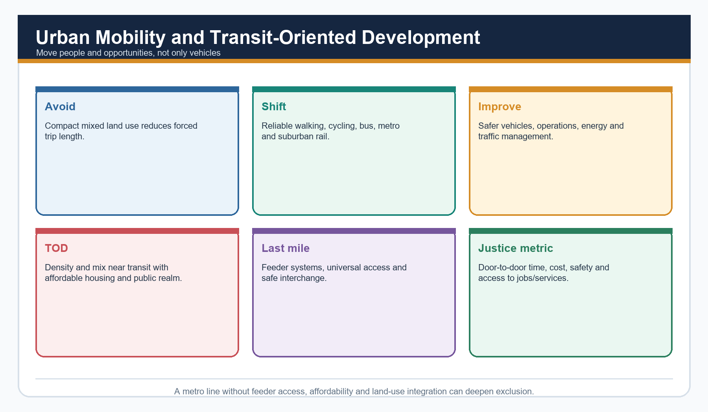

*Avoid-shift-improve and TOD are integrated around an accessibility and justice metric.*

Mobility policy should measure access to opportunities, not vehicle speed alone.

- **Avoid:** compact mixed land use and digital/service proximity reduce forced travel.
- **Shift:** walking, cycling, bus, metro and suburban rail provide high-capacity alternatives.
- **Improve:** safer vehicles, operations, information and energy reduce cost and emissions.
- Transit-oriented development concentrates mixed use around high-capacity transit but must reserve affordable housing and public space.
- First/last-mile access, universal design, safety and fare integration determine door-to-door utility.
- Road expansion can induce traffic and sprawl if not integrated with demand management and public transport.

**Must-know facts**
- 2019 GS-I explicitly linked efficient affordable mass transport to economic development.
- Accessibility is time/cost/reliability to destinations.

**UPSC traps**
- **Wrong:** Metro ridership alone measures inclusive mobility. **Correct:** Disaggregate by fare burden, gender, disability, feeder access and trip purpose.

**Mains / practice route:** Economic productivity + inclusion + environment + land-use integration.

**Study link:** 2019 PYQ | agglomeration | land value

## 29. Urban heat, climate risk and resilience

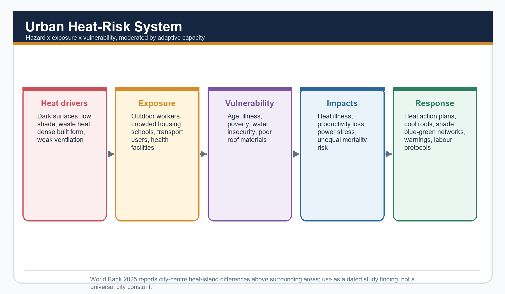

*The risk chain ends in layered responses rather than a single greening solution.*

Urban heat risk combines meteorological hazard, heat-island amplification, exposure, vulnerability and adaptive capacity.

- Dark surfaces, low vegetation, waste heat and restricted ventilation raise local heat exposure.
- Outdoor workers, informal settlements, elderly people and those with chronic illness face differentiated risk.
- Cool roofs, shade, water access, tree/blue-green networks, early warnings and health protocols operate at different timescales.
- Tree planting needs species, water, maintenance and spatial-equity planning; canopy averages can hide heat-vulnerable wards.
- Building design and labour standards are as important as emergency alerts.
- World Bank's 22 July 2025 report found city-centre heat-island differences above surrounding areas in its studied context and stressed urgent adaptation; use as a dated study.

**Must-know facts**
- Heat action plan is preparedness, not proof of reduced mortality.
- Risk = hazard x exposure x vulnerability, moderated by capacity.

**UPSC traps**
- **Wrong:** Urban heat is only a climate-change problem. **Correct:** Urban form and material choices amplify background warming.

**Mains / practice route:** Hazard -> urban amplification -> vulnerable groups -> layered adaptation -> monitoring.

**Study link:** World Bank 2025 | Ahmedabad Heat Action Plan | SDG 11

## 30. Urban floods and blue-green resilience

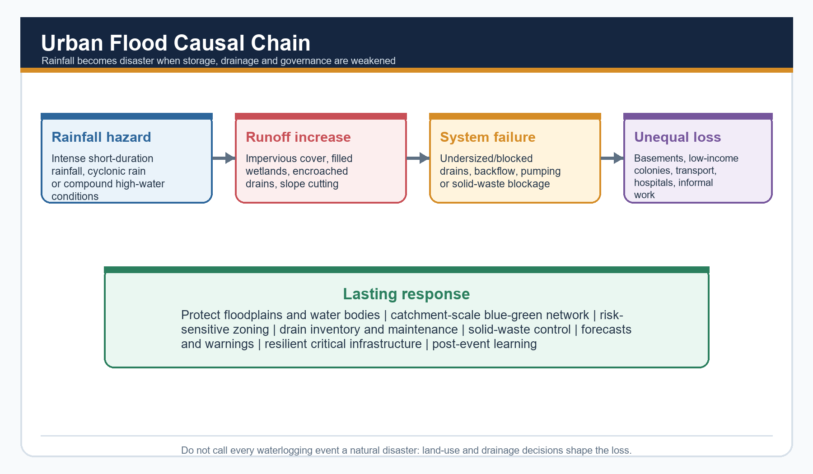

*The causal chain shows how land use and system failure convert rainfall into unequal loss.*

Urban floods arise when intense rainfall meets impermeable growth, lost storage, obstructed drainage, weak maintenance and exposure in low-lying land.

- Wetlands, lakes, floodplains, parks and permeable surfaces store, slow and infiltrate runoff.
- Filling a water body can shift flood peaks downstream and reduce recharge even when a local drain is widened.
- Sewage and solid waste reduce drain capacity and make floodwater a public-health hazard.
- Catchment and watershed scales often exceed municipal boundaries.
- Lasting measures include risk-sensitive zoning, blue-green networks, drain inventories, updated design storms, warnings and resilient critical infrastructure.
- Residual risk remains; emergency access, shelters, insurance/finance and recovery planning matter.

**Must-know facts**
- 2020 GS-I named flooding in million/smart cities.
- 2021 GS-I tested reclamation of water bodies.

**UPSC traps**
- **Wrong:** Faster concrete drains always solve flooding. **Correct:** They can transfer peaks downstream; preserve storage and infiltration.

**Mains / practice route:** Account for natural + anthropogenic + institutional causes, then propose catchment-scale remedies.

**Study link:** 2020 and 2021 PYQs | wetlands | disaster management

## 31. Urban mission architecture and the output-outcome firewall

**Current trigger:** As of the 19 August 2026 evidence cutoff, current urban-policy analysis centres on mission closure/transition, PMAY-U 2.0 sanctions, AMRUT/SBM implementation and market-linked urban finance.

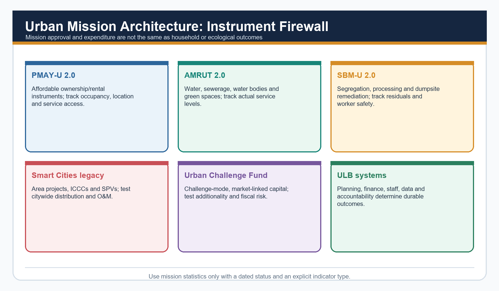

*Each mission is matched to its instrument and outcome test.*

India's urban missions address different parts of the system. They should be evaluated through instrument fit and verified outcomes, not aggregated publicity totals.

- **PMAY-U 2.0:** ownership, partnership, rental and interest-support verticals; test location, occupancy, services and affordability.
- **AMRUT 2.0:** water security, sewerage/septage, water bodies and green spaces; test continuity, quality and environmental compliance.
- **SBM-U 2.0:** garbage-free cities, segregation, processing and legacy dumpsites; test residuals, worker safety and pollution.
- **Smart Cities legacy:** projects, ICCCs and SPVs; MoHUA advised repurposing SPVs after mission closure for continued city support.
- **Urban Challenge Fund:** challenge-mode and market-linked finance; test project additionality, debt risk and small-city access.
- ULB planning, staffing, finance and O&M are the common institutional base beneath all missions.

**Must-know facts**
- PMAY-U 2.0: 16.20 lakh sanctioned by 13 July 2026.
- Smart Cities: 7,755 of 8,064 projects (96%) reported complete as on 31 December 2025.

**UPSC traps**
- **Wrong:** A completed smart-city project proves reduced poverty. **Correct:** Link the asset to beneficiary, affordability, service and distribution outcomes.
- **Wrong:** Mission totals can be added as one urban-outcome score. **Correct:** They use different units, universes and dates.

**Mains / practice route:** Mission objective -> dated output -> outcome gap -> governance/O&M -> equity verdict.

**Study link:** MoHUA Annual Report 2025-26 | PIB mission releases

## 32. Monitoring dashboard and SDG 11

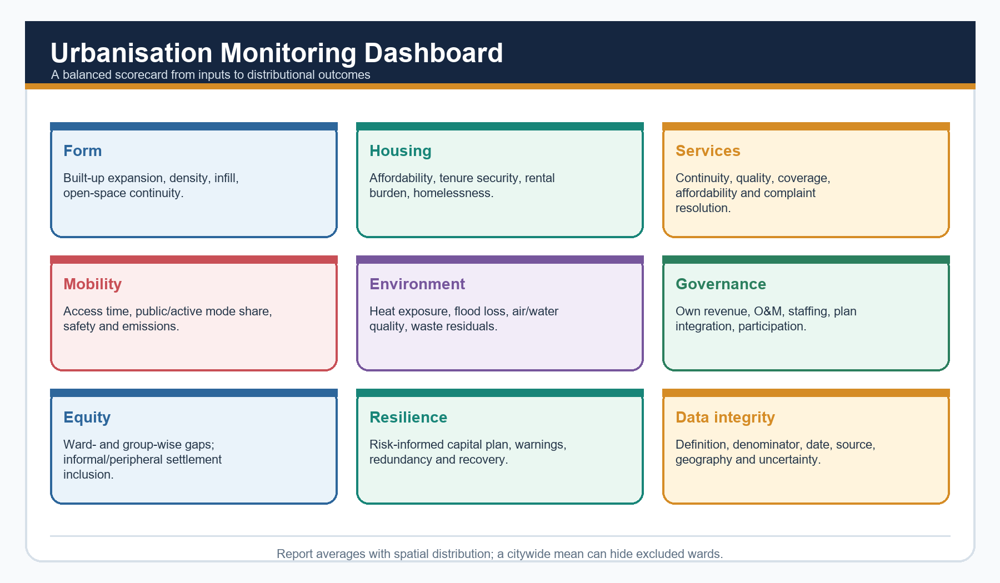

*Nine monitoring domains prevent infrastructure counts from crowding out equity and resilience.*

Monitoring must connect urban form and infrastructure to affordability, distribution, environmental performance and resilience.

- Use a results chain: input -> activity -> output -> service outcome -> welfare/ecological outcome.
- Report numerator, denominator, geography, date, definition and uncertainty.
- Pair city averages with ward, gender, income, tenure and peripheral-settlement distribution.
- Track O&M and complaint resolution, not only capital creation.
- SDG 11 provides the normative frame of inclusive, safe, resilient and sustainable cities and human settlements.
- UN WUP 2025 adds a harmonised Degree of Urbanization alongside national definitions; comparability does not replace India's statutory/census categories.

**Must-know facts**
- Indicator quality is part of governance.
- A dashboard is not accountability without audit and public use.

**UPSC traps**
- **Wrong:** More indicators mean better monitoring. **Correct:** Select decision-relevant measures with stable definitions and disaggregation.

**Mains / practice route:** Use the dashboard to end evaluative answers with measurable priorities.

**Study link:** SDG 11 | NUDM | municipal data systems

## 33. Current 2025-26 evidence dashboard

*The firewall classifies current evidence before it enters an answer.*

The following figures are date-bound and classified by indicator type. They should not be blended into a single achievement claim.

| Item | Date/vintage | Indicator type |
| --- | --- | --- |
| Census urban share | 2011 | Observed census share |
| UN WUP | 2025 revision | Estimate/projection |
| World Bank 951m | Projection to 2050 | Model/report projection |
| Smart Cities 96% | 31 Dec 2025 | Project completion output |
| PMAY-U 2.0 16.20 lakh | 13 Jul 2026 | Sanction output |
| AMRUT 2.0 8,799 projects | 31 Dec 2025 | Approval/output status |
| SBM-U 81.3% | Jan 2026 | Administrative processing measure |

- **Census 2011 observed:** 377.1m urban; 31.16%; 7,935 towns.
- **UN WUP 2025:** estimates through 2025 and projections to 2050; provides national-definition and Degree-of-Urbanization views.
- **World Bank 22 Jul 2025 projection/study:** urban population expected to reach 951m by 2050; 70% of new jobs by 2030 from cities; >50% of 2050 infrastructure still to be built.
- **Smart Cities, MoHUA Annual Report 2025-26:** 7,755 of 8,064 projects (96%) complete as on 31 December 2025; mission financial closure was 31 March 2025.
- **PMAY-U 2.0 13 Jul 2026 sanction status:** 16.20 lakh houses sanctioned.
- **AMRUT 2.0, MoHUA Annual Report 2025-26:** 8,799 projects worth Rs 1.93 lakh crore approved as on 31 December 2025; works worth Rs 50,000 crore physically completed.
- **SBM-U Jan 2026 administrative measure:** 1,31,837 of 1,62,162 TPD reported processed (81.3%).
- **Urban Challenge Fund 2026 architecture:** Rs 1 lakh crore central assistance over the stated programme period, with market-linked funding conditions.

**Must-know facts**
- All figures carry source/date/type.
- World Bank and UN values are not Census results.

**UPSC traps**
- **Wrong:** Current mission and projection figures can be reported without dates. **Correct:** Every volatile figure must carry its source date/vintage and indicator type.

**Mains / practice route:** Use no more than two or three figures, each tied to an argument and qualification.

**Study link:** Source register | monitoring dashboard

## 34. Debates and advanced refinements

Urbanisation debates are strongest when they reject false binaries and identify the scale at which a claim is valid.

- **Over-urbanisation vs under-capacity:** concentration can outpace formal jobs/services, but the deeper failure may be weak municipal and regional institutions.
- **Compact vs liveable:** compact form can support transit, yet overcrowding and weak open space can worsen heat and health.
- **Formalisation vs livelihood:** rules can improve safety/tenure while excluding street vendors, renters or incremental builders if transition costs are ignored.
- **Megacity vs small-town investment:** large cities generate agglomeration gains; intermediate towns can diffuse access and reduce forced migration.
- **Technology vs institutions:** sensors and ICCCs improve information but do not replace devolution, staffing, finance or participation.
- **Resilience vs displacement:** risk reduction should not push vulnerable residents away from jobs and networks without viable alternatives.
- **Polycentricity vs fragmentation:** multiple nodes can reduce central pressure but require integrated transport and governance.

**Must-know facts**
- Urban quality is multidimensional.
- Scale and distribution are essential qualifications.

**UPSC traps**
- **Wrong:** The answer must choose either growth or sustainability. **Correct:** Show how land use, finance, services and resilience can change the growth pathway.

**Mains / practice route:** State the competing claim, give named evidence for each, identify the mediating institution, then deliver a graded verdict.

**Study link:** Essay | GS-I society | GS-III infrastructure/environment

## 35. Technical terminology rapid set

Use terms only when their mechanism is clear.

- **Conurbation:** continuous built-up merger of previously distinct urban areas.
- **Megalopolis:** extensive chain/network of metropolitan areas; not simply a very large city.
- **Suburbanisation:** outward shift of population/activity within a metropolitan functional region.
- **Counter-urbanisation:** movement/growth away from large urban centres toward smaller places, in a specified context.
- **Gentrification:** reinvestment and higher-income in-movement that can upgrade property while displacing existing residents/businesses.
- **Filtering:** change in housing occupancy/value across time; not a guaranteed affordable-housing mechanism.
- **Brownfield/greenfield:** redevelopment of previously used land versus new development on undeveloped land.
- **Land-value capture:** public recovery of part of land-value increment linked to public action/infrastructure.
- **Blue-green infrastructure:** connected water and vegetation systems delivering drainage, cooling, ecology and public-space functions.
- **Urban metabolism:** flows of water, energy, materials, food, waste and emissions through the urban system.

**Must-know facts**
- Define the spatial unit with each term.
- Avoid using 'megacity', 'metropolis' and 'million-plus' interchangeably.

**UPSC traps**
- **Wrong:** Gentrification is any urban renewal. **Correct:** It specifically involves socio-economic upgrading with displacement/exclusion risk.

**Mains / practice route:** A technical term adds marks only if followed by mechanism and example.

**Study link:** Glossary -> models -> India application

## 36. UPSC answer spine

*The six-stage spine is reusable across morphology, urbanisation, governance, services and resilience questions.*

A settlement answer should move from definition and scale to spatial mechanism, named evidence, distributional qualification and a direct verdict.

- Define the category and data year.
- Draw a compact model, hierarchy, service chain or causal flow.
- Use two to six named examples depending on marks.
- Link each example to what it proves.
- Distinguish municipal boundary from functional region.
- Qualify averages, administrative outputs and deterministic models.
- End with a principle-led verdict, not a generic mission list.

**Must-know facts**
- Claim -> named evidence -> analysis -> qualification -> verdict.
- Every solved Mains answer ends with Why this earns marks.

**UPSC traps**
- **Wrong:** More schemes guarantee a higher score. **Correct:** Evidence must answer the directive and demonstrate a spatial mechanism.

**Mains / practice route:** Use the visual as the default 10/15/20-mark structure.

**Study link:** Solved PYQs and original practice below

## 37. Solved verified PYQ - 2025

Verified from the locally available official GS-I paper for 2025 and cross-checked where needed.

- **Question:** How does smart city in India address the issues of urban poverty and distributive justice? (150 words)
- **Demand decoding:** 10 marks. Directive: Explain how, while evaluating distribution. Define the key term, answer the causal/evaluative demand, use named spatial evidence, qualify scale and end with a direct verdict.
- **Claim 1:** Smart-city infrastructure can lower capability deprivation when it improves basic services and public space. **Named evidence/example:** MoHUA Annual Report 2025-26 reported 7,755 of 8,064 Smart Cities projects completed (96%) as on 31 December 2025.. **Analysis:** Digital and physical upgrades can improve reliability, safety and access, but completion is an administrative output.
- **Claim 2:** Distributive justice depends on who receives accessible housing, mobility and services. **Named evidence/example:** PIB reported 16.20 lakh PMAY-U 2.0 houses sanctioned by 13 July 2026; Census 2011 recorded a large historical slum-household baseline.. **Analysis:** Housing location, tenure, occupancy and transport cost determine whether sanctions expand real opportunity.
- **Claim 3:** Participation and citywide scaling matter. **Named evidence/example:** 74th Amendment institutions and ward-level governance.. **Analysis:** Without voice, area-based upgrading can create enclave improvement, displacement or digital exclusion.
- **Qualification:** Smartness is an instrument, not a distributive outcome; city averages can conceal informal and peripheral settlements.
- **Verdict:** A smart city advances justice only when investment is citywide, affordable, participatory and measured through ward-wise service and accessibility outcomes.
- **Why this earns marks:** It answers the directive directly, links each claim to named evidence, explains the spatial mechanism, includes a limitation and gives a reasoned verdict rather than a scheme list.

**Must-know facts**
- Evidence is linked to argument.
- Directive and word limit govern depth.

**UPSC traps**
- **Wrong:** A named city is sufficient evidence. **Correct:** State what the city/example proves and its limit.

**Mains / practice route:** Question: How does smart city in India address the issues of urban poverty and distributive justice? (150 words)

**Study link:** Local official GS-I scan, 2025

## 38. Solved verified PYQ - 2024

Verified from the locally available official GS-I paper for 2024 and cross-checked where needed.

- **Question:** Why do large cities tend to attract more migrants than smaller towns? Discuss in the light of conditions in developing countries. (150 words)
- **Demand decoding:** 10 marks. Directive: Explain comparative attraction. Define the key term, answer the causal/evaluative demand, use named spatial evidence, qualify scale and end with a direct verdict.
- **Claim 1:** Large cities offer thicker labour markets and a wider probability of job matching. **Named evidence/example:** Delhi NCR, Mumbai, Bengaluru and other metropolitan regions combine formal and informal opportunities.. **Analysis:** Even when unemployment risk exists, expected income and job diversity can exceed small-town options.
- **Claim 2:** Agglomeration concentrates institutions, transport gateways and migrant networks. **Named evidence/example:** Universities, hospitals, airports, wholesale markets and established origin-destination networks.. **Analysis:** Network information lowers migration cost and risk, reinforcing cumulative attraction.
- **Claim 3:** Policy and capital expenditure often privilege metropolitan nodes. **Named evidence/example:** Smart Cities legacy, metro systems and major business districts.. **Analysis:** Infrastructure concentration raises accessibility but also rent, congestion and informality.
- **Qualification:** Smaller towns can intercept migration when they provide reliable services, processing jobs, education, connectivity and affordable housing.
- **Verdict:** Metropolitan attraction reflects cumulative agglomeration and network effects, not simply population size; balanced regional and small-town development can reduce forced concentration.
- **Why this earns marks:** It answers the directive directly, links each claim to named evidence, explains the spatial mechanism, includes a limitation and gives a reasoned verdict rather than a scheme list.

**Must-know facts**
- Evidence is linked to argument.
- Directive and word limit govern depth.

**UPSC traps**
- **Wrong:** A named city is sufficient evidence. **Correct:** State what the city/example proves and its limit.

**Mains / practice route:** Question: Why do large cities tend to attract more migrants than smaller towns? Discuss in the light of conditions in developing countries. (150 words)

**Study link:** Local official GS-I scan, 2024

## 39. Solved verified PYQ - 2023

Verified from the locally available official GS-I paper for 2023 and cross-checked where needed.

- **Question:** Does urbanization lead to more segregation and/or marginalization of the poor in Indian metropolises? (250 words)
- **Demand decoding:** 15 marks. Directive: Critically assess. Define the key term, answer the causal/evaluative demand, use named spatial evidence, qualify scale and end with a direct verdict.
- **Claim 1:** Land and housing markets sort low-income households into peripheral or hazardous locations. **Named evidence/example:** Informal settlements near drains, floodplains, industrial edges and distant resettlement colonies.. **Analysis:** The poor may gain proximity to work only by accepting insecure tenure and environmental risk.
- **Claim 2:** Infrastructure networks can reproduce spatial exclusion. **Named evidence/example:** Unequal water continuity, sewerage, footpaths and public transport across wards.. **Analysis:** A nominal citywide coverage rate can hide time burdens, high informal prices and unreliable quality.
- **Claim 3:** Redevelopment can improve services but also displace livelihoods. **Named evidence/example:** In-situ upgrading versus relocation approaches under urban housing programmes.. **Analysis:** Distance from work and social networks can convert a housing asset into livelihood loss.
- **Claim 4:** Urbanisation can also reduce inherited constraints. **Named evidence/example:** Mixed labour markets, education, women's employment and public institutions in large cities.. **Analysis:** Cities can enable mobility if anti-discrimination, rental housing and universal services are present.
- **Qualification:** Segregation is not an automatic demographic effect of urban growth; it is mediated by planning, tenure, transport, finance and political voice.
- **Verdict:** Indian metropolitan urbanisation often intensifies marginalisation, but inclusive zoning, in-situ improvement, affordable rental housing, universal services and participatory planning can convert density into shared opportunity.
- **Why this earns marks:** It answers the directive directly, links each claim to named evidence, explains the spatial mechanism, includes a limitation and gives a reasoned verdict rather than a scheme list.

**Must-know facts**
- Evidence is linked to argument.
- Directive and word limit govern depth.

**UPSC traps**
- **Wrong:** A named city is sufficient evidence. **Correct:** State what the city/example proves and its limit.

**Mains / practice route:** Question: Does urbanization lead to more segregation and/or marginalization of the poor in Indian metropolises? (250 words)

**Study link:** Local official GS-I scan, 2023

## 40. Solved verified PYQ - 2022

Verified from the locally available official GS-I paper for 2022 and cross-checked where needed.

- **Question:** How is the growth of Tier 2 cities related to the rise of a new middle class with an emphasis on the culture of consumption? (150 words)
- **Demand decoding:** 10 marks. Directive: Explain relationship. Define the key term, answer the causal/evaluative demand, use named spatial evidence, qualify scale and end with a direct verdict.
- **Claim 1:** Service-sector and administrative expansion raises salaried employment and disposable income. **Named evidence/example:** Regional IT, education, health, logistics and state-capital functions in cities such as Indore, Coimbatore and Bhubaneswar.. **Analysis:** A broader professional class supports durable-goods, housing and leisure demand.
- **Claim 2:** Connectivity and digital retail diffuse metropolitan consumption norms. **Named evidence/example:** Airports, highways, e-commerce, digital payments and social media.. **Analysis:** Market range expands beyond the historic commercial core and reshapes peri-urban land use.
- **Claim 3:** Real-estate and retail landscapes materialise class identity. **Named evidence/example:** Gated housing, malls, branded food, coaching and private health/education.. **Analysis:** Consumption becomes a marker of aspiration while increasing land, waste, traffic and household-debt pressures.
- **Qualification:** Tier 2 is not a uniform official urban category, and new middle classes coexist with informal work, old inequalities and service deficits.
- **Verdict:** Tier 2 growth and consumer middle-class formation are mutually reinforcing, but sustainable urban policy must align consumption-led expansion with public services, productive jobs and ecological limits.
- **Why this earns marks:** It answers the directive directly, links each claim to named evidence, explains the spatial mechanism, includes a limitation and gives a reasoned verdict rather than a scheme list.

**Must-know facts**
- Evidence is linked to argument.
- Directive and word limit govern depth.

**UPSC traps**
- **Wrong:** A named city is sufficient evidence. **Correct:** State what the city/example proves and its limit.

**Mains / practice route:** Question: How is the growth of Tier 2 cities related to the rise of a new middle class with an emphasis on the culture of consumption? (150 words)

**Study link:** Local official GS-I scan, 2022

## 41. Solved verified PYQ - 2021

Verified from the locally available official GS-I paper for 2021 and cross-checked where needed.

- **Question:** What are the environmental implications of the reclamation of water bodies into urban land use? Explain with examples. (150 words)
- **Demand decoding:** 10 marks. Directive: Explain impacts with examples. Define the key term, answer the causal/evaluative demand, use named spatial evidence, qualify scale and end with a direct verdict.
- **Claim 1:** Reclamation removes stormwater storage and drainage connectivity. **Named evidence/example:** Chennai's wetland and floodplain pressures; Bengaluru's disrupted lake-drain network.. **Analysis:** The same rainfall produces faster runoff, deeper waterlogging and higher downstream peaks.
- **Claim 2:** It erodes groundwater recharge, water quality and habitat. **Named evidence/example:** Urban lakes and wetlands function as recharge, sediment, nutrient and biodiversity systems.. **Analysis:** Converting them to built land transfers treatment and flood-control costs to public infrastructure.
- **Claim 3:** It intensifies heat and locks in exposure. **Named evidence/example:** Loss of blue-green space and construction in low-lying land.. **Analysis:** Heat stress and flood damage become concentrated among residents with weaker housing and insurance.
- **Qualification:** Not every modified water body has identical ecological value; restoration must be catchment-based and avoid cosmetic beautification that disconnects hydrology.
- **Verdict:** Urban water bodies are functional infrastructure; zoning, buffer protection, sewage interception and connected blue-green restoration should precede engineering expansion.
- **Why this earns marks:** It answers the directive directly, links each claim to named evidence, explains the spatial mechanism, includes a limitation and gives a reasoned verdict rather than a scheme list.

**Must-know facts**
- Evidence is linked to argument.
- Directive and word limit govern depth.

**UPSC traps**
- **Wrong:** A named city is sufficient evidence. **Correct:** State what the city/example proves and its limit.

**Mains / practice route:** Question: What are the environmental implications of the reclamation of water bodies into urban land use? Explain with examples. (150 words)

**Study link:** Local official GS-I scan, 2021

## 42. Solved verified PYQ - 2021

Verified from the locally available official GS-I paper for 2021 and cross-checked where needed.

- **Question:** What are the main socio-economic implications arising out of the development of IT industries in major cities of India? (250 words)
- **Demand decoding:** 15 marks. Directive: Analyse implications. Define the key term, answer the causal/evaluative demand, use named spatial evidence, qualify scale and end with a direct verdict.
- **Claim 1:** IT clusters create high-productivity employment and global service linkages. **Named evidence/example:** Bengaluru, Hyderabad, Pune, Chennai and NCR technology corridors.. **Analysis:** Specialised labour, suppliers and knowledge spillovers strengthen urban agglomeration.
- **Claim 2:** They restructure land use and metropolitan form. **Named evidence/example:** Electronic City and Outer Ring Road-type corridors, airport-oriented growth and gated housing.. **Analysis:** Office corridors pull housing and services outward, producing polycentric but travel-intensive regions.
- **Claim 3:** They widen occupational and spatial dualism. **Named evidence/example:** High-wage professionals depend on lower-paid security, domestic, delivery and construction workers.. **Analysis:** Rent escalation and long commutes can exclude the workforce that sustains the cluster.
- **Claim 4:** They transform gender, consumption and culture. **Named evidence/example:** Young skilled migrants, night-shift work and transnational work cultures.. **Analysis:** New autonomy coexists with safety, care and housing constraints.
- **Qualification:** Technology is not the sole cause; state policy, engineering education, global demand and infrastructure shape each city's trajectory.
- **Verdict:** IT urbanisation raises productivity but must be paired with affordable housing, mass transit, mixed land use, worker protection and metropolitan governance.
- **Why this earns marks:** It answers the directive directly, links each claim to named evidence, explains the spatial mechanism, includes a limitation and gives a reasoned verdict rather than a scheme list.

**Must-know facts**
- Evidence is linked to argument.
- Directive and word limit govern depth.

**UPSC traps**
- **Wrong:** A named city is sufficient evidence. **Correct:** State what the city/example proves and its limit.

**Mains / practice route:** Question: What are the main socio-economic implications arising out of the development of IT industries in major cities of India? (250 words)

**Study link:** Local official GS-I scan, 2021

## 43. Solved verified PYQ - 2020

Verified from the locally available official GS-I paper for 2020 and cross-checked where needed.

- **Question:** Account for the huge flooding of million cities in India including the smart ones like Hyderabad and Pune. Suggest lasting remedial measures. (250 words)
- **Demand decoding:** 15 marks. Directive: Account for causes and prescribe lasting measures. Define the key term, answer the causal/evaluative demand, use named spatial evidence, qualify scale and end with a direct verdict.
- **Claim 1:** Extreme rainfall interacts with expanded impervious cover. **Named evidence/example:** Hyderabad and Pune experienced rapid built-up growth across catchments and drainage paths.. **Analysis:** Runoff volume and speed rise when infiltration and temporary storage decline.
- **Claim 2:** Land-use violations remove natural buffers. **Named evidence/example:** Encroached floodplains, filled lakes/wetlands and construction in low-lying areas.. **Analysis:** Hazard becomes disaster through planning decisions rather than rainfall alone.
- **Claim 3:** Drainage and solid-waste systems fail as connected networks. **Named evidence/example:** Blocked drains, weak maintenance, sewage mixing and fragmented agency responsibility.. **Analysis:** Project-based upgrades cannot substitute for catchment-scale operation.
- **Claim 4:** Lasting remedies combine spatial regulation and service management. **Named evidence/example:** Blue-green networks, floodplain zoning, drain inventory, forecasts, permeable surfaces and ward preparedness.. **Analysis:** Risk reduction must protect low-income settlements and critical infrastructure rather than merely accelerate drainage downstream.
- **Qualification:** Design standards must use updated rainfall and land-use evidence, but no engineering capacity can eliminate residual risk.
- **Verdict:** The durable strategy is catchment governance: protect storage and flow paths, manage waste and drainage continuously, regulate exposure and prepare for exceedance events.
- **Why this earns marks:** It answers the directive directly, links each claim to named evidence, explains the spatial mechanism, includes a limitation and gives a reasoned verdict rather than a scheme list.

**Must-know facts**
- Evidence is linked to argument.
- Directive and word limit govern depth.

**UPSC traps**
- **Wrong:** A named city is sufficient evidence. **Correct:** State what the city/example proves and its limit.

**Mains / practice route:** Question: Account for the huge flooding of million cities in India including the smart ones like Hyderabad and Pune. Suggest lasting remedial measures. (250 words)

**Study link:** Local official GS-I scan, 2020

## 44. Solved verified PYQ - 2019

Verified from the locally available official GS-I paper for 2019 and cross-checked where needed.

- **Question:** How is efficient and affordable urban mass transport key to the rapid economic development of India? (250 words)
- **Demand decoding:** 15 marks. Directive: Explain causal importance. Define the key term, answer the causal/evaluative demand, use named spatial evidence, qualify scale and end with a direct verdict.
- **Claim 1:** Mass transport enlarges effective labour markets. **Named evidence/example:** Metro, suburban rail and high-capacity bus systems connect workers to multiple employment nodes.. **Analysis:** Lower travel time and uncertainty improve job matching and firm productivity.
- **Claim 2:** Affordability converts physical connectivity into social access. **Named evidence/example:** Low-income workers often spend a high share of time and income on commuting.. **Analysis:** A costly network can induce exclusion, informal paratransit dependence or residential crowding near jobs.
- **Claim 3:** Mode shift reduces congestion, energy use and local pollution per passenger. **Named evidence/example:** Integrated bus-metro-rail systems and walking/cycling access.. **Analysis:** Benefits depend on occupancy, clean energy, network design and restraint on car-oriented sprawl.
- **Claim 4:** Transport shapes land values and urban form. **Named evidence/example:** Transit-oriented development around stations.. **Analysis:** Value capture can fund infrastructure, but displacement must be prevented through affordable housing and inclusive zoning.
- **Qualification:** A metro project alone is not a mobility system; feeder access, universal design, ticket integration, safety and land-use coordination are essential.
- **Verdict:** Efficient affordable mass transit is productive infrastructure because it improves access, agglomeration and environmental performance, provided it is designed as an inclusive door-to-door network.
- **Why this earns marks:** It answers the directive directly, links each claim to named evidence, explains the spatial mechanism, includes a limitation and gives a reasoned verdict rather than a scheme list.

**Must-know facts**
- Evidence is linked to argument.
- Directive and word limit govern depth.

**UPSC traps**
- **Wrong:** A named city is sufficient evidence. **Correct:** State what the city/example proves and its limit.

**Mains / practice route:** Question: How is efficient and affordable urban mass transport key to the rapid economic development of India? (250 words)

**Study link:** Local official GS-I scan, 2019

## 45. Learning MCQ loop 1

Four topic-linked questions. The answer key rotates strictly A -> B -> C -> D across the complete learning loop.

- **Q1. Which pairing is correct?**
- A. Morphology - internal physical structure | B. Site - relative market position | C. Situation - immediate relief | D. Hierarchy - only population size
- **Answer: A.** Morphology concerns streets, plots, buildings and land-use structure.
- **Q2. A census town under Census 2011 must satisfy which set?**
- A. 10,000 population; 500/km2; 75% total workers non-agricultural | B. 5,000 population; 400/km2; 75% male main workers non-agricultural | C. Municipal notification only | D. Continuous built-up area with a statutory town
- **Answer: B.** The three demographic-economic criteria define a census town.
- **Q3. Christaller's threshold means:**
- A. Maximum travel distance | B. Population of the largest city | C. Minimum demand needed to sustain a service | D. Boundary of a municipality
- **Answer: C.** Range is maximum acceptable travel; threshold is minimum sustaining demand.
- **Q4. Which model most directly explains specialised urban nodes?**
- A. Burgess | B. Hoyt | C. Rank-size | D. Harris-Ullman
- **Answer: D.** Multiple-nuclei theory focuses on specialised centres.

**Must-know facts**
- Review the explanation, not only the key.

**UPSC traps**
- **Wrong:** A correct guess proves mastery. **Correct:** Explain why each distractor fails.

**Mains / practice route:** Revisit the linked subtopic for every wrong answer.

**Study link:** Main learning session MCQ loop

## 46. Learning MCQ loop 2

Four topic-linked questions. The answer key rotates strictly A -> B -> C -> D across the complete learning loop.

- **Q5. Urbanisation can rise through:**
- A. Natural increase, net migration, reclassification and boundary change | B. Migration only | C. Natural increase only | D. Reclassification only
- **Answer: A.** All four components can alter urban population/share.
- **Q6. Which statement is correct?**
- A. Every UA is a metropolitan area | B. Million-plus is a population class, not automatically a governing body | C. Every census town is statutory | D. Peri-urban is one uniform census class
- **Answer: B.** Population class, legal status and analytical labels must remain separate.
- **Q7. Which is the strongest outcome indicator for water service?**
- A. Project approved | B. Treatment capacity sanctioned | C. Household continuity, quality and affordability | D. Expenditure booked
- **Answer: C.** Household service performance is closer to outcome than administrative inputs.
- **Q8. Which combination best captures TOD?**
- A. High FAR anywhere | B. Road widening plus parking | C. Satellite town without jobs | D. Mixed use, walkability, transit and affordable housing
- **Answer: D.** TOD integrates land use, access and inclusion around high-capacity transit.

**Must-know facts**
- Review the explanation, not only the key.

**UPSC traps**
- **Wrong:** A correct guess proves mastery. **Correct:** Explain why each distractor fails.

**Mains / practice route:** Revisit the linked subtopic for every wrong answer.

**Study link:** Main learning session MCQ loop

## 47. Learning MCQ loop 3

Four topic-linked questions. The answer key rotates strictly A -> B -> C -> D across the complete learning loop.

- **Q9. A primate-city pattern means:**
- A. Largest city is disproportionately dominant | B. All cities follow P1/n | C. National capital is always largest | D. No intermediate towns exist
- **Answer: A.** Primacy is disproportionate dominance, not a capital-city rule.
- **Q10. Which is an urban-flood resilience measure?**
- A. Fill wetlands and deepen one drain | B. Catchment-scale blue-green network and risk zoning | C. Move all water downstream faster | D. Treat rainfall as the sole cause
- **Answer: B.** Storage, infiltration, flow paths and exposure must be managed together.
- **Q11. The Twelfth Schedule:**
- A. Automatically transfers all functions | B. Creates metropolitan corporations | C. Lists 18 municipal functional items; devolution depends on state law | D. Defines census towns
- **Answer: C.** Article 243W and state law mediate actual assignment.
- **Q12. Which statement about slum/housing data is correct?**
- A. Slum households equal housing shortage | B. Notified slum equals every informal settlement | C. PMAY sanction equals occupied house | D. Census 2011 slum data is a historical baseline
- **Answer: D.** The categories and dates differ.

**Must-know facts**
- Review the explanation, not only the key.

**UPSC traps**
- **Wrong:** A correct guess proves mastery. **Correct:** Explain why each distractor fails.

**Mains / practice route:** Revisit the linked subtopic for every wrong answer.

**Study link:** Main learning session MCQ loop

## 48. Learning MCQ loop 4

Four topic-linked questions. The answer key rotates strictly A -> B -> C -> D across the complete learning loop.

- **Q13. Agglomeration learning refers to:**
- A. Knowledge spillovers from proximity | B. Only school enrolment | C. Municipal training | D. Declining city size
- **Answer: A.** Learning is one of the classic agglomeration mechanisms.
- **Q14. Which is a ULB lifecycle risk?**
- A. Property records updated | B. O&M ignored after asset creation | C. Ward data published | D. User charges include lifeline protection
- **Answer: B.** Capital assets deteriorate without O&M and renewal.
- **Q15. A processing rate under SBM-U should be read with:**
- A. Only the headline percentage | B. Urban share | C. Denominator, technology, rejects and final disposal | D. Housing-shortage estimate
- **Answer: C.** Material-flow integrity determines what processing means.
- **Q16. The best use of Burgess in an Indian answer is:**
- A. Trace five universal rings | B. Define metropolitan area | C. Measure rank-size | D. Explain a partial succession mechanism and qualify historical/polycentric form
- **Answer: D.** The model is a heuristic with explicit assumptions.

**Must-know facts**
- Review the explanation, not only the key.

**UPSC traps**
- **Wrong:** A correct guess proves mastery. **Correct:** Explain why each distractor fails.

**Mains / practice route:** Revisit the linked subtopic for every wrong answer.

**Study link:** Main learning session MCQ loop

## 49. Learning MCQ loop 5

Four topic-linked questions. The answer key rotates strictly A -> B -> C -> D across the complete learning loop.

- **Q17. A rural-urban continuum implies:**
- A. Economic/morphological transition can be gradual | B. No legal categories exist | C. All villages are census towns | D. Municipalisation always precedes non-farm work
- **Answer: A.** Gradients can coexist with legal thresholds.
- **Q18. Which is procedural justice?**
- A. Equal average income | B. Participation in planning and decision-making | C. Only service coverage | D. Only land value
- **Answer: B.** Procedural justice concerns voice and process.
- **Q19. Which item is a projection?**
- A. Census 2011 urban share | B. PMAY sanction on a dated release | C. World Bank 951m urban population by 2050 | D. 2019 Prelims official key
- **Answer: C.** The 2050 value is a projection.
- **Q20. A high-quality mission evaluation should:**
- A. Add all project totals | B. Treat expenditure as welfare | C. Ignore O&M | D. Compare dated output with intended outcome and distribution
- **Answer: D.** Indicator type and outcome logic are essential.

**Must-know facts**
- Review the explanation, not only the key.

**UPSC traps**
- **Wrong:** A correct guess proves mastery. **Correct:** Explain why each distractor fails.

**Mains / practice route:** Revisit the linked subtopic for every wrong answer.

**Study link:** Main learning session MCQ loop

## 50. Original solved Mains practice - 10 marks

Original examiner-oriented practice question.

- **Question:** Examine why India's urban challenge is better understood as a mismatch among functional regions, governing boundaries and service systems than as population growth alone. (10 marks)
- **Demand decoding:** 10 marks. Directive: Examine. Define the key term, answer the causal/evaluative demand, use named spatial evidence, qualify scale and end with a direct verdict.
- **Claim 1:** Functional urban regions cross statutory borders. **Named evidence/example:** Delhi NCR-type commuting and airshed/watershed systems.. **Analysis:** Municipal decisions cannot alone govern regional flows.
- **Claim 2:** Census and legal categories change at different speeds. **Named evidence/example:** 3,894 census towns in Census 2011.. **Analysis:** Dense non-farm settlements can remain under rural governance and service norms.
- **Claim 3:** Infrastructure is networked across jurisdictions. **Named evidence/example:** Water source, landfill, transit corridor and flood catchment.. **Analysis:** Fragmentation creates cost shifting and accountability gaps.
- **Qualification:** Population growth remains a pressure multiplier, but the same growth produces different outcomes under different institutional capacity.
- **Verdict:** India needs boundary-aware municipal devolution plus metropolitan/catchment coordination and outcome-based service monitoring.
- **Why this earns marks:** It answers the directive directly, links each claim to named evidence, explains the spatial mechanism, includes a limitation and gives a reasoned verdict rather than a scheme list.

**Must-know facts**
- Use a compact diagram from the visual register.
- Evidence density rises with marks.

**UPSC traps**
- **Wrong:** A framework can omit evidence. **Correct:** Every framework must contain named evidence and a qualification.

**Mains / practice route:** Examine why India's urban challenge is better understood as a mismatch among functional regions, governing boundaries and service systems than as population growth alone. (10 marks)

**Study link:** Original practice | answer spine

## 51. Original solved Mains practice - 15 marks

Original examiner-oriented practice question.

- **Question:** Analyse how land-use planning, housing and mobility can jointly reduce urban inequality and climate risk in Indian cities. (15 marks)
- **Demand decoding:** 15 marks. Directive: Analyse. Define the key term, answer the causal/evaluative demand, use named spatial evidence, qualify scale and end with a direct verdict.
- **Claim 1:** Risk-sensitive land use reduces exposure. **Named evidence/example:** Protection of wetlands/floodplains and heat-sensitive open-space networks.. **Analysis:** Avoidance is cheaper and more equitable than repeated post-disaster recovery.
- **Claim 2:** Well-located affordable housing lowers livelihood and transport vulnerability. **Named evidence/example:** In-situ upgrading, rental housing and mixed-income TOD.. **Analysis:** Location turns a dwelling into access to jobs, care and education.
- **Claim 3:** Mass transit and active mobility expand opportunity while limiting emissions. **Named evidence/example:** Integrated bus-metro-suburban rail with safe last mile.. **Analysis:** Affordable door-to-door access supports agglomeration without car dependence.
- **Claim 4:** Municipal finance and participation sustain the package. **Named evidence/example:** Property-tax reform, O&M budgets, ward committees and public dashboards.. **Analysis:** Capital projects endure only with revenue and local accountability.
- **Qualification:** Higher density can worsen heat or displacement if infrastructure, ventilation and affordability safeguards are absent.
- **Verdict:** An integrated land-housing-mobility strategy should be evaluated through ward-wise access, affordability and risk outcomes rather than project counts.
- **Why this earns marks:** It answers the directive directly, links each claim to named evidence, explains the spatial mechanism, includes a limitation and gives a reasoned verdict rather than a scheme list.

**Must-know facts**
- Use a compact diagram from the visual register.
- Evidence density rises with marks.

**UPSC traps**
- **Wrong:** A framework can omit evidence. **Correct:** Every framework must contain named evidence and a qualification.

**Mains / practice route:** Analyse how land-use planning, housing and mobility can jointly reduce urban inequality and climate risk in Indian cities. (15 marks)

**Study link:** Original practice | answer spine

## 52. Original solved Mains practice - 20 marks

Original examiner-oriented practice question.

- **Question:** India's next urban transition must be municipal, metropolitan and ecological at the same time. Discuss with reference to the 74th Amendment and current urban missions. (20 marks)
- **Demand decoding:** 20 marks. Directive: Discuss. Define the key term, answer the causal/evaluative demand, use named spatial evidence, qualify scale and end with a direct verdict.
- **Claim 1:** Municipal capacity is the democratic service foundation. **Named evidence/example:** Part IX-A, Article 243W and the Twelfth Schedule.. **Analysis:** Functions without funds, staff and answerability create constitutional form without operational capacity.
- **Claim 2:** Metropolitan coordination is required for networked regions. **Named evidence/example:** Article 243ZE MPC; commuting, housing, watershed, airshed and waste flows.. **Analysis:** Local autonomy and regional integration must be designed together.
- **Claim 3:** Ecological systems are urban infrastructure. **Named evidence/example:** Blue-green flood networks, heat mitigation, source-water security and circular waste systems.. **Analysis:** Ignoring ecological capacity converts growth into recurrent fiscal and social loss.
- **Claim 4:** Missions supply instruments but not automatic outcomes. **Named evidence/example:** PMAY-U 2.0 sanctions, AMRUT approvals, SBM processing status and Smart Cities project completion.. **Analysis:** Each statistic needs an outcome test: occupancy, continuity, residuals, inclusion and O&M.
- **Claim 5:** Finance determines scale and durability. **Named evidence/example:** Urban Challenge Fund, own revenue, grants, bonds and lifecycle costing.. **Analysis:** Market-linked capital can expand investment but may exclude weak ULBs or create fiscal risk without equalisation and capacity.
- **Qualification:** One uniform model cannot fit statutory towns, census towns, Tier 2 centres and mega city-regions; state and city variation must remain visible.
- **Verdict:** The transition should combine empowered ULBs, accountable metropolitan institutions and ecological limits, monitored through disaggregated service and resilience outcomes.
- **Why this earns marks:** It answers the directive directly, links each claim to named evidence, explains the spatial mechanism, includes a limitation and gives a reasoned verdict rather than a scheme list.

**Must-know facts**
- Use a compact diagram from the visual register.
- Evidence density rises with marks.

**UPSC traps**
- **Wrong:** A framework can omit evidence. **Correct:** Every framework must contain named evidence and a qualification.

**Mains / practice route:** India's next urban transition must be municipal, metropolitan and ecological at the same time. Discuss with reference to the 74th Amendment and current urban missions. (20 marks)

**Study link:** Original practice | answer spine

# Part II - Premium solved-practice workbook

## 1. Workbook protocol and PYQ provenance

*The workbook uses the same examiner-grade answer sequence throughout.*

This workbook includes all topic-relevant Mains questions found in the locally available GS-I scans for 2019-2025 and two relevant locally available Prelims questions.

- Mains included: 2019 mass transport; 2020 million-city flooding; 2021 water-body reclamation and IT-city implications; 2022 Tier 2 consumption; 2023 segregation; 2024 large-city migration; 2025 smart-city justice.
- Prelims included: 2019 Solid Waste Management Rules Q59; 2024 constitutional Parts Q74.
- The 2019 and 2024 objective keys are treated as officially verified.
- All original hard/remedial MCQs rotate strictly A -> B -> C -> D.
- Every Mains model follows claim -> named evidence/example -> analysis -> qualification -> verdict and ends with Why this earns marks.

**Must-know facts**
- No objective answer is presented as inferred.
- Question wording follows local scans with minor OCR normalisation.

**UPSC traps**
- **Wrong:** A provisional/current-affairs question should be added as a PYQ without a stable key. **Correct:** Use only verifiable local paper/key evidence for the solved objective set.

**Mains / practice route:** Practice under the original word limit, then compare with the model.

**Study link:** Local official paper archive

## 2. Workbook solved Mains PYQ - 2025

Locally available official GS-I question paper verified.

- **Question:** How does smart city in India address the issues of urban poverty and distributive justice? (150 words)
- **Demand decoding:** 10 marks. Directive: Explain how, while evaluating distribution. Define the key term, answer the causal/evaluative demand, use named spatial evidence, qualify scale and end with a direct verdict.
- **Claim 1:** Smart-city infrastructure can lower capability deprivation when it improves basic services and public space. **Named evidence/example:** MoHUA Annual Report 2025-26 reported 7,755 of 8,064 Smart Cities projects completed (96%) as on 31 December 2025.. **Analysis:** Digital and physical upgrades can improve reliability, safety and access, but completion is an administrative output.
- **Claim 2:** Distributive justice depends on who receives accessible housing, mobility and services. **Named evidence/example:** PIB reported 16.20 lakh PMAY-U 2.0 houses sanctioned by 13 July 2026; Census 2011 recorded a large historical slum-household baseline.. **Analysis:** Housing location, tenure, occupancy and transport cost determine whether sanctions expand real opportunity.
- **Claim 3:** Participation and citywide scaling matter. **Named evidence/example:** 74th Amendment institutions and ward-level governance.. **Analysis:** Without voice, area-based upgrading can create enclave improvement, displacement or digital exclusion.
- **Qualification:** Smartness is an instrument, not a distributive outcome; city averages can conceal informal and peripheral settlements.
- **Verdict:** A smart city advances justice only when investment is citywide, affordable, participatory and measured through ward-wise service and accessibility outcomes.
- **Why this earns marks:** It answers the directive directly, links each claim to named evidence, explains the spatial mechanism, includes a limitation and gives a reasoned verdict rather than a scheme list.
- **Outstanding-answer checklist:** direct thesis; compact spatial diagram; mark-proportionate evidence; example-to-claim linkage; explicit counterpoint; decisive conclusion.
- **Examiner warning:** do not substitute a mission inventory for the causal or evaluative demand.

**Must-know facts**
- Use 2-3 named examples for 10 marks and 4-6 for 15 marks.
- Maintain directive fidelity.

**UPSC traps**
- **Wrong:** A list of city names is evidence. **Correct:** Explain what each named example demonstrates.

**Mains / practice route:** How does smart city in India address the issues of urban poverty and distributive justice? (150 words)

**Study link:** Official local GS-I scan, 2025

## 3. Workbook solved Mains PYQ - 2024

Locally available official GS-I question paper verified.

- **Question:** Why do large cities tend to attract more migrants than smaller towns? Discuss in the light of conditions in developing countries. (150 words)
- **Demand decoding:** 10 marks. Directive: Explain comparative attraction. Define the key term, answer the causal/evaluative demand, use named spatial evidence, qualify scale and end with a direct verdict.
- **Claim 1:** Large cities offer thicker labour markets and a wider probability of job matching. **Named evidence/example:** Delhi NCR, Mumbai, Bengaluru and other metropolitan regions combine formal and informal opportunities.. **Analysis:** Even when unemployment risk exists, expected income and job diversity can exceed small-town options.
- **Claim 2:** Agglomeration concentrates institutions, transport gateways and migrant networks. **Named evidence/example:** Universities, hospitals, airports, wholesale markets and established origin-destination networks.. **Analysis:** Network information lowers migration cost and risk, reinforcing cumulative attraction.
- **Claim 3:** Policy and capital expenditure often privilege metropolitan nodes. **Named evidence/example:** Smart Cities legacy, metro systems and major business districts.. **Analysis:** Infrastructure concentration raises accessibility but also rent, congestion and informality.
- **Qualification:** Smaller towns can intercept migration when they provide reliable services, processing jobs, education, connectivity and affordable housing.
- **Verdict:** Metropolitan attraction reflects cumulative agglomeration and network effects, not simply population size; balanced regional and small-town development can reduce forced concentration.
- **Why this earns marks:** It answers the directive directly, links each claim to named evidence, explains the spatial mechanism, includes a limitation and gives a reasoned verdict rather than a scheme list.
- **Outstanding-answer checklist:** direct thesis; compact spatial diagram; mark-proportionate evidence; example-to-claim linkage; explicit counterpoint; decisive conclusion.
- **Examiner warning:** do not substitute a mission inventory for the causal or evaluative demand.

**Must-know facts**
- Use 2-3 named examples for 10 marks and 4-6 for 15 marks.
- Maintain directive fidelity.

**UPSC traps**
- **Wrong:** A list of city names is evidence. **Correct:** Explain what each named example demonstrates.

**Mains / practice route:** Why do large cities tend to attract more migrants than smaller towns? Discuss in the light of conditions in developing countries. (150 words)

**Study link:** Official local GS-I scan, 2024

## 4. Workbook solved Mains PYQ - 2023

Locally available official GS-I question paper verified.

- **Question:** Does urbanization lead to more segregation and/or marginalization of the poor in Indian metropolises? (250 words)
- **Demand decoding:** 15 marks. Directive: Critically assess. Define the key term, answer the causal/evaluative demand, use named spatial evidence, qualify scale and end with a direct verdict.
- **Claim 1:** Land and housing markets sort low-income households into peripheral or hazardous locations. **Named evidence/example:** Informal settlements near drains, floodplains, industrial edges and distant resettlement colonies.. **Analysis:** The poor may gain proximity to work only by accepting insecure tenure and environmental risk.
- **Claim 2:** Infrastructure networks can reproduce spatial exclusion. **Named evidence/example:** Unequal water continuity, sewerage, footpaths and public transport across wards.. **Analysis:** A nominal citywide coverage rate can hide time burdens, high informal prices and unreliable quality.
- **Claim 3:** Redevelopment can improve services but also displace livelihoods. **Named evidence/example:** In-situ upgrading versus relocation approaches under urban housing programmes.. **Analysis:** Distance from work and social networks can convert a housing asset into livelihood loss.
- **Claim 4:** Urbanisation can also reduce inherited constraints. **Named evidence/example:** Mixed labour markets, education, women's employment and public institutions in large cities.. **Analysis:** Cities can enable mobility if anti-discrimination, rental housing and universal services are present.
- **Qualification:** Segregation is not an automatic demographic effect of urban growth; it is mediated by planning, tenure, transport, finance and political voice.
- **Verdict:** Indian metropolitan urbanisation often intensifies marginalisation, but inclusive zoning, in-situ improvement, affordable rental housing, universal services and participatory planning can convert density into shared opportunity.
- **Why this earns marks:** It answers the directive directly, links each claim to named evidence, explains the spatial mechanism, includes a limitation and gives a reasoned verdict rather than a scheme list.
- **Outstanding-answer checklist:** direct thesis; compact spatial diagram; mark-proportionate evidence; example-to-claim linkage; explicit counterpoint; decisive conclusion.
- **Examiner warning:** do not substitute a mission inventory for the causal or evaluative demand.

**Must-know facts**
- Use 2-3 named examples for 10 marks and 4-6 for 15 marks.
- Maintain directive fidelity.

**UPSC traps**
- **Wrong:** A list of city names is evidence. **Correct:** Explain what each named example demonstrates.

**Mains / practice route:** Does urbanization lead to more segregation and/or marginalization of the poor in Indian metropolises? (250 words)

**Study link:** Official local GS-I scan, 2023

## 5. Workbook solved Mains PYQ - 2022

Locally available official GS-I question paper verified.

- **Question:** How is the growth of Tier 2 cities related to the rise of a new middle class with an emphasis on the culture of consumption? (150 words)
- **Demand decoding:** 10 marks. Directive: Explain relationship. Define the key term, answer the causal/evaluative demand, use named spatial evidence, qualify scale and end with a direct verdict.
- **Claim 1:** Service-sector and administrative expansion raises salaried employment and disposable income. **Named evidence/example:** Regional IT, education, health, logistics and state-capital functions in cities such as Indore, Coimbatore and Bhubaneswar.. **Analysis:** A broader professional class supports durable-goods, housing and leisure demand.
- **Claim 2:** Connectivity and digital retail diffuse metropolitan consumption norms. **Named evidence/example:** Airports, highways, e-commerce, digital payments and social media.. **Analysis:** Market range expands beyond the historic commercial core and reshapes peri-urban land use.
- **Claim 3:** Real-estate and retail landscapes materialise class identity. **Named evidence/example:** Gated housing, malls, branded food, coaching and private health/education.. **Analysis:** Consumption becomes a marker of aspiration while increasing land, waste, traffic and household-debt pressures.
- **Qualification:** Tier 2 is not a uniform official urban category, and new middle classes coexist with informal work, old inequalities and service deficits.
- **Verdict:** Tier 2 growth and consumer middle-class formation are mutually reinforcing, but sustainable urban policy must align consumption-led expansion with public services, productive jobs and ecological limits.
- **Why this earns marks:** It answers the directive directly, links each claim to named evidence, explains the spatial mechanism, includes a limitation and gives a reasoned verdict rather than a scheme list.
- **Outstanding-answer checklist:** direct thesis; compact spatial diagram; mark-proportionate evidence; example-to-claim linkage; explicit counterpoint; decisive conclusion.
- **Examiner warning:** do not substitute a mission inventory for the causal or evaluative demand.

**Must-know facts**
- Use 2-3 named examples for 10 marks and 4-6 for 15 marks.
- Maintain directive fidelity.

**UPSC traps**
- **Wrong:** A list of city names is evidence. **Correct:** Explain what each named example demonstrates.

**Mains / practice route:** How is the growth of Tier 2 cities related to the rise of a new middle class with an emphasis on the culture of consumption? (150 words)

**Study link:** Official local GS-I scan, 2022

## 6. Workbook solved Mains PYQ - 2021

Locally available official GS-I question paper verified.

- **Question:** What are the environmental implications of the reclamation of water bodies into urban land use? Explain with examples. (150 words)
- **Demand decoding:** 10 marks. Directive: Explain impacts with examples. Define the key term, answer the causal/evaluative demand, use named spatial evidence, qualify scale and end with a direct verdict.
- **Claim 1:** Reclamation removes stormwater storage and drainage connectivity. **Named evidence/example:** Chennai's wetland and floodplain pressures; Bengaluru's disrupted lake-drain network.. **Analysis:** The same rainfall produces faster runoff, deeper waterlogging and higher downstream peaks.
- **Claim 2:** It erodes groundwater recharge, water quality and habitat. **Named evidence/example:** Urban lakes and wetlands function as recharge, sediment, nutrient and biodiversity systems.. **Analysis:** Converting them to built land transfers treatment and flood-control costs to public infrastructure.
- **Claim 3:** It intensifies heat and locks in exposure. **Named evidence/example:** Loss of blue-green space and construction in low-lying land.. **Analysis:** Heat stress and flood damage become concentrated among residents with weaker housing and insurance.
- **Qualification:** Not every modified water body has identical ecological value; restoration must be catchment-based and avoid cosmetic beautification that disconnects hydrology.
- **Verdict:** Urban water bodies are functional infrastructure; zoning, buffer protection, sewage interception and connected blue-green restoration should precede engineering expansion.
- **Why this earns marks:** It answers the directive directly, links each claim to named evidence, explains the spatial mechanism, includes a limitation and gives a reasoned verdict rather than a scheme list.
- **Outstanding-answer checklist:** direct thesis; compact spatial diagram; mark-proportionate evidence; example-to-claim linkage; explicit counterpoint; decisive conclusion.
- **Examiner warning:** do not substitute a mission inventory for the causal or evaluative demand.

**Must-know facts**
- Use 2-3 named examples for 10 marks and 4-6 for 15 marks.
- Maintain directive fidelity.

**UPSC traps**
- **Wrong:** A list of city names is evidence. **Correct:** Explain what each named example demonstrates.

**Mains / practice route:** What are the environmental implications of the reclamation of water bodies into urban land use? Explain with examples. (150 words)

**Study link:** Official local GS-I scan, 2021

## 7. Workbook solved Mains PYQ - 2021

Locally available official GS-I question paper verified.

- **Question:** What are the main socio-economic implications arising out of the development of IT industries in major cities of India? (250 words)
- **Demand decoding:** 15 marks. Directive: Analyse implications. Define the key term, answer the causal/evaluative demand, use named spatial evidence, qualify scale and end with a direct verdict.
- **Claim 1:** IT clusters create high-productivity employment and global service linkages. **Named evidence/example:** Bengaluru, Hyderabad, Pune, Chennai and NCR technology corridors.. **Analysis:** Specialised labour, suppliers and knowledge spillovers strengthen urban agglomeration.
- **Claim 2:** They restructure land use and metropolitan form. **Named evidence/example:** Electronic City and Outer Ring Road-type corridors, airport-oriented growth and gated housing.. **Analysis:** Office corridors pull housing and services outward, producing polycentric but travel-intensive regions.
- **Claim 3:** They widen occupational and spatial dualism. **Named evidence/example:** High-wage professionals depend on lower-paid security, domestic, delivery and construction workers.. **Analysis:** Rent escalation and long commutes can exclude the workforce that sustains the cluster.
- **Claim 4:** They transform gender, consumption and culture. **Named evidence/example:** Young skilled migrants, night-shift work and transnational work cultures.. **Analysis:** New autonomy coexists with safety, care and housing constraints.
- **Qualification:** Technology is not the sole cause; state policy, engineering education, global demand and infrastructure shape each city's trajectory.
- **Verdict:** IT urbanisation raises productivity but must be paired with affordable housing, mass transit, mixed land use, worker protection and metropolitan governance.
- **Why this earns marks:** It answers the directive directly, links each claim to named evidence, explains the spatial mechanism, includes a limitation and gives a reasoned verdict rather than a scheme list.
- **Outstanding-answer checklist:** direct thesis; compact spatial diagram; mark-proportionate evidence; example-to-claim linkage; explicit counterpoint; decisive conclusion.
- **Examiner warning:** do not substitute a mission inventory for the causal or evaluative demand.

**Must-know facts**
- Use 2-3 named examples for 10 marks and 4-6 for 15 marks.
- Maintain directive fidelity.

**UPSC traps**
- **Wrong:** A list of city names is evidence. **Correct:** Explain what each named example demonstrates.

**Mains / practice route:** What are the main socio-economic implications arising out of the development of IT industries in major cities of India? (250 words)

**Study link:** Official local GS-I scan, 2021

## 8. Workbook solved Mains PYQ - 2020

Locally available official GS-I question paper verified.

- **Question:** Account for the huge flooding of million cities in India including the smart ones like Hyderabad and Pune. Suggest lasting remedial measures. (250 words)
- **Demand decoding:** 15 marks. Directive: Account for causes and prescribe lasting measures. Define the key term, answer the causal/evaluative demand, use named spatial evidence, qualify scale and end with a direct verdict.
- **Claim 1:** Extreme rainfall interacts with expanded impervious cover. **Named evidence/example:** Hyderabad and Pune experienced rapid built-up growth across catchments and drainage paths.. **Analysis:** Runoff volume and speed rise when infiltration and temporary storage decline.
- **Claim 2:** Land-use violations remove natural buffers. **Named evidence/example:** Encroached floodplains, filled lakes/wetlands and construction in low-lying areas.. **Analysis:** Hazard becomes disaster through planning decisions rather than rainfall alone.
- **Claim 3:** Drainage and solid-waste systems fail as connected networks. **Named evidence/example:** Blocked drains, weak maintenance, sewage mixing and fragmented agency responsibility.. **Analysis:** Project-based upgrades cannot substitute for catchment-scale operation.
- **Claim 4:** Lasting remedies combine spatial regulation and service management. **Named evidence/example:** Blue-green networks, floodplain zoning, drain inventory, forecasts, permeable surfaces and ward preparedness.. **Analysis:** Risk reduction must protect low-income settlements and critical infrastructure rather than merely accelerate drainage downstream.
- **Qualification:** Design standards must use updated rainfall and land-use evidence, but no engineering capacity can eliminate residual risk.
- **Verdict:** The durable strategy is catchment governance: protect storage and flow paths, manage waste and drainage continuously, regulate exposure and prepare for exceedance events.
- **Why this earns marks:** It answers the directive directly, links each claim to named evidence, explains the spatial mechanism, includes a limitation and gives a reasoned verdict rather than a scheme list.
- **Outstanding-answer checklist:** direct thesis; compact spatial diagram; mark-proportionate evidence; example-to-claim linkage; explicit counterpoint; decisive conclusion.
- **Examiner warning:** do not substitute a mission inventory for the causal or evaluative demand.

**Must-know facts**
- Use 2-3 named examples for 10 marks and 4-6 for 15 marks.
- Maintain directive fidelity.

**UPSC traps**
- **Wrong:** A list of city names is evidence. **Correct:** Explain what each named example demonstrates.

**Mains / practice route:** Account for the huge flooding of million cities in India including the smart ones like Hyderabad and Pune. Suggest lasting remedial measures. (250 words)

**Study link:** Official local GS-I scan, 2020

## 9. Workbook solved Mains PYQ - 2019

Locally available official GS-I question paper verified.

- **Question:** How is efficient and affordable urban mass transport key to the rapid economic development of India? (250 words)
- **Demand decoding:** 15 marks. Directive: Explain causal importance. Define the key term, answer the causal/evaluative demand, use named spatial evidence, qualify scale and end with a direct verdict.
- **Claim 1:** Mass transport enlarges effective labour markets. **Named evidence/example:** Metro, suburban rail and high-capacity bus systems connect workers to multiple employment nodes.. **Analysis:** Lower travel time and uncertainty improve job matching and firm productivity.
- **Claim 2:** Affordability converts physical connectivity into social access. **Named evidence/example:** Low-income workers often spend a high share of time and income on commuting.. **Analysis:** A costly network can induce exclusion, informal paratransit dependence or residential crowding near jobs.
- **Claim 3:** Mode shift reduces congestion, energy use and local pollution per passenger. **Named evidence/example:** Integrated bus-metro-rail systems and walking/cycling access.. **Analysis:** Benefits depend on occupancy, clean energy, network design and restraint on car-oriented sprawl.
- **Claim 4:** Transport shapes land values and urban form. **Named evidence/example:** Transit-oriented development around stations.. **Analysis:** Value capture can fund infrastructure, but displacement must be prevented through affordable housing and inclusive zoning.
- **Qualification:** A metro project alone is not a mobility system; feeder access, universal design, ticket integration, safety and land-use coordination are essential.
- **Verdict:** Efficient affordable mass transit is productive infrastructure because it improves access, agglomeration and environmental performance, provided it is designed as an inclusive door-to-door network.
- **Why this earns marks:** It answers the directive directly, links each claim to named evidence, explains the spatial mechanism, includes a limitation and gives a reasoned verdict rather than a scheme list.
- **Outstanding-answer checklist:** direct thesis; compact spatial diagram; mark-proportionate evidence; example-to-claim linkage; explicit counterpoint; decisive conclusion.
- **Examiner warning:** do not substitute a mission inventory for the causal or evaluative demand.

**Must-know facts**
- Use 2-3 named examples for 10 marks and 4-6 for 15 marks.
- Maintain directive fidelity.

**UPSC traps**
- **Wrong:** A list of city names is evidence. **Correct:** Explain what each named example demonstrates.

**Mains / practice route:** How is efficient and affordable urban mass transport key to the rapid economic development of India? (250 words)

**Study link:** Official local GS-I scan, 2019

## 10. Workbook solved Prelims PYQ

UPSC Prelims 2019 GS-I Q59 - Solid Waste Management Rules, 2016

- **Question:** As per the Solid Waste Management Rules, 2016 in India, which one of the following statements is correct?
- A. Waste generator has to segregate waste into five categories. | B. The Rules are applicable to notified urban local bodies, notified towns and all industrial townships only. | C. The Rules provide for exact and elaborate criteria for identification of sites for landfills and waste-processing facilities. | D. Waste generated in one district cannot be moved to another district.
- **Officially verified answer: C.** Officially verified answer: C. Five-category segregation is incorrect; applicability is wider than only notified urban bodies/towns/industrial townships; no blanket inter-district movement ban exists.
- **Elimination logic:** test the precise legal/statistical scope of each option; reject category compression and absolute wording.

**Must-know facts**
- Official key verified.
- No inferred-answer label required.

**UPSC traps**
- **Wrong:** A broadly plausible statement is enough. **Correct:** Prelims turns on exact scope and wording.

**Mains / practice route:** Objective PYQ - verify each statement independently.

**Study link:** Local paper and key

## 11. Workbook solved Prelims PYQ

UPSC Prelims 2024 GS-I Set A Q74 - Constitutional Parts

- **Question:** Which statements are correct? 1. Powers of Municipalities are given in Part IX-A. 2. Emergency provisions are in Part XVIII. 3. Constitutional amendment provisions are in Part XX.
- A. 1 and 2 only | B. 2 and 3 only | C. 1 only | D. 1, 2 and 3
- **Officially verified answer: D.** Official key: D. Part IX-A concerns Municipalities; Part XVIII emergencies; Part XX amendment.
- **Elimination logic:** test the precise legal/statistical scope of each option; reject category compression and absolute wording.

**Must-know facts**
- Official key verified.
- No inferred-answer label required.

**UPSC traps**
- **Wrong:** A broadly plausible statement is enough. **Correct:** Prelims turns on exact scope and wording.

**Mains / practice route:** Objective PYQ - verify each statement independently.

**Study link:** Local paper and key

## 12. Hard MCQs 1-8

Strict answer-key rotation continues A -> B -> C -> D.

- **Q1. Which statement best distinguishes site from situation?**
- A. Site is immediate ground; situation is relational location | B. Site is relative accessibility; situation is geology | C. Both are population classes | D. Both are legal boundaries
- **Answer: A.** Site is local physical ground; situation is relative position.
- **Q2. A nucleated rural settlement most directly describes:**
- A. A statutory town | B. A compact dwelling cluster | C. A transport hierarchy | D. A city-region
- **Answer: B.** Nucleated refers to compact morphology.
- **Q3. Which model uses invasion-succession and a transition zone?**
- A. Hoyt | B. Harris-Ullman | C. Burgess | D. Christaller
- **Answer: C.** Burgess uses concentric zones and a transition zone.
- **Q4. Hoyt's main addition was:**
- A. Hexagonal markets | B. Rank-size relation | C. Multiple legal bodies | D. Sectoral growth along corridors
- **Answer: D.** Hoyt stressed directional sectors.
- **Q5. Multiple-nuclei theory explains:**
- A. Specialised nodes and incompatible land uses | B. Only one CBD | C. Rural hamlets | D. Census reclassification
- **Answer: A.** Specialised centres form several nuclei.
- **Q6. Bid-rent theory is primarily about:**
- A. Birth and death rates | B. Accessibility and land-use bids | C. Municipal elections | D. Waste segregation
- **Answer: B.** Users trade accessibility, transport cost and space.
- **Q7. Threshold in central-place theory is:**
- A. Maximum travel distance | B. Largest city population | C. Minimum sustaining demand | D. Municipal tax base
- **Answer: C.** Threshold is the minimum demand.
- **Q8. Range in central-place theory is:**
- A. Minimum population | B. Ward boundary | C. Rank-size exponent | D. Maximum acceptable travel for a good/service
- **Answer: D.** Range is maximum acceptable distance/time/cost.

## 13. Hard MCQs 9-16

Strict answer-key rotation continues A -> B -> C -> D.

- **Q9. K=4 is associated with:**
- A. Transport | B. Marketing | C. Administration | D. Housing
- **Answer: A.** Christaller's K=4 is the transport principle.
- **Q10. Rank-size analysis requires:**
- A. Only a national capital | B. A defined urban system and comparable boundaries | C. A municipal election | D. A slum survey
- **Answer: B.** Scale and boundary definitions affect rank.
- **Q11. A census town requires:**
- A. Municipal notification | B. One million population | C. Three demographic-economic criteria | D. UA continuity
- **Answer: C.** It is statistically identified by three criteria.
- **Q12. An urban agglomeration requires:**
- A. Every constituent to be statutory | B. At least ten lakh population | C. State Finance Commission | D. Continuous urban spread with at least one statutory town
- **Answer: D.** UA is a built-up continuity concept.
- **Q13. Article 243P metropolitan area is:**
- A. A notified >=10 lakh area meeting constitutional description | B. Any million-plus UA | C. Any district headquarters | D. Any Smart City
- **Answer: A.** It is a notified constitutional planning category.
- **Q14. Urbanisation differs from urban growth because:**
- A. They are identical | B. Urbanisation concerns change in urban share/system; growth can be absolute | C. Growth is only migration | D. Urbanisation excludes reclassification
- **Answer: B.** Share and absolute growth are distinct.
- **Q15. Which is not migration?**
- A. Net in-movement | B. Rural-urban move | C. Reclassification of a settlement | D. International relocation
- **Answer: C.** Reclassification changes category without movement.
- **Q16. Peri-urban area is best treated as:**
- A. One uniform Census class | B. A million-plus class | C. A municipal tax | D. A transition/planning concept
- **Answer: D.** There is no single national census test.

## 14. Hard MCQs 17-24

Strict answer-key rotation continues A -> B -> C -> D.

- **Q17. Sprawl is best diagnosed through:**
- A. Discontinuity, land-use segregation, travel and network cost | B. Population alone | C. Building height alone | D. City name
- **Answer: A.** Sprawl is multidimensional.
- **Q18. TOD requires:**
- A. High FAR without transit | B. Transit, mix, walkability and inclusion | C. Parking-led growth | D. Only ring roads
- **Answer: B.** TOD integrates transit and land use.
- **Q19. A slum household count is:**
- A. Equal to housing shortage | B. A current projection | C. A distinct measure tied to a slum framework | D. A municipal revenue
- **Answer: C.** Do not conflate measures.
- **Q20. Agglomeration 'matching' means:**
- A. Waste segregation | B. Flood storage | C. Tax equalisation | D. Better worker-firm fit
- **Answer: D.** Thick markets improve matching.
- **Q21. Procedural justice concerns:**
- A. Participation and decision process | B. Only final income | C. Only land prices | D. Only project cost
- **Answer: A.** Voice and process are procedural.
- **Q22. Article 243W concerns:**
- A. Census town criteria | B. Municipal powers/responsibilities via state law | C. Emergency provisions | D. Union finance
- **Answer: B.** Article 243W addresses municipal functions.
- **Q23. MPC is provided under:**
- A. 243W | B. 352 | C. 243ZE | D. 368
- **Answer: C.** Article 243ZE provides Metropolitan Planning Committees.
- **Q24. Which is own-source ULB revenue?**
- A. Union income tax | B. World Bank projection | C. Census count | D. Property tax
- **Answer: D.** Property tax is a municipal own-source instrument.

## 15. Hard MCQs 25-32

Strict answer-key rotation continues A -> B -> C -> D.

- **Q25. A tap connection is not proof of:**
- A. Continuity, quality and affordability | B. A recorded connection | C. Capital expenditure | D. Network existence
- **Answer: A.** Service outcomes require more than connection.
- **Q26. Safe sewerage assessment includes:**
- A. Only sanctioned capacity | B. Collection, treatment compliance, sludge and receiving water | C. Only pipe length | D. Only expenditure
- **Answer: B.** The whole chain matters.
- **Q27. SWM processing rate needs:**
- A. Only a headline | B. Urban share | C. Denominator and reject/final-disposal data | D. Rank-size
- **Answer: C.** Material-flow accounting is essential.
- **Q28. Mass transit supports productivity mainly by:**
- A. Increasing parking | B. Reducing all density | C. Replacing land-use planning | D. Enlarging effective labour markets
- **Answer: D.** Access improves matching and agglomeration.
- **Q29. Urban heat vulnerability is highest where:**
- A. Exposure and sensitivity are high and capacity low | B. Only temperature is high | C. Buildings are tall | D. Municipal boundary is large
- **Answer: A.** Risk is multidimensional.
- **Q30. The lasting urban-flood approach is:**
- A. Only larger drains | B. Catchment-scale storage, flow and exposure management | C. Only relief camps | D. Only road elevation
- **Answer: B.** Catchment governance addresses causes.
- **Q31. Mission completion is:**
- A. A guaranteed welfare outcome | B. A Census estimate | C. An administrative output requiring outcome verification | D. A constitutional category
- **Answer: C.** Output-outcome firewall.
- **Q32. UN WUP 2025 should be cited as:**
- A. A new Indian Census | B. A municipal law | C. A housing sanction | D. An estimate/projection series with a harmonised method
- **Answer: D.** It is not the Indian Census.

## 16. Remedial MCQs 33-40

Strict answer-key rotation continues A -> B -> C -> D.

- **Q33. Which correction is necessary?**
- A. 31.16% is Census 2011 | B. 31.16% is India's current observed urban share | C. 951m is Census 2050 | D. PMAY sanction is occupancy
- **Answer: A.** The baseline needs its date.
- **Q34. Which pair is wrongly conflated?**
- A. UA and built-up continuity | B. Metropolitan area and automatic million-plus Census class | C. Threshold and demand | D. TOD and transit
- **Answer: B.** Constitutional notification differs from Census size.
- **Q35. Which statement about census towns is false?**
- A. They may lack a municipality | B. They use a male main-worker criterion | C. They are created only by municipal law | D. They meet density and population tests
- **Answer: C.** They are statistical, not necessarily statutory.
- **Q36. Which measure best checks distributive justice?**
- A. Citywide average only | B. Project count | C. Budget announcement | D. Ward/group-wise access and affordability
- **Answer: D.** Distribution requires disaggregation.
- **Q37. Which model error is common?**
- A. Treating ideal form as universal map | B. Stating assumptions | C. Using named evidence | D. Adding qualification
- **Answer: A.** Models are heuristic.
- **Q38. Which housing response protects livelihoods most directly?**
- A. Distant relocation by default | B. In-situ upgrading where safe and feasible | C. Demolition without plan | D. Ownership-only targeting
- **Answer: B.** Location and networks matter.
- **Q39. Which finance statement is safest?**
- A. Bond issuance proves solvency | B. Grants eliminate accountability | C. Debt needs predictable revenue and O&M | D. PPP has no fiscal risk
- **Answer: C.** Lifecycle and debt service matter.
- **Q40. Which closing verdict is strongest?**
- A. Urban growth must stop | B. Mission totals prove success | C. Technology alone will solve urbanisation | D. Align functional regions, empowered ULBs, universal services and ecological limits
- **Answer: D.** The integrated verdict follows the full analysis.

## 17. Workbook Original solved Mains practice - 10 marks

Original examiner-oriented practice question.

- **Question:** Examine why India's urban challenge is better understood as a mismatch among functional regions, governing boundaries and service systems than as population growth alone. (10 marks)
- **Demand decoding:** 10 marks. Directive: Examine. Define the key term, answer the causal/evaluative demand, use named spatial evidence, qualify scale and end with a direct verdict.
- **Claim 1:** Functional urban regions cross statutory borders. **Named evidence/example:** Delhi NCR-type commuting and airshed/watershed systems.. **Analysis:** Municipal decisions cannot alone govern regional flows.
- **Claim 2:** Census and legal categories change at different speeds. **Named evidence/example:** 3,894 census towns in Census 2011.. **Analysis:** Dense non-farm settlements can remain under rural governance and service norms.
- **Claim 3:** Infrastructure is networked across jurisdictions. **Named evidence/example:** Water source, landfill, transit corridor and flood catchment.. **Analysis:** Fragmentation creates cost shifting and accountability gaps.
- **Qualification:** Population growth remains a pressure multiplier, but the same growth produces different outcomes under different institutional capacity.
- **Verdict:** India needs boundary-aware municipal devolution plus metropolitan/catchment coordination and outcome-based service monitoring.
- **Why this earns marks:** It answers the directive directly, links each claim to named evidence, explains the spatial mechanism, includes a limitation and gives a reasoned verdict rather than a scheme list.
- **Outstanding-answer checklist:** include a labelled diagram, sufficient named evidence, explicit qualification and a verdict proportional to the directive.

## 18. Workbook Original solved Mains practice - 15 marks

Original examiner-oriented practice question.

- **Question:** Analyse how land-use planning, housing and mobility can jointly reduce urban inequality and climate risk in Indian cities. (15 marks)
- **Demand decoding:** 15 marks. Directive: Analyse. Define the key term, answer the causal/evaluative demand, use named spatial evidence, qualify scale and end with a direct verdict.
- **Claim 1:** Risk-sensitive land use reduces exposure. **Named evidence/example:** Protection of wetlands/floodplains and heat-sensitive open-space networks.. **Analysis:** Avoidance is cheaper and more equitable than repeated post-disaster recovery.
- **Claim 2:** Well-located affordable housing lowers livelihood and transport vulnerability. **Named evidence/example:** In-situ upgrading, rental housing and mixed-income TOD.. **Analysis:** Location turns a dwelling into access to jobs, care and education.
- **Claim 3:** Mass transit and active mobility expand opportunity while limiting emissions. **Named evidence/example:** Integrated bus-metro-suburban rail with safe last mile.. **Analysis:** Affordable door-to-door access supports agglomeration without car dependence.
- **Claim 4:** Municipal finance and participation sustain the package. **Named evidence/example:** Property-tax reform, O&M budgets, ward committees and public dashboards.. **Analysis:** Capital projects endure only with revenue and local accountability.
- **Qualification:** Higher density can worsen heat or displacement if infrastructure, ventilation and affordability safeguards are absent.
- **Verdict:** An integrated land-housing-mobility strategy should be evaluated through ward-wise access, affordability and risk outcomes rather than project counts.
- **Why this earns marks:** It answers the directive directly, links each claim to named evidence, explains the spatial mechanism, includes a limitation and gives a reasoned verdict rather than a scheme list.
- **Outstanding-answer checklist:** include a labelled diagram, sufficient named evidence, explicit qualification and a verdict proportional to the directive.

## 19. Workbook Original solved Mains practice - 20 marks

Original examiner-oriented practice question.

- **Question:** India's next urban transition must be municipal, metropolitan and ecological at the same time. Discuss with reference to the 74th Amendment and current urban missions. (20 marks)
- **Demand decoding:** 20 marks. Directive: Discuss. Define the key term, answer the causal/evaluative demand, use named spatial evidence, qualify scale and end with a direct verdict.
- **Claim 1:** Municipal capacity is the democratic service foundation. **Named evidence/example:** Part IX-A, Article 243W and the Twelfth Schedule.. **Analysis:** Functions without funds, staff and answerability create constitutional form without operational capacity.
- **Claim 2:** Metropolitan coordination is required for networked regions. **Named evidence/example:** Article 243ZE MPC; commuting, housing, watershed, airshed and waste flows.. **Analysis:** Local autonomy and regional integration must be designed together.
- **Claim 3:** Ecological systems are urban infrastructure. **Named evidence/example:** Blue-green flood networks, heat mitigation, source-water security and circular waste systems.. **Analysis:** Ignoring ecological capacity converts growth into recurrent fiscal and social loss.
- **Claim 4:** Missions supply instruments but not automatic outcomes. **Named evidence/example:** PMAY-U 2.0 sanctions, AMRUT approvals, SBM processing status and Smart Cities project completion.. **Analysis:** Each statistic needs an outcome test: occupancy, continuity, residuals, inclusion and O&M.
- **Claim 5:** Finance determines scale and durability. **Named evidence/example:** Urban Challenge Fund, own revenue, grants, bonds and lifecycle costing.. **Analysis:** Market-linked capital can expand investment but may exclude weak ULBs or create fiscal risk without equalisation and capacity.
- **Qualification:** One uniform model cannot fit statutory towns, census towns, Tier 2 centres and mega city-regions; state and city variation must remain visible.
- **Verdict:** The transition should combine empowered ULBs, accountable metropolitan institutions and ecological limits, monitored through disaggregated service and resilience outcomes.
- **Why this earns marks:** It answers the directive directly, links each claim to named evidence, explains the spatial mechanism, includes a limitation and gives a reasoned verdict rather than a scheme list.
- **Outstanding-answer checklist:** include a labelled diagram, sufficient named evidence, explicit qualification and a verdict proportional to the directive.

# Part III - Final consolidated register notes

## FINAL REGISTER 1/10 - Settlement vocabulary and rural morphology

*Compressed revision visual; use the linked full section for depth.*

- Site = immediate physical ground; situation = relative accessibility and context.
- Pattern = spatial arrangement; morphology = streets, plots, buildings, land uses and historical layers.
- Rural patterns: nucleated, dispersed, linear, radial, circular, rectangular and composite.
- Cause matrix: relief/water + land tenure + security + production + caste/kinship + transport.
- Trap: geometry alone does not prove causation.

**Must-know facts**
- Site = immediate physical ground; situation = relative accessibility and context.
- Pattern = spatial arrangement; morphology = streets, plots, buildings, land uses and historical layers.
- Rural patterns: nucleated, dispersed, linear, radial, circular, rectangular and composite.

**UPSC traps**
- **Wrong:** Definition drift or data drift. **Correct:** State category, geography, date and indicator type.

**Mains / practice route:** Recall one definition, one model/process, two named evidence points, one qualification and a verdict.

**Study link:** Complete topic revision

## FINAL REGISTER 2/10 - Urban models and land-use logic

*Compressed revision visual; use the linked full section for depth.*

- Burgess 1925: rings and transition; limit = single CBD/isotropic assumptions.
- Hoyt 1939: sectors along transport/amenity corridors.
- Harris-Ullman 1945: specialised multiple nuclei.
- Bid-rent: accessibility-price-space trade-off, modified by regulation and informality.
- Answer route: model -> assumption -> mechanism -> Indian fit -> limitation.

**Must-know facts**
- Burgess 1925: rings and transition; limit = single CBD/isotropic assumptions.
- Hoyt 1939: sectors along transport/amenity corridors.
- Harris-Ullman 1945: specialised multiple nuclei.

**UPSC traps**
- **Wrong:** Definition drift or data drift. **Correct:** State category, geography, date and indicator type.

**Mains / practice route:** Recall one definition, one model/process, two named evidence points, one qualification and a verdict.

**Study link:** Complete topic revision

## FINAL REGISTER 3/10 - Hierarchy, central place and urban systems

*Compressed revision visual; use the linked full section for depth.*

- Threshold = minimum sustaining demand; range = maximum acceptable travel.
- Christaller 1933: hexagonal hierarchy; K=3 marketing, K=4 transport, K=7 administration.
- Rank-size Pn approximates P1/n; primacy = disproportionate dominance.
- Hierarchy is functional, not only population-based.
- Intermediate towns can diffuse services and reduce forced metropolitan concentration.

**Must-know facts**
- Threshold = minimum sustaining demand; range = maximum acceptable travel.
- Christaller 1933: hexagonal hierarchy; K=3 marketing, K=4 transport, K=7 administration.
- Rank-size Pn approximates P1/n; primacy = disproportionate dominance.

**UPSC traps**
- **Wrong:** Definition drift or data drift. **Correct:** State category, geography, date and indicator type.

**Mains / practice route:** Recall one definition, one model/process, two named evidence points, one qualification and a verdict.

**Study link:** Complete topic revision

## FINAL REGISTER 4/10 - India definition and data firewall

*Compressed revision visual; use the linked full section for depth.*

- Census 2011 observed: 377.1m; 31.16%; 7,935 towns; 4,041 statutory; 3,894 census; 53 million-plus UAs/cities.
- Census town: 5,000 + 400/km2 + 75% male main workers non-agricultural.
- UA = built-up continuity with at least one statutory town; metropolitan area = Article 243P notified >=10 lakh area.
- Peri-urban and rural-urban continuum are analytical, not one uniform census category.
- Never present a projection or programme number as a new Census share.

**Must-know facts**
- Census 2011 observed: 377.1m; 31.16%; 7,935 towns; 4,041 statutory; 3,894 census; 53 million-plus UAs/cities.
- Census town: 5,000 + 400/km2 + 75% male main workers non-agricultural.
- UA = built-up continuity with at least one statutory town; metropolitan area = Article 243P notified >=10 lakh area.

**UPSC traps**
- **Wrong:** Definition drift or data drift. **Correct:** State category, geography, date and indicator type.

**Mains / practice route:** Recall one definition, one model/process, two named evidence points, one qualification and a verdict.

**Study link:** Complete topic revision

## FINAL REGISTER 5/10 - Metropolitan growth, sprawl and housing

*Compressed revision visual; use the linked full section for depth.*

- Metropolitanisation = concentration of high-order functions in an extended city-region.
- Peri-urbanisation = rapid land/livelihood/governance transition at the fringe.
- Sprawl forms: contiguous, ribbon, leapfrog; infill and TOD are alternatives with safeguards.
- Housing bundle: adequacy + affordability + tenure + services + location + livelihood.
- Slum household, notified slum, informal settlement and housing shortage are distinct.

**Must-know facts**
- Metropolitanisation = concentration of high-order functions in an extended city-region.
- Peri-urbanisation = rapid land/livelihood/governance transition at the fringe.
- Sprawl forms: contiguous, ribbon, leapfrog; infill and TOD are alternatives with safeguards.

**UPSC traps**
- **Wrong:** Definition drift or data drift. **Correct:** State category, geography, date and indicator type.

**Mains / practice route:** Recall one definition, one model/process, two named evidence points, one qualification and a verdict.

**Study link:** Complete topic revision

## FINAL REGISTER 6/10 - Governance and finance

*Compressed revision visual; use the linked full section for depth.*

- Part IX-A; Article 243W; Twelfth Schedule 18 functions; DPC 243ZD; MPC 243ZE.
- Devolution test: functions + functionaries + funds + jurisdiction + data + accountability.
- Finance: own revenue + transfers + borrowing/PPP + lifecycle O&M.
- Parastatal fragmentation can separate power from elected accountability.
- Mission funding cannot substitute for durable municipal systems.

**Must-know facts**
- Part IX-A; Article 243W; Twelfth Schedule 18 functions; DPC 243ZD; MPC 243ZE.
- Devolution test: functions + functionaries + funds + jurisdiction + data + accountability.
- Finance: own revenue + transfers + borrowing/PPP + lifecycle O&M.

**UPSC traps**
- **Wrong:** Definition drift or data drift. **Correct:** State category, geography, date and indicator type.

**Mains / practice route:** Recall one definition, one model/process, two named evidence points, one qualification and a verdict.

**Study link:** Complete topic revision

## FINAL REGISTER 7/10 - Service systems and mobility

*Compressed revision visual; use the linked full section for depth.*

- Water chain: source -> treatment -> distribution -> use -> collection -> treatment/reuse.
- Waste chain: reduction -> segregation -> collection -> recovery -> residual disposal -> legacy remediation.
- Mobility metric = door-to-door access time/cost/reliability/safety, not vehicle speed.
- TOD = transit + mixed use + walkability + affordable housing + public realm.
- Administrative capacity or connection counts are not service outcomes.

**Must-know facts**
- Water chain: source -> treatment -> distribution -> use -> collection -> treatment/reuse.
- Waste chain: reduction -> segregation -> collection -> recovery -> residual disposal -> legacy remediation.
- Mobility metric = door-to-door access time/cost/reliability/safety, not vehicle speed.

**UPSC traps**
- **Wrong:** Definition drift or data drift. **Correct:** State category, geography, date and indicator type.

**Mains / practice route:** Recall one definition, one model/process, two named evidence points, one qualification and a verdict.

**Study link:** Complete topic revision

## FINAL REGISTER 8/10 - Heat, floods and ecological urbanism

*Compressed revision visual; use the linked full section for depth.*

- Heat risk = hazard + urban amplification + exposure + vulnerability - adaptive capacity.
- Flood chain = intense rain + impervious cover/lost storage + drainage failure + unequal exposure.
- Blue-green systems provide cooling, storage, infiltration, ecology and public space.
- Catchment, airshed and watershed cross municipal boundaries.
- Resilience must avoid displacement and protect livelihoods/critical services.

**Must-know facts**
- Heat risk = hazard + urban amplification + exposure + vulnerability - adaptive capacity.
- Flood chain = intense rain + impervious cover/lost storage + drainage failure + unequal exposure.
- Blue-green systems provide cooling, storage, infiltration, ecology and public space.

**UPSC traps**
- **Wrong:** Definition drift or data drift. **Correct:** State category, geography, date and indicator type.

**Mains / practice route:** Recall one definition, one model/process, two named evidence points, one qualification and a verdict.

**Study link:** Complete topic revision

## FINAL REGISTER 9/10 - Current mission evidence and monitoring

*Compressed revision visual; use the linked full section for depth.*

- Smart Cities 31 Dec 2025: 7,755 of 8,064 projects (96%) complete - output status.
- PMAY-U 2.0 13 Jul 2026: 16.20 lakh sanctioned - sanction status.
- AMRUT 2.0 31 Dec 2025: 8,799 projects worth Rs 1.93 lakh crore approved - approval status.
- SBM-U Jan 2026: 81.3% reported processing - administrative measure.
- Outcome dashboard: service quality + affordability + equity + O&M + ecological condition + resilience.

**Must-know facts**
- Smart Cities 31 Dec 2025: 7,755 of 8,064 projects (96%) complete - output status.
- PMAY-U 2.0 13 Jul 2026: 16.20 lakh sanctioned - sanction status.
- AMRUT 2.0 31 Dec 2025: 8,799 projects worth Rs 1.93 lakh crore approved - approval status.

**UPSC traps**
- **Wrong:** Definition drift or data drift. **Correct:** State category, geography, date and indicator type.

**Mains / practice route:** Recall one definition, one model/process, two named evidence points, one qualification and a verdict.

**Study link:** Complete topic revision

## FINAL REGISTER 10/10 - PYQ routes, traps and final verdict

*Compressed revision visual; use the linked full section for depth.*

- 2019 mobility: access -> productivity -> inclusion -> land use -> qualification.
- 2020/2021 flood-water bodies: catchment -> storage -> drainage -> exposure -> lasting measures.
- 2022 Tier 2: jobs/connectivity -> middle class -> consumption landscape -> inequality/ecology.
- 2023/2025 justice: land/services/mobility/risk -> participation -> distributive verdict.
- Final verdict: quality urbanisation aligns functional geography, empowered institutions, universal services and ecological limits.

**Must-know facts**
- 2019 mobility: access -> productivity -> inclusion -> land use -> qualification.
- 2020/2021 flood-water bodies: catchment -> storage -> drainage -> exposure -> lasting measures.
- 2022 Tier 2: jobs/connectivity -> middle class -> consumption landscape -> inequality/ecology.

**UPSC traps**
- **Wrong:** Definition drift or data drift. **Correct:** State category, geography, date and indicator type.

**Mains / practice route:** Recall one definition, one model/process, two named evidence points, one qualification and a verdict.

**Study link:** Complete topic revision
