# Geography 30 - Primary Economic Activities: Agriculture

**Complete Topic Package + Solved Practice Edition**

**Export date / evidence retrieval date:** 19 August 2026

**Status:** Generated for review; **NOT APPROVED**.

## Evidence and current-data protocol

- Source order: repository owners -> OCR-searchable local books and official PYQ scans -> live primary official sources -> optional Qdrant. Qdrant was not required.
- Third Advance Estimate is not a final estimate. Production, procurement, arrival, stock, consumption and export are different measures.
- MSP announcement is not procurement coverage. Scheme announcement, approval, launch, guidelines, selection, allocation, release, output and outcome are distinct stages.
- Agriculture Census 2015-16 is a dated structural baseline. Owned area, operated area, operational holding, average holding, marginal holding and landlessness are not synonyms.
- Official 2025-26 Third Advance Estimate oilseeds aggregate is **430.59 lakh tonnes (43.059 million tonnes)**. The suspect web value around 39 lakh tonnes was rejected.

## Source register - retrieved 19 August 2026

| Source | Path / URL | Use and boundary |
|---|---|---|
| Repository basic owner | `upsc-ai-kit/knowledge/Geography/basic/30_Primary-Economic-Activities-Agriculture.md` | Static world systems, location theory, primary-activity and PYQ base. |
| Repository advanced owner | `upsc-ai-kit/knowledge/Geography/advanced/30_Primary-Economic-Activities-Agriculture.md` | India agriculture, Green Revolution and procurement geography. |
| Local OCR book | `books/Indian & World Geography - Husain, Majid_Compressed.pdf, pp. 282-285` | Whittlesey-style world agricultural systems; book-era examples are not current rankings. |
| Local official UPSC scans | `books/more_previous_papers; books/prelima_question_paper_answers` | Verified Prelims/Mains stems and the official 2025 Set-A key. |
| DES / DA&FW | `https://desagri.gov.in/statistics/third-advance-estimates-of-production-of-foodgrains-oilseeds-and-other-commercial-crops-for-the-2025-26/` | Third Advance Estimates, 2025-26; status is advance estimate, dated 27 May 2026. |
| DES time series | `https://desagri.gov.in/wp-content/uploads/2026/06/Time-Series-3rd-AE-2025-26-English.pdf` | Official units and crop aggregates; cotton and jute bale weights explicitly stated. |
| UPAg | `https://www.upag.gov.in/` | Official agricultural statistics portal; dashboard values require date and metadata. |
| Horticulture estimates | `https://agriwelfare.gov.in/en/StatHortEst` | Separate horticulture estimate rounds; do not merge mechanically with DES foodgrain estimates. |
| Agriculture Census 2015-16 | `https://agcensus.da.gov.in/document/agcen1516/T1_ac_2015_16.pdf` | Operational holdings, operated area and size classes; 2015-16 vintage. |
| Digital Agriculture Mission | `https://pib.gov.in/PressReleaseIframePage.aspx?PRID=2050966` | Cabinet approval, 2 September 2024; mission design and outlay. |
| AgriStack implementation | `https://pib.gov.in/PressReleasePage.aspx?PRID=2117390` | Federated registries and dated administrative progress; registry is not impact. |
| PM Dhan-Dhaanya approval | `https://pib.gov.in/Pressreleaseshare.aspx?PRID=2145147` | Cabinet approval, selection criteria and convergence architecture. |
| PM Dhan-Dhaanya progress | `https://pib.gov.in/PressReleasePage.aspx?PRID=2244624&reg=3&lang=1` | District plans, monitoring and 2026 implementation stage; not outcome evaluation. |
| PMFBY official explainer | `https://static.pib.gov.in/WriteReadData/specificdocs/documents/2025/aug/doc2025811604501.pdf` | Dated applications/claims and digital-claims architecture; applications are not unique farmers. |
| PM-KISAN release | `https://pib.gov.in/PressReleasePage.aspx?PRID=2275744&reg=3&lang=1` | 23rd instalment administrative transfer, 20 June 2026; transfer is not causal impact. |
| PMKSY / micro-irrigation | `https://pib.gov.in/PressNoteDetails.aspx?id=159085&NoteId=159085&ModuleId=3` | Dated programme progress; potential/coverage is not reliable irrigation outcome. |
| Soil Health Card | `https://static.pib.gov.in/WriteReadData/specificdocs/documents/2026/jul/doc2026724930801.pdf` | Administrative card/lab progress; card issue is not practice adoption. |
| e-NAM | `https://pib.gov.in/PressReleasePage.aspx?PRID=2251543&reg=3&lang=1` | Dated platform coverage and trade; registration/value are not farmer-income impact. |
| Agriculture Infrastructure Fund | `https://pib.gov.in/PressReleasePage.aspx?PRID=2222807&reg=3&lang=1` | Sanctioned loans/projects as of 26 January 2026; sanction is not completion. |
| National Mission on Natural Farming | `https://pib.gov.in/PressReleasePage.aspx?PRID=2077094` | Cabinet approval, 25 November 2024; design and outlay. |
| NMNF progress | `https://pib.gov.in/PressReleasePage.aspx?PRID=2227749` | Dated clusters/enrolment/BRC progress; not verified yield or income outcome. |
| Mission for Aatmanirbharta in Pulses | `https://pib.gov.in/PressReleasePage.aspx?PRID=2177847` | Launch/mission design in October 2025; targets remain targets. |
| NMEO-Oilseeds | `https://static.pib.gov.in/WriteReadData/specificdocs/documents/2025/dec/doc2025128722301.pdf` | Mission design, oilseed/edible-oil distinction and dated progress. |
| FCI annual report | `https://fci.gov.in/fci-storage/storage/app/uploads/693a5c5db48ed1765432413.pdf` | Procurement, movement and storage functions; latest full annual-report boundary used. |
| e-NAM portal | `https://agri.enam.gov.in/` | Platform and market architecture. |
| WTO Agreement on Agriculture | `https://www.wto.org/english/tratop_e/agric_e/ag_intro00_contents_e.htm` | Amber, blue and green box conceptual framework; legal classification requires measure-specific assessment. |

## Visual register - 30 original deterministic PNGs

1. `notes/Geography/assets/30_Primary-Economic-Activities-Agriculture/01_topic-roadmap.png`
2. `notes/Geography/assets/30_Primary-Economic-Activities-Agriculture/02_primary-activity-taxonomy.png`
3. `notes/Geography/assets/30_Primary-Economic-Activities-Agriculture/03_farming-system-classification.png`
4. `notes/Geography/assets/30_Primary-Economic-Activities-Agriculture/04_agroecosystem-flow.png`
5. `notes/Geography/assets/30_Primary-Economic-Activities-Agriculture/05_von-thunen-classical-rings.png`
6. `notes/Geography/assets/30_Primary-Economic-Activities-Agriculture/06_von-thunen-modified-model.png`
7. `notes/Geography/assets/30_Primary-Economic-Activities-Agriculture/07_physical-controls-matrix.png`
8. `notes/Geography/assets/30_Primary-Economic-Activities-Agriculture/08_global-farming-systems.png`
9. `notes/Geography/assets/30_Primary-Economic-Activities-Agriculture/09_india-seasons-calendar.png`
10. `notes/Geography/assets/30_Primary-Economic-Activities-Agriculture/10_agro-climatic-regionalisation.png`
11. `notes/Geography/assets/30_Primary-Economic-Activities-Agriculture/11_crop-location-decision-tree.png`
12. `notes/Geography/assets/30_Primary-Economic-Activities-Agriculture/12_major-crop-belts-foodgrains-fibres.png`
13. `notes/Geography/assets/30_Primary-Economic-Activities-Agriculture/13_major-crop-belts-commercial-horticulture.png`
14. `notes/Geography/assets/30_Primary-Economic-Activities-Agriculture/14_green-revolution-chain.png`
15. `notes/Geography/assets/30_Primary-Economic-Activities-Agriculture/15_landholding-tenure-firewall.png`
16. `notes/Geography/assets/30_Primary-Economic-Activities-Agriculture/16_irrigation-and-groundwater-energy-nexus.png`
17. `notes/Geography/assets/30_Primary-Economic-Activities-Agriculture/17_rainfed-watershed-system.png`
18. `notes/Geography/assets/30_Primary-Economic-Activities-Agriculture/18_input-productivity-risk-chain.png`
19. `notes/Geography/assets/30_Primary-Economic-Activities-Agriculture/19_foodgrain-status-firewall.png`
20. `notes/Geography/assets/30_Primary-Economic-Activities-Agriculture/20_msp-procurement-chain.png`
21. `notes/Geography/assets/30_Primary-Economic-Activities-Agriculture/21_market-value-chain-cold-chain.png`
22. `notes/Geography/assets/30_Primary-Economic-Activities-Agriculture/22_food-security-architecture.png`
23. `notes/Geography/assets/30_Primary-Economic-Activities-Agriculture/23_climate-risk-calendar.png`
24. `notes/Geography/assets/30_Primary-Economic-Activities-Agriculture/24_sustainable-agriculture-comparison.png`
25. `notes/Geography/assets/30_Primary-Economic-Activities-Agriculture/25_natural-organic-conservation-firewall.png`
26. `notes/Geography/assets/30_Primary-Economic-Activities-Agriculture/26_digital-agriculture-data-chain.png`
27. `notes/Geography/assets/30_Primary-Economic-Activities-Agriculture/27_current-schemes-architecture.png`
28. `notes/Geography/assets/30_Primary-Economic-Activities-Agriculture/28_monitoring-dashboard.png`
29. `notes/Geography/assets/30_Primary-Economic-Activities-Agriculture/29_current-data-status-firewall.png`
30. `notes/Geography/assets/30_Primary-Economic-Activities-Agriculture/30_upsc-answer-spine.png`

# Part I - Complete visual-first learning session

## 1. Evidence protocol and data-status discipline

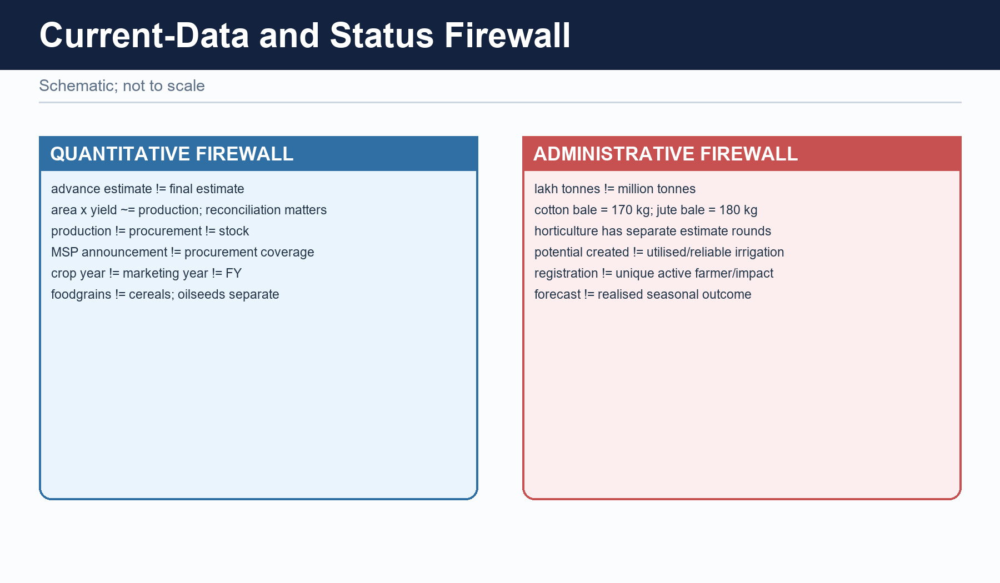

*1. Evidence protocol and data-status discipline. Original deterministic schematic; not a volatile-data source.*

Agricultural geography combines slow-changing spatial relationships with highly volatile estimates, procurement operations, stocks, prices and scheme dashboards. Every contemporary claim therefore carries a source, date, unit and administrative stage.

- The learning-source order is repository Markdown, OCR-searchable local books and official PYQ scans, live primary government sources, then optional Qdrant. Qdrant was not required.
- The DES 2025-26 figures used here are Third Advance Estimates dated 27 May 2026, not final estimates. Official 2025-26 total foodgrains are 3765.63 lakh tonnes and total nine oilseeds 430.59 lakh tonnes at that estimate stage.
- The oilseeds aggregate is about 43.06 million tonnes, not 'around 39 lakh tonnes'. The suspect 39-lakh-tonne web summary is rejected by the official DES table and was not reproduced.
- Cotton is reported in lakh bales of 170 kg; jute and mesta in lakh bales of 180 kg. A bale count must never be restated as tonnes without conversion.
- Production, procurement, market arrival, public stock, consumption and export measure different flows or stocks. MSP announcement and procurement coverage are also different.
- Horticulture uses separate estimate rounds. Agriculture Census 2015-16 remains a dated structural baseline, not a 2026 holding census.

**Must-know facts**

- Retrieval date: 19 August 2026.
- Official observed data, advance estimates, administrative progress and analytical inference are labelled separately.
- Forecasts and targets are not recorded as realised outcomes.

**UPSC traps**

- **Wrong:** Advance estimate is a final output figure. **Correct:** Keep the estimate vintage in every use.
- **Wrong:** A dashboard count proves impact. **Correct:** It usually proves an administrative output or registration only.

**Mains / practice route:** Open a current agriculture answer by naming the evidence type and date; this immediately prevents false precision.

---

## 2. Roadmap: primary activities as human-ecosystem interfaces

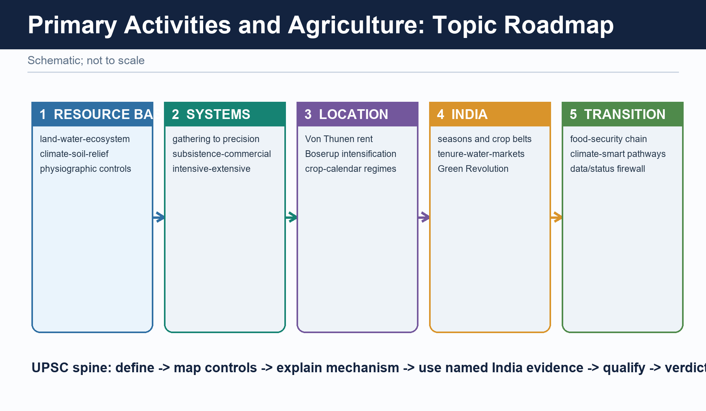

*2. Roadmap: primary activities as human-ecosystem interfaces. Original deterministic schematic; not a volatile-data source.*

Primary activities harvest, extract or biologically produce directly from land, water and ecosystems. Geography asks where the resource and ecological process occur, how people gain access, and how technology and institutions convert ecological potential into livelihood or commodity output.

- Gathering and hunting depend on wild stocks, seasonality, customary access and conservation rules.
- Fishing depends on water-body ecology, shelf/estuary/floodplain conditions, craft, harbour, cold-chain and tenure.
- Forestry covers timber and non-timber forest produce; climate and altitude shape vegetation while access and rights shape use.
- Pastoralism spreads rainfall and pasture risk through herd mobility, transhumance or crop-livestock integration.
- Agriculture deliberately manages an agroecosystem using land, water, labour, capital, knowledge and institutional signals.

**Must-know facts**

- Manufacturing is secondary, not a non-farm primary activity.
- Physiography sets a resource map; infrastructure and institutions decide economic use.

**UPSC traps**

- **Wrong:** Primary means primitive. **Correct:** Primary describes direct dependence on natural resources, not technological level.
- **Wrong:** Fishing and forestry are agriculture. **Correct:** They are allied primary activities but analytically distinct.

**Mains / practice route:** Use the sequence resource occurrence -> accessibility -> institution/technology -> production geography.

---

## 3. Taxonomy and subsistence-commercial continuum

*3. Taxonomy and subsistence-commercial continuum. Original deterministic schematic; not a volatile-data source.*

Agricultural systems lie on overlapping continua rather than in sealed boxes. A household can retain subsistence grain, sell milk commercially, hire machinery, use family labour and participate in an FPO at the same time.

- Subsistence-commercial is about destination and market integration; intensive-extensive is about input per unit land; arable-pastoral-mixed is about output mix.
- Intensive wet-rice farming may use much labour and water on small plots without being highly mechanised.
- Extensive grain or ranching systems use large land areas and low labour per hectare but may be capital intensive.
- Plantations are estate/corporate commercial systems with processing and export links; shifting cultivation uses rotating fields and fallow.
- Cooperative and collective systems concern organisation. Precision and protected systems concern information, control and technology.

**Must-know facts**

- Truck farming supplies distant markets by transport; market gardening is often peri-urban and more intensive.
- Dairy location is highly sensitive to perishability, feed, cold chain and consumer density.

**UPSC traps**

- **Wrong:** Intensive equals mechanised. **Correct:** Intensity can be labour, capital, water or input intensive.
- **Wrong:** Large holding equals commercial grain farm. **Correct:** It may be plantation, ranching, horticulture or mixed farming.

**Mains / practice route:** Always state the classification axis before comparing systems.

---

## 4. Farming-system classification and world systems

*4. Farming-system classification and world systems. Original deterministic schematic; not a volatile-data source.*

World farming systems reflect combinations of climate, population density, labour, land abundance, technology, market access and historical institutions.

- Shifting cultivation can be ecologically adaptive under low population density and long fallow; shortened fallow changes nutrient and erosion outcomes.
- Nomadic herding and transhumance use mobility to match seasonal pasture and water; borders, sedentarisation and enclosure can disrupt routes.
- Mediterranean farming combines winter rain, summer drought, cereals and high-value vines, olives, citrus or vegetables.
- Commercial grain farming occupies broad temperate plains; mixed farming recycles crop and livestock flows and spreads risk.
- Plantation geography reflects tropical ecology plus colonial land, labour, port and processing structures.
- Dairy, horticulture and market gardening intensify near urban demand unless refrigeration and fast logistics extend the market shed.

**Must-know facts**

- Climate does not alone define a system; labour and market organisation matter.
- Pastoral mobility is a risk-management strategy, not random movement.

**UPSC traps**

- **Wrong:** Shifting cultivation is always environmentally destructive. **Correct:** Outcome depends on fallow, slope, fire, tenure and population pressure.
- **Wrong:** Plantation means any perennial crop. **Correct:** Plantation is an institutional-commercial system, not just a crop life cycle.

**Mains / practice route:** Compare climate base, factor intensity, market orientation and institutional organisation.

---

## 5. Agroecosystem flows, feedbacks and Boserup

*5. Agroecosystem flows, feedbacks and Boserup. Original deterministic schematic; not a volatile-data source.*

A farm is an open agroecosystem. Solar energy, rainfall, soil nutrients, labour, capital and knowledge enter; food, fibre, income, residues and externalities leave; prices and ecological condition feed back into the next decision.

- Nutrient cycles connect soil, crop, livestock, residue, manure and loss pathways. A yield increase can coexist with soil-organic-matter decline.
- Water flows include rainfall, runoff, infiltration, storage, irrigation, evapotranspiration and drainage.
- Boserup argued that population pressure can induce intensification, shorter fallow and technical/institutional change rather than automatic Malthusian collapse.
- Intensification is conditional: it requires labour, knowledge, tenure incentives, capital and market access; it can also raise ecological pressure.
- Integrated farming converts by-products into inputs and diversifies income, but management complexity and disease/biosecurity links must be recognised.

**Must-know facts**

- Intensification can raise output per hectare while reducing labour productivity.
- Feedbacks may be delayed; groundwater decline can appear after years of profitable pumping.

**UPSC traps**

- **Wrong:** Boserup proves population growth is always beneficial. **Correct:** It identifies an inducement mechanism under enabling conditions.
- **Wrong:** High output proves a healthy agroecosystem. **Correct:** Stocks and externalities must be measured separately.

**Mains / practice route:** Use Boserup as a conditional population-resource link, not a universal law.

---

## 6. Von Thunen: rent, transport cost and perishability

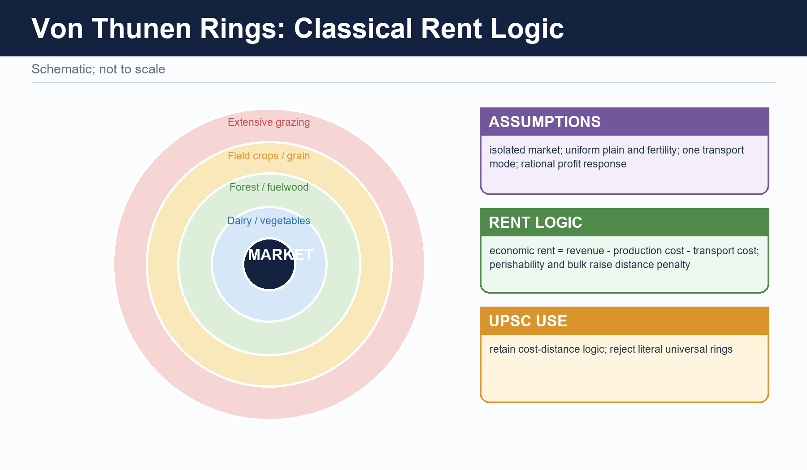

*6. Von Thunen: rent, transport cost and perishability. Original deterministic schematic; not a volatile-data source.*

Von Thunen isolates how distance to a market affects agricultural land use. High-value, bulky or perishable activities can outbid extensive uses near the market because transport cost and quality loss reduce net return with distance.

- Classical assumptions: isolated central market, uniform plain and fertility, one transport technology, no barriers and rational profit-maximising farmers.
- Economic rent is the residual after production and transport costs; its distance gradient differs by commodity.
- Classical rings place dairy/vegetables near the market, forest/fuelwood next, field crops farther out and extensive grazing at the margin.
- Cold chains, highways, air freight, processing, multiple cities and state policy fragment the rings into corridors, nodes and overlapping market fields.
- The model remains useful for peri-urban horticulture, dairy sheds, land conversion and transport-quality trade-offs even when literal rings disappear.

**Must-know facts**

- Von Thunen is a location model, not a climatic-region scheme.
- A transport innovation changes the rent gradient rather than abolishing location logic.

**UPSC traps**

- **Wrong:** Modern logistics makes distance irrelevant. **Correct:** Time, reliability, cold-chain cost and quality decay remain spatial.
- **Wrong:** The original ring order is universal. **Correct:** Commodity technology and local ecology can reverse or fragment it.

**Mains / practice route:** State assumptions, derive the rent logic, apply it, then modify and criticise.

---

## 7. Modified Von Thunen and commodity-chain geography

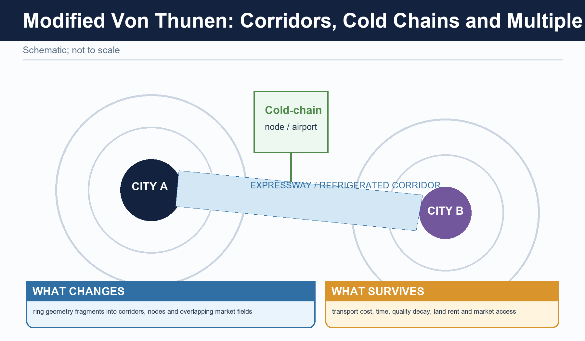

*7. Modified Von Thunen and commodity-chain geography. Original deterministic schematic; not a volatile-data source.*

Modern agriculture is organised by multiple markets, processing nodes, contracts, logistics corridors and global standards. Location responds to the whole commodity chain, not only distance to one town.

- A processing plant can become the operative market for sugarcane, milk, tomato or potato because quality and transport windows are crop specific.
- Expressways and refrigerated corridors stretch market sheds, while congestion, tolls, border delays and power reliability reintroduce friction.
- Contract production may cluster around an anchor buyer, but bargaining and quality rejection risk remain unequal.
- Global value chains add standards, traceability, exchange-rate, sanitary and trade-policy geography.
- Farmer realisation depends on grading, storage, finance, processing yield and market power, not farm-gate price alone.

**Must-know facts**

- Supply chain tracks movement; value chain also tracks value creation, governance and margin distribution.
- Cold chain slows quality loss; it does not remove it.

**UPSC traps**

- **Wrong:** A digital bid is a completed trade. **Correct:** Assaying, logistics, payment and dispute resolution must follow.
- **Wrong:** Exports automatically raise farmer income. **Correct:** Transmission depends on market structure, quality and costs.

**Mains / practice route:** Map nodes and flows, then identify where value, risk and power accumulate.

---

## 8. Physical controls and crop thresholds

*8. Physical controls and crop thresholds. Original deterministic schematic; not a volatile-data source.*

Crop geography is controlled by interacting thresholds. A favourable soil cannot compensate indefinitely for lethal frost, waterlogging, terminal heat or a growing season shorter than crop duration.

- Temperature must be read by phenological stage: germination, vegetative growth, flowering, grain filling or ripening.
- Rainfall amount is weaker than rainfall timing, reliability, intensity and evapotranspiration balance.
- Length of growing period combines the moisture and thermal window available for crop development.
- Soil properties include depth, texture, structure, drainage, salinity, pH, nutrient status and biological condition.
- Relief affects altitude, frost pockets, aspect, erosion, terraces, field size and mechanisation.
- Pests, diseases and extreme events can cause nonlinear losses; climate suitability is not the same as realised yield.

**Must-know facts**

- Rice systems include irrigated lowland, rainfed lowland and upland rice.
- Cotton is not confined to black soil; frost-free duration and water management matter.

**UPSC traps**

- **Wrong:** Annual rainfall alone determines crop suitability. **Correct:** Seasonal water balance and critical stages are decisive.
- **Wrong:** Altitude directly supplies chill units. **Correct:** Altitude influences temperature; crop physiology uses actual chill/heat exposure.

**Mains / practice route:** Write controls as threshold + mechanism + named region + qualification.

---

## 9. Crop calendars, thermal-moisture regimes and climate risk

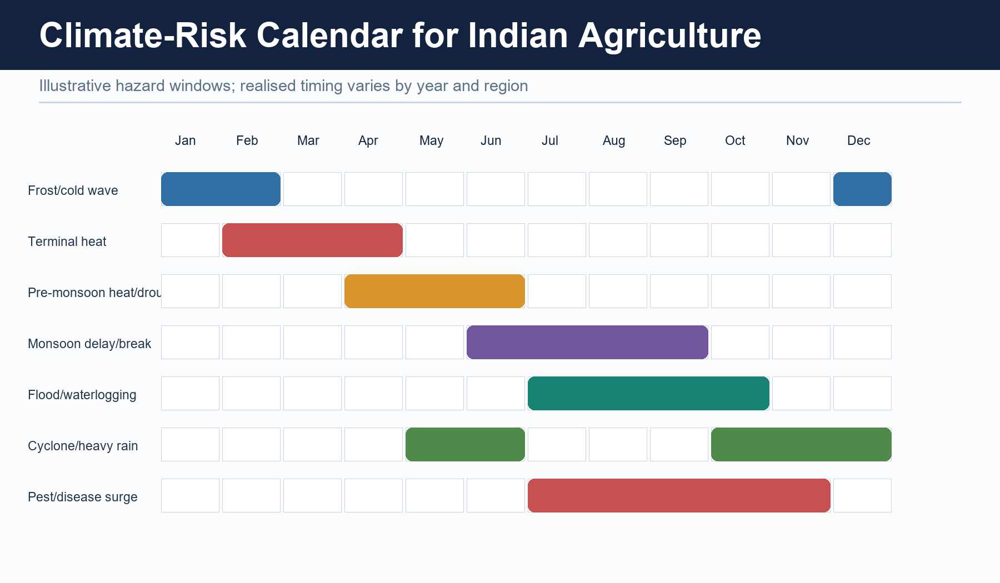

*9. Crop calendars, thermal-moisture regimes and climate risk. Original deterministic schematic; not a volatile-data source.*

A crop calendar is a risk calendar. Sowing, flowering, grain filling and harvest expose the crop to different monsoon, heat, frost, flood and pest windows.

- Kharif sowing follows monsoon arrival and soil moisture, but irrigated, short-duration and regional calendars vary.
- Rabi performance depends on winter temperature, residual moisture, irrigation and the timing of terminal heat.
- Zaid is a short hot-season window in irrigated pockets for vegetables, fodder, pulses and cucurbits.
- Delayed monsoon can compress crop duration; excess rain can damage despite normal seasonal totals.
- Adaptation includes adjusted sowing, short-duration or tolerant varieties, drainage, protective irrigation, advisories, insurance and diversified calendars.

**Must-know facts**

- Crop year, marketing year and financial year are different statistical periods.
- A forecast is not a realised seasonal outcome.

**UPSC traps**

- **Wrong:** Kharif and Rabi have one national sowing date. **Correct:** Windows vary by region, crop and water control.
- **Wrong:** More rain always improves Kharif output. **Correct:** Intensity, flood, waterlogging and harvest timing can reverse the effect.

**Mains / practice route:** Use a stage-wise crop calendar rather than generic climate-change prose.

---

## 10. India seasons and agro-climatic regionalisation

*10. India seasons and agro-climatic regionalisation. Original deterministic schematic; not a volatile-data source.*

India is an agro-climatic mosaic. Regionalisation may use climate, soils, length of growing period, irrigation, relief and farming systems; boundaries vary with the institution and planning purpose.

- The Indo-Gangetic plains combine alluvium, irrigation, dense markets and rice-wheat-sugarcane systems, with strong internal variation.
- The arid west relies on drought-resistant crops, livestock and irrigated command/oasis systems where water exists.
- Central and Deccan plateaus support soybean, cotton, pulses, millets and mixed farming under variable rainfed/irrigated conditions.
- Eastern plains, plateaus and deltas combine rice, jute, pulses, oilseeds, fisheries and high monsoon/flood exposure.
- Himalayan and southern highlands support horticulture, tea, coffee, spices and pastoral linkages through altitude and slope niches.
- Agro-ecological regionalisation foregrounds ecological process; agro-climatic planning also considers production potential and administrative delivery.

**Must-know facts**

- No single regionalisation scheme is uniquely correct for every policy purpose.
- A state can contain several agro-climatic regimes.

**UPSC traps**

- **Wrong:** Administrative boundary equals agro-climatic boundary. **Correct:** Ecological gradients cross districts and states.
- **Wrong:** Rainfed means unproductive. **Correct:** Rainfed regions are central to pulses, oilseeds, millets, livestock and resilience.

**Mains / practice route:** Name the regionalisation purpose before using a zonal scheme.

---

## 10A. Kharif, Rabi and Zaid calendar firewall

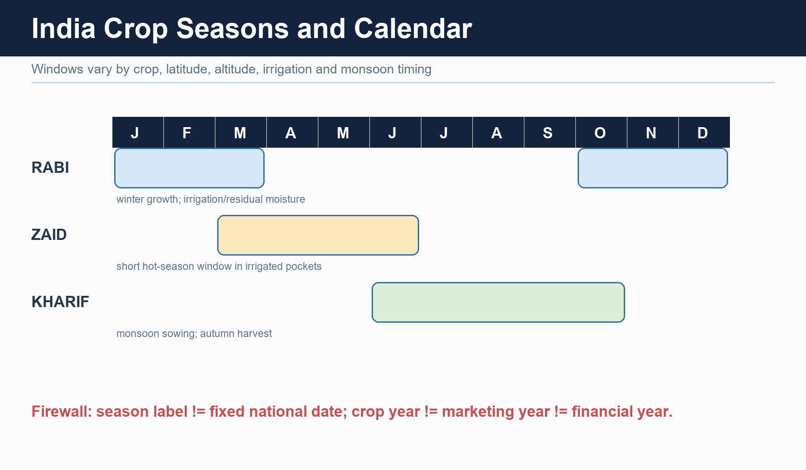

*10A. Kharif, Rabi and Zaid calendar firewall. Original deterministic schematic; not a volatile-data source.*

Season names express moisture-temperature and farm-operation windows, not one rigid date for the entire country. The same crop can occupy different seasonal niches under irrigation, altitude or regional climate.

- Kharif is linked to monsoon onset and autumn harvest, but planting can precede or lag normal onset depending on irrigation and soil moisture.
- Rabi is sown after monsoon withdrawal and depends on winter thermal conditions, residual moisture and irrigation.
- Zaid occupies the short summer interval and is strongest where irrigation supports heat-season vegetables, fodder, pulses or cucurbits.
- Official production tables may separately report Kharif, Rabi and summer output; symbols can indicate that summer was included in another season in older series.
- Crop calendar answers should identify sowing, flowering and harvest risks rather than merely list months.

**Must-know facts**

- Season boundaries vary by crop and region.
- The DES time series explicitly separates summer output in recent years for several crops.

**UPSC traps**

- **Wrong:** Every crop belongs to one immutable season. **Correct:** Regional and irrigated exceptions exist.
- **Wrong:** Season label establishes a marketing year. **Correct:** Crop and marketing calendars are separate.

**Mains / practice route:** Draw a twelve-month bar and mark stage-specific moisture and thermal risk.

---

## 11. Major crop belts: foodgrains, pulses, oilseeds and fibres

*11. Major crop belts: foodgrains, pulses, oilseeds and fibres. Original deterministic schematic; not a volatile-data source.*

Crop belts are broad spatial concentrations, not immutable rankings. Each belt combines agro-climate with irrigation, varieties, procurement, processing, labour and market history.

- Rice spans eastern humid/deltaic plains, irrigated southern tracts and procurement-intensive north-western systems; the production ecology differs sharply.
- Wheat concentrates in the north-west and upper/middle Gangetic plains, with important irrigated central Indian expansion.
- Maize occupies diverse rainfed and irrigated belts and increasingly serves feed and industrial demand as well as food.
- Millets cluster in drier western and peninsular environments; pulses and oilseeds remain vital in rainfed central, western and rice-fallow systems.
- Cotton links black-soil Deccan belts and irrigated north-western alluvium; jute follows humid eastern alluvial-deltaic conditions and retting water.
- Crop location must be explained through a bundle, not a single soil-crop slogan.

**Must-know facts**

- Foodgrains = cereals + pulses in the official DES aggregate.
- Oilseeds are not included within foodgrains.

**UPSC traps**

- **Wrong:** Black soil is necessary for cotton. **Correct:** Alluvial cotton systems exist; climate and management also matter.
- **Wrong:** Millets are nutritionally inferior coarse grains. **Correct:** The older label is not a nutritional judgement.

**Mains / practice route:** Use schematic belt + physical logic + institutional modification.

---

## 12. Commercial crops, plantations, horticulture and mixed farming

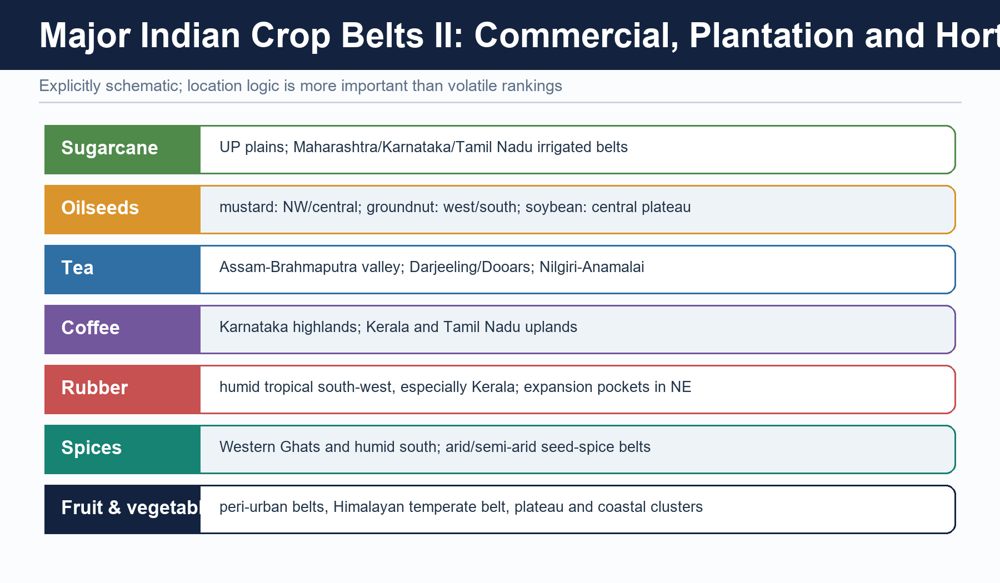

*12. Commercial crops, plantations, horticulture and mixed farming. Original deterministic schematic; not a volatile-data source.*

Commercial-crop geography is strongly shaped by processing, perishability, labour and value chains. Named regions should illustrate location logic rather than unsupported current rank.

- Sugarcane belts reflect irrigation, long duration, mill radius and recovery/season differences; delay between cutting and crushing matters.
- Tea combines humid climate, drainage, labour-intensive plucking and processing; Assam valley, Darjeeling/Dooars and southern highlands are distinct systems.
- Coffee clusters in shaded southern highlands, especially Karnataka with Kerala and Tamil Nadu uplands; altitude, shade and processing matter.
- Rubber favours humid tropical conditions; Kerala remains the classic Indian belt, with expansion in suitable north-eastern pockets.
- Spices range from humid Western Ghats crops to drier seed-spice belts; horticulture forms temperate, tropical, peri-urban and processing-oriented clusters.
- Livestock-linked mixed farming recycles residues/manure and diversifies income, while dairy and poultry may also form specialised commercial clusters.

**Must-know facts**

- Horticulture estimates use a separate official statistical system and rounds.
- Plantation is both a crop and labour/estate/processing geography.

**UPSC traps**

- **Wrong:** High-value crop means high farmer income. **Correct:** Perishability, rejection, cost and price volatility can erase value.
- **Wrong:** Rubber is only an equatorial crop. **Correct:** Humid tropical and suitable sub-tropical pockets can support it.

**Mains / practice route:** For each crop, connect ecology -> processing/logistics -> labour -> market.

---

## 13. Human and institutional controls

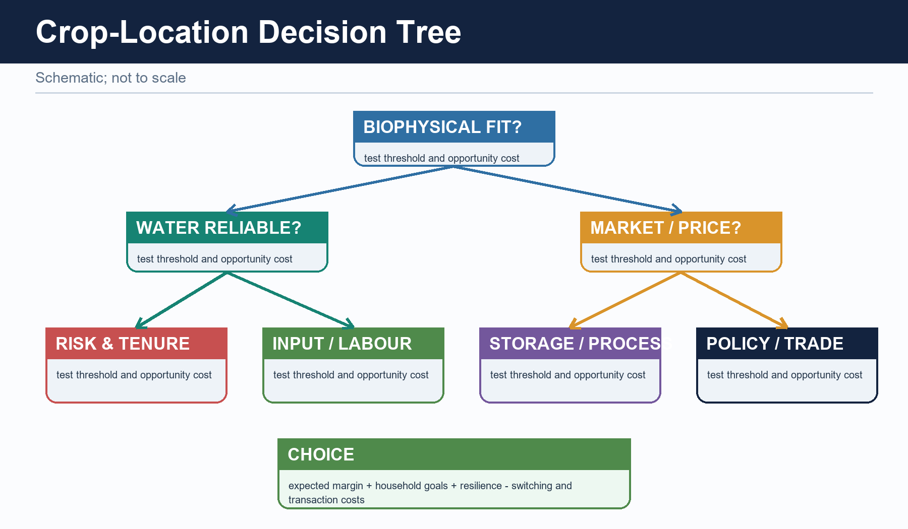

*13. Human and institutional controls. Original deterministic schematic; not a volatile-data source.*

Farmers choose under constrained opportunity. Land tenure, holding structure, labour, capital, credit, irrigation, technology, risk, price signals, procurement, storage and social relations jointly shape crop and input decisions.

- Secure tenure can encourage investment; concealed tenancy can block institutional credit, insurance and scheme eligibility.
- Small plots face scale constraints but custom hiring, FPO aggregation and high-value intensive production can alter the relationship.
- MSP is a price signal; actual procurement depth and local market alternatives determine behavioural response.
- Storage and cold chains change sale timing, quality and feasible market distance; processing creates derived demand.
- Gendered land titles and unpaid labour affect access to credit, extension and recognition. Caste and class shape land, water and market power.
- FPOs and cooperatives can pool output and services, but governance, working capital and buyer competition determine performance.

**Must-know facts**

- Operational scale and ownership are different.
- Credit access can raise productive investment and also amplify indebtedness under crop failure or price shock.

**UPSC traps**

- **Wrong:** Small farms are automatically inefficient. **Correct:** Productivity, labour use, profit and income are different metrics.
- **Wrong:** Technology choice is purely agronomic. **Correct:** Tenure, finance, labour and risk shape adoption.

**Mains / practice route:** Organise human controls under rights, resources, services, signals, markets and social power.

---

## 14. Green Revolution: regional diffusion and second-generation challenges

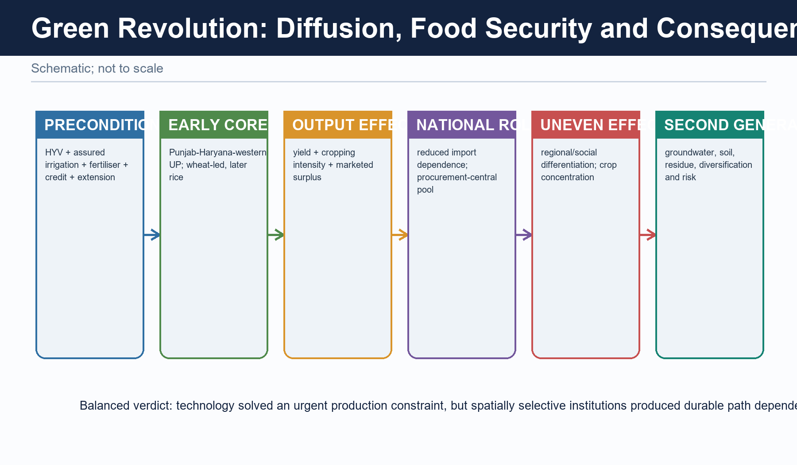

*14. Green Revolution: regional diffusion and second-generation challenges. Original deterministic schematic; not a volatile-data source.*

The Green Revolution was an institutional-technical package, not a seed event. It raised foodgrain productivity and national food security while concentrating gains where irrigation, credit, extension and procurement already existed.

- The early core was Punjab, Haryana and western Uttar Pradesh, especially wheat, later extending by crop and region.
- HYVs responded to fertiliser and water; public research, extension, credit, power, price support and procurement supplied the enabling system.
- Higher yield and cropping intensity generated marketed surplus and reduced dependence on emergency imports.
- Regional and social differentiation followed uneven access to water, land, credit and technology.
- Rice-wheat lock-in, groundwater decline, nutrient imbalance, residue pressures and biodiversity loss are second-generation challenges.
- White Revolution concerns dairy cooperative/value-chain expansion; Blue Revolution fisheries/aquaculture; Yellow Revolution oilseeds; horticulture revolution indicates rapid horticultural growth. These labels should not be inflated into precise single-date events.

**Must-know facts**

- Food-security gain and ecological critique can both be true.
- Procurement infrastructure reinforced the initial spatial advantage.

**UPSC traps**

- **Wrong:** The Green Revolution spread uniformly. **Correct:** It was crop- and region-selective.
- **Wrong:** Ecological harm means the productivity gain was unreal. **Correct:** Evaluate gains and externalities separately.

**Mains / practice route:** Conclude with differentiated diversification, water alignment and rainfed productivity rather than generic 'second Green Revolution'.

---

## 15. Land reforms, holdings and agrarian structure

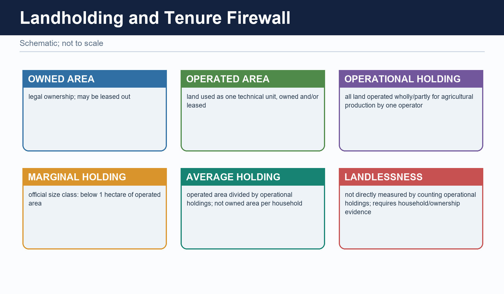

*15. Land reforms, holdings and agrarian structure. Original deterministic schematic; not a volatile-data source.*

Agrarian structure determines who controls land, who operates it, who bears risk and who can invest. Legal ownership, operated area, tenancy and household landlessness must not be conflated.

- The classic reform bundle is abolition of intermediaries, tenancy reform, ceilings, consolidation and improved records.
- Operation Barga is a named tenancy-registration example; Kerala and early Jammu & Kashmir illustrate stronger reform episodes under distinct conditions.
- The Agriculture Census defines operational holdings by land operated as a technical unit for agricultural production, whether owned, leased or otherwise possessed.
- In 2015-16 India recorded 146.45 million operational holdings and 157.82 million hectares operated area; average holding was 1.08 hectares.
- Marginal holdings are below 1 hectare of operated area. Counting operational holdings cannot directly measure landless households.
- Fragmentation raises boundary, access and machinery constraints; consolidation and leasing reform must protect small cultivators and tenants.

**Must-know facts**

- Owned area != operated area.
- Average holding is a structural average, not the typical household's owned land.

**UPSC traps**

- **Wrong:** Marginal farmer means low income by definition. **Correct:** The official size class is based on operated area.
- **Wrong:** Agriculture Census counts prove landlessness. **Correct:** Operators without holdings and ownership distribution require other evidence.

**Mains / practice route:** Pair legal reform with records, political mobilisation, implementation and later fragmentation.

---

## 16. Irrigation geography and the groundwater-energy nexus

*16. Irrigation geography and the groundwater-energy nexus. Original deterministic schematic; not a volatile-data source.*

Irrigation is a spatial service, not merely a project asset. Source, reliability, timing, distribution equity, application method, drainage and energy cost determine crop response.

- Canals create command areas and head-tail relations; tanks store local runoff; wells offer flexible timing but draw on shared aquifers.
- Groundwater supported intensive Rabi and multiple cropping, especially in alluvial and hard-rock pockets with different recharge behaviour.
- Flat or subsidised power can lower marginal pumping cost and weaken the signal of aquifer scarcity.
- Canal over-irrigation and poor drainage can cause waterlogging and salinity; groundwater over-extraction raises lift depth and energy demand.
- Drip and sprinkler can raise field application efficiency, but basin savings are not automatic if irrigated area or water-intensive crops expand.
- PMKSY, command-area modernisation and micro-irrigation outputs must be distinguished from reliable protective irrigation and water-productivity outcomes.

**Must-know facts**

- Irrigation potential created, utilised and reliably delivered are different.
- Water productivity can be measured per unit water, land, value or nutrition; state the denominator.

**UPSC traps**

- **Wrong:** Micro-irrigation always saves basin water. **Correct:** Rebound and crop expansion can offset plot-level savings.
- **Wrong:** Groundwater is private because the well is private. **Correct:** The aquifer is a shared stock with externalities.

**Mains / practice route:** Map source -> distribution -> application -> drainage -> aquifer/energy feedback.

---

## 17. Rainfed systems, watershed development and protective irrigation

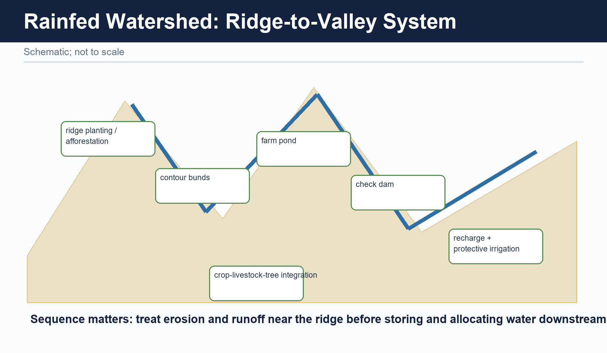

*17. Rainfed systems, watershed development and protective irrigation. Original deterministic schematic; not a volatile-data source.*

Rainfed agriculture is governed by rainfall variability, soil-water storage and household risk. Watershed treatment seeks to slow runoff, reduce erosion, recharge water and support protective rather than necessarily full irrigation.

- A watershed is a geo-hydrological unit draining to a common outlet; treatment should follow ridge-to-valley sequencing.
- Contour bunds, vegetative barriers, check dams, farm ponds and soil cover serve different positions and processes.
- Protective irrigation at a critical crop stage can stabilise yield without converting the whole landscape into assured irrigation.
- Commons, pasture, livestock and downstream water users must be included; plot-only treatment misses shared flows.
- Watershed outcomes depend on maintenance, local institutions, land distribution and rainfall sequence.
- Rainfed diversification toward pulses, oilseeds, millets, agroforestry and livestock can improve resilience if markets and processing exist.

**Must-know facts**

- A structure count is not a recharge or livelihood outcome.
- Watershed boundaries often cross village revenue boundaries.

**UPSC traps**

- **Wrong:** Check dams alone constitute watershed development. **Correct:** Soil, vegetation, drainage line and institutions form a system.
- **Wrong:** Rainfed policy should imitate irrigated cereal packages. **Correct:** Crop-water alignment and protective irrigation are often more suitable.

**Mains / practice route:** Use ridge-to-valley process plus equity and maintenance qualification.

---

## 18. Productivity, yield gaps and farm risk

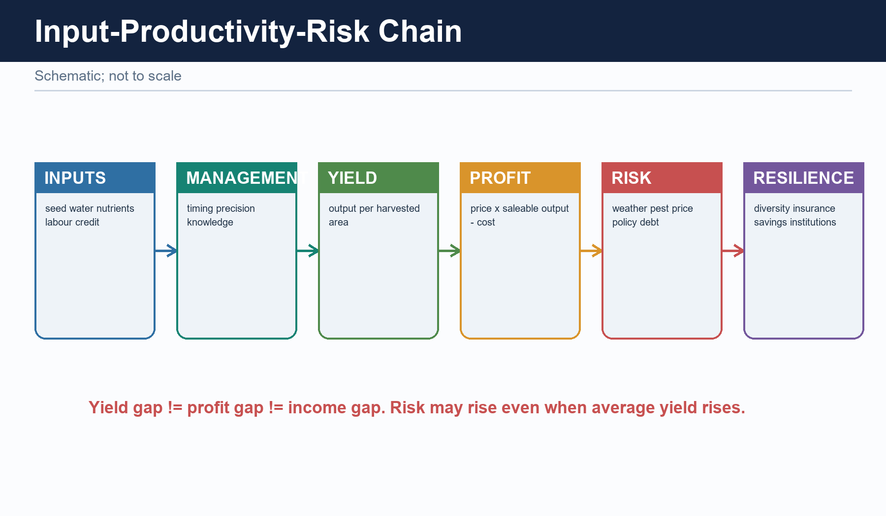

*18. Productivity, yield gaps and farm risk. Original deterministic schematic; not a volatile-data source.*

Agricultural performance has multiple denominators. Yield, labour productivity, total factor productivity, profit, household income and resilience can move differently.

- A yield gap may be biophysical, management, input-access, knowledge, risk or market induced; a demonstration yield is not always economically optimal.
- Monoculture can simplify machinery and marketing but concentrates pest, climate and price risk.
- Diversification can occur across crops, varieties, seasons, livestock, trees, income sources or markets.
- PMFBY addresses specified production risks under notified conditions; it does not insure every price or household-income shock.
- Area-yield assessment, crop cutting and remote sensing create basis and measurement risks; claim settlement timing affects trust.
- Credit can smooth input purchase and shock response, yet repeated loss and high-cost informal borrowing create indebtedness.
- Post-harvest loss depends on commodity and stage; avoid a universal percentage without a named study, method and date.

**Must-know facts**

- Yield gap != profit gap != income gap.
- Insurance application count != unique insured farmer.

**UPSC traps**

- **Wrong:** A record harvest eliminates farmer distress. **Correct:** Price, cost, debt, access and distribution can diverge.
- **Wrong:** Crop insurance guarantees individual plot loss. **Correct:** Area-based and scheme-specific rules matter.

**Mains / practice route:** Diagnose risk by production, price, market, credit, policy and household capacity.

---

## 19. Markets, APMC, e-NAM, FPOs and cold chains

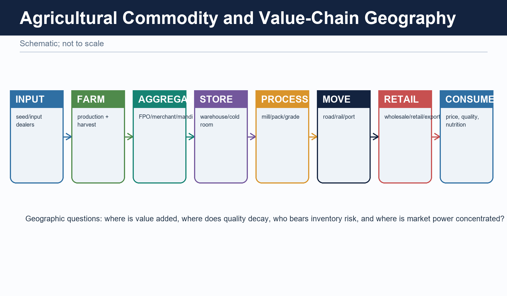

*19. Markets, APMC, e-NAM, FPOs and cold chains. Original deterministic schematic; not a volatile-data source.*

Agricultural marketing converts heterogeneous farm output into graded, financed, stored, transported and processed commodities. Removing or digitising one intermediary does not remove the underlying functions.

- APMC laws and market committees are state-shaped. e-NAM links participating markets but operates through legal and physical infrastructure.
- Assaying creates credible quality categories; warehousing and negotiable receipts can separate harvest from sale timing.
- FPOs can aggregate lots, inputs and services, but require governance, working capital, professional capacity and competing buyers.
- Contract farming can reduce market uncertainty and provide technology, while creating quality-dispute and bargaining asymmetry.
- Cold chains are chains: pre-cooling, packhouse, cold storage, refrigerated movement and retail temperature control must connect.
- AIF sanctions support infrastructure finance, but sanctioned project, completed asset, utilised capacity and farmer outcome are separate stages.

**Must-know facts**

- e-NAM registration or trade value is not proof of income impact.
- High-value crops require reliable buyer and logistics, not price alone.

**UPSC traps**

- **Wrong:** Middlemen perform no economic function. **Correct:** The issue is competition, margins and accountability in aggregation, finance and logistics.
- **Wrong:** Cold storage alone creates a cold chain. **Correct:** Missing links can break quality control.

**Mains / practice route:** Trace the chain and assign each bottleneck to a function and institution.

---

## 20. MSP, procurement, buffer stocks, PDS and trade

*20. MSP, procurement, buffer stocks, PDS and trade. Original deterministic schematic; not a volatile-data source.*

Food policy joins a national price signal to spatially uneven procurement, storage, movement and distribution. Each stage has a distinct institution, geography and metric.

- CACP recommends and the Union announces MSP/FRP according to the crop mechanism; announcement does not compel universal procurement.
- FCI and state agencies procure eligible grain in operating areas and move stocks into the central pool.
- Buffer and operational stocks support NFSA/PDS, emergencies and market operations, but high stocks impose carrying and quality costs.
- NFSA/PDS addresses legal access to cereals; nutrition security also requires diet, health, sanitation and diversified supply.
- Trade can stabilise or transmit domestic prices; export/import measures interact with farmer incentives and consumer prices.
- Under WTO agriculture rules, amber, blue and green boxes classify support by design and conditions; a scheme name alone does not establish legal category.

**Must-know facts**

- Production geography is broader than procurement geography.
- Stock is a point-in-time inventory; procurement is a period flow.

**UPSC traps**

- **Wrong:** MSP equals legal purchase of every marketed unit. **Correct:** Actual procurement varies by crop, grade, place and operation.
- **Wrong:** Food security equals national production. **Correct:** Access, utilisation and stability remain essential.

**Mains / practice route:** Build the chain production -> arrival -> procurement -> stock -> distribution/market release -> access.

---

## 21. Food security architecture and data firewalls

*21. Food security architecture and data firewalls. Original deterministic schematic; not a volatile-data source.*

India can be grain-surplus at national scale while households or regions face access, nutrition or stability deficits. A geographic answer follows flows between surplus, storage and deficit spaces.

- Availability comes from production, stocks and trade; access from income, prices and entitlement; utilisation from diet, health, water and care; stability from resilience over time.
- Procurement-heavy rice-wheat belts supply the central pool, which is redistributed through a national logistics and PDS network.
- Decentralised procurement can widen regional participation but requires state capacity, storage, quality and fiscal coordination.
- Millets and pulses add climate and nutrition value, but procurement, processing, consumer demand and local suitability govern expansion.
- The public system should measure leakage and exclusion together; tighter authentication can reduce diversion and create access failures.
- Food processing and value addition can reduce seasonal gluts and create employment, but local resource and market effects must be assessed.

**Must-know facts**

- Foodgrains are not synonymous with rice and wheat.
- Buffer-stock norms and actual stocks are different.

**UPSC traps**

- **Wrong:** A large stock proves efficient food security. **Correct:** Storage quality, distribution, nutrition and fiscal cost still matter.
- **Wrong:** Exports prove domestic nutritional security. **Correct:** Exportable surplus and household access are different.

**Mains / practice route:** Use the four pillars plus the spatial surplus-to-deficit flow.

---

## 22. Sustainable, climate-smart and just transitions

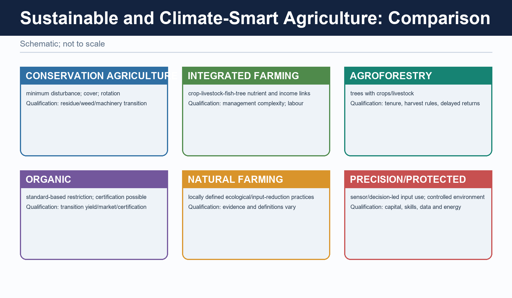

*22. Sustainable, climate-smart and just transitions. Original deterministic schematic; not a volatile-data source.*

Sustainable agriculture is not one technique. It is a portfolio that improves resource condition, resilience, viable income and social inclusion without shifting hidden costs elsewhere.

- Conservation agriculture combines minimum disturbance, soil cover and crop diversification; transition machinery, residues and weed management matter.
- Integrated farming and agroforestry diversify biological and income flows, with labour, tenure and delayed-return constraints.
- Organic agriculture is standard/certification based; natural farming is a policy/practice family emphasising local ecological inputs; conservation agriculture is defined by soil-management principles.
- Millets and pulses can improve water/nitrogen resilience where agronomically and culturally suitable; they are not universal substitutions.
- Precision agriculture, remote sensing and protected cultivation can reduce input waste or climate exposure, while raising capital, energy, skill and data-governance concerns.
- Climate-smart pathways include tolerant varieties, revised calendars, drainage, protective irrigation, diversification, advisories and risk finance.
- A just transition protects smallholders, tenants, women cultivators, labour and region-specific livelihoods during crop and input shifts.

**Must-know facts**

- Climate-smart is an objective framework, not one certification.
- Natural, organic and conservation systems overlap but are not synonyms.

**UPSC traps**

- **Wrong:** Chemical-free automatically means certified organic. **Correct:** Certification follows a defined standard and process.
- **Wrong:** Precision agriculture is only large-farm automation. **Correct:** Service models can extend tools, but access and economics remain constraints.

**Mains / practice route:** Match each practice to a diagnosed soil, water, risk, market or justice mechanism.

---

## 22A. Natural, organic and conservation agriculture firewall

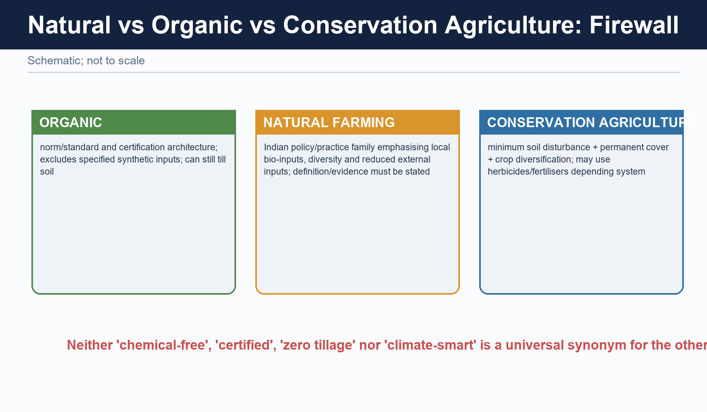

*22A. Natural, organic and conservation agriculture firewall. Original deterministic schematic; not a volatile-data source.*

These labels are often merged in public debate, but they differ in governing principle, certification and permitted practices. Precision prevents both Prelims errors and weak Mains prescriptions.

- Organic agriculture is governed through a defined standard and certification/assurance architecture; it restricts specified synthetic inputs but does not automatically prescribe zero tillage.
- Natural farming in Indian policy describes a family of locally adapted ecological and external-input-reduction practices; the exact protocol and evidence base must be stated.
- Conservation agriculture is organised around minimum soil disturbance, permanent soil cover and crop diversification; some systems may still use herbicide or mineral fertiliser.
- A farm may combine principles from more than one system, but a partial overlap does not erase the definitions.
- Evaluation must compare yield, net return, labour, soil, water, risk and transition period rather than rely on labels.

**Must-know facts**

- Certified organic is not a synonym for chemical-free claim.
- Conservation agriculture is a soil-management framework.

**UPSC traps**

- **Wrong:** Natural, organic and conservation agriculture are interchangeable. **Correct:** State the defining rule of each.
- **Wrong:** One trial proves all-India superiority. **Correct:** Crop, soil, climate and transition period govern results.

**Mains / practice route:** Use a three-column definition-mechanism-limit table.

---

## 23. Digital agriculture, AgriStack and decision support

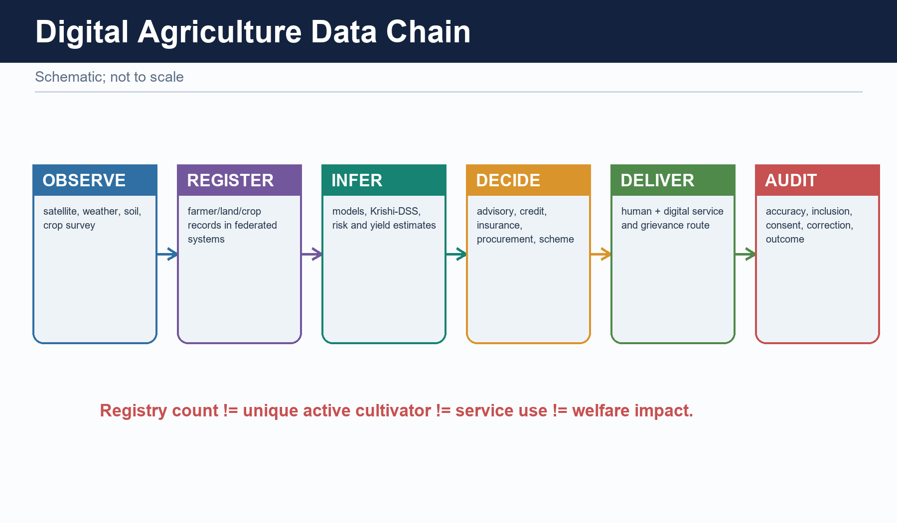

*23. Digital agriculture, AgriStack and decision support. Original deterministic schematic; not a volatile-data source.*

The Digital Agriculture Mission is enabling infrastructure, not a single app. Its value depends on data quality, interoperable services, human delivery and correction/appeal.

- Cabinet approved the Digital Agriculture Mission on 2 September 2024 with an outlay of Rs 2,817 crore.
- AgriStack includes federated farmer, geo-referenced village/land and crop-sown information developed with states and UTs.
- Krishi-DSS combines geospatial and administrative data for crop/weather monitoring, planning and risk assessment.
- A land-linked registry can improve verification and still exclude tenants, sharecroppers and women with weak records.
- Remote sensing and AI produce inference, not direct truth; ground verification, uncertainty and appeal are required.
- Farmer ID or registry counts are administrative progress. Unique active cultivator coverage, service use and welfare outcome require separate evidence.

**Must-know facts**

- Federated architecture does not remove privacy, purpose-limitation or correction needs.
- Digital inclusion requires assisted and offline routes.

**UPSC traps**

- **Wrong:** A registry creates land rights. **Correct:** It records/links data under defined rules; legal rights arise elsewhere.
- **Wrong:** Model accuracy removes accountability. **Correct:** Administrative decisions still need reasons, correction and appeal.

**Mains / practice route:** Use observe -> register -> infer -> decide -> deliver -> audit.

---

## 24. Current policy architecture and implementation status

*24. Current policy architecture and implementation status. Original deterministic schematic; not a volatile-data source.*

Current agriculture policy is a portfolio. Every scheme must be located by function and stage rather than presented as a list of slogans.

- PM-KISAN is income support delivered through DBT; instalment transfer is an administrative output, not an estimate of yield or income impact.
- PMFBY is crop-risk insurance; applications, insured area, claim approval and claim payment are separate indicators.
- PMKSY covers irrigation access, efficiency and watershed/command-area components; created potential is not reliable last-mile irrigation.
- Soil Health Card supplies test-based nutrient information; card generation is not adoption or soil recovery.
- e-NAM addresses electronic market functions; AIF finances eligible infrastructure; both need physical utilisation and outcome evidence.
- NMNF was approved on 25 November 2024. Cluster, farmer and BRC counts are implementation progress, not proven yield/income outcomes.
- The pulses mission and NMEO-Oilseeds have production, area, seed and value-chain targets; targets and annual estimates must remain separate.
- PM Dhan-Dhaanya was announced in Budget 2025-26, Cabinet-approved in July 2025, launched in October 2025 and entered district-plan/monitoring implementation in 2026. District selection, allocation, release, output and outcome are distinct stages.

**Must-know facts**

- Scheme convergence is territorial coordination, not automatic additional money at every stage.
- Official scheme portals establish design; evaluation is needed for causal outcome.

**UPSC traps**

- **Wrong:** Launch means district outcome. **Correct:** Launch is only one administrative stage.
- **Wrong:** Beneficiary registration equals unique active farmer. **Correct:** Deduplication, activity and impact must be tested.

**Mains / practice route:** Create a stage table: announcement -> approval -> guidelines -> selection -> allocation -> release -> output -> outcome.

---

## 24A. Monitoring dashboard: from activity to outcome

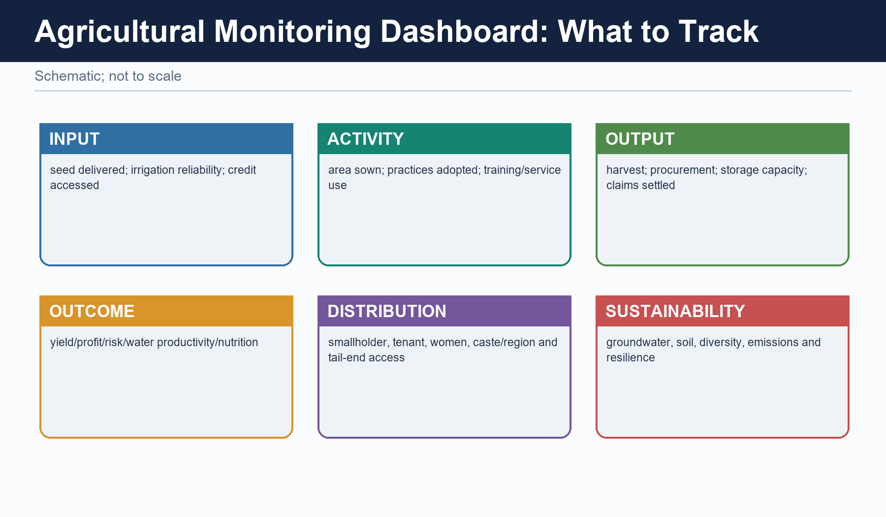

*24A. Monitoring dashboard: from activity to outcome. Original deterministic schematic; not a volatile-data source.*

A credible agricultural dashboard must follow the causal chain and distribution, not celebrate a single cumulative count.

- Inputs record seed, water, credit, infrastructure and staff; activities record sowing, training, service use and practice adoption.
- Outputs record harvest, assets completed, claims settled or storage commissioned. They remain one stage short of farmer and ecosystem outcomes.
- Outcomes include yield stability, net return, water productivity, diet, soil condition and reduced loss or risk.
- Distributional cuts should test smallholders, tenants, women cultivators, caste/tribal groups, rainfed districts and canal tail ends.
- Sustainability indicators include groundwater balance, salinity, soil organic condition, crop diversity, emissions and resilience to extremes.
- Attribution requires a baseline and credible comparison; before-after change alone can reflect weather or price.

**Must-know facts**

- Administrative progress is necessary but not sufficient evidence.
- A cumulative beneficiary count can include repeat or inactive records depending on programme design.

**UPSC traps**

- **Wrong:** Output equals outcome. **Correct:** Test behaviour, welfare and resource condition.
- **Wrong:** National average proves equity. **Correct:** Disaggregate by region and social/tenure group.

**Mains / practice route:** Evaluate programmes through input -> activity -> output -> outcome -> distribution -> sustainability.

---

## 25. Fisheries, forestry and pastoral linkages

*25. Fisheries, forestry and pastoral linkages. Original deterministic schematic; not a volatile-data source.*

Agriculture sits within a wider primary-activity and rural-livelihood system. Fisheries, forests and pastoralism should be linked where they share land, water, labour and value chains without reproducing full Environment notes.

- Marine fishing follows shelf, upwelling, estuary, harbour and cyclone geography; inland fisheries follow rivers, floodplains, wetlands, reservoirs and ponds.
- Aquaculture can diversify income and protein supply, while creating water-quality, disease, feed and coastal-habitat trade-offs.
- Non-timber forest produce connects central and north-eastern forest belts to tribal and forest-dwelling livelihoods; tenure and value addition shape returns.
- Pastoralism links arid/semi-arid pasture, commons, crop residues and seasonal mobility; route fragmentation can raise vulnerability.
- Crop-livestock-fish-tree integration closes nutrient loops and diversifies risk, but must respect carrying capacity and animal/fish health.

**Must-know facts**

- Blue Revolution relates to fisheries and aquaculture, not marine capture alone.
- Pastoralism is a land-use system and institution, not merely an animal count.

**UPSC traps**

- **Wrong:** Fish production requires a coastline. **Correct:** Inland and culture fisheries can be major.
- **Wrong:** Forest produce is only timber. **Correct:** NTFPs are central to many livelihoods.

**Mains / practice route:** Use allied activities to show landscape and livelihood integration.

---

# Part II - Solved direct PYQs

## UPSC Prelims 2019 Q21 - New World crops

Which group of plants was domesticated in the New World and introduced into the Old World? A Tobacco, cocoa and rubber; B Tobacco, cotton and rubber; C Cotton, coffee and sugarcane; D Rubber, coffee and wheat.

**INFERRED ANSWER - NOT OFFICIALLY VERIFIED: A. Confidence: high.**

Tobacco, cacao and the rubber tree are New World domesticates. Coffee and wheat are Old World; cotton has multiple domestication centres, so options containing coffee/wheat or an ambiguous cotton bundle are eliminated.

**Why this earns marks:** source-status transparency plus option-by-option elimination.

## UPSC Prelims 2020 Q87 - frost-free subtropical crop

A subtropical crop is injured by hard frost, needs at least 210 frost-free days, 50-100 cm rainfall and light well-drained moisture-retentive soil. Identify it: A Cotton; B Jute; C Sugarcane; D Tea.

**INFERRED ANSWER - NOT OFFICIALLY VERIFIED: A. Confidence: high.**

The long frost-free season with moderate rainfall and a light, well-drained moisture-retentive soil is the classic cotton requirement bundle. Jute and tea require more humid conditions; sugarcane has a different water-duration profile.

**Why this earns marks:** source-status transparency plus option-by-option elimination.

## UPSC Prelims 2022 Q62 - tea-producing states

Among Andhra Pradesh, Kerala, Himachal Pradesh and Tripura, how many are generally known as tea-producing States? A one; B two; C three; D all four.

**INFERRED ANSWER - NOT OFFICIALLY VERIFIED: D. Confidence: high.**

Kerala, Himachal Pradesh and Tripura have recognised tea sectors, and Andhra Pradesh has tea cultivation including the Araku/Eastern Ghats context. The missing local official key prevents upgrading the answer to official status.

**Why this earns marks:** source-status transparency plus option-by-option elimination.

## UPSC Prelims 2023 Q4 - India-China agriculture comparison

Statements: India has more arable area than China; India's proportion of irrigated area is higher; India's average productivity per hectare is higher. How many are correct? A one; B two; C all three; D none.

**INFERRED ANSWER - NOT OFFICIALLY VERIFIED: B. Confidence: medium-high.**

The first two comparative statements are defensible under the data vintage used by the question, while India's average agricultural productivity per hectare is not higher than China's. Cross-country definitions and reference years are the main caution.

**Why this earns marks:** source-status transparency plus option-by-option elimination.

## UPSC Prelims 2025 Q24 - turmeric, official key conflict

Statements for 2022-23: India is the largest producer and exporter of turmeric; more than 30 varieties are grown; Maharashtra, Telangana, Karnataka and Tamil Nadu are major producers. Options: A I-II; B II-III; C I-III; D I-II-III.

**OFFICIAL SET-A KEY: B (statements II and III only).**

The local official UPSC key unambiguously records B. However, dated PIB material describes India as the world's largest producer, consumer and exporter and supports statements II and III. The package preserves the official key and flags the unresolved primary-source contradiction rather than inventing a reconciliation.

**Why this earns marks:** source-status transparency plus option-by-option elimination.

## 2018 GS-I Q15

Define the Blue Revolution and explain problems and strategies for pisciculture development in India.

**Claim:** Define fisheries/aquaculture expansion, distinguish capture from culture, map inland/coastal potential, and evaluate seed-feed-disease-water-market constraints.

- **Named evidence/example:** India's floodplains, reservoirs and ponds show that fish geography is not coastal only.
  - **Analysis:** The evidence proves a specific spatial or institutional mechanism.
- **Named evidence/example:** PM Matsya Sampada-type value-chain logic: seed, feed, health, landing, cold chain and market.
  - **Analysis:** The evidence proves a specific spatial or institutional mechanism.
- **Named evidence/example:** Coastal aquaculture illustrates export potential with disease, salinity and habitat risks.
  - **Analysis:** The evidence proves a specific spatial or institutional mechanism.

**Qualification:** Do not reduce Blue Revolution to a slogan or a production number.

**Verdict:** A region-specific, biosecure and cold-chain-linked fisheries strategy can diversify rural income without externalising ecological costs.

**Why this earns marks:** directive fidelity, named evidence, analysis, qualification and a reasoned verdict.

## 2022 GS-I Q15

Describe the distribution of rubber-producing countries and indicate major environmental issues faced by them.

**Claim:** Locate humid tropical South-East and South Asia, parts of Africa and Latin America; explain heat-rainfall and plantation-processing geography.

- **Named evidence/example:** Thailand, Indonesia, Vietnam and Malaysia illustrate the South-East Asian core.
  - **Analysis:** The evidence proves a specific spatial or institutional mechanism.
- **Named evidence/example:** India's classic belt is Kerala with suitable expansion pockets in the North-East.
  - **Analysis:** The evidence proves a specific spatial or institutional mechanism.
- **Named evidence/example:** Plantation expansion can replace diverse forests, simplify habitats and create chemical/soil impacts.
  - **Analysis:** The evidence proves a specific spatial or institutional mechanism.

**Qualification:** Natural-rubber distribution also reflects colonial planting, labour, disease and processing, not climate alone.

**Verdict:** Sustainable rubber requires yield improvement on existing land, diversified agroforestry and traceable value chains.

**Why this earns marks:** directive fidelity, named evidence, analysis, qualification and a reasoned verdict.

## 2023 GS-I Q17

Give reasons for India's movement from net food importer in the 1960s to net food exporter.

**Claim:** Explain technology plus institutions: irrigation, HYVs, research, credit, procurement, storage, roads and later diversification.

- **Named evidence/example:** Punjab-Haryana-western UP supplied the early Green Revolution surplus.
  - **Analysis:** The evidence proves a specific spatial or institutional mechanism.
- **Named evidence/example:** FCI/central-pool procurement converted regional surplus into national food management.
  - **Analysis:** The evidence proves a specific spatial or institutional mechanism.
- **Named evidence/example:** Later gains in rice, wheat, horticulture, livestock and fisheries broadened output.
  - **Analysis:** The evidence proves a specific spatial or institutional mechanism.

**Qualification:** Net export is commodity- and year-specific and does not prove universal nutritional security or sustainable water use.

**Verdict:** India's transition was an institutional-spatial transformation; future security requires diversified, climate-resilient and resource-aligned productivity.

**Why this earns marks:** directive fidelity, named evidence, analysis, qualification and a reasoned verdict.

## 2025 GS-I Q5

What are non-farm primary activities? How are these related to physiographic features in India?

**Claim:** Define and explicitly exclude manufacturing; cover fishing, forestry, mining and quarrying.

- **Named evidence/example:** Western shelf/upwelling and estuaries shape marine fishing; floodplains/reservoirs shape inland fishery.
  - **Analysis:** The evidence proves a specific spatial or institutional mechanism.
- **Named evidence/example:** Climate, altitude and access shape Himalayan, central Indian and north-eastern forestry/NTFP systems.
  - **Analysis:** The evidence proves a specific spatial or institutional mechanism.
- **Named evidence/example:** Peninsular shields, sedimentary basins, lateritic caps and riverbeds govern mining/quarrying occurrence.
  - **Analysis:** The evidence proves a specific spatial or institutional mechanism.

**Qualification:** Physiography sets occurrence and potential, while transport, technology, rights and regulation determine realised use.

**Verdict:** India's non-farm primary geography is the economic expression of its geological, fluvial, coastal and ecological diversity.

**Why this earns marks:** directive fidelity, named evidence, analysis, qualification and a reasoned verdict.

# Part III - Cross-topic verified Mains PYQ register and model solutions

## 2018 GS-III Q3 - 10 marks

Discuss how MSP can protect farmers from low-income traps.

**Claim:** MSP can reduce downside price risk only when the signal is credible at the farmer's market.

- **Named evidence/example:** CACP recommendation and CCEA announcement establish the national signal. **Analysis:** it demonstrates the causal or spatial relationship demanded.
- **Named evidence/example:** FCI/state procurement in rice-wheat belts shows how purchase makes the signal effective. **Analysis:** it demonstrates the causal or spatial relationship demanded.
- **Named evidence/example:** Pulses/oilseeds show weaker and more episodic procurement geography. **Analysis:** it demonstrates the causal or spatial relationship demanded.

**Qualification:** MSP does not address yield loss, rising cost, tiny marketed surplus or non-farm household risk.

**Verdict:** Use crop- and region-specific procurement with storage, diversification and risk instruments rather than treating MSP as universal income policy.

**Why this earns marks:** mark-proportionate evidence, explicit mechanism, counterpoint and verdict for a 10-marker.

## 2018 GS-III Q4 - 10 marks

Examine the role of supermarkets in agricultural supply chains and whether they eliminate intermediaries.

**Claim:** Agricultural-marketing performance depends on functions, competition and infrastructure rather than the legal identity of the intermediary.

- **Named evidence/example:** e-NAM demonstrates digital price discovery but still requires assaying, logistics and settlement. **Analysis:** it demonstrates the causal or spatial relationship demanded.
- **Named evidence/example:** FPOs aggregate small lots and bargaining power but need working capital and governance. **Analysis:** it demonstrates the causal or spatial relationship demanded.
- **Named evidence/example:** Warehouse receipts and cold chains reduce distress sale and quality loss when accredited and connected. **Analysis:** it demonstrates the causal or spatial relationship demanded.

**Qualification:** A large private buyer can replace a commission agent yet reproduce monopsony and quality-dispute risk.

**Verdict:** Reform should combine market choice, trusted grading, farmer aggregation, finance, logistics and enforceable contracts.

**Why this earns marks:** mark-proportionate evidence, explicit mechanism, counterpoint and verdict for a 10-marker.

## 2018 GS-III Q8 - 10 marks

Discuss ecological and economic benefits of Sikkim as an organic state.

**Claim:** Ecological farming can reduce external input and soil-water pressure while creating differentiated transition costs.

- **Named evidence/example:** Sikkim provides a named whole-state organic-policy example. **Analysis:** it demonstrates the causal or spatial relationship demanded.
- **Named evidence/example:** NPOP/PGS-type certification distinguishes standard-based organic from generic low-input practice. **Analysis:** it demonstrates the causal or spatial relationship demanded.
- **Named evidence/example:** Diversified rotations, manure and biological processes can improve soil functions. **Analysis:** it demonstrates the causal or spatial relationship demanded.

**Qualification:** Certification, market premium and lower chemical use do not guarantee yield, income or zero externality in every crop and season.

**Verdict:** Phase transitions with extension, local nutrient plans, markets and outcome monitoring.

**Why this earns marks:** mark-proportionate evidence, explicit mechanism, counterpoint and verdict for a 10-marker.

## 2018 GS-III Q13 - 15 marks

Assess the role of the National Horticulture Mission in production and farmer income.

**Claim:** High-value horticulture can raise value per hectare and employment only when perishability and market risk are managed.

- **Named evidence/example:** Mission-linked nurseries, planting material and cluster support strengthen the production base. **Analysis:** it demonstrates the causal or spatial relationship demanded.
- **Named evidence/example:** Packhouses, cold chains and processing convert biological output into saleable quality. **Analysis:** it demonstrates the causal or spatial relationship demanded.
- **Named evidence/example:** FPOs and contracts can aggregate produce and connect buyers. **Analysis:** it demonstrates the causal or spatial relationship demanded.

**Qualification:** A high gross value can coexist with high cost, rejection, price crash and post-harvest loss.

**Verdict:** Choose crops by agro-climate, water, market, logistics and household risk rather than price expectation alone.

**Why this earns marks:** mark-proportionate evidence, explicit mechanism, counterpoint and verdict for a 15-marker.

## 2018 GS-III Q14 - 15 marks

Elaborate changes in cropping pattern and the emphasis on millet production.

**Claim:** Cropping patterns respond to agro-climate and relative expected returns shaped by procurement, consumption, technology and value chains.

- **Named evidence/example:** Rice-wheat procurement and irrigation created path dependence in the north-west. **Analysis:** it demonstrates the causal or spatial relationship demanded.
- **Named evidence/example:** Millets offer dryland, nutrition and climate advantages in suitable regions. **Analysis:** it demonstrates the causal or spatial relationship demanded.
- **Named evidence/example:** Pulses/oilseeds and horticulture require seed, processing, storage and market support. **Analysis:** it demonstrates the causal or spatial relationship demanded.

**Qualification:** Diversification can shift water or price risk rather than reduce it when alternative chains are weak.

**Verdict:** Align price, procurement, water, processing and insurance signals with regional agro-ecology.

**Why this earns marks:** mark-proportionate evidence, explicit mechanism, counterpoint and verdict for a 15-marker.

## 2019 GS-III Q3 - 10 marks

Discuss how Integrated Farming Systems sustain agricultural production.

**Claim:** Integrated Farming Systems stabilise smallholder livelihoods by linking crop, livestock, fish and trees through material and income flows.

- **Named evidence/example:** Crop residues feed livestock and manure returns nutrients. **Analysis:** it demonstrates the causal or spatial relationship demanded.
- **Named evidence/example:** Farm ponds can support protective irrigation and fish where ecologically suitable. **Analysis:** it demonstrates the causal or spatial relationship demanded.
- **Named evidence/example:** Multiple enterprises spread seasonal labour and market risk. **Analysis:** it demonstrates the causal or spatial relationship demanded.

**Qualification:** Management, labour, animal health, water and market complexity can exceed smallholder capacity.

**Verdict:** Promote locally designed enterprise combinations with extension, biosecurity and FPO/value-chain support.

**Why this earns marks:** mark-proportionate evidence, explicit mechanism, counterpoint and verdict for a 10-marker.

## 2019 GS-III Q4 - 10 marks

Elaborate the impact of watershed development on water-stressed agriculture.

**Claim:** India's agricultural water crisis is a source-distribution-application-drainage-governance problem, not only a shortage of projects.

- **Named evidence/example:** PMKSY separates access, efficiency and watershed/command functions. **Analysis:** it demonstrates the causal or spatial relationship demanded.
- **Named evidence/example:** Drip/sprinkler can raise plot efficiency; basin saving depends on rebound. **Analysis:** it demonstrates the causal or spatial relationship demanded.
- **Named evidence/example:** Watershed ridge-to-valley treatment supports recharge and protective irrigation. **Analysis:** it demonstrates the causal or spatial relationship demanded.
- **Named evidence/example:** The groundwater-power nexus in north-western and hard-rock regions shows shared-stock externality. **Analysis:** it demonstrates the causal or spatial relationship demanded.

**Qualification:** Potential created or area covered does not prove reliable, equitable and sustainable irrigation.

**Verdict:** Combine aquifer budgeting, crop-water alignment, energy reform, canal maintenance, drainage and participatory allocation.

**Why this earns marks:** mark-proportionate evidence, explicit mechanism, counterpoint and verdict for a 10-marker.

## 2019 GS-III Q5 - 10 marks

Discuss the contributions of M. Visvesvaraya and M.S. Swaminathan to water engineering and agricultural science.

**Claim:** Agricultural transformation emerged from complementary engineering, crop science and state institutions.

- **Named evidence/example:** Visvesvaraya's automatic sluice gates and block irrigation illustrate systematic water engineering. **Analysis:** it demonstrates the causal or spatial relationship demanded.
- **Named evidence/example:** Swaminathan's role in adapting semi-dwarf wheat/rice links global germplasm to Indian agronomy. **Analysis:** it demonstrates the causal or spatial relationship demanded.
- **Named evidence/example:** Punjab-Haryana-western UP show the package of water, fertiliser, credit, extension and procurement. **Analysis:** it demonstrates the causal or spatial relationship demanded.

**Qualification:** Success was regionally selective and generated groundwater, nutrient and crop-lock-in costs.

**Verdict:** Retain research and state capacity while shifting to diversified, resource-aligned and rainfed productivity.

**Why this earns marks:** mark-proportionate evidence, explicit mechanism, counterpoint and verdict for a 10-marker.

## 2019 GS-III Q13 - 15 marks

Discuss reforms needed to make foodgrain distribution effective.

**Claim:** Food security requires availability, access, utilisation and stability; procurement and PDS are linked but distinct institutions.

- **Named evidence/example:** FCI/state procurement converts surplus into central-pool stocks. **Analysis:** it demonstrates the causal or spatial relationship demanded.
- **Named evidence/example:** NFSA/TPDS creates a legal entitlement channel. **Analysis:** it demonstrates the causal or spatial relationship demanded.
- **Named evidence/example:** ONORC/digitisation improve portability and auditability. **Analysis:** it demonstrates the causal or spatial relationship demanded.
- **Named evidence/example:** Buffer stocks support emergencies and price management. **Analysis:** it demonstrates the causal or spatial relationship demanded.

**Qualification:** Cereal access cannot alone solve nutrition, exclusion, storage loss or ecological production costs.

**Verdict:** Improve dynamic coverage, grievance routes, storage, diversified baskets and transparent stock-release rules.

**Why this earns marks:** mark-proportionate evidence, explicit mechanism, counterpoint and verdict for a 15-marker.

## 2019 GS-III Q14 - 15 marks

Elaborate policy responses to food-processing-sector challenges.

**Claim:** Food processing connects farm geography to consumer markets by extending shelf life, standardising quality and creating derived demand.

- **Named evidence/example:** Milk cooperatives show aggregation-processing-cold-chain integration. **Analysis:** it demonstrates the causal or spatial relationship demanded.
- **Named evidence/example:** Fruit/vegetable packhouses and cold chains reduce quality decay. **Analysis:** it demonstrates the causal or spatial relationship demanded.
- **Named evidence/example:** AIF and MoFPI-type infrastructure support can crowd in storage and processing. **Analysis:** it demonstrates the causal or spatial relationship demanded.

**Qualification:** Processing can concentrate buyer power, water use, waste and low-quality jobs if regulation and local linkages are weak.

**Verdict:** Build clusters around resource suitability, farmer organisations, logistics, skills, quality and circular waste use.

**Why this earns marks:** mark-proportionate evidence, explicit mechanism, counterpoint and verdict for a 15-marker.

## 2020 GS-III Q3 - 10 marks

What are the constraints in transport and marketing of agricultural produce?

**Claim:** Agricultural-marketing performance depends on functions, competition and infrastructure rather than the legal identity of the intermediary.

- **Named evidence/example:** e-NAM demonstrates digital price discovery but still requires assaying, logistics and settlement. **Analysis:** it demonstrates the causal or spatial relationship demanded.
- **Named evidence/example:** FPOs aggregate small lots and bargaining power but need working capital and governance. **Analysis:** it demonstrates the causal or spatial relationship demanded.
- **Named evidence/example:** Warehouse receipts and cold chains reduce distress sale and quality loss when accredited and connected. **Analysis:** it demonstrates the causal or spatial relationship demanded.

**Qualification:** A large private buyer can replace a commission agent yet reproduce monopsony and quality-dispute risk.

**Verdict:** Reform should combine market choice, trusted grading, farmer aggregation, finance, logistics and enforceable contracts.

**Why this earns marks:** mark-proportionate evidence, explicit mechanism, counterpoint and verdict for a 10-marker.

## 2020 GS-III Q4 - 10 marks

What are the challenges and opportunities of food processing for raising farmer income?

**Claim:** Food processing connects farm geography to consumer markets by extending shelf life, standardising quality and creating derived demand.

- **Named evidence/example:** Milk cooperatives show aggregation-processing-cold-chain integration. **Analysis:** it demonstrates the causal or spatial relationship demanded.
- **Named evidence/example:** Fruit/vegetable packhouses and cold chains reduce quality decay. **Analysis:** it demonstrates the causal or spatial relationship demanded.
- **Named evidence/example:** AIF and MoFPI-type infrastructure support can crowd in storage and processing. **Analysis:** it demonstrates the causal or spatial relationship demanded.

**Qualification:** Processing can concentrate buyer power, water use, waste and low-quality jobs if regulation and local linkages are weak.

**Verdict:** Build clusters around resource suitability, farmer organisations, logistics, skills, quality and circular waste use.

**Why this earns marks:** mark-proportionate evidence, explicit mechanism, counterpoint and verdict for a 10-marker.

## 2020 GS-III Q6 - 10 marks

How has agricultural technology changed farming and everyday life?

**Claim:** Digital agriculture improves observation, coordination and transaction only when data are accurate and services remain accessible and contestable.

- **Named evidence/example:** Digital Agriculture Mission provides the umbrella. **Analysis:** it demonstrates the causal or spatial relationship demanded.
- **Named evidence/example:** AgriStack federates farmer, map and crop-sown information with states. **Analysis:** it demonstrates the causal or spatial relationship demanded.
- **Named evidence/example:** Krishi-DSS and remote sensing support monitoring. **Analysis:** it demonstrates the causal or spatial relationship demanded.
- **Named evidence/example:** e-NAM, digital claims and advisories connect production to markets/risk. **Analysis:** it demonstrates the causal or spatial relationship demanded.

**Qualification:** Land-linked registries may exclude tenants and women; model inference can be wrong; connectivity and correction matter.

**Verdict:** Pair digital public infrastructure with assisted access, privacy, ground truth, reasons and appeal.

**Why this earns marks:** mark-proportionate evidence, explicit mechanism, counterpoint and verdict for a 10-marker.

## 2020 GS-III Q8 - 10 marks

Explain water-conservation and security features of Jal Shakti Abhiyan.

**Claim:** India's agricultural water crisis is a source-distribution-application-drainage-governance problem, not only a shortage of projects.

- **Named evidence/example:** PMKSY separates access, efficiency and watershed/command functions. **Analysis:** it demonstrates the causal or spatial relationship demanded.
- **Named evidence/example:** Drip/sprinkler can raise plot efficiency; basin saving depends on rebound. **Analysis:** it demonstrates the causal or spatial relationship demanded.
- **Named evidence/example:** Watershed ridge-to-valley treatment supports recharge and protective irrigation. **Analysis:** it demonstrates the causal or spatial relationship demanded.
- **Named evidence/example:** The groundwater-power nexus in north-western and hard-rock regions shows shared-stock externality. **Analysis:** it demonstrates the causal or spatial relationship demanded.

**Qualification:** Potential created or area covered does not prove reliable, equitable and sustainable irrigation.

**Verdict:** Combine aquifer budgeting, crop-water alignment, energy reform, canal maintenance, drainage and participatory allocation.

**Why this earns marks:** mark-proportionate evidence, explicit mechanism, counterpoint and verdict for a 10-marker.

## 2020 GS-III Q13 - 15 marks

What explains the success of the rice-wheat system, and what negative consequences followed?

**Claim:** Agricultural transformation emerged from complementary engineering, crop science and state institutions.

- **Named evidence/example:** Visvesvaraya's automatic sluice gates and block irrigation illustrate systematic water engineering. **Analysis:** it demonstrates the causal or spatial relationship demanded.
- **Named evidence/example:** Swaminathan's role in adapting semi-dwarf wheat/rice links global germplasm to Indian agronomy. **Analysis:** it demonstrates the causal or spatial relationship demanded.
- **Named evidence/example:** Punjab-Haryana-western UP show the package of water, fertiliser, credit, extension and procurement. **Analysis:** it demonstrates the causal or spatial relationship demanded.

**Qualification:** Success was regionally selective and generated groundwater, nutrient and crop-lock-in costs.

**Verdict:** Retain research and state capacity while shifting to diversified, resource-aligned and rainfed productivity.

**Why this earns marks:** mark-proportionate evidence, explicit mechanism, counterpoint and verdict for a 15-marker.

## 2020 GS-III Q14 - 15 marks

Suggest measures to improve water storage and irrigation under depletion.

**Claim:** India's agricultural water crisis is a source-distribution-application-drainage-governance problem, not only a shortage of projects.

- **Named evidence/example:** PMKSY separates access, efficiency and watershed/command functions. **Analysis:** it demonstrates the causal or spatial relationship demanded.
- **Named evidence/example:** Drip/sprinkler can raise plot efficiency; basin saving depends on rebound. **Analysis:** it demonstrates the causal or spatial relationship demanded.
- **Named evidence/example:** Watershed ridge-to-valley treatment supports recharge and protective irrigation. **Analysis:** it demonstrates the causal or spatial relationship demanded.
- **Named evidence/example:** The groundwater-power nexus in north-western and hard-rock regions shows shared-stock externality. **Analysis:** it demonstrates the causal or spatial relationship demanded.

**Qualification:** Potential created or area covered does not prove reliable, equitable and sustainable irrigation.

**Verdict:** Combine aquifer budgeting, crop-water alignment, energy reform, canal maintenance, drainage and participatory allocation.

**Why this earns marks:** mark-proportionate evidence, explicit mechanism, counterpoint and verdict for a 15-marker.

## 2021 GS-III Q3 - 10 marks

How did land reforms affect marginal and small farmers?

**Claim:** Land reform succeeds when legal design, records, mobilisation and administration alter the cultivator's actual rights and incentives.

- **Named evidence/example:** Operation Barga recorded sharecroppers. **Analysis:** it demonstrates the causal or spatial relationship demanded.
- **Named evidence/example:** Kerala and early J&K illustrate stronger reform under distinct political conditions. **Analysis:** it demonstrates the causal or spatial relationship demanded.
- **Named evidence/example:** Agriculture Census separates operated from owned area. **Analysis:** it demonstrates the causal or spatial relationship demanded.
- **Named evidence/example:** Consolidation and clear leasing can improve investment and scale. **Analysis:** it demonstrates the causal or spatial relationship demanded.

**Qualification:** Ceiling evasion, exemptions, informal tenancy and fragmentation limited impact; one state model is not universally transferable.

**Verdict:** Complete the rights-records-leasing-consolidation chain while protecting tenants, women and smallholders.

**Why this earns marks:** mark-proportionate evidence, explicit mechanism, counterpoint and verdict for a 10-marker.

## 2021 GS-III Q4 - 10 marks

How far can micro-irrigation solve India's water crisis?

**Claim:** India's agricultural water crisis is a source-distribution-application-drainage-governance problem, not only a shortage of projects.

- **Named evidence/example:** PMKSY separates access, efficiency and watershed/command functions. **Analysis:** it demonstrates the causal or spatial relationship demanded.
- **Named evidence/example:** Drip/sprinkler can raise plot efficiency; basin saving depends on rebound. **Analysis:** it demonstrates the causal or spatial relationship demanded.
- **Named evidence/example:** Watershed ridge-to-valley treatment supports recharge and protective irrigation. **Analysis:** it demonstrates the causal or spatial relationship demanded.
- **Named evidence/example:** The groundwater-power nexus in north-western and hard-rock regions shows shared-stock externality. **Analysis:** it demonstrates the causal or spatial relationship demanded.

**Qualification:** Potential created or area covered does not prove reliable, equitable and sustainable irrigation.

**Verdict:** Combine aquifer budgeting, crop-water alignment, energy reform, canal maintenance, drainage and participatory allocation.

**Why this earns marks:** mark-proportionate evidence, explicit mechanism, counterpoint and verdict for a 10-marker.

## 2021 GS-III Q13 - 15 marks

What are the salient features of NFSA 2013, and how has it addressed hunger?

**Claim:** Food security requires availability, access, utilisation and stability; procurement and PDS are linked but distinct institutions.

- **Named evidence/example:** FCI/state procurement converts surplus into central-pool stocks. **Analysis:** it demonstrates the causal or spatial relationship demanded.
- **Named evidence/example:** NFSA/TPDS creates a legal entitlement channel. **Analysis:** it demonstrates the causal or spatial relationship demanded.
- **Named evidence/example:** ONORC/digitisation improve portability and auditability. **Analysis:** it demonstrates the causal or spatial relationship demanded.
- **Named evidence/example:** Buffer stocks support emergencies and price management. **Analysis:** it demonstrates the causal or spatial relationship demanded.

**Qualification:** Cereal access cannot alone solve nutrition, exclusion, storage loss or ecological production costs.

**Verdict:** Improve dynamic coverage, grievance routes, storage, diversified baskets and transparent stock-release rules.

**Why this earns marks:** mark-proportionate evidence, explicit mechanism, counterpoint and verdict for a 15-marker.

## 2021 GS-III Q14 - 15 marks

What are the challenges of crop diversification and opportunities from emerging technologies?

**Claim:** Cropping patterns respond to agro-climate and relative expected returns shaped by procurement, consumption, technology and value chains.

- **Named evidence/example:** Rice-wheat procurement and irrigation created path dependence in the north-west. **Analysis:** it demonstrates the causal or spatial relationship demanded.
- **Named evidence/example:** Millets offer dryland, nutrition and climate advantages in suitable regions. **Analysis:** it demonstrates the causal or spatial relationship demanded.
- **Named evidence/example:** Pulses/oilseeds and horticulture require seed, processing, storage and market support. **Analysis:** it demonstrates the causal or spatial relationship demanded.

**Qualification:** Diversification can shift water or price risk rather than reduce it when alternative chains are weak.

**Verdict:** Align price, procurement, water, processing and insurance signals with regional agro-ecology.

**Why this earns marks:** mark-proportionate evidence, explicit mechanism, counterpoint and verdict for a 15-marker.

## 2022 GS-III Q3 - 10 marks

Discuss PDS challenges and measures for effectiveness and transparency.

**Claim:** Food security requires availability, access, utilisation and stability; procurement and PDS are linked but distinct institutions.

- **Named evidence/example:** FCI/state procurement converts surplus into central-pool stocks. **Analysis:** it demonstrates the causal or spatial relationship demanded.
- **Named evidence/example:** NFSA/TPDS creates a legal entitlement channel. **Analysis:** it demonstrates the causal or spatial relationship demanded.
- **Named evidence/example:** ONORC/digitisation improve portability and auditability. **Analysis:** it demonstrates the causal or spatial relationship demanded.
- **Named evidence/example:** Buffer stocks support emergencies and price management. **Analysis:** it demonstrates the causal or spatial relationship demanded.

**Qualification:** Cereal access cannot alone solve nutrition, exclusion, storage loss or ecological production costs.

**Verdict:** Improve dynamic coverage, grievance routes, storage, diversified baskets and transparent stock-release rules.

**Why this earns marks:** mark-proportionate evidence, explicit mechanism, counterpoint and verdict for a 10-marker.

## 2022 GS-III Q4 - 10 marks

Elaborate the scope and significance of food processing in India.

**Claim:** Food processing connects farm geography to consumer markets by extending shelf life, standardising quality and creating derived demand.

- **Named evidence/example:** Milk cooperatives show aggregation-processing-cold-chain integration. **Analysis:** it demonstrates the causal or spatial relationship demanded.
- **Named evidence/example:** Fruit/vegetable packhouses and cold chains reduce quality decay. **Analysis:** it demonstrates the causal or spatial relationship demanded.
- **Named evidence/example:** AIF and MoFPI-type infrastructure support can crowd in storage and processing. **Analysis:** it demonstrates the causal or spatial relationship demanded.

**Qualification:** Processing can concentrate buyer power, water use, waste and low-quality jobs if regulation and local linkages are weak.

**Verdict:** Build clusters around resource suitability, farmer organisations, logistics, skills, quality and circular waste use.

**Why this earns marks:** mark-proportionate evidence, explicit mechanism, counterpoint and verdict for a 10-marker.

## 2022 GS-III Q13 - 15 marks

Discuss upstream and downstream bottlenecks in agricultural marketing.

**Claim:** Agricultural-marketing performance depends on functions, competition and infrastructure rather than the legal identity of the intermediary.

- **Named evidence/example:** e-NAM demonstrates digital price discovery but still requires assaying, logistics and settlement. **Analysis:** it demonstrates the causal or spatial relationship demanded.
- **Named evidence/example:** FPOs aggregate small lots and bargaining power but need working capital and governance. **Analysis:** it demonstrates the causal or spatial relationship demanded.
- **Named evidence/example:** Warehouse receipts and cold chains reduce distress sale and quality loss when accredited and connected. **Analysis:** it demonstrates the causal or spatial relationship demanded.

**Qualification:** A large private buyer can replace a commission agent yet reproduce monopsony and quality-dispute risk.

**Verdict:** Reform should combine market choice, trusted grading, farmer aggregation, finance, logistics and enforceable contracts.

**Why this earns marks:** mark-proportionate evidence, explicit mechanism, counterpoint and verdict for a 15-marker.

## 2022 GS-III Q14 - 15 marks

Explain benefits of Integrated Farming Systems for small and marginal farmers.

**Claim:** Integrated Farming Systems stabilise smallholder livelihoods by linking crop, livestock, fish and trees through material and income flows.

- **Named evidence/example:** Crop residues feed livestock and manure returns nutrients. **Analysis:** it demonstrates the causal or spatial relationship demanded.
- **Named evidence/example:** Farm ponds can support protective irrigation and fish where ecologically suitable. **Analysis:** it demonstrates the causal or spatial relationship demanded.
- **Named evidence/example:** Multiple enterprises spread seasonal labour and market risk. **Analysis:** it demonstrates the causal or spatial relationship demanded.

**Qualification:** Management, labour, animal health, water and market complexity can exceed smallholder capacity.

**Verdict:** Promote locally designed enterprise combinations with extension, biosecurity and FPO/value-chain support.

**Why this earns marks:** mark-proportionate evidence, explicit mechanism, counterpoint and verdict for a 15-marker.

## 2023 GS-III Q3 - 10 marks

Explain how e-technology helps farmers in production and marketing.

**Claim:** Digital agriculture improves observation, coordination and transaction only when data are accurate and services remain accessible and contestable.

- **Named evidence/example:** Digital Agriculture Mission provides the umbrella. **Analysis:** it demonstrates the causal or spatial relationship demanded.
- **Named evidence/example:** AgriStack federates farmer, map and crop-sown information with states. **Analysis:** it demonstrates the causal or spatial relationship demanded.
- **Named evidence/example:** Krishi-DSS and remote sensing support monitoring. **Analysis:** it demonstrates the causal or spatial relationship demanded.
- **Named evidence/example:** e-NAM, digital claims and advisories connect production to markets/risk. **Analysis:** it demonstrates the causal or spatial relationship demanded.

**Qualification:** Land-linked registries may exclude tenants and women; model inference can be wrong; connectivity and correction matter.

**Verdict:** Pair digital public infrastructure with assisted access, privacy, ground truth, reasons and appeal.

**Why this earns marks:** mark-proportionate evidence, explicit mechanism, counterpoint and verdict for a 10-marker.

## 2023 GS-III Q4 - 10 marks

Discuss land-reform objectives, measures and land-ceiling policy.

**Claim:** Land reform succeeds when legal design, records, mobilisation and administration alter the cultivator's actual rights and incentives.

- **Named evidence/example:** Operation Barga recorded sharecroppers. **Analysis:** it demonstrates the causal or spatial relationship demanded.
- **Named evidence/example:** Kerala and early J&K illustrate stronger reform under distinct political conditions. **Analysis:** it demonstrates the causal or spatial relationship demanded.
- **Named evidence/example:** Agriculture Census separates operated from owned area. **Analysis:** it demonstrates the causal or spatial relationship demanded.
- **Named evidence/example:** Consolidation and clear leasing can improve investment and scale. **Analysis:** it demonstrates the causal or spatial relationship demanded.

**Qualification:** Ceiling evasion, exemptions, informal tenancy and fragmentation limited impact; one state model is not universally transferable.

**Verdict:** Complete the rights-records-leasing-consolidation chain while protecting tenants, women and smallholders.

**Why this earns marks:** mark-proportionate evidence, explicit mechanism, counterpoint and verdict for a 10-marker.

## 2023 GS-III Q13 - 15 marks

Explain cropping-pattern changes driven by consumption and marketing.

**Claim:** Cropping patterns respond to agro-climate and relative expected returns shaped by procurement, consumption, technology and value chains.

- **Named evidence/example:** Rice-wheat procurement and irrigation created path dependence in the north-west. **Analysis:** it demonstrates the causal or spatial relationship demanded.
- **Named evidence/example:** Millets offer dryland, nutrition and climate advantages in suitable regions. **Analysis:** it demonstrates the causal or spatial relationship demanded.
- **Named evidence/example:** Pulses/oilseeds and horticulture require seed, processing, storage and market support. **Analysis:** it demonstrates the causal or spatial relationship demanded.

**Qualification:** Diversification can shift water or price risk rather than reduce it when alternative chains are weak.

**Verdict:** Align price, procurement, water, processing and insurance signals with regional agro-ecology.

**Why this earns marks:** mark-proportionate evidence, explicit mechanism, counterpoint and verdict for a 15-marker.

## 2023 GS-III Q14 - 15 marks

Discuss Indian farm subsidies and WTO disputes on agricultural support.

**Claim:** Farm support must be classified by design and trade effect rather than by domestic policy label.

- **Named evidence/example:** WTO amber box captures trade-distorting support subject to commitments. **Analysis:** it demonstrates the causal or spatial relationship demanded.
- **Named evidence/example:** Green box requires specified non/minimally trade-distorting design. **Analysis:** it demonstrates the causal or spatial relationship demanded.
- **Named evidence/example:** Blue box links support to production-limiting programmes. **Analysis:** it demonstrates the causal or spatial relationship demanded.
- **Named evidence/example:** Public stockholding debates show the interaction of administered prices and food security. **Analysis:** it demonstrates the causal or spatial relationship demanded.

**Qualification:** A measure can serve legitimate livelihood/food-security goals and still face notification or calculation disputes.

**Verdict:** Improve transparent notification, targeted decoupled support and a durable food-security solution while protecting policy space.

**Why this earns marks:** mark-proportionate evidence, explicit mechanism, counterpoint and verdict for a 15-marker.

## 2024 GS-III Q3 - 10 marks

Elaborate factors behind successful land reforms in parts of India.

**Claim:** Land reform succeeds when legal design, records, mobilisation and administration alter the cultivator's actual rights and incentives.

- **Named evidence/example:** Operation Barga recorded sharecroppers. **Analysis:** it demonstrates the causal or spatial relationship demanded.
- **Named evidence/example:** Kerala and early J&K illustrate stronger reform under distinct political conditions. **Analysis:** it demonstrates the causal or spatial relationship demanded.
- **Named evidence/example:** Agriculture Census separates operated from owned area. **Analysis:** it demonstrates the causal or spatial relationship demanded.
- **Named evidence/example:** Consolidation and clear leasing can improve investment and scale. **Analysis:** it demonstrates the causal or spatial relationship demanded.

**Qualification:** Ceiling evasion, exemptions, informal tenancy and fragmentation limited impact; one state model is not universally transferable.

**Verdict:** Complete the rights-records-leasing-consolidation chain while protecting tenants, women and smallholders.

**Why this earns marks:** mark-proportionate evidence, explicit mechanism, counterpoint and verdict for a 10-marker.

## 2024 GS-III Q4 - 10 marks

Explain the role of millets in health and nutritional security.

**Claim:** Cropping patterns respond to agro-climate and relative expected returns shaped by procurement, consumption, technology and value chains.

- **Named evidence/example:** Rice-wheat procurement and irrigation created path dependence in the north-west. **Analysis:** it demonstrates the causal or spatial relationship demanded.
- **Named evidence/example:** Millets offer dryland, nutrition and climate advantages in suitable regions. **Analysis:** it demonstrates the causal or spatial relationship demanded.
- **Named evidence/example:** Pulses/oilseeds and horticulture require seed, processing, storage and market support. **Analysis:** it demonstrates the causal or spatial relationship demanded.

**Qualification:** Diversification can shift water or price risk rather than reduce it when alternative chains are weak.

**Verdict:** Align price, procurement, water, processing and insurance signals with regional agro-ecology.

**Why this earns marks:** mark-proportionate evidence, explicit mechanism, counterpoint and verdict for a 10-marker.

## 2024 GS-III Q13 - 15 marks

State challenges of the Indian irrigation system and government measures.

**Claim:** India's agricultural water crisis is a source-distribution-application-drainage-governance problem, not only a shortage of projects.

- **Named evidence/example:** PMKSY separates access, efficiency and watershed/command functions. **Analysis:** it demonstrates the causal or spatial relationship demanded.
- **Named evidence/example:** Drip/sprinkler can raise plot efficiency; basin saving depends on rebound. **Analysis:** it demonstrates the causal or spatial relationship demanded.
- **Named evidence/example:** Watershed ridge-to-valley treatment supports recharge and protective irrigation. **Analysis:** it demonstrates the causal or spatial relationship demanded.
- **Named evidence/example:** The groundwater-power nexus in north-western and hard-rock regions shows shared-stock externality. **Analysis:** it demonstrates the causal or spatial relationship demanded.

**Qualification:** Potential created or area covered does not prove reliable, equitable and sustainable irrigation.

**Verdict:** Combine aquifer budgeting, crop-water alignment, energy reform, canal maintenance, drainage and participatory allocation.

**Why this earns marks:** mark-proportionate evidence, explicit mechanism, counterpoint and verdict for a 15-marker.

## 2024 GS-III Q14 - 15 marks

Elucidate the importance of buffer stocks for price stabilisation and storage challenges.

**Claim:** Food security requires availability, access, utilisation and stability; procurement and PDS are linked but distinct institutions.

- **Named evidence/example:** FCI/state procurement converts surplus into central-pool stocks. **Analysis:** it demonstrates the causal or spatial relationship demanded.
- **Named evidence/example:** NFSA/TPDS creates a legal entitlement channel. **Analysis:** it demonstrates the causal or spatial relationship demanded.
- **Named evidence/example:** ONORC/digitisation improve portability and auditability. **Analysis:** it demonstrates the causal or spatial relationship demanded.
- **Named evidence/example:** Buffer stocks support emergencies and price management. **Analysis:** it demonstrates the causal or spatial relationship demanded.

**Qualification:** Cereal access cannot alone solve nutrition, exclusion, storage loss or ecological production costs.

**Verdict:** Improve dynamic coverage, grievance routes, storage, diversified baskets and transparent stock-release rules.

**Why this earns marks:** mark-proportionate evidence, explicit mechanism, counterpoint and verdict for a 15-marker.

## 2025 GS-III Q3 - 10 marks

Explain factors influencing farmers' selection of high-value crops.

**Claim:** High-value horticulture can raise value per hectare and employment only when perishability and market risk are managed.

- **Named evidence/example:** Mission-linked nurseries, planting material and cluster support strengthen the production base. **Analysis:** it demonstrates the causal or spatial relationship demanded.
- **Named evidence/example:** Packhouses, cold chains and processing convert biological output into saleable quality. **Analysis:** it demonstrates the causal or spatial relationship demanded.
- **Named evidence/example:** FPOs and contracts can aggregate produce and connect buyers. **Analysis:** it demonstrates the causal or spatial relationship demanded.

**Qualification:** A high gross value can coexist with high cost, rejection, price crash and post-harvest loss.

**Verdict:** Choose crops by agro-climate, water, market, logistics and household risk rather than price expectation alone.

**Why this earns marks:** mark-proportionate evidence, explicit mechanism, counterpoint and verdict for a 10-marker.

## 2025 GS-III Q4 - 10 marks

Elaborate the scope and significance of supply-chain management of agricultural commodities.

**Claim:** Agricultural-marketing performance depends on functions, competition and infrastructure rather than the legal identity of the intermediary.

- **Named evidence/example:** e-NAM demonstrates digital price discovery but still requires assaying, logistics and settlement. **Analysis:** it demonstrates the causal or spatial relationship demanded.
- **Named evidence/example:** FPOs aggregate small lots and bargaining power but need working capital and governance. **Analysis:** it demonstrates the causal or spatial relationship demanded.
- **Named evidence/example:** Warehouse receipts and cold chains reduce distress sale and quality loss when accredited and connected. **Analysis:** it demonstrates the causal or spatial relationship demanded.

**Qualification:** A large private buyer can replace a commission agent yet reproduce monopsony and quality-dispute risk.

**Verdict:** Reform should combine market choice, trusted grading, farmer aggregation, finance, logistics and enforceable contracts.

**Why this earns marks:** mark-proportionate evidence, explicit mechanism, counterpoint and verdict for a 10-marker.

## 2025 GS-III Q13 - 15 marks

Examine factors behind groundwater depletion and government steps.

**Claim:** India's agricultural water crisis is a source-distribution-application-drainage-governance problem, not only a shortage of projects.

- **Named evidence/example:** PMKSY separates access, efficiency and watershed/command functions. **Analysis:** it demonstrates the causal or spatial relationship demanded.
- **Named evidence/example:** Drip/sprinkler can raise plot efficiency; basin saving depends on rebound. **Analysis:** it demonstrates the causal or spatial relationship demanded.
- **Named evidence/example:** Watershed ridge-to-valley treatment supports recharge and protective irrigation. **Analysis:** it demonstrates the causal or spatial relationship demanded.
- **Named evidence/example:** The groundwater-power nexus in north-western and hard-rock regions shows shared-stock externality. **Analysis:** it demonstrates the causal or spatial relationship demanded.

**Qualification:** Potential created or area covered does not prove reliable, equitable and sustainable irrigation.

**Verdict:** Combine aquifer budgeting, crop-water alignment, energy reform, canal maintenance, drainage and participatory allocation.

**Why this earns marks:** mark-proportionate evidence, explicit mechanism, counterpoint and verdict for a 15-marker.

## 2025 GS-III Q14 - 15 marks

Examine the scope of food processing and its employment potential.

**Claim:** Food processing connects farm geography to consumer markets by extending shelf life, standardising quality and creating derived demand.

- **Named evidence/example:** Milk cooperatives show aggregation-processing-cold-chain integration. **Analysis:** it demonstrates the causal or spatial relationship demanded.
- **Named evidence/example:** Fruit/vegetable packhouses and cold chains reduce quality decay. **Analysis:** it demonstrates the causal or spatial relationship demanded.
- **Named evidence/example:** AIF and MoFPI-type infrastructure support can crowd in storage and processing. **Analysis:** it demonstrates the causal or spatial relationship demanded.

**Qualification:** Processing can concentrate buyer power, water use, waste and low-quality jobs if regulation and local linkages are weak.

**Verdict:** Build clusters around resource suitability, farmer organisations, logistics, skills, quality and circular waste use.

**Why this earns marks:** mark-proportionate evidence, explicit mechanism, counterpoint and verdict for a 15-marker.

# Part IV - Original MCQ and remedial practice

## MCQ 1 - key A

Which statement best separates intensive from commercial farming?

A. Intensive concerns input/output per unit land, while commercial concerns market orientation.
B. Intensive always means mechanised.
C. Commercial always means extensive.
D. Both are climatic classifications.

**Correct key: A.** Intensive concerns input/output per unit land, while commercial concerns market orientation.

## MCQ 2 - key B

Which condition most directly steepens a Von Thunen rent gradient?

A. Uniform fertility.
B. High transport cost or rapid quality decay per unit distance.
C. Many substitute markets.
D. Lower perishability.

**Correct key: B.** High transport cost or rapid quality decay per unit distance.

## MCQ 3 - key C

Boserup's central claim is best expressed as:

A. Population growth always reduces output.
B. Land abundance automatically raises yields.
C. Population pressure can induce intensification under enabling institutional and technical conditions.
D. Technology is unrelated to labour.

**Correct key: C.** Population pressure can induce intensification under enabling institutional and technical conditions.

## MCQ 4 - key D

Which is an operational holding?

A. Only legally owned land.
B. Only irrigated land.
C. Every parcel in one village.
D. All land operated as one technical unit for agricultural production, regardless of ownership mix.

**Correct key: D.** All land operated as one technical unit for agricultural production, regardless of ownership mix.

## MCQ 5 - key A

Which comparison is correct?

A. Market gardening is often peri-urban; truck farming can serve distant markets through transport.
B. Both are subsistence systems.
C. Truck farming is nomadic.
D. Market gardening excludes vegetables.

**Correct key: A.** Market gardening is often peri-urban; truck farming can serve distant markets through transport.

## MCQ 6 - key B

Which is the strongest groundwater-energy nexus explanation?

A. Power subsidy directly recharges aquifers.
B. Low marginal pumping cost encourages extraction from a shared aquifer, raising future lift and energy needs.
C. Every well draws an isolated stock.
D. Deeper water lowers energy use.

**Correct key: B.** Low marginal pumping cost encourages extraction from a shared aquifer, raising future lift and energy needs.

## MCQ 7 - key C

What does a crop calendar add to annual climate averages?

A. Only market price.
B. Only soil texture.
C. Stage-specific exposure to sowing moisture, flowering heat, frost, flood and harvest rain.
D. A fixed national sowing date.

**Correct key: C.** Stage-specific exposure to sowing moisture, flowering heat, frost, flood and harvest rain.

## MCQ 8 - key D

Which is not a synonym of the other two?

A. All prohibit tillage.
B. All require certification.
C. All prohibit synthetic input in every design.
D. Organic, natural and conservation agriculture are distinct frameworks with partial overlap.

**Correct key: D.** Organic, natural and conservation agriculture are distinct frameworks with partial overlap.

## MCQ 9 - key A

Which chain is statistically valid?

A. Area x yield approximately relates to production, subject to harvested area, units and official reconciliation.
B. Production equals procurement.
C. Stock equals consumption.
D. MSP equals market arrival.

**Correct key: A.** Area x yield approximately relates to production, subject to harvested area, units and official reconciliation.

## MCQ 10 - key B

Why can micro-irrigation fail to save basin water?

A. Drip cannot deliver water.
B. Farmers may expand irrigated area or shift to more water-intensive crops.
C. Sprinklers always cause salinity.
D. Efficiency has no physical meaning.

**Correct key: B.** Farmers may expand irrigated area or shift to more water-intensive crops.

## MCQ 11 - key C

What is the best test of e-NAM impact?

A. Farmer registration alone.
B. Number of app downloads.
C. Completed competitive trade with credible assaying, settlement and farmer price/cost outcomes.
D. Number of listed commodities alone.

**Correct key: C.** Completed competitive trade with credible assaying, settlement and farmer price/cost outcomes.

## MCQ 12 - key D

Which is correctly paired?

A. Foodgrains: rice and wheat only.
B. Oilseeds: part of pulses.
C. Cereals: includes gram.
D. Foodgrains: cereals plus pulses; oilseeds: separate official aggregate.

**Correct key: D.** Foodgrains: cereals plus pulses; oilseeds: separate official aggregate.

## MCQ 13 - key A

Which best explains plantation geography?

A. Crop ecology plus estate labour, processing, capital and port/export history.
B. Perennial life cycle alone.
C. Subsistence destination.
D. Absence of market links.

**Correct key: A.** Crop ecology plus estate labour, processing, capital and port/export history.

## MCQ 14 - key B

Which statement about shifting cultivation is balanced?

A. It is always sustainable.
B. Outcome depends on fallow length, slope, crop diversity, tenure and fire management.
C. It is always destructive.
D. It is a plantation system.

**Correct key: B.** Outcome depends on fallow length, slope, crop diversity, tenure and fire management.

## MCQ 15 - key C

Why is procurement geography narrower than production geography?

A. Only one state produces grain.
B. MSP is announced for one district.
C. Agency operations, crop concentration, quality, infrastructure and state capacity vary spatially.
D. Production requires a warehouse.

**Correct key: C.** Agency operations, crop concentration, quality, infrastructure and state capacity vary spatially.

## MCQ 16 - key D

What does climate-smart agriculture denote?

A. One certification standard.
B. Only genetically modified seed.
C. A ban on irrigation.
D. A context-specific objective of productivity, adaptation/resilience and mitigation where feasible.

**Correct key: D.** A context-specific objective of productivity, adaptation/resilience and mitigation where feasible.

## MCQ 17 - key A

Which statement about PMFBY is most accurate?

A. It insures specified notified crop risks under scheme rules; it is not universal farm-income insurance.
B. It guarantees MSP.
C. It covers every individual loss identically.
D. It removes weather risk.

**Correct key: A.** It insures specified notified crop risks under scheme rules; it is not universal farm-income insurance.

## MCQ 18 - key B

Which is a valid Green Revolution conclusion?

A. The package was seed alone.
B. Food-security gains and regional/ecological externalities must be assessed together.
C. It was uniform across India.
D. Procurement played no role.

**Correct key: B.** Food-security gains and regional/ecological externalities must be assessed together.

## MCQ 19 - key C

Which best distinguishes stock from flow?

A. Both are annual production.
B. Both are consumer demand.
C. Central-pool stock is inventory at a date; procurement is purchase over a period.
D. Neither has units.

**Correct key: C.** Central-pool stock is inventory at a date; procurement is purchase over a period.

## MCQ 20 - key D

Which high-value-crop decision is most robust?

A. Follow last year's peak price.
B. Ignore cold chain.
C. Assume contract removes risk.
D. Match agro-climate, reliable water, perishability, buyer, logistics, finance and household risk.

**Correct key: D.** Match agro-climate, reliable water, perishability, buyer, logistics, finance and household risk.

## MCQ 21 - key A

Which statement about FPOs is correct?

A. They can aggregate scale, but governance, capital and buyer competition determine results.
B. They automatically abolish APMC.
C. They are all legally identical cooperatives.
D. They guarantee export.

**Correct key: A.** They can aggregate scale, but governance, capital and buyer competition determine results.

## MCQ 22 - key B

Which is a valid data-governance principle for AgriStack?

A. Farmer ID creates title.
B. Federation and interoperability still require purpose limits, correction, assisted access and appeal.
C. Model output is legally infallible.
D. Tenants are automatically represented.

**Correct key: B.** Federation and interoperability still require purpose limits, correction, assisted access and appeal.

## MCQ 23 - key C

Which best explains yield gap?

A. It is identical to income gap.
B. It is always caused by seed.
C. The difference between attainable and realised yield can reflect ecology, management, risk and access.
D. It ignores weather.

**Correct key: C.** The difference between attainable and realised yield can reflect ecology, management, risk and access.

## MCQ 24 - key D

Which statement about horticulture data is correct?

A. It is included in foodgrains.
B. It has no area data.
C. It is always final.
D. It is released through separate estimate rounds and should not be merged casually with DES foodgrain estimates.

**Correct key: D.** It is released through separate estimate rounds and should not be merged casually with DES foodgrain estimates.

## MCQ 25 - key A

Which is a just-transition concern?

A. Crop shifts can impose stranded skills, assets and income risk on smallholders, tenants and labour.
B. Only national output matters.
C. Tenure is irrelevant.
D. All farmers can switch instantly.

**Correct key: A.** Crop shifts can impose stranded skills, assets and income risk on smallholders, tenants and labour.

## MCQ 26 - key B

Which is the best answer-ending verdict on sustainable agriculture?

A. Adopt one technique nationally.
B. Use a region-specific portfolio matched to diagnosed soil, water, risk, market and justice constraints.
C. Ban all technology.
D. Maximise yield alone.

**Correct key: B.** Use a region-specific portfolio matched to diagnosed soil, water, risk, market and justice constraints.

## MCQ 27 - key C

Which pairing is correct?

A. Both 100 kg.
B. Cotton 180 kg and jute 170 kg.
C. Cotton bale: 170 kg; jute/mesta bale: 180 kg in the DES table.
D. Bales equal tonnes.

**Correct key: C.** Cotton bale: 170 kg; jute/mesta bale: 180 kg in the DES table.

## MCQ 28 - key D

Which stage is strongest evidence of scheme outcome?

A. Budget announcement.
B. Cabinet approval.
C. Beneficiary registration.
D. A measured change attributable to the intervention after accounting for baseline and comparison.

**Correct key: D.** A measured change attributable to the intervention after accounting for baseline and comparison.

## MCQ 29 - key A

Which statement about millets is most balanced?

A. They offer dryland, nutrition and climate benefits in suitable systems but need markets and processing.
B. They can replace every crop everywhere.
C. They require flooded fields.
D. They are excluded from cereals.

**Correct key: A.** They offer dryland, nutrition and climate benefits in suitable systems but need markets and processing.

## MCQ 30 - key B

Which best defines water productivity?

A. Yield per hectare only.
B. Output or value/nutrition per stated unit of water; denominator and scale must be specified.
C. Canal length.
D. Rainfall total.

**Correct key: B.** Output or value/nutrition per stated unit of water; denominator and scale must be specified.

## MCQ 31 - key C

Which statement about official estimates is correct?

A. Advance means final.
B. Final estimates never reconcile.
C. Advance estimates may be revised; the release stage and date must travel with the number.
D. All portals update simultaneously.

**Correct key: C.** Advance estimates may be revised; the release stage and date must travel with the number.

## MCQ 32 - key D

Which answer structure best earns Geography marks?

A. Scheme list only.
B. Unlabelled statistics.
C. A generic conclusion.
D. Claim -> named spatial evidence -> mechanism -> qualification -> reasoned verdict.

**Correct key: D.** Claim -> named spatial evidence -> mechanism -> qualification -> reasoned verdict.

# Part V - Original solved Mains practice

## 10-mark practice

Examine the continuing relevance of Von Thunen for peri-urban agriculture in India.

**Claim:** Agricultural-marketing performance depends on functions, competition and infrastructure rather than the legal identity of the intermediary.

- **Named evidence/example:** e-NAM demonstrates digital price discovery but still requires assaying, logistics and settlement. **Analysis:** it proves the relevant mechanism.
- **Named evidence/example:** FPOs aggregate small lots and bargaining power but need working capital and governance. **Analysis:** it proves the relevant mechanism.
- **Named evidence/example:** Warehouse receipts and cold chains reduce distress sale and quality loss when accredited and connected. **Analysis:** it proves the relevant mechanism.

**Qualification:** A large private buyer can replace a commission agent yet reproduce monopsony and quality-dispute risk.

**Verdict:** Reform should combine market choice, trusted grading, farmer aggregation, finance, logistics and enforceable contracts.

**Why this earns marks:** direct thesis, named evidence, mechanism, balance and conclusion.

## 10-mark practice

Explain why an increase in irrigation potential need not produce reliable and sustainable irrigation.

**Claim:** India's agricultural water crisis is a source-distribution-application-drainage-governance problem, not only a shortage of projects.

- **Named evidence/example:** PMKSY separates access, efficiency and watershed/command functions. **Analysis:** it proves the relevant mechanism.
- **Named evidence/example:** Drip/sprinkler can raise plot efficiency; basin saving depends on rebound. **Analysis:** it proves the relevant mechanism.
- **Named evidence/example:** Watershed ridge-to-valley treatment supports recharge and protective irrigation. **Analysis:** it proves the relevant mechanism.
- **Named evidence/example:** The groundwater-power nexus in north-western and hard-rock regions shows shared-stock externality. **Analysis:** it proves the relevant mechanism.

**Qualification:** Potential created or area covered does not prove reliable, equitable and sustainable irrigation.

**Verdict:** Combine aquifer budgeting, crop-water alignment, energy reform, canal maintenance, drainage and participatory allocation.

**Why this earns marks:** direct thesis, named evidence, mechanism, balance and conclusion.

## 15-mark practice

Analyse how land tenure, water, procurement and cold-chain geography jointly shape crop choice in India.

**Claim:** Agricultural-marketing performance depends on functions, competition and infrastructure rather than the legal identity of the intermediary.

- **Named evidence/example:** e-NAM demonstrates digital price discovery but still requires assaying, logistics and settlement. **Analysis:** it proves the relevant mechanism.
- **Named evidence/example:** FPOs aggregate small lots and bargaining power but need working capital and governance. **Analysis:** it proves the relevant mechanism.
- **Named evidence/example:** Warehouse receipts and cold chains reduce distress sale and quality loss when accredited and connected. **Analysis:** it proves the relevant mechanism.

**Qualification:** A large private buyer can replace a commission agent yet reproduce monopsony and quality-dispute risk.

**Verdict:** Reform should combine market choice, trusted grading, farmer aggregation, finance, logistics and enforceable contracts.

**Why this earns marks:** direct thesis, named evidence, mechanism, balance and conclusion.

## 15-mark practice

Critically examine the regional diffusion and second-generation challenges of the Green Revolution.

**Claim:** Agricultural transformation emerged from complementary engineering, crop science and state institutions.

- **Named evidence/example:** Visvesvaraya's automatic sluice gates and block irrigation illustrate systematic water engineering. **Analysis:** it proves the relevant mechanism.
- **Named evidence/example:** Swaminathan's role in adapting semi-dwarf wheat/rice links global germplasm to Indian agronomy. **Analysis:** it proves the relevant mechanism.
- **Named evidence/example:** Punjab-Haryana-western UP show the package of water, fertiliser, credit, extension and procurement. **Analysis:** it proves the relevant mechanism.

**Qualification:** Success was regionally selective and generated groundwater, nutrient and crop-lock-in costs.

**Verdict:** Retain research and state capacity while shifting to diversified, resource-aligned and rainfed productivity.

**Why this earns marks:** direct thesis, named evidence, mechanism, balance and conclusion.

## 20-mark practice

Agricultural transformation must move from output maximisation to resilient value creation. Discuss with reference to rainfed systems, markets, digital agriculture and a just transition.

**Claim:** Ecological farming can reduce external input and soil-water pressure while creating differentiated transition costs.

- **Named evidence/example:** Sikkim provides a named whole-state organic-policy example. **Analysis:** it proves the relevant mechanism.
- **Named evidence/example:** NPOP/PGS-type certification distinguishes standard-based organic from generic low-input practice. **Analysis:** it proves the relevant mechanism.
- **Named evidence/example:** Diversified rotations, manure and biological processes can improve soil functions. **Analysis:** it proves the relevant mechanism.

**Qualification:** Certification, market premium and lower chemical use do not guarantee yield, income or zero externality in every crop and season.

**Verdict:** Phase transitions with extension, local nutrient plans, markets and outcome monitoring.

**Why this earns marks:** direct thesis, named evidence, mechanism, balance and conclusion.

## 20-mark practice

Evaluate India's food-security geography from production and procurement to stocks, PDS, trade and nutrition.

**Claim:** Food security requires availability, access, utilisation and stability; procurement and PDS are linked but distinct institutions.

- **Named evidence/example:** FCI/state procurement converts surplus into central-pool stocks. **Analysis:** it proves the relevant mechanism.
- **Named evidence/example:** NFSA/TPDS creates a legal entitlement channel. **Analysis:** it proves the relevant mechanism.
- **Named evidence/example:** ONORC/digitisation improve portability and auditability. **Analysis:** it proves the relevant mechanism.
- **Named evidence/example:** Buffer stocks support emergencies and price management. **Analysis:** it proves the relevant mechanism.

**Qualification:** Cereal access cannot alone solve nutrition, exclusion, storage loss or ecological production costs.

**Verdict:** Improve dynamic coverage, grievance routes, storage, diversified baskets and transparent stock-release rules.

**Why this earns marks:** direct thesis, named evidence, mechanism, balance and conclusion.

# FINAL CONSOLIDATED REGISTER NOTES

## FINAL REGISTER NOTES 1/4 - Classification, location and physical controls

*FINAL REGISTER NOTES 1/4 - Classification, location and physical controls. Original deterministic schematic; not a volatile-data source.*

- Primary activities directly harvest, extract or biologically produce from natural systems; primary does not mean technologically primitive.
- Classification axes: subsistence-commercial; intensive-extensive; arable-pastoral-mixed; mobile-settled; individual-cooperative-collective; conventional-precision-protected.
- Von Thunen: commodity rent declines with distance according to transport cost and perishability. Modern corridors fragment rings but preserve the cost-time-quality logic.
- Boserup: population pressure may induce intensification under enabling tenure, labour, knowledge, capital and market conditions.
- Crop controls: stage-specific temperature, rainfall timing/reliability, length of growing period, soil, relief, water quality/reliability, pests and extremes.
- Answer route: physical threshold -> mechanism -> named region -> institutional modification -> qualification.

## FINAL REGISTER NOTES 2/4 - India crop geography, Green Revolution and agrarian structure

*FINAL REGISTER NOTES 2/4 - India crop geography, Green Revolution and agrarian structure. Original deterministic schematic; not a volatile-data source.*

- Kharif follows monsoon moisture, Rabi winter/residual moisture/irrigation, Zaid the short hot irrigated window; dates vary regionally.
- India is an agro-climatic mosaic: north-west irrigated surplus, eastern rice/delta/floodplain, rainfed central/Deccan, plantation highlands, arid pastoral-millet and Himalayan horticulture systems.
- Crop belts are mechanisms, not static rank lists: rice/wheat/maize/millets/pulses/oilseeds/fibres plus sugarcane, tea, coffee, rubber, spices and horticulture.
- Green Revolution = HYV + water + fertiliser + credit + extension + procurement; gains were food-security enhancing and spatially unequal.
- Land reform bundle: intermediaries, tenancy, ceilings, consolidation, records. Operation Barga, Kerala and early J&K are named cases with different limits.
- Agriculture Census firewall: owned != operated; marginal = below 1 ha operated; average holding 1.08 ha in 2015-16; holding counts do not measure landlessness.

## FINAL REGISTER NOTES 3/4 - Water, markets, food security and risk

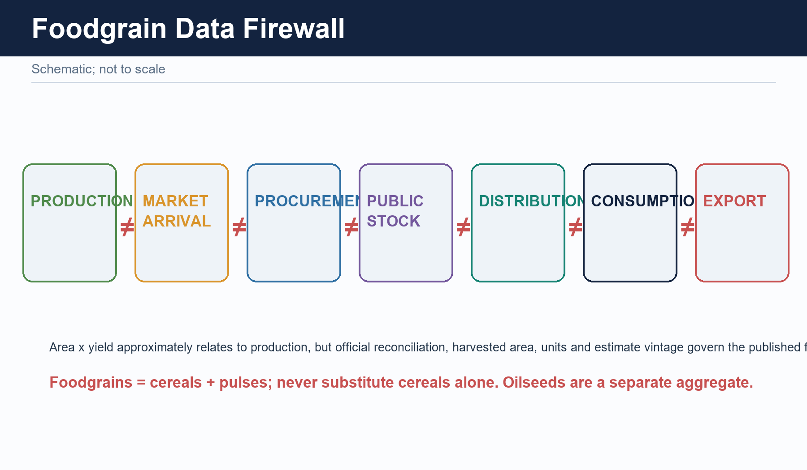

*FINAL REGISTER NOTES 3/4 - Water, markets, food security and risk. Original deterministic schematic; not a volatile-data source.*

- Irrigation is source + distribution + timing + application + drainage + energy. Potential created != utilised != reliable protective irrigation.
- Groundwater-energy nexus: low marginal power cost -> extraction -> falling water table -> higher lift/energy; aquifer is a shared stock.
- Watershed: ridge-to-valley treatment; structures are outputs, not recharge or livelihood outcomes.
- Yield != profit != income != resilience. Diversify crops, varieties, seasons, enterprises, income and markets.
- Market chain: aggregation -> grading -> storage/finance -> transport -> processing -> sale. e-NAM is digital-plus-physical; FPOs need governance and capital.
- Food firewall: production != arrival != procurement != stock != distribution != consumption != export. Foodgrains = cereals + pulses; oilseeds separate.
- MSP announcement != procurement coverage. Food security = availability + access + utilisation + stability.

## FINAL REGISTER NOTES 4/4 - Sustainable transition, current policy and answer writing

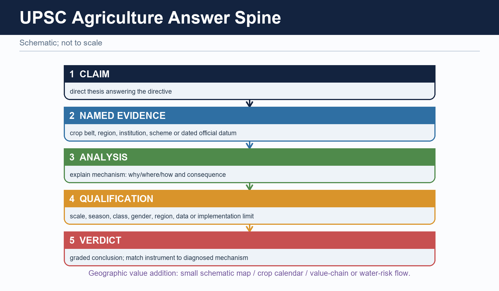

*FINAL REGISTER NOTES 4/4 - Sustainable transition, current policy and answer writing. Original deterministic schematic; not a volatile-data source.*

- Conservation, organic and natural farming overlap but differ. Climate-smart is an objective framework; precision/protected systems add capital, skill, energy and data issues.
- Policy architecture: PM-KISAN income; PMFBY risk; PMKSY water; Soil Health Card information; e-NAM market; AIF infrastructure; DAM/AgriStack data; NMNF ecological transition; pulses/oilseeds missions; PM Dhan-Dhaanya district convergence.
- Status ladder: announcement -> approval -> guidelines -> district/beneficiary selection -> allocation -> release -> activity/output -> outcome -> impact.
- Third Advance Estimate 2025-26: foodgrains 3765.63 lakh tonnes; nine oilseeds 430.59 lakh tonnes. Keep estimate label, date and units.
- Cotton bale 170 kg; jute/mesta bale 180 kg. Horticulture uses separate rounds. Forecast != realised season.
- UPSC spine: claim -> named evidence/example -> what it proves -> qualification -> verdict. End every model answer with why it earns marks.
