# Geography 32 - Industries and Industrial Regions

**Complete Topic Package + Solved Practice Edition**

**Export date / evidence retrieval date:** 20 August 2026

**Status:** Generated for review; **NOT APPROVED**.

## Evidence protocol and data-status discipline

- ✅ **Observed official statistic:** directly retrieved release with date, unit and boundary.
- 🟦 **Quick / provisional estimate:** revisable status retained.
- 🟨 **Administrative status:** announcement, approval, application, allotment, construction, inauguration, production and disbursement kept separate.
- 🎯 **Target / outlay:** future objective or authorised ceiling, never rewritten as achievement.
- ⚠️ **Inference:** analytical geographic interpretation, not an official datum.
- Firewall: ASI factory sector != all manufacturing; IIP index/growth != output value/GVA; current price != constant price; factory != establishment != enterprise; worker != person engaged != employment generated; registration != active enterprise; approved/committed investment != realised investment; gross output != GVA; installed capacity != actual production; export value != domestic value addition.

## Source register - retrieved 20 August 2026

| Source | Path / URL | Use and boundary |
|---|---|---|
| Repository basic owner | upsc-ai-kit/knowledge/Geography/basic/32_Industries-and-Industrial-Regions.md | Static terminology, location factors, Weber, global regions and answer architecture. |
| Repository advanced owner | upsc-ai-kit/knowledge/Geography/advanced/32_Industries-and-Industrial-Regions.md | India regions, corridors, PLI, institutions and routed PYQ demands. |
| MoSPI ASI Summary Results 2023-24 | https://mospi.gov.in/uploads/publications_reports/publications_reports1759229789833_2b8ed8ad-314e-46b7-b123-b08cb17f1233_ASI_Summary_Results_2023-24C.pdf | Latest released factory-sector summary found; registered factory sector, not all manufacturing. |
| MoSPI IIP June 2026 | https://mospi.gov.in/uploads/latestreleasesfiles/1785235100253-IIP%20Press%20release%20Jun%202026.pdf | Quick Estimate, base 2022-23=100; index and growth, not output value or GVA. |
| MoSPI National Accounts PE 2025-26 | https://mospi.gov.in/uploads/latestReleases/latest_release_1780655857536_5ac01869-ca4a-422d-b7a7-57b81da60932_Press_Note_on_GDP_Estimates_for_Q4_2025-26_and_PE_FY_2025-26_F.pdf | Provisional economy-wide manufacturing GVA at constant and current prices. |
| Economic Survey 2025-26 | https://www.indiabudget.gov.in/economicsurvey/ | Manufacturing technology intensity, logistics, industry and macro context; January-2026 vintage. |
| DPIIT-PIB PLI update, 21 Jul 2026 | https://pib.gov.in/PressReleasePage.aspx?PRID=2287008&reg=3&lang=1 | Official scheme-reported investment, direct and indirect employment, and exports as on 31 Mar 2026. |
| India Semiconductor Mission, Semicon 2.0 | https://ism.gov.in/schemes/semicon2.0/index | Cabinet-approved second phase, fiscal outlay, six pillars and dated status; page updated 19 Aug 2026. |
| NICDC DMU report, 31 Jul 2025 | https://nicdc.in/assets/pdfs/01_DMU_Report_31_Jul_2025.pdf | Node-by-node land, trunk infrastructure, allotment and construction stages; not a blanket operation claim. |
| NICDC corridor programme | https://nicdc.in/projects/national-industrial-corridor-development-programme | Official programme and corridor architecture. |
| DFCCIL milestones | https://dfccil.com/Home/DynemicPages?MenuId=74 | Page updated 30 Jul 2026; records trial-run completion of the WDFC and the completed-project claim. |
| PM GatiShakti and National Logistics Policy | https://www.dpiit.gov.in/logistics-division | Planning platform and logistics-policy architecture; platform use is not project completion. |
| PLFS Annual Report 2025 press note | https://www.mospi.gov.in/uploads/latestReleases/latest_release_1774607827733_3e8964a9-268b-4cc9-ad65-cfc8a9e32f08_Press_note_AR_PLFS_2025_23032025_V2.1_26032026_final.pdf | Employment and worker measures with survey definitions; no substitution with scheme job claims. |
| Udyam and MSME dashboard | https://dashboard.msme.gov.in/ | Administrative registrations and self-reported fields; registration is not an active-enterprise census. |
| Ministry of Steel Annual Report 2025-26 | https://steel.gov.in/sites/default/files/Annual_Report_2025-26_English.pdf | Steel policy, production chain and decarbonisation context. |
| Ministry of Heavy Industries Annual Report 2025-26 | https://heavyindustries.gov.in/sites/default/files/final_heavy_annual_report_2025-26_hindi_english_28_march_2026.pdf | Automobile, EV and capital-goods policy context. |
| Ministry of Textiles official portal | https://texmin.nic.in/ | Textile schemes and sector documents; no unverified 2025-26 annual-report claim used. |
| Ministry of Food Processing annual reports | https://www.mofpi.gov.in/en/documents/reports/annual-report | Latest official report page; processing and cold-chain programme context. |
| Department of Chemicals and Petrochemicals | https://chemicals.gov.in/ | Petrochemical and chemical industry policy context. |
| Department of Fertilizers | https://fert.gov.in/ | Fertiliser policy and plant/feedstock context. |
| Local UPSC papers and routing ledgers | books/prelima_question_paper_answers; books/more_previous_papers; upsc-ai-kit/knowledge/_PYQ-ROUTING-* | Question stems, official 2024-25 keys, provisional 2026 key context and explicit unavailable-key labels. |

## Visual register - 40 original deterministic PNGs

1. `notes/Geography/assets/32_Industries-and-Industrial-Regions/01_topic-roadmap.png`
2. `notes/Geography/assets/32_Industries-and-Industrial-Regions/02_industry-classification-firewall.png`
3. `notes/Geography/assets/32_Industries-and-Industrial-Regions/03_location-factor-wheel.png`
4. `notes/Geography/assets/32_Industries-and-Industrial-Regions/04_weber-material-index-isodapane.png`
5. `notes/Geography/assets/32_Industries-and-Industrial-Regions/05_losch-market-profit.png`
6. `notes/Geography/assets/32_Industries-and-Industrial-Regions/06_theory-comparison.png`
7. `notes/Geography/assets/32_Industries-and-Industrial-Regions/07_agglomeration-diseconomy.png`
8. `notes/Geography/assets/32_Industries-and-Industrial-Regions/08_cluster-corridor-region-firewall.png`
9. `notes/Geography/assets/32_Industries-and-Industrial-Regions/09_gvc-chain.png`
10. `notes/Geography/assets/32_Industries-and-Industrial-Regions/10_global-industrial-regions.png`
11. `notes/Geography/assets/32_Industries-and-Industrial-Regions/11_product-cycle-restructuring.png`
12. `notes/Geography/assets/32_Industries-and-Industrial-Regions/12_india-industrial-regions.png`
13. `notes/Geography/assets/32_Industries-and-Industrial-Regions/13_industrial-history-timeline.png`
14. `notes/Geography/assets/32_Industries-and-Industrial-Regions/14_steel-chain-plants.png`
15. `notes/Geography/assets/32_Industries-and-Industrial-Regions/15_textiles-relocation.png`
16. `notes/Geography/assets/32_Industries-and-Industrial-Regions/16_refinery-petrochemical-complex.png`
17. `notes/Geography/assets/32_Industries-and-Industrial-Regions/17_automobile-ev-cluster.png`
18. `notes/Geography/assets/32_Industries-and-Industrial-Regions/18_electronics-semiconductor.png`
19. `notes/Geography/assets/32_Industries-and-Industrial-Regions/19_pharma-cluster.png`
20. `notes/Geography/assets/32_Industries-and-Industrial-Regions/20_food-cold-chain.png`
21. `notes/Geography/assets/32_Industries-and-Industrial-Regions/21_cement-fertiliser-location.png`
22. `notes/Geography/assets/32_Industries-and-Industrial-Regions/22_msme-artisanal-clusters.png`
23. `notes/Geography/assets/32_Industries-and-Industrial-Regions/23_industrial-policy-timeline.png`
24. `notes/Geography/assets/32_Industries-and-Industrial-Regions/24_pli-status-chain.png`
25. `notes/Geography/assets/32_Industries-and-Industrial-Regions/25_corridor-logistics-architecture.png`
26. `notes/Geography/assets/32_Industries-and-Industrial-Regions/26_india-corridor-nodes.png`
27. `notes/Geography/assets/32_Industries-and-Industrial-Regions/27_asi-iip-gva-firewall.png`
28. `notes/Geography/assets/32_Industries-and-Industrial-Regions/28_labour-informality-chain.png`
29. `notes/Geography/assets/32_Industries-and-Industrial-Regions/29_industrial-environment-impact.png`
30. `notes/Geography/assets/32_Industries-and-Industrial-Regions/30_circular-industrial-symbiosis.png`
31. `notes/Geography/assets/32_Industries-and-Industrial-Regions/31_green-industrial-transition.png`
32. `notes/Geography/assets/32_Industries-and-Industrial-Regions/32_supply-chain-resilience.png`
33. `notes/Geography/assets/32_Industries-and-Industrial-Regions/33_monitoring-dashboard.png`
34. `notes/Geography/assets/32_Industries-and-Industrial-Regions/34_current-status-firewall.png`
35. `notes/Geography/assets/32_Industries-and-Industrial-Regions/35_upsc-answer-spine.png`
36. `notes/Geography/assets/32_Industries-and-Industrial-Regions/36_theory-evolution-tree.png`
37. `notes/Geography/assets/32_Industries-and-Industrial-Regions/37_location-lockin-relocation.png`
38. `notes/Geography/assets/32_Industries-and-Industrial-Regions/38_spread-backwash.png`
39. `notes/Geography/assets/32_Industries-and-Industrial-Regions/39_industrial-region-hierarchy.png`
40. `notes/Geography/assets/32_Industries-and-Industrial-Regions/40_sector-location-matrix.png`

# Part I - Complete visual-first learning session

## 1. Evidence protocol and current-status discipline

*1. Evidence protocol and current-status discipline. Original deterministic schematic; maps are explicitly schematic and not to scale.*

Industrial geography mixes durable spatial theory with rapidly changing statistics, schemes and projects. Every current statement therefore carries a source, reference date, unit and status.

- Observed official statistic means a released table or press note; quick, provisional or revised status is retained.
- Administrative status means announcement, notification, approval, allotment, completion claim, inauguration or production stage; these are not interchangeable.
- Policy outlay is an authorisation ceiling, not expenditure. Approved application is not realised investment. Investment is not production. Production is not domestic value addition.
- Inference explains geography but is never rewritten as an official finding.
- Source retrieval date for this package is 20 August 2026.

| Evidence class | Meaning | Answer use |
|---|---|---|
| Observed | Released official statistic | State source, date, unit |
| Quick or provisional | Revisable estimate | Retain label |
| Administrative | Approval, allotment, completion or claim | Do not infer outcome |
| Target | Future objective | Never write as achievement |
| Inference | Analytical reading | Mark explicitly |

**Must-know facts**

- The latest ASI summary found is 2023-24, not 2024-25.
- June 2026 IIP is a Quick Estimate under base 2022-23=100.
- Semicon 2.0 is included because the official ISM page confirms Cabinet approval.

**UPSC traps**

- **Wrong:** Search result equals verification. **Correct:** Only directly retrieved official pages and documents support current claims.
- **Wrong:** Completion of one corridor asset means every node operates. **Correct:** Status is retained node by node and asset by asset.

**Mains / practice route:** Open every answer by fixing the measurement or project-status boundary before interpreting location.

---

## 2. Roadmap: from classification to resilient industrial regions

*2. Roadmap: from classification to resilient industrial regions. Original deterministic schematic; maps are explicitly schematic and not to scale.*

The topic is best learned as a chain: define the activity, identify the dominant cost or capability, trace agglomeration and value-chain stages, map regions, test policy and data, then assess social and ecological outcomes.

- Foundation: sector boundaries, industry classifications and location factors.
- Classical theory: Weber and Losch, followed by Hoover-Smith and behavioural corrections.
- Evolutionary theory: growth poles, cumulative causation, core-periphery, flexible specialisation, new economic geography and path dependence.
- Application: global belts, Indian regions and industry-specific value chains.
- Governance: industrial policy, corridors, PLI, data measurement, labour, environment and resilience.

**Must-know facts**

- One factor never explains every industry.
- The relevant unit may be a value-chain stage rather than an entire industry.
- Current evidence belongs after the static causal mechanism.

**UPSC traps**

- **Wrong:** Industry is location-free. **Correct:** Digitalisation changes friction but skills, power, logistics and institutions remain spatial.
- **Wrong:** A named list is analysis. **Correct:** Every region or plant must prove a location mechanism.

**Mains / practice route:** Use the roadmap as an answer plan: define -> locate -> mechanism -> evidence -> qualification -> verdict.

---

## 3. Industrial terminology: manufacturing, factory and industry

*3. Industrial terminology: manufacturing, factory and industry. Original deterministic schematic; maps are explicitly schematic and not to scale.*

Industrial answers often fail before analysis because they blur activity, establishment and statistical sector. The boundary must be explicit.

- Primary activities extract or biologically produce; secondary activities transform, assemble or construct; tertiary activities move, finance, coordinate or service production.
- Manufacturing is transformation within the production boundary; the factory sector is a legal-statistical subset of establishments covered by applicable factory and ASI rules.
- Industry is broader: it can refer to an activity class, value chain or business ecosystem and may include non-factory units and services.
- Household manufacturing uses household premises and family labour patterns; unorganised manufacturing is wider and not identical to household production.
- A registered factory, establishment and enterprise are different observational units; one enterprise may own many establishments.

| Term | Boundary | Common error |
|---|---|---|
| Manufacturing | Transformation activity | Equated with all secondary activity |
| Factory sector | Covered establishments | Equated with all manufacturing |
| Industry | Activity or value-chain ecosystem | Equated with one plant |
| Enterprise | Ownership or business unit | Equated with establishment |
| Person engaged | Wider workforce concept | Equated automatically with employee |

**Must-know facts**

- ASI does not cover all manufacturing.
- Services embedded in industry do not become manufacturing merely because a manufacturer buys them.
- Construction is secondary but is not factory manufacturing.

**UPSC traps**

- **Wrong:** Factory output equals manufacturing GVA. **Correct:** Gross output subtracts intermediate consumption only when deriving value added.
- **Wrong:** Registered equals formal employment. **Correct:** A registered enterprise can use contract or informal labour arrangements.

**Mains / practice route:** A high-scoring data answer begins with the observation unit: enterprise, establishment, factory, worker or person engaged.

---

## 4. Industrial classification axes

*4. Industrial classification axes. Original deterministic schematic; maps are explicitly schematic and not to scale.*

Classification is multi-dimensional. The same plant can be heavy, basic, formal, process-based, market-linked and environmentally intensive at the same time.

- Heavy versus light refers broadly to capital, bulk, plant scale and material throughput; it is not a legal universal threshold.
- Basic industries supply core materials; capital-goods industries produce machinery; intermediate industries supply inputs; consumer industries produce final goods.
- Resource-, market-, transport-, labour- and knowledge-oriented labels identify dominant pulls, not exclusive causes.
- Weight-losing industries shed bulk during processing; weight-gaining industries add ubiquitous material or packaging and often move marketward.
- Assembly combines components; fabrication shapes parts; process industries transform material continuously or chemically.
- Sunrise and sunset are time-bound analytical labels, not permanent official categories.

**Must-know facts**

- Footloose means weak dependence on localised raw material, not absence of locational needs.
- Formal and informal can describe enterprise or employment dimensions.
- Consumer and capital goods can share suppliers and locations.

**UPSC traps**

- **Wrong:** Light industry has no pollution. **Correct:** Small bulk does not guarantee low toxicity or risk.
- **Wrong:** Sunrise sector must grow everywhere. **Correct:** Growth remains conditioned by demand, technology and cluster capability.

**Mains / practice route:** Classify on two or three axes and then explain why the dominant axis matters spatially.

---

## 5. Full location-factor system

*5. Full location-factor system. Original deterministic schematic; maps are explicitly schematic and not to scale.*

Industrial location is a weighted decision across cost, time, reliability, risk and capability. The weights vary by stage and can change after a plant is built.

- Raw materials matter through bulk, perishability, impurity, seasonality and supply security.
- Energy and water matter through price, reliability, quality and environmental limits, not mere physical presence.
- Labour matters through wage, skill, productivity, industrial relations, migration networks and social reproduction.
- Capital and technology follow financial centres, anchor firms, research institutions and intellectual-property networks.
- Markets matter through size, income, product customisation, after-sales service and delivery time.
- Transport and logistics include freight rate, transit time, inventory cost, ports, pipelines, customs and disruption risk.
- Land, policy, tax, environmental regulation, supplier networks, agglomeration, resilience and quality of life complete the system.

**Must-know facts**

- Reliability can outweigh headline price.
- Time-sensitive logistics can re-strengthen proximity even when ocean freight is cheap.
- Quality of life matters most for mobile skilled labour and knowledge activities.

**UPSC traps**

- **Wrong:** Cheap labour guarantees competitiveness. **Correct:** Productivity, quality, turnover and logistics determine effective labour cost.
- **Wrong:** Tax incentive can create any cluster. **Correct:** Incentives cannot permanently offset weak utilities, suppliers or market access.

**Mains / practice route:** Rank the top three factors for the named industry and explain why the remaining factors are enabling or constraining.

---

## 6. Initial location, industrial inertia and relocation

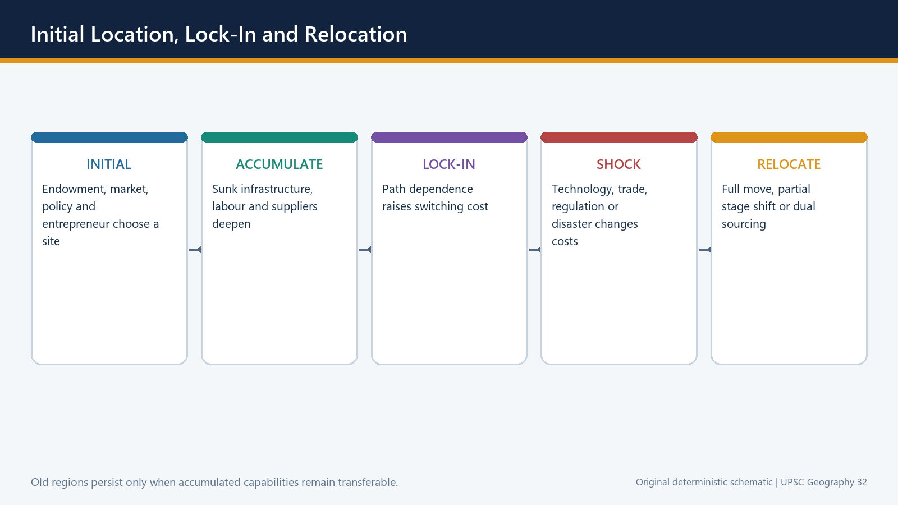

*6. Initial location, industrial inertia and relocation. Original deterministic schematic; maps are explicitly schematic and not to scale.*

The reason a region emerged may differ from the reason it survives. This distinction separates initial location from path-dependent lock-in.

- Initial location reflects the factor mix at the investment date: resource, market, port, policy, entrepreneur or strategic choice.
- Sunk infrastructure, specialised labour, supplier routines, finance and reputation accumulate after entry.
- Industrial inertia persists when accumulated capabilities remain useful despite a changed original factor.
- Relocation may shift only one stage: design, assembly, processing, warehousing or headquarters can separate.
- Brownfield upgrading competes with greenfield relocation; firms compare switching cost, disruption risk and future regulation.
- Shock-driven dual sourcing may create parallel capacity rather than a complete move.

**Must-know facts**

- Path dependence is conditional, not destiny.
- A cluster can decline if its skill and supplier base is too technology-specific.
- Relocation statistics must distinguish plant closure from new incremental capacity elsewhere.

**UPSC traps**

- **Wrong:** Old belt survives because coal remains. **Correct:** Often market, skills, suppliers and infrastructure now sustain it.
- **Wrong:** New plant means old region is irrelevant. **Correct:** Legacy regions can retain higher-value or specialised functions.

**Mains / practice route:** Use two time slices: why the industry came, and why it stayed, upgraded or moved.

---

## 7. Weber least-cost theory

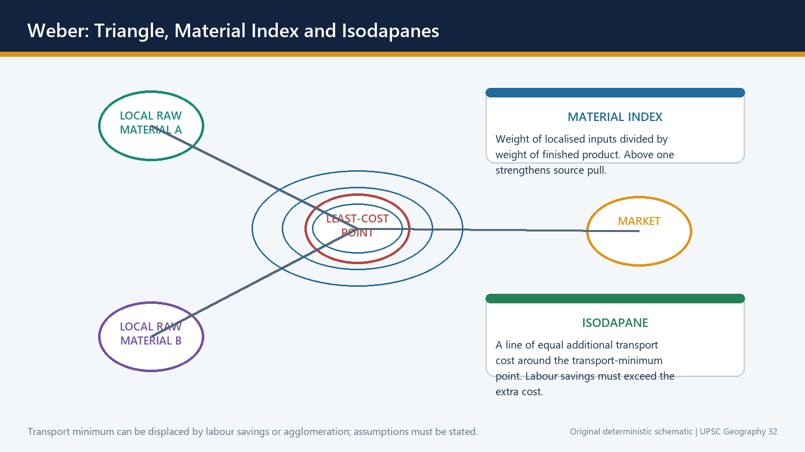

*7. Weber least-cost theory. Original deterministic schematic; maps are explicitly schematic and not to scale.*

Weber models the location that minimises transport and labour cost while allowing agglomeration or deglomeration to displace the transport minimum.

- Assumptions include known technology, fixed input and market locations, measurable transport costs and cost-minimising behaviour.
- The locational triangle connects two localised raw materials and one market.
- Material index equals weight of localised inputs divided by finished-product weight; above one suggests source pull.
- Isotims show equal transport cost from a point; isodapanes show equal additional total transport cost around the minimum.
- A labour-cost location is chosen when labour savings exceed the extra transport cost represented by the critical isodapane.
- Agglomeration economies can justify clustering; high rent, congestion, pollution and risk can cause deglomeration.

**Must-know facts**

- Weight loss is a freight mechanism, not a universal rule.
- Ubiquitous inputs weaken raw-material pull.
- Weber remains useful as a method even when the dominant cost becomes time, reliability or risk.

**UPSC traps**

- **Wrong:** Weber explains transport only. **Correct:** Labour and agglomeration are integral.
- **Wrong:** Material index below one always fixes the market. **Correct:** Other costs and multiple markets can dominate.

**Mains / practice route:** State assumptions, explain the three mechanisms, apply one India case and then modernise the cost set.

---

## 8. Losch, Hoover-Smith and behavioural corrections

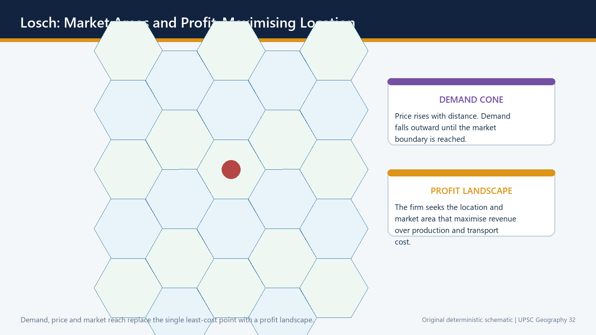

*8. Losch, Hoover-Smith and behavioural corrections. Original deterministic schematic; maps are explicitly schematic and not to scale.*

Later theories move beyond a single cost-minimising point toward demand, substitution, uncertainty and institutional decision-making.

- Losch starts from spatial demand: price rises with distance and the viable market ends where demand or profit disappears.
- Hexagonal market areas are an idealised solution to covering space without gaps while serving multiple centres.
- Hoover separates terminal and line-haul transfer costs and helps explain trans-shipment and port locations.
- Smith-style substitution recognises that firms trade higher cost on one factor for savings on another within a spatial margin of profitability.
- Behavioural approaches add imperfect information, bounded rationality, satisficing, managerial preference and institutional context.
- Modern policy can alter the profit surface through infrastructure, standards, risk guarantees and ecosystem creation.

**Must-know facts**

- Profit maximisation is not identical to cost minimisation.
- Port and break-of-bulk points can emerge from transfer-cost structure.
- Institutional credibility changes expected cost even without changing distance.

**UPSC traps**

- **Wrong:** Losch predicts actual hexagons. **Correct:** Hexagons are an abstract market-area solution.
- **Wrong:** Behavioural theory rejects economics. **Correct:** It modifies unrealistic information and optimisation assumptions.

**Mains / practice route:** Compare Weber and Losch, then use transfer cost and bounded rationality to explain a real corridor or port cluster.

---

## 9. Growth poles, cumulative causation, core-periphery and NEG

*9. Growth poles, cumulative causation, core-periphery and NEG. Original deterministic schematic; maps are explicitly schematic and not to scale.*

Modern regional theory explains why industrial activity concentrates, reproduces advantage and can widen regional inequality.

- Perroux's growth pole is an economic concentration around propulsive firms and linkages; it is not merely a mapped point.
- Hirschman emphasises backward and forward linkages and deliberate imbalance that can stimulate connected investment.
- Myrdal's cumulative causation produces spread effects but also backwash through migration, capital and market capture.
- Core-periphery models show how high-value functions and decision power concentrate while routine production may disperse.
- Flexible specialisation explains networks of specialised SMEs, rapid adaptation and industrial districts.
- New economic geography combines increasing returns, transport cost and market size; path dependence allows small historical advantages to persist.

**Must-know facts**

- A growth centre built by government is not automatically a growth pole.
- Spread effects require local absorptive capacity and supplier development.
- NEG explains concentration but not every political or environmental outcome.

**UPSC traps**

- **Wrong:** Infrastructure guarantees convergence. **Correct:** Core regions may capture the new accessibility first.
- **Wrong:** Path dependence means policy is powerless. **Correct:** Coordination, capability and connectivity can shift trajectories, but slowly.

**Mains / practice route:** Assess whether a corridor creates genuine linkages or only relocates an enclave along a new transport spine.

---

## 10. Agglomeration economies and diseconomies

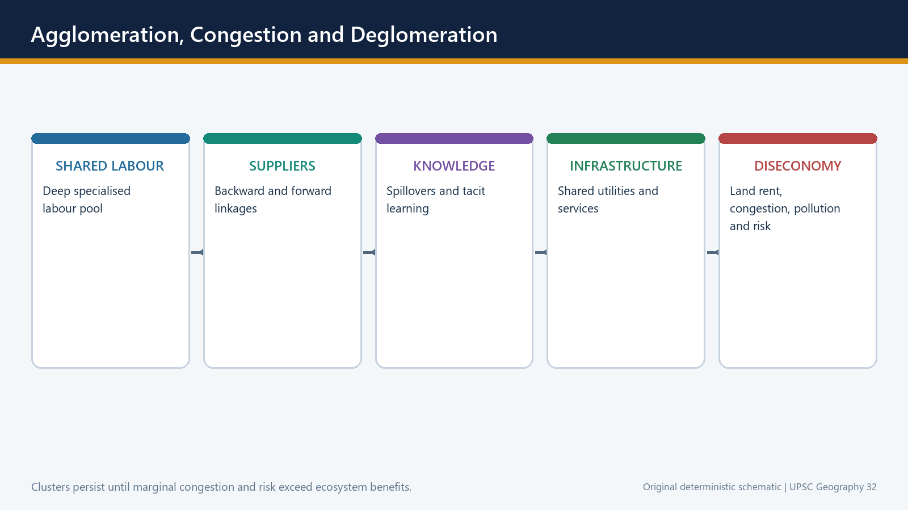

*10. Agglomeration economies and diseconomies. Original deterministic schematic; maps are explicitly schematic and not to scale.*

Agglomeration turns a collection of firms into a cumulative production ecosystem, but its benefits are neither limitless nor evenly distributed.

- Localisation economies arise from firms in the same or related industry sharing labour, suppliers, knowledge and reputation.
- Urbanisation economies arise from city scale, diversity, finance, infrastructure and cross-industry services.
- Marshallian externalities are specialised labour pools, specialised suppliers and knowledge spillovers.
- Backward linkages connect buyers to input suppliers; forward linkages connect outputs to processors and markets.
- Congestion, land rent, housing stress, pollution, water scarcity and correlated disaster risk create diseconomies.
- Deglomeration may shift routine production outward while headquarters, design or specialised services remain in the core.

**Must-know facts**

- Cluster productivity and worker welfare can diverge.
- Shared common facilities can lower environmental cost only if operated and monitored.
- A diverse metropolis and a specialised district generate different externalities.

**UPSC traps**

- **Wrong:** More firms always improve the cluster. **Correct:** Beyond thresholds, congestion and risk can dominate.
- **Wrong:** Deglomeration dissolves the cluster. **Correct:** Functional separation can preserve the wider regional ecosystem.

**Mains / practice route:** Balance cluster gains with land, labour, environment and systemic-risk costs.

---

## 11. Industrial spatial forms and scale

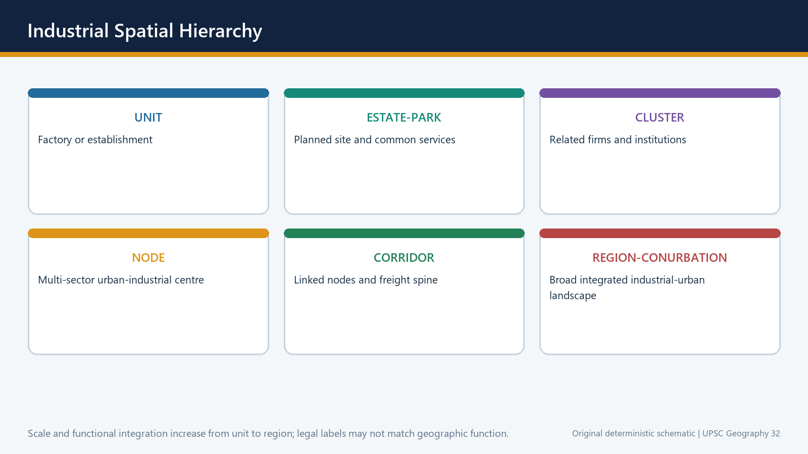

*11. Industrial spatial forms and scale. Original deterministic schematic; maps are explicitly schematic and not to scale.*

Factory, estate, park, SEZ, node, corridor, region and conurbation describe different spatial scales and governance arrangements.

- Industrial estate or park is a planned bounded site with plots and common services.
- SEZ is a notified legal-regulatory space; it is not automatically a dense innovation cluster.
- Industrial district is a local production system with specialised SMEs, labour culture and institutions.
- Industrial complex is a technically linked group, often through material, energy or by-product flows.
- Node is a concentrated urban-industrial point within a wider network.
- Corridor links multiple nodes and logistics spines; region is the broader functional landscape; conurbation is merged urban settlement.

**Must-know facts**

- Legal notification and geographic function differ.
- A park can remain under-occupied.
- Regional boundaries vary by author and dataset.

**UPSC traps**

- **Wrong:** A highway is an industrial corridor. **Correct:** Industry, nodes, utilities, urban systems and governance are also required.
- **Wrong:** Every SEZ is export successful. **Correct:** Notification does not prove occupancy, exports or spillovers.

**Mains / practice route:** Define the scale before evaluating performance or comparing regions.

---

## 12. GVCs, product cycle and new international division of labour

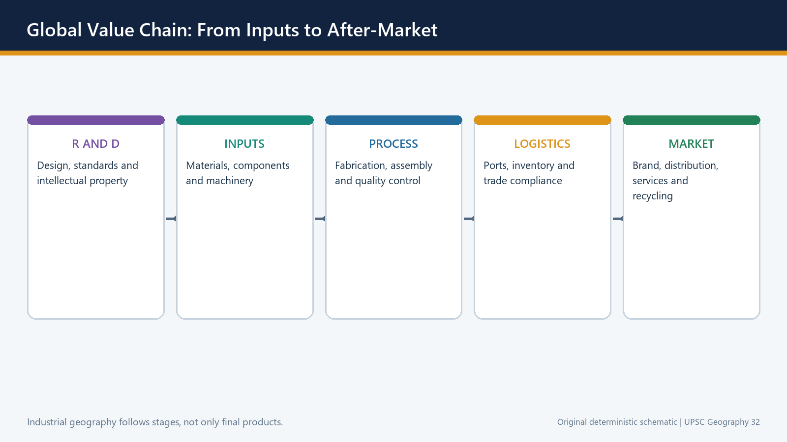

*12. GVCs, product cycle and new international division of labour. Original deterministic schematic; maps are explicitly schematic and not to scale.*

Production is fragmented across tasks, firms and countries. The object of location analysis is therefore the stage of the chain.

- Product-cycle theory links innovation to lead markets, standardisation to scale and mature production to cost-sensitive locations.
- The new international division of labour shifted routine assembly and processing toward export platforms while design and control often remained in cores.
- Containerisation reduced freight friction but increased the strategic importance of ports, schedules and standardised logistics.
- Lead firms govern standards, design and market access; suppliers compete on cost, quality, delivery and compliance.
- Upgrading can be process, product, functional or chain upgrading; higher exports alone do not prove deeper value capture.
- Reshoring, friend-shoring and China-plus-one reflect risk and politics but usually diversify rather than fully reverse GVCs.

**Must-know facts**

- Gross export value is not domestic value addition.
- Assembly can be significant employment without technological depth.
- Supply-chain security can conflict with least-cost sourcing.

**UPSC traps**

- **Wrong:** GVC participation guarantees upgrading. **Correct:** Lead-firm control and weak local capabilities can trap suppliers.
- **Wrong:** Offshoring ended distance. **Correct:** Time, ports, inventory and geopolitical chokepoints remain spatial.

**Mains / practice route:** Trace who controls design, inputs, production, logistics and market, then identify the location of captured value.

---

## 13. Global industrial regions and restructuring

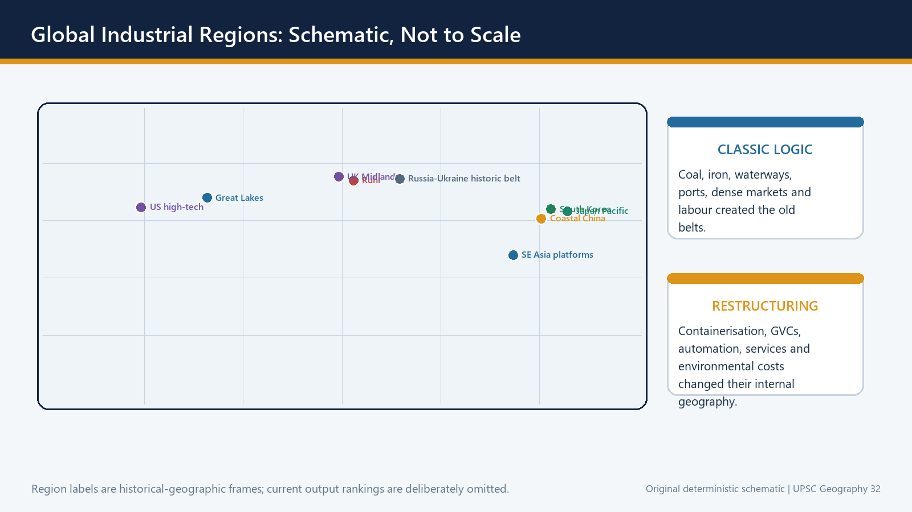

*13. Global industrial regions and restructuring. Original deterministic schematic; maps are explicitly schematic and not to scale.*

Classic industrial belts emerged from specific combinations of resources, waterways, labour, markets, state strategy and ports; restructuring altered rather than erased them.

- NE USA and Great Lakes grew through coal-iron access, Great Lakes waterways, rail, immigrant labour and a continental market; later deindustrialisation and advanced services reshaped the belt.
- Western and Central Europe combined coalfields, Rhine and North Sea access, dense cities and engineering traditions; the Ruhr diversified after coal-steel decline.
- UK Midlands grew through coal, machinery, textiles and early industrial institutions, then faced mature-industry decline and selective advanced revival.
- The Russia-Ukraine heavy-industry belt is a historical geographic frame; war, territorial control and damage require current-status caution.
- Japan's Pacific belt used ports, imported raw materials, dense urban markets and export manufacturing.
- Coastal China, South Korea and Southeast Asian platforms grew through state-enabled infrastructure, labour, ports, FDI and GVC integration.
- High-tech regions cluster around universities, venture finance, skilled migration and specialised suppliers; resource belts remain important for bulk processing.

**Must-know facts**

- Avoid volatile output rankings.
- Historical belt does not equal current political control or operating capacity.
- Restructuring can produce both high-value upgrading and regional job loss.

**UPSC traps**

- **Wrong:** Resource-poor states cannot industrialise. **Correct:** Ports can substitute through imported inputs and export markets.
- **Wrong:** Old belts disappeared. **Correct:** Many retained logistics, engineering and urban advantages.

**Mains / practice route:** For each region, use emerged because -> restructured through -> current qualification.

---

## 14. Iron and steel value chain and changing location

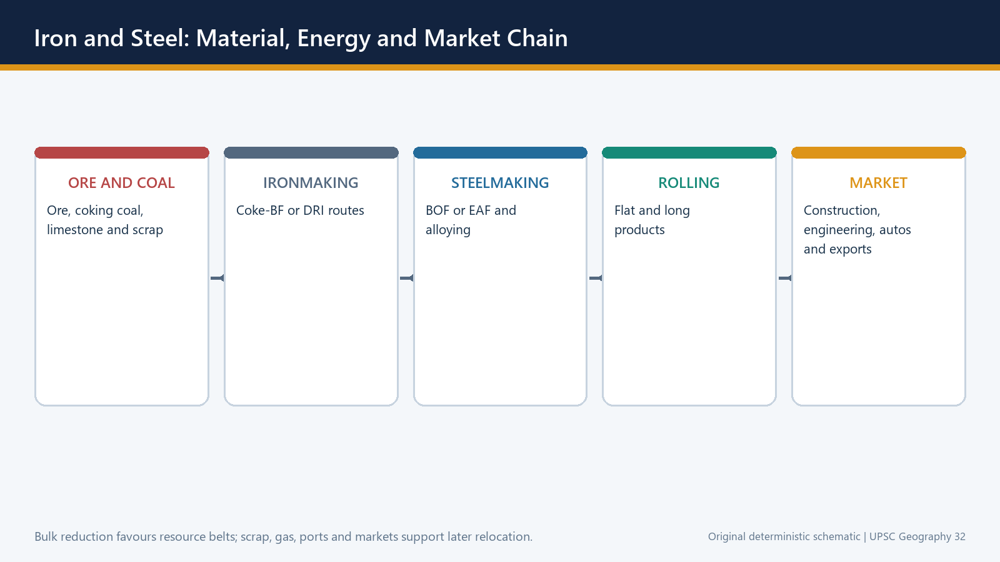

*14. Iron and steel value chain and changing location. Original deterministic schematic; maps are explicitly schematic and not to scale.*

Steel illustrates the shift from classic bulk-material orientation to multiple routes shaped by scrap, energy, ports, markets and technology.

- Integrated blast-furnace plants combine iron ore, coking coal, flux, water and large-scale logistics; this favoured east-central Indian mineral belts.
- Beneficiation and pelletisation can occur near mines; steelmaking and rolling may separate spatially.
- DRI uses gas or coal-based routes; EAFs use scrap and electricity and can move closer to urban scrap and markets.
- Coastal plants can import coking coal or ore at scale and export products, weakening inland resource determinism.
- Downstream engineering and auto clusters pull specialised flat products toward market and supplier ecosystems.
- Externalities include mining damage, coke-oven pollution, water use, slag, heat and carbon emissions.

**Must-know facts**

- Plant route determines factor weights.
- Installed capacity is not actual crude-steel production.
- Green-steel pilots and targets are not commercial-scale decarbonisation.

**UPSC traps**

- **Wrong:** Steel must be at the mine. **Correct:** Ports, scrap, gas, power and markets create alternative locations.
- **Wrong:** All scrap steel is low quality. **Correct:** Metallurgy, sorting and process control determine product capability.

**Mains / practice route:** Use one mineral-belt plant and one coastal or scrap-market case to demonstrate changing location.

---

## 15. Aluminium, cement and fertiliser

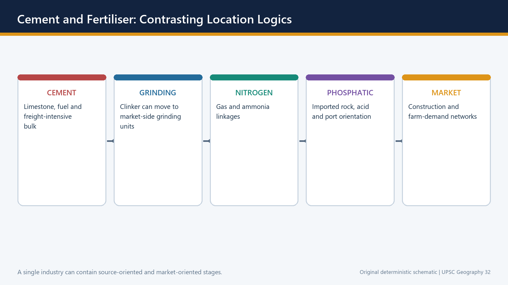

*15. Aluminium, cement and fertiliser. Original deterministic schematic; maps are explicitly schematic and not to scale.*

These industries show how different stages of one chain respond to different inputs and bulk transformations.

- Bauxite mining and alumina refining are ore- and caustic-water linked; aluminium smelting is strongly electricity oriented.
- Aluminium fabrication can move toward automotive, construction, packaging and export markets.
- Cement plants cluster near limestone and fuel, while clinker can move to market-side grinding units.
- Cement is weight-losing at quarry and energy intensive in clinker production, but the final product remains freight-sensitive.
- Nitrogen fertiliser follows gas, ammonia, ports and pipeline networks; phosphatic fertiliser often follows imported rock, acids and coastal handling.
- All three face large water, energy, dust or process-emission burdens and require spatially explicit cumulative assessment.

**Must-know facts**

- Bauxite location and aluminium smelter location need not coincide.
- Clinker capacity and cement grinding capacity are distinct.
- Fertiliser subsidy and feedstock policy alter location economics.

**UPSC traps**

- **Wrong:** Power-oriented means near coal mine. **Correct:** Reliable electricity can come through a grid or captive renewable portfolio.
- **Wrong:** Cement market orientation removes limestone pull. **Correct:** The chain is spatially split, not freed from geology.

**Mains / practice route:** Break the industry into stages and identify the dominant factor at each stage.

---

## 16. Refining and petrochemicals

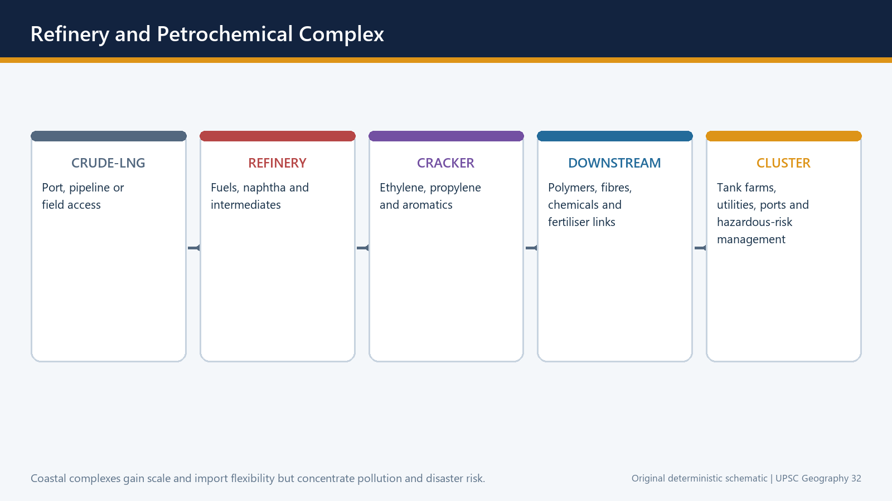

*16. Refining and petrochemicals. Original deterministic schematic; maps are explicitly schematic and not to scale.*

Refineries and petrochemical complexes are port-pipeline-market systems with strong scale economies, material linkages and environmental risk.

- Field-linked refineries minimise crude transport where domestic production is significant; coastal refineries gain import flexibility, scale and export access.
- Pipelines, tank farms and product terminals create network economies beyond the refinery gate.
- Naphtha and other streams feed crackers; petrochemicals generate polymers, fibres, intermediates and downstream plastics or chemical clusters.
- Backward and forward integration lowers transfer cost and allows shared utilities, storage, jetties and treatment systems.
- Market, port depth and environmental carrying capacity can outweigh proximity to crude fields.
- Externalities include volatile organic compounds, sulphur emissions, effluent, hazardous waste, fire and spill risk.

**Must-know facts**

- Refinery throughput is not crude production.
- Nameplate capacity is not utilisation.
- A coastal complex concentrates both efficiency and systemic risk.

**UPSC traps**

- **Wrong:** Refineries locate only near oilfields. **Correct:** Many modern refineries are port and market oriented.
- **Wrong:** Petrochemical output equals plastic consumption. **Correct:** The chain includes diverse intermediates and industrial uses.

**Mains / practice route:** Map crude entry, refinery, cracker, downstream cluster and market, then add risk governance.

---

## 17. Automobiles, EVs and engineering-capital goods

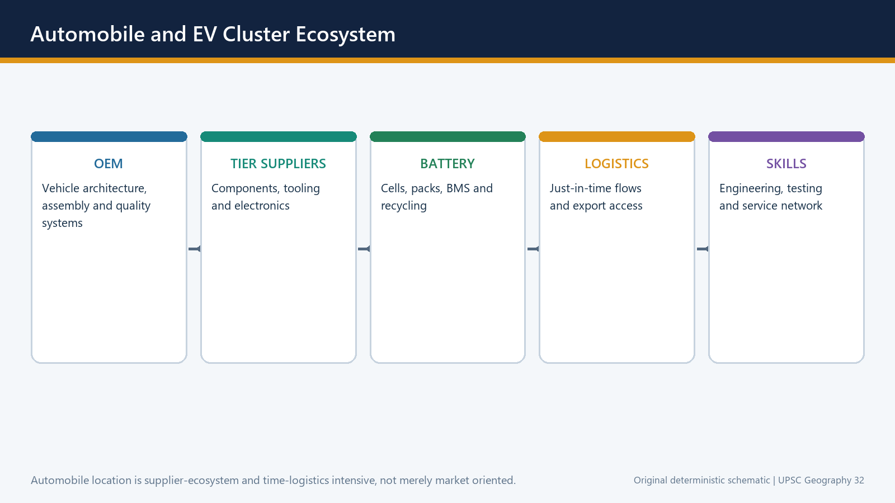

*17. Automobiles, EVs and engineering-capital goods. Original deterministic schematic; maps are explicitly schematic and not to scale.*

Automobile and engineering regions are built by supplier density, just-in-time reliability, testing capability and market access.

- OEM assembly anchors tiered suppliers, tooling, logistics, finance and service networks.
- Just-in-time systems make travel-time variability and supplier proximity more important than simple freight rate.
- Engineering and capital goods depend on metallurgy, precision machining, design talent and long customer relationships.
- EV geography adds cells, battery packs, power electronics, software, charging and recycling.
- Legacy auto clusters can upgrade through transferable supplier and engineering capability, but powertrain transition creates stranded skills and assets.
- Indian anchors include NCR, Pune-Nashik-Aurangabad, Gujarat, Chennai-Hosur-Coimbatore and Bengaluru-linked systems.

**Must-know facts**

- Auto cluster boundaries are functional, not administrative.
- Vehicle assembly and cell manufacturing are distinct.
- Sales incentives, production incentives and charging infrastructure act through different mechanisms.

**UPSC traps**

- **Wrong:** EV industry is only battery manufacturing. **Correct:** Power electronics, software, vehicles, charging and recycling are separate stages.
- **Wrong:** A new OEM creates immediate local content. **Correct:** Supplier qualification and scale take time.

**Mains / practice route:** Explain why ecosystem time and quality make auto geography path dependent.

---

## 18. Textiles, garments, jute and relocation

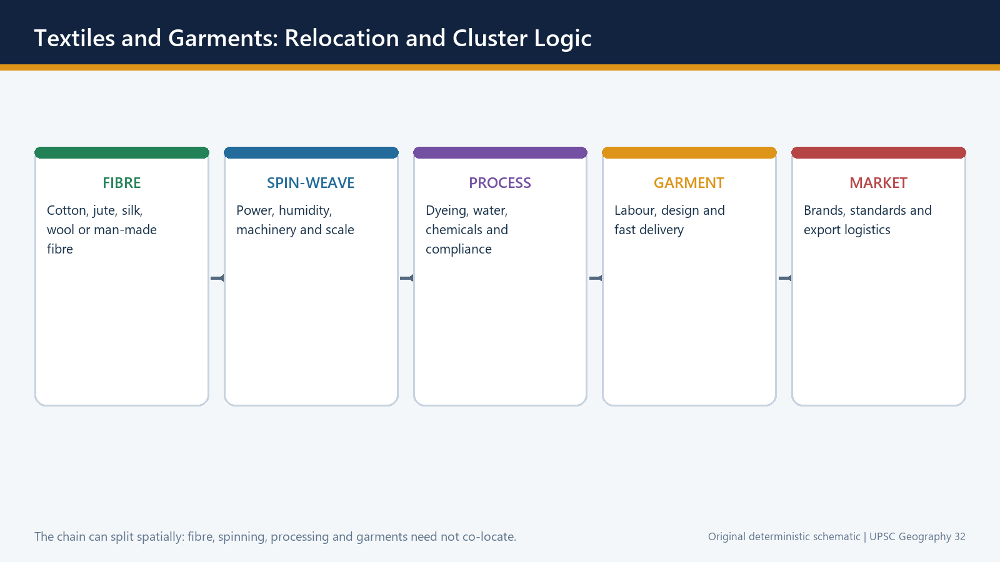

*18. Textiles, garments, jute and relocation. Original deterministic schematic; maps are explicitly schematic and not to scale.*

Textiles demonstrate historical raw-material orientation, water and power constraints, labour-intensive relocation and buyer-driven GVCs.

- Cotton mills initially followed humid port cities, capital, labour and market; power, transport and technology later enabled inland dispersion.
- Spinning, weaving, processing and garmenting have different capital, labour, water and delivery profiles.
- Garments are labour- and buyer-time sensitive; compliance, design and air-sea connectivity matter.
- Jute remains historically tied to the Hugli belt through raw material, river-port access, labour and inherited mill infrastructure.
- Man-made fibres connect textiles to petrochemical complexes and change raw-material geography.
- Clusters such as Ahmedabad-Surat, Mumbai-Pune legacy belt, Coimbatore-Tiruppur, Ludhiana and NCR represent different chain stages.

**Must-know facts**

- Cotton cultivation map is not the textile-industry map.
- Relocation can move mills while design or trading remains in the old centre.
- Certification proves conformity to a stated standard, not universal sustainability.

**UPSC traps**

- **Wrong:** Garments are footloose. **Correct:** They still depend on labour pools, suppliers, buyer access and logistics.
- **Wrong:** Hugli jute survives only because jute grows nearby. **Correct:** Inherited port, labour, machinery and institutions also matter.

**Mains / practice route:** Use chain fragmentation to explain both historical concentration and modern relocation.

---

## 19. Electronics and semiconductor geography

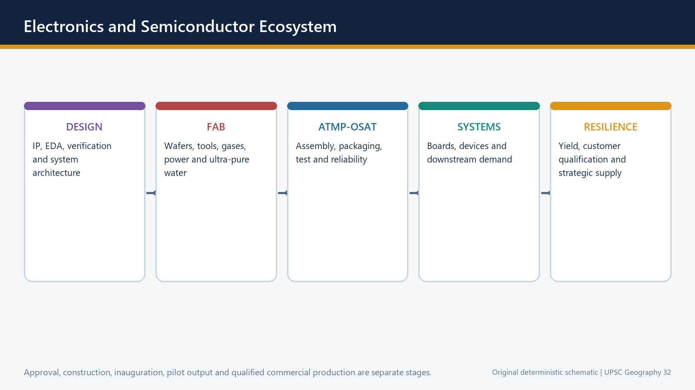

*19. Electronics and semiconductor geography. Original deterministic schematic; maps are explicitly schematic and not to scale.*

Electronics spans design, components, fabrication, packaging, assembly and systems. Each layer has a distinct location logic and status vocabulary.

- Design clusters around talent, universities, EDA tools, customers and venture ecosystems.
- Fabs require stable high-quality power, ultra-pure water, gases, chemicals, equipment service and process engineers.
- ATMP or OSAT requires packaging materials, reliability testing, logistics and customer qualification; it is not front-end fabrication.
- Final electronics assembly follows scale, labour, suppliers, ports and policy, but can retain high import content.
- Semicon 2.0 was officially approved with six pillars: design, machines and materials, more fabs, ATMP-OSAT, R and D, and talent.
- Official ISM status must distinguish approval, agreement, groundbreaking, inauguration, pilot output and commercially qualified supply.

**Must-know facts**

- The official ISM page says the first fab is scheduled for commissioning in 2028.
- Semicon 2.0 outlay is Rs 1,27,500 crore.
- Front-end fab and back-end ATMP are different capabilities.

**UPSC traps**

- **Wrong:** First operational facility means first commercial fab. **Correct:** Facility type and production stage must be named.
- **Wrong:** Assembly exports prove domestic chip value addition. **Correct:** Import content and stage-level value capture must be checked.

**Mains / practice route:** Evaluate ecosystem depth, not project count or inauguration headlines.

---

## 20. Pharmaceuticals and knowledge-intensive industry

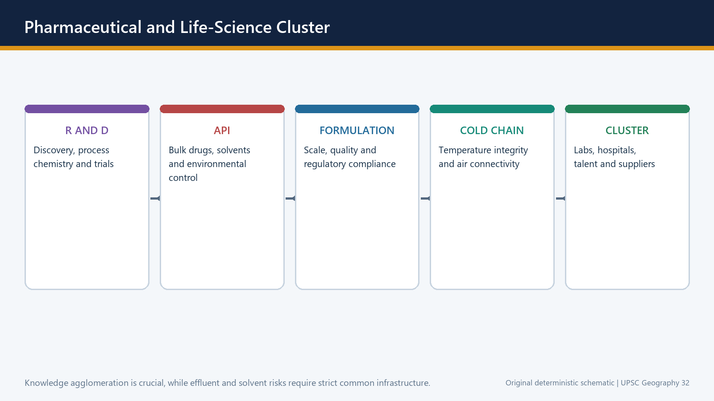

*20. Pharmaceuticals and knowledge-intensive industry. Original deterministic schematic; maps are explicitly schematic and not to scale.*

Pharmaceutical geography combines knowledge agglomeration with chemical-process, regulatory and logistics requirements.

- Discovery and process R and D follow universities, laboratories, hospitals, finance and specialised talent.
- API plants need chemical inputs, solvent handling, utilities, effluent treatment and regulatory compliance.
- Formulation and device production add clean rooms, quality systems, packaging and market access.
- Air connectivity and cold-chain integrity matter for high-value or temperature-sensitive products.
- Hyderabad, Ahmedabad-Vadodara, Mumbai-Pune, Bengaluru and selected Himachal-Uttarakhand nodes illustrate different cluster histories.
- Cluster depth can coexist with environmental stress when common treatment and monitoring lag.

**Must-know facts**

- Patent, approval, plant capacity and actual production are separate.
- Knowledge orientation does not remove material and waste footprints.
- Pharma sales under a scheme are not automatically exports or domestic value addition.

**UPSC traps**

- **Wrong:** Pharma is fully footloose. **Correct:** Talent, regulation, suppliers, utilities and logistics create strong clustering.
- **Wrong:** More units imply stronger innovation. **Correct:** R and D, quality and product mix determine capability.

**Mains / practice route:** Combine the knowledge-cluster argument with process-environment and regulatory geography.

---

## 21. Food processing, sugar, paper and pulp

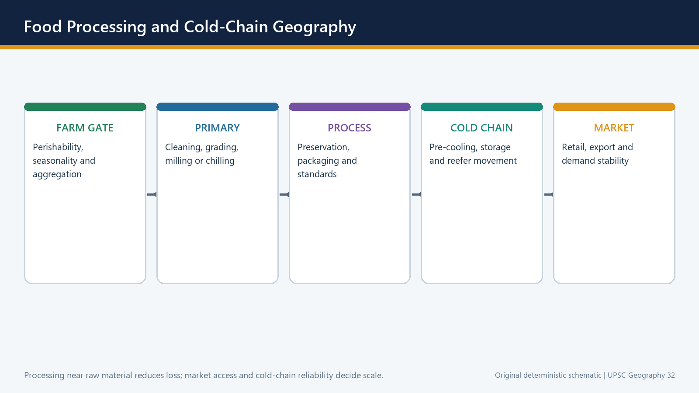

*21. Food processing, sugar, paper and pulp. Original deterministic schematic; maps are explicitly schematic and not to scale.*

Agro- and forest-linked industries reveal how perishability, seasonality, bulk, water and market access interact.

- Food processing near farm gates reduces spoilage and bulk, but scale depends on aggregation, quality, cold chain and demand.
- North-West India's food-processing localisation reflects surplus grain, dairy and horticulture, irrigation, procurement, roads, urban markets and entrepreneurship.
- Sugar is strongly cane-oriented because cane is bulky, perishable and loses weight; mills also depend on crushing season, water and co-generation.
- Paper and pulp follow fibre, water, energy, chemicals and increasingly recovered paper and market-side recycling systems.
- Cold-chain nodes need pre-cooling, storage, reefer transport and reliable power; a warehouse alone is not a cold chain.
- Processing can support farmer income only when contracts, competition, grading and risk sharing work.

**Must-know facts**

- Food-processing employment shares from ASI cover registered factories only.
- Sugar recovery and cane availability vary by season.
- Recycled paper changes but does not eliminate raw-material geography.

**UPSC traps**

- **Wrong:** Food processing always belongs at the market. **Correct:** Perishability and weight loss can pull primary processing to farms.
- **Wrong:** Cold storage equals value-chain integration. **Correct:** Pre-cooling, transport, standards and demand are also required.

**Mains / practice route:** Explain localisation through commodity biology plus infrastructure and institutions.

---

## 22. India's major industrial regions

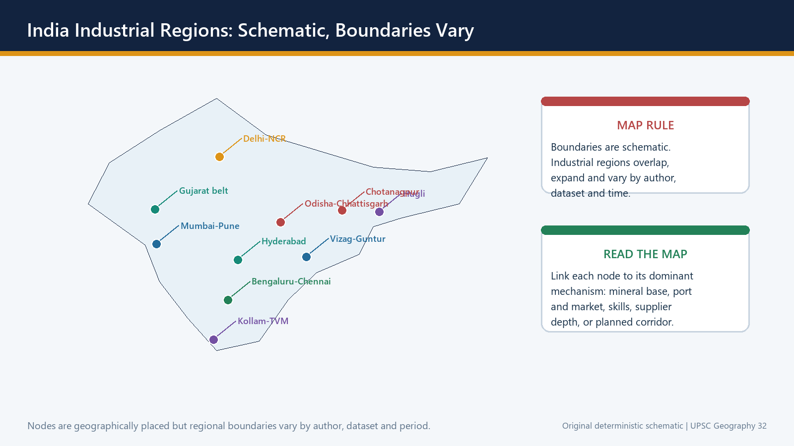

*22. India's major industrial regions. Original deterministic schematic; maps are explicitly schematic and not to scale.*

Indian industrial regions overlap and evolve; their boundaries vary by author and data. The useful task is to connect each region to a dominant historical and contemporary mechanism.

- Mumbai-Pune: port, cotton legacy, finance, market, engineering, chemicals, autos and supplier depth.
- Ahmedabad-Vadodara-Gujarat: cotton, entrepreneurship, chemicals-petrochemicals, ports, engineering and corridor links.
- Hugli: river-port, jute, coal proximity, colonial capital and labour, with later diversification and legacy constraints.
- Chotanagpur-Damodar: coal, iron ore, steel, engineering, power and rail; resource-rich tribal districts expose enclave and justice questions.
- Bengaluru-Chennai-Coimbatore arc: skills, engineering, autos, electronics, textiles, ports and diversified urban markets.
- Delhi-NCR: market, transport, policy, labour, autos, electronics and logistics.
- Visakhapatnam-Guntur and eastern coast: port, mineral hinterland, steel, refinery-petrochemical and food links.
- Kollam-Thiruvananthapuram: coir, cashew legacy, services and knowledge linkages; smaller than the major belts.
- Emerging Hyderabad, Pune-Nashik-Aurangabad and Odisha-Chhattisgarh nodes show pharma-electronics, auto-engineering and mineral-industrial growth.

**Must-know facts**

- Regions are not exclusive polygons.
- A classical label can hide internal restructuring.
- Do not infer current output leadership from a textbook region name.

**UPSC traps**

- **Wrong:** South India is one industrial region. **Correct:** Chennai, Bengaluru, Coimbatore, Hyderabad and Kerala nodes have distinct logics.
- **Wrong:** Mineral belt equals developed region. **Correct:** Value addition, local linkages and social outcomes vary sharply.

**Mains / practice route:** Draw a schematic map, label six regions and attach one mechanism plus one qualification to each.

---

## 23. India industry distributions and historical evolution

*23. India industry distributions and historical evolution. Original deterministic schematic; maps are explicitly schematic and not to scale.*

Distribution should be taught as an evolving map rather than a plant list.

- Steel began around eastern coal-ore combinations and public-sector plants; coastal, scrap and market-linked routes later diversified location.
- Cotton textiles moved from humid port cities toward interior cotton, power, labour and entrepreneurial clusters; garments further dispersed.
- Jute retained Hugli inertia; sugar shifted toward western and southern cooperative and agro-climatic advantages alongside the northern belt.
- Refineries and petrochemicals increasingly formed coastal and port-linked complexes, while field-linked and market refineries remained.
- Automobiles concentrated in western, southern and NCR clusters through suppliers and just-in-time systems.
- Electronics and semiconductors follow NCR, Tamil Nadu, Karnataka, Gujarat, Assam and emerging approved nodes, with stage status carefully named.
- Pharma, fertiliser, cement, food processing and MSME-artisanal clusters each require chain-specific mapping.

**Must-know facts**

- Plant status changes; use dated official evidence.
- Mineral basis explains initial steel location better than every current plant.
- MSME cluster counts are administrative and classification-sensitive.

**UPSC traps**

- **Wrong:** Industry distribution is a static list. **Correct:** Policy, technology, logistics and agglomeration continuously reshape it.
- **Wrong:** New coastal plants refute Weber. **Correct:** They show a changed cost set, especially imported inputs and ports.

**Mains / practice route:** Answer evolution in three phases: original factor, accumulated ecosystem, recent relocation or upgrading.

---

## 24. Colonial deindustrialisation and early modern industry

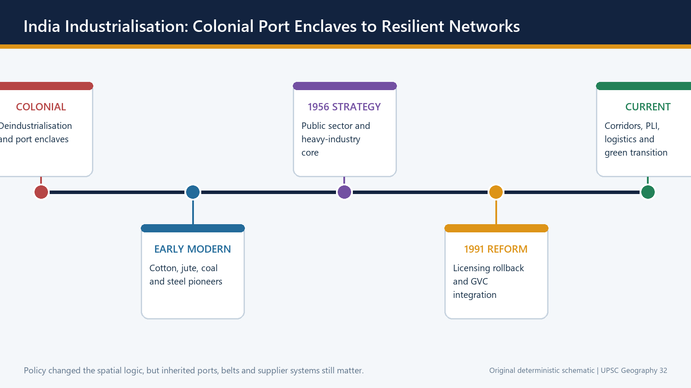

*24. Colonial deindustrialisation and early modern industry. Original deterministic schematic; maps are explicitly schematic and not to scale.*

India's industrial geography entered the modern period through a colonial structure that weakened artisanal systems while building port, rail and enclave networks for imperial trade.

- Machine-made imports, tariff structures, loss of court demand and changing commercial relations contributed to artisanal decline; regional experience varied.
- Railways integrated raw-material hinterlands with ports but were not designed primarily for balanced regional industrialisation.
- Early cotton mills grew in Bombay and Ahmedabad through port, capital, cotton, labour and market networks.
- Jute mills concentrated along the Hugli; coal and steel emerged in eastern resource belts.
- Colonial industrialisation created modern factories without broad domestic capital-goods depth or balanced spatial linkages.
- The inherited port-enclave and mineral-belt geography shaped post-independence policy choices.

**Must-know facts**

- Deindustrialisation was uneven across crafts and regions.
- Railways simultaneously integrated markets and reinforced colonial extraction.
- Modern factory growth did not automatically offset artisanal employment loss.

**UPSC traps**

- **Wrong:** Colonial India had no industry. **Correct:** Modern mills and mines grew, but under an uneven and externally oriented structure.
- **Wrong:** All handicrafts vanished. **Correct:** Adaptation, niche markets and regional survival continued.

**Mains / practice route:** Connect historical structure to the later heavy-industry and regional-dispersal strategy.

---

## 25. Post-1956 strategy, licensing and regional dispersal

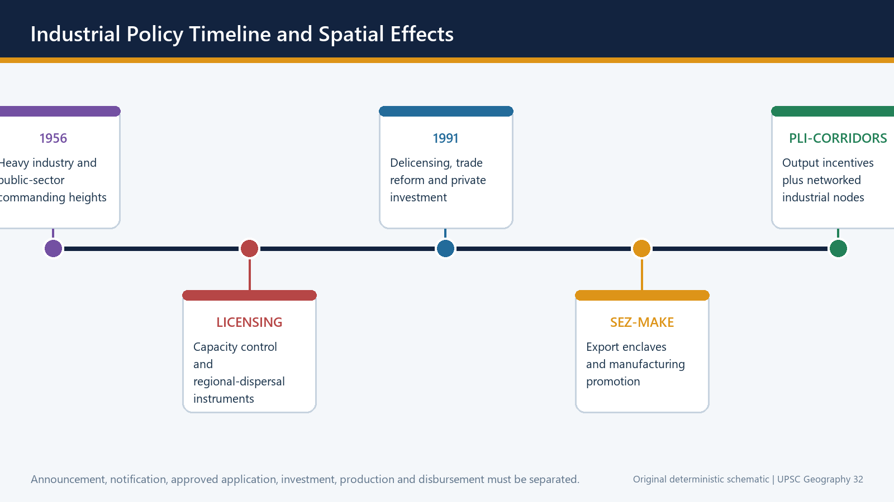

*25. Post-1956 strategy, licensing and regional dispersal. Original deterministic schematic; maps are explicitly schematic and not to scale.*

Post-independence industrial policy used public investment, licensing and location controls to build heavy industry and attempt regional balance.

- The 1956 policy framework assigned a commanding role to the public sector in heavy and strategic industry.
- Steel plants, heavy engineering, power and townships created new industrial nodes in resource belts and planned locations.
- Industrial licensing controlled capacity and entry; location policy and incentives attempted dispersal from congested metros.
- Freight equalisation reduced the locational advantage of some mineral-bearing states for users of key bulk materials, with contested regional effects.
- Public-sector townships delivered infrastructure and skills but could remain enclave-like relative to surrounding rural and tribal economies.
- Import substitution built capability but also created protection, scale and competition problems in some sectors.

**Must-know facts**

- Licence approval is not the same as plant performance.
- Regional dispersal can create isolated plants without supplier ecosystems.
- Public ownership and public purpose are analytically distinct.

**UPSC traps**

- **Wrong:** Heavy industry automatically develops the region. **Correct:** Linkages, local procurement, skills and governance determine spread.
- **Wrong:** Licensing only restricted growth. **Correct:** It also pursued capacity allocation, strategic control and spatial objectives.

**Mains / practice route:** Assess both capability creation and the limits of enclave industrialisation.

---

## 26. Liberalisation, SEZs, Make in India and federal competition

*26. Liberalisation, SEZs, Make in India and federal competition. Original deterministic schematic; maps are explicitly schematic and not to scale.*

After 1991, industrial geography became more market-, trade-, state- and GVC-driven, while the Union retained strategic and infrastructure roles.

- Delicensing and trade reform widened private entry, import competition and foreign investment.
- Coastal and metropolitan regions often gained first because they already possessed ports, markets, skills and suppliers.
- SEZs created notified export-oriented spaces with infrastructure and fiscal-regulatory treatment; performance varied widely.
- Make in India is a broad promotional and reform initiative; it should not be treated as a single measurable scheme.
- The National Manufacturing Policy is historically relevant, but current operative claims require dated notification and implementation evidence.
- State industrial policies compete through land, power, incentives, approvals and urban services, producing competitive federalism and fiscal-risk questions.

**Must-know facts**

- Announcement is not notification.
- MoU or committed investment is not realised investment.
- State competition can improve services or create subsidy races.

**UPSC traps**

- **Wrong:** Liberalisation made geography irrelevant. **Correct:** Agglomeration often strengthened in already connected regions.
- **Wrong:** SEZ notification proves export success. **Correct:** Occupancy, production, exports, value addition and spillovers must be measured.

**Mains / practice route:** Explain why market reform can increase national efficiency while initially widening regional concentration.

---

## 27. PLI: design, evidence and geographic effects

*27. PLI: design, evidence and geographic effects. Original deterministic schematic; maps are explicitly schematic and not to scale.*

PLI links eligible incremental performance to incentives, but its spatial and developmental effects depend on sector rules, supplier spillovers and verification.

**Current official anchor:** Official PLI update posted 21 July 2026; scheme figures are retained as government-reported administrative outcomes.

- The official framework covers 14 sectors with an approved outlay of Rs 1.91 lakh crore.
- DPIIT coordinates overall monitoring; line ministries implement sector schemes.
- The 21 July 2026 PIB update reports, as on 31 March 2026, over Rs 2.40 lakh crore actual investment, over 14.15 lakh direct and indirect employment, and over Rs 15.2 lakh crore exports.
- These are official scheme-reported administrative outcomes; they are not an independent PLFS employment measure or proof of domestic value added.
- PLI can reinforce existing clusters where suppliers, ports, skills and utilities already exist, unless design deliberately builds new regional capability.
- Large eligibility thresholds can exclude smaller firms; anchor-firm spillovers require supplier upgrading, standards and timely payments.

**Must-know facts**

- Investment, production, export and incentive disbursement are separate.
- Employment generated needs definition and independent triangulation.
- Export growth can retain high import content.

**UPSC traps**

- **Wrong:** Outlay equals subsidy paid. **Correct:** Only verified eligible claims become disbursement.
- **Wrong:** PLI alone creates a cluster. **Correct:** Infrastructure, suppliers, skills and demand remain binding.

**Mains / practice route:** Evaluate PLI through additionality, domestic value, supplier depth, job quality, regional spread and fiscal efficiency.

---

## 28. Industrial corridors, DFCs, ports and logistics

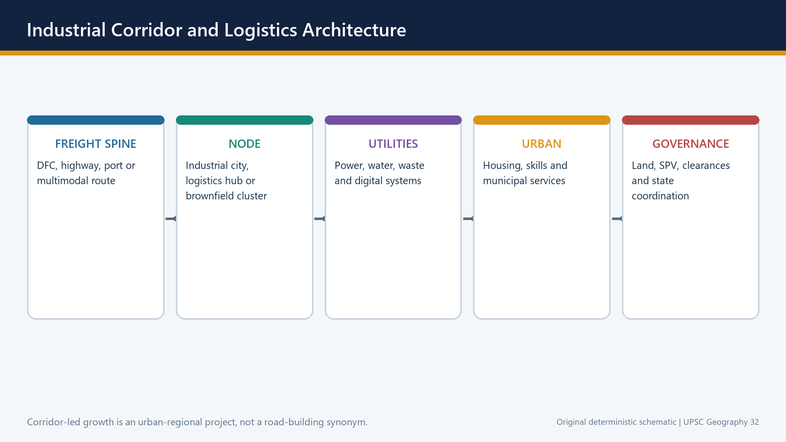

*28. Industrial corridors, DFCs, ports and logistics. Original deterministic schematic; maps are explicitly schematic and not to scale.*

Industrial corridors combine freight infrastructure, planned nodes, utilities, land and urban systems. Their success depends on network integration and node-level execution.

- DMIC aligns with the western freight spine and western ports; other NICDC corridors extend planned nodes across northern, eastern and southern arcs.
- Dedicated Freight Corridors reduce freight-path conflict and can improve reliability, but industrial development requires last-mile connections and node ecosystems.
- Ports, multimodal logistics parks, cargo terminals, pipelines and warehousing shape inventory time and market reach.
- PM GatiShakti is an integrated planning platform; the National Logistics Policy adds process, digital, skills and regulatory interventions.
- Land acquisition, municipal capacity, water, housing and environmental carrying capacity decide whether nodes become live cities or isolated estates.
- Corridor-led urbanisation can raise land values and displacement pressure before production or employment materialises.

**Must-know facts**

- A corridor is not just a highway.
- Planning-platform evaluation is not project sanction or commissioning.
- Freight corridor completion does not prove every industrial node is operational.

**UPSC traps**

- **Wrong:** Lower transit time automatically creates industry. **Correct:** Firms also need land, utilities, labour, suppliers and demand.
- **Wrong:** Greenfield is always superior. **Correct:** Brownfield regions may offer deeper skills and suppliers.

**Mains / practice route:** Answer significance through logistics, agglomeration, urbanisation and regional development, then qualify execution.

---

## 29. NICDC node status as of the latest directly retrieved report

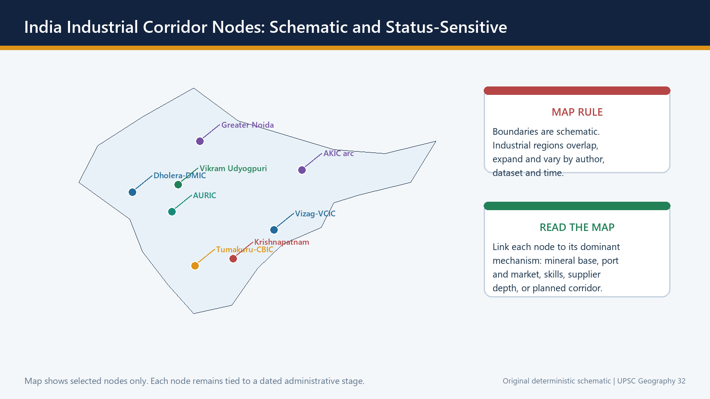

*29. NICDC node status as of the latest directly retrieved report. Original deterministic schematic; maps are explicitly schematic and not to scale.*

The latest directly retrieved NICDC DMU report is dated 31 July 2025. It shows heterogeneous stages and therefore prevents blanket claims that all corridors or nodes are operational.

**Current official anchor:** NICDC node evidence is dated 31 July 2025; DFCCIL milestone page was updated 30 July 2026.

- Dholera's activation-area trunk infrastructure is reported complete; 300 MW of its solar park was commissioned, while airport works were underway in that report.
- Shendra major trunk packages and Bidkin Sector-A trunk infrastructure were reported completed; land allotment and later phases remain separate.
- Greater Noida and Vikram Udyogpuri major trunk infrastructure were reported completed with plots allotted.
- Krishnapatnam and Tumakuru had master planning and approved phase work, with construction or utility packages at varying stages.
- Other approved nodes were in land, design, tender, environmental or implementation stages.
- DFCCIL's milestone page updated 30 July 2026 records WDFC completion after JNPT-New Saphale trial runs; commercial operating status should still be described with the official wording used.

**Must-know facts**

- The node report date is 31 July 2025.
- Completed trunk infrastructure is not the same as full city occupancy.
- Foundation stone, tender and allotment are distinct stages.

**UPSC traps**

- **Wrong:** NICDP is fully operational. **Correct:** Projects and nodes remain at different stages.
- **Wrong:** A dedicated freight corridor makes nearby industry automatic. **Correct:** Last-mile, utilities, governance and demand determine uptake.

**Mains / practice route:** Use a status table: node -> dated stage -> what it proves -> what it does not prove.

---

## 30. Industrial data: ASI, IIP, National Accounts, PLFS and administration

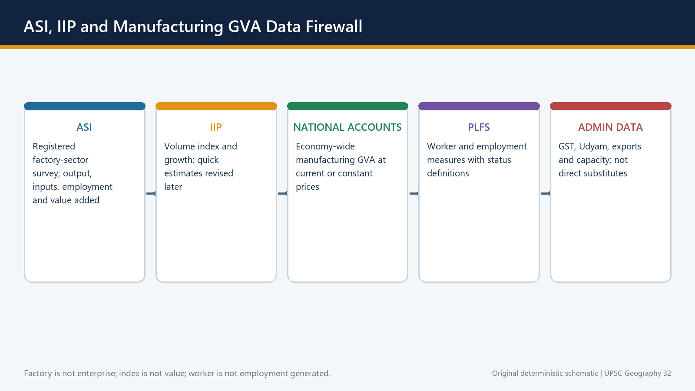

*30. Industrial data: ASI, IIP, National Accounts, PLFS and administration. Original deterministic schematic; maps are explicitly schematic and not to scale.*

No single dataset measures industrial performance. Each instrument has a different universe, unit, frequency and purpose.

- ASI covers registered factory-sector establishments and reports factories, workers or persons engaged, inputs, output and value added.
- The latest released ASI summary found is 2023-24: total output grew 5.80 percent and net value added 11.84 percent over the previous ASI; this is not all manufacturing.
- IIP is a volume index. June 2026 Quick Estimate, base 2022-23=100, recorded 7.3 percent overall and 7.8 percent manufacturing growth; it is revisable and not a rupee value.
- National Accounts PE for 2025-26 estimates real manufacturing GVA growth at 10.7 percent; provisional economy-wide GVA is not the same as factory output.
- PLFS measures workers and employment status through survey definitions; scheme job claims are not direct substitutes.
- GST, Udyam, exports and capacity utilisation are administrative or operational indicators with separate coverage and denominator problems.

| Source | Latest used | Boundary |
|---|---|---|
| ASI | 2023-24 summary | Registered factory sector |
| IIP | June 2026 Quick Estimate | Volume index, base 2022-23 |
| National Accounts | PE 2025-26 | Economy-wide manufacturing GVA |
| PLFS | Annual Report 2025 | Survey employment status |
| Udyam | Administrative dashboard | Registration, not activity census |

**Must-know facts**

- Gross output minus intermediate consumption yields value added conceptually.
- Current-price growth mixes price and volume.
- Installed capacity is not actual production.

**UPSC traps**

- **Wrong:** IIP growth is manufacturing GVA growth. **Correct:** Index volume and value added use different concepts and data.
- **Wrong:** Udyam count is active firms. **Correct:** Registration can include inactive, duplicate-history or self-declared status issues depending on system rules.

**Mains / practice route:** Choose the dataset after stating the question: production volume, value added, factories, workers, registrations, exports or utilisation.

---

## 31. Labour, migration, gender, skills and industrial settlements

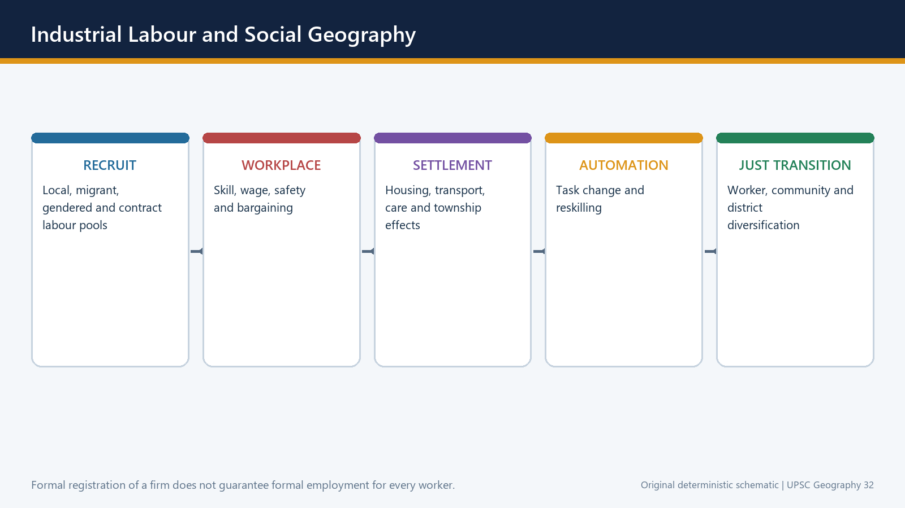

*31. Labour, migration, gender, skills and industrial settlements. Original deterministic schematic; maps are explicitly schematic and not to scale.*

Industrial labour geography extends beyond the factory gate into migration networks, housing, care, safety and settlement form.

- Formal and informal segmentation can exist within one value chain through permanent, contract, home-based and platform-mediated work.
- Migrant labour lowers recruitment friction for clusters but can face insecure housing, portability and crisis vulnerability.
- Women's industrial participation is shaped by sector, shift timing, transport, safety, care and social norms, not wage alone.
- Skill ecosystems combine ITIs, polytechnics, firms, universities, apprenticeship and tacit shop-floor learning.
- Industrial townships can provide planned services but may segregate company employees from surrounding settlements.
- Occupational hazards include dust, chemicals, heat, noise, repetitive work and accident risk; automation changes tasks and bargaining power.
- Labour-code status is notification-specific; enactment should not be presented as uniform operative implementation without current official verification.

**Must-know facts**

- Worker, employee and person engaged are not synonyms.
- Automation can displace tasks while creating different technical roles.
- Job quantity and job quality require separate evidence.

**UPSC traps**

- **Wrong:** Registered factory means all workers are formal. **Correct:** Contractual and informal arrangements can persist.
- **Wrong:** Skill supply alone creates jobs. **Correct:** Demand, firm capability and matching institutions matter.

**Mains / practice route:** Add a worker-settlement lens to every cluster or corridor answer.

---

## 32. Industrial pollution, EIA, circularity and disaster risk

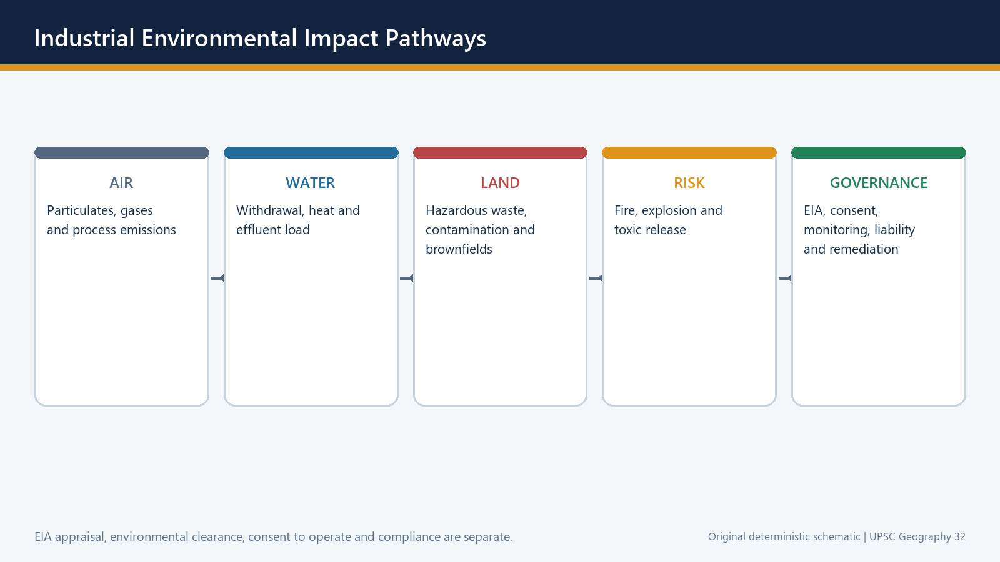

*32. Industrial pollution, EIA, circularity and disaster risk. Original deterministic schematic; maps are explicitly schematic and not to scale.*

Industrial environmental geography links site choice to air, water, land, waste, cumulative load and accident exposure.

- Continuous-process and metallurgical plants have large thermal, water and emissions footprints; chemical clusters add toxic and fire risks.
- Industrial effluent can affect rivers and groundwater through routine discharge, treatment failure or legacy contamination.
- Environmental clearance, consent to establish, consent to operate and compliance monitoring are separate decisions.
- Hazardous waste requires traceability, secure treatment and liability; shifting waste outward is not circularity.
- Industrial symbiosis can exchange steam, water, slag, fly ash or by-products when quality, distance and contracts align.
- Brownfield remediation must identify contaminant, pathway, exposed population, responsible party and future land use.
- Named India cases should be used carefully: Bhopal for disaster governance, polluted industrial stretches for cumulative load, and brownfields only with verified case details.

**Must-know facts**

- EIA is an appraisal process, not a guarantee of no impact.
- Common effluent treatment needs operation and enforcement.
- Industrial symbiosis can transfer risk if residual quality is poor.

**UPSC traps**

- **Wrong:** Clearance means pollution is controlled. **Correct:** Compliance and consent conditions must be monitored.
- **Wrong:** Waste reuse is always safe. **Correct:** Toxicity, contamination and lifecycle boundaries matter.

**Mains / practice route:** Trace pressure -> pathway -> exposure -> governance -> remediation rather than listing pollutants.

---

## 33. Green steel, cement, hydrogen and carbon-border pressure

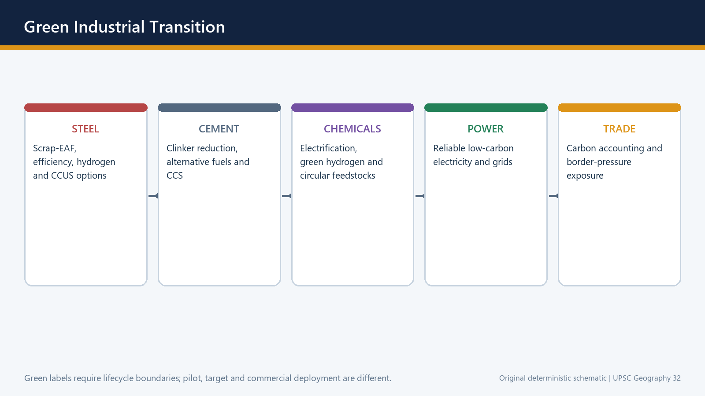

*33. Green steel, cement, hydrogen and carbon-border pressure. Original deterministic schematic; maps are explicitly schematic and not to scale.*

Industrial decarbonisation changes location factors by increasing the value of clean power, hydrogen, scrap, carbon accounting and low-carbon logistics.

- Steel options include energy efficiency, scrap-EAF expansion, lower-carbon DRI, green hydrogen and CCUS, each with resource and infrastructure limits.
- Cement options include clinker substitution, thermal efficiency, alternative fuels and carbon capture for process emissions.
- Refineries, fertiliser and chemicals can use low-carbon hydrogen, but production cost, power additionality, storage and transport matter.
- Renewable-rich regions can attract electro-intensive green industry only when grids, water and port-market access align.
- Carbon-border measures increase the importance of product-level emissions measurement and verification.
- A just transition must address workers, coal-mineral districts, small suppliers and electricity-system costs.

**Must-know facts**

- Green hydrogen is an energy carrier and feedstock, not a primary energy source.
- Targeted capacity is not production.
- Low-carbon product claims require a declared lifecycle boundary.

**UPSC traps**

- **Wrong:** Renewable power makes any product green. **Correct:** Process emissions, materials and system boundaries remain.
- **Wrong:** Carbon border pressure is only trade policy. **Correct:** It can reshape investment location and supplier data systems.

**Mains / practice route:** Connect decarbonisation technology with new industrial geography and distributional effects.

---

## 34. Regional development: spread, backwash, enclave and resource curse

*34. Regional development: spread, backwash, enclave and resource curse. Original deterministic schematic; maps are explicitly schematic and not to scale.*

Industrialisation can generate regional convergence or deepen inequality depending on linkages, institutions and ownership.

- Spread effects occur through local sourcing, wages, skills, infrastructure, fiscal revenue and entrepreneurship.
- Backwash occurs when capital, talent and demand are drawn toward the core, weakening lagging regions.
- Enclave industrialisation imports skilled labour and inputs, exports output, and leaves weak local supplier links.
- Resource-rich tribal and mineral belts can face displacement, ecological loss and revenue dependence without broad human development.
- The resource curse is not geological destiny; institutions, revenue governance, rights and diversification mediate outcomes.
- Cluster upgrading requires local supplier development, common facilities, finance, standards and market access.
- Corridor-led urbanisation needs affordable housing, municipal capacity and land-value governance.

**Must-know facts**

- Gross district output can rise while local welfare lags.
- Local procurement must meet quality and competition requirements.
- Compensation is not a substitute for rights and long-term livelihood planning.

**UPSC traps**

- **Wrong:** Any anchor plant is a growth pole. **Correct:** Propulsive linkages and regional transmission must be demonstrated.
- **Wrong:** Resource extraction automatically funds development. **Correct:** Revenue quality, institutions and volatility determine outcomes.

**Mains / practice route:** Judge regional impact by linkages, local capability, distribution and ecological cost.

---

## 35. Globalisation, restructuring and resilience

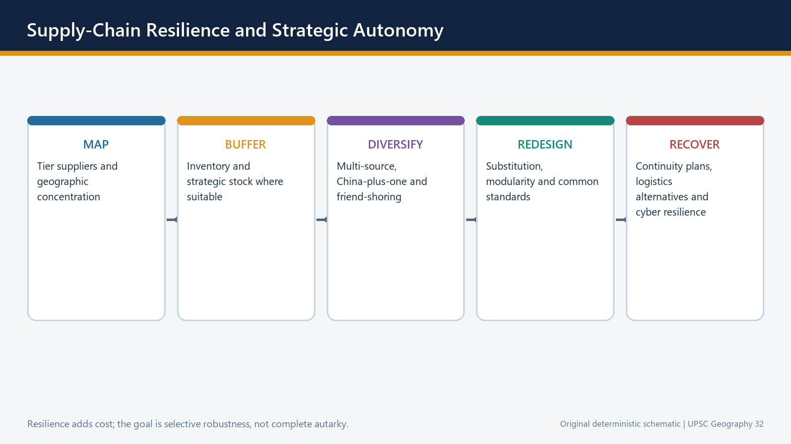

*35. Globalisation, restructuring and resilience. Original deterministic schematic; maps are explicitly schematic and not to scale.*

Industrial geography is being reshaped by supply shocks, strategic rivalry, technology controls, trade agreements and climate policy.

- Offshoring seeks cost and scale; reshoring seeks control; friend-shoring seeks politically trusted diversification; China-plus-one seeks additional capacity outside China.
- Containerisation created global scale but concentrated dependence on ports, shipping routes and schedules.
- Trade agreements alter tariff and rules-of-origin geography, influencing supplier and assembly locations.
- Pandemic, war, disasters and chokepoints exposed single-source and just-in-time fragility.
- Semiconductor tools, advanced chips, critical materials and specialised machinery create strategic chokepoints.
- Resilience tools include multi-sourcing, buffer stocks, modular design, supplier mapping, alternate logistics, cyber continuity and recycling.
- Strategic autonomy means selective capability and reliable partnerships, not full autarky.

**Must-know facts**

- Diversification may duplicate cost.
- Friend-shoring can narrow supplier choice.
- Resilience must be tested at tier-2 and tier-3 suppliers, not only final assembly.

**UPSC traps**

- **Wrong:** Reshoring reverses globalisation. **Correct:** Most firms rebalance networks rather than fully return.
- **Wrong:** More inventory solves every shock. **Correct:** Obsolescence, cost and correlated disruption remain.

**Mains / practice route:** Compare efficiency and resilience, then state which stages justify strategic intervention.

---

## 36. Current official evidence dashboard as of 20 August 2026

*36. Current official evidence dashboard as of 20 August 2026. Original deterministic schematic; maps are explicitly schematic and not to scale.*

The current dashboard is deliberately small and status-rich. It supports analysis without turning the topic into a volatile ranking sheet.

**Current official anchor:** All current claims were directly checked against primary official documents or pages retrieved by 20 August 2026.

- ASI 2023-24 is the latest directly verified factory-sector summary located; no ASI 2024-25 release is claimed.
- IIP June 2026 is a Quick Estimate: 7.3 percent overall, 7.8 percent manufacturing, with 19 of 23 manufacturing groups positive; base 2022-23=100.
- National Accounts PE 2025-26 estimates real manufacturing GVA growth at 10.7 percent; PE is provisional and economy-wide.
- PLI official update as on 31 March 2026 reports over Rs 2.40 lakh crore investment, over 14.15 lakh direct and indirect employment and over Rs 15.2 lakh crore exports; these remain scheme-reported figures.
- Semicon 2.0 is officially Cabinet-approved with Rs 1,27,500 crore fiscal outlay and six strategic pillars; the official page says the first fab is scheduled for 2028.
- NICDC evidence remains node-specific; DFCCIL records DFC project completion after the 31 March 2026 WDFC trial run.
- PLFS, Udyam and sector ministry evidence are used only within their stated measurement boundaries.

**Must-know facts**

- Every figure has source date and status.
- No volatile global or state rank is used without a dated official table.
- Official scheme claims and independent outcomes are separated.

**UPSC traps**

- **Wrong:** June 2026 IIP is final. **Correct:** It is a Quick Estimate and subject to revision.
- **Wrong:** Semicon outlay is expenditure. **Correct:** It is an approved fiscal outlay, not disbursement or production.

**Mains / practice route:** Use one static mechanism and one bounded current fact in each answer; do not overload the answer with headline data.

---

## 37. Monitoring industrial policy and corridors

*37. Monitoring industrial policy and corridors. Original deterministic schematic; maps are explicitly schematic and not to scale.*

Monitoring should follow the causal chain from inputs to outcomes and impacts, with independent triangulation where possible.

- Inputs: outlay, land, approvals, trunk infrastructure and utility capacity.
- Processes: procurement, construction, supplier onboarding, skilling and clearance compliance.
- Outputs: commissioned assets, production, sales, exports, freight handled and capacity utilisation.
- Outcomes: productivity, domestic value addition, supplier depth, job quantity and quality, and logistics reliability.
- Impacts: regional convergence, household welfare, fiscal cost, emissions, resilience and innovation.
- Counterfactual and additionality matter: outcomes cannot automatically be attributed to a scheme because participating sectors were already growing.

**Must-know facts**

- Committed investment is not realised investment.
- Employment claim needs definition, period and direct-indirect split.
- Production can rise without productivity or domestic content.

**UPSC traps**

- **Wrong:** More approved projects means policy success. **Correct:** Execution and outcomes are later stages.
- **Wrong:** Export value measures domestic value. **Correct:** Imported content and transfer pricing can widen the gap.

**Mains / practice route:** Build a five-stage monitoring table and add one independent data source for triangulation.

---

## 38. UPSC synthesis: a stage-by-factor matrix

*38. UPSC synthesis: a stage-by-factor matrix. Original deterministic schematic; maps are explicitly schematic and not to scale.*

The strongest synthesis replaces one-factor determinism with a stage-by-factor matrix and then adds history, policy and risk.

- Bulk processing: raw material, energy, water, waste and rail-port capacity dominate.
- Assembly: supplier timing, labour, quality, inventory and market access dominate.
- Knowledge stages: skills, research, finance, urban services and networks dominate.
- Perishable stages: source proximity, cold chain and demand coordination dominate.
- Strategic stages: resilience, security, policy and trusted partnerships alter least-cost logic.
- Initial location is followed by agglomeration, lock-in, shock, upgrading or relocation.

**Must-know facts**

- Industry labels hide stage differences.
- The same region can host resource, market and knowledge-oriented activities.
- Theory should explain evidence, not replace it.

**UPSC traps**

- **Wrong:** One industry has one orientation. **Correct:** Value-chain stages can have different dominant pulls.
- **Wrong:** Policy can choose any location. **Correct:** Policy works best when it strengthens real economic linkages.

**Mains / practice route:** Use the matrix to compare two industries or explain an industry's relocation.

---

## 39. Prelims and Mains trap consolidation

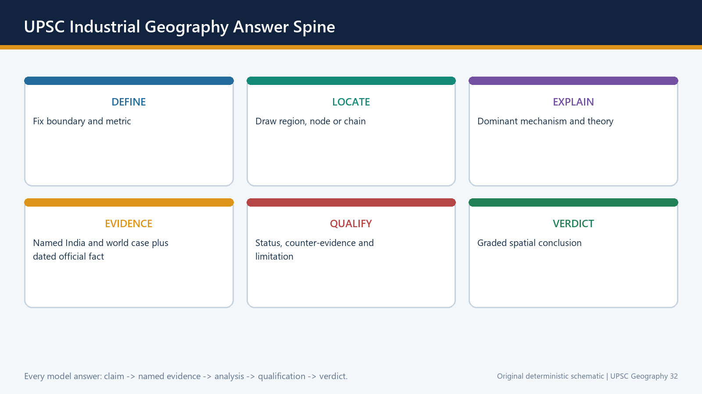

*39. Prelims and Mains trap consolidation. Original deterministic schematic; maps are explicitly schematic and not to scale.*

UPSC rewards precise distinctions and penalises silent jumps between units, stages and statuses.

- ASI factory sector != all manufacturing; IIP growth != output value or GVA.
- Current price != constant price; gross output != value added.
- Factory != establishment != enterprise; worker != person engaged != employment generated.
- Udyam registration != active enterprise; approved investment != realised investment.
- Installed capacity != actual production; export value != domestic value addition.
- Industrial estate != cluster; highway != industrial corridor; approval != operational status.
- EIA != environmental clearance != consent != compliance.

**Must-know facts**

- Strict labels are marks-saving devices.
- Maps must be called schematic and not to scale.
- Official-key conflict must be preserved and explained, not silently corrected.

**UPSC traps**

- **Wrong:** A precise number is always better. **Correct:** An unverified number is worse than a bounded qualitative statement.
- **Wrong:** Current affairs can replace theory. **Correct:** Current evidence must be anchored to a static concept.

**Mains / practice route:** Use one firewall line in the introduction and one qualification before the verdict.

---

## 40. Answer-writing spine and final synthesis

*40. Answer-writing spine and final synthesis. Original deterministic schematic; maps are explicitly schematic and not to scale.*

Industrial geography answers should move from boundary to spatial explanation and finish with a graded verdict rather than a scheme list.

- Define the term and fix the unit: activity, establishment, stage, cluster, corridor or region.
- Locate with a schematic map, chain or comparison table.
- Explain the dominant mechanism using Weber, Losch, agglomeration, linkages, path dependence or GVC logic.
- Use named India and world evidence and one current official fact with date and status.
- Analyse distributional, labour, environmental and resilience effects.
- Qualify with counter-evidence, project stage, data boundary or regional variation.
- Verdict: industrial location is a changing least-cost and capability problem embedded in history, institutions and risk.

**Must-know facts**

- Evidence must prove the claim.
- Qualification is not indecision; it specifies conditions.
- Every framework ends with Why this earns marks.

**UPSC traps**

- **Wrong:** Lists earn high marks. **Correct:** Causal structure and evidence linkage earn marks.
- **Wrong:** Conclusion should repeat the introduction. **Correct:** It should deliver a graded answer to the directive.

**Mains / practice route:** Claim -> named evidence -> analysis -> qualification -> verdict -> Why this earns marks.

---

# Part II - Solved Prelims PYQs

## UPSC Prelims 2023 Q71 - MSME classification and priority-sector credit

**Question:** Consider: (1) Under the MSMED Act, medium enterprises have plant and machinery investment between Rs 15 crore and Rs 25 crore. (2) All bank loans to MSMEs qualify under the priority sector. Which is correct?

- (A) 1 only
- (B) 2 only
- (C) Both 1 and 2
- (D) Neither 1 nor 2

**Answer: B**
**Key status:** INFERRED ANSWER - NOT OFFICIALLY VERIFIED LOCALLY · **Confidence:** High

**Elimination / explanation:** Statement 1 was false in the question-year framework; the cited band was not the operative medium-enterprise definition. Statement 2 was accepted under RBI priority-sector treatment for eligible MSME credit. Current thresholds were revised again from 1 April 2025, so retain the question-year context.

---

## UPSC Prelims 2023 Q88 - export share and PLI

**Question:** Statement I: India accounts for 3.2 percent of global exports of goods. Statement II: Many local and some foreign companies operating in India have taken advantage of the PLI scheme. Choose the correct relationship.

- (A) Both correct and II explains I
- (B) Both correct but II does not explain I
- (C) I correct, II incorrect
- (D) I incorrect, II correct

**Answer: D**
**Key status:** INFERRED ANSWER - NOT OFFICIALLY VERIFIED LOCALLY · **Confidence:** High

**Elimination / explanation:** Statement I was incorrect for the question-year merchandise-export share; Statement II was correct. The item tests the difference between a valid scheme statement and an overstated global-share statistic.

---

## UPSC Prelims 2023 Q99 - green hydrogen and heavy industry

**Question:** Green hydrogen is expected to play a significant role in decarbonising how many of the following: fertiliser plants, oil refineries and steel plants?

- (A) Only one
- (B) Only two
- (C) All three
- (D) None

**Answer: C**
**Key status:** INFERRED ANSWER - NOT OFFICIALLY VERIFIED LOCALLY · **Confidence:** Very high

**Elimination / explanation:** All three use hydrogen or can use hydrogen-linked process routes: ammonia for fertiliser, hydrotreating and hydrocracking in refineries, and hydrogen-based direct reduction in steel. Actual low-carbon effect depends on hydrogen production and lifecycle boundary.

---

## UPSC Prelims 2026 Q29 - Oeko-Tex certification and Eri silk

**Question:** Which implications of Oeko-Tex certification for Eri silk are significant: (1) access to high-end markets prioritising chemical-safe products; (2) confirmation against international safety, environmental and quality standards for premium eco-conscious markets?

- (A) 1 only
- (B) 2 only
- (C) Both 1 and 2
- (D) Neither 1 nor 2

**Answer: C**
**Key status:** PROVISIONAL 2026 KEY CONTEXT; NOT A FINAL OFFICIAL KEY · **Confidence:** High

**Elimination / explanation:** Both implications express the market-access role of conformity certification. Qualification: certification applies to the defined standard and supply-chain scope; it is not proof that every lifecycle impact is zero.

---

## UPSC Prelims 2026 Q83 - semiconductor plants and locations

**Question:** Which pair is not correctly matched: CG Power-Renesas-STARS : Gujarat; Tata Semiconductor Assembly and Test : Assam; HCL-Foxconn India Chip : Madhya Pradesh; SicSem : Odisha?

- (A) CG Power partnership : Gujarat
- (B) Tata assembly and test : Assam
- (C) HCL-Foxconn : Madhya Pradesh
- (D) SicSem : Odisha

**Answer: C**
**Key status:** PROVISIONAL 2026 KEY CONTEXT; ANSWER INFERRED FROM OFFICIAL LOCATION DATA · **Confidence:** High

**Elimination / explanation:** The HCL-Foxconn project is associated with Uttar Pradesh, not Madhya Pradesh. The other location pairs match the announced state-level projects. Announcement and approval still do not establish commercial production.

---

# Part III - Solved Mains PYQs

## 2018 GS-I Q16 - Industrial corridors

**Question:** What is the significance of industrial corridors in India? Identify industrial corridors and explain their main characteristics.

**Direct thesis:** Industrial corridors are networked regional-development systems in which freight spines, industrial nodes, utilities and urbanisation are planned together; their significance depends on node-level execution, not route announcement.

- **Claim:** Logistics efficiency. **Named evidence/example:** DMIC's alignment with the western freight spine and ports. **Analysis:** reliable freight can lower inventory time and widen market reach. **Qualification:** last-mile and terminal bottlenecks can preserve old costs.
- **Claim:** Planned agglomeration. **Named evidence/example:** Dholera, AURIC, Greater Noida and Vikram Udyogpuri. **Analysis:** trunk infrastructure and common utilities can reduce entry cost. **Qualification:** completed infrastructure does not prove occupancy or production.
- **Claim:** Regional restructuring. **Named evidence/example:** AKIC, CBIC and VCIC arcs. **Analysis:** new nodes can connect interior regions to ports and markets. **Qualification:** core regions may capture gains unless local suppliers and skills deepen.
- **Claim:** Urban effects. **Named evidence/example:** industrial city and logistics-hub model. **Analysis:** housing and services can support labour and firms. **Qualification:** land-value pressure, water and municipal capacity can create exclusion.
- **Claim:** Governance. **Named evidence/example:** NICDC-NICDIT SPVs and state agencies. **Analysis:** multi-level coordination can sequence land, utilities and connectivity. **Qualification:** heterogeneous state capacity and project stages limit uniform outcomes.
- **Verdict:** Industrial corridors are significant because they transform isolated-site policy into networked industrial urbanisation, but they earn that label only where freight, nodes, utilities, local linkages and safeguards become functional.
- **Why this earns marks:** It identifies corridors, explains characteristics, uses named nodes, and qualifies status and regional effects.

---

## 2019 GS-I Q6 - Resource-based manufacturing and employment

**Question:** Can regional resource-based manufacturing promote employment in India?

**Direct thesis:** Resource-based manufacturing can promote employment when extraction is linked to local processing, suppliers, skills and markets; a mine-to-port enclave creates far fewer durable regional gains.

- **Claim:** Value addition. **Named evidence/example:** iron ore-steel-engineering linkages in the east-central belt. **Analysis:** processing multiplies direct and indirect demand beyond extraction. **Qualification:** capital-intensive plants may create fewer jobs than output suggests.
- **Claim:** Agro processing. **Named evidence/example:** sugar, dairy and food-processing clusters. **Analysis:** perishable local inputs support dispersed processing and services. **Qualification:** seasonality and farm-price risk weaken job stability.
- **Claim:** Supplier effects. **Named evidence/example:** fabrication, repair and transport around steel or cement nodes. **Analysis:** backward and forward linkages support MSMEs. **Qualification:** local firms need standards, finance and procurement access.
- **Claim:** Justice. **Named evidence/example:** tribal and mineral districts of Odisha, Jharkhand and Chhattisgarh. **Analysis:** local employment can improve legitimacy and income. **Qualification:** displacement, pollution and imported skilled labour can produce enclave outcomes.
- **Verdict:** The strategy is employment-promoting only when resource geography is converted into a locally embedded value chain with skills, supplier development and environmental accountability.
- **Why this earns marks:** It answers the conditional 'can', uses sector and regional evidence, and distinguishes an embedded cluster from an enclave.

---

## 2019 GS-I Q7 - Food processing in North-West India

**Question:** Discuss the factors responsible for localisation of agro-based food-processing industries in North-West India.

**Direct thesis:** North-West localisation results from the interaction of agricultural surplus with procurement, irrigation, roads, cold chains, urban demand and entrepreneurship rather than climate alone.

- **Claim:** Raw material. **Named evidence/example:** Punjab-Haryana-western Uttar Pradesh grain, dairy and horticulture base. **Analysis:** surplus and perishability support mills, dairies and primary processing. **Qualification:** crop concentration also creates water and ecological stress.
- **Claim:** Institutions. **Named evidence/example:** procurement, mandis, cooperatives and extension networks. **Analysis:** aggregation and assured flows lower plant-supply risk. **Qualification:** policy dependence can lock the region into unsuitable crops.
- **Claim:** Infrastructure. **Named evidence/example:** dense roads, power, storage and proximity to Delhi-NCR. **Analysis:** reliable logistics links farm gates to large consumer markets. **Qualification:** cold-chain quality remains uneven by commodity.
- **Claim:** Enterprise and labour. **Named evidence/example:** established milling, dairy and packaging ecosystems. **Analysis:** skills and supplier depth reinforce agglomeration. **Qualification:** small producers can face weak bargaining power.
- **Verdict:** The region is localised by an agro-institutional-logistics system; future competitiveness requires crop diversification, water efficiency and farmer-linked value addition.
- **Why this earns marks:** It goes beyond a crop list, explains mechanisms and adds the water and bargaining qualification.

---

## 2020 GS-I Q7 - Steel away from raw materials

**Question:** Account for the present location of iron and steel industries away from sources of raw material, giving examples.

**Direct thesis:** Steel has not become resource-free; technology, imported inputs, scrap, ports, electricity and markets have created alternative least-cost configurations.

- **Claim:** Maritime bulk. **Named evidence/example:** coastal integrated plants and port-linked steelmaking. **Analysis:** large vessels can import coking coal or ore and export products efficiently. **Qualification:** port depth and geopolitical freight risk matter.
- **Claim:** Scrap-EAF route. **Named evidence/example:** market-region mini-mills using urban scrap and grid power. **Analysis:** the raw material is generated near consumption and recycled locally. **Qualification:** scrap quality and electricity carbon intensity constrain output.
- **Claim:** Market and downstream pull. **Named evidence/example:** steel linked to auto, engineering and construction clusters. **Analysis:** specialised rolling and delivery move closer to users. **Qualification:** primary ironmaking may remain resource linked.
- **Claim:** Technology and policy. **Named evidence/example:** DRI, gas, power and corridor infrastructure. **Analysis:** changed inputs alter the cost surface. **Qualification:** new plants still need water, land and environmental capacity.
- **Verdict:** The modern map is stage-split: mines and beneficiation remain source-oriented, while selected steelmaking and finishing move toward ports, scrap, power and markets.
- **Why this earns marks:** It directly accounts for relocation with mechanisms and examples while preserving the continuing raw-material role.

---

## 2021 GS-I Q17 - IT industry and Indian cities

**Question:** What are the socio-economic implications of the growth of IT industries in major Indian cities?

**Direct thesis:** IT growth created high-productivity knowledge agglomerations and service exports, but also reshaped land, labour, migration and urban inequality.

- **Claim:** Employment and skills. **Named evidence/example:** Bengaluru, Hyderabad, Pune, Chennai and NCR. **Analysis:** deep labour markets and learning networks raised skilled employment. **Qualification:** benefits concentrate among educated workers and can widen wage gaps.
- **Claim:** Urban land. **Named evidence/example:** technology corridors and peripheral office clusters. **Analysis:** investment expands infrastructure and municipal revenue. **Qualification:** land prices, commuting and informal housing costs rise.
- **Claim:** Migration and society. **Named evidence/example:** national and international skilled migration. **Analysis:** diversity and consumption strengthen urban services. **Qualification:** care burdens, exclusion and migrant precarity persist.
- **Claim:** Industrial spillover. **Named evidence/example:** electronics, start-ups and professional services. **Analysis:** knowledge services support design, finance and manufacturing control. **Qualification:** service clustering does not automatically create mass manufacturing jobs.
- **Claim:** Risk and resilience. **Named evidence/example:** remote work and distributed delivery after shocks. **Analysis:** some functions can decentralise to tier-2 cities. **Qualification:** network, skill and client concentration preserve metropolitan dominance.
- **Verdict:** IT-led urbanisation is a powerful growth engine but requires housing, transport, public services, wider skill access and deliberate links to production ecosystems.
- **Why this earns marks:** It covers multiple socio-economic dimensions, names cities, and balances productivity gains with urban inequality.

---

## 2023 GS-III Q1 - Manufacturing, MSMEs and policy

**Question:** Faster economic growth requires a higher manufacturing share, particularly from MSMEs. Comment on current government policies.

**Direct thesis:** Manufacturing policy now combines formalisation, finance, receivables, cluster support, logistics and output-linked incentives, but MSME productivity and graduation remain the decisive tests.

- **Claim:** Formalisation. **Named evidence/example:** Udyam registration. **Analysis:** creates a scheme and procurement identity. **Qualification:** registration is not an active-enterprise or capability measure.
- **Claim:** Finance. **Named evidence/example:** CGTMSE and TReDS. **Analysis:** separate collateral risk from delayed receivables. **Qualification:** buyer acceptance and appraisal constraints remain.
- **Claim:** Capability. **Named evidence/example:** cluster common facilities and quality standards. **Analysis:** shared testing and machinery can raise productivity. **Qualification:** under-used facilities do not create demand.
- **Claim:** Market and linkages. **Named evidence/example:** public procurement and anchor-firm supply chains. **Analysis:** stable demand can help firms scale. **Qualification:** large-firm compliance requirements can exclude micro units.
- **Verdict:** Policy breadth has improved, but faster growth requires measuring productivity, payment discipline, supplier upgrading, job quality and successful graduation, not registrations alone.
- **Why this earns marks:** It comments rather than describes and links each policy instrument to a distinct MSME constraint.

---

## 2024 GS-I Q13 - Industrial Revolution and Indian handicrafts

**Question:** Discuss how the Industrial Revolution in England contributed to the decline of Indian handicrafts.

**Direct thesis:** English mechanisation interacted with colonial trade, fiscal and market power to displace many Indian handicrafts, though decline was uneven and not a simple technology-only story.

- **Claim:** Productivity and price. **Named evidence/example:** mechanised spinning and weaving in Britain. **Analysis:** lower unit cost and scale intensified import competition. **Qualification:** quality niches and regional crafts persisted.
- **Claim:** Trade structure. **Named evidence/example:** colonial tariff and market arrangements. **Analysis:** British goods gained access while Indian producers lost reciprocal advantage. **Qualification:** changes varied over time and commodity.
- **Claim:** Demand shift. **Named evidence/example:** decline of courts and reorientation of elite consumption. **Analysis:** traditional patronage weakened. **Qualification:** new urban and export niches emerged.
- **Claim:** Raw-material linkage. **Named evidence/example:** cotton and other raw exports through port-rail networks. **Analysis:** colonial geography favoured inputs outward and manufactures inward. **Qualification:** modern Indian mills later developed in Bombay and Ahmedabad.
- **Claim:** Labour effect. **Named evidence/example:** artisan displacement and occupational change. **Analysis:** income and skill systems were disrupted. **Qualification:** not every artisan entered factory work or agriculture in the same way.
- **Verdict:** The decline was produced by mechanised cost advantage embedded in colonial institutions and transport-market restructuring, not by machines alone.
- **Why this earns marks:** It answers causation, integrates industrial geography and colonial political economy, and preserves regional variation.

---

## 2024 GS-III Q7 - Industrial pollution of river water

**Question:** Discuss industrial pollution of river water and suggest mitigation measures.

**Direct thesis:** Industrial river pollution is a pathway problem linking process choice, effluent load, treatment reliability, cluster carrying capacity and enforcement.

- **Claim:** Source control. **Named evidence/example:** cleaner chemistry, water reuse and segregation of high-toxicity streams. **Analysis:** prevention lowers treatment burden. **Qualification:** technology must suit the process and scale.
- **Claim:** Treatment. **Named evidence/example:** functional ETPs and CETPs in industrial clusters. **Analysis:** shared infrastructure can serve smaller firms. **Qualification:** poor operation can merely centralise failure.
- **Claim:** Regulation. **Named evidence/example:** consent conditions, continuous monitoring and surprise inspection. **Analysis:** data and enforcement deter non-compliance. **Qualification:** sensor data need calibration and public accountability.
- **Claim:** Spatial planning. **Named evidence/example:** cumulative assessment of polluted industrial stretches. **Analysis:** carrying capacity can guide siting and expansion. **Qualification:** relocation can transfer pollution without remediation.
- **Claim:** Liability. **Named evidence/example:** polluter-pays remediation and hazardous-waste traceability. **Analysis:** internalises legacy and accident costs. **Qualification:** small firms need transition support without waiving standards.
- **Verdict:** Mitigation requires prevention, reliable treatment, basin-scale planning, transparent monitoring and enforceable liability rather than clearance alone.
- **Why this earns marks:** It provides a causal pollution chain, named instruments and an implementation qualification.

---

## 2025 GS-III Q12 - PLI rationale, achievements and reform

**Question:** Discuss the rationale and achievements of the PLI scheme and suggest improvements.

**Direct thesis:** PLI addresses scale, additionality and strategic-supply gaps by linking support to eligible incremental performance, but achievement must be tested beyond scheme-reported investment and exports.

- **Claim:** Rationale. **Named evidence/example:** 14-sector framework coordinated by DPIIT. **Analysis:** targets scale, investment, exports and strategic capability. **Qualification:** sector design and market structure differ.
- **Claim:** Reported achievement. **Named evidence/example:** PIB status as on 31 March 2026: over Rs 2.40 lakh crore investment and Rs 15.2 lakh crore exports. **Analysis:** shows substantial scheme-linked activity. **Qualification:** official administrative attribution needs counterfactual and domestic-content testing.
- **Claim:** Employment. **Named evidence/example:** over 14.15 lakh direct and indirect jobs reported. **Analysis:** employment is a stated programme objective. **Qualification:** definition, job quality and PLFS triangulation are necessary.
- **Claim:** Cluster effect. **Named evidence/example:** electronics, autos, pharma, solar and other sector clusters. **Analysis:** anchor investment can deepen suppliers. **Qualification:** large eligibility thresholds can exclude MSMEs.
- **Claim:** Improvement. **Named evidence/example:** publish application-investment-production-disbursement-domestic-value ladders. **Analysis:** transparent stage data improves accountability. **Qualification:** commercial confidentiality must still be protected.
- **Claim:** Improvement. **Named evidence/example:** tie support to supplier upgrading, R and D, skills and green performance. **Analysis:** moves policy from assembly scale to capability. **Qualification:** conditions must remain administratively feasible.
- **Verdict:** PLI should evolve from output additionality toward transparent capability additionality: domestic value, supplier depth, technology, quality jobs and decarbonisation.
- **Why this earns marks:** It addresses rationale, achievements and improvements with current official evidence and explicit attribution limits.

---

## 2025 GS-III Q16 - Semiconductor industry and ISM

**Question:** Mention the challenges to the semiconductor industry and the salient features of the India Semiconductor Mission.

**Direct thesis:** Semiconductors require an ecosystem across design, tools, materials, fabs, packaging, talent and customers; India's strategy is therefore a capability-stack project, not a single-fab subsidy.

- **Claim:** Capital and technology. **Named evidence/example:** high fab cost, long gestation, yield learning and concentrated equipment supply. **Analysis:** commercial viability depends on sustained process capability. **Qualification:** mature-node and packaging strategies can be more realistic than prestige nodes.
- **Claim:** Utilities. **Named evidence/example:** ultra-pure water, stable power, gases and chemical treatment. **Analysis:** site reliability directly affects yield. **Qualification:** resource and environmental costs must be internalised.
- **Claim:** Talent and customers. **Named evidence/example:** design strength but thinner fab-process and reliability experience. **Analysis:** skills and qualification determine production learning. **Qualification:** training counts do not equal experienced teams.
- **Claim:** ISM architecture. **Named evidence/example:** Semicon India 1.0 and ISM as implementing agency. **Analysis:** supports fabs, compound semiconductors, ATMP-OSAT and design. **Qualification:** approval is not commissioning.
- **Claim:** Semicon 2.0. **Named evidence/example:** Cabinet-approved Rs 1,27,500 crore outlay and six pillars. **Analysis:** adds machines, materials, R and D and talent to ecosystem policy. **Qualification:** outlay is not disbursement or commercial supply.
- **Claim:** Status caution. **Named evidence/example:** official page schedules the first fab for 2028. **Analysis:** prevents false 'first operational fab' claims. **Qualification:** timelines can change and need dated verification.
- **Verdict:** India's strongest route is layered: retain design strength, scale packaging and selected fabs, build utilities and materials, and judge success by yield and qualified supply.
- **Why this earns marks:** It answers both challenges and features, uses current official status, and distinguishes every semiconductor stage.

---

# Part IV - Original hard MCQs

## MCQ 1 - key A

**Question:** Which statement best distinguishes manufacturing from the factory sector?

- (A) Manufacturing is an activity boundary; the factory sector is a covered establishment universe.
- (B) They are exact synonyms in all official data.
- (C) The factory sector includes all household manufacturing.
- (D) Manufacturing excludes transformation and assembly.

**Answer: A**
**Explanation:** The activity and observation-unit boundaries differ.

---

## MCQ 2 - key B

**Question:** A registered factory and an enterprise are best understood as:

- (A) Two names for the same legal person.
- (B) An establishment unit and an ownership or business unit that may control several establishments.
- (C) A formal worker and an informal worker.
- (D) A production index and a value-added series.

**Answer: B**
**Explanation:** One enterprise may own many factories or establishments.

---

## MCQ 3 - key C

**Question:** Which classification can describe the same plant simultaneously?

- (A) Only one classification is permitted.
- (B) Primary, tertiary and household at the same instant.
- (C) Heavy, basic, process-based and formal.
- (D) Footloose and completely location-free.

**Answer: C**
**Explanation:** Classification axes overlap.

---

## MCQ 4 - key D

**Question:** A capital-goods industry primarily produces:

- (A) Only final household consumption goods.
- (B) Raw minerals without transformation.
- (C) Transport services and insurance.
- (D) Machinery and equipment used to produce other goods.

**Answer: D**
**Explanation:** Capital goods expand productive capacity.

---

## MCQ 5 - key A

**Question:** A material index above one most directly suggests:

- (A) A strong source pull because localised input weight exceeds finished-product weight.
- (B) Automatic market orientation.
- (C) No transport cost.
- (D) A labour-cost optimum.

**Answer: A**
**Explanation:** It is Weber's weight-loss signal.

---

## MCQ 6 - key B

**Question:** A footloose industry is one that:

- (A) Has no locational requirements.
- (B) Has weak dependence on a particular localised raw material but still needs skills, power and connectivity.
- (C) Must locate in a mineral belt.
- (D) Cannot agglomerate.

**Answer: B**
**Explanation:** Footloose is not location-free.

---

## MCQ 7 - key C

**Question:** In Weber's model, an isodapane joins points of equal:

- (A) Market demand.
- (B) Land rent.
- (C) Additional total transport cost around the transport-minimum point.
- (D) Wage rate.

**Answer: C**
**Explanation:** Labour savings are compared with the critical isodapane.

---

## MCQ 8 - key D

**Question:** A labour location displaces Weber's transport minimum when:

- (A) Material index equals zero.
- (B) The market disappears.
- (C) Agglomeration is legally banned.
- (D) Labour savings exceed the additional transport cost.

**Answer: D**
**Explanation:** The comparison is marginal cost saving versus freight penalty.

---

## MCQ 9 - key A

**Question:** Losch differs from Weber mainly by emphasising:

- (A) Spatial demand, market area and profit rather than only least cost.
- (B) Only geology.
- (C) Only public ownership.
- (D) Only labour migration.

**Answer: A**
**Explanation:** Losch models a demand-profit landscape.

---

## MCQ 10 - key B

**Question:** A growth pole is best defined as:

- (A) Any state capital.
- (B) A propulsive economic concentration generating linkages, not merely a mapped growth centre.
- (C) Any notified industrial estate.
- (D) A highway interchange without firms.

**Answer: B**
**Explanation:** Linkages make the pole.

---

## MCQ 11 - key C

**Question:** Myrdal's backwash effect refers to:

- (A) Pollution treatment within a cluster.
- (B) Weight loss during processing.
- (C) Capital, talent and demand being drawn toward the core from lagging regions.
- (D) A fall in transport cost only.

**Answer: C**
**Explanation:** Backwash can outweigh spread.

---

## MCQ 12 - key D

**Question:** Path dependence explains why:

- (A) Location is fully random.
- (B) Policy has no role.
- (C) All old regions must survive.
- (D) Small historical advantages can become self-reinforcing through sunk assets, skills and suppliers.

**Answer: D**
**Explanation:** History matters conditionally.

---

## MCQ 13 - key A

**Question:** Localisation economies arise mainly from:

- (A) Concentration of related firms sharing specialised labour, suppliers and knowledge.
- (B) Urban diversity across unrelated industries only.
- (C) A national tax rate.
- (D) Household consumption alone.

**Answer: A**
**Explanation:** Urbanisation economies are the broader city-scale counterpart.

---

## MCQ 14 - key B

**Question:** A backward linkage connects a manufacturer to:

- (A) Final consumers only.
- (B) Input and component suppliers.
- (C) A downstream processor only.
- (D) The climate system.

**Answer: B**
**Explanation:** Forward linkages connect outputs onward.

---

## MCQ 15 - key C

**Question:** An industrial district is distinguished by:

- (A) Only a fence and plots.
- (B) Only a customs notification.
- (C) A local production culture of specialised firms, labour and institutions.
- (D) A single vertically integrated plant.

**Answer: C**
**Explanation:** District means a local production system.

---

## MCQ 16 - key D

**Question:** Which statement about an industrial corridor is correct?

- (A) It is any four-lane road.
- (B) It is identical to an SEZ.
- (C) It proves every node is operational.
- (D) It integrates nodes, freight spines, utilities and urban systems.

**Answer: D**
**Explanation:** Corridor is a networked regional project.

---

## MCQ 17 - key A

**Question:** The classic Great Lakes manufacturing belt emerged from:

- (A) Resources, waterways, rail, labour and a large continental market.
- (B) Tropical plantation agriculture only.
- (C) Absence of cities.
- (D) A single modern subsidy.

**Answer: A**
**Explanation:** Its emergence was multi-factor.

---

## MCQ 18 - key B

**Question:** Japan's Pacific industrial belt demonstrates that:

- (A) Industrialisation requires local iron ore.
- (B) Ports can substitute for domestic raw-material abundance through imported inputs and export markets.
- (C) Ocean freight has no role.
- (D) Markets do not matter.

**Answer: B**
**Explanation:** Port orientation can overcome resource scarcity.

---

## MCQ 19 - key C

**Question:** Coastal China's export platforms were reinforced by:

- (A) Only coal proximity.
- (B) Only climate.
- (C) Ports, labour, infrastructure, FDI, supplier networks and state-enabled zones.
- (D) No policy role.

**Answer: C**
**Explanation:** Policy-manufactured agglomeration interacted with market forces.

---

## MCQ 20 - key D

**Question:** Product-cycle theory predicts that mature standardised production may:

- (A) Always remain at the invention site.
- (B) Lose all market links.
- (C) Become a primary activity.
- (D) Shift toward scale and cost-efficient locations while innovation remains in lead regions.

**Answer: D**
**Explanation:** Relocation is stage-specific.

---

## MCQ 21 - key A

**Question:** Integrated blast-furnace steel is strongly influenced by:

- (A) Ore, coking coal, flux, water and bulk logistics.
- (B) Only software talent.
- (C) Only retail demand.
- (D) Only certification.

**Answer: A**
**Explanation:** The classic chain is material and energy intensive.

---

## MCQ 22 - key B

**Question:** Aluminium smelting is especially sensitive to:

- (A) Humidity for spinning.
- (B) Reliable and competitively priced electricity.
- (C) Only urban scrap.
- (D) A newspaper market.

**Answer: B**
**Explanation:** Refining and smelting can have different locations.

---

## MCQ 23 - key C

**Question:** Market-side cement grinding is possible because:

- (A) Limestone becomes ubiquitous.
- (B) Cement has no freight cost.
- (C) Clinker can be transported from limestone-linked plants and ground nearer demand.
- (D) Clinker is a service.

**Answer: C**
**Explanation:** The chain is spatially split.

---

## MCQ 24 - key D

**Question:** A coastal refinery location is most directly supported by:

- (A) Only proximity to a domestic oilfield.
- (B) Only cheap labour.
- (C) Absence of environmental risk.
- (D) Imported crude flexibility, deep-water handling, scale and product-market access.

**Answer: D**
**Explanation:** Modern refineries can be port and market oriented.

---

## MCQ 25 - key A

**Question:** Automobile clusters show strong path dependence because of:

- (A) Tiered suppliers, tooling, skilled labour, testing and just-in-time routines.
- (B) Only vehicle retail shops.
- (C) Only mineral ore.
- (D) No need for logistics.

**Answer: A**
**Explanation:** Ecosystem time raises switching cost.

---

## MCQ 26 - key B

**Question:** Which textile stage is generally most labour and buyer-time sensitive?

- (A) Cotton cultivation.
- (B) Garment assembly.
- (C) Petrochemical cracking.
- (D) Limestone quarrying.

**Answer: B**
**Explanation:** Garments respond to labour, fashion cycles and delivery.

---

## MCQ 27 - key C

**Question:** ATMP or OSAT refers to:

- (A) Front-end wafer fabrication only.
- (B) Chip design software only.
- (C) Back-end semiconductor assembly, testing, marking and packaging.
- (D) A logistics corridor.

**Answer: C**
**Explanation:** Back-end and front-end capabilities differ.

---

## MCQ 28 - key D

**Question:** A pharmaceutical cluster is knowledge-oriented but not footloose because it needs:

- (A) No physical inputs.
- (B) Only cheap land.
- (C) Only mineral deposits.
- (D) Talent, laboratories, regulation, utilities, suppliers and logistics.

**Answer: D**
**Explanation:** Knowledge clusters retain material and institutional needs.

---

## MCQ 29 - key A

**Question:** The most complete cold-chain sequence is:

- (A) Pre-cooling, cold storage, reefer transport, distribution and market coordination.
- (B) Warehouse only.
- (C) Irrigation only.
- (D) Packaging without temperature control.

**Answer: A**
**Explanation:** Cold chain is a continuous system.

---

## MCQ 30 - key B

**Question:** Phosphatic fertiliser often shows port orientation because of:

- (A) Only sugarcane perishability.
- (B) Imported rock and chemical feedstock handling.
- (C) Only urban scrap.
- (D) Only software skills.

**Answer: B**
**Explanation:** Nitrogen and phosphatic chains have different feedstocks.

---

## MCQ 31 - key C

**Question:** Which is a classical mineral-based Indian industrial region?

- (A) Kollam-Thiruvananthapuram as a steel core.
- (B) Only Bengaluru CBD.
- (C) Chotanagpur-Damodar belt.
- (D) A Himalayan tourism circuit.

**Answer: C**
**Explanation:** Coal, ore, steel and engineering anchor the belt.

---

## MCQ 32 - key D

**Question:** The persistence of the Hugli jute belt is best explained by:

- (A) Jute alone with no historical factors.
- (B) Only modern semiconductor policy.
- (C) Absence of markets.
- (D) Raw material access plus port, labour, machinery and industrial inertia.

**Answer: D**
**Explanation:** Legacy ecosystem complements raw material.

---

## MCQ 33 - key A

**Question:** Which sequence correctly preserves policy status?

- (A) Announcement -> notification -> approved application -> realised investment -> production -> disbursement.
- (B) Outlay -> automatic employment.
- (C) MoU -> commercial production.
- (D) Approval -> domestic value addition.

**Answer: A**
**Explanation:** Each stage needs separate evidence.

---

## MCQ 34 - key B

**Question:** PLI is primarily designed to reward:

- (A) Any announced factory.
- (B) Eligible incremental production or sales under notified conditions.
- (C) All registered MSMEs automatically.
- (D) Only land purchase.

**Answer: B**
**Explanation:** Outlay and disbursement differ.

---

## MCQ 35 - key C

**Question:** Which statement is safest on NICDC corridors?

- (A) All are fully operational.
- (B) No trunk infrastructure is complete anywhere.
- (C) Nodes are at different dated stages and must not be called uniformly operational.
- (D) A foundation stone proves production.

**Answer: C**
**Explanation:** Node-level status is mandatory.

---

## MCQ 36 - key D

**Question:** Which is true of IIP?

- (A) It is manufacturing GVA in rupees.
- (B) It counts all active enterprises.
- (C) It equals capacity utilisation.
- (D) It is a volume index whose quick estimates can be revised.

**Answer: D**
**Explanation:** IIP is not output value.

---

## MCQ 37 - key A

**Question:** Udyam data should be interpreted as:

- (A) Administrative registration data, not a census of active enterprises.
- (B) Verified annual production.
- (C) PLFS employment.
- (D) Factory-sector GVA.

**Answer: A**
**Explanation:** Registration and activity differ.

---

## MCQ 38 - key B

**Question:** A formal enterprise can still use informal labour because:

- (A) Formal status abolishes contracts.
- (B) Enterprise registration and employment conditions are different dimensions.
- (C) PLFS becomes unnecessary.
- (D) All workers become owners.

**Answer: B**
**Explanation:** Formality must specify the unit.

---

## MCQ 39 - key C

**Question:** Environmental clearance and consent to operate are:

- (A) The same permanent permission.
- (B) Proof of zero pollution.
- (C) Separate regulatory stages with continuing compliance obligations.
- (D) Optional for hazardous industry.

**Answer: C**
**Explanation:** Appraisal and operation are distinct.

---

## MCQ 40 - key D

**Question:** Friend-shoring is best understood as:

- (A) Complete autarky.
- (B) Only domestic inventory.
- (C) A ban on all trade.
- (D) Diversifying selected supply chains toward politically trusted partners.

**Answer: D**
**Explanation:** It is selective geopolitical diversification.

---

# Part V - Remedial MCQs

## Remedial MCQ 1 - key A

**Question:** Material index below one proves market location. Which correction is best?

- (A) It weakens source pull, but labour, agglomeration, multiple markets and policy can still decide.
- (B) It proves source location.
- (C) It removes transport cost.
- (D) It makes the industry tertiary.

**Answer: A**
**Explanation:** Material index is one input into the location decision.

---

## Remedial MCQ 2 - key B

**Question:** A corridor node has completed trunk infrastructure. What can be concluded?

- (A) The full corridor is operational.
- (B) The infrastructure stage is advanced; occupancy, production and employment need separate evidence.
- (C) All investment is realised.
- (D) No further utilities are needed.

**Answer: B**
**Explanation:** Status language must remain stage-specific.

---

## Remedial MCQ 3 - key C

**Question:** ASI employment is described as all manufacturing employment. Why is this wrong?

- (A) ASI covers agriculture only.
- (B) ASI is an export index.
- (C) ASI covers the registered factory sector, not all household and unorganised manufacturing.
- (D) ASI measures only prices.

**Answer: C**
**Explanation:** Coverage is the key firewall.

---

## Remedial MCQ 4 - key D

**Question:** DFCCIL records completion after a trial run. What is the careful wording?

- (A) Every corridor city is operational.
- (B) The trial is only a policy target.
- (C) No freight can move.
- (D) The project is officially marked completed; commercial status of each service or connected node remains separately verifiable.

**Answer: D**
**Explanation:** Use the official completion claim without over-extending it.

---

## Remedial MCQ 5 - key A

**Question:** A rise in Udyam registrations proves a matching rise in active firms. Correct?

- (A) No; registration is administrative and activity must be tested with other data.
- (B) Yes, by definition.
- (C) Only if IIP falls.
- (D) Only for large factories.

**Answer: A**
**Explanation:** Registration is an eligibility identity.

---

## Remedial MCQ 6 - key B

**Question:** Installed capacity rises in cement or steel. What remains unknown?

- (A) Plant location.
- (B) Actual production, utilisation, product mix and value added.
- (C) Whether the industry is secondary.
- (D) Whether machinery exists.

**Answer: B**
**Explanation:** Capacity is a stock, production is a flow.

---

## Remedial MCQ 7 - key C

**Question:** An EIA was completed. What does it prove?

- (A) The project has zero impact.
- (B) The plant is operating.
- (C) An appraisal process occurred; clearance, consent, compliance and impact outcomes remain separate.
- (D) Liability is waived.

**Answer: C**
**Explanation:** EIA is not the end of regulation.

---

## Remedial MCQ 8 - key D

**Question:** A resource-poor country has a major coastal industrial belt. Which mechanism fits?

- (A) Resource determinism.
- (B) Absence of transport cost.
- (C) Only primary production.
- (D) Port-based processing of imported inputs linked to dense markets and exports.

**Answer: D**
**Explanation:** Ports can substitute for local mineral endowment.

---

# Part VI - Original solved Mains practice

## Practice 1 - 10 marks

**Question:** Explain why Weber's least-cost theory remains useful but insufficient for modern industrial location.

**Direct thesis:** Weber remains useful as a method for identifying the dominant cost, but modern location also depends on markets, institutions, GVC stages, knowledge and resilience.

- **Claim:** Transport core. **Named evidence/example:** material index and isodapanes. **Analysis:** clarify bulk and freight trade-offs. **Qualification:** multi-modal time and reliability may matter more than tonne-km.
- **Claim:** Labour and agglomeration. **Named evidence/example:** critical isodapane and cluster economies. **Analysis:** show why a higher-freight site can be cheaper overall. **Qualification:** skill quality and knowledge spillovers exceed wage differences.
- **Claim:** Modern correction. **Named evidence/example:** semiconductor, auto and port-refinery clusters. **Analysis:** utilities, suppliers, customer qualification and risk shape location. **Qualification:** these factors can still be treated as an expanded cost-capability set.
- **Verdict:** Use Weber as the starting cost framework, then add profit, path dependence, institutions and strategic risk.
- **Why this earns marks:** It states theory, applies named industries, and gives a balanced assessment rather than rejecting or repeating Weber.

---

## Practice 2 - 10 marks

**Question:** Differentiate ASI, IIP and manufacturing GVA. Why does this distinction matter?

**Direct thesis:** ASI, IIP and manufacturing GVA measure different universes and concepts; treating them as substitutes creates false industrial narratives.

- **Claim:** ASI. **Named evidence/example:** ASI 2023-24 factory-sector summary. **Analysis:** measures registered factories, inputs, output and value added. **Qualification:** excludes much unorganised manufacturing.
- **Claim:** IIP. **Named evidence/example:** June 2026 Quick Estimate, base 2022-23. **Analysis:** tracks volume change at high frequency. **Qualification:** is revisable and not a rupee value.
- **Claim:** GVA. **Named evidence/example:** National Accounts PE 2025-26. **Analysis:** measures economy-wide value addition. **Qualification:** current and constant prices answer different questions.
- **Claim:** Policy significance. **Named evidence/example:** PLI and Udyam dashboards. **Analysis:** administrative data can complement the three. **Qualification:** registration and scheme claims do not replace statistical surveys.
- **Verdict:** The correct indicator must follow the question: factory structure, production momentum or value added.
- **Why this earns marks:** It uses current official examples and a clean measurement firewall.

---

## Practice 3 - 15 marks

**Question:** Compare India's classical industrial regions with corridor-led industrialisation.

**Direct thesis:** Classical regions emerged through resources, ports, markets and cumulative agglomeration; corridors attempt to create networked agglomeration through planned freight, nodes and utilities.

- **Claim:** Classical mineral belt. **Named evidence/example:** Chotanagpur-Damodar. **Analysis:** coal, ore, rail and public heavy industry created a durable complex. **Qualification:** resource wealth did not guarantee broad local development.
- **Claim:** Classical port-market belts. **Named evidence/example:** Mumbai-Pune, Gujarat and Hugli. **Analysis:** capital, ports, labour and markets created diversified regions. **Qualification:** legacy congestion and industrial decline vary internally.
- **Claim:** Southern knowledge-engineering arc. **Named evidence/example:** Bengaluru-Chennai-Coimbatore. **Analysis:** skills, suppliers and ports show post-resource clustering. **Qualification:** urban stress and uneven inclusion remain.
- **Claim:** Corridor logic. **Named evidence/example:** DMIC, AKIC, CBIC and VCIC. **Analysis:** freight and planned nodes aim to lower entry and logistics costs. **Qualification:** node stages and uptake remain heterogeneous.
- **Claim:** Verdict condition. **Named evidence/example:** local supplier, skills, housing and environmental systems. **Analysis:** determine whether corridors become regions. **Qualification:** land and infrastructure alone can create enclaves.
- **Verdict:** Corridors do not replace old regions; they overlay and redirect the inherited industrial map.
- **Why this earns marks:** It compares emergence, mechanism, evidence and limitations across both spatial forms.

---

## Practice 4 - 15 marks

**Question:** Can PLI and industrial corridors reduce India's regional imbalance? Critically examine.

**Direct thesis:** PLI and corridors can widen the industrial map, but agglomeration and state-capacity differences can also reinforce already-competitive regions.

- **Claim:** Positive mechanism. **Named evidence/example:** planned nodes and output-linked anchor investment. **Analysis:** can lower coordination failure and create supplier demand. **Qualification:** minimum thresholds may favour large firms.
- **Claim:** Connectivity. **Named evidence/example:** DFCs, ports and logistics platforms. **Analysis:** can connect interior regions to national and export markets. **Qualification:** core firms may capture improved access first.
- **Claim:** Capability. **Named evidence/example:** skills, utilities, testing and finance. **Analysis:** allow local suppliers to join value chains. **Qualification:** weak institutions cannot be solved by incentives alone.
- **Claim:** Evidence caution. **Named evidence/example:** PLI reported investment and exports; NICDC node stages. **Analysis:** show activity and infrastructure progress. **Qualification:** administrative claims do not prove convergence.
- **Claim:** Corrective design. **Named evidence/example:** regional supplier funds, common facilities, housing and transparent monitoring. **Analysis:** turns node investment into spread effects. **Qualification:** must avoid permanent subsidy dependence.
- **Verdict:** They reduce imbalance only when incentives and connectivity build transferable local capability rather than isolated plants.
- **Why this earns marks:** It critically balances spread and backwash with current policy evidence.

---

## Practice 5 - 20 marks

**Question:** Design a geographically grounded pathway for decarbonising India's steel, cement, refining and fertiliser industries.

**Direct thesis:** Industrial decarbonisation must be sector-specific and spatial: technologies depend on clean power, hydrogen, scrap, geology, ports, water and cluster infrastructure.

- **Claim:** Steel. **Named evidence/example:** scrap-EAF clusters, lower-carbon DRI, hydrogen pilots and efficiency. **Analysis:** route choice changes raw-material and power geography. **Qualification:** scrap quality, green-power availability and cost constrain scale.
- **Claim:** Cement. **Named evidence/example:** clinker substitution, alternative fuels and carbon capture. **Analysis:** process emissions require more than renewable electricity. **Qualification:** material standards and CO2 transport-storage networks are needed.
- **Claim:** Refining. **Named evidence/example:** efficiency, electrification, low-carbon hydrogen and product transition. **Analysis:** cluster utilities can lower unit transition cost. **Qualification:** refinery demand may change unevenly and stranded assets are possible.
- **Claim:** Fertiliser. **Named evidence/example:** green ammonia near renewable-power and port-water systems. **Analysis:** hydrogen feedstock can reduce gas-linked emissions and imports. **Qualification:** water, power additionality and price support matter.
- **Claim:** Infrastructure. **Named evidence/example:** grids, pipelines, ports, storage and carbon accounting. **Analysis:** connects resource-rich green zones to industrial demand. **Qualification:** land, ecology and public finance impose limits.
- **Claim:** Justice. **Named evidence/example:** coal-steel districts, workers and MSME suppliers. **Analysis:** transition planning prevents regional shock. **Qualification:** green investment is not automatically socially just.
- **Verdict:** The pathway should create low-carbon industrial corridors with credible lifecycle accounting while preserving competition, regional justice and technology flexibility.
- **Why this earns marks:** It differentiates hard-to-abate sectors, links technologies to geography, and includes infrastructure and justice.

---

## Practice 6 - 20 marks

**Question:** Industrial geography is now shaped as much by resilience and path dependence as by least cost. Discuss with India and world examples.

**Direct thesis:** Least cost still disciplines firm choice, but repeated shocks and accumulated ecosystems have changed which costs count and how quickly firms can relocate.

- **Claim:** Path dependence. **Named evidence/example:** Ruhr, Great Lakes, Hugli and Mumbai-Pune. **Analysis:** skills, suppliers and infrastructure preserve activity after original resource advantages weaken. **Qualification:** technology-specific assets can still strand regions.
- **Claim:** Port-GVC logic. **Named evidence/example:** Japan Pacific belt, coastal China and Southeast Asian platforms. **Analysis:** imported inputs and export networks can substitute for resources. **Qualification:** shipping chokepoints and geopolitical exposure rise.
- **Claim:** Knowledge clusters. **Named evidence/example:** Silicon Valley-type regions, Bengaluru-Hyderabad and pharma clusters. **Analysis:** talent and tacit learning create increasing returns. **Qualification:** housing and inequality can generate diseconomies.
- **Claim:** Resilience shift. **Named evidence/example:** semiconductors, batteries, autos and critical components. **Analysis:** multi-sourcing and trusted partnerships enter location decisions. **Qualification:** duplication raises cost.
- **Claim:** Indian policy. **Named evidence/example:** PLI, Semicon 2.0, GatiShakti and industrial corridors. **Analysis:** state action seeks capability and logistics resilience. **Qualification:** approval and outlay do not guarantee qualified production.
- **Claim:** Environmental constraint. **Named evidence/example:** water-intensive fabs, chemical clusters and green steel. **Analysis:** resource limits and carbon rules reshape feasible sites. **Qualification:** relocation can export environmental burdens.
- **Verdict:** Modern industrial geography is an expanded least-cost problem in which reliability, history, institutions, carbon and strategic risk are priced alongside freight and labour.
- **Why this earns marks:** It integrates theory, global and Indian evidence, counterpoints and a graded synthesis.

---

# FINAL CONSOLIDATED REGISTER NOTES

## FINAL REGISTER NOTES 1/4 - Definitions, classifications and theories

*FINAL REGISTER NOTES 1/4 - Definitions, classifications and theories. Original deterministic schematic; maps are explicitly schematic and not to scale.*

- Primary extracts; secondary transforms or constructs; tertiary enables circulation and services. Manufacturing != factory sector != industry.
- Factory != establishment != enterprise; worker != person engaged != employment generated.
- Classify by bulk, use, process, orientation, formality, technology and product-cycle stage.
- Weber: transport + labour + agglomeration; material index above one strengthens source pull; isodapane = equal extra transport cost.
- Losch: demand cones, market area and profit. Hoover-Smith: transfer cost and substitution. Behavioural: bounded rationality and institutions.
- Growth pole, linkages, cumulative causation, core-periphery, industrial district, flexible specialisation, NEG and path dependence explain concentration.
- Initial location != later survival. Inertia persists only when accumulated capability remains transferable.

**Rapid facts**

- Footloose is not location-free.
- Localisation and urbanisation economies differ.
- Theory is a lens, not a law.

**Error checks**

- **Wrong:** One factor explains an industry. **Correct:** Rank factors by value-chain stage.
- **Wrong:** Old region survives automatically. **Correct:** Shock, technology and transferable capability decide.

**Answer route:** Answer route: define -> assumptions -> mechanism -> named case -> criticism -> modern modification -> verdict.

---

## FINAL REGISTER NOTES 2/4 - Global, India and industry value chains

*FINAL REGISTER NOTES 2/4 - Global, India and industry value chains. Original deterministic schematic; maps are explicitly schematic and not to scale.*

- Global anchors: Great Lakes, Ruhr-Western Europe, UK Midlands, historical Russia-Ukraine belt, Japan Pacific, coastal China, South Korea and Southeast Asian export platforms.
- India anchors: Mumbai-Pune; Gujarat; Hugli; Chotanagpur; Bengaluru-Chennai-Coimbatore; Delhi-NCR; Vizag-Guntur; Kollam-TVM; Hyderabad; Pune-Nashik-Aurangabad; Odisha-Chhattisgarh.
- Steel: ore-coal-flux or scrap-power routes; aluminium: bauxite-refinery versus power-smelter; cement: limestone-clinker versus market grinding.
- Refinery-petrochemicals: port-pipeline-cracker-downstream complex; autos: OEM-tier suppliers-JIT-testing; electronics: design-fab-ATMP-systems.
- Textiles split fibre-spinning-processing-garment; pharma combines knowledge and chemical-process geographies; food needs aggregation and cold chain.
- Historical evolution matters more than plant lists: mineral and port belts -> public heavy industry -> liberalisation and GVCs -> corridor and resilience policy.

**Rapid facts**

- Map boundaries are schematic.
- Plant status and rankings are date-sensitive.
- Value-chain stages can locate separately.

**Error checks**

- **Wrong:** Mineral-rich means industrially developed. **Correct:** Power, logistics, institutions, linkages and justice mediate value.
- **Wrong:** Coastal industry refutes location theory. **Correct:** It reflects a different cost set.

**Answer route:** Answer route: map region -> original mechanism -> accumulated ecosystem -> restructuring -> qualification.

---

## FINAL REGISTER NOTES 3/4 - Policy, corridors and data firewall

*FINAL REGISTER NOTES 3/4 - Policy, corridors and data firewall. Original deterministic schematic; maps are explicitly schematic and not to scale.*

- 1956 heavy-industry strategy; licensing and dispersal; 1991 liberalisation; SEZs; Make in India; PLI; corridors; GatiShakti; National Logistics Policy; state competition.
- Policy chain: announcement -> notification -> approved application -> committed or realised investment -> production -> eligible incentive -> disbursement -> outcome.
- NICDC nodes remain stage-specific. DFC completion does not make every industrial node operational.
- ASI 2023-24 = registered factory sector. IIP June 2026 = Quick Estimate volume index, base 2022-23. National Accounts PE 2025-26 = economy-wide GVA.
- Current-price != constant-price; gross output != GVA; capacity != production; exports != domestic value added.
- Udyam registration != active enterprise. PLFS employment != scheme-generated employment claim.
- PLI official figures as on 31 Mar 2026 are administrative claims and need independent triangulation.
- Semicon 2.0 is approved; outlay and six pillars are facts, commercial capability remains stage-dependent.

**Rapid facts**

- No ASI 2024-25 release is claimed.
- June 2026 IIP is revisable.
- Every figure needs date, source, unit and status.

**Error checks**

- **Wrong:** Approval equals operation. **Correct:** Retain project lifecycle stages.
- **Wrong:** Index growth equals value growth. **Correct:** IIP and GVA answer different questions.

**Answer route:** Answer route: state boundary -> cite current source -> interpret cautiously -> test with independent outcome.

---

## FINAL REGISTER NOTES 4/4 - Labour, environment, development and answer spine

*FINAL REGISTER NOTES 4/4 - Labour, environment, development and answer spine. Original deterministic schematic; maps are explicitly schematic and not to scale.*

- Labour geography: formal-informal segmentation, migrants, women, contracts, skills, housing, hazards, automation and just transition.
- Environment: air, water, heat, hazardous waste, EIA-clearance-consent-compliance distinction, symbiosis, circularity, brownfields and disaster risk.
- Green transition: steel, cement, refining, fertiliser, hydrogen, carbon accounting and border pressure.
- Regional development: spread versus backwash, enclave industrialisation, resource curse, tribal-mineral belts, supplier upgrading and corridor urbanisation.
- Global restructuring: offshoring, reshoring, friend-shoring, China-plus-one, containerisation, trade rules, chokepoints and strategic autonomy.
- UPSC spine: define -> locate -> theory -> named evidence -> analysis -> qualification -> verdict.
- Every Mains framework uses claim -> named evidence -> analysis -> qualification and ends with Why this earns marks.

**Rapid facts**

- Job quantity != job quality.
- Circularity does not eliminate energy or contamination.
- Strategic autonomy is selective capability, not autarky.

**Error checks**

- **Wrong:** Environmental clearance proves safety. **Correct:** Compliance and liability continue.
- **Wrong:** Corridor growth guarantees convergence. **Correct:** Local linkages and institutions determine spread.

**Answer route:** Final verdict: industrial location is a changing cost-capability-risk problem embedded in history, institutions and ecology.

---
