# Good Governance: Concepts and Frameworks - Complete Topic Package

> **Subject:** Governance | **Paper:** GS-II | **Rebuilt:** 2026-08-15
>
> **Package standard:** complete multi-subtopic teaching session, solved PYQs, broad MCQs, original Mains practice, application cases and final consolidated register notes.
>
> **Tags:** [FACT] source-grounded; [ANALYSIS] reasoned interpretation; [LIMIT] legal, evidentiary or implementation boundary.

## Roadmap

This session moves from definitions and governance paradigms to constitutional principles, capacity, actors, accountability, transparency, service delivery, participation, decentralisation, civil services, digital systems, monitoring, regulation, adaptive governance, reform political economy and measurement. Practice follows the teaching. Final register notes are last.

## 1. Government, governance and good governance

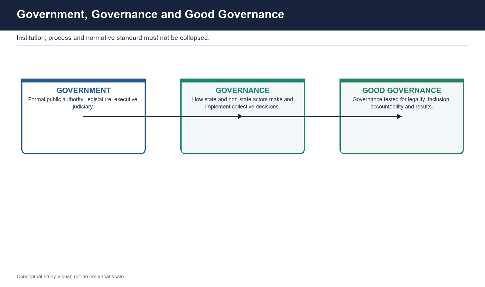

### Definitions and distinctions

- [FACT] Government is the constitutionally authorised institutional apparatus: elected legislatures and executives, the permanent administration, courts and other public bodies exercising legal power. Governance is the wider process through which collective goals are selected, rules are made, resources are allocated, services are delivered and disputes are corrected. Good governance is the evaluative standard applied to that process: authority must be lawful, participatory, transparent, accountable, responsive, effective and inclusive.
- [ANALYSIS] The three terms answer different questions. Government asks who holds formal authority. Governance asks how decisions are made and implemented across organisations and levels. Good governance asks whether the exercise of authority deserves democratic acceptance and produces public value. Public administration is the organisational machinery within government; development administration is administration deliberately oriented towards social and economic transformation.

### Causal mechanism

- A complete governance chain begins with democratic mandate and policy design, moves through regulation, budgeting and administrative capacity, reaches frontline implementation, and then returns through audit, grievance, participation and evaluation. A policy announcement or fund release is therefore an input, not completion. Governance is completed only when the intended person receives a lawful and accessible service, can challenge failure, and the institution learns from recurring error.
- The move from government to governance reflects interdependence. Markets may supply technology or finance; civil society may mobilise and monitor; communities may co-produce; regulators and courts may constrain. Yet the state retains a special position because it taxes, coerces, legislates and guarantees rights. Contracting out delivery cannot contract out constitutional responsibility for standards, equality and remedy.

### Named Indian evidence and examples

- [FACT] Article 14 supplies a non-arbitrariness anchor; RTI Act section 4 supplies proactive disclosure; MGNREGA section 17 supplies a statutory social-audit route; local-government provisions supply representative institutions close to citizens. These examples show that Indian good-governance norms are not merely imported donor language.
- [FACT] The Second Administrative Reforms Commission, constituted in 2005 and producing 15 reports, remains an India-specific reform source. [LIMIT] Its recommendations are dated proposals, not current law unless separately enacted or implemented.

### Critique and trade-offs

- [ANALYSIS] Good governance can become an empty slogan when every desirable value is included but no trade-off is resolved. Speed may conflict with hearing; disclosure with privacy; autonomy with answerability; targeting with inclusion. It can also become managerial if efficiency displaces rights, redistribution and democratic disagreement.
- [LIMIT] The broader governance lens can blur responsibility: when a network succeeds everyone claims credit, while failure is passed among departments, vendors and partners. The corrective is not to reject networks but to identify the public duty-holder, contractual responsibilities, escalation route and remedy.

### Implementation barriers

- Fragmented mandates; unclear duty-holder; policy design detached from frontline capability; non-state participation without public-law safeguards; weak feedback use.

### Reform route

- State the norm and duty-holder in law or rule; map the end-to-end delivery chain; preserve appeal and audit; publish reasons; measure citizen outcomes rather than institutional activity.

### UPSC traps

- Government and governance are not synonyms.
- Good governance is not efficiency alone.
- Non-state delivery does not remove state responsibility.

### Revision notes

- Institution -> process -> standard.
- Mandate -> capacity -> delivery -> accountability -> learning.
- Rights, results and remedy must travel together.

## 2. Governance paradigms: hierarchy, NPM, networks and public value

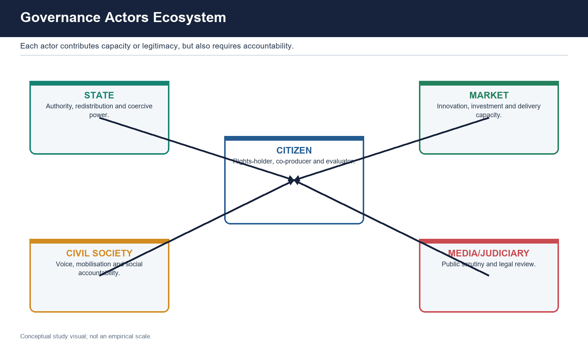

### Definitions and distinctions

- [FACT] Traditional public administration emphasises hierarchy, legality, political control, merit-based bureaucracy, standard procedure and continuity. New Public Management (NPM) adds managerial autonomy, contracts, competition, performance indicators and a customer orientation. Network governance examines coordination among mutually dependent public, private and civic actors. Public-value approaches ask whether public action creates outcomes collectively valued by citizens, enjoys legitimacy and support, and is operationally feasible.
- [ANALYSIS] These paradigms are layers, not a clean sequence in which one replaces another. A welfare entitlement needs Weberian legality, may use NPM-style service standards, may be delivered through a network of public and private actors, and should finally be judged by public value rather than transaction volume.

### Causal mechanism

- Hierarchy works through command, rule and administrative responsibility. NPM works through incentives, measurable contracts and delegated managerial discretion. Networks work through negotiation, trust, resource exchange and joint problem-solving. Public value reconnects managerial capacity with democratic authorisation: a technically feasible programme that citizens regard as unfair has weak legitimacy; a popular promise without operational capacity has low feasibility.
- The paradigm chosen changes what is measured. Hierarchy measures compliance; NPM measures cost and output; network governance measures coordination and joint outcomes; public value asks about substantive benefit, fairness, trust and democratic legitimacy. UPSC answers score when they identify this measurement consequence rather than merely naming theories.

### Named Indian evidence and examples

- [ANALYSIS] Citizen's Charters and outcome frameworks display the managerial influence of standards and performance. Public-private and civil-society delivery arrangements display network governance. Gram Sabha participation, social audit and rights-based service guarantees prevent the citizen from being reduced to a customer.
- [FACT] Sevottam combines a Charter, grievance-redress mechanism and service-delivery capability. It is useful precisely because it refuses to treat a published promise or a managerial metric as sufficient.

### Critique and trade-offs

- NPM can fragment responsibility across contracts, reward easily counted outputs, undervalue equity and turn a rights-holder into a customer. Networks can privilege organised or well-resourced actors and make accountability diffuse. Hierarchy can be slow and siloed. Public value can appear vague because citizens disagree and administrators cannot themselves decide contested values.
- [ANALYSIS] The defensible synthesis is constitutional hierarchy for legality and equality, managerial tools for performance, networks for interdependence, and public value for legitimacy and outcome judgment.

### Implementation barriers

- Procurement rewards features rather than outcomes; departmental silos resist networks; public-value consultation may be dominated by organised voices; performance metrics invite gaming.

### Reform route

- Use outcome-based but auditable contracts; publish responsibility matrices; include affected and excluded groups; protect universal standards; combine quantitative outcomes with reasoned public evaluation.

### UPSC traps

- NPM is not privatisation alone.
- Citizen is not merely a customer.
- Network governance does not abolish hierarchy.

### Revision notes

- Hierarchy protects legality.
- Management improves execution.
- Networks coordinate dependence.
- Public value joins results, legitimacy and feasibility.

## 3. Normative principles, constitutional democracy and rule of law

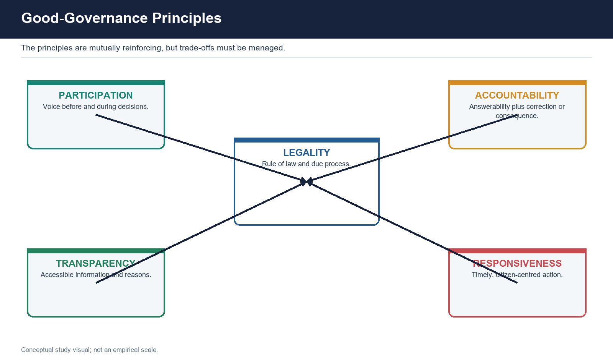

### Definitions and distinctions

- [FACT] Common good-governance principles include participation, consensus orientation, transparency, accountability, responsiveness, effectiveness and efficiency, equity and inclusion, and rule of law. Consensus orientation means accommodation of legitimate interests, not unanimity. Equity is a distributive and access concern; efficiency concerns resource conversion. Transparency concerns usable visibility; accountability additionally needs explanation and correction.
- [FACT] Rule of law is not rule by law. It requires general and knowable rules, equality, non-arbitrariness, fair procedure, reasoned exercise of discretion, independent review and effective remedy. Democratic governance adds representation, contestability, public reason and peaceful alternation to administrative capability.

### Causal mechanism

- Constitutional democracy converts electoral authority into limited authority. A majority may select priorities, but Articles 14, 19 and 21, federal allocation, judicial review and due process constrain how those priorities are implemented. Administrative due process normally asks: was there legal authority; was the affected person informed; was relevant material considered; were reasons recorded; was review available?
- The principles work as a chain. Transparency supplies information for participation. Participation supplies local knowledge and legitimacy. Accountability makes an authority explain and correct. Responsiveness converts feedback into action. Rule of law ensures that speed and discretion remain bounded. Equity tests who is excluded from the apparent success.

### Named Indian evidence and examples

- [FACT] RTI section 4 operationalises proactive transparency. CAG audit and legislative scrutiny operationalise financial accountability. MGNREGA section 17 operationalises community verification. State Right to Public Services laws operationalise time-bound service duties for notified services. Courts and statutory appeals operationalise review.
- [FACT] SDG 16 officially calls for peaceful and inclusive societies, access to justice for all, and effective, accountable and inclusive institutions at all levels. [LIMIT] It is an international goal and analytical anchor, not a self-executing Indian legal right.

### Critique and trade-offs

- Principles conflict in practice. Full consultation can delay urgent action; transparent personal data can injure privacy; local discretion can improve responsiveness and weaken uniform equality; regulator independence can weaken democratic control. A high-quality answer identifies the conflict, specifies the protected minimum and gives a proportionate balancing rule.
- [LIMIT] Merely citing constitutional Articles without an implementation mechanism becomes ornamental. The answer should move from right or principle to institution, procedure, frontline capability and remedy.

### Implementation barriers

- Legal awareness gaps; delayed review; weak records; excessive discretion without reasons; procedural overload; unequal access to courts and appeals.

### Reform route

- Reasoned administrative orders; accessible appeals; legal-aid and assisted access; periodic review of discretionary rules; privacy-aware disclosure; independent audit of exclusion.

### UPSC traps

- Consensus is not unanimity.
- Rule of law is not mere legal form.
- Efficiency cannot silently override equality.

### Revision notes

- Authority must be legal, reasoned, reviewable and remediable.
- Constitution -> institution -> procedure -> capacity -> remedy.

## 4. Legitimacy, state capacity, institutional quality and development outcomes

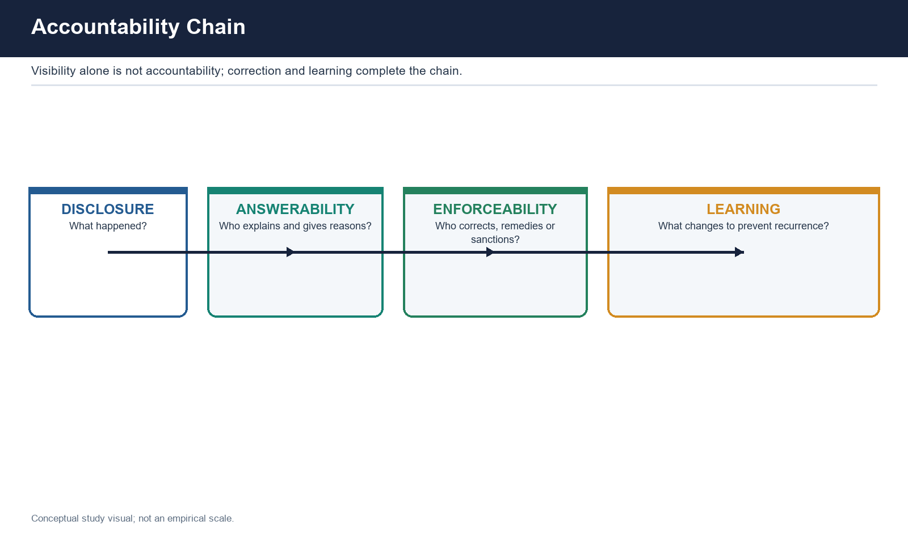

### Definitions and distinctions

- [ANALYSIS] State capacity is the ability to formulate policy, raise and steward resources, coordinate organisations, enforce lawful decisions and deliver services. Legitimacy is the accepted right to exercise authority, grounded in legality, participation, fairness and repeated performance. Institutional quality concerns stable rules, competence, incentives, accountability, adaptability and credible commitment.
- Capacity has fiscal, administrative, technical, informational, coercive and local dimensions. Legitimacy has input dimensions such as representation and participation, throughput dimensions such as fair procedure, and output dimensions such as effective and equitable performance.

### Causal mechanism

- Capacity and legitimacy reinforce each other when lawful performance builds trust, compliance and resource mobilisation. They can also diverge. High capacity without constraint can produce efficient coercion. High legitimacy without personnel, finance, records or coordination creates paper rights. Poor performance can reduce compliance, which further weakens fiscal and administrative capacity.
- Institutional quality affects development through predictable rules, reduced transaction costs, reliable public goods, human-capital services, fair regulation and correction of market or social failures. The mechanism is rarely one-directional: development can itself expand administrative resources and citizen demand for accountability.

### Named Indian evidence and examples

- [ANALYSIS] Local bodies illustrate the triangle: elections provide representative legitimacy, but service delivery depends on funds, functions and functionaries. RTI provides a legal right, but real access depends on records and responsive PIO systems. Digital platforms provide technical capacity, but legitimacy requires privacy, fairness and appeal.
- [FACT] WGI treats government effectiveness, regulatory quality, rule of law, voice and accountability, political stability and control of corruption as separate dimensions. Their separation itself warns against equating capability with accountability.

### Critique and trade-offs

- Governance-development claims can be circular: richer jurisdictions may afford better institutions, while better institutions may support development. Composite indicators may use elite perception and obscure local experience. Developmental states may deliver rapid growth while suppressing voice, generating the debate between developmental effectiveness and democratic governance.
- [LIMIT] Trust should not be used as a substitute for evidence. Public confidence is valuable but can reflect information inequality, partisan identity or temporary satisfaction.

### Implementation barriers

- Low staffing and fiscal space; weak coordination; policy volatility; informal power; unequal local capacity; distrust caused by repeated procedural unfairness.

### Reform route

- Build capability with legal restraint; protect universal standards; strengthen local and frontline capacity; measure distribution and durability of outcomes; publish reasons and learning.

### UPSC traps

- Capacity is not only training.
- Trust is not accountability.
- Development outcomes do not prove democratic quality.

### Revision notes

- Capacity = ability to act.
- Legitimacy = accepted right to act.
- Performance = demonstrated results.
- Sustainable governance needs all three.

## 5. Governance actors, collaborative action and accountability limits

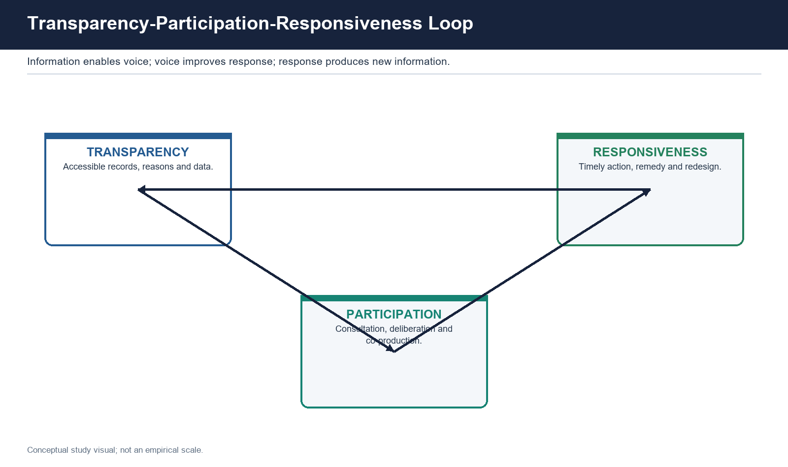

### Definitions and distinctions

- The governance ecosystem includes legislature, political executive, civil services, judiciary, regulators, local bodies, markets, civil society, citizens and media. Their roles are not interchangeable. The state supplies legal authority and universal obligation; markets supply investment and innovation; civil society supplies mobilisation, trust and scrutiny; citizens supply legitimacy, information and co-production; courts supply legal review; media lowers information costs.
- [ANALYSIS] An actor should be evaluated by mandate, resource, power, representation, accountability direction and remedy. A non-state organisation can be innovative yet not democratically representative; a public agency can be universal yet unresponsive.

### Causal mechanism

- Collaborative governance is useful when no single actor controls all knowledge or resources. It works through shared problem definition, negotiated rules, pooled capacity, data exchange and joint monitoring. Its success depends on a clear convenor, representation of affected groups, conflict rules, decision records and an escalation mechanism.
- Accountability should follow public power, public money and public consequence. A vendor handling a public database requires contractual, technical and legal accountability. An NGO delivering a service needs disclosure and grievance routes. A media platform shaping public information needs transparent standards, but government regulation must remain rights-compatible.

### Named Indian evidence and examples

- [FACT] Civil-society actors can facilitate social audit, legal awareness and community monitoring. SHG federations can create bonding, bridging and linking social capital. Local bodies provide elected proximity. CAG, courts and regulators constrain different forms of power.
- [FACT] The 2025 locally routed GS-II demand distinguishes civil-society organisations as structurally non-State actors from the political label anti-State. This is a useful classification discipline for all governance-actor questions.

### Critique and trade-offs

- Networks can conceal unequal bargaining power, elite capture and upward accountability to funders rather than downward accountability to citizens. Collaboration can become consultation theatre if the public authority has already fixed the outcome. Private delivery can cream-skim easy cases or protect proprietary information.
- [LIMIT] Civil society is not inherently inclusive, and markets are not inherently efficient in rights-based services. Conversely, state monopoly does not guarantee universality or fairness.

### Implementation barriers

- Mistrust; incompatible incentives; unequal information; unclear ownership of failure; funding dependence; conflict of interest; weak exit planning.

### Reform route

- Responsibility matrix; open selection and conflict disclosure; common outcome framework; citizen grievance route; data and audit clauses; continuity and exit plan.

### UPSC traps

- Non-State is not automatically anti-State.
- Participation by organised groups is not representation of all.
- Partnership is not accountability.

### Revision notes

- Actor -> contribution -> power -> risk -> accountability route.
- Rights need a compellable duty-holder.

## 6. Accountability types and the transparency-to-correction chain

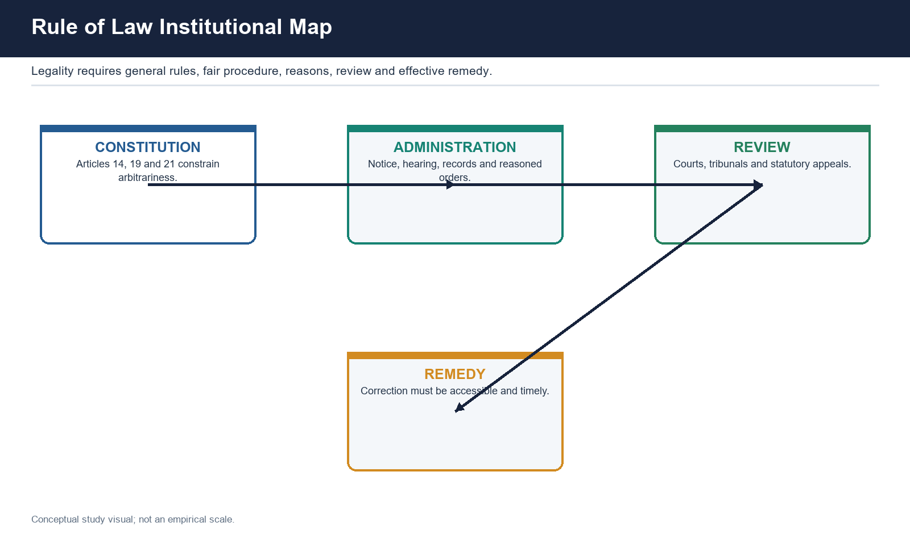

### Definitions and distinctions

- Political accountability operates through elections, legislatures and ministerial responsibility. Administrative accountability operates through hierarchy, inspection, service rules and grievance systems. Legal and judicial accountability tests legality and rights through courts, tribunals and statutory appeals. Social accountability enables direct citizen verification between elections. Financial accountability examines authorisation and stewardship of public money. Performance accountability asks whether institutions achieved quality and equitable results.
- Horizontal accountability is state institution checking state institution; vertical accountability runs through political competition and representation; social accountability is direct citizen scrutiny. Answerability means explaining conduct. Enforceability means correction, remedy or consequence. Accountability requires both, though the consequence need not always be punishment.

### Causal mechanism

- The full chain is disclosure -> comprehension -> verification -> answerability -> follow-up -> consequence -> learning. RTI or a dashboard may disclose. Social audit may verify. A public hearing may compel explanation. CAG/PAC, vigilance, disciplinary or judicial routes may impose consequence. Evaluation should then change design. The chain commonly breaks between verification and action taken.
- Routing matters. Information denial belongs to RTI appeals and CIC/SIC. Service delay belongs to the department, a State RTS route if the service is notified, or CPGRAMS administratively. Corruption belongs to vigilance, investigation and Lokpal routes where jurisdiction applies. Expenditure patterns belong to audit and legislative scrutiny.

### Named Indian evidence and examples

- [FACT] CAG under Articles 148-151 supplies financial, compliance and performance audit for legislative scrutiny; it is not a prosecutor. CVC supplies central vigilance supervision and advice; it is not a criminal court. Lokpal handles covered corruption complaints; it is not a general grievance body. CPGRAMS registers, routes, tracks, escalates and supports appeal; it is administrative, not adjudicatory.
- [FACT] The Whistle Blowers Protection Act, 2014 received assent but has not been commenced; the 2015 Amendment Bill lapsed. [LIMIT] Do not present India as having an operational comprehensive statutory whistle-blower regime under that Act.

### Critique and trade-offs

- Multiple bodies can create forum confusion, duplication and accountability gaps. Performance targets can generate gaming. Political accountability is periodic and blunt; judicial accountability can be delayed; social accountability often generates answerability without sanction; financial audit can detect irregularity after harm.
- [ANALYSIS] Coupling is therefore central: social-audit findings need an action-taken process; grievance recurrence should feed performance review; CAG findings need legislative follow-up.

### Implementation barriers

- Forum confusion; weak follow-up; fear of retaliation; poor record quality; audit overload; no named duty-holder; closure metrics.

### Reform route

- One-stop routing guidance without erasing legal forums; time-bound action-taken reports; reasoned closure; recurrence metrics; whistle-blower safeguards; risk-based audit.

### UPSC traps

- Audit, investigation, adjudication and grievance redress are different.
- Accountability is more than answerability.
- More bodies can increase fragmentation.

### Revision notes

- Who explains? To whom? On what record? With what consequence?
- Route by remedy sought.

## 7. RTI, proactive transparency and information governance

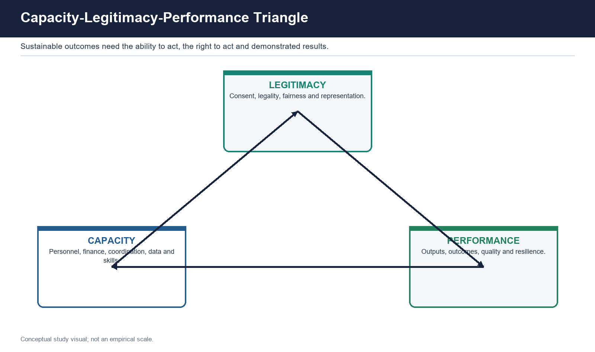

### Definitions and distinctions

- Transparency is the condition in which rules, decisions, reasons, records and performance are accessible, timely, intelligible and usable. Disclosure is the act of releasing information; it may fail to create transparency when data are stale, aggregated, scanned, technically formatted or inaccessible. RTI is a statutory right to existing information, not a right to have new analysis created or an underlying service granted.
- [FACT] RTI section 4 requires suo motu disclosure of organisational functions, decision processes, budgets, subsidies and other categories. The request route ordinarily uses a 30-day response period and 48 hours for life or liberty. The information commissions decide complaints and second appeals concerning information access.

### Causal mechanism

- Proactive disclosure reduces the citizen's need to file individual requests and lowers information asymmetry. A request creates a traceable duty for the PIO. Appeals supply review. Public use by media, civil society, legislators and communities can convert information into political or social accountability. Yet an RTI reply alone does not recover money, punish corruption or grant a pension.
- Information governance also requires record creation, classification, retention, indexing, privacy protection, open formats and reasoned exemptions. Poor records turn a formal right into repeated denial or defensive PIO behaviour.

### Named Indian evidence and examples

- [FACT] Section 8 contains exemptions and section 8(2) retains a public-interest override. Section 24 excludes listed intelligence and security organisations while preserving corruption and human-rights provisos. [FACT] DPDP Act section 44(3) substituted RTI section 8(1)(j) and is in force from 13/14 November 2025; section 44(2), deferred to 13 May 2027, amends the IT Act, not RTI.
- [LIMIT] Constitutional challenges to the substituted personal-information exemption are pending in the repository's current-status audit; no outcome is asserted.

### Critique and trade-offs

- Transparency can conflict with privacy, confidentiality, security and deliberative candour. Overbroad secrecy hides favouritism; indiscriminate disclosure can expose vulnerable individuals or drive candid advice off the record. The correct approach is legal classification, severability, reasoned refusal and public-interest balancing.
- [ANALYSIS] RTI's deeper implementation problem is not only exemption but record quality and proactive compliance. A right to information cannot reveal what an administration never reliably recorded.

### Implementation barriers

- Poor records; delayed appeals; inaccessible disclosure; privacy uncertainty; retaliation risk; treating RTI as grievance redress.

### Reform route

- Disclosure audits; machine-readable and vernacular formats; records-management capacity; reasoned exemption orders; protect applicants and whistle-blowers; connect findings to proper remedy forums.

### UPSC traps

- RTI provides information, not automatic service relief.
- CIC/SIC does not adjudicate the underlying entitlement.
- Pre-2025 wording of section 8(1)(j) is not current.

### Revision notes

- Disclosure -> usability -> verification -> remedy.
- Information right and privacy require lawful balancing.

## 8. Citizen's Charters, Sevottam, grievance redress and service guarantees

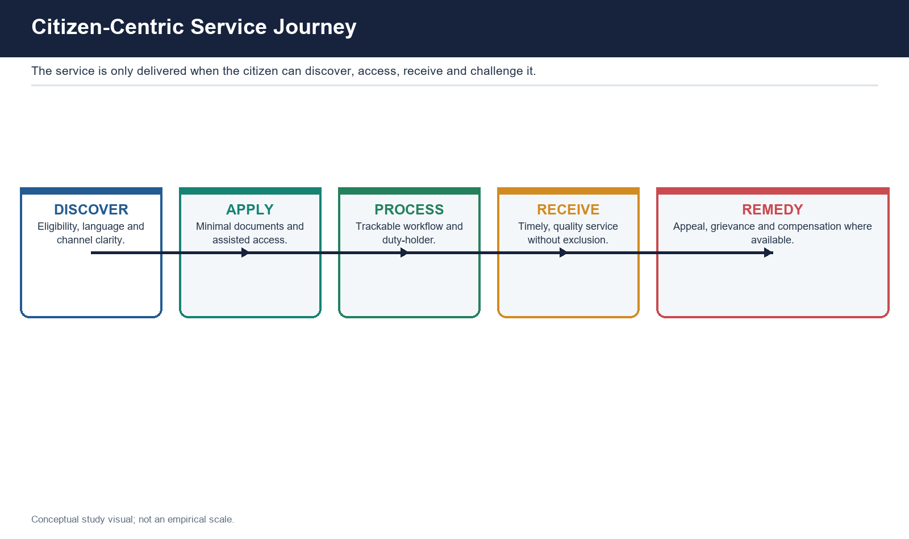

### Definitions and distinctions

- A Citizen's Charter publicly states services, standards, timelines and grievance contacts. It is generally an administrative promise, not an enforceable right by itself. A Right to Public Services law converts selected notified services into statutory duties through a designated officer, defined timeline, appeal and possible penalty or compensation. Grievance redress registers and resolves a specific service complaint; it is not the same as judicial adjudication.
- [FACT] Sevottam is DARPG's public-service excellence model built around three connected components: Citizen's Charter, public-grievance redress and service-delivery capability. Its importance is causal: a promise without capability is empty; capability without grievance is unanswerable; grievance without capability records recurring failure.

### Causal mechanism

- The service chain is standard setting -> publication -> application -> processing -> delivery -> breach detection -> grievance -> appeal -> consequence -> redesign. A strong standard names the service, eligibility, required documents, time, responsible officer and remedy. A digital system can automatically detect timeline breach, but most charters depend on the citizen recognising and reporting failure.
- [FACT] CPGRAMS is DARPG's administrative platform for registering, routing, tracking, feedback and appeal. The repository's official-source audit confirms a 21-day grievance-redress benchmark and 30 days for appeals under DARPG's August 2024 guidelines. [LIMIT] It cannot adjudicate a right, compel every service or award judicial compensation.

### Named Indian evidence and examples

- [FACT] India adopted the Charter initiative in 1997 drawing on the UK model. Madhya Pradesh's 2010 Right to Public Services law is recorded in the Core as the first State example, followed by State-specific variants. [LIMIT] Do not generalise one State's notified services, penalties or compensation design to all States.
- [ANALYSIS] Common Service Centres and single-window portals can reduce navigation cost but may place a fee-charging intermediary over an unchanged fragmented back end.

### Critique and trade-offs

- Charters often contain vague standards, omit responsible officers, are drafted without users, are poorly displayed and are not revised. Grievance systems can optimise disposal rather than resolution. Statutory penalties can induce defensive refusal or procedural rejection when departments lack staff and records.
- The citizen-as-customer language usefully encourages service design but can obscure entitlement, equality and remedy. Satisfaction is useful evidence but cannot replace legality.

### Implementation barriers

- Non-enforceability; unknown standards; document burden; digital exclusion; weak appellate capacity; output-focused grievance metrics.

### Reform route

- Consultative and measurable charters; statutory conversion for high-volume services; designated officer; auto-detected breach; assisted channels; audit recurrence and reasoned closure; capability before penalties.

### UPSC traps

- Charter is not a statutory guarantee.
- Disposal is not resolution.
- CPGRAMS is not an ombudsman or court.

### Revision notes

- Promise + capability + grievance.
- Notified service + officer + timeline + appeal + consequence.

## 9. Participation, deliberation, co-production, social audit and public hearing

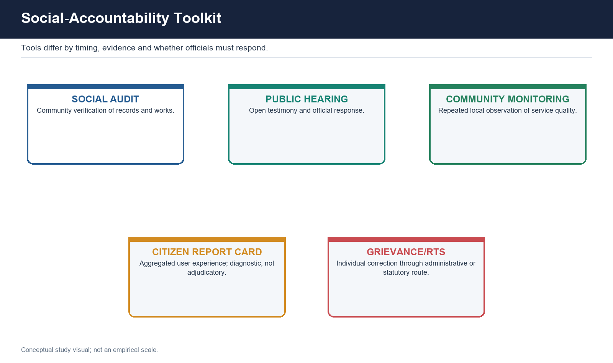

### Definitions and distinctions

- Consultation asks for views. Participation creates a meaningful opportunity to influence. Deliberation requires exchange of reasons and revision of positions. Co-production shares design, delivery or monitoring between officials and citizens. Community monitoring repeatedly observes service quality. A public hearing is an open forum for testimony and official response. A social audit is a structured process of record access, verification against lived reality, public hearing, findings and follow-up.
- [FACT] Under MGNREGA section 17 the Gram Sabha has a social-audit role. The Audit of Schemes Rules, 2011 provide for independent State Social Audit Units and periodic audit with public hearing and follow-up. Meghalaya's 2017 law is a State example of broader statutory social audit beyond a single national scheme.

### Causal mechanism

- Social audit turns administrative records into publicly contestable claims. Muster rolls, payments or works are read against local knowledge. The public hearing gives affected persons a forum and requires officials to answer. An action-taken process should route recovery, correction, discipline or system redesign. Its distinctive value is verification, not merely opinion collection.
- Participation improves diagnosis, legitimacy and compliance when participants have timely information, accessible forums and a visible response. Co-production can improve maintenance and local fit but can also transfer unpaid burdens to communities.

### Named Indian evidence and examples

- [ANALYSIS] Gram Sabhas, ward-level forums, pre-legislative consultation, school or health community monitoring, citizen report cards and public hearings are distinct instruments. Their legal character and consequence differ.
- [FACT] Social accountability is strongest when coupled with horizontal accountability: community findings can inform CAG, legislative, vigilance, departmental or judicial processes as appropriate.

### Critique and trade-offs

- Local hierarchy can silence vulnerable residents. Attendance can be treated as participation. Consultations can occur after decisions. Technical documents can exclude non-experts. Independent facilitators can themselves depend on the implementing department. Findings without action create participation fatigue.
- [LIMIT] Participation cannot mean every preference is accepted. A lawful authority may reject a proposal but should explain its reasons and show how evidence was considered.

### Implementation barriers

- Elite capture; language and timing barriers; fear of retaliation; official absence; inaccessible records; no action-taken report.

### Reform route

- Independent facilitation; advance records; inclusion design; hybrid/offline channels; reasoned response matrix; time-bound action taken; protect participants.

### UPSC traps

- Public hearing is one stage, not the whole social audit.
- Consultation is not co-decision.
- Social audit is not a court.

### Revision notes

- Information -> verification -> hearing -> action -> learning.
- Depth, inclusion and consequence determine participation quality.

## 10. Decentralisation, subsidiarity, federal and multi-level governance

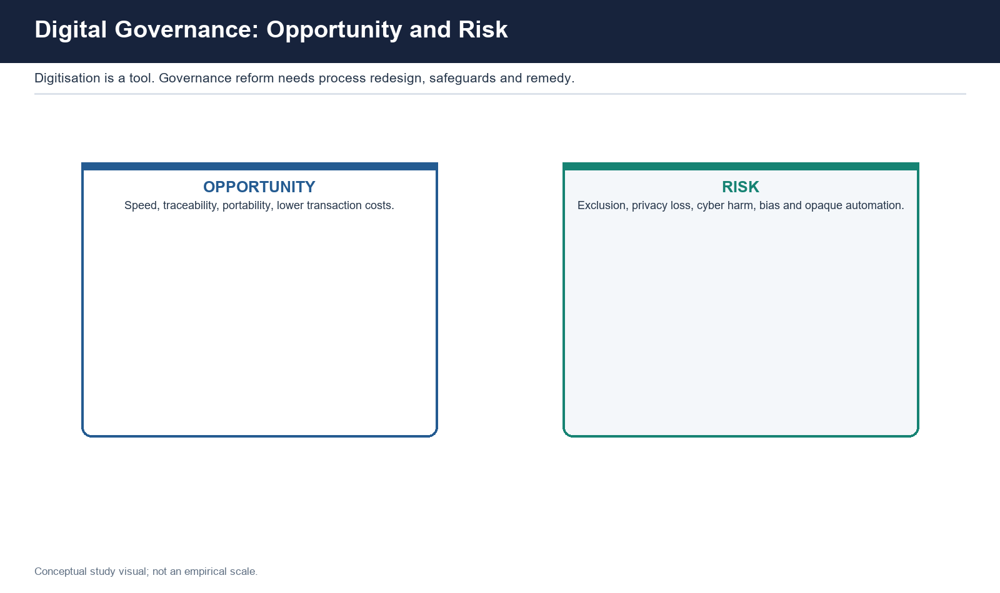

### Definitions and distinctions

- Deconcentration relocates officials within the same hierarchy. Delegation transfers tasks with retained higher control. Devolution transfers political, fiscal and administrative authority to autonomous elected bodies. Subsidiarity assigns a function to the lowest level capable of performing it effectively, while higher levels retain roles for spillovers, redistribution, standards and capacity support.
- [ANALYSIS] The 3Fs - funds, functions and functionaries - diagnose genuine devolution. Constitutional recognition and elections provide representation; operational authority requires activity mapping, budget control, own revenue or predictable transfers, and control over staff.

### Causal mechanism

- The chain runs from constitutional recognition to State law, activity mapping, finance, functionary control, technical capacity, Gram Sabha or ward accountability, and service outcome. The most hidden break is functionary control: a field official whose career remains with the State department may treat the local body as a requester rather than principal.
- Multi-level governance manages vertical interdependence between Union, State and local levels and horizontal interdependence among jurisdictions. Cooperative mechanisms are necessary for public health, transport, water, air pollution, disaster and metropolitan planning.

### Named Indian evidence and examples

- [FACT] Article 243G and the Eleventh Schedule provide the rural devolution frame; the Twelfth Schedule provides municipal functions. District Planning Committees under Article 243ZD and Metropolitan Planning Committees under Article 243ZE provide integration routes. State Finance Commissions address local fiscal devolution. PESA, 1996 creates a distinct Scheduled-Area frame; consultation must not be misstated as universal consent.
- [FACT] Kerala's People's Plan Campaign, 1996 is a benchmark of participatory planning with functional and capacity support. [LIMIT] No unsupported devolved-share percentage is used. The Ministry of Panchayati Raj Devolution Index is Panchayat-specific; no rank is asserted.

### Critique and trade-offs

- Decentralisation can improve information, participation and accountability while reproducing local caste, class or gender power. Small units offer proximity and lack scale. Rich jurisdictions can raise more own revenue, worsening territorial inequality. Tied grants improve national priorities and reduce local choice. Urban parastatals can retain budgets and staff outside elected municipalities.
- [ANALYSIS] Equalising transfers are a higher-level instrument used to make decentralisation equitable; this is a productive tension, not a contradiction.

### Implementation barriers

- Partial activity mapping; weak own revenue; irregular fiscal transfers; deputed staff; parastatal overlap; weak planning capacity; elite capture.

### Reform route

- Move 3Fs together; strengthen SFC follow-up; clear activity maps; local cadres or accountable deputation; equalisation; ward/Gram Sabha disclosure; metropolitan coordination.

### UPSC traps

- Decentralisation is not deconcentration.
- Lowest level is not always appropriate.
- Constitutional listing does not prove operational control.

### Revision notes

- Who holds budget line? Whose career controls staff? Who answers citizen?
- Representation has moved farther than fiscal and administrative authority.

## 11. Civil-service capacity, neutrality, responsiveness, specialisation and coordination

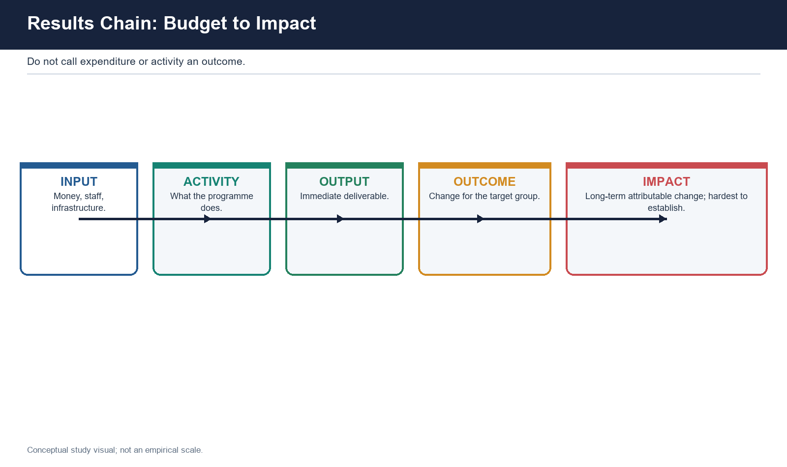

### Definitions and distinctions

- Political neutrality is impartial professional service to successive elected governments, not absence of policy advice. Permanence supplies continuity and institutional memory. Anonymity protects candid advice by making ministers publicly responsible, but creates an accountability cost. Responsiveness means timely and lawful attention to elected priorities and citizen rights, not partisan obedience.
- Capacity includes staffing, role clarity, domain knowledge, behavioural competence, data, delegation, coordination and incentives. Specialisation improves technical judgment; generalist capability supports cross-sector coordination and democratic translation. The issue is institutional mix, not a binary winner.

### Causal mechanism

- Neutrality can erode through arbitrary posting and transfer discretion. Officers anticipate preferences, shape advice before instruction, and experience displacement even when dismissal protection remains. Public perception then shifts from impartial competence to partisan alignment. Transparent posting, recorded advice, reasoned deviation and multi-source appraisal can protect both responsiveness and neutrality.
- Capacity building works only when competencies are matched to roles, training changes work products and tenure permits application. Course completion is an output; improved decision quality, reduced recurrence and better service are outcomes.

### Named Indian evidence and examples

- [FACT] Articles 309-311 and 312 provide the constitutional setting for services and All-India Services. Mission Karmayogi/NPCSCB was approved on 2 September 2020 and seeks role- and competency-based capacity building. The Capacity Building Commission, Annual Capacity Building Plans, Karmayogi Bharat and iGOT are parts of the institutional chain.
- [LIMIT] No dynamic learner, course, completion, vacancy or lateral-entry count is asserted. Mission Karmayogi is a capacity reform, not by itself a tenure, politicisation or accountability reform.

### Critique and trade-offs

- Tenure security can protect neutrality and shelter non-performance. Performance appraisal can improve accountability and become a political lever. Lateral entry can add expertise and raise concerns about representation, institutional memory and selection. Specialisation can deepen silos; generalism can become superficial.
- [ANALYSIS] Public perception is formed at the service counter through fairness, reasons and remedy, not through communication campaigns alone.

### Implementation barriers

- Transfer incentives; generalist-specialist mismatch; weak delegation; vacancy and workload; fragmented data; training without posting fit.

### Reform route

- Transparent tenure and deviation reasons; role-based posting; bounded specialist/lateral entry; multi-source appraisal and appeal; frontline capacity; interdepartmental outcome teams.

### UPSC traps

- Neutrality is not passivity.
- Training completion is not capacity outcome.
- Responsiveness is not politicisation.

### Revision notes

- Continuity + competence + impartiality + accountability.
- Protect candour, record reasons, evaluate workplace application.

## 12. Digital governance, DPI, data rights and algorithmic safeguards

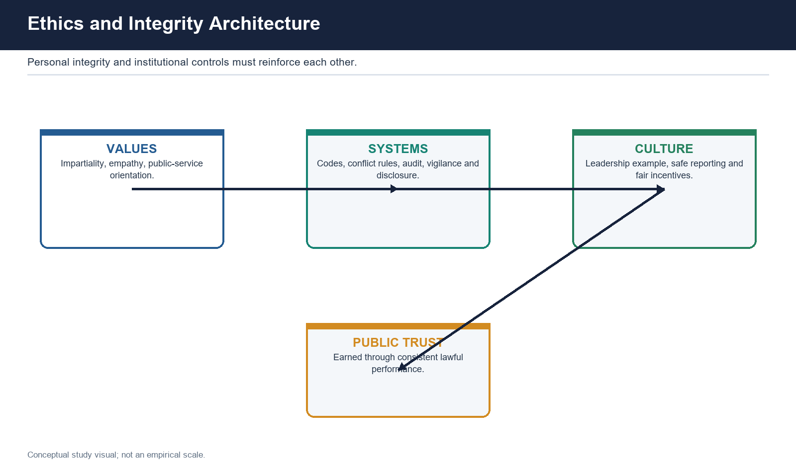

### Definitions and distinctions

- Digitisation converts analogue records. Digitalisation redesigns a process around digital tools. Digital transformation redesigns institutions, incentives and user journeys around outcomes. E-governance models describe information and interaction functions; G2C, G2B, G2G and G2E describe the counterpart; maturity describes depth from information to transaction, integration and transformation. These axes must not be collapsed.
- Digital public infrastructure supplies reusable identity, payment, document or data-sharing rails on which services can be built. A rail is not the service and cannot by itself guarantee eligibility, usability, accountability or outcome.

### Causal mechanism

- Back-end bias is structural. Tenders specify databases and features more easily than citizen task completion; departments and vendors possess technical capacity more than user-research capacity; launch and transaction metrics are visible; interfaces therefore reproduce departmental data structures. Correctives are journey mapping, usability testing, vernacular and low-bandwidth design, assisted/offline routes and outcome-based procurement.
- Algorithmic public decisions require data-quality checks, lawful purpose, proportionality, bias testing, notice, intelligible reasons, human review, appeal, logging, security and independent audit. A human must have authority and competence to correct the automated recommendation.

### Named Indian evidence and examples

- [FACT] Digital India is MeitY's umbrella programme. DARPG's NeSDA examines service-delivery dimensions; latest completed national assessment located is NeSDA 2021. The NeSDA 2025 assessment portal launched on 25 May 2026, which does not establish completed results.
- [FACT] MeitY released India AI Governance Guidelines on 5 November 2025 under Enabling Safe and Trusted AI Innovation. They are a non-statutory voluntary-compliance framework, not an AI law. [LIMIT] No portal transaction, user, saturation or State-rank metric is asserted.

### Critique and trade-offs

- Digital systems can reduce discretion and also scale exclusion, surveillance, cyber harm, vendor lock-in and erroneous source data. Authentication failure can transform an inclusion tool into a denial mechanism. Integration can increase convenience and concentration risk. Automation can hide policy choices behind technical language.
- The interactive service model logs transactions and enables feedback, but logs identify delay without necessarily identifying who must remedy it. Transparency is therefore structural; accountability is conditional on usable escalation.

### Implementation barriers

- Connectivity and literacy; inaccessible interfaces; poor source data; siloed back ends; vendor dependence; weak cybersecurity; opaque algorithms; no fallback.

### Reform route

- Assisted and offline parity; minimum-data design; security by design; reasoned rejection; human appeal; independent bias and exclusion audit; open standards; outcome and drop-off metrics.

### UPSC traps

- Online availability is not accessibility.
- Algorithmic output is not neutral or final.
- Portal launch is not evaluated success.

### Revision notes

- Access + architecture + accountability + rights + resilience.
- Measure task completion, error correction and exclusion, not launch.

## 13. Outcome budgeting, monitoring, evaluation and evidence-based policy

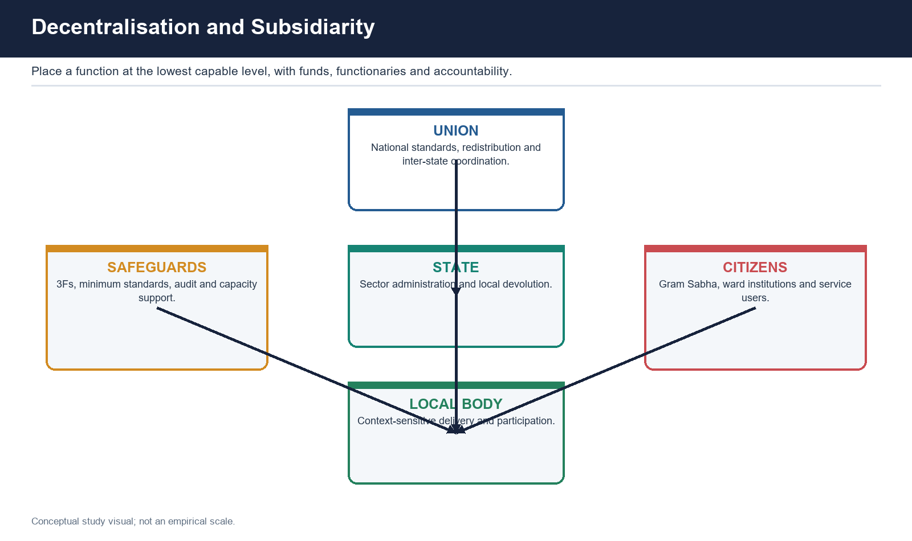

### Definitions and distinctions

- Inputs are money, staff and infrastructure. Activities are actions performed. Outputs are immediate deliverables. Outcomes are changes experienced by the target group. Impacts are longer-term effects, often influenced by many factors. Economy concerns input cost; efficiency concerns input-output conversion; effectiveness concerns achievement of objectives; equity concerns distribution.
- Monitoring continuously tracks implementation and indicators. Evaluation makes a periodic judgment about relevance, design, effectiveness, efficiency, equity, sustainability or impact. Audit tests compliance and stewardship; it is not identical to evaluation. Evidence-based policy is more accurately evidence-informed policy because values and uncertainty remain.

### Causal mechanism

- Outcome budgeting begins with a theory of change linking resources to activities, outputs and outcomes. Indicators need baselines, definitions, frequency, disaggregation and responsibility. Monitoring identifies deviation; evaluation asks why and whether the intervention caused or contributed to change; management should then redesign.
- Data quality depends on who reports, incentives, missing populations, changing definitions, interoperability and independent verification. Goodhart-type behaviour occurs when a proxy becomes a target: grievance closure, training completion or portal transactions may rise without welfare improvement.

### Named Indian evidence and examples

- [FACT] The Output-Outcome Monitoring Framework and DMEO are repository-supported Indian anchors for outcome orientation and evaluation. [LIMIT] No unsupported scheme coverage, evaluation finding or effect size is asserted.
- [ANALYSIS] CPGRAMS disposal versus recurrence, iGOT completion versus workplace application, and digital service launch versus end-service delivery are practical output-outcome distinctions.

### Critique and trade-offs

- Outcomes may appear after long lags and reflect multiple programmes. Attribution can be difficult or unethical to test experimentally. Uniform metrics can punish hard cases and encourage exclusion. Self-reported dashboards can reward reporting capacity rather than performance. Evaluation may be commissioned but not used.
- [ANALYSIS] Quantitative evidence should be triangulated with administrative records, independent verification and citizen experience; qualitative evidence can reveal mechanism and exclusion invisible in averages.

### Implementation barriers

- Weak theory of change; proxy fixation; missing baseline; self-reporting; fragmented datasets; no evaluation-to-redesign authority.

### Reform route

- Pre-specify outcome and distribution; publish metadata; independent verification; track recurrence and error; use phased pilots where suitable; require management response to evaluation.

### UPSC traps

- Expenditure is not outcome.
- Monitoring is not evaluation.
- Correlation is not impact.

### Revision notes

- Input -> activity -> output -> outcome -> impact.
- Ask what changed, for whom, compared with what, at what cost and with what uncertainty.

## 14. Regulatory governance and integrity architecture

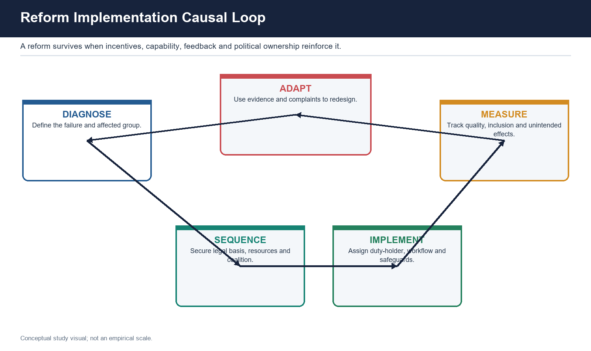

### Definitions and distinctions

- Regulatory governance is the design and exercise of rule-making, supervision, enforcement and adjudicatory functions in specialised sectors. A credible regulator needs a clear mandate, expertise, operational independence from improper influence, transparent procedure, reasoned decisions, consultation, review and accountability. Independence is not freedom from law or scrutiny.
- Ethics concerns values and judgment; integrity architecture embeds those values in systems. It includes codes, conflict-of-interest rules, asset or interest disclosure where legally required, procurement controls, audit, vigilance, reasoned discretion, safe reporting, leadership example and fair incentives.

### Causal mechanism

- Regulation works when mandate, information, incentives and enforcement align. Consultation improves information; reasons discipline discretion; published rules improve predictability; appeal corrects error; audit and legislative review constrain capture. Integrity systems reduce opportunities and rationalisations for abuse while increasing detection and consequence.
- Regulatory capture can arise through industry information advantage, revolving relationships, political pressure or dependence on regulated entities. Integrity failure can also be organisational: impossible targets, opaque procurement or discretionary exceptions can normalise misconduct even when individuals know the rules.

### Named Indian evidence and examples

- [FACT] CAG, CVC and Lokpal illustrate different accountability functions; none is a universal integrity institution. Sector regulators and appellate routes are specialist Polity/Governance cross-links. The Second ARC's Ethics in Governance report supplies reform analysis, not binding current law.
- [FACT] The Whistle Blowers Protection Act status shows the legal-stage discipline: enacted in 2014 but not commenced. Institution or statute creation must be followed through rules, appointments, operation and outcome evidence.

### Critique and trade-offs

- Excessive independence can weaken democratic accountability; excessive control enables capture. Detailed rules can reduce discretion and produce box-ticking. Transparency can reveal conflicts and drive informal influence off record. Punitive vigilance without procedural fairness can create risk aversion.
- [ANALYSIS] Integrity is broader than absence of bribery: it includes proper purpose, impartiality, stewardship, truthful records and willingness to correct error.

### Implementation barriers

- Mandate overlap; information asymmetry; political or industry pressure; vacancies and expertise gaps; weak conflict controls; fear-based vigilance.

### Reform route

- Clear mandate; transparent appointments cross-linked to Polity; reasoned consultation; cooling/conflict safeguards where law provides; risk-based supervision; protected reporting; review and audit.

### UPSC traps

- Independent does not mean unaccountable.
- CVC is not a court.
- Institution creation is not performance.

### Revision notes

- Mandate -> expertise -> independence -> procedure -> review -> accountability.
- Values require systems and culture.

## 15. Collaborative, federal, adaptive and crisis governance

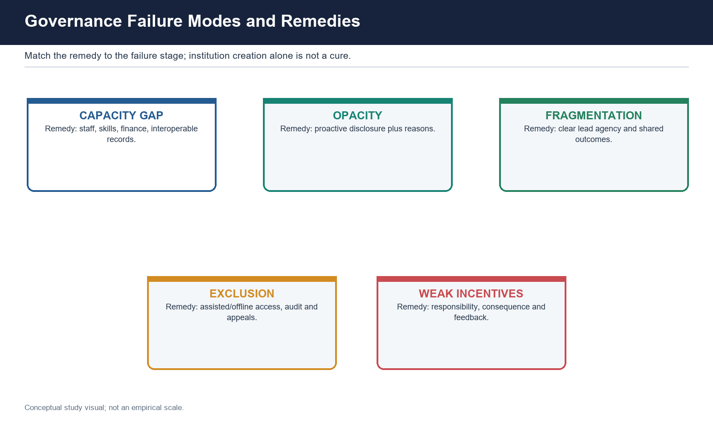

### Definitions and distinctions

- Collaborative governance is joint public problem-solving across government, private and civic actors. Federal governance manages constitutionally divided authority; cooperative federalism stresses joint action, while competitive dynamics can reveal performance but also produce blame shifting. Adaptive governance uses monitored experimentation, feedback and revision under uncertainty. Crisis governance uses exceptional speed and coordination for urgent threats.
- [ANALYSIS] These forms share a problem: authority, knowledge and resources are distributed. Their quality depends on convening power, clear legal authority, common objectives, interoperable information, representation, conflict resolution and review.

### Causal mechanism

- A collaboration should define the problem, map actors and powers, agree outcomes, assign tasks, establish data and escalation rules, protect affected groups and review results. Adaptive governance adds a hypothesis, pilot or phased rollout, indicators, triggers for change and documentation of learning. Crisis governance adds incident command, continuity, redundancy and risk communication.
- Federal and local variation can support experimentation, but portability requires attention to capacity and context. Shared dashboards are useful only if data definitions and responsibility are common.

### Named Indian evidence and examples

- [ANALYSIS] District and metropolitan planning, disaster coordination, public-health networks, digital interoperability and multi-department service delivery are bounded Indian applications. They should be used as mechanisms rather than embellished with unsupported metrics.
- [FACT] Local-government constitutional mechanisms and specialised disaster-management structures remain separate legal owners; this package uses them as governance examples without inventing composition or performance data.

### Critique and trade-offs

- Collaboration can become opaque bargaining. Adaptive policy can weaken predictability if rules change without notice. Pilots can become permanent without evaluation. Crisis powers can outlive necessity, centralise information and reduce participation. Interoperability can increase surveillance and cyber concentration.
- [LIMIT] Flexibility must operate within legality, minimum rights and review. An emergency changes the speed of procedure, not the need for authority, reasons, proportionality and after-action accountability.

### Implementation barriers

- Siloed budgets; incompatible data; unclear lead agency; intergovernmental mistrust; unequal partner power; temporary bodies without exit.

### Reform route

- Legal mandate and lead agency; shared outcome and definitions; joint operations protocol; sunset/review; transparent minutes and reasons; after-action report; local capacity.

### UPSC traps

- Crisis is not a blank cheque.
- Adaptive does not mean arbitrary.
- Collaboration does not erase public responsibility.

### Revision notes

- Shared problem -> authority map -> joint action -> feedback -> revision.
- Speed must be paired with review and exit.

## 16. Reform political economy, implementation barriers and sequencing

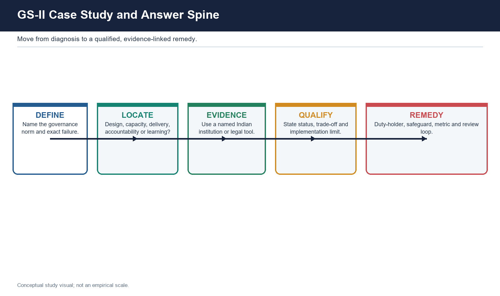

### Definitions and distinctions

- Political economy asks who gains, who bears cost, who can veto, who controls information and which incentives sustain the status quo. Implementation is not a technical final stage; frontline discretion, organisational routines, intergovernmental relations and citizen capability reshape policy.
- The five-gap diagnostic is design, capacity, delivery, accountability and learning. Design may misdiagnose incentives. Capacity may lack staff or finance. Delivery may exclude. Accountability may diffuse responsibility. Learning may count outputs without correcting policy.

### Causal mechanism

- A reform sequence begins with diagnosis and distributional mapping, identifies legal authority and coalition, aligns budget and personnel, simplifies workflow, pilots where uncertainty is material, protects rights and fallback routes, scales with monitoring, and adapts through evaluation. Reform succeeds when incentives and capability reinforce the new routine.
- Resistance is often rational from the actor's perspective: a frontline official loses discretion, a department loses budget, a vendor loses proprietary control, or citizens face new compliance costs. Sequencing should address losses, transition and credible enforcement rather than assume exhortation.

### Named Indian evidence and examples

- [ANALYSIS] Citizen's Charter reform needs capability before penalty. Digital reform needs process redesign before procurement. Decentralisation needs functionary and fiscal transfer with elections. Social audit needs action taken. Capacity training needs posting and appraisal. These examples show complementary reforms.
- [FACT] The legal-status ladder - proposal, Bill, enacted Act, commencement, rules, body, appointments, operation, implementation evidence and evaluated outcome - prevents premature claims. The uncommenced whistle-blower statute and phased DPDP framework illustrate why stage precision matters.

### Critique and trade-offs

- Quick wins can build credibility and avoid structural redistribution. Big-bang reform can overwhelm capacity; incremental reform can be captured and never reach the difficult stage. Imported best practice may fail because supporting institutions and informal incentives differ.
- [ANALYSIS] Reform recommendations should name a duty-holder, safeguard, resource requirement, metric and review date. Generic calls for awareness, technology and coordination do not alter incentives.

### Implementation barriers

- Veto players; concentrated losses; unclear ownership; reform fatigue; parallel legacy processes; unfunded mandates; metric gaming.

### Reform route

- Distributional analysis; transition support; remove redundant steps; align procurement and appraisal; independent feedback; publish implementation stage; stop or redesign failing reform.

### UPSC traps

- New body is not automatic coordination.
- Law is not implementation.
- Best practice is not plug-and-play.

### Revision notes

- Diagnose -> coalition -> authority/resources -> implement -> measure -> adapt.
- Match remedy to failure stage.

## 17. Measurement, indices and good versus democratic or developmental governance

### Definitions and distinctions

- Normative frameworks state what good governance should be. Measurement frameworks convert selected dimensions into indicators. WGI is a cross-country composite covering voice and accountability, political stability, government effectiveness, regulatory quality, rule of law and control of corruption. GGI is an India-specific sectoral diagnostic. NeSDA examines e-service delivery. Devolution indices examine a narrower local-governance object.
- Democratic governance emphasises rights, participation, representation, contestability and reasons. Developmental governance emphasises capability, coordination and transformation. Managerial good-governance discourse emphasises performance and accountability. The strongest framework integrates all three while acknowledging conflict.

### Causal mechanism

- An index selects concepts, maps indicators, combines sources, normalises scores and communicates comparison. Each step embeds judgment. Political and administrative actors then respond to what is visible and rewarded. Measurement can focus reform or create indicator management. A corrective loop requires publication of definitions, missing-data treatment, uncertainty and action triggered by weak results.
- The five tests are indicator validity, data comparability and incentives, output-outcome balance, contextual/federal adjustment, and corrective consequence. A sixth high-value test is auditability: can a State, scholar or citizen reproduce and challenge the score?

### Named Indian evidence and examples

- [FACT] The World Bank WGI page fetched for this rebuild describes six dimensions, perception data from 35 cross-country sources including household surveys, firm surveys and expert assessments, and a 2025 methodology revision. [LIMIT] No India rank or percentile is used.
- [FACT] The latest completed national GGI edition located on DARPG is GGI 2020-21, released 25 December 2021. It is not annual. GGI 2019 used three comparison groups; 2020-21 used four. No later national edition, rank, score or indicator count is asserted.

### Critique and trade-offs

- Composite scores hide sector differences and internal value conflict. Perception measures can reflect elite experience or media salience. Administrative data can reward reporting capacity and self-reporting. Context adjustment can protect fairness and reduce comparability. A high effectiveness score can coexist with weak voice.
- [ANALYSIS] The critique of measurement does not invalidate the norms. Indian constitutional and statutory anchors independently support legality, transparency, participation and remedy.

### Implementation barriers

- Concept compression; source uncertainty; time lag; ranking incentives; incomparable capacity; no consequence for low score.

### Reform route

- Publish method and uncertainty; disaggregate; triangulate citizen and administrative evidence; audit raw data; link diagnosis to funded corrective plan; avoid league-table headlines.

### UPSC traps

- WGI and GGI are not interchangeable.
- UNDP principles are not an index.
- A rank does not prove accountable process.

### Revision notes

- Measure the object actually asked.
- Index is evidence layer, not verdict.
- Efficiency without voice is not democratic governance; voice without capacity is not effective governance.

## 18. Solved practice workbook content

### Verified PYQ ownership note

The following solutions are reproduced in the separate workbook. Questions from 2018-2023 are identified as locally verified neutral renderings where the repository routing ledger, rather than a full OCR stem, is the controlling local record. The 2024 and 2025 stems available in local OCR are reproduced. Specialist ownership is retained even though this foundation package supplies full solutions.

### PYQ 1: 2018 | 10 marks

**True specialist owner:** Governance Core 05 - E-Governance Models and User-Centricity

**Question:** Locally verified neutral rendering: E-governance and the use value of information. Explain (150 words).

**Full model solution:** [CLAIM] E-governance creates public value only when information is usable for transaction, scrutiny and correction, not when government merely computerises records. [EVIDENCE] Digital India provides the umbrella for digital infrastructure and governance on demand; the e-governance models distinguish broadcasting, critical flow, comparative analysis, mobilisation/networking and interactive service. RTI section 4 supplies a statutory disclosure duty, while NeSDA's end-service and integrated-service emphasis tests whether information supports task completion. [MECHANISM] Timely, intelligible information reduces search cost, exposes delay, enables comparison and permits citizens to complete or challenge a transaction. An interactive system can log stages and support escalation. [LIMIT] Information may be stale, inaccessible or disconnected from a duty-holder; a dashboard can produce informed helplessness. Digital divide, poor source records and no human appeal further reduce use value. [VERDICT] Judge e-governance by whether information changes a citizen's capacity to complete, verify or remedy a public transaction, not by the volume placed online.

**Why this earns marks:** It answers 'use value', uses named Indian mechanisms, explains causal channels, states exclusion and accountability limits, and gives a direct test.

### PYQ 2: 2020 | 10 marks

**True specialist owner:** Governance Core 08 plus Polity Core CIC/SIC

**Question:** Locally verified neutral rendering: Recent RTI amendments and the autonomy of the Information Commission. Discuss (150 words).

**Full model solution:** [CLAIM] Information-commission autonomy is instrumental: second appeals must be decided independently if RTI is to constrain the same executive that holds the records. [EVIDENCE] CIC/SIC are statutory appellate bodies under the RTI Act; the 2019 amendments altered the statutory framework governing service conditions, producing concern that executive determination could affect perceived independence. Governance ownership lies in the transparency consequence; institutional composition remains Polity-owned. [MECHANISM] Secure and rule-bound institutional conditions protect impartial decisions, PIO compliance and public confidence. [LIMIT] formal tenure design alone cannot cure vacancies, poor records, delay or weak section 4 disclosure. Current precision is also necessary: DPDP section 44(3) substituted RTI section 8(1)(j) from November 2025, but no pending constitutional challenge outcome is asserted. [VERDICT] Preserve rule-based autonomy while strengthening appointments, capacity, records and proactive disclosure.

**Why this earns marks:** It respects cross-ownership, links autonomy to RTI outcomes, avoids invented composition details and adds an implementation qualification.

### PYQ 3: 2020 | 10 marks

**True specialist owner:** Governance Core 09 plus Polity departmental institutions

**Question:** Locally verified neutral rendering: Institutional quality and civil-service reform for strengthening democracy. Suggest reforms (150 words).

**Full model solution:** [CLAIM] Democracy is weakened when unelected administrative discretion lacks neutrality, capability or visible accountability. [EVIDENCE] Articles 309-311 provide the service setting; Mission Karmayogi, approved 2 September 2020, addresses role-based competencies; Citizen's Charters, reasoned decisions and grievance systems shape the citizen's direct experience. [MECHANISM] Transparent postings protect candid advice, competency-to-role matching improves decision quality, multi-source appraisal limits arbitrary performance judgment, and public reasons make discretion reviewable. [LIMIT] fixed tenure can shelter poor performance, while performance systems can become political levers; each therefore needs criteria, recorded deviation and appeal. [VERDICT] combine tenure protection, accountable appraisal, bounded specialisation/lateral expertise, frontline capacity and institutional rather than personal responsibility.

**Why this earns marks:** It maps each reform to a democratic mechanism and acknowledges reform conflicts instead of listing committees.

### PYQ 4: 2022 | 10 marks

**True specialist owner:** Governance Core 12 - Local Governance and Service Delivery

**Question:** Locally verified neutral rendering: Decentralisation of power and transformation of the governance landscape at the grassroots. To what extent? (150 words).

**Full model solution:** [CLAIM] India has transformed grassroots representation more deeply than fiscal and administrative authority. [EVIDENCE] elected Panchayats and municipalities, Gram Sabhas, Eleventh and Twelfth Schedule domains, State Finance Commissions and District Planning Committees create the constitutional architecture. [MECHANISM] proximity can improve information, participation and service accountability. Yet actual devolution depends on the 3Fs: activity mapping without funds or control over functionaries leaves local bodies responsible but weak. Parastatals and tied schemes further fragment authority. [LIMIT] devolution can reproduce elite capture and unequal local revenue; higher-level standards and equalising transfers remain necessary. [VERDICT] the landscape is substantially democratised in representation, partially decentralised in planning, and least transformed in finance, staff control and metropolitan governance.

**Why this earns marks:** It answers 'to what extent' with a graded judgment, named institutions, mechanism and counterweight.

### PYQ 5: 2024 | 10 marks

**True specialist owner:** Governance Core 07 and 09 - Citizen-Centric Administration and Civil Services

**Question:** The Doctrine of Democratic Governance makes it necessary that the public perception of the integrity and commitment of civil servants becomes absolutely positive. Discuss.

**Full model solution:** [CLAIM] Public confidence matters because civil servants exercise substantial unelected discretion; however, legitimacy must be earned through institutions rather than image management. [EVIDENCE] neutrality, permanence and constitutional service safeguards support impartial administration; Citizen's Charters, reasoned orders, CPGRAMS and State service guarantees shape experience at the counter; Mission Karmayogi addresses role-based capability. [MECHANISM] consistent fairness, competence, recorded reasons and effective remedy make integrity visible and create willingness to comply. [LIMIT] perception can be partisan or information-poor, and positive publicity cannot substitute for audit. Anonymity may also obscure individual responsibility. [VERDICT] strengthen transparent postings, conflict safeguards, workplace competence, reasoned service decisions and grievance quality; positive perception should follow demonstrable integrity and commitment.

**Why this earns marks:** It treats perception as democratic legitimacy, uses civil-service and service-delivery evidence, and rejects public relations as a substitute.

### PYQ 6: 2024 | 15 marks

**True specialist owner:** Governance Core 08, with Core 07 for service architecture

**Question:** The Citizens' Charter has been a landmark initiative in ensuring citizen-centric administration. But it is yet to reach its full potential. Identify the factors hindering the realisation of its promise and suggest measures to overcome them.

**Full model solution:** [CLAIM] The Charter transformed expectations by stating service standards, but its administrative and usually non-enforceable design leaves the promise without a reliable enforcement limb. [EVIDENCE] India's Charter initiative dates to 1997; Sevottam connects the Charter with grievance redress and service capability; State Right to Public Services laws add notified service, officer, timeline, appeal and consequence; CPGRAMS supplies administrative routing and appeal. [MECHANISM OF FAILURE] vague standards, no designated officer, weak user consultation, poor publicity, document and digital burdens, limited capability, no automatic breach detection, and disposal-focused grievance metrics separate promise from delivery. [REFORM] draft with users; express measurable outcomes; name officers; revise periodically; integrate transaction clocks with grievance systems; convert high-volume services into statutory guarantees; preserve assisted/offline channels; audit recurrence and reasoned closure. [LIMIT] penalties over an under-staffed office can induce defensive rejection, so capability and enforceability must move together. [VERDICT] the next generation Charter should be an auditable service contract embedded in capacity, grievance and statutory remedy, not a wall document.

**Why this earns marks:** It follows 'identify and suggest' one-to-one, uses Sevottam/RTS/CPGRAMS, and includes the enforceability-capability trade-off.

### PYQ 7: 2024 | 15 marks

**True specialist owner:** Governance Core 05 - E-Governance Models and User-Centricity

**Question:** E-governance is not just about routine application of digital technology in service delivery. It is also about multifarious interactions for transparency and accountability. Evaluate the Interactive Service Model.

**Full model solution:** [CLAIM] The Interactive Service Model is the point at which e-governance moves from one-way information to two-way transaction, feedback and escalation; it structurally improves transparency but only conditionally improves accountability. [EVIDENCE] the model belongs to a functional set distinct from G2C/G2B/G2G/G2E domains and maturity stages. NeSDA's end-service delivery, integrated delivery, tracking, accessibility, privacy and ease-of-use dimensions test the relevant capabilities. [MECHANISM] digital logs reveal application status, two-way interfaces reduce information asymmetry, integration can remove repeated documents, and feedback/appeal can identify delay. [LIMIT] a log may reveal failure without naming who must correct it; back-end silos, poor data, exclusion, inaccessible escalation and vendor design can reproduce opacity. [VERDICT] the model delivers accountability only when transactions are end-to-end, reasons are intelligible, escalation reaches an empowered officer, assisted alternatives exist and recurring failure changes the process.

**Why this earns marks:** It evaluates rather than describes, separates analytical axes, uses NeSDA carefully and gives conditions for a positive verdict.

### PYQ 8: 2024 | 10 marks

**True specialist owner:** Governance Core 12 - Local Governance and Service Delivery

**Question:** Locally verified neutral rendering: Role of local bodies in good governance and the pros and cons of merging rural and urban local bodies. Analyse (150 words).

**Full model solution:** [CLAIM] Local bodies advance good governance through proximity, participation and context-sensitive delivery, but only when the 3Fs move together. [EVIDENCE] Gram Sabhas, ward institutions, SFCs, DPCs and the Eleventh/Twelfth Schedule domains provide governance routes. A rural-urban merger can unify water, sanitation, transport and spatial planning across a continuous settlement and expand technical or financing capacity. [LIMIT] it may dilute rural representation, increase tax burden, remove Gram Sabha-style direct participation, disrupt rural entitlements and increase administrative distance. [MECHANISM] the result depends on density, employment pattern, contiguity, shared infrastructure, revenue compatibility and receiving-body capacity. [VERDICT] use criteria-based reclassification, transitional protections and service-level cooperation where full merger is unnecessary.

**Why this earns marks:** It labels benefits and costs, applies criteria and preserves the 3F governance test.

### PYQ 9: 2025 | 10 marks

**True specialist owner:** Governance Core 05 - E-Governance Models and User-Centricity

**Question:** E-governance projects have a built-in bias towards technology and back-end integration than user-centric designs. Examine.

**Full model solution:** [CLAIM] The bias is structural because government buys, staffs and measures technology more easily than it measures citizen task completion. [EVIDENCE] tenders specify databases and integrations; NeSDA distinguishes end-service delivery and usability; Common Service Centres show the continuing need for assisted access. [MECHANISM] departments and vendors optimise existing workflows and launch metrics, so the interface mirrors departmental silos, errors are unintelligible and the citizen becomes the integrator. [LIMIT] back-end integration is necessary for end-to-end service and fraud control; the error is treating it as sufficient. [REFORM] map the journey, test with vulnerable users, use vernacular/low-bandwidth design, retain offline fallback, give reasoned rejection and human appeal, and measure completion, drop-off, exclusion and recurrence. [VERDICT] user-centricity must be a procurement specification and accountability metric, not a final interface decoration.

**Why this earns marks:** It explains the causal bias, concedes the value of integration, and maps precise corrections to it.

### PYQ 10: 2025 | 10 marks

**True specialist owner:** Governance Core 04 - NGOs, SHGs and Civil-Society Stakeholders

**Question:** Locally verified neutral rendering: Civil Society Organisations are generally perceived to be anti-State rather than non-State actors. Do you agree? Justify.

**Full model solution:** [CLAIM] I disagree with the blanket perception: non-State is a structural category, while anti-State is a political judgment about a particular act. [EVIDENCE] CSOs deliver services, organise SHGs, facilitate social audit, litigate, advocate and monitor; these functions can complement, criticise or contest government. Constitutional freedoms and statutory regulation provide the operating frame. [MECHANISM] independent advocacy supplies information and accountability that government may lack, but foreign or donor funding, weak internal democracy and unrepresentative claims can create legitimate scrutiny concerns. [LIMIT] neither romanticise civil society nor criminalise dissent; assess funding disclosure, representativeness, legality and evidence case by case. [VERDICT] treat CSOs as non-State actors whose conduct may be collaborative or adversarial, and regulate proportionately without converting criticism into disloyalty.

**Why this earns marks:** It takes a clear position, uses actor-function analysis, accepts accountability concerns and refuses the category error.

### Original solved Mains practice

#### Original 1: 10 marks

**Question:** Distinguish transparency, answerability and accountability in Indian governance.

**Model solution:** [CLAIM] Transparency makes conduct visible, answerability requires an authority to explain it, and accountability adds correction, remedy or consequence. [EVIDENCE] RTI section 4 supplies disclosure; a public hearing or legislative question supplies explanation; CAG/PAC, disciplinary, vigilance, RTS or judicial routes can supply consequence depending on the wrong. [MECHANISM] each stage converts information into institutional correction. [LIMIT] excessive disclosure can harm privacy and social accountability may lack sanction. [VERDICT] design a complete chain rather than another dashboard. Why this earns marks: exact distinctions, routed Indian institutions and a qualified conclusion.

#### Original 2: 10 marks

**Question:** Why does digitisation often reproduce rather than remove administrative exclusion?

**Model solution:** [CLAIM] Digitisation scales the underlying rule and data; it does not automatically simplify or correct them. [EVIDENCE] back-end-oriented e-governance, authentication dependence, inaccessible interfaces and document duplication are known design risks; NeSDA's usability and end-service focus provides the corrective frame. [MECHANISM] a poor record or rule becomes an automatic rejection, while the citizen loses the paper or human fallback. [LIMIT] digital traceability can reduce discretion where data and appeals are sound. [VERDICT] simplify before digitising and preserve reasons, human review and assisted access. Why this earns marks: causal explanation, named benchmark and balanced digital judgment.

#### Original 3: 15 marks

**Question:** Good governance requires both state capacity and democratic legitimacy. Discuss.

**Model solution:** [CLAIM] Capacity converts authority into results; legitimacy makes that authority acceptable and constrained. [EVIDENCE] local bodies require 3Fs; RTI requires records; Mission Karmayogi addresses competencies; social audit and judicial review constrain power. [MECHANISM] lawful performance builds trust and compliance, while participation and review improve information. [LIMIT] high-capacity administration may suppress voice; participatory institutions without resources create paper promises. [VERDICT] combine capability investment with rights, reasons, audit and remedy. Why this earns marks: integrates conceptual triangle with four Indian mechanisms and a clear synthesis.

#### Original 4: 15 marks

**Question:** Evaluate social audit as an instrument of democratic accountability.

**Model solution:** [CLAIM] Social audit democratises verification by allowing affected communities to compare public records with lived reality. [EVIDENCE] MGNREGA section 17, the 2011 Audit of Schemes Rules, independent Social Audit Units and public hearings provide a statutory architecture; Meghalaya's 2017 law shows broader State-level use. [MECHANISM] disclosure, verification, testimony and official answerability can expose exclusion and misuse. [LIMIT] local power, weak auditor independence and absent action-taken reports limit enforceability. [VERDICT] protect independent facilitation and connect findings to recovery, discipline, audit and redesign. Why this earns marks: statutory evidence, causal chain and the binding follow-up constraint.

#### Original 5: 20 marks

**Question:** Examine the political economy of administrative reform in India.

**Model solution:** [CLAIM] Reform failure is often incentive failure rather than lack of technical design. [EVIDENCE] digital redesign threatens departmental discretion; decentralisation shifts budgets and staff; charter penalties affect frontline officials; social audit exposes local beneficiaries of opacity; performance systems alter career incentives. [MECHANISM] concentrated losers and veto players can block or hollow out implementation, while diffuse beneficiaries organise weakly. [LIMIT] big-bang enforcement can overwhelm capacity, and gradualism can be captured. [VERDICT] map distribution, build coalition, sequence authority and resources, protect rights, publish stage, evaluate and stop or adapt failing reforms. Why this earns marks: multiple Indian applications, causal political-economy logic, balance and operational sequencing.

#### Original 6: 20 marks

**Question:** Is good governance a sufficient standard for democratic development?

**Model solution:** [CLAIM] It is necessary but insufficient if reduced to managerial effectiveness. [EVIDENCE] WGI separates voice from effectiveness; Indian constitutional rights, RTI, social audit and local representation independently ground democratic values; outcome frameworks ground performance. [MECHANISM] democracy supplies authorisation and contestability, capacity supplies delivery, and accountability links them. [LIMIT] participation can be captured and procedure can excuse non-performance; developmental effectiveness can coexist with weak rights. [VERDICT] judge governance through a three-part standard: constitutional-democratic legitimacy, capable and equitable performance, and corrigible institutions. Why this earns marks: engages the debate, uses frameworks without rankings and offers a reasoned synthesis.

### Solved governance application cases

#### Case 1: Automated welfare rejection

**Facts:** A welfare platform automatically rejects an eligible household because two databases disagree.

**Solution:** [CLAIM] This is an exclusion and due-process failure, not merely a technical error. [EVIDENCE] Article 14 non-arbitrariness, the citizen-centric service chain and algorithmic safeguards require notice, reasons and review. [MECHANISM] tell the applicant which field conflicted, permit assisted/offline proof, suspend irreversible denial during review, authorise a human officer to correct source data, and audit false rejections by group and region. [LIMIT] fraud prevention and data integrity remain legitimate, so verification should be risk-based. [VERDICT] automation may flag risk but should not make an unreasoned final denial. Why this earns marks: identifies norm, actor, correction, metric and counter-interest.

#### Case 2: Flood coordination body

**Facts:** After repeated urban flooding, a State creates a new metropolitan coordination committee.

**Solution:** [CLAIM] Institution creation helps only if it resolves fragmented authority. [EVIDENCE] MPC-type integrated planning, municipal functions, parastatal budgets and disaster coordination show the multi-level problem. [MECHANISM] map legal mandates, name incident and planning leads, share common data definitions, assign ward feedback, disclose decisions and require an after-action report. [LIMIT] a new committee can duplicate statutory bodies and further blur responsibility. [VERDICT] judge the body by control over plans, budgets, information and escalation, not by notification alone. Why this earns marks: applies institution-performance distinction and multi-level governance.

#### Case 3: High grievance disposal

**Facts:** A department reports high grievance disposal, but repeat complaints on the same service continue.

**Solution:** [CLAIM] The target has converted closure into an output detached from resolution. [EVIDENCE] CPGRAMS is an administrative routing and appeal architecture; outcome budgeting distinguishes output from outcome. [MECHANISM] sample closed cases, require reasoned closure, track recurrence and appeal reversal, identify root causes and change the service process. [LIMIT] satisfaction scores can be strategic or subjective and should be triangulated. [VERDICT] use resolution quality and recurrence, not closure alone, as the performance standard. Why this earns marks: named platform, Goodhart mechanism and learning reform.

#### Case 4: Regulator consultation capture

**Facts:** A regulator consults on a rule, but only large firms can submit technically sophisticated responses.

**Solution:** [CLAIM] Formal consultation has produced participation without representativeness. [EVIDENCE] regulatory governance requires reasons and balanced information; civil society and user groups can supply affected-party knowledge. [MECHANISM] publish plain-language issues, extend accessible channels, fund independent consumer evidence where lawful, disclose meetings and provide a response matrix. [LIMIT] expertise remains necessary; equal voice does not mean equal evidentiary weight. [VERDICT] combine open participation with transparent evaluation of evidence. Why this earns marks: recognises both capture and technical-quality needs.

#### Case 5: Local devolution without staff

**Facts:** A State transfers sanitation responsibility to municipalities but retains engineering staff and capital budgets in a parastatal.

**Solution:** [CLAIM] This is formal functional transfer without functionary or fiscal devolution. [EVIDENCE] the 3F framework and urban-parastatal analysis directly diagnose it. [MECHANISM] clarify activity maps, transfer or create accountable service agreements for staff, align budget responsibility, publish service standards and create ward grievance and audit routes. [LIMIT] specialised regional infrastructure may justify a parastatal, but its mandate and accountability must be integrated. [VERDICT] responsibility must follow operational control. Why this earns marks: applies 3Fs, acknowledges scale and gives an institutional remedy.

### Broad conceptual MCQ bank

**MCQ 1 - Government/governance distinction:** Which statement is most accurate?
A. Government denotes formal authority; governance denotes the wider decision process.
B. Governance excludes courts.
C. Good governance is identical to low cost.
D. Public administration includes every non-state actor.
**Answer: A.** The first statement separates institution, process and standard.

**MCQ 2 - Public value:** Public-value analysis most directly asks whether public action:
A. maximises revenue only
B. creates collectively valued, legitimate and feasible outcomes
C. eliminates hierarchy
D. replaces citizens with customers
**Answer: B.** Public value joins substantive value, legitimacy/support and operational feasibility.

**MCQ 3 - Consensus orientation:** Consensus orientation means:
A. unanimity in every decision
B. majority rule without consultation
C. accommodation among legitimate interests after deliberation
D. executive secrecy
**Answer: C.** Consensus orientation seeks workable accommodation, not unanimity.

**MCQ 4 - Rule of law:** Which best distinguishes rule of law from rule by law?
A. Any enacted rule is sufficient
B. Efficiency is the only test
C. Judicial review is unnecessary
D. Lawful power must also be non-arbitrary, fairly applied and reviewable
**Answer: D.** Formal legality alone does not satisfy rule of law.

**MCQ 5 - Capacity and legitimacy:** A capable but unaccountable institution illustrates:
A. capacity without democratic constraint
B. legitimacy without capacity
C. participation without information
D. audit without records
**Answer: A.** Capability and legitimacy are analytically separate.

**MCQ 6 - Actor accountability:** When a private vendor delivers a statutory service:
A. the State loses responsibility
B. public standards, data safeguards and remedy must follow the function
C. commercial secrecy defeats all audit
D. citizens become only customers
**Answer: B.** Contracting does not contract out constitutional responsibility.

**MCQ 7 - Political accountability:** Which is primarily a political-accountability mechanism?
A. CAG performance audit
B. statutory appeal
C. elections and legislative scrutiny
D. social-audit verification
**Answer: C.** Political accountability operates through representative channels.

**MCQ 8 - Accountability chain:** Which element converts answerability into fuller accountability?
A. More disclosure alone
B. A public slogan
C. An additional portal
D. Correction, remedy or consequence
**Answer: D.** Answerability must connect to enforceability.

**MCQ 9 - RTI:** RTI principally provides:
A. access to existing information
B. automatic grant of a delayed service
C. criminal conviction
D. compensation in every grievance
**Answer: A.** RTI is an information right, not universal substantive relief.

**MCQ 10 - Proactive disclosure:** Section 4 disclosure is strongest when information is:
A. scanned without indexing
B. timely, intelligible, accessible and reusable
C. available only after litigation
D. aggregated beyond verification
**Answer: B.** Usability converts disclosure into transparency.

**MCQ 11 - Routing:** A delayed notified public service should primarily be routed to:
A. CIC in every case
B. CAG only
C. the service department/RTS route and appropriate grievance mechanism
D. WGI
**Answer: C.** The remedy sought determines the forum.

**MCQ 12 - Whistle-blower status:** The Whistle Blowers Protection Act, 2014 is:
A. fully operational with rules
B. repealed
C. a constitutional amendment
D. enacted but not commenced
**Answer: D.** The repository audit confirms assent but no commencement.

**MCQ 13 - Citizen's Charter:** A Citizen's Charter ordinarily:
A. states standards but is not by itself an enforceable right
B. is a judicial decree
C. replaces departmental capacity
D. covers every service statutorily
**Answer: A.** A Charter is generally an administrative promise.

**MCQ 14 - Sevottam:** Sevottam connects:
A. elections, courts and markets
B. Charter, grievance redress and service capability
C. only digital identity and payment
D. audit, prosecution and conviction
**Answer: B.** Its three components form a service-delivery architecture.

**MCQ 15 - CPGRAMS:** CPGRAMS is best described as:
A. a constitutional court
B. a statutory ombudsman
C. an administrative grievance-routing and tracking platform
D. a financial audit body
**Answer: C.** It is administrative, not adjudicatory.

**MCQ 16 - RTS test:** Which is essential to a credible statutory service guarantee?
A. No specified trigger
B. Only a publicity campaign
C. No appellate officer
D. Notified service, duty-holder, timeline, appeal and consequence
**Answer: D.** The five elements convert a promise into enforceability.

**MCQ 17 - Participation:** Deliberation differs from consultation because it requires:
A. exchange of reasons and engagement with alternatives
B. only a notice
C. automatic acceptance
D. no information
**Answer: A.** Deliberation is reason-giving, not mere collection.

**MCQ 18 - Social audit:** A social audit is distinguished by:
A. secret expert review
B. community verification of records plus public hearing and follow-up
C. judicial sentencing
D. opinion polling alone
**Answer: B.** Verification against lived reality is central.

**MCQ 19 - Public hearing:** A public hearing is:
A. identical to the entire social audit
B. a substitute for all records
C. a forum for testimony and official response within a wider process
D. a criminal court
**Answer: C.** It is one stage, not the whole audit.

**MCQ 20 - Participation trap:** Which claim is most accurate?
A. Participation removes elite capture
B. Attendance proves influence
C. Every suggestion must be accepted
D. Participation needs information, inclusion and reasoned response
**Answer: D.** Quality depends on influence and response.

**MCQ 21 - Devolution:** Devolution differs from deconcentration because it:
A. transfers political/fiscal/administrative authority to autonomous elected bodies
B. merely relocates officers
C. abolishes higher standards
D. always centralises finance
**Answer: A.** Devolution transfers authority, not location alone.

**MCQ 22 - Subsidiarity:** Subsidiarity assigns a function to:
A. the Union in every case
B. the lowest capable level, considering spillovers and capacity
C. the private sector automatically
D. the largest city
**Answer: B.** Lowest capable, not mechanically lowest.

**MCQ 23 - 3Fs:** The least visible but often decisive F is:
A. festival
B. forecast
C. functionary control
D. form
**Answer: C.** Operational control depends heavily on staff accountability.

**MCQ 24 - PESA precision:** PESA's land-acquisition precision in the Core is:
A. universal consent across India
B. no Gram Sabha role
C. application to every tribal-majority district
D. consultation in Fifth Schedule areas, not a universal consent claim
**Answer: D.** The legal scope and verb must be stated accurately.

**MCQ 25 - Neutrality:** Civil-service neutrality means:
A. impartial service to successive elected governments
B. absence of policy advice
C. refusal to implement lawful policy
D. loyalty to a party
**Answer: A.** Neutrality is professional impartiality.

**MCQ 26 - Mission Karmayogi:** The most meaningful capacity outcome is:
A. number enrolled only
B. workplace application and competency-to-role fit
C. number of banners
D. platform launch
**Answer: B.** Course completion is an output.

**MCQ 27 - Specialisation:** A balanced generalist-specialist reform would:
A. abolish coordination
B. reject expertise
C. combine domain depth with cross-sector coordination
D. treat every post identically
**Answer: C.** The institutional mix matters.

**MCQ 28 - Public perception:** Positive perception of civil servants should principally follow:
A. advertising
B. secrecy
C. anonymity alone
D. fair performance, reasons and working remedy
**Answer: D.** Legitimacy must be earned institutionally.

**MCQ 29 - Digitisation:** Digitisation means:
A. converting analogue records into digital form
B. complete institutional transformation
C. automatic accountability
D. algorithmic adjudication
**Answer: A.** It is the narrowest stage.

**MCQ 30 - Back-end bias:** The structural source of back-end bias includes:
A. citizen journey metrics dominating procurement
B. feature-oriented tenders and launch metrics
C. too much human appeal
D. excessive offline access
**Answer: B.** What can be specified and counted shapes design.

**MCQ 31 - Algorithmic safeguard:** Which is indispensable for adverse automated decisions?
A. vendor secrecy
B. automatic finality
C. intelligible reason, human review and appeal
D. no logs
**Answer: C.** Contestability is a due-process safeguard.

**MCQ 32 - NeSDA status:** The NeSDA 2025 portal launch establishes:
A. completed national results
B. a State ranking
C. evaluated outcomes
D. the start/hosting of an assessment cycle, not completed results
**Answer: D.** Portal launch and completed assessment are different stages.

**MCQ 33 - Results chain:** Which is an outcome?
A. reduction in unjustified service denial
B. number of forms digitised
C. funds released
D. staff trained
**Answer: A.** Outcome is change for the target group.

**MCQ 34 - Monitoring/evaluation:** Evaluation differs from monitoring because it:
A. tracks daily activity only
B. judges relevance/effectiveness and causal or contribution questions
C. eliminates uncertainty
D. is identical to audit
**Answer: B.** Evaluation makes a deeper judgment.

**MCQ 35 - Goodhart risk:** Goodhart-type distortion occurs when:
A. outcomes are independently verified
B. a proxy target is optimised at the expense of the real goal
C. data definitions are published
D. citizen feedback is triangulated
**Answer: C.** Closure can replace resolution when closure is targeted.

**MCQ 36 - Evidence:** The first evidence-quality question is:
A. Is the dashboard attractive?
B. Is the number large?
C. Who and what are missing from the measure?
D. Can one correlation prove impact?
**Answer: D.** Definition and missingness precede inference.

**MCQ 37 - Regulatory independence:** Independence should be paired with:
A. no reasons
B. no review
C. secret rules
D. clear mandate, reasons, consultation, audit and review
**Answer: A.** Independence is from improper influence, not accountability.

**MCQ 38 - Integrity:** Integrity architecture is broader than anti-bribery because it includes:
A. proper purpose, conflicts, records, stewardship and correction
B. only prosecution
C. only values training
D. no procedural safeguards
**Answer: B.** Institutional integrity joins values and systems.

**MCQ 39 - Adaptive governance:** Adaptive governance means:
A. lawless improvisation
B. disciplined learning with monitored revision
C. permanent pilots without review
D. changing rules secretly
**Answer: C.** Adaptation is structured and lawful.

**MCQ 40 - Crisis governance:** A crisis does not remove the need for:
A. speed
B. coordination
C. legal authority, proportionality, review and exit
D. risk communication
**Answer: D.** Emergency action remains bounded.

**MCQ 41 - Political economy:** A technically sound reform may stall because:
A. all actors benefit equally
B. metrics never matter
C. capacity is irrelevant
D. concentrated losers and veto players can block it
**Answer: A.** Distribution and power shape implementation.

**MCQ 42 - Status ladder:** Which statement is correct?
A. An enacted Act may still await commencement or operation
B. An announcement proves outcome
C. A portal proves adjudication
D. A commission recommendation is law
**Answer: B.** Legal and operational stages must be separated.

**MCQ 43 - WGI:** WGI comprises:
A. one corruption score only
B. six separate governance dimensions
C. a State service portal
D. India's GGI sectors
**Answer: C.** WGI's six dimensions must not be collapsed.

**MCQ 44 - GGI:** The latest completed national GGI edition located is:
A. GGI 2026
B. GGI 2025
C. GGI 2020-21
D. an annual 2024 edition
**Answer: D.** No later completed national edition was located.

**MCQ 45 - Index critique:** A governance index is strongest as:
A. a diagnostic evidence layer with disclosed limits
B. proof of legality
C. a substitute for citizen evidence
D. a permanent rank
**Answer: A.** Indices diagnose; they do not settle the verdict.

**MCQ 46 - Good versus democratic governance:** Which synthesis is most defensible?
A. Efficiency is sufficient
B. Voice is sufficient without capacity
C. Development excuses arbitrary power
D. Democratic legitimacy, capable performance and corrigible institutions are all required
**Answer: B.** The three standards are complementary.

**MCQ 47 - Rule of Law Index:** The Rule of Law Index is published by:
A. World Bank
B. World Justice Project
C. DARPG
D. CAG
**Answer: C.** Do not confuse it with WGI.

**MCQ 48 - SDG 16:** SDG 16 includes:
A. only GDP growth
B. only digital identity
C. effective, accountable and inclusive institutions
D. only climate action
**Answer: D.** Its official wording includes institutions and access to justice.

### Remedial set

The remedial set restarts only after the 48-question bank has completed a D key, preserving continuous A/B/C/D rotation.

**R1 (A):** A dashboard names no correcting authority. Missing element: enforceable accountability. Visibility alone is not correction.

**R2 (B):** A Charter lists time but no officer or appeal. It remains an administrative promise rather than a complete service guarantee.

**R3 (C):** An automated rejection has no reason or human appeal. The defect is algorithmic due process and contestability.

**R4 (D):** A social-audit finding repeats without action. The missing stage is follow-up/consequence and feedback into redesign.

## Source and current-evidence control

- Repository Markdown controlled the static and specialist evidence: Governance Core/Advanced, Master Framework, syllabus mapping, PYQ routing and Answer-Worthiness Audit.
- Local OCR text supplied the exact 2024 Citizen's Charter, Interactive Service Model and democratic-governance/civil-service stems and the exact 2025 technology-bias stem.
- World Bank WGI official page fetched in the first build supplied the six dimensions, 35 perception-source description and 2025 methodology revision.
- UN SDG 16 official page/search supplied the official wording.
- DARPG/PIB official-domain results supplied GGI 2020-21 release and the 25 May 2026 NeSDA portal launch. Direct fetch returned 403; therefore no unsupported detail or metric is inferred.
- The repository's 13 August 2026 official-source audit controls the India AI Governance Guidelines, RTI/DPDP, CPGRAMS, GGI, NeSDA and whistle-blower status.
- [LIMIT] No dynamic rank, user count, transaction total, disposal statistic, scheme outcome, effect size or unverified current appointment is used. Qdrant was unnecessary and non-blocking.

## 19. FINAL CONSOLIDATED REGISTER NOTES

### Core distinctions
- Government = formal authority; governance = collective decision process; good governance = normative standard.
- Traditional administration = legality and hierarchy; NPM = managerial performance; networks = interdependence; public value = valued, legitimate and feasible outcomes.
- Transparency != disclosure; accountability != answerability; consultation != participation; output != outcome; digitisation != transformation; Charter != enforceable right; institution creation != performance.

### Governance principles and constitutional spine
- Participation, consensus orientation, transparency, accountability, responsiveness, effectiveness/efficiency, equity/inclusion and rule of law.
- Constitutional democracy limits electoral power through rights, federalism, review, reasons and remedy.
- Rule-of-law test: authority -> notice/hearing where applicable -> reasons -> review -> remedy.

### Capacity and actors
- Capacity = fiscal + administrative + technical + informational + local ability.
- Legitimacy = representation + fair procedure + lawful performance.
- Actor test: mandate -> resource -> power -> representation -> accountability -> remedy.
- Outsourcing never outsources the State's rights duty.

### Accountability and transparency
- Political, administrative, legal/judicial, social, financial and performance accountability.
- Chain: disclosure -> comprehension -> verification -> answerability -> action taken -> consequence -> learning.
- Route correctly: information to RTI/CIC; service to department/RTS/CPGRAMS; finance to audit/legislature; corruption to vigilance/investigation/Lokpal; legality to court/appeal.
- Current RTI control: DPDP section 44(3) substituted section 8(1)(j) from November 2025; no pending-case outcome asserted.

### Citizen-centric service
- Sevottam = Charter + grievance redress + service capability.
- Service guarantee test: notified service + officer + trigger/timeline + appeal + consequence.
- CPGRAMS: administrative routing/tracking; August 2024 benchmark 21 days for grievance, 30 days for appeal; not adjudicatory.

### Participation and decentralisation
- Social audit = record access + community verification + public hearing + action taken.
- MGNREGA section 17 is the statutory anchor; public hearing is one stage, not the whole audit.
- Devolution test = 3Fs; subsidiarity = lowest capable level with standards, spillover and equalisation safeguards.
- Representation has generally advanced farther than fiscal and functionary control.

### Civil services
- Neutrality = impartial service, not passivity; responsiveness = lawful democratic service, not partisan compliance.
- Mission Karmayogi is role/competency capacity reform; completion is output, workplace application is outcome.
- Reform conflict: tenure protects neutrality and may shelter non-performance; appraisal improves accountability and may become a political lever.

### Digital and algorithmic governance
- Test: access + architecture + accountability + rights + resilience.
- Back-end bias arises from feature-oriented procurement, technical capacity asymmetry and launch metrics.
- Safeguards: data quality, lawful purpose, minimisation, security, bias testing, reason, human review, appeal, logging and audit.
- NeSDA 2025 portal launch is not completed results; India AI Governance Guidelines of 5 November 2025 are non-statutory.

### Results, regulation and integrity
- Input -> activity -> output -> outcome -> impact.
- Monitoring tracks; evaluation judges; audit checks compliance/stewardship.
- Regulatory spine: mandate -> expertise -> independence -> consultation/reasons -> review -> accountability.
- Integrity = proper purpose + conflict controls + records + stewardship + correction.

### Collaboration, crisis and reform
- Shared problem -> authority map -> common outcome -> task/data rules -> feedback -> revision.
- Crisis speed still requires legality, proportionality, review, communication and exit.
- Reform: diagnose five-gap stage -> map winners/losers/vetoes -> secure authority/resources -> implement -> measure -> adapt.
- Legal-stage ladder: proposal -> Bill -> Act -> commencement -> rules -> body -> appointments -> operation -> evidence -> evaluated outcome.

### Measurement and debate
- WGI six dimensions are distinct; GGI, NeSDA and Devolution Index measure different objects.
- Index tests: validity, comparability, output/outcome balance, context, consequence and auditability.
- Latest completed national GGI located: 2020-21; no later rank or score asserted.
- Democratic legitimacy + developmental capacity + corrigible accountability = defensible synthesis.

### GS-II answer spine
1. Decode directive and define the exact governance problem.
2. Locate design, capacity, delivery, accountability or learning gap.
3. Identify actor, level and verified legal/operational stage.
4. Make a claim.
5. Use named Indian evidence.
6. Explain mechanism/significance.
7. State limitation or trade-off.
8. Give duty-holder, safeguard, outcome metric and review.
9. End with a graded verdict.
