# Salient Features and Diversity of Indian Society - Complete Topic Package

> **Subject:** Indian Society | **Paper:** GS-I | **Export date:** 2026-08-14
>
> **Status:** Rebuilt complete learning session; approval pending.
>
> **Tags:** [FACT] source-grounded statement | [ANALYSIS] reasoned inference | [LIMIT] scope, category or evidence caution | [CURRENT] live-checked illustration.
>
> **Source order:** repository Markdown -> OCR-searchable local PDFs -> live official/reliable sources -> Qdrant optional and not used.

## Learning roadmap

This reusable edition contains the full teaching sequence, verified direct-owner PYQs with model solutions, solved concept checks, original solved 10/15/20-mark practice, source boundaries and final consolidated register notes. The final register notes are deliberately last.

## 1. Roadmap: how to study Indian society

[ANALYSIS] Indian society is best studied as a changing relationship among identities, institutions, power and everyday practices. It is not a catalogue of customs and not a claim that one national pattern fits every region.

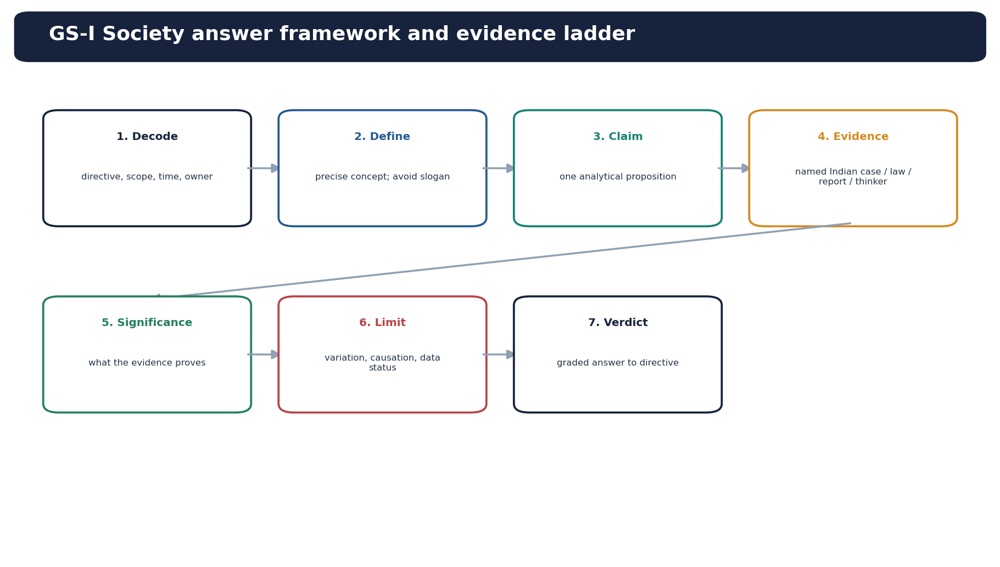
*The package uses a seven-step answer ladder from demand decoding to a qualified verdict.*

- [FACT] Unit of study: individual, household, kin group, caste or community, village or neighbourhood, region, association, market and state. An answer should move between at least two levels.
- [ANALYSIS] Four-step lens: identify the social difference; locate the institution that reproduces or moderates it; trace the distribution of resources and voice; test variation across region, class, gender and rural-urban location.
- [LIMIT] A legal category such as Scheduled Tribe, a sociological concept such as ethnicity, and a political label such as minority are not interchangeable.
- [ANALYSIS] Avoid national-average essentialism. Ask: which group, which state, which generation, which settlement type, which data source and which period?
- [FACT] This package treats communalism and ethnic conflict as bounded links. Their full causal and policy treatment belongs to later Indian Society topics.
- [ANALYSIS] Learning sequence: definitions - historical layering - diversity axes - institutions - continuity and change - constitutional accommodation - evidence - PYQ and answer practice.

### Must-know facts
- [FACT] The official GS-I syllabus expressly includes salient features of Indian society and diversity of India.

### UPSC traps
- [LIMIT] Wrong: Indian society can be described by a few timeless traits. Correct: Traits are historically layered, regionally variable and institutionally contested.

**Mains use:** Use claim - named Indian evidence - significance - limitation. Keep legal categories, sociological concepts and political labels separate.
**Study boundary:** Indian Society Core; cross-link to Polity, Social Justice, Economy and Geography only for their owned doctrine or data.

## 2. Civilisational continuity and historical layering without essentialism

[ANALYSIS] Continuity in India means repeated transmission and adaptation, not an unchanged civilisational essence. Different historical layers coexist, compete and recombine.

- [FACT] Kinship, pilgrimage routes, sacred geographies, craft and market networks, oral traditions, literary canons and regional ritual calendars have carried practices across generations.
- [FACT] Buddhism, Jainism, Bhakti and Sufi traditions, Sikh institutions, reform movements, colonial law and modern democratic politics each altered older social arrangements rather than simply replacing them.
- [ANALYSIS] Accommodation worked through translation, vernacularisation, local incorporation and composite regional forms. Examples include Bhakti poetry in regional languages, Sufi-Bhakti interaction, shared craft vocabularies and region-specific festival cultures.
- [ANALYSIS] Historical layering also preserved hierarchy. Family, jati, land relations and religious authority transmitted care and belonging but could reproduce caste, gender and status inequality.
- [FACT] Bipan Chandra's post-Independence account treats recognition and acceptance of regional, linguistic, ethnic and religious diversity as part of national consolidation; it does not equate integration with sameness.
- [LIMIT] Terms such as ancient, traditional and Indian values should not imply one origin, one community or uninterrupted consensus.
- [ANALYSIS] Examiner-ready formulation: Indian culture survived through selective continuity, accommodative absorption and institutional adaptation; the same carriers transmitted both solidarity and inequality.

### Must-know facts
- [FACT] Continuity is a process of transmission and reinterpretation, not evidence that society is static.

### UPSC traps
- [LIMIT] Wrong: Civilisational continuity proves cultural homogeneity. Correct: Continuity often operates through plural regional carriers and negotiated change.

**Mains use:** Use claim - named Indian evidence - significance - limitation. Keep legal categories, sociological concepts and political labels separate.
**Study boundary:** Indian Society Core; cross-link to Polity, Social Justice, Economy and Geography only for their owned doctrine or data.

## 3. Dimensions of diversity: the layered map

[FACT] India's diversity is religious, linguistic, caste-based, tribal and ethnic, regional, class-based, gendered, generational and rural-urban. These axes overlap rather than running in parallel.

| Axis | What to observe | Common error |
|---|---|---|
| Language | mother tongue, script, public use | equating Schedule listing with all spoken languages |
| Caste / jati | status, marriage, networks, occupation | treating varna as a complete empirical map |
| Tribe / ethnicity | legal status, territory, self-identification | freezing groups outside history |
| Class | assets, work, education, security | reducing inequality to income alone |
| Gender / generation | care, mobility, authority, aspiration | assuming one experience for all women or youth |

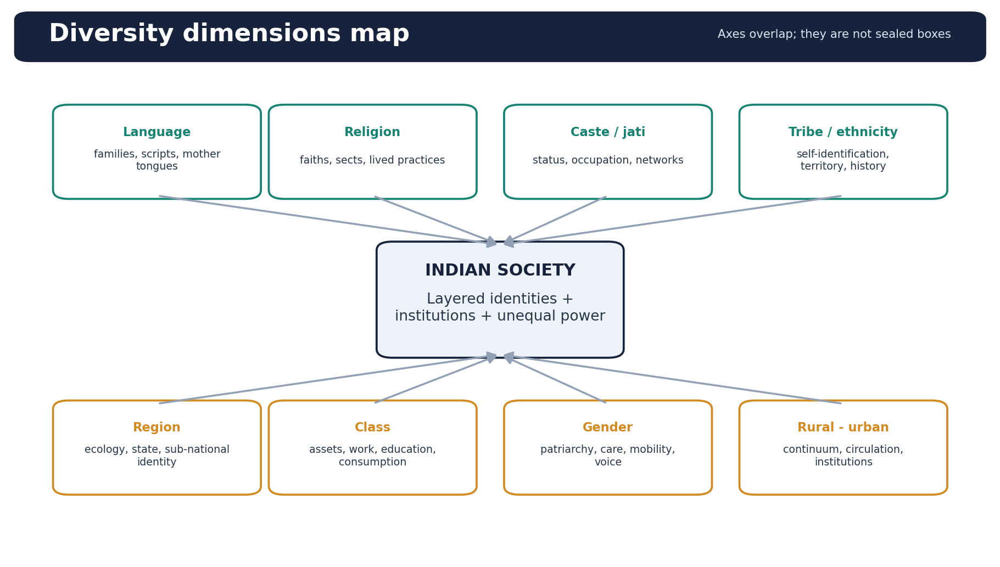
*The axes intersect at household and institutional levels; none alone predicts an outcome.*

- [FACT] Language: Indo-Aryan, Dravidian, Austroasiatic and Tibeto-Burman are large language-family labels commonly used in UPSC material; this shorthand is not exhaustive.
- [FACT] Census 2011 recorded more than 19,500 raw mother-tongue returns and rationalised them into 121 languages spoken by 10,000 or more persons. The Eighth Schedule lists 22 languages; the two counts answer different questions.
- [FACT] Religion includes major faiths, sects, denominations, reform traditions, folk and tribal practices. Internal diversity is analytically as important as inter-religious difference.
- [FACT] Caste concerns thousands of locally situated jatis and wider status categories; no unsupported all-India number of jatis should be quoted.
- [FACT] Tribe may refer to anthropological formations, political identities or constitutionally notified Scheduled Tribes. These are related but not identical categories.
- [ANALYSIS] Region combines ecology, language, political history, settlement pattern, cuisine, work and memory. Sub-national identity may be nested within Indian citizenship rather than opposed to it.
- [ANALYSIS] Class cuts across identities through land, occupation, education, income security, housing and consumption. Gender and generation modify every other axis.
- [LIMIT] Older biological-race labels such as 'Mongoloid' or 'Proto-Australoid' should not be used as casual descriptions of contemporary Indians. Use self-identification, language, territory and history where relevant.

### Must-know facts
- [FACT] Census 2011 remains the latest completed full-population stock used here; Census 2027 has no population results yet.

### UPSC traps
- [LIMIT] Wrong: Diversity is mainly religious and linguistic. Correct: Caste, tribe, class, gender, region, generation and settlement location are also constitutive.

**Mains use:** Use claim - named Indian evidence - significance - limitation. Keep legal categories, sociological concepts and political labels separate.
**Study boundary:** Indian Society Core; cross-link to Polity, Social Justice, Economy and Geography only for their owned doctrine or data.

## 4. Unity in diversity: mechanisms and conditions

[ANALYSIS] Unity in diversity is an outcome produced by institutions and repeated interaction. It is neither automatic harmony nor compulsory cultural fusion.

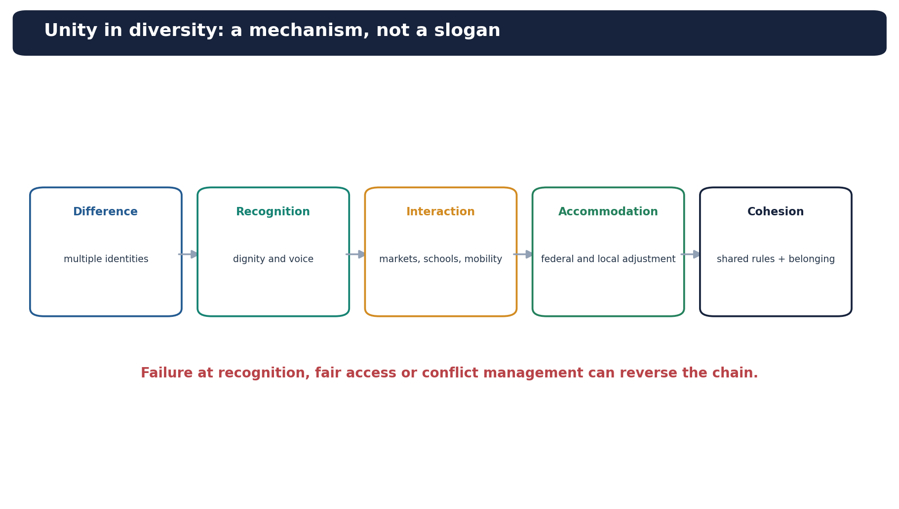
*Difference becomes cohesion through recognition, interaction, accommodation and fair access.*

- [ANALYSIS] Cross-cutting identities: a person may share language with one group, occupation with another, region with a third and political interests with a fourth. Such overlaps can prevent a single permanent social frontier.
- [FACT] Federalism and linguistic state reorganisation converted some language claims into governable territorial accommodation. This did not eliminate disputes but widened democratic participation.
- [FACT] Elections, schools, markets, transport, armed forces, public services and mass media create common arenas. Their integrating effect depends on equal access and fair representation.
- [FACT] Syncretic traditions, shared shrines, regional festivals, music, food and popular culture produce everyday forms of composite belonging.
- [ANALYSIS] Mobility and interdependence connect regions through labour, trade, education, marriage and remittances. Contact can increase familiarity but may also produce enclave formation or discrimination.
- [ANALYSIS] Constitutional patriotism supplies shared rules while allowing multiple cultural affiliations. Equal citizenship is the floor; recognition and accommodation prevent equality from becoming forced sameness.
- [LIMIT] Conflict is not evidence that unity has vanished, and peaceful coexistence is not proof that power is equal. Evaluate both resilience and hidden exclusion.

### Must-know facts
- [FACT] States Reorganisation Act, 1956 is a major example of institutional accommodation of linguistic claims.

### UPSC traps
- [LIMIT] Wrong: Unity in diversity means absence of conflict. Correct: It means differences are managed within shared institutions despite recurring conflict.

**Mains use:** Use claim - named Indian evidence - significance - limitation. Keep legal categories, sociological concepts and political labels separate.
**Study boundary:** Indian Society Core; cross-link to Polity, Social Justice, Economy and Geography only for their owned doctrine or data.

## 5. Pluralism, accommodation, syncretism, assimilation, integration and multiculturalism

[ANALYSIS] These concepts identify different social processes. Precision improves both Prelims elimination and Mains analysis.

| Concept | Difference retained? | Institutional core | Exam caution |
|---|---|---|---|
| Assimilation | declines | dominant norm | may be coerced |
| Integration | may remain | common participation | not homogenisation |
| Pluralism | yes | recognition + equality | more than tolerance |
| Syncretism | recombined | cultural interaction | not universal mixing |
| Multiculturalism | publicly recognised | policy / normative design | not a synonym for diversity |

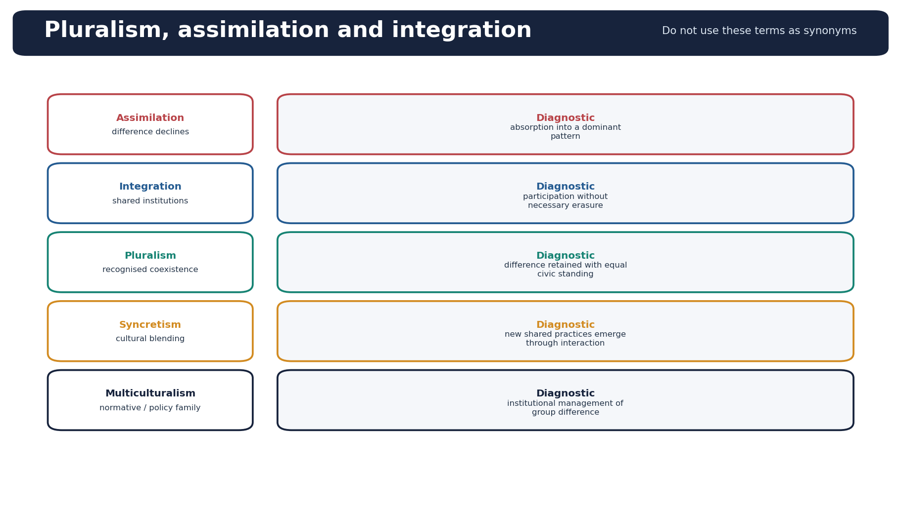
*Use the diagnostic column to prevent conceptual substitution in answers.*

- [FACT] Pluralism: groups retain meaningful difference while sharing civic membership and receiving mutual recognition.
- [FACT] Accommodation: institutions or groups adjust rules and practices to make coexistence workable without requiring deep cultural convergence.
- [FACT] Syncretism: interaction creates blended practices, symbols or traditions. It is an empirical process, not proof that boundaries disappear.
- [FACT] Assimilation: a minority or newcomer adopts a dominant pattern and distinctive practices decline. It may be voluntary, strategic or coercive.
- [FACT] Integration: participation in common institutions with no necessary requirement that cultural difference disappear.
- [ANALYSIS] Multiculturalism is a family of normative and policy approaches to public recognition of group difference; it is not merely demographic variety.
- [LIMIT] Tolerance can mean non-interference without equality. Pluralism demands a stronger condition of legitimate coexistence and civic standing.
- [ANALYSIS] Indian examples should be process-specific: linguistic states for accommodation; shared devotional forms for syncretism; common schooling for integration; language shift across generations for possible assimilation.

**Mains use:** Use claim - named Indian evidence - significance - limitation. Keep legal categories, sociological concepts and political labels separate.
**Study boundary:** Indian Society Core; cross-link to Polity, Social Justice, Economy and Geography only for their owned doctrine or data.

## 6. Caste system: features, change and persistence

[ANALYSIS] Caste must be studied as a changing system of status, marriage, occupation, political representation and social networks, not as an unchanged textbook list.

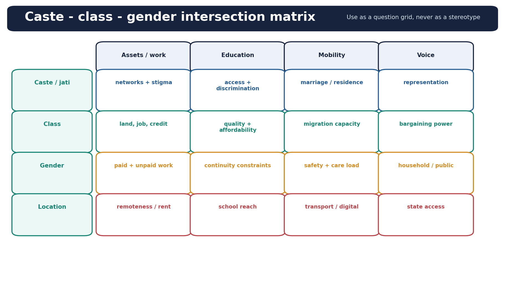
*Caste outcomes vary through class, gender and location; use the cells as evidence prompts.*

- [FACT] Classical features commonly discussed are segmental division, hierarchy, endogamy, hereditary status, occupational association and restrictions on social intercourse. Their empirical intensity varies by region and period.
- [FACT] Jati is the locally operative group for marriage, networks and status; varna is a broad normative scheme and cannot substitute for an empirical map of Indian caste.
- [FACT] M. N. Srinivas coined Sanskritisation to describe mobility through adoption of practices associated with locally higher groups; he also developed the concept of dominant caste based on local combinations of numbers, land, education and political power.
- [ANALYSIS] Change: urban anonymity, education, law, market work, democratic competition, migration and new occupations weaken some ritual restrictions and enable associational mobility.
- [ANALYSIS] Persistence: endogamy, kin networks, residential clustering, inherited assets, social capital, electoral mobilisation and discrimination can reproduce caste under modern forms.
- [FACT] Ambedkar's focus on graded inequality and endogamy helps explain why symbolic mobility need not dismantle structural hierarchy.
- [LIMIT] Sanskritisation is descriptive, not an endorsement; it can reproduce the prestige of the hierarchy it navigates. Dominant caste is local, not a fixed national list.
- [ANALYSIS] Do not confuse caste with class. They interact, but ritual status, inherited networks and discrimination are not reducible to current income.

### Must-know facts
- [FACT] Article 17 abolishes untouchability; legal abolition and social eradication are distinct questions.

### UPSC traps
- [LIMIT] Wrong: Urbanisation has abolished caste. Correct: It changes caste practices while endogamy, networks and discrimination may persist.

**Mains use:** Use claim - named Indian evidence - significance - limitation. Keep legal categories, sociological concepts and political labels separate.
**Study boundary:** Indian Society Core; cross-link to Polity, Social Justice, Economy and Geography only for their owned doctrine or data.

## 7. Class, inequality and intersectionality

[ANALYSIS] Class identifies unequal control over assets, work, skills and security. Intersectionality asks how class combines with caste, gender, tribe, disability, age and location to produce distinct constraints.

| Claim | Named evidence / example | Significance | Qualification |
|---|---|---|---|
| Caste and class overlap | land and local dominance in many agrarian settings | assets can support social power | not uniform across regions |
| Gender alters class mobility | care responsibilities and unsafe transport | employment choice is institutionally constrained | agency still varies |
| Diversity is not marginality | prosperous linguistic-minority business networks | identity difference can coexist with integration | avoid invented income figures |
| Marginality is not always cultural | landless household in a poor region | class deprivation can lack a distinct identity marker | illustrative, not prevalence data |

- [FACT] Agrarian classes include landowners, tenants, small cultivators, agricultural labourers and increasingly diversified rural non-farm workers; local caste ranking may overlap with but does not perfectly map onto class.
- [FACT] Urban class differences appear through formal versus informal work, housing tenure, neighbourhood, education quality, digital access, transport time and exposure to risk.
- [ANALYSIS] A high-income member of a stigmatised caste may gain market capacity without complete immunity from discrimination; a poor household from a locally dominant caste may suffer class deprivation without the same stigma. This breaks deterministic claims.
- [ANALYSIS] Gendered class relations include unequal ownership, unpaid care, occupational segregation and safety constraints. Women's employment rates cannot be interpreted without household work and social norms.
- [ANALYSIS] Intersectionality is not a multiplication of labels. It identifies mechanisms: how one institution, such as inheritance or residential segregation, links multiple disadvantages.
- [LIMIT] National averages hide distribution. Compare states, rural and urban areas, age cohorts, social categories and measurement methods before drawing conclusions.
- [ANALYSIS] Recognition addresses status disrespect; redistribution addresses resource inequality; representation addresses voice. Many groups require all three in different combinations.

**Mains use:** Use claim - named Indian evidence - significance - limitation. Keep legal categories, sociological concepts and political labels separate.
**Study boundary:** Indian Society Core; cross-link to Polity, Social Justice, Economy and Geography only for their owned doctrine or data.

## 8. Tribe, indigeneity and constitutional-anthropological caution

[ANALYSIS] Tribal societies are historically connected to states, markets and neighbouring populations. They must not be represented as isolated remnants or one homogeneous category.

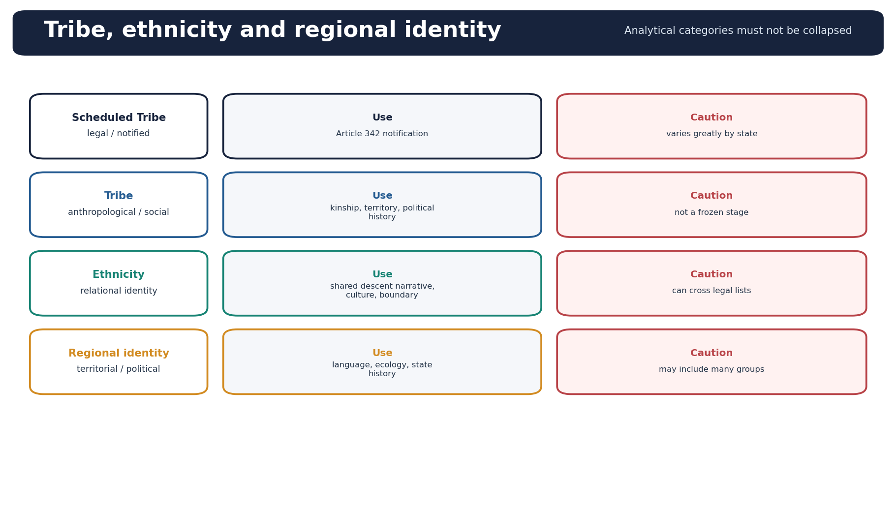
*The visual separates a constitutional notification from anthropological and political identity concepts.*

- [FACT] Scheduled Tribe is a constitutional notification under Article 342. It is a legal category whose composition is state-specific.
- [FACT] India has 75 Particularly Vulnerable Tribal Groups across 18 states and the Union Territory of Andaman and Nicobar Islands in the Ministry of Tribal Affairs listing used by the Core files.
- [ANALYSIS] Anthropological analysis may consider kinship, territory, political organisation, language, livelihood and relations with forests and markets. None is a universal checklist for every community.
- [FACT] G. S. Ghurye's assimilationist reading, Verrier Elwin's protection emphasis and Nehru's tribal Panchsheel are historically important debates, but each must be situated and critically assessed.
- [ANALYSIS] Contemporary issues include land and forest rights, displacement, mining, schooling language, health access, political autonomy, migration and cultural representation.
- [CURRENT] PM JANMAN implementation orders in 2025-26 illustrate a saturation-and-convergence approach for PVTG habitations. Use it as a current policy illustration, not evidence that outcomes are already equal.
- [LIMIT] 'Indigenous', 'Adivasi', 'tribe', 'Scheduled Tribe' and 'PVTG' have different legal, political and analytical uses. State the category you mean.
- [ANALYSIS] Development choices should combine rights, informed participation, differentiated design and access to services; neither forced assimilation nor romantic isolation is adequate.

### Must-know facts
- [FACT] Fifth and Sixth Schedule arrangements are constitutional devices with different territorial scope; detailed doctrine belongs to Polity.

### UPSC traps
- [LIMIT] Wrong: All Scheduled Tribes share one culture and one development need. Correct: Conditions vary by state, ecology, political history, language and market relation.

**Mains use:** Use claim - named Indian evidence - significance - limitation. Keep legal categories, sociological concepts and political labels separate.
**Study boundary:** Indian Society Core; cross-link to Polity, Social Justice, Economy and Geography only for their owned doctrine or data.

## 9. Family, marriage, kinship and household patterns

[ANALYSIS] Family is a relationship institution; household is a co-residential and consumption unit. Kinship extends beyond both. Using them as synonyms hides change.

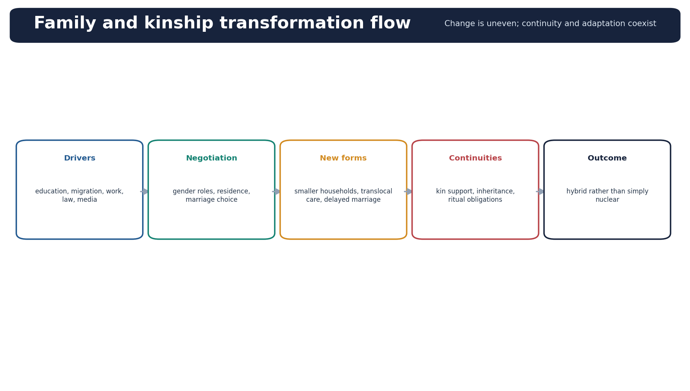
*Drivers reshape residence and roles while kin obligations often continue in new forms.*

- [FACT] Indian patterns include nuclear, joint, extended, stem and translocal arrangements; actual support networks may remain joint even when residence becomes nuclear.
- [FACT] Descent, inheritance and residence vary. Patrilineal and patrilocal patterns are widespread, but matrilineal examples such as Khasi and historical Nair arrangements demonstrate regional diversity.
- [ANALYSIS] Marriage links intimacy, kin alliance, status reproduction, property, care and community boundary-making. Endogamy remains a major mechanism of caste persistence.
- [ANALYSIS] Education, women's employment, migration, housing costs, law, digital communication and individual aspiration reshape age at marriage, spouse choice, residence and care.
- [FACT] The Special Marriage Act, 1954 provides a civil route; legal availability does not by itself remove family, community or administrative barriers.
- [ANALYSIS] Smaller households do not automatically mean weaker kinship. Remittances, messaging, ceremonial obligations and elder care can produce translocal families.
- [LIMIT] Do not announce the disappearance of the joint family, universal nuclearisation or uniform decline of marriage without a verified source and regional qualification.

**Mains use:** Use claim - named Indian evidence - significance - limitation. Keep legal categories, sociological concepts and political labels separate.
**Study boundary:** Indian Society Core; cross-link to Polity, Social Justice, Economy and Geography only for their owned doctrine or data.

## 10. Patriarchy and gender relations

[ANALYSIS] Patriarchy is an institutional distribution of authority, property, labour and mobility, not a claim that all men exercise equal power or all women have one experience.

- [FACT] Household patriarchy may operate through inheritance, unpaid care, son preference, control over marriage, restrictions on mobility and unequal decision-making.
- [FACT] Public patriarchy may appear through occupational segregation, unsafe transport, political under-representation, digital abuse and weak recognition of care work.
- [ANALYSIS] Caste and kinship can regulate women's sexuality and marriage to reproduce group boundaries; class changes the capacity to outsource care or access education but does not mechanically erase control.
- [ANALYSIS] Women's education, paid work, collectives, legal rights and political participation can widen bargaining power. Outcomes depend on job quality, asset ownership, safety and control over income.
- [FACT] SEWA is a named Indian example of organisation among self-employed women, linking work security, collective voice and social protection.
- [CURRENT] PLFS Annual Report 2025 provides rural-urban and sex-disaggregated labour indicators. Its official design was revamped in 2025; it is a labour survey, not a complete measure of empowerment or migration.
- [LIMIT] A rise in labour-force participation does not alone establish autonomy, decent work or reduced unpaid care. Avoid monocausal claims about fertility, violence or self-harm.

**Mains use:** Use claim - named Indian evidence - significance - limitation. Keep legal categories, sociological concepts and political labels separate.
**Study boundary:** Indian Society Core; cross-link to Polity, Social Justice, Economy and Geography only for their owned doctrine or data.

## 11. Village, agrarian and rural society

[ANALYSIS] The village is neither an isolated republic nor merely a residue of tradition. It is connected to markets, bureaucracy, migration, media and electoral politics.

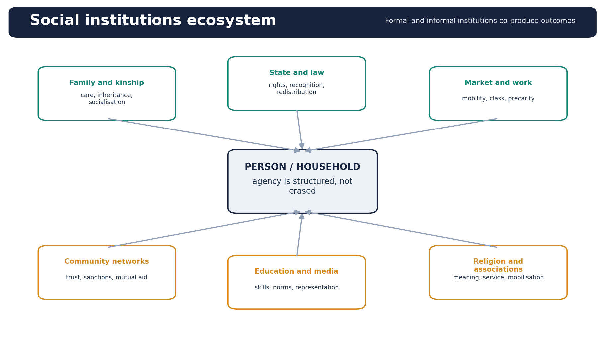
*Rural outcomes emerge from the interaction of households, markets, state agencies and community networks.*

- [FACT] M. N. Srinivas's Rampura study and dominant-caste concept highlight how land, numbers, education and politics combine locally.
- [ANALYSIS] Agrarian relations involve landownership, tenancy, labour, credit, irrigation, procurement, caste hierarchy and gendered work. Their configuration differs across Green Revolution regions, rainfed areas, tribal belts and peri-urban zones.
- [ANALYSIS] Panchayats can widen representation while informal elites, kin networks and control over resources shape substantive power.
- [FACT] Rural livelihoods increasingly combine cultivation, wage labour, construction, services, commuting, state employment and remittances. 'Rural' is not synonymous with 'agricultural'.
- [ANALYSIS] Self-help groups, cooperatives, caste associations, religious bodies and digital networks provide social capital but may also exclude outsiders or discipline members.
- [ANALYSIS] Agrarian change includes mechanisation, feminisation of some tasks, land fragmentation, tenancy shifts, climate stress and rural non-farm growth.
- [LIMIT] National averages on land, work or poverty conceal sharp state and district variation; use Economy and Geography owners for precise current measurement.

**Mains use:** Use claim - named Indian evidence - significance - limitation. Keep legal categories, sociological concepts and political labels separate.
**Study boundary:** Indian Society Core; cross-link to Polity, Social Justice, Economy and Geography only for their owned doctrine or data.

## 12. Urbanisation and the rural-urban continuum

[ANALYSIS] Urbanisation changes density, occupation, land use, governance and social interaction. It does not create a clean break from rural society.

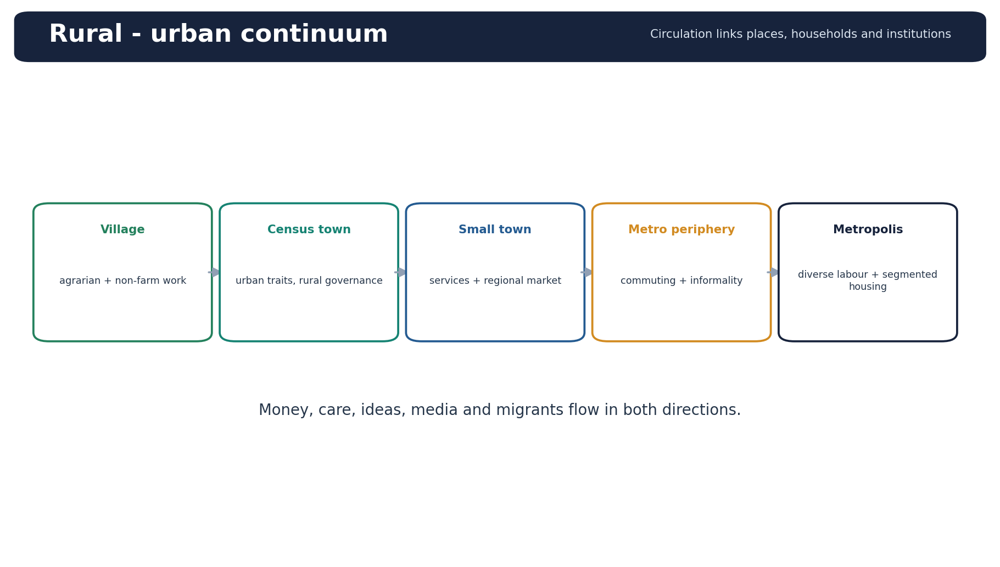
*Settlements are connected by two-way flows of labour, money, care and ideas.*

- [FACT] Census towns meet demographic and occupational criteria but may remain under rural governance, illustrating the mismatch between settlement change and institutions.
- [ANALYSIS] Peri-urban zones mix agricultural land, real-estate conversion, commuting, migrant labour, informal services and contested local authority.
- [ANALYSIS] Cities widen contact across caste, language and region, but housing markets, gated development, rental discrimination and unequal infrastructure can produce segregation.
- [ANALYSIS] Urban caste may shift from overt ritual restrictions to networks in marriage, employment, politics and residence. Class becomes more visible without erasing caste.
- [ANALYSIS] Small and Tier-2 cities mediate rural markets, education, consumption and mobility; they should not be treated as miniature metros.
- [ANALYSIS] The rural-urban continuum includes circular migration, commuting, remittances, digital ties and multi-locational households.
- [LIMIT] Urban growth is not automatically modernisation, emancipation or inclusion. Evaluate work security, housing, services, safety and voice.

**Mains use:** Use claim - named Indian evidence - significance - limitation. Keep legal categories, sociological concepts and political labels separate.
**Study boundary:** Indian Society Core; cross-link to Polity, Social Justice, Economy and Geography only for their owned doctrine or data.

## 13. Migration, internal mobility and diaspora

[ANALYSIS] Migration is a household and individual strategy shaped by opportunity, distress, networks, gender, caste, life-course and state borders.

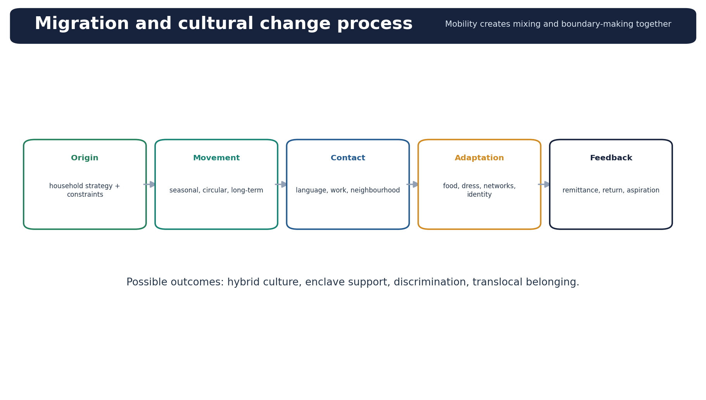
*Mobility can generate both integration and new boundaries.*

- [FACT] Forms include seasonal, circular, commuting, long-term rural-urban, urban-urban, marriage migration, educational migration and international migration.
- [ANALYSIS] Migrant networks reduce information and housing costs, but can channel workers into segmented occupations and reproduce regional or caste clusters.
- [ANALYSIS] Mobility can loosen local surveillance, expand earnings and generate hybrid identities; it can also create precarity, language barriers, documentation gaps and xenophobic politics.
- [ANALYSIS] Remittances alter consumption, housing, education and local status. Return migration can carry skills and norms, while translocal families redistribute care burdens.
- [FACT] Diaspora identities often combine origin-region, language, religion, profession and citizenship. They are neither culturally frozen nor uniformly influential.
- [LIMIT] PLFS is primarily a labour survey. Use specialised migration data or Census migration tables for migration rates; do not infer flows from labour-force indicators alone.
- [ANALYSIS] A society answer should link movement - contact - adaptation - boundary-making - feedback to the place of origin.

**Mains use:** Use claim - named Indian evidence - significance - limitation. Keep legal categories, sociological concepts and political labels separate.
**Study boundary:** Indian Society Core; cross-link to Polity, Social Justice, Economy and Geography only for their owned doctrine or data.

## 14. Religious diversity and secular social practices

[ANALYSIS] Religious diversity concerns lived practice, institutions and public interaction as well as census affiliation. Indian secularism has constitutional and social dimensions.

- [FACT] Internal diversity includes sect, denomination, region, caste location, reform movement and local ritual practice within every major religion.
- [FACT] Shared devotional idioms, syncretic shrines, festivals, music and neighbourhood cooperation are examples of lived accommodation; they should be named carefully and not romanticised as universal.
- [ANALYSIS] Secular social practice may include equal civic interaction, interdependence, non-discrimination and principled state engagement, not simply withdrawal of religion from society.
- [ANALYSIS] Religious associations can supply education, charity, trust and mutual aid. They may also harden boundaries when welfare, representation and political mobilisation become exclusive.
- [LIMIT] Communalism is the political mobilisation of religious identity through antagonistic boundaries; it is not a synonym for religion or religious diversity.
- [LIMIT] Legal doctrine on Articles 25-30, court cases and state regulation belongs to Polity. Society analysis should explain lived effects, social boundaries and associational life.
- [ANALYSIS] Use pluralism, accommodation and integration distinctly. Tolerance without equality can preserve peace while leaving hierarchy intact.

**Mains use:** Use claim - named Indian evidence - significance - limitation. Keep legal categories, sociological concepts and political labels separate.
**Study boundary:** Indian Society Core; cross-link to Polity, Social Justice, Economy and Geography only for their owned doctrine or data.

## 15. Linguistic diversity, reorganisation and multilingual life

[ANALYSIS] Language is a medium of identity, education, work, administration and political mobilisation. India manages it through layered multilingualism rather than one language-one people logic.

- [FACT] Census mother-tongue returns, rationalised language counts and the constitutional Eighth Schedule are different instruments and must not be conflated.
- [FACT] Linguistic reorganisation in and after 1956 accommodated many regional claims within the Union. It is evidence that recognition can support integration.
- [ANALYSIS] Individuals often use different languages at home, school, work, market and media. Multilingual competence is a social resource, though prestige hierarchies affect returns.
- [ANALYSIS] Mother-tongue education may improve comprehension and inclusion, but implementation requires teachers, materials, transition pathways and respect for parental aspiration.
- [CURRENT] NEP 2020 and subsequent PIB material promote mother tongue or home language in early education and multilingual resources. Bhashini is a current digital-language illustration; do not claim uniform learning outcomes without evaluation.
- [ANALYSIS] Language shift may reflect migration, schooling and labour-market incentives; preservation policies require use domains, not symbolic listing alone.
- [LIMIT] Hindi, English, scheduled languages, official languages and mother tongues are different categories. Use the exact constitutional or sociological term required.

### Must-know facts
- [FACT] The Eighth Schedule lists 22 languages; it does not list every Indian mother tongue.

**Mains use:** Use claim - named Indian evidence - significance - limitation. Keep legal categories, sociological concepts and political labels separate.
**Study boundary:** Indian Society Core; cross-link to Polity, Social Justice, Economy and Geography only for their owned doctrine or data.

## 16. Regionalism and sub-national identity

[ANALYSIS] Regional identity is a territorial claim built from language, ecology, historical memory, political economy and perceived distribution. It can be integrative, competitive or secessionist depending on demands and institutions.

- [FACT] Linguistic states show that sub-national identity can be nested within the Union and channelled democratically.
- [ANALYSIS] Regionalism may express cultural recognition, statehood, autonomy, resource control, employment preference or protest against uneven development. The remedy must match the demand.
- [ANALYSIS] Regional disparity concerns unequal outcomes; regional diversity concerns difference. The 2024 GS-I routing assigns the exact disparity-versus-diversity question to Topic 14, not this package.
- [ANALYSIS] Migration can create sons-of-soil politics where labour competition and cultural insecurity are framed territorially.
- [ANALYSIS] Inter-state institutions, fiscal transfers, language accommodation, local autonomy and shared infrastructure can reduce zero-sum framing.
- [LIMIT] Not every regional assertion is anti-national; not every cultural demand should be answered through statehood. Diagnose scale, grievance and constitutional route.
- [LIMIT] Full causal analysis of regionalism is bounded here and owned by Indian Society Topic 14.

**Mains use:** Use claim - named Indian evidence - significance - limitation. Keep legal categories, sociological concepts and political labels separate.
**Study boundary:** Indian Society Core; cross-link to Polity, Social Justice, Economy and Geography only for their owned doctrine or data.

## 17. Social institutions, informal networks, social capital and associational life

[ANALYSIS] Social institutions provide rules and roles; networks connect actors; social capital describes resources available through relationships. Each can include and exclude.

- [FACT] Family, kinship, caste, religion, market, school, law, media and political associations are institutions with different enforcement mechanisms.
- [ANALYSIS] Bonding social capital strengthens solidarity within a group; bridging capital links groups; linking capital connects citizens to authority and resources.
- [FACT] Self-help groups, cooperatives, unions, resident associations, youth clubs, caste associations and religious charities are Indian forms of associational life.
- [ANALYSIS] Informal networks can deliver credit, jobs, care and disaster response faster than formal systems. The same networks can enforce endogamy, exclude migrants or capture benefits.
- [ANALYSIS] Resilience depends on redundancy, trust, reciprocal norms, inclusive leadership and access to state capacity. Social capital cannot substitute for public infrastructure.
- [LIMIT] High association density does not automatically mean democratic inclusion; ask who can join, who leads and whose norms are enforced.
- [ANALYSIS] Use social capital as a mechanism, not praise: identify whether ties are bonding, bridging or linking and what outcome they produce.

**Mains use:** Use claim - named Indian evidence - significance - limitation. Keep legal categories, sociological concepts and political labels separate.
**Study boundary:** Indian Society Core; cross-link to Polity, Social Justice, Economy and Geography only for their owned doctrine or data.

## 18. Sociological concepts of change: accurate attribution and critique

[ANALYSIS] Concepts simplify patterns; they do not replace evidence. Attribute them accurately and state the limit of each.

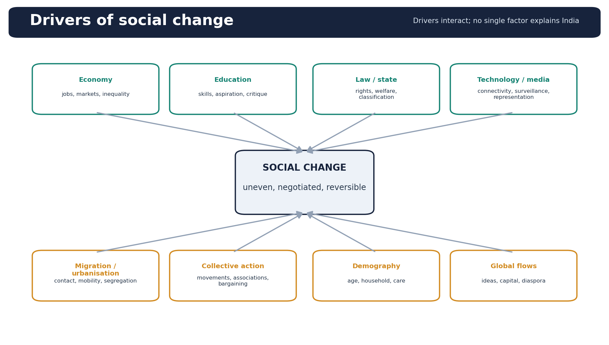
*No single driver explains change; institutions mediate their combined effect.*

- [FACT] Sanskritisation - M. N. Srinivas: mobility through adoption of practices associated with locally higher groups. Limit: may reproduce hierarchy and does not guarantee material mobility.
- [FACT] Westernisation - Srinivas: changes associated with prolonged British contact, including institutions, technology, education and values. Limit: not a single linear cultural imitation.
- [FACT] Dominant caste - Srinivas: local power combining numerical strength, land, education and political position. Limit: dominance is regional and historically variable.
- [FACT] Secularisation: differentiation or declining control of religious authority in some social domains. Limit: public religion and new religious mobilisation can coexist with differentiation.
- [ANALYSIS] Modernisation refers to linked changes in economy, bureaucracy, education, technology, mobility and values; it is not synonymous with Westernisation, moral progress or disappearance of tradition.
- [ANALYSIS] Little and great traditions are associated with Robert Redfield; McKim Marriott used universalisation and parochialisation in Indian village studies. Use these as circulation processes, not rigid civilisational ranks.
- [LIMIT] Do not attribute Sanskritisation to G. S. Ghurye, dominant caste to Andre Beteille, or assume secularisation means irreligion.
- [ANALYSIS] Indian change is often hybrid: modern media may reinforce caste marriage markets; education may widen aspiration while credentials reproduce class advantage.

**Mains use:** Use claim - named Indian evidence - significance - limitation. Keep legal categories, sociological concepts and political labels separate.
**Study boundary:** Indian Society Core; cross-link to Polity, Social Justice, Economy and Geography only for their owned doctrine or data.

## 19. Globalisation, media, technology, education, economy and demographic variation

[ANALYSIS] Social change is uneven across region, class, caste, gender and generation. New opportunities and new inequalities often emerge together.

- [ANALYSIS] Globalisation expands markets, migration, consumption, cultural flows and diaspora links. It can homogenise formats while local actors vernacularise content and revive identities.
- [ANALYSIS] Media makes marginal voices visible but can amplify stereotypes, misinformation and majoritarian narratives. Representation and platform control are social-power questions.
- [ANALYSIS] Digital technology supports language access, telework, education and networks; divides in devices, connectivity, skills, safety and algorithmic visibility qualify these gains.
- [ANALYSIS] Education enables occupational and spatial mobility, delays some life transitions and legitimises equality claims. Unequal school quality and credential inflation can reproduce class.
- [ANALYSIS] Economic change alters agrarian relations, informality, service work, care arrangements and urban settlement. Growth does not mechanically dissolve status inequality.
- [ANALYSIS] Demographic ageing, youth cohorts, delayed marriage, smaller households and interstate fertility differences reshape care, employment and politics. Avoid a single national demographic story.
- [FACT] NFHS-6 (2023-24) fact sheets were released on 29 May 2026 according to the completed subject audit; figures are provisional. This package quotes no NFHS-6 metric without the relevant fact sheet.
- [LIMIT] Generational labels such as 'Gen Z' should not replace evidence on class, region, education and work. Age cohorts are internally diverse.

**Mains use:** Use claim - named Indian evidence - significance - limitation. Keep legal categories, sociological concepts and political labels separate.
**Study boundary:** Indian Society Core; cross-link to Polity, Social Justice, Economy and Geography only for their owned doctrine or data.

## 20. Constitutional recognition and affirmative architecture

[ANALYSIS] The Constitution combines equal citizenship, protection of difference, territorial accommodation and affirmative measures. Legal recognition creates enabling conditions but not automatic substantive equality.

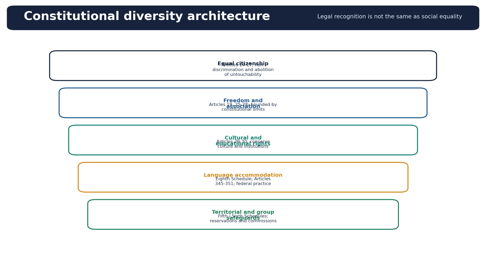
*The layered design combines equality, freedom, cultural rights, language and differentiated safeguards.*

- [FACT] Articles 14-16 establish equality and non-discrimination architecture; Article 17 abolishes untouchability.
- [FACT] Articles 25-30 protect religious freedom and cultural and educational rights within constitutional limits.
- [FACT] The Eighth Schedule and official-language provisions support layered language accommodation; their detailed doctrine belongs to Polity.
- [FACT] Fifth and Sixth Schedule arrangements, reservations, commissions and state-specific notifications address differentiated histories and representation.
- [ANALYSIS] Recognition protects identity and voice; redistribution addresses resources; representation affects decision-making. Affirmative architecture is strongest when conversion into education, assets, services and dignity is monitored.
- [ANALYSIS] Federalism, panchayats and urban local bodies can accommodate regional and local diversity, but devolution and social power determine substantive participation.
- [LIMIT] A constitutional category is not a sociological essence. Do not infer one culture or one level of deprivation from a legal notification.

**Mains use:** Use claim - named Indian evidence - significance - limitation. Keep legal categories, sociological concepts and political labels separate.
**Study boundary:** Indian Society Core; cross-link to Polity, Social Justice, Economy and Geography only for their owned doctrine or data.

## 21. Fault-lines, bounded conflict links and resilience

[ANALYSIS] Diversity becomes a fault-line when identity boundaries align with unequal resources, political mobilisation, insecurity and weak remedies. Diversity itself is not the cause.

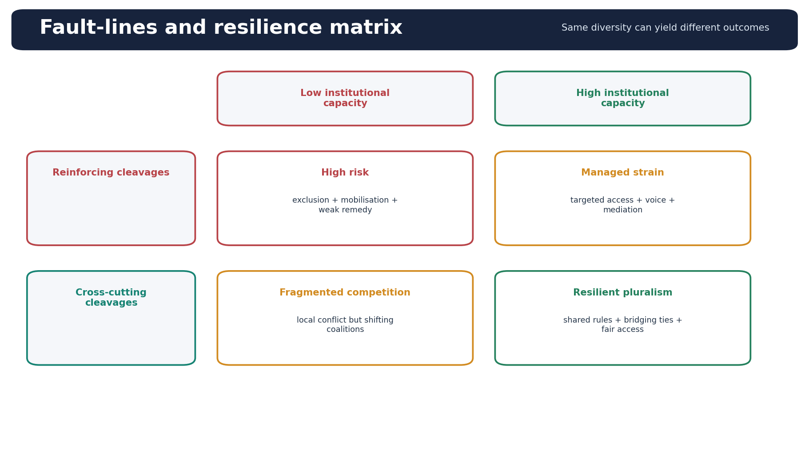
*Institutional capacity changes the outcome of both reinforcing and cross-cutting cleavages.*

- [ANALYSIS] Reinforcing cleavages stack identity, remoteness, poverty and weak voice on the same group; cross-cutting cleavages produce shifting alliances and can reduce permanent polarisation.
- [ANALYSIS] Elite mobilisation, rumours, segregated networks, competitive victimhood and impunity can transform difference into antagonism.
- [ANALYSIS] Resilience comes from fair access, credible law, bridging associations, local mediation, interdependence, representation and institutions that permit peaceful claim-making.
- [FACT] Shared markets, schools, local associations, disaster response and electoral coalitions may create bridging ties, but their quality must be tested rather than assumed.
- [LIMIT] Communalism, ethnic conflict and regionalism have separate owner topics. Here they are used only to show the boundary where diversity management fails.
- [ANALYSIS] A fault-line matrix asks two questions: do social disadvantages reinforce, and can institutions recognise claims and remedy unequal access?

**Mains use:** Use claim - named Indian evidence - significance - limitation. Keep legal categories, sociological concepts and political labels separate.
**Study boundary:** Indian Society Core; cross-link to Polity, Social Justice, Economy and Geography only for their owned doctrine or data.

## 22. Current evidence dashboard and data discipline

[FACT] Current examples are included only where a live official or reliable source was found. Data sources measure different things and cannot be merged casually.

| Source | Use here | Do not infer |
|---|---|---|
| Census 2011 | completed population / language stock | current 2026 conditions |
| Census 2027 notices | schedule and operation status | any result |
| PLFS 2025 | labour indicators | migration flow or autonomy |
| NFHS-6 fact sheets | survey indicators when directly checked | Census counts or causation |
| Administrative orders | programme design / sanction | outcome or equality |

- [CURRENT] Census 2027: official Gazette material fixes the reference date at 1 March 2027 for most of India and 1 October 2026 for Ladakh and specified snow-bound areas. Houselisting in 2026 and population enumeration are operations, not results.
- [CURRENT] No Census 2027 population, language or caste result is available for quotation in this package. Census 2011 remains the completed population stock used for verified shares.
- [CURRENT] PLFS Annual Report 2025, released by MoSPI in 2026, is used only as an illustration of current rural-urban and gender-disaggregated labour measurement. It is not a migration census or a complete empowerment index.
- [CURRENT] PM JANMAN 2025-26 Ministry of Tribal Affairs orders show ongoing PVTG-focused implementation. Sanction or coverage is not proof of completed outcome.
- [CURRENT] PIB material on NEP 2020, mother-tongue education and multilingual digital tools supplies a current linguistic-diversity illustration. Uniform implementation or learning impact is not asserted.
- [FACT] NFHS-6 status is taken from the completed subject audit; no unverified national metric is reproduced.
- [LIMIT] Survey estimate, administrative count, constitutional listing and Census stock answer different questions. State the source and year next to every number.

**Mains use:** Use claim - named Indian evidence - significance - limitation. Keep legal categories, sociological concepts and political labels separate.
**Study boundary:** Indian Society Core; cross-link to Polity, Social Justice, Economy and Geography only for their owned doctrine or data.

## 23. GS-I answer architecture and evidence ladder

[ANALYSIS] Society answers score when they define precisely, explain a mechanism, use named Indian evidence, compare variation and qualify the claim.

| Marks | Recommended evidence density | Structure |
|---|---|---|
| 10 / 150 | 2-3 precise examples | thesis + 3 mechanisms + qualification |
| 15 / 250 | 4-6 precise examples | proposition + test + counter-case + verdict |
| 20 / extended | 5-8 precise examples | concept + history + institutions + variation + judgement |

*The evidence ladder converts examples into analysis instead of decorative fact lists.*

- [ANALYSIS] Step 1 - decode the directive. Discuss needs organised coverage; analyse needs mechanisms; critically analyse needs supporting and counter evidence; distinguish needs paired criteria.
- [ANALYSIS] Step 2 - write a direct thesis. Example: diversity correlates with marginality only where identity axes reinforce historical exclusion and remoteness.
- [ANALYSIS] Step 3 - organise by mechanism, institution, comparison or causal chain. Avoid a miscellaneous list of features.
- [ANALYSIS] Step 4 - evidence ladder: named example or source - what it proves - why it matters - limitation.
- [ANALYSIS] Step 5 - compare across at least one dimension: region, class, gender, generation, rural-urban or cross-cutting versus reinforcing identity.
- [ANALYSIS] Step 6 - close with a graded verdict. Do not convert every conclusion into a generic policy wish-list.
- [LIMIT] Use sociologists only when the concept advances the answer. Name-dropping without mechanism reduces clarity.

**Mains use:** Use claim - named Indian evidence - significance - limitation. Keep legal categories, sociological concepts and political labels separate.
**Study boundary:** Indian Society Core; cross-link to Polity, Social Justice, Economy and Geography only for their owned doctrine or data.

## 24. Verified Mains PYQ 2019 - model solution

[FACT] UPSC CSE Mains 2019, GS-I, Q8, 10 marks, 150 words: What makes Indian society unique in sustaining its culture? Discuss.

- [FACT] Demand: Discuss the mechanisms that sustain culture; do not merely list attractive features.
- [ANALYSIS] Thesis: Indian society sustains culture through decentralised transmission and accommodative adaptation rather than insulation from change.
- [ANALYSIS] Claim 1: multiple carriers prevent dependence on one authority. Named evidence: family and kinship, regional languages, pilgrimage circuits, craft traditions and festival calendars transmit practices through everyday life. Significance: culture survives political change because transmission is socially dispersed. [LIMIT] The same carriers can reproduce caste and gender hierarchy.
- [ANALYSIS] Claim 2: incorporation is more important than purity. Named evidence: Bhakti vernacular traditions and Sufi-Bhakti interaction created shared idioms across regions. Significance: new influences were translated into local repertoires rather than treated only as external replacements. [LIMIT] Syncretism is uneven and does not erase conflict.
- [ANALYSIS] Claim 3: institutional accommodation renews belonging. Named evidence: linguistic state reorganisation after 1956 allowed language identities to gain territorial recognition within the Union. Significance: recognition supported national integration without demanding linguistic sameness. [LIMIT] Inter-state language disputes and minority-language concerns remain.
- [ANALYSIS] Claim 4: mobility produces adaptation. Named evidence: migrants maintain translocal rituals and food practices while adopting workplace languages and urban networks. Significance: continuity becomes selective and hybrid, not static.
- [ANALYSIS] Conclusion: Indian culture is therefore sustained by layered transmission, accommodation and adaptation. Its uniqueness lies not in changeless uniformity but in the capacity to preserve plural belonging while repeatedly renegotiating hierarchy and difference.
- [ANALYSIS] Why this earns marks: it answers the directive, scales evidence to marks, links every example to an inference, includes a qualification, and closes with a graded judgement rather than a slogan.

### Must-know facts
- [FACT] Owner: Indian Society Topic 01; locally verified in the 2018-2023 GS-I routing ledger and OCR-searchable paper corpus.

**Mains use:** Use claim - named Indian evidence - significance - limitation. Keep legal categories, sociological concepts and political labels separate.
**Study boundary:** Indian Society Core; cross-link to Polity, Social Justice, Economy and Geography only for their owned doctrine or data.

## 25. Verified Mains PYQ 2024 - model solution

[FACT] UPSC CSE Mains 2024, GS-I, Q20, 15 marks, 250 words: Critically analyse the proposition that there is a high correlation between India's cultural diversities and socio-economic marginalities.

- [FACT] Demand: Test the proposition with supporting cases, counter-cases, causal reframing and a conditional verdict.
- [ANALYSIS] Thesis: The correlation is strong where cultural identity overlaps with historical exclusion, remoteness and weak assets, but diversity itself is a marker rather than a universal cause of marginality.
- [ANALYSIS] Where the proposition holds: many PVTG habitations combine distinct identity, remoteness, limited infrastructure and subsistence insecurity. Ministry of Tribal Affairs recognises 75 PVTGs across 18 states and one Union Territory. Significance: reinforcing cleavages make cultural difference coincide with material exclusion. [LIMIT] PVTG is an administrative category and conditions vary sharply.
- [ANALYSIS] Historical stigma can also convert identity into restricted opportunity. Named evidence: caste endogamy, inherited networks and discrimination persist despite Article 17 and occupational change. Significance: equal legal status does not automatically equalise social capital or access. [LIMIT] caste outcomes vary by class, region and urbanisation.
- [ANALYSIS] Counter-cases reject determinism. Prosperous linguistic-minority business networks and several Jain, Sikh or Parsi communities show cultural distinctiveness with market integration. Conversely, a landless household from a locally dominant caste in a poor region can face class marginality without conspicuous cultural minority status. [LIMIT] these are analytical examples; no invented group-income figure should be attached.
- [ANALYSIS] The causal mechanism is therefore historical exclusion, geography, asset inequality, discrimination and weak representation. Census 2011 stocks and survey estimates can show association but not by themselves prove causation; national averages hide subgroup variation.
- [ANALYSIS] Policy implication: combine recognition of identity with redistribution of services and assets and representation in decisions. PM JANMAN is a current PVTG-focused illustration, but programme sanction is not proof of equal outcomes.
- [ANALYSIS] Conclusion: The proposition should be accepted conditionally: diversity correlates with marginality where cleavages reinforce, but it is neither necessary nor sufficient. Target the exclusion mechanism rather than treating cultural difference as the problem.
- [ANALYSIS] Why this earns marks: it answers the directive, scales evidence to marks, links every example to an inference, includes a qualification, and closes with a graded judgement rather than a slogan.

### Must-know facts
- [FACT] Owner: Indian Society Topic 01; wording locally verified in the 2024 GS-I OCR-searchable paper and routing ledger.

**Mains use:** Use claim - named Indian evidence - significance - limitation. Keep legal categories, sociological concepts and political labels separate.
**Study boundary:** Indian Society Core; cross-link to Polity, Social Justice, Economy and Geography only for their owned doctrine or data.

## 26. Learning concept-check loop - 12 solved MCQs

[ANALYSIS] Correct options rotate A - B - C - D and repeat. These are original concept checks, not claimed UPSC Prelims PYQs.

- [FACT] Q1. Diversity and disparity? A. Different identities versus unequal outcomes | B. Two names for the same condition | C. Religious versus linguistic difference | D. Rural versus urban residence
- [ANALYSIS] Answer: A. Diversity describes difference; disparity describes unequal outcomes.
- [FACT] Q2. Pluralism is best understood as? A. complete cultural fusion | B. recognised coexistence with civic equality | C. absence of public religion | D. territorial separation
- [ANALYSIS] Answer: B. Pluralism requires recognised coexistence, not assimilation or segregation.
- [FACT] Q3. Which is a legal category?? A. Ethnicity | B. Indigeneity | C. Scheduled Tribe under Article 342 | D. Tribal culture
- [ANALYSIS] Answer: C. Scheduled Tribe is constitutionally notified; the other terms are analytical or political.
- [FACT] Q4. Which statement is most accurate?? A. Urbanisation ends caste | B. Class and caste are identical | C. Joint residence proves joint support | D. Caste can persist through endogamy and networks under urban conditions
- [ANALYSIS] Answer: D. Modern settings modify rather than automatically erase caste.
- [FACT] Q5. Sanskritisation was developed by? A. M. N. Srinivas | B. G. S. Ghurye | C. Andre Beteille | D. D. P. Mukerji
- [ANALYSIS] Answer: A. Srinivas coined Sanskritisation and also developed dominant caste.
- [FACT] Q6. Integration differs from assimilation because integration? A. requires one language | B. permits participation without necessary erasure of difference | C. abolishes group identities by law | D. means only religious tolerance
- [ANALYSIS] Answer: B. Integration concerns common participation; assimilation entails decline of distinctiveness.
- [FACT] Q7. A strong example of reinforcing cleavage is? A. multilingual middle-class workplace | B. prosperous migrant business network | C. remote PVTG household facing weak services and asset poverty | D. inter-state student migration
- [ANALYSIS] Answer: C. Identity, remoteness and deprivation stack on the same group.
- [FACT] Q8. Which source currently provides completed population stock?? A. Census 2027 notices | B. NFHS-6 | C. PLFS 2025 | D. Census 2011
- [ANALYSIS] Answer: D. The later sources are operations or surveys; Census 2011 is the completed stock.
- [FACT] Q9. Dominant caste refers primarily to? A. local combination of numbers, land, education and political power | B. the highest varna across India | C. the richest national caste | D. a constitutionally listed category
- [ANALYSIS] Answer: A. Srinivas's concept is local and multidimensional.
- [FACT] Q10. Bonding social capital mainly? A. links citizens to the state | B. strengthens within-group solidarity | C. guarantees inclusion | D. removes hierarchy
- [ANALYSIS] Answer: B. Bonding ties operate within groups and can include or exclude.
- [FACT] Q11. The best use of PLFS in this topic is? A. counting mother tongues | B. measuring caste population | C. analysing labour indicators with rural-urban and sex disaggregation | D. proving empowerment
- [ANALYSIS] Answer: C. PLFS measures labour; it does not alone establish empowerment or migration flows.
- [FACT] Q12. The safest conclusion on family change is? A. joint family has disappeared | B. all marriages are individual choices | C. kinship has become irrelevant | D. residence may become smaller while translocal kin support persists
- [ANALYSIS] Answer: D. Household form and kinship support must be distinguished.

### Must-know facts
- [FACT] No directly owned objective UPSC PYQ was found for this topic in the locally verified Prelims routing ledgers; none is fabricated.

**Mains use:** Use claim - named Indian evidence - significance - limitation. Keep legal categories, sociological concepts and political labels separate.
**Study boundary:** Indian Society Core; cross-link to Polity, Social Justice, Economy and Geography only for their owned doctrine or data.

## 27. Original solved Mains practice - 10, 15 and 20 marks

[ANALYSIS] Each model follows claim - named evidence - significance - limitation and closes with why it earns marks.

- [FACT] Demand: Distinguish assimilation, integration and pluralism with Indian illustrations. 150 words.
- [ANALYSIS] Thesis: The three concepts differ in the fate of group difference and the terms of participation.
- [ANALYSIS] Assimilation reduces distinctiveness as a group adopts a dominant pattern. A migrant family's intergenerational language shift is an illustration; it shows adaptation but may reflect unequal prestige. [LIMIT] language shift alone does not prove complete cultural assimilation.
- [ANALYSIS] Integration enables participation in common institutions without necessary cultural erasure. Linguistic state reorganisation and multilingual public life show shared citizenship with retained language identity. [LIMIT] formal inclusion may coexist with minority-language disadvantages.
- [ANALYSIS] Pluralism adds mutual recognition and equal civic standing. Cultural and educational rights under Articles 29-30 support institutional space for difference. [LIMIT] legal recognition does not by itself guarantee social equality.
- [ANALYSIS] Conclusion: Assimilation changes difference, integration organises participation, and pluralism legitimises recognised coexistence; an answer must not use them as synonyms.
- [ANALYSIS] Why this earns marks: it answers the directive, scales evidence to marks, links every example to an inference, includes a qualification, and closes with a graded judgement rather than a slogan.
- [FACT] Demand: Analyse how caste, class and gender intersect to shape mobility in contemporary India. 250 words.
- [ANALYSIS] Thesis: Mobility depends on the interaction of assets, inherited networks, discrimination, care and location rather than any one identity.
- [ANALYSIS] Caste supplies marriage boundaries, social capital and possible stigma. Endogamy and network recruitment can persist under urban occupations. Significance: formal job change need not dissolve status reproduction. [LIMIT] effects vary by region and class.
- [ANALYSIS] Class supplies land, education quality, housing, credit and risk-bearing capacity. A poor household from a locally dominant caste may face severe material deprivation. Significance: marginality is not exclusive to culturally distinct groups. [LIMIT] class does not erase caste discrimination.
- [ANALYSIS] Gender shapes unpaid care, safety, inheritance and control over income. PLFS 2025 provides sex-disaggregated labour indicators, but labour-force status cannot alone measure autonomy. Significance: the same educational credential yields different mobility where care and mobility constraints differ.
- [ANALYSIS] Named institutional evidence: SEWA demonstrates how collective organisation can combine economic security and voice for self-employed women. [LIMIT] one organisation cannot represent all sectors or regions.
- [ANALYSIS] Intersectional diagnosis should identify the mechanism: inheritance, school quality, housing discrimination, marriage rules or transport safety, then match recognition, redistribution and representation.
- [ANALYSIS] Conclusion: Contemporary mobility is real but stratified; policy and analysis must track conversion of legal opportunity into assets, safe movement, decent work and decision-making power.
- [ANALYSIS] Why this earns marks: it answers the directive, scales evidence to marks, links every example to an inference, includes a qualification, and closes with a graded judgement rather than a slogan.
- [FACT] Demand: Indian society displays deep continuity alongside rapid transformation. Critically examine with institutions, evidence and regional variation.
- [ANALYSIS] Thesis: Continuity and change are simultaneous because the same institutions adapt their form while carrying older relations into new settings.
- [ANALYSIS] Historical continuity operates through family, kinship, language, ritual calendars and regional culture. Bhakti-Sufi vernacular traditions and pilgrimage circuits show decentralised transmission. [LIMIT] continuity also carried hierarchy.
- [ANALYSIS] Caste illustrates adaptive persistence: occupational restrictions weaken through education, law and urban work, while endogamy, networks and electoral associations reproduce identity. Srinivas's Sanskritisation explains one mobility route; Ambedkar's focus on graded inequality exposes its structural limit.
- [ANALYSIS] Family change is hybrid: smaller households, women's education, migration and digital contact alter residence and authority, yet translocal kin support, inheritance and care obligations persist. Khasi and historical Nair examples prevent a single patrilineal national model.
- [ANALYSIS] Rural-urban circulation links villages, Census towns, small cities and metros. Remittances and commuting carry consumption and aspiration outward; housing segregation and informality qualify the emancipatory claim.
- [ANALYSIS] Constitutional accommodation changes the terms of continuity. Linguistic reorganisation, Articles 29-30 and Fifth/Sixth Schedule safeguards recognise difference within shared citizenship. [LIMIT] legal recognition does not guarantee services or voice.
- [ANALYSIS] Global media and digital technology widen cultural circulation and representation while enabling misinformation and new marriage or caste networks. Education raises aspiration but unequal quality reproduces class.
- [ANALYSIS] Regional and generational variation is decisive: agrarian structures, tribal-state relations, language politics, urbanisation and ageing differ across states. National averages should therefore be treated as starting points.
- [ANALYSIS] Conclusion: India is neither frozen tradition nor linear modernity. Its distinctive pattern is negotiated transformation: institutions absorb new law, markets and media while redistributing some powers and reproducing others.
- [ANALYSIS] Why this earns marks: it answers the directive, scales evidence to marks, links every example to an inference, includes a qualification, and closes with a graded judgement rather than a slogan.

**Mains use:** Use claim - named Indian evidence - significance - limitation. Keep legal categories, sociological concepts and political labels separate.
**Study boundary:** Indian Society Core; cross-link to Polity, Social Justice, Economy and Geography only for their owned doctrine or data.

## 28. Sources, PYQ ownership and cross-link boundaries

[FACT] Source order followed: repository Markdown - OCR-searchable local PDFs - live official/reliable current sources - Qdrant not used because it was unnecessary.

- [FACT] Repository: Indian Society Core and Advanced files 01-15, master framework, syllabus map, README and completed Answer-Worthiness Audit dated 2026-08-13.
- [FACT] Local OCR PDFs: Bipan Chandra, India After Independence, used for the national-consolidation and linguistic-reorganisation context; OCR-searchable UPSC Mains 2024 GS-I paper used to verify the 2024 question wording.
- [FACT] PYQ ledgers: 2018-2023 and 2024-2025 GS-I/GS-II/Essay routing. True owners retained. Direct Topic 01 PYQs solved here: 2019 GS-I Q8 and 2024 GS-I Q20.
- [LIMIT] Adjacent questions remain with their owners: 2024 regional disparity versus diversity - Topic 14; 2020 globalisation threat to diversity/pluralism - Topic 11; 2022 tolerance/assimilation/pluralism - Topic 15; caste, tribe, family and urban questions - their dedicated topics.
- [FACT] Cross-links read and bounded: Polity official language, Fundamental Rights, tribal areas and national integration; Social Justice SC/ST, women, minorities and migrant workers; Economy inequality, employment and agrarian change; Geography migration, settlements, regional development and cultural geography.
- [CURRENT] Census source: Office of the Registrar General and Census Commissioner, Census 2027 Gazette catalogue - https://censusindia.gov.in/nada/index.php/catalog/central/census-2027
- [CURRENT] Labour source: MoSPI, Periodic Labour Force Survey Annual Report 2025 - https://mospi.gov.in/uploads/publications_reports/publications_reports1780040415321_0624fb13-fb47-40bc-b470-7c7e9635c3ef_PLFS_2025_F_REV_29052026.pdf
- [CURRENT] Tribal source: Ministry of Tribal Affairs PM JANMAN/PVTG guidelines and sanction orders - https://tribal.nic.in/STWelfareGrant.aspx
- [CURRENT] Language-education source: PIB, Education in Mother Tongue - https://pib.gov.in/PressReleaseIframePage.aspx?PRID=1847061 ; later implementation illustration - https://pib.gov.in/PressReleasePage.aspx?PRID=2085529
- [LIMIT] The subject Answer-Worthiness Audit is complete, not in progress, but its final status remains conditional on dated-source discipline for live data and litigation.

**Mains use:** Use claim - named Indian evidence - significance - limitation. Keep legal categories, sociological concepts and political labels separate.
**Study boundary:** Indian Society Core; cross-link to Polity, Social Justice, Economy and Geography only for their owned doctrine or data.

## 28A. Extended conceptual MCQ bank - 24 solved questions

[ANALYSIS] These original questions cover nearly every subtopic.

- [FACT] Q1. A multilingual person uses one language at home and another at work. This most directly shows? A. layered identity | B. complete assimilation | C. legal pluralism | D. regional disparity
- [ANALYSIS] Answer: A. Language use can vary by social domain without identity disappearance.
- [FACT] Q2. Which process changes rules to enable coexistence without requiring cultural fusion?? A. Assimilation | B. Accommodation | C. Segregation | D. Secularisation
- [ANALYSIS] Answer: B. Accommodation adjusts institutions or practices while difference remains.
- [FACT] Q3. Which distinction is constitutionally safest?? A. Every tribe is a Scheduled Tribe | B. Every ethnic group is indigenous | C. Scheduled Tribe is a notified legal category | D. PVTG is a biological category
- [ANALYSIS] Answer: C. Article 342 notification defines the legal category.
- [FACT] Q4. Which claim best reflects caste under urbanisation?? A. It vanishes with wage work | B. It becomes only class | C. It survives only in villages | D. Its forms change while endogamy and networks may persist
- [ANALYSIS] Answer: D. Urbanisation modifies institutions but does not automatically erase caste.
- [FACT] Q5. An example of bonding social capital is? A. mutual aid within a self-help group | B. a bridge between two communities | C. access to a district collector | D. a constitutional right
- [ANALYSIS] Answer: A. Bonding ties primarily operate within a group.
- [FACT] Q6. A Census town is useful for understanding? A. tribal notification | B. the rural-urban governance mismatch | C. religious assimilation | D. diaspora identity
- [ANALYSIS] Answer: B. Urban demographic traits can coexist with rural governance.
- [FACT] Q7. Which evidence most strongly supports reinforcing cleavage?? A. multilingual media use | B. inter-state student exchange | C. remoteness, weak services and asset poverty concentrated in a PVTG habitation | D. a prosperous minority business network
- [ANALYSIS] Answer: C. Multiple disadvantages align on one identified group.
- [FACT] Q8. Which is a valid data statement?? A. NFHS is a Census | B. PLFS counts all migrants | C. administrative sanction proves outcome | D. Census 2011 is a completed stock; Census 2027 notices are prospective
- [ANALYSIS] Answer: D. The sources have different status and scope.
- [FACT] Q9. The concept of dominant caste is associated with? A. M. N. Srinivas | B. Nancy Fraser | C. Robert Redfield | D. B. R. Ambedkar
- [ANALYSIS] Answer: A. Srinivas developed the local power concept.
- [FACT] Q10. Pluralism is stronger than tolerance because it adds? A. cultural purity | B. recognition and equal civic standing | C. territorial separation | D. one official language
- [ANALYSIS] Answer: B. Tolerance may be mere non-interference; pluralism legitimises coexistence.
- [FACT] Q11. Which factor is NOT enough by itself to establish empowerment?? A. asset control | B. decision-making voice | C. labour-force participation | D. safe mobility
- [ANALYSIS] Answer: C. Employment status alone does not establish autonomy or job quality.
- [FACT] Q12. The best description of family change is? A. linear nuclearisation | B. end of kinship | C. uniform individualism | D. hybrid change with smaller residence and continuing translocal support
- [ANALYSIS] Answer: D. Residence and kin support change differently.
- [FACT] Q13. Civilisational continuity is best analysed as? A. transmission and adaptation | B. racial permanence | C. one unchanging value system | D. absence of external influence
- [ANALYSIS] Answer: A. Continuity is reproduced through institutions and reinterpretation.
- [FACT] Q14. Recognition without redistribution may leave? A. all conflict solved | B. resource inequality intact | C. identity erased | D. federalism unnecessary
- [ANALYSIS] Answer: B. Symbolic respect does not itself equalise assets or services.
- [FACT] Q15. Which is the correct owner boundary?? A. All communalism analysis belongs here | B. All constitutional doctrine belongs here | C. Regional disparity question belongs to Topic 14 | D. All migration statistics come from PLFS
- [ANALYSIS] Answer: C. True ownership avoids bloating Topic 01 and prevents false data use.
- [FACT] Q16. Which statement avoids essentialism?? A. All Indian families are joint | B. All tribes are isolated | C. All religions have one social form | D. Patterns vary by region, class, gender and generation
- [ANALYSIS] Answer: D. Variation is a core requirement of society analysis.
- [FACT] Q17. Integration is most clearly illustrated by? A. participation in common institutions while retaining language identity | B. compulsory adoption of a dominant language | C. complete residential separation | D. absence of religion
- [ANALYSIS] Answer: A. Integration does not require erasure of difference.
- [FACT] Q18. Which is a caution about Sanskritisation?? A. It measures GDP | B. It may reproduce the hierarchy whose prestige it adopts | C. It is a constitutional doctrine | D. It was coined by Ghurye
- [ANALYSIS] Answer: B. The process can enable mobility without annihilating hierarchy.
- [FACT] Q19. An intersectional answer should primarily identify? A. the maximum number of labels | B. one national average | C. the institution linking disadvantages | D. a moral slogan
- [ANALYSIS] Answer: C. Mechanisms such as inheritance, school quality or transport make intersectionality analytical.
- [FACT] Q20. Which conclusion fits the 2024 PYQ?? A. Diversity always causes poverty | B. Marginality never has cultural markers | C. All minorities are prosperous | D. Correlation is conditional where cleavages reinforce
- [ANALYSIS] Answer: D. The model accepts the proposition only under specified mechanisms.
- [FACT] Q21. Which is an example of linking social capital?? A. citizens using an association to access district administration | B. kin lending within a family | C. festival participation within one group | D. endogamous marriage
- [ANALYSIS] Answer: A. Linking ties connect people to institutions with authority and resources.
- [FACT] Q22. Language preservation requires more than? A. everyday use | B. symbolic listing alone | C. teachers and material | D. intergenerational transmission
- [ANALYSIS] Answer: B. Listing without use domains does not ensure vitality.
- [FACT] Q23. Which statement on regionalism is accurate?? A. Every assertion is secessionist | B. Every grievance needs statehood | C. Demand, scale and institutional remedy must be diagnosed | D. Regional identity cannot coexist with Indian identity
- [ANALYSIS] Answer: C. Regionalism covers varied cultural, economic and political demands.
- [FACT] Q24. A direct counter-case to diversity causing marginality is? A. a remote habitation without services | B. historical untouchability | C. displacement without rehabilitation | D. a prosperous linguistic-minority trading network
- [ANALYSIS] Answer: D. Cultural distinctiveness can coexist with economic integration.

**Mains use:** Use claim - named Indian evidence - significance - limitation. Keep legal categories, sociological concepts and political labels separate.
**Study boundary:** Indian Society Core; cross-link to Polity, Social Justice, Economy and Geography only for their owned doctrine or data.

## 28B. Remedial MCQ bank - 8 solved questions

[ANALYSIS] These target the most common category, data and causation errors.

- [FACT] R1. Diversity does not equal? A. disparity | B. plurality | C. identity | D. language
- [ANALYSIS] Answer: A. Difference and unequal outcome must be separated.
- [FACT] R2. Census 2027 currently supplies? A. population shares | B. official operation schedules | C. completed caste results | D. NFHS indicators
- [ANALYSIS] Answer: B. The notices establish timing, not results.
- [FACT] R3. A Scheduled Tribe list is? A. a sociological theory | B. a racial taxonomy | C. a constitutional notification | D. a language family
- [ANALYSIS] Answer: C. Article 342 notification is legal and state-specific.
- [FACT] R4. Urban anonymity? A. always ends discrimination | B. makes class irrelevant | C. abolishes endogamy | D. can weaken some controls while networks persist
- [ANALYSIS] Answer: D. Social change is partial and institution-specific.
- [FACT] R5. The evidence ladder starts analytical value by asking? A. what the named evidence proves | B. how many examples fit | C. whether a slogan sounds balanced | D. which thinker is famous
- [ANALYSIS] Answer: A. Evidence must support a claim.
- [FACT] R6. A household is primarily? A. all relatives | B. a co-residential/consumption unit | C. a caste association | D. a constitutional group
- [ANALYSIS] Answer: B. Household and kinship are different units.
- [FACT] R7. PLFS is strongest for? A. mother-tongue counts | B. tribal notification | C. labour indicators | D. religious affiliation
- [ANALYSIS] Answer: C. Use the source for the variable it measures.
- [FACT] R8. A graded verdict should? A. repeat the introduction | B. avoid qualification | C. add an unrelated scheme list | D. state when and why the claim holds
- [ANALYSIS] Answer: D. The conclusion must answer the directive conditionally where required.

**Mains use:** Use claim - named Indian evidence - significance - limitation. Keep legal categories, sociological concepts and political labels separate.
**Study boundary:** Indian Society Core; cross-link to Polity, Social Justice, Economy and Geography only for their owned doctrine or data.

## 29. FINAL CONSOLIDATED REGISTER NOTES - Salient features and diversity

[ANALYSIS] Rapid revision sheet. It compresses the complete session and is intentionally placed last.

*Use this as the last-minute structure for every GS-I society answer.*

- [FACT] Definition spine: society = patterned relations among people, institutions and power; diversity = difference; plurality = recognised coexistence; disparity = unequal outcomes; marginality = exclusion from resources, opportunity or voice.
- [ANALYSIS] Study formula: identity axis - institution - resource/voice distribution - variation by region, class, gender, generation and rural-urban location.
- [ANALYSIS] Civilisational continuity = transmission + accommodation + adaptation; never equate it with unchanged essence or homogeneity.
- [FACT] Diversity axes: language, religion, caste/jati, tribe/ethnicity, region, class, gender, generation and rural-urban location. They overlap.
- [ANALYSIS] Unity mechanisms: cross-cutting identities, federal accommodation, shared institutions, interdependence, mobility, syncretic practices and constitutional citizenship.
- [LIMIT] Unity is not absence of conflict; diversity is not the cause of marginality; legal recognition is not substantive equality.
- [FACT] Concept set: assimilation reduces difference; integration enables shared participation; pluralism retains difference with recognition; accommodation adjusts rules; syncretism blends practices; multiculturalism is a normative-policy family.
- [FACT] Caste: jati is locally operative; change through law, education, urban work and politics; persistence through endogamy, assets, networks, discrimination and associations.
- [FACT] Srinivas: Sanskritisation, Westernisation, dominant caste. Sanskritisation may navigate and reproduce hierarchy; dominant caste is local.
- [ANALYSIS] Class intersects caste and gender through land, work, school quality, housing, care, safety and voice. Identify a mechanism, not a pile of labels.
- [FACT] Tribe caution: Scheduled Tribe is Article 342 notification; PVTG is an administrative subgroup; anthropological tribe, ethnicity and indigeneity are not synonyms.
- [FACT] Family != household != kinship. Smaller residence may coexist with translocal kin support. Marriage remains a site of intimacy, property and boundary reproduction.
- [ANALYSIS] Patriarchy distributes property, care, mobility and authority across household and public institutions; women are not one homogeneous category.
- [ANALYSIS] Rural society is market- and state-linked; rural != agricultural. Urbanisation produces mixing and segregation. Use the rural-urban continuum.
- [ANALYSIS] Migration chain: origin constraints - movement - contact - adaptation - feedback. Outcomes include hybrid culture, networks, discrimination and translocal belonging.
- [FACT] Linguistic accommodation: Census language counts and Eighth Schedule listing differ; States Reorganisation Act, 1956 is a major integration example.
- [LIMIT] Communalism is political antagonistic mobilisation, not religion; regional disparity is unequal outcome, not regional diversity.
- [ANALYSIS] Social capital: bonding within groups, bridging across groups, linking to authority. Every form may include and exclude.
- [ANALYSIS] Change drivers: economy, education, law, technology, media, migration, demography, collective action and global flows. Indian change is hybrid and uneven.
- [FACT] Constitutional architecture: Articles 14-17; 25-30; Eighth Schedule and language provisions; Fifth/Sixth Schedules; reservations and commissions. Keep doctrine with Polity.
- [FACT] Data discipline: Census 2011 = completed stock; Census 2027 = operation, no results; PLFS = labour survey; NFHS = health/family survey; administrative order = implementation signal, not outcome.
- [ANALYSIS] 2024 PYQ thesis: diversity correlates with marginality only where cleavages reinforce historical exclusion, remoteness and weak assets. Identity is usually the marker; exclusion is the mechanism.
- [ANALYSIS] Evidence ladder: claim - named Indian example/source - what it proves - limitation. Evidence density: 2-3 examples for 10 marks, 4-6 for 15, 5-8 for 20.
- [FACT] Direct owner PYQs: 2019 GS-I Q8 on sustaining culture; 2024 GS-I Q20 on diversity-marginality correlation. No directly owned objective PYQ was found; none has been invented.
- [ANALYSIS] Final answer verdict: India is best described as negotiated pluralism under unequal conditions - resilient where recognition, fair access and bridging institutions work; conflict-prone where cleavages reinforce and remedies fail.

**Mains use:** Use claim - named Indian evidence - significance - limitation. Keep legal categories, sociological concepts and political labels separate.
**Study boundary:** Indian Society Core; cross-link to Polity, Social Justice, Economy and Geography only for their owned doctrine or data.
