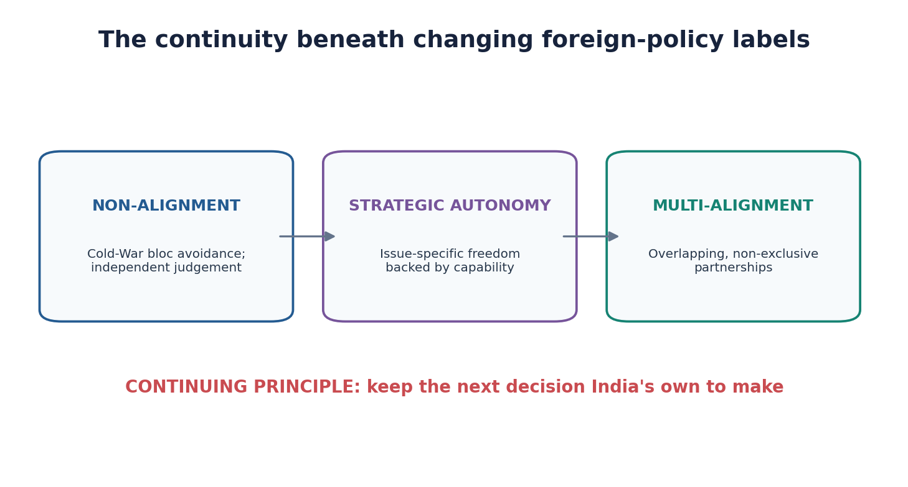
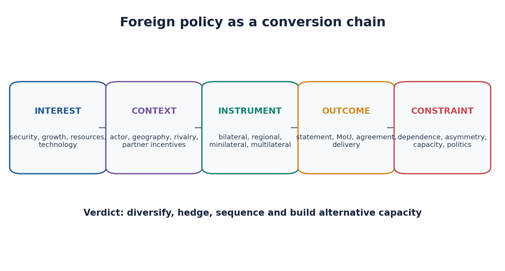
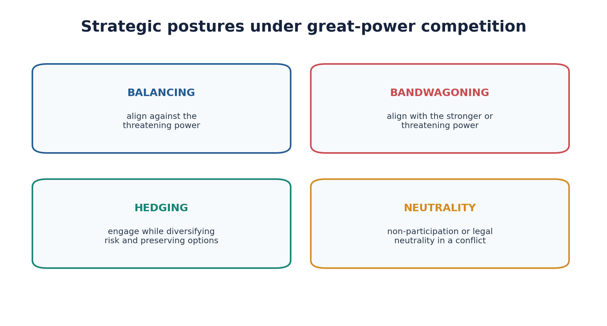
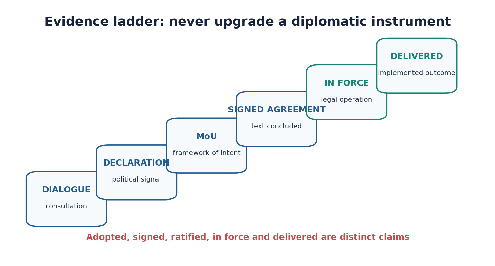
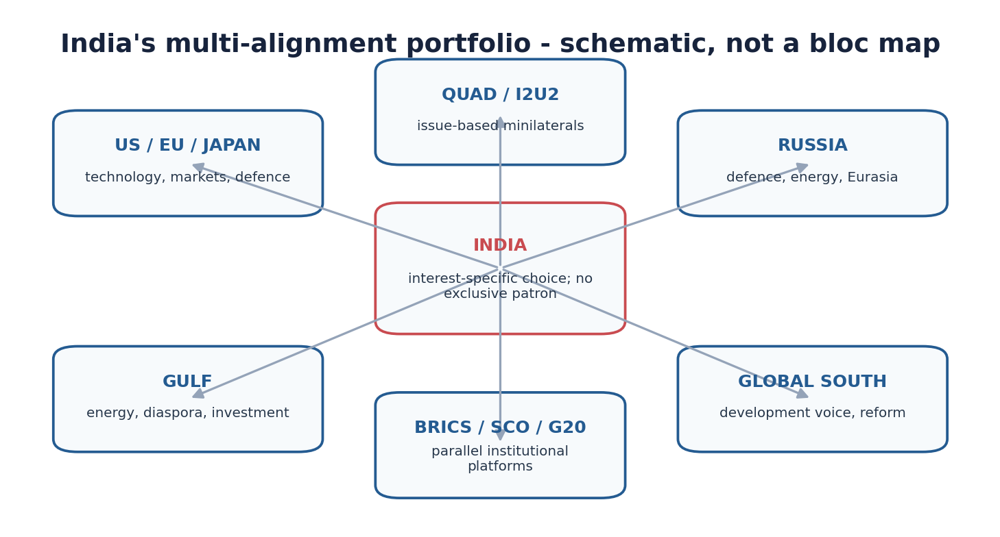
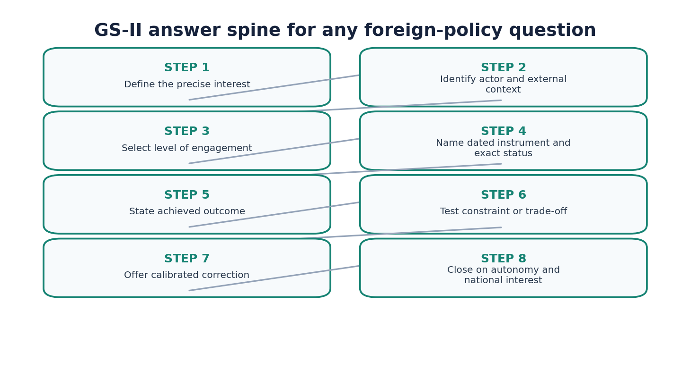

# Foreign-Policy Foundations and Strategic Autonomy - Complete Topic Package

> Subject: International Relations | Paper: GS-II | Topic: 01 | Generated: 14 August 2026
>
> Approval state: generated, approved=false. This rebuild is not approved.

## Package counts, provenance and content-parity baseline

- Previous reusable Markdown baseline: 64,032 words.
- Previous main-PDF extracted teaching baseline after removing repeated headers/footers: 39,493 words.
- Previous workbook extracted baseline after removing repeated headers/footers: 22,568 words.
- Direct topic-owned verified PYQs: zero; the package preserves the explicit audit rather than fabricating ownership.
- Closest verified application PYQs: eight Mains and two Prelims items, clearly labelled by their true owning topic.
- Original practice: 32 hard MCQs in strict A -> B -> C -> D rotation, remedials, and 10 solved Mains questions across 10/15/20 marks.
- Source order used: repository Markdown; existing OCR-grounded complete session; live verification only for dated current anchors; Qdrant not used.
- Every solved-answer review section is labelled `Why this earns marks` and uses evidence-linked analysis.

## Original visual asset index

## PART I - Complete learning session

## Package Method, Sources and Roadmap

- Foreign-Policy Foundations and Strategic Autonomy - Complete Learning Session UPSC General Studies Paper II | International Relations | Topic 01 | Syllabus item: "India and its neighbourhood; bilateral, regional and global groupings and agreements involving India and/or affecting India's interests; effect of policies and politics of developed and developing countries on India's interests" Date of session: 10 August 2026 | Progress: 0/10 | Estimated effort: 6-8 sittings | Level: Medium (assumes basic understanding; fast progression; heavy PYQ and current-affairs integration)
- Evidence key used throughout. [FACT] Fact - directly grounded in an authored knowledge file, a local OCR-searchable source book, an official UPSC question paper or answer key, or a live source fetched during this session. [ANALYSIS/CAUTION] Inference - analytical synthesis for exam use; defensible but not a quotation. [UNVERIFIED] Uncertain / not verifiable from available sources - flagged rather than filled in. Current anchor - a dated contemporary item, with its source class stated (official / reputable-media secondary).
- Source-class rule applied throughout. Where an official Government of India page (MEA, PIB, Ministry of Earth Sciences) could not be fetched directly during this session because the server refused the request, the item is marked (secondary) and the reporting outlet is named. No item is upgraded from "reported" to "official" without a fetched official text. Sources actually used for this session. [FACT] Authored Markdown, read in full:
- International-Relations/basic/01 Foreign-Policy-Foundations-and-Strategic-Autonomy.md; International-Relations/advanced/01 Foreign-Policy-Foundations-and-Strategic-Autonomy.md; International-Relations/00 Master-Framework.md; International-Relations/01 Foreign-Policy-Foun dations-and-Strategic-Autonomy Complete-Topic-Package.md. [FACT] Boundary files consulted for scope discipline:
- Polity/basic/National-Integration-and-Foreign-Policy.md (Article 51 is owned by Polity); World-History/basic/15 Cold-War-and-International-Relations.md (Cold-War bloc chronology is owned by World History). [FACT] Local OCR-searchable books, read at the exact pages cited: Rajiv Sikri, Challenges and Strategy: Rethinking India's Foreign Policy (pp. 148, 157, 189/210, 259-260/280-281, 245-247/266, 271-272/292-293, 275/296, 277-278/298-300, 281/302, 288-289/309-310); Shashi Tharoor, Pax Indica (ch. 8 on soft power, ch. 9 on domestic underpinnings and the Pillai Committee, ch. 11 "'Multi-Alignment': Towards a 'Grand Strategy' for India in the
- Twenty-first Century", pp. 281, 293-294); Bipan Chandra, Mukherjee and Mukherjee, India After Independence 1947-2000 (pp. 192, 208, 213, 217). [FACT] Official UPSC question papers read directly from books/: GS-II Mains 2018, 2019, 2020, 2021, 2022, 2023, 2024, 2025; Prelims GS-I 2018, 2020, 2021, 2023, 2024, 2025, 2026; official provisional answer keys for Prelims 2024, 2025, 2026. [FACT] Read-only provenance ledger: PYQ-ROUTING-MAINS-GS1-GS2-ESSAY-2018-2023.md. Live web fetch/search on 10 August 2026 for the window 10 February - 10 August 2026.
- [ANALYSIS/CAUTION] Qdrant was neither required nor consulted; it did not block this session. Roadmap
- WHY DOES A STATE HAVE A FOREIGN POLICY AT ALL?
- national interest -> external conversion problem | +---------------------------+---------------------------+ | |
- WHAT NORMS BOUND IT WHAT HISTORY SHAPED IT
- Art 51 DPSP (Polity owns) Nehru . non-alignment anti-colonialism . sovereign equality NAM . Panchsheel 1954 Panchsheel . peaceful coexistence 1991 diversification | | +---------------------------+---------------------------+ | v
- THE CONTINUING PRINCIPLE
- STRATEGIC AUTONOMY = freedom to decide each
- issue on India's own interest calculus | NOT neutrality . NOT isolation . NOT equidistance | v
- THE OPERATING METHOD
- MULTI-ALIGNMENT and HEDGING (Tharoor)
- balancing vs bandwagoning vs hedging portfolio of non-exclusive engagements | v
- THE TOOLKIT AND ITS LEVELS
- bilateral | regional | minilateral | multilateral | development | diaspora treaty . charter . declaration . MoU . joint statement . dialogue (each a DIFFERENT evidentiary and legal level -- the No.1 trap) | +---------------+---------------+ | |
- WHAT CONSTRAINS THE CHOICE WHERE IT IS APPLIED
- geography . colonial memory US . Russia . EU . Japan . Gulf civilisational identity Quad . BRICS . G20 . Global South economic and defence capacity Neighbourhood First . Act East federal and domestic politics SAGAR -> MAHASAGAR (visions) public opinion . diaspora leadership . bureaucratic capacity | | +---------------+---------------+ | v
- CRITIQUES AND REPLIES
- moralism vs realism . reactive diplomacy . capacity-delivery gap over-hedging / fence-sitting . dependence . asymmetry . inconsistency | v
- COMPARATIVE SYNTHESIS + GS-II ANSWER ARCHITECTURE
- Session Subtopic Core focus 1 Foreign policy as national-interest conversion The seven interest heads; the interest to context to instrument to outcome to constraint chain; why "good relations" is a zero-mark phrase 2 Constitutional and normative foundations Article 51 boundary; anti-colonialism; sovereign equality; peaceful coexistence; Panchsheel exactly (five principles, 29 April 1954 Tibet-region trade agreement); principles versus interests 3 Historical evolution Nehru and non-alignment; what NAM was and was not; method not neutrality; 1962, 1971, 1991 and post-1991 diversification 4 Strategic autonomy
- Precise definition; continuity with non-alignment; difference from neutrality, isolation and equidistance; the autonomy-dependence trade-off Session Subtopic Core focus 5 Multi-alignment and hedging Tharoor's coinage in his own words; balancing vs bandwagoning vs hedging; issue-based engagement; portfolio logic and its amorality charge 6 Instruments and levels Bilateral / regional / minilateral / multilateral / development / diaspora; treaty vs charter vs declaration vs MoU vs joint statement vs dialogue; the legal-status and announcement-delivery traps 7 Strategic culture and domestic determinants Geography; colonial memory; civilisational
- identity; economic capacity; defence dependence; federal and domestic politics; public opinion and diaspora; leadership and bureaucratic capacity 8 Contemporary applications Simultaneous ties with the US, Russia, the EU, Japan and the Gulf; Quad, BRICS, G20, NAM, Global South; Neighbourhood First, Act East, SAGAR and MAHASAGAR as declared visions, not treaties 9 Critiques and constraints Moralism vs realism; reactive diplomacy; capacity-delivery gap; over-hedging and the fence-sitting charge; dependence vulnerabilities; partner asymmetry; normative inconsistency - with replies and a calibrated way forward 10
- Comparative synthesis and UPSC answer architecture The master matrix; graded verdicts; 10/15/20-mark spines; PYQ routing; the vocabulary checklist
- PYQ priority for this topic: [ANALYSIS/CAUTION] Structurally high but nominally zero. Reading every official GS-II Mains paper from 2018
- to 2025 and every available Prelims GS-I paper from 2018 to 2026 produces no question that names strategic autonomy, non-alignment, multi-alignment, Panchsheel or NAM as its subject. This topic is not asked; it is assumed. It supplies the vocabulary, the analytical spine and the caution rules for the twenty-plus IR questions that are asked. The honest statement of this fact - rather than a force-fit - is itself part of the training in Subtopic 10 and in the companion workbook.
- Master mnemonic - "ONE PRINCIPLE, THREE LABELS, FOUR LEVELS, SIX STATUSES." ONE continuing principle (independent, interest-based decision-making) | THREE era-labels (non-alignment to strategic autonomy to multi-alignment) | FOUR levels of engagement (bilateral, regional, minilateral, multilateral) | SIX legal statuses to keep apart (proposed, adopted, signed, ratified, in force, delivered). [ANALYSIS/CAUTION] The single sentence that organises the whole topic: India's foreign policy has changed its partners, its platforms
- and its label three times, and its purpose not once - the purpose being to keep the next decision India's own to make. Every answer in this topic should be able to run backwards from any specific engagement to that one sentence.

## 01. Foreign Policy as National-Interest Conversion

Caption: Original deterministic schematic; not external artwork.

- Progress: 1 / 10 | Stage: Foundation | Subtopic: Foreign Policy as National-Interest Conversion
- ============================================================
- === PRE-TEACH CHECKLIST ==================
- Book context: 00 Master-Framework.md Sections 1 and 3 (the IR results chain and the national-interest matrix) read in full; basic/01 Sections 1-3; Rajiv Sikri, Challenges and Strategy, p. 148 (India's geography, sea lanes and the five-million-strong Gulf diaspora as interest sources) and pp. 277-278/298-299 (the "key strategic choice") consulted directly in the local OCR-searchable copy. CA Search: "India national interest foreign policy budget allocation neighbourhood development partnership February-August 2026" and "Union Budget 2026-27 Ministry of External Affairs allocation".
- CA Found: [FACT] Union Budget 2026-27 (presented 1 February 2026; operative through the whole 10 Feb - 10 Aug 2026 window). The Ministry of External Affairs was allocated Rs 22,118 crore, against a 2025-26 Budget Estimate of Rs 20,516 crore and a Revised Estimate of Rs 21,742 crore. Of the overseas development-partnership portfolio, Rs 4,548 crore is earmarked for immediate neighbours: Bhutan Rs 2,288 crore (the largest single country allocation), Nepal Rs 800 crore, Maldives Rs 550 crore, Mauritius Rs 550 crore, Sri Lanka Rs 400 crore, Myanmar Rs 300 crore, Afghanistan Rs 150 crore
- (up from Rs 100 crore), Bangladesh Rs 60 crore (down from a 2025-26 BE of Rs 120 crore, with a Revised Estimate of Rs 34.48 crore). No allocation was made for the Chabahar Port project, against Rs 100 crore BE and Rs 400 crore RE the previous year. (Source class: reputable-media secondary - The Indian Express, fetched 10 August 2026, reporting the Budget documents. The Union Budget documents themselves are the primary record.)
- =========================================
- VISUAL - The conversion machine: how an interest becomes an outcome
- STAGE 1 STAGE 2 STAGE 3 STAGE 4 STAGE 5
- INTEREST -> CONTEXT -> INSTRUMENT -> OUTCOME -> CONSTRAINT (what India (who/where (which level (what exists (what limits actually wants) it must be and which on paper or or reverses obtained from) document) on the ground) the gain) +--------------+ +----------------+ +---------------+ +---------------+ +---------------+ | security | | neighbour | | bilateral | | joint stmt | | asymmetry | | growth | | major power | | regional | | MoU | | rival power |
- | resources | | region | | minilateral | | agreement | | partner's | | technology | | grouping | | multilateral | | charter | | domestic | | diaspora | | institution | | development | | treaty | | politics | | reputation | | non-state actor| | diaspora/soft | | DELIVERED | | capacity | | rule-shaping | | | | | | project | | geography | +--------------+ +----------------+ +---------------+ +---------------+ +---------------+ \ | | | /
- \ | | | / +----------------+--------+-----------+------------------+----------------+ | v
- STAGE 6 : CALIBRATED WAY FORWARD
- diversify . hedge . sequence . build alternative capacity -- WITHOUT binding into one exclusive alliance -- | v
- CLOSE BY RELATING BACK TO AUTONOMY
- [ANALYSIS/CAUTION] Caption. Read left to right, this is a machine, not a list. An answer that names Stage 1 and jumps to Stage 6 is an editorial. An answer that lists Stage 4 documents without Stage 1 is a chronology. The mark difference between a 5/10 and a 9/10 GS-II answer is almost always the presence of Stages 4 and 5 with a date - a named instrument with its exact status, and a named constraint.
- 1. What "national interest" actually means - seven heads, not one [FACT] The master framework defines the national interest not as a slogan but as an enumerable set. The seven heads used across this entire folder are:
- # Interest head What it concretely means Typical evidence you would cite 1 Security Border stability, counter-terrorism cooperation, maritime security, assured defence supply Defence framework agreement; extradition treaty; joint exercise 2 Economic growth Market access, investment, remittance environment, supply-chain position FTA/CEPA; investment-protection agreement; trade data 3 Resources Energy, critical minerals, food, fertiliser, water Long-term LNG contract; critical-minerals partnership # Interest head What it concretely means Typical evidence you would cite 4 Technology Access to controlled or frontier technology; standards participation Technology-transfer clause; export-control-regime membership 5
- Diaspora welfare Protection, mobility, consular access, remittance channel Migration-and-mobility partnership agreement; consular MoU 6 Reputation Credibility as a partner; normative standing; convening power Summit hosting; chairship of a grouping 7 Rule-shaping The ability to write, amend or block the rules others must follow UNSC-reform coalition; standard-setting body membership [FACT] Sikri gives the concrete Indian instantiation of several of these at once when he writes that "India's geographical
- location gives it a dominant position in the heart of the Indian Ocean, with major global energy and trade sea-lines of communication passing very close to India-controlled waters. With a diaspora of 5 million in the Gulf, India has vital interests in, and considerable influence over, this energy-rich region." Geography (Stage 2) generates a security-plus-resources interest (Stage 1) and simultaneously supplies a diaspora instrument (Stage 3).
- [ANALYSIS/CAUTION] The examiner's real test. UPSC almost never asks "what is national interest?". It asks a question whose answer is only strong if the candidate silently classifies the issue under one or two of these seven heads and then argues from there. "India-Africa digital partnership" (GS-II 2025, Q9) is heads 2, 4, 6 and 7. "Energy security ... kingpin of India's foreign policy" (GS-II 2025, Q19) is heads 3, 1 and 5. Naming the head in the first line converts a descriptive answer into
- an analytical one. 2. Interest is not preference, and it is not friendship [ANALYSIS/CAUTION] Three precision distinctions that separate a mature script from a school essay:
- PREFERENCE vs INTEREST what a government what the state would still want of the day would like under a different government e.g. a particular e.g. assured energy supply at a partner's favour price India can absorb FRIENDSHIP vs INTEREST CONVERGENCE warmth of rhetoric overlap of pay-offs on a and of ceremony SPECIFIC issue, which can be partial and time-bound POSITION vs INTEREST the stated stance on the underlying need the stance a resolution or vote is trying to protect
- [FACT] Sikri's own formulation of the underlying test is unusually blunt and is worth memorising: India is "faced with a key strategic choice - does India want to be co-opted into the existing international structures that have been fashioned by and are dominated by the West in general and the US in particular, or does India see itself as one of the 'poles' in a multi-polar world?" That sentence is the interest question stated at the level of the whole system.
- [FACT] He follows it with the sentence that this entire topic exists to unpack: "In today's complicated and fast changing geo-political situation, India has wisely diversified its foreign policy options, but must retain flexibility in order to be able to pursue an independent foreign policy, on which there is an overwhelming national consensus." 3. Why "India should maintain good relations with all countries" earns nothing
- [ANALYSIS/CAUTION] Because it fails at every stage of the machine. It names no interest head, no context, no instrument, no dated outcome and no constraint. Compare:
- Weak formulation Strong formulation "India should maintain good relations with Bhutan." "India's interest in Bhutan is simultaneously security (a Himalayan buffer) and resources (assured hydropower import). It is pursued at the bilateral development-partnership level: [FACT] the Union Budget 2026-27 allocates Rs 2,288 crore to Bhutan, the largest single-country development allocation and the bulk of the Rs 4,548 crore earmarked for immediate neighbours. The constraint is delivery capacity and project-completion lag, not political will." "India follows an independent foreign policy." "India's operating principle is independent, interest-based
- decision-making - a principle whose label has changed three times while its content has not. [FACT] Sikri records that this principle rests on 'an overwhelming national consensus', which is why it survives changes of government." "India is a rising power." "India's rule-shaping interest is currently being exercised through its BRICS chairship for 2026, an agenda-setting role - [ANALYSIS/CAUTION] which is a process asset, not by itself an outcome, and must not be written up as one."
- 4. The budget as evidence: reading money as foreign policy [FACT] The 2026-27 allocation pattern is a rare case where the national interest is visible as a number. Learn the table, because it converts vague "Neighbourhood First" rhetoric into citable evidence. Recipient Union Budget 2026-27 (BE) What it signals [ANALYSIS/CAUTION] Bhutan Rs 2,288 crore Largest allocation; continuity of the deepest development partnership; hydropower-linked Nepal Rs 800 crore Sustained infrastructure and connectivity focus Maldives Rs 550 crore Post-2024 stabilisation of a relationship that had been under strain Mauritius
- Rs 550 crore Indian Ocean and diaspora anchor; the venue of both the SAGAR (2015) and
- MAHASAGAR (2025) articulations
- Sri Lanka Rs 400 crore Continued post-crisis engagement Myanmar Rs 300 crore Connectivity (Kaladan, Trilateral Highway) despite political difficulty Afghanistan Rs 150 crore Up from Rs 100 crore - a calibrated re-engagement, not a recognition decision Bangladesh Rs 60 crore Halved from a Rs 120 crore BE; RE for 2025-26 was Rs 34.48 crore Chabahar Port nil A departure from previous years Immediate neighbours, total Rs 4,548 crore Of a total MEA allocation of Rs 22,118 crore
- Trap, and it is examinable: a budget line is an input, not an outcome. Rs 2,288 crore allocated to Bhutan is not Rs 2,288 crore spent in Bhutan, and it is certainly not a completed project. In an answer, write "allocated in the 2026-27 Budget" - never "invested" or "delivered". [ANALYSIS/CAUTION] Equally important: a reduction is a policy signal but is not, by itself, evidence of a rupture, and a nil entry is not
- evidence of abandonment. The Chabahar nil entry can be described as "no allocation in 2026-27"; it cannot be described as "India has exited Chabahar" on this evidence alone. 5. Core Concept | Example | Exam Link Core concept Indian example Exam link (Prelims + Mains) National interest is an enumerable set of seven heads, not a slogan Gulf: resources + diaspora + security simultaneously (Sikri, ~5 million Indians in the Gulf) Mains: the opening move of GS-II 2025
- Q19 on energy security as the "kingpin" of foreign policy Interests are converted through a five-stage chain Bhutan: security/resources interest to bilateral level to development-partnership instrument to budget allocation and project approvals to delivery-capacity constraint Mains: the universal spine for any "discuss India's relations with X" question Inputs is not outputs is not outcomes Rs 4,548 crore earmarked for immediate neighbours in 2026-27 Prelims: statement questions that quietly upgrade "allocated" to "spent" Autonomy is itself an interest head, not merely a means Sikri's "co-opted or a pole?" framing
- Mains: the closing move of almost every GS-II IR answer [FACT] CA ANCHOR - Union Budget 2026-27, MEA demand for grants (presented 1 February 2026). [FACT] MEA total Rs 22,118 crore; [FACT] Rs 4,548 crore earmarked for immediate neighbours; [FACT] Bhutan Rs 2,288 crore is the single largest country allocation; [FACT] Bangladesh cut to Rs 60 crore; [FACT] no Chabahar allocation. Ministry: Ministry of Finance (Budget) and Ministry of External Affairs (demand). Theme: Neighbourhood First as a financed, not merely declared, policy. (Secondary
- source: The Indian Express, fetched 10 August 2026.) - [ANALYSIS/CAUTION] Analytical use, not decorative use. Cite this table when a question asks about India's neighbourhood policy, development partnership or the credibility of "Neighbourhood First" - it is the cheapest way to move an answer from assertion to evidence. Do not cite it in a question about Cold-War history or about the theory of non-alignment. [FACT] FACTS | [ANALYSIS/CAUTION] INFERENCES [FACT] Facts established in this subtopic
- 1. The seven interest heads used across this folder: security, growth, resources, technology, diaspora, reputation, rule-shaping. 2. Sikri: India has "a diaspora of 5 million in the Gulf" giving it "vital interests in, and considerable influence over, this energy-rich region." 3. Sikri: the "key strategic choice" is between being "co-opted into the existing international structures" and being "one of the 'poles' in a multi-polar world."
- 4. Sikri: India "has wisely diversified its foreign policy options, but must retain flexibility in order to be able to pursue an independent foreign policy, on which there is an overwhelming national consensus." 5. Union Budget 2026-27: MEA Rs 22,118 crore; immediate neighbours Rs 4,548 crore; Bhutan Rs 2,288 crore; Bangladesh Rs 60 crore; Chabahar nil. [ANALYSIS/CAUTION] Inferences drawn (label them as such in an answer) 1. That a budget allocation is an input and cannot be written as an outcome.
- 2. That naming the interest head in the first line is what converts description into analysis. 3. That "friendship" and "interest convergence" are analytically distinct and that examiners reward the distinction. Why UPSC cares | Probable question [ANALYSIS/CAUTION] Why UPSC cares. GS-II IR answers fail in a predictable way: they narrate a relationship instead of analysing a conversion. The syllabus wording itself - "bilateral, regional and global groupings and agreements involving India" - is
- a level-and-instrument wording, not a country-wise wording. The examiner is testing whether the candidate can pick the right level and the right instrument for a stated interest. [ANALYSIS/CAUTION] Probable question (Mains, 10 marks). "India's foreign policy is best understood as a machinery for converting national interest into verifiable external outcomes." Examine this statement with suitable examples. (Answer in 150 words.) UPSC Traps | Mini Recap Trap 1. Treating "national interest" as a single thing. It is at least seven distinguishable heads that can conflict -
- resource security in the Gulf can pull against reputational positioning on a regional conflict. Trap 2. Treating a budget allocation, an MoU or a joint statement as an achieved outcome. Three different evidentiary levels. Trap 3. Assuming that a lower allocation proves a diplomatic rupture. It is a signal that requires corroboration. Trap 4. Writing "India and X enjoy warm and cordial relations" as an opening sentence. It is the single most common zero-value line in GS-II scripts.
- Mini recap. Interest (seven heads) to context (who/where) to instrument (which level, which document) to outcome (with its exact status and date) to constraint (what limits it) to calibrated way forward (diversify, hedge, sequence) to close by relating back to autonomy.
- REVISION NOTES - Subtopic 1
- - Seven interest heads: security, growth, resources, technology, diaspora, reputation, rule-shaping. - Five-stage conversion chain: interest to context to instrument to outcome to constraint, plus a sixth stage, the calibrated way forward. - Four levels of engagement: bilateral, regional, minilateral, multilateral (plus development-partnership and diaspora as cross-cutting instruments). - [FACT] Sikri's binary: co-option into existing structures versus being one of the poles. - [FACT] Sikri's operative sentence: diversify options, retain flexibility, independent foreign policy resting on "an overwhelming national consensus".
- - [FACT] Sikri's Gulf datum: ~5 million Indians in the Gulf give India "vital interests in, and considerable influence over" the region. - Budget 2026-27: MEA Rs 22,118 crore; Rs 4,548 crore for immediate neighbours; Bhutan Rs 2,288 crore; Bangladesh Rs 60 crore; Chabahar nil. - Input is not output is not outcome. Allocated is not spent is not delivered. - Preference is not interest; friendship is not interest convergence; position is not interest. - Never open with "warm and cordial relations". Open with the interest head.
- - [ANALYSIS/CAUTION] Autonomy is simultaneously a means (how India pursues other interests) and an end (an interest head in its own right). Saying both earns a mark.
- MCQ MASTERY LOOP - Subtopic 1
- Q1.1 With reference to the analytical chain used to structure an answer on India's foreign policy, consider the following
- statements:
- I. A Memorandum of Understanding and a summit joint statement represent the same evidentiary level as a ratified treaty. II. A budget allocation to a partner country is an input rather than a delivered outcome. III. Strategic autonomy can function both as a means of pursuing other interests and as an interest in its own right. Which of the statements given above are correct?
- (a) II and III only (b) I and II only (c) I and III only (d) I, II and III Answer: (a). [FACT] II is correct - an allocation is an input; delivery is a separate, separately dated claim. [FACT] III is correct - autonomy appears in the master framework both as a national-interest category and as the method by which other interests are pursued; saying both is a mark-earning move. [WRONG] I is wrong and is the classic legal-status trap: an MoU
- is a statement of intent, a joint statement is a political commitment, and a ratified treaty creates binding obligations. Trap logic: the question rewards a candidate who refuses to collapse three distinct evidentiary levels into one.
- Q1.2 In the Union Budget 2026-27, which one of the following received the largest development-assistance allocation
- among India's immediate neighbours?
- (a) Nepal (b) Bhutan (c) Maldives (d) Sri Lanka Answer: (b). [FACT] Bhutan was allocated Rs 2,288 crore, the largest single-country development allocation, against Nepal Rs 800 crore, Maldives Rs 550 crore and Sri Lanka Rs 400 crore. Trap logic: candidates often assume the largest neighbour by population or economy receives the largest allocation. Development assistance tracks the depth of the development partnership and absorptive commitment, not the partner's size - Bhutan's 13th Five-Year Plan support is the reason.
- Q1.3 Consider the following as heads of national interest used to structure an International Relations answer:
- I. Rule-shaping II. Diaspora welfare III. Reputation IV. Technology access How many of the above are legitimate, separately analysable interest heads rather than mere consequences of economic growth?
- (a) Only two (b) Only three (c) All four (d) Only one Answer: (c). [ANALYSIS/CAUTION] All four are separately analysable. Rule-shaping (the ability to write or block rules) is distinct from growth; diaspora welfare generates its own instruments (consular and mobility agreements); reputation generates convening and chairship behaviour; technology access generates export-control and standards diplomacy that money alone cannot buy. Trap logic: the distractor invites the reductionist assumption that everything in foreign policy is "really" economics - which produces one-dimensional answers.

## 02. Constitutional and Normative Foundations

- Progress: 2 / 10 | Stage: Foundation | Subtopic: Constitutional and Normative Foundations - Article 51,
- Anti-Colonialism, Sovereign Equality and Panchsheel
- ============================================================
- === PRE-TEACH CHECKLIST ==================
- Book context: Polity/basic/National-Integration-and-Foreign-Policy.md consulted for the Article 51 boundary - that file records "Foreign-policy basis: Article 51 (DPSP)" and "Panchsheel = 5 principles, 1954 Indo-China treaty (Nehru-Zhou Enlai)", and Polity owns the doctrinal detail of Article 51, so this session states the boundary and does not duplicate DPSP doctrine. Bipan Chandra, India After Independence, p. 192 (the five principles set out verbatim) and p. 208 (the 1954 treaty context) and p. 217 (the 1972 Shanghai Communique echo) read directly in the
- local OCR-searchable copy. basic/01 Section 2 and advanced/01 Section 4 read in full. CA Search: "Panchsheel principles of peaceful coexistence invoked India joint statement February-August 2026"; "sovereign equality non-interference India statement 2026"; "India Arab League Delhi Declaration sovereignty rule of law". CA Found: [FACT] Second India-Arab Foreign Ministers' Meeting, New Delhi, 31 January 2026 - the first such ministerial hosted by India, ten years after the first in Manama, Bahrain (2016); co-chaired by the External Affairs
- Minister with the Arab side, attended by the Secretary-General of the League of Arab States; a "Delhi Declaration" was adopted, with reaffirmation of peace, the rule of law and respect for sovereignty. [ANALYSIS/CAUTION] This is the closest live instance of Panchsheel-family vocabulary (sovereignty, non-interference, mutual benefit) surviving into a 2026 outcome document. Date caution: 31 January 2026 falls just before the 10 February - 10 August 2026 window and is therefore taught as
- immediately-preceding context, not as an in-window item. (Source class: an MEA bilateral-documents entry titled "Delhi Declaration of the Second India-Arab Foreign Ministers' Meeting, January 31, 2026" exists; the MEA page could not be fetched directly during this session, so the content description is secondary - UAE Ministry of Foreign Affairs media note and Indian media reports.)
- =========================================
- VISUAL - The two-layer foundation: what binds, what guides
- LAYER A : CONSTITUTIONAL (domestic law, non-justiciable)
- +--------------------------------------------------------------+ | ARTICLE 51, PART IV, DIRECTIVE PRINCIPLES OF STATE POLICY | | "Promotion of international peace and security" | | The State shall endeavour to -- | | (a) promote international peace and security | | (b) maintain just and honourable relations between nations | | (c) foster respect for international law and treaty | | obligations in the dealings of organised peoples | | with one another | | (d) encourage settlement of international disputes by | | arbitration | | |
- | CHARACTER : a DIRECTIVE. Non-justiciable. It orients; it | | does not compel a particular treaty, vote or partner. | | >>> POLITY OWNS THE DOCTRINAL DETAIL AND THE CASE LAW <<< | +--------------------------------------------------------------+ | | orients, does not determine v
- LAYER B : NORMATIVE / DECLARATORY (international vocabulary)
- +--------------------------------------------------------------+ | ANTI-COLONIALISM -- solidarity with decolonising states | | SOVEREIGN EQUALITY -- small state = large state in rights | | NON-INTERFERENCE -- no dictation of internal affairs | | PEACEFUL COEXISTENCE -- difference of system is not casus | | belli | | | | CODIFIED AS : PANCHSHEEL, 29 APRIL 1954 | | in the PREAMBLE of the India-China Agreement on Trade and | | Intercourse between the Tibet Region of China and India | | |
- | CHARACTER : normative reference. NOT a treaty of its own; | | NOT a constitutional provision; NOT identical to | | non-alignment. | +--------------------------------------------------------------+ | v
- LAYER C : WHAT ACTUALLY DECIDES -> INTEREST (Subtopic 1)
- Layers A and B supply LANGUAGE, LEGITIMACY and LIMITS. They do not supply the DECISION. [ANALYSIS/CAUTION] Caption. The commonest conceptual error in this topic is to treat Layer B as if it were Layer A (binding) or Layer C (decisive). It is neither. Panchsheel is a vocabulary of legitimation; Article 51 is a non-justiciable orientation; the decision is made in Layer C and then expressed in the language of Layers A and B.
- 1. Article 51 - the boundary, stated precisely and then left to Polity [FACT] What this session asserts, and no more. Article 51 sits in Part IV (Directive Principles of State Policy) and is titled "Promotion of international peace and security". Its four clauses direct the State to endeavour to (a) promote international peace and security; (b) maintain just and honourable relations between nations; (c) foster respect for international law and treaty obligations in the dealings of organised peoples with one another; and (d) encourage
- settlement of international disputes by arbitration. [FACT] The boundary. Polity/basic/National-Integration-and-Foreign-Policy.md is the owning file: it records that India's foreign policy "flows from Art 51 (DPSP)" and it also owns treaty-ratification procedure and the Union List/Article 253 machinery. This IR session therefore does not teach DPSP justiciability doctrine, the Article 253 legislative route, or the case law. In an answer, one sentence of Article 51 is the correct dose; three paragraphs of DPSP doctrine in a GS-II IR answer is a scope error that costs marks.
- [ANALYSIS/CAUTION] The analytical point that IR does own. Article 51 is permissive and orienting, not directive of outcomes. It is entirely compatible with:
- - refusing to sign the NPT (India has consistently declined) - because Article 51(c) speaks of respect for international law and treaty obligations, i.e. obligations one has accepted, not obligations one must accept; - buying weapons from a state that another partner sanctions; - simultaneously being in the Quad and in BRICS. Trap: "Article 51 makes non-alignment a constitutional obligation." [WRONG] False. Article 51 is a non-justiciable Directive Principle that speaks of peace, honourable relations, international law and arbitration. It nowhere mentions
- alignment, blocs or alliances. Non-alignment was a policy, adopted and adaptable; Article 51 is a directive, general and orienting. 2. The four normative commitments and where each came from Commitment Content Origin in Indian practice Contemporary survival [ANALYSIS/CAUTION] Anti-colonialism Colonial rule is illegitimate; independence struggles deserve support [FACT] Sikri: "from the very beginning, India's foreign policy concerned itself not only with India's narrow national interests, but also how it would impact other colonies in Asia and Africa"; [FACT] Bipan Chandra records the Asian Relations
- Conference (March 1947, on Nehru's inspiration), the conference on Indonesia, the Colombo conference of 1954 and the Afro-Asian conference at Bandung (1955) Survives translated into Global South framing and demands for institutional-voice reform Sovereign equality A small state's rights are not smaller than a large state's [FACT] Bipan Chandra's account of Panchsheel's second and fourth principles Survives as India's standard objection to conditionality and to great-power dictation Non-interference No dictation of another state's internal affairs [FACT] Panchsheel principle three Survives, and is periodically in
- tension with democracy-promotion coalitions India also joins Peaceful coexistence Different political and economic systems can coexist without war [FACT] Panchsheel principle five; [FACT] Bipan Chandra notes Nehru "believed that nobody had a monopoly on the truth and pluralism was a fact of life" Survives as the standard Indian argument against bloc formation 3. Panchsheel - the exact five, the exact date, the exact document [FACT] Bipan Chandra's verbatim enumeration (p. 192): Nehru "outlined the five principles of peaceful coexistence, or Panch
- Sheel, for conducting relations among countries. These were mutual respect for each other's territorial integrity and sovereignty, non-aggression, non-interference in each other's internal affairs, equality and mutual benefit, and peaceful co-existence."
- P A N C H S H E E L -- the five, in order
- +-------------------------------------------------------------+ | 1. Mutual respect for territorial integrity and sovereignty | | 2. Mutual non-aggression | | 3. Mutual non-interference in internal affairs | | 4. Equality and mutual benefit | | 5. Peaceful co-existence | +-------------------------------------------------------------+ | | WHERE IT WAS SET OUT v PREAMBLE of the AGREEMENT ON TRADE AND INTERCOURSE BETWEEN
- THE TIBET REGION OF CHINA AND INDIA
- signed 29 APRIL 1954 | >>> This was a TRADE-AND-INTERCOURSE agreement, in which India recognised China's position in Tibet. Panchsheel was its PREAMBULAR language, not a stand-alone treaty. <<< | v LATER ECHO (do not confuse with origin)
- FEBRUARY 1972 : the US and China sign the Shanghai Communique
- declaring their relations to be based on the Five Principles of Peaceful Co-existence. [FACT] Bipan Chandra on the exact treaty context (p. 208): "In 1954, India and China signed a treaty in which India recognized China's rights over Tibet and the two countries agreed to be governed in their mutual relations by the principles of Panch Sheel. Differences over border delineation were discussed at this time but China maintained that it
- had not yet studied the old Kuomintang maps and these could be sorted out later." [FACT] Bipan Chandra's later critical judgement on the same agreement (p. 213) is the material for a balanced answer:
- "Nehru accepted the Chinese position on Tibet in the 1954 Panch Sheel agreement without even getting a quid pro quo on the border, which was possibly a mistake." [FACT] Bipan Chandra on the 1972 echo (p. 217): "In February 1972, the Americans and the Chinese signed the Shanghai Communique which declared their mutual relations to be based on the Five Principles of Peaceful Co-existence - Nehru's Panch Sheel!" Trap cluster on Panchsheel - four separate errors, all examined:
- [WRONG] "Panchsheel was adopted at Bandung in 1955." to It was set out in the preamble of the 29 April 1954 India-China Tibet-region trade agreement. Bandung (1955) was a separate Afro-Asian conference that echoed the spirit. [WRONG] "Panchsheel is a treaty." to It is preambular normative language inside a bilateral trade-and-intercourse agreement. [WRONG] "Panchsheel and non-alignment are the same." to Panchsheel is a set of conduct norms between states; non-alignment is a bloc-avoidance posture. Related, not identical.
- [WRONG] "Panchsheel has six principles" / "four principles". to Five. And note the fourth is the composite "equality and mutual benefit" - candidates who split it into two arrive at six and get the count wrong. 4. Principles versus interests - the false opposition [ANALYSIS/CAUTION] Examiners repeatedly set questions that presuppose a clash between "idealism" and "realism" in Indian foreign policy. The strong answer refuses the premise, and does so with evidence on both sides.
- THE NAIVE FRAMING THE MATURE FRAMING
- +------------------------+ +-------------------------------+ | PRINCIPLES | | PRINCIPLES supply | | vs | --> | LEGITIMACY, COALITION | | INTERESTS | | and PREDICTABILITY | | (one must lose) | | | +------------------------+ | INTERESTS supply | | DIRECTION and PRIORITY | | | | A state with only principles | | is ineffective; a state with | | only interests is friendless. | +-------------------------------+ | v
- THE HONEST QUALIFIER (mark-earning)
- The two DO diverge at the margin, and the divergence must be named, not hidden. [FACT] The evidence that they coexist. Sikri, p. 259-260/280-281: "India's position on world issues was informed by moral clarity and courage, which won India many admirers, made India the leader of the developing countries, and gave it an influence in world affairs out of proportion to its real economic and political strength." That is principle producing interest-return.
- [FACT] The evidence that they diverge. Sikri, in the same passage: "At the same time, India's moralistic posturing as well as its air of self-importance and self-righteousness irritated the Western countries." That is principle imposing an interest-cost. [FACT] The candid admission from the practitioner side. Sikri records (p. 166) that Nehru himself "was candid enough to publicly acknowledge in 1958" that India's traditional policy on Israel was "'not a matter of high principle'" and that "'this
- attitude was adopted after a careful consideration of the balance of factors'". [ANALYSIS/CAUTION] This single citation is worth more in a Mains answer than a paragraph of abstract argument: it is the state's own founder conceding that a position widely read as principled was in fact a balance-of-factors calculation. 5. Core Concept | Example | Exam Link Core concept Indian example Exam link (Prelims + Mains) Article 51 orients, it does not bind to any alignment India's non-signature of the NPT sits
- comfortably with Article 51(c) Prelims:
- DPSP-versus-Fundamental-Rights framing questions (Polity owns); Mains: one sentence, no more, in an IR answer Panchsheel = five principles, 29 April 1954, preamble of the India-China Tibet-region trade agreement Bipan Chandra's verbatim list Prelims: the count, the year, the document type and the Bandung confusion are all live distractors Norms are a vocabulary of legitimation, not a decision rule The "Delhi Declaration" (31 Jan 2026) reaffirming sovereignty and the rule of law Mains: any "does India follow a principled or a realist foreign policy?" question
- Principle and interest are complementary but genuinely diverge at the margin Sikri on "moral clarity" and "moralistic posturing"; Nehru's 1958 admission on Israel policy Mains: the balanced-verdict paragraph that examiners reward [FACT] CA ANCHOR - Second India-Arab Foreign Ministers' Meeting, New Delhi, 31 January 2026 - the first hosted by India; the previous edition was at Manama, Bahrain, in 2016; a Delhi Declaration was adopted. [ANALYSIS/CAUTION] Its reaffirmation of sovereignty, rule of law and mutual benefit is Panchsheel-family vocabulary surviving into a contemporary outcome
- document. Ministry: MEA. Date caution: immediately before the study window, not inside it. (An MEA bilateral-documents entry with this exact title exists; page not directly fetchable in this session - description is secondary.) - [ANALYSIS/CAUTION] How to use it. As one clause of evidence that normative language remains operative in Indian diplomacy - not as evidence of any specific delivered outcome. A declaration is political and normative; it is not legally binding, and it is not a delivered programme. [FACT] FACTS | [ANALYSIS/CAUTION] INFERENCES
- [FACT] Facts 1. Article 51 is a Directive Principle titled "Promotion of international peace and security", with four clauses; Polity owns the doctrine. 2. Panchsheel = five principles: territorial integrity and sovereignty; non-aggression; non-interference; equality and mutual benefit; peaceful coexistence (Bipan Chandra, verbatim). 3. They were set out in the preamble of the India-China Agreement on Trade and Intercourse with the Tibet Region of China, 29 April 1954.
- 4. Bipan Chandra: in that 1954 treaty India recognised China's rights over Tibet; border delineation was discussed but deferred by China. 5. Bipan Chandra: "possibly a mistake" that Nehru accepted the Tibet position "without even getting a quid pro quo on the border." 6. Bipan Chandra: the US-China Shanghai Communique of February 1972 declared relations based on the Five Principles. 7. Sikri: India's moral positions "won India many admirers ... and gave it an influence in world affairs out of proportion
- to its real economic and political strength", while its "moralistic posturing ... irritated the Western countries." 8. Sikri: Nehru in 1958 publicly said the Israel policy was "not a matter of high principle" and was adopted "after a careful consideration of the balance of factors." 9. 31 January 2026: Second India-Arab Foreign Ministers' Meeting, New Delhi; Delhi Declaration adopted. (secondary) [ANALYSIS/CAUTION] Inferences 1. That Article 51 is compatible with the full range of India's actual alignment choices, and therefore cannot be cited as requiring non-alignment.
- 2. That Panchsheel functions today as a vocabulary of legitimation rather than as an operative constraint. 3. That the principle/interest dichotomy is a false binary which nevertheless has a real margin at which the two diverge - and that naming the margin is what earns the mark. Why UPSC cares | Probable question [ANALYSIS/CAUTION] Why UPSC cares. Prelims tests the precision of the Panchsheel facts (count, year, document, the Bandung
- confusion). Mains tests whether the candidate can hold two things at once: that India's normative vocabulary is genuine and that it is instrumentally useful - without collapsing into either cynicism or hagiography. [ANALYSIS/CAUTION] Probable question (Mains, 15 marks). "India's foreign policy has always been described as principled; it has always been conducted as interested." Critically examine this proposition with reference to the normative foundations of Indian diplomacy. (Answer in 250 words.) UPSC Traps | Mini Recap
- Trap 1. Panchsheel at Bandung (1955). to No: 29 April 1954, India-China Tibet-region trade agreement preamble. Trap 2. Panchsheel as a stand-alone treaty. to No: preambular language inside a bilateral agreement. Trap 3. Article 51 as a binding constitutional mandate for non-alignment. to No: a non-justiciable Directive Principle that never mentions alignment. Trap 4. Counting six principles by splitting "equality and mutual benefit". to Five. Trap 5. Treating a Declaration as a legally binding instrument. to It is political and normative.
- Mini recap. Layer A (Article 51 - orienting, non-justiciable, Polity-owned) to Layer B (anti-colonialism, sovereign equality, non-interference, peaceful coexistence; codified as Panchsheel, five principles, 29 April 1954, preamble) to Layer C (interest, which actually decides). Norms give language, legitimacy and limits; interest gives direction.
- REVISION NOTES - Subtopic 2
- - Article 51 = DPSP, Part IV, "Promotion of international peace and security", four clauses: peace and security; just and honourable relations; respect for international law and treaty obligations; settlement of disputes by arbitration. Non-justiciable. Polity owns the doctrine. - Article 51 mentions no alignment, bloc or alliance. It cannot be cited as mandating non-alignment. - Panchsheel = FIVE. Territorial integrity and sovereignty | non-aggression | non-interference | equality and mutual benefit | peaceful coexistence.
- - Date and document: 29 April 1954, preamble of the Agreement on Trade and Intercourse between the Tibet Region of China and India. Nehru-Zhou Enlai. - Bandung = 1955, Afro-Asian conference, called by India and the other Colombo powers. It echoed Panchsheel; it did not originate it. - [FACT] In that 1954 agreement India recognised China's position in Tibet; the border was discussed but deferred by
- China. [FACT] Bipan Chandra: accepting it "without even getting a quid pro quo on the border ... was possibly a mistake." - [FACT] February 1972 Shanghai Communique - the US and China based their relations on the Five Principles. A striking later echo; do not mistake it for the origin. - Four normative commitments: anti-colonialism, sovereign equality, non-interference, peaceful coexistence. - [FACT] Sikri, both sides in one passage: "moral clarity and courage ... influence out of proportion to its real economic and
- political strength" and "moralistic posturing ... irritated the Western countries." - [FACT] Nehru, 1958, on Israel policy: "not a matter of high principle ... after a careful consideration of the balance of factors." - 31 January 2026, New Delhi: Second India-Arab Foreign Ministers' Meeting (first hosted by India; first edition Manama 2016); Delhi Declaration adopted - a declaration, therefore political, not binding. - Layer discipline: A orients | B legitimises | C decides.
- MCQ MASTERY LOOP - Subtopic 2
- Q2.1 With reference to the Panchsheel principles, consider the following statements:
- I. They were jointly enunciated in the preamble of an agreement concerning trade and intercourse with the Tibet region of China. II. They were first adopted at the Afro-Asian Conference held at Bandung. III. They comprise five principles, one of which is "equality and mutual benefit". Which of the statements given above are correct?
- (a) I and III only (b) I and II only (c) II and III only (d) I, II and III Answer: (a). [FACT] I is correct - the preamble of the India-China Agreement on Trade and Intercourse between the Tibet Region of China and India, signed 29 April 1954. [FACT] III is correct - five principles, the fourth being the composite "equality and mutual benefit". [WRONG] II is wrong: the Bandung Afro-Asian Conference was held in 1955, a year
- after Panchsheel was enunciated, and it echoed rather than originated the principles. Trap logic: Bandung is the single most attractive wrong answer in this topic because both events are Nehru-era, both are Asian, and both concern peaceful coexistence - but they are a year and a document apart.
- Q2.2 Article 51 of the Constitution of India, which relates to the promotion of international peace and security, is best
- described as (a) a Fundamental Right enforceable against the Union in matters of treaty-making (b) a Directive Principle of State Policy that orients, but does not legally compel, any particular alignment or treaty choice (c) a Fundamental Duty of every citizen to uphold international law (d) an entry in the Union List conferring exclusive legislative competence on Parliament Answer: (b). [FACT] Article 51 sits in Part IV, is non-justiciable, and directs the State to endeavour to promote peace,
- maintain just and honourable relations, foster respect for international law and treaty obligations, and encourage arbitration. [WRONG] (a) confuses Part III with Part IV. [WRONG] (c) confuses Article 51 with Article 51A, the Fundamental Duties - a deliberately close distractor. [WRONG] (d) confuses the DPSP with the Union List entries and Article 253 machinery (which Polity owns). Trap logic: the near-identical numbering of Article 51 and Article 51A is examined.
- Q2.3 Consider the following statements about the normative vocabulary of India's foreign policy:
- I. A "Declaration" adopted at a ministerial meeting creates binding legal obligations on the participating states. II. Panchsheel and non-alignment are two names for the same doctrine. III. India's normative positions have, on the account of at least one senior practitioner, generated both diplomatic influence and diplomatic irritation. Which of the statements given above is/are correct?
- (a) I only (b) I and II only (c) III only (d) II and III only Answer: (c). [FACT] III is correct - Sikri records both that moral clarity gave India "influence in world affairs out of proportion to its real economic and political strength" and that "moralistic posturing ... irritated the Western countries." [WRONG] I is wrong: a declaration is a political and normative instrument, not a treaty; this is the legal-status gap.
- [WRONG] II is wrong: Panchsheel is a set of interstate conduct norms; non-alignment is a bloc-avoidance posture. Trap logic: the question tests the two commonest conflations in this topic in a single stem - declaration/treaty, and Panchsheel/non-alignment.

## 03. Historical Evolution: Non-Alignment as Method

Caption: Original deterministic schematic; not external artwork.

- Progress: 3 / 10 | Stage: Core | Subtopic: Historical Evolution - Nehru, Non-Alignment, What NAM Was and Was Not,
- and Post-1991 Diversification
- ============================================================
- === PRE-TEACH CHECKLIST ==================
- Book context: Bipan Chandra, India After Independence, pp. 192 (Asian Relations Conference 1947, Colombo 1954, Bandung 1955, Belgrade 1961), 208 (1954 Panchsheel agreement and the 1959 Tibet revolt), 213 (the Maxwell rebuttal and the "possibly a mistake" verdict), 217 (the "lodestar" passage in full, and the USSR relationship from 1954 and the Commonwealth) - all read directly. Rajiv Sikri, Challenges and Strategy, pp. 189/210 (non-alignment as a policy option distinct from the Movement; the Rice-Mukherjee exchange of 2007; Indira Gandhi's 1982 riposte) and pp. 277-278/298
- (the "unipolar world" postulate rejected) read directly. basic/01 Section 3 and advanced/01 Section 3 read in full. World-History/basic/15 Cold-War-and-International-Relations.md consulted only to confirm the boundary:
- World History owns the Cold-War bloc chronology (NATO 1949, Warsaw Pact 1955, Berlin Wall 1961) and explicitly routes India's non-alignment vocabulary back to the Polity and IR files. CA Search: "non-alignment NAM summit 2026 India participation"; "India multipolarity Cold War comparison February-August 2026 official statement". CA Found: [ANALYSIS/CAUTION] No in-window item is itself a development in the history of non-alignment, and none should be manufactured. The genuine live link is a conceptual one and it is dated: [FACT] the 11th Raisina Dialogue, New Delhi, 5-7
- March 2026, organised by the Observer Research Foundation in partnership with the MEA, on the theme "Samskara:
- Assertion, Accommodation, Advancement", inaugurated by the Prime Minister with the President of Finland as chief guest. [ANALYSIS/CAUTION] The theme's triad - assert identity, accommodate difference, advance through refinement - is a contemporary restatement of exactly the posture non-alignment was designed to protect, and it is legitimate to use it as a bridge sentence. (Source class: an MEA press-release entry titled "Raisina Dialogue 2026" exists; direct fetch was refused during this session, so dates, theme and participation are secondary, corroborated across multiple independent reports.)
- =========================================
- VISUAL - The evolution timeline, with the constant running underneath 1947 ------ 1954 ------ 1955 ------ 1961 ------ 1962 ------ 1971 ------ 1991 ------ 1998 ------ 2012 -> 2026 | | | | | | | | | Asian Panchsheel Bandung Belgrade China war Indo-Soviet USSR Pokhran-II 'Multi- Relations 29 Apr Afro- NAM's -- the Treaty of collapses; -- autonomy alignment' Conference (Tibet- Asian first hardest Peace, LPG asserted as the New Delhi region Conf. summit; test of Friendship reforms; at maximum operative
- (on Nehru's trade (India + Nehru with the and Coop. 'Look East' cost label inspiration) agreement) Colombo Nasser doctrine (1971) begins powers) and Tito | | | | | | | | | v v v v v v v v v +---------------------------------------------------------------------------------------------------+ | THE CONSTANT : INDEPENDENT, INTEREST-BASED DECISION-MAKING | | ("not a blueprint ... an approach, a framework, a method, not a straitjacket but a lodestar") | +---------------------------------------------------------------------------------------------------+ | | | | | | | | |
- | | | | | | | | | LABEL: <------------- NON-ALIGNMENT --------------------> <-- STRATEGIC AUTONOMY --> <-- MULTI-ALIGNMENT --> CONTEXT: <----------- BIPOLAR WORLD ---------------------> <-- UNIPOLAR MOMENT ------> <-- MULTIPOLAR -------> [ANALYSIS/CAUTION] Caption. The top row changes; the middle band does not. Every question of the form "is non-alignment still relevant?" is really asking whether the candidate can see the middle band. The correct answer is neither "yes, NAM is
- still central" nor "no, non-alignment is dead" - it is that the institution has lost salience while the principle has been relabelled twice and retained. 1. What Nehru actually said non-alignment was - three elements, not one [FACT] The formulation recorded in the authored knowledge file, in Nehru's own framing, has three parts:
- 1. "India has no military alliances with countries of either bloc" - the negative, bloc-avoidance element. 2. "India has an independent approach to foreign policy" - the positive, decision-autonomy element. 3. "India attempts to maintain friendly relations with all countries" - the relational, engagement element. [ANALYSIS/CAUTION] Read the order. Only the first element is negative. Elements two and three are positive and active. A candidate who defines non-alignment using only element one has defined a quarter of the doctrine and has walked straight into
- the "passivity" trap. 2. Sikri's sharpest distinction - the policy is not the Movement [FACT] Sikri, pp. 189/210, in a passage worth learning close to verbatim: "Non-alignment as a policy option for India, as distinct from the Non-Aligned Movement, was essentially about resisting pressures to join rival camps during the Cold War and about examining foreign policy options on merit. In short, it was about having an independent foreign policy.
- This national consensus remains very strong in India, and has nothing to do with the so-called 'Cold War mentality' as many analysts derisively claim." [FACT] He then supplies the diplomatic incident that dramatises the point: "When US Secretary of State Condoleezza Rice stated in 2007 that non-alignment was 'irrelevant', External Affairs Minister Pranab Mukherjee was compelled to give a swift and fitting riposte to this gratuitous and misplaced remark."
- [FACT] And the earlier one, which is the best one-line quotation in this entire topic: Indira Gandhi, "visiting the US in 1982, she was asked about the so-called 'tilt' in India's foreign policy. Her tart reply was that India stands upright!"
- TWO THINGS THAT SHARE A NAME AND MUST NOT SHARE AN ANSWER
- +-------------------------------+ +--------------------------------+ | NON-ALIGNMENT (the POLICY) | | NAM (the MOVEMENT) | | - a decision rule | | - an institution | | - resist joining camps | | - summits, membership, | | - judge each issue on merit | | declarations, a secretariat | | - INDIA-SPECIFIC | | -adjacent apparatus | | - SURVIVES, relabelled | | - MULTILATERAL, many members | | - Sikri: "national consensus | | - SALIENCE HAS NARROWED |
- | remains very strong" | | - India retains membership as | | | | ONE platform among many | +-------------------------------+ +--------------------------------+ | | +------------------+--------------------+ | "Is non-alignment over?" is TWO questions. Answer them SEPARATELY. That is the mark. 3. Bipan Chandra's decisive characterisation - method, not blueprint [FACT] The passage, p. 217, verbatim and in full: "Non-alignment was not a blueprint for policy, it was an approach, a
- framework, a method, not a straitjacket but a lodestar by which the young nation could steer its course in the dark night. Instead of imposing any rigidity in Indian foreign policy, non-alignment let it evolve to meet the changing needs of Indian society. It did not come in the way of the close relationship that developed with the USSR from 1954 onwards. Nor did it come in the way of India joining the Commonwealth."
- [ANALYSIS/CAUTION] This is the single most useful quotation in the topic, and the reason is structural: the two examples Bipan Chandra chooses - a deepening relationship with one superpower, and membership of an association led by the former colonial power - are precisely the two things that a neutrality reading of non-alignment would have forbidden. He is therefore not merely praising flexibility; he is proving that the doctrine was never neutrality. 4. What non-alignment was NOT - four negations, each with its counter-evidence
- [WRONG] The misreading [FACT] The counter-evidence Neutrality India took positions constantly - on Korea, Suez, apartheid, Namibia, decolonisation. Bipan Chandra records Nehru trying "his best to bring about a settlement in Korea"; India was, on his account, "the first country to apply sanctions [against apartheid South Africa] by breaking-off trade and diplomatic links." Passivity / isolation India convened: the Asian Relations Conference (New Delhi, March 1947); the conference on Indonesia; the Colombo conference (1954); Bandung with the other Colombo powers
- (1955); Belgrade (1961) with Nasser and Tito. Convening is the opposite of withdrawal. Equidistance between the blocs [FACT] Bipan Chandra: it "did not come in the way of the close relationship that developed with the USSR from 1954 onwards." A close relationship with one bloc's leader is definitionally not equidistance. Anti-Westernism [FACT] Bipan Chandra: it "did not come in the way of India joining the Commonwealth." [FACT] Bipan Chandra also records that non-alignment, "by not tying India to any one bloc, enabled her to
- develop economic ties with countries on both sides of the divide as and when she needed. She needed and got capital" - an explicitly instrumental, two-sided economic rationale. 5. The institutional chronology - and the boundary with World History [FACT] Bipan Chandra's chronology, which this session uses only to the extent that it is India's diplomatic history rather than Cold-War bloc chronology:
- - March 1947 - the Asian Relations Conference, held at Nehru's inspiration, before independence. - A conference on Indonesia, whose resolutions went to the UN; "within a week the Security Council resolved that a ceasefire be declared, and the Indonesian national government be restored." - 1954 - the Asian leaders' conference at Colombo. - 1955 - the Afro-Asian conference "called by India and other Colombo powers in Bandung, Indonesia". Bipan
- Chandra: "The conference was also a precursor to the Belgrade Non-aligned Conference, as it passed resolutions on world peace and the dangers of nuclear weapons." - 1961 - "The pinnacle of Nehru's efforts was reached in 1961 when he stood with Nasser of Egypt and Tito of Yugoslavia to call for nuclear disarmament and peace in Belgrade." - 1986 - the AFRICA Fund (Action for Resisting Invasion, Colonialism and Apartheid) set up at the non-aligned
- summit at Harare; by the Belgrade non-aligned summit three years later, "half a billion dollars" had been collected. Boundary discipline, and it is a scoring rule. 00 Master-Framework.md names the "chronology-substitution gap" as a recurring failure: "Cold War/decolonisation history substituted for present-day mandate analysis." World History owns NATO 1949, Warsaw Pact 1955, the Berlin Wall 1961 and the general Cold-War narrative. In a GS-II IR answer, one clause of chronology is correct; a paragraph of it is a subject error.
- 6. The tests the doctrine failed, and the tests it passed [ANALYSIS/CAUTION] A balanced answer must concede the failures explicitly. Examiners can tell the difference between a defence and an advertisement. Episode What it tested [ANALYSIS/CAUTION] Honest verdict 1954 Tibet-region agreement Whether normative language could substitute for a settled border [FACT] Bipan Chandra: accepting the Chinese position "without even getting a quid pro quo on the border ... was possibly a mistake" - a failure of sequencing, not of the doctrine as such 1962
- Whether a non-aligned posture deterred a determined neighbour [ANALYSIS/CAUTION] It did not. But Bipan Chandra's counter-argument is that "it was Chinese imperatives ... that brought them to war, not Indian provocation", and that "the factors that propelled China in the direction of conflict were beyond Nehru's control" - i.e. the causal weight sits partly outside the doctrine 1971 Whether the doctrine permitted a treaty with a superpower [ANALYSIS/CAUTION] It did - and this is decisive evidence that non-alignment was never a prohibition
- on deep bilateral relationships, only on bloc membership 1991 Whether the doctrine survived the disappearance of one bloc [ANALYSIS/CAUTION] The institution's rationale weakened sharply; the principle did not, because the principle was never "there are two blocs" but "the decision is ours" 1998 Whether India would accept externally imposed limits on a strategic capability [ANALYSIS/CAUTION] It did not; [FACT] Sikri notes India's "national consensus that it should definitely preserve its strategic autonomy" and its determination that "its freedom to pursue its strategic nuclear weapons programme
- remains unaffected" [FACT] Sikri also demolishes the lazy post-1991 reading directly: "The postulate that the collapse of the Soviet Union has created a unipolar world to which India must adjust is simplistic, inaccurate and flawed. It unacceptably implies that India's non-alignment was a sham when, in fact, non-alignment was about India having an independent foreign policy." 7. Core Concept | Example | Exam Link Core concept Indian example Exam link (Prelims + Mains) Non-alignment had three elements, two of them positive Nehru's own formulation
- Mains: the definitional paragraph of any question on India's foreign-policy orientation Core concept Indian example Exam link (Prelims + Mains) The policy is distinct from the Movement Sikri's explicit "as distinct from the Non-Aligned Movement" Mains: "Is non-alignment relevant today?" - answer as two questions It was a method, not a blueprint Bipan Chandra's "lodestar ... not a straitjacket"; USSR from 1954; Commonwealth membership Mains, 10 marks: "'Non-alignment was a method, not a blueprint.' Explain." The doctrine permitted deep bilateral relationships
- 1971 Indo-Soviet Treaty; economic ties on both sides of the divide Mains: the rebuttal paragraph against the neutrality misreading Chronology belongs to World History Bandung 1955, Belgrade 1961 Mains: one clause, not a paragraph - scope discipline is itself examined [FACT] CA ANCHOR - 11th Raisina Dialogue, New Delhi, 5-7 March 2026 - theme "Samskara: Assertion, Accommodation, Advancement"; organised by ORF with the MEA; inaugurated by the Prime Minister, with the President of Finland as
- chief guest. Ministry: MEA (partner). [ANALYSIS/CAUTION] Analytical use: the three-word triad is a serviceable contemporary gloss on what non-alignment was for - assert an independent position, accommodate difference rather than demand conformity, advance by refining rather than by aligning. Use it as a bridge sentence, clearly marked as a conceptual parallel. Do not claim any specific policy outcome from a conference. (Secondary; MEA press-release entry exists but was not directly fetchable.)
- - [ANALYSIS/CAUTION] What must not be claimed. That the Raisina Dialogue produced decisions, agreements or commitments. It is a Track-1.5 conference. Its exam value is vocabulary and agenda, not outcome. [FACT] FACTS | [ANALYSIS/CAUTION] INFERENCES [FACT] Facts 1. Nehru's non-alignment had three elements: no military alliance with either bloc; an independent approach; friendly relations with all countries. 2. Sikri: non-alignment as a policy option is "distinct from the Non-Aligned Movement" and was "about resisting
- pressures to join rival camps ... and about examining foreign policy options on merit." 3. Sikri: Rice called non-alignment "irrelevant" in 2007; Pranab Mukherjee replied. Indira Gandhi, 1982: "India stands upright!" 4. Bipan Chandra: non-alignment was "an approach, a framework, a method, not a straitjacket but a lodestar." 5. Bipan Chandra: it did not obstruct the close USSR relationship "from 1954 onwards" nor Commonwealth membership; it enabled economic ties "with countries on both sides of the divide."
- 6. Chronology: Asian Relations Conference, New Delhi, March 1947; Colombo conference 1954; Bandung 1955; Belgrade 1961 with Nasser and Tito; AFRICA Fund at Harare 1986. 7. Sikri: the unipolar-adjustment postulate is "simplistic, inaccurate and flawed." 8. 11th Raisina Dialogue, 5-7 March 2026, "Samskara: Assertion, Accommodation, Advancement". (secondary) [ANALYSIS/CAUTION] Inferences 1. That defining non-alignment by its negative element alone is what generates the passivity misreading. 2. That the USSR-from-1954 and Commonwealth examples prove, rather than merely illustrate, that non-alignment was not neutrality.
- 3. That "is non-alignment over?" must be split into an institutional question and a principled question. Why UPSC cares | Probable question [ANALYSIS/CAUTION] Why UPSC cares. This is the subtopic where candidates most often reproduce a coaching-note caricature. The examiner is looking for a candidate who can quote the doctrine accurately, concede its failures (1954 sequencing, 1962), and still show why the underlying principle survived - because that combination is the signature of someone who has read rather than memorised.
- [ANALYSIS/CAUTION] Probable question (Mains, 10 marks). "Non-alignment was not a blueprint for policy; it was an approach, a framework, a method." Explain this characterisation and assess its relevance to India's contemporary foreign policy. (Answer in 150 words.) UPSC Traps | Mini Recap Trap 1. Non-alignment = neutrality. [WRONG] India took positions constantly and built a deep relationship with the USSR from 1954. Trap 2. Non-alignment = isolation or passivity. [WRONG] India convened conferences from 1947 onwards.
- Trap 3. Conflating the policy with the Movement. [WRONG] Sikri separates them explicitly; the policy survives, the Movement's salience has narrowed. Trap 4. Dating Panchsheel or NAM's founding into each other. [WRONG] Panchsheel 1954 (bilateral agreement preamble); Bandung 1955 (Afro-Asian conference); Belgrade 1961 (first non-aligned summit). Trap 5. Writing a Cold-War history essay in a GS-II IR answer. [WRONG] That is the chronology-substitution gap; World History owns it.
- Mini recap. Three elements, two positive | policy is not Movement | method not blueprint | USSR-1954 and Commonwealth disprove neutrality | 1954 sequencing and 1962 are the honest failures | 1971 proves deep bilateralism was always permitted | 1991 killed the context, not the principle | chronology is World History's.
- MCQ MASTERY LOOP - Subtopic 3
- Q3.1 Which one of the following best captures the distinction drawn by a senior Indian practitioner between
- non-alignment as a policy and the Non-Aligned Movement?
- (a) The policy was multilateral while the Movement was bilateral (b) The policy was a decision rule about resisting camp membership and judging issues on merit; the Movement was an institution whose contemporary salience has narrowed (c) The policy applied only until 1991 while the Movement applies thereafter (d) The policy was legally binding on India while the Movement was voluntary Answer: (b). [FACT] Sikri states it directly: non-alignment "as distinct from the Non-Aligned Movement, was essentially
- about resisting pressures to join rival camps during the Cold War and about examining foreign policy options on merit." [WRONG] (a) inverts the terms. [WRONG] (c) is the "non-alignment ended in 1991" error, which Sikri explicitly rejects. [WRONG] (d) is wrong: a foreign-policy posture is not a legal obligation. Trap logic: the question punishes candidates who treat "non-alignment" and "NAM" as interchangeable - the error that makes the very common question "is non-alignment still relevant?" unanswerable.
- Q3.2 Consider the following statements regarding India's diplomatic chronology:
- I. The Asian Relations Conference was held in New Delhi before India became independent. II. The Bandung Afro-Asian Conference was called by India together with the other Colombo powers. III. The first non-aligned summit at Belgrade preceded the Bandung Conference. Which of the statements given above are correct?
- (a) I and III only (b) I and II only (c) II and III only (d) I, II and III Answer: (b). [FACT] I - the Asian Relations Conference was held in New Delhi in March 1947, before independence, at Nehru's inspiration. [FACT] II - Bipan Chandra records Bandung (1955) as "called by India and other Colombo powers". [WRONG] III reverses the sequence: Bandung (1955) was, on Bipan Chandra's account, "a precursor to the Belgrade
- Non-aligned Conference" (1961). Trap logic: reversal-of-sequence statements are the standard UPSC device for chronology; the defence is to anchor two fixed points (1955, 1961) rather than memorise a list.
- Q3.3 Which of the following are cited as evidence that non-alignment was never a doctrine of neutrality?
- I. India's close relationship with the USSR developing from 1954 onwards II. India's membership of the Commonwealth III. India's ability to obtain capital from countries on both sides of the Cold War divide (a) I and II only (b) II and III only (c) I, II and III (d) I only Answer: (c). [FACT] All three are drawn from the same passage in Bipan Chandra: non-alignment "did not come in the
- way of the close relationship that developed with the USSR from 1954 onwards. Nor did it come in the way of India joining the Commonwealth", and it "enabled her to develop economic ties with countries on both sides of the divide as and when she needed. She needed and got capital." Trap logic: each item alone looks like an anomaly or an exception; together they establish that flexibility was the design, not a deviation from it. Candidates who know only
- one of the three tend to present it apologetically rather than as proof.

## 04. Strategic Autonomy: Meaning and Limits

- Progress: 4 / 10 | Stage: Core | Subtopic: Strategic Autonomy - Precise Definition, Continuity, and the
- Autonomy-Dependence Trade-off
- ============================================================
- === PRE-TEACH CHECKLIST ==================
- Book context: Rajiv Sikri, Challenges and Strategy, pp. 175/196 (terms that "would compromise India's strategic autonomy"; the NSSP of January 2004), 184/205 (the national consensus to "preserve its strategic autonomy" and keep the weapons programme "unaffected"), 195/216 (the charge that the nuclear deal compromised strategic autonomy "could find a resonance among the electorate"), 279/300 ("India must keep its foreign policy options open. These will increase if it can build and retain its strategic autonomy") read directly. advanced/01 Sections 2, 5 and 6 read in full;
- 00 Master-Framework.md Section 4 (the strategic-autonomy framework diagram) read in full. CA Search: "strategic autonomy India statement February March 2026 Jaishankar"; "India strategic autonomy Munich Security Conference 2026"; "India Russia oil share strategic autonomy cost 2026". CA Found: [FACT] A directly quoted, in-window, on-topic anchor - the best in this entire session. On Saturday 14 February 2026, at the 62nd Munich Security Conference (13-15 February 2026), External Affairs Minister S. Jaishankar, speaking at an event on India and Germany navigating global uncertainty alongside the German Foreign
- Minister, denied that India's strategic autonomy had been impacted by claims that India was reducing the share of Russian oil in its energy import mix on account of the recent trade agreement with the United States. His words, as reported: "We are very much wedded to strategic autonomy." (Source class: The Hindu, published 14 February 2026, fetched directly during this session - the strongest-verified item in the whole package.) [FACT] The corroborating data point,
- also fetched directly: The Hindu, 6 June 2026 - Russia's share in the value of India's oil imports rose to an 11-month high of nearly 38% in April 2026, against the backdrop of the West Asia crisis, accompanied by a 425% jump in the premium Russia was charging, in contrast to the discount previously offered.
- =========================================
- VISUAL - Strategic autonomy against its four impostors
- WHAT STRATEGIC AUTONOMY IS
- +-------------------------------------------------------------+ | The RETAINED CAPACITY to decide each external issue by | | India's OWN interest calculus rather than by the discipline | | of any bloc, patron or partner -- | | EVEN WHILE deepening any one relationship. | +-------------------------------------------------------------+ | +--------------+-------------+------------+------------------+ | | | | v v v v
- NOT NEUTRALITY NOT ISOLATION NOT EQUIDISTANCE NOT COSTLESSNESS
- +-----------+ +-------------+ +---------------+ +---------------+ | Neutrality| | Isolation | | Equidistance | | Autonomy has | | = refuse | | = withdraw | | = keep all | | a PRICE, and | | to take | | from the | | partners at | | the price is | | sides | | arena | | equal | | sometimes | | | | | | distance | | imposed by a |
- | India | | India | | | | THIRD PARTY | | takes | | convenes, | | India is deep | | | | positions | | chairs, | | with several | | Denying the | | constantly| | hosts | | AT ONCE, and | | price is the | | | | | | UNEQUALLY | | naive answer | +-----------+ +-------------+ +---------------+ +---------------+ | v
- THE ONE REAL LIMIT : AUTONOMY-DEPENDENCE TRADE-OFF
- Deepening ANY single tie beyond a threshold -- especially in defence technology, energy or finance -- narrows the room for the NEXT decision. Autonomy is therefore a RENEWABLE, DEPLETABLE resource, not a permanent status. [ANALYSIS/CAUTION] Caption. Three of the four boxes are definitional errors that cost marks in Prelims-style statements. The fourth is an analytical error that costs marks in Mains: the candidate who asserts autonomy without pricing it writes an advertisement, not an argument. 1. The definition, stated so that it survives cross-examination
- [ANALYSIS/CAUTION] Working definition for an answer: Strategic autonomy is the retained capacity of a state to determine its position on each external issue by reference to its own interest calculus, rather than by reference to the discipline, expectation or permission of any bloc, patron or partner - a capacity that is exercised through, and not against, deep bilateral and plurilateral engagement. Three clauses in that definition are doing work, and each answers a standard objection:
- 1. "Retained capacity" - it is a capacity, not a behaviour. A state can have it and not use it on a given issue; a state can align on ten consecutive issues and still possess it, provided the eleventh remains genuinely open. 2. "Own interest calculus" - this is what distinguishes it from randomness as well as from obedience. 3. "Exercised through, and not against, deep engagement" - this pre-empts the equidistance misreading. Depth is not the enemy of autonomy; exclusivity is.
- 2. The continuity claim - and how to prove it rather than assert it
- THE CONTINUITY ARGUMENT, IN FOUR MOVES
- MOVE 1 : Identify the CONSTANT "independent, interest-based decision-making" Sikri : non-alignment was "in short ... about having an independent foreign policy" MOVE 2 : Identify what CHANGED the EXTERNAL CONTEXT (bipolar -> unipolar moment -> multipolar) and therefore the LABEL and the PARTNER SET MOVE 3 : Show that the constant SURVIVED each change 1971 treaty : deep bilateralism permitted 1991 : bloc disappeared, principle did not 1998 : externally imposed limits refused 2026 : "we are very much wedded to strategic autonomy"
- MOVE 4 : Name the LIMIT honestly the autonomy-dependence trade-off, with a priced example [FACT] Move 1 evidence. Sikri: non-alignment "was essentially about resisting pressures to join rival camps ... and about examining foreign policy options on merit. In short, it was about having an independent foreign policy." [FACT] Move 3 evidence, historical. Sikri on the nuclear question: India "has a national consensus that it should definitely preserve its
- strategic autonomy, and wants to ensure that its freedom to pursue its strategic nuclear weapons programme remains unaffected." [FACT] Move 3 evidence, contemporary and dated. 14 February 2026, Munich: "We are very much wedded to strategic autonomy." [FACT] Move 4 evidence, priced. The additional US duty on specified Indian goods linked to purchases of Russian oil took effect 27 August 2025 and was removed from 7 February 2026; India officially called it
- "unjustified and unreasonable" (4 and 6 August 2025). [ANALYSIS/CAUTION] Autonomy was sustained - and it carried a measurable, time-bound, third-party-imposed market-access cost. 3. Why the term migrated from a domestic-political charge into a doctrine [ANALYSIS/CAUTION] A subtle point that raises an answer above the ordinary. "Strategic autonomy" did not arrive as a government slogan; it entered mainstream Indian usage substantially as a criterion of criticism. [FACT] Sikri, writing in the mid-2000s, uses it that way repeatedly:
- - of the India-US relationship, that a strategic partnership must not be sought on "terms that would compromise India's strategic autonomy"; - of the nuclear deal, that the opposition's "charge that the government has compromised India's strategic autonomy could find a resonance among the electorate"; - and, prescriptively, "India must keep its foreign policy options open. These will increase if it can build and retain its strategic autonomy."
- [ANALYSIS/CAUTION] The analytical yield. Because the term began as a test that governments could fail, it retains an evaluative edge that "non-alignment" had lost by the 1990s. That is precisely why it is useful in a Mains answer: it lets a candidate praise and criticise the same policy in the same paragraph without contradiction. 4. The autonomy-dependence trade-off, stated as a mechanism T = 0 India diversifies partners. Autonomy is HIGH. | | deepens ONE tie for a real gain
- | (technology access / assured supply / capital) v T = 1 Gain realised. Dependence rises. Autonomy still nominally intact. | | the partner acquires LEVERAGE it did not previously have v T = 2 A DIVERGENT issue arises. India's cost of choosing independently is now HIGHER than at T = 0. | +--> if the cost is BEARABLE : autonomy is exercised, and PRICED | +--> if the cost is UNBEARABLE: autonomy has been SPENT, not lost in principle -- but in practice.
- MITIGATIONS (the "way forward" paragraph writes itself from here)
- - supplier diversification across incompatible political blocs - indigenous capability build-up (the only permanent mitigation) - sequencing : take the gain, defer the exclusivity clause - reciprocity conditions written into the agreement itself [FACT] Sikri's own warning, which is the sharpest statement of this mechanism in the local sources: it is "highly debatable whether it is wise for India, which remains heavily dependent on Russian military equipment, to enmesh its military
- planning and systems with those of the US" without reciprocal technology-sharing. [ANALYSIS/CAUTION] Note the structure of the warning: the danger is not dependence on Russia or on the United States considered separately; it is simultaneous structural entanglement with two mutually hostile systems, which converts a hedge into a vulnerability. 5. The 2025-26 sequence as a fully worked example [ANALYSIS/CAUTION] This is the single best worked example available, because every step is dated and the outcome is genuinely mixed rather than triumphant. Date Event
- [ANALYSIS/CAUTION] What it shows 27 August 2025 An additional US duty on specified Indian goods, linked to purchases of Russian oil, takes effect A third party prices India's autonomy 4 and 6 August 2025 India officially calls the measure "unjustified and unreasonable" India contests the pricing without abandoning the position 31 October 2025 The ten-year US-India Major Defense Partnership framework is signed Deepening with one power continues during the friction 4-5 December 2025 The 23rd India-Russia Annual Summit goes ahead in New Delhi
- Deepening with the other power continues simultaneously 6 February 2026 A framework for an interim India-US trade agreement is announced (secondary) The friction is negotiated, not capitulated to 7 February 2026 The additional Russian-oil-linked duty is removed The priced cost is time-bound, not permanent 14 February 2026 [FACT] Jaishankar at Munich: "We are very much wedded to strategic autonomy," rejecting the claim that the trade agreement had reduced India's autonomy The doctrine is publicly reasserted at the moment of maximum doubt
- April 2026 (reported 6 June 2026) [FACT] Russia's share in the value of India's oil imports rises to an 11-month high of nearly 38%, with a 425% jump in the premium charged The behaviour did not follow the predicted capitulation - but the terms of trade worsened [ANALYSIS/CAUTION] The verdict a strong answer would give. Hedging held. It was not free. And the second-order cost migrated from
- tariff to price: India retained the freedom to buy, and paid more for it. That is exactly what an honest account of strategic autonomy looks like - a preserved choice with a visible bill. Extreme caution required here. Reporting in this period is contested. Some secondary reporting asserted that India had committed to cease importing Russian oil; the directly fetched Hindu data for April 2026 shows the Russian
- share in import value at an 11-month high. [UNVERIFIED] This session does not resolve that conflict and does not assert either version as fact. In an answer, cite the fetched data point (share and premium) and the quoted ministerial statement, and avoid characterising any commitment whose text you have not read. 6. Core Concept | Example | Exam Link Core concept Indian example Exam link (Prelims + Mains) Autonomy is a retained capacity, not a pattern of behaviour
- Alignment on ten issues does not forfeit it if the eleventh is open Mains: the definitional paragraph that pre-empts the "India has abandoned autonomy" premise Depth is compatible with autonomy; exclusivity is not Simultaneous US defence framework (Oct 2025) and Russia summit (Dec 2025) Mains: the evidence paragraph for any hedging question Autonomy is priced, and often priced by a third party The additional duty of 27 Aug 2025, removed 7 Feb 2026 Mains: the constraint paragraph - its
- absence is what caps an answer at average The trade-off is structural, not moral Sikri on enmeshing with US systems while dependent on Russian equipment Mains, 15 marks: "Strategic autonomy carries an autonomy-dependence trade-off." Critically examine The doctrine is publicly reasserted at moments of doubt 14 Feb 2026, Munich Mains: the dated contemporary citation that lifts an answer out of the generic [FACT] CA ANCHOR - [FACT] 14 February 2026 - 62nd Munich Security Conference (13-15 February 2026). External Affairs Minister S.
- Jaishankar, at an event on India and Germany navigating global uncertainty with the German Foreign Minister, denied that India's strategic autonomy had been impacted by claims that it was reducing Russian oil in its import mix owing to the recent trade agreement with the United States: "We are very much wedded to strategic autonomy." Ministry: MEA. Theme: the doctrine restated, by name, at the exact moment it was being questioned. (The Hindu, 14 February 2026 - fetched directly.)
- - [FACT] April 2026 data (reported 6 June 2026). Russia's share in the value of India's oil imports reached an 11-month high of nearly 38%, amid the West Asia crisis, with a 425% jump in the premium charged, in contrast to the earlier discount. (The Hindu - fetched directly.) - [ANALYSIS/CAUTION] Analytical use. These two items together are the strongest available evidence for the proposition that India's
- autonomy in 2026 is exercised and expensive rather than asserted and free. Use them as a matched pair - statement plus behaviour plus price. [FACT] FACTS | [ANALYSIS/CAUTION] INFERENCES [FACT] Facts 1. Sikri: a strategic partnership must not rest on "terms that would compromise India's strategic autonomy"; the NSSP was announced in January 2004. 2. Sikri: India "has a national consensus that it should definitely preserve its strategic autonomy" and that its nuclear-weapons freedom remain "unaffected".
- 3. Sikri: "India must keep its foreign policy options open. These will increase if it can build and retain its strategic autonomy." 4. Sikri: it is "highly debatable whether it is wise for India, which remains heavily dependent on Russian military equipment, to enmesh its military planning and systems with those of the US" absent reciprocal technology-sharing. 5. 27 August 2025 - additional Russian-oil-linked US duty takes effect; India calls it "unjustified and unreasonable" (4 and 6 August 2025); removed from 7 February 2026.
- 6. 31 October 2025 - ten-year US-India Major Defense Partnership framework signed. 4-5 December 2025 - 23rd India-Russia Annual Summit, New Delhi. 7. 14 February 2026 - Jaishankar at Munich: "We are very much wedded to strategic autonomy." 8. April 2026 - Russia's share in the value of India's oil imports at an 11-month high of nearly 38%; premium up 425%. [ANALYSIS/CAUTION] Inferences 1. That autonomy is a depletable, renewable resource rather than a permanent status.
- 2. That depth is compatible with autonomy and exclusivity is not. 3. That the cost of autonomy in 2025-26 migrated from tariff to price - a second-order effect worth naming. 4. That the term's origin as a criterion of criticism is what gives it contemporary analytical bite. [UNVERIFIED] Explicitly unresolved. Whether any commitment was given regarding future Russian oil purchases. Secondary reporting conflicts with the fetched April 2026 data. This session does not resolve it and neither should an answer.
- Why UPSC cares | Probable question [ANALYSIS/CAUTION] Why UPSC cares. "Strategic autonomy" is the phrase most likely to appear in a candidate's answer and least likely to be defined correctly in it. Examiners can distinguish instantly between a script that uses it as a decoration and one that uses it as a test - the latter names a price, a date and a trade-off. [ANALYSIS/CAUTION] Probable question (Mains, 15 marks). "Strategic autonomy is not neutrality but the freedom to choose, and that
- freedom carries a price." Critically examine with reference to India's engagement with competing major powers since 2025. (Answer in 250 words.) UPSC Traps | Mini Recap Trap 1. Strategic autonomy = neutrality. [WRONG] Neutrality refuses sides; autonomy chooses them, issue by issue. Trap 2. Strategic autonomy = equidistance. [WRONG] India is deep with several partners unequally and simultaneously. Trap 3. Strategic autonomy = a post-1991 invention. [WRONG] It is the same principle Sikri identifies at the heart of
- non-alignment; only the label and the context changed. Trap 4. Strategic autonomy = costless. [WRONG] 27 August 2025 to 7 February 2026 is a dated, priced counter-example. Trap 5. Treating a trade agreement framework as a concluded and ratified trade agreement. [WRONG] A framework announcement is not a signed treaty and is not an in-force one. Mini recap. Retained capacity | own interest calculus | exercised through depth, defeated by exclusivity | not neutrality,
- isolation, equidistance or costlessness | continuity in four moves | trade-off as a T=0 to T=2 mechanism | mitigations = diversify, indigenise, sequence, write in reciprocity.
- MCQ MASTERY LOOP - Subtopic 4
- Q4.1 Which one of the following statements most accurately describes strategic autonomy as the term is used in Indian
- foreign-policy analysis?
- (a) The retained capacity to decide each external issue by India's own interest calculus, exercised through rather than against deep partnerships (b) A policy of maintaining equal distance from all major powers (c) A constitutional obligation flowing from Part IV of the Constitution (d) A refusal to enter into any binding international agreement Answer: (a). [FACT] Autonomy is a capacity, not a behaviour pattern, and it is compatible with - indeed exercised
- through - deep, simultaneous, unequal partnerships. [WRONG] (b) is the equidistance error. [WRONG] (c) confuses a policy doctrine with Article 51, which never mentions alignment. [WRONG] (d) confuses autonomy with isolation; India is party to a very large number of binding agreements. Trap logic: all three distractors are propositions a candidate has probably heard asserted somewhere, which is what makes them effective.
- Q4.2 Consider the following statements regarding the autonomy-dependence trade-off:
- I. Deepening a single partnership can increase the future cost of deciding independently on a divergent issue. II. Supplier diversification and indigenous capability build-up are both mitigations of this trade-off. III. The trade-off implies that India should avoid deep bilateral partnerships altogether. Which of the statements given above are correct?
- (a) II and III only (b) I and II only (c) I and III only (d) I, II and III Answer: (b). [FACT] I states the mechanism correctly. [FACT] II names the two standard mitigations, of which indigenous capability is the only permanent one. [WRONG] III is the over-correction: the trade-off argues for managing depth (sequencing, reciprocity clauses, supplier spread), not for avoiding it - avoidance would be isolation, which forfeits
- the gains autonomy exists to secure. Trap logic: the examiner's favourite distractor in critical-analysis questions is the over-correction, because it sounds appropriately cautious.
- Q4.3 In February 2026, at an international security conference, India's External Affairs Minister publicly reaffirmed
- India's commitment to strategic autonomy in response to claims about changes in India's energy import mix. The conference in question was the (a) Raisina Dialogue (b) Shangri-La Dialogue (c) Munich Security Conference (d) Doha Forum Answer: (c). [FACT] The statement - "We are very much wedded to strategic autonomy" - was made on 14 February 2026 at the 62nd Munich Security Conference (13-15 February 2026), at an event on India and Germany navigating
- global uncertainty, alongside the German Foreign Minister. [WRONG] (a) The Raisina Dialogue is India's own flagship conference and was held in New Delhi on 5-7 March 2026 on the theme "Samskara" - a genuine event, but three weeks later and in a different country. [WRONG] (b) and (d) are plausible-sounding forums not associated with this statement. Trap logic: two real, closely spaced, correctly named conferences in the same window is exactly how
- UPSC constructs a current-affairs distractor; the defence is to attach one fact to one date.

## 05. Multi-Alignment and Hedging

Caption: Original deterministic schematic; not external artwork.

- Progress: 5 / 10 | Stage: Core | Subtopic: Multi-Alignment and Hedging - Tharoor's Coinage, the
- Balancing/Bandwagoning/Hedging Triad, and Portfolio Logic
- ============================================================
- === PRE-TEACH CHECKLIST ==================
- Book context: Shashi Tharoor, Pax Indica, Chapter 11, "'Multi-Alignment': Towards a 'Grand Strategy' for India in the Twenty-first Century", pp. 281 and 293-294, read directly in the local OCR-searchable copy - including the full enumeration of paired memberships, the "amoral" and "promiscuous" self-characterisations, the "shifting coalitions of interests" formulation, and the closing "Pax Indica" passage on a "'multi-aligned' India serving as one of the principal fulcrums of a networked globe". advanced/01 Section 2 (the hedging/bandwagoning/balancing row) and
- 00 Master-Framework.md Section 3 (Tharoor's framing of multi-alignment as the strategic aim) read in full. CA Search: "India multi-alignment BRICS chairship 2026 Quad simultaneous engagement"; "BRICS Foreign Ministers Meeting New Delhi 2026". CA Found: [FACT] India holds the BRICS Chairship for 2026, having assumed it on 1 January 2026, with the theme, logo and website launched in New Delhi on 13 January 2026 - a fact already recorded in this kit's 00 Master-Framework.md instrument table as a "chairship launch ... process/agenda anchor, not a summit outcome or
- treaty". The declared theme is "Building for Resilience, Innovation, Cooperation and Sustainability" (secondary). [FACT] In-window: the first BRICS Sherpa and Sous-Sherpa meeting under India's chairship was hosted in New Delhi in February 2026, and the BRICS Foreign Ministers' Meeting was held in New Delhi on 14-15 May 2026, chaired by the External Affairs Minister, with foreign ministers and senior representatives of member and partner countries participating. An MEA bilateral-documents entry titled "Chair's Statement and Outcome Document at BRICS Foreign
- Ministers' Meeting (May 15, 2026)" exists. [ANALYSIS/CAUTION] This is the cleanest live illustration of multi-alignment available: India chairs BRICS while its minister speaks from a Munich stage alongside a G7 foreign minister within the same three-month span. (Source class: secondary - Gulf News fetched directly for the FM meeting; MEA pages not directly fetchable.)
- =========================================
- VISUAL - The three postures, and where India actually sits
- A RISING RIVAL POWER APPEARS
- | +---------------------------+---------------------------+ | | | v v v
- B A L A N C I N G B A N D W A G O N I N G H E D G I N G
- +------------------+ +--------------------+ +---------------------+ | align AGAINST | | align WITH the | | engage BOTH; build | | the rising power | | stronger power to | | capability; avoid | | to check it | | share its gains | | exclusive | | | | | | commitment to | | requires a | | requires accepting | | either | | COMMITMENT that | | ITS priorities | | | | is hard to exit | | | | requires CONSTANT |
- | | | | | management and | | classic alliance | | client relationship| | absorbs FRICTION | +------------------+ +--------------------+ +---------------------+ | | | +---------------------------+---------------------------+ | v
- INDIA'S POSTURE TOWARD THE US-CHINA DYNAMIC
- is best described as H E D G I N G -- not balancing, not bandwagoning -- | v
- WHAT HEDGING LOOKS LIKE IN PRACTICE : A PORTFOLIO
- +-----------------------------------------------------------------+ | ISSUE PLATFORM CHOSEN NOT chosen because... | | maritime sec. Quad (non-treaty) alliance would bind | | fin. voice BRICS (chaired 2026) G7 excludes India | | econ. rules G20 NAM lacks leverage | | dev. voice Global South convening G7 is not the audience | | energy Gulf bilaterals + Russia single supplier = risk | | technology US frameworks + EU + Japan one source = capture | +-----------------------------------------------------------------+
- Each row is chosen ON ITS OWN MERITS. That is the whole idea. [ANALYSIS/CAUTION] Caption. Hedging is often taught as "sitting on the fence". The diagram shows why that is exactly wrong: the fence-sitter occupies no row; India occupies every row, and pays a management cost for doing so. The correct criticism of hedging is not that it is passive but that it is expensive and friction-generating - which is Subtopic 9's business. 1. Tharoor's coinage, in his own words
- [FACT] The passage, Pax Indica, p. 293, is the canonical text and is worth reproducing at length because examiners reward its specificity:
- "In such a world, I once suggested, India would move beyond non-alignment to what I dubbed 'multi-alignment'. This would be a world in which India would belong to, and play a prominent role in, both the United Nations and the G20; both the Non-Aligned Movement (reflecting its 200 years of colonial oppression) and the Community of Democracies (reflecting its sixty-five years of democratic development); both the G77 (the massive gathering of over 120
- developing countries) and smaller organizations like IOR-ARC; both SAARC and the Commonwealth; both RIC (Russia-India-China) and BRICS (adding Brazil and South Africa); as well as both IBSA (the South-South alliance of India, Brazil and South Africa) and BASIC (the partnership of Brazil, South Africa, India and China on climate change issues which emerged during the Copenhagen talks). India is the one country that is a member of them all."
- [ANALYSIS/CAUTION] Read the grammar of that list. Every item is a pair, and every pair is a pair of apparent opposites - the developing-country caucus and the democracies club; the South Asian body and the ex-imperial association; the Russia-inclusive triangle and the wider grouping. Tharoor is not saying India joins many things; he is saying India joins things that are supposed to be mutually exclusive, and that the ability to do so is the strategy.
- [FACT] Tharoor's own honesty about the cost, same page, and a genuine gift to a balanced answer:
- "'Multi-alignment', it is true, is at one level an amoral strategy: it would see India making common cause with liberal democracies when it suited India to do so, and dissenting from them when ... it was expedient for India to preserve relationships that the other democracies could afford to jettison. It is also a promiscuous strategy, since it exempts no country from its embrace; China, a potential adversary with which we have a long-standing frontier dispute ...
- nonetheless is a crucial partner in several of these configurations." [FACT] And his definition of the operating method, p. 294:
- "It is a strategy of making and running shifting coalitions of interests, which will require some skilful management of complicated relationships and opportunities - in policy environments that may themselves be unpredictable." [FACT] And his statement of what multi-alignment answers that the alternatives cannot, p. 294:
- "Multi-alignment also constitutes an effective response to the new transnational challenges of the twenty-first century, to which neither autonomy nor alliance offer adequate answers in themselves. An obvious example is dealing with terrorism ... but also shoring up failing states, combating piracy, controlling nuclear proliferation and battling organized crime." [ANALYSIS/CAUTION] That last quotation is the most under-used sentence in this topic. It concedes that autonomy alone is insufficient -
- transnational threats require cooperation that no amount of independence can substitute for. A candidate who cites it demonstrates that they are not merely cheerleading autonomy. 2. The triad, defined so the boundaries hold Posture Definition What it costs Indian instance [ANALYSIS/CAUTION] Balancing Aligning against a rising or threatening power, internally (arms build-up) or externally (alliance), to check it Provokes the target; commitment is hard to exit India's capability build-up on the northern border is internal balancing; India has not undertaken external (treaty) balancing Bandwagoning
- Aligning with the stronger power to share its gains and avoid its wrath Requires accepting the patron's priorities; erodes independent choice India has consistently declined this - see the refusal of NPT-style limits and Sikri's warning on enmeshment Hedging Engaging more than one power on different issues while building independent capability, avoiding exclusive commitment to any Constant management; friction with each partner; ambiguity costs The 2025-26 sequence: US defence framework and Russia summit within five weeks of each other Equidistance (not a real
- posture - a misdescription) Keeping all partners at equal distance - India is deep with several partners unequally; equidistance is what hedging is mistaken for Trap, examined repeatedly: hedging is not the absence of a position. A hedger takes positions - several of them, on different issues, with different partners, at the same time. The fence-sitter takes none. 3. Portfolio logic - why the analogy works and where it breaks [ANALYSIS/CAUTION] Where the portfolio analogy works.
- - Diversification reduces idiosyncratic risk. No single partner's domestic politics can wreck India's whole external position. - Correlation matters more than count. Ten partners who all follow the same lead are one partner. This is why India's engagement with rival poles - not merely with many states - is the load-bearing feature. - Rebalancing is continuous. Weights shift with returns; the 2026 rise in the Russian share of oil-import value is a rebalancing, not a doctrinal statement.
- [ANALYSIS/CAUTION] Where the analogy breaks, and saying so is a mark-earning move. - Assets do not have feelings; partners do. A portfolio manager's holdings do not resent each other. India's do. Tharoor's "skilful management of complicated relationships" is doing the work the analogy cannot. - Some positions are not liquid. A defence-platform dependency built over decades cannot be sold in a quarter. - There is no benchmark index. There is no objective measure of whether India's "portfolio" is outperforming, which is
- why the doctrine is chronically hard to evaluate and chronically easy to criticise. 4. Multi-alignment is not joining everything [ANALYSIS/CAUTION] Three precise negations, all of which appear as Prelims-style distractors:
- MULTI-ALIGNMENT IS NOT ...
- [X] treaty membership of every grouping named -> most of Tharoor's list (NAM, G77, IOR-ARC, IBSA, BASIC, and today Quad and I2U2) are NON-TREATY platforms. Breadth of ENGAGEMENT, not proliferation of ALLIANCES. [X] indifference to the content of a grouping -> India declines what would bind it. The pattern is selective, not indiscriminate. [X] a claim that all engagements are equally deep -> a chairship, a membership, a partner status, an observer status and a dialogue-partner status are FIVE different
- things. The Master Framework calls confusing them the "membership-participation gap". [FACT] The kit's own instrument table makes the last point concrete: BRICS partner countries form a category created at Kazan on 24 October 2024; SCO has observers and dialogue partners. Each is "participation without the rights and obligations of full membership." 5. Core Concept | Example | Exam Link Core concept Indian example Exam link (Prelims + Mains) Multi-alignment = simultaneous membership of apparently opposed pairs Tharoor's list: UN and G20; NAM and
- Community of Democracies; G77 and IOR-ARC; SAARC and Commonwealth; RIC and BRICS; IBSA and BASIC Mains: the definitional paragraph; the pairing structure is the point Hedging is not fence-sitting US Major Defense Partnership framework (31 Oct 2025) and 23rd India-Russia Annual Summit (4-5 Dec 2025) Mains: the rebuttal paragraph in any "India must choose" question It is an amoral and promiscuous strategy, on its author's own account Tharoor, p. 293 Mains: the criticism paragraph - quoting the proponent's own concession is the strongest form of balance
- Autonomy alone cannot solve transnational threats Tharoor, p. 294, on terrorism, piracy, proliferation, failing states Mains: the limits-of-autonomy paragraph Chairship is not membership is not partner status is not observer status India's BRICS chairship 2026; BRICS partner category (Kazan, 24 Oct 2024); SCO observers Prelims: the membership-participation gap is a standard statement-question device [FACT] CA ANCHOR - India's BRICS Chairship 2026. [FACT] India assumed the chairship on 1 January 2026; the theme, logo and website
- were launched in New Delhi on 13 January 2026 (a fact already logged in this kit's instrument table as a process/agenda anchor, not a summit outcome or treaty); the declared theme is "Building for Resilience, Innovation, Cooperation and Sustainability" (secondary). In-window: the first Sherpa/Sous-Sherpa meeting was hosted in New Delhi in February 2026 (secondary); the BRICS Foreign Ministers' Meeting was held in New Delhi on 14-15 May 2026, chaired by the External Affairs Minister (secondary - Gulf News, fetched); an MEA bilateral-documents entry
- titled "Chair's Statement and Outcome Document at BRICS Foreign Ministers' Meeting (May 15, 2026)" exists. - [ANALYSIS/CAUTION] Exactly how to use it, and how not to. [FACT] Use: "In 2026 India chaired BRICS and hosted its Foreign Ministers' Meeting in New Delhi in May, while its External Affairs Minister was simultaneously engaging G7 counterparts at Munich in February - a textbook instance of multi-alignment." [WRONG] Do not use: any claim about what the 18th BRICS
- Summit decided, where it was held or what it produced. [UNVERIFIED] The summit-level outcome is not verifiable from the sources consulted in this session and must not be asserted. [FACT] FACTS | [ANALYSIS/CAUTION] INFERENCES [FACT] Facts 1. Tharoor coined "multi-alignment" in Pax Indica, Chapter 11, and defines it by paired memberships of apparently opposed bodies: UN and G20; NAM and Community of Democracies; G77 and IOR-ARC; SAARC and
- Commonwealth; RIC and BRICS; IBSA and BASIC - "India is the one country that is a member of them all." 2. Tharoor concedes it is "at one level an amoral strategy" and "also a promiscuous strategy, since it exempts no country from its embrace." 3. Tharoor: it is "a strategy of making and running shifting coalitions of interests." 4. Tharoor: it answers transnational challenges "to which neither autonomy nor alliance offer adequate answers in themselves."
- 5. Tharoor's closing vision: "a 'multi-aligned' India serving as one of the principal fulcrums of a networked globe, in which countries pursue different interests in different configurations." 6. BRICS partner-country category was created at Kazan on 24 October 2024; SCO has observers and dialogue partners - participation without full membership. 7. India assumed the BRICS chairship on 1 January 2026; theme/logo/website launched 13 January 2026; BRICS FMs met in New Delhi 14-15 May 2026. (secondary) [ANALYSIS/CAUTION] Inferences
- 1. That the pairing structure of Tharoor's list, not its length, is the analytical content. 2. That hedging's correct criticism is expense and friction, not passivity. 3. That the portfolio analogy illuminates diversification and correlation but fails on partner resentment, illiquidity and the absence of a benchmark. Why UPSC cares | Probable question [ANALYSIS/CAUTION] Why UPSC cares. GS-II questions frequently present India with an implied binary - align with the West, or with
- the East; choose the Quad or BRICS. The examiner is testing whether the candidate can refuse a false binary with evidence, and whether they can then state honestly what the refusal costs. [ANALYSIS/CAUTION] Probable question (Mains, 15 marks). Distinguish hedging from balancing, bandwagoning and equidistance. Illustrate, with dated examples, India's simultaneous engagement with competing major powers, and assess the sustainability of this posture. (Answer in 250 words.) UPSC Traps | Mini Recap Trap 1. Multi-alignment = alliance membership everywhere. [WRONG] Most listed platforms are non-treaty.
- Trap 2. Hedging = fence-sitting. [WRONG] The hedger occupies every row; the fence-sitter occupies none. Trap 3. Balancing and hedging as synonyms. [WRONG] Balancing aligns against; hedging engages both. Trap 4. Treating chairship as leadership authority. [WRONG] A chairship sets an agenda; it does not bind members. Trap 5. Treating "partner country", "observer" and "member" as the same. [WRONG] The membership-participation gap. Mini recap. Tharoor's paired list | amoral and promiscuous, by his own admission | shifting coalitions of interests |
- answers what neither autonomy nor alliance can | triad of balancing / bandwagoning / hedging, with equidistance as the impostor | portfolio logic and its three breaking points | five distinct participation statuses.
- MCQ MASTERY LOOP - Subtopic 5
- Q5.1 The concept of "multi-alignment" as articulated in Pax Indica is best understood as
- (a) simultaneous, prominent participation in groupings that are conventionally regarded as mutually exclusive, with each engagement pursued on its own merits (b) formal alliance membership in every major security bloc (c) a policy of neutrality between competing great powers (d) the replacement of bilateral diplomacy by multilateral diplomacy Answer: (a). [FACT] Tharoor's own enumeration is structured as pairs of opposites - the NAM and the Community of Democracies, the G77 and IOR-ARC, SAARC and the Commonwealth, RIC and BRICS, IBSA and BASIC -
- culminating in "India is the one country that is a member of them all." [WRONG] (b) is wrong: most of those platforms are non-treaty. [WRONG] (c) is the neutrality error. [WRONG] (d) is wrong: multi-alignment operates at every level, and Tharoor's own account is emphatic that bilateral relationships remain central. Trap logic: (b) is attractive because "multi" suggests "many alliances"; the correct reading is "many non-exclusive engagements".
- Q5.2 Consider the following statements about India's posture toward the US-China dynamic:
- I. It is best characterised as bandwagoning with the stronger power. II. It is best characterised as hedging. III. Hedging entails engaging more than one power on different issues while avoiding exclusive commitment to any. Which of the statements given above is/are correct?
- (a) I and III only (b) II and III only (c) I only (d) III only Answer: (b). [FACT] II - India's posture is hedging: deep, simultaneous, non-exclusive engagement, evidenced by the ten-year US-India Major Defense Partnership framework signed on 31 October 2025 and the 23rd India-Russia Annual Summit on 4-5 December 2025. [FACT] III correctly defines hedging. [WRONG] I describes bandwagoning, which India has consistently declined - Sikri's warning against enmeshing India's military planning with US systems is the
- classic statement of that refusal. Trap logic: the pairing of a wrong characterisation (I) with a correct definition (III) tests whether the candidate can hold definition and application apart.
- Q5.3 With reference to participation categories in international groupings, consider the following:
- I. A "partner country" category in BRICS was created at the Kazan Summit. II. Observer status in the SCO confers the same rights and obligations as full membership. III. Holding the annual chairship of a grouping confers the power to bind other members to the chair's agenda. How many of the statements given above are correct?
- (a) All three (b) Only two (c) Only one (d) None Answer: (c). [FACT] Only I is correct - the BRICS partner-country category was created at Kazan on 24 October 2024. [WRONG] II is the membership-participation gap: observer and dialogue-partner statuses are explicitly "participation without the rights and obligations of full membership." [WRONG] III is the chairship error: a chairship is an agenda and process anchor; it confers convening and sequencing influence, not binding authority - which is why India's 2026 BRICS chairship
- should be described as a process asset. Trap logic: all three statements concern "how much authority does this status carry", and two of them silently inflate it.

## 06. Instruments, Levels and Legal Status

Caption: Original deterministic schematic; not external artwork.

- Progress: 6 / 10 | Stage: Core | Subtopic: Instruments and Levels - From Bilateral to Multilateral, and the Legal Status
- of Every Document India Signs
- ============================================================
- === PRE-TEACH CHECKLIST ==================
- Book context: 00 Master-Framework.md Sections 2 (levels of engagement), 5 (the bilateral/regional/multilateral instrument table, in full, with all thirteen instrument rows and their binding characters), 6 (source hierarchy) and 7 (the nine recurring analytical gaps) read in full - this subtopic is essentially the teaching of Sections 5 and 7. basic/01 Section 4 read in full. Shashi Tharoor, Pax Indica, Chapter 9, on David Malone's observation that India's overburdened Foreign Service spends too much time "negotiating memoranda of understanding of no great significance", read directly.
- CA Search: "BBNJ agreement entry into force January 2026 India ratification status"; "India Bhutan development cooperation talks line of credit 2026"; "MoU signed India 2026 legal status". CA Found: [FACT] Two clean, dated, in-or-near-window instrument examples, each at a different legal level. (i) [FACT] The BBNJ Agreement (Agreement on Marine Biological Diversity of Areas Beyond National Jurisdiction, under UNCLOS) entered into force on 17 January 2026 after the 60-ratification threshold was crossed; India signed on 25 September
- 2024 and, as recorded in this kit's instrument table, had not deposited its instrument of ratification. [ANALYSIS/CAUTION] In-window follow-through: the Ministry of Earth Sciences ran a public consultation on a draft BBNJ Bill, 2026 to build the domestic legislative framework that ratification requires (secondary; the MoES consultation PDF could not be fetched directly in this session). This is a textbook signature-versus-ratification case, entirely in period. (ii) [FACT] The fifth India-Bhutan Development Cooperation Talks (April 2026, co-chaired by the Foreign Secretary and his Bhutanese counterpart)
- approved 12 new Project Tied Assistance projects worth Rs 332 crore (taking the 13th Five-Year-Plan total to 82 PTA projects worth Rs 6,860 crore), exchanged a Rs 4,000 crore concessional line of credit between the Export-Import Bank of India and Bhutan's Ministry of Finance, exchanged an MoU between AIIMS and Khesar Gyalpo University of Medical Sciences, handed over 45 electric vehicles, and virtually inaugurated the Thimphu Ecological Park and Olakha Park.
- [ANALYSIS/CAUTION] Four different instrument types and three different completion states in one meeting - the perfect teaching case. (Source class: secondary - The Economic Times, fetched directly, reporting a social-media statement by the Embassy of India in Bhutan.)
- =========================================
- VISUAL - The instrument ladder: six rungs of bindingness MOST BINDING ^ | +-------------------------------------------------------+ | | 6. TREATY / AGREEMENT IN FORCE | | | binds the parties that have deposited ratification | | | e.g. BBNJ Agreement, in force 17 Jan 2026 -- BUT | | | binding only on those who ratified. India signed | | | 25 Sep 2024; ratification NOT deposited. | | +-------------------------------------------------------+ | +-------------------------------------------------------+ | | 5. CHARTER IN FORCE |
- | | binds member states once in force | | | e.g. BIMSTEC Charter, in force 20 May 2024 | | +-------------------------------------------------------+ | +-------------------------------------------------------+ | | 4. SIGNED-BUT-NOT-YET-IN-FORCE INSTRUMENT | | | signature = intent + duty not to defeat object; | | | NOT yet an obligation to perform | | +-------------------------------------------------------+ | +-------------------------------------------------------+ | | 3. DECLARATION / JOINT STATEMENT / VISION DOCUMENT | | | POLITICAL and NORMATIVE. Not legally binding. | | | e.g. BRICS Rio Declaration (6-7 Jul 2025); |
- | | India-Maldives Vision (7 Oct 2024); | | | Delhi Declaration (31 Jan 2026) | | +-------------------------------------------------------+ | +-------------------------------------------------------+ | | 2. MEMORANDUM OF UNDERSTANDING (MoU) | | | STATEMENT OF INTENT. Not self-executing. | | | e.g. IMEC MoU (9 Sep 2023, eight signatories) | | | -- a FRAMEWORK OF INTENT, not an operating | | | corridor | | +-------------------------------------------------------+ | +-------------------------------------------------------+ | | 1. DIALOGUE MECHANISM / CHAIRSHIP / PARTNER STATUS |
- | | PROCESS. No binding output by itself. | | | e.g. India-Central Asia Dialogue (4th, 6 Jun 2025);| | | BRICS India Chairship 2026 | | +-------------------------------------------------------+ v
- LEAST BINDING
- ============================================================ AND, CUTTING ACROSS ALL SIX, A SEPARATE AXIS ENTIRELY:
- ============================================================ ANNOUNCED -> FINANCED -> UNDER CONSTRUCTION -> DELIVERED A project can be at rung 6 and still be undelivered. A project can be delivered with no instrument above rung 2.
- LEGAL STATUS AND DELIVERY STATUS ARE INDEPENDENT VARIABLES.
- [ANALYSIS/CAUTION] Caption. Almost every avoidable factual error in a GS-II IR answer is a movement up this ladder that the evidence does not support: signature written as ratification, MoU written as agreement, declaration written as treaty, announcement written as delivery. Learning the ladder is worth more marks than learning ten more country facts. 1. The four levels of engagement, and how to choose between them [FACT] From 00 Master-Framework.md Section 2:
- Level Character Typical instrument [ANALYSIS/CAUTION] When it is the right choice Bilateral Direct state-to-state Summit visit, joint statement, defence or trade agreement When the interest is specific to one partner and the bargain is genuinely two-sided Regional Neighbourhood or geographic grouping SAARC, BIMSTEC, IORA, India-Central Asia Dialogue When the interest is a shared public good (connectivity, disaster response) that no bilateral can supply Minilateral Small, issue-specific, non-treaty coalition Quad, I2U2, RIC, IBSA When speed and focus matter more than universality, and
- when a treaty commitment is undesirable Level Character Typical instrument [ANALYSIS/CAUTION] When it is the right choice Multilateral / global Universal or near-universal membership UN, WTO, IMF, World Bank, G20 When the objective is a rule, which only a universal body can make binding on non-participants Diaspora / people-to-people (cross-cutting) Non-state but foreign-policy-relevant Pravasi Bharatiya Divas, ITEC, consular and welfare diplomacy When the interest runs through populations rather than governments
- [FACT] The kit's own point about simultaneity: "A single issue is frequently worked simultaneously at more than one level - Maldives is managed bilaterally and through IORA/Colombo Security Conclave; energy security runs through bilateral Gulf ties and through I2U2/IMEC." [ANALYSIS/CAUTION] Naming the combination rather than a single level is a mark-earning move. 2. Every instrument type, with its exact binding character [FACT] Reproducing the kit's instrument table in full, because it is the single highest-yield table in the entire IR folder:
- Instrument type Example (dated) Binding character Treaty/agreement Defence, trade or nuclear cooperation agreement Binding once ratified (Polity owns ratification procedure) Multilateral treaty in force BBNJ Agreement under UNCLOS - in force 17 January 2026; India signed 25 September 2024, ratification not deposited Binding only on States that have deposited ratification or accession Joint statement / vision document India-Maldives Vision (7 October 2024) Political commitment, not a treaty Charter BIMSTEC Charter (in force 20 May 2024) Binding on member states once in force
- Sectoral agreement in force among some parties BIMSTEC Agreement on Maritime Transport Cooperation (signed 3 April 2025; in force 16 May 2026 among Bhutan, India, Myanmar and Thailand) Binds only the parties that have deposited instruments Declaration BRICS Rio de Janeiro Declaration (6-7 July 2025 summit) Political/normative, not legally binding Chairship launch BRICS India 2026 theme/logo/site (13 January 2026) Process/agenda anchor - not a summit outcome or treaty MoU India-SADC MoU on Economic Cooperation (2 July 2024) Statement of intent, not self-executing Corridor MoU
- IMEC MoU (9 September 2023, eight signatories) Framework of intent; not evidence of an operational corridor segment Dialogue mechanism India-Central Asia Dialogue (4th, 6 June 2025) Recurring consultation; no binding output by itself Partner/observer status BRICS partner countries (category created at Kazan, 24 October 2024); SCO observers and dialogue partners Participation without the rights and obligations of full membership Line of credit Rs 4,000 crore concessional LoC, Exim Bank of India-Bhutan Ministry of Finance (April 2026) A financing facility, not a grant and not a
- completed project Project approval 12 new PTA projects worth Rs 332 crore, India-Bhutan (April 2026) An approval, not a commissioning 3. The India-Bhutan April 2026 meeting as a single worked example One meeting, five instruments, three completion states. Learn this as a template.
- THE FIFTH INDIA-BHUTAN DEVELOPMENT COOPERATION TALKS (April 2026)
- co-chaired by the Foreign Secretaries of the two countries
- RUNG 1 DIALOGUE MECHANISM the Talks themselves : the 5th round
- -> PROCESS. No binding output by itself. RUNG 2 MoU AIIMS <-> Khesar Gyalpo Univ. of Medical Sciences, health education and research -> INTENT. Not self-executing. RUNG 2+ FINANCING FACILITY Rs 4,000 crore concessional LoC, Exim Bank <-> Bhutan Min. of Finance -> AVAILABILITY of credit. NOT a grant. NOT money spent. RUNG 2+ PROJECT APPROVAL 12 new PTA projects, Rs 332 crore (13th FYP total now 82 projects, Rs 6,860 crore) -> APPROVED. Not commissioned.
- DELIVERED 45 electric vehicles HANDED OVER;
- Thimphu Ecological Park and Olakha Park INAUGURATED (virtually) -> THE ONLY items in this list that are genuinely DELIVERED. [ANALYSIS/CAUTION] The examinable moral. A candidate who writes "in April 2026 India delivered Rs 4,000 crore of projects in Bhutan" has made three errors in one clause: a line of credit is not a delivery, it is not a grant, and the figure belongs to a different instrument from the project approvals. A candidate who writes "India extended a Rs 4,000 crore concessional line
- of credit and approved 12 further projects worth Rs 332 crore, while handing over 45 electric vehicles and inaugurating two urban green-infrastructure projects" has demonstrated exactly the discrimination the paper is testing. 4. The nine recurring analytical gaps - the master error list [FACT] From 00 Master-Framework.md Section 7, reproduced because each row is a directly examinable trap:
- Gap The failure The correction Announcement-delivery gap MoU or vision document treated as a completed outcome Track implementation separately, with its own date Legal-status gap Signature treated as ratification, or adoption as entry into force Name the exact stage (adopted / opened for signature / signed / ratified / in force) and its date Membership-participation gap Partner, observer, dialogue-partner or guest status described as membership State the exact category and the date it was conferred Alliance-autonomy conflation Deepening one partnership described as
- an "alliance" or bloc membership Distinguish non-treaty partnership (Quad) from treaty alliance Corridor-conception gap A corridor MoU or announced route treated as operating infrastructure Distinguish route conception, signed MoU, financed segment and commissioned segment Sanctions-obligation gap Another state's unilateral sanction treated as a legal obligation on India Distinguish exposure or secondary risk from a binding international-law duty Homogeneity gap Neighbourhood, Global South or a grouping treated as a single bloc Note internal diversity of interest and position Asymmetry-blindness gap Bilateral relationship analysed only from
- India's interest Note the partner's incentive and domestic political constraint Chronology-substitution gap Cold-War or decolonisation history substituted for present-day mandate analysis Use World History for chronology; use IR for present function and reform The single highest-yield trap in the entire IR folder: [FACT] "A summit declaration, a signed charter and an implemented project are three different evidentiary levels. Treat 'agreed', 'signed/in force' and 'delivered' as distinct claims - do not upgrade one to another without a date." [FACT] "Equally, do not upgrade signature to ratification,
- participation to membership, or a corridor MoU to an operating corridor." 5. The source hierarchy - knowing which evidence outranks which [FACT] From 00 Master-Framework.md Section 6:
- Source Strength Limitation MEA bilateral document / press release Official, dated, authoritative May understate unresolved friction Summit declaration or charter text Verifiable commitment language Aspirational language may not equal delivery UN treaty depositary record (treaties.un.org) Definitive on signature, ratification, party count and entry into force Silent on political salience or implementation quality
- UN / WTO / IMF / World Bank official page
- Institutional mandate and procedure Slow to reflect informal power shifts Statistical authority (PPAC, Department of Commerce, RBI via the Economic Survey) Precise, dated quantitative baseline Financial-year lags; provisional figures get revised Book analysis (Sikri, Tharoor) Strategic reasoning and context Reflects the period and stance of writing; date-check before citing as current News / secondary commentary Timely Must be corroborated before treating as [FACT] [ANALYSIS/CAUTION] Applied to this very session. The Munich quotation is a fetched newspaper report of a public statement - strong.
- The BRICS Foreign Ministers' Meeting date is secondary and corroborated - usable with the label. Any claim about the 18th BRICS Summit's outcome is unverified - omit. This is how the hierarchy is meant to be used in practice. 6. Capacity as a hidden instrument constraint [FACT] Tharoor, quoting David Malone in Pax Indica, Chapter 9: "India's overburdened Foreign Service is, on average, of very high quality, but because it is stretched so thin, its staff spends too much of its time conducting India's international
- relations through narrow diplomatic channels, managing ministerial and other visits, negotiating memoranda of understanding of no great significance, and by other means that reflect only a fraction of the rich reality of international relations today." [ANALYSIS/CAUTION] Why this belongs in the instruments subtopic rather than only in the critique subtopic. It supplies the mechanism behind the announcement-delivery gap. MoUs proliferate not because policymakers confuse them with treaties but because an under-resourced service produces the instrument that a visit schedule can accommodate. The instrument
- mix is partly a function of capacity, not only of strategy - which is a genuinely sophisticated point to make in a 15- or 20-marker. 7. Core Concept | Example | Exam Link Core concept Indian example Exam link (Prelims + Mains) Six rungs of bindingness, from dialogue to treaty-in-force BBNJ in force 17 Jan 2026; India signed 25 Sep 2024, ratification not deposited Prelims: ratification-status statement questions - including 2026 GS-I Q64 on conventions not ratified by India Legal status and delivery status are
- independent axes India-Bhutan April 2026: LoC + approvals + handovers + inaugurations in one meeting Mains: the evidence paragraph in any development-partnership question Level choice follows interest type Maldives bilaterally and via IORA/Colombo Security Conclave Mains: the instrument-selection paragraph Nine recurring gaps are a checklist, not a list The full Section 7 table Mains: self-audit before submitting an answer Instrument mix is partly a capacity artefact Malone via Tharoor on "MoUs of no great significance" Mains, 20 marks: the structural-critique paragraph [FACT] CA ANCHOR
- - [FACT] BBNJ Agreement - in force 17 January 2026. India signed 25 September 2024; ratification not deposited as recorded in this kit. [ANALYSIS/CAUTION] In-window: a draft BBNJ Bill, 2026 went to public consultation under the Ministry of Earth Sciences to build the domestic framework ratification requires (secondary). Theme: the signature-versus-ratification distinction, live and Indian. - [FACT] Fifth India-Bhutan Development Cooperation Talks, April 2026 - 12 new PTA projects (Rs 332 crore; 13th FYP
- total 82 projects, Rs 6,860 crore); Rs 4,000 crore concessional LoC (Exim Bank and Bhutan Ministry of Finance);
- AIIMS-KGUMS MoU; 45 electric vehicles handed over; Thimphu Ecological Park and Olakha Park inaugurated.
- (Secondary - The Economic Times, fetched, reporting the Embassy of India in Thimphu.) - [ANALYSIS/CAUTION] How to deploy. Use BBNJ when the question touches treaties, oceans, global commons or India's rule-taking/rule-making posture. Use Bhutan when the question touches Neighbourhood First, development partnership or the credibility of India's delivery. In both cases, name the instrument type - that is the whole point. [FACT] FACTS | [ANALYSIS/CAUTION] INFERENCES [FACT] Facts 1. Four levels: bilateral, regional, minilateral, multilateral; plus diaspora/people-to-people as cross-cutting.
- 2. Thirteen instrument types with distinct binding characters, per the kit's instrument table. 3. BBNJ Agreement in force 17 January 2026; India signed 25 September 2024; ratification not deposited. 4. BIMSTEC Charter in force 20 May 2024; BIMSTEC Maritime Transport Cooperation Agreement signed 3 April 2025, in force 16 May 2026 among Bhutan, India, Myanmar and Thailand. 5. IMEC MoU: 9 September 2023, eight signatories - a framework of intent. 6. BRICS partner-country category created at Kazan, 24 October 2024.
- 7. India-Bhutan, April 2026: 12 PTA projects, Rs 332 crore; 82 projects and Rs 6,860 crore cumulative under the 13th FYP; Rs 4,000 crore concessional LoC; AIIMS-KGUMS MoU; 45 EVs handed over; two parks inaugurated. (secondary) 8. Malone, via Tharoor: the Indian Foreign Service is "stretched so thin" that it spends too much time "negotiating memoranda of understanding of no great significance." [ANALYSIS/CAUTION] Inferences 1. That legal status and delivery status are independent axes and must be stated separately.
- 2. That the instrument mix is partly a capacity artefact rather than purely a strategic choice. 3. That naming the combination of levels used on one issue is stronger than naming a single level. Why UPSC cares | Probable question [ANALYSIS/CAUTION] Why UPSC cares. Prelims statement-questions about groupings, conventions and agreements are, almost without exception, tests of status precision - is India a member or an observer, has India signed or ratified, is the body in force
- or merely adopted. Mains rewards the same discrimination in prose. This subtopic is therefore the highest-yield part of the entire topic for actual marks. [ANALYSIS/CAUTION] Probable question (Mains, 10 marks). "In Indian diplomacy the choice of instrument is as consequential as the choice of partner." Discuss with suitable examples. (Answer in 150 words.) UPSC Traps | Mini Recap Trap 1. Signature = ratification. [WRONG] India signed BBNJ on 25 September 2024; that is not ratification, and the
- Agreement's entry into force on 17 January 2026 does not bind a non-ratifying signatory. Trap 2. MoU = agreement. [WRONG] An MoU is intent and is not self-executing. Trap 3. Declaration = treaty. [WRONG] Political and normative only. Trap 4. Line of credit = grant = delivered project. [WRONG] Three different things. Trap 5. Corridor MoU = operating corridor. [WRONG] Route conception, signed MoU, financed segment and commissioned segment are four distinct stages.
- Trap 6. Another state's unilateral sanction = a legal obligation on India. [WRONG] Exposure and secondary risk are not international-law duties. Mini recap. Four levels | thirteen instruments | six rungs of bindingness | a separate delivery axis | nine recurring gaps | a source hierarchy that ranks depositary records above news | and capacity as a hidden determinant of instrument choice.
- MCQ MASTERY LOOP - Subtopic 6
- Q6.1 With reference to the Agreement on Marine Biological Diversity of Areas Beyond National Jurisdiction (the BBNJ
- Agreement), consider the following statements:
- I. It entered into force in January 2026. II. India signed the Agreement in September 2024. III. A State that has signed but not ratified the Agreement is bound by its substantive obligations from the date of entry into force. Which of the statements given above are correct?
- (a) I and II only (b) II and III only (c) I and III only (d) I, II and III Answer: (a). [FACT] I - entry into force 17 January 2026, following the crossing of the 60-ratification threshold. [FACT] II - India signed on 25 September 2024. [WRONG] III is the legal-status gap in its purest form: a multilateral treaty in force is "binding only on States that have deposited ratification/accession". India's ratification had not been deposited, which
- is precisely why a domestic BBNJ Bill was put out for consultation in 2026. Trap logic: the stem gives two true, memorable, date-rich facts and then attaches a false legal proposition to them - the standard method for testing whether the candidate distinguishes facts about a treaty from facts about its application to India.
- Q6.2 Which one of the following correctly ranks the given instruments from least binding to most binding?
- (a) MoU to treaty in force to joint statement to dialogue mechanism (b) Dialogue mechanism to MoU to joint declaration to charter in force (c) Charter in force to declaration to MoU to dialogue mechanism (d) Joint statement to dialogue mechanism to treaty in force to MoU Answer: (b). [FACT] A dialogue mechanism produces no binding output by itself; an MoU is a statement of intent; a declaration or joint statement is a political and normative commitment; a charter binds member states once in force.
- [WRONG] (a), (c) and (d) all disorder the ladder. Trap logic: ordering questions punish candidates who have memorised individual definitions without ever arranging them on a single scale - which is exactly why the ladder is worth drawing once, by hand, from memory.
- Q6.3 In a bilateral development-cooperation meeting, the following occur: (i) a concessional line of credit is exchanged;
- (ii) twelve new projects are approved; (iii) forty-five electric vehicles are handed over; (iv) an MoU on academic cooperation is exchanged. Which of these constitutes a delivered outcome as opposed to a commitment, approval or facility?
- (a) (i) and (ii) (b) (ii) and (iv) (c) (iii) only (d) (i), (ii) and (iv) Answer: (c). [FACT] Only the handover of the forty-five electric vehicles is a completed delivery. A concessional line of credit is a financing facility - credit made available, not money spent and not a grant. A project approval is an approval, not a commissioning. An MoU is intent. This maps directly onto the fifth India-Bhutan Development
- Cooperation Talks of April 2026. Trap logic: the question is deliberately built from a single real meeting because that is how such meetings are reported - as an undifferentiated list of "outcomes". The examinable skill is de-aggregating the list.

## 07. Strategic Culture and Domestic Determinants

- Progress: 7 / 10 | Stage: Advanced | Subtopic: Strategic Culture and the Domestic Determinants of Foreign Policy
- ============================================================
- === PRE-TEACH CHECKLIST ==================
- Book context: Rajiv Sikri, Challenges and Strategy, pp. 245-247/266 (the section actually headed "India's Strategic Culture", read in full - geography, self-sufficiency, the absence of an expansionary urge, and the Shimla 1972 illustration), 259-260/280-281 (moral clarity and moralistic posturing), 266/287 (the ad-hoc character of inter-ministerial coordination), 271-272/292-293 (the absence of a large Policy Planning Division; the erosion of the Historical and Research Division; personalised appointments), 275/296 (the National Security Advisory Board as a sinecure; think-tank
- support "on an ad hoc basis"), 289/310 (geography constraining connectivity choice) - all read directly. Shashi Tharoor, Pax Indica, Chapter 8 ("The Hard Challenge of Soft Power and Public Diplomacy", including the Nye definitions) and Chapter 9 ("'Eternal Affairs': The Domestic Underpinnings of Foreign Policy", including the Pillai Committee of June 1965-October 1966, the "300-strong" diplomatic corps finding, the 2008 Menon cadre-expansion proposal and the Malone critique) read directly. CA Search: "India federal states foreign policy 2026 diaspora public opinion"; "MEA capacity expansion 2026
- budget"; "Indian diaspora soft power 2026 official". CA Found: [ANALYSIS/CAUTION] No single in-window news item is a "strategic culture" development - this is a structural subtopic and manufacturing a headline for it would be dishonest. Two genuine, dated in-window linkages exist and both are already established above: [FACT] the Union Budget 2026-27 MEA allocation of Rs 22,118 crore is the capacity determinant expressed as a number, and [FACT] the 11th Raisina Dialogue (5-7 March 2026) on the theme "Samskara: Assertion,
- Accommodation, Advancement" is the civilisational-identity determinant expressed as a conference theme, with the MEA as institutional partner and ORF as the think-tank host - which itself illustrates Sikri's point about India's reliance on a small think-tank ecosystem. Both are used as linkages, not as new claims.
- =========================================
- VISUAL - The eight determinants, and which way each one pushes
- I N D I A ' S S T R A T E G I C C U L T U R E
- +--------------------------------------------------------------------------------+ | | | 1. GEOGRAPHY pushes -> CONTINENTAL CAUTION | | Himalaya . Indian Ocean . chokepoints . + MARITIME AMBITION | | no land route to Eurasia that avoids | | Afghanistan/Pakistan or Xinjiang | | | | 2. COLONIAL MEMORY pushes -> ANTI-CONDITIONALITY | | 200 years of external rule; sovereignty SOVEREIGNTY-FIRST | | as the non-negotiable value SUSPICION OF BLOCS | | | | 3. CIVILISATIONAL IDENTITY pushes -> NORMATIVE SELF-IMAGE |
- | pluralism . "nobody has a monopoly on AS A BRIDGING POWER | | the truth" . dharmic vocabulary | | | | 4. ECONOMIC CAPACITY pushes -> AMBITION LIMITED BY | | growth gives reach; per-capita and MEANS; INCREMENTALISM| | fiscal limits cap it | | | | 5. DEFENCE DEPENDENCE pushes -> HEDGING, and toward | | legacy platform reliance; import mix INDIGENISATION | | | | 6. FEDERAL AND DOMESTIC POLITICS pushes -> SLOWER, MORE |
- | border states . river waters . coalition CONSTRAINED | | arithmetic . electoral salience NEIGHBOURHOOD POLICY | | | | 7. PUBLIC OPINION AND DIASPORA pushes -> RESPONSIVENESS, | | 24x7 media . diaspora constituencies . and toward CONSULAR | | evacuation expectations AND WELFARE PRIORITY | | | | 8. LEADERSHIP AND BUREAUCRATIC CAPACITY pushes -> PERSONALISATION; | | small IFS . weak policy planning . PMO EPISODIC BRILLIANCE | | centrality WITHOUT CONTINUITY | +--------------------------------------------------------------------------------+ | v
- NET EFFECT : a foreign policy that is CAUTIOUS in commitment,
- AMBITIOUS in rhetoric, INCREMENTAL in delivery, and
- HIGHLY RESPONSIVE to sovereignty-touching issues.
- [ANALYSIS/CAUTION] Caption. The arrows matter more than the boxes. An answer that lists determinants earns little; an answer that says "geography and colonial memory push in the same direction - toward sovereignty-protective caution - while economic ambition pushes the other way, and the resulting policy is the resolution of that tension" is doing analysis. 1. Geography - Sikri's own account, and what it explains [FACT] Sikri, in the section headed "India's Strategic Culture": "India's circumstances and geography have shaped India's
- strategic culture and traditions. Historically, India has never been an aggressive power, simply because it did not need to be one. Blessed with abundant water, sunshine and fertile land, protected by the seas to the south, virtually impassable mountain ranges to the north, thick forests to the east and deserts to the west, India was a self-contained, self-satisfied and rich civilization that had no urge to conquer foreign lands since it had nothing to gain by making forays beyond its natural frontiers."
- [ANALYSIS/CAUTION] Handle this argument carefully - it is powerful and contestable. It is a self-description offered by a former Secretary in the MEA, and it explains a real behavioural pattern (India has not sought territorial expansion beyond its claimed frontiers). [UNVERIFIED] But "never been an aggressive power" is a normative characterisation, not an established historical proposition, and a sophisticated answer would present it as how India understands itself rather than as a
- settled fact - which is, in any case, the more useful claim, because strategic culture is precisely about self-understanding. [FACT] Geography as a hard present-day constraint, in Sikri's own words: "any energy pipeline from Eurasia to India that does not cross Afghanistan/Pakistan has to be routed via Xinjiang and then across the Karakoram and the Himalayan mountain ranges." [ANALYSIS/CAUTION] This is the cleanest available demonstration that autonomy is not merely a matter of will: some
- options are foreclosed by terrain before any policymaker considers them. (Geography owns the route detail; IR owns the strategic consequence.) 2. Colonial memory - from anti-colonialism to anti-conditionality [ANALYSIS/CAUTION] The causal chain, stated compactly:
- 200 YEARS OF EXTERNAL RULE | v
- SOVEREIGNTY IS THE SUPREME VALUE, not one value among many
- | +--> suspicion of ALLIANCES (they transfer decision rights) | +--> suspicion of CONDITIONALITY (aid, trade, climate, | human-rights linkage) | +--> suspicion of EXTRA-TERRITORIAL sanctions | +--> solidarity with OTHER post-colonial states -> today: GLOBAL SOUTH framing [FACT] Sikri's grounding of the fourth branch: India's foreign policy "from the very beginning ... concerned itself not only with India's narrow national interests, but also how it would impact other colonies in Asia and Africa", tracing this back to
- "Gandhi's own encounters with racism in South Africa, which contributed to the understanding among Congress leaders that India's own freedom was linked to that of people suffering under colonial rule elsewhere in the world." 3. Civilisational identity and soft power - Tharoor's frame, and its limits [FACT] Tharoor introduces Nye's definition faithfully: "power is the ability to alter the behaviour of others to get what you
- want, and there are three ways to do that: coercion (sticks), payments (carrots) and attraction (soft power). If you are able to attract others, you can economise on the sticks and carrots." And Nye's three resources: "its culture (in places where it is attractive to others), its political values (when it lives up to them at home and abroad), and its foreign policies (when they are seen as legitimate and having moral authority)."
- [FACT] Tharoor's own refinement, which is the quotable line: "a country's soft power, to me, emerges from the world's perceptions of what that country is all about. ... In my view, hard power is exercised; soft power is evoked." [ANALYSIS/CAUTION] The limit, which Tharoor himself insists on - the chapter is titled "The Hard Challenge of Soft Power". His own framing concedes that political values count "when it lives up to them at home and abroad". Soft power is therefore
- hostage to domestic performance: it cannot be manufactured by a campaign and it can be depleted by events at home. That two-sidedness is what makes it usable in a critical answer rather than a promotional one. 4. Economic capacity - ambition against means [ANALYSIS/CAUTION] Tharoor states the paradox at the heart of India's power claim with unusual candour: "we are famously a land of paradoxes, and among those paradoxes is that so many speak about India as a great power of the twenty-first century
- when we are not yet able to feed, educate and employ all our people." [ANALYSIS/CAUTION] The exam-relevant consequence. Every "should India do X abroad?" question has a domestic opportunity-cost answer available. The strong candidate does not ignore it; they price it. The Rs 22,118 crore MEA allocation for 2026-27 is a useful anchor here precisely because it is small relative to the ambition it funds - a fact to be stated neutrally, as a constraint, not as a complaint.
- 5. Defence dependence - the determinant that constrains the doctrine [FACT] Sikri's warning, already met in Subtopic 4, belongs structurally here: it is "highly debatable whether it is wise for India, which remains heavily dependent on Russian military equipment, to enmesh its military planning and systems with those of the US" without reciprocal technology-sharing. [FACT] Sikri also notes the supplier's own view of diversification: "Concerned that India has diversified its defence
- purchases, Russia understandably does not want to lose the lucrative Indian market to fast rising and tough competition from Israel, France and the US." [ANALYSIS/CAUTION] Note what this shows: diversification is not costless from the incumbent supplier's perspective either - it generates its own relationship management problem, which is a genuinely sophisticated point for a 20-marker. 6. Federal and domestic politics - the constraint India cannot outsource [ANALYSIS/CAUTION] India is the rare major power whose neighbourhood policy is substantially constrained by sub-national politics:
- river-water sharing, border-state sentiment, refugee and migration questions, and cross-border ethnic and linguistic affinity all sit at the intersection of a State's politics and a neighbour's expectations. A neighbour negotiating with New Delhi is, in effect, negotiating with a coalition. [FACT] Sikri documents a parallel, non-electoral channel - the rise of organised business as a foreign-policy actor:
- "corporate India's influence on foreign policy has greatly increased. A large business delegation invariably accompanies the Prime Minister on official visits abroad", and industry associations "have emerged as important foreign policy players", frequently "co-opted by the government to handle economic aspects of foreign policy", through instruments such as annual partnership summits, business summits with ASEAN and the EU, CEO forums and the Pravasi Bharatiya Divas. [ANALYSIS/CAUTION] The two-level-game formulation, which is the correct vocabulary here: an Indian negotiator bargains
- simultaneously at the international table and at the domestic table, and any agreement must clear both. That is why announcements outrun delivery far more often than they outrun intention. 7. Leadership and bureaucratic capacity - the most under-written determinant [FACT] Tharoor's historical anchor. Prime Minister Lal Bahadur Shastri appointed a committee on the foreign service under a retired MEA secretary-general, N. R. Pillai, in June 1965; it circulated a comprehensive questionnaire, took oral
- depositions, held seventy-seven meetings, and reported to the Indira Gandhi government in October 1966. [FACT] "The Pillai report discerned four basic weaknesses: the diplomatic corps, then 300-strong, was not large enough and did not draw on wide professional experience; coordination within the MEA was poor; coordination with other ministries which dealt with foreign policy was almost non-existent; and, finally, professional training was limited and, where it existed, inadequate." [FACT] Tharoor's verdict, in parenthesis: "(Every one of these conclusions could be repeated today.)"
- [FACT] The modern data point. "In 2008, Foreign Secretary Shivshankar Menon moved a Cabinet note proposing a doubling of his effective diplomatic strength. The government agreed to increase the cadre by 520 personnel (320 in the IFS category and 200 additional support staff)." [FACT] Sikri's institutional diagnosis, from inside the ministry. - "Unlike the Foreign Offices of other major countries, MEA does not have a large and influential Policy Planning Division that, unburdened by day-to-day tasks and preoccupations, engages in long-term strategic thinking and forecasting."
- - "The Historical and Research Division too has steadily eroded into oblivion." - Appointments at headquarters are "often arbitrary and personalized"; since the early 1990s the Minister of External Affairs can appoint Additional Secretaries and Joint Secretaries "without the approval of the Appointments Committee of the Cabinet." - The National Security Advisory Board, whose "most relevant contribution has been the draft Nuclear Doctrine", is now used "more to give some favoured retired officials, academics and journalists a sinecure than to genuinely use the available expertise."
- - Think-tank support and commissioned policy studies are done "on an ad hoc basis rather than as part of a systematic programme", with "far too many small personality-based outfits that have failed to develop meaningful expertise in area studies", and "most of India's strategic policy community is based in New Delhi." [ANALYSIS/CAUTION] The synthesis that these two authors jointly license, and which is worth a full paragraph in a 20-marker: India's
- foreign policy is strategically ambitious and institutionally under-capitalised. The gap between the two is not a failure of intention; it is a resourcing and design deficit identified in 1966, restated by a practitioner in the 2000s, and restated again by a former minister in the 2010s. That is a structural finding, not an opinion. 8. Core Concept | Example | Exam Link Core concept Indian example Exam link (Prelims + Mains) Geography forecloses options before policy chooses No Eurasian pipeline route avoiding
- Afghanistan/Pakistan or Xinjiang and the Karakoram Mains: the constraint paragraph in any connectivity question Colonial memory to sovereignty-first to anti-conditionality India's standard objection to linkage and extra-territorial sanction Mains: any question on India and the liberal international order Core concept Indian example Exam link (Prelims + Mains) Soft power is evoked, not exercised - and is hostage to domestic performance Tharoor on Nye; the "hard challenge" framing Mains: the soft-power paragraph, written critically rather than promotionally The two-level game explains the announcement-delivery gap
- Neighbourhood agreements constrained by State-level politics Mains, 20 marks: the structural-explanation paragraph Capacity deficit is documented, dated and recurrent Pillai Committee (June 1965 to October 1966); corps then 300-strong; 2008 cadre increase of 520; no Policy Planning Division Mains: the highest-value evidence available for a "reform India's diplomatic apparatus" question [FACT] CA ANCHOR - [FACT] Union Budget 2026-27 - MEA allocation Rs 22,118 crore (against 2025-26 BE Rs 20,516 crore and RE Rs 21,742
- crore). [ANALYSIS/CAUTION] Analytical use: the capacity determinant made numerical. Pair it with the Pillai Committee finding and the 2008 cadre decision to argue that India's diplomatic instrument has grown, but from a very low base and slower than its ambition. Do not claim the allocation is "inadequate" as a fact; present the comparison and let the inference be labelled [ANALYSIS/CAUTION]. - [FACT] 11th Raisina Dialogue, 5-7 March 2026 - MEA in partnership with ORF; theme "Samskara: Assertion,
- Accommodation, Advancement". [ANALYSIS/CAUTION] Double use: it is evidence of the civilisational-identity determinant in official vocabulary, and simultaneously evidence of Sikri's point that India's strategic-policy ecosystem runs through a small number of Delhi-based think tanks working with the ministry. [FACT] FACTS | [ANALYSIS/CAUTION] INFERENCES [FACT] Facts 1. Sikri's "India's Strategic Culture" section: geography made India "self-contained, self-satisfied", with "no urge to conquer foreign lands". 2. Sikri: no Eurasian energy pipeline to India avoids Afghanistan/Pakistan except via Xinjiang and the Karakoram and Himalayan ranges.
- 3. Sikri: India's early foreign policy concerned itself with the impact on "other colonies in Asia and Africa", traced to Gandhi's South African experience. 4. Tharoor, quoting Nye: coercion, payments, attraction; culture, political values, foreign policies. Tharoor: "hard power is exercised; soft power is evoked." 5. Tharoor: India is spoken of as a great power "when we are not yet able to feed, educate and employ all our people." 6. Sikri: corporate India, CII/FICCI/ASSOCHAM, are "important foreign policy players", "frequently co-opted" for the
- economic aspects of foreign policy. 7. Tharoor: the Pillai Committee, appointed June 1965, reported October 1966 after 77 meetings; four weaknesses; corps then 300-strong; "every one of these conclusions could be repeated today." 8. Tharoor: 2008 Menon proposal; cadre increased by 520 (320 IFS + 200 support). 9. Sikri: no large Policy Planning Division; Historical and Research Division "eroded into oblivion"; MEA appointments possible without ACC approval since the early 1990s; NSAB largely a sinecure; think-tank engagement "ad hoc".
- 10. Malone, via Tharoor: the service is "stretched so thin" that it negotiates "memoranda of understanding of no great significance." [ANALYSIS/CAUTION] Inferences 1. That geography and colonial memory push in the same direction (sovereignty-protective caution) while economic ambition pushes the other way, and policy is the resolution. 2. That soft power is hostage to domestic performance and therefore cannot be treated as a costless asset. 3. That the announcement-delivery gap has a two-level-game explanation, not merely an implementation one.
- 4. That "strategically ambitious, institutionally under-capitalised" is a defensible one-line summary, supported by 1966, 2000s and 2010s sources independently. [UNVERIFIED] Contestable and flagged as such. Sikri's claim that "India has never been an aggressive power" is a self-understanding, not an established historical finding; present it as strategic-culture evidence rather than as fact. Why UPSC cares | Probable question [ANALYSIS/CAUTION] Why UPSC cares. GS-II explicitly contains governance and institutional-capacity themes, and IR questions
- increasingly ask why India's stated policy and its delivered outcome diverge. A candidate who can answer that with the Pillai Committee, the absence of a Policy Planning Division and the two-level game is answering the question the examiner actually asked. [ANALYSIS/CAUTION] Probable question (Mains, 20 marks). "India's foreign policy is strategically ambitious but institutionally under-capitalised." Critically examine this proposition with reference to the domestic determinants and the institutional architecture of Indian diplomacy, and suggest reforms. (Answer in 300-350 words.) UPSC Traps | Mini Recap
- Trap 1. Treating strategic culture as a mystical national essence. [WRONG] It is a set of eight identifiable determinants, several of which are measurable. Trap 2. Writing soft power as a costless asset. [WRONG] Tharoor's own chapter title calls it a "hard challenge", and Nye's own criterion makes it conditional on living up to values at home. Trap 3. Explaining the delivery gap purely as "bureaucratic delay". [WRONG] The two-level game and the documented capacity deficit are the better explanations.
- Trap 4. Asserting Indian non-aggression as historical fact. [WRONG] Present it as self-understanding. Trap 5. Omitting the domestic opportunity cost of external ambition. [WRONG] Tharoor supplies the concession himself; using it demonstrates balance. Mini recap. Eight determinants: geography | colonial memory | civilisational identity | economic capacity | defence dependence | federal and domestic politics | public opinion and diaspora | leadership and bureaucratic capacity. Net effect: cautious in commitment, ambitious in rhetoric, incremental in delivery, hypersensitive on sovereignty. Evidence
- base: Sikri's strategic-culture section and institutional diagnosis; Tharoor's Pillai Committee, soft-power and paradox passages.
- MCQ MASTERY LOOP - Subtopic 7
- Q7.1 The Pillai Committee, appointed to examine the Indian Foreign Service, identified which of the following as basic
- weaknesses?
- I. The diplomatic corps was not large enough and did not draw on wide professional experience II. Coordination within the Ministry of External Affairs was poor III. Coordination with other ministries dealing with foreign policy was almost non-existent IV. Professional training was limited and inadequate (a) I, II, III and IV (b) I and II only (c) II, III and IV only (d) I and IV only
- Answer: (a). [FACT] All four are the Pillai report's findings as recorded in Pax Indica: the corps, then 300-strong, was too small and too narrow; internal MEA coordination was poor; inter-ministerial coordination was "almost non-existent"; and training was limited and inadequate. The committee was appointed in June 1965 and reported in October 1966 after 77 meetings, and Tharoor's parenthetical verdict is that "every one of these conclusions could be repeated
- today." Trap logic: "all of the above" is under-selected by candidates trained to expect a trap; here the trap is the suspicion itself.
- Q7.2 Which one of the following best describes the relationship between soft power and domestic performance, as set
- out in Pax Indica?
- (a) Soft power is independent of domestic conditions and can be generated entirely through public diplomacy (b) Soft power depends partly on political values, which count only when a country lives up to them at home and abroad, so it can be depleted by domestic events (c) Soft power is a subset of economic power and rises automatically with GDP (d) Soft power replaces hard power in the twenty-first century
- Answer: (b). [FACT] Tharoor reproduces Nye's criterion - political values count "when it lives up to them at home and abroad" - and titles the chapter "The Hard Challenge of Soft Power", precisely because it cannot be manufactured. [WRONG] (a) is the promotional misreading. [WRONG] (c) contradicts Tharoor's own paradox passage about a country spoken of as a great power while unable "to feed, educate and employ all our people". [WRONG] (d) misstates Nye, for whom soft power
- is "both an alternative to hard power and a complement to it". Trap logic: each distractor is a version of soft-power optimism, which is the default register of weak answers.
- Q7.3 Consider the following statements about the institutional architecture of Indian foreign policy as described by a
- former Secretary in the Ministry of External Affairs:
- I. The MEA has a large and influential Policy Planning Division devoted to long-term strategic forecasting. II. The Historical and Research Division has steadily eroded. III. Government engagement with think tanks and commissioned policy studies has been conducted largely on an ad hoc basis. Which of the statements given above are correct?
- (a) I and II only (b) I and III only (c) II and III only (d) I, II and III Answer: (c). [FACT] II and [FACT] III are Sikri's findings verbatim in substance. [WRONG] I is the exact inversion of his central complaint: "Unlike the Foreign Offices of other major countries, MEA does not have a large and influential Policy Planning Division." Trap logic: inverting the most memorable single sentence of a source is the standard way to build
- a plausible false statement - the defence is to remember diagnoses as negations where the author framed them as negations.

## 08. Contemporary Applications

Caption: Original deterministic schematic; not external artwork.

- Progress: 8 / 10 | Stage: Advanced | Subtopic: Contemporary Applications - Simultaneous Major-Power Ties,
- Groupings, and India's Regional Doctrines
- ============================================================
- === PRE-TEACH CHECKLIST ==================
- Book context: basic/01 Section 4 (SAGAR and MAHASAGAR, with the exact 12 March 2015 and 12 March 2025 dates and the quoted MAHASAGAR expansion) and Section 8 (the Voice of Global South Summit anchors); advanced/01 Sections 4, 5 and 9 (the three VOGSS editions with dates; the "no fourth edition officially recorded as of 3 August 2026" note; the boundary cases); 00 Master-Framework.md Sections 2 and 5 read in full. Scope discipline
- observed: topics 02 (Neighbourhood), 03 (China and major powers), 04 (Indo-Pacific), 06 (West Asia), 08 (Global South) and 10 (groupings) own the detailed treatment of every actor named below. This subtopic uses them as examples of the foundational vocabulary, never as full country or grouping essays. CA Search: "Quad 2026 summit status"; "Voice of Global South Summit fourth edition 2026"; "MAHASAGAR 2026"; "India major power engagement February-August 2026". CA Found: [FACT] In-window and verified: the BRICS Foreign Ministers' Meeting, New Delhi, 14-15 May 2026 under
- India's chairship, chaired by the External Affairs Minister (secondary - fetched); [FACT] the 62nd Munich Security Conference, 13-15 February 2026, at which the External Affairs Minister engaged G7 foreign ministers and India co-hosted a side event with ORF and ORF America (secondary); [FACT] the Second India-Arab Foreign Ministers' Meeting, 31 January 2026 (immediately pre-window); [FACT] Russia's share in the value of India's oil imports at an 11-month high of
- nearly 38% in April 2026 (The Hindu, fetched); [FACT] removal of the additional Russian-oil-linked US duty from 7 February 2026 and the framework for an interim India-US trade agreement announced 6 February 2026 (secondary). [UNVERIFIED] Explicitly not found and therefore not claimed: no fourth Voice of Global South Summit is verifiable in this window - this kit's advanced file records that no fourth edition was officially recorded as of 3 August 2026, and nothing found in this
- session changes that. No verifiable outcome of an 18th BRICS Summit. No in-window MAHASAGAR development beyond the 12 March 2025 articulation. These absences are stated, not filled.
- =========================================
- VISUAL - The 2026 portfolio, mapped by issue rather than by camp
- I N D I A (2026)
- | +--------------+--------------+---+----------+--------------+--------------+ | | | | | | v v v v v v
- UNITED RUSSIA EU / JAPAN GULF / GLOBAL
- STATES EUROPE ARAB SOUTH
- | | | | | | defence defence trade & technology energy voice & framework legacy technology & infra diaspora reform (10-yr, signed platforms; partnership (~5 mn in agenda 31 Oct 2025) energy the Gulf) | | | | | | trade deal Apr 2026: Munich side- (topic 03 31 Jan 2026: BRICS framework Russian event with owns detail) 2nd India-Arab chairship 6 Feb 2026; share of ORF and FMs' Meeting, 2026; duty removed import VALUE ORF America Delhi FMs' mtg
- 7 Feb 2026 ~38%, premium (13-15 Feb Declaration 14-15 May +425% 2026) 2026 | | | | | | +--------------+--------------+------+-------+--------------+--------------+ | v
- P L A T F O R M S (each chosen for ONE interest)
- +---------------------------------------------------------------------------+ | QUAD maritime / tech / HADR NON-TREATY. No mutual defence. | | BRICS financial voice, reform INDIA CHAIRS IN 2026 (process). | | G20 global economic rules Universal-ish economic steering. | | NAM historic platform ONE platform among many now. | | GLOBAL SOUTH development voice India-convened VOGSS: 3 editions.| +---------------------------------------------------------------------------+ | v
- D O C T R I N E S (visions, NOT treaties -- critical)
- +---------------------------------------------------------------------------+ | NEIGHBOURHOOD FIRST policy doctrine financed in Budget 2026-27 | | (Rs 4,548 cr to immediate | | neighbours) | | ACT EAST policy doctrine successor framing to Look East | | SAGAR DECLARED VISION Mauritius, 12 March 2015 | | MAHASAGAR DECLARED VISION Port Louis, 12 March 2025 -- | | "going beyond SAGAR" | +---------------------------------------------------------------------------+ >>> NONE of these four is a treaty. NONE creates obligations. <<<
- [ANALYSIS/CAUTION] Caption. Read the top row across, not down. The point is not that India has six relationships; it is that no column can veto another column, and that the columns are not ranked. A candidate who writes "India is tilting towards the West" or "India has returned to Russia" has read the diagram vertically and missed the design. 1. The simultaneity test - the strongest available evidence, in one window [ANALYSIS/CAUTION] Within a single 100-day period in early 2026, India:
- - had its External Affairs Minister engage G7 foreign ministers at Munich (13-15 February 2026) and publicly reassert strategic autonomy there; - saw the additional US duty linked to Russian oil purchases removed (7 February 2026), following the announcement of a framework for an interim trade agreement (6 February 2026); - increased the share of Russian crude in the value of its oil imports to an 11-month high of nearly 38% by April 2026, paying a 425% higher premium;
- - chaired BRICS and hosted its Foreign Ministers' Meeting in New Delhi (14-15 May 2026); - hosted the Second India-Arab Foreign Ministers' Meeting (31 January 2026, immediately before the window), adopting a Delhi Declaration; - and financed its Neighbourhood First commitments through the Union Budget 2026-27 (Rs 4,548 crore to immediate neighbours). [ANALYSIS/CAUTION] This is the paragraph to reproduce, with dates, in any 2026-cycle Mains answer on India's foreign-policy orientation. It is the empirical demonstration of multi-alignment, and every element of it is dated.
- 2. Groupings - what each is, and what each is not Grouping What it is [WRONG] What it is not India's 2026 position Quad A non-treaty, issue-specific coalition (maritime domain awareness, technology, HADR, supply chains) Not a treaty alliance; no mutual-defence obligation; not an "Asian NATO" Participant; the classic instance of a minilateral chosen because it does not bind BRICS A grouping focused on financial-architecture voice and reform of global governance; a partner-country category exists since Kazan, 24 October 2024
- Not a treaty organisation; not a currency union; partner is not member India holds the 2026 chairship; hosted the FMs' Meeting in New Delhi, 14-15 May 2026 G20 The premier forum for international economic cooperation Not a treaty body; its declarations are political Member; India held the presidency in 2023 NAM The historic institutional expression of bloc-avoidance Not India's primary orientation today; not dead either Member - "one platform among many under multi-alignment" Global South / VOGSS India-convened platform to aggregate developing-country concerns
- Not a formal organisation; not a bloc with a common position [FACT] Three editions: 12-13 January 2023, 17 November 2023, 17 August 2024, all convened virtually. [UNVERIFIED] No fourth edition verifiable as of this session Trap, and it is examined in Prelims: the "Asian NATO" characterisation of the Quad. [WRONG] NATO's defining feature is a collective-defence obligation; the Quad has none. The 2020 GS-II Mains paper itself asked candidates to discuss
- the Quad "shifting from an alliance to a trade bloc" - a question that only a candidate who knows what the Quad is can answer safely. 3. Doctrines - Neighbourhood First, Act East, SAGAR and MAHASAGAR [FACT] SAGAR - "Security and Growth for All in the Region" - was articulated in Mauritius on 12 March 2015. [FACT] MAHASAGAR - on 12 March 2025, again in Mauritius (Port Louis), exactly ten years later, the Prime Minister
- announced that India's vision for the Global South would be "going beyond SAGAR - it will be MAHASAGAR, i.e. 'Mutual and Holistic Advancement for Security and Growth Across Regions'," encompassing "trade for development, capacity building for sustainable growth, and mutual security for a shared future," delivered through "technology sharing, concessional loan and grants." Two traps here, both live:
- [WRONG] "MAHASAGAR replaced SAGAR." to The 12 March 2025 announcement presents MAHASAGAR as "going beyond SAGAR" for the Global South, while explicitly reaffirming that India is "moving ahead with the SAGAR Vision" in the Indian Ocean region. Extension of scope, not repudiation. [WRONG] "SAGAR/MAHASAGAR are agreements or programmes with funding." to [FACT] Both are declared visions. They organise instrument choice; they are not treaties and they do not by themselves create obligations or budgets.
- [ANALYSIS/CAUTION] Neighbourhood First and Act East are policy doctrines, not treaties either - but Neighbourhood First is, uniquely among the four, visibly financed: the Union Budget 2026-27 earmarks Rs 4,548 crore for immediate neighbours out of an MEA allocation of Rs 22,118 crore. [ANALYSIS/CAUTION] That is the correct way to argue that a doctrine is more than rhetoric: point to the appropriation, and then immediately concede that an appropriation is an input. 4. The boundary cases where the doctrine is genuinely tested Boundary case The tension
- [ANALYSIS/CAUTION] Honest reading US-Russia Deepening defence-technology ties with one while sustaining defence and energy ties with the other Hedging held through 2025-26 - and was priced: a duty from 27 August 2025 to 7 February 2026, then a rising premium on Russian crude through April 2026 Gulf energy ~5 million Indians in the Gulf give leverage; heavy crude dependence gives vulnerability Leverage and vulnerability run through the same relationship; that is why the Gulf is managed bilaterally and through Arab-League-level engagement (31
- January 2026) and through minilaterals Central Asia Geography forecloses connectivity: no pipeline route avoiding Afghanistan/Pakistan except via Xinjiang and the Karakoram Autonomy is terrain-limited, not merely will-limited (topic 05 owns the detail; Geography owns the route) Global South leadership Normative solidarity language plus the hard interest of institutional voice The two motives are not separable in practice - and saying so is itself the analytical point, not a criticism 5. Scope discipline - what this subtopic deliberately does not do
- [ANALYSIS/CAUTION] It does not write a country essay on the United States, Russia, the EU, Japan or the Gulf; it does not write a grouping essay on the Quad, BRICS or the G20; and it does not write a neighbourhood essay. Those belong to topics 02, 03, 04, 06, 08 and 10. What this subtopic does is show that the same five-stage chain and the same instrument ladder explain all of them, which is exactly what makes Topic 01 the foundation file.
- Examination consequence. In a question on, say, India-Africa or India-Central Asia, the foundational content earns marks in the opening and closing paragraphs - interest head, level choice, instrument status, constraint, autonomy - while the topic-specific content earns marks in the middle. A candidate who has only the middle writes an unframed answer; a candidate who has only the frame writes an empty one. 6. Core Concept | Example | Exam Link Core concept Indian example Exam link (Prelims + Mains) Simultaneity, demonstrated with dates
- Munich 14 Feb, duty removal 7 Feb, Russian crude share 38% in April, BRICS FMs 14-15 May, all 2026 Mains: the single strongest evidence paragraph for the 2026 cycle Quad is a non-treaty coalition 2020 GS-II Q19 asked about the Quad "shifting from an alliance to a trade bloc" Prelims + Mains: the "Asian NATO" trap Partner is not member; chairship is not authority BRICS partner category (Kazan, 24 Oct 2024); India's 2026 chairship Prelims: membership-participation gap SAGAR and MAHASAGAR are declared visions
- 12 March 2015, Mauritius; 12 March 2025, Port Louis Prelims: exact dates and the "replaced" trap; Mains: the vision-versus-treaty distinction Neighbourhood First is financed, and financing is an input Rs 4,548 crore to immediate neighbours in Budget 2026-27 Mains: the evidence-then-caveat move VOGSS has three verified editions 12-13 Jan 2023, 17 Nov 2023, 17 Aug 2024 Prelims: edition-count questions; [UNVERIFIED] no fourth verifiable [FACT] CA ANCHOR - [FACT] BRICS Foreign Ministers' Meeting, New Delhi, 14-15 May 2026, chaired by the External Affairs Minister under
- India's 2026 chairship, with member and partner-country participation. (Secondary - Gulf News, fetched; an MEA "Chair's Statement and Outcome Document ... (May 15, 2026)" entry exists.) - [FACT] 62nd Munich Security Conference, 13-15 February 2026 - India engaged G7 foreign ministers and co-hosted a side event with ORF and ORF America; the strategic-autonomy statement was made there on 14 February 2026. (Secondary, except the quotation itself, which was fetched from The Hindu.)
- - [ANALYSIS/CAUTION] Deployment rule. Use these two together, in the same sentence, whenever an answer needs to prove simultaneity. Do not use either to claim a policy outcome; a ministerial meeting produces a chair's statement, and a security conference produces a conversation. - [UNVERIFIED] Do not claim: a fourth Voice of Global South Summit; any 18th BRICS Summit outcome; any in-window MAHASAGAR development. [FACT] FACTS | [ANALYSIS/CAUTION] INFERENCES [FACT] Facts
- 1. SAGAR articulated in Mauritius, 12 March 2015; MAHASAGAR announced at Port Louis, 12 March 2025, as "going beyond SAGAR", covering trade for development, capacity building and mutual security, delivered through technology sharing, concessional loans and grants. Both are declared visions. 2. The 12 March 2025 announcement reaffirmed that India is "moving ahead with the SAGAR Vision" in the Indian Ocean region - extension, not repudiation.
- 3. Voice of Global South Summit: three editions - 12-13 January 2023, 17 November 2023, 17 August 2024 - all convened virtually by India. 4. BRICS partner-country category created at Kazan, 24 October 2024. 5. Ten-year US-India Major Defense Partnership framework signed 31 October 2025; 23rd India-Russia Annual Summit, New Delhi, 4-5 December 2025. 6. Additional Russian-oil-linked US duty: effective 27 August 2025, removed from 7 February 2026; India called it "unjustified and unreasonable" on 4 and 6 August 2025.
- 7. India-US interim trade agreement framework announced 6 February 2026 (secondary). 8. Russia's share in the value of India's oil imports at an 11-month high of nearly 38% in April 2026, with a 425% premium jump (The Hindu, fetched). 9. BRICS FMs' Meeting, New Delhi, 14-15 May 2026 (secondary); 62nd Munich Security Conference 13-15 February 2026 (secondary). 10. Union Budget 2026-27: Rs 4,548 crore for immediate neighbours of an MEA total of Rs 22,118 crore. [ANALYSIS/CAUTION] Inferences
- 1. That the 100-day early-2026 sequence is the strongest available empirical demonstration of multi-alignment. 2. That Neighbourhood First is distinguishable from the other three doctrines by being visibly financed. 3. That leverage and vulnerability run through the same Gulf relationship rather than through different ones. [UNVERIFIED] Not verifiable in this session: a fourth VOGSS; any 18th BRICS Summit outcome; any in-window MAHASAGAR development. Why UPSC cares | Probable question [ANALYSIS/CAUTION] Why UPSC cares. Contemporary-application questions are where the examiner separates candidates who read
- the news from candidates who classify it. Everyone can name the Quad and BRICS; very few can say, in one clause each, that one is a non-treaty coalition and the other a grouping India currently chairs, and that neither status creates an obligation. [ANALYSIS/CAUTION] Probable question (Mains, 15 marks). "India's simultaneous engagement with mutually competing powers and platforms is not indecision but design." Examine this claim with reference to India's external engagements since 2025. (Answer in 250 words.) UPSC Traps | Mini Recap
- Trap 1. Quad as an "Asian NATO". [WRONG] No collective-defence obligation. Trap 2. MAHASAGAR replaced SAGAR. [WRONG] "Going beyond", with SAGAR explicitly reaffirmed for the Indian Ocean region. Trap 3. SAGAR / MAHASAGAR / Neighbourhood First / Act East as treaties or funded programmes. [WRONG] Visions and doctrines. Trap 4. BRICS partner country described as a member. [WRONG] Category created at Kazan, 24 October 2024; participation without membership rights.
- Trap 5. Inventing a fourth Voice of Global South Summit. [WRONG] Three verified editions; state the absence rather than fill it. Trap 6. Reading the 2026 portfolio vertically ("India has tilted"). [WRONG] Read it across, by issue. Mini recap. Six columns, no vetoes, no ranking | five platforms each chosen for one interest | four doctrines, none of them treaties, one of them financed | four boundary cases where the doctrine is genuinely tested | and scope discipline:
- examples, not essays.
- MCQ MASTERY LOOP - Subtopic 8
- Q8.1 With reference to SAGAR and MAHASAGAR, consider the following statements:
- I. SAGAR was articulated in Mauritius in March 2015.
- II. MAHASAGAR was announced in Mauritius in March 2025 as a vision going beyond SAGAR.
- III. MAHASAGAR formally superseded and replaced the SAGAR vision.
- Which of the statements given above are correct?
- (a) I and II only (b) II and III only (c) I and III only (d) I, II and III Answer: (a). [FACT] I - SAGAR, "Security and Growth for All in the Region", was articulated in Mauritius on 12 March 2015. [FACT] II - MAHASAGAR, "Mutual and Holistic Advancement for Security and Growth Across Regions", was announced at Port Louis on 12 March 2025, exactly ten years later, as "going beyond SAGAR". [WRONG] III is the
- supersession trap: the same announcement explicitly reaffirmed that India is "moving ahead with the SAGAR Vision" in the Indian Ocean region. Trap logic: the ten-year symmetry and the "beyond" phrasing both invite the replacement reading; the correction is scope extension.
- Q8.2 Which one of the following statements about the Quadrilateral Security Dialogue is correct?
- (a) It is a treaty-based alliance with a mutual-defence obligation among its members (b) It is a non-treaty, issue-specific coalition without any collective-defence commitment (c) It is a specialised agency of the United Nations (d) It is a customs union covering the Indo-Pacific Answer: (b). [FACT] The Quad is a minilateral, issue-specific, non-treaty coalition - precisely the institutional form that suits hedging, because it enables deep cooperation without the binding collective-defence character of an alliance.
- [WRONG] (a) is the "Asian NATO" error. [WRONG] (c) and (d) are category errors of a kind UPSC does use, since they test whether the candidate can place a body in the right institutional family at all. Trap logic: the 2020 GS-II Mains paper itself framed a question around the Quad "shifting from an alliance to a trade bloc" - the stem presupposed characterisations that a well-prepared candidate must be able to interrogate rather than accept.
- Q8.3 Consider the following statements about India's convening of the Voice of Global South Summit:
- I. It has been convened by India in a virtual format. II. Three editions had been held as of August 2024. III. It is a treaty-based international organisation with a permanent secretariat. Which of the statements given above are correct?
- (a) I and III only (b) II and III only (c) I and II only (d) I, II and III Answer: (c). [FACT] I - all editions were convened virtually by India. [FACT] II - three editions: 12-13 January 2023, 17 November 2023 and 17 August 2024. [WRONG] III - it is an India-convened platform, not a treaty-based organisation with a secretariat; the membership-participation and legal-status gaps both apply. Trap logic: the third statement upgrades
- a convening initiative into an institution, which is the same error as upgrading a declaration into a treaty - one ladder, many disguises.

## 09. Critiques, Constraints and Replies

- Progress: 9 / 10 | Stage: Advanced | Subtopic: Critiques and Constraints - The Seven Charges, the Replies, and the
- Calibrated Way Forward
- ============================================================
- === PRE-TEACH CHECKLIST ==================
- Book context: Rajiv Sikri, Challenges and Strategy, pp. 259-260/280-281 (moral clarity versus moralistic posturing; the internationalist perspective defended), 271-272/292-293 and 275/296 (the institutional capacity diagnosis), 277-279/298-300 (the unipolar postulate rejected; "power is always taken, never given"), 281/302 (rising powers "have rarely been smoothly co-opted into an existing system"), 288-289/309-310 (Gulf security paradigm; the Indian Ocean question; the 2007 naval-exercise complications) read directly. Shashi Tharoor, Pax Indica, Chapter 11 (the "amoral"
- and "promiscuous" concessions; the "neither autonomy nor alliance" limitation) and Chapter 9 (Malone on MoUs of no great significance) read directly. Bipan Chandra, pp. 213 and 217, read directly. advanced/01 Section 6 (limitations and trade-offs) read in full. CA Search: "India strategic autonomy criticism 2026 fence-sitting"; "India foreign policy delivery gap 2026"; "India oil premium cost autonomy 2026". CA Found: [FACT] Two in-window items function directly as evidence in this subtopic, both already fetched and dated. (i)
- [FACT] The 14 February 2026 Munich exchange exists because the charge was being made: the minister was responding to claims that India's autonomy had been compromised by a trade agreement. The rebuttal is evidence that the critique is live at the highest level. (ii) [FACT] The April 2026 oil data - a Russian share of nearly 38% of import value with a 425% premium jump - is evidence for the cost limb of the critique: India retained the choice and paid materially more for it.
- [ANALYSIS/CAUTION] Additionally, the Union Budget 2026-27 treatment of Bangladesh (Rs 60 crore, halved from a Rs 120 crore BE, with a Rs 34.48 crore revised estimate) is a usable, dated illustration of the neighbourhood-volatility charge - stated as an allocation change, never as a diagnosis of the relationship.
- =========================================
- VISUAL - The seven charges, the seven replies, and what survives
- CHARGE REPLY WHAT SURVIVES
- ------------------------------------------------------------------------------------------ 1 MORALISM OVER REALISM | Sikri: moral clarity WON influence | Both are true. The "India preaches; it does | "out of proportion to its real | charge survives at not calculate" | economic and political strength" -- | the MARGIN, and only | AND "moralistic posturing ... | at the margin. | irritated the Western countries" | ------------------------------------------------------------------------------------------ 2 REACTIVE DIPLOMACY | India CONVENED from 1947 onwards; | Survives INSTITUTION-
- "India responds; it does | chairs BRICS in 2026; convened | ALLY: no large Policy not initiate" | three VOGSS editions | Planning Division ------------------------------------------------------------------------------------------ 3 CAPACITY-DELIVERY GAP | Cadre raised by 520 in 2008; | LARGELY SURVIVES. "announcement outruns | Budget 2026-27 MEA Rs 22,118 cr | Pillai 1966 findings delivery" | | "could be repeated | | today" (Tharoor) ------------------------------------------------------------------------------------------ 4 OVER-HEDGING / FENCE-SITTING | Hedging = occupying EVERY row, not | Survives as a COST
- "India refuses to choose" | none. 31 Oct 2025 + 4-5 Dec 2025 | argument, not as a | + 14 Feb 2026 + 14-15 May 2026 | description ------------------------------------------------------------------------------------------ 5 DEPENDENCE VULNERABILITY | Diversification is real and is | SURVIVES. Sikri's "autonomy is nominal while | resented by incumbent suppliers; | enmeshment warning is dependence is structural" | indigenisation is under way | unanswered in principle ------------------------------------------------------------------------------------------ 6 PARTNER ASYMMETRY | India increasingly sets terms | Survives UNEVENLY:
- "India is the smaller party | (chairship, convening, refusal of | strong vs neighbours, in its key relationships" | NPT-style limits) | weaker vs the US/China ------------------------------------------------------------------------------------------ 7 NORMATIVE INCONSISTENCY | Tharoor CONCEDES it: multi-align- | SURVIVES BY DESIGN. "sovereignty when convenient,| ment is "at one level an amoral | The honest defence is solidarity when useful" | strategy ... also a promiscuous | that consistency is | strategy" | not the objective ------------------------------------------------------------------------------------------ | v
- THE CALIBRATED WAY FORWARD (never a prediction)
- diversify further . indigenise capability . build policy-planning capacity sequence commitments . write reciprocity into agreements . close the announcement-delivery gap by resourcing implementation, not by announcing less [ANALYSIS/CAUTION] Caption. Notice that four of the seven charges survive the reply in whole or in part. A critical-examination answer that rebuts all seven is not balanced; it is defensive. The examiner is looking for a candidate who concedes 3, 5 and 7 outright and qualifies 1, 2, 4 and 6.
- 1. Charge 1 - moralism over realism The charge. India substitutes moral positioning for interest calculation, and has done so since 1947. The reply, from the same source that supplies the charge. [FACT] Sikri: India's positions "informed by moral clarity and courage ... won India many admirers, made India the leader of the developing countries, and gave it an influence in world affairs out of proportion to its real economic and political strength." [FACT] And: "Would India have survived as a
- united, sovereign and independent State if it alone had been decolonized? Undoubtedly, the spread of the movement against colonialism and racism ... buttressed India's own independence." What survives. [FACT] Sikri's own concession: "India's moralistic posturing as well as its air of self-importance and self-righteousness irritated the Western countries." [ANALYSIS/CAUTION] And Nehru's 1958 admission on Israel policy shows that even celebrated "principled" positions were sometimes balance-of-factors calculations - which cuts both ways: it rebuts the naivety charge and simultaneously undermines the purity claim.
- 2. Charge 2 - reactive diplomacy The charge. India responds to others' initiatives; it rarely sets agendas. The reply. [ANALYSIS/CAUTION] Empirically weak as a blanket claim: India convened the Asian Relations Conference in 1947, co-called Bandung in 1955, convened three Voice of Global South Summits (2023, 2023, 2024), held the G20 presidency in 2023 and chairs BRICS in 2026. What survives. [FACT] The institutional version of the charge is unanswered: Sikri records that the MEA "does not have a
- large and influential Policy Planning Division that, unburdened by day-to-day tasks and preoccupations, engages in long-term strategic thinking and forecasting", that the Historical and Research Division has "eroded into oblivion", and that think-tank engagement is "ad hoc". [ANALYSIS/CAUTION] India initiates events; the question is whether it plans strategy. That reformulation is the strong version of the charge and the one to use. 3. Charge 3 - the capacity-delivery gap The charge. Announcements systematically outrun delivery.
- The evidence for the charge. [FACT] The Pillai Committee's 1966 findings on size, coordination and training, which Tharoor says "could be repeated today"; [FACT] Malone's observation that a thinly stretched service spends its time "negotiating memoranda of understanding of no great significance"; [FACT] Sikri on ad-hoc inter-ministerial coordination and personalised appointments. The reply. [ANALYSIS/CAUTION] Partial and honest: the cadre was increased by 520 in 2008; the MEA allocation rose to Rs 22,118 crore
- in 2026-27 from a 2025-26 BE of Rs 20,516 crore; and India delivers at scale in specific theatres - the fifth India-Bhutan Development Cooperation Talks recorded 82 approved PTA projects worth Rs 6,860 crore under the 13th Five-Year Plan. What survives. [ANALYSIS/CAUTION] Most of it. This is the charge to concede most fully, because conceding it is what licenses the reform paragraph that a 20-marker requires. 4. Charge 4 - over-hedging and fence-sitting
- The charge. India's refusal to choose leaves it distrusted by everyone and decisive for no one. The reply. [ANALYSIS/CAUTION] The description is wrong even if the cost is real. Hedging is occupying every row of the issue matrix, not none - evidenced by the US Major Defense Partnership framework (31 October 2025), the India-Russia Annual Summit (4-5 December 2025), the Munich engagement with G7 ministers (13-15 February 2026) and the BRICS Foreign Ministers' Meeting India chaired (14-15 May 2026), all inside seven months.
- What survives. [FACT] The cost limb, and it is now measurable: the additional duty from 27 August 2025 to 7 February 2026, and then the migration of the cost from tariff to price - Russian crude at nearly 38% of India's oil-import value in April 2026 with a 425% premium jump. [ANALYSIS/CAUTION] The correct formulation of the surviving charge is therefore not "India is a fence-sitter" but "India's hedge is increasingly expensive, and the expense is set by others." 5. Charge 5 - dependence vulnerability
- The charge. Autonomy is asserted while structural dependence - defence platforms, energy, technology, finance - deepens. The reply. [ANALYSIS/CAUTION] Diversification is real, and its reality is confirmed from an unusual direction: [FACT] Sikri notes that Russia, "concerned that India has diversified its defence purchases ... does not want to lose the lucrative Indian market to fast rising and tough competition from Israel, France and the US." An incumbent supplier's anxiety is evidence that diversification is happening.
- What survives. [FACT] Sikri's enmeshment warning stands unanswered in principle: it is "highly debatable whether it is wise for India, which remains heavily dependent on Russian military equipment, to enmesh its military planning and systems with those of the US" without reciprocal technology-sharing. [ANALYSIS/CAUTION] The only permanent mitigation is indigenous capability; every other mitigation buys time. 6. Charge 6 - partner asymmetry The charge. In its most consequential relationships India is the smaller party, and analysis conducted only from India's interest is therefore self-flattering.
- The reply. [ANALYSIS/CAUTION] Asymmetry is not uniform. India is the larger party in most of its neighbourhood relationships - which generates the opposite problem, the perception of hegemony, and is precisely why the Master Framework lists the "asymmetry-blindness gap" as a two-directional error. What survives. [FACT] Sikri's structural warning: "As India's ambitions inevitably pose a long-term challenge to the existing global order created and controlled by the industrialized West, India will have to be prepared to deal with the resistance
- and counter-measures that such a challenge will provoke among the present-day 'haves'." [FACT] And, memorably: "In international affairs, no state has been known to cede its power willingly to another. Power is always taken, never given." [FACT] And: "History shows that emerging or rising powers have rarely been smoothly co-opted into an existing system." 7. Charge 7 - normative inconsistency The charge. India invokes sovereignty and non-interference selectively, and solidarity instrumentally.
- The reply. [ANALYSIS/CAUTION] There is no clean reply, and pretending otherwise is what weak answers do. [FACT] Tharoor concedes the point on the record: multi-alignment "is, it is true, at one level an amoral strategy", making "common cause with liberal democracies when it suited India to do so, and dissenting from them when ... it was expedient"; it is "also a promiscuous strategy, since it exempts no country from its embrace."
- What survives, and how to write it. [ANALYSIS/CAUTION] The honest position: consistency of position has never been the objective; consistency of criterion has. India's criterion - decide by India's own interest calculus, having regard to sovereignty and non-interference - is applied consistently even where the resulting positions differ. [ANALYSIS/CAUTION] That defence is available, it is intellectually respectable, and it is not a full acquittal. Say so. 8. The calibrated way forward - six moves, none of them predictions
- 1. DIVERSIFY FURTHER across suppliers, markets, currencies and platforms -- and across POLITICALLY
- INCOMPATIBLE blocs, since correlation, not
- count, is what reduces risk 2. INDIGENISE the only permanent mitigation of the autonomy-dependence trade-off 3. BUILD POLICY-PLANNING a real Policy Planning Division; revive CAPACITY research capacity; systematic rather than ad hoc think-tank engagement 4. SEQUENCE COMMITMENTS take the gain; defer the exclusivity clause; avoid enmeshment with two hostile systems at once 5. WRITE IN RECIPROCITY technology-sharing and access conditions INSIDE the agreement, not alongside it 6. CLOSE THE DELIVERY GAP by resourcing implementation -- not by announcing less, which would forfeit the agenda-setting gain
- The rule that makes this paragraph score: recommend directions, never outcomes. "India should diversify further and indigenise faster" is a recommendation. "India will emerge as a leading power by 2030" is a prediction, and predictions are penalised. 9. Core Concept | Example | Exam Link Core concept Indian example Exam link (Prelims + Mains) Four of seven charges survive in whole or part Charges 3, 5, 7 conceded; 1, 2, 4, 6 qualified Mains: the structure of every "critically examine" answer on this topic
- Hedging's real cost is priced by third parties Duty 27 Aug 2025 - 7 Feb 2026; then a 425% premium jump by April 2026 Mains: the cost paragraph that converts assertion into argument The institutional version of "reactive" is the strong version No large Policy Planning Division; eroded research division Mains, 20 marks: the reform paragraph Consistency of criterion, not of position Tharoor's amorality concession, answered on India's own terms Mains: the normative-inconsistency paragraph Power is taken, never given Sikri
- Mains: the closing line of a 20-marker on India's rise [FACT] CA ANCHOR - [FACT] 14 February 2026, Munich - the strategic-autonomy charge was put to India's External Affairs Minister in public and rebutted in public: "We are very much wedded to strategic autonomy." [ANALYSIS/CAUTION] Use it as evidence that the critique is live, not academic. (The Hindu, fetched.) - [FACT] April 2026 oil data (reported 6 June 2026) - nearly 38% of India's oil-import value from Russia, an 11-month
- high, with a 425% premium jump. [ANALYSIS/CAUTION] Use it as the priced evidence for the cost limb of the over-hedging charge. (The Hindu, fetched.) - [ANALYSIS/CAUTION] Union Budget 2026-27, Bangladesh line: Rs 60 crore, halved from a Rs 120 crore BE, with a 2025-26 revised estimate of Rs 34.48 crore. Use it only as an allocation change, clearly stated as such. Do not convert a budget line into a diagnosis of a bilateral relationship. (The Indian Express, fetched.) [FACT] FACTS | [ANALYSIS/CAUTION] INFERENCES [FACT] Facts
- 1. Sikri: moral clarity gave India "influence in world affairs out of proportion to its real economic and political strength"; "moralistic posturing ... irritated the Western countries." 2. Sikri: the anti-colonial movement's spread "buttressed India's own independence." 3. Sikri: no large Policy Planning Division; Historical and Research Division "eroded into oblivion"; think-tank engagement ad hoc; NSAB largely a sinecure. 4. Sikri: Russia is "concerned that India has diversified its defence purchases" and fears losing market share to Israel, France and the US.
- 5. Sikri: "Power is always taken, never given"; rising powers "have rarely been smoothly co-opted into an existing system"; India must expect "resistance and counter-measures ... among the present-day 'haves'." 6. Tharoor: multi-alignment is "at one level an amoral strategy" and "also a promiscuous strategy, since it exempts no country from its embrace." 7. Tharoor: Pillai's 1966 conclusions "could be repeated today"; Malone: MoUs "of no great significance".
- 8. Duty effective 27 August 2025, removed 7 February 2026; [FACT] Russian share of oil-import value nearly 38% in April 2026 with a 425% premium jump; [FACT] Munich statement 14 February 2026. 9. Budget 2026-27 Bangladesh allocation Rs 60 crore (2025-26 BE Rs 120 crore; RE Rs 34.48 crore). [ANALYSIS/CAUTION] Inferences 1. That charges 3, 5 and 7 should be conceded outright and 1, 2, 4 and 6 qualified - and that this asymmetric handling is what "critically examine" actually asks for.
- 2. That the surviving form of the fence-sitting charge is a cost argument, not a description. 3. That "consistency of criterion, not of position" is the strongest available reply to the inconsistency charge, and is not a full acquittal. 4. That the way forward must recommend directions, never predict outcomes. Why UPSC cares | Probable question [ANALYSIS/CAUTION] Why UPSC cares. "Critically examine" and "critically evaluate" are among the commonest GS-II directives, and the
- commonest failure is a one-sided answer wearing the costume of balance - three paragraphs of praise and one sentence of "however, challenges remain". A candidate who concedes specific charges with specific evidence, and qualifies others with specific counter-evidence, is doing what the directive asks. [ANALYSIS/CAUTION] Probable question (Mains, 20 marks). "Strategic autonomy has become a slogan that conceals dependence rather than a doctrine that prevents it." Critically evaluate this proposition with reference to India's recent external
- engagements, and suggest a calibrated way forward. (Answer in 300-350 words.) UPSC Traps | Mini Recap Trap 1. Rebutting every charge. [WRONG] That is advocacy, not critical examination. Trap 2. Conceding every charge. [WRONG] That is defeatism, and it ignores the counter-evidence. Trap 3. Writing "challenges remain" as the balance paragraph. [WRONG] Name the charge, the evidence and the survivor. Trap 4. Predicting outcomes in the way forward. [WRONG] Recommend directions.
- Trap 5. Treating an allocation change as a relationship diagnosis. [WRONG] Report the number; label the inference. Mini recap. Seven charges | four survive in whole or part (3, 5, 7 outright; 4 as a cost argument) | three qualified (1, 2, 6) | six-move calibrated way forward | direction not prediction.
- MCQ MASTERY LOOP - Subtopic 9
- Q9.1 Which of the following is the strongest formulation of the criticism that India's hedging posture is unsustainable?
- (a) India refuses to take positions on international issues (b) India is not a member of any international grouping of consequence (c) India's hedge is increasingly expensive, and the cost is set by third parties rather than by India (d) India has abandoned strategic autonomy in favour of alliance membership Answer: (c). [FACT] The cost formulation is the version that survives the evidence: an additional duty ran from 27 August
- 2025 to 7 February 2026, and the cost then migrated from tariff to price, with Russian crude reaching nearly 38% of India's oil-import value in April 2026 at a 425% higher premium. [WRONG] (a) is factually false - India takes many positions. [WRONG] (b) is false. [WRONG] (d) is contradicted by the 14 February 2026 Munich statement and by the absence of any treaty alliance. Trap logic: three of the four options are versions of the weak criticism; the examinable skill is recognising
- which criticism actually has evidence behind it.
- Q9.2 The observation that emerging powers "have rarely been smoothly co-opted into an existing system", and that
- "power is always taken, never given", is best used in an answer to support which proposition?
- (a) India should join existing Western-led institutions on their terms (b) India should expect resistance and counter-measures as its ambitions grow, and should build capability rather than await accommodation (c) India should withdraw from multilateral institutions (d) India should form a treaty alliance to accelerate its rise Answer: (b). [FACT] Sikri's argument is that India "will have to be prepared to deal with the resistance and counter-measures that such a challenge will provoke among the present-day 'haves'", and that India "can become a
- major world power in the 21st century only on its own strength and political will, not because others want it to." [WRONG] (a) is the co-option branch he warns against. [WRONG] (c) is isolation, which he nowhere recommends. [WRONG] (d) is bandwagoning. Trap logic: a memorable aphorism can be enlisted for opposite conclusions; the defence is to remember the argument it sits inside, not just the phrase.
- Q9.3 In a "critically examine" answer on India's strategic autonomy, which of the following approaches best satisfies the
- directive?
- (a) Rebutting each criticism in turn with counter-evidence (b) Listing achievements followed by a concluding sentence noting that challenges remain (c) Presenting only the criticisms and concluding that the doctrine has failed (d) Conceding those charges the evidence supports, qualifying those it does not, and closing with directional recommendations rather than predictions Answer: (d). [ANALYSIS/CAUTION] "Critically examine" requires a differentiated verdict: the capacity-delivery, dependence and normative-inconsistency charges are largely conceded on the evidence, while the moralism, reactivity and
- asymmetry charges are qualified, and the fence-sitting charge survives only in its cost form. [WRONG] (a) is advocacy. [WRONG] (b) is the single commonest structural failure in GS-II scripts. [WRONG] (c) is the mirror-image failure. Trap logic: (b) is attractive because it looks balanced; the examiner reads the ratio of concession to assertion, not the presence of the word "however".

## 10. Comparative Synthesis and Answer Architecture

Caption: Original deterministic schematic; not external artwork.

- Progress: 10 / 10 | Stage: Advanced | Subtopic: Comparative Synthesis and the GS-II Answer Architecture
- ============================================================
- === PRE-TEACH CHECKLIST ==================
- Book context: 00 Master-Framework.md Section 9 (the eight-step Mains answer spine) and Section 10 (study sequence) read in full; advanced/01 Section 11 (the seven-step Mains-ready framework and the central thesis) read in full; basic/01 Sections 10 and 11 read in full. All eight official GS-II Mains papers from 2018 to 2025 and the read-only
- PYQ routing ledger consulted directly for the routing table below.
- CA Search: Not applicable as a fresh search - this subtopic consolidates the anchors already verified in Subtopics 1-9 and adds none. CA Found: [ANALYSIS/CAUTION] Deliberately none new. The consolidation subtopic reuses the eight verified anchors of this session (Budget 2026-27; Delhi Declaration 31 Jan 2026; Munich 14 Feb 2026; Raisina 5-7 March 2026; India-Bhutan April 2026; Russian oil share April 2026; BRICS FMs 14-15 May 2026; BBNJ in force 17 Jan 2026 with India's ratification not
- deposited) and introduces no unverified item. [ANALYSIS/CAUTION] A revision subtopic that adds new unverified facts is a liability, not an asset.
- =========================================
- VISUAL - The master comparison matrix
- NON-ALIGNMENT STRATEGIC AUTONOMY MULTI-ALIGNMENT
- (c.1947-1991) (c.1991- ) (c.2012- ) ------------------------------------------------------------------------------------ WORLD bipolar unipolar moment -> multipolar STRUCTURE emerging multipolar ------------------------------------------------------------------------------------ CORE CLAIM do not join a retain the freedom engage every relevant bloc; judge each to decide each platform on its own issue on merit issue by India's terms; belong to own calculus "opposed" pairs ------------------------------------------------------------------------------------ KEY Nehru; Sikri; Tharoor
- ARTICULATOR Bipan Chandra's the national (Pax Indica, ch. 11)
- "lodestar" consensus ------------------------------------------------------------------------------------ METHOD bloc avoidance + diversification + issue-based coalitions + coalition capability + portfolio management convening refusal of limits ------------------------------------------------------------------------------------
- TYPICAL NAM . Bandung . nuclear programme . Quad . BRICS . G20 .
- INSTRUMENT Belgrade . supplier diversifi- VOGSS . I2U2 . IBSA . Panchsheel cation . refusal of BASIC . G4 NPT-style limits ------------------------------------------------------------------------------------ CHIEF mistaken for mistaken for mistaken for
- MISREADING NEUTRALITY EQUIDISTANCE JOINING EVERYTHING
- ------------------------------------------------------------------------------------ CHIEF COST Western irritation;| dependence risk; friction with every 1954 sequencing; third-party pricing partner; ambiguity; 1962 of India's choices "amoral" (Tharoor) ------------------------------------------------------------------------------------ WHAT IS independent, interest-based decision-making CONSTANT -- the ONLY row that does not change -- ------------------------------------------------------------------------------------ [ANALYSIS/CAUTION] Caption. Reproduce the bottom row first in any answer, then the columns. Candidates who present the columns without the bottom row write a chronology; candidates who present the bottom row without the columns write a platitude. 1. The eight-step GS-II answer spine
- [FACT] From 00 Master-Framework.md Section 9, this is the universal structure:
- 1. STATE INDIA'S INTEREST precisely (security / growth / resources / technology / diaspora / reputation / autonomy) -- NOT "good relations" 2. IDENTIFY THE EXTERNAL CONTEXT / ACTOR the specific country, region, grouping or institution
- AND ITS OWN INCENTIVE
- 3. NAME THE LEVEL OF ENGAGEMENT bilateral / regional / minilateral / multilateral AND WHY that level suits this interest 4. CITE ONE VERIFIED INSTRUMENT with its EXACT STATUS (proposed / signed / ratified / in force / delivered) AND ITS DATE 5. STATE THE OUTCOME ACHIEVED SO FAR distinguishing announcement from implementation 6. IDENTIFY THE BINDING CONSTRAINT OR TRADE-OFF asymmetry / rival-power competition / partner's domestic politics / capacity limits / geography 7. OFFER A CALIBRATED WAY FORWARD
- diversify / hedge / sequence / build alternative capacity -- WITHOUT predicting a specific future outcome 8. CLOSE BY RELATING BACK TO STRATEGIC AUTONOMY or to the relevant national interest 2. Allocating the spine across mark levels Marks Words Steps to use Time budget [ANALYSIS/CAUTION] What to sacrifice 10 150 1, 3, 4, 6, 7 (+8 in the last clause) 8-9 min Step 2's detail and step 5's nuance; one instrument only 15 250 All eight, one paragraph each for 4-7 12-14 min
- Multiple examples; keep to two instruments, well specified 20 300-350 All eight, plus a counter-argument paragraph and a comparative clause 18-20 min Nothing structural; sacrifice breadth of examples for depth of two [ANALYSIS/CAUTION] The most common allocation error. Candidates spend 60% of a 10-marker on step 2 (describing the partner country) and arrive at step 6 with no time. The correct instinct is that steps 4 and 6 are where the marks concentrate, because those are the two steps most candidates omit.
- 3. Directive decoding - what each verb actually demands Directive What the examiner wants Structural consequence Discuss A balanced treatment of both sides, with a verdict Two blocks plus a verdict; do not let one block dominate Examine Inspection of the components of a claim Break the claim into its parts and test each Critically examine / evaluate Differentiated verdict: concede what the evidence supports, qualify what it does not The asymmetric handling taught in Subtopic 9 Elucidate / Explain
- Make clear with reasons and illustration Mechanism first, then example; less counter-argument needed Elaborate Expand a stated proposition Take the proposition as given and add depth, not doubt Comment A considered judgement, briefly reasoned Verdict early; support compactly Directive What the examiner wants Structural consequence Analyse Break into parts and show the relations between them Use the five-stage chain explicitly Assess / Evaluate A judgement against a criterion State the criterion first, then judge against it
- 4. The PYQ routing table - where the foundations vocabulary is actually needed [ANALYSIS/CAUTION] This is the payoff of the whole topic. None of these questions is owned by Topic 01; every one of them is answered better because of it. Year Q Question theme (as printed) Owning topic What Topic 01 supplies 2018 9 Depth and diversity of India-Israel relations 06 West Asia Principles-versus-intere sts; Nehru's 1958 "not a matter of high principle" admission 2018 10 Outside powers in Central Asia; India
- joining the Ashgabat Agreement 05 Central Asia Geography as constraint; instrument status of an accession 2018 19 Key areas of WTO reform amid a trade war 11 Globalisation Rule-shaping interest head; multilateral level selection 2018 20 US-Iran nuclear pact controversy and India's national interest 06 West Asia Sanctions-obligation gap; autonomy under third-party pressure 2019 9 India-Japan contemporary global and strategic partnership 03 Major powers Partnership is not alliance; hedging 2019 10 UNESCO funding stress and the US withdrawal 12 UN and institutions Multilateral level; institutional-voice interest
- 2019 19 India's image as leader of the oppressed and marginalised nations 08 Global South Anti-colonial normative inheritance; principle-interest complementarity 2019 20 Friction in India-US ties; India's place in US global strategy 03 Major powers Autonomy-dependence trade-off; Sikri on enmeshment 2020 9 WHO's role in global health security during the pandemic 12 UN and institutions Multilateral mandate versus delivery 2020 10 Indian diaspora in the politics and economy of America and Europe 09 Diaspora Diaspora as an interest head and an instrument 2020 19
- Quad shifting from an alliance to a trade bloc 10 Groupings Quad is a non-treaty coalition - the stem's premise must be interrogated 2020 20 Indo-US and Indo-Russian defence deals; Indo-Pacific stability 04 Indo-Pacific The clearest hedging question in the entire set Year Q Question theme (as printed) Owning topic What Topic 01 supplies 2021 9 India's influence in Africa given Africa's growth prospects 07 Africa Development-partnershi p instrument; reputation interest 2021 10 The US facing an existential challenge from China 03 Major powers
- Balancing / bandwagoning / hedging triad 2021 19 Aims and objectives of the SCO; its importance for India 10 Groupings Membership versus obs erver/dialogue-partner statuses 2021 20 AUKUS in the Indo-Pacific and existing regional partnerships 04 Indo-Pacific Treaty alliance versus non-treaty partnership 2022 9 India's role in the recent crisis in Sri Lanka 02 Neighbourhood Neighbourhood First; announcement-delivery gap 2022 10 BIMSTEC compared with SAARC and foreign-policy objectives 10 Groupings Regional level selection; charter status (BIMSTEC Charter in force 20 May 2024) 2022 19
- I2U2 and India's position in global politics 10 Groupings Minilateral, non-treaty, issue-specific 2022 20 India's changing climate policy in international fora 19 Env + 12 UN Rule-shaping; declaration versus binding instrument 2023 9 Conflict affecting the functioning of the SCO; India's role 10 Groupings Grouping heterogeneity; the homogeneity gap 2023 10 Indian diaspora in the West; economic and political benefits 09 Diaspora Soft power (Tharoor/Nye) and diaspora instruments 2023 19 NATO expansion and a stronger US-Europe partnership for India 10 Groupings Alliance versus partnership; autonomy
- under alignment pressure 2023 20 The IMO, environment protection and maritime safety 04 Indo-Pacific Multilateral technical body; mandate versus delivery 2024 9 "The West is fostering India as an alternative to reduce dependence on China's supply chain and as a strategic partner to counter China's political and economic dominance." 03 Major powers Being fostered is not autonomy. The whole topic is the answer's frame 2024 10 India's evolving relations with the Central Asian Republics 05 Central Asia Geography as constraint; dialogue-mechanism status 2024 19
- Effectiveness of the UNSC Counter-Terrorism Committee 12 UN and institutions Institutional mandate versus outcome Year Q Question theme (as printed) Owning topic What Topic 01 supplies 2024 20 Geopolitical and geostrategic importance of Maldives for India 02/04 Multi-level management of one relationship 2025 9 India-Africa digital partnership: mutual respect, co-development, long-term institutional partnership 07 Africa Development-partnershi p instrument; reputation and rule-shaping 2025 10 "With the waning of globalization, post-Cold War world is becoming a site of sovereign nationalism." 11 Globalisation Sovereignty-first determinant; autonomy
- in a fragmenting order 2025 19 "Energy security constitutes the dominant kingpin of India's foreign policy ..." 06 West Asia Resources interest head; the Gulf's leverage-vulnerability duality 2025 20 UN reform unresolved amid East-West imbalance and the USA versus a Russo-Chinese alignment 12 UN and institutions Rule-shaping interest; multipolarity; the reform coalition [ANALYSIS/CAUTION] Read the last column. Topic 01 is present in every single row. That is what it means for a topic to be foundational rather than examinable.
- 5. The vocabulary checklist - words that earn marks, and their forbidden substitutes [FACT] Use this [WRONG] Not this Why "signed on [date]; ratification not deposited" "India is a party to" Legal-status gap "in force from [date] among [parties]" "has come into effect for all" Sectoral agreements bind only depositing parties "a declared vision" "a programme" / "a treaty" SAGAR, MAHASAGAR "a non-treaty, issue-specific coalition" "an alliance" / "an Asian NATO" Quad, I2U2 "partner country" / "observer" / "dialogue partner" "member" Membership-participation gap "chairship"
- "leadership of the bloc" A chairship sets agendas, not obligations "allocated in the Budget" "invested" / "spent" / "delivered" Input is not outcome "a framework was announced" "an agreement was concluded" Framework is not concluded treaty "hedging" "equidistance" / "fence-sitting" Hedging occupies every row "independent, interest-based decision-making" "India follows an independent foreign policy" The former is a definition; the latter is a slogan 6. Core Concept | Example | Exam Link Core concept Indian example Exam link The bottom row of the matrix is the answer
- to every "has India changed?" question Non-alignment to strategic autonomy to multi-alignment, one constant Mains: the thesis sentence Core concept Indian example Exam link Steps 4 and 6 are where the marks concentrate Instrument-with-status; constraint-with-name Mains: the allocation rule Directive verbs dictate structure "Critically examine" => asymmetric concession Mains: decoding before writing Topic 01 appears in all 32 GS-II IR questions 2018-2025 as frame, in none as subject The routing table Mains: the honest PYQ statement [FACT] CA ANCHOR
- [ANALYSIS/CAUTION] Consolidated, none new. The eight verified anchors of this session, in date order, form the ready-to-deploy current-affairs kit for the 2026 cycle:
- # Date Anchor Status class 1 17 January 2026 BBNJ Agreement enters into force; India signed 25 Sep 2024, ratification not deposited [FACT] treaty in force / India a non-ratifying signatory 2 31 January 2026 Second India-Arab Foreign Ministers' Meeting, New Delhi; Delhi Declaration [FACT] declaration (political) (secondary) 3 1 February 2026 Union Budget 2026-27: MEA Rs 22,118 cr; neighbours Rs 4,548 cr; Bhutan Rs 2,288 cr [FACT] allocation (input) (secondary) 4 7 February 2026 Additional Russian-oil-linked US duty removed [FACT] measure withdrawn 5 14 February 2026
- Munich: "We are very much wedded to strategic autonomy" [FACT] ministerial statement (fetched) 6 5-7 March 2026 11th Raisina Dialogue, "Samskara: Assertion, Accommodation, Advancement" [FACT] conference (secondary) 7 April 2026 Fifth India-Bhutan Development Cooperation Talks: 12 PTA projects Rs 332 cr; Rs 4,000 cr LoC; 45 EVs handed over [FACT] mixed instruments (secondary) 8 April 2026 (reported 6 June) Russian share of India's oil-import value ~38%, 11-month high; premium +425% [FACT] data (fetched) 9 14-15 May 2026 BRICS Foreign Ministers' Meeting, New Delhi, under India's chairship
- [FACT] ministerial meeting (secondary) [FACT] FACTS | [ANALYSIS/CAUTION] INFERENCES [FACT] Facts. All facts in this subtopic are consolidations of facts already established and sourced in Subtopics 1-9, plus the printed question themes of the 2018-2025 GS-II papers read directly from the official PDFs. [ANALYSIS/CAUTION] Inferences 1. That the constant row of the matrix is the thesis sentence for every "has India's foreign policy changed?" question. 2. That marks concentrate at steps 4 and 6 of the spine because those are the steps most candidates omit.
- 3. That Topic 01 supplies frame content to all 32 GS-II IR questions of 2018-2025 while being the named subject of none - which is the correct and honest description of its exam value. Why UPSC cares | Probable question [ANALYSIS/CAUTION] Why UPSC cares. The final discriminator in GS-II is not knowledge but architecture: whether an answer has a stated interest, a named instrument with a status and a date, a named constraint and a directional recommendation.
- Everything in this session exists to make that architecture automatic. [ANALYSIS/CAUTION] Probable question (Mains, 10 marks). "India's foreign policy has changed its labels three times and its purpose not once." Comment. (Answer in 150 words.) UPSC Traps | Mini Recap Trap 1. Presenting the three eras as a chronology without the constant. [WRONG] The constant is the answer. Trap 2. Spending a 10-marker describing the partner country. [WRONG] Steps 4 and 6 carry the marks.
- Trap 3. Ignoring the directive verb. [WRONG] "Elaborate" and "critically evaluate" demand opposite structures. Trap 4. Force-fitting a PYQ to this topic. [WRONG] None is owned by it; say so, and use it as a frame instead. Trap 5. Introducing new, unverified current affairs in a revision pass. [WRONG] Consolidate; do not expand. Mini recap. One matrix, one constant row | eight-step spine | mark-level allocation with steps 4 and 6 protected |
- directive decoding | a 32-row routing table in which Topic 01 is frame everywhere and subject nowhere | a ten-line vocabulary checklist.
- MCQ MASTERY LOOP - Subtopic 10
- Q10.1 In an eight-step GS-II answer spine for an International Relations question, which two steps most frequently
- distinguish a high-scoring answer from an average one?
- (a) Stating the interest, and closing with strategic autonomy (b) Identifying the actor, and describing its history (c) Naming the level, and offering a way forward (d) Citing a verified instrument with its exact status and date, and naming the binding constraint or trade-off Answer: (d). [ANALYSIS/CAUTION] Steps 1, 3, 7 and 8 are almost always attempted; steps 4 and 6 are the ones most candidates
- omit, and they are also the only two that cannot be produced without preparation. Trap logic: (a) and (c) are attractive because they name genuinely important steps - but importance and discriminating power are different things, and the question asks about the latter.
- Q10.2 Which one of the following pairs is correctly matched in terms of the misreading each doctrine most commonly
- attracts?
- (a) Non-alignment - neutrality; strategic autonomy - equidistance; multi-alignment - joining everything (b) Non-alignment - equidistance; strategic autonomy - joining everything; multi-alignment - neutrality (c) Non-alignment - joining everything; strategic autonomy - neutrality; multi-alignment - equidistance (d) All three doctrines attract the same misreading, namely isolationism Answer: (a). [ANALYSIS/CAUTION] Each doctrine has its own signature error: non-alignment is misread as neutrality (refuted by the USSR relationship from 1954 and Commonwealth membership); strategic autonomy is misread as equidistance
- (refuted by India's deep and unequal simultaneous partnerships); multi-alignment is misread as joining everything (refuted by the fact that most listed platforms are non-treaty and that India declines what would bind it). [WRONG] (d) is wrong: isolationism is not the characteristic misreading of any of the three. Trap logic: the options permute the same three terms, so the question is unanswerable by elimination and requires the actual mapping.
- Q10.3 With reference to GS-II Mains questions on International Relations set between 2018 and 2025, which one of the
- following statements is most accurate?
- (a) Several questions have directly named strategic autonomy or multi-alignment as their subject (b) No question has named this topic as its subject, although the topic supplies the analytical frame for the questions that were set (c) The topic is irrelevant to the questions actually set (d) Every question in this period has been owned by the groupings topic Answer: (b). [ANALYSIS/CAUTION] Reading all eight official GS-II papers from 2018 to 2025 produces no question naming strategic
- autonomy, non-alignment, multi-alignment, Panchsheel or NAM as its subject - while the interest heads, instrument statuses, alliance-versus-partnership distinctions and autonomy-versus-dependence framing are required in almost every one. [WRONG] (a) is the force-fit error the companion workbook is designed to prevent. [WRONG] (c) is the opposite error. [WRONG] (d) is false; the questions distribute across topics 02-12. Trap logic: honesty about a nil count is itself examinable behaviour here, because a candidate who invents a "direct PYQ" will also invent a fact under pressure.

## 11. Solved PYQs and Integrated Practice

- Solved PYQs - Integrated Pedagogically [ANALYSIS/CAUTION] Ownership warning, stated before any question. Not one of the questions below is owned by Topic 01. Each is owned by another IR topic. They appear here because each is unanswerable at a high standard without the foundations vocabulary, and because learning to see the frame inside someone else's question is the specific skill this topic teaches. The companion workbook conducts the formal ownership audit and adds the model answers in
- full. The treatment here is pedagogical: it shows the frame, not the finished script.
- PYQ A - GS-II 2024, Question 9 (10 marks, 150 words)
- [FACT] Exact question, as printed in the official paper: "The West is fostering India as an alternative to reduce dependence on China's supply chain and as a strategically to counter China's political and econimic dominance." Explain this statement with examples. (Answer in 150 words.) 10 - (The typographical errors "strategically" and "econimic" are in the printed paper and are reproduced verbatim.) Owning topic: advanced/03 India-China-Major-Powers-and-Resilient-Supply-Chains. [ANALYSIS/CAUTION] Why Topic 01 is indispensable here. The stem's verb is fostering - India as the object of someone else's strategy.
- A candidate without the foundations vocabulary accepts that framing and writes a grateful answer. A candidate with it notices immediately that being fostered is the opposite of autonomy, and that the correct answer explains the Western calculus and then re-centres India's own calculus. The single most valuable sentence available is Sikri's: India "can become a major world power in the 21st century only on its own strength and political will, not because others want it to."
- Frame, in five moves: (1) name the Western interest - supply-chain de-risking and balancing, i.e. their interest head, not India's; (2) name India's interest heads - technology access and growth - which partially overlap; (3) name the instruments (partnership frameworks, non-treaty coalitions - not alliances); (4) name the constraint - Sikri's warning against enmeshment while dependent on another supplier; (5) close on autonomy: convergence is welcome, co-option is not.
- PYQ B - GS-II 2025, Question 19 (15 marks, 250 words)
- [FACT] Exact question: "Energy security constitutes the dominant kingpin of India's foreign policy, and is linked with India's overarching influence in Middle Eastern countries." How would you integrate energy security with India's foreign policy trajectories in the coming years? (Answer in 250 words.) Owning topic: advanced/06 West-Asia-Energy-Security-and-Connectivity. [ANALYSIS/CAUTION] Why Topic 01 is indispensable. This is the one 2018-2025 GS-II question whose stem contains the phrase "India's foreign policy" and asks for integration across trajectories - which is a request for the foundations chain in explicit form.
- Resources is the interest head; the Gulf's leverage-vulnerability duality (about 5 million Indians giving influence, crude dependence giving exposure) is the analytical core; and the April 2026 data point - Russian crude at nearly 38% of India's oil-import value with a 425% premium jump - is the dated evidence that supply diversification is itself volatile. Frame: interest (resources, plus diaspora and security) to context (Gulf, plus Russia as an alternative source) to
- instruments (bilateral energy ties; the India-Arab ministerial track; minilaterals) to outcome (dated, e.g. the 31 January 2026 Delhi Declaration; the April 2026 import-share data) to constraint (price volatility, chokepoint geography, third-party sanctions exposure) to way forward (source diversification across politically incompatible suppliers; strategic reserves; renewables as an autonomy instrument, not merely a climate one).
- PYQ C - GS-II 2020, Question 19 (15 marks, 250 words)
- [FACT] Question theme, as recorded in the read-only routing ledger from the official paper: the Quadrilateral Security Dialogue shifting from an alliance to a trade bloc - Discuss, 15 marks, 250 words. Owning topic: advanced/10 Regional-Global-and-Minilateral-Groupings. [ANALYSIS/CAUTION] Why Topic 01 is indispensable. The stem embeds a false premise: the Quad was never an alliance, because it has no collective-defence obligation. A candidate who has internalised the instrument ladder opens by correcting the
- characterisation - politely, in one clause - and then answers the real question about functional evolution. Correcting a stem's premise is high-risk and high-reward; it is only safe for a candidate who can state precisely what the Quad is.
- PYQ D - GS-II 2025, Question 10 (10 marks, 150 words)
- [FACT] Exact question: "With the waning of globalization, post-Cold War world is becoming a site of sovereign nationalism." Elucidate. (Answer in 150 words.) Owning topic: advanced/11 Globalisation-Trade-Agreements-and-External-Policy-Effects. [ANALYSIS/CAUTION] Why Topic 01 is indispensable. "Elucidate" means expand and clarify, not doubt. The foundations material supplies the mechanism: as rule-based multilateralism weakens, states fall back on sovereignty-protective behaviour - which is exactly the determinant chain of Subtopic 7 (colonial memory to sovereignty-first to anti-conditionality)
- generalised to the system. The 2025-26 tariff sequence is the dated illustration: a unilateral duty imposed by one state on another's third-country energy purchases is sovereign nationalism in operation, and its removal on 7 February 2026 shows the bargaining, not the rule-following, character of the resulting order.
- PYQ E - GS-II 2019, Question 19 (15 marks, 250 words)
- [FACT] Question theme, from the official paper: India's image as a leader of the oppressed and marginalised nations - Elaborate, 15 marks, 250 words. Owning topic: advanced/08 Global-South-and-Development-Partnering. [ANALYSIS/CAUTION] Why Topic 01 is indispensable. This question is about the normative inheritance taught in Subtopic 2 and critiqued in Subtopic 9. Sikri supplies both limbs in one passage - the influence "out of proportion to its real economic and political strength" and the "moralistic posturing" that irritated the West. The three Voice of Global South Summit editions
- (12-13 January 2023, 17 November 2023, 17 August 2024) supply the contemporary instrument. And the honest analytical point - that solidarity and institutional-voice interest are not separable in practice - is what lifts the answer above a list.
- PYQ F - Prelims GS-I 2025, Question 97 (Set A)
- [FACT] Exact question, as printed: "Consider the following statements with regard to BRICS: I. 16th BRICS Summit was held under the Chairship of Russia in Kazan. II. Indonesia has become a full member of BRICS. III. The theme of the 16th BRICS Summit was Strengthening Multiculturalism for Just Global Development and Security. Which of the statements given above is/are correct? (a) I and II (b) II and III (c) I and III (d) I only"
- [FACT] Official key (UPSC provisional answer key, CS(P) 2025, Series A): (a). Owning topic: advanced/10 Regional-Global-and-Minilateral-Groupings. [ANALYSIS/CAUTION] Why Topic 01 is indispensable. Statement II is a membership-status question of exactly the kind Subtopic 5 and Subtopic 6 train for - full member versus partner country, a distinction created at Kazan on 24 October 2024. Statement III turns on a single substituted word ("Multiculturalism" for the actual "Multilateralism") - a reading-precision trap. Statement I is a straightforward chairship-and-venue fact. The full option-by-option treatment is in the companion
- workbook. Prelims Fact and Trap Section A. The date and number bank Fact Value [ANALYSIS/CAUTION] The trap it defeats Panchsheel principles Five Six (by splitting "equality and mutual benefit"); four Panchsheel date 29 April 1954 1955 (Bandung); 1961 (Belgrade) Panchsheel document Preamble of the India-China Agreement on Trade and Intercourse with the Tibet Region of China "A stand-alone treaty"; "the Bandung Declaration" Bandung Afro-Asian Conference 1955, called by India and the other Colombo powers Being made the origin of Panchsheel First non-aligned summit
- Belgrade, 1961 - Nehru with Nasser and Tito Being placed before Bandung Asian Relations Conference March 1947, New Delhi, on Nehru's inspiration Being dated after independence Shanghai Communique February 1972, US-China, based on the Five Principles Being confused with the origin of Panchsheel AFRICA Fund Non-aligned summit at Harare, 1986; ~half a billion dollars by the Belgrade summit three years later - SAGAR articulated Mauritius, 12 March 2015 Being called a treaty or a programme MAHASAGAR announced Port Louis, 12 March 2025 "Replaced SAGAR"
- Voice of Global South Summits Three: 12-13 Jan 2023; 17 Nov 2023; 17 Aug 2024 - all virtual, India-convened An invented fourth edition BRICS partner-country category created Kazan, 24 October 2024 "Partner = member" BIMSTEC Charter in force 20 May 2024 Adoption date treated as entry into force BIMSTEC Maritime Transport Cooperation Agreement Signed 3 April 2025; in force 16 May 2026 among Bhutan, India, Myanmar, Thailand "In force for all members" IMEC MoU 9 September 2023, eight signatories "An operating corridor" BBNJ Agreement
- In force 17 January 2026; India signed 25 September 2024, ratification not deposited "India is a party" India-Central Asia Dialogue, 4th 6 June 2025 "A binding outcome" BRICS Rio de Janeiro Declaration 6-7 July 2025 summit "Legally binding" India-Maldives Vision document 7 October 2024 "A treaty" India-SADC MoU on Economic Cooperation 2 July 2024 "Self-executing" BRICS India chairship launch 13 January 2026, New Delhi (theme, logo, website) "A summit outcome" Union Budget 2026-27, MEA Rs 22,118 crore (2025-26 BE Rs 20,516 cr; RE Rs 21,742 cr) "Spent"
- Immediate neighbours, 2026-27 Rs 4,548 crore - Bhutan, 2026-27 Rs 2,288 crore - largest single-country allocation Assuming the largest neighbour gets the most Fact Value [ANALYSIS/CAUTION] The trap it defeats Sikri's Gulf diaspora figure ~5 million - Pillai Committee Appointed June 1965; reported October 1966; 77 meetings; corps then 300-strong; four weaknesses - 2008 IFS cadre increase 520 (320 IFS + 200 support) - Russian share of India's oil-import value, April 2026 ~38%, an 11-month high; premium +425% Confusing share of value with share of volume
- B. The eight status distinctions that Prelims actually tests 1. ADOPTED vs OPENED FOR SIGNATURE vs SIGNED vs RATIFIED vs IN FORCE vs DELIVERED 2. MEMBER vs PARTNER COUNTRY vs OBSERVER vs
- DIALOGUE PARTNER vs GUEST
- 3. TREATY vs CHARTER vs DECLARATION vs MoU vs
- JOINT STATEMENT vs DIALOGUE MECHANISM
- 4. ALLIANCE (mutual defence) vs PARTNERSHIP (no such duty) 5. VISION / DOCTRINE vs PROGRAMME vs FUNDED SCHEME 6. LINE OF CREDIT vs GRANT vs DISBURSEMENT vs
- COMMISSIONED PROJECT
- 7. CHAIRSHIP / PRESIDENCY vs SECRETARIAT vs AUTHORITY
- TO BIND MEMBERS
- 8. ANOTHER STATE'S UNILATERAL SANCTION vs A BINDING
- INTERNATIONAL-LAW OBLIGATION ON INDIA
- [ANALYSIS/CAUTION] How to use this in the exam hall. When a Prelims statement contains any of the words member, party, in force, agreement, delivered, replaced, or binding, stop and check which side of the relevant pair the statement has landed on. In this topic, that single habit is worth more than any amount of additional reading. C. Ten high-frequency Prelims traps, stated as corrections 1. [WRONG] Panchsheel at Bandung to [FACT] 29 April 1954, India-China Tibet-region trade agreement preamble.
- 2. [WRONG] Six Panchsheel principles to [FACT] five; "equality and mutual benefit" is one principle. 3. [WRONG] Article 51 makes non-alignment binding to [FACT] a non-justiciable DPSP that never mentions alignment; Article 51A is Fundamental Duties. 4. [WRONG] Non-alignment = neutrality to [FACT] close USSR relationship from 1954; Commonwealth membership; capital from both blocs. 5. [WRONG] Quad = alliance / Asian NATO to [FACT] non-treaty, issue-specific coalition, no collective-defence obligation.
- 6. [WRONG] BRICS partner country = member to [FACT] category created Kazan, 24 October 2024; participation without membership rights. 7. [WRONG] MAHASAGAR replaced SAGAR to [FACT] "going beyond", with SAGAR explicitly reaffirmed for the Indian Ocean region. 8. [WRONG] India is a party to BBNJ to [FACT] signed 25 September 2024, ratification not deposited; in force 17 January 2026 for ratifying States. 9. [WRONG] An MoU or corridor MoU is an operating project to [FACT] IMEC MoU, 9 September 2023, eight signatories - a
- framework of intent. 10. [WRONG] A budget allocation is expenditure to [FACT] Rs 4,548 crore earmarked for immediate neighbours in 2026-27 is an appropriation. Original Mains Practice - Session Set [ANALYSIS/CAUTION] These are original questions written for this session, distinct from the ten in the companion workbook. Skeleton routes only; full model answers are in the workbook.
- S-1 (10 marks, 150 words). "Non-alignment was a method, not a blueprint." Explain this characterisation and assess its
- relevance to India's contemporary strategic autonomy. Route: Bipan Chandra's "lodestar ... not a straitjacket" to the two proofs (USSR from 1954; Commonwealth) to Sikri's policy-versus-Movement distinction to the constant row of the matrix to 14 Feb 2026 Munich as the contemporary restatement to concede that the institution's salience has narrowed.
- S-2 (10 marks, 150 words). "In Indian diplomacy the choice of instrument is as consequential as the choice of partner."
- Discuss. Route: the six-rung ladder to BBNJ (signed, not ratified; in force 17 Jan 2026) as one pole to the India-Bhutan April 2026 meeting as the multi-instrument case to the announcement-delivery gap to Malone's "MoUs of no great significance" as the capacity explanation to close on evidentiary discipline.
- S-3 (15 marks, 250 words). Distinguish hedging from balancing, bandwagoning and equidistance, and illustrate India's
- posture with dated examples since 2025. Route: define the triad plus the impostor to 31 Oct 2025, 4-5 Dec 2025, 7 Feb 2026, 14 Feb 2026, 14-15 May 2026 to Tharoor's "shifting coalitions of interests" to the cost limb (duty; then the 425% premium and ~38% share in April 2026) to verdict: design, not indecision, but increasingly expensive.
- S-4 (15 marks, 250 words). "India's normative vocabulary is genuine, and it is also instrumentally useful." Critically
- examine. Route: Panchsheel's exact content and 1954 provenance to Sikri's two-sided passage to Nehru's 1958 Israel admission to Tharoor's "amoral ... promiscuous" concession to the reply of consistency of criterion, not of position to concede that the reply is not a full acquittal.
- S-5 (20 marks, 300-350 words). "India's foreign policy is strategically ambitious but institutionally under-capitalised."
- Critically evaluate and suggest reforms. Route: the ambition evidence (chairship, convening, portfolio) to the capacity evidence (Pillai 1965-66, corps of 300, four weaknesses "repeatable today"; no Policy Planning Division; eroded research division; ad hoc think-tank engagement; 520-person cadre increase in 2008; MEA Rs 22,118 cr in 2026-27) to the two-level game to the six-move way forward to close: resource implementation rather than announce less.

## PART II - Complete solved-practice workbook

## Package Method, Sources and Roadmap

- Foreign-Policy Foundations and Strategic Autonomy - Premium Solved PYQ Workbook UPSC General Studies Paper II | International Relations | Topic 01 | Companion to Foreign-Policy-Foundations Complete-Learning-Session 2026-08-10.md Date: 10 August 2026 | Coverage: both exam stages (Prelims GS-I and Mains GS-II) | Level: Medium-to-hard, calibrated to actual UPSC difficulty Evidence key. [FACT] Fact - from an official UPSC question paper, an official answer key, an authored knowledge file, a local OCR-searchable source book, or a source fetched live during this session. [ANALYSIS/CAUTION] Inference - analytical, for
- exam use. [UNVERIFIED] Not verifiable from the sources available - flagged, never filled. Current anchor, with its source class stated. What this workbook contains 1. An explicit, methodologically stated PYQ ownership audit covering GS-II Mains 2018-2025 and Prelims GS-I 2018-2026. 2. Every directly topic-owned verified PYQ found - and an honest statement of the count when the count is zero. 3. A clearly separated section of closest verified application PYQs, each with its true owning topic named, included
- only where the foundations vocabulary is genuinely required. 4. Exactly 32 original hard MCQs, static and current-application, with a strict A to B to C to D key rotation repeated eight times, four plausible options each, and a detailed explanation plus trap logic for every one. 5. Remedial practice targeting the two error families this topic exists to eliminate: classification/status errors, and current-affairs overclaiming.
- 6. Exactly 10 original solved Mains questions - 3 x 10 marks (150 words), 4 x 15 marks (250 words), 3 x 20 marks (300-350 words) - each with demand decoding, a full model answer and a top-answer checklist. 7. A GS-II International Relations high-score answer protocol. 8. A final rapid revision matrix. Sources of record for this workbook. [FACT] Official UPSC papers read directly from books/: mains/02 UPSC 2024 Paper-II.pdf; mains/UPSC Mains 2025 GS Paper 2.pdf; more previous papers/GENERAL-STUDIES-PAPER-II.pdf (2018), Gen St P2.pdf (2020), QP-CSM19-GeneralStudies-II.pdf (2019), QP-CSM-21-GENSTUDIESPAPER-II-110122.pdf,
- QP-CSM-22-GENERAL-STUDIES-PAPER-II-190922.pdf, QP-CSM-23-GENERAL-STUDIES-PAPER-II-180923.pdf.
- [FACT] Prelims GS-I papers: 2018 (QP-CSP-18-GS-I-C.pdf), 2020 (CSP 2020 GS Paper-1.pdf), 2021 (QP-CSP-21-GeneralStudiesPaper-I-121021.pdf), 2023 (QP CS Pre Exam 2023 280523.pdf), 2024, 2025 and 2026 (prelima question paper answers/-GS1-Set A.pdf). [FACT] Official provisional answer keys: Ans-2024-GS1.pdf, Ans-2025-GS1.pdf, Ans-2026-GS1-Provisional.pdf. [FACT] Read-only provenance ledger: PYQ-ROUTING-MAINS-GS1-GS2-ESSAY-2018-2023.md. [FACT] Authored knowledge: International-Relations/basic/01, advanced/01, 00 Master-Framework.md; Polity/basic/National-Integration-and-Foreign-Policy.md; World-History/basic/15 Cold-War-and-International-Relations.md. [FACT] Local books: Sikri, Challenges and Strategy; Tharoor, Pax Indica; Bipan Chandra et al., India After Independence 1947-2000. Live fetch/search on 10 August 2026 for the window 10 February - 10 August 2026.

## PART I - PYQ Ownership Audit

- PART I - PYQ OWNERSHIP AUDIT
- I.1 Method [ANALYSIS/CAUTION] The audit was conducted as follows, and the method is stated because the conclusion depends on it. STEP 1 Open every official GS-II Mains paper 2018-2025 that is present in books/ and extract the printed English text. -> 8 papers . 20 questions each . 160 questions examined. STEP 2 Open every available official Prelims GS-I paper 2018-2026 and search the full text for the topic's defining vocabulary:
- panchsheel . non-align/nonalign . Bandung . strategic autonomy . multi-align . NAM . Global South . SAGAR . Neighbourhood First . Act East . BRICS . Quad . G20 . SCO . IMEC . BIMSTEC . SAARC .
- ASEAN . UNCLOS . Indo-Pacific . I2U2 . IORA . ITEC . IBSA .
- treaty . United Nations Security Council. STEP 3 Cross-check against the read-only provenance ledger PYQ-ROUTING-MAINS-GS1-GS2-ESSAY-2018-2023.md, which records 24 GS-II International Relations rows for 2018-2023 with their owning topic files. STEP 4 Classify each hit:
- OWNED = the question's SUBJECT is this topic APPLIED= the question's subject is another topic, but the foundations vocabulary is genuinely REQUIRED UNRELATED STEP 5 For every Prelims item retained, verify the key against the OFFICIAL answer-key PDF. If the key cannot be verified from a local official source, OMIT the question. Do not reconstruct a key from memory or from a coaching aggregator. I.2 Result - directly topic-owned Mains PYQs ### [FACT] COUNT: ZERO.
- [ANALYSIS/CAUTION] Across the eight official GS-II Mains papers from 2018 to 2025 - 160 questions - no question names strategic autonomy, non-alignment, multi-alignment, Panchsheel, the Non-Aligned Movement, Article 51, or India's foreign-policy doctrine as its subject. [FACT] This finding is independently corroborated by the authored knowledge files, which state it in terms: "No GS-II Mains question in the audited 2024-2025 papers directly names 'strategic autonomy,' 'non-alignment' or 'multi-alignment' as the framing device. State this honestly rather than force-fitting an unrelated PYQ." This workbook
- extends that audit backwards to 2018 and reaches the same conclusion. [ANALYSIS/CAUTION] This is stated as a finding, not as an apology. A candidate who is told that this topic has "many PYQs" has been misinformed and will waste preparation time hunting for them. The correct inference is the opposite of neglect: the topic is assumed by every IR question rather than asked by any, which makes it the highest-leverage and least-visible content in the GS-II IR syllabus. I.3 Result - directly topic-owned Prelims PYQs
- ### [FACT] COUNT: ZERO verifiable. [ANALYSIS/CAUTION] Keyword searches across the available official Prelims GS-I papers for 2018, 2020, 2021, 2023, 2024, 2025 and 2026 returned no hit for Panchsheel, non-alignment, Bandung, strategic autonomy, multi-alignment, NAM, SAGAR, Neighbourhood First or Act East. [UNVERIFIED] A separate, honest limitation. Two Prelims GS-I questions from 2026 are adjacent enough to have been considered - Q64 (international conventions not ratified by India) and Q78 (outcomes of the German Chancellor's
- January 2026 visit, including two MoUs, a bilateral Indo-Pacific dialogue mechanism and an honorary consulate). Both would be excellent teaching material on ratification status and MoU status. They are omitted from this workbook because the locally held official key, Ans-2026-GS1-Provisional.pdf, is an image-only PDF with no extractable text layer, so the official answer cannot be verified from a local official source. [ANALYSIS/CAUTION] Per the honesty rule, a question whose key cannot be verified is omitted rather than answered from inference.
- I.4 Result - closest verified APPLICATION PYQs [ANALYSIS/CAUTION] The following questions are NOT owned by this topic. Each is owned by another International Relations topic file, named explicitly below. They are included because each is unanswerable at a high standard without the foundations vocabulary - interest heads, level selection, instrument status, the alliance/partnership distinction, the autonomy-dependence trade-off, or the announcement-delivery discipline. # Year Paper | Q Marks | Words Subject as printed True owning topic Foundations content genuinely required
- M-1
- 2024 GS-II | Q9 10 | 150 The West "fostering" India against China's supply-chain and strategic dominance advanced/03 I ndia-China-Ma jor-Powers-an d-Resilient-S upply-Chains Being fostered is not autonomy; co-option vs pole; partnership is not alliance
- M-2
- 2025 GS-II | Q19 15 | 250 Energy security as "the dominant kingpin of India's foreign policy" advanced/06 W est-Asia-Ener gy-Security-a nd-Connectivi ty Resources interest head; le verage-vulnera bility duality; diversification
- M-3
- 2025 GS-II | Q10 10 | 150 Waning globalisation; the post-Cold-War world as a site of sovereign nationalism advanced/11 G lobalisation- Trade-Agreeme nts-and-Exter nal-Policy-Ef fects Sovereignty-first determinant; rule-shaping; sa nctions-obligatio n gap
- M-4
- 2020 GS-II | Q19 15 | 250 The Quad "shifting from an alliance to a trade bloc" advanced/10 R egional-Globa l-and-Minilat eral-Grouping s Quad is a non-treaty coalition - the stem's premise must be corrected
- M-5
- 2019 GS-II | Q19 15 | 250 India's image as leader of the oppressed and marginalised nations advanced/08 G lobal-South-a nd-Developmen t-Partnering Anti-colonial inheritance; prin ciple-interest co mplementarity; VOGSS
- M-6
- 2023 GS-II | Q19 15 | 250 NATO expansion and a stronger US-Europe partnership "works well for India" advanced/10 R egional-Globa l-and-Minilat eral-Grouping s Alliance vs partnership; autonomy under alignment pressure
- M-7
- 2021 GS-II | Q10 10 | 150 The USA facing an existential challenge from China advanced/03 I ndia-China-Ma jor-Powers-an d-Resilient-S upply-Chains Balancing / bandwagoning / hedging triad; multipolarity
- M-8
- 2025 GS-II | Q20 15 | 250 UN reform unresolved amid East-West imbalance advanced/12 U N-and-Interna tional-Instit utions-Global -Governance Rule-shaping interest; instituti onal-voice; multipolarity # Year Paper | Q Marks | Words Subject as printed True owning topic Foundations content genuinely required
- P-1
- 2025 Prelims GS-I | Q92 Set A BIMSTEC - four statements advanced/10 R egional-Globa l-and-Minilat eral-Grouping s Founding-memb er vs later-accession; declaration naming; sector leadership
- P-2
- 2025 Prelims GS-I | Q97 Set A BRICS - three statements advanced/10 R egional-Globa l-and-Minilat eral-Grouping s Full member vs partner country; chairship and venue; theme precision The rule this table enforces. [ANALYSIS/CAUTION] Never present any of these as "a PYQ on strategic autonomy". In an interview, a test-series discussion or a self-made note, mislabelling an adjacent question as topic-owned produces a false sense of coverage and, worse, trains the habit of inventing provenance. The correct sentence is: "There is no direct
- PYQ on this topic; here is the nearest applied question and here is exactly which part of it requires the foundations."

## PART II - Solved Application PYQs: Mains

- PART II - SOLVED APPLICATION PYQs (MAINS)
- M-1 | GS-II 2024, Question 9 | 10 marks | 150 words
- [FACT] Exact question, verbatim from the official paper (typographical errors are in the printed paper and are reproduced):
- "The West is fostering India as an alternative to reduce dependence on China's supply chain and as a strategically to counter China's political and econimic dominance." Explain this statement with examples. (Answer in 150 words.) 10 Ownership label: [ANALYSIS/CAUTION] APPLICATION PYQ. Owned by advanced/03 India-China-Major-Powers-and-Resilient-Supply-Chains. Not owned by Topic 01. Demand decoding Element Reading Directive Explain with examples - establish the mechanism and illustrate it. Not "critically examine": heavy counter-argument is not required, but a one-line qualification is expected at this level. Subject
- The West's strategy, not India's. The grammatical subject of the sentence is "The West". Two limbs (i) economic - reduce supply-chain dependence on China; (ii) strategic - counter China's political and economic dominance. Both must be answered. Hidden trap The verb "fostering" casts India as an object. A high answer notices this and re-centres India's agency without being combative. Word discipline 150 words. Two limbs + examples + one qualification. No introduction longer than one line. [FACT] Model answer (about 150 words)
- India's growing weight in Western supply-chain and security calculations reflects two distinct Western interests. Economic limb - de-risking. Concentration of manufacturing in one jurisdiction created a resilience problem for Western economies. India offers scale, a large domestic market and policy incentives for electronics, pharmaceuticals and semiconductors, making it the principal candidate for diversified sourcing. Instruments are trade and technology frameworks and investment facilitation, not treaty commitments. Strategic limb - balancing. Western states seek a large Indo-Pacific partner with independent capability. Hence
- deepening defence-technology cooperation, exemplified by the ten-year US-India Major Defense Partnership framework signed on 31 October 2025, and participation in non-treaty minilaterals such as the Quad, which carries no collective-defence obligation. [ANALYSIS/CAUTION] The necessary qualification. Being fostered is not autonomy. India's engagement is reciprocal and interest-based, not derivative: as Sikri argues, India can become a major power "only on its own strength and political will, not because others want it to". Convergence is welcomed; co-option is not.
- Why this earns marks - what an outstanding answer must contain 1. Separation of the two limbs - economic de-risking and strategic balancing - with a distinct instrument named under each. 2. At least one dated instrument with its correct status: the 31 October 2025 defence framework is ideal because it is dated, signed and not an alliance. 3. Correct characterisation of the Quad as a non-treaty coalition. Calling it an alliance in this answer is a factual error that a marker will notice.
- 4. The agency re-centring, in one clause, not a paragraph. This is what distinguishes a 6/10 from a 9/10. 5. No prediction about India "becoming the factory of the world" or "replacing China". Directional language only. 6. India's own interest heads named - growth and technology - so that the answer is not written entirely from the West's point of view. Skeleton and timing (8-9 minutes) 0:00-0:45 Read; underline "The West is fostering" and the two limbs
- 0:45-1:30 Outline: limb 1 / limb 2 / instrument each / qualification 1:30-4:00 Limb 1 : de-risking + instrument 4:00-6:30 Limb 2 : balancing + dated instrument + Quad status 6:30-8:00 Qualification + close on autonomy 8:00-8:30 Scan for status errors ("alliance", "delivered", "will") Common mistakes - [WRONG] Writing an India-US relations essay instead of answering about the West's strategy. - [WRONG] Calling the Quad an alliance or an "Asian NATO".
- - [WRONG] Listing production-linked incentive schemes at length - that is an Economy answer, and it consumes the word budget. - [WRONG] Omitting the qualification entirely, producing an answer that reads as flattered rather than analytical. - [WRONG] Predicting outcomes ("India will replace China by 2030").
- M-2 | GS-II 2025, Question 19 | 15 marks | 250 words
- [FACT] Exact question, verbatim from the official paper:
- "Energy security constitutes the dominant kingpin of India's foreign policy, and is linked with India's overarching influence in Middle Eastern countries." How would you integrate energy security with India's foreign policy trajectories in the coming years?
- (Answer in 250 words.) Ownership label: [ANALYSIS/CAUTION] APPLICATION PYQ. Owned by advanced/06 West-Asia-Energy-Security-and-Connectivity. Not owned by Topic 01. [ANALYSIS/CAUTION] It is nonetheless the closest question in the entire 2018-2025 set, because its stem contains the phrase "India's foreign policy" and asks for integration across trajectories - which is a request for the foundations chain in explicit form. Demand decoding Element Reading Directive "How would you integrate ..." - a prescriptive, forward-looking demand. The bulk of the answer must be the integration design,
- not a description of the Gulf. Embedded claim That energy security is the "dominant kingpin". [ANALYSIS/CAUTION] A strong answer qualifies this: energy is dominant among resource interests, but security and technology interests are not subordinate to it. Second clause "linked with India's overarching influence in Middle Eastern countries" - requires the leverage limb, not only the dependence limb. Trajectories, plural Requires more than one axis: supply diversification, transit/connectivity, diaspora, finance and the energy transition. Word discipline 250 words. Roughly 60 words framing, 140 integration, 50
- constraint and close. [FACT] Model answer (about 250 words)
- Energy sits at the intersection of three interest heads - resources, security and diaspora welfare - which is why it disproportionately shapes India's external choices. [ANALYSIS/CAUTION] It is dominant among resource interests rather than over all interests. The Gulf's dual character. The relationship is simultaneously a source of vulnerability and of leverage: import dependence exposes India to price and chokepoint risk, while a diaspora Sikri estimates at about five million gives India,
- in his words, "vital interests in, and considerable influence over, this energy-rich region". Integration must exploit the second while insuring against the first. Five trajectories. 1. Source diversification across politically incompatible suppliers. Correlation, not count, reduces risk. [FACT] Russia's share of India's oil-import value reached an eleven-month high of nearly 38% in April 2026 - with a 425% jump in the premium charged - showing that diversification itself is volatile and priced.
- 2. Institutionalised political cover. The Second India-Arab Foreign Ministers' Meeting in New Delhi on 31 January 2026, and its Delhi Declaration, create a standing ministerial channel; [ANALYSIS/CAUTION] a declaration is political, not binding, and must be described as such. 3. Transit and connectivity, sequenced honestly - the IMEC MoU of 9 September 2023 is a framework of intent among eight signatories, not an operating corridor. 4. Diaspora and consular capacity treated as energy infrastructure, since welfare shocks transmit directly into supply politics.
- 5. The energy transition as an autonomy instrument, not merely a climate one: every domestically generated unit is a unit no third party can price. Constraint and close. Chokepoint geography, third-party sanctions exposure and price volatility cap what diplomacy alone can deliver; the calibrated course is to diversify further, indigenise, and avoid exclusivity - preserving the freedom to choose the next supplier. Why this earns marks - what an outstanding answer must contain
- 1. Qualification of the "kingpin" claim - accepting it uncritically forfeits the analytical mark; rejecting it outright misreads the directive. 2. The dual leverage-vulnerability reading of the Gulf, with the diaspora datum attached. 3. At least one dated quantitative anchor. The April 2026 share-and-premium pair is ideal because it demonstrates that diversification is not a costless solution. 4. Correct instrument statuses - Delhi Declaration as political; IMEC MoU as a framework of intent among eight
- signatories. Upgrading either is the most likely factual error in this answer. 5. The transition-as-autonomy argument, which almost no candidate makes and which directly serves the "trajectories" demand. 6. A constraint paragraph naming geography and sanctions exposure - not a generic "challenges remain". 7. No prediction of self-sufficiency by a stated year. Skeleton and timing (12-14 minutes) 0:00-1:00 Read twice; note "how would YOU integrate" = prescriptive 1:00-2:30 Outline five trajectories; pick the two dated anchors
- 2:30-4:30 Framing : three interest heads + qualification of "kingpin" 4:30-6:00 Dual character of the Gulf (vulnerability + leverage) 6:00-10:30 Five trajectories, one crisp sentence each, statuses correct 10:30-12:30 Constraint + calibrated close on autonomy 12:30-13:30 Scan: any "will"? any upgraded instrument? any undated claim?
- Common mistakes - [WRONG] Writing a West Asia country survey (Saudi Arabia, UAE, Iran, Israel in turn) and never reaching "integration". - [WRONG] Treating the Delhi Declaration or the IMEC MoU as binding or operational. - [WRONG] Reciting import-dependence percentages without a date or a source class. - [WRONG] Ignoring the diaspora entirely, which discards the leverage limb the stem explicitly asks for. - [WRONG] Treating renewables purely as a climate item, missing the autonomy argument.
- M-3 | GS-II 2025, Question 10 | 10 marks | 150 words
- [FACT] Exact question, verbatim from the official paper:
- "With the waning of globalization, post-Cold War world is becoming a site of sovereign nationalism." Elucidate. (Answer in 150 words.) Ownership label: [ANALYSIS/CAUTION] APPLICATION PYQ. Owned by advanced/11 Globalisation-Trade-Agreements-and-External-Policy-Effects. Not owned by Topic 01. Demand decoding Element Reading Directive Elucidate - expand and make clear. [ANALYSIS/CAUTION] It does not invite disagreement. A candidate who spends half the answer disputing the premise has misread the directive. Two moving parts (i) the waning of globalisation; (ii) the rise of sovereign
- nationalism. The answer must connect them causally, not merely assert both. Scope Systemic, not Indian. India appears as illustration, not as subject. Word discipline 150 words: ~40 mechanism, ~70 manifestations with evidence, ~40 implication. [FACT] Model answer (about 150 words)
- The proposition describes a shift from rule-following to bargaining as the organising logic of the international system. Mechanism. When multilateral rule-making weakens - through blocked dispute settlement, stalled institutional reform and fragmented standard-setting - states can no longer rely on rules to secure predictable outcomes. They substitute unilateral instruments: tariffs, export controls, industrial subsidies, data-localisation and extra-territorial sanctions. Each substitution reasserts sovereign discretion over a domain previously governed by common rules. Manifestations. Supply-chain de-risking rebuilds national industrial capacity at the cost of efficiency. Energy and
- technology are treated as security categories rather than traded goods. [FACT] An additional duty imposed on specified Indian goods on account of purchases of third-country oil, effective 27 August 2025 and removed from 7 February 2026, illustrates the pattern precisely: an economic instrument used unilaterally for a strategic purpose, and then withdrawn through bilateral negotiation rather than adjudication. Implication. [ANALYSIS/CAUTION] In such an order, strategic autonomy ceases to be a doctrinal preference and becomes an operational
- necessity: where rules do not protect, only retained freedom of choice does. Why this earns marks - what an outstanding answer must contain 1. A stated mechanism connecting the waning of globalisation to sovereign nationalism - most answers assert the two and connect neither. 2. The rule-following to bargaining formulation, which is compact and analytically precise. 3. At least one dated instance, and preferably one whose withdrawal is also dated, because that demonstrates the bargaining character of the order.
- 4. The implication clause, tying the systemic observation back to India's own doctrine - the move that makes this a GS-II answer rather than a general-studies essay. 5. No dispute with the premise. "Elucidate" is not "critically examine". 6. The sanctions-obligation distinction implicitly respected: another state's unilateral measure is not a legal obligation on India. Skeleton and timing (8-9 minutes) 0:00-0:40 Note the directive: ELUCIDATE = expand, do not doubt 0:40-1:20 Outline: mechanism / manifestations / implication 1:20-3:30 Mechanism (rule-following -> bargaining)
- 3:30-6:30 Manifestations + the dated instance with BOTH dates 6:30-8:00 Implication : autonomy as necessity, not preference 8:00-8:30 Scan for accidental disagreement with the premise Common mistakes - [WRONG] Disputing the premise, which the directive forbids. - [WRONG] Writing a history of globalisation from 1991 - the chronology-substitution gap. - [WRONG] Naming instruments without dates, which reduces evidence to assertion. - [WRONG] Describing another state's unilateral tariff as though it created a legal obligation on India.
- - [WRONG] Ending without connecting the systemic claim to India's doctrine.
- M-4 | GS-II 2020, Question 19 | 15 marks | 250 words
- [ANALYSIS/CAUTION] Wording note, stated honestly. The 2020 GS-II paper in books/more previous papers/Gen St P2.pdf carries a degraded OCR layer, and the printed English text of Q19 could not be recovered verbatim in this session. [FACT] The read-only provenance ledger, which was compiled by reading the official paper, records the question as: "Quadrilateral Security Dialogue shifting from alliance to trade bloc - Discuss | 15 marks | 250 words." [UNVERIFIED] The exact printed sentence
- is therefore not reproduced; the theme, directive, marks and word limit are given as recorded. Do not quote a reconstructed stem as if verbatim. Ownership label: [ANALYSIS/CAUTION] APPLICATION PYQ. Owned by advanced/10 Regional-Global-and-Minilateral-Groupings. Not owned by Topic 01. Demand decoding Element Reading Directive Discuss - balanced treatment plus a verdict. Embedded premise That the Quad was an alliance and is becoming a trade bloc. [ANALYSIS/CAUTION] Both halves are contestable, and the first is simply inaccurate. The high-risk move
- Correcting the premise. It is worth doing only if done in one courteous clause and immediately followed by a substantive answer. The real question Functional evolution: is the Quad's agenda broadening from security into economic and technological cooperation, and what does that mean for India?
- Word discipline 250 words: ~50 premise correction and definition, ~120 evolution with evidence, ~50 implication for India, ~30 verdict. [FACT] Model answer (about 250 words)
- Characterisation first. The Quadrilateral Security Dialogue has never been an alliance in the technical sense: it carries no mutual-defence obligation, no integrated command and no treaty. It is a non-treaty, issue-specific minilateral coalition - precisely the institutional form that suits a state pursuing strategic autonomy, because it permits deep cooperation without transferring decision rights. The functional broadening is real. From an initial maritime and disaster-response focus, the agenda has extended into critical and emerging technologies, resilient supply chains, maritime domain awareness, infrastructure and health
- security. [ANALYSIS/CAUTION] This is agenda-widening, not institutional transformation: a coalition acquires working groups, not obligations. Why it is not a trade bloc either. A trade bloc requires preferential market access, common external arrangements or a rules framework binding its members. The Quad has none. Supply-chain resilience initiatives are coordination mechanisms; they do not confer tariff preferences. Implication for India. Precisely this ambiguity is the attraction. India can pursue technology and supply-chain interests
- through the Quad while simultaneously chairing BRICS in 2026 and hosting its Foreign Ministers' Meeting in New Delhi on 14-15 May 2026 - an incompatibility only if the Quad were an alliance. [ANALYSIS/CAUTION] The cost is that ambiguity invites doubt from partners on both sides, and that doubt is periodically priced. Verdict. [ANALYSIS/CAUTION] The premise is best restated rather than accepted: the Quad has shifted from a narrow security
- consultation to a broad-spectrum coalition, and has been neither an alliance nor a trade bloc at any point. That evolution suits India, at the cost of managing continuous suspicion. Why this earns marks - what an outstanding answer must contain 1. The technical definition of an alliance - a mutual-defence obligation - stated in the first two lines, because everything else depends on it. 2. A courteous restatement of the premise, not a confrontation with it. "Best restated rather than accepted" is the register.
- 3. The reason the Quad is not a trade bloc either - most answers correct only the first half of the premise and accept the second. 4. The autonomy explanation of why the non-treaty form is chosen deliberately. 5. A dated simultaneity example: the BRICS chairship and the 14-15 May 2026 Foreign Ministers' Meeting demonstrate the compatibility claim empirically. 6. A named cost. An answer that presents ambiguity as costless is one-sided. 7. A verdict, because the directive is "Discuss". Skeleton and timing (12-14 minutes)
- 0:00-1:30 Identify the false premise; decide to restate, not confront 1:30-3:00 Define alliance; define trade bloc; place the Quad in neither 3:00-7:00 Functional broadening with the agenda list 7:00-9:30 Why not a trade bloc; why the form is chosen 9:30-12:00 Implication for India + dated simultaneity + the cost 12:00-13:30 Verdict; scan for the word "alliance" used loosely Common mistakes - [WRONG] Accepting the premise and writing about a "declining alliance". - [WRONG] Correcting only the alliance half and conceding the trade-bloc half.
- - [WRONG] Confrontational premise-correction that consumes 100 words. - [WRONG] Listing Quad summits chronologically instead of analysing form. - [WRONG] Presenting India's simultaneous engagements without naming the cost.
- M-5 | GS-II 2019, Question 19 | 15 marks | 250 words
- [ANALYSIS/CAUTION] Wording note. The 2019 GS-II paper (QP-CSM19-GeneralStudies-II.pdf) carries a heavily degraded OCR layer and Q19's printed English text could not be recovered verbatim in this session. [FACT] The read-only provenance ledger records: "India's image as leader of the oppressed and marginalised nations - Elaborate | 15 marks | 250 words." [UNVERIFIED] Exact printed wording not reproduced. Ownership label: [ANALYSIS/CAUTION] APPLICATION PYQ. Owned by advanced/08 Global-South-and-Development-Partnering. Not owned by Topic 01. Demand decoding Element Reading Directive Elaborate - expand a stated proposition. Take the image as
- given; explain its sources, its instruments and its present form. Heavy scepticism is off-brief. Key word "Image" - the question is about reputation, an interest head in its own right, not about material outcomes. Temporal span The image has a historical source and a contemporary expression; both are needed. Word discipline 250 words: ~60 sources, ~110 instruments across eras, ~50 present form, ~30 honest qualification. [FACT] Model answer (about 250 words)
- India's standing among post-colonial states rests on reputation, which functions as a distinct national-interest head:
- influence obtained through credibility rather than through capability. Sources. The image was built before India possessed material weight. [FACT] Sikri records that "from the very beginning, India's foreign policy concerned itself not only with India's narrow national interests, but also how it would impact other colonies in Asia and Africa", tracing the impulse to Gandhi's encounters with racism in South Africa. Its yield was disproportionate: on Sikri's account, moral clarity gave India "an influence in world affairs out of proportion to its real
- economic and political strength". Instruments, by era. Convening: the Asian Relations Conference in New Delhi in March 1947, before independence; the Colombo conference of 1954; the Bandung Afro-Asian Conference of 1955, called by India with the other Colombo powers; the Belgrade non-aligned conference of 1961, where Nehru stood with Nasser and Tito. Advocacy: sustained opposition to apartheid and colonialism, and the AFRICA Fund launched at the Harare non-aligned summit of 1986. Delivery: development partnership, lines of credit and technical cooperation.
- Present form. The vocabulary has migrated from "Third World" to Global South, and the instrument from movement-building to convening: India has hosted three Voice of Global South Summits - 12-13 January 2023, 17 November 2023 and 17 August 2024 - all virtually. [ANALYSIS/CAUTION] The honest qualification. Solidarity and interest are not separable here. Aggregating developing-country voice simultaneously advances India's own institutional-reform agenda - and Sikri concedes that the same moral register that won admirers also produced "moralistic posturing" that irritated others.
- Why this earns marks - what an outstanding answer must contain 1. Reputation named as an interest head, which converts an "image" question from soft to analytical. 2. A pre-independence anchor - the March 1947 Asian Relations Conference is the strongest available, because it precedes sovereignty itself. 3. Instruments organised by era, not a chronological list. Convening to advocacy to delivery to convening again. 4. The three VOGSS editions with exact dates, and no invented fourth.
- 5. The inseparability point - that solidarity and institutional-voice interest coexist - stated as an analytical observation, not an accusation. 6. Sikri's two-sided passage, which supplies both the achievement and its cost from one source. 7. No claim about delivered development outcomes without a dated instrument. Skeleton and timing (12-14 minutes) 0:00-1:00 Directive is ELABORATE : expand, do not attack 1:00-2:30 Outline: sources / instruments by era / present form / caveat 2:30-5:00 Sources with the Sikri quotations
- 5:00-9:30 Instruments : convening -> advocacy -> delivery 9:30-11:30 Present form : Global South, three VOGSS editions, dated 11:30-13:00 Honest qualification; close 13:00-13:30 Scan: any invented summit? any undated claim?
- Common mistakes - [WRONG] Converting an "elaborate" into a critique of India's Global South record. - [WRONG] Inventing a fourth Voice of Global South Summit. - [WRONG] Confusing Bandung (1955) with the first non-aligned summit (Belgrade, 1961). - [WRONG] Claiming delivered development outcomes without a dated instrument. - [WRONG] Treating "image" as though it were merely rhetorical, and so failing to name reputation as an interest.
- M-6 | GS-II 2023, Question 19 | 15 marks | 250 words
- [ANALYSIS/CAUTION] Wording note. The 2023 GS-II paper's OCR layer drops function words. [FACT] The recovered printed English fragment reads: "'The expansion strengthening NATO and a stronger US-Europe strategic partnership works well India.' What your opinion about this statement ? Give reasons examples support your answer." [FACT] The provenance ledger records the theme as "Expansion of NATO and a stronger US-Europe partnership for India", directive "What is your
- opinion, with reasons", 15 marks | 250 words. [UNVERIFIED] The dropped function words are not reconstructed as if verbatim. Ownership label: [ANALYSIS/CAUTION] APPLICATION PYQ. Owned by advanced/10 Regional-Global-and-Minilateral-Groupings. Not owned by Topic 01. Demand decoding Element Reading Directive "What is your opinion ... give reasons and examples" - an opinion question, which demands a stated position, defended. Fence-sitting is penalised here specifically. Subject A treaty alliance (NATO) and a strategic partnership (US-Europe). The distinction between the two is itself examinable. Element Reading Trap
- The stem invites a yes/no. The best answer gives a conditional opinion - "works well for India in respects X and Y; works against India in respect Z" - which is a position, not evasion. Word discipline 250 words: ~40 conceptual framing, ~90 the "works well" case, ~70 the counter-case, ~50 the conditional verdict. [FACT] Model answer (about 250 words)
- Framing. NATO is a treaty alliance with a collective-defence obligation; the US-Europe strategic partnership is a broader alignment of policy. India is party to neither, and its interest is therefore in the effects of both, not in membership of either. The case that it works well for India. A cohesive transatlantic bloc stabilises the European theatre, sustains a large market and technology base with which India increasingly cooperates on trade, semiconductors and green technology,
- and disperses global power away from a single dominant pole - which serves India's preference for multipolarity. It also reduces the likelihood that Europe becomes a security dependency of a rival power. The case against. [ANALYSIS/CAUTION] Three costs. First, a consolidated Western bloc raises the pressure on India to align, converting issue-based freedom into a loyalty test. Second, the resulting confrontation deepens Russia's dependence on China, which is directly adverse to Indian interests. Third, alliance solidarity makes it easier for members to impose
- extra-territorial economic measures on non-members - as the additional duty on specified Indian goods, effective 27 August 2025 and removed from 7 February 2026, illustrates. Conditional verdict. [ANALYSIS/CAUTION] Transatlantic cohesion works well for India as a source of capability, market access and multipolar balance, and works against India as a source of alignment pressure and as an accelerant of Russia-China convergence. India's response should be neither endorsement nor objection but diversification: deepen European
- economic and technology ties bilaterally while refusing the framing that requires a choice. Why this earns marks - what an outstanding answer must contain 1. The alliance-versus-partnership distinction in the opening lines - it is the conceptual key to the whole question. 2. A genuine position. "Works well in respects X and Y, works against in respect Z" is a position; "there are pros and cons" is not. 3. The Russia-China convergence argument, which is the single most India-specific cost and which weak answers
- omit entirely. 4. A dated instance of extra-territorial economic pressure, with both its imposition and removal dates. 5. Multipolarity named as an Indian preference, connecting the systemic observation to Indian doctrine. 6. A response recommendation that is directional, not a prediction and not a demand that NATO change. 7. No claim of Indian membership, partnership status or obligation in relation to NATO. Skeleton and timing (12-14 minutes) 0:00-1:00 Note: opinion question. Decide the CONDITIONAL verdict first.
- 1:00-2:00 Outline: framing / for / against / conditional verdict 2:00-3:30 Alliance vs partnership; India is party to neither 3:30-7:00 The "works well" case: stability, market, technology, multipolarity 7:00-10:30 The counter-case: alignment pressure, Russia-China, extra-territoriality 10:30-12:30 Conditional verdict + directional response 12:30-13:30 Scan: is there an actual position? any status error?
- Common mistakes - [WRONG] Writing a NATO history and enlargement chronology. - [WRONG] Failing to state a position, which this directive specifically punishes. - [WRONG] Omitting the Russia-China convergence cost. - [WRONG] Implying India has some formal relationship with NATO. - [WRONG] Recommending that NATO or the US change its policy, rather than recommending India's response.
- M-7 | GS-II 2021, Question 10 | 10 marks | 150 words
- [ANALYSIS/CAUTION] Wording note. [FACT] The recovered printed English fragment from the official 2021 paper reads: "'The is facing existential threat form China, that much more challenging than erstwhile Soviet Union.' Explain." [FACT] The provenance ledger records the theme as "The USA facing an existential challenge from China", directive Explain, 10 marks | 150 words. [UNVERIFIED] Dropped words are not reconstructed as verbatim. Ownership label: [ANALYSIS/CAUTION] APPLICATION PYQ. Owned by advanced/03 India-China-Major-Powers-and-Resilient-Supply-Chains. Not owned by Topic 01. Demand decoding Element Reading Directive
- Explain - establish why the challenge is of a different character from the Soviet one. Mechanism, then illustration. The comparative "More challenging than the erstwhile Soviet Union" is the analytical core. An answer that describes US-China rivalry without the comparison has answered a different question. India's place Not the subject - but a closing implication clause is expected in GS-II. Word discipline 150 words: ~30 the claim, ~85 the three differences, ~35 implication for India. [FACT] Model answer (about 150 words)
- The claim rests on a difference of kind, not of degree. First, economic interdependence. The Soviet Union was a rival outside the American economic system; China is embedded within it, as a manufacturing base, creditor and market. Competition therefore cannot be pursued by containment without self-injury. Second, technological parity. Soviet competition was concentrated in military and space domains. Chinese competition extends into commercial general-purpose technologies - telecommunications, semiconductors, artificial intelligence, clean energy - where standards and supply chains, not warheads, determine advantage.
- Third, institutional presence. The Soviet Union largely built parallel institutions; China operates inside existing ones while also creating new ones, contesting rules from within. [ANALYSIS/CAUTION] Implication for India. In such a contest, India's posture is best described as hedging rather than balancing or bandwagoning: engaging both poles on distinct issues while building independent capability. Bandwagoning would forfeit autonomy; formal balancing would import a confrontation India has not chosen. Why this earns marks - what an outstanding answer must contain
- 1. The "difference of kind" formulation stated at the outset. 2. Three distinct axes - interdependence, technology, institutions - rather than a single point elaborated. 3. Correct use of the triad in the implication clause. Using "balancing" loosely here is the commonest error. 4. A reason why bandwagoning is rejected, not merely an assertion that India hedges. 5. Restraint. 150 words does not permit a survey of US-China flashpoints; naming three and analysing none is worse than analysing three axes.
- 6. No prediction about who prevails. Skeleton and timing (8-9 minutes) 0:00-0:40 Identify the comparative as the core demand 0:40-1:20 Outline three axes + implication 1:20-6:30 Three axes, one tight paragraph each 6:30-8:00 Implication : hedging, with the reason bandwagoning fails 8:00-8:30 Scan: is the comparison actually made three times?
- Common mistakes - [WRONG] Describing US-China tensions without ever comparing them to the Soviet case. - [WRONG] Using "balancing" as a synonym for "hedging". - [WRONG] Turning the answer into an India-China border answer. - [WRONG] Predicting the outcome of the rivalry. - [WRONG] Listing flashpoints (Taiwan, South China Sea, trade) as a substitute for analysis.
- M-8 | GS-II 2025, Question 20 | 15 marks | 250 words
- [FACT] Exact question, verbatim from the official paper:
- "The reform process in the United Nations remains unresolved, because of the delicate imbalance of East and West and entanglement of the USA vs. Russo-Chinese alliance." Examine and critically evaluate the East-West policy confrontations in this regard. (Answer in 250 words.) Ownership label: [ANALYSIS/CAUTION] APPLICATION PYQ. Owned by advanced/12 UN-and-International-Institutions-Global-Governance. Not owned by Topic 01. Demand decoding Element Reading Directive "Examine and critically evaluate" - a double directive: test the components of the stated explanation, then judge it. The stem's causal claim
- That reform is blocked because of East-West imbalance and US-versus-Russo-Chinese entanglement. [ANALYSIS/CAUTION] This is a partial explanation, and "critically evaluate" invites the candidate to say so. The word "alliance" [ANALYSIS/CAUTION] The stem describes a "Russo-Chinese alliance". A precise candidate notes, in a clause, that this is a strategic alignment rather than a treaty alliance - without derailing the answer. What is missing from the stem Intra-aspirant rivalry (the Uniting for Consensus grouping), African common-position divergence, veto-holder self-interest generally - including among Western permanent members.
- Word discipline 250 words: ~50 the stem's claim examined, ~90 the additional blockages, ~60 evaluation, ~50 India's interest and way forward. [FACT] Model answer (about 250 words)
- Examining the stated explanation. Great-power confrontation is a genuine blockage: Security Council reform requires Charter amendment, which needs ratification by two-thirds of members including all five permanent members, so any single veto-holder's reluctance is decisive. [ANALYSIS/CAUTION] A precision point: Russia-China is a strategic alignment, not a treaty alliance, and describing it as the latter overstates its cohesion. But the explanation is incomplete. Three further blockages operate independently of East-West rivalry. 1. Intra-aspirant rivalry. Regional competitors of the aspirant states have organised specifically to prevent new
- permanent seats - a South-South obstruction that no East-West framing captures. 2. Divergence over the terms. Positions differ on whether new permanent members should hold the veto, and on regional representation formulas, so aspirants are not a single bloc. 3. Universal veto-holder self-interest. Reluctance to dilute the veto is not confined to one side of the East-West line; it is a structural feature of holding one. Evaluation. [ANALYSIS/CAUTION] The stem identifies the most visible blockage but mistakes a sufficient condition for the only one. Even
- a full East-West rapprochement would leave the second and third blockages intact. India's interest and course. India's stake is rule-shaping - voice in the body that authorises the use of force and sets the normative agenda. Given structural blockage, the calibrated course is to build weight in the venues that are actually movable: chairships and presidencies, Global South convening, and coalitions such as the G4, while continuing to press the principal reform demand. Why this earns marks - what an outstanding answer must contain
- 1. The Charter-amendment mechanism stated precisely - two-thirds plus all five permanent members - because it converts the answer from opinion to law. 2. The alignment-versus-alliance precision point, in one clause. 3. At least two blockages absent from the stem. This is what "critically evaluate" demands and what most answers omit. 4. An explicit verdict on the stem's completeness - "identifies the most visible blockage but mistakes it for the only one". 5. India's interest named as rule-shaping, not vaguely as "a permanent seat".
- 6. A movable-venue recommendation, which is directional and realistic, rather than a demand that reform occur. 7. No prediction of a reform timeline. Skeleton and timing (12-14 minutes) 0:00-1:00 Note double directive; note "alliance" imprecision 1:00-2:30 Outline: examine / three additional blockages / verdict / India 2:30-5:00 Examine the stem : Charter amendment mechanism + precision point 5:00-9:00 Three additional blockages 9:00-11:00 Verdict on completeness 11:00-13:00 India's interest + movable venues 13:00-13:30 Scan: is there a verdict? is "alliance" handled?
- Common mistakes - [WRONG] Reciting the history of UNSC reform proposals instead of analysing blockages. - [WRONG] Accepting the stem's explanation as complete, which forfeits the "critically evaluate" mark. - [WRONG] Treating "Russo-Chinese alliance" as a treaty alliance. - [WRONG] Writing India's case for a permanent seat as an advocacy piece. - [WRONG] Predicting reform by a date, or asserting that reform is impossible.

## PART III - Solved Application PYQs: Prelims

- PART III - SOLVED APPLICATION PYQs
- (PRELIMS) [ANALYSIS/CAUTION] Inclusion rule applied. Only Prelims questions whose official key could be verified from a locally held official UPSC answer-key PDF with extractable text are included. [UNVERIFIED] The 2026 provisional key is image-only in the local copy, so 2026 questions - including two genuinely relevant ones on unratified conventions and on visit outcomes - are omitted rather than answered from inference.
- P-1 | Prelims GS-I 2025, Question 92 (Set A)
- [FACT] Exact question, verbatim from the official paper:
- Consider the following statements in respect of BIMSTEC :
- I. It is a regional organization consisting of seven member States till January 2025. II. It came into existence with the signing of the Dhaka Declaration, 1999. III. Bangladesh, India, Lanka, Thailand and Nepal are founding member States of BIMSTEC. IV. In BIMSTEC, the subsector of 'tourism' is being led by India. Which of the statements given above is/are correct?
- (a) I and II (b) II and III (c) I and IV (d) I only [FACT] Official key: (d) - UPSC provisional answer key, CS(P) 2025, Series A, Q92. Ownership label: [ANALYSIS/CAUTION] APPLICATION PYQ. Owned by advanced/10 Regional-Global-and-Minilateral-Groupings. Option-by-option explanation Statement Verdict Why I. Seven member States till January 2025 [FACT] Correct BIMSTEC's membership stood at seven. This is the only statement the official key admits. II. Came into existence with the Dhaka Declaration, 1999 [WRONG] Incorrect The founding instrument is the Bangkok
- Declaration of 1997. The statement substitutes both the city and the year - a double substitution, which is UPSC's standard method for a confidently wrong statement. III. Bangladesh, India, Sri Lanka, Thailand and Nepal are founding members [WRONG] Incorrect Nepal was not a founding member; it acceded later. The statement is constructed so that four of five names are right, which is what makes it dangerous. IV. The 'tourism' subsector is led by India [WRONG] Incorrect per the official key Following BIMSTEC's sectoral
- reorganisation, India's lead responsibility is in the security pillar. [ANALYSIS/CAUTION] Under the older fourteen-sector structure India had led several sectors, which is exactly the residual memory the distractor targets. [FACT] Answer: (d) - I only Topic relevance and trap logic [ANALYSIS/CAUTION] Why this belongs in a foundations workbook. Three of the four statements test status and provenance precision, which is Subtopic 6's entire subject matter: the founding instrument (which declaration, which city, which year), founding versus acceding membership, and institutional role allocation after a reorganisation.
- Trap logic. UPSC's four-statement format with an "only one is correct" key is designed to punish partial recall. The defence is not to know more BIMSTEC facts; it is to notice that statements II, III and IV each make a specific, checkable, falsifiable assertion - a named declaration, a named founding set, a named lead country - while statement I makes a bland, verifiable one. Bland statements are usually true; specific-and-embellished statements are where the error is planted.
- P-2 | Prelims GS-I 2025, Question 97 (Set A)
- [FACT] Exact question, verbatim from the official paper:
- Consider the following statements with regard to BRICS :
- I. 16th BRICS Summit was held under the Chairship of Russia in Kazan. II. Indonesia has become a full member of BRICS. III. The theme of the 16th BRICS Summit was Strengthening Multiculturalism for Just Global Development and Security. Which of the statements given above is/are correct?
- (a) I and II (b) II and III (c) I and III (d) I only [FACT] Official key: (a) - UPSC provisional answer key, CS(P) 2025, Series A, Q97. Ownership label: [ANALYSIS/CAUTION] APPLICATION PYQ. Owned by advanced/10 Regional-Global-and-Minilateral-Groupings. Option-by-option explanation Statement Verdict Why I. 16th BRICS Summit under Russia's chairship, at Kazan [FACT] Correct The Kazan summit is also the occasion on which the partner-country category was created, on 24 October 2024 - a fact this workbook uses repeatedly. II. Indonesia has become a full member
- [FACT] Correct per the official key [ANALYSIS/CAUTION] This is the statement that makes the question valuable: it turns on the distinction between full membership and partner-country status, and it is time-sensitive - the status changed between the Kazan summit and the examination date. III. Theme: "Strengthening Multiculturalism for Just Global Development and Security" [WRONG] Incorrect The actual theme used the word Multilateralism. The distractor substitutes a single similar-looking word. [FACT] Answer: (a) - I and II Topic relevance and trap logic
- [ANALYSIS/CAUTION] Why this belongs in a foundations workbook. Statement II is the membership-participation gap in examination form - precisely the gap 00 Master-Framework.md Section 7 names. A candidate who has internalised that BRICS has members, partner countries and guests, and that these confer different rights, approaches statement II by asking "which category?" rather than "have I heard of Indonesia in BRICS?". Trap logic - the single-word substitution. "Multiculturalism" for "Multilateralism" is a reading trap, not a
- knowledge trap. It is defeated by a mechanical habit: when a statement quotes a title, theme or name, read it word by word rather than by shape. In the same paper, statement III of a different question and statement II of Q92 use the same technique with a city and a year. Trap logic - the time-sensitive status. Membership statuses change. The defence is to attach a date to every
- status fact: "partner category created at Kazan, 24 October 2024" is durable; "Indonesia is a partner" is not.

## PART IV - 32 Original Hard MCQs

- PART IV - 32 ORIGINAL HARD MCQs
- [ANALYSIS/CAUTION] These are original questions written for this workbook. They are not PYQs and must never be represented as such. They span static doctrine and current application across all ten subtopics of the companion learning session. Answer-key rotation is strict: A to B to C to D, repeated exactly eight times. Q1 = A, Q2 = B, Q3 = C, Q4 = D, Q5 = A ... Q32 = D. Every question has four plausible options, a detailed explanation and an explicit statement of the
- trap logic.
- Q1. Which one of the following best describes the relationship between a budget
- allocation to a partner country and a foreign-policy outcome?
- (a) The allocation is an input; the outcome requires separate evidence of implementation, with its own date (b) The allocation is itself the outcome, since appropriation and delivery are simultaneous in development partnership (c) The allocation is a legally binding obligation to the recipient state under international law (d) The allocation is a grant that transfers ownership of funds to the recipient on the date of the Budget [FACT] Answer: (a). An appropriation authorises spending; it does not evidence delivery. In the Union Budget 2026-27,
- Rs 4,548 crore was earmarked for immediate neighbours out of a Ministry of External Affairs allocation of Rs 22,118 crore - a figure that must be described as allocated, never as invested, spent or delivered. [WRONG] (b) collapses the announcement-delivery gap. [WRONG] (c) confuses a domestic appropriation with an international obligation - an appropriation creates no right in the recipient state. [WRONG] (d) confuses appropriation with disbursement and also assumes all such allocations are grants, when the same partnership may involve lines of credit, project-tied
- assistance and grants in different proportions. Trap logic. The examinable habit is to treat money named in a Budget as the strongest possible evidence. It is in fact evidence of intent at scale - better than an MoU, weaker than a commissioned project.
- Q2. With reference to Article 51 of the Constitution of India, consider the following
- statements:
- I. It directs the State to endeavour to foster respect for international law and treaty obligations. II. It expressly requires India to remain non-aligned in its external relations. III. It is a Directive Principle of State Policy and is non-justiciable. Which of the statements given above are correct?
- (a) I and II only (b) I and III only (c) II and III only (d) I, II and III [FACT] Answer: (b). [FACT] I reproduces Article 51(c). [FACT] III correctly places Article 51 in Part IV as a non-justiciable Directive Principle. [WRONG] II is false and is the central trap of this topic's constitutional limb: Article 51 speaks of international peace and security, just and honourable relations, respect for international law and treaty obligations, and settlement of
- disputes by arbitration. It nowhere mentions alignment, blocs or alliances. Non-alignment was a policy choice; Article 51 is a constitutional directive. Trap logic. Because Article 51 and non-alignment are always taught in the same breath, candidates infer a legal link that does not exist. The corrective test is mechanical: can you quote a clause of Article 51 that mentions alignment? If not, the statement is false.
- Q3. The five principles of Panchsheel include which of the following?
- I. Mutual respect for each other's territorial integrity and sovereignty II. Mutual non-aggression III. Collective self-defence against external aggression IV. Equality and mutual benefit Select the correct answer using the code given below:
- (a) I, II and III only (b) II, III and IV only (c) I, II and IV only (d) I, III and IV only [FACT] Answer: (c). The five principles are: mutual respect for territorial integrity and sovereignty; mutual non-aggression; mutual non-interference in internal affairs; equality and mutual benefit; and peaceful coexistence. [WRONG] III, "collective self-defence", is not among them - and it is the exact opposite of the doctrine's spirit, since collective self-defence is the organising principle of a military alliance.
- Trap logic. The distractor is built by inserting an alliance concept into a coexistence framework. A candidate who has understood that Panchsheel and non-alignment both refuse bloc logic rejects III instantly, without needing to recall the list.
- Q4. The five principles of peaceful coexistence were jointly enunciated in the preamble of
- which of the following?
- (a) The Final Communique of the Asian-African Conference held at Bandung (b) The declaration adopted at the first conference of non-aligned states at Belgrade (c) The Shanghai Communique signed by the United States and China (d) The Agreement on Trade and Intercourse between the Tibet Region of China and India [FACT] Answer: (d). Panchsheel was set out in the preamble of the India-China Agreement on Trade and Intercourse between the Tibet Region of China and India, signed on 29 April 1954.
- [WRONG] (a) Bandung was held in 1955 - a year later - and echoed the principles rather than originating them. [WRONG] (b) Belgrade, 1961, was the first non-aligned conference, at which Nehru stood with Nasser and Tito. [WRONG] (c) The February 1972 Shanghai Communique did declare US-China relations to be based on the Five Principles - a striking later echo, and a superb distractor precisely because it is true as a statement about the communique while
- false as an answer to "where were they jointly enunciated". Trap logic. Three of the four options are real documents that genuinely mention or echo the principles. The question is not "which document mentions Panchsheel" but "which one enunciated it". Reading the operative verb in a stem is the defence.
- Q5. Nehru's formulation of non-alignment comprised which of the following elements?
- I. No military alliances with countries of either bloc II. An independent approach to foreign policy III. Friendly relations with all countries IV. Abstention from voting on all contentious matters in international forums Select the correct answer using the code given below:
- (a) I, II and III only (b) I and IV only (c) II, III and IV only (d) I, II, III and IV [FACT] Answer: (a). The formulation had three elements - no military alliance with either bloc; an independent approach; friendly relations with all countries - of which only the first is negative. [WRONG] IV is the passivity misreading in disguise. India took positions constantly: on Korea, on Suez, on decolonisation,
- on apartheid - Bipan Chandra records India as the first country to apply sanctions against apartheid South Africa by breaking off trade and diplomatic links. Trap logic. The distractor sounds like a consequence of the first three. It is in fact their contradiction: a state that abstains on everything has no independent approach to express.
- Q6. Which one of the following statements is correct regarding the distinction between
- non-alignment as a policy and the Non-Aligned Movement as an institution?
- (a) The policy ceased in 1991 while the Movement continues to determine India's foreign policy (b) The policy was a decision rule about refusing camp membership and judging issues on merit, whereas the Movement is an institution whose contemporary salience has narrowed (c) The policy applied only to security questions while the Movement applied only to economic questions (d) Both are legally binding on India by virtue of treaty commitments
- [FACT] Answer: (b). Sikri states the distinction explicitly: non-alignment as a policy option, "as distinct from the Non-Aligned Movement, was essentially about resisting pressures to join rival camps during the Cold War and about examining foreign policy options on merit. In short, it was about having an independent foreign policy." [WRONG] (a) inverts the survival: the principle survived, relabelled; the Movement's salience narrowed. [WRONG] (c) invents a subject-matter division that no source supports. [WRONG] (d) is a category error - a foreign-policy posture and a
- movement's membership are not treaty obligations. Trap logic. The question "is non-alignment still relevant?" is unanswerable until it is split into two questions. Candidates who cannot split it produce answers that are simultaneously true and false.
- Q7. Non-alignment has been characterised as "not a blueprint for policy ... an approach,
- a framework, a method, not a straitjacket but a lodestar". Which of the following are cited as evidence supporting this characterisation?
- I. The close relationship that developed with the USSR from 1954 onwards II. India's decision to join the Commonwealth III. India's ability to obtain capital from countries on both sides of the Cold War divide Select the correct answer using the code given below:
- (a) I and II only (b) II and III only (c) I, II and III (d) I only [FACT] Answer: (c). All three appear in the same passage of India After Independence: non-alignment "did not come in the way of the close relationship that developed with the USSR from 1954 onwards. Nor did it come in the way of India joining the Commonwealth", and it "enabled her to develop economic ties with countries on both sides of the
- divide as and when she needed. She needed and got capital." Trap logic. Each item, taken alone, looks like an exception to non-alignment and is often taught apologetically. Taken together they establish that flexibility was the design. A candidate who knows only one of the three tends to select a two-item option out of caution - which is exactly the hesitation the question is testing.
- Q8. Consider the following events in India's diplomatic history:
- I. The Asian Relations Conference in New Delhi II. The Afro-Asian Conference at Bandung III. The first conference of non-aligned states at Belgrade IV. The signing of the agreement whose preamble set out Panchsheel Which one of the following is the correct chronological sequence?
- (a) II - I - IV - III (b) I - III - IV - II (c) IV - I - II - III (d) I - IV - II - III [FACT] Answer: (d). The Asian Relations Conference was held in New Delhi in March 1947, before independence; the Panchsheel agreement was signed on 29 April 1954; the Bandung Afro-Asian Conference was held in 1955, called
- by India with the other Colombo powers; and the first non-aligned conference was at Belgrade in 1961, where Nehru stood with Nasser and Tito. Trap logic. The one fact most candidates get wrong is that the Asian Relations Conference preceded independence. Every incorrect option here depends on that error, on placing Belgrade before Bandung, or on placing Panchsheel after Bandung. Two anchors - "1947, before independence" and "Bandung 1955 was a precursor to Belgrade 1961" - resolve the whole sequence.
- Q9. Strategic autonomy, as the term is used in Indian foreign-policy analysis, is best
- defined as (a) the retained capacity to decide each external issue by India's own interest calculus, exercised through rather than against deep partnerships (b) the practice of maintaining relationships of equal depth with all major powers (c) abstention from binding international agreements in order to preserve freedom of action (d) the pursuit of self-sufficiency in defence and energy so that external partnerships become unnecessary [FACT] Answer: (a). Autonomy is a capacity, not a behaviour pattern. It is compatible with - indeed exercised through -
- deep, simultaneous and deliberately unequal partnerships. What defeats it is not depth but exclusivity. [WRONG] (b) is equidistance. [WRONG] (c) is isolation, and is refuted by the very large number of binding agreements India is party to. [WRONG] (d) confuses an instrument of autonomy (indigenisation) with autonomy itself, and overstates it into autarky. Trap logic. Option (d) is the most sophisticated distractor because indigenisation genuinely is the only permanent mitigation of the autonomy-dependence trade-off. But a mitigation is not a definition, and self-sufficiency sufficient to
- make partnerships "unnecessary" is a different and unattainable claim.
- Q10. Consider the following statements:
- I. Strategic autonomy requires India to maintain equal distance from competing major powers. II. Strategic autonomy is compatible with deepening a particular bilateral relationship, provided that relationship does not become exclusive. III. Strategic autonomy is a post-1991 invention with no continuity with non-alignment. Which of the statements given above is/are correct?
- (a) I and III only (b) II only (c) I and II only (d) I, II and III [FACT] Answer: (b). [FACT] II states the doctrine correctly: depth is permitted, exclusivity is not. [WRONG] I is the equidistance error - India is deep with several partners unequally and simultaneously. [WRONG] III is the discontinuity error: strategic autonomy expresses the same principle that Sikri identifies at the heart of non-alignment
- - "in short, it was about having an independent foreign policy" - with only the label and the external context changed. Trap logic. Statements I and III are the two commonest classroom formulations of strategic autonomy, which is precisely why they are used as distractors. When two statements in a three-statement question are popular, expect them to be the wrong ones.
- Q11. Which of the following are recognised mitigations of the autonomy-dependence
- trade-off?
- I. Diversifying suppliers across politically incompatible blocs rather than merely increasing their number II. Building indigenous capability III. Writing reciprocity and technology-sharing conditions into the agreement itself IV. Avoiding deep bilateral partnerships altogether Select the correct answer using the code given below:
- (a) I and IV only (b) II and IV only (c) I, II and III only (d) I, II, III and IV [FACT] Answer: (c). [FACT] I captures the key insight that correlation, not count, reduces risk: ten suppliers who all follow the same political lead are one supplier. [FACT] II is the only permanent mitigation; every other buys time. [FACT] III converts a hope into a clause. [WRONG] IV is the over-correction: avoidance forfeits precisely the technology, capital and market access that autonomy
- exists to secure, and would amount to isolation. Trap logic. In critical-analysis questions the most attractive wrong option is the one that sounds most cautious. Caution that destroys the objective is not caution; it is a different policy.
- Q12. A senior Indian practitioner has warned that it is "highly debatable whether it is wise
- for India, which remains heavily dependent on Russian military equipment, to enmesh its military planning and systems with those of the US" in the absence of reciprocal technology-sharing. The core of this warning is that (a) India should reduce defence cooperation with all external partners (b) dependence on Russian equipment is inherently more dangerous than dependence on American equipment (c) technology-sharing is desirable but not material to strategic autonomy (d) simultaneous structural entanglement with two mutually hostile systems converts a hedge into a vulnerability
- [FACT] Answer: (d). The warning is not about either supplier considered separately; it is about the combination. A state deeply reliant on one system while integrating its planning into a rival system holds two dependencies that can be played against each other - which is the precise mechanism by which a hedge inverts into an exposure. [WRONG] (a) is isolationism, which the source nowhere recommends. [WRONG] (b) misreads a structural argument as a preference
- between suppliers. [WRONG] (c) inverts the warning's conditional - the absence of reciprocal technology-sharing is exactly what makes the enmeshment unwise. Trap logic. Long quotations invite candidates to seize on the most emotive noun ("Russian", "US") and miss the logical operator. Here the operative words are "enmesh" and "without reciprocal technology-sharing".
- Q13. The concept of "multi-alignment" was articulated with reference to India belonging
- simultaneously to which of the following pairs?
- I. The United Nations and the G20 II. The Non-Aligned Movement and the Community of Democracies III. The G77 and IOR-ARC IV. NATO and the Warsaw Pact Select the correct answer using the code given below:
- (a) I, II and III only (b) II, III and IV only (c) I and IV only (d) I, II, III and IV [FACT] Answer: (a). The enumeration in Pax Indica pairs the United Nations with the G20; the Non-Aligned Movement with the Community of Democracies; the G77 with IOR-ARC; SAARC with the Commonwealth; RIC with BRICS; and IBSA with BASIC - concluding, "India is the one country that is a member of them all."
- [WRONG] IV is impossible on two counts: India was never a member of either, and the Warsaw Pact was dissolved in 1991. Its inclusion tests whether the candidate reads multi-alignment as "membership of opposed non-treaty platforms" or, wrongly, as "membership of opposed military alliances". Trap logic. The whole doctrine is misread if the pairs are taken to be alliances. Option (d) is the trap for candidates who remember the structure (pairs of opposites) without the content (non-treaty platforms).
- Q14. Which of the following characterisations of multi-alignment were offered by the
- author who coined the term?
- I. That it is, at one level, an amoral strategy II. That it is a promiscuous strategy, exempting no country from its embrace III. That it is a strategy of making and running shifting coalitions of interests IV. That it renders bilateral diplomacy obsolete Select the correct answer using the code given below:
- (a) I and IV only (b) I, II and III only (c) II and IV only (d) I, II, III and IV [FACT] Answer: (b). All three of I, II and III are the author's own words in Pax Indica, Chapter 11 - "at one level an amoral strategy"; "also a promiscuous strategy, since it exempts no country from its embrace"; "a strategy of making and running shifting coalitions of interests".
- [WRONG] IV is false: multi-alignment operates at every level, and the same author's argument is that bilateral relationships remain central, with the doctrine describing how they are combined. Trap logic. Candidates instinctively reject I and II because they sound like criticisms - and they are criticisms, offered by the proponent himself. Quoting a proponent's own concession is the strongest available form of balance in a Mains answer, and this question is designed to make that memorable.
- Q15. Match the strategic posture with its definition:
- Posture Definition A. Balancing 1. Aligning with the stronger power in order to share its gains B. Bandwagoning 2. Engaging more than one power on different issues while avoiding exclusive commitment to any C. Hedging 3. Aligning against a rising or threatening power in order to check it Select the correct code:
- (a) A-1, B-2, C-3 (b) A-2, B-3, C-1 (c) A-3, B-1, C-2 (d) A-3, B-2, C-1 [FACT] Answer: (c). Balancing aligns against; bandwagoning aligns with the stronger power; hedging engages both on different issues without exclusive commitment. India's posture toward the US-China dynamic is best described as hedging, evidenced by the ten-year US-India Major Defense Partnership framework signed on 31 October 2025 and the 23rd India-Russia Annual Summit held on 4-5 December 2025.
- Trap logic. Option (d) swaps only bandwagoning and hedging, which is the commonest real-world confusion - because both involve engaging rather than opposing. The distinguishing test is exclusivity: the bandwagoner accepts one patron's priorities; the hedger accepts none.
- Q16. In assessing India's external engagements as a "portfolio", which of the following
- observations is most accurate?
- (a) Increasing the number of partners is by itself sufficient to reduce strategic risk (b) The portfolio analogy holds completely, since partners behave like financial assets (c) The analogy fails entirely and should not be used in analysis (d) Correlation between partners matters more than their number, and the analogy breaks down because partners, unlike assets, react to one another [FACT] Answer: (d). Ten partners who all follow the same political lead constitute one partner for risk purposes - which is
- why India's engagement with rival poles, rather than with many states, is the load-bearing feature. The analogy nevertheless breaks on three points: partners resent each other in a way assets do not; some dependencies (defence platforms built over decades) are illiquid; and there is no benchmark against which the portfolio's performance can be measured. [WRONG] (a) is the count-not-correlation error. [WRONG] (b) ignores all three breaking points. [WRONG] (c) over-corrects: the analogy genuinely illuminates diversification and rebalancing.
- Trap logic. Both (a) and (c) are single-move answers - one accepts the analogy uncritically, the other rejects it uncritically. The examinable skill is knowing where a useful analogy stops being useful.
- Q17. Arrange the following instruments in ascending order of binding character (least
- binding first):
- I. Memorandum of Understanding II. Charter in force III. Dialogue mechanism IV. Joint declaration (a) III - I - IV - II (b) I - III - II - IV (c) IV - III - I - II (d) II - IV - I - III [FACT] Answer: (a). A dialogue mechanism produces no binding output by itself; an MoU is a statement of intent and is not self-executing; a joint declaration is a political and normative commitment; a charter in force binds member states.
- Trap logic. Ordering questions defeat candidates who have memorised definitions individually without ever placing them on a single scale. Drawing the six-rung ladder once from memory - dialogue, MoU, declaration, signed-not-in-force, charter in force, treaty in force - immunises against the entire family.
- Q18. With reference to the BBNJ Agreement, consider the following statements:
- I. It entered into force in January 2026. II. India signed the Agreement in September 2024. III. Following entry into force, the Agreement's substantive obligations apply to all signatory States, whether or not they have deposited instruments of ratification. Which of the statements given above are correct?
- (a) I and III only (b) I and II only (c) II and III only (d) I, II and III [FACT] Answer: (b). [FACT] I - the Agreement on Marine Biological Diversity of Areas Beyond National Jurisdiction entered into force on 17 January 2026, after the sixty-ratification threshold was crossed. [FACT] II - India signed on 25 September 2024. [WRONG] III is the legal-status gap in its purest form: a multilateral treaty in force is binding only on States
- that have deposited ratification or accession. India's instrument had not been deposited, which is precisely why a domestic BBNJ Bill was placed in public consultation in 2026 - a State builds the enabling domestic framework before ratifying. Trap logic. Two true, date-rich, memorable facts are placed first, and a false legal proposition is attached to them. The pattern recurs across UPSC treaty questions, and the defence is to answer "is India a party?" separately from "is the treaty in force?".
- Q19. Consider the following statements:
- I. The BIMSTEC Charter entered into force on 20 May 2024. II. The BIMSTEC Agreement on Maritime Transport Cooperation, signed on 3 April 2025, entered into force on 16 May 2026 among all BIMSTEC member States. III. A sectoral agreement of a regional grouping binds only those parties that have deposited the required instruments. Which of the statements given above are correct?
- (a) I and II only (b) II and III only (c) I and III only (d) I, II and III [FACT] Answer: (c). [FACT] I is correct. [FACT] III states the governing rule. [WRONG] II contains a single fatal upgrade: the Maritime Transport Cooperation Agreement entered into force on 16 May 2026 among Bhutan, India, Myanmar and Thailand - the four parties that had deposited instruments - not among all member States.
- Trap logic. The statement is 90% accurate: the instrument, both dates and the grouping are all correct. The error is in two words, "all member States". UPSC frequently constructs statements this way, and the only reliable defence is to read the scope clause of any "in force" claim with the same care as the date.
- Q20. The India-Middle East-Europe Economic Corridor (IMEC) Memorandum of
- Understanding is best described as (a) a treaty in force creating binding transit obligations among its parties (b) a charter establishing an international organisation with a permanent secretariat (c) a financing agreement disbursing funds for specified corridor segments (d) a framework of intent among eight signatories, which is not evidence of an operational corridor segment [FACT] Answer: (d). The IMEC MoU was signed on 9 September 2023 by eight signatories. It is a framework of intent. It
- creates no transit obligation, establishes no organisation and disburses no funds. Trap logic. This is the corridor-conception gap: a corridor MoU is routinely written up as though the corridor exists. The four stages that must be kept apart are route conception to signed MoU to financed segment to commissioned segment. An answer that says "IMEC will reduce transit time by X%" has skipped three of them.
- Q21. Which of the following are among the recurring analytical gaps identified as
- characteristic failures in International Relations answers?
- I. Treating a partner or observer status as full membership II. Treating another state's unilateral sanction as a binding international-law obligation on India III. Substituting Cold-War chronology for present-day mandate analysis IV. Analysing a bilateral relationship only from India's side Select the correct answer using the code given below:
- (a) I, II, III and IV (b) I and III only (c) II and IV only (d) III and IV only [FACT] Answer: (a). All four are named gaps: the membership-participation gap, the sanctions-obligation gap, the chronology-substitution gap and the asymmetry-blindness gap. The full list has nine entries, the others being the announcement-delivery gap, the legal-status gap, the alliance-autonomy conflation, the corridor-conception gap and the homogeneity gap. Trap logic. "All of the above" is systematically under-selected by trained candidates, who read
- comprehensiveness as a warning sign. Here the question is genuinely a checklist, and the correct exam behaviour is to verify each item rather than to distrust the pattern.
- Q22. It has been observed that India's Foreign Service, though of high average quality, is
- "stretched so thin" that its staff spends too much time "negotiating memoranda of understanding of no great significance". In an analytical answer, this observation is best used to (a) argue that India should reduce the number of its diplomatic missions abroad (b) explain the mechanism behind the announcement-delivery gap, showing that instrument choice is partly a function of capacity rather than purely of strategy (c) demonstrate that MoUs have no diplomatic value in any circumstances (d) establish that India's foreign policy lacks a national consensus
- [FACT] Answer: (b). The observation supplies a causal mechanism: an under-resourced service produces the instrument that a visit schedule can accommodate. That reframes the announcement-delivery gap from a failure of intention into a resourcing and design deficit - a genuinely sophisticated point in a 20-marker, and one supported independently by the Pillai Committee's 1966 findings and by the diagnosis that the Ministry lacks a large Policy Planning Division.
- [WRONG] (a) reverses the implication - the problem is capacity, not footprint. [WRONG] (c) over-generalises: MoUs are appropriate instruments in their place. [WRONG] (d) contradicts the separately documented finding of "an overwhelming national consensus" on an independent foreign policy. Trap logic. A vivid quotation invites the wrong use. The test is: does the quotation explain a mechanism or merely express a complaint? Used as a mechanism, it earns marks; used as a complaint, it is editorialising.
- Q23. In accounts of India's strategic culture, geography is argued to have produced
- which of the following effects?
- I. A historically low impulse toward territorial expansion beyond natural frontiers II. A present-day constraint on overland energy connectivity with Eurasia III. An automatic guarantee of security against external threats Which of the statements given above are correct?
- (a) I and III only (b) II and III only (c) I and II only (d) I, II and III [FACT] Answer: (c). [FACT] I reflects the strategic-culture argument that a subcontinent "protected by the seas to the south, virtually impassable mountain ranges to the north, thick forests to the east and deserts to the west" was "self-contained, self-satisfied" and had "no urge to conquer foreign lands". [ANALYSIS/CAUTION] This is best presented as
- self-understanding rather than as settled historical fact. [FACT] II is a hard present constraint: any energy pipeline from Eurasia to India that does not cross Afghanistan or Pakistan must be routed via Xinjiang and across the Karakoram and Himalayan ranges. [WRONG] III is contradicted by the same account, which notes recurring threats and invasions, and by the entire post-1947 record. Trap logic. Statement III is the seductive over-extension of a true premise: favourable geography reduced the
- incentive to expand; it never conferred immunity. Distinguishing "shaped an impulse" from "guaranteed an outcome" is the examinable move.
- Q24. The Pillai Committee, which examined the Indian Foreign Service, is associated with
- which of the following?
- I. It was appointed in 1965 and reported in 1966. II. It found the diplomatic corps, then about 300-strong, to be too small and too narrow in professional experience. III. It found inter-ministerial coordination on foreign policy to be almost non-existent. IV. Its recommendations were fully implemented within a decade, resolving the weaknesses it identified. Select the correct answer using the code given below:
- (a) I and IV only (b) II and III only (c) I, II and IV only (d) I, II and III only [FACT] Answer: (d). [FACT] The committee, headed by a retired Ministry of External Affairs secretary-general, was appointed in June 1965, held seventy-seven meetings, and reported in October 1966. [FACT] It identified four weaknesses: a corps of about 300 lacking wide professional experience; poor internal coordination; inter-ministerial coordination "almost non-existent"; and limited, inadequate training.
- [WRONG] IV is the reverse of the recorded verdict - that "every one of these conclusions could be repeated today", written decades later. Trap logic. Committee questions almost always plant the "and its recommendations were implemented" statement, because it is the one thing candidates never check. In this instance the entire analytical value of the committee lies in the fact that its findings persisted.
- Q25. According to the account of soft power adopted in Pax Indica, which of the
- following is correct?
- (a) Soft power rests partly on political values, which count only where a country lives up to them at home and abroad, so it is hostage to domestic performance (b) Soft power is generated principally by public-diplomacy expenditure and is largely independent of domestic conditions (c) Soft power has replaced hard power as the operative currency of international relations (d) Soft power is a direct function of economic size and rises automatically with national income
- [FACT] Answer: (a). The account reproduces Nye's three resources - culture, political values and foreign policies - with the crucial qualifier that political values count "when it lives up to them at home and abroad". The chapter is titled "The Hard Challenge of Soft Power" precisely because it cannot be manufactured, and the same author records the paradox that India is spoken of as a great power "when we are not yet able to feed, educate and employ all our people".
- [WRONG] (b) is the promotional misreading. [WRONG] (c) misstates Nye, for whom soft power is "both an alternative to hard power and a complement to it". [WRONG] (d) is contradicted by the paradox passage. Trap logic. All three distractors are versions of soft-power optimism - the default register of weak answers. The corrective is the author's own adjective: hard.
- Q26. With reference to SAGAR and MAHASAGAR, which one of the following is correct?
- (a) Both are multilateral treaties creating binding obligations on the Indian Ocean littoral states (b) Both are declared visions; MAHASAGAR was announced in 2025 as going beyond SAGAR, which was itself articulated in 2015, and the later announcement reaffirmed continuing work under SAGAR (c) SAGAR was a vision and MAHASAGAR is a funded central-sector scheme with a defined outlay (d) MAHASAGAR formally superseded SAGAR, which is no longer part of India's stated maritime approach
- [FACT] Answer: (b). SAGAR - "Security and Growth for All in the Region" - was articulated in Mauritius on 12 March 2015. MAHASAGAR - "Mutual and Holistic Advancement for Security and Growth Across Regions" - was announced at Port Louis on 12 March 2025, exactly ten years later, as India's Global South vision "going beyond SAGAR", covering "trade for development, capacity building for sustainable growth, and mutual security for a shared future", delivered through "technology sharing, concessional loan and grants". The same announcement reaffirmed
- that India is "moving ahead with the SAGAR Vision" in the Indian Ocean region. [WRONG] (a) and (c) upgrade a vision into a treaty and a scheme respectively. [WRONG] (d) is the supersession trap. Trap logic. Two features invite the wrong answer - the exact ten-year symmetry, and the word "beyond". Both suggest replacement. The correction is scope extension with explicit continuity.
- Q27. Consider the following statements about the Voice of Global South Summit:
- I. It has been convened by India. II. Three editions had been held by August 2024. III. It is an intergovernmental organisation established by treaty, with a permanent secretariat. Which of the statements given above are correct?
- (a) II and III only (b) I and III only (c) I and II only (d) I, II and III [FACT] Answer: (c). [FACT] I and [FACT] II - three editions, convened virtually by India: 12-13 January 2023, 17 November 2023 and 17 August 2024. [WRONG] III upgrades a convening initiative into a treaty-based institution. [ANALYSIS/CAUTION] A further honesty point that matters more than the answer: no fourth edition is verifiable from the sources
- available, and this workbook does not assert one. Inventing a fourth edition is the single likeliest fabrication in this part of the syllabus. Trap logic. The upgrade in statement III is the same error as calling a declaration a treaty - one ladder, many disguises. If a body has no founding instrument you can name, it is not a treaty organisation.
- Q28. The Quadrilateral Security Dialogue is best characterised as
- (a) a collective-defence alliance modelled on the North Atlantic Treaty Organization (b) a customs union with a common external tariff covering the Indo-Pacific (c) a specialised agency operating under the auspices of the United Nations (d) a non-treaty, issue-specific minilateral coalition carrying no mutual-defence obligation [FACT] Answer: (d). The Quad has no treaty, no mutual-defence obligation and no integrated command. It is precisely the institutional form that suits a state pursuing strategic autonomy, because it enables deep cooperation without transferring decision rights.
- [WRONG] (a) is the "Asian NATO" error and is directly relevant to a 15-mark GS-II question set in 2020, whose stem itself described the Quad as shifting "from an alliance to a trade bloc" - a premise a well-prepared candidate must be able to interrogate. [WRONG] (b) is the trade-bloc half of that same premise: a trade bloc requires preferential market access or a binding rules framework, which the Quad has none of. [WRONG] (c) is a category error.
- Trap logic. When an official question paper itself uses a loose characterisation in a stem, candidates conclude the characterisation is authoritative. It is not. The stem states a proposition to be discussed, not a fact to be accepted.
- Q29. Current application. In February 2026, at an international security conference in
- Europe, India's External Affairs Minister publicly rejected the suggestion that India's strategic autonomy had been affected by claims regarding a change in India's energy import mix following a trade agreement. This statement was made at (a) the Munich Security Conference (b) the Raisina Dialogue (c) the Shangri-La Dialogue (d) the Doha Forum [FACT] Answer: (a). The statement - "We are very much wedded to strategic autonomy" - was made on 14 February
- 2026 at the 62nd Munich Security Conference (13-15 February 2026), at an event on India and Germany navigating global uncertainty, alongside the German Foreign Minister. (Source: The Hindu, 14 February 2026, fetched.) [WRONG] (b) The 11th Raisina Dialogue is India's own flagship conference and was held in New Delhi on 5-7 March 2026 on the theme "Samskara: Assertion, Accommodation, Advancement" - a real event three weeks later and in a different country. [WRONG] (c) and (d) are real forums not associated with this statement.
- Trap logic. Two genuine, correctly named, closely spaced conferences in the same window is exactly how a current-affairs distractor is built. The defence is to attach one fact to one date, not to a season.
- Q30. Current application. With reference to the Union Budget 2026-27 and India's
- development partnership, consider the following statements:
- I. The Ministry of External Affairs was allocated a total of Rs 22,118 crore. II. Bhutan received the largest single-country development allocation among India's immediate neighbours. III. The allocation for Bangladesh was increased relative to the previous year's Budget Estimate. Which of the statements given above are correct?
- (a) I and III only (b) I and II only (c) II and III only (d) I, II and III [FACT] Answer: (b). [FACT] I - the Ministry of External Affairs allocation was Rs 22,118 crore, against a 2025-26 Budget Estimate of Rs 20,516 crore and a Revised Estimate of Rs 21,742 crore. [FACT] II - Bhutan received Rs 2,288 crore, ahead of Nepal (Rs 800 crore), the Maldives and Mauritius (Rs 550 crore each), Sri Lanka (Rs 400 crore), Myanmar (Rs 300 crore)
- and Afghanistan (Rs 150 crore). [WRONG] III - the Bangladesh allocation was reduced to Rs 60 crore from a 2025-26 Budget Estimate of Rs 120 crore, the Revised Estimate having been Rs 34.48 crore. (Source: The Indian Express, fetched, reporting the Budget documents.) [ANALYSIS/CAUTION] Two disciplines this question enforces. First, an allocation is an input - Rs 4,548 crore earmarked for immediate neighbours is not Rs 4,548 crore delivered. Second, a reduction is a signal that requires corroboration before it is described as a rupture.
- Trap logic. Candidates assume the largest or most populous neighbour receives the largest allocation. Development assistance tracks the depth of the partnership and its absorptive commitment - Bhutan's Five-Year-Plan support - not the partner's size.
- Q31. Current application. At a bilateral development-cooperation meeting held in
- 2026, the following occurred: a concessional line of credit was exchanged; twelve new projects were approved; a memorandum of understanding on academic cooperation was exchanged; forty-five electric vehicles were handed over; and two urban parks were inaugurated. Which of these constitute delivered outcomes rather than commitments, approvals or facilities?
- (a) The line of credit and the project approvals (b) The memorandum of understanding and the line of credit (c) The handover of vehicles and the inauguration of the parks (d) All five, since all were announced at the same meeting [FACT] Answer: (c). Only the handover of the vehicles and the inauguration of the parks are completed deliveries. A concessional line of credit is a financing facility - credit made available, not money spent and not a grant. A project
- approval is an approval, not a commissioning. An MoU is a statement of intent. [ANALYSIS/CAUTION] This maps directly onto the fifth India-Bhutan Development Cooperation Talks of April 2026, co-chaired by the two Foreign Secretaries: a Rs 4,000 crore concessional line of credit between the Export-Import Bank of India and Bhutan's Ministry of Finance; twelve new Project Tied Assistance projects worth Rs 332 crore, taking the Five-Year-Plan cumulative to 82 projects worth Rs 6,860 crore; an MoU between AIIMS and Khesar Gyalpo University
- of Medical Sciences; forty-five electric vehicles handed over; and the Thimphu Ecological Park and Olakha Park inaugurated. (Source: The Economic Times, fetched, reporting the Embassy of India.) Trap logic. Option (d) reproduces exactly how such meetings are reported - as an undifferentiated list of "outcomes". The examinable skill is de-aggregating the list by instrument type.
- Q32. Current application. Consider the following statements about India's external
- engagements during 2026:
- I. India assumed the chairship of BRICS and hosted a BRICS Foreign Ministers' Meeting in New Delhi. II. The share of Russian crude in the value of India's oil imports fell to its lowest level in over a decade during April 2026. III. A fourth Voice of Global South Summit was convened by India during this period. Which of the statements given above is/are correct?
- (a) I and II only (b) II and III only (c) I and III only (d) I only [FACT] Answer: (d). [FACT] I - India assumed the BRICS chairship from 1 January 2026, launched the theme, logo and website in New Delhi on 13 January 2026, and the BRICS Foreign Ministers' Meeting was held in New Delhi on 14-15 May 2026, chaired by the External Affairs Minister.
- [WRONG] II is the exact inversion of the reported position: Russia's share in the value of India's oil imports rose to an eleven-month high of nearly 38% in April 2026, accompanied by a 425% jump in the premium charged, in contrast to the discount previously offered. (The Hindu, 6 June 2026, fetched.) [WRONG] III is unverifiable and is therefore treated as not established: three Voice of Global South Summit editions are
- documented - 12-13 January 2023, 17 November 2023 and 17 August 2024 - and no fourth edition could be verified. Trap logic. This question tests the two failure modes of current-affairs preparation simultaneously. Statement II is a direction-of-change inversion - the fact is remembered, the direction is not. Statement III is a plausible extrapolation: three editions in two years makes a fourth feel inevitable. In UPSC preparation, "it must have happened by now" is the most common source of confidently wrong answers.
- Answer key and rotation verification Q Key Q Key Q Key Q Key 1 A 9 A 17 A 25 A 2 B 10 B 18 B 26 B 3 C 11 C 19 C 27 C 4 D 12 D 20 D 28 D 5 A 13 A 21 A 29 A 6 B 14 B 22 B 30 B 7 C 15 C 23 C 31 C 8 D 16 D 24 D 32 D
- [FACT] Verification. 32 questions | sequence A to B to C to D repeated exactly eight times | 8 keys at A, 8 at B, 8 at C, 8 at D | no option repeated consecutively | questions 29-32 are current-application items drawn only from anchors verified in this session.

## PART V - Remedial Practice

- PART V - REMEDIAL PRACTICE
- [ANALYSIS/CAUTION] Remedial items target the two error families that account for most avoidable loss in this topic. They are deliberately short and diagnostic. Rotation is not applied to remedial items, which are drills, not a mock test; the answers are given inline. V.1 Error family A - classification and status errors Drill A-1. Assign the correct rung to each item on the six-rung ladder. Item Your rung [FACT] Correct rung India-Maldives Vision document, 7 October 2024 Rung 3 - joint vision/declaration: political
- commitment, not a treaty BIMSTEC Charter, in force 20 May 2024 Rung 5 - charter in force: binds member states IMEC MoU, 9 September 2023, eight signatories Rung 2 - MoU: framework of intent, not an operating corridor India-Central Asia Dialogue, 4th, 6 June 2025 Rung 1 - dialogue mechanism: no binding output by itself BBNJ Agreement, in force 17 January 2026 Rung 6 - treaty in force, but only for ratifying parties; India signed 25
- September 2024 and had not deposited ratification BRICS Rio de Janeiro Declaration, 6-7 July 2025 Rung 3 - declaration: political and normative India-SADC MoU on Economic Cooperation, 2 July 2024 Rung 2 - MoU: not self-executing BRICS India chairship launch, 13 January 2026 Rung 1 - process and agenda anchor, not a summit outcome Rs 4,000 crore concessional line of credit, India-Bhutan, April 2026 Financing facility - credit available, not a grant, not a disbursement, not a project
- Drill A-2. Correct each sentence. [WRONG] As written [FACT] Corrected "India is a party to the BBNJ Agreement, which came into force in January 2026." "India signed the BBNJ Agreement on 25 September 2024; its ratification had not been deposited. The Agreement entered into force on 17 January 2026 for States that had ratified." "The Quad is India's principal security alliance in the Indo-Pacific." "The Quad is a non-treaty, issue-specific coalition with no mutual-defence obligation; India is party to no security alliance."
- "MAHASAGAR replaced SAGAR in 2025." "MAHASAGAR was announced on 12 March 2025 as a vision going beyond SAGAR; the same announcement reaffirmed continuing work under the SAGAR Vision in the Indian Ocean region." "India invested Rs 2,288 crore in Bhutan in 2026-27." "The Union Budget 2026-27 allocated Rs 2,288 crore to Bhutan - an appropriation, not expenditure." "The IMEC corridor has reduced transit times between India and Europe." "The IMEC MoU was signed on 9 September 2023 by eight
- signatories; it is a framework of intent. Claims about transit times require evidence of a commissioned segment." "Indonesia is a BRICS partner country." State the category and its date: the partner-country category was created at Kazan on 24 October 2024; membership status changed subsequently, and any status claim must carry the date on which it was true. "The BIMSTEC Maritime Transport Cooperation Agreement is in force among BIMSTEC members." "...entered into force on 16 May 2026 among Bhutan, India,
- Myanmar and Thailand - the parties that had deposited instruments." "The US sanction on Russian oil purchasers obliged India to reduce imports." "Another state's unilateral measure creates exposure and secondary risk; it is not a binding international-law obligation on India." - the sanctions-obligation gap Drill A-3. One-line diagnostic. For each pair, state which side of the pair the phrase belongs to. 1. "Adopted" versus "in force" to adopted is the moment a text is finalised; in force is when it binds. Never interchangeable.
- 2. "Signed" versus "ratified" to signature indicates intent and a duty not to defeat the object; ratification creates the obligation to perform. 3. "Member" versus "partner country" to different rights and obligations; always state the category and the date it was conferred. 4. "Chairship" versus "authority to bind" to a chairship sets agendas and sequences; it binds nobody. 5. "Vision" versus "programme" to SAGAR and MAHASAGAR are visions; they organise instrument choice and create no obligation or outlay.
- 6. "Line of credit" versus "grant" to credit is repayable; a grant is not. Both differ from a disbursement and from a commissioned project. V.2 Error family B - current-affairs overclaiming Drill B-1. For each statement, mark [FACT] supportable, [ANALYSIS/CAUTION] supportable only with a qualifier, or [WRONG] not supportable. Statement Verdict Correction "India's External Affairs Minister reaffirmed India's commitment to strategic autonomy in February 2026." [FACT] Add the date (14 February 2026), the venue (62nd Munich Security Conference) and the wording ("We are very much
- wedded to strategic autonomy"). "The 18th BRICS Summit produced a landmark declaration under India's chairship." [WRONG] [UNVERIFIED] No summit outcome is verifiable from the sources consulted. What is verifiable is the chairship from 1 January 2026, the 13 January 2026 launch and the Foreign Ministers' Meeting of 14-15 May 2026. "India held the fourth Voice of Global South Summit in 2026." [WRONG] Three editions are documented (Jan 2023, Nov 2023, Aug 2024). Do not invent a fourth. "India stopped importing Russian oil after
- the February 2026 trade agreement." [WRONG] [UNVERIFIED] Directly fetched data show Russia's share of India's oil-import value at an eleven-month high of nearly 38% in April 2026. Secondary reporting on any commitment is contested; do not assert either version. "The Raisina Dialogue 2026 concluded agreements on Indo-Pacific security." [WRONG] It is a Track-1.5 conference. Its exam value is vocabulary and agenda, not outcomes. Verifiable: 5-7 March 2026, New Delhi, theme "Samskara: Assertion, Accommodation, Advancement". "The Delhi Declaration of January 2026
- legally binds India and the Arab League states." [ANALYSIS/CAUTION] to [WRONG] A declaration is political and normative. Verifiable: Second India-Arab Foreign Ministers' Meeting, New Delhi, 31 January 2026, first hosted by India, previous edition Manama 2016. "India delivered Rs 4,000 crore of projects in Bhutan in April 2026." [WRONG] A Rs 4,000 crore concessional line of credit was exchanged. Separately, 12 projects worth Rs 332 crore were approved. Delivered items were 45 electric vehicles and two parks. "India's Budget shows Neighbourhood First is fully funded and being implemented." [ANALYSIS/CAUTION]
- Supportable only as: "Rs 4,548 crore was earmarked for immediate neighbours in 2026-27, of an MEA allocation of Rs 22,118 crore" - an appropriation, not an implementation record. Drill B-2. The four-question filter, to be applied to every current-affairs fact before it enters an answer. 1. WHAT EXACTLY IS THE INSTRUMENT?
- dialogue / MoU / declaration / signed / in force / delivered 2. WHAT IS THE DATE?
- No date -> the fact does not enter the answer. 3. WHO SAYS SO, AND AT WHAT SOURCE CLASS?
- official document > official press release > reputable media > commentary. If the class is media, SAY SO. 4. WHAT WOULD FALSIFY IT?
- If you cannot state what evidence would show the claim false, the claim is probably an inference wearing a fact's clothing. Mark it with a WARNING sign, not a TICK. Drill B-3. Rewrite for status discipline. Original: "In 2026 India deepened ties across the board - chairing BRICS, signing a trade deal with the US, delivering projects in Bhutan and leading the Global South." [FACT] Rewritten: "In 2026 India worked several tracks simultaneously: it held the BRICS chairship and hosted the Foreign
- Ministers' Meeting in New Delhi on 14-15 May 2026; a framework for an interim trade agreement with the United States was announced on 6 February 2026, followed by the removal of an additional Russian-oil-linked duty from 7 February 2026; in Bhutan it approved twelve projects worth Rs 332 crore and exchanged a Rs 4,000 crore concessional line of credit, while handing over forty-five electric vehicles; and it has convened three Voice of Global South Summits, the most recent on 17 August 2024."
- [ANALYSIS/CAUTION] What changed: four vague verbs ("deepened", "signing", "delivering", "leading") became eight precise ones with statuses and dates, and one unverifiable claim ("leading the Global South") became a documented convening record.

## PART VI - 10 Original Solved Mains

- PART VI - 10 ORIGINAL SOLVED MAINS
- QUESTIONS [ANALYSIS/CAUTION] These are original questions. They are not PYQs. Composition: 3 x 10 marks (150 words), 4 x 15 marks (250 words), 3 x 20 marks (300-350 words). Each carries demand decoding, a full model answer written to the stated word limit, and a top-answer checklist.
- SECTION A - 10 marks | 150 words
- O-1 (10 marks, 150 words). "Non-alignment was not a blueprint for policy; it was an
- approach, a framework, a method." Explain this characterisation and assess its relevance to India's contemporary strategic autonomy. Demand decoding Element Reading Directive Explain and assess - two tasks. Explain the characterisation; then judge its present relevance. The quoted phrase Must be unpacked, not merely repeated. "Method" implies adaptability; "blueprint" implies fixity. "Assess relevance" Requires a split verdict: relevant as principle, less so as institution. Word plan ~55 explanation with proof, ~55 contemporary relevance, ~40 split verdict. [FACT] Model answer (about 150 words)
- The characterisation distinguishes a decision method from a fixed policy prescription. A blueprint specifies partners and positions in advance; a method specifies only how choices are to be made - on India's own assessment of merit. The proof is in what it permitted. Non-alignment did not prevent the close relationship that developed with the USSR from 1954 onwards, nor India's membership of the Commonwealth, and it enabled India to obtain capital from countries
- on both sides of the Cold-War divide. A doctrine of neutrality would have forbidden all three; a method permitted them. Contemporary relevance. The method survives under the name strategic autonomy. Its content is unchanged:
- independent, interest-based decision-making. [FACT] It was reasserted by name on 14 February 2026 at the Munich Security Conference - "we are very much wedded to strategic autonomy". [ANALYSIS/CAUTION] Split verdict. As a principle it remains fully operative; as an institution, the Non-Aligned Movement has far less contemporary salience, and India treats it as one platform among many. Why this earns marks - top-answer checklist - [ ] Blueprint-versus-method distinction stated in the opening two lines
- - [ ] Two proofs that it was not neutrality (USSR from 1954; Commonwealth), not one - [ ] Explicit statement that the content of the principle is unchanged, only the label - [ ] One dated contemporary citation - [ ] Split verdict separating principle from institution - [ ] No Cold-War chronology beyond a clause
- O-2 (10 marks, 150 words). "In Indian diplomacy the choice of instrument is as
- consequential as the choice of partner." Discuss. Demand decoding Element Reading Directive Discuss - balanced treatment plus a verdict. Core claim Instrument choice determines what an engagement can actually deliver. The balance The counter-side is real: an instrument cannot substitute for the willingness of the partner. Word plan ~45 the ladder, ~60 worked example, ~25 counter-side, ~20 verdict. [FACT] Model answer (about 150 words)
- Diplomatic instruments differ in binding character and, independently, in delivery status. A dialogue mechanism produces no obligation; an MoU is intent; a declaration is political; a charter or treaty binds - and even then only the parties that have deposited instruments. [FACT] India signed the BBNJ Agreement on 25 September 2024; the Agreement entered into force on 17 January 2026, but binds only ratifying States. A single meeting illustrates the whole range. [FACT] At the fifth India-Bhutan Development Cooperation Talks in April 2026,
- a Rs 4,000 crore concessional line of credit was exchanged, twelve projects worth Rs 332 crore were approved, an academic MoU was exchanged, forty-five electric vehicles were handed over and two parks were inaugurated. Only the last two were delivered. [ANALYSIS/CAUTION] The counter-side. Instrument choice is also constrained: a thinly stretched service produces the instrument a visit schedule permits, which is why memoranda proliferate. Verdict. Instrument choice governs what an engagement can deliver - and is itself partly a function of capacity, not only of strategy.
- Why this earns marks - top-answer checklist - [ ] The two independent axes named: binding character and delivery status - [ ] One treaty-level example with signature and entry-into-force distinguished - [ ] One multi-instrument worked example, de-aggregated - [ ] The capacity counter-side, which most answers omit - [ ] A verdict, because the directive is "Discuss" - [ ] No instrument upgraded anywhere in the script
- O-3 (10 marks, 150 words). "India's foreign policy has changed its labels three times and
- its purpose not once." Comment. Demand decoding Element Reading Directive Comment - a considered judgement, briefly reasoned. Verdict early. Structure invited The three labels, the one constant, and an honest qualification. Risk Becoming a chronology. The constant must be stated first, not derived at the end. Word plan ~25 verdict, ~65 the three labels, ~35 the constant proved, ~25 qualification. [FACT] Model answer (about 150 words)
- The proposition is substantially correct, with one qualification. Three labels, three contexts. Non-alignment answered a bipolar world: refuse bloc membership, judge each issue on merit. Strategic autonomy answered the post-1991 unipolar moment: retain the capacity to decide independently even while deepening particular ties. Multi-alignment answers a multipolar world: belong prominently to platforms conventionally regarded as mutually exclusive - the United Nations and the G20, the Non-Aligned Movement and the Community of Democracies, the G77 and IOR-ARC.
- One constant. Each is an operational expression of independent, interest-based decision-making. What changed was the external structure and therefore the partner set - not the test applied to any decision. [ANALYSIS/CAUTION] The qualification. The purpose is constant; its cost is not. Autonomy is now priced by third parties: an additional duty ran from 27 August 2025 to 7 February 2026, and thereafter the cost migrated from tariff to price, with Russian
- crude reaching nearly 38% of India's oil-import value in April 2026 at a 425% higher premium. Why this earns marks - top-answer checklist - [ ] Verdict in the first line - [ ] Each label matched to its world structure, not merely to a decade - [ ] The constant stated as a definition, not as a slogan - [ ] Multi-alignment illustrated with at least one actual pair - [ ] A qualification that adds analysis rather than hedging
- - [ ] Dated evidence for the cost claim
- SECTION B - 15 marks | 250 words
- O-4 (15 marks, 250 words). Distinguish hedging from balancing, bandwagoning and
- equidistance. Illustrate India's posture with dated examples and assess its sustainability. Demand decoding Element Reading Directive Distinguish, illustrate, assess - three tasks, and the third is the scoring one. Element Reading Definitional load Four terms, one of which (equidistance) is not a genuine posture but a misdescription. "Dated examples" Explicitly demanded. Undated illustration will not score. "Sustainability" Requires a cost analysis and a conditional verdict. Word plan ~70 definitions, ~80 illustration, ~60 sustainability, ~40 verdict. [FACT] Model answer (about 250 words)
- Definitions. Balancing aligns against a rising or threatening power to check it, internally through capability or externally through alliance. Bandwagoning aligns with the stronger power to share its gains, at the price of accepting its priorities. Hedging engages more than one power on different issues while building independent capability and avoiding exclusive commitment to any. Equidistance is not a fourth posture but a misdescription of hedging: it implies equal distance, whereas hedging involves deep and deliberately unequal relationships pursued simultaneously.
- Illustration, dated. Within seven months India: signed a ten-year Major Defense Partnership framework with the United States on 31 October 2025; held the 23rd India-Russia Annual Summit in New Delhi on 4-5 December 2025; saw an additional Russian-oil-linked United States duty removed from 7 February 2026 after a trade-agreement framework was announced on 6 February 2026; publicly reaffirmed strategic autonomy at Munich on 14 February 2026; and chaired the
- BRICS Foreign Ministers' Meeting in New Delhi on 14-15 May 2026. [ANALYSIS/CAUTION] A fence-sitter occupies none of these positions; India occupied all of them. Sustainability. The posture is sustainable so long as its cost remains bearable and is bearable because it is diversified. The cost is real and rising: the duty ran from 27 August 2025 to 7 February 2026, and the cost then migrated from tariff
- to price - Russian crude reached nearly 38% of India's oil-import value in April 2026 with a 425% premium jump. [ANALYSIS/CAUTION] Verdict. Hedging is design, not indecision - but it is a managed posture whose price is set partly by others. Its sustainability depends on indigenisation and on diversifying across politically incompatible suppliers, since correlation, not count, is what reduces risk. Why this earns marks - top-answer checklist - [ ] All four terms defined, with equidistance identified as a misdescription
- - [ ] At least four dated engagements, spanning both competing poles - [ ] The explicit "fence-sitter occupies none; India occupied all" contrast - [ ] Cost stated with both the tariff phase and the price phase - [ ] "Correlation, not count" as the technical insight - [ ] Conditional verdict, not an unqualified endorsement - [ ] No prediction about which pole prevails
- O-5 (15 marks, 250 words). "India's normative vocabulary is genuine, and it is also
- instrumentally useful." Critically examine. Demand decoding Element Reading Directive Critically examine - differentiated verdict, with concessions where the evidence requires. The "and" The stem asserts both. The temptation is to choose one. The correct move is to hold both and locate the margin at which they diverge. Evidence needed Content of the norms; their yield; their cost; a proponent's own concession. Element Reading Word plan ~55 content, ~60 genuine, ~70 instrumental with a concession, ~65 verdict and margin. [FACT] Model answer (about 250 words)
- Content first. The normative core comprises anti-colonialism, sovereign equality, non-interference and peaceful coexistence, codified as the five Panchsheel principles - mutual respect for territorial integrity and sovereignty, non-aggression, non-interference, equality and mutual benefit, and peaceful coexistence - set out in the preamble of the India-China Agreement on Trade and Intercourse with the Tibet Region of China, signed 29 April 1954. The genuineness limb. The commitments predate India's capacity to profit from them. [FACT] Indian foreign policy "from the
- very beginning ... concerned itself not only with India's narrow national interests, but also how it would impact other colonies in Asia and Africa". India convened before it could deliver: the Asian Relations Conference in March 1947, before independence; Bandung in 1955; Belgrade in 1961. The instrumental limb. The same commitments yielded influence "out of proportion to its real economic and political strength" and made India the leader of developing countries. [ANALYSIS/CAUTION] Their contemporary successor - Global South
- convening, with three Voice of Global South Summits between January 2023 and August 2024 - simultaneously advances India's institutional-reform interest. Concessions the evidence compels. [FACT] Nehru himself said in 1958 that India's Israel policy was "not a matter of high principle" and reflected "a careful consideration of the balance of factors". [FACT] The same practitioner who credits India's moral clarity records that "moralistic posturing ... irritated the Western countries". [FACT] And the author of multi-alignment
- concedes it is "at one level an amoral strategy ... also a promiscuous strategy". [ANALYSIS/CAUTION] Verdict. Both limbs hold. The margin at which they diverge is real: India's positions are not always consistent, but its criterion - decide by India's own interest calculus, with regard to sovereignty and non-interference - is. That defence is respectable and is not a full acquittal. Why this earns marks - top-answer checklist - [ ] Panchsheel content, date and document stated exactly
- - [ ] Genuineness demonstrated by pre-capacity commitment (March 1947 anchor) - [ ] Instrumental yield quoted, not asserted - [ ] Three concessions from three different sources - [ ] "Consistency of criterion, not of position" as the reply - [ ] Explicit refusal to claim full acquittal - [ ] Panchsheel never conflated with non-alignment
- O-6 (15 marks, 250 words). Examine the proposition that a doctrine can be assessed only
- by the instruments through which it is executed, with reference to Neighbourhood First, Act East, SAGAR and MAHASAGAR. Demand decoding Element Reading Directive Examine - test the proposition's components rather than simply agree. Trap Treating all four as the same kind of thing. They are not: two are policy doctrines, two are declared visions, and only one is visibly financed. The proposition Partly true. Instruments are necessary evidence but not the whole of a doctrine's function - doctrines also organise choices and signal priorities.
- Word plan ~55 classification, ~90 instrument evidence, ~50 the limits of the proposition, ~55 verdict. [FACT] Model answer (about 250 words)
- Classification first, because the four are not alike. Neighbourhood First and Act East are policy doctrines. SAGAR - "Security and Growth for All in the Region", articulated in Mauritius on 12 March 2015 - and MAHASAGAR - "Mutual and Holistic Advancement for Security and Growth Across Regions", announced at Port Louis on 12 March 2025 as "going beyond SAGAR" - are declared visions. [ANALYSIS/CAUTION] None of the four is a treaty; none creates obligations. [ANALYSIS/CAUTION]
- MAHASAGAR did not replace SAGAR: the same announcement reaffirmed India "moving ahead with the SAGAR Vision" in the Indian Ocean region. The instrument test applied. Neighbourhood First is the only one of the four that is visibly financed: the Union Budget 2026-27 earmarks Rs 4,548 crore for immediate neighbours of an MEA allocation of Rs 22,118 crore, with Bhutan at Rs 2,288 crore. Execution is traceable further: the fifth India-Bhutan Development Cooperation Talks of April 2026 approved
- twelve projects worth Rs 332 crore, exchanged a Rs 4,000 crore concessional line of credit and delivered forty-five electric vehicles and two urban parks. MAHASAGAR's stated delivery modes - "technology sharing, concessional loan and grants" - remain, on the available record, declared rather than separately appropriated. Where the proposition fails. A doctrine also performs functions instruments cannot evidence: it organises instrument choice, it signals priority to partners and to the domestic system, and it coordinates ministries around a shared frame.
- [ANALYSIS/CAUTION] A vision with no appropriation is not thereby empty; it is untested. [ANALYSIS/CAUTION] Verdict. Instruments are the necessary evidence of a doctrine's seriousness but not the whole measure of its function. The correct discipline is to state the doctrine's status, then ask what appropriation or agreement, with what date, executes it - and to say honestly when the answer is "none yet identified". Why this earns marks - top-answer checklist - [ ] Four items classified into two categories before any assessment
- - [ ] The "not treaties" statement made explicitly - [ ] The MAHASAGAR supersession trap defused - [ ] Neighbourhood First distinguished as visibly financed, with the figures - [ ] Delivery de-aggregated in the Bhutan example - [ ] The proposition's limits stated - this is what "examine" requires - [ ] "Untested" rather than "empty" for undelivered visions
- O-7 (15 marks, 250 words). "Strategic autonomy is exercised through partnership, not
- against it." Critically examine, with reference to the autonomy-dependence trade-off. Demand decoding Element Reading Directive Critically examine - the stem is a defensible proposition that nonetheless requires qualification. Core claim Depth is compatible with autonomy; exclusivity is not. Required qualification The trade-off: depth beyond a threshold does erode autonomy. The stem, taken absolutely, is false. Word plan ~55 the claim and its proof, ~85 the trade-off mechanism, ~55 the practitioner warning, ~55 verdict and mitigations. [FACT] Model answer (about 250 words)
- The claim, and why it is largely right. Autonomy is a retained capacity to decide by India's own calculus, not a pattern of distance. India can be simultaneously close to one power on technology and to another on defence and energy without being neutral toward either. [FACT] The dated proof: a ten-year United States defence-partnership framework signed 31 October 2025 and the 23rd India-Russia Annual Summit on 4-5 December 2025, five weeks apart. Isolation would have forfeited both gains; alliance would have forfeited the second.
- Where the proposition requires qualification. Depth is not costless. The mechanism runs in three steps: a single tie is deepened for a real gain; the partner thereby acquires leverage it did not previously hold; and when a divergent issue arises, the cost of deciding independently is higher than it was before. Autonomy is therefore a depletable resource, not a permanent status. The practitioner's warning. [FACT] It is "highly debatable whether it is wise for India, which remains heavily dependent on
- Russian military equipment, to enmesh its military planning and systems with those of the US" absent reciprocal technology-sharing. [ANALYSIS/CAUTION] The danger identified is not either dependence separately but simultaneous structural entanglement with two mutually hostile systems, which converts a hedge into a vulnerability. [ANALYSIS/CAUTION] Verdict and mitigations. The proposition holds as a rule and fails at a threshold: partnership sustains autonomy up to the point at which it creates leverage the partner can exercise. The mitigations follow directly - diversify across
- politically incompatible blocs rather than merely across many partners; indigenise, which is the only permanent remedy; sequence commitments so that the gain is taken and the exclusivity clause deferred; and write reciprocity into the agreement rather than alongside it. Why this earns marks - top-answer checklist - [ ] Autonomy defined as a capacity, not a distance - [ ] Two dated engagements with competing powers, close together in time - [ ] The three-step trade-off mechanism stated as a mechanism
- - [ ] The enmeshment warning read correctly - the danger is the combination - [ ] A threshold verdict rather than a yes/no - [ ] All four mitigations, with indigenisation marked as the only permanent one
- SECTION C - 20 marks | 300-350 words
- O-8 (20 marks, 300-350 words). "India's foreign policy is strategically ambitious but
- institutionally under-capitalised." Critically evaluate and suggest reforms. Demand decoding Element Reading Directive Critically evaluate and suggest - judgement plus prescription; the reform section is not optional. Two limbs Ambition must be evidenced; under-capitalisation must be evidenced separately. The strongest available evidence A capacity finding from 1966 that a former minister says "could be repeated today" - a longitudinal argument no other topic can supply. Word plan ~70 ambition, ~120 capacity deficit, ~50 the counter-evidence, ~90 reforms and verdict. [FACT] Model answer (about 330 words)
- The ambition is real and recent. India convenes rather than merely attends: three Voice of Global South Summits between January 2023 and August 2024; the G20 presidency in 2023; the BRICS chairship in 2026, with the Foreign Ministers' Meeting hosted in New Delhi on 14-15 May 2026. It runs a portfolio spanning mutually competing partners - a United States defence-partnership framework signed 31 October 2025 alongside the India-Russia Annual Summit of
- 4-5 December 2025 - and it finances a neighbourhood doctrine, earmarking Rs 4,548 crore for immediate neighbours in the Union Budget 2026-27 out of an MEA allocation of Rs 22,118 crore. The capacity deficit is documented, dated and persistent. [FACT] A committee on the Foreign Service appointed in June 1965 and reporting in October 1966, after seventy-seven meetings, found four weaknesses: a diplomatic corps of about 300 that was too small and too narrow in professional experience; poor coordination within the Ministry; inter-ministerial
- coordination that was "almost non-existent"; and limited, inadequate training. [FACT] A former Minister of State for External Affairs records that "every one of these conclusions could be repeated today". [FACT] A former Secretary in the Ministry adds that it "does not have a large and influential Policy Planning Division", that the Historical and Research Division has "eroded into oblivion", that the National Security Advisory Board functions largely as a sinecure, and that think-tank
- engagement is "ad hoc rather than as part of a systematic programme". [FACT] An external observer notes that a service "stretched so thin" spends its time "negotiating memoranda of understanding of no great significance" - which is the mechanism of the announcement-delivery gap. The counter-evidence, honestly stated. The cadre was expanded by 520 positions in 2008; the Ministry's allocation rose in 2026-27 from a 2025-26 Budget Estimate of Rs 20,516 crore; and delivery at scale is demonstrable in specific theatres
- - eighty-two Project Tied Assistance projects worth Rs 6,860 crore approved under Bhutan's current Five-Year Plan. [ANALYSIS/CAUTION] Growth is real; it is from a low base and slower than the ambition. [ANALYSIS/CAUTION] Verdict and reforms. The proposition holds. Five reforms follow from the diagnosis rather than from general good practice: establish a genuine Policy Planning Division insulated from daily operations; revive institutional research and historical capacity; move think-tank and area-studies engagement from ad hoc commissioning to a systematic
- programme with capacity outside Delhi; expand and specialise the cadre, including language and regional expertise; and resource implementation and monitoring so that instruments are chosen for what they can deliver rather than for what a visit schedule permits. The objective is not to announce less, which would forfeit the agenda-setting gain, but to build the machinery that converts announcement into delivery. Why this earns marks - top-answer checklist - [ ] Ambition evidenced with convening, portfolio and financing, separately
- - [ ] The 1965-66 committee with its four findings and the "repeated today" verdict - [ ] At least three institutional-design findings from a practitioner source - [ ] The capacity to instrument-choice mechanism made explicit - [ ] Counter-evidence given honestly, then qualified - [ ] Five reforms that follow from the diagnosis, not generic suggestions - [ ] The "resource implementation, do not announce less" closing formulation - [ ] No prediction of when the gap closes
- O-9 (20 marks, 300-350 words). Critically evaluate the charge that India's foreign policy is
- normatively inconsistent, and set out a calibrated response. Demand decoding Element Reading Directive Critically evaluate and set out - judgement plus a constructive response. The charge Sovereignty invoked selectively; solidarity invoked instrumentally. The honest position The charge substantially survives. A defensive answer will be marked down. The reply available Consistency of criterion, not of position - respectable, and expressly not a full acquittal. Word plan ~60 the charge stated fairly, ~90 the evidence for it, ~70 the reply,
- ~60 limits of the reply, ~50 calibrated response. [FACT] Model answer (about 330 words)
- The charge, stated at its strongest. India invokes sovereignty and non-interference where they protect its interests and sets them aside where they do not; it invokes post-colonial solidarity when aggregating developing-country voice and pursues great-power partnerships that cut across that solidarity; and it belongs simultaneously to bodies whose declared purposes conflict. The evidence largely supports it, and the strongest evidence is internal. [FACT] The author who coined multi-alignment
- concedes that it is "at one level an amoral strategy", making "common cause with liberal democracies when it suited India to do so, and dissenting from them when ... it was expedient"; and that it is "also a promiscuous strategy, since it exempts no country from its embrace". [FACT] Nehru said publicly in 1958 that India's Israel policy was "not a matter of high principle" but reflected "a careful consideration of the balance of factors". [FACT] A former Secretary in the Ministry of
- External Affairs records that India's moral register produced not only admiration but "moralistic posturing" that "irritated the Western countries". [ANALYSIS/CAUTION] Structurally, the enumeration of multi-alignment - the United Nations and the G20, the Non-Aligned Movement and the Community of Democracies, the G77 and IOR-ARC - consists of pairs of apparent opposites, so the appearance of inconsistency is not incidental to the doctrine but constitutive of it. The reply that is available. [ANALYSIS/CAUTION] Consistency of position has never been the stated objective; consistency of criterion
- has. The criterion - decide each issue by India's own interest calculus, with regard to sovereignty and non-interference - is applied consistently even where the resulting positions differ. On that reading, what looks like inconsistency across issues is uniformity of method across issues. [ANALYSIS/CAUTION] The limits of the reply, which must be conceded. A criterion elastic enough to justify any position is not a criterion. The defence therefore works only where the interest calculation can be publicly stated, and it fails where a position is
- defended in normative language while being taken on interest grounds - which is precisely the case Nehru's 1958 remark exposes. [ANALYSIS/CAUTION] Calibrated response. Three moves, none of them abandonment of the doctrine. First, separate the registers: argue interest-based positions in interest terms and reserve normative language for positions actually taken on normative grounds. Second, institutionalise predictability - India's Global South convening record, three summits between January 2023 and August 2024, is more persuasive than any declaration, because a pattern is harder to dismiss than a
- principle. Third, accept the residual charge rather than deny it: a state that admits its strategy has an amoral limb, as this doctrine's own author does, is more credible than one that claims none. Why this earns marks - top-answer checklist - [ ] The charge stated at its strongest before any reply - [ ] Three internal concessions from three different sources - [ ] The structural point that the pairs are constitutively opposed
- - [ ] "Consistency of criterion, not of position" stated as the reply - [ ] The reply's limits conceded, with the specific failure case named - [ ] A three-move calibrated response that does not abandon the doctrine - [ ] No claim of full acquittal anywhere in the script
- O-10 (20 marks, 300-350 words). "In a fragmenting international order, strategic
- autonomy ceases to be a doctrinal preference and becomes an operational necessity." Critically evaluate with reference to India's external environment since 2025, and suggest a calibrated way forward. Demand decoding Element Reading Directive Critically evaluate and suggest - judgement, then prescription. The claim's structure A conditional: if the order fragments, then autonomy becomes necessary rather than optional. Both limbs must be tested. The critical limb Necessity does not imply sufficiency, or affordability. Autonomy has a price that a fragmenting order raises. Word plan
- ~70 fragmentation evidenced, ~80 why autonomy becomes necessary, ~80 the critical qualification with dated cost, ~90 way forward and verdict. [FACT] Model answer (about 340 words)
- Fragmentation, evidenced rather than asserted. The organising logic of the system has shifted from rule-following to bargaining. Economic instruments are used for strategic purposes: an additional duty on specified Indian goods, imposed on account of purchases of third-country oil, took effect on 27 August 2025 and was removed from 7 February 2026 - imposed unilaterally and withdrawn through bilateral negotiation, not adjudication. Institutional reform remains blocked: Security Council reform requires Charter amendment with the concurrence of all five permanent members, and
- is obstructed additionally by intra-aspirant rivalry that no East-West framing captures. Rule-making has migrated to plurilateral and minilateral venues. Why autonomy becomes necessary in such an order. Where rules reliably protect, a state can accept constraint in exchange for predictability. Where they do not, only retained freedom of choice does. [FACT] The doctrine was accordingly restated by name at the moment of maximum doubt: on 14 February 2026, at the Munich Security Conference, India's
- External Affairs Minister rejected the claim that a trade agreement had compromised India's autonomy - "we are very much wedded to strategic autonomy". The critical qualification, which the proposition omits. Necessity is not affordability. A fragmenting order does not merely make autonomy more valuable; it makes it more expensive, because more actors acquire the ability to price another state's choices. [FACT] The cost migrated from tariff to price: by April 2026 Russian crude reached nearly 38% of the value
- of India's oil imports, an eleven-month high, with a 425% jump in the premium charged, against the discount previously offered. [ANALYSIS/CAUTION] India retained the choice and paid materially more for it. A doctrine that is necessary but unaffordable is not a strategy; the question is therefore not whether to hold autonomy but how to finance it. [ANALYSIS/CAUTION] Verdict and calibrated way forward. The proposition holds, subject to that qualification. Six moves follow. Diversify
- across politically incompatible blocs, since correlation, not count, reduces risk. Indigenise, which is the only permanent mitigation of the autonomy-dependence trade-off. Build policy-planning capacity, so that positions are chosen rather than improvised. Sequence commitments, taking the gain and deferring the exclusivity clause. Write reciprocity into agreements rather than alongside them. Close the announcement-delivery gap by resourcing implementation - because in a bargaining order, demonstrated delivery is itself bargaining power. [ANALYSIS/CAUTION] Each is a direction, not a
- prediction: the appropriate claim is that these reduce the price of autonomy, not that they eliminate it. Why this earns marks - top-answer checklist - [ ] Fragmentation evidenced with a dated instrument, imposed and withdrawn - [ ] The rule-following to bargaining formulation stated explicitly - [ ] The dated ministerial restatement of the doctrine - [ ] The critical move: necessity is not affordability, with the tariff to price migration - [ ] The "how to finance it" reframing, which is the answer's analytical peak
- - [ ] Six directional moves, each traceable to a diagnosed cause - [ ] An explicit disclaimer that the moves reduce, not eliminate, the price - [ ] No prediction of India's future rank or of the order's future shape

## PART VII - GS-II High-Score Answer Protocol

- PART VII - GS-II INTERNATIONAL RELATIONS
- HIGH-SCORE ANSWER PROTOCOL
- VII.1 The eight-step spine, with its scoring weights
- STEP TYPICAL WHY
- ATTEMPT RATE IT SCORES
- 1 STATE INDIA'S INTEREST precisely ~90% low differentiation (security/growth/resources/technology/ diaspora/reputation/rule-shaping) 2 IDENTIFY THE ACTOR AND ITS OWN INCENTIVE ~45% MEDIUM-HIGH (asymmetry-blindness gap closed here) 3 NAME THE LEVEL AND WHY ~55% medium (bilateral/regional/minilateral/ multilateral) 4 CITE ONE VERIFIED INSTRUMENT WITH ITS ~20% HIGHEST
- EXACT STATUS AND DATE
- 5 STATE THE OUTCOME SO FAR, SEPARATING ~25% HIGH
- ANNOUNCEMENT FROM IMPLEMENTATION
- 6 NAME THE BINDING CONSTRAINT OR TRADE-OFF ~30% HIGHEST 7 CALIBRATED WAY FORWARD (direction, ~70% medium never prediction) 8 CLOSE BY RELATING BACK TO AUTONOMY OR ~35% HIGH
- THE NAMED INTEREST
- [ANALYSIS/CAUTION] Read the middle column. The steps almost everyone attempts cannot discriminate between candidates. Steps 4 and 6 are the scoring steps precisely because they cannot be produced without preparation. Protect them in every time budget. VII.2 The pre-writing 90 seconds 0-20s DIRECTIVE. Circle the verb. Discuss / Examine / Critically examine / Elucidate / Elaborate / Comment / Analyse / Assess. Write the required STRUCTURE in the margin before anything else. 20-40s PREMISE CHECK. Does the stem contain a factual error or a
- contestable characterisation? ("alliance", "replaced", "kingpin", "trade bloc"). If yes, plan ONE clause to restate it -- never a paragraph, never a confrontation. 40-60s INTEREST HEAD. Which of the seven? Write it down. It becomes the first line and the last line. 60-80s TWO ANCHORS. Choose exactly two dated instruments or data points. Write their DATES in the margin. If you cannot recall a date, choose a different anchor. 80-90s CONSTRAINT. Write one word: asymmetry / capacity / geography /
- rival-power / partner-politics / dependence. This is step 6, reserved in advance so it is never crowded out. VII.3 The status-discipline rules (non-negotiable) 1. Every instrument gets a status word: proposed | adopted | signed | ratified | in force | delivered. 2. Every "in force" claim gets a scope clause: in force among whom. 3. Every figure gets a verb that matches it: allocated | earmarked | approved | disbursed | delivered.
- 4. Every participation claim gets a category and a date: member | partner country | observer | dialogue partner | guest, as of a date. 5. Every grouping gets a binding character: treaty alliance | non-treaty coalition | consultative forum. 6. Every doctrine gets a classification: vision | policy doctrine | programme | funded scheme. 7. Another state's unilateral measure is exposure, never an obligation on India. 8. If a claim cannot pass rules 1-7, it does not enter the answer.
- VII.4 The five sentences that cost marks, and their replacements [WRONG] Costs marks [FACT] Earns marks "India and X enjoy warm and cordial relations." "India's interest in X is primarily [head]; it is pursued at the [level] level." "Several MoUs were signed, deepening cooperation." "An MoU on [subject] was signed on [date]; as a statement of intent it is not self-executing, and implementation requires separate evidence." "India should balance its relations with all major powers." "India's posture is hedging - deep, simultaneous, non-exclusive
- engagement - evidenced by [dated item A] and [dated item B]." "However, challenges remain." "The binding constraint is [named constraint], evidenced by [dated instance]." "India will emerge as a leading power in the coming decade." "The calibrated course is to diversify across politically incompatible partners and to indigenise - measures that reduce, without eliminating, the price of autonomy." VII.5 The 30-second final scan [ ] Is there at least ONE date in every substantive paragraph?
- [ ] Have I used the word "alliance" only where a mutual-defence obligation exists?
- [ ] Have I used "signed", "ratified" and "in force" correctly and distinctly?
- [ ] Is there a NAMED constraint, not a generic "challenges remain"?
- [ ] Does the way forward contain a DIRECTION and no PREDICTION?
- [ ] Have I written the words "will emerge", "will become" or "by 20XX"? Strike them. [ ] Does the last line return to the interest head or to autonomy?

## PART VIII - Final Rapid Revision Matrix

- PART VIII - FINAL RAPID REVISION MATRIX
- VIII.1 Doctrine matrix Non-alignment Strategic autonomy Multi-alignment World structure Bipolar Unipolar moment to multipolar Multipolar Core claim Refuse bloc membership; judge on merit Retain capacity to decide by own calculus Belong prominently to opposed pairs Method Bloc avoidance + convening Diversification + capability + refusal of imposed limits Issue-based coalitions + portfolio management Chief misreading Neutrality Equidistance Joining everything Chief cost Western irritation; 1954 sequencing; 1962 Dependence risk; third-party pricing Friction with every partner; "amoral" The constant Independent, interest-based decision-making from same to
- from same to VIII.2 The 25-fact bank Fact Value Panchsheel principles 5 Fact Value Panchsheel date and document 29 April 1954; preamble, India-China Agreement on Trade and Intercourse with the Tibet Region of China Bandung Afro-Asian Conference 1955, called by India and the other Colombo powers First non-aligned conference Belgrade, 1961 - Nehru with Nasser and Tito Asian Relations Conference March 1947, New Delhi, before independence Shanghai Communique February 1972, US-China, based on the Five Principles AFRICA Fund Harare non-aligned summit, 1986 Nehru's non-alignment
- Three elements: no bloc alliance | independent approach | friendly relations with all Nehru on Israel policy 1958 - "not a matter of high principle ... balance of factors" Rice on non-alignment 2007 - "irrelevant"; Mukherjee replied Indira Gandhi in the US 1982 - "India stands upright!" Sikri's Gulf diaspora ~5 million Pillai Committee Appointed June 1965; reported October 1966; 77 meetings; corps then 300; four weaknesses IFS cadre increase 2008 - 520 (320 IFS + 200 support) SAGAR Mauritius, 12 March 2015 MAHASAGAR
- Port Louis, 12 March 2025 - "going beyond SAGAR"; SAGAR reaffirmed Voice of Global South Summits 3 - 12-13 Jan 2023 | 17 Nov 2023 | 17 Aug 2024, all virtual BRICS partner-country category Kazan, 24 October 2024 BIMSTEC Charter in force 20 May 2024 BIMSTEC Maritime Transport Agreement Signed 3 Apr 2025; in force 16 May 2026 among Bhutan, India, Myanmar, Thailand IMEC MoU 9 September 2023, eight signatories BBNJ Agreement In force 17 January 2026; India signed 25 September 2024, ratification not deposited
- US-India Major Defense Partnership framework Signed 31 October 2025 (ten-year) India-Russia Annual Summit, 23rd 4-5 December 2025, New Delhi Additional Russian-oil-linked US duty Effective 27 August 2025; removed 7 February 2026 VIII.3 The 2026 current-affairs strip (10 Feb - 10 Aug 2026 window and immediate context) Date Item Status class 17 Jan 2026 BBNJ Agreement enters into force; India a non-ratifying signatory Treaty in force (pre-window context) 31 Jan 2026 Second India-Arab Foreign Ministers' Meeting, New Delhi; Delhi Declaration Declaration - political (secondary; pre-window) Date
- Item Status class 1 Feb 2026 Union Budget 2026-27: MEA Rs 22,118 cr; neighbours Rs 4,548 cr; Bhutan Rs 2,288 cr; Bangladesh Rs 60 cr; Chabahar nil Allocation - input (secondary) 6 Feb 2026 India-US interim trade agreement framework announced Framework, not a concluded treaty (secondary) 7 Feb 2026 Additional Russian-oil-linked US duty removed Measure withdrawn 14 Feb 2026 62nd Munich Security Conference (13-15 Feb): "We are very much wedded to strategic autonomy" Ministerial statement - fetched directly 5-7 Mar 2026 11th Raisina Dialogue, New Delhi -
- "Samskara: Assertion, Accommodation, Advancement" Conference (secondary) Apr 2026 Fifth India-Bhutan Development Cooperation Talks: 12 PTA projects Rs 332 cr (cumulative 82 projects, Rs 6,860 cr); Rs 4,000 cr concessional LoC;
- AIIMS-KGUMS MoU; 45 EVs handed
- over; two parks inaugurated Mixed instruments (secondary) Apr 2026 (reported 6 Jun) Russian share of India's oil-import VALUE ~38%, an 11-month high; premium +425% Data - fetched directly 14-15 May 2026 BRICS Foreign Ministers' Meeting, New Delhi, under India's chairship Ministerial meeting (secondary) [UNVERIFIED] No fourth Voice of Global South Summit | no verifiable BRICS Summit outcome | no in-window MAHASAGAR development Absences - state them, do not fill them VIII.4 The trap grid - one line each [WRONG] Trap [FACT] Correction Panchsheel at Bandung
- 29 April 1954, India-China Tibet-region trade agreement preamble Six Panchsheel principles Five; "equality and mutual benefit" is one Article 51 mandates non-alignment Non-justiciable DPSP; never mentions alignment; Art 51A = Fundamental Duties Non-alignment = neutrality USSR from 1954; Commonwealth; capital from both blocs Policy = Movement Principle survives relabelled; the Movement's salience narrowed Strategic autonomy = equidistance Deep and unequal with several, simultaneously Strategic autonomy = costless 27 Aug 2025 to 7 Feb 2026; then a 425% premium Multi-alignment = joining everything
- Most listed platforms are non-treaty; India declines what binds Hedging = fence-sitting The hedger occupies every row; the fence-sitter none Quad = alliance / Asian NATO Non-treaty coalition; no mutual-defence obligation Partner country = member Kazan, 24 Oct 2024; participation without membership rights Chairship = authority to bind Agenda and process anchor only MAHASAGAR replaced SAGAR "Going beyond"; SAGAR reaffirmed for the Indian Ocean region
- SAGAR/MAHASAGAR = treaties
- Declared visions [WRONG] Trap [FACT] Correction India is a party to BBNJ Signed 25 Sep 2024; ratification not deposited Charter/agreement "in force for all" State the depositing parties MoU = agreement Statement of intent; not self-executing Corridor MoU = operating corridor Route conception to MoU to financed segment to commissioned segment Line of credit = grant = delivery Three different things Allocation = expenditure Appropriation only Framework announced = treaty concluded Two different stages Another state's sanction = obligation on India Exposure and secondary risk
- Fourth VOGSS Three verified editions; state the absence Cold-War history in a GS-II IR answer Chronology-substitution gap; World History owns it "Challenges remain" as balance Name the constraint and date the instance VIII.5 The seven-line exit summary 1. One principle, three labels: independent, interest-based decision-making, expressed as non-alignment, then strategic autonomy, then multi-alignment. 2. Seven interest heads: security, growth, resources, technology, diaspora, reputation, rule-shaping. 3. Five-stage chain plus two: interest to context to instrument to outcome to constraint to calibrated way forward to
- close on autonomy. 4. Six rungs of bindingness, and a separate delivery axis. Never upgrade either. 5. Balancing against | bandwagoning with | hedging both. Equidistance is not a posture. 6. Concede what the evidence supports - capacity, dependence, normative inconsistency - and qualify the rest. 7. Recommend directions; never predict outcomes. And when a fact cannot be verified, say so. Workbook completion record Requirement Status Explicit PYQ ownership audit with stated method [FACT] Part I, five-step method Directly topic-owned Mains PYQs
- [FACT] Zero - stated honestly for GS-II 2018-2025 (160 questions examined) Directly topic-owned Prelims PYQs [FACT] Zero verifiable - stated honestly for GS-I 2018-2026, with the 2026 image-only-key limitation disclosed Closest verified application PYQs, clearly separated, owning topic named [FACT] 8 Mains + 2 Prelims, each with its true owning topic file Mains PYQ treatment: exact question, year/paper/Q/marks/words, ownership label, demand-decoding table, model answer, top-answer requirements, skeleton and timing, common mistakes [FACT] All 8 Prelims PYQ treatment: exact question and options, year and set,
- verified official key, option-by-option explanation, topic relevance, trap logic [FACT] Both, keys verified from Ans-2025-GS1.pdf Questions with unverifiable keys omitted rather than answered [FACT] 2026 GS-I Q64 and Q78 omitted, with the reason stated Requirement Status Exactly 32 original hard MCQs, static + current application [FACT] 32 Strict A to B to C to D x 8 rotation [FACT] Verified in the key table: 8A, 8B, 8C, 8D, no consecutive repeats Four plausible options, detailed explanation and trap logic per
- MCQ
- [FACT] 32 / 32 Remedial practice: classification/status errors [FACT] Part V.1 - three drills Remedial practice: current-affairs overclaiming [FACT] Part V.2 - three drills, including the four-question filter Exactly 10 original solved Mains questions, 3 x 10 / 4 x 15 / 3 x 20 [FACT] O-1 to O-10 Demand decoding, model answer and top-answer checklist for each [FACT] 10 / 10 GS-II IR high-score answer protocol [FACT] Part VII Final rapid revision matrix [FACT] Part VIII Fabrication check
- [FACT] No invented PYQ, no invented key, no invented summit or outcome; contested reporting flagged with [UNVERIFIED]

# FINAL CONSOLIDATED REGISTER NOTES - PLACED LAST

- COMPLETE CONSOLIDATED REGISTER NOTES
- Placement note. These register notes are the last major section of this document, after all teaching, all solved-PYQ integration and all practice, exactly as the repository's complete-session export rule requires. They cover every one of the ten subtopics taught above and are self-contained: a candidate revising from this section alone should be able to reconstruct the whole topic.
- R-0. The one-paragraph thesis
- [ANALYSIS/CAUTION] India's foreign policy converts a set of national interests - security, growth, resources, technology, diaspora welfare, reputation and rule-shaping - into verifiable external outcomes, through a level-and-instrument toolkit, subject to identifiable constraints. Its guiding principle has carried three labels in eighty years - non-alignment, strategic autonomy, multi-alignment - and one unchanging content: independent, interest-based decision-making, or the
- retained freedom to decide the next issue on India's own calculus. That freedom is exercised through, not against, deep partnerships; it is defeated only by exclusivity; and it is neither costless nor unconditional, because dependence in defence, energy, technology or finance narrows the room for the next decision, and third parties can and do price India's choices.
- R-1. Foreign policy as national-interest conversion
- - Seven interest heads: security | growth | resources | technology | diaspora welfare | reputation | rule-shaping. - Five-stage chain: interest to context/actor to instrument (level + document) to outcome (status + date) to constraint. Sixth stage: calibrated way forward. Close by relating back to autonomy. - [FACT] Sikri: India has "a diaspora of 5 million in the Gulf", giving "vital interests in, and considerable influence over, this energy-rich region."
- - [FACT] Sikri's strategic binary: co-opted into existing structures or one of the poles in a multipolar world. - [FACT] Sikri: India "has wisely diversified its foreign policy options, but must retain flexibility in order to be able to pursue an independent foreign policy, on which there is an overwhelming national consensus." - Distinctions: preference is not interest | friendship is not interest convergence | position is not interest | input is not output is not outcome.
- - Union Budget 2026-27: MEA Rs 22,118 cr (2025-26 BE Rs 20,516 cr, RE Rs 21,742 cr) | immediate neighbours Rs 4,548 cr | Bhutan Rs 2,288 cr | Nepal Rs 800 cr | Maldives Rs 550 cr | Mauritius Rs 550 cr | Sri Lanka Rs 400 cr | Myanmar Rs 300 cr | Afghanistan Rs 150 cr (from Rs 100 cr) | Bangladesh Rs 60 cr (BE 2025-26 Rs 120 cr; RE Rs 34.48 cr) | Chabahar: nil.
- - [WRONG] Never open an answer with "warm and cordial relations". Open with the interest head.
- R-2. Constitutional and normative foundations
- - Article 51 - Part IV, DPSP, "Promotion of international peace and security": (a) promote international peace and security; (b) maintain just and honourable relations between nations; (c) foster respect for international law and treaty obligations; (d) encourage settlement of disputes by arbitration. Non-justiciable. Polity owns the doctrine. [WRONG] It never mentions alignment. [WRONG] Article 51A is Fundamental Duties.
- - Panchsheel - FIVE principles: 1 mutual respect for territorial integrity and sovereignty 2 mutual non-aggression 3 mutual non-interference in internal affairs 4 equality and mutual benefit 5 peaceful coexistence. - Provenance: preamble of the India-China Agreement on Trade and Intercourse between the Tibet Region of China and India, 29 April 1954 (Nehru-Zhou Enlai). [FACT] In it India recognised China's position in Tibet; the border was
- discussed but deferred by China. [FACT] Bipan Chandra: accepting it "without even getting a quid pro quo on the border ... was possibly a mistake." - [FACT] February 1972: the US-China Shanghai Communique declared relations based on the Five Principles. - Four normative commitments: anti-colonialism | sovereign equality | non-interference | peaceful coexistence. - Principles versus interests - both limbs, one source. [FACT] Sikri: moral clarity "won India many admirers ... influence in
- world affairs out of proportion to its real economic and political strength"; and "moralistic posturing ... irritated the Western countries." [FACT] Nehru, 1958, on Israel policy: "not a matter of high principle ... after a careful consideration of the balance of factors." - 31 January 2026 - Second India-Arab Foreign Ministers' Meeting, New Delhi (first hosted by India; first edition Manama 2016); Delhi Declaration adopted. A declaration is political, not binding. (secondary)
- - Layer discipline: A (Article 51) orients | B (norms) legitimises | C (interest) decides.
- R-3. Historical evolution
- - Nehru's three-part non-alignment: 1 no military alliance with either bloc 2 an independent approach to foreign policy 3 friendly relations with all countries. Only the first is negative. - [FACT] Sikri: non-alignment as a policy "as distinct from the Non-Aligned Movement" was about "resisting pressures to join rival camps ... and about examining foreign policy options on merit. In short, it was about having an independent foreign policy."
- - [FACT] Sikri: Rice called non-alignment "irrelevant" in 2007; Pranab Mukherjee replied. [FACT] Indira Gandhi, 1982, in the US, on the alleged "tilt": "India stands upright!" - [FACT] Bipan Chandra: non-alignment was "not a blueprint for policy, it was an approach, a framework, a method, not a straitjacket but a lodestar by which the young nation could steer its course in the dark night."
- - [FACT] The two proofs it was never neutrality: it "did not come in the way of the close relationship that developed with the USSR from 1954 onwards"; nor "in the way of India joining the Commonwealth." [FACT] And it "enabled her to develop economic ties with countries on both sides of the divide ... She needed and got capital." - Chronology (India's own diplomatic history; World History owns Cold-War bloc chronology): March 1947 Asian
- Relations Conference, New Delhi | conference on Indonesia, whose resolutions went to the UN | 1954 Colombo conference | 1955 Bandung Afro-Asian Conference, called by India and the other Colombo powers, "a precursor to the Belgrade Non-aligned Conference" | 1961 Belgrade, Nehru with Nasser and Tito | 1986 AFRICA Fund at the Harare non-aligned summit, ~half a billion dollars by the Belgrade summit three years later.
- - Tests: 1954 (sequencing failure) | 1962 (deterrence failure; Bipan Chandra: Chinese imperatives "beyond Nehru's control") | 1971 (proves deep bilateralism was always permitted) | 1991 (killed the context, not the principle) | 1998 (externally imposed limits refused). - [FACT] Sikri: the unipolar-adjustment postulate is "simplistic, inaccurate and flawed." - 5-7 March 2026 - 11th Raisina Dialogue, New Delhi, theme "Samskara: Assertion, Accommodation,
- Advancement", ORF with the MEA; inaugurated by the PM, President of Finland chief guest. (secondary)
- R-4. Strategic autonomy
- - Definition: the retained capacity to decide each external issue by India's own interest calculus rather than by the discipline, expectation or permission of any bloc, patron or partner - exercised through, and not against, deep engagement. - Four negations: [WRONG] neutrality [WRONG] isolation [WRONG] equidistance [WRONG] costlessness. - Continuity in four moves: identify the constant to identify what changed (context, label, partner set) to show the
- constant survived each change to name the limit honestly. - [FACT] Sikri: a partnership must not rest on "terms that would compromise India's strategic autonomy"; India has "a national consensus that it should definitely preserve its strategic autonomy"; "India must keep its foreign policy options open. These will increase if it can build and retain its strategic autonomy."
- - [FACT] The enmeshment warning: it is "highly debatable whether it is wise for India, which remains heavily dependent on Russian military equipment, to enmesh its military planning and systems with those of the US" absent reciprocal technology-sharing. The danger is simultaneous structural entanglement with two hostile systems. - Trade-off mechanism: T=0 diversified, autonomy high to deepen one tie for a real gain to T=1 partner acquires
- leverage to T=2 a divergent issue costs more than it would have. Mitigations: diversify across politically incompatible blocs | indigenise (the only permanent one) | sequence | write reciprocity into the agreement. - The 2025-26 worked sequence: 4 & 6 Aug 2025 India calls the measure "unjustified and unreasonable" | 27 Aug 2025 additional Russian-oil-linked US duty effective | 31 Oct 2025 ten-year US-India Major Defense Partnership
- framework signed | 4-5 Dec 2025 23rd India-Russia Annual Summit, New Delhi | 6 Feb 2026 interim India-US trade agreement framework announced (secondary) | 7 Feb 2026 duty removed | 14 Feb 2026 Munich: [FACT] "We are very much wedded to strategic autonomy" | April 2026 Russian share of India's oil-import value ~38%, an 11-month high, premium +425%. - [ANALYSIS/CAUTION] Verdict: hedging held; it was priced; the cost migrated from tariff to price.
- - [UNVERIFIED] Unresolved and not to be asserted: whether any commitment was given on future Russian oil purchases. Secondary reporting conflicts with the fetched April 2026 data.
- R-5. Multi-alignment and hedging
- - [FACT] Tharoor's coinage (Pax Indica, ch. 11): India would "move beyond non-alignment to what I dubbed 'multi-alignment'" - belonging prominently to "both the United Nations and the G20; both the Non-Aligned Movement ... and the Community of Democracies; both the G77 ... and smaller organizations like IOR-ARC; both SAARC and the Commonwealth; both RIC ... and BRICS; as well as both IBSA ... and BASIC. India is the one country that is a
- member of them all." - [ANALYSIS/CAUTION] The structure is pairs of opposites - that, not the length of the list, is the analytical content. - [FACT] Tharoor's own concessions: "at one level an amoral strategy"; "also a promiscuous strategy, since it exempts no country from its embrace"; a strategy "of making and running shifting coalitions of interests." - [FACT] The limit Tharoor states himself: multi-alignment answers transnational challenges "to which neither autonomy nor
- alliance offer adequate answers in themselves" - terrorism, failing states, piracy, proliferation, organised crime. - [FACT] Closing vision: "a 'multi-aligned' India serving as one of the principal fulcrums of a networked globe, in which countries pursue different interests in different configurations." - The triad: balancing aligns against | bandwagoning aligns with the stronger | hedging engages both on different issues without exclusive commitment. Equidistance is not a posture; it is the misdescription of hedging.
- - Portfolio logic - works: diversification cuts idiosyncratic risk; correlation matters more than count; rebalancing is continuous. Breaks: partners resent each other; some positions are illiquid; there is no benchmark index. - Three negations: multi-alignment is not treaty membership everywhere is not indifference to content is not equal depth everywhere.
- R-6. Instruments and levels
- - Levels: bilateral | regional | minilateral | multilateral | (cross-cutting) diaspora and development partnership. [FACT] One issue is often worked at several levels at once - Maldives bilaterally and through IORA and the Colombo Security Conclave; energy through Gulf bilaterals and I2U2/IMEC. - The six-rung ladder, least to most binding: 1 dialogue mechanism / chairship / partner status 2 MoU 3 declaration /
- joint statement / vision 4 signed but not in force 5 charter in force 6 treaty in force (binding only on ratifying parties). - Separate axis: announced to financed to under construction to delivered. Legal status and delivery status are independent variables. - Dated instrument bank: BBNJ in force 17 Jan 2026 (India signed 25 Sep 2024, ratification not deposited) | BIMSTEC
- Charter in force 20 May 2024 | BIMSTEC Maritime Transport Cooperation Agreement signed 3 Apr 2025, in force 16 May 2026 among Bhutan, India, Myanmar, Thailand | BRICS Rio Declaration 6-7 Jul 2025 | India-Maldives Vision 7 Oct 2024 | India-SADC MoU 2 Jul 2024 | IMEC MoU 9 Sep 2023, eight signatories | India-Central Asia Dialogue
- 4th, 6 Jun 2025 | BRICS partner category, Kazan, 24 Oct 2024 | BRICS India chairship launch 13 Jan 2026. - The India-Bhutan April 2026 template (fifth Development Cooperation Talks, co-chaired by the Foreign Secretaries): dialogue mechanism (the Talks) | MoU (AIIMS and Khesar Gyalpo University of Medical Sciences) | Rs 4,000 cr concessional line of credit (Exim Bank and Bhutan Ministry of Finance) | 12 new PTA projects, Rs 332 cr (13th
- FYP cumulative: 82 projects, Rs 6,860 cr) | delivered: 45 electric vehicles handed over; Thimphu Ecological Park and Olakha Park inaugurated. (secondary) - The nine recurring gaps: announcement-delivery | legal-status | membership-participation | alliance-autonomy conflation | corridor-conception | sanctions-obligation | homogeneity | asymmetry-blindness | chronology-substitution. - Source hierarchy: MEA document > summit/charter text > UN depositary record > institutional page > statistical authority > book analysis (date-check) > news (corroborate).
- - [FACT] Malone via Tharoor: the service is "stretched so thin" that it spends too much time "negotiating memoranda of understanding of no great significance" - the mechanism behind the announcement-delivery gap.
- R-7. Strategic culture and domestic determinants
- - Eight determinants: 1 geography 2 colonial memory 3 civilisational identity 4 economic capacity 5 defence dependence 6 federal and domestic politics 7 public opinion and diaspora 8 leadership and bureaucratic capacity. - Net effect: cautious in commitment | ambitious in rhetoric | incremental in delivery | hypersensitive on sovereignty. - [FACT] Sikri, "India's Strategic Culture": geography - seas south, "virtually impassable mountain ranges" north, forests
- east, deserts west - made India "self-contained, self-satisfied and rich", with "no urge to conquer foreign lands". [UNVERIFIED] Treat "never been an aggressive power" as self-understanding, not established fact. - [FACT] Geography as hard constraint: no Eurasian energy pipeline to India avoids Afghanistan/Pakistan except "via Xinjiang and then across the Karakoram and the Himalayan mountain ranges."
- - [FACT] Colonial memory chain: 200 years of external rule to sovereignty as the supreme value to suspicion of alliances, conditionality and extra-territorial sanction to solidarity with post-colonial states to today's Global South framing. [FACT] Sikri traces it to "Gandhi's own encounters with racism in South Africa". - [FACT] Soft power (Nye via Tharoor): coercion (sticks), payments (carrots), attraction (soft power); resources = culture,
- political values, foreign policies. [FACT] Tharoor: "hard power is exercised; soft power is evoked"; and it emerges from "the world's perceptions of what that country is all about". [ANALYSIS/CAUTION] Chapter title: "The Hard Challenge of Soft Power" - it is hostage to domestic performance. - [FACT] Tharoor's paradox: India is called a great power "when we are not yet able to feed, educate and employ all our people."
- - [FACT] Defence dependence: Sikri's enmeshment warning; and Russia "concerned that India has diversified its defence purchases", fearing loss of market share to Israel, France and the US - an incumbent's anxiety is evidence that diversification is real. - [FACT] Domestic actors: corporate India - CII, FICCI, ASSOCHAM - "have emerged as important foreign policy players", "frequently co-opted by the government to handle economic aspects of foreign policy". Two-level game:
- every agreement must clear the international and the domestic table. - [FACT] Capacity, documented: the Pillai Committee - appointed June 1965 under a retired MEA secretary-general, 77 meetings, reported October 1966 - found four weaknesses: a corps of only 300 without wide professional experience; poor internal MEA coordination; inter-ministerial coordination "almost non-existent"; limited and inadequate training. [FACT] Tharoor: "Every one of these conclusions could be repeated today." [FACT] 2008: Menon's
- proposal; cadre increased by 520 (320 IFS + 200 support). - [FACT] Sikri's institutional diagnosis: the MEA "does not have a large and influential Policy Planning Division"; the Historical and Research Division has "eroded into oblivion"; since the early 1990s the EAM can appoint Additional and Joint Secretaries "without the approval of the Appointments Committee of the Cabinet"; the NSAB - whose
- "most relevant contribution has been the draft Nuclear Doctrine" - is largely "a sinecure"; think-tank engagement is "ad hoc rather than as part of a systematic programme", with "far too many small personality-based outfits" and a policy community concentrated in New Delhi. - [ANALYSIS/CAUTION] One-line synthesis: strategically ambitious, institutionally under-capitalised - a finding independently supported from 1966, the 2000s and the 2010s.
- R-8. Contemporary applications
- - Read the portfolio across, by issue - never down, by camp. No column vetoes another; the columns are not ranked. - The 100-day simultaneity paragraph (2026): Munich engagement with G7 ministers and the autonomy statement (14 Feb) | Russian-oil-linked duty removed (7 Feb) after a trade-framework announcement (6 Feb) | Russian crude at ~38% of oil-import value by April with a 425% premium jump | BRICS chairship and the Foreign Ministers' Meeting in
- New Delhi (14-15 May) | India-Arab ministerial and Delhi Declaration (31 Jan, immediately pre-window) | Neighbourhood First financed (Rs 4,548 cr). - Groupings: Quad - non-treaty, issue-specific, no collective-defence obligation, [WRONG] not an "Asian NATO". BRICS - reform and financial-voice grouping; partner is not member (category created Kazan, 24 Oct 2024); India chairs in 2026. G20 - premier economic forum; declarations are political. NAM - one platform among many. VOGSS -
- India-convened, three editions (12-13 Jan 2023 | 17 Nov 2023 | 17 Aug 2024), all virtual; [UNVERIFIED] no fourth verifiable. - Doctrines - none of them treaties: Neighbourhood First (policy doctrine, and visibly financed) | Act East (policy doctrine) | SAGAR - "Security and Growth for All in the Region", Mauritius, 12 March 2015 | MAHASAGAR - "Mutual and Holistic Advancement for Security and Growth Across Regions", Port Louis, 12 March 2025, "going
- beyond SAGAR", covering "trade for development, capacity building for sustainable growth, and mutual security for a shared future", delivered through "technology sharing, concessional loan and grants". [WRONG] It did not replace SAGAR - the same announcement reaffirmed "moving ahead with the SAGAR Vision" in the Indian Ocean region. - Four boundary cases: US-Russia hedging (priced) | Gulf leverage and vulnerability in the same relationship | Central
- Asia's terrain-limited autonomy | Global South solidarity and institutional-voice interest, not separable in practice. - Scope discipline: topics 02-12 own the country, region and grouping detail. Topic 01 supplies the frame in the opening and closing paragraphs.
- R-9. Critiques and constraints
- # Charge Survives?
- 1 Moralism over realism Qualified - Sikri gives both limbs; Nehru's 1958 admission cuts both ways 2 Reactive diplomacy Qualified - India convenes; but the institutional version (no Policy Planning Division) is unanswered # Charge Survives?
- 3 Capacity-delivery gap Largely survives - Pillai 1966 findings "could be repeated today" 4 Over-hedging / fence-sitting Survives as a COST argument, not a description - duty 27 Aug 2025 to 7 Feb 2026; then ~38% share at +425% premium 5 Dependence vulnerability Survives - Sikri's enmeshment warning is unanswered in principle 6 Partner asymmetry Survives unevenly - India is the larger party in its neighbourhood, which generates the opposite problem 7 Normative inconsistency
- Survives by design - Tharoor concedes "amoral ... promiscuous"; the reply is consistency of criterion, not of position, and it is not a full acquittal - [FACT] Sikri's three structural lines: India must expect "resistance and counter-measures ... among the present-day 'haves'" | "Power is always taken, never given" | rising powers "have rarely been smoothly co-opted into an existing system."
- - The six-move calibrated way forward: 1 diversify further, across politically incompatible blocs 2 indigenise 3 build policy-planning capacity 4 sequence commitments 5 write reciprocity into agreements 6 close the delivery gap by resourcing implementation, not by announcing less. - Recommend directions; never predict outcomes.
- R-10. Answer architecture
- - Master matrix rows: world structure | core claim | articulator | method | typical instrument | chief misreading | chief cost | the constant (independent, interest-based decision-making - the only row that does not change). - Chief misreadings, mapped: non-alignment to neutrality | strategic autonomy to equidistance | multi-alignment to joining everything. - Eight-step spine: interest to actor and its incentive to level and why to instrument with exact status and date to
- outcome so far to binding constraint to calibrated way forward to close on autonomy. - Allocation: 10 marks/150 words to steps 1, 3, 4, 6, 7 (+8 in a clause), 8-9 min | 15 marks/250 words to all eight, 12-14 min | 20 marks/300-350 words to all eight plus a counter-argument and a comparative clause, 18-20 min. Protect steps 4 and 6.
- - Directives: Discuss (balanced + verdict) | Examine (test the parts) | Critically examine/evaluate (asymmetric concession) | Elucidate/Explain (mechanism then example) | Elaborate (expand, do not doubt) | Comment (verdict early) | Analyse (use the chain) | Assess/Evaluate (state the criterion first). - Vocabulary checklist: "signed; ratification not deposited" not "a party" | "in force among [parties]" not "in force for all" |
- "a declared vision" not "a programme" | "non-treaty, issue-specific coalition" not "alliance" | "partner country/observer" not "member" | "chairship" not "leadership of the bloc" | "allocated" not "spent" | "a framework was announced" not "an agreement was concluded" | "hedging" not "equidistance" | "independent, interest-based decision-making" not "an independent foreign policy". - PYQ honesty rule: across GS-II Mains 2018-2025 and Prelims GS-I 2018-2026, no question is owned by this topic;
- the topic frames all 32 GS-II IR questions of that period. State the nil count; never force-fit.
- R-11. Master mnemonics
- "ONE PRINCIPLE, THREE LABELS, FOUR LEVELS, SIX STATUSES." ONE constant | THREE labels (non-alignment to strategic autonomy to multi-alignment) | FOUR levels (bilateral, regional, minilateral, multilateral) | SIX statuses (proposed, adopted, signed, ratified, in force, delivered). "S-G-R-T-D-R-R" for the seven interest heads: Security | Growth | Resources | Technology | Diaspora | Reputation | Rule-shaping. "T-N-N-E-P" for Panchsheel in order: Territorial integrity and sovereignty | Non-aggression | Non-interference |
- Equality and mutual benefit | Peaceful coexistence. "1954 / 1955 / 1961" - Panchsheel (bilateral agreement preamble) / Bandung (Afro-Asian conference) / Belgrade (first non-aligned summit). Three years, three different kinds of thing. "12 March, twice" - SAGAR, Mauritius, 12 March 2015; MAHASAGAR, Port Louis, 12 March 2025. Both visions. Neither a treaty. The second extends the first. "BALANCE against | BANDWAGON with | HEDGE both."
- The closing line for a 20-marker: [FACT] "Power is always taken, never given." - Sikri. Session completion record Check Status Subtopics taught with full Progress headers 10 / 10
- PRE-TEACH CHECKLIST present for every subtopic
- [FACT] 10 / 10 Mandatory visual (ASCII diagram or structured table) per subtopic [FACT] 10 / 10, each with a caption Core Concept / Example / Exam Link table per subtopic [FACT] 10 / 10 [FACT] FACTS versus [ANALYSIS/CAUTION] INFERENCES separated per subtopic [FACT] 10 / 10 Why UPSC cares + probable question per subtopic [FACT] 10 / 10 UPSC Traps + Mini Recap per subtopic [FACT] 10 / 10
- Revision notes, 8-12 bullets per subtopic [FACT] 10 / 10
- MCQ mastery loop with answers and trap logic
- [FACT] 30 MCQs (3 per subtopic) Live current-affairs anchor where genuinely linked [FACT] 8 of 10 subtopics carry a dated anchor; Subtopics 7 and 10 reuse verified anchors and say so; no anchor was manufactured Verified PYQs integrated pedagogically [FACT] 6 (5 Mains + 1 Prelims with official key), each with its true owning topic stated Prelims fact-and-trap section [FACT] Date/number bank, eight status distinctions, ten corrections Original Mains practice
- [FACT] 5 session-set questions with routes (10 further solved questions in the workbook) Complete consolidated register notes as the final major section [FACT] R-0 to R-11, covering all ten subtopics Fabrication check [FACT] No summit outcome, no fourth VOGSS, no unverified 2026 result asserted; conflicts flagged with [UNVERIFIED]

> Placement validation: no substantive teaching or practice follows the register notes.
