# India and the Neighbourhood - Complete Topic Package

> Subject: International Relations | GS-II | Topic 02 | Current-affairs freeze: 2026-08-15
> Approval state: generated; approved=false.
> Tags: [FACT] directly sourced/retrieved; [ANALYSIS] reasoned synthesis; [LIMIT] uncertainty, boundary or status caution.

## Package Method, Scope and Non-Duplication

- Source order followed: repository Markdown; OCR-searchable local books/PYQs; live official/reliable web verification; Qdrant not used and did not block the export.
- Repository grounding: basic/02, advanced/02, master framework, syllabus mapping, README, answer-worthiness audit, PYQ routing ledgers, and rebuilt IR 01.
- OCR grounding: Rajiv Sikri, *Challenges and Strategy*; Shashi Tharoor, *Pax Indica*; locally held official UPSC papers and available answer keys.
- Cross-links read: Internal Security border/terrorism modules; Geography boundaries/neighbours; Economy trade/energy; Governance consultation and delivery.
- IR 01 overlap control: foundational autonomy, Panchsheel, non-alignment and generic instrument-status theory are cross-linked, not retaught.
- Geographic visuals are schematic, not to scale and dispute-safe. No visual makes a territorial claim.

## Original Visual Asset Index

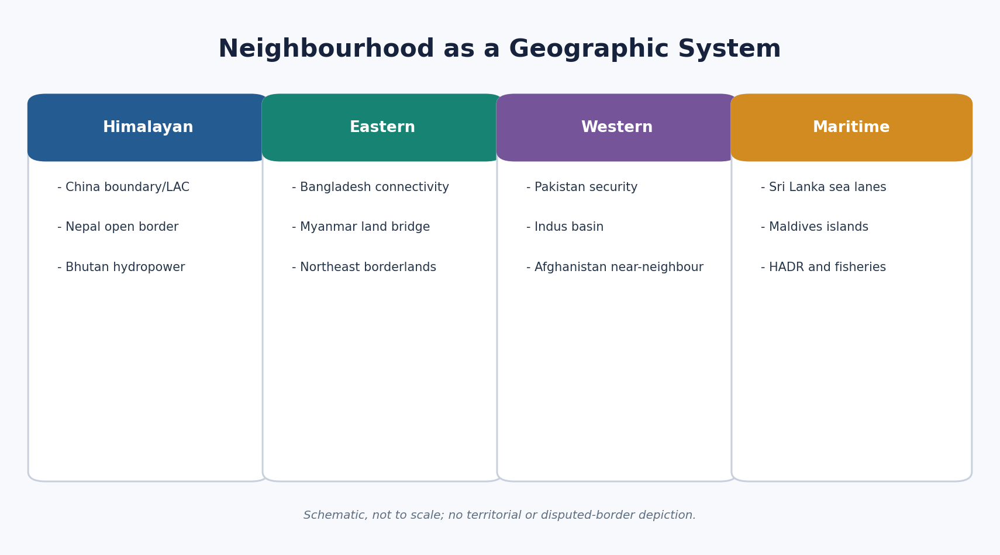
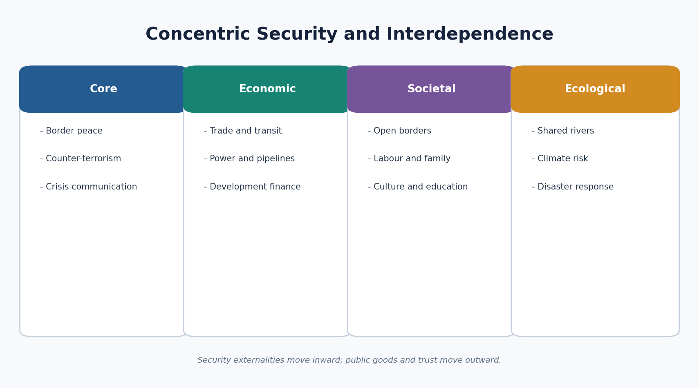
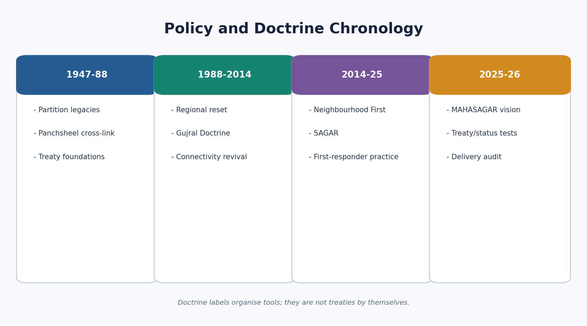
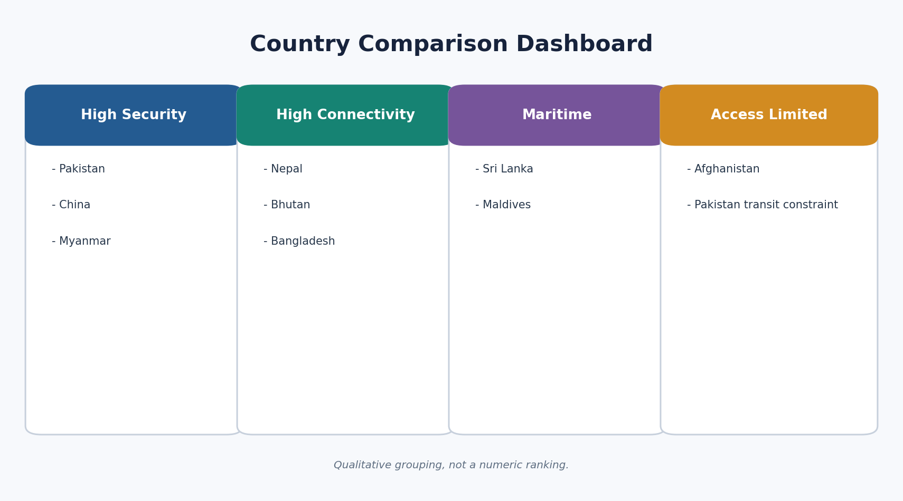
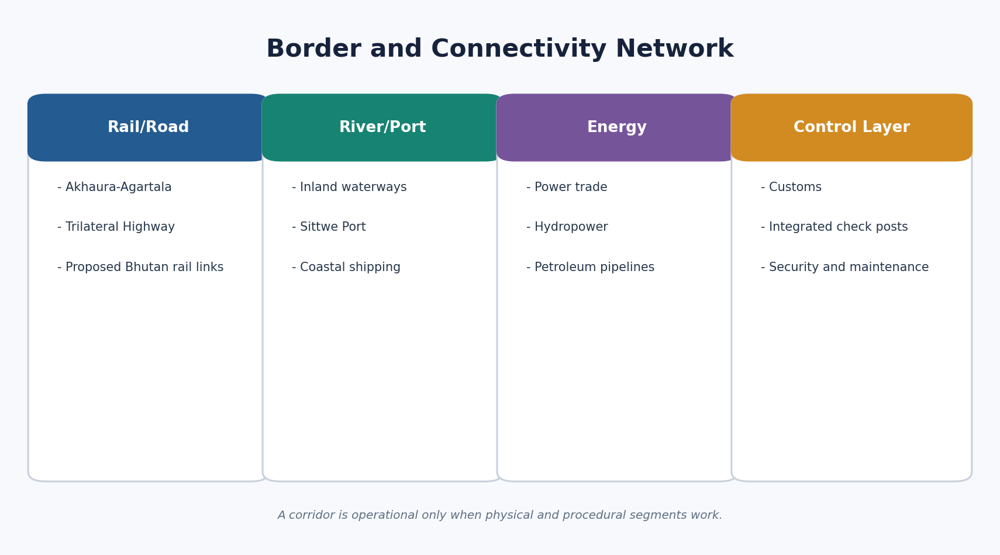
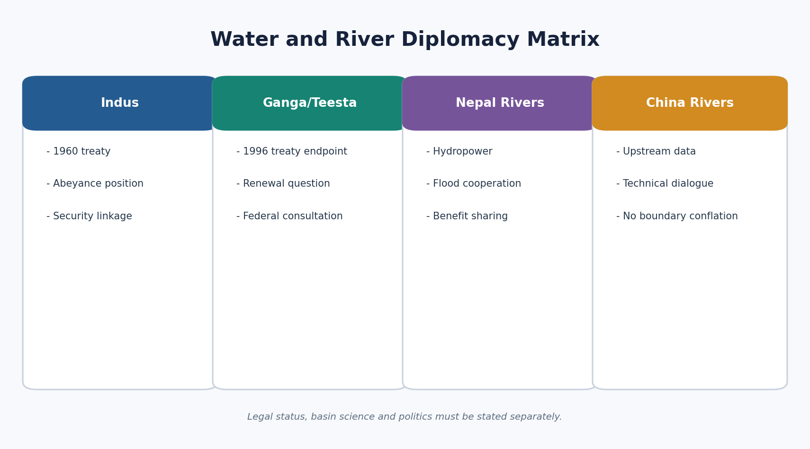
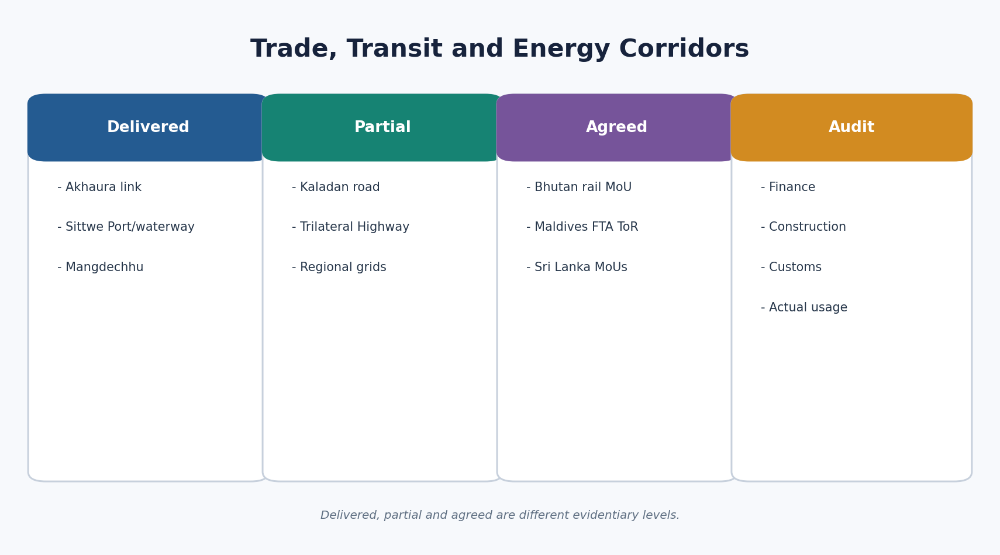

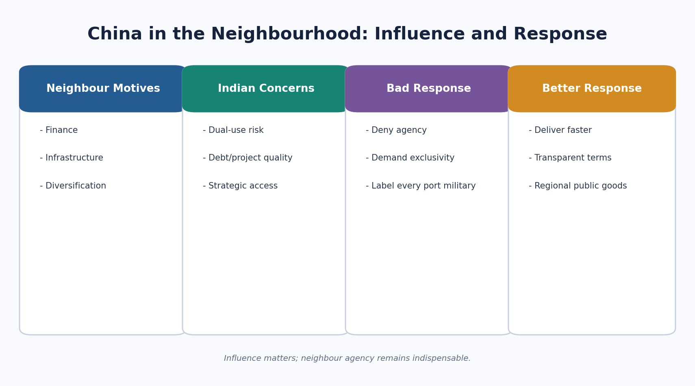

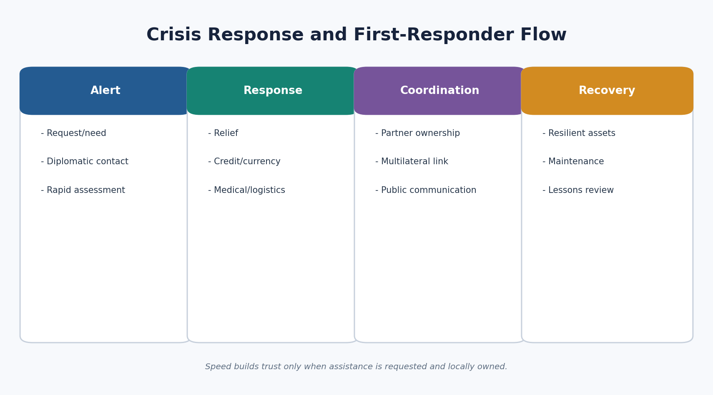
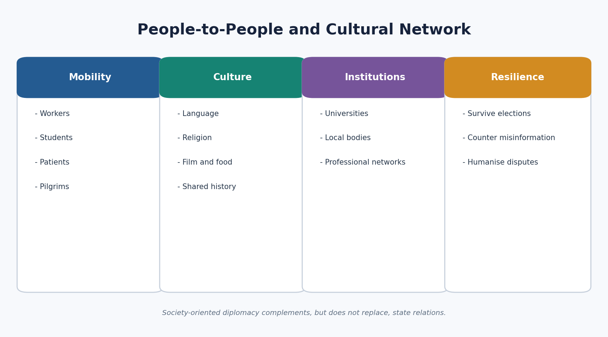

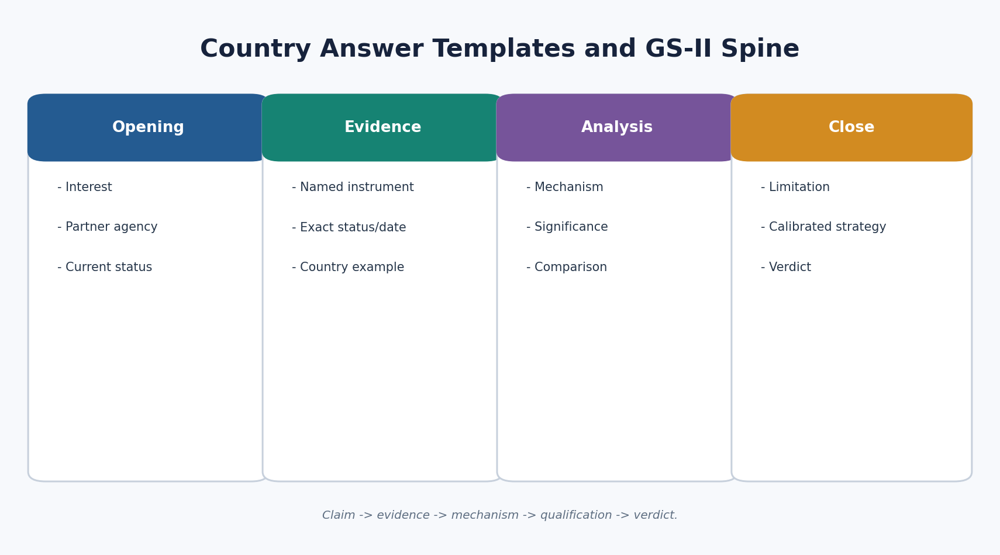

## Live Source Register and Access Limits

- [FACT] MEA, 36th WMCC on India-China Border Affairs; dated/status: 6 August 2026; https://www.mea.gov.in/press-releases?dtl/41635/36th_Meeting_of_the_Working_Mechanism_for_Consultation_and_Coordination_on_IndiaChina_Border_Affairs_August_06_2026
- [FACT] MEA, India-Bhutan Fifth Development Cooperation Talks; dated/status: 30-31 July 2026; https://www.mea.gov.in/press-releases?dtl/41585/Joint_Press_Release_Official_Visit_of_Foreign_Secretary_of_India_to_Bhutan_for_the_Fifth_IndiaBhutan_Development_Cooperation_Talks_for_the_13th_Five_Year_Plan_July_3031_2026
- [FACT] MEA, India-Afghanistan bilateral brief; dated/status: August 2026; https://www.mea.gov.in/Portal/ForeignRelation/India-Afghanistan-082026.pdf
- [FACT] MEA, India-Maldives bilateral brief; dated/status: through June 2026; https://www.mea.gov.in/Portal/ForeignRelation/Unclassified_India_Maldives_Bilateral_Brief_till_June_2026.pdf
- [FACT] MEA, India-Sri Lanka bilateral brief; dated/status: current reference retrieved August 2026; https://www.mea.gov.in/Portal/ForeignRelation/India-Sri_Lanka_Bilateral_Relations.pdf
- [FACT] MEA Lok Sabha answer on Ganga Water Treaty renewal; dated/status: 2025; status rechecked 15 August 2026; https://fsi.mea.gov.in/lok-sabha.htm?dtl/39925/QUESTION+NO+2210+RENEWAL+OF+THE+GANGA+WATER+TREATY
- [FACT] BIMSTEC, Maritime Transport Cooperation Agreement entry into force; dated/status: 16 May 2026; https://bimstec.org/images/content_page_pdf/1778898301_Press%20Release%2016-05-2026.pdf
- [FACT] BIMSTEC, Charter entry into force; dated/status: 20 May 2024; https://bimstec.org/event/190/bimstec-charter-enters-into-force
- [FACT] MEA, Responding First as a Leading Power; dated/status: official background paper; retrieved 15 August 2026; https://www.mea.gov.in/Portal/IndiaArticleAll/636548965437648101_Responding_First_Leading_Pow.pdf
- [LIMIT] Some MEA pages returned browser-version gates and official PDFs could not be text-rendered by web_fetch. Official-domain search evidence and repository-verified briefs were used; inaccessible pages were not treated as proof of additional detail.
- [LIMIT] Web search returned contradictory or stale political-leadership summaries for Bangladesh and Nepal. Those leader names were excluded; only dated election/transition facts already verified in the repository are retained.

## PART I - Complete Multi-Subtopic Learning Session

## 01. Scope: Neighbourhood as Geography plus Interdependence

**Current anchor:** [FACT] Current anchors were rechecked on 15 August 2026. The latest official items used include the 36th India-China WMCC of 6 August 2026, India-Bhutan Development Cooperation Talks of 30-31 July 2026, the India-Afghanistan August 2026 brief, and BIMSTEC maritime-agreement status of 16 May 2026.

India's neighbourhood is not a ring of passive buffers. It is a system in which proximity creates security externalities, markets, river basins, mobility, identity links and rapid transmission of crises.

### Chronology

| Date/phase | Development |
|---|---|
| 1947 | Partition and post-colonial boundary inheritance |
| 1996 | Ganga Waters Treaty and Gujral Doctrine era |
| 2014 | Neighbourhood First becomes a central policy label |
| 2015 | SAGAR articulated; BBIN Motor Vehicles Agreement signed |
| 2025 | MAHASAGAR articulated as a wider declared vision |
| 2026 | Treaty renewal, border-dialogue and implementation tests |

### Teaching Core

- [FACT] The immediate neighbourhood includes Pakistan, China, Nepal, Bhutan, Bangladesh, Myanmar, Sri Lanka and Maldives; Afghanistan is treated in Indian strategy as a near-neighbour. This is a functional category, not a disputed-border cartographic claim.
- [ANALYSIS] Proximity reduces reaction time. Conflict, refugees, epidemics, river floods, financial crises and political instability cross borders faster than comparable events in distant regions.
- [ANALYSIS] Asymmetric interdependence means India's scale is much greater while neighbours still possess location, transit, water, legitimacy and external-partnership leverage. Power asymmetry does not erase bargaining agency.
- [ANALYSIS] Open borders and shared ethnic or cultural ties can lower transaction costs and improve resilience, but they also transmit crime, grievance, misinformation and domestic political pressure.
- [LIMIT] This package cross-links Topic 01 for national interest, strategic autonomy, Panchsheel and instrument-status vocabulary. It does not repeat Topic 01's full conceptual history.
- [LIMIT] Physical map detail belongs to Geography; operational border security belongs to Internal Security; tariff and macroeconomic mechanics belong to Economy; constitutional treaty doctrine belongs to Polity/Governance.

### Must-Know Facts

- Neighbourhood is a geographic and functional system.
- Asymmetry and interdependence coexist.
- Neighbour agency is compulsory in analysis.
- Status discipline applies to every project and treaty.

### UPSC Traps

- **Wrong:** Neighbour equals buffer. **Correct:** Each neighbour has sovereign interests and domestic politics.
- **Wrong:** Proximity guarantees friendship. **Correct:** Proximity creates both cooperation and friction.
- **Wrong:** One doctrine fits all. **Correct:** Country instruments must be differentiated.

### Mains Answer Route

Frame every answer through interest -> neighbour incentive -> instrument -> verified status -> outcome -> constraint -> calibrated strategy.

## 02. Doctrines, Regionalism and Operating Principles

**Current anchor:** [FACT] The BIMSTEC Charter entered into force on 20 May 2024. [FACT] The BIMSTEC Maritime Transport Cooperation Agreement entered into force on 16 May 2026 among Bhutan, India, Myanmar and Thailand, the four parties then recorded as having deposited instruments.

Neighbourhood First is the priority frame; the Gujral Doctrine supplies a non-reciprocity and non-interference vocabulary; SAGAR and MAHASAGAR shape maritime public-goods language. None is a substitute for country-level delivery.

### Chronology

| Date/phase | Development |
|---|---|
| 1954 | Panchsheel: concise cross-link to Topic 01 |
| 1996-97 | Gujral Doctrine associated with South Asia policy |
| 2014 | Neighbourhood First emphasis |
| 2015 | SAGAR and BBIN MVA |
| 2024 | BIMSTEC Charter in force |
| 2025 | MAHASAGAR announced; wider maritime-development vision |
| 2026 | BIMSTEC maritime agreement in force for ratifying parties |

### Teaching Core

- [FACT] The Gujral Doctrine is commonly expressed through non-reciprocity toward smaller neighbours, non-interference, non-use of territory against another state, respect for sovereignty and territorial integrity, and bilateral peaceful dispute settlement.
- [ANALYSIS] Non-reciprocity is not charity. It is a stabilisation strategy in which the larger state bears more initial cost because regional instability imposes larger absolute costs on it.
- [ANALYSIS] Bilateralism is necessary for specific treaties, projects and disputes; regionalism gives smaller states procedural reassurance and addresses transboundary issues; subregionalism can move when full-regional consensus is blocked.
- [FACT] SAARC, BIMSTEC, BBIN and IORA occupy different geographic and functional layers. BIMSTEC is not a legal replacement for SAARC, and BBIN is not a universal South Asian organisation.
- [ANALYSIS] Development partnership, first-responder capability, connectivity and people-to-people engagement are operating instruments. Doctrine is credible only when those instruments deliver.
- [LIMIT] Topic 10 owns exhaustive grouping structures. Here institutions are treated only as neighbourhood tools.

### Must-Know Facts

- Gujral Doctrine emphasises non-reciprocity toward smaller neighbours.
- SAGAR/MAHASAGAR are visions, not treaties.
- BIMSTEC Charter is legally in force.
- Regional and bilateral tracks can coexist.

### UPSC Traps

- **Wrong:** Neighbourhood First is a treaty. **Correct:** It is a policy priority.
- **Wrong:** BIMSTEC has replaced SAARC. **Correct:** They overlap but differ in membership and purpose.
- **Wrong:** Signed equals operational. **Correct:** Implementation must be separately proven.

### Mains Answer Route

Use doctrine briefly, then spend answer space on a named country instrument and its implementation status.

## 03. Comparative Country Dashboard and Status Method

**Current anchor:** [LIMIT] Political leadership, coalition composition and conflict control are volatile. This package dates current anchors and avoids using an outdated leader name as a substitute for institutional analysis.

A country comparison should diagnose the dominant interdependence, principal friction, strongest instrument and main implementation risk without ranking neighbours as loyal or hostile.

### Teaching Core

- [ANALYSIS] Pakistan is security-dominant and crisis-managed; China combines boundary competition with deep economic exposure; Nepal combines open-border society with hydropower and sovereignty sensitivity.
- [ANALYSIS] Bhutan is development and hydropower-intensive; Bangladesh is connectivity-rich with water and political-transition sensitivities; Myanmar is a conflict-affected land bridge.
- [ANALYSIS] Sri Lanka and Maldives are maritime partners where first-responder credibility interacts with sovereignty narratives and external-power competition.
- [ANALYSIS] Afghanistan remains a development and humanitarian relationship constrained by access, terrorism risk and recognition-status precision.
- [ANALYSIS] The health scorecard is qualitative: trust, delivery, interdependence and resilience across political cycles. No fabricated numeric score is assigned.
- [LIMIT] Governments are temporary political arrangements; countries include institutions, opposition, local governments, business and society.

### Must-Know Facts

- Country modules use chronology, current status, cooperation, disputes, domestic politics, external powers, people ties and answer spine.

### UPSC Traps

- **Wrong:** Friendly/hostile is a sufficient classification. **Correct:** Relationships are multidimensional.
- **Wrong:** Current government equals country. **Correct:** Institutional and societal ties persist across governments.

### Mains Answer Route

Compare two or three neighbours only on a common criterion: security, connectivity, water, political transition or delivery.

## 04. Country Module: Pakistan

**Current anchor:** [FACT] India's Cabinet Committee on Security stated on 23 April 2025 that the Indus Waters Treaty would be held in abeyance until Pakistan credibly and irrevocably abjures support for cross-border terrorism. [LIMIT] This is India's stated operational position; it is not the same claim as termination under the Treaty text. The relationship remains a case of limited engagement, deterrence, crisis communication and tightly bounded functional channels.

Pakistan must be analysed as a sovereign actor with its own domestic politics and external choices. The module separates historical structure, current verified status and future strategy.

### Chronology

| Date/phase | Development |
|---|---|
| 1947 | partition and conflict legacy |
| 1960 | Indus Waters Treaty |
| 1972 | Simla Agreement |
| 1999 | Lahore process and Kargil reversal |
| 2003 | ceasefire understanding |
| 2021 | reaffirmation by the Directors General of Military Operations |
| 23 | April 2025 Indian decision to hold the Indus Waters Treaty in abeyance. |

### Teaching Core

- [FACT] Chronology: 1947 partition and conflict legacy; 1960 Indus Waters Treaty; 1972 Simla Agreement; 1999 Lahore process and Kargil reversal; 2003 ceasefire understanding; 2021 reaffirmation by the Directors General of Military Operations; 23 April 2025 Indian decision to hold the Indus Waters Treaty in abeyance.
- [FACT/ANALYSIS] Cooperation: The durable cooperation case is institutional rather than warm: the Indus framework historically insulated technical water management from wider rivalry; the 2021 ceasefire reaffirmation reduced immediate military risk; religious pilgrimage and humanitarian cases show that narrow channels can survive political hostility. Such channels are valuable because they create communication without pretending that the strategic dispute has disappeared.
- [ANALYSIS] Disputes and constraints: Kashmir and the boundary/territorial dispute, cross-border terrorism, political distrust, sharply reduced trade and people-to-people interaction, and competing narratives of the relationship remain central. A UPSC answer should keep terrorism as a diplomatic and security constraint without entering operational speculation, intelligence claims or unverified casualty figures.
- [ANALYSIS] Domestic-politics sensitivity: Civil-military relations, party competition, economic stress and public narratives inside Pakistan influence the space for engagement. India should be analysed as dealing with a state and society, not with one government alone. Conversely, Indian domestic politics and public reaction after attacks constrain diplomatic experimentation.
- [ANALYSIS] China/external-power dimension: The China-Pakistan relationship, including connectivity through territory claimed by India, changes India's security calculus. Yet Pakistan retains agency and its China policy is not reducible to external direction. The analytical task is to show how two-front risk, infrastructure, diplomatic support and economic dependence interact without treating every bilateral event as coordinated against India.
- [ANALYSIS] People-to-people layer: Partition families, linguistic and cultural continuities, religious travel and shared artistic traditions provide a social constituency for de-escalation. Visa restrictions and suspended exchanges mean these links are politically fragile. People-to-people contact is a risk-reduction instrument, not evidence that core disputes are solved.
- [ANALYSIS] Country answer spine: Open with adversarial interdependence. Use one security instrument, one water-status fact and one limited-contact example. Explain the mechanism: communication reduces accidental escalation while credible counter-terrorism conditions protect Indian interests. Qualify that functional engagement cannot substitute for a change in the security environment. Verdict: calibrated contact plus deterrence, not either total normalisation or permanent diplomatic silence.

### Must-Know Facts

- [FACT] India's Cabinet Committee on Security stated on 23 April 2025 that the Indus Waters Treaty would be held in abeyance until Pakistan credibly and irrevocably abjures support for cross-border terrorism. [LIMIT] This is India's stated operational position; it is not the same claim as termination under the Treaty text. The relationship remains a case of limited engagement, deterrence, crisis communication and tightly bounded functional channels.
- The durable cooperation case is institutional rather than warm: the Indus framework historically insulated technical water management from wider rivalry; the 2021 ceasefire reaffirmation reduced immediate military risk; religious pilgrimage and humanitarian cases show that narrow channels can survive political hostility. Such channels are valuable because they create communication without pretending that the strategic dispute has disappeared.

### UPSC Traps

- **Wrong:** Treat the neighbour as a passive arena. **Correct:** State its incentive and agency.
- **Wrong:** Use an undated current claim. **Correct:** Attach a date and source class.
- **Wrong:** Conflate proposal, finance and delivery. **Correct:** Name the exact status.

### Mains Answer Route

Open with adversarial interdependence. Use one security instrument, one water-status fact and one limited-contact example. Explain the mechanism: communication reduces accidental escalation while credible counter-terrorism conditions protect Indian interests. Qualify that functional engagement cannot substitute for a change in the security environment. Verdict: calibrated contact plus deterrence, not either total normalisation or permanent diplomatic silence.

## 05. Country Module: China

**Current anchor:** [FACT] The boundary question remains unresolved. The 36th Working Mechanism for Consultation and Coordination meeting was held on 6 August 2026, showing continued diplomatic management. [FACT] The Line of Actual Control is a practical line for border management and is not a mutually agreed international boundary. [LIMIT] Do not infer comprehensive normalisation from a meeting or from disengagement at specific points.

China must be analysed as a sovereign actor with its own domestic politics and external choices. The module separates historical structure, current verified status and future strategy.

### Chronology

| Date/phase | Development |
|---|---|
| 1950 | diplomatic relations |
| 1954 | Panchsheel agreement as Topic 01 cross-link |
| 1962 | war |
| 1988 | political reset |
| 1993 | and 1996 border peace agreements |
| 2005 | political parameters and border protocol |
| 2017 | Doklam |

### Teaching Core

- [FACT] Chronology: 1950 diplomatic relations; 1954 Panchsheel agreement as Topic 01 cross-link; 1962 war; 1988 political reset; 1993 and 1996 border peace agreements; 2005 political parameters and border protocol; 2017 Doklam; 2020 eastern Ladakh crisis; October 2024 patrolling arrangement and disengagement at remaining friction points as officially described; 36th WMCC on 6 August 2026.
- [FACT/ANALYSIS] Cooperation: Trade, climate negotiations, multilateral forums, trans-border river data mechanisms and global economic governance create issue-specific cooperation. The bilateral economic relationship combines scale with vulnerability: India imports important intermediate and capital goods while seeking diversification and domestic capability. De-risking means reducing concentrated exposure and improving resilience; it does not mean claiming complete decoupling.
- [ANALYSIS] Disputes and constraints: The boundary and peace along the border are fundamental to the overall relationship in India's official framing. Other sensitivities include Tibet-related security perceptions, upstream river information, market access, trade imbalance, technology dependence, connectivity through disputed territory and Chinese naval/economic presence in the Indian Ocean.
- [ANALYSIS] Domestic-politics sensitivity: Nationalism, public memory of 1962, economic interests and security institutions shape both sides. The answer should not treat either leadership as infinitely flexible or assume domestic pressure automatically produces escalation. Established diplomatic and military mechanisms exist precisely because political trust is incomplete.
- [ANALYSIS] China/external-power dimension: This module is necessarily about China, but Topic 03 owns the full major-power, supply-chain and technology competition. Here the China factor is limited to neighbourhood effects: the boundary, trans-Himalayan connectivity, water, Tibet, the Indian Ocean and Chinese partnerships with South Asian states.
- [ANALYSIS] People-to-people layer: Civilisational links, Buddhism, education, tourism and commercial communities matter but are thinner than the economic relationship. Their stabilising effect is limited when border peace is disturbed. Cultural contact should therefore be written as a supporting layer, not a substitute for strategic settlement.
- [ANALYSIS] Country answer spine: Distinguish LAC management from boundary settlement. Cite the 1993/1996 architecture and the 6 August 2026 WMCC as mechanisms, then explain why peace enables economic and multilateral engagement. Add the trade-resilience qualification and the neighbour-agency caution. Verdict: competitive coexistence requires credible border stability, selective cooperation and de-risking without an implausible decoupling claim.

### Must-Know Facts

- [FACT] The boundary question remains unresolved. The 36th Working Mechanism for Consultation and Coordination meeting was held on 6 August 2026, showing continued diplomatic management. [FACT] The Line of Actual Control is a practical line for border management and is not a mutually agreed international boundary. [LIMIT] Do not infer comprehensive normalisation from a meeting or from disengagement at specific points.
- Trade, climate negotiations, multilateral forums, trans-border river data mechanisms and global economic governance create issue-specific cooperation. The bilateral economic relationship combines scale with vulnerability: India imports important intermediate and capital goods while seeking diversification and domestic capability. De-risking means reducing concentrated exposure and improving resilience; it does not mean claiming complete decoupling.

### UPSC Traps

- **Wrong:** Treat the neighbour as a passive arena. **Correct:** State its incentive and agency.
- **Wrong:** Use an undated current claim. **Correct:** Attach a date and source class.
- **Wrong:** Conflate proposal, finance and delivery. **Correct:** Name the exact status.

### Mains Answer Route

Distinguish LAC management from boundary settlement. Cite the 1993/1996 architecture and the 6 August 2026 WMCC as mechanisms, then explain why peace enables economic and multilateral engagement. Add the trade-resilience qualification and the neighbour-agency caution. Verdict: competitive coexistence requires credible border stability, selective cooperation and de-risking without an implausible decoupling claim.

## 06. Country Module: Nepal

**Current anchor:** [FACT] India and Nepal retain an open border and exceptionally dense labour, family and religious ties. [FACT] The power relationship is expanding through long-term electricity trade, cross-border transmission and emerging trilateral sale to Bangladesh. [LIMIT] Elections in March 2026 are a dated fact; political leadership and coalition alignments are volatile and should be rechecked before use.

Nepal must be analysed as a sovereign actor with its own domestic politics and external choices. The module separates historical structure, current verified status and future strategy.

### Chronology

| Date/phase | Development |
|---|---|
| 1950 | Treaty of Peace and Friendship |
| long | evolution of open-border and security arrangements |
| 1996 | Mahakali Treaty |
| 2008 | republican transition |
| 2015 | constitutional and border-supply tensions |
| 2020 | cartographic dispute |
| 2 | June 2023 long-term power-trade understanding |

### Teaching Core

- [FACT] Chronology: 1950 Treaty of Peace and Friendship; long evolution of open-border and security arrangements; 1996 Mahakali Treaty; 2008 republican transition; 2015 constitutional and border-supply tensions; 2020 cartographic dispute; 2 June 2023 long-term power-trade understanding; March 2026 elections.
- [FACT/ANALYSIS] Cooperation: Hydropower and electricity trade, petroleum pipelines, rail and road links, integrated check posts, development projects, disaster support and military traditions create multiple layers of interdependence. The strongest current opportunity is to convert Nepal's hydropower potential into predictable revenue while supporting India's clean-energy and regional-grid interests.
- [ANALYSIS] Disputes and constraints: Boundary/cartographic differences, periodic treaty-revision demands, perceptions of interference, trade/transit vulnerability and project delays generate distrust. The open border brings benefits and management challenges simultaneously. A good answer does not frame openness as either an unqualified security threat or a romantic absence of borders.
- [ANALYSIS] Domestic-politics sensitivity: Frequent coalition change and strong sovereignty narratives make public consultation essential. India must avoid appearing to choose political favourites. Federal, provincial, Madhesi, hill and borderland interests cannot be collapsed into one Nepalese view.
- [ANALYSIS] China/external-power dimension: Nepal uses external partnerships to widen choice. Chinese infrastructure and political engagement affect India's calculus, but Kathmandu's decisions reflect its own development, sovereignty and bargaining interests. Treating Nepal merely as an India-China arena erases small-state agency and often produces poor policy analysis.
- [ANALYSIS] People-to-people layer: The open border, employment, intermarriage, pilgrimage, education and shared languages make society-to-society ties unusually deep. These ties can absorb diplomatic shocks, but they can also transmit grievances rapidly. Better border services, labour protections and local consultation are therefore foreign-policy instruments.
- [ANALYSIS] Country answer spine: Begin with open-border interdependence, not a buffer metaphor. Use the 1950 Treaty debate, 2023 power-trade understanding and one connectivity instrument. Show how delivery produces mutual gain, then qualify with boundary politics and sovereignty sensitivity. Verdict: a modern partnership should be open, consulted, electricity-led and insulated from partisan cycles.

### Must-Know Facts

- [FACT] India and Nepal retain an open border and exceptionally dense labour, family and religious ties. [FACT] The power relationship is expanding through long-term electricity trade, cross-border transmission and emerging trilateral sale to Bangladesh. [LIMIT] Elections in March 2026 are a dated fact; political leadership and coalition alignments are volatile and should be rechecked before use.
- Hydropower and electricity trade, petroleum pipelines, rail and road links, integrated check posts, development projects, disaster support and military traditions create multiple layers of interdependence. The strongest current opportunity is to convert Nepal's hydropower potential into predictable revenue while supporting India's clean-energy and regional-grid interests.

### UPSC Traps

- **Wrong:** Treat the neighbour as a passive arena. **Correct:** State its incentive and agency.
- **Wrong:** Use an undated current claim. **Correct:** Attach a date and source class.
- **Wrong:** Conflate proposal, finance and delivery. **Correct:** Name the exact status.

### Mains Answer Route

Begin with open-border interdependence, not a buffer metaphor. Use the 1950 Treaty debate, 2023 power-trade understanding and one connectivity instrument. Show how delivery produces mutual gain, then qualify with boundary politics and sovereignty sensitivity. Verdict: a modern partnership should be open, consulted, electricity-led and insulated from partisan cycles.

## 07. Country Module: Bhutan

**Current anchor:** [FACT] The 2007 treaty reflects Bhutan's sovereign agency and a mature partnership. [FACT] India reaffirmed support for Bhutan's 13th Five Year Plan at the Fifth Development Cooperation Talks on 30-31 July 2026. [LIMIT] A financing commitment, approved project, signed rail MoU and commissioned asset are different status categories.

Bhutan must be analysed as a sovereign actor with its own domestic politics and external choices. The module separates historical structure, current verified status and future strategy.

### Chronology

| Date/phase | Development |
|---|---|
| 1949 | Treaty of Friendship |
| 2007 | revised treaty replacing older guidance language with cooperation on national interests |
| major | hydropower partnership |
| Mangdechhu | commissioning in 2019 and handover in 2022 |
| support | for the 13th Five Year Plan from 2024 |
| rail-link | MoU in September 2025 |
| Fifth | Development Cooperation Talks on 30-31 July 2026. |

### Teaching Core

- [FACT] Chronology: 1949 Treaty of Friendship; 2007 revised treaty replacing older guidance language with cooperation on national interests; major hydropower partnership; Mangdechhu commissioning in 2019 and handover in 2022; support for the 13th Five Year Plan from 2024; rail-link MoU in September 2025; Fifth Development Cooperation Talks on 30-31 July 2026.
- [FACT/ANALYSIS] Cooperation: Hydropower, development grants, education, health, digital systems, trade, security consultation and emerging rail links form the core. Hydropower demonstrates deep complementarity: export revenue for Bhutan and electricity for India. Cooperation is broadening beyond a single-sector relationship toward skills, digital and urban development.
- [ANALYSIS] Disputes and constraints: The bilateral relationship has few public disputes, but project delay, cost escalation, hydrological and ecological concerns, tariff expectations and Bhutan's desire for economic diversification require careful management. A strong answer should not confuse the absence of acrimony with the absence of negotiation.
- [ANALYSIS] Domestic-politics sensitivity: Bhutan's democratic institutions, development philosophy, youth employment concerns and diversification priorities matter. India's partnership is more durable when projects follow Bhutanese plans rather than when support is portrayed as Indian strategic charity.
- [ANALYSIS] China/external-power dimension: Bhutan-China boundary talks and the tri-junction security context affect India, but Bhutan is the negotiating sovereign. India has a legitimate security interest; it should still avoid language implying that Bhutan's foreign policy is delegated to New Delhi.
- [ANALYSIS] People-to-people layer: Education, tourism, professional networks and long-standing royal and governmental contacts build trust. The relationship's strength lies in institutional continuity plus social familiarity. It must nevertheless adapt to a younger Bhutanese population with wider global options.
- [ANALYSIS] Country answer spine: Use treaty evolution from 1949 to 2007 to establish mature sovereignty. Add one delivered hydropower case and the July 2026 development-talks anchor. Explain mutual benefit and the status ladder. Qualify with diversification and ecological/project risks. Verdict: the model partnership remains strong when it is demand-driven, transparent and beyond hydropower.

### Must-Know Facts

- [FACT] The 2007 treaty reflects Bhutan's sovereign agency and a mature partnership. [FACT] India reaffirmed support for Bhutan's 13th Five Year Plan at the Fifth Development Cooperation Talks on 30-31 July 2026. [LIMIT] A financing commitment, approved project, signed rail MoU and commissioned asset are different status categories.
- Hydropower, development grants, education, health, digital systems, trade, security consultation and emerging rail links form the core. Hydropower demonstrates deep complementarity: export revenue for Bhutan and electricity for India. Cooperation is broadening beyond a single-sector relationship toward skills, digital and urban development.

### UPSC Traps

- **Wrong:** Treat the neighbour as a passive arena. **Correct:** State its incentive and agency.
- **Wrong:** Use an undated current claim. **Correct:** Attach a date and source class.
- **Wrong:** Conflate proposal, finance and delivery. **Correct:** Name the exact status.

### Mains Answer Route

Use treaty evolution from 1949 to 2007 to establish mature sovereignty. Add one delivered hydropower case and the July 2026 development-talks anchor. Explain mutual benefit and the status ladder. Qualify with diversification and ecological/project risks. Verdict: the model partnership remains strong when it is demand-driven, transparent and beyond hydropower.

## 08. Country Module: Bangladesh

**Current anchor:** [FACT] The Land Boundary Agreement implementation and acceptance of maritime adjudication show that difficult disputes can be settled through law and political will. [FACT] The 1996 Ganga Waters Treaty reaches its thirty-year endpoint in December 2026. [LIMIT] Current party alignments and leadership are volatile; this package avoids outdated leadership labels and uses dated institutional facts.

Bangladesh must be analysed as a sovereign actor with its own domestic politics and external choices. The module separates historical structure, current verified status and future strategy.

### Chronology

| Date/phase | Development |
|---|---|
| 1971 | liberation and Indian support |
| 1974 | Land Boundary Agreement and 2015 implementation |
| 1996 | Ganga Waters Treaty |
| 2014 | maritime-boundary award accepted by both sides |
| 2023 | Akhaura-Agartala rail link |
| political | transition from August 2024 |
| elections | on 12 February 2026 |

### Teaching Core

- [FACT] Chronology: 1971 liberation and Indian support; 1974 Land Boundary Agreement and 2015 implementation; 1996 Ganga Waters Treaty; 2014 maritime-boundary award accepted by both sides; 2023 Akhaura-Agartala rail link; political transition from August 2024; elections on 12 February 2026; Ganga Treaty scheduled to expire in December 2026.
- [FACT/ANALYSIS] Cooperation: Rail, road, inland waterways, coastal shipping, port access, electricity trade and security cooperation have transformed the relationship. Bangladesh is central to India's Northeast connectivity. The Akhaura-Agartala rail link, inaugurated on 1 November 2023, is a visible example, but actual gains depend on customs, schedules, cargo volumes and last-mile infrastructure.
- [ANALYSIS] Disputes and constraints: Teesta remains unresolved; border deaths and smuggling allegations require humane management; trade asymmetry and non-tariff barriers produce complaints; migration rhetoric can poison public opinion. Use precise legal categories: undocumented migration, refugees, asylum seekers and citizens are not interchangeable.
- [ANALYSIS] Domestic-politics sensitivity: Political transition requires India to engage institutions and society rather than one party. Historical memory of 1971 remains important but does not erase contemporary sovereignty or domestic contestation. Statements about minorities, elections or migration require current, sourced and restrained language.
- [ANALYSIS] China/external-power dimension: Bangladesh's ties with China reflect infrastructure, defence procurement and economic choice. India should compete through delivery, geographic advantage and market/connectivity integration rather than demanding exclusivity. Dhaka is an agent that compares offers and risks.
- [ANALYSIS] People-to-people layer: Language, literature, the 1971 memory, border communities, students, medical travel and cultural exchange create a dense social field. Border violence or inflammatory migration narratives can quickly damage that capital. Local border institutions and legal mobility channels are therefore strategic assets.
- [ANALYSIS] Country answer spine: Open with the shift from conflict resolution to connectivity-led interdependence. Cite the 2015 LBA implementation, maritime settlement, Akhaura-Agartala and Ganga Treaty status. Explain Northeast and regional value; qualify with Teesta, border management and political sensitivity. Verdict: preserve gains through water federalism, humane borders and institution-to-institution engagement.

### Must-Know Facts

- [FACT] The Land Boundary Agreement implementation and acceptance of maritime adjudication show that difficult disputes can be settled through law and political will. [FACT] The 1996 Ganga Waters Treaty reaches its thirty-year endpoint in December 2026. [LIMIT] Current party alignments and leadership are volatile; this package avoids outdated leadership labels and uses dated institutional facts.
- Rail, road, inland waterways, coastal shipping, port access, electricity trade and security cooperation have transformed the relationship. Bangladesh is central to India's Northeast connectivity. The Akhaura-Agartala rail link, inaugurated on 1 November 2023, is a visible example, but actual gains depend on customs, schedules, cargo volumes and last-mile infrastructure.

### UPSC Traps

- **Wrong:** Treat the neighbour as a passive arena. **Correct:** State its incentive and agency.
- **Wrong:** Use an undated current claim. **Correct:** Attach a date and source class.
- **Wrong:** Conflate proposal, finance and delivery. **Correct:** Name the exact status.

### Mains Answer Route

Open with the shift from conflict resolution to connectivity-led interdependence. Cite the 2015 LBA implementation, maritime settlement, Akhaura-Agartala and Ganga Treaty status. Explain Northeast and regional value; qualify with Teesta, border management and political sensitivity. Verdict: preserve gains through water federalism, humane borders and institution-to-institution engagement.

## 09. Country Module: Sri Lanka

**Current anchor:** [FACT] India's 2022 assistance was rapid and multi-instrumental; official descriptions distinguish more than USD 3 billion by early May from roughly USD 4 billion over the year. [FACT] Seven MoUs on 5 April 2025 covered power, digital, energy-hub, defence, grant, health and pharmacopoeial cooperation. [LIMIT] MoUs and ground-breaking are not commissioned projects.

Sri Lanka must be analysed as a sovereign actor with its own domestic politics and external choices. The module separates historical structure, current verified status and future strategy.

### Chronology

| Date/phase | Development |
|---|---|
| Ancient | civilisational contact |
| post-independence | Tamil question |
| 1987 | Accord and Indian Peace Keeping Force experience |
| 2009 | end of civil war |
| maritime-boundary | and fishermen disputes |
| 2022 | economic crisis and Indian assistance |
| political | change in 2024 |

### Teaching Core

- [FACT] Chronology: Ancient civilisational contact; post-independence Tamil question; 1987 Accord and Indian Peace Keeping Force experience; 2009 end of civil war; maritime-boundary and fishermen disputes; 2022 economic crisis and Indian assistance; political change in 2024; seven MoUs exchanged on 5 April 2025.
- [FACT/ANALYSIS] Cooperation: Crisis support, housing and community projects, railways, energy, digital systems, trade, tourism, defence training and maritime cooperation are major pillars. The 2022 case is a first-responder demonstration: credit, currency support, fuel and humanitarian supplies protected essential availability while respecting that Sri Lankan recovery required domestic policy and an IMF programme.
- [ANALYSIS] Disputes and constraints: The Tamil reconciliation and devolution question, fishermen and bottom-trawling, project politics and sovereignty concerns remain sensitive. Fishermen issues involve livelihood, ecology, law enforcement and humanitarian treatment; they should not be reduced to a territorial slogan.
- [ANALYSIS] Domestic-politics sensitivity: India must work with elected institutions across party cycles and avoid being associated exclusively with one elite. Tamil concerns in India create a federal dimension, while Sri Lankan memories of intervention shape sovereignty narratives. Domestic legitimacy on both sides affects implementation.
- [ANALYSIS] China/external-power dimension: Chinese infrastructure, finance and port presence influence Indian security perceptions. Yet Sri Lanka's economic choices arise from its own development and financing needs. The answer should compare project terms, utility and transparency rather than imply that every Chinese-linked asset is a military base.
- [ANALYSIS] People-to-people layer: Buddhist and Hindu links, the Tamil community, education, tourism, films and family networks provide social depth. Reconciliation and fishermen management determine whether civilisational rhetoric has contemporary credibility.
- [ANALYSIS] Country answer spine: Use the 2022 crisis as named evidence, explain first-responder mechanisms and separate emergency support from structural recovery. Add one 2025 MoU with correct status, then qualify with Tamil reconciliation, fishermen and debt/project politics. Verdict: India's advantage is speed plus proximity, sustained only by sensitivity and transparent delivery.

### Must-Know Facts

- [FACT] India's 2022 assistance was rapid and multi-instrumental; official descriptions distinguish more than USD 3 billion by early May from roughly USD 4 billion over the year. [FACT] Seven MoUs on 5 April 2025 covered power, digital, energy-hub, defence, grant, health and pharmacopoeial cooperation. [LIMIT] MoUs and ground-breaking are not commissioned projects.
- Crisis support, housing and community projects, railways, energy, digital systems, trade, tourism, defence training and maritime cooperation are major pillars. The 2022 case is a first-responder demonstration: credit, currency support, fuel and humanitarian supplies protected essential availability while respecting that Sri Lankan recovery required domestic policy and an IMF programme.

### UPSC Traps

- **Wrong:** Treat the neighbour as a passive arena. **Correct:** State its incentive and agency.
- **Wrong:** Use an undated current claim. **Correct:** Attach a date and source class.
- **Wrong:** Conflate proposal, finance and delivery. **Correct:** Name the exact status.

### Mains Answer Route

Use the 2022 crisis as named evidence, explain first-responder mechanisms and separate emergency support from structural recovery. Add one 2025 MoU with correct status, then qualify with Tamil reconciliation, fishermen and debt/project politics. Verdict: India's advantage is speed plus proximity, sustained only by sensitivity and transparent delivery.

## 10. Country Module: Maldives

**Current anchor:** [FACT] The Maldives is both an immediate maritime neighbour and an Indian Ocean sea-lane partner. [FACT] The October 2024 Vision and July 2025 instruments expanded economic, digital, development and maritime cooperation. [LIMIT] A Line of Credit is a financing facility, not proof of disbursement or project completion; FTA Terms of Reference are not a concluded FTA.

Maldives must be analysed as a sovereign actor with its own domestic politics and external choices. The module separates historical structure, current verified status and future strategy.

### Chronology

| Date/phase | Development |
|---|---|
| 1965 | diplomatic relations |
| 1988 | Indian assistance during the coup attempt |
| 2004 | tsunami support |
| 2014 | water-crisis response |
| political | cycles and sovereignty debates |
| Joint | Vision on 7 October 2024 |
| state | visit and development package in July 2025 |

### Teaching Core

- [FACT] Chronology: 1965 diplomatic relations; 1988 Indian assistance during the coup attempt; 2004 tsunami support; 2014 water-crisis response; political cycles and sovereignty debates; Joint Vision on 7 October 2024; state visit and development package in July 2025; bilateral brief current through June 2026.
- [FACT/ANALYSIS] Cooperation: Water, health and disaster response, infrastructure, digital payments, capacity building, tourism, maritime-domain awareness and security training demonstrate broad cooperation. India supplied medical assistance in June 2026 according to the bilateral brief. The relationship is strongest when security cooperation is requested, transparent and linked to public goods.
- [ANALYSIS] Disputes and constraints: Domestic campaigns about sovereignty and foreign personnel, project delays and political rhetoric can rapidly alter perceptions. India should distinguish legitimate sovereignty sensitivity from hostile alignment claims and avoid treating electoral language as a permanent national position.
- [ANALYSIS] Domestic-politics sensitivity: Political cycles are a structural feature, not an abnormal interruption. Engagement should be spread across government, opposition, local communities, youth, tourism and professional institutions. That reduces the cost of being identified with one administration.
- [ANALYSIS] China/external-power dimension: Chinese finance and infrastructure are part of Maldives' diversification. India's response should combine rapid delivery, debt-sensitive project design and maritime public goods. Denying Male's agency or demanding exclusivity would be strategically counterproductive.
- [ANALYSIS] People-to-people layer: Tourism, education, health travel, professional training and geographic proximity connect the societies. The small population and island geography make visible project outcomes especially important. Public communication should explain what has been delivered, financed or merely proposed.
- [ANALYSIS] Country answer spine: Start with sea-lane geography and island vulnerability. Cite the 1988/2014 first-responder record, October 2024 Vision and one July 2025 instrument. Explain maritime-security and public-goods mechanisms. Qualify with sovereignty narratives and status discipline. Verdict: mutual security must remain consensual, development-led and politically broad-based.

### Must-Know Facts

- [FACT] The Maldives is both an immediate maritime neighbour and an Indian Ocean sea-lane partner. [FACT] The October 2024 Vision and July 2025 instruments expanded economic, digital, development and maritime cooperation. [LIMIT] A Line of Credit is a financing facility, not proof of disbursement or project completion; FTA Terms of Reference are not a concluded FTA.
- Water, health and disaster response, infrastructure, digital payments, capacity building, tourism, maritime-domain awareness and security training demonstrate broad cooperation. India supplied medical assistance in June 2026 according to the bilateral brief. The relationship is strongest when security cooperation is requested, transparent and linked to public goods.

### UPSC Traps

- **Wrong:** Treat the neighbour as a passive arena. **Correct:** State its incentive and agency.
- **Wrong:** Use an undated current claim. **Correct:** Attach a date and source class.
- **Wrong:** Conflate proposal, finance and delivery. **Correct:** Name the exact status.

### Mains Answer Route

Start with sea-lane geography and island vulnerability. Cite the 1988/2014 first-responder record, October 2024 Vision and one July 2025 instrument. Explain maritime-security and public-goods mechanisms. Qualify with sovereignty narratives and status discipline. Verdict: mutual security must remain consensual, development-led and politically broad-based.

## 11. Country Module: Myanmar

**Current anchor:** [FACT] The Kaladan waterway and Sittwe Port were operationalised in May 2023, while the road component remained incomplete and both sides continued to call for completion in June 2026. [LIMIT] Myanmar's conflict, authority and territorial-control picture is volatile; this package avoids recognising or legitimising any contested regime through careless wording.

Myanmar must be analysed as a sovereign actor with its own domestic politics and external choices. The module separates historical structure, current verified status and future strategy.

### Chronology

| Date/phase | Development |
|---|---|
| Shared | civilisational and border ties |
| 1988 | military takeover and India's later pragmatic engagement |
| Act | East |
| Kaladan | agreement and construction |
| 2011 | political opening |
| 2021 | military takeover |
| Sittwe | Port and waterway operationalised in May 2023 |

### Teaching Core

- [FACT] Chronology: Shared civilisational and border ties; 1988 military takeover and India's later pragmatic engagement; Act East; Kaladan agreement and construction; 2011 political opening; 2021 military takeover; Sittwe Port and waterway operationalised in May 2023; continuing conflict; high-level engagement on 1 June 2026.
- [FACT/ANALYSIS] Cooperation: Myanmar is the land bridge between India's Northeast and Southeast Asia. Kaladan, the India-Myanmar-Thailand Trilateral Highway, border trade, capacity building and security dialogue are key. The strategic value of a corridor exists only when all segments, customs and security conditions permit movement.
- [ANALYSIS] Disputes and constraints: Insurgency sanctuaries, arms and narcotics flows, border crime, refugees/displaced persons, fencing and suspension of free-movement arrangements create a difficult security-humanitarian balance. Internal Security owns operational counter-insurgency; IR owns diplomacy, cooperation and the effect of conflict on connectivity.
- [ANALYSIS] Domestic-politics sensitivity: India faces a non-interference versus humanitarian concern dilemma. It must protect border states, sustain people-level ties and support an inclusive peace process while avoiding language that confers unearned legitimacy. Mizoram and Manipur perspectives make this a federal foreign-policy issue.
- [ANALYSIS] China/external-power dimension: China's economic and strategic role is substantial, but Myanmar actors also bargain among multiple partners. India's geographic and cultural advantages do not compensate automatically for slow delivery. Competition should focus on reliable routes, local benefit and political risk management.
- [ANALYSIS] People-to-people layer: Ethnic communities straddle the boundary; Buddhism, trade and kinship predate the modern border. Policies that ignore these communities can turn a diplomatic border into a humanitarian and security liability. Legal humanitarian channels and consultation with border states are essential.
- [ANALYSIS] Country answer spine: Open with land-bridge geography plus conflict externalities. Use Kaladan's partial-operational status to demonstrate the announcement-delivery gap. Add a refugee/legal-category distinction and a border-state dimension. Qualify with regime-legitimacy caution. Verdict: combine selective engagement, humanitarian access, local consultation and corridor realism.

### Must-Know Facts

- [FACT] The Kaladan waterway and Sittwe Port were operationalised in May 2023, while the road component remained incomplete and both sides continued to call for completion in June 2026. [LIMIT] Myanmar's conflict, authority and territorial-control picture is volatile; this package avoids recognising or legitimising any contested regime through careless wording.
- Myanmar is the land bridge between India's Northeast and Southeast Asia. Kaladan, the India-Myanmar-Thailand Trilateral Highway, border trade, capacity building and security dialogue are key. The strategic value of a corridor exists only when all segments, customs and security conditions permit movement.

### UPSC Traps

- **Wrong:** Treat the neighbour as a passive arena. **Correct:** State its incentive and agency.
- **Wrong:** Use an undated current claim. **Correct:** Attach a date and source class.
- **Wrong:** Conflate proposal, finance and delivery. **Correct:** Name the exact status.

### Mains Answer Route

Open with land-bridge geography plus conflict externalities. Use Kaladan's partial-operational status to demonstrate the announcement-delivery gap. Add a refugee/legal-category distinction and a border-state dimension. Qualify with regime-legitimacy caution. Verdict: combine selective engagement, humanitarian access, local consultation and corridor realism.

## 12. Country Module: Afghanistan

**Current anchor:** [FACT] India upgraded its Kabul Technical Mission to Embassy status on 21 October 2025 and continued humanitarian, trade, health and capacity engagement. [LIMIT] The official record retrieved for this package contains no declaration of formal recognition of the Taliban administration; mission status and recognition status are not the same.

Afghanistan must be analysed as a sovereign actor with its own domestic politics and external choices. The module separates historical structure, current verified status and future strategy.

### Chronology

| Date/phase | Development |
|---|---|
| Long | historical ties |
| 2001-2021 | major Indian development partnership |
| Parliament | building, Salma/Afghan-India Friendship Dam and connectivity support |
| August | 2021 Taliban takeover |
| Technical | Mission from 2022 |
| high-level | functional engagement in 2025 |
| Technical | Mission upgraded to Embassy on 21 October 2025 |

### Teaching Core

- [FACT] Chronology: Long historical ties; 2001-2021 major Indian development partnership; Parliament building, Salma/Afghan-India Friendship Dam and connectivity support; August 2021 Taliban takeover; Technical Mission from 2022; high-level functional engagement in 2025; Technical Mission upgraded to Embassy on 21 October 2025; official brief August 2026.
- [FACT/ANALYSIS] Cooperation: India's legacy is development-led and people-centred: infrastructure, scholarships, food, medicines and institutional capacity. Current engagement protects humanitarian and security interests while preserving links with Afghan society. Connectivity remains constrained by geography and Pakistan transit.
- [ANALYSIS] Disputes and constraints: Terrorism, rights concerns, exclusionary governance, uncertain security guarantees and lack of direct territorial access constrain policy. India must avoid both abandonment and unconditional political endorsement. Recognition, diplomatic presence, humanitarian contact and development cooperation are separate policy choices.
- [ANALYSIS] Domestic-politics sensitivity: Afghanistan is not identical to its de facto authorities. Ethnic, gender, regional and social diversity must remain visible in analysis. Policy aimed only at the ruling arrangement risks losing long-term social capital; policy with no official contact cannot protect immediate interests.
- [ANALYSIS] China/external-power dimension: China, Pakistan, Iran, Russia and Central Asian states all shape Afghanistan's options. India's role is limited by access but strengthened by positive development memory. Regional competition should not erase Afghan agency or turn humanitarian needs into proxy politics.
- [ANALYSIS] People-to-people layer: Scholarships, medical travel, films, food assistance and development projects created goodwill. Visa and mobility constraints after 2021 reduced contact. Sustaining educational and health links is a long-horizon investment distinct from recognition.
- [ANALYSIS] Country answer spine: Begin with development capital and post-2021 constraints. Cite the October 2025 Embassy upgrade with explicit recognition caveat and one legacy project. Explain humanitarian-security engagement; qualify with access, rights and terrorism concerns. Verdict: pragmatic contact without premature legal conclusions, centred on Afghan people.

### Must-Know Facts

- [FACT] India upgraded its Kabul Technical Mission to Embassy status on 21 October 2025 and continued humanitarian, trade, health and capacity engagement. [LIMIT] The official record retrieved for this package contains no declaration of formal recognition of the Taliban administration; mission status and recognition status are not the same.
- India's legacy is development-led and people-centred: infrastructure, scholarships, food, medicines and institutional capacity. Current engagement protects humanitarian and security interests while preserving links with Afghan society. Connectivity remains constrained by geography and Pakistan transit.

### UPSC Traps

- **Wrong:** Treat the neighbour as a passive arena. **Correct:** State its incentive and agency.
- **Wrong:** Use an undated current claim. **Correct:** Attach a date and source class.
- **Wrong:** Conflate proposal, finance and delivery. **Correct:** Name the exact status.

### Mains Answer Route

Begin with development capital and post-2021 constraints. Cite the October 2025 Embassy upgrade with explicit recognition caveat and one legacy project. Explain humanitarian-security engagement; qualify with access, rights and terrorism concerns. Verdict: pragmatic contact without premature legal conclusions, centred on Afghan people.

## 13. Cross-Cutting Module: Shared Rivers and Water Diplomacy

**Current anchor:** [FACT] Current status anchors and limitations are embedded inside the module; no volatile number or political status is stated without a dated basis.

Shared rivers convert geography into repeated bargaining. The correct analytical unit is the basin, season and institution, not a slogan of generosity or sovereignty. The Indus arrangement, the Ganga Treaty approaching its December 2026 endpoint, Teesta, India-Nepal river mechanisms and upstream data with China differ legally and politically. [ANALYSIS] Durable diplomacy needs transparent data, flood-warning cooperation, ecological flows, climate scenarios, joint technical institutions and domestic-federal consultation. [LIMIT] A treaty in force, a treaty held in abeyance by one party, a pending renewal, an MoU and an unresolved negotiation are not interchangeable.

### Teaching Core

- Shared rivers convert geography into repeated bargaining. The correct analytical unit is the basin, season and institution, not a slogan of generosity or sovereignty. The Indus arrangement, the Ganga Treaty approaching its December 2026 endpoint, Teesta, India-Nepal river mechanisms and upstream data with China differ legally and politically. [ANALYSIS] Durable diplomacy needs transparent data, flood-warning cooperation, ecological flows, climate scenarios, joint technical institutions and domestic-federal consultation. [LIMIT] A treaty in force, a treaty held in abeyance by one party, a pending renewal, an MoU and an unresolved negotiation are not interchangeable.
- [ANALYSIS] Country differentiation: apply the module differently to Himalayan, western, eastern and maritime relationships rather than repeating one generic paragraph.
- [ANALYSIS] Institution choice: identify whether the issue is best managed bilaterally, subregionally, regionally or through a technical/multilateral body.
- [ANALYSIS] Delivery test: ask what was announced, financed, constructed, commissioned, maintained and actually used.
- [LIMIT] Keep subject ownership clear. Cross-link operational, legal, economic or physical detail instead of duplicating specialist files.

### Must-Know Facts

- Apply exact status vocabulary.
- Include neighbour agency.
- Separate diplomatic mechanism from operational detail.

### UPSC Traps

- **Wrong:** Use decorative buzzwords. **Correct:** Explain a mechanism and limitation.
- **Wrong:** Assume cooperation is costless. **Correct:** State distributional, ecological or political trade-offs.

### Mains Answer Route

Convert the module into a comparative answer using at least two named countries and one dated instrument.

## 14. Cross-Cutting Module: Migration, Refugees and Legal Categories

**Current anchor:** [FACT] Current status anchors and limitations are embedded inside the module; no volatile number or political status is stated without a dated basis.

Neighbourhood mobility includes open-border workers, documented migrants, undocumented migrants, refugees, asylum seekers, stateless persons and internally displaced people. These categories carry different legal and policy implications. India is not party to the 1951 Refugee Convention, but constitutional protections, domestic law, court decisions and executive policy still matter; Polity owns the legal doctrine. [ANALYSIS] IR must balance security screening, humanitarian protection, burden-sharing, local capacity and bilateral relations. Avoid communalising migration or assigning numbers without a current official source.

### Teaching Core

- Neighbourhood mobility includes open-border workers, documented migrants, undocumented migrants, refugees, asylum seekers, stateless persons and internally displaced people. These categories carry different legal and policy implications. India is not party to the 1951 Refugee Convention, but constitutional protections, domestic law, court decisions and executive policy still matter; Polity owns the legal doctrine. [ANALYSIS] IR must balance security screening, humanitarian protection, burden-sharing, local capacity and bilateral relations. Avoid communalising migration or assigning numbers without a current official source.
- [ANALYSIS] Country differentiation: apply the module differently to Himalayan, western, eastern and maritime relationships rather than repeating one generic paragraph.
- [ANALYSIS] Institution choice: identify whether the issue is best managed bilaterally, subregionally, regionally or through a technical/multilateral body.
- [ANALYSIS] Delivery test: ask what was announced, financed, constructed, commissioned, maintained and actually used.
- [LIMIT] Keep subject ownership clear. Cross-link operational, legal, economic or physical detail instead of duplicating specialist files.

### Must-Know Facts

- Apply exact status vocabulary.
- Include neighbour agency.
- Separate diplomatic mechanism from operational detail.

### UPSC Traps

- **Wrong:** Use decorative buzzwords. **Correct:** Explain a mechanism and limitation.
- **Wrong:** Assume cooperation is costless. **Correct:** State distributional, ecological or political trade-offs.

### Mains Answer Route

Convert the module into a comparative answer using at least two named countries and one dated instrument.

## 15. Cross-Cutting Module: Border Management and Borderland Development

**Current anchor:** [FACT] Current status anchors and limitations are embedded inside the module; no volatile number or political status is stated without a dated basis.

A border is simultaneously a security line, market, ecological region and social space. Internal Security owns fencing, surveillance and operational deployment; IR asks whether bilateral mechanisms, legal trade, local infrastructure and development reduce incentives for illicit flows. [ANALYSIS] The best policy combines smart control at high-risk nodes with legal mobility and services elsewhere. Open borders such as Nepal require facilitation plus identity and crime cooperation; conflict borders such as Myanmar require humanitarian protocols and federal consultation.

### Teaching Core

- A border is simultaneously a security line, market, ecological region and social space. Internal Security owns fencing, surveillance and operational deployment; IR asks whether bilateral mechanisms, legal trade, local infrastructure and development reduce incentives for illicit flows. [ANALYSIS] The best policy combines smart control at high-risk nodes with legal mobility and services elsewhere. Open borders such as Nepal require facilitation plus identity and crime cooperation; conflict borders such as Myanmar require humanitarian protocols and federal consultation.
- [ANALYSIS] Country differentiation: apply the module differently to Himalayan, western, eastern and maritime relationships rather than repeating one generic paragraph.
- [ANALYSIS] Institution choice: identify whether the issue is best managed bilaterally, subregionally, regionally or through a technical/multilateral body.
- [ANALYSIS] Delivery test: ask what was announced, financed, constructed, commissioned, maintained and actually used.
- [LIMIT] Keep subject ownership clear. Cross-link operational, legal, economic or physical detail instead of duplicating specialist files.

### Must-Know Facts

- Apply exact status vocabulary.
- Include neighbour agency.
- Separate diplomatic mechanism from operational detail.

### UPSC Traps

- **Wrong:** Use decorative buzzwords. **Correct:** Explain a mechanism and limitation.
- **Wrong:** Assume cooperation is costless. **Correct:** State distributional, ecological or political trade-offs.

### Mains Answer Route

Convert the module into a comparative answer using at least two named countries and one dated instrument.

## 16. Cross-Cutting Module: Connectivity Corridors and Implementation

**Current anchor:** [FACT] Current status anchors and limitations are embedded inside the module; no volatile number or political status is stated without a dated basis.

Connectivity must be audited segment by segment: agreement, financing, construction, customs, operation and actual use. Akhaura-Agartala is inaugurated; Kaladan has an operational waterway/port but incomplete road component; the Trilateral Highway has missing and conflict-affected segments; BBIN implementation is constrained by Bhutan's non-ratification; India-Bhutan rail links are covered by an MoU, not completed track. [ANALYSIS] Credibility depends on maintenance, border procedures and local economic benefit, not ribbon-cutting.

### Teaching Core

- Connectivity must be audited segment by segment: agreement, financing, construction, customs, operation and actual use. Akhaura-Agartala is inaugurated; Kaladan has an operational waterway/port but incomplete road component; the Trilateral Highway has missing and conflict-affected segments; BBIN implementation is constrained by Bhutan's non-ratification; India-Bhutan rail links are covered by an MoU, not completed track. [ANALYSIS] Credibility depends on maintenance, border procedures and local economic benefit, not ribbon-cutting.
- [ANALYSIS] Country differentiation: apply the module differently to Himalayan, western, eastern and maritime relationships rather than repeating one generic paragraph.
- [ANALYSIS] Institution choice: identify whether the issue is best managed bilaterally, subregionally, regionally or through a technical/multilateral body.
- [ANALYSIS] Delivery test: ask what was announced, financed, constructed, commissioned, maintained and actually used.
- [LIMIT] Keep subject ownership clear. Cross-link operational, legal, economic or physical detail instead of duplicating specialist files.

### Must-Know Facts

- Apply exact status vocabulary.
- Include neighbour agency.
- Separate diplomatic mechanism from operational detail.

### UPSC Traps

- **Wrong:** Use decorative buzzwords. **Correct:** Explain a mechanism and limitation.
- **Wrong:** Assume cooperation is costless. **Correct:** State distributional, ecological or political trade-offs.

### Mains Answer Route

Convert the module into a comparative answer using at least two named countries and one dated instrument.

## 17. Cross-Cutting Module: Energy Interdependence

**Current anchor:** [FACT] Current status anchors and limitations are embedded inside the module; no volatile number or political status is stated without a dated basis.

Hydropower with Bhutan and Nepal, electricity links with Bangladesh, prospective Sri Lanka interconnection, fuel pipelines with Nepal and maritime energy cooperation with Sri Lanka show how energy can create mutual stakes. [ANALYSIS] Regional grids diversify supply, monetise renewable resources and support decarbonisation. Limits include project cost, ecological impacts, seasonal hydrology, pricing, transmission capacity and political concern about dependence. Quote exact capacity or finance only when tied to an official dated source.

### Teaching Core

- Hydropower with Bhutan and Nepal, electricity links with Bangladesh, prospective Sri Lanka interconnection, fuel pipelines with Nepal and maritime energy cooperation with Sri Lanka show how energy can create mutual stakes. [ANALYSIS] Regional grids diversify supply, monetise renewable resources and support decarbonisation. Limits include project cost, ecological impacts, seasonal hydrology, pricing, transmission capacity and political concern about dependence. Quote exact capacity or finance only when tied to an official dated source.
- [ANALYSIS] Country differentiation: apply the module differently to Himalayan, western, eastern and maritime relationships rather than repeating one generic paragraph.
- [ANALYSIS] Institution choice: identify whether the issue is best managed bilaterally, subregionally, regionally or through a technical/multilateral body.
- [ANALYSIS] Delivery test: ask what was announced, financed, constructed, commissioned, maintained and actually used.
- [LIMIT] Keep subject ownership clear. Cross-link operational, legal, economic or physical detail instead of duplicating specialist files.

### Must-Know Facts

- Apply exact status vocabulary.
- Include neighbour agency.
- Separate diplomatic mechanism from operational detail.

### UPSC Traps

- **Wrong:** Use decorative buzzwords. **Correct:** Explain a mechanism and limitation.
- **Wrong:** Assume cooperation is costless. **Correct:** State distributional, ecological or political trade-offs.

### Mains Answer Route

Convert the module into a comparative answer using at least two named countries and one dated instrument.

## 18. Cross-Cutting Module: Trade Asymmetry and Non-Tariff Barriers

**Current anchor:** [FACT] Current status anchors and limitations are embedded inside the module; no volatile number or political status is stated without a dated basis.

India's size makes trade asymmetry inevitable but not automatically exploitative. Smaller partners judge access, payment systems, standards, logistics, border delays and the visibility of local gains. [ANALYSIS] India can reduce anxiety through predictable rules, unilateral access where feasible, standards support and regional value chains. Trade closure sacrifices influence and raises informal trade; rapid liberalisation without adjustment can provoke backlash. Economy owns detailed statistics and tariff analysis.

### Teaching Core

- India's size makes trade asymmetry inevitable but not automatically exploitative. Smaller partners judge access, payment systems, standards, logistics, border delays and the visibility of local gains. [ANALYSIS] India can reduce anxiety through predictable rules, unilateral access where feasible, standards support and regional value chains. Trade closure sacrifices influence and raises informal trade; rapid liberalisation without adjustment can provoke backlash. Economy owns detailed statistics and tariff analysis.
- [ANALYSIS] Country differentiation: apply the module differently to Himalayan, western, eastern and maritime relationships rather than repeating one generic paragraph.
- [ANALYSIS] Institution choice: identify whether the issue is best managed bilaterally, subregionally, regionally or through a technical/multilateral body.
- [ANALYSIS] Delivery test: ask what was announced, financed, constructed, commissioned, maintained and actually used.
- [LIMIT] Keep subject ownership clear. Cross-link operational, legal, economic or physical detail instead of duplicating specialist files.

### Must-Know Facts

- Apply exact status vocabulary.
- Include neighbour agency.
- Separate diplomatic mechanism from operational detail.

### UPSC Traps

- **Wrong:** Use decorative buzzwords. **Correct:** Explain a mechanism and limitation.
- **Wrong:** Assume cooperation is costless. **Correct:** State distributional, ecological or political trade-offs.

### Mains Answer Route

Convert the module into a comparative answer using at least two named countries and one dated instrument.

## 19. Cross-Cutting Module: Development Partnership Lifecycle

**Current anchor:** [FACT] Current status anchors and limitations are embedded inside the module; no volatile number or political status is stated without a dated basis.

A demand-driven project should move through partner priority, joint design, grant or credit choice, appraisal, local consultation, procurement, construction, handover, maintenance and outcome review. Each stage can fail. [FACT] India's Bhutan cooperation explicitly follows the partner's Five Year Plan; Sri Lanka crisis support combined multiple financial and humanitarian tools. [ANALYSIS] Better disclosure, realistic timelines, local employment and lifecycle maintenance strengthen trust. A commitment is not disbursement; a credit line is not expenditure; inauguration is not sustained service.

### Teaching Core

- A demand-driven project should move through partner priority, joint design, grant or credit choice, appraisal, local consultation, procurement, construction, handover, maintenance and outcome review. Each stage can fail. [FACT] India's Bhutan cooperation explicitly follows the partner's Five Year Plan; Sri Lanka crisis support combined multiple financial and humanitarian tools. [ANALYSIS] Better disclosure, realistic timelines, local employment and lifecycle maintenance strengthen trust. A commitment is not disbursement; a credit line is not expenditure; inauguration is not sustained service.
- [ANALYSIS] Country differentiation: apply the module differently to Himalayan, western, eastern and maritime relationships rather than repeating one generic paragraph.
- [ANALYSIS] Institution choice: identify whether the issue is best managed bilaterally, subregionally, regionally or through a technical/multilateral body.
- [ANALYSIS] Delivery test: ask what was announced, financed, constructed, commissioned, maintained and actually used.
- [LIMIT] Keep subject ownership clear. Cross-link operational, legal, economic or physical detail instead of duplicating specialist files.

### Must-Know Facts

- Apply exact status vocabulary.
- Include neighbour agency.
- Separate diplomatic mechanism from operational detail.

### UPSC Traps

- **Wrong:** Use decorative buzzwords. **Correct:** Explain a mechanism and limitation.
- **Wrong:** Assume cooperation is costless. **Correct:** State distributional, ecological or political trade-offs.

### Mains Answer Route

Convert the module into a comparative answer using at least two named countries and one dated instrument.

## 20. Cross-Cutting Module: Health, Disaster and First-Responder Diplomacy

**Current anchor:** [FACT] Current status anchors and limitations are embedded inside the module; no volatile number or political status is stated without a dated basis.

Proximity gives India response speed in earthquakes, tsunamis, water crises, pandemics and economic emergencies. First-responder diplomacy converts capacity into trust when assistance is rapid, requested, visible and non-intrusive. Sri Lanka 2022 and Maldives health assistance are useful anchors. Disaster Management owns operational command and relief logistics. [ANALYSIS] IR should evaluate consent, coordination, local ownership and the transition from emergency relief to resilient infrastructure.

### Teaching Core

- Proximity gives India response speed in earthquakes, tsunamis, water crises, pandemics and economic emergencies. First-responder diplomacy converts capacity into trust when assistance is rapid, requested, visible and non-intrusive. Sri Lanka 2022 and Maldives health assistance are useful anchors. Disaster Management owns operational command and relief logistics. [ANALYSIS] IR should evaluate consent, coordination, local ownership and the transition from emergency relief to resilient infrastructure.
- [ANALYSIS] Country differentiation: apply the module differently to Himalayan, western, eastern and maritime relationships rather than repeating one generic paragraph.
- [ANALYSIS] Institution choice: identify whether the issue is best managed bilaterally, subregionally, regionally or through a technical/multilateral body.
- [ANALYSIS] Delivery test: ask what was announced, financed, constructed, commissioned, maintained and actually used.
- [LIMIT] Keep subject ownership clear. Cross-link operational, legal, economic or physical detail instead of duplicating specialist files.

### Must-Know Facts

- Apply exact status vocabulary.
- Include neighbour agency.
- Separate diplomatic mechanism from operational detail.

### UPSC Traps

- **Wrong:** Use decorative buzzwords. **Correct:** Explain a mechanism and limitation.
- **Wrong:** Assume cooperation is costless. **Correct:** State distributional, ecological or political trade-offs.

### Mains Answer Route

Convert the module into a comparative answer using at least two named countries and one dated instrument.

## 21. Cross-Cutting Module: Culture and People-to-People Networks

**Current anchor:** [FACT] Current status anchors and limitations are embedded inside the module; no volatile number or political status is stated without a dated basis.

Pilgrimage, Buddhism, Hindu traditions, Sufi and linguistic links, films, food, education, health travel, labour and family ties form a regional social network. These links are not decorative soft power: they create constituencies, information channels and resilience across political transitions. Yet they can also carry grievance and misinformation. [ANALYSIS] Visa facilitation, scholarships, university links, legal labour channels and local-language public diplomacy make society-orientation operational.

### Teaching Core

- Pilgrimage, Buddhism, Hindu traditions, Sufi and linguistic links, films, food, education, health travel, labour and family ties form a regional social network. These links are not decorative soft power: they create constituencies, information channels and resilience across political transitions. Yet they can also carry grievance and misinformation. [ANALYSIS] Visa facilitation, scholarships, university links, legal labour channels and local-language public diplomacy make society-orientation operational.
- [ANALYSIS] Country differentiation: apply the module differently to Himalayan, western, eastern and maritime relationships rather than repeating one generic paragraph.
- [ANALYSIS] Institution choice: identify whether the issue is best managed bilaterally, subregionally, regionally or through a technical/multilateral body.
- [ANALYSIS] Delivery test: ask what was announced, financed, constructed, commissioned, maintained and actually used.
- [LIMIT] Keep subject ownership clear. Cross-link operational, legal, economic or physical detail instead of duplicating specialist files.

### Must-Know Facts

- Apply exact status vocabulary.
- Include neighbour agency.
- Separate diplomatic mechanism from operational detail.

### UPSC Traps

- **Wrong:** Use decorative buzzwords. **Correct:** Explain a mechanism and limitation.
- **Wrong:** Assume cooperation is costless. **Correct:** State distributional, ecological or political trade-offs.

### Mains Answer Route

Convert the module into a comparative answer using at least two named countries and one dated instrument.

## 22. Cross-Cutting Module: Maritime Neighbourhood and Islands

**Current anchor:** [FACT] Current status anchors and limitations are embedded inside the module; no volatile number or political status is stated without a dated basis.

Sri Lanka and Maldives sit near major Indian Ocean routes and affect coastal security, fisheries, HADR, energy movement and maritime awareness. SAGAR and MAHASAGAR are declared visions, not treaties. Topic 04 owns full Indo-Pacific and Indian Ocean treatment. [ANALYSIS] In Topic 02, the key is consent-based security partnership plus development delivery. Avoid deterministic claims that a port is automatically military or that island states lack strategic choice.

### Teaching Core

- Sri Lanka and Maldives sit near major Indian Ocean routes and affect coastal security, fisheries, HADR, energy movement and maritime awareness. SAGAR and MAHASAGAR are declared visions, not treaties. Topic 04 owns full Indo-Pacific and Indian Ocean treatment. [ANALYSIS] In Topic 02, the key is consent-based security partnership plus development delivery. Avoid deterministic claims that a port is automatically military or that island states lack strategic choice.
- [ANALYSIS] Country differentiation: apply the module differently to Himalayan, western, eastern and maritime relationships rather than repeating one generic paragraph.
- [ANALYSIS] Institution choice: identify whether the issue is best managed bilaterally, subregionally, regionally or through a technical/multilateral body.
- [ANALYSIS] Delivery test: ask what was announced, financed, constructed, commissioned, maintained and actually used.
- [LIMIT] Keep subject ownership clear. Cross-link operational, legal, economic or physical detail instead of duplicating specialist files.

### Must-Know Facts

- Apply exact status vocabulary.
- Include neighbour agency.
- Separate diplomatic mechanism from operational detail.

### UPSC Traps

- **Wrong:** Use decorative buzzwords. **Correct:** Explain a mechanism and limitation.
- **Wrong:** Assume cooperation is costless. **Correct:** State distributional, ecological or political trade-offs.

### Mains Answer Route

Convert the module into a comparative answer using at least two named countries and one dated instrument.

## 23. Cross-Cutting Module: Regional Institutions Architecture

**Current anchor:** [FACT] Current status anchors and limitations are embedded inside the module; no volatile number or political status is stated without a dated basis.

SAARC has universal South Asian membership but is constrained by India-Pakistan rivalry and consensus politics. BIMSTEC connects South and Southeast Asia around the Bay of Bengal; its Charter entered into force on 20 May 2024. The Maritime Transport Cooperation Agreement entered into force on 16 May 2026 among Bhutan, India, Myanmar and Thailand, the ratifying parties then recorded. BBIN enables subregional functionalism; IORA is relevant to the maritime neighbourhood. Topic 10 owns full institutional comparison.

### Teaching Core

- SAARC has universal South Asian membership but is constrained by India-Pakistan rivalry and consensus politics. BIMSTEC connects South and Southeast Asia around the Bay of Bengal; its Charter entered into force on 20 May 2024. The Maritime Transport Cooperation Agreement entered into force on 16 May 2026 among Bhutan, India, Myanmar and Thailand, the ratifying parties then recorded. BBIN enables subregional functionalism; IORA is relevant to the maritime neighbourhood. Topic 10 owns full institutional comparison.
- [ANALYSIS] Country differentiation: apply the module differently to Himalayan, western, eastern and maritime relationships rather than repeating one generic paragraph.
- [ANALYSIS] Institution choice: identify whether the issue is best managed bilaterally, subregionally, regionally or through a technical/multilateral body.
- [ANALYSIS] Delivery test: ask what was announced, financed, constructed, commissioned, maintained and actually used.
- [LIMIT] Keep subject ownership clear. Cross-link operational, legal, economic or physical detail instead of duplicating specialist files.

### Must-Know Facts

- Apply exact status vocabulary.
- Include neighbour agency.
- Separate diplomatic mechanism from operational detail.

### UPSC Traps

- **Wrong:** Use decorative buzzwords. **Correct:** Explain a mechanism and limitation.
- **Wrong:** Assume cooperation is costless. **Correct:** State distributional, ecological or political trade-offs.

### Mains Answer Route

Convert the module into a comparative answer using at least two named countries and one dated instrument.

## 24. Cross-Cutting Module: China and External Powers

**Current anchor:** [FACT] Current status anchors and limitations are embedded inside the module; no volatile number or political status is stated without a dated basis.

External-power presence is a structural feature, not a temporary intrusion. Neighbours use China, the United States, Gulf partners, Japan, Europe and multilateral lenders to diversify finance and security options. [ANALYSIS] India's strongest response is competitive delivery, local consultation, transparent financing and distinctive public goods, not veto-seeking. A good answer always includes neighbour agency and avoids treating the region as a chessboard with passive squares.

### Teaching Core

- External-power presence is a structural feature, not a temporary intrusion. Neighbours use China, the United States, Gulf partners, Japan, Europe and multilateral lenders to diversify finance and security options. [ANALYSIS] India's strongest response is competitive delivery, local consultation, transparent financing and distinctive public goods, not veto-seeking. A good answer always includes neighbour agency and avoids treating the region as a chessboard with passive squares.
- [ANALYSIS] Country differentiation: apply the module differently to Himalayan, western, eastern and maritime relationships rather than repeating one generic paragraph.
- [ANALYSIS] Institution choice: identify whether the issue is best managed bilaterally, subregionally, regionally or through a technical/multilateral body.
- [ANALYSIS] Delivery test: ask what was announced, financed, constructed, commissioned, maintained and actually used.
- [LIMIT] Keep subject ownership clear. Cross-link operational, legal, economic or physical detail instead of duplicating specialist files.

### Must-Know Facts

- Apply exact status vocabulary.
- Include neighbour agency.
- Separate diplomatic mechanism from operational detail.

### UPSC Traps

- **Wrong:** Use decorative buzzwords. **Correct:** Explain a mechanism and limitation.
- **Wrong:** Assume cooperation is costless. **Correct:** State distributional, ecological or political trade-offs.

### Mains Answer Route

Convert the module into a comparative answer using at least two named countries and one dated instrument.

## 25. Cross-Cutting Module: Democracy, Transitions and Non-Interference

**Current anchor:** [FACT] Current status anchors and limitations are embedded inside the module; no volatile number or political status is stated without a dated basis.

Political transitions in Bangladesh, Nepal, Sri Lanka, Maldives, Myanmar and Afghanistan raise the tension between non-interference and interest protection. Gujral Doctrine language supports sovereignty and peaceful bilateralism; practical policy still requires deep political understanding. [ANALYSIS] India should engage constitutions, institutions, parties and society while avoiding electoral engineering or public partisanship. Recognition of a state, recognition of a government, diplomatic engagement and acceptance of legitimacy are distinct.

### Teaching Core

- Political transitions in Bangladesh, Nepal, Sri Lanka, Maldives, Myanmar and Afghanistan raise the tension between non-interference and interest protection. Gujral Doctrine language supports sovereignty and peaceful bilateralism; practical policy still requires deep political understanding. [ANALYSIS] India should engage constitutions, institutions, parties and society while avoiding electoral engineering or public partisanship. Recognition of a state, recognition of a government, diplomatic engagement and acceptance of legitimacy are distinct.
- [ANALYSIS] Country differentiation: apply the module differently to Himalayan, western, eastern and maritime relationships rather than repeating one generic paragraph.
- [ANALYSIS] Institution choice: identify whether the issue is best managed bilaterally, subregionally, regionally or through a technical/multilateral body.
- [ANALYSIS] Delivery test: ask what was announced, financed, constructed, commissioned, maintained and actually used.
- [LIMIT] Keep subject ownership clear. Cross-link operational, legal, economic or physical detail instead of duplicating specialist files.

### Must-Know Facts

- Apply exact status vocabulary.
- Include neighbour agency.
- Separate diplomatic mechanism from operational detail.

### UPSC Traps

- **Wrong:** Use decorative buzzwords. **Correct:** Explain a mechanism and limitation.
- **Wrong:** Assume cooperation is costless. **Correct:** State distributional, ecological or political trade-offs.

### Mains Answer Route

Convert the module into a comparative answer using at least two named countries and one dated instrument.

## 26. Cross-Cutting Module: Climate Vulnerability

**Current anchor:** [FACT] Current status anchors and limitations are embedded inside the module; no volatile number or political status is stated without a dated basis.

Himalayan glacier change, floods, landslides, cyclones, sea-level rise, salinity and heat cut across borders. Climate stress can intensify water bargaining, migration, food insecurity and infrastructure damage. [ANALYSIS] Regional forecasting, resilient connectivity, disaster finance, grid cooperation and basin-level data are foreign-policy instruments. Exact projections should come from current scientific sources; this package makes no unsourced numeric forecast.

### Teaching Core

- Himalayan glacier change, floods, landslides, cyclones, sea-level rise, salinity and heat cut across borders. Climate stress can intensify water bargaining, migration, food insecurity and infrastructure damage. [ANALYSIS] Regional forecasting, resilient connectivity, disaster finance, grid cooperation and basin-level data are foreign-policy instruments. Exact projections should come from current scientific sources; this package makes no unsourced numeric forecast.
- [ANALYSIS] Country differentiation: apply the module differently to Himalayan, western, eastern and maritime relationships rather than repeating one generic paragraph.
- [ANALYSIS] Institution choice: identify whether the issue is best managed bilaterally, subregionally, regionally or through a technical/multilateral body.
- [ANALYSIS] Delivery test: ask what was announced, financed, constructed, commissioned, maintained and actually used.
- [LIMIT] Keep subject ownership clear. Cross-link operational, legal, economic or physical detail instead of duplicating specialist files.

### Must-Know Facts

- Apply exact status vocabulary.
- Include neighbour agency.
- Separate diplomatic mechanism from operational detail.

### UPSC Traps

- **Wrong:** Use decorative buzzwords. **Correct:** Explain a mechanism and limitation.
- **Wrong:** Assume cooperation is costless. **Correct:** State distributional, ecological or political trade-offs.

### Mains Answer Route

Convert the module into a comparative answer using at least two named countries and one dated instrument.

## 27. Cross-Cutting Module: Implementation Deficits and Future Strategy

**Current anchor:** [FACT] Current status anchors and limitations are embedded inside the module; no volatile number or political status is stated without a dated basis.

Neighbourhood policy often has strong doctrine and uneven execution. Causes include fragmented ministries, state-government concerns, land acquisition, security shocks, partner politics, credit procedures and unrealistic timelines. [ANALYSIS] The correction is a public project-status dashboard, empowered country teams, state and borderland consultation, maintenance funding, local procurement, crisis communication and differentiated country strategies. The governing loop is sensitivity -> consultation -> delivery -> communication -> review, repeated across political cycles.

### Teaching Core

- Neighbourhood policy often has strong doctrine and uneven execution. Causes include fragmented ministries, state-government concerns, land acquisition, security shocks, partner politics, credit procedures and unrealistic timelines. [ANALYSIS] The correction is a public project-status dashboard, empowered country teams, state and borderland consultation, maintenance funding, local procurement, crisis communication and differentiated country strategies. The governing loop is sensitivity -> consultation -> delivery -> communication -> review, repeated across political cycles.
- [ANALYSIS] Country differentiation: apply the module differently to Himalayan, western, eastern and maritime relationships rather than repeating one generic paragraph.
- [ANALYSIS] Institution choice: identify whether the issue is best managed bilaterally, subregionally, regionally or through a technical/multilateral body.
- [ANALYSIS] Delivery test: ask what was announced, financed, constructed, commissioned, maintained and actually used.
- [LIMIT] Keep subject ownership clear. Cross-link operational, legal, economic or physical detail instead of duplicating specialist files.

### Must-Know Facts

- Apply exact status vocabulary.
- Include neighbour agency.
- Separate diplomatic mechanism from operational detail.

### UPSC Traps

- **Wrong:** Use decorative buzzwords. **Correct:** Explain a mechanism and limitation.
- **Wrong:** Assume cooperation is costless. **Correct:** State distributional, ecological or political trade-offs.

### Mains Answer Route

Convert the module into a comparative answer using at least two named countries and one dated instrument.

## 28. Comparative Matrix, Future Strategy and Relationship Scorecard

**Current anchor:** [ANALYSIS] The future strategy is a process prescription, not a forecast: listen, design, deliver, communicate and review while preserving treaty and project status discipline.

India's durable regional advantage is not automatic primacy. It is the combination of proximity, market scale, social depth, first-response capacity and the ability to deliver partner-owned public goods.

### Teaching Core

- [ANALYSIS] Pakistan: deter and communicate; China: stabilise border and de-risk; Nepal: modernise open-border and power ties; Bhutan: deepen demand-driven diversification.
- [ANALYSIS] Bangladesh: protect settlement/connectivity gains while addressing water and humane border management; Sri Lanka: combine first-response with fishermen and reconciliation sensitivity.
- [ANALYSIS] Maldives: consent-based maritime public goods; Myanmar: conflict-aware connectivity and humanitarian balance; Afghanistan: pragmatic engagement without recognition confusion.
- [ANALYSIS] Create public project-status reporting that distinguishes commitment, sanction, disbursement, construction, commissioning and maintenance.
- [ANALYSIS] Institutionalise border-state and coastal-state consultation because Teesta, Tamil concerns, fisheries, refugees and Northeast connectivity have domestic federal owners.
- [ANALYSIS] Compete with external powers by improving speed, terms, transparency, local benefit and maintenance rather than by demanding exclusive alignment.
- [ANALYSIS] Build climate, health, digital and disaster public goods that neighbours value regardless of party in power.
- [LIMIT] Strategy should reduce risk and widen options; it cannot guarantee neighbour alignment or eliminate domestic political cycles.

### Must-Know Facts

- Proximity is an asset only when paired with sensitivity.
- Delivery is cumulative reputation.
- Neighbour agency and Indian federalism are structural.

### UPSC Traps

- **Wrong:** Primacy is automatic. **Correct:** Influence must be reproduced through legitimate performance.
- **Wrong:** One failed project disproves the whole policy. **Correct:** Use a portfolio and lifecycle assessment.

### Mains Answer Route

Verdict: convert asymmetry into dependable public goods and consultation, not dominance.

## 29. Solved PYQ Learning Loop

**Current anchor:** [FACT] The package includes all locally routed direct or close neighbourhood applications identified in the 2018-2026 ledgers, while preserving true ownership for Topic 04, Topic 10, Geography and Internal Security cross-links.

The main learning session includes concise solved routes; the separate workbook expands every item and adds objective elimination practice.

### Teaching Core

- [FACT] M2022-9 (IR Topic 02): India is an age-old friend of Sri Lanka. Discuss India's role in the recent crisis in Sri Lanka in the light of the preceding statement. Model: Claim: India translated historical proximity into first-responder capacity during Sri Lanka's 2022 economic crisis. Evidence: by 3 May 2022, India's High Commission recorded more than USD 3 billion through an essentials facility, petroleum credit, Asian Clearing Union deferment and an RBI currency swap; full-year official descriptions commonly place support near USD 4 billion. Mechanism and significance: fuel, food, medicines, payment relief and currency support protected basic availability and macroeconomic space when market access had collapsed. The assistance also demonstrated that Neighbourhood First can provide rapid public goods rather than only diplomatic rhetoric. Qualification: emergency finance could not repair Sri Lanka's structural fiscal, debt, revenue and governance problems; recovery required domestic adjustment and an IMF-supported programme. India also had to remain sensitive to Sri Lankan sovereignty, Tamil reconciliation and fishermen concerns. Verdict: India's role was consequential because it combined speed, scale and multiple instruments, but friendship earns durable credibility only when crisis response is followed by transparent, locally owned development cooperation. Why this earns marks: it states a claim, uses named evidence, explains mechanism/significance, includes a qualification and closes with a verdict.
- [FACT] M2022-10 (IR Topic 10; included here as regional application): Do you think that BIMSTEC is a parallel organisation like the SAARC? What are the similarities and dissimilarities between the two? How are Indian foreign policy objectives realised by forming this new organisation? Model: Claim: BIMSTEC is not simply a parallel SAARC; it is an overlapping Bay of Bengal organisation with a different geography and functional logic. Evidence: SAARC contains the eight South Asian states and works by consensus; BIMSTEC has seven members linking South and Southeast Asia and its Charter entered into force on 20 May 2024. Similarity: both pursue regional cooperation, connectivity and development and include several of India's neighbours. Difference and mechanism: BIMSTEC excludes Pakistan, includes Myanmar and Thailand, and links Neighbourhood First with Act East and maritime interests. The Maritime Transport Cooperation Agreement entered into force on 16 May 2026 only among the four ratifying parties then recorded, illustrating variable legal implementation rather than automatic region-wide delivery. Qualification: BIMSTEC cannot substitute for all-South-Asia cooperation and remains vulnerable to capacity and political delays. Verdict: it diversifies India's regional instruments but succeeds only through implemented projects, not institutional comparison alone. Why this earns marks: it states a claim, uses named evidence, explains mechanism/significance, includes a qualification and closes with a verdict.
- [FACT] M2024-20 (IR Topic 04; included here for Maldives module): Discuss the geopolitical and geostrategic importance of Maldives for India with a focus on global trade and energy flows. Further discuss how this relationship affects India's maritime security and regional stability amidst international competition. Model: Claim: Maldives matters because island geography near Indian Ocean routes combines trade, energy, security and political influence in one relationship. Evidence: India has repeatedly acted as first responder, including 1988 security assistance and the 2014 water crisis; the 7 October 2024 Joint Vision and July 2025 instruments widened economic and maritime cooperation. Mechanism: maritime-domain awareness, hydrography, training, disaster response and resilient island infrastructure help secure commercial routes and reduce the vulnerability of a dispersed archipelago. Development and health cooperation create local legitimacy for security partnership. International competition matters because Maldives diversifies finance and infrastructure partners, including China; India therefore competes through proximity, response speed and public goods. Qualification: sovereignty narratives and domestic political cycles mean cooperation must be requested and transparent. A Line of Credit is financing, not delivered infrastructure, and FTA Terms of Reference are not a concluded trade agreement. Verdict: Maldives is geostrategically important, but India's sustainable advantage comes from consent-based security and reliable development delivery rather than exclusivity. Why this earns marks: it states a claim, uses named evidence, explains mechanism/significance, includes a qualification and closes with a verdict.
- [FACT] P2020-64 (IR Topic 02): Consider the statements on India-Sri Lanka trade trends, textiles in India-Bangladesh trade, and Nepal as India's largest South Asian trading partner. Select the correct answer. Model: INFERRED ANSWER - NOT OFFICIALLY VERIFIED IN THE LOCAL ROUTING LEDGER. The defensible elimination is that the Bangladesh textile statement is correct, while the absolute claims about a consistent decade-long rise and Nepal being the largest partner are unsafe. Confidence: medium. The workbook treats the item as a trade-fact verification exercise and does not label the inferred key official. Why this earns marks: it states a claim, uses named evidence, explains mechanism/significance, includes a qualification and closes with a verdict.
- [FACT] P2023-10 (IR Topic 02 / Geography connectivity application): With reference to India's connectivity projects, evaluate statements on the East-West Corridor, the India-Myanmar-Thailand Trilateral Highway and the Bangladesh-China-India-Myanmar Economic Corridor. Model: INFERRED ANSWER - NOT OFFICIALLY VERIFIED IN THE LOCAL ROUTING LEDGER. Only one statement is correct: the East-West Corridor connects Silchar and Porbandar, not Dibrugarh and Surat; the Trilateral Highway is conventionally Moreh-Tamu-Kalewa-Mandalay-Myawaddy-Mae Sot, not Chiang Mai; the proposed BCIM corridor linked Kolkata and Kunming, not Varanasi. Confidence: high. Why this earns marks: it states a claim, uses named evidence, explains mechanism/significance, includes a qualification and closes with a verdict.
- [FACT] P2025-92 (IR Topic 10; included here for regional architecture): Consider four statements about BIMSTEC membership in January 2025, its founding declaration, founding members and sector leadership. How many are correct? Model: OFFICIAL LOCAL KEY AVAILABLE: only one statement is correct. Membership stood at seven. Nepal was not a founding member; the founding-declaration and sector-lead assertions in the paper are incorrect. India's current lead responsibility is the security pillar after sectoral reorganisation. The trap is residual memory from the older fourteen-sector structure. Why this earns marks: it states a claim, uses named evidence, explains mechanism/significance, includes a qualification and closes with a verdict.
- [FACT] P2026-61 (IR Topic 02): India's cross-border bridges with Bangladesh, Myanmar and Nepal: match the named bridges or links with their partner country and location. Model: PROVISIONAL-KEY CAUTION. The local 2026 routing ledger confirms the question and a provisional Set-A key, but deliberately does not record an answer letter. Solve by mapping each bridge to the river, border state and partner; do not infer from a project name alone. This package preserves the provisional status rather than upgrading it to an official key. Why this earns marks: it states a claim, uses named evidence, explains mechanism/significance, includes a qualification and closes with a verdict.
- [FACT] P2026-67 (IR Topic 02): Indian development-assistance projects matched with neighbouring partner countries and locations. Model: PROVISIONAL-KEY CAUTION. The local routing ledger confirms the demand and a provisional key but records no final answer. The correct method is a country-project-location matrix: verify the project is delivered or under implementation, distinguish grants from credit, and reject pairs that shift a known project to an adjacent country. Why this earns marks: it states a claim, uses named evidence, explains mechanism/significance, includes a qualification and closes with a verdict.

### Must-Know Facts

- True ownership is retained.
- Inferred and provisional keys are labelled.
- Historical question demand is preserved while current evidence is updated.

### UPSC Traps

- **Wrong:** Cross-link means omit. **Correct:** Relevant applications are solved here with ownership labels.
- **Wrong:** A provisional key is official. **Correct:** Provisional status remains explicit.

### Mains Answer Route

Answer the historical demand first; use current evidence only to strengthen, not rewrite, the question.

## 30. Learning MCQ Loop and Remedial Concepts

**Current anchor:** [FACT] Sixteen concept MCQs follow strict answer rotation A -> B -> C -> D, repeated four times, with no consecutive duplicate key.

Use the loop diagnostically: wrong status vocabulary triggers a status-ladder revision; wrong country matching triggers the comparative dashboard; wrong legal category triggers the migration module.

### Teaching Core

- MCQ 1. Which statement best defines asymmetric interdependence in India's neighbourhood? Options: A. India's greater aggregate capability coexists with mutual dependence and neighbour bargaining agency. B. India and each neighbour possess equal bargaining power. C. Smaller neighbours cannot diversify partners. D. Geography removes domestic politics from bilateral relations. Answer: A. Explanation: Asymmetry changes bargaining conditions; it does not eliminate interdependence or small-state agency.
- MCQ 2. The Gujral Doctrine is most closely associated with: Options: A. A treaty alliance for collective defence. B. Non-reciprocal accommodation of smaller neighbours alongside non-interference and peaceful bilateralism. C. Uniform reciprocity from every neighbour. D. Replacing bilateral relations with SAARC. Answer: B. Explanation: Its distinctive principle is non-reciprocity toward smaller neighbours, not alliance or institutional substitution.
- MCQ 3. Which status description is accurate? Options: A. An MoU proves a project is operational. B. A Line of Credit proves full disbursement. C. A commissioned asset is stronger delivery evidence than a signed vision document. D. FTA Terms of Reference constitute a concluded FTA. Answer: C. Explanation: The evidence ladder runs from intention and financing toward actual commissioning and sustained service.
- MCQ 4. Regarding the India-China boundary, which is correct? Options: A. Every WMCC meeting settles the boundary. B. The 1993 agreement converted the LAC into a settled boundary. C. Economic engagement proves border peace is irrelevant. D. The LAC is not the same as a mutually agreed international boundary. Answer: D. Explanation: The LAC is a border-management concept; the boundary question remains unresolved.
- MCQ 5. India's decision of 23 April 2025 described the Indus Waters Treaty as: Options: A. Held in abeyance subject to India's stated security condition. B. Automatically terminated by the World Bank. C. Replaced by the Simla Agreement. D. Converted into a SAARC instrument. Answer: A. Explanation: Use the exact official phrase and do not upgrade abeyance to termination.
- MCQ 6. Which case best demonstrates legal and political dispute settlement with Bangladesh? Options: A. Unresolved Teesta negotiations alone. B. Land Boundary Agreement implementation and acceptance of maritime adjudication. C. Migration rhetoric. D. Suspension of all connectivity. Answer: B. Explanation: These are named examples of difficult disputes managed through agreement, constitutional implementation and adjudication.
- MCQ 7. The strongest current status statement on Kaladan is: Options: A. The entire corridor is fully seamless. B. Only an MoU exists. C. The waterway and Sittwe Port are operationalised, while the road component has lagged. D. The project was abandoned. Answer: C. Explanation: This is a classic partial-delivery case requiring segment-level status language.
- MCQ 8. Why is Nepal's open border analytically important? Options: A. It makes treaties unnecessary. B. It removes sovereignty concerns. C. It is identical to India's Myanmar border. D. It produces benefits and management challenges simultaneously. Answer: D. Explanation: Open borders need facilitation, labour protection and security cooperation, not binary celebration or securitisation.
- MCQ 9. The 2007 India-Bhutan treaty evolution is best understood as: Options: A. A mature partnership reflecting sovereign agency and cooperation on national interests. B. A return to colonial control. C. Termination of development cooperation. D. A multilateral security pact. Answer: A. Explanation: The revision modernised the relationship and removed outdated guidance language.
- MCQ 10. Which is the best first-responder evidence? Options: A. A summit photograph. B. Rapid multi-instrument support to Sri Lanka during the 2022 crisis. C. A proposed corridor map. D. A future completion target. Answer: B. Explanation: First-responder credibility rests on delivered assistance under time pressure.
- MCQ 11. Which statement on Afghanistan is correct? Options: A. Embassy status automatically equals recognition. B. Humanitarian contact is legally impossible without recognition. C. The 2025 Embassy upgrade and formal recognition are distinct questions. D. India ended all engagement after 2021. Answer: C. Explanation: Mission level, engagement and recognition must be kept separate.
- MCQ 12. BIMSTEC's Charter entered into force on: Options: A. 30 March 2022. B. 16 May 2026. C. 1 January 2025. D. 20 May 2024. Answer: D. Explanation: It was signed in 2022 and entered into force in 2024; the 2026 date concerns the maritime transport agreement.
- MCQ 13. Why should China-linked projects in neighbouring states not be described only as encirclement? Options: A. Neighbouring states exercise agency and seek finance, infrastructure and bargaining options. B. External powers have no strategic effects. C. All projects are military bases. D. India has no policy response. Answer: A. Explanation: Agency does not erase strategic effects; it changes the analysis from chessboard determinism to competitive state choice.
- MCQ 14. Which legal-category distinction is correct? Options: A. All cross-border movers are refugees. B. Refugees, asylum seekers, undocumented migrants and internally displaced persons are distinct. C. Undocumented migrant and asylum seeker are synonyms. D. Citizenship follows automatically from long residence. Answer: B. Explanation: Legal categories shape rights, jurisdiction and policy; rhetorical mixing causes analytical error.
- MCQ 15. The most credible neighbourhood implementation strategy is: Options: A. Announce more projects than partners can absorb. B. Centralise decisions without border-state consultation. C. Consult, deliver, communicate status honestly, maintain assets and review outcomes. D. Measure success by summit frequency. Answer: C. Explanation: Trust follows repeatable delivery and sensitivity rather than declaration volume.
- MCQ 16. The relationship between IR Topic 01 and Topic 02 is: Options: A. They are identical packages. B. Topic 02 owns the complete history of non-alignment. C. Topic 01 owns all country detail. D. Topic 01 supplies interest-instrument-status vocabulary; Topic 02 applies it without reteaching the full theory. Answer: D. Explanation: This controls duplication while preserving the foundation cross-link.
- MCQ 17. Which statement best captures Bangladesh's current water-diplomacy position? Options: A. The 1996 Ganga Waters Treaty approaches its December 2026 endpoint while Teesta remains unresolved. B. Teesta has been finally settled. C. All shared rivers are governed by one regional treaty. D. Water has no Indian federal dimension. Answer: A. Explanation: The two rivers have different legal statuses, and federal consultation is central to Teesta.
- MCQ 18. A demand-driven development partnership is one in which: Options: A. India selects projects without consultation. B. Projects follow partner priorities and move through joint design, finance, delivery and maintenance. C. The partner must provide equal finance. D. Every project is a grant. Answer: B. Explanation: Demand-driven describes ownership and design, not one mandatory financing instrument.
- MCQ 19. Which pairing is accurate? Options: A. Bhutan rail links - fully commissioned in 2025. B. Maldives FTA - concluded by Terms of Reference. C. Mangdechhu - a delivered hydropower example, while newer instruments require separate status checks. D. Sri Lanka seven MoUs - all operational by signature. Answer: C. Explanation: Mangdechhu illustrates delivery; the other statements upgrade pre-delivery instruments.
- MCQ 20. The best way to write about the Tamil question in India-Sri Lanka relations is to: Options: A. Treat it as resolved in 2009. B. Ignore Indian domestic stakeholders. C. Reduce all bilateral ties to the issue. D. Link reconciliation, devolution, federal sensitivity and bilateral trust without operational speculation. Answer: D. Explanation: A balanced answer recognises enduring reconciliation concerns while preserving the wider relationship.
- MCQ 21. Why is a Line of Credit not equal to development delivered? Options: A. It provides a financing envelope; appraisal, contracting, disbursement, construction and service remain separate. B. It is always a military treaty. C. It cannot finance infrastructure. D. It is identical to a grant. Answer: A. Explanation: Status discipline prevents a financing agreement from being presented as a completed asset.
- MCQ 22. Which statement on regional electricity trade is most defensible? Options: A. It eliminates every political dispute. B. It can create mutual revenue and clean-energy stakes but remains exposed to pricing, ecology, hydrology and grid constraints. C. It requires no transmission infrastructure. D. It is relevant only to Bhutan. Answer: B. Explanation: Energy interdependence creates gains and new bargaining issues simultaneously.
- MCQ 23. Regarding Myanmar, the regime-legitimacy caution requires India to: Options: A. End all humanitarian engagement. B. Recognise every authority controlling territory. C. Separate pragmatic contact, humanitarian access, diplomatic presence and formal recognition. D. Ignore border-state concerns. Answer: C. Explanation: These are distinct policy and legal choices.
- MCQ 24. A people-to-people strategy is most useful because it: Options: A. Makes treaties unnecessary. B. Eliminates security screening. C. Allows interference in elections. D. Broadens relationship resilience across government changes while complementing formal diplomacy. Answer: D. Explanation: Societal ties diversify the relationship's base but cannot replace state institutions.
- MCQ 25. Which is the strongest dispute-safe visual practice? Options: A. Use schematic, not-to-scale networks and label them as non-cartographic. B. Draw a precise disputed boundary from memory. C. Assign sovereignty by colour. D. Omit all geography. Answer: A. Explanation: Schematic geography can teach systems without making an unsupported territorial claim.
- MCQ 26. India's comparative advantage as first responder arises chiefly from: Options: A. Automatic political loyalty. B. Proximity, deployable capacity and ability to combine diplomatic, financial, medical and logistical tools. C. Treaty alliance obligations. D. Exclusion of multilateral partners. Answer: B. Explanation: Speed plus diverse instruments creates value; legitimacy still depends on consent and coordination.
- MCQ 27. Which future strategy best respects small-state agency? Options: A. Demand exclusive alignment. B. Treat every external project as hostile. C. Offer transparent, locally useful alternatives and accept that neighbours diversify. D. Link aid to partisan support. Answer: C. Explanation: Competitive delivery is more sustainable than veto-seeking.
- MCQ 28. A qualitative bilateral health scorecard should examine: Options: A. Only summit frequency. B. Only trade volume. C. Whether the government praises India. D. Trust, delivery, interdependence and resilience without fabricated numeric ranking. Answer: D. Explanation: Multidimensional, qualitative diagnosis avoids false precision.

### Must-Know Facts

- Correct-key sequence: A B C D A B C D A B C D A B C D A B C D A B C D A B C D

### UPSC Traps

- **Wrong:** Memorise country adjectives. **Correct:** Revise mechanisms and status.
- **Wrong:** Treat every wrong answer alike. **Correct:** Route error to the relevant module.

### Mains Answer Route

MCQs test the precision that prevents factual overclaim in Mains answers.

## 31. Solved Original Mains Practice

**Current anchor:** [ANALYSIS] Questions cover concept, country comparison, water, connectivity, people orientation and differentiated strategy at 10/15/20-mark levels.

Every model is scaled to marks and follows claim -> named evidence -> mechanism/significance -> qualification -> verdict.

### Teaching Core

- 10 marks: Explain why neighbour agency is indispensable to analysing China's role in South Asia. Model solution: Claim: China's presence affects India's security and economic interests, but neighbours are decision-makers rather than passive arenas. Evidence: Nepal, Bangladesh, Sri Lanka and Maldives diversify infrastructure and financing partners; India itself practices strategic autonomy. Mechanism: multiple offers increase bargaining space, while local politics, debt capacity and project utility shape choices. Qualification: agency does not make Chinese dual-use risk or opaque finance irrelevant. Verdict: India should answer through competitive delivery and transparent public goods, not exclusivity demands. Why this earns marks: directive fidelity, named bilateral evidence, mechanism, qualification and a reasoned verdict.
- 10 marks: Distinguish a border-management policy from a borderland-development policy. Model solution: Claim: management controls movement and risk; development changes the incentives and capabilities of border communities. Evidence: integrated check posts and legal trade routes complement policing; Nepal's open border and Myanmar's conflict border require different mixes. Mechanism: services, markets and connectivity reduce illicit dependence and improve state legitimacy. Qualification: development cannot replace intelligence and law enforcement at high-risk nodes. Verdict: combine smart control with locally designed economic and social infrastructure. Why this earns marks: directive fidelity, named bilateral evidence, mechanism, qualification and a reasoned verdict.
- 15 marks: Structural asymmetry, rather than goodwill, is the defining condition of India's relations with smaller neighbours. Critically examine. Model solution: Claim: asymmetry is the starting condition, not a predetermined outcome. Evidence: Gujral Doctrine non-reciprocity, Bhutan's demand-driven plan support, Nepal power trade, Sri Lanka crisis response and Maldives first-responder cases show how capability can provide public goods. Mechanism: consultation and non-reciprocity convert scale into reassurance. Qualification: project delay, sovereignty narratives, federal disputes and external-power options can convert the same asymmetry into dependence anxiety. Verdict: goodwill matters only when institutionalised through sensitivity, delivery and neighbour agency. Why this earns marks: directive fidelity, named bilateral evidence, mechanism, qualification and a reasoned verdict.
- 15 marks: Water diplomacy is the hardest test of Neighbourhood First. Discuss. Model solution: Claim: water combines finite seasonal flows, sovereignty, federal politics, ecology and security. Evidence: the Indus Treaty abeyance position, the Ganga Treaty's December 2026 endpoint, unresolved Teesta and Nepal river mechanisms represent different legal stages. Mechanism: data sharing, flood warning and joint institutions create repeated cooperation. Qualification: technical institutions cannot eliminate terrorism, domestic federal vetoes or climate uncertainty. Verdict: basin science plus political consultation is superior to either hydro-hegemony or sentimental generosity. Why this earns marks: directive fidelity, named bilateral evidence, mechanism, qualification and a reasoned verdict.
- 15 marks: Evaluate connectivity as both an economic instrument and a strategic credibility test in India's neighbourhood. Model solution: Claim: corridors convert proximity into trade and influence only when operational end to end. Evidence: Akhaura-Agartala is inaugurated; Kaladan is partially operational; the Trilateral Highway remains incomplete; Bhutan rail links are under an MoU; BBIN is constrained by ratification. Mechanism: roads, ports, power and customs create markets and interdependence. Qualification: conflict, maintenance, border procedures and local opposition can strand assets. Verdict: audit use and service quality, not just construction. Why this earns marks: directive fidelity, named bilateral evidence, mechanism, qualification and a reasoned verdict.
- 20 marks: India's neighbourhood policy must move from regime-oriented engagement to society-oriented partnership. Analyse with country examples. Model solution: Claim: political transitions repeatedly expose the fragility of ties concentrated in incumbents. Evidence: recent transitions in Bangladesh, Nepal, Sri Lanka and Maldives; Sikri's prescription; open-border social links with Nepal; development goodwill in Afghanistan; Tamil and fishermen issues in Sri Lanka. Mechanism: universities, health, labour channels, local bodies and transparent projects diversify the relationship's domestic base. Qualification: governments remain necessary for treaties, security and finance; society outreach cannot bypass sovereignty. Verdict: institution-plus-society engagement best survives electoral cycles. Why this earns marks: directive fidelity, named bilateral evidence, mechanism, qualification and a reasoned verdict.
- 20 marks: Design a differentiated Neighbourhood First strategy for continental, Himalayan, eastern and maritime neighbours. Model solution: Claim: one slogan needs country-specific instruments. Evidence: Pakistan requires deterrence and crisis communication; China needs border stability and de-risking; Nepal/Bhutan need open-border, power and development cooperation; Bangladesh/Myanmar need Northeast connectivity and humane borders; Sri Lanka/Maldives need maritime public goods and political sensitivity; Afghanistan needs pragmatic humanitarian contact. Mechanism: differentiation aligns tools with geography and partner incentives. Qualification: regional institutions still provide common rules and reassurance. Verdict: differentiated bilateralism nested in functional regionalism. Why this earns marks: directive fidelity, named bilateral evidence, mechanism, qualification and a reasoned verdict.

### Must-Know Facts

- Evidence density rises with marks.
- Comparative questions use common criteria.
- Way forward follows diagnosed constraints.

### UPSC Traps

- **Wrong:** List every neighbour. **Correct:** Select examples that prove the claim.
- **Wrong:** End with generic cooperation. **Correct:** Return to the directive and give a graded verdict.

### Mains Answer Route

Practice under 150/250-word limits after studying the fuller models.

## 32. Country Answer Templates and Comparative PYQ Matrix

**Current anchor:** [ANALYSIS] These templates compress country modules into executable GS-II structures. They add no new volatile current claim and preserve the status caveats already established.

A country answer should not begin with friendship rhetoric. Begin with the dominant Indian interest and the partner's incentive, then use one named instrument with exact status, explain the mechanism, qualify it and return to the directive.

### Teaching Core

- [ANSWER TEMPLATE - PAKISTAN] Thesis: Open with adversarial interdependence. Use one security instrument, one water-status fact and one limited-contact example. Explain the mechanism: communication reduces accidental escalation while credible counter-terrorism conditions protect Indian interests. Qualify that functional engagement cannot substitute for a change in the security environment. Verdict: calibrated contact plus deterrence, not either total normalisation or permanent diplomatic silence. Evidence bank: 1947 partition and conflict legacy; 1960 Indus Waters Treaty; 1972 Simla Agreement; 1999 Lahore process and Kargil reversal; 2003 ceasefire understanding; 2021 reaffirmation by the Directors General of Military Operations; 23 April 2025 Indian decision to hold the Indus Waters Treaty in abeyance. Mechanism: connect the evidence to security, connectivity, energy, people or crisis stability. Qualification: Kashmir and the boundary/territorial dispute, cross-border terrorism, political distrust, sharply reduced trade and people-to-people interaction, and competing narratives of the relationship remain central. A UPSC answer should keep terrorism as a diplomatic and security constraint without entering operational speculation, intelligence claims or unverified casualty figures. Current-status caution: [FACT] India's Cabinet Committee on Security stated on 23 April 2025 that the Indus Waters Treaty would be held in abeyance until Pakistan credibly and irrevocably abjures support for cross-border terrorism. [LIMIT] This is India's stated operational position; it is not the same claim as termination under the Treaty text. The relationship remains a case of limited engagement, deterrence, crisis communication and tightly bounded functional channels. Why this route earns marks: it answers through a bilateral mechanism and a limitation rather than a descriptive country profile.
- [ANSWER TEMPLATE - CHINA] Thesis: Distinguish LAC management from boundary settlement. Cite the 1993/1996 architecture and the 6 August 2026 WMCC as mechanisms, then explain why peace enables economic and multilateral engagement. Add the trade-resilience qualification and the neighbour-agency caution. Verdict: competitive coexistence requires credible border stability, selective cooperation and de-risking without an implausible decoupling claim. Evidence bank: 1950 diplomatic relations; 1954 Panchsheel agreement as Topic 01 cross-link; 1962 war; 1988 political reset; 1993 and 1996 border peace agreements; 2005 political parameters and border protocol; 2017 Doklam; 2020 eastern Ladakh crisis; October 2024 patrolling arrangement and disengagement at remaining friction points as officially described; 36th WMCC on 6 August 2026. Mechanism: connect the evidence to security, connectivity, energy, people or crisis stability. Qualification: The boundary and peace along the border are fundamental to the overall relationship in India's official framing. Other sensitivities include Tibet-related security perceptions, upstream river information, market access, trade imbalance, technology dependence, connectivity through disputed territory and Chinese naval/economic presence in the Indian Ocean. Current-status caution: [FACT] The boundary question remains unresolved. The 36th Working Mechanism for Consultation and Coordination meeting was held on 6 August 2026, showing continued diplomatic management. [FACT] The Line of Actual Control is a practical line for border management and is not a mutually agreed international boundary. [LIMIT] Do not infer comprehensive normalisation from a meeting or from disengagement at specific points. Why this route earns marks: it answers through a bilateral mechanism and a limitation rather than a descriptive country profile.
- [ANSWER TEMPLATE - NEPAL] Thesis: Begin with open-border interdependence, not a buffer metaphor. Use the 1950 Treaty debate, 2023 power-trade understanding and one connectivity instrument. Show how delivery produces mutual gain, then qualify with boundary politics and sovereignty sensitivity. Verdict: a modern partnership should be open, consulted, electricity-led and insulated from partisan cycles. Evidence bank: 1950 Treaty of Peace and Friendship; long evolution of open-border and security arrangements; 1996 Mahakali Treaty; 2008 republican transition; 2015 constitutional and border-supply tensions; 2020 cartographic dispute; 2 June 2023 long-term power-trade understanding; March 2026 elections. Mechanism: connect the evidence to security, connectivity, energy, people or crisis stability. Qualification: Boundary/cartographic differences, periodic treaty-revision demands, perceptions of interference, trade/transit vulnerability and project delays generate distrust. The open border brings benefits and management challenges simultaneously. A good answer does not frame openness as either an unqualified security threat or a romantic absence of borders. Current-status caution: [FACT] India and Nepal retain an open border and exceptionally dense labour, family and religious ties. [FACT] The power relationship is expanding through long-term electricity trade, cross-border transmission and emerging trilateral sale to Bangladesh. [LIMIT] Elections in March 2026 are a dated fact; political leadership and coalition alignments are volatile and should be rechecked before use. Why this route earns marks: it answers through a bilateral mechanism and a limitation rather than a descriptive country profile.
- [ANSWER TEMPLATE - BHUTAN] Thesis: Use treaty evolution from 1949 to 2007 to establish mature sovereignty. Add one delivered hydropower case and the July 2026 development-talks anchor. Explain mutual benefit and the status ladder. Qualify with diversification and ecological/project risks. Verdict: the model partnership remains strong when it is demand-driven, transparent and beyond hydropower. Evidence bank: 1949 Treaty of Friendship; 2007 revised treaty replacing older guidance language with cooperation on national interests; major hydropower partnership; Mangdechhu commissioning in 2019 and handover in 2022; support for the 13th Five Year Plan from 2024; rail-link MoU in September 2025; Fifth Development Cooperation Talks on 30-31 July 2026. Mechanism: connect the evidence to security, connectivity, energy, people or crisis stability. Qualification: The bilateral relationship has few public disputes, but project delay, cost escalation, hydrological and ecological concerns, tariff expectations and Bhutan's desire for economic diversification require careful management. A strong answer should not confuse the absence of acrimony with the absence of negotiation. Current-status caution: [FACT] The 2007 treaty reflects Bhutan's sovereign agency and a mature partnership. [FACT] India reaffirmed support for Bhutan's 13th Five Year Plan at the Fifth Development Cooperation Talks on 30-31 July 2026. [LIMIT] A financing commitment, approved project, signed rail MoU and commissioned asset are different status categories. Why this route earns marks: it answers through a bilateral mechanism and a limitation rather than a descriptive country profile.
- [ANSWER TEMPLATE - BANGLADESH] Thesis: Open with the shift from conflict resolution to connectivity-led interdependence. Cite the 2015 LBA implementation, maritime settlement, Akhaura-Agartala and Ganga Treaty status. Explain Northeast and regional value; qualify with Teesta, border management and political sensitivity. Verdict: preserve gains through water federalism, humane borders and institution-to-institution engagement. Evidence bank: 1971 liberation and Indian support; 1974 Land Boundary Agreement and 2015 implementation; 1996 Ganga Waters Treaty; 2014 maritime-boundary award accepted by both sides; 2023 Akhaura-Agartala rail link; political transition from August 2024; elections on 12 February 2026; Ganga Treaty scheduled to expire in December 2026. Mechanism: connect the evidence to security, connectivity, energy, people or crisis stability. Qualification: Teesta remains unresolved; border deaths and smuggling allegations require humane management; trade asymmetry and non-tariff barriers produce complaints; migration rhetoric can poison public opinion. Use precise legal categories: undocumented migration, refugees, asylum seekers and citizens are not interchangeable. Current-status caution: [FACT] The Land Boundary Agreement implementation and acceptance of maritime adjudication show that difficult disputes can be settled through law and political will. [FACT] The 1996 Ganga Waters Treaty reaches its thirty-year endpoint in December 2026. [LIMIT] Current party alignments and leadership are volatile; this package avoids outdated leadership labels and uses dated institutional facts. Why this route earns marks: it answers through a bilateral mechanism and a limitation rather than a descriptive country profile.
- [ANSWER TEMPLATE - SRI LANKA] Thesis: Use the 2022 crisis as named evidence, explain first-responder mechanisms and separate emergency support from structural recovery. Add one 2025 MoU with correct status, then qualify with Tamil reconciliation, fishermen and debt/project politics. Verdict: India's advantage is speed plus proximity, sustained only by sensitivity and transparent delivery. Evidence bank: Ancient civilisational contact; post-independence Tamil question; 1987 Accord and Indian Peace Keeping Force experience; 2009 end of civil war; maritime-boundary and fishermen disputes; 2022 economic crisis and Indian assistance; political change in 2024; seven MoUs exchanged on 5 April 2025. Mechanism: connect the evidence to security, connectivity, energy, people or crisis stability. Qualification: The Tamil reconciliation and devolution question, fishermen and bottom-trawling, project politics and sovereignty concerns remain sensitive. Fishermen issues involve livelihood, ecology, law enforcement and humanitarian treatment; they should not be reduced to a territorial slogan. Current-status caution: [FACT] India's 2022 assistance was rapid and multi-instrumental; official descriptions distinguish more than USD 3 billion by early May from roughly USD 4 billion over the year. [FACT] Seven MoUs on 5 April 2025 covered power, digital, energy-hub, defence, grant, health and pharmacopoeial cooperation. [LIMIT] MoUs and ground-breaking are not commissioned projects. Why this route earns marks: it answers through a bilateral mechanism and a limitation rather than a descriptive country profile.
- [ANSWER TEMPLATE - MALDIVES] Thesis: Start with sea-lane geography and island vulnerability. Cite the 1988/2014 first-responder record, October 2024 Vision and one July 2025 instrument. Explain maritime-security and public-goods mechanisms. Qualify with sovereignty narratives and status discipline. Verdict: mutual security must remain consensual, development-led and politically broad-based. Evidence bank: 1965 diplomatic relations; 1988 Indian assistance during the coup attempt; 2004 tsunami support; 2014 water-crisis response; political cycles and sovereignty debates; Joint Vision on 7 October 2024; state visit and development package in July 2025; bilateral brief current through June 2026. Mechanism: connect the evidence to security, connectivity, energy, people or crisis stability. Qualification: Domestic campaigns about sovereignty and foreign personnel, project delays and political rhetoric can rapidly alter perceptions. India should distinguish legitimate sovereignty sensitivity from hostile alignment claims and avoid treating electoral language as a permanent national position. Current-status caution: [FACT] The Maldives is both an immediate maritime neighbour and an Indian Ocean sea-lane partner. [FACT] The October 2024 Vision and July 2025 instruments expanded economic, digital, development and maritime cooperation. [LIMIT] A Line of Credit is a financing facility, not proof of disbursement or project completion; FTA Terms of Reference are not a concluded FTA. Why this route earns marks: it answers through a bilateral mechanism and a limitation rather than a descriptive country profile.
- [ANSWER TEMPLATE - MYANMAR] Thesis: Open with land-bridge geography plus conflict externalities. Use Kaladan's partial-operational status to demonstrate the announcement-delivery gap. Add a refugee/legal-category distinction and a border-state dimension. Qualify with regime-legitimacy caution. Verdict: combine selective engagement, humanitarian access, local consultation and corridor realism. Evidence bank: Shared civilisational and border ties; 1988 military takeover and India's later pragmatic engagement; Act East; Kaladan agreement and construction; 2011 political opening; 2021 military takeover; Sittwe Port and waterway operationalised in May 2023; continuing conflict; high-level engagement on 1 June 2026. Mechanism: connect the evidence to security, connectivity, energy, people or crisis stability. Qualification: Insurgency sanctuaries, arms and narcotics flows, border crime, refugees/displaced persons, fencing and suspension of free-movement arrangements create a difficult security-humanitarian balance. Internal Security owns operational counter-insurgency; IR owns diplomacy, cooperation and the effect of conflict on connectivity. Current-status caution: [FACT] The Kaladan waterway and Sittwe Port were operationalised in May 2023, while the road component remained incomplete and both sides continued to call for completion in June 2026. [LIMIT] Myanmar's conflict, authority and territorial-control picture is volatile; this package avoids recognising or legitimising any contested regime through careless wording. Why this route earns marks: it answers through a bilateral mechanism and a limitation rather than a descriptive country profile.
- [ANSWER TEMPLATE - AFGHANISTAN] Thesis: Begin with development capital and post-2021 constraints. Cite the October 2025 Embassy upgrade with explicit recognition caveat and one legacy project. Explain humanitarian-security engagement; qualify with access, rights and terrorism concerns. Verdict: pragmatic contact without premature legal conclusions, centred on Afghan people. Evidence bank: Long historical ties; 2001-2021 major Indian development partnership; Parliament building, Salma/Afghan-India Friendship Dam and connectivity support; August 2021 Taliban takeover; Technical Mission from 2022; high-level functional engagement in 2025; Technical Mission upgraded to Embassy on 21 October 2025; official brief August 2026. Mechanism: connect the evidence to security, connectivity, energy, people or crisis stability. Qualification: Terrorism, rights concerns, exclusionary governance, uncertain security guarantees and lack of direct territorial access constrain policy. India must avoid both abandonment and unconditional political endorsement. Recognition, diplomatic presence, humanitarian contact and development cooperation are separate policy choices. Current-status caution: [FACT] India upgraded its Kabul Technical Mission to Embassy status on 21 October 2025 and continued humanitarian, trade, health and capacity engagement. [LIMIT] The official record retrieved for this package contains no declaration of formal recognition of the Taliban administration; mission status and recognition status are not the same. Why this route earns marks: it answers through a bilateral mechanism and a limitation rather than a descriptive country profile.
- [COMPARATIVE PYQ MATRIX] Sri Lanka 2022 tests first-responder credibility and the boundary between emergency assistance and structural recovery. Maldives 2024 tests sea-lane geography, maritime security and international competition. BIMSTEC 2022 tests institutional comparison and India's foreign-policy objectives. Each question has a different primary owner even though all draw on neighbourhood foundations.
- [COMPARATIVE PYQ MATRIX] Prelims 2020 tests trade-statement caution; 2023 tests exact corridor endpoints; 2025 tests BIMSTEC membership/founding/sector traps; 2026 tests project-country-location matching. The common skill is not memorising slogans but preserving exact geography and status.
- [GS-II EVIDENCE SCALING] For 10 marks use 2-3 named examples and one qualification. For 15 marks use 4-6 examples across security, economy, politics and people. For 20 marks use 5-8 examples, comparisons, an institution/federal dimension and a differentiated strategy.
- [GS-II VERDICT BANK] Use graded conclusions: 'necessary but insufficient'; 'credible when delivered'; 'competitive coexistence rather than normalisation'; 'functional regionalism without institutional substitution'; 'pragmatic engagement without recognition confusion'. Avoid predictions about treaty renewal, corridor completion or permanent alignment.

### Must-Know Facts

- Nine country templates included.
- PYQ ownership preserved.
- Evidence density scales with marks.

### UPSC Traps

- **Wrong:** Write a bilateral chronology. **Correct:** Convert facts into mechanisms and significance.
- **Wrong:** Use the same way forward for all neighbours. **Correct:** Differentiate by geography, agency and dominant interdependence.

### Mains Answer Route

Use the five-part spine: claim -> named bilateral/current evidence -> mechanism/significance -> limitation/qualification -> verdict.

## 33. FINAL CONSOLIDATED REGISTER NOTES - India and the Neighbourhood

**Current anchor:** [LIMIT] Freeze current anchors at 15 August 2026. Reverify treaty renewal, political leadership, conflict control, project commissioning and trade data before the examination.

Rapid-recall register: definitions, country matrices, status cautions, answer routes and current anchors. This final section is intentionally compressed and appears last.

### Chronology

| Date/phase | Development |
|---|---|
| 1949/50 | Bhutan and Nepal treaty foundations |
| 1960 | Indus Waters Treaty |
| 1971 | Bangladesh foundation |
| 1987 | India-Sri Lanka Accord |
| 1996 | Ganga Treaty and Gujral Doctrine era |
| 2014-15 | Neighbourhood First, SAGAR, BBIN |
| 2024-26 | BIMSTEC legal strengthening and live treaty/project tests |

### Teaching Core

- [RAPID RECALL] Master thesis: India manages proximity-driven interdependence under structural asymmetry; success means converting scale into reliable public goods, consultation and crisis stability.
- [RAPID RECALL] Pakistan - deterrence, terrorism condition, Indus abeyance wording, limited functional contact; never write termination unless an authoritative legal status changes.
- [RAPID RECALL] China - LAC is not an agreed boundary; border peace enables wider ties; cite 6 August 2026 WMCC; de-risk without claiming decoupling; Topic 03 owns full major-power competition.
- [RAPID RECALL] Nepal - open border, 1950 Treaty debate, power trade, hydropower, pipelines, cartographic sensitivity, society-oriented engagement.
- [RAPID RECALL] Bhutan - 1949 to 2007 treaty evolution, demand-driven development, hydropower mutuality, July 2026 talks, rail MoU not completed rail.
- [RAPID RECALL] Bangladesh - 1971, LBA implementation, maritime settlement, Teesta, Ganga Treaty endpoint, Northeast connectivity, humane border language, political-transition caution.
- [RAPID RECALL] Sri Lanka - Tamil reconciliation, fishermen, 2022 multi-instrument crisis support, seven 2025 MoUs with pre-delivery status, China dimension with Sri Lankan agency.
- [RAPID RECALL] Maldives - sea lanes, first responder, October 2024 Vision, July 2025 instruments, June 2026 brief, sovereignty narratives, LoC/FTA status cautions.
- [RAPID RECALL] Myanmar - land bridge, conflict spillover, Kaladan partial operation, Trilateral Highway delay, humanitarian-security balance, no regime-legitimacy overclaim.
- [RAPID RECALL] Afghanistan - development capital, humanitarian/security engagement, October 2025 Embassy upgrade, no automatic recognition, access constraints.
- [RAPID RECALL] Water - basin + season + institution + legal status + federal stakeholder + climate uncertainty.
- [RAPID RECALL] Connectivity - agreement -> finance -> segment construction -> customs -> operation -> usage -> maintenance.
- [RAPID RECALL] Development - partner demand -> design -> finance -> build -> handover -> maintain -> evaluate.
- [RAPID RECALL] Institutions - SAARC all-South-Asia; BIMSTEC Bay of Bengal and Charter in force; BBIN functional subregionalism; IORA maritime overlay.
- [RAPID RECALL] China factor - state strategic effect plus neighbour agency; answer with competitive delivery, not chessboard language.
- [RAPID RECALL] GS-II spine - claim; dated bilateral evidence; mechanism/significance; limitation/status caution; calibrated verdict.
- [CURRENT CAVEAT] Official pages may block direct fetch or expose only search snippets. The package states those access limits and avoids upgrading snippets into unsupported detail.
- [IR01 OVERLAP CONTROL] Strategic autonomy, Panchsheel, non-alignment and general instrument taxonomy are concise cross-links only. Topic 02 owns country, regional and implementation application.

### Must-Know Facts

- Current freeze: 15 August 2026.
- Register notes are last.
- All claims use [FACT], [ANALYSIS] or [LIMIT].

### UPSC Traps

- **Wrong:** Use old leader names from memory. **Correct:** Prefer dated institutional facts and reverify.
- **Wrong:** Describe a neighbour only through China. **Correct:** Lead with bilateral interests and agency.
- **Wrong:** Write project as completed from an MoU. **Correct:** Use the evidence-status ladder.

### Mains Answer Route

Final verdict: a stable neighbourhood is produced through repeated legitimate delivery, not inherited by geography.

