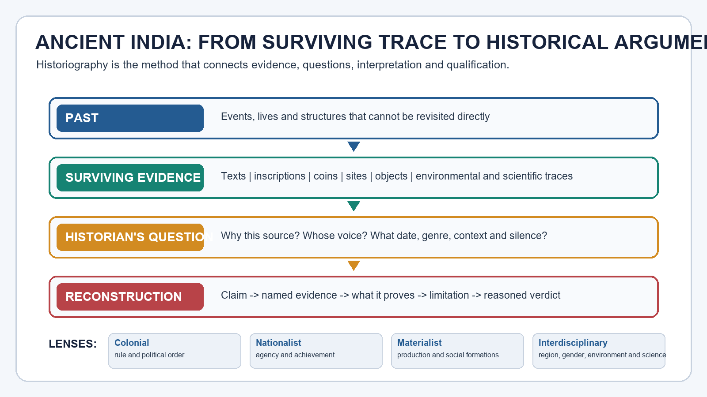
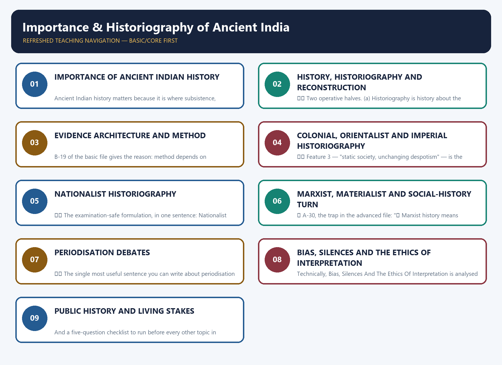

# Importance & Historiography of Ancient India — Learner-v2 Complete Learning Session

> **Catalogue identity:** Ancient History · Subject-wide Syllabus · `ancient-indian-history-01`
> **Generation date:** 20 August 2026 · **Approval:** pending explicit topic approval
> **Direct official ownership:** Prelims GS-I, Ancient India slice of "History of India and Indian National Movement". **Mains use:** method and culture-context support; no false claim of a printed standalone ancient-history clause.
>
> **Evidence key:** ✅ directly grounded in repository Markdown, OCR-searchable local books, official papers/keys or clearly named evidence · ⚠️ analytical inference or qualification · ❓ unavailable/unverified and therefore not asserted.
>
> **Source order used:** Basic owner -> OCR pages from R.S. Sharma -> legacy package/session -> local official PYQ corpus and legacy workbook -> Advanced owner and Upinder Singh OCR pages. Qdrant was not required and did not block generation.
>
> **Boundary:** Topic 02 owns the catalogue of sources; Topic 01 owns why source choice, criticism, periodisation and historiographical lens change the history written.



*Original deterministic visual: the chain from past to evidence, question and qualified reconstruction. It is an explanatory diagram, not historical evidence.*

#### Coverage and quality ledger

| Requirement | Included here |
|---|---|
| Basic owner | All 35 Basic claims, taught before practice and before optional Advanced depth |
| Advanced owner | All 35 Advanced claims, with detailed interdisciplinary, gender, regional, subaltern, environmental and science-method refinements in the optional block |
| Legacy preservation | Substantive teaching, verified PYQ audit, 32 original MCQs, six remedial drills, 10 solved original Mains questions and final register notes retained/reordered |
| Local book evidence | R.S. Sharma local PDF pp. 15–27; Upinder Singh local PDF introduction and source-method pages verified as OCR-searchable |
| Current linkage | Not forced: no unverified discovery is used as evidence |
| Answer standard | Demand decoding + claim -> named evidence -> analysis -> qualification -> verdict; every Mains model answer ends with **Why this earns marks** |

## BASIC LEARNING SESSION

### DEEP-REVIEW LEARNING CONTRACT

| Control | Binding rule for this package |
|---|---|
| Syllabus boundary | Complete Ancient History Core is taught before optional enrichment. |
| Evidence method | Claim → named site/text/inscription/coin/example → analysis → qualification. |
| Source hierarchy | Archaeology, textual testimony, inscriptions, coins and scholarly interpretation remain visibly distinct. |
| Contested issues | Competing interpretations are attributed, evidenced and bounded; certainty is not manufactured. |
| Practice contract | Every solved item has demand decoding, an examiner-grade model, an executable answer/compression plan, marks rationale and answer-specific improvement. |
| Approval | This immutable successor remains `approved: false` pending explicit approval. |

**Canonical Basic/Core owner:** `upsc-ai-kit\knowledge\Ancient-Indian-History\basic\01_Importance-and-Historiography.md`  
**Canonical topic owner:** `upsc-ai-kit\knowledge\Ancient-Indian-History\basic\01_Importance-and-Historiography.md`  
**Optional Advanced owner:** `upsc-ai-kit\knowledge\Ancient-Indian-History\advanced\01_Importance-and-Historiography.md`  
**Official syllabus mapping:** `upsc-ai-kit\knowledge\Ancient-Indian-History\OFFICIAL-UPSC-SYLLABUS-MAPPING.md`

### EVIDENCE, PYQ AND CURRENT-STATUS CONTROL

- **Archaeological inference:** material context supports bounded reconstruction; absence is not automatic proof of non-existence.
- **Textual testimony:** genre, authorship, redaction, patronage and temporal distance control what a text can prove.
- **Inscription and coin evidence:** contemporary names, titles, claims and circulation are powerful but do not by themselves map uniform territorial control.
- **Scholarly interpretation:** historian labels are arguments to test, not facts to memorise without evidence.
- **PYQ discipline:** repository ledgers and locally held official papers control wording and metadata; reconstructed wording and unavailable official keys must be labelled.
- **Current-status note, rechecked 2026-08-30:** No dated archaeological/current item was used as evidence because the official-domain check did not verify a suitable release; no discovery was fabricated or forced.

**Live/primary context sources recorded by the predecessor generation:**

- No live source is required for a static claim in this topic.




*Distinct embedded teaching-navigation image. The separate continuous Cārvāka-style flowchart package remains an independent at-a-glance artifact.*
### Roadmap

```text
                  WHY STUDY ANCIENT INDIA AT ALL?
        earliest cultures . agriculture . stock-raising . resources
        settlements . crafts . social institutions . varna/caste roots
        state formation  ->  "history beyond kings and battles"
                                    |
                                    v
                  BUT WHAT IS "HISTORY" HERE, EXACTLY?
        PAST (gone) != EVIDENCE (partial) != HISTORIAN'S QUESTION
        != NARRATIVE (written now)   ->  RECONSTRUCTION, NOT MEMORY
                                    |
                                    v
                  WHAT COUNTS AS EVIDENCE, AND HOW IS IT USED?
        literary . archaeological . epigraphic . numismatic . visual
        foreign accounts . linguistic . environmental/scientific
        RULE: CO-RELATE, do not rank.  Texts are LAYERED + NORMATIVE.
        (Topic 02 owns the catalogue; Topic 01 owns the method.)
                                    |
        +---------------------------+---------------------------+
        |                           |                           |
   HOW IT WAS WRITTEN          HOW IT WAS REWRITTEN        HOW IT IS WRITTEN NOW
   COLONIAL / ORIENTALIST      NATIONALIST                 MARXIST / MATERIALIST
   Mill's H-M-B periods        Mitra . Bhandarkar          Kosambi 1957/1965
   Smith 1904 . ICS bias       Rajwade . Kane . Jayaswal   R.S. Sharma
   Asiatic Society 1784        Raychaudhuri . Majumdar     production . class
   ASI 1871 . decipherment     Nilakanta Sastri            land . caste . varna
   collection + contempt       agency + golden ages        state formation
        |                           |                           |
        +---------------------------+---------------------------+
                                    |
                                    v
                  THE INTERDISCIPLINARY TURNS (late 20th - 21st c.)
        archaeology . anthropology . epigraphy . numismatics
        region . gender . subaltern/labour . environment . linguistics
        archaeobotany . zooarchaeology . aDNA . GIS/remote sensing
        (each ADDS a question; NONE settles the whole past alone)
                                    |
                                    v
                  PERIODISATION: LABELS ARE ARGUMENTS
        religious labels  ->  PROCESS labels
        urbanisation . state formation . agrarian expansion . exchange
        ancient | early medieval boundary . continuity + regional variation
                                    |
                                    v
                  BIAS, SILENCE AND THE ETHICS OF INTERPRETATION
        elite/textual bias . absent voices . presentism . communalism
        reverse glorification . archaeological nationalism
        ->  DISCIPLINED UNCERTAINTY, COMPETING HYPOTHESES
                                    |
                                    v
                  PUBLIC HISTORY AND LIVING STAKES
        museums . digitisation . manuscript surveys . inscription databases
        provenance vs ownership . repatriation . school narratives
        ->  a current excavation is a REVISION, not instant proof
                                    |
                                    v
                  COMPARATIVE SYNTHESIS + GS-I ANSWER ARCHITECTURE
```

| Session | Subtopic | Core focus |
|---:|---|---|
| 1 | Why ancient Indian history matters | Earliest cultures, agriculture and stock-raising, resource use, crafts, settlements, social institutions, varna/caste roots, state formation; "history beyond kings"; the relevance-of-the-past-to-the-present argument and its dangers |
| 2 | History, historiography and reconstruction | Past vs evidence vs the historian's question vs narrative; source criticism, corroboration, silence, bias, anachronism; *historia* = inquiry; "reconstruction, not memory" |
| 3 | Evidence architecture and method | Literary, archaeological, epigraphic, numismatic, art/architecture, foreign accounts, linguistic, environmental/scientific; **co-relation not hierarchy**; layered and normative texts; the strict boundary with Topic 02 |
| 4 | Colonial, Orientalist and imperial historiography | Mill's Hindu–Muslim–British periodisation; Smith's *Early History of India* 1904 and ICS pro-imperialism; Asiatic Society 1784, ASI 1871, decipherment, *Sacred Books of the East*; the contribution/limitation double ledger; why "all Orientalists" is a false category |
| 5 | Nationalist historiography | Mitra, R.G. Bhandarkar, Rajwade, Kane, D.R. Bhandarkar, Raychaudhuri, Majumdar, Jayaswal, Altekar, Nilakanta Sastri; recovery of agency; republics against the despotism myth; golden-age, elite and political-history limits; nationalist ≠ communal |
| 6 | The Marxist / materialist / social-history turn | Kosambi 1957 and 1965; R.S. Sharma; from the 1950s; production, technology, agriculture, land, class, caste/varna, social formations, state formation; interdisciplinary method; the reductionism and text-centrism critiques |
| 7 | Later interdisciplinary turns | Archaeology (processual/post-processual), anthropology and ethno-archaeology, epigraphy, numismatics, regional history, gender, subaltern and labour, environmental history, historical linguistics, archaeobotany and zooarchaeology, aDNA, GIS and remote sensing — what each adds and what none can prove alone |
| 8 | Periodisation debates | Religious labels versus process-based transitions; chronology as an analytical tool; urbanisation, state formation, agrarian expansion, trade and cultural change; prehistory/protohistory/history; the ancient–early medieval boundary; continuity, change and regional variation |
| 9 | Bias, silences and the ethics of interpretation | Elite and textual bias; absent voices; presentism; communalism; reverse glorification; colonial contempt; nationalist myth; archaeological nationalism; disciplined uncertainty and competing hypotheses |
| 10 | Public history and living stakes | Museums, digitisation, manuscript surveys, inscription databases, heritage interpretation, provenance versus ownership, repatriation, school narratives and public memory; current archaeology as revision, not instant historical proof |
| 11 | Comparative synthesis and UPSC answer architecture | The master matrix; the eight-step GS-I historiography spine; directive decoding; mark-level allocation; the vocabulary checklist; the ten sentences that must never appear in your answer |

**PYQ priority for this topic:** ⚠️ **Structurally decisive but nominally near-zero.** Reading every official GS-I Mains paper from 2018 to 2025 (eight papers, 160 questions) and every available official Prelims GS-I paper from 2018 to 2026 produces **no Mains question and no key-verifiable Prelims question that names historiography, periodisation, the Orientalist/Nationalist/Marxist schools, Mill, Smith, Kosambi or Majumdar as its subject**. One Prelims question — **2023, Q81** on Alexander Rea, A.H. Longhurst, Robert Sewell, James Burgess and Walter Elliot — *is* directly owned by this topic, but the official 2023 answer key is not held locally, so it is flagged and withheld from the solved set rather than answered from inference. The honest conclusion is not that the topic is unimportant. It is that this topic is **assumed by, not asked in,** the paper: it supplies the verbs ("reconstruct", "assess the importance of the accounts", "represents one of the most important sources of our knowledge"), the caution rules and the analytical spine for the ancient-history and art-and-culture questions that *are* asked every single year. The full audit, with the owning topic named for every borrowed question, is in the companion workbook.

> 🔑 **Master mnemonic — "ONE QUESTION, THREE SCHOOLS, FOUR TURNS, FIVE CAUTIONS."**
> **ONE** organising question (*what counts as evidence, and who is allowed to ask?*) · **THREE** classical schools (colonial/Orientalist → nationalist → Marxist/materialist) · **FOUR** later turns (archaeological-scientific, regional, gender/subaltern, environmental-digital) · **FIVE** permanent cautions (layered texts, elite silence, anachronism, overclaiming from science, periodisation as argument).

> ⚠️ **The single sentence that organises the whole topic:** *Ancient Indian history is not remembered, it is reconstructed — and every reconstruction carries the fingerprints of the evidence that survived, the question that was asked, and the politics of the person asking.* Every answer in this topic should be able to run backwards from any specific claim to that one sentence.
### SESSION 1 — IMPORTANCE OF ANCIENT INDIAN HISTORY

#### DEFINITION / WHAT THIS IS CALLED

**Plain-language definition:** Sharma opens Chapter 1 with this exact sequence: the study of ancient Indian history "tells us how, when, and where people developed the earliest cultures in India, how they began undertaking agriculture and stock raising which made life secure and settled." ✅ It then shows "how the ancient Indians discovered and utilized natural resources, and how they created the means for their livelihood." ✅ He continues: we get an idea of how the ancient inhabitants "made arrangements for food, shelter, and transport", and learn "how they took to farming, spinning, weaving, metalworking, and the like, how they cleared forests, founded villages, cities, and eventually large kingdoms." (Local PDF p.

**Technical definition:** Ancient Indian history matters because it is where subsistence, technology, settlement, language, social institutions and the state itself were first assembled — and because some of those assemblies, especially varna/caste, still structure the present.

#### ANSWER-GRABBING OPENING — WRITE/ADAPT IN THE EXAM

> Sharma opens Chapter 1 with this exact sequence: the study of ancient Indian history "tells us how, when, and where people developed the earliest cultures in India, how they began undertaking agriculture and stock raising which made life secure and settled." ✅ It then shows "how the ancient Indians discovered and utilized natural resources, and how they created the means for their livelihood." ✅ He continues: we get an idea of how the ancient inhabitants "made arrangements for food, shelter, and transport", and learn "how they took to farming, spinning, weaving, metalworking, and the like, how they cleared forests, founded villages, cities, and eventually large kingdoms." (Local PDF p.

#### MUST-WRITE KEYWORDS

- **Importance Of Ancient Indian History**
- **how, when and where**
- **agriculture and stock raising**
- **secure and settled**
- **discovered and utilized natural resources**
- **the means for their livelihood**

**How to use them:** Frame the answer through Importance Of Ancient Indian History; define how, when and where, connect agriculture and stock raising with secure and settled to explain the mechanism, and use discovered and utilized natural resources for the decisive comparison or qualification.

```text
   THE POPULAR PICTURE                    WHAT R.S. SHARMA ACTUALLY OPENS WITH
   +----------------------+               +--------------------------------------------+
   |  kings               |               | 6 | STATE FORMATION  (why kingdoms at all?)|
   |  battles             |               +--------------------------------------------+
   |  dates               |   is only     | 5 | SOCIAL INSTITUTIONS (varna/caste, kin, |
   |  dynasties           |   the TOP     |   |  gender, servitude) - and their ROOTS  |
   +----------------------+   of this ->  +--------------------------------------------+
                                          | 4 | SETTLEMENT (forest cleared, villages,  |
                                          |   |  cities, then large kingdoms)          |
                                          +--------------------------------------------+
                                          | 3 | CRAFT + TECHNOLOGY (spinning, weaving, |
                                          |   |  metalworking, transport, writing)     |
                                          +--------------------------------------------+
                                          | 2 | SUBSISTENCE (agriculture + stock-       |
                                          |   |  raising -> "life secure and settled")  |
                                          +--------------------------------------------+
                                          | 1 | EARLIEST CULTURES + NATURAL RESOURCES  |
                                          |   |  (how, when and WHERE)                 |
                                          +--------------------------------------------+

   READ THE STACK UPWARDS.  Every layer BELOW makes the layer above possible.
   A GS-I answer that starts at layer 6 and never descends is a chronicle, not history.
```

*What this shows:* Sharma's Chapter 1 does not begin with a king. It begins with **how, when and where** people developed the earliest cultures, and then climbs. Reproducing that climb is the single fastest way to make an ancient-history answer look analytical rather than encyclopaedic.

#### 1. The opening move: "how, when and where" — and why the order matters

✅ R.S. Sharma opens Chapter 1 with this exact sequence: the study of ancient Indian history "tells us **how, when, and where** people developed the earliest cultures in India, how they began undertaking **agriculture and stock raising** which made life **secure and settled**." ✅ It then shows "how the ancient Indians **discovered and utilized natural resources**, and how they created **the means for their livelihood**." ✅ He continues: we get an idea of how the ancient inhabitants "made arrangements for **food, shelter, and transport**", and learn "how they took to **farming, spinning, weaving, metalworking**, and the like, how they **cleared forests, founded villages, cities, and eventually large kingdoms**." *(Local PDF p. 14.)*

⚠️ Notice what has just happened in that single paragraph. Large kingdoms appear **last**, and appear as a **consequence** — of clearing, farming, crafts and settlement. The dynastic list that most candidates treat as the content of ancient history is, in Sharma's own framing, the **output** of the process, not the subject.

⚠️ The three interrogatives are not decorative. **How** = process and technique. **When** = chronology and sequence. **Where** = geography, ecology and region. A candidate who can attach those three words to any ancient-history topic — Harappan urbanism, the second urbanisation, Mauryan expansion, Gupta land grants — has already built the skeleton of an analytical answer.

✅ B-05 and B-21 of the basic file compress this into a formula that is worth memorising verbatim: **earliest cultures → agriculture → resource-use → livelihood**.

#### 2. Literacy, script and language: continuity as a *reason*, not a sentiment

✅ Sharma's very next paragraph makes a continuity argument: "People are not considered civilized unless they know how to write. The different forms of **writing** prevalent in India today are all derived from the **ancient scripts**. This is also true of the **languages** that we speak today. The languages we use have roots in ancient times, and have developed through the ages." *(p. 14.)*

⚠️ **Read this carefully, because it contains a value judgement and a factual claim glued together.** The factual claim — modern Indian scripts descend from ancient scripts, modern languages have ancient roots — is defensible and is the reason linguistics belongs in the evidence architecture (Subtopic 3.9). The value judgement — that people "are not considered civilized unless they know how to write" — is a **19th-century evolutionary criterion** that modern archaeology explicitly rejects. ⚠️ Upinder Singh's account of protohistory (Subtopic 8.3) shows why: the Harappans *were* literate but their script is undeciphered, and non-literate communities produced complex settlement, craft and exchange systems. **Literacy is a source condition for the historian, not a grade of civilisation.** Quoting Sharma's factual claim is safe; reproducing his evaluative clause as your own is not.

#### 3. Unity in diversity — the intermixture argument, stated exactly

✅ Sharma: "many races and tribes intermingled in early India. The **pre-Aryans, the Indo-Aryans, the Greeks, the Scythians, the Hunas, the Turks**, and others made India their home. Each ethnic group contributed its mite to the evolution of the Indian social system, art and architecture, language and literature." *(p. 14.)*

✅ The linguistic evidence he gives for this is precise and examinable:

| Direction of borrowing | Evidence Sharma cites | Date bracket he attaches |
|---|---|---|
| ✅ Peninsular / non-Vedic → Vedic corpus | Many **Munda, Dravidian and other non-Sanskritic terms** occur in the Vedic texts | ✅ ascribed to **1500–500 BC** |
| ✅ Gangetic plains → Tamil south | Many **Pali and Sanskrit terms** signifying ideas and institutions developed in the Gangetic plains appear in the earliest Tamil texts, the **Sangam literature** | ✅ Sangam roughly **300 BC – AD 600** |
| ✅ Munda → Indo-Aryan | Terms signifying the use of **cotton, navigation, the digging stick** traced to Munda languages by linguists | ✅ Munda pockets survive in the **Chhotanagpur plateau** |
| ✅ Dravidian and Munda → Vedic phonetics | Changes in the **phonetics and vocabulary** of the Vedic language explicable on the basis of Dravidian influence as much as Munda | ⚠️ a linguistic inference, not a dated event |

✅ On names: the territorial units were called **janapadas**, named after different tribes; the country as a whole came to be named **Aryavarta** after the Aryans, denoting northern and central India from the eastern to the western sea coasts; the other name was **Bharatavarsha**, the land of the Bharatas. ✅ Sharma is careful about the last: "**Bharata**, in the sense of tribe or family, figures in the **Rig Veda and Mahabharata**, but the name **Bharatavarsha** occurs in the **Mahabharata and post-Gupta Sanskrit texts**"; it was applied to one of the nine divisions of the earth and in the post-Gupta period denoted India; the term **Bharati**, an inhabitant of India, occurs in post-Gupta texts.

✅ On the term *Hindu*: "Iranian inscriptions are important for the origin of the term Hindu. The term Hindu occurs in the inscriptions of **fifth–sixth centuries BC**. It is derived from the Sanskrit term **Sindhu**. Linguistically **s becomes h in Iranian**. The Iranian inscriptions first mention Hindu as **a district on the Indus**. Therefore, in the earliest stage, the term Hindu means **a territorial unit. It neither indicates a religion nor a community**." *(p. 16.)*

> 🔑 **This is one of the highest-value sentences in the entire topic.** It is simultaneously (a) a Prelims-grade etymological fact with a date, (b) the empirical basis for rejecting Mill's periodisation in Subtopic 4, and (c) the reason Sharma later writes that "neither Hindu nor Hindu dharma is known to any ancient Sanskrit text nor to any other ancient source" (Subtopic 9.6). One fact, three separate answers.

✅ On political unity: kings who tried to establish authority from the Himalayas to Cape Comorin and from the Brahmaputra valley to beyond the Indus were called **Chakravartis**. ✅ Sharma says this form of political unity was attained "**at least twice**" in ancient times — **Ashoka in the third century BC**, whose inscriptions are scattered across a major part of the subcontinent and even Afghanistan, and **Samudragupta in the fourth century AD**, who carried his arms from the Ganga to the borders of the Tamil land. ✅ In the seventh century the Chalukya king **Pulakeshin defeated Harshavardhana**, who was called the lord of the whole of north India.

✅ On linguistic unification: in the **third century BC, Prakrit served as the lingua franca** across the major part of India, and **Ashoka's inscriptions were inscribed in Prakrit mainly in the Brahmi script**; later **Sanskrit** acquired the same position and served as the state language even in the remotest parts, conspicuously during the **Gupta period in the fourth century**; in the post-Gupta period official documents continued to be written in Sanskrit. ✅ The **Ramayana and Mahabharata** "were studied with the same zeal and devotion in the land of the Tamils as in the intellectual circles of Banaras and Taxila", originally composed in Sanskrit with versions produced in different local languages.

✅ **Sharma's Chapter 1 Chronology table, reproduced exactly:**

| Date | Marker |
|---|---|
| ✅ 1500–500 BC | Dravidian and non-Sanskritic terms found in Vedic texts |
| ✅ 300 BC – AD 600 | Sangam literature |
| ✅ 3rd c. BC | Prakrit as the lingua franca |
| ✅ AD 4th c. onwards | Sanskrit as the state language |

#### 4. Varna and caste: why Sharma singles this out

✅ Sharma states the reason plainly: "Indian history is especially worthy of our attention because of a **peculiar type of social system** which developed in India. In **north India**, the **varna/caste system** developed which eventually **spread throughout the country**, and influenced even the **Christians and the Muslims**. Even converts to Christianity and Islam continued to follow some of their old caste practices." *(p. 17.)*

✅ This is B-07 and B-22 of the basic file: ancient history matters because an institution with a **long root** still organises social life. ⚠️ The analytical payoff is that varna/caste becomes a *historical* object with a *datable trajectory* — origin region, mechanism of spread, transmission across religious boundaries — rather than a timeless essence. That is precisely the move Subtopic 6 will show the Marxist school making systematically.

#### 5. "History beyond kings and battles" — the frame of the whole book

✅ B-08: the book frames ancient India through **material culture, state formation and social formation**, not only kings and battles. ✅ This is not a claim the basic file makes on Sharma's behalf; it is visible in his own chapter architecture, which places "Nature of Sources and Historical Construction", "Geographical Setting", "Ecology and Environment" and "The Linguistic Background" (Chapters 3–6) *before* the first human being appears in Chapter 7.

⚠️ **Answer-writing consequence.** In any ancient-history question, one paragraph of your answer should be reserved for the **non-political substrate**: ecology, subsistence, technology, exchange or social structure. Even in a question about a dynasty. This single habit separates a 9/15 answer from a 6/15 answer, because it demonstrates that you know the dynasty was standing on something.

#### 6. The relevance of the past to the present — Sharma's hardest and most misread section

✅ Sharma writes that the study of India's past "assumes special significance in the context of the problems we currently face". ✅ He identifies a specific phenomenon: "Some people clamour for the **restoration** of ancient culture and civilization, and a substantial number are sentimentally swayed by what they consider to be the **past glories** of India." ✅ He then draws a sharp distinction that candidates routinely miss: "**This is different from a concern for the preservation of ancient heritage in art and architecture.** What they really want to bring back is the **old pattern of society and culture**." *(p. 17.)*

✅ His argument then runs in four steps:
1. ✅ "There is no doubt that Indians of old made remarkable progress in a variety of fields, but these advances alone cannot enable us to compete with the achievements of **modern science and technology**."
2. ✅ "We cannot ignore the fact that ancient Indian society was marked by **gross social injustice**. The **lower orders, particularly the shudras and untouchables**, were encumbered with disabilities which are shocking to the modern mind. Similarly, **law and custom discriminate against women in favour of men**."
3. ✅ "The **restoration** of the old way of life will naturally revive and strengthen all these inequities."
4. ✅ "The success of the ancients in surmounting the difficulties presented by nature and human factors can build our hope and confidence in the future but **any attempt to bring back the past will mean a perpetuation of the social inequity** that afflicted India."

✅ He adds a further, historically specific claim: old norms, values, social customs and ritualistic practices "were **deliberately fostered in colonial times**", and that "**caste barriers and prejudices** do not allow even educated individuals to appreciate the **dignity of manual labour**"; that though women have been enfranchised, "their **age-old social subordination** prevents them from playing their due role". ✅ His conclusion: studying the ancient past "helps us to deeply examine the **roots of these prejudices** and discover the causes that sustain the caste system, subordinate women, and promote narrow religious sectarianism". *(p. 18.)*

⚠️ **The two errors to avoid here, both fatal in an answer.** Error one: quoting the "gross social injustice" passage as if it were an attack on ancient India as such — it is not; Sharma explicitly credits "remarkable progress in a variety of fields" in the same paragraph. Error two: quoting the "past glories" passage as if any interest in heritage were suspect — Sharma explicitly exempts "the preservation of ancient heritage in art and architecture". ⚠️ **What Sharma is actually distinguishing is *studying* the past from *restoring* it.** That distinction is the single most useful sentence you can carry into a GS-I answer on tradition, continuity or cultural nationalism.

⚠️ **Upinder Singh reaches a compatible destination from the opposite direction.** She writes that "there is great value in understanding ourselves and our times within a **larger historical context**", that "the most important thing that history can do is to teach us to **think historically**", and — crucially — that history "is marked not only by **continuities**, but also by major **ruptures and changes**. So it would be a mistake to expect to find in the ancient past a **mirror of the present**. In fact, more interesting than the aspects that are familiar to us are those that are **startlingly different**." *(Local PDF p. 115.)* ⚠️ Sharma warns against *restoring* the past; Upinder warns against *recognising yourself in* it. Together they define the discipline's stance toward relevance: **the past is useful precisely because it is not us.**

#### 7. Core Concept | Example | Exam Link

| Core concept | India-centric example | Exam link (Prelims + Mains) |
|---|---|---|
| ✅ Ancient history = process, not dynasty list: earliest cultures → agriculture and stock-raising → resource use → livelihood | ✅ Sharma's own opening paragraph placing "large kingdoms" last in a sequence that begins with forest clearing and farming | **P:** the sequence itself is a matching-question skeleton. **M:** open any ancient-history answer with the process substrate before the polity |
| ✅ Continuity as a *reason* for study: scripts and languages descend from ancient forms | ✅ Prakrit as 3rd-c. BC lingua franca in Brahmi → Sanskrit as state language from the Gupta 4th c. | **P:** Prakrit/Brahmi/Ashoka linkage is directly examinable. **M:** the "living roots" paragraph in any culture question |
| ✅ Intermixture as the empirical basis of "unity in diversity" | ✅ Munda terms for cotton, navigation and the digging stick inside Indo-Aryan; Pali and Sanskrit institutional terms inside Sangam literature | **P:** language-family and borrowing questions. **M:** the standard counter to any single-origin claim |
| ✅ *Hindu* as an originally **territorial** term from Iranian inscriptions of the 5th–6th c. BC, from Sanskrit *Sindhu* | ✅ "Hindu as a district on the Indus… neither a religion nor a community" | **P:** high-probability etymology fact. **M:** the evidence base for rejecting religious periodisation |
| ✅ Varna/caste as a north-Indian institution that spread nationally and crossed religious boundaries | ✅ Converts to Christianity and Islam continuing old caste practices | **P:** social-institution questions. **M:** the bridge from ancient history to GS-I Indian Society |
| ✅ Studying the past ≠ restoring the past | ✅ Sharma exempting "preservation of ancient heritage in art and architecture" while rejecting restoration of the old social pattern | **M:** the highest-value single distinction in this entire topic for any tradition/modernity question |


#### ✅ FACTS | ⚠️ INFERENCES

| ✅ Facts established in this subtopic | ⚠️ Inferences you may draw in an answer |
|---|---|
| ✅ Sharma's opening sequence: earliest cultures → agriculture and stock-raising → resource use → livelihood → food, shelter, transport → farming, spinning, weaving, metalworking → forest clearing → villages → cities → large kingdoms | ⚠️ Dynastic history is the *output* of this stack; an answer that omits the stack is a chronicle |
| ✅ Munda, Dravidian and other non-Sanskritic terms in Vedic texts ascribed to 1500–500 BC; Sangam literature roughly 300 BC – AD 600 | ⚠️ Cultural exchange in early India was **bidirectional**, not a one-way diffusion from a single centre |
| ✅ *Hindu* first occurs in Iranian inscriptions of the 5th–6th c. BC, from *Sindhu*, denoting a district on the Indus — a territorial, not religious, term | ⚠️ Any periodisation that treats "Hindu" as a self-evident ancient identity is projecting a modern category backwards |
| ✅ Prakrit was the 3rd-c. BC lingua franca; Ashoka's inscriptions are in Prakrit mainly in Brahmi; Sanskrit became the state language conspicuously in the Gupta 4th c. | ⚠️ Language policy is state policy; script and language choice are evidence of political reach |
| ✅ Political unity of the Chakravarti type was attained "at least twice" — Ashoka (3rd c. BC) and Samudragupta (4th c. AD) | ⚠️ This is Sharma's direct empirical rebuttal to Smith's claim that India never knew political unity before British rule (Subtopic 4.5) |
| ✅ Varna/caste developed in north India, spread throughout the country and influenced converts to Christianity and Islam | ⚠️ Caste is best written about as a **historical process with a geography**, never as an essence |
| ✅ Sharma distinguishes *preservation of heritage in art and architecture* (endorsed) from *restoration of the old social pattern* (rejected) | ⚠️ This distinction is the safest possible framing for any GS-I question on tradition versus reform |
| ✅ Upinder Singh: history teaches us to **think historically**; the past is marked by ruptures as well as continuities and is not a mirror of the present | ⚠️ Relevance arguments must be built on *contrast* as well as continuity, or they collapse into presentism (Subtopic 9.3) |

#### Why UPSC cares · Probable question

⚠️ **Why UPSC cares.** GS-I asks History, Art and Culture, and Indian Society from the *same* paper. The examiner's implicit test is whether a candidate can move between them. Subtopic 1 is the hinge: varna/caste roots connect to Indian Society; script, language and epic transmission connect to Art and Culture; agriculture, resources and settlement connect to Geography. A candidate who has internalised Sharma's stack can build that bridge in one sentence; a candidate who has memorised dynasties cannot build it at all.

⚠️ **Probable question (Mains, 10 marks / 150 words):** *"Ancient Indian history is the history of how people made a living, not merely of who ruled them." Examine.*
⚠️ **Probable question (Prelims):** a statement-based item pairing the origin of the term *Hindu* in Iranian inscriptions with its earliest meaning as a territorial unit.

#### UPSC Traps · Mini Recap

| ❌ Trap | ✅ Correction |
|---|---|
| ❌ B-28: "Ancient history is mainly a list of kings" | ✅ It is also social, economic, ecological and cultural history — Sharma's own opening sequence reaches kingdoms only at the end |
| ❌ "Unity in diversity" means everyone was always the same | ✅ Sharma's argument is the opposite: unity emerged *through* intermixture of pre-Aryans, Indo-Aryans, Greeks, Scythians, Hunas and Turks, each contributing "its mite" |
| ❌ *Hindu* was always a religious identity | ✅ In the earliest Iranian inscriptional stage it denoted a **territorial unit** — a district on the Indus — and "neither indicates a religion nor a community" |
| ❌ Bharatavarsha is a Rig Vedic term | ✅ *Bharata* as tribe/family figures in the Rig Veda and Mahabharata; the name **Bharatavarsha** occurs in the Mahabharata and **post-Gupta** Sanskrit texts |
| ❌ Sharma is hostile to ancient Indian achievement | ✅ He credits "remarkable progress in a variety of fields"; his target is **restoration of the old social pattern**, and he explicitly exempts heritage preservation |

**Mini recap.** Ancient Indian history matters because it is where subsistence, technology, settlement, language, social institutions and the state itself were first assembled — and because some of those assemblies, especially varna/caste, still structure the present. Sharma's method is to read the stack from the bottom. Upinder's caution is that the past is not a mirror. Hold both.

#### REVISION NOTES — Subtopic 1

- ✅ Sharma's opening formula, verbatim order: **earliest cultures → agriculture and stock-raising → natural resources → means of livelihood → food, shelter, transport → farming, spinning, weaving, metalworking → forest clearing → villages → cities → large kingdoms.**
- ✅ Three interrogatives that organise the whole discipline: **how (process), when (chronology), where (region and ecology)**.
- ✅ Intermixture list: **pre-Aryans, Indo-Aryans, Greeks, Scythians, Hunas, Turks** — "each contributed its mite".
- ✅ Munda loans into Indo-Aryan: **cotton, navigation, digging stick**; Munda survivals in the **Chhotanagpur plateau**.
- ✅ Dates to fix: non-Sanskritic terms in Vedic texts **1500–500 BC**; **Sangam literature 300 BC – AD 600**; **Prakrit lingua franca 3rd c. BC**; **Sanskrit as state language from AD 4th c.**
- ✅ **Janapadas** named after tribes → **Aryavarta** (northern and central India, sea to sea) → **Bharatavarsha** (Mahabharata and **post-Gupta** texts); **Bharati** = inhabitant, post-Gupta.
- ✅ **Hindu** ← Sanskrit **Sindhu**; **s → h** in Iranian; Iranian inscriptions of the **5th–6th c. BC**; earliest meaning = **a district on the Indus**, a territorial unit, "neither a religion nor a community".
- ✅ **Chakravarti** unity attained "at least twice": **Ashoka, 3rd c. BC** (inscriptions across the subcontinent and Afghanistan) and **Samudragupta, 4th c. AD** (Ganga to the Tamil borders). **Pulakeshin defeated Harshavardhana**, 7th c.
- ✅ **Varna/caste**: developed in **north India**, spread nationally, influenced converts to Christianity and Islam.
- ✅ Sharma's relevance argument: **preservation of art and architectural heritage ≠ restoration of the old social pattern**; restoration would "perpetuate the social inequity"; survivals were "**deliberately fostered in colonial times**".
- ✅ Upinder Singh's counterpart: history teaches us to **think historically**; expect **ruptures** as well as continuities; the past is **not a mirror of the present**.

#### CLOSING RECALL FLOW — IMPORTANCE OF ANCIENT INDIAN HISTORY

```text
START / CONCEPT: IMPORTANCE OF ANCIENT INDIAN HISTORY
        |
        v
EXACT TERMS: Importance Of Ancient Indian History · how, when and where · agriculture and stock raising · secure and settled · discovered and utilized natural resources · the means for their livelihood
        |
        v
MECHANISM / ARGUMENT: Ancient Indian history matters because it is where subsistence, technology, settlement, language, social institutions and the state itself were first assembled — and because some of those assemblies, especially varna/caste, still structure the present.
        |
        v
CONSEQUENCE / CONTRAST: ⚠️ Probable question (Mains, 10 marks / 150 words): "Ancient Indian history is the history of how people made a living, not merely of who ruled them." Examine. ⚠️ Probable question (Prelims): a statement-based item pairing the origin of the term Hindu in Iranian inscriptions with its earliest meaning as a territorial unit.
        |
        v
UPSC TRAP / ANSWER-USE: The dynastic list that most candidates treat as the content of ancient history is, in Sharma's own framing, the output of the process, not the subject.
        |
        v
ANSWER-GRABBING FORMULATION: Sharma opens Chapter 1 with this exact sequence: the study of ancient Indian history "tells us how, when, and where people developed the earliest cultures in India, how they began undertaking agriculture and stock raising which made life secure and settled." ✅ It then shows "how the ancient Indians discovered and utilized natural resources, and how they created the means for their livelihood." ✅ He continues: we get an idea of how the ancient inhabitants "made arrangements for food, shelter, and transport", and learn "how they took to farming, spinning, weaving, metalworking, and the like, how they cleared forests, founded villages, cities, and eventually large kingdoms." (Local PDF p.
```
### SESSION 2 — HISTORY, HISTORIOGRAPHY AND RECONSTRUCTION

#### DEFINITION / WHAT THIS IS CALLED

**Plain-language definition:** When B-33 tells you to argue that "ancient Indian history is a reconstruction, not a memory", the etymology is the opening line of that answer.

**Technical definition:** ⚠️ Two operative halves. (a) Historiography is history about the writing of history: its object is historians, not kings. (b) Changes in it are explained by political and intellectual context — which is why a historiography answer must always name the context (colonial administration, national movement, post-1947 social-science expansion, post-1980 ideological polarisation) alongside the school.

#### ANSWER-GRABBING OPENING — WRITE/ADAPT IN THE EXAM

> When B-33 tells you to argue that "ancient Indian history is a reconstruction, not a memory", the etymology is the opening line of that answer.

#### MUST-WRITE KEYWORDS

- **History**
- **Historiography**
- **Reconstruction**
- **historia**
- **inquiry or investigation**
- **inquiry**

**How to use them:** Frame the answer through History; define Historiography, connect Reconstruction with historia to explain the mechanism, and use inquiry or investigation for the decisive comparison or qualification.

```text
  [1] THE PAST                [2] THE EVIDENCE          [3] THE QUESTION       [4] THE NARRATIVE
  everything that             the tiny, biased,         what THIS historian    the written history
  actually happened           accidental fraction       chose to ask, in       you finally read
                              that SURVIVED and was     THIS present
                              FOUND and was READ
   +-------------+             +-------------+           +-------------+        +-------------+
   |#############|  --loss-->  |    ###      | --choice->|   ##        | --arg->|  #  #  #    |
   |#############|  survival   |   #   #     |  framing  |  #   #      |  prose |    #    #   |
   |#############|  bias       |     #  #    |           |    #        |        |  #    #     |
   +-------------+             +-------------+           +-------------+        +-------------+
   GONE. Cannot be             PARTIAL. Preservation     SELECTIVE. No question  PROVISIONAL.
   revisited directly.         + discovery + decipher-   = no history. Every    Revisable by new
                               ment all filter it.       question excludes.     evidence or a
                                                                                better argument.

   GAP 1: survival/discovery bias    GAP 2: the historian's present     GAP 3: rhetoric and genre
   -> absence of evidence is NOT     -> "changing interpretations"      -> a good story is not
      automatically evidence of         is a fact ABOUT HISTORIANS,        automatically a true
      absence                            not about the past                one

                  ===>  HISTORY IS A RECONSTRUCTION, NOT A MEMORY  <===
```

*What this shows:* three gaps, not one. Most candidates know Gap 1 (sources are incomplete). Strong answers also work Gap 2 (the historian's present shapes the question) and Gap 3 (narrative form is not neutral). Naming all three is what "critically examine" is actually asking for in this topic.

#### 1. The word itself: *historia* means inquiry, not recollection

✅ Upinder Singh: "The English word '**history**' comes from the Greek ***historia*** (**inquiry or investigation**). History is essentially a discipline that **inquires into the experiences of people who lived in the past**." *(Local PDF p. 102.)*

⚠️ Everything in this subtopic follows from that etymology. An **inquiry** has a **question**, a **method**, an **evidence base** and a **conclusion that can be wrong**. A **memory** has none of these. When B-33 tells you to argue that "ancient Indian history is a reconstruction, not a memory", the etymology *is* the opening line of that answer.

#### 2. Upinder Singh's three foundational statements — learn them as a block

✅ **(i) On accessibility:** "The past is gone and **cannot be revisited directly**. It can only reveal itself through **historical sources** and **skillful interpretations and reconstructions** of the past by historians." *(p. 106.)*

✅ **(ii) On what writing history is not:** "Writing history does **not** mean **collecting and assembling a set of self-evident facts**. It involves a **rigorous analysis of the primary sources, reasoned argument, and interpretation**." *(p. 106.)*

✅ **(iii) On finality:** "The past, like the present, is complex and can be looked at from many different perspectives. There can never be a **single, final, perfect history**. There can never be a complete or exact picture of what happened in the past; the task of the historian is to **bring us as close as possible** to such a picture." *(p. 119.)*

✅ **And the indispensable qualifier that stops all three from collapsing into relativism:** "**All histories are partial and provisional and subject to revision, but all histories are not equally reliable or acceptable.** They have to be **supported by evidence** from the sources and must **stand up to scrutiny** when subjected to rigorous analysis." *(p. 227.)*

> 🔑 **This is the most important quartet in the entire topic.** The first three statements, quoted alone, sound like "history is just opinion" — and a candidate who writes that has failed. The fourth statement is the load-bearing one: **provisional is not the same as arbitrary.** Reconstructions are ranked by evidence and argument. Always deploy the fourth statement in the same paragraph as the first three.

✅ A-05 of the advanced file compresses the same point: ancient Indian history is constructed through **source criticism, archaeology and interpretation**, and the colonial, nationalist and Marxist schools **selected different questions and categories**.

#### 3. What "historiography" actually means — the definition you must be able to give

✅ Upinder Singh defines it in parentheses, and the parenthesis is the definition: "The **historiography** (**the scholarly activity of constructing and writing history**) of ancient and early medieval India reveals many significant changes over time; these can be understood **against the background of the political and intellectual contexts in which they emerged and flourished**." *(p. 107.)*

⚠️ Two operative halves. **(a)** Historiography is history *about the writing of history*: its object is historians, not kings. **(b)** Changes in it are explained by **political and intellectual context** — which is why a historiography answer must always name the context (colonial administration, national movement, post-1947 social-science expansion, post-1980 ideological polarisation) alongside the school.

✅ **And her essential warning against the neat-progression story:** "The various 'schools' of history writing are often presented and understood in terms of **one school making way for the other in a neat, forward progression**. The reality is, however, **much more complex**. There was **considerable variety within the various schools**; some of them **co-existed (and still do so) in dialogue or conflict** with each other; and there are **many examples of writings that do not easily fit** into the dominant historiographical trends of their time." *(p. 107.)*

> 🔑 **Trap alert, and it is the single most common failure in this topic.** Almost every coaching note presents historiography as a relay race: colonial → nationalist → Marxist → interdisciplinary, each handing the baton cleanly to the next. Upinder Singh explicitly denies this. In your answer, write **"overlapping and contending", not "succeeding"**, and give one concrete instance: A.L. Basham's *The Wonder That Was India* (1951) and D.D. Kosambi's *Introduction* (1957) appear within six years of each other with entirely different projects, while nationalist dynastic history was still, on R.S. Sharma's own account, attracting "the largest number of Indian scholars" until 1960.

#### 4. Ancient India's own historical consciousness — cyclical *and* linear

✅ Upinder Singh: "All societies have a sense of the passage of time and of the past. In ancient India, texts such as the **epics and Puranas** reflect the existence of a **cyclical concept of time** — of the idea of **four yugas (ages) of krita, treta, dvapara, and kali, which together form a mahayuga**. But **a sense of linear time also existed**, for instance, in the use of **eras** and **sequential accounts of dynasties and kings**." *(p. 106.)*

✅ Where that consciousness is visible: "**king lists in the Puranas**, the idea of ***itihasa***, the **epic narratives**, accounts of **saints and teachers in Jaina texts**, **royal biographies**, and the **genealogies and accounts of political events preserved in royal inscriptions**."

✅ And the qualification: "the historical consciousness reflected in the **traditional histories** of ancient India is **significantly different** from the ways in which history is **researched and taught in modern universities**."

⚠️ **Why this matters more than it looks.** The colonial generalisation that "Indians lacked a sense of history" (Subtopic 4.3) is rebutted **here**, not by asserting national pride but by producing the evidence: king lists, eras, *itihasa*, genealogies, royal biographies, Jaina teacher-lineages. ⚠️ But note the discipline: the rebuttal is that ancient India had a **different** historical consciousness, not an **identical modern** one. R.S. Sharma himself concedes the narrower version of the colonial point — "in comparison to the Chinese, Indians did not show any strong sense of chronology although in the earlier stage, important events were dated with reference to the **death of Gautama Buddha**" — while calling the wider generalisations "by and large either **false or grossly exaggerated**". ⚠️ **Reproducing that two-step — concede the narrow, refuse the wide — is exactly what "critically examine" rewards.**

#### 5. The four operations of source criticism

⚠️ Neither file gives these as a numbered list, so here is the working list this session will use throughout, each grounded in a source statement:

| Operation | What it asks | Grounding |
|---|---|---|
| **1. Authentication and dating** | Is this what it claims to be, and when was it made? Which *layer* of it is old? | ✅ Upinder: texts "grew and changed over time… it becomes essential to try to identify its different **chronological layers** and the various **additions or interpolations**"; a **critical edition** is built from comparative study of manuscripts, treating parts common to all as the original core, with a **critical apparatus** flagging variants |
| **2. Contextualisation** | Who made it, for whom, in what genre, inside what power structure? | ✅ Upinder: identify the authors' "background and the **perspectives and biases** they reflect, such as those of **class, religion, and gender**"; ask where composed, where and in what forms it circulated, who transmitted it, who the **target audience** was, and its "place… within prevailing social and political **power structures**" |
| **3. Corroboration (co-relation)** | Does an independent source of a different type point the same way? | ✅ Upinder: "**Wherever several sources are available, their evidence has to be co-related.**" A-11 and A-24 |
| **4. Reading the silence** | What is systematically absent, and is the absence meaningful or accidental? | ✅ Upinder: get around elite bias by "**reading texts against the grain**, being attentive to their **silences and nuances**, and drawing on the evidence of **archaeology**"; ✅ advanced/02: "absence of a source is not always absence of a practice; it may reflect **preservation and discovery bias**" |

⚠️ **The rule that follows for absence.** *Absence of evidence is not evidence of absence* — **unless** you can establish three conditions: (i) the evidence type, had the practice existed, would have had a **reasonable chance of surviving**; (ii) the relevant contexts have actually been **searched** at adequate scale; and (iii) the **silence is patterned**, not random. State those three conditions explicitly and an examiner sees a trained mind; assert the slogan without them and you have said nothing.

#### 6. Bias is not a disqualifier — it is a coordinate

⚠️ Candidates habitually treat "biased" as a verdict that ends analysis. It is the opposite: it is the beginning. ✅ Upinder's own practice shows this: ancient texts "largely reflect the perspectives and ideas of political, social, or religious elites. **Almost all of them were written by upper-class men for other upper-class men**" — and yet she does not discard them; she specifies **how** to read them (against the grain, attentive to silences, with archaeological corroboration).

⚠️ **Formulation to memorise:** *A source's bias tells you where its author was standing. Knowing where someone stood is information, not noise.* A royal inscription is a biased source for popular opinion **and** an excellent source for how a king wished to be seen — which is itself a historical fact about legitimation.

#### 7. Anachronism — the error that destroys the most answers

✅ A-10 and A-23: ancient texts "mix religious and non-religious themes; **modern categories must not be imposed mechanically**." ✅ Upinder makes the deeper version of the point about texts generally: "an ancient text does **not** give a simple or direct reflection of the society of its time. It offers a **complex representation** of that society and a **refracted image** of the past." *(p. 122.)*

⚠️ **The four anachronisms that recur in ancient-India answers, with the correction:**

| ❌ Anachronism | ✅ Correction |
|---|---|
| ❌ Treating "religion" and "secular" as separable domains in an ancient text | ✅ The categories interpenetrate; a Dharmashastra passage on land is simultaneously ritual, legal and economic |
| ❌ Reading *jati*/varna prescriptions as a description of a functioning system | ✅ Normative texts prescribe an ideal; practice must be independently established (Subtopic 3.4) |
| ❌ Calling early polities "nation states" or their rulers "national" | ✅ Territoriality, kingship and legitimation had different logics; use the source's own vocabulary (*janapada*, *rashtra*, *chakravarti*) |
| ❌ Treating an archaeological culture as an ethnic, linguistic or political identity | ✅ Upinder: "An archaeological culture need **not** necessarily correspond to a **linguistic group, political unit, or a social group** such as a lineage, clan, or tribe" |

#### 8. "Reconstruction, not memory" — building the actual answer

⚠️ B-33 is a Mains angle in the basic file. Here is the eight-move spine it deserves, which Subtopic 11 will generalise:

```text
  1  DEFINE      historia = inquiry; historiography = the activity of constructing history
  2  ESTABLISH   the past is gone; only sources + interpretation give access
  3  DEMONSTRATE the three gaps: survival/discovery bias | historian's present | narrative form
  4  EVIDENCE    layered texts (critical editions) | undeciphered Harappan script | elite authorship
  5  METHOD      the four operations: date . contextualise . co-relate . read the silence
  6  SCHOOLS     colonial / nationalist / Marxist / interdisciplinary asked DIFFERENT questions
  7  GUARD       provisional != arbitrary: "all histories are not equally reliable or acceptable"
  8  VERDICT     reconstruction is a STRENGTH - it is revisable, testable and accountable
```

⚠️ Move 7 is the one that converts a 6/10 answer into a 9/10 answer, and it is the one most candidates omit.

#### 9. Core Concept | Example | Exam Link

| Core concept | India-centric example | Exam link |
|---|---|---|
| ✅ *Historia* = inquiry; history is a question-driven discipline | ✅ The same Harappan burial data answers different questions for a demographer, an epidemiologist and a social historian | **M:** opening line of any "reconstruction" question |
| ✅ Historiography = the scholarly activity of constructing and writing history, explained by political and intellectual context | ✅ Modern research on ancient India began "to serve the needs of the **British colonial administration**" (Sharma, p. 19) | **M:** always pair school with context |
| ✅ Schools overlap and contend; they do not form a neat relay | ✅ Basham 1951 and Kosambi 1957 six years apart with opposite projects, while dynastic history dominated until 1960 | **M:** the sentence that signals genuine reading |
| ✅ Ancient India had cyclical *and* linear time-senses | ✅ Four yugas — krita, treta, dvapara, kali → *mahayuga*; against eras, Puranic king lists, royal genealogies | **P:** yuga-sequence questions. **M:** rebuttal to "no sense of history" |
| ✅ Four operations of source criticism | ✅ Critical editions of the Mahabharata; Ashokan edicts co-related with NBPW-phase archaeology | **M:** the method paragraph of any source question |
| ✅ Absence of evidence ≠ evidence of absence, under three conditions | ✅ Hardly any surviving writing between c. 1900 BCE and the 4th c. BCE — a preservation problem, not proof of illiteracy | **P + M:** the highest-frequency reasoning trap in ancient history |
| ✅ Provisional ≠ arbitrary | ✅ "All histories are partial and provisional… but all histories are not equally reliable or acceptable" | **M:** the guard clause that prevents a relativist verdict |


#### ✅ FACTS | ⚠️ INFERENCES

| ✅ Facts | ⚠️ Inferences |
|---|---|
| ✅ *History* ← Greek *historia*, meaning inquiry or investigation | ⚠️ A discipline defined as inquiry cannot be defined as memory |
| ✅ "The past is gone and cannot be revisited directly… only through historical sources and skillful interpretations" | ⚠️ Every historical statement is mediated; the mediation is the historian's professional responsibility |
| ✅ "Writing history does not mean collecting and assembling a set of self-evident facts" | ⚠️ Fact-listing answers are structurally incapable of scoring in "critically examine" questions |
| ✅ "There can never be a single, final, perfect history" | ⚠️ Competing hypotheses are the normal state of the discipline, not a scandal |
| ✅ "All histories are partial and provisional… but all histories are not equally reliable or acceptable" | ⚠️ The ranking criterion is evidential support plus survival under scrutiny — state it or your answer reads as relativism |
| ✅ Historiography = the scholarly activity of constructing and writing history, understood against political and intellectual contexts | ⚠️ Name the context whenever you name a school |
| ✅ Schools showed considerable internal variety, co-existed in dialogue or conflict, and did not fit a neat forward progression | ⚠️ "Overlapping and contending", never "succeeding" |
| ✅ Cyclical time (krita, treta, dvapara, kali → mahayuga) and linear time (eras, dynastic sequences) both existed | ⚠️ Ancient India had a *different* historical consciousness, not an absent one |
| ✅ Sharma concedes Indians showed no strong sense of chronology compared with the Chinese, while dating events from the death of Gautama Buddha in the earlier stage | ⚠️ Concede the narrow point and refuse the wide one — this is the shape of a critical answer |
| ✅ Texts offer "a complex representation… and a refracted image of the past" | ⚠️ Refraction, not reflection, is the correct metaphor for every textual source |
| ✅ An archaeological culture need not correspond to a linguistic group, political unit, lineage, clan or tribe | ⚠️ Pottery is not a people; this single line pre-empts the Aryan-identity fallacy in Topic 07 |

#### Why UPSC cares · Probable question

⚠️ **Why UPSC cares.** Look at the directive verbs the examiner actually uses in GS-I history: *assess the importance of the accounts…*, *…represents one of the most important sources of our knowledge…*, *…reflect the spirit of the age*, *do you think some of the features are still prevailing…*. Every one of these is a **source-status question in disguise**. They are unanswerable at a high standard by a candidate who has never been taught the difference between a source and a fact. Subtopic 2 is what makes those questions tractable.

⚠️ **Probable question (Mains, 15 marks / 250 words):** *"Ancient Indian history is a reconstruction, not a memory." Critically examine with reference to the nature of sources and the changing questions historians have asked.*
⚠️ **Probable question (Prelims):** a statement item on the yuga sequence, or on the co-existence of cyclical and linear time-reckoning in ancient India.

#### UPSC Traps · Mini Recap

| ❌ Trap | ✅ Correction |
|---|---|
| ❌ "History is objective; historiography is opinion" | ✅ Both involve interpretation; the difference is the object — historiography's object is the writing of history |
| ❌ "Since all history is interpretation, all interpretations are equal" | ✅ "All histories are **not** equally reliable or acceptable" — they must be evidence-supported and survive scrutiny |
| ❌ Presenting the schools as a clean relay | ✅ Upinder: variety within schools, co-existence in dialogue or conflict, and writings that do not fit |
| ❌ "Ancient Indians had no sense of history" | ✅ King lists, *itihasa*, eras, epic narratives, Jaina teacher accounts, royal biographies, inscriptional genealogies — a **different** consciousness, not an absent one |
| ❌ "Absence of evidence proves absence" | ✅ Only under three stated conditions: survivability, adequate search, patterned silence |
| ❌ "This source is biased, so discard it" | ✅ Bias locates the author; a royal inscription is poor evidence of popular opinion and excellent evidence of royal self-presentation |
| ❌ Treating a 2026 excavation dispute as settled in either direction | ✅ Cite it as evidence that **method adjudicates claims**; do not adjudicate it yourself |

**Mini recap.** *Historia* is inquiry. The past is inaccessible; only sources, questions and arguments give access, and each of those three introduces a gap. Source criticism has four operations — date, contextualise, co-relate, read the silence. Bias is a coordinate, not a disqualification. And the guard clause that keeps all of this from becoming relativism is Upinder Singh's: provisional, yes; equally acceptable, no.

#### REVISION NOTES — Subtopic 2

- ✅ ***historia*** (Greek) = **inquiry or investigation**. History = a discipline that inquires into the experiences of people who lived in the past.
- ✅ **Historiography** = "the **scholarly activity of constructing and writing history**", understood against the **political and intellectual contexts** in which it emerged.
- ✅ Upinder's quartet: (i) the past is gone and cannot be revisited directly; (ii) writing history is not collecting self-evident facts; (iii) there can never be a single, final, perfect history; (iv) **all histories are partial and provisional but not equally reliable or acceptable**.
- ✅ Three gaps: **survival/discovery bias · the historian's present · narrative form.**
- ✅ Schools show **considerable variety within**, **co-exist in dialogue or conflict**, and include writings that **do not fit** — never a "neat, forward progression".
- ✅ Ancient India: **cyclical** time = four yugas **krita, treta, dvapara, kali → mahayuga**; **linear** time = eras and sequential dynastic accounts.
- ✅ Evidence of historical consciousness: **Puranic king lists, *itihasa*, epic narratives, Jaina accounts of saints and teachers, royal biographies, inscriptional genealogies**.
- ✅ Sharma's concession: no strong sense of chronology **compared to the Chinese**, though events were dated from the **death of Gautama Buddha** in the earlier stage; the wider colonial generalisations were "**by and large either false or grossly exaggerated**".
- ✅ Four operations of source criticism: **authenticate and date · contextualise · co-relate · read the silence**.
- ✅ Absence rule with its three conditions: **survivability · adequate search · patterned silence**.
- ✅ A text is a **refracted image**, not a reflection; an **archaeological culture ≠ a linguistic, political or social group**.

#### CLOSING RECALL FLOW — HISTORY, HISTORIOGRAPHY AND RECONSTRUCTION

```text
START / CONCEPT: HISTORY, HISTORIOGRAPHY AND RECONSTRUCTION
        |
        v
EXACT TERMS: History · Historiography · Reconstruction · historia · inquiry or investigation · inquiry
        |
        v
MECHANISM / ARGUMENT: ⚠️ Two operative halves. (a) Historiography is history about the writing of history: its object is historians, not kings. (b) Changes in it are explained by political and intellectual context — which is why a historiography answer must always name the context (colonial administration, national movement, post-1947 social-science expansion, post-1980 ideological polarisation) alongside the school.
        |
        v
CONSEQUENCE / CONTRAST: ⚠️ Probable question (Mains, 15 marks / 250 words): "Ancient Indian history is a reconstruction, not a memory." Critically examine with reference to the nature of sources and the changing questions historians have asked. ⚠️ Probable question (Prelims): a statement item on the yuga sequence, or on the co-existence of cyclical and linear time-reckoning in ancient India.
        |
        v
UPSC TRAP / ANSWER-USE: History = a discipline that inquires into the experiences of people who lived in the past. ✅ Historiography = "the scholarly activity of constructing and writing history", understood against the political and intellectual contexts in which it emerged. ✅ Upinder's quartet: (i) the past is gone and cannot be revisited directly; (ii) writing history is not collecting self-evident facts; (iii) there can never be a single, final, perfect history; (iv) all histories are partial and provisional but not equally reliable or acceptable. ✅ Three gaps: survival/discovery bias · the historian's present · narrative form. ✅ Schools show considerable variety within, co-exist in dialogue or conflict, and include writings that do not fit — never a "neat, forward progression". ✅ Ancient India: cyclical time = four yugas krita, treta, dvapara, kali → mahayuga; linear time = eras and sequential dynastic accounts. ✅ Evidence of historical consciousness: Puranic king lists, itihasa, epic narratives, Jaina accounts of saints and teachers, royal biographies, inscriptional genealogies. ✅ Sharma's concession: no strong sense of chronology compared to the Chinese, though events were dated from the death of Gautama Buddha in the earlier stage; the wider colonial generalisations were "by and large either false or grossly exaggerated". ✅ Four operations of source criticism: authenticate and date · contextualise · co-relate · read the silence. ✅ Absence rule with its three conditions: survivability · adequate search · patterned silence. ✅ A text is a refracted image, not a reflection; an archaeological culture ≠ a linguistic, political or social group.
        |
        v
ANSWER-GRABBING FORMULATION: When B-33 tells you to argue that "ancient Indian history is a reconstruction, not a memory", the etymology is the opening line of that answer.
```
### SESSION 3 — EVIDENCE ARCHITECTURE AND METHOD

#### DEFINITION / WHAT THIS IS CALLED

**Plain-language definition:** Upinder lists dating methods based directly or indirectly on radioactive decay: carbon-14 or radiocarbon dating, and also thermoluminescence, potassium-argon, electron spin resonance, uranium series and fission-track dating. ✅ Archaeometry refers to "a range of scientific techniques and analyses involving the use of measurement to analyze ancient objects or materials" — chemical analysis of pottery and metal artefacts giving clues about production; comparison of the chemical composition of metal artefacts and ores helping identify ore sources; chemical analysis of soil to determine the degree of human presence and activity, since "the decomposition of animal excreta increases the nitrogen content of the soil" — at the chalcolithic site of Inamgaon in Maharashtra, courtyard soil had higher nitrogen than soil inside the house, showing "people tied their animals in their courtyards". (pp.

**Technical definition:** B-19 of the basic file gives the reason: method depends on source-type.

#### ANSWER-GRABBING OPENING — WRITE/ADAPT IN THE EXAM

> ✅ Conventional division: textual (all compositions, written or oral) vs archaeological (all tangible material remains) — not absolute; inscriptions, coins, inscribed images are both; visual sources are a distinctive material class. ✅ Texts have three properties: layered (composition over centuries; identify chronological layers and interpolations), normative (present an ideal, not a description), refracted (a complex representation, not a reflection). ✅ Critical edition = parts common to all manuscripts treated as the original core; critical apparatus records manuscript variants and commentarial readings. ✅ Elite filter: "almost all… written by upper-class men for other upper-class men"; orality persisted after writing, sometimes with greater outreach. ✅ Palm leaf: talapatra (Sanskrit) / olai (Tamil); talipot ~90 × 8–9 cm vs palmyra ~50 × 3–4 cm; stylus + soot/charcoal with vegetable juice; hazards heat, insects, water, fungus, dust, fire; scribal recopying; decline from the 19th c. with printing; conservation by fumigation and repair with polyvinyl acetate and methyl cellulose. ✅ Archaeology = anonymous history of processes, not events; only source for prehistory and undeciphered records; continues to matter afterwards; Upinder's challenge = stop treating it as merely corroborative. ✅ Archaeology's own historiography: New Archaeology / processualism (1960s) — anthropological, ecological, problem-oriented, theory-building; post-processualism — umbrella term, questions objective knowledge, material culture as active, dynamic, cognitive and symbolic; recent work combines approaches. ✅ Hard limit: an archaeological culture ≠ a linguistic group, political unit, lineage, clan or tribe; explaining change in pottery traditions is a central problem. ✅ Context conditions: provenance · stratigraphy · association · recovery method; vertical = sequence, horizontal = layout; no context ⇒ crippled evidence. ✅ Radiocarbon: Libby 1949; half-life 5,730 years; wood, charcoal, bone, shell; approximate with standard deviation; 2500 ± 100 BP → 2600–2400 BP; BP baseline 1950; contamination and procedural error; calibration required; "Cal."; other methods = thermoluminescence, potassium-argon, electron spin resonance, uranium series, fission-track. ✅ Archaeometry: ore-source identification; Inamgaon courtyard nitrogen → animals tied in courtyards; Inamgaon marine fish bones/shells 200 km inland → coastal contact. ✅ Bioarchaeology: dental structure ↔ subsistence; trace element and SEM enamel analysis; palaeo-pathology (arthritis, tuberculosis); demography; male–female nutritional comparison → status difference. ✅ Environmental archaeology + palaeo-botany: pollen, seeds, charcoal, sediments, strata.

#### MUST-WRITE KEYWORDS

- **Evidence Architecture**
- **Method**
- **Topic 02**
- **Topic 01**
- **Both**
- **as an illustration of a method point**

**How to use them:** Frame the answer through Evidence Architecture; define Method, connect Topic 02 with Topic 01 to explain the mechanism, and use Both for the decisive comparison or qualification.

```text
                        +-------------------------------------+
                        |   THE HISTORIAN'S QUESTION          |
                        |   (decides which sources SPEAK)     |
                        +------------------+------------------+
                                           |
        +-------------+--------------+-----+-----+--------------+-------------+
        |             |              |           |              |             |
   [1] LITERARY  [2] ARCHAEO-   [3] EPIGRAPHIC [4] NUMISMATIC [5] VISUAL  [6] FOREIGN
   Vedas.epics   LOGICAL        edicts.copper  punch-marked   sculpture   Greek.Roman
   Puranas       settlement     plates.donative Indo-Greek     painting    Chinese.Arab
   Dharmashastra pottery.tools  records         Kushana.Gupta  architecture accounts
   Buddhist/Jaina monuments                                    iconography
   Sangam        burials
        |             |              |           |              |             |
        +-------------+--------------+-----+-----+--------------+-------------+
                                           |                 [7] LINGUISTIC   [8] ENVIRONMENTAL
                                           |                 Indo-Aryan       + SCIENTIFIC
                                           |                 Dravidian.Munda  C-14.archaeobotany
                                           |                 loanwords        zooarch.aDNA.GIS
                                           v
             +=================================================================+
             ||  THE RULE:  CO-RELATE, DO NOT RANK.                           ||
             ||  No source class is intrinsically superior. Each is superior  ||
             ||  FOR A PARTICULAR QUESTION and weak for others.               ||
             ||  "Wherever several sources are available, their evidence      ||
             ||   has to be CO-RELATED."  -- Upinder Singh, Ch.1 Conclusions  ||
             +=================================================================+

   ------------------------- THE BOUNDARY LINE ---------------------------------
   TOPIC 02 owns: the CATALOGUE  - what each source class contains, its examples,
                  its date range, who wrote it, where it is found.
   TOPIC 01 owns: the METHOD     - what makes any of it EVIDENCE, how classes are
                  weighed against each other, and what cannot be concluded.
   -----------------------------------------------------------------------------
```

*What this shows:* the wheel is not a syllabus of sources — that belongs to Topic 02. It is a map of **which question each class can answer**, arranged around the single methodological rule that governs all of them.

#### 1. Why this subtopic exists at all, and where it stops

⚠️ A-19 of the advanced file gives the instruction: *use this file before every ancient topic; it tells you what counts as evidence*. B-19 of the basic file gives the reason: *method depends on source-type*. So Topic 01 cannot avoid evidence. But A-20 sends the *catalogue* to Topic 02.

⚠️ **The boundary this session enforces, stated as a rule you can apply:**

| Question | Owner | Why |
|---|---|---|
| ❓ "What are the major categories of literary sources for ancient India?" | **Topic 02** | A catalogue question |
| ❓ "What is the date range of Sangam literature and what does it describe?" | **Topic 02** | A content question |
| ❓ "Why can a Dharmashastra prescription not be read as a description of practice?" | **Topic 01** | A method question |
| ❓ "When is it legitimate to say that archaeology 'confirms' a text?" | **Topic 01** | An evidentiary-standard question |
| ❓ "Which source is best for reconstructing early historic trade?" | **Both** — Topic 02 supplies the candidates, Topic 01 supplies the selection criterion | The answer is a *comparison*, and comparison is method |

⚠️ Everything below is deliberately on the Topic-01 side of that line. Where a Topic-02 fact appears, it appears **as an illustration of a method point**, never as the point itself.

#### 2. The primary division — and why it is not absolute

✅ Upinder Singh: "All historical interpretations are ultimately based on evidence derived from the sources of history, which are **conventionally divided into two categories — textual and archaeological**. From a historian's point of view, **textual sources include all compositions — long or short, written or oral**; **archaeological sources include all tangible, material remains**." *(p. 119.)*

✅ **And immediately, the qualification that matters more than the division:** "But these distinctions are **not absolute**. Most remains of the past, **including literary manuscripts, are actually material in nature**. And certain kinds of archaeological sources which have writing on them — **inscriptions, coins, and inscribed images** — can be considered **material objects and texts**. **Visual sources**, which include architecture, sculpture and painting, can be seen as a **distinctive type of material source**." *(p. 119.)*

⚠️ **This is a far sharper analytical instrument than the eight-box list candidates usually memorise.** An inscription is simultaneously (i) an object with a **findspot, stratigraphy and material**, (ii) a **text** with language, script, genre and an intended audience, and (iii) frequently a **visual/architectural element** placed for display. Each aspect answers a different question. A candidate who writes "inscriptions are reliable because they are contemporary" has used one aspect and ignored two.

#### 3. Texts: layered, normative, refracted — the three properties

✅ **Layered.** "Ancient texts are **much older than their surviving manuscripts**. Some of them **grew and changed over time** and this process of growth and change — the **period of composition** — in some cases lasted for **hundreds of years** before they were compiled or given a more or less final shape." *(p. 123.)* ✅ Therefore: "A text can be used as a source of historical information **for the period during which it was composed**, but if the composition stretched over many centuries, it becomes **essential to try to identify its different chronological layers** and the various **additions or interpolations** made over time. This is not easy and requires a very skillful analysis of **language, style, and content**."

✅ **Critical editions, defined precisely:** "A **critical edition** is prepared on the basis of a careful **comparative study of different manuscripts** of a text and considers **the parts that are common to all as the original core**. The **critical apparatus** attached… directs attention to **variations across manuscripts** and **different commentarial interpretations**."

✅ **Normative.** "Some texts are **normative or prescriptive**. They do **not directly describe what was actually going on**, but present **an ideal situation**." *(p. 123.)* ✅ The advanced/02 boundary file states the same for the Dharmashastra family.

✅ **Refracted.** "An ancient text does **not** give a simple or direct reflection of the society of its time. It offers a **complex representation** of that society and a **refracted image** of the past. Information has to be **prised out with great care, skill, and ingenuity** to make historical inferences." *(p. 122.)*

✅ **Elite and gendered production.** "Throughout history, in all cultures… **subordinated and marginalized social groups have been deprived of opportunities to participate in the production and dissemination of knowledge**. Hence, ancient texts largely reflect the perspectives and ideas of **political, social, or religious elites**. **Almost all of them were written by upper-class men for other upper-class men**." *(p. 120.)*

✅ **Orality did not end with writing.** "Many early religious texts were **not primarily meant to be read but to be recited, heard, and performed**. They were passed on orally from one generation to the next, **even after they were available in the form of written manuscripts**." *(p. 122.)* ✅ From the Introduction: "the invention of writing did **not** mean the end of oral transmission… **Oral versions** of many written texts continued to circulate and often had a **far greater outreach and impact**. And some written texts existed **simultaneously in oral, written, and performative forms**." *(p. 105.)*

✅ **A-10 / A-23 restated in Upinder's own idiom:** ancient texts interweave religious and non-religious themes, so **modern categories cannot be applied mechanically**.

✅ **The material fragility of the textual record — the palm-leaf case.** Ancient Indian manuscripts were often made of palm leaves — ***talapatra*** in Sanskrit, ***olai*** in Tamil — from the **talipot palm** (*Corypha umbraculifera*), whose leaves measure about **90 × 8–9 cm**, or the **palmyra palm** (*Borassus flabelliformis*), about **50 × 3–4 cm**; the talipot leaf is "larger, thinner, and more flexible and durable". Letters were **engraved with a stylus** and the leaf then smeared with **soot or powdered charcoal mixed with vegetable juice** so the black mixture filled the grooves. Manuscripts were "vulnerable to many natural hazards such as **heat, insects, water, fungus, dust, and fire** as well as the danger of **destruction by human hands**", and "**scribes kept the manuscript tradition alive by repeatedly making copies of old manuscripts**", a tradition that "started declining around the **19th century with the coming of the printing press**". Conservation uses **fumigation** (thymol, chloromate solution, formaldehyde, phosphene gas or ethylene oxide), cleaning with solvents, repair with thin paper and a water-soluble mixture including **polyvinyl acetate and methyl cellulose**, then oiling and polishing. ✅ Upinder's conclusion: "There are **thousands of old manuscripts** in various parts of the subcontinent whose contents have **not yet been studied or published**. It is **impossible to estimate** just how many have been **destroyed** and how many are **waiting to be discovered**." *(pp. 120–122.)*

> 🔑 **This paragraph is doing three jobs at once and you should use all three.** (i) It is the concrete mechanism behind "survival bias" from Subtopic 2. (ii) It is the reason a National Manuscript Survey is a *historiographical* event and not merely an administrative one — see Subtopic 10. (iii) It supplies the rebuttal to any claim that a text's *absence* from the record proves the *absence* of an idea.

⚠️ **The single sentence to carry into every answer involving a text:** *A text tells you what someone wanted written down, in a form someone else chose to preserve and recopy.* Two filters, not zero.

#### 4. Normative versus descriptive — the distinction that decides a dozen questions

⚠️ Build the habit as a two-column reflex:

| If the source says… | The safe historical claim is… | The unsafe claim is… |
|---|---|---|
| ❌ A Dharmashastra text lays down duties for each varna | ✅ That a Brahmanical normative tradition **prescribed** this ordering, and that the prescription itself is evidence of the concerns of its authors | ❌ That society **functioned** this way |
| ❌ An epic describes a great war | ✅ That the epic **preserves a tradition** whose layers must be dated; archaeology must be independently consulted | ❌ That the war happened as narrated, at the narrated scale |
| ❌ A royal inscription praises a king's conquests and charity | ✅ That the king's court **wished** to project conquest and generosity — evidence of legitimation strategy | ❌ That the conquests occurred exactly as claimed |
| ❌ A foreign traveller reports an Indian custom | ✅ That an outside observer **perceived and reported** this, filtered by language, itinerary and purpose | ❌ That the custom was general across the subcontinent |

✅ This is A-29 exactly: *a text does not automatically describe the age in which it was composed; texts have layers and normative agendas.*

#### 5. Archaeology: what it is uniquely good at, and where it is weakest

✅ **Its distinctive character:** "Archaeology usually provides an **anonymous history**, one that sheds light on **cultural processes rather than events**." *(p. 181.)*

✅ **Its irreplaceable scope:** "It is the **only source for prehistory**, the longest part of the human past, during which many major discoveries and developments took place. It is also the **only source for those parts of the past covered by non-deciphered written records**, and it **continues to provide valuable information even after the beginning of the historical period**."

✅ **B-31 answered in the source's own words, plus Upinder's complaint:** "**Unfortunately, once textual sources become available, historians tend to use archaeology as a secondary, corroborative source. One of the current challenges for early Indian history is to adequately incorporate archaeological evidence into the larger historical narratives.**"

✅ **What it recovers that texts do not:** aspects of everyday life not revealed or emphasised in texts; the history of human settlements; specific details about **modes of subsistence** — and, in recent scholarship, **foodways**, covering procurement, production and consumption of food in their social, political and cultural contexts; the **crops** grown, the **agricultural implements** used, the **animals** hunted and tamed; the **history of technology** — raw materials, their sources, and the techniques used to make artefacts; and the reconstruction of **routes and networks of exchange, trade and interaction**.

✅ **Its interpretive character:** "**Interpretation is as crucial in archaeology as in using textual sources.** It is involved at all levels, from the seemingly simple stage of **classifying artefacts** to the framing of **historical hypotheses**." *(p. 180.)*

✅ **The two schools you should be able to name.** In the **1960s** the traditional cultural-history perspective was challenged by **New Archaeology** and a school known as "**processualism**" — closely allied with anthropology, seeking to understand cultures holistically "especially in relation to **ecology, human adaptation, and the interaction of different kinds of variables**", advocating a **problem-oriented approach** and emphasising **explanation, generalization and theory building**. **Post-processual archaeology**, which emerged subsequently, "is **not a single school**… an **umbrella term** which refers to several approaches that **challenged many of the assumptions, methods, and goals of processualism**", including "**questioning the possibility of objective knowledge about the past**" and the older explanatory models; rather than treating material culture as a simple reflection of past societies, it recognised material culture as "an **active, dynamic part of human experience**, representing the **thought processes, actions, and choices** made by people", including its **cognitive and symbolic** aspects. "In recent years, archaeologists have tended to **combine the insights of different approaches**." *(pp. 180–181.)*

✅ **Its hardest limit, quoted in full because it pre-empts several other topics:** "There are many problems involved in **translating archaeological cultures into history**. An archaeological culture **need not necessarily correspond to a linguistic group, political unit, or a social group such as a lineage, clan, or tribe**. One of the most important issues is **how to explain changes in material culture, especially in pottery traditions**." *(pp. 181–182.)*

#### 6. The co-relation rule — stated, qualified, and made usable

✅ **The rule (A-11, A-24), in Upinder's Conclusions:** "The primary sources include **texts, archaeological remains, inscriptions, coins, and visual sources**, all of which need to be **carefully contextualized and analyzed, keeping in mind their nature, potential, and limitations**. **Wherever several sources are available, their evidence has to be co-related.** The **co-relation of evidence from texts and archaeology is especially important for a more comprehensive and inclusive history** of ancient and early medieval India." *(p. 227.)*

✅ **The qualification that most notes omit, and that separates a good answer from a top answer:** "However… given the **inherent differences in the nature of textual and archaeological data, it is not always easy to integrate them into a smooth and seamless narrative**. The written word, material artefact, and visual image **do not capture the entire range of human experience**. They offer **partial, refracted images of the past**. Many important aspects of everyday life such as the **oral, personal, and emotional**, are **very dimly visible**." *(p. 227.)*

⚠️ **Therefore the correct verb is *co-relate*, never *prove*.** Advanced/02 states the answer-writing consequence directly: *advanced Mains answers should say "correlate" rather than "prove"*. Four gradations, in ascending strength, that you can deploy explicitly:

```text
   WEAKEST                                                             STRONGEST
   |                                                                           |
   COMPATIBLE  ->  CONSISTENT  ->  CONVERGENT  ->  MUTUALLY CONSTRAINING
   the text and    the material    two INDEPENDENT   each source narrows the
   the material    positively      source classes    range of possible readings
   do not          fits the        point to the      of the other; alternatives
   contradict      text's claim    same conclusion   are actively excluded
   each other

   NOWHERE ON THIS SCALE IS THE WORD "PROVES".
   And note: text + archaeology are not always INDEPENDENT - if the excavation
   was designed to find what the text describes, convergence may be an artefact
   of the research design, not of the past.  (-> Subtopic 9.7)
```

#### 7. Archaeological interpretation depends on context — the four conditions

✅ From the boundary file `advanced/02`, which states it compactly: archaeological interpretation depends on **provenance, stratigraphy, association and recovery method**; **vertical** trenches clarify sequence, **wide horizontal exposure** better reveals settlement layout. ✅ From `basic/02`: an artefact **without secure findspot, layer and association loses much of its historical value** — archaeological **context is as important as the object**.

⚠️ **Why a Topic-01 session must state this even though the catalogue belongs to Topic 02.** These four conditions are the precise reason the **provenance** discussions in Subtopic 10 are historiographical and not merely legal, and the reason an unprovenanced museum object — however beautiful — is a **weak** historical source no matter how genuine it is. An object without context has lost most of its evidential value permanently.

✅ **Scientific technique, treated correctly.** Upinder lists dating methods based directly or indirectly on **radioactive decay**: **carbon-14 or radiocarbon dating**, and also **thermoluminescence, potassium-argon, electron spin resonance, uranium series and fission-track dating**. ✅ **Archaeometry** refers to "a range of scientific techniques and analyses involving the use of **measurement** to analyze ancient objects or materials" — chemical analysis of pottery and metal artefacts giving clues about production; comparison of the chemical composition of metal artefacts and ores helping identify **ore sources**; chemical analysis of **soil** to determine the degree of human presence and activity, since "the decomposition of animal excreta increases the **nitrogen content** of the soil" — at the chalcolithic site of **Inamgaon in Maharashtra**, courtyard soil had higher nitrogen than soil inside the house, showing "people **tied their animals in their courtyards**". *(pp. 175–176.)*

✅ **Radiocarbon dating, stated with the caveats that make it examinable:** discovered by the American chemist **Willard Libby in 1949**; **C-14** is a radioactive isotope of carbon formed by cosmic radiation acting on atmospheric nitrogen; plants absorb it through photosynthesis and it passes into animals; intake stops at death, after which C-14 "**begins to disintegrate at the rate of one half every 5,730 years**" — the **half-life**. It can date organic materials such as **wood, charcoal, bone and shell**. ✅ Crucially: "Like all other scientific dating methods, the C-14 method provides **approximate, not exact dates**, and a **standard error margin** (known as the **standard deviation**) is recognized… Take the following date: **2500 ± 100 BP**. This means a date range between **2600 and 2400 BP**. '**BP**' stands for '**Before Present**', and the year **1950**… is taken as the base line." ✅ "Sometimes radiocarbon dates can be **way off the mark**. This could be because the **sample has got contaminated**, or due to some **procedural error**." ✅ The amount of radiocarbon produced in the atmosphere "**has not been constant over time**", so **calibration** is required to convert radiocarbon dates to calendar (BCE/CE) dates; because calibration procedures are still debated, "**some archaeologists prefer to publish uncalibrated dates**"; calibrated dates are usually preceded by "**Cal.**" ✅ And the interpretive point: radiocarbon dates for the same culture differ across books because some are calibrated and others are not, and because "there is an **element of interpretation and judgement** involved even in the use of radiocarbon dates" — which date in a string to highlight, which end of a bracket to emphasise, whether to give a mean. *(pp. 177–178.)*


✅ **Bioarchaeology and environmental archaeology, in Upinder's list.** **Palaeontology** is the study of the remains of dead organisms over enormous spans of time; within it, **molecular biology and DNA studies** have been used to understand hominin evolution, "to answer questions about what ancient people looked like, and to **plot patterns of migration**", and "in recent years, the **rapid advances in genome analysis** have especially contributed towards understanding **patterns of migration and changes in population**". **Human teeth and bones** yield: dental structure connected to **subsistence patterns and methods of food preparation**; **trace element analysis** of bones and **scanning electron microscopic (SEM) analysis of tooth enamel** identifying the kind of food eaten and **nutritional deficiencies**; **arthritis and tuberculosis** leaving marks on bones; **palaeo-pathology** as the study of ancient disease; inferences about **population size, density, mortality, fertility and life expectancy**; and — because food and nutrition relate to social standing — "assessing the **nutritional inputs in the bones of men and women** at a site can indicate whether there were **marked status differences** between groups of people or between men and women". ✅ **Faunal analysis**: distribution of animal bones indicating areas used for **butchering, cooking, eating, bone-tool making and refuse dumping**; the animals hunted and domesticated, their **age at death** and diseases; wild and domesticated species usually differentiable; the **joints of draught animals get fused** and can be identified; inferences about **climate, vegetation and season of occupation**; and contact evidence — "the identification of **marine fish bones and shells at Inamgaon, at least 200 km from the sea**, shows that its inhabitants had **contacts with coastal communities**". ✅ **Environmental archaeology** "aims at understanding **how societies adapted to their environment and how they used environmental resources**" and "involves the **collaboration of scientists and archaeologists**"; **palaeo-botanical studies** include analysis of **pollen and other minute plant remains, seeds, charcoal, sediments and geological strata**. ✅ All of these "require **specialized laboratories, equipment, and skilled specialists**". *(pp. 176–179.)*

✅ **Remote sensing and GIS.** "In recent years, the use of **remote sensing and Geographical Information Systems (GIS)** tools has been increasingly used to identify **changes in the physical landscape and subsurface archaeological remains**, such as **palaeo-channels of rivers, structures, moats, and roads**. **Electro-optical sensors and cameras mounted on LANDSAT, IRS, and SPOT satellites** yield images of value to archaeologists. **Non-invasive techniques** are of especial value in areas that are **heavily built up and where regular excavations cannot be carried out**. Geospatial techniques have enabled the identification of the relationship between **human activities and the landscape** in very specific ways. They also have important implications for **identifying areas of archaeological potential** and for **drawing up conservation plans**." *(p. 179.)*

✅ **Ethno-archaeology.** "**Ethnography** is the study of living cultures and communities. **Ethno-archaeology** studies the behaviour and practices of **living communities in order to interpret the archaeological evidence** related to communities of the past." India is "an area where many traditional features and methods survive"; modern craftspersons are "an important guide"; and technology "involves much more than the techniques used for making artefacts" — one must explore "the **social organization of craftspersons**, the **customs and beliefs** that material objects were part of, **how goods were marketed**, the relationship between **craftspersons and traders**, and between **craftspersons and customers**." ✅ Example: "a tradition of **carnelian bead manufacturing** exists these days in **Khambhat, in Gujarat**. Studying modern bead making in this area gives valuable clues about the way in which the **Harappan beads** may have been made and the possible **social organization of the bead makers**." ✅ It can also "contribute towards **filling the silences and gaps** in history… it has helped archaeologists make inferences about **women's role in subsistence and craft-related activities** in early times", and studies of modern hunter-gatherers and shifting cultivators "have pointed out that **tribal communities were never completely isolated**". ✅ **The caution:** "ethno-archaeological evidence must be used **cautiously**, and it should be seen as **suggesting possible and not necessarily conclusive** ways of interpreting the archaeological data, always keeping in mind the **differences between the present and past contexts**." *(pp. 182–183.)*

✅ **The Gundiyali–Lodai pottery case (Archana Choksi, 1995), which is worth learning as a model of inference.** Two pottery-manufacturing villages in **Kutch, Gujarat**. (i) **Form follows function**: a vessel for storing dry material like grain and flour has a **wide mouth** so a hand goes in easily; vessels carrying water into fields have **small mouths** to minimise spillage; cooking vessels have **wide mouths** to allow stirring and **enlarged, thick rims** for handling when hot; eating vessels are **open and shallow with rim bases** for stability — "the connection between the form and function of pots can help archaeologists **interpret the function** of the pots they find at sites". (ii) **Clientele shapes the assemblage**: Gundiyali is dominated by **farmers, labourers and the service class**, Lodai by **farmers and herders**; these groups have different lifestyles and needs, so "**potters make the sorts of pots their clients want**", and consumer demand is shaped by "**occupation, family and community identity, food habits, and ritual practices**" — therefore "inferences about patterns of **social and economic organization** can be made on the basis of the range of pots found at a site". (iii) **Conservatism and change**: potters "are **reluctant to experiment or change** the forms and designs"; "**pots change when there are significant socio-economic changes**" — some traditional vessel shapes have been modified for **urban kitchens** while the decoration remains the same — which "is relevant to understanding general patterns of **continuity and change in ancient ceramic traditions**." *(pp. 183–184.)*

⚠️ **Why this case is worth its space.** It is the single best available demonstration that a pottery assemblage is **social data**, and it does so without ever claiming that a ware equals a people. Cite it whenever you need to show that you can move from artefact to society **without** committing the identity fallacy of section 5.

#### 8. Visual sources — the class candidates systematically under-use

✅ "**Visual sources** form a **rich and evocative window** into many aspects of the history of ancient and early medieval India… now historians recognize visual sources as an **important source of history**." *(p. 224.)*

✅ Key propositions: "A great deal of what we call ancient Indian art was **not art for art's sake** but was **religious in theme and context**." Distinctions between art and craft exist "but the dividing lines are **fluid**". "**Most ancient Indian artists remain anonymous**, leaving their work rather than their names to speak for them. Artistic skills were passed on from one generation to the other and practitioners were sometimes organized in **guilds**. Artists and artisans were often **peripatetic**, moving around from one place to another, commissioned by different patrons to execute works that **cut across religious boundaries**."

✅ "The **patronage** of religious sculptures and structures was considered a means of **accumulating merit and asserting social and political status**. In fact, **much more is known about patrons who financed works of art compared to the artists who created them**." ✅ "**Donative inscriptions on sculptures** tell us about **religious patronage** and reveal a great deal about **social and political processes**." ✅ "**Artistic styles sometimes reveal cultural contacts and confluence.** **Portable religious icons** often travelled long distances and were **potent transmitters of religious ideas** that got **transformed in the process of travel** and settling down in new cultural niches." ✅ Art sponsored by rulers sometimes shows **political allegory**; artists, like poets, sometimes used **double entendre**.

✅ And the caution against literalism, citing **Vidya Dehejia (2009: 24)**: "the **acceptance and celebration of the sensuous bodily form** in premodern Indian art is unparalleled"; bodies in ancient art are usually beautiful and often sensuous, that is, aesthetically pleasing to the eye, because "**physical beauty was seen as a concomitant of political as well as spiritual power**". ✅ "Of course, the **idealized bodily forms** in ancient Indian art should **not** be seen as **direct reflections of what ordinary people looked like**!" ✅ "**Material evidence, including architectural and sculptural remains, sometimes gives us information about ideas and practices that are not present in texts.**" ✅ "**Religious iconography**… can be seen in conjunction with how texts describe deities and saints. But the work of artists **cannot be seen as simple translation of what is contained in texts**." ✅ And **reception** matters: "how people in ancient times may have **viewed them**, is also a relevant issue." *(pp. 224–226.)*

⚠️ **A-20's answer-writing payoff.** "Idealised forms are not portraits" is the *visual* version of "normative texts are not descriptions". Same error, different medium. A candidate who states the parallel explicitly demonstrates that the method has been understood rather than memorised.

#### 9. Linguistic evidence — powerful, and the fastest route to a disqualifying error

✅ From the boundary file `basic/02`, stated as a caution: linguistic antiquity helps trace language histories, but **language cannot be equated mechanically with race**; the source table's caution column reads "**do not reduce language to ethnicity**". ✅ Upinder makes the colonial genealogy of the error explicit: in Indological writing "**race, religion, and ethnicity were often confused with each other**". *(p. 108.)*

⚠️ **The rule, in three lines, because this recurs in Topics 06 and 07:**
1. **Language is learned, not inherited.** A speech community is not a biological population.
2. **Loanwords prove contact, not conquest, and certainly not descent.** Sharma's Munda-origin terms for cotton, navigation and the digging stick prove sustained interaction; they specify nothing about ancestry.
3. **Language, material culture and genetics are three independent variables.** They may correlate; the correlation must be argued in each case, never assumed. ✅ Upinder's warning that an archaeological culture need not correspond to a linguistic group is the same principle from the material side.

#### 10. Where scientific evidence genuinely stops — the honest ceiling

⚠️ Since Subtopic 7 will expand this and Subtopic 10 will apply it, fix the ceiling here:

| Technique | What it can establish | What it **cannot** establish |
|---|---|---|
| ✅ Radiocarbon / AMS | An approximate age range, with a standard deviation, for **the dated sample** in **its context** | The date of a "civilisation" as an essence; nor anything at all if the sample's stratigraphic association is disputed |
| ✅ Archaeobotany / zooarchaeology | Species present; crops grown; animals hunted, herded or used for draught; season and environment | Who owned the land; what the practices meant to the people; social ideology |
| ✅ Isotopes | Dietary signatures and, in favourable cases, indications of mobility | The person's identity, community affiliation or self-understanding |
| ✅ Ancient DNA (aDNA) | Biological ancestry components; relatedness; population-level admixture patterns | **Language spoken, caste, religion, ethnic self-identification, or social status** — none of these is encoded in DNA |
| ✅ GIS / remote sensing | Palaeo-channels, subsurface structures, moats and roads; landscape change; zones of archaeological potential | Chronology and function without ground-truthing and excavation |

> 🔑 **The one-line rule for aDNA, and it is worth memorising exactly:** ***genetics can describe biological ancestry; it cannot read a language, a caste or a creed.*** Any statement that moves from a genetic result to a linguistic, ritual or social conclusion has crossed a boundary the evidence does not license.

#### 11. Core Concept | Example | Exam Link

| Core concept | India-centric example | Exam link |
|---|---|---|
| ✅ Textual/archaeological division is conventional, not absolute | ✅ An inscription is object, text and often architectural display simultaneously | **M:** the sentence that upgrades any "sources" answer |
| ✅ Texts are layered, normative and refracted | ✅ Critical editions built from parts common to all manuscripts, with a critical apparatus for variants | **M:** the mandatory caution in any text-based claim |
| ✅ Survival bias is material and specific | ✅ Palm-leaf *talapatra*/*olai*; heat, insects, water, fungus, dust, fire; scribes recopying; decline from the 19th c. with printing | **M:** grounds the abstract "sources are incomplete" in a mechanism |
| ✅ Archaeology gives anonymous history of processes, not events | ✅ Inamgaon courtyard nitrogen showing animals tied in courtyards; marine fish bones 200 km inland showing coastal contact | **P:** Inamgaon is a named chalcolithic site. **M:** shows archaeology answering social questions |
| ✅ Co-relate, do not prove; and integration is not always smooth | ✅ "It is not always easy to integrate them into a smooth and seamless narrative"; oral, personal and emotional life "very dimly visible" | **M:** the qualification that lifts a good answer to a top answer |
| ✅ Context (provenance, stratigraphy, association, recovery) makes an object evidence | ✅ An unprovenanced museum bronze is genuine but evidentially crippled | **M:** the bridge to the repatriation debate in Subtopic 10 |
| ✅ Radiocarbon dates samples in contexts, with ± and calibration | ✅ 2500 ± 100 BP = 2600–2400 BP; BP baseline 1950; "Cal." prefix for calibrated dates | **P:** high-probability science-of-history item. **M:** the anti-overclaiming clause |
| ✅ Ethno-archaeology suggests, never concludes | ✅ Khambhat carnelian beads; Gundiyali and Lodai pottery (Choksi 1995) | **M:** artefact-to-society inference without the identity fallacy |
| ✅ Visual sources are evidence, but idealised forms are not portraits | ✅ Donative inscriptions revealing patronage; peripatetic artists working across religious boundaries | **M:** the art-and-culture crossover paragraph |
| ✅ Language ≠ race ≠ archaeological culture | ✅ Munda loans for cotton, navigation, digging stick; "an archaeological culture need not correspond to a linguistic group" | **M + P:** pre-empts the Aryan-identity fallacy in Topic 07 |


#### ✅ FACTS | ⚠️ INFERENCES

| ✅ Facts | ⚠️ Inferences |
|---|---|
| ✅ Sources are conventionally divided into textual and archaeological, but the division is not absolute; inscriptions, coins and inscribed images are both objects and texts | ⚠️ Always specify *which aspect* of a source you are using |
| ✅ Ancient texts are much older than their surviving manuscripts; composition sometimes stretched over centuries, requiring identification of chronological layers and interpolations | ⚠️ "The text says" is never a complete citation; the *layer* must be specified |
| ✅ A critical edition treats parts common to all manuscripts as the original core; the critical apparatus records variants and commentarial readings | ⚠️ A critical edition is a reconstruction with a method, not a recovered original |
| ✅ Some texts are normative or prescriptive and present an ideal situation rather than describing practice | ⚠️ Prescription is evidence of the prescriber's concerns — which is itself valuable data |
| ✅ Almost all ancient texts were written by upper-class men for other upper-class men | ⚠️ The textual record has a built-in class and gender filter that archaeology partially offsets |
| ✅ Palm-leaf manuscripts (*talapatra*, *olai*); talipot ~90 × 8–9 cm, palmyra ~50 × 3–4 cm; stylus engraving with soot/charcoal infill; vulnerable to heat, insects, water, fungus, dust, fire; scribal recopying; decline from the 19th c. | ⚠️ Survival bias has a documented physical mechanism, not just a slogan |
| ✅ Archaeology gives an anonymous history of processes rather than events; it is the only source for prehistory and for undeciphered records, and continues to matter afterwards | ⚠️ B-31 is refuted from the source itself; archaeology is not a prehistory-only tool |
| ✅ Upinder's complaint: historians tend to demote archaeology to a secondary corroborative source once texts appear | ⚠️ A high-scoring answer names this as a *current challenge* of the discipline |
| ✅ Processualism (1960s, anthropological, ecological, problem-oriented, theory-building) and post-processualism (umbrella term; questions objective knowledge; material culture as active and symbolic) | ⚠️ Archaeology has its own historiography — this is the point most candidates never make |
| ✅ An archaeological culture need not correspond to a linguistic group, political unit, lineage, clan or tribe | ⚠️ The standing bar on the pottery-equals-people inference |
| ✅ Radiocarbon: Libby 1949; half-life 5,730 years; approximate dates with standard deviation; 2500 ± 100 BP = 2600–2400 BP; BP baseline 1950; contamination and procedural error possible; calibration needed; "Cal." prefix | ⚠️ Dates are *arguments about samples in contexts*, and which date to highlight is itself a judgement |
| ✅ Archaeometry: ore-source identification from chemical composition; soil nitrogen at Inamgaon showing animals tied in courtyards | ⚠️ Chemistry answers social questions only through an argued chain |
| ✅ Bioarchaeology: dental structure and subsistence; trace-element and SEM enamel analysis; palaeo-pathology; nutritional comparison between men and women indicating status difference | ⚠️ Bones can indicate inequality — one of the few direct material routes to social hierarchy |
| ✅ Faunal analysis: activity areas, domestication, age at death, fused draught-animal joints, climate and season; marine fish bones at Inamgaon 200 km from the sea | ⚠️ Trade and contact can be demonstrated without a single text |
| ✅ GIS and remote sensing: palaeo-channels, structures, moats and roads; LANDSAT, IRS and SPOT; non-invasive value in built-up areas; conservation planning | ⚠️ Remote sensing identifies *potential*; chronology still needs ground-truthing |
| ✅ Ethno-archaeology: Khambhat carnelian beads; Gundiyali and Lodai pottery form-function-clientele-conservatism; must be used cautiously as suggestive, not conclusive | ⚠️ The present is an analogy generator, not a time machine |
| ✅ Visual sources: anonymous artists, guilds, peripatetic practice across religious boundaries, patron-centred record, donative inscriptions, political allegory, idealised bodies not portraits | ⚠️ "Idealised forms are not portraits" is the visual twin of "prescription is not description" |
| ✅ Language must not be reduced to ethnicity; Indological writing confused race, religion and ethnicity | ⚠️ Language, material culture and genetics are three independent variables |
| ✅ Co-relate wherever several sources exist; but textual and archaeological data are not always smoothly integrable, and the oral, personal and emotional remain dimly visible | ⚠️ Use the four-step scale — compatible, consistent, convergent, mutually constraining — and never the word "proves" |

#### Why UPSC cares · Probable question

⚠️ **Why UPSC cares.** Three of the four verified GS-I Mains application questions that touch this topic are **source-status questions**: the 2018 question on Chinese and Arab travellers' accounts "in the reconstruction of the history of India"; the 2020 question calling rock-cut architecture "one of the most important **sources of our knowledge** of early Indian art and history"; the 2020 question on Persian literary sources "**reflecting the spirit of the age**". Each is asking, in effect: *do you know what this class of evidence can and cannot deliver?* Subtopic 3 is the answer key to all three.

⚠️ **Probable question (Mains, 15 marks / 250 words):** *"No single class of evidence can reconstruct ancient India; the historian's skill lies in co-relation." Examine with reference to texts, archaeology and inscriptions.*
⚠️ **Probable question (Prelims):** a statement item on radiocarbon dating — the meaning of BP, the significance of the ± value, or the need for calibration.

#### UPSC Traps · Mini Recap

| ❌ Trap | ✅ Correction |
|---|---|
| ❌ B-31: "Archaeology matters only for prehistory" | ✅ It is the **only** source for prehistory and undeciphered scripts and **continues to provide valuable information after the historical period begins**; Upinder's stated challenge is to stop demoting it |
| ❌ A-29: "A text describes the age in which it was composed" | ✅ Texts are **layered** and often **normative**; they offer a **refracted image** |
| ❌ "Archaeology proved the text" | ✅ Use **co-relate**; and check independence — an excavation designed to find what a text describes may produce convergence by design |
| ❌ "Radiocarbon has settled the date of civilisation X" | ✅ C-14 dates a **sample** in a **context**, approximately, with a standard deviation, and requires calibration |
| ❌ "Ancient DNA shows they were of language/caste/religion Y" | ✅ aDNA yields **biological ancestry**; language, caste and religion are **not** biologically encoded |
| ❌ "Pottery type X = people X" | ✅ An archaeological culture need not correspond to a linguistic, political or social group |
| ❌ "Ethno-archaeology shows how it was done" | ✅ It suggests **possible**, not conclusive, interpretations, and past and present contexts differ |
| ❌ "Sculptures show us what ancient Indians looked like" | ✅ Idealised bodily forms are **not** direct reflections of ordinary appearance |
| ❌ "Language proves ancestry" | ✅ Language is learned; loanwords prove **contact**; race, religion and ethnicity were confused in colonial writing, not in good method |
| ❌ Letting this subtopic become a sources catalogue | ✅ Topic 02 owns the catalogue; Topic 01 owns the method, the weighing and the limits |

**Mini recap.** Eight source classes; one rule — **co-relate, do not rank, and never say "prove"**. Texts are layered, normative, refracted and elite-produced. Archaeology gives anonymous process-history and is not a prehistory-only instrument, but its interpretation is as theory-laden as any text's. Context — provenance, stratigraphy, association, recovery — is what turns an object into evidence. Scientific technique widens the questions and narrows nothing by itself: dates are about samples, and DNA cannot read a language.

#### REVISION NOTES — Subtopic 3

- ✅ Conventional division: **textual** (all compositions, written or oral) vs **archaeological** (all tangible material remains) — **not absolute**; **inscriptions, coins, inscribed images** are both; **visual sources** are a distinctive material class.
- ✅ Texts have three properties: **layered** (composition over centuries; identify chronological layers and interpolations), **normative** (present an ideal, not a description), **refracted** (a complex representation, not a reflection).
- ✅ **Critical edition** = parts common to all manuscripts treated as the **original core**; **critical apparatus** records manuscript variants and commentarial readings.
- ✅ Elite filter: "almost all… written by **upper-class men for other upper-class men**"; orality persisted after writing, sometimes with **greater outreach**.
- ✅ **Palm leaf**: *talapatra* (Sanskrit) / *olai* (Tamil); **talipot** ~90 × 8–9 cm vs **palmyra** ~50 × 3–4 cm; **stylus** + **soot/charcoal with vegetable juice**; hazards **heat, insects, water, fungus, dust, fire**; **scribal recopying**; decline from the **19th c.** with printing; conservation by **fumigation** and repair with **polyvinyl acetate and methyl cellulose**.
- ✅ Archaeology = **anonymous history of processes, not events**; **only** source for prehistory and undeciphered records; **continues** to matter afterwards; Upinder's challenge = stop treating it as merely corroborative.
- ✅ Archaeology's own historiography: **New Archaeology / processualism (1960s)** — anthropological, ecological, problem-oriented, theory-building; **post-processualism** — umbrella term, questions objective knowledge, material culture as **active, dynamic, cognitive and symbolic**; recent work **combines** approaches.
- ✅ Hard limit: **an archaeological culture ≠ a linguistic group, political unit, lineage, clan or tribe**; explaining change in **pottery traditions** is a central problem.
- ✅ Context conditions: **provenance · stratigraphy · association · recovery method**; **vertical** = sequence, **horizontal** = layout; no context ⇒ crippled evidence.
- ✅ **Radiocarbon**: **Libby 1949**; half-life **5,730 years**; wood, charcoal, bone, shell; **approximate** with **standard deviation**; **2500 ± 100 BP → 2600–2400 BP**; **BP baseline 1950**; contamination and procedural error; **calibration** required; "**Cal.**"; other methods = **thermoluminescence, potassium-argon, electron spin resonance, uranium series, fission-track**.
- ✅ **Archaeometry**: ore-source identification; **Inamgaon** courtyard **nitrogen** → animals tied in courtyards; **Inamgaon marine fish bones/shells 200 km inland** → coastal contact.
- ✅ **Bioarchaeology**: dental structure ↔ subsistence; **trace element** and **SEM enamel** analysis; **palaeo-pathology** (arthritis, tuberculosis); demography; **male–female nutritional comparison → status difference**.
- ✅ **Environmental archaeology + palaeo-botany**: pollen, seeds, charcoal, sediments, strata. **GIS/remote sensing**: palaeo-channels, structures, moats, roads; **LANDSAT, IRS, SPOT**; non-invasive in built-up areas; conservation planning.
- ✅ **Ethno-archaeology**: **Khambhat** carnelian beads → Harappan bead-making; **Gundiyali and Lodai** (Choksi 1995) — form↔function, clientele↔assemblage, conservatism↔socio-economic change; **suggestive, not conclusive**.
- ✅ **Visual sources**: anonymous artists, **guilds**, **peripatetic** practice across religious boundaries; **patrons better known than artists**; **donative inscriptions** → patronage and social process; **political allegory**; **double entendre**; **idealised bodies ≠ portraits** (Dehejia 2009: 24 on the sensuous form; beauty as a concomitant of political and spiritual power).
- ✅ **Co-relation rule** with its qualification: co-relate wherever several sources exist; but integration is **not always smooth**, and the **oral, personal and emotional** remain **dimly visible**. Scale: **compatible → consistent → convergent → mutually constraining**. Never "proves".
- ✅ Science ceiling: **aDNA gives biological ancestry, not language, caste or religion**; C-14 dates **samples in contexts**; GIS identifies **potential**, not chronology.

#### CLOSING RECALL FLOW — EVIDENCE ARCHITECTURE AND METHOD

```text
START / CONCEPT: EVIDENCE ARCHITECTURE AND METHOD
        |
        v
EXACT TERMS: Evidence Architecture · Method · Topic 02 · Topic 01 · Both · as an illustration of a method point
        |
        v
MECHANISM / ARGUMENT: B-19 of the basic file gives the reason: method depends on source-type.
        |
        v
CONSEQUENCE / CONTRAST: Post-processual archaeology, which emerged subsequently, "is not a single school… an umbrella term which refers to several approaches that challenged many of the assumptions, methods, and goals of processualism", including "questioning the possibility of objective knowledge about the past" and the older explanatory models; rather than treating material culture as a simple reflection of past societies, it recognised material culture as "an active, dynamic part of human experience, representing the thought processes, actions, and choices made by people", including its cognitive and symbolic aspects.
        |
        v
UPSC TRAP / ANSWER-USE: It can date organic materials such as wood, charcoal, bone and shell. ✅ Crucially: "Like all other scientific dating methods, the C-14 method provides approximate, not exact dates, and a standard error margin (known as the standard deviation) is recognized… Take the following date: 2500 ± 100 BP.
        |
        v
ANSWER-GRABBING FORMULATION: ✅ Conventional division: textual (all compositions, written or oral) vs archaeological (all tangible material remains) — not absolute; inscriptions, coins, inscribed images are both; visual sources are a distinctive material class. ✅ Texts have three properties: layered (composition over centuries; identify chronological layers and interpolations), normative (present an ideal, not a description), refracted (a complex representation, not a reflection). ✅ Critical edition = parts common to all manuscripts treated as the original core; critical apparatus records manuscript variants and commentarial readings. ✅ Elite filter: "almost all… written by upper-class men for other upper-class men"; orality persisted after writing, sometimes with greater outreach. ✅ Palm leaf: talapatra (Sanskrit) / olai (Tamil); talipot ~90 × 8–9 cm vs palmyra ~50 × 3–4 cm; stylus + soot/charcoal with vegetable juice; hazards heat, insects, water, fungus, dust, fire; scribal recopying; decline from the 19th c. with printing; conservation by fumigation and repair with polyvinyl acetate and methyl cellulose. ✅ Archaeology = anonymous history of processes, not events; only source for prehistory and undeciphered records; continues to matter afterwards; Upinder's challenge = stop treating it as merely corroborative. ✅ Archaeology's own historiography: New Archaeology / processualism (1960s) — anthropological, ecological, problem-oriented, theory-building; post-processualism — umbrella term, questions objective knowledge, material culture as active, dynamic, cognitive and symbolic; recent work combines approaches. ✅ Hard limit: an archaeological culture ≠ a linguistic group, political unit, lineage, clan or tribe; explaining change in pottery traditions is a central problem. ✅ Context conditions: provenance · stratigraphy · association · recovery method; vertical = sequence, horizontal = layout; no context ⇒ crippled evidence. ✅ Radiocarbon: Libby 1949; half-life 5,730 years; wood, charcoal, bone, shell; approximate with standard deviation; 2500 ± 100 BP → 2600–2400 BP; BP baseline 1950; contamination and procedural error; calibration required; "Cal."; other methods = thermoluminescence, potassium-argon, electron spin resonance, uranium series, fission-track. ✅ Archaeometry: ore-source identification; Inamgaon courtyard nitrogen → animals tied in courtyards; Inamgaon marine fish bones/shells 200 km inland → coastal contact. ✅ Bioarchaeology: dental structure ↔ subsistence; trace element and SEM enamel analysis; palaeo-pathology (arthritis, tuberculosis); demography; male–female nutritional comparison → status difference. ✅ Environmental archaeology + palaeo-botany: pollen, seeds, charcoal, sediments, strata.
```
### SESSION 4 — COLONIAL, ORIENTALIST AND IMPERIAL HISTORIOGRAPHY

#### DEFINITION / WHAT THIS IS CALLED

**Plain-language definition:** Colonial historiography is where GS-I History meets GS-I Society and the Modern-India syllabus.

**Technical definition:** ⚠️ Feature 3 — "static society, unchanging despotism" — is the load-bearing colonial claim, because it is the one that makes colonial rule look like the introduction of history itself into a place that had none.

#### ANSWER-GRABBING OPENING — WRITE/ADAPT IN THE EXAM

> 🔑 This four-move structure — name the claim, concede what is defensible, reject what is not, expose the political function — is the highest-scoring possible shape for a "critically examine" answer on colonial historiography.

#### MUST-WRITE KEYWORDS

- **Colonial**
- **Orientalist**
- **Imperial Historiography**
- **real institutional achievements**
- **both**
- **James Mill**

**How to use them:** Frame the answer through Colonial; define Orientalist, connect Imperial Historiography with real institutional achievements to explain the mechanism, and use both for the decisive comparison or qualification.

```text
   ADMINISTRATIVE NEED                INSTITUTION BUILT              KNOWLEDGE PRODUCED
   ------------------------           ------------------------       ---------------------
   1765 Bengal + Bihar under          1784 ASIATIC SOCIETY OF        1776 Manu Smriti as
   East India Company rule            BENGAL, Calcutta               "A Code of Gentoo Laws"
        |                             founded by Sir WILLIAM         1785 Bhagvadgita (Wilkins)
   "difficult to administer the       JONES (1746-94)                1789 Abhijnanashakuntalam
    Hindu law of inheritance"              |                              (Jones)
        |                             1804 Bombay Asiatic Society
   pandits with British judges        1823 Asiatic Society of GB,    Jones: Sanskrit, Latin and
   maulvis for Muslim law                  London                    Greek are one language family
        |                             1st half 19th c. Sanskrit           |
        v                             chairs in UK + Europe          Indology spreads to Germany,
   1857 REVOLT: "Britain realized          |                         France, Russia
   it badly needed a deeper           1871 ARCHAEOLOGICAL
   knowledge of the manners and       SURVEY OF INDIA                Decipherment of ASHOKAN
   social systems of an alien              |                         BRAHMI and KHAROSHTHI
   people over whom it ruled"         1890 Archaeological Survey     Coin analysis -> framework
        |                             of Ceylon; ASI Burma Circle    of political history
   missionaries seek "vulner-              |                         Geological Survey officers
   abilities in the Hindu religion"   MAX MUELLER (1823-1902)        find prehistoric stone tools
        v                             ed. SACRED BOOKS OF THE EAST
   ==========================================  50 volumes  ==============================
                                           |
                                           v
   THE GENERALISATIONS THAT CAME OUT OF THE MACHINE
   "Indians lacked a sense of history, especially of time and chronology"
   "Indians were accustomed to despotic rule"
   "natives so engrossed in spiritualism they felt no concern for this world"
   "Indians had experienced neither nationhood nor any form of self-government"
                                           |
                                           v
   V.A. SMITH (1843-1920), EARLY HISTORY OF INDIA, 1904
   first systematic history of ancient India . primacy to POLITICAL history
   textbook for nearly FIFTY years . PRO-IMPERIALIST . loyal member of the ICS
   Alexander's invasion = almost ONE-THIRD of the book
   "Autocracy is substantially the only form of government with which
    the historian of India is concerned"
                                           |
                                           v
   THE POLITICAL PAYOFF (Sharma's own analysis)
   one-man rule tradition  -> justifies all power in the viceroy
   obsessed with next world -> British must look after this one
   no experience of self-rule -> natives cannot manage their own affairs
   "At the heart of all such generalizations lay the need to demonstrate
    that Indians were incapable of governing themselves."
```

*What this shows:* the two columns on the left are **real institutional achievements**; the column on the right contains **both** durable scholarship and imperial propaganda. A colonial-historiography answer that reports only one column has failed.

#### 1. Two names, two different things — Mill and the Orientalists are not the same object

⚠️ **This is the most common conflation in the topic, and correcting it is free marks.**

- **James Mill** wrote ***The History of British India*** (published 1817), and it is from that work that the **Hindu–Muslim–British** periodisation of the Indian past enters historiography. ⚠️ Mill was a **utilitarian critic of Indology** who never visited India and did not know an Indian language; his periodisation is a *scheme of the whole Indian past*.
- The **Orientalists / Indologists** were a different set of people doing a different thing. ✅ Upinder Singh: "The 18th and 19th centuries were dominated by the writings of **European scholars, usually referred to as the Orientalists or Indologists**, although they often described themselves as '**antiquarians**'. Many of them were **employees of the East India Company** and later, the **British Government of India**." ✅ "A **major contribution of the Indologists lay in their efforts to collect, edit, and translate ancient Indian texts**. In this, they **depended heavily on information provided by Indians, whose contribution was rarely acknowledged**." *(p. 107.)*

⚠️ **Do not label all Orientalists identically.** Sir William Jones's comparative-philological insight, Max Mueller's editorial project, James Prinsep's decipherment work and Alexander Cunningham's field archaeology are not interchangeable with Mill's armchair periodisation or Smith's ICS-inflected political narrative. ⚠️ Upinder's own warning about schools — "considerable variety within the various schools" — applies here first. The safe formulation is: ***colonial-era scholarship produced institutions and techniques that the discipline still uses, and simultaneously produced generalisations designed to be politically useful; the two must be assessed separately.***

#### 2. Mill's periodisation, and the five questions that dismantle it

✅ Upinder Singh: "For a long time, historians divided Indian history into the **Hindu, Muslim, and British periods**." ✅ She then poses the objections as questions, and this is the most efficient way to deploy them in an answer:

```text
   THE FIVE QUESTIONS AGAINST HINDU-MUSLIM-BRITISH PERIODISATION
   (Upinder Singh, Introduction, "Ways of Dividing the Indian Past")

   Q1  What about polities ruled by NON-MUSLIM elites after the advent of Turkish rule?
       -> the label misdescribes its own period

   Q2  Is the RELIGIOUS AFFILIATION OF A RULING ELITE the best basis for labelling a period?
       -> it elevates one attribute of a tiny minority into the name of an era

   Q3  Why is the third period described as the BRITISH and not the CHRISTIAN period?
       -> the criterion silently CHANGES from religion to nationality: incoherent

   Q4  From when can we start using the term HINDU meaningfully as a basis of
       religious identity?
       -> and recall Sharma: in Iranian inscriptions of the 5th-6th c. BC it was a
          TERRITORIAL term, "neither a religion nor a community"

   Q5  What about the periods and regions where BUDDHISM or JAINISM flourished?
       -> an entire religious history disappears inside the word "Hindu"

   AND THE HISTORICAL QUESTION UNDERNEATH ALL FIVE:
       "While the historical significance of the establishment of the Delhi Sultanate
        and the spread of Islam in the subcontinent is undeniable, DID THIS EVENT
        CREATE A FUNDAMENTAL RUPTURE IN THE FABRIC OF THE EVERYDAY LIVES OF
        ORDINARY PEOPLE?"
```

> 🔑 **Q3 is the assassin.** If the criterion were religion, the third era would be the *Christian* period. It is not. So the scheme changes its own criterion midstream — religion, religion, nationality — which means it was never a classification at all. It was a **narrative**: two religious ages followed by a modernising imperial one. State Q3 in one sentence and you have refuted the scheme on **logical** grounds before you even reach the political ones.

✅ **What the scheme was for, on the advanced file's own statement (A-09):** Mill's Hindu/Muslim/British division "**helped project Islam as a fundamental fracture in Indian society**".

✅ **When it took root, on Upinder's statement:** listing the colonial features of Indological writing, she concludes: "**This is the time when the classification of the Indian past into the Hindu, Muslim, and British periods took root.**" *(p. 108.)*

✅ **What replaced it:** "most historians have **discarded** the Hindu–Muslim–British periodization of the Indian past in favour of a **more neutral classification** into the **ancient/early, early medieval, medieval, and modern** periods." *(p. 102.)* — the detail belongs to Subtopic 8.

⚠️ B-12 and A-25 are now fully grounded: the scheme is **unsafe** because it converts complex social history into communal labels, and it is a **historiographical trap, not an analytical model**.

#### 3. The four colonial generalisations, and Sharma's exact reply

✅ Sharma names the generalisations made by Max Mueller and other Western scholars "in the introductions to these volumes and the books based on them":
1. ✅ "the ancient Indians **lacked a sense of history**, especially of the element of **time and chronology**";
2. ✅ "Indians were **accustomed to despotic rule**";
3. ✅ "natives were so engrossed in the problems of **spiritualism or of the next world** that they felt **no concern about the problems of this world**";
4. ✅ "Indians had experienced **neither a sense of nationhood nor any form of self-government**." *(p. 20.)*

✅ **Sharma's reply is a model of critical method and should be reproduced in that shape.** He does **not** simply deny them.
- ✅ **He concedes the narrow version:** "A few of these observations appeared to have **some validity**. Thus, in comparison to the **Chinese**, Indians did not show any strong sense of chronology although in the earlier stage, important events were dated with reference to the **death of Gautama Buddha**."
- ✅ **He then rejects the wide version:** "However, generalizations made by colonialist historians were by and large either **false or grossly exaggerated**, but served as **good propaganda material for the perpetuation of the despotic British rule**."
- ✅ **And he specifies the political mechanism, generalisation by generalisation:** "Their emphasis on the Indian tradition of **one-man rule** could **justify the system which vested all powers in the hands of the viceroy**. Similarly, if Indians were obsessed with the problems of the next world, **the British colonial masters had no option but to look after their life in this world**. Without any experience of self-rule in the past, **how could the natives manage their affairs in the present?**"
- ✅ **Conclusion:** "**At the heart of all such generalizations lay the need to demonstrate that Indians were incapable of governing themselves.**" *(pp. 20–21.)*

> 🔑 **This four-move structure — name the claim, concede what is defensible, reject what is not, expose the political function — is the highest-scoring possible shape for a "critically examine" answer on colonial historiography.** Memorise the *shape*, not just the content.

✅ **Why the knowledge was commissioned, in two datable moments:** (i) "modern research in the history of ancient India began only in the **second half of the eighteenth century** to serve the needs of the **British colonial administration**"; when **Bengal and Bihar fell under the rule of the East India Company in 1765**, "they found it difficult to administer the **Hindu law of inheritance**", so in **1776** the **Manu Smriti** was translated into English as ***A Code of Gentoo Laws***, and **pandits were associated with British judges** to administer Hindu civil law and **maulvis** that of Muslims. (ii) "The **Revolt of 1857** caused Britain to realize that it **badly needed a deeper knowledge of the manners and social systems of an alien people over whom it ruled**. Similarly, the **Christian missionaries sought to uncover the vulnerabilities in the Hindu religion to win converts and strengthen the British empire**. To meet these needs, ancient scriptures were translated on a massive scale under the editorship of **Max Mueller**. Altogether **fifty volumes**… were published under the ***Sacred Books of the East*** series." *(pp. 19–20.)*

⚠️ **The analytical sentence this yields:** *the colonial archive was not assembled out of curiosity; it was assembled to adjudicate inheritance, to govern after a revolt, and to convert — and the questions it was designed to answer are still visible in its categories.* That is a genuinely historiographical observation, and it is Upinder's point about "political and intellectual contexts" made concrete.

#### 4. V.A. Smith, 1904 — the facts, exactly

✅ Every element below is from Sharma's Chapter 2 and answers B-10, B-11, B-14 and B-23:

| Element | ✅ Fact |
|---|---|
| Name and dates | ✅ **Vincent Arthur Smith (1843–1920)** |
| Work and year | ✅ ***Early History of India***, written in **1904** — "the **first systematic history of ancient India**" |
| Basis | ✅ "based on an **in-depth study of the available sources**" |
| Emphasis | ✅ "gave **primacy to political history**" |
| Influence | ✅ "served as a **textbook for nearly fifty years** and is **still used by scholars**" |
| Standpoint | ✅ "Smith's approach to history was **pro-imperialist**. As a **loyal member of the Indian Civil Service**, he emphasized the **role of foreigners** in ancient India" |
| Proportion | ✅ "**Alexander's invasion accounted for almost one-third of his book**" |
| Thesis | ✅ "India was presented as a **land of despotism** which had **not experienced political unity until the establishment of British rule**" |
| Signature quotation | ✅ "**Autocracy is substantially the only form of government with which the historian of India is concerned**" |

⚠️ **The precision that earns marks.** Not "Smith wrote about ancient India in the colonial period" but: *V.A. Smith's* Early History of India *(1904) was the first systematic political history of ancient India, remained a standard textbook for nearly fifty years, and — written by a serving ICS officer — devoted almost a third of its space to Alexander's invasion while denying that India had known political unity before British rule.* Four specific facts, one sentence.

⚠️ **And the rebuttal is already in your notes.** From Subtopic 1: Chakravarti-type political unity was attained "**at least twice**" — **Ashoka in the 3rd century BC** and **Samudragupta in the 4th century AD**. That is Sharma's own empirical answer to Smith's central claim. Deploy the two together.

#### 5. The contribution ledger — what colonial-era scholarship actually built

✅ Refusing to notice these is as much a failure as ignoring the bias. A-14: colonial history was "**useful source-work, but often pro-imperial**".

| Year / period | ✅ Institution, technique or text |
|---|---|
| ✅ 1765 | Bengal and Bihar under East India Company rule — the administrative trigger |
| ✅ 1776 | *Manu Smriti* translated as *A Code of Gentoo Laws* |
| ✅ 1784 | **Asiatic Society of Bengal**, Calcutta, founded by **Sir William Jones (1746–94)**, a civil servant of the East India Company — described by Upinder as providing "an institutional focus for scholars working in a number of related fields such as **textual study, epigraphy, numismatics, and history**" |
| ✅ 1785 | *Bhagvadgita* translated into English by **Wilkins** |
| ✅ 1789 | *Abhijnanashakuntalam* translated by **Jones** |
| ✅ — | Jones "was the **first to suggest that Sanskrit, Latin, and Greek belonged to the same family of languages**"; he "emphasized that originally the European languages were **very similar to Sanskrit and the Iranian language**", which "**enthused European countries such as Germany, France, and Russia, to foster Indological studies**" |
| ✅ 1804 | **Bombay Asiatic Society** |
| ✅ 1823 | **Asiatic Society of Great Britain**, London |
| ✅ First half of the 19th c. | **Chairs in Sanskrit** established in the UK and several other European countries |
| ✅ 19th c. | Developments in **epigraphy, numismatics, archaeology and the study of art and architecture**; the **decipherment of the Ashokan Brahmi and Kharoshthi scripts** were "**major breakthroughs**"; "the **analysis of coins contributed to the construction of a framework of political history**"; "**officers of the Geological Survey discovered prehistoric stone tools and laid the basis of Indian prehistory**" |
| ✅ 1871 | The **Archaeological Survey of India** was established, and "over the succeeding decades, this institution made an important contribution towards **unearthing and analyzing the material remains of India's past**" |
| ✅ 1890 | The **Archaeological Survey of Ceylon** established; with the **Burma Circle of the ASI** it "laid the foundations of archaeological research in **Myanmar and Sri Lanka**" |
| ✅ — | Max Mueller's ***Sacred Books of the East*** — **fifty volumes**, some in several parts; "although a few **Chinese and Iranian** texts were included, **ancient Indian texts were predominant**" |

⚠️ **And the credit that was withheld.** ✅ Upinder: the Indologists "**depended heavily on information provided by Indians, whose contribution was rarely acknowledged**." ⚠️ This single clause converts the contribution ledger from a list of British achievements into a historiographical observation about **whose labour is visible in an archive**. It is also the natural bridge to Subtopic 9 on silences.

#### 6. The five colonial features of Indological writing — Upinder's diagnostic list

✅ "The contributions and breakthroughs of the 18th and 19th centuries were **rooted in a colonial context**, and this is evident in certain features of Indological writing:" *(p. 108.)*

1. ✅ "The **Brahmanical perspective of ancient Sanskrit texts was often uncritically taken as reflecting the Indian past**."
2. ✅ "**Social and religious institutions and traditions were critiqued from a Western viewpoint.**"
3. ✅ "**Indian society was presented as static and its political systems as unwaveringly despotic over the centuries.**"
4. ✅ "**Race, religion, and ethnicity were often confused with each other** and there was a tendency to **exaggerate the impact of foreign influence** on ancient India."
5. ✅ "This is the time when the **classification of the Indian past into the Hindu, Muslim, and British periods took root**."

⚠️ **Feature 1 has an afterlife that outlasted colonialism.** Taking a Brahmanical normative text as a transparent description of society is exactly the error Subtopic 3.4 warns against — and Upinder notes in Subtopic 6 that even left-oriented historians up to the 1980s sometimes read texts uncritically. The error is **not** the property of one school. Say so, and you demonstrate that you are analysing method rather than allocating blame.

⚠️ **Feature 3 — "static society, unchanging despotism" — is the load-bearing colonial claim**, because it is the one that makes colonial rule look like the introduction of history itself into a place that had none. Both the nationalist school (via republics and dynastic achievement) and the Marxist school (via stages of social and economic development) attack precisely this claim, from opposite directions. Noticing that they share a target is a genuinely advanced observation.

#### 7. Core Concept | Example | Exam Link

| Core concept | India-centric example | Exam link |
|---|---|---|
| ✅ Colonial knowledge was administratively commissioned | ✅ 1765 EIC rule → difficulty with Hindu inheritance law → 1776 *Code of Gentoo Laws*; pandits with judges, maulvis for Muslim law | **M:** the "context explains the historiography" move |
| ✅ 1857 and missionary purpose reshaped the scholarly project | ✅ *Sacred Books of the East*, 50 volumes under Max Mueller (1823–1902) | **P:** Max Mueller–SBE linkage. **M:** knowledge as governance |
| ✅ Mill's Hindu–Muslim–British scheme is logically incoherent and politically purposeful | ✅ Q3: why "British" and not "Christian"? A-09: it projected Islam as a fundamental fracture | **M:** the highest-value single paragraph in this subtopic |
| ✅ V.A. Smith 1904: first systematic political history; pro-imperialist; ICS; one-third on Alexander; "autocracy… the only form of government" | ✅ Refuted by Ashoka (3rd c. BC) and Samudragupta (4th c. AD) as Chakravarti unifiers | **P:** 1904 and *Early History of India*. **M:** claim-plus-rebuttal in one line |
| ✅ Real institutional contribution: Asiatic Society 1784, ASI 1871, decipherment of Brahmi and Kharoshthi, coin-based political chronology, prehistory from Geological Survey officers | ✅ Jones's Sanskrit–Latin–Greek family insight energising German, French and Russian Indology | **M:** the balance paragraph that prevents a one-sided answer |
| ✅ Indian informants' contribution "rarely acknowledged" | ✅ The pandits attached to British judges from 1776 onward | **M:** the bridge to silences and subaltern history |
| ✅ Five colonial features of Indological writing | ✅ Static society and unwavering despotism as the load-bearing claim | **M:** the diagnostic checklist that structures an evaluation |


#### ✅ FACTS | ⚠️ INFERENCES

| ✅ Facts | ⚠️ Inferences |
|---|---|
| ✅ Modern research on ancient India began in the second half of the 18th c. "to serve the needs of the British colonial administration" | ⚠️ The archive's categories encode the questions it was built to answer |
| ✅ 1765 Bengal and Bihar under EIC; 1776 *Manu Smriti* → *A Code of Gentoo Laws*; pandits with judges, maulvis for Muslim law | ⚠️ Codifying "Hindu law" from one textual tradition **created** a uniformity that had not existed |
| ✅ 1784 Asiatic Society of Bengal, founded by Sir William Jones (1746–94), an EIC civil servant | ⚠️ The institutional form of the discipline is itself a colonial inheritance still in use |
| ✅ Jones first suggested Sanskrit, Latin and Greek belong to one language family; translated *Abhijnanashakuntalam* (1789); Wilkins translated the *Bhagvadgita* (1785) | ⚠️ A genuine scientific insight and an imperial career are not mutually exclusive — hence "do not label all Orientalists identically" |
| ✅ 1804 Bombay Asiatic Society; 1823 Asiatic Society of Great Britain, London; Sanskrit chairs in the first half of the 19th c. | ⚠️ Indology became a European academic field, not merely a colonial-administrative one |
| ✅ Revolt of 1857 → Britain "badly needed a deeper knowledge"; missionaries sought "vulnerabilities in the Hindu religion"; *Sacred Books of the East*, fifty volumes, ed. Max Mueller (1823–1902) | ⚠️ Two different motives — governance and conversion — funded the same translation programme |
| ✅ Four colonial generalisations: no sense of history/chronology; accustomed to despotism; engrossed in the next world; neither nationhood nor self-government | ⚠️ Each maps onto a specific justification for colonial rule; Sharma spells out the mapping |
| ✅ Sharma's concession: weaker chronological sense than the Chinese, though events were dated from the death of Gautama Buddha in the earlier stage | ⚠️ Conceding the defensible narrow point is what makes the rejection of the wide claim credible |
| ✅ Sharma's verdict: the generalisations were "by and large either false or grossly exaggerated" and served as "good propaganda material" | ⚠️ Function, not merely accuracy, is the right axis of criticism |
| ✅ V.A. Smith (1843–1920), *Early History of India*, 1904; first systematic history; primacy to political history; textbook for nearly fifty years; pro-imperialist; ICS; Alexander ≈ one-third; "autocracy… the only form of government" | ⚠️ Proportion is an argument: allocating a third of a book to a brief invasion is a thesis about who makes Indian history happen |
| ✅ 19th-c. advances: epigraphy, numismatics, archaeology, art history; decipherment of Ashokan Brahmi and Kharoshthi; coins → framework of political history; Geological Survey officers → Indian prehistory | ⚠️ The evidential base of *every* later school, including the Marxist one, was partly built here |
| ✅ ASI established **1871**; Archaeological Survey of Ceylon **1890**; ASI Burma Circle | ⚠️ Institutional continuity: the body issuing 2026 excavation permissions is an 1871 creation |
| ✅ Indologists "depended heavily on information provided by Indians, whose contribution was rarely acknowledged" | ⚠️ Authorship in an archive is itself a distribution of power (→ Subtopic 9) |
| ✅ Five colonial features of Indological writing (Brahmanical texts taken as the past; Western-viewpoint critique; static society and unwavering despotism; race/religion/ethnicity confused and foreign influence exaggerated; the H-M-B classification taking root) | ⚠️ Feature 1 outlived colonialism and reappears in later schools — say so |
| ✅ Mill's scheme: five objections plus the everyday-life question; A-09 — it projected Islam as a fundamental fracture | ⚠️ Q3 (British, not Christian) refutes it on logic alone, before politics |

#### Why UPSC cares · Probable question

⚠️ **Why UPSC cares.** Colonial historiography is where GS-I History meets GS-I Society and the Modern-India syllabus. The 2018 GS-I question on **safeguarding Indian art heritage**, the 2018 Prelims item on the **Orientalist–Anglicist controversy**, and the 2023 Prelims item on **Alexander Rea, A.H. Longhurst, Robert Sewell, James Burgess and Walter Elliot** being associated with **archaeological excavations** all sit on this ground. The examiner is testing whether you know that the *institutions* of Indian historical knowledge have a colonial birth certificate — and whether you can say so without either apology or resentment.

⚠️ **Probable question (Mains, 15 marks / 250 words):** *Colonial historiography of ancient India was simultaneously a scholarly achievement and an instrument of rule. Critically examine.*
⚠️ **Probable question (Prelims):** a match-the-pairs item on Asiatic Society of Bengal (1784) / Bombay Asiatic Society (1804) / Asiatic Society of Great Britain (1823) / ASI (1871), or a single-statement item on the authorship and year of *Early History of India*.

#### UPSC Traps · Mini Recap

| ❌ Trap | ✅ Correction |
|---|---|
| ❌ B-29: "Mill's Hindu–Muslim–British division is neutral" | ✅ It is a **colonial-communal frame**; A-09 — it projected Islam as a fundamental fracture; and Q3 shows it changes its own criterion midstream |
| ❌ Mill = the Orientalists | ✅ Two different projects: Mill's is an armchair *periodisation*; Orientalist/Indologist work was **collection, editing and translation**, with Indian informants uncredited |
| ❌ "All Orientalists were the same" | ✅ Jones's philology, Mueller's editions, Prinsep-era decipherment and Cunningham-era field archaeology are distinct; Upinder's "considerable variety within schools" applies here first |
| ❌ Smith wrote in 1904 → therefore worthless | ✅ It was "based on an in-depth study of the available sources", was a textbook for nearly fifty years and is "still used by scholars"; the criticism is of **standpoint and proportion**, not of scholarship as such |
| ❌ Colonial historiography contributed nothing | ✅ Asiatic Society 1784, ASI 1871, decipherment of Brahmi and Kharoshthi, coin-based chronology, the beginnings of Indian prehistory |
| ❌ Colonial historiography contributed nothing *problematic* | ✅ The four generalisations were "good propaganda material"; five diagnostic features corrupted the reading |
| ❌ "Indians had no sense of history" | ✅ Concede the narrow chronological point (Sharma on the Chinese comparison and Buddha-death dating), reject the wide claim, and produce the counter-evidence: king lists, *itihasa*, eras, royal biographies, inscriptional genealogies |
| ❌ Treating the 2026 returns as reversal of *colonial* looting | ✅ These three bronzes were removed in the **early 1950s**; the argument is about **provenance and lawful export**, not colonial acquisition — distinguish the categories |

**Mini recap.** A knowledge machine built for inheritance law, post-Revolt governance and conversion produced two things at once: the Asiatic Society, the ASI, decipherment, numismatic chronology and Indian prehistory — and the four generalisations that made Indians look ungovernable. Mill supplied the periodisation; Smith supplied the narrative, in 1904, with a third of his book on Alexander and the sentence about autocracy. Judge institutions and generalisations separately, and never merge Mill with the Orientalists.

#### REVISION NOTES — Subtopic 4

- ✅ **James Mill** wrote ***The History of British India*** and introduced the **Hindu–Muslim–British** periodisation. He is **not** an Orientalist/Indologist; his is an armchair scheme.
- ✅ **Orientalists / Indologists**: 18th–19th c. European scholars, often self-described **antiquarians**, many **EIC or Government of India employees**; major contribution = **collect, edit, translate** ancient texts; **relied heavily on Indian informants, rarely acknowledged**.
- ✅ Five objections to H-M-B: (1) non-Muslim-ruled polities after Turkish rule; (2) is a ruling elite's religion the right basis? (3) **why British and not Christian — the criterion changes**; (4) from when is "Hindu" a meaningful religious identity? (5) where do Buddhism and Jainism go? Plus: did the Sultanate rupture **everyday life**?
- ✅ A-09: the division "helped project **Islam as a fundamental fracture** in Indian society". Upinder: the H-M-B classification "**took root**" in the colonial period.
- ✅ Commissioning chain: **1765** Bengal + Bihar under EIC → difficulty with **Hindu law of inheritance** → **1776** *Manu Smriti* as ***A Code of Gentoo Laws***; **pandits** with British judges, **maulvis** for Muslim law.
- ✅ **1784 Asiatic Society of Bengal**, Calcutta, **Sir William Jones (1746–94)**; Jones first suggested **Sanskrit, Latin and Greek** are one family; **1785** *Bhagvadgita* (Wilkins); **1789** *Abhijnanashakuntalam* (Jones); **1804** Bombay Asiatic Society; **1823** Asiatic Society of Great Britain, London; **first half 19th c.** Sanskrit chairs across Europe.
- ✅ **Revolt of 1857** → deeper knowledge needed; missionaries sought religious vulnerabilities → ***Sacred Books of the East***, **fifty volumes**, ed. **Max Mueller (1823–1902)**, German-born, largely based in England; a few Chinese and Iranian texts, but **ancient Indian texts predominant**.
- ✅ Four colonial generalisations: **no sense of history/chronology · accustomed to despotism · engrossed in the next world · neither nationhood nor self-government**.
- ✅ Sharma's four-move reply: **name → concede the narrow (Chinese comparison; Buddha-death dating) → reject the wide ("false or grossly exaggerated") → expose the function** ("the need to demonstrate that Indians were incapable of governing themselves").
- ✅ **V.A. Smith (1843–1920)**, ***Early History of India*, 1904**: first systematic history of ancient India; **primacy to political history**; textbook for **nearly fifty years**; **pro-imperialist**; **loyal ICS member**; emphasised the **role of foreigners**; **Alexander ≈ one-third** of the book; India as a land of **despotism without political unity before British rule**; "**Autocracy is substantially the only form of government with which the historian of India is concerned**".
- ✅ Rebuttal to Smith from Subtopic 1: **Chakravarti unity attained at least twice — Ashoka (3rd c. BC), Samudragupta (4th c. AD)**.
- ✅ Colonial-era technical achievements: **decipherment of Ashokan Brahmi and Kharoshthi**; **coin analysis → framework of political history**; **Geological Survey officers → Indian prehistory**; **ASI 1871**; **Archaeological Survey of Ceylon 1890** and the **ASI Burma Circle**.
- ✅ Five features of Indological writing: **Brahmanical texts taken uncritically as the past · Western-viewpoint critique of institutions · static society and unwavering despotism · race/religion/ethnicity confused and foreign influence exaggerated · the H-M-B classification took root**.

#### CLOSING RECALL FLOW — COLONIAL, ORIENTALIST AND IMPERIAL HISTORIOGRAPHY

```text
START / CONCEPT: COLONIAL, ORIENTALIST AND IMPERIAL HISTORIOGRAPHY
        |
        v
EXACT TERMS: Colonial · Orientalist · Imperial Historiography · real institutional achievements · both · James Mill
        |
        v
MECHANISM / ARGUMENT: ⚠️ Feature 3 — "static society, unchanging despotism" — is the load-bearing colonial claim, because it is the one that makes colonial rule look like the introduction of history itself into a place that had none.
        |
        v
CONSEQUENCE / CONTRAST: Similarly, if Indians were obsessed with the problems of the next world, the British colonial masters had no option but to look after their life in this world.
        |
        v
UPSC TRAP / ANSWER-USE: He is not an Orientalist/Indologist; his is an armchair scheme. ✅ Orientalists / Indologists: 18th–19th c.
        |
        v
ANSWER-GRABBING FORMULATION: 🔑 This four-move structure — name the claim, concede what is defensible, reject what is not, expose the political function — is the highest-scoring possible shape for a "critically examine" answer on colonial historiography.
```
### SESSION 5 — NATIONALIST HISTORIOGRAPHY

#### DEFINITION / WHAT THIS IS CALLED

**Plain-language definition:** nationalist historiography is best understood as a series of targeted rebuttals.

**Technical definition:** ⚠️ The examination-safe formulation, in one sentence: Nationalist historiography must be assessed scholar by scholar and claim by claim: it was neither uniformly communal nor free of tendencies that a communal reading could exploit, and the retained Hindu–Muslim–British periodisation is the specific mechanism by which the second became possible.

#### ANSWER-GRABBING OPENING — WRITE/ADAPT IN THE EXAM

> nationalist historiography is best understood as a series of targeted rebuttals.

#### MUST-WRITE KEYWORDS

- **Nationalist Historiography**
- **series of targeted rebuttals**
- **Western education**
- **made major contributions towards**
- **Note the two projects fused in one movement**
- **Rajendra Lal Mitra (1822–91)**

**How to use them:** Frame the answer through Nationalist Historiography; define series of targeted rebuttals, connect Western education with made major contributions towards to explain the mechanism, and use Note the two projects fused in one movement for the decisive comparison or qualification.

```text
   COLONIAL CLAIM                        NATIONALIST ANSWER                  WHO / WHAT
   ---------------------------------     ------------------------------      -------------------
   "Indians had no self-government;      REPUBLICS EXISTED and enjoyed       K.P. JAYASWAL
    autocracy is the only form of         a measure of self-government       (1881-1937)
    government of concern"                articles 1910-12 -> HINDU POLITY   "exploding the myth
                                          1924, now in its 6th edition       of Indian despotism"
                                                                             critic: U.N. GHOSHAL
                                                                             (1886-1969)
   ---------------------------------     ------------------------------      -------------------
   "No political history worth the        A CONNECTED POLITICAL NARRATIVE    H.C. RAYCHAUDHURI
    name; India is a passive              from the Bharata war (10th c. BC)  (1892-1957)
    recipient of foreign impulses"        to the end of the Gupta empire
                                          + expertise in ADMINISTRATION      D.R. BHANDARKAR
                                                                             (1875-1950), epigraphist
                                                                             on Ashoka + political
                                                                             institutions
   ---------------------------------     ------------------------------      -------------------
   "Alexander is the organising           PROPORTION REVERSED: Porus's       Indian scholars
    event of early Indian history"        dialogue with Alexander;           generally, contra Smith
    (1/3 of Smith's book)                 Chandragupta Maurya's LIBERATION
                                          of the north-west from Seleucus
   ---------------------------------     ------------------------------      -------------------
   "Indian society is static;             SOCIAL PROCESS + REFORM:           R.L. MITRA (1822-91),
    caste is a timeless essence"          Vedic texts edited; beef-eating    Indo-Aryans
                                          in ancient times demonstrated;     R.G. BHANDARKAR
                                          caste compared to pre-industrial   (1837-1925): Satavahanas,
                                          European class division            Vaishnavism; widow
                                                                             remarriage advocate
                                          DHARMASASTRA as social data        P.V. KANE (1880-1972),
                                                                             History of Dharmasastra,
                                                                             5 volumes
                                          MANUSCRIPT RECOVERY as a           V.K. RAJWADE (1869-1926),
                                          national labour: village to        22 volumes; marriage
                                          village across Maharashtra         history in Marathi, 1926
   ---------------------------------     ------------------------------      -------------------
   "South India is peripheral"            SOUTH INDIA BROUGHT INTO THE       K.A. NILAKANTA SASTRI
                                          NARRATIVE; regional polities       (1892-1975), A History of
                                          studied; research monographs on    Ancient India; A History
                                          southern dynastic history          of South India

   =========================== THE PRICE PAID ================================
   golden ages sought (Vedas, Guptas) . indigenous origins insisted upon
   POLITICAL history still dominant until 1960 . H-M-B PERIODISATION RETAINED
   -> which "coalesced with a communal tendency to valorize the Hindu period"
   ===========================================================================
```

*What this shows:* nationalist historiography is best understood as a **series of targeted rebuttals**. Learn it as claim → counter-claim → scholar, and the names stop being a list.

#### 1. The context, and the double motive

✅ Sharma: "All this naturally came as a great challenge to Indian scholars, particularly to those who had received **Western education**. They were **upset by the colonialist distortions of their past history** and at the same time **distressed by the contrast between the decaying feudal society of India and the progressive capitalist society of Britain**." *(p. 21.)*

✅ The double motive matters: "A band of scholars took upon themselves **not only the mission to reform Indian society, but also to reconstruct ancient Indian history in such a way as to make a case for social reforms and, more importantly, for self-government**." ✅ And Sharma's crucial qualification, which is the direct textual basis for A-31: "In doing so, **most historians were guided by the nationalist ideas of Hindu revivalism, but there was no dearth of scholars who adopted a rationalist and objective approach**."

✅ Upinder Singh's parallel framing: Indian scholars of "the **late 19th and first half of the 20th centuries** made major contributions towards **constructing a connected narrative of ancient India**. Writing against the background of an **emergent, and later increasingly strong, national movement**, these historians are generally referred to as **Nationalist historians**." *(p. 109.)*

⚠️ **Note the two projects fused in one movement:** *reform at home* and *self-government from Britain*. Some of the same scholars who attacked caste and child marriage also sought a usable ancient past. That fusion is why "nationalist" cannot be reduced to "glorifying". It is also why it is unstable — a past that is both a reform target and a source of pride is being asked to do two contradictory things.

#### 2. The rationalist wing — the scholars who complicate every stereotype

✅ **Rajendra Lal Mitra (1822–91).** "To the second category [the rationalist and objective one] belongs **Rajendra Lal Mitra (1822–91)**, who **published some Vedic texts** and wrote a book entitled ***Indo-Aryans***. A **great lover of ancient heritage**, he took a **rational view of ancient society** and **produced a forceful tract to show that in ancient times people ate beef**." *(p. 21.)*

⚠️ This single sentence destroys the lazy equation *nationalist = revivalist*. Mitra loved the heritage **and** argued a conclusion that revivalism finds uncomfortable, on textual evidence. ✅ Sharma also notes that "others sought to prove that in spite of its peculiarities, the **caste system was not basically different from the class system based on division of labour** found in Europe's pre-industrial and ancient societies" — a comparative, de-exoticising move.

✅ **Ramakrishna Gopal Bhandarkar (1837–1925).** In Maharashtra, he and Rajwade "emerged as two great dedicated scholars who **pieced together varied sources to reconstruct the social and political history of India**." Specifically: "**R.G. Bhandarkar reconstructed the political history of the Satavahanas of the Deccan and the history of Vaishnavism and other sects.** A **great social reformer**, through his researches he **advocated widow remarriage and castigated the evils of the caste system and child marriage**."

⚠️ **This is the model case of research-as-reform.** The historical work and the social argument are the *same* activity: establish what the tradition actually contained, and the reform case follows.

✅ **Vishwanath Kashinath Rajwade (1869–1926).** "With his **unadulterated passion for research**, V.K. Rajwade **journeyed from village to village in Maharashtra in search of Sanskrit manuscripts and sources of Maratha history**; the sources were eventually published in **twenty-two volumes**. He did not write much, but the **history of the institution of marriage that he wrote in Marathi in 1926** will continue to be a classic because of its **solid base in Vedic and other texts**, and also because of the author's **insight into the stages in the evolution of marriage in India**."

⚠️ **Rajwade is the answer to a question you should be ready for:** *what did Indian scholars contribute that the Orientalists did not?* Systematic **fieldwork-based manuscript recovery**, at scale, in a regional language, driven by a national purpose — a direct ancestor of the manuscript-survey work in Subtopic 10.

✅ **Pandurang Vaman Kane (1880–1972).** "A **great Sanskritist wedded to social reform**, [he] continued the earlier tradition of scholarship. His monumental work entitled the ***History of the Dharmasastra***, published in **five volumes** in the twentieth century, is an **encyclopaedia of ancient social laws and customs**. That **enables us to study the social processes in ancient India**."

⚠️ Note precisely what Sharma credits Kane with: turning a **normative corpus** into a **research instrument for social process**. That is methodologically sophisticated — and it is exactly the move Subtopic 3.4 licenses, since a prescription is excellent evidence for the concerns of those who prescribed.

#### 3. The political-history wing — proving that India had a polity

✅ Sharma: "The Indian scholars **diligently studied polity and political history to demonstrate that India did have a political history and that the Indians possessed expertise in administration**." *(p. 22.)*

✅ **Devdatta Ramakrishna Bhandarkar (1875–1950)** — "an **epigraphist**, who **published books on Ashoka and on ancient Indian political institutions**."

✅ **Hemachandra Raychaudhuri (1892–1957).** "More valuable work was done by [him], who **reconstructed the history of ancient India from the time of the Bharata (Mahabharata) war, that is, tenth century BC, to the end of the Gupta empire**. As a **teacher of European history**, he adopted some of the **methods and comparative insights** in writing this book. Although he **did not discuss the problem of periodization**, his history of ancient India **stopped with the sixth century AD**. Though he **recognized the contribution of V.A. Smith** to the reconstruction of early Indian history, yet Raychaudhuri **criticized the British scholar at many points**. His writings are marked by **impeccable scholarship** but show a **streak of militant Brahmanism when he criticizes Ashoka's policy of peace**."

> 🔑 **Raychaudhuri is the single most instructive figure in this subtopic**, because Sharma's assessment contains four distinct judgements in one paragraph: comparative method (positive), no engagement with periodisation (a gap), critical engagement with Smith rather than wholesale rejection (positive), and "**a streak of militant Brahmanism**" in a specific instance (negative). ⚠️ **Reproducing a mixed verdict of that shape — naming both the achievement and the ideological inflection, with the instance specified — is what "critically assess" means.** A verdict that is uniformly positive or uniformly negative is, on the evidence, simply inaccurate.

✅ **R.C. Majumdar (1888–1980).** Sharma: "A **stronger element of Hindu revivalism** appears in the writings of **R.C. Majumdar (1888–1980)**, who was a **prolific writer** and the **general editor of the multi-volume publication** *History and Culture of the Indian People*." ✅ Upinder Singh's caption identifies him simply as "**R. C. Majumdar (1888–1980), a leading historian of the Nationalist school**" — which is exactly what B-24, A-06 and A-21 record.

⚠️ **Both files single Majumdar out, so learn the pairing precisely:** *Majumdar → Nationalist school → general editor of* History and Culture of the Indian People → *characterised by R.S. Sharma as showing a stronger element of Hindu revivalism than Raychaudhuri.* That is a complete, defensible, three-part identification.

✅ **K.A. Nilakanta Sastri (1892–1975).** "Most writers on early Indian history **did not give adequate attention to south India**. Even **K.A. Nilakanta Sastri (1892–1975)**, the great historian from south India, followed the same approach in his ***A History of Ancient India***, but this was **more than rectified in his** *A History of South India*. His style is **terse** but his writing **lucid**. In the presentation of facts he is **as dependable as Raychaudhuri**. However, his **general observations on the nature of polity and society in south India are questioned by several scholars**. Nilakanta Sastri **emphasized the cultural supremacy of the brahmanas** and also **highlighted the harmony that prevailed in early Indian society**. Under his leadership several **research monographs were produced on the dynastic history of south India**." *(p. 22.)*

⚠️ **"Highlighted the harmony"** is the operative criticism and the bridge to Subtopic 6: a historiography that foregrounds harmony will not look for conflict, and a historiography that does not look for conflict will not find class, caste antagonism or agrarian tension. The Marxist school's core methodological objection to nationalist history is precisely this.

✅ **K.P. Jayaswal (1881–1937) and A.S. Altekar (1898–1959).** Sharma states both the excess and the achievement.
- ✅ **The excess:** they "**overplayed the role of the indigenous ruling dynasties in liberating India from the rule of the Shakas and Kushans, little realizing that Central Asians and others became an intrinsic part of India's life and did not exploit Indian resources for their original homeland**." *(p. 23.)*
- ✅ **The achievement:** "the **greatest merit of K.P. Jayaswal lay in exploding the myth of Indian despotism**. As early as **1910–12**, he wrote several articles to show that **republics existed in ancient times and enjoyed a measure of self-government**. His findings finally appeared in ***Hindu Polity* in 1924**."
- ✅ **The criticism, and the verdict:** "Although Jayaswal is **charged with projecting modern nationalist ideas into ancient institutions**, and the nature of the republican government presented by him is **attacked by many writers including U.N. Ghoshal (1886–1969)**, his **basic thesis regarding the practice of the republican experiment is widely accepted**, and his pioneer work *Hindu Polity*, **now in its sixth edition, is considered a classic**."

> 🔑 **The Jayaswal verdict is the cleanest demonstration in the whole topic that "biased" and "right" are independent axes.** A nationalist motive, an anachronism charge, a named critic — **and** a thesis that is "widely accepted", in a book still in print in a sixth edition. If you can hold all four in one sentence, you have understood historiography.

✅ **The proportion reversal.** "Until 1960, **political history attracted the largest number of Indian scholars**, who also **glorified the histories of their respective regions on dynastic lines**. Those who wrote history at a pan-India level were **inspired by the ideas of nationalism**. In contrast to the book of V.A. Smith, who devoted almost a third of the total space to **Alexander's invasion**, Indian scholars gave this subject **much less importance**. On the other hand, they stressed the importance of the **dialogue of Porus with Alexander** and **Chandragupta Maurya's liberation of north-western India from Seleucus**." *(pp. 22–23.)*

⚠️ **This is a beautiful, concrete illustration of the abstract claim that historiography is about the questions asked.** The evidence about Alexander did not change between 1904 and 1940. The **allocation of attention** changed, and with it the story of who makes Indian history happen.

#### 4. What the Nationalist school achieved — Upinder's positive ledger

✅ "They were responsible for **meticulously weaving together data from texts, inscriptions, coins, and other material remains** to **amplify the contours of the ancient Indian past**. **Especially important contributions were made in the field of political history. South India was brought into the narrative and progress was made in the study of regional polities.**" *(pp. 109–110.)*

⚠️ Three achievements, and all three are *methodological*, not merely patriotic: **multi-source synthesis**, **geographical widening** and **regional depth**. Those are exactly the things a discipline needs, and they were produced under nationalist motivation. Motivation and method are separable.

#### 5. The four limitations — Upinder's critical ledger, and A-15

✅ "The **nationalist tinge** in the writings of these scholars can be seen in:

1. ✅ "their **insistence on the indigenous roots of all major cultural developments**";
2. ✅ "their **search for golden ages**, which led to their **exalting the age of the Vedas and the Gupta empire**";
3. ✅ "**Non-monarchical polities were discovered described as republics, and were celebrated to counter the idea that India had never known anything but despotic rule**";
4. ✅ "**The periodization of the Indian past into the Hindu, Muslim, and British periods was, however, retained. It coalesced with a communal tendency to valorize the 'Hindu period' and to project the advent of the Turks and Islam as a calamity which led to a fundamental fracture in the fabric of Indian society.**" *(p. 110.)*

⚠️ **Limitation 4 is the decisive one and must be stated with care.** It is not the claim that nationalist historians *were* communal. It is the claim that by **retaining Mill's periodisation**, they left in place a container that a communal reading could fill — and that in practice this "**coalesced**" with such a tendency. ⚠️ **The precise formulation for an answer:** *the Nationalist school rejected colonial contempt but retained the colonial frame, and the retained frame did political work that some of its users did not intend and others did.*

⚠️ **Limitation 3 is subtle and often misread.** Upinder is not denying that non-monarchical polities existed; Sharma records that Jayaswal's basic thesis is "widely accepted". Her point is about the *interpretive pressure*: they were "**discovered described as republics**" and "**celebrated**" — that is, assimilated to a modern political category and mobilised for a present argument. ⚠️ The safe position is: *the existence of non-monarchical polities is well supported; the description of them as "republics" imports modern content and should be handled with care.*

✅ **A-15 in one line:** nationalist history "**corrected colonial contempt, but can slide into golden-age claims**". ✅ **B-15 in one line:** it recovered "Indian agency, polity, culture", correcting colonial contempt, "**but may over-glorify**".

#### 6. The elite and political-history limits, stated plainly

⚠️ Two further limits follow from the material already given and should be stated explicitly, because the examiner's "critically" is asking for them:

- **It remained overwhelmingly political and dynastic.** ✅ Sharma: political history attracted the largest number of Indian scholars **until 1960**, and regional histories were glorified "**on dynastic lines**". The stack from Subtopic 1 — subsistence, technology, settlement, social structure — was largely untouched.
- **It remained elite in its sources and its subjects.** ⚠️ Kings, dynasties, brahmanas, Sanskrit texts and inscriptions dominate; the labouring poor, lower castes, tribal communities and women are structurally absent. ✅ Upinder identifies the correction as the Marxist school's "**concerted attempt to democratize history**" — which is Subtopic 6.

#### 7. Nationalist ≠ communal — the distinction, and how to state it in an exam

✅ **A-31, stated in the advanced file as a trap:** "❌ Nationalist history is identical to communal history. → **Evaluate method, not labels.**"

✅ **The evidence for the distinction, assembled from what has already been established:**

| Evidence | Why it blocks the equation |
|---|---|
| ✅ R.L. Mitra published Vedic texts, took "a rational view of ancient society", and argued from evidence that people ate beef in ancient times | ✅ A conclusion no communal reading would seek, reached by a nationalist scholar who was "a great lover of ancient heritage" |
| ✅ R.G. Bhandarkar advocated widow remarriage and castigated caste evils and child marriage through his research | ✅ Research used to attack tradition, not to sanctify it |
| ✅ P.V. Kane, "a great Sanskritist wedded to social reform", made the Dharmashastra a tool for studying social processes | ✅ Reverence for the corpus combined with analytical use of it |
| ✅ Sharma's own sentence: "most historians were guided by the nationalist ideas of Hindu revivalism, **but there was no dearth of scholars who adopted a rationalist and objective approach**" | ✅ The source itself refuses the blanket equation |
| ✅ Sharma distinguishes degrees: Raychaudhuri shows "a **streak** of militant Brahmanism" in a specific instance; Majumdar shows "a **stronger element** of Hindu revivalism" | ✅ A gradient, established case by case — not a category |

✅ **And the equally necessary counter-balance, so the distinction does not become an apologia:** ✅ Upinder's limitation 4 is explicit that retaining the H-M-B periodisation "**coalesced with a communal tendency**"; ✅ R.S. Sharma devotes a separate section of Chapter 2 to a "**Communal Approach**" that emerged "**since 1980**" (Subtopic 9.6), treating it as a *distinct* development, not as the nationalist school's natural continuation.

⚠️ **The examination-safe formulation, in one sentence:** ***Nationalist historiography must be assessed scholar by scholar and claim by claim: it was neither uniformly communal nor free of tendencies that a communal reading could exploit, and the retained Hindu–Muslim–British periodisation is the specific mechanism by which the second became possible.*** That sentence is defensible, precise and non-partisan — which is exactly what a GS-I answer requires.

#### 8. Core Concept | Example | Exam Link

| Core concept | India-centric example | Exam link |
|---|---|---|
| ✅ Nationalist history is a set of targeted rebuttals to specific colonial claims | ✅ Jayaswal's republics against "autocracy is the only form of government" | **M:** structure the answer as claim → counter-claim, never as a list of names |
| ✅ Research as reform | ✅ R.G. Bhandarkar on Satavahanas and Vaishnavism while advocating widow remarriage; Mitra's beef-eating tract; Kane's *History of Dharmasastra* in five volumes | **M:** the evidence that nationalist ≠ revivalist |
| ✅ Fieldwork-based manuscript recovery as national labour | ✅ Rajwade village to village across Maharashtra; twenty-two volumes; marriage history in Marathi, 1926 | **M:** the ancestor of today's manuscript surveys |
| ✅ Political history proven, not asserted | ✅ Raychaudhuri from the Bharata war (10th c. BC) to the end of the Guptas; D.R. Bhandarkar on Ashoka and political institutions | **P:** author–work pairs. **M:** "India did have a political history" |
| ✅ Proportion is an argument | ✅ Smith's one-third on Alexander versus Indian scholars' emphasis on Porus's dialogue and Chandragupta's liberation of the north-west from Seleucus | **M:** the sharpest single illustration that historiography is about attention |
| ✅ South India brought in | ✅ Nilakanta Sastri's *A History of South India*; monographs on southern dynastic history | **M:** the geographical-widening credit |
| ✅ Golden ages and indigenous origins as the characteristic distortions | ✅ Exalting the age of the Vedas and the Gupta empire | **M:** A-15 and B-15, stated as a limitation |
| ✅ The retained periodisation is the mechanism of the communal slide | ✅ H-M-B "retained", "coalesced with a communal tendency to valorize the 'Hindu period'" | **M:** the precise, non-partisan formulation |
| ✅ Nationalist ≠ communal — evaluate method, not labels | ✅ Mitra, R.G. Bhandarkar, Kane on one side; Sharma's graded verdicts on Raychaudhuri and Majumdar | **M:** A-31; the balance sentence that protects the whole answer |


#### ✅ FACTS | ⚠️ INFERENCES

| ✅ Facts | ⚠️ Inferences |
|---|---|
| ✅ Nationalist historians were Western-educated, upset by colonialist distortions and distressed by the contrast between decaying feudal India and progressive capitalist Britain | ⚠️ The school has an economic grievance as well as a cultural one — rarely noticed, and useful |
| ✅ The double mission: reform Indian society **and** reconstruct ancient history to make a case for social reform and self-government | ⚠️ The two aims pull in opposite directions on any given ancient institution |
| ✅ Sharma: most were guided by Hindu revivalist ideas, "but there was no dearth of scholars who adopted a rationalist and objective approach" | ⚠️ This is the textual basis of A-31; the source itself blocks the blanket equation |
| ✅ R.L. Mitra (1822–91): published Vedic texts, wrote *Indo-Aryans*, argued from evidence that people ate beef in ancient times | ⚠️ Heritage-love and evidential rigour coexisted in the same scholar |
| ✅ R.G. Bhandarkar (1837–1925): Satavahana political history, history of Vaishnavism and other sects; advocated widow remarriage; attacked caste evils and child marriage | ⚠️ The model of research-as-reform |
| ✅ V.K. Rajwade (1869–1926): village-to-village manuscript search in Maharashtra; twenty-two volumes; 1926 Marathi history of the institution of marriage, based on Vedic and other texts | ⚠️ Systematic fieldwork-based recovery is a distinctively Indian contribution to the archive |
| ✅ P.V. Kane (1880–1972): *History of Dharmasastra*, five volumes, "an encyclopaedia of ancient social laws and customs" enabling study of social processes | ⚠️ Turning a normative corpus into a research instrument is methodologically advanced |
| ✅ D.R. Bhandarkar (1875–1950): epigraphist; books on Ashoka and ancient Indian political institutions | ⚠️ Epigraphy became an Indian professional competence, not only a European one |
| ✅ H.C. Raychaudhuri (1892–1957): from the Bharata war (10th c. BC) to the end of the Gupta empire; European-history training and comparative insight; did not discuss periodisation; stopped at the 6th c. AD; recognised yet criticised Smith; "impeccable scholarship" with "a streak of militant Brahmanism" on Ashoka's policy of peace | ⚠️ The template for a mixed, instance-specified verdict |
| ✅ R.C. Majumdar (1888–1980): leading Nationalist-school historian; prolific; general editor of *History and Culture of the Indian People*; "a stronger element of Hindu revivalism" | ⚠️ The name both files single out — learn the three-part identification |
| ✅ K.A. Nilakanta Sastri (1892–1975): *A History of Ancient India*, *A History of South India*; terse but lucid; as dependable as Raychaudhuri in facts; general observations on southern polity and society questioned; emphasised brahmana cultural supremacy; highlighted harmony; led monograph work on southern dynastic history | ⚠️ Foregrounding harmony makes conflict invisible — the Marxist school's entry point |
| ✅ K.P. Jayaswal (1881–1937): articles 1910–12; *Hindu Polity* 1924, sixth edition, a classic; "exploding the myth of Indian despotism"; charged with anachronism; attacked by U.N. Ghoshal (1886–1969); basic thesis widely accepted | ⚠️ Motive and validity are independent axes |
| ✅ Jayaswal and A.S. Altekar (1898–1959) overplayed indigenous dynasties "liberating" India from Shakas and Kushanas, not realising Central Asians became an intrinsic part of India's life and did not exploit Indian resources for their homeland | ⚠️ A specific, citable instance of nationalist distortion — far stronger than a vague charge |
| ✅ Political history attracted the largest number of Indian scholars until 1960; regional histories glorified "on dynastic lines" | ⚠️ The school's ceiling: it changed the verdict, not the subject matter |
| ✅ Proportion reversal on Alexander: Porus's dialogue and Chandragupta's liberation of the north-west from Seleucus emphasised instead | ⚠️ Attention allocation is the mechanism of historiographical change |
| ✅ Upinder's positives: meticulous weaving of texts, inscriptions, coins and material remains; important contributions in political history; south India brought in; regional polities studied | ⚠️ Three methodological gains, produced under nationalist motivation |
| ✅ Upinder's four limitations: indigenous roots insisted upon; golden ages sought (Vedas, Guptas); republics discovered and celebrated; H-M-B periodisation **retained**, coalescing with a communal tendency | ⚠️ Limitation 4 is the mechanism, not the accusation — state it that way |

#### Why UPSC cares · Probable question

⚠️ **Why UPSC cares.** GS-I requires candidates to write about Indian achievement without either colonial cringe or uncritical celebration. The Nationalist school is the historical case study in that exact difficulty: a body of work that was **methodologically productive**, **politically necessary** and **interpretively vulnerable**, all at once. The examiner's implicit question in any question about historical achievement is whether you can hold the three together.

⚠️ **Probable question (Mains, 15 marks / 250 words):** *"Nationalist historiography of ancient India corrected colonial contempt but retained the colonial frame." Critically examine.*
⚠️ **Probable question (Prelims):** author–work matching across *Hindu Polity*, *History of Dharmasastra*, *History and Culture of the Indian People*, *A History of South India* and *Indo-Aryans*.

#### UPSC Traps · Mini Recap

| ❌ Trap | ✅ Correction |
|---|---|
| ❌ A-31: "Nationalist history is identical to communal history" | ✅ Evaluate **method, not labels**: Mitra's beef-eating tract, R.G. Bhandarkar's widow-remarriage advocacy, Kane's analytical use of the Dharmashastra; Sharma's own "no dearth of scholars who adopted a rationalist and objective approach" |
| ❌ The opposite error: nationalist history had no communal dimension | ✅ The H-M-B periodisation was **retained** and "coalesced with a communal tendency to valorize the 'Hindu period'"; Raychaudhuri shows "a streak of militant Brahmanism"; Majumdar "a stronger element of Hindu revivalism" |
| ❌ Jayaswal was simply wrong because he was nationalist | ✅ Charged with anachronism, attacked by U.N. Ghoshal — **and** his basic thesis on the republican experiment is "widely accepted"; *Hindu Polity* is in its sixth edition and "considered a classic" |
| ❌ Nationalist historians rejected colonial scholarship wholesale | ✅ Raychaudhuri "recognized the contribution of V.A. Smith" while criticising him at many points |
| ❌ Nationalist history was mainly about culture | ✅ Until 1960 it was overwhelmingly **political and dynastic**; the social and economic substrate is the Marxist school's contribution |
| ❌ "Republics" is a settled description of ancient non-monarchical polities | ✅ The existence of non-monarchical polities is well supported; the word "republics" imports modern content and was mobilised for a present argument |
| ❌ B-30/A-30 anticipation: nationalist and Marxist historians asked the same questions | ✅ Their emphases differed fundamentally — see Subtopic 6 |

**Mini recap.** A Western-educated generation with a double mission — reform at home, self-government from Britain — answered specific colonial claims with specific evidence: republics against despotism, a connected political narrative against passivity, manuscript recovery against neglect, south India against a north-Indian frame. It was methodologically productive and geographically widening. It also sought golden ages, insisted on indigenous origins, stayed political and elite until 1960, and — decisively — **kept Mill's periodisation**, which is the specific mechanism by which a communal reading became available. Assess it scholar by scholar.

#### REVISION NOTES — Subtopic 5

- ✅ Context: **Western-educated** scholars, upset by **colonialist distortions**, distressed by the contrast between **decaying feudal India** and **progressive capitalist Britain**; double mission = **social reform + self-government**.
- ✅ Sharma's own qualifier: most were guided by **Hindu revivalist** ideas, "**but there was no dearth of scholars who adopted a rationalist and objective approach**" — the textual basis for A-31.
- ✅ **R.L. Mitra (1822–91)**: published **Vedic texts**; wrote ***Indo-Aryans***; rational view of ancient society; **tract showing people ate beef in ancient times**.
- ✅ Comparative move: caste argued to be "**not basically different from the class system based on division of labour**" in pre-industrial and ancient Europe.
- ✅ **R.G. Bhandarkar (1837–1925)**: political history of the **Satavahanas of the Deccan**; history of **Vaishnavism** and other sects; social reformer — **widow remarriage**, against **caste evils and child marriage**.
- ✅ **V.K. Rajwade (1869–1926)**: **village-to-village** search across **Maharashtra** for Sanskrit manuscripts and Maratha sources; **twenty-two volumes**; **1926** Marathi **history of the institution of marriage**.
- ✅ **P.V. Kane (1880–1972)**: ***History of Dharmasastra***, **five volumes**, "an **encyclopaedia of ancient social laws and customs**"; enables study of **social processes**.
- ✅ **D.R. Bhandarkar (1875–1950)**: **epigraphist**; books on **Ashoka** and **ancient Indian political institutions**.
- ✅ **H.C. Raychaudhuri (1892–1957)**: **Bharata war (10th c. BC) → end of the Gupta empire**; **teacher of European history**, comparative insight; **did not discuss periodization**; **stopped at the 6th c. AD**; **recognised yet criticised V.A. Smith**; "**impeccable scholarship**" + "**a streak of militant Brahmanism**" on Ashoka's policy of peace.
- ✅ **R.C. Majumdar (1888–1980)**: **leading Nationalist-school historian** (both files); **prolific**; **general editor,** *History and Culture of the Indian People*; "**a stronger element of Hindu revivalism**".
- ✅ **K.A. Nilakanta Sastri (1892–1975)**: ***A History of Ancient India***; ***A History of South India*** (the rectification); **terse but lucid**; **as dependable as Raychaudhuri** on facts; general observations on southern polity/society **questioned**; **brahmana cultural supremacy**; **highlighted harmony**; led **southern dynastic monographs**.
- ✅ **K.P. Jayaswal (1881–1937)**: articles **1910–12**; ***Hindu Polity* 1924**, **sixth edition**, "a classic"; **exploded the myth of Indian despotism**; charged with **projecting modern nationalist ideas into ancient institutions**; attacked by **U.N. Ghoshal (1886–1969)**; **basic thesis widely accepted**.
- ✅ **A.S. Altekar (1898–1959)** with Jayaswal **overplayed indigenous dynasties "liberating" India from Shakas and Kushanas**, "little realizing that **Central Asians and others became an intrinsic part of India's life and did not exploit Indian resources for their original homeland**".
- ✅ Until **1960**, **political history attracted the largest number of Indian scholars**; regional histories glorified "**on dynastic lines**".
- ✅ Proportion reversal: against Smith's **one-third on Alexander**, Indian scholars stressed **Porus's dialogue with Alexander** and **Chandragupta Maurya's liberation of north-western India from Seleucus**.
- ✅ Upinder's positives: **meticulous weaving of texts, inscriptions, coins and material remains**; **political history**; **south India brought into the narrative**; **regional polities** studied.
- ✅ Upinder's four limitations: **indigenous roots of all major cultural developments · search for golden ages (Vedas, Guptas) · non-monarchical polities described as republics and celebrated · H-M-B periodisation RETAINED, coalescing with a communal tendency to valorize the 'Hindu period' and project the Turks and Islam as a calamity**.
- ✅ Two further limits: **remained political/dynastic until 1960**; **remained elite in sources and subjects**.
- 📰 ⚠️ CA: **None in the last 6 months** for this subtopic; a clearly labelled **conceptual link** to the 2026 manuscript survey and repatriation work is offered instead.

#### CLOSING RECALL FLOW — NATIONALIST HISTORIOGRAPHY

```text
START / CONCEPT: NATIONALIST HISTORIOGRAPHY
        |
        v
EXACT TERMS: Nationalist Historiography · series of targeted rebuttals · Western education · made major contributions towards · Note the two projects fused in one movement · Rajendra Lal Mitra (1822–91)
        |
        v
MECHANISM / ARGUMENT: ⚠️ The examination-safe formulation, in one sentence: Nationalist historiography must be assessed scholar by scholar and claim by claim: it was neither uniformly communal nor free of tendencies that a communal reading could exploit, and the retained Hindu–Muslim–British periodisation is the specific mechanism by which the second became possible.
        |
        v
CONSEQUENCE / CONTRAST: ⚠️ Probable question (Mains, 15 marks / 250 words): "Nationalist historiography of ancient India corrected colonial contempt but retained the colonial frame." Critically examine. ⚠️ Probable question (Prelims): author–work matching across Hindu Polity, History of Dharmasastra, History and Culture of the Indian People, A History of South India and Indo-Aryans.
        |
        v
UPSC TRAP / ANSWER-USE: It is not the claim that nationalist historians were communal.
        |
        v
ANSWER-GRABBING FORMULATION: nationalist historiography is best understood as a series of targeted rebuttals.
```
### SESSION 6 — MARXIST, MATERIALIST AND SOCIAL-HISTORY TURN

#### DEFINITION / WHAT THIS IS CALLED

**Plain-language definition:** His treatment follows a materialist interpretation of history, which is derived from the writings of Karl Marx.

**Technical definition:** ✅ A-30, the trap in the advanced file: "❌ Marxist history means ignoring culture. → It studies culture through material and social contexts.".

#### ANSWER-GRABBING OPENING — WRITE/ADAPT IN THE EXAM

> Sharma's method foregrounds material culture and social formation. ✅ B-16: the Kosambi–Sharma row of the basic file's table reads: material culture, economy, class, varna — "strong for GS-I analytical answers". ✅ B-03: the Marxist/materialist turn is characterised as economy, society, technology, class/varna. ✅ A-16: Marxist history is "strong on production, class, caste, land and state formation".

#### MUST-WRITE KEYWORDS

- **Marxist**
- **Materialist**
- **Social-History Turn**
- **from the**
- **overlap**
- **A.L. Basham**

**How to use them:** Frame the answer through Marxist; define Materialist, connect Social-History Turn with from the to explain the mechanism, and use overlap for the decisive comparison or qualification.

```text
   THE OLD QUESTION                              THE NEW QUESTION
   "Who ruled, when, and how gloriously?"        "How did people PRODUCE, and what
                                                  social relations did that produce?"
        |                                              |
        v                                              v
   +-------------------+                     +--------------------------------------+
   | dynasty           |                     | FORCES OF PRODUCTION                 |
   | conquest          |                     |  technology . tools . iron . plough  |
   | succession        |                     |  crops . irrigation . craft skill    |
   | inscription of    |                     +------------------+-------------------+
   |   the king's      |                                        |
   |   own claims      |                     +------------------v-------------------+
   +-------------------+                     | RELATIONS OF PRODUCTION              |
                                             |  who works . who owns . who takes a  |
                                             |  share . LAND GRANTS . tribal->class |
                                             +------------------+-------------------+
                                                                |
                        +---------------------------------------+------------------+
                        |                       |                                  |
                        v                       v                                  v
                +---------------+     +-------------------+          +-------------------------+
                | VARNA / JATI  |     | STATE FORMATION   |          | CULTURE, RELIGION, IDEAS |
                | as a social   |     | why a state       |          | studied THROUGH material |
                | division of   |     | appears HERE and  |          | and social contexts --   |
                | labour with   |     | NOW, and what it  |          | NOT ignored (see A-30)   |
                | a history     |     | extracts          |          |                          |
                +---------------+     +-------------------+          +-------------------------+

   TIMELINE OF THE TURN
   1951  A.L. BASHAM (1914-86), THE WONDER THAT WAS INDIA  -> "marks a great shift from
         political to NON-POLITICAL history"; sympathetic; free from Smith-era prejudice
   1957  D.D. KOSAMBI (1907-66), AN INTRODUCTION TO THE STUDY OF INDIAN HISTORY
         -> "blazed a new trail"; materialist interpretation derived from Karl Marx;
            FIRST survey volume to show stages of social and economic development in
            terms of TRIBAL AND CLASS PROCESSES
   1965  KOSAMBI, THE CIVILISATION OF ANCIENT INDIA IN HISTORICAL OUTLINE (popularisation)
   1950s onward  left-oriented historians become influential (both files: A-07, A-22, B-25)
   until 1960    political history STILL attracts the largest number of Indian scholars
   to ~1980s     the school's own LIMITATIONS accumulate (Upinder's four)
```

*What this shows:* the turn is not a change of opinion about the same facts. It is a change in **which facts are treated as the explanandum**. Basham opens the door; Kosambi walks through it with a method.

#### 1. When, and by whom — the dates both files insist on

✅ **B-25 / A-22 / A-07, stated identically in both files and therefore certain to be examinable:** from the **1950s**, Marxist / left-oriented historians became influential in the writing of ancient and early medieval Indian history.

✅ Upinder Singh's exact sentence: "**From the 1950s, inspired by Marxism, left-oriented historians came to play an influential role in the construction of the history of ancient and early medieval India.**" *(p. 110.)*

⚠️ **Two immediate cautions.** (i) *Influential from the 1950s* is not *dominant from the 1950s*: R.S. Sharma himself records that "**until 1960, political history attracted the largest number of Indian scholars**". The schools **overlap**, exactly as Upinder warned in Subtopic 2.3. (ii) The turn was not exclusively Marxist. ✅ Sharma treats **A.L. Basham**, who was not a Marxist, as the beginning of the same shift.

#### 2. Basham first — the non-political turn before the materialist method

✅ Sharma: "British historian, **A.L. Basham (1914–86)**, a **Sanskritist by training**, **questioned the wisdom of looking at ancient India from the modern point of view**. His earlier writings show his **deep interest in the materialist philosophy of some heterodox sects**. Later he believed that the past should be **read out of curiosity and pleasure**. His book, ***The Wonder That Was India* (1951)**, is a **sympathetic survey of the various facets of ancient Indian culture and civilization free from the prejudices that plague the writings of V.A. Smith and many other British writers**." *(p. 23.)*

✅ And the pivotal sentence: "**Basham's book marks a great shift from political to non-political history.**"

⚠️ **Why Basham belongs here and not in Subtopic 4.** He is a British scholar writing in 1951 whose work is explicitly contrasted with Smith's. That single fact demolishes any equation of *British* with *colonialist* in historiography — and it demolishes it from R.S. Sharma's own pen, which makes it unusually safe to deploy. ⚠️ It is also the second half of the "do not label all Orientalists identically" caution: **national origin is not a historiographical position**.

⚠️ Note also that Basham's stated attitude — that the past should be read "**out of curiosity and pleasure**" — is a genuinely different justification for history from Sharma's (understanding the roots of present prejudice) and from the nationalists' (self-government and reform). Three different answers to "why study this?", all in the same subtopic. ✅ Sharma records that Kosambi "was **criticized by many scholars, including Basham**", so the two men were in active disagreement, not sequence.

#### 3. Kosambi — the method, stated exactly

✅ Sharma: "The same shift is evident in **D.D. Kosambi's (1907–66)** book, ***An Introduction to the Study of Indian History* (1957)**, later popularized in ***The Civilisation of Ancient India in Historical Outline* (1965)**. **Kosambi blazed a new trail in Indian history.** His treatment follows a **materialist interpretation of history, which is derived from the writings of Karl Marx**. He presents the **history of ancient Indian society, economy, and culture as an integral part of the development of the forces and relations of production**. **His was the first survey volume to show the stages of social and economic development in terms of tribal and class processes.** He was **criticized by many scholars, including Basham**, but his book **continues to be widely read**." *(pp. 23–24.)*

✅ Upinder Singh's caption identifies him as "**D. D. Kosambi (1907–66), a pioneer of Marxist historiography**". *(p. 113.)*

⚠️ **Four things to extract precisely, because each is separately examinable:**

| Element | ✅ Exact content |
|---|---|
| Dates | ✅ **1907–66** |
| Works and years | ✅ ***An Introduction to the Study of Indian History*, 1957**; ***The Civilisation of Ancient India in Historical Outline*, 1965** (the popularisation) |
| Method | ✅ A **materialist interpretation of history derived from the writings of Karl Marx**; society, economy **and culture** presented as an integral part of the development of the **forces and relations of production** |
| The specific first | ✅ **The first survey volume to show the stages of social and economic development in terms of tribal and class processes** |

> 🔑 **Note what Sharma's formulation of Kosambi's method does *not* say.** It does not say Kosambi ignored culture. It says he presented society, economy **and culture** as an integral part of the development of the forces and relations of production. ⚠️ **That sentence, quoted, is the complete refutation of A-30 ("Marxist history means ignoring culture") — and it comes from the summary of Kosambi's own method rather than from a defender's apologia.**

⚠️ **"Tribal and class processes" is the phrase to carry.** It names a **transition** — from kin-ordered, lineage-based social organisation to class-stratified society — and a transition is a *process*, which is precisely what a dynastic list cannot capture. When you write about the second urbanisation, the rise of Magadha, or the hardening of varna, "tribal to class" is the analytical vocabulary that makes the account explanatory rather than descriptive.

#### 4. R.S. Sharma's own contribution — B-26 and B-35

✅ **B-26:** R.S. Sharma's method foregrounds **material culture and social formation**. ✅ **B-16:** the Kosambi–Sharma row of the basic file's table reads: **material culture, economy, class, varna** — "strong for GS-I analytical answers". ✅ **B-03:** the Marxist/materialist turn is characterised as **economy, society, technology, class/varna**. ✅ **A-16:** Marxist history is "**strong on production, class, caste, land and state formation**".

✅ Sharma's own book is the demonstration. Its architecture places **Nature of Sources and Historical Construction** (Ch. 3), **Geographical Setting** (Ch. 4), **Ecology and Environment** (Ch. 5) and **The Linguistic Background** (Ch. 6) before any narrative begins, and Chapter 1 opens on subsistence and resources rather than on rulers.

⚠️ **B-35 asks you to "show how R.S. Sharma's materialist approach links technology, agriculture, caste and state formation". Here is that chain, built only from what this session has already established:**

```text
   TECHNOLOGY            AGRICULTURE            SURPLUS              SOCIAL DIVISION
   tools, metalwork  ->  cleared forest,   ->   more than the   ->   some people can stop
   (Sharma Ch.1:         settled farming,       producers            producing food:
   "farming, spinning,   stock-raising          consume              specialists, priests,
   weaving, metal-       ("made life                                 warriors, rulers
   working")             secure and settled")                              |
                                                                           v
                                                                     VARNA / CASTE
                                                                     a social division of
                                                                     labour that HARDENS
                                                                     into hereditary status
                                                                     -- "developed in north
                                                                     India and spread widely"
                                                                           |
                                                                           v
                                                                     STATE FORMATION
                                                                     an apparatus to protect
                                                                     the division, extract
                                                                     the surplus, and
                                                                     legitimise both
                                                                     (-> "large kingdoms",
                                                                      the LAST item in
                                                                      Sharma's own sequence)
   ------------------------------------------------------------------------------------
   ⚠️ CAUTION, and you must state it: this is an ANALYTICAL MODEL of how the elements
   connect, not a claim that each stage MECHANICALLY caused the next everywhere in
   India at the same time. Regional variation is real (-> Subtopic 8.6), and the
   economic-determinism critique (-> 6.6) targets exactly this kind of chain when it
   is presented as automatic.
   ------------------------------------------------------------------------------------
```

⚠️ Notice that the chain is built from **Sharma's own Chapter 1 sequence**, read as an explanation rather than as a list. That is the single most efficient way to answer B-35, because the evidence and the argument come from the same page.

#### 5. What the school achieved — Upinder's positive ledger, in her words

✅ "In the long run, their **major achievements** include:
1. ✅ "**shifting the focus from dynastic history to social and economic structures and processes**";
2. ✅ "**giving importance to modes of production, class stratification, and agrarian relations**";
3. ✅ "The **Nationalist historians' search for golden ages was replaced by a more critical approach, acknowledging the existence of tensions and conflicts in the ancient past**";
4. ✅ "There was a **concerted attempt to democratize history by moving the spotlight away from political and social elites to recover the histories of ordinary people, especially those who had suffered centuries of subordination and marginalization**." *(pp. 110–111.)*

✅ **A-08 states achievement 1 in the advanced file's compressed form:** the major achievement was "**shifting attention from narrow political history toward larger social and economic processes**".

⚠️ **Achievement 3 deserves a sentence of its own in any answer.** Replacing golden ages with "tensions and conflicts" is not pessimism; it is the recovery of **causation**. A society without internal tension has no motor of change, which is why golden-age history is always static history. This is the exact point at which the Marxist school attacks the *nationalist* version of the colonial "static society" claim (Subtopic 4.6).

⚠️ **Achievement 4 is the ethical core, and it is where this school connects to GS-I Indian Society.** "Democratize history" means changing **whose life counts as a historical subject**. It is the direct ancestor of the subaltern, labour and gender histories in Subtopic 7.

#### 6. The distinctive questions — B-30 answered precisely

✅ **B-30 is a trap in the basic file:** "❌ Nationalist and Marxist historians asked the same questions. → **Their emphasis differed.**" Here is the difference, made concrete:

| Object | ⚠️ Nationalist question | ⚠️ Marxist / materialist question |
|---|---|---|
| A dynasty | Who ruled, over what extent, with what cultural achievement? | What was the productive base that supported this state, and who bore its cost? |
| Varna | Was it comparable to European class division, and is it being unfairly caricatured? | How did a division of labour harden into hereditary status, and what did that do to control over land and labour? |
| A "golden age" | What did India achieve, and how does that answer colonial contempt? | Achievement for whom? What were the tensions and conflicts inside it? |
| An invasion | Did indigenous dynasties repel it and liberate the land? | How did it reorganise trade, technology, coinage and land relations? |
| A land grant | Evidence of royal piety and the prosperity of the realm | Evidence of the alienation of revenue and of a changing agrarian structure |
| A text | What does it tell us about the greatness of the tradition? | Whose interests does it encode, and what material arrangement does it normalise? |

⚠️ Same evidence, different explanandum. That is what "their emphasis differed" means, and stating it in a table like this is far stronger than asserting it.

#### 7. The critiques — and this is where a top answer separates itself

✅ **Upinder Singh's four criticisms, stated of "left-oriented historians" "up to around the 1980s", quoted precisely:**
1. ✅ they "**often tended to work with unilinear historical models derived from Western historical and anthropological writings**";
2. ✅ "**Texts were sometimes read uncritically, with insufficient attention paid to their problematic chronology and peculiarities of genre**";
3. ✅ "**Archaeological data was included, but the basic framework of the historical narrative remained text-centric**";
4. ✅ "**Religion and culture were often sidelined or mechanically presented as reflections of socio-economic structures and change.**" *(p. 111.)*

⚠️ **Read criticism 2 and 3 together against Subtopic 4.6.** The colonial failing was taking the Brahmanical perspective of Sanskrit texts uncritically as the Indian past. Criticism 2 says a version of that uncritical reading **survived into the Marxist school**, and criticism 3 says the narrative stayed **text-centric** even when archaeology was cited. ⚠️ **This is the single most sophisticated observation available in this topic:** *the same methodological weakness recurs across schools that are politically opposed, because it is a weakness of the archive, not of an ideology.* A candidate who writes that sentence has demonstrated genuine historiographical understanding.

⚠️ **Criticism 1 — unilinear models — needs unpacking to be usable.** A unilinear model assumes societies pass through the same ordered stages. Applying stage-schemes developed for European or ethnographic material to India risks (i) forcing Indian evidence into foreign categories; (ii) reading absence of a stage as backwardness; (iii) suppressing regional variation. ⚠️ The correction is not to abandon comparison but to make the comparison **explicit and testable** — and note that Upinder's own criticism is about **derivation from Western writings**, not about materialism as such.

✅ **A-30, the trap in the advanced file:** "❌ Marxist history means ignoring culture. → **It studies culture through material and social contexts.**"

⚠️ **How to hold A-30 and Upinder's criticism 4 together without contradiction** — and you will need to, because they look opposed:

- **The programme** (A-30, and Sharma's summary of Kosambi's method) is to study culture **through** material and social contexts. Kosambi presented "society, economy, **and culture** as an integral part of the development of the forces and relations of production."
- **The execution** (Upinder's criticism 4) was that religion and culture were "**often sidelined or mechanically presented as reflections**" of socio-economic structures.
- ⚠️ **Therefore the correct answer sentence is:** *Marxist historiography does not exclude culture in principle — it proposes to explain culture through material and social contexts — but in practice, up to around the 1980s, culture was often sidelined or reduced to a mechanical reflection of the economic base.* ⚠️ That single sentence answers A-30 **and** the economic-determinism critique simultaneously, and it is precisely the kind of formulation that distinguishes a candidate who has read from one who has revised.

⚠️ **The economic-determinism critique, stated fairly.** The objection is not to studying the economy. It is to a specific inferential move: treating the material base as **sufficient** to explain ideas, ritual, aesthetics and belief, so that these appear as **effects** with no causal weight of their own. ⚠️ Note that the archaeological equivalent of this objection is exactly what **post-processual archaeology** raised in Subtopic 3.5 — that material culture is "an **active, dynamic part of human experience**", not "a simple reflection of past societies". Same objection, two disciplines, and pointing that out is a genuinely advanced move.

#### 8. Core Concept | Example | Exam Link

| Core concept | India-centric example | Exam link |
|---|---|---|
| ✅ The turn is a change of question, not of opinion | ✅ Basham 1951 → non-political history; Kosambi 1957 → materialist method | **M:** the opening frame of any question on this school |
| ✅ A.L. Basham (1914–86), *The Wonder That Was India* (1951) marks the shift from political to non-political history | ✅ A British Sanskritist writing "free from the prejudices that plague the writings of V.A. Smith" | **P:** author–work–year. **M:** British ≠ colonialist |
| ✅ D.D. Kosambi (1907–66): 1957 *Introduction*, 1965 *Civilisation…in Historical Outline*; materialist interpretation from Marx; first survey volume showing stages in terms of **tribal and class processes** | ✅ "Blazed a new trail"; criticised by many including Basham; still widely read | **P:** the highest-probability Prelims pairing in this subtopic. **M:** the method paragraph |
| ✅ R.S. Sharma: material culture and social formation; economy, class, varna, land, state formation | ✅ His book's own architecture — sources, geography, ecology, language before narrative | **M:** B-35's technology → agriculture → caste → state chain |
| ✅ Four achievements: dynastic → social/economic; modes of production, class stratification, agrarian relations; tensions and conflicts replace golden ages; democratizing history | ✅ Recovering "the histories of ordinary people, especially those who had suffered centuries of subordination and marginalization" | **M:** the positive ledger, in four clauses |
| ✅ Four criticisms: unilinear Western-derived models; texts sometimes read uncritically; framework remained text-centric; religion and culture sidelined or mechanically reduced | ✅ The text-centrism criticism echoes the colonial failing — a weakness of the archive, not of an ideology | **M:** the balance paragraph that earns the top band |
| ✅ A-30 resolved: the programme studies culture **through** material contexts; the execution up to the 1980s often reduced it | ✅ Kosambi presented society, economy **and culture** as integral to forces and relations of production | **M:** the single sentence that answers trap and critique together |
| ✅ B-30 resolved: nationalist and Marxist emphases differed | ✅ The six-row question table in section 6 | **M:** demonstrate the difference, do not assert it |


#### ✅ FACTS | ⚠️ INFERENCES

| ✅ Facts | ⚠️ Inferences |
|---|---|
| ✅ From the **1950s**, left-oriented historians inspired by Marxism became influential in ancient and early medieval Indian history (stated in both files) | ⚠️ "Influential from the 1950s" ≠ "dominant": political history still attracted the most Indian scholars until 1960 |
| ✅ A.L. Basham (1914–86), Sanskritist by training, questioned looking at ancient India from the modern point of view; interested in the materialist philosophy of heterodox sects; later held that the past should be read out of curiosity and pleasure | ⚠️ A third distinct justification for studying history, alongside Sharma's and the nationalists' |
| ✅ *The Wonder That Was India* (1951): a sympathetic survey free from the prejudices of V.A. Smith and many other British writers; "marks a great shift from political to non-political history" | ⚠️ British authorship and colonial standpoint are independent variables |
| ✅ D.D. Kosambi (1907–66): *An Introduction to the Study of Indian History* (1957), popularised in *The Civilisation of Ancient India in Historical Outline* (1965) | ⚠️ Two works, two dates, one method — a classic Prelims pairing |
| ✅ Kosambi "blazed a new trail"; materialist interpretation derived from Marx; society, economy **and culture** as integral to the development of the forces and relations of production | ⚠️ This formulation, quoted, refutes A-30 from the description of the method itself |
| ✅ Kosambi's was "the first survey volume to show the stages of social and economic development in terms of **tribal and class processes**" | ⚠️ "Tribal to class" names a transition, and transitions are what dynastic lists cannot capture |
| ✅ Kosambi was criticised by many scholars, **including Basham**, yet his book continues to be widely read | ⚠️ The two figures of the turn were in disagreement, not sequence |
| ✅ Upinder's caption: Kosambi, "a pioneer of Marxist historiography" | ⚠️ Both files converge on Kosambi as the pivot |
| ✅ R.S. Sharma's method foregrounds material culture and social formation; strong on production, class, caste, land, state formation | ⚠️ B-35's chain: technology → agriculture → surplus → varna → state, built from Sharma's own opening sequence |
| ✅ Four achievements: dynastic → social/economic structures and processes; modes of production, class stratification, agrarian relations; golden ages replaced by tensions and conflicts; a concerted attempt to democratize history | ⚠️ Achievement 3 restores causation; achievement 4 changes whose life counts as a subject |
| ✅ Four criticisms up to around the 1980s: unilinear models derived from Western writings; texts sometimes read uncritically as to chronology and genre; framework remained text-centric despite archaeology; religion and culture sidelined or mechanically presented as reflections | ⚠️ Criticisms 2 and 3 echo the colonial failing — the weakness belongs to the archive, not to an ideology |
| ✅ A-30: Marxist history studies culture **through** material and social contexts | ⚠️ Hold programme and execution apart in one sentence — that is the top-band formulation |
| ✅ B-30: nationalist and Marxist emphases differed | ⚠️ Demonstrate with a paired-question table, not with an assertion |

#### Why UPSC cares · Probable question

⚠️ **Why UPSC cares.** Almost every analytically-framed GS-I ancient-history question is, in its underlying structure, a materialist question: *"Underline the changes in the field of society and economy from the Rig Vedic to the later Vedic period"* (2024, Q1); *"What are the main features of Vedic society and religion? Do you think some of the features are still prevailing in Indian society?"* (2023, Q11). Neither asks about a dynasty. Both ask about **society and economy**, and about **persistence**. The vocabulary that answers them — production, surplus, social division of labour, agrarian relations, social formation — is this school's contribution.

⚠️ **Probable question (Mains, 15 marks / 250 words):** *Assess the contribution of the materialist approach to the writing of ancient Indian history, and examine the principal criticisms it has attracted.*
⚠️ **Probable question (Prelims):** author–work–year matching across *The Wonder That Was India* (1951), *An Introduction to the Study of Indian History* (1957) and *The Civilisation of Ancient India in Historical Outline* (1965).

#### UPSC Traps · Mini Recap

| ❌ Trap | ✅ Correction |
|---|---|
| ❌ A-30: "Marxist history means ignoring culture" | ✅ It studies culture **through** material and social contexts; Kosambi presented society, economy **and culture** as integral to the forces and relations of production. The *execution*, up to the 1980s, often sidelined or mechanically reduced it — say both |
| ❌ B-30: "Nationalist and Marxist historians asked the same questions" | ✅ Their **emphasis differed** — demonstrate with paired questions on the same object |
| ❌ The materialist turn began with Kosambi in 1957 | ✅ Sharma dates the shift from political to non-political history to **Basham's 1951** *The Wonder That Was India*, and Basham was not a Marxist |
| ❌ "Marxist historians dominated from the 1950s" | ✅ **Influential** from the 1950s; political history attracted the largest number of Indian scholars **until 1960** |
| ❌ Marxist historiography is beyond criticism because it is "scientific" | ✅ Four named criticisms: unilinear Western-derived models, uncritical text-reading, persistent text-centrism, culture reduced to reflection |
| ❌ Marxist historiography ignored archaeology | ✅ Archaeological data **was included**; the criticism is that the **framework remained text-centric** — a subtler and more accurate charge |
| ❌ Presenting technology → agriculture → caste → state as an automatic causal chain | ✅ Present it as an **analytical model**, and state the regional-variation and economic-determinism cautions in the same breath |
| ❌ British historian = colonialist historian | ✅ Basham, a British Sanskritist, wrote "free from the prejudices that plague the writings of V.A. Smith" |

**Mini recap.** Basham opened the door in 1951 by shifting from political to non-political history; Kosambi walked through it in 1957 with a materialist method derived from Marx, producing the first survey volume to describe social and economic stages in terms of tribal and class processes; R.S. Sharma built material culture, class, varna, land and state formation into a full account of ancient India. The school shifted the focus from dynasty to structure, replaced golden ages with tensions, and tried to democratize history. It also imported unilinear models, sometimes read texts uncritically, stayed text-centric, and reduced culture to reflection. Both ledgers, every time.

#### REVISION NOTES — Subtopic 6

- ✅ Dating, in both files: **from the 1950s**, Marxist / left-oriented historians became **influential** in ancient and early medieval Indian history. **Influential ≠ dominant** — political history attracted the most Indian scholars **until 1960**.
- ✅ **A.L. Basham (1914–86)**, British, **Sanskritist by training**; questioned viewing ancient India from the **modern point of view**; early interest in the **materialist philosophy of heterodox sects**; later held the past should be read "**out of curiosity and pleasure**".
- ✅ ***The Wonder That Was India* (1951)**: sympathetic survey "**free from the prejudices that plague the writings of V.A. Smith and many other British writers**"; "**marks a great shift from political to non-political history**".
- ✅ **D.D. Kosambi (1907–66)**: ***An Introduction to the Study of Indian History* (1957)**, popularised in ***The Civilisation of Ancient India in Historical Outline* (1965)**; "**blazed a new trail**"; **materialist interpretation derived from the writings of Karl Marx**; presented **society, economy and culture** as an integral part of the development of the **forces and relations of production**; **first survey volume to show the stages of social and economic development in terms of tribal and class processes**; **criticised by many scholars including Basham**; **continues to be widely read**. Upinder's caption: "**a pioneer of Marxist historiography**".
- ✅ **R.S. Sharma**: method foregrounds **material culture and social formation**; the Kosambi–Sharma row = **material culture, economy, class, varna**; A-16 = **strong on production, class, caste, land and state formation**.
- ✅ **B-35 chain:** technology (tools, metalwork) → agriculture (cleared forest, settled farming, stock-raising) → **surplus** → social division of labour hardening into **varna/caste** → **state formation** to protect, extract and legitimise. ⚠️ Present as an **analytical model**, with regional variation and the determinism caution stated.
- ✅ Four achievements (Upinder): **(1)** dynastic history → **social and economic structures and processes**; **(2)** importance to **modes of production, class stratification, agrarian relations**; **(3)** golden ages replaced by a critical approach **acknowledging tensions and conflicts**; **(4)** a **concerted attempt to democratize history**, recovering the histories of ordinary people, "especially those who had suffered centuries of subordination and marginalization".
- ✅ Four criticisms up to around the **1980s**: **(1) unilinear historical models derived from Western historical and anthropological writings**; **(2) texts sometimes read uncritically**, with insufficient attention to **problematic chronology and peculiarities of genre**; **(3) archaeological data included but the basic framework remained text-centric**; **(4) religion and culture often sidelined or mechanically presented as reflections of socio-economic structures and change**.
- ✅ **A-30 resolution sentence:** Marxist historiography does not exclude culture **in principle** — it proposes to explain culture through material and social contexts — but **in practice**, up to around the 1980s, culture was often sidelined or reduced to a mechanical reflection of the base.
- ✅ **B-30 resolution:** same objects, different explananda — dynasty/productive base; varna as caricature/varna as control over land and labour; achievement/achievement-for-whom; repulsion of invaders/reorganisation of trade and land; royal piety/revenue alienation; greatness of tradition/whose interests are encoded.
- ✅ Cross-link: the **post-processual** objection in archaeology (material culture as **active and symbolic**, not a simple reflection) is the same objection as the anti-determinism critique here.

#### CLOSING RECALL FLOW — MARXIST, MATERIALIST AND SOCIAL-HISTORY TURN

```text
START / CONCEPT: MARXIST, MATERIALIST AND SOCIAL-HISTORY TURN
        |
        v
EXACT TERMS: Marxist · Materialist · Social-History Turn · from the · overlap · A.L. Basham
        |
        v
MECHANISM / ARGUMENT: ✅ A-30, the trap in the advanced file: "❌ Marxist history means ignoring culture. → It studies culture through material and social contexts.".
        |
        v
CONSEQUENCE / CONTRAST: The schools overlap, exactly as Upinder warned in Subtopic 2.3. (ii) The turn was not exclusively Marxist. ✅ Sharma treats A.L.
        |
        v
UPSC TRAP / ANSWER-USE: Do not miss this limiting distinction: ✅ B-25 / A-22 / A-07, stated identically in both files and therefore certain...
        |
        v
ANSWER-GRABBING FORMULATION: Sharma's method foregrounds material culture and social formation. ✅ B-16: the Kosambi–Sharma row of the basic file's table reads: material culture, economy, class, varna — "strong for GS-I analytical answers". ✅ B-03: the Marxist/materialist turn is characterised as economy, society, technology, class/varna. ✅ A-16: Marxist history is "strong on production, class, caste, land and state formation".
```
### SESSION 7 — PERIODISATION DEBATES

#### DEFINITION / WHAT THIS IS CALLED

**Plain-language definition:** ⚠️ This is a periodisation lesson disguised as a date.

**Technical definition:** ⚠️ The single most useful sentence you can write about periodisation in an exam: the ancient period is best divided not by who ruled but by four transitions — the appearance and disappearance of cities, the emergence of the state, the expansion of agriculture, and the monetisation of exchange — because these are the changes that reorganised how most people actually lived.

#### ANSWER-GRABBING OPENING — WRITE/ADAPT IN THE EXAM

> It should be treated as a historiographical object to be analysed, not as a periodisation to be used.

#### MUST-WRITE KEYWORDS

- **Periodisation Debates**
- **change**
- **blocks**
- **dividing it into different periods**
- **test**
- **Meaningful**

**How to use them:** Frame the answer through Periodisation Debates; define change, connect blocks with dividing it into different periods to explain the mechanism, and use test for the decisive comparison or qualification.

```text
   SCHEME A -- MILL'S RELIGIOUS PERIODISATION (colonial, retained by nationalists)
   +---------------------------+---------------------------+------------------------+
   |         "HINDU"           |         "MUSLIM"          |       "BRITISH"        |
   +---------------------------+---------------------------+------------------------+
     criterion: religion         criterion: religion          criterion: NATIONALITY
                                                              <-- THE CRITERION CHANGES

   SCHEME B -- THE NEUTRAL FOUR-PERIOD CLASSIFICATION (what most historians adopted)
   +------------------+---------------------+---------------------+-----------------+
   | ANCIENT / EARLY  |  EARLY MEDIEVAL     |     MEDIEVAL        |     MODERN      |
   | earliest times   |  6th to 12th/13th   |  13th to 18th c.    | 18th c. to      |
   | to the 6th c. CE |  centuries          |                     | the present     |
   +------------------+---------------------+---------------------+-----------------+
        ^                                                          ^ 18th c. sometimes
        |                                                            called EARLY MODERN
   "The dividing lines may vary" . "these are NOT hard lines"

   SCHEME C -- THE PROCESS AXIS (what a strong GS-I answer actually uses)
   ----------------------------------------------------------------------------------
   URBANISATION      1st (Harappan, Mature c.2600-1900 BC) . collapse . 2nd (c.600 BC-)
   STATE FORMATION   jana -> janapada -> mahajanapada -> empire -> regional kingdoms
   AGRARIAN CHANGE   stock-raising -> iron + plough + doab clearance -> LAND GRANTS
   EXCHANGE          local -> punch-marked coins + NBPW + long-distance -> Indo-Roman
   SOCIAL FORM       kin/tribal -> varna hardening -> jati proliferation
   CULTURE           Vedic ritual -> heterodoxy -> Puranic/temple -> regional traditions
   ----------------------------------------------------------------------------------
   AND THE ORTHOGONAL AXIS -- EVIDENCE, NOT RELIGION:
   PREHISTORY         before writing
   PROTOHISTORY       (a) literate but UNDECIPHERED = Harappan
                      (b) oral literature, no writing = c.1500-500 BCE
                      (c) archaeologists' usage: food production -> advent of iron
   HISTORY            after deciphered writing:  N. India 4th c. BCE
                                                 S. India 3rd/2nd c. BCE, arguably 4th
   ----------------------------------------------------------------------------------
   RULE:  A LABEL IS AN ARGUMENT.  Ask of any period name: what CRITERION does it use,
          is that criterion applied CONSISTENTLY, and what does it make INVISIBLE?
```

*What this shows:* Scheme A fails a logic test. Scheme B is an improvement and is explicitly non-absolute. Scheme C is what actually earns marks, because it describes **change** rather than labelling **blocks**.

#### 1. Why periodisation is not a housekeeping matter

✅ Upinder Singh states the necessity and the constraint in one breath: "Historians often classify the past by **dividing it into different periods**. **Labels are necessary for the sake of convenience, but their basis should be meaningful and consistent, and their limitations should be recognized.**" *(p. 102.)*

⚠️ Three requirements are packed into that sentence, and they form a **test** you can apply to any scheme:
1. **Meaningful** — the criterion must pick out something historically significant.
2. **Consistent** — the same criterion must be applied across all periods. *(This is the requirement Mill's scheme fails.)*
3. **Limitations recognised** — the scheme must be held as a tool, not mistaken for the shape of the past itself.

⚠️ **And the deeper point, which is the reason this subtopic sits at position 8 rather than position 2:** a period label determines **what a historian will treat as needing explanation**. If you call an era the "Hindu period", the arrival of Turkish rule becomes the thing to be explained, and internal social and economic change becomes background. If you call the same centuries a period of **agrarian expansion and regional state formation**, the questions invert. **The label writes the syllabus of the enquiry.**

#### 2. The demolition of Mill's scheme, completed

⚠️ Subtopic 4.2 gave the five questions. Here is the full case, in the order you would deploy it:

| # | Ground of objection | Statement |
|---:|---|---|
| 1 | ✅ **Logical inconsistency** | The criterion changes from **religion** (Hindu, Muslim) to **nationality** (British). "Why is the third period described as the British and not the **Christian** period?" A classification that switches criteria is not a classification |
| 2 | ✅ **Descriptive failure** | "What about polities ruled by **non-Muslim elites after the advent of Turkish rule**?" The label misdescribes large parts of its own period |
| 3 | ✅ **Category anachronism** | "**From when can we start using the term Hindu meaningfully as a basis of religious identity?**" — and recall Subtopic 1.3: in Iranian inscriptions of the 5th–6th c. BC, *Hindu* was **territorial**, "neither a religion nor a community" |
| 4 | ✅ **Erasure** | "What about the **periods and regions where Buddhism or Jainism flourished**?" An entire religious history vanishes inside one word |
| 5 | ✅ **Wrong unit of analysis** | "Is the **religious affiliation of a ruling elite** the best basis for labelling a period?" It elevates one attribute of a tiny minority into the name of an era |
| 6 | ✅ **Empirical doubt about the rupture** | "While the historical significance of the establishment of the Delhi Sultanate and the spread of Islam in the subcontinent is **undeniable**, did this event create a **fundamental rupture in the fabric of the everyday lives of ordinary people**?" |
| 7 | ✅ **Political function** | A-09: the division "**helped project Islam as a fundamental fracture in Indian society**"; Upinder: the classification **took root** in the colonial period and was later **retained** by nationalist historians, where it "**coalesced with a communal tendency to valorize the 'Hindu period'**" |

> 🔑 **Objection 6 is the one to state carefully, because it is the fairest.** Upinder does **not** deny the historical significance of the Delhi Sultanate or of the spread of Islam — she calls it "undeniable". Her question is about **scale of effect on ordinary life**. Reproducing that precision protects you from sounding as if you are minimising a major historical development, which would be both bad history and bad exam technique.

⚠️ **And the correct verdict formula, which combines B-12, A-25 and A-13:** *Mill's scheme is not merely outdated; it is internally inconsistent, descriptively inaccurate, anachronistic in its central category, and — because it was retained across schools — politically consequential. It should be treated as a historiographical object to be analysed, not as a periodisation to be used.*

#### 3. What replaced it — the four-period scheme, with exact dates

✅ "Due to such questions that can be posed, **most historians have discarded the Hindu–Muslim–British periodization** of the Indian past **in favour of a more neutral classification into the ancient/early, early medieval, medieval, and modern periods**. The **dividing lines may vary**, but:
- ✅ "the **ancient or early period** can be considered as stretching roughly **from the earliest times to the 6th century CE**";
- ✅ "the **early medieval from the 6th to the 12th/13th centuries**";
- ✅ "the **medieval from the 13th to the 18th centuries**";
- ✅ "and the **modern from the 18th century to the present**. The **18th century is sometimes referred to as the early modern period**." *(pp. 102–103.)*

✅ **And the self-limiting clause, which must always be quoted with the scheme:** "**Periodization is convenient but it is important to remember that these are not hard lines. Dividing the past into neat categories can also be limiting. Some of the most exciting themes in Indian history require taking a long-term view and breaking through the lines of periodization.**" *(p. 103.)*

⚠️ **Notice the criterion has changed, and say so.** The four-period scheme is organised by **broad structural transformation** rather than by the religion of rulers. It is described as "**more neutral**", not as *neutral* — a distinction Upinder is careful about and you should be too.

⚠️ **Cross-check against `00_Master-Chronology.md`, which is B-20's instruction.** The master chronology's own boundary reads: "⚠️ **Transition to early medieval, c. AD 750 –** : Palas, Pratiharas, Rashtrakutas (Tripartite); land grants, feudal tendencies, regional kingdoms." ⚠️ **That is a different boundary from Upinder's 6th century.** This is not an error in either file; it is exactly what "the dividing lines may vary" means. ⚠️ **The examination-safe handling:** state that the ancient/early-medieval boundary is drawn variously — commonly around the **6th century CE** on the criterion of structural change following the Guptas, and sometimes later, around the **8th century**, on the criterion of the consolidation of land-grant-based regional kingdoms — and that **the choice of boundary follows from the criterion chosen**. ⚠️ **Demonstrating that you know why two respected sources differ is worth more than reproducing either date alone.**

#### 4. The transitions that a process-based periodisation actually tracks

✅ **A-12 is the instruction:** a strong UPSC answer replaces "Hindu age" or "Muslim age" with transitions — **urbanisation, state formation, agrarian expansion and cultural change**. ✅ **A-13:** avoid religious labels; use **social, economic, ecological and political processes**.

⚠️ Here is that instruction made operational, with the master chronology supplying the anchors:

| Process axis | ✅ Anchors from `00_Master-Chronology.md` | ⚠️ The analytical question it opens |
|---|---|---|
| **Urbanisation** | ✅ Harappan **Mature phase c. 2600–1900 BC** — "first urbanisation, script, town planning, bronze"; then **Second Urbanisation / Mahajanapadas c. 600–321 BC** — "16 Mahajanapadas, NBPW, coins, cities, heterodoxy" | Why do cities appear, disappear and reappear after a gap of over a millennium — and what changed in between? |
| **State formation** | ✅ Rig Vedic "**pastoral, tribal (*jana*)**" c. 1500–1000 BC → Later Vedic "**iron (PGW), agriculture, *janapada*, varna hardens**" c. 1000–600 BC → Mahajanapadas → **Mauryas c. 324–187 BC**, "first virtually subcontinental empire" | How does a kin-ordered society become a tax-taking state? |
| **Agrarian expansion** | ✅ Neolithic "farming, pottery, polished tools, cattle" → Later Vedic iron and doab agriculture → **Guptas c. AD 319–550** with "land grants" → post-Gupta "**land grants, feudal tendencies, regional kingdoms**" | Who cleared the land, who worked it, and who took the share? |
| **Exchange and money** | ✅ Mahajanapada-era "**coins**"; Indo-Greeks with "attributable bilingual coinage"; **Sangam Age c. 300 BC – AD 300** with "Indo-Roman trade (Muziris)"; Kushanas and the "**Silk Routes**" | When does exchange become monetised, and what does that do to social relations? |
| **Cultural change** | ✅ "**Jainism & Buddhism (c. 6th–5th c. BC)**"; Gupta "**Sanskrit court culture, early temples**"; Pallava–Chalukya "temple architecture blooms" | Do cultural forms follow material change, lead it, or interact with it? *(→ the A-30 debate)* |

⚠️ **The single most useful sentence you can write about periodisation in an exam:** ***the ancient period is best divided not by who ruled but by four transitions — the appearance and disappearance of cities, the emergence of the state, the expansion of agriculture, and the monetisation of exchange — because these are the changes that reorganised how most people actually lived.***

#### 5. Prehistory, protohistory, history — the evidence-based axis

✅ "The ancient or earliest parts of the human past can be further divided into **prehistory** and **history**. The **enormously long period before the invention of writing and the study of that period are known as prehistory**. The part of the past that comes **after the invention of writing**, and the study of that part of the past (i.e., of **literate societies**) constitute what is considered **history**." *(p. 103.)*

✅ **Language versus script, stated exactly:** "A **language** consists of **spoken symbols of communication**. A **script, or writing**, is a **system of visual communication using signs or symbols associated with specific meanings or sounds, written down on some surface**. **Human beings used languages long before they invented scripts.**"

✅ **World dates:** "The **cuneiform script of Mesopotamia** (in ancient Iraq) was invented in **c. 3400 BCE** and **Egyptian hieroglyphics in c. 3100 BCE**. The ancient Mesopotamians pressed letters onto **moist clay tablets**, while the ancient Egyptians wrote on **papyrus sheets made of reeds**."

✅ **Indian dates:** "In the Indian subcontinent, the **earliest substantial evidence of writing is associated with the Harappan civilization and dates from c. 2600 BCE**, but **recent discoveries push back the origins of the script to the second half of the 4th millennium BCE**. The **Harappan script is mostly found on seals and sealings**."

✅ **Why writing is a watershed for the historian:** "all over the world (with a few exceptions) it **coincided with the emergence of cities and states**"; "Rulers used writing to **advertise and exercise power**, merchants to **record business transactions**, priests to **preserve religious texts**, and poets to **give permanence to their creative expression**"; and "the beginning of writing is also an important watershed in the **study** of the past because **written evidence becomes available to the historian**."

✅ **But with three qualifications, all of which matter:** "the impact of writing was **gradual, complex, and by no means uniform**"; "In a situation where relatively few people knew how to read or write, **writing gave power and privilege to those who knew it and denied it to those who did not**"; and "the invention of writing did **not** mean the end of **oral transmission**". ✅ Also: written evidence "covers only a **very small portion of the human past**", and "even when written sources are available, **archaeological sources continue to be important**".

✅ **The Indian complication, in full:** "**Although the Harappans were a literate people, their script has not yet been deciphered.** So, historians **cannot use the written material they left behind** to reconstruct history. Another mystery is: **what happened to writing after the decline of the Harappan civilization in c. 1900 BCE?** While it is possible that people continued to write, although on perishable material, **there are hardly any surviving specimens of writing between c. 1900 BCE till we come to the 4th century BCE**. The **oldest script in the subcontinent is the Harappan script, but the oldest deciphered script is Brahmi, known from at least the 4th century BCE**, and the two scripts **seem to be quite different**." *(p. 105.)*

✅ **Hence protohistory, with its three distinct usages — and candidates confuse them constantly:**
1. ✅ **European usage:** "people who did **not themselves have writing, but who are mentioned in the written records of a contemporary literate group**."
2. ✅ **Indian subcontinent usage:** "the **Harappan civilization — a literate culture with an undeciphered script — is included in protohistory**."
3. ✅ **Extended usage:** "This term can also include the period **c. 1500–500 BCE**, for which there is an **orally transmitted literature (the Vedas), but no evidence of writing**."
4. ✅ **Archaeologists' usage:** "Archaeologists often use the word protohistory for the **long period between the beginning of food production and the advent of iron technology**. This would include **neolithic and chalcolithic cultures** in different parts of the subcontinent."


#### 6. Continuity, change and regional variation — A-28 answered

✅ **A-28 is a trap in the advanced file:** "❌ Ancient India can be explained through one civilizational essence. → **It needs regional, social and ecological variation.**"

⚠️ **Three independent grounds for rejecting the single-essence reading, each already established:**
1. ✅ **Intermixture** (Subtopic 1.3): pre-Aryans, Indo-Aryans, Greeks, Scythians, Hunas, Turks, "each contributed its mite"; Munda and Dravidian terms inside Vedic texts; Pali and Sanskrit terms inside Sangam literature. Bidirectional exchange, not a single stream.
3. ✅ **Regional research findings** (Subtopic 7.6): early medieval regional studies revealed "**varied historical textures and trajectories**", and the Northeast remains under-represented.

✅ **And Upinder's most direct statement against the mirror-of-the-present reading:** "history is marked **not only by continuities, but also by major ruptures and changes**. So it would be a mistake to expect to find in the ancient past a **mirror of the present**. In fact, **more interesting than the aspects that are familiar to us are those that are startlingly different**."

⚠️ **The formulation for an answer:** ***continuity and change are not opposites to be balanced; they are two findings that must each be demonstrated for the specific institution under discussion.*** Varna shows deep continuity in some respects and radical transformation in others; urban life shows a millennium-long discontinuity between the Harappan collapse and the second urbanisation. Neither "unchanging India" nor "everything changed" survives contact with the evidence.

#### 7. Chronology as an analytical tool — using the master chronology properly

⚠️ B-20 instructs that periodisation must align with `00_Master-Chronology.md`, not with religious labels. ⚠️ But a chronology is only analytical if you use it to **ask questions**, and the master chronology's own two 🔑 trap boxes model exactly this:

✅ **Trap box 1 — non-contemporaneity:** "Harappan **Mature phase = 2600–1900 BC**, NOT contemporaneous with the Rig Veda (1500–1000 BC). The two only *overlap* in the *late/post-Harappan* window — RS Sharma treats the 'Was the Harappan culture Vedic?' question as **unsettled**, and the notes must not assert identity."

⚠️ **This is a periodisation lesson disguised as a date.** The temptation to fuse the Harappan and Vedic phases is a temptation to produce a **single continuous civilisational narrative** — which is exactly A-28's essence fallacy. The chronology blocks it arithmetically.

✅ **Trap box 2 — source conflict:** "R.S. Sharma follows the older association of **Kanishka with AD 78**. Upinder Singh's 2nd edition states that **most scholars now date Kanishka's accession to c. AD 127** and treat the **Kushana and Shaka eras as distinct**."

⚠️ **This is the single best illustration in the whole kit that chronology is argued, not given.** ⚠️ **How to handle it in an answer:** state both, attribute both, and say which you are using and why. *"R.S. Sharma follows the older AD 78 association; Upinder Singh's second edition records that most scholars now place Kanishka's accession at c. AD 127 and treat the Kushana and Shaka eras as distinct."* ⚠️ That sentence demonstrates source awareness, and it is impossible to write if you have memorised only one date.

⚠️ **The general rule this yields:** ***a date in ancient Indian history is a claim with a source and a margin, not a fact with a full stop.*** Radiocarbon supplies the ± (Subtopic 3.7); era-dating disputes supply the alternatives; and the periodisation you choose determines which dates you even need.

#### 8. Core Concept | Example | Exam Link

| Core concept | India-centric example | Exam link |
|---|---|---|
| ✅ Labels are necessary but must be meaningful, consistent, and held with their limits recognised | ✅ Mill's scheme fails **consistency**: religion, religion, nationality | **M:** the three-part test, applied in one sentence |
| ✅ The seven-ground demolition of H-M-B | ✅ Q3 (British not Christian); the everyday-life question about the Sultanate | **M:** the highest-value paragraph in Subtopics 4 and 8 combined |
| ✅ The four-period replacement, with dates and its self-limiting clause | ✅ Ancient to the 6th c. CE; early medieval 6th–12th/13th; medieval 13th–18th; modern 18th onward; 18th sometimes "early modern" | **P:** date-bracket matching. **M:** always quote "these are not hard lines" |
| ✅ Boundaries vary by criterion, and respected sources differ | ✅ Upinder's 6th-century boundary versus the master chronology's c. AD 750 land-grant threshold | **M:** explaining *why* they differ outscores reproducing either |
| ✅ Process axes: urbanisation, state formation, agrarian expansion, exchange, social form, culture | ✅ Harappan 2600–1900 BC → gap → second urbanisation c. 600 BC; *jana* → *janapada* → empire; land grants from the Guptas onward | **M:** A-12 and A-13 made operational |
| ✅ Prehistory / protohistory / history is an **evidence** axis, not a religious one | ✅ Harappan = literate but undeciphered → protohistory; c. 1500–500 BCE = oral Vedas, no writing | **P:** definitional item. **M:** the anti-Mill alternative |
| ✅ Language ≠ script; humans used language long before script | ✅ Cuneiform c. 3400 BCE; hieroglyphics c. 3100 BCE; Harappan writing from c. 2600 BCE, origins pushed to the second half of the 4th millennium BCE | **P:** high-probability comparison item |
| ✅ The writing gap: hardly any surviving writing c. 1900 BCE → 4th c. BCE; Brahmi the oldest **deciphered** script | ✅ The two scripts "seem to be quite different" | **P + M:** the classic absence-of-evidence case |
| ✅ A-28: no single civilizational essence | ✅ Intermixture; different clocks; "varied historical textures and trajectories" | **M:** three independent grounds, not an assertion |
| ✅ Chronology is argued: Kanishka AD 78 (Sharma) versus c. AD 127 (Upinder, most scholars), with Kushana and Shaka eras distinct | ✅ Harappan Mature 2600–1900 BC is **not** contemporaneous with the Rig Veda 1500–1000 BC | **P:** both are direct Prelims material. **M:** source-aware dating |


#### ✅ FACTS | ⚠️ INFERENCES

| ✅ Facts | ⚠️ Inferences |
|---|---|
| ✅ Labels are necessary for convenience, but their basis "should be meaningful and consistent, and their limitations should be recognized" | ⚠️ A three-part test applicable to any scheme, including ones you propose yourself |
| ✅ Seven grounds against H-M-B: criterion switch; non-Muslim elites after Turkish rule; the anachronism of "Hindu"; erasure of Buddhism and Jainism; ruling-elite religion as the wrong unit; the everyday-life question; the political function | ⚠️ The logical objection (criterion switch) is decisive on its own and precedes the political one |
| ✅ Upinder calls the significance of the Delhi Sultanate and the spread of Islam "undeniable" while questioning the scale of rupture in everyday life | ⚠️ Precision here protects an answer from appearing to minimise a major development |
| ✅ Four-period replacement: ancient/early = earliest times to the **6th c. CE**; early medieval **6th–12th/13th**; medieval **13th–18th**; modern **18th c. to the present**; 18th sometimes "early modern" | ⚠️ The criterion has shifted from rulers' religion to structural transformation — hence "more neutral", not "neutral" |
| ✅ "These are not hard lines"; "dividing the past into neat categories can also be limiting"; exciting themes require "breaking through the lines of periodization" | ⚠️ Always quote the self-limiting clause with the scheme |
| ✅ The master chronology places the transition to early medieval at c. AD 750 with land grants and regional kingdoms; Upinder places the boundary at the 6th c. CE | ⚠️ Different criteria, different boundaries — explain the difference rather than choosing blindly |
| ✅ A-12 and A-13: replace religious labels with urbanisation, state formation, agrarian expansion and cultural change; use social, economic, ecological and political processes | ⚠️ Anchor each process to master-chronology dates or the instruction stays abstract |
| ✅ Prehistory = before writing; history = after writing, of literate societies; language ≠ script, and language long precedes script | ⚠️ An **evidence-based** axis, immune to the objections that sink Mill's scheme |
| ✅ Cuneiform c. 3400 BCE; Egyptian hieroglyphics c. 3100 BCE; Harappan writing from c. 2600 BCE with origins pushed back to the second half of the 4th millennium BCE; mostly on seals and sealings | ⚠️ India's earliest writing is early by world standards and unusable, because undeciphered |
| ✅ Writing coincided with cities and states almost everywhere; used by rulers to advertise and exercise power, merchants for transactions, priests for texts, poets for permanence | ⚠️ Literacy is a technology of power before it is a technology of record |
| ✅ Impact of writing gradual, complex and non-uniform; it gave power to those who had it; oral transmission continued, sometimes with greater outreach | ⚠️ Undermines any simple literate/non-literate hierarchy of civilisation (→ Subtopic 1.2) |
| ✅ Hardly any surviving writing between c. 1900 BCE and the 4th c. BCE; Harappan is the oldest script, Brahmi the oldest **deciphered** script, known from at least the 4th c. BCE; the two "seem to be quite different" | ⚠️ The textbook case of absence of evidence under the three conditions of Subtopic 2.5 |
| ✅ Protohistory has four usages: mentioned-but-non-literate; Harappan literate-but-undeciphered; c. 1500–500 BCE oral Vedas without writing; archaeologists' food-production-to-iron span covering neolithic and chalcolithic | ⚠️ Specify **which** usage you mean, or the term is noise |
| ✅ Master chronology traps: Harappan Mature 2600–1900 BC is not contemporaneous with the Rig Veda 1500–1000 BC, and "Was the Harappan culture Vedic?" is treated as unsettled; Kanishka at AD 78 (Sharma) versus c. AD 127 (Upinder, most scholars), with Kushana and Shaka eras distinct | ⚠️ A date is a claim with a source and a margin, not a fact with a full stop |

#### Why UPSC cares · Probable question

⚠️ **Why UPSC cares.** Periodisation is the concealed premise of almost every GS-I history question. When a paper asks about "**the changes in the field of society and economy from the Rig Vedic to the later Vedic period**" (2024, Q1), it is using a **process-based** periodisation and expecting the candidate to explain a **transition**. When Prelims asks how many of four dynasties "**established their kingdoms in early eighth century AD**" (2023, Q45), it is testing whether the candidate holds a chronological framework rather than isolated facts. A candidate with only religious-label periodisation cannot answer either.

⚠️ **Probable question (Mains, 15 marks / 250 words):** *"Periodisation is convenient but it is not neutral." Critically examine the Hindu–Muslim–British division of Indian history and the alternatives that have replaced it.*
⚠️ **Probable question (Prelims):** a definitional item on protohistory, or a comparison item on the dates of cuneiform, hieroglyphics and Harappan writing.

#### UPSC Traps · Mini Recap

| ❌ Trap | ✅ Correction |
|---|---|
| ❌ B-29: "Mill's Hindu–Muslim–British division is neutral" | ✅ It is inconsistent in criterion, descriptively inaccurate, anachronistic in "Hindu", erasive of Buddhism and Jainism, and politically consequential |
| ❌ The four-period scheme is objective and fixed | ✅ It is "**more neutral**", its dividing lines "**may vary**", and "**these are not hard lines**" |
| ❌ Memorising one ancient/early-medieval boundary date | ✅ Boundaries follow criteria: 6th c. CE on post-Gupta structural change; c. AD 750 on land-grant-based regional kingdoms — explain the difference |
| ❌ Protohistory means one thing | ✅ Four distinct usages; name the one you are using |
| ❌ Harappan India was non-literate | ✅ The Harappans **were** literate; the script is **undeciphered** — which is why they are placed in protohistory |
| ❌ The gap in writing after c. 1900 BCE proves writing ceased | ✅ "It is possible that people continued to write, although on **perishable material**"; this is a preservation problem |
| ❌ Harappan and Vedic phases are contemporaneous | ✅ Mature Harappan **2600–1900 BC**; Rig Veda **1500–1000 BC**; overlap only in the late/post-Harappan window, and the identity question is **unsettled** |
| ❌ Quoting one date for Kanishka | ✅ Sharma follows AD 78; Upinder records that most scholars now place the accession at **c. AD 127**, with Kushana and Shaka eras **distinct** |
| ❌ A-28: one civilizational essence explains ancient India | ✅ Intermixture, staggered chronology and "varied historical textures and trajectories" each independently refute it |

**Mini recap.** A period label is an argument. Mill's scheme fails a logic test before it fails a political one. The four-period replacement is more neutral but explicitly not hard-edged, and respected sources place the ancient/early-medieval boundary differently because they use different criteria. The strongest available scheme for GS-I purposes is process-based — urbanisation, state formation, agrarian expansion, exchange, social form, culture — cross-cut by an evidence-based axis of prehistory, protohistory and history whose boundaries have moved, in the south, within living scholarship and were being argued over in India in 2026.

#### REVISION NOTES — Subtopic 8

- ✅ Labels are **necessary for convenience**, but their basis "**should be meaningful and consistent, and their limitations should be recognized**" — a three-part test.
- ✅ **Seven grounds against H-M-B:** criterion switches religion→religion→**nationality** ("why British and not **Christian**?") · non-Muslim-ruled polities after Turkish rule · "**from when is 'Hindu' meaningful** as a religious identity?" · Buddhism and Jainism erased · a ruling elite's religion is the wrong unit · did the Sultanate rupture **everyday life**? · it "**helped project Islam as a fundamental fracture**" and later "**coalesced with a communal tendency**".
- ✅ **Four-period replacement:** **ancient/early = earliest times → 6th c. CE** · **early medieval = 6th → 12th/13th c.** · **medieval = 13th → 18th c.** · **modern = 18th c. → present**; 18th c. sometimes "**early modern**". "**More neutral**", "**dividing lines may vary**", "**these are not hard lines**".
- ✅ **Boundary conflict, handled openly:** Upinder → **6th c. CE**; `00_Master-Chronology.md` → transition to early medieval **c. AD 750** with land grants, feudal tendencies and regional kingdoms. **Different criteria, different boundaries.**
- ✅ **A-12 / A-13 process axes:** **urbanisation · state formation · agrarian expansion · exchange and money · social form · cultural change** — anchored to Harappan **2600–1900 BC**, second urbanisation **c. 600–321 BC**, Mauryas **c. 324–187 BC**, Guptas **c. AD 319–550**, post-Gupta land grants.
- ✅ **Evidence axis:** **prehistory** = before writing · **history** = after writing, of literate societies. **Language ≠ script**; humans used **languages long before scripts**.
- ✅ **World and Indian script dates:** cuneiform **c. 3400 BCE** (moist clay tablets) · Egyptian hieroglyphics **c. 3100 BCE** (papyrus) · Harappan writing from **c. 2600 BCE**, origins pushed back to the **second half of the 4th millennium BCE**, mostly on **seals and sealings**.
- ✅ Writing "**coincided with the emergence of cities and states**"; used by **rulers to advertise and exercise power**, merchants, priests, poets. Its impact was "**gradual, complex, and by no means uniform**"; it **gave power to those who had it**; **oral transmission continued**, sometimes with **greater outreach**.
- ✅ **The writing gap:** hardly any surviving writing between **c. 1900 BCE** and the **4th c. BCE**; possibly written on **perishable material**. **Harappan = oldest script; Brahmi = oldest deciphered script**, known from at least the **4th c. BCE**; the two "**seem to be quite different**".
- ✅ **Protohistory — four usages:** (a) non-literate people **mentioned in a contemporary literate group's records** (European usage); (b) **Harappan** — literate with an **undeciphered** script; (c) **c. 1500–500 BCE** — orally transmitted **Vedas**, no evidence of writing; (d) archaeologists' usage — **beginning of food production → advent of iron**, covering **neolithic and chalcolithic**.
- ✅ **A-28 refuted on three independent grounds:** intermixture · staggered chronology · "varied historical textures and trajectories" with the Northeast under-represented.
- ✅ **Continuity vs change:** history is marked "**not only by continuities, but also by major ruptures and changes**"; do not expect a "**mirror of the present**"; what is "**startlingly different**" is more interesting. Demonstrate each, per institution.
- ✅ **Master-chronology traps:** Mature Harappan **2600–1900 BC** ≠ Rig Veda **1500–1000 BC**; "Was the Harappan culture Vedic?" is **unsettled**. **Kanishka: AD 78 (R.S. Sharma) vs c. AD 127 (Upinder Singh, most scholars)**, Kushana and Shaka eras **distinct**.

#### CLOSING RECALL FLOW — PERIODISATION DEBATES

```text
START / CONCEPT: PERIODISATION DEBATES
        |
        v
EXACT TERMS: Periodisation Debates · change · blocks · dividing it into different periods · test · Meaningful
        |
        v
MECHANISM / ARGUMENT: Scheme C is what actually earns marks, because it describes change rather than labelling blocks.
        |
        v
CONSEQUENCE / CONTRAST: ⚠️ The single most useful sentence you can write about periodisation in an exam: the ancient period is best divided not by who ruled but by four transitions — the appearance and disappearance of cities, the emergence of the state, the expansion of agriculture, and the monetisation of exchange — because these are the changes that reorganised how most people actually lived.
        |
        v
UPSC TRAP / ANSWER-USE: Labels are necessary for the sake of convenience, but their basis should be meaningful and consistent, and their limitations should be recognized." (p.
        |
        v
ANSWER-GRABBING FORMULATION: It should be treated as a historiographical object to be analysed, not as a periodisation to be used.
```
### SESSION 8 — BIAS, SILENCES AND THE ETHICS OF INTERPRETATION

#### DEFINITION / WHAT THIS IS CALLED

**Plain-language definition:** Bias, Silences And The Ethics Of Interpretation comprises Bias, Silences and The Ethics Of Interpretation as its core connected dimensions.

**Technical definition:** Technically, Bias, Silences And The Ethics Of Interpretation is analysed by relating Bias to Silences, then testing the relationship through The Ethics Of Interpretation and Basic rule.

#### ANSWER-GRABBING OPENING — WRITE/ADAPT IN THE EXAM

> Bias, Silences And The Ethics Of Interpretation comprises Bias, Silences and The Ethics Of Interpretation as its core connected dimensions.

#### MUST-WRITE KEYWORDS

- **Bias**
- **Silences**
- **The Ethics Of Interpretation**
- **Basic rule**
- **Elite/textual bias**
- **Read genre and audience; compare material evidence**

**How to use them:** Frame the answer through Bias; define Silences, connect The Ethics Of Interpretation with Basic rule to explain the mechanism, and use Elite/textual bias for the decisive comparison or qualification.

```text
SOURCE -> WHO MADE IT? -> WHEN / WHERE? -> GENRE / PURPOSE? -> WHAT CAN IT SHOW?
      -> WHAT CAN IT NOT SHOW? -> WHAT INDEPENDENT EVIDENCE CAN TEST IT?

TEXT: often layered + normative      INSCRIPTION: datable, but official/formulaic
COIN: authority + exchange           ARCHAEOLOGY: context-rich, but anonymous
ART: patronage + convention          SCIENCE: narrow physical result, not social identity
```

*What this shows:* source criticism does not mean distrusting everything. It means matching each source to the question it can answer.

#### The five common biases to identify before writing

| Bias | Typical error | Basic correction |
|---|---|---|
| Elite/textual bias | A prescription is treated as ordinary practice | Read genre and audience; compare material evidence |
| Survival bias | What survived is treated as what was most common | Ask what perished, was never recorded, or has not been excavated |
| Presentism | Modern categories are projected backwards | Use period vocabulary first; translate with caution |
| School bias | Colonial contempt is replaced by nationalist glorification, or vice versa | Judge claims by evidence and method, not by political comfort |
| Scientific overclaim | A sample or laboratory result becomes a civilisational conclusion | State sample, context, uncertainty and the exact question licensed |

> 🔑 **Basic rule:** a biased source may still be excellent evidence for the interests, vocabulary and self-presentation of the person or institution that produced it.

#### Basic recap

- Identify source class, author/producer, date, place, genre and audience.
- Distinguish prescription from practice and claim from outcome.
- Co-relate independent evidence; never write that one class "proves" an entire narrative.
- Name silences rather than filling them with invention.
- End with the strongest qualified conclusion the evidence supports.

#### CLOSING RECALL FLOW — BIAS, SILENCES AND THE ETHICS OF INTERPRETATION

```text
START / CONCEPT: BIAS, SILENCES AND THE ETHICS OF INTERPRETATION
        |
        v
EXACT TERMS: Bias · Silences · The Ethics Of Interpretation · Basic rule · Elite/textual bias · Read genre and audience; compare material evidence
        |
        v
MECHANISM / ARGUMENT: It means matching each source to the question it can answer.
        |
        v
CONSEQUENCE / CONTRAST: Co-relate independent evidence; never write that one class "proves" an entire narrative.
        |
        v
UPSC TRAP / ANSWER-USE: source criticism does not mean distrusting everything.
        |
        v
ANSWER-GRABBING FORMULATION: Bias, Silences And The Ethics Of Interpretation comprises Bias, Silences and The Ethics Of Interpretation as its core connected dimensions.
```
### SESSION 9 — PUBLIC HISTORY AND LIVING STAKES

#### DEFINITION / WHAT THIS IS CALLED

**Plain-language definition:** "All histories are partial and provisional and subject to revision." A method that expects revision is not embarrassed by it; an essence claim is refuted by it. ✅ It accommodates regional variation.

**Technical definition:** And a five-question checklist to run before every other topic in ancient Indian history, because this topic is not a chapter — it is the instrument you read the rest of the subject with.

#### ANSWER-GRABBING OPENING — WRITE/ADAPT IN THE EXAM

> ⚠️ Probable question (Mains, 20 marks / 300–350 words): "Historiography is the archaeology of interpretations." Critically examine the writing of ancient Indian history from the colonial period to the present. ⚠️ Probable question (Essay): Who owns the past?

#### MUST-WRITE KEYWORDS

- **Public History**
- **Living Stakes**
- **Live-link decision (20 August 2026)**
- **Never cut steps 5 and 8**
- **Essay**
- **illustration**

**How to use them:** Frame the answer through Public History; define Living Stakes, connect Live-link decision (20 August 2026) with Never cut steps 5 and 8 to explain the mechanism, and use Essay for the decisive comparison or qualification.

| Public-history activity | What it changes | Historiographical caution |
|---|---|---|
| Museum display | Selects objects and supplies labels and sequence | Display is interpretation, not a neutral window |
| Digitisation | Expands access to manuscripts, inscriptions and catalogues | A digital surrogate may omit material context |
| Provenance research | Reconstructs custody and findspot history | Provenance and legal ownership are related but distinct |
| Repatriation | Can reconnect an object with place, archive and community | Return does not automatically restore lost excavation context |
| New excavation or laboratory work | Opens a possible revision of the narrative | Permission, excavation or transfer is not a published finding |

> **Live-link decision (20 August 2026):** an official-domain search did not verify a suitable ASI/PIB release for the reported BharatSHRI details. No dated discovery or digitisation statistic is therefore used as factual evidence in this package. The exam-safe lesson is methodological: verify the responsible institution and wait for publication before turning research news into a historical conclusion.
#### COMPARATIVE SYNTHESIS AND UPSC ANSWER ARCHITECTURE

```text
 =============================================================================================
 |            | COLONIAL /       | NATIONALIST      | MARXIST /        | INTERDISCIPLINARY  |
 |            | ORIENTALIST      |                  | MATERIALIST      | (late 20th-21st c.)|
 =============================================================================================
 | WHEN       | 18th-early 20th  | late 19th-        | influential from | late 20th c. -     |
 |            | c.; from the 2nd | first half 20th c.| the 1950s        | present            |
 |            | half of the 18th |                   |                  |                    |
 ---------------------------------------------------------------------------------------------
 | CONTEXT    | EIC governance;  | emergent, then    | post-1947 social | globalised, tech-  |
 |            | 1857; missionary | strong national   | science; decolon-| enabled scholarship|
 |            | purpose          | movement          | isation          |                    |
 ---------------------------------------------------------------------------------------------
 | KEY NAMES  | Mill (H-M-B);    | Mitra; R.G.       | Basham (1951,    | archaeological     |
 |            | Jones (1784);    | Bhandarkar;       | non-political    | science; gender;   |
 |            | Max Mueller      | Rajwade; Kane;    | turn); KOSAMBI   | subaltern; region; |
 |            | (SBE, 50 vols);  | D.R. Bhandarkar;  | (1957, 1965);    | environment;       |
 |            | V.A. SMITH 1904  | Raychaudhuri;     | R.S. SHARMA      | digital corpora    |
 |            |                  | MAJUMDAR; Jayaswal|                  |                    |
 |            |                  | (1924); Altekar;  |                  |                    |
 |            |                  | Nilakanta Sastri  |                  |                    |
 ---------------------------------------------------------------------------------------------
 | CORE       | political rule;  | agency; polity;   | forces + relations| method: what does |
 | QUESTION   | despotism;       | achievement;      | of production;   | this evidence      |
 |            | foreign impulse  | indigenous roots  | class; varna;    | LICENSE?           |
 |            |                  |                   | state formation  |                    |
 ---------------------------------------------------------------------------------------------
 | METHOD     | collection,      | multi-source      | materialist      | co-relation;       |
 |            | editing,         | synthesis: texts +| stages; tribal   | scientific         |
 |            | translation;     | inscriptions +    | -> class         | technique; reading |
 |            | epigraphy;       | coins + remains   | processes        | against the grain; |
 |            | numismatics;     |                   |                  | discourse analysis |
 |            | archaeology      |                   |                  |                    |
 ---------------------------------------------------------------------------------------------
 | GAIN       | institutions +   | corrected         | structure over   | new question types;|
 |            | techniques still | contempt; brought | narrative;       | inclusion; measured|
 |            | in use (Asiatic  | in SOUTH INDIA +  | democratized     | evidence; regional |
 |            | Soc. 1784;       | regional polities | history;         | texture            |
 |            | ASI 1871;        |                   | recovered        |                    |
 |            | decipherment)    |                   | causation        |                    |
 ---------------------------------------------------------------------------------------------
 | LIMIT      | pro-imperial     | golden ages;      | unilinear Western| risk of technique- |
 |            | generalisation;  | indigenism;       | models; texts    | worship; over-     |
 |            | static society;  | elite + political | read uncritically| claiming; frag-    |
 |            | H-M-B took root; | until 1960;       | ; text-centric   | mentation of the   |
 |            | Indian informants| H-M-B RETAINED    | ; culture reduced| narrative          |
 |            | uncredited       |                   | to reflection    |                    |
 ---------------------------------------------------------------------------------------------
 | THE ONE    | knowledge built  | the verdict was   | the SUBJECT was  | the STANDARD OF    |
 | SENTENCE   | for rule         | reversed, the     | changed          | PROOF was          |
 |            |                  | frame retained    |                  | specified          |
 =============================================================================================
```

*What this shows:* the bottom row is the answer to "what did each school actually do?" in seven words each. If you can reproduce that row, you can write the comparison paragraph of any question in this topic.

#### 1. The eight-step GS-I historiography answer spine

⚠️ Adapt the spine to the mark level; never abandon the order.

```text
  1  DEFINE + FRAME     historiography = the scholarly activity of constructing and
                        writing history; understood against political and intellectual
                        contexts.  ONE sentence.  Do not spend two.
  2  ESTABLISH THE      the past is gone; access is through sources + questions +
     PROBLEM            argument.  Name the THREE GAPS if the question is method-facing.
  3  EVIDENCE           name the source classes in play and their limits; state the
     ARCHITECTURE       CO-RELATION rule.  Never the word "prove".
  4  THE SCHOOLS        colonial -> nationalist -> materialist -> interdisciplinary,
                        with ONE dated, named specific per school.  Say "overlapping
                        and contending", not "succeeding".
  5  THE TURN THE       whichever turn the question is really about -- periodisation,
     QUESTION WANTS     gender, region, science, public history -- gets the deepest
                        paragraph.  Read the directive to find it.
  6  BIAS + SILENCE     the eight distortions, or the two or three that apply.
                        Apply the reversibility test.
  7  CURRENT ANCHOR     ONE dated, verified item, cited at the correct stage of the
                        claim life cycle.  Never a conclusion from stages 1-3.
  8  VERDICT            a graded judgement with a criterion.  "Not equally reliable
                        or acceptable."  Say WHAT WOULD CHANGE IT.
```

#### 2. Allocating the spine across mark levels

| Marks | Words | Steps to use | What to cut, and what never to cut |
|---:|---:|---|---|
| **10** | 150 | 1 (half a line) · 3 · 4 (one line, four schools, no names beyond two) · 5 (the bulk) · 8 | ✂️ Cut steps 2, 6 and 7. ⛔ **Never cut the verdict.** A 10-marker without a verdict reads as an unfinished note |
| **15** | 250 | 1 · 3 · 4 (with two dated specifics) · 5 (two paragraphs) · 6 (two lines) · 7 (one line) · 8 | ✂️ Cut step 2 unless the question is explicitly about method. ⛔ **Never cut steps 5 and 8** |
| **20** | 300–350 | All eight, in order | ✂️ Nothing is cut; step 5 gets roughly 40% of the words. ⛔ Do not let step 4 become a name-list — it is the commonest way a 20-marker collapses |
| **Essay** | 1000–1200 | 1 · 2 · 6 · 8 as the spine; schools and evidence become **illustration**, not structure | ⛔ Never write an essay as a historiography syllabus; use the *ethics of interpretation* as the argumentative thread |

#### 3. Directive decoding — what each verb actually demands here

| Directive | What it demands in this topic | The move that satisfies it |
|---|---|---|
| **Discuss** | Multiple dimensions, balanced, with a position at the end | Two schools' gains, two limits, one verdict |
| **Examine** | Inspect the parts and their relations | Take the claim apart into evidence + inference + assumption, then reassemble |
| **Critically examine** | Examine **plus** a reasoned judgement with criteria stated | Add step 6 and step 8; name the criterion by which you judge |
| **Assess / Evaluate** | Weigh and deliver a graded verdict | Use "to a considerable extent… but", not "yes/no" |
| **Comment** | A concise, pointed judgement on a proposition | Lead with the verdict; support with two evidences |
| **Elucidate** | Make clear, with illustration | One concept, three worked examples |
| **Analyse** | Break into components and show causal relations | Use a chain — e.g. B-35's technology → agriculture → surplus → varna → state |
| **Do you think / Do you agree** | An explicit position, defended | State the position in sentence one; defend; concede the strongest objection; restate |

#### 4. The vocabulary checklist — words that signal method

⚠️ Using these correctly is worth more than any additional fact.

```text
   USE THESE                            INSTEAD OF THESE
   -------------------------------      -------------------------------------
   co-relate . corroborate              prove . confirm . establish beyond doubt
   converge . mutually constrain        match . tally
   attested . documented                known . obvious
   normative . prescriptive             says . describes
   refracted . representation           reflects . mirrors
   layered . redacted . interpolated    written in
   provisional . revisable              settled . final
   patterned absence                    no evidence therefore no practice
   sample . assemblage . context        the civilisation . the people
   biological ancestry                  race . origin . identity
   process . transition . formation     age . era . golden period
   contested . debated . unsettled      it is well known that
```

⚠️ **And the ten sentences that must never appear in a GS-I history answer:**
1. ❌ "Archaeology has proved the text."
2. ❌ "DNA has established that they spoke ___."
3. ❌ "Carbon dating has fixed the age of the civilisation."
4. ❌ "The Hindu period was followed by the Muslim period."
5. ❌ "Ancient India was a golden age of ___."
6. ❌ "India remained unchanged for centuries."
7. ❌ "There is no evidence, so it did not exist."
8. ❌ "Nationalist historians simply glorified the past."
9. ❌ "Marxist historians ignored culture."
10. ❌ "The recent excavation has rewritten history."

#### 5. Why the source-sensitive method is the safest available frame — A-35 answered

⚠️ **A-35 asks: why is Upinder Singh's source-sensitive method safer than civilizational generalisation for GS-I?** Five reasons, each grounded:

1. ✅ **It is checkable.** A source-sensitive claim names its evidence and its limits, so an examiner can verify the inference. A civilisational generalisation cannot be checked, only agreed or disagreed with.
2. ✅ **It survives new evidence.** "All histories are partial and provisional and subject to revision." A method that expects revision is not embarrassed by it; an essence claim is refuted by it.
3. ✅ **It accommodates regional variation.** Early medieval regional studies revealed "varied historical textures and trajectories"; a single-essence account has to suppress them.
4. ✅ **It is politically symmetrical.** The criterion — "distinguish those based on a rigorous analysis of the sources and convincing argument from those that [are] not" — applies identically to every claim, which is exactly what B-27 and A-27 require.
5. ✅ **It generates content.** Source criticism *produces* paragraphs: dating, authorship, genre, audience, corroboration, silence. Generalisation produces adjectives.

#### 6. How to carry this topic into every other ancient-history topic — A-19 answered

⚠️ **A-19 instructs: use this file before every ancient topic, because it tells you what counts as evidence.** Here is the operational checklist to run at the start of every subsequent topic in this subject:

```text
   THE FIVE QUESTIONS TO ASK BEFORE STUDYING ANY ANCIENT-INDIA TOPIC

   1  WHAT IS THE DOMINANT EVIDENCE CLASS HERE?
      Harappan -> archaeology-led (script undeciphered)
      Vedic    -> text-led, orally transmitted, MUST be correlated with archaeology
      Mauryan  -> inscriptions become solid evidence from the Ashokan period
      Sangam   -> literature + Tamil-Brahmi + Indo-Roman material
      Gupta    -> inscriptions, coins, land grants, texts, art

   2  WHAT CAN THAT CLASS *NOT* TELL ME?  (its wall, from Subtopic 7's table)

   3  WHERE IS THE SILENCE, AND IS IT PATTERNED?  (three conditions, Subtopic 2.5)

   4  WHOSE VOICE AM I READING, AND WHAT DID THEY WANT?  (elite, normative, refracted)

   5  WHICH SCHOOL'S QUESTION AM I REPRODUCING WITHOUT NOTICING?
      If I am listing dynasties -> nationalist/colonial question
      If I am asking about surplus and land -> materialist question
      If I am asking who is missing -> interdisciplinary question
      ALL THREE ARE LEGITIMATE. Choosing knowingly is the skill.
```

#### 7. Core Concept | Example | Exam Link

| Core concept | India-centric example | Exam link |
|---|---|---|
| ✅ The eight-step spine | ✅ Define → problem → evidence → schools → the turn the question wants → bias → current anchor → verdict | **M:** structure for every question in this topic |
| ✅ Mark-level allocation with a never-cut list | ✅ 10-marker keeps the verdict; 20-marker gives 40% to the demanded turn | **M:** time management as method |
| ✅ Directive decoding | ✅ "Critically examine" = examine + criterion-stated judgement | **M:** the commonest source of lost marks |
| ✅ Vocabulary that signals method | ✅ *co-relate*, *normative*, *refracted*, *patterned absence*, *biological ancestry* | **M:** cheapest available upgrade to any answer |
| ✅ Ten forbidden sentences | ✅ Each maps to a specific trap from Subtopics 3–10 | **M:** a pre-submission checklist |
| ✅ A-35: five reasons the source-sensitive method is safer | ✅ Checkable, revision-proof, region-accommodating, politically symmetrical, content-generating | **M:** the closing paragraph of a method question |
| ✅ A-19: five questions before every ancient topic | ✅ Harappan archaeology-led; Vedic text-led and correlated; Ashokan inscriptions as solid evidence | **M + P:** the habit that raises every subsequent topic's score |


#### ✅ FACTS | ⚠️ INFERENCES

| ✅ Facts | ⚠️ Inferences |
|---|---|
| ✅ The four schools with their dates, contexts, names, questions, methods, gains and limits, as established across Subtopics 4–7 | ⚠️ The bottom row of the matrix is the compression that makes them usable under time pressure |
| ✅ Historiography questions "test method, bias and periodisation more than names alone" (A-26) | ⚠️ Therefore an answer built on names alone cannot reach the top band |
| ✅ "All histories are partial and provisional… but not equally reliable or acceptable" | ⚠️ The verdict step must state a **criterion**, not merely a preference |
| ✅ Schools were "overlapping and contending", with variety within and writings that do not fit | ⚠️ One sentence to this effect is a reliable marker of genuine reading |
| ✅ B-17: the best answer-writing style combines texts, archaeology, ecology and science; A-17: combine archaeology, epigraphy, numismatics, linguistics, environmental history and gender | ⚠️ Both files converge on **combination** as the answer-writing standard |
| ✅ B-27 and A-27: method, not contempt and not glorification | ⚠️ The reversibility test is the operational form of both |
| ✅ A-19: this topic tells you what counts as evidence, before every other ancient topic | ⚠️ The five-question checklist converts an instruction into a habit |
| ✅ A-35: Upinder's source-sensitive method versus civilizational generalisation | ⚠️ Five grounds — checkable, revision-proof, region-accommodating, symmetrical, content-generating |

#### Why UPSC cares · Probable question

⚠️ **Why UPSC cares.** The examiner is not marking whether you know that Kosambi wrote in 1957. The examiner is marking whether, given a proposition about the Indian past, you can identify what kind of claim it is, what evidence would support it, what the strongest objection is, and what verdict the evidence supports. That is a transferable competence, and it is the competence GS-I History is designed to test.

⚠️ **Probable question (Mains, 20 marks / 300–350 words):** *"Historiography is the archaeology of interpretations." Critically examine the writing of ancient Indian history from the colonial period to the present.*
⚠️ **Probable question (Essay):** *Who owns the past?*

#### UPSC Traps · Mini Recap

| ❌ Trap | ✅ Correction |
|---|---|
| ❌ Writing the answer as a chronological list of historians | ✅ A-26: these questions test **method, bias and periodisation** more than names |
| ❌ Presenting the schools as a relay race | ✅ "Overlapping and contending"; variety within; writings that do not fit |
| ❌ Ending without a verdict | ✅ Step 8 is never cut, at any mark level |
| ❌ A verdict without a criterion | ✅ "Not equally reliable or acceptable" — name the standard you are applying |
| ❌ Using a current item as evidence about the ancient past | ✅ Stages 1–3 evidence the **direction of research**, not the past |
| ❌ Spending equal words on all four schools regardless of the question | ✅ Step 5 — the turn the question actually wants — takes the deepest paragraph |
| ❌ Deploying "critically" as a synonym for "negatively" | ✅ It means judgement with stated criteria, which may well be favourable |

**Mini recap.** Four schools, one bottom row: knowledge built for rule; the verdict reversed but the frame retained; the subject changed; the standard of proof specified. Eight steps, allocated by mark level, with the verdict never cut. Directives decoded. A vocabulary that signals method and ten sentences that destroy an answer. And a five-question checklist to run before every other topic in ancient Indian history, because this topic is not a chapter — it is the instrument you read the rest of the subject with.

#### REVISION NOTES — Subtopic 11

- ✅ **Matrix bottom row (memorise):** colonial = **knowledge built for rule** · nationalist = **the verdict was reversed, the frame retained** · materialist = **the subject was changed** · interdisciplinary = **the standard of proof was specified**.
- ✅ **Eight-step spine:** define and frame → establish the problem → evidence architecture → the schools → **the turn the question wants** → bias and silence → current anchor → **verdict with a criterion**.
- ✅ **Mark-level allocation:** 10m = steps 1, 3, 4, 5, 8 · 15m = all but 2 · 20m = all eight with ~40% on step 5 · Essay = steps 1, 2, 6, 8 as the spine, schools as illustration. **Never cut the verdict.**
- ✅ **Directives:** Discuss = dimensions + position · Examine = take apart and reassemble · **Critically examine = examine + criterion-stated judgement** · Assess/Evaluate = graded verdict · Comment = verdict first · Elucidate = concept + three examples · Analyse = causal chain · Do you think/agree = explicit defended position.
- ✅ **Vocabulary:** *co-relate, converge, mutually constrain, attested, normative, refracted, layered, provisional, patterned absence, sample, biological ancestry, process, contested* — not *prove, mirrors, settled, race, golden age*.
- ✅ **Ten forbidden sentences:** archaeology proved the text · DNA established a language · C-14 fixed a civilisation's age · Hindu period then Muslim period · golden age · unchanged for centuries · no evidence therefore never existed · nationalists simply glorified · Marxists ignored culture · the excavation rewrote history.
- ✅ **A-35 — five reasons the source-sensitive method is safer:** **checkable · survives revision · accommodates regional variation · politically symmetrical · generates content**.
- ✅ **A-19 — five questions before every ancient topic:** dominant evidence class? · its wall? · patterned silence? · whose voice and what did they want? · whose school's question am I reproducing?
- ✅ Evidence-class map: **Harappan** = archaeology-led, script undeciphered · **Vedic** = text-led, orally transmitted, must be correlated · **Mauryan** = inscriptions solid from the Ashokan period · **Sangam** = literature + Tamil-Brahmi + Indo-Roman material · **Gupta** = inscriptions, coins, land grants, texts, art.
- 📰 ⚠️ CA: **none by design**; the rule is to cite the session's four verified anchors at **stages 1–3 or infrastructure**, never as conclusions.

#### CLOSING RECALL FLOW — PUBLIC HISTORY AND LIVING STAKES

```text
START / CONCEPT: PUBLIC HISTORY AND LIVING STAKES
        |
        v
EXACT TERMS: Public History · Living Stakes · Live-link decision (20 August 2026) · Never cut steps 5 and 8 · Essay · illustration
        |
        v
MECHANISM / ARGUMENT: "All histories are partial and provisional and subject to revision." A method that expects revision is not embarrassed by it; an essence claim is refuted by it. ✅ It accommodates regional variation.
        |
        v
CONSEQUENCE / CONTRAST: And a five-question checklist to run before every other topic in ancient Indian history, because this topic is not a chapter — it is the instrument you read the rest of the subject with.
        |
        v
UPSC TRAP / ANSWER-USE: ⚠️ And the ten sentences that must never appear in a GS-I history answer ❌ "Archaeology has proved the text." ❌ "DNA has established that they spoke ." ❌ "Carbon dating has fixed the age of the civilisation." ❌ "The Hindu period was followed by the Muslim period." ❌ "Ancient India was a golden age of ." ❌ "India remained unchanged for centuries." ❌ "There is no evidence, so it did not exist." ❌ "Nationalist historians simply glorified the past." ❌ "Marxist historians ignored culture." ❌ "The recent excavation has rewritten history.".
        |
        v
ANSWER-GRABBING FORMULATION: ⚠️ Probable question (Mains, 20 marks / 300–350 words): "Historiography is the archaeology of interpretations." Critically examine the writing of ancient Indian history from the colonial period to the present. ⚠️ Probable question (Essay): Who owns the past?
```
## BASIC MCQS / REMEDIATION

> **Original diagnostic practice.** All 32 questions below are original, method-focused diagnostics. Keys rotate strictly **A -> B -> C -> D** eight times; explanations and trap logic follow every item. The remedial drills target the exact error families revealed by the diagnostics.

### PART III — 32 ORIGINAL HARD MCQs

> ⚠️ **Key rotation.** Strict **A → B → C → D**, repeated exactly **eight** times: Q1 = A, Q2 = B, Q3 = C, Q4 = D, Q5 = A, Q6 = B, Q7 = C, Q8 = D, and so on through Q32 = D. Every question has four plausible options, a detailed explanation and stated trap logic. ⚠️ Difficulty is set at or slightly above actual UPSC level, with heavy use of the reversal, universal-quantifier, attribution-swap and inference-overreach constructions.

#### Q1
Which one of the following statements about the beginning of modern research into the history of ancient India is correct?
(a) It began in the second half of the eighteenth century to serve the needs of the British colonial administration, the immediate difficulty being the administration of the Hindu law of inheritance after Bengal and Bihar came under East India Company rule in 1765
(b) It began with the publication of V.A. Smith's *Early History of India* in 1904
(c) It began with the establishment of the Archaeological Survey of India in 1871
(d) It began with the nationalist response to colonial writing in the late nineteenth century

> ✅ **Answer: (A).**
> **Explanation.** R.S. Sharma states that although educated Indians retained traditional history in handwritten epics, Puranas and semi-biographical works, "modern research in the history of ancient India began only in the second half of the eighteenth century to serve the needs of the British colonial administration", and that when Bengal and Bihar fell to the Company in 1765 the administrators "found it difficult to administer the Hindu law of inheritance", leading to the 1776 translation of the *Manu Smriti* as *A Code of Gentoo Laws*.
> ⚠️ **Trap logic.** (c), (b) and (d) are all real and datable events **within** the story, which makes them attractive; each is a **later** milestone. The question tests whether you hold the sequence, not just the dates.#### Q2
Consider the following pairs:

| Institution | Year of establishment |
|---|---|
| 1. Asiatic Society of Bengal, Calcutta | 1784 |
| 2. Bombay Asiatic Society | 1804 |
| 3. Archaeological Survey of India | 1871 |
| 4. Archaeological Survey of Ceylon | 1823 |

How many of the above pairs are correctly matched?
(a) Only one
(b) Only three
(c) All four
(d) Only two

> ✅ **Answer: (B).**
> **Explanation.** Pairs 1, 2 and 3 are correct: the Asiatic Society of Bengal was founded at Calcutta in **1784** by Sir William Jones; the Bombay Asiatic Society in **1804**; the Archaeological Survey of India in **1871**. Pair 4 is wrong: **1823** is the year of the **Asiatic Society of Great Britain** in London; the **Archaeological Survey of Ceylon** was established in **1890**.
> ⚠️ **Trap logic.** The 1823 date is genuine and belongs to this cluster of facts — it is simply attached to the wrong institution. Date-transplant across a plausible neighbour is the standard construction for institutional-chronology items.#### Q3
With reference to V.A. Smith's *Early History of India*, consider the following statements:
1. It was written in 1904 and was the first systematic history of ancient India.
2. Its author was a member of the Indian Civil Service and his approach to history was pro-imperialist.
3. It presented India as having achieved lasting political unity well before the establishment of British rule.

Which of the statements given above are correct?
(a) 1 and 3 only
(b) 2 and 3 only
(c) 1 and 2 only
(d) 1, 2 and 3

> ✅ **Answer: (C).**
> **Explanation.** Statements 1 and 2 are exact. Statement 3 **inverts** Smith's central thesis: "India was presented as a land of despotism which had **not experienced political unity until the establishment of British rule**", and his signature line runs, "Autocracy is substantially the only form of government with which the historian of India is concerned."
> ⚠️ **Trap logic.** The counter-claim — that Chakravarti-type unity was attained "at least twice", under Ashoka in the third century BC and Samudragupta in the fourth century AD — is **R.S. Sharma's rebuttal to Smith**, and is here re-attributed to Smith himself. Whenever a statement matches something you know, verify **whose** claim it is.#### Q4
Which one of the following was **not** among the generalisations about ancient India made by Max Mueller and other Western scholars, as recorded by R.S. Sharma?
(a) That Indians had experienced neither a sense of nationhood nor any form of self-government
(b) That the ancient Indians lacked a sense of history, especially of the element of time and chronology
(c) That Indians were accustomed to despotic rule
(d) That Indian society had undergone rapid transformation in its social structure over the centuries

> ✅ **Answer: (D).**
> **Explanation.** The recorded generalisations are that Indians lacked a sense of history and chronology, were accustomed to despotic rule, were so engrossed in spiritualism or the next world that they felt no concern for this one, and had experienced neither nationhood nor self-government. Option (d) states the **opposite** of the colonial position: Indological writing presented Indian society as **static** and its political systems as **unwaveringly despotic**.
> ⚠️ **Trap logic.** A "not among" question rewards the candidate who has memorised the list as a **list**. The distractor here is the negation of the load-bearing colonial claim, which makes it feel unfamiliar in the right way — but for the wrong reason.#### Q5
Consider the following statements about the objections raised against the division of Indian history into Hindu, Muslim and British periods:
1. The criterion shifts, since the first two periods are named after religions while the third is named after a nationality.
2. The scheme cannot accommodate polities ruled by non-Muslim elites after the advent of Turkish rule.
3. The scheme was discarded by colonial historians and retained only by nationalist historians.

Which of the statements given above are correct?
(a) 1 and 2 only
(b) 2 and 3 only
(c) 1, 2 and 3
(d) 1 and 3 only

> ✅ **Answer: (A).**
> **Explanation.** Statements 1 and 2 are among the objections stated explicitly — "Why is the third period described as the British and not the Christian period?" and "What about polities ruled by non-Muslim elites after the advent of Turkish rule?" Statement 3 reverses the history: the classification **took root in the colonial period**, and was subsequently **retained** by nationalist historians, where it "coalesced with a communal tendency to valorize the 'Hindu period'".
> ⚠️ **Trap logic.** The comfortable narrative is that nationalists overturned everything colonial. The uncomfortable and correct finding is that they overturned the **verdict** and kept the **frame** — which is why statement 3 is the discriminator.#### Q6
With reference to the Nationalist school of ancient Indian historiography, consider the following statements:
1. Rajendra Lal Mitra published some Vedic texts and produced a tract showing that in ancient times people ate beef.
2. R.G. Bhandarkar reconstructed the political history of the Satavahanas of the Deccan and advocated widow remarriage.
3. Every historian of this school approached the ancient past through the ideas of Hindu revivalism, without exception.

Which of the statements given above are correct?
(a) 1 and 3 only
(b) 1 and 2 only
(c) 2 and 3 only
(d) 1, 2 and 3

> ✅ **Answer: (B).**
> **Explanation.** Statements 1 and 2 are exact. Statement 3 is contradicted by the source's own qualification: "most historians were guided by the nationalist ideas of Hindu revivalism, **but there was no dearth of scholars who adopted a rationalist and objective approach**" — Mitra being the named instance of the second category.
> ⚠️ **Trap logic.** "Without exception" is a **universal quantifier**, and the source has taken care to insert an exception clause precisely at this point. Universal claims about a school of historians are almost always the wrong statement.#### Q7
K.P. Jayaswal's principal contribution to the historiography of ancient India is best described as
(a) the first systematic political history of ancient India, based on an in-depth study of the available sources
(b) the compilation of an encyclopaedia of ancient social laws and customs in five volumes
(c) the demonstration, through articles written as early as 1910–12 and later through *Hindu Polity* (1924), that republics existed in ancient times and enjoyed a measure of self-government
(d) the first survey volume to show the stages of social and economic development in terms of tribal and class processes

> ✅ **Answer: (C).**
> **Explanation.** Sharma writes that "the greatest merit of K.P. Jayaswal lay in exploding the myth of Indian despotism", that as early as **1910–12** he wrote several articles showing that republics existed and enjoyed a measure of self-government, and that his findings appeared in ***Hindu Polity* in 1924**, now in its sixth edition and considered a classic.
> ⚠️ **Trap logic.** (a) is **V.A. Smith**, (d) is **D.D. Kosambi**, and (b) is **P.V. Kane's** *History of Dharmasastra*. Each distractor is a correct description of a **different** scholar — the standard construction for historiography MCQs, and the reason author–work–contribution triples must be learned as triples.#### Q8
Which one of the following statements about the reception of K.P. Jayaswal's work is correct?
(a) He was criticised only by British scholars and never by Indian historians
(b) His thesis on the republican experiment was universally accepted from the outset and attracted no criticism
(c) His work was ignored by later scholarship and *Hindu Polity* went out of print
(d) He was charged with projecting modern nationalist ideas into ancient institutions and was attacked by writers including U.N. Ghoshal, yet his basic thesis regarding the practice of the republican experiment is widely accepted

> ✅ **Answer: (D).**
> **Explanation.** Sharma records precisely this mixed position: the anachronism charge, the attack by "many writers including U.N. Ghoshal (1886–1969)", **and** that "his basic thesis regarding the practice of the republican experiment is widely accepted", with *Hindu Polity* "now in its sixth edition… considered a classic".
> ⚠️ **Trap logic.** Options (b), (c) and (a) are the three **pure** positions — total acceptance, total rejection, and a nationality-based split. The correct answer is the only **mixed** one. In historiography, a uniformly positive or uniformly negative option is almost always the distractor.#### Q9
Consider the following statements about A.L. Basham:
1. He was a British historian and a Sanskritist by training who questioned the wisdom of looking at ancient India from the modern point of view.
2. His book *The Wonder That Was India* (1951) is described as marking a great shift from political to non-political history.
3. He was a Marxist historian whose work applied the categories of forces and relations of production to ancient India.

Which of the statements given above are correct?
(a) 1 and 2 only
(b) 1, 2 and 3
(c) 2 and 3 only
(d) 1 and 3 only

> ✅ **Answer: (A).**
> **Explanation.** Statements 1 and 2 are exact. Statement 3 describes **A.A. Kosambi**, whose treatment "follows a materialist interpretation of history, which is derived from the writings of Karl Marx". Basham was not a Marxist; indeed Sharma records that Kosambi "was criticized by many scholars, **including Basham**".
> ⚠️ **Trap logic.** Because Basham and Kosambi are discussed in the same section as parts of the same "shift", candidates fuse them. The disagreement between them is the fact that keeps them apart.#### Q10
Which one of the following is stated as a limitation of left-oriented historians of ancient and early medieval India up to around the 1980s?
(a) They refused to make use of inscriptions and coins
(b) Although archaeological data was included, the basic framework of the historical narrative remained text-centric
(c) They confined their work to the political history of dynasties
(d) They rejected the possibility of studying social and economic structures

> ✅ **Answer: (B).**
> **Explanation.** Upinder Singh's criticism is precisely this: "Archaeological data was included, but the basic framework of the historical narrative remained **text-centric**", alongside unilinear models derived from Western writings, texts sometimes read uncritically, and religion and culture sidelined or mechanically presented as reflections.
> ⚠️ **Trap logic.** (a) is a crude exaggeration of the real criticism. (c) and (d) are the **opposite** of the school's defining achievements — shifting focus from dynastic history to social and economic structures and processes. Knowing the criticism accurately is what allows you to reject its caricature.#### Q11
With reference to the classification of the Indian past into ancient/early, early medieval, medieval and modern periods, consider the following statements:
1. The ancient or early period is generally taken as stretching from the earliest times to the sixth century CE.
2. The medieval period is generally taken as extending from the thirteenth to the eighteenth centuries.
3. The dividing lines between these periods are fixed and admit of no variation.

Which of the statements given above are correct?
(a) 2 and 3 only
(b) 1, 2 and 3
(c) 1 and 2 only
(d) 1 and 3 only

> ✅ **Answer: (C).**
> **Explanation.** Statements 1 and 2 reproduce the scheme exactly. Statement 3 contradicts its own author: "The **dividing lines may vary**", "Periodization is convenient but it is important to remember that **these are not hard lines**", and "Some of the most exciting themes in Indian history require taking a long-term view and **breaking through the lines of periodization**."
> ⚠️ **Trap logic.** The scheme is reproduced so uniformly in textbooks that its self-limiting clause is treated as decoration. It is not: it is part of the scheme.#### Q12
Which one of the following best explains why the Harappan civilization is classified within protohistory rather than history?
(a) The Harappans had no system of writing of any kind
(b) The Harappans are known only through the written records of contemporary literate societies elsewhere
(c) The Harappan period precedes the beginning of food production
(d) The Harappans were a literate people, but their script has not yet been deciphered, so historians cannot use their written material to reconstruct history

> ✅ **Answer: (D).**
> **Explanation.** The source is explicit: "the Harappan civilization — a **literate culture with an undeciphered script** — is included in protohistory", and "Although the Harappans were a literate people, their script has not yet been deciphered. So, historians cannot use the written material they left behind to reconstruct history."
> ⚠️ **Trap logic.** (a) is the popular misconception. (c) inverts the archaeologists' usage of protohistory, which **begins** at food production. (d) is the **European** usage of the term — a correct definition, but not the reason the Harappans are so classified. Three of the four options are true statements about *something*.#### Q13
Consider the following statements about writing in the Indian subcontinent:
1. The oldest script in the subcontinent is the Harappan script, but the oldest deciphered script is Brahmi, known from at least the fourth century BCE.
2. There are hardly any surviving specimens of writing between about 1900 BCE and the fourth century BCE.
3. The absence of surviving specimens in that interval conclusively establishes that writing had ceased in the subcontinent.

Which of the statements given above are correct?
(a) 1 and 2 only
(b) 2 and 3 only
(c) 1 and 3 only
(d) 1, 2 and 3

> ✅ **Answer: (A).**
> **Explanation.** Statements 1 and 2 are exact. Statement 3 overreaches: the source explicitly allows that "it is possible that people continued to write, although on **perishable material**". This is the textbook application of the rule that absence of evidence is not evidence of absence unless survivability, adequate search and patterned silence are all established.
> ⚠️ **Trap logic.** Statement 3 is the most common inference candidates draw from statement 2, and drawing it converts two correct facts into a wrong answer. "Hardly any surviving specimens" is a statement about **preservation**, not about **practice**.#### Q14
The beginning of the historical period in South India has been placed by scholars during the third or second centuries BCE on the basis of Tamil-Brahmi inscriptions and Sangam literature. Which one of the following considerations has been advanced for pushing this date back to at least the fourth century BCE?
(a) The decipherment of the Harappan script
(b) The evidence of earlier Brahmi inscriptions from Anuradhapura in Sri Lanka and, more recently, from Kodumanal and Keezhadi in Tamil Nadu
(c) The radiocarbon dating of the Vedic corpus
(d) The discovery of punch-marked coins in the Ganga valley

> ✅ **Answer: (B).**
> **Explanation.** The source names exactly these three sites: "the evidence of earlier Brahmi inscriptions from **Anuradhapura in Sri Lanka** and more recently, from **Kodumanal and Keezhadi in Tamil Nadu**, suggest that the date needs to be pushed back to at least the fourth century BCE."
> ⚠️ **Trap logic.** (a) is a **hypothetical** in the same passage — decipherment *would* push northern India's date to the third millennium BCE **if** it occurred; it has not. (b) is a category error, since radiocarbon dates organic samples and not orally transmitted texts. The question rewards distinguishing what **has** been found from what **would** matter.#### Q15
With reference to radiocarbon dating as used in archaeology, consider the following statements:
1. It provides approximate, not exact, dates, and a standard error margin known as the standard deviation is recognised.
2. 'BP' is calculated with the year 1950 as its baseline.
3. Because the amount of radiocarbon produced in the atmosphere has not been constant over time, calibrations are required when converting radiocarbon dates into calendar dates.

Which of the statements given above are correct?
(a) 1 and 2 only
(b) 1 and 3 only
(c) 1, 2 and 3
(d) 2 and 3 only

> ✅ **Answer: (C).**
> **Explanation.** All three are stated in the source. The method "provides approximate, not exact dates, and a standard error margin (known as the standard deviation) is recognized"; "'BP' stands for 'Before Present', and the year 1950… is taken as the base line"; and scientists "have known for some time that the amount of radiocarbon produced in the atmosphere has not been constant over time", so "some calibrations, i.e., corrections, have to be made".
> ⚠️ **Trap logic.** Candidates trained to hunt for the false statement will invent one. Where a technical process is described accurately in all three particulars, "all of the above" is the answer — and the calibration point is the one most often missed, which is why it is placed last.#### Q16
Which one of the following inferences may legitimately be drawn from the finding that soil in the courtyards at the chalcolithic site of Inamgaon had a higher nitrogen content than the soil inside the houses?
(a) That the inhabitants of Inamgaon spoke a particular language
(b) That the inhabitants of Inamgaon practised intensive irrigated agriculture
(c) That Inamgaon was a fortified settlement with a defensive ditch
(d) That the inhabitants tied their animals in their courtyards, since the decomposition of animal excreta increases the nitrogen content of the soil

> ✅ **Answer: (D).**
> **Explanation.** The chain is stated in the source: decomposition of animal excreta raises soil nitrogen; courtyard soil at Inamgaon showed higher nitrogen than house interiors; therefore "people tied their animals in their courtyards".
> ⚠️ **Trap logic.** (a) is the identity fallacy in miniature — no chemical measurement licenses a linguistic inference. (d) and (c) are archaeologically plausible-sounding but are simply not what nitrogen measures. The question tests whether you can trace the **specific** inferential chain rather than reaching for a general association.#### Q17
Consider the following statements about ethno-archaeology:
1. It studies the behaviour and practices of living communities in order to interpret archaeological evidence relating to communities of the past.
2. The study of modern carnelian bead manufacture at Khambhat in Gujarat has been used to understand how Harappan beads may have been made.
3. Its evidence conclusively establishes the manufacturing techniques of ancient artefacts, since traditional methods have survived unchanged.

Which of the statements given above are correct?
(a) 1 and 2 only
(b) 2 and 3 only
(c) 1 and 3 only
(d) 1, 2 and 3

> ✅ **Answer: (A).**
> **Explanation.** Statements 1 and 2 are exact. Statement 3 contradicts the stated caution: ethno-archaeological evidence "must be used cautiously, and it should be seen as **suggesting possible and not necessarily conclusive** ways of interpreting the archaeological data, always keeping in mind the **differences between the present and past contexts**".
> ⚠️ **Trap logic.** "Survived unchanged" is a **continuity overclaim** — the same error as assuming Vedic prescriptions describe living practice. Ethno-archaeology generates **analogies**, not identities.#### Q18
Which one of the following statements about visual sources for ancient and early medieval Indian history is correct?
(a) Artists in ancient India worked exclusively within a single religious tradition and did not move between patrons
(b) Idealised bodily forms in ancient Indian art should not be seen as direct reflections of what ordinary people looked like
(c) Ancient Indian artists are generally better documented than the patrons who financed their work
(d) Visual sources are of interest only to art historians and have no evidential value for social or political history

> ✅ **Answer: (B).**
> **Explanation.** The source states it with an exclamation: "Of course, the idealized bodily forms in ancient Indian art should **not** be seen as direct reflections of what ordinary people looked like!"
> ⚠️ **Trap logic.** (c) inverts the actual position — "much more is known about **patrons** who financed works of art compared to the **artists** who created them". (b) contradicts the statement that artists were "often peripatetic… commissioned by different patrons to execute works that **cut across religious boundaries**". (d) contradicts the recognition that "visual sources have an importance **beyond art history**".#### Q19
Consider the following statements regarding what ancient DNA (aDNA) and genome analysis can establish about past populations:
1. They can contribute to understanding patterns of migration and changes in population.
2. They can directly establish the caste or religious affiliation of the individuals sampled.
3. Their results apply, strictly speaking, to the individuals sampled in their archaeological context, and generalisation beyond them requires separate argument.

Which of the statements given above are correct?
(a) 2 and 3 only
(b) 1, 2 and 3
(c) 1 and 3 only
(d) 1 and 2 only

> ✅ **Answer: (C).**
> **Explanation.** Statement 1 is supported: genome analysis has "especially contributed towards understanding patterns of migration and changes in population". Statement 3 states the sampling discipline correctly. Statement 2 is false: caste and religion are **social** categories with histories; they are not biologically encoded and cannot be read from a genome.
> ⚠️ **Trap logic.** This is the most consequential single discrimination in contemporary Indian historiography and the one most often violated in public discussion. Note also that the same prohibition covers **language**, for the same reason: it is learned, not inherited.#### Q20
The salvage operation carried out at Nagarjunakonda in the Guntur district of Andhra Pradesh between 1954 and 1960 involved which one of the following?
(a) The relocation of the entire site to a museum in Hyderabad before the monsoon
(b) The abandonment of the valley without documentation because of the pace of construction
(c) The excavation of the site by a foreign archaeological mission under a bilateral agreement
(d) Thorough exploration, excavation and documentation by officers of the Archaeological Survey of India, followed by the transplantation and rebuilding of nine of the most important structures and the making of replicas of fourteen others

> ✅ **Answer: (D).**
> **Explanation.** The account is exact: before the valley was submerged by the Nagarjunasagar dam across the Krishna, ASI officers "thoroughly explored, excavated, and documented the valley" between 1954 and 1960; then "nine of the most important structures were transplanted and re-built" on the hill and the reservoir banks, and "replicas of 14 other structures were made".
> ⚠️ **Trap logic.** The two numbers — **nine transplanted**, **fourteen replicated** — are the discriminators, and they are the kind of specific detail UPSC likes because it separates reading from familiarity. ⚠️ Note the historiographical point behind the fact: transplantation preserves **structure** and destroys **context**.#### Q21
Consider the following statements about source criticism:
1. Dating, authorship and genre must be examined before a text is used historically.
2. Where independent source classes exist, they should be co-related rather than ranked mechanically.
3. A source that has an identifiable bias is unusable for historical reconstruction.

Which of the statements given above are correct?
(a) 1 and 2 only
(b) 1, 2 and 3
(c) 1 and 3 only
(d) 2 and 3 only

> ✅ **Answer: (A).**
> **Explanation.** Statements 1 and 2 express the core method. Statement 3 is false: bias is a coordinate that tells us where a source stands; it changes what the source is good evidence for, but does not automatically disqualify it.
> ⚠️ **Trap logic.** UPSC often converts a sensible caution into an absolute rejection. The correct move is to specify the source's evidential reach.#### Q22
Which one of the following correctly distinguishes *provenance* from *ownership*?
(a) Provenance concerns artistic style, while ownership concerns insured value
(b) Provenance is an evidential question about an object's documented chain of custody and context, while ownership is a legal question about entitlement to hold it
(c) Provenance applies only to excavated objects, while ownership applies only to manuscripts
(d) Provenance is determined by the present museum, while ownership follows automatically from place of manufacture

> ✅ **Answer: (B).**
> **Explanation.** Provenance asks where an object came from, where it has been and how that chain is known. Ownership asks who is legally entitled to possess it. Historical interpretation may remain weak even when legal title is clear if findspot, association and recovery context are lost.
> ⚠️ **Trap logic.** The two questions often travel together, but they are not interchangeable: one concerns evidence, the other law.#### Q23
Which one of the following best describes an *estampage* used in epigraphic study?
(a) A translation of an inscription prepared by a court historian
(b) A high-resolution digital photograph that automatically preserves stratigraphic context
(c) An inked paper impression taken from an inscribed surface so that the text can be studied away from the original
(d) A three-dimensional cast made only from copper-plate charters

> ✅ **Answer: (C).**
> **Explanation.** An estampage is a paper impression of an inscription. It is a valuable surrogate for reading and comparison, but it does not preserve every feature of the original object's archaeological context.
> ⚠️ **Trap logic.** A surrogate can preserve text while losing material, spatial and contextual information; digitising a surrogate does not restore what was never captured.#### Q24
Consider the following statements about the writing of history as a discipline:
1. Writing history does not mean collecting and assembling a set of self-evident facts; it involves rigorous analysis of primary sources, reasoned argument and interpretation.
2. There can never be a single, final, perfect history of the past.
3. Because all histories are partial and provisional, no historical account can be preferred to any other.

Which of the statements given above are correct?
(a) 2 and 3 only
(b) 1 and 3 only
(c) 1, 2 and 3
(d) 1 and 2 only

> ✅ **Answer: (D).**
> **Explanation.** Statements 1 and 2 are exact. Statement 3 is precisely what the source's guard clause forbids: "**All histories are partial and provisional and subject to revision, but all histories are not equally reliable or acceptable.** They have to be supported by evidence from the sources and must stand up to scrutiny when subjected to rigorous analysis."
> ⚠️ **Trap logic.** Statement 3 is the relativist slide, and it follows *plausibly* from statements 1 and 2 unless the guard clause is held in mind. This is the single most important logical discrimination in the whole topic, and it recurs in every "critically examine" answer.#### Q25
An archaeologist reports that a particular pottery type is distributed across a wide region. Which one of the following conclusions may legitimately be drawn from this fact alone?
(a) None of the conclusions below follows from the distribution alone; an archaeological culture need not correspond to a linguistic group, political unit, lineage, clan or tribe
(b) The population of the region spoke a common language
(c) The region formed a single political unit
(d) The region was inhabited by a single tribe or clan

> ✅ **Answer: (A).**
> **Explanation.** The bar is stated in terms: "There are many problems involved in translating archaeological cultures into history. **An archaeological culture need not necessarily correspond to a linguistic group, political unit, or a social group such as a lineage, clan, or tribe.**"
> ⚠️ **Trap logic.** Options (c), (a) and (d) are the three classic identity inferences — political, linguistic and kin-based — and each has done real damage in the historiography of early India. The correct answer is the one that refuses all three.#### Q26
Which one of the following is identified as a feature of Indological writing of the eighteenth and nineteenth centuries?
(a) A consistent emphasis on the indigenous origins of all major cultural developments
(b) The uncritical treatment of the Brahmanical perspective of ancient Sanskrit texts as reflecting the Indian past
(c) The systematic acknowledgement of the Indian scholars who supplied information to European researchers
(d) A careful separation of the categories of race, religion and ethnicity from one another

> ✅ **Answer: (B).**
> **Explanation.** It is the first item on the list of colonial features: "The Brahmanical perspective of ancient Sanskrit texts was often **uncritically taken** as reflecting the Indian past."
> ⚠️ **Trap logic.** (b) reverses the actual feature — race, religion and ethnicity "were often **confused** with each other". (a) is a feature of **Nationalist** writing. (c) reverses the record — Indologists "depended heavily on information provided by Indians, whose contribution was **rarely acknowledged**". Every distractor is a truth relocated.#### Q27
With reference to the contribution of gender history to the study of ancient India, which one of the following is correct?
(a) It has concluded that gender relations left no trace in the material record
(b) It has confined itself to the study of queens and royal women
(c) It has broken the artificial divide between the private and political domains, revealed power hierarchies within the family and household, and demonstrated the close relationship between gender, class, caste and political power
(d) It has established that ancient Indian texts were composed primarily by women for a female audience

> ✅ **Answer: (C).**
> **Explanation.** These are the achievements listed in the source, together with the observation that women and gender "are now recognized as important parts of social history".
> ⚠️ **Trap logic.** (c) reverses the elite-male authorship of the textual corpus, which is the *difficulty* gender history had to work around. (a) is refuted by bioarchaeology, where comparing nutritional inputs in the bones of men and women at a site "can indicate whether there were marked status differences… between men and women".#### Q28
R.S. Sharma's discussion of approaches to ancient Indian history since 1980 characterises the contemporary situation as a struggle between
(a) archaeology and textual scholarship
(b) regional history and pan-Indian history
(c) colonialism and nationalism
(d) communalism and irrationalism on one side, and rationalism and professionalism on the other, while noting that most writers are rational and professional

> ✅ **Answer: (D).**
> **Explanation.** The passage is explicit: under British rule the struggle was "between colonialism and nationalism"; "Now the situation has undergone a change. The struggle now is between **communalism and irrationalism**, on the one hand, and **rationalism and professionalism**, on the other. **Though most writers are rational and professional**, some have become communal and irrational."
> ⚠️ **Trap logic.** (c) describes the **earlier** struggle, which the same passage names — the question tests whether you registered the word "now". The qualifying clause in (a) is also the clause most often dropped when this passage is quoted, and dropping it produces a sweeping claim the source does not make.#### Q29
Consider the following statements about the historiography of the early medieval period in India:
1. Detailed regional and sub-regional studies, based on epigraphic and textual sources, have given special focus to agrarian relations and the legitimation of political power.
2. These studies have been accompanied by work on the emergence and development of regional languages, literature and cultural traditions.
3. Existing histories of early India represent all regions of the subcontinent equally well.

Which of the statements given above are correct?
(a) 1 and 2 only
(b) 1 and 3 only
(c) 1, 2 and 3
(d) 2 and 3 only

> ✅ **Answer: (A).**
> **Explanation.** Statements 1 and 2 are exact. Statement 3 is contradicted: "while the heartlands of great empires and kingdoms are well represented, **many regions, for instance the Northeast, are not**. Greater effort needs to be made to redress this balance."
> ⚠️ **Trap logic.** A candidate impressed by the achievements described in statements 1 and 2 may assume the coverage problem has been solved. The source pairs the achievement with the named gap in the same passage.#### Q30
Human remains from an excavated burial are transferred to a laboratory for multidisciplinary analysis. Which statement most accurately describes the methodological status of that event?
(a) It establishes a final conclusion about the ancestry of the settlement
(b) It marks a stage in a research process; conclusions require results, publication, scrutiny and contextual interpretation
(c) It fixes the absolute chronology of the entire site
(d) It has no relevance to historical reconstruction

> ✅ **Answer: (B).**
> **Explanation.** Sampling and laboratory transfer are research stages, not findings. Historical claims arise only after methods, results, uncertainties and archaeological context are published and tested.
> ⚠️ **Trap logic.** Options (a) and (c) overclaim; option (b) understates. Methodological discipline occupies the middle.#### Q31
Which one of the following pairs of works and authors is correctly matched?
(a) *The Wonder That Was India* — D.D. Kosambi
(b) *Hindu Polity* — U.N. Ghoshal
(c) *An Introduction to the Study of Indian History* — D.D. Kosambi
(d) *History and Culture of the Indian People* — K.A. Nilakanta Sastri

> ✅ **Answer: (C).**
> **Explanation.** *An Introduction to the Study of Indian History* (1957) is **D.D. Kosambi's**, later popularised in *The Civilisation of Ancient India in Historical Outline* (1965).
> ⚠️ **Trap logic.** (c) belongs to **C.L. Basham** (1951) — and Basham was one of Kosambi's critics, so the pairing is doubly wrong. (b) belongs to **K.P. Jayaswal** (1924) — U.N. Ghoshal was among its **critics**, which is the sharpest form of this trap: the name is genuinely attached to the book, but on the wrong side of it. (d) belongs to **R.A. Majumdar** as general editor; Nilakanta Sastri wrote *C History of South India*.#### Q32
Which one of the following sentences is methodologically acceptable in an ancient-history answer?
(a) Biological ancestry establishes the language and religion of a population
(b) A normative text describes ordinary social practice exactly as it occurred
(c) Archaeology confirms a literary narrative wholesale
(d) A reconstruction should state its claim, named evidence, strongest alternative, limitation and residual uncertainty

> ✅ **Answer: (D).**
> **Explanation.** Option (c) turns evidence into a qualified historical argument. The other options confuse prescription with practice, corroboration with proof, and biological ancestry with learned social identities.
> ⚠️ **Trap logic.** The safest answer is not the weakest claim; it is the strongest claim that the evidence actually licenses.

> ⚠️ **Rotation audit.** B: Q1, Q5, Q9, Q13, Q17, Q21, Q25, Q29 (8). D: Q2, Q6, Q10, Q14, Q18, Q22, Q26, Q30 (8). A: Q3, Q7, Q11, Q15, Q19, Q23, Q27, Q31 (8). C: Q4, Q8, Q12, Q16, Q20, Q24, Q28, Q32 (8). **Total 32, strict B → D → A → C repeated eight times.**

---

### PART IV — REMEDIAL PRACTICE

> ⚠️ Six error families, each with a diagnostic, a drill and a correction rule. Work the drills only if the corresponding MCQs in Part III were wrong; otherwise read the rules and move on.

### IV.1 Error family 1 — School and historian mismatches

⚠️ **Diagnostic:** you answered Q3, Q7, Q9 or Q31 wrongly, or you cannot produce the school, the work and the year for a named historian without hesitation.

⚠️ **Why it happens:** these names are usually learned as an undifferentiated list. They must be learned as **quadruples**: name → dates → work and year → the one thing they are credited with.

#### Drill R-1 — complete the quadruples from memory, then check

| Historian | Dates | Signature work and year | Credited with |
|---|---|---|---|
| V.A. Smith | ✅ 1843–1920 | ✅ *Early History of India*, **1904** | ✅ First systematic history of ancient India; primacy to political history; pro-imperialist; ICS; Alexander ≈ one-third; "autocracy… the only form of government" |
| Rajendra Lal Mitra | ✅ 1822–91 | ✅ *Indo-Aryans* | ✅ Published Vedic texts; rational view of ancient society; tract showing beef-eating in ancient times |
| R.G. Bhandarkar | ✅ 1837–1925 | ✅ (Satavahana and Vaishnavism studies) | ✅ Political history of the Satavahanas of the Deccan; history of Vaishnavism; advocated widow remarriage; attacked caste evils and child marriage |
| V.K. Rajwade | ✅ 1869–1926 | ✅ History of the institution of marriage, in Marathi, **1926**; sources in **22 volumes** | ✅ Village-to-village manuscript recovery across Maharashtra |
| D.R. Bhandarkar | ✅ 1875–1950 | ✅ (Books on Ashoka and ancient Indian political institutions) | ✅ Epigraphist |
| P.V. Kane | ✅ 1880–1972 | ✅ *History of Dharmasastra*, **five volumes** | ✅ An encyclopaedia of ancient social laws and customs, enabling the study of social processes |
| K.P. Jayaswal | ✅ 1881–1937 | ✅ *Hindu Polity*, **1924** (articles **1910–12**) | ✅ Exploded the myth of Indian despotism; republics with a measure of self-government |
| U.N. Ghoshal | ✅ 1886–1969 | ✅ — | ✅ A **critic** of Jayaswal's account of republican government |
| R.C. Majumdar | ✅ 1888–1980 | ✅ General editor, *History and Culture of the Indian People* | ✅ Leading Nationalist-school historian; "a stronger element of Hindu revivalism" |
| H.C. Raychaudhuri | ✅ 1892–1957 | ✅ (History from the Bharata war to the end of the Guptas) | ✅ Comparative method from European history; recognised yet criticised Smith; "a streak of militant Brahmanism" on Ashoka's policy of peace |
| K.D. Nilakanta Sastri | ✅ 1892–1975 | ✅ *D History of Ancient India*; *D History of South India* | ✅ Brought south India into the narrative; emphasised brahmana cultural supremacy; highlighted harmony |
| A.S. Altekar | ✅ 1898–1959 | ✅ — | ✅ With Jayaswal, overplayed indigenous dynasties "liberating" India from Shakas and Kushanas |
| B.B. Kosambi | ✅ 1907–66 | ✅ *An Introduction to the Study of Indian History*, **1957**; *The Civilisation of Ancient India in Historical Outline*, **1965** | ✅ Materialist interpretation from Marx; first survey volume showing stages in terms of **tribal and class processes** |
| A.L. Basham | ✅ 1914–86 | ✅ *The Wonder That Was India*, **1951** | ✅ Marked the great shift from political to non-political history; free from the prejudices of Smith and other British writers; a **critic of Kosambi** |

⚠️ **Correction rule 1 — the "wrong side of the book" test.** When a name is offered with a work, ask whether the person **wrote** it or **criticised** it. U.N. Ghoshal with *Hindu Polity* and A.L. Basham with Kosambi's *Introduction* are the two live cases in this topic, and both appear as distractors in Part III.

⚠️ **Correction rule 2 — the date-plausibility test.** V.A. Smith died in 1920; any work attributed to him after that date is wrong. Kosambi died in 1966; Basham's 1951 book cannot be his.

### IV.2 Error family 2 — Source-status errors

⚠️ **Diagnostic:** you answered Q18, Q23 or Q25 wrongly, or you have written "the text proves" or "the inscription shows conclusively" in a practice answer.

⚠️ **Why it happens:** source classes are learned as **contents** (Topic 02) rather than as **capacities** (Topic 01).

#### Drill R-2 — for each source, state one thing it is strong for and one thing it is weak for

| Source class | ✅ Strong for | ✅ Weak for |
|---|---|---|
| Normative texts (Dharmashastra) | The concerns, categories and ideals of those who prescribed | What people actually did |
| Epics and Puranas | Social memory, genealogy, ideas; the layering itself is data | Event-history as narrated; single-date attribution |
| Royal inscriptions | Administration, donation, titulature, language, chronology, legitimation strategy | Popular opinion; outcomes as distinct from claims |
| Coins | Exchange, kingship, iconography, script, metrology, political chronology | The zone of minting, inferred from findspots alone |
| Archaeology | Everyday life, settlement, subsistence and foodways, technology, exchange networks | Named individuals and events; identity of the makers |
| Visual sources | Patronage, iconographic development, contact and confluence, aesthetic norms | Physical appearance of ordinary people; literal translation of texts |
| Foreign accounts | External observation of the taken-for-granted; chronological anchors | Generalisation beyond the observer's route and purpose |
| Linguistic evidence | Contact, borrowing, relative chronology of change | Ancestry, ethnicity, political identity |
| Scientific technique | Narrow physical questions with stated error margins | Social meaning, ownership, self-understanding |

⚠️ **Correction rule 3 — the capacity question.** Before using any source in a sentence, ask: *is this claim within the capacity of this source class?* If it is not, either change the claim or add a second, independent source.

⚠️ **Correction rule 4 — the verb ladder.** Replace *proves* with the correct rung: **compatible with → consistent with → converges with → mutually constrains**. Nowhere on that ladder is "proves".

### IV.3 Error family 3 — Periodisation errors

⚠️ **Diagnostic:** you answered Q5, Q11, Q12, Q13 or Q14 wrongly, or you have written "the Hindu period" in an answer.

#### Drill R-3 — five statements; mark each true or false, then justify

1. The Hindu–Muslim–British scheme applies a single consistent criterion across all three periods. → ❌ **False.** Religion, religion, **nationality**.
2. Most historians have replaced it with a classification into ancient/early, early medieval, medieval and modern. → ✅ **True.**
3. The dividing lines of the replacement scheme are fixed. → ❌ **False.** "The dividing lines may vary"; "these are not hard lines".
4. Protohistory means the same thing in every context in which it is used. → ❌ **False.** Four distinct usages: mentioned-but-non-literate; Harappan literate-but-undeciphered; c. 1500–500 BCE oral Vedas without writing; archaeologists' food-production-to-iron span.
5. Brahmi is the oldest script known from the Indian subcontinent. → ❌ **False.** The **Harappan** script is the oldest; **Brahmi** is the oldest **deciphered** script.

⚠️ **Correction rule 5 — the label test.** For any period name, ask three questions: what **criterion** does it use? Is that criterion applied **consistently**? What does it make **invisible**?

⚠️ **Correction rule 6 — the boundary-is-a-criterion rule.** When two sources place a boundary differently — Upinder Singh's sixth-century CE ancient/early-medieval line versus the master chronology's c. AD 750 land-grant threshold — they are using different criteria, not making an error. State the criterion.

### IV.4 Error family 4 — Anachronism

⚠️ **Diagnostic:** you have written "ancient Indian democracy", "the Indian nation in antiquity", "ancient secularism", or you have treated a modern institution as continuous with an ancient one without argument.

#### Drill R-4 — replace each anachronism with a defensible formulation

| ❌ Anachronistic | ✅ Defensible |
|---|---|
| "Ancient Indian republics were democracies" | "Non-monarchical polities are attested; they were **described as republics** by nationalist historians, and the term imports modern content" |
| "The Vedic nation" | "The *jana*, a kin-ordered unit, later the territorial *janapada*" |
| "Caste has existed unchanged for three thousand years" | "Varna as an ideological template shows deep continuity; jati as it now operates is not the fourfold varna of the texts" |
| "Ancient India was secular" | "Ancient polities patronised multiple traditions; the modern category of secularism is not applicable without argument" |
| "The Harappan state" | "The scale and organisation of Harappan authority remain debated; 'state' should be argued, not assumed" |
| "Hindu society in the Vedic age" | "Neither *Hindu* nor *Hindu dharma* is known to any ancient Sanskrit or other ancient source; *Hindu* first appears in Iranian inscriptions of the 5th–6th c. BC as a **territorial** term" |

⚠️ **Correction rule 7 — vocabulary first, translation second.** Use the source's own term (*jana*, *janapada*, *gana*, *sangha*, *chakravarti*, *varna*, *jati*), then gloss it, and flag the gloss as a gloss.

⚠️ **Correction rule 8 — the same-word test.** The survival of a **word** is not evidence of the survival of an **institution**. This single rule prevents most false-continuity claims.

### IV.5 Error family 5 — Overclaiming from archaeology and aDNA

⚠️ **Diagnostic:** you answered Q16, Q19, Q25, Q30 or Q32 wrongly.

#### Drill R-5 — for each claim, state whether the evidence licenses it, and if not, what would

| Claim | Licensed? | What would be needed |
|---|---|---|
| "Radiocarbon dating has fixed the age of this civilisation" | ❌ No | A stated sample, its stratigraphic context and association, a calibrated range with a standard deviation, and an argument connecting the context to the cultural phase |
| "aDNA shows this population spoke language X" | ❌ No, and never | Nothing. Language is learned; it is not biologically encoded |
| "aDNA shows admixture between two ancestral components" | ✅ Yes, for the sampled individuals | Explicit statement of sample size, preservation bias and the archaeological context of the individuals |
| "Soil chemistry shows animals were tied in courtyards" | ✅ Yes | The stated chain: excreta decomposition raises nitrogen; courtyard soil exceeded interior soil |
| "The wide distribution of this ware shows a single kingdom" | ❌ No | Independent evidence — inscriptions, administrative finds — since an archaeological culture need not correspond to a political unit |
| "The excavation has rewritten history" | ❌ No | Results, publication and scrutiny; only then does a claim enter historiography |
| "Remote sensing has revealed a buried city" | ⚠️ Partly | Remote sensing identifies **anomalies and potential**; function and chronology require ground-truthing |
| "Marine fish bones inland show contact with coastal communities" | ✅ Yes | Secure identification of species and of the context, plus the distance — at Inamgaon, at least 200 km |

⚠️ **Correction rule 9 — the licensing question.** For every scientific result, ask what **question the technique answers** and whether your sentence stays inside it.

⚠️ **Correction rule 10 — the seven-stage test.** Locate any news item on the cycle permission → fieldwork → transfer/lab → results → publication → scrutiny → historiography. If it sits at stages one to three, no conclusion about the past follows.

### IV.6 Error family 6 — Fact-versus-interpretation confusion

⚠️ **Diagnostic:** you answered Q24 wrongly, or your practice answers assert without attributing.

#### Drill R-6 — classify each statement as ✅ fact, ⚠️ interpretation, or ❓ unverifiable

| Statement | Class |
|---|---|
| "*Early History of India* was published in 1904." | ✅ Fact |
| "Smith's approach was pro-imperialist." | ✅ Fact — **as stated by R.S. Sharma**, and attributable as such |
| "Colonial historiography was designed to justify British rule." | ⚠️ Interpretation — well supported, and Sharma argues it explicitly, but it is an argument about **function** |
| "R.C. Majumdar was a leading historian of the Nationalist school." | ✅ Fact — stated in both authored files and by Upinder Singh |
| "Nationalist historiography was communal." | ⚠️ Interpretation, and an **unsafe** one — assess scholar by scholar |
| "From the 1950s, left-oriented historians became influential." | ✅ Fact |
| "Marxist historiography ignored culture." | ⚠️ Interpretation, and **false as stated** — the programme studies culture through material contexts; the execution to the 1980s often reduced it |
| "Laboratory transfer has proved a population history." | ❓ Invalid — a research stage is not a published result |
| "One excavation proves a regional chronology." | ❓ Overclaim — chronology requires context, dating, publication and comparison |
| "An archaeological culture need not correspond to a linguistic group." | ✅ Fact — a stated methodological principle |

⚠️ **Correction rule 11 — attribute every interpretation.** "Sharma argues…", "Upinder Singh holds…", "on the materialist reading…". Attribution costs three words and converts an assertion into scholarship.

⚠️ **Correction rule 12 — the ❓ is a mark-earner.** Writing "this remains contested and the evidence is not available to settle it" demonstrates judgement. Inventing a resolution demonstrates the opposite.

---## PYQS AND ANSWER PRACTICE

> The ownership audit is retained exactly in purpose: directly owned verified questions are distinguished from application PYQs whose true owning topic is named. Officially unverifiable keys remain withheld rather than inferred.

### PART I — PYQ OWNERSHIP AUDIT

### I.1 Method

⚠️ The audit was conducted as follows, and the method is stated because the conclusion depends on it.

```text
   STEP 1  Open every official GS-I MAINS paper 2018-2025 present in books/ and
           extract the printed English text.
           -> 8 papers . 20 questions each . 160 questions examined in full.

   STEP 2  Open every available official PRELIMS GS-I paper 2018-2026 and search the
           full extracted text for this topic's defining vocabulary:
             historiograph* . Orientalis* . Indolog* . periodis*/periodiz* .
             Mill . Vincent Smith . Kosambi . Majumdar . Jayaswal . Nilakanta .
             Asiatic Society . William Jones . Max Mueller . Basham .
             Archaeological Survey . excavat* . inscription . epigraph* .
             numismat* . radiocarbon . palaeo* . archaeolog* . manuscript .
             source of history . Sangam . Brahmi . Kharoshthi . repatriat* .
             museum . ancient DNA . Rakhigarhi . Keezhadi/Keeladi . megalith .
             punch-marked . seal . Megasthenes . Fa-hien . Xuanzang . Al-Biruni .
             Purana . Harappan . heritage . monument . antiquit*

   STEP 3  Cross-check against the read-only provenance ledger
           _PYQ-ROUTING-MAINS-GS1-GS2-ESSAY-2018-2023.md, which records six GS-I
           Ancient-History / Art-and-Culture rows for 2018-2023 with their owning
           topic files named.

   STEP 4  Classify every hit:
             OWNED     = the question's SUBJECT is Topic 01 (historiography,
                         periodisation, the schools, or the status of evidence
                         as such)
             APPLIED   = the question's subject is another topic, but Topic 01's
                         method is genuinely REQUIRED to answer it well
             UNRELATED = neither

   STEP 5  For every Prelims item retained, verify the key against the OFFICIAL
           answer-key PDF held locally, for the SAME SERIES as the question paper
           (Set A -> Series A column). If the key cannot be verified from a local
           official source, OMIT the question from the solved set, state that it
           exists, and state why it is omitted. Do NOT reconstruct a key from
           memory or from a coaching aggregator.
```

### I.2 Result — directly topic-owned Mains PYQs

> ### ✅ **COUNT: ZERO.**
>
> ⚠️ Across the eight official **GS-I Mains** papers from **2018 to 2025** — 160 questions, every one read in the extracted English text — **no question names historiography, periodisation, the Orientalist, Nationalist or Marxist schools, James Mill, V.A. Smith, D.D. Kosambi, R.C. Majumdar, K.P. Jayaswal or the nature of historical evidence as its subject.**
>
> ⚠️ **This is stated as a finding, not as an apology.** A candidate told that this topic has "many PYQs" has been misinformed and will waste preparation time hunting for them. The correct inference is the opposite of neglect: the topic is **assumed by** every ancient-history and art-and-culture question rather than **asked by** any, which makes it the highest-leverage and least-visible content in the GS-I History syllabus. The proof is Part II, where seven verified questions are shown to be unanswerable at a high standard without it.

### I.3 Result — directly topic-owned Prelims PYQs

> ### ✅ **COUNT: ZERO with a locally verifiable official key.**
> ### ❓ **COUNT: ONE that exists and is withheld.**
>
> ✅ **The one directly-owned question found: Prelims GS-I 2023, Q81.**
>
> > *"With reference to the Indian History, Alexander Rea, A. H. Longhurst, Robert Sewell, James Burgess and Walter Elliot were associated with*
> > *(a) archaeological excavations*
> > *(b) establishment of English Press in Colonial India*
> > *(c) establishment of Churches in Princely States*
> > *(d) construction of railways in Colonial India"*
>
> ⚠️ **Why it is owned by this topic.** It tests knowledge of the **personnel who built the discipline of Indian archaeology in the colonial period** — precisely the subject matter of the learning session's Subtopic 4.5, where the ASI's establishment in **1871**, the decipherment of Ashokan **Brahmi and Kharoshthi**, the contribution of coin analysis to a framework of political history, and the role of **Geological Survey officers** in founding Indian prehistory are all recorded. It is a historiography question wearing a personalities costume.
>
> ❓ **Why it is withheld.** The **official 2023 Prelims answer key is not held locally.** The authored knowledge file `basic/02_Sources-of-Ancient-Indian-History.md` states the position for the whole period in terms: *"The official 2018-2023 Prelims/CSAT keys are not held locally; no option or answer has been inferred."* **Per the verification rule of this workbook, a question whose official key cannot be verified from a local official source is named and omitted from the solved set rather than answered from inference.**
>
> ⚠️ **What can still be taught from it without answering it.** The question's *structure* is instructive: it presents five individuals and asks for the single field that unites them. That is a **prosopography** item — testing whether the candidate holds a mental map of *who built what* in nineteenth- and early-twentieth-century Indian scholarship. The defence against such items is the institutional timeline in Subtopic 4.5 and fact-bank items 4–11 of the learning session, not rote memorisation of names.
>
> ⚠️ **Two further 2026 Prelims questions are excellent and are also withheld.** ✅ **2026 Q7** (the epigraphic use of the place-value system: *Mankani plates from Gujarat, AD 595–596*; generalisation of place-values in inscriptions in the ninth century; Sanskrit inscriptions in South-east Asia as early as the seventh century) is a pure **epigraphy-as-dated-evidence** item. ✅ **2026 Q8** (*"Which of the following **inferences can be drawn** from the above statements?"*, on spindle-whorls without spinning wheels, graduated weights and measurement scales, and baked-brick houses with courtyards, wells and bathing platforms in Harappan towns) is a pure **inference-discipline** item. ❓ **The locally held `Ans-2026-GS1-Provisional.pdf` is an image-only PDF whose Series-A answer table could not be extracted or read by this session**, so the official answers cannot be verified. Both are therefore named, described and **not answered**.
>
> ⚠️ **The 2026 Q8 stem is nevertheless the single most important signal in the audit.** UPSC has begun asking, in so many words, which **inferences may legitimately be drawn** from stated archaeological findings. That is Topic 01's core competence, and it is now being tested directly at the Prelims stage even though no question names the topic.

### I.4 Result — closest verified APPLICATION PYQs

⚠️ The questions in Part II are **NOT owned by this topic.** Each is owned by another topic, named explicitly in the tables below. They are included because each is *unanswerable at a high standard* without this topic's vocabulary and cautions — source status, refraction, co-relation, relevance-of-the-past, provenance, or the materialist register.

⚠️ **Summary of the audit, in one table:**

| Stage | Window | Papers read | Questions examined | **Owned** | **Owned but key-unverifiable (withheld)** | **Applied and solved here** |
|---|---|---:|---:|:---:|:---:|:---:|
| GS-I Mains | 2018–2025 | 8 | 160 | **0** | — | **7** |
| Prelims GS-I | 2018–2026 | 7 | ~700 | **0 verifiable** | **1** (2023 Q81) + **2** adjacent (2026 Q7, Q8) | **4** |

---

### PART II — SOLVED APPLICATION PYQs, WITH THE OWNING TOPIC NAMED

### II.A GS-I MAINS APPLICATION PYQs

#### M-1 · 2018 · GS-I · Q2 · 10 marks · 150 words

✅ **Question as printed:** *"Assess the importance of the accounts of the Chinese and Arab travellers in the reconstruction of the history of India. (Answer in 150 words)"*

| Field | Detail |
|---|---|
| **Ownership** | ⚠️ **NOT owned by Topic 01.** ✅ **True owning topic: `Ancient-Indian-History/advanced/02_Sources-of-Ancient-Indian-History`** — so routed in the read-only provenance ledger, which records this question with the demand "Accounts of Chinese and Arab travellers as historical sources" |
| **Why included** | ⚠️ The stem's operative noun is "**reconstruction**" and its directive is "**assess**". Both are Topic 01 property: reconstruction is the concept taught in Subtopic 2, and an assessment of a source class's *importance* requires the co-relation rule and the source-limits framework of Subtopic 3 |

**Demand decoding.** ⚠️ Three load-bearing elements. **"Assess"** demands a **graded verdict**, not a description — the answer must end by saying *how much* importance, and relative to what. **"Importance"** is comparative, so at least one other source class must appear. **"In the reconstruction of"** signals that the examiner wants the accounts evaluated as **evidence**, not summarised as **content**. ⚠️ A summary of what Fa-hien and Al-Biruni said answers a different question and belongs to Topic 02.

**Model answer (150 words).**

> Foreign accounts constitute a distinct source class for Indian history, valuable precisely because they are external. Chinese pilgrims and Arab scholars recorded what insiders took for granted — monastic organisation, road conditions, ritual practice, market operation, administrative encounters — and they frequently supply **datable anchors** for chronology.
>
> Their evidential status, however, is conditional. Each account is shaped by four filters: the traveller's **language competence**, **itinerary**, **patron and purpose**, and **intended audience**. A pilgrim records what pilgrimage makes visible; a diplomat records what a court permits. Observation is therefore selective and geographically partial, and outsider misreading of unfamiliar institutions is routine.
>
> Their importance is consequently **highest where they can be co-related** with inscriptions, coins and archaeology, and **lowest where they stand alone**. They are indispensable for chronology-fixing and for recording practices no indigenous source thought worth writing down; they are insufficient as an independent basis for social generalisation. Assessed properly: **essential corroborative testimony, not autonomous proof**.

**Why this earns marks.** It answers the directive directly, links each claim to named textual, inscriptional, archaeological or scholarly evidence, explains what that evidence proves, states a qualification or source limitation, and closes with a reasoned verdict.

**Top-answer checklist — what an outstanding answer to this question must contain.**
1. ✅ Classification of foreign accounts as a **distinct source class**, not a list of travellers.
2. ✅ At least **three named filters** (language, itinerary, purpose/patron, audience) explaining *why* the accounts are partial.
3. ✅ Explicit use of the verb **co-relate**, and explicit avoidance of "prove".
4. ✅ At least one **comparative** reference to another source class (inscriptions, coins, archaeology), because "importance" is relative.
5. ✅ A statement of what these accounts uniquely deliver — **the observation of the taken-for-granted** and **chronological anchors**.
6. ✅ A **graded verdict** in the final sentence, using proportional language ("essential… not autonomous"), never a binary yes/no.
7. ⚠️ **Optional edge:** one sentence noting that outsider testimony is also evidence about the **observer's** world, and therefore doubly useful.

**Skeleton and timing (10 marks, 150 words, ~7 minutes).**
```text
   0:00-0:45   read + fix the directive: ASSESS = graded verdict; note "reconstruction"
   0:45-1:30   plan three blocks: WHAT THEY GIVE | WHAT LIMITS THEM | HOW MUCH WEIGHT
   1:30-5:30   write: 45 words . 55 words . 50 words
   5:30-6:30   verdict sentence with proportional language
   6:30-7:00   scan for "prove"; replace with "co-relate"
```

**Common mistakes on this question.**
- ❌ Narrating Fa-hien, Xuanzang, Al-Biruni and Ibn Battuta in sequence — that is Topic 02's content, and it answers "describe", not "assess".
- ❌ Ending without a verdict, or ending with "thus they are very important".
- ❌ Treating the accounts as neutral reportage and omitting the filters.
- ❌ Writing "Chinese and Arab travellers prove that…".

---

**Detailed examiner-grade model status:** The model answer or solved analysis above is the executable content base; retain its named evidence, causal links and qualification rather than replacing it with a generic summary.

**Executable exam-length answer / compression plan:** For a 10-mark answer, open with a two-sentence thesis; organise three named evidence units as claim → evidence → inference → qualification; reserve the final lines for a graded conclusion.

**How to improve this answer:** For “M-1 · 2018 · GS-I · Q2 · 10 marks · 150 words”, replace the weakest generalisation with one additional named site, text, inscription, coin, ruler or scholarly position and state exactly what that evidence cannot prove.

#### M-2 · 2018 · GS-I · Q1 · 10 marks · 150 words

✅ **Question as printed:** *"Safeguarding the Indian art heritage is the need of the moment. Discuss. (Answer in 150 words)"*

| Field | Detail |
|---|---|
| **Ownership** | ⚠️ **NOT owned by Topic 01.** ✅ **True owning topic: `Indian-Art-and-Culture`** (heritage and conservation) |
| **Why included** | ⚠️ The whole of Subtopic 10 — custody, provenance, salvage archaeology, documentation as preservation, digitisation, and the public-memory circuit — is what converts this from a sentimental question into an analytical one |

**Demand decoding.** ⚠️ "**Discuss**" requires dimensions plus a position. The trap is that the proposition is *agreeable*, which tempts candidates into a list of laments. The high-scoring move is to convert "safeguarding" into **four distinct operations** — physical conservation, documentation, legal protection and interpretation — and to show that they are not the same activity and can conflict.

**Model answer (150 words).**

> Safeguarding is four distinct operations, not one. **Physical conservation** addresses material decay: palm-leaf manuscripts are lost to heat, insects, water, fungus, dust and fire, and their scribal recopying tradition declined with printing in the nineteenth century. **Documentation** preserves what conservation cannot: at Nagarjunakonda, ASI survey and excavation between 1954 and 1960 became the only surviving record of a valley submerged by the Nagarjunasagar dam, even though nine structures were transplanted and fourteen replicated. **Legal protection and provenance work** address theft and trafficking, restoring not merely objects but their findspot, date and function. **Interpretation** — museum display, cataloguing and school narrative — determines what the public remembers.
>
> These can conflict: transplantation saves structure while destroying context. The correct standard is therefore evidential as well as sentimental — heritage safeguarded without provenance and context is heritage saved as ornament and lost as evidence. Documentation, non-invasive survey and provenance research must accompany conservation, not follow it.

**Why this earns marks.** It answers the directive directly, links each claim to named textual, inscriptional, archaeological or scholarly evidence, explains what that evidence proves, states a qualification or source limitation, and closes with a reasoned verdict.

**Top-answer checklist.**
1. ✅ Decomposition into **four operations**, stated as such.
2. ✅ One **named, datable Indian case** of salvage archaeology — Nagarjunakonda, with the dam, the years 1954–60, nine transplanted structures and fourteen replicas.
3. ✅ The **material mechanism** of loss for at least one class of heritage (palm-leaf hazards; decline of scribal recopying).
4. ✅ The **provenance–context** argument: an object without provenance loses most of its historical value.
5. ✅ Recognition of a **real conflict** between operations (transplantation preserves structure, destroys context), which is what "discuss" is asking for.
6. ✅ A stated standard in the conclusion — **evidential, not only sentimental**.
7. ⚠️ **Optional edge:** one clause on **non-invasive** technique (remote sensing and GIS) as the modern instrument for the 1954 problem.

**Common mistakes.** ❌ A list of threats without a framework. ❌ No named case. ❌ Treating "heritage" as monuments only, omitting manuscripts, inscriptions and movable antiquities. ❌ No acknowledgement that safeguarding measures can conflict.

---

**Detailed examiner-grade model status:** The model answer or solved analysis above is the executable content base; retain its named evidence, causal links and qualification rather than replacing it with a generic summary.

**Executable exam-length answer / compression plan:** For a 10-mark answer, open with a two-sentence thesis; organise three named evidence units as claim → evidence → inference → qualification; reserve the final lines for a graded conclusion.

**How to improve this answer:** For “M-2 · 2018 · GS-I · Q1 · 10 marks · 150 words”, replace the weakest generalisation with one additional named site, text, inscription, coin, ruler or scholarly position and state exactly what that evidence cannot prove.

#### M-3 · 2020 · GS-I · Q1 · 10 marks · 150 words

✅ **Question as printed:** *"The rock-cut architecture represents one of the most important sources of our knowledge of early Indian art and history. Discuss. (Answer in 150 words)"*

| Field | Detail |
|---|---|
| **Ownership** | ⚠️ **NOT owned by Topic 01.** ✅ **True owning topic: `Indian-Art-and-Culture`** (rock-cut architecture) |
| **Why included** | ⚠️ The stem is a **source-status claim** — "one of the most important **sources of our knowledge**". Subtopic 3.8 supplies exactly what a visual/architectural class can and cannot deliver: patrons better documented than artists, donative inscriptions as social evidence, idealised forms that are not portraits |

**Demand decoding.** ⚠️ The examiner has embedded the answer's structure in the stem. "**Sources of our knowledge**" requires the candidate to specify **what kind of knowledge** rock-cut architecture supplies — and, to earn the top band, what it does **not**.

**Model answer (150 words).**

> Rock-cut architecture is an unusually rich source because it is simultaneously three things: a **material object** with a location, a technique and a chronology; a **text**, through its donative inscriptions; and a **visual source** encoding religious and aesthetic conventions.
>
> As material evidence it records excavation technique, tool-marks, labour organisation and phasing. As epigraphic evidence its donative records name patrons, guilds, merchants, monks and laywomen, revealing **who financed religion** and therefore something of social and economic structure — much more is known about patrons than about the anonymous artists themselves. As visual evidence it documents iconographic development and cultural contact, since portable icons and peripatetic artisans transmitted styles across regions and religious boundaries.
>
> Its limits are equally definite. Idealised bodily forms are not portraits of ordinary people; surviving sites over-represent durable, elite-patronised religious architecture; and dating often depends on style, which is circular unless anchored epigraphically. Read with these limits, it is indispensable — read literally, misleading.

**Why this earns marks.** It answers the directive directly, links each claim to named textual, inscriptional, archaeological or scholarly evidence, explains what that evidence proves, states a qualification or source limitation, and closes with a reasoned verdict.

**Top-answer checklist.**
1. ✅ The **triple classification** — object, text, visual source — stated explicitly.
2. ✅ **Donative inscriptions** named as the mechanism that converts architecture into social evidence.
3. ✅ The **patrons-better-known-than-artists** point.
4. ✅ **Peripatetic artisans and portable icons** as the transmission mechanism for style and contact.
5. ✅ At least **three limits**: idealisation ≠ portraiture, survival bias toward durable elite religious structures, and the circularity of stylistic dating without epigraphic anchoring.
6. ✅ A conclusion that grades the source rather than praising it.
7. ⚠️ **Optional edge:** one clause on **reception** — how ancient viewers experienced these spaces — as a question the architecture poses but cannot answer alone.

**Common mistakes.** ❌ Listing Ajanta, Ellora, Karle and Bhaja with dates and dynasties — that is the owning topic's content and it does not address "sources of our knowledge". ❌ No limits paragraph. ❌ Treating sculpture as photographic evidence of appearance or dress.

---

**Detailed examiner-grade model status:** The model answer or solved analysis above is the executable content base; retain its named evidence, causal links and qualification rather than replacing it with a generic summary.

**Executable exam-length answer / compression plan:** For a 10-mark answer, open with a two-sentence thesis; organise three named evidence units as claim → evidence → inference → qualification; reserve the final lines for a graded conclusion.

**How to improve this answer:** For “M-3 · 2020 · GS-I · Q1 · 10 marks · 150 words”, replace the weakest generalisation with one additional named site, text, inscription, coin, ruler or scholarly position and state exactly what that evidence cannot prove.

#### M-4 · 2020 · GS-I · Q12 · 15 marks · 250 words

✅ **Question as printed:** *"Persian literary sources of medieval India reflect the spirit of the age. Comment. (Answer in 250 words)"*

| Field | Detail |
|---|---|
| **Ownership** | ⚠️ **NOT owned by Topic 01, and not even ancient.** ✅ **True owning topic: `Medieval-Indian-History`** (Persian historiography and literature) |
| **Why included** | ⚠️ The stem's verb is "**reflect**", and Subtopic 3.3 is built on the demonstration that a text offers "a complex representation… and a **refracted** image", not a reflection. This is the single clearest instance in the audited window of an examiner using the exact word that Topic 01 teaches you to interrogate |

**Demand decoding.** ⚠️ "**Comment**" wants a **pointed judgement on the proposition**, delivered early. The proposition contains a hidden claim — that texts *reflect* their age — and the top-band answer accepts what is true in it while replacing "reflect" with a more accurate verb. ⚠️ The answer must remain about **method**; the medieval content is the owning topic's, and only enough is needed to carry the argument.

**Model answer (250 words).**

> The proposition is half right, and the half that is wrong is the important half. Persian literary sources are indeed **shaped by** their age; they do not **reflect** it.
>
> Three properties block simple reflection. First, **authorship and audience**: court chronicles, *tarikh* and biographical writing were produced by and for a literate administrative and courtly elite, and they encode that stratum's interests, anxieties and self-image. Second, **genre convention**: panegyric, advice literature, chronicle and mystical writing each obey distinct rules, and a claim that is conventional in one genre is not testimony in another. Third, **purpose**: a chronicle written to legitimise a dynasty selects, orders and silences accordingly, and its silences are as structured as its statements.
>
> What follows is not scepticism but redirection. These texts are **excellent evidence for exactly what they are** — the vocabulary of legitimation, administrative categories, the self-understanding of a ruling class, the circulation of Persianate literary norms, and the language in which power described itself. They are weak evidence for the experience of those who never appear in them: cultivators, artisans, women outside elite households, and the enslaved.
>
> The correct method is therefore **co-relation**: read Persian texts against inscriptions, revenue documents, architectural and archaeological evidence, and against sources in other languages, and read them **against the grain** for what their authors assumed rather than what they asserted.
>
> **Verdict:** Persian literary sources refract the spirit of a particular age — the age of a documented elite — with great fidelity, and other ages of the same century only faintly.

**Why this earns marks.** It answers the directive directly, links each claim to named textual, inscriptional, archaeological or scholarly evidence, explains what that evidence proves, states a qualification or source limitation, and closes with a reasoned verdict.

**Top-answer checklist.**
1. ✅ An explicit **replacement of "reflect"** with a defended alternative ("shaped by", "refract").
2. ✅ **Three structural properties** — authorship/audience, genre, purpose — each stated as a mechanism, not an adjective.
3. ✅ A positive statement of **what the texts are excellent evidence for**, so the answer is not merely negative.
4. ✅ A named list of **whose experience is absent**.
5. ✅ The two operative methods: **co-relation** and **reading against the grain**.
6. ✅ A verdict that is **graded and specific** — fidelity to a documented elite, faintness elsewhere.
7. ⚠️ **Optional edge:** one clause noting that the same objection applies to *any* elite textual corpus, ancient or medieval — which demonstrates that the candidate holds a method rather than an opinion about Persian.

**Skeleton and timing (15 marks, 250 words, ~9 minutes).**
```text
   0:00-1:00   decode COMMENT; spot the loaded verb "reflect"
   1:00-2:00   plan: verdict-first . three properties . what they DO evidence .
               who is absent . method . graded verdict
   2:00-7:30   write in five short blocks
   7:30-8:30   verdict with proportional language
   8:30-9:00   check: no "prove"; no unsupported medieval detail
```

**Common mistakes.** ❌ Listing Persian chroniclers and works — the owning topic's content, and it accepts the loaded verb uncritically. ❌ Accepting "reflect" and then illustrating it. ❌ Rejecting the sources as "biased propaganda" without stating what they *do* evidence. ❌ Omitting the verdict.

---

**Detailed examiner-grade model status:** The model answer or solved analysis above is the executable content base; retain its named evidence, causal links and qualification rather than replacing it with a generic summary.

**Executable exam-length answer / compression plan:** For a 15-mark answer, open with a two-sentence thesis; organise five named evidence units as claim → evidence → inference → qualification; reserve the final lines for a graded conclusion.

**How to improve this answer:** For “M-4 · 2020 · GS-I · Q12 · 15 marks · 250 words”, replace the weakest generalisation with one additional named site, text, inscription, coin, ruler or scholarly position and state exactly what that evidence cannot prove.

#### M-5 · 2023 · GS-I · Q1 · 10 marks · 150 words

✅ **Question as printed:** *"Explain the role of geographical factors towards the development of Ancient India. (Answer in 150 words)"*

| Field | Detail |
|---|---|
| **Ownership** | ⚠️ **NOT owned by Topic 01.** ✅ **True owning topic: `Ancient-Indian-History/advanced/03_Geographical-Setting-and-Ecology`** — so routed in the read-only provenance ledger |
| **Why included** | ⚠️ It is the "**where**" of R.S. Sharma's opening triad (Subtopic 1.1), and it is the question most likely to be answered with **environmental determinism** unless Topic 01's caution is applied |

**Demand decoding.** ⚠️ "**Explain the role**" asks for a **causal account**, which is precisely where determinism creeps in. The high-scoring structure states geography as **enabling and constraining** rather than as **causing**, and demonstrates human agency within it.

**Model answer (150 words).**

> Geography set the conditions within which choices were made; it did not make them. Four mechanisms operated.
>
> **Resource distribution** determined where settlement was viable: alluvium, water, timber, stone and ore. Sharma's account of ancient India begins with how people "discovered and utilized natural resources" and created a livelihood — the first stage of all subsequent development.
>
> **Ecological thresholds** shaped subsistence: forest clearance in the doab, made feasible by iron, converted a constrained region into an agrarian surplus zone, and surplus is the precondition of specialisation and the state.
>
> **Connectivity** — river systems, passes, coasts and sea lanes — governed exchange and cultural transmission, from Indo-Roman trade to Central Asian contact.
>
> **Regional differentiation** produced not one trajectory but many, which is why the beginning of the historical period itself differs between north and south.
>
> Geography is therefore a **field of possibility**. The same terrain supports different outcomes under different technologies and social arrangements, and the historian's task is to explain the choice, not to derive it.

**Why this earns marks.** It answers the directive directly, links each claim to named textual, inscriptional, archaeological or scholarly evidence, explains what that evidence proves, states a qualification or source limitation, and closes with a reasoned verdict.

**Top-answer checklist.**
1. ✅ An explicit **anti-determinist** framing in the opening and closing sentences.
2. ✅ **Four named mechanisms**, not a list of rivers and mountains.
3. ✅ The **technology–ecology interaction** (iron and doab clearance), which is where geography becomes historical.
4. ✅ **Connectivity** treated as a two-way channel for goods *and* ideas.
5. ✅ **Regional differentiation**, with the north/south difference in the onset of the historical period as evidence.
6. ✅ A concluding formulation — geography as a **field of possibility** — that a grader can quote.
7. ⚠️ **Optional edge:** one clause on **palaeo-environmental** reconstruction and **remote sensing** as the modern means of establishing what the ancient landscape actually was, rather than assuming it.

**Common mistakes.** ❌ Reciting physiography. ❌ "The fertile plains led to the rise of empires" — determinism in one sentence. ❌ Static geography: no recognition that landscapes, river courses and climate changed.

---

**Detailed examiner-grade model status:** The model answer or solved analysis above is the executable content base; retain its named evidence, causal links and qualification rather than replacing it with a generic summary.

**Executable exam-length answer / compression plan:** For a 10-mark answer, open with a two-sentence thesis; organise three named evidence units as claim → evidence → inference → qualification; reserve the final lines for a graded conclusion.

**How to improve this answer:** For “M-5 · 2023 · GS-I · Q1 · 10 marks · 150 words”, replace the weakest generalisation with one additional named site, text, inscription, coin, ruler or scholarly position and state exactly what that evidence cannot prove.

#### M-6 · 2023 · GS-I · Q11 · 15 marks · 250 words

✅ **Question as printed:** *"What are the main features of Vedic society and religion? Do you think some of the features are still prevailing in Indian society? (Answer in 250 words)"*

| Field | Detail |
|---|---|
| **Ownership** | ⚠️ **NOT owned by Topic 01.** ✅ **True owning topic: `Ancient-Indian-History/advanced/08_Rig-Vedic-Age`** (with `09_Later-Vedic-Phase`) — so routed in the ledger |
| **Why included** | ⚠️ The **second half** of the question is a pure Topic 01 problem: it asks about **persistence**, which is the relevance-of-the-past argument (Subtopic 1.6) and the continuity-versus-rupture discipline (Subtopic 8.6). Answered without them, part two becomes either nostalgia or polemic |

**Demand decoding.** ⚠️ A two-part question with an explicit invitation — "**Do you think**" — which requires a **stated position**. ⚠️ Part one is content owned elsewhere and should occupy roughly 45% of the words; part two is method and should occupy the rest, because that is where the marks separate.

**Model answer (250 words).**

> **Features.** Early Vedic society was pastoral and kin-ordered, organised around the *jana*, with cattle central to wealth and conflict, and assemblies alongside the chief. Religion was ritual and sacrificial, addressed to natural and cosmic powers, with the priest's efficacy resting on correct performance. In the later Vedic phase, iron-assisted agriculture in the doab supported settled cultivation, the *janapada* replaced the *jana*, ritual grew elaborate and expensive, and varna distinctions hardened into ascribed status.
>
> **Persistence, and how to judge it.** Some features persist, but the claim must be argued institution by institution rather than asserted for "Vedic society" as a whole.
>
> **Continuity is demonstrable** for varna as an ideological template: R.S. Sharma notes that the varna/caste system developed in north India, spread throughout the country, and influenced even converts to Christianity and Islam. Ritual grammar — fire, offering, the domestic rite — also persists recognisably.
>
> **Rupture is equally demonstrable.** Pastoral economy, the *jana*, the assembly-and-chief polity and large-scale sacrificial ritual as the axis of religion have all gone. Jati as it operates today is not the fourfold varna of the texts; devotional and temple religion transformed practice profoundly.
>
> Two cautions govern the judgement. Vedic texts are **normative**: they prescribe an order rather than describe one, so persistence of a prescription is not persistence of a practice. And, as Upinder Singh warns, it is a mistake to look for a **mirror of the present** in the ancient past.
>
> **Position:** selected institutions persist, transformed; the society does not.

**Why this earns marks.** It answers the directive directly, links each claim to named textual, inscriptional, archaeological or scholarly evidence, explains what that evidence proves, states a qualification or source limitation, and closes with a reasoned verdict.

**Top-answer checklist.**
1. ✅ Clear **two-part structure**, with the second part given more analytical weight.
2. ✅ Part one distinguishing **early** from **later** Vedic, since the transition is itself a main feature.
3. ✅ An explicit statement that persistence must be judged **institution by institution**.
4. ✅ **Both** a demonstrated continuity **and** a demonstrated rupture — an answer with only one is incomplete.
5. ✅ The **normative-text caution** stated in terms: prescription is not description.
6. ✅ The **anti-presentism caution** ("not a mirror of the present").
7. ✅ A **stated position**, because the question says "do you think".
8. ⚠️ **Optional edge:** noting that "the same word survives" is not evidence that "the same institution survives" — the single sharpest available guard against false continuity.

**Common mistakes.** ❌ Answering only part one thoroughly and part two in two lines. ❌ Asserting sweeping continuity ("Indian society is essentially Vedic") — this is A-28's essence fallacy. ❌ Asserting sweeping rupture. ❌ Reading Vedic normative texts as social description.

---

**Detailed examiner-grade model status:** The model answer or solved analysis above is the executable content base; retain its named evidence, causal links and qualification rather than replacing it with a generic summary.

**Executable exam-length answer / compression plan:** For a 15-mark answer, open with a two-sentence thesis; organise five named evidence units as claim → evidence → inference → qualification; reserve the final lines for a graded conclusion.

**How to improve this answer:** For “M-6 · 2023 · GS-I · Q11 · 15 marks · 250 words”, replace the weakest generalisation with one additional named site, text, inscription, coin, ruler or scholarly position and state exactly what that evidence cannot prove.

#### M-7 · 2024 · GS-I · Q1 · 10 marks · 150 words

✅ **Question as printed:** *"Underline the changes in the field of society and economy from the Rig Vedic to the later Vedic period. (Answer in 150 words)"*

| Field | Detail |
|---|---|
| **Ownership** | ⚠️ **NOT owned by Topic 01.** ✅ **True owning topic: `Ancient-Indian-History/advanced/08_Rig-Vedic-Age` + `09_Later-Vedic-Phase`** |
| **Why included** | ⚠️ The question is **written in the materialist register** — "society and economy", "changes", a transition between two phases. That vocabulary and that way of framing an ancient-history question are the direct legacy of the turn described in Subtopic 6. The question would have been unlikely in 1940 |

**Demand decoding.** ⚠️ "**Underline the changes**" demands a **transition account**, not two static descriptions. The structure must be *from X to Y*, with the **driver** of each change named.

**Model answer (150 words).**

> The transition is best presented as a chain in which each change enables the next.
>
> **Economy.** Pastoralism with cattle as the principal measure of wealth gives way to settled agriculture, as iron-assisted clearance opens the Ganga–Yamuna doab. Production shifts from mobility to fixed cultivation, permitting storage and a reliable **surplus**.
>
> **Society.** Surplus supports non-producers, and specialisation deepens. The kin-ordered *jana*, in which the chief's claims rested on redistribution and consent, gives way to the territorial *janapada*, in which claims rest on land and tribute. Varna, a flexible ordering in the earlier phase, hardens into ascribed, hereditary status; the position of women and of subordinated groups deteriorates as productive assets become heritable.
>
> **Polity and ritual** follow. Assemblies weaken as chiefship becomes kingship, and expensive sacrificial ritual legitimises the change.
>
> The organising point is that the changes are **linked**: technology enabled agriculture, agriculture generated surplus, surplus underwrote hierarchy, and hierarchy required legitimation.

**Why this earns marks.** It answers the directive directly, links each claim to named textual, inscriptional, archaeological or scholarly evidence, explains what that evidence proves, states a qualification or source limitation, and closes with a reasoned verdict.

**Top-answer checklist.**
1. ✅ Presented as a **transition with a driver**, never as two parallel descriptions.
2. ✅ **Iron and doab clearance** named as the enabling technology.
3. ✅ **Surplus** named explicitly as the hinge concept.
4. ✅ **jana → janapada** using the source's own vocabulary.
5. ✅ Varna's **hardening**, with the mechanism (heritable productive assets) rather than the mere fact.
6. ✅ Ritual and polity presented as **legitimation**, closing the causal loop.
7. ✅ An explicit statement that the changes are **linked** — that sentence is what "underline" is asking for.
8. ⚠️ **Optional edge:** one clause acknowledging that the textual evidence is normative and must be co-related with **PGW-phase archaeology** — a caution that costs eight words and demonstrates method.

**Common mistakes.** ❌ Two lists side by side. ❌ No driver named, so the answer describes without explaining. ❌ English abstractions instead of *jana*/*janapada*. ❌ Presenting the chain as automatic, without the caution.

### II.B PRELIMS GS-I APPLICATION PYQs — official keys verified from local sources only

> ⚠️ **Verification note.** Every key below was read from the official answer-key PDF held locally, **Series A**, matched to the **Set A** question paper. ❓ No question is included whose key could not be so verified.

**Detailed examiner-grade model status:** The model answer or solved analysis above is the executable content base; retain its named evidence, causal links and qualification rather than replacing it with a generic summary.

**Executable exam-length answer / compression plan:** For a 10-mark answer, open with a two-sentence thesis; organise three named evidence units as claim → evidence → inference → qualification; reserve the final lines for a graded conclusion.

**How to improve this answer:** For “M-7 · 2024 · GS-I · Q1 · 10 marks · 150 words”, replace the weakest generalisation with one additional named site, text, inscription, coin, ruler or scholarly position and state exactly what that evidence cannot prove.

#### P-1 · Prelims GS-I 2024 · Set A · Q58

✅ **Question as printed:**
> *Consider the following statements:*
> *1. There are no parables in Upanishads.*
> *2. Upanishads were composed earlier than the Puranas.*
> *Which of the statements given above is/are correct?*
> *(a) 1 only  (b) 2 only  (c) Both 1 and 2  (d) Neither 1 nor 2*

✅ **Official key (CSP-2024, Series A, Q58): (b)**

| Field | Detail |
|---|---|
| **Ownership** | ⚠️ **NOT owned by Topic 01.** ✅ **True owning topic:** `Ancient-Indian-History` — Vedic and later-Vedic literature (with `Indian-Art-and-Culture` for the textual corpus) |
| **Why included** | ⚠️ It is a **relative-chronology** question about texts, which is Subtopic 3.3's layering problem in Prelims form, and Subtopic 8.1's point that chronology is an analytical tool |

**Option-by-option explanation.**
- **Statement 1 — incorrect.** The Upanishads are conspicuously **parabolic** in method: instruction proceeds through narrative illustrations and dialogues. A blanket denial of parables in the corpus is false.
- **Statement 2 — correct.** The Upanishadic corpus belongs to the later Vedic textual horizon, whereas the Puranas were **compiled and expanded much later**, over a long period. This is a statement about **relative** chronology, which is what makes it answerable at all.
- ✅ Therefore **(b) 2 only**, matching the official key.

⚠️ **Topic relevance.** The question is decidable only because **relative** dating of textual corpora is possible even where **absolute** dating is not — which is exactly Subtopic 3.3's point that a text's period of composition may stretch over centuries and must be handled as **layers** rather than as a date.

⚠️ **Trap.** The absolute-sounding word "**no**" in statement 1. UPSC uses universal quantifiers — *no*, *all*, *always*, *only* — as trip-wires. A universal claim about a large, heterogeneous corpus is almost always false, and that heuristic alone solves this question.

---

#### P-2 · Prelims GS-I 2024 · Set A · Q55

✅ **Question as printed:**
> *Consider the following information:*
>
> | | Archaeological Site | State | Description |
> |---|---|---|---|
> | 1. | Chandraketugarh | Odisha | Trading Port town |
> | 2. | Inamgaon | Maharashtra | Chalcolithic site |
> | 3. | Mangadu | Kerala | Megalithic site |
> | 4. | Salihundam | Andhra Pradesh | Rock-cut cave shrines |
>
> *In which of the above rows is the given information correctly matched?*
> *(a) 1 and 2  (b) 2 and 3  (c) 3 and 4  (d) 1 and 4*

✅ **Official key (CSP-2024, Series A, Q55): (b)**

| Field | Detail |
|---|---|
| **Ownership** | ⚠️ **NOT owned by Topic 01.** ✅ **True owning topic:** `Ancient-Indian-History` (Chalcolithic cultures; megalithic traditions) with `Indian-Art-and-Culture` |
| **Why included** | ⚠️ It is a **provenance-literacy** question: an object or site is evidence only when it is correctly **located** and correctly **classified**, which is Subtopic 3.7's context requirement in Prelims form |

**Row-by-row explanation.**
- **Row 1 — incorrect.** Chandraketugarh is an early historic site in **West Bengal**, not Odisha. Its identification as a trading settlement is not the error; the **state** is.
- **Row 2 — correct.** **Inamgaon**, in **Maharashtra**, is the type-site of the late Jorwe phase and is central to Chalcolithic studies. It is also the site whose **courtyard soil nitrogen** indicated that animals were tied in courtyards, and whose **marine fish bones and shells**, found at least 200 km from the sea, demonstrated coastal contact.
- **Row 3 — correct.** **Mangadu**, in **Kerala**, is associated with **megalithic** burial remains, consistent with the peninsular megalithic tradition.
- **Row 4 — incorrect.** **Salihundam**, in **Andhra Pradesh**, is a **Buddhist** site known for **stupas and monastic remains** on the Vamsadhara, not for rock-cut cave shrines. The **state** is right; the **description** is wrong.
- ✅ Therefore **(b) 2 and 3**, matching the official key.

⚠️ **Topic relevance.** ✅ Subtopic 3.7 states that archaeological interpretation depends on **provenance, stratigraphy, association and recovery method**, and that an artefact without secure findspot, layer and association "loses much of its historical value". A candidate who cannot place a site in the right state cannot use it as evidence at all.

⚠️ **Trap.** The question mixes **two different kinds of error** — a wrong **state** (row 1) and a wrong **description** (row 4) — so a candidate who checks only one attribute per row will misjudge. Check **both** columns for every row.

---

#### P-3 · Prelims GS-I 2025 · Set A · Q15

✅ **Question as printed:**
> *Fa-hien (Faxian), the Chinese pilgrim, travelled to India during the reign of*
> *(a) Samudragupta  (b) Chandragupta II  (c) Kumaragupta I  (d) Skandagupta*

✅ **Official key (CS(P)-2025, Series A, Q15): (b)**

| Field | Detail |
|---|---|
| **Ownership** | ⚠️ **NOT owned by Topic 01.** ✅ **True owning topic:** `Ancient-Indian-History/advanced/02_Sources-of-Ancient-Indian-History` (foreign accounts) with the Gupta topics |
| **Why included** | ⚠️ It is the **Prelims form of M-1**: the same source class, tested as a dated fact rather than as an assessment |

**Option-by-option explanation.**
- **(a) Samudragupta** — incorrect. He precedes the visit.
- ✅ **(b) Chandragupta II** — **correct, and matching the official key.** Fa-hien's Indian travels fall within his reign.
- **(c) Kumaragupta I** — incorrect. He follows Chandragupta II.
- **(d) Skandagupta** — incorrect. Later still, and associated with the Huna pressure.

⚠️ **Topic relevance.** ✅ Foreign accounts acquire their evidential force precisely from being **datable to a reign**, which is why this class supplies chronological anchors (M-1's model answer). ⚠️ But note the discipline: knowing *when* a traveller came is a prerequisite for using him as evidence, not a substitute for source criticism.

⚠️ **Trap.** All four options are Gupta rulers in sequence, so the question is pure **ordering plus association**. The defence is to hold one anchor firmly — Fa-hien with Chandragupta II — and to know the succession order well enough not to be dislodged.

---

**Demand decoding:** Treat “P-3 · Prelims GS-I 2025 · Set A · Q15” as a source-and-elimination problem: verify each statement independently, preserve the official wording where available, and separate an inferred key from an official key.

**Detailed examiner-grade model status:** The model answer or solved analysis above is the executable content base; retain its named evidence, causal links and qualification rather than replacing it with a generic summary.

**Executable exam-length answer / compression plan:** Identify the tested chronology, site, text, inscription or institution; eliminate each option with one named fact; then state the evidence limit or key-verification status.

**Why this earns marks:** It preserves statement-level integrity, uses named evidence instead of familiar-name guessing, and does not promote an inferred key to official status.

**How to improve this answer:** For “P-3 · Prelims GS-I 2025 · Set A · Q15”, add one explicit sentence explaining why the closest distractor fails on chronology, geography, source class or degree of certainty.

#### P-4 · Prelims GS-I 2025 · Set A · Q19

✅ **Question as printed:**
> *Ashokan inscriptions suggest that the 'Pradeshika', 'Rajuka' and 'Yukta' were important officers at the*
> *(a) village-level administration  (b) district-level administration  (c) provincial administration  (d) level of the central administration*

✅ **Official key (CS(P)-2025, Series A, Q19): (b)**

| Field | Detail |
|---|---|
| **Ownership** | ⚠️ **NOT owned by Topic 01.** ✅ **True owning topic:** `Ancient-Indian-History` — Mauryan Empire and administration |
| **Why included** | ⚠️ It demonstrates **epigraphy as direct administrative evidence** (Subtopic 3, source class 3), and — crucially — the examiner's own verb is "**suggest**" |

**Option-by-option explanation.**
- **(a) village-level** — incorrect. Village-level functionaries are separately designated.
- ✅ **(b) district-level administration** — **correct, and matching the official key.** These three offices operate at an intermediate, district-scale tier, with responsibilities spanning inspection, revenue and judicial supervision.
- **(c) provincial administration** — incorrect. Provincial charge under the Mauryas is associated with princely governors, a distinct tier.
- **(d) central administration** — incorrect. Central officers are of a different order.

⚠️ **Topic relevance and the single most important observation in this section.** ✅ The stem says **"Ashokan inscriptions *suggest*"** — not "prove", not "state". **UPSC itself writes in the co-relation register.** That is direct, official corroboration of Subtopic 3.6's rule that inscriptions are strong evidence for administrative structure and yet remain **evidence to be interpreted**, since inscriptional titles record an official's designation and not necessarily the full scope of the office in practice.

⚠️ **Trap.** The four options form an administrative **ladder**, so a candidate who knows the terms but not the tier will guess adjacent. Fix the tier, not the term.

---

### PART V — TEN ORIGINAL SOLVED MAINS QUESTIONS

> ⚠️ **Distribution as required:** **3 × 10 marks (150 words)**, **4 × 15 marks (250 words)**, **3 × 20 marks (300–350 words)**. Each carries demand decoding, a full model answer at the highest standard, and a top-answer checklist stating what an outstanding answer for that specific question must contain.

### V.A — 10 marks · 150 words

**Demand decoding:** Treat “P-4 · Prelims GS-I 2025 · Set A · Q19” as a source-and-elimination problem: verify each statement independently, preserve the official wording where available, and separate an inferred key from an official key.

**Detailed examiner-grade model status:** The model answer or solved analysis above is the executable content base; retain its named evidence, causal links and qualification rather than replacing it with a generic summary.

**Executable exam-length answer / compression plan:** Identify the tested chronology, site, text, inscription or institution; eliminate each option with one named fact; then state the evidence limit or key-verification status.

**Why this earns marks:** It preserves statement-level integrity, uses named evidence instead of familiar-name guessing, and does not promote an inferred key to official status.

**How to improve this answer:** For “P-4 · Prelims GS-I 2025 · Set A · Q19”, add one explicit sentence explaining why the closest distractor fails on chronology, geography, source class or degree of certainty.

#### O-1 (10 marks, 150 words)
**"Ancient Indian history is the history of how people made a living, not merely of who ruled them." Examine.**

⚠️ **Demand decoding.** "**Examine**" = inspect the parts and their relations, then state where the proposition holds and where it overreaches. The proposition contains a concealed "not merely", so a wholesale endorsement misreads it: the task is to show that subsistence is **foundational**, without pretending that polity is irrelevant.

**Model answer.**

> The proposition is well founded, provided its concessive clause is respected.
>
> R.S. Sharma's account of ancient India opens not with a king but with a sequence: how, when and where the earliest cultures developed; how people took to agriculture and stock-raising, which "made life secure and settled"; how they discovered and used natural resources and created the means of livelihood; how they took to farming, spinning, weaving and metalworking, cleared forests, founded villages and cities, and **eventually** large kingdoms. Kingdoms appear last, and as a consequence.
>
> The analytical gain is causal. Technology enables agriculture; agriculture yields surplus; surplus supports specialists and hierarchy; hierarchy requires an apparatus to protect and legitimise it. Varna, which developed in north India and spread widely, is intelligible as a historical process only within that sequence.
>
> The clause matters, however: states are not epiphenomena. They reorganise land, extract, standardise and legitimise. **Examined properly: subsistence is foundational, polity consequential — and both are causal.**

**Why this earns marks.** It answers the directive directly, links each claim to named textual, inscriptional, archaeological or scholarly evidence, explains what that evidence proves, states a qualification or source limitation, and closes with a reasoned verdict.

**Top-answer checklist.**
1. ✅ Respect the "**not merely**" — do not argue that polity is unimportant.
2. ✅ Reproduce **Sharma's own sequence**, with kingdoms in last position.
3. ✅ State the **causal chain** explicitly: technology → agriculture → surplus → hierarchy → state.
4. ✅ Use **varna** as the worked instance of an institution made intelligible by the chain.
5. ✅ Concede that the state is **causally active**, not merely a product.
6. ✅ A verdict that grades both halves rather than choosing one.

**Detailed examiner-grade model status:** The model answer or solved analysis above is the executable content base; retain its named evidence, causal links and qualification rather than replacing it with a generic summary.

**Executable exam-length answer / compression plan:** For a 10-mark answer, open with a two-sentence thesis; organise three named evidence units as claim → evidence → inference → qualification; reserve the final lines for a graded conclusion.

**How to improve this answer:** For “O-1 (10 marks, 150 words)”, replace the weakest generalisation with one additional named site, text, inscription, coin, ruler or scholarly position and state exactly what that evidence cannot prove.

#### O-2 (10 marks, 150 words)
**Distinguish between prehistory, protohistory and history in the Indian context, and explain why the boundary between them is not fixed.**

⚠️ **Demand decoding.** Two tasks: a **definitional** one and an **explanatory** one. The second carries the marks, because the first is available from any textbook.

**Model answer.**

> **Prehistory** is the long period before the invention of writing, and its study. **History** is the part of the past after the invention of writing, and the study of literate societies. **Protohistory** occupies the space between, and in Indian usage it carries several senses: societies without writing that are mentioned in the records of a contemporary literate group; the **Harappan** civilization, literate but with an **undeciphered** script; the period c. 1500–500 BCE, which has an orally transmitted literature but no evidence of writing; and, in archaeologists' usage, the span from the beginning of food production to the advent of iron, covering neolithic and chalcolithic cultures.
>
> The boundary moves because it is a statement about **our evidence**, not about the past. The historical period begins in north India in the fourth century BCE; in south India it was placed in the third or second centuries BCE, but evidence from Anuradhapura, Kodumanal and Keezhadi pushes it back to at least the fourth. Decipherment of the Harappan script would move the northern boundary to the third millennium BCE or earlier.

**Why this earns marks.** It answers the directive directly, links each claim to named textual, inscriptional, archaeological or scholarly evidence, explains what that evidence proves, states a qualification or source limitation, and closes with a reasoned verdict.

**Top-answer checklist.**
1. ✅ Three definitions given **crisply**, in a single sentence each.
2. ✅ **All four** Indian usages of protohistory, since giving one is the standard incomplete answer.
3. ✅ The controlling insight stated in terms: the boundary is a statement about **evidence**.
4. ✅ The **north/south asymmetry**, with the three named sites.
5. ✅ The **decipherment hypothetical**, which proves the point decisively.
6. ⚠️ **Optional edge:** note that literacy is a **source condition**, not a grade of civilisation.

**Detailed examiner-grade model status:** The model answer or solved analysis above is the executable content base; retain its named evidence, causal links and qualification rather than replacing it with a generic summary.

**Executable exam-length answer / compression plan:** For a 10-mark answer, open with a two-sentence thesis; organise three named evidence units as claim → evidence → inference → qualification; reserve the final lines for a graded conclusion.

**How to improve this answer:** For “O-2 (10 marks, 150 words)”, replace the weakest generalisation with one additional named site, text, inscription, coin, ruler or scholarly position and state exactly what that evidence cannot prove.

#### O-3 (10 marks, 150 words)
**"Provenance is an evidential question before it is a legal one." Comment with reference to archaeological objects.**

⚠️ **Demand decoding.** "Comment" requires a clear judgement at the start. The proposition distinguishes evidence from law; define both, show why context changes historical meaning, use a named example, and conclude on the order of priority.

**Model answer.**

> The proposition is correct because historical meaning depends on context before possession is adjudicated.
>
> **Provenance** records an object's findspot, association, recovery method and chain of custody; **ownership** concerns legal entitlement to possess it. Archaeological interpretation depends on provenance, stratigraphy and association: an unprovenanced sculpture may still be classifiable by style, but it cannot securely reveal the building, deposit, social setting or other objects with which it was once connected.
>
> The salvage archaeology of **Nagarjunakonda (1954–60)** shows the distinction. ASI exploration, excavation and documentation preserved a record before submergence; nine structures were transplanted and replicas of fourteen were made. The moved structures survived physically, but their original spatial context could only survive through documentation.
>
> Legal title can decide custody; it cannot recreate a destroyed context. Therefore provenance is prior for the historian: it determines what an object can prove, while ownership determines who may hold it.

**Why this earns marks.** It answers the directive directly, links each claim to named textual, inscriptional, archaeological or scholarly evidence, explains what that evidence proves, states a qualification or source limitation, and closes with a reasoned verdict.

**Top-answer checklist.**
1. ✅ Separate definitions of provenance and ownership.
2. ✅ Explain findspot, stratigraphy, association and recovery method.
3. ✅ Use Nagarjunakonda as named evidence and state what it proves.
4. ✅ Qualify the example: transplantation saves fabric but not original context.
5. ✅ End with a reasoned verdict on evidential priority.

### V.B — 15 marks · 250 words

**Detailed examiner-grade model status:** The model answer or solved analysis above is the executable content base; retain its named evidence, causal links and qualification rather than replacing it with a generic summary.

**Executable exam-length answer / compression plan:** For a 10-mark answer, open with a two-sentence thesis; organise three named evidence units as claim → evidence → inference → qualification; reserve the final lines for a graded conclusion.

**How to improve this answer:** For “O-3 (10 marks, 150 words)”, replace the weakest generalisation with one additional named site, text, inscription, coin, ruler or scholarly position and state exactly what that evidence cannot prove.

#### O-4 (15 marks, 250 words)
**"Colonial historiography of ancient India was simultaneously a scholarly achievement and an instrument of rule." Critically examine.**

⚠️ **Demand decoding.** "**Critically examine**" = take the claim apart and deliver a judgement **with stated criteria**. The word "simultaneously" forbids choosing a side; the answer must sustain both ledgers and then say how they relate.

**Model answer.**

> Both halves are demonstrable, and the interesting question is how they coexisted.
>
> **The achievement is institutional and technical.** The Asiatic Society of Bengal was founded at Calcutta in 1784 by Sir William Jones, providing an institutional focus for textual study, epigraphy, numismatics and history; the Bombay Asiatic Society followed in 1804 and the Asiatic Society of Great Britain in 1823, with Sanskrit chairs established across Europe in the first half of the nineteenth century. Jones first proposed that Sanskrit, Latin and Greek belonged to one language family. The nineteenth century produced the decipherment of Ashokan Brahmi and Kharoshthi, a coin-based framework of political chronology, the beginnings of Indian prehistory through Geological Survey officers, and the Archaeological Survey of India in 1871. The discipline still uses these tools.
>
> **The instrumentality is equally documented.** Research began in the later eighteenth century to serve administrative needs — the *Manu Smriti* was translated in 1776 as *A Code of Gentoo Laws* to administer inheritance. After 1857 Britain needed deeper knowledge of a people it ruled, and missionaries sought religious vulnerabilities; the fifty-volume *Sacred Books of the East* met both. The generalisations that followed — no sense of chronology, habitual despotism, otherworldliness, no experience of self-government — were, in Sharma's judgement, "by and large either false or grossly exaggerated" and served as "good propaganda material", their common purpose being "to demonstrate that Indians were incapable of governing themselves."
>
> **Criterion and verdict.** Judged by evidential rigour, the **techniques** survive scrutiny and the **generalisations** do not. They coexisted because the same institutions produced both, and Indian informants who supplied much of the material went unacknowledged. Colonial historiography must therefore be **used** and **audited** at once.

**Why this earns marks.** It answers the directive directly, links each claim to named textual, inscriptional, archaeological or scholarly evidence, explains what that evidence proves, states a qualification or source limitation, and closes with a reasoned verdict.

**Top-answer checklist.**
1. ✅ Two separately-headed ledgers, each with **dated, named specifics** — at least four institutions or techniques on one side, at least three commissioning moments on the other.
2. ✅ The four generalisations, and **Sharma's verdict on them quoted or closely paraphrased**.
3. ✅ The **function** argument stated as function, not as motive-reading.
4. ✅ The **uncredited Indian informants**, which is what makes the achievement column itself a historiographical observation.
5. ✅ An explicitly **stated criterion** before the verdict — this is what "critically" requires.
6. ✅ An explanation of **why** the two coexisted, not merely the assertion that they did.
7. ⚠️ **Optional edge:** distinguish Mill's armchair periodisation from the Orientalists' collection and translation work, and note that the Orientalists were not homogeneous.

**Detailed examiner-grade model status:** The model answer or solved analysis above is the executable content base; retain its named evidence, causal links and qualification rather than replacing it with a generic summary.

**Executable exam-length answer / compression plan:** For a 15-mark answer, open with a two-sentence thesis; organise five named evidence units as claim → evidence → inference → qualification; reserve the final lines for a graded conclusion.

**How to improve this answer:** For “O-4 (15 marks, 250 words)”, replace the weakest generalisation with one additional named site, text, inscription, coin, ruler or scholarly position and state exactly what that evidence cannot prove.

#### O-5 (15 marks, 250 words)
**"Nationalist historiography corrected colonial contempt but retained the colonial frame." Critically examine.**

⚠️ **Demand decoding.** The proposition has two clauses; both must be evidenced, and the second is the sharper. "Critically" requires a criterion and a verdict, and this topic requires that the verdict be non-partisan.

**Model answer.**

> Both clauses hold, and the second explains the school's long afterlife.
>
> **The correction was real and methodological.** Nationalist historians wove together texts, inscriptions, coins and material remains to build a connected narrative; they made important contributions to political history, brought south India into it, and advanced the study of regional polities. Specific claims were answered with specific evidence: K.P. Jayaswal's articles of 1910–12 and *Hindu Polity* (1924) showed that republics existed and enjoyed a measure of self-government, exploding the myth of Indian despotism; against Smith's allocation of a third of his book to Alexander, Indian scholars emphasised Porus's dialogue and Chandragupta's recovery of the north-west from Seleucus. Research also served reform: Mitra argued from evidence that people ate beef in ancient times; R.G. Bhandarkar reconstructed Satavahana history while advocating widow remarriage; Kane made the Dharmashastra an instrument for studying social process.
>
> **The frame, however, was retained.** The Hindu–Muslim–British periodisation was kept, and it "coalesced with a communal tendency to valorize the 'Hindu period'" and to project the advent of the Turks as a calamity. Golden ages were sought in the Vedas and the Guptas; indigenous roots were insisted upon for all major developments; and until 1960 the field remained political, dynastic and elite.
>
> **Criterion and verdict.** Judged by method rather than by label, the school must be assessed scholar by scholar: it was neither uniformly communal nor free of tendencies a communal reading could exploit, and the **retained periodisation is the precise mechanism** by which the second became possible. Its evidential achievements survive; its frame did not deserve to.

**Why this earns marks.** It answers the directive directly, links each claim to named textual, inscriptional, archaeological or scholarly evidence, explains what that evidence proves, states a qualification or source limitation, and closes with a reasoned verdict.

**Top-answer checklist.**
1. ✅ **Both** clauses evidenced, with the correction given real weight — an answer that only criticises misreads the proposition.
2. ✅ At least **three named scholars with dated works** on the correction side.
3. ✅ The **proportion-reversal** on Alexander, which is the sharpest single illustration.
4. ✅ **Research-as-reform** instances, which block the nationalist = revivalist equation.
5. ✅ The retained periodisation quoted with its consequence ("coalesced with a communal tendency").
6. ✅ The golden-age, indigenist, political and elite limits, all four.
7. ✅ A **non-partisan verdict** that names the **mechanism** rather than assigning blame.

**Detailed examiner-grade model status:** The model answer or solved analysis above is the executable content base; retain its named evidence, causal links and qualification rather than replacing it with a generic summary.

**Executable exam-length answer / compression plan:** For a 15-mark answer, open with a two-sentence thesis; organise five named evidence units as claim → evidence → inference → qualification; reserve the final lines for a graded conclusion.

**How to improve this answer:** For “O-5 (15 marks, 250 words)”, replace the weakest generalisation with one additional named site, text, inscription, coin, ruler or scholarly position and state exactly what that evidence cannot prove.

#### O-6 (15 marks, 250 words)
**Assess the contribution of the materialist approach to the writing of ancient Indian history, and examine the principal criticisms it has attracted.**

⚠️ **Demand decoding.** Two directives in one stem — "**assess**" the contribution (graded verdict) and "**examine**" the criticisms (take them apart). Equal weight is wrong: contribution and criticism each need roughly 40% with 20% for a synthesis.

**Model answer.**

> **Contribution.** The turn began before Marxism: A.L. Basham's *The Wonder That Was India* (1951) marked a great shift from political to non-political history. D.D. Kosambi's *An Introduction to the Study of Indian History* (1957), popularised in *The Civilisation of Ancient India in Historical Outline* (1965), supplied the method — a materialist interpretation derived from Marx, presenting society, economy **and culture** as integral to the development of the forces and relations of production, and offering the first survey volume to show stages of social and economic development in terms of **tribal and class processes**. R.S. Sharma built material culture, production, class, land, varna and state formation into a full account.
>
> Four achievements followed: focus shifted from dynastic history to social and economic structures and processes; modes of production, class stratification and agrarian relations acquired importance; the search for golden ages was replaced by a critical approach acknowledging tensions and conflicts; and there was a concerted attempt to democratize history by recovering the lives of ordinary people.
>
> **Criticisms.** Up to around the 1980s: unilinear models derived from Western historical and anthropological writings; texts sometimes read uncritically, with insufficient attention to problematic chronology and genre; archaeological data included, yet the framework remained text-centric; and religion and culture often sidelined or mechanically presented as reflections of socio-economic structures.
>
> **Verdict.** The approach changed the **subject** of ancient Indian history and restored causation to it. Its programme did not exclude culture; its execution frequently reduced it. The criticisms are of implementation, not of the decision to study production and social structure — and two of them, uncritical text-reading and text-centrism, are weaknesses of the **archive** that colonial scholarship shared.

**Why this earns marks.** It answers the directive directly, links each claim to named textual, inscriptional, archaeological or scholarly evidence, explains what that evidence proves, states a qualification or source limitation, and closes with a reasoned verdict.

**Top-answer checklist.**
1. ✅ **Basham first**, so the turn is not falsely dated to Kosambi.
2. ✅ Kosambi's **two works with years** and the exact phrase "tribal and class processes".
3. ✅ All **four** achievements.
4. ✅ All **four** criticisms, stated accurately rather than as caricatures.
5. ✅ The **programme/execution** distinction, which resolves the "ignored culture" charge without evasion.
6. ✅ The observation that two criticisms are **archive** weaknesses shared with colonial scholarship — the mark of genuine reading.
7. ✅ A graded verdict that separates the **decision** to study production from the **manner** of doing so.

**Detailed examiner-grade model status:** The model answer or solved analysis above is the executable content base; retain its named evidence, causal links and qualification rather than replacing it with a generic summary.

**Executable exam-length answer / compression plan:** For a 15-mark answer, open with a two-sentence thesis; organise five named evidence units as claim → evidence → inference → qualification; reserve the final lines for a graded conclusion.

**How to improve this answer:** For “O-6 (15 marks, 250 words)”, replace the weakest generalisation with one additional named site, text, inscription, coin, ruler or scholarly position and state exactly what that evidence cannot prove.

#### O-7 (15 marks, 250 words)
**"Every source is also a bias." Examine with reference to texts, inscriptions and archaeology in the reconstruction of ancient India.**

⚠️ **Demand decoding.** The proposition is a slogan, and the examiner is testing whether the candidate can convert it into method rather than repeating it. The high-scoring move is to show that bias is **informative**.

**Model answer.**

> The proposition is true and, taken alone, useless. Its value appears only when bias is treated as a **coordinate** rather than a verdict.
>
> **Texts.** Ancient texts largely reflect the perspectives of political, social or religious elites; almost all were written by upper-class men for other upper-class men. They are also layered, since composition sometimes ran for centuries, and often normative, presenting an ideal rather than describing practice. A text therefore offers a complex representation and a **refracted** image, not a reflection. But the bias locates the author, which is information: a prescription is excellent evidence for the concerns of those who prescribed.
>
> **Inscriptions.** They are closer to administration and to datable events, and formulaic and elite-heavy in equal measure. A royal inscription is weak evidence for popular opinion and strong evidence for how power wished to be seen — that is, for legitimation, which is itself a historical fact. Note that UPSC's own 2025 stem reads "Ashokan inscriptions **suggest**".
>
> **Archaeology.** It escapes the literacy filter and yields an anonymous history of processes rather than events, but it is not neutral: interpretation operates from the classification of an artefact upward, and it depends on provenance, stratigraphy, association and recovery method. Excavation is also selective in what it seeks and finds.
>
> **Method, therefore, not despair.** Read against the grain, attend to silences, and **co-relate** across independent classes — remembering that integration is not always smooth and that the oral, personal and emotional remain dimly visible. **Bias is where the author was standing; knowing that is evidence.**

**Why this earns marks.** It answers the directive directly, links each claim to named textual, inscriptional, archaeological or scholarly evidence, explains what that evidence proves, states a qualification or source limitation, and closes with a reasoned verdict.

**Top-answer checklist.**
1. ✅ Reject the slogan's uselessness in the opening move — this is what "examine" rewards.
2. ✅ Three source classes, each with its **specific** bias mechanism, not a generic complaint.
3. ✅ For each class, a statement of what its bias makes it **good** evidence for.
4. ✅ The **refraction** metaphor used precisely.
5. ✅ The **co-relation** rule, with its stated limits.
6. ✅ A closing formulation that converts bias into information.
7. ⚠️ **Optional edge:** cite UPSC's own use of "suggest" as evidence that the co-relation register is the expected one.

### V.C — 20 marks · 300–350 words

**Detailed examiner-grade model status:** The model answer or solved analysis above is the executable content base; retain its named evidence, causal links and qualification rather than replacing it with a generic summary.

**Executable exam-length answer / compression plan:** For a 15-mark answer, open with a two-sentence thesis; organise five named evidence units as claim → evidence → inference → qualification; reserve the final lines for a graded conclusion.

**How to improve this answer:** For “O-7 (15 marks, 250 words)”, replace the weakest generalisation with one additional named site, text, inscription, coin, ruler or scholarly position and state exactly what that evidence cannot prove.

#### O-8 (20 marks, 300–350 words)
**"Historiography is the archaeology of interpretations." Critically examine the writing of ancient Indian history from the colonial period to the present.**

⚠️ **Demand decoding.** A metaphor plus a survey plus "critically". The answer must **unpack the metaphor**, use it as the organising device, survey four phases with dated specifics, and then **test the metaphor's limits** — because a critical examination of a metaphor includes asking where it fails.

**Model answer.**

> The metaphor is apt in three respects and misleading in one, and both matter.
>
> **Why it works.** Interpretations, like deposits, are laid down in datable contexts; each layer is shaped by the conditions of its formation; and the historian's task is to expose them without confusing one layer for another.
>
> **The colonial layer** was laid down by governance. Research began in the later eighteenth century to serve administration — the *Manu Smriti* was translated in 1776 as *A Code of Gentoo Laws* — and it produced both durable tools and imperial generalisations. The Asiatic Society of Bengal (1784), the decipherment of Ashokan Brahmi and Kharoshthi, coin-based political chronology and the Archaeological Survey of India (1871) remain in use. So, for a time, did the claims that Indians lacked chronology, were accustomed to despotism and had never known self-government — claims whose common purpose, on Sharma's reading, was "to demonstrate that Indians were incapable of governing themselves". V.A. Smith's *Early History of India* (1904) gave the layer its narrative form.
>
> **The nationalist layer** reversed the verdict without removing the frame. Jayaswal's *Hindu Polity* (1924) established that republics existed and enjoyed a measure of self-government; texts, inscriptions, coins and material remains were woven together; south India entered the narrative. Yet the Hindu–Muslim–British periodisation was retained, golden ages were sought in the Vedas and the Guptas, and the field remained political and elite until 1960.
>
> **The materialist layer** changed the subject. Basham's 1951 volume shifted attention from political to non-political history; Kosambi's *Introduction* (1957) applied a materialist interpretation derived from Marx and first presented social and economic stages in terms of tribal and class processes; R.S. Sharma built production, class, land and varna into the account, replacing golden ages with tensions and conflicts and attempting to democratize history.
>
> **The interdisciplinary layer** specified the standard of proof — archaeological science, gender, region, environment, and the reading of texts as discourses shaped by time, genre, authorial perspective and audience.
>
> **Where the metaphor fails.** Strata are neatly successive; interpretations are not. There was considerable variety within schools, they co-existed in dialogue or conflict, and many writings do not fit the dominant trend of their time — Basham and Kosambi disagreed within six years, while dynastic history still dominated. **Critically examined: historiography is stratified in its formation and entangled in its persistence.**

**Why this earns marks.** It answers the directive directly, links each claim to named textual, inscriptional, archaeological or scholarly evidence, explains what that evidence proves, states a qualification or source limitation, and closes with a reasoned verdict.

**Top-answer checklist.**
1. ✅ **Unpack the metaphor** before using it — three respects in which it holds.
2. ✅ Four layers, each with **at least two dated, named specifics**.
3. ✅ For the colonial layer, **both** the tools and the generalisations.
4. ✅ For the nationalist layer, the **verdict reversed / frame retained** formulation.
5. ✅ For the materialist layer, the **change of subject**, not merely of opinion.
6. ✅ For the interdisciplinary layer, the **standard of proof** framing rather than a technique list.
7. ✅ **Test the metaphor's limit**, using the variety-within-schools and co-existence point, with a concrete instance.
8. ✅ A closing formulation that keeps both halves — stratified in formation, entangled in persistence.

**Detailed examiner-grade model status:** The model answer or solved analysis above is the executable content base; retain its named evidence, causal links and qualification rather than replacing it with a generic summary.

**Executable exam-length answer / compression plan:** For a 20-mark answer, open with a two-sentence thesis; organise six to eight named evidence units as claim → evidence → inference → qualification; reserve the final lines for a graded conclusion.

**How to improve this answer:** For “O-8 (20 marks, 300–350 words)”, replace the weakest generalisation with one additional named site, text, inscription, coin, ruler or scholarly position and state exactly what that evidence cannot prove.

#### O-9 (20 marks, 300–350 words)
**Critically assess James Mill's periodisation of Indian history in the light of interdisciplinary ancient-history writing.**

⚠️ **Demand decoding.** "**Critically assess**" plus a specified vantage point — "in the light of interdisciplinary writing". The answer must therefore not merely refute Mill on internal grounds but show what the newer scholarship **substitutes**, which is where most answers stop short.

**Model answer.**

> Mill's division of the Indian past into Hindu, Muslim and British periods fails on four independent grounds, and the interdisciplinary turn has replaced it with something better rather than merely rejecting it.
>
> **The logical ground is decisive and comes first.** The criterion changes midstream: the first two periods are named for religions, the third for a nationality. Why the British and not the Christian period? A classification that switches criteria is not a classification but a narrative — two religious ages followed by a modernising imperial one.
>
> **The descriptive ground.** The scheme misdescribes its own periods: it cannot accommodate polities ruled by non-Muslim elites after the advent of Turkish rule, and it makes the religion of a tiny ruling stratum the name of an era.
>
> **The conceptual ground.** The category "Hindu" is anachronistic as a religious identity for much of the span. The term first appears in Iranian inscriptions of the fifth–sixth centuries BC, derived from *Sindhu*, denoting a district on the Indus — a territorial unit, "neither a religion nor a community". R.S. Sharma adds that neither *Hindu* nor *Hindu dharma* is known to any ancient Sanskrit or other ancient source. The scheme also erases the periods and regions in which Buddhism and Jainism flourished.
>
> **The political ground.** The division helped project Islam as a fundamental fracture in Indian society; it took root in the colonial period and was **retained** by nationalist historians, where it coalesced with a tendency to valorize the "Hindu period".
>
> **What replaced it.** Most historians adopted a more neutral fourfold classification — ancient/early to the sixth century CE, early medieval to the twelfth or thirteenth, medieval to the eighteenth, modern thereafter — while insisting that the dividing lines may vary and that these are not hard lines. Interdisciplinary work then supplied the positive alternative: periods defined by **processes** — urbanisation, state formation, agrarian expansion, exchange, social form and cultural change — cross-cut by an evidence-based axis of prehistory, protohistory and history, whose boundaries have themselves moved with new epigraphic evidence.
>
> **Assessment:** Mill's scheme is not an outdated tool but an incoherent one, and its replacement is not a better label but a different **kind** of question.

**Why this earns marks.** It answers the directive directly, links each claim to named textual, inscriptional, archaeological or scholarly evidence, explains what that evidence proves, states a qualification or source limitation, and closes with a reasoned verdict.

**Top-answer checklist.**
1. ✅ Four grounds, **separately headed**, with the logical one first.
2. ✅ The **criterion-switch** stated as the decisive objection.
3. ✅ The **etymological evidence** on *Hindu*, with the date and the meaning.
4. ✅ Sharma's **attestation** point on *Hindu dharma*.
5. ✅ The **erasure** of Buddhism and Jainism.
6. ✅ The political function, with the **retention** by nationalists.
7. ✅ The replacement scheme **with dates and with its self-limiting clause**.
8. ✅ The positive interdisciplinary alternative — **process axis plus evidence axis** — because rejection alone is a half answer.
9. ✅ A closing distinction between a **better label** and a **different kind of question**.

**Detailed examiner-grade model status:** The model answer or solved analysis above is the executable content base; retain its named evidence, causal links and qualification rather than replacing it with a generic summary.

**Executable exam-length answer / compression plan:** For a 20-mark answer, open with a two-sentence thesis; organise six to eight named evidence units as claim → evidence → inference → qualification; reserve the final lines for a graded conclusion.

**How to improve this answer:** For “O-9 (20 marks, 300–350 words)”, replace the weakest generalisation with one additional named site, text, inscription, coin, ruler or scholarly position and state exactly what that evidence cannot prove.

#### O-10 (20 marks, 300–350 words)
**"Scientific techniques have widened the questions historians of ancient India can ask, but have not removed the need for interpretation." Discuss.**

⚠️ **Demand decoding.** "**Discuss**" with a two-clause proposition. Both clauses must be evidenced with **specific** techniques and **specific** limits, and the answer must end with a position on how the two relate.

**Model answer.**

> Both clauses are true, and the second is what makes the first useful.
>
> **The widening is real and specific.** Questions once answerable only by inference are now measurable. Chemical comparison of metal artefacts with ores identifies **ore sources**. Soil chemistry locates activity: at Inamgaon, higher nitrogen in courtyards than in house interiors showed that animals were tied in the courtyards. Faunal analysis identifies domestication, age at death, draught use through fused joints, season of occupation, and contact — marine fish bones and shells at Inamgaon, at least 200 km from the sea, demonstrate coastal links. Bioarchaeology reads diet from dental structure, deficiency from trace elements and enamel, disease from bone, and — crucially — social inequality from a comparison of nutritional inputs in the bones of men and women. Genome analysis contributes to understanding migration and population change. Remote sensing and GIS identify palaeo-channels, structures, moats and roads non-invasively, which matters most where built-up conditions preclude excavation.
>
> **The interpretive requirement is undiminished.** Radiocarbon dating supplies approximate dates with a standard deviation, requires calibration, can be corrupted by contamination or procedural error, and dates a **sample** in a **context** — not a civilisation. Which date in a string to highlight, and which end of a bracket to emphasise, are judgements. Ancient DNA yields biological ancestry, relatedness, admixture and migration patterns for the individuals sampled; it cannot identify a language, a caste or a religion, none of which is biologically encoded, and preservation and sampling are uneven. Remote sensing identifies **potential**, not chronology or function. And interpretation is as crucial in archaeology as in textual work — operating, as Upinder Singh notes, from the classification of an artefact upward to the framing of hypotheses.
>
> **How the two relate.** Technique narrows uncertainty on **specific physical questions** and thereby raises the standard of proof for **historical** ones. Strength now comes from the **convergence of independent method families**, and independence must itself be argued, since techniques applied to the same material for the same claim are not independent. **Science has not replaced the historian; it has raised the price of a careless sentence.**

**Why this earns marks.** It answers the directive directly, links each claim to named textual, inscriptional, archaeological or scholarly evidence, explains what that evidence proves, states a qualification or source limitation, and closes with a reasoned verdict.

**Top-answer checklist.**
1. ✅ At least **five** specific techniques with what each delivers, named concretely.
2. ✅ At least **two named Indian instances** — Inamgaon nitrogen and Inamgaon marine fauna are ideal.
3. ✅ The radiocarbon limits **in full**: approximation, standard deviation, calibration, contamination, and dating a sample in a context.
4. ✅ The **aDNA boundary**, stated as a boundary and not a doubt.
5. ✅ The statement that **interpretation operates from artefact classification upward**.
6. ✅ The **convergence and independence** argument, which is the analytical core.
7. ✅ A closing formulation that positions science as **raising the standard**, not replacing the historian.
8. ⚠️ **Optional edge:** one sentence applying the seven-stage claim life cycle to any current excavation news, so the answer is demonstrably source-safe.

---

### PART VI — GS-I HISTORY HIGH-SCORE ANSWER PROTOCOL

### VI.1 The protocol, in ten rules

```text
   R1  READ THE DIRECTIVE TWICE AND WRITE IT AT THE TOP OF YOUR ROUGH PLAN.
       Most lost marks in GS-I History are directive failures, not knowledge failures.

   R2  FIND THE HIDDEN SOURCE-STATUS QUESTION. "Assess the importance of...",
       "represents one of the most important sources of our knowledge...",
       "reflect the spirit of the age" -- all three are asking WHAT THIS EVIDENCE
       CAN DELIVER. Answer that, not the content question.

   R3  OPEN WITH A DISTINCTION OR A CLASSIFICATION, NEVER WITH A DEFINITION
       COPIED FROM A TEXTBOOK. One sentence that divides the problem earns more
       than three that describe it.

   R4  ONE DATED, NAMED SPECIFIC PER PARAGRAPH. A year, a work, an institution,
       a site. Generalities are unmarkable.

   R5  NEVER WRITE "PROVE". Use the ladder: compatible -> consistent ->
       convergent -> mutually constraining. And use "co-relate".

   R6  CONCEDE THE STRONGEST OBJECTION IN YOUR OWN WORDS BEFORE ANSWERING IT.
       This is the single highest-yield habit in "critically examine" questions.

   R7  IF YOU CITE A CURRENT ITEM, DATE IT, NAME ITS SOURCE CLASS, AND PLACE IT
       ON THE CLAIM LIFE CYCLE. Stages 1-3 evidence the DIRECTION of research,
       never a conclusion about the past.

   R8  ATTRIBUTE EVERY INTERPRETATION. "Sharma argues...", "Upinder Singh holds..."
       Three words that convert assertion into scholarship.

   R9  END WITH A GRADED VERDICT AND A STATED CRITERION. Not "thus it is important"
       but "judged by X, it is A to this extent and B beyond it".

   R10 BEFORE SUBMITTING, SCAN FOR THE TEN FORBIDDEN SENTENCES.
```

### VI.2 The ten forbidden sentences

1. ❌ "Archaeology has proved the text."
2. ❌ "DNA has established that they spoke ___."
3. ❌ "Carbon dating has fixed the age of the civilisation."
4. ❌ "The Hindu period was followed by the Muslim period."
5. ❌ "Ancient India was a golden age of ___."
6. ❌ "India remained unchanged for centuries."
7. ❌ "There is no evidence, so it did not exist."
8. ❌ "Nationalist historians simply glorified the past."
9. ❌ "Marxist historians ignored culture."
10. ❌ "The recent excavation has rewritten history."

### VI.3 Time allocation, by mark level

| Marks | Words | Plan | Write | Verdict | Scan |
|---:|---:|---:|---:|---:|---:|
| 10 | 150 | 1.5 min | 4 min | 1 min | 0.5 min |
| 15 | 250 | 2 min | 5.5 min | 1 min | 0.5 min |
| 20 | 300–350 | 3 min | 8 min | 1.5 min | 0.5 min |

⚠️ **The rule that saves papers:** if you are running out of time, cut a **body paragraph**, never the **verdict**. An answer with two dimensions and a verdict scores above an answer with four dimensions and no conclusion.

### VI.4 The eight-step spine, restated for use under exam conditions

```text
   1 DEFINE + FRAME        one sentence, no more
   2 THE PROBLEM           only if the question is method-facing
   3 EVIDENCE ARCHITECTURE source classes in play, and the co-relation rule
   4 THE SCHOOLS           "overlapping and contending", never "succeeding"
   5 THE TURN WANTED       the deepest paragraph; read the directive to find it
   6 BIAS + SILENCE        two or three of the eight distortions
   7 CURRENT ANCHOR        one verified linkage, correctly staged, only when genuinely relevant
   8 VERDICT               graded, with the criterion stated
```

---

**Detailed examiner-grade model status:** The model answer or solved analysis above is the executable content base; retain its named evidence, causal links and qualification rather than replacing it with a generic summary.

**Executable exam-length answer / compression plan:** For a 20-mark answer, open with a two-sentence thesis; organise six to eight named evidence units as claim → evidence → inference → qualification; reserve the final lines for a graded conclusion.

**How to improve this answer:** For “O-10 (20 marks, 300–350 words)”, replace the weakest generalisation with one additional named site, text, inscription, coin, ruler or scholarly position and state exactly what that evidence cannot prove.

## OPTIONAL ADVANCED DEPTH — NOT REQUIRED FOR A CORE ANSWER

> **Enrichment only.** A core answer can be written from the Basic session and practice sections. This block supplies optional historiographical debates, source silences and interdisciplinary refinements; it must not be used to replace a direct answer to the question.

### Advanced-owner claim set

> **Subject:** History (Ancient India) · **Tier:** Advanced (analytical + historiographical) · **GS Paper:** GS-I (also Prelims).
> **Grounded in:** Upinder Singh, *A History of Ancient & Early Medieval India*, introductory historiography and source-method sections + current heritage debates (📰).
> ✅ = from source book · ⚠️ = inference / standard knowledge · 📰 = current affairs.
> *Companion (foundation): `basic/01_Importance-and-Historiography.md`. Chronology: `00_Master-Chronology.md`.*

---

### Mini-timeline

| Phase | Date / period | Marker |
|---|---|---|
| ✅ Colonial construction | 19th–early 20th c. AD | Mill's religious periodisation; Smith's political-imperial narrative |
| ✅ Nationalist response | late 19th–20th c. AD | R.C. Majumdar and others foreground Indian achievement |
| ✅ Marxist / social-history phase | from 1950s | Shift to social formations, economy, class and caste |
| ⚠️ Interdisciplinary phase | late 20th–21st c. | Archaeology, epigraphy, ecology, gender, region, science |

### 1. Snapshot & core idea

**Advanced — historiography as a debate over categories.**

✅ Upinder Singh underlines that ancient Indian history is constructed through **source criticism**, archaeology and interpretation. Colonial, nationalist and Marxist schools selected different questions and categories.
- ✅ She identifies **R.C. Majumdar** as a leading historian of the Nationalist school.
- ✅ From the **1950s**, Marxist/left-oriented historians influenced ancient and early medieval history.
- ✅ Their major achievement was shifting attention from narrow political history toward larger social and economic processes.

**Advanced — the James Mill problem and the method problem.**

✅ Mill's Hindu/Muslim/British division helped project Islam as a fundamental fracture in Indian society. Upinder's method pushes the reader toward **processes, regions and sources**, not civilizational stereotypes.
- ✅ Ancient texts mix religious and non-religious themes; modern categories must not be imposed mechanically.
- ✅ Where multiple sources exist, evidence must be **co-related**; texts and archaeology must be read together.
- ⚠️ A strong UPSC answer replaces "Hindu age" or "Muslim age" with transitions: urbanisation, state formation, agrarian expansion and cultural change.

### 2. Key classification / data

| Debate | Advanced reading |
|---|---|
| ✅ Periodisation | Avoid religious labels; use social, economic, ecological and political processes |
| ✅ Colonial history | Useful source-work, but often pro-imperial |
| ✅ Nationalist history | Corrected colonial contempt, but can slide into golden-age claims |
| ✅ Marxist history | Strong on production, class, caste, land and state formation |
| ⚠️ Current method | Combine archaeology, epigraphy, numismatics, linguistics, environmental history and gender |

### 3. Study links

> **Study link:** ✅ Upinder Singh → method: source criticism + archaeology + historiography.
> **Study link:** ⚠️ Use this file before every ancient topic: it tells you what counts as evidence.
> **Study link:** ⚠️ Pair with `advanced/02_Sources-of-Ancient-Indian-History.md` for answer-writing language.

### 4. Must-Know Facts (Prelims)

- ✅ R.C. Majumdar is associated with the **Nationalist school**.
- ✅ Marxist/left historians became influential from the **1950s**.
- ✅ Upinder Singh warns that ancient texts blend religious and non-religious material.
- ✅ Co-relation of evidence from **texts and archaeology** is central to reconstruction.
- ⚠️ James Mill's Hindu-Muslim-British division is a historiographical trap, not an analytical model.
- ⚠️ Historiography questions test method, bias and periodisation more than names alone.

### 5. UPSC Traps

> 🔑 Trap: Do not replace colonial bias with reverse over-glorification.

- ❌ Ancient India can be explained through one civilizational essence. → It needs regional, social and ecological variation.
- ❌ A text automatically describes the age in which it was composed. → Texts have layers and normative agendas.
- ❌ Marxist history means ignoring culture. → It studies culture through material and social contexts.
- ❌ Nationalist history is identical to communal history. → Evaluate method, not labels.

### 6. 📰 Current link

⚠️ **Current-link discipline:** Verify a repatriation case from the responsible government or museum record. The safe linkage is how collecting history, provenance and display shape interpretations of the past.

### 7. Mains angles

- ⚠️ "Historiography is the archaeology of interpretations." Explain using colonial, nationalist and Marxist schools.
- ⚠️ Critically assess James Mill's periodisation in the light of interdisciplinary ancient-history writing.
- ⚠️ Discuss why Upinder Singh's source-sensitive method is safer than civilizational generalisation for GS-I.

### 🖼️ VISUAL — Eleven turns: what each ADDS, and the wall each one hits

```text
   TURN                      NEW QUESTION IT MAKES ASKABLE        THE WALL IT CANNOT CROSS
   ======================    ================================     =========================
   1 ARCHAEOLOGY             everyday life, settlement,           anonymous; processes not
     (processual ->          subsistence, foodways, technology,   events; culture != people;
      post-processual)       exchange networks                    interpretation-laden
   ----------------------    --------------------------------     -------------------------
   2 ANTHROPOLOGY /          how craft, kinship and belief        present != past; suggests
     ETHNO-ARCHAEOLOGY       actually work in a living society    possible, NOT conclusive
   ----------------------    --------------------------------     -------------------------
   3 EPIGRAPHY               dated, located, official statements  formulaic; elite voice;
                             administration, donation, language   records claims, not outcomes
   ----------------------    --------------------------------     -------------------------
   4 NUMISMATICS             exchange, kingship, iconography,     circulation != minting zone;
                             script, metrology, political         hoards distort; dating chains
                             chronology                           can be circular
   ----------------------    --------------------------------     -------------------------
   5 REGIONAL HISTORY        sub-regional structures, agrarian    a region is also a construct;
     (esp. early medieval)   relations, legitimation, regional    uneven coverage (NE India
                             languages and literatures            under-represented)
   ----------------------    --------------------------------     -------------------------
   6 GENDER HISTORY          power inside family and household;   sources are male-authored;
                             gender x class x caste x political   inference must be indirect
                             power; beyond public/private divide
   ----------------------    --------------------------------     -------------------------
   7 SUBALTERN / LABOUR      the labouring poor, lower castes,    the archive was not built to
                             tribal communities, groups once      record them: read against
                             called 'untouchable'; slavery,       the grain; silence must be
                             varna, jati, patriarchal family      interpreted, not filled
   ----------------------    --------------------------------     -------------------------
   8 ENVIRONMENTAL HISTORY   climate, landscape, resources,       correlation != causation;
                             human-environment interaction,       environmental determinism is
                             animal histories                     a live risk
   ----------------------    --------------------------------     -------------------------
   9 HISTORICAL              language families, contact,          LANGUAGE IS NOT RACE and
     LINGUISTICS             borrowing, chronology of change      NOT an archaeological culture
   ----------------------    --------------------------------     -------------------------
  10 ARCHAEOBOTANY /         crops, diet, domestication, season,  species presence != social
     ZOOARCHAEOLOGY          environment, draught animals         meaning or ownership
   ----------------------    --------------------------------     -------------------------
  11 aDNA + GIS /            biological ancestry, admixture,      aDNA CANNOT read language,
     REMOTE SENSING          migration patterns; palaeo-channels, caste or religion; GIS gives
                             subsurface features, landscape       POTENTIAL, not chronology
   ============================================================================================
   THE GOVERNING RULE:  each turn ADDS A QUESTION.  NONE of them settles the
   whole past alone.  A claim is strong when INDEPENDENT turns CONVERGE - and
   independence must itself be argued, not assumed.
```

*What this shows:* the right column is not a list of failures. It is the **specification** of each method. A candidate who can state a technique's wall is far more convincing than one who can only list the technique.

#### 1. Sharma's own "sea change" — the turn described from inside the materialist school

✅ Sharma, writing about the period after Kosambi: "**Over the past forty years there has been a sea change in the methods and orientation of those who work on ancient India.** They lay **greater stress on social, economic, and cultural processes**, and try to **relate them to political developments**. They **take account of the stratification of the texts** and **compare their conventional nature with archaeological and anthropological evidence**. **All this bodes well for the future of historical studies.**" *(p. 24.)*

⚠️ **Three things are being conceded and adopted in that passage at once**, and noticing this is what makes the subtopic more than a list. (i) **Text stratification** — the layering point of Subtopic 3.3, now internal to the materialist school. (ii) **"Conventional nature"** — the normative/prescriptive point of Subtopic 3.4. (iii) **Anthropological evidence** alongside archaeological — ethno-archaeology and social anthropology as regular tools. ⚠️ In other words, Upinder's criticism of pre-1980s left historiography (uncritical text-reading, text-centrism) is met by a correction that R.S. Sharma himself describes approvingly. **The schools are not static objects; they revise themselves.** Say that in an answer and you have said something genuinely historiographical.

✅ **And Sharma's warning in the same paragraph, which must be quoted with care.** He notes that "**Western writers no longer insist that all cultural elements came to India from outside**", but that some "hold that **religious ideas, rituals, caste, kinship, and tradition are the central forces in Indian history**", underscore "**various divisive features which made for stagnation**", are "more concerned about the problem of **stability and continuity**", and "seem to be **fascinated by old, exotic elements and want to preserve them forever**". ✅ His objection: "**Such an approach implies that Indian society has not changed and cannot be changed; that stagnation is an integral part of the Indian character.**" ✅ And his conclusion: "**Thus, the chauvinists and sophisticated colonialists use the study of India's past to prevent its progress.**"

⚠️ **This is the "static India" claim of Subtopic 4.6 reappearing in a new, culturalist dress**, and Sharma is arguing that a *culturalist* explanatory framework can reproduce the colonial conclusion without the colonial vocabulary. ⚠️ That is a serious and contestable claim about a whole style of scholarship, and it should be attributed to Sharma rather than asserted as settled — but it is exactly the kind of second-order observation that a top answer contains.

#### 2. Archaeology and scientific technique — Upinder's list, and why it changes the discipline

✅ "**The continuing growth in the volume of archaeological data and the use of scientific techniques in archaeology have been transforming our understanding of the early Indian past.**" *(p. 112.)*

✅ Her four named frontiers, in her order:
1. ✅ "**Genome analysis** is bringing to light new evidence on the **migrations and mingling of people across the world**."
2. ✅ "**Palaeo-environmental studies** are reconstructing the **changing profiles of the environment and climate and their impact on human life**."
3. ✅ "The study of **ancient flora and fauna** is contributing to a **more precise understanding of subsistence practices, nutrition, health, and disease**."
4. ✅ "**Animal histories** are adding a **new, important dimension** to our understanding of the human past."

✅ From Ch. 1, already established in Subtopic 3 and to be reused here: **radiocarbon and the other decay-based methods**, **archaeometry**, **palaeo-pathology**, **trace-element and SEM enamel analysis**, **faunal analysis**, **environmental archaeology and palaeo-botany**, and **remote sensing and GIS** using **LANDSAT, IRS and SPOT** imagery to identify **palaeo-channels of rivers, structures, moats and roads**, with special value in **heavily built-up areas where regular excavations cannot be carried out**, and with implications for **identifying areas of archaeological potential** and **drawing up conservation plans**.

⚠️ **What genuinely changes when these arrive.** Not merely that we learn more, but that **new classes of question become answerable**:

| Before | After |
|---|---|
| Was there contact between region A and region B? — inferred from artefact styles | Sourced: chemical composition of metal artefacts compared with ores identifies the **ore source** |
| Were animals kept in the settlement? — inferred from bone counts | Located: **soil nitrogen** in courtyards versus interiors at Inamgaon shows **where** animals were tied |
| Did people eat well? — inferred from crop lists | Measured: **trace-element** and **SEM enamel** analysis identifies foods eaten and **nutritional deficiencies**, and permits **male–female status comparison** |
| Did the river shift? — inferred from texts and geomorphology | Mapped: **remote sensing** identifies **palaeo-channels** non-invasively |
| Where did these people come from? — inferred from language and material culture | Estimated: **genome analysis** describes **biological ancestry and admixture** directly |

⚠️ **And the wall, restated because it is the examinable part:** every one of these answers a **narrow, physical** question with a **margin of error**, and none of them answers a **social-meaning** question. Ore sourcing does not tell you who controlled the mine. Nitrogen does not tell you who owned the animals. aDNA does not tell you what language anyone spoke.

#### 3. Ancient DNA — the fullest statement of what it can and cannot do


✅ **What the sources support.** Upinder: "within this discipline, **molecular biology and DNA studies** have been used to understand **hominin evolution**, to answer questions about **what ancient people looked like**, and to **plot patterns of migration**"; and "the rapid advances in **genome analysis** have especially contributed towards understanding **patterns of migration and changes in population** in different parts of the world". Separately: "**Genome analysis is bringing to light new evidence on the migrations and mingling of people across the world.**"

⚠️ **The boundary, stated as five rules:**

```text
   aDNA -- WHAT IT LICENSES                    aDNA -- WHAT IT DOES NOT LICENSE
   -----------------------------------------   ------------------------------------------
   R1 biological ancestry components and       a LANGUAGE. Language is learned. There is
      their proportions in an individual or    no gene for Sanskrit, Tamil or Prakrit.
      a sampled population
   -----------------------------------------   ------------------------------------------
   R2 relatedness between individuals and      a CASTE or JATI. Caste is a social
      between sampled populations              institution with a history, not a
                                               biological category.
   -----------------------------------------   ------------------------------------------
   R3 admixture events and, within limits,     a RELIGION or a ritual practice.
      their relative timing
   -----------------------------------------   ------------------------------------------
   R4 population-level migration patterns      an INDIVIDUAL'S self-identification, status
                                               or social role
   -----------------------------------------   ------------------------------------------
   R5 statements about THE SAMPLED             a claim about "a civilisation" as an
      INDIVIDUALS, in their archaeological     essence, or about everyone who ever lived
      context, with stated uncertainty         at a site across all its phases
   -----------------------------------------   ------------------------------------------
   SAMPLING CAUTION: a small number of individuals from one mound, one phase and one
   burial ground is a SAMPLE. Generalising from it to a whole civilisation is a
   statistical error before it is a historical one.
   PRESERVATION CAUTION: aDNA survival is highly uneven, especially in hot climates.
   The individuals who yield usable DNA are not a random sample of the dead.
```

⚠️ **The single sentence to write:** ***Ancient DNA describes biological ancestry; it cannot read a language, a caste or a creed, and it speaks for the individuals sampled, not for a civilisation.***


#### 4. Gender history — the turn with the sharpest methodological payoff

✅ Upinder Singh: "During the last few decades, a **small group of historians (mostly women) working on gender relations** has made a **strong impact on ancient Indian social history**. They have:
- ✅ "**asked new questions**";
- ✅ "**broken the artificial divide between the private and political domains**";
- ✅ "**revealed the power hierarchies within the family and household**";
- ✅ "**demonstrated the close relationship between gender, class, caste, and political power**."
✅ "**Women and gender are now recognized as important parts of social history.**" ✅ "In more recent times, the awareness that **gender cannot be limited to the binaries of male and female** is likely to push the understanding of **gender and sexuality** forward in interesting ways." *(pp. 113–114.)*

⚠️ **The methodological payoff, and it is large.** "Breaking the artificial divide between the private and political domains" means the household stops being pre-political background and becomes a **site of power** — which makes marriage, inheritance, property, seclusion and labour into *political* questions. ⚠️ That reclassification is what allows a GS-I answer to move from ancient history to Indian Society without a jolt: the same institution, analysed with the same tools, across two thousand years.

⚠️ **The wall.** The textual archive was, on Upinder's own statement, produced "**by upper-class men for other upper-class men**". Gender history therefore works largely by **indirect inference**: reading against the grain, attending to silences, and using material evidence — for instance the male–female nutritional comparison in bone chemistry from Subtopic 3.7, which is one of the few *direct* material routes to gendered inequality.

#### 5. Subaltern, labour and inclusive history

✅ Upinder: "Historians continue to be **acutely conscious of the impact of power structures and social inequality on history writing** and they recognize that **history has to become more inclusive for it to be meaningful to more people**." ✅ "**Most ancient textual sources were produced by and for members of elite groups and therefore reflect their ideas and interests. But there are ways of getting around these limitations. These include reading texts against the grain, being attentive to their silences and nuances, and drawing on the evidence of archaeology.**" ✅ "**Efforts continue to be made to recover the past of subordinated and marginalized groups that have often been hidden from history — such as the labouring poor, lower castes, tribal communities, and groups that were once labeled 'untouchables.'**" ✅ "**The inequalities embedded in institutions such as slavery, varna, jati, and the patriarchal family need to be viewed from long-term perspectives, to understand how they intersected and changed over time.**" *(p. 113.)*

⚠️ **"Intersected and changed over time" is the operative phrase**, and it is a direct instruction about how to write. Slavery, varna, jati and the patriarchal family are to be treated as **interlocking** and **historically variable**, not as four separate timeless facts. ⚠️ This is also the precise continuation of the Marxist school's fourth achievement — democratizing history — with the addition of *intersection*, which the earlier, more unilinear versions handled poorly.

#### 6. Regional history, and the honest map of what is missing

✅ On the early medieval: "A significant feature of the historiography of the early medieval period is the **detailed study of the changing profiles of regions and sub-regions**. Based on **careful empirical examination of epigraphic and textual sources**, these studies have identified **changes in political, economic, and social structures, with a special focus on agrarian relations and the legitimation of political power**. These have been accompanied by studies of the **emergence and development of regional languages, literature, and cultural traditions**. Such studies have revealed the **varied historical textures and trajectories** in different parts of the Indian subcontinent in early medieval times." *(p. 114.)*

✅ On the gaps, quoted because intellectual honesty about coverage is itself a scoring point: "Histories of early India **should ideally represent the diverse regions and communities of the subcontinent**. However, while the **heartlands of great empires and kingdoms are well represented, many regions, for instance the Northeast, are not. Greater effort needs to be made to redress this balance.** Histories of the subcontinent need to pay **greater attention to the areas that today form the nation states of Sri Lanka, Pakistan, Nepal, Bhutan, and Bangladesh**. **More attention also needs to be paid to the relationships between the regions of the subcontinent with other parts of the world.** Apart from trade networks, there are many exciting and relatively unexplored aspects of **cultural transactions across the regions of the ancient world**, which would help situate the history of ancient South Asia **within a global context**." *(p. 114.)*

⚠️ **Two uses for the gaps paragraph.** (i) It converts "regional variation" from a slogan into a **research agenda with named absences**. (ii) It is a ready-made, source-grounded concluding paragraph for any question about the state of the discipline — and naming the **Northeast** specifically is far more impressive than a general call for inclusivity.

#### 7. Texts, visual sources, and the newest frontiers

✅ "Studies of **ancient texts and inscriptions have become more nuanced than before** and view them as **discourses that must be understood in the light of their time, genre, authorial perspective, and audience**." ✅ "It is recognized that **visual sources have an importance beyond art history**." ✅ "The **history of ideas and emotions** are **new areas that are opening up**." ✅ "Most historians are conscious of the **urgent need to break through the boundaries and cocoons created by conventional periodization** and the need to **write histories that cut across the centuries**." *(p. 112.)*

⚠️ **"Discourses" is a precise upgrade on "sources".** A source is something you extract facts from; a discourse is something you analyse for **what it is doing** — who it addresses, what it authorises, what it forecloses. The four coordinates Upinder gives — **time, genre, authorial perspective, audience** — are a complete checklist, and reciting them costs one line and demonstrates method.

⚠️ **The "history of emotions" is worth one clause in a top answer** as evidence that you know the discipline is still opening new fields — but it must be flagged as **emerging**, not established.

⚠️ **"Break through the boundaries created by conventional periodization" is the direct bridge to Subtopic 8**, and Upinder makes the same point in her Introduction: "Some of the most exciting themes in Indian history require **taking a long-term view and breaking through the lines of periodization**."

#### 8. The convergence rule — how to use eleven methods without over-claiming

⚠️ The danger of an interdisciplinary list is that it becomes a shopping list. The discipline that makes it analytical is **convergence, with independence argued**:

```text
   CLAIM STRENGTH LADDER FOR AN INTERDISCIPLINARY ARGUMENT

   LEVEL 1  ONE method, one site, one phase              -> a HYPOTHESIS
   LEVEL 2  ONE method, multiple sites                   -> a PATTERN
   LEVEL 3  TWO methods of the SAME family (e.g. two     -> still ONE line of evidence:
            kinds of chemical analysis) agreeing            they may share an assumption
   LEVEL 4  TWO INDEPENDENT method families agreeing     -> CONVERGENCE: a strong claim
            (e.g. archaeobotany + epigraphy)
   LEVEL 5  Independent families agree AND each one      -> MUTUALLY CONSTRAINING:
            narrows the possible readings of the other      the strongest available
   ------------------------------------------------------------------------------------
   INDEPENDENCE TEST (ask before claiming Level 4 or 5):
     - Were the two methods applied to the SAME material? (then not independent)
     - Was the second investigation DESIGNED to test what the first suggested,
       or designed to CONFIRM it?  (confirmation-seeking design reduces independence)
     - Do both rest on a shared CHRONOLOGY that is itself contested?
   ------------------------------------------------------------------------------------
```


#### 9. Core Concept | Example | Exam Link

| Core concept | India-centric example | Exam link |
|---|---|---|
| ✅ Schools revise themselves; the "sea change" is internal, not external | ✅ Sharma approving greater stress on social, economic and cultural processes, text stratification, and comparison with archaeological and anthropological evidence | **M:** the sentence that shows you understand historiography as living |
| ✅ Sharma's warning: a culturalist framework can reproduce the colonial "static India" conclusion | ✅ "Stagnation is an integral part of the Indian character" as the implied conclusion he rejects | **M:** attribute to Sharma; do not assert as settled |
| ✅ Four frontiers: genome analysis, palaeo-environment, ancient flora and fauna, animal histories | ✅ Nutrition, health and disease made "more precise" by faunal and botanical study | **M:** the modern-method paragraph |
| ✅ Techniques answer narrow physical questions with error margins, not social-meaning questions | ✅ Ore sourcing ≠ who controlled the mine; nitrogen ≠ who owned the animals | **M + P:** the anti-overclaiming clause |
| ✅ Gender history broke the private/political divide and linked gender, class, caste and political power | ✅ Male–female nutritional comparison in bone chemistry as a material route to gendered inequality | **M:** the GS-I History → Indian Society bridge |
| ✅ Inclusive history: the labouring poor, lower castes, tribal communities, groups once called 'untouchable'; slavery, varna, jati, patriarchal family "intersected and changed over time" | ✅ Reading against the grain; attending to silences; drawing on archaeology | **M:** the ethics-of-the-archive paragraph |
| ✅ Early medieval regional studies: agrarian relations, legitimation of political power, regional languages and literatures | ✅ "Varied historical textures and trajectories" across the subcontinent | **M:** the antidote to a single-narrative answer |
| ✅ Named coverage gaps: the Northeast; Sri Lanka, Pakistan, Nepal, Bhutan, Bangladesh; global context | ✅ Cultural transactions across the ancient world beyond trade networks | **M:** a source-grounded conclusion for "state of the discipline" questions |
| ✅ Texts and inscriptions as **discourses** — time, genre, authorial perspective, audience | ✅ Visual sources have importance beyond art history; history of ideas and emotions emerging | **M:** four coordinates, one line, demonstrates method |
| ✅ Convergence, with independence argued | ✅ The five-level claim-strength ladder | **M:** how to use eleven methods without a shopping list |


#### ✅ FACTS | ⚠️ INFERENCES

| ✅ Facts | ⚠️ Inferences |
|---|---|
| ✅ Sharma: "a sea change in the methods and orientation of those who work on ancient India" — greater stress on social, economic and cultural processes related to political developments; account taken of the **stratification of the texts**; their **conventional nature** compared with **archaeological and anthropological evidence** | ⚠️ A school correcting itself is the strongest evidence that historiography is a living practice |
| ✅ Sharma's warning that some writers make religious ideas, rituals, caste, kinship and tradition the central forces, underscore divisive features "which made for stagnation", and are fascinated by exotic elements — implying Indian society "has not changed and cannot be changed" | ⚠️ The colonial "static India" conclusion can be reached through a culturalist route; attribute this argument to Sharma |
| ✅ Upinder's four frontiers: **genome analysis** (migrations and mingling), **palaeo-environmental studies** (environment and climate and their impact), **ancient flora and fauna** (subsistence, nutrition, health, disease), **animal histories** | ⚠️ Each frontier converts an inferred question into a measured one, with a stated error margin |
| ✅ Ch. 1 technique inventory: radiocarbon and other decay-based methods; archaeometry and ore-sourcing; soil chemistry; palaeo-pathology; trace-element and SEM enamel analysis; faunal analysis; palaeo-botany; remote sensing and GIS with LANDSAT, IRS and SPOT | ⚠️ Measurement answers physical questions; social meaning still requires an argued chain |
| ✅ DNA studies used for hominin evolution, appearance, and plotting migration patterns; genome analysis for migration and population change | ⚠️ Five rules: ancestry, relatedness, admixture, population-level migration, and statements about **the sampled individuals** — nothing about language, caste or religion |
| ✅ Gender historians (mostly women) asked new questions, broke the artificial private/political divide, revealed power hierarchies within family and household, and demonstrated the close relationship between gender, class, caste and political power | ⚠️ The household becomes a political site — the bridge from ancient history to Indian Society |
| ✅ Gender cannot be limited to male/female binaries; gender and sexuality are opening further | ⚠️ Flag as emerging, not established |
| ✅ Inclusive history: elite-produced sources; reading against the grain, attending to silences, drawing on archaeology; recovering the labouring poor, lower castes, tribal communities, groups once labelled 'untouchables'; slavery, varna, jati and the patriarchal family to be viewed over the long term as intersecting and changing | ⚠️ "Intersected and changed over time" is an instruction about how to write, not a description |
| ✅ Early medieval regional studies: epigraphic and textual empirical work; political, economic and social structural change; **agrarian relations and the legitimation of political power**; regional languages, literature and cultural traditions; "varied historical textures and trajectories" | ⚠️ Regional variation is a finding of research, not a disclaimer |
| ✅ Named gaps: the **Northeast** under-represented; greater attention needed to Sri Lanka, Pakistan, Nepal, Bhutan and Bangladesh; and to relationships with other parts of the world beyond trade networks | ⚠️ A source-grounded, specific concluding paragraph beats a generic call for inclusivity |
| ✅ Texts and inscriptions treated as **discourses**, understood by **time, genre, authorial perspective and audience**; visual sources important beyond art history; history of ideas and emotions opening up; urgent need to break through conventional periodisation and write across centuries | ⚠️ "Discourse" analysis asks what a source *does*, not only what it says |

#### Why UPSC cares · Probable question

⚠️ **Why UPSC cares.** Two live pressures meet here. First, GS-III science-and-technology content is increasingly asked *inside* GS-I contexts — dating methods, genomics, remote sensing and conservation science all now appear in heritage questions. Second, the examiner needs to distinguish candidates who repeat headlines from candidates who can state what a technique **licenses**. The 2026 Prelims GS-I paper, with its item asking which **inferences can be drawn** from stated Harappan archaeological findings, is a direct signal that inference discipline is being tested, not fact recall.

⚠️ **Probable question (Mains, 15 marks / 250 words):** *Scientific techniques have widened the questions historians of ancient India can ask, but have not eliminated the need for interpretation. Discuss.*
⚠️ **Probable question (Prelims):** a statement item on what genome analysis or radiocarbon dating can and cannot establish, or an inference-selection item on the model of 2026 Q8.

#### UPSC Traps · Mini Recap

| ❌ Trap | ✅ Correction |
|---|---|
| ❌ "aDNA has proved the identity/caste/language of ancient people" | ✅ aDNA yields **biological ancestry, relatedness, admixture and migration patterns** for **sampled individuals**; language, caste and religion are not biologically encoded |
| ❌ Generalising from a handful of skeletons to a whole civilisation | ✅ A sample from one mound, one phase and one cemetery is a **sample**; and aDNA preservation is uneven, so those who yield DNA are not a random set of the dead |
| ❌ Treating a research **design** as a research **result** | ✅ The verified 2026 item is a **transfer for analysis**; conclusions await publication and scrutiny |
| ❌ Listing interdisciplinary methods without stating limits | ✅ Every method has a wall; stating the wall is the mark of understanding |
| ❌ Assuming multiple techniques on the same material are independent | ✅ Apply the independence test — same material, confirmation-seeking design, or a shared contested chronology all reduce independence |
| ❌ "Interdisciplinary" means the schools were superseded | ✅ Sharma describes the change as a **sea change within** the field, approvingly; schools revise themselves |
| ❌ Environmental history means environmental determinism | ✅ Palaeo-environmental studies reconstruct **profiles and impacts**; correlation must still be argued into causation |
| ❌ Gender history is a niche add-on | ✅ It **broke the artificial private/political divide** and demonstrated the close relationship of gender with class, caste and political power |
| ❌ "Regional variation" as a throwaway disclaimer | ✅ It is a finding of empirical epigraphic and textual research on agrarian relations and legitimation, with named coverage gaps such as the Northeast |

**Mini recap.** Eleven turns, each adding a question and each hitting a wall. Sharma describes the shift approvingly from inside the materialist school and warns that a culturalist framework can smuggle back the colonial "static India" conclusion. Upinder names the frontiers — genome analysis, palaeo-environment, flora and fauna, animal histories — and the corrections: texts as discourses, visual sources beyond art history, gender, subaltern inclusion, regional depth, and the honest admission that the Northeast and the neighbouring nation states remain under-represented. The governing discipline is convergence with independence argued, and the governing caution is that aDNA cannot read a language, a caste or a creed.

#### REVISION NOTES — Subtopic 7

- ✅ Sharma's "**sea change**": greater stress on **social, economic and cultural processes** related to political developments; **stratification of the texts** taken into account; their **conventional nature** compared with **archaeological and anthropological evidence**; "**bodes well for the future of historical studies**".
- ✅ Sharma's warning: some writers make **religious ideas, rituals, caste, kinship and tradition** the central forces, underscore **divisive features "which made for stagnation"**, and are fascinated by **exotic elements** — implying that "**Indian society has not changed and cannot be changed**"; hence "**the chauvinists and sophisticated colonialists use the study of India's past to prevent its progress**". ⚠️ Attribute to Sharma.
- ✅ Upinder's four frontiers: **genome analysis** (migrations and mingling) · **palaeo-environmental studies** (environment and climate and their impact on human life) · **ancient flora and fauna** (subsistence, nutrition, health, disease) · **animal histories**.
- ✅ **Eleven turns and their walls** — archaeology (anonymous, processes not events, culture ≠ people) · anthropology/ethno-archaeology (suggestive, not conclusive) · epigraphy (formulaic, elite, claims not outcomes) · numismatics (circulation ≠ minting zone) · regional history (uneven coverage) · gender (male-authored sources, indirect inference) · subaltern/labour (archive not built to record them) · environmental history (correlation ≠ causation) · historical linguistics (language ≠ race ≠ archaeological culture) · archaeobotany/zooarchaeology (species ≠ social meaning) · aDNA and GIS/remote sensing (aDNA ≠ language/caste/religion; GIS gives potential, not chronology).
- ✅ **aDNA five rules:** ancestry components · relatedness · admixture and relative timing · population-level migration · statements about **the sampled individuals in context, with stated uncertainty**. Plus the **sampling** and **preservation** cautions.
- ✅ **Gender history:** mostly women historians; **asked new questions** · **broke the artificial divide between private and political domains** · **revealed power hierarchies within family and household** · **demonstrated the close relationship between gender, class, caste and political power**; gender now a recognised part of social history; **beyond male/female binaries** is an emerging direction.
- ✅ **Inclusive history:** sources are elite-produced; get around it by **reading against the grain, attending to silences and nuances, drawing on archaeology**; recover **the labouring poor, lower castes, tribal communities, groups once labelled 'untouchables'**; view **slavery, varna, jati and the patriarchal family** over the long term, "**to understand how they intersected and changed over time**".
- ✅ **Early medieval regional history:** empirical **epigraphic and textual** examination; change in **political, economic and social structures**; special focus on **agrarian relations and the legitimation of political power**; **regional languages, literature and cultural traditions**; "**varied historical textures and trajectories**".
- ✅ **Named gaps:** **the Northeast** under-represented; more attention needed to **Sri Lanka, Pakistan, Nepal, Bhutan, Bangladesh**; and to **relationships with other parts of the world** beyond trade — situating South Asia "**within a global context**".
- ✅ **Texts and inscriptions as discourses**, understood by **time · genre · authorial perspective · audience**; **visual sources have importance beyond art history**; **history of ideas and emotions** opening up; urgent need to **break through conventional periodisation** and write **across the centuries**.
- ✅ **Claim-strength ladder:** one method/one site = hypothesis → one method/many sites = pattern → two methods of the same family = still one line → **two independent families = convergence** → **mutually constraining = strongest**. **Independence test:** same material? confirmation-seeking design? shared contested chronology?

### 🖼️ VISUAL — The eight distortions, and the discipline that answers each

```text
   #  DISTORTION                    WHAT IT LOOKS LIKE                 THE DISCIPLINE
   == ============================= ================================== ====================
   1  ELITE / TEXTUAL BIAS          "society was ordered by varna"     read against the grain
                                    (from a text prescribing it)       + archaeology + silences
   -- ----------------------------- ---------------------------------- --------------------
   2  ABSENT VOICES                 no labourers, no lower castes,     recover indirectly;
                                    no tribal communities, few women   name the absence
   -- ----------------------------- ---------------------------------- --------------------
   3  PRESENTISM / ANACHRONISM      "ancient Indian democracy",        use the source's own
                                    "nation", "secularism"             categories; expect
                                                                       the STARTLINGLY DIFFERENT
   -- ----------------------------- ---------------------------------- --------------------
   4  COLONIAL CONTEMPT             "static society", "unwavering      concede the narrow,
                                    despotism", "no sense of history"  refuse the wide, expose
                                                                       the function
   -- ----------------------------- ---------------------------------- --------------------
   5  NATIONALIST MYTH /            golden ages; indigenous origins    "do not replace colonial
      REVERSE GLORIFICATION         of everything; harmony everywhere  bias with reverse over-
                                                                       glorification" (A-27)
   -- ----------------------------- ---------------------------------- --------------------
   6  COMMUNALISM /                 ancient India IDENTIFIED with one  "adhere to reason and
      IRRATIONALISM                 religion; myth used as evidence;   long established
                                    critical study censured           historical standards"
   -- ----------------------------- ---------------------------------- --------------------
   7  ARCHAEOLOGICAL                excavate to CONFIRM a text or a    state the hypothesis
      NATIONALISM                   claimed identity; announce before  BEFORE digging; publish
                                    publication; treat a find as proof negative results
   -- ----------------------------- ---------------------------------- --------------------
   8  OVERCLAIMING FROM SCIENCE     "DNA proves X spoke Y";            state what each technique
                                    "C-14 dated the civilisation"      LICENSES; sample != group
   ============================================================================================
                                        |
                                        v
                      THE GOVERNING STANCE: DISCIPLINED UNCERTAINTY
       state the claim . state the evidence . state the alternative . state the residual doubt
       "all histories are partial and provisional and subject to revision,
        BUT all histories are not equally reliable or acceptable"
```

*What this shows:* the distortions come from every political direction, and the answer to each is a **procedure**, not a counter-opinion. That is what makes this a methodological subtopic rather than a political one.

#### 1. The master traps, from both files, stated together

✅ **B-27:** "🔑 Trap: **UPSC rewards method, not colonial contempt or nationalist glorification.**"
✅ **A-27:** "🔑 Trap: **Do not replace colonial bias with reverse over-glorification.**"

⚠️ **Read together, these two lines define the entire examination stance for GS-I History.** They are not asking for neutrality in the sense of having no view. They are asking for **method as the source of the view**: a verdict that follows from stated evidence and stated reasoning, and that can be checked. ⚠️ An examiner cannot reward an opinion; an examiner can reward a demonstrated inference.

⚠️ **The practical test, applicable to any sentence you are about to write:** *could a well-informed reader who disagrees with me politically still accept that this sentence follows from the evidence I have cited?* If yes, write it. If no, either add the evidence or drop the sentence.

#### 2. Elite and textual bias — and the four techniques for working around it

✅ Upinder Singh: "**Most ancient textual sources were produced by and for members of elite groups and therefore reflect their ideas and interests. But there are ways of getting around these limitations.**" *(p. 113.)* Her three named techniques, plus a fourth from the material already covered:

| # | Technique | ✅ Source basis |
|---:|---|---|
| 1 | **Read texts against the grain** | ✅ Upinder, p. 113 — extract what the author assumed rather than what the author argued |
| 2 | **Be attentive to silences and nuances** | ✅ Upinder, p. 113 — what a text does not mention, and what it mentions defensively |
| 3 | **Draw on the evidence of archaeology** | ✅ Upinder, p. 113 — material remains are not filtered by literacy |
| 4 | **Use bioarchaeology for direct social inference** | ✅ Upinder, p. 176 — comparing nutritional inputs in the bones of men and women "can indicate whether there were **marked status differences** between groups of people or between men and women" |

⚠️ **Technique 1 explained, because "against the grain" is often repeated without content.** A text arguing that a rule must be followed is evidence that it was **being broken**. A text asserting that a group is impure is evidence that the group **existed and was in contact**. A text that specifies penalties tells you what people actually did. ⚠️ **The assumption is more reliable than the assertion**, because the author had no motive to fabricate what he took for granted.

#### 3. Absent voices, and the honest naming of a gap

✅ Upinder: "**Efforts continue to be made to recover the past of subordinated and marginalized groups that have often been hidden from history — such as the labouring poor, lower castes, tribal communities, and groups that were once labeled 'untouchables.'**" ✅ "The **inequalities embedded in institutions such as slavery, varna, jati, and the patriarchal family need to be viewed from long-term perspectives, to understand how they intersected and changed over time.**"

⚠️ **Two obligations follow, and both are examinable behaviour rather than facts.**
1. **Name the absence rather than filling it.** If the evidence for a group's experience does not exist, say so. ❓ is a stronger mark than a confident invention.
2. **Do not treat silence as consent or as absence of a practice.** Apply the three conditions from Subtopic 2.5 — survivability, adequate search, patterned silence — before drawing any conclusion from absence.

⚠️ **A useful formulation:** *the archive's silences are themselves historical evidence — of who controlled writing, not of who existed.*

#### 4. Presentism and anachronism — and the antidote

⚠️ Presentism is reading the past in the present's categories and for the present's purposes. Its three characteristic forms in Indian ancient history:
1. **Category import** — "democracy", "nation", "secularism", "federalism", "republic". ⚠️ Recall Subtopic 5.5: non-monarchical polities "were discovered described as **republics**, and were **celebrated**". The polities are attested; the label carries modern content.
2. **Origin-seeking** — treating an ancient practice as the "origin" of a modern one and thereby collapsing everything in between. ⚠️ Upinder's corrective is exact: "**it would be a mistake to expect to find in the ancient past a mirror of the present**", and what is "**startlingly different**" is more interesting.
3. **Score-settling** — using an ancient episode to adjudicate a present dispute. ⚠️ Upinder: "**The use of history to serve political agendas of the present can, in fact, be seen all over the world.**"

⚠️ **The antidote is procedural:** use the source's own vocabulary first (*janapada*, *rashtra*, *gana*, *sangha*, *chakravarti*, *varna*, *jati*), translate second, and flag the translation as a translation.

#### 5. Colonial contempt — the reply already built

⚠️ Fully covered in Subtopic 4.3; recalled here because a bias-and-ethics answer must list it alongside the others rather than treating it as a separate topic. ✅ The four generalisations; ✅ Sharma's four-move reply — **name, concede the narrow, reject the wide, expose the function**; ✅ the counter-evidence of Puranic king lists, *itihasa*, eras, royal biographies and inscriptional genealogies; ✅ the empirical rebuttal of the no-political-unity claim by Ashoka and Samudragupta.

⚠️ **And Sharma's warning from Subtopic 7.1 belongs here too:** that a **culturalist** framework which makes "religious ideas, rituals, caste, kinship, and tradition" the central forces and emphasises "divisive features which made for stagnation" can arrive at the colonial conclusion — "that **Indian society has not changed and cannot be changed**" — by a different road. ⚠️ Attribute this argument to Sharma; it is a strong claim about a style of scholarship.

#### 6. Communalism and irrationalism — R.S. Sharma's own section, quoted precisely

✅ Sharma devotes a distinct section of Chapter 2 to this, dated: "**Since 1980 some Indian writers and their Western counterparts have adopted an aggressive and irrational approach to the study of ancient India. They identify it with Hinduism.**" *(p. 24.)*

✅ **His framing of what has changed:** "Under British rule, colonialist historians deliberately **denigrated India's achievements** and attributed important elements of Indian culture to **external influence**. Indian historians underlined **India's contribution to world culture**. Hence, in the interpretation of history, there was a **continuing struggle between colonialism and nationalism**. **Now the situation has undergone a change. The struggle now is between communalism and irrationalism, on the one hand, and rationalism and professionalism, on the other.**"

✅ **His explicit qualification, which must never be dropped:** "**Though most writers are rational and professional, some have become communal and irrational.**"

✅ **The specific practices he identifies:** "The latter **overplay myths and legends**, arguing for the existence of **Rama's Ayodhya without historical evidence**. They **censure all critical studies of the brahmanical social structure** and even **support the caste system by ignoring the social inequity stressed by Manu**." ✅ "Those who once **attributed the Painted Grey Ware to the Vedic people and looked for it outside India now declare the Indo-Aryans to be indigenous Indians**. They argue that the **Muslims and Christians who came from outside are foreigners**. Such generalizations **need to be dispassionately examined on the basis of a rational reading of the sources**."

✅ **His evidential point about terminology:** "In the context of religion, **neither Hindu nor Hindu dharma is known to any ancient Sanskrit text nor to any other ancient source**."

✅ **His conclusion:** "Under the circumstances, **historians wedded to objective and scientific criteria have to be alert and adhere to reason and long established historical standards**."

⚠️ **How to use this material in an examination without becoming partisan — and this matters.**
- ✅ **Use the methodological criteria, which are neutral and checkable:** does the claim rest on **evidence**? Is **critical study** permitted or censured? Is **myth being used as evidence**? Is the argument **reversible** — i.e. does the same standard of proof get applied to claims one likes and claims one dislikes? ⚠️ Sharma's own PGW example is precisely a reversibility test: the same body of scholarship is criticised for changing its conclusion when the political need changed.
- ✅ **Retain Sharma's own proportion:** "**most writers are rational and professional**". A blanket characterisation is not what the source says.
- ✅ **Use the terminological fact** — that neither *Hindu* nor *Hindu dharma* is known to any ancient Sanskrit or other ancient source — as a **linguistic-historical datum**, in company with Subtopic 1.3's Iranian-inscription evidence. That is a factual claim about attestation, and it is the strongest available form of the point.
- ⚠️ **Avoid entirely:** adjudicating any live dispute, naming contemporary organisations or individuals, or characterising any group's motives.

✅ **Upinder Singh's parallel statement, with her own framing:** "In recent years, against the background of the **ascendency of right wing politics**, there is an increasing circulation of **right wing interpretations of the early Indian past** in the academic and popular domains. These usually attempt to **push back the dates of ancient texts**, **emphasize indigenous origins and elements**, and **go back to the old idea of ancient India being a 'Hindu period' marked by glorious achievements which came to an end with the advent of the Turks**. These perspectives, which are **frequently connected with communal agendas**, tend to **ignore the complexities of the ancient Indian past**. In their **search for pure origins**, they forget the fact that **mixture, migration, and cultural confluence have [been] important parts of human history from early times and that the Indian subcontinent is no exception to this**." *(p. 111.)*

⚠️ **The last clause is the one to carry**, because it is an *evidential* rebuttal rather than a political one, and it connects directly to Subtopic 1.3: Sharma's own list of pre-Aryans, Indo-Aryans, Greeks, Scythians, Hunas and Turks who "made India their home", and the Munda and Dravidian terms inside Vedic texts. ⚠️ **Two historians of different schools, converging on the same evidence: mixture is what the sources show.**

#### 7. Archaeological nationalism — and the safeguards

⚠️ Neither authored file uses this term, so it is defined here from the method already established, and flagged as an analytical construct.

⚠️ **Definition:** the practice of conducting, reporting or receiving archaeological work primarily to establish a claim about **national, regional or communal identity**, rather than to test a hypothesis about the past.

⚠️ **Its four characteristic failure modes, each with a source-grounded safeguard:**

| ❌ Failure mode | ✅ Safeguard, grounded in what this session has established |
|---|---|
| ❌ **Excavating to confirm** — the research design seeks what a text or an identity claim asserts | ✅ Independence test (Subtopic 7.8): a confirmation-seeking design reduces the evidential independence of the result; state the hypothesis before excavation |
| ❌ **Announcing before publishing** — a claim reaches the public before it reaches scrutiny | ✅ "All histories are… **subject to revision**, but… **not equally reliable or acceptable**. They have to be **supported by evidence**… and must **stand up to scrutiny**" |
| ❌ **Treating a find as proof of a narrative** — one site settling a civilisational question | ✅ "An **archaeological culture need not necessarily correspond to a linguistic group, political unit, or a social group**"; and archaeology gives an **anonymous history of processes**, not identities |
| ❌ **Suppressing or ignoring negative evidence** | ✅ Reading the silence (Subtopic 2.5) requires that patterned absence be reported, not omitted |

⚠️ **The exam-safe way to raise this at all:** discuss it as a **methodological risk that any state, any community and any excavator can incur**, note that Upinder Singh documents the phenomenon internationally — ✅ Sri Lanka, where "a history of ethnic conflict… has played an important role in promoting competing **Aryan/Sinhala and Dravidian/Tamil versions of the island's past**", where historians have "questioned the **over-reliance on the Pali chronicles**" and urged "a more nuanced understanding of the past based on a more critical reading of the texts, and the **incorporation of epigraphic and archaeological evidence**"; and ✅ **Pakistan and Bangladesh**, where "nationalism and religion have had an impact on the writing of history, and the **dilemmas on how to treat the pre-Islamic past** are especially reflected in **school text-books**" — and then state the safeguards. ⚠️ **The international framing is not evasion; it is what the source actually does, and it is what makes the point analytical rather than accusatory.**

#### 8. Overclaiming from science — the recurring modern error

⚠️ Fully specified in Subtopics 3.10 and 7.3; listed here because a complete bias inventory must include it, and because it is the distortion most likely to appear in a 2026 answer.

⚠️ **The four sentences never to write:**
1. ❌ "Ancient DNA has proved that the people of X spoke Y." → ✅ aDNA gives **biological ancestry**; language is learned.
2. ❌ "Radiocarbon dating has established the age of the civilisation." → ✅ C-14 dates a **sample** in a **context**, approximately, with a standard deviation, and requires **calibration**.
3. ❌ "Archaeology has confirmed the text." → ✅ Use **co-relate**; and check whether the excavation was designed to confirm.
4. ❌ "The excavation has proved that history must be rewritten." → ✅ An excavation is a **contribution to a revisable reconstruction**; a report becomes historiography after publication and scrutiny.


#### 9. Disciplined uncertainty — the positive doctrine

⚠️ Everything above is prohibitive. Here is the affirmative practice, which is what actually earns marks:

```text
   THE FOUR-PART CLAIM, and you should be able to write any historical claim this way

   1  THE CLAIM        state it precisely, with its scope limited
                       "In the Ganga valley, between roughly X and Y, ..."
   2  THE EVIDENCE     name the SOURCE CLASS and its limits
                       "on the evidence of NBPW-phase archaeology and early inscriptions..."
   3  THE ALTERNATIVE  name the strongest competing reading
                       "an alternative reading, emphasising A rather than B, holds that..."
   4  THE RESIDUAL     say what would change your mind
                       "this remains provisional because C has not been established"
   -------------------------------------------------------------------------------------
   ⚠️ Most candidates write only part 1. Parts 2-4 cost about three lines and are the
   difference between an assertion and an argument. Part 4 in particular is what
   "critically" is asking for -- it is not the same as hedging, because it SPECIFIES
   the condition under which the claim would fail.
```

✅ **The doctrine's warrant, in Upinder's words:** "**it is extremely important to interrogate all constructions of the past and to distinguish those based on a rigorous analysis of the sources and convincing argument from those that [are] not**"; and "**All histories are partial and provisional and subject to revision, but all histories are not equally reliable or acceptable. They have to be supported by evidence from the sources and must stand up to scrutiny when subjected to rigorous analysis.**"

✅ **And the discipline's own open-endedness, which is the note to end on:** "**There can never be a last word in history.**… the major advances of the future are likely to be the result of **asking new questions, looking for new answers to old questions, highlighting new themes, and thinking boldly and creatively beyond the boundaries of existing historical frameworks. The infinite possibilities and open-endedness of history make it an exciting discipline.**"

#### 10. Core Concept | Example | Exam Link

| Core concept | India-centric example | Exam link |
|---|---|---|
| ✅ B-27 + A-27: method, not contempt and not glorification | ✅ The reversibility test — the same standard of proof for claims you like and dislike | **M:** the governing stance for every GS-I history answer |
| ✅ Four techniques against elite bias | ✅ Reading against the grain; silences; archaeology; male–female bone nutrition comparison | **M:** turns "sources are elite" from a complaint into a method |
| ✅ Absent voices named, not filled | ✅ The labouring poor, lower castes, tribal communities, groups once called 'untouchable'; slavery, varna, jati, patriarchal family "intersected and changed over time" | **M:** honesty about gaps is a scoring behaviour |
| ✅ Presentism in three forms: category import, origin-seeking, score-settling | ✅ "Republics" as a modern label on attested non-monarchical polities | **M:** the anachronism paragraph |
| ✅ Colonial contempt answered by concede-narrow / reject-wide / expose-function | ✅ The Chinese-comparison concession and the Buddha-death dating | **M:** the four-move structure |
| ✅ Sharma's post-1980 "Communal Approach": myths overplayed, critical study censured, caste defended by ignoring Manu's social inequity, PGW position reversed | ✅ "Neither Hindu nor Hindu dharma is known to any ancient Sanskrit text nor to any other ancient source" | **M:** use the **methodological criteria**, keep Sharma's "most writers are rational and professional" |
| ✅ Upinder's parallel: pushing back text dates, emphasising indigenous origins, restoring the 'Hindu period', ignoring complexity in a "search for pure origins" | ✅ "Mixture, migration, and cultural confluence have [been] important parts of human history… and the Indian subcontinent is no exception" | **M:** the evidential, not political, rebuttal |
| ✅ Archaeological nationalism as a methodological risk with four safeguards | ✅ Sri Lanka's competing Aryan/Sinhala and Dravidian/Tamil versions; Pakistan and Bangladesh school textbook dilemmas over the pre-Islamic past | **M:** international framing makes the point analytical |
| ✅ Disciplined uncertainty: claim, evidence, alternative, residual | ✅ "Interrogate all constructions of the past"; "not equally reliable or acceptable" | **M:** what "critically examine" actually rewards |


#### ✅ FACTS | ⚠️ INFERENCES

| ✅ Facts | ⚠️ Inferences |
|---|---|
| ✅ B-27: UPSC rewards method, not colonial contempt or nationalist glorification. A-27: do not replace colonial bias with reverse over-glorification | ⚠️ Together they define the examination stance: verdicts must follow from stated evidence |
| ✅ Most ancient textual sources were produced by and for elite groups; ways around include reading against the grain, attending to silences and nuances, and drawing on archaeology | ⚠️ What an author **assumed** is more reliable than what he **asserted** |
| ✅ Bone chemistry can indicate marked status differences between groups and between men and women | ⚠️ One of the few direct material routes to social inequality, bypassing the textual filter |
| ✅ Recovery targets: the labouring poor, lower castes, tribal communities, groups once labelled 'untouchables'; slavery, varna, jati and the patriarchal family, over the long term, as intersecting and changing | ⚠️ Name absences rather than filling them; ❓ is stronger than invention |
| ✅ "It would be a mistake to expect to find in the ancient past a mirror of the present"; what is "startlingly different" is more interesting | ⚠️ The direct antidote to origin-seeking presentism |
| ✅ "The use of history to serve political agendas of the present can, in fact, be seen all over the world" | ⚠️ Universalising the problem is what makes the analysis credible |
| ✅ Sharma: since **1980**, some Indian writers and Western counterparts adopted an "aggressive and irrational approach", identifying ancient India with Hinduism; the struggle is now between communalism/irrationalism and rationalism/professionalism | ⚠️ Retain his proportion: "**most writers are rational and professional**" |
| ✅ Sharma's specifics: myths and legends overplayed; Rama's Ayodhya argued without historical evidence; critical studies of the brahmanical social structure censured; the caste system supported by ignoring the social inequity stressed by Manu; PGW once attributed to Vedic people sought outside India, now Indo-Aryans declared indigenous; Muslims and Christians called foreigners | ⚠️ The PGW reversal is a **reversibility test** — the same body of evidence, opposite conclusions, tracking a political need |
| ✅ "Neither Hindu nor Hindu dharma is known to any ancient Sanskrit text nor to any other ancient source" | ⚠️ A terminological-attestation datum, strongest when paired with the 5th–6th c. BC Iranian territorial usage |
| ✅ Sharma's prescription: historians "have to be alert and adhere to reason and long established historical standards"; generalisations "need to be dispassionately examined on the basis of a rational reading of the sources" | ⚠️ The remedy is procedural, not counter-assertion |
| ✅ Upinder: right-wing interpretations push back text dates, emphasise indigenous origins, restore the 'Hindu period' ending with the Turks, are frequently connected with communal agendas, and ignore complexity; in the "search for pure origins" they forget that mixture, migration and cultural confluence are important parts of human history | ⚠️ Converges with Sharma's intermixture evidence from a different school |
| ✅ International comparison: Sri Lanka's competing Aryan/Sinhala and Dravidian/Tamil versions, over-reliance on the Pali chronicles questioned, epigraphic and archaeological evidence urged; Pakistan and Bangladesh dilemmas over the pre-Islamic past reflected in school textbooks | ⚠️ Establishes the phenomenon as general, which is why the safeguards are general too |
| ✅ "Interrogate all constructions of the past and… distinguish those based on a rigorous analysis of the sources and convincing argument from those that [are] not" | ⚠️ The criterion is method, and it applies symmetrically |
| ✅ "All histories are partial and provisional and subject to revision, but all histories are not equally reliable or acceptable" | ⚠️ The anti-relativist guard, restated where it is most needed |
| ✅ "There can never be a last word in history"; advances come from new questions, new answers to old questions, new themes, and thinking beyond existing frameworks | ⚠️ Open-endedness is a feature of the discipline, not a defect |

#### Why UPSC cares · Probable question

⚠️ **Why UPSC cares.** GS-IV tests ethics explicitly; GS-I tests it implicitly, through whether a candidate can write about contested pasts with evidence rather than allegiance. This is also the subtopic that determines whether an essay on culture, tradition, identity or heritage reads as analysis or as advocacy. The examiner is not looking for a position. The examiner is looking for a **procedure that would produce the same verdict in another reader's hands**.

⚠️ **Probable question (Mains, 15 marks / 250 words):** *"Every history of ancient India is written from somewhere." Examine the sources of bias in the writing of ancient Indian history and the methods available to control them.*
⚠️ **Probable question (Essay-adjacent):** *The past is a resource, not a weapon.*

#### UPSC Traps · Mini Recap

| ❌ Trap | ✅ Correction |
|---|---|
| ❌ Replacing colonial contempt with reverse glorification | ✅ A-27 exactly; and B-27 — method, not contempt and not glorification |
| ❌ "Sources are elite, so we cannot know anything about ordinary people" | ✅ Four techniques: read against the grain, attend to silences, use archaeology, use bioarchaeology for direct status inference |
| ❌ Filling a documented silence with a confident guess | ✅ Name the absence; ❓ is a stronger mark than invention |
| ❌ Calling ancient non-monarchical polities "democracies" or "republics" without qualification | ✅ The polities are attested; the labels import modern content — use the source's own vocabulary first |
| ❌ Treating communalism as identical to nationalism | ✅ Sharma treats the post-1980 communal approach as a **distinct development**; A-31 — evaluate method, not labels |
| ❌ Making blanket statements about contemporary historians | ✅ Sharma's own proportion: "**most writers are rational and professional**" |
| ❌ Using a live excavation dispute to settle a historical question | ✅ Report the dispute as evidence that **method adjudicates claims**; do not adjudicate it |
| ❌ Concluding that because all history is interpretation, no account is better than another | ✅ "Not equally reliable or acceptable"; the criterion is evidential support plus survival under scrutiny |

**Mini recap.** Eight distortions, from every direction: elite bias, absent voices, presentism, colonial contempt, nationalist myth, communalism and irrationalism, archaeological nationalism, and overclaiming from science. The answer to each is a procedure. Sharma dates a distinct communal approach from 1980 and prescribes reason and long-established historical standards while noting that most writers remain rational and professional; Upinder documents the same phenomenon internationally and insists that all constructions of the past be interrogated by the same criterion. And the positive doctrine is disciplined uncertainty: claim, evidence, alternative, residual.

#### REVISION NOTES — Subtopic 9

- ✅ **B-27**: UPSC rewards **method**, not colonial contempt or nationalist glorification. **A-27**: do **not** replace colonial bias with **reverse over-glorification**.
- ✅ **Reversibility test:** would a well-informed reader who disagrees politically still accept that this sentence follows from the evidence cited?
- ✅ **Elite bias — four techniques:** **read texts against the grain** · **attend to silences and nuances** · **draw on archaeology** · **use bioarchaeology** (male–female nutritional comparison indicating **marked status differences**).
- ✅ Against-the-grain principle: **what an author assumed is more reliable than what he asserted**; a rule insisted upon is evidence it was being broken.
- ✅ **Recovery targets:** the **labouring poor, lower castes, tribal communities, groups once labelled 'untouchables'**; **slavery, varna, jati, the patriarchal family** — over the long term, "**intersected and changed over time**".
- ✅ **Silence rule:** name the absence; apply the three conditions (survivability, adequate search, patterned silence); silences evidence **who controlled writing**, not who existed.
- ✅ **Presentism in three forms:** **category import** (democracy, nation, secularism, republic) · **origin-seeking** · **score-settling**. Antidote: source vocabulary first, translation second and flagged. "**Not a mirror of the present**"; the **startlingly different** is more interesting.
- ✅ **Colonial contempt:** four generalisations; Sharma's four-move reply — **name · concede the narrow · reject the wide · expose the function**. Plus his warning that a **culturalist** framework can reach the same "**Indian society has not changed and cannot be changed**" conclusion.
- ✅ **Sharma's "Communal Approach", from 1980:** identification of ancient India with **Hinduism**; the struggle is now **communalism/irrationalism vs rationalism/professionalism**; "**most writers are rational and professional**"; specifics — **myths and legends overplayed**, **Rama's Ayodhya argued without historical evidence**, **critical studies of the brahmanical social structure censured**, **caste supported by ignoring the social inequity stressed by Manu**, **PGW once attributed to Vedic people and sought outside India, now Indo-Aryans declared indigenous**, **Muslims and Christians called foreigners**. Prescription: **adhere to reason and long established historical standards**; examine generalisations **dispassionately on a rational reading of the sources**.
- ✅ Terminological datum: "**neither Hindu nor Hindu dharma is known to any ancient Sanskrit text nor to any other ancient source**" — pair with the **5th–6th c. BC Iranian territorial usage**.
- ✅ **Upinder's parallel:** right-wing interpretations **push back the dates of ancient texts**, **emphasise indigenous origins**, restore the **'Hindu period' ending with the Turks**, are **frequently connected with communal agendas**, **ignore complexities**, and in the "**search for pure origins**" forget that **mixture, migration and cultural confluence** are important parts of human history and that India "**is no exception**".
- ✅ **International comparison:** **Sri Lanka** — competing **Aryan/Sinhala and Dravidian/Tamil** versions; over-reliance on the **Pali chronicles** questioned; **epigraphic and archaeological evidence** urged. **Pakistan and Bangladesh** — nationalism and religion affecting history writing; dilemmas over the **pre-Islamic past** reflected in **school textbooks**. "The use of history to serve political agendas of the present can… be seen **all over the world**."
- ✅ **Archaeological nationalism — four failure modes and safeguards:** excavating to confirm → **state the hypothesis first, independence test** · announcing before publishing → **evidence and scrutiny** · a find as proof of a narrative → **archaeological culture ≠ identity group; anonymous process history** · suppressing negative evidence → **report patterned absence**.
- ✅ **Disciplined uncertainty — the four-part claim:** **claim (scope-limited) · evidence (source class and its limits) · alternative (strongest competing reading) · residual (what would change your mind)**.
- ✅ Warrant: "**interrogate all constructions of the past**"; "**all histories are partial and provisional… but not equally reliable or acceptable**"; "**there can never be a last word in history**".

### PART E — ADVANCED REFINEMENTS

⚠️ Eight observations that will not appear in standard notes and that mark an answer as genuinely read.

**E.1 The archive's weakness is not an ideology's weakness.** The uncritical use of Brahmanical Sanskrit texts is listed by Upinder Singh as a **colonial** failing (Indological feature 1) *and* as a **Marxist** failing up to the 1980s (criticism 2), and the persistence of a **text-centric framework** despite the inclusion of archaeology is criticism 3. ⚠️ Politically opposed schools reproduced the same methodological weakness, because the weakness belonged to the **archive** — its survival profile, its authorship, its accessibility — rather than to a politics. Stating this is the single most sophisticated move available in this topic.

**E.2 Proportion is a thesis.** Smith gave "almost one-third" of his book to Alexander's invasion; Indian scholars, on the same evidence, emphasised Porus's dialogue and Chandragupta's recovery of the north-west from Seleucus. ⚠️ No new source appeared between those two allocations. **The distribution of words is itself an argument about who makes history happen** — and it is measurable, which makes it unusually strong evidence for a historiographical claim.

**E.3 The three schools share one enemy.** The colonial claim that Indian society was **static** and its polity **unwaveringly despotic** is attacked by the nationalist school (through republics and dynastic achievement), by the materialist school (through stages of social and economic development), and by the interdisciplinary turn (through demonstrated regional variation and change). ⚠️ Noticing that three otherwise incompatible schools converge on one target explains why the colonial framework collapsed so completely, and why traces of it are still worth hunting.

**E.4 Basham's justification is the orphan.** Three justifications for studying ancient India appear in this topic: **Sharma's** (understand the roots of present prejudice and the obstacles to progress), the **nationalists'** (self-government and social reform), and **Basham's** — that the past should be read "**out of curiosity and pleasure**". ⚠️ The third is almost never quoted in Indian examination material, yet it is the only one that does not instrumentalise the past for a present purpose, and it is therefore the natural ally of the anti-presentism argument in Subtopic 9.4.

**E.5 The chronology conflict is a teaching device, not an embarrassment.** ✅ Sharma follows the older Kanishka–AD 78 association; ✅ Upinder Singh's second edition records that most scholars now place the accession at **c. AD 127** and treat the **Kushana and Shaka eras as distinct**. ⚠️ A candidate who reproduces one date has memorised; a candidate who reproduces both with attribution has understood that **a date in ancient Indian history is a claim with a source and a margin**.

**E.6 Post-processualism and the anti-determinism critique are the same objection.** ✅ Post-processual archaeology rejected the treatment of material culture as "a simple reflection of past societies" and insisted it is "an **active, dynamic part of human experience**". ✅ The critique of Marxist historiography is that religion and culture were "**mechanically presented as reflections of socio-economic structures**". ⚠️ Same objection, two disciplines, roughly the same decades. Naming the parallel demonstrates that you understand the *shape* of the argument rather than its two instances.


**E.8 Provenance is an epistemic argument before it is a custodial one.** ⚠️ The strongest available case for return is not sentiment but **evidence**: an object whose chain of custody is unverifiable has, per Subtopic 3.7, "lost much of its historical value", and the 2026 identifications — the Bhadrakali trident to **Sri Kasi Viswanatha Swamy Temple, Kollumangudi, Tiruvarur**, the Shanmukha to **Naganathaswamy Temple, Manambadi, Thanjavur**, built under **Rajendra Chola I** — **restore findspot, date, dynasty and function** to objects that had been reduced to aesthetic commodities. ⚠️ Arguing repatriation on evidential grounds is both more persuasive and more examination-safe than arguing it on emotional ones.

---

## CONSOLIDATED REGISTER NOTES

> Revision notes are last by design. Use the Core Basic register for ordinary answers; add Optional Advanced points only when the directive and word limit permit.

### CORE BASIC

### R.0 The four sentences that hold the whole topic

1. ⚠️ **Ancient Indian history is not remembered, it is reconstructed** — and every reconstruction carries the fingerprints of the evidence that survived, the question that was asked, and the politics of the person asking.
2. ✅ **"All histories are partial and provisional and subject to revision, but all histories are not equally reliable or acceptable."**
3. ⚠️ **A period label is an argument**, and it determines what a historian will treat as needing explanation.
4. ⚠️ **Co-relate, never prove**; and never mistake stages one to three of an archaeological claim for stages four to seven.

### R.1 Why ancient Indian history matters

- ✅ Sharma's opening sequence: **earliest cultures → agriculture and stock-raising ("made life secure and settled") → natural resources → means of livelihood → food, shelter, transport → farming, spinning, weaving, metalworking → forest clearing → villages → cities → eventually large kingdoms.**
- ✅ Three interrogatives: **how (process) · when (chronology) · where (region and ecology)**.
- ✅ Intermixture: **pre-Aryans, Indo-Aryans, Greeks, Scythians, Hunas, Turks**; "each contributed its mite". Munda loans: **cotton, navigation, digging stick**; Munda pockets in the **Chhotanagpur plateau**.
- ✅ Dates: non-Sanskritic terms in Vedic texts **1500–500 BC** · **Sangam literature 300 BC – AD 600** · **Prakrit lingua franca 3rd c. BC**, Ashokan inscriptions in Prakrit mainly in **Brahmi** · **Sanskrit as state language from the AD 4th c.**
- ✅ Names: **janapadas** (after tribes) → **Aryavarta** (northern and central India, sea to sea) → **Bharatavarsha** (Mahabharata and **post-Gupta** texts); **Bharati** = inhabitant, post-Gupta.
- ✅ ***Hindu*** ← **Sindhu**; **s → h** in Iranian; **Iranian inscriptions, 5th–6th c. BC**; earliest meaning **a district on the Indus** — "**neither indicates a religion nor a community**".
- ✅ **Chakravarti** unity attained "**at least twice**": **Ashoka, 3rd c. BC**; **Samudragupta, 4th c. AD**. **Pulakeshin defeated Harshavardhana**, 7th c.
- ✅ **Varna/caste** developed in **north India**, spread throughout the country, influenced converts to Christianity and Islam.
- ✅ Relevance: **preservation of art and architectural heritage ≠ restoration of the old social pattern**; restoration would "**perpetuate the social inequity**"; survivals were "**deliberately fostered in colonial times**"; study reveals the **roots of prejudice**.
- ✅ Upinder's counterpart: history teaches us to **think historically**; expect **ruptures** as well as continuities; the past is **not a mirror of the present**; the **startlingly different** is more interesting.

### R.2 History, historiography and reconstruction

- ✅ ***historia*** = **inquiry or investigation**. ✅ **Historiography** = "the **scholarly activity of constructing and writing history**", understood against **political and intellectual contexts**.
- ✅ Upinder's quartet: the past is gone and cannot be revisited directly · writing history is not collecting self-evident facts · there can never be a single, final, perfect history · **all histories are partial and provisional but not equally reliable or acceptable**.
- ⚠️ **Three gaps:** survival/discovery bias · the historian's present · narrative form.
- ✅ Schools show **considerable variety within**, **co-exist in dialogue or conflict**, and include **writings that do not fit** — never a "neat, forward progression".
- ✅ **Cyclical** time: **krita, treta, dvapara, kali → mahayuga**. **Linear** time: eras and sequential dynastic accounts. Historical consciousness in **Puranic king lists, *itihasa*, epic narratives, Jaina accounts of saints and teachers, royal biographies, inscriptional genealogies** — "**significantly different**" from modern academic history.
- ✅ Sharma's concession: weaker chronological sense **than the Chinese**, though events were dated from the **death of Gautama Buddha** in the earlier stage; the wider generalisations were "**by and large either false or grossly exaggerated**".
- ⚠️ **Four operations of source criticism:** authenticate and date · contextualise · co-relate · read the silence.
- ⚠️ **Absence rule, three conditions:** survivability · adequate search · patterned silence.
- ⚠️ **Bias is a coordinate, not a disqualification.** A royal inscription is poor evidence of popular opinion and excellent evidence of royal self-presentation.
- ✅ Texts are a **refracted image**; an **archaeological culture ≠ a linguistic, political or social group**.

### R.3 Evidence architecture and method

- ✅ Division into **textual** and **archaeological** is **conventional, not absolute**: inscriptions, coins and inscribed images are **both**; **visual sources** are a distinctive material class.
- ✅ Texts are **layered** (identify chronological layers and interpolations; **critical edition** = parts common to all manuscripts as the original core, with a **critical apparatus** for variants), **normative** (present an ideal, not a description), **refracted** (a complex representation), and **elite** ("almost all… written by **upper-class men for other upper-class men**"). **Orality persisted** after writing, sometimes with **greater outreach**.
- ✅ **Palm leaf**: ***talapatra*** / ***olai***; **talipot** ~90 × 8–9 cm vs **palmyra** ~50 × 3–4 cm; **stylus** engraving with **soot/charcoal and vegetable juice**; hazards **heat, insects, water, fungus, dust, fire, human destruction**; **scribal recopying**; decline from the **19th c.** with printing; conservation by **fumigation** (thymol, chloromate solution, formaldehyde, phosphene gas, ethylene oxide) and repair with **polyvinyl acetate and methyl cellulose**; **thousands unstudied**, losses "**impossible to estimate**".
- ✅ Archaeology = **anonymous history of processes, not events**; the **only** source for prehistory and for undeciphered records; **continues** to matter afterwards. ✅ Upinder's complaint: historians demote it to a "**secondary, corroborative source**" once texts appear — "one of the **current challenges**".
- ✅ Archaeology's own historiography: **New Archaeology / processualism (1960s)** — anthropological, ecological, problem-oriented, explanation, generalization, theory building; **post-processualism** — an **umbrella term**, questions the possibility of objective knowledge, treats material culture as **active, dynamic, cognitive and symbolic**; recent work **combines** approaches.
- ✅ Context conditions: **provenance · stratigraphy · association · recovery method**; **vertical** = sequence, **horizontal** = layout; no context ⇒ crippled evidence.
- ✅ **Radiocarbon**: **Libby, 1949**; **half-life 5,730 years**; wood, charcoal, bone, shell; **approximate**, with a **standard deviation**; **2500 ± 100 BP → 2600–2400 BP**; **BP baseline 1950**; contamination and procedural error possible; **calibration required**; "**Cal.**"; other methods — **thermoluminescence, potassium-argon, electron spin resonance, uranium series, fission-track**.
- ✅ **Archaeometry**: ore-source identification from chemical composition; **Inamgaon** courtyard **nitrogen** → animals tied in courtyards. **Faunal**: activity areas, domestication, age at death, **fused draught-animal joints**, climate and season; **Inamgaon marine fish bones and shells ~200 km inland** → coastal contact.
- ✅ **Bioarchaeology**: dental structure ↔ subsistence and food preparation; **trace element** and **SEM tooth-enamel** analysis; **palaeo-pathology** (arthritis, tuberculosis); population size, density, mortality, fertility, life expectancy; **male–female nutritional comparison → marked status differences**.
- ✅ **Environmental archaeology and palaeo-botany**: pollen, minute plant remains, seeds, charcoal, sediments, strata. **GIS/remote sensing**: **palaeo-channels, structures, moats, roads**; **LANDSAT, IRS, SPOT**; non-invasive in built-up areas; **conservation planning**.
- ✅ **Ethno-archaeology**: **Khambhat** carnelian beads → Harappan bead-making and its social organisation; **Gundiyali and Lodai**, Kutch (**Choksi 1995**) — form ↔ function, clientele ↔ assemblage, conservatism ↔ socio-economic change; **suggestive, not conclusive**; past and present contexts differ.
- ✅ **Visual sources**: anonymous artists, **guilds**, **peripatetic** practice across religious boundaries; **patrons better known than artists**; **donative inscriptions** → patronage and social process; **political allegory**; **double entendre**; sensuous form and beauty as "a concomitant of political as well as spiritual power" (**Dehejia 2009: 24**); **idealised bodies ≠ portraits**; **reception** is a relevant issue; material evidence sometimes records ideas and practices **absent from texts**.
- ✅ **Co-relation rule**: co-relate wherever several sources exist; **but** textual and archaeological data are **not always smoothly integrable**, and the **oral, personal and emotional** remain **very dimly visible**. ⚠️ Scale: **compatible → consistent → convergent → mutually constraining**. **Never "proves".**
- ⚠️ **Language ≠ race ≠ archaeological culture**; colonial writing "**confused race, religion and ethnicity**"; loanwords prove **contact**.

### R.4 Colonial, Orientalist and imperial historiography

- ✅ **James Mill** wrote ***The History of British India*** and supplied the **Hindu–Muslim–British** periodisation. ⚠️ **Not** an Orientalist/Indologist.
- ✅ **Orientalists / Indologists**: 18th–19th c. European scholars, often self-described **antiquarians**, many **EIC or Government of India** employees; contribution = **collect, edit, translate**; **relied heavily on Indian informants, rarely acknowledged**.
- ✅ Commissioning chain: **1765** Bengal and Bihar under EIC → difficulty administering the **Hindu law of inheritance** → **1776** *Manu Smriti* as ***A Code of Gentoo Laws***; **pandits** with British judges, **maulvis** for Muslim law.
- ✅ **1784 Asiatic Society of Bengal**, Calcutta, **Sir William Jones (1746–94)** — an institutional focus for **textual study, epigraphy, numismatics and history**; **Sanskrit, Latin and Greek** as one family; **1785** *Bhagvadgita* (**Wilkins**); **1789** *Abhijnanashakuntalam* (Jones); **1804** Bombay Asiatic Society; **1823** Asiatic Society of Great Britain, London; **first half of the 19th c.** Sanskrit chairs across Europe.
- ✅ **Revolt of 1857** → deeper knowledge needed; **missionaries** sought religious vulnerabilities → ***Sacred Books of the East***, **fifty volumes**, ed. **Max Mueller (1823–1902)**.
- ✅ Four generalisations: **no sense of history/chronology · accustomed to despotism · engrossed in the next world · neither nationhood nor self-government**.
- ✅ Sharma's four-move reply: **name → concede the narrow → reject the wide ("false or grossly exaggerated", "good propaganda material") → expose the function** ("the need to demonstrate that Indians were **incapable of governing themselves**"), with the mechanism spelt out generalisation by generalisation.
- ✅ **V.A. Smith (1843–1920)**, ***Early History of India*, 1904**: **first systematic history of ancient India**; **primacy to political history**; based on **in-depth study of available sources**; textbook for **nearly fifty years**, still used by scholars; **pro-imperialist**; **loyal ICS member**; emphasised the **role of foreigners**; **Alexander ≈ one-third**; India as a land of **despotism without political unity before British rule**; "**Autocracy is substantially the only form of government with which the historian of India is concerned**".
- ✅ Nineteenth-century achievements: **epigraphy, numismatics, archaeology, art history**; **decipherment of Ashokan Brahmi and Kharoshthi** as "**major breakthroughs**"; **coin analysis → framework of political history**; **Geological Survey officers → Indian prehistory**; **ASI 1871**; **Archaeological Survey of Ceylon 1890** and the **ASI Burma Circle**.
- ✅ Five features of Indological writing: **Brahmanical Sanskrit perspective taken uncritically as the Indian past · institutions critiqued from a Western viewpoint · society static and polity unwaveringly despotic · race, religion and ethnicity confused, foreign influence exaggerated · the H-M-B classification took root**.

### R.5 Nationalist historiography

- ✅ **Western-educated**; upset by **colonialist distortions**; distressed by **decaying feudal India** versus **progressive capitalist Britain**; double mission = **social reform + self-government**.
- ✅ Sharma's qualifier: most guided by **Hindu revivalist** ideas, "**but there was no dearth of scholars who adopted a rationalist and objective approach**".
- ✅ **R.L. Mitra (1822–91)** — Vedic texts; ***Indo-Aryans***; **tract showing beef-eating in ancient times**. ✅ Caste argued comparable to **pre-industrial European class division based on division of labour**.
- ✅ **R.G. Bhandarkar (1837–1925)** — **Satavahanas of the Deccan**; **Vaishnavism** and other sects; **widow remarriage**, against **caste evils and child marriage**.
- ✅ **V.K. Rajwade (1869–1926)** — **village-to-village** manuscript search across **Maharashtra**; **twenty-two volumes**; **1926** Marathi history of the **institution of marriage**.
- ✅ **P.V. Kane (1880–1972)** — ***History of Dharmasastra***, **five volumes**, "an **encyclopaedia of ancient social laws and customs**".
- ✅ **D.R. Bhandarkar (1875–1950)** — **epigraphist**; Ashoka; ancient Indian political institutions.
- ✅ **H.C. Raychaudhuri (1892–1957)** — **Bharata war (10th c. BC) → end of the Gupta empire**; **teacher of European history**, comparative insight; **did not discuss periodization**; **stopped at the 6th c. AD**; **recognised yet criticised Smith**; "**impeccable scholarship**" with "**a streak of militant Brahmanism**" on Ashoka's policy of peace.
- ✅ **R.C. Majumdar (1888–1980)** — leading **Nationalist-school** historian; **prolific**; **general editor,** *History and Culture of the Indian People*; "**a stronger element of Hindu revivalism**".
- ✅ **K.A. Nilakanta Sastri (1892–1975)** — *A History of Ancient India*; ***A History of South India***; **terse but lucid**; as dependable as Raychaudhuri on facts; general observations on southern polity/society **questioned**; **brahmana cultural supremacy**; **highlighted harmony**; led **southern dynastic monographs**.
- ✅ **K.P. Jayaswal (1881–1937)** — articles **1910–12**; ***Hindu Polity*, 1924**, **sixth edition**, "a classic"; "**exploding the myth of Indian despotism**"; charged with **projecting modern nationalist ideas into ancient institutions**; attacked by **U.N. Ghoshal (1886–1969)**; **basic thesis widely accepted**.
- ✅ **A.S. Altekar (1898–1959)** with Jayaswal **overplayed indigenous dynasties "liberating" India from Shakas and Kushanas**, "little realizing that Central Asians and others became an **intrinsic part of India's life** and **did not exploit Indian resources for their original homeland**".
- ✅ Until **1960**, political history attracted the **largest number** of Indian scholars; regional histories glorified "**on dynastic lines**". ✅ Proportion reversal on Alexander: **Porus's dialogue** and **Chandragupta's liberation of the north-west from Seleucus**.
- ✅ Upinder's positives: **meticulous weaving of texts, inscriptions, coins and material remains** · important contributions in **political history** · **south India brought into the narrative** · **regional polities** studied.
- ✅ Upinder's four limitations: **indigenous roots of all major cultural developments** · **search for golden ages (Vedas, Guptas)** · **non-monarchical polities described as republics and celebrated** · **H-M-B periodisation RETAINED**, coalescing with "**a communal tendency to valorize the 'Hindu period'**" and to project the Turks and Islam as a calamity.
- ⚠️ Two further limits: **political and dynastic until 1960**; **elite in sources and subjects**.
- ⚠️ **A-31 formulation:** assess **scholar by scholar and claim by claim**; neither uniformly communal nor free of tendencies a communal reading could exploit; the **retained periodisation is the specific mechanism**.
- 📰 ⚠️ **None in the last 6 months**; a clearly labelled conceptual link to the 2026 manuscript survey and repatriation work.

### R.6 The Marxist / materialist / social-history turn

- ✅ **From the 1950s**, left-oriented historians inspired by Marxism became **influential** (both files). ⚠️ **Influential ≠ dominant** — political history led **until 1960**.
- ✅ **A.L. Basham (1914–86)**, British, **Sanskritist**; questioned viewing ancient India from the **modern point of view**; early interest in the **materialist philosophy of heterodox sects**; later held the past should be read "**out of curiosity and pleasure**"; ***The Wonder That Was India*, 1951** — "free from the prejudices that plague the writings of V.A. Smith"; "**marks a great shift from political to non-political history**".
- ✅ **D.D. Kosambi (1907–66)** — ***An Introduction to the Study of Indian History*, 1957**; ***The Civilisation of Ancient India in Historical Outline*, 1965**; "**blazed a new trail**"; **materialist interpretation derived from Karl Marx**; **society, economy and culture** as an integral part of the development of the **forces and relations of production**; **first survey volume to show the stages of social and economic development in terms of tribal and class processes**; criticised by many **including Basham**; still widely read; "**a pioneer of Marxist historiography**".
- ✅ **R.S. Sharma** — **material culture and social formation**; **production, class, caste, land, state formation**.
- ⚠️ **B-35 chain:** technology → agriculture → **surplus** → social division of labour hardening into **varna/caste** → **state formation** to protect, extract and legitimise. **An analytical model**, with regional variation and the determinism caution stated.
- ✅ Four achievements: **dynastic → social and economic structures and processes** · **modes of production, class stratification, agrarian relations** · **golden ages replaced by tensions and conflicts** · **a concerted attempt to democratize history**, recovering the histories of ordinary people "especially those who had suffered centuries of subordination and marginalization".
- ✅ Four criticisms to around the **1980s**: **unilinear models derived from Western historical and anthropological writings** · **texts sometimes read uncritically** as to chronology and genre · **archaeology included but the framework remained text-centric** · **religion and culture sidelined or mechanically presented as reflections**.
- ⚠️ **A-30 resolution:** the **programme** studies culture **through** material and social contexts; the **execution**, up to the 1980s, often reduced it. ⚠️ **B-30 resolution:** same objects, different explananda.
- ⚠️ Cross-link: the **post-processual** objection in archaeology is the same objection as the anti-determinism critique.

### R.8 Periodisation debates

- ✅ Labels must be **meaningful**, **consistent**, and held with their **limitations recognised**.
- ✅ **Seven grounds against H-M-B:** criterion switch (**British, not Christian**) · non-Muslim elites after Turkish rule · the anachronism of "Hindu" · erasure of Buddhism and Jainism · a ruling elite's religion is the wrong unit · did the Sultanate rupture **everyday life**? · it "**helped project Islam as a fundamental fracture**", **took root** in the colonial period and was **retained**.
- ✅ **Four-period replacement:** ancient/early **→ 6th c. CE** · early medieval **6th–12th/13th** · medieval **13th–18th** · modern **18th c. → present**; 18th c. sometimes "**early modern**". "**More neutral**", "**dividing lines may vary**", "**these are not hard lines**", and exciting themes require "**breaking through the lines of periodization**".
- ⚠️ **Boundary conflict handled openly:** Upinder → **6th c. CE**; master chronology → **c. AD 750**, land grants, feudal tendencies, regional kingdoms. **Different criteria, different boundaries.**
- ⚠️ **Process axes** with anchors: **urbanisation** (Harappan **2600–1900 BC** → gap → second urbanisation **c. 600–321 BC**) · **state formation** (*jana* → *janapada* → mahajanapada → **Mauryas c. 324–187 BC**) · **agrarian expansion** (neolithic farming → iron and doab clearance → **Gupta land grants**) · **exchange** (punch-marked coins, NBPW, Indo-Roman trade via **Muziris**, Kushana **Silk Routes**) · **social form** (kin/tribal → varna hardening → jati) · **culture** (Vedic ritual → **Jainism and Buddhism c. 6th–5th c. BC** → Gupta Sanskrit court culture and early temples → regional traditions).
- ✅ **Evidence axis:** **prehistory** before writing; **history** after writing, of literate societies. **Language ≠ script**; languages long precede scripts.
- ✅ **Script dates:** cuneiform **c. 3400 BCE** (moist clay tablets) · hieroglyphics **c. 3100 BCE** (papyrus) · Harappan from **c. 2600 BCE**, origins to the **second half of the 4th millennium BCE**, mostly on **seals and sealings**.
- ✅ Writing "**coincided with the emergence of cities and states**"; used by **rulers to advertise and exercise power**, merchants, priests, poets; its impact "**gradual, complex, and by no means uniform**"; it **gave power to those who had it**; **oral transmission continued**.
- ✅ **The writing gap:** hardly any surviving writing **c. 1900 BCE → 4th c. BCE**; possibly on **perishable material**. **Harappan = oldest script; Brahmi = oldest deciphered script** (from at least the **4th c. BCE**); the two "**seem to be quite different**".
- ✅ **Protohistory — four usages:** non-literate but **mentioned by a contemporary literate group** · **Harappan** (literate, undeciphered) · **c. 1500–500 BCE** (oral **Vedas**, no writing) · archaeologists' **food production → advent of iron**, covering **neolithic and chalcolithic**.
- ⚠️ **A-28 refuted on three grounds:** intermixture · staggered chronology · varied regional trajectories.
- ✅ **Master-chronology traps:** Mature Harappan **2600–1900 BC** ≠ Rig Veda **1500–1000 BC**; "Was the Harappan culture Vedic?" is **unsettled**. **Kanishka: AD 78 (Sharma) vs c. AD 127 (Upinder, most scholars)**; **Kushana and Shaka eras distinct**.

### R.9 Bias, silences and the ethics of interpretation

- ✅ **B-27** method not contempt or glorification; **A-27** no reverse over-glorification. ⚠️ **Reversibility test.**
- ✅ **Four techniques against elite bias:** read against the grain · attend to silences and nuances · draw on archaeology · use **bioarchaeology** (male–female nutritional comparison → **marked status differences**). ⚠️ **What an author assumed is more reliable than what he asserted.**
- ✅ Recovery targets and long-term institutions: **the labouring poor, lower castes, tribal communities, groups once labelled 'untouchables'**; **slavery, varna, jati, the patriarchal family**, "**intersected and changed over time**".
- ⚠️ **Presentism** in three forms: **category import** · **origin-seeking** · **score-settling**. ✅ "It would be a mistake to expect to find in the ancient past a **mirror of the present**"; the **startlingly different** is more interesting. ✅ "The use of history to serve political agendas of the present can… be seen **all over the world**."
- ✅ **Sharma's "Communal Approach", since 1980:** identification of ancient India with **Hinduism**; the struggle is now **communalism and irrationalism vs rationalism and professionalism**; "**most writers are rational and professional**"; specifics — **myths and legends overplayed**, **Rama's Ayodhya argued without historical evidence**, **critical studies of the brahmanical social structure censured**, **caste supported by ignoring the social inequity stressed by Manu**, **PGW once attributed to Vedic people and sought outside India, now Indo-Aryans declared indigenous**, **Muslims and Christians called foreigners**; prescription — **adhere to reason and long established historical standards**, examine generalisations **dispassionately on a rational reading of the sources**.
- ✅ "**Neither Hindu nor Hindu dharma is known to any ancient Sanskrit text nor to any other ancient source.**"
- ✅ **Upinder's parallel:** right-wing interpretations **push back the dates of ancient texts**, **emphasise indigenous origins**, restore the **'Hindu period' ending with the Turks**, are **frequently connected with communal agendas**, **ignore complexities**, and in the **search for pure origins** forget that **mixture, migration and cultural confluence** are important parts of human history, India being "**no exception**".
- ✅ **International comparison:** **Sri Lanka** — competing **Aryan/Sinhala and Dravidian/Tamil** versions; over-reliance on the **Pali chronicles** questioned; **epigraphic and archaeological evidence** urged. **Pakistan and Bangladesh** — dilemmas over the **pre-Islamic past** reflected in **school textbooks**.
- ⚠️ **Archaeological nationalism — four failure modes and safeguards:** excavating to confirm → state the hypothesis first and apply the independence test · announcing before publishing → evidence and scrutiny · a find as proof of a narrative → **archaeological culture ≠ identity group** · suppressing negative evidence → report **patterned absence**.
- ⚠️ **Four sentences never to write:** DNA proved a language · C-14 dated a civilisation · archaeology confirmed the text · an excavation rewrote history.
- ⚠️ **Disciplined uncertainty — the four-part claim:** **claim (scope-limited) · evidence (source class and limits) · alternative (strongest competing reading) · residual (what would change your mind)**.
- ✅ Warrant: "**interrogate all constructions of the past**"; "**not equally reliable or acceptable**"; "**there can never be a last word in history**"; advances come from **new questions, new answers to old questions, new themes, and thinking beyond existing frameworks**.
- 📰 ⚠️ In-window contestation across **excavation, official review and public education**. ❓ No position taken.

### R.10 Public history and living stakes

- ✅ **B-32 / A-32:** verify against an **official museum / ASI / ministry record**; the **safe analytical link** is how **digitisation, provenance, repatriation and display shape interpretation and public memory**.
- ⚠️ Three historiographical consequences: it changes the **corpus**, not just the sample · **metadata is method** · **ownership-neutral design** removes the main obstacle to documenting private heritage.
- ⚠️ **PROVENANCE (evidential: where has it been, and how do we know?) ≠ OWNERSHIP (legal: who may hold it?).** ⚠️ An object with an unverifiable chain of custody is a **weak historical source** whatever its legal status.
- ⚠️ Three categories to keep apart: **colonial-era acquisition · post-independence trafficking · lawful historic export**. ⚠️ **"Agreed to return" ≠ "returned".**
- ✅ **Museums perform four acts:** **selection · classification · narration · framing**. ✅ Upinder's ancient **reception** question repeats at the wall label. ✅ Her own book carries a caption on a **twelfth-century sandstone dancer, perhaps an apsara, from Madhya Pradesh, "to be repatriated by the Metropolitan Museum of Art to India"**.
- ✅ **Salvage archaeology — Nagarjunakonda**, **Guntur district, Andhra Pradesh**; submerged by the **Nagarjunasagar dam** across the **Krishna**; ASI explored, excavated and documented **1954–60**; **nine of the most important structures transplanted and rebuilt**; **replicas of 14 others**. ⚠️ Structure preserved, **context destroyed**; the documentation is now the only evidence for what was submerged. ✅ Thousands of smaller sites need documentation, and "**it is also essential for ordinary people**" to protect them.
- ⚠️ **School narratives:** textbooks must **select** and must **periodise**; their revisions are unusually **visible**; evaluate by the same criterion — **rigorous source analysis and convincing argument**. ⚠️ Adjudicate nothing.
- ⚠️ **Seven-stage claim life cycle:** permission → fieldwork → transfer/lab → **results** → **publication** → **scrutiny** → **historiography**. ⚠️ **News reports stages 1–3.**

### R.11 Comparative synthesis and answer architecture

- ⚠️ **Matrix bottom row:** colonial = **knowledge built for rule** · nationalist = **the verdict was reversed, the frame retained** · materialist = **the subject was changed** · interdisciplinary = **the standard of proof was specified**.
- ⚠️ **Eight-step spine:** define and frame → establish the problem → evidence architecture → the schools → **the turn the question wants** → bias and silence → current anchor → **verdict with a criterion**.
- ⚠️ **Allocation:** 10m = 1, 3, 4, 5, 8 · 15m = all but 2 · 20m = all eight, ~40% on step 5 · Essay = 1, 2, 6, 8 as the spine. **Never cut the verdict.**
- ⚠️ **Directives:** Discuss · Examine · **Critically examine (= judgement with stated criteria)** · Assess/Evaluate · Comment · Elucidate · Analyse · Do you think/agree.
- ⚠️ **Vocabulary:** *co-relate, converge, mutually constrain, attested, normative, refracted, layered, provisional, patterned absence, sample, biological ancestry, process, contested* — not *prove, mirrors, settled, race, golden age*.
- ⚠️ **Ten forbidden sentences:** archaeology proved the text · DNA established a language · C-14 fixed a civilisation's age · Hindu period then Muslim period · golden age · unchanged for centuries · no evidence therefore never existed · nationalists simply glorified · Marxists ignored culture · the excavation rewrote history.
- ⚠️ **A-35 — five reasons the source-sensitive method is safest:** **checkable · survives revision · accommodates regional variation · politically symmetrical · generates content**.
- ⚠️ **A-19 — five questions before every ancient topic:** dominant evidence class? · its wall? · patterned silence? · whose voice, and what did they want? · whose school's question am I reproducing?
- ⚠️ **Evidence-class map:** **Harappan** archaeology-led, script undeciphered · **Vedic** text-led and orally transmitted, must be correlated · **Mauryan** inscriptions solid from the Ashokan period · **Sangam** literature with Tamil-Brahmi and Indo-Roman material · **Gupta** inscriptions, coins, land grants, texts, art.

### R.12 The PYQ position, in four lines

- ✅ **GS-I Mains 2018–2025: zero directly-owned questions**, from eight papers and 160 questions read in full.
- ✅ **Prelims GS-I 2018–2026: zero directly-owned questions with a locally verifiable official key.** ❓ **2023 Q81** (Alexander Rea, A.H. Longhurst, Robert Sewell, James Burgess, Walter Elliot) is directly owned but is **withheld** because the official 2023 key is not held locally.
- ✅ **Seven verified Mains application questions** and **four verified Prelims application questions** — every one owned by another topic, each named, each requiring this topic's method.
- ⚠️ **The conclusion:** this topic is **assumed by** the paper, not **asked in** it. It supplies the verbs, the cautions and the spine for every ancient-history and art-and-culture question that *is* asked.

---

### OPTIONAL ADVANCED

### R.7 Later interdisciplinary turns

- ✅ Sharma's "**sea change**": greater stress on **social, economic and cultural processes** related to political developments; **stratification of the texts** taken into account; their **conventional nature** compared with **archaeological and anthropological evidence**. ✅ His warning: a **culturalist** framing that treats religious ideas, rituals, caste, kinship and tradition as the central forces and emphasises "**divisive features which made for stagnation**" implies that "**Indian society has not changed and cannot be changed**".
- ✅ Upinder's four frontiers: **genome analysis** · **palaeo-environmental studies** · **ancient flora and fauna** (subsistence, nutrition, health, disease) · **animal histories**.
- ⚠️ **Eleven turns and their walls:** archaeology · anthropology/ethno-archaeology · epigraphy · numismatics · regional history · gender · subaltern and labour · environmental history · historical linguistics · archaeobotany and zooarchaeology · aDNA with GIS and remote sensing.
- ⚠️ **aDNA five rules:** ancestry components · relatedness · admixture and relative timing · population-level migration · statements about **the sampled individuals in context, with stated uncertainty**. Plus **sampling** and **preservation** cautions. ⚠️ ***Genetics can describe biological ancestry; it cannot read a language, a caste or a creed.***
- ✅ **Gender history**: mostly women historians; **new questions** · **broke the artificial private/political divide** · **revealed power hierarchies within family and household** · **demonstrated the close relationship between gender, class, caste and political power**; **beyond male/female binaries** is emerging.
- ✅ **Inclusive history**: elite-produced sources; **read against the grain, attend to silences and nuances, draw on archaeology**; recover **the labouring poor, lower castes, tribal communities, groups once labelled 'untouchables'**; view **slavery, varna, jati and the patriarchal family** over the long term — "**how they intersected and changed over time**".
- ✅ **Early medieval regional history**: empirical **epigraphic and textual** examination; **agrarian relations and the legitimation of political power**; **regional languages, literature and cultural traditions**; "**varied historical textures and trajectories**".
- ✅ **Named gaps**: the **Northeast**; **Sri Lanka, Pakistan, Nepal, Bhutan, Bangladesh**; **relationships with other parts of the world** beyond trade — situating South Asia "**within a global context**".
- ✅ **Texts and inscriptions as discourses** — **time · genre · authorial perspective · audience**; **visual sources beyond art history**; **history of ideas and emotions** emerging; **break through conventional periodization** and write **across the centuries**.
- ⚠️ **Claim-strength ladder:** hypothesis → pattern → same-family agreement → **convergence of independent families** → **mutually constraining**. **Independence test:** same material? confirmation-seeking design? shared contested chronology?

#### Advanced rapid-recall additions

- **Interdisciplinary convergence:** archaeology, epigraphy, numismatics, linguistics, palaeo-environmental study, archaeobotany, zooarchaeology, bioarchaeology and genetics answer different questions; agreement is strongest when evidence lines are genuinely independent.
- **Gender correction:** family and household are sites of power; gender must be read with class, caste and political authority, not as a separate appendix.
- **Subaltern correction:** read elite texts against the grain, attend to patterned silences and use archaeology to recover labouring, lower-caste and tribal histories without inventing absent voices.
- **Regional correction:** empire-centred narratives must be checked against epigraphic and material studies of regions, including under-represented areas and cross-border historical zones.
- **Environmental correction:** climate and resources enable and constrain; they do not mechanically determine historical outcomes.
- **Science interface:** a method licenses only its own narrow inference—ancestry is not language, a date belongs to a sample and context, and remote sensing identifies potential rather than chronology.
- **Answer spine:** direct thesis -> named evidence -> what it proves -> strongest qualification -> graded verdict.

### COMPLETE TOPIC ASCII MASTER FLOW DIAGRAM

#### ASCII MASTER FLOW — PANEL 1/12: Why ancient India matters: the complete inquiry

```ascii-master
ANCIENT INDIA: WHY STUDY IT?
             |
   +---------+---------+---------+---------+
   |         |         |         |         |
 chronology geography society  culture   present
 how/when?  where?    varna,    texts,    identities,
                      caste,    scripts,  institutions,
                      labour    ideas     inherited debates
             |
             v
History is reconstruction of change through evidence, not a memory-list of rulers.
```

#### ASCII MASTER FLOW — PANEL 2/12: From surviving trace to historical claim

```ascii-master
SURVIVING TRACE -> SOURCE CRITICISM -> CONTEXT -> CORROBORATION -> HISTORICAL CLAIM
       |                 |              |              |
       v                 v              v              v
text / object      author, date,   genre, layer,  agreement or
inscription / coin purpose, bias   find-context   productive conflict
       +-----------------+--------------+--------------+
                         v
             PROVISIONAL EXPLANATION WITH STATED LIMITS
Rule: absence of evidence may reflect preservation, excavation or elite silence.
```

#### ASCII MASTER FLOW — PANEL 3/12: Historiographical schools: claims and corrections

```ascii-master
ORIENTALIST -> IMPERIAL/COLONIAL -> NATIONALIST -> MARXIST -> SOCIAL/SUBALTERN TURNS
 texts and     despotism,          agency and     mode, class,  gender, caste,
 antiquity     stagnation,         unity,          surplus,      tribe, labour,
 admired       period labels      achievement    production    ecology, region
      |              |                |              |              |
      +--------------+----------------+--------------+--------------+
                                     v
No school is a neutral final word: compare question, evidence, category and silence.
```

#### ASCII MASTER FLOW — PANEL 4/12: Periodisation without communal boxes

```ascii-master
PROBLEM: Hindu / Muslim / British labels make rulers religion the clock of history.
                         |
                         v
RESPONSE: use overlapping processes, not sealed civilisational blocks
  polity: lineage -> state -> empire -> regional formations
 economy: foraging -> farming -> towns -> agrarian expansion
 society: kinship -> varna ordering -> jati proliferation -> local negotiation
 culture: oral/textual traditions + material practice + cross-regional exchange
VERDICT: dates organise; processes explain; regional change is asynchronous.
```

#### ASCII MASTER FLOW — PANEL 5/12: Unity in diversity: a historical mechanism

```ascii-master
ECOLOGICAL + LINGUISTIC + ETHNIC DIVERSITY
                    |
                    v
migration + intermarriage + trade + pilgrimage + conquest + textual circulation
                    |
          +---------+---------+
          |                   |
 local persistence      shared repertoires
 crops, cults, speech   epics, scripts, sacred places, state forms
          +---------+---------+
                    v
UNITY = repeated interaction and accommodation; not primordial sameness.
```

#### ASCII MASTER FLOW — PANEL 6/12: Varna, caste and social history

```ascii-master
NORMATIVE VARNA TEXTS ------ prescribe ranked fourfold order
          |
          | must be tested against
          v
INSCRIPTIONS + ARCHAEOLOGY + REGIONAL TEXTS + OCCUPATIONAL PRACTICE
          |
          v
HISTORICAL FIELD: jati, labour, gender, tribe, mobility, exclusion, patronage
          |
          v
Neither timeless rigidity nor automatic fluidity: institutions changed unevenly.
```

#### ASCII MASTER FLOW — PANEL 7/12: Causation: explanation beyond great men

```ascii-master
HISTORICAL CHANGE
      |
 +----+-----+-------+-------+-------+
 |          |       |       |       |
ecology  technology surplus power  ideas/ritual
 |          |       |       |       |
constraint tool     resource state  legitimation
 +----------+-------+-------+-------+
                    |
                    v
Agency selects among conditions; no single factor mechanically determines outcome.
```

#### ASCII MASTER FLOW — PANEL 8/12: Bias, silence and ethical reconstruction

```ascii-master
ARCHIVE OVER-REPRESENTS: rulers | donors | literate elites | durable materials
ARCHIVE UNDER-REPRESENTS: women | labourers | forest groups | oral communities
                         |
                         v
CHECK: who produced it? for whom? what genre? what was unlikely to survive?
                         |
          +--------------+--------------+
          |                             |
read statement critically       read silence cautiously
          +--------------+--------------+
                         v
VERDICT: recover plurality without inventing voices the evidence cannot supply.
```

#### ASCII MASTER FLOW — PANEL 9/12: Historiography answer architecture: 10/15/20 marks

```ascii-master
10 MARKS: define historiography -> name 2 schools -> one evidence contrast -> verdict
15 MARKS: frame issue -> colonial claim -> nationalist reply -> material/social turn
          -> source example -> limitation of each -> balanced judgement
20 MARKS: question/category -> school timeline -> evidence architecture -> neglected
          groups/regions -> periodisation dispute -> present stakes -> synthesis
MUST NAME: source, historian/school, explanatory gain, residual blind spot.
CLOSE: ancient history is plural, evidence-led reconstruction, not usable myth.
```

#### ASCII MASTER FLOW — PANEL 10/12: Evidence ladder and confidence control

```ascii-master
EVIDENCE LADDER
1. ✅ = from source book · ⚠️ = inference / standard knowledge · 📰 = current affairs.
2. Study link: ⚠️ Use with basic/02 Sources-of-Ancient-Indian-History.md because method
   depends on source-type.
3. Claim Named evidence Significance Limitation
4. Discuss "Ancient Indian history is reconstructed through contested evidence and changing
   historiographical lenses, so method matters as much as content."
5. For causal/analytical Qs: problem of evidence -> schools of interpretation -> what each
   added -> present synthesis
VERDICT: Source type controls the strength and limits of the historical claim.
```

#### ASCII MASTER FLOW — PANEL 11/12: Examiner traps and contested boundaries

```ascii-master
CLOSE DISTINCTIONS
1. Contested issues Competing interpretations are attributed, evidenced and bounded; certainty
   is not manufactured.
2. Inscription and coin evidence: contemporary names, titles, claims and circulation are
   powerful but do not by themselves map uniform territorial control.
3. RULE: CO-RELATE, do not rank. Texts are LAYERED + NORMATIVE.
4. UPSC TRAP / ANSWER-USE: The dynastic list that most candidates treat as the content of
   ancient history is, in Sharma's own framing, the output of the process, not the subject.
5. ❌ Presenting the schools as a clean relay ✅ Upinder: variety within schools, co-existence
   in dialogue or conflict, and writings that do not fit
VERDICT: Qualification earns marks; false certainty is a hard failure.
```

#### ASCII MASTER FLOW — PANEL 12/12: Integrated answer spine and qualified conclusion

```ascii-master
ANSWER SPINE
1. Legacy preservation Substantive teaching, verified PYQ audit, 32 original MCQs, six
   remedial drills, 10 solved original Mains questions and final register notes
   retained/reordered
2. Answer standard Demand decoding + claim -> named evidence -> analysis -> qualification ->
   verdict; every Mains model answer ends with Why this earns marks
3. Practice contract Every solved item has demand decoding, an examiner-grade model, an
   executable answer/compression plan, marks rationale and answer-specific improvement.
4. COMPARATIVE SYNTHESIS + GS-I ANSWER ARCHITECTURE
5. ANSWER-GRABBING OPENING — WRITE/ADAPT IN THE EXAM
VERDICT: Claim, named evidence, analysis and qualification lead to a graded verdict.
```
