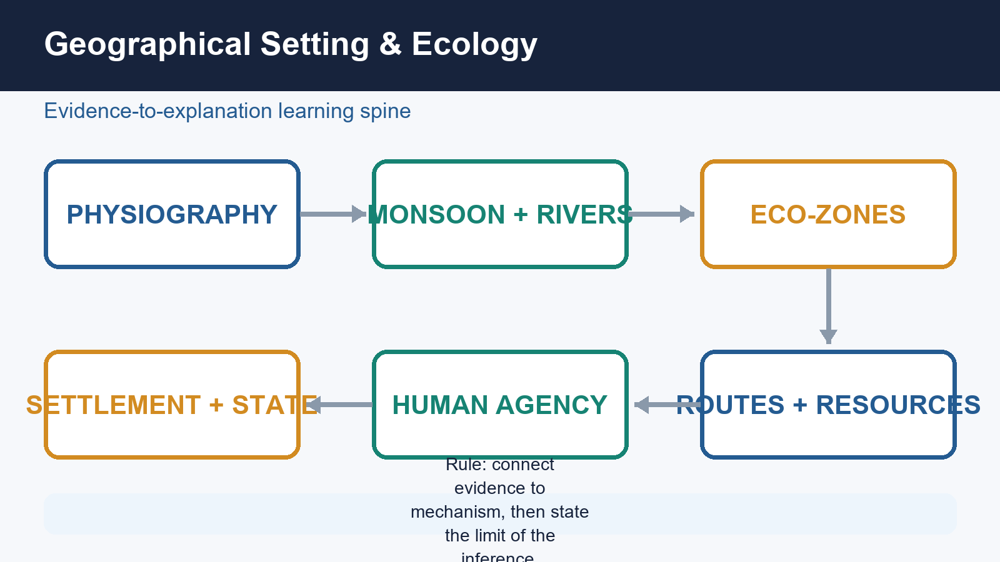
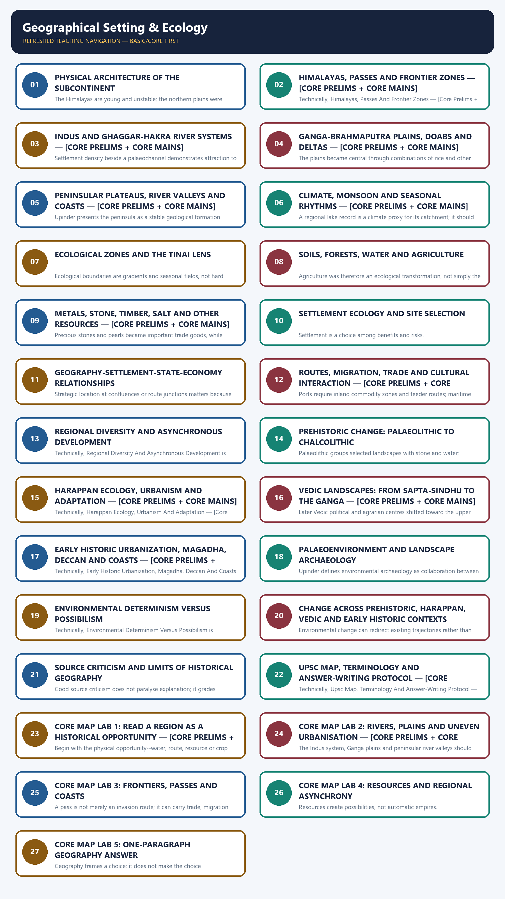
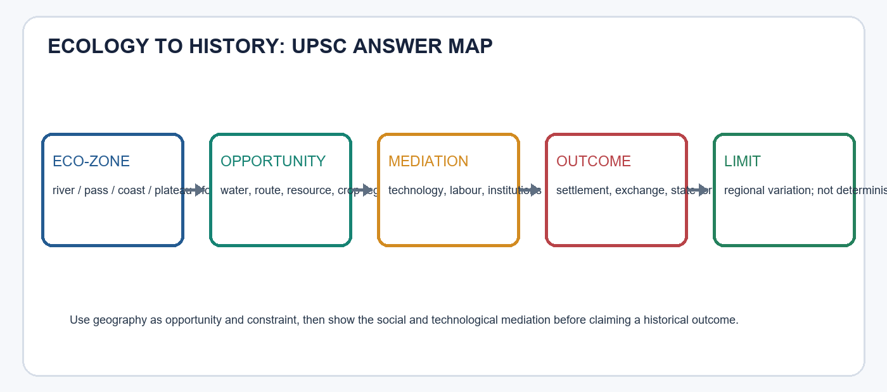

# Geographical Setting & Ecology - Learner-v2 Complete Learning Session

> **Catalogue identity:** Ancient History · Subject-wide Syllabus · `ancient-indian-history-03`  
> **Generation date:** 20 August 2026 · **Approval:** pending explicit topic approval  
> **Source order used:** Basic/canonical owner and its OCR-grounded legacy learning package -> syllabus/master chronology/thematic and verified-PYQ sources -> exact Advanced owner in the optional block. Qdrant was not required. Legacy-v1 files remain unchanged.  
> **Evidence discipline:** inherited live claims are retained only where the legacy package cites a primary or peer-reviewed source; contested chronology and interpretation remain labelled.



*Original deterministic visual: a topic-specific evidence-to-explanation spine. It is a learning aid, not historical evidence.*

### Coverage lock

- **Required scope:** Physiography, rivers, monsoon, ecology, routes, resources and settlement interaction; geography works through human agency, never as environmental determinism.
- **Basic completeness:** the complete detailed legacy learner session is retained before practice.
- **Practice completeness:** verified PYQs, strict-rotation MCQs/remediation and solved 10/15/20-mark answers are retained.
- **Advanced boundary:** the exact Advanced owner is placed only after all Basic and practice material.
- **Register-last rule:** complete topic-specific consolidated notes remain the final H2 section.

### Legacy package source and coverage ledger

> **Subject:** Ancient Indian History | **Paper:** Prelims GS-I + GS-I | **Topic:** 03 | **Date:** 12 August 2026
>
> **Evidence key:** FACT = directly retrieved from authored Markdown, local OCR-searchable books, audited official-paper routing or live sources. INFERENCE = analytical synthesis. No official Mains model answer is claimed.

### Sources actually used

- Authored Markdown, read completely: `basic/03_Geographical-Setting-and-Ecology.md`, `advanced/03_Geographical-Setting-and-Ecology.md`, subject `README.md`, chronology and audited PYQ routing.
- R.S. Sharma, *India's Ancient Past*, local OCR-searchable PDF pp. 45-58.
- Upinder Singh, *A History of Ancient and Early Medieval India*, 2nd ed., local OCR-searchable PDF pp. 96-103, 176-181, 247-249 and relevant regional chapters.
- Verified PYQ: 2023 GS-I Q1 through the audited local official-paper routing ledger.
- Live source 1: Department of Science and Technology / PIB, 15 January 2026, Kondagai Lake 4,500-year multiproxy climate record: https://dst.gov.in/climate-records-unearthed-from-tamil-nadu-lake-can-enable-conservation-and-biodiversity-strategies
- Live source 2: IIT Gandhinagar and *Communications Earth and Environment*, December 2025, “River drought forcing of the Harappan metamorphosis”: https://news.iitgn.ac.in/iitgn-study-reveals-four-major-droughts-that-shaped-the-harappan-civilization/ and DOI 10.1038/s43247-025-02901-1.
- Live source 3: PIB/ASI-AnSI release reported 22 June 2026 on transfer of Rakhigarhi burials for multidisciplinary study: https://pib.gov.in/PressReleasePage.aspx?PRID=2276489&reg=3&lang=1
- Qdrant was optional, unnecessary and not used.

### Exact syllabus and ownership boundary

- Direct official ownership: Prelims GS-I “History of India”; analytical GS-I use through ancient-history development, geography and culture.
- Direct routed Mains ownership: 2023 GS-I Q1, geographical factors in the development of Ancient India.
- This topic owns spatial, ecological, resource, settlement and environmental-method explanation. Detailed civilization narratives remain in their chronological owner topics.

### Source-Coverage Ledger A - Basic File

| ID | Claim integrated | Where taught |
|---|---|---|
| B-01 | Monsoon was central to agriculture and settlement. | Climate; Agriculture |
| B-02 | Rivers structured habitation, movement, economy and cultural zones. | Indus; Ganga; Settlement |
| B-03 | Himalayas, seas, passes and frontiers shaped protection and contact. | Frontiers; Routes |
| B-04 | Regions lacked all resources and therefore formed early networks. | Resources; Trade |
| B-05 | Minerals and natural resources strongly affected history. | Resources; State-economy |
| B-06 | Indus, Ganga, Deccan, coasts and forests produced different patterns. | Physical frame; Eco-zones |
| B-07 | Geography enabled but did not mechanically determine history. | Determinism versus possibilism |
| B-08 | Rivers mattered for transport, states, towns and ritual as well as crops. | Ganga; Early historic |
| B-09 | Harappan, Vedic, Ganga and Deccan trajectories require chronological linkage. | Phasewise change |

### Source-Coverage Ledger B - Advanced File

| ID | Claim integrated | Where taught |
|---|---|---|
| A-01 | Ecological history is regional and linked to subsistence and settlement. | Regional diversity |
| A-02 | Mesolithic and Neolithic chronologies vary regionally. | Prehistoric change |
| A-03 | Koldihwa/Mahagara dates and rice identification remain debated. | Prehistoric change |
| A-04 | Neolithic and copper objects may overlap. | Regional diversity |
| A-05 | Plant, animal, soil, channel and settlement evidence changes interpretation. | Landscape archaeology |
| A-06 | Foraging, pastoral, farming and craft communities overlapped. | Eco-zones; Prehistory |
| A-07 | Eco-zone and subsistence strategy are preferable to vague region labels. | Roadmap; Tinai |
| A-08 | Climate proxies inform but do not settle Harappan transformation debates alone. | Harappan; Source limits |
| A-09 | Non-invasive remote sensing and GIS are increasingly important. | Landscape archaeology |
| A-10 | 2023 GS-I geographical-factors demand is fully solved. | PYQ section |

## BASIC LEARNING SESSION



*Distinct embedded teaching-navigation image. The separate continuous Cārvāka-style flowchart package remains an independent at-a-glance artifact.*
### UPSC RELEVANCE AND ANSWER-WORTHINESS AUDIT

**Official boundary and PYQ reality.** This topic is **directly relevant to Prelims GS-I** under History of India: location/site-region matching, river systems, routes, resources and chronology-environment distinctions are testable. It is **not a separately named Mains syllabus unit**; it is a contextual answer-enricher for GS-I culture/ancient-history discussion. The verified 2023 GS-I question on geographical factors in the development of Ancient India gives one direct Mains route. One routed PYQ justifies mastery of a compact answer spine, not encyclopaedic physical geography.

| Major block | Relevance label | What to do |
|---|---|---|
| Terrain, passes, rivers, coasts, resources, map/route logic | **CORE PRELIMS** | Memorise relationships and map distinctions, not every physical feature. |
| Geography-settlement-state-economy, regional diversity, environmental determinism, source limits, answer protocol | **CORE MAINS** | Understand geography as opportunity/constraint mediated by technology and institutions. |
| Monsoon detail, soils, forests, Tinai, palaeoenvironment, current-research linkage and extended regional examples | **SUPPORTING** | Retain one representative case; use selectively as evidence. |
| Proxies/error bounds, landscape archaeology, GIS/remote sensing, river-course debates, resilience and historiography | **OPTIONAL ADVANCED** | Use only after core map logic and answer spine are secure. |
| MCQs/remediation; verified PYQ | **CORE PRELIMS / CORE MAINS** | Practise exact matching and the 2023 geography-factor answer route. |
| Register notes | **CORE PRELIMS + CORE MAINS** | Revise map facts, causal flow and anti-determinist conclusion. |

**Memorise:** major river/plains/coast/pass-resource relationships, ecological-zone distinctions, routes and traps.  
**Understand:** ecology -> subsistence/resources -> settlement/exchange -> institutions/state, with regional variation.  
**Use selectively:** soils, proxies and regional examples.  
**Skip unless seeking depth:** technical method procedure, exhaustive resource catalogues and long river-course debates.



*Original deterministic learning visual. It is an answer-building model, not historical evidence.*
### ROADMAP: FROM TERRAIN TO HISTORICAL EXPLANATION — [CORE MAINS]

#### PRE-TEACH CHECKLIST / CURRENT ANCHOR

> Book context queried directly: R.S. Sharma, local OCR PDF pp. 45-58; Upinder Singh, local OCR PDF pp. 96-103, 180-181 and 247-249. Live anchor searched: 2025-26 palaeoclimate, palaeohydrology and scientific archaeology. Qdrant was not used.

Geography is not a decorative opening paragraph to ancient history. It identifies the spatial conditions within which people selected livelihoods, moved, exchanged goods, founded settlements and organized power. Ecology adds the interaction among climate, water, soils, plants, animals, resources, technology and human action.

**Context:** The central discipline is causal restraint. A river does not create a city by itself; a mineral deposit does not automatically create a state; a drought does not mechanically destroy a civilization. Historical explanation must connect opportunity or constraint with technology, labour, institutions, exchange and political choice.

#### Visual

```text
PHYSICAL SETTING
      |
      v
CLIMATE + WATER + SOIL + BIOTA + RESOURCES
      |
      v
HUMAN CHOICES: subsistence -> settlement -> exchange -> institutions
      |
      v
HISTORICAL OUTCOME
      ^
      |
FEEDBACK: clearance, irrigation, mining, urban demand, conservation
```

#### Key Matrix

| Analytical level | Question | UPSC-safe output |
| --- | --- | --- |
| Location | Where did activity occur? | Region, route, river basin or eco-zone |
| Mechanism | How did geography matter? | Food, mobility, raw material, defence, communication |
| Agency | What converted potential into outcome? | Technology, labour, social organization, state policy |
| Change | Did the landscape remain constant? | River shifts, monsoon variability, erosion, clearance |
| Limit | What cannot be inferred? | No monocausal or deterministic conclusion |

#### Core Teaching

- FACT: R.S. Sharma organizes geographical setting around monsoon, northern boundaries, rivers, frontiers, contacts and resources, and follows it with a distinct ecology-and-environment chapter.
- FACT: Upinder Singh states that topography, climate, soil and natural resources influence subsistence, settlement, population density and trade, while insisting that human history must be understood in relation to ecology.
- INFERENCE: The best unit of analysis is often the eco-zone or river basin, not the modern state boundary.
- INFERENCE: Geography is strongest as a mechanism-rich explanation: identify resource or constraint, human response and resulting institution.
- INFERENCE: Human modification creates feedback. Forest clearance, irrigation, mining and urban demand transform the setting that initially shaped them.
- EXAM METHOD: Every geographical claim should be followed by an India-centric example and a non-deterministic qualification.

#### Must-Know Facts

- FACT: R.S. Sharma organizes geographical setting around monsoon, northern boundaries, rivers, frontiers, contacts and resources, and follows it with a distinct ecology-and-environment chapter.
- FACT: Upinder Singh states that topography, climate, soil and natural resources influence subsistence, settlement, population density and trade, while insisting that human history must be understood in relation to ecology.
- INFERENCE: The best unit of analysis is often the eco-zone or river basin, not the modern state boundary.
- INFERENCE: Geography is strongest as a mechanism-rich explanation: identify resource or constraint, human response and resulting institution.
- INFERENCE: Human modification creates feedback. Forest clearance, irrigation, mining and urban demand transform the setting that initially shaped them.
- EXAM METHOD: Every geographical claim should be followed by an India-centric example and a non-deterministic qualification.

#### UPSC Traps

- **Wrong:** Geography is merely a map preface.
  **Correct:** It is a causal field linking ecology, subsistence, settlement, exchange and power.
- **Wrong:** Natural advantage guarantees historical success.
  **Correct:** Advantage requires usable technology, labour, institutions and networks.
- **Wrong:** Environmental history replaces political history.
  **Correct:** It complements political, social, economic and cultural explanation.

**Mains angle:** Open with 'geography supplied differentiated opportunities and constraints'; then organize the answer by water, resources, routes and regional ecology; end with human agency.

**Study link:** R.S. Sharma Chs. 4-5; Upinder Singh Introduction and environmental archaeology; owner of 2023 GS-I geographical-factors PYQ.
### SESSION 1 — PHYSICAL ARCHITECTURE OF THE SUBCONTINENT

#### DEFINITION / WHAT THIS IS CALLED

**Plain-language definition:** Physical Architecture Of The Subcontinent comprises Mains angle, Study link and Himalayan arc as its core connected dimensions.

**Technical definition:** The Himalayas are young and unstable; the northern plains were created by enormous sediment deposition; the Deccan plateau is associated with ancient lava flows; river courses and coastlines have changed.

#### ANSWER-GRABBING OPENING — WRITE/ADAPT IN THE EXAM

> Wrong: The subcontinent is one uniform tropical plain.

#### MUST-WRITE KEYWORDS

- **Physical Architecture Of The Subcontinent**
- **Mains angle**
- **Study link**
- **Himalayan arc**
- **Young mountains, valleys and passes**
- **Water source, ecological niches, contact corridors**

**How to use them:** Frame the answer through Physical Architecture Of The Subcontinent; define Mains angle, connect Study link with Himalayan arc to explain the mechanism, and use Young mountains, valleys and passes for the decisive comparison or qualification.

#### PRE-TEACH CHECKLIST / CURRENT ANCHOR

> Book context queried: Sharma pp. 45-53 and Upinder pp. 96-103. CA search found no need to force a dated item into basic physiography; the static geological and regional framework remains primary.

The subcontinent combines young fold mountains, vast alluvial plains, an old peninsular shield, plateaus, deserts, river valleys, deltas and long coastlines. These zones are internally diverse and historically connected rather than sealed compartments.

**Context:** Both source books stress geological change. The Himalayas are young and unstable; the northern plains were created by enormous sediment deposition; the Deccan plateau is associated with ancient lava flows; river courses and coastlines have changed. Historical geography therefore studies landscapes in time, not a frozen modern map.

#### Visual

```text
                 HIMALAYAS / FRONTIER VALLEYS
                           |
INDUS PLAIN ---- THAR ---- GANGA-BRAHMAPUTRA ALLUVIAL ARC
                           |
       ARAVALLI - VINDHYA - SATPURA / CENTRAL HIGHLANDS
                           |
              DECCAN PENINSULAR PLATEAU
             /                         \
   WESTERN GHATS                   EASTERN GHATS
   NARROW WEST COAST          BROADER EAST COAST + DELTAS
             \                         /
                    INDIAN OCEAN
```

#### Key Matrix

| Zone | Physical character | Historical implication |
| --- | --- | --- |
| Himalayan arc | Young mountains, valleys and passes | Water source, ecological niches, contact corridors |
| Indus-Ganga plains | Deep alluvium and major rivers | Dense agriculture, routes, towns and states |
| Central highlands | Aravalli-Vindhya-Satpura corridors | Minerals, forest zones and north-south passages |
| Peninsular shield | Old plateau and dissected river valleys | Stone/minerals, regional farming and pastoralism |
| Coasts and deltas | Harbours, estuaries and fertile deltas | Maritime exchange and intensive agrarian zones |

#### Core Teaching

- FACT: Upinder Singh emphasizes enormous ecological diversity within recognizable geographical frontiers.
- FACT: The alluvial Ganga plain, Deccan volcanic plateau, ancient Aravallis and young Himalayas represent very different geological histories.
- FACT: Peninsular India is marked by plateaus, plains and river valleys including the Mahanadi, Krishna, Godavari, Pennar and Kaveri.
- INFERENCE: Geological age matters historically through soils, minerals, relief, river gradient and route structure, not as chronology for its own sake.
- INFERENCE: Macro-regions must be subdivided: upper, middle and lower Ganga; western and eastern Deccan; Konkan-Malabar and Coromandel; Kashmir, Nepal and north-western valleys.
- INFERENCE: Modern political boundaries are poor substitutes for ancient ecological regions.

#### Must-Know Facts

- FACT: Upinder Singh emphasizes enormous ecological diversity within recognizable geographical frontiers.
- FACT: The alluvial Ganga plain, Deccan volcanic plateau, ancient Aravallis and young Himalayas represent very different geological histories.
- FACT: Peninsular India is marked by plateaus, plains and river valleys including the Mahanadi, Krishna, Godavari, Pennar and Kaveri.
- INFERENCE: Geological age matters historically through soils, minerals, relief, river gradient and route structure, not as chronology for its own sake.
- INFERENCE: Macro-regions must be subdivided: upper, middle and lower Ganga; western and eastern Deccan; Konkan-Malabar and Coromandel; Kashmir, Nepal and north-western valleys.
- INFERENCE: Modern political boundaries are poor substitutes for ancient ecological regions.

#### UPSC Traps

- **Wrong:** The subcontinent is one uniform tropical plain.
  **Correct:** It is a mosaic of mountain, alluvial, plateau, desert, forest, delta and coastal zones.
- **Wrong:** Physiographic zones were isolated.
  **Correct:** Routes crossed mountains, rivers, plateaus and coasts from early times.
- **Wrong:** Present river and coastline maps can be projected unchanged backward.
  **Correct:** Tectonics, sedimentation and sea-level change require historical reconstruction.

**Mains angle:** Use a north-to-south spatial sequence and convert each landform into a mechanism: water, resource, route, defence, crop regime or harbour.

**Study link:** Foundation map for every later subtopic; pair with palaeoenvironment and landscape-archaeology cards.

#### CLOSING RECALL FLOW — PHYSICAL ARCHITECTURE OF THE SUBCONTINENT

```text
START / CONCEPT: PHYSICAL ARCHITECTURE OF THE SUBCONTINENT
        |
        v
EXACT TERMS: Physical Architecture Of The Subcontinent · Mains angle · Study link · Himalayan arc · Young mountains, valleys and passes · Water source, ecological niches, contact corridors
        |
        v
MECHANISM / ARGUMENT: The Himalayas are young and unstable; the northern plains were created by enormous sediment deposition; the Deccan plateau is associated with ancient lava flows; river courses and coastlines have changed.
        |
        v
CONSEQUENCE / CONTRAST: These zones are internally diverse and historically connected rather than sealed compartments.
        |
        v
UPSC TRAP / ANSWER-USE: Do not miss this limiting distinction: peninsular India is marked by plateaus, plains and river valleys including the Mahanadi, Krishna...
        |
        v
ANSWER-GRABBING FORMULATION: Wrong: The subcontinent is one uniform tropical plain.
```
### SESSION 2 — HIMALAYAS, PASSES AND FRONTIER ZONES — [CORE PRELIMS + CORE MAINS]

#### DEFINITION / WHAT THIS IS CALLED

**Plain-language definition:** A frontier is a zone of interaction, not simply a line.

**Technical definition:** Technically, Himalayas, Passes And Frontier Zones — [Core Prelims + Core Mains] is analysed by relating Himalayas to Passes, then testing the relationship through Frontier Zones and Mains angle.

#### ANSWER-GRABBING OPENING — WRITE/ADAPT IN THE EXAM

> A frontier is a zone of interaction, not simply a line.

#### MUST-WRITE KEYWORDS

- **Himalayas**
- **Passes**
- **Frontier Zones**
- **Mains angle**
- **Study link**
- **North-western passes**

**How to use them:** Frame the answer through Himalayas; define Passes, connect Frontier Zones with Mains angle to explain the mechanism, and use Study link for the decisive comparison or qualification.

#### PRE-TEACH CHECKLIST / CURRENT ANCHOR

> Book context queried: Sharma pp. 46-47 and Upinder pp. 98-100. CA search found no dated discovery necessary; the core test is barrier-versus-corridor reasoning.

The Himalayas and adjoining north-western highlands shaped climate, river systems, pastoral movement and political frontiers. Yet they were never an absolute wall. Valleys and passes connected the subcontinent with Central and West Asia and linked plains with Kashmir, Nepal and trans-Himalayan worlds.

**Context:** A frontier is a zone of interaction, not simply a line. Kashmir developed ecological distinctiveness but maintained seasonal and cultural exchanges with the plains. Nepal remained accessible through passes. The Pamir and north-western corridors transmitted trade, migrants, artistic forms, religious ideas and military forces.

#### Visual

```text
BARRIER FUNCTIONS                 CORRIDOR FUNCTIONS
- blocks cold winds               - valleys and passes
- shapes monsoon                  - seasonal pastoral movement
- difficult mass movement        - trade and migration
- defensible pockets              - Buddhism and artistic transmission
                 \               /
                  FRONTIER ZONE
          selective movement + cultural filtering
```

#### Key Matrix

| Frontier space | Ecological role | Historical role |
| --- | --- | --- |
| North-western passes | Arid valleys and mountain corridors | Contact with Iran, Afghanistan and Central Asia |
| Kashmir valley | Enclosed fertile basin and seasonal ecology | Distinct culture plus continuing plains interaction |
| Nepal valley/Terai | Mountain valley adjoining Ganga plain | Agriculture, Sanskritic/Buddhist exchange |
| Himalayan foothills | Forest, pasture and river emergence | Transhumance, timber, routes and frontier settlement |
| Pamir-Karakoram zone | High-altitude junction | Long-distance cultural and commercial transmission |

#### Core Teaching

- FACT: Sharma explicitly states that passes facilitated trade and cultural contacts with Central and West Asia.
- FACT: Kashmir's winters and summers encouraged seasonal movement between valley, pasture and plains.
- FACT: Nepal and Kashmir became cultural repositories while remaining connected to larger networks.
- INFERENCE: Mountain corridors filter movement by season, scale and technology; they neither prevent all contact nor make every invasion easy.
- INFERENCE: Frontier zones often generate hybrid material cultures because people, objects and ideas move at different speeds.
- EXAM EXAMPLE: The north-west should be described as the entry and interaction zone for Achaemenid, Hellenistic and Central Asian contacts, not as a permanently open gate.

#### Must-Know Facts

- FACT: Sharma explicitly states that passes facilitated trade and cultural contacts with Central and West Asia.
- FACT: Kashmir's winters and summers encouraged seasonal movement between valley, pasture and plains.
- FACT: Nepal and Kashmir became cultural repositories while remaining connected to larger networks.
- INFERENCE: Mountain corridors filter movement by season, scale and technology; they neither prevent all contact nor make every invasion easy.
- INFERENCE: Frontier zones often generate hybrid material cultures because people, objects and ideas move at different speeds.
- EXAM EXAMPLE: The north-west should be described as the entry and interaction zone for Achaemenid, Hellenistic and Central Asian contacts, not as a permanently open gate.

#### UPSC Traps

- **Wrong:** Himalayas isolated India completely.
  **Correct:** They constrained mass movement while valleys and passes enabled selective contact.
- **Wrong:** Every north-western movement was an invasion.
  **Correct:** Trade, migration, pastoralism, diplomacy and religious transmission also used the corridors.
- **Wrong:** Frontiers have no settled cultures of their own.
  **Correct:** Valleys and borderlands developed distinctive, connected societies.

**Mains angle:** Frame the Himalayas as climate-maker, water tower, ecological niche, defensive terrain and contact zone; this five-part treatment avoids the isolation trap.

**Study link:** Connect to Iranian/Macedonian contacts, Kushanas, Buddhist transmission and Himalayan regional histories.

#### CLOSING RECALL FLOW — HIMALAYAS, PASSES AND FRONTIER ZONES — [CORE PRELIMS + CORE MAINS]

```text
START / CONCEPT: HIMALAYAS, PASSES AND FRONTIER ZONES — [CORE PRELIMS + CORE MAINS]
        |
        v
EXACT TERMS: Himalayas · Passes · Frontier Zones · Mains angle · Study link · North-western passes
        |
        v
MECHANISM / ARGUMENT: Correct: They constrained mass movement while valleys and passes enabled selective contact.
        |
        v
CONSEQUENCE / CONTRAST: EXAM EXAMPLE: The north-west should be described as the entry and interaction zone for Achaemenid, Hellenistic and Central Asian contacts, not as a permanently open gate.
        |
        v
UPSC TRAP / ANSWER-USE: Kashmir developed ecological distinctiveness but maintained seasonal and cultural exchanges with the plains.
        |
        v
ANSWER-GRABBING FORMULATION: A frontier is a zone of interaction, not simply a line.
```
### SESSION 3 — INDUS AND GHAGGAR-HAKRA RIVER SYSTEMS — [CORE PRELIMS + CORE MAINS]

#### DEFINITION / WHAT THIS IS CALLED

**Plain-language definition:** Upinder describes the Ghaggar-Hakra as the diminished course of a once much larger river and notes many early settlements on its alluvial plain.

**Technical definition:** Settlement density beside a palaeochannel demonstrates attraction to a former water system only when the channel and occupation are securely dated together.

#### ANSWER-GRABBING OPENING — WRITE/ADAPT IN THE EXAM

> Therefore neither 'Indus valley' nor 'river civilization' should erase regional diversity.

#### MUST-WRITE KEYWORDS

- **Indus**
- **Ghaggar-Hakra River Systems**
- **Mains angle**
- **Study link**
- **Indus tributary plains**
- **Alluvium, irrigation/floodwater farming, mobility**

**How to use them:** Frame the answer through Indus; define Ghaggar-Hakra River Systems, connect Mains angle with Study link to explain the mechanism, and use Indus tributary plains for the decisive comparison or qualification.

#### PRE-TEACH CHECKLIST / CURRENT ANCHOR

> Book context queried: Sharma pp. 47-48 and Upinder pp. 99, 347-348 and 414. Live research was checked separately; river reconstruction is used without equating geomorphology automatically with a textual river.

The north-western river world combined the Indus and tributaries, piedmont zones, floodplains, semi-arid tracts and the now diminished Ghaggar-Hakra course. It supported early farming villages, pastoral mobility, craft-resource links and the largest concentration of Harappan settlements.

**Context:** River systems offer water, fertile silt and communication, but also flood, channel migration and uneven access. Harappan settlement extended well beyond a single valley into Baluchistan, Punjab, Haryana, Rajasthan, Gujarat and coastal zones. Therefore neither 'Indus valley' nor 'river civilization' should erase regional diversity.

#### Visual

```text
MOUNTAIN / PIEDMONT
       |
tributaries -> alluvial plains -> settlements / fields / routes
       |                              |
       +---- floods + channel shifts -+
                                      |
                adaptation: site relocation, storage, crop choice,
                exchange, dispersed rural-urban network
```

#### Key Matrix

| Feature | Historical potential | Required caution |
| --- | --- | --- |
| Indus tributary plains | Alluvium, irrigation/floodwater farming, mobility | Flood regimes vary by reach and season |
| Ghaggar-Hakra belt | Dense settlement and Hakra/Harappan material | Palaeochannel date and textual identity are separate questions |
| Piedmont/Baluchistan | Early farming and access to western routes | Not reducible to river-valley agriculture |
| Rajasthan semi-arid zone | Pastoralism, dry farming, copper links | Aridity changed over time |
| Gujarat/coastal Harappan zone | Harbours, salt, shell and water management | Shows civilization exceeded the Indus basin |

#### Core Teaching

- FACT: Upinder describes the Ghaggar-Hakra as the diminished course of a once much larger river and notes many early settlements on its alluvial plain.
- FACT: Upinder cautions that 'Harappan civilization' is the safest archaeological label because the cultural spread exceeded both Indus and Ghaggar-Hakra valleys.
- FACT: Sharma links Indus and western Gangetic plains mainly with wheat and barley while emphasizing river-supported cultural zones.
- INFERENCE: Settlement density beside a palaeochannel demonstrates attraction to a former water system only when the channel and occupation are securely dated together.
- INFERENCE: A palaeochannel map cannot by itself identify the Rig Vedic Sarasvati; archaeological, geomorphological, chronological and textual arguments must be separated.
- INFERENCE: Harappan urbanism rested on a network of ecologically different settlements rather than a single uniform river ecology.

#### Must-Know Facts

- FACT: Upinder describes the Ghaggar-Hakra as the diminished course of a once much larger river and notes many early settlements on its alluvial plain.
- FACT: Upinder cautions that 'Harappan civilization' is the safest archaeological label because the cultural spread exceeded both Indus and Ghaggar-Hakra valleys.
- FACT: Sharma links Indus and western Gangetic plains mainly with wheat and barley while emphasizing river-supported cultural zones.
- INFERENCE: Settlement density beside a palaeochannel demonstrates attraction to a former water system only when the channel and occupation are securely dated together.
- INFERENCE: A palaeochannel map cannot by itself identify the Rig Vedic Sarasvati; archaeological, geomorphological, chronological and textual arguments must be separated.
- INFERENCE: Harappan urbanism rested on a network of ecologically different settlements rather than a single uniform river ecology.

#### UPSC Traps

- **Wrong:** All Harappan cities stood on the Indus.
  **Correct:** The distribution extended across several basins, deserts, piedmonts and coasts.
- **Wrong:** A buried channel proves a named textual river.
  **Correct:** Physical reconstruction and textual identification require independent arguments.
- **Wrong:** River abundance removed risk.
  **Correct:** Flood, avulsion, drought and uneven seasonality required adaptation.

**Mains angle:** Use the Indus system to demonstrate water opportunity plus hydrological risk, and use Gujarat/Baluchistan to break the single-valley model.

**Study link:** Harappan civilization, palaeohydrology, settlement archaeology and Rig Vedic geography.

#### CLOSING RECALL FLOW — INDUS AND GHAGGAR-HAKRA RIVER SYSTEMS — [CORE PRELIMS + CORE MAINS]

```text
START / CONCEPT: INDUS AND GHAGGAR-HAKRA RIVER SYSTEMS — [CORE PRELIMS + CORE MAINS]
        |
        v
EXACT TERMS: Indus · Ghaggar-Hakra River Systems · Mains angle · Study link · Indus tributary plains · Alluvium, irrigation/floodwater farming, mobility
        |
        v
MECHANISM / ARGUMENT: Upinder cautions that 'Harappan civilization' is the safest archaeological label because the cultural spread exceeded both Indus and Ghaggar-Hakra valleys.
        |
        v
CONSEQUENCE / CONTRAST: Sharma links Indus and western Gangetic plains mainly with wheat and barley while emphasizing river-supported cultural zones.
        |
        v
UPSC TRAP / ANSWER-USE: Do not miss this limiting distinction: use the Indus system to demonstrate water opportunity plus hydrological risk.
        |
        v
ANSWER-GRABBING FORMULATION: Therefore neither 'Indus valley' nor 'river civilization' should erase regional diversity.
```
### SESSION 4 — GANGA-BRAHMAPUTRA PLAINS, DOABS AND DELTAS — [CORE PRELIMS + CORE MAINS]

#### DEFINITION / WHAT THIS IS CALLED

**Plain-language definition:** The northern alluvial plain is not one homogeneous region.

**Technical definition:** The plains became central through combinations of rice and other crops, iron tools, forest clearance, navigable rivers, surplus, exchange and political organization.

#### ANSWER-GRABBING OPENING — WRITE/ADAPT IN THE EXAM

> The northern alluvial plain is not one homogeneous region.

#### MUST-WRITE KEYWORDS

- **Ganga-Brahmaputra Plains**
- **Doabs**
- **Deltas**
- **Mains angle**
- **Study link**
- **Upper doab**

**How to use them:** Frame the answer through Ganga-Brahmaputra Plains; define Doabs, connect Deltas with Mains angle to explain the mechanism, and use Study link for the decisive comparison or qualification.

#### PRE-TEACH CHECKLIST / CURRENT ANCHOR

> Book context queried: Sharma pp. 47-50 and 55-57; Upinder pp. 99-101. CA search did not displace the static river-basin foundation.

The northern alluvial plain is not one homogeneous region. The upper Ganga-Yamuna doab, middle Ganga plain, lower Ganga delta, Brahmaputra valley and Terai differ in rainfall, soils, forests, flood regimes and historical timing.

**Context:** The plains became central through combinations of rice and other crops, iron tools, forest clearance, navigable rivers, surplus, exchange and political organization. Their fertility was potential, not an automatic guarantee. Floods, marshes, disease, dense forests and channel shifts could delay or redirect settlement.

#### Visual

```text
UPPER GANGA / DOAB -> KURU-PANCHALA, route convergence
          |
MIDDLE GANGA -> rice zones + river transport + towns + Magadha
          |
LOWER GANGA DELTA -> wetlands + distributaries + later expansion
          |
BRAHMAPUTRA VALLEY -> braided channels + floods + regional timing
```

#### Key Matrix

| Sub-zone | Ecological profile | Historical trajectory |
| --- | --- | --- |
| Upper doab | Interfluve of Ganga-Yamuna, relatively drier west | Later Vedic core and contested route zone |
| Middle Ganga | Higher rainfall, forests, alluvium and rivers | Agrarian expansion, second urbanization, Magadha |
| Lower Ganga/delta | Wetlands, distributaries and sedimentation | Later dense settlement and eastern polities |
| Terai | Foothill forest and marsh belt | Frontier agriculture, routes and disease constraints |
| Brahmaputra | Braided, flood-prone and shifting river | Distinct settlement ecology and later political consolidation |

#### Core Teaching

- FACT: Sharma associates the middle and lower Gangetic plains mainly with rice and identifies the Ganga-Yamuna doab as a repeatedly coveted zone.
- FACT: Sharma notes that rivers functioned as transport routes and that post-500 BCE settlements multiplied in the doab and middle Ganga plains.
- FACT: Upinder divides the plain into western doab, middle zone, eastern delta and Brahmaputra system and emphasizes major river-course changes.
- INFERENCE: Forest clearance must be linked with tools, labour and political organization; rainfall alone does not clear land.
- INFERENCE: River confluences and navigable reaches increase strategic value, but capital location also depends on defence, administration and hinterland control.
- INFERENCE: The chronological prominence of the lower Ganga and Brahmaputra valleys shows that similar alluvium can yield different historical timings.

#### Must-Know Facts

- FACT: Sharma associates the middle and lower Gangetic plains mainly with rice and identifies the Ganga-Yamuna doab as a repeatedly coveted zone.
- FACT: Sharma notes that rivers functioned as transport routes and that post-500 BCE settlements multiplied in the doab and middle Ganga plains.
- FACT: Upinder divides the plain into western doab, middle zone, eastern delta and Brahmaputra system and emphasizes major river-course changes.
- INFERENCE: Forest clearance must be linked with tools, labour and political organization; rainfall alone does not clear land.
- INFERENCE: River confluences and navigable reaches increase strategic value, but capital location also depends on defence, administration and hinterland control.
- INFERENCE: The chronological prominence of the lower Ganga and Brahmaputra valleys shows that similar alluvium can yield different historical timings.

#### UPSC Traps

- **Wrong:** Alluvial fertility instantly produced states.
  **Correct:** Wetness, forests, technology, labour and institutions conditioned use.
- **Wrong:** The Ganga plain developed uniformly west to east.
  **Correct:** Upper, middle, lower and Brahmaputra zones had different sequences.
- **Wrong:** Rivers mattered only for irrigation.
  **Correct:** They also carried people, goods, armies, rituals and political communication.

**Mains angle:** Explain the Ganga transformation through a bundle - rainfall, rice, iron, clearance, rivers, surplus, routes and state action - and reject any single-cause thesis.

**Study link:** Later Vedic phase, Mahajanapadas, Magadha, second urbanization and eastern expansion.

#### CLOSING RECALL FLOW — GANGA-BRAHMAPUTRA PLAINS, DOABS AND DELTAS — [CORE PRELIMS + CORE MAINS]

```text
START / CONCEPT: GANGA-BRAHMAPUTRA PLAINS, DOABS AND DELTAS — [CORE PRELIMS + CORE MAINS]
        |
        v
EXACT TERMS: Ganga-Brahmaputra Plains · Doabs · Deltas · Mains angle · Study link · Upper doab
        |
        v
MECHANISM / ARGUMENT: The plains became central through combinations of rice and other crops, iron tools, forest clearance, navigable rivers, surplus, exchange and political organization.
        |
        v
CONSEQUENCE / CONTRAST: Forest clearance must be linked with tools, labour and political organization; rainfall alone does not clear land.
        |
        v
UPSC TRAP / ANSWER-USE: River confluences and navigable reaches increase strategic value, but capital location also depends on defence, administration and hinterland control.
        |
        v
ANSWER-GRABBING FORMULATION: The northern alluvial plain is not one homogeneous region.
```
### SESSION 5 — PENINSULAR PLATEAUS, RIVER VALLEYS AND COASTS — [CORE PRELIMS + CORE MAINS]

#### DEFINITION / WHAT THIS IS CALLED

**Plain-language definition:** Peninsular India consists of old rock formations, plateaus, dissected uplands, river valleys, ghats and two contrasting coastal margins.

**Technical definition:** Upinder presents the peninsula as a stable geological formation dominated by plateaus and fertile river valleys.

#### ANSWER-GRABBING OPENING — WRITE/ADAPT IN THE EXAM

> Peninsular India consists of old rock formations, plateaus, dissected uplands, river valleys, ghats and two contrasting coastal margins.

#### MUST-WRITE KEYWORDS

- **Peninsular Plateaus**
- **River Valleys**
- **Coasts**
- **Mains angle**
- **Study link**
- **Deccan plateau**

**How to use them:** Frame the answer through Peninsular Plateaus; define River Valleys, connect Coasts with Mains angle to explain the mechanism, and use Study link for the decisive comparison or qualification.

#### PRE-TEACH CHECKLIST / CURRENT ANCHOR

> Book context queried: Sharma pp. 48-53 and Upinder pp. 99-100. Live search was reserved for later climate and archaeology cards.

Peninsular India consists of old rock formations, plateaus, dissected uplands, river valleys, ghats and two contrasting coastal margins. Its history cannot be treated as a delayed copy of the northern plains.

**Context:** West-flowing Narmada and Tapi cut major corridors; east-flowing Mahanadi, Godavari, Krishna, Pennar and Kaveri create valleys and deltas. The Western Ghats produce a narrow, wet western strip; openings in the Eastern Ghats facilitate movement between interior and Coromandel coast. Gujarat's indented coast encouraged harbour development.

#### Visual

```text
WEST COAST <- short swift rivers | WESTERN GHATS
                                      |
NARMADA/TAPI CORRIDOR ---- DECCAN PLATEAU ---- EAST-FLOWING RIVERS
                                      |
                         GODAVARI-KRISHNA-KAVERI DELTAS
                                      |
                              COROMANDEL PORTS
```

#### Key Matrix

| Peninsular feature | Resource/ecology | Historical effect |
| --- | --- | --- |
| Deccan plateau | Black/red soils, pasture, stone and minerals | Mixed farming, pastoralism, Chalcolithic diversity |
| Narmada-Tapi | West-flowing transverse corridors | North-west/central movement and settlement |
| Godavari-Krishna valleys | Broad eastward drainage and deltas | Interior-coast linkage and agrarian cores |
| Kaveri basin | Deltaic irrigation potential | Dense settlements and later Tamil polities |
| Gujarat/west coast | Harbours, monsoon sea lanes, shell and salt | Harappan and early historic maritime exchange |
| Coromandel | River openings through lower Eastern Ghats | Ports such as Arikamedu and Kaveripattanam |

#### Core Teaching

- FACT: Sharma emphasizes easy communication between Coromandel ports and the Andhra-Tamil interior through river openings in the Eastern Ghats.
- FACT: Gujarat's indented coast supported several harbours and long traditions of coastal and overseas trade.
- FACT: Upinder presents the peninsula as a stable geological formation dominated by plateaus and fertile river valleys.
- INFERENCE: Plateau settlement often depended on tanks, seasonal streams, crop diversity and pastoral mobility rather than perennial river irrigation alone.
- INFERENCE: Coasts are not edges; they are contact zones linking inland production to Arabian Sea, Bay of Bengal and Indian Ocean circuits.
- INFERENCE: Peninsular regional cultures reflect varied combinations of rainfall, soil, metallurgy, pastoralism and maritime access.

#### Must-Know Facts

- FACT: Sharma emphasizes easy communication between Coromandel ports and the Andhra-Tamil interior through river openings in the Eastern Ghats.
- FACT: Gujarat's indented coast supported several harbours and long traditions of coastal and overseas trade.
- FACT: Upinder presents the peninsula as a stable geological formation dominated by plateaus and fertile river valleys.
- INFERENCE: Plateau settlement often depended on tanks, seasonal streams, crop diversity and pastoral mobility rather than perennial river irrigation alone.
- INFERENCE: Coasts are not edges; they are contact zones linking inland production to Arabian Sea, Bay of Bengal and Indian Ocean circuits.
- INFERENCE: Peninsular regional cultures reflect varied combinations of rainfall, soil, metallurgy, pastoralism and maritime access.

#### UPSC Traps

- **Wrong:** The peninsula is one Deccan region.
  **Correct:** It contains multiple plateaus, valleys, deltas, ghats and coastal ecologies.
- **Wrong:** Coastal trade was detached from inland society.
  **Correct:** Ports depended on interior routes, production and political support.
- **Wrong:** East and west coasts had identical morphology.
  **Correct:** Their width, river systems, rainfall and harbour conditions differed.

**Mains angle:** Use an inland-to-coast chain: resource/crop zone -> river or pass corridor -> port -> long-distance exchange -> cultural interaction.

**Study link:** Neolithic/Chalcolithic cultures, Satavahanas, Sangam age and later peninsular states.

#### CLOSING RECALL FLOW — PENINSULAR PLATEAUS, RIVER VALLEYS AND COASTS — [CORE PRELIMS + CORE MAINS]

```text
START / CONCEPT: PENINSULAR PLATEAUS, RIVER VALLEYS AND COASTS — [CORE PRELIMS + CORE MAINS]
        |
        v
EXACT TERMS: Peninsular Plateaus · River Valleys · Coasts · Mains angle · Study link · Deccan plateau
        |
        v
MECHANISM / ARGUMENT: Upinder presents the peninsula as a stable geological formation dominated by plateaus and fertile river valleys.
        |
        v
CONSEQUENCE / CONTRAST: Coasts are not edges; they are contact zones linking inland production to Arabian Sea, Bay of Bengal and Indian Ocean circuits.
        |
        v
UPSC TRAP / ANSWER-USE: Do not miss this limiting distinction: west-flowing Narmada and Tapi cut major corridors.
        |
        v
ANSWER-GRABBING FORMULATION: Peninsular India consists of old rock formations, plateaus, dissected uplands, river valleys, ghats and two contrasting coastal margins.
```
### SESSION 6 — CLIMATE, MONSOON AND SEASONAL RHYTHMS — [CORE PRELIMS + CORE MAINS]

#### DEFINITION / WHAT THIS IS CALLED

**Plain-language definition:** Yet 'the monsoon' is not a single uniform rain event: south-west, north-east and winter-rain regimes create regional contrasts.

**Technical definition:** A regional lake record is a climate proxy for its catchment; it should not be generalized mechanically to the entire subcontinent.

#### ANSWER-GRABBING OPENING — WRITE/ADAPT IN THE EXAM

> Yet 'the monsoon' is not a single uniform rain event: south-west, north-east and winter-rain regimes create regional contrasts.

#### MUST-WRITE KEYWORDS

- **Climate**
- **Monsoon**
- **Seasonal Rhythms**
- **Mains angle**
- **Study link**
- **Late Pleistocene**

**How to use them:** Frame the answer through Climate; define Monsoon, connect Seasonal Rhythms with Mains angle to explain the mechanism, and use Study link for the decisive comparison or qualification.

#### PRE-TEACH CHECKLIST / CURRENT ANCHOR

> Book context queried: Sharma pp. 46, 55-57 and Upinder pp. 98-103. Live source retrieved: DST/PIB reporting of the Kondagai Lake study published 15 January 2026.

The monsoon shaped sowing, crop choice, pasture, river discharge, travel seasons and the reliability of settlement. Yet 'the monsoon' is not a single uniform rain event: south-west, north-east and winter-rain regimes create regional contrasts.

**Context:** Ancient agriculture depended heavily on rainfall where large irrigation systems were absent. Seasonal regularity could support surplus, while prolonged deficit, excessive rainfall or changed river flow could stress settlements. Human responses included storage, crop diversification, mobility, wells, tanks and exchange.

#### Visual

```text
SEASONAL RAINFALL
      |
      +-> soil moisture -> crop calendar -> food surplus
      +-> river discharge -> flood/silt/navigation
      +-> pasture/forest -> herd movement and biomass
      `-> uncertainty -> storage, diversification, mobility, irrigation
```

#### Timeline

| Period | Marker |
| --- | --- |
| Late Pleistocene | Large climatic oscillations and lower sea levels |
| Early Holocene | Generally warmer/wetter conditions in several regional records |
| 4.2 ka event | Aridity signal recognized in many records; local effects varied |
| Historical periods | Seasonal rain remained mediated by storage, crops and institutions |

#### Key Matrix

| Rain regime | Core area | Historical relevance |
| --- | --- | --- |
| South-west monsoon | Most of subcontinent, June-October in Sharma | Main warm-season agricultural water |
| Winter disturbances | North and north-west | Wheat, barley and winter cropping support |
| North-east monsoon | Especially Tamil coast | Distinct late-year rainfall and crop rhythm |
| High-rainfall zones | West coast, northeast and eastern plains | Biomass plus clearance/flood challenges |
| Semi-arid zones | North-west and rain-shadow interiors | Pastoralism, dry farming, storage and exchange |

#### Core Teaching

- FACT: Sharma calls the monsoon historically important and links south-west rain, winter disturbances and Tamil Nadu's north-east monsoon to differentiated agriculture.
- FACT - LIVE, 15 January 2026: DST/PIB reported a BSIP multiproxy study of Kondagai Lake near Keeladi reconstructing about 4,500 years of climate using stable isotopes, pollen, grain size and radiocarbon dating.
- FACT - LIVE: The Kondagai work identified major climatic phases including the 4.2 ka arid event, a 3.2 ka dry phase and the Roman Warm Period.
- INFERENCE: A regional lake record is a climate proxy for its catchment; it should not be generalized mechanically to the entire subcontinent.
- INFERENCE: Climate stress changes probability and cost, while social storage, crop choice, political coordination and mobility shape actual outcomes.
- INFERENCE: Seasonal monsoon knowledge also enabled maritime navigation, connecting climate science with trade history.

#### Must-Know Facts

- FACT: Sharma calls the monsoon historically important and links south-west rain, winter disturbances and Tamil Nadu's north-east monsoon to differentiated agriculture.
- FACT - LIVE, 15 January 2026: DST/PIB reported a BSIP multiproxy study of Kondagai Lake near Keeladi reconstructing about 4,500 years of climate using stable isotopes, pollen, grain size and radiocarbon dating.
- FACT - LIVE: The Kondagai work identified major climatic phases including the 4.2 ka arid event, a 3.2 ka dry phase and the Roman Warm Period.
- INFERENCE: A regional lake record is a climate proxy for its catchment; it should not be generalized mechanically to the entire subcontinent.
- INFERENCE: Climate stress changes probability and cost, while social storage, crop choice, political coordination and mobility shape actual outcomes.
- INFERENCE: Seasonal monsoon knowledge also enabled maritime navigation, connecting climate science with trade history.

#### UPSC Traps

- **Wrong:** Monsoon rainfall was identical across India.
  **Correct:** Relief and seasonal wind systems produced strong regional variation.
- **Wrong:** A dry proxy automatically proves settlement collapse.
  **Correct:** Secure chronological correlation and social evidence are required.
- **Wrong:** Irrigation made rainfall irrelevant.
  **Correct:** Rain remained crucial, while irrigation and storage moderated risk unevenly.

**Mains angle:** Use Kondagai as a method example: dated multiproxy evidence reconstructs regional monsoon history; then state scale and causation limits.

**Study link:** Agricultural ecology, Harappan transformation, Sangam landscape, maritime trade and palaeoclimate method.

#### CLOSING RECALL FLOW — CLIMATE, MONSOON AND SEASONAL RHYTHMS — [CORE PRELIMS + CORE MAINS]

```text
START / CONCEPT: CLIMATE, MONSOON AND SEASONAL RHYTHMS — [CORE PRELIMS + CORE MAINS]
        |
        v
EXACT TERMS: Climate · Monsoon · Seasonal Rhythms · Mains angle · Study link · Late Pleistocene
        |
        v
MECHANISM / ARGUMENT: Seasonal monsoon knowledge also enabled maritime navigation, connecting climate science with trade history.
        |
        v
CONSEQUENCE / CONTRAST: A regional lake record is a climate proxy for its catchment; it should not be generalized mechanically to the entire subcontinent.
        |
        v
UPSC TRAP / ANSWER-USE: Seasonal regularity could support surplus, while prolonged deficit, excessive rainfall or changed river flow could stress settlements.
        |
        v
ANSWER-GRABBING FORMULATION: Yet 'the monsoon' is not a single uniform rain event: south-west, north-east and winter-rain regimes create regional contrasts.
```
### SESSION 7 — ECOLOGICAL ZONES AND THE TINAI LENS

#### DEFINITION / WHAT THIS IS CALLED

**Plain-language definition:** Ancient Tamil poetry offers a powerful indigenous landscape vocabulary through the five tinai, but it is a poetic-cultural classification rather than a cadastral map.

**Technical definition:** Ecological boundaries are gradients and seasonal fields, not hard borders.

#### ANSWER-GRABBING OPENING — WRITE/ADAPT IN THE EXAM

> Ancient Tamil poetry offers a powerful indigenous landscape vocabulary through the five tinai, but it is a poetic-cultural classification rather than a cadastral map.

#### MUST-WRITE KEYWORDS

- **Ecological Zones**
- **The Tinai Lens**
- **Mains angle**
- **Study link**
- **Mountain/forest**
- **Foraging, shifting cultivation, hill products**

**How to use them:** Frame the answer through Ecological Zones; define The Tinai Lens, connect Mains angle with Study link to explain the mechanism, and use Mountain/forest for the decisive comparison or qualification.

#### PRE-TEACH CHECKLIST / CURRENT ANCHOR

> Book context queried: Upinder pp. 96 and 1130 plus Sharma pp. 54-58. CA search was not forced; the card develops ecological classification and literary landscape method.

An ecological zone combines relief, water, soil, vegetation, fauna and habitual subsistence strategies. Ancient Tamil poetry offers a powerful indigenous landscape vocabulary through the five tinai, but it is a poetic-cultural classification rather than a cadastral map.

**Context:** Kurinji, mullai, marutam, neytal and palai associate mountain, pastoral, riverine, seashore and arid landscapes with livelihoods, deities, emotions and social types. The model demonstrates that ancient communities conceptualized geography culturally, while archaeology tests actual settlement and subsistence.

#### Visual

```text
KURINJI  mountain -> hunting, gathering, hill products
MULLAI   pastoral -> cattle, woodland and seasonal waiting
MARUTAM  riverine -> cultivation, dense settlement
NEYTAL   seashore -> fishing, salt, ports and exchange
PALAI    arid route -> mobility, scarcity and risk

LITERARY ECOLOGY != FIXED CARTOGRAPHY
```

#### Key Matrix

| Eco-zone | Likely livelihood emphasis | Historical caution |
| --- | --- | --- |
| Mountain/forest | Foraging, shifting cultivation, hill products | Not economically isolated |
| Pastoral woodland/grassland | Herding and seasonal mobility | Farming and exchange may coexist |
| Riverine plain | Cultivation and dense settlement | Flood and disease remain constraints |
| Coast/estuary | Fishing, salt, shell and maritime trade | Requires inland hinterland |
| Arid/semi-arid | Dry farming, pastoralism and routes | Aridity varies over time |

#### Core Teaching

- FACT: Upinder records the five Tamil ecological landscapes and their literary associations.
- FACT: Sharma defines ecology through interactions among plants, animals and humans and treats built, economic, social, cultural and political conditions as part of environment.
- INFERENCE: Eco-zones are analytical clusters; real communities combine farming, herding, fishing, foraging and craft.
- INFERENCE: Literary landscapes reveal cultural perception and symbolism, while plant, animal and settlement evidence tests material practice.
- INFERENCE: Ecological boundaries are gradients and seasonal fields, not hard borders.
- EXAM USE: Tinai supplies an India-centric example of landscape-society linkage and of the limits of reading literature literally.

#### Must-Know Facts

- FACT: Upinder records the five Tamil ecological landscapes and their literary associations.
- FACT: Sharma defines ecology through interactions among plants, animals and humans and treats built, economic, social, cultural and political conditions as part of environment.
- INFERENCE: Eco-zones are analytical clusters; real communities combine farming, herding, fishing, foraging and craft.
- INFERENCE: Literary landscapes reveal cultural perception and symbolism, while plant, animal and settlement evidence tests material practice.
- INFERENCE: Ecological boundaries are gradients and seasonal fields, not hard borders.
- EXAM USE: Tinai supplies an India-centric example of landscape-society linkage and of the limits of reading literature literally.

#### UPSC Traps

- **Wrong:** Tinai are five modern administrative regions.
  **Correct:** They are poetic ecological-cultural landscapes.
- **Wrong:** Each eco-zone had one exclusive occupation.
  **Correct:** Mixed and seasonal livelihood strategies were common.
- **Wrong:** Ecology means climate alone.
  **Correct:** It includes water, soil, biota, resources, technology and human relations.

**Mains angle:** Use tinai to show that geography shaped economy and cultural imagination, then add the source-criticism sentence that poetry is not a literal survey.

**Study link:** Sangam age, environmental history, literary-source criticism and regional subsistence.

#### CLOSING RECALL FLOW — ECOLOGICAL ZONES AND THE TINAI LENS

```text
START / CONCEPT: ECOLOGICAL ZONES AND THE TINAI LENS
        |
        v
EXACT TERMS: Ecological Zones · The Tinai Lens · Mains angle · Study link · Mountain/forest · Foraging, shifting cultivation, hill products
        |
        v
MECHANISM / ARGUMENT: Sharma defines ecology through interactions among plants, animals and humans and treats built, economic, social, cultural and political conditions as part of environment.
        |
        v
CONSEQUENCE / CONTRAST: Ecological boundaries are gradients and seasonal fields, not hard borders.
        |
        v
UPSC TRAP / ANSWER-USE: Use tinai to show that geography shaped economy and cultural imagination, then add the source-criticism sentence that poetry is not a literal survey.
        |
        v
ANSWER-GRABBING FORMULATION: Ancient Tamil poetry offers a powerful indigenous landscape vocabulary through the five tinai, but it is a poetic-cultural classification rather than a cadastral map.
```
### SESSION 8 — SOILS, FORESTS, WATER AND AGRICULTURE

#### DEFINITION / WHAT THIS IS CALLED

**Plain-language definition:** Soils, Forests, Water And Agriculture comprises Soils, Forests and Water as its core connected dimensions.

**Technical definition:** Agriculture was therefore an ecological transformation, not simply the use of naturally fertile land.

#### ANSWER-GRABBING OPENING — WRITE/ADAPT IN THE EXAM

> Agriculture was therefore an ecological transformation, not simply the use of naturally fertile land.

#### MUST-WRITE KEYWORDS

- **Soils**
- **Forests**
- **Water**
- **Agriculture**
- **Mains angle**
- **Study link**

**How to use them:** Frame the answer through Soils; define Forests, connect Water with Agriculture to explain the mechanism, and use Mains angle for the decisive comparison or qualification.

#### PRE-TEACH CHECKLIST / CURRENT ANCHOR

> Book context queried: Sharma pp. 48, 54-58 and Upinder pp. 102-103. Live current research is integrated in the climate and palaeoenvironment cards.

Agricultural potential arose from combinations of rainfall, soil, slope, crop package, labour, animals and water control. Alluvium, black soils, red soils, deltaic deposits and forest margins supported different possibilities; none generated uniform outcomes.

**Context:** Forests supplied food, timber, fuel, medicines, elephants and frontier refuge, while clearance opened fields and settlements. Rivers and floods renewed silt and transport routes but also destroyed crops and habitations. Agriculture was therefore an ecological transformation, not simply the use of naturally fertile land.

#### Visual

```text
LAND + WATER + SEED + LABOUR + TOOL + KNOWLEDGE
                    |
                    v
             CULTIVATED LANDSCAPE
       /             |              \
  surplus       ecological cost      risk management
 towns/state    clearance/erosion     storage/diversity
```

#### Key Matrix

| Resource base | Agricultural implication | Historical example |
| --- | --- | --- |
| Alluvium | Renewed fertility and easy working | Indus and Ganga plains |
| Black soils | Moisture retention in plateau tracts | Deccan crop zones |
| Red/lateritic soils | Variable fertility; management needed | Peninsular uplands |
| Forests | Biomass and products; clearance cost | Middle Ganga and frontier expansion |
| Tanks/wells | Local storage and dry-season security | Peninsular and urban water systems |
| Floodplains/deltas | Silt and multiple crops; flood risk | Ganga-Brahmaputra and east-coast deltas |

#### Core Teaching

- FACT: Sharma links wheat/barley more strongly with the Indus and western Ganga zones and rice with middle/lower Ganga and many regions south of the Vindhyas.
- FACT: Sharma states that favourable rainy zones with rivers, lakes, forests, hills, minerals and fertile soils attracted settlement.
- INFERENCE: Crop distributions are historical patterns, not absolute ecological rules; trade and agricultural experimentation move crops.
- INFERENCE: Forest clearance requires labour organization and tool efficiency and can create both surplus and erosion or habitat loss.
- INFERENCE: Irrigation is an institution as well as a structure because construction, allocation and maintenance require social coordination.
- INFERENCE: Agricultural intensification may increase both state revenue and vulnerability to unequal access or rainfall failure.

#### Must-Know Facts

- FACT: Sharma links wheat/barley more strongly with the Indus and western Ganga zones and rice with middle/lower Ganga and many regions south of the Vindhyas.
- FACT: Sharma states that favourable rainy zones with rivers, lakes, forests, hills, minerals and fertile soils attracted settlement.
- INFERENCE: Crop distributions are historical patterns, not absolute ecological rules; trade and agricultural experimentation move crops.
- INFERENCE: Forest clearance requires labour organization and tool efficiency and can create both surplus and erosion or habitat loss.
- INFERENCE: Irrigation is an institution as well as a structure because construction, allocation and maintenance require social coordination.
- INFERENCE: Agricultural intensification may increase both state revenue and vulnerability to unequal access or rainfall failure.

#### UPSC Traps

- **Wrong:** Fertile soil alone explains agrarian expansion.
  **Correct:** Labour, tools, crops, water control and institutions are co-causes.
- **Wrong:** Forests were empty obstacles.
  **Correct:** They were inhabited resource zones and political frontiers.
- **Wrong:** Irrigation means centralized state control.
  **Correct:** Wells, tanks, canals and floodwater systems can have diverse institutional forms.

**Mains angle:** Build a six-factor agrarian explanation and include one environmental cost or social distribution point for analytical depth.

**Study link:** Neolithic food production, Ganga expansion, Magadha, peninsular tanks and agrarian-state relations.

#### CLOSING RECALL FLOW — SOILS, FORESTS, WATER AND AGRICULTURE

```text
START / CONCEPT: SOILS, FORESTS, WATER AND AGRICULTURE
        |
        v
EXACT TERMS: Soils · Forests · Water · Agriculture · Mains angle · Study link
        |
        v
MECHANISM / ARGUMENT: Correct: Labour, tools, crops, water control and institutions are co-causes.
        |
        v
CONSEQUENCE / CONTRAST: Crop distributions are historical patterns, not absolute ecological rules; trade and agricultural experimentation move crops.
        |
        v
UPSC TRAP / ANSWER-USE: Do not miss this limiting distinction: forest clearance requires labour organization and tool efficiency and can create both surplus and...
        |
        v
ANSWER-GRABBING FORMULATION: Agriculture was therefore an ecological transformation, not simply the use of naturally fertile land.
```
### SESSION 9 — METALS, STONE, TIMBER, SALT AND OTHER RESOURCES — [CORE PRELIMS + CORE MAINS]

#### DEFINITION / WHAT THIS IS CALLED

**Plain-language definition:** Sharma explicitly says common demand for metals and other resources created networks of interconnection among regions.

**Technical definition:** Precious stones and pearls became important trade goods, while much early gold also entered through external connections.

#### ANSWER-GRABBING OPENING — WRITE/ADAPT IN THE EXAM

> Sharma explicitly says common demand for metals and other resources created networks of interconnection among regions.

#### MUST-WRITE KEYWORDS

- **Metals**
- **Stone**
- **Timber**
- **Salt**
- **Other Resources**
- **Mains angle**

**How to use them:** Frame the answer through Metals; define Stone, connect Timber with Salt to explain the mechanism, and use Other Resources for the decisive comparison or qualification.

#### PRE-TEACH CHECKLIST / CURRENT ANCHOR

> Book context queried: Sharma pp. 51-53 and Upinder environmental-archaeology discussion. No current item was required for the static resource geography.

No region possessed every necessary resource. This uneven distribution created exchange networks from prehistory onward. Copper, tin, iron ore, gold, stone, timber, salt, shell, pearls and elephants linked mining or collection zones with workshops, settlements, ports and political centres.

**Context:** Resource presence must be separated from exploitation. Ore becomes historically effective only through knowledge, fuel, labour, transport and demand. Scarcity can be equally important: limited tin constrained bronze supply and encouraged long-distance procurement.

#### Visual

```text
DEPOSIT / RESOURCE
      |
extraction -> processing -> transport -> workshop -> exchange/use
      |             |            |          |
 labour         fuel/skill      routes     demand/power

RESOURCE MAP != POLITICAL MAP
```

#### Key Matrix

| Resource | Indicative zones/examples | Historical linkage |
| --- | --- | --- |
| Copper | Rajasthan and other regional deposits | Chalcolithic tools and exchange |
| Tin | Scarce locally; imports important | Limits and composition of bronze |
| Iron ore | Eastern and central mineral belts plus peninsular zones | Tools, weapons and agrarian expansion |
| Gold | Karnataka deposits and external inflows | Prestige goods and coinage |
| Stone | Rohri chert, Deccan stone, building quarries | Tools, craft and monuments |
| Shell/salt/pearls | Coasts and saline zones | Craft, subsistence and long-distance trade |
| Timber/elephants | Forests and frontier zones | Construction, transport, warfare and royal power |

#### Core Teaching

- FACT: Sharma explicitly says common demand for metals and other resources created networks of interconnection among regions.
- FACT: Sharma highlights limited tin and the resulting constraints on a widespread Indian Bronze Age.
- FACT: Precious stones and pearls became important trade goods, while much early gold also entered through external connections.
- INFERENCE: Mineral access can strengthen a polity only if routes, smelting skill, fuel, labour control and political extraction align.
- INFERENCE: Archaeometallurgy can distinguish ore source and production technique, but compositional similarity alone does not reconstruct the entire trade chain.
- INFERENCE: Forest resources tied so-called peripheral zones to agrarian and urban cores.

#### Must-Know Facts

- FACT: Sharma explicitly says common demand for metals and other resources created networks of interconnection among regions.
- FACT: Sharma highlights limited tin and the resulting constraints on a widespread Indian Bronze Age.
- FACT: Precious stones and pearls became important trade goods, while much early gold also entered through external connections.
- INFERENCE: Mineral access can strengthen a polity only if routes, smelting skill, fuel, labour control and political extraction align.
- INFERENCE: Archaeometallurgy can distinguish ore source and production technique, but compositional similarity alone does not reconstruct the entire trade chain.
- INFERENCE: Forest resources tied so-called peripheral zones to agrarian and urban cores.

#### UPSC Traps

- **Wrong:** An ore deposit automatically creates metallurgy.
  **Correct:** Extraction, fuel, skill, labour, route and demand are required.
- **Wrong:** Bronze Age means all tools were bronze.
  **Correct:** Stone, copper, wood and bone continued; bronze intensity varied.
- **Wrong:** Resource-rich areas necessarily became imperial cores.
  **Correct:** Political organization and network position mediate resource advantage.

**Mains angle:** Write the complete commodity chain - source, extraction, processing, transport, consumption and political control - instead of merely listing mineral locations.

**Study link:** Chalcolithic cultures, Harappan craft, Magadha debates, early historic trade and state revenue.

#### CLOSING RECALL FLOW — METALS, STONE, TIMBER, SALT AND OTHER RESOURCES — [CORE PRELIMS + CORE MAINS]

```text
START / CONCEPT: METALS, STONE, TIMBER, SALT AND OTHER RESOURCES — [CORE PRELIMS + CORE MAINS]
        |
        v
EXACT TERMS: Metals · Stone · Timber · Salt · Other Resources · Mains angle
        |
        v
MECHANISM / ARGUMENT: Precious stones and pearls became important trade goods, while much early gold also entered through external connections.
        |
        v
CONSEQUENCE / CONTRAST: Archaeometallurgy can distinguish ore source and production technique, but compositional similarity alone does not reconstruct the entire trade chain.
        |
        v
UPSC TRAP / ANSWER-USE: Do not miss this limiting distinction: resource presence must be separated from exploitation.
        |
        v
ANSWER-GRABBING FORMULATION: Sharma explicitly says common demand for metals and other resources created networks of interconnection among regions.
```
### SESSION 10 — SETTLEMENT ECOLOGY AND SITE SELECTION

#### DEFINITION / WHAT THIS IS CALLED

**Plain-language definition:** The relevant unit is often a settlement system, not an isolated site.

**Technical definition:** Settlement is a choice among benefits and risks.

#### ANSWER-GRABBING OPENING — WRITE/ADAPT IN THE EXAM

> The relevant unit is often a settlement system, not an isolated site.

#### MUST-WRITE KEYWORDS

- **Settlement Ecology**
- **Site Selection**
- **Mains angle**
- **Study link**
- **Reliable water**
- **Domestic, animal and crop support**

**How to use them:** Frame the answer through Settlement Ecology; define Site Selection, connect Mains angle with Study link to explain the mechanism, and use Reliable water for the decisive comparison or qualification.

#### PRE-TEACH CHECKLIST / CURRENT ANCHOR

> Book context queried: Sharma pp. 55-57; Upinder pp. 102, 180 and regional prehistoric chapters. Live scientific examples appear later.

Settlement is a choice among benefits and risks. Water, cultivable land, pasture, raw material, defensibility, drainage, route access and social proximity influence location and size. The relevant unit is often a settlement system, not an isolated site.

**Context:** Sites form hierarchies and networks: camps, hamlets, villages, craft settlements, towns, ports and capitals exchange people and goods. A large site requires a hinterland and transport system. Abandonment may reflect river change, aridity, conflict, disease, political reorganization or a shift in economic networks.

#### Visual

```text
SITE CATCHMENT
water + fields + pasture + raw material + route + defence
                         |
                         v
                SETTLEMENT FUNCTION
camp / village / workshop / town / port / capital
                         |
                         v
               REGIONAL SETTLEMENT NETWORK
```

#### Key Matrix

| Site variable | Benefit | Risk/limit |
| --- | --- | --- |
| Reliable water | Domestic, animal and crop support | Flood, salinity or seasonal failure |
| Arable land | Food base and surplus | Erosion, exhaustion and unequal control |
| Raw materials | Craft specialization | Transport and fuel costs |
| Defensible terrain | Security | Restricted expansion or access |
| Route position | Exchange and taxation | Exposure to conflict and network shift |
| Drainage/sanitation | Urban viability | Maintenance burden |

#### Core Teaching

- FACT: Sharma says settlement location and size were conditioned by soil, climate, water, forests, hills, minerals and fertile soils.
- FACT: Environmental change and river-course shifts could lead to settlement desertion and population migration.
- INFERENCE: Site catchment analysis reconstructs the resource zone accessible from a settlement, while hierarchy analysis reconstructs interdependence among sites.
- INFERENCE: Urbanism requires continuing flows of food, fuel, water, labour and craft materials from a hinterland.
- INFERENCE: Abandonment is not synonymous with societal disappearance; populations may disperse, relocate or change livelihood.
- INFERENCE: Archaeological visibility differs by building material and geomorphology, so absence of a large mound is not absence of habitation.

#### Must-Know Facts

- FACT: Sharma says settlement location and size were conditioned by soil, climate, water, forests, hills, minerals and fertile soils.
- FACT: Environmental change and river-course shifts could lead to settlement desertion and population migration.
- INFERENCE: Site catchment analysis reconstructs the resource zone accessible from a settlement, while hierarchy analysis reconstructs interdependence among sites.
- INFERENCE: Urbanism requires continuing flows of food, fuel, water, labour and craft materials from a hinterland.
- INFERENCE: Abandonment is not synonymous with societal disappearance; populations may disperse, relocate or change livelihood.
- INFERENCE: Archaeological visibility differs by building material and geomorphology, so absence of a large mound is not absence of habitation.

#### UPSC Traps

- **Wrong:** A site was chosen for one dominant factor.
  **Correct:** Site decisions balance multiple benefits and risks.
- **Wrong:** A large city was economically self-sufficient.
  **Correct:** It depended on a regional hinterland and networks.
- **Wrong:** Abandonment equals civilizational extinction.
  **Correct:** Relocation, dispersal and transformation are alternatives.

**Mains angle:** Use the sequence site factors -> settlement function -> network -> change; it converts a descriptive site list into landscape analysis.

**Study link:** Harappan settlement hierarchy, Chalcolithic villages, second urbanization and port-hinterland relations.

#### CLOSING RECALL FLOW — SETTLEMENT ECOLOGY AND SITE SELECTION

```text
START / CONCEPT: SETTLEMENT ECOLOGY AND SITE SELECTION
        |
        v
EXACT TERMS: Settlement Ecology · Site Selection · Mains angle · Study link · Reliable water · Domestic, animal and crop support
        |
        v
MECHANISM / ARGUMENT: Use the sequence site factors - settlement function - network - change; it converts a descriptive site list into landscape analysis.
        |
        v
CONSEQUENCE / CONTRAST: Abandonment is not synonymous with societal disappearance; populations may disperse, relocate or change livelihood.
        |
        v
UPSC TRAP / ANSWER-USE: Archaeological visibility differs by building material and geomorphology, so absence of a large mound is not absence of habitation.
        |
        v
ANSWER-GRABBING FORMULATION: The relevant unit is often a settlement system, not an isolated site.
```
### SESSION 11 — GEOGRAPHY-SETTLEMENT-STATE-ECONOMY RELATIONSHIPS

#### DEFINITION / WHAT THIS IS CALLED

**Plain-language definition:** Geography-Settlement-State-Economy Relationships comprises Mains angle, Study link and Harappan urban network as its core connected dimensions.

**Technical definition:** Strategic location at confluences or route junctions matters because institutions can monitor flows and collect revenue.

#### ANSWER-GRABBING OPENING — WRITE/ADAPT IN THE EXAM

> Geography-Settlement-State-Economy Relationships comprises Mains angle, Study link and Harappan urban network as its core connected dimensions.

#### MUST-WRITE KEYWORDS

- **Geography-Settlement-State-Economy Relationships**
- **Mains angle**
- **Study link**
- **Harappan urban network**
- **River plains, routes, craft resources, coasts**
- **Planning, standardization, labour and exchange**

**How to use them:** Frame the answer through Geography-Settlement-State-Economy Relationships; define Mains angle, connect Study link with Harappan urban network to explain the mechanism, and use River plains, routes, craft resources, coasts for the decisive comparison or qualification.

#### PRE-TEACH CHECKLIST / CURRENT ANCHOR

> Book context queried: complete Topic 03 Markdown plus Sharma pp. 47-57. CA search not separately forced because this is the integrative static mechanism card.

State and economy emerge through relationships rather than direct environmental effects. Productive land, transport corridors and resources can sustain population and surplus; institutions mobilize that surplus, maintain routes, regulate water, organize defence and reshape settlement.

**Context:** The relationship is reciprocal. States clear forests, dig tanks, protect markets, establish capitals and demand timber, elephants or metals. These actions intensify some landscapes and marginalize others. The result may be urban growth, frontier incorporation, regional inequality or ecological stress.

#### Visual

```text
GEOGRAPHICAL POTENTIAL
      |
technology + labour
      |
production / surplus
      |
exchange + specialization
      |
taxation / institutions / state
      |
infrastructure + demand + coercion
      |
RESHAPED LANDSCAPE
```

#### Key Matrix

| Case | Geographical contribution | Non-geographical mediator |
| --- | --- | --- |
| Harappan urban network | River plains, routes, craft resources, coasts | Planning, standardization, labour and exchange |
| Magadha | Rivers, alluvium, mineral/forest access, elephants | Rulers, army, taxation and strategy |
| Deccan polities | Plateau corridors, minerals and coast links | Political brokerage and guild/port networks |
| Tamilakam | Tinai diversity, river valleys and sea lanes | Chiefdoms, redistribution and mercantile activity |
| Frontier expansion | Forest and resource zones | Land grants, settlement policy and social incorporation |

#### Core Teaching

- FACT: Sharma repeatedly connects rivers, resources and inter-regional exchange with historical development.
- INFERENCE: Surplus is not merely physical output; it is the socially appropriated portion available for specialists, towns and states.
- INFERENCE: Strategic location at confluences or route junctions matters because institutions can monitor flows and collect revenue.
- INFERENCE: State demand can stimulate mining, craft and clearance while transferring ecological costs to producing zones.
- INFERENCE: Political cores and ecological cores need not coincide; a capital may command several complementary regions.
- INFERENCE: A balanced answer treats geography as one layer in a multi-causal explanation.

#### Must-Know Facts

- FACT: Sharma repeatedly connects rivers, resources and inter-regional exchange with historical development.
- INFERENCE: Surplus is not merely physical output; it is the socially appropriated portion available for specialists, towns and states.
- INFERENCE: Strategic location at confluences or route junctions matters because institutions can monitor flows and collect revenue.
- INFERENCE: State demand can stimulate mining, craft and clearance while transferring ecological costs to producing zones.
- INFERENCE: Political cores and ecological cores need not coincide; a capital may command several complementary regions.
- INFERENCE: A balanced answer treats geography as one layer in a multi-causal explanation.

#### UPSC Traps

- **Wrong:** States arose wherever soil was fertile.
  **Correct:** Surplus extraction, institutions, conflict and network control were essential.
- **Wrong:** Economy passively reflected nature.
  **Correct:** Human production and political demand transformed landscapes.
- **Wrong:** Magadha rose only because of iron or elephants.
  **Correct:** Geography interacted with rulers, military organization, rivers and agrarian surplus.

**Mains angle:** Compare two cases with the formula endowment -> mediation -> outcome -> limit. Harappan and Magadha make a strong pair.

**Study link:** Harappan urbanism, rise of Magadha, Deccan trade and agrarian expansion.

#### CLOSING RECALL FLOW — GEOGRAPHY-SETTLEMENT-STATE-ECONOMY RELATIONSHIPS

```text
START / CONCEPT: GEOGRAPHY-SETTLEMENT-STATE-ECONOMY RELATIONSHIPS
        |
        v
EXACT TERMS: Geography-Settlement-State-Economy Relationships · Mains angle · Study link · Harappan urban network · River plains, routes, craft resources, coasts · Planning, standardization, labour and exchange
        |
        v
MECHANISM / ARGUMENT: Strategic location at confluences or route junctions matters because institutions can monitor flows and collect revenue.
        |
        v
CONSEQUENCE / CONTRAST: State demand can stimulate mining, craft and clearance while transferring ecological costs to producing zones.
        |
        v
UPSC TRAP / ANSWER-USE: Do not miss this limiting distinction: productive land, transport corridors and resources can sustain population and surplus.
        |
        v
ANSWER-GRABBING FORMULATION: Geography-Settlement-State-Economy Relationships comprises Mains angle, Study link and Harappan urban network as its core connected dimensions.
```
### SESSION 12 — ROUTES, MIGRATION, TRADE AND CULTURAL INTERACTION — [CORE PRELIMS + CORE MAINS]

#### DEFINITION / WHAT THIS IS CALLED

**Plain-language definition:** Cultural interaction is selective: communities adapt foreign objects and ideas within local institutions.

**Technical definition:** Ports require inland commodity zones and feeder routes; maritime history is also landscape history.

#### ANSWER-GRABBING OPENING — WRITE/ADAPT IN THE EXAM

> Cultural interaction is selective: communities adapt foreign objects and ideas within local institutions.

#### MUST-WRITE KEYWORDS

- **Routes**
- **Migration**
- **Trade**
- **Cultural Interaction**
- **Mains angle**
- **Study link**

**How to use them:** Frame the answer through Routes; define Migration, connect Trade with Cultural Interaction to explain the mechanism, and use Mains angle for the decisive comparison or qualification.

#### PRE-TEACH CHECKLIST / CURRENT ANCHOR

> Book context queried: Sharma pp. 47, 49-53 and Upinder pp. 99-100. Current linkages are not needed for this durable network framework.

Movement followed corridors created by passes, river valleys, plateau gaps, coastlines and monsoon winds. Routes were not single engineered roads; they were shifting bundles of tracks, river reaches, staging points, ports and seasonal knowledge.

**Context:** The north-west connected with Iran, Afghanistan and Central Asia; the Ganga and Yamuna linked northern settlements; the Narmada and Deccan corridors joined regions; Uttarapatha and Dakshinapatha represent broad long-distance axes; coasts connected the interior with Indian Ocean circuits.

#### Visual

```text
PASS / RIVER / PLATEAU GAP / PORT
              |
              v
 PEOPLE + GOODS + IDEAS + DISEASE + TECHNOLOGY
              |
              v
 selective adoption / translation / hybrid material culture
              |
              v
 REGIONAL CHANGE WITHOUT TOTAL CULTURAL REPLACEMENT
```

#### Key Matrix

| Route type | Carried | Historical effect |
| --- | --- | --- |
| North-west passes | Migrants, armies, horses, metals, styles | Political and cultural interaction |
| River routes | Bulk goods, people, ritual and state communication | Urban and territorial integration |
| Plateau corridors | Metals, crops, pastoral groups and traders | North-south interconnection |
| Coastal sea lanes | Luxury and bulk goods, merchants, religious ideas | Port growth and cosmopolitanism |
| Seasonal pastoral routes | Herds, labour and local exchange | Flexible frontier ecologies |

#### Core Teaching

- FACT: Sharma presents passes and frontiers as facilitators of trade and cultural contact and stresses continuous north-south movement of rulers, traders, missionaries and Brahmanas.
- FACT: Sharma links monsoon knowledge with navigation across the Arabian Sea and Bay of Bengal.
- INFERENCE: Migration should be reconstructed through multiple evidence classes; language, pottery or genes alone do not establish one migration event.
- INFERENCE: Trade routes develop through demand, security, transport technology and political support, not topography alone.
- INFERENCE: Cultural interaction is selective: communities adapt foreign objects and ideas within local institutions.
- INFERENCE: Ports require inland commodity zones and feeder routes; maritime history is also landscape history.

#### Must-Know Facts

- FACT: Sharma presents passes and frontiers as facilitators of trade and cultural contact and stresses continuous north-south movement of rulers, traders, missionaries and Brahmanas.
- FACT: Sharma links monsoon knowledge with navigation across the Arabian Sea and Bay of Bengal.
- INFERENCE: Migration should be reconstructed through multiple evidence classes; language, pottery or genes alone do not establish one migration event.
- INFERENCE: Trade routes develop through demand, security, transport technology and political support, not topography alone.
- INFERENCE: Cultural interaction is selective: communities adapt foreign objects and ideas within local institutions.
- INFERENCE: Ports require inland commodity zones and feeder routes; maritime history is also landscape history.

#### UPSC Traps

- **Wrong:** Routes were fixed lines unchanged for centuries.
  **Correct:** They shifted with rivers, states, demand and security.
- **Wrong:** Contact means cultural replacement.
  **Correct:** Borrowing, translation and hybridization are common outcomes.
- **Wrong:** A foreign object proves foreign settlers.
  **Correct:** It may reflect trade, imitation, reuse or mobility; context is needed.

**Mains angle:** Use the four-route classification - pass, river, plateau, coast - and end with selective cultural translation rather than one-way diffusion.

**Study link:** Aryan debate, Iranian/Greek contacts, Buddhism, Satavahana trade and Sangam ports.

#### CLOSING RECALL FLOW — ROUTES, MIGRATION, TRADE AND CULTURAL INTERACTION — [CORE PRELIMS + CORE MAINS]

```text
START / CONCEPT: ROUTES, MIGRATION, TRADE AND CULTURAL INTERACTION — [CORE PRELIMS + CORE MAINS]
        |
        v
EXACT TERMS: Routes · Migration · Trade · Cultural Interaction · Mains angle · Study link
        |
        v
MECHANISM / ARGUMENT: Migration should be reconstructed through multiple evidence classes; language, pottery or genes alone do not establish one migration event.
        |
        v
CONSEQUENCE / CONTRAST: Routes were not single engineered roads; they were shifting bundles of tracks, river reaches, staging points, ports and seasonal knowledge.
        |
        v
UPSC TRAP / ANSWER-USE: Do not miss this limiting distinction: sharma presents passes and frontiers as facilitators of trade and cultural contact and stresses...
        |
        v
ANSWER-GRABBING FORMULATION: Cultural interaction is selective: communities adapt foreign objects and ideas within local institutions.
```
### SESSION 13 — REGIONAL DIVERSITY AND ASYNCHRONOUS DEVELOPMENT

#### DEFINITION / WHAT THIS IS CALLED

**Plain-language definition:** Regional labels are strongest when defined through recurring assemblages and subsistence, not presumed ethnicity.

**Technical definition:** Technically, Regional Diversity And Asynchronous Development is analysed by relating Regional Diversity to Asynchronous Development, then testing the relationship through Mains angle and Study link.

#### ANSWER-GRABBING OPENING — WRITE/ADAPT IN THE EXAM

> Regional labels are strongest when defined through recurring assemblages and subsistence, not presumed ethnicity.

#### MUST-WRITE KEYWORDS

- **Regional Diversity**
- **Asynchronous Development**
- **Mains angle**
- **Study link**
- **Kashmir**
- **Valley farming and distinctive pit-dwelling traditions**

**How to use them:** Frame the answer through Regional Diversity; define Asynchronous Development, connect Mains angle with Study link to explain the mechanism, and use Kashmir for the decisive comparison or qualification.

#### PRE-TEACH CHECKLIST / CURRENT ANCHOR

> Book context queried: full basic/advanced Topic 03 files and Upinder's regional method. CA search not forced because the core task is comparative chronology.

Ancient India did not pass through one synchronized sequence. Foraging, pastoralism, farming, metallurgy, village life and urbanism overlapped across regions. The same date can represent different material and social formations in Kashmir, the Ganga plain, Rajasthan, the Deccan or Tamilakam.

**Context:** Regional ecology affects crop package, animal use, settlement size, building material, route access and response to technology. Yet ecology does not seal regions; exchange and migration connect different trajectories.

#### Visual

```text
SAME CALENDAR DATE
 |-- North-west: one settlement/material sequence
 |-- Ganga plain: another subsistence/urban sequence
 |-- Plateau: mixed farming-pastoral and metal traditions
 |-- Coast: fishing, salt, ports and maritime exchange
 `-- Hills/forests: foraging, shifting cultivation and resource networks

COEXISTENCE, NOT A SINGLE LADDER
```

#### Key Matrix

| Region | Illustrative ecological emphasis | Chronological caution |
| --- | --- | --- |
| Kashmir | Valley farming and distinctive pit-dwelling traditions | Different Neolithic package from south India |
| Middle Ganga | Wet rice and forest-edge expansion | Dates and domestication claims remain debated |
| Rajasthan/Malwa | Semi-arid farming, pastoralism and copper | Chalcolithic phases vary by culture |
| Deccan | Millets, cattle, plateau villages and stone resources | Neolithic and metal use overlap |
| Tamilakam/coasts | Tinai diversity and sea exchange | Literary and archaeological chronologies must be correlated |

#### Core Teaching

- FACT: Upinder emphasizes varied radiocarbon ranges and debates over crops and dates at regional prehistoric sites.
- FACT: Some early farming settlements combine Neolithic artefacts with copper or copper-alloy objects.
- INFERENCE: 'Stone -> Copper -> Iron' is a teaching shorthand, not an all-India timetable.
- INFERENCE: Regional labels are strongest when defined through recurring assemblages and subsistence, not presumed ethnicity.
- INFERENCE: Uneven development does not imply civilizational hierarchy; it reflects different adaptations and network positions.
- INFERENCE: Comparison should identify both ecological difference and inter-regional exchange.

#### Must-Know Facts

- FACT: Upinder emphasizes varied radiocarbon ranges and debates over crops and dates at regional prehistoric sites.
- FACT: Some early farming settlements combine Neolithic artefacts with copper or copper-alloy objects.
- INFERENCE: 'Stone -> Copper -> Iron' is a teaching shorthand, not an all-India timetable.
- INFERENCE: Regional labels are strongest when defined through recurring assemblages and subsistence, not presumed ethnicity.
- INFERENCE: Uneven development does not imply civilizational hierarchy; it reflects different adaptations and network positions.
- INFERENCE: Comparison should identify both ecological difference and inter-regional exchange.

#### UPSC Traps

- **Wrong:** The Neolithic began everywhere at the same time.
  **Correct:** Regional beginnings, crops, tools and settlement forms varied.
- **Wrong:** Use of copper ended stone tools.
  **Correct:** Technologies overlapped and served different functions.
- **Wrong:** Regional difference means isolation.
  **Correct:** Complementary resources encouraged interaction.

**Mains angle:** Use a comparative table by region and end with the phrase 'asynchronous but interconnected trajectories'.

**Study link:** Stone Age, Neolithic/Chalcolithic cultures, Harappan regionalization and early historic regions.

#### CLOSING RECALL FLOW — REGIONAL DIVERSITY AND ASYNCHRONOUS DEVELOPMENT

```text
START / CONCEPT: REGIONAL DIVERSITY AND ASYNCHRONOUS DEVELOPMENT
        |
        v
EXACT TERMS: Regional Diversity · Asynchronous Development · Mains angle · Study link · Kashmir · Valley farming and distinctive pit-dwelling traditions
        |
        v
MECHANISM / ARGUMENT: Use a comparative table by region and end with the phrase 'asynchronous but interconnected trajectories'.
        |
        v
CONSEQUENCE / CONTRAST: Uneven development does not imply civilizational hierarchy; it reflects different adaptations and network positions.
        |
        v
UPSC TRAP / ANSWER-USE: Yet ecology does not seal regions; exchange and migration connect different trajectories.
        |
        v
ANSWER-GRABBING FORMULATION: Regional labels are strongest when defined through recurring assemblages and subsistence, not presumed ethnicity.
```
### SESSION 14 — PREHISTORIC CHANGE: PALAEOLITHIC TO CHALCOLITHIC

#### DEFINITION / WHAT THIS IS CALLED

**Plain-language definition:** Prehistoric change is best understood as changing relationships among climate, river systems, raw stone, plants, animals, mobility and settlement.

**Technical definition:** Palaeolithic groups selected landscapes with stone and water; Mesolithic groups used varied local ecologies and microlithic technologies; Neolithic food production emerged through regional crop-animal packages; Chalcolithic communities combined copper with stone, farming, herding and exchange.

#### ANSWER-GRABBING OPENING — WRITE/ADAPT IN THE EXAM

> Prehistoric change is best understood as changing relationships among climate, river systems, raw stone, plants, animals, mobility and settlement.

#### MUST-WRITE KEYWORDS

- **Prehistoric Change**
- **Palaeolithic To Chalcolithic**
- **Mains angle**
- **Study link**
- **Palaeolithic**
- **Water, game and stone-source landscapes**

**How to use them:** Frame the answer through Prehistoric Change; define Palaeolithic To Chalcolithic, connect Mains angle with Study link to explain the mechanism, and use Palaeolithic for the decisive comparison or qualification.

#### PRE-TEACH CHECKLIST / CURRENT ANCHOR

> Book context queried: Topic 03 advanced file; Upinder pp. 247-249 and early-prehistory chapters; Sharma pp. 54-58. CA search was not forced beyond the later palaeoenvironment card.

Prehistoric change is best understood as changing relationships among climate, river systems, raw stone, plants, animals, mobility and settlement. It was neither a straight line nor a universal march from simplicity to complexity.

**Context:** Palaeolithic groups selected landscapes with stone and water; Mesolithic groups used varied local ecologies and microlithic technologies; Neolithic food production emerged through regional crop-animal packages; Chalcolithic communities combined copper with stone, farming, herding and exchange.

#### Visual

```text
PALAEOENVIRONMENT + RAW MATERIAL
          |
Palaeolithic mobility and stone-tool landscapes
          |
Holocene ecological change
          |
Mesolithic diversified foraging / fishing / herding
          |
Regional Neolithic food production
          |
Chalcolithic village networks and metallurgy

OVERLAP ACROSS REGIONS
```

#### Key Matrix

| Phase | Ecological relationship | Key source issue |
| --- | --- | --- |
| Palaeolithic | Water, game and stone-source landscapes | Open-air preservation and river stratigraphy |
| Mesolithic | Broad-spectrum foraging and local seasonal niches | Wide regional date ranges |
| Neolithic | Cultivation, herding and more persistent settlement | Wild versus domesticated plant debate |
| Chalcolithic | Mixed farming, pastoralism, copper and exchange | Regional culture sequences |
| Transition | Mobility decreases or changes, not simply ends | Overlap and multiple pathways |

#### Core Teaching

- FACT: Upinder stresses that prehistoric environments differed greatly from the present and that detailed regional studies remain uneven.
- FACT: Son and Belan valley research connects changing rivers and climate with Stone Age sites.
- FACT: Koldihwa and Mahagara involve debated dates and wild-versus-domesticated rice interpretation.
- INFERENCE: Sedentism is a spectrum; seasonal aggregation, semi-sedentary villages and mobile pastoralism can coexist.
- INFERENCE: Food production can spread through movement, exchange, local domestication or adoption; evidence must decide case by case.
- INFERENCE: Technology labels should be used with subsistence and settlement evidence, not as total social descriptions.

#### Must-Know Facts

- FACT: Upinder stresses that prehistoric environments differed greatly from the present and that detailed regional studies remain uneven.
- FACT: Son and Belan valley research connects changing rivers and climate with Stone Age sites.
- FACT: Koldihwa and Mahagara involve debated dates and wild-versus-domesticated rice interpretation.
- INFERENCE: Sedentism is a spectrum; seasonal aggregation, semi-sedentary villages and mobile pastoralism can coexist.
- INFERENCE: Food production can spread through movement, exchange, local domestication or adoption; evidence must decide case by case.
- INFERENCE: Technology labels should be used with subsistence and settlement evidence, not as total social descriptions.

#### UPSC Traps

- **Wrong:** Mesolithic automatically followed Palaeolithic everywhere.
  **Correct:** Regional chronologies overlap.
- **Wrong:** Neolithic equals fully settled farming.
  **Correct:** Herding, foraging and seasonal mobility often continued.
- **Wrong:** Copper objects prove a complete Chalcolithic economy.
  **Correct:** Quantity, context, production and associated subsistence matter.

**Mains angle:** Explain transition through ecology, technology, subsistence and settlement, while explicitly noting overlap and regional chronology.

**Study link:** Topics 04-05; palaeoenvironment methods; regional food-production debates.

#### CLOSING RECALL FLOW — PREHISTORIC CHANGE: PALAEOLITHIC TO CHALCOLITHIC

```text
START / CONCEPT: PREHISTORIC CHANGE: PALAEOLITHIC TO CHALCOLITHIC
        |
        v
EXACT TERMS: Prehistoric Change · Palaeolithic To Chalcolithic · Mains angle · Study link · Palaeolithic · Water, game and stone-source landscapes
        |
        v
MECHANISM / ARGUMENT: Palaeolithic groups selected landscapes with stone and water; Mesolithic groups used varied local ecologies and microlithic technologies; Neolithic food production emerged through regional crop-animal packages; Chalcolithic communities combined copper with stone, farming, herding and exchange.
        |
        v
CONSEQUENCE / CONTRAST: Technology labels should be used with subsistence and settlement evidence, not as total social descriptions.
        |
        v
UPSC TRAP / ANSWER-USE: Explain transition through ecology, technology, subsistence and settlement, while explicitly noting overlap and regional chronology.
        |
        v
ANSWER-GRABBING FORMULATION: Prehistoric change is best understood as changing relationships among climate, river systems, raw stone, plants, animals, mobility and settlement.
```
### SESSION 15 — HARAPPAN ECOLOGY, URBANISM AND ADAPTATION — [CORE PRELIMS + CORE MAINS]

#### DEFINITION / WHAT THIS IS CALLED

**Plain-language definition:** Harappan Ecology, Urbanism And Adaptation — [Core Prelims + Core Mains] comprises Harappan Ecology, Urbanism and Adaptation as its core connected dimensions.

**Technical definition:** Technically, Harappan Ecology, Urbanism And Adaptation — [Core Prelims + Core Mains] is analysed by relating Harappan Ecology to Urbanism, then testing the relationship through Adaptation and Mains angle.

#### ANSWER-GRABBING OPENING — WRITE/ADAPT IN THE EXAM

> Wrong: Harappan decline was a single drought event.

#### MUST-WRITE KEYWORDS

- **Harappan Ecology**
- **Urbanism**
- **Adaptation**
- **Mains angle**
- **Study link**
- **Water**

**How to use them:** Frame the answer through Harappan Ecology; define Urbanism, connect Adaptation with Mains angle to explain the mechanism, and use Study link for the decisive comparison or qualification.

#### PRE-TEACH CHECKLIST / CURRENT ANCHOR

> Book context queried: Topic 03 files; Sharma pp. 48, 52 and Upinder's Harappan regional chapters. Live source retrieved: IIT Gandhinagar and 2025 Nature-portfolio study on river drought.

Harappan civilization joined diverse ecological zones through cities, towns, villages, craft sites and ports. River plains supported farming; Baluchistan and Rajasthan linked pastoral and mineral zones; Gujarat supplied coastal routes, shell and salt; urban centres coordinated standardized production and exchange.

**Context:** Water management and risk differed by site. Dholavira's reservoirs, floodplain settlements and wells show multiple strategies. Transformation after the mature urban phase should be studied as regional deurbanization, dispersal and changing crops or settlement size, not as one simultaneous disappearance.

#### Visual

```text
DIVERSE ECOLOGIES
Indus plains + Ghaggar-Hakra belt + piedmont + desert + Gujarat coast
                         |
                         v
RURAL FOOD + CRAFT RESOURCES + WATER SYSTEMS + ROUTES
                         |
                         v
URBAN NETWORK
                         |
hydroclimatic stress + social/economic change
                         |
regional dispersal / smaller settlements / crop adaptation
```

#### Key Matrix

| Dimension | Evidence | Interpretation |
| --- | --- | --- |
| Water | Wells, drains, reservoirs and floodplain location | Site-specific management |
| Agriculture | Wheat/barley, regional crops and animal remains | Diverse food base |
| Resources | Copper, chert, shell, stone and timber networks | Inter-regional specialization |
| Settlement | Cities, towns, villages, camps and ports | Distributed urban system |
| Change | Smaller settlements and east/south shifts | Transformation, not a single collapse event |

#### Core Teaching

- FACT - LIVE, December 2025: A Communications Earth and Environment study by IIT Gandhinagar and partners integrated palaeoclimate records and hydrological modelling across 17 Harappan sites.
- FACT - LIVE: The study identified four prolonged river-drought intervals between about 4,445 and 3,418 years BP, each lasting about 80-160 years.
- FACT - LIVE: The authors explicitly conclude that reduced water availability may have encouraged population dispersal while social and economic pressures also shaped transformation.
- INFERENCE: The study strengthens a long-duration stress model but does not justify climate determinism or a single all-site chronology.
- INFERENCE: Harappan resilience included storage, settlement redistribution, crop adjustment and maintenance of regional networks.
- INFERENCE: 'Metamorphosis' is a useful term because urban contraction can coexist with cultural continuity and rural reorganization.

#### Must-Know Facts

- FACT - LIVE, December 2025: A Communications Earth and Environment study by IIT Gandhinagar and partners integrated palaeoclimate records and hydrological modelling across 17 Harappan sites.
- FACT - LIVE: The study identified four prolonged river-drought intervals between about 4,445 and 3,418 years BP, each lasting about 80-160 years.
- FACT - LIVE: The authors explicitly conclude that reduced water availability may have encouraged population dispersal while social and economic pressures also shaped transformation.
- INFERENCE: The study strengthens a long-duration stress model but does not justify climate determinism or a single all-site chronology.
- INFERENCE: Harappan resilience included storage, settlement redistribution, crop adjustment and maintenance of regional networks.
- INFERENCE: 'Metamorphosis' is a useful term because urban contraction can coexist with cultural continuity and rural reorganization.

#### UPSC Traps

- **Wrong:** Harappan decline was a single drought event.
  **Correct:** Evidence points to prolonged, regionally varied stress plus social-economic factors.
- **Wrong:** All Harappan sites used identical water systems.
  **Correct:** Wells, reservoirs, floodwater and local hydrology varied.
- **Wrong:** Deurbanization means population vanished.
  **Correct:** Dispersal and smaller settlements may preserve continuity.

**Mains angle:** Use the current drought study as evidence, quote its cautious 'may have led' logic, and combine climate with social and economic factors.

**Study link:** Topic 06 Harappan Civilization; palaeohydrology; urban resilience and collapse debates.

#### CLOSING RECALL FLOW — HARAPPAN ECOLOGY, URBANISM AND ADAPTATION — [CORE PRELIMS + CORE MAINS]

```text
START / CONCEPT: HARAPPAN ECOLOGY, URBANISM AND ADAPTATION — [CORE PRELIMS + CORE MAINS]
        |
        v
EXACT TERMS: Harappan Ecology · Urbanism · Adaptation · Mains angle · Study link · Water
        |
        v
MECHANISM / ARGUMENT: 'Metamorphosis' is a useful term because urban contraction can coexist with cultural continuity and rural reorganization.
        |
        v
CONSEQUENCE / CONTRAST: FACT - LIVE: The authors explicitly conclude that reduced water availability may have encouraged population dispersal while social and economic pressures also shaped transformation.
        |
        v
UPSC TRAP / ANSWER-USE: Transformation after the mature urban phase should be studied as regional deurbanization, dispersal and changing crops or settlement size, not as one simultaneous disappearance.
        |
        v
ANSWER-GRABBING FORMULATION: Wrong: Harappan decline was a single drought event.
```
### SESSION 16 — VEDIC LANDSCAPES: FROM SAPTA-SINDHU TO THE GANGA — [CORE PRELIMS + CORE MAINS]

#### DEFINITION / WHAT THIS IS CALLED

**Plain-language definition:** Rig Vedic geography is centred on the north-western river world often described as Sapta-Sindhu.

**Technical definition:** Later Vedic political and agrarian centres shifted toward the upper Ganga-Yamuna region and Kuru-Panchala, followed by wider eastern expansion.

#### ANSWER-GRABBING OPENING — WRITE/ADAPT IN THE EXAM

> Rig Vedic geography is centred on the north-western river world often described as Sapta-Sindhu.

#### MUST-WRITE KEYWORDS

- **Vedic Landscapes**
- **From Sapta-Sindhu To The Ganga**
- **Mains angle**
- **Study link**
- **Core region**
- **North-west/Sapta-Sindhu**

**How to use them:** Frame the answer through Vedic Landscapes; define From Sapta-Sindhu To The Ganga, connect Mains angle with Study link to explain the mechanism, and use Core region for the decisive comparison or qualification.

#### PRE-TEACH CHECKLIST / CURRENT ANCHOR

> Book context queried: Topic 03 plus Topic 08-09 geography links; Sharma pp. 47-48 and 55-57. Live current research is used only as method, not to prove textual river identities.

Rig Vedic geography is centred on the north-western river world often described as Sapta-Sindhu. Later Vedic political and agrarian centres shifted toward the upper Ganga-Yamuna region and Kuru-Panchala, followed by wider eastern expansion.

**Context:** The transition involved changing cattle-pastoral and agricultural balances, settlement, iron use, rice cultivation and forest-edge expansion. It should not be narrated as a sudden migration from one empty region to another or as a purely technological revolution.

#### Visual

```text
RIG VEDIC CORE
north-west rivers + cattle + mobile/semi-settled groups
                 |
interaction, settlement and political change
                 |
LATER VEDIC CORE
upper Ganga-Yamuna + agriculture + larger polities
                 |
further eastern movement toward middle Ganga
```

#### Key Matrix

| Dimension | Rig Vedic tendency | Later Vedic tendency |
| --- | --- | --- |
| Core region | North-west/Sapta-Sindhu | Kuru-Panchala and upper Ganga |
| Economy | Strong cattle-pastoral emphasis plus cultivation | Expanded agriculture and surplus |
| Settlement | More mobile and lineage-centred patterns | More persistent territorial settlements |
| Technology | Limited metal evidence in textual reconstruction | Iron increasingly relevant but not sole cause |
| Polity | Tribal/lineage assemblies and chiefs | Territoriality and stratification deepen |

#### Core Teaching

- FACT: Sharma links Vedic culture first with the north-west and western Gangetic basin and post-Vedic iron-based culture with the middle Ganga basin.
- INFERENCE: Textual river lists reveal remembered and cultural geography, not precise modern hydrological maps.
- INFERENCE: Iron improved some clearance and agricultural capacities, but population, crops, labour, institutions and existing exchange also mattered.
- INFERENCE: Pastoralism and agriculture were not mutually exclusive; cattle retained economic and ritual value during agrarian expansion.
- INFERENCE: Settlement eastward occurred through interaction with existing communities, not occupation of an empty landscape.
- INFERENCE: The transition is best treated as a long regional shift in ecology, economy and political scale.

#### Must-Know Facts

- FACT: Sharma links Vedic culture first with the north-west and western Gangetic basin and post-Vedic iron-based culture with the middle Ganga basin.
- INFERENCE: Textual river lists reveal remembered and cultural geography, not precise modern hydrological maps.
- INFERENCE: Iron improved some clearance and agricultural capacities, but population, crops, labour, institutions and existing exchange also mattered.
- INFERENCE: Pastoralism and agriculture were not mutually exclusive; cattle retained economic and ritual value during agrarian expansion.
- INFERENCE: Settlement eastward occurred through interaction with existing communities, not occupation of an empty landscape.
- INFERENCE: The transition is best treated as a long regional shift in ecology, economy and political scale.

#### UPSC Traps

- **Wrong:** Sapta-Sindhu can be mapped with complete certainty.
  **Correct:** Textual names, palaeochannels and modern rivers require cautious correlation.
- **Wrong:** Iron alone caused Ganga expansion.
  **Correct:** It interacted with crops, labour, rainfall, settlement and power.
- **Wrong:** Pastoralism disappeared in the Later Vedic phase.
  **Correct:** Herding remained important within a more agrarian economy.

**Mains angle:** Compare early and later Vedic landscapes across region, economy, technology, settlement and polity; avoid race-river certainty.

**Study link:** Topics 07-09; Aryan debate; Vedic economy and 2024 society-economy PYQ.

#### CLOSING RECALL FLOW — VEDIC LANDSCAPES: FROM SAPTA-SINDHU TO THE GANGA — [CORE PRELIMS + CORE MAINS]

```text
START / CONCEPT: VEDIC LANDSCAPES: FROM SAPTA-SINDHU TO THE GANGA — [CORE PRELIMS + CORE MAINS]
        |
        v
EXACT TERMS: Vedic Landscapes · From Sapta-Sindhu To The Ganga · Mains angle · Study link · Core region · North-west/Sapta-Sindhu
        |
        v
MECHANISM / ARGUMENT: Later Vedic political and agrarian centres shifted toward the upper Ganga-Yamuna region and Kuru-Panchala, followed by wider eastern expansion.
        |
        v
CONSEQUENCE / CONTRAST: It should not be narrated as a sudden migration from one empty region to another or as a purely technological revolution.
        |
        v
UPSC TRAP / ANSWER-USE: Pastoralism and agriculture were not mutually exclusive; cattle retained economic and ritual value during agrarian expansion.
        |
        v
ANSWER-GRABBING FORMULATION: Rig Vedic geography is centred on the north-western river world often described as Sapta-Sindhu.
```
### SESSION 17 — EARLY HISTORIC URBANIZATION, MAGADHA, DECCAN AND COASTS — [CORE PRELIMS + CORE MAINS]

#### DEFINITION / WHAT THIS IS CALLED

**Plain-language definition:** Urbanization is a regional system involving food supply, craft production, exchange media, political protection and social demand.

**Technical definition:** Technically, Early Historic Urbanization, Magadha, Deccan And Coasts — [Core Prelims + Core Mains] is analysed by relating Early Historic Urbanization to Magadha, then testing the relationship through Deccan and Coasts.

#### ANSWER-GRABBING OPENING — WRITE/ADAPT IN THE EXAM

> Use Magadha as the main case but add Deccan and coast to demonstrate polycentric early historic development.

#### MUST-WRITE KEYWORDS

- **Early Historic Urbanization**
- **Magadha**
- **Deccan**
- **Coasts**
- **Mains angle**
- **Study link**

**How to use them:** Frame the answer through Early Historic Urbanization; define Magadha, connect Deccan with Coasts to explain the mechanism, and use Mains angle for the decisive comparison or qualification.

#### PRE-TEACH CHECKLIST / CURRENT ANCHOR

> Book context queried: Sharma pp. 48-56 plus cross-links to Mahajanapadas, trade and peninsular chapters. CA search was not forced into this static synthesis.

From about the first millennium BCE, several regions saw denser settlement, towns, coin use, craft specialization and states. The middle Ganga transformation was especially significant, while Deccan corridors and coastal ports created distinct early historic networks.

**Context:** Magadha's position combined river communication, alluvial agriculture, access to forest resources and elephants, and proximity to mineral zones. These advantages became historically effective through rulers, fortification, taxation, armies and strategic capitals such as Rajagriha and Pataliputra.

#### Visual

```text
MIDDLE GANGA: agriculture + rivers + towns + states
          |
          +-> MAGADHA: strategic capital + surplus + army
          |
DECCAN CORRIDORS: minerals + routes + plateau farming
          |
COASTS/PORTS: hinterland goods + monsoon sea lanes
          |
INTERREGIONAL EARLY HISTORIC ECONOMY
```

#### Key Matrix

| Region | Geographical basis | Historical formation |
| --- | --- | --- |
| Middle Ganga | Rivers, rice zones, alluvium and routes | Second urbanization and territorial states |
| Magadha | River junctions, hills, forests and resource access | Imperial expansion through political mediation |
| Malwa/central India | Plateau crossroads and fertile tracts | Towns and north-south/west-east exchange |
| Deccan | Minerals, river valleys and route brokerage | Satavahana and regional networks |
| Coasts | Ports, deltas, salt, fisheries and sea lanes | Indian Ocean trade and cosmopolitan centres |

#### Core Teaching

- FACT: Sharma identifies the doab and middle Ganga as major settlement and urban zones and stresses river transport.
- FACT: Sharma presents Malwa, Gujarat and Coromandel as historically important route and trade spaces.
- INFERENCE: Urbanization is a regional system involving food supply, craft production, exchange media, political protection and social demand.
- INFERENCE: Magadha's rise is a classic example of possibilism: several advantages were mobilized by effective political organization.
- INFERENCE: Coastal trade redistributed inland ecological products and imported prestige goods, affecting hierarchy and culture.
- INFERENCE: Early historic change was polycentric; Ganga urbanism did not erase Deccan, Tamil or north-western trajectories.

#### Must-Know Facts

- FACT: Sharma identifies the doab and middle Ganga as major settlement and urban zones and stresses river transport.
- FACT: Sharma presents Malwa, Gujarat and Coromandel as historically important route and trade spaces.
- INFERENCE: Urbanization is a regional system involving food supply, craft production, exchange media, political protection and social demand.
- INFERENCE: Magadha's rise is a classic example of possibilism: several advantages were mobilized by effective political organization.
- INFERENCE: Coastal trade redistributed inland ecological products and imported prestige goods, affecting hierarchy and culture.
- INFERENCE: Early historic change was polycentric; Ganga urbanism did not erase Deccan, Tamil or north-western trajectories.

#### UPSC Traps

- **Wrong:** Second urbanization was only a Ganga phenomenon.
  **Correct:** The Ganga was central, but other regional urban and trade networks also developed.
- **Wrong:** Magadha's geography made empire inevitable.
  **Correct:** Political leadership, war, taxation and administration converted opportunity.
- **Wrong:** Ports generated trade independently.
  **Correct:** Ports required hinterland production, routes, merchants and security.

**Mains angle:** Use Magadha as the main case but add Deccan and coast to demonstrate polycentric early historic development.

**Study link:** Mahajanapadas, Mauryas, Satavahanas, Sangam age and early historic commerce.

#### CLOSING RECALL FLOW — EARLY HISTORIC URBANIZATION, MAGADHA, DECCAN AND COASTS — [CORE PRELIMS + CORE MAINS]

```text
START / CONCEPT: EARLY HISTORIC URBANIZATION, MAGADHA, DECCAN AND COASTS — [CORE PRELIMS + CORE MAINS]
        |
        v
EXACT TERMS: Early Historic Urbanization · Magadha · Deccan · Coasts · Mains angle · Study link
        |
        v
MECHANISM / ARGUMENT: The middle Ganga transformation was especially significant, while Deccan corridors and coastal ports created distinct early historic networks.
        |
        v
CONSEQUENCE / CONTRAST: Early historic change was polycentric; Ganga urbanism did not erase Deccan, Tamil or north-western trajectories.
        |
        v
UPSC TRAP / ANSWER-USE: Correct: The Ganga was central, but other regional urban and trade networks also developed.
        |
        v
ANSWER-GRABBING FORMULATION: Use Magadha as the main case but add Deccan and coast to demonstrate polycentric early historic development.
```
### SESSION 18 — PALAEOENVIRONMENT AND LANDSCAPE ARCHAEOLOGY

#### DEFINITION / WHAT THIS IS CALLED

**Plain-language definition:** Landscape archaeology is strongest when it links site pattern, environmental archive and dated material culture at matching spatial scales.

**Technical definition:** Upinder defines environmental archaeology as collaboration between scientists and archaeologists to study adaptation and resource use.

#### ANSWER-GRABBING OPENING — WRITE/ADAPT IN THE EXAM

> Landscape archaeology is strongest when it links site pattern, environmental archive and dated material culture at matching spatial scales.

#### MUST-WRITE KEYWORDS

- **Palaeoenvironment**
- **Landscape Archaeology**
- **Mains angle**
- **Study link**
- **Pollen/phytoliths/seeds**
- **Vegetation and crops**

**How to use them:** Frame the answer through Palaeoenvironment; define Landscape Archaeology, connect Mains angle with Study link to explain the mechanism, and use Pollen/phytoliths/seeds for the decisive comparison or qualification.

#### PRE-TEACH CHECKLIST / CURRENT ANCHOR

> Book context queried: Upinder pp. 176-181 and 247-249; Topic 03 advanced file. Live source retrieved: June 2026 Rakhigarhi skeletal transfer for multidisciplinary study.

Palaeoenvironment reconstructs past climate, water, vegetation, animals and landforms. Landscape archaeology studies how sites, routes, resources and human perceptions were organized across space. Together they move history beyond individual monuments.

**Context:** No proxy is self-interpreting. Pollen may travel; seeds may be intrusive; river channels need dating; isotope conclusions need baselines; satellite anomalies need ground verification. Robust reconstruction combines several proxies with stratigraphy and archaeological chronology.

#### Visual

```text
PROXY ARCHIVE
lake core / sediment / pollen / seed / bone / isotope / landform
                         |
laboratory and chronological control
                         |
spatial tools: survey + GIS + remote sensing
                         |
settlement pattern + subsistence + mobility hypothesis
                         |
ground verification + uncertainty statement
```

#### Key Matrix

| Method/proxy | What it can indicate | Main limitation |
| --- | --- | --- |
| Pollen/phytoliths/seeds | Vegetation and crops | Transport, preservation and wild/domestic distinction |
| Faunal remains | Diet, hunting, herding and season | Recovery and identification bias |
| Lake/river sediments | Rainfall, flood, erosion and water level | Regional scale and dating |
| Stable isotopes | Diet, mobility and hydrology | Baseline and sample constraints |
| GIS/remote sensing | Site distribution, palaeochannels and buried features | Anomaly needs field confirmation |
| Settlement survey | Hierarchy, catchment and route pattern | Sampling and visibility bias |

#### Core Teaching

- FACT: Upinder defines environmental archaeology as collaboration between scientists and archaeologists to study adaptation and resource use.
- FACT: Upinder lists pollen, plant remains, seeds, charcoal, sediments and geological strata and notes GIS/remote sensing for palaeochannels, structures, moats and roads.
- FACT - LIVE, 22 June 2026: ASI transferred skeletal remains from eight Rakhigarhi burials, including three complete skeletons, to AnSI for scientific study.
- FACT - LIVE: Announced methods include ancient DNA, stable isotopes, osteology, palaeopathology and environmental reconstruction.
- INFERENCE: These methods may reconstruct diet, mobility, health and human-environment relations; results must await completed analysis and publication.
- INFERENCE: Landscape archaeology is strongest when it links site pattern, environmental archive and dated material culture at matching spatial scales.

#### Must-Know Facts

- FACT: Upinder defines environmental archaeology as collaboration between scientists and archaeologists to study adaptation and resource use.
- FACT: Upinder lists pollen, plant remains, seeds, charcoal, sediments and geological strata and notes GIS/remote sensing for palaeochannels, structures, moats and roads.
- FACT - LIVE, 22 June 2026: ASI transferred skeletal remains from eight Rakhigarhi burials, including three complete skeletons, to AnSI for scientific study.
- FACT - LIVE: Announced methods include ancient DNA, stable isotopes, osteology, palaeopathology and environmental reconstruction.
- INFERENCE: These methods may reconstruct diet, mobility, health and human-environment relations; results must await completed analysis and publication.
- INFERENCE: Landscape archaeology is strongest when it links site pattern, environmental archive and dated material culture at matching spatial scales.

#### UPSC Traps

- **Wrong:** Remote sensing discovers a city by itself.
  **Correct:** It detects anomalies that require field verification and dating.
- **Wrong:** One pollen curve describes all India.
  **Correct:** Proxies represent particular catchments and preservation histories.
- **Wrong:** aDNA directly reveals language or caste.
  **Correct:** It addresses biological ancestry within sampling limits, not social identity automatically.

**Mains angle:** Define proxy, state method, give Indian case, identify scale and end with triangulation. This structure converts science into a historical answer.

**Study link:** Source methods, Stone Age environments, Harappan studies and scientific archaeology.

#### CLOSING RECALL FLOW — PALAEOENVIRONMENT AND LANDSCAPE ARCHAEOLOGY

```text
START / CONCEPT: PALAEOENVIRONMENT AND LANDSCAPE ARCHAEOLOGY
        |
        v
EXACT TERMS: Palaeoenvironment · Landscape Archaeology · Mains angle · Study link · Pollen/phytoliths/seeds · Vegetation and crops
        |
        v
MECHANISM / ARGUMENT: Landscape archaeology studies how sites, routes, resources and human perceptions were organized across space.
        |
        v
CONSEQUENCE / CONTRAST: Upinder defines environmental archaeology as collaboration between scientists and archaeologists to study adaptation and resource use.
        |
        v
UPSC TRAP / ANSWER-USE: Do not miss this limiting distinction: upinder lists pollen, plant remains, seeds, charcoal, sediments and geological strata and notes GIS/remote...
        |
        v
ANSWER-GRABBING FORMULATION: Landscape archaeology is strongest when it links site pattern, environmental archive and dated material culture at matching spatial scales.
```
### SESSION 19 — ENVIRONMENTAL DETERMINISM VERSUS POSSIBILISM

#### DEFINITION / WHAT THIS IS CALLED

**Plain-language definition:** Environmental effects are therefore mediated and socially distributed.

**Technical definition:** Technically, Environmental Determinism Versus Possibilism is analysed by relating Mains angle to Study link, then testing the relationship through River and River creates civilization.

#### ANSWER-GRABBING OPENING — WRITE/ADAPT IN THE EXAM

> Possibilism does not mean unlimited free choice; technology, class, gender, polity and knowledge distribute options unequally.

#### MUST-WRITE KEYWORDS

- **Environmental Determinism Versus Possibilism**
- **Mains angle**
- **Study link**
- **River**
- **River creates civilization**
- **Water plus labour, storage, routes and institutions**

**How to use them:** Frame the answer through Environmental Determinism Versus Possibilism; define Mains angle, connect Study link with River to explain the mechanism, and use River creates civilization for the decisive comparison or qualification.

#### PRE-TEACH CHECKLIST / CURRENT ANCHOR

> Book context queried: Sharma p. 55 explicitly rejects environmental determinism; Upinder pp. 102-103 emphasizes influence and human environmental impact. CA evidence was used to test, not replace, this debate.

Environmental determinism derives social or political outcomes mechanically from nature. Possibilism treats geography as a field of opportunities and constraints among which people choose through technology, institutions, knowledge and power.

**Context:** A stronger approach is relational: nature and society co-produce historical landscapes. Human choices are unequal; elites may command irrigation, labour or migration options unavailable to others. Environmental effects are therefore mediated and socially distributed.

#### Visual

```text
DETERMINISM: environment -> inevitable outcome

POSSIBILISM: environment -> range of choices
                         + technology
                         + institutions
                         + culture
                         + power

RELATIONAL HISTORY: society also transforms environment
```

#### Key Matrix

| Test | Determinist reading | Possibilist/relational reading |
| --- | --- | --- |
| River | River creates civilization | Water plus labour, storage, routes and institutions |
| Iron | Ore creates empire | Mining, smelting, transport, demand and political control |
| Drought | Climate destroys society | Stress prompts varied adaptation, dispersal or conflict |
| Coast | Harbour creates trade | Hinterland, ships, monsoon knowledge, security and merchants |
| Forest | Obstacle delays progress | Inhabited resource zone transformed through contested expansion |

#### Core Teaching

- FACT: Sharma states that environment bears directly on human effort but explicitly calls environmental determinism wrong because human effort transforms surroundings.
- FACT: Upinder notes both environmental influence and very early human impacts such as fire, agriculture and species change.
- INFERENCE: Possibilism does not mean unlimited free choice; technology, class, gender, polity and knowledge distribute options unequally.
- INFERENCE: Similar environments can support different outcomes at different times, while different environments can be linked through exchange.
- INFERENCE: A multi-causal explanation should identify environmental pressure, response capacity, institutional choice and unintended feedback.
- EXAM VERDICT: Geography supplies the opportunity structure; historical agency explains selection, scale and distribution of outcomes.

#### Must-Know Facts

- FACT: Sharma states that environment bears directly on human effort but explicitly calls environmental determinism wrong because human effort transforms surroundings.
- FACT: Upinder notes both environmental influence and very early human impacts such as fire, agriculture and species change.
- INFERENCE: Possibilism does not mean unlimited free choice; technology, class, gender, polity and knowledge distribute options unequally.
- INFERENCE: Similar environments can support different outcomes at different times, while different environments can be linked through exchange.
- INFERENCE: A multi-causal explanation should identify environmental pressure, response capacity, institutional choice and unintended feedback.
- EXAM VERDICT: Geography supplies the opportunity structure; historical agency explains selection, scale and distribution of outcomes.

#### UPSC Traps

- **Wrong:** Rejecting determinism means geography is unimportant.
  **Correct:** It means geography influences without dictating.
- **Wrong:** Possibilism means humans can overcome every ecological limit.
  **Correct:** Choices remain constrained and unequally available.
- **Wrong:** Climate and society are separate variables.
  **Correct:** They interact through land use, water systems, crops and political decisions.

**Mains angle:** A 20-marker should present determinism, critique it, apply possibilism to three India-centric cases, then add feedback and unequal capacity.

**Study link:** Master analytical frame for the 2023 GS-I PYQ and for Harappan/Magadha explanations.

#### CLOSING RECALL FLOW — ENVIRONMENTAL DETERMINISM VERSUS POSSIBILISM

```text
START / CONCEPT: ENVIRONMENTAL DETERMINISM VERSUS POSSIBILISM
        |
        v
EXACT TERMS: Environmental Determinism Versus Possibilism · Mains angle · Study link · River · River creates civilization · Water plus labour, storage, routes and institutions
        |
        v
MECHANISM / ARGUMENT: Possibilism treats geography as a field of opportunities and constraints among which people choose through technology, institutions, knowledge and power.
        |
        v
CONSEQUENCE / CONTRAST: Environmental effects are therefore mediated and socially distributed.
        |
        v
UPSC TRAP / ANSWER-USE: Wrong: Possibilism means humans can overcome every ecological limit.
        |
        v
ANSWER-GRABBING FORMULATION: Possibilism does not mean unlimited free choice; technology, class, gender, polity and knowledge distribute options unequally.
```
### SESSION 20 — CHANGE ACROSS PREHISTORIC, HARAPPAN, VEDIC AND EARLY HISTORIC CONTEXTS

#### DEFINITION / WHAT THIS IS CALLED

**Plain-language definition:** Change Across Prehistoric, Harappan, Vedic And Early Historic Contexts comprises Change Across Prehistoric, Harappan and Vedic as its core connected dimensions.

**Technical definition:** Environmental change can redirect existing trajectories rather than begin history anew.

#### ANSWER-GRABBING OPENING — WRITE/ADAPT IN THE EXAM

> A river valley used by mobile foragers can later sustain villages, cities or capitals because technology, demography, crop regimes, routes and institutions change.

#### MUST-WRITE KEYWORDS

- **Change Across Prehistoric**
- **Harappan**
- **Vedic**
- **Early Historic Contexts**
- **Mains angle**
- **Study link**

**How to use them:** Frame the answer through Change Across Prehistoric; define Harappan, connect Vedic with Early Historic Contexts to explain the mechanism, and use Mains angle for the decisive comparison or qualification.

#### PRE-TEACH CHECKLIST / CURRENT ANCHOR

> Book context queried: complete topic sources plus chronological cross-links. Live studies are integrated as evidence for Harappan and palaeoclimate change.

The same geographical factor changes meaning across time. A river valley used by mobile foragers can later sustain villages, cities or capitals because technology, demography, crop regimes, routes and institutions change.

**Context:** Chronological comparison prevents static geography. It also reveals path dependence: earlier routes, settlements and cleared landscapes condition later choices without determining them.

#### Visual

```text
PREHISTORY: water + raw stone + mobility
      |
FOOD PRODUCTION: crops + herds + persistent villages
      |
HARAPPAN: regional urban networks + water management
      |
VEDIC: north-west to upper Ganga ecological-political shift
      |
EARLY HISTORIC: middle Ganga urbanization + Deccan/coastal networks
```

#### Key Matrix

| Context | Dominant relationship | Do not reduce it to |
| --- | --- | --- |
| Palaeolithic/Mesolithic | Mobility through water/raw-material landscapes | Aimless wandering |
| Neolithic/Chalcolithic | Regional food production and village exchange | One agricultural revolution |
| Harappan | Distributed urban-rural-resource system | Single river civilization |
| Vedic | Pastoral-agrarian and spatial transition | Iron-only or invasion-only model |
| Early historic | Urban, state and long-distance network intensification | Ganga-only uniform development |

#### Core Teaching

- FACT: Both basic and advanced files demand chronological linkage among ecological shifts.
- INFERENCE: Historical geography should compare how the same resource became usable under different technologies.
- INFERENCE: Urban phases depend on larger catchments and institutional coordination than mobile or village systems.
- INFERENCE: Environmental change can redirect existing trajectories rather than begin history anew.
- INFERENCE: Regional continuity can survive political or urban discontinuity.
- EXAM USE: A phasewise structure is ideal for broad 'development of Ancient India' questions.

#### Must-Know Facts

- FACT: Both basic and advanced files demand chronological linkage among ecological shifts.
- INFERENCE: Historical geography should compare how the same resource became usable under different technologies.
- INFERENCE: Urban phases depend on larger catchments and institutional coordination than mobile or village systems.
- INFERENCE: Environmental change can redirect existing trajectories rather than begin history anew.
- INFERENCE: Regional continuity can survive political or urban discontinuity.
- EXAM USE: A phasewise structure is ideal for broad 'development of Ancient India' questions.

#### UPSC Traps

- **Wrong:** One landscape had one permanent historical function.
  **Correct:** Human use changed across phases.
- **Wrong:** Every transition replaced the earlier livelihood.
  **Correct:** Foraging, herding, farming and craft often overlapped.
- **Wrong:** Chronology is separate from geography.
  **Correct:** River, climate and settlement relationships must be dated.

**Mains angle:** For broad questions, organize chronologically and give one mechanism plus one caveat per phase.

**Study link:** Chronology spine, Topics 04-19 and the final answer-writing protocol.

#### CLOSING RECALL FLOW — CHANGE ACROSS PREHISTORIC, HARAPPAN, VEDIC AND EARLY HISTORIC CONTEXTS

```text
START / CONCEPT: CHANGE ACROSS PREHISTORIC, HARAPPAN, VEDIC AND EARLY HISTORIC CONTEXTS
        |
        v
EXACT TERMS: Change Across Prehistoric · Harappan · Vedic · Early Historic Contexts · Mains angle · Study link
        |
        v
MECHANISM / ARGUMENT: Environmental change can redirect existing trajectories rather than begin history anew.
        |
        v
CONSEQUENCE / CONTRAST: Correct: Human use changed across phases.
        |
        v
UPSC TRAP / ANSWER-USE: Do not miss this limiting distinction: earlier routes, settlements and cleared landscapes condition later choices without determining them.
        |
        v
ANSWER-GRABBING FORMULATION: A river valley used by mobile foragers can later sustain villages, cities or capitals because technology, demography, crop regimes, routes and institutions change.
```
### SESSION 21 — SOURCE CRITICISM AND LIMITS OF HISTORICAL GEOGRAPHY

#### DEFINITION / WHAT THIS IS CALLED

**Plain-language definition:** Historical geography is reconstructed from texts, excavated settlements, plant and animal remains, sediments, maps, remote sensing, inscriptions and later landscapes.

**Technical definition:** Good source criticism does not paralyse explanation; it grades confidence and identifies the best next evidence.

#### ANSWER-GRABBING OPENING — WRITE/ADAPT IN THE EXAM

> Historical geography is reconstructed from texts, excavated settlements, plant and animal remains, sediments, maps, remote sensing, inscriptions and later landscapes.

#### MUST-WRITE KEYWORDS

- **Source Criticism**
- **Limits Of Historical Geography**
- **Mains angle**
- **Study link**
- **Presentism**
- **Using today's river/forest as ancient condition**

**How to use them:** Frame the answer through Source Criticism; define Limits Of Historical Geography, connect Mains angle with Study link to explain the mechanism, and use Presentism for the decisive comparison or qualification.

#### PRE-TEACH CHECKLIST / CURRENT ANCHOR

> Book context queried: Upinder's source-method and palaeoenvironment discussions, Topic 03 advanced file, and local PYQ routing. Current sources were checked for cautious language.

Historical geography is reconstructed from texts, excavated settlements, plant and animal remains, sediments, maps, remote sensing, inscriptions and later landscapes. Each source measures different scales and carries different biases.

**Context:** The main reasoning dangers are presentism, equifinality, scale mismatch, chronology mismatch and identity overreach. Equifinality means different processes can produce similar evidence: settlement abandonment may result from drought, river shift, conflict, disease or network change.

#### Visual

```text
CLAIM
 |-- Is the landscape dated?
 |-- Is the settlement securely dated?
 |-- Do both dates overlap?
 |-- Is the proxy local or regional?
 |-- Are alternative causes tested?
 |-- Does a text describe, prescribe or remember?
 `-- What uncertainty remains?
```

#### Key Matrix

| Problem | Example | Correction |
| --- | --- | --- |
| Presentism | Using today's river/forest as ancient condition | Reconstruct past landscape |
| Scale mismatch | One lake core for all India | State proxy catchment |
| Chronology mismatch | Palaeochannel and site not contemporary | Date both independently |
| Equifinality | Abandonment equals drought | Test social and environmental alternatives |
| Text-identity leap | Channel equals named sacred river | Separate physical and textual arguments |
| Preservation bias | Few sites mean few people | Assess visibility, survey and erosion |

#### Core Teaching

- FACT: Upinder states that palaeoenvironmental studies are available for relatively few regions and that interpretation remains crucial.
- FACT: Remote sensing and GIS identify potential palaeochannels and subsurface remains but do not replace excavation or dating.
- INFERENCE: Correlation becomes stronger when independent proxies converge at matching time and spatial scales.
- INFERENCE: A model result is conditional on data and assumptions; report probability and uncertainty rather than certainty.
- INFERENCE: Textual landscape terms may encode memory, ritual or identity and should not be treated as transparent coordinates.
- INFERENCE: Good source criticism does not paralyse explanation; it grades confidence and identifies the best next evidence.

#### Must-Know Facts

- FACT: Upinder states that palaeoenvironmental studies are available for relatively few regions and that interpretation remains crucial.
- FACT: Remote sensing and GIS identify potential palaeochannels and subsurface remains but do not replace excavation or dating.
- INFERENCE: Correlation becomes stronger when independent proxies converge at matching time and spatial scales.
- INFERENCE: A model result is conditional on data and assumptions; report probability and uncertainty rather than certainty.
- INFERENCE: Textual landscape terms may encode memory, ritual or identity and should not be treated as transparent coordinates.
- INFERENCE: Good source criticism does not paralyse explanation; it grades confidence and identifies the best next evidence.

#### UPSC Traps

- **Wrong:** Scientific evidence is objective and interpretation-free.
  **Correct:** Sampling, calibration, model and context shape conclusions.
- **Wrong:** Correlation proves causation.
  **Correct:** Mechanism, chronology and alternatives must be tested.
- **Wrong:** Uncertainty makes an answer weak.
  **Correct:** Precisely bounded uncertainty demonstrates historical method.

**Mains angle:** Include one explicit limitation after every scientific or textual claim; this raises analytical quality without becoming evasive.

**Study link:** Topic 02 source criticism; archaeology; epigraphy; palaeoscience and current research.
#### CURRENT RESEARCH LINKAGES: CLIMATE, RIVERS AND SCIENTIFIC ARCHAEOLOGY

No current-affairs item is required to learn this static topic. Use a new palaeochannel, remote-sensing or environmental-archaeology report only after checking its primary survey or publication. Its safe answer use is methodological: new evidence can refine settlement ecology, but cannot independently prove a textual river identity, a civilisational collapse story or a deterministic historical outcome.

**Use selectively.** One verified example may enrich a Mains answer; it is never a substitute for the core river-resource-route logic.

#### CLOSING RECALL FLOW — SOURCE CRITICISM AND LIMITS OF HISTORICAL GEOGRAPHY

```text
START / CONCEPT: SOURCE CRITICISM AND LIMITS OF HISTORICAL GEOGRAPHY
        |
        v
EXACT TERMS: Source Criticism · Limits Of Historical Geography · Mains angle · Study link · Presentism · Using today's river/forest as ancient condition
        |
        v
MECHANISM / ARGUMENT: Equifinality means different processes can produce similar evidence: settlement abandonment may result from drought, river shift, conflict, disease or network change.
        |
        v
CONSEQUENCE / CONTRAST: Good source criticism does not paralyse explanation; it grades confidence and identifies the best next evidence.
        |
        v
UPSC TRAP / ANSWER-USE: Remote sensing and GIS identify potential palaeochannels and subsurface remains but do not replace excavation or dating.
        |
        v
ANSWER-GRABBING FORMULATION: Historical geography is reconstructed from texts, excavated settlements, plant and animal remains, sediments, maps, remote sensing, inscriptions and later landscapes.
```
### SESSION 22 — UPSC MAP, TERMINOLOGY AND ANSWER-WRITING PROTOCOL — [CORE PRELIMS + CORE MAINS]

#### DEFINITION / WHAT THIS IS CALLED

**Plain-language definition:** Terminology should make causal reasoning precise.

**Technical definition:** Technically, Upsc Map, Terminology And Answer-Writing Protocol — [Core Prelims + Core Mains] is analysed by relating Upsc Map to Terminology, then testing the relationship through Writing Protocol and Mains angle.

#### ANSWER-GRABBING OPENING — WRITE/ADAPT IN THE EXAM

> Terminology should make causal reasoning precise.

#### MUST-WRITE KEYWORDS

- **Upsc Map**
- **Terminology**
- **Writing Protocol**
- **Mains angle**
- **Study link**
- **List locations only**

**How to use them:** Frame the answer through Upsc Map; define Terminology, connect Writing Protocol with Mains angle to explain the mechanism, and use Study link for the decisive comparison or qualification.

#### PRE-TEACH CHECKLIST / CURRENT ANCHOR

> Book and PYQ context queried: Topic 03 sources and audited 2023 GS-I owner route. No unofficial answer key is claimed; the model answer is original.

The examiner rewards relationship, comparison and qualification. A map or schematic should locate macro-regions and routes without pretending to be a survey map. Terminology should make causal reasoning precise.

**Context:** Core terms are eco-zone, palaeochannel, alluvium, doab, delta, hinterland, site catchment, settlement hierarchy, subsistence strategy, palaeoenvironment, proxy, landscape archaeology, determinism, possibilism, resilience, dispersal and equifinality.

#### Visual

```text
ANSWER SPINE
1. Thesis: differentiated opportunities, not destiny
2. Spatial frame: mountains / rivers / plateau / coast
3. Evidence unit: claim -> named site/text/study -> what it proves -> limitation
4. Mechanisms: monsoon / soil / resources / routes
5. Phase examples: prehistoric / Harappan / Vedic / early historic
6. Agency: technology / institutions / labour / exchange
7. Verdict: geography conditioned; society selected and transformed
```

#### Key Matrix

| Directive | What to do | Common failure |
| --- | --- | --- |
| Explain | Show how factor produced effect | List locations only |
| Discuss | Present dimensions and balanced synthesis | One-sided determinism |
| Analyse | Break causal chain and interactions | Narrative chronology only |
| Critically examine | Claim, evidence, limits and judgement | Reject geography entirely |
| Map/diagram | Conceptual spatial orientation | False precision or missing labels |

| Claim | Named evidence | What it proves | Limitation |
| --- | --- | --- | --- |
| River ecologies supported distinct urban strategies | Mohenjo-daro floodplain; Dholavira reservoirs on Khadir island; Lothal's Gulf of Khambhat setting | Harappan settlement adapted to different hydrological niches rather than one uniform Indus ecology | Water setting alone cannot explain standardisation, craft organisation or political coordination |
| Frontier terrain filtered but did not stop contact | Shortugai near Badakhshan routes; Ashoka's Greek-Aramaic Kandahar inscription | Mountain corridors carried commodities, people and languages across the north-west | Outposts and state inscriptions do not measure the scale or social composition of movement |
| Ganga geography became political advantage through institutions | Atranjikhera's PGW/iron sequence; Rajgir and riverine Pataliputra | Tools, routes and strategic capitals helped convert alluvial potential into agrarian and state growth | PGW is not an ethnic label, and geography does not substitute for labour, taxation and warfare |
| Coasts connected hinterlands to monsoon trade | Arikamedu amphorae/rouletted ware and *Periplus* references to south Indian ports | Archaeology and text together show port-hinterland exchange | Imported finds do not by themselves quantify trade or identify every ancient port securely |

#### Core Teaching

- FACT: The audited local PYQ route assigns 2023 GS-I Q1 on geographical factors to this exact owner topic.
- INFERENCE: A strong 150-word answer can use three compact evidence units, each linking a claim to a named site/text and a qualification.
- INFERENCE: A 250- or 300-word answer should use four to eight evidence units, add regional counterexamples, chronological change, human agency and source limitations.
- INFERENCE: Maps are most useful for Indus/Ganga systems, passes, plateau corridors and coasts; label only what the argument uses.
- INFERENCE: Comparison matrices prevent vague claims and support revision.
- INFERENCE: The final judgement should use 'conditioned', 'enabled', 'constrained', 'mediated' and 'transformed', not 'caused inevitably'.

#### Must-Know Facts

- FACT: The audited local PYQ route assigns 2023 GS-I Q1 on geographical factors to this exact owner topic.
- INFERENCE: A strong 150-word answer can use three compact evidence units, each linking a claim to a named site/text and a qualification.
- INFERENCE: A 250- or 300-word answer should use four to eight evidence units, add regional counterexamples, chronological change, human agency and source limitations.
- INFERENCE: Maps are most useful for Indus/Ganga systems, passes, plateau corridors and coasts; label only what the argument uses.
- INFERENCE: Comparison matrices prevent vague claims and support revision.
- INFERENCE: The final judgement should use 'conditioned', 'enabled', 'constrained', 'mediated' and 'transformed', not 'caused inevitably'.

#### UPSC Traps

- **Wrong:** A map substitutes for explanation.
  **Correct:** It should support a causal paragraph.
- **Wrong:** More place names mean more marks.
  **Correct:** Select examples that prove the mechanism.
- **Wrong:** Balanced means geography and agency receive equal word counts.
  **Correct:** Weight them according to the question and evidence.

**Mains angle:** Memorize the seven-step spine and four complete evidence units: Harappan hydrology, north-western contact, Ganga-Magadha mobilisation and coastal trade.

**Study link:** Final protocol for PYQ, MCQs, Mains practice and revision register.


<!-- BEGIN TOPIC03 AUDITED CORE LABS -->
#### AUDITED CORE APPLICATION LABS

These five labs retain the map logic and causal teaching that improve elimination and answer quality. They replace any need for repeated regional catalogues.

#### CLOSING RECALL FLOW — UPSC MAP, TERMINOLOGY AND ANSWER-WRITING PROTOCOL — [CORE PRELIMS + CORE MAINS]

```text
START / CONCEPT: UPSC MAP, TERMINOLOGY AND ANSWER-WRITING PROTOCOL — [CORE PRELIMS + CORE MAINS]
        |
        v
EXACT TERMS: Upsc Map · Terminology · Writing Protocol · Mains angle · Study link · List locations only
        |
        v
MECHANISM / ARGUMENT: Correct: Select examples that prove the mechanism.
        |
        v
CONSEQUENCE / CONTRAST: The final judgement should use 'conditioned', 'enabled', 'constrained', 'mediated' and 'transformed', not 'caused inevitably'.
        |
        v
UPSC TRAP / ANSWER-USE: Do not miss this limiting distinction: no unofficial answer key is claimed.
        |
        v
ANSWER-GRABBING FORMULATION: Terminology should make causal reasoning precise.
```
### SESSION 23 — CORE MAP LAB 1: READ A REGION AS A HISTORICAL OPPORTUNITY — [CORE PRELIMS + CORE MAINS]

#### DEFINITION / WHAT THIS IS CALLED

**Plain-language definition:** Core Map Lab 1: Read A Region As A Historical Opportunity — [Core Prelims + Core Mains] comprises Core Map Lab 1, Read A Region As A Historical Opportunity and Begin as its core connected dimensions.

**Technical definition:** Begin with the physical opportunity--water, route, resource or crop regime--then show the mediation: technology, labour, institutions and political choices.

#### ANSWER-GRABBING OPENING — WRITE/ADAPT IN THE EXAM

> This is how a map fact becomes a GS-I sentence.

#### MUST-WRITE KEYWORDS

- **Core Map Lab 1**
- **Read A Region As A Historical Opportunity**
- **Begin**
- **This**
- **GS-I**
- **Geography**

**How to use them:** Frame the answer through Core Map Lab 1; define Read A Region As A Historical Opportunity, connect Begin with This to explain the mechanism, and use GS-I for the decisive comparison or qualification.

```text
ECO-ZONE -> opportunity / constraint -> social-technological mediation -> settlement, exchange or state outcome -> regional limit
```

A river basin, pass, plateau, coast or forest zone matters only through a historical mechanism. Begin with the physical opportunity--water, route, resource or crop regime--then show the mediation: technology, labour, institutions and political choices. End with a bounded outcome such as settlement density, exchange or state formation. This is how a map fact becomes a GS-I sentence.

**Quick trap.** Geography frames a choice; it does not make the choice mechanically.

#### CLOSING RECALL FLOW — CORE MAP LAB 1: READ A REGION AS A HISTORICAL OPPORTUNITY — [CORE PRELIMS + CORE MAINS]

```text
START / CONCEPT: CORE MAP LAB 1: READ A REGION AS A HISTORICAL OPPORTUNITY — [CORE PRELIMS + CORE MAINS]
        |
        v
EXACT TERMS: Core Map Lab 1 · Read A Region As A Historical Opportunity · Begin · This · GS-I · Geography
        |
        v
MECHANISM / ARGUMENT: Begin with the physical opportunity--water, route, resource or crop regime--then show the mediation: technology, labour, institutions and political choices.
        |
        v
CONSEQUENCE / CONTRAST: Geography frames a choice; it does not make the choice mechanically.
        |
        v
UPSC TRAP / ANSWER-USE: Do not miss this limiting distinction: it does not make the choice mechanically.
        |
        v
ANSWER-GRABBING FORMULATION: This is how a map fact becomes a GS-I sentence.
```
### SESSION 24 — CORE MAP LAB 2: RIVERS, PLAINS AND UNEVEN URBANISATION — [CORE PRELIMS + CORE MAINS]

#### DEFINITION / WHAT THIS IS CALLED

**Plain-language definition:** The trap is to say that a river alone creates a civilisation.

**Technical definition:** The Indus system, Ganga plains and peninsular river valleys should not be memorised as a flat list.

#### ANSWER-GRABBING OPENING — WRITE/ADAPT IN THE EXAM

> The Indus system, Ganga plains and peninsular river valleys should not be memorised as a flat list.

#### MUST-WRITE KEYWORDS

- **Core Map Lab 2**
- **Rivers**
- **Plains**
- **Uneven Urbanisation**
- **The Indus**
- **Ganga**

**How to use them:** Frame the answer through Core Map Lab 2; define Rivers, connect Plains with Uneven Urbanisation to explain the mechanism, and use The Indus for the decisive comparison or qualification.

```text
ECO-ZONE -> opportunity / constraint -> social-technological mediation -> settlement, exchange or state outcome -> regional limit
```

The Indus system, Ganga plains and peninsular river valleys should not be memorised as a flat list. Compare the question each could answer: water and alluvium can support cultivation and movement; a settlement or state outcome also needs social organisation, technical capacity and historical timing. The trap is to say that a river alone creates a civilisation.

**Quick trap.** Geography frames a choice; it does not make the choice mechanically.

#### CLOSING RECALL FLOW — CORE MAP LAB 2: RIVERS, PLAINS AND UNEVEN URBANISATION — [CORE PRELIMS + CORE MAINS]

```text
START / CONCEPT: CORE MAP LAB 2: RIVERS, PLAINS AND UNEVEN URBANISATION — [CORE PRELIMS + CORE MAINS]
        |
        v
EXACT TERMS: Core Map Lab 2 · Rivers · Plains · Uneven Urbanisation · The Indus · Ganga
        |
        v
MECHANISM / ARGUMENT: The trap is to say that a river alone creates a civilisation.
        |
        v
CONSEQUENCE / CONTRAST: Geography frames a choice; it does not make the choice mechanically.
        |
        v
UPSC TRAP / ANSWER-USE: Do not miss this limiting distinction: compare the question each could answer.
        |
        v
ANSWER-GRABBING FORMULATION: The Indus system, Ganga plains and peninsular river valleys should not be memorised as a flat list.
```
### SESSION 25 — CORE MAP LAB 3: FRONTIERS, PASSES AND COASTS

#### DEFINITION / WHAT THIS IS CALLED

**Plain-language definition:** A coast is not merely a boundary; it can connect inland production to maritime exchange.

**Technical definition:** A pass is not merely an invasion route; it can carry trade, migration and cultural interaction.

#### ANSWER-GRABBING OPENING — WRITE/ADAPT IN THE EXAM

> A coast is not merely a boundary; it can connect inland production to maritime exchange.

#### MUST-WRITE KEYWORDS

- **Core Map Lab 3**
- **Frontiers**
- **Passes**
- **Coasts**
- **A pass**
- **A coast**

**How to use them:** Frame the answer through Core Map Lab 3; define Frontiers, connect Passes with Coasts to explain the mechanism, and use A pass for the decisive comparison or qualification.

```text
ECO-ZONE -> opportunity / constraint -> social-technological mediation -> settlement, exchange or state outcome -> regional limit
```

Himalayas, northwest passes and seas worked as both constraints and contact zones. A pass is not merely an invasion route; it can carry trade, migration and cultural interaction. A coast is not merely a boundary; it can connect inland production to maritime exchange. In statement questions, reject an absolute-barrier claim.

**Quick trap.** Geography frames a choice; it does not make the choice mechanically.

#### CLOSING RECALL FLOW — CORE MAP LAB 3: FRONTIERS, PASSES AND COASTS

```text
START / CONCEPT: CORE MAP LAB 3: FRONTIERS, PASSES AND COASTS
        |
        v
EXACT TERMS: Core Map Lab 3 · Frontiers · Passes · Coasts · A pass · A coast
        |
        v
MECHANISM / ARGUMENT: A pass is not merely an invasion route; it can carry trade, migration and cultural interaction.
        |
        v
CONSEQUENCE / CONTRAST: Geography frames a choice; it does not make the choice mechanically.
        |
        v
UPSC TRAP / ANSWER-USE: Do not miss this limiting distinction: a coast is not merely a boundary.
        |
        v
ANSWER-GRABBING FORMULATION: A coast is not merely a boundary; it can connect inland production to maritime exchange.
```
### SESSION 26 — CORE MAP LAB 4: RESOURCES AND REGIONAL ASYNCHRONY

#### DEFINITION / WHAT THIS IS CALLED

**Plain-language definition:** Explain unequal development through resource access plus technology, labour and institutions; do not turn a mineral deposit into a ready-made state.

**Technical definition:** Resources create possibilities, not automatic empires.

#### ANSWER-GRABBING OPENING — WRITE/ADAPT IN THE EXAM

> Explain unequal development through resource access plus technology, labour and institutions; do not turn a mineral deposit into a ready-made state.

#### MUST-WRITE KEYWORDS

- **Core Map Lab 4**
- **Resources**
- **Regional Asynchrony**
- **Metals**
- **Geography**
- **Core Map Lab 4: Resources And Regional Asynchrony**

**How to use them:** Frame the answer through Core Map Lab 4; define Resources, connect Regional Asynchrony with Metals to explain the mechanism, and use Geography for the decisive comparison or qualification.

```text
ECO-ZONE -> opportunity / constraint -> social-technological mediation -> settlement, exchange or state outcome -> regional limit
```

Resources create possibilities, not automatic empires. Metals, timber, salt, stone and ecological diversity can create exchange and inter-regional dependence because no region has every input. Explain unequal development through resource access plus technology, labour and institutions; do not turn a mineral deposit into a ready-made state.

**Quick trap.** Geography frames a choice; it does not make the choice mechanically.

#### CLOSING RECALL FLOW — CORE MAP LAB 4: RESOURCES AND REGIONAL ASYNCHRONY

```text
START / CONCEPT: CORE MAP LAB 4: RESOURCES AND REGIONAL ASYNCHRONY
        |
        v
EXACT TERMS: Core Map Lab 4 · Resources · Regional Asynchrony · Metals · Geography · Core Map Lab 4: Resources And Regional Asynchrony
        |
        v
MECHANISM / ARGUMENT: Metals, timber, salt, stone and ecological diversity can create exchange and inter-regional dependence because no region has every input.
        |
        v
CONSEQUENCE / CONTRAST: Resources create possibilities, not automatic empires.
        |
        v
UPSC TRAP / ANSWER-USE: Geography frames a choice; it does not make the choice mechanically.
        |
        v
ANSWER-GRABBING FORMULATION: Explain unequal development through resource access plus technology, labour and institutions; do not turn a mineral deposit into a ready-made state.
```
### SESSION 27 — CORE MAP LAB 5: ONE-PARAGRAPH GEOGRAPHY ANSWER

#### DEFINITION / WHAT THIS IS CALLED

**Plain-language definition:** Core Map Lab 5: One-Paragraph Geography Answer comprises Core Map Lab 5, One-Paragraph Geography Answer and This as its core connected dimensions.

**Technical definition:** Geography frames a choice; it does not make the choice mechanically.

#### ANSWER-GRABBING OPENING — WRITE/ADAPT IN THE EXAM

> Write: geography supplied differentiated opportunities--rivers, monsoon regimes, resources and routes; communities converted them through subsistence choices, technology and institutions; therefore development was regional and asynchronous, not environmentally predetermined.

#### MUST-WRITE KEYWORDS

- **Core Map Lab 5**
- **One-Paragraph Geography Answer**
- **This**
- **Geography**
- **Core Map Lab 5: One-Paragraph Geography Answer**

**How to use them:** Frame the answer through Core Map Lab 5; define One-Paragraph Geography Answer, connect This with Geography to explain the mechanism, and use Core Map Lab 5: One-Paragraph Geography Answer for the decisive comparison or qualification.

```text
ECO-ZONE -> opportunity / constraint -> social-technological mediation -> settlement, exchange or state outcome -> regional limit
```

Write: geography supplied differentiated opportunities--rivers, monsoon regimes, resources and routes; communities converted them through subsistence choices, technology and institutions; therefore development was regional and asynchronous, not environmentally predetermined. Add two named examples, one limitation and a concise verdict. This is more valuable than a catalogue of soils, passes or palaeoclimate techniques.

**Quick trap.** Geography frames a choice; it does not make the choice mechanically.


<!-- END TOPIC03 AUDITED CORE LABS -->

#### CLOSING RECALL FLOW — CORE MAP LAB 5: ONE-PARAGRAPH GEOGRAPHY ANSWER

```text
START / CONCEPT: CORE MAP LAB 5: ONE-PARAGRAPH GEOGRAPHY ANSWER
        |
        v
EXACT TERMS: Core Map Lab 5 · One-Paragraph Geography Answer · This · Geography · Core Map Lab 5: One-Paragraph Geography Answer
        |
        v
MECHANISM / ARGUMENT: Geography frames a choice; it does not make the choice mechanically.
        |
        v
CONSEQUENCE / CONTRAST: This is more valuable than a catalogue of soils, passes or palaeoclimate techniques.
        |
        v
UPSC TRAP / ANSWER-USE: Do not miss this limiting distinction: geography supplied differentiated opportunities--rivers, monsoon regimes, resources and routes.
        |
        v
ANSWER-GRABBING FORMULATION: Write: geography supplied differentiated opportunities--rivers, monsoon regimes, resources and routes; communities converted them through subsistence choices, technology and institutions; therefore development was regional and asynchronous, not environmentally predetermined.
```
## BASIC MCQS / REMEDIATION

### Diagnostic and repair protocol — [CORE PRELIMS]

- Attempt before reading the explanation.
- Classify each error as chronology, evidence, identity, causation, region or overclaim.
- Answer placement is balanced, deterministic and non-patterned using a stable topic seed.

> Answer placement is balanced, deterministic and non-patterned using a stable topic seed., repeated eight times.

#### MCQ 1

Which statement best expresses the historical use of the subcontinent's physiography?

- A. It divided ancient India into permanently isolated units.
- B. It made all northern plains develop simultaneously.
- C. It created differentiated ecological possibilities connected by routes.
- D. It is relevant only for prehistoric history.

**Answer: C.** Mountain, plain, plateau and coast created different opportunities, but movement and exchange connected them.

#### MCQ 2

The safest interpretation of the Himalayas in ancient history is that they:

- A. prevented cultural exchange with Central Asia.
- B. were an absolute wall against movement.
- C. combined climatic and defensive effects with selective corridors through valleys and passes.
- D. mattered only as the source of rivers.

**Answer: C.** The barrier-versus-corridor distinction is central: terrain constrained scale while passes enabled trade, migration and transmission.

#### MCQ 3

Consider the following statements about the Ghaggar-Hakra: 1. Archaeological settlement along it is relevant to north-western settlement ecology. 2. A palaeochannel by itself proves identification with a named Vedic river. Which is correct?

- A. Neither 1 nor 2
- B. 1 only; statement 2 is methodologically unsafe
- C. 2 only
- D. Both 1 and 2

**Answer: B.** Settlement evidence matters, while physical and textual identification require independent arguments.

#### MCQ 4

Which peninsular feature most directly helped connect the Andhra-Tamil interior with the Coromandel coast?

- A. The complete absence of the Eastern Ghats
- B. The westward flow of all major rivers
- C. The broad Thar corridor
- D. Openings in the Eastern Ghats made by east-flowing rivers

**Answer: D.** Sharma specifically notes that river openings through the lower Eastern Ghats facilitated interior-coast communication.

#### MCQ 5

Why is the monsoon historically significant?

- A. It produced identical rainfall across the subcontinent.
- B. It eliminated the need for storage and irrigation.
- C. It mattered only after the early historic period.
- D. Its timing and regional distribution shaped crops, water, river flow, mobility and risk.

**Answer: D.** Monsoon seasonality influenced multiple ecological and economic processes, while its effects varied regionally.

#### MCQ 6

In Sangam ecological vocabulary, marutam is most closely associated with:

- A. riverine agricultural tracts.
- B. mountain hunting zones.
- C. seashore fishing zones.
- D. arid travel landscapes.

**Answer: A.** Marutam is the riverine agrarian landscape; kurinji, neytal and palai refer respectively to mountain, coast and arid terrain.

#### MCQ 7

Which is the most complete explanation of agrarian expansion in the middle Ganga plain?

- A. Rainfall alone
- B. Iron alone
- C. Water, crops, tools, labour, clearance, routes and institutions
- D. Royal orders alone

**Answer: C.** Fertility became historical output only through a bundle of ecological, technological and institutional factors.

#### MCQ 8

The scarcity of tin in much of ancient India is historically relevant because:

- A. it limited bronze supply and encouraged long-distance procurement.
- B. it prevented all metal use.
- C. it made copper unavailable.
- D. it proves there was no exchange with Afghanistan.

**Answer: A.** Bronze requires copper and tin; scarcity constrained intensity and made external supply important.

#### MCQ 9

Which concept studies the resources accessible from a settlement within its surrounding zone?

- A. Site catchment
- B. Regnal chronology
- C. Palaeography
- D. Numismatic metrology

**Answer: A.** Site-catchment analysis links settlement location with accessible fields, water, pasture, raw materials and routes.

#### MCQ 10

A mineral-rich zone becomes a political advantage only when:

- A. the mineral is visible at the surface.
- B. all neighbouring regions lack agriculture.
- C. extraction, skill, fuel, transport, labour and political demand align.
- D. a text calls it wealthy.

**Answer: C.** Resource geography is a commodity chain, not a direct deposit-to-empire relation.

#### MCQ 11

Which route classification is most useful for ancient Indian historical geography?

- A. Only roads and highways
- B. Only rivers and seas
- C. Only imperial routes
- D. Passes, rivers, plateau corridors and coasts

**Answer: D.** Ancient movement used multiple ecological corridors, often seasonally and in combination.

#### MCQ 12

The phrase 'asynchronous but interconnected trajectories' means:

- A. all regions followed the same sequence at different speeds.
- B. regions had different sequences while exchanging goods, people and ideas.
- C. regional cultures never interacted.
- D. chronology is unimportant.

**Answer: B.** Regional diversity and interconnection coexist; a single all-India ladder is unsafe.

#### MCQ 13

Palaeolithic site distribution is most directly related to:

- A. permanent cities and coin circulation.
- B. large irrigation canals.
- C. maritime guilds.
- D. water, food availability and raw-stone landscapes.

**Answer: D.** Mobile groups repeatedly used landscapes offering water, subsistence and tool stone.

#### MCQ 14

Why is Koldihwa/Mahagara methodologically important?

- A. It provides an uncontested all-India Neolithic date.
- B. It proves copper always preceded farming.
- C. It is a Harappan port.
- D. It illustrates debate over chronology and wild versus domesticated rice.

**Answer: D.** The sites teach evidence criticism: crop identification and dates must be evaluated, not repeated as certainty.

#### MCQ 15

Which statement about Chalcolithic cultures is correct?

- A. They combined regional farming, herding, stone/copper technology and exchange.
- B. Copper completely replaced stone.
- C. They were identical across India.
- D. They were all urban civilizations.

**Answer: A.** Chalcolithic is a regional mixed technological and subsistence category, not a uniform stage.

#### MCQ 16

Which description best fits Harappan ecology?

- A. An urban-rural system spanning river plains, piedmonts, deserts and coasts
- B. One city on one perennial river
- C. A civilization restricted to the Indus floodplain
- D. A purely maritime network

**Answer: A.** The Harappan distribution and resource network crossed several ecological zones.

#### MCQ 17

The Rig Vedic to Later Vedic spatial shift is most safely described as:

- A. a change caused only by iron.
- B. the disappearance of cattle pastoralism.
- C. a gradual change from a north-western core toward upper Ganga agrarian-territorial centres.
- D. an instantaneous occupation of an empty Ganga plain.

**Answer: C.** The transition was long, interactive and multi-causal; pastoral and agrarian elements overlapped.

#### MCQ 18

Which combination best explains Magadha's rise?

- A. A single sea port
- B. Rivers, agrarian surplus, resource access, strategic capitals and political organization
- C. Elephants alone
- D. Iron alone

**Answer: B.** Magadha is the classic anti-monocausal case: geography was mobilized through institutions and strategy.

#### MCQ 19

Pollen, phytoliths and seeds are primarily used to reconstruct:

- A. royal genealogy.
- B. coin circulation.
- C. script direction.
- D. vegetation, crops and palaeoenvironment.

**Answer: D.** Archaeobotanical proxies reconstruct plant environments and subsistence, with preservation and identification limits.

#### MCQ 20

What is the correct first conclusion from a remote-sensing anomaly?

- A. A city has been discovered.
- B. A textual event is proved.
- C. The anomaly gives an exact date.
- D. A potential subsurface feature requires field verification and dating.

**Answer: D.** Remote sensing is non-invasive detection; interpretation requires ground truth and chronology.

#### MCQ 21

Environmental determinism is best defined as:

- A. deriving social outcomes mechanically from natural conditions.
- B. recognizing multiple human choices.
- C. ignoring geography completely.
- D. studying environmental proxies.

**Answer: A.** Determinism turns influence into inevitability and suppresses technology, institutions and agency.

#### MCQ 22

Possibilism emphasizes that:

- A. humans face no ecological limits.
- B. geography offers constrained choices mediated by technology and institutions.
- C. climate has no historical role.
- D. every society chooses the same response.

**Answer: B.** Possibilism retains constraints but explains outcomes through human capability, choice and unequal power.

#### MCQ 23

A palaeochannel and a settlement can be linked historically only after:

- A. both channel activity and settlement occupation are securely dated and compared.
- B. a satellite image is published.
- C. a literary text is treated as a map.
- D. a modern local tradition names the river.

**Answer: A.** Chronological overlap is essential before causal or settlement claims are made.

#### MCQ 24

The strongest use of the 2026 Kondagai Lake study is to:

- A. date every Keeladi structure.
- B. illustrate a regional multiproxy reconstruction of monsoon and environmental change.
- C. show that climate alone determines culture.
- D. prove one climate history for all India.

**Answer: B.** The study is a well-dated regional climate archive; its catchment and proxy scale must be respected.

#### MCQ 25

The 2025 Harappan river-drought study most strongly supports:

- A. one sudden drought destroying every site.
- B. the absence of social and economic causes.
- C. prolonged hydroclimatic stress contributing to dispersal within a multi-causal transformation.
- D. an exact migration route for all Harappans.

**Answer: C.** The paper's own abstract uses cautious language and recognizes climatic, social and economic interaction.

#### MCQ 26

What was established by the June 2026 Rakhigarhi announcement?

- A. A final genetic history of the Harappans
- B. Transfer of remains from eight burials for multidisciplinary scientific study
- C. Definitive identification of language
- D. Proof of a single migration

**Answer: B.** The announced project and methods are facts; expected ancestry, diet or mobility results were not yet findings.

#### MCQ 27

Which phrase best avoids overclaiming in a river-history answer?

- A. The channel unquestionably is the Vedic river.
- B. Settlement proves the epic narrative.
- C. The dated palaeochannel is consistent with a settlement attraction hypothesis, subject to textual and chronological checks.
- D. Remote sensing has ended the debate.

**Answer: C.** The wording states evidence, inference and limit in one sentence.

#### MCQ 28

Which climatic statement is correct?

- A. Tamilakam received no seasonal rain.
- B. Winter rain was irrelevant to wheat and barley.
- C. South-west, north-east and winter-rain regimes created different agricultural rhythms.
- D. Only the south-west monsoon mattered in ancient India.

**Answer: C.** Regional seasonality is the key; one monsoon label cannot describe the entire subcontinent.

#### MCQ 29

Forests in ancient historical geography should be treated as:

- A. empty land awaiting cultivation.
- B. inhabited resource zones, frontiers and landscapes of contested agrarian expansion.
- C. irrelevant to state power.
- D. only sources of wild food.

**Answer: B.** Forests supplied timber, elephants, fuel and products and contained communities and political frontiers.

#### MCQ 30

Which resource relationship is methodologically correct?

- A. Shell objects prove coastal settlement.
- B. Resource impact depends on extraction, production, routes, demand and control.
- C. Iron ore proves an empire.
- D. Gold coins prove domestic gold sufficiency.

**Answer: B.** A complete chain prevents direct resource-to-polity determinism.

#### MCQ 31

Why are coasts best described as contact zones rather than margins?

- A. They had no inland connections.
- B. They were politically independent of interiors.
- C. Ports joined hinterland production with monsoon-driven sea networks.
- D. Only foreign merchants lived there.

**Answer: C.** Maritime exchange depended on inland commodities, feeder routes, ports and seasonal navigation.

#### MCQ 32

Which conclusion best fits the geography-state relationship?

- A. Every fertile plain creates a territorial state.
- B. States mobilize geographical potential and in turn reshape landscapes.
- C. Every route junction becomes a capital.
- D. Political history is independent of ecology.

**Answer: B.** The relationship is reciprocal: institutions use and transform land, water, routes and resources.

> Correct options rotate strictly A -> D -> C -> B, repeated twice.

#### Remedial MCQ 33

A settlement abandoned during an arid phase should first be interpreted as:

- A. certain proof of climate collapse.
- B. evidence of invasion.
- C. a multi-hypothesis problem requiring chronology and social-environmental testing.
- D. proof that all inhabitants died.

**Answer: C.** Abandonment has several possible causes and may involve relocation or livelihood change.

#### Remedial MCQ 34

A literary description of a landscape is strongest when:

- A. analysed for genre and correlated with dated material and environmental evidence.
- B. read as exact topographic measurement.
- C. used without chronological criticism.
- D. preferred automatically to archaeology.

**Answer: A.** Literary ecology reveals perception and social meaning; correlation tests material application.

#### Remedial MCQ 35

Which is an example of equifinality?

- A. Drought, conflict or route change each potentially producing settlement abandonment
- B. One cause producing one unique trace
- C. A dated inscription naming a ruler
- D. A coin carrying a legend

**Answer: A.** Equifinality means different processes can generate similar archaeological patterns.

#### Remedial MCQ 36

A strong map in a 150-word geography answer should:

- A. use modern boundaries as ancient regions.
- B. include every ancient site.
- C. replace the body text.
- D. label only the river, pass, plateau or coast used in the argument.

**Answer: D.** A selective conceptual map supports mechanism and saves words without false precision.

#### Remedial MCQ 37

Which wording is safest for a regional climate proxy?

- A. It proves all-India climate.
- B. The core indicates conditions in its dated catchment and contributes to wider comparison.
- C. It dates every nearby site directly.
- D. It reveals political decisions by itself.

**Answer: B.** The statement respects proxy scale and leaves synthesis to comparison with other evidence.

#### Remedial MCQ 38

The correct interpretation of aDNA in settlement ecology is:

- A. It provides biological ancestry information within sample and preservation limits.
- B. It directly identifies caste and language.
- C. It replaces archaeology.
- D. It maps political boundaries.

**Answer: A.** Genetic evidence is biological and sample-bound; social identities require other evidence.

#### Remedial MCQ 39

Why is the phrase 'iron caused Magadha' inadequate?

- A. Iron had no agricultural use.
- B. Magadha lacked rivers.
- C. Magadha was coastal.
- D. It ignores mining, labour, agriculture, transport, elephants, rulers and institutions.

**Answer: D.** The phrase compresses a multi-causal regional process into technological determinism.

#### Remedial MCQ 40

The final verdict in a geography-and-history answer should be:

- A. nature determines history.
- B. human agency makes geography irrelevant.
- C. all factors are equally important.
- D. geography conditioned choices, while technology, institutions and power selected and transformed outcomes.

**Answer: D.** This is the package's master possibilist-relational judgement.

## PYQS AND ANSWER PRACTICE

### Verification and answer protocol — [CORE MAINS]

- Preserve official-key status exactly; inferred keys remain prominently labelled.
- Every Mains answer must use claim -> named evidence -> analysis -> qualification -> verdict.
- Every solved Mains answer retains its specific Why this earns marks note.

### PYQ 1. 2023 GS-I Q1 - Geographical Factors in Ancient India

**Status:** VERIFIED PYQ: exact wording and ownership are recorded in the audited local official-paper routing ledger. UPSC does not publish a model Mains answer; the solution below is original.

**10 marks | 150 words**

**Question as printed:** Explain the role of geographical factors towards the development of Ancient India.

**Model answer:**

Geography created differentiated opportunities, not a predetermined civilizational path.

- **River ecologies:** Mohenjo-daro occupied the Indus floodplain, whereas Dholavira on Khadir island invested in reservoirs and Lothal used a Gulf of Khambhat setting. Their distribution proves that Harappan urbanism adapted to varied water regimes; ecology alone, however, cannot explain shared weights, crafts and civic organisation.
- **Ganga-Magadha zone:** Atranjikhera's PGW/iron sequence marks changing upper-Ganga technology, while hill-girdled Rajgir and riverine Pataliputra converted routes, alluvium and resource access into political advantage. PGW is not an ethnic label, and rulers, labour and taxation mediated geography.
- **Contact corridors:** Shortugai linked Harappan exchange to Badakhshan routes; Ashoka's Greek-Aramaic Kandahar inscription and Roman amphorae at Arikamedu show that passes and coasts transmitted goods and languages. These finds demonstrate connectivity, not the volume or social reach of every movement.

Thus mountains, rivers, resources and monsoon routes conditioned settlement and exchange, while technology and institutions produced regionally uneven outcomes.

**Why this earns marks:** It answers “role” through three causal evidence units, spans river, state and contact geographies, and qualifies every correlation to avoid environmental determinism.

**Outstanding-answer checklist:**

- Thesis uses 'opportunities and constraints', not destiny.
- Covers rivers, resources, passes/routes and coasts through named evidence.
- Uses at least three phase-linked India-centric evidence units.
- Adds technology, labour and institutions as mediators.
- Ends with regional variation and a non-deterministic verdict.

### Mains 1. Original 10-marker 1 - Ecological Zones and Settlement

**10 marks | 150 words**

**Question:** Explain how ecological zones shaped settlement patterns in ancient India.

**Model answer:**

Ecological zones shaped settlement by distributing water, food, pasture, raw materials and routes unevenly.

- **Wetland foraging:** Sarai Nahar Rai, Mahadaha and Damdama cluster around middle-Ganga lakes and former channels. Burials, faunal remains and tools show repeated use of aquatic-rich niches; they do not imply that all Mesolithic groups were permanently sedentary.
- **River-resource farming:** Ahar-Banas settlements occupied the Banas-Berach system near Aravalli copper sources. This supports mixed farming, herding and exchange in semi-arid Rajasthan, but ore proximity alone cannot explain settlement hierarchy.
- **Coastal-riverine Tamilakam:** The *Tolkappiyam*/Sangam *tinai* scheme distinguishes marutam agrarian tracts and neytal coasts, while Arikamedu's amphorae and rouletted ware show a port tied to an inland hinterland. Poetry is a cultural classification, and imported finds do not quantify the whole coastal economy.

Thus eco-zones structured livelihood choices and settlement density, but mobility, technology and exchange kept their boundaries permeable.

**Why this earns marks:** It uses three regionally distinct, source-specific examples, explains what each distribution means, and adds an explicit limitation before a non-deterministic verdict.

**Top-answer checklist:** Definition; three complete evidence units; mixed livelihoods; network link; non-deterministic conclusion.

### Mains 2. Original 10-marker 2 - Mountains as Contact Zones

**10 marks | 150 words**

**Question:** Why should the Himalayas and north-western frontiers be viewed as contact zones as well as barriers?

**Model answer:**

Mountains raised transport costs and shaped climate, yet valleys and passes concentrated rather than ended movement.

- **Harappan exchange:** Shortugai in north-eastern Afghanistan stood near Badakhshan lapis routes, while Bolan-linked approaches connected the Indus plains with the Iranian plateau. This proves organised highland-lowland exchange; one outpost cannot establish mass migration.
- **Multilingual frontier:** Ashoka's Greek-Aramaic Kandahar inscription shows an imperial message adapted to a linguistically mixed north-west. It proves cultural contact and state communication, but an official inscription does not reveal everyday bilingualism everywhere.
- **Route-junction society:** Taxila's position between the Indus plain, Kashmir and trans-Khyber routes helps explain its Achaemenid, Greek and Kushana connections and Gandharan artistic milieu. Geography enabled the junction; political patronage and merchant networks made it durable.

The Himalayas and north-west were therefore selective filters: defensive in some contexts, but corridors for commodities, armies, religions and artistic forms in others.

**Why this earns marks:** It directly resolves the barrier/contact paradox with three named evidence units and distinguishes geographical access from the institutions that sustained exchange.

**Top-answer checklist:** Barrier functions; Shortugai/Kandahar/Taxila evidence; selective movement; institutional mediation; frontier-society verdict.

### Mains 3. Original 15-marker 1 - Monsoon, Rivers and Uneven Development

**15 marks | 250 words**

**Question:** Analyse how monsoon and river systems contributed to uneven regional development in ancient India.

**Model answer:**

Monsoon and rivers distributed water, silt, transport and risk unevenly; development depended on how communities managed each regime. Seasonality also affected crop calendars, pasture, flood timing, storage and navigable reaches.

1. **Harappan variation:** Mohenjo-daro's floodplain, Dholavira's Khadir-island reservoirs and Lothal's estuarine setting prove adaptation to flood, scarcity and coast; standardisation still required organised labour.
2. **Upper/middle Ganga:** Atranjikhera's PGW/iron sequence and NBPW centres at Rajgir and Pataliputra connect alluvium and river transport with agrarian-urban growth. PGW is not a people, and clearance, crops, taxation and warfare mediated change.
3. **Floodplain counterexample:** Chirand shows long occupation at the Ganga-Gandak setting, yet wetter lower-Ganga and Brahmaputra zones did not reproduce Magadha's chronology. Water abundance was not sufficient for early state formation.
4. **Semi-arid Deccan:** Inamgaon on the Ghod and other Jorwe settlements used rain-shadow river valleys. Mixed farming-herding and storage show adaptation to seasonal scarcity, but local chronology and institutions varied.
5. **Tamil coast:** *Pattinappalai*'s Kaveripattinam and Arikamedu finds connect river hinterlands to monsoon navigation; literary genre and port identification require corroboration.

The Kondagai Lake multiproxy record reconstructs regional north-east monsoon variability; the 2025 VIC-model study across 17 Harappan sites identifies prolonged droughts but retains social-economic causes. The unevenness therefore lay not only in rainfall or river volume, but also in social capacity to store, move and allocate water. Monsoon and rivers created opportunity-risk fields; crops, technology and institutions produced divergent outcomes.

**Why this earns marks:** It analyses five regional mechanisms, includes a counterexample and two named palaeoenvironmental studies, and qualifies both archaeological correlation and climate causation.

**Top-answer checklist:** Regional contrast; river functions beyond irrigation; two live-method links; human mediation; clear judgement.

### Mains 4. Original 15-marker 2 - Landscape Archaeology

**15 marks | 250 words**

**Question:** How has landscape archaeology transformed the study of ancient Indian geography and ecology?

**Model answer:**

Landscape archaeology studies settlements, landforms, routes, resources and environmental change as connected systems.

1. **Survey and site distribution:** Son and Belan valley research relates Stone Age sites to terraces, water and raw-stone zones. It explains landscape use, but erosion, burial and uneven survey distort the pattern.
2. **Palaeochannels and chronology:** GIS and remote sensing map Ghaggar-Hakra channels beside Harappan settlement clusters. The association generates a river-attraction hypothesis; it proves neither contemporaneous flow nor identification with a Vedic river until channels and sites are independently dated.
3. **Urban-rural networks:** Mohenjo-daro, Dholavira, Lothal and smaller settlements show Harappan links across floodplains, arid Kachchh and coasts. Distribution alone cannot reveal authority or exchange volume.
4. **Multiproxy reconstruction:** The 2026 Kondagai core used radiocarbon chronology with isotopes, pollen and grain size to reconstruct a 4,500-year regional monsoon record near Keeladi. It provides environmental context, not a direct date or cause for every archaeological layer.
5. **Hydrological modelling:** The 2025 “River drought forcing” study modelled discharge across 17 Harappan sites and identified four prolonged drought intervals. It supports cumulative hydroclimatic stress, but model assumptions, proxy coverage and acknowledged social-economic causes prevent a single-cause collapse thesis.
6. **Bioarchaeology:** The 2026 transfer of remains from eight Rakhigarhi burials for aDNA, isotope and osteological study shows interdisciplinary potential. It announced a research programme, not ancestry, diet or migration results.

Thus landscape archaeology integrates spatial pattern, proxies and chronology while making uncertainty, scale and equifinality explicit.

**Why this earns marks:** It demonstrates transformation through six methods tied to Indian cases, distinguishes result from research proposal, and states the inferential limit of every technique.

**Top-answer checklist:** Definition; method range; Indian examples; current link; limitations; methodological verdict.

### Mains 5. Original 20-marker 1 - Geography as Possibility, Not Destiny

**20 marks | 300-350 words**

**Question:** Geography supplied opportunities and constraints, not destiny, in ancient India. Critically examine across major historical phases.

**Model answer:**

Environmental determinism treats nature as a sufficient cause; the evidence instead shows geography as an opportunity-and-risk structure mediated by human choices.

1. **Forager landscapes:** Son and Belan valley sites recur near water, terraces and tool stone, proving that resources channelled mobility. Preservation and survey bias, however, prevent a complete settlement map, while groups in comparable settings used different technologies.
2. **Early farming:** Rice remains at Koldihwa and Mahagara make the Belan valley central to food-production debates. They show experimentation in a favourable niche, but disputed dates and wild-versus-domesticated identification rule out a simple ecological “origin.”
3. **Harappan network:** Mohenjo-daro's floodplain, Dholavira's reservoirs, Lothal's coast and Shortugai's Badakhshan-route position show institutions linking contrasting ecologies. The 2025 17-site hydrological study adds evidence of prolonged drought stress, yet its models and the authors' social-economic qualification support transformation and dispersal, not climatic extinction.
4. **Vedic spatial change:** The *Rig Veda* centres a Sapta-Sindhu world; later Vedic texts give the Ganga-Yamuna greater prominence, while Atranjikhera records PGW and iron in the upper Ganga. Together they support a gradual pastoral-agrarian reorientation; textual stratification and the non-ethnic character of pottery prohibit equating text, people and artefact.
5. **Magadha:** Rajgir's hill-ringed position and Pataliputra's river junction converted alluvium, routes, elephants and eastern resource access into strategic advantages. Buddhist and Jain texts attest the region's political centrality, but rulers, armies and taxation—not terrain alone—produced empire.
6. **Regional counterpoint:** Inamgaon and other Jorwe settlements adapted mixed farming and herding to the semi-arid Deccan without reproducing Gangetic urbanism. Similar resource constraints therefore generated different institutional outcomes.
7. **Maritime corridors:** Arikamedu's amphorae and rouletted ware, read with the *Periplus*, show ports joining hinterlands to monsoon trade. Imported objects demonstrate contact but cannot quantify commerce or identify every literary port securely.

Human action also transformed ecology through clearance, reservoirs, mining and urban demand. Geography was therefore fundamental but relational: it enabled, constrained and connected; technology, labour, institutions and power selected among possibilities and redistributed both gains and risks.

**Why this earns marks:** It defines the debate, tests the thesis across seven phase- and region-specific evidence units, supplies counterexamples and source criticism, and ends with a graded possibilist verdict.

**Top-answer checklist:** Define determinism/possibilism; phasewise evidence; Harappan current study; Magadha; feedback; critical verdict.

### Mains 6. Original 20-marker 2 - Environmental Change and Historical Transformation

**20 marks | 300-350 words**

**Question:** Assess the role of environmental change in the transformation of prehistoric, Harappan, Vedic and early historic societies, with attention to source limitations.

**Model answer:**

Environmental change altered water, vegetation and subsistence risk, but “transformation” occurred only when ecological pressure interacted with technology, mobility and institutions.

1. **Prehistoric landscapes:** Son and Belan valley studies place Stone Age sites within changing terraces, channels and raw-material zones. They support climate-fluvial influence on mobility, but uneven preservation and regional chronologies prevent an all-India sequence.
2. **Food production:** Koldihwa and Mahagara rice remains link Belan ecology to cultivation debates. They may indicate local experimentation, yet disputed dates and wild/domesticated identification show why a crop remain cannot by itself prove a Neolithic transition.
3. **River change:** Ghaggar-Hakra palaeochannels and dense Harappan settlement distributions make hydrological history relevant. A channel-site correlation proves neither synchronous flow nor a named textual river without independent dating.
4. **Harappan stress and adaptation:** The 2025 VIC-model study across 17 sites identified four prolonged river-drought intervals, supporting cumulative water stress. Dholavira's reservoirs and later dispersal toward smaller settlements show adaptive capacity; model assumptions and acknowledged social-economic pressures reject a single drought-collapse equation.
5. **Vedic reorientation:** The north-western river world of the *Rig Veda*, later textual prominence of the Ganga-Yamuna and Atranjikhera's PGW/iron sequence together indicate a long agrarian-spatial shift. Texts are layered memories and PGW is not an ethnic marker; labour, crops and political consolidation mediated expansion.
6. **Peninsular evidence:** The 4,500-year Kondagai Lake core uses radiocarbon dating, isotopes, pollen and grain size to reconstruct north-east monsoon variability near Keeladi. It supplies a regional environmental baseline, not a direct causal chronology for Sangam society.
7. **Institutional response:** Rudradaman's Junagadh inscription records repair of the Sudarshana lake after storm damage and remembers earlier Mauryan works. It proves states could manage water risk, but royal eulogy and its second-century-CE date limit generalisation.

Other wet regions, including the lower Ganga-Brahmaputra plains, followed different urban-political chronologies, demonstrating that water abundance was not sufficient. Environmental change is therefore best treated as pressure, opportunity and feedback: persuasive only when dated proxies converge with settlement, subsistence, textual and institutional evidence.

**Why this earns marks:** It covers all four demanded phases through seven named evidence units, distinguishes pressure from response, adds a regional counterexample, and integrates proxy, textual and inscriptional limitations.

**Top-answer checklist:** Four phases; mechanisms; adaptation; current evidence; proxy/source limits; balanced conclusion.


<!-- BEGIN TOPIC03 PRACTICE AUDIT -->
### Practice Audit: Keep What Earns Marks — [CORE MAINS]

| Practice route | Audit judgement | Retain |
|---|---|---|
| 2023 GS-I Q1: geographical factors in Ancient India | **Verified direct Mains route**, but a single verified demand. | opportunity/constraint -> mediation -> regional examples -> anti-determinist conclusion |
| 40 MCQs including remediation | **Core Prelims coverage** across map, river, monsoon, routes, resources and source traps. | statement precision and A->D rotation |
| Six original 10/15/20-mark models | **Core answer practice**, not official PYQs. | distinct tasks: settlement, frontier, monsoon, landscape evidence, determinism and change |

**Answer-worthiness filter.** Retain a geographical fact only when it locates an event/site, supplies a mechanism, demonstrates regional contrast, or qualifies an environmental claim. Compress detail that only names a soil, proxy, resource or route without doing one of these jobs.

<!-- END TOPIC03 PRACTICE AUDIT -->

## OPTIONAL ADVANCED DEPTH — NOT REQUIRED FOR A CORE ANSWER

> This block preserves the Advanced owner as optional enrichment. It is not a prerequisite for understanding or writing the core answer.

> **Subject:** History (Ancient India) · **Tier:** Advanced (analytical + historiographical) · **GS Paper:** GS-I (also Prelims).
> **Grounded in:** Upinder Singh, *A History of Ancient & Early Medieval India*, regional/ecological method across early chapters + current environmental archaeology (📰).
> ✅ = from source book · ⚠️ = inference / standard knowledge · 📰 = current affairs.
> *Companion (foundation): `basic/03_Geographical-Setting-and-Ecology.md`. Chronology: `00_Master-Chronology.md`.*

---

### Mini-timeline

| Ecological transition | Approx date | Marker |
|---|---|---|
| ✅ Late Pleistocene to Holocene | after c. 12,000 BP | post-ice-age environmental change |
| ✅ Mesolithic | c. 9000–4000 BC | foragers, microliths, local ecologies |
| ✅ Neolithic regionalisation | c. 7000–1000 BC | food production in diverse zones |
| ✅ Chalcolithic regional cultures | c. 2000–700 BC | dry-zone, plateau and river-valley adaptations |

### 1. Snapshot & core idea

**Advanced — ecological history is regional history.**

✅ Upinder Singh avoids a single all-India model: early cultures must be read through **regional environments, subsistence choices, settlement patterns and material remains**.
- ✅ For Mesolithic sites, Upinder gives multiple radiocarbon ranges, showing regionally varied chronologies.
- ✅ For Koldihwa/Mahagara, she highlights the debate over dates and whether rice remains are wild or domesticated.
- ✅ Early agricultural sites can show intermixtures of neoliths with copper and copper-alloyed objects.

**Advanced — ecology is evidence, not decoration.**

✅ Environmental data changes interpretation: animal bones, plant remains, soils, palaeochannels, lake deposits and settlement distribution can revise narratives based on texts alone.
- ✅ Upinder's method makes palaeo-environment and subsistence part of reconstruction.
- ✅ Hunter-gatherer, pastoral, farming and craft communities overlapped; linear progress models are unsafe.
- ⚠️ A strong answer should say "eco-zone" and "subsistence strategy" rather than only "region".

### 2. Key classification / data

| Eco-zone / evidence | What it can show | Example of use |
|---|---|---|
| ✅ Palaeochannels / rivers | settlement clustering, river shifts | Ghaggar-Hakra, Ganga plains |
| ✅ Animal bones | hunting, herding, diet, domestication debate | Mesolithic/Neolithic sites |
| ✅ Plant remains | agriculture, wild vs domesticated crops | rice debate at Koldihwa/Mahagara |
| ✅ Stone/copper tools | technology and resource access | Neolithic-Chalcolithic overlap |
| ✅ Pottery / settlement layers | cultural sequence and regional interaction | Burzahom, Chirand, Ahar, Jorwe |
| ⚠️ Climate proxies | aridity, lake levels, monsoon shifts | Harappan decline debates |

### 3. Study links

> **Study link:** ✅ Upinder Singh → regional ecology + source criticism.
> **Study link:** ⚠️ Use this file to avoid all-India generalisation in prehistory answers.
> **Study link:** ⚠️ Connect with `advanced/05_Neolithic-and-Chalcolithic-Cultures.md` for food production.

### 4. Must-Know Facts (Prelims)

- ✅ Mesolithic dates vary widely by site; Upinder lists Bhimbetka, Baghor, Bagor, Sarai Nahar Rai, Paisra and Adamgarh ranges.
- ✅ Koldihwa/Mahagara raise a key issue: date and wild-versus-domesticated rice.
- ✅ Early agricultural sites may include both Neolithic and copper/copper-alloy objects.
- ✅ Palaeo-environment is part of Upinder's prehistoric method.
- ⚠️ Ecology includes resources, plants, animals, tools and settlement, not climate alone.
- ⚠️ Do not treat Neolithic as arriving uniformly across India.

### 5. UPSC Traps

> 🔑 Trap: "Same period" does not mean "same culture" across India.

- ❌ Neolithic = one uniform farming package. → It varied regionally in crops, animals and tools.
- ❌ River geography proves textual identifications automatically. → It needs archaeological and environmental correlation.
- ❌ Copper always means Chalcolithic after Neolithic. → Some early agricultural sites show overlap.
- ❌ Ecology is only a GS-III topic. → It is central to GS-I ancient-history explanation.

### 6. 📰 Current link

⚠️ **Current-link discipline:** Verify a specific LiDAR/GPR project from its survey report. The safe linkage is the growing role of non-invasive remote sensing in landscape and settlement archaeology.

### 7. Mains angles

- ⚠️ Evaluate how environmental archaeology changed the study of ancient India from culture-history to eco-social history.
- ⚠️ Discuss why regional ecology complicates linear models of "Stone → Copper → Iron" progress.
- ⚠️ Use river shifts, monsoon and resource distribution to explain settlement change without geographical determinism.

### Historical PYQ Integration (2018-2023)

> **Status:** Question-level PYQ demand is integrated into this owner.
> **Provenance:** Audited local official-paper routing ledgers: `_PYQ-ROUTING-MAINS-GS1-GS2-ESSAY-2018-2023.md`.

- **Years represented:** 2023
- **Paper(s):** GS-I
- **Routed question demands:** 1

| Year | Paper | Q | PYQ demand (neutral rendering) | Directive / format | Source status | Owner requirement |
|---:|---|---:|---|---|---|---|
| 2023 | GS-I | 1 | Geographical factors in the development of Ancient India | Explain · 10 marks · 150 words | Routed to owning topic | Prepare context, core dimensions, evidence/examples, counterpoint and a concise conclusion. |

#### What this owner must now support

- Geographical factors in the development of Ancient India

> The table integrates the examinable demand and paper metadata. It does not turn an unkeyed objective question into a solved answer, and it does not claim that lexical presence alone proves full conceptual sufficiency.


<!-- BEGIN TOPIC03 AUDITED OPTIONAL ADVANCED -->

### Optional Advanced Studios: Environmental Interpretation Without Determinism — [OPTIONAL ADVANCED]

These studios are depth, not prerequisites. A competent core answer needs the Basic causal flow and regional qualification; use one studio only if it makes a specific answer more precise.

### A1. Palaeoenvironment Proxies and Error Bounds — [OPTIONAL ADVANCED]

Pollen, lake deposits, plant/animal remains, sediments and palaeochannels can refine environmental reconstruction. Each proxy measures a particular material under preservation and sampling conditions; it does not directly narrate the whole past. A proxy supports a bounded inference when its context, chronology and relationship to settlement evidence are explicit.

**Answer use.** State the observation, the bounded inference, the independent check and the remaining limitation. Avoid converting a technical term into a substitute for an argument.


### A2. Landscape Archaeology and Remote Sensing — [OPTIONAL ADVANCED]

Survey, satellite imagery, GIS, LiDAR, aerial photography and geophysical methods can reveal distribution, routes, palaeochannels and buried features at a landscape scale. They identify patterns and research questions; ground verification and controlled context remain necessary before a landscape pattern becomes a social or chronological conclusion.

**Answer use.** State the observation, the bounded inference, the independent check and the remaining limitation. Avoid converting a technical term into a substitute for an argument.


### A3. River-Course Debates and Textual Identification — [OPTIONAL ADVANCED]

A reconstructed channel can illuminate settlement ecology and hydrological change, but it does not by itself prove the identity of a river in a text or explain a civilisation's entire history. Compare geological/environmental data with dated settlements, material evidence and the genre/layer of literary tradition. Preserve disagreement where it remains.

**Answer use.** State the observation, the bounded inference, the independent check and the remaining limitation. Avoid converting a technical term into a substitute for an argument.


### A4. Resilience, Adaptation and Regional Change — [OPTIONAL ADVANCED]

Communities can respond to changing water, rainfall, resources or routes through mobility, crop choice, pastoralism, exchange, technology and institutions. This avoids a collapse story in which climate acts alone. An advanced answer treats adaptation and vulnerability as historically varied across households, regions and periods.

**Answer use.** State the observation, the bounded inference, the independent check and the remaining limitation. Avoid converting a technical term into a substitute for an argument.


### A5. Scale, Archive Bias and Environmental History — [OPTIONAL ADVANCED]

A local lake core, one excavated settlement and a subcontinental monsoon model operate at different scales. Do not convert one into the other without a bridge. Environmental archives are also selective: preservation, survey intensity and publication affect what becomes visible. Negative evidence requires expected visibility and adequate search.

**Answer use.** State the observation, the bounded inference, the independent check and the remaining limitation. Avoid converting a technical term into a substitute for an argument.


### A6. Historiographical Refinement and Ethical Data Use — [OPTIONAL ADVANCED]

New dates, better environmental context and improved readings can revise historical models. Revision is disciplined response to evidence, not a failure of history. Digital datasets and remote-sensing outputs require transparent provenance, metadata and verification; an image or database result is a lead until checked against an authoritative record or field context.

**Answer use.** State the observation, the bounded inference, the independent check and the remaining limitation. Avoid converting a technical term into a substitute for an argument.


<!-- END TOPIC03 AUDITED OPTIONAL ADVANCED -->


<!-- BEGIN TOPIC03 ADVANCED CASES -->

### Optional Advanced Case Clinics: Six Controlled Refinements — [OPTIONAL ADVANCED]

These cases deepen the Advanced owner without adding a second physical-geography catalogue. They are unnecessary for a competent core answer and should be used only when the directive calls for source limits, environmental interpretation or historiographical refinement.

#### Advanced case 1: Proxy -> claim

A pollen sequence, lake deposit, animal bone assemblage, plant remain, sediment layer or palaeochannel is not "the environment" in full. It is a trace with a material, place, chronology and preservation history. First state the observation. Next state the modest environmental or subsistence inference. Only then connect it to settlement evidence at a matching scale. A proxy may corroborate a changing local condition; it does not by itself narrate an empire, prove a textual river name or explain every social outcome.

**Answer upgrade: "The proxy constrains an environmental context, but the historical consequence needs settlement, chronological and social corroboration."**


#### Advanced case 2: Landscape pattern -> human action

Remote sensing and GIS can reveal route corridors, palaeochannels, mound distributions and spatial relationships beyond a single excavation trench. Their strength is pattern recognition across a landscape. Their limit is that an image cannot independently date, identify or explain a feature. Ground survey, controlled excavation and transparent metadata test the pattern. This makes non-invasive methods valuable additions to, not replacements for, archaeological context.

**Answer upgrade: use remote sensing as a source of research questions and spatial patterning, not as a final historical verdict.**


#### Advanced case 3: River change -> bounded historical explanation

River-course debates are often attractive because they promise a single explanation for settlement change. A careful reconstruction asks when a channel changed, whether settlements were actually dependent on it, which communities adapted, and what alternative explanations--trade, technology, social organisation or political change--remain possible. Hydrological evidence and literary traditions may operate at different dates and genres; correlation cannot silently become identification.

**Answer upgrade: state that river change may alter settlement opportunity, while adaptation and chronology prevent a deterministic collapse narrative.**


#### Advanced case 4: Resilience and asynchronous adaptation

Environmental variation does not produce one uniform response. Households, pastoralists, farmers, craft groups and towns have different access to mobility, storage, exchange, technology and institutions. One region may reorganise subsistence while another expands exchange or relocates settlement. The historian should therefore compare pathways of adaptation rather than write a single all-India sequence from climate to decline.

**Answer upgrade: use regional/asynchronous development to reject both environmental determinism and the opposite error of treating ecology as irrelevant.**


#### Advanced case 5: Scale and missing evidence

A local site, an excavated valley, a regional distribution and a broad monsoon reconstruction are different levels of evidence. Move between them only with a visible bridge. A lack of evidence can also arise from preservation, survey intensity, later landscape change, collection and publication history. Before using silence, specify where it occurs and whether the expected trace could have survived and been found.

**Answer upgrade: keep claims at the scale actually supported, and describe absence as conditional rather than conclusive.**


#### Advanced case 6: Revision, provenance and public knowledge

A new date, revised reading, better palaeoenvironmental sequence or improved site context can change a historical model. Revision is a method strength because it distinguishes observation from inference and model. Digital maps and databases also require provenance: an unverified record, transcription or image can spread a persuasive error. The ethical loss of a looted or uncontextualised object is simultaneously a loss of historical information.

**Answer upgrade: a brief provenance or revision sentence shows that evidence is assessed, not merely accumulated.**


<!-- END TOPIC03 ADVANCED CASES -->

## CONSOLIDATED REGISTER NOTES

> These compressed topic-specific notes are deliberately last. Use optional Advanced depth only to qualify a secure core answer; never let enrichment replace the Basic evidence spine.

> These notes are deliberately last, after all teaching and practice.

### FINAL REGISTER 1/6 - Physical Regions and River Map

> FINAL SECTION: consolidated register notes begin here. No teaching or practice follows.

**Revision axis:** read the subcontinent north to south—passes, river plains, central highlands, Deccan and coasts—and convert each zone into a historical mechanism.

#### North-South Spatial Visual

```text
HIMALAYA/PASSES
      |
INDUS ---- GANGA-BRAHMAPUTRA
      |
CENTRAL HIGHLANDS
      |
DECCAN PLATEAU
 /             \
WEST COAST   EAST COAST/DELTAS
```

#### Region-to-Mechanism Matrix

| Zone | Recall |
| --- | --- |
| Himalayas | Climate, water, valleys, defence and selective contact |
| Indus/Ghaggar-Hakra | Farming, Harappan networks, flood/channel risk |
| Ganga-Brahmaputra | Alluvium, rice, routes, towns, flood/wetland diversity |
| Deccan | Plateau farming-pastoralism, minerals and corridors |
| Coasts | Ports plus hinterlands plus monsoon navigation |

#### Spatial Causal Logic

- Build each paragraph as zone -> opportunity/constraint -> human response -> historical outcome.
- Treat mountains as selective frontiers and rivers as water-route-risk systems, not single-cause barriers or cradles.
- Link ports to hinterlands and plateau corridors; use ancient regions rather than projecting modern boundaries.

#### Must-Know Frontier and River Distinctions

- Use physical zones as mechanisms, not place-name lists.
- Frontier means barrier and corridor.
- River systems provide water, silt and routes but also risk.
- Plateau and coast are internally diverse.
- Modern boundaries must not replace ancient regions.

#### UPSC Traps: Isolation, Rivers and Modern Boundaries

- **Wrong:** India was naturally isolated.
  **Correct:** Passes and sea lanes maintained contact.
- **Wrong:** One river equals one civilization.
  **Correct:** Settlements span several connected eco-zones.

**Mains angle:** Spatial opening: mountains, plains, plateaus and coasts created differentiated but connected historical fields.

**Study link:** Final register - physical setting.

### FINAL REGISTER 2/6 - Climate, Eco-Zones and Agriculture

**Revision axis:** climate affects history through the timing and distribution of rain, soil-water interaction, crop/herd choices and institutions of storage, irrigation and mobility.

#### Monsoon-to-Surplus Visual

```text
RAIN -> WATER/SOIL/BIOMASS -> CROP/HERD CHOICE
                    |
          storage + irrigation + mobility
                    |
       surplus / resilience / vulnerability
```

#### Climate-Crop-Institution Matrix

| Recall | Key point |
| --- | --- |
| SW monsoon | Main warm-season rain for much of India |
| Winter rain | North-west wheat/barley support |
| NE monsoon | Distinct Tamil-coast season |
| Tinai | Kurinji, mullai, marutam, neytal, palai |
| Agriculture | Soil + water + seed + labour + tool + institution |

#### Ecological Mediation

- Explain rainfall through seasonality, crop choice, storage, irrigation, labour and political control.
- Treat forests as inhabited resource zones and frontiers; treat irrigation as a social institution, not merely a hydraulic device.
- Use Kondagai as a regional multiproxy example and state the spatial scale of every proxy.

#### Must-Know Water, Forest and Proxy Facts

- Ecology is more than climate.
- Forests are inhabited resource zones and frontiers.
- Irrigation is also a social institution.
- Kondagai 2026 is a regional multiproxy climate example.
- Proxy scale must always be stated.

#### UPSC Traps: Rainfall Reductionism and Tinai

- **Wrong:** Rain alone explains agriculture.
  **Correct:** Human capability mediates ecological potential.
- **Wrong:** Tinai is a rigid map.
  **Correct:** It is a literary ecological-cultural model.

**Mains angle:** Use monsoon variation plus one regional crop and one adaptation example.

**Study link:** Final register - ecology and agriculture.

### FINAL REGISTER 3/6 - Resources, Settlements and Networks

**Revision axis:** uneven resources created exchange, while settlement systems converted ecological opportunities into production through labour, skill, fuel, routes and institutions.

#### Commodity-Chain and Site-Catchment Visual

```text
RESOURCE -> EXTRACTION -> PROCESSING -> ROUTE -> USE

SITE = water + fields + pasture + raw material + route + defence
SITE SYSTEM = camp / village / workshop / town / port / capital
```

#### Resource-to-Network Matrix

| Theme | Recall |
| --- | --- |
| Tin scarcity | Limited bronze and promoted external supply |
| Iron/copper/gold | Need skill, fuel, labour and routes |
| Forest goods | Timber, elephants, fuel, food and medicines |
| Settlement | Balance opportunity and risk |
| Network | Large centres depend on hinterlands |

#### Settlement and Exchange Logic

- Use the full commodity chain: deposit -> extraction -> processing -> transport -> use.
- Explain settlements through site catchments and functional systems linking camps, villages, workshops, towns, ports and capitals.
- Distinguish resource distribution from political control and abandonment from population disappearance.

#### Must-Know Resource and Hinterland Facts

- Deposit does not equal exploitation.
- Harbours depend on inland production.
- Abandonment can mean relocation or transformation.
- Routes include passes, rivers, plateau corridors and coasts.
- Resource map is not political map.

#### UPSC Traps: Deposits, Cities and Political Maps

- **Wrong:** Mineral-rich means empire.
  **Correct:** Institutions mobilize resources.
- **Wrong:** City is self-sufficient.
  **Correct:** Hinterland flows sustain it.

**Mains angle:** Commodity-chain language adds analytical precision to resource questions.

**Study link:** Final register - resources and settlement.

### FINAL REGISTER 4/6 - Phasewise Historical Change

**Revision axis:** the same landscape acquires different historical uses as technology, demography, subsistence and institutions change across phases.

#### Phasewise Landscape Visual

```text
Prehistory -> mobility and raw-stone landscapes
Neolithic/Chalcolithic -> regional food production and villages
Harappan -> urban-rural ecological networks
Vedic -> north-west to Ganga transition
Early historic -> towns, states, Deccan and coastal networks
```

#### Phase-to-Ecology Matrix

| Phase | One-line ecological marker |
| --- | --- |
| Prehistory | Water/raw material and mobile catchments |
| Food production | Regional crops, herds and persistent settlement |
| Harappan | Water management and inter-regional urban network |
| Vedic | Pastoral-agrarian spatial shift |
| Early historic | River transport, surplus, states and ports |

#### Chronological Transformation Logic

- Compare phases on the same axes: mobility, subsistence, technology, settlement scale, routes and institutions.
- Use Harappan transformation, iron-assisted expansion and Magadha to show that ecology works through organization rather than alone.
- State regional overlap and asynchronous development before drawing an all-India sequence.

#### Must-Know Phase Transitions

- Transitions overlap across regions.
- Harappan change is transformation, not one collapse.
- Iron is a mediator, not a sole cause.
- Magadha illustrates geography plus organization.
- Regional development is asynchronous but connected.

#### UPSC Traps: All-India Ladders and Single Causes

- **Wrong:** One ladder for all India.
  **Correct:** Compare regional chronologies.
- **Wrong:** Every transition erases the earlier economy.
  **Correct:** Mixed livelihoods persist.

**Mains angle:** For broad questions, give one mechanism and one caveat per phase.

**Study link:** Final register - chronological application.

### FINAL REGISTER 5/6 - Methods, Debates and Current Links

**Revision axis:** every landscape claim needs a dated proxy, stated spatial scale, archaeological correlation, alternative explanation and confidence level.

#### Proxy-to-Claim Visual

```text
PROXY -> DATE -> SCALE -> CORRELATE -> ALTERNATIVES -> CONFIDENCE

Kondagai: published regional climate record
Harappan drought: modelled multi-causal stress
Rakhigarhi: announced analysis; results pending
```

#### Method-and-Current-Link Matrix

| Term | Recall |
| --- | --- |
| Palaeochannel | Former river course; date before linking settlement |
| Proxy | Indirect indicator with catchment and preservation limits |
| Equifinality | Different causes can make similar evidence |
| Possibilism | Constrained choices mediated by human capability |
| Landscape archaeology | Sites, routes, resources and landforms together |

#### Source-Criticism Rules

- Protocol: identify proxy -> date it -> state catchment/scale -> correlate with archaeology -> test alternatives -> grade confidence.
- Remote sensing needs ground verification; palaeochannels need dating before historical identification.
- Separate published findings, modelled claims and announced research; aDNA informs sampled biological history, not automatic language or caste.

#### Must-Know Method Cautions

- Remote sensing requires ground truth.
- Lake core is regional, not all-India.
- aDNA is biological, not automatic language/caste evidence.
- Correlation does not prove causation.
- State expected findings separately from completed results.

#### UPSC Traps: Palaeochannels, aDNA and Correlation

- **Wrong:** Science eliminates interpretation.
  **Correct:** Context and modelling remain essential.
- **Wrong:** Palaeochannel proves textual identity.
  **Correct:** Physical and textual arguments differ.

**Mains angle:** One limitation after every scientific claim demonstrates method and earns balance.

**Study link:** Final register - methods and current affairs.

### FINAL REGISTER 6/6 - PYQ Spine and Master Traps

> LAST SUBSTANTIVE CARD: this register ends the main package.

**Revision axis:** answer geography-ecology questions through location, mechanism, named evidence, human agency, source limit and a possibilist verdict.

#### Seven-Step Answer Visual

```text
1 DEFINE: geography/ecology
2 LOCATE: mountain-river-plateau-coast
3 CLAIM: state the causal proposition
4 EVIDENCE: name site-text-inscription-study
5 PROVE: explain what the evidence establishes
6 LIMIT: scale-date-source-regional qualification
7 VERDICT: conditioned, enabled, constrained, transformed
```

#### PYQ Evidence-and-Verdict Matrix

| Need | Memory line |
| --- | --- |
| Thesis | Opportunities and constraints, not destiny |
| Evidence unit | Claim -> named evidence -> what it proves -> limitation |
| Core bank | Dholavira/Lothal; Shortugai/Kandahar; Atranjikhera/Rajgir-Pataliputra; Arikamedu/*Periplus* |
| Agency | Technology, labour, institutions and power |
| Conclusion | Geography conditioned; society selected and transformed |

#### Answer-Writing and Verification Rules

- Use four dimensions—physical setting, resources/ecology, routes/settlements and human agency—before the verdict.
- Convert every location into a mechanism and every current study into method + result stage + scale + limitation.
- End with possibilism: geography conditioned choices; historically organized societies selected, connected and transformed environments.

#### Practice and Evidence Recall

- Verified direct owner PYQ: 2023 GS-I Q1.
- Original practice: 32 hard MCQs, 8 remedial MCQs and 6 solved Mains.
- All 7 solved answers end with “Why this earns marks” and use named evidence with an explicit inferential limit.
- Correct-option rotation is ABCD repeated ten times.
- No unofficial Mains answer key is claimed.
- Current facts and analytical inferences are explicitly separated.

#### UPSC Traps: Place Lists, Monocausality and Current Overclaim

- **Wrong:** Place-name dump.
  **Correct:** Convert each location into a mechanism.
- **Wrong:** Monocausal conclusion.
  **Correct:** Add agency and regional variation.
- **Wrong:** Current study overclaim.
  **Correct:** State method, result stage and limit.

**Mains angle:** Before the last line, complete at least one claim -> named evidence -> proof -> limitation unit; then conclude: 'Ancient India's geography structured a field of possibilities; historically organized societies converted, contested and transformed it.'

**Study link:** END OF COMPLETE CONSOLIDATED REGISTER NOTES.

### COMPLETE TOPIC ASCII MASTER FLOW DIAGRAM

**High-yield use:** Follow the panels as one topic-specific conceptual atlas: root question, classifications, processes or arguments, comparisons, objections and a final answer-writing spine. This text-native master is separate from both graphical flowchart artifacts.

#### ASCII MASTER FLOW — PANEL 1/8: Geographical Setting & Ecology: central question and analytical axes

```ascii-master
GEOGRAPHICAL SETTING & ECOLOGY — CONCEPTUAL ATLAS

                         CENTRAL QUESTION / ROOT
        How should the complete structure of Geographical Setting & Ecology
        be defined, related, compared and evaluated?
                                  │
                                  ▼
                       The Himalayas are young and unstable
                                  │
          ┌───────────────────────┼───────────────────────┐
          ▼                       ▼                       ▼
AXIS 1: PHYSICAL ARCHITECTURE OF THE SUBCONTINENT
  • Physical Architecture Of The Subcontinent
  • The Himalayas are young and unstable
AXIS 2: METALS, STONE, TIMBER, SALT AND OTHER RESOURCES
  • Metals
  • Precious stones and pearls became important trade goods, while…
AXIS 3: PALAEOENVIRONMENT AND LANDSCAPE ARCHAEOLOGY
  • Palaeoenvironment
  • Landscape archaeology studies how sites, routes, resources and…
          └───────────────────────┼───────────────────────┘
                                  ▼
                         CROSS-PANEL CONTROL
  Physical Architecture Of The… • Himalayan arc • Young mountains, valleys and passes •
  Water source, ecological niches…
                                  │
                                  ▼
          Definition → relation → mechanism → comparison → verdict
```

#### ASCII MASTER FLOW — PANEL 2/8: Physical architecture: mountains, rivers, plains, plateaus and coasts

```ascii-master
PHYSICAL ARCHITECTURE: MOUNTAINS, RIVERS, PLAINS, PLATEAUS AND COASTS


KEY TERMS: Physical Architecture Of The… • Himalayan arc • Young mountains, valleys and
KEY TERMS: passes • Water source, ecological niches… • Himalayas • Passes
STAGE 01  PHYSICAL ARCHITECTURE OF THE SUBCONTINENT
  ├─ CONDITION / TERM: The Himalayas are young and unstable
  ├─ CHANGE / MECHANISM: The Himalayas are young and unstable
  └─ OUTCOME: These zones are internally diverse and historically connected…
                  │
                  ▼
STAGE 02  HIMALAYAS, PASSES AND FRONTIER ZONES
  ├─ CONDITION / TERM: A frontier is a zone of interaction, not simply a line
  ├─ CHANGE / MECHANISM: They constrained mass movement while valleys and passes
  ├─ CHANGE / MECHANISM: enabled…
  └─ OUTCOME: EXAM EXAMPLE: The north-west should be described as the entry and…
                  │
                  ▼
STAGE 03  INDUS AND GHAGGAR-HAKRA RIVER SYSTEMS
  ├─ CONDITION / TERM: Settlement density beside a palaeochannel demonstrates
  ├─ CONDITION / TERM: attraction…
  ├─ CHANGE / MECHANISM: Upinder cautions that 'Harappan civilization' is the
  ├─ CHANGE / MECHANISM: safest…
  └─ OUTCOME: Sharma links Indus and western Gangetic plains mainly with wheat…
                  │
                  ▼
STAGE 04  GANGA-BRAHMAPUTRA PLAINS, DOABS AND DELTAS
  ├─ CONDITION / TERM: The plains became central through combinations of rice and
  ├─ CONDITION / TERM: other…
  ├─ CHANGE / MECHANISM: The plains became central through combinations of rice
  ├─ CHANGE / MECHANISM: and other…
  └─ OUTCOME: Forest clearance must be linked with tools, labour and political…
                  │
                  ▼
STAGE 05  PENINSULAR PLATEAUS, RIVER VALLEYS AND COASTS
  ├─ CONDITION / TERM: Upinder presents the peninsula as a stable geological
  ├─ CONDITION / TERM: formation…
  ├─ CHANGE / MECHANISM: Upinder presents the peninsula as a stable geological
  ├─ CHANGE / MECHANISM: formation…
  └─ OUTCOME: Coasts are not edges
                  │
                  ▼
SEQUENCE CONTROL: chronology is evidence-led, not a bare dynasty/date list.
```

#### ASCII MASTER FLOW — PANEL 3/8: Climate, resources, settlement ecology and state-economy links

```ascii-master
CLIMATE, RESOURCES, SETTLEMENT ECOLOGY AND STATE-ECONOMY LINKS


KEY TERMS: Climate • Monsoon • Seasonal Rhythms • Late Pleistocene • CLIMATE, MONSOON AND
KEY TERMS: SEASONAL RHYTHMS • Ecological Zones
CAUSE / CONDITION 1: A regional lake record is a climate proxy for its catchment
          │
          ├── MECHANISM
          │   Seasonal monsoon knowledge also enabled maritime navigation…
          │
          └── EFFECT / CONTRAST
              A regional lake record is a climate proxy for its catchment
          │
          ▼
CAUSE / CONDITION 2: Ecological boundaries are gradients and seasonal fields, not…
          │
          ├── MECHANISM
          │   Sharma defines ecology through interactions among plants, animals…
          │
          └── EFFECT / CONTRAST
              Ecological boundaries are gradients and seasonal fields, not hard…
          │
          ▼
CAUSE / CONDITION 3: Agriculture was therefore an ecological transformation, not…
          │
          ├── MECHANISM
          │   Labour, tools, crops, water control and institutions are co-causes
          │
          └── EFFECT / CONTRAST
              Crop distributions are historical patterns, not absolute ecological…
          │
          ▼
CAUSE / CONDITION 4: Precious stones and pearls became important trade goods…
          │
          ├── MECHANISM
          │   Precious stones and pearls became important trade goods, while much…
          │
          └── EFFECT / CONTRAST
              Archaeometallurgy can distinguish ore source and production…
          │
          ▼
SYSTEM RESULT: causes interact; mechanism explains why the outcome follows.
```

#### ASCII MASTER FLOW — PANEL 4/8: Routes, migration and change from prehistory to Vedic landscapes

```ascii-master
ROUTES, MIGRATION AND CHANGE FROM PREHISTORY TO VEDIC LANDSCAPES
│
├── KEY CONCEPTS
│   ├── Routes
│   ├── Migration
│   ├── Trade
│   ├── Cultural Interaction
│   └── ROUTES, MIGRATION, TRADE AND CULTURAL…
│
├── ROUTES, MIGRATION, TRADE AND CULTURAL INTERACTION
│   ├─ TERMS: Ports require inland commodity zones and feeder routes
│   ├─ LOGIC: Migration should be reconstructed through multiple evidence classes
│   └─ RESULT: Routes were not single engineered roads
├── REGIONAL DIVERSITY AND ASYNCHRONOUS DEVELOPMENT
│   ├─ TERMS: Regional labels are strongest when defined through recurring
│   ├─ TERMS: assemblages and subsistence, not presumed ethnicity
│   ├─ LOGIC: Use a comparative table by region and end with the phrase…
│   └─ RESULT: Uneven development does not imply civilizational hierarchy
├── PREHISTORIC CHANGE: PALAEOLITHIC TO CHALCOLITHIC
│   ├─ TERMS: Palaeolithic groups selected landscapes with stone and water
│   ├─ LOGIC: Palaeolithic groups selected landscapes with stone and water
│   └─ RESULT: Technology labels should be used with subsistence and settlement…
├── HARAPPAN ECOLOGY, URBANISM AND ADAPTATION
│   ├─ TERMS: Harappan Ecology, Urbanism And Adaptation comprises Harappan
│   ├─ TERMS: Ecology, Urbanism and Adaptation as its core connected…
│   ├─ LOGIC: 'Metamorphosis' is a useful term because urban contraction can…
│   └─ RESULT: FACT - LIVE: The authors explicitly conclude that reduced water…
├── VEDIC LANDSCAPES: FROM SAPTA-SINDHU TO THE GANGA
│   ├─ TERMS: Later Vedic political and agrarian centres shifted toward the upper…
│   ├─ LOGIC: Later Vedic political and agrarian centres shifted toward the upper…
│   └─ RESULT: It should not be narrated as a sudden migration from one empty…
│
└── CONVERGENCE
    ├─ Distinguish the branches before combining them
    └─ Reconnect each branch to the topic's central explanatory problem
```

#### ASCII MASTER FLOW — PANEL 5/8: Urbanisation, palaeoenvironment, determinism and source limits

```ascii-master
URBANISATION, PALAEOENVIRONMENT, DETERMINISM AND SOURCE LIMITS


KEY TERMS: Early Historic Urbanization • Magadha • Deccan • Coasts • EARLY HISTORIC
KEY TERMS: URBANIZATION, MAGADHA… • Palaeoenvironment
┌────────────────────────┬───────────────────────────────┬───────────────────────────────┐
│ MODEL / BRANCH         │ CORE POSITION                 │ DISTINCTION / RESULT          │
├────────────────────────┼───────────────────────────────┼───────────────────────────────┤
│ EARLY HISTORIC         │ Urbanization is a regional    │ Early historic change was     │
│ URBANIZATION, MAGADHA, │ system involving food supply, │ polycentric                   │
│ DECCAN AND COASTS      │ craft production, exchange    │                               │
│                        │ media…                        │                               │
├────────────────────────┼───────────────────────────────┼───────────────────────────────┤
│ PALAEOENVIRONMENT AND  │ Upinder defines environmental │ Upinder defines environmental │
│ LANDSCAPE ARCHAEOLOGY  │ archaeology as collaboration  │ archaeology as collaboration  │
│                        │ between…                      │ between…                      │
├────────────────────────┼───────────────────────────────┼───────────────────────────────┤
│ ENVIRONMENTAL          │ Environmental effects are     │ Environmental effects are     │
│ DETERMINISM VERSUS     │ therefore mediated and        │ therefore mediated and        │
│ POSSIBILISM            │ socially distributed          │ socially…                     │
├────────────────────────┼───────────────────────────────┼───────────────────────────────┤
│ CHANGE ACROSS          │ Environmental change can      │ Human use changed across      │
│ PREHISTORIC, HARAPPAN, │ redirect existing             │ phases                        │
│ VEDIC AND EARLY        │ trajectories rather than…     │                               │
│ HISTORIC CONTEXTS      │                               │                               │
├────────────────────────┼───────────────────────────────┼───────────────────────────────┤
│ SOURCE CRITICISM AND   │ Good source criticism does    │ Good source criticism does    │
│ LIMITS OF HISTORICAL   │ not paralyse explanation      │ not paralyse explanation      │
│ GEOGRAPHY              │                               │                               │
└────────────────────────┴───────────────────────────────┴───────────────────────────────┘
                                  │
                                  ▼
COMPARE ON THE SAME AXIS: definition • mechanism • consequence • limit
```

#### ASCII MASTER FLOW — PANEL 6/8: Map laboratories: regions, rivers, frontiers and asynchronous change

```ascii-master
MAP LABORATORIES: REGIONS, RIVERS, FRONTIERS AND ASYNCHRONOUS CHANGE


KEY TERMS: Core Map Lab 1 • Read A Region As A Historical… • Begin • GS-I • Geography • CORE
KEY TERMS: MAP LAB 1: READ A REGION AS A…
                 CLAIM / SYSTEM UNDER EXAMINATION
                                  │
                                  ▼
PROBLEM / OBJECTION 1
  ├─ ISSUE: it does not make the choice mechanically
  ├─ RESPONSE / CONTROL: Begin with the physical opportunity--water, route,
  ├─ RESPONSE / CONTROL: resource or crop…
  └─ QUALIFIED VERDICT: Geography frames a choice
                  │
                  ▼
PROBLEM / OBJECTION 2
  ├─ ISSUE: compare the question each could answer
  ├─ RESPONSE / CONTROL: The trap is to say that a river alone creates a
  ├─ RESPONSE / CONTROL: civilisation
  └─ QUALIFIED VERDICT: Geography frames a choice
                  │
                  ▼
PROBLEM / OBJECTION 3
  ├─ ISSUE: a coast is not merely a boundary
  ├─ RESPONSE / CONTROL: A pass is not merely an invasion route
  └─ QUALIFIED VERDICT: Geography frames a choice
                  │
                  ▼
PROBLEM / OBJECTION 4
  ├─ ISSUE: Geography frames a choice
  ├─ RESPONSE / CONTROL: Metals, timber, salt, stone and ecological diversity can
  ├─ RESPONSE / CONTROL: create…
  └─ QUALIFIED VERDICT: Resources create possibilities, not automatic empires
                                  │
                                  ▼
FINAL CONTROL: preserve the strongest insight while stating its limit.
```

#### ASCII MASTER FLOW — PANEL 7/8: Geographical Setting & Ecology: traps, PYQ routes and applied recall

```ascii-master
GEOGRAPHICAL SETTING & ECOLOGY: TRAPS, PYQ ROUTES AND APPLIED RECALL


KEY TERMS: Physical Architecture Of The… • Himalayan arc • Young mountains, valleys and
KEY TERMS: passes • Water source, ecological niches… • Himalayas • Passes
                         EXAM APPLICATION ROOT
                                  │
          ┌───────────────────────┼───────────────────────┐
          ▼                       ▼                       ▼
    CLOSE-OPTION TRAPS         PYQ / QUESTION ROUTES      ANSWER USE
├── peninsular India is marked by plateaus, plains and river valleys…
├── Archaeological visibility differs by building material and…
├── upinder lists pollen, plant remains, seeds, charcoal, sediments and…
├── geography supplied differentiated opportunities--rivers, monsoon…
│
├── PYQ 1
├── Question as printed: Explain the role of geographical factors towards the…
├── Mains 1
├── Question: Explain how ecological zones shaped settlement patterns in…
│
└── Wrong: The subcontinent is one uniform tropical plain
└── Prehistoric change is best understood as changing relationships…
└── Write: geography supplied differentiated opportunities--rivers…
                                  │
                                  ▼
CONTROL: identify demand → select exact evidence → expose trap → qualify.
```

#### ASCII MASTER FLOW — PANEL 8/8: Geographical Setting & Ecology: integrated revision and answer-writing spine

```ascii-master
GEOGRAPHICAL SETTING & ECOLOGY — ANSWER / REVISION SPINE


KEY TERMS: Physical Architecture Of The… • Himalayan arc • Young mountains, valleys and
KEY TERMS: passes • Water source, ecological niches… • Himalayas • Passes
1. DEFINE THE PRECISE TOPIC / TERM
   └─ The Himalayas are young and unstable
                  │
                  ▼
2. MAP THE MAIN TYPES, STAGES OR INSTITUTIONS
   └─ Physical Architecture Of The…
                  │
                  ▼
3. EXPLAIN THE MECHANISM / ARGUMENT / CAUSAL LINK
   └─ Use the sequence site factors - settlement function - network…
                  │
                  ▼
4. COMPARE ON A COMMON ANALYTICAL AXIS
   └─ Young mountains, valleys and passes
                  │
                  ▼
5. TEST WITH OBJECTION, LIMIT, EXCEPTION OR TRAP
   └─ geography supplied differentiated opportunities--rivers, monsoon…
                  │
                  ▼
6. GIVE A QUALIFIED, TOPIC-SPECIFIC VERDICT
   └─ Write: geography supplied differentiated opportunities--rivers…

HIGH-YIELD FORMULA
  ROOT CONCEPT
      + CLASSIFICATION / SEQUENCE
      + MECHANISM / EVIDENCE
      + COMPARISON / APPLICATION
      + OBJECTION / LIMIT
      = QUALIFIED ANSWER
```
