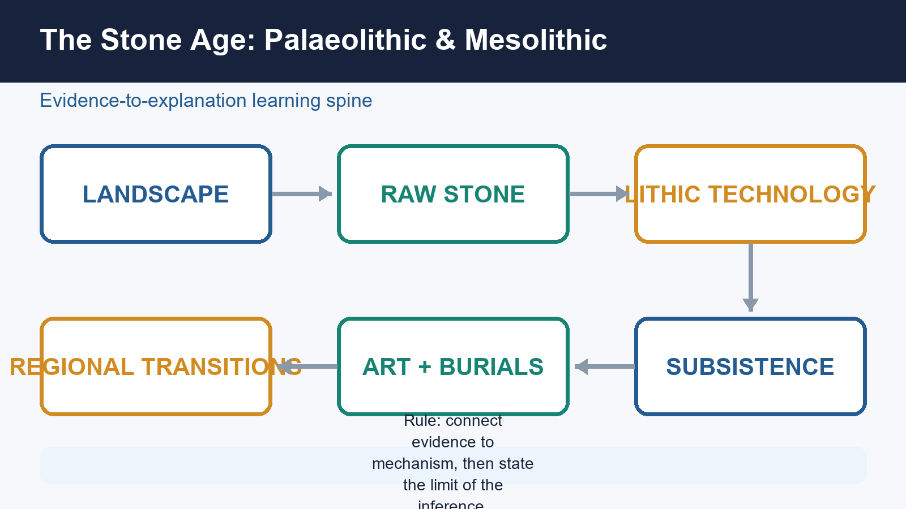
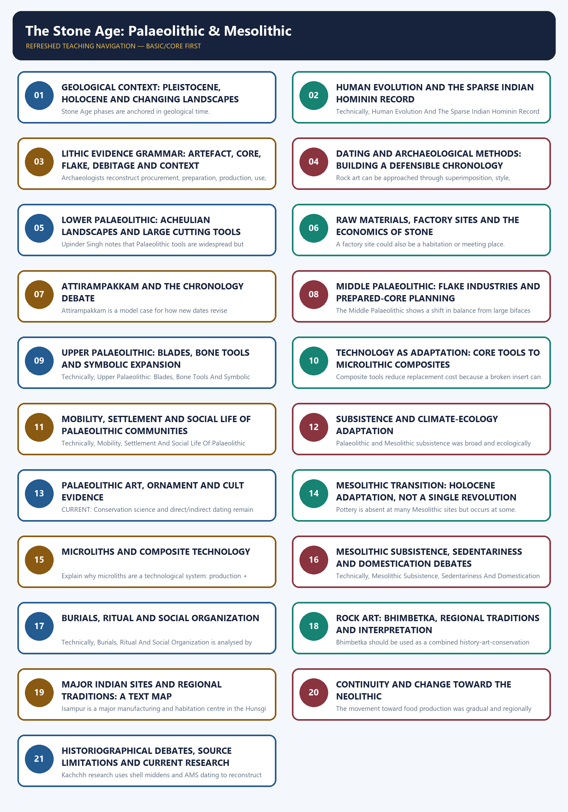

# The Stone Age: Palaeolithic & Mesolithic - Learner-v2 Complete Learning Session

> **Catalogue identity:** Ancient History · Subject-wide Syllabus · `ancient-indian-history-04`  
> **Generation date:** 20 August 2026 · **Approval:** pending explicit topic approval  
> **Source order used:** Basic/canonical owner and its OCR-grounded legacy learning package -> syllabus/master chronology/thematic and verified-PYQ sources -> exact Advanced owner in the optional block. Qdrant was not required. Legacy-v1 files remain unchanged.  
> **Evidence discipline:** inherited live claims are retained only where the legacy package cites a primary or peer-reviewed source; contested chronology and interpretation remain labelled.



*Original deterministic visual: a topic-specific evidence-to-explanation spine. It is a learning aid, not historical evidence.*

### Coverage lock

- **Required scope:** Chronology, lithics, sites and regions, subsistence, art, burials, dating and transitions, with regional chronologies rather than one all-India ladder.
- **Basic completeness:** the complete detailed legacy learner session is retained before practice.
- **Practice completeness:** verified PYQs, strict-rotation MCQs/remediation and solved 10/15/20-mark answers are retained.
- **Advanced boundary:** the exact Advanced owner is placed only after all Basic and practice material.
- **Register-last rule:** complete topic-specific consolidated notes remain the final H2 section.

### Legacy package source and coverage ledger

> **Subject:** Ancient Indian History | **Paper:** Prelims GS-I + GS-I analytical/culture support | **Topic:** 04 | **Date:** 12 August 2026
>
> **Evidence key:** FACT = directly retrieved from authored Markdown, local OCR-searchable books, verified official question papers or named live sources. INFERENCE = analytical synthesis. The unavailable 2019 official key is never presented as official.

### Sources actually used

- Authored Markdown read fully: `basic/04_Stone-Age-Palaeolithic-Mesolithic.md`, `advanced/04_Stone-Age-Palaeolithic-Mesolithic.md`, `README.md`, `00_Master-Chronology.md`, official syllabus mapping, revision chart and PYQ routing.
- R.S. Sharma, *India's Ancient Past*, local OCR-searchable PDF pp. 64-70; cross-check with local *Ancient History of India* Stone Age chapter.
- Upinder Singh, *A History of Ancient and Early Medieval India*, 2nd ed., local OCR-searchable PDF pp. 232-317.
- Verified official question text: 2019 Prelims GS-I Q92 from the local official paper. Official 2019 key is unavailable locally; the solution is labelled inferred.
- Live source: Anil et al., 'Deep-rooted Indian Middle Palaeolithic', *PLOS ONE*, 27 August 2024, DOI 10.1371/journal.pone.0302580.
- Live source: PIB/IIT Gandhinagar, 'Shell Chronicles of Ancient Kachchh', 4 June 2025, PRID 2133799.
- Live source: Mukhopadhyay et al., 'Understanding the Microlithic technology in the Lower Ganga Basin', *Quaternary Environments and Humans* (2025), DOI 10.1016/j.qeh.2025.100059.
- Live source: IIT Gandhinagar symposium 'Rethinking Deep Time', 29 January-2 February 2026, reported through PIB/institutional coverage.
- Live source: Patterson et al., 'Ancient genomes from Ladakh reveal 2800-year-old admixture', *Science Advances*, 24 July 2026, DOI 10.1126/sciadv.aeb3636.
- Live source: Madhya Pradesh Tourism Board Bhimbetka heritage promotion, 25 April 2026; official ASI Bhimbetka page for static site facts.
- Method source: IGNCA, *Rock Art of India: Suitable Dating Techniques* page. Qdrant was optional, unnecessary and not used.

### Exact syllabus and ownership boundary

- Direct official ownership: Prelims GS-I under 'History of India and Indian National Movement'.
- Mains use: evidence-based analysis of archaeology, rock art, adaptation, scientific method and culture; no separate official GS-I Mains clause is claimed for prehistoric political history.
- Primary art-form technique remains cross-linked to Indian Art and Culture; this topic owns prehistoric context and archaeological interpretation.

### Source-Coverage Ledger A - Authored Basic File

| ID | Basic-file requirement | Integrated in |
|---|---|---|
| B-01 | Sharma phase chronology and tool sequence | Cards 2, 6, 9, 10, 15 and final register |
| B-02 | Mesolithic transition, microliths and subsistence | Cards 15-17 |
| B-03 | Bori/Soan/Narmada/Bhimbetka/Bagor/Adamgarh sites | Cards 6, 17, 19-20 |
| B-04 | Domestication and Sambhar claims with caution | Cards 13, 17 and 21 |
| B-05 | Bhimbetka rock art | Card 19 |
| B-06 | 2019 Denisovan PYQ route | Verified solved PYQ |

### Source-Coverage Ledger B - Authored Advanced File

| ID | Advanced-file requirement | Integrated in |
|---|---|---|
| A-01 | Geological ages, hominin evolution and palaeo-environment | Cards 2-3 |
| A-02 | Isampur manufacture and settlement | Cards 6-7 |
| A-03 | Attirampakkam and Levallois | Cards 8-9 |
| A-04 | Regional Mesolithic dates and sites | Cards 15-20 |
| A-05 | Burials and subsistence at Ganga sites | Cards 17-18 |
| A-06 | Rock art and cult evidence with caution | Cards 14 and 19 |
| A-07 | Domestication evidence disputed | Cards 17 and 21 |
| A-08 | Source limitation and regional chronology | Cards 5, 8 and 22 |

## BASIC LEARNING SESSION



*Distinct embedded teaching-navigation image. The separate continuous Cārvāka-style flowchart package remains an independent at-a-glance artifact.*
### ROADMAP, SYLLABUS BOUNDARY AND EVIDENCE DISCIPLINE

#### PRE-TEACH CHECKLIST / CURRENT ANCHOR

> FACT: Static foundation comes first from the authored Topic 04 basic and advanced files, then local OCR-searchable R.S. Sharma and Upinder Singh PDFs. Live linkages are added only after this foundation. Qdrant was optional and was not used.

The Stone Age is the longest span of the human past and must be studied as history reconstructed without texts. The learning path moves from geological time and hominin evidence to lithic technology, landscapes, lifeways, symbolism, the Mesolithic transition, scientific methods and historiographical debate.

**Context:** Direct official ownership lies in Prelims GS-I under History of India. Mains use is analytical and culture-adjacent: rock art, archaeological method, environmental adaptation and the limits of inference. No printed GS-I Mains clause separately names prehistoric India.

#### Timeline

| Period | Event |
|---|---|
| Pleistocene | Lower, Middle and Upper Palaeolithic phases; changing climates and sea levels. |
| c. 12,000 BP onward | Holocene climatic regime; post-Pleistocene adaptations. |
| Mesolithic | Microlithic technologies, wider ecological niches, burials, rock art and variable sedentariness. |
| Neolithic threshold | Regional, gradual and debated movement toward food production. |

#### Visual

```text
[Deep time] Pleistocene-Holocene and palaeo-environments
        |
        v
[Evidence] Fossils, lithics, sediments, fauna, burials and art
        |
        v
[Technology] Core tools -> flakes -> blades -> microlithic composite tools
        |
        v
[Life-ways] Subsistence, mobility, settlement, society and ritual
        |
        v
[Interpretation] Dating, regionality, continuity, debates and UPSC answer discipline
```

#### Key Matrix

| Evidence family | Primary yield | Main limitation |
|---|---|---|
| Stone tools and debitage | Technology, reduction sequence, raw-material choice, activity areas | Tool-makers are rarely known from fossils |
| Stratigraphy and sediments | Sequence, context, environment and site formation | Reworking can displace artefacts |
| Fauna, flora and residues | Diet, ecology, seasonality and domestication claims | Preservation and species-identification disputes |
| Burials and bodies | Health, trauma, ritual and social differentiation | Small and uneven samples |
| Rock art and ornaments | Cognition, aesthetics, identity and activity scenes | Dating and meaning remain difficult |
| Absolute dating | Probability ranges for occupation and transitions | A date applies to the sampled event, not automatically the whole culture |

#### Core Teaching

- FACT: The authored basic file supplies R.S. Sharma's phase chronology, tool associations, key sites, domestication claims and the 2019 Denisovan PYQ route.
- FACT: The authored advanced file supplies Upinder Singh's regional chronology, Attirampakkam, Isampur, Levallois technology, burials, rock art and source cautions.
- FACT: Local OCR evidence used directly: R.S. Sharma, India's Ancient Past, PDF pp. 64-70; Upinder Singh, 2nd ed., PDF pp. 232-317.
- INFERENCE: A good prehistoric argument moves from artefact to context to behaviour, and states where the chain remains uncertain.
- METHOD: Facts from sources are labelled FACT; analytical synthesis is labelled INFERENCE; no unofficial answer is described as an official key.

#### Must-Know Facts

- FACT: The authored basic file supplies R.S. Sharma's phase chronology, tool associations, key sites, domestication claims and the 2019 Denisovan PYQ route.
- FACT: The authored advanced file supplies Upinder Singh's regional chronology, Attirampakkam, Isampur, Levallois technology, burials, rock art and source cautions.
- FACT: Local OCR evidence used directly: R.S. Sharma, India's Ancient Past, PDF pp. 64-70; Upinder Singh, 2nd ed., PDF pp. 232-317.
- INFERENCE: A good prehistoric argument moves from artefact to context to behaviour, and states where the chain remains uncertain.
- METHOD: Facts from sources are labelled FACT; analytical synthesis is labelled INFERENCE; no unofficial answer is described as an official key.

#### UPSC Traps

- **Wrong:** Prehistory means evidence-free history.
  **Correct:** It means history reconstructed mainly through material, biological and environmental evidence.
- **Wrong:** A tool type by itself identifies a people or biological species.
  **Correct:** Tool traditions can outlast, overlap and travel across populations; fossils are needed for biological attribution.

**Mains angle:** Open by defining prehistory as evidence-rich but text-poor; organize the body around technology, ecology, settlement, symbolism and method; conclude with regional variation and qualified inference.

**Study link:** Ancient History Topic 02 for source criticism; Topic 03 for geography and ecology; Topic 05 for Neolithic food production.
### SESSION 1 — GEOLOGICAL CONTEXT: PLEISTOCENE, HOLOCENE AND CHANGING LANDSCAPES

#### DEFINITION / WHAT THIS IS CALLED

**Plain-language definition:** The textbook equation Palaeolithic equals Pleistocene and Mesolithic equals Holocene is a useful first approximation, not a rigid law.

**Technical definition:** Stone Age phases are anchored in geological time.

#### ANSWER-GRABBING OPENING — WRITE/ADAPT IN THE EXAM

> The textbook equation Palaeolithic equals Pleistocene and Mesolithic equals Holocene is a useful first approximation, not a rigid law.

#### MUST-WRITE KEYWORDS

- **Geological Context**
- **Pleistocene**
- **Holocene**
- **Changing Landscapes**
- **Mains angle**
- **Study link**

**How to use them:** Frame the answer through Geological Context; define Pleistocene, connect Holocene with Changing Landscapes to explain the mechanism, and use Mains angle for the decisive comparison or qualification.

#### PRE-TEACH CHECKLIST / CURRENT ANCHOR

> CURRENT: The 2024 Retlapalle study and the 2026 South Asian Palaeolithic symposium show that chronology and environmental context remain active research fields rather than settled textbook tables.

Stone Age phases are anchored in geological time. The Pleistocene began about 2.6 million years ago and contained repeated cold-warm oscillations; the Holocene began about 12,000 years ago. In South Asia these global changes interacted with monsoon variability, river behaviour, volcanic ash, vegetation and sea-level change.

**Context:** The textbook equation Palaeolithic equals Pleistocene and Mesolithic equals Holocene is a useful first approximation, not a rigid law. Microliths appear in some late-Pleistocene contexts, and cultural transitions were regionally asynchronous.

#### Visual

| Period | Development |
|---|---|
| 2.6 mya | Pleistocene begins |
| c. 75 ka | Toba tephra marker |
| 40-10 ka | Upper Palaeolithic range |
| c. 12 ka | Holocene begins |
| Early Holocene | Regional Mesolithic expansion |

#### Key Matrix

| Process | Archaeological consequence | Indian example |
|---|---|---|
| Cold-warm oscillations | Sea-level, vegetation and faunal shifts | Late Pleistocene aridity in parts of north and west India |
| Pluvial-interpluvial change | Water and grassland availability altered site attraction | Didwana and Thar palaeolakes |
| River erosion/deposition | Terraces and gravels buried or moved tools | Soan, Son, Belan and Narmada valleys |
| Toba eruption c. 75 ka | Tephra offers a chronological marker and adaptation debate | Jwalapuram and peninsular river deposits |
| Early Holocene warming/wetting | Forest expansion and new niches | Mesolithic spread into lakesides, plains and coasts |

#### Core Teaching

- FACT: Upinder Singh places the Pleistocene beginning at about 2.6 mya and the Holocene at about 12,000 years ago.
- FACT: Son and Belan valley studies connect river change, climate and Stone Age site distributions.
- FACT: Thar evidence indicates more surface water during much of the Pleistocene and increased mid-Holocene rainfall in some phases.
- FACT: The impact of the Toba super-eruption on South Asian populations remains debated.
- INFERENCE: Climate changes opportunity sets; technology, knowledge and mobility determine how groups respond.
- INFERENCE: Sediment is both archive and disturbance agent, so geomorphology is part of archaeological interpretation.

#### Must-Know Facts

- FACT: Upinder Singh places the Pleistocene beginning at about 2.6 mya and the Holocene at about 12,000 years ago.
- FACT: Son and Belan valley studies connect river change, climate and Stone Age site distributions.
- FACT: Thar evidence indicates more surface water during much of the Pleistocene and increased mid-Holocene rainfall in some phases.
- FACT: The impact of the Toba super-eruption on South Asian populations remains debated.
- INFERENCE: Climate changes opportunity sets; technology, knowledge and mobility determine how groups respond.

#### UPSC Traps

- **Wrong:** The end of the Pleistocene created the Mesolithic everywhere on one date.
  **Correct:** Holocene-linked adaptations appeared unevenly; some microlithic traditions began earlier.
- **Wrong:** Wet deposits always mean dense occupation.
  **Correct:** Sediment type is a proxy that must be connected to a dated occupation surface.

**Mains angle:** Explain climate as mechanism, not master cause: climate -> water/biota -> resource distribution -> technological and mobility response.

**Study link:** Topic 03 landscape archaeology; dating card below; Mesolithic transition cards.

#### CLOSING RECALL FLOW — GEOLOGICAL CONTEXT: PLEISTOCENE, HOLOCENE AND CHANGING LANDSCAPES

```text
START / CONCEPT: GEOLOGICAL CONTEXT: PLEISTOCENE, HOLOCENE AND CHANGING LANDSCAPES
        |
        v
EXACT TERMS: Geological Context · Pleistocene · Holocene · Changing Landscapes · Mains angle · Study link
        |
        v
MECHANISM / ARGUMENT: Explain climate as mechanism, not master cause: climate - water/biota - resource distribution - technological and mobility response.
        |
        v
CONSEQUENCE / CONTRAST: The impact of the Toba super-eruption on South Asian populations remains debated.
        |
        v
UPSC TRAP / ANSWER-USE: Do not miss this limiting distinction: thar evidence indicates more surface water during much of the Pleistocene and increased mid-Holocene...
        |
        v
ANSWER-GRABBING FORMULATION: The textbook equation Palaeolithic equals Pleistocene and Mesolithic equals Holocene is a useful first approximation, not a rigid law.
```
### SESSION 2 — HUMAN EVOLUTION AND THE SPARSE INDIAN HOMININ RECORD

#### DEFINITION / WHAT THIS IS CALLED

**Plain-language definition:** Human evolution is included only to the extent necessary for Indian prehistory.

**Technical definition:** Technically, Human Evolution And The Sparse Indian Hominin Record is analysed by relating Human Evolution to The Sparse Indian Hominin Record, then testing the relationship through Mains angle and Study link.

#### ANSWER-GRABBING OPENING — WRITE/ADAPT IN THE EXAM

> Human evolution is included only to the extent necessary for Indian prehistory.

#### MUST-WRITE KEYWORDS

- **Human Evolution**
- **The Sparse Indian Hominin Record**
- **Mains angle**
- **Study link**
- **Hathnora cranial fragment, Narmada**
- **Classification and exact date remain debated**

**How to use them:** Frame the answer through Human Evolution; define The Sparse Indian Hominin Record, connect Mains angle with Study link to explain the mechanism, and use Hathnora cranial fragment, Narmada for the decisive comparison or qualification.

#### PRE-TEACH CHECKLIST / CURRENT ANCHOR

> CURRENT: Science Advances, 24 July 2026, published genome-wide data from Old Lady Spider Cave in Ladakh. The remains are much later than the Stone Age topic, but the study demonstrates the power and scarcity of ancient DNA in South Asia.

Human evolution is included only to the extent necessary for Indian prehistory. Biological evolution was branching and reticulate, not a neat ladder. Archaeologists must distinguish hominin fossils from artefacts: widespread tools do not identify their makers when fossils are absent.

**Context:** South Asia has a rich lithic record but a meagre authenticated hominin fossil record. This imbalance makes claims connecting a tool industry to Homo erectus, archaic Homo sapiens or modern humans especially cautious.

#### Visual

```text
[STONE TOOL ASSEMBLAGE]
  |-- Technology: Shows learned reduction choices
  |-- Context: Dates activity, not anatomy
  |-- Fossil: Needed for biological attribution
  |-- Inference: Name hominin cautiously when fossils are absent
```

#### Key Matrix

| Evidence | Safe conclusion | Caution |
|---|---|---|
| Hathnora cranial fragment, Narmada | An archaic hominin was present in central India | Classification and exact date remain debated |
| Central Narmada postcranial fossils | More than one hominin form may be represented | Associations span broad date ranges |
| Sri Lankan caves | Early modern humans occupied South Asian rainforest settings | Island-mainland comparison needs sea-level context |
| Denisovan DNA from Siberia | A distinct archaic human population interbred with others | No Denisovan fossil is established from India |
| Ladakh aDNA, 2026 | Ancient genomes can reconstruct ancestry and kinship | The sampled burials are late antique, not Palaeolithic |

#### Core Teaching

- FACT: The Hathnora skull cap was found with vertebrate fossils and late Acheulian tools; interpretations range from advanced Homo erectus to archaic Homo sapiens or an intermediate form.
- FACT: Upinder Singh stresses that South Asian hominin fossils are meagre compared with tools and animal fossils.
- FACT: Ancient DNA shows that human evolution included coexistence, migration and mixture among populations.
- FACT: The 2019 UPSC Prelims question asked what 'Denisovan' referred to.
- INFERENCE: Tool-makers should be described as hominins unless biological attribution is independently supported.
- INFERENCE: Indian prehistory can refine global dispersal models, but absence of fossils limits certainty.

#### Must-Know Facts

- FACT: The Hathnora skull cap was found with vertebrate fossils and late Acheulian tools; interpretations range from advanced Homo erectus to archaic Homo sapiens or an intermediate form.
- FACT: Upinder Singh stresses that South Asian hominin fossils are meagre compared with tools and animal fossils.
- FACT: Ancient DNA shows that human evolution included coexistence, migration and mixture among populations.
- FACT: The 2019 UPSC Prelims question asked what 'Denisovan' referred to.
- INFERENCE: Tool-makers should be described as hominins unless biological attribution is independently supported.

#### UPSC Traps

- **Wrong:** Ramapithecus is a securely established direct human ancestor in India.
  **Correct:** Its former interpretation was revised after new dating and fossil reassessment.
- **Wrong:** Denisovan means a geological period.
  **Correct:** It refers to an archaic human population first identified through remains and DNA from Denisova Cave.

**Mains angle:** Use the phrase 'lithic abundance, fossil scarcity' to explain why Indian palaeoanthropology requires interdisciplinary and probabilistic argument.

**Study link:** 2019 Denisovan PYQ; Attirampakkam debate; current aDNA methods.

#### CLOSING RECALL FLOW — HUMAN EVOLUTION AND THE SPARSE INDIAN HOMININ RECORD

```text
START / CONCEPT: HUMAN EVOLUTION AND THE SPARSE INDIAN HOMININ RECORD
        |
        v
EXACT TERMS: Human Evolution · The Sparse Indian Hominin Record · Mains angle · Study link · Hathnora cranial fragment, Narmada · Classification and exact date remain debated
        |
        v
MECHANISM / ARGUMENT: Correct: It refers to an archaic human population first identified through remains and DNA from Denisova Cave.
        |
        v
CONSEQUENCE / CONTRAST: South Asia has a rich lithic record but a meagre authenticated hominin fossil record.
        |
        v
UPSC TRAP / ANSWER-USE: Biological evolution was branching and reticulate, not a neat ladder.
        |
        v
ANSWER-GRABBING FORMULATION: Human evolution is included only to the extent necessary for Indian prehistory.
```
### SESSION 3 — LITHIC EVIDENCE GRAMMAR: ARTEFACT, CORE, FLAKE, DEBITAGE AND CONTEXT

#### DEFINITION / WHAT THIS IS CALLED

**Plain-language definition:** CURRENT: Retlapalle's published lithic analysis counted cores, flakes, retouched pieces, cortex, scars, platforms and reduction strategies, illustrating how modern prehistory moves beyond naming a few finished tools.

**Technical definition:** Archaeologists reconstruct procurement, preparation, production, use, repair and discard from cores, flakes, unfinished pieces, hammerstones, waste and use-wear.

#### ANSWER-GRABBING OPENING — WRITE/ADAPT IN THE EXAM

> CURRENT: Retlapalle's published lithic analysis counted cores, flakes, retouched pieces, cortex, scars, platforms and reduction strategies, illustrating how modern prehistory moves beyond naming a few finished tools.

#### MUST-WRITE KEYWORDS

- **Lithic Evidence Grammar**
- **Artefact**
- **Flake**
- **Debitage**
- **Mains angle**
- **Study link**

**How to use them:** Frame the answer through Lithic Evidence Grammar; define Artefact, connect Flake with Debitage to explain the mechanism, and use Mains angle for the decisive comparison or qualification.

#### PRE-TEACH CHECKLIST / CURRENT ANCHOR

> CURRENT: Retlapalle's published lithic analysis counted cores, flakes, retouched pieces, cortex, scars, platforms and reduction strategies, illustrating how modern prehistory moves beyond naming a few finished tools.

A stone tool is the surviving product of a technological sequence. Archaeologists reconstruct procurement, preparation, production, use, repair and discard from cores, flakes, unfinished pieces, hammerstones, waste and use-wear. Context determines whether this sequence is trustworthy.

**Context:** A typological label such as handaxe or scraper is only a starting point. Technology asks how the object was made; microwear and residue ask how it was used; spatial distribution asks where activity occurred.

#### Visual

```text
[Procure] Select quartzite, chert, chalcedony, limestone or other stone
        |
        v
[Prepare] Remove cortex and shape the core/platform
        |
        v
[Detach] Produce flake, blade or bladelet
        |
        v
[Modify] Retouch, back, grind or haft as required
        |
        v
[Use] Cut, scrape, pierce, chop, hunt or process plants
        |
        v
[Maintain and discard] Resharpen, recycle or leave as debitage and broken tools
```

#### Key Matrix

| Term | Meaning | Historical use |
|---|---|---|
| Core | Larger mass from which flakes are removed | Reduction strategy and raw-material economy |
| Flake | Detached piece with striking features | Can be used directly or retouched |
| Debitage | Waste from tool production | Identifies workshops and stages of manufacture |
| Cortex | Natural outer stone surface | High cortex often signals early reduction |
| Retouch | Secondary modification of an edge | Maintenance, shaping or functional adjustment |
| Primary context | Artefact remains near place of use or manufacture | Strongest behavioural association |
| Secondary context | Artefact moved by water, slope or later action | Weakens direct activity reconstruction |

#### Core Teaching

- FACT: Upinder Singh distinguishes primary, semi-primary and secondary archaeological contexts.
- FACT: Experimental archaeology, ethnography, microwear and residue studies help infer manufacture and use.
- FACT: A handaxe is usually bifacial; a chopper is unifacial; a cleaver has a broad straight cutting edge.
- INFERENCE: Assemblage proportions are more informative than isolated museum-quality specimens.
- METHOD: Record raw material, size, platform, scar pattern, cortex, retouch, breakage and spatial position.
- METHOD: Distinguish a factory site, habitation site, butchery area and short camp through the whole assemblage.

#### Must-Know Facts

- FACT: Upinder Singh distinguishes primary, semi-primary and secondary archaeological contexts.
- FACT: Experimental archaeology, ethnography, microwear and residue studies help infer manufacture and use.
- FACT: A handaxe is usually bifacial; a chopper is unifacial; a cleaver has a broad straight cutting edge.
- INFERENCE: Assemblage proportions are more informative than isolated museum-quality specimens.
- METHOD: Record raw material, size, platform, scar pattern, cortex, retouch, breakage and spatial position.

#### UPSC Traps

- **Wrong:** Finished tools are the entire archaeological record.
  **Correct:** Waste, unfinished pieces and hammerstones often reveal production more clearly.
- **Wrong:** A surface find is useless.
  **Correct:** It can establish distribution, but behaviour and chronology require stronger context.

**Mains angle:** Define the lithic chaîne opératoire: source -> core preparation -> blank production -> retouch/hafting -> use -> resharpening -> discard.

**Study link:** Topic 02 archaeological method; factory-site and reduction-technique cards.

#### CLOSING RECALL FLOW — LITHIC EVIDENCE GRAMMAR: ARTEFACT, CORE, FLAKE, DEBITAGE AND CONTEXT

```text
START / CONCEPT: LITHIC EVIDENCE GRAMMAR: ARTEFACT, CORE, FLAKE, DEBITAGE AND CONTEXT
        |
        v
EXACT TERMS: Lithic Evidence Grammar · Artefact · Flake · Debitage · Mains angle · Study link
        |
        v
MECHANISM / ARGUMENT: Archaeologists reconstruct procurement, preparation, production, use, repair and discard from cores, flakes, unfinished pieces, hammerstones, waste and use-wear.
        |
        v
CONSEQUENCE / CONTRAST: Correct: It can establish distribution, but behaviour and chronology require stronger context.
        |
        v
UPSC TRAP / ANSWER-USE: Do not miss this limiting distinction: source - core preparation - blank production - retouch/hafting - use - resharpening...
        |
        v
ANSWER-GRABBING FORMULATION: CURRENT: Retlapalle's published lithic analysis counted cores, flakes, retouched pieces, cortex, scars, platforms and reduction strategies, illustrating how modern prehistory moves beyond naming a few finished tools.
```
### SESSION 4 — DATING AND ARCHAEOLOGICAL METHODS: BUILDING A DEFENSIBLE CHRONOLOGY

#### DEFINITION / WHAT THIS IS CALLED

**Plain-language definition:** Luminescence methods are therefore especially important because they can date sediment burial or last light exposure, while ESR, uranium-series, palaeomagnetism and potassium-argon address other materials and time depths.

**Technical definition:** Rock art can be approached through superimposition, style, associated deposits, pigment/accretion radiocarbon, luminescence and uranium-series methods.

#### ANSWER-GRABBING OPENING — WRITE/ADAPT IN THE EXAM

> Luminescence methods are therefore especially important because they can date sediment burial or last light exposure, while ESR, uranium-series, palaeomagnetism and potassium-argon address other materials and time depths.

#### MUST-WRITE KEYWORDS

- **Dating**
- **Archaeological Methods**
- **Building A Defensible Chronology**
- **Mains angle**
- **Study link**
- **Stratigraphy**

**How to use them:** Frame the answer through Dating; define Archaeological Methods, connect Building A Defensible Chronology with Mains angle to explain the mechanism, and use Study link for the decisive comparison or qualification.

#### PRE-TEACH CHECKLIST / CURRENT ANCHOR

> CURRENT: Tamil Nadu's recent scientific-dating programme and the 2024 Retlapalle study demonstrate the expanding use of luminescence and laboratory analysis in Indian archaeology. Method choice depends on the sampled material and event.

Relative dating establishes order; absolute methods estimate age ranges. A strong chronology combines stratigraphy, sediment history, typology and appropriate scientific dates rather than treating one laboratory number as self-explanatory.

**Context:** Prehistoric sites often lack abundant charcoal or bone. Luminescence methods are therefore especially important because they can date sediment burial or last light exposure, while ESR, uranium-series, palaeomagnetism and potassium-argon address other materials and time depths.

#### Visual

```text
                 [AGE CLAIM]
        |-- Sample: What material was measured?
        |-- Event: Death, burning, burial or last light?
        |-- Context: Primary, reworked or intrusive?
        |-- Range: Error, calibration and replication?
```

#### Key Matrix

| Method | What it dates | Major caution |
|---|---|---|
| Stratigraphy | Relative sequence of deposits | Layers may be disturbed or inverted |
| Radiocarbon | Organic material up to late Quaternary range | Dates sampled organism/event, requires calibration |
| OSL / pIR-IRSL | Last light exposure of mineral grains | Incomplete bleaching and dose history |
| ESR | Trapped charge in tooth enamel or minerals | Model assumptions and dose-rate uncertainty |
| U-series | Carbonates and related deposits | Open-system behaviour can alter estimates |
| Palaeomagnetism | Magnetic signature of sediments | Needs secure correlation and context |
| Microwear/residue | Function rather than age | Taphonomy and contamination |

#### Core Teaching

- FACT: Attirampakkam's Acheulian-to-Middle-Palaeolithic transition was dated by luminescence to about 385 +/- 64 ka in the cited research.
- FACT: Kurnool cave Upper Palaeolithic contexts include ESR dates around 19,224 BP and 16,686 BP in Upinder Singh's account.
- FACT: Retlapalle used luminescence dating and techno-typological analysis to study a terminal Middle Pleistocene assemblage.
- FACT: Rock art can be approached through superimposition, style, associated deposits, pigment/accretion radiocarbon, luminescence and uranium-series methods.
- INFERENCE: Precision is not the same as accuracy; a narrow date on the wrong event is misleading.
- METHOD: Report method, sample, calibrated range, context and uncertainty.

#### Must-Know Facts

- FACT: Attirampakkam's Acheulian-to-Middle-Palaeolithic transition was dated by luminescence to about 385 +/- 64 ka in the cited research.
- FACT: Kurnool cave Upper Palaeolithic contexts include ESR dates around 19,224 BP and 16,686 BP in Upinder Singh's account.
- FACT: Retlapalle used luminescence dating and techno-typological analysis to study a terminal Middle Pleistocene assemblage.
- FACT: Rock art can be approached through superimposition, style, associated deposits, pigment/accretion radiocarbon, luminescence and uranium-series methods.
- INFERENCE: Precision is not the same as accuracy; a narrow date on the wrong event is misleading.

#### UPSC Traps

- **Wrong:** Radiocarbon directly dates all stone tools.
  **Correct:** Stone usually lacks datable carbon; associated organic material dates an event in the deposit.
- **Wrong:** One date fixes an entire cultural phase across India.
  **Correct:** Regional sequences require multiple secure dates and stratigraphic replication.

**Mains angle:** Scientific archaeology narrows chronological possibilities but never removes the need for contextual and interpretive reasoning.

**Study link:** Topic 02 dating; Attirampakkam; Retlapalle current linkage; rock-art methods.

#### CLOSING RECALL FLOW — DATING AND ARCHAEOLOGICAL METHODS: BUILDING A DEFENSIBLE CHRONOLOGY

```text
START / CONCEPT: DATING AND ARCHAEOLOGICAL METHODS: BUILDING A DEFENSIBLE CHRONOLOGY
        |
        v
EXACT TERMS: Dating · Archaeological Methods · Building A Defensible Chronology · Mains angle · Study link · Stratigraphy
        |
        v
MECHANISM / ARGUMENT: Rock art can be approached through superimposition, style, associated deposits, pigment/accretion radiocarbon, luminescence and uranium-series methods.
        |
        v
CONSEQUENCE / CONTRAST: Precision is not the same as accuracy; a narrow date on the wrong event is misleading.
        |
        v
UPSC TRAP / ANSWER-USE: Do not miss this limiting distinction: relative dating establishes order; absolute methods estimate age ranges.
        |
        v
ANSWER-GRABBING FORMULATION: Luminescence methods are therefore especially important because they can date sediment burial or last light exposure, while ESR, uranium-series, palaeomagnetism and potassium-argon address other materials and time depths.
```
### SESSION 5 — LOWER PALAEOLITHIC: ACHEULIAN LANDSCAPES AND LARGE CUTTING TOOLS

#### DEFINITION / WHAT THIS IS CALLED

**Plain-language definition:** The Lower Palaeolithic is marked by large core and flake tools, especially Acheulian handaxes and cleavers in peninsular India.

**Technical definition:** Upinder Singh notes that Palaeolithic tools are widespread but excavated habitation sites are comparatively few.

#### ANSWER-GRABBING OPENING — WRITE/ADAPT IN THE EXAM

> The Lower Palaeolithic is marked by large core and flake tools, especially Acheulian handaxes and cleavers in peninsular India.

#### MUST-WRITE KEYWORDS

- **Lower Palaeolithic**
- **Acheulian Landscapes**
- **Large Cutting Tools**
- **Mains angle**
- **Study link**
- **Diagnostic tools**

**How to use them:** Frame the answer through Lower Palaeolithic; define Acheulian Landscapes, connect Large Cutting Tools with Mains angle to explain the mechanism, and use Study link for the decisive comparison or qualification.

#### PRE-TEACH CHECKLIST / CURRENT ANCHOR

> CURRENT: The 2026 'Rethinking Deep Time' symposium at IIT Gandhinagar highlighted transitions, origins, identities and new dating evidence in South Asian Palaeolithic archaeology.

The Lower Palaeolithic is marked by large core and flake tools, especially Acheulian handaxes and cleavers in peninsular India. It represents repeated occupation of resource-rich landscapes rather than a single uniform culture moving across an empty map.

**Context:** R.S. Sharma's exam chronology places it broadly at c. 600,000-150,000 BCE. Upinder Singh records much deeper dates at several sites and treats the phase as regionally variable. The two chronologies must be identified as source-specific, not mechanically merged.

#### Visual

```text
                 [ACHEULIAN LANDSCAPE]
        |-- Tool: Biface, cleaver, chopper
        |-- Resource: Water + stone + food
        |-- Site: Quarry, factory, camp, shelter
        |-- Skill: Planning, symmetry, edge control
        |-- Debate: Chronology and hominin maker
        |-- Continuity: Older tool types persist later
```

#### Key Matrix

| Feature | Lower Palaeolithic pattern | Example |
|---|---|---|
| Diagnostic tools | Handaxes, cleavers, choppers and chopping tools | Hunsgi-Isampur, Attirampakkam |
| Raw materials | Quartzite, limestone and other hard stone | Bhimbetka quartzite; Isampur limestone |
| Site setting | River valleys, raw-material zones, rock shelters | Narmada, Son, Hunsgi, Bhimbetka |
| Activity | Tool manufacture, butchery, food processing and mobile occupation | Isampur factory-habitation complex |
| Regional label | Acheulian dominates much of peninsular record | Early and late Acheulian sequences |

#### Core Teaching

- FACT: R.S. Sharma associates the phase with handaxes, cleavers and choppers and sites in the Soan, Belan, Narmada, Didwana, Bhimbetka and peninsular regions.
- FACT: Upinder Singh notes that Palaeolithic tools are widespread but excavated habitation sites are comparatively few.
- FACT: Bhimbetka offered shelter, perennial water, edible plants, animals and local quartzite.
- FACT: Hunsgi sites vary from task-specific localities to temporary camps and larger occupation places.
- INFERENCE: Large cutting tools imply planned reduction, knowledge transmission and investment in durable equipment.
- INFERENCE: Site clusters around water and stone indicate structured mobility, not aimless wandering.

#### Must-Know Facts

- FACT: R.S. Sharma associates the phase with handaxes, cleavers and choppers and sites in the Soan, Belan, Narmada, Didwana, Bhimbetka and peninsular regions.
- FACT: Upinder Singh notes that Palaeolithic tools are widespread but excavated habitation sites are comparatively few.
- FACT: Bhimbetka offered shelter, perennial water, edible plants, animals and local quartzite.
- FACT: Hunsgi sites vary from task-specific localities to temporary camps and larger occupation places.
- INFERENCE: Large cutting tools imply planned reduction, knowledge transmission and investment in durable equipment.

#### UPSC Traps

- **Wrong:** All Lower Palaeolithic assemblages contain only handaxes.
  **Correct:** Pebble tools, flakes and small tools can occur alongside bifaces.
- **Wrong:** The 'Madrasian' was a wholly separate southern civilization.
  **Correct:** The old contrast based on supposed absence of pebble tools has been rejected.

**Mains angle:** Compare textbook chronology with newer site dates, then explain the phase through landscape, manufacture and mobility rather than a list of tools.

**Study link:** Factory sites; Attirampakkam; regional site-map card.

#### CLOSING RECALL FLOW — LOWER PALAEOLITHIC: ACHEULIAN LANDSCAPES AND LARGE CUTTING TOOLS

```text
START / CONCEPT: LOWER PALAEOLITHIC: ACHEULIAN LANDSCAPES AND LARGE CUTTING TOOLS
        |
        v
EXACT TERMS: Lower Palaeolithic · Acheulian Landscapes · Large Cutting Tools · Mains angle · Study link · Diagnostic tools
        |
        v
MECHANISM / ARGUMENT: Compare textbook chronology with newer site dates, then explain the phase through landscape, manufacture and mobility rather than a list of tools.
        |
        v
CONSEQUENCE / CONTRAST: Upinder Singh notes that Palaeolithic tools are widespread but excavated habitation sites are comparatively few.
        |
        v
UPSC TRAP / ANSWER-USE: Do not miss this limiting distinction: the old contrast based on supposed absence of pebble tools has been rejected.
        |
        v
ANSWER-GRABBING FORMULATION: The Lower Palaeolithic is marked by large core and flake tools, especially Acheulian handaxes and cleavers in peninsular India.
```
### SESSION 6 — RAW MATERIALS, FACTORY SITES AND THE ECONOMICS OF STONE

#### DEFINITION / WHAT THIS IS CALLED

**Plain-language definition:** Raw Materials, Factory Sites And The Economics Of Stone comprises Raw Materials, ory Sites and The Economics Of Stone as its core connected dimensions.

**Technical definition:** A factory site could also be a habitation or meeting place.

#### ANSWER-GRABBING OPENING — WRITE/ADAPT IN THE EXAM

> Stone was not an undifferentiated resource.

#### MUST-WRITE KEYWORDS

- **Raw Materials**
- **ory Sites**
- **The Economics Of Stone**
- **Mains angle**
- **Study link**
- **Quartzite**

**How to use them:** Frame the answer through Raw Materials; define ory Sites, connect The Economics Of Stone with Mains angle to explain the mechanism, and use Study link for the decisive comparison or qualification.

#### PRE-TEACH CHECKLIST / CURRENT ANCHOR

> CURRENT: Modern lithic studies, including Retlapalle and the 2025 Lower Ganga microlithic study, use raw-material selection and reduction strategies to reconstruct mobility and ecology.

Stone was not an undifferentiated resource. Grain, fracture quality, nodule size, distance and intended tool form shaped selection. Factory sites preserve quarrying, early reduction, unfinished tools and heavy waste; transported finished tools reveal movement or exchange.

**Context:** Raw-material economy connects technology with landscape. Coarse tough rocks suit heavy cutting; fine cryptocrystalline stones permit standardized flakes, blades and microliths. Scarcity can produce conservation, resharpening and long-distance procurement.

#### Visual

```text
[Landscape survey] Locate river cobbles, outcrops, nodules and slabs
        |
        v
[Select] Match grain, size and fracture to intended tool
        |
        v
[Reduce at source] Remove heavy cortex and rough-outs
        |
        v
[Transport] Carry blanks, cores or finished tools
        |
        v
[Use and repair] Resharpen and recycle valuable stone
        |
        v
[Discard] Spatial pattern reveals activity and mobility
```

#### Key Matrix

| Raw material | Technical quality | Illustrative use |
|---|---|---|
| Quartzite | Hard, often coarse-grained | Handaxes and heavy tools at Bhimbetka/Narmada |
| Siliceous limestone | Locally abundant and workable | Acheulian manufacture at Isampur |
| Chert | Fine-grained, predictable fracture | Flakes, blades and microliths in Son-Belan/Ganga contexts |
| Chalcedony | Fine fibrous structure, controlled flaking | Small standardized tools; Bagor procurement debate |
| Quartz | Widely available but variable fracture | Mesolithic and coastal/southern assemblages |
| Bone | Organic, resilient and shapeable | Upper Palaeolithic tools in Kurnool caves |

#### Core Teaching

- FACT: Isampur preserves limestone slabs, cores, flakes, debitage, unfinished tools and hammerstones, indicating quarrying and manufacture.
- FACT: Baghor II's Mesolithic lithic material was overwhelmingly waste, suggesting manufacture for use elsewhere.
- FACT: Good-quality chalcedony used at Bagor may have come from the Deccan Traps about 90 km away.
- FACT: Mahadaha's microlithic stone had to be transported across the Ganga from Vindhyan sources.
- INFERENCE: Raw-material distance can indicate direct procurement, seasonal rounds, exchange or embedded travel; it does not identify one mechanism automatically.
- INFERENCE: A factory site could also be a habitation or meeting place.

#### Must-Know Facts

- FACT: Isampur preserves limestone slabs, cores, flakes, debitage, unfinished tools and hammerstones, indicating quarrying and manufacture.
- FACT: Baghor II's Mesolithic lithic material was overwhelmingly waste, suggesting manufacture for use elsewhere.
- FACT: Good-quality chalcedony used at Bagor may have come from the Deccan Traps about 90 km away.
- FACT: Mahadaha's microlithic stone had to be transported across the Ganga from Vindhyan sources.
- INFERENCE: Raw-material distance can indicate direct procurement, seasonal rounds, exchange or embedded travel; it does not identify one mechanism automatically.

#### UPSC Traps

- **Wrong:** Local stone means no mobility.
  **Correct:** Groups may transport selected finished tools while using abundant local stone for ordinary needs.
- **Wrong:** A high waste percentage means careless manufacture.
  **Correct:** It often identifies a production locality and specific reduction stage.

**Mains angle:** Use raw material as a bridge between technology and social geography: quality -> tool choice -> procurement radius -> interaction.

**Study link:** Isampur, Bagor, Mahadaha, Baghor II and lithic-sequence flow.

#### CLOSING RECALL FLOW — RAW MATERIALS, FACTORY SITES AND THE ECONOMICS OF STONE

```text
START / CONCEPT: RAW MATERIALS, FACTORY SITES AND THE ECONOMICS OF STONE
        |
        v
EXACT TERMS: Raw Materials · ory Sites · The Economics Of Stone · Mains angle · Study link · Quartzite
        |
        v
MECHANISM / ARGUMENT: Raw-material distance can indicate direct procurement, seasonal rounds, exchange or embedded travel; it does not identify one mechanism automatically.
        |
        v
CONSEQUENCE / CONTRAST: A factory site could also be a habitation or meeting place.
        |
        v
UPSC TRAP / ANSWER-USE: Do not miss this limiting distinction: baghor II's Mesolithic lithic material was overwhelmingly waste, suggesting manufacture for use elsewhere.
        |
        v
ANSWER-GRABBING FORMULATION: Stone was not an undifferentiated resource.
```
### SESSION 7 — ATTIRAMPAKKAM AND THE CHRONOLOGY DEBATE

#### DEFINITION / WHAT THIS IS CALLED

**Plain-language definition:** Attirampakkam in the Kortallaiyar basin is central because multidisciplinary excavation exposed a long fluvial sequence containing Acheulian and Middle Palaeolithic technologies.

**Technical definition:** Attirampakkam is a model case for how new dates revise periodization without eliminating uncertainty.

#### ANSWER-GRABBING OPENING — WRITE/ADAPT IN THE EXAM

> Attirampakkam in the Kortallaiyar basin is central because multidisciplinary excavation exposed a long fluvial sequence containing Acheulian and Middle Palaeolithic technologies.

#### MUST-WRITE KEYWORDS

- **Attirampakkam**
- **The Chronology Debate**
- **Mains angle**
- **Study link**
- **=1.07 mya**
- **Early Acheulian levels**

**How to use them:** Frame the answer through Attirampakkam; define The Chronology Debate, connect Mains angle with Study link to explain the mechanism, and use =1.07 mya for the decisive comparison or qualification.

#### PRE-TEACH CHECKLIST / CURRENT ANCHOR

> CURRENT: The 2026 South Asian Palaeolithic symposium foregrounded precisely the problem Attirampakkam raises: transitions cannot be assumed from inherited European period bands.

Attirampakkam in the Kortallaiyar basin is central because multidisciplinary excavation exposed a long fluvial sequence containing Acheulian and Middle Palaeolithic technologies. Its dates pushed the South Indian record far earlier than older textbook periodization.

**Context:** The site does not prove which hominin species made the tools. It demonstrates a long technological sequence and forces revision of all-India chronologies, dispersal models and the meaning of 'transition'.

#### Visual

| Period | Development |
|---|---|
| >=1.07 mya | Early Acheulian levels |
| 1.51 +/-0.07 mya | Pooled age in cited work |
| 385 +/-64 ka | Acheulian-Middle transition |
| 172 +/-41 ka | Middle Palaeolithic continuation |
| Interpretation | Regional transition, maker unknown |

#### Key Matrix

| Finding | Historical implication | Limit |
|---|---|---|
| Earliest Acheulian levels at least 1.07 mya; pooled average 1.51 +/- 0.07 mya in cited work | Deep antiquity of South Indian Acheulian | Dating belongs to this sequence, not all India |
| Acheulian end / Middle Palaeolithic start c. 385 +/- 64 ka | Transition much earlier than old textbook band | Large error range and regional sequence |
| Middle Palaeolithic continuing to c. 172 +/- 41 ka | Long technological development | Phase boundaries remain analytical |
| Decline of bifaces; more small tools and Levallois methods | Behavioural and technological change | No associated hominin fossil |

#### Core Teaching

- FACT: Eight stratified fluvial deposits reached about 9 m in thickness in the reported excavations.
- FACT: The sequence included Acheulian bifaces, smaller tools, Levallois flakes/points and developing blade methods.
- FACT: Animal teeth, footprints and hoofmarks contributed palaeoenvironmental evidence.
- INFERENCE: Technological change may represent local development, population movement, interaction or combinations of these.
- METHOD: In answers, write 'R.S. Sharma's textbook band' and 'Attirampakkam's site-specific luminescence sequence' separately.
- METHOD: Do not attach the transition to Homo sapiens without fossil evidence.

#### Must-Know Facts

- FACT: Eight stratified fluvial deposits reached about 9 m in thickness in the reported excavations.
- FACT: The sequence included Acheulian bifaces, smaller tools, Levallois flakes/points and developing blade methods.
- FACT: Animal teeth, footprints and hoofmarks contributed palaeoenvironmental evidence.
- INFERENCE: Technological change may represent local development, population movement, interaction or combinations of these.
- METHOD: In answers, write 'R.S. Sharma's textbook band' and 'Attirampakkam's site-specific luminescence sequence' separately.

#### UPSC Traps

- **Wrong:** Attirampakkam invalidates all chronology.
  **Correct:** It invalidates a single rigid all-India band and requires regionally dated sequences.
- **Wrong:** Early Middle Palaeolithic technology proves modern humans were present.
  **Correct:** The site lacks human fossils adequate for that attribution.

**Mains angle:** Attirampakkam is a model case for how new dates revise periodization without eliminating uncertainty.

**Study link:** Dating methods; Middle Palaeolithic; historiographical debate.

#### CLOSING RECALL FLOW — ATTIRAMPAKKAM AND THE CHRONOLOGY DEBATE

```text
START / CONCEPT: ATTIRAMPAKKAM AND THE CHRONOLOGY DEBATE
        |
        v
EXACT TERMS: Attirampakkam · The Chronology Debate · Mains angle · Study link · =1.07 mya · Early Acheulian levels
        |
        v
MECHANISM / ARGUMENT: CURRENT: The 2026 South Asian Palaeolithic symposium foregrounded precisely the problem Attirampakkam raises: transitions cannot be assumed from inherited European period bands.
        |
        v
CONSEQUENCE / CONTRAST: The site does not prove which hominin species made the tools.
        |
        v
UPSC TRAP / ANSWER-USE: Do not attach the transition to Homo sapiens without fossil evidence.
        |
        v
ANSWER-GRABBING FORMULATION: Attirampakkam in the Kortallaiyar basin is central because multidisciplinary excavation exposed a long fluvial sequence containing Acheulian and Middle Palaeolithic technologies.
```
### SESSION 8 — MIDDLE PALAEOLITHIC: FLAKE INDUSTRIES AND PREPARED-CORE PLANNING

#### DEFINITION / WHAT THIS IS CALLED

**Plain-language definition:** Middle Palaeolithic: Flake Industries And Prepared-Core Planning comprises Middle Palaeolithic, Flake Industries and Prepared-Core Planning as its core connected dimensions.

**Technical definition:** The Middle Palaeolithic shows a shift in balance from large bifaces toward smaller, lighter flake tools.

#### ANSWER-GRABBING OPENING — WRITE/ADAPT IN THE EXAM

> The Middle Palaeolithic shows a shift in balance from large bifaces toward smaller, lighter flake tools.

#### MUST-WRITE KEYWORDS

- **Middle Palaeolithic**
- **Flake Industries**
- **Prepared-Core Planning**
- **Mains angle**
- **Study link**
- **Attirampakkam**

**How to use them:** Frame the answer through Middle Palaeolithic; define Flake Industries, connect Prepared-Core Planning with Mains angle to explain the mechanism, and use Study link for the decisive comparison or qualification.

#### PRE-TEACH CHECKLIST / CURRENT ANCHOR

> CURRENT: PLOS ONE's Retlapalle study, published 27 August 2024, documented a terminal Middle Pleistocene Middle Palaeolithic assemblage with Levallois, discoidal, radial, blade and unidirectional core strategies.

The Middle Palaeolithic shows a shift in balance from large bifaces toward smaller, lighter flake tools. Prepared-core methods demonstrate anticipation of the desired blank before the decisive blow, though handaxes and cleavers did not disappear everywhere.

**Context:** Regional industries vary in raw material, tool type and chronology. The label 'Middle Palaeolithic' therefore names a broad technological pattern, not a homogeneous population or simultaneous event.

#### Visual

```text
[Choose core] Select suitable fine-grained stone
        |
        v
[Shape convexities] Trim sides and organize removal surface
        |
        v
[Prepare platform] Create controlled striking point
        |
        v
[Predetermine blank] Plan triangular or oval flake
        |
        v
[Detach] Remove sharp flake needing little retouch
```

#### Key Matrix

| Region/site | Key evidence | Interpretive value |
|---|---|---|
| Attirampakkam | Levallois flakes/points and early transition | Revised chronology |
| Didwana and Thar | Dated flake contexts, lakes and working floors | Climate-resource relationships |
| Son and Belan valleys | Numerous sites, factories and chert use | Regional settlement systems |
| Nevasa/Chirki | Stratified flake industry and workshops | Nevasan terminology |
| Kalpi | Tools, fauna and bone tools around 45 ka | Ganga-plain exception |
| Retlapalle | Formal cores, prepared flakes, points and limited blades | Current lithic science |

#### Core Teaching

- FACT: The Levallois technique prepares core shape and striking platform before detaching a thin planned flake.
- FACT: Middle Palaeolithic assemblages include scrapers, points, borers and other flake tools, with regional persistence of older forms.
- FACT: Chert, quartzite, flint, jasper, agate and chalcedony were used in different regions.
- FACT: Retlapalle's analysed assemblage included formal Levallois, discoidal, radial, blade and unidirectional reduction strategies.
- INFERENCE: Greater blank standardization suggests planning depth, skilled learning and flexible task organization.
- INFERENCE: Technological convergence can occur without a single migrating population.

#### Must-Know Facts

- FACT: The Levallois technique prepares core shape and striking platform before detaching a thin planned flake.
- FACT: Middle Palaeolithic assemblages include scrapers, points, borers and other flake tools, with regional persistence of older forms.
- FACT: Chert, quartzite, flint, jasper, agate and chalcedony were used in different regions.
- FACT: Retlapalle's analysed assemblage included formal Levallois, discoidal, radial, blade and unidirectional reduction strategies.
- INFERENCE: Greater blank standardization suggests planning depth, skilled learning and flexible task organization.

#### UPSC Traps

- **Wrong:** Middle Palaeolithic equals flakes only and no bifaces.
  **Correct:** The balance changes, but older tool forms can persist.
- **Wrong:** Levallois is a finished tool type.
  **Correct:** It is a prepared-core reduction strategy that produces planned flakes.

**Mains angle:** Describe the phase as reorganization of the toolkit, raw-material use and reduction planning, not as a sudden replacement.

**Study link:** Retlapalle current linkage; Levallois terminology; regional site map.

#### CLOSING RECALL FLOW — MIDDLE PALAEOLITHIC: FLAKE INDUSTRIES AND PREPARED-CORE PLANNING

```text
START / CONCEPT: MIDDLE PALAEOLITHIC: FLAKE INDUSTRIES AND PREPARED-CORE PLANNING
        |
        v
EXACT TERMS: Middle Palaeolithic · Flake Industries · Prepared-Core Planning · Mains angle · Study link · Attirampakkam
        |
        v
MECHANISM / ARGUMENT: Correct: It is a prepared-core reduction strategy that produces planned flakes.
        |
        v
CONSEQUENCE / CONTRAST: Prepared-core methods demonstrate anticipation of the desired blank before the decisive blow, though handaxes and cleavers did not disappear everywhere.
        |
        v
UPSC TRAP / ANSWER-USE: Do not miss this limiting distinction: middle Palaeolithic assemblages include scrapers, points, borers and other flake tools, with regional persistence...
        |
        v
ANSWER-GRABBING FORMULATION: The Middle Palaeolithic shows a shift in balance from large bifaces toward smaller, lighter flake tools.
```
### SESSION 9 — UPPER PALAEOLITHIC: BLADES, BONE TOOLS AND SYMBOLIC EXPANSION

#### DEFINITION / WHAT THIS IS CALLED

**Plain-language definition:** The Upper Palaeolithic is conventionally associated with parallel-sided blades, burins, bone tools, ornaments and more visible symbolic evidence.

**Technical definition:** Technically, Upper Palaeolithic: Blades, Bone Tools And Symbolic Expansion is analysed by relating Upper Palaeolithic to Blades, then testing the relationship through Bone Tools and Symbolic Expansion.

#### ANSWER-GRABBING OPENING — WRITE/ADAPT IN THE EXAM

> The Upper Palaeolithic is conventionally associated with parallel-sided blades, burins, bone tools, ornaments and more visible symbolic evidence.

#### MUST-WRITE KEYWORDS

- **Upper Palaeolithic**
- **Blades**
- **Bone Tools**
- **Symbolic Expansion**
- **Mains angle**
- **Study link**

**How to use them:** Frame the answer through Upper Palaeolithic; define Blades, connect Bone Tools with Symbolic Expansion to explain the mechanism, and use Mains angle for the decisive comparison or qualification.

#### PRE-TEACH CHECKLIST / CURRENT ANCHOR

> CURRENT: Scientific reassessment of early microliths and Late Pleistocene occupations continues to blur a rigid Upper Palaeolithic-Mesolithic boundary.

The Upper Palaeolithic is conventionally associated with parallel-sided blades, burins, bone tools, ornaments and more visible symbolic evidence. It represents technological diversification during the later Pleistocene, but older heavy tools remained useful for some tasks.

**Context:** R.S. Sharma places the Indian phase at c. 35,000-10,000 BCE; Upinder Singh presents site-specific ranges and evidence from the Son-Belan valleys, Kurnool caves, Patne, Bhimbetka and other regions.

#### Visual

```text
                 [DIVERSIFIED TOOLKIT]
        |-- Lithics: Blades and burins
        |-- Organic tools: Bone implements
        |-- Hafting: Composite equipment
        |-- Ornaments: Eggshell beads
        |-- Art/cult: Cupules, engravings, shrine debate
        |-- Continuity: Older tools persist
```

#### Key Matrix

| Marker | Meaning | Indian example |
|---|---|---|
| Blade | Flake more than twice as long as wide | Narmada and Belan contexts |
| Burin | Thick sharp edge for engraving/grooving | Sanghao and widespread assemblages |
| Bone tools | Organic toolkit diversification | Kurnool and Muchchatla Chintamanu Gavi |
| Microwear/hafting | Composite tools and task specialization | Baghor III |
| Ornaments | Symbolic display and skilled manufacture | Ostrich-eggshell beads at Patne/Bhimbetka |
| Cult evidence | Possible ritualized places/objects | Baghor I triangular-stone platform |

#### Core Teaching

- FACT: The Upper Palaeolithic technical advance included parallel-sided blades and more burins.
- FACT: Kurnool cave contexts yielded extensive bone-tool and faunal evidence.
- FACT: Microwear at Baghor identified cutting, scraping, boring, whittling and hafting-related use.
- FACT: Ostrich-eggshell beads occur in Upper Palaeolithic contexts at Patne and Bhimbetka.
- INFERENCE: Ornament production implies skill, social communication and non-utilitarian value, but exact identity messages are unknown.
- INFERENCE: Symbolic evidence expands, yet does not justify reconstructing a formal religion.

#### Must-Know Facts

- FACT: The Upper Palaeolithic technical advance included parallel-sided blades and more burins.
- FACT: Kurnool cave contexts yielded extensive bone-tool and faunal evidence.
- FACT: Microwear at Baghor identified cutting, scraping, boring, whittling and hafting-related use.
- FACT: Ostrich-eggshell beads occur in Upper Palaeolithic contexts at Patne and Bhimbetka.
- INFERENCE: Ornament production implies skill, social communication and non-utilitarian value, but exact identity messages are unknown.

#### UPSC Traps

- **Wrong:** Upper Palaeolithic means only stone blades.
  **Correct:** Bone tools, ornaments, pigments and possible ritual contexts broaden the evidence.
- **Wrong:** Every unusual object is a religious object.
  **Correct:** Alternative utilitarian, accidental and symbolic explanations must be compared.

**Mains angle:** Link technological specialization with composite tools, craft activity and symbolic communication while keeping interpretation bounded.

**Study link:** Palaeolithic art/cult card; Mesolithic microliths; 2019 Denisovan distinction.

#### CLOSING RECALL FLOW — UPPER PALAEOLITHIC: BLADES, BONE TOOLS AND SYMBOLIC EXPANSION

```text
START / CONCEPT: UPPER PALAEOLITHIC: BLADES, BONE TOOLS AND SYMBOLIC EXPANSION
        |
        v
EXACT TERMS: Upper Palaeolithic · Blades · Bone Tools · Symbolic Expansion · Mains angle · Study link
        |
        v
MECHANISM / ARGUMENT: Wrong: Upper Palaeolithic means only stone blades.
        |
        v
CONSEQUENCE / CONTRAST: Symbolic evidence expands, yet does not justify reconstructing a formal religion.
        |
        v
UPSC TRAP / ANSWER-USE: Ornament production implies skill, social communication and non-utilitarian value, but exact identity messages are unknown.
        |
        v
ANSWER-GRABBING FORMULATION: The Upper Palaeolithic is conventionally associated with parallel-sided blades, burins, bone tools, ornaments and more visible symbolic evidence.
```
### SESSION 10 — TECHNOLOGY AS ADAPTATION: CORE TOOLS TO MICROLITHIC COMPOSITES

#### DEFINITION / WHAT THIS IS CALLED

**Plain-language definition:** Technology As Adaptation: Core Tools To Microlithic Composites comprises Technology As Adaptation, Core Tools To Microlithic Composites and Mains angle as its core connected dimensions.

**Technical definition:** Composite tools reduce replacement cost because a broken insert can be changed without discarding the whole implement.

#### ANSWER-GRABBING OPENING — WRITE/ADAPT IN THE EXAM

> Correct: Tool size reflects task, raw material and design, not a simple cognitive scale.

#### MUST-WRITE KEYWORDS

- **Technology As Adaptation**
- **Core Tools To Microlithic Composites**
- **Mains angle**
- **Study link**
- **Lower**
- **Large core tools and bifaces**

**How to use them:** Frame the answer through Technology As Adaptation; define Core Tools To Microlithic Composites, connect Mains angle with Study link to explain the mechanism, and use Lower for the decisive comparison or qualification.

#### PRE-TEACH CHECKLIST / CURRENT ANCHOR

> CURRENT: The 2025 Lower Ganga Basin microlithic study explicitly combines chronology, ecology, raw-material selection and reduction strategies, reinforcing a systems approach to technology.

The familiar sequence core tools -> flakes -> blades -> microliths captures a broad tendency toward smaller, more standardized blanks and composite equipment. It must not be read as a universal ladder of intelligence or a clean replacement sequence.

**Context:** Technological change responds to task, raw material, mobility, prey, vegetation, risk and social learning. Heavy and small tools can coexist because they solve different problems.

#### Visual

| Period | Development |
|---|---|
| Lower | Large core tools and bifaces |
| Middle | Prepared cores and flake balance |
| Upper | Blades, burins and organic tools |
| Mesolithic | Microlithic composite systems |
| Later periods | Stone technologies continue selectively |

#### Key Matrix

| Technological mode | Strength | Likely use range |
|---|---|---|
| Large core/biface | Durable cutting edge and mass | Chopping, butchery, digging, woodworking |
| Flake toolkit | Light, flexible and rapidly produced | Scraping, cutting, points and borers |
| Blade technology | Long standardized cutting edge | Knives, inserts, burins and hafted tools |
| Microlithic composite | Replaceable modular elements | Arrows, spears, sickles, harpoons and knives |
| Grinding equipment | Processes plant and other materials | Mesolithic broad-spectrum subsistence |

#### Core Teaching

- FACT: A microlith is generally under 5 cm and often made on short blades of cryptocrystalline stone.
- FACT: Geometric forms include lunates, triangles, trapezes and trapezoids.
- FACT: Microliths could be mounted singly or in series in wood or bone.
- INFERENCE: Composite tools reduce replacement cost because a broken insert can be changed without discarding the whole implement.
- INFERENCE: Miniaturization can support mobility and task diversity, not merely scarcity of stone.
- METHOD: Technology should be explained through reduction sequence, hafting, use and maintenance.

#### Must-Know Facts

- FACT: A microlith is generally under 5 cm and often made on short blades of cryptocrystalline stone.
- FACT: Geometric forms include lunates, triangles, trapezes and trapezoids.
- FACT: Microliths could be mounted singly or in series in wood or bone.
- INFERENCE: Composite tools reduce replacement cost because a broken insert can be changed without discarding the whole implement.
- INFERENCE: Miniaturization can support mobility and task diversity, not merely scarcity of stone.

#### UPSC Traps

- **Wrong:** Smaller tool automatically means later date.
  **Correct:** Microliths occur in some late-Pleistocene contexts and continue into later periods.
- **Wrong:** Large tools show low intelligence.
  **Correct:** Tool size reflects task, raw material and design, not a simple cognitive scale.

**Mains angle:** Use a functional comparison matrix, then qualify the linear sequence with overlap, regionality and task-specific persistence.

**Study link:** All phase cards; raw-material economy; Mesolithic microliths.

#### CLOSING RECALL FLOW — TECHNOLOGY AS ADAPTATION: CORE TOOLS TO MICROLITHIC COMPOSITES

```text
START / CONCEPT: TECHNOLOGY AS ADAPTATION: CORE TOOLS TO MICROLITHIC COMPOSITES
        |
        v
EXACT TERMS: Technology As Adaptation · Core Tools To Microlithic Composites · Mains angle · Study link · Lower · Large core tools and bifaces
        |
        v
MECHANISM / ARGUMENT: Composite tools reduce replacement cost because a broken insert can be changed without discarding the whole implement.
        |
        v
CONSEQUENCE / CONTRAST: It must not be read as a universal ladder of intelligence or a clean replacement sequence.
        |
        v
UPSC TRAP / ANSWER-USE: Miniaturization can support mobility and task diversity, not merely scarcity of stone.
        |
        v
ANSWER-GRABBING FORMULATION: Correct: Tool size reflects task, raw material and design, not a simple cognitive scale.
```
### SESSION 11 — MOBILITY, SETTLEMENT AND SOCIAL LIFE OF PALAEOLITHIC COMMUNITIES

#### DEFINITION / WHAT THIS IS CALLED

**Plain-language definition:** Mobility, Settlement And Social Life Of Palaeolithic Communities comprises Mobility, Settlement and Social Life Of Palaeolithic Communities as its core connected dimensions.

**Technical definition:** Technically, Mobility, Settlement And Social Life Of Palaeolithic Communities is analysed by relating Mobility to Settlement, then testing the relationship through Social Life Of Palaeolithic Communities and Mains angle.

#### ANSWER-GRABBING OPENING — WRITE/ADAPT IN THE EXAM

> It is not direct evidence for every prehistoric community.

#### MUST-WRITE KEYWORDS

- **Mobility**
- **Settlement**
- **Social Life Of Palaeolithic Communities**
- **Mains angle**
- **Study link**
- **Quarry/factory**

**How to use them:** Frame the answer through Mobility; define Settlement, connect Social Life Of Palaeolithic Communities with Mains angle to explain the mechanism, and use Study link for the decisive comparison or qualification.

#### PRE-TEACH CHECKLIST / CURRENT ANCHOR

> CURRENT: Landscape and raw-material studies increasingly reconstruct networks of sites rather than treating every artefact scatter as an isolated camp.

Palaeolithic groups used a settlement system containing quarries, factories, short camps, recurrent habitation places, shelters, kill/butchery locations and pathways. Mobility was scheduled around water, food, stone and seasonality.

**Context:** Band society is a cautious ethnographic model: small kin-based groups, reciprocal sharing, flexible leadership and division of labour. It is not direct evidence for every prehistoric community.

#### Visual

```text
                 [SEASONAL ROUND]
        |-- Water: Springs, rivers and lakes
        |-- Food: Plants, game, fish and shellfish
        |-- Stone: Quarries and factories
        |-- Shelter: Caves, rocks and light huts
        |-- Social: Kin, reciprocity and aggregation
        |-- Memory: Routes and place knowledge
```

#### Key Matrix

| Site type | Archaeological signature | Behavioural inference |
|---|---|---|
| Quarry/factory | Cores, rough-outs, hammerstones and heavy debitage | Raw-material extraction and early reduction |
| Habitation | Diverse tools, hearths, floors, posts and repeated deposits | Multiple domestic activities |
| Short camp | Thin deposit and limited toolkit | Brief seasonal/task occupation |
| Butchery/kill area | Fauna, cut marks and task-specific tools | Processing and consumption |
| Rock shelter | Protected stratified occupation | Repeated use and preservation bias |
| Landscape cluster | Linked localities around resources | Mobility circuit and interaction |

#### Core Teaching

- FACT: Bhimbetka and Hunsgi include evidence for long or repeated occupation.
- FACT: Paisra and Hunsgi have post-hole or stone-arrangement evidence suggesting temporary structures.
- FACT: Factory sites could attract different communities over long periods.
- INFERENCE: Mobility was a knowledge-intensive adaptation involving routes, seasons and social ties.
- INFERENCE: Reciprocity and sharing are plausible in small mobile groups, but status and gender cannot be reconstructed solely from analogy.
- INFERENCE: Plant gathering may have contributed substantially to diet and labour, correcting hunting-centred bias.

#### Must-Know Facts

- FACT: Bhimbetka and Hunsgi include evidence for long or repeated occupation.
- FACT: Paisra and Hunsgi have post-hole or stone-arrangement evidence suggesting temporary structures.
- FACT: Factory sites could attract different communities over long periods.
- INFERENCE: Mobility was a knowledge-intensive adaptation involving routes, seasons and social ties.
- INFERENCE: Reciprocity and sharing are plausible in small mobile groups, but status and gender cannot be reconstructed solely from analogy.

#### UPSC Traps

- **Wrong:** Hunter-gatherers wandered without territorial knowledge.
  **Correct:** Site systems and raw-material routes indicate planned movement through known landscapes.
- **Wrong:** No permanent houses means no social organization.
  **Correct:** Kinship, reciprocity, customary norms and seasonal aggregation can organize mobile societies.

**Mains angle:** Replace the stereotype of 'primitive wandering' with a settlement-system model based on task sites, seasonal scheduling and social knowledge.

**Study link:** Subsistence/ecology; factory sites; Mesolithic sedentariness and burials.

#### CLOSING RECALL FLOW — MOBILITY, SETTLEMENT AND SOCIAL LIFE OF PALAEOLITHIC COMMUNITIES

```text
START / CONCEPT: MOBILITY, SETTLEMENT AND SOCIAL LIFE OF PALAEOLITHIC COMMUNITIES
        |
        v
EXACT TERMS: Mobility · Settlement · Social Life Of Palaeolithic Communities · Mains angle · Study link · Quarry/factory
        |
        v
MECHANISM / ARGUMENT: Mobility was a knowledge-intensive adaptation involving routes, seasons and social ties.
        |
        v
CONSEQUENCE / CONTRAST: Reciprocity and sharing are plausible in small mobile groups, but status and gender cannot be reconstructed solely from analogy.
        |
        v
UPSC TRAP / ANSWER-USE: Do not miss this limiting distinction: mobility was scheduled around water, food, stone and seasonality.
        |
        v
ANSWER-GRABBING FORMULATION: It is not direct evidence for every prehistoric community.
```
### SESSION 12 — SUBSISTENCE AND CLIMATE-ECOLOGY ADAPTATION

#### DEFINITION / WHAT THIS IS CALLED

**Plain-language definition:** 'Broad-spectrum adaptation' describes diversification without assuming farming.

**Technical definition:** Palaeolithic and Mesolithic subsistence was broad and ecologically specific.

#### ANSWER-GRABBING OPENING — WRITE/ADAPT IN THE EXAM

> Palaeolithic and Mesolithic subsistence was broad and ecologically specific.

#### MUST-WRITE KEYWORDS

- **Subsistence**
- **Climate-Ecology Adaptation**
- **Mains angle**
- **Study link**
- **River/lake**
- **Fish, turtle, wetland animals and plants**

**How to use them:** Frame the answer through Subsistence; define Climate-Ecology Adaptation, connect Mains angle with Study link to explain the mechanism, and use River/lake for the decisive comparison or qualification.

#### PRE-TEACH CHECKLIST / CURRENT ANCHOR

> CURRENT: Kachchh shell-midden research publicized by PIB and IIT Gandhinagar on 4 June 2025 used AMS radiocarbon dating to establish pre-Harappan coastal hunter-gatherer adaptations.

Palaeolithic and Mesolithic subsistence was broad and ecologically specific. Hunting matters, but gathering, fishing, shellfish collection, scavenging, plant processing and small-animal capture may have supplied substantial food.

**Context:** Organic evidence preserves unevenly, so lithic function, faunal cut marks, grinding stones, starch/residue, seasonality and environmental proxies must be combined.

#### Visual

```text
                 [DIET]
        |-- Fauna: Species, cut marks, age and season
        |-- Plants: Seeds, starch, phytoliths and grinding
        |-- Tools: Microwear, residue and projectile design
        |-- Landscape: Water, vegetation and mobility
```

#### Key Matrix

| Ecology | Resource strategy | Example |
|---|---|---|
| River/lake | Fish, turtle, wetland animals and plants | Ganga-valley Mesolithic sites |
| Savannah/woodland | Large and small game plus gathered plants | Hunsgi and central India |
| Coast/mangrove | Shellfish, fish and marine resources | Kachchh shell middens; west/east coasts |
| Rainforest | Small arboreal prey and diverse plants | Fa-Hien Lena/Batadomba Lena |
| Arid/semi-arid | Seasonal water and mobile resource scheduling | Thar, Bagor and Didwana |
| Rocky plateau | Stone, shelter and mixed foraging | Bhimbetka and Son-Belan |

#### Core Teaching

- FACT: Hunsgi ecological studies identified many wild edible plant species alongside small game and aquatic resources.
- FACT: Kurnool fauna suggests more humid and wooded conditions than the present landscape.
- FACT: Kachchh shell middens preserve discarded shells from food consumption and were dated through AMS carbon-14 research.
- FACT: Microwear and starch analysis at Bagor suggested increasing plant processing while hunting and fish/meat processing continued.
- INFERENCE: 'Broad-spectrum adaptation' describes diversification without assuming farming.
- INFERENCE: Resource diversity can support longer residence, but settlement permanence must be demonstrated independently.

#### Must-Know Facts

- FACT: Hunsgi ecological studies identified many wild edible plant species alongside small game and aquatic resources.
- FACT: Kurnool fauna suggests more humid and wooded conditions than the present landscape.
- FACT: Kachchh shell middens preserve discarded shells from food consumption and were dated through AMS carbon-14 research.
- FACT: Microwear and starch analysis at Bagor suggested increasing plant processing while hunting and fish/meat processing continued.
- INFERENCE: 'Broad-spectrum adaptation' describes diversification without assuming farming.

#### UPSC Traps

- **Wrong:** Hunter-gatherer means meat-dominated diet.
  **Correct:** Gathering, fishing and plant processing may be equally or more important but preserve poorly.
- **Wrong:** Grinding stone proves agriculture.
  **Correct:** It proves processing; wild plants can also be ground.

**Mains angle:** Organize answers by ecological niche and evidence type, then separate broad-spectrum foraging from domestication and cultivation.

**Study link:** Kachchh current link; Bagor use-wear; Mesolithic transition.

#### CLOSING RECALL FLOW — SUBSISTENCE AND CLIMATE-ECOLOGY ADAPTATION

```text
START / CONCEPT: SUBSISTENCE AND CLIMATE-ECOLOGY ADAPTATION
        |
        v
EXACT TERMS: Subsistence · Climate-Ecology Adaptation · Mains angle · Study link · River/lake · Fish, turtle, wetland animals and plants
        |
        v
MECHANISM / ARGUMENT: Kachchh shell middens preserve discarded shells from food consumption and were dated through AMS carbon-14 research.
        |
        v
CONSEQUENCE / CONTRAST: Hunting matters, but gathering, fishing, shellfish collection, scavenging, plant processing and small-animal capture may have supplied substantial food.
        |
        v
UPSC TRAP / ANSWER-USE: Resource diversity can support longer residence, but settlement permanence must be demonstrated independently.
        |
        v
ANSWER-GRABBING FORMULATION: Palaeolithic and Mesolithic subsistence was broad and ecologically specific.
```
### SESSION 13 — PALAEOLITHIC ART, ORNAMENT AND CULT EVIDENCE

#### DEFINITION / WHAT THIS IS CALLED

**Plain-language definition:** Indian Palaeolithic symbolic evidence includes cupules, engravings, beads, unusual discs, ochre and the debated Baghor I platform.

**Technical definition:** CURRENT: Conservation science and direct/indirect dating remain crucial because claims about 'oldest art' are especially vulnerable to overstatement.

#### ANSWER-GRABBING OPENING — WRITE/ADAPT IN THE EXAM

> Indian Palaeolithic symbolic evidence includes cupules, engravings, beads, unusual discs, ochre and the debated Baghor I platform.

#### MUST-WRITE KEYWORDS

- **Palaeolithic Art**
- **Ornament**
- **Cult Evidence**
- **Mains angle**
- **Study link**
- **Bhimbetka cupules**

**How to use them:** Frame the answer through Palaeolithic Art; define Ornament, connect Cult Evidence with Mains angle to explain the mechanism, and use Study link for the decisive comparison or qualification.

#### PRE-TEACH CHECKLIST / CURRENT ANCHOR

> CURRENT: Conservation science and direct/indirect dating remain crucial because claims about 'oldest art' are especially vulnerable to overstatement.

Indian Palaeolithic symbolic evidence includes cupules, engravings, beads, unusual discs, ochre and the debated Baghor I platform. These finds show non-utilitarian behaviour but do not permit a complete reconstruction of religion.

**Context:** Interpretation requires multiple hypotheses. A carved object may be a tool, ornament, ritual object or ambiguous combination. Continuity with present communities can inspire questions but cannot prove unchanged belief.

#### Visual

```text
[NON-ORDINARY ARTEFACT]
  |-- Utilitarian: Tool, container or manufacturing trace
  |-- Aesthetic: Decoration and visual skill
  |-- Social: Identity, rank or exchange
  |-- Ritual: Cult, commemoration or sacred place
```

#### Key Matrix

| Evidence | Possible significance | Caution |
|---|---|---|
| Bhimbetka cupules | Repeated communal marking or acoustic/ritual activity | Function and age debated |
| Baghor I platform and triangular stone | Special place and cultic focus | Ethnographic similarity is analogy, not identity |
| Ostrich-eggshell beads | Adornment, identity and exchange | Small surviving sample |
| Patne engraved eggshell | Abstract design and skilled craft | Context must secure human workmanship |
| Lohanda Nala carved bone | Figurine or harpoon interpretations | Form alone is ambiguous |
| Ochre/discs | Pigment, marking or symbolic use | Utilitarian alternatives remain |

#### Core Teaching

- FACT: Patne and Bhimbetka yielded Upper Palaeolithic ostrich-eggshell beads.
- FACT: Baghor I's roughly circular rubble platform held a patterned triangular stone and is dated in the cited account to c. 9000-8000 BCE.
- FACT: Daraki-Chattan has numerous cupules and Chaturbhujnath Nala has extensive rock paintings.
- INFERENCE: Repetition, placement and labour investment can support a ritual interpretation but do not identify a deity.
- INFERENCE: Ornament standardization may communicate belonging, age, status or exchange relationships.
- METHOD: State the object, context, alternative interpretations and confidence level.

#### Must-Know Facts

- FACT: Patne and Bhimbetka yielded Upper Palaeolithic ostrich-eggshell beads.
- FACT: Baghor I's roughly circular rubble platform held a patterned triangular stone and is dated in the cited account to c. 9000-8000 BCE.
- FACT: Daraki-Chattan has numerous cupules and Chaturbhujnath Nala has extensive rock paintings.
- INFERENCE: Repetition, placement and labour investment can support a ritual interpretation but do not identify a deity.
- INFERENCE: Ornament standardization may communicate belonging, age, status or exchange relationships.

#### UPSC Traps

- **Wrong:** Baghor I proves goddess worship identical to modern tribal practice.
  **Correct:** The similarity is an ethnographic analogy, not direct continuity.
- **Wrong:** All cupules are art.
  **Correct:** Natural, functional and deliberate marking explanations require examination.

**Mains angle:** Use symbolic evidence to challenge the stereotype of purely utilitarian Stone Age life, while explicitly bounding ritual inference.

**Study link:** Rock-art card; source limitations; Upper Palaeolithic.

#### CLOSING RECALL FLOW — PALAEOLITHIC ART, ORNAMENT AND CULT EVIDENCE

```text
START / CONCEPT: PALAEOLITHIC ART, ORNAMENT AND CULT EVIDENCE
        |
        v
EXACT TERMS: Palaeolithic Art · Ornament · Cult Evidence · Mains angle · Study link · Bhimbetka cupules
        |
        v
MECHANISM / ARGUMENT: CURRENT: Conservation science and direct/indirect dating remain crucial because claims about 'oldest art' are especially vulnerable to overstatement.
        |
        v
CONSEQUENCE / CONTRAST: These finds show non-utilitarian behaviour but do not permit a complete reconstruction of religion.
        |
        v
UPSC TRAP / ANSWER-USE: Continuity with present communities can inspire questions but cannot prove unchanged belief.
        |
        v
ANSWER-GRABBING FORMULATION: Indian Palaeolithic symbolic evidence includes cupules, engravings, beads, unusual discs, ochre and the debated Baghor I platform.
```
### SESSION 14 — MESOLITHIC TRANSITION: HOLOCENE ADAPTATION, NOT A SINGLE REVOLUTION

#### DEFINITION / WHAT THIS IS CALLED

**Plain-language definition:** The Mesolithic record is larger and more socially detailed than the Indian Palaeolithic record.

**Technical definition:** Pottery is absent at many Mesolithic sites but occurs at some.

#### ANSWER-GRABBING OPENING — WRITE/ADAPT IN THE EXAM

> CURRENT: Recent regional microlithic research in the Lower Ganga Basin treats chronology and ecology together, reinforcing that the Mesolithic is regionally defined.

#### MUST-WRITE KEYWORDS

- **Mesolithic Transition**
- **Holocene Adaptation**
- **Not A Single Revolution**
- **Mains angle**
- **Study link**
- **Geological setting**

**How to use them:** Frame the answer through Mesolithic Transition; define Holocene Adaptation, connect Not A Single Revolution with Mains angle to explain the mechanism, and use Study link for the decisive comparison or qualification.

#### PRE-TEACH CHECKLIST / CURRENT ANCHOR

> CURRENT: Recent regional microlithic research in the Lower Ganga Basin treats chronology and ecology together, reinforcing that the Mesolithic is regionally defined.

The Mesolithic conventionally describes post-Pleistocene hunter-gatherer cultures using microliths. It was neither merely a gap between two important ages nor an automatic farming stage. It involved diversification, new niches, composite technology, variable sedentariness, art and burial traditions.

**Context:** R.S. Sharma's exam band is c. 9000-4000 BCE. Upinder Singh shows that microliths begin earlier at some sites and continue later, so phase labels must be linked to assemblage and subsistence rather than tool size alone.

#### Visual

```text
[Holocene reorganization] Regional shifts in rainfall, forest, grassland and water
        |
        v
[New resource scheduling] Aquatic, coastal, plant and small-game opportunities
        |
        v
[Composite microlithic tools] Portable, maintainable and task-flexible equipment
        |
        v
[Variable residence] Short camps coexist with long-term settlements
        |
        v
[Social marking] Burials, art and territorial claims become more visible
        |
        v
[Food-production threshold] Regional interaction and experimentation, not automatic farming
```

#### Key Matrix

| Dimension | Palaeolithic tendency | Mesolithic tendency |
|---|---|---|
| Geological setting | Mostly Pleistocene | Mostly Holocene, with earlier microliths |
| Tool balance | Core, flakes and blades | Microlithic composite technology |
| Ecological range | Major river/plateau/shelter systems | Expanded lakeside, plain, coast and forest niches |
| Settlement | Mobile with recurrent places | Mobile to semi/permanent continuum |
| Subsistence | Hunting-gathering | Broad-spectrum foraging; debated early domestication |
| Social evidence | Sparse burials/art | Formal cemeteries and abundant rock art in some regions |

#### Core Teaching

- FACT: The early Holocene brought regional changes in moisture, vegetation and resource distribution.
- FACT: The Mesolithic record is larger and more socially detailed than the Indian Palaeolithic record.
- FACT: Microliths can occur before the Holocene and persist into later cultures.
- FACT: Pottery is absent at many Mesolithic sites but occurs at some.
- INFERENCE: Mesolithic is best seen as regional experimentation in risk, mobility, food and social territoriality.
- INFERENCE: Transition means changing proportions and combinations, not universal replacement.

#### Must-Know Facts

- FACT: The early Holocene brought regional changes in moisture, vegetation and resource distribution.
- FACT: The Mesolithic record is larger and more socially detailed than the Indian Palaeolithic record.
- FACT: Microliths can occur before the Holocene and persist into later cultures.
- FACT: Pottery is absent at many Mesolithic sites but occurs at some.
- INFERENCE: Mesolithic is best seen as regional experimentation in risk, mobility, food and social territoriality.

#### UPSC Traps

- **Wrong:** Mesolithic equals early Neolithic.
  **Correct:** Mesolithic remains fundamentally foraging-based even where domestication or pottery is debated.
- **Wrong:** Microlith plus pottery automatically proves farming.
  **Correct:** Pottery can occur among foragers; plant/animal domestication needs separate evidence.

**Mains angle:** Evaluate the Mesolithic through continuity and change: foraging continues, but toolkit, niche breadth, residence and ritual visibility change.

**Study link:** Microlith, settlement, burial, art and Neolithic-transition cards.

#### CLOSING RECALL FLOW — MESOLITHIC TRANSITION: HOLOCENE ADAPTATION, NOT A SINGLE REVOLUTION

```text
START / CONCEPT: MESOLITHIC TRANSITION: HOLOCENE ADAPTATION, NOT A SINGLE REVOLUTION
        |
        v
EXACT TERMS: Mesolithic Transition · Holocene Adaptation · Not A Single Revolution · Mains angle · Study link · Geological setting
        |
        v
MECHANISM / ARGUMENT: The Mesolithic record is larger and more socially detailed than the Indian Palaeolithic record.
        |
        v
CONSEQUENCE / CONTRAST: Pottery is absent at many Mesolithic sites but occurs at some.
        |
        v
UPSC TRAP / ANSWER-USE: Transition means changing proportions and combinations, not universal replacement.
        |
        v
ANSWER-GRABBING FORMULATION: CURRENT: Recent regional microlithic research in the Lower Ganga Basin treats chronology and ecology together, reinforcing that the Mesolithic is regionally defined.
```
### SESSION 15 — MICROLITHS AND COMPOSITE TECHNOLOGY

#### DEFINITION / WHAT THIS IS CALLED

**Plain-language definition:** Microliths are small stone inserts, usually under 5 cm, commonly made on short blades of chert, chalcedony, jasper, agate, quartz or related stone.

**Technical definition:** Explain why microliths are a technological system: production + backing + hafting + replaceability + functional diversity.

#### ANSWER-GRABBING OPENING — WRITE/ADAPT IN THE EXAM

> Microliths are small stone inserts, usually under 5 cm, commonly made on short blades of chert, chalcedony, jasper, agate, quartz or related stone.

#### MUST-WRITE KEYWORDS

- **Microliths**
- **Composite Technology**
- **Mains angle**
- **Study link**
- **Backed bladelet**
- **Knife or projectile insert**

**How to use them:** Frame the answer through Microliths; define Composite Technology, connect Mains angle with Study link to explain the mechanism, and use Backed bladelet for the decisive comparison or qualification.

#### PRE-TEACH CHECKLIST / CURRENT ANCHOR

> CURRENT: The 2025 article 'Understanding the Microlithic Technology in the Lower Ganga Basin' examines microliths through chronological and ecological perspectives rather than treating them as a timeless fossil type.

Microliths are small stone inserts, usually under 5 cm, commonly made on short blades of chert, chalcedony, jasper, agate, quartz or related stone. Their importance lies in modular composite technology.

**Context:** Backed edges, geometric forms and standardized bladelets made it possible to mount several pieces in wood or bone. Function must be tested through wear, residue, experimental replication and ethnographic comparison.

#### Visual

```text
                 [SMALL STONE INSERT]
        |-- Produce: Bladelet and geometric shaping
        |-- Back: Blunt edge for safe hafting
        |-- Mount: Wood, bone, resin and binding
        |-- Combine: One or several inserts
        |-- Repair: Replace damaged segment
        |-- Adapt: Hunt, fish, cut and harvest
```

#### Key Matrix

| Form | Likely mounting/use | Caution |
|---|---|---|
| Backed bladelet | Knife or projectile insert | Backing is technological, not decorative |
| Lunate/crescent | Barb or cutting insert | Function varies by context |
| Triangle/trapeze | Arrowhead or composite point | Shape alone does not prove bow use |
| Point | Piercing/projectile element | Impact fractures strengthen inference |
| Microlithic sickle | Series of inserts in wooden shaft | Plant harvesting need not equal cultivation |
| Harpoon/composite spear | Multiple replaceable barbs | Organic haft often decays |

#### Core Teaching

- FACT: Microliths are divided into geometric and non-geometric forms.
- FACT: They could make arrowheads, spearheads, knives, daggers, sickles, adzes and harpoons.
- FACT: Microwear from the Vindhyas and Ganga plains indicates varied hunting-related uses.
- INFERENCE: Modular inserts improve maintainability and allow one toolkit to serve diverse tasks.
- INFERENCE: Bow-and-arrow use is plausible at many sites but should be supported by impact and contextual evidence.
- METHOD: Do not date an undated surface microlith merely by typology.

#### Must-Know Facts

- FACT: Microliths are divided into geometric and non-geometric forms.
- FACT: They could make arrowheads, spearheads, knives, daggers, sickles, adzes and harpoons.
- FACT: Microwear from the Vindhyas and Ganga plains indicates varied hunting-related uses.
- INFERENCE: Modular inserts improve maintainability and allow one toolkit to serve diverse tasks.
- INFERENCE: Bow-and-arrow use is plausible at many sites but should be supported by impact and contextual evidence.

#### UPSC Traps

- **Wrong:** Microliths were always used alone.
  **Correct:** Many were hafted singly or in sets as composite tools.
- **Wrong:** Microlithic sickle proves domesticated cereal farming.
  **Correct:** Wild grasses and gathered plants can also be harvested.

**Mains angle:** Explain why microliths are a technological system: production + backing + hafting + replaceability + functional diversity.

**Study link:** Mesolithic transition; raw materials; current Lower Ganga study.

#### CLOSING RECALL FLOW — MICROLITHS AND COMPOSITE TECHNOLOGY

```text
START / CONCEPT: MICROLITHS AND COMPOSITE TECHNOLOGY
        |
        v
EXACT TERMS: Microliths · Composite Technology · Mains angle · Study link · Backed bladelet · Knife or projectile insert
        |
        v
MECHANISM / ARGUMENT: Do not date an undated surface microlith merely by typology.
        |
        v
CONSEQUENCE / CONTRAST: Bow-and-arrow use is plausible at many sites but should be supported by impact and contextual evidence.
        |
        v
UPSC TRAP / ANSWER-USE: Do not miss this limiting distinction: explain why microliths are a technological system.
        |
        v
ANSWER-GRABBING FORMULATION: Microliths are small stone inserts, usually under 5 cm, commonly made on short blades of chert, chalcedony, jasper, agate, quartz or related stone.
```
### SESSION 16 — MESOLITHIC SUBSISTENCE, SEDENTARINESS AND DOMESTICATION DEBATES

#### DEFINITION / WHAT THIS IS CALLED

**Plain-language definition:** Adamgarh domestication claims are questioned because of uncertain dates and stratigraphy.

**Technical definition:** Technically, Mesolithic Subsistence, Sedentariness And Domestication Debates is analysed by relating Mesolithic Subsistence to Sedentariness, then testing the relationship through Domestication Debates and Mains angle.

#### ANSWER-GRABBING OPENING — WRITE/ADAPT IN THE EXAM

> Adamgarh domestication claims are questioned because of uncertain dates and stratigraphy.

#### MUST-WRITE KEYWORDS

- **Mesolithic Subsistence**
- **Sedentariness**
- **Domestication Debates**
- **Mains angle**
- **Study link**
- **Chopani Mando**

**How to use them:** Frame the answer through Mesolithic Subsistence; define Sedentariness, connect Domestication Debates with Mains angle to explain the mechanism, and use Study link for the decisive comparison or qualification.

#### PRE-TEACH CHECKLIST / CURRENT ANCHOR

> CURRENT: Kachchh shell middens and Lower Ganga microlithic studies highlight coastal and alluvial adaptations beyond the classic central-Indian rock-shelter model.

Mesolithic economies combined hunting, gathering, fishing, aquatic resources and plant processing. Some sites report domesticated animals, pottery or cultivated plants, but identification, stratigraphy and dating are frequently contested.

**Context:** Sedentariness is a continuum. Thick deposits, huts, heavy grinding stones, commensal species, seasonality evidence and cemeteries can demonstrate repeated or year-round residence without a fully agricultural economy.

#### Visual

```text
[YEAR-ROUND OR REPEATED RESIDENCE?]
  |-- Deposit: Thickness and repeated floors
  |-- Equipment: Heavy querns and storage
  |-- Seasonality: Animal teeth and food seasons
  |-- Social space: Burials, huts and cemeteries
```

#### Key Matrix

| Site | Evidence | Debate/meaning |
|---|---|---|
| Chopani Mando | Huts, hearths, microliths, pottery, grinding and wild rice | Transition toward settled food processing |
| Bagor | Stone floors, butchery, wild/domestic animal claims, plant use | Mesolithic label questioned for later phase |
| Adamgarh | Microliths, pottery and domestic-animal claims | Dates and stratigraphy disputed |
| Sarai Nahar Rai/Mahadaha/Damdama | Aquatic food, burials and long residence | Domestic-animal identifications disputed |
| Coastal sites/Kachchh | Marine resources and shell middens | Specialized coastal foraging |
| Bhimbetka | Long microlithic and art sequence | Cultural overlap into later periods |

#### Core Teaching

- FACT: Bagor's animal-bone identifications differ among specialists.
- FACT: Adamgarh domestication claims are questioned because of uncertain dates and stratigraphy.
- FACT: Mahadaha and Damdama seasonality studies support summer and winter occupation.
- FACT: Commensal bandicoot rat and heavy grinding stones strengthen a year-round residence argument.
- INFERENCE: Longer residence may intensify territoriality and resource management without producing agriculture.
- INFERENCE: Pottery and copper can enter forager communities through interaction.

#### Must-Know Facts

- FACT: Bagor's animal-bone identifications differ among specialists.
- FACT: Adamgarh domestication claims are questioned because of uncertain dates and stratigraphy.
- FACT: Mahadaha and Damdama seasonality studies support summer and winter occupation.
- FACT: Commensal bandicoot rat and heavy grinding stones strengthen a year-round residence argument.
- INFERENCE: Longer residence may intensify territoriality and resource management without producing agriculture.

#### UPSC Traps

- **Wrong:** Domesticated bone identification is always objective.
  **Correct:** Fragmentary morphology and contamination create expert disagreement.
- **Wrong:** Permanent settlement requires farming.
  **Correct:** Rich aquatic or plant resources can support sedentary foragers.

**Mains angle:** Present evidence in a three-column format: claim, support, dispute. This demonstrates analytical maturity.

**Study link:** Burials; Bagor raw-material route; continuity to Neolithic.

#### CLOSING RECALL FLOW — MESOLITHIC SUBSISTENCE, SEDENTARINESS AND DOMESTICATION DEBATES

```text
START / CONCEPT: MESOLITHIC SUBSISTENCE, SEDENTARINESS AND DOMESTICATION DEBATES
        |
        v
EXACT TERMS: Mesolithic Subsistence · Sedentariness · Domestication Debates · Mains angle · Study link · Chopani Mando
        |
        v
MECHANISM / ARGUMENT: Pottery and copper can enter forager communities through interaction.
        |
        v
CONSEQUENCE / CONTRAST: Some sites report domesticated animals, pottery or cultivated plants, but identification, stratigraphy and dating are frequently contested.
        |
        v
UPSC TRAP / ANSWER-USE: Do not miss this limiting distinction: thick deposits, huts, heavy grinding stones, commensal species, seasonality evidence and cemeteries can demonstrate...
        |
        v
ANSWER-GRABBING FORMULATION: Adamgarh domestication claims are questioned because of uncertain dates and stratigraphy.
```
### SESSION 17 — BURIALS, RITUAL AND SOCIAL ORGANIZATION

#### DEFINITION / WHAT THIS IS CALLED

**Plain-language definition:** Burial is an action by survivors, not a transparent portrait of the deceased.

**Technical definition:** Technically, Burials, Ritual And Social Organization is analysed by relating Burials to Ritual, then testing the relationship through Social Organization and Mains angle.

#### ANSWER-GRABBING OPENING — WRITE/ADAPT IN THE EXAM

> Use burials to connect settlement permanence, social memory and ritual while distinguishing evidence from interpretation.

#### MUST-WRITE KEYWORDS

- **Burials**
- **Ritual**
- **Social Organization**
- **Mains angle**
- **Study link**
- **Extended east-west burials**

**How to use them:** Frame the answer through Burials; define Ritual, connect Social Organization with Mains angle to explain the mechanism, and use Study link for the decisive comparison or qualification.

#### PRE-TEACH CHECKLIST / CURRENT ANCHOR

> CURRENT: The 2026 Ladakh aDNA study is later than the Stone Age, but it illustrates how burials can now be studied through osteology, radiocarbon, kinship and genome-wide data together.

Mesolithic burials at Sarai Nahar Rai, Mahadaha and Damdama provide evidence for health, trauma, grave goods, multiple burial, body orientation and possible territorial claims. Burial is an action by survivors, not a transparent portrait of the deceased.

**Context:** Formal cemeteries within habitation areas may indicate repeated residence and corporate memory. Variation in grave goods can suggest distinction, but rank, gender and afterlife beliefs require caution.

#### Visual

```text
                 [GRAVE]
        |-- Body: Age, sex, health and trauma
        |-- Position: Orientation and treatment
        |-- Objects: Offerings, dress or disposal
        |-- Place: House, cemetery and landscape
```

#### Key Matrix

| Evidence | Possible inference | Alternative caution |
|---|---|---|
| Extended east-west burials | Shared ritual convention and seasonal solar orientation | Orientation may have practical/local causes |
| Microliths, shells, ochre, bone objects | Grave offering or personal equipment | Objects may be disposed because associated with the dead |
| Multiple burials | Related or simultaneous social event | Kinship needs biological testing |
| Arrow in rib | Interpersonal violence or hunting accident | Single case cannot define society |
| Osteoarthritis and dental data | Activity, health and diet | Small samples and age structure |
| Cemetery-habitation overlap | Ancestral claim to productive place | Corporate-right model remains interpretive |

#### Core Teaching

- FACT: Sarai Nahar Rai yielded 11 graves containing more individuals, including a multiple burial and one skeleton with an arrow in the ribs.
- FACT: Mahadaha had distinct habitation and butchering areas and numerous burials with varied grave goods.
- FACT: Damdama yielded 41 burials, including multiple burials, and an ivory pendant in one grave.
- INFERENCE: Formal burial can materialize group memory and territorial attachment to reliable aquatic resources.
- INFERENCE: Unequal grave goods may signal social difference, but a hereditary hierarchy is not demonstrated.
- METHOD: Separate osteological fact, mortuary pattern and social interpretation.

#### Must-Know Facts

- FACT: Sarai Nahar Rai yielded 11 graves containing more individuals, including a multiple burial and one skeleton with an arrow in the ribs.
- FACT: Mahadaha had distinct habitation and butchering areas and numerous burials with varied grave goods.
- FACT: Damdama yielded 41 burials, including multiple burials, and an ivory pendant in one grave.
- INFERENCE: Formal burial can materialize group memory and territorial attachment to reliable aquatic resources.
- INFERENCE: Unequal grave goods may signal social difference, but a hereditary hierarchy is not demonstrated.

#### UPSC Traps

- **Wrong:** Grave goods prove belief in an afterlife.
  **Correct:** They are consistent with that belief but alternative disposal customs exist.
- **Wrong:** A man-woman double burial proves a married couple.
  **Correct:** Relationship and cause of burial require independent evidence.

**Mains angle:** Use burials to connect settlement permanence, social memory and ritual while distinguishing evidence from interpretation.

**Study link:** Mesolithic settlement; palaeoanthropology/aDNA; rock art.

#### CLOSING RECALL FLOW — BURIALS, RITUAL AND SOCIAL ORGANIZATION

```text
START / CONCEPT: BURIALS, RITUAL AND SOCIAL ORGANIZATION
        |
        v
EXACT TERMS: Burials · Ritual · Social Organization · Mains angle · Study link · Extended east-west burials
        |
        v
MECHANISM / ARGUMENT: CURRENT: The 2026 Ladakh aDNA study is later than the Stone Age, but it illustrates how burials can now be studied through osteology, radiocarbon, kinship and genome-wide data together.
        |
        v
CONSEQUENCE / CONTRAST: Burial is an action by survivors, not a transparent portrait of the deceased.
        |
        v
UPSC TRAP / ANSWER-USE: Unequal grave goods may signal social difference, but a hereditary hierarchy is not demonstrated.
        |
        v
ANSWER-GRABBING FORMULATION: Use burials to connect settlement permanence, social memory and ritual while distinguishing evidence from interpretation.
```
### SESSION 18 — ROCK ART: BHIMBETKA, REGIONAL TRADITIONS AND INTERPRETATION

#### DEFINITION / WHAT THIS IS CALLED

**Plain-language definition:** Rock Art: Bhimbetka, Regional Traditions And Interpretation comprises Rock Art, Bhimbetka and Regional Traditions as its core connected dimensions.

**Technical definition:** Bhimbetka should be used as a combined history-art-conservation case: evidence of life, limits of meaning, and heritage-management ethics.

#### ANSWER-GRABBING OPENING — WRITE/ADAPT IN THE EXAM

> Tourism can improve interpretation and funding but increases touch, moisture, litter and infrastructure risks.

#### MUST-WRITE KEYWORDS

- **Rock Art**
- **Bhimbetka**
- **Regional Traditions**
- **Interpretation**
- **Mains angle**
- **Study link**

**How to use them:** Frame the answer through Rock Art; define Bhimbetka, connect Regional Traditions with Interpretation to explain the mechanism, and use Mains angle for the decisive comparison or qualification.

#### PRE-TEACH CHECKLIST / CURRENT ANCHOR

> CURRENT: On 25 April 2026 the Madhya Pradesh Tourism Board promoted Bhimbetka as a global prehistoric-art destination, renewing the UPSC link between interpretation, tourism pressure and conservation. ASI remains the official site manager.

Rock art includes paintings and petroglyphs. Bhimbetka's layered record shows hunting, animals, gathering, food preparation, dance, gendered activities and later historical scenes. It is an archaeological source, not a picture-book transcript.

**Context:** Style, theme, superimposition and associated archaeology build relative sequences. Direct dating is difficult; pigment and accretion science must be integrated with site context and conservation.

#### Visual

```text
                 [PAINTED/ENGRAVED PANEL]
        |-- Material: Pigment, patina and rock surface
        |-- Image: Theme, motion and composition
        |-- Sequence: Superimposition and style
        |-- Context: Tools, deposits and landscape
        |-- Meaning: Identity, story, ritual or memory
        |-- Care: Documentation and conservation
```

#### Key Matrix

| Dimension | Evidence | Caution |
|---|---|---|
| Technique | Mineral pigments, monochrome/polychrome, engraving | Binders often unknown or lost |
| Theme | Animals, hunts, gathering, dance, ritual specialists | Depiction is selective, not census |
| Sequence | Superimposed paintings and stylistic phases | Style-date equations can be circular |
| Landscape | Shelters, routes, habitation and ritual places | Painted shelter may not be dwelling |
| Regionality | Central Indian figurative and Odisha abstract traditions | No single Indian rock-art style |
| Conservation | Weathering, visitors, water and biological growth | Tourism infrastructure must minimize damage |

#### Core Teaching

- FACT: ASI records more than 700 shelters in the Bhimbetka landscape, with over 400 containing paintings.
- FACT: Bhimbetka preserves Lower Palaeolithic to historical occupation and a Mesolithic shift toward chalcedony and geometric microliths.
- FACT: White and light red dominate documented Bhimbetka palettes; red derives from iron oxide and white from limestone in the cited account.
- FACT: Rock art also occurs in Mirzapur, Odisha, Jharkhand, Bihar, Ladakh, Kumaon and peninsular India.
- INFERENCE: High or layered panels may imply collective labour and ritualized performance.
- INFERENCE: Tourism can improve interpretation and funding but increases touch, moisture, litter and infrastructure risks.

#### Must-Know Facts

- FACT: ASI records more than 700 shelters in the Bhimbetka landscape, with over 400 containing paintings.
- FACT: Bhimbetka preserves Lower Palaeolithic to historical occupation and a Mesolithic shift toward chalcedony and geometric microliths.
- FACT: White and light red dominate documented Bhimbetka palettes; red derives from iron oxide and white from limestone in the cited account.
- FACT: Rock art also occurs in Mirzapur, Odisha, Jharkhand, Bihar, Ladakh, Kumaon and peninsular India.
- INFERENCE: High or layered panels may imply collective labour and ritualized performance.

#### UPSC Traps

- **Wrong:** Rock paintings provide exact dates and literal events.
  **Correct:** They require relative/absolute dating and contextual interpretation.
- **Wrong:** All Bhimbetka paintings are Mesolithic.
  **Correct:** The sequence spans multiple prehistoric and historical periods.

**Mains angle:** Bhimbetka should be used as a combined history-art-conservation case: evidence of life, limits of meaning, and heritage-management ethics.

**Study link:** Indian Art and Culture painting traditions; ASI conservation; rock-art dating methods.

#### CLOSING RECALL FLOW — ROCK ART: BHIMBETKA, REGIONAL TRADITIONS AND INTERPRETATION

```text
START / CONCEPT: ROCK ART: BHIMBETKA, REGIONAL TRADITIONS AND INTERPRETATION
        |
        v
EXACT TERMS: Rock Art · Bhimbetka · Regional Traditions · Interpretation · Mains angle · Study link
        |
        v
MECHANISM / ARGUMENT: Rock art also occurs in Mirzapur, Odisha, Jharkhand, Bihar, Ladakh, Kumaon and peninsular India.
        |
        v
CONSEQUENCE / CONTRAST: It is an archaeological source, not a picture-book transcript.
        |
        v
UPSC TRAP / ANSWER-USE: Do not miss this limiting distinction: bhimbetka should be used as a combined history-art-conservation case.
        |
        v
ANSWER-GRABBING FORMULATION: Tourism can improve interpretation and funding but increases touch, moisture, litter and infrastructure risks.
```
### SESSION 19 — MAJOR INDIAN SITES AND REGIONAL TRADITIONS: A TEXT MAP

#### DEFINITION / WHAT THIS IS CALLED

**Plain-language definition:** Indian prehistory is a mosaic of river valleys, plateaus, deserts, coasts, caves and alluvial plains.

**Technical definition:** Isampur is a major manufacturing and habitation centre in the Hunsgi valley.

#### ANSWER-GRABBING OPENING — WRITE/ADAPT IN THE EXAM

> Indian prehistory is a mosaic of river valleys, plateaus, deserts, coasts, caves and alluvial plains.

#### MUST-WRITE KEYWORDS

- **Major Indian Sites**
- **Regional Traditions**
- **A Text Map**
- **Mains angle**
- **Study link**
- **North-west/Soan-Siwalik**

**How to use them:** Frame the answer through Major Indian Sites; define Regional Traditions, connect A Text Map with Mains angle to explain the mechanism, and use Study link for the decisive comparison or qualification.

#### PRE-TEACH CHECKLIST / CURRENT ANCHOR

> CURRENT: New research continues to add sites and revise dates; UPSC therefore rewards site-region-evidence matching more than memorizing one national sequence.

Indian prehistory is a mosaic of river valleys, plateaus, deserts, coasts, caves and alluvial plains. Each region preserves different combinations of stone, sediment, fauna, art and settlement.

**Context:** A site list becomes useful only when attached to a diagnostic role: chronology, manufacture, fossils, subsistence, burial, rock art or transition.

#### Visual

```text
[Soan-Siwalik] Terraces, early tools and Sanghao cave
        |
        v
[Thar-Aravalli-Gujarat] Palaeolakes, Bagor, Langhnaj and raw materials
        |
        v
[Narmada-Central India] Hathnora, Bhimbetka and Adamgarh
        |
        v
[Son-Belan-Ganga] Baghor, Chopani Mando and burial sites
        |
        v
[Deccan] Hunsgi-Isampur, Nevasa and Kurnool
        |
        v
[Tamil-Andhra corridor] Attirampakkam, Jwalapuram and coastal camps
```

#### Key Matrix

| Regional arc | High-yield sites | Diagnostic importance |
|---|---|---|
| North-west/Soan-Siwalik | Riwat, Dina, Jalalpur, Sanghao | Early dates, terrace debate, cave sequence |
| Rajasthan-Gujarat | Didwana, Bagor, Langhnaj, Tilwara | Palaeolakes, microliths, pastoral/domestication debates |
| Central India | Narmada-Hathnora, Bhimbetka, Adamgarh | Hominin fossil, long occupation, art and microliths |
| Son-Belan-Vindhyas | Baghor I/II, Chopani Mando, Lekhahia | Factory, shrine, huts and transition |
| Middle Ganga plain | Sarai Nahar Rai, Mahadaha, Damdama | Burials, aquatic subsistence and sedentariness |
| Deccan/South | Hunsgi-Isampur, Attirampakkam, Kurnool, Jwalapuram | Acheulian manufacture, early transition, bone tools and Toba |
| East/coasts | Paisra, Birbhanpur, Odisha shelters, east-coast camps | Workshops, microlithic fishing and abstract art |
| Sri Lankan comparison | Fa-Hien Lena, Batadomba Lena, Beli Lena | Early modern humans and rainforest microlithic adaptation |

#### Core Teaching

- FACT: Isampur is a major manufacturing and habitation centre in the Hunsgi valley.
- FACT: Attirampakkam is the principal Indian chronology-revision case.
- FACT: Bhimbetka links occupation sequence, lithics, art and heritage conservation.
- FACT: Sarai Nahar Rai, Mahadaha and Damdama are central for Mesolithic burials and settlement.
- FACT: Bagor links microliths, raw-material movement, plant use and domestication debate.
- INFERENCE: Site clusters should be read as regional systems connected by movement and exchange.

#### Must-Know Facts

- FACT: Isampur is a major manufacturing and habitation centre in the Hunsgi valley.
- FACT: Attirampakkam is the principal Indian chronology-revision case.
- FACT: Bhimbetka links occupation sequence, lithics, art and heritage conservation.
- FACT: Sarai Nahar Rai, Mahadaha and Damdama are central for Mesolithic burials and settlement.
- FACT: Bagor links microliths, raw-material movement, plant use and domestication debate.

#### UPSC Traps

- **Wrong:** Bori alone fixes the beginning of the Indian Lower Palaeolithic.
  **Correct:** Its importance is source-specific and must be compared with newer dated sequences.
- **Wrong:** Sarai Nahar Rai is a Lower Palaeolithic handaxe site.
  **Correct:** It is a Mesolithic Ganga-valley burial and subsistence site.

**Mains angle:** Use a north-west to south-east map spine and attach one diagnostic phrase to every site.

**Study link:** Master chronology and revision chart; all site-specific cards.

#### CLOSING RECALL FLOW — MAJOR INDIAN SITES AND REGIONAL TRADITIONS: A TEXT MAP

```text
START / CONCEPT: MAJOR INDIAN SITES AND REGIONAL TRADITIONS: A TEXT MAP
        |
        v
EXACT TERMS: Major Indian Sites · Regional Traditions · A Text Map · Mains angle · Study link · North-west/Soan-Siwalik
        |
        v
MECHANISM / ARGUMENT: Site clusters should be read as regional systems connected by movement and exchange.
        |
        v
CONSEQUENCE / CONTRAST: Isampur is a major manufacturing and habitation centre in the Hunsgi valley.
        |
        v
UPSC TRAP / ANSWER-USE: Wrong: Sarai Nahar Rai is a Lower Palaeolithic handaxe site.
        |
        v
ANSWER-GRABBING FORMULATION: Indian prehistory is a mosaic of river valleys, plateaus, deserts, coasts, caves and alluvial plains.
```
### SESSION 20 — CONTINUITY AND CHANGE TOWARD THE NEOLITHIC

#### DEFINITION / WHAT THIS IS CALLED

**Plain-language definition:** The Neolithic threshold is a bundle of processes, not a single invention.

**Technical definition:** The movement toward food production was gradual and regionally varied.

#### ANSWER-GRABBING OPENING — WRITE/ADAPT IN THE EXAM

> Neolithic markers include domesticated plants/animals, cultivation, more settled village life, polished tools and often pottery, but these features do not always arrive together.

#### MUST-WRITE KEYWORDS

- **Continuity**
- **Change Toward The Neolithic**
- **Mains angle**
- **Study link**
- **Foraging base; Microlithic composites; Mobile to semi-sedentary**
- **Domestication; Cultivation; Village and polished-tool emphasis**

**How to use them:** Frame the answer through Continuity; define Change Toward The Neolithic, connect Mains angle with Study link to explain the mechanism, and use Foraging base; Microlithic composites; Mobile to semi-sedentary for the decisive comparison or qualification.

#### PRE-TEACH CHECKLIST / CURRENT ANCHOR

> CURRENT: Current regional research rejects a single 'revolution' date and examines how foragers, herders and cultivators overlapped.

The movement toward food production was gradual and regionally varied. Mesolithic communities could experiment with plant intensification, animal management, pottery, storage and longer residence while continuing to hunt, gather and fish.

**Context:** Neolithic markers include domesticated plants/animals, cultivation, more settled village life, polished tools and often pottery, but these features do not always arrive together. Contact can transfer pottery or copper without economic replacement.

#### Visual

| Mesolithic emphasis | Transitional overlap | Neolithic emphasis |
|---|---|---|
| Foraging base; Microlithic composites; Mobile to semi-sedentary | Hunting; Plant processing; Pottery at some sites; Exchange and mixed toolkits | Domestication; Cultivation; Village and polished-tool emphasis |
*The overlap is regionally variable; no single feature dates every transition.*

#### Key Matrix

| Continuity | Change | Evidence problem |
|---|---|---|
| Hunting/gathering continues | Greater plant/animal management | Wild versus domestic identification |
| Microliths continue | Polished tools and heavier equipment increase | Tool overlap across periods |
| Seasonal camps persist | Some long-lived settlements and storage | Sedentism is not identical to farming |
| Exchange networks continue | Contact with farmers/metallurgists expands | Imported object does not prove local production |
| Ritual/art continues | New village and mortuary practices | Symbolic continuity is difficult to prove |

#### Core Teaching

- FACT: Chopani Mando preserves a sequence from epi-Palaeolithic through Mesolithic toward early settled food processing.
- FACT: Bagor's later Mesolithic phase includes increased plant processing and traces of copper interaction.
- FACT: Microliths continue into later phases at many sites.
- FACT: Domestication claims at Bagor, Adamgarh and Ganga sites are debated.
- INFERENCE: The Neolithic threshold is a bundle of processes, not a single invention.
- INFERENCE: Interaction between foragers and farmers can create hybrid material assemblages.

#### Must-Know Facts

- FACT: Chopani Mando preserves a sequence from epi-Palaeolithic through Mesolithic toward early settled food processing.
- FACT: Bagor's later Mesolithic phase includes increased plant processing and traces of copper interaction.
- FACT: Microliths continue into later phases at many sites.
- FACT: Domestication claims at Bagor, Adamgarh and Ganga sites are debated.
- INFERENCE: The Neolithic threshold is a bundle of processes, not a single invention.

#### UPSC Traps

- **Wrong:** The Neolithic begins when the first pot appears.
  **Correct:** Pottery can occur among foragers and may be acquired through contact.
- **Wrong:** Agriculture ended hunting and gathering.
  **Correct:** Mixed subsistence remained common.

**Mains angle:** Write continuity/change across technology, subsistence, residence and social institutions; avoid the phrase 'sudden revolution' unless critically qualified.

**Study link:** Ancient History Topic 05 Neolithic and Chalcolithic cultures.

#### CLOSING RECALL FLOW — CONTINUITY AND CHANGE TOWARD THE NEOLITHIC

```text
START / CONCEPT: CONTINUITY AND CHANGE TOWARD THE NEOLITHIC
        |
        v
EXACT TERMS: Continuity · Change Toward The Neolithic · Mains angle · Study link · Foraging base; Microlithic composites; Mobile to semi-sedentary · Domestication; Cultivation; Village and polished-tool emphasis
        |
        v
MECHANISM / ARGUMENT: Correct: Pottery can occur among foragers and may be acquired through contact.
        |
        v
CONSEQUENCE / CONTRAST: The Neolithic threshold is a bundle of processes, not a single invention.
        |
        v
UPSC TRAP / ANSWER-USE: Mesolithic communities could experiment with plant intensification, animal management, pottery, storage and longer residence while continuing to hunt, gather and fish.
        |
        v
ANSWER-GRABBING FORMULATION: Neolithic markers include domesticated plants/animals, cultivation, more settled village life, polished tools and often pottery, but these features do not always arrive together.
```
### SESSION 21 — HISTORIOGRAPHICAL DEBATES, SOURCE LIMITATIONS AND CURRENT RESEARCH

#### DEFINITION / WHAT THIS IS CALLED

**Plain-language definition:** The central historiographical shift is from a typological culture ladder to regional, behavioural and interdisciplinary prehistory.

**Technical definition:** Kachchh research uses shell middens and AMS dating to reconstruct early coastal adaptation.

#### ANSWER-GRABBING OPENING — WRITE/ADAPT IN THE EXAM

> The central historiographical shift is from a typological culture ladder to regional, behavioural and interdisciplinary prehistory.

#### MUST-WRITE KEYWORDS

- **Historiographical Debates**
- **Source Limitations**
- **Current Research**
- **Mains angle**
- **Study link**
- **Periodization**

**How to use them:** Frame the answer through Historiographical Debates; define Source Limitations, connect Current Research with Mains angle to explain the mechanism, and use Study link for the decisive comparison or qualification.

#### PRE-TEACH CHECKLIST / CURRENT ANCHOR

> CURRENT: Live anchors used here: Retlapalle PLOS ONE (27 August 2024); Kachchh shell middens, PIB/IITGN (4 June 2025); Lower Ganga microlithic study (2025); IITGN South Asian Palaeolithic symposium (29 January-2 February 2026); Ladakh aDNA, Science Advances (24 July 2026); Bhimbetka heritage promotion (25 April 2026).

The central historiographical shift is from a typological culture ladder to regional, behavioural and interdisciplinary prehistory. Tools remain essential, but they are now integrated with geomorphology, palaeoclimate, use-wear, residue, fauna, burials, aDNA and heritage science.

**Context:** New methods produce new uncertainty as well as new knowledge. Dates can conflict, samples are sparse, taphonomy is uneven, species identifications differ and current populations cannot be projected unchanged into the deep past.

#### Visual

```text
[CLAIM ABOUT INDIAN PREHISTORY]
  |-- Define: Phase, region and date convention
  |-- Evidence: Tools + context + environment + bodies/art
  |-- Compare: Continuity, change and regional variation
  |-- Qualify: Method, debate, limit and verdict
```

#### Key Matrix

| Debate | Older simplification | Current refinement |
|---|---|---|
| Periodization | One all-India chronology | Regional dated sequences and overlap |
| Technology change | Population replacement | Local innovation, interaction and migration alternatives |
| Hunter-gatherers | Primitive and precarious | Knowledge-rich, diverse and sometimes sedentary |
| Subsistence | Hunting-centred | Gathering, aquatic and plant-processing evidence |
| Art/ritual | Literal reading | Contextual, multi-hypothesis interpretation |
| Domestication | Single threshold | Species, stratigraphy and management continuum |
| Science | Objective final answer | Method-specific probabilities plus interpretation |

#### Core Teaching

- FACT: Retlapalle documents multiple formal reduction strategies and a dated Middle Palaeolithic context.
- FACT: Kachchh research uses shell middens and AMS dating to reconstruct early coastal adaptation.
- FACT: The 2025 Lower Ganga study explicitly links microlithic chronology and ecology.
- FACT: The 2026 Ladakh study recovered genome-wide data from 10 unique individuals and demonstrates current South Asian aDNA capacity, while remaining chronologically later than this topic.
- FACT: ASI's Bhimbetka page documents the tool sequence, materials, rock art and long cultural continuity.
- INFERENCE: The best narrative is plural: multiple technologies, ecologies and social pathways coexisted.
- METHOD: End answers with a confidence statement and the evidence still missing.

#### Must-Know Facts

- FACT: Retlapalle documents multiple formal reduction strategies and a dated Middle Palaeolithic context.
- FACT: Kachchh research uses shell middens and AMS dating to reconstruct early coastal adaptation.
- FACT: The 2025 Lower Ganga study explicitly links microlithic chronology and ecology.
- FACT: The 2026 Ladakh study recovered genome-wide data from 10 unique individuals and demonstrates current South Asian aDNA capacity, while remaining chronologically later than this topic.
- FACT: ASI's Bhimbetka page documents the tool sequence, materials, rock art and long cultural continuity.

#### UPSC Traps

- **Wrong:** Newest date is automatically the final truth.
  **Correct:** New dates must be replicated and connected securely to assemblage and event.
- **Wrong:** Ethnographic similarity proves direct survival.
  **Correct:** Analogy generates hypotheses; continuity requires historical evidence.
- **Wrong:** Ancient DNA replaces archaeology.
  **Correct:** It answers biological questions and must be integrated with context, material culture and ethics.

**Mains angle:** Conclude: Indian prehistory is no longer a single march from crude to refined tools; it is a regionally varied history of adaptation reconstructed through converging but incomplete evidence.

**Study link:** All Topic 04 cards; Topic 02 source criticism; Topic 03 environmental explanation.

#### CLOSING RECALL FLOW — HISTORIOGRAPHICAL DEBATES, SOURCE LIMITATIONS AND CURRENT RESEARCH

```text
START / CONCEPT: HISTORIOGRAPHICAL DEBATES, SOURCE LIMITATIONS AND CURRENT RESEARCH
        |
        v
EXACT TERMS: Historiographical Debates · Source Limitations · Current Research · Mains angle · Study link · Periodization
        |
        v
MECHANISM / ARGUMENT: Conclude: Indian prehistory is no longer a single march from crude to refined tools; it is a regionally varied history of adaptation reconstructed through converging but incomplete evidence.
        |
        v
CONSEQUENCE / CONTRAST: Tools remain essential, but they are now integrated with geomorphology, palaeoclimate, use-wear, residue, fauna, burials, aDNA and heritage science.
        |
        v
UPSC TRAP / ANSWER-USE: The 2026 Ladakh study recovered genome-wide data from 10 unique individuals and demonstrates current South Asian aDNA capacity, while remaining chronologically later than this topic.
        |
        v
ANSWER-GRABBING FORMULATION: The central historiographical shift is from a typological culture ladder to regional, behavioural and interdisciplinary prehistory.
```
## BASIC MCQS / REMEDIATION

### Diagnostic and repair protocol

- Attempt before reading the explanation.
- Classify each error as chronology, evidence, identity, causation, region or overclaim.
- Answer placement is balanced, deterministic and non-patterned using a stable topic seed.

#### MCQ 1

#### PRE-TEACH CHECKLIST / CURRENT ANCHOR

> ORIGINAL UPSC-STYLE PRACTICE. Answer placement is balanced, deterministic and non-patterned using a stable topic seed.

The Pleistocene-Holocene distinction is best understood as:

**Context:** Choose the most appropriate answer.

#### Visual

```text
EVIDENCE -> CONTEXT -> INTERPRETATION -> QUALIFIED CLAIM
```

#### Key Matrix

| Option | Statement |
|---|---|
| A | A geological framework within which cultural phases are studied |
| B | A sequence of dynasties |
| C | A pottery classification |
| D | A script chronology |

#### Core Teaching

- Correct answer: A.
- The Pleistocene and Holocene are geological epochs. Cultural phases overlap their boundary regionally.
- Elimination discipline: identify the phase, evidence type and level of certainty before rejecting close options.

#### Must-Know Facts

- The Pleistocene and Holocene are geological epochs. Cultural phases overlap their boundary regionally.

#### UPSC Traps

- **Wrong:** Choose by memorized keyword alone.
  **Correct:** Check chronology, context, overlap and source limitations.

**Mains angle:** Convert the explanation into one evidence-backed sentence usable in a GS-I answer.

**Study link:** Relevant teaching card in Part I.

#### MCQ 2

#### PRE-TEACH CHECKLIST / CURRENT ANCHOR

> ORIGINAL UPSC-STYLE PRACTICE. Answer placement is balanced, deterministic and non-patterned using a stable topic seed.

Which statement best describes Indian Stone Age periodization?

**Context:** Choose the most appropriate answer.

#### Visual

```text
EVIDENCE -> CONTEXT -> INTERPRETATION -> QUALIFIED CLAIM
```

#### Key Matrix

| Option | Statement |
|---|---|
| A | It is based only on metal use |
| B | Every phase began simultaneously |
| C | It identifies biological races |
| D | It is an analytical framework with regional chronological variation |

#### Core Teaching

- Correct answer: D.
- Periodization organizes patterns but does not erase regional overlap or identify a people.
- Elimination discipline: identify the phase, evidence type and level of certainty before rejecting close options.

#### Must-Know Facts

- Periodization organizes patterns but does not erase regional overlap or identify a people.

#### UPSC Traps

- **Wrong:** Choose by memorized keyword alone.
  **Correct:** Check chronology, context, overlap and source limitations.

**Mains angle:** Convert the explanation into one evidence-backed sentence usable in a GS-I answer.

**Study link:** Relevant teaching card in Part I.

#### MCQ 3

#### PRE-TEACH CHECKLIST / CURRENT ANCHOR

> ORIGINAL UPSC-STYLE PRACTICE. Answer placement is balanced, deterministic and non-patterned using a stable topic seed.

Hathnora is most directly associated with:

**Context:** Choose the most appropriate answer.

#### Visual

```text
EVIDENCE -> CONTEXT -> INTERPRETATION -> QUALIFIED CLAIM
```

#### Key Matrix

| Option | Statement |
|---|---|
| A | A debated archaic hominin cranial fragment in the Narmada valley |
| B | A Neolithic village |
| C | A Mesolithic shell midden |
| D | A Harappan dock |

#### Core Teaching

- Correct answer: A.
- Hathnora yielded the Narmada cranial fragment with animal fossils and Palaeolithic tools.
- Elimination discipline: identify the phase, evidence type and level of certainty before rejecting close options.

#### Must-Know Facts

- Hathnora yielded the Narmada cranial fragment with animal fossils and Palaeolithic tools.

#### UPSC Traps

- **Wrong:** Choose by memorized keyword alone.
  **Correct:** Check chronology, context, overlap and source limitations.

**Mains angle:** Convert the explanation into one evidence-backed sentence usable in a GS-I answer.

**Study link:** Relevant teaching card in Part I.

#### MCQ 4

#### PRE-TEACH CHECKLIST / CURRENT ANCHOR

> ORIGINAL UPSC-STYLE PRACTICE. Answer placement is balanced, deterministic and non-patterned using a stable topic seed.

A major lesson from ancient DNA for human evolution is that:

**Context:** Choose the most appropriate answer.

#### Visual

```text
EVIDENCE -> CONTEXT -> INTERPRETATION -> QUALIFIED CLAIM
```

#### Key Matrix

| Option | Statement |
|---|---|
| A | Every tool type maps to one species |
| B | Evolution ended with Homo erectus |
| C | Coexistence, migration and admixture complicate a simple ladder |
| D | South Asia has no relevance |

#### Core Teaching

- Correct answer: C.
- Ancient DNA supports branching and mixture, not a neat unilinear succession.
- Elimination discipline: identify the phase, evidence type and level of certainty before rejecting close options.

#### Must-Know Facts

- Ancient DNA supports branching and mixture, not a neat unilinear succession.

#### UPSC Traps

- **Wrong:** Choose by memorized keyword alone.
  **Correct:** Check chronology, context, overlap and source limitations.

**Mains angle:** Convert the explanation into one evidence-backed sentence usable in a GS-I answer.

**Study link:** Relevant teaching card in Part I.

#### MCQ 5

#### PRE-TEACH CHECKLIST / CURRENT ANCHOR

> ORIGINAL UPSC-STYLE PRACTICE. Answer placement is balanced, deterministic and non-patterned using a stable topic seed.

Which combination is most characteristic of the Lower Palaeolithic?

**Context:** Choose the most appropriate answer.

#### Visual

```text
EVIDENCE -> CONTEXT -> INTERPRETATION -> QUALIFIED CLAIM
```

#### Key Matrix

| Option | Statement |
|---|---|
| A | Iron arrowhead-NBPW |
| B | Polished celt-plough |
| C | Handaxe-cleaver-chopper |
| D | Microlith-pottery-sickle |

#### Core Teaching

- Correct answer: C.
- Large cutting tools and core/flake industries are classic Lower Palaeolithic markers.
- Elimination discipline: identify the phase, evidence type and level of certainty before rejecting close options.

#### Must-Know Facts

- Large cutting tools and core/flake industries are classic Lower Palaeolithic markers.

#### UPSC Traps

- **Wrong:** Choose by memorized keyword alone.
  **Correct:** Check chronology, context, overlap and source limitations.

**Mains angle:** Convert the explanation into one evidence-backed sentence usable in a GS-I answer.

**Study link:** Relevant teaching card in Part I.

#### MCQ 6

#### PRE-TEACH CHECKLIST / CURRENT ANCHOR

> ORIGINAL UPSC-STYLE PRACTICE. Answer placement is balanced, deterministic and non-patterned using a stable topic seed.

Acheulian most accurately refers to:

**Context:** Choose the most appropriate answer.

#### Visual

```text
EVIDENCE -> CONTEXT -> INTERPRETATION -> QUALIFIED CLAIM
```

#### Key Matrix

| Option | Statement |
|---|---|
| A | An assemblage strongly marked by bifacial handaxes and cleavers |
| B | Any Stone Age site |
| C | A Mesolithic burial rite |
| D | A radiocarbon method |

#### Core Teaching

- Correct answer: A.
- Acheulian is a technological assemblage label, not an ethnicity.
- Elimination discipline: identify the phase, evidence type and level of certainty before rejecting close options.

#### Must-Know Facts

- Acheulian is a technological assemblage label, not an ethnicity.

#### UPSC Traps

- **Wrong:** Choose by memorized keyword alone.
  **Correct:** Check chronology, context, overlap and source limitations.

**Mains angle:** Convert the explanation into one evidence-backed sentence usable in a GS-I answer.

**Study link:** Relevant teaching card in Part I.

#### MCQ 7

#### PRE-TEACH CHECKLIST / CURRENT ANCHOR

> ORIGINAL UPSC-STYLE PRACTICE. Answer placement is balanced, deterministic and non-patterned using a stable topic seed.

Isampur is especially important because it preserves:

**Context:** Choose the most appropriate answer.

#### Visual

```text
EVIDENCE -> CONTEXT -> INTERPRETATION -> QUALIFIED CLAIM
```

#### Key Matrix

| Option | Statement |
|---|---|
| A | Only a royal inscription |
| B | A Buddhist monastery |
| C | A megalithic cemetery |
| D | A large tool-manufacture and habitation context |

#### Core Teaching

- Correct answer: D.
- Cores, debitage, unfinished tools and hammerstones reveal quarrying and production.
- Elimination discipline: identify the phase, evidence type and level of certainty before rejecting close options.

#### Must-Know Facts

- Cores, debitage, unfinished tools and hammerstones reveal quarrying and production.

#### UPSC Traps

- **Wrong:** Choose by memorized keyword alone.
  **Correct:** Check chronology, context, overlap and source limitations.

**Mains angle:** Convert the explanation into one evidence-backed sentence usable in a GS-I answer.

**Study link:** Relevant teaching card in Part I.

#### MCQ 8

#### PRE-TEACH CHECKLIST / CURRENT ANCHOR

> ORIGINAL UPSC-STYLE PRACTICE. Answer placement is balanced, deterministic and non-patterned using a stable topic seed.

Attirampakkam's principal historiographical significance is that it:

**Context:** Choose the most appropriate answer.

#### Visual

```text
EVIDENCE -> CONTEXT -> INTERPRETATION -> QUALIFIED CLAIM
```

#### Key Matrix

| Option | Statement |
|---|---|
| A | Proves Denisovan occupation |
| B | Contains the earliest Indian pottery |
| C | Provides a deeply dated Acheulian-to-Middle-Palaeolithic sequence |
| D | Is a Mesolithic cemetery |

#### Core Teaching

- Correct answer: C.
- Its site-specific sequence revises rigid all-India chronology.
- Elimination discipline: identify the phase, evidence type and level of certainty before rejecting close options.

#### Must-Know Facts

- Its site-specific sequence revises rigid all-India chronology.

#### UPSC Traps

- **Wrong:** Choose by memorized keyword alone.
  **Correct:** Check chronology, context, overlap and source limitations.

**Mains angle:** Convert the explanation into one evidence-backed sentence usable in a GS-I answer.

**Study link:** Relevant teaching card in Part I.

#### MCQ 9

#### PRE-TEACH CHECKLIST / CURRENT ANCHOR

> ORIGINAL UPSC-STYLE PRACTICE. Answer placement is balanced, deterministic and non-patterned using a stable topic seed.

The Levallois technique begins with:

**Context:** Choose the most appropriate answer.

#### Visual

```text
EVIDENCE -> CONTEXT -> INTERPRETATION -> QUALIFIED CLAIM
```

#### Key Matrix

| Option | Statement |
|---|---|
| A | Polishing the finished axe |
| B | Careful preparation of core convexities and a striking platform |
| C | Grinding a pot |
| D | Casting a metal mould |

#### Core Teaching

- Correct answer: B.
- The desired flake is planned through core preparation before detachment.
- Elimination discipline: identify the phase, evidence type and level of certainty before rejecting close options.

#### Must-Know Facts

- The desired flake is planned through core preparation before detachment.

#### UPSC Traps

- **Wrong:** Choose by memorized keyword alone.
  **Correct:** Check chronology, context, overlap and source limitations.

**Mains angle:** Convert the explanation into one evidence-backed sentence usable in a GS-I answer.

**Study link:** Relevant teaching card in Part I.

#### MCQ 10

#### PRE-TEACH CHECKLIST / CURRENT ANCHOR

> ORIGINAL UPSC-STYLE PRACTICE. Answer placement is balanced, deterministic and non-patterned using a stable topic seed.

The term 'Nevasan industry' is associated mainly with:

**Context:** Choose the most appropriate answer.

#### Visual

```text
EVIDENCE -> CONTEXT -> INTERPRETATION -> QUALIFIED CLAIM
```

#### Key Matrix

| Option | Statement |
|---|---|
| A | Middle Palaeolithic flake industries of central/peninsular India |
| B | Neolithic pit dwellings |
| C | Mesolithic rock paintings |
| D | Harappan seals |

#### Core Teaching

- Correct answer: A.
- It derives from Nevasa, where stratified Middle Palaeolithic artefacts were studied.
- Elimination discipline: identify the phase, evidence type and level of certainty before rejecting close options.

#### Must-Know Facts

- It derives from Nevasa, where stratified Middle Palaeolithic artefacts were studied.

#### UPSC Traps

- **Wrong:** Choose by memorized keyword alone.
  **Correct:** Check chronology, context, overlap and source limitations.

**Mains angle:** Convert the explanation into one evidence-backed sentence usable in a GS-I answer.

**Study link:** Relevant teaching card in Part I.

#### MCQ 11

#### PRE-TEACH CHECKLIST / CURRENT ANCHOR

> ORIGINAL UPSC-STYLE PRACTICE. Answer placement is balanced, deterministic and non-patterned using a stable topic seed.

Which pair is most characteristic of the Upper Palaeolithic?

**Context:** Choose the most appropriate answer.

#### Visual

```text
EVIDENCE -> CONTEXT -> INTERPRETATION -> QUALIFIED CLAIM
```

#### Key Matrix

| Option | Statement |
|---|---|
| A | Parallel-sided blades and burins |
| B | Handaxe and cleaver only |
| C | Polished axe and plough |
| D | Iron sickle and coin |

#### Core Teaching

- Correct answer: A.
- Blades and burins are standard Upper Palaeolithic markers.
- Elimination discipline: identify the phase, evidence type and level of certainty before rejecting close options.

#### Must-Know Facts

- Blades and burins are standard Upper Palaeolithic markers.

#### UPSC Traps

- **Wrong:** Choose by memorized keyword alone.
  **Correct:** Check chronology, context, overlap and source limitations.

**Mains angle:** Convert the explanation into one evidence-backed sentence usable in a GS-I answer.

**Study link:** Relevant teaching card in Part I.

#### MCQ 12

#### PRE-TEACH CHECKLIST / CURRENT ANCHOR

> ORIGINAL UPSC-STYLE PRACTICE. Answer placement is balanced, deterministic and non-patterned using a stable topic seed.

Kurnool caves are especially significant for Upper Palaeolithic:

**Context:** Choose the most appropriate answer.

#### Visual

```text
EVIDENCE -> CONTEXT -> INTERPRETATION -> QUALIFIED CLAIM
```

#### Key Matrix

| Option | Statement |
|---|---|
| A | Copper hoards |
| B | Painted Grey Ware |
| C | Ashokan edicts |
| D | Bone tools and rich faunal evidence |

#### Core Teaching

- Correct answer: D.
- Some Kurnool cave assemblages contain a high proportion of bone tools.
- Elimination discipline: identify the phase, evidence type and level of certainty before rejecting close options.

#### Must-Know Facts

- Some Kurnool cave assemblages contain a high proportion of bone tools.

#### UPSC Traps

- **Wrong:** Choose by memorized keyword alone.
  **Correct:** Check chronology, context, overlap and source limitations.

**Mains angle:** Convert the explanation into one evidence-backed sentence usable in a GS-I answer.

**Study link:** Relevant teaching card in Part I.

#### MCQ 13

#### PRE-TEACH CHECKLIST / CURRENT ANCHOR

> ORIGINAL UPSC-STYLE PRACTICE. Answer placement is balanced, deterministic and non-patterned using a stable topic seed.

Microwear analysis primarily helps archaeologists infer:

**Context:** Choose the most appropriate answer.

#### Visual

```text
EVIDENCE -> CONTEXT -> INTERPRETATION -> QUALIFIED CLAIM
```

#### Key Matrix

| Option | Statement |
|---|---|
| A | The ruler who owned it |
| B | How an edge was used |
| C | The language spoken |
| D | The exact species of maker |

#### Core Teaching

- Correct answer: B.
- Polish, striation and damage patterns can indicate cutting, scraping, hafting and worked materials.
- Elimination discipline: identify the phase, evidence type and level of certainty before rejecting close options.

#### Must-Know Facts

- Polish, striation and damage patterns can indicate cutting, scraping, hafting and worked materials.

#### UPSC Traps

- **Wrong:** Choose by memorized keyword alone.
  **Correct:** Check chronology, context, overlap and source limitations.

**Mains angle:** Convert the explanation into one evidence-backed sentence usable in a GS-I answer.

**Study link:** Relevant teaching card in Part I.

#### MCQ 14

#### PRE-TEACH CHECKLIST / CURRENT ANCHOR

> ORIGINAL UPSC-STYLE PRACTICE. Answer placement is balanced, deterministic and non-patterned using a stable topic seed.

Why was chalcedony valued for microliths?

**Context:** Choose the most appropriate answer.

#### Visual

```text
EVIDENCE -> CONTEXT -> INTERPRETATION -> QUALIFIED CLAIM
```

#### Key Matrix

| Option | Statement |
|---|---|
| A | It can be radiocarbon dated |
| B | Its fine structure permits controlled production of small standardized tools |
| C | It proves farming |
| D | It is always locally abundant |

#### Core Teaching

- Correct answer: B.
- Chalcedony's fracture properties support fine, predictable flaking.
- Elimination discipline: identify the phase, evidence type and level of certainty before rejecting close options.

#### Must-Know Facts

- Chalcedony's fracture properties support fine, predictable flaking.

#### UPSC Traps

- **Wrong:** Choose by memorized keyword alone.
  **Correct:** Check chronology, context, overlap and source limitations.

**Mains angle:** Convert the explanation into one evidence-backed sentence usable in a GS-I answer.

**Study link:** Relevant teaching card in Part I.

#### MCQ 15

#### PRE-TEACH CHECKLIST / CURRENT ANCHOR

> ORIGINAL UPSC-STYLE PRACTICE. Answer placement is balanced, deterministic and non-patterned using a stable topic seed.

Which context most strongly links an artefact to an activity location?

**Context:** Choose the most appropriate answer.

#### Visual

```text
EVIDENCE -> CONTEXT -> INTERPRETATION -> QUALIFIED CLAIM
```

#### Key Matrix

| Option | Statement |
|---|---|
| A | Museum collection |
| B | Unprovenanced market find |
| C | Secondary river gravel |
| D | Primary archaeological context |

#### Core Teaching

- Correct answer: D.
- Primary context is least displaced from place of use or manufacture.
- Elimination discipline: identify the phase, evidence type and level of certainty before rejecting close options.

#### Must-Know Facts

- Primary context is least displaced from place of use or manufacture.

#### UPSC Traps

- **Wrong:** Choose by memorized keyword alone.
  **Correct:** Check chronology, context, overlap and source limitations.

**Mains angle:** Convert the explanation into one evidence-backed sentence usable in a GS-I answer.

**Study link:** Relevant teaching card in Part I.

#### MCQ 16

#### PRE-TEACH CHECKLIST / CURRENT ANCHOR

> ORIGINAL UPSC-STYLE PRACTICE. Answer placement is balanced, deterministic and non-patterned using a stable topic seed.

OSL dating most directly estimates:

**Context:** Choose the most appropriate answer.

#### Visual

```text
EVIDENCE -> CONTEXT -> INTERPRETATION -> QUALIFIED CLAIM
```

#### Key Matrix

| Option | Statement |
|---|---|
| A | The date paint was imagined |
| B | The maker's biological species |
| C | The age of a dynasty |
| D | The last light exposure of mineral grains |

#### Core Teaching

- Correct answer: D.
- Optically stimulated luminescence dates burial/last light exposure of suitable sediments.
- Elimination discipline: identify the phase, evidence type and level of certainty before rejecting close options.

#### Must-Know Facts

- Optically stimulated luminescence dates burial/last light exposure of suitable sediments.

#### UPSC Traps

- **Wrong:** Choose by memorized keyword alone.
  **Correct:** Check chronology, context, overlap and source limitations.

**Mains angle:** Convert the explanation into one evidence-backed sentence usable in a GS-I answer.

**Study link:** Relevant teaching card in Part I.

#### MCQ 17

#### PRE-TEACH CHECKLIST / CURRENT ANCHOR

> ORIGINAL UPSC-STYLE PRACTICE. Answer placement is balanced, deterministic and non-patterned using a stable topic seed.

The Mesolithic in India is best described as:

**Context:** Choose the most appropriate answer.

#### Visual

```text
EVIDENCE -> CONTEXT -> INTERPRETATION -> QUALIFIED CLAIM
```

#### Key Matrix

| Option | Statement |
|---|---|
| A | A regionally variable foraging phase often marked by microliths |
| B | A uniform full-farming age |
| C | An iron-using urban phase |
| D | A textual period |

#### Core Teaching

- Correct answer: A.
- It includes broad-spectrum foraging, variable residence, art and debated domestication.
- Elimination discipline: identify the phase, evidence type and level of certainty before rejecting close options.

#### Must-Know Facts

- It includes broad-spectrum foraging, variable residence, art and debated domestication.

#### UPSC Traps

- **Wrong:** Choose by memorized keyword alone.
  **Correct:** Check chronology, context, overlap and source limitations.

**Mains angle:** Convert the explanation into one evidence-backed sentence usable in a GS-I answer.

**Study link:** Relevant teaching card in Part I.

#### MCQ 18

#### PRE-TEACH CHECKLIST / CURRENT ANCHOR

> ORIGINAL UPSC-STYLE PRACTICE. Answer placement is balanced, deterministic and non-patterned using a stable topic seed.

A microlith is generally:

**Context:** Choose the most appropriate answer.

#### Visual

```text
EVIDENCE -> CONTEXT -> INTERPRETATION -> QUALIFIED CLAIM
```

#### Key Matrix

| Option | Statement |
|---|---|
| A | A copper axe |
| B | A polished celt over 20 cm |
| C | A small blade-based stone element often under 5 cm |
| D | A fossil |

#### Core Teaching

- Correct answer: C.
- Microliths include geometric and non-geometric small inserts.
- Elimination discipline: identify the phase, evidence type and level of certainty before rejecting close options.

#### Must-Know Facts

- Microliths include geometric and non-geometric small inserts.

#### UPSC Traps

- **Wrong:** Choose by memorized keyword alone.
  **Correct:** Check chronology, context, overlap and source limitations.

**Mains angle:** Convert the explanation into one evidence-backed sentence usable in a GS-I answer.

**Study link:** Relevant teaching card in Part I.

#### MCQ 19

#### PRE-TEACH CHECKLIST / CURRENT ANCHOR

> ORIGINAL UPSC-STYLE PRACTICE. Answer placement is balanced, deterministic and non-patterned using a stable topic seed.

The strongest functional interpretation of many microliths is that they were:

**Context:** Choose the most appropriate answer.

#### Visual

```text
EVIDENCE -> CONTEXT -> INTERPRETATION -> QUALIFIED CLAIM
```

#### Key Matrix

| Option | Statement |
|---|---|
| A | Coins |
| B | Mounted as replaceable elements in composite tools |
| C | Pottery stamps |
| D | Writing implements |

#### Core Teaching

- Correct answer: B.
- Hafting turns small inserts into arrows, knives, sickles, spears and harpoons.
- Elimination discipline: identify the phase, evidence type and level of certainty before rejecting close options.

#### Must-Know Facts

- Hafting turns small inserts into arrows, knives, sickles, spears and harpoons.

#### UPSC Traps

- **Wrong:** Choose by memorized keyword alone.
  **Correct:** Check chronology, context, overlap and source limitations.

**Mains angle:** Convert the explanation into one evidence-backed sentence usable in a GS-I answer.

**Study link:** Relevant teaching card in Part I.

#### MCQ 20

#### PRE-TEACH CHECKLIST / CURRENT ANCHOR

> ORIGINAL UPSC-STYLE PRACTICE. Answer placement is balanced, deterministic and non-patterned using a stable topic seed.

Epi-Palaeolithic is sometimes used for:

**Context:** Choose the most appropriate answer.

#### Visual

```text
EVIDENCE -> CONTEXT -> INTERPRETATION -> QUALIFIED CLAIM
```

#### Key Matrix

| Option | Statement |
|---|---|
| A | A transitional toolkit between Upper Palaeolithic and classic microlithic forms |
| B | The historic survival of celts |
| C | The Iron Age |
| D | The Mature Harappan |

#### Core Teaching

- Correct answer: A.
- The term identifies a transitional technological range, not a universal phase.
- Elimination discipline: identify the phase, evidence type and level of certainty before rejecting close options.

#### Must-Know Facts

- The term identifies a transitional technological range, not a universal phase.

#### UPSC Traps

- **Wrong:** Choose by memorized keyword alone.
  **Correct:** Check chronology, context, overlap and source limitations.

**Mains angle:** Convert the explanation into one evidence-backed sentence usable in a GS-I answer.

**Study link:** Relevant teaching card in Part I.

#### MCQ 21

#### PRE-TEACH CHECKLIST / CURRENT ANCHOR

> ORIGINAL UPSC-STYLE PRACTICE. Answer placement is balanced, deterministic and non-patterned using a stable topic seed.

Chopani Mando is important for:

**Context:** Choose the most appropriate answer.

#### Visual

```text
EVIDENCE -> CONTEXT -> INTERPRETATION -> QUALIFIED CLAIM
```

#### Key Matrix

| Option | Statement |
|---|---|
| A | An Acheulian-only factory |
| B | A medieval port |
| C | A Mauryan inscription |
| D | A sequence from epi-Palaeolithic/Mesolithic toward huts, pottery and intensified processing |

#### Core Teaching

- Correct answer: D.
- Its deposits document huts, hearths, microliths, pottery and wild-rice evidence.
- Elimination discipline: identify the phase, evidence type and level of certainty before rejecting close options.

#### Must-Know Facts

- Its deposits document huts, hearths, microliths, pottery and wild-rice evidence.

#### UPSC Traps

- **Wrong:** Choose by memorized keyword alone.
  **Correct:** Check chronology, context, overlap and source limitations.

**Mains angle:** Convert the explanation into one evidence-backed sentence usable in a GS-I answer.

**Study link:** Relevant teaching card in Part I.

#### MCQ 22

#### PRE-TEACH CHECKLIST / CURRENT ANCHOR

> ORIGINAL UPSC-STYLE PRACTICE. Answer placement is balanced, deterministic and non-patterned using a stable topic seed.

Bagor is best known for combining:

**Context:** Choose the most appropriate answer.

#### Visual

```text
EVIDENCE -> CONTEXT -> INTERPRETATION -> QUALIFIED CLAIM
```

#### Key Matrix

| Option | Statement |
|---|---|
| A | Only Palaeolithic bifaces |
| B | A Gupta temple |
| C | Microliths, long occupation, subsistence evidence and raw-material mobility |
| D | A cave inscription |

#### Core Teaching

- Correct answer: C.
- Bagor is a key Mesolithic sequence with continuing microliths and debated domestication.
- Elimination discipline: identify the phase, evidence type and level of certainty before rejecting close options.

#### Must-Know Facts

- Bagor is a key Mesolithic sequence with continuing microliths and debated domestication.

#### UPSC Traps

- **Wrong:** Choose by memorized keyword alone.
  **Correct:** Check chronology, context, overlap and source limitations.

**Mains angle:** Convert the explanation into one evidence-backed sentence usable in a GS-I answer.

**Study link:** Relevant teaching card in Part I.

#### MCQ 23

#### PRE-TEACH CHECKLIST / CURRENT ANCHOR

> ORIGINAL UPSC-STYLE PRACTICE. Answer placement is balanced, deterministic and non-patterned using a stable topic seed.

Sarai Nahar Rai is especially associated with:

**Context:** Choose the most appropriate answer.

#### Visual

```text
EVIDENCE -> CONTEXT -> INTERPRETATION -> QUALIFIED CLAIM
```

#### Key Matrix

| Option | Statement |
|---|---|
| A | Lower Palaeolithic quarrying |
| B | Mesolithic burials, aquatic resources and an embedded projectile injury |
| C | Neolithic ash mounds |
| D | Harappan weights |

#### Core Teaching

- Correct answer: B.
- Its habitation-burial context is central to Ganga-valley Mesolithic studies.
- Elimination discipline: identify the phase, evidence type and level of certainty before rejecting close options.

#### Must-Know Facts

- Its habitation-burial context is central to Ganga-valley Mesolithic studies.

#### UPSC Traps

- **Wrong:** Choose by memorized keyword alone.
  **Correct:** Check chronology, context, overlap and source limitations.

**Mains angle:** Convert the explanation into one evidence-backed sentence usable in a GS-I answer.

**Study link:** Relevant teaching card in Part I.

#### MCQ 24

#### PRE-TEACH CHECKLIST / CURRENT ANCHOR

> ORIGINAL UPSC-STYLE PRACTICE. Answer placement is balanced, deterministic and non-patterned using a stable topic seed.

Damdama yielded:

**Context:** Choose the most appropriate answer.

#### Visual

```text
EVIDENCE -> CONTEXT -> INTERPRETATION -> QUALIFIED CLAIM
```

#### Key Matrix

| Option | Statement |
|---|---|
| A | No burials |
| B | Only surface handaxes |
| C | A rock edict |
| D | Numerous burials, hearths, microliths and food-processing evidence |

#### Core Teaching

- Correct answer: D.
- Damdama's thick occupation and 41 burials support longer residence.
- Elimination discipline: identify the phase, evidence type and level of certainty before rejecting close options.

#### Must-Know Facts

- Damdama's thick occupation and 41 burials support longer residence.

#### UPSC Traps

- **Wrong:** Choose by memorized keyword alone.
  **Correct:** Check chronology, context, overlap and source limitations.

**Mains angle:** Convert the explanation into one evidence-backed sentence usable in a GS-I answer.

**Study link:** Relevant teaching card in Part I.

#### MCQ 25

#### PRE-TEACH CHECKLIST / CURRENT ANCHOR

> ORIGINAL UPSC-STYLE PRACTICE. Answer placement is balanced, deterministic and non-patterned using a stable topic seed.

Formal Mesolithic cemeteries may be linked analytically to:

**Context:** Choose the most appropriate answer.

#### Visual

```text
EVIDENCE -> CONTEXT -> INTERPRETATION -> QUALIFIED CLAIM
```

#### Key Matrix

| Option | Statement |
|---|---|
| A | Imperial taxation |
| B | Coin circulation |
| C | Corporate memory and claims over reliable resources |
| D | Sanskritization |

#### Core Teaching

- Correct answer: C.
- This is an inference, not a directly written rule, and must be stated cautiously.
- Elimination discipline: identify the phase, evidence type and level of certainty before rejecting close options.

#### Must-Know Facts

- This is an inference, not a directly written rule, and must be stated cautiously.

#### UPSC Traps

- **Wrong:** Choose by memorized keyword alone.
  **Correct:** Check chronology, context, overlap and source limitations.

**Mains angle:** Convert the explanation into one evidence-backed sentence usable in a GS-I answer.

**Study link:** Relevant teaching card in Part I.

#### MCQ 26

#### PRE-TEACH CHECKLIST / CURRENT ANCHOR

> ORIGINAL UPSC-STYLE PRACTICE. Answer placement is balanced, deterministic and non-patterned using a stable topic seed.

The Bagor chalcedony study is used to reconstruct:

**Context:** Choose the most appropriate answer.

#### Visual

```text
EVIDENCE -> CONTEXT -> INTERPRETATION -> QUALIFIED CLAIM
```

#### Key Matrix

| Option | Statement |
|---|---|
| A | Iron smelting |
| B | Procurement, seasonal movement and possible exchange |
| C | The Harappan script |
| D | Only pigment colour |

#### Core Teaching

- Correct answer: B.
- Good-quality chalcedony from distant sources opens alternative mobility and exchange models.
- Elimination discipline: identify the phase, evidence type and level of certainty before rejecting close options.

#### Must-Know Facts

- Good-quality chalcedony from distant sources opens alternative mobility and exchange models.

#### UPSC Traps

- **Wrong:** Choose by memorized keyword alone.
  **Correct:** Check chronology, context, overlap and source limitations.

**Mains angle:** Convert the explanation into one evidence-backed sentence usable in a GS-I answer.

**Study link:** Relevant teaching card in Part I.

#### MCQ 27

#### PRE-TEACH CHECKLIST / CURRENT ANCHOR

> ORIGINAL UPSC-STYLE PRACTICE. Answer placement is balanced, deterministic and non-patterned using a stable topic seed.

Bhimbetka is exceptional because it combines:

**Context:** Choose the most appropriate answer.

#### Visual

```text
EVIDENCE -> CONTEXT -> INTERPRETATION -> QUALIFIED CLAIM
```

#### Key Matrix

| Option | Statement |
|---|---|
| A | Only a fossil skull |
| B | Only a burial ground |
| C | Only medieval paintings |
| D | Long occupation, lithics, rock art and heritage significance |

#### Core Teaching

- Correct answer: D.
- Its evidence spans Lower Palaeolithic to historical periods.
- Elimination discipline: identify the phase, evidence type and level of certainty before rejecting close options.

#### Must-Know Facts

- Its evidence spans Lower Palaeolithic to historical periods.

#### UPSC Traps

- **Wrong:** Choose by memorized keyword alone.
  **Correct:** Check chronology, context, overlap and source limitations.

**Mains angle:** Convert the explanation into one evidence-backed sentence usable in a GS-I answer.

**Study link:** Relevant teaching card in Part I.

#### MCQ 28

#### PRE-TEACH CHECKLIST / CURRENT ANCHOR

> ORIGINAL UPSC-STYLE PRACTICE. Answer placement is balanced, deterministic and non-patterned using a stable topic seed.

Which is the best method for dating rock art?

**Context:** Choose the most appropriate answer.

#### Visual

```text
EVIDENCE -> CONTEXT -> INTERPRETATION -> QUALIFIED CLAIM
```

#### Key Matrix

| Option | Statement |
|---|---|
| A | Multiple methods combining superimposition, context and appropriate scientific dating |
| B | Style alone in every case |
| C | Colour brightness only |
| D | Tourist tradition |

#### Core Teaching

- Correct answer: A.
- Rock-art chronology is strongest when independent approaches converge.
- Elimination discipline: identify the phase, evidence type and level of certainty before rejecting close options.

#### Must-Know Facts

- Rock-art chronology is strongest when independent approaches converge.

#### UPSC Traps

- **Wrong:** Choose by memorized keyword alone.
  **Correct:** Check chronology, context, overlap and source limitations.

**Mains angle:** Convert the explanation into one evidence-backed sentence usable in a GS-I answer.

**Study link:** Relevant teaching card in Part I.

#### MCQ 29

#### PRE-TEACH CHECKLIST / CURRENT ANCHOR

> ORIGINAL UPSC-STYLE PRACTICE. Answer placement is balanced, deterministic and non-patterned using a stable topic seed.

Which site-region pair is correctly matched?

**Context:** Choose the most appropriate answer.

#### Visual

```text
EVIDENCE -> CONTEXT -> INTERPRETATION -> QUALIFIED CLAIM
```

#### Key Matrix

| Option | Statement |
|---|---|
| A | Attirampakkam - Kortallaiyar basin, Tamil Nadu |
| B | Damdama - Deccan plateau |
| C | Bagor - Kashmir valley |
| D | Isampur - Ganga delta |

#### Core Teaching

- Correct answer: A.
- Attirampakkam is a major Tamil Nadu Palaeolithic site.
- Elimination discipline: identify the phase, evidence type and level of certainty before rejecting close options.

#### Must-Know Facts

- Attirampakkam is a major Tamil Nadu Palaeolithic site.

#### UPSC Traps

- **Wrong:** Choose by memorized keyword alone.
  **Correct:** Check chronology, context, overlap and source limitations.

**Mains angle:** Convert the explanation into one evidence-backed sentence usable in a GS-I answer.

**Study link:** Relevant teaching card in Part I.

#### MCQ 30

#### PRE-TEACH CHECKLIST / CURRENT ANCHOR

> ORIGINAL UPSC-STYLE PRACTICE. Answer placement is balanced, deterministic and non-patterned using a stable topic seed.

Kachchh shell middens are most useful for studying:

**Context:** Choose the most appropriate answer.

#### Visual

```text
EVIDENCE -> CONTEXT -> INTERPRETATION -> QUALIFIED CLAIM
```

#### Key Matrix

| Option | Statement |
|---|---|
| A | Gupta coinage |
| B | Vedic ritual |
| C | Early coastal hunter-gatherer diet and adaptation |
| D | Chola administration |

#### Core Teaching

- Correct answer: C.
- Discarded shells plus AMS dates illuminate coastal foraging before Harappan urbanism.
- Elimination discipline: identify the phase, evidence type and level of certainty before rejecting close options.

#### Must-Know Facts

- Discarded shells plus AMS dates illuminate coastal foraging before Harappan urbanism.

#### UPSC Traps

- **Wrong:** Choose by memorized keyword alone.
  **Correct:** Check chronology, context, overlap and source limitations.

**Mains angle:** Convert the explanation into one evidence-backed sentence usable in a GS-I answer.

**Study link:** Relevant teaching card in Part I.

#### MCQ 31

#### PRE-TEACH CHECKLIST / CURRENT ANCHOR

> ORIGINAL UPSC-STYLE PRACTICE. Answer placement is balanced, deterministic and non-patterned using a stable topic seed.

The Retlapalle assemblage is notable for:

**Context:** Choose the most appropriate answer.

#### Visual

```text
EVIDENCE -> CONTEXT -> INTERPRETATION -> QUALIFIED CLAIM
```

#### Key Matrix

| Option | Statement |
|---|---|
| A | A cemetery of 41 burials |
| B | Only rock paintings |
| C | Only polished axes |
| D | A dated Middle Palaeolithic assemblage with several formal core strategies |

#### Core Teaching

- Correct answer: D.
- The published study records Levallois, discoidal, radial, blade and unidirectional methods.
- Elimination discipline: identify the phase, evidence type and level of certainty before rejecting close options.

#### Must-Know Facts

- The published study records Levallois, discoidal, radial, blade and unidirectional methods.

#### UPSC Traps

- **Wrong:** Choose by memorized keyword alone.
  **Correct:** Check chronology, context, overlap and source limitations.

**Mains angle:** Convert the explanation into one evidence-backed sentence usable in a GS-I answer.

**Study link:** Relevant teaching card in Part I.

#### MCQ 32

#### PRE-TEACH CHECKLIST / CURRENT ANCHOR

> ORIGINAL UPSC-STYLE PRACTICE. Answer placement is balanced, deterministic and non-patterned using a stable topic seed.

The 2026 Ladakh ancient-genome study should be used in Topic 04 as:

**Context:** Choose the most appropriate answer.

#### Visual

```text
EVIDENCE -> CONTEXT -> INTERPRETATION -> QUALIFIED CLAIM
```

#### Key Matrix

| Option | Statement |
|---|---|
| A | Direct proof of Palaeolithic ancestry |
| B | A Stone Age site date |
| C | A methodological current link demonstrating aDNA's potential and chronological limits |
| D | A Denisovan fossil from India |

#### Core Teaching

- Correct answer: C.
- The remains are later, but the methods show what genetics can add when suitable material survives.
- Elimination discipline: identify the phase, evidence type and level of certainty before rejecting close options.

#### Must-Know Facts

- The remains are later, but the methods show what genetics can add when suitable material survives.

#### UPSC Traps

- **Wrong:** Choose by memorized keyword alone.
  **Correct:** Check chronology, context, overlap and source limitations.

**Mains angle:** Convert the explanation into one evidence-backed sentence usable in a GS-I answer.

**Study link:** Relevant teaching card in Part I.

#### Remedial MCQ 33

#### PRE-TEACH CHECKLIST / CURRENT ANCHOR

> ORIGINAL UPSC-STYLE PRACTICE. Answer placement is balanced, deterministic and non-patterned using a stable topic seed.

A handaxe is best classified as:

**Context:** Choose the most appropriate answer.

#### Visual

```text
EVIDENCE -> CONTEXT -> INTERPRETATION -> QUALIFIED CLAIM
```

#### Key Matrix

| Option | Statement |
|---|---|
| A | Always a microlith |
| B | Usually a bifacial core tool |
| C | A polished Neolithic celt |
| D | A bone tool |

#### Core Teaching

- Correct answer: B.
- Handaxes are generally bifacial large cutting tools; some may have been hafted.
- Elimination discipline: identify the phase, evidence type and level of certainty before rejecting close options.

#### Must-Know Facts

- Handaxes are generally bifacial large cutting tools; some may have been hafted.

#### UPSC Traps

- **Wrong:** Choose by memorized keyword alone.
  **Correct:** Check chronology, context, overlap and source limitations.

**Mains angle:** Convert the explanation into one evidence-backed sentence usable in a GS-I answer.

**Study link:** Relevant teaching card in Part I.

#### Remedial MCQ 34

#### PRE-TEACH CHECKLIST / CURRENT ANCHOR

> ORIGINAL UPSC-STYLE PRACTICE. Answer placement is balanced, deterministic and non-patterned using a stable topic seed.

Which statement about phase boundaries is correct?

**Context:** Choose the most appropriate answer.

#### Visual

```text
EVIDENCE -> CONTEXT -> INTERPRETATION -> QUALIFIED CLAIM
```

#### Key Matrix

| Option | Statement |
|---|---|
| A | Every phase replaced the earlier instantly |
| B | Microliths never occur after Mesolithic |
| C | Tools and subsistence practices can overlap across phases |
| D | Pottery always means farming |

#### Core Teaching

- Correct answer: C.
- Overlap is a central corrective to rigid chronology.
- Elimination discipline: identify the phase, evidence type and level of certainty before rejecting close options.

#### Must-Know Facts

- Overlap is a central corrective to rigid chronology.

#### UPSC Traps

- **Wrong:** Choose by memorized keyword alone.
  **Correct:** Check chronology, context, overlap and source limitations.

**Mains angle:** Convert the explanation into one evidence-backed sentence usable in a GS-I answer.

**Study link:** Relevant teaching card in Part I.

#### Remedial MCQ 35

#### PRE-TEACH CHECKLIST / CURRENT ANCHOR

> ORIGINAL UPSC-STYLE PRACTICE. Answer placement is balanced, deterministic and non-patterned using a stable topic seed.

Which evidence most directly supports a factory site?

**Context:** Choose the most appropriate answer.

#### Visual

```text
EVIDENCE -> CONTEXT -> INTERPRETATION -> QUALIFIED CLAIM
```

#### Key Matrix

| Option | Statement |
|---|---|
| A | One finished tool |
| B | Cores, rough-outs, hammerstones and dense debitage |
| C | A painted panel alone |
| D | A modern village name |

#### Core Teaching

- Correct answer: B.
- A manufacturing sequence is visible through unfinished stages and waste.
- Elimination discipline: identify the phase, evidence type and level of certainty before rejecting close options.

#### Must-Know Facts

- A manufacturing sequence is visible through unfinished stages and waste.

#### UPSC Traps

- **Wrong:** Choose by memorized keyword alone.
  **Correct:** Check chronology, context, overlap and source limitations.

**Mains angle:** Convert the explanation into one evidence-backed sentence usable in a GS-I answer.

**Study link:** Relevant teaching card in Part I.

#### Remedial MCQ 36

#### PRE-TEACH CHECKLIST / CURRENT ANCHOR

> ORIGINAL UPSC-STYLE PRACTICE. Answer placement is balanced, deterministic and non-patterned using a stable topic seed.

Which claim about Mesolithic domestication is safest?

**Context:** Choose the most appropriate answer.

#### Visual

```text
EVIDENCE -> CONTEXT -> INTERPRETATION -> QUALIFIED CLAIM
```

#### Key Matrix

| Option | Statement |
|---|---|
| A | Some sites report domesticated animals, but identifications and stratigraphy are debated |
| B | All Indian sites have domestic cattle |
| C | Pottery proves cultivation |
| D | Adamgarh proves a fixed 5000 BCE date |

#### Core Teaching

- Correct answer: A.
- The evidence is important but not universally accepted.
- Elimination discipline: identify the phase, evidence type and level of certainty before rejecting close options.

#### Must-Know Facts

- The evidence is important but not universally accepted.

#### UPSC Traps

- **Wrong:** Choose by memorized keyword alone.
  **Correct:** Check chronology, context, overlap and source limitations.

**Mains angle:** Convert the explanation into one evidence-backed sentence usable in a GS-I answer.

**Study link:** Relevant teaching card in Part I.

#### Remedial MCQ 37

#### PRE-TEACH CHECKLIST / CURRENT ANCHOR

> ORIGINAL UPSC-STYLE PRACTICE. Answer placement is balanced, deterministic and non-patterned using a stable topic seed.

A grinding stone at a Mesolithic site proves:

**Context:** Choose the most appropriate answer.

#### Visual

```text
EVIDENCE -> CONTEXT -> INTERPRETATION -> QUALIFIED CLAIM
```

#### Key Matrix

| Option | Statement |
|---|---|
| A | A state granary |
| B | Processing of material, not necessarily cultivated grain |
| C | Iron technology |
| D | A written language |

#### Core Teaching

- Correct answer: B.
- Wild plant foods and pigments can also be ground.
- Elimination discipline: identify the phase, evidence type and level of certainty before rejecting close options.

#### Must-Know Facts

- Wild plant foods and pigments can also be ground.

#### UPSC Traps

- **Wrong:** Choose by memorized keyword alone.
  **Correct:** Check chronology, context, overlap and source limitations.

**Mains angle:** Convert the explanation into one evidence-backed sentence usable in a GS-I answer.

**Study link:** Relevant teaching card in Part I.

#### Remedial MCQ 38

#### PRE-TEACH CHECKLIST / CURRENT ANCHOR

> ORIGINAL UPSC-STYLE PRACTICE. Answer placement is balanced, deterministic and non-patterned using a stable topic seed.

Which interpretation of grave goods is most defensible?

**Context:** Choose the most appropriate answer.

#### Visual

```text
EVIDENCE -> CONTEXT -> INTERPRETATION -> QUALIFIED CLAIM
```

#### Key Matrix

| Option | Statement |
|---|---|
| A | They always prove kingship |
| B | They are irrelevant |
| C | They provide an official creed |
| D | They may indicate ritual, identity or disposal customs; context is required |

#### Core Teaching

- Correct answer: D.
- Mortuary meaning is plural and indirect.
- Elimination discipline: identify the phase, evidence type and level of certainty before rejecting close options.

#### Must-Know Facts

- Mortuary meaning is plural and indirect.

#### UPSC Traps

- **Wrong:** Choose by memorized keyword alone.
  **Correct:** Check chronology, context, overlap and source limitations.

**Mains angle:** Convert the explanation into one evidence-backed sentence usable in a GS-I answer.

**Study link:** Relevant teaching card in Part I.

#### Remedial MCQ 39

#### PRE-TEACH CHECKLIST / CURRENT ANCHOR

> ORIGINAL UPSC-STYLE PRACTICE. Answer placement is balanced, deterministic and non-patterned using a stable topic seed.

Which source is most useful for distinguishing summer and winter occupation?

**Context:** Choose the most appropriate answer.

#### Visual

```text
EVIDENCE -> CONTEXT -> INTERPRETATION -> QUALIFIED CLAIM
```

#### Key Matrix

| Option | Statement |
|---|---|
| A | Modern rainfall alone |
| B | Seasonality analysis of animal teeth and faunal age profiles |
| C | Coin legend |
| D | Dynastic list |

#### Core Teaching

- Correct answer: B.
- Birth seasons and tooth age can estimate kill season.
- Elimination discipline: identify the phase, evidence type and level of certainty before rejecting close options.

#### Must-Know Facts

- Birth seasons and tooth age can estimate kill season.

#### UPSC Traps

- **Wrong:** Choose by memorized keyword alone.
  **Correct:** Check chronology, context, overlap and source limitations.

**Mains angle:** Convert the explanation into one evidence-backed sentence usable in a GS-I answer.

**Study link:** Relevant teaching card in Part I.

#### Remedial MCQ 40

#### PRE-TEACH CHECKLIST / CURRENT ANCHOR

> ORIGINAL UPSC-STYLE PRACTICE. Answer placement is balanced, deterministic and non-patterned using a stable topic seed.

Which conclusion best fits Indian rock art?

**Context:** Choose the most appropriate answer.

#### Visual

```text
EVIDENCE -> CONTEXT -> INTERPRETATION -> QUALIFIED CLAIM
```

#### Key Matrix

| Option | Statement |
|---|---|
| A | All paintings are Upper Palaeolithic |
| B | Every motif has one universal meaning |
| C | It is a major source for activity and symbolism, but dating and meaning remain constrained |
| D | Brightness gives an exact date |

#### Core Teaching

- Correct answer: C.
- Rock art is evidence-rich but interpretively difficult.
- Elimination discipline: identify the phase, evidence type and level of certainty before rejecting close options.

#### Must-Know Facts

- Rock art is evidence-rich but interpretively difficult.

#### UPSC Traps

- **Wrong:** Choose by memorized keyword alone.
  **Correct:** Check chronology, context, overlap and source limitations.

**Mains angle:** Convert the explanation into one evidence-backed sentence usable in a GS-I answer.

**Study link:** Relevant teaching card in Part I.

## PYQS AND ANSWER PRACTICE

### Verification and answer protocol

- Preserve official-key status exactly; inferred keys remain prominently labelled.
- Every Mains answer must use claim -> named evidence -> analysis -> qualification -> verdict.
- Every solved Mains answer retains its specific Why this earns marks note.

### PYQ 1. 2019 Prelims GS-I Q92 - Denisovan

#### PRE-TEACH CHECKLIST / CURRENT ANCHOR

> VERIFIED QUESTION TEXT from the local official 2019 Prelims paper. The official 2019 key is not held locally. The answer below is prominently labelled INFERRED ANSWER - NOT OFFICIALLY VERIFIED.

The word 'Denisovan' is sometimes mentioned in media in reference to:

**Context:** Options: (A) fossils of a kind of dinosaurs; (B) an early human species; (C) a cave system found in North-East India; (D) a geological period in the history of Indian subcontinent.

#### Visual

```text
EVIDENCE -> CONTEXT -> INTERPRETATION -> QUALIFIED CLAIM
```

#### Key Matrix

| Question demand | Answer status | Most defensible answer |
|---|---|---|
| Identify a scientific human-evolution term | Official local key unavailable | B - an early human species/population |

#### Core Teaching

- INFERRED ANSWER - NOT OFFICIALLY VERIFIED: B.
- Denisovans are an archaic human population first identified from fragmentary remains and ancient DNA associated with Denisova Cave in Siberia.
- Elimination: dinosaur fossils are palaeontological but unrelated; Denisovan is not an Indian cave system; it is not a geological period.
- Confidence: HIGH, because the term has a stable scientific meaning and the other options are categorically incorrect.
- Examiner-grade learning: distinguish a biological population from the place after which it was named.
- **Why this earns marks:** It identifies the scientific meaning, eliminates every distractor, protects the unavailable official key through an explicit inference label, and adds the crucial limitation that no Denisovan fossil is established from India.

#### Must-Know Facts

- Denisovan refers to an archaic human population, not a period.
- Ancient DNA has revealed interbreeding among archaic and modern human populations.
- No Denisovan fossil from India is established by the sources used here.

#### UPSC Traps

- **Wrong:** Denisovan is the cave itself.
  **Correct:** The population is named after Denisova Cave.
- **Wrong:** A species label fixes the maker of Indian stone tools.
  **Correct:** Tool-maker attribution needs fossils or genetic evidence.

**Mains angle:** The PYQ shows that UPSC can connect Ancient History with current palaeoanthropology and genetics.

**Study link:** Human-evolution card; aDNA current linkage; source limitations.

### Mains 1. Original 10-marker - Lithic Sequence

#### PRE-TEACH CHECKLIST / CURRENT ANCHOR

> ORIGINAL SOLVED MAINS PRACTICE. No UPSC official model answer is claimed.

Explain the technological sequence from Lower Palaeolithic core tools to Mesolithic microlithic composites in India. Answer in 150 words.

**Context:** Model solution is structured for directive, evidence, qualification and verdict.

#### Visual

```text
EVIDENCE -> CONTEXT -> INTERPRETATION -> QUALIFIED CLAIM
```

#### Key Matrix

| Claim | Named evidence | Significance | Limitation |
|---|---|---|---|
| Lower Palaeolithic technology involved planned biface manufacture | Isampur quarry-workshop: limestone slabs, rough-outs, cores, flakes, debitage and hammerstones | Reconstructs the operational chain behind Acheulian handaxes and cleavers | A factory assemblage does not identify the hominin maker |
| The Middle Palaeolithic reorganized core preparation and blank production | Attirampakkam: decline of bifaces, Levallois flakes/points and a luminescence-dated transition at 385 +/- 64 ka | Demonstrates prepared-core planning and an early regional transition | The date belongs to one stratified sequence, not all India |
| Upper Palaeolithic and Mesolithic toolkits became lighter and increasingly modular | Bhimbetka: blades followed by a Mesolithic shift toward chalcedony and geometric microliths | Shows miniaturization, raw-material choice and suitability for composite implements | Organic hafts rarely survive; function requires microwear/residue support |

#### Core Teaching

- Demand: define the sequence and explain technological logic, not merely list tools.
- Model answer: Indian lithic change was a rebalancing of reduction strategies, not a ladder from crude to intelligent. At **Isampur**, limestone slabs, rough-outs, debitage and hammerstones reconstruct planned Acheulian manufacture of durable handaxes and cleavers; however, the workshop cannot identify their hominin maker. At **Attirampakkam**, bifaces declined while Levallois flakes and points increased, and luminescence places the Acheulian-Middle Palaeolithic transition at **385 +/- 64 ka**. This proves prepared-core planning and an early south-Indian sequence, not a simultaneous all-India change. At **Bhimbetka**, later blades were followed by greater use of chalcedony and geometric microliths. Such backed inserts suited arrows, knives and other composite implements because a damaged segment could be replaced, although vanished wooden or bone hafts make function partly inferential. Thus, core tools, prepared flakes, blades and microliths overlapped according to task, raw material, mobility and ecology.
- **Why this earns marks:** It answers technological sequence through three diagnostic sites, explains what each assemblage proves, defines Levallois/composite logic, and qualifies chronology, tool-maker attribution and functional inference within 10-marker scale.

#### Must-Know Facts

- Model introduction: Indian Stone Age technology shows a broad shift from large core/biface equipment to prepared flakes, blades and modular microlithic composites, but the sequence was overlapping and regional.
- Evidence target: three linked sites - Isampur, Attirampakkam and Bhimbetka - with one explicit limitation for each evidentiary move.

#### UPSC Traps

- **Wrong:** Write a chronology-only answer.
  **Correct:** Explain mechanisms, evidence and debate.
- **Wrong:** Present an inference as settled fact.
  **Correct:** Label and qualify interpretation.

**Mains angle:** Use the compact sequence manufacture -> prepared core -> blade -> modular insert, while stating that overlap and regional chronologies prevent a simplistic evolutionary ladder.

**Study link:** Part I teaching cards and final register notes.

### Mains 2. Original 10-marker - Mesolithic Transition

#### PRE-TEACH CHECKLIST / CURRENT ANCHOR

> ORIGINAL SOLVED MAINS PRACTICE. No UPSC official model answer is claimed.

Why should the Indian Mesolithic be described as a transitional but not yet uniformly agricultural phase? Answer in 150 words.

**Context:** Model solution is structured for directive, evidence, qualification and verdict.

#### Visual

```text
EVIDENCE -> CONTEXT -> INTERPRETATION -> QUALIFIED CLAIM
```

#### Key Matrix

| Claim | Named evidence | Significance | Limitation |
|---|---|---|---|
| Mesolithic communities intensified residence and food processing | Chopani Mando: 1.55 m epi-Palaeolithic-to-Mesolithic sequence, huts, hearths, querns, pottery and wild-rice evidence | Shows cumulative settlement and processing change | Pottery, querns and wild plants do not by themselves prove cultivation |
| Some foragers became long-resident, socially anchored wetland communities | Sarai Nahar Rai, Mahadaha and Damdama: habitation, aquatic fauna, cemeteries and stone moved from Vindhyan sources | Links broad-spectrum subsistence, repeated residence, mortuary memory and interaction | Cemetery evidence cannot establish farming or hereditary hierarchy |
| Food production was not uniform or securely established | Bagor and Adamgarh: reported domestic-animal remains alongside microlithic levels | Indicates possible management and contact with food producers | Species identification, dates and stratigraphic association are disputed |

#### Core Teaching

- Demand: balance continuity in foraging with changes in toolkit, residence and management.
- Model answer: The Indian Mesolithic was transitional because the proportions of technology, mobility and resource use changed, not because every forager became a farmer. At **Chopani Mando**, a 1.55 m sequence from epi-Palaeolithic to Mesolithic levels contains huts, hearths, querns, pottery and wild-rice evidence, showing longer residence and intensified processing; none alone proves cultivation. At **Sarai Nahar Rai, Mahadaha and Damdama**, aquatic fauna, habitation-cemetery overlap and stone transported from the Vindhyas indicate wetland adaptation, social memory and interaction, while faunal specialists do not agree on domestication. **Bagor and Adamgarh** report domestic-animal remains, but species identification, dates and stratigraphic association remain disputed. Hunting, gathering, fishing and wild-plant use therefore remained central. R.S. Sharma's c. 9000-4000 BCE band is useful scaffolding, but microliths begin earlier and persist later regionally. The Mesolithic was thus a mosaic of experimentation, not a uniform agricultural threshold.
- **Why this earns marks:** It directly answers both halves of "transitional but not uniformly agricultural," uses three evidence clusters, separates residence/processing from domestication, and closes with a qualified regional verdict suited to 10 marks.

#### Must-Know Facts

- Model introduction: The Mesolithic was transitional because post-Pleistocene communities reorganized technology, settlement and resource use; it was not uniformly agricultural because hunting, gathering, fishing and wild-plant use remained fundamental.
- Evidence target: Chopani Mando, the Middle Ganga burial-habitation sites, and the Bagor-Adamgarh domestication debate.

#### UPSC Traps

- **Wrong:** Write a chronology-only answer.
  **Correct:** Explain mechanisms, evidence and debate.
- **Wrong:** Present an inference as settled fact.
  **Correct:** Label and qualify interpretation.

**Mains angle:** Define transition as changing combinations of foraging, residence, technology and management rather than the sudden arrival of agriculture.

**Study link:** Part I teaching cards and final register notes.

### Mains 3. Original 15-marker - Ecology and Adaptation

#### PRE-TEACH CHECKLIST / CURRENT ANCHOR

> ORIGINAL SOLVED MAINS PRACTICE. No UPSC official model answer is claimed.

Analyse how climate, ecology and raw-material landscapes shaped Palaeolithic and Mesolithic adaptations in India. Answer in 250 words.

**Context:** Model solution is structured for directive, evidence, qualification and verdict.

#### Visual

```text
EVIDENCE -> CONTEXT -> INTERPRETATION -> QUALIFIED CLAIM
```

#### Key Matrix

| Claim | Named evidence | Significance | Limitation |
|---|---|---|---|
| River and lake histories structured occupation corridors | Soan, Son-Belan and Narmada terrace/alluvial sequences | Water, fauna and exposed stone repeatedly attracted occupation | Erosion and redeposition can separate tools from primary activity surfaces |
| Aridity changed the density and location of occupations | Didwana/Thar palaeolakes and the reduced Upper Palaeolithic site count in the Thar | Connects rainfall and surface water to mobility and site choice | Survey and preservation bias can imitate demographic decline |
| Raw-material landscapes shaped manufacture and mobility | Hunsgi-Isampur limestone quarry-workshop complex | Links stone quality, reduction stage and task-specific settlement | Factory and habitation debris may accumulate as a long palimpsest |
| Wetlands supported broad-spectrum, long-resident foragers | Sarai Nahar Rai, Mahadaha and Damdama: fish/turtle/fauna, burials and Vindhyan stone transport | Shows aquatic subsistence, repeated residence and interaction over distance | Domestic-animal identification and seasonality inferences remain debated |
| Coasts generated distinctive foraging systems | Kachchh shell middens dated through AMS radiocarbon research | Demonstrates pre-urban marine-resource exploitation | Shell dates require contextual control and possible reservoir-effect caution |

#### Core Teaching

- Demand: show mechanisms and human agency; avoid environmental determinism.
- Model answer: Climate and ecology shaped the distribution of opportunities; they did not mechanically determine behaviour. **Soan, Son-Belan and Narmada** terrace/alluvial sequences show why water, game and exposed raw material repeatedly attracted occupation, but redeposition can move artefacts away from primary activity surfaces. In the **Didwana-Thar** zone, palaeolakes document wetter phases, while fewer Upper Palaeolithic sites coincide with increasing aridity; preservation and survey gaps, however, prevent a simple population-collapse claim. The **Hunsgi-Isampur** complex joined seasonal water, wild foods and workable limestone, producing quarry-workshops and varied camps; its deposits are nevertheless palimpsests of repeated visits. **Bhimbetka** combined perennial water, shelter, edible plants, animals and local quartzite, explaining long reuse, although rock-shelter preservation makes such occupations unusually visible. Early Holocene wetlands supported a different adaptation at **Sarai Nahar Rai, Mahadaha and Damdama**: fish, turtle and other fauna, habitation-cemetery overlap and stone transported from the Vindhyas indicate broad-spectrum subsistence, longer residence and interregional contact, although domestication identifications remain contested. On the coast, **Kachchh shell middens**, dated through AMS radiocarbon research, establish marine-resource use before urbanism, subject to shell-context and reservoir-effect checks. Fine-grained chert and chalcedony further enabled standardized bladelets and portable composite tools. Palaeoenvironment therefore set constraints and incentives, while technical knowledge, mobility, social memory and exchange created regionally different adaptations.
- **Why this earns marks:** It supplies five ecological zones/case studies, repeatedly links environment to a behavioural mechanism, includes raw-material economics, and qualifies geomorphology, survey, faunal and dating evidence rather than lapsing into determinism.

#### Must-Know Facts

- Model introduction: Pleistocene-Holocene change redistributed water, vegetation, fauna and coastlines, while stone availability structured technology. These conditions shaped opportunity, but knowledge, mobility and social organization converted opportunity into adaptation.
- Evidence target: five region-method units - river terraces, Thar palaeolakes, Hunsgi-Isampur, Middle Ganga wetlands and Kachchh coasts.

#### UPSC Traps

- **Wrong:** Write a chronology-only answer.
  **Correct:** Explain mechanisms, evidence and debate.
- **Wrong:** Present an inference as settled fact.
  **Correct:** Label and qualify interpretation.

**Mains angle:** Organize the answer as ecology -> resource distribution -> technological/mobility response -> evidence limit.

**Study link:** Part I teaching cards and final register notes.

### Mains 4. Original 15-marker - Rock Art as Historical Source

#### PRE-TEACH CHECKLIST / CURRENT ANCHOR

> ORIGINAL SOLVED MAINS PRACTICE. No UPSC official model answer is claimed.

Assess the value and limitations of prehistoric rock art for reconstructing Mesolithic life in India. Answer in 250 words.

**Context:** Model solution is structured for directive, evidence, qualification and verdict.

#### Visual

```text
EVIDENCE -> CONTEXT -> INTERPRETATION -> QUALIFIED CLAIM
```

#### Key Matrix

| Claim | Named evidence | Significance | Limitation |
|---|---|---|---|
| Rock art records activities omitted by lithics | Bhimbetka hunting, gathering, food preparation, dance, ornament and masked figures | Opens windows onto subsistence, embodiment, performance and possible social roles | Depictions are selective images, not a census or event transcript |
| Panel location can reveal collective practice | Large/high Bhimbetka paintings and layered panels in shelters not used primarily for habitation | Labour and repeated repainting may indicate aggregation or ritualized performance | Height and layering do not identify motive or belief |
| Regional styles challenge one "Mesolithic art" template | Lakhajoar/Kathotia figurative activity scenes; Odisha abstract traditions; cattle-heavy Deccan panels | Shows regionally different visual conventions and changing economies | Some Deccan cattle panels are likely agro-pastoral rather than Mesolithic |
| Relative sequencing is possible | Bhimbetka superimposition, style, technique and associated archaeology | Builds a chronological order where direct dates are rare | Style-date reasoning can become circular |
| Scientific dating can narrow but not settle age | Pigment/accretion radiocarbon, thermoluminescence, OSL and uranium/thorium approaches | Dates organic pigment or deposits above/below art | Many dates are indirect; binders may not survive and dated accretions need secure relation to the image |

#### Core Teaching

- Demand: evaluate evidence, method and conservation.
- Model answer: Prehistoric rock art is valuable because it depicts behaviour and symbolism that stone-tool typology cannot recover, but it is strongest as contextual rather than literal evidence. At **Bhimbetka**, hunts, gathering, food preparation, dance, ornaments and masked figures reveal activity, movement and visual conventions; they do not identify the artist, audience or exact event. Large paintings on high surfaces and repeated superimposition suggest cooperation and possibly ritualized performance, but labour investment alone cannot prove religion. **Lakhajoar and Kathotia** add fishing, dancing and food-processing scenes, while abstract traditions in **Odisha** and cattle-heavy panels in the **Deccan** demonstrate regional variation; some Deccan panels, however, may be agro-pastoral rather than Mesolithic. Chronology can be built relatively through superimposition, style, technique and excavated context. Carbon-14 may date organic pigment or accretion, while thermoluminescence, OSL and uranium/thorium can date deposits on the rock surface; these often date a related event, not the painting itself. Kerala shelters assigned stylistically to late Mesolithic phases but lacking associated microliths expose the danger of circular dating. Weathering, visitor contact, water action and conservation treatments can also alter pigment, patina and visibility, so the surviving corpus is not neutral. Rock art therefore illuminates subsistence, social performance and cognition only when triangulated with lithics, stratigraphy, landscape and conservation science.
- **Why this earns marks:** It assesses both value and limitation through five evidence units, uses named regional contrasts, explains relative and scientific dating, and prevents symbolic or chronological overclaiming.

#### Must-Know Facts

- Model introduction: Rock art is the most vivid source for Mesolithic cognition and activity, but it is selective imagery whose date and meaning must be reconstructed archaeologically.
- Evidence target: Bhimbetka, Lakhajoar/Kathotia, Odisha-Deccan comparison, one weak-context case and at least two dating approaches.

#### UPSC Traps

- **Wrong:** Write a chronology-only answer.
  **Correct:** Explain mechanisms, evidence and debate.
- **Wrong:** Present an inference as settled fact.
  **Correct:** Label and qualify interpretation.

**Mains angle:** Treat image, panel, sequence, landscape and dating as separate evidentiary layers before inferring Mesolithic life.

**Study link:** Part I teaching cards and final register notes.

### Mains 5. Original 20-marker - Regionality and Periodization

#### PRE-TEACH CHECKLIST / CURRENT ANCHOR

> ORIGINAL SOLVED MAINS PRACTICE. No UPSC official model answer is claimed.

A single linear chronology inadequately explains the Palaeolithic-Mesolithic record of the Indian subcontinent. Critically discuss. Answer in 300-350 words.

**Context:** Model solution is structured for directive, evidence, qualification and verdict.

#### Visual

```text
EVIDENCE -> CONTEXT -> INTERPRETATION -> QUALIFIED CLAIM
```

#### Key Matrix

| Claim | Named evidence | Significance | Limitation |
|---|---|---|---|
| Phase boundaries were asynchronous | Attirampakkam: Acheulian-Middle Palaeolithic transition at 385 +/- 64 ka | Revises the old c. 150,000 BCE textbook boundary in one south-Indian sequence | Luminescence range and stratigraphy are site-specific |
| Acheulian organization varied by landscape | Hunsgi-Isampur limestone quarry-workshop and task-site cluster | Shows procurement, production and mobility rather than one roaming "culture" | Repeated visits create palimpsests; maker remains unknown |
| Microliths cannot be confined to a Holocene Mesolithic | Jwalapuram Locality 9: more than 53,000 microliths in levels around 35,000 BP | Demonstrates Late Pleistocene microlithic technology | Tool size alone cannot define economy or cultural identity |
| Central-Indian sequences combine continuity and symbolic evidence | Bhimbetka: long occupation, raw-material shift, geometric microliths and layered art | Links technology, settlement and representation across phases | Individual paintings and occupation events are difficult to correlate |
| Middle Ganga Mesolithic lifeways differed from mobile-camp stereotypes | Sarai Nahar Rai, Mahadaha and Damdama: wetland fauna, long residence and cemeteries | Reveals aquatic economies, social memory and territorial attachment | Small burial samples cannot establish all social institutions |
| Semi-arid western India followed another trajectory | Bagor: long sequence, chalcedony procurement and debated domestic fauna | Connects mobility/exchange with a gradual forager-food producer interface | Later-phase mixing and disputed species identifications complicate labels |
| Coasts preserved specialized adaptations absent inland | Kachchh shell middens with AMS radiocarbon chronology | Adds marine-resource economies to the regional mosaic | Shell context and reservoir effects require control |

#### Core Teaching

- Demand: critique linear chronology and replace it with a regional framework.
- Model answer: The Lower-Middle-Upper Palaeolithic-Mesolithic sequence remains useful as a comparative macro-framework, but it becomes misleading when treated as simultaneous, exclusive or ethnic. First, **Attirampakkam's** stratified luminescence sequence places the Acheulian-Middle Palaeolithic transition at **385 +/- 64 ka**, much earlier than R.S. Sharma's older c. 150,000 BCE textbook boundary; this revises one region, not all India. Second, **Hunsgi-Isampur** represents an Acheulian landscape of limestone quarrying, manufacture and differentiated task sites, whereas the **Soan-Siwalik** record is tied to terraces and recurrent problems of fluvial context. Third, **Jwalapuram Locality 9** has over 53,000 microliths in levels around **35,000 BP**, so microliths cannot be confined to a Holocene Mesolithic. Fourth, **Bhimbetka** combines long occupation, changing raw materials, geometric microliths and layered art, but the dates of individual paintings cannot simply be read from the lithic sequence. Fifth, the rare **Narmada-Hathnora** hominin evidence cannot be mapped neatly onto widespread tool traditions, showing why a techno-complex is not a biological species. Sixth, **Sarai Nahar Rai, Mahadaha and Damdama** reveal wetland subsistence, cemeteries and long residence unlike a universal mobile-camp model; small samples still limit social reconstruction. Seventh, **Bagor** links semi-arid adaptation and chalcedony movement with disputed domestic fauna and later Chalcolithic interaction. Eighth, AMS-dated **Kachchh shell middens** add a coastal hunter-gatherer trajectory, subject to shell-context controls. Across these regions, handaxes can persist beside flake methods, microliths continue into later food-producing contexts, and pottery or domestic-animal claims arrive unevenly. The labels therefore describe dominant archaeological tendencies, not closed stages: answers must distinguish a technology's first appearance, regional dominance and later survival. Periodization remains necessary shorthand, but the defensible method is nested: macro-phase, regional sequence, dated stratum, assemblage and behavioural inference. This retains comparison while accommodating local innovation, interaction, environmental response and preservation bias, explaining variation without abandoning disciplined chronology.
- **Why this earns marks:** It critically retains the utility of periodization while testing it against eight regional cases, precise dates/assemblages and source limits, then offers a usable nested alternative rather than merely rejecting chronology.

#### Must-Know Facts

- Model introduction: R.S. Sharma's Lower-Middle-Upper Palaeolithic and Mesolithic bands remain useful exam scaffolding, but recent dates and assemblages show asynchronous regional transitions, technological overlap and diverse subsistence.
- Evidence target: five to eight cases distributed across chronology, lithic tradition, settlement, ecology, symbolism and scientific dating.

#### UPSC Traps

- **Wrong:** Write a chronology-only answer.
  **Correct:** Explain mechanisms, evidence and debate.
- **Wrong:** Present an inference as settled fact.
  **Correct:** Label and qualify interpretation.

**Mains angle:** Build the verdict as macro-sequence -> regional chronology -> site stratum -> assemblage -> qualified behaviour.

**Study link:** Part I teaching cards and final register notes.

### Mains 6. Original 20-marker - Scientific Archaeology

#### PRE-TEACH CHECKLIST / CURRENT ANCHOR

> ORIGINAL SOLVED MAINS PRACTICE. No UPSC official model answer is claimed.

Evaluate how scientific methods have transformed the study of Indian prehistory without eliminating interpretive uncertainty. Answer in 300-350 words.

**Context:** Model solution is structured for directive, evidence, qualification and verdict.

#### Visual

```text
EVIDENCE -> CONTEXT -> INTERPRETATION -> QUALIFIED CLAIM
```

#### Key Matrix

| Claim | Named evidence/method | Significance | Limitation |
|---|---|---|---|
| Luminescence has revised deep chronology | Attirampakkam OSL-related luminescence sequence; Retlapalle luminescence plus techno-typology | Dates sediment burial/last light and ties chronology to changing reduction systems | Incomplete bleaching, dose history and reworking can distort the dated event |
| Other chronometers extend beyond radiocarbon | Kurnool cave ESR estimates around 19,224 BP and 16,686 BP | Provides age estimates where suitable charcoal is absent | ESR depends on dose-rate models and sample association |
| AMS radiocarbon can date subsistence events | Kachchh shell middens | Establishes pre-Harappan coastal foraging through dated food refuse | Marine reservoir effects and old/reworked shell require correction |
| Functional science moves beyond typology | Baghor III microwear: cutting, scraping, boring, whittling and probable haft-related tasks | Reconstructs tool use, craft and subsistence | Wear traces can be equifinal and affected by post-depositional damage |
| Bioarchaeology reconstructs bodies and residence | Sarai Nahar Rai, Mahadaha and Damdama burials, trauma, dental/osteoarthritic and seasonality evidence | Connects health, violence, repeated residence and mortuary practice | Small samples, preservation and age/sex estimation constrain generalization |
| Rock-art science refines relative sequences | Bhimbetka superimposition/context plus pigment/accretion dating options | Separates painting phases and tests stylistic chronology | Most dates are indirect and may date deposits rather than the image |
| Landscape methods integrate sites with environment | GIS/geomorphology across Hunsgi-Isampur, Didwana and river valleys | Reconstructs raw-material catchments, palaeolakes and mobility systems | Erosion, survey intensity and modern exposure shape site distributions |

#### Core Teaching

- Demand: balance methodological gain against limits.
- Model answer: Scientific archaeology has transformed Indian prehistory from a largely typological sequence into a dated reconstruction of technology, ecology, diet, mobility and bodies; it has not made interpretation automatic. At **Attirampakkam**, luminescence dates sedimentary events associated with a stratified decline in bifaces and rise of Levallois methods, placing the transition at **385 +/- 64 ka**. At **Retlapalle**, luminescence was combined with techno-typology to identify a terminal Middle Pleistocene Middle Palaeolithic assemblage. Both cases revise chronology, but incomplete bleaching, reworking and sample-event mismatch remain risks. **Kurnool** cave ESR estimates around **19,224 BP and 16,686 BP** extend dating where charcoal is scarce, although dose-rate assumptions and association matter. AMS radiocarbon dating of **Kachchh shell middens** establishes coastal food use, subject to calibration, reservoir effects and reworked shell; radiocarbon dates the sampled organism/event, not a stone tool or whole culture. **Baghor III** microwear moves beyond tool labels to cutting, scraping, boring and haft-related tasks, but different actions or post-depositional damage can create similar traces. Zooarchaeology at **Bagor, Adamgarh and the Middle Ganga sites** tests hunting, seasonality and domestication, yet specialists disagree over fragmented wild/domestic taxa and stratigraphic association. At **Sarai Nahar Rai, Mahadaha and Damdama**, osteology, trauma and dental evidence connect burial with health, violence and repeated residence; small samples limit generalization. At **Bhimbetka**, superimposition, excavated context and possible pigment/accretion dating refine the art sequence, yet many dates remain indirect. GIS and geomorphology further link **Hunsgi-Isampur** and **Didwana** to stone, water and palaeolakes, while erosion and survey intensity bias distributions. Even a precise laboratory result becomes historical evidence only when its sample, measured event and association with the assemblage are secure. Replication across dates, deposits and independent proxies remains essential. Scientific methods therefore increase resolution through multi-proxy triangulation; the proper output is a confidence range and a qualified behavioural claim, not a self-explanatory number.
- **Why this earns marks:** It evaluates multiple method-case relationships, states what material/event each method addresses, pairs every gain with a technical or interpretive limitation, and ends with a clear triangulation rule appropriate to a 20-marker.

#### Must-Know Facts

- Model introduction: Scientific archaeology has converted Indian prehistory from a mainly typological sequence into a dated study of environments, technology, diet, mobility, bodies and ancestry. Yet every method measures a specific sample and event, requiring contextual interpretation.
- Evidence target: five to eight method-case units covering chronology, function, bodies, art and landscape, each with a sample/event limitation.

#### UPSC Traps

- **Wrong:** Write a chronology-only answer.
  **Correct:** Explain mechanisms, evidence and debate.
- **Wrong:** Present an inference as settled fact.
  **Correct:** Label and qualify interpretation.

**Mains angle:** Write every method as sample -> measured event -> historical gain -> uncertainty -> corroboration.

**Study link:** Part I teaching cards and final register notes.

## OPTIONAL ADVANCED DEPTH — NOT REQUIRED FOR A CORE ANSWER

> This block preserves the Advanced owner as optional enrichment. It is not a prerequisite for understanding or writing the core answer.

> **Subject:** History (Ancient India) · **Tier:** Advanced (analytical + historiographical) · **GS Paper:** GS-I (also Prelims).
> **Grounded in:** Upinder Singh, *A History of Ancient & Early Medieval India*, Ch-2 "Hunter-Gatherers of the Palaeolithic and Mesolithic" + current rock-art research (📰).
> ✅ = from source book · ⚠️ = inference / standard knowledge · 📰 = current affairs.
> *Companion (foundation): `basic/04_Stone-Age-Palaeolithic-Mesolithic.md`. Chronology: `00_Master-Chronology.md`.*

---

### Mini-timeline

| Phase | Approx date | Marker |
|---|---|---|
| ✅ Lower Palaeolithic | early Pleistocene onward | core tools; Acheulian hand-axes/cleavers |
| ✅ Middle Palaeolithic | later Pleistocene | flake industries, Levallois technique |
| ✅ Upper Palaeolithic | c. 40,000–10,000 BC | blades, burins, art/cult evidence |
| ✅ Mesolithic | c. 9000–4000 BC | microliths, rock art, regional dates |

### 1. Snapshot & core idea

**Advanced — hunter-gatherers are not primitive footnotes.**

✅ Upinder Singh foregrounds geological ages, hominin evolution, palaeo-environments, Stone Age classification, tool manufacture, art and cults. The Palaeolithic/Mesolithic is a full historical field, not a preface to farming.
- ✅ She discusses Lower, Middle and Upper Palaeolithic sites separately, including tool types and manufacturing contexts.
- ✅ Isampur is treated as a centre of stone-tool manufacture.
- ✅ Middle Palaeolithic discussions include Attirampakkam and the Levallois technique.

**Advanced — Mesolithic evidence is regionally dense and debated.**

✅ Upinder gives radiocarbon dates for several Mesolithic sites: Bhimbetka, Baghor, Bagor, Sarai Nahar Rai, Paisra, Barkhera, Adamgarh and Damdama. This shows regional variation.
- ✅ Mesolithic levels can yield animal bones and pottery; some claims of domesticated cattle, sheep, goat, dog and pig are questioned.
- ✅ Baghor II in the Son valley has both Palaeolithic and Mesolithic relevance.
- ⚠️ Mesolithic art and ritual should be inferred cautiously from rock paintings and cult objects.

### 2. Key classification / data

| Site / region | Advanced significance |
|---|---|
| ✅ Isampur | stone-tool manufacture context |
| ✅ Attirampakkam | Middle Palaeolithic / Levallois discussion |
| ✅ Bhimbetka | Mesolithic dates and rock-art sequence |
| ✅ Baghor / Baghor II | Son valley Palaeolithic-Mesolithic overlap |
| ✅ Bagor | Mesolithic occupation and subsistence evidence |
| ✅ Sarai Nahar Rai / Damdama | Mesolithic dates and burials/subsistence discussions |

### 3. Study links

> **Study link:** ✅ Upinder Singh Ch-2 → tool technology + palaeo-environment + art.
> **Study link:** ⚠️ Use with `advanced/03_Geographical-Setting-and-Ecology.md` for environmental context.
> **Study link:** ⚠️ Move next to food production in `advanced/05_Neolithic-and-Chalcolithic-Cultures.md`.

### 4. Must-Know Facts (Prelims)

- ✅ Upinder lists Bhimbetka, Baghor, Bagor, Sarai Nahar Rai, Paisra, Barkhera, Adamgarh and Damdama among Mesolithic dated sites.
- ✅ Mesolithic dates include Sarai Nahar Rai around **9958–9059 BCE** and Bagor around **5418–4936 BCE / 4575–4344 BCE**.
- ✅ Evidence for domesticated animals at some Mesolithic levels is reported but questioned.
- ✅ Upper Palaeolithic sites include Kurnool caves dates around **19,224 BP** and **16,686 BP**.
- ✅ At Attirampakkam, luminescence dates place the end of the Acheulian and beginning of the Middle Palaeolithic at about **385 ± 64 ka**; this is why one all-India phase date is unsafe.
- ✅ Sanghao cave has Middle/Upper Palaeolithic tools, hearths, animal bones and possible burials.
- ⚠️ Rock art is evidence for cognition and culture, but not a direct written record.

### 5. UPSC Traps

> 🔑 Trap: Advanced prehistory questions test method and dating, not just site names.

- ❌ Mesolithic domestication evidence is universally accepted. → Some evidence is reported but questioned.
- ❌ Tool traditions changed everywhere at the same time. → Regional chronologies vary sharply.
- ❌ Rock art can be read like a text. → It must be interpreted with archaeological caution.
- ❌ Palaeolithic India lacks manufacturing evidence. → Sites such as Isampur show production contexts.

### 6. 📰 Current link

⚠️ **Current-link discipline:** Verify any Bhimbetka museum or eco-park proposal from the competent authority. The safe linkage is the tension between rock-art conservation, public interpretation and tourism.

### 7. Mains angles

- ⚠️ "Prehistory is history without texts." Discuss how tools, bones, hearths, art and dating create narratives.
- ⚠️ Evaluate the Mesolithic as an era of regional experimentation rather than a simple transition.
- ⚠️ Use Bhimbetka to connect cognition, art, UNESCO heritage and sustainable tourism.

## CONSOLIDATED REGISTER NOTES

> These compressed topic-specific notes are deliberately last. Use optional Advanced depth only to qualify a secure core answer; never let enrichment replace the Basic evidence spine.

### FINAL REGISTER 1/6. Chronology and Geological Context

> FINAL REGISTER NOTES BEGIN HERE. These six cards are intentionally the last substantive content in the main PDF.

**Chronology rule:** Pleistocene frames the Palaeolithic; Holocene begins about 12,000 years ago and frames most conventional Mesolithic contexts. Use textbook bands for orientation and site-specific dates for analysis.

#### Phase-Sequence Visual

| Period | Development |
|---|---|
| Lower | Bifaces |
| Middle | Prepared flakes |
| Upper | Blades and symbolism |
| Mesolithic | Microlithic adaptation |
| Neolithic | Regional food production |

#### Period-Diagnostic Marker Matrix

| Phase | Exam band | Diagnostic marker |
|---|---|---|
| Lower Palaeolithic | c. 600,000-150,000 BCE in Sharma | Handaxes, cleavers, choppers |
| Middle Palaeolithic | c. 150,000-35,000 BCE in Sharma | Flakes and prepared cores |
| Upper Palaeolithic | c. 35,000-10,000 BCE | Blades, burins, bone tools and ornaments |
| Mesolithic | c. 9000-4000 BCE in Sharma | Microliths, broad foraging, burials and art |

#### Nested-Chronology Logic

- Present a textbook band first, then a dated site and finally the overlap/uncertainty caveat.
- Treat phase labels as analytical clusters, not synchronized all-India boundaries.
- Link geological context to archaeological association rather than equating climate periods with economic stages.

#### Must-Know Dating Anchors

- FACT: Attirampakkam records an Acheulian-Middle transition around 385 +/- 64 ka in the cited research.
- FACT: Microliths occur before the Holocene at some sites and persist later.
- INFERENCE: Use nested chronology - textbook band + regional date + overlap.

#### UPSC Traps: All-India Dates and Holocene Farming

- **Wrong:** All-India dates are exact.
  **Correct:** They are broad source-specific bands.
- **Wrong:** Holocene equals farming.
  **Correct:** Most early Holocene groups remained foragers.

**Mains angle:** Begin every chronology answer with a regional-variation caveat.

**Study link:** Master Chronology; Topic 05 transition.

### FINAL REGISTER 2/6. Tools, Raw Materials and Reduction

**Technology rule:** core -> flake -> blade -> microlith is a memory ladder, not a universal replacement sequence. Raw material, reduction strategy, hafting, use-wear and discard context determine interpretation.

#### Chaîne-Opératoire Visual

```text
[Source] Select stone
        |
        v
[Core] Prepare shape/platform
        |
        v
[Blank] Detach flake/blade
        |
        v
[Tool] Retouch/back/haft
        |
        v
[Use] Wear and residue
        |
        v
[Discard] Context and debitage
```

#### Toolkit-Raw-Material-Site Matrix

| Term | Recall cue | Site |
|---|---|---|
| Acheulian | Bifacial handaxes and cleavers | Attirampakkam, Isampur |
| Levallois | Predetermined flake from prepared core | Attirampakkam, Retlapalle |
| Blade/burin | Long blank / thick engraving edge | Belan, Kurnool |
| Microlith | Under 5 cm, often composite | Bagor, Ganga sites, Bhimbetka |
| Debitage | Manufacturing waste | Isampur, Baghor II |

#### Reduction and Procurement Logic

- Reconstruct the chaîne opératoire from source selection and core preparation to use-wear and discard.
- Factory sites and debitage reveal production decisions more securely than isolated finished tools.
- Explain raw-material distance through alternative models—direct procurement, exchange or embedded mobility.

#### Must-Know Lithic Facts

- FACT: Quartzite suits heavy tools; chert/chalcedony support controlled small-tool production.
- FACT: Microliths may be geometric or non-geometric and are often hafted.
- INFERENCE: Raw-material distance can mean procurement, exchange or embedded travel.

#### UPSC Traps: Levallois, Tool Size and Dating

- **Wrong:** Levallois is a tool.
  **Correct:** It is a reduction method.
- **Wrong:** Small means late.
  **Correct:** Microliths have long chronological spans.

**Mains angle:** Define the chaîne opératoire and attach one Indian factory-site example.

**Study link:** Lithic grammar; raw-material economy.

### FINAL REGISTER 3/6. Sites and Regional Map

**Site-recall rule:** learn every site through region, phase, diagnostic evidence and interpretive limit; a name without evidentiary use does not earn marks.

#### Regional Site-Arc Visual

```text
[Soan/Thar] Terraces and palaeolakes
        |
        v
[Narmada/Central] Fossil and Bhimbetka
        |
        v
[Son-Belan-Ganga] Factories, huts and burials
        |
        v
[Hunsgi-Deccan] Manufacture and settlement systems
        |
        v
[Tamil-Andhra] Attirampakkam, Kurnool and Jwalapuram
```

#### Site-Region-Diagnostic Matrix

| Site | State/region | Diagnostic phrase |
|---|---|---|
| Attirampakkam | Tamil Nadu | Early Acheulian and Middle transition |
| Isampur | Karnataka | Large tool-manufacture centre |
| Bhimbetka | Madhya Pradesh | Long occupation and rock art |
| Hathnora | Narmada valley | Debated archaic hominin fossil |
| Bagor | Rajasthan | Microliths, mobility and subsistence debate |
| Chopani Mando | Belan valley | Huts and transition |
| Sarai Nahar Rai/Mahadaha/Damdama | Middle Ganga | Burials and aquatic economy |
| Kurnool/Jwalapuram | Andhra region | Bone tools / Toba and microlithic sequence |

#### Regional-Mosaic Logic

- Build site evidence as region -> phase -> diagnostic material -> behavioural inference -> limit.
- Compare river, plateau, cave/shelter and coastal settings rather than constructing one evolutionary centre.
- Use the north-west-to-south arc only as a recall device; chronology and function remain site-specific.

#### Must-Know Site Anchors

- FACT: Bhimbetka combines water, shelter, stone, food and heritage significance.
- FACT: Ganga burial sites show repeated or year-round residence.
- FACT: Kachchh middens add coastal adaptation to the map.

#### UPSC Traps: Site Location and Function

- **Wrong:** Bagor is a Kashmir site.
  **Correct:** It is in Rajasthan.
- **Wrong:** Damdama is an Acheulian factory.
  **Correct:** It is a Mesolithic burial-habitation site.

**Mains angle:** Draw a north-west to south site arc in 20-mark answers.

**Study link:** Site map card and revision chart.

### FINAL REGISTER 4/6. Life-ways, Mesolithic and Rock Art

**Life-way rule:** hunter-gatherers combined planned mobility, gathering, hunting, fishing, plant processing, exchange and social memory; burials and rock art widen reconstruction but remain indirect evidence.

#### Hunter-Gatherer System Visual

```text
                 [HUNTER-GATHERER SYSTEM]
        |-- Food: Plants, game, fish and shells
        |-- Movement: Season and resources
        |-- Technology: Composite and maintainable
        |-- Society: Kinship and reciprocity
        |-- Ritual: Burial and marked places
        |-- Art: Image and identity
```

#### Subsistence-Settlement-Symbolism Matrix

| Dimension | Recall |
|---|---|
| Subsistence | Broad-spectrum and ecologically specific |
| Mobility | Seasonal round linking resource places |
| Settlement | Task site to recurrent/permanent continuum |
| Burial | Health, ritual, memory and possible territoriality |
| Rock art | Activity, aesthetics and symbolism; difficult dating |
| Transition | Experimentation before uniform agriculture |

#### Mesolithic Social Logic

- Replace the “primitive hunter” stereotype with a system of broad-spectrum subsistence, seasonal planning, exchange and recurrent residence.
- Use burials to discuss health, memory and possible territoriality, but do not infer fixed hierarchy or theology from grave goods alone.
- Read rock art through superimposition, style, context and regional comparison; its meaning and date remain indirect.

#### Must-Know Life-Way Facts

- FACT: Gathering may have been as important as hunting.
- FACT: Mesolithic pottery/domestication claims vary by site.
- FACT: Bhimbetka's paintings span several periods.
- INFERENCE: Grave goods suggest meaning but not one certain afterlife belief.

#### UPSC Traps: Grinding, Pottery and Rock Art

- **Wrong:** Grinding proves farming.
  **Correct:** It proves processing.
- **Wrong:** Rock art is written history.
  **Correct:** It is selective visual evidence.

**Mains angle:** Use one burial site and one rock-art site to add social depth.

**Study link:** Mesolithic, burial and rock-art cards.

### FINAL REGISTER 5/6. Methods, Current Linkages and Debates

**Method rule:** every scientific claim must state the sample, measured event, archaeological association, uncertainty range and alternative explanation.

#### Claim-Testing Visual

```text
                 [CLAIM]
        |-- Material: What was sampled?
        |-- Method: What event is measured?
        |-- Context: Is association secure?
        |-- Uncertainty: Range and alternatives?
```

#### Current-Research Method Matrix

| Current source | UPSC linkage |
|---|---|
| Retlapalle, PLOS ONE 2024 | Luminescence + formal core analysis |
| Kachchh middens, PIB/IITGN 2025 | AMS dating + coastal foraging |
| Lower Ganga microliths 2025 | Chronology + ecology |
| Deep Time symposium 2026 | Transition and identity debates |
| Bhimbetka promotion 2026 | Conservation versus tourism |
| Ladakh aDNA 2026 | Genetic method and chronological caution |

#### Scientific-Inference Rules

- State what each method measures before citing its result; distinguish artefact age from sediment, burial or biological event.
- Use Retlapalle and Attirampakkam to revise regional sequences, not to create a new universal chronology.
- Increased resolution raises the duty to report sample association, error range and competing interpretation.

#### Must-Know Method Anchors

- FACT: Scientific methods date different events and materials.
- FACT: Retlapalle and Attirampakkam revise regional chronologies.
- INFERENCE: New methods increase both resolution and the duty to report uncertainty.

#### UPSC Traps: Laboratory Numbers and aDNA

- **Wrong:** A laboratory number is self-explanatory.
  **Correct:** It needs archaeological context.
- **Wrong:** aDNA replaces culture history.
  **Correct:** It answers different questions.

**Mains angle:** Name method, case, gain, limit and verdict.

**Study link:** Dating card; historiographical debate.

### FINAL REGISTER 6/6. PYQ Spine, Master Traps and Last-Minute Answer Framework

> LAST SUBSTANTIVE CARD IN THE MAIN PDF. Register notes end here.

**Answer rule:** verified direct PYQ is 2019 Prelims Q92 on Denisovan; its local official key is unavailable, so answer B remains prominently inferred with high confidence. Build every analytical answer as claim -> named evidence -> significance -> limitation -> verdict.

#### Last-Minute Answer-Spine Visual

```text
[Define] Phase and concept
        |
        v
[Date] Source-specific and regional
        |
        v
[Classify] Tool and evidence
        |
        v
[Explain] Ecology, technology and society
        |
        v
[Exemplify] Use Indian sites
        |
        v
[Qualify] Debate and source limit
        |
        v
[Conclude] Regional, evidence-based verdict
```

#### Evidence-Bank and Limitation Matrix

| Answer lens | Claim and named evidence bank | Significance to state | Limitation to state |
|---|---|---|---|
| Chronology | Attirampakkam 385 +/- 64 ka; Jwalapuram microliths around 35,000 BP; dated Middle Ganga Mesolithic sites | Phase boundaries are asynchronous and region-specific | One date or tool type cannot fix an all-India phase |
| Lithic technology | Isampur Acheulian quarry-workshop; Attirampakkam/Retlapalle Levallois strategies; Bhimbetka/Bagor geometric microliths | Reduction sequence reveals planning, raw-material choice and maintainable composite equipment | Typology neither dates an undisturbed context automatically nor identifies a population |
| Palaeoenvironment | Didwana palaeolakes; Hunsgi-Isampur resource landscape; Kachchh AMS-dated shell middens | Water, ecology and stone shaped opportunity, mobility and subsistence | Sediments can be reworked; ecology enables but does not determine behaviour |
| Settlement and society | Chopani Mando huts/hearths; Sarai Nahar Rai-Mahadaha-Damdama habitation and burials | Longer residence, social memory and exchange complicate the nomadic stereotype | Burial samples and grave goods do not prove hierarchy or afterlife beliefs |
| Art and cognition | Bhimbetka superimposition and activity scenes; Lakhajoar/Kathotia; Odisha-Deccan contrasts | Rock art reveals visual communication, work and possible performance | Dating and meaning remain indirect, selective and regionally variable |
| Transition to food production | Bagor/Adamgarh domestic-fauna claims; Chopani Mando processing sequence | Shows experimentation and contact rather than a sudden revolution | Species identification, stratigraphy, pottery and grinding do not alone prove agriculture |

#### PYQ and Answer-Writing Rules

- Organize answers through phase/date, toolkit, ecology, settlement/life-way, method and debate.
- Evidence density should normally be 2-3 linked examples for 10 marks, 4-6 for 15 and 5-8 for 20.
- Make regional diversity, converging evidence and source limitation part of the conclusion rather than an afterthought.
- **Why this framework earns marks:** it forces every site into an argument and separates scientific measurement from historical inference.

#### Practice and Verification Recall

- FACT: 2019 Denisovan answer is INFERRED, not claimed official.
- FACT: Correct options for original MCQs rotate ABCD exactly ten times.
- FACT: Register notes are the final section of the main package.
- METHOD: Evidence density should normally be 2-3 linked examples for 10 marks, 4-6 for 15 marks and 5-8 for 20 marks.
- INFERENCE: The highest-scoring conclusion stresses regional diversity and converging evidence.

#### UPSC Traps: Decorative Sites and False Precision

- **Wrong:** Use decorative site lists.
  **Correct:** Attach every site to an argument.
- **Wrong:** Hide uncertainty.
  **Correct:** Qualified certainty scores better than false precision.

**Mains angle:** LAST-MINUTE SPINE: claim -> named evidence -> significance -> limitation; then integrate phase, region, toolkit, ecology, life-way, method and verdict.

**Study link:** Proceed next to Topic 05 Neolithic and Chalcolithic cultures.

### COMPLETE TOPIC ASCII MASTER FLOW DIAGRAM

**High-yield use:** Follow the sessions consecutively as one continuous source-derived teaching and answer-writing route.

```ascii-master
The Stone Age: Palaeolithic & Mesolithic — COMPLETE TOPIC ASCII MASTER FLOW DIAGRAM

START / CENTRAL QUESTION
  Stone Age phases are anchored in geological time.
        |
        v
+-- SESSION 01: GEOLOGICAL CONTEXT: PLEISTOCENE, HOLOCENE AND CHANGING LANDSCAPES
|   DEFINITION / TERMS : Stone Age phases are anchored in geological time.
|   MECHANISM / ARGUMENT: Explain climate as mechanism, not master cause: climate - water/biota - resource distribution - technological and mobility response.
|   CONSEQUENCE / CONTRAST: The impact of the Toba super-eruption on South Asian populations remains debated.
|   TRAP / ANSWER-USE: Do not miss this limiting distinction: thar evidence indicates more surface water during much of the Pleistocene and increased mid-Holocene...
|   EXAM OPENING: The textbook equation Palaeolithic equals Pleistocene and Mesolithic equals Holocene is a useful first approximation, not a rigid law.
+--
        |
        v
+-- SESSION 02: HUMAN EVOLUTION AND THE SPARSE INDIAN HOMININ RECORD
|   DEFINITION / TERMS : Technically, Human Evolution And The Sparse Indian Hominin Record is analysed by relating Human Evolution to The Sparse Indian Hominin Record, then testing the relationship through Mains angle and Study link.
|   MECHANISM / ARGUMENT: Correct: It refers to an archaic human population first identified through remains and DNA from Denisova Cave.
|   CONSEQUENCE / CONTRAST: South Asia has a rich lithic record but a meagre authenticated hominin fossil record.
|   TRAP / ANSWER-USE: Biological evolution was branching and reticulate, not a neat ladder.
|   EXAM OPENING: Human evolution is included only to the extent necessary for Indian prehistory.
+--
        |
        v
+-- SESSION 03: LITHIC EVIDENCE GRAMMAR: ARTEFACT, CORE, FLAKE, DEBITAGE AND CONTEXT
|   DEFINITION / TERMS : Archaeologists reconstruct procurement, preparation, production, use, repair and discard from cores, flakes, unfinished pieces, hammerstones, waste and use-wear.
|   MECHANISM / ARGUMENT: Archaeologists reconstruct procurement, preparation, production, use, repair and discard from cores, flakes, unfinished pieces, hammerstones, waste and use-wear.
|   CONSEQUENCE / CONTRAST: Correct: It can establish distribution, but behaviour and chronology require stronger context.
|   TRAP / ANSWER-USE: Do not miss this limiting distinction: source - core preparation - blank production - retouch/hafting - use - resharpening...
|   EXAM OPENING: CURRENT: Retlapalle's published lithic analysis counted cores, flakes, retouched pieces, cortex, scars, platforms and reduction strategies, illustrating how modern prehistory moves beyond naming a few finished tools.
+--
        |
        v
+-- SESSION 04: DATING AND ARCHAEOLOGICAL METHODS: BUILDING A DEFENSIBLE CHRONOLOGY
|   DEFINITION / TERMS : Rock art can be approached through superimposition, style, associated deposits, pigment/accretion radiocarbon, luminescence and uranium-series methods.
|   MECHANISM / ARGUMENT: Rock art can be approached through superimposition, style, associated deposits, pigment/accretion radiocarbon, luminescence and uranium-series methods.
|   CONSEQUENCE / CONTRAST: Precision is not the same as accuracy; a narrow date on the wrong event is misleading.
|   TRAP / ANSWER-USE: Do not miss this limiting distinction: relative dating establishes order; absolute methods estimate age ranges.
|   EXAM OPENING: Luminescence methods are therefore especially important because they can date sediment burial or last light exposure, while ESR, uranium-series, palaeomagnetism and potassium-argon address other materials and time depths.
+--
        |
        v
+-- SESSION 05: LOWER PALAEOLITHIC: ACHEULIAN LANDSCAPES AND LARGE CUTTING TOOLS
|   DEFINITION / TERMS : Upinder Singh notes that Palaeolithic tools are widespread but excavated habitation sites are comparatively few.
|   MECHANISM / ARGUMENT: Compare textbook chronology with newer site dates, then explain the phase through landscape, manufacture and mobility rather than a list of tools.
|   CONSEQUENCE / CONTRAST: Upinder Singh notes that Palaeolithic tools are widespread but excavated habitation sites are comparatively few.
|   TRAP / ANSWER-USE: Do not miss this limiting distinction: the old contrast based on supposed absence of pebble tools has been rejected.
|   EXAM OPENING: The Lower Palaeolithic is marked by large core and flake tools, especially Acheulian handaxes and cleavers in peninsular India.
+--
        |
        v
+-- SESSION 06: RAW MATERIALS, FACTORY SITES AND THE ECONOMICS OF STONE
|   DEFINITION / TERMS : A factory site could also be a habitation or meeting place.
|   MECHANISM / ARGUMENT: Raw-material distance can indicate direct procurement, seasonal rounds, exchange or embedded travel; it does not identify one mechanism automatically.
|   CONSEQUENCE / CONTRAST: A factory site could also be a habitation or meeting place.
|   TRAP / ANSWER-USE: Do not miss this limiting distinction: baghor II's Mesolithic lithic material was overwhelmingly waste, suggesting manufacture for use elsewhere.
|   EXAM OPENING: Stone was not an undifferentiated resource.
+--
        |
        v
+-- SESSION 07: ATTIRAMPAKKAM AND THE CHRONOLOGY DEBATE
|   DEFINITION / TERMS : Attirampakkam is a model case for how new dates revise periodization without eliminating uncertainty.
|   MECHANISM / ARGUMENT: CURRENT: The 2026 South Asian Palaeolithic symposium foregrounded precisely the problem Attirampakkam raises: transitions cannot be assumed from inherited European period bands.
|   CONSEQUENCE / CONTRAST: The site does not prove which hominin species made the tools.
|   TRAP / ANSWER-USE: Do not attach the transition to Homo sapiens without fossil evidence.
|   EXAM OPENING: Attirampakkam in the Kortallaiyar basin is central because multidisciplinary excavation exposed a long fluvial sequence containing Acheulian and Middle Palaeolithic technologies.
+--
        |
        v
+-- SESSION 08: MIDDLE PALAEOLITHIC: FLAKE INDUSTRIES AND PREPARED-CORE PLANNING
|   DEFINITION / TERMS : The Middle Palaeolithic shows a shift in balance from large bifaces toward smaller, lighter flake tools.
|   MECHANISM / ARGUMENT: Correct: It is a prepared-core reduction strategy that produces planned flakes.
|   CONSEQUENCE / CONTRAST: Prepared-core methods demonstrate anticipation of the desired blank before the decisive blow, though handaxes and cleavers did not disappear everywhere.
|   TRAP / ANSWER-USE: Do not miss this limiting distinction: middle Palaeolithic assemblages include scrapers, points, borers and other flake tools, with regional persistence...
|   EXAM OPENING: The Middle Palaeolithic shows a shift in balance from large bifaces toward smaller, lighter flake tools.
+--
        |
        v
+-- SESSION 09: UPPER PALAEOLITHIC: BLADES, BONE TOOLS AND SYMBOLIC EXPANSION
|   DEFINITION / TERMS : Technically, Upper Palaeolithic: Blades, Bone Tools And Symbolic Expansion is analysed by relating Upper Palaeolithic to Blades, then testing the relationship through Bone Tools and Symbolic Expansion.
|   MECHANISM / ARGUMENT: Wrong: Upper Palaeolithic means only stone blades.
|   CONSEQUENCE / CONTRAST: Symbolic evidence expands, yet does not justify reconstructing a formal religion.
|   TRAP / ANSWER-USE: Ornament production implies skill, social communication and non-utilitarian value, but exact identity messages are unknown.
|   EXAM OPENING: The Upper Palaeolithic is conventionally associated with parallel-sided blades, burins, bone tools, ornaments and more visible symbolic evidence.
+--
        |
        v
+-- SESSION 10: TECHNOLOGY AS ADAPTATION: CORE TOOLS TO MICROLITHIC COMPOSITES
|   DEFINITION / TERMS : Composite tools reduce replacement cost because a broken insert can be changed without discarding the whole implement.
|   MECHANISM / ARGUMENT: Composite tools reduce replacement cost because a broken insert can be changed without discarding the whole implement.
|   CONSEQUENCE / CONTRAST: It must not be read as a universal ladder of intelligence or a clean replacement sequence.
|   TRAP / ANSWER-USE: Miniaturization can support mobility and task diversity, not merely scarcity of stone.
|   EXAM OPENING: Correct: Tool size reflects task, raw material and design, not a simple cognitive scale.
+--
        |
        v
+-- SESSION 11: MOBILITY, SETTLEMENT AND SOCIAL LIFE OF PALAEOLITHIC COMMUNITIES
|   DEFINITION / TERMS : Technically, Mobility, Settlement And Social Life Of Palaeolithic Communities is analysed by relating Mobility to Settlement, then testing the relationship through Social Life Of Palaeolithic Communities and Mains angle.
|   MECHANISM / ARGUMENT: Mobility was a knowledge-intensive adaptation involving routes, seasons and social ties.
|   CONSEQUENCE / CONTRAST: Reciprocity and sharing are plausible in small mobile groups, but status and gender cannot be reconstructed solely from analogy.
|   TRAP / ANSWER-USE: Do not miss this limiting distinction: mobility was scheduled around water, food, stone and seasonality.
|   EXAM OPENING: It is not direct evidence for every prehistoric community.
+--
        |
        v
+-- SESSION 12: SUBSISTENCE AND CLIMATE-ECOLOGY ADAPTATION
|   DEFINITION / TERMS : Palaeolithic and Mesolithic subsistence was broad and ecologically specific.
|   MECHANISM / ARGUMENT: Kachchh shell middens preserve discarded shells from food consumption and were dated through AMS carbon-14 research.
|   CONSEQUENCE / CONTRAST: Hunting matters, but gathering, fishing, shellfish collection, scavenging, plant processing and small-animal capture may have supplied substantial food.
|   TRAP / ANSWER-USE: Resource diversity can support longer residence, but settlement permanence must be demonstrated independently.
|   EXAM OPENING: Palaeolithic and Mesolithic subsistence was broad and ecologically specific.
+--
        |
        v
+-- SESSION 13: PALAEOLITHIC ART, ORNAMENT AND CULT EVIDENCE
|   DEFINITION / TERMS : CURRENT: Conservation science and direct/indirect dating remain crucial because claims about 'oldest art' are especially vulnerable to overstatement.
|   MECHANISM / ARGUMENT: CURRENT: Conservation science and direct/indirect dating remain crucial because claims about 'oldest art' are especially vulnerable to overstatement.
|   CONSEQUENCE / CONTRAST: These finds show non-utilitarian behaviour but do not permit a complete reconstruction of religion.
|   TRAP / ANSWER-USE: Continuity with present communities can inspire questions but cannot prove unchanged belief.
|   EXAM OPENING: Indian Palaeolithic symbolic evidence includes cupules, engravings, beads, unusual discs, ochre and the debated Baghor I platform.
+--
        |
        v
+-- SESSION 14: MESOLITHIC TRANSITION: HOLOCENE ADAPTATION, NOT A SINGLE REVOLUTION
|   DEFINITION / TERMS : Pottery is absent at many Mesolithic sites but occurs at some.
|   MECHANISM / ARGUMENT: The Mesolithic record is larger and more socially detailed than the Indian Palaeolithic record.
|   CONSEQUENCE / CONTRAST: Pottery is absent at many Mesolithic sites but occurs at some.
|   TRAP / ANSWER-USE: Transition means changing proportions and combinations, not universal replacement.
|   EXAM OPENING: CURRENT: Recent regional microlithic research in the Lower Ganga Basin treats chronology and ecology together, reinforcing that the Mesolithic is regionally defined.
+--
        |
        v
+-- SESSION 15: MICROLITHS AND COMPOSITE TECHNOLOGY
|   DEFINITION / TERMS : Explain why microliths are a technological system: production + backing + hafting + replaceability + functional diversity.
|   MECHANISM / ARGUMENT: Do not date an undated surface microlith merely by typology.
|   CONSEQUENCE / CONTRAST: Bow-and-arrow use is plausible at many sites but should be supported by impact and contextual evidence.
|   TRAP / ANSWER-USE: Do not miss this limiting distinction: explain why microliths are a technological system.
|   EXAM OPENING: Microliths are small stone inserts, usually under 5 cm, commonly made on short blades of chert, chalcedony, jasper, agate, quartz or related stone.
+--
        |
        v
+-- SESSION 16: MESOLITHIC SUBSISTENCE, SEDENTARINESS AND DOMESTICATION DEBATES
|   DEFINITION / TERMS : Technically, Mesolithic Subsistence, Sedentariness And Domestication Debates is analysed by relating Mesolithic Subsistence to Sedentariness, then testing the relationship through Domestication Debates and Mains angle.
|   MECHANISM / ARGUMENT: Pottery and copper can enter forager communities through interaction.
|   CONSEQUENCE / CONTRAST: Some sites report domesticated animals, pottery or cultivated plants, but identification, stratigraphy and dating are frequently contested.
|   TRAP / ANSWER-USE: Do not miss this limiting distinction: thick deposits, huts, heavy grinding stones, commensal species, seasonality evidence and cemeteries can demonstrate...
|   EXAM OPENING: Adamgarh domestication claims are questioned because of uncertain dates and stratigraphy.
+--
        |
        v
+-- SESSION 17: BURIALS, RITUAL AND SOCIAL ORGANIZATION
|   DEFINITION / TERMS : Technically, Burials, Ritual And Social Organization is analysed by relating Burials to Ritual, then testing the relationship through Social Organization and Mains angle.
|   MECHANISM / ARGUMENT: CURRENT: The 2026 Ladakh aDNA study is later than the Stone Age, but it illustrates how burials can now be studied through osteology, radiocarbon, kinship and genome-wide data together.
|   CONSEQUENCE / CONTRAST: Burial is an action by survivors, not a transparent portrait of the deceased.
|   TRAP / ANSWER-USE: Unequal grave goods may signal social difference, but a hereditary hierarchy is not demonstrated.
|   EXAM OPENING: Use burials to connect settlement permanence, social memory and ritual while distinguishing evidence from interpretation.
+--
        |
        v
+-- SESSION 18: ROCK ART: BHIMBETKA, REGIONAL TRADITIONS AND INTERPRETATION
|   DEFINITION / TERMS : Bhimbetka should be used as a combined history-art-conservation case: evidence of life, limits of meaning, and heritage-management ethics.
|   MECHANISM / ARGUMENT: Rock art also occurs in Mirzapur, Odisha, Jharkhand, Bihar, Ladakh, Kumaon and peninsular India.
|   CONSEQUENCE / CONTRAST: It is an archaeological source, not a picture-book transcript.
|   TRAP / ANSWER-USE: Do not miss this limiting distinction: bhimbetka should be used as a combined history-art-conservation case.
|   EXAM OPENING: Tourism can improve interpretation and funding but increases touch, moisture, litter and infrastructure risks.
+--
        |
        v
+-- SESSION 19: MAJOR INDIAN SITES AND REGIONAL TRADITIONS: A TEXT MAP
|   DEFINITION / TERMS : Isampur is a major manufacturing and habitation centre in the Hunsgi valley.
|   MECHANISM / ARGUMENT: Site clusters should be read as regional systems connected by movement and exchange.
|   CONSEQUENCE / CONTRAST: Isampur is a major manufacturing and habitation centre in the Hunsgi valley.
|   TRAP / ANSWER-USE: Wrong: Sarai Nahar Rai is a Lower Palaeolithic handaxe site.
|   EXAM OPENING: Indian prehistory is a mosaic of river valleys, plateaus, deserts, coasts, caves and alluvial plains.
+--
        |
        v
+-- SESSION 20: CONTINUITY AND CHANGE TOWARD THE NEOLITHIC
|   DEFINITION / TERMS : The movement toward food production was gradual and regionally varied.
|   MECHANISM / ARGUMENT: Correct: Pottery can occur among foragers and may be acquired through contact.
|   CONSEQUENCE / CONTRAST: The Neolithic threshold is a bundle of processes, not a single invention.
|   TRAP / ANSWER-USE: Mesolithic communities could experiment with plant intensification, animal management, pottery, storage and longer residence while continuing to hunt, gather and fish.
|   EXAM OPENING: Neolithic markers include domesticated plants/animals, cultivation, more settled village life, polished tools and often pottery, but these features do not always arrive together.
+--
        |
        v
+-- SESSION 21: HISTORIOGRAPHICAL DEBATES, SOURCE LIMITATIONS AND CURRENT RESEARCH
|   DEFINITION / TERMS : Kachchh research uses shell middens and AMS dating to reconstruct early coastal adaptation.
|   MECHANISM / ARGUMENT: Conclude: Indian prehistory is no longer a single march from crude to refined tools; it is a regionally varied history of adaptation reconstructed through converging but incomplete evidence.
|   CONSEQUENCE / CONTRAST: Tools remain essential, but they are now integrated with geomorphology, palaeoclimate, use-wear, residue, fauna, burials, aDNA and heritage science.
|   TRAP / ANSWER-USE: The 2026 Ladakh study recovered genome-wide data from 10 unique individuals and demonstrates current South Asian aDNA capacity, while remaining chronologically later than this topic.
|   EXAM OPENING: The central historiographical shift is from a typological culture ladder to regional, behavioural and interdisciplinary prehistory.
+--
        |
        v
ANSWER-WRITING SPINE
definition -> exact terms -> mechanism/evidence -> consequence/contrast
-> objection/trap -> qualified answer-use
```
