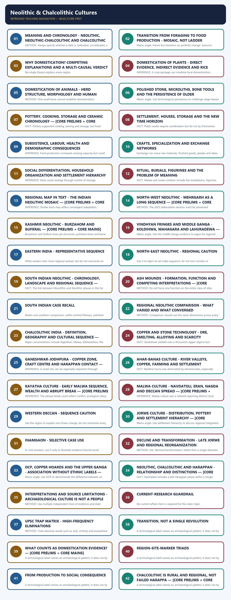

# Neolithic & Chalcolithic Cultures - Learner-v2 Complete Learning Session

> **Catalogue identity:** Ancient History · Subject-wide Syllabus · `ancient-indian-history-05`  
> **Generation date:** 20 August 2026 · **Approval:** pending explicit topic approval  
> **Source order used:** Basic/canonical owner and its OCR-grounded legacy learning package -> syllabus/master chronology/thematic and verified-PYQ sources -> exact Advanced owner in the optional block. Qdrant was not required. Legacy-v1 files remain unchanged.  
> **Evidence discipline:** contested chronology and interpretation remain labelled; no fresh current-affairs claim is forced into this static topic.


*Original deterministic visual: a topic-specific evidence-to-explanation spine. It is a learning aid, not historical evidence.*

### Coverage lock

- **Required scope:** Multiple Neolithic-Chalcolithic trajectories, domestication, villages, technology, sites, burials, exchange, inequality and transitions.
- **Basic completeness:** every substantive owner point is retained in a learner-first, answer-worthiness-audited Basic session before practice.
- **Practice completeness:** the verified question with inferred answer/key — not officially verified, strict-rotation MCQs/remediation and distinct solved 10/15/20-mark answers are retained without duplicate families.
- **Advanced boundary:** the exact Advanced owner is placed only after all Basic and practice material.
- **Register-last rule:** complete topic-specific consolidated notes remain the final H2 section.

### Legacy package source and coverage ledger

> **Subject:** Ancient Indian History | **Paper:** Prelims GS-I + GS-I analytical support | **Topic:** 05 | **Date:** 12 August 2026
>
> **Evidence key:** FACT = directly retrieved from authored Markdown, local OCR-searchable books, the official local paper or named live sources. INFERENCE = analytical synthesis. The unavailable 2021 official key is never presented as official.

### Sources Actually Used

#### Repository and Local Sources

- Authored Markdown: basic/05_Neolithic-and-Chalcolithic-Cultures.md, read in full.
- Authored Markdown: advanced/05_Neolithic-and-Chalcolithic-Cultures.md, read in full.
- Subject routing: README.md, 00_Master-Chronology.md, REVISION-CHART_Ages-Eras-and-Distinctive-Features.md, OFFICIAL-UPSC-SYLLABUS-MAPPING.md and the central 2018-2023 Prelims routing ledger.
- R.S. Sharma, Ancient History of India, local OCR-searchable PDF pages 34-44: Neolithic regions, Chalcolithic village economy, technology, crops, burials, inequality, limitations and copper hoards.
- Upinder Singh, A History of Ancient and Early Medieval India, 2nd ed., local OCR-searchable PDF pages 320-400 and 616-650: transition theory, regional sequences, site reports, scientific methods, social interpretation and later Chalcolithic transformations.
- Official local paper: UPSC Civil Services Preliminary Examination 2021, GS-I, Q37, PDF page 19. The official answer key is not held locally.

#### Current-affairs discipline

No current-affairs item was added. Use a new excavation, date or genetic claim only after checking its primary publication or official report; it should refine a bounded site-level inference, not replace the core static transition, chronology and evidence framework.

Qdrant was optional, unnecessary and not used.

### Package Practice Counts

| Component | Count |
|---|---:|
| Verified question; inferred answer/key — not officially verified | 1 |
| Total MCQs with explanations | 40 |
| Core MCQs with explanations | 32 |
| Remedial MCQs with explanations | 8 |
| Original solved 10-mark Mains | 2 |
| Original solved 15-mark Mains | 2 |
| Original solved 20-mark Mains | 2 |

## BASIC LEARNING SESSION



*Distinct embedded teaching-navigation image. The separate continuous Cārvāka-style flowchart package remains an independent at-a-glance artifact.*
### UPSC RELEVANCE AND ANSWER-WORTHINESS AUDIT

**Official boundary and PYQ reality.** Neolithic and Chalcolithic cultures are **directly relevant to Prelims GS-I** under History of India: chronology, site-culture-region matching, technology, crops/animals and distinctions are repeatedly testable formats. They are **not a separately named Mains syllabus unit**; they are an Ancient History/culture-context answer resource. The verified 2021 Prelims site-feature question proves direct objective relevance. No verified Mains PYQ in the routed owner makes this a separately owned Mains theme, so Mains practice below is answer-building support, not an inflated claim of official frequency.

| Major block | Relevance label | Learner action |
|---|---|---|
| Meaning/chronology; domestication; tools/pottery/storage; regional cultures/sites; ash mounds; Chalcolithic/Harappan distinctions | **CORE PRELIMS** | Memorise diagnostic triads and chronology with location. |
| Mosaic transition; causes/consequences; settlement/surplus/craft/exchange; social/health effects; coexistence; evidence limits | **CORE MAINS** | Understand causal chains and non-linear regional change. |
| Extended site inventory, ceramic variation, measurements, excavation history, long crop lists and repeated regional cases | **SUPPORTING** | Retain one representative example; do not rote-learn catalogues. |
| Domestication criteria, rice debates, taphonomy, ash-mound formation, household/mobility models, social inference and historiography | **OPTIONAL ADVANCED** | Use only after mastering core facts and answer spine. |
| MCQs/remediation; 2021 verified question; inferred answer/key — not officially verified | **CORE PRELIMS** | Practise exact statement elimination and site-feature matching. |
| Original Mains models and register notes | **CORE MAINS** | Use compact evidence-based arguments; revise the final notes. |

**Memorise:** terms, broad chronology, signature sites, crops/animals, ash mounds, Ahar/Malwa/Jorwe/OCP, Harappan distinction.  
**Understand:** food production as a mosaic; cause -> consequence; regional variation; overlap; evidence limits.  
**Use selectively:** extra sites, ceramics, household detail and methods.  
**Leave for Optional Advanced:** technical criteria, taphonomy, sampling and historiographical refinements.


*Original deterministic learning visual. It models a historical inference; it is not archaeological evidence.*
### PART I - ROADMAP, SYLLABUS BOUNDARY AND EVIDENCE DISCIPLINE — [CORE MAINS]

FACT: Topic 05 explains the many regional transitions from foraging toward cultivation, herding and village life, followed by rural Chalcolithic cultures using copper and stone. Direct official ownership is strongest in Prelims GS-I; Mains use is analytical through technology, ecology, archaeology, social change and source criticism.

> METHOD: Static foundations come first from the authored Topic 05 files, then local OCR books. Live research is used only as a dated linkage. Qdrant was optional, unnecessary and not used.

#### Timeline

| Period | Development |
|---|---|
| c. 7000 BCE onward | Early food-producing horizons in the north-west; dates are now actively debated. |
| c. 3000-1000 BCE | Regional Neolithic traditions in Kashmir, Ganga plains, eastern and southern zones. |
| c. 3000-700 BCE | Overlapping Neolithic-Chalcolithic and regional Chalcolithic sequences. |
| c. 2600-1900 BCE | Mature Harappan urbanism overlaps some rural cultures but is not identical to them. |

#### Visual

```text
[Concepts] -> [Transitions] -> [Regions] -> [Chalcolithic cultures] -> [Methods and practice]
```

#### Key Matrix

| Evidence family | What it can show | Main caution |
|---|---|---|
| Plants and phytoliths | Crops, gathering, field ecology and food processing | Presence does not automatically prove domestication. |
| Animal bones | Diet, herding, slaughter profile and mobility | Species, age and context must be established. |
| Tools and pottery | Tasks, craft traditions, exchange and chronology | An artefact type is not an ethnic identity. |
| Houses, bins and burials | Settlement, storage, household and inequality | Function and status are inferred, not directly observed. |
| Scientific dates | Probability ranges for sampled events | One date cannot date an entire culture. |

#### Core Teaching / Model Solution

- FACT: The basic file supplies the R.S. Sharma chronology, key sites, culture names, regional markers and the 2021 verified question route; inferred answer/key — not officially verified.
- FACT: The advanced file supplies the process model, rice debate, regional overlap, archaeological-culture caution and non-linear transition.
- FACT: Local OCR evidence adds detailed settlement, plant, animal, burial, craft and exchange data.
- INFERENCE: The master answer formula is evidence, context, interpretation, limitation and comparative verdict.

#### Must-Know Facts

- Neolithic and Chalcolithic are analytical labels, not names of one people.
- Chronologies differ by region and are revised by new samples and calibration.
- Farming, herding, hunting, gathering and fishing frequently co-existed.

#### UPSC Traps

| Wrong | Correct |
|---|---|
| Neolithic began everywhere on a single date. | Different regions entered food production through different pathways and chronologies. |
| Chalcolithic equals Harappan. | Most Chalcolithic settlements were rural and regional; Harappan urbanism had a distinct scale and institutional profile. |

**Mains angle:** Build answers around regional variation, mixed subsistence, technological overlap and limits of inference rather than a single civilizational ladder.

**Study link:** Topics 02-04 supply source criticism, ecological setting and the Mesolithic background; Topic 06 follows with Harappan urbanism.
### SESSION 1 — MEANING AND CHRONOLOGY - NEOLITHIC, NEOLITHIC-CHALCOLITHIC AND CHALCOLITHIC — [CORE PRELIMS + CORE MAINS]

#### DEFINITION / WHAT THIS IS CALLED

**Plain-language definition:** Chalcolithic denotes the use of copper alongside stone, not an exclusive copper technology.

**Technical definition:** METHOD: Always specify whether a date is calibrated, uncalibrated, a range, or a textbook approximation.

#### ANSWER-GRABBING OPENING — WRITE/ADAPT IN THE EXAM

> Chalcolithic denotes the use of copper alongside stone, not an exclusive copper technology.

#### MUST-WRITE KEYWORDS

- **Meaning**
- **Chronology - Neolithic**
- **Neolithic-Chalcolithic**
- **Chalcolithic**
- **Memory hook**
- **Mains angle**

**How to use them:** Use Meaning to define the issue, connect Chronology - Neolithic with Neolithic-Chalcolithic to explain it, and use Chalcolithic to distinguish or qualify the conclusion.

FACT: Neolithic conventionally combines food production with ground, pecked and polished stone tools; many sites also show pottery and more sedentary settlement. Chalcolithic denotes the use of copper alongside stone, not an exclusive copper technology.

> INFERENCE: Labels are useful for comparison but must be applied after examining local sequences. A community may farm without pottery, use microliths with polished celts, or possess a few copper objects without abandoning a Neolithic lifeway.

#### Timeline

| Period | Development |
|---|---|
| Food collection | Wild resources dominate; management may still occur. |
| Incipient production | Some planting or animal keeping without full dependence. |
| Food-producing economy | Cultivation or herding supplies a substantial seasonal share. |
| Neolithic-Chalcolithic | Food production and Neolithic tools overlap with limited copper. |
| Regional Chalcolithic | Copper, stone, painted pottery, farming and village networks combine. |

#### Visual

```text
7000 BCE early food production -- 3000 BCE regional villages -- 2600-1900 BCE Harappan urbanism -- 2000-700 BCE major Chalcolithic sequences
```

#### Key Matrix

| Label | Diagnostic emphasis | What it does not guarantee |
|---|---|---|
| Neolithic | Food production plus ground/polished tools in many regions | Pottery, permanent settlement or a single date |
| Aceramic Neolithic | Food production before common pottery | Absence of containers made from perishable materials |
| Neolithic-Chalcolithic | Neolithic lifeways with copper or copper alloys | Uniform technological replacement |
| Chalcolithic | Copper plus stone, often painted pottery and villages | Urbanism, writing, bronze abundance or political unity |

#### Core Teaching / Model Solution

- FACT: Upinder Singh divides early food-producing communities into overlapping phases rather than sealed blocks.
- FACT: R.S. Sharma emphasizes c. 7000-1000 BCE for the broad Neolithic and c. 2000-700 BCE for major Chalcolithic cultures, while site-specific dates vary.
- METHOD: Always specify whether a date is calibrated, uncalibrated, a range, or a textbook approximation.
- INFERENCE: The safest chronology is regional and site-based rather than a subcontinent-wide start date.

> **Memory hook:** NEO is not one date; CHALCO is not only copper; CULTURE is not ethnicity.

#### Must-Know Facts

- Chalcolithic literally indicates copper-stone coexistence.
- Aceramic does not mean container-less.
- The same pottery can span multiple chronological settings.

#### UPSC Traps

| Wrong | Correct |
|---|---|
| Neolithic is defined only by polished stone axes. | Food production and the wider assemblage matter; polished tools can survive into later periods. |
| Copper means Bronze Age urban civilization. | Copper may occur in small quantities within rural villages without bronze urbanism. |

**Mains angle:** Define labels briefly, problematize them, then use regional examples to show asynchronous and overlapping change.

**Study link:** Master chronology and Topic 04 transition; Topic 06 for the urban Bronze Age.

#### CLOSING RECALL FLOW — MEANING AND CHRONOLOGY - NEOLITHIC, NEOLITHIC-CHALCOLITHIC AND CHALCOLITHIC — [CORE PRELIMS + CORE MAINS]

```text
START / CONCEPT: MEANING AND CHRONOLOGY - NEOLITHIC, NEOLITHIC-CHALCOLITHIC AND CHALCOLITHIC — [CORE PRELIMS + CORE MAINS]
        |
        v
EXACT TERMS: Meaning · Chronology - Neolithic · Neolithic-Chalcolithic · Chalcolithic · Memory hook · Mains angle
        |
        v
MECHANISM / ARGUMENT: FACT: Neolithic conventionally combines food production with ground, pecked and polished stone tools; many sites also show pottery and more sedentary settlement.
        |
        v
CONSEQUENCE / CONTRAST: Memory hook: NEO is not one date; CHALCO is not only copper; CULTURE is not ethnicity.
        |
        v
UPSC TRAP / ANSWER-USE: INFERENCE: Labels are useful for comparison but must be applied after examining local sequences.
        |
        v
ANSWER-GRABBING FORMULATION: Chalcolithic denotes the use of copper alongside stone, not an exclusive copper technology.
```
### SESSION 2 — TRANSITION FROM FORAGING TO FOOD PRODUCTION - MOSAIC, NOT LADDER

#### DEFINITION / WHAT THIS IS CALLED

**Plain-language definition:** INFERENCE: Transition is best understood as a changing portfolio of subsistence strategies.

**Technical definition:** Mains angle: Frame the transition as portfolio change: resource management, domestication, storage, settlement and social coordination developed at different speeds.

#### ANSWER-GRABBING OPENING — WRITE/ADAPT IN THE EXAM

> INFERENCE: Transition is best understood as a changing portfolio of subsistence strategies.

#### MUST-WRITE KEYWORDS

- **Transition From Foraging To Food Production - Mosaic**
- **Not Ladder**
- **Mains angle**
- **Study link**
- **Late Jorwe reliance on wild resources increased**
- **Agriculture erased hunting**

**How to use them:** Use Transition From Foraging To Food Production - Mosaic to define the issue, connect Not Ladder with Mains angle to explain it, and use Study link to distinguish or qualify the conclusion.

FACT: Upinder Singh rejects a simple unilinear sequence. Hunting, gathering, fishing, herding and cultivation frequently co-existed, and some mobile communities produced food while some settled communities remained strongly dependent on wild resources.

> INFERENCE: Food production changed risk management, labour scheduling, storage and human-environment relations, but did not make every community sedentary or prosperous.

#### Visual

```text
[Foraging] -> [Management] -> [Experimentation] -> [Mixed production] -> [Regional village systems]
```

#### Key Matrix

| Old linear assumption | Evidence-based correction | Indian illustration |
|---|---|---|
| Foragers became farmers once and permanently | Strategies could be seasonal and reversible | Late Jorwe reliance on wild resources increased |
| Agriculture erased hunting | Wild fauna remain common at farming sites | Mehrgarh, Burzahom, Chirand and Inamgaon |
| Sedentism followed farming automatically | Sedentism may precede, accompany or remain incomplete | Ash-mound camps and permanent villages co-existed |
| One centre diffused everything | Multiple regional pathways operated | North-west wheat-barley and middle Ganga rice traditions |

#### Core Teaching / Model Solution

- FACT: Complex foraging and intensive use of wild plants could precede domestication.
- FACT: Hundreds or thousands of years may separate early management from substantial dependence on domesticates.
- FACT: Food-producing societies can still hunt, gather and fish extensively.
- INFERENCE: Transition is best understood as a changing portfolio of subsistence strategies.
- INFERENCE: Regional ecology shaped the balance among crops, livestock and wild resources.

#### Must-Know Facts

- Mixed subsistence is normal, not transitional failure.
- Sedentism and food production are related but not identical.
- Storage is a major behavioural threshold.

#### UPSC Traps

| Wrong | Correct |
|---|---|
| Every cultivated grain proves full farming dependence. | A few remains may represent limited cultivation within a mixed economy. |
| Pastoralism is the opposite of settlement. | Sedentary pastoralism and seasonal mobility can both exist. |

**Mains angle:** Frame the transition as portfolio change: resource management, domestication, storage, settlement and social coordination developed at different speeds.

**Study link:** Topic 04 Mesolithic background; regional cards below.

#### CLOSING RECALL FLOW — TRANSITION FROM FORAGING TO FOOD PRODUCTION - MOSAIC, NOT LADDER

```text
START / CONCEPT: TRANSITION FROM FORAGING TO FOOD PRODUCTION - MOSAIC, NOT LADDER
        |
        v
EXACT TERMS: Transition From Foraging To Food Production - Mosaic · Not Ladder · Mains angle · Study link · Late Jorwe reliance on wild resources increased · Agriculture erased hunting
        |
        v
MECHANISM / ARGUMENT: Mains angle: Frame the transition as portfolio change: resource management, domestication, storage, settlement and social coordination developed at different speeds.
        |
        v
CONSEQUENCE / CONTRAST: Sedentism and food production are related but not identical.
        |
        v
UPSC TRAP / ANSWER-USE: Mixed subsistence is normal, not transitional failure.
        |
        v
ANSWER-GRABBING FORMULATION: INFERENCE: Transition is best understood as a changing portfolio of subsistence strategies.
```
### SESSION 3 — WHY DOMESTICATION? COMPETING EXPLANATIONS AND A MULTI-CAUSAL VERDICT

#### DEFINITION / WHAT THIS IS CALLED

**Plain-language definition:** INFERENCE: Social motives such as feasting, exchange, inheritance and territorial claims may have mattered but are hard to recover.

**Technical definition:** No single theory explains every region.

#### ANSWER-GRABBING OPENING — WRITE/ADAPT IN THE EXAM

> INFERENCE: Social motives such as feasting, exchange, inheritance and territorial claims may have mattered but are hard to recover.

#### MUST-WRITE KEYWORDS

- **Why Domestication? Competing Explanations**
- **A Multi-Causal Verdict**
- **Mains angle**
- **Study link**
- **Childe oasis model**
- **Drying concentrated humans, plants and animals near water**

**How to use them:** Use Why Domestication? Competing Explanations to define the issue, connect A Multi-Causal Verdict with Mains angle to explain it, and use Study link to distinguish or qualify the conclusion.

FACT: Archaeologists have proposed environmental stress, nuclear-zone knowledge, demographic pressure, positive feedback from productive domesticates and Holocene environmental amelioration. No single theory explains every region.

#### Visual

```text
Domestication = Ecology + Demography + Knowledge + Social organisation; weights varied by region.
```

#### Key Matrix

| Explanation | Core proposition | Limitation |
|---|---|---|
| Childe oasis model | Drying concentrated humans, plants and animals near water | The proposed universal desiccation mechanism is not supported everywhere |
| Braidwood nuclear zones | Knowledge accumulated where domesticable species were naturally available | Knowledge alone does not explain incentive |
| Binford demographic stress | Population-resource imbalance encouraged intensification | Migration and overpopulation evidence may be weak |
| Flannery feedback | Human intervention increased productivity and encouraged deeper reliance | Does not fully explain the first experiment |
| Holocene amelioration | Warmer and wetter conditions expanded useful plant habitats | Environmental opportunity still required social decisions |

#### Core Teaching / Model Solution

- FACT: Upinder Singh treats the impulses behind domestication as regionally variable and difficult to isolate.
- INFERENCE: Climate altered opportunity and risk; demography altered pressure; knowledge and institutions altered response.
- INFERENCE: Social motives such as feasting, exchange, inheritance and territorial claims may have mattered but are hard to recover.
- METHOD: Avoid climate determinism by specifying the intermediate mechanism.

#### Must-Know Facts

- Theories are not mutually exclusive.
- Environmental improvement can encourage domestication as much as crisis.
- Social factors are archaeologically under-visible.

#### UPSC Traps

| Wrong | Correct |
|---|---|
| Childe proved that drought caused agriculture everywhere. | His model was influential but heavily criticized and not universally applicable. |
| Population pressure is directly measurable at all early sites. | Population estimates are usually indirect and uncertain. |

**Mains angle:** Use a four-factor conclusion: ecology supplied possibilities, demography and risk changed incentives, knowledge enabled experiments, and social organization stabilized new practices.

**Study link:** Palaeoenvironment and method cards below.

#### CLOSING RECALL FLOW — WHY DOMESTICATION? COMPETING EXPLANATIONS AND A MULTI-CAUSAL VERDICT

```text
START / CONCEPT: WHY DOMESTICATION? COMPETING EXPLANATIONS AND A MULTI-CAUSAL VERDICT
        |
        v
EXACT TERMS: Why Domestication? Competing Explanations · A Multi-Causal Verdict · Mains angle · Study link · Childe oasis model · Drying concentrated humans, plants and animals near water
        |
        v
MECHANISM / ARGUMENT: FACT: Upinder Singh treats the impulses behind domestication as regionally variable and difficult to isolate.
        |
        v
CONSEQUENCE / CONTRAST: Mains angle: Use a four-factor conclusion: ecology supplied possibilities, demography and risk changed incentives, knowledge enabled experiments, and social organization stabilized new practices.
        |
        v
UPSC TRAP / ANSWER-USE: FACT: Archaeologists have proposed environmental stress, nuclear-zone knowledge, demographic pressure, positive feedback from productive domesticates and Holocene environmental amelioration.
        |
        v
ANSWER-GRABBING FORMULATION: INFERENCE: Social motives such as feasting, exchange, inheritance and territorial claims may have mattered but are hard to recover.
```
### SESSION 4 — DOMESTICATION OF PLANTS - DIRECT EVIDENCE, INDIRECT EVIDENCE AND RICE CAUTION — [CORE PRELIMS + CORE MAINS]

#### DEFINITION / WHAT THIS IS CALLED

**Plain-language definition:** Cultivation is not identical to full domestication.

**Technical definition:** INFERENCE: A crop package can combine local domestication, adoption and long-distance transfer.

#### ANSWER-GRABBING OPENING — WRITE/ADAPT IN THE EXAM

> Cultivation is not identical to full domestication.

#### MUST-WRITE KEYWORDS

- **Domestication Of Plants - Direct Evidence**
- **Indirect Evidence**
- **Rice Caution**
- **Mains angle**
- **Study link**
- **Carbonized grains and seeds**

**How to use them:** Use Domestication Of Plants - Direct Evidence to define the issue, connect Indirect Evidence with Rice Caution to explain it, and use Mains angle to distinguish or qualify the conclusion.

FACT: Plant domestication involves sustained human selection and reproduction outside a purely natural cycle. Archaeologists compare grain morphology, rachis behaviour, phytoliths, impressions, carbonized remains, weeds, processing equipment and field indicators.

#### Visual

```text
[Context] -> [Recovery] -> [Identification] -> [Direct date] -> [Economic interpretation]
```

#### Key Matrix

| Evidence | Potential inference | Caution |
|---|---|---|
| Carbonized grains and seeds | Taxon, crop spectrum and possible domestication | Charring and recovery bias distort samples |
| Rachis and grain morphology | Wild versus domesticated forms | Transitions are gradual and taxonomy disputed |
| Phytoliths and diatoms | Plant presence and possible wet-field ecology | Species and cultivation interpretations require protocols |
| Husk impressions in pottery or clay | Crop processing and use | Impression alone may not settle domestication status |
| Grinding stones and sickles | Harvesting and processing | Wild plants can also be harvested and ground |

#### Core Teaching / Model Solution

- FACT: Mehrgarh yielded barley, wheat and later cotton; Lahuradewa, Koldihwa and related sites anchor rice debates.
- FACT: Wild, transitional and domesticated forms can occur together.
- FACT: Root crops preserve poorly and may be archaeologically under-represented.
- METHOD: Crop claims require secure stratigraphy, direct dates and transparent taxonomic criteria.
- INFERENCE: A crop package can combine local domestication, adoption and long-distance transfer.

#### Must-Know Facts

- Plant presence is not identical to cultivation.
- Cultivation is not identical to full domestication.
- Domestication is not identical to economic dominance.

#### UPSC Traps

| Wrong | Correct |
|---|---|
| Rice at Koldihwa automatically proves the earliest fully domesticated rice. | Dates, contexts and wild-versus-domesticated identification remain debated. |
| A sickle proves agriculture. | Sickles can harvest wild cereals or reeds. |

**Mains angle:** Separate the evidentiary chain: presence, cultivation, morphological domestication, scale and economic dependence.

**Study link:** Lahuradewa case, current rice-taxonomy linkage and archaeobotany method.

#### CLOSING RECALL FLOW — DOMESTICATION OF PLANTS - DIRECT EVIDENCE, INDIRECT EVIDENCE AND RICE CAUTION — [CORE PRELIMS + CORE MAINS]

```text
START / CONCEPT: DOMESTICATION OF PLANTS - DIRECT EVIDENCE, INDIRECT EVIDENCE AND RICE CAUTION — [CORE PRELIMS + CORE MAINS]
        |
        v
EXACT TERMS: Domestication Of Plants - Direct Evidence · Indirect Evidence · Rice Caution · Mains angle · Study link · Carbonized grains and seeds
        |
        v
MECHANISM / ARGUMENT: INFERENCE: A crop package can combine local domestication, adoption and long-distance transfer.
        |
        v
CONSEQUENCE / CONTRAST: Domestication is not identical to economic dominance.
        |
        v
UPSC TRAP / ANSWER-USE: Plant presence is not identical to cultivation.
        |
        v
ANSWER-GRABBING FORMULATION: Cultivation is not identical to full domestication.
```
### SESSION 5 — DOMESTICATION OF ANIMALS - HERD STRUCTURE, MORPHOLOGY AND HUMAN CONTROL — [CORE PRELIMS + CORE MAINS]

#### DEFINITION / WHAT THIS IS CALLED

**Plain-language definition:** FACT: Animal domestication is inferred from long-term morphological change, demographic profiles, geographic displacement, pathologies, residues and settlement context.

**Technical definition:** METHOD: One small bone cannot establish domestication; assemblage pattern and secure identification are essential.

#### ANSWER-GRABBING OPENING — WRITE/ADAPT IN THE EXAM

> FACT: Animal domestication is inferred from long-term morphological change, demographic profiles, geographic displacement, pathologies, residues and settlement context.

#### MUST-WRITE KEYWORDS

- **Domestication Of Animals - Herd Structure**
- **Morphology**
- **Human Control**
- **Mains angle**
- **Study link**
- **Body size and bone form**

**How to use them:** Use Domestication Of Animals - Herd Structure to define the issue, connect Morphology with Human Control to explain it, and use Mains angle to distinguish or qualify the conclusion.

FACT: Animal domestication is inferred from long-term morphological change, demographic profiles, geographic displacement, pathologies, residues and settlement context. Early management may precede visible skeletal change.

#### Visual

```text
Animal domestication: morphology | herd demography | managed space | economic and ritual use.
```

#### Key Matrix

| Indicator | What researchers examine | Interpretive value |
|---|---|---|
| Body size and bone form | Reduction, horn and joint changes | Long-term selection and breeding |
| Age-sex profile | Young males culled, females retained longer | Managed herds rather than random hunting |
| Location | Species outside natural habitat | Human transport or control |
| Pathology and traction | Stress on joints and muscles | Work use and mobility |
| Dung, pens and hoof prints | Concentrated animals in managed space | Herding and settlement organization |

#### Core Teaching / Model Solution

- FACT: Mehrgarh shows declining wild gazelle and rising cattle, sheep and goat proportions through time.
- FACT: Mahagara has a fenced cattle pen with hoof impressions; South Indian ash mounds preserve repeated cattle penning and burning.
- FACT: Burzahom retained hunting and fishing while also using domestic cattle, sheep, goat and dog.
- METHOD: One small bone cannot establish domestication; assemblage pattern and secure identification are essential.
- INFERENCE: Herds supplied meat, milk, traction, manure, hides, mobility and social value in different combinations.

#### Must-Know Facts

- Domestication is a population process.
- Culling profiles can be more diagnostic than one bone.
- Herding economies can remain highly mobile.

#### UPSC Traps

| Wrong | Correct |
|---|---|
| Any cattle bone is domestic cattle. | Wild and domestic forms require osteological and contextual assessment. |
| Herding eliminated hunting. | Wild fauna remain common at many pastoral and farming sites. |

**Mains angle:** Discuss domestication through control over reproduction, movement and herd composition, not merely animal presence.

**Study link:** Mehrgarh, Mahagara, Burzahom, Budihal and Inamgaon evidence.

#### CLOSING RECALL FLOW — DOMESTICATION OF ANIMALS - HERD STRUCTURE, MORPHOLOGY AND HUMAN CONTROL — [CORE PRELIMS + CORE MAINS]

```text
START / CONCEPT: DOMESTICATION OF ANIMALS - HERD STRUCTURE, MORPHOLOGY AND HUMAN CONTROL — [CORE PRELIMS + CORE MAINS]
        |
        v
EXACT TERMS: Domestication Of Animals - Herd Structure · Morphology · Human Control · Mains angle · Study link · Body size and bone form
        |
        v
MECHANISM / ARGUMENT: FACT: Mehrgarh shows declining wild gazelle and rising cattle, sheep and goat proportions through time.
        |
        v
CONSEQUENCE / CONTRAST: FACT: Burzahom retained hunting and fishing while also using domestic cattle, sheep, goat and dog.
        |
        v
UPSC TRAP / ANSWER-USE: METHOD: One small bone cannot establish domestication; assemblage pattern and secure identification are essential.
        |
        v
ANSWER-GRABBING FORMULATION: FACT: Animal domestication is inferred from long-term morphological change, demographic profiles, geographic displacement, pathologies, residues and settlement context.
```
### SESSION 6 — POLISHED STONE, MICROLITHS, BONE TOOLS AND THE PERSISTENCE OF OLDER TECHNOLOGIES — [CORE PRELIMS + CORE MAINS]

#### DEFINITION / WHAT THIS IS CALLED

**Plain-language definition:** FACT: Technology layers overlap; polished stone does not erase microliths, and copper does not erase stone.

**Technical definition:** Mains angle: Use technological persistence to challenge stage-based determinism: materials were combined according to task, access and social value.

#### ANSWER-GRABBING OPENING — WRITE/ADAPT IN THE EXAM

> FACT: Technology layers overlap; polished stone does not erase microliths, and copper does not erase stone.

#### MUST-WRITE KEYWORDS

- **Polished Stone**
- **Microliths**
- **Bone Tools**
- **The Persistence Of Older Technologies**
- **Mains angle**
- **Study link**

**How to use them:** Use Polished Stone to define the issue, connect Microliths with Bone Tools to explain it, and use The Persistence Of Older Technologies to distinguish or qualify the conclusion.

FACT: Neolithic toolkits included ground, pecked and polished celts, axes, adzes, chisels, querns and ring stones, but microlithic blades often continued. Bone and antler industries were especially prominent at Burzahom and Chirand.

#### Visual

```text
Microliths + polished stone + bone/antler + limited copper; materials co-existed.
```

#### Key Matrix

| Tool family | Typical tasks | Key examples |
|---|---|---|
| Polished celts and axes | Woodworking, clearance and construction | South India, Kashmir, Ganga and eastern zones |
| Microlithic blades | Composite sickles, cutting and craft | Mehrgarh, Koldihwa, Kayatha, Malwa and Jorwe |
| Querns and mullers | Grinding grain, pigments and other materials | Most farming settlements |
| Bone and antler tools | Needles, points, harpoons, scrapers and diggers | Burzahom, Gufkral and Chirand |
| Copper tools | Axes, chisels, fishhooks, blades and ornaments | Ganeshwar, Ahar, Kayatha, Malwa and Jorwe |

#### Core Teaching / Model Solution

- FACT: Technology layers overlap; polished stone does not erase microliths, and copper does not erase stone.
- FACT: Microwear can distinguish plant cutting, hide scraping, meat cutting and woodworking.
- FACT: Raw material procurement reveals mobility and exchange.
- INFERENCE: Tool choice depends on cost, repairability, raw materials and task suitability rather than a simple hierarchy of progress.

#### Must-Know Facts

- Stone remained economically important throughout the Chalcolithic.
- A copper object may be prestige, ornament or tool.
- Tool form requires use-wear and context for functional interpretation.

#### UPSC Traps

| Wrong | Correct |
|---|---|
| Copper instantly replaced stone. | Stone remained abundant because it was accessible, repairable and effective. |
| Every ring stone was an agricultural implement. | Functions vary; some may be weights or mace heads. |

**Mains angle:** Use technological persistence to challenge stage-based determinism: materials were combined according to task, access and social value.

**Study link:** Chalcolithic technology and scientific-method cards.

#### CLOSING RECALL FLOW — POLISHED STONE, MICROLITHS, BONE TOOLS AND THE PERSISTENCE OF OLDER TECHNOLOGIES — [CORE PRELIMS + CORE MAINS]

```text
START / CONCEPT: POLISHED STONE, MICROLITHS, BONE TOOLS AND THE PERSISTENCE OF OLDER TECHNOLOGIES — [CORE PRELIMS + CORE MAINS]
        |
        v
EXACT TERMS: Polished Stone · Microliths · Bone Tools · The Persistence Of Older Technologies · Mains angle · Study link
        |
        v
MECHANISM / ARGUMENT: INFERENCE: Tool choice depends on cost, repairability, raw materials and task suitability rather than a simple hierarchy of progress.
        |
        v
CONSEQUENCE / CONTRAST: Mains angle: Use technological persistence to challenge stage-based determinism: materials were combined according to task, access and social value.
        |
        v
UPSC TRAP / ANSWER-USE: Bone and antler industries were especially prominent at Burzahom and Chirand.
        |
        v
ANSWER-GRABBING FORMULATION: FACT: Technology layers overlap; polished stone does not erase microliths, and copper does not erase stone.
```
### SESSION 7 — POTTERY, COOKING, STORAGE AND CERAMIC CHRONOLOGY — [CORE PRELIMS + CORE MAINS]

#### DEFINITION / WHAT THIS IS CALLED

**Plain-language definition:** Ceramic fabrics, firing, surface treatment, forms and painted designs are major chronological markers.

**Technical definition:** FACT: Pottery supported cooking, serving and storage, but food production can precede pottery.

#### ANSWER-GRABBING OPENING — WRITE/ADAPT IN THE EXAM

> FACT: Pottery supported cooking, serving and storage, but food production can precede pottery.

#### MUST-WRITE KEYWORDS

- **Pottery**
- **Cooking**
- **Storage**
- **Ceramic Chronology**
- **Mains angle**
- **Study link**

**How to use them:** Use Pottery to define the issue, connect Cooking with Storage to explain it, and use Ceramic Chronology to distinguish or qualify the conclusion.

FACT: Pottery supported cooking, serving and storage, but food production can precede pottery. Ceramic fabrics, firing, surface treatment, forms and painted designs are major chronological markers.

#### Visual

```text
[Clay] -> [Manufacture] -> [Firing/finish] -> [Use] -> [Discard/context]
```

#### Key Matrix

| Ceramic feature | Information yielded | Caution |
|---|---|---|
| Handmade or wheel-made | Production technique and craft organization | Both can co-exist |
| Fabric and temper | Clay preparation and firing choices | Similar fabrics may arise independently |
| Slip, burnish and paint | Style, chronology and social display | Style is not ethnicity |
| Form | Cooking, storage, pouring and serving | Function requires residue and use-wear evidence |
| Distribution | Interaction and possible exchange | Imitation must be distinguished from traded vessels |

#### Core Teaching / Model Solution

- FACT: Mehrgarh Period I was largely aceramic; pottery increased later.
- FACT: Cord-impressed and black-and-red wares appear in several regions but not as one uniform culture.
- FACT: Ahar's white-painted black-and-red ware, Malwa ware and Jorwe ware are diagnostic regional styles.
- METHOD: Ceramic seriation must be anchored by stratigraphy and absolute dates.
- INFERENCE: Standardization can reflect shared craft practice without centralized political control.

#### Must-Know Facts

- Aceramic Neolithic is a valid category.
- Black-and-red ware is not one people or one date.
- Residue analysis can test vessel use.

#### UPSC Traps

| Wrong | Correct |
|---|---|
| Pottery began exactly with agriculture. | Some early farmers used baskets, skins and other containers before widespread pottery. |
| All black-and-red ware sites belong to one culture. | Forms, dates, associated artefacts and regions differ. |

**Mains angle:** Treat pottery as technology, chronology and social communication, while refusing to equate style with ethnicity.

**Study link:** Regional culture matrices below.

#### CLOSING RECALL FLOW — POTTERY, COOKING, STORAGE AND CERAMIC CHRONOLOGY — [CORE PRELIMS + CORE MAINS]

```text
START / CONCEPT: POTTERY, COOKING, STORAGE AND CERAMIC CHRONOLOGY — [CORE PRELIMS + CORE MAINS]
        |
        v
EXACT TERMS: Pottery · Cooking · Storage · Ceramic Chronology · Mains angle · Study link
        |
        v
MECHANISM / ARGUMENT: METHOD: Ceramic seriation must be anchored by stratigraphy and absolute dates.
        |
        v
CONSEQUENCE / CONTRAST: Mains angle: Treat pottery as technology, chronology and social communication, while refusing to equate style with ethnicity.
        |
        v
UPSC TRAP / ANSWER-USE: FACT: Mehrgarh Period I was largely aceramic; pottery increased later.
        |
        v
ANSWER-GRABBING FORMULATION: FACT: Pottery supported cooking, serving and storage, but food production can precede pottery.
```
### SESSION 8 — SETTLEMENT, HOUSES, STORAGE AND THE NEW TIME HORIZON

#### DEFINITION / WHAT THIS IS CALLED

**Plain-language definition:** Mains angle: Explain settlement as a package of permanence, storage, property, public labour, health risk and social negotiation.

**Technical definition:** FACT: Public works require coordination but do not by themselves prove a state.

#### ANSWER-GRABBING OPENING — WRITE/ADAPT IN THE EXAM

> Mains angle: Explain settlement as a package of permanence, storage, property, public labour, health risk and social negotiation.

#### MUST-WRITE KEYWORDS

- **Settlement**
- **Houses**
- **Storage**
- **The New Time Horizon**
- **Mains angle**
- **Study link**

**How to use them:** Use Settlement to define the issue, connect Houses with Storage to explain it, and use The New Time Horizon to distinguish or qualify the conclusion.

FACT: Early food production often increased sedentariness, investment in houses and storage, and collective management of space. It also created new risks from crop failure, pests, disease and stored-surplus loss.

#### Visual

```text
Village = houses + storage + animal space + lanes/public works + burial/ritual space.
```

#### Key Matrix

| Settlement feature | Historical implication | Examples |
|---|---|---|
| Mud-brick compartments | Storage or task separation | Mehrgarh |
| Pit structures | Possible dwellings or storage; function debated | Burzahom and Gufkral |
| Wattle-and-daub huts | Flexible local architecture | Mahagara, Chirand, Navdatoli and Inamgaon |
| Silos and bins | Future planning and surplus management | Lahuradewa, Balathal, Walki and Inamgaon |
| Fortifications and public works | Collective labour and hierarchy | Balathal, Eran, Daimabad and Inamgaon |

#### Core Teaching / Model Solution

- FACT: Storage shifts subsistence from daily acquisition toward annual scheduling and reserve protection.
- FACT: House size, internal divisions and settlement layout can suggest household differentiation.
- FACT: Public works require coordination but do not by themselves prove a state.
- INFERENCE: Stored food strengthens claims over land, inheritance and household property.
- INFERENCE: Sedentism concentrates waste, pathogens and social tensions while also enabling craft and community institutions.

#### Must-Know Facts

- Storage is economic and social.
- Pit function must be demonstrated.
- Fortification does not equal urban civilization.

#### UPSC Traps

| Wrong | Correct |
|---|---|
| Every compartmented structure is a granary. | Storage requires botanical, residue, access and architectural support. |
| Large villages were cities. | Population, planning, institutions, writing, craft scale and hinterland must also be assessed. |

**Mains angle:** Explain settlement as a package of permanence, storage, property, public labour, health risk and social negotiation.

**Study link:** Mehrgarh, Lahuradewa, Balathal and Inamgaon case studies.

#### CLOSING RECALL FLOW — SETTLEMENT, HOUSES, STORAGE AND THE NEW TIME HORIZON

```text
START / CONCEPT: SETTLEMENT, HOUSES, STORAGE AND THE NEW TIME HORIZON
        |
        v
EXACT TERMS: Settlement · Houses · Storage · The New Time Horizon · Mains angle · Study link
        |
        v
MECHANISM / ARGUMENT: FACT: Public works require coordination but do not by themselves prove a state.
        |
        v
CONSEQUENCE / CONTRAST: INFERENCE: Sedentism concentrates waste, pathogens and social tensions while also enabling craft and community institutions.
        |
        v
UPSC TRAP / ANSWER-USE: Fortification does not equal urban civilization.
        |
        v
ANSWER-GRABBING FORMULATION: Mains angle: Explain settlement as a package of permanence, storage, property, public labour, health risk and social negotiation.
```
### SESSION 9 — SUBSISTENCE, LABOUR, HEALTH AND DEMOGRAPHIC CONSEQUENCES

#### DEFINITION / WHAT THIS IS CALLED

**Plain-language definition:** FACT: Farming could raise aggregate food availability and support population growth, but early farmers often faced narrower diets, infectious disease, hard labour and vulnerability to drought, pests and storage loss.

**Technical definition:** INFERENCE: Food production increased carrying capacity but could distribute benefits unequally.

#### ANSWER-GRABBING OPENING — WRITE/ADAPT IN THE EXAM

> FACT: Farming could raise aggregate food availability and support population growth, but early farmers often faced narrower diets, infectious disease, hard labour and vulnerability to drought, pests and storage loss.

#### MUST-WRITE KEYWORDS

- **Subsistence**
- **Labour**
- **Health**
- **Demographic Consequences**
- **Mains angle**
- **Study link**

**How to use them:** Use Subsistence to define the issue, connect Labour with Health to explain it, and use Demographic Consequences to distinguish or qualify the conclusion.

FACT: Farming could raise aggregate food availability and support population growth, but early farmers often faced narrower diets, infectious disease, hard labour and vulnerability to drought, pests and storage loss.

#### Key Matrix

| Dimension | Potential gain | Potential cost |
|---|---|---|
| Food | Storable calories and predictable harvest | Crop concentration and seasonal hunger |
| Population | Reduced birth intervals and settled childcare | Crowding and disease transmission |
| Labour | Coordinated production and craft | Seasonal peaks and repetitive stress |
| Settlement | Durable homes and community institutions | Waste, vermin and conflict |
| Risk | Stored reserves and diversified herds | Drought, pest, disease or raid can destroy surplus |

#### Core Teaching / Model Solution

- FACT: Upinder Singh cautions against imagining farming as an easy life.
- FACT: Skeletal and dental evidence at Mehrgarh and Inamgaon permits diet and health reconstruction.
- FACT: Early Jorwe and late Jorwe diets differed, reflecting economic change.
- INFERENCE: Food production increased carrying capacity but could distribute benefits unequally.
- INFERENCE: Labour division by age and sex likely changed, but exact roles cannot be mechanically reconstructed from ethnography.

#### Must-Know Facts

- More food does not guarantee better nutrition.
- Population growth can be an outcome as well as a pressure.
- Health evidence is sample-dependent.

#### UPSC Traps

| Wrong | Correct |
|---|---|
| Agriculture automatically improved health. | Cereal-heavy diets and settlement crowding could worsen disease and nutrition. |
| Ethnographic gender roles can be copied directly into prehistory. | Ethnography suggests possibilities, not proof. |

**Mains angle:** Present a balanced verdict: food production expanded demographic and organizational possibilities while creating new biological, ecological and social vulnerabilities.

**Study link:** Scientific methods, Mehrgarh dental evidence and Inamgaon trace-element study.

#### CLOSING RECALL FLOW — SUBSISTENCE, LABOUR, HEALTH AND DEMOGRAPHIC CONSEQUENCES

```text
START / CONCEPT: SUBSISTENCE, LABOUR, HEALTH AND DEMOGRAPHIC CONSEQUENCES
        |
        v
EXACT TERMS: Subsistence · Labour · Health · Demographic Consequences · Mains angle · Study link
        |
        v
MECHANISM / ARGUMENT: INFERENCE: Food production increased carrying capacity but could distribute benefits unequally.
        |
        v
CONSEQUENCE / CONTRAST: More food does not guarantee better nutrition.
        |
        v
UPSC TRAP / ANSWER-USE: Population growth can be an outcome as well as a pressure.
        |
        v
ANSWER-GRABBING FORMULATION: FACT: Farming could raise aggregate food availability and support population growth, but early farmers often faced narrower diets, infectious disease, hard labour and vulnerability to drought, pests and storage loss.
```
### SESSION 10 — CRAFTS, SPECIALIZATION AND EXCHANGE NETWORKS

#### DEFINITION / WHAT THIS IS CALLED

**Plain-language definition:** Mains angle: Use exchange to connect ecology with society: specialized zones traded complementary resources without necessarily forming one political system.

**Technical definition:** Exchange can move raw materials, finished goods, people and ideas.

#### ANSWER-GRABBING OPENING — WRITE/ADAPT IN THE EXAM

> FACT: Early villages were not isolated subsistence units.

#### MUST-WRITE KEYWORDS

- **Crafts**
- **Specialization**
- **Exchange Networks**
- **Mains angle**
- **Study link**
- **Lapis lazuli and turquoise**

**How to use them:** Use Crafts to define the issue, connect Specialization with Exchange Networks to explain it, and use Mains angle to distinguish or qualify the conclusion.

FACT: Early villages were not isolated subsistence units. Stone, shell, semi-precious beads, copper, gold and pottery reveal local specialization and long-distance exchange.

#### Visual

```text
Ore zones <-> copper villages; coast <-> inland shell users; forests <-> farmers; quarry sites <-> craft consumers.
```

#### Key Matrix

| Material | Likely movement or craft signal | Examples |
|---|---|---|
| Lapis lazuli and turquoise | Long-distance prestige exchange | Mehrgarh |
| Marine shell | Coastal-interior links | Mehrgarh, Watgal, Ahar and Inamgaon |
| Chert and chalcedony | Quarry and blade-working specialization | Budihal, Kunjhun, Malwa and Jorwe |
| Copper | Ore-zone production and interregional circulation | Khetri-Ganeshwar, Ahar and Deccan |
| Carnelian, agate and steatite beads | Craft skill, ornament and exchange | Kayatha, Balathal, Navdatoli and Inamgaon |

#### Core Teaching / Model Solution

- FACT: Mehrgarh graves include materials from distant source zones.
- FACT: Budihal had a specialized blade-working area; Kunjhun specialized in stone artefacts.
- FACT: Ganeshwar's unusually large copper assemblage suggests production for circulation beyond the settlement.
- FACT: Inamgaon drew shell, ivory, gold and stone from several regions.
- INFERENCE: Exchange networks linked farmers, pastoralists, hunter-gatherers and urban communities.

#### Must-Know Facts

- Exchange can move raw materials, finished goods, people and ideas.
- Specialization can be household, seasonal or full-time.
- Imported material does not prove political control.

#### UPSC Traps

| Wrong | Correct |
|---|---|
| Long-distance material proves a centralized state. | Exchange can operate through down-the-line, kin and periodic-market networks. |
| All Harappan-like pottery was imported. | Local imitation and shared style must be considered. |

**Mains angle:** Use exchange to connect ecology with society: specialized zones traded complementary resources without necessarily forming one political system.

**Study link:** Ganeshwar-Harappan, Ahar-Gujarat and Jorwe exchange cards.

#### CLOSING RECALL FLOW — CRAFTS, SPECIALIZATION AND EXCHANGE NETWORKS

```text
START / CONCEPT: CRAFTS, SPECIALIZATION AND EXCHANGE NETWORKS
        |
        v
EXACT TERMS: Crafts · Specialization · Exchange Networks · Mains angle · Study link · Lapis lazuli and turquoise
        |
        v
MECHANISM / ARGUMENT: Exchange can move raw materials, finished goods, people and ideas.
        |
        v
CONSEQUENCE / CONTRAST: Imported material does not prove political control.
        |
        v
UPSC TRAP / ANSWER-USE: Mains angle: Use exchange to connect ecology with society: specialized zones traded complementary resources without necessarily forming one political system.
        |
        v
ANSWER-GRABBING FORMULATION: FACT: Early villages were not isolated subsistence units.
```
### SESSION 11 — SOCIAL DIFFERENTIATION, HOUSEHOLD ORGANIZATION AND SETTLEMENT HIERARCHY

#### DEFINITION / WHAT THIS IS CALLED

**Plain-language definition:** METHOD: Use the phrase 'suggests ranked differentiation' rather than claiming kingship unless evidence is stronger.

**Technical definition:** INFERENCE: Rank could emerge through control of storage, exchange, water, ritual or livestock.

#### ANSWER-GRABBING OPENING — WRITE/ADAPT IN THE EXAM

> Settlement hierarchy does not automatically equal state hierarchy.

#### MUST-WRITE KEYWORDS

- **Social Differentiation**
- **Household Organization**
- **Settlement Hierarchy**
- **Mains angle**
- **Study link**
- **Larger central house**

**How to use them:** Use Social Differentiation to define the issue, connect Household Organization with Settlement Hierarchy to explain it, and use Mains angle to distinguish or qualify the conclusion.

FACT: Differences in house size, settlement position, diet, burial treatment, stored wealth and craft location suggest emerging ranks at some sites, but inequality varied greatly and should not be read as a fully developed class state.

#### Key Matrix

| Evidence | Possible inference | Alternative caution |
|---|---|---|
| Larger central house | Leadership or wealthy household | Different function or household size |
| Rich grave goods | Status differentiation | Age, ritual role or family custom |
| Differential diet | Unequal access to food | Season, disease or sample bias |
| Settlement size hierarchy | Central places and dependent hamlets | Functional or seasonal differences |
| Craft quarters | Occupational specialization | Excavation exposure may be incomplete |

#### Core Teaching / Model Solution

- FACT: Kayatha contained concentrated copper bangles, axes and bead necklaces within one house area.
- FACT: Inamgaon has interpreted craft quarters, central elite structures and a settlement hierarchy.
- FACT: Jorwe sites range from large permanent villages to tiny seasonal camps.
- INFERENCE: Rank could emerge through control of storage, exchange, water, ritual or livestock.
- METHOD: Use the phrase 'suggests ranked differentiation' rather than claiming kingship unless evidence is stronger.

#### Must-Know Facts

- Inequality is scalar, not binary.
- Settlement hierarchy does not automatically equal state hierarchy.
- Burial wealth can express ritual identity.

#### UPSC Traps

| Wrong | Correct |
|---|---|
| A five-room house proves a palace. | It may suggest leadership, but function and comparison are essential. |
| All village societies were egalitarian. | Material differences indicate unequal status at several sites. |

**Mains angle:** Argue from converging evidence: house, location, diet, storage, craft and burial together make a stronger case than any one indicator.

**Study link:** Kayatha, Balathal, Pachamta and Inamgaon.

#### CLOSING RECALL FLOW — SOCIAL DIFFERENTIATION, HOUSEHOLD ORGANIZATION AND SETTLEMENT HIERARCHY

```text
START / CONCEPT: SOCIAL DIFFERENTIATION, HOUSEHOLD ORGANIZATION AND SETTLEMENT HIERARCHY
        |
        v
EXACT TERMS: Social Differentiation · Household Organization · Settlement Hierarchy · Mains angle · Study link · Larger central house
        |
        v
MECHANISM / ARGUMENT: INFERENCE: Rank could emerge through control of storage, exchange, water, ritual or livestock.
        |
        v
CONSEQUENCE / CONTRAST: FACT: Differences in house size, settlement position, diet, burial treatment, stored wealth and craft location suggest emerging ranks at some sites, but inequality varied greatly and should not be read as a fully developed class state.
        |
        v
UPSC TRAP / ANSWER-USE: FACT: Inamgaon has interpreted craft quarters, central elite structures and a settlement hierarchy.
        |
        v
ANSWER-GRABBING FORMULATION: Settlement hierarchy does not automatically equal state hierarchy.
```
### SESSION 12 — RITUAL, BURIALS, FIGURINES AND THE PROBLEM OF MEANING

#### DEFINITION / WHAT THIS IS CALLED

**Plain-language definition:** Ritual is inferred from patterned, non-utilitarian context.

**Technical definition:** FACT: Malwa and Jorwe contexts include fire installations, figurines and house-floor burials.

#### ANSWER-GRABBING OPENING — WRITE/ADAPT IN THE EXAM

> Ritual is inferred from patterned, non-utilitarian context.

#### MUST-WRITE KEYWORDS

- **Ritual**
- **Burials**
- **Figurines**
- **The Problem Of Meaning**
- **Mains angle**
- **Study link**

**How to use them:** Use Ritual to define the issue, connect Burials with Figurines to explain it, and use The Problem Of Meaning to distinguish or qualify the conclusion.

FACT: Burials, ochre, animal interments, fire installations and figurines reveal patterned practices, but their meanings remain contested. The neutral description must precede religious identification.

#### Key Matrix

| Evidence | Safe description | Risky overclaim |
|---|---|---|
| Female figurine | Human representation with contextual features | Universal Mother Goddess |
| Bull figurine | Repeated bovine imagery | Proof of one named deity |
| Fire installation | Burnt, bounded ritual or domestic feature | Vedic fire altar without chronology and context |
| Human-animal burial | Joint interment and human-animal relation | Known pet-master theology |
| Feet removed in burial | Repeated mortuary treatment | One certain belief about spirits |

#### Core Teaching / Model Solution

- FACT: Mehrgarh burials included red ochre and varied grave goods.
- FACT: Burzahom has human and animal burials and a hunting engraving.
- FACT: Malwa and Jorwe contexts include fire installations, figurines and house-floor burials.
- FACT: Inamgaon has unusual urn and symbolic burials as well as temporary clay figurines.
- METHOD: Context, repetition, association and comparison determine interpretive strength.

#### Must-Know Facts

- Ritual is inferred from patterned, non-utilitarian context.
- Burials can reflect kinship, age, status and belief simultaneously.
- A figurine may be deity, votive, toy, portrait or teaching object.

#### UPSC Traps

| Wrong | Correct |
|---|---|
| All female figurines are Mother Goddesses. | Use 'female figurines with possible cultic significance' unless context is decisive. |
| All fire pits are ritual altars. | Cooking, craft, disposal and ritual functions must be distinguished. |

**Mains angle:** Demonstrate source discipline: describe form and context, present possible meanings, reject certainty where alternatives remain.

**Study link:** Topic 02 archaeological interpretation; site ritual examples below.

#### CLOSING RECALL FLOW — RITUAL, BURIALS, FIGURINES AND THE PROBLEM OF MEANING

```text
START / CONCEPT: RITUAL, BURIALS, FIGURINES AND THE PROBLEM OF MEANING
        |
        v
EXACT TERMS: Ritual · Burials · Figurines · The Problem Of Meaning · Mains angle · Study link
        |
        v
MECHANISM / ARGUMENT: FACT: Malwa and Jorwe contexts include fire installations, figurines and house-floor burials.
        |
        v
CONSEQUENCE / CONTRAST: FACT: Inamgaon has unusual urn and symbolic burials as well as temporary clay figurines.
        |
        v
UPSC TRAP / ANSWER-USE: FACT: Burzahom has human and animal burials and a hunting engraving.
        |
        v
ANSWER-GRABBING FORMULATION: Ritual is inferred from patterned, non-utilitarian context.
```
### SESSION 13 — REGIONAL MAP IN TEXT - THE INDIAN NEOLITHIC MOSAIC — [CORE PRELIMS + CORE MAINS]

#### DEFINITION / WHAT THIS IS CALLED

**Plain-language definition:** South Indian ash mounds are not universal even within the south.

**Technical definition:** INFERENCE: Similar tools may reflect convergent adaptation, interaction or shared learning; the mechanism must be tested.

#### ANSWER-GRABBING OPENING — WRITE/ADAPT IN THE EXAM

> South Indian ash mounds are not universal even within the south.

#### MUST-WRITE KEYWORDS

- **Regional Map In Text - The Indian Neolithic Mosaic**
- **Mains angle**
- **Study link**
- **North-west**
- **Wheat-barley, cattle, mud-brick villages and exchange**
- **Mehrgarh and related Baluchistan sites**

**How to use them:** Use Regional Map In Text - The Indian Neolithic Mosaic to define the issue, connect Mains angle with Study link to explain it, and use North-west to distinguish or qualify the conclusion.

FACT: The Indian Neolithic comprises multiple ecological and chronological zones rather than a single frontier moving uniformly east or south.

#### Visual

```text
NORTH-WEST: Mehrgarh -- wheat/barley, cattle, mud brick
      |
KASHMIR: Burzahom/Gufkral -- pits, bone tools, mixed economy
      |
MIDDLE GANGA: Koldihwa/Mahagara/Lahuradewa -- rice debate
      |
EAST/NORTH-EAST: Chirand/Daojali/Noklak -- rivers, hills, cord-marked pottery
      |
SOUTH: Utnur/Piklihal/Budihal/Watgal -- cattle, millets, ash mounds
```

#### Key Matrix

| Zone | Core adaptation | Anchor sites |
|---|---|---|
| North-west | Wheat-barley, cattle, mud-brick villages and exchange | Mehrgarh and related Baluchistan sites |
| Kashmir | Pit structures, bone tools, hunting-farming mix | Burzahom and Gufkral |
| Vindhyan-Middle Ganga | Rice debates, cattle, wattle-daub and silos | Koldihwa, Mahagara and Lahuradewa |
| Eastern plains and plateau | Rice, fishing, bone tools and regional continuity | Chirand, Senuar, Kuchai |
| North-east | Cord-marked pottery, polished tools and East/Southeast Asian affinities | Daojali Hading, Sarutaru, Napachik, Noklak |
| South India | Cattle pastoralism, millets/pulses, ash mounds and granite landscapes | Utnur, Piklihal, Budihal, Watgal, Sanganakallu |

#### Core Teaching / Model Solution

- FACT: Regional cultures differed in crop packages, animal economies, architecture, pottery and chronology.
- INFERENCE: Similar tools may reflect convergent adaptation, interaction or shared learning; the mechanism must be tested.
- INFERENCE: Ecological corridors linked regions without erasing local development.
- METHOD: Locate every site by river valley, plateau, hill zone or ecological niche.

#### Must-Know Facts

- North-west is not the only early agricultural zone.
- The north-east chronology remains especially incomplete.
- South Indian ash mounds are not universal even within the south.

#### UPSC Traps

| Wrong | Correct |
|---|---|
| Indian Neolithic equals Mehrgarh diffusion. | Middle Ganga rice and southern pastoral traditions require plural models. |
| A polished celt in the north-east is automatically prehistoric. | Polished stone tools continued into historical contexts at some sites. |

**Mains angle:** Organize regional answers west to east and north to south, then conclude with multiple pathways connected by exchange.

**Study link:** Dedicated regional cases follow.

#### CLOSING RECALL FLOW — REGIONAL MAP IN TEXT - THE INDIAN NEOLITHIC MOSAIC — [CORE PRELIMS + CORE MAINS]

```text
START / CONCEPT: REGIONAL MAP IN TEXT - THE INDIAN NEOLITHIC MOSAIC — [CORE PRELIMS + CORE MAINS]
        |
        v
EXACT TERMS: Regional Map In Text - The Indian Neolithic Mosaic · Mains angle · Study link · North-west · Wheat-barley, cattle, mud-brick villages and exchange · Mehrgarh and related Baluchistan sites
        |
        v
MECHANISM / ARGUMENT: INFERENCE: Similar tools may reflect convergent adaptation, interaction or shared learning; the mechanism must be tested.
        |
        v
CONSEQUENCE / CONTRAST: North-west is not the only early agricultural zone.
        |
        v
UPSC TRAP / ANSWER-USE: The north-east chronology remains especially incomplete.
        |
        v
ANSWER-GRABBING FORMULATION: South Indian ash mounds are not universal even within the south.
```
### SESSION 14 — NORTH-WEST NEOLITHIC - MEHRGARH AS A LONG SEQUENCE — [CORE PRELIMS + CORE MAINS]

#### DEFINITION / WHAT THIS IS CALLED

**Plain-language definition:** Mains angle: Use Mehrgarh as a sequence, not a label: subsistence, storage, craft, burial and exchange changed across periods.

**Technical definition:** METHOD: The 2025 radiocarbon revision must be presented alongside, not silently substituted for, older textbook chronology.

#### ANSWER-GRABBING OPENING — WRITE/ADAPT IN THE EXAM

> Mains angle: Use Mehrgarh as a sequence, not a label: subsistence, storage, craft, burial and exchange changed across periods.

#### MUST-WRITE KEYWORDS

- **North-West Neolithic - Mehrgarh As A Long Sequence**
- **Mains angle**
- **Study link**
- **Period I**
- **Period II**
- **Period III**

**How to use them:** Use North-West Neolithic - Mehrgarh As A Long Sequence to define the issue, connect Mains angle with Study link to explain it, and use Period I to distinguish or qualify the conclusion.

FACT: Mehrgarh lies in the Bolan valley at a route linking the Indus plains and Baluchistan highlands. Its long sequence records mud-brick construction, storage, microliths, early cultivation and herding, craft growth, burial change and long-distance exchange.

#### Timeline

| Period | Development |
|---|---|
| Period I | Largely aceramic; mud-brick rooms, microlithic sickles, burial and early cultivation-herding. |
| Period II | Settlement and storage expand; handmade then wheel-made pottery and limited copper. |
| Period III | Chalcolithic craft intensification, pottery production, beads and copper-working evidence. |
| Later periods | Greater craft diversity and wider ceramic interaction before Harappan urbanism. |

#### Key Matrix

| Domain | Mehrgarh evidence | Historical significance |
|---|---|---|
| Plants | Barley, wheat, dates, ber and later cotton | Crop diversity and changing emphasis |
| Animals | Wild fauna decline as cattle, sheep and goats rise | Transition to managed herds |
| Houses and storage | Standardized mud-bricks and compartmented rooms | Sedentism and reserve management |
| Craft | Beads, drills, pottery, figurines and copper traces | Specialization and technical change |
| Exchange | Shell, lapis lazuli and turquoise | Connections to coast, Afghanistan, Iran or Central Asia |

#### Core Teaching / Model Solution

- FACT: Period I contained microliths, ground celts, grinding stones and bitumen-hafted sickle blades.
- FACT: Burials varied over time and included ochre, baskets, food and ornaments.
- FACT: The sequence combines continuity with major changes in craft and subsistence.
- METHOD: The 2025 radiocarbon revision must be presented alongside, not silently substituted for, older textbook chronology.
- INFERENCE: Mehrgarh demonstrates that early village formation was already socially and economically complex.

#### Must-Know Facts

- Mehrgarh was not a city in its earliest phases.
- Its early phase was largely aceramic.
- Copper appears before copper dominates.

#### UPSC Traps

| Wrong | Correct |
|---|---|
| Mehrgarh began as a mature Harappan city. | Its earliest levels were pre-urban farming and herding villages. |
| One chronology for Mehrgarh is permanently settled. | Dating has been revised and remains an active research issue. |

**Mains angle:** Use Mehrgarh as a sequence, not a label: subsistence, storage, craft, burial and exchange changed across periods.

**Study link:** Current Mehrgarh dating card and Harappan comparison.

#### CLOSING RECALL FLOW — NORTH-WEST NEOLITHIC - MEHRGARH AS A LONG SEQUENCE — [CORE PRELIMS + CORE MAINS]

```text
START / CONCEPT: NORTH-WEST NEOLITHIC - MEHRGARH AS A LONG SEQUENCE — [CORE PRELIMS + CORE MAINS]
        |
        v
EXACT TERMS: North-West Neolithic - Mehrgarh As A Long Sequence · Mains angle · Study link · Period I · Period II · Period III
        |
        v
MECHANISM / ARGUMENT: METHOD: The 2025 radiocarbon revision must be presented alongside, not silently substituted for, older textbook chronology.
        |
        v
CONSEQUENCE / CONTRAST: Mehrgarh was not a city in its earliest phases.
        |
        v
UPSC TRAP / ANSWER-USE: INFERENCE: Mehrgarh demonstrates that early village formation was already socially and economically complex.
        |
        v
ANSWER-GRABBING FORMULATION: Mains angle: Use Mehrgarh as a sequence, not a label: subsistence, storage, craft, burial and exchange changed across periods.
```
### SESSION 15 — KASHMIR NEOLITHIC - BURZAHOM AND GUFKRAL — [CORE PRELIMS + CORE MAINS]

#### DEFINITION / WHAT THIS IS CALLED

**Plain-language definition:** FACT: Burzahom Period I is known for round or oval pits, storage pits and ground-level hearths.

**Technical definition:** Burzahom and Gufkral show pit structures, polished stone and bone tools, hunting and fishing, increasing cultivation and herding, distinctive burials and contacts beyond the valley.

#### ANSWER-GRABBING OPENING — WRITE/ADAPT IN THE EXAM

> Burzahom and Gufkral show pit structures, polished stone and bone tools, hunting and fishing, increasing cultivation and herding, distinctive burials and contacts beyond the valley.

#### MUST-WRITE KEYWORDS

- **Kashmir Neolithic - Burzahom**
- **Gufkral**
- **Mains angle**
- **Study link**
- **Early structures**
- **Mud-plastered pits; function debated**

**How to use them:** Use Kashmir Neolithic - Burzahom to define the issue, connect Gufkral with Mains angle to explain it, and use Study link to distinguish or qualify the conclusion.

FACT: Kashmir Neolithic sites occupy karewa landscapes. Burzahom and Gufkral show pit structures, polished stone and bone tools, hunting and fishing, increasing cultivation and herding, distinctive burials and contacts beyond the valley.

#### Visual

```text
Burzahom: karewa ecology | pit debate | stone-bone toolkit | mixed subsistence | human-animal burial.
```

#### Key Matrix

| Feature | Burzahom | Gufkral |
|---|---|---|
| Early structures | Mud-plastered pits; function debated | Pit structures with nearby storage and hearths |
| Tools | Stone axes, harvesters, bone needles, harpoons and points | Polished stone, bone and horn tools |
| Food | Cultivated wheat, barley and lentils; hunting-fishing important | Barley, wheat, lentils; domesticates increase |
| Burial | House-area human and animal burials | Long sequence with changing settlement and tools |
| Contact | Agate-carnelian beads and Indus-linked motifs | Comparisons with Swat and broader highland networks |

#### Core Teaching / Model Solution

- FACT: Burzahom Period I is known for round or oval pits, storage pits and ground-level hearths.
- FACT: Period II shifted toward ground-level houses and contained varied human and animal burials.
- FACT: Hunting remained important even after cultivated crops and domesticates appear.
- DEBATE: Pits may have been dwellings, storage units or seasonally used structures; majority opinion is not proof.
- INFERENCE: Kashmir's ecology encouraged a distinctive combination of cultivation, herding, hunting, fishing and seasonal adaptation.

#### Must-Know Facts

- Burzahom is not famous for rock-cut shrines.
- Bone tools are a major Kashmir marker.
- Pit interpretation remains contested.

#### UPSC Traps

| Wrong | Correct |
|---|---|
| Burzahom equals rock-cut shrines. | It is known for Neolithic pit structures, stone-bone tools and burials. |
| Pits prove year-round winter occupation. | Alternative storage and seasonal-use interpretations exist. |

**Mains angle:** Explain Kashmir as a highland adaptation and use the pit debate to demonstrate how archaeological interpretation changes.

**Study link:** 2021 verified question; inferred answer/key — not officially verified.

#### CLOSING RECALL FLOW — KASHMIR NEOLITHIC - BURZAHOM AND GUFKRAL — [CORE PRELIMS + CORE MAINS]

```text
START / CONCEPT: KASHMIR NEOLITHIC - BURZAHOM AND GUFKRAL — [CORE PRELIMS + CORE MAINS]
        |
        v
EXACT TERMS: Kashmir Neolithic - Burzahom · Gufkral · Mains angle · Study link · Early structures · Mud-plastered pits; function debated
        |
        v
MECHANISM / ARGUMENT: Mains angle: Explain Kashmir as a highland adaptation and use the pit debate to demonstrate how archaeological interpretation changes.
        |
        v
CONSEQUENCE / CONTRAST: DEBATE: Pits may have been dwellings, storage units or seasonally used structures; majority opinion is not proof.
        |
        v
UPSC TRAP / ANSWER-USE: Burzahom is not famous for rock-cut shrines.
        |
        v
ANSWER-GRABBING FORMULATION: Burzahom and Gufkral show pit structures, polished stone and bone tools, hunting and fishing, increasing cultivation and herding, distinctive burials and contacts beyond the valley.
```
### SESSION 16 — VINDHYAN FRINGES AND MIDDLE GANGA - KOLDIHWA, MAHAGARA AND LAHURADEWA — [CORE PRELIMS + CORE MAINS]

#### DEFINITION / WHAT THIS IS CALLED

**Plain-language definition:** FACT: These sites are central to debates on rice, cattle, continuity from the Mesolithic and the emergence of settled food-producing communities outside the north-west.

**Technical definition:** Mains angle: Use the middle Ganga evidence to argue for regional experimentation while remaining cautious about claims of independent domestication.

#### ANSWER-GRABBING OPENING — WRITE/ADAPT IN THE EXAM

> Mains angle: Use the middle Ganga evidence to argue for regional experimentation while remaining cautious about claims of independent domestication.

#### MUST-WRITE KEYWORDS

- **Vindhyan Fringes**
- **Middle Ganga - Koldihwa**
- **Mahagara**
- **Lahuradewa**
- **Mains angle**
- **Study link**

**How to use them:** Use Vindhyan Fringes to define the issue, connect Middle Ganga - Koldihwa with Mahagara to explain it, and use Lahuradewa to distinguish or qualify the conclusion.

FACT: These sites are central to debates on rice, cattle, continuity from the Mesolithic and the emergence of settled food-producing communities outside the north-west.

#### Key Matrix

| Site | Key evidence | Primary caution |
|---|---|---|
| Koldihwa | Rice remains/impressions, celts, microliths, querns and handmade pottery | Early dates and domestication status debated |
| Mahagara | Wattle-daub huts, cattle pen, celts, microliths and rice husk | Mixed hunting, gathering and production |
| Lahuradewa | Rice, lake-core proxies, pottery, later silos, varied crops and animals | Sequence and direct dating must be stated carefully |
| Jhusi | Long sequence and broad crop package | Context differs from nearby sites |

#### Core Teaching / Model Solution

- FACT: The regional Neolithic emerged from an established Mesolithic background and retained microliths.
- FACT: Mahagara's cattle pen links settlement space with herd management.
- FACT: Lahuradewa research combines excavation, pollen, phytolith, micro-charcoal, diatoms and radiocarbon dating.
- FACT: Lahuradewa later developed many earthen silos and wider crop-animal packages.
- INFERENCE: The evidence undermines a one-directional diffusion model from the north-west.

#### Must-Know Facts

- Rice debate is about context, taxonomy, dating and scale.
- Microlith continuity is explicit.
- Cattle and rice could be integrated with wild resources.

#### UPSC Traps

| Wrong | Correct |
|---|---|
| Every rice impression is domesticated Oryza sativa. | Identification and direct dating must be independently established. |
| Middle Ganga farming was simply copied from Mehrgarh. | Different crop emphasis and local Mesolithic continuity support a more plural model. |

**Mains angle:** Use the middle Ganga evidence to argue for regional experimentation while remaining cautious about claims of independent domestication.

**Study link:** Archaeobotany and rice-taxonomy current linkage.

#### CLOSING RECALL FLOW — VINDHYAN FRINGES AND MIDDLE GANGA - KOLDIHWA, MAHAGARA AND LAHURADEWA — [CORE PRELIMS + CORE MAINS]

```text
START / CONCEPT: VINDHYAN FRINGES AND MIDDLE GANGA - KOLDIHWA, MAHAGARA AND LAHURADEWA — [CORE PRELIMS + CORE MAINS]
        |
        v
EXACT TERMS: Vindhyan Fringes · Middle Ganga - Koldihwa · Mahagara · Lahuradewa · Mains angle · Study link
        |
        v
MECHANISM / ARGUMENT: FACT: Mahagara's cattle pen links settlement space with herd management.
        |
        v
CONSEQUENCE / CONTRAST: FACT: Lahuradewa later developed many earthen silos and wider crop-animal packages.
        |
        v
UPSC TRAP / ANSWER-USE: FACT: These sites are central to debates on rice, cattle, continuity from the Mesolithic and the emergence of settled food-producing communities outside the north-west.
        |
        v
ANSWER-GRABBING FORMULATION: Mains angle: Use the middle Ganga evidence to argue for regional experimentation while remaining cautious about claims of independent domestication.
```
### SESSION 17 — EASTERN INDIA - REPRESENTATIVE SEQUENCE

#### DEFINITION / WHAT THIS IS CALLED

**Plain-language definition:** Chirand is the core exam anchor: a Bihar site with a long Neolithic-Chalcolithic sequence and bone-tool evidence.

**Technical definition:** Other eastern sites show regional spread, but do not memorise an exhaustive inventory unless a specific option requires it.

#### ANSWER-GRABBING OPENING — WRITE/ADAPT IN THE EXAM

> Chirand is the core exam anchor: a Bihar site with a long Neolithic-Chalcolithic sequence and bone-tool evidence.

#### MUST-WRITE KEYWORDS

- **Eastern India - Representative Sequence**
- **Chirand**
- **Bihar**
- **Neolithic-Chalcolithic**
- **Other**

**How to use them:** Use Eastern India - Representative Sequence to define the issue, connect Chirand with Bihar to explain it, and use Neolithic-Chalcolithic to distinguish or qualify the conclusion.

Chirand is the core exam anchor: a Bihar site with a long Neolithic-Chalcolithic sequence and bone-tool evidence. Other eastern sites show regional spread, but do not memorise an exhaustive inventory unless a specific option requires it.

#### CLOSING RECALL FLOW — EASTERN INDIA - REPRESENTATIVE SEQUENCE

```text
START / CONCEPT: EASTERN INDIA - REPRESENTATIVE SEQUENCE
        |
        v
EXACT TERMS: Eastern India - Representative Sequence · Chirand · Bihar · Neolithic-Chalcolithic · Other
        |
        v
MECHANISM / ARGUMENT: Other eastern sites show regional spread, but do not memorise an exhaustive inventory unless a specific option requires it.
        |
        v
CONSEQUENCE / CONTRAST: Other eastern sites show regional spread, but do not memorise an exhaustive inventory unless a specific option requires it.
        |
        v
UPSC TRAP / ANSWER-USE: Other eastern sites show regional spread, but do not memorise an exhaustive inventory unless a specific option requires it.
        |
        v
ANSWER-GRABBING FORMULATION: Chirand is the core exam anchor: a Bihar site with a long Neolithic-Chalcolithic sequence and bone-tool evidence.
```
### SESSION 18 — NORTH-EAST NEOLITHIC - REGIONAL CAUTION

#### DEFINITION / WHAT THIS IS CALLED

**Plain-language definition:** North-east evidence is regionally important but uneven.

**Technical definition:** Use it to reject an all-India sequence; do not turn corridor or extension hypotheses into settled site chronologies without a verified source.

#### ANSWER-GRABBING OPENING — WRITE/ADAPT IN THE EXAM

> North-east evidence is regionally important but uneven.

#### MUST-WRITE KEYWORDS

- **North-East Neolithic - Regional Caution**
- **North-east evidence**
- **North-east**
- **India**

**How to use them:** Use North-East Neolithic - Regional Caution to define the issue, connect North-east evidence with North-east to explain it, and use India to distinguish or qualify the conclusion.

North-east evidence is regionally important but uneven. Use it to reject an all-India sequence; do not turn corridor or extension hypotheses into settled site chronologies without a verified source.

#### CLOSING RECALL FLOW — NORTH-EAST NEOLITHIC - REGIONAL CAUTION

```text
START / CONCEPT: NORTH-EAST NEOLITHIC - REGIONAL CAUTION
        |
        v
EXACT TERMS: North-East Neolithic - Regional Caution · North-east evidence · North-east · India
        |
        v
MECHANISM / ARGUMENT: Use it to reject an all-India sequence; do not turn corridor or extension hypotheses into settled site chronologies without a verified source.
        |
        v
CONSEQUENCE / CONTRAST: North-east evidence is regionally important but uneven.
        |
        v
UPSC TRAP / ANSWER-USE: North-east evidence is regionally important but uneven.
        |
        v
ANSWER-GRABBING FORMULATION: North-east evidence is regionally important but uneven.
```
### SESSION 19 — SOUTH INDIAN NEOLITHIC - CHRONOLOGY, LANDSCAPE AND REGIONAL SEQUENCE — [CORE PRELIMS + CORE MAINS]

#### DEFINITION / WHAT THIS IS CALLED

**Plain-language definition:** FACT: Ash mounds are absent from several southern zones and therefore are not a universal marker.

**Technical definition:** FACT: The link between Mesolithic and Neolithic phases in the far south remains incompletely worked out.

#### ANSWER-GRABBING OPENING — WRITE/ADAPT IN THE EXAM

> South Indian Neolithic was not a copy of Mehrgarh.

#### MUST-WRITE KEYWORDS

- **South Indian Neolithic - Chronology**
- **Landscape**
- **Regional Sequence**
- **Mains angle**
- **Study link**
- **Granite hills and plateaux**

**How to use them:** Use South Indian Neolithic - Chronology to define the issue, connect Landscape with Regional Sequence to explain it, and use Mains angle to distinguish or qualify the conclusion.

FACT: Southern Neolithic sites broadly date c. 2900-1000 BCE and cluster in granite-upland and river-doab landscapes. Cattle were central, but recent botanical work demonstrates important millet and pulse cultivation.

#### Key Matrix

| Regional feature | Evidence | Implication |
|---|---|---|
| Granite hills and plateaux | Settlements near uplands, streams and grazing zones | Landscape shaped mobility and resource use |
| Ash mounds | Repeated burning of cattle dung | Penning, sanitation, aggregation or ritual |
| Ground stone and blades | Axes, grinding grooves and microliths | Woodworking, processing and craft |
| Millets and pulses | Horse gram, ragi and other crops | Dryland farming alongside herding |
| Marine shell and metal | Imported shell, limited copper/bronze and gold | Interregional exchange |

#### Core Teaching / Model Solution

- FACT: Early dates occur at Utnur, Pallavoy, Kodekal and Watgal.
- FACT: The link between Mesolithic and Neolithic phases in the far south remains incompletely worked out.
- FACT: Ash mounds are absent from several southern zones and therefore are not a universal marker.
- INFERENCE: Southern Neolithic communities combined sedentary, seasonal and mobile practices.
- INFERENCE: Cattle were economic resources and powerful social-symbolic assets.

#### Must-Know Facts

- South Indian Neolithic was not a copy of Mehrgarh.
- Ash mounds are regional, not universal.
- Agriculture is now better documented than older pastoral-only models allowed.

#### UPSC Traps

| Wrong | Correct |
|---|---|
| All southern Neolithic sites have ash mounds. | Many do not, including important non-ash-mound settlements. |
| Southern Neolithic people were only nomadic herders. | Evidence supports varied combinations of settlement, herding and cultivation. |

**Mains angle:** Define the southern tradition through cattle, dryland crops, granite landscapes, ash mounds, craft and varied mobility.

**Study link:** Dedicated ash-mound and Budihal cards.

#### CLOSING RECALL FLOW — SOUTH INDIAN NEOLITHIC - CHRONOLOGY, LANDSCAPE AND REGIONAL SEQUENCE — [CORE PRELIMS + CORE MAINS]

```text
START / CONCEPT: SOUTH INDIAN NEOLITHIC - CHRONOLOGY, LANDSCAPE AND REGIONAL SEQUENCE — [CORE PRELIMS + CORE MAINS]
        |
        v
EXACT TERMS: South Indian Neolithic - Chronology · Landscape · Regional Sequence · Mains angle · Study link · Granite hills and plateaux
        |
        v
MECHANISM / ARGUMENT: FACT: The link between Mesolithic and Neolithic phases in the far south remains incompletely worked out.
        |
        v
CONSEQUENCE / CONTRAST: FACT: Ash mounds are absent from several southern zones and therefore are not a universal marker.
        |
        v
UPSC TRAP / ANSWER-USE: Cattle were central, but recent botanical work demonstrates important millet and pulse cultivation.
        |
        v
ANSWER-GRABBING FORMULATION: South Indian Neolithic was not a copy of Mehrgarh.
```
### SESSION 20 — ASH MOUNDS - FORMATION, FUNCTION AND COMPETING INTERPRETATIONS — [CORE PRELIMS + CORE MAINS]

#### DEFINITION / WHAT THIS IS CALLED

**Plain-language definition:** Mains angle: Present the debate as a hierarchy of confidence: dung origin is strong; exact function and symbolism remain variable.

**Technical definition:** METHOD: Do not force one function on the entire class of sites.

#### ANSWER-GRABBING OPENING — WRITE/ADAPT IN THE EXAM

> Mains angle: Present the debate as a hierarchy of confidence: dung origin is strong; exact function and symbolism remain variable.

#### MUST-WRITE KEYWORDS

- **Ash Mounds - Formation**
- **Function**
- **Competing Interpretations**
- **Mains angle**
- **Study link**
- **Cattle-pen cleaning**

**How to use them:** Use Ash Mounds - Formation to define the issue, connect Function with Competing Interpretations to explain it, and use Mains angle to distinguish or qualify the conclusion.

FACT: Chemical and microscopic work established that southern ash mounds consist largely of repeatedly burnt cattle dung. Their exact formation, settlement relation and ritual significance vary and remain debated.

#### Visual

```text
[Cattle pen] -> [Dung/refuse] -> [Repeated fire] -> [Ash mound] -> [Contextual interpretation]
```

#### Key Matrix

| Interpretation | Supporting evidence | Limitation |
|---|---|---|
| Cattle-pen cleaning | Dung, hoof prints and pen enclosures | Does not fully explain repeated large-scale burning |
| Seasonal camp | Pastoral mobility and some isolated mounds | Many mounds connect directly to habitation |
| Sedentary village waste | Budihal habitation, dumping and burning | May not apply to every site |
| Purification or fertility ritual | Repeated deliberate fires and ethnographic analogy | Symbolic meaning is difficult to prove |
| Regional aggregation centre | Very large mounds and feasting possibilities | Requires wider settlement survey |

#### Core Teaching / Model Solution

- FACT: Foote connected the mounds to burnt cattle dung; later chemical work confirmed dung origin.
- FACT: Utnur had pen enclosures and cattle hoof impressions.
- FACT: Budihal linked ash deposits with settlement, refuse, craft and butchering areas.
- FACT: Ash mounds differ in size, context and relation to habitation.
- METHOD: Do not force one function on the entire class of sites.

#### Must-Know Facts

- Ash mounds are anthropogenic.
- Repeated burning was deliberate.
- Dung origin does not settle social meaning.

#### UPSC Traps

| Wrong | Correct |
|---|---|
| Ash mounds are volcanic formations. | They are cultural accumulations dominated by burnt dung. |
| All ash mounds were identical annual ritual sites. | Practical, seasonal, residential and ritual roles may differ by site. |

**Mains angle:** Present the debate as a hierarchy of confidence: dung origin is strong; exact function and symbolism remain variable.

**Study link:** Utnur, Budihal and South Indian pastoralism.

#### CLOSING RECALL FLOW — ASH MOUNDS - FORMATION, FUNCTION AND COMPETING INTERPRETATIONS — [CORE PRELIMS + CORE MAINS]

```text
START / CONCEPT: ASH MOUNDS - FORMATION, FUNCTION AND COMPETING INTERPRETATIONS — [CORE PRELIMS + CORE MAINS]
        |
        v
EXACT TERMS: Ash Mounds - Formation · Function · Competing Interpretations · Mains angle · Study link · Cattle-pen cleaning
        |
        v
MECHANISM / ARGUMENT: METHOD: Do not force one function on the entire class of sites.
        |
        v
CONSEQUENCE / CONTRAST: Dung origin does not settle social meaning.
        |
        v
UPSC TRAP / ANSWER-USE: FACT: Utnur had pen enclosures and cattle hoof impressions.
        |
        v
ANSWER-GRABBING FORMULATION: Mains angle: Present the debate as a hierarchy of confidence: dung origin is strong; exact function and symbolism remain variable.
```
### SESSION 21 — SOUTH INDIAN CASE RECALL

#### DEFINITION / WHAT THIS IS CALLED

**Plain-language definition:** Extra site names are supporting detail, not a core inventory.

**Technical definition:** Retain one southern comparison: cattle-centred lifeways, polished axes and ash-mound traditions show a distinct regional trajectory.

#### ANSWER-GRABBING OPENING — WRITE/ADAPT IN THE EXAM

> Retain one southern comparison: cattle-centred lifeways, polished axes and ash-mound traditions show a distinct regional trajectory.

#### MUST-WRITE KEYWORDS

- **South Indian Case Recall**
- **Retain**
- **Extra site names**
- **Extra**

**How to use them:** Use South Indian Case Recall to define the issue, connect Retain with Extra site names to explain it, and use Extra to distinguish or qualify the conclusion.

Retain one southern comparison: cattle-centred lifeways, polished axes and ash-mound traditions show a distinct regional trajectory. Extra site names are supporting detail, not a core inventory.

#### CLOSING RECALL FLOW — SOUTH INDIAN CASE RECALL

```text
START / CONCEPT: SOUTH INDIAN CASE RECALL
        |
        v
EXACT TERMS: South Indian Case Recall · Retain · Extra site names · Extra
        |
        v
MECHANISM / ARGUMENT: Extra site names are supporting detail, not a core inventory.
        |
        v
CONSEQUENCE / CONTRAST: Extra site names are supporting detail, not a core inventory.
        |
        v
UPSC TRAP / ANSWER-USE: Extra site names are supporting detail, not a core inventory.
        |
        v
ANSWER-GRABBING FORMULATION: Retain one southern comparison: cattle-centred lifeways, polished axes and ash-mound traditions show a distinct regional trajectory.
```
### SESSION 22 — REGIONAL NEOLITHIC COMPARISON - WHAT VARIED AND WHAT CONVERGED

#### DEFINITION / WHAT THIS IS CALLED

**Plain-language definition:** Mains angle: Conclude that the Indian Neolithic was a connected mosaic: multiple pathways, partial convergence and persistent regionality.

**Technical definition:** METHOD: Comparison should use the same dimensions across every region.

#### ANSWER-GRABBING OPENING — WRITE/ADAPT IN THE EXAM

> INFERENCE: Shared outcomes do not require a single origin.

#### MUST-WRITE KEYWORDS

- **Regional Neolithic Comparison - What Varied**
- **What Converged**
- **Mains angle**
- **Study link**
- **Crop emphasis**
- **Wheat-barley**

**How to use them:** Use Regional Neolithic Comparison - What Varied to define the issue, connect What Converged with Mains angle to explain it, and use Study link to distinguish or qualify the conclusion.

FACT: Regional traditions converged around managed food, more durable settlement, storage and new material practices, but differed in crops, livestock emphasis, architecture, pottery and interaction networks.

#### Key Matrix

| Dimension | North-west | Kashmir | Ganga-East | South |
|---|---|---|---|---|
| Crop emphasis | Wheat-barley | Wheat-barley-lentil | Rice plus varied cereals/pulses | Millets, pulses and some cereals |
| Animal emphasis | Cattle, sheep and goat | Domesticates plus hunting/fishing | Cattle plus riverine and wild fauna | Cattle-centered herding |
| Architecture | Mud-brick rooms | Pit and ground structures | Wattle-and-daub huts and silos | Round houses, pens and ash mounds |
| Tools | Microliths, celts and bone | Stone-bone-antler | Celts, microliths and bone | Ground stone, blades and limited metal |
| Key caution | Chronology revision | Pit function | Rice identification | Ash-mound diversity |

#### Core Teaching / Model Solution

- INFERENCE: Shared outcomes do not require a single origin.
- INFERENCE: Crop packages reflect both local ecology and interregional transfer.
- INFERENCE: Regional diversity persisted even as exchange networks widened.
- METHOD: Comparison should use the same dimensions across every region.

#### Must-Know Facts

- No region displays the full textbook package at once.
- Ecology shapes but does not mechanically determine culture.
- Interaction and independent development can co-exist.

#### UPSC Traps

| Wrong | Correct |
|---|---|
| Variation means regions were isolated. | Raw materials, styles and crops show interaction. |
| Similarity proves a single migrating population. | Shared technology may spread without mass migration. |

**Mains angle:** Conclude that the Indian Neolithic was a connected mosaic: multiple pathways, partial convergence and persistent regionality.

**Study link:** Foundation for Chalcolithic comparison.

#### CLOSING RECALL FLOW — REGIONAL NEOLITHIC COMPARISON - WHAT VARIED AND WHAT CONVERGED

```text
START / CONCEPT: REGIONAL NEOLITHIC COMPARISON - WHAT VARIED AND WHAT CONVERGED
        |
        v
EXACT TERMS: Regional Neolithic Comparison - What Varied · What Converged · Mains angle · Study link · Crop emphasis · Wheat-barley
        |
        v
MECHANISM / ARGUMENT: Mains angle: Conclude that the Indian Neolithic was a connected mosaic: multiple pathways, partial convergence and persistent regionality.
        |
        v
CONSEQUENCE / CONTRAST: Ecology shapes but does not mechanically determine culture.
        |
        v
UPSC TRAP / ANSWER-USE: INFERENCE: Crop packages reflect both local ecology and interregional transfer.
        |
        v
ANSWER-GRABBING FORMULATION: INFERENCE: Shared outcomes do not require a single origin.
```
### SESSION 23 — CHALCOLITHIC INDIA - DEFINITION, GEOGRAPHY AND CULTURAL SEQUENCE — [CORE PRELIMS + CORE MAINS]

#### DEFINITION / WHAT THIS IS CALLED

**Plain-language definition:** Chalcolithic is not a uniform period.

**Technical definition:** Major concentrations include Rajasthan, Malwa, Maharashtra, the Ganga plains and eastern India.

#### ANSWER-GRABBING OPENING — WRITE/ADAPT IN THE EXAM

> INFERENCE: Culture zones were networks of related material practice, not bounded political states.

#### MUST-WRITE KEYWORDS

- **Chalcolithic India - Definition**
- **Geography**
- **Cultural Sequence**
- **Mains angle**
- **Study link**
- **c. 3300 BCE onward**

**How to use them:** Use Chalcolithic India - Definition to define the issue, connect Geography with Cultural Sequence to explain it, and use Mains angle to distinguish or qualify the conclusion.

FACT: Regional Chalcolithic cultures combined copper and stone tools with farming, herding, pottery and village settlement. Major concentrations include Rajasthan, Malwa, Maharashtra, the Ganga plains and eastern India.

#### Timeline

| Period | Development |
|---|---|
| c. 3300 BCE onward | Ahar-Banas early phases in south-east Rajasthan. |
| c. 2800-2000 BCE | Ganeshwar-Jodhpura copper-working sequence. |
| c. 2400-2000 BCE | Kayatha culture in Malwa. |
| c. 2000-1400 BCE | Malwa and related Deccan phases. |
| c. 1400-700 BCE | Jorwe phases in Maharashtra. |

#### Visual

```text
Ahar-Banas and Ganeshwar overlap early Harappan; Kayatha -> Ahar/Malwa sequences; Jorwe continues into early first millennium BCE.
```

#### Key Matrix

| Culture/sequence | Region | Diagnostic emphasis |
|---|---|---|
| Ganeshwar-Jodhpura | North-east Rajasthan | Copper objects, red ware and ore-zone links |
| Ahar-Banas | South-east Rajasthan | White-painted black-and-red ware and copper |
| Kayatha | Western Madhya Pradesh | Fine wares, microliths, copper and bead wealth |
| Malwa | Malwa and Deccan | Painted ware, stone blades, farming and ritual contexts |
| Jorwe | Maharashtra | Fine black-on-red/orange pottery and settlement hierarchy |

#### Core Teaching / Model Solution

- FACT: Most settlements were rural even where walls, streets or large structures occur.
- FACT: Chronological sequences overlap Harappan and late Harappan phases.
- FACT: Copper was often scarce and stone remained dominant in daily work.
- INFERENCE: Culture zones were networks of related material practice, not bounded political states.
- METHOD: Always distinguish chronology, nuclear zone, site type and diagnostic pottery.

#### Must-Know Facts

- Chalcolithic is not a uniform period.
- Painted pottery is important but not exclusive.
- Harappan contemporaneity does not mean Harappan identity.

#### UPSC Traps

| Wrong | Correct |
|---|---|
| Chalcolithic cultures followed Harappa everywhere. | Several were contemporary with early or mature Harappan phases. |
| Copper was abundant in all Chalcolithic villages. | Access varied sharply; many assemblages remain stone-heavy. |

**Mains angle:** Define Chalcolithic as a set of regional rural transformations, then compare resource base, settlement and social organization.

**Study link:** Dedicated culture cards and Harappan relationship.

#### CLOSING RECALL FLOW — CHALCOLITHIC INDIA - DEFINITION, GEOGRAPHY AND CULTURAL SEQUENCE — [CORE PRELIMS + CORE MAINS]

```text
START / CONCEPT: CHALCOLITHIC INDIA - DEFINITION, GEOGRAPHY AND CULTURAL SEQUENCE — [CORE PRELIMS + CORE MAINS]
        |
        v
EXACT TERMS: Chalcolithic India - Definition · Geography · Cultural Sequence · Mains angle · Study link · c. 3300 BCE onward
        |
        v
MECHANISM / ARGUMENT: Major concentrations include Rajasthan, Malwa, Maharashtra, the Ganga plains and eastern India.
        |
        v
CONSEQUENCE / CONTRAST: Chalcolithic is not a uniform period.
        |
        v
UPSC TRAP / ANSWER-USE: Painted pottery is important but not exclusive.
        |
        v
ANSWER-GRABBING FORMULATION: INFERENCE: Culture zones were networks of related material practice, not bounded political states.
```
### SESSION 24 — COPPER AND STONE TECHNOLOGY - ORE, SMELTING, ALLOYING AND SCARCITY

#### DEFINITION / WHAT THIS IS CALLED

**Plain-language definition:** Mains angle: Build a production chain from ore to object and state which links are directly evidenced at each site.

**Technical definition:** FACT: Ganeshwar yielded over a thousand copper objects but published reports do not provide direct furnace evidence for the early phase.

#### ANSWER-GRABBING OPENING — WRITE/ADAPT IN THE EXAM

> FACT: Ganeshwar yielded over a thousand copper objects but published reports do not provide direct furnace evidence for the early phase.

#### MUST-WRITE KEYWORDS

- **Copper**
- **Stone Technology - Ore**
- **Smelting**
- **Alloying**
- **Scarcity**
- **Mains angle**

**How to use them:** Use Copper to define the issue, connect Stone Technology - Ore with Smelting to explain it, and use Alloying to distinguish or qualify the conclusion.

FACT: Copper technology required ore knowledge, fuel, controlled heating, casting, hammering and finishing. Archaeologists distinguish objects, slag, ore, furnaces, crucibles and compositional evidence.

#### Visual

```text
[Ore] -> [Preparation] -> [Smelting] -> [Casting/working] -> [Use/exchange/recycling]
```

#### Key Matrix

| Evidence | What it demonstrates | Example |
|---|---|---|
| Copper object only | Use or acquisition | Many Neolithic-Chalcolithic sites |
| Slag and crucible | Local working or smelting | Ahar and Daimabad contexts |
| Furnace | Production installation | Daimabad and Inamgaon evidence |
| Ore-zone proximity | Potential resource advantage | Khetri-Ganeshwar and Ahar regions |
| Alloy composition | Technical choices and exchange | Some Malwa objects contain tin or lead |

#### Core Teaching / Model Solution

- FACT: Ganeshwar yielded over a thousand copper objects but published reports do not provide direct furnace evidence for the early phase.
- FACT: Ahar has copper sheet and slag supporting local metallurgy.
- FACT: Inamgaon has evidence for copper extraction but copper remained scarce.
- FACT: Copper's softness and scarcity limited its ability to replace stone.
- INFERENCE: Control over ore and metal circulation could generate status without producing urban state power.

#### Must-Know Facts

- Object presence is weaker than production debris for local metallurgy.
- Copper and bronze must be distinguished.
- Metal recycling reduces archaeological visibility.

#### UPSC Traps

| Wrong | Correct |
|---|---|
| A copper axe proves local smelting. | It may have arrived through exchange. |
| Chalcolithic communities did not know alloys. | Some alloying existed, although bronze was not uniformly abundant. |

**Mains angle:** Build a production chain from ore to object and state which links are directly evidenced at each site.

**Study link:** Ganeshwar, Ahar, Malwa, Jorwe and copper-hoard cards.

#### CLOSING RECALL FLOW — COPPER AND STONE TECHNOLOGY - ORE, SMELTING, ALLOYING AND SCARCITY

```text
START / CONCEPT: COPPER AND STONE TECHNOLOGY - ORE, SMELTING, ALLOYING AND SCARCITY
        |
        v
EXACT TERMS: Copper · Stone Technology - Ore · Smelting · Alloying · Scarcity · Mains angle
        |
        v
MECHANISM / ARGUMENT: INFERENCE: Control over ore and metal circulation could generate status without producing urban state power.
        |
        v
CONSEQUENCE / CONTRAST: FACT: Inamgaon has evidence for copper extraction but copper remained scarce.
        |
        v
UPSC TRAP / ANSWER-USE: FACT: Ahar has copper sheet and slag supporting local metallurgy.
        |
        v
ANSWER-GRABBING FORMULATION: FACT: Ganeshwar yielded over a thousand copper objects but published reports do not provide direct furnace evidence for the early phase.
```
### SESSION 25 — GANESHWAR-JODHPURA - COPPER ZONE, CRAFT CENTRE AND HARAPPAN CONTACT — [CORE PRELIMS + CORE MAINS]

#### DEFINITION / WHAT THIS IS CALLED

**Plain-language definition:** Production scale is inferred from assemblage and regional ore context.

**Technical definition:** INFERENCE: A small site can be regionally important through specialization.

#### ANSWER-GRABBING OPENING — WRITE/ADAPT IN THE EXAM

> The sequence shows movement from hunting with microliths toward extensive copper-working and wider interaction.

#### MUST-WRITE KEYWORDS

- **Ganeshwar-Jodhpura - Copper Zone**
- **Craft Centre**
- **Harappan Contact**
- **Mains angle**
- **Study link**
- **Settlement**

**How to use them:** Use Ganeshwar-Jodhpura - Copper Zone to define the issue, connect Craft Centre with Harappan Contact to explain it, and use Mains angle to distinguish or qualify the conclusion.

FACT: Ganeshwar-Jodhpura sites cluster near Baleshwar-Khetri copper resources in north-east Rajasthan. The sequence shows movement from hunting with microliths toward extensive copper-working and wider interaction.

#### Key Matrix

| Feature | Evidence | Interpretation |
|---|---|---|
| Settlement | Small Ganeshwar site and wider culture zone | Specialized centre within regional network |
| Copper | Arrowheads, spearheads, celts, chisels, rings and bangles | Large-scale working and circulation |
| Pottery | Bright red slipped micaceous ware | Diagnostic cultural association |
| Subsistence | Wild fauna declines through the sequence | Changing economic emphasis |
| Harappan links | Shared forms, reserved slip and spiral pins | Contact and possible copper supply |

#### Core Teaching / Model Solution

- FACT: The 2021 UPSC PYQ correctly associates Ganeshwar with copper artefacts.
- FACT: Similarities with Harappan materials suggest exchange but not identity.
- FACT: Lack of direct smelting installations in reports requires cautious language.
- INFERENCE: A small site can be regionally important through specialization.
- INFERENCE: Ore-zone communities may have supplied both rural neighbours and urban Harappans.

#### Must-Know Facts

- Ganeshwar is a copper-artefact centre.
- It is not a Harappan city.
- Production scale is inferred from assemblage and regional ore context.

#### UPSC Traps

| Wrong | Correct |
|---|---|
| Ganeshwar is known for terracotta art rather than copper. | Copper artefacts are its core UPSC association. |
| Harappan contact makes Ganeshwar Harappan. | Material interaction did not erase its distinct assemblage. |

**Mains angle:** Use Ganeshwar to show specialized rural production integrated with wider Bronze Age exchange.

**Study link:** 2021 verified question; inferred answer/key — not officially verified and Harappan relationship card.

#### CLOSING RECALL FLOW — GANESHWAR-JODHPURA - COPPER ZONE, CRAFT CENTRE AND HARAPPAN CONTACT — [CORE PRELIMS + CORE MAINS]

```text
START / CONCEPT: GANESHWAR-JODHPURA - COPPER ZONE, CRAFT CENTRE AND HARAPPAN CONTACT — [CORE PRELIMS + CORE MAINS]
        |
        v
EXACT TERMS: Ganeshwar-Jodhpura - Copper Zone · Craft Centre · Harappan Contact · Mains angle · Study link · Settlement
        |
        v
MECHANISM / ARGUMENT: INFERENCE: A small site can be regionally important through specialization.
        |
        v
CONSEQUENCE / CONTRAST: It is not a Harappan city.
        |
        v
UPSC TRAP / ANSWER-USE: INFERENCE: Ore-zone communities may have supplied both rural neighbours and urban Harappans.
        |
        v
ANSWER-GRABBING FORMULATION: The sequence shows movement from hunting with microliths toward extensive copper-working and wider interaction.
```
### SESSION 26 — AHAR-BANAS CULTURE - RIVER VALLEYS, COPPER, FARMING AND SETTLEMENT DIVERSITY — [CORE PRELIMS + CORE MAINS]

#### DEFINITION / WHAT THIS IS CALLED

**Plain-language definition:** White-painted black-and-red ware, copper use, mixed farming-herding and varied settlement sizes are major markers.

**Technical definition:** FACT: Balathal fauna was dominated by domesticates, especially cattle, and crops were stored in bins.

#### ANSWER-GRABBING OPENING — WRITE/ADAPT IN THE EXAM

> White-painted black-and-red ware, copper use, mixed farming-herding and varied settlement sizes are major markers.

#### MUST-WRITE KEYWORDS

- **Ahar-Banas Culture - River Valleys**
- **Copper**
- **Farming**
- **Settlement Diversity**
- **Mains angle**
- **Study link**

**How to use them:** Use Ahar-Banas Culture - River Valleys to define the issue, connect Copper with Farming to explain it, and use Settlement Diversity to distinguish or qualify the conclusion.

FACT: Ahar-Banas sites cluster in the Banas and Berach systems of south-east Rajasthan. White-painted black-and-red ware, copper use, mixed farming-herding and varied settlement sizes are major markers.

#### Key Matrix

| Site | Key features | Analytical importance |
|---|---|---|
| Ahar | Long sequence, stone-founded mud houses, copper and local slag | Metallurgy and ceramic chronology |
| Gilund | Large mud-brick complex, storage and craft objects | Collective structures and hierarchy |
| Balathal | Fortification, street, larger houses, kilns and storage | Settlement planning and agricultural surplus |
| Ojiyana | Very broad crop spectrum and stone architecture | Agricultural diversity |
| Pachamta | Large threatened site and compartmented structure | Administration debate and rescue archaeology |

#### Core Teaching / Model Solution

- FACT: Ahar culture sites range from small villages to large settlements.
- FACT: Balathal fauna was dominated by domesticates, especially cattle, and crops were stored in bins.
- FACT: Shell and semi-precious materials indicate links to Gujarat and other zones.
- FACT: Some Ahar material occurs outside the nuclear Banas region.
- INFERENCE: Walls, storage and large structures suggest organization beyond isolated households, but not necessarily a state.

#### Must-Know Facts

- Ahar and Gilund lie in the Banas valley region.
- Ahar pottery has white painting on black-and-red ware.
- Balathal provides major settlement evidence.

#### UPSC Traps

| Wrong | Correct |
|---|---|
| Ahar is a Harappan city. | It is a distinct regional Chalcolithic culture with contacts to Harappan Gujarat. |
| Black-and-red ware alone identifies Ahar. | White painting, associated artefacts, chronology and region are also required. |

**Mains angle:** Compare Ahar, Gilund, Balathal and Pachamta to show internal settlement hierarchy and changing organization.

**Study link:** Live Pachamta card; copper and Harappan interaction.

#### CLOSING RECALL FLOW — AHAR-BANAS CULTURE - RIVER VALLEYS, COPPER, FARMING AND SETTLEMENT DIVERSITY — [CORE PRELIMS + CORE MAINS]

```text
START / CONCEPT: AHAR-BANAS CULTURE - RIVER VALLEYS, COPPER, FARMING AND SETTLEMENT DIVERSITY — [CORE PRELIMS + CORE MAINS]
        |
        v
EXACT TERMS: Ahar-Banas Culture - River Valleys · Copper · Farming · Settlement Diversity · Mains angle · Study link
        |
        v
MECHANISM / ARGUMENT: FACT: Balathal fauna was dominated by domesticates, especially cattle, and crops were stored in bins.
        |
        v
CONSEQUENCE / CONTRAST: Mains angle: Compare Ahar, Gilund, Balathal and Pachamta to show internal settlement hierarchy and changing organization.
        |
        v
UPSC TRAP / ANSWER-USE: FACT: Shell and semi-precious materials indicate links to Gujarat and other zones.
        |
        v
ANSWER-GRABBING FORMULATION: White-painted black-and-red ware, copper use, mixed farming-herding and varied settlement sizes are major markers.
```
### SESSION 27 — KAYATHA CULTURE - EARLY MALWA SEQUENCE, WEALTH AND ABRUPT BREAK — [CORE PRELIMS + CORE MAINS]

#### DEFINITION / WHAT THIS IS CALLED

**Plain-language definition:** FACT: Kayatha culture in western Madhya Pradesh is an early Chalcolithic phase with fine wheel-made pottery, microliths, copper objects and concentrated bead wealth.

**Technical definition:** INFERENCE: The abrupt break could reflect conflict, ecological stress, mobility or other causes; evidence does not select one confidently.

#### ANSWER-GRABBING OPENING — WRITE/ADAPT IN THE EXAM

> FACT: Kayatha culture in western Madhya Pradesh is an early Chalcolithic phase with fine wheel-made pottery, microliths, copper objects and concentrated bead wealth.

#### MUST-WRITE KEYWORDS

- **Kayatha Culture - Early Malwa Sequence**
- **Wealth**
- **Abrupt Break**
- **Mains angle**
- **Study link**
- **Pottery**

**How to use them:** Use Kayatha Culture - Early Malwa Sequence to define the issue, connect Wealth with Abrupt Break to explain it, and use Mains angle to distinguish or qualify the conclusion.

FACT: Kayatha culture in western Madhya Pradesh is an early Chalcolithic phase with fine wheel-made pottery, microliths, copper objects and concentrated bead wealth.

#### Key Matrix

| Domain | Kayatha evidence | Interpretation |
|---|---|---|
| Pottery | Brown-slipped painted ware, buff ware and combed ware | Distinctive ceramic phase |
| Stone | Many chalcedony microliths | Stone remained economically central |
| Copper | Cast axes, chisel and bangles | Metallurgical skill and exchange |
| Ornaments | Large agate, carnelian and steatite bead deposits | Stored wealth or specialized household |
| Sequence | Abrupt occupation break and later Ahar phase | Transformation not simple continuity |

#### Core Teaching / Model Solution

- FACT: House plans are poorly known because excavation exposure was limited.
- FACT: Kayatha objects show similarities with Ganeshwar and early Harappan material.
- FACT: Valuable objects concentrated in one area may indicate affluence or hurried abandonment.
- INFERENCE: The abrupt break could reflect conflict, ecological stress, mobility or other causes; evidence does not select one confidently.

#### Must-Know Facts

- Kayatha is in the Malwa regional sequence.
- Microliths and copper co-existed.
- Absence of grain remains in excavation is not proof of no farming.

#### UPSC Traps

| Wrong | Correct |
|---|---|
| Kayatha culture is defined by iron. | Its defining technological package is Chalcolithic. |
| The abandoned valuables prove invasion. | Sudden departure has multiple possible causes. |

**Mains angle:** Use Kayatha to discuss wealth concentration, cultural contact and the difficulty of explaining archaeological breaks.

**Study link:** Ganeshwar, Ahar and Malwa sequence.

#### CLOSING RECALL FLOW — KAYATHA CULTURE - EARLY MALWA SEQUENCE, WEALTH AND ABRUPT BREAK — [CORE PRELIMS + CORE MAINS]

```text
START / CONCEPT: KAYATHA CULTURE - EARLY MALWA SEQUENCE, WEALTH AND ABRUPT BREAK — [CORE PRELIMS + CORE MAINS]
        |
        v
EXACT TERMS: Kayatha Culture - Early Malwa Sequence · Wealth · Abrupt Break · Mains angle · Study link · Pottery
        |
        v
MECHANISM / ARGUMENT: INFERENCE: The abrupt break could reflect conflict, ecological stress, mobility or other causes; evidence does not select one confidently.
        |
        v
CONSEQUENCE / CONTRAST: Mains angle: Use Kayatha to discuss wealth concentration, cultural contact and the difficulty of explaining archaeological breaks.
        |
        v
UPSC TRAP / ANSWER-USE: Absence of grain remains in excavation is not proof of no farming.
        |
        v
ANSWER-GRABBING FORMULATION: FACT: Kayatha culture in western Madhya Pradesh is an early Chalcolithic phase with fine wheel-made pottery, microliths, copper objects and concentrated bead wealth.
```
### SESSION 28 — MALWA CULTURE - NAVDATOLI, ERAN, NAGDA AND DECCAN SPREAD — [CORE PRELIMS + CORE MAINS]

#### DEFINITION / WHAT THIS IS CALLED

**Plain-language definition:** Navdatoli, Eran and Nagda are core Malwa sites.

**Technical definition:** INFERENCE: Malwa culture was a network spanning distinct local ecologies rather than a single homogeneous settlement system.

#### ANSWER-GRABBING OPENING — WRITE/ADAPT IN THE EXAM

> Navdatoli, Eran and Nagda are core Malwa sites.

#### MUST-WRITE KEYWORDS

- **Malwa Culture - Navdatoli**
- **Eran**
- **Nagda**
- **Deccan Spread**
- **Mains angle**
- **Study link**

**How to use them:** Use Malwa Culture - Navdatoli to define the issue, connect Eran with Nagda to explain it, and use Deccan Spread to distinguish or qualify the conclusion.

FACT: Malwa culture followed Ahar in parts of central India and spread into the Deccan. Its painted pottery, abundant stone blades, farming, house forms, fortification and ritual contexts are central.

#### Key Matrix

| Site | Major evidence | Use in answer |
|---|---|---|
| Navdatoli | Large settlement, painted ware, many microliths, crops and ritual contexts | Household production and village life |
| Eran | Mud fortification wall and moat | Collective labour and defence |
| Nagda | Mud-brick use and Malwa sequence | Regional architecture |
| Daimabad | Malwa houses, copper workshop and ritual structures | Deccan adaptation |
| Inamgaon Period I | Large houses, storage and mixed subsistence | Transition toward Jorwe |

#### Core Teaching / Model Solution

- FACT: Navdatoli lacked clear planning, with circular or oblong wattle-daub houses and lanes.
- FACT: More stone than copper occurs at many Malwa sites because copper was scarce.
- FACT: Malwa pottery is rich in form and motif.
- FACT: Fire installations and decorated vessels have been interpreted ritually, but named-deity identifications are conjectural.
- INFERENCE: Malwa culture was a network spanning distinct local ecologies rather than a single homogeneous settlement system.

#### Must-Know Facts

- Navdatoli, Eran and Nagda are core Malwa sites.
- Stone blades remained abundant.
- Malwa extended into the Deccan.

#### UPSC Traps

| Wrong | Correct |
|---|---|
| Malwa sites were urban cities. | They were villages of varying size and organization. |
| A painted figure proves proto-Rudra. | Such identifications are speculative without stronger contextual evidence. |

**Mains angle:** Balance material richness with rural scale and interpretive caution.

**Study link:** Daimabad and Jorwe sequence.

#### CLOSING RECALL FLOW — MALWA CULTURE - NAVDATOLI, ERAN, NAGDA AND DECCAN SPREAD — [CORE PRELIMS + CORE MAINS]

```text
START / CONCEPT: MALWA CULTURE - NAVDATOLI, ERAN, NAGDA AND DECCAN SPREAD — [CORE PRELIMS + CORE MAINS]
        |
        v
EXACT TERMS: Malwa Culture - Navdatoli · Eran · Nagda · Deccan Spread · Mains angle · Study link
        |
        v
MECHANISM / ARGUMENT: FACT: More stone than copper occurs at many Malwa sites because copper was scarce.
        |
        v
CONSEQUENCE / CONTRAST: FACT: Malwa culture followed Ahar in parts of central India and spread into the Deccan.
        |
        v
UPSC TRAP / ANSWER-USE: FACT: Fire installations and decorated vessels have been interpreted ritually, but named-deity identifications are conjectural.
        |
        v
ANSWER-GRABBING FORMULATION: Navdatoli, Eran and Nagda are core Malwa sites.
```
### SESSION 29 — WESTERN DECCAN - SEQUENCE CAUTION

#### DEFINITION / WHAT THIS IS CALLED

**Plain-language definition:** Western Deccan sequences show overlap and reorganisation across cultural labels.

**Technical definition:** Use the region to explain non-linear change; do not memorise every ceramic phase for a general UPSC answer.

#### ANSWER-GRABBING OPENING — WRITE/ADAPT IN THE EXAM

> Western Deccan sequences show overlap and reorganisation across cultural labels.

#### MUST-WRITE KEYWORDS

- **Western Deccan - Sequence Caution**
- **Western Deccan**
- **Deccan Sequence**
- **Sequence Caution**

**How to use them:** Use Western Deccan - Sequence Caution to define the issue, connect Western Deccan with Deccan Sequence to explain it, and use Sequence Caution to distinguish or qualify the conclusion.

Western Deccan sequences show overlap and reorganisation across cultural labels. Use the region to explain non-linear change; do not memorise every ceramic phase for a general UPSC answer.

#### CLOSING RECALL FLOW — WESTERN DECCAN - SEQUENCE CAUTION

```text
START / CONCEPT: WESTERN DECCAN - SEQUENCE CAUTION
        |
        v
EXACT TERMS: Western Deccan - Sequence Caution · Western Deccan · Deccan Sequence · Sequence Caution
        |
        v
MECHANISM / ARGUMENT: Use the region to explain non-linear change; do not memorise every ceramic phase for a general UPSC answer.
        |
        v
CONSEQUENCE / CONTRAST: Western Deccan sequences show overlap and reorganisation across cultural labels.
        |
        v
UPSC TRAP / ANSWER-USE: Western Deccan sequences show overlap and reorganisation across cultural labels.
        |
        v
ANSWER-GRABBING FORMULATION: Western Deccan sequences show overlap and reorganisation across cultural labels.
```
### SESSION 30 — JORWE CULTURE - DISTRIBUTION, POTTERY AND SETTLEMENT HIERARCHY — [CORE PRELIMS + CORE MAINS]

#### DEFINITION / WHAT THIS IS CALLED

**Plain-language definition:** Inamgaon is a key Jorwe site.

**Technical definition:** Mains angle: Use settlement hierarchy to discuss regional integration without overstating state formation.

#### ANSWER-GRABBING OPENING — WRITE/ADAPT IN THE EXAM

> FACT: Copper was used sparingly while stone blades remained important.

#### MUST-WRITE KEYWORDS

- **Jorwe Culture - Distribution**
- **Pottery**
- **Settlement Hierarchy**
- **Mains angle**
- **Study link**
- **Large, 20 ha or more**

**How to use them:** Use Jorwe Culture - Distribution to define the issue, connect Pottery with Settlement Hierarchy to explain it, and use Mains angle to distinguish or qualify the conclusion.

FACT: Jorwe culture spread across most of Maharashtra except the coastal Konkan. Its nuclear zone lay in the Pravara-Godavari valleys, with sites ranging from large permanent villages to tiny seasonal camps.

#### Visual

```text
Large centres -> medium villages -> seasonal farmsteads -> specialized camps; hierarchy was economic and spatial.
```

#### Key Matrix

| Settlement tier | Examples | Likely role |
|---|---|---|
| Large, 20 ha or more | Prakash, Daimabad and Inamgaon | Permanent centres with craft and storage |
| Medium | Jorwe, Bahal and Nevasa | Agricultural villages |
| Small, often 1-2 ha | Walki and Gotkhil | Seasonal agro-pastoral sites |
| Specialized/temporary | Garmals | Camp near chalcedony source |

#### Core Teaching / Model Solution

- FACT: Jorwe pottery has a red or bright-orange surface with black geometric painting.
- FACT: Early Jorwe at Inamgaon dates c. 1400-1000 BCE and late Jorwe c. 1000-700 BCE.
- FACT: Settlement size and function indicate a hierarchy rather than identical villages.
- FACT: Copper was used sparingly while stone blades remained important.
- INFERENCE: Large centres coordinated craft, exchange or storage, but regional political integration remains uncertain.

#### Must-Know Facts

- Jorwe is associated with Maharashtra.
- Inamgaon is a key Jorwe site.
- Most Jorwe settlements were small.

#### UPSC Traps

| Wrong | Correct |
|---|---|
| Jorwe belongs to the Ganga plains. | Its core distribution is Maharashtra and the western Deccan. |
| All Jorwe sites were permanent farming villages. | Some were seasonal, specialized or temporary. |

**Mains angle:** Use settlement hierarchy to discuss regional integration without overstating state formation.

**Study link:** Inamgaon social reconstruction and decline.

#### CLOSING RECALL FLOW — JORWE CULTURE - DISTRIBUTION, POTTERY AND SETTLEMENT HIERARCHY — [CORE PRELIMS + CORE MAINS]

```text
START / CONCEPT: JORWE CULTURE - DISTRIBUTION, POTTERY AND SETTLEMENT HIERARCHY — [CORE PRELIMS + CORE MAINS]
        |
        v
EXACT TERMS: Jorwe Culture - Distribution · Pottery · Settlement Hierarchy · Mains angle · Study link · Large, 20 ha or more
        |
        v
MECHANISM / ARGUMENT: Mains angle: Use settlement hierarchy to discuss regional integration without overstating state formation.
        |
        v
CONSEQUENCE / CONTRAST: INFERENCE: Large centres coordinated craft, exchange or storage, but regional political integration remains uncertain.
        |
        v
UPSC TRAP / ANSWER-USE: FACT: Jorwe pottery has a red or bright-orange surface with black geometric painting.
        |
        v
ANSWER-GRABBING FORMULATION: FACT: Copper was used sparingly while stone blades remained important.
```
### SESSION 31 — INAMGAON - SELECTIVE CASE USE

#### DEFINITION / WHAT THIS IS CALLED

**Plain-language definition:** Inamgaon is a useful Deccan rural-lifeway case, but detailed household and rank reconstruction belongs to Optional Advanced depth.

**Technical definition:** In core answers, use it only to illustrate evidence-bound social differentiation.

#### ANSWER-GRABBING OPENING — WRITE/ADAPT IN THE EXAM

> Inamgaon is a useful Deccan rural-lifeway case, but detailed household and rank reconstruction belongs to Optional Advanced depth.

#### MUST-WRITE KEYWORDS

- **Inamgaon - Selective Case Use**
- **Inamgaon**
- **Deccan**
- **Optional Advanced**
- **In**

**How to use them:** Use Inamgaon - Selective Case Use to define the issue, connect Inamgaon with Deccan to explain it, and use Optional Advanced to distinguish or qualify the conclusion.

Inamgaon is a useful Deccan rural-lifeway case, but detailed household and rank reconstruction belongs to Optional Advanced depth. In core answers, use it only to illustrate evidence-bound social differentiation.

#### CLOSING RECALL FLOW — INAMGAON - SELECTIVE CASE USE

```text
START / CONCEPT: INAMGAON - SELECTIVE CASE USE
        |
        v
EXACT TERMS: Inamgaon - Selective Case Use · Inamgaon · Deccan · Optional Advanced · In
        |
        v
MECHANISM / ARGUMENT: In core answers, use it only to illustrate evidence-bound social differentiation.
        |
        v
CONSEQUENCE / CONTRAST: Inamgaon is a useful Deccan rural-lifeway case, but detailed household and rank reconstruction belongs to Optional Advanced depth.
        |
        v
UPSC TRAP / ANSWER-USE: Inamgaon is a useful Deccan rural-lifeway case, but detailed household and rank reconstruction belongs to Optional Advanced depth.
        |
        v
ANSWER-GRABBING FORMULATION: Inamgaon is a useful Deccan rural-lifeway case, but detailed household and rank reconstruction belongs to Optional Advanced depth.
```
### SESSION 32 — DECLINE AND TRANSFORMATION - LATE JORWE AND REGIONAL REORGANIZATION

#### DEFINITION / WHAT THIS IS CALLED

**Plain-language definition:** Late Jorwe is not simply disappearance.

**Technical definition:** METHOD: Use 'decline/transformation' rather than a single dramatic collapse unless evidence warrants it.

#### ANSWER-GRABBING OPENING — WRITE/ADAPT IN THE EXAM

> Late levels show smaller huts, coarser pottery, reduced winter crops and greater reliance on hardy crops and wild resources.

#### MUST-WRITE KEYWORDS

- **Decline**
- **Transformation - Late Jorwe**
- **Regional Reorganization**
- **Mains angle**
- **Study link**
- **Increasing aridity**

**How to use them:** Use Decline to define the issue, connect Transformation - Late Jorwe with Regional Reorganization to explain it, and use Mains angle to distinguish or qualify the conclusion.

FACT: Many northern Deccan Jorwe settlements were abandoned around c. 1000 BCE, while Inamgaon continued to c. 700 BCE. Late levels show smaller huts, coarser pottery, reduced winter crops and greater reliance on hardy crops and wild resources.

#### Visual

```text
Possible aridity + crop stress + network change -> mobility and settlement contraction -> later transformations.
```

#### Key Matrix

| Proposed factor | Supporting evidence | Caution |
|---|---|---|
| Increasing aridity | Decline of water-demanding winter crops | Regional palaeoclimate must be directly established |
| Food stress | Shift toward hardy crops and wild resources | Adaptive diversification may not equal collapse |
| Conflict/disaster | Burnt structures at some sites | Fire can have many causes |
| Network change | Settlement desertion and altered exchange | Direction of causation is uncertain |
| Transformation | Links to megalithic and early historic material | Continuity remains incompletely understood |

#### Core Teaching / Model Solution

- FACT: Inamgaon late Jorwe displays reduced agricultural productivity and greater semi-nomadic tendencies.
- FACT: Not all sites ended simultaneously.
- INFERENCE: Decline was likely multi-causal and regionally uneven.
- INFERENCE: Abandonment can mean mobility, reorganization or changed archaeological visibility rather than population disappearance.
- METHOD: Use 'decline/transformation' rather than a single dramatic collapse unless evidence warrants it.

#### Must-Know Facts

- Late Jorwe is not simply disappearance.
- Aridity is a hypothesis requiring proxy support.
- Continuities into later cultures are under study.

#### UPSC Traps

| Wrong | Correct |
|---|---|
| One drought ended every Jorwe site. | Timing and evidence vary; multiple mechanisms are possible. |
| Abandoned settlements mean the people vanished. | Communities may have relocated or adopted new lifeways. |

**Mains angle:** Use a causal web: climate and water, crop risk, settlement network, exchange and social response.

**Study link:** Palaeoenvironment and transformation method.

#### CLOSING RECALL FLOW — DECLINE AND TRANSFORMATION - LATE JORWE AND REGIONAL REORGANIZATION

```text
START / CONCEPT: DECLINE AND TRANSFORMATION - LATE JORWE AND REGIONAL REORGANIZATION
        |
        v
EXACT TERMS: Decline · Transformation - Late Jorwe · Regional Reorganization · Mains angle · Study link · Increasing aridity
        |
        v
MECHANISM / ARGUMENT: METHOD: Use 'decline/transformation' rather than a single dramatic collapse unless evidence warrants it.
        |
        v
CONSEQUENCE / CONTRAST: Late Jorwe is not simply disappearance.
        |
        v
UPSC TRAP / ANSWER-USE: FACT: Not all sites ended simultaneously.
        |
        v
ANSWER-GRABBING FORMULATION: Late levels show smaller huts, coarser pottery, reduced winter crops and greater reliance on hardy crops and wild resources.
```
### SESSION 33 — OCP, COPPER HOARDS AND THE UPPER GANGA - ASSOCIATION WITHOUT ETHNIC LABELS — [CORE PRELIMS + CORE MAINS]

#### DEFINITION / WHAT THIS IS CALLED

**Plain-language definition:** OCP and copper hoards overlap but are not identical distributions.

**Technical definition:** Mains angle: Use OCP to demonstrate the difference between an artefact horizon and a historically named community.

#### ANSWER-GRABBING OPENING — WRITE/ADAPT IN THE EXAM

> OCP and copper hoards overlap but are not identical distributions.

#### MUST-WRITE KEYWORDS

- **Ocp**
- **Copper Hoards**
- **The Upper Ganga - Association Without Ethnic Labels**
- **Mains angle**
- **Study link**
- **Celts, harpoons, antennae swords and anthropomorphs**

**How to use them:** Use Ocp to define the issue, connect Copper Hoards with The Upper Ganga - Association Without Ethnic Labels to explain it, and use Mains angle to distinguish or qualify the conclusion.

FACT: Copper hoards and Ochre-Coloured Pottery occur across the upper Ganga-Yamuna region and adjoining plateaux. Their association varies, and artefact horizons cannot be automatically assigned to a named ethnic or linguistic group.

#### Key Matrix

| Evidence | Typical forms | Interpretive issue |
|---|---|---|
| Copper hoards | Celts, harpoons, antennae swords and anthropomorphs | Function and depositional purpose vary |
| OCP | Ochre-coloured ceramic horizon | Chronology and settlement visibility |
| Mud structures | Limited settlement evidence at some sites | Preservation is poor |
| Khetri and plateau links | Copper source zones and hoard distribution | Movement routes are not fully known |
| Harappan proximity | Chronological and geographic overlap | Contact does not prove identity |

#### Core Teaching / Model Solution

- FACT: R.S. Sharma places the OCP culture broadly around 2000-1800 BCE in his older chronology.
- FACT: Copper hoards extend beyond OCP's core distribution.
- FACT: Hoards imply sophisticated metalworking but their users are difficult to identify.
- METHOD: Avoid Aryan, tribal or ethnic attribution without independent evidence.
- INFERENCE: Hoarding may reflect ritual deposition, safekeeping, recycling stock or emergency concealment.

#### Must-Know Facts

- OCP and copper hoards overlap but are not identical distributions.
- Metal skill does not require nomadism or urbanism.
- Ethnic labels exceed the evidence.

#### UPSC Traps

| Wrong | Correct |
|---|---|
| Copper hoards belonged to one securely identified people. | The archaeological record does not establish one ethnic owner. |
| Every hoard is a buried toolkit. | Ritual, recycling and concealment are alternatives. |

**Mains angle:** Use OCP to demonstrate the difference between an artefact horizon and a historically named community.

**Study link:** Topic 07 Aryan problem; Harappan interaction.

#### CLOSING RECALL FLOW — OCP, COPPER HOARDS AND THE UPPER GANGA - ASSOCIATION WITHOUT ETHNIC LABELS — [CORE PRELIMS + CORE MAINS]

```text
START / CONCEPT: OCP, COPPER HOARDS AND THE UPPER GANGA - ASSOCIATION WITHOUT ETHNIC LABELS — [CORE PRELIMS + CORE MAINS]
        |
        v
EXACT TERMS: Ocp · Copper Hoards · The Upper Ganga - Association Without Ethnic Labels · Mains angle · Study link · Celts, harpoons, antennae swords and anthropomorphs
        |
        v
MECHANISM / ARGUMENT: Mains angle: Use OCP to demonstrate the difference between an artefact horizon and a historically named community.
        |
        v
CONSEQUENCE / CONTRAST: FACT: Hoards imply sophisticated metalworking but their users are difficult to identify.
        |
        v
UPSC TRAP / ANSWER-USE: Metal skill does not require nomadism or urbanism.
        |
        v
ANSWER-GRABBING FORMULATION: OCP and copper hoards overlap but are not identical distributions.
```
### SESSION 34 — NEOLITHIC, CHALCOLITHIC AND HARAPPAN - RELATIONSHIP AND DISTINCTIONS — [CORE PRELIMS + CORE MAINS]

#### DEFINITION / WHAT THIS IS CALLED

**Plain-language definition:** Chalcolithic communities were not failed Harappans.

**Technical definition:** FACT: Daimabad includes a late Harappan phase within a longer Deccan sequence.

#### ANSWER-GRABBING OPENING — WRITE/ADAPT IN THE EXAM

> Chalcolithic communities were not failed Harappans.

#### MUST-WRITE KEYWORDS

- **Neolithic**
- **Chalcolithic**
- **Harappan - Relationship**
- **Distinctions**
- **Mains angle**
- **Study link**

**How to use them:** Use Neolithic to define the issue, connect Chalcolithic with Harappan - Relationship to explain it, and use Distinctions to distinguish or qualify the conclusion.

FACT: These formations overlap chronologically and interacted materially, but differ in scale, settlement hierarchy, craft organization, writing and urban institutions.

#### Visual

```text
Shared: farming, herding, copper, exchange. Distinct: Harappan cities, script, weights and institutional scale.
```

#### Key Matrix

| Dimension | Neolithic villages | Regional Chalcolithic | Mature Harappan |
|---|---|---|---|
| Technology | Polished stone, bone, pottery; limited metal | Copper plus stone and painted wares | Bronze-copper craft with extensive standardization |
| Settlement | Small villages, camps and mixed mobility | Village hierarchies and some fortification | Cities, towns, villages and planned infrastructure |
| Writing | Absent | Generally absent; rare Harappan-linked items in contact zones | Undeciphered script widely used |
| Economy | Mixed food production and foraging | Agriculture, herding, craft and regional exchange | Urban-rural integration and long-distance trade |
| Identity | Many regional traditions | Many archaeological cultures | A broad civilization with internal diversity |

#### Core Teaching / Model Solution

- FACT: Ganeshwar and Ahar had contacts with Harappan zones.
- FACT: Daimabad includes a late Harappan phase within a longer Deccan sequence.
- FACT: Some rural cultures were contemporary with mature Harappan cities.
- INFERENCE: Harappan demand may have stimulated rural resource specialization, but local agency remained important.
- METHOD: Relationship must be described as contact, overlap, adoption, exchange or succession according to evidence.

#### Must-Know Facts

- Chalcolithic communities were not failed Harappans.
- Contemporaneity does not equal cultural identity.
- Harappan urbanism depended on diverse rural landscapes.

#### UPSC Traps

| Wrong | Correct |
|---|---|
| Every copper-using village was Harappan. | Diagnostic assemblage, settlement system and script distinguish cultures. |
| Harappan urbanism simply evolved from every regional Neolithic. | Multiple sequences interacted; only some fed directly into Harappan formation. |

**Mains angle:** Compare without ranking: regional rural societies pursued adaptations different from, but connected to, Harappan urbanism.

**Study link:** Topic 06 Harappan Civilization.

#### CLOSING RECALL FLOW — NEOLITHIC, CHALCOLITHIC AND HARAPPAN - RELATIONSHIP AND DISTINCTIONS — [CORE PRELIMS + CORE MAINS]

```text
START / CONCEPT: NEOLITHIC, CHALCOLITHIC AND HARAPPAN - RELATIONSHIP AND DISTINCTIONS — [CORE PRELIMS + CORE MAINS]
        |
        v
EXACT TERMS: Neolithic · Chalcolithic · Harappan - Relationship · Distinctions · Mains angle · Study link
        |
        v
MECHANISM / ARGUMENT: FACT: Daimabad includes a late Harappan phase within a longer Deccan sequence.
        |
        v
CONSEQUENCE / CONTRAST: INFERENCE: Harappan demand may have stimulated rural resource specialization, but local agency remained important.
        |
        v
UPSC TRAP / ANSWER-USE: FACT: These formations overlap chronologically and interacted materially, but differ in scale, settlement hierarchy, craft organization, writing and urban institutions.
        |
        v
ANSWER-GRABBING FORMULATION: Chalcolithic communities were not failed Harappans.
```
### SESSION 35 — INTERPRETATIONS AND SOURCE LIMITATIONS - ARCHAEOLOGICAL CULTURE IS NOT A PEOPLE

#### DEFINITION / WHAT THIS IS CALLED

**Plain-language definition:** These are analytical constructs and cannot independently establish ethnicity, language, polity or migration.

**Technical definition:** METHOD: Use multiple independent lines of evidence and state alternatives.

#### ANSWER-GRABBING OPENING — WRITE/ADAPT IN THE EXAM

> Culture names organize data; they do not speak for ancient identity.

#### MUST-WRITE KEYWORDS

- **Interpretations**
- **Mains angle**
- **Study link**
- **Migration**
- **Abrupt multi-trait change, isotopes/aDNA and settlement evidence**
- **One new pottery style**

**How to use them:** Use Interpretations to define the issue, connect Mains angle with Study link to explain it, and use Migration to distinguish or qualify the conclusion.

FACT: Archaeologists group recurring associations of pottery, tools and practices into cultures. These are analytical constructs and cannot independently establish ethnicity, language, polity or migration.

#### Key Matrix

| Inference | Required supporting evidence | Common failure |
|---|---|---|
| Migration | Abrupt multi-trait change, isotopes/aDNA and settlement evidence | One new pottery style |
| Trade | Non-local material, production study and distribution pattern | Visual similarity alone |
| Social rank | House, burial, diet and access differences | One unusual object |
| Ritual | Patterned context, repetition and non-utilitarian treatment | Named deity from figurine shape |
| Collapse | Regional chronology, settlement contraction and stress evidence | One abandoned trench |

#### Core Teaching / Model Solution

- FACT: Excavated areas are small samples of once-living settlements.
- FACT: Organic materials, ordinary houses and mobile populations are under-represented.
- FACT: Older reports may lack flotation, fine screening, direct dates or modern spatial recording.
- METHOD: Use multiple independent lines of evidence and state alternatives.
- INFERENCE: Absence of evidence can reflect preservation or research history rather than ancient absence.

#### Must-Know Facts

- Culture names organize data; they do not speak for ancient identity.
- Research intensity shapes site maps.
- New methods can change old interpretations.

#### UPSC Traps

| Wrong | Correct |
|---|---|
| Pottery style equals ethnic group. | Material style can spread through exchange, learning or imitation. |
| No excavated grain means no agriculture. | Sampling and preservation can create false absence. |

**Mains angle:** End analytical answers with a source-limitation paragraph that qualifies, rather than destroys, the argument.

**Study link:** Topic 02 source criticism and all regional cases.

#### CLOSING RECALL FLOW — INTERPRETATIONS AND SOURCE LIMITATIONS - ARCHAEOLOGICAL CULTURE IS NOT A PEOPLE

```text
START / CONCEPT: INTERPRETATIONS AND SOURCE LIMITATIONS - ARCHAEOLOGICAL CULTURE IS NOT A PEOPLE
        |
        v
EXACT TERMS: Interpretations · Mains angle · Study link · Migration · Abrupt multi-trait change, isotopes/aDNA and settlement evidence · One new pottery style
        |
        v
MECHANISM / ARGUMENT: These are analytical constructs and cannot independently establish ethnicity, language, polity or migration.
        |
        v
CONSEQUENCE / CONTRAST: New methods can change old interpretations.
        |
        v
UPSC TRAP / ANSWER-USE: FACT: Organic materials, ordinary houses and mobile populations are under-represented.
        |
        v
ANSWER-GRABBING FORMULATION: Culture names organize data; they do not speak for ancient identity.
```
### SESSION 36 — CURRENT-RESEARCH GUARDRAIL

#### DEFINITION / WHAT THIS IS CALLED

**Plain-language definition:** The safe lesson is methodological: new evidence can refine a site sequence or domestication inference, but it does not automatically rewrite an all-India transition.

**Technical definition:** No current-affairs item is required for this static topic.

#### ANSWER-GRABBING OPENING — WRITE/ADAPT IN THE EXAM

> The safe lesson is methodological: new evidence can refine a site sequence or domestication inference, but it does not automatically rewrite an all-India transition.

#### MUST-WRITE KEYWORDS

- **Current-Research Guardrail**
- **No current-affairs item**
- **No**
- **The safe lesson**
- **India**

**How to use them:** Use Current-Research Guardrail to define the issue, connect No current-affairs item with No to explain it, and use The safe lesson to distinguish or qualify the conclusion.

No current-affairs item is required for this static topic. Cite a new date, genomics claim, rescue excavation or rice-model study only after checking its primary publication or official report. The safe lesson is methodological: new evidence can refine a site sequence or domestication inference, but it does not automatically rewrite an all-India transition.

#### CLOSING RECALL FLOW — CURRENT-RESEARCH GUARDRAIL

```text
START / CONCEPT: CURRENT-RESEARCH GUARDRAIL
        |
        v
EXACT TERMS: Current-Research Guardrail · No current-affairs item · No · The safe lesson · India
        |
        v
MECHANISM / ARGUMENT: No current-affairs item is required for this static topic.
        |
        v
CONSEQUENCE / CONTRAST: The safe lesson is methodological: new evidence can refine a site sequence or domestication inference, but it does not automatically rewrite an all-India transition.
        |
        v
UPSC TRAP / ANSWER-USE: The safe lesson is methodological: new evidence can refine a site sequence or domestication inference, but it does not automatically rewrite an all-India transition.
        |
        v
ANSWER-GRABBING FORMULATION: The safe lesson is methodological: new evidence can refine a site sequence or domestication inference, but it does not automatically rewrite an all-India transition.
```
### SESSION 37 — UPSC TRAP MATRIX - HIGH-FREQUENCY ELIMINATIONS

#### DEFINITION / WHAT THIS IS CALLED

**Plain-language definition:** METHOD: If official key is unavailable, label the solution inferred and show statement-level reasoning.

**Technical definition:** METHOD: Treat absolute words such as only, entirely and everywhere with suspicion.

#### ANSWER-GRABBING OPENING — WRITE/ADAPT IN THE EXAM

> METHOD: If official key is unavailable, label the solution inferred and show statement-level reasoning.

#### MUST-WRITE KEYWORDS

- **Matrix - High-Frequency Eliminations**
- **Mains angle**
- **Study link**
- **Burzahom vs rock-cut shrines**
- **Burzahom: pit structures, bone tools and burials**
- **Kashmir pits**

**How to use them:** Use Matrix - High-Frequency Eliminations to define the issue, connect Mains angle with Study link to explain it, and use Burzahom vs rock-cut shrines to distinguish or qualify the conclusion.

FACT: Prelims commonly tests sites, material markers and false equivalences. The table consolidates the closest options that require disciplined elimination.

#### Key Matrix

| Trap pair | Correct distinction | Recall cue |
|---|---|---|
| Burzahom vs rock-cut shrines | Burzahom: pit structures, bone tools and burials | Kashmir pits |
| Ganeshwar vs terracotta centre | Ganeshwar: copper artefacts and ore-zone network | Khetri copper |
| Ahar vs Harappan | Ahar: Banas Chalcolithic, white-painted BRW | Banas white paint |
| Jorwe vs Ganga plains | Jorwe: Maharashtra and western Deccan | Pravara-Godavari |
| Rice presence vs domestication | Context, morphology and direct date required | Presence is not status |
| Polished stone vs early date | Celts can survive into late contexts | Tool is not clock |
| Copper vs iron | Chalcolithic excludes defining iron technology | Copper plus stone |

#### Core Teaching / Model Solution

- METHOD: Eliminate by site-region-marker triads.
- METHOD: Treat absolute words such as only, entirely and everywhere with suspicion.
- METHOD: Separate material presence from production, domestication, identity and political control.
- METHOD: If official key is unavailable, label the solution inferred and show statement-level reasoning.

#### Must-Know Facts

- Burzahom, Chandraketugarh and Ganeshwar belong to different archaeological contexts.
- Chandraketugarh is known for terracotta art.
- Ganeshwar is known for copper artefacts.

#### UPSC Traps

| Wrong | Correct |
|---|---|
| A familiar site name guarantees a familiar feature. | UPSC often deliberately mismatches a real site with another site's marker. |
| A culture name identifies its people. | Culture labels summarize assemblages, not known ethnicities. |

**Mains angle:** Translate Prelims distinctions into Mains precision: region, chronology, assemblage, interpretation and limit.

**Study link:** Solved 2021 verified question; inferred answer/key — not officially verified and practice.

#### CLOSING RECALL FLOW — UPSC TRAP MATRIX - HIGH-FREQUENCY ELIMINATIONS

```text
START / CONCEPT: UPSC TRAP MATRIX - HIGH-FREQUENCY ELIMINATIONS
        |
        v
EXACT TERMS: Matrix - High-Frequency Eliminations · Mains angle · Study link · Burzahom vs rock-cut shrines · Burzahom: pit structures, bone tools and burials · Kashmir pits
        |
        v
MECHANISM / ARGUMENT: METHOD: Treat absolute words such as only, entirely and everywhere with suspicion.
        |
        v
CONSEQUENCE / CONTRAST: Chandraketugarh is known for terracotta art.
        |
        v
UPSC TRAP / ANSWER-USE: Ganeshwar is known for copper artefacts.
        |
        v
ANSWER-GRABBING FORMULATION: METHOD: If official key is unavailable, label the solution inferred and show statement-level reasoning.
```
### AUDITED CORE APPLICATION LABS

These six labs retain the learner-first causal teaching while replacing duplicate site catalogues and repeated technical method explanations.
### SESSION 38 — TRANSITION, NOT A SINGLE REVOLUTION

#### DEFINITION / WHAT THIS IS CALLED

**Plain-language definition:** Mehrgarh, Kashmir, the Ganga valley and south India are comparison points, not stages of one national ladder.

**Technical definition:** A technological label names an archaeological pattern; it does not by itself name a people or a destiny.

#### ANSWER-GRABBING OPENING — WRITE/ADAPT IN THE EXAM

> Mehrgarh, Kashmir, the Ganga valley and south India are comparison points, not stages of one national ladder.

#### MUST-WRITE KEYWORDS

- **Transition**
- **Not A Single Revolution**
- **Mehrgarh, Kashmir, the Ganga valley and south India**
- **Mehrgarh**
- **Kashmir**
- **Ganga**

**How to use them:** Use Transition to define the issue, connect Not A Single Revolution with Mehrgarh, Kashmir, the Ganga valley and south India to explain it, and use Mehrgarh to distinguish or qualify the conclusion.

```text
EVIDENCE -> cultivation/herding/storage -> settlement routine -> surplus/craft/exchange -> bounded social inference
```

Food production combines cultivation, herding, storage, craft and changing settlement practices. These did not arrive in the same order in every region. Mehrgarh, Kashmir, the Ganga valley and south India are comparison points, not stages of one national ladder. In a Mains answer, use "mosaic", "regional" and "overlap" to avoid replacing foragers with an instant farmer category.

**Quick trap.** A technological label names an archaeological pattern; it does not by itself name a people or a destiny.

#### CLOSING RECALL FLOW — TRANSITION, NOT A SINGLE REVOLUTION

```text
START / CONCEPT: TRANSITION, NOT A SINGLE REVOLUTION
        |
        v
EXACT TERMS: Transition · Not A Single Revolution · Mehrgarh, Kashmir, the Ganga valley and south India · Mehrgarh · Kashmir · Ganga
        |
        v
MECHANISM / ARGUMENT: A technological label names an archaeological pattern; it does not by itself name a people or a destiny.
        |
        v
CONSEQUENCE / CONTRAST: In a Mains answer, use "mosaic", "regional" and "overlap" to avoid replacing foragers with an instant farmer category.
        |
        v
UPSC TRAP / ANSWER-USE: Mehrgarh, Kashmir, the Ganga valley and south India are comparison points, not stages of one national ladder.
        |
        v
ANSWER-GRABBING FORMULATION: Mehrgarh, Kashmir, the Ganga valley and south India are comparison points, not stages of one national ladder.
```
### SESSION 39 — WHAT COUNTS AS DOMESTICATION EVIDENCE? — [CORE PRELIMS + CORE MAINS]

#### DEFINITION / WHAT THIS IS CALLED

**Plain-language definition:** A seed, animal bone, tool or storage feature is evidence only in context.

**Technical definition:** A technological label names an archaeological pattern; it does not by itself name a people or a destiny.

#### ANSWER-GRABBING OPENING — WRITE/ADAPT IN THE EXAM

> A seed, animal bone, tool or storage feature is evidence only in context.

#### MUST-WRITE KEYWORDS

- **A seed, animal bone, tool or storage feature**
- **It**
- **What Counts**
- **Counts Domestication**

**How to use them:** Use A seed, animal bone, tool or storage feature to define the issue, connect It with What Counts to explain it, and use Counts Domestication to distinguish or qualify the conclusion.

```text
EVIDENCE -> cultivation/herding/storage -> settlement routine -> surplus/craft/exchange -> bounded social inference
```

A seed, animal bone, tool or storage feature is evidence only in context. It can support an inference about cultivation, herding or food processing; it does not automatically settle domestic status or economic dependence. Memorise the rice caution at Koldihwa/Mahagara and Lahuradewa's middle-Ganga importance. Understand that dating and wild-versus-domesticated identification remain distinct questions.

**Quick trap.** A technological label names an archaeological pattern; it does not by itself name a people or a destiny.

#### CLOSING RECALL FLOW — WHAT COUNTS AS DOMESTICATION EVIDENCE? — [CORE PRELIMS + CORE MAINS]

```text
START / CONCEPT: WHAT COUNTS AS DOMESTICATION EVIDENCE? — [CORE PRELIMS + CORE MAINS]
        |
        v
EXACT TERMS: A seed, animal bone, tool or storage feature · It · What Counts · Counts Domestication
        |
        v
MECHANISM / ARGUMENT: A technological label names an archaeological pattern; it does not by itself name a people or a destiny.
        |
        v
CONSEQUENCE / CONTRAST: It can support an inference about cultivation, herding or food processing; it does not automatically settle domestic status or economic dependence.
        |
        v
UPSC TRAP / ANSWER-USE: It can support an inference about cultivation, herding or food processing; it does not automatically settle domestic status or economic dependence.
        |
        v
ANSWER-GRABBING FORMULATION: A seed, animal bone, tool or storage feature is evidence only in context.
```
### SESSION 40 — REGION-SITE-MARKER TRIADS

#### DEFINITION / WHAT THIS IS CALLED

**Plain-language definition:** Use compact triads: Mehrgarh--north-west--early farming; Burzahom--Kashmir--pit dwellings/bone tools; Chirand--Bihar--long Neolithic-Chalcolithic sequence; south India--cattle/polished axes/ash mounds; Ahar-Gilund--Banas valley--Chalcolithic; Malwa--Navdatoli/Eran/Nagda; Jorwe--Maharashtra.

**Technical definition:** A technological label names an archaeological pattern; it does not by itself name a people or a destiny.

#### ANSWER-GRABBING OPENING — WRITE/ADAPT IN THE EXAM

> Use compact triads: Mehrgarh--north-west--early farming; Burzahom--Kashmir--pit dwellings/bone tools; Chirand--Bihar--long Neolithic-Chalcolithic sequence; south India--cattle/polished axes/ash mounds; Ahar-Gilund--Banas valley--Chalcolithic; Malwa--Navdatoli/Eran/Nagda; Jorwe--Maharashtra.

#### MUST-WRITE KEYWORDS

- **Region-Site-Marker Triads**
- **Mehrgarh--north-west--early**
- **Burzahom--Kashmir--pit**
- **Chirand--Bihar--long Neolithic-Chalcolithic**
- **India--cattle**
- **Ahar-Gilund--Banas**

**How to use them:** Use Region-Site-Marker Triads to define the issue, connect Mehrgarh--north-west--early with Burzahom--Kashmir--pit to explain it, and use Chirand--Bihar--long Neolithic-Chalcolithic to distinguish or qualify the conclusion.

```text
EVIDENCE -> cultivation/herding/storage -> settlement routine -> surplus/craft/exchange -> bounded social inference
```

Use compact triads: Mehrgarh--north-west--early farming; Burzahom--Kashmir--pit dwellings/bone tools; Chirand--Bihar--long Neolithic-Chalcolithic sequence; south India--cattle/polished axes/ash mounds; Ahar-Gilund--Banas valley--Chalcolithic; Malwa--Navdatoli/Eran/Nagda; Jorwe--Maharashtra. Do not add every excavated site unless it changes the option or argument.

**Quick trap.** A technological label names an archaeological pattern; it does not by itself name a people or a destiny.

#### CLOSING RECALL FLOW — REGION-SITE-MARKER TRIADS

```text
START / CONCEPT: REGION-SITE-MARKER TRIADS
        |
        v
EXACT TERMS: Region-Site-Marker Triads · Mehrgarh--north-west--early · Burzahom--Kashmir--pit · Chirand--Bihar--long Neolithic-Chalcolithic · India--cattle · Ahar-Gilund--Banas
        |
        v
MECHANISM / ARGUMENT: A technological label names an archaeological pattern; it does not by itself name a people or a destiny.
        |
        v
CONSEQUENCE / CONTRAST: Do not add every excavated site unless it changes the option or argument.
        |
        v
UPSC TRAP / ANSWER-USE: Use compact triads: Mehrgarh--north-west--early farming; Burzahom--Kashmir--pit dwellings/bone tools; Chirand--Bihar--long Neolithic-Chalcolithic sequence; south India--cattle/polished axes/ash mounds; Ahar-Gilund--Banas valley--Chalcolithic; Malwa--Navdatoli/Eran/Nagda; Jorwe--Maharashtra.
        |
        v
ANSWER-GRABBING FORMULATION: Use compact triads: Mehrgarh--north-west--early farming; Burzahom--Kashmir--pit dwellings/bone tools; Chirand--Bihar--long Neolithic-Chalcolithic sequence; south India--cattle/polished axes/ash mounds; Ahar-Gilund--Banas valley--Chalcolithic; Malwa--Navdatoli/Eran/Nagda; Jorwe--Maharashtra.
```
### SESSION 41 — FROM PRODUCTION TO SOCIAL CONSEQUENCE

#### DEFINITION / WHAT THIS IS CALLED

**Plain-language definition:** A useful causal flow is ecology/domesticates - cultivation or herding - storage and settlement routines - surplus/craft/exchange - possible differentiation.

**Technical definition:** A technological label names an archaeological pattern; it does not by itself name a people or a destiny.

#### ANSWER-GRABBING OPENING — WRITE/ADAPT IN THE EXAM

> A useful causal flow is ecology/domesticates - cultivation or herding - storage and settlement routines - surplus/craft/exchange - possible differentiation.

#### MUST-WRITE KEYWORDS

- **From Production To Social Consequence**
- **A useful causal flow**
- **From Production**
- **Production Social**

**How to use them:** Use From Production To Social Consequence to define the issue, connect A useful causal flow with From Production to explain it, and use Production Social to distinguish or qualify the conclusion.

```text
EVIDENCE -> cultivation/herding/storage -> settlement routine -> surplus/craft/exchange -> bounded social inference
```

A useful causal flow is ecology/domesticates -> cultivation or herding -> storage and settlement routines -> surplus/craft/exchange -> possible differentiation. The word "possible" matters: storage or a larger house can be a clue, not proof of a fixed hierarchy. Tie evidence to a bounded claim and state regional variation.

**Quick trap.** A technological label names an archaeological pattern; it does not by itself name a people or a destiny.

#### CLOSING RECALL FLOW — FROM PRODUCTION TO SOCIAL CONSEQUENCE

```text
START / CONCEPT: FROM PRODUCTION TO SOCIAL CONSEQUENCE
        |
        v
EXACT TERMS: From Production To Social Consequence · A useful causal flow · From Production · Production Social
        |
        v
MECHANISM / ARGUMENT: A technological label names an archaeological pattern; it does not by itself name a people or a destiny.
        |
        v
CONSEQUENCE / CONTRAST: The word "possible" matters: storage or a larger house can be a clue, not proof of a fixed hierarchy.
        |
        v
UPSC TRAP / ANSWER-USE: The word "possible" matters: storage or a larger house can be a clue, not proof of a fixed hierarchy.
        |
        v
ANSWER-GRABBING FORMULATION: A useful causal flow is ecology/domesticates - cultivation or herding - storage and settlement routines - surplus/craft/exchange - possible differentiation.
```
### SESSION 42 — CHALCOLITHIC IS RURAL AND REGIONAL, NOT FAILED HARAPPA — [CORE PRELIMS + CORE MAINS]

#### DEFINITION / WHAT THIS IS CALLED

**Plain-language definition:** Chalcolithic means copper plus stone; it does not mean iron, automatic urbanism or a failed version of Harappa.

**Technical definition:** A technological label names an archaeological pattern; it does not by itself name a people or a destiny.

#### ANSWER-GRABBING OPENING — WRITE/ADAPT IN THE EXAM

> Chalcolithic means copper plus stone; it does not mean iron, automatic urbanism or a failed version of Harappa.

#### MUST-WRITE KEYWORDS

- **Chalcolithic Is Rural**
- **Regional**
- **Not Failed Harappa**
- **Chalcolithic**
- **Harappa**
- **Harappan**

**How to use them:** Use Chalcolithic Is Rural to define the issue, connect Regional with Not Failed Harappa to explain it, and use Chalcolithic to distinguish or qualify the conclusion.

```text
EVIDENCE -> cultivation/herding/storage -> settlement routine -> surplus/craft/exchange -> bounded social inference
```

Chalcolithic means copper plus stone; it does not mean iron, automatic urbanism or a failed version of Harappa. Ahar, Kayatha, Malwa and Jorwe represent regional agrarian-craft trajectories. Compare them with Harappan urbanism only to explain differences in scale, settlement and material organisation; never use a culture label as an ethnic identity.

**Quick trap.** A technological label names an archaeological pattern; it does not by itself name a people or a destiny.

#### CLOSING RECALL FLOW — CHALCOLITHIC IS RURAL AND REGIONAL, NOT FAILED HARAPPA — [CORE PRELIMS + CORE MAINS]

```text
START / CONCEPT: CHALCOLITHIC IS RURAL AND REGIONAL, NOT FAILED HARAPPA — [CORE PRELIMS + CORE MAINS]
        |
        v
EXACT TERMS: Chalcolithic Is Rural · Regional · Not Failed Harappa · Chalcolithic · Harappa · Harappan
        |
        v
MECHANISM / ARGUMENT: A technological label names an archaeological pattern; it does not by itself name a people or a destiny.
        |
        v
CONSEQUENCE / CONTRAST: Compare them with Harappan urbanism only to explain differences in scale, settlement and material organisation; never use a culture label as an ethnic identity.
        |
        v
UPSC TRAP / ANSWER-USE: Chalcolithic means copper plus stone; it does not mean iron, automatic urbanism or a failed version of Harappa.
        |
        v
ANSWER-GRABBING FORMULATION: Chalcolithic means copper plus stone; it does not mean iron, automatic urbanism or a failed version of Harappa.
```
### CORE LAB 6: A 150-WORD ANSWER SPINE — [CORE MAINS]

```text
EVIDENCE -> cultivation/herding/storage -> settlement routine -> surplus/craft/exchange -> bounded social inference
```

Define the transition, make the mosaic thesis, give two regional evidence units, link food production to settlement/craft/exchange, add one evidence limitation and end with uneven trajectories. This structure earns more than a long chronology or a site inventory.

**Quick trap.** A technological label names an archaeological pattern; it does not by itself name a people or a destiny.
## BASIC MCQS / REMEDIATION

### Audited MCQ Set: 40 Total Questions = 32 Core + 8 Remedial Drills — [CORE PRELIMS]

The earlier 60-question practice family repeated site and method variants. This set preserves breadth across terms, sites, regions, evidence and traps while keeping the balanced deterministic non-patterned placement.

#### MCQ 1

Which statement is the most defensible?

A. It makes one artefact or label a complete account of the whole culture.

B. It removes the need for context, chronology and regional comparison.

C. It proves that alternative evidence and limitations are irrelevant.

D. Neolithic denotes a transition toward food production, often with polished stone tools, pottery and animal management.

**Answer: D.** Neolithic denotes a transition toward food production, often with polished stone tools, pottery and animal management. Eliminate options that convert a source, site marker or technical label into a universal conclusion.


#### MCQ 2

Which statement is the most defensible?

A. It makes one artefact or label a complete account of the whole culture.

B. It removes the need for context, chronology and regional comparison.

C. It proves that alternative evidence and limitations are irrelevant.

D. Chalcolithic denotes the use of copper together with stone tools, not iron.

**Answer: D.** Chalcolithic denotes the use of copper together with stone tools, not iron. Eliminate options that convert a source, site marker or technical label into a universal conclusion.


#### MCQ 3

Which statement is the most defensible?

A. Mehrgarh is a north-western early food-production horizon associated with wheat, barley and cattle management.

B. It makes one artefact or label a complete account of the whole culture.

C. It removes the need for context, chronology and regional comparison.

D. It proves that alternative evidence and limitations are irrelevant.

**Answer: A.** Mehrgarh is a north-western early food-production horizon associated with wheat, barley and cattle management. Eliminate options that convert a source, site marker or technical label into a universal conclusion.


#### MCQ 4

Which statement is the most defensible?

A. It proves that alternative evidence and limitations are irrelevant.

B. It makes one artefact or label a complete account of the whole culture.

C. It removes the need for context, chronology and regional comparison.

D. Burzahom is a Kashmir Neolithic site known for pit dwellings and bone/stone tools.

**Answer: D.** Burzahom is a Kashmir Neolithic site known for pit dwellings and bone/stone tools. Eliminate options that convert a source, site marker or technical label into a universal conclusion.


#### MCQ 5

Which statement is the most defensible?

A. It removes the need for context, chronology and regional comparison.

B. It proves that alternative evidence and limitations are irrelevant.

C. Chirand is in Bihar and has a long Neolithic-Chalcolithic sequence.

D. It makes one artefact or label a complete account of the whole culture.

**Answer: C.** Chirand is in Bihar and has a long Neolithic-Chalcolithic sequence. Eliminate options that convert a source, site marker or technical label into a universal conclusion.


#### MCQ 6

Which statement is the most defensible?

A. It proves that alternative evidence and limitations are irrelevant.

B. It makes one artefact or label a complete account of the whole culture.

C. Koldihwa/Mahagara rice evidence requires caution about date and domesticated status.

D. It removes the need for context, chronology and regional comparison.

**Answer: C.** Koldihwa/Mahagara rice evidence requires caution about date and domesticated status. Eliminate options that convert a source, site marker or technical label into a universal conclusion.


#### MCQ 7

Which statement is the most defensible?

A. Lahuradewa is important to early rice-cultivation discussion in the middle Ganga valley.

B. It removes the need for context, chronology and regional comparison.

C. It proves that alternative evidence and limitations are irrelevant.

D. It makes one artefact or label a complete account of the whole culture.

**Answer: A.** Lahuradewa is important to early rice-cultivation discussion in the middle Ganga valley. Eliminate options that convert a source, site marker or technical label into a universal conclusion.


#### MCQ 8

Which statement is the most defensible?

A. It proves that alternative evidence and limitations are irrelevant.

B. South Indian Neolithic is associated with cattle pastoralism, polished axes and ash-mound traditions.

C. It makes one artefact or label a complete account of the whole culture.

D. It removes the need for context, chronology and regional comparison.

**Answer: B.** South Indian Neolithic is associated with cattle pastoralism, polished axes and ash-mound traditions. Eliminate options that convert a source, site marker or technical label into a universal conclusion.


#### MCQ 9

Which statement is the most defensible?

A. Ahar and Gilund are associated with the Banas valley in south-eastern Rajasthan.

B. It makes one artefact or label a complete account of the whole culture.

C. It removes the need for context, chronology and regional comparison.

D. It proves that alternative evidence and limitations are irrelevant.

**Answer: A.** Ahar and Gilund are associated with the Banas valley in south-eastern Rajasthan. Eliminate options that convert a source, site marker or technical label into a universal conclusion.


#### MCQ 10

Which statement is the most defensible?

A. Kayatha is an early Chalcolithic culture in western Madhya Pradesh.

B. It proves that alternative evidence and limitations are irrelevant.

C. It makes one artefact or label a complete account of the whole culture.

D. It removes the need for context, chronology and regional comparison.

**Answer: A.** Kayatha is an early Chalcolithic culture in western Madhya Pradesh. Eliminate options that convert a source, site marker or technical label into a universal conclusion.


#### MCQ 11

Which statement is the most defensible?

A. It removes the need for context, chronology and regional comparison.

B. It proves that alternative evidence and limitations are irrelevant.

C. It makes one artefact or label a complete account of the whole culture.

D. Malwa culture is associated with Navdatoli, Eran and Nagda.

**Answer: D.** Malwa culture is associated with Navdatoli, Eran and Nagda. Eliminate options that convert a source, site marker or technical label into a universal conclusion.


#### MCQ 12

Which statement is the most defensible?

A. It makes one artefact or label a complete account of the whole culture.

B. It removes the need for context, chronology and regional comparison.

C. It proves that alternative evidence and limitations are irrelevant.

D. Jorwe is associated with Maharashtra and a late Chalcolithic sequence.

**Answer: D.** Jorwe is associated with Maharashtra and a late Chalcolithic sequence. Eliminate options that convert a source, site marker or technical label into a universal conclusion.


#### MCQ 13

Which statement is the most defensible?

A. It makes one artefact or label a complete account of the whole culture.

B. It removes the need for context, chronology and regional comparison.

C. Neolithic and copper/copper-alloy objects can overlap at early agricultural sites.

D. It proves that alternative evidence and limitations are irrelevant.

**Answer: C.** Neolithic and copper/copper-alloy objects can overlap at early agricultural sites. Eliminate options that convert a source, site marker or technical label into a universal conclusion.


#### MCQ 14

Which statement is the most defensible?

A. Ahar, Malwa and Jorwe are regional rural Chalcolithic cultures, not Harappan cities.

B. It removes the need for context, chronology and regional comparison.

C. It proves that alternative evidence and limitations are irrelevant.

D. It makes one artefact or label a complete account of the whole culture.

**Answer: A.** Ahar, Malwa and Jorwe are regional rural Chalcolithic cultures, not Harappan cities. Eliminate options that convert a source, site marker or technical label into a universal conclusion.


#### MCQ 15

Which statement is the most defensible?

A. It makes one artefact or label a complete account of the whole culture.

B. It removes the need for context, chronology and regional comparison.

C. Copper hoards and OCP should not automatically be assigned to an ethnic group.

D. It proves that alternative evidence and limitations are irrelevant.

**Answer: C.** Copper hoards and OCP should not automatically be assigned to an ethnic group. Eliminate options that convert a source, site marker or technical label into a universal conclusion.


#### MCQ 16

Which statement is the most defensible?

A. Food production can coexist with hunting, gathering, fishing and older stone technologies.

B. It makes one artefact or label a complete account of the whole culture.

C. It removes the need for context, chronology and regional comparison.

D. It proves that alternative evidence and limitations are irrelevant.

**Answer: A.** Food production can coexist with hunting, gathering, fishing and older stone technologies. Eliminate options that convert a source, site marker or technical label into a universal conclusion.


#### MCQ 17

Which statement is the most defensible?

A. Storage or house variation is a clue to social differentiation, not automatic proof of fixed class hierarchy.

B. It makes one artefact or label a complete account of the whole culture.

C. It removes the need for context, chronology and regional comparison.

D. It proves that alternative evidence and limitations are irrelevant.

**Answer: A.** Storage or house variation is a clue to social differentiation, not automatic proof of fixed class hierarchy. Eliminate options that convert a source, site marker or technical label into a universal conclusion.


#### MCQ 18

Which statement is the most defensible?

A. It makes one artefact or label a complete account of the whole culture.

B. Ash mounds support intensive cattle-management inference, but their formation and meaning require context.

C. It removes the need for context, chronology and regional comparison.

D. It proves that alternative evidence and limitations are irrelevant.

**Answer: B.** Ash mounds support intensive cattle-management inference, but their formation and meaning require context. Eliminate options that convert a source, site marker or technical label into a universal conclusion.


#### MCQ 19

Which statement is the most defensible?

A. It removes the need for context, chronology and regional comparison.

B. It proves that alternative evidence and limitations are irrelevant.

C. It makes one artefact or label a complete account of the whole culture.

D. A site-feature option is solved by checking region, period and diagnostic marker independently.

**Answer: D.** A site-feature option is solved by checking region, period and diagnostic marker independently. Eliminate options that convert a source, site marker or technical label into a universal conclusion.


#### MCQ 20

Which statement is the most defensible?

A. It makes one artefact or label a complete account of the whole culture.

B. A radiocarbon result dates an associated sample and needs context; it does not date an entire culture automatically.

C. It removes the need for context, chronology and regional comparison.

D. It proves that alternative evidence and limitations are irrelevant.

**Answer: B.** A radiocarbon result dates an associated sample and needs context; it does not date an entire culture automatically. Eliminate options that convert a source, site marker or technical label into a universal conclusion.


#### MCQ 21

Which statement is the most defensible?

A. It makes one artefact or label a complete account of the whole culture.

B. It removes the need for context, chronology and regional comparison.

C. Animal-bone evidence can indicate hunting/herding patterns but requires preservation and sampling caution.

D. It proves that alternative evidence and limitations are irrelevant.

**Answer: C.** Animal-bone evidence can indicate hunting/herding patterns but requires preservation and sampling caution. Eliminate options that convert a source, site marker or technical label into a universal conclusion.


#### MCQ 22

Which statement is the most defensible?

A. It proves that alternative evidence and limitations are irrelevant.

B. Plant evidence can indicate cultivation or use, while wild-versus-domesticated status may remain debated.

C. It makes one artefact or label a complete account of the whole culture.

D. It removes the need for context, chronology and regional comparison.

**Answer: B.** Plant evidence can indicate cultivation or use, while wild-versus-domesticated status may remain debated. Eliminate options that convert a source, site marker or technical label into a universal conclusion.


#### MCQ 23

Which statement is the most defensible?

A. It makes one artefact or label a complete account of the whole culture.

B. A Chalcolithic settlement may show craft and exchange without becoming urban.

C. It removes the need for context, chronology and regional comparison.

D. It proves that alternative evidence and limitations are irrelevant.

**Answer: B.** A Chalcolithic settlement may show craft and exchange without becoming urban. Eliminate options that convert a source, site marker or technical label into a universal conclusion.


#### MCQ 24

Which statement is the most defensible?

A. It makes one artefact or label a complete account of the whole culture.

B. It removes the need for context, chronology and regional comparison.

C. It proves that alternative evidence and limitations are irrelevant.

D. Harappan and non-Harappan comparisons should distinguish settlement scale and organisation without ranking cultures.

**Answer: D.** Harappan and non-Harappan comparisons should distinguish settlement scale and organisation without ranking cultures. Eliminate options that convert a source, site marker or technical label into a universal conclusion.


#### MCQ 25

Which statement is the most defensible?

A. It makes one artefact or label a complete account of the whole culture.

B. It removes the need for context, chronology and regional comparison.

C. Transition chronology is regional and asynchronous rather than one all-India date.

D. It proves that alternative evidence and limitations are irrelevant.

**Answer: C.** Transition chronology is regional and asynchronous rather than one all-India date. Eliminate options that convert a source, site marker or technical label into a universal conclusion.


#### MCQ 26

Which statement is the most defensible?

A. It proves that alternative evidence and limitations are irrelevant.

B. It makes one artefact or label a complete account of the whole culture.

C. It removes the need for context, chronology and regional comparison.

D. A strong Mains answer links evidence to a cause-consequence chain and one qualification.

**Answer: D.** A strong Mains answer links evidence to a cause-consequence chain and one qualification. Eliminate options that convert a source, site marker or technical label into a universal conclusion.


#### MCQ 27

Which statement is the most defensible?

A. It removes the need for context, chronology and regional comparison.

B. The 2021 verified question; inferred answer/key — not officially verified, requires Burzahom, Chandraketugarh and Ganeshwar to be checked as separate site-feature pairs.

C. It proves that alternative evidence and limitations are irrelevant.

D. It makes one artefact or label a complete account of the whole culture.

**Answer: B.** The 2021 verified question; inferred answer/key — not officially verified, requires Burzahom, Chandraketugarh and Ganeshwar to be checked as separate site-feature pairs. Eliminate options that convert a source, site marker or technical label into a universal conclusion.


#### MCQ 28

Which statement is the most defensible?

A. It makes one artefact or label a complete account of the whole culture.

B. The safest conclusion is that Neolithisation was major in consequence but mosaic in process.

C. It removes the need for context, chronology and regional comparison.

D. It proves that alternative evidence and limitations are irrelevant.

**Answer: B.** The safest conclusion is that Neolithisation was major in consequence but mosaic in process. Eliminate options that convert a source, site marker or technical label into a universal conclusion.


#### MCQ 29

Which statement is the most defensible?

A. It makes one artefact or label a complete account of the whole culture.

B. It removes the need for context, chronology and regional comparison.

C. It proves that alternative evidence and limitations are irrelevant.

D. Polished stone tools alone do not prove fully sedentary farming.

**Answer: D.** Polished stone tools alone do not prove fully sedentary farming. Eliminate options that convert a source, site marker or technical label into a universal conclusion.


#### MCQ 30

Which statement is the most defensible?

A. Pottery can support cooking/storage inference but is not a complete economic census.

B. It proves that alternative evidence and limitations are irrelevant.

C. It makes one artefact or label a complete account of the whole culture.

D. It removes the need for context, chronology and regional comparison.

**Answer: A.** Pottery can support cooking/storage inference but is not a complete economic census. Eliminate options that convert a source, site marker or technical label into a universal conclusion.


#### MCQ 31

Which statement is the most defensible?

A. It removes the need for context, chronology and regional comparison.

B. It proves that alternative evidence and limitations are irrelevant.

C. It makes one artefact or label a complete account of the whole culture.

D. Regional resource access can shape exchange, but resources alone do not create a state.

**Answer: D.** Regional resource access can shape exchange, but resources alone do not create a state. Eliminate options that convert a source, site marker or technical label into a universal conclusion.


#### MCQ 32

Which statement is the most defensible?

A. It makes one artefact or label a complete account of the whole culture.

B. Environmental context is an opportunity and constraint, not an autonomous historical cause.

C. It removes the need for context, chronology and regional comparison.

D. It proves that alternative evidence and limitations are irrelevant.

**Answer: B.** Environmental context is an opportunity and constraint, not an autonomous historical cause. Eliminate options that convert a source, site marker or technical label into a universal conclusion.


### Remedial Set: Eight High-Yield Repairs — [CORE PRELIMS]

#### Remedial MCQ 33

Which statement is the most defensible?

A. It removes the need for regional comparison and chronology.

B. It makes evidence limitations irrelevant.

C. Rice evidence at a site does not by itself settle wild-versus-domesticated status.

D. It converts one trace into a complete culture-wide conclusion.

**Answer: C.** Rice evidence at a site does not by itself settle wild-versus-domesticated status. This repair targets a common UPSC overreach: converting a bounded fact into a universal historical claim.


#### Remedial MCQ 34

Which statement is the most defensible?

A. It makes evidence limitations irrelevant.

B. Ash mounds strongly direct attention to cattle management, while formation and meaning require context.

C. It converts one trace into a complete culture-wide conclusion.

D. It removes the need for regional comparison and chronology.

**Answer: B.** Ash mounds strongly direct attention to cattle management, while formation and meaning require context. This repair targets a common UPSC overreach: converting a bounded fact into a universal historical claim.


#### Remedial MCQ 35

Which statement is the most defensible?

A. It removes the need for regional comparison and chronology.

B. Ahar and Gilund are associated with the Banas valley in south-eastern Rajasthan.

C. It makes evidence limitations irrelevant.

D. It converts one trace into a complete culture-wide conclusion.

**Answer: B.** Ahar and Gilund are associated with the Banas valley in south-eastern Rajasthan. This repair targets a common UPSC overreach: converting a bounded fact into a universal historical claim.


#### Remedial MCQ 36

Which statement is the most defensible?

A. It converts one trace into a complete culture-wide conclusion.

B. It removes the need for regional comparison and chronology.

C. Chalcolithic means copper plus stone, not a transition defined by iron.

D. It makes evidence limitations irrelevant.

**Answer: C.** Chalcolithic means copper plus stone, not a transition defined by iron. This repair targets a common UPSC overreach: converting a bounded fact into a universal historical claim.


#### Remedial MCQ 37

Which statement is the most defensible?

A. Regional Chalcolithic communities can show craft and exchange without becoming Harappan-scale cities.

B. It converts one trace into a complete culture-wide conclusion.

C. It removes the need for regional comparison and chronology.

D. It makes evidence limitations irrelevant.

**Answer: A.** Regional Chalcolithic communities can show craft and exchange without becoming Harappan-scale cities. This repair targets a common UPSC overreach: converting a bounded fact into a universal historical claim.


#### Remedial MCQ 38

Which statement is the most defensible?

A. It makes evidence limitations irrelevant.

B. It converts one trace into a complete culture-wide conclusion.

C. OCP and copper hoards should not automatically be converted into an ethnic identity.

D. It removes the need for regional comparison and chronology.

**Answer: C.** OCP and copper hoards should not automatically be converted into an ethnic identity. This repair targets a common UPSC overreach: converting a bounded fact into a universal historical claim.


#### Remedial MCQ 39

Which statement is the most defensible?

A. Plant and animal evidence need context, chronology and sampling caution before a full subsistence claim.

B. It removes the need for regional comparison and chronology.

C. It makes evidence limitations irrelevant.

D. It converts one trace into a complete culture-wide conclusion.

**Answer: A.** Plant and animal evidence need context, chronology and sampling caution before a full subsistence claim. This repair targets a common UPSC overreach: converting a bounded fact into a universal historical claim.


#### Remedial MCQ 40

Which statement is the most defensible?

A. It converts one trace into a complete culture-wide conclusion.

B. It removes the need for regional comparison and chronology.

C. The safest conclusion is that food production was major in consequence but mosaic and asynchronous in process.

D. It makes evidence limitations irrelevant.

**Answer: C.** The safest conclusion is that food production was major in consequence but mosaic and asynchronous in process. This repair targets a common UPSC overreach: converting a bounded fact into a universal historical claim.


## PYQS AND ANSWER PRACTICE

### Verification and answer protocol — [CORE MAINS]

- The official-key status is preserved exactly; an inferred Prelims answer is never presented as official.
- Mains answers use **claim -> named evidence -> analysis -> qualification -> verdict**.
- The models are original practice, not UPSC questions; six distinct prompts replace nine overlapping rehearsals.

### Verified Question - 2021 Prelims GS-I Q37 (Inferred Answer/Key — Not Officially Verified) — [CORE PRELIMS]

**Verified question demand:** Which historical-place and well-known-feature pairs are correctly matched: (1) Burzahom--rock-cut shrines; (2) Chandraketugarh--terracotta art; (3) Ganeshwar--copper artefacts?

> **INFERRED ANSWER — NOT OFFICIALLY VERIFIED.** The local official question paper is available, but no official key is held locally. The defensible inference is **D: 2 and 3 only**, with high confidence.

| Pair | Assessment | Elimination logic |
|---|---|---|
| Burzahom--rock-cut shrines | Incorrect | Burzahom is a Kashmir Neolithic site associated with pit structures, stone/bone tools and burials. |
| Chandraketugarh--terracotta art | Correct | The site is well known for terracotta art. |
| Ganeshwar--copper artefacts | Correct | Ganeshwar-Jodhpura is associated with copper artefacts and the Khetri ore-zone context. |

**Why this earns marks:** each pair is checked independently using a period-region-marker triad; the key remains explicitly inferred.

### Original Mains 1 - 10 marks: Mosaic Transition

**Question (150 words):** Why should the transition to food production in ancient India not be described as one sudden Neolithic Revolution?

**Model answer:** Food production was transformative in consequence but mosaic in process. Mehrgarh shows a north-western sequence of cultivation, storage and managed animals; it cannot supply one start-date for all India. In the middle Ganga context, Koldihwa/Mahagara and Lahuradewa make rice and cattle important, but dates and wild-versus-domesticated identification require caution. South Indian cattle-centred and ash-mound traditions followed another ecology and material sequence. Older technologies and foraging could continue alongside new practices. Thus cultivation, herding, pottery and sedentism did not arrive as one package everywhere. The consequence was a longer horizon of storage, settlement and exchange, but regional trajectories remained uneven.

**Why this earns marks:** it directly answers “why”, uses three regional evidence units, keeps rice evidence qualified and ends with a non-linear verdict.

### Original Mains 2 - 10 marks: Ash Mounds

**Question (150 words):** What can, and what can not, be inferred from South Indian ash mounds?

**Model answer:** Ash mounds are important evidence for intensive cattle management within South Indian Neolithic landscapes. They connect animal keeping, repeated activity and settlement-use questions, and prevent a crop-only definition of food production. Their interpretation remains bounded: an ash mound does not by itself establish a uniform ritual, a fixed settlement type or one social hierarchy. Formation, associated material, chronology and relation to nearby habitation require checking. The strongest conclusion is that ash mounds reveal a distinctive pastoral dimension of regional Neolithic life, while their exact formation and social meaning remain context-dependent.

**Why this earns marks:** it gives a direct yield, names the cattle-management inference, and prevents ritual or social overreach.

### Original Mains 3 - 15 marks: Domestication, Settlement and Consequence

**Question (200 words):** Analyse how domestication reshaped settlement and economy without producing uniform social outcomes.

**Model answer:** Domestication created new possibilities for repeated food production, managed herds, storage and longer-lived settlements. Mehrgarh illustrates a north-western sequence in which cereals, animals and built space can be related to routine production. Burzahom adds a Kashmiri adaptation with pit dwellings and bone/stone tools; the middle Ganga rice discussion and southern cattle-focused traditions show that the productive base varied. Storage and sedentism could support craft, exchange and differentiated household use, while copper-stone technologies later expanded regional production. Yet none of these traces automatically proves class hierarchy, full-time specialisation or a common route to urbanism. Hunting, gathering and older tool traditions could persist; regional ecologies and institutions shaped outcomes. Domestication should therefore be treated as an expanding set of relationships between humans, plants, animals and settlement routines, not as an automatic social revolution.

**Why this earns marks:** it joins cause and consequence, uses regional contrast and keeps social inference evidence-bound.

### Original Mains 4 - 15 marks: Chalcolithic Regionalism

**Question (200 words):** Discuss Chalcolithic cultures as regional agrarian-craft societies rather than failed Harappan urbanism.

**Model answer:** Chalcolithic refers to copper and stone technology, not iron or automatic urbanism. Ahar-Gilund in the Banas valley, Kayatha and Malwa horizons in western Madhya Pradesh, and Jorwe in Maharashtra show diverse rural settlement and craft trajectories. They matter because bronze-age India included regional villages, exchange networks and resource-linked production beyond Harappan cities. Copper use could coexist with stone tools; craft and storage could develop without Harappan-scale planning. Comparison with Harappa is useful only when it clarifies differences in settlement scale, urban organisation and material networks. It becomes misleading if every regional culture is treated as a deficient city or assigned an ethnic identity. The better conclusion is plural development: Chalcolithic communities adapted production and exchange to local ecologies and resources, while overlapping chronologies complicate a single linear sequence.

**Why this earns marks:** it defines the term, uses three regional examples, gives a comparative frame and rejects teleology.

### Original Mains 5 - 20 marks: Evidence and Non-linearity

**Question (250 words):** “Neolithic and Chalcolithic labels are analytical tools, not ready-made historical peoples.” Critically examine.

**Model answer:** Neolithic and Chalcolithic labels classify material patterns: food-production-related practices, polished stone, pottery, copper-stone technology, settlement evidence and regional sequences. Their analytical value is real. Burzahom’s pit dwellings and bone/stone tools, the middle Ganga rice debate, southern ash-mound traditions, Ahar-Gilund, Malwa and Jorwe help compare distinct regional trajectories. They prevent history from being reduced to a single urban narrative and show coexistence of cultivation, herding, craft, foraging and older technologies.

However, a label does not identify a homogeneous people, language, ethnicity or fixed economy. Copper objects can overlap with neoliths; a rice remain may not settle domestic status; storage and house variation do not automatically prove class hierarchy. Excavated samples, preservation and chronology limit claims. OCP and copper hoards especially should not be converted into an ethnic group merely because artefacts co-occur.

The appropriate method is contextual and comparative: identify the material evidence, date and region; state the direct yield; compare it with plants, animals, settlement and other independent evidence; then qualify the inference. Therefore these labels are indispensable historical shorthand but become misleading when made into rigid social identities or stages of inevitable progress.

**Why this earns marks:** it answers the critical directive, gives multiple named evidence units, separates observation from inference and ends with a method-based verdict.

### Original Mains 6 - 20 marks: Food Production and Regional Diversity

**Question (250 words):** Evaluate the role of regional ecology in shaping Neolithic and Chalcolithic diversity in India.

**Model answer:** Regional ecology shaped the opportunities through which food production developed, but did not determine one outcome. The north-western Mehrgarh sequence is associated with early farming and animal management; Kashmir’s Burzahom reflects a distinct highland adaptation; the middle Ganga zone raises rice-cultivation questions; and South Indian Neolithic traditions foreground cattle, polished axes and ash mounds. In Chalcolithic settings, the Banas valley, Malwa and Maharashtra illustrate how resources, river valleys and dryland conditions supported varied agrarian-craft communities.

Ecology influenced available plants, animals, water, mobility and resource access. These conditions affected cultivation, herding, storage, settlement location and exchange. Yet technology, labour, institutions and cultural practice mediated the result. The same broad ecological setting could host different chronologies or settlement forms, and older foraging practices could coexist with cultivation. Environmental evidence itself is sample-bound: plants, bones, sediments and tools need context and dating before being enlarged into a regional story.

Thus regional ecology is best treated as opportunity and constraint. It explains diversity and asynchronous development, while a non-determinist method keeps human choices, social organisation and evidence limitations visible.

**Why this earns marks:** it supplies region-mechanism evidence, explains mediation rather than determinism and closes with source criticism.


## OPTIONAL ADVANCED DEPTH — NOT REQUIRED FOR A CORE ANSWER

> This block preserves the Advanced owner as optional enrichment. It is not a prerequisite for understanding or writing the core answer.

> **Subject:** History (Ancient India) · **Tier:** Advanced (analytical + historiographical) · **GS Paper:** GS-I (also Prelims).
> **Grounded in:** Upinder Singh, *A History of Ancient & Early Medieval India*, Ch-3 "The Transition to Food Production" + current prehistoric research (📰).
> ✅ = from source book · ⚠️ = inference / standard knowledge · 📰 = current affairs.
> *Companion (foundation): `basic/05_Neolithic-and-Chalcolithic-Cultures.md`. Chronology: `00_Master-Chronology.md`.*

---

### Mini-timeline

| Transition | Approx date | Marker |
|---|---|---|
| ✅ Early food production | c. 7th millennium BC onward | Mehrgarh and regional farming beginnings |
| ✅ Neolithic regional cultures | c. 3000–1000 BC (varied) | Kashmir, Ganga valley, eastern/southern zones |
| ✅ Neolithic-Chalcolithic overlap | 3rd–2nd millennium BC | stone tools with copper/copper alloys |
| ✅ Chalcolithic regional cultures | c. 2000–700 BC | Ahar, Malwa, Jorwe, Kayatha, OCP |

### 1. Snapshot & core idea

**Advanced — "transition" is the keyword.**

✅ Upinder Singh treats the Neolithic not as a sudden revolution but as a **transition to food production** with regional variation. Mesolithic traits can continue while domestication, cultivation, pottery and heavier tools appear.
- ✅ At Koldihwa, Mahagara, Pachoh and Indari, key issues are dates and whether rice remains are wild or domesticated.
- ✅ Upinder Singh also highlights **Lahuradewa** as evidence that the middle Ganga valley was an early rice-cultivation zone, preventing a single north-west-to-east diffusion model.
- ✅ The Neolithic in this area emerged out of a well-established Mesolithic phase.
- ✅ Microlith blades and heavier stone tools continued even as cattle domestication and rice cultivation appeared.

**Advanced — Chalcolithic is overlap, not replacement.**

✅ Upinder notes that early agricultural sites in India frequently show an intermixture of neoliths with copper and copper-alloyed objects. Technology layers overlap; culture names should not be sealed boxes.
- ✅ Burzahom material includes Neolithic stone tools and bone tools.
- ✅ Chirand-like sequences show long-term settlement and changing tool/food patterns.
- ⚠️ Chalcolithic communities were not failed Harappans; they were regional agrarian-craft societies with their own adaptations.

### 2. Key classification / data

| Site / culture | Advanced point |
|---|---|
| ✅ Mehrgarh | early food production in north-western zone |
| ✅ Koldihwa / Mahagara | rice date and domestication debate |
| ✅ Lahuradewa | early rice-based agriculture in the middle Ganga valley |
| ✅ Burzahom | stone tools, bone tools, Kashmir adaptation |
| ✅ Chirand | long sequence useful for transition studies |
| ✅ Ahar / Gilund | dry-zone Chalcolithic and copper-linked culture |
| ✅ Kayatha / Malwa / Jorwe | central-western India regional sequences |
| ✅ OCP / copper hoards | problem of linking artefact horizons to social groups |

### 3. Study links

> **Study link:** ✅ Upinder Singh Ch-3 → food production as process, not event.
> **Study link:** ⚠️ Use with `advanced/03_Geographical-Setting-and-Ecology.md` for eco-zone logic.
> **Study link:** ⚠️ Compare with Harappan urbanism: rural Chalcolithic ≠ Bronze Age city.

### 4. Must-Know Facts (Prelims)

- ✅ Koldihwa/Mahagara raise the wild-versus-domesticated rice question.
- ✅ Neolithic culture in the Ganga-valley zone emerged out of a Mesolithic background.
- ✅ Microlith blades could continue into Neolithic contexts.
- ✅ Domestication of cattle and cultivation of rice are important new features in these contexts.
- ✅ Early agricultural sites can include both neoliths and copper/copper-alloy objects.
- ⚠️ Copper hoards and OCP should not be automatically assigned to a named ethnic group.

### 5. UPSC Traps

> 🔑 Trap: Archaeological labels are analytical tools, not rigid ethnic identities.

- ❌ Neolithic begins everywhere when farming begins at Mehrgarh. → Regional dates differ.
- ❌ Rice at a site always means domesticated rice. → Wild/domesticated identification is debated in some cases.
- ❌ Copper objects erase Neolithic identity. → Neolithic and copper/copper-alloy objects can overlap.
- ❌ Chalcolithic cultures were urban like Harappa. → Most were rural-regional cultures.

### 6. 📰 Current link

⚠️ **Current-link discipline:** A new Inamgaon claim requires the published excavation/research report. The safe linkage is long-duration study of Deccan rural lifeways beyond the Harappan urban model.

### 7. Mains angles

- ⚠️ "Food production in India was a mosaic, not a revolution." Examine with Mehrgarh, Koldihwa, Burzahom and Chirand.
- ⚠️ Discuss why Neolithic-Chalcolithic overlap challenges textbook linearity.
- ⚠️ Use Chalcolithic cultures to explain regional diversity before early historic states.


### Optional Advanced Case Clinics: Evidence Without Overreach — [OPTIONAL ADVANCED]

These six clinics make the optional block substantive without moving technical procedure into the core session. They are not required for a competent Prelims response or a core Mains answer.

#### Advanced case 1: Cultivation, Domestication and Dependence

Cultivation, domestication and economic dependence are related but different propositions. A plant trace can show presence or processing; morphology, context, chronology and repeated association contribute to a domestication inference; broader settlement and subsistence evidence is needed before claiming dependence. The rice discussion at Koldihwa, Mahagara and Lahuradewa is valuable precisely because it prevents a shortcut from a grain trace to a full origin story.

**Answer use.** Use this only where a question requires evidence limits: state the trace, the inference it permits and the alternative that remains.


#### Advanced case 2: Animal Assemblages, Taphonomy and Culling

Bone assemblages can illuminate hunting, herd management, diet and seasonal practice, but bone survival is selective. Recovery technique, burning, breakage, scavenging, sample size and later disturbance influence the assemblage. Age/sex distribution or species proportion can support a herd-management hypothesis when context is secure; they do not automatically reveal a fixed economy, social rank or a universal practice.

**Answer use.** The core answer needs only cattle/herding as a regional pathway. Bring taphonomy in only to prevent an overconfident animal-economy claim.


#### Advanced case 3: Ash-Mound Formation and Mobility

Ash mounds can be approached through deposits, associated habitation, animal material, landscape position and repeated activity. They strongly support attention to cattle-centred lifeways, while their exact formation, seasonality, ritual meaning and relation to permanent settlement remain debated. A mobility-sedentism model should therefore be a question tested against context, not an identity attached to every southern Neolithic community.

**Answer use.** Advanced payoff: a distinctive material feature can reveal practice without making one cultural meaning inevitable.


#### Advanced case 4: Household, Storage and Differentiation

House size, storage capacity, craft debris, burial treatment and settlement layout can reveal different access to material resources. The careful verb is "suggests". Household archaeology is strongest when several traces converge and when regional comparison prevents one excavated settlement from becoming a social law. It enriches Chalcolithic study because rural communities may show organisation and inequality without being Harappan-scale cities.

**Answer use.** Use one evidence-bound sentence, then return to the larger transition or regionalism argument.


#### Advanced case 5: Overlap, Mobility and Comparative Trajectories

Neolithic, copper-bearing and Chalcolithic materials can overlap; foraging, cultivation, herding and craft can coexist. The historian should compare trajectories--north-west farming, Kashmir highland adaptation, middle-Ganga rice questions, eastern sequences and south Indian cattle-centred traditions--rather than arranging them in a single chronological ladder. Similar tools do not prove identical social organisation, and different materials do not prove isolated cultures.

**Answer use.** This refinement turns regional diversity into analysis rather than a list of sites.


#### Advanced case 6: Labels, Revision and Historiography

Neolithic, Chalcolithic, OCP and copper-hoard labels organise recurring material patterns. They remain useful, but they are neither ethnic names nor fixed stages of progress. Improved dates, plant/animal identification, excavation context and publication can revise a model; revision is a strength of historical method. The most defensible synthesis keeps observation, inference and explanatory model separate.

**Answer use.** Use this to qualify any claim that turns a material label into a people, language or destiny.


<!-- END TOPIC05 DEEPENING -->

## CONSOLIDATED REGISTER NOTES

### FINAL REGISTER 1/8 - Meaning, Chronology and Transition

- **Neolithic:** regional transition toward food production; polished stone, pottery and managed plants/animals appear in varied combinations.
- **Chalcolithic:** copper + stone; neither iron nor automatic urbanism.
- Use **mosaic**, **regional**, **asynchronous** and **overlap**; avoid one all-India date or a forager-to-farmer ladder.

### FINAL REGISTER 2/8 - Domestication Evidence and Limits

```text
plant/animal/tool/storage trace -> context + date -> cultivation/herding inference -> settlement/craft consequence -> qualification
```

- Presence, cultivation, domestication and economic dependence are separate claims.
- Rice at Koldihwa/Mahagara and the Lahuradewa discussion require date and wild/domesticated caution.
- Plants/bones/storage can support an inference; they do not by themselves prove hierarchy or a complete economy.

### FINAL REGISTER 3/8 - Core Neolithic Site-Region-Marker Triads

| Triad | Use |
|---|---|
| Mehrgarh - north-west - early farming/animal management | food-production sequence |
| Burzahom - Kashmir - pit dwellings, bone/stone tools | Prelims matching |
| Chirand - Bihar - Neolithic-Chalcolithic sequence | eastern comparison |
| Koldihwa/Mahagara/Lahuradewa - middle Ganga - rice discussion | evidence caution |
| South India - cattle, polished axes, ash mounds | regional pathway |

### FINAL REGISTER 4/8 - Settlement, Consequence and Non-linearity

- Food production can alter storage, routine settlement, craft and exchange.
- Hunting, gathering, fishing and older stone technologies may continue alongside cultivation/herding.
- House/storage variation can **suggest** differentiated access; it does not automatically prove a fixed class system.
- Ash mounds are strong cattle-management evidence; formation, ritual and mobility remain context-bound.

### FINAL REGISTER 5/8 - Chalcolithic Culture Map

- Ahar/Gilund: Banas valley; Kayatha: western Madhya Pradesh.
- Malwa: Navdatoli, Eran and Nagda; Jorwe: Maharashtra.
- These are regional agrarian-craft cultures, not failed Harappan cities.
- Copper-bearing and Neolithic material can overlap; culture labels are not ethnic identities.

### FINAL REGISTER 6/8 - Harappan Comparison and Source Guardrails

- Compare Harappan and Chalcolithic through settlement scale, organisation and networks; do not rank cultures.
- OCP/copper hoards are not automatic peoples, languages or ethnic groups.
- Archaeobotany, zooarchaeology, dating and palaeoenvironment refine a claim only with secure context.
- Never force current affairs into this static topic; a new claim needs a primary publication or official record.

### FINAL REGISTER 7/8 - Verified Question and Practice Spine

- **2021 verified question; inferred answer/key — not officially verified:** Burzahom is not a rock-cut-shrine site; Chandraketugarh matches terracotta art; Ganeshwar matches copper artefacts.
- Prelims method: test **region + period + diagnostic marker** separately.
- Mains spine: thesis -> two regional evidence units -> cause/consequence -> evidence limit -> mosaic verdict.

### FINAL REGISTER 8/8 - Optional Depth and Master Traps

- Optional only: domestication criteria, taphonomy, ash-mound formation, household/mobility models and historiography.
- Rice trace != settled domestic-rice proof.
- Copper != iron; one site != India; ecology/resources enable but do not determine outcomes.
- Archaeological culture != people, language or destiny.


<!-- TOPIC05 FOCUSED CORRECTION -->

### COMPLETE TOPIC ASCII MASTER FLOW DIAGRAM

**High-yield use:** Follow the sessions consecutively as one continuous source-derived teaching and answer-writing route.

```ascii-master
Neolithic & Chalcolithic Cultures — COMPLETE TOPIC ASCII MASTER FLOW DIAGRAM

START / CENTRAL QUESTION
  METHOD: Always specify whether a date is calibrated, uncalibrated, a range, or a textbook approximation.
        |
        v
+-- SESSION 01: MEANING AND CHRONOLOGY - NEOLITHIC, NEOLITHIC-CHALCOLITHIC AND CHALCOLITHIC — [CORE PRELIMS + CORE MAINS]
|   DEFINITION / TERMS : METHOD: Always specify whether a date is calibrated, uncalibrated, a range, or a textbook approximation.
|   MECHANISM / ARGUMENT: FACT: Neolithic conventionally combines food production with ground, pecked and polished stone tools; many sites also show pottery and more sedentary settlement.
|   CONSEQUENCE / CONTRAST: Memory hook: NEO is not one date; CHALCO is not only copper; CULTURE is not ethnicity.
|   TRAP / ANSWER-USE: INFERENCE: Labels are useful for comparison but must be applied after examining local sequences.
|   EXAM OPENING: Chalcolithic denotes the use of copper alongside stone, not an exclusive copper technology.
+--
        |
        v
+-- SESSION 02: TRANSITION FROM FORAGING TO FOOD PRODUCTION - MOSAIC, NOT LADDER
|   DEFINITION / TERMS : Mains angle: Frame the transition as portfolio change: resource management, domestication, storage, settlement and social coordination developed at different speeds.
|   MECHANISM / ARGUMENT: Mains angle: Frame the transition as portfolio change: resource management, domestication, storage, settlement and social coordination developed at different speeds.
|   CONSEQUENCE / CONTRAST: Sedentism and food production are related but not identical.
|   TRAP / ANSWER-USE: Mixed subsistence is normal, not transitional failure.
|   EXAM OPENING: INFERENCE: Transition is best understood as a changing portfolio of subsistence strategies.
+--
        |
        v
+-- SESSION 03: WHY DOMESTICATION? COMPETING EXPLANATIONS AND A MULTI-CAUSAL VERDICT
|   DEFINITION / TERMS : No single theory explains every region.
|   MECHANISM / ARGUMENT: FACT: Upinder Singh treats the impulses behind domestication as regionally variable and difficult to isolate.
|   CONSEQUENCE / CONTRAST: Mains angle: Use a four-factor conclusion: ecology supplied possibilities, demography and risk changed incentives, knowledge enabled experiments, and social organization stabilized new practices.
|   TRAP / ANSWER-USE: FACT: Archaeologists have proposed environmental stress, nuclear-zone knowledge, demographic pressure, positive feedback from productive domesticates and Holocene environmental amelioration.
|   EXAM OPENING: INFERENCE: Social motives such as feasting, exchange, inheritance and territorial claims may have mattered but are hard to recover.
+--
        |
        v
+-- SESSION 04: DOMESTICATION OF PLANTS - DIRECT EVIDENCE, INDIRECT EVIDENCE AND RICE CAUTION — [CORE PRELIMS + CORE MAINS]
|   DEFINITION / TERMS : INFERENCE: A crop package can combine local domestication, adoption and long-distance transfer.
|   MECHANISM / ARGUMENT: INFERENCE: A crop package can combine local domestication, adoption and long-distance transfer.
|   CONSEQUENCE / CONTRAST: Domestication is not identical to economic dominance.
|   TRAP / ANSWER-USE: Plant presence is not identical to cultivation.
|   EXAM OPENING: Cultivation is not identical to full domestication.
+--
        |
        v
+-- SESSION 05: DOMESTICATION OF ANIMALS - HERD STRUCTURE, MORPHOLOGY AND HUMAN CONTROL — [CORE PRELIMS + CORE MAINS]
|   DEFINITION / TERMS : METHOD: One small bone cannot establish domestication; assemblage pattern and secure identification are essential.
|   MECHANISM / ARGUMENT: FACT: Mehrgarh shows declining wild gazelle and rising cattle, sheep and goat proportions through time.
|   CONSEQUENCE / CONTRAST: FACT: Burzahom retained hunting and fishing while also using domestic cattle, sheep, goat and dog.
|   TRAP / ANSWER-USE: METHOD: One small bone cannot establish domestication; assemblage pattern and secure identification are essential.
|   EXAM OPENING: FACT: Animal domestication is inferred from long-term morphological change, demographic profiles, geographic displacement, pathologies, residues and settlement context.
+--
        |
        v
+-- SESSION 06: POLISHED STONE, MICROLITHS, BONE TOOLS AND THE PERSISTENCE OF OLDER TECHNOLOGIES — [CORE PRELIMS + CORE MAINS]
|   DEFINITION / TERMS : Mains angle: Use technological persistence to challenge stage-based determinism: materials were combined according to task, access and social value.
|   MECHANISM / ARGUMENT: INFERENCE: Tool choice depends on cost, repairability, raw materials and task suitability rather than a simple hierarchy of progress.
|   CONSEQUENCE / CONTRAST: Mains angle: Use technological persistence to challenge stage-based determinism: materials were combined according to task, access and social value.
|   TRAP / ANSWER-USE: Bone and antler industries were especially prominent at Burzahom and Chirand.
|   EXAM OPENING: FACT: Technology layers overlap; polished stone does not erase microliths, and copper does not erase stone.
+--
        |
        v
+-- SESSION 07: POTTERY, COOKING, STORAGE AND CERAMIC CHRONOLOGY — [CORE PRELIMS + CORE MAINS]
|   DEFINITION / TERMS : FACT: Pottery supported cooking, serving and storage, but food production can precede pottery.
|   MECHANISM / ARGUMENT: METHOD: Ceramic seriation must be anchored by stratigraphy and absolute dates.
|   CONSEQUENCE / CONTRAST: Mains angle: Treat pottery as technology, chronology and social communication, while refusing to equate style with ethnicity.
|   TRAP / ANSWER-USE: FACT: Mehrgarh Period I was largely aceramic; pottery increased later.
|   EXAM OPENING: FACT: Pottery supported cooking, serving and storage, but food production can precede pottery.
+--
        |
        v
+-- SESSION 08: SETTLEMENT, HOUSES, STORAGE AND THE NEW TIME HORIZON
|   DEFINITION / TERMS : FACT: Public works require coordination but do not by themselves prove a state.
|   MECHANISM / ARGUMENT: FACT: Public works require coordination but do not by themselves prove a state.
|   CONSEQUENCE / CONTRAST: INFERENCE: Sedentism concentrates waste, pathogens and social tensions while also enabling craft and community institutions.
|   TRAP / ANSWER-USE: Fortification does not equal urban civilization.
|   EXAM OPENING: Mains angle: Explain settlement as a package of permanence, storage, property, public labour, health risk and social negotiation.
+--
        |
        v
+-- SESSION 09: SUBSISTENCE, LABOUR, HEALTH AND DEMOGRAPHIC CONSEQUENCES
|   DEFINITION / TERMS : INFERENCE: Food production increased carrying capacity but could distribute benefits unequally.
|   MECHANISM / ARGUMENT: INFERENCE: Food production increased carrying capacity but could distribute benefits unequally.
|   CONSEQUENCE / CONTRAST: More food does not guarantee better nutrition.
|   TRAP / ANSWER-USE: Population growth can be an outcome as well as a pressure.
|   EXAM OPENING: FACT: Farming could raise aggregate food availability and support population growth, but early farmers often faced narrower diets, infectious disease, hard labour and vulnerability to drought, pests and storage loss.
+--
        |
        v
+-- SESSION 10: CRAFTS, SPECIALIZATION AND EXCHANGE NETWORKS
|   DEFINITION / TERMS : Exchange can move raw materials, finished goods, people and ideas.
|   MECHANISM / ARGUMENT: Exchange can move raw materials, finished goods, people and ideas.
|   CONSEQUENCE / CONTRAST: Imported material does not prove political control.
|   TRAP / ANSWER-USE: Mains angle: Use exchange to connect ecology with society: specialized zones traded complementary resources without necessarily forming one political system.
|   EXAM OPENING: FACT: Early villages were not isolated subsistence units.
+--
        |
        v
+-- SESSION 11: SOCIAL DIFFERENTIATION, HOUSEHOLD ORGANIZATION AND SETTLEMENT HIERARCHY
|   DEFINITION / TERMS : INFERENCE: Rank could emerge through control of storage, exchange, water, ritual or livestock.
|   MECHANISM / ARGUMENT: INFERENCE: Rank could emerge through control of storage, exchange, water, ritual or livestock.
|   CONSEQUENCE / CONTRAST: FACT: Differences in house size, settlement position, diet, burial treatment, stored wealth and craft location suggest emerging ranks at some sites, but inequality varied greatly and should not be read as a fully developed class state.
|   TRAP / ANSWER-USE: FACT: Inamgaon has interpreted craft quarters, central elite structures and a settlement hierarchy.
|   EXAM OPENING: Settlement hierarchy does not automatically equal state hierarchy.
+--
        |
        v
+-- SESSION 12: RITUAL, BURIALS, FIGURINES AND THE PROBLEM OF MEANING
|   DEFINITION / TERMS : FACT: Malwa and Jorwe contexts include fire installations, figurines and house-floor burials.
|   MECHANISM / ARGUMENT: FACT: Malwa and Jorwe contexts include fire installations, figurines and house-floor burials.
|   CONSEQUENCE / CONTRAST: FACT: Inamgaon has unusual urn and symbolic burials as well as temporary clay figurines.
|   TRAP / ANSWER-USE: FACT: Burzahom has human and animal burials and a hunting engraving.
|   EXAM OPENING: Ritual is inferred from patterned, non-utilitarian context.
+--
        |
        v
+-- SESSION 13: REGIONAL MAP IN TEXT - THE INDIAN NEOLITHIC MOSAIC — [CORE PRELIMS + CORE MAINS]
|   DEFINITION / TERMS : INFERENCE: Similar tools may reflect convergent adaptation, interaction or shared learning; the mechanism must be tested.
|   MECHANISM / ARGUMENT: INFERENCE: Similar tools may reflect convergent adaptation, interaction or shared learning; the mechanism must be tested.
|   CONSEQUENCE / CONTRAST: North-west is not the only early agricultural zone.
|   TRAP / ANSWER-USE: The north-east chronology remains especially incomplete.
|   EXAM OPENING: South Indian ash mounds are not universal even within the south.
+--
        |
        v
+-- SESSION 14: NORTH-WEST NEOLITHIC - MEHRGARH AS A LONG SEQUENCE — [CORE PRELIMS + CORE MAINS]
|   DEFINITION / TERMS : METHOD: The 2025 radiocarbon revision must be presented alongside, not silently substituted for, older textbook chronology.
|   MECHANISM / ARGUMENT: METHOD: The 2025 radiocarbon revision must be presented alongside, not silently substituted for, older textbook chronology.
|   CONSEQUENCE / CONTRAST: Mehrgarh was not a city in its earliest phases.
|   TRAP / ANSWER-USE: INFERENCE: Mehrgarh demonstrates that early village formation was already socially and economically complex.
|   EXAM OPENING: Mains angle: Use Mehrgarh as a sequence, not a label: subsistence, storage, craft, burial and exchange changed across periods.
+--
        |
        v
+-- SESSION 15: KASHMIR NEOLITHIC - BURZAHOM AND GUFKRAL — [CORE PRELIMS + CORE MAINS]
|   DEFINITION / TERMS : Burzahom and Gufkral show pit structures, polished stone and bone tools, hunting and fishing, increasing cultivation and herding, distinctive burials and contacts beyond the valley.
|   MECHANISM / ARGUMENT: Mains angle: Explain Kashmir as a highland adaptation and use the pit debate to demonstrate how archaeological interpretation changes.
|   CONSEQUENCE / CONTRAST: DEBATE: Pits may have been dwellings, storage units or seasonally used structures; majority opinion is not proof.
|   TRAP / ANSWER-USE: Burzahom is not famous for rock-cut shrines.
|   EXAM OPENING: Burzahom and Gufkral show pit structures, polished stone and bone tools, hunting and fishing, increasing cultivation and herding, distinctive burials and contacts beyond the valley.
+--
        |
        v
+-- SESSION 16: VINDHYAN FRINGES AND MIDDLE GANGA - KOLDIHWA, MAHAGARA AND LAHURADEWA — [CORE PRELIMS + CORE MAINS]
|   DEFINITION / TERMS : Mains angle: Use the middle Ganga evidence to argue for regional experimentation while remaining cautious about claims of independent domestication.
|   MECHANISM / ARGUMENT: FACT: Mahagara's cattle pen links settlement space with herd management.
|   CONSEQUENCE / CONTRAST: FACT: Lahuradewa later developed many earthen silos and wider crop-animal packages.
|   TRAP / ANSWER-USE: FACT: These sites are central to debates on rice, cattle, continuity from the Mesolithic and the emergence of settled food-producing communities outside the north-west.
|   EXAM OPENING: Mains angle: Use the middle Ganga evidence to argue for regional experimentation while remaining cautious about claims of independent domestication.
+--
        |
        v
+-- SESSION 17: EASTERN INDIA - REPRESENTATIVE SEQUENCE
|   DEFINITION / TERMS : Other eastern sites show regional spread, but do not memorise an exhaustive inventory unless a specific option requires it.
|   MECHANISM / ARGUMENT: Other eastern sites show regional spread, but do not memorise an exhaustive inventory unless a specific option requires it.
|   CONSEQUENCE / CONTRAST: Other eastern sites show regional spread, but do not memorise an exhaustive inventory unless a specific option requires it.
|   TRAP / ANSWER-USE: Other eastern sites show regional spread, but do not memorise an exhaustive inventory unless a specific option requires it.
|   EXAM OPENING: Chirand is the core exam anchor: a Bihar site with a long Neolithic-Chalcolithic sequence and bone-tool evidence.
+--
        |
        v
+-- SESSION 18: NORTH-EAST NEOLITHIC - REGIONAL CAUTION
|   DEFINITION / TERMS : Use it to reject an all-India sequence; do not turn corridor or extension hypotheses into settled site chronologies without a verified source.
|   MECHANISM / ARGUMENT: Use it to reject an all-India sequence; do not turn corridor or extension hypotheses into settled site chronologies without a verified source.
|   CONSEQUENCE / CONTRAST: North-east evidence is regionally important but uneven.
|   TRAP / ANSWER-USE: North-east evidence is regionally important but uneven.
|   EXAM OPENING: North-east evidence is regionally important but uneven.
+--
        |
        v
+-- SESSION 19: SOUTH INDIAN NEOLITHIC - CHRONOLOGY, LANDSCAPE AND REGIONAL SEQUENCE — [CORE PRELIMS + CORE MAINS]
|   DEFINITION / TERMS : FACT: The link between Mesolithic and Neolithic phases in the far south remains incompletely worked out.
|   MECHANISM / ARGUMENT: FACT: The link between Mesolithic and Neolithic phases in the far south remains incompletely worked out.
|   CONSEQUENCE / CONTRAST: FACT: Ash mounds are absent from several southern zones and therefore are not a universal marker.
|   TRAP / ANSWER-USE: Cattle were central, but recent botanical work demonstrates important millet and pulse cultivation.
|   EXAM OPENING: South Indian Neolithic was not a copy of Mehrgarh.
+--
        |
        v
+-- SESSION 20: ASH MOUNDS - FORMATION, FUNCTION AND COMPETING INTERPRETATIONS — [CORE PRELIMS + CORE MAINS]
|   DEFINITION / TERMS : METHOD: Do not force one function on the entire class of sites.
|   MECHANISM / ARGUMENT: METHOD: Do not force one function on the entire class of sites.
|   CONSEQUENCE / CONTRAST: Dung origin does not settle social meaning.
|   TRAP / ANSWER-USE: FACT: Utnur had pen enclosures and cattle hoof impressions.
|   EXAM OPENING: Mains angle: Present the debate as a hierarchy of confidence: dung origin is strong; exact function and symbolism remain variable.
+--
        |
        v
+-- SESSION 21: SOUTH INDIAN CASE RECALL
|   DEFINITION / TERMS : Retain one southern comparison: cattle-centred lifeways, polished axes and ash-mound traditions show a distinct regional trajectory.
|   MECHANISM / ARGUMENT: Extra site names are supporting detail, not a core inventory.
|   CONSEQUENCE / CONTRAST: Extra site names are supporting detail, not a core inventory.
|   TRAP / ANSWER-USE: Extra site names are supporting detail, not a core inventory.
|   EXAM OPENING: Retain one southern comparison: cattle-centred lifeways, polished axes and ash-mound traditions show a distinct regional trajectory.
+--
        |
        v
+-- SESSION 22: REGIONAL NEOLITHIC COMPARISON - WHAT VARIED AND WHAT CONVERGED
|   DEFINITION / TERMS : METHOD: Comparison should use the same dimensions across every region.
|   MECHANISM / ARGUMENT: Mains angle: Conclude that the Indian Neolithic was a connected mosaic: multiple pathways, partial convergence and persistent regionality.
|   CONSEQUENCE / CONTRAST: Ecology shapes but does not mechanically determine culture.
|   TRAP / ANSWER-USE: INFERENCE: Crop packages reflect both local ecology and interregional transfer.
|   EXAM OPENING: INFERENCE: Shared outcomes do not require a single origin.
+--
        |
        v
+-- SESSION 23: CHALCOLITHIC INDIA - DEFINITION, GEOGRAPHY AND CULTURAL SEQUENCE — [CORE PRELIMS + CORE MAINS]
|   DEFINITION / TERMS : Major concentrations include Rajasthan, Malwa, Maharashtra, the Ganga plains and eastern India.
|   MECHANISM / ARGUMENT: Major concentrations include Rajasthan, Malwa, Maharashtra, the Ganga plains and eastern India.
|   CONSEQUENCE / CONTRAST: Chalcolithic is not a uniform period.
|   TRAP / ANSWER-USE: Painted pottery is important but not exclusive.
|   EXAM OPENING: INFERENCE: Culture zones were networks of related material practice, not bounded political states.
+--
        |
        v
+-- SESSION 24: COPPER AND STONE TECHNOLOGY - ORE, SMELTING, ALLOYING AND SCARCITY
|   DEFINITION / TERMS : FACT: Ganeshwar yielded over a thousand copper objects but published reports do not provide direct furnace evidence for the early phase.
|   MECHANISM / ARGUMENT: INFERENCE: Control over ore and metal circulation could generate status without producing urban state power.
|   CONSEQUENCE / CONTRAST: FACT: Inamgaon has evidence for copper extraction but copper remained scarce.
|   TRAP / ANSWER-USE: FACT: Ahar has copper sheet and slag supporting local metallurgy.
|   EXAM OPENING: FACT: Ganeshwar yielded over a thousand copper objects but published reports do not provide direct furnace evidence for the early phase.
+--
        |
        v
+-- SESSION 25: GANESHWAR-JODHPURA - COPPER ZONE, CRAFT CENTRE AND HARAPPAN CONTACT — [CORE PRELIMS + CORE MAINS]
|   DEFINITION / TERMS : INFERENCE: A small site can be regionally important through specialization.
|   MECHANISM / ARGUMENT: INFERENCE: A small site can be regionally important through specialization.
|   CONSEQUENCE / CONTRAST: It is not a Harappan city.
|   TRAP / ANSWER-USE: INFERENCE: Ore-zone communities may have supplied both rural neighbours and urban Harappans.
|   EXAM OPENING: The sequence shows movement from hunting with microliths toward extensive copper-working and wider interaction.
+--
        |
        v
+-- SESSION 26: AHAR-BANAS CULTURE - RIVER VALLEYS, COPPER, FARMING AND SETTLEMENT DIVERSITY — [CORE PRELIMS + CORE MAINS]
|   DEFINITION / TERMS : FACT: Balathal fauna was dominated by domesticates, especially cattle, and crops were stored in bins.
|   MECHANISM / ARGUMENT: FACT: Balathal fauna was dominated by domesticates, especially cattle, and crops were stored in bins.
|   CONSEQUENCE / CONTRAST: Mains angle: Compare Ahar, Gilund, Balathal and Pachamta to show internal settlement hierarchy and changing organization.
|   TRAP / ANSWER-USE: FACT: Shell and semi-precious materials indicate links to Gujarat and other zones.
|   EXAM OPENING: White-painted black-and-red ware, copper use, mixed farming-herding and varied settlement sizes are major markers.
+--
        |
        v
+-- SESSION 27: KAYATHA CULTURE - EARLY MALWA SEQUENCE, WEALTH AND ABRUPT BREAK — [CORE PRELIMS + CORE MAINS]
|   DEFINITION / TERMS : INFERENCE: The abrupt break could reflect conflict, ecological stress, mobility or other causes; evidence does not select one confidently.
|   MECHANISM / ARGUMENT: INFERENCE: The abrupt break could reflect conflict, ecological stress, mobility or other causes; evidence does not select one confidently.
|   CONSEQUENCE / CONTRAST: Mains angle: Use Kayatha to discuss wealth concentration, cultural contact and the difficulty of explaining archaeological breaks.
|   TRAP / ANSWER-USE: Absence of grain remains in excavation is not proof of no farming.
|   EXAM OPENING: FACT: Kayatha culture in western Madhya Pradesh is an early Chalcolithic phase with fine wheel-made pottery, microliths, copper objects and concentrated bead wealth.
+--
        |
        v
+-- SESSION 28: MALWA CULTURE - NAVDATOLI, ERAN, NAGDA AND DECCAN SPREAD — [CORE PRELIMS + CORE MAINS]
|   DEFINITION / TERMS : INFERENCE: Malwa culture was a network spanning distinct local ecologies rather than a single homogeneous settlement system.
|   MECHANISM / ARGUMENT: FACT: More stone than copper occurs at many Malwa sites because copper was scarce.
|   CONSEQUENCE / CONTRAST: FACT: Malwa culture followed Ahar in parts of central India and spread into the Deccan.
|   TRAP / ANSWER-USE: FACT: Fire installations and decorated vessels have been interpreted ritually, but named-deity identifications are conjectural.
|   EXAM OPENING: Navdatoli, Eran and Nagda are core Malwa sites.
+--
        |
        v
+-- SESSION 29: WESTERN DECCAN - SEQUENCE CAUTION
|   DEFINITION / TERMS : Use the region to explain non-linear change; do not memorise every ceramic phase for a general UPSC answer.
|   MECHANISM / ARGUMENT: Use the region to explain non-linear change; do not memorise every ceramic phase for a general UPSC answer.
|   CONSEQUENCE / CONTRAST: Western Deccan sequences show overlap and reorganisation across cultural labels.
|   TRAP / ANSWER-USE: Western Deccan sequences show overlap and reorganisation across cultural labels.
|   EXAM OPENING: Western Deccan sequences show overlap and reorganisation across cultural labels.
+--
        |
        v
+-- SESSION 30: JORWE CULTURE - DISTRIBUTION, POTTERY AND SETTLEMENT HIERARCHY — [CORE PRELIMS + CORE MAINS]
|   DEFINITION / TERMS : Mains angle: Use settlement hierarchy to discuss regional integration without overstating state formation.
|   MECHANISM / ARGUMENT: Mains angle: Use settlement hierarchy to discuss regional integration without overstating state formation.
|   CONSEQUENCE / CONTRAST: INFERENCE: Large centres coordinated craft, exchange or storage, but regional political integration remains uncertain.
|   TRAP / ANSWER-USE: FACT: Jorwe pottery has a red or bright-orange surface with black geometric painting.
|   EXAM OPENING: FACT: Copper was used sparingly while stone blades remained important.
+--
        |
        v
+-- SESSION 31: INAMGAON - SELECTIVE CASE USE
|   DEFINITION / TERMS : In core answers, use it only to illustrate evidence-bound social differentiation.
|   MECHANISM / ARGUMENT: In core answers, use it only to illustrate evidence-bound social differentiation.
|   CONSEQUENCE / CONTRAST: Inamgaon is a useful Deccan rural-lifeway case, but detailed household and rank reconstruction belongs to Optional Advanced depth.
|   TRAP / ANSWER-USE: Inamgaon is a useful Deccan rural-lifeway case, but detailed household and rank reconstruction belongs to Optional Advanced depth.
|   EXAM OPENING: Inamgaon is a useful Deccan rural-lifeway case, but detailed household and rank reconstruction belongs to Optional Advanced depth.
+--
        |
        v
+-- SESSION 32: DECLINE AND TRANSFORMATION - LATE JORWE AND REGIONAL REORGANIZATION
|   DEFINITION / TERMS : METHOD: Use 'decline/transformation' rather than a single dramatic collapse unless evidence warrants it.
|   MECHANISM / ARGUMENT: METHOD: Use 'decline/transformation' rather than a single dramatic collapse unless evidence warrants it.
|   CONSEQUENCE / CONTRAST: Late Jorwe is not simply disappearance.
|   TRAP / ANSWER-USE: FACT: Not all sites ended simultaneously.
|   EXAM OPENING: Late levels show smaller huts, coarser pottery, reduced winter crops and greater reliance on hardy crops and wild resources.
+--
        |
        v
+-- SESSION 33: OCP, COPPER HOARDS AND THE UPPER GANGA - ASSOCIATION WITHOUT ETHNIC LABELS — [CORE PRELIMS + CORE MAINS]
|   DEFINITION / TERMS : Mains angle: Use OCP to demonstrate the difference between an artefact horizon and a historically named community.
|   MECHANISM / ARGUMENT: Mains angle: Use OCP to demonstrate the difference between an artefact horizon and a historically named community.
|   CONSEQUENCE / CONTRAST: FACT: Hoards imply sophisticated metalworking but their users are difficult to identify.
|   TRAP / ANSWER-USE: Metal skill does not require nomadism or urbanism.
|   EXAM OPENING: OCP and copper hoards overlap but are not identical distributions.
+--
        |
        v
+-- SESSION 34: NEOLITHIC, CHALCOLITHIC AND HARAPPAN - RELATIONSHIP AND DISTINCTIONS — [CORE PRELIMS + CORE MAINS]
|   DEFINITION / TERMS : FACT: Daimabad includes a late Harappan phase within a longer Deccan sequence.
|   MECHANISM / ARGUMENT: FACT: Daimabad includes a late Harappan phase within a longer Deccan sequence.
|   CONSEQUENCE / CONTRAST: INFERENCE: Harappan demand may have stimulated rural resource specialization, but local agency remained important.
|   TRAP / ANSWER-USE: FACT: These formations overlap chronologically and interacted materially, but differ in scale, settlement hierarchy, craft organization, writing and urban institutions.
|   EXAM OPENING: Chalcolithic communities were not failed Harappans.
+--
        |
        v
+-- SESSION 35: INTERPRETATIONS AND SOURCE LIMITATIONS - ARCHAEOLOGICAL CULTURE IS NOT A PEOPLE
|   DEFINITION / TERMS : METHOD: Use multiple independent lines of evidence and state alternatives.
|   MECHANISM / ARGUMENT: These are analytical constructs and cannot independently establish ethnicity, language, polity or migration.
|   CONSEQUENCE / CONTRAST: New methods can change old interpretations.
|   TRAP / ANSWER-USE: FACT: Organic materials, ordinary houses and mobile populations are under-represented.
|   EXAM OPENING: Culture names organize data; they do not speak for ancient identity.
+--
        |
        v
+-- SESSION 36: CURRENT-RESEARCH GUARDRAIL
|   DEFINITION / TERMS : No current-affairs item is required for this static topic.
|   MECHANISM / ARGUMENT: No current-affairs item is required for this static topic.
|   CONSEQUENCE / CONTRAST: The safe lesson is methodological: new evidence can refine a site sequence or domestication inference, but it does not automatically rewrite an all-India transition.
|   TRAP / ANSWER-USE: The safe lesson is methodological: new evidence can refine a site sequence or domestication inference, but it does not automatically rewrite an all-India transition.
|   EXAM OPENING: The safe lesson is methodological: new evidence can refine a site sequence or domestication inference, but it does not automatically rewrite an all-India transition.
+--
        |
        v
+-- SESSION 37: UPSC TRAP MATRIX - HIGH-FREQUENCY ELIMINATIONS
|   DEFINITION / TERMS : METHOD: Treat absolute words such as only, entirely and everywhere with suspicion.
|   MECHANISM / ARGUMENT: METHOD: Treat absolute words such as only, entirely and everywhere with suspicion.
|   CONSEQUENCE / CONTRAST: Chandraketugarh is known for terracotta art.
|   TRAP / ANSWER-USE: Ganeshwar is known for copper artefacts.
|   EXAM OPENING: METHOD: If official key is unavailable, label the solution inferred and show statement-level reasoning.
+--
        |
        v
+-- SESSION 38: TRANSITION, NOT A SINGLE REVOLUTION
|   DEFINITION / TERMS : A technological label names an archaeological pattern; it does not by itself name a people or a destiny.
|   MECHANISM / ARGUMENT: A technological label names an archaeological pattern; it does not by itself name a people or a destiny.
|   CONSEQUENCE / CONTRAST: In a Mains answer, use "mosaic", "regional" and "overlap" to avoid replacing foragers with an instant farmer category.
|   TRAP / ANSWER-USE: Mehrgarh, Kashmir, the Ganga valley and south India are comparison points, not stages of one national ladder.
|   EXAM OPENING: Mehrgarh, Kashmir, the Ganga valley and south India are comparison points, not stages of one national ladder.
+--
        |
        v
+-- SESSION 39: WHAT COUNTS AS DOMESTICATION EVIDENCE? — [CORE PRELIMS + CORE MAINS]
|   DEFINITION / TERMS : A technological label names an archaeological pattern; it does not by itself name a people or a destiny.
|   MECHANISM / ARGUMENT: A technological label names an archaeological pattern; it does not by itself name a people or a destiny.
|   CONSEQUENCE / CONTRAST: It can support an inference about cultivation, herding or food processing; it does not automatically settle domestic status or economic dependence.
|   TRAP / ANSWER-USE: It can support an inference about cultivation, herding or food processing; it does not automatically settle domestic status or economic dependence.
|   EXAM OPENING: A seed, animal bone, tool or storage feature is evidence only in context.
+--
        |
        v
+-- SESSION 40: REGION-SITE-MARKER TRIADS
|   DEFINITION / TERMS : A technological label names an archaeological pattern; it does not by itself name a people or a destiny.
|   MECHANISM / ARGUMENT: A technological label names an archaeological pattern; it does not by itself name a people or a destiny.
|   CONSEQUENCE / CONTRAST: Do not add every excavated site unless it changes the option or argument.
|   TRAP / ANSWER-USE: Use compact triads: Mehrgarh--north-west--early farming; Burzahom--Kashmir--pit dwellings/bone tools; Chirand--Bihar--long Neolithic-Chalcolithic sequence; south India--cattle/polished axes/ash mounds; Ahar-Gilund--Banas valley--Chalcolithic; Malwa--Navdatoli/Eran/Nagda; Jorwe--Maharashtra.
|   EXAM OPENING: Use compact triads: Mehrgarh--north-west--early farming; Burzahom--Kashmir--pit dwellings/bone tools; Chirand--Bihar--long Neolithic-Chalcolithic sequence; south India--cattle/polished axes/ash mounds; Ahar-Gilund--Banas valley--Chalcolithic; Malwa--Navdatoli/Eran/Nagda; Jorwe--Maharashtra.
+--
        |
        v
+-- SESSION 41: FROM PRODUCTION TO SOCIAL CONSEQUENCE
|   DEFINITION / TERMS : A technological label names an archaeological pattern; it does not by itself name a people or a destiny.
|   MECHANISM / ARGUMENT: A technological label names an archaeological pattern; it does not by itself name a people or a destiny.
|   CONSEQUENCE / CONTRAST: The word "possible" matters: storage or a larger house can be a clue, not proof of a fixed hierarchy.
|   TRAP / ANSWER-USE: The word "possible" matters: storage or a larger house can be a clue, not proof of a fixed hierarchy.
|   EXAM OPENING: A useful causal flow is ecology/domesticates - cultivation or herding - storage and settlement routines - surplus/craft/exchange - possible differentiation.
+--
        |
        v
+-- SESSION 42: CHALCOLITHIC IS RURAL AND REGIONAL, NOT FAILED HARAPPA — [CORE PRELIMS + CORE MAINS]
|   DEFINITION / TERMS : A technological label names an archaeological pattern; it does not by itself name a people or a destiny.
|   MECHANISM / ARGUMENT: A technological label names an archaeological pattern; it does not by itself name a people or a destiny.
|   CONSEQUENCE / CONTRAST: Compare them with Harappan urbanism only to explain differences in scale, settlement and material organisation; never use a culture label as an ethnic identity.
|   TRAP / ANSWER-USE: Chalcolithic means copper plus stone; it does not mean iron, automatic urbanism or a failed version of Harappa.
|   EXAM OPENING: Chalcolithic means copper plus stone; it does not mean iron, automatic urbanism or a failed version of Harappa.
+--
        |
        v
ANSWER-WRITING SPINE
definition -> exact terms -> mechanism/evidence -> consequence/contrast
-> objection/trap -> qualified answer-use
```
