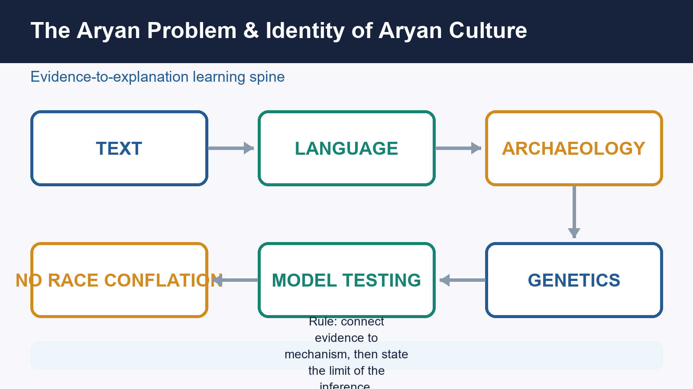
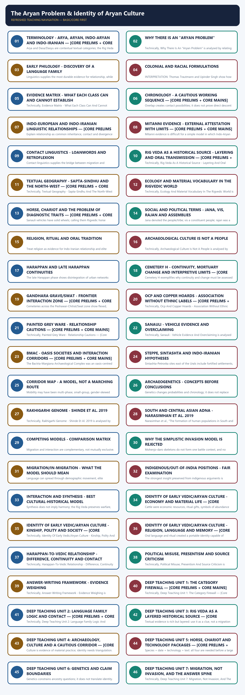
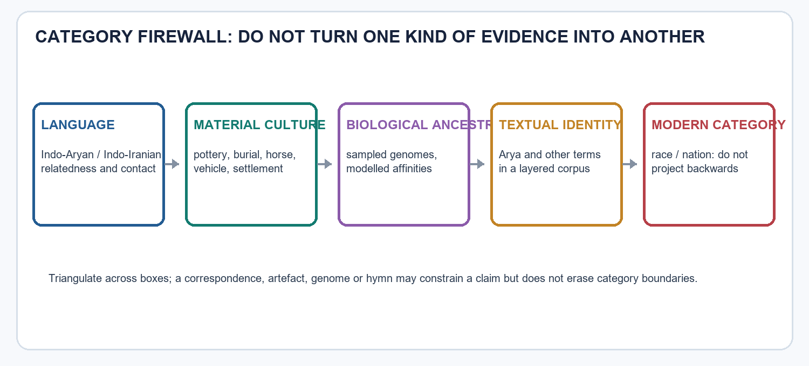

# The Aryan Problem & Identity of Aryan Culture - Learner-v2 Complete Learning Session

> **Catalogue identity:** Ancient History · Subject-wide Syllabus · `ancient-indian-history-07`  
> **Generation date:** 20 August 2026 · **Approval:** pending explicit topic approval  
> **Source order used:** Basic/canonical owner and its OCR-grounded legacy learning package -> syllabus/master chronology/thematic and verified-PYQ sources -> exact Advanced owner in the optional block. Qdrant was not required. Legacy-v1 files remain unchanged.  
> **Evidence discipline:** no current-affairs claim is forced into this static topic; contested chronology and interpretation remain labelled.



*Original deterministic visual: a topic-specific evidence-to-explanation spine. It is a learning aid, not historical evidence.*

### Coverage lock

- **Required scope:** Keep text, language, archaeology and genetics distinct; assess migration, invasion and indigenist claims without race conflation or ideological overclaim.
- **Basic completeness:** substantive owner material is retained in a learner-first session audited for answer value and category safety.
- **Practice completeness:** verified-question status, varied strict-rotation MCQs/remediation and distinct solved 10/15/20-mark answers are retained without padding.
- **Advanced boundary:** the exact Advanced owner is placed only after all Basic and practice material.
- **Register-last rule:** complete topic-specific consolidated notes remain the final H2 section.

### Legacy package source and coverage ledger

> **Subject:** Ancient Indian History | **Paper:** Prelims GS-I + GS-I historical/cultural support | **Topic:** 07 | **Date:** 13 August 2026
>
> **Evidence key:** FACT = directly supported by the named repository, local-book, official-paper or live source. INTERPRETATION = a cited scholarly reading. INFERENCE = a bounded analytical conclusion. Genetics is never used as a proxy for language, culture, ethnicity or political identity.

### Package Practice Counts

| Component | Count |
|---|---:|
| Closely relevant verified-question headings | 5 |
| Total MCQs with explanations | 40 |
| Core MCQs with explanations | 32 |
| Remedial MCQs with explanations | 8 |
| Original solved 10-mark Mains | 2 |
| Original solved 15-mark Mains | 2 |
| Original solved 20-mark Mains | 2 |

## BASIC LEARNING SESSION



*Distinct embedded teaching-navigation image. The separate continuous Cārvāka-style flowchart package remains an independent at-a-glance artifact.*
### UPSC RELEVANCE AND ANSWER-WORTHINESS AUDIT

**Syllabus and verified-question reality.** There is **no direct Aryan-origin/migration question** in the audited 2018-2026 routing ledgers. The topic is nevertheless useful for **Prelims distinctions** (language family, Vedic geography, chronology and source matching) and as **Mains source-method support** for early Indian culture, Vedic transition and historiography. It must not be inflated into a settled standalone GS-I theme.

| Major block | Label | Learner action |
|---|---|---|
| Arya/Aryan/Indo-Aryan/Indo-Iranian/Indo-European; chronology; Rigvedic geography; Mitanni; horse-chariot; culture associations | **CORE PRELIMS** | Memorise distinctions, bounded dates and diagnostic pairs. |
| Category separation, philology, text layering, migration/invasion, archaeology, interaction, colonial racialisation, triangulation and answer structure | **CORE MAINS** | Explain what each evidence stream can and cannot establish. |
| Long cognate lists, site inventories, haplogroup catalogues, scholar rolls and corridor maps | **SUPPORTING** | Retain only representative examples that improve elimination or argument. |
| Comparative method limits, substrate/contact, archaeogenetic models, material-culture identity theory, technology packages, historiography and ethics | **OPTIONAL ADVANCED** | Use one refinement only when it sharpens a specific claim. |

**Memorise:** category definitions, chronology sequence, Mitanni as external attestation, Rigvedic north-west geography, key culture associations and the culture-not-people rule.  
**Understand:** language, archaeology, ancestry and textual identity have different objects and scales.  
**Use selectively:** BMAC/Steppe/Swat/Cemetery H/OCP/PGW as qualified contexts, not labels for peoples.  
**Reserve for depth:** samples/models, substrate debates, textual-memory issues and historiography.



*Original deterministic learning visual. It is a method aid, not evidence for an origin or identity claim.*
### ROADMAP, SOURCES AND EVIDENCE DISCIPLINE

FACT: The package follows the mandatory order: Topic 07 authored Markdown and repository routing files, OCR-searchable local books, and no Qdrant dependency. No live claim is required for this static topic.

| Evidence layer | Sources used | Contribution |
|---|---|---|
| Repository Markdown | basic/07, advanced/07, README, Master Chronology, Revision Chart, syllabus mapping, answer-worthiness audit, Topics 06/08/09 and PYQ ledgers | Core concepts, chronology, cautions, answer architecture and verified question routes |
| Local OCR-searchable books | R. S. Sharma, *India's Ancient Past*, chapter 11; Upinder Singh, *A History of Ancient and Early Medieval India*, 2nd ed., chapter 5 and Harappan sections | Traits, philology, textual method, archaeology, historiography, aDNA and transition evidence |
| Local official papers and keys | UPSC Mains GS-I 2023 and 2024; Prelims GS-I 2026 Series A; provisional 2026 Series-A key | Exact recent questions and transparent answer-key status |
| Live sources | Not used; this static topic is grounded in repository owners and local OCR evidence | A new study would require primary/peer-reviewed verification and bounded use |

```text
TERM -> SOURCE CLASSES -> LINGUISTIC ROUTE -> TEXTUAL GEOGRAPHY
     -> ARCHAEOLOGICAL CORRELATIONS -> aDNA -> COMPETING MODELS
     -> EARLY VEDIC CULTURAL PROFILE -> PYQs -> PRACTICE -> REGISTER NOTES
```

METHOD: Every claim should answer four questions: What is the evidence? What does it establish? What alternative explanation exists? What can it not establish?

RECALL: "Aryan" is treated primarily as a linguistic-cultural and historical-reconstruction problem, not a biological race.
RECALL: Language, genes, pottery, burial, ritual and political identity can move together, separately or at different speeds.
TRAP: One evidence class settles the entire debate. || Each class has a different object, scale and limitation; triangulation is compulsory.
MAINS ANGLE: The Aryan problem is best presented as a problem of method and cultural formation, not a contest between civilizational slogans.
STUDY LINK: Topic 02 source criticism; Topic 06 Harappan transformation; Topic 08 Rig Vedic society; Topic 09 Later Vedic change.
### SESSION 1 — TERMINOLOGY - ARYA, ARYAN, INDO-ARYAN AND INDO-IRANIAN — [CORE PRELIMS + CORE MAINS]

#### DEFINITION / WHAT THIS IS CALLED

**Plain-language definition:** Upinder Singh explicitly states that Indo-European and Indo-Aryan are linguistic terms and have nothing to do with old racial classifications.

**Technical definition:** Arya and Dasa/Dasyu are contextual textual categories; the Rig Veda also refers to conflict among Aryas.

#### ANSWER-GRABBING OPENING — WRITE/ADAPT IN THE EXAM

> Upinder Singh explicitly states that Indo-European and Indo-Aryan are linguistic terms and have nothing to do with old racial classifications.

#### MUST-WRITE KEYWORDS

- **Terminology - Arya**
- **Aryan**
- **Indo-Aryan**
- **Indo-Iranian**
- **Arya in Vedic usage**
- **A fixed modern race**

**How to use them:** Frame the answer through Terminology - Arya; define Aryan, connect Indo-Aryan with Indo-Iranian to explain the mechanism, and use Arya in Vedic usage for the decisive comparison or qualification.

| Term | Exam-safe meaning | Unsafe use |
|---|---|---|
| *Arya* in Vedic usage | A contextual self-description carrying social-cultural meanings such as insider, kinsman or respectable person | A fixed modern race |
| Indo-European | A reconstructed language family with many ancient and modern branches | A single biological population or empire |
| Indo-Iranian | The linguistic branch ancestral to Indo-Aryan, Iranian and Nuristani developments | A single archaeological culture |
| Indo-Aryan | A subgroup of Indo-Iranian languages and, cautiously, their speakers | A genetic essence |
| "Aryan culture" | A heuristic bundle of textual, linguistic and cultural traits whose archaeological correlation is debated | One pottery, one skeleton or one modern community |

FACT: Upinder Singh explicitly states that Indo-European and Indo-Aryan are linguistic terms and have nothing to do with old racial classifications.

INFERENCE: The safest UPSC wording is "Indo-Aryan-speaking groups" or "the culture represented in the early Vedic corpus" rather than "the Aryan race".
RECALL: *Arya* and *Dasa/Dasyu* are contextual textual categories; the Rig Veda also refers to conflict among Aryas.
TRAP: Arya always means a light-skinned invader and Dasa always means a biological native. || The categories could mark shifting ritual, linguistic, political or social boundaries and cannot be reduced to phenotype.
MAINS ANGLE: Begin a sensitive answer by defining the term narrowly; this prevents both colonial racialism and presentist counter-myth.

#### CLOSING RECALL FLOW — TERMINOLOGY - ARYA, ARYAN, INDO-ARYAN AND INDO-IRANIAN — [CORE PRELIMS + CORE MAINS]

```text
START / CONCEPT: TERMINOLOGY - ARYA, ARYAN, INDO-ARYAN AND INDO-IRANIAN — [CORE PRELIMS + CORE MAINS]
        |
        v
EXACT TERMS: Terminology - Arya · Aryan · Indo-Aryan · Indo-Iranian · Arya in Vedic usage · A fixed modern race
        |
        v
MECHANISM / ARGUMENT: The safest UPSC wording is "Indo-Aryan-speaking groups" or "the culture represented in the early Vedic corpus" rather than "the Aryan race".
        |
        v
CONSEQUENCE / CONTRAST: Arya and Dasa/Dasyu are contextual textual categories; the Rig Veda also refers to conflict among Aryas.
        |
        v
UPSC TRAP / ANSWER-USE: Arya always means a light-skinned invader and Dasa always means a biological native. || The categories could mark shifting ritual, linguistic, political or social boundaries and cannot be reduced to phenotype.
        |
        v
ANSWER-GRABBING FORMULATION: Upinder Singh explicitly states that Indo-European and Indo-Aryan are linguistic terms and have nothing to do with old racial classifications.
```
### SESSION 2 — WHY THERE IS AN "ARYAN PROBLEM"

#### DEFINITION / WHAT THIS IS CALLED

**Plain-language definition:** The problem exists because the earliest Indo-Aryan texts are religious-poetic and orally transmitted, the Harappan script remains undeciphered, archaeological cultures do not speak for themselves, and ancient-DNA sampling in South Asia remains sparse.

**Technical definition:** Technically, Why There Is An "Aryan Problem" is analysed by relating Comparative linguistics to Exact migration route and social mechanism, then testing the relationship through Rigvedic river and ecological vocabulary and Precise date and boundaries of every textual layer.

#### ANSWER-GRABBING OPENING — WRITE/ADAPT IN THE EXAM

> The problem exists because the earliest Indo-Aryan texts are religious-poetic and orally transmitted, the Harappan script remains undeciphered, archaeological cultures do not speak for themselves, and ancient-DNA sampling in South Asia remains sparse.

#### MUST-WRITE KEYWORDS

- **Comparative linguistics**
- **Exact migration route and social mechanism**
- **Rigvedic river and ecological vocabulary**
- **Precise date and boundaries of every textual layer**
- **Linguistics, aDNA and archaeology together**
- **Scale, tempo, gender balance and political consequences**

**How to use them:** Frame the answer through Comparative linguistics; define Exact migration route and social mechanism, connect Rigvedic river and ecological vocabulary with Precise date and boundaries of every textual layer to explain the mechanism, and use Linguistics, aDNA and archaeology together for the decisive comparison or qualification.

FACT: The problem exists because the earliest Indo-Aryan texts are religious-poetic and orally transmitted, the Harappan script remains undeciphered, archaeological cultures do not speak for themselves, and ancient-DNA sampling in South Asia remains sparse.

| Historical question | Best evidence | Residual uncertainty |
|---|---|---|
| What language family is Vedic Sanskrit part of? | Comparative linguistics | Exact migration route and social mechanism |
| Where was the earliest Vedic milieu? | Rigvedic river and ecological vocabulary | Precise date and boundaries of every textual layer |
| Did people move into South Asia? | Linguistics, aDNA and archaeology together | Scale, tempo, gender balance and political consequences |
| Did Harappan people become Vedic people? | Late Harappan continuity plus later interaction | Harappan language and identity |
| Which material culture was "Aryan"? | No single secure answer | Material traits cannot be equated mechanically with speech |

```text
UNREAD HARAPPAN SCRIPT + LAYERED RIG VEDA + PATCHY ARCHAEOLOGY
                         +
               SMALL/UNEQUAL aDNA SAMPLES
                         =
        PROBABILISTIC RECONSTRUCTION, NOT A FINAL LABEL
```

INFERENCE: A mature answer does not avoid a verdict; it gives a graded verdict proportional to the evidence.
RECALL: Strongest confidence attaches to linguistic relatedness; lower confidence attaches to one-to-one ethnic mapping.
TRAP: "Uncertain" means no historical conclusion is possible. || The correct response is calibrated confidence, not agnosticism about everything.
MAINS ANGLE: Frame the topic around hierarchy of claims: secure family relationship, plausible mobility, debated route/material correlate, unknowable individual identity.

#### CLOSING RECALL FLOW — WHY THERE IS AN "ARYAN PROBLEM"

```text
START / CONCEPT: WHY THERE IS AN "ARYAN PROBLEM"
        |
        v
EXACT TERMS: Comparative linguistics · Exact migration route and social mechanism · Rigvedic river and ecological vocabulary · Precise date and boundaries of every textual layer · Linguistics, aDNA and archaeology together · Scale, tempo, gender balance and political consequences
        |
        v
MECHANISM / ARGUMENT: A mature answer does not avoid a verdict; it gives a graded verdict proportional to the evidence.
        |
        v
CONSEQUENCE / CONTRAST: The resulting consequence is that the problem exists because the earliest Indo-Aryan texts are religious-poetic and orally transmitted, the...
        |
        v
UPSC TRAP / ANSWER-USE: "Uncertain" means no historical conclusion is possible. || The correct response is calibrated confidence, not agnosticism about everything.
        |
        v
ANSWER-GRABBING FORMULATION: The problem exists because the earliest Indo-Aryan texts are religious-poetic and orally transmitted, the Harappan script remains undeciphered, archaeological cultures do not speak for themselves, and ancient-DNA sampling in South Asia remains sparse.
```
### SESSION 3 — EARLY PHILOLOGY - DISCOVERY OF A LANGUAGE FAMILY

#### DEFINITION / WHAT THIS IS CALLED

**Plain-language definition:** Sharma used Vedic, Avestan and Greek textual comparisons to identify a trait bundle; current scholarship retains comparative linguistics but is more cautious about converting that bundle into an ethnic checklist.

**Technical definition:** Linguistics supplies the most durable evidence for relationship, while archaeology and genetics test possible historical settings.

#### ANSWER-GRABBING OPENING — WRITE/ADAPT IN THE EXAM

> Sharma used Vedic, Avestan and Greek textual comparisons to identify a trait bundle; current scholarship retains comparative linguistics but is more cautious about converting that bundle into an ethnic checklist.

#### MUST-WRITE KEYWORDS

- **Early Philology - Discovery Of A Language Family**
- **Cognate vocabulary with regular sound change**
- **Supports descent from a common linguistic ancestor**
- **Shared morphology and verbal systems**
- **Stronger than a few similar words**
- **Contact can also produce borrowing**

**How to use them:** Frame the answer through Early Philology - Discovery Of A Language Family; define Cognate vocabulary with regular sound change, connect Supports descent from a common linguistic ancestor with Shared morphology and verbal systems to explain the mechanism, and use Stronger than a few similar words for the decisive comparison or qualification.

FACT: Early modern philology identified systematic similarities among Sanskrit, Avestan, Greek, Latin and other languages. The comparative method reconstructs regular sound correspondences and inherited grammar rather than relying on accidental word resemblance.

| Linguistic observation | Historical significance | Limitation |
|---|---|---|
| Cognate vocabulary with regular sound change | Supports descent from a common linguistic ancestor | Does not locate a homeland by itself |
| Shared morphology and verbal systems | Stronger than a few similar words | Contact can also produce borrowing |
| Indo-Aryan-Iranian closeness | Indicates a period of shared Indo-Iranian development | Does not tell when every community separated |
| Shared ritual lexicon, e.g. Vedic *soma* / Avestan *haoma* | Indicates deep cultural-linguistic relationship | A ritual word cannot map a migration route alone |

INTERPRETATION: R. S. Sharma used Vedic, Avestan and Greek textual comparisons to identify a trait bundle; current scholarship retains comparative linguistics but is more cautious about converting that bundle into an ethnic checklist.

RECALL: Comparative linguistics establishes relationships through patterns, not isolated resemblance.
TRAP: Similar words prove direct borrowing from Sanskrit into every Indo-European language. || Cognates may descend from an earlier reconstructed language; chronology and sound laws matter.
MAINS ANGLE: Linguistics supplies the most durable evidence for relationship, while archaeology and genetics test possible historical settings.

#### CLOSING RECALL FLOW — EARLY PHILOLOGY - DISCOVERY OF A LANGUAGE FAMILY

```text
START / CONCEPT: EARLY PHILOLOGY - DISCOVERY OF A LANGUAGE FAMILY
        |
        v
EXACT TERMS: Early Philology - Discovery Of A Language Family · Cognate vocabulary with regular sound change · Supports descent from a common linguistic ancestor · Shared morphology and verbal systems · Stronger than a few similar words · Contact can also produce borrowing
        |
        v
MECHANISM / ARGUMENT: Comparative linguistics establishes relationships through patterns, not isolated resemblance.
        |
        v
CONSEQUENCE / CONTRAST: Linguistics supplies the most durable evidence for relationship, while archaeology and genetics test possible historical settings.
        |
        v
UPSC TRAP / ANSWER-USE: Do not miss this limiting distinction: similar words prove direct borrowing from Sanskrit into every Indo-European language. || Cognates may...
        |
        v
ANSWER-GRABBING FORMULATION: Sharma used Vedic, Avestan and Greek textual comparisons to identify a trait bundle; current scholarship retains comparative linguistics but is more cautious about converting that bundle into an ethnic checklist.
```
### SESSION 4 — COLONIAL AND RACIAL FORMULATIONS

#### DEFINITION / WHAT THIS IS CALLED

**Plain-language definition:** Old physical-anthropological "racial types" have been abandoned; population history is characterized by repeated mixture.

**Technical definition:** INTERPRETATION: Thomas Trautmann and Upinder Singh show how a linguistic concept was racialized in colonial knowledge and later political projects.

#### ANSWER-GRABBING OPENING — WRITE/ADAPT IN THE EXAM

> INTERPRETATION: Thomas Trautmann and Upinder Singh show how a linguistic concept was racialized in colonial knowledge and later political projects.

#### MUST-WRITE KEYWORDS

- **Colonial**
- **Racial Formulations**
- **Language family treated as race**
- **Speech is not biology**
- **"Superior Aryan" civilizes India**
- **Normative hierarchy replaces evidence**

**How to use them:** Frame the answer through Colonial; define Racial Formulations, connect Language family treated as race with Speech is not biology to explain the mechanism, and use "Superior Aryan" civilizes India for the decisive comparison or qualification.

FACT: Nineteenth- and early twentieth-century scholarship often fused linguistic labels with racial typologies. Such typologies supplied pseudo-scientific support to imperial hierarchy and later Nazi racial mythology.

| Colonial/racial move | Error | Present correction |
|---|---|---|
| Language family treated as race | Speech is not biology | Use linguistic-community language |
| "Superior Aryan" civilizes India | Normative hierarchy replaces evidence | Study interaction, adaptation and local agency |
| Invasion explains all change | Monocausal and archaeologically weak | Separate Harappan decline from later mobility |
| North/south mapped as Aryan/Dravidian races | Freezes fluid histories into modern blocks | Recognize multilingual, mixed and regional trajectories |

INTERPRETATION: Thomas Trautmann and Upinder Singh show how a linguistic concept was racialized in colonial knowledge and later political projects.

INFERENCE: Rejecting racialism does not require rejecting comparative linguistics or all migration; it requires separating distinct propositions.
RECALL: Old physical-anthropological "racial types" have been abandoned; population history is characterized by repeated mixture.
TRAP: Because race theory was wrong, every migration model is colonial. || The validity of a modern evidence-led model depends on method and data, not on sharing one vocabulary word with older ideology.
MAINS ANGLE: Historiography should identify both the colonial misuse and the danger of answering it with another essentialist certainty.

#### CLOSING RECALL FLOW — COLONIAL AND RACIAL FORMULATIONS

```text
START / CONCEPT: COLONIAL AND RACIAL FORMULATIONS
        |
        v
EXACT TERMS: Colonial · Racial Formulations · Language family treated as race · Speech is not biology · "Superior Aryan" civilizes India · Normative hierarchy replaces evidence
        |
        v
MECHANISM / ARGUMENT: Old physical-anthropological "racial types" have been abandoned; population history is characterized by repeated mixture.
        |
        v
CONSEQUENCE / CONTRAST: Rejecting racialism does not require rejecting comparative linguistics or all migration; it requires separating distinct propositions.
        |
        v
UPSC TRAP / ANSWER-USE: Because race theory was wrong, every migration model is colonial. || The validity of a modern evidence-led model depends on method and data, not on sharing one vocabulary word with older ideology.
        |
        v
ANSWER-GRABBING FORMULATION: INTERPRETATION: Thomas Trautmann and Upinder Singh show how a linguistic concept was racialized in colonial knowledge and later political projects.
```
### SESSION 5 — EVIDENCE MATRIX - WHAT EACH CLASS CAN AND CANNOT ESTABLISH

#### DEFINITION / WHAT THIS IS CALLED

**Plain-language definition:** Evidence Matrix - What Each Class Can And Cannot Establish comprises Cannot Establish, Comparative linguistics and Genes, pottery, exact homeland or political domination as its core connected dimensions.

**Technical definition:** Technically, Evidence Matrix - What Each Class Can And Cannot Establish is analysed by relating Cannot Establish to Comparative linguistics, then testing the relationship through Genes, pottery, exact homeland or political domination and Rigvedic philology/geography.

#### ANSWER-GRABBING OPENING — WRITE/ADAPT IN THE EXAM

> This matrix can serve as the introduction or conclusion of almost any Aryan-debate question.

#### MUST-WRITE KEYWORDS

- **Cannot Establish**
- **Comparative linguistics**
- **Genes, pottery, exact homeland or political domination**
- **Rigvedic philology/geography**
- **Textual world, remembered rivers, values, institutions and vocabulary**
- **Census, precise year, popular culture or complete archaeology**

**How to use them:** Frame the answer through Cannot Establish; define Comparative linguistics, connect Genes, pottery, exact homeland or political domination with Rigvedic philology/geography to explain the mechanism, and use Textual world, remembered rivers, values, institutions and vocabulary for the decisive comparison or qualification.

| Evidence class | Can establish | Cannot establish alone |
|---|---|---|
| Comparative linguistics | Genealogical language relationships, relative innovations, contact and borrowing | Genes, pottery, exact homeland or political domination |
| Rigvedic philology/geography | Textual world, remembered rivers, values, institutions and vocabulary | Census, precise year, popular culture or complete archaeology |
| Archaeology | Settlements, material practices, diet, burial, technology and chronology | Spoken language or self-identified ethnicity without text |
| Archaeogenetics | Biological ancestry, relatedness, mixture and population movement | Language, belief, legal status or cultural identity |
| Ecology/palaeoclimate | Resource opportunities, constraints and changing landscapes | Automatic migration, collapse or ethnicity |
| Historiography | How concepts and models were produced and politicized | Direct evidence for the ancient event itself |

```text
LANGUAGE != GENES != POTTERY != ETHNICITY != POLITICAL IDENTITY
       \          |          |           /
        \--------- TRIANGULATION --------/
```

METHOD: Use convergent evidence only after stating whether the datasets concern the same place, time and social scale.
RECALL: Correlation becomes persuasive when independent evidence classes align without being made equivalent.
TRAP: Steppe ancestry equals Vedic Sanskrit in a sample. || An ancestry component is biological; language association remains an inference requiring linguistic and chronological support.
MAINS ANGLE: This matrix can serve as the introduction or conclusion of almost any Aryan-debate question.

#### CLOSING RECALL FLOW — EVIDENCE MATRIX - WHAT EACH CLASS CAN AND CANNOT ESTABLISH

```text
START / CONCEPT: EVIDENCE MATRIX - WHAT EACH CLASS CAN AND CANNOT ESTABLISH
        |
        v
EXACT TERMS: Cannot Establish · Comparative linguistics · Genes, pottery, exact homeland or political domination · Rigvedic philology/geography · Textual world, remembered rivers, values, institutions and vocabulary · Census, precise year, popular culture or complete archaeology
        |
        v
MECHANISM / ARGUMENT: Use convergent evidence only after stating whether the datasets concern the same place, time and social scale.
        |
        v
CONSEQUENCE / CONTRAST: The resulting consequence is that this matrix can serve as the introduction or conclusion of almost any Aryan-debate question.
        |
        v
UPSC TRAP / ANSWER-USE: Do not miss this limiting distinction: steppe ancestry equals Vedic Sanskrit in a sample. || An ancestry component is biological.
        |
        v
ANSWER-GRABBING FORMULATION: This matrix can serve as the introduction or conclusion of almost any Aryan-debate question.
```
### SESSION 6 — CHRONOLOGY - A CAUTIOUS WORKING SEQUENCE — [CORE PRELIMS + CORE MAINS]

#### DEFINITION / WHAT THIS IS CALLED

**Plain-language definition:** Chronology - A Cautious Working Sequence — [Core Prelims + Core Mains] comprises Chronology - A Cautious Working Sequence, Mature Harappan and c. 2600-1900 BCE as its core connected dimensions.

**Technical definition:** Overlap creates contact possibilities; it does not prove direct descent or identity.

#### ANSWER-GRABBING OPENING — WRITE/ADAPT IN THE EXAM

> Use relative sequence first, then state that absolute dates and textual layering remain debated.

#### MUST-WRITE KEYWORDS

- **Chronology - A Cautious Working Sequence**
- **Mature Harappan**
- **c. 2600-1900 BCE**
- **Urban Bronze Age baseline**
- **Not identical with Rig Vedic culture**
- **Late/post-urban Harappan**

**How to use them:** Frame the answer through Chronology - A Cautious Working Sequence; define Mature Harappan, connect c. 2600-1900 BCE with Urban Bronze Age baseline to explain the mechanism, and use Not identical with Rig Vedic culture for the decisive comparison or qualification.

| Horizon | Broad working date | Secure use | Caution |
|---|---:|---|---|
| Mature Harappan | c. 2600-1900 BCE | Urban Bronze Age baseline | Not identical with Rig Vedic culture |
| Late/post-urban Harappan | c. 1900-1300 BCE, regionally variable | Deurbanisation, localization, east/south shifts | Not a single successor people |
| Sintashta-Petrovka | c. 2100-1800 BCE | Early spoked-wheel chariot context | Culture-language association remains argued |
| BMAC florescence | mainly c. 2300-1700 BCE | Central Asian oasis interaction zone | Not simply a colony of steppe pastoralists |
| Mitanni Indo-Aryan attestations | c. 15th-14th centuries BCE; treaty c. 1380 BCE | External Indo-Aryan linguistic evidence | Does not directly date the Rig Veda |
| Rig Vedic composition horizon | commonly c. 1500/1200-1000 BCE | Broad teaching chronology | Text is layered and orally compiled |
| PGW | mainly c. 1200-500/400 BCE in Upinder Singh | Later Vedic/early Iron Age comparison | PGW is not "the Aryans" |

```text
2600          1900       1800       1500       1200       1000 BCE
|-- MATURE H --|-- LATE H ---------------------|
          |-- BMAC --| 
                    |-- SINTASHTA --|
                              | MITANNI |
                                      |---- RIG VEDIC ----|
                                                |------ PGW ------|
```

INFERENCE: Overlap creates contact possibilities; it does not prove direct descent or identity.
RECALL: Mature Harappan urbanism largely precedes the conventional Rig Vedic horizon.
TRAP: A broad date band means every site and every hymn is contemporaneous. || Chronologies vary by region, layer and method.
MAINS ANGLE: Use relative sequence first, then state that absolute dates and textual layering remain debated.

#### CLOSING RECALL FLOW — CHRONOLOGY - A CAUTIOUS WORKING SEQUENCE — [CORE PRELIMS + CORE MAINS]

```text
START / CONCEPT: CHRONOLOGY - A CAUTIOUS WORKING SEQUENCE — [CORE PRELIMS + CORE MAINS]
        |
        v
EXACT TERMS: Chronology - A Cautious Working Sequence · Mature Harappan · c. 2600-1900 BCE · Urban Bronze Age baseline · Not identical with Rig Vedic culture · Late/post-urban Harappan
        |
        v
MECHANISM / ARGUMENT: Overlap creates contact possibilities; it does not prove direct descent or identity.
        |
        v
CONSEQUENCE / CONTRAST: The resulting consequence is that it does not prove direct descent or identity.
        |
        v
UPSC TRAP / ANSWER-USE: Do not miss this limiting distinction: a broad date band means every site and every hymn is contemporaneous. || Chronologies...
        |
        v
ANSWER-GRABBING FORMULATION: Use relative sequence first, then state that absolute dates and textual layering remain debated.
```
### SESSION 7 — INDO-EUROPEAN AND INDO-IRANIAN LINGUISTIC RELATIONSHIPS — [CORE PRELIMS + CORE MAINS]

#### DEFINITION / WHAT THIS IS CALLED

**Plain-language definition:** Indo-Iranian is a linguistic reconstruction, not a synonym for BMAC, Sintashta or any gene cluster.

**Technical definition:** Explain relationship as common inheritance, contact and divergence rather than a single unchanged "Aryan package".

#### ANSWER-GRABBING OPENING — WRITE/ADAPT IN THE EXAM

> Indo-Iranian is a linguistic reconstruction, not a synonym for BMAC, Sintashta or any gene cluster.

#### MUST-WRITE KEYWORDS

- **Indo-European**
- **Indo-Iranian Linguistic Relationships**
- **Deities and concepts**
- **Mitra, Varuna-related forms, ritual vocabulary**
- **Avestan parallels and transformations**
- **Common inheritance plus later divergence**

**How to use them:** Frame the answer through Indo-European; define Indo-Iranian Linguistic Relationships, connect Deities and concepts with Mitra, Varuna-related forms, ritual vocabulary to explain the mechanism, and use Avestan parallels and transformations for the decisive comparison or qualification.

FACT: Vedic Sanskrit belongs to Indo-Aryan, within Indo-Iranian, within Indo-European. Indo-Iranian includes Indo-Aryan, Iranian and Nuristani developments.

```text
PROTO-INDO-EUROPEAN
        |
        +-- other branches
        |
        +-- PROTO-INDO-IRANIAN
                 |
                 +-- Indo-Aryan -> Vedic Sanskrit and later Indic languages
                 +-- Iranian -> Avestan, Old Persian and later Iranian languages
                 +-- Nuristani
```

| Shared field | Vedic/Indic evidence | Iranian comparison | Answer use |
|---|---|---|---|
| Deities and concepts | Mitra, Varuna-related forms, ritual vocabulary | Avestan parallels and transformations | Common inheritance plus later divergence |
| Sacred drink | *Soma* | *Haoma* | Indo-Iranian ritual relationship |
| Horse vocabulary | *ashva* and chariot terms | *aspa* in Iranian names | Mobility/elite vocabulary |
| Phonology | Vedic sound system | Regular Iranian changes | Demonstrates branch relationship |

INTERPRETATION: Similarity is not cultural sameness; Vedic and Avestan traditions also preserve reversals, innovations and distinct historical settings.
RECALL: Indo-Iranian is a linguistic reconstruction, not a synonym for BMAC, Sintashta or any gene cluster.
TRAP: A shared god-name proves the same religion in every detail. || Shared inheritance can be reshaped after branch separation.
MAINS ANGLE: Explain relationship as common inheritance, contact and divergence rather than a single unchanged "Aryan package".

#### CLOSING RECALL FLOW — INDO-EUROPEAN AND INDO-IRANIAN LINGUISTIC RELATIONSHIPS — [CORE PRELIMS + CORE MAINS]

```text
START / CONCEPT: INDO-EUROPEAN AND INDO-IRANIAN LINGUISTIC RELATIONSHIPS — [CORE PRELIMS + CORE MAINS]
        |
        v
EXACT TERMS: Indo-European · Indo-Iranian Linguistic Relationships · Deities and concepts · Mitra, Varuna-related forms, ritual vocabulary · Avestan parallels and transformations · Common inheritance plus later divergence
        |
        v
MECHANISM / ARGUMENT: Explain relationship as common inheritance, contact and divergence rather than a single unchanged "Aryan package".
        |
        v
CONSEQUENCE / CONTRAST: INTERPRETATION: Similarity is not cultural sameness; Vedic and Avestan traditions also preserve reversals, innovations and distinct historical settings.
        |
        v
UPSC TRAP / ANSWER-USE: Do not miss this limiting distinction: a shared god-name proves the same religion in every detail. || Shared inheritance can...
        |
        v
ANSWER-GRABBING FORMULATION: Indo-Iranian is a linguistic reconstruction, not a synonym for BMAC, Sintashta or any gene cluster.
```
### SESSION 8 — MITANNI EVIDENCE - EXTERNAL ATTESTATION WITH LIMITS — [CORE PRELIMS + CORE MAINS]

#### DEFINITION / WHAT THIS IS CALLED

**Plain-language definition:** External attestation is linguistic, not a demographic count.

**Technical definition:** Mitanni evidence is difficult for a simple model in which Indo-Aryan originated late and only inside India, but it does not yield a complete route map.

#### ANSWER-GRABBING OPENING — WRITE/ADAPT IN THE EXAM

> Use Mitanni as a named evidence unit, immediately followed by the limitation "external attestation, not direct Rigvedic dating".

#### MUST-WRITE KEYWORDS

- **Mitanni Evidence - External Attestation With Limits**
- **Divine names in treaty**
- **Indo-Aryan linguistic/religious elements among a Mitanni ruling milieu**
- **That most Mitanni people spoke Indo-Aryan**
- **Horse-training numerals/terms**
- **Specialized Indo-Aryan vocabulary in a chariot context**

**How to use them:** Frame the answer through Mitanni Evidence - External Attestation With Limits; define Divine names in treaty, connect Indo-Aryan linguistic/religious elements among a Mitanni ruling milieu with That most Mitanni people spoke Indo-Aryan to explain the mechanism, and use Horse-training numerals/terms for the decisive comparison or qualification.

FACT: A c. 1380 BCE Hittite-Mitanni treaty from Bogazkoy invokes forms corresponding to Indra, Mitra, Varuna and the Nasatyas. A horse-training text associated with Kikkuli contains technical terms resembling Indo-Aryan forms.

| Evidence | What it supports | What it does not prove |
|---|---|---|
| Divine names in treaty | Indo-Aryan linguistic/religious elements among a Mitanni ruling milieu | That most Mitanni people spoke Indo-Aryan |
| Horse-training numerals/terms | Specialized Indo-Aryan vocabulary in a chariot context | Direct migration from Mitanni to India |
| Secure Near Eastern chronology | Indo-Aryan was present outside South Asia by the mid-second millennium BCE | Exact date of a Rigvedic hymn |

INTERPRETATION: Upinder Singh notes that the majority Mitanni language was Hurrian; Indo-Aryan elements likely formed a restricted superstrate or elite vocabulary.

INFERENCE: Mitanni evidence is difficult for a simple model in which Indo-Aryan originated late and only inside India, but it does not yield a complete route map.
RECALL: External attestation is linguistic, not a demographic count.
TRAP: Mitanni proves the Rig Veda was composed in Syria. || It establishes related Indo-Aryan forms in a different political setting.
MAINS ANGLE: Use Mitanni as a named evidence unit, immediately followed by the limitation "external attestation, not direct Rigvedic dating".

#### CLOSING RECALL FLOW — MITANNI EVIDENCE - EXTERNAL ATTESTATION WITH LIMITS — [CORE PRELIMS + CORE MAINS]

```text
START / CONCEPT: MITANNI EVIDENCE - EXTERNAL ATTESTATION WITH LIMITS — [CORE PRELIMS + CORE MAINS]
        |
        v
EXACT TERMS: Mitanni Evidence - External Attestation With Limits · Divine names in treaty · Indo-Aryan linguistic/religious elements among a Mitanni ruling milieu · That most Mitanni people spoke Indo-Aryan · Horse-training numerals/terms · Specialized Indo-Aryan vocabulary in a chariot context
        |
        v
MECHANISM / ARGUMENT: External attestation is linguistic, not a demographic count.
        |
        v
CONSEQUENCE / CONTRAST: Mitanni evidence is difficult for a simple model in which Indo-Aryan originated late and only inside India, but it does not yield a complete route map.
        |
        v
UPSC TRAP / ANSWER-USE: Do not miss this limiting distinction: mitanni proves the Rig Veda was composed in Syria. || It establishes related Indo-Aryan...
        |
        v
ANSWER-GRABBING FORMULATION: Use Mitanni as a named evidence unit, immediately followed by the limitation "external attestation, not direct Rigvedic dating".
```
### SESSION 9 — CONTACT LINGUISTICS - LOANWORDS AND RETROFLEXION

#### DEFINITION / WHAT THIS IS CALLED

**Plain-language definition:** Loanwords are evidence of contact, not proof that every item or institution was borrowed.

**Technical definition:** Contact linguistics supplies the bridge between migration and synthesis models.

#### ANSWER-GRABBING OPENING — WRITE/ADAPT IN THE EXAM

> Loanwords are evidence of contact, not proof that every item or institution was borrowed.

#### MUST-WRITE KEYWORDS

- **Contact Linguistics - Loanwords**
- **Retroflexion**
- **Dravidian/Munda loanwords**
- **Interaction with existing South Asian speech communities**
- **Exact donor language/date may be disputed**
- **Non-Indo-Aryan names, e.g. Chumuri, Pipru, Shambara**

**How to use them:** Frame the answer through Contact Linguistics - Loanwords; define Retroflexion, connect Dravidian/Munda loanwords with Interaction with existing South Asian speech communities to explain the mechanism, and use Exact donor language/date may be disputed for the decisive comparison or qualification.

FACT: Upinder Singh notes about 300 clearly non-Indo-European words in the Rig Veda and non-Indo-Aryan personal/tribal names. Sanskrit retroflex consonants have long been discussed in relation to South Asian contact.

| Linguistic feature | Historical implication | Caution |
|---|---|---|
| Dravidian/Munda loanwords | Interaction with existing South Asian speech communities | Exact donor language/date may be disputed |
| Non-Indo-Aryan names, e.g. Chumuri, Pipru, Shambara | Multilingual political world | A name does not fix biological ancestry |
| Arya chiefs with non-Indo-Aryan names, e.g. Balbutha/Bribu | Boundary crossing and incorporation | Textual interpretation remains contextual |
| Retroflexion in Indo-Aryan | Strong areal/contact effect within South Asia | Mechanism and chronology are debated |

```text
MOBILITY -> CONTACT -> BORROWING/PHONOLOGICAL CHANGE
                    -> BILINGUALISM -> CULTURAL SYNTHESIS
```

INFERENCE: Contact features support formation of Indo-Aryan culture within South Asia through interaction rather than preservation of a sealed migrant culture.
RECALL: Loanwords are evidence of contact, not proof that every item or institution was borrowed.
TRAP: Language replacement requires total population replacement. || Languages can spread through prestige, networks, bilingualism and elite dominance with extensive local continuity.
MAINS ANGLE: Contact linguistics supplies the bridge between migration and synthesis models.

#### CLOSING RECALL FLOW — CONTACT LINGUISTICS - LOANWORDS AND RETROFLEXION

```text
START / CONCEPT: CONTACT LINGUISTICS - LOANWORDS AND RETROFLEXION
        |
        v
EXACT TERMS: Contact Linguistics - Loanwords · Retroflexion · Dravidian/Munda loanwords · Interaction with existing South Asian speech communities · Exact donor language/date may be disputed · Non-Indo-Aryan names, e.g. Chumuri, Pipru, Shambara
        |
        v
MECHANISM / ARGUMENT: Contact linguistics supplies the bridge between migration and synthesis models.
        |
        v
CONSEQUENCE / CONTRAST: Sanskrit retroflex consonants have long been discussed in relation to South Asian contact.
        |
        v
UPSC TRAP / ANSWER-USE: Do not miss this limiting distinction: language replacement requires total population replacement. || Languages can spread through prestige, networks, bilingualism...
        |
        v
ANSWER-GRABBING FORMULATION: Loanwords are evidence of contact, not proof that every item or institution was borrowed.
```
### SESSION 10 — RIG VEDA AS A HISTORICAL SOURCE - LAYERING AND ORAL TRANSMISSION — [CORE PRELIMS + CORE MAINS]

#### DEFINITION / WHAT THIS IS CALLED

**Plain-language definition:** The Rig Veda is a ritual-poetic corpus transmitted orally for centuries.

**Technical definition:** Technically, Rig Veda As A Historical Source - Layering And Oral Transmission — [Core Prelims + Core Mains] is analysed by relating Rig Veda As A Historical Source - Layering to Oral Transmission, then testing the relationship through Elite ritual authorship and Oral preservation and compilation.

#### ANSWER-GRABBING OPENING — WRITE/ADAPT IN THE EXAM

> The Rig Veda is a ritual-poetic corpus transmitted orally for centuries.

#### MUST-WRITE KEYWORDS

- **Rig Veda As A Historical Source - Layering**
- **Oral Transmission**
- **Elite ritual authorship**
- **Oral preservation and compilation**
- **Poetry and myth**
- **Historical and cosmic battles cannot always be separated**

**How to use them:** Frame the answer through Rig Veda As A Historical Source - Layering; define Oral Transmission, connect Elite ritual authorship with Oral preservation and compilation to explain the mechanism, and use Poetry and myth for the decisive comparison or qualification.

FACT: The Rig Veda is a ritual-poetic corpus transmitted orally for centuries. Books 2-7 are conventionally the older "family books"; Books 1, 8, 9 and 10 include later material, though old and new compositions can occur across the arrangement.

| Source issue | Consequence for reconstruction |
|---|---|
| Elite ritual authorship | Popular practices and marginal groups are underrepresented |
| Oral preservation and compilation | Text can preserve old material but compilation may modify wording/order |
| Poetry and myth | Historical and cosmic battles cannot always be separated |
| Context-dependent vocabulary | One word can carry different meanings in different hymns |
| Specific geography | Evidence is strongest for the north-western composition milieu |

METHOD: Read a cluster of references, compare textual layers and test against independent archaeology; never date a site merely from a verse.
RECALL: Only the Shakala recension survives completely.
TRAP: Oral transmission makes the text historically worthless. || Rigorous oral preservation can conserve material, but historical extraction still requires source criticism.
MAINS ANGLE: A sophisticated answer states both the Rig Veda's unmatched value and its genre, authorship and dating limits.

#### CLOSING RECALL FLOW — RIG VEDA AS A HISTORICAL SOURCE - LAYERING AND ORAL TRANSMISSION — [CORE PRELIMS + CORE MAINS]

```text
START / CONCEPT: RIG VEDA AS A HISTORICAL SOURCE - LAYERING AND ORAL TRANSMISSION — [CORE PRELIMS + CORE MAINS]
        |
        v
EXACT TERMS: Rig Veda As A Historical Source - Layering · Oral Transmission · Elite ritual authorship · Oral preservation and compilation · Poetry and myth · Historical and cosmic battles cannot always be separated
        |
        v
MECHANISM / ARGUMENT: Books 2-7 are conventionally the older "family books"; Books 1, 8, 9 and 10 include later material, though old and new compositions can occur across the arrangement.
        |
        v
CONSEQUENCE / CONTRAST: The resulting consequence is that the Rig Veda is a ritual-poetic corpus transmitted orally for centuries.
        |
        v
UPSC TRAP / ANSWER-USE: Oral transmission makes the text historically worthless. || Rigorous oral preservation can conserve material, but historical extraction still requires source criticism.
        |
        v
ANSWER-GRABBING FORMULATION: The Rig Veda is a ritual-poetic corpus transmitted orally for centuries.
```
### SESSION 11 — TEXTUAL GEOGRAPHY - SAPTA-SINDHU AND THE NORTH-WEST — [CORE PRELIMS + CORE MAINS]

#### DEFINITION / WHAT THIS IS CALLED

**Plain-language definition:** Geography supports a north-western early Vedic horizon; it does not identify every archaeological site or prove the direction of ultimate homeland movement.

**Technical definition:** Technically, Textual Geography - Sapta-Sindhu And The North-West — [Core Prelims + Core Mains] is analysed by relating Textual Geography - Sapta-Sindhu to The North-West, then testing the relationship through Sindhu and Indus.

#### ANSWER-GRABBING OPENING — WRITE/ADAPT IN THE EXAM

> Geography supports a north-western early Vedic horizon; it does not identify every archaeological site or prove the direction of ultimate homeland movement.

#### MUST-WRITE KEYWORDS

- **Textual Geography - Sapta-Sindhu**
- **The North-West**
- **Sindhu**
- **Indus**
- **Secure**
- **Vitasta**

**How to use them:** Frame the answer through Textual Geography - Sapta-Sindhu; define The North-West, connect Sindhu with Indus to explain the mechanism, and use Secure for the decisive comparison or qualification.

FACT: The family books locate their core world in Sapta-Sindhu: the Indus, its tributaries and the Sarasvati/Ghaggar-Hakra zone. Later Vedic texts shift toward Kuru-Panchala and the upper Ganga valley.

```text
                  KUBHA/KABUL
                      |
SUVASTU/SWAT -- SINDHU/INDUS -- VITASTA/JHELUM
                      |          ASIKNI/CHENAB
                      |          PARUSHNI/RAVI
                      |          VIPASHA/BEAS
                      |          SHUTUDRI/SUTLEJ
                      |
              SARASVATI/GHAGGAR-HAKRA?
                         -> later shift: KURU-PANCHALA / UPPER GANGA
```

| Vedic name | Common modern identification | Confidence/caution |
|---|---|---|
| Sindhu | Indus | Secure |
| Vitasta | Jhelum | Secure |
| Asikni | Chenab | Secure |
| Parushni | Ravi | Secure |
| Vipasha | Beas | Secure |
| Shutudri | Sutlej | Secure |
| Kubha | Kabul | Secure |
| Suvastu | Swat | Secure |
| Sarasvati | Often Ghaggar-Hakra | Debated in detail |

INFERENCE: Geography supports a north-western early Vedic horizon; it does not identify every archaeological site or prove the direction of ultimate homeland movement.
RECALL: The 2026 river PYQ tests close pairing; Yavyavati should not be casually equated with Beas.
TRAP: Sarasvati identification alone settles Harappan-Vedic identity and chronology. || River identification, palaeochannels, textual layering and site phases are separate questions.
MAINS ANGLE: A text map is high-value when paired with "composition zone, not an ethnic frontier".

#### CLOSING RECALL FLOW — TEXTUAL GEOGRAPHY - SAPTA-SINDHU AND THE NORTH-WEST — [CORE PRELIMS + CORE MAINS]

```text
START / CONCEPT: TEXTUAL GEOGRAPHY - SAPTA-SINDHU AND THE NORTH-WEST — [CORE PRELIMS + CORE MAINS]
        |
        v
EXACT TERMS: Textual Geography - Sapta-Sindhu · The North-West · Sindhu · Indus · Secure · Vitasta
        |
        v
MECHANISM / ARGUMENT: The 2026 river PYQ tests close pairing; Yavyavati should not be casually equated with Beas.
        |
        v
CONSEQUENCE / CONTRAST: A text map is high-value when paired with "composition zone, not an ethnic frontier".
        |
        v
UPSC TRAP / ANSWER-USE: Do not miss this limiting distinction: sarasvati identification alone settles Harappan-Vedic identity and chronology. || River identification, palaeochannels, textual layering...
        |
        v
ANSWER-GRABBING FORMULATION: Geography supports a north-western early Vedic horizon; it does not identify every archaeological site or prove the direction of ultimate homeland movement.
```
### SESSION 12 — ECOLOGY AND MATERIAL VOCABULARY IN THE RIGVEDIC WORLD

#### DEFINITION / WHAT THIS IS CALLED

**Plain-language definition:** Ecology And Material Vocabulary In The Rigvedic World comprises Ecology, Material Vocabulary In The Rigvedic World and go, gomat, cattle raids/gavishti as its core connected dimensions.

**Technical definition:** Technically, Ecology And Material Vocabulary In The Rigvedic World is analysed by relating Ecology to Material Vocabulary In The Rigvedic World, then testing the relationship through go, gomat, cattle raids/gavishti and Frequency differs by textual layer/context.

#### ANSWER-GRABBING OPENING — WRITE/ADAPT IN THE EXAM

> Ecology And Material Vocabulary In The Rigvedic World comprises Ecology, Material Vocabulary In The Rigvedic World and go, gomat, cattle raids/gavishti as its core connected dimensions.

#### MUST-WRITE KEYWORDS

- **Ecology**
- **Material Vocabulary In The Rigvedic World**
- **go, gomat, cattle raids/gavishti**
- **Frequency differs by textual layer/context**
- **Horse/chariot terms**
- **Elite mobility, warfare and ritual importance**

**How to use them:** Frame the answer through Ecology; define Material Vocabulary In The Rigvedic World, connect go, gomat, cattle raids/gavishti with Frequency differs by textual layer/context to explain the mechanism, and use Horse/chariot terms for the decisive comparison or qualification.

FACT: The Rigvedic world values cattle, horses, chariots, rivers, pasture and kinship. Agriculture, wells, ploughing, sowing and harvesting were known; pastoral predominance does not mean absence of farming.

| Vocabulary/evidence | Historical reading | Qualification |
|---|---|---|
| *go*, *gomat*, cattle raids/*gavishti* | Cattle were wealth, subsistence and prestige | Frequency differs by textual layer/context |
| Horse/chariot terms | Elite mobility, warfare and ritual importance | Textual prominence exceeds secure archaeological frequency |
| *sira/langala*, wells/*avata*, channels/*kulya* | Agriculture and water management existed | Scale and systematization must not be exaggerated |
| Metal/*ayas* | Copper/bronze-age material world in early contexts | Do not automatically translate every *ayas* as iron |
| Houses, carts, weaving, carpentry, leatherwork | Mixed productive economy | Ritual text does not quantify occupational shares |

RECALL: The 2026 irrigation PYQ's provisional Series-A key is C: information 1 and 3 only.
TRAP: Rig Vedic society was wholly nomadic. || It was agro-pastoral with pastoral values and mobile conflict at the centre.
TRAP: Early Vedic *ayas* proves a developed iron economy. || Iron becomes a defining archaeological factor later, especially in Later Vedic/PGW contexts.
MAINS ANGLE: Use "pastoral predominance within an agro-pastoral economy" as the balanced formulation.

#### CLOSING RECALL FLOW — ECOLOGY AND MATERIAL VOCABULARY IN THE RIGVEDIC WORLD

```text
START / CONCEPT: ECOLOGY AND MATERIAL VOCABULARY IN THE RIGVEDIC WORLD
        |
        v
EXACT TERMS: Ecology · Material Vocabulary In The Rigvedic World · go, gomat, cattle raids/gavishti · Frequency differs by textual layer/context · Horse/chariot terms · Elite mobility, warfare and ritual importance
        |
        v
MECHANISM / ARGUMENT: The 2026 irrigation PYQ's provisional Series-A key is C: information 1 and 3 only.
        |
        v
CONSEQUENCE / CONTRAST: Use "pastoral predominance within an agro-pastoral economy" as the balanced formulation.
        |
        v
UPSC TRAP / ANSWER-USE: Do not miss this limiting distinction: rig Vedic society was wholly nomadic. || It was agro-pastoral with pastoral values and...
        |
        v
ANSWER-GRABBING FORMULATION: Ecology And Material Vocabulary In The Rigvedic World comprises Ecology, Material Vocabulary In The Rigvedic World and go, gomat, cattle raids/gavishti as its core connected dimensions.
```
### SESSION 13 — HORSE, CHARIOT AND THE PROBLEM OF DIAGNOSTIC TRAITS — [CORE PRELIMS + CORE MAINS]

#### DEFINITION / WHAT THIS IS CALLED

**Plain-language definition:** Horse and light spoked-wheel chariot imagery is prominent in Vedic and Indo-Iranian material.

**Technical definition:** Sanauli vehicles have solid wheels; calling them Rigvedic horse chariots is not established.

#### ANSWER-GRABBING OPENING — WRITE/ADAPT IN THE EXAM

> Horse and light spoked-wheel chariot imagery is prominent in Vedic and Indo-Iranian material.

#### MUST-WRITE KEYWORDS

- **Horse**
- **Chariot**
- **The Problem Of Diagnostic Traits**
- **Vedic ashva and ratha vocabulary**
- **Horse/chariot mattered to elite ideology and warfare**
- **Sintashta chariot burials**

**How to use them:** Frame the answer through Horse; define Chariot, connect The Problem Of Diagnostic Traits with Vedic ashva and ratha vocabulary to explain the mechanism, and use Horse/chariot mattered to elite ideology and warfare for the decisive comparison or qualification.

FACT: Horse and light spoked-wheel chariot imagery is prominent in Vedic and Indo-Iranian material. Sintashta burials provide early second-millennium BCE spoked-wheel chariot contexts; Stephan Lindner's 2020 Bayesian study dates key evidence broadly around the early second millennium BCE.

| Evidence | Strong inference | Limitation |
|---|---|---|
| Vedic *ashva* and *ratha* vocabulary | Horse/chariot mattered to elite ideology and warfare | Text frequency is not an animal-bone census |
| Sintashta chariot burials | Early spoked-wheel vehicle technology in steppe context | Linguistic identity remains an archaeological-linguistic hypothesis |
| Mitanni horse-training vocabulary | Indo-Aryan technical lexicon in Near East | No direct South Asian route proof |
| Harappan solid-wheel cart models | Wheeled transport was familiar | Solid-wheel carts are not light spoked chariots |
| Sparse/debated Harappan horse remains | Horse was not securely ubiquitous in mature urban assemblages | Absence may reflect recovery and identification limits |

INTERPRETATION: Richard Meadow and other zooarchaeologists have cautioned that early equid identifications require morphology, context and chronology; Surkotada remains remain debated.

RECALL: Sanauli vehicles have solid wheels; calling them Rigvedic horse chariots is not established.
TRAP: Any wheeled vehicle is a Vedic chariot. || Wheel construction, draught animal, vehicle form, date and context must all be demonstrated.
MAINS ANGLE: Horse/chariot is a useful convergent clue, not an ethnic fossil.

#### CLOSING RECALL FLOW — HORSE, CHARIOT AND THE PROBLEM OF DIAGNOSTIC TRAITS — [CORE PRELIMS + CORE MAINS]

```text
START / CONCEPT: HORSE, CHARIOT AND THE PROBLEM OF DIAGNOSTIC TRAITS — [CORE PRELIMS + CORE MAINS]
        |
        v
EXACT TERMS: Horse · Chariot · The Problem Of Diagnostic Traits · Vedic ashva and ratha vocabulary · Horse/chariot mattered to elite ideology and warfare · Sintashta chariot burials
        |
        v
MECHANISM / ARGUMENT: Sanauli vehicles have solid wheels; calling them Rigvedic horse chariots is not established.
        |
        v
CONSEQUENCE / CONTRAST: Horse/chariot is a useful convergent clue, not an ethnic fossil.
        |
        v
UPSC TRAP / ANSWER-USE: Do not miss this limiting distinction: any wheeled vehicle is a Vedic chariot. || Wheel construction, draught animal, vehicle form...
        |
        v
ANSWER-GRABBING FORMULATION: Horse and light spoked-wheel chariot imagery is prominent in Vedic and Indo-Iranian material.
```
### SESSION 14 — SOCIAL AND POLITICAL TERMS - JANA, VIS, RAJAN AND ASSEMBLIES

#### DEFINITION / WHAT THIS IS CALLED

**Plain-language definition:** Authority rested on cattle, war success, ritual legitimacy, generosity and clan support. jana - janapada is a later process of territorialization, not a synonym pair.

**Technical definition:** Jana denoted the people/tribe; vis a constituent people; rajan was a chief rather than a territorial bureaucratic monarch.

#### ANSWER-GRABBING OPENING — WRITE/ADAPT IN THE EXAM

> Authority rested on cattle, war success, ritual legitimacy, generosity and clan support. jana - janapada is a later process of territorialization, not a synonym pair.

#### MUST-WRITE KEYWORDS

- **Social**
- **Political Terms - Jana**
- **Vis**
- **Rajan**
- **Assemblies**
- **War leader, protector and redistributor tied to kinship**

**How to use them:** Frame the answer through Social; define Political Terms - Jana, connect Vis with Rajan to explain the mechanism, and use Assemblies for the decisive comparison or qualification.

FACT: Early Vedic society was organized through household, lineage, clan and tribe. *Jana* denoted the people/tribe; *vis* a constituent people; *rajan* was a chief rather than a territorial bureaucratic monarch.

| Institution/term | Early Vedic profile | Caution |
|---|---|---|
| *rajan* | War leader, protector and redistributor tied to kinship | Not a later tax-state king |
| *purohita* | Ritual specialist and political adviser | Text reflects elite priest-chief relationship |
| *senani*, *gramani* | Limited functional leadership | Not a modern ministry/bureaucracy |
| *sabha*, *samiti*, *vidatha* | Assemblies with debated functions | Membership and powers are unclear |
| *bali* | Offering/tribute in an emerging redistributive order | Regular taxation develops later |

FACT: The Battle of Ten Kings in Book 7 associates Sudas and the Bharatas with a confederacy of rivals; it is best read as tribal competition, not an imperial war.

INFERENCE: Authority rested on cattle, war success, ritual legitimacy, generosity and clan support.
RECALL: *jana* -> *janapada* is a later process of territorialization, not a synonym pair.
TRAP: Sabha and samiti were modern democratic parliaments. || They were clan/tribal bodies whose composition and authority remain uncertain.
MAINS ANGLE: Link political form to economy: mobile cattle wealth and kinship support chiefship rather than territorial fiscal administration.

#### CLOSING RECALL FLOW — SOCIAL AND POLITICAL TERMS - JANA, VIS, RAJAN AND ASSEMBLIES

```text
START / CONCEPT: SOCIAL AND POLITICAL TERMS - JANA, VIS, RAJAN AND ASSEMBLIES
        |
        v
EXACT TERMS: Social · Political Terms - Jana · Vis · Rajan · Assemblies · War leader, protector and redistributor tied to kinship
        |
        v
MECHANISM / ARGUMENT: Jana denoted the people/tribe; vis a constituent people; rajan was a chief rather than a territorial bureaucratic monarch.
        |
        v
CONSEQUENCE / CONTRAST: The Battle of Ten Kings in Book 7 associates Sudas and the Bharatas with a confederacy of rivals; it is best read as tribal competition, not an imperial war.
        |
        v
UPSC TRAP / ANSWER-USE: Do not miss this limiting distinction: sabha and samiti were modern democratic parliaments. || They were clan/tribal bodies whose composition...
        |
        v
ANSWER-GRABBING FORMULATION: Authority rested on cattle, war success, ritual legitimacy, generosity and clan support. jana - janapada is a later process of territorialization, not a synonym pair.
```
### SESSION 15 — RELIGION, RITUAL AND ORAL TRADITION

#### DEFINITION / WHAT THIS IS CALLED

**Plain-language definition:** Shared ritual forms can result from common inheritance, contact or convergent pastoral practices.

**Technical definition:** Treat religion as evidence for Indo-Iranian relationship and elite culture while avoiding a checklist equation with archaeological features.

#### ANSWER-GRABBING OPENING — WRITE/ADAPT IN THE EXAM

> Treat religion as evidence for Indo-Iranian relationship and elite culture while avoiding a checklist equation with archaeological features.

#### MUST-WRITE KEYWORDS

- **Religion**
- **Ritual**
- **Oral Tradition**
- **Indra and war/cattle hymns**
- **Elite martial-pastoral values**
- **Myth and history overlap**

**How to use them:** Frame the answer through Religion; define Ritual, connect Oral Tradition with Indra and war/cattle hymns to explain the mechanism, and use Elite martial-pastoral values for the decisive comparison or qualification.

FACT: Rigvedic religion centred on hymns and sacrificial exchange involving deities such as Indra, Agni, Soma, Varuna, the Ashvins and others. The oral tradition preserved complex metres, formulae and ritual knowledge.

| Feature | Historical significance | Qualification |
|---|---|---|
| Indra and war/cattle hymns | Elite martial-pastoral values | Myth and history overlap |
| Agni/fire ritual | Mediates sacrifice and household/ritual worlds | Fire worship is not uniquely Indo-Aryan |
| Soma | Indo-Iranian shared ritual vocabulary | Botanical identification remains debated |
| Animal/horse sacrifice | Prestige, redistribution and sovereignty | Archaeological identification requires context |
| Oral composition | High-fidelity cultural transmission | Corpus reflects specialist authorship |

INTERPRETATION: R. S. Sharma's trait list - horse, chariot, fire, soma, sacrifice and cremation - is useful for comparison, but several traits are widespread and none can identify ethnicity independently.

RECALL: Shared ritual forms can result from common inheritance, contact or convergent pastoral practices.
TRAP: A Harappan fire installation is automatically a Vedic altar. || Form, context, chronology and textual prescription do not securely match.
MAINS ANGLE: Treat religion as evidence for Indo-Iranian relationship and elite culture while avoiding a checklist equation with archaeological features.

#### CLOSING RECALL FLOW — RELIGION, RITUAL AND ORAL TRADITION

```text
START / CONCEPT: RELIGION, RITUAL AND ORAL TRADITION
        |
        v
EXACT TERMS: Religion · Ritual · Oral Tradition · Indra and war/cattle hymns · Elite martial-pastoral values · Myth and history overlap
        |
        v
MECHANISM / ARGUMENT: Shared ritual forms can result from common inheritance, contact or convergent pastoral practices.
        |
        v
CONSEQUENCE / CONTRAST: Sharma's trait list - horse, chariot, fire, soma, sacrifice and cremation - is useful for comparison, but several traits are widespread and none can identify ethnicity independently.
        |
        v
UPSC TRAP / ANSWER-USE: A Harappan fire installation is automatically a Vedic altar. || Form, context, chronology and textual prescription do not securely match.
        |
        v
ANSWER-GRABBING FORMULATION: Treat religion as evidence for Indo-Iranian relationship and elite culture while avoiding a checklist equation with archaeological features.
```
### SESSION 16 — ARCHAEOLOGICAL CULTURE IS NOT A PEOPLE

#### DEFINITION / WHAT THIS IS CALLED

**Plain-language definition:** Archaeological labels are analytical tools created by researchers.

**Technical definition:** Technically, Archaeological Culture Is Not A People is analysed by relating Cemetery H = Aryans to Gandhara Grave = one migrant tribe, then testing the relationship through Very long chronology and varied burials/material and OCP/Copper Hoards = Aryan weapons.

#### ANSWER-GRABBING OPENING — WRITE/ADAPT IN THE EXAM

> Archaeological labels are analytical tools created by researchers.

#### MUST-WRITE KEYWORDS

- **Cemetery H = Aryans**
- **Gandhara Grave = one migrant tribe**
- **Very long chronology and varied burials/material**
- **OCP/Copper Hoards = Aryan weapons**
- **Poor contexts and diverse regional types**
- **PGW = all Vedic people**

**How to use them:** Frame the answer through Cemetery H = Aryans; define Gandhara Grave = one migrant tribe, connect Very long chronology and varied burials/material with OCP/Copper Hoards = Aryan weapons to explain the mechanism, and use Poor contexts and diverse regional types for the decisive comparison or qualification.

FACT: Archaeologists define cultures from recurring material assemblages in space and time. Such assemblages record practices and networks, not self-declared language or ethnicity.

```text
POTTERY STYLE
   + HOUSE FORM
   + BURIAL PRACTICE
   + TOOLS/DIET
   = ARCHAEOLOGICAL ASSEMBLAGE
   != SPOKEN LANGUAGE OR MODERN ETHNIC GROUP
```

| Mapping temptation | Why it fails |
|---|---|
| Cemetery H = Aryans | Contains continuity and change; language is unknown |
| Gandhara Grave = one migrant tribe | Very long chronology and varied burials/material |
| OCP/Copper Hoards = Aryan weapons | Poor contexts and diverse regional types |
| PGW = all Vedic people | Wide regional range; often small elite ware; later chronology |
| BMAC = Indo-Iranian nation | Oasis societies interacted with multiple mobile groups |

METHOD: Use "associated with", "overlaps with", "may reflect contact" and "has been correlated with", not identity equations.
RECALL: Archaeological labels are analytical tools created by researchers.
TRAP: Material similarity proves population replacement. || Objects can move through trade, imitation, mobility, marriage and specialist networks.
MAINS ANGLE: A one-sentence mapping caution should appear in every archaeology-heavy answer.

#### CLOSING RECALL FLOW — ARCHAEOLOGICAL CULTURE IS NOT A PEOPLE

```text
START / CONCEPT: ARCHAEOLOGICAL CULTURE IS NOT A PEOPLE
        |
        v
EXACT TERMS: Cemetery H = Aryans · Gandhara Grave = one migrant tribe · Very long chronology and varied burials/material · OCP/Copper Hoards = Aryan weapons · Poor contexts and diverse regional types · PGW = all Vedic people
        |
        v
MECHANISM / ARGUMENT: Use "associated with", "overlaps with", "may reflect contact" and "has been correlated with", not identity equations.
        |
        v
CONSEQUENCE / CONTRAST: A one-sentence mapping caution should appear in every archaeology-heavy answer.
        |
        v
UPSC TRAP / ANSWER-USE: Do not miss this limiting distinction: material similarity proves population replacement. || Objects can move through trade, imitation, mobility, marriage...
        |
        v
ANSWER-GRABBING FORMULATION: Archaeological labels are analytical tools created by researchers.
```
### SESSION 17 — HARAPPAN AND LATE HARAPPAN CONTINUITIES

#### DEFINITION / WHAT THIS IS CALLED

**Plain-language definition:** Local continuity and incoming mobility are compatible; neither requires total replacement.

**Technical definition:** The late Harappan phase shows disintegration of urban networks alongside expansion of rural settlements, crop diversification and selective continuity in pottery, craft, symbols and exchange.

#### ANSWER-GRABBING OPENING — WRITE/ADAPT IN THE EXAM

> The late Harappan phase shows disintegration of urban networks alongside expansion of rural settlements, crop diversification and selective continuity in pottery, craft, symbols and exchange.

#### MUST-WRITE KEYWORDS

- **Harappan**
- **Late Harappan Continuities**
- **Pottery continuity with new forms**
- **Cemetery H, Jhukar and regional late traditions**
- **Transformation, not extinction**
- **Graffiti/limited signs**

**How to use them:** Frame the answer through Harappan; define Late Harappan Continuities, connect Pottery continuity with new forms with Cemetery H, Jhukar and regional late traditions to explain the mechanism, and use Transformation, not extinction for the decisive comparison or qualification.

FACT: The late Harappan phase shows disintegration of urban networks alongside expansion of rural settlements, crop diversification and selective continuity in pottery, craft, symbols and exchange.

| Continuity/change | Named evidence | Historical use |
|---|---|---|
| Pottery continuity with new forms | Cemetery H, Jhukar and regional late traditions | Transformation, not extinction |
| Graffiti/limited signs | Bhagwanpura, Daimabad and other late levels | Selective persistence of marking |
| Agricultural diversification | Hulas, Pirak, Gujarat and Maharashtra | Adaptation and new seasonal regimes |
| East/south settlement movement | Sutlej-Yamuna divide, doab, Gujarat/Deccan | Mobility before and during Vedic horizon |
| Decline of cities, script and standards | Across late Harappan regions | End of mature integration |

INFERENCE: Local continuity and incoming mobility are compatible; neither requires total replacement.
RECALL: Mature Harappan decline predates the conventional early Vedic horizon and had environmental, economic and political dimensions.
TRAP: If migration occurred, Harappan populations disappeared. || Genetic, biological and material evidence shows major local ancestry and continuity.
MAINS ANGLE: Use "institutional discontinuity with demographic and cultural continuity" as a strong Harappan-to-Vedic bridge.

#### CLOSING RECALL FLOW — HARAPPAN AND LATE HARAPPAN CONTINUITIES

```text
START / CONCEPT: HARAPPAN AND LATE HARAPPAN CONTINUITIES
        |
        v
EXACT TERMS: Harappan · Late Harappan Continuities · Pottery continuity with new forms · Cemetery H, Jhukar and regional late traditions · Transformation, not extinction · Graffiti/limited signs
        |
        v
MECHANISM / ARGUMENT: Mature Harappan decline predates the conventional early Vedic horizon and had environmental, economic and political dimensions.
        |
        v
CONSEQUENCE / CONTRAST: Use "institutional discontinuity with demographic and cultural continuity" as a strong Harappan-to-Vedic bridge.
        |
        v
UPSC TRAP / ANSWER-USE: Do not miss this limiting distinction: if migration occurred, Harappan populations disappeared. || Genetic, biological and material evidence shows major...
        |
        v
ANSWER-GRABBING FORMULATION: The late Harappan phase shows disintegration of urban networks alongside expansion of rural settlements, crop diversification and selective continuity in pottery, craft, symbols and exchange.
```
### SESSION 18 — CEMETERY H - CONTINUITY, MORTUARY CHANGE AND INTERPRETIVE LIMITS — [CORE PRELIMS + CORE MAINS]

#### DEFINITION / WHAT THIS IS CALLED

**Plain-language definition:** Mortuary change is evidence of social/ritual transformation, not an invasion horizon.

**Technical definition:** Cemetery H exemplifies why continuity and change must be assessed trait by trait.

#### ANSWER-GRABBING OPENING — WRITE/ADAPT IN THE EXAM

> Mortuary change is evidence of social/ritual transformation, not an invasion horizon.

#### MUST-WRITE KEYWORDS

- **Cemetery H - Continuity**
- **Mortuary Change**
- **Interpretive Limits**
- **Changed mortuary practice**
- **New beliefs, interaction or changing local tradition**
- **Burial does not identify language**

**How to use them:** Frame the answer through Cemetery H - Continuity; define Mortuary Change, connect Interpretive Limits with Changed mortuary practice to explain the mechanism, and use New beliefs, interaction or changing local tradition for the decisive comparison or qualification.

FACT: Cemetery H at Harappa includes pottery continuity with new forms/designs, extended burials in lower levels and urn burials with disarticulated/burnt remains in upper levels.

| Observation | Possible interpretation | Limitation |
|---|---|---|
| Changed mortuary practice | New beliefs, interaction or changing local tradition | Burial does not identify language |
| Painted motifs | Symbolic narratives about death/afterlife | Vedic readings are speculative |
| Smaller/more dispersed settlements in wider region | Deurbanisation and changed mobility | Environmental and survey factors matter |
| Continued pottery traditions | Local continuity | Continuity of pottery is not complete cultural identity |

INTERPRETATION: Attempts to read Vedic afterlife doctrine directly into Cemetery-H imagery remain unproven.
RECALL: Mortuary change is evidence of social/ritual transformation, not an invasion horizon.
TRAP: Cremated bones in an urn equal a named Vedic community. || Cremation is widespread and must be combined with other evidence.
MAINS ANGLE: Cemetery H exemplifies why continuity and change must be assessed trait by trait.

#### CLOSING RECALL FLOW — CEMETERY H - CONTINUITY, MORTUARY CHANGE AND INTERPRETIVE LIMITS — [CORE PRELIMS + CORE MAINS]

```text
START / CONCEPT: CEMETERY H - CONTINUITY, MORTUARY CHANGE AND INTERPRETIVE LIMITS — [CORE PRELIMS + CORE MAINS]
        |
        v
EXACT TERMS: Cemetery H - Continuity · Mortuary Change · Interpretive Limits · Changed mortuary practice · New beliefs, interaction or changing local tradition · Burial does not identify language
        |
        v
MECHANISM / ARGUMENT: Cemetery H exemplifies why continuity and change must be assessed trait by trait.
        |
        v
CONSEQUENCE / CONTRAST: Cemetery H at Harappa includes pottery continuity with new forms/designs, extended burials in lower levels and urn burials with disarticulated/burnt remains in upper levels.
        |
        v
UPSC TRAP / ANSWER-USE: Do not miss this limiting distinction: cremated bones in an urn equal a named Vedic community. || Cremation is widespread...
        |
        v
ANSWER-GRABBING FORMULATION: Mortuary change is evidence of social/ritual transformation, not an invasion horizon.
```
### SESSION 19 — GANDHARA GRAVE/SWAT - FRONTIER INTERACTION ZONE — [CORE PRELIMS + CORE MAINS]

#### DEFINITION / WHAT THIS IS CALLED

**Plain-language definition:** Swat is best used as a corridor and interaction case, not the archaeological footprint of one migrating "race".

**Technical definition:** Cemeteries across the Peshawar-Chitral/Swat zone show flexed, post-cremation and fractional burials, varied pottery and some Central Asian parallels.

#### ANSWER-GRABBING OPENING — WRITE/ADAPT IN THE EXAM

> Cemeteries across the Peshawar-Chitral/Swat zone show flexed, post-cremation and fractional burials, varied pottery and some Central Asian parallels.

#### MUST-WRITE KEYWORDS

- **Gandhara Grave/Swat - Frontier Interaction Zone**
- **Mixed burial practices**
- **Interaction and changing ritual**
- **No single ethnic signature**
- **Horse burials at Katelai**
- **Small and localized evidence**

**How to use them:** Frame the answer through Gandhara Grave/Swat - Frontier Interaction Zone; define Mixed burial practices, connect Interaction and changing ritual with No single ethnic signature to explain the mechanism, and use Horse burials at Katelai for the decisive comparison or qualification.

FACT: Cemeteries across the Peshawar-Chitral/Swat zone show flexed, post-cremation and fractional burials, varied pottery and some Central Asian parallels. Upinder Singh gives a broad radiocarbon range from c. 1710 to 200 BCE, warning against treating it as one short event.

| Evidence | Relevance | Caution |
|---|---|---|
| Mixed burial practices | Interaction and changing ritual | No single ethnic signature |
| Horse burials at Katelai | Horse use in a mortuary context | Small and localized evidence |
| Pottery parallels with Central Asia | Contact across Hindu Kush | Similarity may reflect exchange/emulation |
| Later appearance of iron | Long internal sequence | Culture spans many centuries |
| Ancient genomes used by Narasimhan et al. | Steppe-related ancestry in later north-western populations | Samples are not a census of all South Asia |

INFERENCE: Swat is best used as a corridor and interaction case, not the archaeological footprint of one migrating "race".
RECALL: Chronological breadth itself defeats a single-event interpretation.
TRAP: Gandhara Grave culture arrived fully formed and replaced Harappans. || The record shows local continuities, external connections and long transformation.
MAINS ANGLE: Pair burial/material evidence with aDNA, but state that ancestry and mortuary identity are different variables.

#### CLOSING RECALL FLOW — GANDHARA GRAVE/SWAT - FRONTIER INTERACTION ZONE — [CORE PRELIMS + CORE MAINS]

```text
START / CONCEPT: GANDHARA GRAVE/SWAT - FRONTIER INTERACTION ZONE — [CORE PRELIMS + CORE MAINS]
        |
        v
EXACT TERMS: Gandhara Grave/Swat - Frontier Interaction Zone · Mixed burial practices · Interaction and changing ritual · No single ethnic signature · Horse burials at Katelai · Small and localized evidence
        |
        v
MECHANISM / ARGUMENT: Swat is best used as a corridor and interaction case, not the archaeological footprint of one migrating "race".
        |
        v
CONSEQUENCE / CONTRAST: Pair burial/material evidence with aDNA, but state that ancestry and mortuary identity are different variables.
        |
        v
UPSC TRAP / ANSWER-USE: Do not miss this limiting distinction: gandhara Grave culture arrived fully formed and replaced Harappans. || The record shows local...
        |
        v
ANSWER-GRABBING FORMULATION: Cemeteries across the Peshawar-Chitral/Swat zone show flexed, post-cremation and fractional burials, varied pottery and some Central Asian parallels.
```
### SESSION 20 — OCP AND COPPER HOARDS - ASSOCIATION WITHOUT ETHNIC LABELS — [CORE PRELIMS + CORE MAINS]

#### DEFINITION / WHAT THIS IS CALLED

**Plain-language definition:** Copper Hoards are a heterogeneous artefact category with poor contexts in many discoveries.

**Technical definition:** Technically, Ocp And Copper Hoards - Association Without Ethnic Labels — [Core Prelims + Core Mains] is analysed by relating Ocp to Copper Hoards - Association Without Ethnic Labels, then testing the relationship through Contact or mixed sequence and OCP people were one tribe.

#### ANSWER-GRABBING OPENING — WRITE/ADAPT IN THE EXAM

> Copper Hoards are a heterogeneous artefact category with poor contexts in many discoveries.

#### MUST-WRITE KEYWORDS

- **Ocp**
- **Copper Hoards - Association Without Ethnic Labels**
- **Contact or mixed sequence**
- **OCP people were one tribe**
- **Regional variability**
- **One linear all-India chronology**

**How to use them:** Frame the answer through Ocp; define Copper Hoards - Association Without Ethnic Labels, connect Contact or mixed sequence with OCP people were one tribe to explain the mechanism, and use Regional variability for the decisive comparison or qualification.

FACT: Ochre Coloured Pottery is widely distributed in western Uttar Pradesh and adjoining regions. Its stratigraphic relation to Late Harappan, BRW and PGW varies by site.

| Evidence | Secure statement | Unsafe inference |
|---|---|---|
| OCP overlaps Late Harappan at Bargaon/Ambakheri | Contact or mixed sequence | OCP people were one tribe |
| OCP followed by breaks/BRW/PGW in different sequences | Regional variability | One linear all-India chronology |
| Copper hoards include celts, harpoons, antennae swords and anthropomorphs | Specialized copper production/use | Every object was a weapon |
| Many hoards lack stratified excavation context | Dating/use are difficult | Direct identification with Aryan warriors |

RECALL: Copper Hoards are a heterogeneous artefact category with poor contexts in many discoveries.
TRAP: Antennae sword means chariot warrior and Indo-Aryan ethnicity. || Function, context, chronology and user identity are not automatically known.
MAINS ANGLE: Use OCP/Copper Hoards to demonstrate regional transition and the cost of weak provenance.

#### CLOSING RECALL FLOW — OCP AND COPPER HOARDS - ASSOCIATION WITHOUT ETHNIC LABELS — [CORE PRELIMS + CORE MAINS]

```text
START / CONCEPT: OCP AND COPPER HOARDS - ASSOCIATION WITHOUT ETHNIC LABELS — [CORE PRELIMS + CORE MAINS]
        |
        v
EXACT TERMS: Ocp · Copper Hoards - Association Without Ethnic Labels · Contact or mixed sequence · OCP people were one tribe · Regional variability · One linear all-India chronology
        |
        v
MECHANISM / ARGUMENT: Use OCP/Copper Hoards to demonstrate regional transition and the cost of weak provenance.
        |
        v
CONSEQUENCE / CONTRAST: Ochre Coloured Pottery is widely distributed in western Uttar Pradesh and adjoining regions.
        |
        v
UPSC TRAP / ANSWER-USE: Antennae sword means chariot warrior and Indo-Aryan ethnicity. || Function, context, chronology and user identity are not automatically known.
        |
        v
ANSWER-GRABBING FORMULATION: Copper Hoards are a heterogeneous artefact category with poor contexts in many discoveries.
```
### SESSION 21 — PAINTED GREY WARE - RELATIONSHIP CAUTIONS — [CORE PRELIMS + CORE MAINS]

#### DEFINITION / WHAT THIS IS CALLED

**Plain-language definition:** Painted Grey Ware - Relationship Cautions — [Core Prelims + Core Mains] comprises Painted Grey Ware - Relationship Cautions, Fine grey tableware with black designs and Ceramic specialization and exchange as its core connected dimensions.

**Technical definition:** Technically, Painted Grey Ware - Relationship Cautions — [Core Prelims + Core Mains] is analysed by relating Painted Grey Ware - Relationship Cautions to Fine grey tableware with black designs, then testing the relationship through Ceramic specialization and exchange and Usually a small share of total pottery.

#### ANSWER-GRABBING OPENING — WRITE/ADAPT IN THE EXAM

> Painted Grey Ware - Relationship Cautions — [Core Prelims + Core Mains] comprises Painted Grey Ware - Relationship Cautions, Fine grey tableware with black designs and Ceramic specialization and exchange as its core connected dimensions.

#### MUST-WRITE KEYWORDS

- **Painted Grey Ware - Relationship Cautions**
- **Fine grey tableware with black designs**
- **Ceramic specialization and exchange**
- **Usually a small share of total pottery**
- **Wattle-and-daub/mud housing**
- **Village/proto-urban settlements**

**How to use them:** Frame the answer through Painted Grey Ware - Relationship Cautions; define Fine grey tableware with black designs, connect Ceramic specialization and exchange with Usually a small share of total pottery to explain the mechanism, and use Wattle-and-daub/mud housing for the decisive comparison or qualification.

FACT: Upinder Singh dates the broad PGW horizon mainly c. 1200-500/400 BCE, concentrated in the Indo-Gangetic divide, Sutlej basin and upper Ganga plain. It overlaps Late Harappan at some sites and follows it after a break at others.

| PGW feature | Historical use | Limitation |
|---|---|---|
| Fine grey tableware with black designs | Ceramic specialization and exchange | Usually a small share of total pottery |
| Wattle-and-daub/mud housing | Village/proto-urban settlements | Not an urban Harappan replica |
| Iron at many doab sites | Later Vedic/early Iron Age technology | Some PGW sites lack iron; some pre-PGW levels have iron |
| Agriculture and animal husbandry | Stable mixed economy | Text cannot be mapped settlement by settlement |
| Bhagwanpura overlap | Interaction/sequence with Late Harappan | House phase and cultural identity remain uncertain |

```text
LATE HARAPPAN --overlap/break varies by site--> PGW
PGW --regional growth, iron and agriculture--> NBPW/SECOND URBANISATION
```

INFERENCE: PGW is a useful context for Later Vedic developments, not a diagnostic marker of early Rigvedic migrants.
RECALL: The repository revision chart explicitly warns that PGW and text/polity cannot be equated one-to-one.
TRAP: PGW begins the Rig Vedic age everywhere. || Its main chronology and eastern distribution fit later transformations better.
MAINS ANGLE: PGW should appear as a correlation with caveats, never as the answer to "who were the Aryans?"

#### CLOSING RECALL FLOW — PAINTED GREY WARE - RELATIONSHIP CAUTIONS — [CORE PRELIMS + CORE MAINS]

```text
START / CONCEPT: PAINTED GREY WARE - RELATIONSHIP CAUTIONS — [CORE PRELIMS + CORE MAINS]
        |
        v
EXACT TERMS: Painted Grey Ware - Relationship Cautions · Fine grey tableware with black designs · Ceramic specialization and exchange · Usually a small share of total pottery · Wattle-and-daub/mud housing · Village/proto-urban settlements
        |
        v
MECHANISM / ARGUMENT: It overlaps Late Harappan at some sites and follows it after a break at others.
        |
        v
CONSEQUENCE / CONTRAST: PGW should appear as a correlation with caveats, never as the answer to "who were the Aryans?".
        |
        v
UPSC TRAP / ANSWER-USE: PGW is a useful context for Later Vedic developments, not a diagnostic marker of early Rigvedic migrants.
        |
        v
ANSWER-GRABBING FORMULATION: Painted Grey Ware - Relationship Cautions — [Core Prelims + Core Mains] comprises Painted Grey Ware - Relationship Cautions, Fine grey tableware with black designs and Ceramic specialization and exchange as its core connected dimensions.
```
### SESSION 22 — SANAULI - VEHICLE EVIDENCE AND OVERCLAIMING

#### DEFINITION / WHAT THIS IS CALLED

**Plain-language definition:** Sanauli - Vehicle Evidence And Overclaiming comprises Sanauli - Vehicle Evidence, Overclaiming and Wheeled vehicles existed as its core connected dimensions.

**Technical definition:** Technically, Sanauli - Vehicle Evidence And Overclaiming is analysed by relating Sanauli - Vehicle Evidence to Overclaiming, then testing the relationship through Wheeled vehicles existed and Secure.

#### ANSWER-GRABBING OPENING — WRITE/ADAPT IN THE EXAM

> Sanauli is an ideal example of fact - interpretation - unresolved inference.

#### MUST-WRITE KEYWORDS

- **Sanauli - Vehicle Evidence**
- **Overclaiming**
- **Wheeled vehicles existed**
- **Secure**
- **Vehicles had solid wheels**
- **Not established**

**How to use them:** Frame the answer through Sanauli - Vehicle Evidence; define Overclaiming, connect Wheeled vehicles existed with Secure to explain the mechanism, and use Vehicles had solid wheels for the decisive comparison or qualification.

FACT: Sanauli burials dated tentatively c. 2200-1800 BCE yielded rich grave goods and three two-wheeled vehicles with solid wheels, copper decoration, poles and yokes.

| Claim | Evidence status |
|---|---|
| Wheeled vehicles existed | Secure |
| Vehicles had solid wheels | Secure |
| Animals that pulled them were horses | Not established |
| They were light Sintashta-type spoked chariots | Not established |
| Burial has Late Harappan affinities and distinctive traits | Reasonable |
| Sanauli settles Indo-Aryan migration | False |

INTERPRETATION: Upinder Singh presents questions raised by Parpola and others - bull carts or chariots, BMAC links, early Indo-Aryan interface - and concludes that the implications remain unclear.

RECALL: A spectacular find has the same evidentiary rules as an ordinary potsherd.
TRAP: "Chariot" in media language proves horse-drawn Vedic warfare. || The wheel, draught animal and vehicle function require independent demonstration.
MAINS ANGLE: Sanauli is an ideal example of fact -> interpretation -> unresolved inference.

#### CLOSING RECALL FLOW — SANAULI - VEHICLE EVIDENCE AND OVERCLAIMING

```text
START / CONCEPT: SANAULI - VEHICLE EVIDENCE AND OVERCLAIMING
        |
        v
EXACT TERMS: Sanauli - Vehicle Evidence · Overclaiming · Wheeled vehicles existed · Secure · Vehicles had solid wheels · Not established
        |
        v
MECHANISM / ARGUMENT: INTERPRETATION: Upinder Singh presents questions raised by Parpola and others - bull carts or chariots, BMAC links, early Indo-Aryan interface - and concludes that the implications remain unclear.
        |
        v
CONSEQUENCE / CONTRAST: A spectacular find has the same evidentiary rules as an ordinary potsherd.
        |
        v
UPSC TRAP / ANSWER-USE: Do not miss this limiting distinction: "Chariot" in media language proves horse-drawn Vedic warfare. || The wheel, draught animal and...
        |
        v
ANSWER-GRABBING FORMULATION: Sanauli is an ideal example of fact - interpretation - unresolved inference.
```
### SESSION 23 — BMAC - OASIS SOCIETIES AND INTERACTION CORRIDORS — [CORE PRELIMS + CORE MAINS]

#### DEFINITION / WHAT THIS IS CALLED

**Plain-language definition:** Bmac - Oasis Societies And Interaction Corridors — [Core Prelims + Core Mains] comprises Bmac - Oasis Societies, Interaction Corridors and Indo-Iranian speakers passed through/around BMAC as its core connected dimensions.

**Technical definition:** The Bactria-Margiana Archaeological Complex was an oasis-centred Bronze Age world in southern Central Asia with fortified settlements, craft and ritual evidence.

#### ANSWER-GRABBING OPENING — WRITE/ADAPT IN THE EXAM

> Bmac - Oasis Societies And Interaction Corridors — [Core Prelims + Core Mains] comprises Bmac - Oasis Societies, Interaction Corridors and Indo-Iranian speakers passed through/around BMAC as its core connected dimensions.

#### MUST-WRITE KEYWORDS

- **Bmac - Oasis Societies**
- **Interaction Corridors**
- **Indo-Iranian speakers passed through/around BMAC**
- **Plausible in several interaction models**
- **Some religious/material traits were exchanged**
- **BMAC itself was simply Indo-Iranian**

**How to use them:** Frame the answer through Bmac - Oasis Societies; define Interaction Corridors, connect Indo-Iranian speakers passed through/around BMAC with Plausible in several interaction models to explain the mechanism, and use Some religious/material traits were exchanged for the decisive comparison or qualification.

FACT: The Bactria-Margiana Archaeological Complex was an oasis-centred Bronze Age world in southern Central Asia with fortified settlements, craft and ritual evidence. Mobile steppe groups interacted with it.

| BMAC-related proposition | Balanced assessment |
|---|---|
| Indo-Iranian speakers passed through/around BMAC | Plausible in several interaction models |
| Some religious/material traits were exchanged | Plausible; linguistic borrowing and archaeology are debated |
| BMAC itself was simply Indo-Iranian | Not established |
| Every South Asian trait came through BMAC | False |
| BMAC is a bridge between steppe and South Asia | Useful heuristic if treated as a network, not a conveyor belt |

```text
STEPPE MOBILE GROUPS <-> BMAC OASES <-> IRAN/AFGHANISTAN
                                      |
                                      v
                              NW SOUTH ASIA
```

INFERENCE: Corridors allow movement, intermarriage, trade, ritual borrowing and language shift without one uniform migrating package.
RECALL: R. S. Sharma's Togolok-21 soma/ephedra association is debated and should not be presented as conclusive.
TRAP: A fire cult or ritual vessel proves Vedic identity. || Fire and intoxicant rituals can be widespread; detailed contextual correspondence is required.
MAINS ANGLE: BMAC strengthens an interaction model and weakens a simple steppe-to-India arrow.

#### CLOSING RECALL FLOW — BMAC - OASIS SOCIETIES AND INTERACTION CORRIDORS — [CORE PRELIMS + CORE MAINS]

```text
START / CONCEPT: BMAC - OASIS SOCIETIES AND INTERACTION CORRIDORS — [CORE PRELIMS + CORE MAINS]
        |
        v
EXACT TERMS: Bmac - Oasis Societies · Interaction Corridors · Indo-Iranian speakers passed through/around BMAC · Plausible in several interaction models · Some religious/material traits were exchanged · BMAC itself was simply Indo-Iranian
        |
        v
MECHANISM / ARGUMENT: The Bactria-Margiana Archaeological Complex was an oasis-centred Bronze Age world in southern Central Asia with fortified settlements, craft and ritual evidence.
        |
        v
CONSEQUENCE / CONTRAST: Sharma's Togolok-21 soma/ephedra association is debated and should not be presented as conclusive.
        |
        v
UPSC TRAP / ANSWER-USE: Do not miss this limiting distinction: a fire cult or ritual vessel proves Vedic identity. || Fire and intoxicant rituals...
        |
        v
ANSWER-GRABBING FORMULATION: Bmac - Oasis Societies And Interaction Corridors — [Core Prelims + Core Mains] comprises Bmac - Oasis Societies, Interaction Corridors and Indo-Iranian speakers passed through/around BMAC as its core connected dimensions.
```
### SESSION 24 — STEPPE, SINTASHTA AND INDO-IRANIAN HYPOTHESES

#### DEFINITION / WHAT THIS IS CALLED

**Plain-language definition:** The 2023 Heggarty et al. language phylogeny proposed a hybrid homeland south of the Caucasus with a secondary steppe homeland for some branches; it is influential but contested.

**Technical definition:** Sintashta-Petrovka sites east of the Urals include fortified settlements, metallurgy, horse remains and spoked-wheel chariot burials.

#### ANSWER-GRABBING OPENING — WRITE/ADAPT IN THE EXAM

> The 2023 Heggarty et al. language phylogeny proposed a hybrid homeland south of the Caucasus with a secondary steppe homeland for some branches; it is influential but contested.

#### MUST-WRITE KEYWORDS

- **Steppe**
- **Sintashta**
- **Indo-Iranian Hypotheses**
- **Chariot technology and horse sacrifice contexts**
- **Fits reconstructed elite vocabulary/ritual**
- **Technology can diffuse without language**

**How to use them:** Frame the answer through Steppe; define Sintashta, connect Indo-Iranian Hypotheses with Chariot technology and horse sacrifice contexts to explain the mechanism, and use Fits reconstructed elite vocabulary/ritual for the decisive comparison or qualification.

FACT: Sintashta-Petrovka sites east of the Urals include fortified settlements, metallurgy, horse remains and spoked-wheel chariot burials. Many scholars relate this horizon to early Indo-Iranian dispersal.

| Convergence | Analytical value | Qualification |
|---|---|---|
| Chariot technology and horse sacrifice contexts | Fits reconstructed elite vocabulary/ritual | Technology can diffuse without language |
| Chronology c. 2100-1800 BCE | Precedes Mitanni and conventional Rigvedic horizons | Dating bands do not prove direct descent |
| Steppe-related ancestry later reaches Central/South Asia | Independent mobility evidence | Ancestry label is not a language label |
| BMAC interaction | Explains borrowing and cultural transformation | Exact route and sequence remain debated |

INTERPRETATION: The 2024 *Antiquity* review by Rasmus Bjorn praises triangulation but also stresses that no single data point tells the full story and that finer branch histories remain debated.

RECALL: The 2023 Heggarty et al. language phylogeny proposed a hybrid homeland south of the Caucasus with a secondary steppe homeland for some branches; it is influential but contested.
TRAP: Current scholarship has one unanimously accepted Indo-European homeland and tree chronology. || Linguistic datasets, phylogenetic methods and archaeological alignment remain debated.
MAINS ANGLE: Present steppe/Sintashta as a strong model component, not as an ideological verdict.

#### CLOSING RECALL FLOW — STEPPE, SINTASHTA AND INDO-IRANIAN HYPOTHESES

```text
START / CONCEPT: STEPPE, SINTASHTA AND INDO-IRANIAN HYPOTHESES
        |
        v
EXACT TERMS: Steppe · Sintashta · Indo-Iranian Hypotheses · Chariot technology and horse sacrifice contexts · Fits reconstructed elite vocabulary/ritual · Technology can diffuse without language
        |
        v
MECHANISM / ARGUMENT: Sintashta-Petrovka sites east of the Urals include fortified settlements, metallurgy, horse remains and spoked-wheel chariot burials.
        |
        v
CONSEQUENCE / CONTRAST: The resulting consequence is that the 2023 Heggarty et al. language phylogeny proposed a hybrid homeland south of the...
        |
        v
UPSC TRAP / ANSWER-USE: Do not miss this limiting distinction: current scholarship has one unanimously accepted Indo-European homeland and tree chronology. || Linguistic datasets...
        |
        v
ANSWER-GRABBING FORMULATION: The 2023 Heggarty et al. language phylogeny proposed a hybrid homeland south of the Caucasus with a secondary steppe homeland for some branches; it is influential but contested.
```
### SESSION 25 — CORRIDOR MAP - A MODEL, NOT A MARCHING ROUTE

#### DEFINITION / WHAT THIS IS CALLED

**Plain-language definition:** Corridor Map - A Model, Not A Marching Route comprises Corridor Map - A Model, Not A Marching Route and This map visualizes one well-supported interaction model; it as its core connected dimensions.

**Technical definition:** Mobility may have been multi-phase, small-group, gender-skewed and mediated by earlier networks.

#### ANSWER-GRABBING OPENING — WRITE/ADAPT IN THE EXAM

> This map visualizes one well-supported interaction model; it is not a proven itinerary followed by every speaker.

#### MUST-WRITE KEYWORDS

- **Corridor Map - A Model**
- **Not A Marching Route**
- **This map visualizes one well-supported interaction model; it**
- **This**
- **Mobility**
- **Corridor Map - A Model, Not A Marching Route**

**How to use them:** Frame the answer through Corridor Map - A Model; define Not A Marching Route, connect This map visualizes one well-supported interaction model; it with This to explain the mechanism, and use Mobility for the decisive comparison or qualification.

```text
PONTIC-CASPIAN / TRANS-URAL STEPPE
              |
        SINTASHTA-PETROVKA
              |
      STEPPE-BMAC INTERACTION
       /          |          \
  IRANIAN      HINDU KUSH     MITANNI WEST ASIA
  PLATEAU        /SWAT              |
                  |          EXTERNAL INDO-ARYAN
                  v              ATTESTATION
          SAPTA-SINDHU / NW SOUTH ASIA
                  |
          CONTACT, BILINGUALISM,
        LOCAL CONTINUITY AND SYNTHESIS
```

METHOD: This map visualizes one well-supported interaction model; it is not a proven itinerary followed by every speaker.
RECALL: Mobility may have been multi-phase, small-group, gender-skewed and mediated by earlier networks.
TRAP: Migration must look like a centralized army. || Archaeogenetic and linguistic change can follow repeated household, pastoral, marriage and elite-network movements.
MAINS ANGLE: Replace "invasion arrow" with corridors, nodes and interactions.

#### CLOSING RECALL FLOW — CORRIDOR MAP - A MODEL, NOT A MARCHING ROUTE

```text
START / CONCEPT: CORRIDOR MAP - A MODEL, NOT A MARCHING ROUTE
        |
        v
EXACT TERMS: Corridor Map - A Model · Not A Marching Route · This map visualizes one well-supported interaction model; it · This · Mobility · Corridor Map - A Model, Not A Marching Route
        |
        v
MECHANISM / ARGUMENT: Mobility may have been multi-phase, small-group, gender-skewed and mediated by earlier networks.
        |
        v
CONSEQUENCE / CONTRAST: The resulting consequence is that this map visualizes one well-supported interaction model.
        |
        v
UPSC TRAP / ANSWER-USE: Do not miss this limiting distinction: migration must look like a centralized army. || Archaeogenetic and linguistic change can follow...
        |
        v
ANSWER-GRABBING FORMULATION: This map visualizes one well-supported interaction model; it is not a proven itinerary followed by every speaker.
```
### SESSION 26 — ARCHAEOGENETICS - CONCEPTS BEFORE CONCLUSIONS

#### DEFINITION / WHAT THIS IS CALLED

**Plain-language definition:** Ancient ancestry can show movement and mixture; it cannot hear the language once spoken.

**Technical definition:** Genetics changes probabilities and chronology; it does not replace archaeology or linguistics.

#### ANSWER-GRABBING OPENING — WRITE/ADAPT IN THE EXAM

> Ancient ancestry can show movement and mixture; it cannot hear the language once spoken.

#### MUST-WRITE KEYWORDS

- **Archaeogenetics - Concepts Before Conclusions**
- **Ancient DNA**
- **Preservation and contamination limit samples**
- **Ancestry component**
- **Statistical affinity to reference populations**
- **Not a pure race or named tribe**

**How to use them:** Frame the answer through Archaeogenetics - Concepts Before Conclusions; define Ancient DNA, connect Preservation and contamination limit samples with Ancestry component to explain the mechanism, and use Statistical affinity to reference populations for the decisive comparison or qualification.

| Concept | Meaning | UPSC caution |
|---|---|---|
| Ancient DNA | DNA recovered from archaeological human remains | Preservation and contamination limit samples |
| Ancestry component | Statistical affinity to reference populations | Not a pure race or named tribe |
| Admixture date | Modelled time of mixture between ancestries | Depends on model/reference assumptions |
| Steppe_MLBA-related | Affinity to Middle/Late Bronze Age steppe groups | Does not itself identify language |
| Indus-periphery cline | Individuals outside core IVC sites with ancestry related to IVC formation | Not a direct genome from every Harappan city |
| mtDNA | Maternal lineage only | Not whole-genome population history |

```text
SAMPLE -> LAB AUTHENTICATION -> GENOME/LINEAGE
       -> STATISTICAL MODEL -> ANCESTRY INFERENCE
       -> HISTORICAL INTERPRETATION + EXPLICIT LIMITS
```

METHOD: Report publication date, sample date, sample number, geographic coverage, finding and limitation separately.
RECALL: Ancient ancestry can show movement and mixture; it cannot hear the language once spoken.
TRAP: A percentage in a modern genome is a direct census of a Bronze Age migration. || Modern genomes combine later mixture, drift, selection and endogamy.
MAINS ANGLE: Genetics changes probabilities and chronology; it does not replace archaeology or linguistics.

#### CLOSING RECALL FLOW — ARCHAEOGENETICS - CONCEPTS BEFORE CONCLUSIONS

```text
START / CONCEPT: ARCHAEOGENETICS - CONCEPTS BEFORE CONCLUSIONS
        |
        v
EXACT TERMS: Archaeogenetics - Concepts Before Conclusions · Ancient DNA · Preservation and contamination limit samples · Ancestry component · Statistical affinity to reference populations · Not a pure race or named tribe
        |
        v
MECHANISM / ARGUMENT: Genetics changes probabilities and chronology; it does not replace archaeology or linguistics.
        |
        v
CONSEQUENCE / CONTRAST: The resulting consequence is that it does not replace archaeology or linguistics.
        |
        v
UPSC TRAP / ANSWER-USE: Do not miss this limiting distinction: a percentage in a modern genome is a direct census of a Bronze Age...
        |
        v
ANSWER-GRABBING FORMULATION: Ancient ancestry can show movement and mixture; it cannot hear the language once spoken.
```
### SESSION 27 — RAKHIGARHI GENOME - SHINDE ET AL. 2019

#### DEFINITION / WHAT THIS IS CALLED

**Plain-language definition:** Shinde et al., "An Ancient Harappan Genome Lacks Ancestry from Steppe Pastoralists or Iranian Farmers", was published in Cell in 2019 (DOI 10.1016/j.cell.2019.08.048).

**Technical definition:** Technically, Rakhigarhi Genome - Shinde Et Al. 2019 is analysed by relating One Rakhigarhi individual lacked detectable Steppe pastoralist ancestry to No later Steppe-related movement into South Asia, then testing the relationship through Profile related to an IVC-associated ancestry cline and Important component in later South Asian ancestry.

#### ANSWER-GRABBING OPENING — WRITE/ADAPT IN THE EXAM

> Shinde et al., "An Ancient Harappan Genome Lacks Ancestry from Steppe Pastoralists or Iranian Farmers", was published in Cell in 2019 (DOI 10.1016/j.cell.2019.08.048).

#### MUST-WRITE KEYWORDS

- **Rakhigarhi Genome - Shinde Et Al. 2019**
- **One Rakhigarhi individual lacked detectable Steppe pastoralist ancestry**
- **No later Steppe-related movement into South Asia**
- **Profile related to an IVC-associated ancestry cline**
- **Important component in later South Asian ancestry**
- **Harappan language**

**How to use them:** Frame the answer through Rakhigarhi Genome - Shinde Et Al. 2019; define One Rakhigarhi individual lacked detectable Steppe pastoralist ancestry, connect No later Steppe-related movement into South Asia with Profile related to an IVC-associated ancestry cline to explain the mechanism, and use Important component in later South Asian ancestry for the decisive comparison or qualification.

FACT: Shinde et al., "An Ancient Harappan Genome Lacks Ancestry from Steppe Pastoralists or Iranian Farmers", was published in *Cell* in 2019 (DOI 10.1016/j.cell.2019.08.048).

| Finding | What it establishes | What it cannot establish |
|---|---|---|
| One Rakhigarhi individual lacked detectable Steppe pastoralist ancestry | Steppe-related ancestry was not present in that sampled individual's profile | No later Steppe-related movement into South Asia |
| No ancestry from Anatolian/Iranian farmer populations in the immediate sense | Iranian-related ancestry derived from an older lineage distinct from sampled western farmers | Harappans developed agriculture with no external contacts |
| Profile related to an IVC-associated ancestry cline | Important component in later South Asian ancestry | Harappan language |
| Successful genome recovery | Feasibility and importance of South Asian aDNA | Representativeness of every Harappan region/time |

RECALL: Sample size and representativeness are the central caveats.
TRAP: "No Steppe ancestry in one Harappan genome" means "no migration ever occurred". || It constrains chronology and the sampled population; it does not close later history.
MAINS ANGLE: This paper is strongest for separating Mature Harappan ancestry from later Steppe-related admixture, weakest for linguistic attribution.

#### CLOSING RECALL FLOW — RAKHIGARHI GENOME - SHINDE ET AL. 2019

```text
START / CONCEPT: RAKHIGARHI GENOME - SHINDE ET AL. 2019
        |
        v
EXACT TERMS: Rakhigarhi Genome - Shinde Et Al. 2019 · One Rakhigarhi individual lacked detectable Steppe pastoralist ancestry · No later Steppe-related movement into South Asia · Profile related to an IVC-associated ancestry cline · Important component in later South Asian ancestry · Harappan language
        |
        v
MECHANISM / ARGUMENT: This paper is strongest for separating Mature Harappan ancestry from later Steppe-related admixture, weakest for linguistic attribution.
        |
        v
CONSEQUENCE / CONTRAST: Sample size and representativeness are the central caveats.
        |
        v
UPSC TRAP / ANSWER-USE: "No Steppe ancestry in one Harappan genome" means "no migration ever occurred". || It constrains chronology and the sampled population; it does not close later history.
        |
        v
ANSWER-GRABBING FORMULATION: Shinde et al., "An Ancient Harappan Genome Lacks Ancestry from Steppe Pastoralists or Iranian Farmers", was published in Cell in 2019 (DOI 10.1016/j.cell.2019.08.048).
```
### SESSION 28 — SOUTH AND CENTRAL ASIAN ADNA - NARASIMHAN ET AL. 2019

#### DEFINITION / WHAT THIS IS CALLED

**Plain-language definition:** The study's power comes from regional comparison; its weakness is the shortage of ancient genomes from many South Asian zones.

**Technical definition:** Narasimhan et al., "The formation of human populations in South and Central Asia", was published in Science on 6 September 2019 (DOI 10.1126/science.aat7487) and analysed 523 ancient individuals from Central and northern South Asia.

#### ANSWER-GRABBING OPENING — WRITE/ADAPT IN THE EXAM

> The study's power comes from regional comparison; its weakness is the shortage of ancient genomes from many South Asian zones.

#### MUST-WRITE KEYWORDS

- **South**
- **Central Asian Adna - Narasimhan Et Al. 2019**
- **Supports post-Harappan mobility**
- **Uneven geographic sampling**
- **Steppe-related ancestry appears in later South Asian groups**
- **Helps model second-millennium BCE admixture**

**How to use them:** Frame the answer through South; define Central Asian Adna - Narasimhan Et Al. 2019, connect Supports post-Harappan mobility with Uneven geographic sampling to explain the mechanism, and use Steppe-related ancestry appears in later South Asian groups for the decisive comparison or qualification.

FACT: Narasimhan et al., "The formation of human populations in South and Central Asia", was published in *Science* on 6 September 2019 (DOI 10.1126/science.aat7487) and analysed 523 ancient individuals from Central and northern South Asia.

| Finding | Historical use | Limitation |
|---|---|---|
| Bronze Age movements from steppe-related populations into Central/South Asia | Supports post-Harappan mobility | Uneven geographic sampling |
| Steppe-related ancestry appears in later South Asian groups | Helps model second-millennium BCE admixture | Date ranges are statistical and population-specific |
| IVC-related ancestry contributed widely to later South Asians | Strong local demographic continuity | "IVC-related" samples include periphery individuals |
| Genetic pattern is consistent with Indo-European spread | Convergence with linguistics | Consistency is not direct language proof |

INTERPRETATION: Upinder Singh describes the study as supporting a series of migrations, not an invasion or one massive wave.
RECALL: The study's power comes from regional comparison; its weakness is the shortage of ancient genomes from many South Asian zones.
TRAP: The paper discovered an "Aryan gene". || It modelled ancestry histories; no gene encodes Aryan identity.
MAINS ANGLE: Pair Narasimhan with Rakhigarhi: one constrains Mature Harappan ancestry; the other models later regional movements and mixture.

#### CLOSING RECALL FLOW — SOUTH AND CENTRAL ASIAN ADNA - NARASIMHAN ET AL. 2019

```text
START / CONCEPT: SOUTH AND CENTRAL ASIAN ADNA - NARASIMHAN ET AL. 2019
        |
        v
EXACT TERMS: South · Central Asian Adna - Narasimhan Et Al. 2019 · Supports post-Harappan mobility · Uneven geographic sampling · Steppe-related ancestry appears in later South Asian groups · Helps model second-millennium BCE admixture
        |
        v
MECHANISM / ARGUMENT: Narasimhan et al., "The formation of human populations in South and Central Asia", was published in Science on 6 September 2019 (DOI 10.1126/science.aat7487) and analysed 523 ancient individuals from Central and northern South Asia.
        |
        v
CONSEQUENCE / CONTRAST: INTERPRETATION: Upinder Singh describes the study as supporting a series of migrations, not an invasion or one massive wave.
        |
        v
UPSC TRAP / ANSWER-USE: Do not miss this limiting distinction: narasimhan et al., "The formation of human populations in South and Central Asia", was...
        |
        v
ANSWER-GRABBING FORMULATION: The study's power comes from regional comparison; its weakness is the shortage of ancient genomes from many South Asian zones.
```
### SESSION 29 — COMPETING MODELS - COMPARISON MATRIX

#### DEFINITION / WHAT THIS IS CALLED

**Plain-language definition:** State a layered verdict: migration is the strongest macro-model; synthesis best explains the culture that emerged.

**Technical definition:** Migration and interaction are complementary, not mutually exclusive.

#### ANSWER-GRABBING OPENING — WRITE/ADAPT IN THE EXAM

> State a layered verdict: migration is the strongest macro-model; synthesis best explains the culture that emerged.

#### MUST-WRITE KEYWORDS

- **Competing Models - Comparison Matrix**
- **Old invasion model**
- **Armed Aryans destroyed Harappan cities**
- **Older readings of fort-breaking hymns, horse/chariot superiority**
- **Rejected in simplistic form**
- **Migration/in-migration**

**How to use them:** Frame the answer through Competing Models - Comparison Matrix; define Old invasion model, connect Armed Aryans destroyed Harappan cities with Older readings of fort-breaking hymns, horse/chariot superiority to explain the mechanism, and use Rejected in simplistic form for the decisive comparison or qualification.

| Model | Core claim | Supporting evidence | Main weakness | Graded status |
|---|---|---|---|---|
| Old invasion model | Armed Aryans destroyed Harappan cities | Older readings of fort-breaking hymns, horse/chariot superiority | No uniform destruction/battle horizon; chronology and regional decline do not fit | Rejected in simplistic form |
| Migration/in-migration | Indo-Aryan-speaking groups entered in phases and interacted locally | Linguistics, Mitanni, steppe/BMAC models, aDNA | Exact route, scale and social mechanism remain debated | Strongest broad model |
| Indigenous/out-of-India | Indo-Aryan originated within South Asia and spread outward | Emphasis on textual geography and continuity | Mitanni chronology, linguistic branching, contact features and aDNA are difficult to reconcile | Examinable but weak in strict maximal form |
| Interaction/synthesis | Mobility combined with Harappan/post-Harappan continuity and multilingual contact | Late Harappan continuity, loanwords, regional archaeology, genetic mixture | Can become vague unless chronology and mechanism are specified | Best cultural-formation framework |

```text
NOT: INVASION -> DESTRUCTION -> REPLACEMENT
BEST FIT: MULTI-PHASE MOBILITY + LOCAL CONTINUITY + LANGUAGE SHIFT
                           + INTERACTION + REGIONAL VARIATION
```

RECALL: Migration and interaction are complementary, not mutually exclusive.
TRAP: Rejecting invasion proves no migration; accepting migration proves replacement. || Both are false binaries.
MAINS ANGLE: State a layered verdict: migration is the strongest macro-model; synthesis best explains the culture that emerged.

#### CLOSING RECALL FLOW — COMPETING MODELS - COMPARISON MATRIX

```text
START / CONCEPT: COMPETING MODELS - COMPARISON MATRIX
        |
        v
EXACT TERMS: Competing Models - Comparison Matrix · Old invasion model · Armed Aryans destroyed Harappan cities · Older readings of fort-breaking hymns, horse/chariot superiority · Rejected in simplistic form · Migration/in-migration
        |
        v
MECHANISM / ARGUMENT: Migration and interaction are complementary, not mutually exclusive.
        |
        v
CONSEQUENCE / CONTRAST: The resulting consequence is that migration and interaction are complementary, not mutually exclusive.
        |
        v
UPSC TRAP / ANSWER-USE: Do not miss this limiting distinction: accepting migration proves replacement. || Both are false binaries.
        |
        v
ANSWER-GRABBING FORMULATION: State a layered verdict: migration is the strongest macro-model; synthesis best explains the culture that emerged.
```
### SESSION 30 — WHY THE SIMPLISTIC INVASION MODEL IS REJECTED

#### DEFINITION / WHAT THIS IS CALLED

**Plain-language definition:** "No invasion" is a conclusion about one model, not proof of isolation.

**Technical definition:** Mohenjo-daro skeletons do not form one battle context, and no subcontinental destruction horizon links Harappan decline to a conquering army.

#### ANSWER-GRABBING OPENING — WRITE/ADAPT IN THE EXAM

> "No invasion" is a conclusion about one model, not proof of isolation.

#### MUST-WRITE KEYWORDS

- **Mass assault destroyed cities**
- **Uniform burn/destruction/battle layers**
- **Absent**
- **Invaders caused all decline**
- **Chronology of floods, river change, localization and trade**
- **Multi-causal, earlier and regional**

**How to use them:** Frame the answer through Mass assault destroyed cities; define Uniform burn/destruction/battle layers, connect Absent with Invaders caused all decline to explain the mechanism, and use Chronology of floods, river change, localization and trade for the decisive comparison or qualification.

FACT: Harappan urban decline began before the conventional Rigvedic horizon and varied by region. Mohenjo-daro skeletons do not form one battle context, and no subcontinental destruction horizon links Harappan decline to a conquering army.

| Invasion claim | Evidentiary test | Result |
|---|---|---|
| Mass assault destroyed cities | Uniform burn/destruction/battle layers | Absent |
| Invaders caused all decline | Chronology of floods, river change, localization and trade | Multi-causal, earlier and regional |
| Cemetery H marks conquerors | Stratigraphy, continuity and burial change | Transformation, not proof of conquest |
| Rigvedic *pur* means Harappan fortress | Philological/contextual reading | May refer to varied enclosures or mythic forts |

INFERENCE: Military conflict surely occurred in early Vedic society, but it cannot be made the master cause of Harappan transformation.
RECALL: "No invasion" is a conclusion about one model, not proof of isolation.
TRAP: Archaeology finds no invasion, therefore all Vedic groups were indigenous Harappans. || The conclusion outruns the evidence.
MAINS ANGLE: Critique the model through chronology, scale and causal adequacy.

#### CLOSING RECALL FLOW — WHY THE SIMPLISTIC INVASION MODEL IS REJECTED

```text
START / CONCEPT: WHY THE SIMPLISTIC INVASION MODEL IS REJECTED
        |
        v
EXACT TERMS: Mass assault destroyed cities · Uniform burn/destruction/battle layers · Absent · Invaders caused all decline · Chronology of floods, river change, localization and trade · Multi-causal, earlier and regional
        |
        v
MECHANISM / ARGUMENT: Mohenjo-daro skeletons do not form one battle context, and no subcontinental destruction horizon links Harappan decline to a conquering army.
        |
        v
CONSEQUENCE / CONTRAST: The resulting consequence is that "No invasion" is a conclusion about one model, not proof of isolation.
        |
        v
UPSC TRAP / ANSWER-USE: Do not miss this limiting distinction: archaeology finds no invasion, therefore all Vedic groups were indigenous Harappans. || The conclusion...
        |
        v
ANSWER-GRABBING FORMULATION: "No invasion" is a conclusion about one model, not proof of isolation.
```
### SESSION 31 — MIGRATION/IN-MIGRATION - WHAT THE MODEL SHOULD MEAN

#### DEFINITION / WHAT THIS IS CALLED

**Plain-language definition:** "In-migration" is often a clearer term because it separates movement from conquest and emphasizes entry into an inhabited, changing landscape.

**Technical definition:** Language can spread through demographic movement, elite networks, bilingualism, intermarriage and prestige.

#### ANSWER-GRABBING OPENING — WRITE/ADAPT IN THE EXAM

> "In-migration" is often a clearer term because it separates movement from conquest and emphasizes entry into an inhabited, changing landscape.

#### MUST-WRITE KEYWORDS

- **Scale**
- **Multiple small or medium movements**
- **Total numbers**
- **Tempo**
- **Repeated over generations**
- **Exact start/end**

**How to use them:** Frame the answer through Scale; define Multiple small or medium movements, connect Total numbers with Tempo to explain the mechanism, and use Repeated over generations for the decisive comparison or qualification.

FACT: Upinder Singh's formulation emphasizes a series of relatively small migrations rather than a massive wave. Language can spread through demographic movement, elite networks, bilingualism, intermarriage and prestige.

| Dimension | Plausible range | Unknown/contested |
|---|---|---|
| Scale | Multiple small or medium movements | Total numbers |
| Tempo | Repeated over generations | Exact start/end |
| Route | Steppe-Central Asia-Hindu Kush/NW corridors | One exclusive itinerary |
| Social mechanism | Pastoral mobility, warrior/ritual elites, household movement | Relative weight of each |
| Outcome | Admixture and language shift | Regional timing and resistance |

INFERENCE: "In-migration" is often a clearer term because it separates movement from conquest and emphasizes entry into an inhabited, changing landscape.
RECALL: Migrants themselves were likely already culturally mixed through steppe-oasis interactions.
TRAP: Migration is a morally evaluative claim about modern belonging. || It is a normal process in ancient population and language history.
MAINS ANGLE: Define migration operationally - movement plus reproduction, settlement and interaction - rather than as a slogan.

#### CLOSING RECALL FLOW — MIGRATION/IN-MIGRATION - WHAT THE MODEL SHOULD MEAN

```text
START / CONCEPT: MIGRATION/IN-MIGRATION - WHAT THE MODEL SHOULD MEAN
        |
        v
EXACT TERMS: Scale · Multiple small or medium movements · Total numbers · Tempo · Repeated over generations · Exact start/end
        |
        v
MECHANISM / ARGUMENT: Language can spread through demographic movement, elite networks, bilingualism, intermarriage and prestige.
        |
        v
CONSEQUENCE / CONTRAST: Migrants themselves were likely already culturally mixed through steppe-oasis interactions.
        |
        v
UPSC TRAP / ANSWER-USE: Do not miss this limiting distinction: migration is a morally evaluative claim about modern belonging. || It is a normal...
        |
        v
ANSWER-GRABBING FORMULATION: "In-migration" is often a clearer term because it separates movement from conquest and emphasizes entry into an inhabited, changing landscape.
```
### SESSION 32 — INDIGENOUS/OUT-OF-INDIA POSITIONS - FAIR EXAMINATION

#### DEFINITION / WHAT THIS IS CALLED

**Plain-language definition:** The strongest insight preserved from indigenous arguments is continuity and local agency, not a closed no-migration model.

**Technical definition:** The strongest insight preserved from indigenous arguments is continuity and local agency, not a closed no-migration model.

#### ANSWER-GRABBING OPENING — WRITE/ADAPT IN THE EXAM

> The strongest insight preserved from indigenous arguments is continuity and local agency, not a closed no-migration model.

#### MUST-WRITE KEYWORDS

- **Indigenous/Out-Of-India Positions - Fair Examination**
- **Harappan/post-Harappan continuity is real**
- **Archaeology lacks an invasion horizon**
- **Genetic evidence must avoid determinism**
- **aDNA mobility patterns cannot be dismissed a priori**
- **Textual chronology is debated**

**How to use them:** Frame the answer through Indigenous/Out-Of-India Positions - Fair Examination; define Harappan/post-Harappan continuity is real, connect Archaeology lacks an invasion horizon with Genetic evidence must avoid determinism to explain the mechanism, and use aDNA mobility patterns cannot be dismissed a priori for the decisive comparison or qualification.

FACT: Indigenous models emphasize long South Asian cultural continuity, the north-western geography of the Rig Veda, uncertainty in archaeological mapping and the dangers of colonial narratives.

| Valid concern | Where strict OIT overreaches |
|---|---|
| Harappan/post-Harappan continuity is real | Continuity does not identify Harappan language |
| Archaeology lacks an invasion horizon | Absence of invasion is not absence of migration |
| Genetic evidence must avoid determinism | aDNA mobility patterns cannot be dismissed a priori |
| Textual chronology is debated | Very early dates must fit material and external linguistic evidence |
| Colonial racialism distorted the issue | Modern comparative linguistics is not identical to racial theory |

INTERPRETATION: Upinder Singh lists indigenous scholarship as part of an ongoing debate but considers strict Harappan = Vedic and out-of-India equations problematic because of chronology, script, material differences, retroflexion/contact and external attestations.

INFERENCE: The strongest insight preserved from indigenous arguments is continuity and local agency, not a closed no-migration model.
RECALL: A fair answer represents the position accurately before evaluating it.
TRAP: Fairness requires treating all models as equally supported. || Balance means proportional evaluation, not artificial equivalence.
MAINS ANGLE: Acknowledge legitimate questions, then rank explanatory power.

#### CLOSING RECALL FLOW — INDIGENOUS/OUT-OF-INDIA POSITIONS - FAIR EXAMINATION

```text
START / CONCEPT: INDIGENOUS/OUT-OF-INDIA POSITIONS - FAIR EXAMINATION
        |
        v
EXACT TERMS: Indigenous/Out-Of-India Positions - Fair Examination · Harappan/post-Harappan continuity is real · Archaeology lacks an invasion horizon · Genetic evidence must avoid determinism · aDNA mobility patterns cannot be dismissed a priori · Textual chronology is debated
        |
        v
MECHANISM / ARGUMENT: The operative mechanism is that the strongest insight preserved from indigenous arguments is continuity and local agency, not a...
        |
        v
CONSEQUENCE / CONTRAST: The resulting consequence is that the strongest insight preserved from indigenous arguments is continuity and local agency, not a...
        |
        v
UPSC TRAP / ANSWER-USE: Fairness requires treating all models as equally supported. || Balance means proportional evaluation, not artificial equivalence.
        |
        v
ANSWER-GRABBING FORMULATION: The strongest insight preserved from indigenous arguments is continuity and local agency, not a closed no-migration model.
```
### SESSION 33 — INTERACTION AND SYNTHESIS - BEST CULTURAL-HISTORICAL MODEL

#### DEFINITION / WHAT THIS IS CALLED

**Plain-language definition:** Interaction And Synthesis - Best Cultural-Historical Model comprises Interaction, Synthesis - Best Cultural-Historical Model and Early Indo-Aryan as its core connected dimensions.

**Technical definition:** Synthesis does not imply harmony; the Rig Veda preserves warfare, exclusion and hierarchy as well as incorporation.

#### ANSWER-GRABBING OPENING — WRITE/ADAPT IN THE EXAM

> This model explains why both difference from Mature Harappan urbanism and continuity with South Asian populations can be true.

#### MUST-WRITE KEYWORDS

- **Interaction**
- **Synthesis - Best Cultural-Historical Model**
- **Early Indo-Aryan**
- **South Asia**
- **Indo-Iranian**
- **Indo-Aryan**

**How to use them:** Frame the answer through Interaction; define Synthesis - Best Cultural-Historical Model, connect Early Indo-Aryan with South Asia to explain the mechanism, and use Indo-Iranian for the decisive comparison or qualification.

FACT: Early Indo-Aryan culture in South Asia shows inherited Indo-Iranian elements and extensive local contact: loanwords, retroflexion, non-Indo-Aryan names, agricultural adaptation and continuing post-Harappan populations.

```text
INHERITED INDO-IRANIAN LANGUAGE/RITUAL
             +
STEPPE/BMAC/CENTRAL-ASIAN EXPERIENCES
             +
HARAPPAN AND POST-HARAPPAN POPULATIONS
             +
DRAVIDIAN, MUNDA AND OTHER LANGUAGE CONTACT
             =
EARLY VEDIC CULTURE IN SOUTH ASIA
```

INFERENCE: Identity was produced historically through mobility, conflict, alliance, borrowing, marriage and ritual incorporation.
RECALL: Synthesis does not imply harmony; the Rig Veda preserves warfare, exclusion and hierarchy as well as incorporation.
TRAP: Cultural mixture means no distinctive Indo-Aryan linguistic inheritance. || Synthesis combines inherited and acquired features.
MAINS ANGLE: This model explains why both difference from Mature Harappan urbanism and continuity with South Asian populations can be true.

#### CLOSING RECALL FLOW — INTERACTION AND SYNTHESIS - BEST CULTURAL-HISTORICAL MODEL

```text
START / CONCEPT: INTERACTION AND SYNTHESIS - BEST CULTURAL-HISTORICAL MODEL
        |
        v
EXACT TERMS: Interaction · Synthesis - Best Cultural-Historical Model · Early Indo-Aryan · South Asia · Indo-Iranian · Indo-Aryan
        |
        v
MECHANISM / ARGUMENT: Identity was produced historically through mobility, conflict, alliance, borrowing, marriage and ritual incorporation.
        |
        v
CONSEQUENCE / CONTRAST: Synthesis does not imply harmony; the Rig Veda preserves warfare, exclusion and hierarchy as well as incorporation.
        |
        v
UPSC TRAP / ANSWER-USE: Do not miss this limiting distinction: cultural mixture means no distinctive Indo-Aryan linguistic inheritance. || Synthesis combines inherited and acquired...
        |
        v
ANSWER-GRABBING FORMULATION: This model explains why both difference from Mature Harappan urbanism and continuity with South Asian populations can be true.
```
### SESSION 34 — IDENTITY OF EARLY VEDIC/ARYAN CULTURE - ECONOMY AND MATERIAL LIFE — [CORE PRELIMS + CORE MAINS]

#### DEFINITION / WHAT THIS IS CALLED

**Plain-language definition:** Cattle were economic resources, ritual gifts, symbols of abundance and objects of warfare.

**Technical definition:** Cattle were economic resources, ritual gifts, symbols of abundance and objects of warfare.

#### ANSWER-GRABBING OPENING — WRITE/ADAPT IN THE EXAM

> Cattle were economic resources, ritual gifts, symbols of abundance and objects of warfare.

#### MUST-WRITE KEYWORDS

- **Identity Of Early Vedic/Aryan Culture - Economy**
- **Material Life**
- **Subsistence**
- **Agro-pastoral; cattle central, agriculture known**
- **Textual vocabulary; no quantitative census**
- **Wealth**

**How to use them:** Frame the answer through Identity Of Early Vedic/Aryan Culture - Economy; define Material Life, connect Subsistence with Agro-pastoral; cattle central, agriculture known to explain the mechanism, and use Textual vocabulary; no quantitative census for the decisive comparison or qualification.

| Dimension | Early Vedic profile | Evidence/qualification |
|---|---|---|
| Subsistence | Agro-pastoral; cattle central, agriculture known | Textual vocabulary; no quantitative census |
| Wealth | Cattle, horses, gifts and movable goods | *gomat*, gift hymns, cattle raids |
| Mobility | Chariots/carts and pastoral movement valued | Elite emphasis may exceed everyday practice |
| Crafts | Carpentry, chariot/cart making, metalwork, weaving, leatherwork | Religious corpus gives selective visibility |
| Settlement | Villages/households, not Harappan cities | Exact archaeological correlate uncertain |
| Metals | Copper/bronze horizon; iron not defining | *ayas* translation caution |

RECALL: Cattle were economic resources, ritual gifts, symbols of abundance and objects of warfare.
TRAP: Horse importance means horse pastoralism replaced cattle economy. || Horses had elite/war prestige; cattle remained foundational.
MAINS ANGLE: Link economy to political organization, religion and values rather than listing occupations.

#### CLOSING RECALL FLOW — IDENTITY OF EARLY VEDIC/ARYAN CULTURE - ECONOMY AND MATERIAL LIFE — [CORE PRELIMS + CORE MAINS]

```text
START / CONCEPT: IDENTITY OF EARLY VEDIC/ARYAN CULTURE - ECONOMY AND MATERIAL LIFE — [CORE PRELIMS + CORE MAINS]
        |
        v
EXACT TERMS: Identity Of Early Vedic/Aryan Culture - Economy · Material Life · Subsistence · Agro-pastoral; cattle central, agriculture known · Textual vocabulary; no quantitative census · Wealth
        |
        v
MECHANISM / ARGUMENT: The operative mechanism is that cattle were economic resources, ritual gifts, symbols of abundance and objects of warfare.
        |
        v
CONSEQUENCE / CONTRAST: The resulting consequence is that cattle were economic resources, ritual gifts, symbols of abundance and objects of warfare.
        |
        v
UPSC TRAP / ANSWER-USE: Do not miss this limiting distinction: horse importance means horse pastoralism replaced cattle economy. || Horses had elite/war prestige.
        |
        v
ANSWER-GRABBING FORMULATION: Cattle were economic resources, ritual gifts, symbols of abundance and objects of warfare.
```
### SESSION 35 — IDENTITY OF EARLY VEDIC/ARYAN CULTURE - KINSHIP, POLITY AND SOCIETY — [CORE PRELIMS + CORE MAINS]

#### DEFINITION / WHAT THIS IS CALLED

**Plain-language definition:** Early Vedic society was neither egalitarian idyll nor a mature caste state; it was a stratifying kin-based order.

**Technical definition:** Technically, Identity Of Early Vedic/Aryan Culture - Kinship, Polity And Society — [Core Prelims + Core Mains] is analysed by relating Identity Of Early Vedic/Aryan Culture - Kinship to Polity, then testing the relationship through Society and Social unit.

#### ANSWER-GRABBING OPENING — WRITE/ADAPT IN THE EXAM

> Early Vedic society was neither egalitarian idyll nor a mature caste state; it was a stratifying kin-based order.

#### MUST-WRITE KEYWORDS

- **Identity Of Early Vedic/Aryan Culture - Kinship**
- **Polity**
- **Society**
- **Social unit**
- **Household-lineage-clan-tribe**
- **Terms and scale remain debated**

**How to use them:** Frame the answer through Identity Of Early Vedic/Aryan Culture - Kinship; define Polity, connect Society with Social unit to explain the mechanism, and use Household-lineage-clan-tribe for the decisive comparison or qualification.

| Dimension | Core feature | Qualification |
|---|---|---|
| Social unit | Household-lineage-clan-tribe | Terms and scale remain debated |
| Political authority | *rajan* as chief, not territorial emperor | Kingship was developing |
| Assemblies | *sabha*, *samiti*, *vidatha* | Function/membership uncertain |
| Redistribution | Gifts, booty and *bali* | Regular fiscal system absent |
| Hierarchy | Priests, chiefs, warriors and dependants increasingly differentiated | Later varna rigidity should not be back-projected |
| Gender | Patriarchal tendency with some female ritual/poetic visibility | Text is elite and normative |

INFERENCE: Early Vedic society was neither egalitarian idyll nor a mature caste state; it was a stratifying kin-based order.
RECALL: *Purusha Sukta* is in the later tenth Mandala and cannot describe every earlier layer without caution.
TRAP: The four-varna order was fully fixed from the earliest Rigvedic books. || Hierarchy existed, but later systematization belongs to a longer process.
MAINS ANGLE: Use "emergent differentiation within kinship structures" as the analytical phrase.

#### CLOSING RECALL FLOW — IDENTITY OF EARLY VEDIC/ARYAN CULTURE - KINSHIP, POLITY AND SOCIETY — [CORE PRELIMS + CORE MAINS]

```text
START / CONCEPT: IDENTITY OF EARLY VEDIC/ARYAN CULTURE - KINSHIP, POLITY AND SOCIETY — [CORE PRELIMS + CORE MAINS]
        |
        v
EXACT TERMS: Identity Of Early Vedic/Aryan Culture - Kinship · Polity · Society · Social unit · Household-lineage-clan-tribe · Terms and scale remain debated
        |
        v
MECHANISM / ARGUMENT: Use "emergent differentiation within kinship structures" as the analytical phrase.
        |
        v
CONSEQUENCE / CONTRAST: Purusha Sukta is in the later tenth Mandala and cannot describe every earlier layer without caution.
        |
        v
UPSC TRAP / ANSWER-USE: The four-varna order was fully fixed from the earliest Rigvedic books. || Hierarchy existed, but later systematization belongs to a longer process.
        |
        v
ANSWER-GRABBING FORMULATION: Early Vedic society was neither egalitarian idyll nor a mature caste state; it was a stratifying kin-based order.
```
### SESSION 36 — IDENTITY OF EARLY VEDIC/ARYAN CULTURE - RELIGION, LANGUAGE AND MEMORY — [CORE PRELIMS + CORE MAINS]

#### DEFINITION / WHAT THIS IS CALLED

**Plain-language definition:** Language is the primary meaning of Indo-Aryan; cultural profile is reconstructed around it but is not biologically bounded.

**Technical definition:** Oral language and ritual created a portable identity capable of adaptation across regions.

#### ANSWER-GRABBING OPENING — WRITE/ADAPT IN THE EXAM

> Language is the primary meaning of Indo-Aryan; cultural profile is reconstructed around it but is not biologically bounded.

#### MUST-WRITE KEYWORDS

- **Identity Of Early Vedic/Aryan Culture - Religion**
- **Language**
- **Early Vedic Sanskrit within Indo-Aryan**
- **Strongest identity marker**
- **Transmission**
- **Specialist oral tradition and metre**

**How to use them:** Frame the answer through Identity Of Early Vedic/Aryan Culture - Religion; define Language, connect Early Vedic Sanskrit within Indo-Aryan with Strongest identity marker to explain the mechanism, and use Transmission for the decisive comparison or qualification.

| Dimension | Profile | Historical significance |
|---|---|---|
| Language | Early Vedic Sanskrit within Indo-Aryan | Strongest identity marker |
| Transmission | Specialist oral tradition and metre | Durable memory without contemporary manuscripts |
| Ritual | Sacrifice, fire and soma | Indo-Iranian inheritance plus local development |
| Deities | Indra, Agni, Soma, Varuna, Ashvins and others | Nature, sovereignty, war and ritual relations |
| Cosmogony | Diverse hymnic speculation | No single rigid theology |
| Cultural interaction | Loanwords, names and adopted sounds | Formation in a multilingual landscape |

RECALL: Language is the primary meaning of Indo-Aryan; cultural profile is reconstructed around it but is not biologically bounded.
TRAP: Vedic religion was identical to later classical Hinduism. || Later traditions inherit and transform Vedic elements over centuries.
MAINS ANGLE: Oral language and ritual created a portable identity capable of adaptation across regions.

#### CLOSING RECALL FLOW — IDENTITY OF EARLY VEDIC/ARYAN CULTURE - RELIGION, LANGUAGE AND MEMORY — [CORE PRELIMS + CORE MAINS]

```text
START / CONCEPT: IDENTITY OF EARLY VEDIC/ARYAN CULTURE - RELIGION, LANGUAGE AND MEMORY — [CORE PRELIMS + CORE MAINS]
        |
        v
EXACT TERMS: Identity Of Early Vedic/Aryan Culture - Religion · Language · Early Vedic Sanskrit within Indo-Aryan · Strongest identity marker · Transmission · Specialist oral tradition and metre
        |
        v
MECHANISM / ARGUMENT: Oral language and ritual created a portable identity capable of adaptation across regions.
        |
        v
CONSEQUENCE / CONTRAST: The resulting consequence is that language is the primary meaning of Indo-Aryan.
        |
        v
UPSC TRAP / ANSWER-USE: Do not miss this limiting distinction: vedic religion was identical to later classical Hinduism. || Later traditions inherit and transform...
        |
        v
ANSWER-GRABBING FORMULATION: Language is the primary meaning of Indo-Aryan; cultural profile is reconstructed around it but is not biologically bounded.
```
### SESSION 37 — HARAPPAN-TO-VEDIC RELATIONSHIP - DIFFERENCE, CONTINUITY AND CONTACT

#### DEFINITION / WHAT THIS IS CALLED

**Plain-language definition:** A high-scoring conclusion distinguishes demographic, linguistic and institutional continuity.

**Technical definition:** Technically, Harappan-To-Vedic Relationship - Difference, Continuity And Contact is analysed by relating Harappan-To-Vedic Relationship - Difference to Continuity, then testing the relationship through Contact and Archaeology + unread script.

#### ANSWER-GRABBING OPENING — WRITE/ADAPT IN THE EXAM

> A high-scoring conclusion distinguishes demographic, linguistic and institutional continuity.

#### MUST-WRITE KEYWORDS

- **Harappan-To-Vedic Relationship - Difference**
- **Continuity**
- **Contact**
- **Archaeology + unread script**
- **Ritual-poetic text**
- **Asymmetrical evidence**

**How to use them:** Frame the answer through Harappan-To-Vedic Relationship - Difference; define Continuity, connect Contact with Archaeology + unread script to explain the mechanism, and use Ritual-poetic text for the decisive comparison or qualification.

| Dimension | Mature Harappan | Early Vedic | Balanced inference |
|---|---|---|---|
| Source | Archaeology + unread script | Ritual-poetic text | Asymmetrical evidence |
| Settlement | Cities, standards and long networks | Predominantly village/agro-pastoral world | Institutional discontinuity |
| Writing | Short undeciphered inscriptions | Oral textual transmission | Different communication regimes |
| Horse/chariot | Horse sparse/debated; solid-wheel carts | Horse/spoked chariot prominent in text | Difference, but not ethnic proof |
| Economy | Intensive craft/urban exchange | Cattle-valued agro-pastoral economy | Regional continuities may persist |
| Population | IVC-related ancestry | Later mixed populations | Major continuity plus later admixture |
| Religion | Motifs/installations with uncertain meanings | Named gods and hymnic ritual | Back-projection unsafe |

INFERENCE: The evidence favours neither total replacement nor simple identity. It supports transformation, local continuity, later mobility and cultural synthesis.
RECALL: A genetic ancestor is not necessarily a cultural ancestor in every institution.
TRAP: One fire altar, swastika or seal motif proves unbroken Vedic religion. || Symbols and practices require context and can be reinterpreted.
MAINS ANGLE: A high-scoring conclusion distinguishes demographic, linguistic and institutional continuity.

#### CLOSING RECALL FLOW — HARAPPAN-TO-VEDIC RELATIONSHIP - DIFFERENCE, CONTINUITY AND CONTACT

```text
START / CONCEPT: HARAPPAN-TO-VEDIC RELATIONSHIP - DIFFERENCE, CONTINUITY AND CONTACT
        |
        v
EXACT TERMS: Harappan-To-Vedic Relationship - Difference · Continuity · Contact · Archaeology + unread script · Ritual-poetic text · Asymmetrical evidence
        |
        v
MECHANISM / ARGUMENT: A genetic ancestor is not necessarily a cultural ancestor in every institution.
        |
        v
CONSEQUENCE / CONTRAST: The resulting consequence is that a genetic ancestor is not necessarily a cultural ancestor in every institution.
        |
        v
UPSC TRAP / ANSWER-USE: Do not miss this limiting distinction: one fire altar, swastika or seal motif proves unbroken Vedic religion. || Symbols and...
        |
        v
ANSWER-GRABBING FORMULATION: A high-scoring conclusion distinguishes demographic, linguistic and institutional continuity.
```
### SESSION 38 — POLITICAL MISUSE, PRESENTISM AND SOURCE CRITICISM

#### DEFINITION / WHAT THIS IS CALLED

**Plain-language definition:** Source criticism is also an ethical discipline: it prevents ancient uncertainty from being weaponized as modern certainty.

**Technical definition:** Technically, Political Misuse, Presentism And Source Criticism is analysed by relating Political Misuse to Presentism, then testing the relationship through Source Criticism and Ancient migration determines modern belonging.

#### ANSWER-GRABBING OPENING — WRITE/ADAPT IN THE EXAM

> Source criticism is also an ethical discipline: it prevents ancient uncertainty from being weaponized as modern certainty.

#### MUST-WRITE KEYWORDS

- **Political Misuse**
- **Presentism**
- **Source Criticism**
- **Ancient migration determines modern belonging**
- **Language equals blood**
- **Ancient categories cannot be projected unchanged**

**How to use them:** Frame the answer through Political Misuse; define Presentism, connect Source Criticism with Ancient migration determines modern belonging to explain the mechanism, and use Language equals blood for the decisive comparison or qualification.

FACT: The Aryan question has been used to justify colonial hierarchy, racial nationalism, linguistic chauvinism and competing modern claims to civilizational ownership.

| Presentist move | Historical correction |
|---|---|
| Ancient migration determines modern belonging | Modern citizenship and rights are not Bronze Age ancestry tests |
| Language equals blood | Speech communities are socially reproduced and historically mixed |
| Harappan/Vedic identity proves a modern political claim | Ancient categories cannot be projected unchanged |
| Genetics ranks purity | Population genetics demonstrates mixture, drift and shared ancestry |
| Disagreement is treason/colonialism | Scholarly claims are tested through evidence, replication and criticism |

INFERENCE: Source criticism is also an ethical discipline: it prevents ancient uncertainty from being weaponized as modern certainty.
RECALL: Reject ideological polemic and use neutral terms, dated publications and explicit caveats.
TRAP: A balanced answer must avoid a conclusion. || It should reject false certainty and still rank models by evidence.
MAINS ANGLE: Close with a constitutional-historical sensibility: plural identities are products of long interaction, not purity.
#### MASTER UPSC TRAP MATRIX — [SUPPORTING]

| Trap | Correct formulation |
|---|---|
| Aryan = race | Indo-Aryan is primarily linguistic |
| Migration = invasion | Migration may be phased, small-group and interactive |
| No invasion = no migration | The propositions are logically distinct |
| Steppe ancestry = Sanskrit | Ancestry-language association is inferential |
| Harappan genome = all Harappans | One individual is not a civilization-wide sample |
| PGW = Aryans | Pottery cannot identify language/ethnicity alone |
| Sanauli = Rigvedic horse chariot | Solid-wheel vehicle and draught animal remain distinct questions |
| Fire altar = Vedic | Context and prescription do not securely match |
| Dasa = race | Contextual social/political/ritual category |
| Harappan continuity = Harappan-Vedic identity | Continuity can coexist with linguistic/cultural change |
| Mitanni dates Rig Veda | It dates external Indo-Aryan attestation |
| Genetics has ended debate | Sparse samples and different evidence objects remain |

RECALL: For Prelims, eliminate any option that equates one evidence class with a total identity.
MAINS ANGLE: Organize critical answers as claim -> evidence -> what it proves -> limitation -> graded conclusion.

#### CLOSING RECALL FLOW — POLITICAL MISUSE, PRESENTISM AND SOURCE CRITICISM

```text
START / CONCEPT: POLITICAL MISUSE, PRESENTISM AND SOURCE CRITICISM
        |
        v
EXACT TERMS: Political Misuse · Presentism · Source Criticism · Ancient migration determines modern belonging · Language equals blood · Ancient categories cannot be projected unchanged
        |
        v
MECHANISM / ARGUMENT: The Aryan question has been used to justify colonial hierarchy, racial nationalism, linguistic chauvinism and competing modern claims to civilizational ownership.
        |
        v
CONSEQUENCE / CONTRAST: Close with a constitutional-historical sensibility: plural identities are products of long interaction, not purity.
        |
        v
UPSC TRAP / ANSWER-USE: A balanced answer must avoid a conclusion. || It should reject false certainty and still rank models by evidence.
        |
        v
ANSWER-GRABBING FORMULATION: Source criticism is also an ethical discipline: it prevents ancient uncertainty from being weaponized as modern certainty.
```
### SESSION 39 — ANSWER-WRITING FRAMEWORK - EVIDENCE WEIGHING

#### DEFINITION / WHAT THIS IS CALLED

**Plain-language definition:** Answer-Writing Framework - Evidence Weighing comprises Writing Framework - Evidence Weighing, Definition + 3 analytical points + caveat + verdict and Evidence classes or model comparison as its core connected dimensions.

**Technical definition:** Technically, Answer-Writing Framework - Evidence Weighing is analysed by relating Writing Framework - Evidence Weighing to Definition + 3 analytical points + caveat + verdict, then testing the relationship through Evidence classes or model comparison and 2-3 named examples.

#### ANSWER-GRABBING OPENING — WRITE/ADAPT IN THE EXAM

> Answer-Writing Framework - Evidence Weighing comprises Writing Framework - Evidence Weighing, Definition + 3 analytical points + caveat + verdict and Evidence classes or model comparison as its core connected dimensions.

#### MUST-WRITE KEYWORDS

- **Writing Framework - Evidence Weighing**
- **Definition + 3 analytical points + caveat + verdict**
- **Evidence classes or model comparison**
- **2-3 named examples**
- **4-6 named examples**
- **5-8 named examples**

**How to use them:** Frame the answer through Writing Framework - Evidence Weighing; define Definition + 3 analytical points + caveat + verdict, connect Evidence classes or model comparison with 2-3 named examples to explain the mechanism, and use 4-6 named examples for the decisive comparison or qualification.

```text
1. DEFINE: linguistic-cultural, not race
2. CLASSIFY: text | linguistics | archaeology | genetics | ecology
3. WEIGH: strongest claim from each class
4. CROSS-CHECK: same date/place/scale?
5. COMPARE MODELS: invasion | migration | OIT | synthesis
6. VERDICT: migration + continuity + interaction, with open micro-questions
```

| Marks | Evidence expectation | Recommended structure |
|---:|---|---|
| 10 | 2-3 named examples | Definition + 3 analytical points + caveat + verdict |
| 15 | 4-6 named examples | Evidence classes or model comparison |
| 20 | 5-8 named examples | Historiography + multi-evidence evaluation + graded conclusion |

RECALL: Every solved Mains answer below ends with "Why this earns marks".
TRAP: More evidence names automatically mean analysis. || Each example must state what it proves and its limitation.
STUDY LINK: Use the final register "PYQ answer spine" for rapid practice.

#### CLOSING RECALL FLOW — ANSWER-WRITING FRAMEWORK - EVIDENCE WEIGHING

```text
START / CONCEPT: ANSWER-WRITING FRAMEWORK - EVIDENCE WEIGHING
        |
        v
EXACT TERMS: Writing Framework - Evidence Weighing · Definition + 3 analytical points + caveat + verdict · Evidence classes or model comparison · 2-3 named examples · 4-6 named examples · 5-8 named examples
        |
        v
MECHANISM / ARGUMENT: STUDY LINK: Use the final register "PYQ answer spine" for rapid practice.
        |
        v
CONSEQUENCE / CONTRAST: The resulting consequence is that use the final register "PYQ answer spine" for rapid practice.
        |
        v
UPSC TRAP / ANSWER-USE: Do not miss this limiting distinction: more evidence names automatically mean analysis. || Each example must state what it proves...
        |
        v
ANSWER-GRABBING FORMULATION: Answer-Writing Framework - Evidence Weighing comprises Writing Framework - Evidence Weighing, Definition + 3 analytical points + caveat + verdict and Evidence classes or model comparison as its core connected dimensions.
```
### SESSION 40 — DEEP TEACHING UNIT 1: THE CATEGORY FIREWALL — [CORE PRELIMS + CORE MAINS]

#### DEFINITION / WHAT THIS IS CALLED

**Plain-language definition:** Arya is a term inside a Vedic text; Indo-Aryan and Indo-Iranian are linguistic classifications; a pottery, burial or horse bone is archaeology; a genome is biological ancestry from a specific sample; race and nation are modern categories.

**Technical definition:** Technically, Deep Teaching Unit 1: The Category Firewall — [Core Prelims + Core Mains] is analysed by relating Deep Teaching Unit 1 to The Category Firewall, then testing the relationship through Arya and Vedic.

#### ANSWER-GRABBING OPENING — WRITE/ADAPT IN THE EXAM

> Arya is a term inside a Vedic text; Indo-Aryan and Indo-Iranian are linguistic classifications; a pottery, burial or horse bone is archaeology; a genome is biological ancestry from a specific sample; race and nation are modern categories.

#### MUST-WRITE KEYWORDS

- **Deep Teaching Unit 1**
- **The Category Firewall**
- **Arya**
- **Vedic**
- **Indo-Aryan**
- **Indo-Iranian**

**How to use them:** Frame the answer through Deep Teaching Unit 1; define The Category Firewall, connect Arya with Vedic to explain the mechanism, and use Indo-Aryan for the decisive comparison or qualification.

```text
Sanskrit resembles Avestan       -> linguistic relatedness
PGW is found at a settlement     -> material-culture association
aDNA is recovered from a sample  -> ancestry in that sample/model
Rig Veda uses "arya"             -> contextual textual identity

NONE BY ITSELF -> race, nation, language of a pottery, or identity of all people
```

**Simple explanation.** This topic becomes confusing when one word carries five different meanings. *Arya* is a term inside a Vedic text; Indo-Aryan and Indo-Iranian are linguistic classifications; a pottery, burial or horse bone is archaeology; a genome is biological ancestry from a specific sample; race and nation are modern categories. They may be historically related, but they are not interchangeable.

**Named example.** Rakhigarhi genetic evidence can constrain ancestry in a sampled individual. It cannot tell us the language of all Harappans. PGW describes a material assemblage; it cannot automatically name its speakers. The Rig Veda preserves a language and textual world, not a census.

**Exam link.** Open a Mains answer with this firewall. It neutralises colonial racial categories and prevents the false shortcut “culture = people = language = gene.”

**Trap.** “Aryan” in the historical-linguistic discussion is a biological race. It is not.

**Recap.** Name the category before making the claim.

#### CLOSING RECALL FLOW — DEEP TEACHING UNIT 1: THE CATEGORY FIREWALL — [CORE PRELIMS + CORE MAINS]

```text
START / CONCEPT: DEEP TEACHING UNIT 1: THE CATEGORY FIREWALL — [CORE PRELIMS + CORE MAINS]
        |
        v
EXACT TERMS: Deep Teaching Unit 1 · The Category Firewall · Arya · Vedic · Indo-Aryan · Indo-Iranian
        |
        v
MECHANISM / ARGUMENT: They may be historically related, but they are not interchangeable.
        |
        v
CONSEQUENCE / CONTRAST: Rakhigarhi genetic evidence can constrain ancestry in a sampled individual.
        |
        v
UPSC TRAP / ANSWER-USE: PGW describes a material assemblage; it cannot automatically name its speakers.
        |
        v
ANSWER-GRABBING FORMULATION: Arya is a term inside a Vedic text; Indo-Aryan and Indo-Iranian are linguistic classifications; a pottery, burial or horse bone is archaeology; a genome is biological ancestry from a specific sample; race and nation are modern categories.
```
### SESSION 41 — DEEP TEACHING UNIT 2: LANGUAGE FAMILY LOGIC AND CONTACT — [CORE PRELIMS + CORE MAINS]

#### DEFINITION / WHAT THIS IS CALLED

**Plain-language definition:** In a statement question, distinguish “language family” from “archaeological culture.” In a Mains answer, write: linguistic affinity is strong; the social mechanism of language spread is a further inference.

**Technical definition:** Technically, Deep Teaching Unit 2: Language Family Logic And Contact — [Core Prelims + Core Mains] is analysed by relating Deep Teaching Unit 2 to Language Family Logic, then testing the relationship through Contact and Comparative.

#### ANSWER-GRABBING OPENING — WRITE/ADAPT IN THE EXAM

> In a statement question, distinguish “language family” from “archaeological culture.” In a Mains answer, write: linguistic affinity is strong; the social mechanism of language spread is a further inference.

#### MUST-WRITE KEYWORDS

- **Deep Teaching Unit 2**
- **Language Family Logic**
- **Contact**
- **Comparative**
- **That**
- **Indo-Aryan's**

**How to use them:** Frame the answer through Deep Teaching Unit 2; define Language Family Logic, connect Contact with Comparative to explain the mechanism, and use That for the decisive comparison or qualification.

```text
regular sound + grammar correspondences
                |
                v
Indo-European family
                |
                v
Indo-Iranian branch -> Indo-Aryan and Iranian developments
                |
                v
language spread: descent + contact + borrowing, not a racial map
```

**Simple explanation.** Comparative linguistics does not rest on one similar-sounding word. It looks for patterned correspondences in sound, grammar and inherited vocabulary across many languages. That is why Indo-Aryan's relationship with the Indo-Iranian and wider Indo-European families is strong evidence of linguistic history. It does not independently specify one homeland, a single route, the size of a migration or a population's biological ancestry.

**Named example.** Vedic *soma* and Avestan *haoma* are useful as a shared Indo-Iranian linguistic-cultural comparison. They show a deep relationship; they do not function as a dated travel diary. Retroflexion and loanword discussions can indicate long contact, but their direction and chronology require separate argument.

**Exam link.** In a statement question, distinguish “language family” from “archaeological culture.” In a Mains answer, write: linguistic affinity is strong; the social mechanism of language spread is a further inference.

**Trap.** A few cognates or a reconstructed word alone fixes a migration corridor.

**Recap.** Linguistics establishes relatedness most securely, route and social process less securely.

#### CLOSING RECALL FLOW — DEEP TEACHING UNIT 2: LANGUAGE FAMILY LOGIC AND CONTACT — [CORE PRELIMS + CORE MAINS]

```text
START / CONCEPT: DEEP TEACHING UNIT 2: LANGUAGE FAMILY LOGIC AND CONTACT — [CORE PRELIMS + CORE MAINS]
        |
        v
EXACT TERMS: Deep Teaching Unit 2 · Language Family Logic · Contact · Comparative · That · Indo-Aryan's
        |
        v
MECHANISM / ARGUMENT: That is why Indo-Aryan's relationship with the Indo-Iranian and wider Indo-European families is strong evidence of linguistic history.
        |
        v
CONSEQUENCE / CONTRAST: Retroflexion and loanword discussions can indicate long contact, but their direction and chronology require separate argument.
        |
        v
UPSC TRAP / ANSWER-USE: They show a deep relationship; they do not function as a dated travel diary.
        |
        v
ANSWER-GRABBING FORMULATION: In a statement question, distinguish “language family” from “archaeological culture.” In a Mains answer, write: linguistic affinity is strong; the social mechanism of language spread is a further inference.
```
### SESSION 42 — DEEP TEACHING UNIT 3: RIG VEDA AS A LAYERED HISTORICAL SOURCE — [CORE PRELIMS + CORE MAINS]

#### DEFINITION / WHAT THIS IS CALLED

**Plain-language definition:** The Rig Veda is indispensable because it preserves early Indo-Aryan language and a north-western cultural milieu.

**Technical definition:** Textual evidence is rich but layered: use it as a clue, not a migration chronicle.

#### ANSWER-GRABBING OPENING — WRITE/ADAPT IN THE EXAM

> The Rig Veda is indispensable because it preserves early Indo-Aryan language and a north-western cultural milieu.

#### MUST-WRITE KEYWORDS

- **Deep Teaching Unit 3**
- **Rig Veda As A Layered Historical Source**
- **The Rig Veda**
- **Indo-Aryan**
- **It**
- **Oral**

**How to use them:** Frame the answer through Deep Teaching Unit 3; define Rig Veda As A Layered Historical Source, connect The Rig Veda with Indo-Aryan to explain the mechanism, and use It for the decisive comparison or qualification.

```text
oral composition and transmission
            |
            v
layers within a religious-poetic corpus
            |
            v
river names, ecology, ritual and social vocabulary
            |
            v
historical clues -- not a direct migration chronicle
```

**Simple explanation.** The Rig Veda is indispensable because it preserves early Indo-Aryan language and a north-western cultural milieu. It is not a modern chronological narrative. Oral transmission, composition over time, poetic convention and textual layering mean that a hymn should be read for the limited historical question it can answer--for example, geography or ritual vocabulary--rather than treated as a report of a single arrival event.

**Named example.** Sapta-Sindhu and river references place much early Vedic geography in the Indus and tributary zone, with Sarasvati/Ghaggar-Hakra questions requiring caution. Later Vedic concentration toward Kuru-Panchala represents a subsequent shift; it must not be retrojected into every Rigvedic layer.

**Exam link.** A verified Vedic-river or vocabulary question tests textual geography, not a conclusive population map. In Mains answers, pair a textual clue with an archaeological qualification.

**Trap.** One hymn, one river name or one term directly dates every part of the corpus.

**Recap.** Textual evidence is rich but layered: use it as a clue, not a migration chronicle.

#### CLOSING RECALL FLOW — DEEP TEACHING UNIT 3: RIG VEDA AS A LAYERED HISTORICAL SOURCE — [CORE PRELIMS + CORE MAINS]

```text
START / CONCEPT: DEEP TEACHING UNIT 3: RIG VEDA AS A LAYERED HISTORICAL SOURCE — [CORE PRELIMS + CORE MAINS]
        |
        v
EXACT TERMS: Deep Teaching Unit 3 · Rig Veda As A Layered Historical Source · The Rig Veda · Indo-Aryan · It · Oral
        |
        v
MECHANISM / ARGUMENT: Textual evidence is rich but layered: use it as a clue, not a migration chronicle.
        |
        v
CONSEQUENCE / CONTRAST: Later Vedic concentration toward Kuru-Panchala represents a subsequent shift; it must not be retrojected into every Rigvedic layer.
        |
        v
UPSC TRAP / ANSWER-USE: It is not a modern chronological narrative.
        |
        v
ANSWER-GRABBING FORMULATION: The Rig Veda is indispensable because it preserves early Indo-Aryan language and a north-western cultural milieu.
```
### SESSION 43 — DEEP TEACHING UNIT 4: ARCHAEOLOGY, CULTURE AND A CAUTIOUS CORRIDOR — [CORE PRELIMS + CORE MAINS]

#### DEFINITION / WHAT THIS IS CALLED

**Plain-language definition:** The sensible task is therefore to sequence regional cultures and ask what contact or continuity is plausible, not to assign each pottery or cemetery to a named people.

**Technical definition:** Culture is evidence of material practice; identity needs triangulation.

#### ANSWER-GRABBING OPENING — WRITE/ADAPT IN THE EXAM

> The sensible task is therefore to sequence regional cultures and ask what contact or continuity is plausible, not to assign each pottery or cemetery to a named people.

#### MUST-WRITE KEYWORDS

- **Deep Teaching Unit 4**
- **Archaeology**
- **Culture**
- **A Cautious Corridor**
- **They**
- **The sensible task**

**How to use them:** Frame the answer through Deep Teaching Unit 4; define Archaeology, connect Culture with A Cautious Corridor to explain the mechanism, and use They for the decisive comparison or qualification.

```text
Late Harappan / Cemetery H / Swat-Gandhara Grave / OCP / PGW / BMAC
                                  |
                                  v
material patterns, dates and regional interaction
                                  |
                                  v
possible contact contexts -- NOT automatic ethnic or linguistic labels
```

**Simple explanation.** Archaeological cultures classify recurring material patterns in a place and period. They are indispensable for chronology, settlement, burial and technology. They cannot speak a language or announce an ethnicity. The sensible task is therefore to sequence regional cultures and ask what contact or continuity is plausible, not to assign each pottery or cemetery to a named people.

**Named example.** Cemetery H can register mortuary and material change in a Late Harappan context; Gandhara Grave/Swat marks a frontier interaction zone; Bhagwanpura's late Harappan and PGW sequence is useful for transition. None permits an automatic equation “this assemblage = Aryans.”

**Exam link.** For Prelims, retain the culture-context pair. For Mains, use the sentence: “The assemblage provides a temporal and regional context, not a direct ethnic identity.”

**Trap.** A corridor map is a marching route. It is only a model of possible zones of interaction.

**Recap.** Culture is evidence of material practice; identity needs triangulation.

#### CLOSING RECALL FLOW — DEEP TEACHING UNIT 4: ARCHAEOLOGY, CULTURE AND A CAUTIOUS CORRIDOR — [CORE PRELIMS + CORE MAINS]

```text
START / CONCEPT: DEEP TEACHING UNIT 4: ARCHAEOLOGY, CULTURE AND A CAUTIOUS CORRIDOR — [CORE PRELIMS + CORE MAINS]
        |
        v
EXACT TERMS: Deep Teaching Unit 4 · Archaeology · Culture · A Cautious Corridor · They · The sensible task
        |
        v
MECHANISM / ARGUMENT: Culture is evidence of material practice; identity needs triangulation.
        |
        v
CONSEQUENCE / CONTRAST: For Mains, use the sentence: “The assemblage provides a temporal and regional context, not a direct ethnic identity.”.
        |
        v
UPSC TRAP / ANSWER-USE: Do not miss this limiting distinction: a corridor map is a marching route.
        |
        v
ANSWER-GRABBING FORMULATION: The sensible task is therefore to sequence regional cultures and ask what contact or continuity is plausible, not to assign each pottery or cemetery to a named people.
```
### SESSION 44 — DEEP TEACHING UNIT 5: HORSE, CHARIOT AND TECHNOLOGY PACKAGES — [CORE PRELIMS + CORE MAINS]

#### DEFINITION / WHAT THIS IS CALLED

**Plain-language definition:** Horse and chariot evidence is high-yield because it connects zoology, technology and Vedic vocabulary.

**Technical definition:** Species + date + technology + text: all four are needed before a large claim.

#### ANSWER-GRABBING OPENING — WRITE/ADAPT IN THE EXAM

> Horse and chariot evidence is high-yield because it connects zoology, technology and Vedic vocabulary.

#### MUST-WRITE KEYWORDS

- **Deep Teaching Unit 5**
- **Horse**
- **Chariot**
- **Technology Packages**
- **Horse and chariot evidence**
- **Vedic**

**How to use them:** Frame the answer through Deep Teaching Unit 5; define Horse, connect Chariot with Technology Packages to explain the mechanism, and use Horse and chariot evidence for the decisive comparison or qualification.

```text
species identification -> securely dated context -> vehicle construction
                                      -> textual vocabulary -> historical inference
```

**Simple explanation.** Horse and chariot evidence is high-yield because it connects zoology, technology and Vedic vocabulary. It is also easy to overclaim. A disputed bone, a vehicle with uncertain wheel construction, an image or one word tests different things. Before calling evidence decisive, ask: is the species securely identified, is the context dated, are spoked wheels demonstrated, and how does it relate to the textual vocabulary?

**Named example.** Mitanni material supplies external Indo-Aryan-related names and technical vocabulary; it is evidence of an Indo-Iranian-linked world outside India, not a direct record of an Indian migration. Sinauli must be discussed with the solid-wheel/spoked-wheel distinction and its excavated context, not as a one-object verdict.

**Exam link.** A strong answer distinguishes a horse from a chariot, a vehicle from a spoked-wheel light chariot, and a technological trait from a whole population identity.

**Trap.** Any horse find proves that its excavators spoke Vedic Sanskrit.

**Recap.** Species + date + technology + text: all four are needed before a large claim.

#### CLOSING RECALL FLOW — DEEP TEACHING UNIT 5: HORSE, CHARIOT AND TECHNOLOGY PACKAGES — [CORE PRELIMS + CORE MAINS]

```text
START / CONCEPT: DEEP TEACHING UNIT 5: HORSE, CHARIOT AND TECHNOLOGY PACKAGES — [CORE PRELIMS + CORE MAINS]
        |
        v
EXACT TERMS: Deep Teaching Unit 5 · Horse · Chariot · Technology Packages · Horse and chariot evidence · Vedic
        |
        v
MECHANISM / ARGUMENT: A strong answer distinguishes a horse from a chariot, a vehicle from a spoked-wheel light chariot, and a technological trait from a whole population identity.
        |
        v
CONSEQUENCE / CONTRAST: Mitanni material supplies external Indo-Aryan-related names and technical vocabulary; it is evidence of an Indo-Iranian-linked world outside India, not a direct record of an Indian migration.
        |
        v
UPSC TRAP / ANSWER-USE: Sinauli must be discussed with the solid-wheel/spoked-wheel distinction and its excavated context, not as a one-object verdict.
        |
        v
ANSWER-GRABBING FORMULATION: Horse and chariot evidence is high-yield because it connects zoology, technology and Vedic vocabulary.
```
### SESSION 45 — DEEP TEACHING UNIT 6: GENETICS AND CLAIM BOUNDARIES

#### DEFINITION / WHAT THIS IS CALLED

**Plain-language definition:** Deep Teaching Unit 6: Genetics And Claim Boundaries comprises Deep Teaching Unit 6, Genetics and Claim Boundaries as its core connected dimensions.

**Technical definition:** Genetics constrains ancestry questions; it does not translate identity.

#### ANSWER-GRABBING OPENING — WRITE/ADAPT IN THE EXAM

> Genetics constrains ancestry questions; it does not translate identity.

#### MUST-WRITE KEYWORDS

- **Deep Teaching Unit 6**
- **Genetics**
- **Claim Boundaries**
- **Ancient DNA**
- **Its reach**
- **Its**

**How to use them:** Frame the answer through Deep Teaching Unit 6; define Genetics, connect Claim Boundaries with Ancient DNA to explain the mechanism, and use Its reach for the decisive comparison or qualification.

```text
sample -> archaeological context -> laboratory/authentication -> statistical model
      -> comparison population -> limited ancestry inference
      -> cannot directly yield language, race, caste, self-identity or one complete chronology
```

**Simple explanation.** Ancient DNA can refine questions about biological relatedness and mixture in particular samples. Its reach is limited by preservation, sample number, cemetery/location bias, contamination control, reference populations and model choices. An ancestry component is a statistical description of affinity; it is not a language, race or named people.

**Named example.** The published Rakhigarhi individual is important precisely because it is a context-specific ancient sample, not because it represents every Harappan settlement. Broader South/Central Asian datasets can be compared with it, but no individual study alone settles the tempo, routes, language or cultural identity of all historical populations.

**Exam link.** Use the formula “sample + context + model + limit.” It turns genetics into a careful supporting source rather than an ideological conclusion.

**Trap.** Absence of an ancestry signal in one individual proves absence of all later movement; presence in a later sample proves the language it spoke.

**Recap.** Genetics constrains ancestry questions; it does not translate identity.

#### CLOSING RECALL FLOW — DEEP TEACHING UNIT 6: GENETICS AND CLAIM BOUNDARIES

```text
START / CONCEPT: DEEP TEACHING UNIT 6: GENETICS AND CLAIM BOUNDARIES
        |
        v
EXACT TERMS: Deep Teaching Unit 6 · Genetics · Claim Boundaries · Ancient DNA · Its reach · Its
        |
        v
MECHANISM / ARGUMENT: Its reach is limited by preservation, sample number, cemetery/location bias, contamination control, reference populations and model choices.
        |
        v
CONSEQUENCE / CONTRAST: Use the formula “sample + context + model + limit.” It turns genetics into a careful supporting source rather than an ideological conclusion.
        |
        v
UPSC TRAP / ANSWER-USE: An ancestry component is a statistical description of affinity; it is not a language, race or named people.
        |
        v
ANSWER-GRABBING FORMULATION: Genetics constrains ancestry questions; it does not translate identity.
```
### SESSION 46 — DEEP TEACHING UNIT 7: MIGRATION, NOT INVASION, AND THE ANSWER SPINE

#### DEFINITION / WHAT THIS IS CALLED

**Plain-language definition:** The older mass-invasion picture is weak because archaeology does not show a uniform, large-scale military destruction of Harappan cities and the chronology does not support a simple one-event replacement.

**Technical definition:** Technically, Deep Teaching Unit 7: Migration, Not Invasion, And The Answer Spine is analysed by relating Deep Teaching Unit 7 to Migration, then testing the relationship through Not Invasion and The Answer Spine.

#### ANSWER-GRABBING OPENING — WRITE/ADAPT IN THE EXAM

> The older mass-invasion picture is weak because archaeology does not show a uniform, large-scale military destruction of Harappan cities and the chronology does not support a simple one-event replacement.

#### MUST-WRITE KEYWORDS

- **Deep Teaching Unit 7**
- **Migration**
- **Not Invasion**
- **The Answer Spine**
- **The older mass-invasion picture**
- **Harappan**

**How to use them:** Frame the answer through Deep Teaching Unit 7; define Migration, connect Not Invasion with The Answer Spine to explain the mechanism, and use The older mass-invasion picture for the decisive comparison or qualification.

```text
invasion: sudden military conquest/destruction
migration: movement at varied scale/tempo
interaction: exchange, intermarriage, borrowing, adaptation

best answer -> reject a proven mass-destruction story; do not convert that into proof of zero mobility
```

**Simple explanation.** The older mass-invasion picture is weak because archaeology does not show a uniform, large-scale military destruction of Harappan cities and the chronology does not support a simple one-event replacement. That negative result does not demonstrate total isolation. A migration-and-interaction framework allows movement, language shift, contact and cultural synthesis without claiming that all people moved together or one evidence stream supplies the full story.

**Named example.** Late Harappan continuities coexist with the later early Vedic north-western textual milieu. This is compatible with regional interaction and change, but does not mechanically equate Harappans with Vedic speakers or isolate them as unrelated worlds.

**Exam link: five-sentence spine.** (1) Define the category boundary. (2) rank the evidence. (3) give one linguistic/textual example. (4) add archaeology/genetics limitation. (5) conclude migration, interaction and uncertainty without ideological certainty.

**Trap.** Rejection of invasion equals proof of an indigenous-origin conclusion.

**Recap.** Reject false binaries; write an evidence-ranked, interaction-aware conclusion.

#### CLOSING RECALL FLOW — DEEP TEACHING UNIT 7: MIGRATION, NOT INVASION, AND THE ANSWER SPINE

```text
START / CONCEPT: DEEP TEACHING UNIT 7: MIGRATION, NOT INVASION, AND THE ANSWER SPINE
        |
        v
EXACT TERMS: Deep Teaching Unit 7 · Migration · Not Invasion · The Answer Spine · The older mass-invasion picture · Harappan
        |
        v
MECHANISM / ARGUMENT: That negative result does not demonstrate total isolation.
        |
        v
CONSEQUENCE / CONTRAST: This is compatible with regional interaction and change, but does not mechanically equate Harappans with Vedic speakers or isolate them as unrelated worlds.
        |
        v
UPSC TRAP / ANSWER-USE: Do not miss this limiting distinction: a migration-and-interaction framework allows movement, language shift, contact and cultural synthesis without claiming that...
        |
        v
ANSWER-GRABBING FORMULATION: The older mass-invasion picture is weak because archaeology does not show a uniform, large-scale military destruction of Harappan cities and the chronology does not support a simple one-event replacement.
```
## BASIC MCQS / REMEDIATION

### Audited MCQ Set: 40 Total Questions = 32 Core + 8 Remedial — [CORE PRELIMS]

All questions use topic-specific, plausible options and question-specific explanations. Questions 1-32 are core; 33-40 are remedial. Correct answers rotate A -> B -> C -> D without repetition.

#### MCQ 1

Which one of the following is the most appropriate use of the term ‘Indo-Aryan’ in historical analysis?

A. a biologically homogeneous race

B. a linguistic subgroup within the Indo-Iranian branch

C. a single archaeological pottery culture

D. a modern nationality

**Answer: B.** Indo-Aryan is first a linguistic classification. Race, pottery and modern nationality are distinct categories and cannot be silently substituted for it.

#### MCQ 2

Consider the following statements:

1. Indo-Iranian is a linguistic branch related to Indo-Aryan and Iranian developments.
2. Indo-European is the name of one archaeological culture.
3. Regular sound and grammatical correspondences are stronger linguistic evidence than accidental word resemblance.

Which of the statements given above are correct?

A. 1 and 2 only

B. 2 and 3 only

C. 1, 2 and 3

D. 1 and 3 only

**Answer: D.** Statements 1 and 3 are correct. Indo-European is a reconstructed language family, not a material culture or biological population.

#### MCQ 3

With reference to the term *arya* in the Rig Veda, consider the following statements:

1. It must be read in textual context.
2. It can carry social-cultural meanings.
3. It automatically denotes a fixed modern biological race.

Which of the statements given above are correct?

A. 1 only

B. 1 and 2 only

C. 2 and 3 only

D. 1, 2 and 3

**Answer: B.** The first two are defensible; the third imports a modern racial category into a layered ancient text.

#### MCQ 4

The strongest direct conclusion from comparative linguistics is that

A. languages show historical relatedness through patterned correspondences

B. all speakers of related languages share one race

C. a language family identifies a single migration route

D. one cognate word proves a homeland

**Answer: A.** Comparative method establishes relatedness through systematic patterns. Population identity, precise route and homeland are additional historical questions.

#### MCQ 5

Mitanni evidence is particularly important in this debate because it

A. provides external attestations of Indo-Aryan-related names and technical vocabulary

B. is a Harappan inscription translated into Sanskrit

C. records the destruction of Harappa

D. proves a direct one-stage migration into the Ganga valley

**Answer: A.** Mitanni broadens the Indo-Iranian-linked comparative context. It does not translate Harappan writing, document Harappan destruction or provide a complete migration itinerary.

#### MCQ 6

Why should Vedic *soma* and Avestan *haoma* be used cautiously?

A. They prove a common biological ancestry for every speaker.

B. They show that the Rig Veda is a modern historical chronicle.

C. They identify one archaeological culture with certainty.

D. They support deep Indo-Iranian linguistic-cultural relatedness but do not map a dated route by themselves.

**Answer: D.** The comparison is meaningful within Indo-Iranian linguistic history. A shared ritual term cannot independently identify a route, a people or an archaeological assemblage.

#### MCQ 7

The Rig Veda is best treated by a historian as

A. a dated migration register

B. a text with no historical value

C. a layered orally transmitted religious-poetic corpus containing historical clues

D. a Harappan administrative archive

**Answer: C.** It is valuable for language, geography and cultural vocabulary but is not a direct migration chronicle or a contemporaneous Harappan archive.

#### MCQ 8

Which one of the following is the most defensible statement on Rigvedic geography?

A. Every river term has one uncontested modern identification.

B. The later Kuru-Panchala focus can be projected onto every hymn.

C. Much early Vedic geography is north-western, while textual layering and identifications require caution.

D. Textual geography independently proves the language of Harappans.

**Answer: C.** The north-western milieu is a useful broad conclusion. Exact identifications, dates and population implications must be kept qualified.

#### MCQ 9

Consider the following statements about archaeological cultures:

1. They classify recurring material patterns in time and space.
2. They automatically reveal the language spoken by every user.
3. They can provide a regional and chronological context for interaction.

Which of the statements given above are correct?

A. 1 and 3 only

B. 1 and 2 only

C. 2 and 3 only

D. 1, 2 and 3

**Answer: A.** Material cultures give chronology and context, not automatic language labels. Statement 3 is the careful historical use of an assemblage.

#### MCQ 10

Which one of the following is correctly matched?

A. Gandhara Grave/Swat - a frontier interaction context requiring cautious interpretation

B. Cemetery H - a guaranteed ethnic label for Aryans

C. PGW - identical with all Indo-Aryan speakers

D. OCP - a translated Vedic text

**Answer: A.** Swat/Gandhara Grave is useful as a regional interaction zone. Cemetery H and PGW cannot be mechanically named as peoples, and OCP is material culture.

#### MCQ 11

At Bhagwanpura, the relevance of late Harappan and PGW material is that it

A. proves a single pure population

B. eliminates the need for textual evidence

C. helps study transition and sequence without equating pottery with speakers

D. dates every Rigvedic hymn exactly

**Answer: C.** The sequence is a valuable transition context. Pottery cannot by itself establish population purity, language or precise textual dates.

#### MCQ 12

Why is a ‘corridor map’ in the Aryan debate best treated as a model rather than a marching route?

A. It proves that no interaction occurred.

B. It records named travellers in every generation.

C. It has no relation to archaeology or geography.

D. It indicates possible zones of contact but does not document every movement, speaker or date.

**Answer: D.** Corridors can make interaction geographically plausible. They are not a documentary record of a single population moving uniformly through each site.

#### MCQ 13

Which sequence is most appropriate before using horse evidence for a migration claim?

A. species identification -> secure context/date -> technology -> textual comparison

B. one bone find -> language identity -> complete migration route

C. vehicle image -> racial classification -> population replacement

D. horse term in one hymn -> date for all archaeology

**Answer: A.** A large historical claim requires securely identified remains, a dated context, technological evidence and careful textual comparison. The other paths skip essential checks.

#### MCQ 14

Sinauli should be used in this debate primarily with attention to

A. the excavated vehicle context and solid-wheel/spoked-wheel distinction

B. a claim that it conclusively settles Vedic identity

C. a proof that all chariots were Harappan

D. an equation of a vehicle with a language family

**Answer: A.** Vehicle evidence is technically specific. It must not be converted into a decisive language, ethnicity or migration result.

#### MCQ 15

Which one of the following statements about the horse in this debate is most accurate?

A. Any equid bone immediately establishes a light chariot culture.

B. Textual horse vocabulary alone establishes a dated archaeological species.

C. Species identification, context and chronology matter; evidence is uneven and some claims are debated.

D. The horse was a uniquely Harappan diagnostic trait.

**Answer: C.** Horse claims require zooarchaeological identification and securely dated context, then separate consideration of vehicle technology and textual vocabulary.

#### MCQ 16

A sample of ancient DNA can most directly inform historians about

A. the language of a buried individual

B. modelled biological ancestry in its sampled archaeological context, subject to limits

C. the content of a Rigvedic hymn

D. the self-name used by all people at a site

**Answer: B.** aDNA can constrain ancestry relations in sampled contexts. It does not directly reveal language, self-identity or a text's content.

#### MCQ 17

The chief lesson of the Rakhigarhi ancient-DNA evidence for a UPSC answer is that

A. one sample settles the language of the Harappans

B. absence in one sample proves no later movement

C. any ancestry component names a people

D. one individual must be placed in sample, context, model and representativeness limits

**Answer: D.** The value of the sample is real but bounded. It cannot stand for every settlement, language or later population process.

#### MCQ 18

Which one of the following is a valid caution about genetic ancestry components?

A. They establish caste in an ancient cemetery.

B. They remove the need for archaeology.

C. They are modelled affinities, not languages, races or named peoples.

D. They are the same as modern racial groups.

**Answer: C.** Statistical ancestry components describe patterns of affinity under a model. They cannot directly become a language, race, caste or archaeological identity.

#### MCQ 19

Consider the following statements:

1. Preservation and sampling bias limit South Asian aDNA evidence.
2. Reference populations and model choices can affect interpretation.
3. Therefore genetics is useless for all historical questions.

Which of the statements given above are correct?

A. 1 only

B. 1 and 2 only

C. 2 and 3 only

D. 1, 2 and 3

**Answer: B.** The first two state genuine limits. They demand careful use, not abandonment of genetic evidence for bounded ancestry questions.

#### MCQ 20

Which one of the following best distinguishes an invasion model from a migration-and-interaction model?

A. The former always involves language and the latter never does.

B. The former implies sudden military conquest; the latter allows varied mobility, contact and adaptation without one uniform event.

C. The former is supported by every Harappan destruction level.

D. The latter denies all movement.

**Answer: B.** A migration-and-interaction model does not mean ‘no movement.’ It rejects the unsupported assumption of one decisive, uniform military destruction.

#### MCQ 21

Which statement is most consistent with the archaeological discussion of Harappan decline?

A. Late Harappan continuity is irrelevant.

B. Every Harappan site shows the same conquest layer.

C. Absence of invasion proof establishes complete isolation.

D. There is no secure evidence for a mass Aryan military destruction of Harappan cities.

**Answer: D.** The evidence does not support a uniform mass-destruction story. That is not proof of zero later mobility, and Late Harappan continuities remain historically significant.

#### MCQ 22

The most balanced use of the term ‘migration’ in this topic is

A. a claim that archaeology is unnecessary

B. a final solution to every textual problem

C. movement at varying scale and tempo that may involve contact, borrowing and admixture

D. a synonym for racial replacement

**Answer: C.** Migration is a process word, not a racial or total-replacement claim. It must still be tested against chronology, archaeology, language and sample limits.

#### MCQ 23

An indigenous-origin argument must be evaluated by

A. accepting it because it rejects colonial racialism

B. testing linguistic, textual, archaeological and genetic claims separately and avoiding false binaries

C. rejecting it without reading its evidence

D. equating modern nationhood with ancient language

**Answer: B.** A fair method tests every model against its evidence and limits. Critique of racialism does not automatically validate any alternative historical reconstruction.

#### MCQ 24

Which one of the following is the safest conclusion on early Vedic cultural formation?

A. It was wholly unrelated to every prior South Asian tradition.

B. It is completely settled by one genome.

C. It was the direct continuation of one unchanged Harappan identity.

D. It is best studied through layered interaction, mobility and continuity/difference without a one-to-one identity equation.

**Answer: D.** This conclusion retains both interaction and uncertainty. It avoids both total discontinuity and a mechanical Harappan = Vedic equation.

#### MCQ 25

Which one of the following pairs is correctly matched?

A. Mitanni - a Harappan city in Gujarat

B. BMAC - a Vedic textual recension

C. Later Vedic core - exclusively lower Deccan coast

D. Early Vedic broad milieu - Indus and tributary/Sapta-Sindhu zone

**Answer: D.** The early Vedic north-west is a key broad geography. Kuru-Panchala/upper Ganga is later, Mitanni is external evidence, and BMAC is an archaeological complex.

#### MCQ 26

Why does textual layering matter when using the Rig Veda historically?

A. It cautions against assigning one date, geography or event to the entire corpus.

B. It makes every hymn unusable.

C. It proves oral texts cannot preserve language.

D. It makes archaeology automatically secondary.

**Answer: A.** Layering and oral transmission require bounded reading. They do not erase the corpus's historical value or establish a hierarchy in which archaeology is irrelevant.

#### MCQ 27

Which one of the following is an example of language contact rather than proof of a biological population category?

A. aDNA affinity in one skeleton

B. loanword/phonological influence discussed with comparative evidence

C. a burial practice at one cemetery

D. a modern racial classification

**Answer: B.** Contact linguistics studies language influence and borrowing. It does not convert language into biology, nor does a burial or genome directly establish a contact mechanism.

#### MCQ 28

The phrase ‘archaeology cannot mechanically identify ethnicity’ means that

A. all cultures are identical

B. objects and practices require context and triangulation before claims about language or people are made

C. ethnic identity never existed

D. material evidence is useless

**Answer: B.** Archaeology remains essential for material practice, date and region. The point is that its categories cannot be mechanically translated into ethnic or linguistic ones.

#### MCQ 29

Which one of the following is an example of sound source triangulation?

A. using a popular claim about one artefact alone

B. treating a modern genome as a Vedic text

C. using language relatedness, a bounded textual clue, archaeological sequence and sample-limited genetics together

D. choosing the evidence that fits a preferred identity

**Answer: C.** Triangulation compares independent streams while keeping their limits visible. It is the opposite of one-artefact proof or selective confirmation.

#### MCQ 30

For a Mains answer on the Aryan problem, the most effective opening is

A. a definition that separates language, archaeology, ancestry, textual identity and modern race/nation

B. a list of all proposed homelands

C. a categorical claim that the debate is closed

D. a scholar-by-scholar ideological catalogue

**Answer: A.** The category firewall creates an evidence-safe frame before the argument. Exhaustive lists or categorical claims reduce analytical quality.

#### MCQ 31

Consider the following statements:

1. Colonial scholarship often fused language with racial typologies.
2. Current historical method should preserve that racial equation.
3. Critiquing colonial racialisation does not eliminate the need to test historical evidence.

Which of the statements given above are correct?

A. 1 only

B. 2 and 3 only

C. 1 and 3 only

D. 1, 2 and 3

**Answer: C.** Statements 1 and 3 are correct. Rejection of racial categories improves method but does not substitute for evidence about language, texts or archaeology.

#### MCQ 32

Which conclusion most accurately reflects evidence limits in the Aryan problem?

A. One word, hymn, genome or artefact settles population identity.

B. No conclusion whatsoever can be drawn.

C. Archaeological culture automatically supplies language and ethnicity.

D. Linguistic relatedness is strong, while routes, mechanisms and identity mappings require qualified multi-evidence inference.

**Answer: D.** The last conclusion ranks claims rather than collapsing into certainty or total agnosticism. It captures both real knowledge and persistent limits.

#### Remedial MCQ 33

Which one of the following is NOT a valid equation?

A. Rakhigarhi sample = context-specific genetic evidence

B. Indo-Aryan language = biological race

C. Indo-Aryan = linguistic subgroup

D. PGW = material culture label

**Answer: B.** The first equation is the central error. The other descriptions keep language, material culture and genetic evidence in their proper analytical categories.

#### Remedial MCQ 34

Which one of the following best describes PGW in this topic?

A. a material-culture category that must not automatically be equated with Indo-Aryan speakers

B. a biological ancestry component

C. a translated Rigvedic term

D. a proof of a uniform invasion

**Answer: A.** PGW is archaeological material culture. It can be sequenced and compared but cannot directly identify every user's language or ethnicity.

#### Remedial MCQ 35

With reference to Mitanni, consider the following statements:

1. It provides an external comparative context for Indo-Aryan-related terminology.
2. It directly records the entry of Vedic speakers into India.
3. It should be used with linguistic and chronological limits.

Which of the statements given above are correct?

A. 1 only

B. 1 and 3 only

C. 2 and 3 only

D. 1, 2 and 3

**Answer: B.** Mitanni is useful external attestation, not an Indian migration record. Its value is strongest when held within linguistic and chronological boundaries.

#### Remedial MCQ 36

A candidate uses a single disputed horse find to settle the Aryan problem. The best correction is

A. ignore all animal evidence

B. accept the result because horses are always decisive

C. replace it with a single genome

D. separate species identification, context/date, vehicle technology and textual vocabulary before drawing an inference

**Answer: D.** The correction adds the necessary evidentiary chain. Replacing one decisive object with another does not solve the method problem.

#### Remedial MCQ 37

Which statement about the Rig Veda is correct?

A. It is an excavated Harappan inscription.

B. It contains a census of all early populations.

C. It is a layered oral corpus and a historical source, not a direct migration chronicle.

D. It directly identifies the language of every archaeological culture.

**Answer: C.** The Rig Veda offers important linguistic and cultural evidence but is neither an excavated inscription nor a population census or culture-to-language key.

#### Remedial MCQ 38

Which formulation is appropriate for aDNA evidence in a UPSC answer?

A. It offers sample- and model-bounded ancestry evidence that requires archaeological and linguistic comparison.

B. It proves a named race arrived on one exact date.

C. It makes textual evidence irrelevant.

D. It identifies a Vedic deity.

**Answer: A.** This formulation states both contribution and limit. Genetics can refine ancestry questions, not become race, language, theology or a single complete chronology.

#### Remedial MCQ 39

The verified 2023/2024 Mains routes linked to this topic are most useful for practising

A. a direct official question on Aryan origins

B. an official answer key on migration

C. Vedic culture/transition analysis that can use evidence-aware method without claiming a direct Aryan-origin PYQ

D. a question proving a consensus homeland

**Answer: C.** The routed questions are closely relevant Vedic-culture and transition demands, not direct official Aryan-origin/migration questions.

#### Remedial MCQ 40

Which is the most UPSC-safe final verdict?

A. No mobility occurred in early South Asia.

B. All Harappans and Vedic speakers were one proven people.

C. A violent invasion is a settled fact.

D. Migration, interaction and cultural synthesis are plausible frameworks, but language, material culture, ancestry and textual identity must remain analytically separate.

**Answer: D.** The verdict rejects false extremes while preserving evidence boundaries. It neither denies mobility nor converts any source into a total identity claim.

## PYQS AND ANSWER PRACTICE

### Verified-question protocol — [CORE PRELIMS + CORE MAINS]

**Honest ownership audit:** no direct Aryan-origin/migration question appears in the audited 2018-2026 local routing ledgers. The five questions below are verified, closely relevant routes on Vedic textual geography, cultural vocabulary and transition. They are practice material, not evidence that UPSC has directly asked a settled origins question.

### Verified Question 1 - 2026 Prelims Series A Q10: Rigvedic Irrigation and Draught Power

> **Verified question; provisional answer/key — not officially verified.** Do not record or infer an official answer letter. Use it to separate Rigvedic ecological/material vocabulary from a claim about migration or population identity.

### Verified Question 2 - 2026 Prelims Series A Q13: Vedic River Names

> **Verified question; provisional answer/key — not officially verified.** The question tests close textual-geography pairings. A river-name association is not a conclusive ethnic map or universal date for the Rig Veda.

### Verified Question 3 - 2026 Prelims Series A Q20: *Kshetra-patni*

> **Verified question; provisional answer/key — not officially verified.** Treat the term as a textual-vocabulary route; do not convert one word into a full social chronology.

### Verified Question 4 - 2023 GS-I Q11: Vedic Society, Religion and Persistence

> **Verified Mains question; no official model answer is implied.** Use it to practise cultural traits, text layering and selective continuity without asserting a direct Aryan-origin PYQ.

### Verified Question 5 - 2024 GS-I Q1: Rig-to-Later Vedic Social/Economic Change

> **Verified Mains question; no official model answer is implied.** Use chronology, material and textual change; it is a transition route, not an official migration-origin verdict.

### Original Mains 1 - 10 marks: Category Firewall

**Question (150 words):** Why must language, archaeology and biological ancestry be kept separate in the Aryan problem?

**Model answer:** The Aryan problem draws on sources that answer different questions. Indo-Aryan and Indo-Iranian are linguistic classifications established through systematic correspondence; pottery, burial and settlement patterns are archaeological categories; ancient DNA describes modelled ancestry in specific samples. A Rigvedic term such as *arya* is a contextual textual category. None automatically identifies the others. Thus PGW cannot be named “Aryan” merely from its material pattern, and one Rakhigarhi genome cannot establish Harappan language or all population history. Keeping the categories separate also rejects colonial racialisation and modern nationalist projection. A defensible reconstruction triangulates language, text, archaeology and genetics while marking what each cannot prove.

### Original Mains 2 - 10 marks: Rig Veda as Evidence

**Question (150 words):** Assess the value and limitation of the Rig Veda for reconstructing early Vedic cultural history.

**Model answer:** The Rig Veda is indispensable for early Indo-Aryan language, ritual vocabulary, river references, cattle wealth and a broad north-western milieu. Sapta-Sindhu and related references make it a valuable historical source. Yet it is an orally transmitted, religious-poetic and layered corpus, not a dated migration chronicle or census. A hymn cannot directly identify the language of an archaeological culture or establish a complete population route. Its evidence gains explanatory value when read with chronology and archaeology. Therefore the text offers rich clues to early Vedic cultural formation, but its literary character requires contextual and comparative interpretation.

### Original Mains 3 - 15 marks: Migration versus Invasion

**Question (200 words):** Why is a migration-and-interaction framework more useful than a simple invasion model for the Aryan problem?

**Model answer:** A simple invasion model implies a sudden, uniform military conquest and population replacement. It is weakened by the lack of a secure, civilization-wide archaeological horizon of mass Harappan destruction and by the uneven chronology of post-urban regional change. This does not establish complete isolation or rule out later mobility. Linguistic relatedness places Indo-Aryan in an Indo-Iranian and wider Indo-European history; Rigvedic geography supplies a north-western textual milieu; archaeological cultures provide regional sequences; and genetics can refine ancestry questions in bounded samples. A migration-and-interaction framework accommodates movement at different scales, language spread, borrowing, marriage and adaptation alongside Late Harappan continuities. Its strength is not certainty about one route or one population, but its ability to explain multiple evidence streams without equating language, pottery, genes and identity.

### Original Mains 4 - 15 marks: Archaeology and Identity

**Question (200 words):** Can archaeological cultures identify the speakers of Vedic Sanskrit? Discuss.

**Model answer:** Archaeology is indispensable for settlement, chronology, technology, burial and regional interaction, but an assemblage does not speak. Cemetery H, Gandhara Grave/Swat, OCP, PGW, BMAC and late Harappan contexts can frame possible contacts and transitions. Bhagwanpura's late Harappan-PGW sequence, for example, is useful for studying change, not for naming speakers. Material culture may spread through trade, imitation, marriage, elite adoption or mobility, and one language may be spoken across several assemblages. Therefore a pottery or burial cannot mechanically identify Vedic Sanskrit speakers. The better method combines archaeological sequence with linguistic history, bounded textual clues and, where available, carefully contextualised genetic evidence. The conclusion is deliberately limited: archaeology supplies essential context for Vedic cultural formation but not a one-to-one ethnic or linguistic label.

### Original Mains 5 - 20 marks: Genetics and Historical Method

**Question (250 words):** Evaluate the contribution and limits of archaeogenetics to the Aryan problem.

**Model answer:** Archaeogenetics has changed the debate by allowing direct evidence of biological ancestry in particular ancient individuals and comparison with wider datasets. It can test whether an affinity appears in a dated archaeological context and can refine questions of mixture, sequence and regional diversity. Rakhigarhi is significant as a context-specific ancient sample; broader South/Central Asian datasets widen comparison. However, preservation is uneven, samples are few and geographically selective, cemeteries may not represent populations, contamination and authentication matter, and inference depends on reference populations and statistical models. Most importantly, ancestry components are not languages, races, castes, named peoples or self-identities. A sample cannot independently settle the language of Harappans, the date and scale of every migration or a complete Vedic chronology. Its best use is triangulation: combine sample/context/model limits with comparative linguistics, layered texts and archaeology. Thus genetics refines a multi-evidence historical problem; it does not replace it or issue a final identity verdict.

### Original Mains 6 - 20 marks: Colonial Racialisation and Evidence Ethics

**Question (250 words):** Examine how colonial racialisation and presentist identity claims can distort the Aryan problem. Suggest an evidence-aware approach.

**Model answer:** Colonial scholarship often converted linguistic categories into racial hierarchies and read an ancient language relationship as a civilisational ownership claim. Presentist arguments can reverse the polarity yet repeat the method: they project modern nation, race or religious identity onto texts, pottery, bones or genomes. Both approaches flatten layered evidence. An evidence-aware method begins by separating language, archaeological culture, biological ancestry, textual identity and modern political categories. It then ranks claims: comparative linguistics securely supports language relatedness; Rigvedic geography and vocabulary provide bounded textual clues; archaeology gives regional chronology and material practice; genetics offers sample- and model-limited ancestry evidence. Mitanni, BMAC, PGW, Swat or Rakhigarhi can be used as qualified examples, never as single-object verdicts. Finally, it distinguishes lack of a mass-invasion horizon from proof of zero mobility. The appropriate conclusion is historically modest: early Vedic cultural formation involved questions of movement, contact and synthesis that remain partly unresolved. Ethical communication makes uncertainty visible rather than turning it into advocacy.


## OPTIONAL ADVANCED DEPTH — NOT REQUIRED FOR A CORE ANSWER

### Optional Advanced Orientation — [OPTIONAL ADVANCED]

This section adds methodological depth. A competent core answer needs the firewall, chronology, text-archaeology-genetics triangulation and interaction-aware conclusion already taught above; it does not need the technical refinements below.

### A1. Comparative Linguistics: Strengths and Limits — [OPTIONAL ADVANCED]

Regular sound correspondences, grammar and broad cognate sets make comparative linguistic relatedness stronger than resemblance-based claims. Borrowing, convergence and language shift complicate reconstructed vocabulary and homeland inference. A family tree models descent; it does not automatically reconstruct every social network or date every separation.

**Payoff:** distinguish the strong claim--relatedness--from the much weaker claims about one homeland, route or population size.

### A2. Contact, Substrate and Retroflexion — [OPTIONAL ADVANCED]

Shared features and loanword/substrate proposals can illuminate contact between speech communities. They require sound history, chronology and comparison with plausible donor languages; absence of a secure donor or route remains a limit. Contact may be long, local and multi-directional.

**Payoff:** use contact as evidence for interaction, not as a shortcut to a named ethnic substrate.

### A3. Textual Memory and Chronology — [OPTIONAL ADVANCED]

Oral corpora preserve language and cultural memory with remarkable stability, but composition, transmission, compilation and historical reference do not collapse into one date. River and ritual references can be historically valuable while remaining difficult to align exactly with archaeological phases.

**Payoff:** qualify a Rigvedic inference by naming its textual layer or genre rather than treating the corpus as a single event record.

### A4. Archaeogenetic Samples and Models — [OPTIONAL ADVANCED]

Ancient DNA depends on preservation, sampling permissions, skeletal context, laboratory authentication, coverage, reference selection and statistical modelling. A reported ancestry component represents a modelled affinity, and later admixture or population structure can complicate timing. Modern genomes add breadth but are not direct ancient observations.

**Payoff:** add “sampled individual/context/model” before drawing a genetic inference; never attach a language, race or named people to a component.

### A5. Steppe, BMAC and Material-Culture Identity — [OPTIONAL ADVANCED]

Steppe and BMAC discussions are useful for comparative chronology, technological and interaction hypotheses. A material complex may involve mobility, exchange or shared practice without being a homogeneous people. Swat/Gandhara Grave, Cemetery H, OCP and PGW likewise require local chronology and context before any cultural-historical connection is proposed.

**Payoff:** replace a corridor slogan with a sequence of dated regional contexts and explicit alternatives.

### A6. Horse, Chariot and Technological Packages — [OPTIONAL ADVANCED]

Species identification, age/sex profile, contextual dating, wheel construction, vehicle function and textual vocabulary are separate evidence questions. A horse, equid, cart or vehicle does not by itself demonstrate a light spoked-wheel chariot package or the speech community of its users.

**Payoff:** make technology evidence precise enough to resist both sensational discovery claims and blanket dismissal.

### A7. Historiography, Public Debate and Ethical Communication — [OPTIONAL ADVANCED]

Older invasion narratives, later migration models and indigenous-origin arguments must be described through their evidence and limits, not through political labels. Colonial racialisation is historically consequential, but correcting it does not authorise an inverse essentialism. Public communication should separate fact, inference and contested interpretation.

**Payoff:** end a sensitive answer with methodological humility: uncertainty is not weakness when the sources themselves are unequal.


### Advanced Evidence Clinics: Applying the Limits — [OPTIONAL ADVANCED]

#### Clinic 1: Why a language family is not a route map

Comparative method can establish that Indo-Aryan belongs within Indo-Iranian and the wider Indo-European family through regular patterns across language systems. A proposed homeland or route adds assumptions about when, where and how a language spread. Those assumptions may draw on archaeology or phylogenetic modelling, but are not contained in relatedness itself. Borrowing and contact can further complicate vocabulary. The advanced distinction is therefore between a robust family relationship and competing reconstructions of its historical dispersal.

#### Clinic 2: Mitanni and Indo-Iranian comparisons

Mitanni-related names and technical terms are valuable because they show an external historical setting in which Indo-Aryan-related linguistic material occurred. Their evidentiary force is comparative, not documentary proof of an Indian entry event. The chronology, local political setting and the relationship between elite terminology and everyday language have to be considered. This example teaches why external attestation can strengthen a linguistic context while still leaving the South Asian mechanism open.

#### Clinic 3: Archaeological sequence without ethnic shorthand

Cemetery H, Swat/Gandhara Grave, OCP, PGW, BMAC and Late Harappan material should be placed in regional sequences before being compared. A burial change may reflect ritual, kinship, status, exchange or mobility; a pottery shift may reflect production, taste, networks or settlement change. Neither supplies a language label automatically. An advanced answer can compare date, context and material practice, then state that several social mechanisms remain possible.

#### Clinic 4: Reading archaeogenetic models

An aDNA result begins with an excavated body, preservation and authentication, then genome coverage, reference populations and a statistical model. Its conclusions are strongest for the particular sample's affinity under that model. They weaken as the claim expands from an individual to a cemetery, region, language community or whole civilisation. Later admixture, unsampled source groups and uneven South Asian preservation are not minor footnotes; they define the scope of a responsible conclusion.

#### Clinic 5: Steppe, BMAC and technology

Steppe and BMAC labels describe broad archaeological and geographical research contexts, not ready-made ethnic identities. Horse and vehicle evidence must additionally separate equid species, secure dating, wheel construction and vehicle function. A proposed technological package can illuminate possible contacts, but it cannot by itself assign Vedic language or identity to every user. The advanced gain is precision: say what the artefact or context establishes before proposing a cultural connection.

#### Clinic 6: Text, memory and public history

The Rig Veda preserves a linguistic and ritual tradition through oral transmission, but literary preservation does not convert every reference into a date-stamped report. Public arguments often demand a binary verdict from this uneven archive. A historian instead identifies source type, ranks confidence, distinguishes fact from inference and communicates what remains contested. This is both a methodological and ethical discipline: rejecting colonial race-thinking must not be replaced by inverse essentialism.

#### Clinic 7: A high-level synthesis paragraph

An advanced synthesis can state: comparative linguistics strongly supports Indo-Aryan's relationship within Indo-Iranian; the early Vedic corpus gives bounded north-western textual clues; archaeology provides regional sequences but not automatic ethnic identities; and genetics refines sample-specific ancestry questions. Together these strands make migration, interaction and cultural synthesis plausible frameworks. They do not permit a categorical claim about one race, one civilisation, one route or a complete identity history.

**Payoff:** this synthesis is optional enrichment for an evaluate/critically examine directive; it is never required to replace the simpler core answer spine.

<!-- TOPIC07 ADVANCED DEEPENING -->
## CONSOLIDATED REGISTER NOTES

### FINAL REGISTER 1/9 - Category Firewall

- *Arya* = contextual Vedic textual term; Indo-Aryan/Indo-Iranian/Indo-European = linguistic categories.
- Pottery, burial, horse/vehicle and settlement = archaeological material; aDNA = ancestry in sampled context/model.
- Language != culture != biological ancestry != textual identity != modern race/nation.

### FINAL REGISTER 2/9 - Language and Mitanni

- Comparative linguistics uses regular sound, grammar and broad cognate patterns; it securely supports relatedness, not one route/population.
- Indo-Aryan is within Indo-Iranian; Vedic *soma* / Avestan *haoma* is a comparison, not a travel map.
- Mitanni supplies external Indo-Aryan-related names/vocabulary; it is not a direct record of migration into India.

### FINAL REGISTER 3/9 - Rig Veda and Geography

- Rig Veda = layered orally transmitted religious-poetic corpus; historical source, not direct migration chronicle.
- Broad early Vedic milieu: Indus/tributaries and Sapta-Sindhu; later Vedic shift: Kuru-Panchala/upper Ganga.
- One hymn, river or word cannot date the entire corpus or identify an archaeological population.

### FINAL REGISTER 4/9 - Chronology and Archaeological Contexts

- Mature Harappan c. 2600-1900 BCE; post-urban/Late Harappan c. 1900-1300 BCE; Early Vedic conventionally c. 1500-1000 BCE.
- Cemetery H, Swat/Gandhara Grave, OCP, PGW, BMAC and late Harappan = regional material/interaction contexts.
- Bhagwanpura helps study sequence; no culture or corridor map automatically names a people or language.

### FINAL REGISTER 5/9 - Horse, Chariot and Technology

- Separate species identification, secure date/context, vehicle construction and textual vocabulary.
- Horse evidence is uneven/debated; a vehicle is not automatically a spoked-wheel light chariot.
- Sinauli and Mitanni are useful only with these distinctions.

### FINAL REGISTER 6/9 - Genetics: Contribution and Limit

- aDNA: sample -> context -> authentication/model -> bounded ancestry inference.
- Rakhigarhi is a context-specific sample; one individual cannot establish all Harappan language, identity or later migration history.
- Components are not races, languages, castes or named peoples; modern genomes are not direct ancient evidence.

### FINAL REGISTER 7/9 - Models and Historical Verdict

- No secure civilization-wide mass Aryan-destruction horizon; reject simplistic invasion story.
- Do not convert absence of invasion proof into proof of zero mobility.
- Best framework: varied migration, contact, borrowing, interaction and synthesis; scale/route/identity remain qualified.

### FINAL REGISTER 8/9 - PYQ Status and Answer Spine

- No direct Aryan-origin/migration PYQ in audited 2018-2026 routes.
- 2026 three Prelims routes: **verified question; provisional answer/key — not officially verified**. 2023/2024 Mains routes: verified Vedic culture/transition questions, no official model implied.
- Answer: firewall -> rank evidence -> named example -> limitation -> balanced interaction-aware verdict.

### FINAL REGISTER 9/9 - Traps and Optional Depth

- Traps: language = race; PGW = Aryans; one genome = all people; one horse = chariot migration; Rig Veda = chronicle; culture = ethnicity.
- Optional: substrate, genetic models, steppe/BMAC debates, textual chronology, material-culture identity theory and ethics.
- High-scoring tone: fact -> bounded inference -> contested interpretation; no civilisational advocacy.

<!-- TOPIC07 AUDITED REGENERATION -->

### COMPLETE TOPIC ASCII MASTER FLOW DIAGRAM

**High-yield use:** Follow the panels as one topic-specific conceptual atlas: root question, classifications, processes or arguments, comparisons, objections and a final answer-writing spine. This text-native master is separate from both graphical flowchart artifacts.

#### ASCII MASTER FLOW — PANEL 1/8: The Aryan Problem & Identity of Aryan Culture: central question and analytical axes

```ascii-master
THE ARYAN PROBLEM & IDENTITY OF ARYAN CULTURE — CONCEPTUAL ATLAS


KEY TERMS: Terminology - Arya • Aryan • Indo-Aryan • Indo-Iranian • Arya in Vedic usage • A
KEY TERMS: fixed modern race
                         CENTRAL QUESTION / ROOT
        How should the complete structure of The Aryan Problem & Identity of Aryan Culture
        be defined, related, compared and evaluated?
                                  │
                                  ▼
                       Arya and Dasa/Dasyu are contextual textual categories
                                  │
          ┌───────────────────────┼───────────────────────┐
          ▼                       ▼                       ▼
AXIS 1: TERMINOLOGY - ARYA, ARYAN, INDO-ARYAN AND INDO-IRANIAN
  • Terminology - Arya
  • The safest UPSC wording is "Indo-Aryan-speaking groups" or "the…
AXIS 2: RELIGION, RITUAL AND ORAL TRADITION
  • Religion
  • Shared ritual forms can result from common inheritance, contact…
AXIS 3: WHY THE SIMPLISTIC INVASION MODEL IS REJECTED
  • Mass assault destroyed cities
  • Mohenjo-daro skeletons do not form one battle context, and no…
          └───────────────────────┼───────────────────────┘
                                  ▼
                         CROSS-PANEL CONTROL
  Terminology - Arya • Aryan • Indo-Aryan • Indo-Iranian
                                  │
                                  ▼
          Definition → relation → mechanism → comparison → verdict
```

#### ASCII MASTER FLOW — PANEL 2/8: Terminology, philology, chronology and evidence boundaries

```ascii-master
TERMINOLOGY, PHILOLOGY, CHRONOLOGY AND EVIDENCE BOUNDARIES


KEY TERMS: Terminology - Arya • Aryan • Indo-Aryan • Indo-Iranian • Arya in Vedic usage • A
KEY TERMS: fixed modern race
STAGE 01  TERMINOLOGY - ARYA, ARYAN, INDO-ARYAN AND INDO-IRANIAN
  ├─ CONDITION / TERM: Arya and Dasa/Dasyu are contextual textual categories
  ├─ CHANGE / MECHANISM: The safest UPSC wording is "Indo-Aryan-speaking groups"
  ├─ CHANGE / MECHANISM: or "the…
  └─ OUTCOME: Arya and Dasa/Dasyu are contextual textual categories
                  │
                  ▼
STAGE 02  WHY THERE IS AN "ARYAN PROBLEM"
  ├─ CONDITION / TERM: The problem exists because the earliest Indo-Aryan texts
  ├─ CONDITION / TERM: are religious-poetic and orally transmitted, the Harappan…
  ├─ CHANGE / MECHANISM: A mature answer does not avoid a verdict
  └─ OUTCOME: the problem exists because the earliest Indo-Aryan texts are…
                  │
                  ▼
STAGE 03  EARLY PHILOLOGY - DISCOVERY OF A LANGUAGE FAMILY
  ├─ CONDITION / TERM: Linguistics supplies the most durable evidence for
  ├─ CONDITION / TERM: relationship…
  ├─ CHANGE / MECHANISM: Comparative linguistics establishes relationships through
  ├─ CHANGE / MECHANISM: patterns…
  └─ OUTCOME: Linguistics supplies the most durable evidence for relationship…
                  │
                  ▼
STAGE 04  COLONIAL AND RACIAL FORMULATIONS
  ├─ CONDITION / TERM: INTERPRETATION: Thomas Trautmann and Upinder Singh show how
  ├─ CONDITION / TERM: a…
  ├─ CHANGE / MECHANISM: Old physical-anthropological "racial types" have been
  ├─ CHANGE / MECHANISM: abandoned
  └─ OUTCOME: Rejecting racialism does not require rejecting comparative…
                  │
                  ▼
STAGE 05  EVIDENCE MATRIX - WHAT EACH CLASS CAN AND CANNOT ESTABLISH
  ├─ CONDITION / TERM: Evidence Matrix - What Each Class Can And Cannot Establish
  ├─ CONDITION / TERM: comprises Cannot Establish, Comparative linguistics and…
  ├─ CHANGE / MECHANISM: Use convergent evidence only after stating whether the
  ├─ CHANGE / MECHANISM: datasets…
  └─ OUTCOME: this matrix can serve as the introduction or conclusion of almost…
                  │
                  ▼
STAGE 06  CHRONOLOGY - A CAUTIOUS WORKING SEQUENCE
  ├─ CONDITION / TERM: Overlap creates contact possibilities
  ├─ CHANGE / MECHANISM: Overlap creates contact possibilities
  └─ OUTCOME: it does not prove direct descent or identity
                  │
                  ▼
SEQUENCE CONTROL: chronology is evidence-led, not a bare dynasty/date list.
```

#### ASCII MASTER FLOW — PANEL 3/8: Rigvedic text, geography, material culture and Harappan continuities

```ascii-master
RIGVEDIC TEXT, GEOGRAPHY, MATERIAL CULTURE AND HARAPPAN CONTINUITIES


KEY TERMS: Rig Veda As A Historical Source… • Oral Transmission • Elite ritual authorship •
KEY TERMS: Oral preservation and compilation • Poetry and myth • Historical and cosmic
KEY TERMS: battles cannot…
CAUSE / CONDITION 1: The Rig Veda is a ritual-poetic corpus transmitted orally for…
          │
          ├── MECHANISM
          │   Books 2-7 are conventionally the older "family books"
          │
          └── EFFECT / CONTRAST
              the Rig Veda is a ritual-poetic corpus transmitted orally for…
          │
          ▼
CAUSE / CONDITION 2: Geography supports a north-western early Vedic horizon
          │
          ├── MECHANISM
          │   The 2026 river PYQ tests close pairing
          │
          └── EFFECT / CONTRAST
              A text map is high-value when paired with "composition zone, not an…
          │
          ▼
CAUSE / CONDITION 3: Ecology And Material Vocabulary In The Rigvedic World…
          │
          ├── MECHANISM
          │   The 2026 irrigation PYQ's provisional Series-A key is C…
          │
          └── EFFECT / CONTRAST
              Use "pastoral predominance within an agro-pastoral economy" as the…
          │
          ▼
CAUSE / CONDITION 4: Sanauli vehicles have solid wheels
          │
          ├── MECHANISM
          │   Sanauli vehicles have solid wheels
          │
          └── EFFECT / CONTRAST
              Horse/chariot is a useful convergent clue, not an ethnic fossil
          │
          ▼
SYSTEM RESULT: causes interact; mechanism explains why the outcome follows.
```

#### ASCII MASTER FLOW — PANEL 4/8: Archaeological corridors, archaeogenetics and claim limits

```ascii-master
ARCHAEOLOGICAL CORRIDORS, ARCHAEOGENETICS AND CLAIM LIMITS
│

KEY TERMS: Gandhara Grave/Swat - Frontier… • Mixed burial practices • Interaction and
KEY TERMS: changing ritual • No single ethnic signature • Horse burials at Katelai • Small
KEY TERMS: and localized evidence
├── KEY CONCEPTS
│   ├── Gandhara Grave/Swat - Frontier…
│   ├── Mixed burial practices
│   ├── Interaction and changing ritual
│   ├── No single ethnic signature
│   └── Horse burials at Katelai
│
├── GANDHARA GRAVE/SWAT - FRONTIER INTERACTION ZONE
│   ├─ TERMS: Cemeteries across the Peshawar-Chitral/Swat zone show flexed…
│   ├─ LOGIC: Swat is best used as a corridor and interaction case, not the…
│   └─ RESULT: Pair burial/material evidence with aDNA, but state that ancestry…
├── OCP AND COPPER HOARDS - ASSOCIATION WITHOUT ETHNIC LABELS
│   ├─ TERMS: Copper Hoards are a heterogeneous artefact category with poor
│   ├─ TERMS: contexts in many discoveries
│   ├─ LOGIC: Use OCP/Copper Hoards to demonstrate regional transition and the…
│   └─ RESULT: Ochre Coloured Pottery is widely distributed in western Uttar…
├── PAINTED GREY WARE - RELATIONSHIP CAUTIONS
│   ├─ TERMS: Painted Grey Ware - Relationship Cautions comprises Painted Grey
│   ├─ TERMS: Ware - Relationship Cautions, Fine grey tableware with…
│   ├─ LOGIC: It overlaps Late Harappan at some sites and follows it after a…
│   └─ RESULT: PGW should appear as a correlation with caveats, never as the…
├── SANAULI - VEHICLE EVIDENCE AND OVERCLAIMING
│   ├─ TERMS: Sanauli - Vehicle Evidence And Overclaiming comprises Sanauli -
│   ├─ TERMS: Vehicle Evidence, Overclaiming and Wheeled vehicles…
│   ├─ LOGIC: INTERPRETATION: Upinder Singh presents questions raised by Parpola…
│   └─ RESULT: A spectacular find has the same evidentiary rules as an ordinary…
├── BMAC - OASIS SOCIETIES AND INTERACTION CORRIDORS
│   ├─ TERMS: The Bactria-Margiana Archaeological Complex was an oasis-centred…
│   ├─ LOGIC: The Bactria-Margiana Archaeological Complex was an oasis-centred…
│   └─ RESULT: Sharma's Togolok-21 soma/ephedra association is debated and should…
│
└── CONVERGENCE
    ├─ Distinguish the branches before combining them
    └─ Reconnect each branch to the topic's central explanatory problem
```

#### ASCII MASTER FLOW — PANEL 5/8: Migration, indigenous models, synthesis and early Vedic identity

```ascii-master
MIGRATION, INDIGENOUS MODELS, SYNTHESIS AND EARLY VEDIC IDENTITY


KEY TERMS: Competing Models - Comparison Matrix • Old invasion model • Armed Aryans
KEY TERMS: destroyed Harappan cities • Older readings of fort-breaking hymns… • Rejected in
KEY TERMS: simplistic form • Migration/in-migration
┌────────────────────────┬───────────────────────────────┬───────────────────────────────┐
│ MODEL / BRANCH         │ CORE POSITION                 │ DISTINCTION / RESULT          │
├────────────────────────┼───────────────────────────────┼───────────────────────────────┤
│ COMPETING MODELS -     │ Migration and interaction are │ migration and interaction are │
│ COMPARISON MATRIX      │ complementary, not mutually   │ complementary, not mutually   │
│                        │ exclusive                     │ exclusive                     │
├────────────────────────┼───────────────────────────────┼───────────────────────────────┤
│ WHY THE SIMPLISTIC     │ Mohenjo-daro skeletons do not │ "No invasion" is a conclusion │
│ INVASION MODEL IS      │ form one battle context, and  │ about one model, not proof    │
│ REJECTED               │ no…                           │ of…                           │
├────────────────────────┼───────────────────────────────┼───────────────────────────────┤
│ MIGRATION/IN-MIGRATION │ Language can spread through   │ Migrants themselves were      │
│ - WHAT THE MODEL       │ demographic movement, elite   │ likely already culturally     │
│ SHOULD MEAN            │ networks…                     │ mixed through…                │
├────────────────────────┼───────────────────────────────┼───────────────────────────────┤
│ INDIGENOUS/OUT-OF-INDIA │ The strongest insight         │ the strongest insight         │
│ POSITIONS - FAIR       │ preserved from indigenous     │ preserved from indigenous     │
│ EXAMINATION            │ arguments is…                 │ arguments is…                 │
├────────────────────────┼───────────────────────────────┼───────────────────────────────┤
│ INTERACTION AND        │ Synthesis does not imply      │ Synthesis does not imply      │
│ SYNTHESIS - BEST       │ harmony                       │ harmony                       │
│ CULTURAL-HISTORICAL    │                               │                               │
│ MODEL                  │                               │                               │
└────────────────────────┴───────────────────────────────┴───────────────────────────────┘
                                  │
                                  ▼
COMPARE ON THE SAME AXIS: definition • mechanism • consequence • limit
```

#### ASCII MASTER FLOW — PANEL 6/8: Political misuse, source criticism and evidence-weighing answer spine

```ascii-master
POLITICAL MISUSE, SOURCE CRITICISM AND EVIDENCE-WEIGHING ANSWER SPINE


KEY TERMS: Political Misuse • Presentism • Source Criticism • Ancient migration determines
KEY TERMS: modern… • Language equals blood • Ancient categories cannot be projected…
                 CLAIM / SYSTEM UNDER EXAMINATION
                                  │
                                  ▼
PROBLEM / OBJECTION 1
  ├─ ISSUE: A balanced answer must avoid a conclusion
  ├─ RESPONSE / CONTROL: The Aryan question has been used to justify colonial
  ├─ RESPONSE / CONTROL: hierarchy…
  └─ QUALIFIED VERDICT: Close with a constitutional-historical sensibility:
  └─ QUALIFIED VERDICT: plural…
                  │
                  ▼
PROBLEM / OBJECTION 2
  ├─ ISSUE: more evidence names automatically mean analysis
  ├─ RESPONSE / CONTROL: Use the final register "PYQ answer spine" for rapid
  ├─ RESPONSE / CONTROL: practice
  └─ QUALIFIED VERDICT: use the final register "PYQ answer spine" for rapid
  └─ QUALIFIED VERDICT: practice
                  │
                  ▼
PROBLEM / OBJECTION 3
  ├─ ISSUE: PGW describes a material assemblage
  ├─ RESPONSE / CONTROL: They may be historically related, but they are not
  ├─ RESPONSE / CONTROL: interchangeable
  └─ QUALIFIED VERDICT: Rakhigarhi genetic evidence can constrain ancestry in a
  └─ QUALIFIED VERDICT: sampled…
                  │
                  ▼
PROBLEM / OBJECTION 4
  ├─ ISSUE: They show a deep relationship
  ├─ RESPONSE / CONTROL: That is why Indo-Aryan's relationship with the
  ├─ RESPONSE / CONTROL: Indo-Iranian and…
  └─ QUALIFIED VERDICT: Retroflexion and loanword discussions can indicate long
  └─ QUALIFIED VERDICT: contact…
                                  │
                                  ▼
FINAL CONTROL: preserve the strongest insight while stating its limit.
```

#### ASCII MASTER FLOW — PANEL 7/8: The Aryan Problem & Identity of Aryan Culture: traps, PYQ routes and applied recall

```ascii-master
THE ARYAN PROBLEM & IDENTITY OF ARYAN CULTURE: TRAPS, PYQ ROUTES AND APPLIED RECALL


KEY TERMS: Terminology - Arya • Aryan • Indo-Aryan • Indo-Iranian • Arya in Vedic usage • A
KEY TERMS: fixed modern race
                         EXAM APPLICATION ROOT
                                  │
          ┌───────────────────────┼───────────────────────┐
          ▼                       ▼                       ▼
    CLOSE-OPTION TRAPS         PYQ / QUESTION ROUTES      ANSWER USE
├── Arya always means a light-skinned invader and Dasa always means a…
├── material similarity proves population replacement
├── migration is a morally evaluative claim about modern belonging
├── a migration-and-interaction framework allows movement, language…
│
├── Verified Question 1 - 2026 Prelims Series A Q10: Rigvedic Irrigation and…
├── Verified Question 2 - 2026 Prelims Series A Q13: Vedic River Names
├── Verified Question 3 - 2026 Prelims Series A Q20: Kshetra-patni
├── Verified question
│
└── Upinder Singh explicitly states that Indo-European and Indo-Aryan…
└── Bmac - Oasis Societies And Interaction Corridors comprises Bmac…
└── The older mass-invasion picture is weak because archaeology does…
                                  │
                                  ▼
CONTROL: identify demand → select exact evidence → expose trap → qualify.
```

#### ASCII MASTER FLOW — PANEL 8/8: The Aryan Problem & Identity of Aryan Culture: integrated revision and answer-writing…

```ascii-master
THE ARYAN PROBLEM & IDENTITY OF ARYAN CULTURE — ANSWER / REVISION SPINE


KEY TERMS: Terminology - Arya • Aryan • Indo-Aryan • Indo-Iranian • Arya in Vedic usage • A
KEY TERMS: fixed modern race
1. DEFINE THE PRECISE TOPIC / TERM
   └─ Arya and Dasa/Dasyu are contextual textual categories
                  │
                  ▼
2. MAP THE MAIN TYPES, STAGES OR INSTITUTIONS
   └─ Terminology - Arya
                  │
                  ▼
3. EXPLAIN THE MECHANISM / ARGUMENT / CAUSAL LINK
   └─ Use "associated with", "overlaps with", "may reflect contact" and…
                  │
                  ▼
4. COMPARE ON A COMMON ANALYTICAL AXIS
   └─ Indo-Aryan
                  │
                  ▼
5. TEST WITH OBJECTION, LIMIT, EXCEPTION OR TRAP
   └─ a migration-and-interaction framework allows movement, language…
                  │
                  ▼
6. GIVE A QUALIFIED, TOPIC-SPECIFIC VERDICT
   └─ The older mass-invasion picture is weak because archaeology does…

HIGH-YIELD FORMULA
  ROOT CONCEPT
      + CLASSIFICATION / SEQUENCE
      + MECHANISM / EVIDENCE
      + COMPARISON / APPLICATION
      + OBJECTION / LIMIT
      = QUALIFIED ANSWER
```
