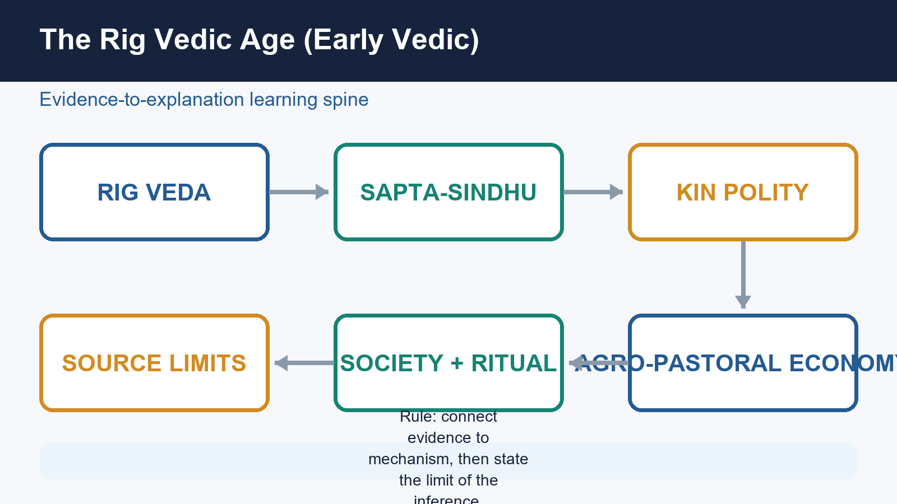
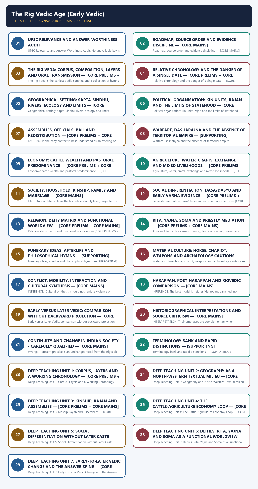
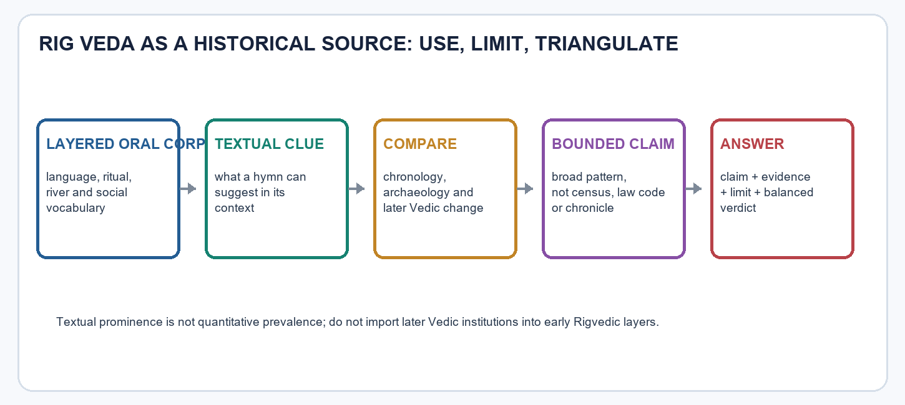

# The Rig Vedic Age (Early Vedic) - Learner-v2 Complete Learning Session

> **Catalogue identity:** Ancient History · Subject-wide Syllabus · `ancient-indian-history-08`  
> **Generation date:** 20 August 2026 · **Approval:** pending explicit topic approval  
> **Source order used:** Basic/canonical owner and its OCR-grounded legacy learning package -> syllabus/master chronology/thematic and verified-PYQ sources -> exact Advanced owner in the optional block. Qdrant was not required. Legacy-v1 files remain unchanged.  
> **Evidence discipline:** no current-affairs claim is forced into this static topic; contested chronology and interpretation remain labelled.



*Original deterministic visual: a topic-specific evidence-to-explanation spine. It is a learning aid, not historical evidence.*

### Coverage lock

- **Required scope:** Rig Vedic geography, polity, economy, society, religion, text, material culture and chronology.
- **Basic completeness:** substantive owner material is retained in a learner-first session audited for answer value and source discipline.
- **Practice completeness:** verified-question status, varied strict-rotation MCQs/remediation and distinct solved 10/15/20-mark answers are retained without padding.
- **Advanced boundary:** the exact Advanced owner is placed only after all Basic and practice material.
- **Register-last rule:** complete topic-specific consolidated notes remain the final H2 section.

### Legacy package source and coverage ledger

> **Subject:** Ancient Indian History | **Paper:** Prelims GS-I + GS-I historical/cultural support | **Topic:** 08 | **Date:** 13 August 2026
>
> **Evidence key:** FACT = directly supported by named repository/local-book/official/live source. INTERPRETATION = cited or method-based reading. INFERENCE = bounded analytical conclusion.
>
> **Approval state:** generated, **approved=false**. Only explicit user approval can change the status to approved.

### Package Practice Counts

| Component | Count |
|---|---:|
| Verified-question headings | 5 |
| Total MCQs with explanations | 40 |
| Core MCQs with explanations | 32 |
| Remedial MCQs with explanations | 8 |
| Original solved 10-mark Mains | 2 |
| Original solved 15-mark Mains | 2 |
| Original solved 20-mark Mains | 2 |

### Representative source ledger

| Source layer | Representative sources | Use and caveat |
|---|---|---|
| Repository Markdown | `basic/08`, `advanced/08`, README, Master Chronology, Revision Chart, syllabus/PYQ routing, Topics 07/09, Answer-Worthiness Audit | Primary topic architecture, comparisons, audited terms and question routes |
| Local OCR books | R. S. Sharma, *India's Ancient Past*, ch. 12 (local PDF file pp. 126-136); Upinder Singh, *A History of Ancient and Early Medieval India*, Vedic-corpus chapter (local PDF file pp. 530-550 and related sections) | Deeper textual, social and archaeological evidence; local PDF page numbers are file pages |
| Official papers/keys | UPSC Mains GS-I 2023 and 2024; 2026 Prelims GS-I Set A; local provisional Series-A key | Exact questions; 2026 answers prominently labelled provisional |
| Live authoritative heritage | UNESCO Tradition of Vedic Chanting; UNESCO Memory of the World Rigveda nomination; BORI manuscript department | Modern preservation only, never ancient social proof |
| Qdrant | Not used | Direct Markdown and OCR evidence were sufficient |

## BASIC LEARNING SESSION



*Distinct embedded teaching-navigation image. The separate continuous Cārvāka-style flowchart package remains an independent at-a-glance artifact.*

### SESSION 1 — UPSC RELEVANCE AND ANSWER-WORTHINESS AUDIT

#### DEFINITION / WHAT THIS IS CALLED

**Plain-language definition:** Syllabus and verified-demand reality.

**Technical definition:** UPSC Relevance and Answer-Worthiness Audit: No unavailable key is treated as official.

#### ANSWER-GRABBING OPENING — WRITE/ADAPT IN THE EXAM

> Syllabus and verified-demand reality.

#### MUST-WRITE KEYWORDS

- **Syllabus and verified-demand reality.**
- **direct Prelims value**
- **strong/direct Mains support**
- **CORE PRELIMS**
- **CORE MAINS**
- **SUPPORTING**
- **OPTIONAL ADVANCED**
- **Memorise**

**How to use them:** Syllabus and verified-demand reality.

**Syllabus and verified-demand reality.** Rig Vedic content has **direct Prelims value** and **strong/direct Mains support** through Vedic society, religion and change-over-time questions. The 2023 GS-I route asks Vedic society/religion and persistence; the 2024 GS-I route tests Rig-to-Later Vedic transition. The three routed 2026 Prelims questions are verified questions with only provisional local keys. No unavailable key is treated as official.

| Major block | Label | Learner action |
|---|---|---|
| Corpus/mandalas, chronology, geography/rivers, polity/assemblies, cattle/agriculture, society/varna, deities/rita/yajna/soma, horse/chariot, Early-Later distinction | **CORE PRELIMS** | Memorise diagnostic pairs and distinctions. |
| Textual criticism, kin chiefship, authority, agro-pastoral economy, social/gender limits, functional religion, interaction and answer method | **CORE MAINS** | Build a claim with a textual clue and a stated limit. |
| Exhaustive hymn, river, deity and official lists; ritual minutiae; speculative site matching; heritage decoration | **SUPPORTING** | Keep representative examples only. |
| Stratification, oral-formulaic method, gift economy, Indo-Iranian comparison, Dasa/Dasyu, gender, funerary hymns, archaeology and historiography | **OPTIONAL ADVANCED** | Add one refinement only when it answers the directive. |

**Memorise:** working range, north-west/Sapta-Sindhu, rajan/assemblies, cattle-plus-agriculture, bali, deity functions and Early-Later contrasts.  
**Understand:** the Rig Veda is layered ritual-poetry, a source not a census or chronicle.  
**Use selectively:** river lists, official titles, hymns and archaeology correlations.  
**Reserve for depth:** text stratification, gift theory, comparative religion and historiography.



*Original deterministic learning visual. It teaches source handling; it is not a historical map or a social count.*

> **Section focus:** A source-critical reconstruction of the early Vedic world. The Rig Veda is treated as a layered ritual-poetic corpus, not as a modern census, literal chronicle, or transparent record of every social group.

- Navigation: read the visual first, then the evidence table, then the interpretation and limitation.
- Evidence rule: claim -> named evidence -> what it proves -> limitation.

#### CLOSING RECALL FLOW — UPSC RELEVANCE AND ANSWER-WORTHINESS AUDIT

```text
START / CONCEPT: UPSC Relevance and Answer-Worthiness Audit
        |
        v
EXACT TERMS: Syllabus and verified-demand reality. · direct Prelims value · strong/direct Mains support · CORE PRELIMS · CORE MAINS
        |
        v
MECHANISM / ARGUMENT: Rig Vedic content has direct Prelims value and strong/direct Mains support through Vedic society, religion and change-over-time questions.
        |
        v
CONSEQUENCE / CONTRAST: Memorise: working range, north-west/Sapta-Sindhu, rajan/assemblies, cattle-plus-agriculture, bali, deity functions and Early-Later contrasts.
        |
        v
UPSC TRAP / ANSWER-USE: Understand: the Rig Veda is layered ritual-poetry, a source not a census or chronicle.
        |
        v
ANSWER-GRABBING FORMULATION: Syllabus and verified-demand reality.
```
### SESSION 2 — ROADMAP, SOURCE ORDER AND EVIDENCE DISCIPLINE — [CORE MAINS]

#### DEFINITION / WHAT THIS IS CALLED

**Plain-language definition:** The topic is reconstructed through textual criticism, comparative chronology and bounded archaeological correlation.

**Technical definition:** Roadmap, source order and evidence discipline — [CORE MAINS]: The topic is reconstructed through textual criticism, comparative chronology and bounded archaeological correlation.

#### ANSWER-GRABBING OPENING — WRITE/ADAPT IN THE EXAM

> The topic is reconstructed through textual criticism, comparative chronology and bounded archaeological correlation.

#### MUST-WRITE KEYWORDS

- **Current-affairs guardrail**
- **Repository Markdown**
- **Local OCR books**
- **Live authoritative links**
- **Qdrant**
- **Mains/PYQ use**
- **Study link**
- **2600**

**How to use them:** The topic is reconstructed through textual criticism, comparative chronology and bounded archaeological correlation.

The topic is reconstructed through textual criticism, comparative chronology and bounded archaeological correlation. Later Vedic institutions are introduced only as comparison, never projected backward into the oldest Rigvedic layers.

**Current-affairs guardrail:** No current-affairs item is required. Modern preservation records are not evidence for second-millennium BCE social history.

| Period | Event |
|---|---|
| c. 2600-1900 BCE | Mature Harappan urban phase; a comparison baseline, not Rig Vedic. |
| after c. 1900 BCE | Late/post-urban Harappan regional transformations. |
| c. 1500/1200-1000 BCE | Broad working horizon for the older Rigvedic corpus; exact dating remains debated. |
| c. 1000-600 BCE | Later Vedic phase; Kuru-Panchala and upper Ganga comparison. |

#### Mandatory source sequence

```text
Repository Markdown -> Local OCR books -> Live authoritative links -> Qdrant
```

- **Repository Markdown:** Topic 08 basic/advanced, README, chronology, revision chart, syllabus and PYQ routing.
- **Local OCR books:** R. S. Sharma chapter 12 and Upinder Singh's Vedic-corpus chapter.
- **Live authoritative links:** UNESCO/BORI preservation context only where useful.
- **Qdrant:** Not needed; direct Markdown and OCR evidence were sufficient.

| Evidence class | Best use | Cannot prove alone |
|---|---|---|
| Rigvedic philology | Vocabulary, values, ritual, remembered geography | A census, exact date, or full popular culture |
| Later Vedic texts | Change over time and comparative institutions | That later features existed unchanged in early layers |
| Archaeology | Settlement, technology, diet, burials and chronology | Spoken language or ethnic identity |
| Linguistics | Language relationship and contact | Genes, polity or one migration route |
| Archaeogenetics | Biological ancestry and population mixture | Language, belief, varna or individual identity |
| Heritage records | Modern preservation of oral/manuscript traditions | Ancient social facts |

- FACT: Repository Topic 08 supplies the exam spine: pastoral predominance with agriculture present, kin-based chiefship, assemblies, social differentiation, major deities and the Early-Later Vedic comparison.
- FACT: R. S. Sharma's local PDF, file pages 126-136, gives the chapter sequence from arrival and tribal conflicts through economy, chiefdom, family, differentiation and gods.
- FACT: Upinder Singh's local PDF, file pages 530-550 and related sections, foregrounds textual layering, family books, oral transmission, shifting alliances, mixed occupations and interpretive uncertainty.
- INTERPRETATION: The safest reconstruction is a north-western agro-pastoral and kin-ordered society whose elite poetic values centred cattle, chariots, sacrifice and chiefly generosity.
- INFERENCE: Every institutional claim should be scaled to a corpus, layer and genre; frequency in hymns is not statistical prevalence in society.
- The Rig Veda is a religious-poetic corpus transmitted orally and arranged in ten mandalas.
- Books 2-7 are conventionally the older family books; Books 1, 8, 9 and 10 contain much later-arranged material, though old and new material can cross the arrangement.
- The early geographical core is north-western Sapta-Sindhu.
- Agriculture existed; pastoralism and cattle wealth remained dominant in elite values.
- The early polity was a chiefship without a mature territorial bureaucracy or regular tax system.

#### UPSC traps

- **Wrong:** A Vedic verse is a literal administrative report. **Correct:** Read genre, metaphor, textual layer and corroboration before historical inference.
- **Wrong:** One pottery, ancestry component or horse bone identifies Vedic speakers. **Correct:** Language, culture, archaeology and genetics are distinct evidence classes.
- **Wrong:** Later Vedic rules automatically describe Rigvedic society. **Correct:** Use later evidence only for explicit comparison or carefully argued development.

**Mains/PYQ use:** Method itself earns marks: establish what each source proves, then state its representational and chronological limit.

**Study link:** Topic 02 source criticism -> Topic 07 mobility/identity -> Topic 08 society -> Topic 09 transformation.

#### CLOSING RECALL FLOW — ROADMAP, SOURCE ORDER AND EVIDENCE DISCIPLINE — [CORE MAINS]

```text
START / CONCEPT: Roadmap, source order and evidence discipline — [CORE MAINS]
        |
        v
EXACT TERMS: Current-affairs guardrail · Repository Markdown · Local OCR books · Live authoritative links · Qdrant
        |
        v
MECHANISM / ARGUMENT: The topic is reconstructed through textual criticism, comparative chronology and bounded archaeological correlation.
        |
        v
CONSEQUENCE / CONTRAST: Current-affairs guardrail: No current-affairs item is required.
        |
        v
UPSC TRAP / ANSWER-USE: Later Vedic institutions are introduced only as comparison, never projected backward into the oldest Rigvedic layers.
        |
        v
ANSWER-GRABBING FORMULATION: The topic is reconstructed through textual criticism, comparative chronology and bounded archaeological correlation.
```
### SESSION 3 — THE RIG VEDA: CORPUS, COMPOSITION, LAYERS AND ORAL TRANSMISSION — [CORE PRELIMS + CORE MAINS]

#### DEFINITION / WHAT THIS IS CALLED

**Plain-language definition:** The Rig Veda is the earliest Vedic Samhita and a collection of hymns for ritual performance.

**Technical definition:** The Rig Veda is the earliest Vedic Samhita and a collection of hymns for ritual performance.

#### ANSWER-GRABBING OPENING — WRITE/ADAPT IN THE EXAM

> The Rig Veda is the earliest Vedic Samhita and a collection of hymns for ritual performance.

#### MUST-WRITE KEYWORDS

- **Background/qualification**
- **LAYERED RITUAL-POETIC CORPUS**
- **Composition**
- **Arrangement**
- **Transmission**
- **Historical use**
- **Memory hook**
- **Mains/PYQ use**

**How to use them:** The Rig Veda is the earliest Vedic Samhita and a collection of hymns for ritual performance.

The Rig Veda is the earliest Vedic Samhita and a collection of hymns for ritual performance. It preserves historical memory, but its primary purpose is not to narrate political events in chronological order.

**Background/qualification:** The surviving Shakala recension is a carefully arranged textual tradition. Oral preservation can conserve wording with high precision while still leaving questions of original composition, compilation and social representativeness.

#### From composition to historical reconstruction

**LAYERED RITUAL-POETIC CORPUS**
- **Composition:** Seer-poet families, performance and patronage
- **Arrangement:** Ten mandalas; family books and later-arranged books
- **Transmission:** Memorised sound, accent and recitation patterns
- **Historical use:** Clusters of terms, relative layers and external checks

| Textual feature | Historical value | Limit |
|---|---|---|
| Books 2-7: family books | Relatively older linguistic and social baseline | Relative, not exact absolute dating |
| Books 1, 8, 9, 10 | Later arrangement and important developments | Not every hymn in them is necessarily late |
| Book 9 | Soma-focused liturgical collection | Ritual concentration is not a social census |
| Book 10 | Cosmogony, funerary material, Purusha hymn | Contains debated later layers |
| Oral transmission | Explains disciplined preservation before manuscripts | Does not remove questions of composition and compilation |
| Elite ritual authorship | Reveals patrons, priests, gods and prestige | Underrepresents many everyday and marginal voices |

- FACT: Upinder Singh identifies Books 2-7 as family books associated with seer-poet lineages such as Gritsamada, Vishvamitra, Vamadeva, Atri, Bharadvaja and Vasishtha.
- FACT: Arrangement by deity, stanza count and metre helps scholars detect disruptions and possible additions, but an interpolation in arrangement need not equal a late original composition.
- FACT: The corpus was preserved and transmitted by specialist ritual communities; it was not popular literature representing every practice.
- INTERPRETATION: Oral transmission is neither 'primitive memory' nor a guarantee that historians can read every verse literally. It is a sophisticated preservation system applied to a ritual corpus.
- METHOD: Prefer repeated patterns across older layers over one isolated metaphor. Compare later texts only to identify change, not to fill early silence automatically.
- METHOD: Distinguish composition horizon, compilation, recension and manuscript date. A late manuscript can transmit a far older orally preserved text.
- HERITAGE: UNESCO's Vedic-chanting entry describes precise intonation and recitation techniques. This modern safeguarding evidence illuminates transmission practice, not the ancient date of a specific hymn.
- HERITAGE: The BORI Rigveda manuscript collection is significant for textual scholarship, but manuscript material should not be confused with the original oral phase.

> **Memory hook:** C-O-R-P-U-S: Composition, Oral transmission, Relative layers, Performance, Unequal voices, Source criticism.

#### Must-know facts

- Rig Veda = Samhita of hymns, not a prose chronicle.
- Ten mandalas; family books 2-7 provide the conventional older core.
- Book 10 contains important but often later-layer material such as the Purusha and Nasadiya hymns.
- Oral preservation and later manuscripts are different stages of transmission.

#### UPSC traps

- **Wrong:** Family books are precisely dated year by year. **Correct:** They provide relative layering; absolute chronology remains broad and debated.
- **Wrong:** Book 10 is wholly late and therefore useless. **Correct:** It preserves vital developments; each claim needs layer-aware use.
- **Wrong:** Oral means unreliable, while written means objective. **Correct:** Both oral and written transmission require textual criticism; purpose and copying history matter.

**Mains/PYQ use:** Introduce a source question with a double verdict: indispensable for the early Vedic world, but filtered through ritual genre, elite authorship and relative chronology.

**Study link:** Ancient History Topic 02 -> literary-source criticism and transmission.

#### CLOSING RECALL FLOW — THE RIG VEDA: CORPUS, COMPOSITION, LAYERS AND ORAL TRANSMISSION — [CORE PRELIMS + CORE MAINS]

```text
START / CONCEPT: The Rig Veda: corpus, composition, layers and oral transmission — [CORE PRELIMS + CORE MAINS]
        |
        v
EXACT TERMS: Background/qualification · LAYERED RITUAL-POETIC CORPUS · Composition · Arrangement · Transmission
        |
        v
MECHANISM / ARGUMENT: FACT: Arrangement by deity, stanza count and metre helps scholars detect disruptions and possible additions, but an interpolation in arrangement need not equal a late original composition.
        |
        v
CONSEQUENCE / CONTRAST: Wrong: Book 10 is wholly late and therefore useless.
        |
        v
UPSC TRAP / ANSWER-USE: It preserves historical memory, but its primary purpose is not to narrate political events in chronological order.
        |
        v
ANSWER-GRABBING FORMULATION: The Rig Veda is the earliest Vedic Samhita and a collection of hymns for ritual performance.
```
### SESSION 4 — RELATIVE CHRONOLOGY AND THE DANGER OF A SINGLE DATE — [CORE PRELIMS + CORE MAINS]

#### DEFINITION / WHAT THIS IS CALLED

**Plain-language definition:** 1500/1200-1000 BCE range is a working teaching horizon, not a date stamped on every hymn.

**Technical definition:** Relative chronology and the danger of a single date — [CORE PRELIMS + CORE MAINS]: 1500/1200-1000 BCE range is a working teaching horizon, not a date stamped on every hymn.

#### ANSWER-GRABBING OPENING — WRITE/ADAPT IN THE EXAM

> 1500/1200-1000 BCE range is a working teaching horizon, not a date stamped on every hymn.

#### MUST-WRITE KEYWORDS

- **2600-1900**
- **after 1900**
- **1500/1200-1000**
- **1000-600**
- **Memory hook**
- **Mains/PYQ use**
- **Study link**
- **1500**

**How to use them:** 1500/1200-1000 BCE range is a working teaching horizon, not a date stamped on every hymn.

The broad c. 1500/1200-1000 BCE range is a working teaching horizon, not a date stamped on every hymn. Linguistic archaism, textual arrangement, external Indo-Aryan attestations and archaeology offer overlapping constraints rather than one decisive clock.

#### Cautious sequence, not identity mapping

- **2600-1900:** Mature Harappan
- **after 1900:** Late/post-Harappan regional change
- **1500/1200-1000:** Broad older Rigvedic horizon
- **1000-600:** Later Vedic transformation

| Claim | Confidence | Reason |
|---|---|---|
| Rig Veda predates most later Vedic prose texts | High | Language, genre and textual sequence |
| Family books are relatively older | High | Arrangement and philological consensus |
| Every Book 10 hymn is late | Low | Arrangement and original composition need not coincide |
| One archaeological culture is the Rigvedic people | Very low | Material assemblage cannot reveal language alone |
| The broad horizon overlaps late/post-Harappan worlds | Moderate-high | Regional chronological overlap, not identity |

- FACT: Mature Harappan urbanism mostly predates the conventional Rigvedic horizon; late/post-Harappan contexts provide possible zones of interaction and continuity.
- FACT: Mitanni Indo-Aryan names and technical vocabulary provide an external mid-second-millennium BCE attestation but do not directly date a Rigvedic hymn.
- FACT: Similarities with Avestan language and ritual establish Indo-Iranian relationship; uncertain Avestan dating limits precise chronological transfer.
- INTERPRETATION: Relative layers are stronger than a single absolute date because linguistic, ritual and institutional change occurred within the corpus.
- INFERENCE: A statement such as 'Rig Vedic society did X' should normally mean 'the corpus, especially its older layers, recurrently represents X' rather than every community across five centuries.
- CAUTION: Terms can change meaning. For example, grama may indicate a moving band in older contexts before its later settled-village sense.

> **Memory hook:** DATE = Debate, Approximation, Textual layers, External constraints.

#### UPSC traps

- **Wrong:** 1500 BCE is the exact composition year of the Rig Veda. **Correct:** Use a broad, debated horizon and relative layering.
- **Wrong:** Chronological overlap proves cultural identity. **Correct:** Overlap permits contact; it does not prove one-to-one descent or language.

**Mains/PYQ use:** A strong chronology paragraph separates sequence, overlap and identity instead of turning broad dates into fixed ethnic events.

**Study link:** Master Chronology -> Topic 06 Harappan -> Topic 07 mobility -> Topic 09 Later Vedic.

#### CLOSING RECALL FLOW — RELATIVE CHRONOLOGY AND THE DANGER OF A SINGLE DATE — [CORE PRELIMS + CORE MAINS]

```text
START / CONCEPT: Relative chronology and the danger of a single date — [CORE PRELIMS + CORE MAINS]
        |
        v
EXACT TERMS: 2600-1900 · after 1900 · 1500/1200-1000 · 1000-600 · Memory hook
        |
        v
MECHANISM / ARGUMENT: INTERPRETATION: Relative layers are stronger than a single absolute date because linguistic, ritual and institutional change occurred within the corpus.
        |
        v
CONSEQUENCE / CONTRAST: after 1900: Late/post-Harappan regional change
        |
        v
UPSC TRAP / ANSWER-USE: 1500/1200-1000 BCE range is a working teaching horizon, not a date stamped on every hymn.
        |
        v
ANSWER-GRABBING FORMULATION: 1500/1200-1000 BCE range is a working teaching horizon, not a date stamped on every hymn.
```
### SESSION 5 — GEOGRAPHICAL SETTING: SAPTA-SINDHU, RIVERS, ECOLOGY AND LIMITS — [CORE PRELIMS + CORE MAINS]

#### DEFINITION / WHAT THIS IS CALLED

**Plain-language definition:** The corpus's densest geographical memory lies in the north-west: the Indus system, adjoining Afghanistan-Pakistan river corridors and the Sarasvati/Ghaggar-Hakra zone.

**Technical definition:** Geographical setting: Sapta-Sindhu, rivers, ecology and limits — [CORE PRELIMS + CORE MAINS]: This is a composition and cultural horizon, not a surveyed political border.

#### ANSWER-GRABBING OPENING — WRITE/ADAPT IN THE EXAM

> The corpus's densest geographical memory lies in the north-west: the Indus system, adjoining Afghanistan-Pakistan river corridors and the Sarasvati/Ghaggar-Hakra zone.

#### MUST-WRITE KEYWORDS

- **Memory hook**
- **Mains/PYQ use**
- **Study link**

**How to use them:** The corpus's densest geographical memory lies in the north-west: the Indus system, adjoining Afghanistan-Pakistan river corridors and the Sarasvati/Ghaggar-Hakra zone.

The corpus's densest geographical memory lies in the north-west: the Indus system, adjoining Afghanistan-Pakistan river corridors and the Sarasvati/Ghaggar-Hakra zone. This is a composition and cultural horizon, not a surveyed political border.

#### Text map of the north-western Rigvedic horizon

```text
                 SUVASTU / SWAT
                      |
KUBHA / KABUL ---- SINDHU / INDUS ---- VITASTA / JHELUM
                      |               ASIKNI / CHENAB
 KRAMU / KURRAM ------+               PARUSHNI / RAVI
 GOMATI / GOMAL -------+               VIPASHA / BEAS
                                      SHUTUDRI / SUTLEJ
                                             |
                          SARASVATI / GHAGGAR-HAKRA ?
                          DRISHADVATI / CHAUTANG ?
```
*Secure identifications and debated/tentative identifications must be kept separate.*

| Vedic name | Modern identification | Exam caution |
|---|---|---|
| Sindhu | Indus | Central river of the north-western system |
| Vitasta | Jhelum | Not Chenab |
| Asikni | Chenab | Not Jhelum |
| Parushni / Iravati | Ravi | Dasharajna setting in Book 7 |
| Vipasha | Beas | Do not substitute Yavyavati |
| Shutudri | Sutlej | Major eastern Indus tributary |
| Kubha / Suvastu | Kabul / Swat | Shows Afghan-frontier reach of memory |
| Gomati | Gomal in this context | Not the Gomti of Uttar Pradesh |
| Sarasvati | Often Ghaggar-Hakra | Identification and palaeochannel history debated |
| Drishadvati | Often Chautang/Chitang | Tentative |

- FACT: The Nadi-stuti or Nadi Sukta provides a poetic river sequence and is useful for textual geography.
- FACT: The Dasharajna narrative places a major conflict on the Parushni, identified with the Ravi.
- FACT: River references extend westward to Kubha, Krumu, Gomati and Suvastu, reinforcing a north-western milieu.
- INTERPRETATION: River praise encodes movement, ritual landscape and ecological dependence, but a hymn is not a palaeohydrological survey.
- INFERENCE: Grasslands, river margins, seasonal mobility and accessible groundwater could sustain cattle and cultivation together.
- CAUTION: Sarasvati identifications involve textual, geomorphological and palaeochannel debates. Do not turn an uncertain river history into a fixed date for the corpus.
- CAUTION: The eastern Ganga plain is not the early core. Kuru-Panchala and upper Ganga centrality belong primarily to later Vedic change.

> **Memory hook:** V-A-P-V-S-S: Vitasta-Jhelum, Asikni-Chenab, Parushni-Ravi, Vipasha-Beas, Shutudri-Sutlej, Sindhu-Indus.

#### UPSC traps

- **Wrong:** Gomati always means the modern Gomti of Uttar Pradesh. **Correct:** In the Rigvedic north-western list it is identified with the Gomal.
- **Wrong:** Nadi Sukta alone proves a Pleistocene drainage shift. **Correct:** Ancient poetry is one historical clue; geomorphology and zoological evidence must independently support palaeodrainage claims.
- **Wrong:** Sapta-Sindhu was a fixed seven-river state. **Correct:** It is a flexible cultural-geographical expression, not a mapped sovereign territory.

**Mains/PYQ use:** Use a text map for value addition, then add the line: 'textual geography identifies a composition/memory zone, not an ethnic frontier.'

**Study link:** Topic 03 Geography and Ecology -> river systems and environmental non-determinism.

#### CLOSING RECALL FLOW — GEOGRAPHICAL SETTING: SAPTA-SINDHU, RIVERS, ECOLOGY AND LIMITS — [CORE PRELIMS + CORE MAINS]

```text
START / CONCEPT: Geographical setting: Sapta-Sindhu, rivers, ecology and limits — [CORE PRELIMS + CORE MAINS]
        |
        v
EXACT TERMS: Memory hook · Mains/PYQ use · Study link
        |
        v
MECHANISM / ARGUMENT: This is a composition and cultural horizon, not a surveyed political border.
        |
        v
CONSEQUENCE / CONTRAST: Secure identifications and debated/tentative identifications must be kept separate.
        |
        v
UPSC TRAP / ANSWER-USE: This is a composition and cultural horizon, not a surveyed political border.
        |
        v
ANSWER-GRABBING FORMULATION: The corpus's densest geographical memory lies in the north-west: the Indus system, adjoining Afghanistan-Pakistan river corridors and the Sarasvati/Ghaggar-Hakra zone.
```
### SESSION 6 — POLITICAL ORGANISATION: KIN UNITS, RAJAN AND THE LIMITS OF STATEHOOD — [CORE PRELIMS + CORE MAINS]

#### DEFINITION / WHAT THIS IS CALLED

**Plain-language definition:** Authority was embedded in kinship, cattle protection, warfare, ritual and redistribution.

**Technical definition:** Political organisation: kin units, rajan and the limits of statehood — [CORE PRELIMS + CORE MAINS]: FACT: No regular tax-collecting officer or territorial civil administration is securely visible.

#### ANSWER-GRABBING OPENING — WRITE/ADAPT IN THE EXAM

> Authority was embedded in kinship, cattle protection, warfare, ritual and redistribution.

#### MUST-WRITE KEYWORDS

- **Mains/PYQ use**
- **Study link**

**How to use them:** Authority was embedded in kinship, cattle protection, warfare, ritual and redistribution.

Authority was embedded in kinship, cattle protection, warfare, ritual and redistribution. The rajan was a chief whose position could become hereditary, but he lacked the apparatus of a mature territorial monarch.

#### Kin-based political scale - a heuristic, not a rigid bureaucracy

```text
KULA (household/family)
   |
GRAMA (often a moving band; later 'village')
   |
VIS (a larger clan/people segment)
   |
JANA (tribal people)
   |
RAJAN = protector, war leader, ritual patron
   +-- PUROHITA (ritual counsel)
   +-- SENANI (war leadership)
   +-- GRAMANI (leader linked to grama)
   +-- SABHA / SAMITI / VIDATHA (collective bodies)
```
*Terms are context-dependent and should not be presented as four fixed territorial departments.*

| Institution | Defensible early meaning | Limit |
|---|---|---|
| Jana | The people/tribal collectivity | Not a territorial nation-state |
| Vis | A constituent people or clan segment | Exact hierarchy varies by context |
| Grama | Band or grouping, often mobile in older usage | Do not assume a permanently surveyed village |
| Kula | Household/family unit | Text does not give a modern household census |
| Rajan | Chief, protector and war leader | No regular bureaucracy or sovereign tax state |
| Sabha | Probably smaller/more elite gathering | Not a modern elected chamber |
| Samiti | Likely broader assembly under the rajan | Function and membership remain debated |
| Vidatha | Local socio-ritual congregation; multifunctional in other readings | No single definition fits every occurrence |

- FACT: The rajan protected people and cattle, led war and sponsored ritual. His prestige depended on success and generosity.
- FACT: The Rig Veda mentions sabha, samiti and vidatha; Upinder Singh cautions that their exact functional distinctions are not fully clear.
- FACT: Sharma reconstructs sabha, samiti, vidatha and gana as deliberative, military and religious bodies; he notes women's attendance in sabha and vidatha, a claim that should not be expanded into universal political equality.
- FACT: The purohita joined ritual expertise to political power; changes of priestly alliance around Sudas illustrate politics behind ritual office.
- FACT: The senani represents military leadership, while the gramani was connected with the grama.
- FACT: No regular tax-collecting officer or territorial civil administration is securely visible.
- INTERPRETATION: Chiefship was constrained less by a constitution than by kin solidarity, assemblies, ritual expectations and the practical need to redistribute booty and gifts.
- INFERENCE: This is a pre-state or early-chiefdom formation: differentiated leadership existed without the impersonal institutions of later territorial kingship.

#### Must-know facts

- Rajan = chief, not an absolute emperor.
- Sabha and samiti mattered; exact roles and membership are debated.
- Vidatha likely combined or hosted socio-religious collective functions.
- Purohita and senani were important; no regular fiscal bureaucracy is evident.
- The kin-unit ladder is a memory aid, not a proven administrative chart.

#### UPSC traps

- **Wrong:** Rajan governed a defined kingdom with ministries. **Correct:** Authority remained kin-based, martial and ritual; territorial administration was limited.
- **Wrong:** Sabha and samiti were modern democracies. **Correct:** They were collective bodies in a stratified tribal world; inclusiveness is uncertain.
- **Wrong:** Grama always meant a settled agrarian village. **Correct:** In older usage it could refer to a moving band or group.

**Mains/PYQ use:** The best polity answer uses the phrase 'differentiated chiefship without a mature territorial state' and proves both halves.

**Study link:** Compare with Topic 09: jana -> janapada, tribute -> stronger extraction, chiefship -> ritual territorial kingship.

#### CLOSING RECALL FLOW — POLITICAL ORGANISATION: KIN UNITS, RAJAN AND THE LIMITS OF STATEHOOD — [CORE PRELIMS + CORE MAINS]

```text
START / CONCEPT: Political organisation: kin units, rajan and the limits of statehood — [CORE PRELIMS + CORE MAINS]
        |
        v
EXACT TERMS: Mains/PYQ use · Study link
        |
        v
MECHANISM / ARGUMENT: INTERPRETATION: Chiefship was constrained less by a constitution than by kin solidarity, assemblies, ritual expectations and the practical need to redistribute booty and gifts.
        |
        v
CONSEQUENCE / CONTRAST: Terms are context-dependent and should not be presented as four fixed territorial departments.
        |
        v
UPSC TRAP / ANSWER-USE: Terms are context-dependent and should not be presented as four fixed territorial departments.
        |
        v
ANSWER-GRABBING FORMULATION: Authority was embedded in kinship, cattle protection, warfare, ritual and redistribution.
```
### SESSION 7 — ASSEMBLIES, OFFICIALS, BALI AND REDISTRIBUTION — [CORE PRELIMS + CORE MAINS]

#### DEFINITION / WHAT THIS IS CALLED

**Plain-language definition:** Political economy joined warfare, ritual and gift exchange.

**Technical definition:** FACT: Bali in the early context is best understood as an offering or tribute, not a fixed, assessed land tax.

#### ANSWER-GRABBING OPENING — WRITE/ADAPT IN THE EXAM

> Political economy joined warfare, ritual and gift exchange.

#### MUST-WRITE KEYWORDS

- **Cattle, produce and booty**
- **Bali, tribute and gifts**
- **Rajan and purohita**
- **Assemblies and retainers**
- **Memory hook**
- **Mains/PYQ use**
- **Study link**

**How to use them:** Political economy joined warfare, ritual and gift exchange.

Political economy joined warfare, ritual and gift exchange. Wealth moved to the chief and priest through booty, tribute and offerings, then back through patronage, feasting and distribution.

#### Prestige and redistribution cycle

```text
Cattle, produce and booty -> Bali, tribute and gifts -> Rajan and purohita -> Assemblies and retainers
```

- **Cattle, produce and booty:** Households, allied groups and defeated rivals supply movable wealth.
- **Bali, tribute and gifts:** Offerings are irregular or inchoate, not a later land-tax bureaucracy.
- **Rajan and purohita:** War leadership and ritual legitimacy concentrate prestige.
- **Assemblies and retainers:** Feasts, gifts and distribution renew loyalty and reputation.

| Term/process | Answer use | Do not write |
|---|---|---|
| Bali | Early offering/tribute to chief | Fully monetised tax |
| Daksina | Priestly gift/reward in ritual patronage | State salary |
| Booty | War wealth, often cattle | Only territorial annexation |
| Gift praise | Poetry links generosity to prestige | Neutral economic account |
| Assembly | Collective deliberation/redistribution | Universal franchise |

- FACT: Bali in the early context is best understood as an offering or tribute, not a fixed, assessed land tax.
- FACT: Tribute could also be extracted after military defeat, but a regular taxation system had not emerged.
- FACT: Assemblies may have participated in deliberation and resource redistribution.
- FACT: The chief's generosity was politically productive: retained wealth alone did not secure followers in a kin-based order.
- INTERPRETATION: Gift and sacrifice converted material wealth into social rank, priestly praise and alliance.
- INFERENCE: Redistribution explains why economy, polity and religion should be integrated in a Mains answer rather than written as isolated lists.
- CAUTION: Daksina to priests, bali to chiefs and booty from war overlap in a gift economy but are not interchangeable terms in every verse.

> **Memory hook:** W-G-R-L: Wealth -> Gift/tribute -> Redistribution -> Loyalty.

#### UPSC traps

- **Wrong:** Bali proves a central revenue department. **Correct:** It indicates developing tribute/offerings without a regular fiscal apparatus.
- **Wrong:** A gift economy has no inequality. **Correct:** Chiefs, priests and patrons could accumulate prestige and command through unequal flows.

**Mains/PYQ use:** Show how chiefly power remained personal and redistributive before becoming territorial and extractive.

**Study link:** Economy -> polity -> ritual; compare Later Vedic royal sacrifices and regular surplus.

#### CLOSING RECALL FLOW — ASSEMBLIES, OFFICIALS, BALI AND REDISTRIBUTION — [CORE PRELIMS + CORE MAINS]

```text
START / CONCEPT: Assemblies, officials, bali and redistribution — [CORE PRELIMS + CORE MAINS]
        |
        v
EXACT TERMS: Cattle, produce and booty · Bali, tribute and gifts · Rajan and purohita · Assemblies and retainers · Memory hook
        |
        v
MECHANISM / ARGUMENT: Wealth moved to the chief and priest through booty, tribute and offerings, then back through patronage, feasting and distribution.
        |
        v
CONSEQUENCE / CONTRAST: Cattle, produce and booty: Households, allied groups and defeated rivals supply movable wealth.
        |
        v
UPSC TRAP / ANSWER-USE: Bali, tribute and gifts: Offerings are irregular or inchoate, not a later land-tax bureaucracy.
        |
        v
ANSWER-GRABBING FORMULATION: Political economy joined warfare, ritual and gift exchange.
```
### SESSION 8 — WARFARE, DASHARAJNA AND THE ABSENCE OF TERRITORIAL EMPIRE — [SUPPORTING]

#### DEFINITION / WHAT THIS IS CALLED

**Plain-language definition:** Rigvedic conflict involved cattle raids, movement, control of routes and water, inter-tribal rivalry and shifting alliances.

**Technical definition:** Warfare, Dasharajna and the absence of territorial empire — [SUPPORTING]: FACT: The battle is associated with the Parushni/Ravi.

#### ANSWER-GRABBING OPENING — WRITE/ADAPT IN THE EXAM

> Rigvedic conflict involved cattle raids, movement, control of routes and water, inter-tribal rivalry and shifting alliances.

#### MUST-WRITE KEYWORDS

- **ROOT**
- **Proves**
- **Suggests**
- **Does not prove**
- **Needs caution**
- **Mains/PYQ use**
- **Study link**

**How to use them:** Rigvedic conflict involved cattle raids, movement, control of routes and water, inter-tribal rivalry and shifting alliances.

Rigvedic conflict involved cattle raids, movement, control of routes and water, inter-tribal rivalry and shifting alliances. The poetic record mixes divine combat, memory and historical conflict.

#### What Dasharajna can and cannot prove

**ROOT:** Book 7 remembers Sudas fighting a ten-tribe confederacy on the Parushni
- **Proves:** Fluid alliances and significant chiefly warfare
- **Suggests:** Priestly realignment and competition over people/resources
- **Does not prove:** A large bureaucratic territorial empire
- **Needs caution:** Poetic and ritual framing of historical memory

| War dimension | Evidence | Qualified inference |
|---|---|---|
| Cattle raid | Gavishti and gau-based war vocabulary | Movable wealth drove many conflicts |
| Alliance | Purus in confederacy against Sudas | Tribal labels did not fix permanent blocs |
| Priest-chief link | Vishvamitra/Vasishtha realignment | Ritual office had political consequences |
| Weapons | Bow, arrows, spear, axe, armour and chariot imagery | Textual prestige exceeds surviving material correlation |
| Outcome | Booty, tribute and fame | Not necessarily annexation or a tax province |

- FACT: Upinder Singh treats the Battle of Ten Kings in Book 7 as possibly referring to an actual historical incident.
- FACT: Sudas of the Bharatas fought a confederacy that included former allies such as the Purus; political alliances were fluid.
- FACT: The battle is associated with the Parushni/Ravi.
- FACT: Vishvamitra's replacement by Vasishtha as Sudas's purohita indicates that priestly alignment could accompany political realignment.
- FACT: Terms built around go, including gavishti, connect cattle, wealth and conflict.
- INTERPRETATION: Warfare enhanced the rajan's prestige but did not automatically create durable territorial sovereignty.
- CAUTION: Divine victories and references to enemy 'forts' cannot all be mapped literally to archaeological destruction horizons.
- INFERENCE: Conflict was one mechanism of mobility and incorporation; it could produce tribute, alliance and cultural exchange alongside violence.

#### UPSC traps

- **Wrong:** Dasharajna was a war between fixed races. **Correct:** It was a conflict among shifting tribal alliances; categories and coalitions were fluid.
- **Wrong:** Purandara proves Indra-led destruction of Harappan cities. **Correct:** Poetic divine imagery cannot be converted into a specific archaeological event without evidence.

**Mains/PYQ use:** Use Dasharajna as one named case, then state what it shows—chiefship, alliances, priests and riverine conflict—and what it cannot show.

**Study link:** Topic 07 interaction debate; Topic 09 Kuru-Panchala consolidation.

#### CLOSING RECALL FLOW — WARFARE, DASHARAJNA AND THE ABSENCE OF TERRITORIAL EMPIRE — [SUPPORTING]

```text
START / CONCEPT: Warfare, Dasharajna and the absence of territorial empire — [SUPPORTING]
        |
        v
EXACT TERMS: ROOT · Proves · Suggests · Does not prove · Needs caution
        |
        v
MECHANISM / ARGUMENT: FACT: Vishvamitra's replacement by Vasishtha as Sudas's purohita indicates that priestly alignment could accompany political realignment.
        |
        v
CONSEQUENCE / CONTRAST: ROOT: Book 7 remembers Sudas fighting a ten-tribe confederacy on the Parushni
        |
        v
UPSC TRAP / ANSWER-USE: Does not prove: A large bureaucratic territorial empire
        |
        v
ANSWER-GRABBING FORMULATION: Rigvedic conflict involved cattle raids, movement, control of routes and water, inter-tribal rivalry and shifting alliances.
```
### SESSION 9 — ECONOMY: CATTLE WEALTH AND PASTORAL PREDOMINANCE — [CORE PRELIMS + CORE MAINS]

#### DEFINITION / WHAT THIS IS CALLED

**Plain-language definition:** Cattle were the most visible store of wealth, measure of generosity, ritual resource and object of conflict.

**Technical definition:** Economy: cattle wealth and pastoral predominance — [CORE PRELIMS + CORE MAINS]: Wrong: Pastoral dominance means no farming.

#### ANSWER-GRABBING OPENING — WRITE/ADAPT IN THE EXAM

> Cattle were the most visible store of wealth, measure of generosity, ritual resource and object of conflict.

#### MUST-WRITE KEYWORDS

- **GAU / CATTLE**
- **Wealth**
- **Production**
- **Conflict**
- **Ritual**
- **Memory hook**
- **Mains/PYQ use**
- **Study link**

**How to use them:** Cattle were the most visible store of wealth, measure of generosity, ritual resource and object of conflict.

Cattle were the most visible store of wealth, measure of generosity, ritual resource and object of conflict. This supports pastoral dominance in elite values, not a claim that every household was nomadic or that cultivation was absent.

#### Why cattle mattered

**GAU / CATTLE**
- **Wealth:** Gomat and gift prestige
- **Production:** Milk, draught power and herd reproduction
- **Conflict:** Gavishti and cattle raiding
- **Ritual:** Offerings, feasts and patronage

| Claim | Named evidence | What it proves | Limit |
|---|---|---|---|
| Cattle = wealth | Gomat | Prestige and ownership centred herds | No herd-size statistics |
| Cattle = conflict | Gavishti/gaveshana vocabulary | Raids linked war to movable wealth | Not every war was only over cattle |
| Cattle = production | Oxen, milk animals, carts | Pastoralism supported farming and mobility | Regional mix unknown |
| Cattle = ritual | Gifts, offerings and feasting | Wealth became sacred/political capital | Ritual texts overrepresent elite practice |

- FACT: R. S. Sharma and Upinder Singh both emphasise the unusually rich gau-derived vocabulary of the Rig Veda.
- FACT: Gomat designates a person rich in cattle; gavishti literally evokes the search for cows and came to signify battle.
- FACT: Horses, sheep and goats also appear, but cattle dominate prestige and subsistence imagery.
- FACT: Oxen supplied draught power for ploughing and carts, tying pastoral resources to cultivation.
- INTERPRETATION: Cattle were simultaneously productive capital, movable wealth and political currency.
- INFERENCE: Pastoral mobility and cultivation could alternate seasonally; mixed livelihoods fit the riverine grassland ecology better than a binary pastoral-versus-agricultural model.
- CAUTION: Word frequency indicates cultural salience, not a quantitative livestock census.
- CAUTION: Animal sacrifice and cattle consumption require textual and ritual context; they should not be turned into sweeping claims about every community.

> **Memory hook:** COW = Capital, Ox-power, Warfare.

#### UPSC traps

- **Wrong:** Pastoral dominance means no farming. **Correct:** Agriculture, wells, ploughing and harvesting are attested.
- **Wrong:** Every conflict was a cattle raid. **Correct:** Cattle were central, but routes, water, alliances and prestige also mattered.

**Mains/PYQ use:** Use 'pastoral predominance within a mixed agro-pastoral economy' as the exam-safe formulation.

**Study link:** Next: cultivation, water, crafts and exchange.

#### CLOSING RECALL FLOW — ECONOMY: CATTLE WEALTH AND PASTORAL PREDOMINANCE — [CORE PRELIMS + CORE MAINS]

```text
START / CONCEPT: Economy: cattle wealth and pastoral predominance — [CORE PRELIMS + CORE MAINS]
        |
        v
EXACT TERMS: GAU / CATTLE · Wealth · Production · Conflict · Ritual
        |
        v
MECHANISM / ARGUMENT: This supports pastoral dominance in elite values, not a claim that every household was nomadic or that cultivation was absent.
        |
        v
CONSEQUENCE / CONTRAST: Production: Milk, draught power and herd reproduction
        |
        v
UPSC TRAP / ANSWER-USE: This supports pastoral dominance in elite values, not a claim that every household was nomadic or that cultivation was absent.
        |
        v
ANSWER-GRABBING FORMULATION: Cattle were the most visible store of wealth, measure of generosity, ritual resource and object of conflict.
```
### SESSION 10 — AGRICULTURE, WATER, CRAFTS, EXCHANGE AND MIXED LIVELIHOODS — [CORE PRELIMS + CORE MAINS]

#### DEFINITION / WHAT THIS IS CALLED

**Plain-language definition:** The early economy included cultivation, water-lifting, implements, transport, carpentry, weaving, metalwork and gift exchange.

**Technical definition:** Agriculture, water, crafts, exchange and mixed livelihoods — [CORE PRELIMS + CORE MAINS]: The issue is scale and dominance, not presence versus absence.

#### ANSWER-GRABBING OPENING — WRITE/ADAPT IN THE EXAM

> The early economy included cultivation, water-lifting, implements, transport, carpentry, weaving, metalwork and gift exchange.

#### MUST-WRITE KEYWORDS

- **Herds and draught animals**
- **Cultivation**
- **Water access**
- **Crafts**
- **Exchange**
- **Redistribution**
- **Mains/PYQ use**
- **Study link**

**How to use them:** The early economy included cultivation, water-lifting, implements, transport, carpentry, weaving, metalwork and gift exchange.

The early economy included cultivation, water-lifting, implements, transport, carpentry, weaving, metalwork and gift exchange. The issue is scale and dominance, not presence versus absence.

#### Mixed production system

```text
Herds and draught animals -> Cultivation -> Water access -> Crafts -> Exchange -> Redistribution
```

- **Herds and draught animals:** Cattle, oxen, sheep, goats and horses support food, traction and mobility.
- **Cultivation:** Ploughing, sowing, harvesting and threshing; yava/barley is prominent.
- **Water access:** Wells, pails, pulley imagery and channels/ditches indicate local irrigation knowledge.
- **Crafts:** Carpentry, chariot-making, weaving, leatherwork and metalworking.
- **Exchange:** Gifts, barter, booty and ornaments; no secure coin economy.
- **Redistribution:** Chiefs and priests convert surplus into prestige and alliance.

| Evidence/term | Safe conclusion | Overclaim to avoid |
|---|---|---|
| Sira/langala, plough imagery | Plough agriculture was known | Large settled agrarian state |
| Avata, wells | Groundwater use and water lifting | State canal network |
| Kulya, channel/ditch | Local water management vocabulary | Uniform irrigation system |
| Oxen/draught power | Animal traction in farming and carts | Every well used animal power |
| Parashu/kulisha, datra/sreni | Axes and sickle terminology | These implements alone prove irrigation |
| Takshan/rathakara-type crafts | Specialised woodworking/chariot skills | Later hereditary caste fixed already |
| Ayas | Metal in a broad sense, generally copper/bronze in this horizon | Iron technology |
| Nishka | Valuable ornament/wealth unit | A minted coin without qualification |

- FACT: Ploughing, sowing, harvesting and threshing occur in the textual record.
- FACT: The 2026 Prelims question links ashma chakra and ahava with drawing water, while the provisional key treats information items 1 and 3 as supporting the assertions.
- FACT: Implements such as axes and sickles prove agricultural/woodworking activity but do not by themselves prove the particular well-irrigation assertions in that PYQ.
- FACT: Oxen were used before and during the Rigvedic horizon for ploughing and carts; this supplies the broader history of draught-animal power.
- FACT: Crafts include chariot and wagon construction, carpentry, weaving and metalwork. Occupational differentiation existed without proof of later caste closure.
- FACT: Exchange was organised through gifts, cattle, barter, tribute and booty. Nishka should not be confidently called a minted coin.
- INTERPRETATION: Agriculture may be understated in elite poetry because cattle, chariots and gift generosity carried greater ritual prestige.
- INFERENCE: Production was diversified enough to sustain specialists and patrons, but not yet an urban market or tax state.
- CAUTION: The corpus does not permit a region-wide estimate of cultivated acreage, irrigation intensity or crop shares.

#### Must-know facts

- Agriculture was present in the Rigvedic period.
- Wells and water-lifting vocabulary do not prove large public irrigation works.
- Oxen connect cattle pastoralism to cultivation and transport.
- Ayas in the early horizon should not be translated automatically as iron.
- Nishka is safer as ornament/value, not minted money.

#### UPSC traps

- **Wrong:** Agriculture began only in the Later Vedic age. **Correct:** It expanded and stabilised later; it was already known earlier.
- **Wrong:** Any axe or sickle reference proves well irrigation. **Correct:** Tools show production; the evidence must match the specific assertion.
- **Wrong:** Ayas means iron in every Vedic layer. **Correct:** Early ayas generally indicates metal/copper-bronze; iron becomes important later.

**Mains/PYQ use:** Economy answers should move from evidence of presence to an argument about relative weight and scale.

**Study link:** 2026 Prelims PYQ -> production evidence and elimination logic.

#### CLOSING RECALL FLOW — AGRICULTURE, WATER, CRAFTS, EXCHANGE AND MIXED LIVELIHOODS — [CORE PRELIMS + CORE MAINS]

```text
START / CONCEPT: Agriculture, water, crafts, exchange and mixed livelihoods — [CORE PRELIMS + CORE MAINS]
        |
        v
EXACT TERMS: Herds and draught animals · Cultivation · Water access · Crafts · Exchange
        |
        v
MECHANISM / ARGUMENT: FACT: Implements such as axes and sickles prove agricultural/woodworking activity but do not by themselves prove the particular well-irrigation assertions in that PYQ.
        |
        v
CONSEQUENCE / CONTRAST: Herds and draught animals: Cattle, oxen, sheep, goats and horses support food, traction and mobility.
        |
        v
UPSC TRAP / ANSWER-USE: The issue is scale and dominance, not presence versus absence.
        |
        v
ANSWER-GRABBING FORMULATION: The early economy included cultivation, water-lifting, implements, transport, carpentry, weaving, metalwork and gift exchange.
```
### SESSION 11 — SOCIETY: HOUSEHOLD, KINSHIP, FAMILY AND MARRIAGE — [CORE MAINS]

#### DEFINITION / WHAT THIS IS CALLED

**Plain-language definition:** The household and wider kin group organised production, ritual obligation and identity.

**Technical definition:** FACT: Kula is defensible as the household/family level; larger terms such as vis and jana locate the household within wider kin collectivities.

#### ANSWER-GRABBING OPENING — WRITE/ADAPT IN THE EXAM

> The household and wider kin group organised production, ritual obligation and identity.

#### MUST-WRITE KEYWORDS

- **Memory hook**
- **Mains/PYQ use**
- **Study link**
- **Society: household, kinship, family and marriage — [CORE MAINS]**

**How to use them:** The household and wider kin group organised production, ritual obligation and identity.

The household and wider kin group organised production, ritual obligation and identity. The society was patrilineal and patriarchal in broad tendency, yet early evidence also shows variation in marriage and women's ritual/intellectual visibility.

| Dimension | Rigvedic evidence | Qualification |
|---|---|---|
| Household | Kula/family as core productive-ritual unit | Household form varied; no census |
| Descent | Patrilineal emphasis and male lineage memory | Does not erase women from ritual or composition |
| Marriage | Adult marriage; levirate and widow remarriage references | Practice cannot be universalised from elite poetry |
| Child marriage | No secure Rigvedic example in Sharma's reconstruction | Silence is not a complete demographic record |
| Women's presence | Female seer-poets and ritual participation; Sharma notes sabha/vidatha attendance | Not proof of modern equality or universal access |
| Family authority | Male household head and lineage interests prominent | Later legal patriarchy should not be projected wholesale backward |

- FACT: Kula is defensible as the household/family level; larger terms such as vis and jana locate the household within wider kin collectivities.
- FACT: The hymnic tradition includes female voices or seer-poets conventionally associated with names such as Ghosha, Apala and Lopamudra.
- FACT: R. S. Sharma notes levirate and widow remarriage and finds no example of child marriage in the Rigvedic material.
- FACT: Women appear in ritual and intellectual contexts, but elite male ritual authorship shapes the surviving corpus.
- INTERPRETATION: The early phase may preserve wider female visibility than many later prescriptive texts, but 'higher status' is too broad unless broken into property, ritual, marriage and public participation.
- INFERENCE: Gender relations were differentiated and patriarchal without being identical to the later Brahmanical legal order.
- CAUTION: A goddess hymn, a female poet and assembly attendance are different evidence types; none alone measures the condition of all women.
- CAUTION: Marriage vocabulary in ritual-poetic texts does not supply a complete law of marriage.

> **Memory hook:** GENDER = Genre, Evidence by dimension, No golden age, Difference from later rules, Elite filter, Regional silence.

#### UPSC traps

- **Wrong:** Women were fully equal because female seers existed. **Correct:** Named female voices prove participation, not universal social equality.
- **Wrong:** Rigvedic society had the later Dharmashastra family system in full form. **Correct:** Later prescriptive institutions cannot be projected unchanged into the early corpus.
- **Wrong:** No child-marriage reference proves it never occurred anywhere. **Correct:** It supports a cautious textual claim, not a population-wide absolute.

**Mains/PYQ use:** Score through dimensions: ritual/intellectual visibility, marriage, kinship, authority and source bias.

**Study link:** Society -> gender -> compare Later Vedic textual restrictions carefully.

#### CLOSING RECALL FLOW — SOCIETY: HOUSEHOLD, KINSHIP, FAMILY AND MARRIAGE — [CORE MAINS]

```text
START / CONCEPT: Society: household, kinship, family and marriage — [CORE MAINS]
        |
        v
EXACT TERMS: Memory hook · Mains/PYQ use · Study link · Society: household, kinship, family and marriage — [CORE MAINS]
        |
        v
MECHANISM / ARGUMENT: Memory hook: GENDER = Genre, Evidence by dimension, No golden age, Difference from later rules, Elite filter, Regional silence.
        |
        v
CONSEQUENCE / CONTRAST: FACT: Kula is defensible as the household/family level; larger terms such as vis and jana locate the household within wider kin collectivities.
        |
        v
UPSC TRAP / ANSWER-USE: CAUTION: A goddess hymn, a female poet and assembly attendance are different evidence types; none alone measures the condition of all women.
        |
        v
ANSWER-GRABBING FORMULATION: The household and wider kin group organised production, ritual obligation and identity.
```
### SESSION 12 — SOCIAL DIFFERENTIATION, DASA/DASYU AND EARLY VARNA EVIDENCE — [CORE PRELIMS + CORE MAINS]

#### DEFINITION / WHAT THIS IS CALLED

**Plain-language definition:** Hierarchy existed, but the categories were still forming and context-dependent.

**Technical definition:** Social differentiation, dasa/dasyu and early varna evidence — [CORE PRELIMS + CORE MAINS]: Purusha hymn: Fourfold schema in Book 10; textual-layer debate is essential

#### ANSWER-GRABBING OPENING — WRITE/ADAPT IN THE EXAM

> Hierarchy existed, but the categories were still forming and context-dependent.

#### MUST-WRITE KEYWORDS

- **ROOT**
- **Dasa/Dasyu**
- **Varna**
- **Purusha hymn**
- **Servitude**
- **Memory hook**
- **Mains/PYQ use**
- **Study link**

**How to use them:** Hierarchy existed, but the categories were still forming and context-dependent.

Hierarchy existed, but the categories were still forming and context-dependent. Priests, chiefs, patrons, common producers, dependants and defeated outsiders did not yet constitute the fully elaborated caste order of later texts.

#### How to handle contested social terms

**ROOT:** TEXTUAL LABEL -> CONTEXT -> LAYER -> SOCIAL FUNCTION -> LIMIT
- **Dasa/Dasyu:** Enemy, ritual outsider, linguistic/political other; meanings overlap and change
- **Varna:** Colour/category and emerging social ordering; not automatically jati
- **Purusha hymn:** Fourfold schema in Book 10; textual-layer debate is essential
- **Servitude:** Later meanings develop; do not retroject a complete slave/caste system

| Evidence | What it supports | What it cannot support |
|---|---|---|
| Arya-Dasa/Dasyu contrasts | Boundaries of ritual, speech, alliance and enmity | Fixed biological races |
| Dasa chiefs and named enemies | Political conflict with organised rivals | Uniform primitive aborigines |
| Arya-Arya conflict | Categories did not prevent intra-group warfare | Two permanently opposed blocs |
| Varna in family books | Colour/category and differentiation | Fully developed four-caste system |
| Purusha Sukta, Book 10 | A fourfold social-cosmic formulation | Proof that it governed the oldest phase universally |
| Priest/chief/patron distinctions | Status and occupational differentiation | Closed hereditary jati for every occupation |

- FACT: Upinder Singh notes that Dasa and Dasyu descriptions overlap and include ritual or speech-related epithets such as not following the gods' ordinances or not sacrificing.
- FACT: The Rig Veda also contains conflicts among Arya groups and culturally mixed names, making a simple two-race model untenable.
- FACT: Dasa could name a political rival in the early corpus and acquired servile connotations in later usage; meaning must be dated.
- FACT: Varna frequently means colour or category in older layers and only gradually becomes a social-order term.
- FACT: The Purusha Sukta in Book 10 presents Brahmana, Rajanya, Vaishya and Shudra as arising from the cosmic person.
- INTERPRETATION: Because Book 10 contains later-arranged material and the hymn's layer is debated, it should be evidence for an emerging ideology, not a census of an already rigid system.
- INFERENCE: Early inequality grew through war, patronage, ritual specialisation and incorporation of dependants, but lineage and tribal relations still mattered.
- CAUTION: Varna is not identical with the later proliferation of jatis, local endogamy and occupation-specific legal disabilities.
- CAUTION: Skin-colour explanations have often been exaggerated by racial historiography; ritual, linguistic, political and social boundaries must be considered.

> **Memory hook:** D-V-P: Dasa is contextual, Varna is emerging, Purusha is layer-sensitive.

#### UPSC traps

- **Wrong:** Dasa/Dasyu always means a biological indigenous race. **Correct:** The labels can mark enemies, ritual outsiders, speech differences and shifting political boundaries.
- **Wrong:** Purusha Sukta proves a fully developed caste system in the oldest Rigvedic layer. **Correct:** It is Book 10 evidence with a major textual-layer debate.
- **Wrong:** Varna and jati are interchangeable. **Correct:** Varna is a broad ideological category; jati is a later, localised and more complex social formation.

**Mains/PYQ use:** Write a graded verdict: differentiation was real; later caste rigidity was not yet fully formed or uniformly evidenced.

**Study link:** Topic 09 varna hardening; Topic 13 Buddha-age state and varna society.

#### CLOSING RECALL FLOW — SOCIAL DIFFERENTIATION, DASA/DASYU AND EARLY VARNA EVIDENCE — [CORE PRELIMS + CORE MAINS]

```text
START / CONCEPT: Social differentiation, dasa/dasyu and early varna evidence — [CORE PRELIMS + CORE MAINS]
        |
        v
EXACT TERMS: ROOT · Dasa/Dasyu · Varna · Purusha hymn · Servitude
        |
        v
MECHANISM / ARGUMENT: INTERPRETATION: Because Book 10 contains later-arranged material and the hymn's layer is debated, it should be evidence for an emerging ideology, not a census of an already rigid system.
        |
        v
CONSEQUENCE / CONTRAST: ROOT: TEXTUAL LABEL - CONTEXT - LAYER - SOCIAL FUNCTION - LIMIT
        |
        v
UPSC TRAP / ANSWER-USE: Priests, chiefs, patrons, common producers, dependants and defeated outsiders did not yet constitute the fully elaborated caste order of later texts.
        |
        v
ANSWER-GRABBING FORMULATION: Hierarchy existed, but the categories were still forming and context-dependent.
```
### SESSION 13 — RELIGION: DEITY MATRIX AND FUNCTIONAL WORLDVIEW — [CORE PRELIMS + CORE MAINS]

#### DEFINITION / WHAT THIS IS CALLED

**Plain-language definition:** Rigvedic religion linked cosmic forces, war, rain, fire, dawn, healing, mobility and social order to praise and sacrifice.

**Technical definition:** Religion: deity matrix and functional worldview — [CORE PRELIMS + CORE MAINS]: 'Nature worship' is useful only if it does not flatten deities into single natural objects.

#### ANSWER-GRABBING OPENING — WRITE/ADAPT IN THE EXAM

> Rigvedic religion linked cosmic forces, war, rain, fire, dawn, healing, mobility and social order to praise and sacrifice.

#### MUST-WRITE KEYWORDS

- **Memory hook**
- **Mains/PYQ use**
- **Study link**

**How to use them:** Rigvedic religion linked cosmic forces, war, rain, fire, dawn, healing, mobility and social order to praise and sacrifice.

Rigvedic religion linked cosmic forces, war, rain, fire, dawn, healing, mobility and social order to praise and sacrifice. 'Nature worship' is useful only if it does not flatten deities into single natural objects.

| Deity/category | Principal association | Analytical use |
|---|---|---|
| Indra | War, storm, rain, victory; Purandara epithet | Chiefly martial values and release of waters |
| Agni | Sacrificial fire, messenger between humans and gods | Household-ritual bridge and priestly mediation |
| Varuna | Moral-cosmic sovereignty and rita | Order, oath and ethical dimension |
| Mitra | Compact, alliance and ordered relations | Indo-Iranian comparison with caution |
| Soma | Deified ritual drink and inspiration | Ritual performance; plant identification debated |
| Ushas | Dawn | Prominent goddess; poetic beauty does not measure all women's status |
| Surya/Savitr | Sun/impelling solar power | Functional plurality within solar divinity |
| Ashvins | Twin helpers/healers | Mobility, rescue and well-being |
| Maruts/Vayu/Parjanya | Storm, wind and rain | Ecological dependence and poetic personification |
| Aditi | Freedom/boundlessness and mother of Adityas | Female divinity within a male-dominant pantheon |

- FACT: Indra receives the strongest martial prominence in the Rigvedic hymns; Agni is central to sacrifice; Varuna is linked with cosmic and moral order.
- FACT: Deities are functional and relational. Indra is not merely 'rain'; he is also a warrior and patron of victory.
- FACT: Agni carries offerings and links household ritual, priest and divine recipient.
- FACT: Ushas, Aditi and other goddesses are present, though the pantheon and ritual authorship remain predominantly male.
- INTERPRETATION: The divine world mirrors concerns of a mobile agro-pastoral elite—rain, cattle, battle, fire, alliance, health and generous patrons.
- INFERENCE: Functional overlap and shifting praise make rigid later sectarian categories inappropriate for the early corpus.
- CAUTION: Later prominence of Prajapati, Vishnu, Rudra-Shiva or devotional sects should not be projected at their later scale into this phase.
- CAUTION: Archaeological motifs from Harappan sites cannot be labelled as these deities without a deciphered script or secure continuity chain.

> **Memory hook:** I-A-V-S-U: Indra-war, Agni-fire, Varuna-rita, Soma-ritual drink, Ushas-dawn.

#### UPSC traps

- **Wrong:** Varuna is only a water god. **Correct:** In the Rigvedic context he has a major sovereignty and rita dimension.
- **Wrong:** A prominent goddess proves a matriarchal society. **Correct:** Divine representation and social power are not equivalent.
- **Wrong:** Later Hindu sectarian ranking already existed unchanged. **Correct:** Rigvedic divine hierarchy and functions differ from later Puranic systems.

**Mains/PYQ use:** A deity matrix is stronger than a name list because it connects divine functions to ecology, polity and social values.

**Study link:** Rita, yajna, soma and priestly mediation follow.

#### CLOSING RECALL FLOW — RELIGION: DEITY MATRIX AND FUNCTIONAL WORLDVIEW — [CORE PRELIMS + CORE MAINS]

```text
START / CONCEPT: Religion: deity matrix and functional worldview — [CORE PRELIMS + CORE MAINS]
        |
        v
EXACT TERMS: Memory hook · Mains/PYQ use · Study link
        |
        v
MECHANISM / ARGUMENT: Mains/PYQ use: A deity matrix is stronger than a name list because it connects divine functions to ecology, polity and social values.
        |
        v
CONSEQUENCE / CONTRAST: FACT: Indra receives the strongest martial prominence in the Rigvedic hymns; Agni is central to sacrifice; Varuna is linked with cosmic and moral order.
        |
        v
UPSC TRAP / ANSWER-USE: 'Nature worship' is useful only if it does not flatten deities into single natural objects.
        |
        v
ANSWER-GRABBING FORMULATION: Rigvedic religion linked cosmic forces, war, rain, fire, dawn, healing, mobility and social order to praise and sacrifice.
```
### SESSION 14 — RITA, YAJNA, SOMA AND PRIESTLY MEDIATION — [CORE PRELIMS + CORE MAINS]

#### DEFINITION / WHAT THIS IS CALLED

**Plain-language definition:** Rita expresses ordered regularity across cosmos, ritual and moral conduct.

**Technical definition:** Agni and Soma: Fire carries offering; Soma is pressed, praised and consumed ritually.

#### ANSWER-GRABBING OPENING — WRITE/ADAPT IN THE EXAM

> Rita expresses ordered regularity across cosmos, ritual and moral conduct.

#### MUST-WRITE KEYWORDS

- **Yajamana/patron**
- **Priest and mantra**
- **Agni and Soma**
- **Deity**
- **Rita and social order**
- **Prestige redistribution**
- **Memory hook**
- **Mains/PYQ use**

**How to use them:** Rita expresses ordered regularity across cosmos, ritual and moral conduct.

Rita expresses ordered regularity across cosmos, ritual and moral conduct. Yajna sustains reciprocal relations among patron, priest and deity. Soma intensifies liturgical performance and inspiration.

#### Ritual reciprocity

```text
Yajamana/patron -> Priest and mantra -> Agni and Soma -> Deity -> Rita and social order -> Prestige redistribution
```

- **Yajamana/patron:** Provides offering, hospitality and priestly reward.
- **Priest and mantra:** Correct speech, metre and procedure mediate the act.
- **Agni and Soma:** Fire carries offering; Soma is pressed, praised and consumed ritually.
- **Deity:** Receives praise/offering and is asked for cattle, sons, rain, health or victory.
- **Rita and social order:** Successful ritual is imagined within a wider order of truth and regularity.
- **Prestige redistribution:** Daksina and praise convert wealth into status.

| Concept | Core meaning | Limit/transition |
|---|---|---|
| Rita | Cosmic, ritual and moral order/regularity | Not identical to the full later meaning of dharma |
| Yajna | Sacrificial offering and reciprocal ritual relation | Early ritual should not be equated with later grand royal sacrifices |
| Soma | Sacred pressed drink, deity and liturgical focus | Botanical identity remains debated |
| Purohita | Priestly adviser and ritual specialist near the chief | Not a modern civil office |
| Daksina | Gift/reward to ritual specialists | Not a bureaucratic salary |
| Mantra | Authoritative sacred utterance in performance | Text meaning depends on ritual and poetic context |

- FACT: Varuna is closely associated with rita and the punishment or forgiveness of transgression.
- FACT: Sacrifice involved praise, offerings and expected reciprocity; material requests reveal economy and social aspiration.
- FACT: The purohita's ritual skill could affect political legitimacy and war preparation.
- FACT: Book 9's Soma concentration reflects liturgical organisation, not a universal daily practice.
- INTERPRETATION: Ritual was an institution of redistribution and authority as well as belief.
- INFERENCE: Correct speech and memory created specialist power before a territorial bureaucracy developed.
- CAUTION: Later Vedic ashvamedha, rajasuya and vajapeya became much more elaborate political theatre; do not treat them as defining the early phase.
- CAUTION: Rita influenced later ideas of order, but a straight unchanged line to dharma would erase major textual and social transformation.

> **Memory hook:** R-Y-S-P: Rita orders, Yajna reciprocates, Soma inspires, Purohita mediates.

#### UPSC traps

- **Wrong:** Rita and later dharma are exact synonyms. **Correct:** They are historically related concepts of order, but their scope and institutional context change.
- **Wrong:** Rigvedic yajna was already the full Later Vedic royal-sacrifice system. **Correct:** Early offerings were generally less elaborate; later texts expand ritual specialisation and sovereignty claims.

**Mains/PYQ use:** Link ritual to power and economy: patronage -> priestly expertise -> divine sanction -> redistribution -> prestige.

**Study link:** Compare later royal sacrifices only after establishing the early baseline.

#### CLOSING RECALL FLOW — RITA, YAJNA, SOMA AND PRIESTLY MEDIATION — [CORE PRELIMS + CORE MAINS]

```text
START / CONCEPT: Rita, yajna, soma and priestly mediation — [CORE PRELIMS + CORE MAINS]
        |
        v
EXACT TERMS: Yajamana/patron · Priest and mantra · Agni and Soma · Deity · Rita and social order
        |
        v
MECHANISM / ARGUMENT: Yajna sustains reciprocal relations among patron, priest and deity.
        |
        v
CONSEQUENCE / CONTRAST: Soma intensifies liturgical performance and inspiration.
        |
        v
UPSC TRAP / ANSWER-USE: FACT: Book 9's Soma concentration reflects liturgical organisation, not a universal daily practice.
        |
        v
ANSWER-GRABBING FORMULATION: Rita expresses ordered regularity across cosmos, ritual and moral conduct.
```
### SESSION 15 — FUNERARY IDEAS, AFTERLIFE AND PHILOSOPHICAL HYMNS — [SUPPORTING]

#### DEFINITION / WHAT THIS IS CALLED

**Plain-language definition:** The corpus contains cremation and burial imagery, ancestors, Yama, hopes for an afterlife and speculative creation hymns.

**Technical definition:** Funerary ideas, afterlife and philosophical hymns — [SUPPORTING]: Much of the most explicit material is in Book 10 and therefore requires layer awareness.

#### ANSWER-GRABBING OPENING — WRITE/ADAPT IN THE EXAM

> The corpus contains cremation and burial imagery, ancestors, Yama, hopes for an afterlife and speculative creation hymns.

#### MUST-WRITE KEYWORDS

- **Memory hook**
- **Mains/PYQ use**
- **Study link**
- **Funerary ideas, afterlife and philosophical hymns — [SUPPORTING]**

**How to use them:** The corpus contains cremation and burial imagery, ancestors, Yama, hopes for an afterlife and speculative creation hymns.

The corpus contains cremation and burial imagery, ancestors, Yama, hopes for an afterlife and speculative creation hymns. Much of the most explicit material is in Book 10 and therefore requires layer awareness.

| Theme | Textual indication | Caution |
|---|---|---|
| Funerary treatment | Cremation is prominent; burial-related imagery also appears | No single uniform rite for all groups |
| Ancestors | Pitrs/forefathers receive ritual remembrance | Later shraddha system should not be projected wholesale |
| Yama | Associated with the realm/path of the dead | Later iconography and mythology are more elaborate |
| Afterlife | Hope for continued existence and reunion | No single systematic theology |
| Nasadiya hymn | Radical questioning about creation and even divine knowledge | Book 10, not proof of fully formed Upanishadic monism |
| Purusha hymn | Cosmic sacrifice and social schema | Layer debate and later ideological use |

- FACT: Funerary hymns ask fire not to destroy the deceased completely and imagine passage to ancestors; the ritual-poetic language is not a mortuary excavation report.
- FACT: Yama appears as an early figure connected with the dead and the path of ancestors.
- FACT: The Nasadiya hymn in Book 10 asks whether and how creation arose and leaves open whether the highest overseer knows.
- FACT: The Purusha hymn links cosmic sacrifice to social and cosmic parts, but its social use must be separated from older family-book evidence.
- INTERPRETATION: Speculative hymns show intellectual diversity within the Vedic corpus, not an overnight transition to later philosophical systems.
- INFERENCE: Ritual and speculation coexisted; the same corpus can seek cattle and victory in one context and question creation in another.
- CAUTION: Later doctrines of karma, rebirth, moksha and systematic atman-brahman identity are primarily developed in later Vedic/Upanishadic texts.
- CAUTION: Archaeological burial variability cannot be assigned to a Vedic text without chronological and contextual correlation.

> **Memory hook:** F-A-Q: Funerary plurality, Ancestors/Yama, Questions of creation.

#### UPSC traps

- **Wrong:** The complete Upanishadic doctrine is already explicit in the oldest hymns. **Correct:** Book 10 speculation is important but not identical to later systematic formulations.
- **Wrong:** One funerary hymn proves one rite for all early Vedic communities. **Correct:** Textual and archaeological evidence both show the need for plurality and caution.

**Mains/PYQ use:** Use Nasadiya as evidence of speculative openness, immediately qualified by its Book 10 layer and non-systematic character.

**Study link:** Topic 09 Upanishadic horizon and later ritual-philosophical development.

#### CLOSING RECALL FLOW — FUNERARY IDEAS, AFTERLIFE AND PHILOSOPHICAL HYMNS — [SUPPORTING]

```text
START / CONCEPT: Funerary ideas, afterlife and philosophical hymns — [SUPPORTING]
        |
        v
EXACT TERMS: Memory hook · Mains/PYQ use · Study link · Funerary ideas, afterlife and philosophical hymns — [SUPPORTING]
        |
        v
MECHANISM / ARGUMENT: Much of the most explicit material is in Book 10 and therefore requires layer awareness.
        |
        v
CONSEQUENCE / CONTRAST: Much of the most explicit material is in Book 10 and therefore requires layer awareness.
        |
        v
UPSC TRAP / ANSWER-USE: FACT: Funerary hymns ask fire not to destroy the deceased completely and imagine passage to ancestors; the ritual-poetic language is not a mortuary excavation report.
        |
        v
ANSWER-GRABBING FORMULATION: The corpus contains cremation and burial imagery, ancestors, Yama, hopes for an afterlife and speculative creation hymns.
```
### SESSION 16 — MATERIAL CULTURE: HORSE, CHARIOT, WEAPONS AND ARCHAEOLOGY CAUTIONS — [CORE PRELIMS + CORE MAINS]

#### DEFINITION / WHAT THIS IS CALLED

**Plain-language definition:** Horse and chariot imagery had high martial and ritual prestige.

**Technical definition:** Material culture: horse, chariot, weapons and archaeology cautions — [CORE PRELIMS + CORE MAINS]: INTERPRETATION: Chariot language can mark an elite technology and prestige complex even if archaeological survival is rare.

#### ANSWER-GRABBING OPENING — WRITE/ADAPT IN THE EXAM

> Horse and chariot imagery had high martial and ritual prestige.

#### MUST-WRITE KEYWORDS

- **Memory hook**
- **Mains/PYQ use**
- **Study link**

**How to use them:** Horse and chariot imagery had high martial and ritual prestige.

Horse and chariot imagery had high martial and ritual prestige. Archaeological evidence helps establish technologies and contacts, but no single vehicle, burial or pottery assemblage can identify language or the authors of hymns.

| Evidence | Safe use | Unsafe claim |
|---|---|---|
| Horse/ashva in text | Elite mobility, war and ritual prestige | Every community depended equally on horses |
| Spoked-wheel chariot vocabulary | Light vehicle ideal in Indo-Iranian comparison | Any wheeled burial is a Rigvedic chariot |
| Sintashta burials | Early spoked-wheel chariot/horse/weapon context | Direct Rigvedic settlement in South Asia |
| Sanauli vehicles | Copper-covered solid-wheel mortuary vehicles | Spoked horse chariots proving Vedic identity |
| Bhagwanpura | Late Harappan/PGW overlap and settlement context | One-to-one early Vedic ethnic site |
| PGW | Mainly Later Vedic/early Iron Age contextual marker | The pottery of all Aryans |
| Ayas and weapon hymns | Metal and martial vocabulary | Secure iron industry in the early phase |
| Fort/pur imagery | Enemies and divine-war rhetoric | Harappan-city destruction automatically |

- FACT: Upinder Singh notes that Sintashta produced early spoked-wheel chariot burials, horse remains and metal weapons; cultural-language correlation remains a hypothesis.
- FACT: The Rigvedic hymn to arms praises bows, arrows, armour and the chariot, revealing martial ideology and equipment vocabulary.
- FACT: Sharma discusses horse/chariot advantage but also notes very limited archaeological evidence for the claimed material package in India.
- FACT: Early ayas should not be translated automatically as iron; Iron Age/PGW associations are primarily later Vedic comparisons.
- INTERPRETATION: Chariot language can mark an elite technology and prestige complex even if archaeological survival is rare.
- INFERENCE: Archaeology is strongest for vehicle construction, settlement and metallurgy; it is weakest when asked to name the language or ethnicity of a burial.
- CAUTION: Similar funerary practices across distant regions can reflect borrowing, convergence, mobility or scholarly overcomparison.
- CAUTION: Weapon imagery in poetry should not be treated as a complete inventory or proof of technological superiority in every encounter.

> **Memory hook:** H-C-A-L: Horse/chariot prestige, Correlation not identity, Ayas not iron, Layer PGW later.

#### UPSC traps

- **Wrong:** Sanauli conclusively proves Rigvedic spoked horse chariots. **Correct:** Its mortuary vehicles have solid wheels; identity and traction remain debated.
- **Wrong:** PGW defines the Rigvedic phase. **Correct:** PGW is primarily relevant to Later Vedic/early Iron Age contexts.
- **Wrong:** A horse bone proves the language of site inhabitants. **Correct:** Faunal identification and cultural-language attribution are separate questions.

**Mains/PYQ use:** For every archaeological example, add one sentence stating what it proves and one sentence stating what it cannot prove.

**Study link:** Topic 07 evidence-class firewall and Harappan transition.

#### CLOSING RECALL FLOW — MATERIAL CULTURE: HORSE, CHARIOT, WEAPONS AND ARCHAEOLOGY CAUTIONS — [CORE PRELIMS + CORE MAINS]

```text
START / CONCEPT: Material culture: horse, chariot, weapons and archaeology cautions — [CORE PRELIMS + CORE MAINS]
        |
        v
EXACT TERMS: Memory hook · Mains/PYQ use · Study link
        |
        v
MECHANISM / ARGUMENT: Archaeological evidence helps establish technologies and contacts, but no single vehicle, burial or pottery assemblage can identify language or the authors of hymns.
        |
        v
CONSEQUENCE / CONTRAST: FACT: Upinder Singh notes that Sintashta produced early spoked-wheel chariot burials, horse remains and metal weapons; cultural-language correlation remains a hypothesis.
        |
        v
UPSC TRAP / ANSWER-USE: FACT: Early ayas should not be translated automatically as iron; Iron Age/PGW associations are primarily later Vedic comparisons.
        |
        v
ANSWER-GRABBING FORMULATION: Horse and chariot imagery had high martial and ritual prestige.
```
### SESSION 17 — CONFLICT, MOBILITY, INTERACTION AND CULTURAL SYNTHESIS — [CORE MAINS]

#### DEFINITION / WHAT THIS IS CALLED

**Plain-language definition:** The corpus presents neither an isolated pure culture nor a simple replacement story.

**Technical definition:** INFERENCE: 'Cultural synthesis' should not sanitise violence or hierarchy; it means formation through unequal interaction as well as borrowing.

#### ANSWER-GRABBING OPENING — WRITE/ADAPT IN THE EXAM

> The corpus presents neither an isolated pure culture nor a simple replacement story.

#### MUST-WRITE KEYWORDS

- **Movement and settlement**
- **Contact**
- **Conflict and alliance**
- **Borrowing and bilingualism**
- **Incorporation**
- **Regional Vedic culture**
- **Mains/PYQ use**
- **Study link**

**How to use them:** The corpus presents neither an isolated pure culture nor a simple replacement story.

The corpus presents neither an isolated pure culture nor a simple replacement story. Conflict, alliance, intermarriage, patronage, borrowing and incorporation shaped the early Vedic world.

#### From mobility to synthesis

```text
Movement and settlement -> Contact -> Conflict and alliance -> Borrowing and bilingualism -> Incorporation -> Regional Vedic culture
```

- **Movement and settlement:** Indo-Aryan-speaking groups enter or expand through north-western corridors.
- **Contact:** They encounter Late Harappan and other South Asian communities.
- **Conflict and alliance:** Dasa/Dasyu and Arya conflicts coexist with shifting coalitions.
- **Borrowing and bilingualism:** Non-Indo-European vocabulary and names enter the textual world.
- **Incorporation:** Dependants, patrons, priests and chiefs cross social boundaries unevenly.
- **Regional Vedic culture:** A South Asian Indo-Aryan ritual-linguistic tradition develops through synthesis.

| Process | Named evidence | Analytical result |
|---|---|---|
| Conflict | Dasharajna; Dasa/Dasyu battles | Competition without fixed racial blocs |
| Alliance | Purus/Bharatas and shifting coalitions | Political identities were fluid |
| Contact | Loanwords and non-Indo-Aryan names | Multilingual social world |
| Continuity | Late Harappan regional survival | No total population disappearance |
| Mixture | Archaeogenetic population history | Biological interaction, not language identity |
| Synthesis | Agriculture, local ecology and ritual tradition | Early Vedic culture formed historically in South Asia |

- FACT: The Rig Veda includes non-Indo-Aryan names and vocabulary, indicating contact with other speech communities.
- FACT: Arya-labelled groups also fought one another; Dasa/Dasyu categories do not produce a stable racial map.
- FACT: Late Harappan populations and practices did not simply disappear at the end of Mature Harappan urbanism.
- INTERPRETATION: Language spread may occur through migration, prestige, bilingualism and patronage without total demographic replacement.
- INTERPRETATION: Ritual traditions can be portable while material practices adapt to local ecology and existing communities.
- INFERENCE: 'Cultural synthesis' should not sanitise violence or hierarchy; it means formation through unequal interaction as well as borrowing.
- CAUTION: Genetics can support biological movement and mixture but cannot identify a hymn, deity, social label or language in an individual.
- CAUTION: Archaeology can reveal continuity or change in material practice but cannot by itself identify Arya, Dasa or Vedic speech.

#### UPSC traps

- **Wrong:** Synthesis means peaceful fusion without domination. **Correct:** Interaction could include conflict, unequal incorporation and language shift.
- **Wrong:** Genetic ancestry is a Vedic cultural label. **Correct:** Genes, language, culture and political identity remain analytically distinct.

**Mains/PYQ use:** A balanced answer can accept mobility and continuity together: movement explains language dispersal; interaction explains the culture that emerged.

**Study link:** Topic 07 full migration/interaction debate.

#### CLOSING RECALL FLOW — CONFLICT, MOBILITY, INTERACTION AND CULTURAL SYNTHESIS — [CORE MAINS]

```text
START / CONCEPT: Conflict, mobility, interaction and cultural synthesis — [CORE MAINS]
        |
        v
EXACT TERMS: Movement and settlement · Contact · Conflict and alliance · Borrowing and bilingualism · Incorporation
        |
        v
MECHANISM / ARGUMENT: Movement and settlement: Indo-Aryan-speaking groups enter or expand through north-western corridors.
        |
        v
CONSEQUENCE / CONTRAST: Movement and settlement: Indo-Aryan-speaking groups enter or expand through north-western corridors.
        |
        v
UPSC TRAP / ANSWER-USE: FACT: Arya-labelled groups also fought one another; Dasa/Dasyu categories do not produce a stable racial map.
        |
        v
ANSWER-GRABBING FORMULATION: The corpus presents neither an isolated pure culture nor a simple replacement story.
```
### SESSION 18 — HARAPPAN, POST-HARAPPAN AND RIGVEDIC COMPARISON — [CORE MAINS]

#### DEFINITION / WHAT THIS IS CALLED

**Plain-language definition:** Comparison should begin with chronology and source type.

**Technical definition:** INFERENCE: The best model is neither 'Harappans vanished' nor 'Harappan equals Vedic', but regional transformation plus later interaction.

#### ANSWER-GRABBING OPENING — WRITE/ADAPT IN THE EXAM

> Comparison should begin with chronology and source type.

#### MUST-WRITE KEYWORDS

- **Memory hook**
- **Mains/PYQ use**
- **Study link**
- **2600**
- **1900**
- **1500**
- **1200**
- **1000**

**How to use them:** Comparison should begin with chronology and source type.

Comparison should begin with chronology and source type. Mature Harappan urbanism and the early Rigvedic world differ sharply, while late/post-Harappan contexts create possibilities of continuity and interaction.

| Dimension | Mature/Late Harappan | Rigvedic | Caution |
|---|---|---|---|
| Chronology | Mature c. 2600-1900; late phases after | Broad c. 1500/1200-1000 | Overlap is mainly with late/post-Harappan worlds |
| Source | Archaeology; undeciphered script | Layered oral ritual poetry | Different archives produce different visibility |
| Settlement | Cities, towns and regional villages; later localisation | Mobile/settled agro-pastoral groups | Do not compare only city vs nomad |
| Economy | Intensive agriculture, crafts, standardised exchange | Cattle-valued mixed economy and gift exchange | Regional continuities possible |
| Polity | Exact form debated; strong coordination | Kin-based chiefship and assemblies | Neither polity should be overdefined |
| Religion | Material motifs and installations | Named deities, hymns and yajna | No one-to-one deity mapping |
| Writing | Script in urban system, undeciphered | Orally transmitted Sanskrit corpus | Literacy absence cannot be inferred for all contact groups |
| Horse/chariot | Horse evidence rare/debated | Textually prominent elite symbols | Text-material gap remains |

- FACT: The Mature Harappan urban system largely declined before the conventional early Rigvedic horizon.
- FACT: Late Harappan regional cultures continued populations, settlements, crops and craft traditions in transformed forms.
- FACT: The Harappan script remains undeciphered, preventing secure language identification.
- INTERPRETATION: Strong institutional discontinuity—loss of urban standardisation, seals and script—can coexist with demographic and cultural continuity.
- INFERENCE: The best model is neither 'Harappans vanished' nor 'Harappan equals Vedic', but regional transformation plus later interaction.
- CAUTION: Fire installations, swastika motifs or individual animal finds are not diagnostic cultural signatures by themselves.
- CAUTION: The Rig Veda's elite poetic silence about urbanism is significant but not a complete inventory of every community in the region.

> **Memory hook:** D-C-I: Difference in institutions, Continuity of populations/practices, Interaction without identity.

#### UPSC traps

- **Wrong:** The end of Harappan cities means the population disappeared. **Correct:** Deurbanisation and localisation involved major continuity.
- **Wrong:** Any fire altar proves a Vedic settlement. **Correct:** Ritual installations require context; similar forms can have different meanings.
- **Wrong:** Harappan and Rigvedic are identical because they share a region. **Correct:** Chronology, urban institutions, script and textual culture differ substantially.

**Mains/PYQ use:** Use the formula 'institutional discontinuity + regional continuity + cultural interaction.'

**Study link:** Topic 06 Harappan package; Topic 07 identity debate.

#### CLOSING RECALL FLOW — HARAPPAN, POST-HARAPPAN AND RIGVEDIC COMPARISON — [CORE MAINS]

```text
START / CONCEPT: Harappan, post-Harappan and Rigvedic comparison — [CORE MAINS]
        |
        v
EXACT TERMS: Memory hook · Mains/PYQ use · Study link · 2600 · 1900
        |
        v
MECHANISM / ARGUMENT: CAUTION: Fire installations, swastika motifs or individual animal finds are not diagnostic cultural signatures by themselves.
        |
        v
CONSEQUENCE / CONTRAST: FACT: The Mature Harappan urban system largely declined before the conventional early Rigvedic horizon.
        |
        v
UPSC TRAP / ANSWER-USE: CAUTION: Fire installations, swastika motifs or individual animal finds are not diagnostic cultural signatures by themselves.
        |
        v
ANSWER-GRABBING FORMULATION: Comparison should begin with chronology and source type.
```
### SESSION 19 — EARLY VERSUS LATER VEDIC: COMPARISON WITHOUT BACKWARD PROJECTION — [CORE PRELIMS + CORE MAINS]

#### DEFINITION / WHAT THIS IS CALLED

**Plain-language definition:** The 2024 GS-I demand is a transition question.

**Technical definition:** Early versus Later Vedic: comparison without backward projection — [CORE PRELIMS + CORE MAINS]: The 2024 GS-I demand is a transition question.

#### ANSWER-GRABBING OPENING — WRITE/ADAPT IN THE EXAM

> The 2024 GS-I demand is a transition question.

#### MUST-WRITE KEYWORDS

- **Memory hook**
- **Mains/PYQ use**
- **Study link**
- **2024**

**How to use them:** The 2024 GS-I demand is a transition question.

The 2024 GS-I demand is a transition question. Agriculture existed early; what changed later was its scale, settlement stability, surplus, territoriality, hierarchy and ritual elaboration.

| Dimension | Rigvedic baseline | Later Vedic change | Answer verb |
|---|---|---|---|
| Geography | Sapta-Sindhu/north-west | Kuru-Panchala and upper Ganga | Shifted eastward |
| Economy | Cattle-valued mixed agro-pastoral | More settled, surplus-producing agriculture | Deepened |
| Settlement | Mobility plus smaller settlements | Numerous stable PGW/agrarian settlements | Stabilised |
| Polity | Rajan within kin/assemblies | Stronger territorial and ritual kingship | Territorialised |
| Social unit | Jana/vis/kinship | Janapada tendencies | Reframed |
| Assemblies | Sabha, samiti, vidatha significant | Relative aristocratisation/decline under stronger monarchy | Weakened relatively |
| Varna | Emerging differentiation; Purusha layer caution | Sharper Brahmana-Kshatriya authority and hierarchy | Hardened |
| Gender | Some wider ritual/public visibility in early texts | Stronger patriarchal prescriptions in later texts | Restricted, with qualification |
| Religion | Indra, Agni, Varuna; less elaborate yajna | Grand sacrifices, Prajapati and speculative texts | Elaborated/transformed |
| Technology | Copper/bronze ayas; no defining iron | Iron/PGW contexts expand | Changed gradually |

- FACT: The 2024 question asks society and economy; geography, polity and religion should support rather than displace those dimensions.
- FACT: Later Vedic evidence shows more stable agricultural settlements and two-crop patterns in parts of the upper Ganga region.
- FACT: Jana-to-janapada is a gradual territorialisation, not an overnight invention of the state.
- FACT: Rajasuya, ashvamedha and vajapeya belong to the later ritual-political complex and should not define the earliest phase.
- INTERPRETATION: Change was cumulative: ecology, settlement, iron, surplus, ritual and political competition interacted.
- INFERENCE: Continuities in cattle, kinship, sacrifice and assemblies prevent a simple rupture narrative.
- CAUTION: PGW is not all Later Vedic society and is not an ethnic label.
- CAUTION: Prescriptive later texts may exaggerate the uniformity of varna and patriarchy.

> **Memory hook:** E-A-S-T: Economy agrarianises, Assemblies weaken relatively, Society stratifies, Territory grows.

#### UPSC traps

- **Wrong:** Agriculture appeared for the first time later. **Correct:** It expanded and became more stable; early agriculture is attested.
- **Wrong:** Later Vedic society was already the urban Mahajanapada order. **Correct:** It is a bridge toward territorial states and second urbanisation.
- **Wrong:** All change was caused by iron alone. **Correct:** Technology interacted with ecology, surplus, ritual and political organisation.

**Mains/PYQ use:** Use active change verbs—expanded, stabilised, territorialised, stratified, elaborated—while identifying continuities.

**Study link:** Exact 2024 GS-I PYQ solution appears in Part II.

#### CLOSING RECALL FLOW — EARLY VERSUS LATER VEDIC: COMPARISON WITHOUT BACKWARD PROJECTION — [CORE PRELIMS + CORE MAINS]

```text
START / CONCEPT: Early versus Later Vedic: comparison without backward projection — [CORE PRELIMS + CORE MAINS]
        |
        v
EXACT TERMS: Memory hook · Mains/PYQ use · Study link · 2024
        |
        v
MECHANISM / ARGUMENT: Wrong: All change was caused by iron alone.
        |
        v
CONSEQUENCE / CONTRAST: FACT: The 2024 question asks society and economy; geography, polity and religion should support rather than displace those dimensions.
        |
        v
UPSC TRAP / ANSWER-USE: FACT: The 2024 question asks society and economy; geography, polity and religion should support rather than displace those dimensions.
        |
        v
ANSWER-GRABBING FORMULATION: The 2024 GS-I demand is a transition question.
```
### SESSION 20 — HISTORIOGRAPHICAL INTERPRETATIONS AND SOURCE CRITICISM — [CORE MAINS]

#### DEFINITION / WHAT THIS IS CALLED

**Plain-language definition:** The topic has moved from racial and invasion narratives toward interdisciplinary reconstruction.

**Technical definition:** INTERPRETATION: Their emphases are complementary when Sharma's structural model is moderated by Singh's source criticism.

#### ANSWER-GRABBING OPENING — WRITE/ADAPT IN THE EXAM

> The topic has moved from racial and invasion narratives toward interdisciplinary reconstruction.

#### MUST-WRITE KEYWORDS

- **ROOT**
- **Evidence**
- **Proof**
- **Counterpoint**
- **Mains/PYQ use**
- **Study link**
- **Historiographical interpretations and source criticism — [CORE MAINS]**

**How to use them:** The topic has moved from racial and invasion narratives toward interdisciplinary reconstruction.

The topic has moved from racial and invasion narratives toward interdisciplinary reconstruction. Yet newer methods can also be overclaimed unless evidence classes remain separate.

#### Examiner-grade source criticism

**ROOT:** CLAIM
- **Evidence:** Name text, term, site or study
- **Proof:** State exactly what it establishes
- **Counterpoint:** Alternative reading or contradictory evidence
- **Limit:** Genre, layer, sample, region or correlation boundary

| Approach | Contribution | Risk/correction |
|---|---|---|
| Philological | Text layers, language history, terms and Indo-Iranian comparison | Words need context; language is not race |
| Materialist/social-economic | Cattle, production, surplus, chiefship and differentiation | Avoid reducing poetry to an economic ledger |
| Archaeological | Settlement, subsistence, technology and chronology | No direct language/ethnic label |
| Racial/invasion | Historically influential framing | Rejected essentialism and crude destruction story |
| Migration-interaction | Explains language movement plus local synthesis | Exact routes, scale and mechanisms remain debated |
| Archaeogenetic | Population movement and mixture | No deterministic identity or textual attribution |
| Heritage/nationalist | Preservation and civilisational interest | Modern belonging should not predetermine ancient conclusions |

- FACT: R. S. Sharma foregrounds pastoral economy, tribal chiefdom and social differentiation.
- FACT: Upinder Singh foregrounds textual genre, multiple occupations, ambiguous institutions and the limits of text-archaeology matching.
- INTERPRETATION: Their emphases are complementary when Sharma's structural model is moderated by Singh's source criticism.
- INTERPRETATION: Older racial readings converted linguistic labels into biological essences; this is methodologically invalid.
- INFERENCE: Archaeogenetics strengthens population-history questions but cannot resolve Vedic identity without linguistic, chronological and archaeological argument.
- METHOD: Rank propositions: language family relationship is secure; broad mobility is strongly supported; exact social mechanism and site-language mapping remain debated.
- METHOD: Do not quote a scholar as evidence. Name the scholar only when the method or interpretation advances the answer.
- METHOD: A reasoned conclusion must choose the best-supported reconstruction while stating residual uncertainty.

#### UPSC traps

- **Wrong:** Uncertainty means no conclusion is possible. **Correct:** Give calibrated confidence and a graded verdict.
- **Wrong:** A new scientific method automatically overrides texts and archaeology. **Correct:** Each method answers a different question; triangulation is required.

**Mains/PYQ use:** Historiography is not a list of schools; it is an explanation of how method changes the conclusion.

**Study link:** Topic 01 historiography; Topic 02 source criticism; Topic 07 evidence firewall.

#### CLOSING RECALL FLOW — HISTORIOGRAPHICAL INTERPRETATIONS AND SOURCE CRITICISM — [CORE MAINS]

```text
START / CONCEPT: Historiographical interpretations and source criticism — [CORE MAINS]
        |
        v
EXACT TERMS: ROOT · Evidence · Proof · Counterpoint · Mains/PYQ use
        |
        v
MECHANISM / ARGUMENT: INTERPRETATION: Their emphases are complementary when Sharma's structural model is moderated by Singh's source criticism.
        |
        v
CONSEQUENCE / CONTRAST: Evidence: Name text, term, site or study
        |
        v
UPSC TRAP / ANSWER-USE: INFERENCE: Archaeogenetics strengthens population-history questions but cannot resolve Vedic identity without linguistic, chronological and archaeological argument.
        |
        v
ANSWER-GRABBING FORMULATION: The topic has moved from racial and invasion narratives toward interdisciplinary reconstruction.
```
### SESSION 21 — CONTINUITY AND CHANGE IN INDIAN SOCIETY - CAREFULLY QUALIFIED — [CORE MAINS]

#### DEFINITION / WHAT THIS IS CALLED

**Plain-language definition:** The 2023 GS-I question asks whether some Vedic features persist.

**Technical definition:** Wrong: A present practice is an unchanged fossil from the Rigvedic age.

#### ANSWER-GRABBING OPENING — WRITE/ADAPT IN THE EXAM

> The 2023 GS-I question asks whether some Vedic features persist.

#### MUST-WRITE KEYWORDS

- **Memory hook**
- **Mains/PYQ use**
- **Study link**
- **2023**
- **000**

**How to use them:** The 2023 GS-I question asks whether some Vedic features persist.

The 2023 GS-I question asks whether some Vedic features persist. Persistence should be demonstrated as transformed continuity, institutional memory or revived practice—not asserted as an unchanged 3,000-year survival.

| Possible continuity | Evidence of persistence | Required qualification |
|---|---|---|
| Vedic recitation | Living specialist oral traditions; UNESCO safeguarding | Surviving branches are selective and historically transformed |
| Fire sacrifice | Agni/yajna remain in many ritual traditions | Later ritual forms, theology and social setting differ |
| Sacred speech/mantra | Continued authority of Vedic utterance | Access, performance and interpretation changed |
| Patrilineal family | Long historical persistence in many regions | Not uniquely Vedic; major regional/legal change |
| Varna vocabulary | Continuing ideological language | Later jati order is not identical to early varna evidence |
| Sacred rivers | Religious geography remains important | Specific meanings and pilgrimage institutions developed later |
| Rita/order ideas | Long genealogy of moral-cosmic order | Do not equate rita mechanically with later dharma |
| Assembly traditions | Collective deliberation recurs in Indian history | No direct institutional descent to modern democracy |

- FACT: UNESCO recognition confirms a living tradition of Vedic chanting and the need for safeguarding.
- FACT: Modern manuscript collections and recitation schools preserve selected textual traditions, not the total social world of the composers.
- INTERPRETATION: Continuity can occur through re-performance, commentary, canonisation and institutional renewal.
- INTERPRETATION: Social practices labelled 'Vedic' may have accumulated later Brahmanical, regional and devotional layers.
- INFERENCE: The most defensible continuities are textual-ritual and conceptual; claims of unchanged political or caste institutions require much stronger proof.
- CAUTION: Patriarchy, kinship or cattle value are not uniquely Vedic and cannot alone establish direct continuity.
- CAUTION: Modern constitutional equality fundamentally changes the normative framework, even where inherited social hierarchies persist.
- VERDICT: Some features persist as transformed cultural repertoires, while early political economy and social categories changed profoundly.

> **Memory hook:** PERSIST = Practice survives, Interpretation changes, Selective transmission, Institutions transform.

#### UPSC traps

- **Wrong:** A present practice is an unchanged fossil from the Rigvedic age. **Correct:** Demonstrate transmission and transformation; avoid timeless-civilisation claims.
- **Wrong:** Continuity means approval or restoration. **Correct:** Historical persistence is an analytical question, not a normative endorsement.

**Mains/PYQ use:** For every continuity, write one evidence sentence and one transformation sentence.

**Study link:** 2023 GS-I solved answer follows.

#### CLOSING RECALL FLOW — CONTINUITY AND CHANGE IN INDIAN SOCIETY - CAREFULLY QUALIFIED — [CORE MAINS]

```text
START / CONCEPT: Continuity and change in Indian society - carefully qualified — [CORE MAINS]
        |
        v
EXACT TERMS: Memory hook · Mains/PYQ use · Study link · 2023 · 000
        |
        v
MECHANISM / ARGUMENT: INTERPRETATION: Continuity can occur through re-performance, commentary, canonisation and institutional renewal.
        |
        v
CONSEQUENCE / CONTRAST: FACT: UNESCO recognition confirms a living tradition of Vedic chanting and the need for safeguarding.
        |
        v
UPSC TRAP / ANSWER-USE: Persistence should be demonstrated as transformed continuity, institutional memory or revived practice—not asserted as an unchanged 3,000-year survival.
        |
        v
ANSWER-GRABBING FORMULATION: The 2023 GS-I question asks whether some Vedic features persist.
```
### SESSION 22 — TERMINOLOGY BANK AND RAPID DISTINCTIONS — [SUPPORTING]

#### DEFINITION / WHAT THIS IS CALLED

**Plain-language definition:** Dasa/Dasyu: contextual enemy/outsider categories; never reduce to biological race.

**Technical definition:** Terminology bank and rapid distinctions — [SUPPORTING]: Kshetra-pati: 'lord of the field' in Rig Veda 4.57; distinguish kshetra-patni, whose audited 2026 PYQ answer route is Atharvaveda.

#### ANSWER-GRABBING OPENING — WRITE/ADAPT IN THE EXAM

> Dasa/Dasyu: contextual enemy/outsider categories; never reduce to biological race.

#### MUST-WRITE KEYWORDS

- **Memory hook**
- **Mains/PYQ use**
- **Study link**
- **2026**
- **Terminology bank and rapid distinctions — [SUPPORTING]**

**How to use them:** Dasa/Dasyu: contextual enemy/outsider categories; never reduce to biological race.

| Term | Exam-safe meaning | Close trap |
|---|---|---|
| Jana | People/tribe | Not janapada |
| Vis | Constituent people/clan segment | Not modern district |
| Grama | Band/group; later village | Do not freeze later meaning |
| Kula | Household/family | Not a complete administrative unit |
| Rajan | Chief/protector/war leader | Not absolute king |
| Sabha | Smaller/elite assembly, probably | Not Parliament |
| Samiti | Broader assembly, probably | Exact function uncertain |
| Vidatha | Local socio-ritual congregation/multifunctional body | Do not give one absolute definition |
| Bali | Offering/tribute | Not regular land revenue |
| Purohita | Ritual adviser/priest | Not civil-service minister |
| Senani | Military leader | No standing army implied |
| Go/gavishti | Cattle/search for cows; battle vocabulary | Not proof every war only over cows |
| Rita | Cosmic-ritual-moral order | Not identical to later dharma |
| Yajna | Sacrificial offering/reciprocity | Not automatically grand royal ritual |
| Ayas | Metal, generally copper/bronze early | Not automatic iron |
| Nishka | Ornament/value | Not secure minted coin |

- Dasa/Dasyu: contextual enemy/outsider categories; never reduce to biological race.
- Varna: emerging broad social category; do not equate with the complete later jati system.
- Purusha Sukta: Book 10 fourfold schema; layer debate must accompany its use.
- Kshetra-pati: 'lord of the field' in Rig Veda 4.57; distinguish kshetra-patni, whose audited 2026 PYQ answer route is Atharvaveda.
- Sapta-Sindhu: north-western cultural-geographical expression, not a fixed seven-river state.
- Gomati: Gomal in the north-western Rigvedic context, not the later UP Gomti.

> **Memory hook:** Chief not king; offering not tax; metal not iron; varna not jati; text map not state map.

#### UPSC traps

- **Wrong:** Close Sanskrit terms can be transferred between texts by resemblance. **Correct:** Textual origin and grammatical gender matter; kshetra-pati and kshetra-patni are not interchangeable.
- **Wrong:** A later dictionary meaning fixes an older occurrence. **Correct:** Historical semantics and textual context control interpretation.

**Mains/PYQ use:** Precise terminology can replace vague narration and prevent later institutions from leaking backward.

**Study link:** Revise before PYQs and MCQs.

#### CLOSING RECALL FLOW — TERMINOLOGY BANK AND RAPID DISTINCTIONS — [SUPPORTING]

```text
START / CONCEPT: Terminology bank and rapid distinctions — [SUPPORTING]
        |
        v
EXACT TERMS: Memory hook · Mains/PYQ use · Study link · 2026 · Terminology bank and rapid distinctions — [SUPPORTING]
        |
        v
MECHANISM / ARGUMENT: Wrong: Close Sanskrit terms can be transferred between texts by resemblance.
        |
        v
CONSEQUENCE / CONTRAST: Purusha Sukta: Book 10 fourfold schema; layer debate must accompany its use.
        |
        v
UPSC TRAP / ANSWER-USE: Dasa/Dasyu: contextual enemy/outsider categories; never reduce to biological race.
        |
        v
ANSWER-GRABBING FORMULATION: Dasa/Dasyu: contextual enemy/outsider categories; never reduce to biological race.
```
### SESSION 23 — DEEP TEACHING UNIT 1: CORPUS, LAYERS AND A WORKING CHRONOLOGY — [CORE PRELIMS + CORE MAINS]

#### DEFINITION / WHAT THIS IS CALLED

**Plain-language definition:** The Rig Veda is the earliest Vedic corpus and a rich historical source because it preserves language, ritual, social terms and remembered geography.

**Technical definition:** Deep Teaching Unit 1: Corpus, Layers and a Working Chronology — [CORE PRELIMS + CORE MAINS]: The Rig Veda is the earliest Vedic corpus and a rich historical source because it preserves language, ritual, social terms and remembered geography.

#### ANSWER-GRABBING OPENING — WRITE/ADAPT IN THE EXAM

> The Rig Veda is the earliest Vedic corpus and a rich historical source because it preserves language, ritual, social terms and remembered geography.

#### MUST-WRITE KEYWORDS

- **Simple explanation.**
- **Named example.**
- **Exam link.**
- **Recap.**
- **1500**
- **1000 BCE**

**How to use them:** The Rig Veda is the earliest Vedic corpus and a rich historical source because it preserves language, ritual, social terms and remembered geography.

```text
oral composition/transmission -> family and other hymn layers -> ritual-poetic corpus
                                     |
                                     v
language, values, geography, social vocabulary
                                     |
                                     v
historical patterns -- not a census, law code or dated chronicle
```

**Simple explanation.** The Rig Veda is the earliest Vedic corpus and a rich historical source because it preserves language, ritual, social terms and remembered geography. It was orally composed and transmitted, and its hymns do not all perform the same historical work. A conventional Early/Rig Vedic range of c. 1500-1000 BCE is a working frame, not a date stamped on every hymn. Historical interpretation must therefore identify a broad pattern and admit the corpus's genre and layering.

**Named example.** The so-called family books are useful for thinking about layered composition, while Book 7's Dasharajna tradition provides a remembered conflict context. Neither authorises a modern institutional history of every tribe.

**Exam link.** For a source-criticism Mains answer: corpus -> broad clue -> limitation -> comparison with later Vedic evidence. For Prelims, remember that early Rigvedic material should not be confused with Brahmana/Upanishadic or later Vedic institutions.

**Trap.** A frequently mentioned word tells us its exact statistical prevalence in every household.

**Recap.** Use a working chronology and a layered-source caution together.

#### CLOSING RECALL FLOW — DEEP TEACHING UNIT 1: CORPUS, LAYERS AND A WORKING CHRONOLOGY — [CORE PRELIMS + CORE MAINS]

```text
START / CONCEPT: Deep Teaching Unit 1: Corpus, Layers and a Working Chronology — [CORE PRELIMS + CORE MAINS]
        |
        v
EXACT TERMS: Simple explanation. · Named example. · Exam link. · Recap. · 1500
        |
        v
MECHANISM / ARGUMENT: The Rig Veda is the earliest Vedic corpus and a rich historical source because it preserves language, ritual, social terms and remembered geography.
        |
        v
CONSEQUENCE / CONTRAST: Historical interpretation must therefore identify a broad pattern and admit the corpus's genre and layering.
        |
        v
UPSC TRAP / ANSWER-USE: It was orally composed and transmitted, and its hymns do not all perform the same historical work.
        |
        v
ANSWER-GRABBING FORMULATION: The Rig Veda is the earliest Vedic corpus and a rich historical source because it preserves language, ritual, social terms and remembered geography.
```
### SESSION 24 — DEEP TEACHING UNIT 2: GEOGRAPHY AS A NORTH-WESTERN TEXTUAL MILIEU — [CORE PRELIMS + CORE MAINS]

#### DEFINITION / WHAT THIS IS CALLED

**Plain-language definition:** Rigvedic river and ecological references place much of the early Vedic textual world in the north-west, around the Indus system and its tributaries.

**Technical definition:** Deep Teaching Unit 2: Geography as a North-Western Textual Milieu — [CORE PRELIMS + CORE MAINS]: A map question is solved by matching Vedic name, modern river and broad north-west zone.

#### ANSWER-GRABBING OPENING — WRITE/ADAPT IN THE EXAM

> Rigvedic river and ecological references place much of the early Vedic textual world in the north-west, around the Indus system and its tributaries.

#### MUST-WRITE KEYWORDS

- **Simple explanation.**
- **Named example.**
- **Exam link.**
- **Recap.**
- **2026**

**How to use them:** Rigvedic river and ecological references place much of the early Vedic textual world in the north-west, around the Indus system and its tributaries.

```text
Sapta-Sindhu / Indus and tributaries / Sarasvati question
                         |
                         v
pasture, river access, travel and conflict vocabulary
                         |
                         v
broad north-western milieu -- not a precise border or ethnic map
```

**Simple explanation.** Rigvedic river and ecological references place much of the early Vedic textual world in the north-west, around the Indus system and its tributaries. This helps distinguish Early Vedic from the later Kuru-Panchala/upper Ganga focus. It does not mean every name has a fully settled modern identification, or that a river reference fixes the date of the whole corpus.

**Named example.** Sindhu, Vipasha/Beas, Parushni/Ravi and Shutudri/Sutlej are high-yield pairs. Sarasvati-Ghaggar-Hakra remains a debated identification and must be written as such. The 2026 river route tests close pairing, not a complete demographic reconstruction.

**Exam link.** A map question is solved by matching Vedic name, modern river and broad north-west zone. In Mains, link geography to mobile pastoral and mixed agricultural livelihoods, not to a modern territory.

**Trap.** The later eastward Vedic shift can be projected backward into Rigvedic hymns.

**Recap.** North-west is the broad context; every exact identification needs its own confidence level.

#### CLOSING RECALL FLOW — DEEP TEACHING UNIT 2: GEOGRAPHY AS A NORTH-WESTERN TEXTUAL MILIEU — [CORE PRELIMS + CORE MAINS]

```text
START / CONCEPT: Deep Teaching Unit 2: Geography as a North-Western Textual Milieu — [CORE PRELIMS + CORE MAINS]
        |
        v
EXACT TERMS: Simple explanation. · Named example. · Exam link. · Recap. · 2026
        |
        v
MECHANISM / ARGUMENT: A map question is solved by matching Vedic name, modern river and broad north-west zone.
        |
        v
CONSEQUENCE / CONTRAST: It does not mean every name has a fully settled modern identification, or that a river reference fixes the date of the whole corpus.
        |
        v
UPSC TRAP / ANSWER-USE: It does not mean every name has a fully settled modern identification, or that a river reference fixes the date of the whole corpus.
        |
        v
ANSWER-GRABBING FORMULATION: Rigvedic river and ecological references place much of the early Vedic textual world in the north-west, around the Indus system and its tributaries.
```
### SESSION 25 — DEEP TEACHING UNIT 3: KINSHIP, RAJAN AND ASSEMBLIES — [CORE PRELIMS + CORE MAINS]

#### DEFINITION / WHAT THIS IS CALLED

**Plain-language definition:** Rigvedic political vocabulary points to a society organised through household, lineage, clan and tribe rather than a fully territorial state.

**Technical definition:** Deep Teaching Unit 3: Kinship, Rajan and Assemblies — [CORE PRELIMS + CORE MAINS]: Purohita and senani show limited functional differentiation; gramani is a useful local-leadership term.

#### ANSWER-GRABBING OPENING — WRITE/ADAPT IN THE EXAM

> Rigvedic political vocabulary points to a society organised through household, lineage, clan and tribe rather than a fully territorial state.

#### MUST-WRITE KEYWORDS

- **Simple explanation.**
- **Named example.**
- **Exam link.**
- **Recap.**
- **rajan**
- **Sabha**
- **samiti**
- **vidatha**

**How to use them:** Rigvedic political vocabulary points to a society organised through household, lineage, clan and tribe rather than a fully territorial state.

```text
kula/household -> grama/band or village -> vis/clan group -> jana/tribe
                                      |
                                      v
rajan: kin-based chief
                                      |
                    sabha / samiti / vidatha: participation and deliberation
```

**Simple explanation.** Rigvedic political vocabulary points to a society organised through household, lineage, clan and tribe rather than a fully territorial state. The *rajan* was a chief whose authority rested on protection, success in conflict, ritual alliance and redistribution, not an impersonal bureaucracy. *Sabha*, *samiti* and *vidatha* indicate collective or participatory arenas, but should not be called modern parliaments or democracies.

**Named example.** *Purohita* and *senani* show limited functional differentiation; *gramani* is a useful local-leadership term. *Bali* is a voluntary offering/tribute in this setting, not a regular land tax collected by a mature revenue department.

**Exam link.** The key Mains formula is “kin-based chiefship with limited offices and assemblies, not territorial monarchy.” It handles both authority and its limits.

**Trap.** *Rajan* equals the later tax-collecting king; *sabha* equals a modern elected legislature.

**Recap.** Chiefship and assemblies are real; mature statehood is not yet established.

#### CLOSING RECALL FLOW — DEEP TEACHING UNIT 3: KINSHIP, RAJAN AND ASSEMBLIES — [CORE PRELIMS + CORE MAINS]

```text
START / CONCEPT: Deep Teaching Unit 3: Kinship, Rajan and Assemblies — [CORE PRELIMS + CORE MAINS]
        |
        v
EXACT TERMS: Simple explanation. · Named example. · Exam link. · Recap. · rajan
        |
        v
MECHANISM / ARGUMENT: Rigvedic political vocabulary points to a society organised through household, lineage, clan and tribe rather than a fully territorial state.
        |
        v
CONSEQUENCE / CONTRAST: Sabha, samiti and vidatha indicate collective or participatory arenas, but should not be called modern parliaments or democracies.
        |
        v
UPSC TRAP / ANSWER-USE: Rigvedic political vocabulary points to a society organised through household, lineage, clan and tribe rather than a fully territorial state.
        |
        v
ANSWER-GRABBING FORMULATION: Rigvedic political vocabulary points to a society organised through household, lineage, clan and tribe rather than a fully territorial state.
```
### SESSION 26 — DEEP TEACHING UNIT 4: THE CATTLE-AGRICULTURE ECONOMY LOOP — [CORE PRELIMS + CORE MAINS]

#### DEFINITION / WHAT THIS IS CALLED

**Plain-language definition:** “Pastoral predominance” does not mean agriculture was absent.

**Technical definition:** Deep Teaching Unit 4: The Cattle-Agriculture Economy Loop — [CORE PRELIMS + CORE MAINS]: The historical distinction is one of relative emphasis, not a false choice between herders and farmers.

#### ANSWER-GRABBING OPENING — WRITE/ADAPT IN THE EXAM

> “Pastoral predominance” does not mean agriculture was absent.

#### MUST-WRITE KEYWORDS

- **Simple explanation.**
- **Named example.**
- **Exam link.**
- **Recap.**
- **gomat**
- **avata**
- **2026**

**How to use them:** “Pastoral predominance” does not mean agriculture was absent.

```text
pasture/cattle -> wealth, gifts, prestige and conflict
       ^                                  |
       |                                  v
seasonal movement <--- grain, ploughing, wells, draught animals, craft/exchange
```

**Simple explanation.** “Pastoral predominance” does not mean agriculture was absent. Cattle were central to wealth, gift, warfare and elite value; terms such as *gomat* and cattle-search/raid language make this visible. At the same time, ploughing, sowing, harvesting, threshing, wells and draught animals show mixed agro-pastoral livelihoods. The historical distinction is one of relative emphasis, not a false choice between herders and farmers.

**Named example.** The 2026 irrigation/wells/draught-power route is a useful reminder that *avata* (well), water channels and plough vocabulary may occur in the textual record. They do not establish later-style large-scale canal agriculture or a fully agrarian tax state.

**Exam link.** Build an economy paragraph as cattle wealth -> gifts/booty -> limited agriculture/crafts/exchange -> no regular revenue bureaucracy. This is more analytical than a crop list.

**Trap.** Pastoral society means no cultivation; cultivation means later Vedic agriculture had already arrived unchanged.

**Recap.** Cattle centred values, but agriculture and other livelihoods coexisted.

#### CLOSING RECALL FLOW — DEEP TEACHING UNIT 4: THE CATTLE-AGRICULTURE ECONOMY LOOP — [CORE PRELIMS + CORE MAINS]

```text
START / CONCEPT: Deep Teaching Unit 4: The Cattle-Agriculture Economy Loop — [CORE PRELIMS + CORE MAINS]
        |
        v
EXACT TERMS: Simple explanation. · Named example. · Exam link. · Recap. · gomat
        |
        v
MECHANISM / ARGUMENT: Cattle were central to wealth, gift, warfare and elite value; terms such as gomat and cattle-search/raid language make this visible.
        |
        v
CONSEQUENCE / CONTRAST: At the same time, ploughing, sowing, harvesting, threshing, wells and draught animals show mixed agro-pastoral livelihoods.
        |
        v
UPSC TRAP / ANSWER-USE: “Pastoral predominance” does not mean agriculture was absent.
        |
        v
ANSWER-GRABBING FORMULATION: “Pastoral predominance” does not mean agriculture was absent.
```
### SESSION 27 — DEEP TEACHING UNIT 5: SOCIAL DIFFERENTIATION WITHOUT LATER CASTE PROJECTION — [CORE PRELIMS + CORE MAINS]

#### DEFINITION / WHAT THIS IS CALLED

**Plain-language definition:** Rigvedic society was neither egalitarian nor the fully elaborated later varna/caste order.

**Technical definition:** Deep Teaching Unit 5: Social Differentiation without Later Caste Projection — [CORE PRELIMS + CORE MAINS]: A balanced answer says “differentiation was visible; later hereditary rigidity must not be backward-projected.” This is safer than both romantic equality and premature caste-state claims.

#### ANSWER-GRABBING OPENING — WRITE/ADAPT IN THE EXAM

> Rigvedic society was neither egalitarian nor the fully elaborated later varna/caste order.

#### MUST-WRITE KEYWORDS

- **Simple explanation.**
- **Named example.**
- **Exam link.**
- **Recap.**
- **Dasa**
- **dasyu**
- **arya**
- **Dasa/Dasyu**

**How to use them:** Rigvedic society was neither egalitarian nor the fully elaborated later varna/caste order.

```text
household and kin -> status, priests, chiefs, dependants and conflict categories
                                  |
                                  v
early differentiation / varna vocabulary
                                  |
                                  v
NOT automatically later rigid fourfold caste, race or modern community
```

**Simple explanation.** Rigvedic society was neither egalitarian nor the fully elaborated later varna/caste order. Chiefly, priestly and warrior status mattered, alongside household and lineage. *Dasa* and *dasyu*, *arya* and varna references occur in contexts of ritual, conflict, language, politics and social boundary-making. They cannot be reduced to fixed biological races or directly equated with later jati hierarchy.

**Named example.** The Purusha Sukta's four-varna formulation needs careful textual and chronological treatment; it should not erase evidence of a more fluid earlier social world. Women appear in some ritual/intellectual traditions, but textual visibility does not yield a census of women's power or uniform freedom.

**Exam link.** A balanced answer says “differentiation was visible; later hereditary rigidity must not be backward-projected.” This is safer than both romantic equality and premature caste-state claims.

**Trap.** *Dasa/Dasyu* simply names fixed races; a textually prominent woman proves universal gender equality.

**Recap.** Read social terms in context and compare, rather than imposing later social forms.

#### CLOSING RECALL FLOW — DEEP TEACHING UNIT 5: SOCIAL DIFFERENTIATION WITHOUT LATER CASTE PROJECTION — [CORE PRELIMS + CORE MAINS]

```text
START / CONCEPT: Deep Teaching Unit 5: Social Differentiation without Later Caste Projection — [CORE PRELIMS + CORE MAINS]
        |
        v
EXACT TERMS: Simple explanation. · Named example. · Exam link. · Recap. · Dasa
        |
        v
MECHANISM / ARGUMENT: Chiefly, priestly and warrior status mattered, alongside household and lineage.
        |
        v
CONSEQUENCE / CONTRAST: Dasa and dasyu, arya and varna references occur in contexts of ritual, conflict, language, politics and social boundary-making.
        |
        v
UPSC TRAP / ANSWER-USE: They cannot be reduced to fixed biological races or directly equated with later jati hierarchy.
        |
        v
ANSWER-GRABBING FORMULATION: Rigvedic society was neither egalitarian nor the fully elaborated later varna/caste order.
```
### SESSION 28 — DEEP TEACHING UNIT 6: DEITIES, RITA, YAJNA AND SOMA AS A FUNCTIONAL WORLDVIEW — [CORE PRELIMS + CORE MAINS]

#### DEFINITION / WHAT THIS IS CALLED

**Plain-language definition:** Rigvedic religion is best learned through functions, not an exhaustive god list.

**Technical definition:** Deep Teaching Unit 6: Deities, Rita, Yajna and Soma as a Functional Worldview — [CORE PRELIMS + CORE MAINS]: Rigvedic religion is best learned through functions, not an exhaustive god list.

#### ANSWER-GRABBING OPENING — WRITE/ADAPT IN THE EXAM

> Rigvedic religion is best learned through functions, not an exhaustive god list.

#### MUST-WRITE KEYWORDS

- **Simple explanation.**
- **Named example.**
- **Exam link.**
- **Recap.**
- **rita**
- **Yajna**
- **soma**

**How to use them:** Rigvedic religion is best learned through functions, not an exhaustive god list.

```text
Indra: force/rain/conflict    Agni: sacrificial mediator    Varuna: rita/order
                              |
                              v
yajna links patrons, priests, gifts and gods
                              |
                              v
rita frames order; soma is ritual substance -- not a complete social doctrine
```

**Simple explanation.** Rigvedic religion is best learned through functions, not an exhaustive god list. Indra is linked with battle, rain and release; Agni mediates sacrifice; Varuna is associated with *rita*, a principle of order. *Yajna* brings ritual, priestly skill, patronage and exchange together; *soma* is a major ritual substance. These are historically useful because they reveal values and social relationships, but hymn language should not be flattened into literal institutional reports.

**Named example.** The prominence of Indra and Agni makes sense in a world where conflict, rain, cattle, sacrifice and chiefly generosity matter. It does not make the society uniformly warlike or prove that every household performed the same ritual.

**Exam link.** A Mains paragraph can connect functional religion to political prestige and redistribution. A Prelims question commonly asks deity-function matching or distinguishes early Vedic nature/ritual emphasis from later ritual elaboration.

**Trap.** *Rita* is a later legal code; *yajna* automatically proves mature royal rituals such as ashvamedha.

**Recap.** Learn deity -> function -> social link -> limitation.

#### CLOSING RECALL FLOW — DEEP TEACHING UNIT 6: DEITIES, RITA, YAJNA AND SOMA AS A FUNCTIONAL WORLDVIEW — [CORE PRELIMS + CORE MAINS]

```text
START / CONCEPT: Deep Teaching Unit 6: Deities, Rita, Yajna and Soma as a Functional Worldview — [CORE PRELIMS + CORE MAINS]
        |
        v
EXACT TERMS: Simple explanation. · Named example. · Exam link. · Recap. · rita
        |
        v
MECHANISM / ARGUMENT: Rigvedic religion is best learned through functions, not an exhaustive god list.
        |
        v
CONSEQUENCE / CONTRAST: Yajna brings ritual, priestly skill, patronage and exchange together; soma is a major ritual substance.
        |
        v
UPSC TRAP / ANSWER-USE: Rigvedic religion is best learned through functions, not an exhaustive god list.
        |
        v
ANSWER-GRABBING FORMULATION: Rigvedic religion is best learned through functions, not an exhaustive god list.
```
### SESSION 29 — DEEP TEACHING UNIT 7: EARLY-TO-LATER VEDIC CHANGE AND THE ANSWER SPINE — [CORE PRELIMS + CORE MAINS]

#### DEFINITION / WHAT THIS IS CALLED

**Plain-language definition:** The Early-Later comparison is a change-over-time tool, not a claim that one world vanished overnight.

**Technical definition:** Deep Teaching Unit 7: Early-to-Later Vedic Change and the Answer Spine — [CORE PRELIMS + CORE MAINS]: The Early-Later comparison is a change-over-time tool, not a claim that one world vanished overnight.

#### ANSWER-GRABBING OPENING — WRITE/ADAPT IN THE EXAM

> The Early-Later comparison is a change-over-time tool, not a claim that one world vanished overnight.

#### MUST-WRITE KEYWORDS

- **Simple explanation.**
- **Named example.**
- **Exam link: five-sentence spine.**
- **Recap.**
- **rajan**
- **jana**
- **bali**
- **2023**

**How to use them:** The Early-Later comparison is a change-over-time tool, not a claim that one world vanished overnight.

```text
Rig Vedic: NW, cattle-centred, kin chiefship, assemblies, early differentiation
                                |
                                v
Later Vedic: Kuru-Panchala/upper Ganga, agriculture/surplus, stronger kingship,
             more elaborate ritual and harder hierarchy
                                |
                                v
continuity: ritual, kinship and pastoral practices remain
```

**Simple explanation.** The Early-Later comparison is a change-over-time tool, not a claim that one world vanished overnight. The later shift toward settled agriculture, territorial polity, more elaborate sacrifice and stronger varna hierarchy helps define what is distinctive about the earlier Rigvedic period. Yet pastoralism, kinship and ritual do not disappear. A sound answer therefore identifies a trend and gives a continuity.

**Named example.** The *rajan* of a kin-based *jana* contrasts with later territorial kingship and royal rituals; *bali* as offering contrasts with a more developed revenue framework. The 2023 and 2024 GS-I Vedic society/transition routes make this comparison directly answer-useful.

**Exam link: five-sentence spine.** Define the source/period -> give a core pattern -> attach named textual term -> contrast later Vedic development -> conclude with continuity and limit.

**Trap.** Iron, territorial monarchy, fixed fourfold varna and elaborate royal sacrifice belong unchanged to the Rigvedic world.

**Recap.** Compare trends, do not project later institutions backwards.

#### CLOSING RECALL FLOW — DEEP TEACHING UNIT 7: EARLY-TO-LATER VEDIC CHANGE AND THE ANSWER SPINE — [CORE PRELIMS + CORE MAINS]

```text
START / CONCEPT: Deep Teaching Unit 7: Early-to-Later Vedic Change and the Answer Spine — [CORE PRELIMS + CORE MAINS]
        |
        v
EXACT TERMS: Simple explanation. · Named example. · Exam link: five-sentence spine. · Recap. · rajan
        |
        v
MECHANISM / ARGUMENT: A sound answer therefore identifies a trend and gives a continuity.
        |
        v
CONSEQUENCE / CONTRAST: A sound answer therefore identifies a trend and gives a continuity.
        |
        v
UPSC TRAP / ANSWER-USE: The Early-Later comparison is a change-over-time tool, not a claim that one world vanished overnight.
        |
        v
ANSWER-GRABBING FORMULATION: The Early-Later comparison is a change-over-time tool, not a claim that one world vanished overnight.
```
## BASIC MCQS / REMEDIATION

### Audited MCQ Set: 40 Total Questions = 32 Core + 8 Remedial — [CORE PRELIMS]

Every question has topic-specific plausible options and a question-specific explanation. Questions 1-32 are core; 33-40 are remedial. Correct answers rotate A -> B -> C -> D.

#### MCQ 1

Which one of the following best describes the Rig Veda as a historical source?

A. a regular law code of a territorial state

B. a layered orally transmitted ritual-poetic corpus containing historical clues

C. a census of Early Vedic households

D. a direct chronicle of one migration event

**Answer: B.** The Rig Veda preserves language, ritual, geography and social vocabulary, but its genre and layers preclude treating it as census, law code or straightforward chronicle.

#### MCQ 2

The conventional c. 1500-1000 BCE range for the Rig Vedic phase should be used as

A. the date of Mature Harappan urbanism

B. a working chronological frame qualified by textual layering

C. proof of later Vedic territorial monarchy

D. the exact date of every hymn

**Answer: B.** It is a useful broad frame. Individual hymns and textual layers cannot all be assigned one precise date, and Mature Harappan/later Vedic contexts are distinct.

#### MCQ 3

Consider the following statements about Rigvedic geography:

1. Much of its broad milieu is north-western.
2. Sapta-Sindhu is important to this geography.
3. Later Kuru-Panchala focus can be projected onto every Rigvedic layer.

Which are correct?

A. 1 and 2 only

B. 2 and 3 only

C. 1, 2 and 3

D. 1 only

**Answer: A.** Statements 1 and 2 are correct. Kuru-Panchala is important for later Vedic comparison, not an automatic setting for all Rigvedic material.

#### MCQ 4

Which one of the following pairs is correctly matched?

A. Vipasha - Ravi

B. Sarasvati - completely uncontested modern identification

C. Shutudri - Sutlej

D. Parushni - Beas

**Answer: C.** Shutudri-Sutlej is a high-yield pair. Parushni is Ravi, Vipasha is Beas, and Sarasvati's identification requires qualification.

#### MCQ 5

The term *rajan* in the Rigvedic context is most appropriately understood as

A. a kin-based chief whose authority was not that of a mature territorial monarch

B. a later Buddhist monastic office

C. an emperor with a standing bureaucracy

D. a regular tax commissioner

**Answer: A.** The *rajan* is a chief embedded in tribe, kinship, warfare and ritual. A tax bureaucracy and territorial monarchy are later-state projections.

#### MCQ 6

Which one of the following best expresses the role of *sabha*, *samiti* and *vidatha*?

A. They were later Vedic royal sacrifices.

B. They were identical modern parliaments.

C. They indicate collective/deliberative arenas but not modern democracy.

D. They prove women held every political office.

**Answer: C.** The assemblies show participation and limits on chiefly authority. Their membership and power cannot be equated with modern representative institutions.

#### MCQ 7

Consider the following statements:

1. *Bali* was an offering/tribute in the Rigvedic setting.
2. It demonstrates a fully developed regular land-tax bureaucracy.
3. Gifts and redistribution mattered to chiefly authority.

Which are correct?

A. 1, 2 and 3

B. 1 and 3 only

C. 1 only

D. 2 and 3 only

**Answer: B.** Statements 1 and 3 fit a chiefship/gift economy. Statement 2 imports a mature revenue system into the early Vedic context.

#### MCQ 8

Which one of the following is the most defensible description of the Rigvedic economy?

A. Only hunting, no cultivation

B. A fully monetised urban economy

C. A purely nomadic world without craft or exchange

D. Cattle-centred pastoral predominance within mixed agro-pastoral livelihoods

**Answer: D.** Cattle shaped wealth and values, but cultivation, water use, crafts and exchange are also visible. Neither pure nomadism nor later urban monetisation is accurate.

#### MCQ 9

Which textual/material combination best supports the statement that agriculture was known in the Rigvedic world?

A. ploughing, sowing, harvesting, wells and draught animals

B. large-scale royal canal bureaucracy

C. Mauryan revenue records

D. iron ploughshares and punch-marked coins

**Answer: A.** Agricultural vocabulary and water/draught references establish cultivation. They do not establish iron-based, coin-based or later state-managed agriculture.

#### MCQ 10

Why should cattle prominence not be converted into a claim that agriculture was absent?

A. All Rigvedic groups were settled grain farmers.

B. Cattle terms never occur in the corpus.

C. Ploughing, sowing, harvesting and water-related vocabulary indicate cultivation alongside pastoral values.

D. Agriculture is mentioned only in Upanishads.

**Answer: C.** The relevant distinction is predominance, not exclusion: cattle wealth was central while agriculture and related livelihoods were known.

#### MCQ 11

Which one of the following is correctly matched?

A. Agni - sacrificial fire mediator

B. Indra - ritual fire mediator

C. Varuna - only cattle raid leader

D. Soma - later legal code

**Answer: C.** Agni mediates sacrificial fire. Indra is associated with battle/rain, Varuna with order/rita, and soma is a ritual substance.

#### MCQ 12

The concept of *rita* is best used to describe

A. a territorial tax schedule

B. a principle of order associated with Varuna and the moral-cosmic world

C. a fixed later caste law

D. a coinage system

**Answer: B.** *Rita* is a Rigvedic principle of order, not a mature legal/revenue/caste code.

#### MCQ 13

Which one of the following is a safe statement about *yajna* in the Rigvedic world?

A. It linked priests, patrons, gifts and deities through ritual.

B. It was a later administrative court.

C. It was unrelated to social relationships.

D. It proves ashvamedha was the ordinary early Vedic royal ritual.

**Answer: A.** Sacrifice connected ritual mediation, patronage and gift. It should not automatically be equated with later elaborate royal rituals.

#### MCQ 14

Which statement about *dasa/dasyu* is most evidence-sensitive?

A. They are identical with a later jati list.

B. They were fixed biological races in every hymn.

C. They are contextual categories that may mark ritual, linguistic, political or social boundaries.

D. They prove a complete census of indigenous communities.

**Answer: C.** The terms must be read in context; fixed racial or later caste translations project modern/later categories into textual conflict language.

#### MCQ 15

Consider the following statements about early varna evidence:

1. Social differentiation was visible.
2. The later rigid fourfold caste order can be assumed unchanged.
3. Textual context and chronology matter, including for the Purusha Sukta.

Which are correct?

A. 1 only

B. 1, 2 and 3

C. 2 and 3 only

D. 1 and 3 only

**Answer: D.** Differentiation is visible and the Purusha Sukta requires care. Later rigid hierarchy cannot simply be read back into all early Rigvedic society.

#### MCQ 16

Which one of the following best states the limit of gender evidence in the Rig Veda?

A. Textual evidence proves every assembly had identical gender access.

B. No woman appears in any source.

C. One female textual figure proves universal equality.

D. Some visibility and participation are discussed, but textual prominence is not a census of uniform social power.

**Answer: D.** The evidence can support qualified discussion of women's roles, not a universal conclusion about equality, exclusion or institutional access.

#### MCQ 17

Dasharajna is most appropriately used as evidence for

A. tribal conflict, chiefly prestige and shifting alliances in a Rigvedic milieu

B. a fully territorial empire

C. a Harappan administrative war record

D. a later Mauryan campaign

**Answer: A.** The Battle of Ten Kings is a Rigvedic tradition of conflict involving Sudas/Bharatas and a confederacy, not proof of territorial empire or another period.

#### MCQ 18

Which one of the following is the best caution about horse/chariot vocabulary?

A. It is an archaeological census of all animals and vehicles.

B. It proves all archaeological cultures spoke Vedic Sanskrit.

C. Textual prominence must be distinguished from securely dated archaeological evidence and quantitative prevalence.

D. It establishes a later iron economy.

**Answer: C.** Texts can reveal values and imagery; they do not by themselves count animals, establish archaeological cultures' language or date technologies.

#### MCQ 19

Consider the following statements:

1. Archaeological cultures can illuminate technology and chronology.
2. They automatically identify the language of their users.
3. Text-archaeology correlation requires context and caution.

Which are correct?

A. 1 and 3 only

B. 1 only

C. 1, 2 and 3

D. 2 and 3 only

**Answer: A.** Archaeology is crucial for material contexts, but it does not speak a language. Correlation is a historical inference requiring limits.

#### MCQ 20

Which one of the following is a sound conclusion about Rigvedic political organisation?

A. Assemblies make all social hierarchy impossible.

B. A permanent standing army is securely documented.

C. Kinship, ritual and warfare framed chiefly authority without a mature state structure.

D. A central territorial bureaucracy was fully formed.

**Answer: C.** This captures chiefship, social differentiation and limited offices while avoiding later state and egalitarian projections.

#### MCQ 21

Which pair most clearly distinguishes Early from Later Vedic tendencies?

A. Magadha/iron economy versus Harappan cities

B. Sapta-Sindhu/kin chiefship versus Kuru-Panchala/stronger territorial kingship

C. Buddhist sangha versus Mughal mansabdari

D. Mauryan coinage versus Gupta temples

**Answer: B.** Early Vedic north-western kin chiefship contrasts with later Kuru-Panchala, agriculture/surplus and stronger territorial authority.

#### MCQ 22

Why is an Early-Later Vedic comparison valuable?

A. It allows later institutions to be projected backward.

B. It proves a sudden total rupture.

C. It shows trends in economy, polity, ritual and social hierarchy while retaining continuities.

D. It makes Rigvedic evidence unnecessary.

**Answer: C.** The comparison clarifies direction of change but should retain continuities in pastoralism, kinship and ritual.

#### MCQ 23

Which one of the following is NOT a Rigvedic-period marker?

A. kin-based *rajan*

B. iron-centred agrarian economy

C. sabha and samiti

D. cattle wealth as a major value

**Answer: B.** Iron-centred expansion belongs to later Vedic developments. Cattle wealth, chiefship and assemblies are core early Vedic markers.

#### MCQ 24

A Mains answer calls Rigvedic society ‘fully egalitarian’. The best correction is

A. ignore social evidence

B. replace it with fully rigid caste hierarchy

C. retain the claim because assemblies existed

D. describe a stratifying kin-based society, with status and differentiation but without later rigid caste projection

**Answer: D.** This avoids both romantic equality and anachronistic later caste rigidity.

#### MCQ 25

Which one of the following is the safest use of the phrase ‘pastoral predominance’?

A. All people migrated continually with no settlement.

B. The economy was a later tax state.

C. Cattle shaped wealth, gift, conflict and elite values, while cultivation and other livelihoods coexisted.

D. Farming was unknown.

**Answer: C.** The phrase identifies a relative emphasis. It does not erase agriculture or turn the economy into pure nomadism or later statehood.

#### MCQ 26

The 2026 Prelims route on Rigvedic irrigation, wells and draught power should be read as testing

A. the official key as final and binding

B. textual/material vocabulary for mixed agriculture, without exaggerating its scale

C. proof of a large canal state

D. a direct later Vedic iron economy

**Answer: B.** The verified question supports bounded agricultural evidence. Its provisional key is not official, and the evidence does not establish later-scale irrigation.

#### MCQ 27

Which one of the following is a correct source-critical sentence?

A. One hymn determines all social practices.

B. Archaeology is unnecessary because the text is sacred.

C. Rita proves a universal legal constitution.

D. The Rig Veda suggests broad patterns, but genre, layer and textual prominence limit inference.

**Answer: D.** The third sentence uses the corpus historically without either literalism or dismissal.

#### MCQ 28

Which one of the following best explains why later royal rituals should not be used as ordinary Rigvedic evidence?

A. They are not Vedic at all.

B. They prove no early ritual existed.

C. They are modern inventions.

D. Their elaboration and political use belong to later developments and cannot be assumed in early layers.

**Answer: D.** Early sacrifice is important, but later elaborate royal ritual and territorial sovereignty must not be projected backward.

#### MCQ 29

Which evidence chain is strongest for a Mains claim about Rigvedic society?

A. one memorised hymn name alone

B. a textual term -> its genre/context -> a broad pattern -> a stated limitation

C. a modern heritage listing as ancient social proof

D. a later Brahmana rule treated as early evidence

**Answer: B.** The sequence grounds a pattern in a source and explains its limit. The other paths mistake later or modern evidence for direct early social proof.

#### MCQ 30

Which is the best opening for an answer on Rigvedic polity?

A. ‘Later Vedic monarchy existed unchanged from the beginning.’

B. ‘Rigvedic society had no authority at all.’

C. ‘A layered ritual-poetic corpus points to kin-based chiefship, assemblies and limited offices, not a mature territorial state.’

D. ‘The Rig Veda provides a complete constitution.’

**Answer: C.** The second wording combines source caution and a defensible historical pattern. It avoids both no-authority and mature-state caricatures.

#### MCQ 31

Consider the following statements:

1. *Purohita* and *senani* indicate specialised roles.
2. Their presence proves a fully developed impersonal bureaucracy.
3. Their roles can be discussed with chiefly ritual and warfare.

Which are correct?

A. 1 and 3 only

B. 2 and 3 only

C. 1 only

D. 1, 2 and 3

**Answer: A.** The first and third are sound. Functional differentiation did not amount to a mature territorial bureaucracy.

#### MCQ 32

Which final verdict is most appropriate for the Rig Vedic age?

A. It was only nomadic and warlike.

B. It was a north-western, cattle-centred and kin-ordered world with mixed livelihoods, early differentiation and source limits.

C. It was already a later Vedic agrarian state.

D. It was wholly uniform across all groups.

**Answer: B.** This conclusion retains pastoral predominance, agriculture, social/political complexity and the limits of a layered textual source.

#### Remedial MCQ 33

Which one of the following is correctly matched?

A. Samiti - later coinage term

B. Varuna - only war god

C. Bali - regular land tax

D. Gomat - wealthy in cattle

**Answer: D.** *Gomat* is cattle wealth. *Bali* is not yet regular land tax, Varuna relates to order, and samiti is an assembly.

#### Remedial MCQ 34

Which one of the following is NOT a safe Early Vedic inference?

A. Cattle were a major form of wealth.

B. A fixed fourfold caste rigidity was already identical to later Vedic society.

C. Agriculture was known.

D. Rajan was a tribal chief.

**Answer: B.** Option B is the unsafe projection: early differentiation existed, but later rigid fourfold caste cannot be assumed unchanged. The other statements are qualified Rigvedic markers.

#### Remedial MCQ 35

Consider the following statements:

1. Agni is associated with sacrificial fire.
2. Indra is associated with battle/rain.
3. Varuna is linked with *rita*.

Which are correct?

A. 2 and 3 only

B. 1 and 3 only

C. 1 and 2 only

D. 1, 2 and 3

**Answer: D.** All three are core deity-function matches. Learn functions rather than an exhaustive deity catalogue.

#### Remedial MCQ 36

Why must *Dasa/Dasyu* not be treated as a fixed racial label?

A. They are contextual textual categories whose ritual, political, linguistic and social meanings require interpretation.

B. They prove every conflict was economic.

C. They never occur in Rigvedic material.

D. They refer only to a known later dynasty.

**Answer: A.** The terms appear in varied textual contexts; a fixed racial translation is methodologically unsafe.

#### Remedial MCQ 37

Which one of the following is a correct Early-Later Vedic contrast?

A. Early iron economy versus later stone economy

B. Early fixed caste versus later fluidity

C. Early territorial bureaucracy versus later tribal chiefship

D. Early north-western/Sapta-Sindhu versus later Kuru-Panchala/upper Ganga emphasis

**Answer: D.** The geography/polity trend in option A is valid. The other options reverse or distort the usual comparison.

#### Remedial MCQ 38

The verified 2023 GS-I route on Vedic society and religion is best handled by

A. using source-aware features, comparison and qualified continuity without inventing an official key

B. claiming an official model answer exists

C. ignoring religion because it is poetic

D. treating the question as only about Harappan cities

**Answer: A.** It is a verified Mains demand with no official model implied. A good answer uses material/source-aware features and continuity/change.

#### Remedial MCQ 39

The verified 2026 Prelims questions in this package have what key status?

A. verified questions; provisional answer/key — not officially verified

B. questions are fabricated practice

C. no local paper exists

D. official final answers are recorded here

**Answer: A.** The questions are locally routed/verified but the Series-A key is provisional. No official answer letter is inferred or recorded.

#### Remedial MCQ 40

Which is the safest final use of archaeology for the Rigvedic world?

A. It automatically identifies Vedic Sanskrit speakers.

B. It replaces the Rig Veda entirely.

C. It proves every horse reference is quantitatively common.

D. It provides material chronology/context but cannot mechanically identify a language, people or textual layer.

**Answer: D.** Archaeology is essential but has its own object of evidence. It must be correlated carefully, not converted directly into linguistic or ethnic identity.

## PYQS AND ANSWER PRACTICE

### Verified-question protocol — [CORE PRELIMS + CORE MAINS]

### Verified Question 1 - 2026 Prelims Set A Q10: Rigvedic Irrigation, Wells and Draught Power

> **Verified question; provisional answer/key — not officially verified.** Use the demand to distinguish bounded cultivation/water evidence from an exaggerated claim of large-scale later-style irrigation.

### Verified Question 2 - 2026 Prelims Set A Q15: Vedic River Names

> **Verified question; provisional answer/key — not officially verified.** Test precise river-name pairs and mark Sarasvati identification as debated where relevant; do not infer an official answer letter.

### Verified Question 3 - 2026 Prelims Set A Q20: *Kshetra-patni*

> **Verified question; provisional answer/key — not officially verified.** It is a textual-vocabulary route. Do not transfer the Rigvedic *kshetra-pati* context to the feminine term without evidence.

### Verified Question 4 - 2023 GS-I Q11: Vedic Society, Religion and Persistence

> **Verified Mains question; no official model answer is implied.** This is direct/strong support for source-aware social and religious features, with carefully qualified continuity.

### Verified Question 5 - 2024 GS-I Q1: Rig-to-Later Vedic Social/Economic Change

> **Verified Mains question; no official model answer is implied.** Use trends across economy, polity, ritual and social hierarchy; avoid a total-rupture story.

### Original Mains 1 - 10 marks: Corpus as Source

**Question (150 words):** Explain the value and limitation of the Rig Veda as a source for early Indian history.

**Model answer:** The Rig Veda is indispensable for early Indo-Aryan language, ritual, river references, cattle wealth, kinship and chiefly vocabulary. It allows historians to identify a broad north-western, cattle-centred and kin-ordered milieu. Yet it is an orally transmitted, layered, religious-poetic corpus rather than a census, law code or modern chronicle. Textual prominence cannot be treated as statistical prevalence, and later Vedic institutions cannot be projected into earlier layers. The best method reads a term or hymn in genre and context, compares it with chronology and archaeology, and states the limit. Thus the text supplies rich social patterns, but not a complete institutional map.

### Original Mains 2 - 10 marks: Chiefship and Assemblies

**Question (150 words):** Why should Rigvedic *rajan* not be described as a territorial monarch?

**Model answer:** The Rigvedic *rajan* was a kin-based tribal chief whose authority depended on protection, warfare, ritual alliance and redistribution. *Jana*, *vis*, household and lineage were more fundamental frames than a territorial bureaucracy. Assemblies such as *sabha*, *samiti* and *vidatha*, along with the roles of *purohita* and *senani*, indicate collective and limited functional authority. *Bali* was an offering/tribute rather than a regular land tax. These features show real hierarchy and chiefship, not absence of government. However, they fall short of a mature state: no regular revenue department, impersonal bureaucracy or settled territorial monarchy can be securely projected into the early Rigvedic setting.

### Original Mains 3 - 15 marks: Pastoralism and Agriculture

**Question (200 words):** “Rigvedic society was pastoral but not purely pastoral.” Discuss.

**Model answer:** Cattle were central to Rigvedic wealth, prestige, gifts, conflict and chiefship; *gomat* and cattle-related imagery make pastoral predominance unmistakable. Pastoral values shaped elite poetry and warfare. Yet agriculture was known: ploughing, sowing, harvesting, threshing, wells, water channels and draught animals indicate cultivation. Craft, exchange and settled households also appear. The appropriate description is therefore mixed agro-pastoral livelihood with cattle-centred values, not a world of exclusive nomadism. Equally, agricultural references do not establish the later Vedic pattern of iron-centred expansion, large surplus, regular revenue and territorial statehood. The source itself is ritual-poetic and layered, so its vocabulary must not be converted into a statistical economic survey. A balanced conclusion identifies pastoral predominance, acknowledges cultivation and explains why later agrarian transformation remains a meaningful contrast.

### Original Mains 4 - 15 marks: Social Differentiation

**Question (200 words):** Assess social differentiation and gender evidence in the Rigvedic age without projecting later social forms backwards.

**Model answer:** Rigvedic society shows hierarchy: chiefs, priests, warriors, household heads, dependants and conflict categories were socially meaningful. Varna vocabulary and the Purusha Sukta require contextual reading; they cannot justify assuming the later rigid fourfold varna/jati order throughout the early corpus. Likewise, *arya*, *dasa* and *dasyu* have ritual, linguistic, political and social contexts and are not fixed biological races. Women appear in some ritual, intellectual and household evidence, and some reconstructions allow participation in particular assemblies. Textual visibility, however, is not a census of universal autonomy or equality. The balanced conclusion is that differentiation and patriarchy-related limits were present, but their scale, rigidity and variation must remain qualified. A source-aware answer avoids both a romantic egalitarian image and an anachronistic later caste order.

### Original Mains 5 - 20 marks: Religion and Social World

**Question (250 words):** Examine how Rigvedic religion expressed the social and political world of early Vedic society.

**Model answer:** Rigvedic religion was a functional worldview rather than an isolated catalogue of gods. Indra's associations with battle, rain and release, Agni's mediation of sacrifice and Varuna's link with *rita* connected natural forces, conflict, order and ritual authority. *Yajna* brought patrons, priests, gifts and deities into a relation of exchange; *soma* was a major ritual substance. In a cattle-centred, kin-based society, ritual enhanced chiefly prestige and priestly mediation while redistribution of gifts mattered politically. Dasharajna and conflict imagery further connect warfare, cattle and alliance. Yet the source is layered religious poetry: deity prominence does not provide a numerical account of belief, and early sacrifice must not be equated with later elaborate royal rituals or territorial sovereignty. A careful conclusion is that religion articulated early Vedic values of order, generosity, protection and status, while its institutional reach remains a historical inference rather than a literal constitutional record.

### Original Mains 6 - 20 marks: Early-to-Later Vedic Change

**Question (250 words):** Analyse continuity and change from the Rigvedic to the Later Vedic phase.

**Model answer:** The comparison begins with a change in broad geography and political economy. Rigvedic material points to a north-western Sapta-Sindhu milieu, cattle-centred values, kin-based *rajan*ship and active assemblies. Later Vedic developments increasingly centre Kuru-Panchala and the upper Ganga, settled agriculture, surplus, stronger territorial kingship, more elaborate royal ritual and harder social hierarchy. *Bali* and chiefly redistribution therefore contrast with more developed revenue and state forms. However, this is not a total rupture. Pastoralism, kinship, ritual, sacrifice and forms of social differentiation persist and are reworked. The Rig Veda and later texts are layered sources of different genres, so trends must not be forced into an exact timetable. The best verdict identifies a long transition from predominantly tribal agro-pastoral chiefship toward more settled agrarian and territorial formations, while retaining cultural continuities and textual limits.


## OPTIONAL ADVANCED DEPTH — NOT REQUIRED FOR A CORE ANSWER

### Optional Advanced Orientation — [OPTIONAL ADVANCED]

The following material enriches the core session but is not required for a competent Prelims or Mains answer.

### A1. Textual Stratification and Oral-Formulaic Method — [OPTIONAL ADVANCED]

Formulaic composition, oral preservation, family books and varied hymn genres help explain why the Rig Veda cannot be reduced to a single date or social snapshot. Oral stability can preserve archaic language, while composition and transmission still create layers. Historical use must ask what a passage's genre and position can support.

**Payoff:** qualify a textual claim by layer/genre before turning it into a social generalisation.

### A2. Gift Economy and Redistribution — [OPTIONAL ADVANCED]

Gifts, cattle, booty, patronage and sacrifice linked chiefs, priests and followers. Redistribution can strengthen chiefly authority without becoming impersonal taxation or a mature fiscal state. Wealth was social and political as well as material.

**Payoff:** explain *bali* and generosity as authority-building practices, not as a modern tax department.

### A3. Indo-Iranian Religious Comparison — [OPTIONAL ADVANCED]

Comparisons such as *soma/haoma* illuminate deep Indo-Iranian linguistic-cultural relationships. They do not establish a single homeland, a fixed date or a complete ritual system shared unchanged across all groups.

**Payoff:** use one comparison to show language/cultural relatedness while explicitly withholding a route or identity claim.

### A4. Dasa/Dasyu, Varna and Boundary-Making — [OPTIONAL ADVANCED]

Terms of conflict and social boundary may combine ritual, political, linguistic and status meanings. Their interpretation varies by hymn and later reception. The Purusha Sukta and early varna vocabulary demand chronology-sensitive reading rather than an automatic later caste model.

**Payoff:** turn a potentially polarised term into a source-critical discussion of contextual boundary-making.

### A5. Household, Gender, Funeral and Philosophical Material — [OPTIONAL ADVANCED]

Household and marriage vocabulary, women in ritual/intellectual memory, funerary practices and speculative hymns broaden the source beyond cattle and war. Their selective textual preservation cannot establish average household practice or uniform gender authority.

**Payoff:** add one carefully limited gender/afterlife point to avoid a male-elite-only account without creating a false census.

### A6. Archaeology, Horse and Chariot Limits — [OPTIONAL ADVANCED]

Material evidence can date settlements, technology and subsistence, but cannot mechanically identify Vedic speakers. Horse/chariot discussion requires species identification, secure context, vehicle technology and separate textual vocabulary; no one trait is an archaeological census.

**Payoff:** use archaeology as contextual corroboration, not a direct language-or-people label.

### A7. Historical Memory and Historiography — [OPTIONAL ADVANCED]

Dasharajna may preserve a historical memory of conflict, but memory, poetic form and event chronology must be distinguished. Older racial readings and romantic egalitarian readings both flatten the sources. Methodological humility is especially important where textual, archaeological and later interpretive layers overlap.

**Payoff:** end an evaluative answer by separating fact, inference and contested interpretation rather than choosing a civilisational slogan.


### Advanced Evidence Clinics: Applying the Limits — [OPTIONAL ADVANCED]

#### Clinic 1: Textual stratification in practice

The ten-mandala arrangement, family books, ritual collections and varied hymn genres make the Rig Veda a composite archive. Formulaic oral composition can preserve archaic language, but a preserved phrase is not automatically a date for a social institution. An advanced historical claim asks whether a passage is likely to illuminate ritual language, remembered geography, chiefly patronage or a later editorial arrangement. The aim is not to discard the corpus, but to make the historical inference proportional to the textual setting.

#### Clinic 2: Gifts, cattle and authority

Gifts of cattle, booty and valuables were not merely economic transfers. They could bind chief, priest, kin and followers through generosity, prestige and ritual recognition. This helps explain why *bali* and redistribution can coexist with real authority without demonstrating a fiscal department or regular land revenue. The advanced distinction is between a social-political gift economy and a later impersonal tax state.

#### Clinic 3: Indo-Iranian religious comparison

Vedic *soma* and Avestan *haoma*, along with other comparative ritual vocabulary, support a deep Indo-Iranian linguistic-cultural relationship. They do not mean that ritual survived unchanged, identify a single population or provide an exact route. Comparative religion is strongest when it establishes a relationship and weakest when it is asked to settle a full chronology or ethnicity.

#### Clinic 4: Dasa, Dasyu and varna

Conflict terms may mark opposition in ritual, political, linguistic or social settings, and their meanings can differ between passages. The Purusha Sukta's four-varna formulation has a textual and chronological problem of its own; it should not make all Rigvedic society a ready-made later caste order. The advanced task is to recognise boundary-making and differentiation without turning it into a biological or timeless hierarchy.

#### Clinic 5: Gender, funerary and speculative hymns

Household vocabulary, references to women, funerary practice and speculative hymns broaden a reconstruction beyond chiefly warfare and cattle. Yet the corpus is selective and largely preserves ritual-poetic voices. Such material can illuminate ideals, anxieties and possibilities; it cannot provide a population-wide social survey. This is why gender history should use qualified evidence rather than either silence or universal equality claims.

#### Clinic 6: Archaeology, horse and chariot

Archaeology supplies chronology, settlement and technological context but cannot mechanically identify Vedic speech communities. Horse/chariot discussions require separate evaluation of species identification, secure context, wheel construction, vehicle function and textual vocabulary. A horse reference is not an archaeological count, and an artefact is not a language label. The advanced method therefore accepts material corroboration while retaining category boundaries.

#### Clinic 7: Historical memory and historiography

Dasharajna may preserve a memory of conflict, but event, memory, poetic form and later interpretation are not identical. Colonial racial readings, romantic egalitarian readings and presentist political claims can each flatten this uneven archive. A responsible historian labels the observation, then the inference, then the remaining contestation. Methodological humility is evidence discipline, not indecision.

**Advanced synthesis payoff:** an evaluate answer can connect corpus layer, gift-based authority, social differentiation and material limits without importing later state, caste or technology.

<!-- TOPIC08 ADVANCED DEEPENING -->
## CONSOLIDATED REGISTER NOTES

### FINAL REGISTER 1/9 - Corpus and Chronology

- Rig Veda: layered, orally transmitted ritual-poetic corpus; source, not census/law code/direct chronicle.
- Working Early/Rig Vedic range c. 1500-1000 BCE; use with textual-layer qualification.
- Do not project Brahmana/Upanishadic/later Vedic institutions backwards.

### FINAL REGISTER 2/9 - Geography

- Broad early milieu: Sapta-Sindhu, Indus and tributaries; later shift: Kuru-Panchala/upper Ganga.
- Sindhu-Indus; Vipasha-Beas; Parushni-Ravi; Shutudri-Sutlej; Sarasvati identification debated.
- River reference = textual geography clue, not an ethnic map or fixed date for whole corpus.

### FINAL REGISTER 3/9 - Polity and Assemblies

- Kula -> grama -> vis -> jana; *rajan* = kin-based chief, not mature territorial king.
- *Sabha*, *samiti*, *vidatha* = collective/deliberative arenas, not modern parliaments.
- *Purohita*, *senani*, *gramani* show limited roles; no regular tax bureaucracy/standing army proven.
- *Bali* = offering/tribute and redistribution, not later land tax.

### FINAL REGISTER 4/9 - Economy

- Cattle wealth: *gomat*, gifts, prestige, conflict; pastoral predominance.
- Agriculture known: ploughing, sowing, harvest, wells/water, draught animals; mixed agro-pastoral world.
- No iron-centred, monetised or later tax-state economy.

### FINAL REGISTER 5/9 - Society and Gender

- Household/kin/tribe central; status, priests, chiefs and differentiation visible.
- *Arya*, *dasa/dasyu*, varna require textual context; not fixed races/modern communities.
- Do not assume later rigid fourfold varna/jati structure; gender visibility is not a census of equality.

### FINAL REGISTER 6/9 - Religion

- Indra: battle/rain; Agni: sacrifice mediator; Varuna: *rita*/order.
- *Yajna*: priests, patrons, gifts and deities; *soma*: ritual substance.
- Textual prominence != quantitative prevalence; early sacrifice != later royal ritual.

### FINAL REGISTER 7/9 - Warfare, Material and Limits

- Dasharajna: Sudas/Bharatas and confederacy, Rigvedic conflict memory; not territorial empire.
- Horse/chariot vocabulary requires separate archaeological species/context/technology evidence.
- Archaeological culture provides material chronology/context, not automatic Vedic language/people.

### FINAL REGISTER 8/9 - Early-Later Comparison and PYQs

- Early: NW, cattle-centred, kin chiefship, assemblies, early differentiation.
- Later: Kuru-Panchala/upper Ganga, stronger agriculture/surplus/kingship, elaborate ritual, harder hierarchy; continuity remains.
- 2026 Q10/Q15/Q20: **verified question; provisional answer/key — not officially verified**. 2023/2024 Mains: verified questions, no official model implied.

### FINAL REGISTER 9/9 - Answer Spine and Traps

- Answer: source/period -> claim -> named term/example -> limit -> continuity/change verdict.
- Traps: pure nomadism; no agriculture; *rajan* = emperor; assemblies = democracy; fixed caste; later state/iron/royal ritual in early phase.
- Optional: stratification, gift economy, Indo-Iranian comparison, Dasa/Dasyu, gender/funerary debates, archaeology/historiography.

<!-- TOPIC08 AUDITED REGENERATION -->

### COMPLETE TOPIC ASCII MASTER FLOW DIAGRAM

**High-yield use:** Follow the sessions consecutively as one continuous source-derived teaching and answer-writing route.

```ascii-master
The Rig Vedic Age (Early Vedic) — COMPLETE TOPIC ASCII MASTER FLOW DIAGRAM

START / CENTRAL QUESTION
  UPSC Relevance and Answer-Worthiness Audit: No unavailable key is treated as official.
        |
        v
+-- SESSION 01: UPSC RELEVANCE AND ANSWER-WORTHINESS AUDIT
|   DEFINITION / TERMS : UPSC Relevance and Answer-Worthiness Audit: No unavailable key is treated as official.
|   MECHANISM / ARGUMENT: Rig Vedic content has direct Prelims value and strong/direct Mains support through Vedic society, religion and change-over-time questions.
|   CONSEQUENCE / CONTRAST: Memorise: working range, north-west/Sapta-Sindhu, rajan/assemblies, cattle-plus-agriculture, bali, deity functions and Early-Later contrasts.
|   TRAP / ANSWER-USE: Understand: the Rig Veda is layered ritual-poetry, a source not a census or chronicle.
|   EXAM OPENING: Syllabus and verified-demand reality.
+--
        |
        v
+-- SESSION 02: ROADMAP, SOURCE ORDER AND EVIDENCE DISCIPLINE — [CORE MAINS]
|   DEFINITION / TERMS : Roadmap, source order and evidence discipline — [CORE MAINS]: The topic is reconstructed through textual criticism, comparative chronology and bounded archaeological correlation.
|   MECHANISM / ARGUMENT: The topic is reconstructed through textual criticism, comparative chronology and bounded archaeological correlation.
|   CONSEQUENCE / CONTRAST: Current-affairs guardrail: No current-affairs item is required.
|   TRAP / ANSWER-USE: Later Vedic institutions are introduced only as comparison, never projected backward into the oldest Rigvedic layers.
|   EXAM OPENING: The topic is reconstructed through textual criticism, comparative chronology and bounded archaeological correlation.
+--
        |
        v
+-- SESSION 03: THE RIG VEDA: CORPUS, COMPOSITION, LAYERS AND ORAL TRANSMISSION — [CORE PRELIMS + CORE MAINS]
|   DEFINITION / TERMS : The Rig Veda is the earliest Vedic Samhita and a collection of hymns for ritual performance.
|   MECHANISM / ARGUMENT: FACT: Arrangement by deity, stanza count and metre helps scholars detect disruptions and possible additions, but an interpolation in arrangement need not equal a late original composition.
|   CONSEQUENCE / CONTRAST: Wrong: Book 10 is wholly late and therefore useless.
|   TRAP / ANSWER-USE: It preserves historical memory, but its primary purpose is not to narrate political events in chronological order.
|   EXAM OPENING: The Rig Veda is the earliest Vedic Samhita and a collection of hymns for ritual performance.
+--
        |
        v
+-- SESSION 04: RELATIVE CHRONOLOGY AND THE DANGER OF A SINGLE DATE — [CORE PRELIMS + CORE MAINS]
|   DEFINITION / TERMS : Relative chronology and the danger of a single date — [CORE PRELIMS + CORE MAINS]: 1500/1200-1000 BCE range is a working teaching horizon, not a date stamped on every hymn.
|   MECHANISM / ARGUMENT: INTERPRETATION: Relative layers are stronger than a single absolute date because linguistic, ritual and institutional change occurred within the corpus.
|   CONSEQUENCE / CONTRAST: after 1900: Late/post-Harappan regional change
|   TRAP / ANSWER-USE: 1500/1200-1000 BCE range is a working teaching horizon, not a date stamped on every hymn.
|   EXAM OPENING: 1500/1200-1000 BCE range is a working teaching horizon, not a date stamped on every hymn.
+--
        |
        v
+-- SESSION 05: GEOGRAPHICAL SETTING: SAPTA-SINDHU, RIVERS, ECOLOGY AND LIMITS — [CORE PRELIMS + CORE MAINS]
|   DEFINITION / TERMS : Geographical setting: Sapta-Sindhu, rivers, ecology and limits — [CORE PRELIMS + CORE MAINS]: This is a composition and cultural horizon, not a surveyed political border.
|   MECHANISM / ARGUMENT: This is a composition and cultural horizon, not a surveyed political border.
|   CONSEQUENCE / CONTRAST: Secure identifications and debated/tentative identifications must be kept separate.
|   TRAP / ANSWER-USE: This is a composition and cultural horizon, not a surveyed political border.
|   EXAM OPENING: The corpus's densest geographical memory lies in the north-west: the Indus system, adjoining Afghanistan-Pakistan river corridors and the Sarasvati/Ghaggar-Hakra zone.
+--
        |
        v
+-- SESSION 06: POLITICAL ORGANISATION: KIN UNITS, RAJAN AND THE LIMITS OF STATEHOOD — [CORE PRELIMS + CORE MAINS]
|   DEFINITION / TERMS : Political organisation: kin units, rajan and the limits of statehood — [CORE PRELIMS + CORE MAINS]: FACT: No regular tax-collecting officer or territorial civil administration is securely visible.
|   MECHANISM / ARGUMENT: INTERPRETATION: Chiefship was constrained less by a constitution than by kin solidarity, assemblies, ritual expectations and the practical need to redistribute booty and gifts.
|   CONSEQUENCE / CONTRAST: Terms are context-dependent and should not be presented as four fixed territorial departments.
|   TRAP / ANSWER-USE: Terms are context-dependent and should not be presented as four fixed territorial departments.
|   EXAM OPENING: Authority was embedded in kinship, cattle protection, warfare, ritual and redistribution.
+--
        |
        v
+-- SESSION 07: ASSEMBLIES, OFFICIALS, BALI AND REDISTRIBUTION — [CORE PRELIMS + CORE MAINS]
|   DEFINITION / TERMS : FACT: Bali in the early context is best understood as an offering or tribute, not a fixed, assessed land tax.
|   MECHANISM / ARGUMENT: Wealth moved to the chief and priest through booty, tribute and offerings, then back through patronage, feasting and distribution.
|   CONSEQUENCE / CONTRAST: Cattle, produce and booty: Households, allied groups and defeated rivals supply movable wealth.
|   TRAP / ANSWER-USE: Bali, tribute and gifts: Offerings are irregular or inchoate, not a later land-tax bureaucracy.
|   EXAM OPENING: Political economy joined warfare, ritual and gift exchange.
+--
        |
        v
+-- SESSION 08: WARFARE, DASHARAJNA AND THE ABSENCE OF TERRITORIAL EMPIRE — [SUPPORTING]
|   DEFINITION / TERMS : Warfare, Dasharajna and the absence of territorial empire — [SUPPORTING]: FACT: The battle is associated with the Parushni/Ravi.
|   MECHANISM / ARGUMENT: FACT: Vishvamitra's replacement by Vasishtha as Sudas's purohita indicates that priestly alignment could accompany political realignment.
|   CONSEQUENCE / CONTRAST: ROOT: Book 7 remembers Sudas fighting a ten-tribe confederacy on the Parushni
|   TRAP / ANSWER-USE: Does not prove: A large bureaucratic territorial empire
|   EXAM OPENING: Rigvedic conflict involved cattle raids, movement, control of routes and water, inter-tribal rivalry and shifting alliances.
+--
        |
        v
+-- SESSION 09: ECONOMY: CATTLE WEALTH AND PASTORAL PREDOMINANCE — [CORE PRELIMS + CORE MAINS]
|   DEFINITION / TERMS : Economy: cattle wealth and pastoral predominance — [CORE PRELIMS + CORE MAINS]: Wrong: Pastoral dominance means no farming.
|   MECHANISM / ARGUMENT: This supports pastoral dominance in elite values, not a claim that every household was nomadic or that cultivation was absent.
|   CONSEQUENCE / CONTRAST: Production: Milk, draught power and herd reproduction
|   TRAP / ANSWER-USE: This supports pastoral dominance in elite values, not a claim that every household was nomadic or that cultivation was absent.
|   EXAM OPENING: Cattle were the most visible store of wealth, measure of generosity, ritual resource and object of conflict.
+--
        |
        v
+-- SESSION 10: AGRICULTURE, WATER, CRAFTS, EXCHANGE AND MIXED LIVELIHOODS — [CORE PRELIMS + CORE MAINS]
|   DEFINITION / TERMS : Agriculture, water, crafts, exchange and mixed livelihoods — [CORE PRELIMS + CORE MAINS]: The issue is scale and dominance, not presence versus absence.
|   MECHANISM / ARGUMENT: FACT: Implements such as axes and sickles prove agricultural/woodworking activity but do not by themselves prove the particular well-irrigation assertions in that PYQ.
|   CONSEQUENCE / CONTRAST: Herds and draught animals: Cattle, oxen, sheep, goats and horses support food, traction and mobility.
|   TRAP / ANSWER-USE: The issue is scale and dominance, not presence versus absence.
|   EXAM OPENING: The early economy included cultivation, water-lifting, implements, transport, carpentry, weaving, metalwork and gift exchange.
+--
        |
        v
+-- SESSION 11: SOCIETY: HOUSEHOLD, KINSHIP, FAMILY AND MARRIAGE — [CORE MAINS]
|   DEFINITION / TERMS : FACT: Kula is defensible as the household/family level; larger terms such as vis and jana locate the household within wider kin collectivities.
|   MECHANISM / ARGUMENT: Memory hook: GENDER = Genre, Evidence by dimension, No golden age, Difference from later rules, Elite filter, Regional silence.
|   CONSEQUENCE / CONTRAST: FACT: Kula is defensible as the household/family level; larger terms such as vis and jana locate the household within wider kin collectivities.
|   TRAP / ANSWER-USE: CAUTION: A goddess hymn, a female poet and assembly attendance are different evidence types; none alone measures the condition of all women.
|   EXAM OPENING: The household and wider kin group organised production, ritual obligation and identity.
+--
        |
        v
+-- SESSION 12: SOCIAL DIFFERENTIATION, DASA/DASYU AND EARLY VARNA EVIDENCE — [CORE PRELIMS + CORE MAINS]
|   DEFINITION / TERMS : Social differentiation, dasa/dasyu and early varna evidence — [CORE PRELIMS + CORE MAINS]: Purusha hymn: Fourfold schema in Book 10; textual-layer debate is essential
|   MECHANISM / ARGUMENT: INTERPRETATION: Because Book 10 contains later-arranged material and the hymn's layer is debated, it should be evidence for an emerging ideology, not a census of an already rigid system.
|   CONSEQUENCE / CONTRAST: ROOT: TEXTUAL LABEL - CONTEXT - LAYER - SOCIAL FUNCTION - LIMIT
|   TRAP / ANSWER-USE: Priests, chiefs, patrons, common producers, dependants and defeated outsiders did not yet constitute the fully elaborated caste order of later texts.
|   EXAM OPENING: Hierarchy existed, but the categories were still forming and context-dependent.
+--
        |
        v
+-- SESSION 13: RELIGION: DEITY MATRIX AND FUNCTIONAL WORLDVIEW — [CORE PRELIMS + CORE MAINS]
|   DEFINITION / TERMS : Religion: deity matrix and functional worldview — [CORE PRELIMS + CORE MAINS]: 'Nature worship' is useful only if it does not flatten deities into single natural objects.
|   MECHANISM / ARGUMENT: Mains/PYQ use: A deity matrix is stronger than a name list because it connects divine functions to ecology, polity and social values.
|   CONSEQUENCE / CONTRAST: FACT: Indra receives the strongest martial prominence in the Rigvedic hymns; Agni is central to sacrifice; Varuna is linked with cosmic and moral order.
|   TRAP / ANSWER-USE: 'Nature worship' is useful only if it does not flatten deities into single natural objects.
|   EXAM OPENING: Rigvedic religion linked cosmic forces, war, rain, fire, dawn, healing, mobility and social order to praise and sacrifice.
+--
        |
        v
+-- SESSION 14: RITA, YAJNA, SOMA AND PRIESTLY MEDIATION — [CORE PRELIMS + CORE MAINS]
|   DEFINITION / TERMS : Agni and Soma: Fire carries offering; Soma is pressed, praised and consumed ritually.
|   MECHANISM / ARGUMENT: Yajna sustains reciprocal relations among patron, priest and deity.
|   CONSEQUENCE / CONTRAST: Soma intensifies liturgical performance and inspiration.
|   TRAP / ANSWER-USE: FACT: Book 9's Soma concentration reflects liturgical organisation, not a universal daily practice.
|   EXAM OPENING: Rita expresses ordered regularity across cosmos, ritual and moral conduct.
+--
        |
        v
+-- SESSION 15: FUNERARY IDEAS, AFTERLIFE AND PHILOSOPHICAL HYMNS — [SUPPORTING]
|   DEFINITION / TERMS : Funerary ideas, afterlife and philosophical hymns — [SUPPORTING]: Much of the most explicit material is in Book 10 and therefore requires layer awareness.
|   MECHANISM / ARGUMENT: Much of the most explicit material is in Book 10 and therefore requires layer awareness.
|   CONSEQUENCE / CONTRAST: Much of the most explicit material is in Book 10 and therefore requires layer awareness.
|   TRAP / ANSWER-USE: FACT: Funerary hymns ask fire not to destroy the deceased completely and imagine passage to ancestors; the ritual-poetic language is not a mortuary excavation report.
|   EXAM OPENING: The corpus contains cremation and burial imagery, ancestors, Yama, hopes for an afterlife and speculative creation hymns.
+--
        |
        v
+-- SESSION 16: MATERIAL CULTURE: HORSE, CHARIOT, WEAPONS AND ARCHAEOLOGY CAUTIONS — [CORE PRELIMS + CORE MAINS]
|   DEFINITION / TERMS : Material culture: horse, chariot, weapons and archaeology cautions — [CORE PRELIMS + CORE MAINS]: INTERPRETATION: Chariot language can mark an elite technology and prestige complex even if archaeological survival is rare.
|   MECHANISM / ARGUMENT: Archaeological evidence helps establish technologies and contacts, but no single vehicle, burial or pottery assemblage can identify language or the authors of hymns.
|   CONSEQUENCE / CONTRAST: FACT: Upinder Singh notes that Sintashta produced early spoked-wheel chariot burials, horse remains and metal weapons; cultural-language correlation remains a hypothesis.
|   TRAP / ANSWER-USE: FACT: Early ayas should not be translated automatically as iron; Iron Age/PGW associations are primarily later Vedic comparisons.
|   EXAM OPENING: Horse and chariot imagery had high martial and ritual prestige.
+--
        |
        v
+-- SESSION 17: CONFLICT, MOBILITY, INTERACTION AND CULTURAL SYNTHESIS — [CORE MAINS]
|   DEFINITION / TERMS : INFERENCE: 'Cultural synthesis' should not sanitise violence or hierarchy; it means formation through unequal interaction as well as borrowing.
|   MECHANISM / ARGUMENT: Movement and settlement: Indo-Aryan-speaking groups enter or expand through north-western corridors.
|   CONSEQUENCE / CONTRAST: Movement and settlement: Indo-Aryan-speaking groups enter or expand through north-western corridors.
|   TRAP / ANSWER-USE: FACT: Arya-labelled groups also fought one another; Dasa/Dasyu categories do not produce a stable racial map.
|   EXAM OPENING: The corpus presents neither an isolated pure culture nor a simple replacement story.
+--
        |
        v
+-- SESSION 18: HARAPPAN, POST-HARAPPAN AND RIGVEDIC COMPARISON — [CORE MAINS]
|   DEFINITION / TERMS : INFERENCE: The best model is neither 'Harappans vanished' nor 'Harappan equals Vedic', but regional transformation plus later interaction.
|   MECHANISM / ARGUMENT: CAUTION: Fire installations, swastika motifs or individual animal finds are not diagnostic cultural signatures by themselves.
|   CONSEQUENCE / CONTRAST: FACT: The Mature Harappan urban system largely declined before the conventional early Rigvedic horizon.
|   TRAP / ANSWER-USE: CAUTION: Fire installations, swastika motifs or individual animal finds are not diagnostic cultural signatures by themselves.
|   EXAM OPENING: Comparison should begin with chronology and source type.
+--
        |
        v
+-- SESSION 19: EARLY VERSUS LATER VEDIC: COMPARISON WITHOUT BACKWARD PROJECTION — [CORE PRELIMS + CORE MAINS]
|   DEFINITION / TERMS : Early versus Later Vedic: comparison without backward projection — [CORE PRELIMS + CORE MAINS]: The 2024 GS-I demand is a transition question.
|   MECHANISM / ARGUMENT: Wrong: All change was caused by iron alone.
|   CONSEQUENCE / CONTRAST: FACT: The 2024 question asks society and economy; geography, polity and religion should support rather than displace those dimensions.
|   TRAP / ANSWER-USE: FACT: The 2024 question asks society and economy; geography, polity and religion should support rather than displace those dimensions.
|   EXAM OPENING: The 2024 GS-I demand is a transition question.
+--
        |
        v
+-- SESSION 20: HISTORIOGRAPHICAL INTERPRETATIONS AND SOURCE CRITICISM — [CORE MAINS]
|   DEFINITION / TERMS : INTERPRETATION: Their emphases are complementary when Sharma's structural model is moderated by Singh's source criticism.
|   MECHANISM / ARGUMENT: INTERPRETATION: Their emphases are complementary when Sharma's structural model is moderated by Singh's source criticism.
|   CONSEQUENCE / CONTRAST: Evidence: Name text, term, site or study
|   TRAP / ANSWER-USE: INFERENCE: Archaeogenetics strengthens population-history questions but cannot resolve Vedic identity without linguistic, chronological and archaeological argument.
|   EXAM OPENING: The topic has moved from racial and invasion narratives toward interdisciplinary reconstruction.
+--
        |
        v
+-- SESSION 21: CONTINUITY AND CHANGE IN INDIAN SOCIETY - CAREFULLY QUALIFIED — [CORE MAINS]
|   DEFINITION / TERMS : Wrong: A present practice is an unchanged fossil from the Rigvedic age.
|   MECHANISM / ARGUMENT: INTERPRETATION: Continuity can occur through re-performance, commentary, canonisation and institutional renewal.
|   CONSEQUENCE / CONTRAST: FACT: UNESCO recognition confirms a living tradition of Vedic chanting and the need for safeguarding.
|   TRAP / ANSWER-USE: Persistence should be demonstrated as transformed continuity, institutional memory or revived practice—not asserted as an unchanged 3,000-year survival.
|   EXAM OPENING: The 2023 GS-I question asks whether some Vedic features persist.
+--
        |
        v
+-- SESSION 22: TERMINOLOGY BANK AND RAPID DISTINCTIONS — [SUPPORTING]
|   DEFINITION / TERMS : Terminology bank and rapid distinctions — [SUPPORTING]: Kshetra-pati: 'lord of the field' in Rig Veda 4.57; distinguish kshetra-patni, whose audited 2026 PYQ answer route is Atharvaveda.
|   MECHANISM / ARGUMENT: Wrong: Close Sanskrit terms can be transferred between texts by resemblance.
|   CONSEQUENCE / CONTRAST: Purusha Sukta: Book 10 fourfold schema; layer debate must accompany its use.
|   TRAP / ANSWER-USE: Dasa/Dasyu: contextual enemy/outsider categories; never reduce to biological race.
|   EXAM OPENING: Dasa/Dasyu: contextual enemy/outsider categories; never reduce to biological race.
+--
        |
        v
+-- SESSION 23: DEEP TEACHING UNIT 1: CORPUS, LAYERS AND A WORKING CHRONOLOGY — [CORE PRELIMS + CORE MAINS]
|   DEFINITION / TERMS : Deep Teaching Unit 1: Corpus, Layers and a Working Chronology — [CORE PRELIMS + CORE MAINS]: The Rig Veda is the earliest Vedic corpus and a rich historical source because it preserves language, ritual, social terms and remembered geography.
|   MECHANISM / ARGUMENT: The Rig Veda is the earliest Vedic corpus and a rich historical source because it preserves language, ritual, social terms and remembered geography.
|   CONSEQUENCE / CONTRAST: Historical interpretation must therefore identify a broad pattern and admit the corpus's genre and layering.
|   TRAP / ANSWER-USE: It was orally composed and transmitted, and its hymns do not all perform the same historical work.
|   EXAM OPENING: The Rig Veda is the earliest Vedic corpus and a rich historical source because it preserves language, ritual, social terms and remembered geography.
+--
        |
        v
+-- SESSION 24: DEEP TEACHING UNIT 2: GEOGRAPHY AS A NORTH-WESTERN TEXTUAL MILIEU — [CORE PRELIMS + CORE MAINS]
|   DEFINITION / TERMS : Deep Teaching Unit 2: Geography as a North-Western Textual Milieu — [CORE PRELIMS + CORE MAINS]: A map question is solved by matching Vedic name, modern river and broad north-west zone.
|   MECHANISM / ARGUMENT: A map question is solved by matching Vedic name, modern river and broad north-west zone.
|   CONSEQUENCE / CONTRAST: It does not mean every name has a fully settled modern identification, or that a river reference fixes the date of the whole corpus.
|   TRAP / ANSWER-USE: It does not mean every name has a fully settled modern identification, or that a river reference fixes the date of the whole corpus.
|   EXAM OPENING: Rigvedic river and ecological references place much of the early Vedic textual world in the north-west, around the Indus system and its tributaries.
+--
        |
        v
+-- SESSION 25: DEEP TEACHING UNIT 3: KINSHIP, RAJAN AND ASSEMBLIES — [CORE PRELIMS + CORE MAINS]
|   DEFINITION / TERMS : Deep Teaching Unit 3: Kinship, Rajan and Assemblies — [CORE PRELIMS + CORE MAINS]: Purohita and senani show limited functional differentiation; gramani is a useful local-leadership term.
|   MECHANISM / ARGUMENT: Rigvedic political vocabulary points to a society organised through household, lineage, clan and tribe rather than a fully territorial state.
|   CONSEQUENCE / CONTRAST: Sabha, samiti and vidatha indicate collective or participatory arenas, but should not be called modern parliaments or democracies.
|   TRAP / ANSWER-USE: Rigvedic political vocabulary points to a society organised through household, lineage, clan and tribe rather than a fully territorial state.
|   EXAM OPENING: Rigvedic political vocabulary points to a society organised through household, lineage, clan and tribe rather than a fully territorial state.
+--
        |
        v
+-- SESSION 26: DEEP TEACHING UNIT 4: THE CATTLE-AGRICULTURE ECONOMY LOOP — [CORE PRELIMS + CORE MAINS]
|   DEFINITION / TERMS : Deep Teaching Unit 4: The Cattle-Agriculture Economy Loop — [CORE PRELIMS + CORE MAINS]: The historical distinction is one of relative emphasis, not a false choice between herders and farmers.
|   MECHANISM / ARGUMENT: Cattle were central to wealth, gift, warfare and elite value; terms such as gomat and cattle-search/raid language make this visible.
|   CONSEQUENCE / CONTRAST: At the same time, ploughing, sowing, harvesting, threshing, wells and draught animals show mixed agro-pastoral livelihoods.
|   TRAP / ANSWER-USE: “Pastoral predominance” does not mean agriculture was absent.
|   EXAM OPENING: “Pastoral predominance” does not mean agriculture was absent.
+--
        |
        v
+-- SESSION 27: DEEP TEACHING UNIT 5: SOCIAL DIFFERENTIATION WITHOUT LATER CASTE PROJECTION — [CORE PRELIMS + CORE MAINS]
|   DEFINITION / TERMS : Deep Teaching Unit 5: Social Differentiation without Later Caste Projection — [CORE PRELIMS + CORE MAINS]: A balanced answer says “differentiation was visible; later hereditary rigidity must not be backward-projected.” This is safer than both romantic equality and premature caste-state claims.
|   MECHANISM / ARGUMENT: Chiefly, priestly and warrior status mattered, alongside household and lineage.
|   CONSEQUENCE / CONTRAST: Dasa and dasyu, arya and varna references occur in contexts of ritual, conflict, language, politics and social boundary-making.
|   TRAP / ANSWER-USE: They cannot be reduced to fixed biological races or directly equated with later jati hierarchy.
|   EXAM OPENING: Rigvedic society was neither egalitarian nor the fully elaborated later varna/caste order.
+--
        |
        v
+-- SESSION 28: DEEP TEACHING UNIT 6: DEITIES, RITA, YAJNA AND SOMA AS A FUNCTIONAL WORLDVIEW — [CORE PRELIMS + CORE MAINS]
|   DEFINITION / TERMS : Deep Teaching Unit 6: Deities, Rita, Yajna and Soma as a Functional Worldview — [CORE PRELIMS + CORE MAINS]: Rigvedic religion is best learned through functions, not an exhaustive god list.
|   MECHANISM / ARGUMENT: Rigvedic religion is best learned through functions, not an exhaustive god list.
|   CONSEQUENCE / CONTRAST: Yajna brings ritual, priestly skill, patronage and exchange together; soma is a major ritual substance.
|   TRAP / ANSWER-USE: Rigvedic religion is best learned through functions, not an exhaustive god list.
|   EXAM OPENING: Rigvedic religion is best learned through functions, not an exhaustive god list.
+--
        |
        v
+-- SESSION 29: DEEP TEACHING UNIT 7: EARLY-TO-LATER VEDIC CHANGE AND THE ANSWER SPINE — [CORE PRELIMS + CORE MAINS]
|   DEFINITION / TERMS : Deep Teaching Unit 7: Early-to-Later Vedic Change and the Answer Spine — [CORE PRELIMS + CORE MAINS]: The Early-Later comparison is a change-over-time tool, not a claim that one world vanished overnight.
|   MECHANISM / ARGUMENT: A sound answer therefore identifies a trend and gives a continuity.
|   CONSEQUENCE / CONTRAST: A sound answer therefore identifies a trend and gives a continuity.
|   TRAP / ANSWER-USE: The Early-Later comparison is a change-over-time tool, not a claim that one world vanished overnight.
|   EXAM OPENING: The Early-Later comparison is a change-over-time tool, not a claim that one world vanished overnight.
+--
        |
        v
ANSWER-WRITING SPINE
definition -> exact terms -> mechanism/evidence -> consequence/contrast
-> objection/trap -> qualified answer-use
```
