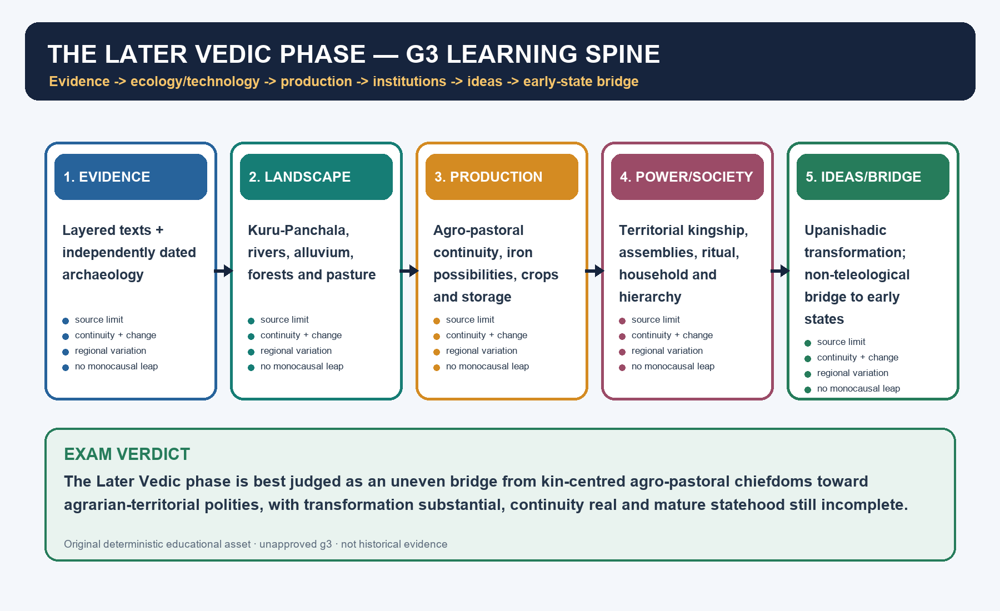
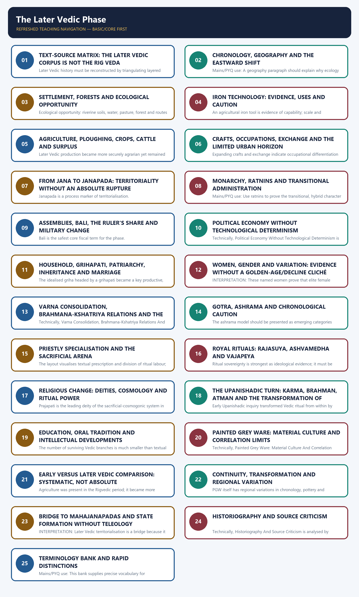

# The Later Vedic Phase - Learner-v2 Complete Learning Session

> **Catalogue identity:** Ancient History · Subject-wide Syllabus · `ancient-indian-history-09`  
> **Generation date:** 21 August 2026 · **Identity:** `ancient-indian-history-09:learner-v2:g3` · **Approval:** false pending explicit topic approval  
> **Source order used:** complete legacy Topic 09 owner -> Basic owner -> Advanced owner in the optional block -> prior learner-v2 g2 -> master chronology, syllabus, revision and Topics 08/10/11 cross-links -> OCR-searchable R. S. Sharma and Upinder Singh -> bounded UNESCO/Cambridge live verification. Qdrant was not required.  
> **Evidence discipline:** g2 is preserved in full and deepened rather than compressed. Modern heritage pages verify preservation only; Rakesh Tewari's peer-reviewed archaeology refines iron chronology but is not used as proof of ancient social conditions.



*Original deterministic visual: a topic-specific evidence-to-explanation spine. It is a learning aid, not historical evidence.*

### G3 terminology translation lock

> Every Sanskrit technical term is translated at its first use below. Proper names of
> texts, deities, persons and rivers are identified by function where needed; they are
> not treated as self-explanatory evidence.

| Term | Immediate exam-safe English meaning |
|---|---|
| *jana* | people/tribal community |
| *janapada* | territorial foothold or domain of a people |
| *rājan* / raja | king or chief |
| *janapadin* | territorial ruler or holder of a *janapada* |
| *rāṣṭra* | realm or political domain |
| *bali* | offering or tribute becoming more obligatory |
| *sabhā* | elite council or assembly |
| *samiti* | broader political assembly |
| *vidatha* | early socio-ritual gathering |
| *ratnin* | “jewel”, a ritual-political associate or functionary |
| *purohita* | royal priest and counsellor |
| *senānī* | military commander |
| *grāmaṇī* | leader of a village, group or local mobilisation unit |
| *rājasūya* | royal consecration and sovereignty rite |
| *aśvamedha* | horse sacrifice and claim to paramountcy |
| *vājapeya* | ritual of strength, prosperity and prestige |
| *yajña* | sacrifice |
| *śrauta* | solemn public sacrifice based on revealed Vedic authority |
| *yajamāna* | sacrificial patron |
| *dakṣiṇā* | ritual fee or gift |
| *varṇa* | fourfold ranked social ideology/order |
| *jāti* | endogamous birth group or lived social community |
| *gotra* | lineage/clan marker used in exogamy |
| *gṛhapati* | household head |
| *brahman* | ultimate reality or sacred potency, according to context |
| *ātman* | self |
| *karma* | action and its consequences |
| *saṃsāra* | cycle of rebirth |
| *mokṣa* | liberation |
| *śramaṇa* | renunciant/heterodox seeker or tradition |
| *ṛta* | cosmic order |
| *dharma* | sustaining order, norm or duty, with changing meanings |

### Coverage lock

- **Required scope:** Eastward expansion, iron, agriculture, state, varṇa (fourfold ranked social order), gender, ritual, text and settlement through continuity and change.
- **Basic completeness:** the complete detailed legacy learner session and prior learner-v2 g2 teaching are retained before practice; g3 adds answer lines, chronology/source refinements and visual clarity without compression.
- **Practice completeness:** verified PYQs, strict-rotation MCQs/remediation and solved 10/15/20-mark answers are retained.
- **Advanced boundary:** the exact Advanced owner is placed only after all Basic and practice material.
- **Register-last rule:** complete topic-specific consolidated notes remain the final H2 section.

### Legacy package source and coverage ledger

> **Subject:** Ancient Indian History | **Paper:** Prelims GS-I + GS-I historical/cultural support | **Topic:** 09 | **Date:** 13 August 2026
>
> **Evidence key:** FACT = directly supported by named repository/local-book/official/live source. INTERPRETATION = source-based analytical reading. INFERENCE = bounded conclusion.
>
> **Approval state:** generated, **approved=false**. Only explicit user approval can change the status to approved.

### Package Practice Counts

| Component | Count |
|---|---:|
| Relevant/adjacent verified PYQs with independent solutions and controlled key status | 4 |
| Diagnostic/core MCQs with explanations | 48 |
| Remedial MCQs with explanations | 12 |
| Original solved 10-mark Mains | 3 |
| Original solved 15-mark Mains | 3 |
| Original solved 20-mark Mains | 3 |

### Representative source ledger

| Source layer | Representative sources | Use and caveat |
|---|---|---|
| Repository Markdown | Complete legacy Topic 09 owner; Topic 09 basic/advanced; prior g2; README, Master Chronology, Revision Chart, syllabus/PYQ routing; Topics 08/10/11 | Primary architecture, non-compressed coverage, exact recent PYQ routes and controlled comparison/ownership boundaries |
| Local OCR books | R. S. Sharma, Later Vedic chapter; Upinder Singh, later Vedic textual milieu and PGW archaeology | Deeper textual, social, political and archaeological evidence; local PDF file pages used during research |
| Official papers/keys | UPSC Prelims 2024 Q58 official Set-A/Series-A key; Mains GS-I 2023 Q11 and 2024 Q1; 2026 provisional Series-A key for adjacent Q20 | Exact question/key discipline; 2026 answer is prominently labelled provisional |
| Live scholarship/heritage | Rakesh Tewari (2003), *Antiquity*, on early iron; UNESCO Vedic Chanting and Rigveda Memory of the World | Refinement and preservation only; no forced current affairs and no modern source used as ancient social proof |
| Qdrant | Not used | Direct Markdown and OCR evidence were sufficient |

## BASIC LEARNING SESSION

### DEEP-REVIEW LEARNING CONTRACT

| Control | Binding rule for this package |
|---|---|
| Syllabus boundary | Complete Ancient History Core is taught before optional enrichment. |
| Evidence method | Claim → named site/text/inscription/coin/example → analysis → qualification. |
| Source hierarchy | Archaeology, textual testimony, inscriptions, coins and scholarly interpretation remain visibly distinct. |
| Contested issues | Competing interpretations are attributed, evidenced and bounded; certainty is not manufactured. |
| Practice contract | Every solved item has demand decoding, an examiner-grade model, an executable answer/compression plan, marks rationale and answer-specific improvement. |
| Approval | This immutable successor remains `approved: false` pending explicit approval. |

**Canonical Basic/Core owner:** `upsc-ai-kit\knowledge\Ancient-Indian-History\basic\09_Later-Vedic-Phase.md`  
**Canonical topic owner:** `upsc-ai-kit\knowledge\Ancient-Indian-History\09_The-Later-Vedic-Phase_Complete-Topic-Package.md`  
**Optional Advanced owner:** `upsc-ai-kit\knowledge\Ancient-Indian-History\advanced\09_Later-Vedic-Phase.md`  
**Official syllabus mapping:** `upsc-ai-kit\knowledge\Ancient-Indian-History\OFFICIAL-UPSC-SYLLABUS-MAPPING.md`

### EVIDENCE, PYQ AND CURRENT-STATUS CONTROL

- **Archaeological inference:** material context supports bounded reconstruction; absence is not automatic proof of non-existence.
- **Textual testimony:** genre, authorship, redaction, patronage and temporal distance control what a text can prove.
- **Inscription and coin evidence:** contemporary names, titles, claims and circulation are powerful but do not by themselves map uniform territorial control.
- **Scholarly interpretation:** historian labels are arguments to test, not facts to memorise without evidence.
- **PYQ discipline:** repository ledgers and locally held official papers control wording and metadata; reconstructed wording and unavailable official keys must be labelled.
- **Current-status note, rechecked 2026-08-30:** No current archaeological or heritage claim is used to alter the static chronology. Any present-day linkage remains contextual and dated.

**Live/primary context sources recorded by the predecessor generation:**

- `https://ich.unesco.org/en/RL/tradition-of-vedic-chanting-00062`
- `https://media.unesco.org/sites/default/files/webform/mow001/india_rigveda.pdf`
- `https://doi.org/10.1017/S0003598X00092590`




*Distinct embedded teaching-navigation image. The separate continuous Cārvāka-style flowchart package remains an independent at-a-glance artifact.*
> A source-critical, multi-causal reconstruction of Later Vedic society. Read visuals first, then evidence, inference and limitation.


### ROADMAP, SOURCE ORDER AND EVIDENCE DISCIPLINE

> **ANSWER-GRABBING LINE — WRITE/ADAPT IN THE EXAM**  
> The Later Vedic phase, conventionally dated c. 1000–600 BCE, was a gradual restructuring of the earlier Vedic world toward denser agrarian settlement, territorial kingship, sharper hierarchy and philosophical innovation, not a sudden civilisational rupture.

#### G3 scope and periodisation firewall

| Horizon | Safe working range | What it means | What it must not be collapsed into |
|---|---|---|---|
| Conventional Later Vedic phase | c. 1000–600 BCE | Text-centred historical phase of agrarian, political, social, ritual and intellectual restructuring | A single event, migration wave or all-India stage |
| Painted Grey Ware (PGW) | Broadly c. 1200–500/400 BCE in Upinder Singh; regional sequences vary | Archaeological ceramic and settlement horizon overlapping parts of the textual core | A people, language, ethnicity or complete Later Vedic map |
| Second urbanisation | Strongly visible from c. 600 BCE onward | Cities, Northern Black Polished Ware, coinage, intensified exchange and larger states | A synonym for the Later Vedic phase |

- **Transition, not rupture:** agriculture, hierarchy, patriarchy, chiefship and sacrifice
  existed earlier; their scale, linkage and ideological weight changed.
- **Chronology is source-bounded:** R. S. Sharma's textbook chapter uses a broad
  c. 1000–500 BCE expansion frame, while the repository's conventional exam horizon is
  c. 1000–600 BCE.
- **Regionality is compulsory:** Kuru-Panchala is the main textual-political core, not a
  label for every contemporary population in the subcontinent.

The Later Vedic phase is studied as a gradual restructuring of the earlier Vedic world: a shift of the main textual horizon toward Kuru-Panchala and the upper Ganga plain, denser agrarian settlement, stronger monarchy and household authority, sharper social ranking, elaborate sacrifice and new philosophical inquiry. It is not an overnight state revolution.

**Background/qualification:** No current-affairs story is forced. Modern links are confined to peer-reviewed archaeology and authoritative preservation of Vedic oral/manuscript traditions. Qdrant was not used because repository Markdown and OCR-searchable books supplied sufficient evidence.

| Period | Event |
|---|---|
| c. 1500-1000 BCE | Broad Rigvedic horizon; north-western, kin-based comparison baseline. |
| c. 1200-500/400 BCE | Broad PGW archaeological range in Upinder Singh; regional sequences vary. |
| c. 1000-600 BCE | Conventional Later Vedic teaching horizon. |
| c. 7th-6th centuries BCE | Early Upanishadic debates and transition toward early historic polities. |
| c. 600 BCE onward | Mahajanapada/second-urbanisation horizon; related but not identical to Later Vedic society. |

#### Compact visual / answer logic

```text
MANDATORY SOURCE ORDER
Repository Markdown
        |
        v
OCR-searchable local books
        |
        v
Peer-reviewed / authoritative live links (only where useful)
        |
        v
Qdrant optional fallback (not used)
```
*The package follows the repository's evidence hierarchy and does not let optional retrieval block the learning session.*

| Evidence class | Best historical use | Limit |
|---|---|---|
| Samhitas | Ritual vocabulary, beliefs, social categories, political idiom | Layered and normative; not a census |
| Brahmanas | Sacrificial procedure, kingship, household and varna ideology | Priestly manuals magnify elite ritual concerns |
| Aranyakas/early Upanishads | Symbolic speculation, debates, knowledge and self | Esoteric traditions, uneven dates and audiences |
| Archaeology | Settlement, pottery, crops, metals, crafts and chronology | Cannot identify language, ethnicity or a named text alone |
| Later epic/legal texts | Reception and later institutional development | Cannot be projected backward as direct Later Vedic evidence |

- FACT: Required repository owners are Topic 09 basic/advanced, README, chronology, revision chart, syllabus/PYQ routing and Topic 08 comparison material.
- FACT: Local OCR evidence comes from R. S. Sharma's Later Vedic chapter and Upinder Singh's treatment of the later Vedic textual milieu and PGW archaeology.
- INTERPRETATION: Text and archaeology can be juxtaposed when chronology and region overlap, but agreement is probabilistic rather than identity proof.
- INFERENCE: The most defensible master thesis is 'agrarian-territorial transformation through interacting institutions, ecology and technology, with continuity and regional variation.'
- METHOD: Separate what a source says, the social claim historians infer, and the qualification required by genre or archaeology.

> **Memory hook:** T-A-G: Text purpose, Archaeological correlation, Graded inference.

#### Must-know facts

- Later Vedic convention: c. 1000-600 BCE.
- Core textual-geographical focus: Kuru-Panchala, Indo-Gangetic divide and upper Ganga valley.
- Main analytical error to avoid: iron -> agriculture -> state as an automatic one-way sequence.
- Main source error to avoid: PGW = a single people, text, epic event or ethnicity.

#### UPSC traps

- **Wrong:** Use the Rig Veda as the main Later Vedic corpus. **Correct:** Use Sama/Yajur/Atharva Samhitas, Brahmanas, Aranyakas and early Upanishadic material; use the Rig Veda as an earlier/layered comparator.
- **Wrong:** Treat texts as descriptive statistics. **Correct:** Treat them as layered ritual, normative and philosophical evidence produced by specialist milieus.

**Mains/PYQ use:** Open a broad answer with transformation plus continuity; end every evidence paragraph with a limit.

**Study link:** Topic 02 source criticism -> Topic 08 baseline -> Topic 09 transformation -> Topic 11 state formation.
### SESSION 1 — TEXT-SOURCE MATRIX: THE LATER VEDIC CORPUS IS NOT THE RIG VEDA

#### DEFINITION / WHAT THIS IS CALLED

**Plain-language definition:** The Rig Veda contains later layers, but 'Later Vedic corpus' is not a synonym for 'all of the Rig Veda.'.

**Technical definition:** Later Vedic history must be reconstructed by triangulating layered and normative texts with independently dated archaeology, because text, pottery and people are never equivalent categories.

#### ANSWER-GRABBING OPENING — WRITE/ADAPT IN THE EXAM

> Later Vedic history must be reconstructed by triangulating layered and normative texts with independently dated archaeology, because text, pottery and people are never equivalent categories.

#### MUST-WRITE KEYWORDS

- **Text-Source Matrix**
- **LAYERED VEDIC EVIDENCE**
- **CHANT**
- **ACTION**
- **HOUSEHOLD**
- **INTERIORISATION**

**How to use them:** Frame the answer through Text-Source Matrix; define LAYERED VEDIC EVIDENCE, connect CHANT with ACTION to explain the mechanism, and use HOUSEHOLD for the decisive comparison or qualification.

> **ANSWER-GRABBING LINE — WRITE/ADAPT IN THE EXAM**  
> Later Vedic history must be reconstructed by triangulating layered and normative texts with independently dated archaeology, because text, pottery and people are never equivalent categories.

#### G3 evidence protocol: text, pottery and people are non-equivalent

```text
TEXT (genre + layer + audience)
                         -> calibrated historical claim <- ARCHAEOLOGY (context + date + region)
          /
LATER MEMORY (epic/legal reception, used only with chronological warning)

NEVER: one text = one pottery = one people = one epic event
```

| Evidence problem | Safe response |
|---|---|
| Brahmana prescription | Identify priestly/normative purpose before inferring practice |
| Early Upanishadic dialogue | Use for intellectual possibility and debate, not mass belief |
| PGW at a named site | Establish occupation/material traits, not epic historicity |
| Later epic or legal rule | Treat as reception/projection unless independently dated to the phase |
| Text-archaeology overlap | Correlate broad region, chronology and process; retain independent evidentiary status |

Later Vedic history depends on several textual layers with different purposes. The Sama Veda largely rearranges Rigvedic verses for chant; the Yajur Veda joins formulae to ritual action; the Atharva Veda preserves charms, healing, domestic and popular concerns; Brahmanas explain sacrifice; Aranyakas and early Upanishads move toward symbolic and philosophical interpretation.

#### Corpus by historical function

**LAYERED VEDIC EVIDENCE**
- **CHANT:** Sama Veda; liturgical performance
- **ACTION:** Yajur Veda; ritual procedure
- **HOUSEHOLD:** Atharva Veda; charms and anxieties
- **EXPLANATION:** Brahmanas; sacrifice and kingship
- **INTERIORISATION:** Aranyakas/Upanishads; knowledge and self
- **BASELINE:** Rig Veda; earlier comparison and layered continuities

| Text layer | What it contributes | Safe historical use | Caution |
|---|---|---|---|
| Sama Veda | Chanted arrangement of many Rigvedic verses | Priestly specialisation and liturgical performance | Not an independent social chronicle |
| Yajur Veda | Formulae plus instructions for ritual acts | Sacrificial arena, Adhvaryu's role, royal/domestic ritual | Ritual prescription is not universal practice |
| Atharva Veda | Charms, healing, marriage, household anxieties | Wider concerns beyond grand shrauta ritual | Still a curated sacred corpus |
| Brahmanas | Explanations and myths of sacrifice | Kingship, ratnins, varna ideology, ritual economy | Priestly and normative bias is strong |
| Aranyakas | Interiorisation and symbolic speculation | Transition between ritual explanation and esoteric knowledge | Boundaries with Upanishads are porous |
| Early Upanishads | Dialogues on brahman, atman, knowledge and rebirth | Intellectual reactions and transformations within Vedic tradition | No single coherent philosophy or uniform date |

- FACT: The Yajur Veda's ritual formulae and the Brahmanas are central for reconstructing expanded sacrificial procedure and royal consecration.
- FACT: Upinder Singh treats the Atharva Veda as especially useful for charms concerning health, prosperity, marriage and death, while warning that it too is a text.
- FACT: Brihadaranyaka and Chandogya are among the earliest Upanishads; early Upanishads span a broad c. 1000-500 BCE range in Upinder Singh's treatment.
- INTERPRETATION: The corpus documents multiple elite and non-elite concerns, but not in equal proportion; ritual specialists are overrepresented.
- INFERENCE: Contradictions among texts are evidence of layered composition, regional debate and changing institutions, not simply 'errors' to be harmonised.
- BOUNDARY: Epics, Dharmasutras, Dharmashastras and later Vedanta are important reception histories but cannot be used as transparent evidence for c. 1000-600 BCE.

> **Memory hook:** S-Y-A-B-A-U: Song, Yajna action, Atharvan concerns, Brahmana explanation, Aranyaka interiorisation, Upanishadic inquiry.

#### Must-know facts

- Hotri is linked to Rigvedic recitation; Udgatri to Sama chanting; Adhvaryu to Yajur ritual action; Brahmana supervises/corrects ritual.
- Brahmana (social/priestly category) must be distinguished from brahman (ultimate reality or sacred power, depending on context).
- The Rig Veda contains later layers, but 'Later Vedic corpus' is not a synonym for 'all of the Rig Veda.'

#### UPSC traps

- **Wrong:** Call the Upanishads post-Vedic and wholly outside shruti. **Correct:** Early Upanishads are part of the Vedic corpus and transform its ritual vocabulary.
- **Wrong:** Use a Brahmana prescription as proof that every household performed it. **Correct:** Identify the intended ritual audience and the norm-practice gap.

**Mains/PYQ use:** A source question should classify the corpus before extracting institutions from it.

**Study link:** Ancient History Topic 02 literary sources and Topic 24 philosophical developments.

#### CLOSING RECALL FLOW — TEXT-SOURCE MATRIX: THE LATER VEDIC CORPUS IS NOT THE RIG VEDA

```text
START / CONCEPT: TEXT-SOURCE MATRIX: THE LATER VEDIC CORPUS IS NOT THE RIG VEDA
        |
        v
EXACT TERMS: Text-Source Matrix · LAYERED VEDIC EVIDENCE · CHANT · ACTION · HOUSEHOLD · INTERIORISATION
        |
        v
MECHANISM / ARGUMENT: Later Vedic history depends on several textual layers with different purposes.
        |
        v
CONSEQUENCE / CONTRAST: The Rig Veda contains later layers, but 'Later Vedic corpus' is not a synonym for 'all of the Rig Veda.'.
        |
        v
UPSC TRAP / ANSWER-USE: Upinder Singh treats the Atharva Veda as especially useful for charms concerning health, prosperity, marriage and death, while warning that it too is a text.
        |
        v
ANSWER-GRABBING FORMULATION: Later Vedic history must be reconstructed by triangulating layered and normative texts with independently dated archaeology, because text, pottery and people are never equivalent categories.
```
### SESSION 2 — CHRONOLOGY, GEOGRAPHY AND THE EASTWARD SHIFT

#### DEFINITION / WHAT THIS IS CALLED

**Plain-language definition:** Chronology, Geography And The Eastward Shift comprises Chronology, Geography and The Eastward Shift as its core connected dimensions.

**Technical definition:** Mains/PYQ use: A geography paragraph should explain why ecology and interaction matter for settlement and political transformation.

#### ANSWER-GRABBING OPENING — WRITE/ADAPT IN THE EXAM

> Mains/PYQ use: A geography paragraph should explain why ecology and interaction matter for settlement and political transformation.

#### MUST-WRITE KEYWORDS

- **Chronology**
- **Geography**
- **The Eastward Shift**
- **Memory hook**
- **Mains/PYQ use**
- **Study link**

**How to use them:** Frame the answer through Chronology; define Geography, connect The Eastward Shift with Memory hook to explain the mechanism, and use Mains/PYQ use for the decisive comparison or qualification.

> **ANSWER-GRABBING LINE — WRITE/ADAPT IN THE EXAM**  
> The principal textual focus shifted from the north-west to Kuru-Panchala and the upper Ganga plain, while Kosala-Videha marked a later eastern horizon rather than a uniform all-India expansion.

The dominant textual horizon moves from the Rigvedic north-west toward the Indo-Gangetic divide, Kuru-Panchala and the upper Ganga valley. This is a shift in the principal arena represented by the texts, not a claim that all earlier communities migrated together or that the rest of the subcontinent was empty.

#### Compact visual / answer logic

```text
TEXT MAP (schematic; not to scale)

NORTH-WEST / SAPTA-SINDHU
        |
        | continuity + movement + interaction
        v
SARASVATI-DRISHADVATI / KURUKSHETRA
        |
        v
KURU-PANCHALA: DELHI + UPPER/MIDDLE DOAB
        |
        v
KOSALA -------- VIDEHA (late horizon)
                    |
                    v
             Sadanira/Gandak zone
```
*This is a map of changing textual-political focus, not an ethnic boundary map.*

| Zone | Later Vedic relevance | Qualification |
|---|---|---|
| Sarasvati-Drishadvati / Kurukshetra | Early Kuru ritual-political core | River identifications and precise boundaries remain debated |
| Upper Ganga-Yamuna doab | Kuru-Panchala settlements, PGW concentration and textual production | PGW distribution is wider than the textual core |
| Middle doab / Panchala | Philosopher-kings, Brahmanical schools and ritual development | Texts represent selected courts and schools |
| Kosala-Videha | Late eastward reach; Janaka and Upanishadic debates | Narratives can legitimise eastern rulers through western ritual ancestry |
| Wider north India | Interactions with OCP, BRW, late Harappan and other communities | No single uniform Later Vedic culture |

- FACT: Purus and Bharatas are represented as coalescing into the Kurus; Turvashas and Krivis are associated with the Panchalas in Upinder Singh's synthesis.
- FACT: The Shatapatha Brahmana's Videgha Mathava story moves from the Sarasvati across the Sadanira/Gandak with Agni Vaishvanara.
- INTERPRETATION: The Videgha Mathava episode has been read as eastward movement and agrarian expansion, but it can also serve as Brahmanical legitimation of Videha.
- FACT: Kuru-Panchala is the main later Vedic political-cultural core, while Kosala and Videha become important toward the end of the phase.
- INFERENCE: Eastward movement involved conflict, accommodation, marriage, ritual incorporation and interaction with existing communities, not a vacant-land frontier.
- CAUTION: 'Aryavarta', epic geography and later legal boundaries should not be projected backward without dating the source.

> **Memory hook:** K-P-V: Kuru core, Panchala elaboration, Videha debates.

#### Must-know facts

- Core shift: Sapta-Sindhu -> Kuru-Panchala/upper Ganga.
- Janapada marks territorialisation but does not imply the mature mahajanapada state already exists.
- Regional sequences differ; Later Vedic is not a synchronised all-India stage.

#### UPSC traps

- **Wrong:** Treat the Videgha Mathava story as a literal colonisation report. **Correct:** Use it as layered ritual-political memory with alternative interpretations.
- **Wrong:** Equate a text's remembered geography with surveyed borders. **Correct:** Use broad cultural-political zones and uncertainty labels.

**Mains/PYQ use:** A geography paragraph should explain why ecology and interaction matter for settlement and political transformation.

**Study link:** Topic 03 Geography & Ecology and Topic 11 Mahajanapadas.

#### CLOSING RECALL FLOW — CHRONOLOGY, GEOGRAPHY AND THE EASTWARD SHIFT

```text
START / CONCEPT: CHRONOLOGY, GEOGRAPHY AND THE EASTWARD SHIFT
        |
        v
EXACT TERMS: Chronology · Geography · The Eastward Shift · Memory hook · Mains/PYQ use · Study link
        |
        v
MECHANISM / ARGUMENT: This is a shift in the principal arena represented by the texts, not a claim that all earlier communities migrated together or that the rest of the subcontinent was empty.
        |
        v
CONSEQUENCE / CONTRAST: CAUTION: 'Aryavarta', epic geography and later legal boundaries should not be projected backward without dating the source.
        |
        v
UPSC TRAP / ANSWER-USE: INTERPRETATION: The Videgha Mathava episode has been read as eastward movement and agrarian expansion, but it can also serve as Brahmanical legitimation of Videha.
        |
        v
ANSWER-GRABBING FORMULATION: Mains/PYQ use: A geography paragraph should explain why ecology and interaction matter for settlement and political transformation.
```
### SESSION 3 — SETTLEMENT, FORESTS AND ECOLOGICAL OPPORTUNITY

#### DEFINITION / WHAT THIS IS CALLED

**Plain-language definition:** Forest clearance mattered, but the old image of iron axes instantly conquering an impenetrable jungle is too simple.

**Technical definition:** Ecological opportunity: riverine soils, water, pasture, forest and routes Household labour: clearing, ploughing, herding, storage and craft work Settlement persistence: wattle-and-daub houses, hearths, lanes and storage Aggregation: mostly villages with a few larger nodes Institutional capture: householders, chiefs and priests claim shares of production Uneven outcomes: regional variation; no automatic urban or state transition.

#### ANSWER-GRABBING OPENING — WRITE/ADAPT IN THE EXAM

> Riverine alluvium, pasture, woodland resources, water, labour and regional interaction jointly shaped settlement expansion; forests were productive landscapes, not merely obstacles awaiting iron axes.

#### MUST-WRITE KEYWORDS

- **Settlement**
- **Forests**
- **Ecological Opportunity**
- **Household labour**
- **Settlement persistence**
- **Aggregation**

**How to use them:** Frame the answer through Settlement; define Forests, connect Ecological Opportunity with Household labour to explain the mechanism, and use Settlement persistence for the decisive comparison or qualification.

> **ANSWER-GRABBING LINE — WRITE/ADAPT IN THE EXAM**  
> Riverine alluvium, pasture, woodland resources, water, labour and regional interaction jointly shaped settlement expansion; forests were productive landscapes, not merely obstacles awaiting iron axes.

Later Vedic change unfolded within riverine plains, woodland margins and diverse local ecologies. Forests supplied timber, fuel, pasture, game and elephants, while alluvial zones supported cultivation. Forest clearance mattered, but the old image of iron axes instantly conquering an impenetrable jungle is too simple.

| Ecological component | Opportunity | Historical implication | Caution |
|---|---|---|---|
| Alluvial tracts | Cultivable soil and water | More stable fields and settlements | Flood risk and local variation remain |
| River corridors | Transport, fishing and communication | Settlement clustering and exchange | Not proof of long-distance commerce |
| Woodland | Fuel, timber, forage, game, elephants | Clearance plus continuing resource use | Forest was not simply 'waste' |
| Pasture | Cattle and traction animals | Agro-pastoral continuity | Agriculture did not eliminate herding |
| Mineral access | Iron ore and craft inputs | Regional production/exchange networks | Ore availability alone does not create states |

#### Political-economy causal flow

1. **Ecological opportunity:** riverine soils, water, pasture, forest and routes
2. **Household labour:** clearing, ploughing, herding, storage and craft work
3. **Settlement persistence:** wattle-and-daub houses, hearths, lanes and storage
4. **Aggregation:** mostly villages with a few larger nodes
5. **Institutional capture:** householders, chiefs and priests claim shares of production
6. **Uneven outcomes:** regional variation; no automatic urban or state transition

- FACT: PGW settlement studies cited by Upinder Singh show many small sites and a few larger centres, often concentrated near rivers.
- FACT: Makkhan Lal's Kanpur-district study identified mostly sub-2-hectare settlements, with larger sites remaining exceptional.
- FACT: Jakhera yielded houses, multiple hearths, lanes, storage bins, a bund and water channel, suggesting organised settlement and surplus management.
- INTERPRETATION: River access, soils, rainfall, transport, pasture and mineral routes shaped settlement choice alongside technology.
- INTERPRETATION: Forests were not merely obstacles; they were economically and militarily valuable, especially as habitats for elephants and sources of timber and fuel.
- INFERENCE: Agrarian expansion was a negotiated landscape process involving cultivation, grazing, extraction and relations with forest communities.
- REGIONAL LIMIT: The upper doab cannot stand for the middle Ganga valley, Rajasthan or the entire subcontinent; local pottery and iron sequences vary.

> **Memory hook:** F-R-A-M-E: Forest, River, Alluvium, Minerals, Ecology.

#### Must-know facts

- Later Vedic settlement remained predominantly rural.
- PGW evidence points to a proto-urban horizon at some sites, not full second urbanisation everywhere.
- Ecology is an enabling context, not a deterministic cause.

#### UPSC traps

- **Wrong:** Iron axes alone cleared the entire Ganga forest. **Correct:** Combine tools with labour, animal traction, soils, water, settlement institutions and regional evidence.
- **Wrong:** Forests disappear when agriculture expands. **Correct:** Treat forest and cultivated zones as interdependent resource landscapes.

**Mains/PYQ use:** Use ecology to complicate the technology-only state-formation thesis.

**Study link:** Topic 03 ecology; Topic 11 middle-Ganga state formation.

#### CLOSING RECALL FLOW — SETTLEMENT, FORESTS AND ECOLOGICAL OPPORTUNITY

```text
START / CONCEPT: SETTLEMENT, FORESTS AND ECOLOGICAL OPPORTUNITY
        |
        v
EXACT TERMS: Settlement · Forests · Ecological Opportunity · Household labour · Settlement persistence · Aggregation
        |
        v
MECHANISM / ARGUMENT: Ecological opportunity: riverine soils, water, pasture, forest and routes Household labour: clearing, ploughing, herding, storage and craft work Settlement persistence: wattle-and-daub houses, hearths, lanes and storage Aggregation: mostly villages with a few larger nodes Institutional capture: householders, chiefs and priests claim shares of production Uneven outcomes: regional variation; no automatic urban or state transition.
        |
        v
CONSEQUENCE / CONTRAST: INTERPRETATION: Forests were not merely obstacles; they were economically and militarily valuable, especially as habitats for elephants and sources of timber and fuel.
        |
        v
UPSC TRAP / ANSWER-USE: Forest clearance mattered, but the old image of iron axes instantly conquering an impenetrable jungle is too simple.
        |
        v
ANSWER-GRABBING FORMULATION: Riverine alluvium, pasture, woodland resources, water, labour and regional interaction jointly shaped settlement expansion; forests were productive landscapes, not merely obstacles awaiting iron axes.
```
### SESSION 4 — IRON TECHNOLOGY: EVIDENCE, USES AND CAUTION

#### DEFINITION / WHAT THIS IS CALLED

**Plain-language definition:** The correct causal statement is 'iron enlarged possibilities within an already changing agrarian and political system.' REGIONAL LIMIT: Earlier iron dates in some contexts, disturbed layers and distinct pottery associations make a uniform all-India chronology unsafe.

**Technical definition:** An agricultural iron tool is evidence of capability; scale and distribution require settlement-level analysis.

#### ANSWER-GRABBING OPENING — WRITE/ADAPT IN THE EXAM

> Iron enlarged the possibilities of clearing, carpentry, cultivation and warfare, but its effects depended on access, traction, labour, water, ecology and institutions, so iron did not automatically create surplus or states.

#### MUST-WRITE KEYWORDS

- **Iron Technology**
- **Uses**
- **Caution**
- **Artefact range**
- **Metallurgical knowledge**
- **Tool availability**

**How to use them:** Frame the answer through Iron Technology; define Uses, connect Caution with Artefact range to explain the mechanism, and use Metallurgical knowledge for the decisive comparison or qualification.

> **ANSWER-GRABBING LINE — WRITE/ADAPT IN THE EXAM**  
> Iron enlarged the possibilities of clearing, carpentry, cultivation and warfare, but its effects depended on access, traction, labour, water, ecology and institutions, so iron did not automatically create surplus or states.

#### G3 iron chronology: textbook sequence versus newer archaeology

| Source frame | Chronological claim | Proper answer use |
|---|---|---|
| R. S. Sharma | Iron commonly used in western Uttar Pradesh around c. 800 BCE; early implements in eastern Uttar Pradesh around c. 700 BCE in his textbook sequence | State the source and use it as a conventional teaching chronology |
| Upinder Singh | Expanding iron use across the Indo-Gangetic divide and upper/middle Ganga valley during the first half of the first millennium BCE, with regional variation | Prefer a broad, regionally differentiated archaeological horizon |
| Rakesh Tewari, *Antiquity* 77 (2003) | Radiocarbon-associated evidence from the central Ganga plain/eastern Vindhyas pushes some iron-working contexts earlier than the older single diffusion timetable | Use as a challenge to uniform chronology, not as proof that iron alone caused Later Vedic institutions or that every early date is uncontested |

**Artefact range:** weapons, arrowheads, knives, axes, nails, carpentry tools and,
at mature contexts such as Jakhera and Atranjikhera, sickle/hoe/ploughshare evidence.
Capability at a site does not establish equal access, scale of use or automatic agrarian
transformation.

Iron becomes more visible during the broad Later Vedic/early Iron Age horizon, but dates and contexts vary. Weapons are common in many PGW assemblages; agricultural implements occur at sites such as Jakhera and Atranjikhera. This evidence supports technological capacity, not a single migration or an automatic state.

| Evidence | What it proves | What it cannot prove |
|---|---|---|
| Syama/krishna ayas in later texts | Knowledge of a dark metal usually interpreted as iron | Exact object, date or archaeological context in each verse |
| Atranjikhera PGW iron | Developed iron working and varied tools/weapons | That every settlement used iron equally |
| Jakhera sickle, ploughshare and hoe | Agricultural applications in a mature PGW context | That iron alone created surplus |
| Ore-source analysis | Regional procurement and technical knowledge | A central state monopoly |
| Early iron outside PGW | Multiple regional beginnings and sequences | PGW = all Iron Age India |

#### Political-economy causal flow

1. **Metallurgical knowledge:** ore, furnace, forging, carburisation and repair
2. **Tool availability:** weapons, axes, carpentry tools and some farm implements
3. **Social organisation:** specialists, exchange, patrons and access to labour
4. **Ecological application:** local soils, forest margins, water and pasture
5. **Possible effects:** clearance, defence, cultivation and settlement growth
6. **Historical outcome:** uneven agrarian and political change, not technological destiny

- FACT: Upinder Singh places the broad growth of iron use in the Indo-Gangetic divide and upper/middle Ganga valley between c. 1000 and 500 BCE while presenting earlier regional evidence and debates.
- FACT: At many upper-doab sites, weapons and hunting implements outnumber agricultural tools; this warns against assuming farming was iron's only use.
- FACT: Jakhera's mature PGW phase yielded a sickle, ploughshare and hoe; Atranjikhera yielded a wide range of wrought-iron objects.
- FACT: Rakesh Tewari's peer-reviewed work on the central Ganga plain/eastern Vindhyas is useful because it challenges a single late diffusion chronology for iron.
- INTERPRETATION: Iron could improve clearing, carpentry, warfare and cultivation, but access, repair, labour organisation and land relations determined its effects.
- INFERENCE: The correct causal statement is 'iron enlarged possibilities within an already changing agrarian and political system.'
- REGIONAL LIMIT: Earlier iron dates in some contexts, disturbed layers and distinct pottery associations make a uniform all-India chronology unsafe.

> **Memory hook:** I-A-S-E: Iron, Access, Social institutions, Ecology.

#### Must-know facts

- PGW and iron overlap substantially but are not identical categories.
- Iron artefacts occur in non-PGW regional contexts.
- An agricultural iron tool is evidence of capability; scale and distribution require settlement-level analysis.

#### UPSC traps

- **Wrong:** Iron caused the state. **Correct:** Link iron through access, labour, ecology, agrarian surplus, extraction and political institutions.
- **Wrong:** Early iron proves a single ethnic migration. **Correct:** Metal technology cannot identify language or ethnicity by itself.

**Mains/PYQ use:** A high-scoring answer treats iron as an enabling variable inside a multi-causal model.

**Study link:** Peer-reviewed Tewari (2003) as a live scholarly refinement; local Upinder Singh archaeology chapter.

#### CLOSING RECALL FLOW — IRON TECHNOLOGY: EVIDENCE, USES AND CAUTION

```text
START / CONCEPT: IRON TECHNOLOGY: EVIDENCE, USES AND CAUTION
        |
        v
EXACT TERMS: Iron Technology · Uses · Caution · Artefact range · Metallurgical knowledge · Tool availability
        |
        v
MECHANISM / ARGUMENT: Rakesh Tewari's peer-reviewed work on the central Ganga plain/eastern Vindhyas is useful because it challenges a single late diffusion chronology for iron.
        |
        v
CONSEQUENCE / CONTRAST: INTERPRETATION: Iron could improve clearing, carpentry, warfare and cultivation, but access, repair, labour organisation and land relations determined its effects.
        |
        v
UPSC TRAP / ANSWER-USE: The correct causal statement is 'iron enlarged possibilities within an already changing agrarian and political system.' REGIONAL LIMIT: Earlier iron dates in some contexts, disturbed layers and distinct pottery associations make a uniform all-India chronology unsafe.
        |
        v
ANSWER-GRABBING FORMULATION: Iron enlarged the possibilities of clearing, carpentry, cultivation and warfare, but its effects depended on access, traction, labour, water, ecology and institutions, so iron did not automatically create surplus or states.
```
### SESSION 5 — AGRICULTURE, PLOUGHING, CROPS, CATTLE AND SURPLUS

#### DEFINITION / WHAT THIS IS CALLED

**Plain-language definition:** Household production: plough, sowing, cattle, crops and craft labour More stable settlement: fields, houses, storage and repeated seasonal work Surplus margin: variable produce beyond immediate consumption and seed Appropriation: bali, gifts, ritual fees and chiefly consumption Specialisation: priests, artisans, officials and warriors Political feedback: stronger authority can organise and extract, but also provoke tension.

**Technical definition:** Later Vedic production became more securely agrarian yet remained agro-pastoral, as diversified crops, cattle traction, storage and repeated tribute supported specialists without producing a mature monetised urban market economy.

#### ANSWER-GRABBING OPENING — WRITE/ADAPT IN THE EXAM

> Later Vedic production became more securely agrarian yet remained agro-pastoral, as diversified crops, cattle traction, storage and repeated tribute supported specialists without producing a mature monetised urban market economy.

#### MUST-WRITE KEYWORDS

- **Agriculture**
- **Ploughing**
- **Crops**
- **Cattle**
- **Surplus**
- **Household production**

**How to use them:** Frame the answer through Agriculture; define Ploughing, connect Crops with Cattle to explain the mechanism, and use Surplus for the decisive comparison or qualification.

> **ANSWER-GRABBING LINE — WRITE/ADAPT IN THE EXAM**  
> Later Vedic production became more securely agrarian yet remained agro-pastoral, as diversified crops, cattle traction, storage and repeated tribute supported specialists without producing a mature monetised urban market economy.

The economy became more securely agrarian without ceasing to be agro-pastoral. Texts describe elaborate ploughing, animal traction and crop ritual; archaeology yields rice, wheat, barley and pulses. Cattle remained essential as traction, food, wealth and sacrificial resources. Surplus was real but limited and institutionally contested.

| Dimension | Named evidence | Inference | Limit |
|---|---|---|---|
| Ploughing | Shatapatha ploughing rituals; multi-ox plough teams | Cultivation had ritual and productive centrality | Large ox-team numbers may be idealised |
| Crops | Rice, wheat, barley, lentils/pulses; PGW archaeobotany | Diversified cereal-pulse base and two-crop patterns | Crop presence does not measure yields |
| Cattle | Ox traction, dairying, sacrifice and meat | Agriculture and pastoralism remained interdependent | No pure agrarian replacement |
| Storage | Jakhera bins and settlement deposits | Some households/communities managed surplus | Cannot calculate a tax rate |
| Extraction | Bali becoming more obligatory | Chiefly appropriation of produce increased | Not yet a fully organised revenue system |

#### Political-economy causal flow

1. **Household production:** plough, sowing, cattle, crops and craft labour
2. **More stable settlement:** fields, houses, storage and repeated seasonal work
3. **Surplus margin:** variable produce beyond immediate consumption and seed
4. **Appropriation:** bali, gifts, ritual fees and chiefly consumption
5. **Specialisation:** priests, artisans, officials and warriors
6. **Political feedback:** stronger authority can organise and extract, but also provoke tension

- FACT: R. S. Sharma emphasises rice and wheat in the upper Gangetic basin while noting continued barley and pulses.
- FACT: PGW sites yielded rice, wheat and barley; Upinder Singh notes two crops a year in some contexts.
- FACT: Later texts describe ploughs drawn by many oxen; the numbers can express scale or ritual ideal and should not be read as routine statistics.
- FACT: Cattle remained economically central as draught animals, dairy resources, sacrificial victims and stores of value.
- INTERPRETATION: Stable fields, traction and storage made repeated extraction more feasible than in a highly mobile political economy.
- INFERENCE: 'Surplus' must mean produce beyond immediate household reproduction that could support chiefs, priests, specialists and exchange; texts do not provide modern output data.
- QUALIFICATION: Sacrificial cattle consumption could compete with productive use, while elite ritual claims do not tell us the diet of every social group.

> **Memory hook:** P-C-C-S: Plough, Crops, Cattle, Surplus.

#### Must-know facts

- Use 'stronger agrarian base', not 'agriculture began in the Later Vedic age.'
- Use 'agro-pastoral', not 'pastoralism disappeared.'
- Surplus supports institutions only when social mechanisms appropriate and redistribute it.

#### UPSC traps

- **Wrong:** Rice replaced all other crops. **Correct:** Use diversified cropping: rice, wheat, barley and pulses, varying by region.
- **Wrong:** Surplus automatically becomes tax. **Correct:** Distinguish household production, tribute/offerings, ritual gifts and a regular fiscal bureaucracy.

**Mains/PYQ use:** For the 2024 PYQ, show cattle-valued agro-pastoralism -> settled diversified agriculture, while retaining continuity.

**Study link:** Topic 08 economy baseline and Topic 11 agrarian-urban transition.

#### CLOSING RECALL FLOW — AGRICULTURE, PLOUGHING, CROPS, CATTLE AND SURPLUS

```text
START / CONCEPT: AGRICULTURE, PLOUGHING, CROPS, CATTLE AND SURPLUS
        |
        v
EXACT TERMS: Agriculture · Ploughing · Crops · Cattle · Surplus · Household production
        |
        v
MECHANISM / ARGUMENT: Household production: plough, sowing, cattle, crops and craft labour More stable settlement: fields, houses, storage and repeated seasonal work Surplus margin: variable produce beyond immediate consumption and seed Appropriation: bali, gifts, ritual fees and chiefly consumption Specialisation: priests, artisans, officials and warriors Political feedback: stronger authority can organise and extract, but also provoke tension.
        |
        v
CONSEQUENCE / CONTRAST: Use 'stronger agrarian base', not 'agriculture began in the Later Vedic age.' Use 'agro-pastoral', not 'pastoralism disappeared.' Surplus supports institutions only when social mechanisms appropriate and redistribute it.
        |
        v
UPSC TRAP / ANSWER-USE: Mains/PYQ use: For the 2024 PYQ, show cattle-valued agro-pastoralism - settled diversified agriculture, while retaining continuity.
        |
        v
ANSWER-GRABBING FORMULATION: Later Vedic production became more securely agrarian yet remained agro-pastoral, as diversified crops, cattle traction, storage and repeated tribute supported specialists without producing a mature monetised urban market economy.
```
### SESSION 6 — CRAFTS, OCCUPATIONS, EXCHANGE AND THE LIMITED URBAN HORIZON

#### DEFINITION / WHAT THIS IS CALLED

**Plain-language definition:** Crafts, Occupations, Exchange And The Limited Urban Horizon comprises Crafts, Occupations and Exchange as its core connected dimensions.

**Technical definition:** Expanding crafts and exchange indicate occupational differentiation and elite demand within a predominantly rural economy, while metal-value terms and proto-urban nodes do not prove widespread coinage or full urbanisation.

#### ANSWER-GRABBING OPENING — WRITE/ADAPT IN THE EXAM

> Expanding crafts and exchange indicate occupational differentiation and elite demand within a predominantly rural economy, while metal-value terms and proto-urban nodes do not prove widespread coinage or full urbanisation.

#### MUST-WRITE KEYWORDS

- **Crafts**
- **Occupations**
- **Exchange**
- **The Limited Urban Horizon**
- **Memory hook**
- **Mains/PYQ use**

**How to use them:** Frame the answer through Crafts; define Occupations, connect Exchange with The Limited Urban Horizon to explain the mechanism, and use Memory hook for the decisive comparison or qualification.

> **ANSWER-GRABBING LINE — WRITE/ADAPT IN THE EXAM**  
> Expanding crafts and exchange indicate occupational differentiation and elite demand within a predominantly rural economy, while metal-value terms and proto-urban nodes do not prove widespread coinage or full urbanisation.

Later Vedic texts list an expanding occupational world, and PGW sites yield pottery, metal, bone, stone, terracotta, beads, ivory and ornaments. This supports craft differentiation and exchange, but coinage is not secure and the overall milieu remains rural. A few larger settlements are better called proto-urban.

| Sector | Examples | Historical significance | Caution |
|---|---|---|---|
| Metal/wood | Smith, smelter, carpenter, chariot maker, bow maker | Technical and military specialisation | Occupation list is normative/selective |
| Textile/leather | Weaver, embroiderer, dyer, leather worker, tanner | Household and specialist production | Gender/status vary by task and source |
| Services | Physician, barber, cook, messenger, ferryman, washerman | Broader division of labour | Not a modern labour market |
| Luxury/prestige | Jeweller, goldsmith, beads, glass bangles, ivory | Elite consumption and exchange | Prestige goods do not imply mass prosperity |
| Settlement/commerce | Wagons, boats, weights; nagara in Taittiriya Aranyaka | Movement of goods and faint urban beginnings | No secure minted coin economy |

- FACT: Vajasaneyi Samhita and Taittiriya Brahmana list numerous crafts and service occupations.
- FACT: Ox-drawn wagons were probably common; chariots served war and sport; boats are mentioned but their routes are uncertain.
- FACT: Later Vedic terms such as nishka, suvarna, shatamana and pada can represent valuable metal pieces or weights, not necessarily minted coins.
- FACT: Taittiriya Aranyaka uses nagara in the sense of a town; Sharma treats Hastinapur and Kaushambi at the end of the period as primitive/proto-urban centres.
- INTERPRETATION: Occupational differentiation followed agrarian support, elite ritual demand and regional exchange, but did not yet create a fully monetised urban economy.
- INFERENCE: A few larger nodes within a field of small settlements indicate hierarchy and aggregation before mature second urbanisation.
- CAUTION: Epic descriptions of palaces and cities were elaborated much later and cannot describe PGW levels literally.

> **Memory hook:** R-C-N: Rural base, Craft differentiation, Nascent towns.

#### Must-know facts

- No clear coinage: metal-value terms are not automatically coins.
- Nagara occurs, but the dominant environment remains rural.
- Craft diversity does not prove hereditary jati fixation for every occupation.

#### UPSC traps

- **Wrong:** Nishka is definitely a minted coin. **Correct:** Treat it as ornament/valuable metal or a value unit unless the source and period prove coinage.
- **Wrong:** PGW settlements were cities like the Harappan centres. **Correct:** Most were small; a few larger sites suggest proto-urban hierarchy.

**Mains/PYQ use:** Use craft lists plus artefacts, then qualify scale, monetisation and urbanism.

**Study link:** Topic 19 crafts/commerce/urban growth for later developments.

#### CLOSING RECALL FLOW — CRAFTS, OCCUPATIONS, EXCHANGE AND THE LIMITED URBAN HORIZON

```text
START / CONCEPT: CRAFTS, OCCUPATIONS, EXCHANGE AND THE LIMITED URBAN HORIZON
        |
        v
EXACT TERMS: Crafts · Occupations · Exchange · The Limited Urban Horizon · Memory hook · Mains/PYQ use
        |
        v
MECHANISM / ARGUMENT: This supports craft differentiation and exchange, but coinage is not secure and the overall milieu remains rural.
        |
        v
CONSEQUENCE / CONTRAST: INTERPRETATION: Occupational differentiation followed agrarian support, elite ritual demand and regional exchange, but did not yet create a fully monetised urban economy.
        |
        v
UPSC TRAP / ANSWER-USE: Craft diversity does not prove hereditary jati fixation for every occupation.
        |
        v
ANSWER-GRABBING FORMULATION: Expanding crafts and exchange indicate occupational differentiation and elite demand within a predominantly rural economy, while metal-value terms and proto-urban nodes do not prove widespread coinage or full urbanisation.
```
### SESSION 7 — FROM JANA TO JANAPADA: TERRITORIALITY WITHOUT AN ABSOLUTE RUPTURE

#### DEFINITION / WHAT THIS IS CALLED

**Plain-language definition:** Janapadin (territorial ruler/holder of a janapada) is useful only as a source-owned tendency toward territorial rulership; it is not a fixed constitutional office across the whole phase.

**Technical definition:** Janapada is a process marker of territorialisation.

#### ANSWER-GRABBING OPENING — WRITE/ADAPT IN THE EXAM

> Janapadin (territorial ruler/holder of a janapada) is useful only as a source-owned tendency toward territorial rulership; it is not a fixed constitutional office across the whole phase.

#### MUST-WRITE KEYWORDS

- **From Jana To Janapada**
- **Territoriality Without An Absolute Rupture**
- **Memory hook**
- **Mains/PYQ use**
- **Study link**
- **Jana**

**How to use them:** Frame the answer through From Jana To Janapada; define Territoriality Without An Absolute Rupture, connect Memory hook with Mains/PYQ use to explain the mechanism, and use Study link for the decisive comparison or qualification.

> **ANSWER-GRABBING LINE — WRITE/ADAPT IN THE EXAM**  
> The movement from jana (people/tribal community) to janapada (territorial foothold/domain of a people) rescaled kinship into territorial politics without erasing lineage, assemblies or regional alternatives.

#### G3 territorial vocabulary and capacity test

- *Janapadin* (territorial ruler/holder of a *janapada*) is useful only as a
  source-owned tendency toward territorial rulership; it is not a fixed constitutional
  office across the whole phase.
- The Kuru formation is conventionally linked to Bharata-Puru coalescence, while
  Kuru-Panchala becomes the main ritual-political core represented in the texts.
- Test sovereignty claims against four capacities: repeated extraction, organised
  coercion, durable administration and effective territorial reach. Later Vedic evidence
  shows growth in each direction but not uniformly mature statehood.

The central political change was the growing attachment of political communities to territory. Tribes coalesced, dominant lineage names became names of regions, and the rajan increasingly claimed authority over settlements and productive resources. Yet kinship, assemblies and ritual relationships remained integral.

#### Compact visual / answer logic

```text
RIGVEDIC EMPHASIS                    LATER VEDIC EMPHASIS
jana / vis / lineage  ----------->  jana tied more closely to land
rajan among kinsmen    ----------->  hereditary and ritualised monarchy
bali as offering       ----------->  more obligatory appropriation
assemblies prominent   ----------->  assemblies survive but lose weight
cattle/people conflicts----------->  cattle + settlement + territorial claims

CONTINUITIES: kinship | cattle | ritual | assemblies | household labour
```
*The comparison shows reweighting of institutions, not the disappearance of the earlier order.*

| Term | Working meaning | Later Vedic change | Firewall |
|---|---|---|---|
| Jana | A people/tribal community | Still important in identity and mobilisation | Not a territorial district |
| Janapada | Foothold/domain of a jana; territorialised polity | Growing link between people, settlement and land | Not automatically a mature mahajanapada |
| Rashtra | Realm/political domain sustained by the ruler | Vocabulary of a broader political unit | Need not be a sharply bounded nation-state |
| Rajan | King/chief and battle leader | Protector of settlements, social order and ritual centre | Not yet an absolute bureaucratic monarch |
| Rajanya | Ruling/warrior nobility; later Kshatriya idiom | Consolidating elite order | Do not treat as a modern class title |

- FACT: The Kuru and Panchala formations illustrate coalescence of earlier groups into larger political units.
- FACT: Later texts describe the rajan as protector of settlements and people, especially Brahmanas, and sustainer of rashtra.
- FACT: Hereditary kingship strengthened; Shatapatha and Aitareya Brahmanas refer to kingdoms lasting ten generations.
- FACT: Atharva Veda references to selection/election probably reflect ratification or residual collective sanction rather than modern popular election.
- INTERPRETATION: Territoriality grows when authority repeatedly claims people, land, produce, ritual and military loyalty in a defined settlement zone.
- INFERENCE: The transition is best described as kinship being rescaled and subordinated, not erased.
- LIMIT: Some communities retained tribal or assembly-based forms; monarchy was not the only political trajectory.

> **Memory hook:** J-J-R: Jana -> Janapada -> Rashtra, with kinship retained.

#### Must-know facts

- Janapada is a process marker of territorialisation.
- Rashtra should be translated contextually as realm/domain, not modern nation.
- Monarchy coexisted with tribal principalities and assembly-based forms.

#### UPSC traps

- **Wrong:** Jana vanished and janapada appeared overnight. **Correct:** Show coalescence, rescaling and surviving kinship.
- **Wrong:** Rashtra means the modern nation-state. **Correct:** Use 'realm' and qualify territorial definition.

**Mains/PYQ use:** The political thesis should show territorialisation as a cumulative institutional process.

**Study link:** Topic 08 kin chiefship; Topic 11 mahajanapadas.

#### CLOSING RECALL FLOW — FROM JANA TO JANAPADA: TERRITORIALITY WITHOUT AN ABSOLUTE RUPTURE

```text
START / CONCEPT: FROM JANA TO JANAPADA: TERRITORIALITY WITHOUT AN ABSOLUTE RUPTURE
        |
        v
EXACT TERMS: From Jana To Janapada · Territoriality Without An Absolute Rupture · Memory hook · Mains/PYQ use · Study link · Jana
        |
        v
MECHANISM / ARGUMENT: Memory hook: J-J-R: Jana - Janapada - Rashtra, with kinship retained.
        |
        v
CONSEQUENCE / CONTRAST: The Kuru formation is conventionally linked to Bharata-Puru coalescence, while Kuru-Panchala becomes the main ritual-political core represented in the texts.
        |
        v
UPSC TRAP / ANSWER-USE: Later Vedic evidence shows growth in each direction but not uniformly mature statehood.
        |
        v
ANSWER-GRABBING FORMULATION: Janapadin (territorial ruler/holder of a janapada) is useful only as a source-owned tendency toward territorial rulership; it is not a fixed constitutional office across the whole phase.
```
### SESSION 8 — MONARCHY, RATNINS AND TRANSITIONAL ADMINISTRATION

#### DEFINITION / WHAT THIS IS CALLED

**Plain-language definition:** Ratnins are 'jewels' of the polity/ritual network, not cabinet ministers.

**Technical definition:** Mains/PYQ use: Use ratnins to prove the transitional, hybrid character of Later Vedic polity.

#### ANSWER-GRABBING OPENING — WRITE/ADAPT IN THE EXAM

> Ratnins are 'jewels' of the polity/ritual network, not cabinet ministers.

#### MUST-WRITE KEYWORDS

- **Monarchy**
- **Ratnins**
- **Transitional Administration**
- **RITUAL**
- **KIN/DYNASTY**
- **MILITARY**

**How to use them:** Frame the answer through Monarchy; define Ratnins, connect Transitional Administration with RITUAL to explain the mechanism, and use KIN/DYNASTY for the decisive comparison or qualification.

> **ANSWER-GRABBING LINE — WRITE/ADAPT IN THE EXAM**  
> Hereditary and ritual kingship grew through tribute, war, priests and ratnins (ritual-political associates), but titles and sovereignty claims exceeded the phase's still-limited fiscal, military and bureaucratic capacity.

The rajan's authority became more hereditary, extractive and ritually exalted, but administration remained rudimentary. The ratnahavimshi segment of the rajasuya makes visible a circle of ratnins who combined kin, household, military, ritual, craft and proto-administrative roles. Their presence shows both growing differentiation and royal dependence.

#### The king's support network

**RAJAN: authority is growing, dependence remains**
- **RITUAL:** purohita, Brahmana specialists
- **KIN/DYNASTY:** rajanya, mahishi, other queens
- **MILITARY:** senani, chariot and mobilisation
- **LOCAL:** gramani, sthapati
- **RESOURCES:** sangrahitri, bhagadugha
- **CRAFT/COMMUNICATION:** takshan, rathakara, palagala

| Ratnin / role | Possible function | What it reveals | Caution |
|---|---|---|---|
| Purohita / Brahmana | Priest and counsellor | Ritual knowledge central to kingship | Not a separate church-state system |
| Mahishi | Chief queen | Dynastic and ritual household matters | Ritual visibility is not equal authority |
| Senani | Military commander | Functional military differentiation | No secure standing army |
| Gramani | Village/group leader | Link to local mobilisation | Role changed over time |
| Sangrahitri | Treasury/tribute collector? charioteer? | Possible resource coordination | Translation remains uncertain |
| Bhagadugha | Milker of shares; distributor/collector? | Concept of the ruler's share | Not proof of a revenue department |
| Akshavapa | Dice official/account keeper? | Ritual or accounting specialisation | Function is debated |
| Takshan/Rathakara | Carpenter/chariot maker | Craft specialists within royal ritual network | Ritual rank does not fix all social status |

- FACT: Different Brahmana texts vary in the list and order of ratnins.
- FACT: The king visited ratnins' houses and made offerings during the jewel-offering ceremony.
- INTERPRETATION: Visiting rather than merely summoning them dramatised dependence on multiple social and functional constituencies.
- FACT: Some ratnins were royal kin; others were functionaries or craft specialists without kinship ties.
- INFERENCE: Ratnins mark a polity between lineage leadership and elaborate bureaucracy; they should not be translated into a modern cabinet.
- FACT: The rajan remained a war leader, while the purohita introduced and sacralised him in the rajasuya.
- LIMIT: Titles reveal differentiated roles but not regular offices, salaries, departments or uniform administration across regions.

> **Memory hook:** RATNIN = Royal Authority Tied to Networks, Institutions and Negotiation.

#### Must-know facts

- Ratnins are 'jewels' of the polity/ritual network, not cabinet ministers.
- Royal power and royal dependence appear together in the rajasuya.
- Administrative differentiation does not equal bureaucratic maturity.

#### UPSC traps

- **Wrong:** Translate each ratnin into a fixed modern ministry. **Correct:** Give the possible function and state uncertainty.
- **Wrong:** Hereditary kingship means unchecked absolutism. **Correct:** Assemblies, kin, ratnins, priests and limited extraction still constrained rule.

**Mains/PYQ use:** Use ratnins to prove the transitional, hybrid character of Later Vedic polity.

**Study link:** Topic 14 Mauryan bureaucracy as a later contrast.

#### CLOSING RECALL FLOW — MONARCHY, RATNINS AND TRANSITIONAL ADMINISTRATION

```text
START / CONCEPT: MONARCHY, RATNINS AND TRANSITIONAL ADMINISTRATION
        |
        v
EXACT TERMS: Monarchy · Ratnins · Transitional Administration · RITUAL · KIN/DYNASTY · MILITARY
        |
        v
MECHANISM / ARGUMENT: Mains/PYQ use: Use ratnins to prove the transitional, hybrid character of Later Vedic polity.
        |
        v
CONSEQUENCE / CONTRAST: The rajan's authority became more hereditary, extractive and ritually exalted, but administration remained rudimentary.
        |
        v
UPSC TRAP / ANSWER-USE: Ratnins mark a polity between lineage leadership and elaborate bureaucracy; they should not be translated into a modern cabinet.
        |
        v
ANSWER-GRABBING FORMULATION: Ratnins are 'jewels' of the polity/ritual network, not cabinet ministers.
```
### SESSION 9 — ASSEMBLIES, BALI, THE RULER'S SHARE AND MILITARY CHANGE

#### DEFINITION / WHAT THIS IS CALLED

**Plain-language definition:** Stable production: grain, cattle, storage and household labour Claim to dues: bali becomes more obligatory; ruler's share is imagined Royal consumption: court, ritual, gifts and warfare Political differentiation: ratnins and specialised functions Constraint: no uniform tax machinery or professional army Transition: stronger monarchy before mature state capacity.

**Technical definition:** Bali is the safest core fiscal term for the phase.

#### ANSWER-GRABBING OPENING — WRITE/ADAPT IN THE EXAM

> Sabha (elite council) and samiti (broader assembly) survived as monarchy strengthened, whereas vidatha (early socio-ritual gathering) receded; this was relative transformation, not the disappearance of collective institutions.

#### MUST-WRITE KEYWORDS

- **Assemblies**
- **Bali**
- **The Ruler'S Share**
- **Military Change**
- **Stable production**
- **Claim to dues**

**How to use them:** Frame the answer through Assemblies; define Bali, connect The Ruler'S Share with Military Change to explain the mechanism, and use Stable production for the decisive comparison or qualification.

> **ANSWER-GRABBING LINE — WRITE/ADAPT IN THE EXAM**  
> Sabha (elite council) and samiti (broader assembly) survived as monarchy strengthened, whereas vidatha (early socio-ritual gathering) receded; this was relative transformation, not the disappearance of collective institutions.

Sabha and samiti continued, but increasing royal power likely reduced their relative influence; vidatha disappears from the later institutional vocabulary in Sharma's account. Bali became more obligatory, yet the evidence falls short of a regular tax system. Military mobilisation still relied substantially on social groups rather than a securely attested standing army.

| Institution/term | Change | Evidence value | Qualification |
|---|---|---|---|
| Sabha | More aristocratic and male in later textual norms | Elite council/deliberative space continues | Composition and function vary |
| Samiti | Continues but loses relative weight | Residual broader political sanction | Not modern representative democracy |
| Vidatha | Disappears from later prominence | Earlier socio-ritual congregation recedes | Silence does not map every locality |
| Bali | Voluntary offering -> more obligatory due | Growing control over productive resources | Not a codified land-revenue system |
| Bhaga/bhagadugha | Ruler's share/distributor-collector possibility | Appropriation vocabulary | Role and regularity uncertain |
| Shulka | Do not rely on it as a standard Later Vedic customs tax | A useful chronological firewall | Later sources attest toll meanings more clearly |

#### Political-economy causal flow

1. **Stable production:** grain, cattle, storage and household labour
2. **Claim to dues:** bali becomes more obligatory; ruler's share is imagined
3. **Royal consumption:** court, ritual, gifts and warfare
4. **Political differentiation:** ratnins and specialised functions
5. **Constraint:** no uniform tax machinery or professional army
6. **Transition:** stronger monarchy before mature state capacity

- FACT: Shatapatha Brahmana represents the Vaishya as giving bali under Kshatriya control; the rajan is described as living from the vish's produce.
- INTERPRETATION: The language is elite and coercive, revealing an ideological claim to surplus rather than a measured fiscal system.
- FACT: References to sabha and samiti persist, but later kingship rituals stage the rajan's predetermined victory over kinsmen.
- FACT: Sharma states that women were excluded from the sabha in later textual norms; Upinder Singh cites Maitrayani Samhita's 'men go to the assembly' formulation.
- FACT: No securely attested professional standing army or regular revenue bureaucracy exists for the whole phase.
- INFERENCE: Repeated tribute and military mobilisation strengthened rulers, but their capacity remained socially embedded and uneven.
- TERM CAUTION: Bhagadugha can be interpreted as distributor of food or collector of the king's share; sangrahitri is similarly ambiguous.

> **Memory hook:** A-B-M: Assemblies weaken, Bali hardens, Military remains mobilised rather than fully professional.

#### Must-know facts

- Bali is the safest core fiscal term for the phase.
- Bhaga can be discussed through the ambiguous bhagadugha; do not invent a rate.
- Shulka should not be presented as a clearly organised Later Vedic customs department.

#### UPSC traps

- **Wrong:** Sabha and samiti disappeared completely. **Correct:** They continued, but their relative power and composition changed.
- **Wrong:** Bali proves a modern tax state. **Correct:** It shows growing obligatory appropriation without a fully organised fiscal system.

**Mains/PYQ use:** The best polity answer proves growth of power and limits of capacity in the same paragraph.

**Study link:** Topic 08 assemblies and Topic 11 early historic taxation/armies.

#### CLOSING RECALL FLOW — ASSEMBLIES, BALI, THE RULER'S SHARE AND MILITARY CHANGE

```text
START / CONCEPT: ASSEMBLIES, BALI, THE RULER'S SHARE AND MILITARY CHANGE
        |
        v
EXACT TERMS: Assemblies · Bali · The Ruler'S Share · Military Change · Stable production · Claim to dues
        |
        v
MECHANISM / ARGUMENT: Shatapatha Brahmana represents the Vaishya as giving bali under Kshatriya control; the rajan is described as living from the vish's produce.
        |
        v
CONSEQUENCE / CONTRAST: Memory hook: A-B-M: Assemblies weaken, Bali hardens, Military remains mobilised rather than fully professional.
        |
        v
UPSC TRAP / ANSWER-USE: Do not miss this limiting distinction: grain, cattle, storage and household labour Claim to dues.
        |
        v
ANSWER-GRABBING FORMULATION: Sabha (elite council) and samiti (broader assembly) survived as monarchy strengthened, whereas vidatha (early socio-ritual gathering) receded; this was relative transformation, not the disappearance of collective institutions.
```
### SESSION 10 — POLITICAL ECONOMY WITHOUT TECHNOLOGICAL DETERMINISM

#### DEFINITION / WHAT THIS IS CALLED

**Plain-language definition:** Warfare can both consolidate political units and disrupt agrarian growth; effects differ across regions and periods.

**Technical definition:** Technically, Political Economy Without Technological Determinism is analysed by relating Ecology and population to Tools and traction, then testing the relationship through Household institutions and Agrarian intensification.

#### ANSWER-GRABBING OPENING — WRITE/ADAPT IN THE EXAM

> Warfare can both consolidate political units and disrupt agrarian growth; effects differ across regions and periods.

#### MUST-WRITE KEYWORDS

- **Political Economy Without Technological Determinism**
- **Ecology and population**
- **Tools and traction**
- **Household institutions**
- **Agrarian intensification**
- **Appropriation**

**How to use them:** Frame the answer through Political Economy Without Technological Determinism; define Ecology and population, connect Tools and traction with Household institutions to explain the mechanism, and use Agrarian intensification for the decisive comparison or qualification.

Later Vedic transformation emerged from feedback among ecology, technology, household production, surplus claims, ritual legitimation and coercion. No single factor is sufficient. Iron did not create agriculture; agriculture did not mechanically create surplus; surplus did not automatically become state revenue.

| Reductionist claim | Why inadequate | Better formulation |
|---|---|---|
| Iron caused forest clearance | Tools require labour, access, ecology and institutions | Iron enlarged clearance and production options unevenly |
| Agriculture created the state | Cultivation long predates states | Stable surplus plus extraction and coercion supported stronger rule |
| Ritual was mere superstition | It redistributed wealth and staged political hierarchy | Ritual performed institutional and ideological work |
| Varna directly mirrors economy | Normative classification simplifies diverse groups | Varna justified unequal access and duties while practice remained complex |
| PGW proves Vedic ethnicity | Material culture cannot reveal language alone | PGW is a correlated archaeological context with limits |

#### Political-economy causal flow

1. **Ecology and population:** river plains, pasture, forest resources and settlement choice
2. **Tools and traction:** wood/iron tools, oxen, carts and craft knowledge
3. **Household institutions:** grihapati, labour, inheritance, storage and marriage
4. **Agrarian intensification:** diverse crops, repeated cultivation and settlement stability
5. **Appropriation:** bali, gifts, dakshina and elite consumption
6. **Legitimation/coercion:** royal ritual, varna ideology, war and social order
7. **Territorialisation:** janapada/rashtra claims and larger political units
8. **Limits/variation:** assemblies, tribal forms, small sites and uneven regional outcomes

- INTERPRETATION: The household and monarchy mirror each other: the grihapati's control over productive/reproductive resources and the rajan's claims over realm and people are mutually legitimised in Brahmanical texts.
- INTERPRETATION: Royal sacrifices convert stored and appropriated wealth into public claims of fertility, victory and centrality.
- INFERENCE: A stronger rajan needs resources, but extraction itself depends on settlement stability, social ranking and ideological compliance.
- INFERENCE: Warfare can both consolidate political units and disrupt agrarian growth; effects differ across regions and periods.
- QUALIFICATION: The phase provides roots and pathways toward states, not a completed, uniform state system.

> **Memory hook:** E-T-H-A-R: Ecology, Technology, Household, Appropriation, Ritual.

#### Must-know facts

- Use a feedback model rather than a one-direction chain.
- Institutions mediate technology's social impact.
- A mature state requires more than titles and rituals: durable extraction, coercion and administration matter.

#### UPSC traps

- **Wrong:** Use 'iron revolution' as a complete explanation. **Correct:** Add ecology, household labour, surplus appropriation, ritual and coercive organisation.
- **Wrong:** Treat all regions as moving on the same timetable. **Correct:** State the Kuru-Panchala core and regional archaeological variation.

**Mains/PYQ use:** This is the master causal diagram for 15/20-mark state-formation questions.

**Study link:** Topic 11 rise of states; Topic 13 state and varna society.

#### CLOSING RECALL FLOW — POLITICAL ECONOMY WITHOUT TECHNOLOGICAL DETERMINISM

```text
START / CONCEPT: POLITICAL ECONOMY WITHOUT TECHNOLOGICAL DETERMINISM
        |
        v
EXACT TERMS: Political Economy Without Technological Determinism · Ecology and population · Tools and traction · Household institutions · Agrarian intensification · Appropriation
        |
        v
MECHANISM / ARGUMENT: A stronger rajan needs resources, but extraction itself depends on settlement stability, social ranking and ideological compliance.
        |
        v
CONSEQUENCE / CONTRAST: Iron did not create agriculture; agriculture did not mechanically create surplus; surplus did not automatically become state revenue.
        |
        v
UPSC TRAP / ANSWER-USE: QUALIFICATION: The phase provides roots and pathways toward states, not a completed, uniform state system.
        |
        v
ANSWER-GRABBING FORMULATION: Warfare can both consolidate political units and disrupt agrarian growth; effects differ across regions and periods.
```
### SESSION 11 — HOUSEHOLD, GRIHAPATI, PATRIARCHY, INHERITANCE AND MARRIAGE

#### DEFINITION / WHAT THIS IS CALLED

**Plain-language definition:** Gotra exogamy regulates lineage marriage; jati endogamy is a different, later and more complex institution.

**Technical definition:** The idealised griha headed by a grihapati became a key productive, ritual and reproductive unit.

#### ANSWER-GRABBING OPENING — WRITE/ADAPT IN THE EXAM

> Grihapati = household head; do not translate mechanically as a later wealthy gahapati without chronology.

#### MUST-WRITE KEYWORDS

- **Household**
- **Grihapati**
- **Patriarchy**
- **Inheritance**
- **Marriage**
- **Memory hook**

**How to use them:** Frame the answer through Household; define Grihapati, connect Patriarchy with Inheritance to explain the mechanism, and use Marriage for the decisive comparison or qualification.

> **ANSWER-GRABBING LINE — WRITE/ADAPT IN THE EXAM**  
> Later texts project stronger patrilineal household control through gṛhapati (household head), inheritance, gotra (lineage/clan marker) and son preference, yet women's labour and exceptional debates require a domain-specific rather than uniform-decline verdict.

The idealised griha headed by a grihapati became a key productive, ritual and reproductive unit. Marriage continued the patriline, legitimate wifehood enabled the yajamana's sacrifice, and property/resources moved strongly through father-son ties. The texts, however, represent normative elite household ideals rather than every lived family.

| Institution | Later Vedic representation | Historical inference | Caution |
|---|---|---|---|
| Grihapati | Male household head and ritual fire-holder | Control over labour, property and reproduction | Not every household matched the ideal |
| Marriage/vivaha | Bride incorporated into husband's family | Patrilocal/patrilineal consolidation | Multiple marriage practices remained |
| Wife/patni | Required for many shrauta rites | Ritual partnership within hierarchy | Presence is not independent ritual authority |
| Father-son | Inheritance and ancestor rites emphasised | Patrilineal continuity and primogeniture tendency | Regional and social variation is hidden |
| Gotra | Common-descent category and exogamy | Lineage regulation widened beyond the immediate household | Not identical to later jati endogamy |

- FACT: Upinder Singh links domestic ritual to the grihapati's control over productive and reproductive resources.
- FACT: A married man with his legitimate wife was the normative yajamana for sacrifice.
- FACT: Agnyadheya and ancestor-oriented rites reinforced household continuity and the male line.
- FACT: Later Vedic texts mention polygyny, widow remarriage with a younger brother-in-law, marriage by capture and women choosing spouses.
- INTERPRETATION: Norms attempted to channel diverse practices into a hierarchy centred on patriline, wifehood and legitimate heirs.
- INFERENCE: Household consolidation helped organise agrarian labour and inheritance, creating a micro-foundation for wider political hierarchy.
- CAUTION: 'Joint family', 'private land ownership' and later legal marriage types should not be asserted uniformly without source-specific evidence.

> **Memory hook:** H-L-R: Household, Lineage, Reproduction.

#### Must-know facts

- Grihapati = household head; do not translate mechanically as a later wealthy gahapati without chronology.
- Gotra exogamy regulates lineage marriage; jati endogamy is a different, later and more complex institution.
- The full four-ashrama scheme is not securely established for this phase.

#### UPSC traps

- **Wrong:** Wife's ritual presence proves equality. **Correct:** Distinguish required participation from control over ritual, learning, property and decision-making.
- **Wrong:** Gotra equals caste. **Correct:** Gotra is a descent/exogamy category; jati is an endogamous social community with later historical development.

**Mains/PYQ use:** Connect household authority to agrarian production and royal ideology, then qualify norm versus practice.

**Study link:** Indian Society family/kinship concepts; Topic 13 later varna society.

#### CLOSING RECALL FLOW — HOUSEHOLD, GRIHAPATI, PATRIARCHY, INHERITANCE AND MARRIAGE

```text
START / CONCEPT: HOUSEHOLD, GRIHAPATI, PATRIARCHY, INHERITANCE AND MARRIAGE
        |
        v
EXACT TERMS: Household · Grihapati · Patriarchy · Inheritance · Marriage · Memory hook
        |
        v
MECHANISM / ARGUMENT: The idealised griha headed by a grihapati became a key productive, ritual and reproductive unit.
        |
        v
CONSEQUENCE / CONTRAST: CAUTION: 'Joint family', 'private land ownership' and later legal marriage types should not be asserted uniformly without source-specific evidence.
        |
        v
UPSC TRAP / ANSWER-USE: The full four-ashrama scheme is not securely established for this phase.
        |
        v
ANSWER-GRABBING FORMULATION: Grihapati = household head; do not translate mechanically as a later wealthy gahapati without chronology.
```
### SESSION 12 — WOMEN, GENDER AND VARIATION: EVIDENCE WITHOUT A GOLDEN-AGE/DECLINE CLICHÉ

#### DEFINITION / WHAT THIS IS CALLED

**Plain-language definition:** Mains/PYQ use: A gender paragraph gains marks when it states both the evidence's domain and representational limit.

**Technical definition:** INTERPRETATION: These named women prove that elite female intellectual agency was possible, not that education was equal.

#### ANSWER-GRABBING OPENING — WRITE/ADAPT IN THE EXAM

> INTERPRETATION: These named women prove that elite female intellectual agency was possible, not that education was equal.

#### MUST-WRITE KEYWORDS

- **Women**
- **Gender**
- **Variation**
- **Evidence Without A Golden-Age/Decline Cliché**
- **Memory hook**
- **Mains/PYQ use**

**How to use them:** Frame the answer through Women; define Gender, connect Variation with Evidence Without A Golden-Age/Decline Cliché to explain the mechanism, and use Memory hook for the decisive comparison or qualification.

Later textual norms generally intensify patriarchal control and male-line preference, yet evidence remains internally varied. Women appear as wives necessary to sacrifice, workers, queens, objects of exchange, subjects of restrictive norms and, in rare elite cases, philosophical interlocutors such as Gargi and Maitreyi. One decline curve cannot capture every domain.

| Domain | Named evidence | What it suggests | Limit |
|---|---|---|---|
| Assembly | Maitrayani Samhita: men go to assembly, not women | Narrower formal public inclusion in textual norm | Does not describe every local gathering |
| Ritual | Wife needed for shrauta sacrifice; possible later effigy substitution | Ritual role but subordinate dependence | Elite sacrificial context |
| Learning/debate | Gargi and Maitreyi in Brihadaranyaka | Exceptional female intellectual presence | Cannot establish mass female education |
| Marriage/reproduction | Pumsavana, male-child charms, polygyny | Son preference and control over reproduction | Prescriptive and ritual evidence |
| Work | Weaver, embroiderer, dyer, bamboo worker, grinder, cattle work | Women contributed to productive economy | Texts rarely quantify status or control |
| Positive norm | Shatapatha: wife is half the husband; learned-daughter rite | Contradictory valuations existed | Praise does not cancel structural patriarchy |

- FACT: Later texts increasingly identify women through wifehood and motherhood within a patrilineal household.
- FACT: Menstruation restrictions and male-child rituals reveal ritualised control and son preference.
- FACT: Women's occupational vocabulary shows substantial labour in textile, processing, cattle and household production.
- FACT: Gargi debates Yajnavalkya and Maitreyi asks about immortality in Brihadaranyaka Upanishad traditions.
- INTERPRETATION: These named women prove that elite female intellectual agency was possible, not that education was equal.
- INFERENCE: Status must be separated into ritual, intellectual, economic, marital, property and public dimensions.
- SOURCE LIMIT: Most surviving texts were composed/transmitted by male ritual specialists and foreground elite households.

> **Memory hook:** R-I-W-E: Ritual, Intellectual, Work, Economic/property dimensions.

#### Must-know facts

- Best verdict: stronger patriarchal prescriptions with domain-specific female agency and regional/social variation.
- Do not call the Early Vedic phase egalitarian or the Later Vedic phase uniformly oppressive.
- A goddess or female philosopher does not directly measure ordinary women's power.

#### UPSC traps

- **Wrong:** Gargi and Maitreyi prove general female equality. **Correct:** Use them as exceptional, named intellectual evidence within a male-dominated corpus.
- **Wrong:** Women's position declined identically everywhere. **Correct:** Specify domain, text, class/status and source bias.

**Mains/PYQ use:** A gender paragraph gains marks when it states both the evidence's domain and representational limit.

**Study link:** 2023 Vedic-society PYQ and Topic 08 comparison.

#### CLOSING RECALL FLOW — WOMEN, GENDER AND VARIATION: EVIDENCE WITHOUT A GOLDEN-AGE/DECLINE CLICHÉ

```text
START / CONCEPT: WOMEN, GENDER AND VARIATION: EVIDENCE WITHOUT A GOLDEN-AGE/DECLINE CLICHÉ
        |
        v
EXACT TERMS: Women · Gender · Variation · Evidence Without A Golden-Age/Decline Cliché · Memory hook · Mains/PYQ use
        |
        v
MECHANISM / ARGUMENT: SOURCE LIMIT: Most surviving texts were composed/transmitted by male ritual specialists and foreground elite households.
        |
        v
CONSEQUENCE / CONTRAST: Mains/PYQ use: A gender paragraph gains marks when it states both the evidence's domain and representational limit.
        |
        v
UPSC TRAP / ANSWER-USE: A goddess or female philosopher does not directly measure ordinary women's power.
        |
        v
ANSWER-GRABBING FORMULATION: INTERPRETATION: These named women prove that elite female intellectual agency was possible, not that education was equal.
```
### SESSION 13 — VARNA CONSOLIDATION, BRAHMANA-KSHATRIYA RELATIONS AND THE JATI FIREWALL

#### DEFINITION / WHAT THIS IS CALLED

**Plain-language definition:** Varna is an ideological macro-order; jati is not its simple one-to-one synonym.

**Technical definition:** Technically, Varna Consolidation, Brahmana-Kshatriya Relations And The Jati Firewall is analysed by relating Varna Consolidation to Brahmana-Kshatriya Relations, then testing the relationship through The Jati Firewall and Memory hook.

#### ANSWER-GRABBING OPENING — WRITE/ADAPT IN THE EXAM

> The four-varṇa (ranked social order) ideology sharpened unequal duties and access through a Brahmana-Kshatriya alliance and tension, but prescriptive hierarchy was neither a social census nor identical to later jāti (endogamous birth group) organisation.

#### MUST-WRITE KEYWORDS

- **Varna Consolidation**
- **Brahmana-Kshatriya Relations**
- **The Jati Firewall**
- **Memory hook**
- **Mains/PYQ use**
- **Study link**

**How to use them:** Frame the answer through Varna Consolidation; define Brahmana-Kshatriya Relations, connect The Jati Firewall with Memory hook to explain the mechanism, and use Mains/PYQ use for the decisive comparison or qualification.

> **ANSWER-GRABBING LINE — WRITE/ADAPT IN THE EXAM**  
> The four-varṇa (ranked social order) ideology sharpened unequal duties and access through a Brahmana-Kshatriya alliance and tension, but prescriptive hierarchy was neither a social census nor identical to later jāti (endogamous birth group) organisation.

#### G3 hierarchy, dependence and lived-diversity firewall

- *Varṇa* (fourfold ranked social ideology/order) differentiated ritual access, honour,
  production and service; it was an elite normative model, not a census of every group.
- Brahmanas and Kshatriyas combined alliance, competition and mutual dependence:
  sacred authority required patrons, while political authority required consecration and
  ideological legitimation.
- Vaishyas were represented as productive and tributary; Shudras as subordinated and
  excluded in important ritual formulations. Internal differentiation and regional
  practice remain under-described.
- Do not turn *varṇa* into later *jāti* (endogamous birth group/community) or infer a
  fully formed untouchability order from the Later Vedic corpus.
- The Topic 09 owner does not establish a single legal category equivalent to later
  chattel slavery; distinguish ritual subordination, service, dependency and war-captive
  language whenever adjacent *dāsa/dasyu* terminology is used.

The fourfold varna ideology became more elaborated and naturalised, assigning differentiated status, duties and access. Brahmanas and Rajanyas/Kshatriyas were mutually dependent and sometimes competitive; Vaishyas were associated with production and tribute; Shudras with service and exclusion. This is not yet a complete map of later caste/jati society.

| Group/concept | Later Vedic representation | Evidence | Qualification |
|---|---|---|---|
| Brahmana | Sacred knowledge, teaching, ritual privilege | Shatapatha attributes/privileges; purohita | Priestly claims are self-interested normative evidence |
| Rajanya/Kshatriya | Rule, warfare, strength and fame | Royal ritual; kshatra vocabulary | Relative rank with Brahmanas varies in texts |
| Vaishya/vis | Cattle, agriculture, food, prosperity and tribute | Bali passages; soma goals of pashu/anna | Not all producers had identical status |
| Shudra | Service and exclusion from Vedic sacrifice/initiation | Aitareya's harsh formulation | No clear full untouchability system in the corpus |
| Varna | Fourfold ranked ideological model | Purusha Sukta and Brahmana elaboration | Not a census and not identical to jati |
| Jati | Endogamous birth group with occupational/social history | Later institutional complexity | Do not project a fully fixed jati order into this phase |

- FACT: Purusha Sukta in Rig Veda Book 10 presents Brahmana, Rajanya, Vaishya and Shudra as parts of a cosmic sacrificial body.
- FACT: Later Brahmanas vary in ordering Brahmana and Rajanya/Kshatriya, showing that elite hierarchy was being argued, not simply fixed from the start.
- FACT: Brahma (sacred power) and kshatra (secular/warrior power) are represented as antagonistic, complementary and interdependent.
- FACT: Aitareya Brahmana describes Vaishya as tribute-bearing and Shudra in strongly subordinate language.
- FACT: Some artisans such as rathakara could hold ritual significance/status, and occupational fluidity did not vanish.
- INTERPRETATION: Varna ideology justified unequal access to resources and ritual by presenting hierarchy as natural and cosmic.
- INFERENCE: It is safer to say 'varna consolidation and sharper social ranking' than 'the caste system was fully formed.'
- CAUTION: Chandala contempt is visible, but Upinder Singh states there are no clear indications of a fully developed untouchability practice in later Vedic texts.

> **Memory hook:** B-K-V-S: Knowledge, Power, Production, Service - a normative hierarchy, not a social census.

#### Must-know facts

- Brahmana = priestly/social category; brahman = sacred power/ultimate reality depending on context.
- Rajanya is the ruler/noble term in Purusha Sukta; Kshatriya becomes the standard order label.
- Varna is an ideological macro-order; jati is not its simple one-to-one synonym.

#### UPSC traps

- **Wrong:** Varna and jati are interchangeable. **Correct:** Explain macro-ideology versus lived endogamous groups and chronological development.
- **Wrong:** Brahmanas simply dominated Kshatriyas. **Correct:** Show cooperation, competition and mutual dependence between brahma and kshatra.

**Mains/PYQ use:** Use at least one text for each claim and include occupational/social fluidity as the counterpoint.

**Study link:** Topic 13 state and varna society in the Buddha's age.

#### CLOSING RECALL FLOW — VARNA CONSOLIDATION, BRAHMANA-KSHATRIYA RELATIONS AND THE JATI FIREWALL

```text
START / CONCEPT: VARNA CONSOLIDATION, BRAHMANA-KSHATRIYA RELATIONS AND THE JATI FIREWALL
        |
        v
EXACT TERMS: Varna Consolidation · Brahmana-Kshatriya Relations · The Jati Firewall · Memory hook · Mains/PYQ use · Study link
        |
        v
MECHANISM / ARGUMENT: Varna is an ideological macro-order; jati is not its simple one-to-one synonym.
        |
        v
CONSEQUENCE / CONTRAST: It is safer to say 'varna consolidation and sharper social ranking' than 'the caste system was fully formed.' CAUTION: Chandala contempt is visible, but Upinder Singh states there are no clear indications of a fully developed untouchability practice in later Vedic texts.
        |
        v
UPSC TRAP / ANSWER-USE: This is not yet a complete map of later caste/jati society.
        |
        v
ANSWER-GRABBING FORMULATION: The four-varṇa (ranked social order) ideology sharpened unequal duties and access through a Brahmana-Kshatriya alliance and tension, but prescriptive hierarchy was neither a social census nor identical to later jāti (endogamous birth group) organisation.
```
### SESSION 14 — GOTRA, ASHRAMA AND CHRONOLOGICAL CAUTION

#### DEFINITION / WHAT THIS IS CALLED

**Plain-language definition:** Ashrama vocabulary is more difficult: studenthood, householdership and withdrawal can be found in developing form, but the complete four-stage scheme including fully institutionalised sannyasa belongs to a longer post-Vedic formation.

**Technical definition:** The ashrama model should be presented as emerging categories rather than a socially universal, fully fixed system.

#### ANSWER-GRABBING OPENING — WRITE/ADAPT IN THE EXAM

> Ashrama vocabulary is more difficult: studenthood, householdership and withdrawal can be found in developing form, but the complete four-stage scheme including fully institutionalised sannyasa belongs to a longer post-Vedic formation.

#### MUST-WRITE KEYWORDS

- **Gotra**
- **Ashrama**
- **Chronological Caution**
- **Memory hook**
- **Mains/PYQ use**
- **Study link**

**How to use them:** Frame the answer through Gotra; define Ashrama, connect Chronological Caution with Memory hook to explain the mechanism, and use Mains/PYQ use for the decisive comparison or qualification.

Gotra becomes visible as a common-descent category regulating exogamy. Ashrama vocabulary is more difficult: studenthood, householdership and withdrawal can be found in developing form, but the complete four-stage scheme including fully institutionalised sannyasa belongs to a longer post-Vedic formation.

| Term | Safe definition | Later Vedic use | Do not claim |
|---|---|---|---|
| Gotra | Lineage/descent category; originally connected with cattle enclosure | Exogamy and common-ancestor identity | That it is identical to jati or clan everywhere |
| Brahmacharya | Disciplined studenthood | Upanayana and teacher-pupil instruction | Universal mass schooling |
| Grihastha | Householder stage/role | Centrality of grihapati and domestic fire | A fully codified four-stage life for all |
| Vanaprastha | Withdrawal/forest-dweller tendency | Developing ascetic horizon | Uniform retirement practice |
| Sannyasa | Renunciation | Not securely established as the fourth universal stage in the Later Vedic phase | A complete classical ashrama system |

- FACT: Sharma treats gotra and gotra exogamy as visible Later Vedic institutions.
- FACT: Shatapatha Brahmana refers to upanayana initiating a boy into brahmacharya.
- FACT: Education and initiation were largely restricted to elite males in the surviving evidence.
- INTERPRETATION: Gotra helps organise marriage across widening kin networks as settlements and lineages become more structured.
- INFERENCE: The ashrama model should be presented as emerging categories rather than a socially universal, fully fixed system.
- CAUTION: Later Dharmasutra and Dharmashastra formulations must be dated before being used.

> **Memory hook:** G-A-C: Gotra clear; Ashrama cautious; Chronology compulsory.

#### Must-know facts

- Gotra exogamy and jati endogamy operate at different social levels.
- Upanayana is both educational and status-marking.
- Use 'emerging ashrama ideas' with chronological caution.

#### UPSC traps

- **Wrong:** All four ashramas were fully established by 1000 BCE. **Correct:** Present the scheme as developing; sannyasa's institutional position is later.
- **Wrong:** Gotra proves a fixed caste occupation. **Correct:** It primarily marks descent and marriage restriction.

**Mains/PYQ use:** This compact distinction prevents backward projection in society answers.

**Study link:** Topic 24 philosophy and Topic 10 renunciant traditions.

#### CLOSING RECALL FLOW — GOTRA, ASHRAMA AND CHRONOLOGICAL CAUTION

```text
START / CONCEPT: GOTRA, ASHRAMA AND CHRONOLOGICAL CAUTION
        |
        v
EXACT TERMS: Gotra · Ashrama · Chronological Caution · Memory hook · Mains/PYQ use · Study link
        |
        v
MECHANISM / ARGUMENT: Wrong: All four ashramas were fully established by 1000 BCE.
        |
        v
CONSEQUENCE / CONTRAST: Use 'emerging ashrama ideas' with chronological caution.
        |
        v
UPSC TRAP / ANSWER-USE: Do not miss this limiting distinction: sharma treats gotra and gotra exogamy as visible Later Vedic institutions.
        |
        v
ANSWER-GRABBING FORMULATION: Ashrama vocabulary is more difficult: studenthood, householdership and withdrawal can be found in developing form, but the complete four-stage scheme including fully institutionalised sannyasa belongs to a longer post-Vedic formation.
```
### SESSION 15 — PRIESTLY SPECIALISATION AND THE SACRIFICIAL ARENA

#### DEFINITION / WHAT THIS IS CALLED

**Plain-language definition:** Priestly Specialisation And The Sacrificial Arena comprises Priestly Specialisation, The Sacrificial Arena and Memory hook as its core connected dimensions.

**Technical definition:** The layout visualises textual prescription and division of ritual labour; it is not evidence that every household built this full arena.

#### ANSWER-GRABBING OPENING — WRITE/ADAPT IN THE EXAM

> Wrong: Priestly specialisation is purely theological.

#### MUST-WRITE KEYWORDS

- **Priestly Specialisation**
- **The Sacrificial Arena**
- **Memory hook**
- **Mains/PYQ use**
- **Study link**
- **Hotri**

**How to use them:** Frame the answer through Priestly Specialisation; define The Sacrificial Arena, connect Memory hook with Mains/PYQ use to explain the mechanism, and use Study link for the decisive comparison or qualification.

> **ANSWER-GRABBING LINE — WRITE/ADAPT IN THE EXAM**  
> Later Vedic religion combined domestic practice with increasingly specialised śrauta (solemn public sacrifice) ritual, changing deity emphasis and a priestly political economy; Indra and Agni changed in relative prominence rather than disappearing.

Sacrifice became longer, more expensive and more technically specialised. Correct placement, formula, metre, action and chant required multiple priestly roles. Ritual therefore created a knowledge hierarchy, transferred dakshina and linked the household, court and cosmos.

#### Compact visual / answer logic

```text
LATER VEDIC SACRIFICIAL ARENA (normative schematic)

WEST                                      EAST
[GARHAPATYA: round] -- VEDI/grass -- [AHAVANIYA: square]
         \
          \ [DAKSHINAGNI: crescent, south]

HOTRI = recitation | UDGATRI = chant | ADHVARYU = action
BRAHMANA = supervision | YAJAMANA + wife = patrons/participants
```
*The layout visualises textual prescription and division of ritual labour; it is not evidence that every household built this full arena.*

| Priest/fire/unit | Function | Historical significance | Caution |
|---|---|---|---|
| Hotri | Rigvedic recitation | Specialised textual memory | Role varies by ritual |
| Udgatri | Sama Veda chanting | Musical-liturgical specialisation | Not general entertainment |
| Adhvaryu | Yajur Veda formulae and ritual action | Technical management of sacrifice | Prescription may idealise practice |
| Brahmana priest | Supervision/correction | Integrating ritual expertise | Do not confuse with brahman ultimate reality |
| Garhapatya fire | Round western household fire | Domestic continuity | Diagram is normative |
| Ahavaniya fire | Square eastern offering fire | Offerings to gods | Not an archaeological plan for every site |
| Dakshinagni | Southern crescent-shaped fire | Specialised ritual geometry | Textual arena, not settlement layout |

- FACT: Shrauta sacrifice used three principal fires in prescribed positions and shapes.
- FACT: The yajamana bore the expense, underwent consecration and paid dakshina; his wife had an assigned place.
- FACT: Sacrificial elaboration expanded demand for specialist memory, performance, craft inputs, animals, grain and gifts.
- INTERPRETATION: Ritual knowledge gave Brahmanas bargaining power because mistakes were believed to endanger efficacy.
- INFERENCE: Sacrifice operated as a ritual political economy: surplus was consumed and redistributed while rank was publicly enacted.
- LIMIT: Grand shrauta ritual primarily illuminates wealthy patrons and specialists, not ordinary daily religion in full.

> **Memory hook:** H-U-A-B: Hotri recites, Udgatri sings, Adhvaryu acts, Brahmana supervises.

#### Must-know facts

- Agnihotra is a simpler repeated offering; shrauta sacrifices can be much larger.
- Yajamana is patron/sacrificer, not necessarily the priest performing every act.
- Dakshina is ritual fee/gift and a mechanism of redistribution.

#### UPSC traps

- **Wrong:** All Later Vedic religion consisted of royal sacrifice. **Correct:** Separate domestic, public, royal, popular and philosophical practices.
- **Wrong:** Priestly specialisation is purely theological. **Correct:** Link knowledge control to patronage, gifts, rank and political legitimacy.

**Mains/PYQ use:** A ritual answer should show procedure -> specialisation -> redistribution -> authority.

**Study link:** Topic 08 yajna baseline and Topic 10 critiques of ritualism.

#### CLOSING RECALL FLOW — PRIESTLY SPECIALISATION AND THE SACRIFICIAL ARENA

```text
START / CONCEPT: PRIESTLY SPECIALISATION AND THE SACRIFICIAL ARENA
        |
        v
EXACT TERMS: Priestly Specialisation · The Sacrificial Arena · Memory hook · Mains/PYQ use · Study link · Hotri
        |
        v
MECHANISM / ARGUMENT: INTERPRETATION: Ritual knowledge gave Brahmanas bargaining power because mistakes were believed to endanger efficacy.
        |
        v
CONSEQUENCE / CONTRAST: The layout visualises textual prescription and division of ritual labour; it is not evidence that every household built this full arena.
        |
        v
UPSC TRAP / ANSWER-USE: Do not miss this limiting distinction: ritual therefore created a knowledge hierarchy, transferred dakshina and linked the household, court and...
        |
        v
ANSWER-GRABBING FORMULATION: Wrong: Priestly specialisation is purely theological.
```
### SESSION 16 — ROYAL RITUALS: RAJASUYA, ASHVAMEDHA AND VAJAPEYA

#### DEFINITION / WHAT THIS IS CALLED

**Plain-language definition:** Rajasuya is the consecration ritual and contains the ratnahavimshi ceremony.

**Technical definition:** Ritual sovereignty is strongest as ideological evidence; it must be checked against extraction, settlement and military capacity.

#### ANSWER-GRABBING OPENING — WRITE/ADAPT IN THE EXAM

> Rājasūya (royal consecration), aśvamedha (horse sacrifice and paramountcy claim) and vājapeya (ritual of strength and prestige) mobilised and redistributed surplus while staging sovereignty that could exceed actual territorial control.

#### MUST-WRITE KEYWORDS

- **Royal Rituals**
- **Rajasuya**
- **Ashvamedha**
- **Vajapeya**
- **Collect resources**
- **Assemble specialists**

**How to use them:** Frame the answer through Royal Rituals; define Rajasuya, connect Ashvamedha with Vajapeya to explain the mechanism, and use Collect resources for the decisive comparison or qualification.

> **ANSWER-GRABBING LINE — WRITE/ADAPT IN THE EXAM**  
> Rājasūya (royal consecration), aśvamedha (horse sacrifice and paramountcy claim) and vājapeya (ritual of strength and prestige) mobilised and redistributed surplus while staging sovereignty that could exceed actual territorial control.

#### G3 royal-ritual distinction table

| Ritual | Exact English meaning on first use | Political-economic function | Non-overclaim |
|---|---|---|---|
| *rājasūya* | royal consecration and sovereignty rite | installs/elevates the ruler, visits *ratnins* (ritual-political associates), stages victory and redistributes gifts | consecration does not measure actual administrative reach |
| *aśvamedha* | horse sacrifice and claim to paramountcy | advertises martial superiority, territorial challenge and fertility | a ritual claim is not proof of an empire or permanent annexation |
| *vājapeya* | ritual of strength, prosperity and prestige | predetermined chariot victory over kinsmen, fertility and royal pre-eminence | symbolic supremacy can exceed coercive capacity |

The four major priestly functions remain distinct: *hotṛ* (Rigvedic reciter),
*udgātṛ* (Sama chanter), *adhvaryu* (Yajur ritual-action specialist) and the
Brahmana supervising priest. Their specialisation reveals knowledge control, patronage
and ritual redistribution rather than a separate modern “church”.

Royal sacrifices translated agrarian fertility, kin rivalry, martial prestige and cosmic order into public sovereignty claims. Their political meaning lies in staged performance and redistribution, not in assuming that every ritual claim corresponded to effective control over a large territory.

| Ritual | Core function | Political performance | Limit |
|---|---|---|---|
| Rajasuya | Royal consecration | Ratnin visits, cattle raid, dice victory, centrality in regeneration | Consecration does not measure actual administrative reach |
| Ashvamedha | Claim to paramountcy and fertility | Horse's movement and challenge advertise superiority | Ritual claim is not proof of empire or permanent annexation |
| Vajapeya | Power, prosperity and fertility | Predetermined chariot-race victory over kinsmen | Symbolic supremacy can exceed coercive capacity |

#### Political-economy causal flow

1. **Collect resources:** produce, cattle, gifts and labour
2. **Assemble specialists:** priests, ratnins, artisans, kin and subjects
3. **Stage victory:** race, raid, dice, horse and consecration
4. **Redistribute:** dakshina, food, prestige goods and honours
5. **Naturalise hierarchy:** king linked to Prajapati, fertility and social order
6. **Political effect:** legitimacy and claims increase; actual capacity remains variable

- FACT: Rajasuya is the consecration ritual and contains the ratnahavimshi ceremony.
- FACT: Vajapeya includes a chariot race whose outcome, the rajan's victory, is ritually predetermined.
- FACT: Ashvamedha expresses political paramountcy and fertility.
- INTERPRETATION: Former contests among kinsmen are transformed into ceremonies that distance and elevate the king.
- INTERPRETATION: Royal sacrifice converts surplus expenditure into recognition, redistribution and an image of centrality.
- INFERENCE: Ritual sovereignty is strongest as ideological evidence; it must be checked against extraction, settlement and military capacity.
- CAUTION: The later epic scale of ashvamedha narratives should not be imported wholesale into the Later Vedic horizon.

> **Memory hook:** R-A-V: Rajasuya consecrates, Ashvamedha claims, Vajapeya races.

#### Must-know facts

- Rajasuya = consecration; ashvamedha = paramountcy; vajapeya = power/prosperity with race.
- Royal rituals also contain agrarian/fertility symbolism.
- Ritual victory may be scripted even where political control is incomplete.

#### UPSC traps

- **Wrong:** Ashvamedha proves an empire existed. **Correct:** It proves a claim to paramountcy and capacity to stage a major ritual.
- **Wrong:** Ritual was separate from economy. **Correct:** It consumed, redistributed and legitimated surplus.

**Mains/PYQ use:** Use the rituals as evidence of political theatre and surplus mobilisation, then qualify effective sovereignty.

**Study link:** Topic 14 imperial ritual/political communication as a later comparison.

#### CLOSING RECALL FLOW — ROYAL RITUALS: RAJASUYA, ASHVAMEDHA AND VAJAPEYA

```text
START / CONCEPT: ROYAL RITUALS: RAJASUYA, ASHVAMEDHA AND VAJAPEYA
        |
        v
EXACT TERMS: Royal Rituals · Rajasuya · Ashvamedha · Vajapeya · Collect resources · Assemble specialists
        |
        v
MECHANISM / ARGUMENT: INTERPRETATION: Royal sacrifice converts surplus expenditure into recognition, redistribution and an image of centrality.
        |
        v
CONSEQUENCE / CONTRAST: CAUTION: The later epic scale of ashvamedha narratives should not be imported wholesale into the Later Vedic horizon.
        |
        v
UPSC TRAP / ANSWER-USE: Do not miss this limiting distinction: produce, cattle, gifts and labour Assemble specialists.
        |
        v
ANSWER-GRABBING FORMULATION: Rājasūya (royal consecration), aśvamedha (horse sacrifice and paramountcy claim) and vājapeya (ritual of strength and prestige) mobilised and redistributed surplus while staging sovereignty that could exceed actual territorial control.
```
### SESSION 17 — RELIGIOUS CHANGE: DEITIES, COSMOLOGY AND RITUAL POWER

#### DEFINITION / WHAT THIS IS CALLED

**Plain-language definition:** The decisive change is not a simple replacement of gods but a denser ritual-cosmological system in which correct sacrifice sustains the world.

**Technical definition:** Prajapati is the leading deity of the sacrificial-cosmogonic system in many Brahmana passages.

#### ANSWER-GRABBING OPENING — WRITE/ADAPT IN THE EXAM

> The decisive change is not a simple replacement of gods but a denser ritual-cosmological system in which correct sacrifice sustains the world.

#### MUST-WRITE KEYWORDS

- **Religious Change**
- **Deities**
- **Cosmology**
- **Ritual Power**
- **Memory hook**
- **Mains/PYQ use**

**How to use them:** Frame the answer through Religious Change; define Deities, connect Cosmology with Ritual Power to explain the mechanism, and use Memory hook for the decisive comparison or qualification.

Indra and Agni remain present but lose some earlier centrality in the Brahmana milieu; Prajapati becomes closely associated with creation and sacrifice, while Vishnu and Rudra gain new prominence. The decisive change is not a simple replacement of gods but a denser ritual-cosmological system in which correct sacrifice sustains the world.

| Religious unit | Later Vedic development | Historical use | Caution |
|---|---|---|---|
| Prajapati | Creator closely linked to sacrifice and kingship | Cosmic model of productive/royal centrality | Not a uniform monotheism |
| Vishnu | Increasing protective and cosmic significance | Changing settled-life and ritual imagination | Later Puranic Vishnu is not identical |
| Rudra | Important ambivalent deity connected with animals/wilderness | Boundary between settled and dangerous spaces | Do not simply equate with fully developed Shiva |
| Rita/dharma | Rita recedes; dharma meanings shift and connect with kingship/ritual | Conceptual transformation | Not yet classical Dharmashastra system |
| Deva/asura | Asuras increasingly demonised | Changing cosmological classification | Earlier Rigvedic usage was not uniformly negative |

- FACT: Brahmana texts present sacrifice as a creative act necessary for sustaining cosmic order.
- FACT: Prajapati is the leading deity of the sacrificial-cosmogonic system in many Brahmana passages.
- FACT: Later Vedic literature preserves multiple creation accounts rather than one creed.
- INTERPRETATION: Deity change tracks altered ritual institutions, political scale and cosmological speculation, not merely popular replacement.
- INFERENCE: The ritual expert gains authority because correct knowledge is represented as efficacious for fertility, victory, lineage and cosmos.
- QUALIFICATION: Atharva Veda charms and household rites show concerns that grand Brahmana ritual does not exhaust.

> **Memory hook:** P-R-V: Prajapati rises; Rudra/Vishnu develop; ritual vocabulary expands.

#### Must-know facts

- Do not turn Prajapati's prominence into exclusive monotheism.
- Do not identify Rudra mechanically with every later Shaiva idea.
- Popular/household belief is better approached partly through the Atharva Veda.

#### UPSC traps

- **Wrong:** Indra and Agni disappeared. **Correct:** Say their relative prominence changed within an expanding ritual pantheon.
- **Wrong:** Later Vedic religion was only elite ritual. **Correct:** Include domestic fires, charms, healing, marriage, death and philosophical inquiry.

**Mains/PYQ use:** Religion answers should connect cosmology to priestly knowledge, household and kingship.

**Study link:** Topic 24 philosophy; Indian Art/Culture later deity development.

#### CLOSING RECALL FLOW — RELIGIOUS CHANGE: DEITIES, COSMOLOGY AND RITUAL POWER

```text
START / CONCEPT: RELIGIOUS CHANGE: DEITIES, COSMOLOGY AND RITUAL POWER
        |
        v
EXACT TERMS: Religious Change · Deities · Cosmology · Ritual Power · Memory hook · Mains/PYQ use
        |
        v
MECHANISM / ARGUMENT: The ritual expert gains authority because correct knowledge is represented as efficacious for fertility, victory, lineage and cosmos.
        |
        v
CONSEQUENCE / CONTRAST: QUALIFICATION: Atharva Veda charms and household rites show concerns that grand Brahmana ritual does not exhaust.
        |
        v
UPSC TRAP / ANSWER-USE: Do not identify Rudra mechanically with every later Shaiva idea.
        |
        v
ANSWER-GRABBING FORMULATION: The decisive change is not a simple replacement of gods but a denser ritual-cosmological system in which correct sacrifice sustains the world.
```
### SESSION 18 — THE UPANISHADIC TURN: KARMA, BRAHMAN, ATMAN AND THE TRANSFORMATION OF RITUAL

#### DEFINITION / WHAT THIS IS CALLED

**Plain-language definition:** The Upanishadic turn is best framed as critique, interiorisation and plural reinterpretation within shruti.

**Technical definition:** Early Upanishadic inquiry transformed Vedic ritual from within by reworking brahman (ultimate reality), ātman (self), karma (action and consequence) and rebirth, so it was neither simply anti-Vedic nor wholly post-Vedic.

#### ANSWER-GRABBING OPENING — WRITE/ADAPT IN THE EXAM

> Early Upanishadic inquiry transformed Vedic ritual from within by reworking brahman (ultimate reality), ātman (self), karma (action and consequence) and rebirth, so it was neither simply anti-Vedic nor wholly post-Vedic.

#### MUST-WRITE KEYWORDS

- **The Upanishadic Turn**
- **Karma**
- **Brahman**
- **Atman**
- **The Transformation Of Ritual**
- **Memory hook**

**How to use them:** Frame the answer through The Upanishadic Turn; define Karma, connect Brahman with Atman to explain the mechanism, and use The Transformation Of Ritual for the decisive comparison or qualification.

> **ANSWER-GRABBING LINE — WRITE/ADAPT IN THE EXAM**  
> Early Upanishadic inquiry transformed Vedic ritual from within by reworking brahman (ultimate reality), ātman (self), karma (action and consequence) and rebirth, so it was neither simply anti-Vedic nor wholly post-Vedic.

Early Upanishadic thought does not simply reject the Vedic tradition. It interiorises and symbolically reinterprets ritual, asks what ultimate reality and the self are, and links ignorance/desire to rebirth. Knowledge becomes a path to liberation, but the corpus contains multiple, sometimes divergent positions.

| Concept | Working meaning | Named evidence | Caution |
|---|---|---|---|
| Brahman | Ultimate/imperishable reality or sacred potency, context-dependent | Taittiriya, Kena, Brihadaranyaka reflections | Do not confuse with Brahma or Brahmana |
| Atman | Imperishable inner self | Brihadaranyaka and Chandogya analogies | No single later Vedanta interpretation should be back-projected |
| Karma | Action with consequences, increasingly linked to rebirth | Brahmana/Upanishadic developments | Doctrine evolves; not uniform in every text |
| Samsara | Cycle of birth and death | Early transmigration discussions | Conceptual chronology is debated |
| Moksha/mukti | Release through transformative knowledge | Upanishadic quest for brahman knowledge | Not yet one systematic school |
| Symbolic yajna | Ritual recoded as knowledge/cosmic equivalence | Brihadaranyaka's ashvamedha reinterpretation | Ritual is transformed, not simply abolished |

- FACT: Brihadaranyaka and Chandogya are among the earliest prose Upanishads.
- FACT: Uddalaka's instruction to Shvetaketu uses stories and analogies; this supports the 2024 Prelims conclusion that Upanishads do contain parabolic teaching.
- FACT: Gargi and Yajnavalkya debates illustrate contest and dialogue as modes of knowledge.
- FACT: Upanishadic texts associate some esoteric knowledge with kings such as Janaka, Ajatashatru, Ashvapati and Pravahana.
- INTERPRETATION: Kshatriya participation can qualify claims of exclusive Brahmana intellectual control, but does not prove a simple class revolt.
- INTERPRETATION: The ashvamedha is symbolically redescribed by identifying the horse with the cosmos; vocabulary survives while meaning changes.
- INFERENCE: The Upanishadic turn is best framed as critique, interiorisation and plural reinterpretation within shruti.
- DEBATE: Some scholars connect karma/rebirth to interaction with the Greater Magadha cultural zone; the direction and chronology should not be asserted as settled fact.

> **Memory hook:** K-B-A: Karma, Brahman, Atman - with layered meanings.

#### Must-know facts

- Brahman != Brahma != Brahmana.
- Atman-brahman relationships are explored in multiple ways; later Advaita is one later interpretation.
- Upanishads contain stories, analogies, dialogues, paradoxes and debates.

#### UPSC traps

- **Wrong:** Upanishads are anti-Vedic in a modern secular sense. **Correct:** They are within the Vedic corpus and frequently reinterpret ritual symbolism.
- **Wrong:** Karma, samsara and moksha appeared fully formed in one text. **Correct:** Present evolving, plural doctrines with chronological caution.

**Mains/PYQ use:** A strong answer shows continuity of vocabulary, change of epistemic priority and diversity of interpretations.

**Study link:** 2024 Prelims Q58; Topic 10 shramana traditions; Topic 24 philosophy.

#### CLOSING RECALL FLOW — THE UPANISHADIC TURN: KARMA, BRAHMAN, ATMAN AND THE TRANSFORMATION OF RITUAL

```text
START / CONCEPT: THE UPANISHADIC TURN: KARMA, BRAHMAN, ATMAN AND THE TRANSFORMATION OF RITUAL
        |
        v
EXACT TERMS: The Upanishadic Turn · Karma · Brahman · Atman · The Transformation Of Ritual · Memory hook
        |
        v
MECHANISM / ARGUMENT: INTERPRETATION: The ashvamedha is symbolically redescribed by identifying the horse with the cosmos; vocabulary survives while meaning changes.
        |
        v
CONSEQUENCE / CONTRAST: DEBATE: Some scholars connect karma/rebirth to interaction with the Greater Magadha cultural zone; the direction and chronology should not be asserted as settled fact.
        |
        v
UPSC TRAP / ANSWER-USE: Early Upanishadic thought does not simply reject the Vedic tradition.
        |
        v
ANSWER-GRABBING FORMULATION: Early Upanishadic inquiry transformed Vedic ritual from within by reworking brahman (ultimate reality), ātman (self), karma (action and consequence) and rebirth, so it was neither simply anti-Vedic nor wholly post-Vedic.
```
### SESSION 19 — EDUCATION, ORAL TRADITION AND INTELLECTUAL DEVELOPMENTS

#### DEFINITION / WHAT THIS IS CALLED

**Plain-language definition:** Education evidence is strongly skewed toward elite males and sacred knowledge.

**Technical definition:** The number of surviving Vedic branches is much smaller than textual tradition remembers; preservation is selective.

#### ANSWER-GRABBING OPENING — WRITE/ADAPT IN THE EXAM

> Education evidence is strongly skewed toward elite males and sacred knowledge.

#### MUST-WRITE KEYWORDS

- **Education**
- **Oral Tradition**
- **Intellectual Developments**
- **Memory hook**
- **Mains/PYQ use**
- **Study link**

**How to use them:** Frame the answer through Education; define Oral Tradition, connect Intellectual Developments with Memory hook to explain the mechanism, and use Mains/PYQ use for the decisive comparison or qualification.

Sacred learning was transmitted orally through disciplined teacher-pupil relations. Upanayana marked entry into elite male studenthood, while the Chandogya Upanishad lists a wide field of study. Philosophical knowledge circulated through dialogue, contest, story, analogy and paradox. The evidence does not support universal literacy or mass schooling.

| Dimension | Evidence | Inference | Limit |
|---|---|---|---|
| Initiation | Shatapatha reference to upanayana | Student status was ritually marked | Primarily elite male evidence |
| Pedagogy | Oral instruction and memorisation | High-fidelity specialist transmission | Does not reveal all informal learning |
| Curriculum | Chandogya list: Veda, itihasa, purana, grammar, astronomy, military science, portents | Intellectual interests exceeded ritual alone | List is textual and elite |
| Debate | Gargi-Yajnavalkya, Janaka's court, Uddalaka-Shvetaketu | Knowledge produced through contest and dialogue | Named cases are exceptional |
| Preservation | UNESCO Vedic Chanting; Rigveda Memory of the World manuscripts | Modern evidence for preservation traditions | Cannot date ancient composition or prove social facts |

- FACT: Oral transmission preserves sound, accent and sequence through specialist recitation techniques.
- FACT: The number of surviving Vedic branches is much smaller than textual tradition remembers; preservation is selective.
- FACT: The UNESCO Tradition of Vedic Chanting entry was placed on the Representative List in 2008; Rigveda manuscripts entered Memory of the World in 2007.
- INTERPRETATION: Manuscripts are later witnesses to a much older oral corpus; manuscript date and composition date must be separated.
- INFERENCE: Educational exclusion is part of social ranking because access to sacred knowledge creates status and authority.
- CAUTION: Modern heritage recognition safeguards transmission; it is not archaeological evidence for the Later Vedic economy or polity.

> **Memory hook:** O-R-M: Oral corpus -> Recensions -> Manuscripts.

#### Must-know facts

- Composition, compilation, recension, oral transmission and manuscript copying are different stages.
- Upanishadic teaching often uses parable-like narratives and analogies.
- Education evidence is strongly skewed toward elite males and sacred knowledge.

#### UPSC traps

- **Wrong:** Oral means inaccurate and written means original. **Correct:** Evaluate preservation method, textual layers and manuscript history separately.
- **Wrong:** A UNESCO listing verifies ancient historical claims. **Correct:** It verifies the modern heritage status and preservation tradition.

**Mains/PYQ use:** Use preservation evidence only in source/transmission questions, not as ancient social proof.

**Study link:** UNESCO Tradition of Vedic Chanting and Memory of the World Rigveda.

#### CLOSING RECALL FLOW — EDUCATION, ORAL TRADITION AND INTELLECTUAL DEVELOPMENTS

```text
START / CONCEPT: EDUCATION, ORAL TRADITION AND INTELLECTUAL DEVELOPMENTS
        |
        v
EXACT TERMS: Education · Oral Tradition · Intellectual Developments · Memory hook · Mains/PYQ use · Study link
        |
        v
MECHANISM / ARGUMENT: Educational exclusion is part of social ranking because access to sacred knowledge creates status and authority.
        |
        v
CONSEQUENCE / CONTRAST: Mains/PYQ use: Use preservation evidence only in source/transmission questions, not as ancient social proof.
        |
        v
UPSC TRAP / ANSWER-USE: The evidence does not support universal literacy or mass schooling.
        |
        v
ANSWER-GRABBING FORMULATION: Education evidence is strongly skewed toward elite males and sacred knowledge.
```
### SESSION 20 — PAINTED GREY WARE: MATERIAL CULTURE AND CORRELATION LIMITS

#### DEFINITION / WHAT THIS IS CALLED

**Plain-language definition:** PGW is a fine grey pottery with black geometric painting, concentrated in the Indo-Gangetic divide, Sutlej basin and upper Ganga plains, with a broad c.

**Technical definition:** Technically, Painted Grey Ware: Material Culture And Correlation Limits is analysed by relating Painted Grey Ware to Material Culture, then testing the relationship through Correlation Limits and Source-bounded count.

#### ANSWER-GRABBING OPENING — WRITE/ADAPT IN THE EXAM

> PGW is a fine grey pottery with black geometric painting, concentrated in the Indo-Gangetic divide, Sutlej basin and upper Ganga plains, with a broad c.

#### MUST-WRITE KEYWORDS

- **Painted Grey Ware**
- **Material Culture**
- **Correlation Limits**
- **Source-bounded count**
- **Settlement evidence**
- **Sequence diversity**

**How to use them:** Frame the answer through Painted Grey Ware; define Material Culture, connect Correlation Limits with Source-bounded count to explain the mechanism, and use Settlement evidence for the decisive comparison or qualification.

> **ANSWER-GRABBING LINE — WRITE/ADAPT IN THE EXAM**  
> Painted Grey Ware corroborates an early Iron Age settlement horizon in parts of the upper Ganga region, but it cannot identify a language, ethnicity, epic event or every Later Vedic community.

#### G3 PGW settlement and site-correlation audit

- **Source-bounded count:** R. S. Sharma states that nearly 700 PGW sites can be
  counted, mostly in the upper Gangetic basin; repeat this only with the attribution
  because survey coverage, site definitions and chronology vary.
- **Settlement evidence:** most excavated levels indicate villages or small settlements
  with wattle-and-daub/mud structures; Jakhera adds hearths, lanes, storage bins, a bund
  and water channel, while crop and animal remains vary by site.
- **Sequence diversity:** PGW can follow a late-Harappan break, overlap with late
  Harappan material at Bhagwanpura, or occur after Ochre Coloured Pottery (OCP) and
  Black-and-Red Ware (BRW) sequences such as those discussed for Atranjikhera and Noh.
- **Hastinapura caution:** PGW occupation and flood/stratigraphic arguments do not prove
  a Mahabharata event, king or chronology.
- **Purana Qila caution:** PGW or early Iron Age occupation at the site establishes a
  material horizon; without a dated excavation report it cannot establish the epic
  identity of Indraprastha.

PGW is a fine grey pottery with black geometric painting, concentrated in the Indo-Gangetic divide, Sutlej basin and upper Ganga plains, with a broad c. 1200-500/400 BCE range in Upinder Singh. It is only a small fraction of most pottery assemblages and often appears with other wares. Its overlap with Later Vedic geography is historically useful but not an ethnic equation.

#### Compact visual / answer logic

```text
CORRELATION LADDER

Textual horizon: Kuru-Panchala / upper Ganga
                     +
Archaeological horizon: PGW settlements / iron / crops
                     |
                     v
SAFE: overlapping region + chronology + broad agrarian change

UNSAFE: PGW = Vedic speaker = Kuru = epic hero = one ethnicity
```
*Overlap permits historical comparison; it never licenses an identity chain.*

| PGW feature | Evidence | Inference | Limit |
|---|---|---|---|
| Fabric/forms | Fine thin bowls/dishes, black geometric designs | Skilled wheel production and firing | Not all household pottery |
| Assemblage share | Often only c. 3-10% with other wares | Likely deluxe/table ware for some users | Cannot label every inhabitant 'PGW people' |
| Sites | Hastinapur, Ahichchhatra, Atranjikhera, Jakhera, Bhagwanpura, Noh, Mathura, Kaushambi | Wide settlement network with regional variation | Place name does not prove epic event |
| Stratigraphy | Late Harappan overlap/break, OCP or BRW predecessors, NBPW overlap | Multiple local cultural sequences | No single migration sequence |
| Economy | Crops, animal bones, fishing, storage, crafts | Mixed rural subsistence and surplus at some sites | Scale varies sharply |
| Iron | Weapons and tools, with agriculture at Jakhera/Atranjikhera | Developed metallurgy in some centres | Iron also occurs outside PGW |

- FACT: PGW's wide distribution and long chronology generate regional variation.
- FACT: At Bhagwanpura some late Harappan and PGW materials overlap; elsewhere occupation breaks separate sequences.
- FACT: PGW levels are mostly associated with wattle-and-daub or mud structures; large durable urban architecture is not typical.
- FACT: Settlement studies show many small sites and a few larger nodes such as Kaushambi in later sequences.
- INTERPRETATION: PGW is most useful as an archaeological horizon for settlement, pottery, subsistence and technology in overlapping regions.
- INFERENCE: Correlation with Kuru-Panchala texts can support a broad historical model only when claim, place and date match.
- FIREWALL: PGW cannot prove Vedic language, Aryan ethnicity, the Mahabharata war, a named king or one-to-one textual community.

> **Memory hook:** P-G-W: Pottery, Geography, Warning against identity.

#### Must-know facts

- PGW is a ceramic category, not a people.
- PGW is usually a minority ware alongside everyday pottery.
- PGW overlaps both preceding regional cultures and the later NBPW horizon.

#### UPSC traps

- **Wrong:** Hastinapur PGW proves the Mahabharata narrative. **Correct:** It proves occupation and material culture; the epic's event/person claims require independent evidence.
- **Wrong:** Every Later Vedic community used PGW. **Correct:** The text-geography and ceramic distribution overlap only partially.

**Mains/PYQ use:** Use PGW as corroboration with a correlation-limit sentence in the same paragraph.

**Study link:** Topic 02 archaeology/text correlation; Topic 08 material-culture cautions.

#### CLOSING RECALL FLOW — PAINTED GREY WARE: MATERIAL CULTURE AND CORRELATION LIMITS

```text
START / CONCEPT: PAINTED GREY WARE: MATERIAL CULTURE AND CORRELATION LIMITS
        |
        v
EXACT TERMS: Painted Grey Ware · Material Culture · Correlation Limits · Source-bounded count · Settlement evidence · Sequence diversity
        |
        v
MECHANISM / ARGUMENT: Settlement evidence: most excavated levels indicate villages or small settlements with wattle-and-daub/mud structures; Jakhera adds hearths, lanes, storage bins, a bund and water channel, while crop and animal remains vary by site.
        |
        v
CONSEQUENCE / CONTRAST: Sequence diversity: PGW can follow a late-Harappan break, overlap with late Harappan material at Bhagwanpura, or occur after Ochre Coloured Pottery (OCP) and Black-and-Red Ware (BRW) sequences such as those discussed for Atranjikhera and Noh.
        |
        v
UPSC TRAP / ANSWER-USE: Hastinapura caution: PGW occupation and flood/stratigraphic arguments do not prove a Mahabharata event, king or chronology.
        |
        v
ANSWER-GRABBING FORMULATION: PGW is a fine grey pottery with black geometric painting, concentrated in the Indo-Gangetic divide, Sutlej basin and upper Ganga plains, with a broad c.
```
### SESSION 21 — EARLY VERSUS LATER VEDIC COMPARISON: SYSTEMATIC, NOT ABSOLUTE

#### DEFINITION / WHAT THIS IS CALLED

**Plain-language definition:** Early Versus Later Vedic Comparison: Systematic, Not Absolute comprises Early Versus Later Vedic Comparison, Systematic and Not Absolute as its core connected dimensions.

**Technical definition:** Agriculture was present in the Rigvedic period; it became more central later.

#### ANSWER-GRABBING OPENING — WRITE/ADAPT IN THE EXAM

> Correct: Show early hierarchy and later consolidation without an absolute binary.

#### MUST-WRITE KEYWORDS

- **Early Versus Later Vedic Comparison**
- **Systematic**
- **Not Absolute**
- **Memory hook**
- **Mains/PYQ use**
- **Study link**

**How to use them:** Frame the answer through Early Versus Later Vedic Comparison; define Systematic, connect Not Absolute with Memory hook to explain the mechanism, and use Mains/PYQ use for the decisive comparison or qualification.

> **ANSWER-GRABBING LINE — WRITE/ADAPT IN THE EXAM**  
> Compared with the Rig Vedic age, the Later Vedic phase deepened agriculture, settlement, territoriality, hierarchy and ritual specialisation while retaining cattle, kinship, sacrifice and assemblies.

Comparison works best through reweighting: agriculture, hierarchy and kingship existed earlier in partial form, while cattle, kinship, pastoralism and assemblies persisted later. The key question is not whether an institution suddenly appeared, but whether its scale, centrality, organisation and ideological weight changed.

| Dimension | Early/Rig Vedic | Later Vedic | Continuity/qualification |
|---|---|---|---|
| Geography | Sapta-Sindhu/north-west | Kuru-Panchala/upper Ganga, later Kosala-Videha | Movement and interaction, not empty-land replacement |
| Settlement | More mobile/kin-centred agro-pastoral world | Denser and more stable rural settlement | Mobility and pastoral zones persist |
| Economy | Cattle-valued mixed production; farming present | Agriculture and diverse cropping more central | Cattle remain essential |
| Technology | Copper/bronze; no defining iron | Iron increasingly visible with regional variation | Tools work through institutions/ecology |
| Polity | Rajan within kin/assemblies | Hereditary ritual monarchy and territorial claims | Assemblies and kin continue |
| Extraction | Bali/gifts/booty | Bali more obligatory; ruler's share language | No fully regular tax bureaucracy |
| Society | Rank and gender inequality; varna emerging | Varna ideology sharper; household hierarchy stronger | Occupational/social fluidity remains |
| Gender | Some broader female visibility in older layers | Stronger male-line and exclusionary prescriptions | Exceptional agency and work remain |
| Religion | Indra-Agni-Varuna, reciprocity and rita | Prajapati, elaborate shrauta/royal ritual | Sacrifice and older gods persist |
| Thought | Cosmogonic and speculative hymns | Early Upanishadic brahman-atman inquiry | Development within Vedic tradition |
| Material culture | No single secure archaeological identity | PGW/iron overlap in core region | Neither phase maps one-to-one onto pottery |

- METHOD: Use change verbs—deepened, expanded, hardened, territorialised, specialised—rather than false first-appearance claims.
- METHOD: In a 150-word society/economy answer, organise by economic base, settlement/surplus, occupations, social unit, hierarchy and gender.
- INTERPRETATION: Political and religious change may explain society/economy, but should not replace the demanded dimensions.
- INFERENCE: The transition is substantial because institutions become mutually reinforcing, not because every earlier feature disappears.
- QUALIFICATION: The texts privilege Kuru-Panchala and elite ritual worlds; change was regionally and socially uneven.

> **Memory hook:** SCALE: Settlement, Centrality, Authority, Layering, Expansion.

#### Must-know facts

- Agriculture was present in the Rigvedic period; it became more central later.
- Varna ideas existed earlier; they became more elaborated and coercive later.
- Assemblies survived; their relative influence declined as monarchy strengthened.

#### UPSC traps

- **Wrong:** Early Vedic = equality; Later Vedic = caste. **Correct:** Show early hierarchy and later consolidation without an absolute binary.
- **Wrong:** Later Vedic = full state and city. **Correct:** Present transitional territorial polity and proto-urban tendencies.

**Mains/PYQ use:** This matrix is the primary spine for the 2024 GS-I PYQ.

**Study link:** Topic 08 complete package and Topic 09 exact PYQ.

#### CLOSING RECALL FLOW — EARLY VERSUS LATER VEDIC COMPARISON: SYSTEMATIC, NOT ABSOLUTE

```text
START / CONCEPT: EARLY VERSUS LATER VEDIC COMPARISON: SYSTEMATIC, NOT ABSOLUTE
        |
        v
EXACT TERMS: Early Versus Later Vedic Comparison · Systematic · Not Absolute · Memory hook · Mains/PYQ use · Study link
        |
        v
MECHANISM / ARGUMENT: The transition is substantial because institutions become mutually reinforcing, not because every earlier feature disappears.
        |
        v
CONSEQUENCE / CONTRAST: The key question is not whether an institution suddenly appeared, but whether its scale, centrality, organisation and ideological weight changed.
        |
        v
UPSC TRAP / ANSWER-USE: INTERPRETATION: Political and religious change may explain society/economy, but should not replace the demanded dimensions.
        |
        v
ANSWER-GRABBING FORMULATION: Correct: Show early hierarchy and later consolidation without an absolute binary.
```
### SESSION 22 — CONTINUITY, TRANSFORMATION AND REGIONAL VARIATION

#### DEFINITION / WHAT THIS IS CALLED

**Plain-language definition:** Regional variation is not a footnote; it limits generalisation.

**Technical definition:** PGW itself has regional variations in chronology, pottery and associated remains.

#### ANSWER-GRABBING OPENING — WRITE/ADAPT IN THE EXAM

> Regional variation is not a footnote; it limits generalisation.

#### MUST-WRITE KEYWORDS

- **Continuity**
- **Transformation**
- **Regional Variation**
- **Memory hook**
- **Mains/PYQ use**
- **Study link**

**How to use them:** Frame the answer through Continuity; define Transformation, connect Regional Variation with Memory hook to explain the mechanism, and use Mains/PYQ use for the decisive comparison or qualification.

The Later Vedic phase combines continuity in cattle, kinship, household, sacrifice and oral tradition with transformations in agrarian centrality, settlement density, territorial kingship, surplus appropriation, varna ideology and philosophical inquiry. These processes did not advance uniformly across north India, much less the entire subcontinent.

| Continuity | Transformation | Regional variation |
|---|---|---|
| Cattle wealth and animal traction | Agriculture becomes more central | Crop packages and iron sequences vary |
| Rajan, kin and assemblies | Hereditary monarchy and janapada claims grow | Some polities retain tribal/assembly forms |
| Yajna and priestly mediation | Long shrauta and royal rituals expand | Atharvan/household practices remain diverse |
| Patriarchal household tendency | Grihapati/gotra/son preference sharpen | Status varies by class, occupation and region |
| Social differentiation | Four-varna ideology elaborated | Occupational fluidity and outsider incorporation continue |
| Speculative thought | Brahman-atman and rebirth debates intensify | Upanishads are plural and geographically dispersed |

- FACT: PGW itself has regional variations in chronology, pottery and associated remains.
- FACT: The middle/lower Ganga valley and Rajasthan show iron and pottery sequences different from the upper doab.
- INTERPRETATION: A period label is an analytical convenience; it should not flatten simultaneous non-Vedic, forest, pastoral and regional cultures.
- INFERENCE: 'Later Vedic society' usually means institutions disproportionately visible in north Indian Vedic textual traditions, not every resident of the subcontinent.
- QUALIFICATION: Continuity does not mean stasis; the same institution can change function and social weight.
- QUALIFICATION: Transformation does not mean universal enforcement; normative ideals can exceed practical power.

> **Memory hook:** C-T-R: Continuity, Transformation, Region.

#### Must-know facts

- Periodisation must state its core region and source base.
- Continuity and change can coexist within the same term, such as rajan, bali or yajna.
- Regional variation is not a footnote; it limits generalisation.

#### UPSC traps

- **Wrong:** Use Later Vedic as an all-India ethnic label. **Correct:** Define it as a textual-historical horizon centred on specific north Indian regions.
- **Wrong:** Continuity disproves transformation. **Correct:** Measure changes in scale, function, centrality and institutional linkage.

**Mains/PYQ use:** A final evaluative paragraph should state both the core transformation and the boundaries of the period label.

**Study link:** Topic 03 regional ecology and Topic 07 identity/evidence.

#### CLOSING RECALL FLOW — CONTINUITY, TRANSFORMATION AND REGIONAL VARIATION

```text
START / CONCEPT: CONTINUITY, TRANSFORMATION AND REGIONAL VARIATION
        |
        v
EXACT TERMS: Continuity · Transformation · Regional Variation · Memory hook · Mains/PYQ use · Study link
        |
        v
MECHANISM / ARGUMENT: PGW itself has regional variations in chronology, pottery and associated remains.
        |
        v
CONSEQUENCE / CONTRAST: QUALIFICATION: Continuity does not mean stasis; the same institution can change function and social weight.
        |
        v
UPSC TRAP / ANSWER-USE: QUALIFICATION: Transformation does not mean universal enforcement; normative ideals can exceed practical power.
        |
        v
ANSWER-GRABBING FORMULATION: Regional variation is not a footnote; it limits generalisation.
```
### SESSION 23 — BRIDGE TO MAHAJANAPADAS AND STATE FORMATION WITHOUT TELEOLOGY

#### DEFINITION / WHAT THIS IS CALLED

**Plain-language definition:** State formation is contingent and regionally varied.

**Technical definition:** INTERPRETATION: Later Vedic territorialisation is a bridge because it changes political imagination and resource claims.

#### ANSWER-GRABBING OPENING — WRITE/ADAPT IN THE EXAM

> The best phrase is 'created conditions and institutional repertoires later reworked in early historic states.' CAUTION: Mahajanapada lists and Magadha's rise belong to the next topic; do not backfill them into c.

#### MUST-WRITE KEYWORDS

- **Bridge To Mahajanapadas**
- **Later Vedic experiments**
- **Regional interaction**
- **New material systems**
- **Political competition**
- **Early historic outcome**

**How to use them:** Frame the answer through Bridge To Mahajanapadas; define Later Vedic experiments, connect Regional interaction with New material systems to explain the mechanism, and use Political competition for the decisive comparison or qualification.

> **ANSWER-GRABBING LINE — WRITE/ADAPT IN THE EXAM**  
> Later Vedic territoriality, extraction and agrarian differentiation supplied institutional repertoires later reworked in mahājanapadas (large territorial polities), second urbanisation and śramaṇa (renunciant/heterodox) traditions, but did not predetermine them.

#### G3 outward-transition ownership boundary

| Later Vedic bridge | Next-topic development | Boundary |
|---|---|---|
| *janapada* (territorial domain), tribute and ritual monarchy | Larger mahājanapadas (large territorial polities), stronger fiscal-military structures | Topic 11 owns the sixteen-state lists and Magadha's rise |
| PGW settlement hierarchy and a few proto-urban nodes | Northern Black Polished Ware, fortified cities, coins and denser exchange | Do not call PGW the ceramic of second urbanisation |
| Upanishadic inquiry and ritual debate | Śramaṇa (renunciant/heterodox) traditions including Jainism and Buddhism | Topic 10 owns doctrines, institutions and historical development |

The relationship is enabling and contextual, not a linear claim that ritual burden,
iron, merchants or one social class mechanically “caused” Jainism, Buddhism or Magadha.

Later Vedic developments supplied some preconditions and institutional experiments for the sixth-century BCE world, but they did not inevitably produce sixteen mahajanapadas, cities or heterodox religions. The route included contingent warfare, alliances, regional ecology, expanding exchange, NBPW, coinage, fortified centres and new political formations beyond the Later Vedic core.

| Later Vedic bridge | Early historic development | Why no teleology |
|---|---|---|
| Janapada/territorial claims | Larger mahajanapadas | Many tribal and regional alternatives persisted |
| More stable agrarian base | More intensive surplus and urban support | Agriculture long existed without cities/states |
| Bali and ruler's share | More regular taxes/revenue | Later fiscal systems required new institutions |
| Ratnins/functions | More differentiated administration | Titles do not form a direct bureaucratic lineage |
| PGW/proto-urban hierarchy | NBPW towns and fortified cities | Material sequence and dates vary by site |
| Upanishadic critique | Shramana traditions | Jainism/Buddhism have distinct contexts and doctrines |

#### Political-economy causal flow

1. **Later Vedic experiments:** territory, extraction, ritual monarchy and social hierarchy
2. **Regional interaction:** Kuru-Panchala, Kosala, Videha, middle Ganga and non-Vedic communities
3. **New material systems:** NBPW, coinage, routes, larger settlements and fortification
4. **Political competition:** monarchies, ganas/sanghas and expanding armies
5. **Early historic outcome:** mahajanapadas and second urbanisation
6. **Historical caution:** multiple paths; no predetermined march to Magadha

- INTERPRETATION: Later Vedic territorialisation is a bridge because it changes political imagination and resource claims.
- INTERPRETATION: The second urbanisation requires additional evidence—NBPW, coins, towns, trade routes and stronger fiscal/military systems.
- INFERENCE: The best phrase is 'created conditions and institutional repertoires later reworked in early historic states.'
- CAUTION: Mahajanapada lists and Magadha's rise belong to the next topic; do not backfill them into c. 1000 BCE.
- CAUTION: Upanishadic reflection and shramana religions overlap in broad intellectual context but are not a simple linear reaction chain.

> **Memory hook:** BRIDGE, NOT DESTINY.

#### Must-know facts

- Later Vedic is pre-urban/proto-urban in many areas; second urbanisation is a later horizon.
- State formation is contingent and regionally varied.
- NBPW and coinage are not defining Later Vedic markers.

#### UPSC traps

- **Wrong:** Later Vedic society inevitably became Magadha. **Correct:** Show multiple regional paths and additional early historic institutions.
- **Wrong:** PGW is the second urbanisation ceramic. **Correct:** NBPW is the stronger second-urbanisation marker; PGW precedes/overlaps it.

**Mains/PYQ use:** Conclude state-formation answers with conditions, contingencies and later institutional additions.

**Study link:** Topic 10 Jainism/Buddhism and Topic 11 Mahajanapadas/Magadha.

#### CLOSING RECALL FLOW — BRIDGE TO MAHAJANAPADAS AND STATE FORMATION WITHOUT TELEOLOGY

```text
START / CONCEPT: BRIDGE TO MAHAJANAPADAS AND STATE FORMATION WITHOUT TELEOLOGY
        |
        v
EXACT TERMS: Bridge To Mahajanapadas · Later Vedic experiments · Regional interaction · New material systems · Political competition · Early historic outcome
        |
        v
MECHANISM / ARGUMENT: INTERPRETATION: Later Vedic territorialisation is a bridge because it changes political imagination and resource claims.
        |
        v
CONSEQUENCE / CONTRAST: The relationship is enabling and contextual, not a linear claim that ritual burden, iron, merchants or one social class mechanically “caused” Jainism, Buddhism or Magadha.
        |
        v
UPSC TRAP / ANSWER-USE: CAUTION: Upanishadic reflection and shramana religions overlap in broad intellectual context but are not a simple linear reaction chain.
        |
        v
ANSWER-GRABBING FORMULATION: The best phrase is 'created conditions and institutional repertoires later reworked in early historic states.' CAUTION: Mahajanapada lists and Magadha's rise belong to the next topic; do not backfill them into c.
```
### SESSION 24 — HISTORIOGRAPHY AND SOURCE CRITICISM

#### DEFINITION / WHAT THIS IS CALLED

**Plain-language definition:** Historiography is not a list of scholars; it is a comparison of explanatory models against evidence and limits.

**Technical definition:** Technically, Historiography And Source Criticism is analysed by relating Historiography to Source Criticism, then testing the relationship through Memory hook and Mains/PYQ use.

#### ANSWER-GRABBING OPENING — WRITE/ADAPT IN THE EXAM

> Historiography is not a list of scholars; it is a comparison of explanatory models against evidence and limits.

#### MUST-WRITE KEYWORDS

- **Historiography**
- **Source Criticism**
- **Memory hook**
- **Mains/PYQ use**
- **Study link**
- **Materialist/structural**

**How to use them:** Frame the answer through Historiography; define Source Criticism, connect Memory hook with Mains/PYQ use to explain the mechanism, and use Study link for the decisive comparison or qualification.

> **ANSWER-GRABBING LINE — WRITE/ADAPT IN THE EXAM**  
> A balanced explanation combines materialist insights on technology and surplus with ritual-political legitimation and source-critical regional variation, rejecting both technological determinism and a uniform all-India sequence.

Older syntheses often described an iron-assisted march from tribe to class and state. This remains valuable as a structural question, but newer archaeology and textual criticism require regional chronologies, layered genres, household/gender analysis and explicit separation of correlation from identity.

| Approach | Contribution | Risk | Balanced use |
|---|---|---|---|
| Materialist/structural | Links agrarian production, surplus, class and state | May become technologically deterministic or stage-like | Retain institutions, ecology and regional variation |
| Textual-philological | Dates layers and clarifies concepts/ritual | May overprivilege elite Sanskrit voices | Pair genre criticism with archaeology |
| Archaeological | Supplies settlement, crops, pottery and metals | May label cultures ethnically | Describe assemblage before identity inference |
| Gender/household | Reveals productive/reproductive control | Normative texts may be treated as lived totality | Separate domain, class and prescriptive voice |
| Ritual-political | Shows sacrifice as legitimation/redistribution | May reduce everything to ideology | Connect ritual to resources and coercive limits |

- FACT: Sharma foregrounds the transition to state and social formation, agrarian change, tribute, varna and priestly power.
- FACT: Upinder Singh foregrounds textual layers, political hybridity, household/gender, multiple interpretations and regional archaeology.
- INTERPRETATION: The two are most productive when combined: structural causation from Sharma, evidence-class caution and diversity from Singh.
- DEBATE: Michael Witzel has argued that the Kurus represent an early state and helped canonise Vedic ritual; other historians consider the state transition incomplete.
- DEBATE: Videgha Mathava can be interpreted as expansion/clearance memory or as ritual legitimation of eastern kingship.
- DEBATE: Upanishadic knowledge associated with Kshatriyas may indicate intellectual competition, but the texts remained within shruti.
- INFERENCE: Historiography is not a list of scholars; it is a comparison of explanatory models against evidence and limits.

> **Memory hook:** MODEL -> EVIDENCE -> TEST -> LIMIT -> VERDICT.

#### Must-know facts

- A mature answer distinguishes chiefdom/tribal polity, transitional monarchy and state capacity.
- Texts and PGW should corroborate broad trends, not identify each other.
- Prescriptive evidence can reveal elite anxiety and aspiration even when practice differs.

#### UPSC traps

- **Wrong:** Cite a scholar as decoration. **Correct:** State the scholar's claim, evidence, explanatory gain and limitation.
- **Wrong:** Source criticism means no conclusions are possible. **Correct:** Use calibrated confidence and triangulation.

**Mains/PYQ use:** Use one compact historiographical debate where it directly changes the answer.

**Study link:** Topic 01 historiography and Topic 02 source method.

#### CLOSING RECALL FLOW — HISTORIOGRAPHY AND SOURCE CRITICISM

```text
START / CONCEPT: HISTORIOGRAPHY AND SOURCE CRITICISM
        |
        v
EXACT TERMS: Historiography · Source Criticism · Memory hook · Mains/PYQ use · Study link · Materialist/structural
        |
        v
MECHANISM / ARGUMENT: This remains valuable as a structural question, but newer archaeology and textual criticism require regional chronologies, layered genres, household/gender analysis and explicit separation of correlation from identity.
        |
        v
CONSEQUENCE / CONTRAST: Texts and PGW should corroborate broad trends, not identify each other.
        |
        v
UPSC TRAP / ANSWER-USE: Wrong: Source criticism means no conclusions are possible.
        |
        v
ANSWER-GRABBING FORMULATION: Historiography is not a list of scholars; it is a comparison of explanatory models against evidence and limits.
```
### SESSION 25 — TERMINOLOGY BANK AND RAPID DISTINCTIONS

#### DEFINITION / WHAT THIS IS CALLED

**Plain-language definition:** Precise Sanskrit terminology adds value only when definition, chronology and evidentiary status are correct.

**Technical definition:** Mains/PYQ use: This bank supplies precise vocabulary for introductions, headings and conclusions.

#### ANSWER-GRABBING OPENING — WRITE/ADAPT IN THE EXAM

> Precise Sanskrit terminology adds value only when definition, chronology and evidentiary status are correct.

#### MUST-WRITE KEYWORDS

- **Terminology Bank**
- **Rapid Distinctions**
- **Memory hook**
- **Mains/PYQ use**
- **Study link**
- **Jana**

**How to use them:** Frame the answer through Terminology Bank; define Rapid Distinctions, connect Memory hook with Mains/PYQ use to explain the mechanism, and use Study link for the decisive comparison or qualification.

Precise Sanskrit terminology adds value only when definition, chronology and evidentiary status are correct. Terms must not be made more administratively precise than the texts allow.

| Term | Rapid meaning | Exam firewall |
|---|---|---|
| Jana | People/tribe | Not janapada or district |
| Janapada | Territorial foothold/domain of a people | Not automatically mahajanapada |
| Rashtra | Realm/domain sustained by ruler | Not modern nation-state |
| Rajan/Rajanya | King/chief; ruling-warrior nobility | Authority grew but remained constrained |
| Ratnin | Jewel; ritual-political associate/functionary | Not modern cabinet minister |
| Bali | Offering/tribute becoming obligatory | Not a full codified tax system |
| Bhagadugha | Milker of shares; distributor/collector? | Function uncertain; no invented tax rate |
| Shulka | Price/fee/toll in different later contexts | Do not assert a clear Later Vedic customs bureaucracy |
| Sabha/Samiti | Assemblies/councils | Roles debated; relative decline, not total disappearance |
| Varna/Jati | Macro-ranked ideology / lived endogamous group | Never use as simple synonyms |
| Gotra | Descent lineage used in exogamy | Not caste occupation |
| Ashrama | Life-stage ideal | Full fourfold scheme requires caution |
| Grihapati | Household head | Not automatically the later wealthy gahapati |
| Brahmana/brahman/atman | Priestly category / ultimate-sacred reality / inner self | Keep spellings and concepts distinct |
| Yajna | Sacrifice | Domestic, shrauta and royal forms differ |

- Rajasuya = royal consecration; ashvamedha = paramountcy/fertility claim; vajapeya = power/prosperity with chariot-race symbolism.
- Vis can mean people/clan segment; Vaishya is the increasingly formalised productive varna category.
- Shudra is placed at the bottom of the varna order, but a complete later caste/untouchability system must not be projected backward.
- Brahmana texts are a genre; Brahmana is also a priestly social category; brahman in Upanishadic thought is ultimate reality.
- PGW is Painted Grey Ware, an archaeological ceramic horizon, not a Sanskrit textual identity.

> **Memory hook:** TERM = Translate, Evidence, Range, Meaning-change.

#### Must-know facts

- Always italicise or clearly define technical terms in an answer.
- A term's later classical meaning may not fit its earliest usage.
- Ambiguity should be stated, not hidden by confident translation.

#### UPSC traps

- **Wrong:** Use Sanskrit terms without explaining them. **Correct:** Define the term and show its analytical role.
- **Wrong:** Assume stable meanings across centuries. **Correct:** Date the source and note semantic change.

**Mains/PYQ use:** This bank supplies precise vocabulary for introductions, headings and conclusions.

**Study link:** Revise alongside the comparison and state-formation matrices.

#### CLOSING RECALL FLOW — TERMINOLOGY BANK AND RAPID DISTINCTIONS

```text
START / CONCEPT: TERMINOLOGY BANK AND RAPID DISTINCTIONS
        |
        v
EXACT TERMS: Terminology Bank · Rapid Distinctions · Memory hook · Mains/PYQ use · Study link · Jana
        |
        v
MECHANISM / ARGUMENT: Ambiguity should be stated, not hidden by confident translation.
        |
        v
CONSEQUENCE / CONTRAST: Terms must not be made more administratively precise than the texts allow.
        |
        v
UPSC TRAP / ANSWER-USE: Shudra is placed at the bottom of the varna order, but a complete later caste/untouchability system must not be projected backward.
        |
        v
ANSWER-GRABBING FORMULATION: Precise Sanskrit terminology adds value only when definition, chronology and evidentiary status are correct.
```
## BASIC MCQS / REMEDIATION

### Diagnostic and repair protocol

- Attempt before reading the explanation.
- Classify each error as chronology, evidence, identity, causation, region or overclaim.
- Answer placement is balanced, deterministic and non-patterned using a stable topic seed.

> Forty-eight hard MCQs and twelve remedials cover almost every subtopic. Answer placement is balanced, deterministic and non-patterned using a stable topic seed.


#### Hard MCQ 01

Which source classification is most accurate?

| Option | Choice |
|---|---|
| A | Brahmanas are priestly explanations of sacrifice and therefore normative elite evidence. |
| B | Brahmanas are transparent village censuses. |
| C | Aranyakas are royal tax ledgers. |
| D | Upanishads are all post-Vedic Puranic texts. |

- ANSWER: A - Brahmanas are priestly explanations of sacrifice and therefore normative elite evidence.
- EXPLANATION: Genre determines what can safely be inferred.
- EVIDENCE LOGIC: The correct option preserves chronology, source class and scale; distractors overstate identity, bureaucracy, uniformity or certainty.
- WHY THIS EARNS MARKS: It identifies the governing distinction and explains why the closest distractor fails.

#### Must-know facts

- Correct option: C
- Genre determines what can safely be inferred.

#### UPSC traps

- **Wrong:** Choose by one familiar keyword. **Correct:** Test every option against source, chronology, region and degree of certainty.

**Mains/PYQ use:** Why this earns marks: Genre determines what can safely be inferred.

**Study link:** Strict answer rotation C -> B -> A -> D.

#### Hard MCQ 02

The Sama Veda is best described as:

| Option | Choice |
|---|---|
| A | A record of Mahajanapada coinage. |
| B | A liturgical collection that arranges many Rigvedic verses for chant. |
| C | A prose code of caste law. |
| D | A manual of iron smelting. |

- ANSWER: B - A liturgical collection that arranges many Rigvedic verses for chant.
- EXPLANATION: Its main historical value is liturgical specialisation.
- EVIDENCE LOGIC: The correct option preserves chronology, source class and scale; distractors overstate identity, bureaucracy, uniformity or certainty.
- WHY THIS EARNS MARKS: It identifies the governing distinction and explains why the closest distractor fails.

#### Must-know facts

- Correct option: A
- Its main historical value is liturgical specialisation.

#### UPSC traps

- **Wrong:** Choose by one familiar keyword. **Correct:** Test every option against source, chronology, region and degree of certainty.

**Mains/PYQ use:** Why this earns marks: Its main historical value is liturgical specialisation.

**Study link:** Strict answer rotation D -> A -> C -> B.

#### Hard MCQ 03

The Yajur Veda is especially useful for studying:

| Option | Choice |
|---|---|
| A | Gupta land grants. |
| B | Harappan drainage. |
| C | Ritual formulae together with prescribed sacrificial actions. |
| D | Buddhist monastic rules. |

- ANSWER: C - Ritual formulae together with prescribed sacrificial actions.
- EXPLANATION: It illuminates the Adhvaryu's ritual domain.
- EVIDENCE LOGIC: The correct option preserves chronology, source class and scale; distractors overstate identity, bureaucracy, uniformity or certainty.
- WHY THIS EARNS MARKS: It identifies the governing distinction and explains why the closest distractor fails.

#### Must-know facts

- Correct option: B
- It illuminates the Adhvaryu's ritual domain.

#### UPSC traps

- **Wrong:** Choose by one familiar keyword. **Correct:** Test every option against source, chronology, region and degree of certainty.

**Mains/PYQ use:** Why this earns marks: It illuminates the Adhvaryu's ritual domain.

**Study link:** Strict answer rotation C -> C -> B -> D.

#### Hard MCQ 04

Compared with grand Brahmana ritual, the Atharva Veda more clearly preserves:

| Option | Choice |
|---|---|
| A | A mature coin economy. |
| B | A complete fiscal bureaucracy. |
| C | Only philosophical monism. |
| D | Charms and concerns involving health, marriage, prosperity and household life. |

- ANSWER: D - Charms and concerns involving health, marriage, prosperity and household life.
- EXPLANATION: It widens the social concerns visible in the corpus.
- EVIDENCE LOGIC: The correct option preserves chronology, source class and scale; distractors overstate identity, bureaucracy, uniformity or certainty.
- WHY THIS EARNS MARKS: It identifies the governing distinction and explains why the closest distractor fails.

#### Must-know facts

- Correct option: D
- It widens the social concerns visible in the corpus.

#### UPSC traps

- **Wrong:** Choose by one familiar keyword. **Correct:** Test every option against source, chronology, region and degree of certainty.

**Mains/PYQ use:** Why this earns marks: It widens the social concerns visible in the corpus.

**Study link:** Strict answer rotation B -> B -> C -> D.

#### Hard MCQ 05

Which statement about early Upanishads is safest?

| Option | Choice |
|---|---|
| A | They are layered Vedic texts using dialogue, analogy and debate. |
| B | They form one internally identical doctrine. |
| C | They are later than all Puranas. |
| D | They uniformly reject every sacrifice. |

- ANSWER: A - They are layered Vedic texts using dialogue, analogy and debate.
- EXPLANATION: They transform Vedic inquiry rather than forming one creed.
- EVIDENCE LOGIC: The correct option preserves chronology, source class and scale; distractors overstate identity, bureaucracy, uniformity or certainty.
- WHY THIS EARNS MARKS: It identifies the governing distinction and explains why the closest distractor fails.

#### Must-know facts

- Correct option: C
- They transform Vedic inquiry rather than forming one creed.

#### UPSC traps

- **Wrong:** Choose by one familiar keyword. **Correct:** Test every option against source, chronology, region and degree of certainty.

**Mains/PYQ use:** Why this earns marks: They transform Vedic inquiry rather than forming one creed.

**Study link:** Strict answer rotation C -> A -> B -> D.

#### Hard MCQ 06

What is the strongest source-method rule?

| Option | Choice |
|---|---|
| A | Every repeated ritual formula is a census. |
| B | A prescription can reveal elite ideals and anxieties without proving universal practice. |
| C | A later epic fills every silence in an earlier text. |
| D | Archaeology can identify spoken language alone. |

- ANSWER: B - A prescription can reveal elite ideals and anxieties without proving universal practice.
- EXPLANATION: Norm-practice distinction is compulsory.
- EVIDENCE LOGIC: The correct option preserves chronology, source class and scale; distractors overstate identity, bureaucracy, uniformity or certainty.
- WHY THIS EARNS MARKS: It identifies the governing distinction and explains why the closest distractor fails.

#### Must-know facts

- Correct option: A
- Norm-practice distinction is compulsory.

#### UPSC traps

- **Wrong:** Choose by one familiar keyword. **Correct:** Test every option against source, chronology, region and degree of certainty.

**Mains/PYQ use:** Why this earns marks: Norm-practice distinction is compulsory.

**Study link:** Strict answer rotation B -> A -> D -> C.

#### Hard MCQ 07

The main Later Vedic textual-geographical core was:

| Option | Choice |
|---|---|
| A | The Kaveri delta. |
| B | Magadha as an all-India empire. |
| C | Kuru-Panchala and the upper Ganga-Yamuna region. |
| D | Mature Harappan Sindh alone. |

- ANSWER: C - Kuru-Panchala and the upper Ganga-Yamuna region.
- EXPLANATION: Kosala-Videha become important toward the later horizon.
- EVIDENCE LOGIC: The correct option preserves chronology, source class and scale; distractors overstate identity, bureaucracy, uniformity or certainty.
- WHY THIS EARNS MARKS: It identifies the governing distinction and explains why the closest distractor fails.

#### Must-know facts

- Correct option: A
- Kosala-Videha become important toward the later horizon.

#### UPSC traps

- **Wrong:** Choose by one familiar keyword. **Correct:** Test every option against source, chronology, region and degree of certainty.

**Mains/PYQ use:** Why this earns marks: Kosala-Videha become important toward the later horizon.

**Study link:** Strict answer rotation D -> C -> A -> B.

#### Hard MCQ 08

The safest interpretation of the Videgha Mathava story is:

| Option | Choice |
|---|---|
| A | A contemporary inscription. |
| B | Proof of a surveyed national border. |
| C | Proof that no earlier population lived east of the doab. |
| D | Layered evidence usable for eastward movement and Brahmanical legitimation, not a literal report alone. |

- ANSWER: D - Layered evidence usable for eastward movement and Brahmanical legitimation, not a literal report alone.
- EXPLANATION: Alternative readings must be preserved.
- EVIDENCE LOGIC: The correct option preserves chronology, source class and scale; distractors overstate identity, bureaucracy, uniformity or certainty.
- WHY THIS EARNS MARKS: It identifies the governing distinction and explains why the closest distractor fails.

#### Must-know facts

- Correct option: C
- Alternative readings must be preserved.

#### UPSC traps

- **Wrong:** Choose by one familiar keyword. **Correct:** Test every option against source, chronology, region and degree of certainty.

**Mains/PYQ use:** Why this earns marks: Alternative readings must be preserved.

**Study link:** Strict answer rotation B -> B -> D -> C.

#### Hard MCQ 09

The formation of the Kurus illustrates:

| Option | Choice |
|---|---|
| A | Coalescence and rescaling of earlier groups into a larger political unit. |
| B | A fully monetised empire. |
| C | A Harappan urban revival. |
| D | The sudden end of kinship. |

- ANSWER: A - Coalescence and rescaling of earlier groups into a larger political unit.
- EXPLANATION: Tribal identities were reorganised, not erased.
- EVIDENCE LOGIC: The correct option preserves chronology, source class and scale; distractors overstate identity, bureaucracy, uniformity or certainty.
- WHY THIS EARNS MARKS: It identifies the governing distinction and explains why the closest distractor fails.

#### Must-know facts

- Correct option: B
- Tribal identities were reorganised, not erased.

#### UPSC traps

- **Wrong:** Choose by one familiar keyword. **Correct:** Test every option against source, chronology, region and degree of certainty.

**Mains/PYQ use:** Why this earns marks: Tribal identities were reorganised, not erased.

**Study link:** Strict answer rotation B -> D -> C -> A.

#### Hard MCQ 10

Janapada most safely denotes:

| Option | Choice |
|---|---|
| A | A Buddhist monastery. |
| B | A growing territorial foothold/domain associated with a people. |
| C | A modern province with surveyed borders. |
| D | A minted coin. |

- ANSWER: B - A growing territorial foothold/domain associated with a people.
- EXPLANATION: It is a process marker before mature mahajanapadas.
- EVIDENCE LOGIC: The correct option preserves chronology, source class and scale; distractors overstate identity, bureaucracy, uniformity or certainty.
- WHY THIS EARNS MARKS: It identifies the governing distinction and explains why the closest distractor fails.

#### Must-know facts

- Correct option: D
- It is a process marker before mature mahajanapadas.

#### UPSC traps

- **Wrong:** Choose by one familiar keyword. **Correct:** Test every option against source, chronology, region and degree of certainty.

**Mains/PYQ use:** Why this earns marks: It is a process marker before mature mahajanapadas.

**Study link:** Strict answer rotation C -> D -> B -> C.

#### Hard MCQ 11

Rashtra in Later Vedic contexts should be translated cautiously as:

| Option | Choice |
|---|---|
| A | Republican constitution. |
| B | Caste guild. |
| C | Realm or political domain, not automatically a sharply bounded nation-state. |
| D | Temple estate. |

- ANSWER: C - Realm or political domain, not automatically a sharply bounded nation-state.
- EXPLANATION: Its territorial precision varies.
- EVIDENCE LOGIC: The correct option preserves chronology, source class and scale; distractors overstate identity, bureaucracy, uniformity or certainty.
- WHY THIS EARNS MARKS: It identifies the governing distinction and explains why the closest distractor fails.

#### Must-know facts

- Correct option: A
- Its territorial precision varies.

#### UPSC traps

- **Wrong:** Choose by one familiar keyword. **Correct:** Test every option against source, chronology, region and degree of certainty.

**Mains/PYQ use:** Why this earns marks: Its territorial precision varies.

**Study link:** Strict answer rotation C -> B -> A -> D.

#### Hard MCQ 12

PGW is:

| Option | Choice |
|---|---|
| A | A coin type. |
| B | A Vedic scripture. |
| C | The name of one ethnicity. |
| D | An archaeological ceramic horizon with broad regional and chronological variation. |

- ANSWER: D - An archaeological ceramic horizon with broad regional and chronological variation.
- EXPLANATION: Material culture is not a people label.
- EVIDENCE LOGIC: The correct option preserves chronology, source class and scale; distractors overstate identity, bureaucracy, uniformity or certainty.
- WHY THIS EARNS MARKS: It identifies the governing distinction and explains why the closest distractor fails.

#### Must-know facts

- Correct option: D
- Material culture is not a people label.

#### UPSC traps

- **Wrong:** Choose by one familiar keyword. **Correct:** Test every option against source, chronology, region and degree of certainty.

**Mains/PYQ use:** Why this earns marks: Material culture is not a people label.

**Study link:** Strict answer rotation C -> B -> A -> D.

#### Hard MCQ 13

Which PGW statement is most accurate?

| Option | Choice |
|---|---|
| A | It often forms a small minority of pottery and may have been deluxe tableware. |
| B | It proves urban palaces. |
| C | It is the only ware at every PGW site. |
| D | It is identical to NBPW. |

- ANSWER: A - It often forms a small minority of pottery and may have been deluxe tableware.
- EXPLANATION: Everyday wares accompanied PGW.
- EVIDENCE LOGIC: The correct option preserves chronology, source class and scale; distractors overstate identity, bureaucracy, uniformity or certainty.
- WHY THIS EARNS MARKS: It identifies the governing distinction and explains why the closest distractor fails.

#### Must-know facts

- Correct option: C
- Everyday wares accompanied PGW.

#### UPSC traps

- **Wrong:** Choose by one familiar keyword. **Correct:** Test every option against source, chronology, region and degree of certainty.

**Mains/PYQ use:** Why this earns marks: Everyday wares accompanied PGW.

**Study link:** Strict answer rotation C -> A -> B -> D.

#### Hard MCQ 14

Which stratigraphic conclusion is safest?

| Option | Choice |
|---|---|
| A | All PGW sites replace Mature Harappan cities directly. |
| B | PGW follows, overlaps or is separated from different earlier cultures at different sites. |
| C | PGW never overlaps NBPW. |
| D | Every PGW layer begins in 1000 BCE exactly. |

- ANSWER: B - PGW follows, overlaps or is separated from different earlier cultures at different sites.
- EXPLANATION: Regional sequences defeat a single migration template.
- EVIDENCE LOGIC: The correct option preserves chronology, source class and scale; distractors overstate identity, bureaucracy, uniformity or certainty.
- WHY THIS EARNS MARKS: It identifies the governing distinction and explains why the closest distractor fails.

#### Must-know facts

- Correct option: C
- Regional sequences defeat a single migration template.

#### UPSC traps

- **Wrong:** Choose by one familiar keyword. **Correct:** Test every option against source, chronology, region and degree of certainty.

**Mains/PYQ use:** Why this earns marks: Regional sequences defeat a single migration template.

**Study link:** Strict answer rotation A -> C -> D -> B.

#### Hard MCQ 15

Settlement studies of PGW sites generally show:

| Option | Choice |
|---|---|
| A | No agriculture. |
| B | Uniform site size. |
| C | Many small rural sites with a few larger nodes. |
| D | Only cities above 50 hectares. |

- ANSWER: C - Many small rural sites with a few larger nodes.
- EXPLANATION: The horizon is predominantly rural/proto-urban.
- EVIDENCE LOGIC: The correct option preserves chronology, source class and scale; distractors overstate identity, bureaucracy, uniformity or certainty.
- WHY THIS EARNS MARKS: It identifies the governing distinction and explains why the closest distractor fails.

#### Must-know facts

- Correct option: B
- The horizon is predominantly rural/proto-urban.

#### UPSC traps

- **Wrong:** Choose by one familiar keyword. **Correct:** Test every option against source, chronology, region and degree of certainty.

**Mains/PYQ use:** Why this earns marks: The horizon is predominantly rural/proto-urban.

**Study link:** Strict answer rotation D -> C -> B -> D.

#### Hard MCQ 16

Jakhera is especially useful because it provides:

| Option | Choice |
|---|---|
| A | An official tax roll. |
| B | A deciphered Vedic inscription. |
| C | A confirmed Mahabharata battlefield. |
| D | Settlement, storage, water-management and agricultural iron evidence in a developed context. |

- ANSWER: D - Settlement, storage, water-management and agricultural iron evidence in a developed context.
- EXPLANATION: It links material practices without proving textual identity.
- EVIDENCE LOGIC: The correct option preserves chronology, source class and scale; distractors overstate identity, bureaucracy, uniformity or certainty.
- WHY THIS EARNS MARKS: It identifies the governing distinction and explains why the closest distractor fails.

#### Must-know facts

- Correct option: A
- It links material practices without proving textual identity.

#### UPSC traps

- **Wrong:** Choose by one familiar keyword. **Correct:** Test every option against source, chronology, region and degree of certainty.

**Mains/PYQ use:** Why this earns marks: It links material practices without proving textual identity.

**Study link:** Strict answer rotation B -> D -> C -> A.

#### Hard MCQ 17

Which iron statement is correct?

| Option | Choice |
|---|---|
| A | Iron enlarged technological possibilities, but institutions and ecology shaped its effects. |
| B | Iron alone created states. |
| C | Iron is confined to PGW. |
| D | Iron proves a language. |

- ANSWER: A - Iron enlarged technological possibilities, but institutions and ecology shaped its effects.
- EXPLANATION: Avoid technological determinism.
- EVIDENCE LOGIC: The correct option preserves chronology, source class and scale; distractors overstate identity, bureaucracy, uniformity or certainty.
- WHY THIS EARNS MARKS: It identifies the governing distinction and explains why the closest distractor fails.

#### Must-know facts

- Correct option: A
- Avoid technological determinism.

#### UPSC traps

- **Wrong:** Choose by one familiar keyword. **Correct:** Test every option against source, chronology, region and degree of certainty.

**Mains/PYQ use:** Why this earns marks: Avoid technological determinism.

**Study link:** Answer placement is balanced, deterministic and non-patterned using a stable topic seed.

#### Hard MCQ 18

Agricultural iron tools at Jakhera/Atranjikhera prove:

| Option | Choice |
|---|---|
| A | A single ethnic migration. |
| B | Capability for iron-assisted farming in some contexts, not uniform regional use. |
| C | Exact crop yields. |
| D | A state monopoly on iron. |

- ANSWER: B - Capability for iron-assisted farming in some contexts, not uniform regional use.
- EXPLANATION: Scale and access remain separate questions.
- EVIDENCE LOGIC: The correct option preserves chronology, source class and scale; distractors overstate identity, bureaucracy, uniformity or certainty.
- WHY THIS EARNS MARKS: It identifies the governing distinction and explains why the closest distractor fails.

#### Must-know facts

- Correct option: C
- Scale and access remain separate questions.

#### UPSC traps

- **Wrong:** Choose by one familiar keyword. **Correct:** Test every option against source, chronology, region and degree of certainty.

**Mains/PYQ use:** Why this earns marks: Scale and access remain separate questions.

**Study link:** Strict answer rotation D -> C -> B -> A.

#### Hard MCQ 19

The Later Vedic crop profile is best summarised as:

| Option | Choice |
|---|---|
| A | Only pastoral subsistence. |
| B | Rice monoculture everywhere. |
| C | Rice, wheat, barley and pulses within regionally varied mixed farming. |
| D | No barley. |

- ANSWER: C - Rice, wheat, barley and pulses within regionally varied mixed farming.
- EXPLANATION: Archaeobotanical presence does not give output shares.
- EVIDENCE LOGIC: The correct option preserves chronology, source class and scale; distractors overstate identity, bureaucracy, uniformity or certainty.
- WHY THIS EARNS MARKS: It identifies the governing distinction and explains why the closest distractor fails.

#### Must-know facts

- Correct option: B
- Archaeobotanical presence does not give output shares.

#### UPSC traps

- **Wrong:** Choose by one familiar keyword. **Correct:** Test every option against source, chronology, region and degree of certainty.

**Mains/PYQ use:** Why this earns marks: Archaeobotanical presence does not give output shares.

**Study link:** Strict answer rotation C -> C -> B -> D.

#### Hard MCQ 20

Cattle in the Later Vedic economy:

| Option | Choice |
|---|---|
| A | Prove nomadism. |
| B | Were used only in war. |
| C | Disappeared from production. |
| D | Remained central for traction, dairy, value and sacrifice alongside stronger agriculture. |

- ANSWER: D - Remained central for traction, dairy, value and sacrifice alongside stronger agriculture.
- EXPLANATION: Agro-pastoral continuity matters.
- EVIDENCE LOGIC: The correct option preserves chronology, source class and scale; distractors overstate identity, bureaucracy, uniformity or certainty.
- WHY THIS EARNS MARKS: It identifies the governing distinction and explains why the closest distractor fails.

#### Must-know facts

- Correct option: D
- Agro-pastoral continuity matters.

#### UPSC traps

- **Wrong:** Choose by one familiar keyword. **Correct:** Test every option against source, chronology, region and degree of certainty.

**Mains/PYQ use:** Why this earns marks: Agro-pastoral continuity matters.

**Study link:** Strict answer rotation C -> B -> A -> D.

#### Hard MCQ 21

A safe definition of surplus is:

| Option | Choice |
|---|---|
| A | Produce beyond immediate household reproduction that could support specialists and elites. |
| B | A known tax rate. |
| C | All harvested grain. |
| D | Only royal treasure. |

- ANSWER: A - Produce beyond immediate household reproduction that could support specialists and elites.
- EXPLANATION: Appropriation mechanisms must be demonstrated.
- EVIDENCE LOGIC: The correct option preserves chronology, source class and scale; distractors overstate identity, bureaucracy, uniformity or certainty.
- WHY THIS EARNS MARKS: It identifies the governing distinction and explains why the closest distractor fails.

#### Must-know facts

- Correct option: C
- Appropriation mechanisms must be demonstrated.

#### UPSC traps

- **Wrong:** Choose by one familiar keyword. **Correct:** Test every option against source, chronology, region and degree of certainty.

**Mains/PYQ use:** Why this earns marks: Appropriation mechanisms must be demonstrated.

**Study link:** Strict answer rotation C -> A -> B -> D.

#### Hard MCQ 22

Later Vedic occupational lists support:

| Option | Choice |
|---|---|
| A | Fully fixed hereditary jatis for every occupation. |
| B | Greater differentiation of crafts and services. |
| C | Industrial factories. |
| D | Universal wage labour. |

- ANSWER: B - Greater differentiation of crafts and services.
- EXPLANATION: Textual lists show roles, not a modern labour census.
- EVIDENCE LOGIC: The correct option preserves chronology, source class and scale; distractors overstate identity, bureaucracy, uniformity or certainty.
- WHY THIS EARNS MARKS: It identifies the governing distinction and explains why the closest distractor fails.

#### Must-know facts

- Correct option: A
- Textual lists show roles, not a modern labour census.

#### UPSC traps

- **Wrong:** Choose by one familiar keyword. **Correct:** Test every option against source, chronology, region and degree of certainty.

**Mains/PYQ use:** Why this earns marks: Textual lists show roles, not a modern labour census.

**Study link:** Strict answer rotation B -> A -> C -> D.

#### Hard MCQ 23

Nishka, suvarna, shatamana and pada should be treated as:

| Option | Choice |
|---|---|
| A | Assembly names. |
| B | Secure minted coins in every case. |
| C | Valuable metal pieces/weights or units unless coinage is independently proven. |
| D | Iron plough types. |

- ANSWER: C - Valuable metal pieces/weights or units unless coinage is independently proven.
- EXPLANATION: Do not predate coinage.
- EVIDENCE LOGIC: The correct option preserves chronology, source class and scale; distractors overstate identity, bureaucracy, uniformity or certainty.
- WHY THIS EARNS MARKS: It identifies the governing distinction and explains why the closest distractor fails.

#### Must-know facts

- Correct option: A
- Do not predate coinage.

#### UPSC traps

- **Wrong:** Choose by one familiar keyword. **Correct:** Test every option against source, chronology, region and degree of certainty.

**Mains/PYQ use:** Why this earns marks: Do not predate coinage.

**Study link:** Strict answer rotation B -> D -> A -> C.

#### Hard MCQ 24

The term nagara in a late Vedic text supports:

| Option | Choice |
|---|---|
| A | Universal monetisation. |
| B | Harappan-style planned cities. |
| C | Full second urbanisation by 1000 BCE. |
| D | Faint beginnings of towns within a predominantly rural milieu. |

- ANSWER: D - Faint beginnings of towns within a predominantly rural milieu.
- EXPLANATION: Proto-urban is the safer scale.
- EVIDENCE LOGIC: The correct option preserves chronology, source class and scale; distractors overstate identity, bureaucracy, uniformity or certainty.
- WHY THIS EARNS MARKS: It identifies the governing distinction and explains why the closest distractor fails.

#### Must-know facts

- Correct option: D
- Proto-urban is the safer scale.

#### UPSC traps

- **Wrong:** Choose by one familiar keyword. **Correct:** Test every option against source, chronology, region and degree of certainty.

**Mains/PYQ use:** Why this earns marks: Proto-urban is the safer scale.

**Study link:** Strict answer rotation C -> B -> A -> D.

#### Hard MCQ 25

Hereditary Later Vedic kingship is indicated by:

| Option | Choice |
|---|---|
| A | References to multi-generation kingdoms alongside residual ratification/election motifs. |
| B | Universal primogeniture statistics. |
| C | A written constitution. |
| D | A permanent imperial capital list. |

- ANSWER: A - References to multi-generation kingdoms alongside residual ratification/election motifs.
- EXPLANATION: Hereditary trend and collective sanction can coexist.
- EVIDENCE LOGIC: The correct option preserves chronology, source class and scale; distractors overstate identity, bureaucracy, uniformity or certainty.
- WHY THIS EARNS MARKS: It identifies the governing distinction and explains why the closest distractor fails.

#### Must-know facts

- Correct option: A
- Hereditary trend and collective sanction can coexist.

#### UPSC traps

- **Wrong:** Choose by one familiar keyword. **Correct:** Test every option against source, chronology, region and degree of certainty.

**Mains/PYQ use:** Why this earns marks: Hereditary trend and collective sanction can coexist.

**Study link:** Strict answer rotation A -> C -> B -> D.

#### Hard MCQ 26

Ratnins are best understood as:

| Option | Choice |
|---|---|
| A | Only tax collectors. |
| B | A mixed ritual-political network of kin, specialists and possible functionaries. |
| C | A fixed modern cabinet. |
| D | Only priests. |

- ANSWER: B - A mixed ritual-political network of kin, specialists and possible functionaries.
- EXPLANATION: Their lists and roles vary.
- EVIDENCE LOGIC: The correct option preserves chronology, source class and scale; distractors overstate identity, bureaucracy, uniformity or certainty.
- WHY THIS EARNS MARKS: It identifies the governing distinction and explains why the closest distractor fails.

#### Must-know facts

- Correct option: A
- Their lists and roles vary.

#### UPSC traps

- **Wrong:** Choose by one familiar keyword. **Correct:** Test every option against source, chronology, region and degree of certainty.

**Mains/PYQ use:** Why this earns marks: Their lists and roles vary.

**Study link:** Strict answer rotation C -> A -> C -> D.

#### Hard MCQ 27

The ratnahavimshi ceremony primarily reveals:

| Option | Choice |
|---|---|
| A | A democratic election. |
| B | Coin minting. |
| C | Royal dependence on multiple social and functional associates even as kingship is exalted. |
| D | A civil-service examination. |

- ANSWER: C - Royal dependence on multiple social and functional associates even as kingship is exalted.
- EXPLANATION: Power and dependence coexist.
- EVIDENCE LOGIC: The correct option preserves chronology, source class and scale; distractors overstate identity, bureaucracy, uniformity or certainty.
- WHY THIS EARNS MARKS: It identifies the governing distinction and explains why the closest distractor fails.

#### Must-know facts

- Correct option: B
- Power and dependence coexist.

#### UPSC traps

- **Wrong:** Choose by one familiar keyword. **Correct:** Test every option against source, chronology, region and degree of certainty.

**Mains/PYQ use:** Why this earns marks: Power and dependence coexist.

**Study link:** Strict answer rotation D -> C -> B -> D.

#### Hard MCQ 28

Bhagadugha most cautiously means:

| Option | Choice |
|---|---|
| A | Village potter. |
| B | Finance minister with a fixed land tax. |
| C | Vedic singer. |
| D | A 'milker of shares', perhaps distributor of food or collector of the ruler's share. |

- ANSWER: D - A 'milker of shares', perhaps distributor of food or collector of the ruler's share.
- EXPLANATION: The function is debated.
- EVIDENCE LOGIC: The correct option preserves chronology, source class and scale; distractors overstate identity, bureaucracy, uniformity or certainty.
- WHY THIS EARNS MARKS: It identifies the governing distinction and explains why the closest distractor fails.

#### Must-know facts

- Correct option: B
- The function is debated.

#### UPSC traps

- **Wrong:** Choose by one familiar keyword. **Correct:** Test every option against source, chronology, region and degree of certainty.

**Mains/PYQ use:** Why this earns marks: The function is debated.

**Study link:** Strict answer rotation D -> C -> D -> B.

#### Hard MCQ 29

Bali in Later Vedic texts:

| Option | Choice |
|---|---|
| A | Appears to move from voluntary offering toward more obligatory appropriation. |
| B | Is a minted coin. |
| C | Is a fully codified income tax. |
| D | Disappears. |

- ANSWER: A - Appears to move from voluntary offering toward more obligatory appropriation.
- EXPLANATION: It is the safest fiscal transition term.
- EVIDENCE LOGIC: The correct option preserves chronology, source class and scale; distractors overstate identity, bureaucracy, uniformity or certainty.
- WHY THIS EARNS MARKS: It identifies the governing distinction and explains why the closest distractor fails.

#### Must-know facts

- Correct option: D
- It is the safest fiscal transition term.

#### UPSC traps

- **Wrong:** Choose by one familiar keyword. **Correct:** Test every option against source, chronology, region and degree of certainty.

**Mains/PYQ use:** Why this earns marks: It is the safest fiscal transition term.

**Study link:** Strict answer rotation D -> C -> B -> A.

#### Hard MCQ 30

Which statement about shulka is safest for this topic?

| Option | Choice |
|---|---|
| A | It is the chief queen. |
| B | Do not present it as proof of an organised Later Vedic customs department. |
| C | It has a fixed 10% rate. |
| D | It is PGW pottery. |

- ANSWER: B - Do not present it as proof of an organised Later Vedic customs department.
- EXPLANATION: Later toll meanings cannot be projected without source.
- EVIDENCE LOGIC: The correct option preserves chronology, source class and scale; distractors overstate identity, bureaucracy, uniformity or certainty.
- WHY THIS EARNS MARKS: It identifies the governing distinction and explains why the closest distractor fails.

#### Must-know facts

- Correct option: A
- Later toll meanings cannot be projected without source.

#### UPSC traps

- **Wrong:** Choose by one familiar keyword. **Correct:** Test every option against source, chronology, region and degree of certainty.

**Mains/PYQ use:** Why this earns marks: Later toll meanings cannot be projected without source.

**Study link:** Strict answer rotation C -> A -> B -> D.

#### Hard MCQ 31

Sabha and samiti in the Later Vedic phase:

| Option | Choice |
|---|---|
| A | Both disappear entirely. |
| B | Become modern legislatures. |
| C | Continue but likely lose relative influence as royal power grows. |
| D | Are identical to vidatha. |

- ANSWER: C - Continue but likely lose relative influence as royal power grows.
- EXPLANATION: Institutional survival and reweighting coexist.
- EVIDENCE LOGIC: The correct option preserves chronology, source class and scale; distractors overstate identity, bureaucracy, uniformity or certainty.
- WHY THIS EARNS MARKS: It identifies the governing distinction and explains why the closest distractor fails.

#### Must-know facts

- Correct option: A
- Institutional survival and reweighting coexist.

#### UPSC traps

- **Wrong:** Choose by one familiar keyword. **Correct:** Test every option against source, chronology, region and degree of certainty.

**Mains/PYQ use:** Why this earns marks: Institutional survival and reweighting coexist.

**Study link:** Strict answer rotation C -> B -> A -> D.

#### Hard MCQ 32

Military organisation is best described as:

| Option | Choice |
|---|---|
| A | A professional salaried army everywhere. |
| B | Only elephant corps. |
| C | No warfare. |
| D | Growing differentiation and mobilisation without secure evidence of a universal standing army. |

- ANSWER: D - Growing differentiation and mobilisation without secure evidence of a universal standing army.
- EXPLANATION: State capacity remained incomplete.
- EVIDENCE LOGIC: The correct option preserves chronology, source class and scale; distractors overstate identity, bureaucracy, uniformity or certainty.
- WHY THIS EARNS MARKS: It identifies the governing distinction and explains why the closest distractor fails.

#### Must-know facts

- Correct option: C
- State capacity remained incomplete.

#### UPSC traps

- **Wrong:** Choose by one familiar keyword. **Correct:** Test every option against source, chronology, region and degree of certainty.

**Mains/PYQ use:** Why this earns marks: State capacity remained incomplete.

**Study link:** Strict answer rotation A -> D -> B -> C.

#### Hard MCQ 33

The rajasuya was primarily:

| Option | Choice |
|---|---|
| A | A royal consecration with rituals staging centrality, victory and dependence. |
| B | A harvest tax. |
| C | A Buddhist council. |
| D | A funeral. |

- ANSWER: A - A royal consecration with rituals staging centrality, victory and dependence.
- EXPLANATION: It includes ratnin, raid and dice symbolism.
- EVIDENCE LOGIC: The correct option preserves chronology, source class and scale; distractors overstate identity, bureaucracy, uniformity or certainty.
- WHY THIS EARNS MARKS: It identifies the governing distinction and explains why the closest distractor fails.

#### Must-know facts

- Correct option: A
- It includes ratnin, raid and dice symbolism.

#### UPSC traps

- **Wrong:** Choose by one familiar keyword. **Correct:** Test every option against source, chronology, region and degree of certainty.

**Mains/PYQ use:** Why this earns marks: It includes ratnin, raid and dice symbolism.

**Study link:** Strict answer rotation A -> B -> D -> C.

#### Hard MCQ 34

The ashvamedha expressed:

| Option | Choice |
|---|---|
| A | Only horse breeding. |
| B | A claim to paramountcy and fertility rather than automatic proof of empire. |
| C | A coin standard. |
| D | A village marriage rule. |

- ANSWER: B - A claim to paramountcy and fertility rather than automatic proof of empire.
- EXPLANATION: Ritual claim and effective control differ.
- EVIDENCE LOGIC: The correct option preserves chronology, source class and scale; distractors overstate identity, bureaucracy, uniformity or certainty.
- WHY THIS EARNS MARKS: It identifies the governing distinction and explains why the closest distractor fails.

#### Must-know facts

- Correct option: B
- Ritual claim and effective control differ.

#### UPSC traps

- **Wrong:** Choose by one familiar keyword. **Correct:** Test every option against source, chronology, region and degree of certainty.

**Mains/PYQ use:** Why this earns marks: Ritual claim and effective control differ.

**Study link:** Strict answer rotation D -> B -> C -> D.

#### Hard MCQ 35

The vajapeya included:

| Option | Choice |
|---|---|
| A | A sea voyage. |
| B | A philosophical debate only. |
| C | A ritual chariot race connected with power, prosperity and fertility. |
| D | A land grant. |

- ANSWER: C - A ritual chariot race connected with power, prosperity and fertility.
- EXPLANATION: The rajan's victory is predetermined.
- EVIDENCE LOGIC: The correct option preserves chronology, source class and scale; distractors overstate identity, bureaucracy, uniformity or certainty.
- WHY THIS EARNS MARKS: It identifies the governing distinction and explains why the closest distractor fails.

#### Must-know facts

- Correct option: B
- The rajan's victory is predetermined.

#### UPSC traps

- **Wrong:** Choose by one familiar keyword. **Correct:** Test every option against source, chronology, region and degree of certainty.

**Mains/PYQ use:** Why this earns marks: The rajan's victory is predetermined.

**Study link:** Strict answer rotation A -> D -> B -> C.

#### Hard MCQ 36

Brahmana-Kshatriya relations were:

| Option | Choice |
|---|---|
| A | Absent from ritual. |
| B | Purely hostile. |
| C | A fixed Brahmana monopoly with no royal challenge. |
| D | Cooperative, competitive and mutually dependent. |

- ANSWER: D - Cooperative, competitive and mutually dependent.
- EXPLANATION: Brahma and kshatra are related in several ways.
- EVIDENCE LOGIC: The correct option preserves chronology, source class and scale; distractors overstate identity, bureaucracy, uniformity or certainty.
- WHY THIS EARNS MARKS: It identifies the governing distinction and explains why the closest distractor fails.

#### Must-know facts

- Correct option: C
- Brahma and kshatra are related in several ways.

#### UPSC traps

- **Wrong:** Choose by one familiar keyword. **Correct:** Test every option against source, chronology, region and degree of certainty.

**Mains/PYQ use:** Why this earns marks: Brahma and kshatra are related in several ways.

**Study link:** Strict answer rotation B -> B -> D -> C.

#### Hard MCQ 37

Vaishyas are represented mainly as:

| Option | Choice |
|---|---|
| A | Producers associated with cattle, agriculture, food and tribute. |
| B | Untouchable groups. |
| C | Only soldiers. |
| D | Royal priests. |

- ANSWER: A - Producers associated with cattle, agriculture, food and tribute.
- EXPLANATION: Normative status does not describe every producer.
- EVIDENCE LOGIC: The correct option preserves chronology, source class and scale; distractors overstate identity, bureaucracy, uniformity or certainty.
- WHY THIS EARNS MARKS: It identifies the governing distinction and explains why the closest distractor fails.

#### Must-know facts

- Correct option: B
- Normative status does not describe every producer.

#### UPSC traps

- **Wrong:** Choose by one familiar keyword. **Correct:** Test every option against source, chronology, region and degree of certainty.

**Mains/PYQ use:** Why this earns marks: Normative status does not describe every producer.

**Study link:** Strict answer rotation B -> A -> C -> D.

#### Hard MCQ 38

Shudra evidence most safely supports:

| Option | Choice |
|---|---|
| A | A proven pan-Indian untouchability system. |
| B | Strong subordination and ritual exclusion without projecting a complete later caste system. |
| C | Full equality. |
| D | Exclusive kingship. |

- ANSWER: B - Strong subordination and ritual exclusion without projecting a complete later caste system.
- EXPLANATION: Chronological restraint is essential.
- EVIDENCE LOGIC: The correct option preserves chronology, source class and scale; distractors overstate identity, bureaucracy, uniformity or certainty.
- WHY THIS EARNS MARKS: It identifies the governing distinction and explains why the closest distractor fails.

#### Must-know facts

- Correct option: B
- Chronological restraint is essential.

#### UPSC traps

- **Wrong:** Choose by one familiar keyword. **Correct:** Test every option against source, chronology, region and degree of certainty.

**Mains/PYQ use:** Why this earns marks: Chronological restraint is essential.

**Study link:** Strict answer rotation C -> B -> A -> D.

#### Hard MCQ 39

Varna and jati differ because:

| Option | Choice |
|---|---|
| A | They are always exact synonyms. |
| B | Varna is pottery. |
| C | Varna is a ranked macro-ideology; jati is a historically developed endogamous social group. |
| D | Jati is a Vedic fire. |

- ANSWER: C - Varna is a ranked macro-ideology; jati is a historically developed endogamous social group.
- EXPLANATION: Do not collapse ideology and lived groups.
- EVIDENCE LOGIC: The correct option preserves chronology, source class and scale; distractors overstate identity, bureaucracy, uniformity or certainty.
- WHY THIS EARNS MARKS: It identifies the governing distinction and explains why the closest distractor fails.

#### Must-know facts

- Correct option: D
- Do not collapse ideology and lived groups.

#### UPSC traps

- **Wrong:** Choose by one familiar keyword. **Correct:** Test every option against source, chronology, region and degree of certainty.

**Mains/PYQ use:** Why this earns marks: Do not collapse ideology and lived groups.

**Study link:** Strict answer rotation A -> B -> D -> C.

#### Hard MCQ 40

Gotra in the Later Vedic phase is linked mainly to:

| Option | Choice |
|---|---|
| A | Royal tax. |
| B | Coinage. |
| C | A fixed occupation. |
| D | Common descent and exogamy. |

- ANSWER: D - Common descent and exogamy.
- EXPLANATION: It is not identical to jati.
- EVIDENCE LOGIC: The correct option preserves chronology, source class and scale; distractors overstate identity, bureaucracy, uniformity or certainty.
- WHY THIS EARNS MARKS: It identifies the governing distinction and explains why the closest distractor fails.

#### Must-know facts

- Correct option: B
- It is not identical to jati.

#### UPSC traps

- **Wrong:** Choose by one familiar keyword. **Correct:** Test every option against source, chronology, region and degree of certainty.

**Mains/PYQ use:** Why this earns marks: It is not identical to jati.

**Study link:** Strict answer rotation C -> C -> D -> B.

#### Hard MCQ 41

Which ashrama statement is safest?

| Option | Choice |
|---|---|
| A | Student and householder roles are visible, but the full four-stage system was not uniformly fixed. |
| B | All four stages were mandatory for everyone. |
| C | Sannyasa was the only stage. |
| D | Ashrama means tax. |

- ANSWER: A - Student and householder roles are visible, but the full four-stage system was not uniformly fixed.
- EXPLANATION: Use chronological caution.
- EVIDENCE LOGIC: The correct option preserves chronology, source class and scale; distractors overstate identity, bureaucracy, uniformity or certainty.
- WHY THIS EARNS MARKS: It identifies the governing distinction and explains why the closest distractor fails.

#### Must-know facts

- Correct option: C
- Use chronological caution.

#### UPSC traps

- **Wrong:** Choose by one familiar keyword. **Correct:** Test every option against source, chronology, region and degree of certainty.

**Mains/PYQ use:** Why this earns marks: Use chronological caution.

**Study link:** Strict answer rotation C -> B -> A -> D.

#### Hard MCQ 42

Grihapati denotes:

| Option | Choice |
|---|---|
| A | A Buddhist nun. |
| B | The household head whose ritual and resource control is ideologically central. |
| C | A pottery style. |
| D | A mahajanapada governor. |

- ANSWER: B - The household head whose ritual and resource control is ideologically central.
- EXPLANATION: Do not automatically equate him with later gahapati wealth.
- EVIDENCE LOGIC: The correct option preserves chronology, source class and scale; distractors overstate identity, bureaucracy, uniformity or certainty.
- WHY THIS EARNS MARKS: It identifies the governing distinction and explains why the closest distractor fails.

#### Must-know facts

- Correct option: B
- Do not automatically equate him with later gahapati wealth.

#### UPSC traps

- **Wrong:** Choose by one familiar keyword. **Correct:** Test every option against source, chronology, region and degree of certainty.

**Mains/PYQ use:** Why this earns marks: Do not automatically equate him with later gahapati wealth.

**Study link:** Strict answer rotation D -> B -> C -> A.

#### Hard MCQ 43

The best verdict on women's status is:

| Option | Choice |
|---|---|
| A | Uniform total seclusion. |
| B | Uniform equality. |
| C | Stronger patriarchal prescriptions coexisted with work, ritual roles and exceptional intellectual agency. |
| D | No female labour. |

- ANSWER: C - Stronger patriarchal prescriptions coexisted with work, ritual roles and exceptional intellectual agency.
- EXPLANATION: Separate domains and source bias.
- EVIDENCE LOGIC: The correct option preserves chronology, source class and scale; distractors overstate identity, bureaucracy, uniformity or certainty.
- WHY THIS EARNS MARKS: It identifies the governing distinction and explains why the closest distractor fails.

#### Must-know facts

- Correct option: C
- Separate domains and source bias.

#### UPSC traps

- **Wrong:** Choose by one familiar keyword. **Correct:** Test every option against source, chronology, region and degree of certainty.

**Mains/PYQ use:** Why this earns marks: Separate domains and source bias.

**Study link:** Strict answer rotation B -> A -> C -> D.

#### Hard MCQ 44

Gargi and Maitreyi prove that:

| Option | Choice |
|---|---|
| A | All women studied every Veda. |
| B | They were queens ruling empires. |
| C | Patriarchy did not exist. |
| D | Elite female philosophical participation was possible, not that education was universally equal. |

- ANSWER: D - Elite female philosophical participation was possible, not that education was universally equal.
- EXPLANATION: Named exceptions require bounded inference.
- EVIDENCE LOGIC: The correct option preserves chronology, source class and scale; distractors overstate identity, bureaucracy, uniformity or certainty.
- WHY THIS EARNS MARKS: It identifies the governing distinction and explains why the closest distractor fails.

#### Must-know facts

- Correct option: D
- Named exceptions require bounded inference.

#### UPSC traps

- **Wrong:** Choose by one familiar keyword. **Correct:** Test every option against source, chronology, region and degree of certainty.

**Mains/PYQ use:** Why this earns marks: Named exceptions require bounded inference.

**Study link:** Strict answer rotation A -> C -> B -> D.

#### Hard MCQ 45

Hotri, Udgatri and Adhvaryu respectively emphasise:

| Option | Choice |
|---|---|
| A | Recitation, chant and ritual action. |
| B | Pottery, iron and crops. |
| C | Marriage, burial and coinage. |
| D | Tax, war and trade. |

- ANSWER: A - Recitation, chant and ritual action.
- EXPLANATION: Priestly specialisation follows textual functions.
- EVIDENCE LOGIC: The correct option preserves chronology, source class and scale; distractors overstate identity, bureaucracy, uniformity or certainty.
- WHY THIS EARNS MARKS: It identifies the governing distinction and explains why the closest distractor fails.

#### Must-know facts

- Correct option: C
- Priestly specialisation follows textual functions.

#### UPSC traps

- **Wrong:** Choose by one familiar keyword. **Correct:** Test every option against source, chronology, region and degree of certainty.

**Mains/PYQ use:** Why this earns marks: Priestly specialisation follows textual functions.

**Study link:** Strict answer rotation C -> D -> B -> A.

#### Hard MCQ 46

Prajapati's prominence indicates:

| Option | Choice |
|---|---|
| A | The disappearance of all other gods. |
| B | A sacrificial-cosmogonic focus, not exclusive monotheism. |
| C | A Buddhist doctrine. |
| D | A proven temple cult. |

- ANSWER: B - A sacrificial-cosmogonic focus, not exclusive monotheism.
- EXPLANATION: Pantheon and ritual emphasis changed.
- EVIDENCE LOGIC: The correct option preserves chronology, source class and scale; distractors overstate identity, bureaucracy, uniformity or certainty.
- WHY THIS EARNS MARKS: It identifies the governing distinction and explains why the closest distractor fails.

#### Must-know facts

- Correct option: D
- Pantheon and ritual emphasis changed.

#### UPSC traps

- **Wrong:** Choose by one familiar keyword. **Correct:** Test every option against source, chronology, region and degree of certainty.

**Mains/PYQ use:** Why this earns marks: Pantheon and ritual emphasis changed.

**Study link:** Strict answer rotation A -> D -> C -> B.

#### Hard MCQ 47

The Upanishadic turn is best described as:

| Option | Choice |
|---|---|
| A | A legal code. |
| B | One uniform Advaita system already complete. |
| C | Critique and symbolic interiorisation within the Vedic tradition. |
| D | Complete rejection of shruti. |

- ANSWER: C - Critique and symbolic interiorisation within the Vedic tradition.
- EXPLANATION: Ritual vocabulary is often reworked.
- EVIDENCE LOGIC: The correct option preserves chronology, source class and scale; distractors overstate identity, bureaucracy, uniformity or certainty.
- WHY THIS EARNS MARKS: It identifies the governing distinction and explains why the closest distractor fails.

#### Must-know facts

- Correct option: C
- Ritual vocabulary is often reworked.

#### UPSC traps

- **Wrong:** Choose by one familiar keyword. **Correct:** Test every option against source, chronology, region and degree of certainty.

**Mains/PYQ use:** Why this earns marks: Ritual vocabulary is often reworked.

**Study link:** Strict answer rotation D -> B -> C -> A.

#### Hard MCQ 48

Brahman and atman are:

| Option | Choice |
|---|---|
| A | Two varnas. |
| B | Always identical to Brahma and Brahmana. |
| C | Two pottery types. |
| D | Ultimate/cosmic reality and inner self in varied Upanishadic explorations. |

- ANSWER: D - Ultimate/cosmic reality and inner self in varied Upanishadic explorations.
- EXPLANATION: Keep related Sanskrit terms distinct.
- EVIDENCE LOGIC: The correct option preserves chronology, source class and scale; distractors overstate identity, bureaucracy, uniformity or certainty.
- WHY THIS EARNS MARKS: It identifies the governing distinction and explains why the closest distractor fails.

#### Must-know facts

- Correct option: A
- Keep related Sanskrit terms distinct.

#### UPSC traps

- **Wrong:** Choose by one familiar keyword. **Correct:** Test every option against source, chronology, region and degree of certainty.

**Mains/PYQ use:** Why this earns marks: Keep related Sanskrit terms distinct.

**Study link:** Strict answer rotation D -> C -> B -> A.

#### Remedial MCQ 49

PGW at an epic-named site proves what?

| Option | Choice |
|---|---|
| A | Occupation and material culture in a dated archaeological sequence, not the epic event. |
| B | The named hero's biography. |
| C | A Vedic language inscription. |
| D | The whole epic chronology. |

- ANSWER: A - Occupation and material culture in a dated archaeological sequence, not the epic event.
- EXPLANATION: Repair the archaeology-to-identity leap.
- EVIDENCE LOGIC: The correct option preserves chronology, source class and scale; distractors overstate identity, bureaucracy, uniformity or certainty.
- WHY THIS EARNS MARKS: It identifies the governing distinction and explains why the closest distractor fails.

#### Must-know facts

- Correct option: D
- Repair the archaeology-to-identity leap.

#### UPSC traps

- **Wrong:** Choose by one familiar keyword. **Correct:** Test every option against source, chronology, region and degree of certainty.

**Mains/PYQ use:** Why this earns marks: Repair the archaeology-to-identity leap.

**Study link:** Strict answer rotation D -> A -> B -> C.

#### Remedial MCQ 50

Why is 'iron created the state' inadequate?

| Option | Choice |
|---|---|
| A | Iron was unknown. |
| B | It ignores access, labour, ecology, surplus appropriation, ritual and coercive institutions. |
| C | States require no resources. |
| D | Agriculture never mattered. |

- ANSWER: B - It ignores access, labour, ecology, surplus appropriation, ritual and coercive institutions.
- EXPLANATION: Repair technological determinism.
- EVIDENCE LOGIC: The correct option preserves chronology, source class and scale; distractors overstate identity, bureaucracy, uniformity or certainty.
- WHY THIS EARNS MARKS: It identifies the governing distinction and explains why the closest distractor fails.

#### Must-know facts

- Correct option: C
- Repair technological determinism.

#### UPSC traps

- **Wrong:** Choose by one familiar keyword. **Correct:** Test every option against source, chronology, region and degree of certainty.

**Mains/PYQ use:** Why this earns marks: Repair technological determinism.

**Study link:** Strict answer rotation A -> C -> B -> D.

#### Remedial MCQ 51

A Brahmana prescription should be read as:

| Option | Choice |
|---|---|
| A | A neutral law report. |
| B | Archaeological stratigraphy. |
| C | Evidence of priestly ideals and institutional claims, checked against other sources. |
| D | A statistical survey. |

- ANSWER: C - Evidence of priestly ideals and institutional claims, checked against other sources.
- EXPLANATION: Repair norm-practice confusion.
- EVIDENCE LOGIC: The correct option preserves chronology, source class and scale; distractors overstate identity, bureaucracy, uniformity or certainty.
- WHY THIS EARNS MARKS: It identifies the governing distinction and explains why the closest distractor fails.

#### Must-know facts

- Correct option: D
- Repair norm-practice confusion.

#### UPSC traps

- **Wrong:** Choose by one familiar keyword. **Correct:** Test every option against source, chronology, region and degree of certainty.

**Mains/PYQ use:** Why this earns marks: Repair norm-practice confusion.

**Study link:** Strict answer rotation C -> B -> D -> C.

#### Remedial MCQ 52

What happened to sabha and samiti?

| Option | Choice |
|---|---|
| A | They vanished instantly. |
| B | They became parliaments. |
| C | They replaced kingship. |
| D | They continued but were reweighted under stronger monarchy. |

- ANSWER: D - They continued but were reweighted under stronger monarchy.
- EXPLANATION: Repair the rupture error.
- EVIDENCE LOGIC: The correct option preserves chronology, source class and scale; distractors overstate identity, bureaucracy, uniformity or certainty.
- WHY THIS EARNS MARKS: It identifies the governing distinction and explains why the closest distractor fails.

#### Must-know facts

- Correct option: C
- Repair the rupture error.

#### UPSC traps

- **Wrong:** Choose by one familiar keyword. **Correct:** Test every option against source, chronology, region and degree of certainty.

**Mains/PYQ use:** Why this earns marks: Repair the rupture error.

**Study link:** Strict answer rotation A -> B -> D -> C.

#### Remedial MCQ 53

Did agriculture begin in the Later Vedic phase?

| Option | Choice |
|---|---|
| A | No; it existed earlier but became more central, stable and diversified. |
| B | Yes, suddenly in 1000 BCE. |
| C | No farming existed before iron. |
| D | Only rice was cultivated. |

- ANSWER: A - No; it existed earlier but became more central, stable and diversified.
- EXPLANATION: Repair first-appearance exaggeration.
- EVIDENCE LOGIC: The correct option preserves chronology, source class and scale; distractors overstate identity, bureaucracy, uniformity or certainty.
- WHY THIS EARNS MARKS: It identifies the governing distinction and explains why the closest distractor fails.

#### Must-know facts

- Correct option: D
- Repair first-appearance exaggeration.

#### UPSC traps

- **Wrong:** Choose by one familiar keyword. **Correct:** Test every option against source, chronology, region and degree of certainty.

**Mains/PYQ use:** Why this earns marks: Repair first-appearance exaggeration.

**Study link:** Strict answer rotation D -> A -> B -> C.

#### Remedial MCQ 54

Can varna be translated simply as caste/jati?

| Option | Choice |
|---|---|
| A | Jati means sacrifice. |
| B | No; varna is a normative macro-order and jati has a distinct historical formation. |
| C | Varna means village. |
| D | Yes, always. |

- ANSWER: B - No; varna is a normative macro-order and jati has a distinct historical formation.
- EXPLANATION: Repair category collapse.
- EVIDENCE LOGIC: The correct option preserves chronology, source class and scale; distractors overstate identity, bureaucracy, uniformity or certainty.
- WHY THIS EARNS MARKS: It identifies the governing distinction and explains why the closest distractor fails.

#### Must-know facts

- Correct option: B
- Repair category collapse.

#### UPSC traps

- **Wrong:** Choose by one familiar keyword. **Correct:** Test every option against source, chronology, region and degree of certainty.

**Mains/PYQ use:** Why this earns marks: Repair category collapse.

**Study link:** Strict answer rotation D -> B -> C -> A.

#### Remedial MCQ 55

Were the Upanishads simply anti-Vedic?

| Option | Choice |
|---|---|
| A | Yes, they reject all Vedic language. |
| B | They contain no sacrifice imagery. |
| C | No; they are within shruti and often symbolically reinterpret ritual. |
| D | They are Puranas. |

- ANSWER: C - No; they are within shruti and often symbolically reinterpret ritual.
- EXPLANATION: Repair the false opposition.
- EVIDENCE LOGIC: The correct option preserves chronology, source class and scale; distractors overstate identity, bureaucracy, uniformity or certainty.
- WHY THIS EARNS MARKS: It identifies the governing distinction and explains why the closest distractor fails.

#### Must-know facts

- Correct option: D
- Repair the false opposition.

#### UPSC traps

- **Wrong:** Choose by one familiar keyword. **Correct:** Test every option against source, chronology, region and degree of certainty.

**Mains/PYQ use:** Why this earns marks: Repair the false opposition.

**Study link:** Strict answer rotation A -> C -> D -> B.

#### Remedial MCQ 56

Does rashtra mean a modern nation-state?

| Option | Choice |
|---|---|
| A | Yes, with fixed borders and citizenship. |
| B | It means a priest. |
| C | It is an iron tool. |
| D | No; use realm/domain and qualify territorial definition. |

- ANSWER: D - No; use realm/domain and qualify territorial definition.
- EXPLANATION: Repair anachronism.
- EVIDENCE LOGIC: The correct option preserves chronology, source class and scale; distractors overstate identity, bureaucracy, uniformity or certainty.
- WHY THIS EARNS MARKS: It identifies the governing distinction and explains why the closest distractor fails.

#### Must-know facts

- Correct option: B
- Repair anachronism.

#### UPSC traps

- **Wrong:** Choose by one familiar keyword. **Correct:** Test every option against source, chronology, region and degree of certainty.

**Mains/PYQ use:** Why this earns marks: Repair anachronism.

**Study link:** Strict answer rotation A -> D -> C -> B.

#### Remedial MCQ 57

Does nagara prove full urbanisation?

| Option | Choice |
|---|---|
| A | No; it supports faint/proto-urban beginnings in a predominantly rural setting. |
| B | Yes, mature cities everywhere. |
| C | It proves Harappan continuity. |
| D | It proves coinage. |

- ANSWER: A - No; it supports faint/proto-urban beginnings in a predominantly rural setting.
- EXPLANATION: Repair scale inflation.
- EVIDENCE LOGIC: The correct option preserves chronology, source class and scale; distractors overstate identity, bureaucracy, uniformity or certainty.
- WHY THIS EARNS MARKS: It identifies the governing distinction and explains why the closest distractor fails.

#### Must-know facts

- Correct option: A
- Repair scale inflation.

#### UPSC traps

- **Wrong:** Choose by one familiar keyword. **Correct:** Test every option against source, chronology, region and degree of certainty.

**Mains/PYQ use:** Why this earns marks: Repair scale inflation.

**Study link:** Strict answer rotation A -> B -> D -> C.

#### Remedial MCQ 58

Does bali prove a regular tax bureaucracy?

| Option | Choice |
|---|---|
| A | It is a coin. |
| B | No; it shows increasingly obligatory appropriation without a fully organised fiscal system. |
| C | It is only a prayer. |
| D | Yes, with fixed rates. |

- ANSWER: B - No; it shows increasingly obligatory appropriation without a fully organised fiscal system.
- EXPLANATION: Repair fiscal overstatement.
- EVIDENCE LOGIC: The correct option preserves chronology, source class and scale; distractors overstate identity, bureaucracy, uniformity or certainty.
- WHY THIS EARNS MARKS: It identifies the governing distinction and explains why the closest distractor fails.

#### Must-know facts

- Correct option: D
- Repair fiscal overstatement.

#### UPSC traps

- **Wrong:** Choose by one familiar keyword. **Correct:** Test every option against source, chronology, region and degree of certainty.

**Mains/PYQ use:** Why this earns marks: Repair fiscal overstatement.

**Study link:** Strict answer rotation B -> D -> B -> C.

#### Remedial MCQ 59

How should women's status be compared?

| Option | Choice |
|---|---|
| A | Only through Gargi. |
| B | Only through goddesses. |
| C | By ritual, learning, work, marriage, property and public participation, with source bias. |
| D | By one decline sentence. |

- ANSWER: C - By ritual, learning, work, marriage, property and public participation, with source bias.
- EXPLANATION: Repair one-dimensional gender claims.
- EVIDENCE LOGIC: The correct option preserves chronology, source class and scale; distractors overstate identity, bureaucracy, uniformity or certainty.
- WHY THIS EARNS MARKS: It identifies the governing distinction and explains why the closest distractor fails.

#### Must-know facts

- Correct option: D
- Repair one-dimensional gender claims.

#### UPSC traps

- **Wrong:** Choose by one familiar keyword. **Correct:** Test every option against source, chronology, region and degree of certainty.

**Mains/PYQ use:** Why this earns marks: Repair one-dimensional gender claims.

**Study link:** Strict answer rotation C -> B -> D -> A.

#### Remedial MCQ 60

Did Later Vedic change inevitably produce Magadha?

| Option | Choice |
|---|---|
| A | PGW itself was Magadha. |
| B | Yes, as a fixed evolutionary law. |
| C | No state ever formed. |
| D | No; it supplied some conditions, while early historic states required additional regional and institutional developments. |

- ANSWER: D - No; it supplied some conditions, while early historic states required additional regional and institutional developments.
- EXPLANATION: Repair teleology.
- EVIDENCE LOGIC: The correct option preserves chronology, source class and scale; distractors overstate identity, bureaucracy, uniformity or certainty.
- WHY THIS EARNS MARKS: It identifies the governing distinction and explains why the closest distractor fails.

#### Must-know facts

- Correct option: B
- Repair teleology.

#### UPSC traps

- **Wrong:** Choose by one familiar keyword. **Correct:** Test every option against source, chronology, region and degree of certainty.

**Mains/PYQ use:** Why this earns marks: Repair teleology.

**Study link:** Strict answer rotation D -> C -> A -> B.

## PYQS AND ANSWER PRACTICE

### Verification and answer protocol

- Preserve official-key status exactly; inferred keys remain prominently labelled.
- Every Mains answer must use claim -> named evidence -> analysis -> qualification -> verdict.
- Every solved Mains answer retains its specific Why this earns marks note.

> All relevant verified Mains questions and the directly relevant/adjacent Prelims questions are solved with transparent key status.


### Verified Prelims PYQ - 2024 GS-I Q58: Upanishads and Puranas

Consider the statements: (1) There are no parables in Upanishads. (2) Upanishads were composed earlier than the Puranas. Which statement(s) is/are correct?

**Background/qualification:** Official local Set-A question paper and official Series-A answer key were checked. Official answer: B, statement 2 only.

| Option | Choice | Verdict |
|---|---|---|
| A | 1 only | Incorrect |
| B | 2 only | Correct - official key |
| C | Both 1 and 2 | Incorrect |
| D | Neither 1 nor 2 | Incorrect |

- STATEMENT 1 - INCORRECT: Early Upanishads teach through dialogues, stories, analogies and paradoxes; Uddalaka's instruction to Shvetaketu is a clear narrative-analogy example.
- STATEMENT 2 - CORRECT: The early Upanishadic corpus belongs to the later Vedic/early first-millennium BCE horizon, while the Puranas were compiled and expanded much later over centuries.
- ELIMINATION: The universal word 'no' makes statement 1 especially vulnerable; one valid parabolic teaching refutes it.
- SOURCE LIMIT: Relative chronology is secure enough for the comparison even though individual Upanishads and Puranas have layered dates.
- WHY THIS EARNS MARKS: It uses exact official key status, gives a named Upanishadic example and distinguishes relative chronology from a single composition date.

#### Must-know facts

- Official answer: B - 2 only.
- Upanishadic teaching uses story, analogy, dialogue and paradox.
- Puranic compilation is much later and prolonged.

#### UPSC traps

- **Wrong:** All Upanishads were composed at one date. **Correct:** Treat the corpus as layered and spread over centuries.
- **Wrong:** A universal quantifier can be accepted from vague familiarity. **Correct:** Test 'no/all/only' against one precise counterexample.

**Mains/PYQ use:** Why this earns marks: exact key, relative chronology and a named example.

**Study link:** Local 2024 official Set-A paper and official Series-A key.


### Adjacent Prelims PYQ - 2026 GS-I Q20: kshetra-patni

In which text does the term kshetra-patni ('mistress of the field') originate?

**Background/qualification:** The locally held 2026 Series-A key is provisional, not an officially final UPSC key. Provisional answer: B, Atharvaveda.

| Option | Text | Status |
|---|---|---|
| A | Rigveda | Not the provisional answer; distinguish masculine kshetra-pati |
| B | Atharvaveda | PROVISIONAL SERIES-A KEY |
| C | Ashtadhyayi | Later grammatical text |
| D | Arthashastra | Later statecraft text |

- ANSWER STATUS: B - PROVISIONAL 2026 SERIES-A KEY; NOT OFFICIALLY FINAL.
- DISTINCTION: Rig Veda 4.57 invokes masculine kshetra-pati, 'lord of the field'; lexical similarity must not transfer the feminine kshetra-patni attribution.
- TOPIC RELEVANCE: Atharvaveda belongs to the Later Vedic textual corpus and preserves field, household and fertility concerns.
- LIMIT: The two main local source books do not isolate the exact hymn for this narrow identification; the audited paper/key route controls the answer status.
- WHY THIS EARNS MARKS: It labels the provisional key, separates two close Sanskrit forms and avoids inventing a passage citation.

#### Must-know facts

- Provisional answer: B - Atharvaveda.
- Kshetra-patni and kshetra-pati are not interchangeable.

#### UPSC traps

- **Wrong:** Present the 2026 provisional key as an official final key. **Correct:** Label it provisional in every appearance.
- **Wrong:** Infer the source from a similar masculine term. **Correct:** Use exact lexical and textual identification.

**Mains/PYQ use:** Why this earns marks: transparent key status and exact term distinction.

**Study link:** Local 2026 official question paper plus provisional Series-A key.


### Solved Mains PYQ - 2024 GS-I Q1

Underline the changes in the field of society and economy from the Rig Vedic to the later Vedic period. (150 words, 10 marks)

**Background/qualification:** The answer is calibrated to the directive and uses named textual or archaeological evidence without collapsing evidence classes.

| Demand block | High-yield evidence | Change verb |
|---|---|---|
| Economy | Gomat/gavishti -> PGW crops/storage/Jakhera tools | Intensified |
| Settlement | Mobile-band sense of grama -> stable villages | Stabilised |
| Society | Jana/vis -> janapada tendencies | Territorialised |
| Hierarchy | Purusha layer -> Brahmana-Rajanya-Vaishya-Shudra elaboration | Hardened |
| Gender/kin | Earlier visibility -> gotra/grihapati/stronger exclusions | Patriarchalised, unevenly |

- QUESTION: Underline the changes in the field of society and economy from the Rig Vedic to the later Vedic period. (150 words, 10 marks)
- DEMAND: Underline requires linked changes, not two descriptive lists. Restrict the organising structure to society and economy; use polity/religion only as explanatory support.
- DIRECT THESIS: The transition was a gradual movement from a cattle-valued, kin-centred agro-pastoral order toward a more settled, surplus-producing and stratified agrarian society, without eliminating cattle, kinship or assemblies.
- ECONOMIC BASE: Rigvedic gomat/gavishti show cattle-centred value, although ploughing and wells existed; Later Vedic texts and PGW sites show rice, wheat, barley, pulses and more stable two-crop cultivation.
- SETTLEMENT/SURPLUS: Early grama could denote a moving band; PGW settlements such as Jakhera show houses, storage and agricultural tools. This supports stable production, not a one-to-one Vedic ethnic label.
- OCCUPATIONS/EXCHANGE: Early carpentry, weaving and chariot work expanded into long lists of smiths, potters, leather workers, jewellers and service groups; coinage remained unclear and the economy predominantly rural.
- SOCIAL UNIT: Jana and vis remained important, but janapada tendencies tied communities increasingly to territory and repeated tribute.
- HIERARCHY: The layer-sensitive Purusha schema developed into sharper Brahmana-Rajanya authority; Vaishyas were represented as producers/tribute-payers and Shudras as subordinate, though jati rigidity was not complete.
- FAMILY/GENDER: Gotra, grihapati and son-centred inheritance strengthened; later norms restricted women's assembly/Vedic access, while Gargi, Maitreyi and women's work show variation.
- CONTINUITY/LIMIT: Cattle, agriculture, sacrifice, kin and assemblies persisted; texts are prescriptive and must be correlated cautiously with archaeology.
- PRESENTATION: Use compact analytical headings; keep every named example tied to an inference and qualification.
- CONCLUSION: Thus agrarian intensification, settlement stability and institutional appropriation reweighted society and economy; iron enabled some changes but did not determine them alone.
- WHY THIS EARNS MARKS: It obeys the society-economy scope, uses more than six named evidence units, shows causal linkage and ends with continuity plus source criticism.

#### Must-know facts

- It obeys the society-economy scope, uses more than six named evidence units, shows causal linkage and ends with continuity plus source criticism.

#### UPSC traps

- **Wrong:** List facts without showing what they prove. **Correct:** Link every example to the argument and add a limitation where the source requires it.
- **Wrong:** Treat a ritual text or pottery assemblage as transparent social statistics. **Correct:** State genre, chronology, regional range and representational limits.

**Mains/PYQ use:** It obeys the society-economy scope, uses more than six named evidence units, shows causal linkage and ends with continuity plus source criticism.

**Study link:** Answer discipline: claim -> named evidence -> what it proves -> limitation.

**Demand decoding:** The directive **answer** requires a direct position on “Solved Mains PYQ - 2024 GS-I Q1”, coverage of every clause, evidence-led analysis and a qualified verdict.

**Detailed examiner-grade model status:** The model answer or solved analysis above is the executable content base; retain its named evidence, causal links and qualification rather than replacing it with a generic summary.

**Executable exam-length answer / compression plan:** For a 15-mark answer, open with a two-sentence thesis; organise five named evidence units as claim → evidence → inference → qualification; reserve the final lines for a graded conclusion.

**How to improve this answer:** For “Solved Mains PYQ - 2024 GS-I Q1”, replace the weakest generalisation with one additional named site, text, inscription, coin, ruler or scholarly position and state exactly what that evidence cannot prove.

### Solved Mains PYQ - 2023 GS-I Q11

What are the main features of Vedic society and religion? Do you think some of the features are still prevailing in Indian society? (250 words, 15 marks)

**Background/qualification:** The answer is calibrated to the directive and uses named textual or archaeological evidence without collapsing evidence classes.

- QUESTION: What are the main features of Vedic society and religion? Do you think some of the features are still prevailing in Indian society? (250 words, 15 marks)
- DEMAND: Answer both clauses across the Vedic period, distinguish early and later developments, and test persistence through transformation rather than claiming timeless survival.
- DIRECT THESIS: Vedic society was kin-based, agro-pastoral, patriarchal and increasingly stratified, while religion moved from sacrificial reciprocity and rita toward elaborate ritual, royal legitimation and Upanishadic inquiry; some repertoires persist, but in historically transformed forms.
- KINSHIP/POLITY: Jana, vis, kula and rajan structured early society; later janapada, hereditary kingship, ratnins and more obligatory bali show territorialisation without a complete bureaucratic state.
- ECONOMY: Gomat/gavishti show cattle values; later PGW crops, storage and iron tools at Jakhera/Atranjikhera demonstrate a stronger agrarian base. PGW cannot be equated with a single Vedic people.
- SOCIAL ORDER: Priests, rulers, producers and dependants were already differentiated; later Brahmanas elaborate four-varna ideology, gotra and grihapati authority, while occupation remains partly fluid.
- GENDER: Patriliny and son preference coexist with female seer traditions; later Maitrayani exclusion, pumsavana and inheritance norms sharpen patriarchy, while Gargi/Maitreyi and women artisans prevent a uniform verdict.
- RELIGION: Indra, Agni, Varuna, yajna and rita dominate the early horizon; later Prajapati, specialised shrauta ritual and rajasuya/ashvamedha/vajapeya link cosmology to political hierarchy.
- THOUGHT: Brihadaranyaka and Chandogya explore brahman, atman, karma and rebirth, often reinterpreting rather than abolishing sacrifice.
- PERSISTENCE - ORAL/RITUAL: Specialist Vedic chanting, fire ritual, mantra and textual study continue; UNESCO recognition documents preservation, not unchanged ancient society.
- PERSISTENCE - SOCIAL: Patrilineal and hierarchical tendencies remain in parts of India, but they are transformed by regional history, bhakti, law, markets, reform movements and constitutional equality.
- SOURCE LIMIT: Vedic texts are layered and largely elite/normative; archaeological correlation supplies material checks without proving language or ethnicity.
- CONCLUSION: Vedic legacies survive as selectively transmitted and repeatedly reinterpreted repertoires, not as unchanged social fossils.
- WHY THIS EARNS MARKS: It answers society, religion and persistence; uses textual, archaeological and modern preservation evidence; distinguishes both Vedic phases and qualifies every continuity.

#### Must-know facts

- It answers society, religion and persistence; uses textual, archaeological and modern preservation evidence; distinguishes both Vedic phases and qualifies every continuity.

#### UPSC traps

- **Wrong:** List facts without showing what they prove. **Correct:** Link every example to the argument and add a limitation where the source requires it.
- **Wrong:** Treat a ritual text or pottery assemblage as transparent social statistics. **Correct:** State genre, chronology, regional range and representational limits.

**Mains/PYQ use:** It answers society, religion and persistence; uses textual, archaeological and modern preservation evidence; distinguishes both Vedic phases and qualifies every continuity.

**Study link:** Answer discipline: claim -> named evidence -> what it proves -> limitation.

> Three solved questions each at 10, 15 and 20 marks. Every answer uses named evidence, states what it proves, qualifies it and ends with 'Why this earns marks'.

**Demand decoding:** The directive **answer** requires a direct position on “Solved Mains PYQ - 2023 GS-I Q11”, coverage of every clause, evidence-led analysis and a qualified verdict.

**Detailed examiner-grade model status:** The model answer or solved analysis above is the executable content base; retain its named evidence, causal links and qualification rather than replacing it with a generic summary.

**Executable exam-length answer / compression plan:** For a 15-mark answer, open with a two-sentence thesis; organise five named evidence units as claim → evidence → inference → qualification; reserve the final lines for a graded conclusion.

**How to improve this answer:** For “Solved Mains PYQ - 2023 GS-I Q11”, replace the weakest generalisation with one additional named site, text, inscription, coin, ruler or scholarly position and state exactly what that evidence cannot prove.

### Original Solved 10-Marker 1 - Later Vedic texts as historical sources

Assess the usefulness and limitations of Later Vedic texts for reconstructing society. (150 words)

**Background/qualification:** The answer is calibrated to the directive and uses named textual or archaeological evidence without collapsing evidence classes.

- QUESTION: Assess the usefulness and limitations of Later Vedic texts for reconstructing society. (150 words)
- DEMAND: Assess requires value and limitation in a graded verdict; classify the corpus rather than treating it as one book.
- DIRECT THESIS: Later Vedic texts are indispensable for institutions, vocabulary and ideology, but they reveal specialist ritual and elite household worlds more clearly than total social practice.
- CORPUS VALUE: Yajur Veda links formula to ritual action; Atharva Veda preserves charms, marriage and illness; Brahmanas explain sacrifice and kingship; early Upanishads record philosophical dialogue.
- POLITY: Shatapatha/Aitareya material on rajan, bali, assemblies and multi-generation kingship reveals territorialisation, though prescriptions do not quantify royal reach.
- SOCIETY: Purusha, Vaishya-bali and Shudra passages reveal varna ideology; Maitrayani's assembly exclusion and household rites reveal patriarchal norms.
- THOUGHT: Brihadaranyaka/Chandogya show brahman-atman debate, but not one uniform philosophy.
- LIMITS: Texts are layered, orally transmitted, regionally concentrated and largely composed by male ritual specialists.
- CORROBORATION: PGW settlement, crops and iron test material claims but cannot identify a Vedic ethnicity.
- PRESENTATION: Use compact analytical headings; keep every named example tied to an inference and qualification.
- CONCLUSION: Used by genre, layer and region and checked against archaeology, the corpus reconstructs institutional trends rather than a social census.
- WHY THIS EARNS MARKS: It uses six named evidence clusters, separates textual genres and gives a clear corroboration limit.

**Demand decoding:** The directive **answer** requires a direct position on “Original Solved 10-Marker 1 - Later Vedic texts as historical sources”, coverage of every clause, evidence-led analysis and a qualified verdict.

**Detailed examiner-grade model status:** The model answer or solved analysis above is the executable content base; retain its named evidence, causal links and qualification rather than replacing it with a generic summary.

**Executable exam-length answer / compression plan:** For a 15-mark answer, open with a two-sentence thesis; organise five named evidence units as claim → evidence → inference → qualification; reserve the final lines for a graded conclusion.

**How to improve this answer:** For “Original Solved 10-Marker 1 - Later Vedic texts as historical sources”, replace the weakest generalisation with one additional named site, text, inscription, coin, ruler or scholarly position and state exactly what that evidence cannot prove.

### Original Solved 10-Marker 2 - Iron and agrarian transformation

Why should iron be treated as an enabling rather than determining factor in Later Vedic change? (150 words)

**Background/qualification:** The answer is calibrated to the directive and uses named textual or archaeological evidence without collapsing evidence classes.

- QUESTION: Why should iron be treated as an enabling rather than determining factor in Later Vedic change? (150 words)
- DEMAND: Explain the causal distinction using named archaeology and institutional mediators.
- DIRECT THESIS: Iron widened the possibilities of clearance, carpentry, warfare and cultivation, but its historical effect depended on labour, ecology, traction, settlement and surplus appropriation.
- TECHNOLOGY: Jakhera yielded a sickle, hoe and ploughshare; Atranjikhera shows varied wrought-iron tools and ore links.
- REGIONALITY: Early iron occurs in PGW and non-PGW contexts; Tewari's central-Ganga evidence challenges a single diffusion timetable.
- AGRICULTURE: Rice, wheat, barley, pulses, ox traction and storage show an agrarian system not reducible to metal.
- INSTITUTIONS: Grihapati organised household labour; chiefs claimed bali; priests converted surplus into ritual legitimacy.
- COUNTER-EVIDENCE: Many iron objects are weapons/hunting tools, while most PGW sites remained small and rural.
- LIMIT: An artefact proves capability at a site, not uniform access or automatic state formation.
- PRESENTATION: Use compact analytical headings; keep every named example tied to an inference and qualification.
- CONCLUSION: Iron was therefore one variable in an ecology-technology-institution feedback system, not a self-acting revolution.
- WHY THIS EARNS MARKS: It uses named sites, regional chronology, agrarian evidence and institutional causation while directly refuting determinism.

**Demand decoding:** The directive **answer** requires a direct position on “Original Solved 10-Marker 2 - Iron and agrarian transformation”, coverage of every clause, evidence-led analysis and a qualified verdict.

**Detailed examiner-grade model status:** The model answer or solved analysis above is the executable content base; retain its named evidence, causal links and qualification rather than replacing it with a generic summary.

**Executable exam-length answer / compression plan:** For a 15-mark answer, open with a two-sentence thesis; organise five named evidence units as claim → evidence → inference → qualification; reserve the final lines for a graded conclusion.

**How to improve this answer:** For “Original Solved 10-Marker 2 - Iron and agrarian transformation”, replace the weakest generalisation with one additional named site, text, inscription, coin, ruler or scholarly position and state exactly what that evidence cannot prove.

### Original Solved 10-Marker 3 - Assemblies and monarchy

Explain how assemblies and royal ritual together reveal the transitional character of Later Vedic polity. (150 words)

**Background/qualification:** The answer is calibrated to the directive and uses named textual or archaeological evidence without collapsing evidence classes.

- QUESTION: Explain how assemblies and royal ritual together reveal the transitional character of Later Vedic polity. (150 words)
- DEMAND: Show stronger monarchy and surviving constraints in the same answer.
- DIRECT THESIS: Later Vedic polity was neither a Rigvedic clan chiefship unchanged nor a mature bureaucratic state: assemblies survived while ritual and extraction elevated the rajan.
- ASSEMBLIES: Sabha and samiti continue, though their relative power declines; vidatha recedes in Sharma's account.
- GENDER/ELITE SHIFT: Maitrayani's male assembly norm and Brahmana/noble dominance suggest a narrower arena.
- HEREDITY: Shatapatha and Aitareya mention ten-generation kingdoms; Atharvan selection motifs retain collective sanction.
- RITUAL: Vajapeya race, rajasuya dice/raid and ashvamedha stage predetermined supremacy.
- NETWORK: Ratnins show specialised support and royal dependence, not a modern cabinet.
- CAPACITY LIMIT: Bali becomes more obligatory, yet no secure regular tax bureaucracy or professional army exists.
- PRESENTATION: Use compact analytical headings; keep every named example tied to an inference and qualification.
- CONCLUSION: The polity was transitional because kin assemblies, ritual networks and emerging territorial monarchy remained interlocked.
- WHY THIS EARNS MARKS: It proves both growth and limits with six named institutions and avoids a false chiefship/state binary.

**Demand decoding:** The directive **answer** requires a direct position on “Original Solved 10-Marker 3 - Assemblies and monarchy”, coverage of every clause, evidence-led analysis and a qualified verdict.

**Detailed examiner-grade model status:** The model answer or solved analysis above is the executable content base; retain its named evidence, causal links and qualification rather than replacing it with a generic summary.

**Executable exam-length answer / compression plan:** For a 15-mark answer, open with a two-sentence thesis; organise five named evidence units as claim → evidence → inference → qualification; reserve the final lines for a graded conclusion.

**How to improve this answer:** For “Original Solved 10-Marker 3 - Assemblies and monarchy”, replace the weakest generalisation with one additional named site, text, inscription, coin, ruler or scholarly position and state exactly what that evidence cannot prove.

### Original Solved 15-Marker 1 - Gender and household

Critically examine gender relations and household organisation in the Later Vedic phase. (250 words)

**Background/qualification:** The answer is calibrated to the directive and uses named textual or archaeological evidence without collapsing evidence classes.

- QUESTION: Critically examine gender relations and household organisation in the Later Vedic phase. (250 words)
- DEMAND: Critically examine needs structural patriarchy, domain-specific evidence, counter-evidence and source bias.
- DIRECT THESIS: Later Vedic texts idealise a patrilineal griha controlled by the grihapati and show stronger regulation of women's ritual, sexuality and inheritance, yet productive work, ritual necessity and exceptional intellectual agency prevent a uniform decline narrative.
- HOUSEHOLD POWER: Domestic rites legitimise the grihapati's control over productive and reproductive resources; father-son inheritance and ancestor rites reinforce patriliny.
- MARRIAGE: The legitimate wife is required for the yajamana's sacrifice and is incorporated into the husband's family; polygyny, levirate and spouse choice show practice remained varied.
- PUBLIC EXCLUSION: Maitrayani Samhita states that men go to the assembly, not women, indicating a restrictive textual norm rather than proof about every locality.
- REPRODUCTION: Pumsavana, Atharvan male-child charms and menstrual restrictions reveal son preference and ritualised control.
- POSITIVE/AMBIVALENT TEXTS: Shatapatha calls the wife half the husband; Brihadaranyaka mentions a rite for a learned daughter.
- INTELLECTUAL AGENCY: Gargi debates Yajnavalkya; Maitreyi asks about immortality. These are named elite exceptions, not mass educational statistics.
- WORK: Female weavers, embroiderers, dyers, grinders and cattle workers show productive contribution without necessarily controlling resources.
- SOURCE LIMIT: Surviving texts are male, elite and normative; rank, region and occupation likely produced different patriarchies.
- CONCLUSION: The defensible verdict is intensified patriarchal household ideology with uneven female agency across ritual, work and knowledge.
- WHY THIS EARNS MARKS: It uses eight named evidence units, separates status domains, acknowledges contradictions and makes source bias part of the verdict.

**Demand decoding:** The directive **answer** requires a direct position on “Original Solved 15-Marker 1 - Gender and household”, coverage of every clause, evidence-led analysis and a qualified verdict.

**Detailed examiner-grade model status:** The model answer or solved analysis above is the executable content base; retain its named evidence, causal links and qualification rather than replacing it with a generic summary.

**Executable exam-length answer / compression plan:** For a 15-mark answer, open with a two-sentence thesis; organise five named evidence units as claim → evidence → inference → qualification; reserve the final lines for a graded conclusion.

**How to improve this answer:** For “Original Solved 15-Marker 1 - Gender and household”, replace the weakest generalisation with one additional named site, text, inscription, coin, ruler or scholarly position and state exactly what that evidence cannot prove.

### Original Solved 15-Marker 2 - Varna and elite relations

Analyse the consolidation of varna and the relationship between Brahmanas and Kshatriyas in the Later Vedic period. (250 words)

**Background/qualification:** The answer is calibrated to the directive and uses named textual or archaeological evidence without collapsing evidence classes.

- QUESTION: Analyse the consolidation of varna and the relationship between Brahmanas and Kshatriyas in the Later Vedic period. (250 words)
- DEMAND: Analyse institutions, ideology and material interests; distinguish varna from later jati.
- DIRECT THESIS: Later Vedic varna became a stronger ideology of hereditary rank and unequal access, while Brahmana sacred authority and Kshatriya coercive power formed a competitive partnership sustained by surplus and ritual.
- COSMIC LEGITIMATION: Purusha Sukta places Brahmana, Rajanya, Vaishya and Shudra within one ranked cosmic body; it naturalises hierarchy but is not a census.
- RANK DEBATE: Panchavimsha and Shatapatha passages vary the order of Brahmana and Rajanya/Kshatriya, showing contested elite precedence.
- MUTUAL DEPENDENCE: Purohita legitimises the rajan; the king protects Brahmanas and finances sacrifice through dakshina.
- CONCEPTUAL PAIR: Brahma and kshatra are presented as antagonistic, complementary or mutually necessary.
- VAISHYA: Associated with cattle, food, agriculture and bali; Shatapatha's vasha language exposes elite claims over producers.
- SHUDRA: Aitareya uses severe service/subordination language and excludes Shudras from Vedic sacrifice, while later full untouchability should not be projected.
- FLUIDITY: Rathakara ritual status and varied occupational evidence show that normative order did not fix every social practice.
- JATI FIREWALL: Varna is a macro-ideology; endogamous jatis and their local histories cannot be read directly from four labels.
- CONCLUSION: Varna consolidation was real and politically useful, but it remained an ideological ordering of a socially more diverse and fluid world.
- WHY THIS EARNS MARKS: It links eight textual examples to hierarchy, material interests and political partnership while preventing the caste/jati anachronism.

**Demand decoding:** The directive **answer** requires a direct position on “Original Solved 15-Marker 2 - Varna and elite relations”, coverage of every clause, evidence-led analysis and a qualified verdict.

**Detailed examiner-grade model status:** The model answer or solved analysis above is the executable content base; retain its named evidence, causal links and qualification rather than replacing it with a generic summary.

**Executable exam-length answer / compression plan:** For a 15-mark answer, open with a two-sentence thesis; organise five named evidence units as claim → evidence → inference → qualification; reserve the final lines for a graded conclusion.

**How to improve this answer:** For “Original Solved 15-Marker 2 - Varna and elite relations”, replace the weakest generalisation with one additional named site, text, inscription, coin, ruler or scholarly position and state exactly what that evidence cannot prove.

### Original Solved 15-Marker 3 - Ritual and Upanishadic transition

Discuss the relationship between sacrificial elaboration and the Upanishadic turn. (250 words)

**Background/qualification:** The answer is calibrated to the directive and uses named textual or archaeological evidence without collapsing evidence classes.

- QUESTION: Discuss the relationship between sacrificial elaboration and the Upanishadic turn. (250 words)
- DEMAND: Discuss continuity, critique and transformation rather than setting ritual and knowledge as total opposites.
- DIRECT THESIS: The Upanishadic turn emerged from a world of highly specialised sacrifice and redirected its search for efficacy from external performance toward symbolic equivalence and transformative knowledge.
- ELABORATION: Brahmana texts prescribe three fires, multiple priests, consecration and increasing dakshina; Prajapati embodies creation-through-sacrifice.
- POLITICAL USE: Rajasuya, ashvamedha and vajapeya stage kingship, fertility and supremacy, tying ritual to surplus and royal legitimacy.
- INTELLECTUAL PROBLEM: Ritual complexity magnified priestly knowledge but also invited inquiry into what action, speech and reality ultimately accomplish.
- BRAHMAN/ATMAN: Brihadaranyaka, Chandogya, Kena and Taittiriya explore imperishable reality and inner self through debate and analogy.
- KARMA/REBIRTH: Action is increasingly linked to repeated birth and consequence; knowledge offers release, though doctrinal chronology is plural.
- SYMBOLIC TRANSFORMATION: Brihadaranyaka redescribes the ashvamedha horse as the cosmos; ritual vocabulary survives but its meaning is interiorised.
- KSHATRIYA PARTICIPATION: Janaka, Pravahana and other kings are associated with esoteric knowledge, qualifying exclusive priestly claims.
- LIMIT: Upanishads remain shruti and do not uniformly reject sacrifice; later Vedanta systems must not be projected backward.
- CONCLUSION: The movement is therefore from ritual monopoly toward plural reflection on knowledge and self, achieved through reinterpretation more than complete repudiation.
- WHY THIS EARNS MARKS: It explains mechanism with eight named evidence units, balances continuity and critique and avoids reading later Advaita into early texts.

**Demand decoding:** The directive **answer** requires a direct position on “Original Solved 15-Marker 3 - Ritual and Upanishadic transition”, coverage of every clause, evidence-led analysis and a qualified verdict.

**Detailed examiner-grade model status:** The model answer or solved analysis above is the executable content base; retain its named evidence, causal links and qualification rather than replacing it with a generic summary.

**Executable exam-length answer / compression plan:** For a 15-mark answer, open with a two-sentence thesis; organise five named evidence units as claim → evidence → inference → qualification; reserve the final lines for a graded conclusion.

**How to improve this answer:** For “Original Solved 15-Marker 3 - Ritual and Upanishadic transition”, replace the weakest generalisation with one additional named site, text, inscription, coin, ruler or scholarly position and state exactly what that evidence cannot prove.

### Original Solved 20-Marker 1 - Political economy and state formation

Evaluate the Later Vedic phase as a transition from kin-based chiefship to territorial state formation. (250 words)

**Background/qualification:** The answer is calibrated to the directive and uses named textual or archaeological evidence without collapsing evidence classes.

- QUESTION: Evaluate the Later Vedic phase as a transition from kin-based chiefship to territorial state formation. (250 words)
- DEMAND: Evaluate requires a direct judgement, multi-causal explanation, evidence for change, surviving continuities and a state-capacity limit.
- DIRECT THESIS: The Later Vedic phase substantially territorialised political authority and strengthened hereditary monarchy, but it produced uneven transitional polities rather than a uniform mature state.
- TERRITORY: Kuru-Panchala formation and janapada/rashtra vocabulary show rescaled political identity; rashtra need not imply fixed borders.
- SETTLEMENT/ECONOMY: PGW crops, storage and settlement hierarchy plus rice-wheat-barley agriculture support more stable production; archaeology cannot identify Vedic ethnicity.
- TECHNOLOGY: Jakhera/Atranjikhera iron tools expand capability, but tools act through labour, traction, ecology and access.
- EXTRACTION: Shatapatha's Vaishya-bali and vishamatta language reveal growing royal claims; bali does not equal an organised tax system.
- MONARCHY: Ten-generation kingdoms and Atharvan ratification motifs show hereditary rule with residual collective sanction.
- ADMINISTRATION: Ratnins—purohita, senani, gramani, sangrahitri, bhagadugha and others—show functional differentiation and dependence, not bureaucracy.
- RITUAL SOVEREIGNTY: Rajasuya, ashvamedha and vajapeya convert surplus, fertility and scripted victory into legitimacy.
- ASSEMBLIES: Sabha and samiti survive with reduced relative weight; kinship remains a political resource.
- MILITARY LIMIT: War leadership and specialised roles grow, but no secure universal standing army is attested.
- SOCIAL ORDER: Varna and household hierarchy organise unequal access and support authority, while occupational fluidity and regional variation persist.
- HISTORIOGRAPHY: Witzel's early-Kuru-state thesis captures innovation; Sharma's insistence on inadequate taxation/army preserves the capacity limit.
- CONCLUSION: Later Vedic society supplied territorial, agrarian, ritual and social repertoires for state formation, but durable early historic states required further fiscal, military and urban developments.
- WHY THIS EARNS MARKS: It uses more than ten named evidence units, tests both early-state and incomplete-transition views and gives a graded verdict tied to state capacity.

**Demand decoding:** The directive **answer** requires a direct position on “Original Solved 20-Marker 1 - Political economy and state formation”, coverage of every clause, evidence-led analysis and a qualified verdict.

**Detailed examiner-grade model status:** The model answer or solved analysis above is the executable content base; retain its named evidence, causal links and qualification rather than replacing it with a generic summary.

**Executable exam-length answer / compression plan:** For a 15-mark answer, open with a two-sentence thesis; organise five named evidence units as claim → evidence → inference → qualification; reserve the final lines for a graded conclusion.

**How to improve this answer:** For “Original Solved 20-Marker 1 - Political economy and state formation”, replace the weakest generalisation with one additional named site, text, inscription, coin, ruler or scholarly position and state exactly what that evidence cannot prove.

### Original Solved 20-Marker 2 - PGW and textual correlation

Critically evaluate the use of Painted Grey Ware archaeology for understanding the Later Vedic phase. (250 words)

**Background/qualification:** The answer is calibrated to the directive and uses named textual or archaeological evidence without collapsing evidence classes.

- QUESTION: Critically evaluate the use of Painted Grey Ware archaeology for understanding the Later Vedic phase. (250 words)
- DEMAND: Critically evaluate requires archaeological contribution, specific sites/features, correlation rules, counter-evidence and a graded conclusion.
- DIRECT THESIS: PGW is the most useful archaeological comparator for parts of the Later Vedic textual core, but it is a ceramic-material horizon, not the archaeological signature of one people, text or epic.
- CHRONOLOGY/REGION: Upinder Singh gives a broad c. 1200-500/400 BCE range with concentration in the Indo-Gangetic divide, Sutlej basin and upper Ganga plains.
- POTTERY: Fine thin grey bowls/dishes with black designs form only about 3-10 per cent of many assemblages, suggesting selective tableware rather than total culture.
- SETTLEMENT: Hastinapur, Ahichchhatra, Jakhera, Atranjikhera, Bhagwanpura, Noh and others show mostly rural structures and a few larger proto-urban nodes.
- SUBSISTENCE: Rice, wheat, barley, pulses, cattle, sheep, pigs, fish and storage bins support mixed agrarian livelihoods.
- IRON: Weapons are frequent; Jakhera's sickle, hoe and ploughshare and Atranjikhera's varied tools show developed metallurgy in some centres.
- STRATIGRAPHY: PGW can follow late Harappan, OCP or BRW levels, overlap late Harappan at some sites and overlap NBPW later, demonstrating multiple sequences.
- TEXTUAL CORRELATION: Kuru-Panchala geography and agrarian/iron trends overlap usefully with later texts.
- IDENTITY LIMIT: Pottery cannot reveal spoken Vedic Sanskrit, varna, a named rajan or the Mahabharata event.
- REGIONAL LIMIT: Iron and settlement histories outside PGW zones prevent an all-India equation.
- METHOD: Correlate one claim at a time—date, place, settlement, crop or technology—and state the unproven identity claim.
- CONCLUSION: PGW strengthens a broad, regional model of Later Vedic agrarian and settlement change only when archaeology and text remain independent evidence classes.
- WHY THIS EARNS MARKS: It uses ten named archaeological units, explains four correlation limits and turns the debate into an explicit historical method.

**Demand decoding:** The directive **answer** requires a direct position on “Original Solved 20-Marker 2 - PGW and textual correlation”, coverage of every clause, evidence-led analysis and a qualified verdict.

**Detailed examiner-grade model status:** The model answer or solved analysis above is the executable content base; retain its named evidence, causal links and qualification rather than replacing it with a generic summary.

**Executable exam-length answer / compression plan:** For a 15-mark answer, open with a two-sentence thesis; organise five named evidence units as claim → evidence → inference → qualification; reserve the final lines for a graded conclusion.

**How to improve this answer:** For “Original Solved 20-Marker 2 - PGW and textual correlation”, replace the weakest generalisation with one additional named site, text, inscription, coin, ruler or scholarly position and state exactly what that evidence cannot prove.

### Original Solved 20-Marker 3 - Early and Later Vedic transformation

Compare the Early and Later Vedic phases across geography, economy, polity, society, gender, religion and material culture. (250 words)

**Background/qualification:** The answer is calibrated to the directive and uses named textual or archaeological evidence without collapsing evidence classes.

- QUESTION: Compare the Early and Later Vedic phases across geography, economy, polity, society, gender, religion and material culture. (250 words)
- DEMAND: Compare in parallel dimensions, show direction of change, name evidence and avoid an absolute rupture.
- DIRECT THESIS: The Later Vedic phase reweighted an existing Vedic order: the main horizon moved east, agriculture and settlement deepened, kingship territorialised, hierarchy sharpened and ritual/philosophy specialised, while cattle, kinship, assemblies and yajna persisted.
- GEOGRAPHY: Rigvedic Sapta-Sindhu river memory contrasts with Kuru-Panchala/upper Ganga and late Kosala-Videha; the shift is a textual-political focus, not a surveyed ethnic border.
- ECONOMY: Gomat/gavishti and mixed farming become more stable rice-wheat-barley-pulse agriculture; ox traction and cattle value continue.
- SETTLEMENT/MATERIAL: No defining Early Vedic iron/PGW package; later PGW villages, storage and iron tools provide a regional archaeological comparator, not an ethnic label.
- POLITY: Rajan within jana/vis and stronger assemblies develops toward hereditary monarchy, janapada/rashtra claims, ratnins and more obligatory bali.
- CAPACITY: Later kingship is stronger but lacks a securely regular tax bureaucracy and standing army; assemblies survive.
- SOCIETY: Early rank and the late Rigvedic Purusha schema develop into elaborated Brahmana-Rajanya-Vaishya-Shudra ideology; jati rigidity is not complete.
- GENDER/HOUSEHOLD: Earlier female voices and variable household forms give way to stronger grihapati, gotra, son preference and assembly restrictions; Gargi/Maitreyi and women workers qualify uniform decline.
- RELIGION: Indra-Agni-Varuna, rita and reciprocal yajna remain, while Prajapati, long shrauta rites and royal sacrifices become more prominent.
- THOUGHT: Rigvedic cosmogonic speculation is expanded into plural Upanishadic inquiry into brahman, atman, karma and release.
- SOURCE LIMIT: Both reconstructions depend on layered ritual texts; material culture can corroborate practices, not identities.
- CONCLUSION: The transition was neither continuity without change nor a sudden revolution, but a regionally uneven institutional consolidation that bridged kin chiefship and early historic state systems.
- WHY THIS EARNS MARKS: It covers every demanded dimension with ten named comparisons, preserves continuity and adds source criticism and regional variation.

**Demand decoding:** The directive **answer** requires a direct position on “Original Solved 20-Marker 3 - Early and Later Vedic transformation”, coverage of every clause, evidence-led analysis and a qualified verdict.

**Detailed examiner-grade model status:** The model answer or solved analysis above is the executable content base; retain its named evidence, causal links and qualification rather than replacing it with a generic summary.

**Executable exam-length answer / compression plan:** For a 15-mark answer, open with a two-sentence thesis; organise five named evidence units as claim → evidence → inference → qualification; reserve the final lines for a graded conclusion.

**How to improve this answer:** For “Original Solved 20-Marker 3 - Early and Later Vedic transformation”, replace the weakest generalisation with one additional named site, text, inscription, coin, ruler or scholarly position and state exactly what that evidence cannot prove.

## OPTIONAL ADVANCED DEPTH — NOT REQUIRED FOR A CORE ANSWER

> This block preserves the Advanced owner as optional enrichment. It is not a prerequisite for understanding or writing the core answer.

> **Subject:** History (Ancient India) · **Tier:** Advanced (analytical + historiographical) · **GS Paper:** GS-I (also Prelims).
> **Grounded in:** Upinder Singh, *A History of Ancient & Early Medieval India*, Ch-5 "The Vedic Corpus and the Archaeology of the Early Vedic Age" + current heritage (📰).
> ✅ = from source book · ⚠️ = inference / standard knowledge · 📰 = current affairs.
> *Companion (foundation): `basic/09_Later-Vedic-Phase.md`. Chronology: `00_Master-Chronology.md`.*

---

### Mini-timeline

| Phase | Date | Marker |
|---|---|---|
| ✅ Later Vedic core | c. 1000–600 BC | Kuru-Panchala; Indo-Gangetic divide; upper Ganga valley |
| ✅ PGW / iron phase | first half of 1st millennium BC | Settlements with stable agricultural base |
| ✅ Upanishadic horizon | c. 7th–6th c. BC | Philosophical speculation and renunciation currents |

### 1. Snapshot & core idea

**Foundation — the geography of power shifts east.**

✅ Upinder Singh identifies the core geographical area of later Vedic texts as **Kuru-Panchala**, comprising the Indo-Gangetic divide and upper Ganga valley. This contrasts with the north-western Rig Vedic world.
- ✅ Archaeology indicates a large number of settlements, many relying on a stable agricultural base and two-crop patterns.
- ✅ The later Vedic phase marks the subcontinent's transition from chalcolithic contexts toward iron-age societies.
- ✅ Textual and archaeological evidence together reveal broad historical change, but neither should be forced into a perfect match.

**Advanced — state formation before full urbanisation.**

✅ Later Vedic society shows expanding kingship, ritual hierarchy and agrarian surplus, but it is not yet the fully monetised urban world of the mahajanapadas.
- ✅ The shift from *jana* to *janapada* marks the gradual territorialisation of political identity.
- ✅ Brahmanical ritual helped legitimise chiefs; sacrifices became political theatre.
- ✅ The *rajasuya*, *ashvamedha* and *vajapeya* converted surplus expenditure into public claims of sovereignty; ritual did political work.
- ✅ Gotra exogamy and stronger patriarchal restrictions appear in later textual norms, but should not be projected uniformly across all regions.
- ⚠️ The Upanishads can be read as a response to ritualism, but not as a complete rejection of the Vedic world.

### 2. Key classification / data

| Analytical lens | Later Vedic significance |
|---|---|
| ✅ Geography | Kuru-Panchala and upper Ganga valley replace Sapta-Sindhu as core |
| ✅ Archaeology | PGW/iron settlements support textual evidence for agrarian expansion |
| ✅ Polity | Chiefship moves toward territorial kingship |
| ✅ Society | Varna hierarchy hardens; brahmanical authority expands |
| ⚠️ Thought | Upanishadic speculation creates the background for later renunciant traditions |

### ➕ Exact PYQ application (2024 GS-I)

> **Verbatim:** “Underline the changes in the field of society and economy from the Rig Vedic to the later Vedic period. (Answer in 150 words)”

| Tested dimension | Rig Vedic baseline | Later Vedic change | Answer-use |
|---|---|---|---|
| ✅ Economic base | Cattle and mobility central to elite values; agriculture coexisted | Stable agriculture and two-crop settlement patterns expand | Write **pastoral emphasis -> stronger agrarian base**, not “agriculture began only later” |
| ✅ Settlement / surplus | Household, lineage, clan and tribe frame production and distribution | Numerous settlements and regular agrarian surplus support chiefs and ritual specialists | Link settlement stability to tribute and social differentiation |
| ✅ Social organisation | Kinship-centred, stratifying but still tribal | *Jana* moves towards *janapada*; territorial identity and kingship strengthen | Show a gradual process, not an overnight state revolution |
| ✅ Varna / authority | Early varna ideas coexist with fluid interaction | Varna hierarchy and brahmanical ritual authority become more pronounced | Avoid claiming either complete early equality or fully fixed later caste |
| ⚠️ Family / gender | Early texts preserve some wider female ritual/public visibility | Later textual norms indicate stronger patriarchal and ritual restrictions | Present as a qualified textual trend, not uniform subcontinental fact |
| ⚠️ Assemblies / occupation | Clan bodies and mixed pastoral-agricultural work remain prominent | Stronger monarchy, tribute, crafts and occupational differentiation accompany agrarian expansion | Keep polity only where it explains social/economic change |

**150-word thesis:** ⚠️ The transition was a gradual shift from a cattle-valued, kin-based and mobile society towards a more settled agrarian, territorially organised and stratified order; continuity in agriculture, pastoralism and tribal forms prevents a simple rupture narrative.

### 3. Study links

> **Study link:** ✅ History → Ancient → Later Vedic transformation (Upinder Singh Ch-5).
> **Study link:** ⚠️ Second urbanisation → `advanced/11_Mahajanapadas-and-Rise-of-Magadha.md`; heterodox movements → `advanced/10_Jainism-and-Buddhism.md`.

### 4. Must-Know Facts (Prelims)

- ✅ Later Vedic core: **Kuru-Panchala**, Indo-Gangetic divide and upper Ganga valley.
- ✅ Archaeology shows many settlements and a stable agricultural base.
- ✅ Later Vedic evidence combines texts and archaeology; exact correlations are debated.
- ✅ The period is crucial for transition to iron-age social and political formations.
- ⚠️ Upanishadic thought grows within the wider later Vedic world.

### 5. UPSC Traps

> 🔑 Trap: Advanced answers must avoid equating text, pottery and polity one-to-one.

- ❌ PGW = every later Vedic community. → PGW is a material culture marker, not a complete social map.
- ❌ Iron automatically caused states overnight. → Iron, agriculture, surplus, ritual and warfare worked together gradually.
- ❌ Upanishads are anti-Vedic in a modern sense. → They emerge from within the Vedic intellectual world.
- ❌ Later Vedic equals second urbanisation. → It precedes and prepares the mahajanapada urban phase.

### 6. 📰 Current link

⚠️ **Current-link discipline:** Earlier PGW finds at Purana Qila are evidence of early-Iron-Age settlement, not proof of a literal epic identification. Any new LiDAR or excavation result requires a dated ASI bulletin.

### 7. Mains angles

- ⚠️ Examine the later Vedic phase as a bridge between pastoral tribal society and mahajanapada polities.
- ⚠️ Discuss the interaction of iron, agriculture, ritual authority and kingship.
- ⚠️ Evaluate how source criticism changes our understanding of the Vedic-to-state transition.

### Historical PYQ Integration (2018-2023)

> **Status:** Question-level PYQ demand is integrated into this owner.
> **Provenance:** Audited local official-paper routing ledgers: `_PYQ-ROUTING-MAINS-GS1-GS2-ESSAY-2018-2023.md`.

- **Years represented:** 2023
- **Paper(s):** GS-I
- **Routed question demands:** 1

| Year | Paper | Q | PYQ demand (neutral rendering) | Directive / format | Source status | Owner requirement |
|---:|---|---:|---|---|---|---|
| 2023 | GS-I | 11 | Features of Vedic society and religion and their persistence | What are the main features and Do you think · 15 marks · 250 words | Cross-cutting; the question spans both Vedic phases | Prepare context, core dimensions, evidence/examples, counterpoint and a concise conclusion. |

#### What this owner must now support

- Features of Vedic society and religion and their persistence

> The table integrates the examinable demand and paper metadata. It does not turn an unkeyed objective question into a solved answer, and it does not claim that lexical presence alone proves full conceptual sufficiency.

## CONSOLIDATED REGISTER NOTES

> These compressed topic-specific notes are deliberately last. Use optional Advanced depth only to qualify a secure core answer; never let enrichment replace the Basic evidence spine.

> Topic-specific compressed revision notes remain the final content. No forced Introduction/Origin template is used.


### FINAL REGISTER - Sources and chronology

Compressed revision spine for the Later Vedic evidence base and date control.

| Recall | Register note |
|---|---|
| Working horizon | c. 1000-600 BCE; overlap and regional variation are expected |
| Corpus | Sama/Yajur/Atharva Samhitas; Brahmanas; Aranyakas; early Upanishads |
| Early comparator | Rig Veda, especially older layers; do not call it the Later Vedic corpus |
| Archaeology | PGW broad c. 1200-500/400 BCE; iron/crop/settlement sequences vary |
| Later firewall | Epics, Dharmasutras and Puranas cannot be projected backward directly |

- Source formula: genre -> layer -> region -> claim -> corroboration -> limitation.
- Texts = ritual/normative/philosophical evidence, not transparent social statistics.
- UNESCO heritage = preservation evidence, not ancient social proof.

> **Memory hook:** SOURCE = Sequence, Use, Region, Claim, Evidence-limit.

#### Must-know facts

- Brihadaranyaka and Chandogya are among the earliest Upanishads.
- Atharva Veda widens household/popular concerns.

#### UPSC traps

- **Wrong:** One date for every text. **Correct:** Use relative layers and broad horizons.
- **Wrong:** Late manuscript = late composition. **Correct:** Separate oral composition, compilation, recension and manuscript.

**Mains/PYQ use:** First register heading for rapid revision.

**Study link:** Topic 02 source criticism.


### FINAL REGISTER - Geography and settlement

Core moves east from Sapta-Sindhu toward Kuru-Panchala/upper Ganga; Kosala-Videha become important late.

#### Compact visual / answer logic

```text
SAPTA-SINDHU -> KURUKSHETRA -> KURU-PANCHALA / UPPER DOAB
                                      |
                                      v
                              KOSALA ---- VIDEHA
```
*Textual-political focus only; not an ethnic boundary map.*

- Purus + Bharatas -> Kurus; larger political units form by coalescence.
- Videgha Mathava: movement/clearance reading AND ritual-legitimation reading.
- Most PGW sites are small rural settlements; a few larger nodes are proto-urban.
- Forest = resource landscape plus clearance zone; rivers, pasture and soils matter.

> **Memory hook:** K-P-V: Kuru, Panchala, Videha.

#### Must-know facts

- Kuru-Panchala is the core.
- Regional archaeology varies sharply.

#### UPSC traps

- **Wrong:** Empty-land colonisation. **Correct:** Include existing communities, accommodation and interaction.
- **Wrong:** PGW distribution = textual border. **Correct:** Use partial overlap.

**Mains/PYQ use:** Map + one ecological explanation + one source limit.

**Study link:** Topic 03 geography/ecology.


### FINAL REGISTER - Iron, agriculture and economy

Agrarian centrality deepens; cattle and pastoral production continue. Iron enables but does not determine.

| Unit | Evidence | Answer use |
|---|---|---|
| Iron | Jakhera sickle/hoe/ploughshare; Atranjikhera varied tools | Capability, uneven access |
| Crops | Rice, wheat, barley, pulses; two-crop evidence | Diversified agrarian base |
| Cattle | Ox traction, dairy, value, sacrifice | Agro-pastoral continuity |
| Surplus | Storage + repeated bali/dakshina claims | Supports elites through institutions |
| Crafts | Smith, carpenter, potter, textile, leather, jeweller, services | Occupational differentiation |
| Exchange | Wagons, boats, weights/metal values; no clear coins | Rural exchange, limited monetisation |

- Causal formula: ecology + tools + traction + household labour + storage + appropriation.
- Nagara = faint urban beginnings; most settlements remain rural.

> **Memory hook:** I-C-S: Iron capability, Crops, Surplus institutions.

#### Must-know facts

- Use 'stronger agrarian base', not 'agriculture began.'
- Nishka is not automatically a coin.

#### UPSC traps

- **Wrong:** Iron revolution. **Correct:** Use multi-causal institutional model.
- **Wrong:** Agriculture erased cattle. **Correct:** Use agro-pastoral.

**Mains/PYQ use:** Evidence -> mechanism -> regional limit.

**Study link:** Topic 11 second urbanisation.


### FINAL REGISTER - Polity and territoriality

Jana is increasingly tied to land; janapada and rashtra language grows; rajan becomes hereditary and ritually elevated.

| Term/institution | Rapid recall | Limit |
|---|---|---|
| Jana | People/tribe | Not district |
| Janapada | Territorial foothold/domain | Not yet mature mahajanapada |
| Rashtra | Realm/domain | Not modern nation |
| Ratnin | Mixed kin/functionary ritual network | Not cabinet |
| Sabha/samiti | Survive with reduced relative power | Not democracy |
| Bali | More obligatory due | Not regular tax bureaucracy |
| Army | War leader + mobilisation + specialists | No secure universal standing army |

- Ten-generation kingdom references = hereditary trend.
- Atharvan election motifs = ratification/residual sanction.
- Best verdict: stronger territorial monarchy with incomplete state capacity.

> **Memory hook:** POWER + LIMIT in every paragraph.

#### Must-know facts

- Bhagadugha and sangrahitri roles are uncertain.
- Shulka should not be overstated for this phase.

#### UPSC traps

- **Wrong:** Full state already formed. **Correct:** Test taxation, army and administration.
- **Wrong:** Assemblies vanished. **Correct:** Use decline/transformation.

**Mains/PYQ use:** Use Kuru coalescence, ratnins, bali, assemblies and capacity limit.

**Study link:** Topic 14 bureaucracy comparison.


### FINAL REGISTER - Society, varna and gender

Grihapati and patriline strengthen; gotra regulates exogamy; varna ideology sharpens without becoming a complete jati map.

| Dimension | Evidence | Qualified verdict |
|---|---|---|
| Brahmana-Kshatriya | Purohita, royal sacrifice, brahma/kshatra | Competition + interdependence |
| Vaishya | Food, cattle, production, bali | Producer/tribute ideology |
| Shudra | Service/exclusion passages | Strong subordination; no full later projection |
| Varna/jati | Fourfold norm / lived groups | Never simple synonyms |
| Gotra | Common descent + exogamy | Not occupation/caste |
| Gender | Maitrayani exclusion, pumsavana, Gargi/Maitreyi, women's work | Stronger patriarchy + uneven agency |
| Ashrama | Student/householder visible | Full fourfold scheme cautious |

- Status domains: ritual, learning, work, marriage, property, public role.
- Normative texts are male/elite; variation is expected.

> **Memory hook:** B-K-V-S + G-G: four varnas, gotra, gender.

#### Must-know facts

- Grihapati = household head.
- Brahmana != brahman != Brahma.

#### UPSC traps

- **Wrong:** Gargi = equality. **Correct:** Exceptional agency only.
- **Wrong:** Varna = fixed jati system. **Correct:** Use consolidation, not completion.

**Mains/PYQ use:** Named evidence + domain + source bias + verdict.

**Study link:** Topic 13 Buddha-age varna society.


### FINAL REGISTER - Ritual and philosophical transition

Sacrifice becomes specialised and politically performative; Upanishadic inquiry transforms ritual vocabulary toward knowledge and self.

| Unit | Recall | Firewall |
|---|---|---|
| Priests | Hotri recites; Udgatri chants; Adhvaryu acts; Brahmana supervises | Roles are ritual-specific |
| Rajasuya | Consecration; ratnins, raid, dice | Not proof of administrative reach |
| Ashvamedha | Paramountcy/fertility claim | Not automatic empire |
| Vajapeya | Power/prosperity; chariot race | Scripted ritual victory |
| Prajapati | Creation/sacrifice focus | Not exclusive monotheism |
| Brahman/atman | Ultimate reality / inner self | Plural Upanishadic interpretations |
| Karma/rebirth | Developing moral-causal cycle | Chronology and sources vary |

- Upanishadic turn = critique + interiorisation + symbolic re-description within shruti.
- Brihadaranyaka's cosmic horse = ritual retained but recoded.

> **Memory hook:** R-A-V + B-A-K: rituals plus brahman-atman-karma.

#### Must-know facts

- Early Upanishads use parables/analogies.
- Prajapati rises; older gods remain.

#### UPSC traps

- **Wrong:** Upanishads abolish ritual. **Correct:** They frequently reinterpret it.
- **Wrong:** Later Advaita already complete. **Correct:** Do not back-project later Vedanta.

**Mains/PYQ use:** Procedure -> political economy -> critique/interiorisation.

**Study link:** Topic 10 and Topic 24.


### FINAL REGISTER - PGW and source limits

PGW is a ceramic-material horizon correlated cautiously with parts of the Later Vedic core.

| Safe claim | Unsafe claim |
|---|---|
| Fine painted bowls/dishes and skilled firing | One ethnicity |
| Mostly small rural settlements, few larger nodes | Epic city exactly as narrated |
| Rice/wheat/barley, animals, storage and crafts | A textual census |
| Iron tools/weapons at selected sites | Iron caused the state |
| Regional overlap with Kuru-Panchala horizon | PGW = Vedic language or Kuru people |
| Complex stratigraphic sequences | One migration chronology |

- Correlation formula: same region + compatible date + same type of claim + explicit unproven identity.
- PGW often 3-10% of assemblage and coexists with other wares.

> **Memory hook:** MATERIAL != LANGUAGE != ETHNICITY != EPIC EVENT.

#### Must-know facts

- Broad range c. 1200-500/400 BCE in Upinder Singh.
- PGW overlaps later NBPW at some sites.

#### UPSC traps

- **Wrong:** Pottery speaks Sanskrit. **Correct:** Archaeology cannot identify language alone.
- **Wrong:** Hastinapur proves epic war. **Correct:** Occupation does not prove event/person.

**Mains/PYQ use:** Always pair what PGW proves with what it cannot prove.

**Study link:** Topic 02 correlation method.


### FINAL REGISTER - Early-Later Vedic comparison

Use change in scale, centrality and linkage rather than an absolute rupture.

| Dimension | Early | Later |
|---|---|---|
| Core | Sapta-Sindhu | Kuru-Panchala/upper Ganga |
| Economy | Cattle-valued mixed production | Agriculture more central; diversified crops |
| Settlement | More mobile/kin-centred | More stable villages; proto-urban nodes |
| Polity | Kin chiefship/assemblies | Territorial ritual monarchy |
| Extraction | Offering/gift/booty | Bali more obligatory |
| Society | Stratifying; varna emerging | Varna and household hierarchy sharper |
| Gender | Some wider textual visibility | Stronger exclusionary norms; variation |
| Religion | Indra-Agni-Varuna; rita/yajna | Prajapati; elaborate shrauta/royal ritual |
| Thought | Cosmogonic speculation | Brahman-atman-karma debates |
| Material | No defining iron/PGW | PGW/iron overlap with caveats |

- Continuities: cattle, agriculture, kinship, assemblies, sacrifice.
- 2024 answer order: economy -> settlement -> occupations -> social unit -> hierarchy -> gender -> continuity.

> **Memory hook:** EAST: Economy, Authority, Society, Thought.

#### Must-know facts

- Use 'deepened/hardened/expanded', not 'began'.
- PGW is context, not identity.

#### UPSC traps

- **Wrong:** Early equality versus later caste. **Correct:** Both phases had inequality; later ordering became sharper.
- **Wrong:** Later full state/city. **Correct:** Transitional polity and proto-urban horizon.

**Mains/PYQ use:** Primary 2024 GS-I answer matrix.

**Study link:** Topic 08 complete package.


### FINAL REGISTER - State-formation bridge

Later Vedic institutions are bridges to, not guarantees of, mahajanapadas and second urbanisation.

#### Political-economy causal flow

1. **Territory:** jana -> janapada/rashtra tendencies
2. **Production:** stable agriculture, cattle and crafts
3. **Appropriation:** bali, gifts and ruler's share
4. **Legitimation:** royal ritual and varna order
5. **Limits:** assemblies, small sites, weak fiscal/army capacity
6. **Later additions:** NBPW, coinage, towns, stronger armies and revenue

- No linear march to Magadha.
- Monarchies, tribal principalities and assembly polities coexist.
- Second urbanisation requires additional material and institutional evidence.

> **Memory hook:** CONDITIONS, NOT DESTINY.

#### Must-know facts

- PGW != NBPW.
- Janapada != mahajanapada.

#### UPSC traps

- **Wrong:** Bridge = inevitable destination. **Correct:** Use contingency and multiple regional paths.
- **Wrong:** Upanishads directly cause Buddhism/Jainism. **Correct:** Use broad context, distinct doctrines and institutions.

**Mains/PYQ use:** End with a graded bridge verdict.

**Study link:** Topics 10-11.


### FINAL REGISTER - PYQ answer spine

> **ANSWER-GRABBING LINE — WRITE/ADAPT IN THE EXAM**  
> The Later Vedic phase is best judged as an uneven bridge from kin-centred agro-pastoral chiefdoms toward agrarian-territorial polities, with transformation substantial, continuity real and mature statehood still incomplete.

#### G3 rapid final verdict ladder

1. **Define:** c. 1000–600 BCE; a source-bounded transition, not a sudden rupture.
2. **Prove:** Kuru-Panchala focus, denser agrarian settlement, PGW/iron contexts,
   territorial claims, tribute, ritual kingship and sharper hierarchy.
3. **Qualify:** texts are layered/normative; archaeology is independent; regions differ.
4. **Compare:** agriculture, settlement and hierarchy deepen, while cattle, kinship,
   sacrifice and assemblies continue.
5. **Verdict:** substantial transformation without mature statehood or uniform all-India
   social enforcement.

Last-page examiner route for Prelims and Mains.

| Demand | Answer spine |
|---|---|
| 2024 society/economy | Agrarian base -> settlement/surplus -> occupations -> territory -> hierarchy/gender -> continuity |
| 2023 society/religion/persistence | Early + later features -> named evidence -> modern persistence -> transformation -> source limit |
| Iron/state | Site/tool -> capability -> institutional mediators -> regional variation -> verdict |
| PGW | Ceramic/settlement/crops/iron -> correlation -> identity firewall |
| Polity | Jana/janapada -> hereditary rajan -> ratnins/bali -> assemblies -> capacity limit |
| Gender | Household -> ritual -> learning -> work -> reproduction -> source bias |
| Ritual/thought | Priests/arena -> royal rituals -> surplus/legitimacy -> Upanishadic reinterpretation |

- 10 marks: normally 2-3 precise examples; 15 marks: 4-6; 20 marks: 5-8 or more where needed.
- Evidence sentence: claim -> named text/site -> what it proves -> limitation.
- Final verdict: substantial agrarian-territorial and social transformation, gradual and regionally uneven.
- Answer placement is balanced, deterministic and non-patterned using a stable topic seed.
- Approval remains approved=false until the user explicitly approves all deliverables.

> **Memory hook:** T-E-L-V: Thesis, Evidence, Limit, Verdict.

### COMPLETE TOPIC ASCII MASTER FLOW DIAGRAM

#### ASCII MASTER FLOW — PANEL 1/12: Later Vedic source, chronology and eastward shift

```ascii-master
RIGVEDIC LAYERS -> SAMAVEDA/YAJURVEDA/ATHARVAVEDA -> BRAHMANAS -> UPANISHADS
earlier NW world      ritual corpora              explanation    reflection/critique
                         |
                         v
broad c. 1000-600 BCE: Punjab/upper Ganga-Yamuna -> Kuru-Panchala -> Kosala-Videha
                         |
                         v
Textual sequence is relative and layered; it is not an annual political chronicle.
```

#### ASCII MASTER FLOW — PANEL 2/12: Forest-agriculture-iron-surplus mechanism

```ascii-master
forest edge + alluvial soils + rainfall + growing labour organisation
                         |
                         v
iron in expanding use + heavier ploughing + cattle traction + crop diversification
                         |
                         v
stable fields/surplus -> larger settlements -> crafts -> political extraction
CAUTION: iron helped within an ecological-social package; it did not create states alone.
```

#### ASCII MASTER FLOW — PANEL 3/12: Jana to janapada: territorial political change

```ascii-master
KIN GROUP/JANA -> STABLE SETTLEMENT -> TERRITORIAL JANAPADA -> STRONGER KINGSHIP
       |                 |                    |                   |
lineage loyalty     fields/claims        bounded peoples      share, force, ritual
       +-----------------+--------------------+-------------------+
                                  v
Assemblies persist but lose relative weight; monarchy grows without instant bureaucracy.
This bridges to Mahajanapadas, but no inevitable one-way state ladder.
```

#### ASCII MASTER FLOW — PANEL 4/12: Later Vedic political institution system

```ascii-master
RAJAN
 |-- ratnins: politically and ritually significant figures
 |-- purohita: legitimation | senani: force | gramani: local linkage
 |-- sabha/samiti: continued assemblies with changing influence
 |-- bali and ruler share: less regular than later taxation
 +-> royal rituals advertise supremacy and mobilise elite consensus
Authority grows through territory, surplus, ritual and force together.
```

#### ASCII MASTER FLOW — PANEL 5/12: Household, gender, varna and social ordering

```ascii-master
GRIHAPATI-CENTRED HOUSEHOLD
          |
 +--------+---------+---------+---------+
 |                  |         |         |
patriliny        inheritance marriage  production/ritual authority
 +--------+---------+---------+---------+
          |
          v
varna firms: Brahmana authority + Kshatriya power + producers + servants
Gender constraints grow in many texts; female seers/debaters prevent a uniform claim.
Gotra expands; later jati and full four-ashrama scheme require caution.
```

#### ASCII MASTER FLOW — PANEL 6/12: Sacrifice as political economy

```ascii-master
SURPLUS + SPECIALISED PRIESTS + ROYAL AMBITION
                         |
                         v
RAJASUYA: consecration | ASHVAMEDHA: sovereignty | VAJAPEYA: power/prestige
                         |
          +--------------+--------------+
          |                             |
redistributes gifts/animals       ranks ruler, priests and participants
          +--------------+--------------+
                         v
Ritual stages, legitimises and negotiates power; it does not merely reflect it.
```

#### ASCII MASTER FLOW — PANEL 7/12: Upanishadic turn: ritual transformed inward

```ascii-master
PROBLEM: sacrifice promises results but leaves death, self and ultimate reality open.
                         |
                         v
karma/rebirth + brahman-atman inquiry + knowledge as liberating discipline
                         |
          +--------------+--------------+
          |                             |
internalisation of sacrifice      critique/reinterpretation of ritual monopoly
                         |
                         v
Not total rejection: Upanishadic thought grows within and transforms Vedic tradition.
```

#### ASCII MASTER FLOW — PANEL 8/12: Early versus Later Vedic comparison

```ascii-master
AXIS          EARLY VEDIC                 LATER VEDIC
space         Sapta-Sindhu/NW              upper Ganga-Yamuna/eastward
polity        jana, rajan, assemblies      janapada, kingship, ratnins
economy       cattle-centred mixed base    plough farming, surplus, crafts
society       flexible differentiation     firmer varna, patriarchy, gotra
religion      deity praise/yajna            royal rites + Upanishadic inquiry
material      mixed correlates             PGW useful; not an ethnic identity
```

#### ASCII MASTER FLOW — PANEL 9/12: Later Vedic answer architecture

```ascii-master
10 MARKS: identify change -> mechanism -> Vedic term/ritual -> continuity caveat
15 MARKS: source/space -> economy -> polity -> society -> religion -> PGW caution
20 MARKS: eastward ecology -> iron/agriculture -> jana-janapada -> institutions
          -> household/varna/gender -> sacrifice -> Upanishadic turn -> state bridge
Avoid iron-caused-kingdoms and women-lost-all-status claims; grade evidence.
CLOSE: territoriality, surplus and ritual hierarchy deepened cumulatively.
```

#### ASCII MASTER FLOW — PANEL 10/12: Evidence ladder and confidence control

```ascii-master
EVIDENCE LADDER
1. = from source book = inference / standard knowledge = current affairs.
2. # Claim Named evidence Significance Limitation
3. Year Paper Q PYQ demand (neutral rendering) Directive / format Source...
VERDICT: Source type controls the strength and limits of the historical claim.
```

#### ASCII MASTER FLOW — PANEL 11/12: Examiner traps and contested boundaries

```ascii-master
CLOSE DISTINCTIONS
1. Contested issues Competing interpretations are attributed, evidenced...
2. Inscription and coin evidence: contemporary names, titles, claims and...
3. Horizon Safe working range What it means What it must not be...
VERDICT: Qualification earns marks; false certainty is a hard failure.
```

#### ASCII MASTER FLOW — PANEL 12/12: Integrated answer spine and qualified conclusion

```ascii-master
ANSWER SPINE
1. Evidence key: FACT = directly supported by named repository/local-...
2. Original solved 10-mark Mains 3
3. Original solved 15-mark Mains 3
VERDICT: Claim, named evidence, analysis and qualification lead to a graded...
```
