# Jainism and Buddhism - Learner-v2 Complete Learning Session

> **Catalogue identity:** Ancient History · Subject-wide Syllabus · `ancient-indian-history-10`  
> **Generation date:** 22 August 2026 · **Identity:** `ancient-indian-history-10:learner-v2:g3` · **Supersedes:** `ancient-indian-history-10:learner-v2:g2` · **Approval:** false pending explicit topic approval  
> **Source order used:** Basic/canonical owner and its OCR-grounded legacy learning package -> syllabus/master chronology/thematic and verified-PYQ sources -> exact Advanced owner in the optional block. Qdrant was not required. Legacy-v1 files remain unchanged.  
> **Evidence discipline:** g2 is preserved in full and deepened rather than compressed: g3 removes repeated boilerplate explanations, adds explicit CORE PRELIMS / CORE MAINS / SUPPORTING / OPTIONAL ADVANCED classification, and adds twelve original topic-specific visuals. Inherited live claims are retained only where the legacy package cites a primary or peer-reviewed source; contested chronology and interpretation remain labelled.

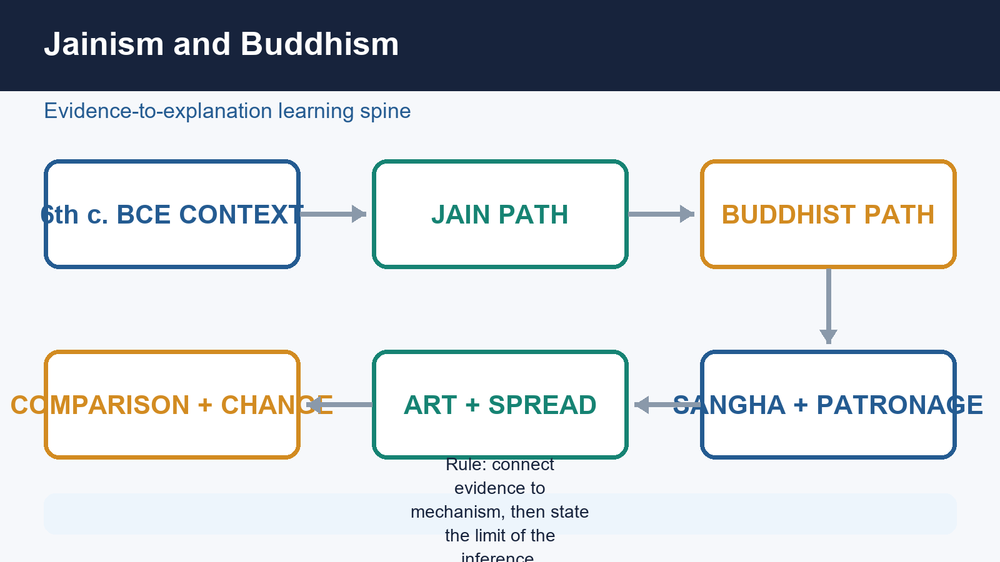

*Original deterministic visual: a topic-specific evidence-to-explanation spine. It is a learning aid, not historical evidence.*

#### Coverage lock

- **Required scope:** Background, doctrines, sanghas, accurately bounded councils and sects, patronage, spread, art, economy, social dimensions and comparison.
- **Basic completeness:** the complete detailed legacy learner session is retained before practice.
- **Practice completeness:** verified PYQs, strict-rotation MCQs/remediation and solved 10/15/20-mark answers are retained.
- **Advanced boundary:** the exact Advanced owner is placed only after all Basic and practice material.
- **Register-last rule:** complete topic-specific consolidated notes remain the final H2 section.

#### Legacy package source and coverage ledger

> **Subject:** Ancient Indian History | **Paper:** Prelims GS-I + GS-I historical/cultural support | **Topic:** 10 | **Date:** 13 August 2026
>
> **Evidence key:** RETRIEVED FACT = directly supported by named repository, local-book, official-paper or authoritative heritage source. INTERPRETATION = source-based analytical reading. INFERENCE = bounded conclusion.
>
> **Approval state:** generated, **approved=false**. Only explicit user approval can change the status to approved.

#### Package Practice Counts

| Component | Count |
| --- | --- |
| Verified/routed Prelims PYQs | 15 |
| Solved relevant Mains PYQs | 2 |
| Hard MCQs with explanations | 48 |
| Remedial MCQs with explanations | 12 |
| Original solved 10-mark Mains | 3 |
| Original solved 15-mark Mains | 3 |
| Original solved 20-mark Mains | 3 |

#### Authoritative modern heritage links

- UNESCO, Buddhist Monuments at Sanchi: https://whc.unesco.org/en/list/524/
- UNESCO, Mahabodhi Temple Complex at Bodh Gaya: https://whc.unesco.org/en/list/1056/
- UNESCO, Archaeological Site of Nalanda Mahavihara: https://whc.unesco.org/en/list/1502/
- Archaeological Survey of India, excavation reports and protected-monument framework: https://asi.nic.in/pages/Publications/excavationReports

No live current-affairs claim is forced. These links support present-day heritage description and conservation only.

## BASIC LEARNING SESSION

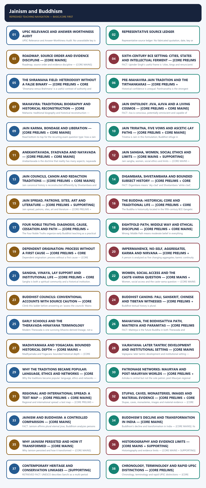

*Distinct embedded teaching-navigation image. The separate continuous Cārvāka-style flowchart package remains an independent at-a-glance artifact.*

> A source-critical session separating early doctrine, later sectarian development, canonical redaction, material history and modern simplification.

### SESSION 1 — UPSC RELEVANCE AND ANSWER-WORTHINESS AUDIT

#### DEFINITION / WHAT THIS IS CALLED

**Plain-language definition:** Syllabus and verified-demand reality.

**Technical definition:** UPSC Relevance and Answer-Worthiness Audit: No unavailable key is treated as official; the 2026 key stays provisional and 2018-2023 unavailable keys are labelled inferred.

#### ANSWER-GRABBING OPENING — WRITE/ADAPT IN THE EXAM

> Syllabus and verified-demand reality.

#### MUST-WRITE KEYWORDS

- **Syllabus and verified-demand reality.**
- **direct Prelims value**
- **strong Mains support**
- **CORE PRELIMS**
- **CORE MAINS**
- **SUPPORTING**
- **OPTIONAL ADVANCED**
- **Memorise**

**How to use them:** Syllabus and verified-demand reality.

**Syllabus and verified-demand reality.** Jainism and Buddhism carry **direct Prelims value** (fifteen routed 2018-2026 questions on doctrine, sects, schools and sites) and **strong Mains support** through comparison, causation (spread/decline/persistence) and source-criticism questions. No unavailable key is treated as official; the 2026 key stays provisional and 2018-2023 unavailable keys are labelled inferred.

| Major block | Label | Learner action |
| --- | --- | --- |
| Shramana-context markers; Jain ontology/vows/sect names; Buddhist Four Truths/Eightfold Path/school names; council and canon labels; site names (Sanchi, Bodh Gaya, Nalanda, Amaravati); rapid chronology/terminology distinctions | **CORE PRELIMS** | Memorise diagnostic terms, site-tradition pairs and school/sect labels. |
| Doctrinal comparison; why-popular, why-declined and why-persisted causation; social access and its limits; patronage-spread linkages; historiography and evidence method | **CORE MAINS** | Build a claim -> named evidence -> analysis -> qualification -> verdict answer. |
| Illustrative sites/texts beyond the headline examples; contemporary heritage and conservation notes; secondary sect distinctions | **SUPPORTING** | Keep representative examples only; do not memorise exhaustively. |
| Deeper Advanced-owner refinements placed in the final optional block | **OPTIONAL ADVANCED** | Add only after the Basic/practice answer is already secure. |

**Memorise:** shramana-era markers, jiva-ajiva/Triratna/five vows, Four Noble Truths/Eightfold Path terms, Sthaviravadin-Mahasanghika and Theravada-Mahayana-Vajrayana labels, and Sanchi/Bodh Gaya/Nalanda/Amaravati site-tradition pairs.  
**Understand:** doctrine is reconstructed from layered, redacted sources rather than eyewitness transcripts, and causation for spread, decline and persistence is multi-factor, never single-cause.  
**Use selectively:** secondary sites, minor sect distinctions and illustrative examples beyond the headline PYQ-routed facts.  
**Reserve for depth:** Madhyamaka/Yogacara nuance, Vajrayana institutional detail and further Advanced-owner refinements in the optional block.

#### CLOSING RECALL FLOW — UPSC RELEVANCE AND ANSWER-WORTHINESS AUDIT

```text
START / CONCEPT: UPSC Relevance and Answer-Worthiness Audit
        |
        v
EXACT TERMS: Syllabus and verified-demand reality. · direct Prelims value · strong Mains support · CORE PRELIMS · CORE MAINS
        |
        v
MECHANISM / ARGUMENT: Jainism and Buddhism carry direct Prelims value (fifteen routed 2018-2026 questions on doctrine, sects, schools and sites) and strong Mains support through comparison, causation (spread/decline/persistence) and source-criticism questions.
        |
        v
CONSEQUENCE / CONTRAST: No unavailable key is treated as official; the 2026 key stays provisional and 2018-2023 unavailable keys are labelled inferred.
        |
        v
UPSC TRAP / ANSWER-USE: Understand: doctrine is reconstructed from layered, redacted sources rather than eyewitness transcripts, and causation for spread, decline and persistence is multi-factor, never single-cause.
        |
        v
ANSWER-GRABBING FORMULATION: Syllabus and verified-demand reality.
```
### SESSION 2 — REPRESENTATIVE SOURCE LEDGER

#### DEFINITION / WHAT THIS IS CALLED

**Plain-language definition:** The package follows the repository's required source hierarchy and uses the strongest source for each claim.

**Technical definition:** Representative source ledger: No fabricated quotation, date, key or canonical reference is used.

#### ANSWER-GRABBING OPENING — WRITE/ADAPT IN THE EXAM

> The package follows the repository's required source hierarchy and uses the strongest source for each claim.

#### MUST-WRITE KEYWORDS

- **Memory hook**
- **Mains/PYQ use**
- **Study link**
- **2018**
- **2026**
- **2024**
- **Representative source ledger**

**How to use them:** The package follows the repository's required source hierarchy and uses the strongest source for each claim.

The package follows the repository's required source hierarchy and uses the strongest source for each claim.

#### Evidence / comparison matrix

| Source layer | Representative sources | Use and caveat |
| --- | --- | --- |
| Repository Markdown | Topic 10 basic/advanced; README; Master Chronology; Revision Chart; syllabus and PYQ routing; Topics 11 and 13 context | Primary architecture, audited uncommon terms, exact routed demands, and answer-worthiness upgrades. |
| Local OCR books | R. S. Sharma, Ancient India, Jainism and Buddhism chapter; Upinder Singh, Cities, Kings, and Renunciants plus post-Mauryan religious chapters | Deeper doctrine, social setting, institutions, art, patronage and source criticism. Older textbook dates and monocausal formulations are qualified. |
| Official papers and keys | Local UPSC Prelims papers 2018-2026; official 2024 Set-A key; provisional 2026 key file; routed Mains GS-I papers | Exact question discipline. Unavailable or unreadable keys are labelled inferred, never official. |
| Authoritative heritage links | UNESCO World Heritage Centre pages for Sanchi, Mahabodhi Temple Complex and Nalanda Mahavihara; ASI protected-site framework | Modern conservation and heritage facts only. They are not used as proof of early doctrine or biography. |
| Qdrant | Not used | Repository Markdown and OCR-searchable books were sufficient. |

#### Core teaching / solved analysis

- Repository Markdown controls topic ownership, audited uncommon terms and PYQ routing.
- OCR-searchable books deepen doctrine, social history, institutions, art and historiography.
- Official papers control question wording and key status.
- Authoritative modern sources are restricted to heritage and conservation.
- Qdrant was unnecessary and did not delay the package.

> **Memory hook:** M-O-L-Q: Markdown, OCR, Live authoritative, Qdrant optional.

#### Must-know facts

- Retrieved fact, interpretation and inference are labelled in the substantive sections.
- No fabricated quotation, date, key or canonical reference is used.

#### UPSC traps

- **Wrong:** A modern heritage page can prove ancient doctrine. **Correct:** Use it only for modern status, material description and conservation.
- **Wrong:** A textbook date is automatically uncontested. **Correct:** Label traditional and conventional chronologies.

**Mains/PYQ use:** Source-control card for the complete package.

**Study link:** AGENTS.md and AGENT_MEMORY.md workflow.

#### CLOSING RECALL FLOW — REPRESENTATIVE SOURCE LEDGER

```text
START / CONCEPT: Representative source ledger
        |
        v
EXACT TERMS: Memory hook · Mains/PYQ use · Study link · 2018 · 2026
        |
        v
MECHANISM / ARGUMENT: Repository Markdown controls topic ownership, audited uncommon terms and PYQ routing.
        |
        v
CONSEQUENCE / CONTRAST: OCR-searchable books deepen doctrine, social history, institutions, art and historiography.
        |
        v
UPSC TRAP / ANSWER-USE: Qdrant was unnecessary and did not delay the package.
        |
        v
ANSWER-GRABBING FORMULATION: The package follows the repository's required source hierarchy and uses the strongest source for each claim.
```
### SESSION 3 — ROADMAP, SOURCE ORDER AND EVIDENCE DISCIPLINE — [CORE MAINS]

#### DEFINITION / WHAT THIS IS CALLED

**Plain-language definition:** This package treats Jainism and Buddhism as historical traditions with several layers: early teaching, institutional development, sectarian memory, canonical redaction, material evidence and modern textbook reconstruction.

**Technical definition:** Roadmap, source order and evidence discipline — [CORE MAINS]: Read the structure first; each arrow is a historical relationship, not an automatic law.

#### ANSWER-GRABBING OPENING — WRITE/ADAPT IN THE EXAM

> This package treats Jainism and Buddhism as historical traditions with several layers: early teaching, institutional development, sectarian memory, canonical redaction, material evidence and modern textbook reconstruction.

#### MUST-WRITE KEYWORDS

- **Memory hook**
- **Mains/PYQ use**
- **Study link**
- **Roadmap, source order and evidence discipline — [CORE MAINS]**

**How to use them:** This package treats Jainism and Buddhism as historical traditions with several layers: early teaching, institutional development, sectarian memory, canonical redaction, material evidence and modern textbook reconstruction.

This package treats Jainism and Buddhism as historical traditions with several layers: early teaching, institutional development, sectarian memory, canonical redaction, material evidence and modern textbook reconstruction. It separates retrieved fact, interpretation and inference.

#### Timeline

| Date/phase | Event |
| --- | --- |
| c. 6th-5th centuries BCE | Mahavira and Buddha in the wider shramana world. |
| c. 3rd century BCE | Mauryan inscriptions and Buddhist patronage create firmer external evidence. |
| c. 1st century BCE-3rd century CE | Canonical writing/redaction, early schools, Mahayana growth and expanding material networks. |
| c. 5th-6th centuries CE | Valabhi redaction tradition; mature Buddhist and Jain scholastic worlds. |
| c. 7th-12th centuries CE | Vajrayana, mahaviharas and regionally varied transformation. |

#### Compact visual / answer logic

```text
EARLY TEACHING
      |
      v
ORAL TRANSMISSION -> MONASTIC MEMORY -> SECTARIAN COLLECTIONS
      |                                      |
      v                                      v
INSCRIPTIONS / SITES                    CANONICAL REDACTION
      \                                      /
       -> HISTORICAL RECONSTRUCTION <-
```

*Read the structure first; each arrow is a historical relationship, not an automatic law.*

#### Core teaching / solved analysis

- FACT: The mandatory order used here is repository Markdown, local OCR books, bounded authoritative heritage links, then optional Qdrant.
- FACT: Early Buddhist and Jain texts were transmitted, organized and redacted over time; a late manuscript can preserve older material but is not itself an eyewitness document.
- INTERPRETATION: Doctrine must be reconstructed through comparison of textual lineages, inscriptions, archaeology, art and institutional history.
- INFERENCE: The strongest master thesis is that both traditions arose within sixth-century BCE social churn but developed distinct metaphysics, disciplines, institutions and regional trajectories.
- METHOD: In every answer use claim -> named text, inscription, site or patron -> what it proves -> limitation.

> **Memory hook:** LAYER: Life/tradition, Archive, Year/region, Evidence type, Redaction.

#### Must-know facts

- Pali, Sanskrit, Tibetan and Chinese Buddhist witnesses are related but not interchangeable.
- Shvetambara and Digambara Jain textual histories differ on what survived.
- Council narratives are conventional frameworks, not neutral modern minutes.

#### UPSC traps

- **Wrong:** A canonical text is a verbatim transcript of the founder. **Correct:** Treat it as transmitted tradition whose layers require criticism.
- **Wrong:** One council chronology is accepted by all Buddhist or Jain schools. **Correct:** Name the tradition and signal retrospective or sectarian elements.

**Mains/PYQ use:** Open source-based answers by distinguishing event, memory, redaction and surviving manuscript.

**Study link:** Topic 02 source criticism -> Topic 10 -> Topics 14-16 patronage and material culture.

#### CLOSING RECALL FLOW — ROADMAP, SOURCE ORDER AND EVIDENCE DISCIPLINE — [CORE MAINS]

```text
START / CONCEPT: Roadmap, source order and evidence discipline — [CORE MAINS]
        |
        v
EXACT TERMS: Memory hook · Mains/PYQ use · Study link · Roadmap, source order and evidence discipline — [CORE MAINS]
        |
        v
MECHANISM / ARGUMENT: INTERPRETATION: Doctrine must be reconstructed through comparison of textual lineages, inscriptions, archaeology, art and institutional history.
        |
        v
CONSEQUENCE / CONTRAST: Read the structure first; each arrow is a historical relationship, not an automatic law.
        |
        v
UPSC TRAP / ANSWER-USE: Read the structure first; each arrow is a historical relationship, not an automatic law.
        |
        v
ANSWER-GRABBING FORMULATION: This package treats Jainism and Buddhism as historical traditions with several layers: early teaching, institutional development, sectarian memory, canonical redaction, material evidence and modern textbook reconstruction.
```
### SESSION 4 — SIXTH-CENTURY BCE SETTING: CITIES, STATES AND INTELLECTUAL FERMENT — [CORE PRELIMS + CORE MAINS]

#### DEFINITION / WHAT THIS IS CALLED

**Plain-language definition:** Jainism and Buddhism emerged in the middle Gangetic and adjoining world of territorial states, gana-sanghas, agrarian expansion, towns, exchange and renunciation.

**Technical definition:** FACT: Upinder Singh's useful frame is 'cities, kings and renunciants' for north India c.

#### ANSWER-GRABBING OPENING — WRITE/ADAPT IN THE EXAM

> Jainism and Buddhism emerged in the middle Gangetic and adjoining world of territorial states, gana-sanghas, agrarian expansion, towns, exchange and renunciation.

#### MUST-WRITE KEYWORDS

- **Production**
- **Nodes**
- **Tension**
- **Search**
- **Institutions**
- **Qualification**
- **Memory hook**
- **Mains/PYQ use**

**How to use them:** Jainism and Buddhism emerged in the middle Gangetic and adjoining world of territorial states, gana-sanghas, agrarian expansion, towns, exchange and renunciation.

Jainism and Buddhism emerged in the middle Gangetic and adjoining world of territorial states, gana-sanghas, agrarian expansion, towns, exchange and renunciation. These conditions widened their audience, but doctrine cannot be mechanically derived from iron or trade.

#### Evidence / comparison matrix

| Dimension | Evidence | Historical use | Limit |
| --- | --- | --- | --- |
| Agriculture | Gangetic settlement and iron-tool context | Supports denser surplus worlds | Iron is enabling, not deterministic |
| Urbanism | NBPW, fortified centres, crafts | New audiences and donation nodes | Many regions remained rural |
| Exchange | Punch-marked coins; setthi/gahapati | Lay wealth and mobility | Monetisation was uneven |
| Polity | Mahajanapadas and gana-sanghas | War, taxation and patronage | Not all states were monarchies |
| Intellect | Shramana, Ajivika, Jain and Buddhist debates | Plural search for release and ethics | Not a single anti-Vedic party |

#### Doctrine / historical process flow

1. **Production:** Agrarian expansion and surplus
2. **Nodes:** Towns, routes, courts and markets
3. **Tension:** Hierarchy, violence, debt and ritual cost
4. **Search:** Renunciation, ethics and liberation doctrines
5. **Institutions:** Sanghas plus lay support
6. **Qualification:** Ideas retain autonomy; regions vary

#### Core teaching / solved analysis

- FACT: Upinder Singh's useful frame is 'cities, kings and renunciants' for north India c. 600-200 BCE.
- FACT: NBPW horizons, punch-marked coins, towns such as Rajagriha, Vaishali, Kaushambi and Shravasti, and categories such as gahapati and setthi mark a changing social economy.
- FACT: Monarchies and oligarchic gana-sanghas coexisted; Mahavira and Buddha were linked by tradition to kshatriya clan settings.
- INTERPRETATION: Renunciant critique gained relevance because household wealth, debt, hierarchy, warfare and sacrifice had become sharper social questions.
- QUALIFICATION: The subcontinent did not urbanize uniformly, merchants were not the only followers, and economic change cannot explain specific doctrines such as anatta or anekantavada.

> **Memory hook:** C-K-R: Cities, Kings, Renunciants - plus the caveat 'context is not cause alone'.

#### Must-know facts

- Second urbanisation is a context, not the sole cause of heterodoxy.
- Gana-sangha means oligarchic corporate polity, not universal democracy.
- Gahapati and setthi reveal economic status beyond ritual varna alone.

#### UPSC traps

- **Wrong:** Jainism and Buddhism were crude merchant ideologies. **Correct:** Merchants mattered, but rulers, householders, women, artisans and renouncers also shaped them.
- **Wrong:** The movements simply continued Upanishadic thought. **Correct:** They shared a debate world but developed distinct doctrines and institutions.

**Mains/PYQ use:** Use material setting in one paragraph, then preserve doctrinal autonomy and regional variation.

**Study link:** Topics 09, 11 and 13.

#### CLOSING RECALL FLOW — SIXTH-CENTURY BCE SETTING: CITIES, STATES AND INTELLECTUAL FERMENT — [CORE PRELIMS + CORE MAINS]

```text
START / CONCEPT: Sixth-century BCE setting: cities, states and intellectual ferment — [CORE PRELIMS + CORE MAINS]
        |
        v
EXACT TERMS: Production · Nodes · Tension · Search · Institutions
        |
        v
MECHANISM / ARGUMENT: FACT: Monarchies and oligarchic gana-sanghas coexisted; Mahavira and Buddha were linked by tradition to kshatriya clan settings.
        |
        v
CONSEQUENCE / CONTRAST: Production: Agrarian expansion and surplus
        |
        v
UPSC TRAP / ANSWER-USE: These conditions widened their audience, but doctrine cannot be mechanically derived from iron or trade.
        |
        v
ANSWER-GRABBING FORMULATION: Jainism and Buddhism emerged in the middle Gangetic and adjoining world of territorial states, gana-sanghas, agrarian expansion, towns, exchange and renunciation.
```
### SESSION 5 — THE SHRAMANA FIELD: HETERODOXY WITHOUT A FALSE BINARY — [CORE PRELIMS + CORE MAINS]

#### DEFINITION / WHAT THIS IS CALLED

**Plain-language definition:** !g3 visual -- The Sixth-Century BCE Shramana Field

**Technical definition:** 'Shramana versus Brahmana' is a useful contrast of authority and practice, but historical interaction was continuous.

#### ANSWER-GRABBING OPENING — WRITE/ADAPT IN THE EXAM

> !g3 visual -- The Sixth-Century BCE Shramana Field

#### MUST-WRITE KEYWORDS

- **Memory hook**
- **Mains/PYQ use**
- **Study link**

**How to use them:** !g3 visual -- The Sixth-Century BCE Shramana Field

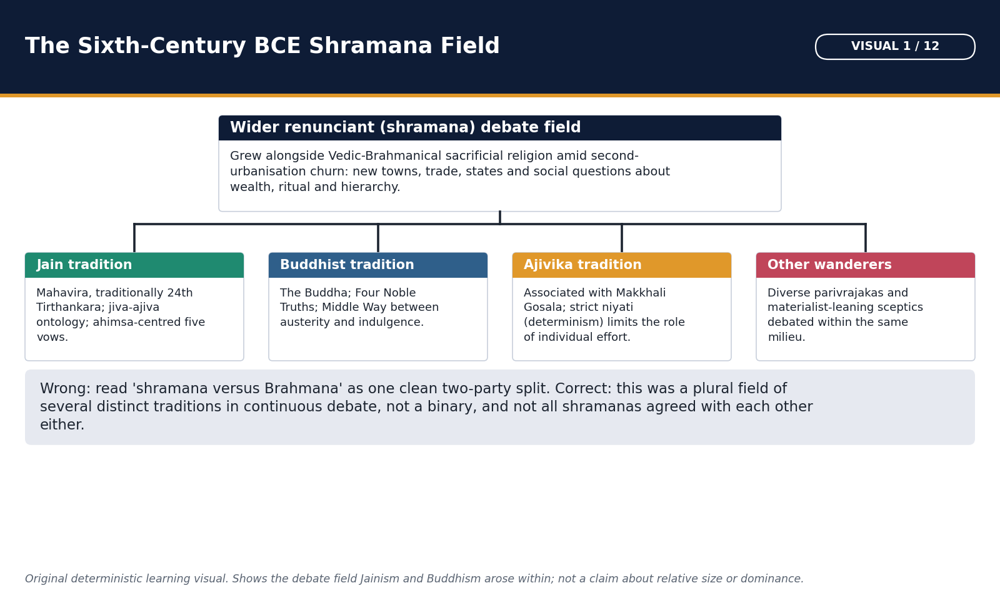

*Use this map to place Jainism and Buddhism inside the same sixth-century BCE ferment before studying either tradition on its own.*

Buddhists and Jainas belonged to a wider renunciant field that also included Ajivikas, materialists and wandering teachers. 'Shramana versus Brahmana' is a useful contrast of authority and practice, but historical interaction was continuous.

#### Compact visual / answer logic

```text
SIXTH-CENTURY DEBATE FIELD
                liberation / suffering / action
                         |
 BRAHMANICAL ---- JAIN ---- BUDDHIST ---- AJIVIKA ---- MATERIALIST
 ritual/text      jiva       anatta        niyati       no afterlife
                         |
        debate + borrowing + competition + patronage
```

*Read the structure first; each arrow is a historical relationship, not an automatic law.*

#### Core teaching / solved analysis

- FACT: Parivrajaka denotes a wandering renunciant; shramana a striver/ascetic across several non-Vedic movements; upasaka/upasika a Buddhist lay follower.
- FACT: Renunciation challenged the exclusive salvific authority of sacrifice, hereditary priesthood and household status.
- INTERPRETATION: Competition occurred through debate, patronage, ethical reputation and recruitment, not through a single organized revolution.
- FACT: Both Jain and Buddhist traditions retained karma, rebirth and liberation concerns while redefining agency, selfhood and the path.
- QUALIFICATION: Later Brahmanical traditions absorbed ahimsa, renunciation and devotional/ethical forms; Jain and Buddhist communities also adopted ritual, image and pilgrimage practices.

> **Memory hook:** P-S-U: Parivrajaka wanders; Shramana strives; Upasaka supports.

#### Must-know facts

- Shramana is broader than Buddhist monk.
- Upasaka is a lay Buddhist, not an ordained monk.
- Heterodox does not mean socially or doctrinally identical.

#### UPSC traps

- **Wrong:** Every shramana denied karma and rebirth. **Correct:** Jainism and Buddhism retained them but interpreted them differently.
- **Wrong:** Brahmanical and shramana worlds never interacted. **Correct:** Debate, borrowing, shared patrons and later synthesis were extensive.

**Mains/PYQ use:** A comparison answer should begin with the common debate field and then separate ontology, path and institution.

**Study link:** Topic 24 developments in philosophy.

#### CLOSING RECALL FLOW — THE SHRAMANA FIELD: HETERODOXY WITHOUT A FALSE BINARY — [CORE PRELIMS + CORE MAINS]

```text
START / CONCEPT: The shramana field: heterodoxy without a false binary — [CORE PRELIMS + CORE MAINS]
        |
        v
EXACT TERMS: Memory hook · Mains/PYQ use · Study link
        |
        v
MECHANISM / ARGUMENT: INTERPRETATION: Competition occurred through debate, patronage, ethical reputation and recruitment, not through a single organized revolution.
        |
        v
CONSEQUENCE / CONTRAST: 'Shramana versus Brahmana' is a useful contrast of authority and practice, but historical interaction was continuous.
        |
        v
UPSC TRAP / ANSWER-USE: Read the structure first; each arrow is a historical relationship, not an automatic law.
        |
        v
ANSWER-GRABBING FORMULATION: !g3 visual -- The Sixth-Century BCE Shramana Field
```
### SESSION 6 — PRE-MAHAVIRA JAIN TRADITION AND THE TIRTHANKARAS — [CORE PRELIMS + SUPPORTING]

#### DEFINITION / WHAT THIS IS CALLED

**Plain-language definition:** Jain tradition presents a succession of twenty-four Tirthankaras, with Mahavira as the twenty-fourth.

**Technical definition:** Historical confidence is unequal: Parshvanatha is the strongest pre-Mahavira candidate, while claims for very early figures belong primarily to sacred tradition.

#### ANSWER-GRABBING OPENING — WRITE/ADAPT IN THE EXAM

> Jain tradition presents a succession of twenty-four Tirthankaras, with Mahavira as the twenty-fourth.

#### MUST-WRITE KEYWORDS

- **Memory hook**
- **Mains/PYQ use**
- **Study link**

**How to use them:** Jain tradition presents a succession of twenty-four Tirthankaras, with Mahavira as the twenty-fourth.

Jain tradition presents a succession of twenty-four Tirthankaras, with Mahavira as the twenty-fourth. Historical confidence is unequal: Parshvanatha is the strongest pre-Mahavira candidate, while claims for very early figures belong primarily to sacred tradition.

#### Evidence / comparison matrix

| Figure | Traditional position | Historical use | Caution |
| --- | --- | --- | --- |
| Rishabhanatha | 1st Tirthankara | Foundational sacred memory | No secure Bronze Age identification |
| Neminatha | 22nd Tirthankara | Important western Jain tradition | Epic association is not independent dating |
| Parshvanatha | 23rd Tirthankara | Plausible pre-Mahavira teacher/community | Biography remains tradition-shaped |
| Mahavira | 24th Tirthankara | Historical organizer and teacher | Sect biographies differ |

#### Core teaching / solved analysis

- FACT: A Tirthankara is a 'ford-maker' who discovers and teaches a route across bondage; the term is not a creator-god title.
- TRADITION: Rishabhanatha is the first Tirthankara, Parshvanatha the twenty-third and Mahavira the twenty-fourth.
- INTERPRETATION: Parshvanatha may preserve memory of an earlier ascetic community associated with four restraints.
- FACT: Jain tradition often distinguishes Parshva's fourfold discipline from Mahavira's explicit five great vows, especially the separate vow of celibacy.
- LIMIT: Iconographic or literary references to earlier Tirthankaras do not prove the historicity or traditional dates of all twenty-four.

> **Memory hook:** 1-23-24: Rishabha, Parshva, Mahavira - tradition, plausible predecessor, historical teacher.

#### Must-know facts

- Mahavira should not be called the first Jain teacher.
- Four vows versus five vows is a standard exam distinction.
- Tirthankara is not equivalent to Buddhist Bodhisattva.

#### UPSC traps

- **Wrong:** Mahavira founded Jainism from nothing. **Correct:** Describe him as the twenty-fourth Tirthankara and major historical systematizer/organizer.
- **Wrong:** Harappan seals prove Rishabhanatha. **Correct:** Such identifications are speculative and not secure archaeological proof.

**Mains/PYQ use:** Use a graded evidence ladder: sacred sequence -> plausible Parshva memory -> firmer Mahavira horizon.

**Study link:** Jain chronology and source limits.

#### CLOSING RECALL FLOW — PRE-MAHAVIRA JAIN TRADITION AND THE TIRTHANKARAS — [CORE PRELIMS + SUPPORTING]

```text
START / CONCEPT: Pre-Mahavira Jain tradition and the Tirthankaras — [CORE PRELIMS + SUPPORTING]
        |
        v
EXACT TERMS: Memory hook · Mains/PYQ use · Study link
        |
        v
MECHANISM / ARGUMENT: Historical confidence is unequal: Parshvanatha is the strongest pre-Mahavira candidate, while claims for very early figures belong primarily to sacred tradition.
        |
        v
CONSEQUENCE / CONTRAST: FACT: A Tirthankara is a 'ford-maker' who discovers and teaches a route across bondage; the term is not a creator-god title.
        |
        v
UPSC TRAP / ANSWER-USE: FACT: A Tirthankara is a 'ford-maker' who discovers and teaches a route across bondage; the term is not a creator-god title.
        |
        v
ANSWER-GRABBING FORMULATION: Jain tradition presents a succession of twenty-four Tirthankaras, with Mahavira as the twenty-fourth.
```
### SESSION 7 — MAHAVIRA: TRADITIONAL BIOGRAPHY AND HISTORICAL RECONSTRUCTION — [CORE PRELIMS + CORE MAINS]

#### DEFINITION / WHAT THIS IS CALLED

**Plain-language definition:** Mahavira, also called Vardhamana and Nigantha Nataputta/Nayaputta in Pali sources, belonged to the sixth-fifth-century BCE Gangetic world.

**Technical definition:** Mahavira: traditional biography and historical reconstruction — [CORE PRELIMS + CORE MAINS]: Read the structure first; each arrow is a historical relationship, not an automatic law.

#### ANSWER-GRABBING OPENING — WRITE/ADAPT IN THE EXAM

> Mahavira, also called Vardhamana and Nigantha Nataputta/Nayaputta in Pali sources, belonged to the sixth-fifth-century BCE Gangetic world.

#### MUST-WRITE KEYWORDS

- **Memory hook**
- **Mains/PYQ use**
- **Study link**
- **599**
- **527 BCE**
- **540**
- **468 BCE**

**How to use them:** Mahavira, also called Vardhamana and Nigantha Nataputta/Nayaputta in Pali sources, belonged to the sixth-fifth-century BCE Gangetic world.

Mahavira, also called Vardhamana and Nigantha Nataputta/Nayaputta in Pali sources, belonged to the sixth-fifth-century BCE Gangetic world. Traditional biographies agree on renunciation, severe asceticism, kevala knowledge and teaching, but differ on dates, marriage and details.

#### Compact visual / answer logic

```text
HISTORICAL CORE                 TRADITIONAL ELABORATION
Nigantha teacher                auspicious dreams / exact episodes
renunciation and discipline     sect-specific marriage account
organized followers             fixed traditional dates
eastern Gangetic setting        cosmic biography
```

*Read the structure first; each arrow is a historical relationship, not an automatic law.*

#### Core teaching / solved analysis

- TRADITION: Shvetambara accounts associate him with Kundagrama near Vaishali, parents Siddhartha and Trishala, marriage to Yashoda, renunciation at thirty, twelve years of asceticism and nirvana at Pavapuri.
- TRADITION: Digambara accounts deny his marriage and preserve different emphases in hagiography.
- FACT: Pali Buddhist texts know him as Nigantha Nataputta, proving that an organized Nigantha/Jain community was recognized by rival near-contemporary traditions.
- INTERPRETATION: Clan and gana-sangha associations locate him in the political culture of the eastern Gangetic basin.
- DATE CAUTION: Traditional 599-527 BCE and older textbook 540-468 BCE schemes should be labelled conventional; absolute chronology remains debated.

> **Memory hook:** N-K-P: Nataputta, Kevala, Pavapuri.

#### Must-know facts

- Nayaputta/Nataputta refers to Mahavira, not Buddha.
- Kevala/kevalajnana is Jain omniscient knowledge.
- Pavapuri is the traditional nirvana site.

#### UPSC traps

- **Wrong:** All Jain biographies agree that Mahavira married. **Correct:** Shvetambara and Digambara traditions differ.
- **Wrong:** Traditional dates are uncontested historical facts. **Correct:** Label chronology conventional and distinguish event from later biography.

**Mains/PYQ use:** Biography answers should separate cross-tradition core, sect-specific detail and chronological caution.

**Study link:** Pali source comparison; Vaishali and gana-sangha context.

#### CLOSING RECALL FLOW — MAHAVIRA: TRADITIONAL BIOGRAPHY AND HISTORICAL RECONSTRUCTION — [CORE PRELIMS + CORE MAINS]

```text
START / CONCEPT: Mahavira: traditional biography and historical reconstruction — [CORE PRELIMS + CORE MAINS]
        |
        v
EXACT TERMS: Memory hook · Mains/PYQ use · Study link · 599 · 527 BCE
        |
        v
MECHANISM / ARGUMENT: FACT: Pali Buddhist texts know him as Nigantha Nataputta, proving that an organized Nigantha/Jain community was recognized by rival near-contemporary traditions.
        |
        v
CONSEQUENCE / CONTRAST: Read the structure first; each arrow is a historical relationship, not an automatic law.
        |
        v
UPSC TRAP / ANSWER-USE: Read the structure first; each arrow is a historical relationship, not an automatic law.
        |
        v
ANSWER-GRABBING FORMULATION: Mahavira, also called Vardhamana and Nigantha Nataputta/Nayaputta in Pali sources, belonged to the sixth-fifth-century BCE Gangetic world.
```
### SESSION 8 — JAIN ONTOLOGY: JIVA, AJIVA AND A LIVING COSMOS — [CORE PRELIMS + CORE MAINS]

#### DEFINITION / WHAT THIS IS CALLED

**Plain-language definition:** Jainism posits a plurality of eternal jivas (souls) entangled with non-soul realities.

**Technical definition:** FACT: Jiva is conscious, potentially omniscient and capable of liberation; embodied jivas occupy many grades of sense-capacity.

#### ANSWER-GRABBING OPENING — WRITE/ADAPT IN THE EXAM

> Jainism posits a plurality of eternal jivas (souls) entangled with non-soul realities.

#### MUST-WRITE KEYWORDS

- **Memory hook**
- **Mains/PYQ use**
- **Study link**
- **2023**
- **2026**

**How to use them:** Jainism posits a plurality of eternal jivas (souls) entangled with non-soul realities.

Jainism posits a plurality of eternal jivas (souls) entangled with non-soul realities. Its radical extension of life and sentience underlies strict ahimsa and the 2023 UPSC formulation about souls in plants, water, earth and other natural forms.

#### Evidence / comparison matrix

| Category | Meaning | Exam distinction |
| --- | --- | --- |
| Jiva | Conscious soul | Plural and individual; unlike Buddhist anatta |
| Pudgala | Matter | Includes karmic matter in Jain theory |
| Dharma-dravya | Medium enabling motion | Not moral duty here |
| Adharma-dravya | Medium enabling rest | Not moral evil here |
| Akasha/Kala | Space/time | Complete the common six-dravya scheme |

#### Core teaching / solved analysis

- FACT: Jiva is conscious, potentially omniscient and capable of liberation; embodied jivas occupy many grades of sense-capacity.
- FACT: Ajiva includes pudgala (matter), dharma as the medium of motion, adharma as the medium of rest, akasha (space) and, in common six-substance classification, kala (time).
- FACT: Dharma and adharma here are cosmological media, not simply moral merit and sin.
- FACT: Jain classifications include one-sensed beings associated with earth, water, fire, air and plants, explaining the unusual breadth of nonviolence.
- QUALIFICATION: Modern biological categories should not be projected onto this religious ontology.

> **Memory hook:** J-P-D-A-A-K: Jiva; Pudgala; Dharma; Adharma; Akasha; Kala.

#### Must-know facts

- The four main gatis are deva, manushya, naraki and tiryancha.
- Yaksha is not one of those four principal forms of existence.
- Jain ahimsa follows from ontology, not only sentiment.

#### UPSC traps

- **Wrong:** Ajiva means only dead matter. **Correct:** It is a wider category including media of motion/rest, space and time.
- **Wrong:** Jain dharma-dravya means righteous conduct. **Correct:** In ontology it is the medium of motion; ethical dharma is a different usage.

**Mains/PYQ use:** Link the broad ontology of life directly to dietary, occupational and monastic ethics, then state the category limit.

**Study link:** 2023 and 2026 Prelims PYQs.

#### CLOSING RECALL FLOW — JAIN ONTOLOGY: JIVA, AJIVA AND A LIVING COSMOS — [CORE PRELIMS + CORE MAINS]

```text
START / CONCEPT: Jain ontology: jiva, ajiva and a living cosmos — [CORE PRELIMS + CORE MAINS]
        |
        v
EXACT TERMS: Memory hook · Mains/PYQ use · Study link · 2023 · 2026
        |
        v
MECHANISM / ARGUMENT: Its radical extension of life and sentience underlies strict ahimsa and the 2023 UPSC formulation about souls in plants, water, earth and other natural forms.
        |
        v
CONSEQUENCE / CONTRAST: FACT: Jiva is conscious, potentially omniscient and capable of liberation; embodied jivas occupy many grades of sense-capacity.
        |
        v
UPSC TRAP / ANSWER-USE: FACT: Dharma and adharma here are cosmological media, not simply moral merit and sin.
        |
        v
ANSWER-GRABBING FORMULATION: Jainism posits a plurality of eternal jivas (souls) entangled with non-soul realities.
```
### SESSION 9 — JAIN KARMA, BONDAGE AND LIBERATION — [CORE PRELIMS + CORE MAINS]

#### DEFINITION / WHAT THIS IS CALLED

**Plain-language definition:** !g3 visual -- The Jain Liberation Chain

**Technical definition:** Read bottom-to-top for the recurring exam question type: how a Jain soul is said to move from bondage toward moksha.

#### ANSWER-GRABBING OPENING — WRITE/ADAPT IN THE EXAM

> !g3 visual -- The Jain Liberation Chain

#### MUST-WRITE KEYWORDS

- **Activity**
- **Asrava**
- **Bandha**
- **Samvara**
- **Nirjara**
- **Moksha**
- **Memory hook**
- **Mains/PYQ use**

**How to use them:** !g3 visual -- The Jain Liberation Chain

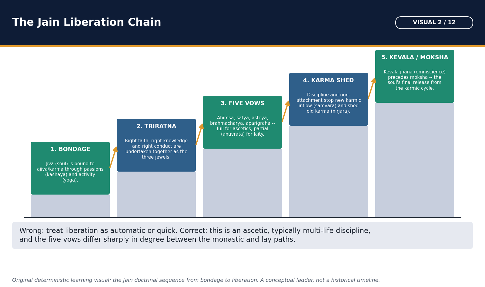

*Read bottom-to-top for the recurring exam question type: how a Jain soul is said to move from bondage toward moksha.*

Jain karma is subtle material matter that adheres to the soul because of activity and passions. Liberation requires stopping new influx and shedding accumulated karma through disciplined knowledge, conduct and austerity.

#### Doctrine / historical process flow

1. **Activity:** Body, speech, mind plus passions
2. **Asrava:** Karmic influx
3. **Bandha:** Matter binds jiva
4. **Samvara:** Stop new influx
5. **Nirjara:** Shed old karma
6. **Moksha:** Disembodied perfected jiva

#### Core teaching / solved analysis

- FACT: Asrava is karmic influx; bandha is bondage; samvara stops new influx; nirjara sheds accumulated karma; moksha is the liberated state.
- FACT: Passions such as anger, pride, deceit and greed intensify bondage.
- FACT: Liberation reveals the jiva's inherent knowledge, perception, bliss and energy; it does not merge into a creator god.
- INTERPRETATION: Severe asceticism is intelligible within a material karma theory: bodily and mental discipline has cosmological consequence.
- QUALIFICATION: Lay Jainism modifies ascetic intensity through limited vows and regulated livelihood.

> **Memory hook:** A-B-S-N-M: Asrava, Bandha, Samvara, Nirjara, Moksha.

#### Must-know facts

- Jain karma is not merely metaphorical moral memory.
- Samvara and nirjara are separate stages.
- Liberation is individual purification, not divine grace.

#### UPSC traps

- **Wrong:** Karma is identical in Jainism and Buddhism. **Correct:** Jainism treats karma as subtle matter; Buddhism emphasizes intentional action without a permanent soul.
- **Wrong:** Austerity alone is sufficient. **Correct:** The Triratna integrates right faith, knowledge and conduct.

**Mains/PYQ use:** A doctrine answer earns marks by showing why austerity follows from Jain karmic materialism.

**Study link:** Compare Buddhist karma and nirvana.

#### CLOSING RECALL FLOW — JAIN KARMA, BONDAGE AND LIBERATION — [CORE PRELIMS + CORE MAINS]

```text
START / CONCEPT: Jain karma, bondage and liberation — [CORE PRELIMS + CORE MAINS]
        |
        v
EXACT TERMS: Activity · Asrava · Bandha · Samvara · Nirjara
        |
        v
MECHANISM / ARGUMENT: Jain karma is subtle material matter that adheres to the soul because of activity and passions.
        |
        v
CONSEQUENCE / CONTRAST: Jain karma is subtle material matter that adheres to the soul because of activity and passions.
        |
        v
UPSC TRAP / ANSWER-USE: FACT: Liberation reveals the jiva's inherent knowledge, perception, bliss and energy; it does not merge into a creator god.
        |
        v
ANSWER-GRABBING FORMULATION: !g3 visual -- The Jain Liberation Chain
```
### SESSION 10 — JAIN TRIRATNA, FIVE VOWS AND ASCETIC-LAY PATHS — [CORE PRELIMS + CORE MAINS]

#### DEFINITION / WHAT THIS IS CALLED

**Plain-language definition:** Jain liberation rests on right faith, right knowledge and right conduct.

**Technical definition:** Triratna is Jain in this formulation; Buddhist refuge in Buddha-Dhamma-Sangha is a different triad.

#### ANSWER-GRABBING OPENING — WRITE/ADAPT IN THE EXAM

> Jain liberation rests on right faith, right knowledge and right conduct.

#### MUST-WRITE KEYWORDS

- **Memory hook**
- **Mains/PYQ use**
- **Study link**

**How to use them:** Jain liberation rests on right faith, right knowledge and right conduct.

Jain liberation rests on right faith, right knowledge and right conduct. The five vows are absolute mahavratas for ascetics and limited anuvratas for householders, creating a demanding but socially sustainable two-level discipline.

#### Evidence / comparison matrix

| Vow | Ascetic ideal | Lay adaptation | Historical implication |
| --- | --- | --- | --- |
| Ahimsa | Avoid injury with extreme vigilance | Limit harm in diet/work | Strong ethics of restraint |
| Satya | Truthful speech | Truth without harmful intent | Commerce and trust norms |
| Asteya | Take nothing ungiven | Reject theft/fraud | Property acknowledged but regulated |
| Brahmacharya | Complete celibacy | Sexual fidelity/restraint | Distinct monastic-householder paths |
| Aparigraha | Renounce possessions | Limit accumulation/attachment | Donation and disciplined wealth |

#### Core teaching / solved analysis

- FACT: The Triratna are samyak-darshana, samyak-jnana and samyak-charitra: right faith/view, knowledge and conduct.
- FACT: The five vows are ahimsa, satya, asteya, brahmacharya and aparigraha.
- FACT: Ascetics observe great vows rigorously; laity follow lesser vows, supplementary vows, charity, fasting and support of the sangha.
- INTERPRETATION: The lay path explains Jainism's continuity: liberation remains ascetic in ideal, yet graded conduct integrates traders, artisans and families.
- QUALIFICATION: Ahimsa does not make historical Jain communities economically or politically identical; practice varied by region, sect and occupation.

> **Memory hook:** A-S-A-B-A: Ahimsa, Satya, Asteya, Brahmacharya, Aparigraha.

#### Must-know facts

- Triratna is Jain in this formulation; Buddhist refuge in Buddha-Dhamma-Sangha is a different triad.
- Aparigraha means non-possession/non-attachment, not poverty imposed on all laity.
- Mahavira is traditionally associated with making celibacy an explicit fifth vow.

#### UPSC traps

- **Wrong:** Jain laity take the vows in exactly the same absolute form as monks. **Correct:** Householders observe anuvratas and supplementary restraints.
- **Wrong:** Triratna means Buddha, Dhamma and Sangha. **Correct:** That is the Buddhist three refuges, not the Jain path triad.

**Mains/PYQ use:** Compare absolute and limited vows to explain both ethical rigor and social continuity.

**Study link:** Jain monasticism, laity and persistence.

#### CLOSING RECALL FLOW — JAIN TRIRATNA, FIVE VOWS AND ASCETIC-LAY PATHS — [CORE PRELIMS + CORE MAINS]

```text
START / CONCEPT: Jain Triratna, five vows and ascetic-lay paths — [CORE PRELIMS + CORE MAINS]
        |
        v
EXACT TERMS: Memory hook · Mains/PYQ use · Study link
        |
        v
MECHANISM / ARGUMENT: QUALIFICATION: Ahimsa does not make historical Jain communities economically or politically identical; practice varied by region, sect and occupation.
        |
        v
CONSEQUENCE / CONTRAST: FACT: The Triratna are samyak-darshana, samyak-jnana and samyak-charitra: right faith/view, knowledge and conduct.
        |
        v
UPSC TRAP / ANSWER-USE: QUALIFICATION: Ahimsa does not make historical Jain communities economically or politically identical; practice varied by region, sect and occupation.
        |
        v
ANSWER-GRABBING FORMULATION: Jain liberation rests on right faith, right knowledge and right conduct.
```
### SESSION 11 — ANEKANTAVADA, SYADVADA AND NAYAVADA — [CORE PRELIMS + CORE MAINS]

#### DEFINITION / WHAT THIS IS CALLED

**Plain-language definition:** The three terms are related but not synonyms.

**Technical definition:** Anekantavada is the doctrine that reality has many aspects; nayavada analyzes partial standpoints; syadvada expresses qualified predication, conventionally through seven possible formulations.

#### ANSWER-GRABBING OPENING — WRITE/ADAPT IN THE EXAM

> The three terms are related but not synonyms.

#### MUST-WRITE KEYWORDS

- **Memory hook**
- **Mains/PYQ use**
- **Study link**

**How to use them:** The three terms are related but not synonyms.

The three terms are related but not synonyms. Anekantavada is the doctrine that reality has many aspects; nayavada analyzes partial standpoints; syadvada expresses qualified predication, conventionally through seven possible formulations.

#### Compact visual / answer logic

```text
REALITY: MANY-SIDED (ANEKANTA)
        /          |          \
   NAYA A       NAYA B       NAYA C
 partial view   partial view  partial view
        \          |          /
      SYAT: qualify every predication
      -> SAPTABHANGI logical formulations
```

*Read the structure first; each arrow is a historical relationship, not an automatic law.*

#### Core teaching / solved analysis

- FACT: Anekantavada is an ontological/epistemic warning against reducing a complex object to one absolute description.
- FACT: Naya is a partial standpoint that captures one aspect for a purpose; no single naya exhausts reality.
- FACT: Syat means 'in a certain respect/condition'; syadvada qualifies assertions rather than claiming that every proposition is simply true.
- FACT: Saptabhangi uses combinations of is, is not and is inexpressible under specified standpoints.
- QUALIFICATION: The doctrine is not careless relativism; incompatible claims require differences of standpoint, time, mode or relation.

> **Memory hook:** A-N-S: Anekanta = aspects; Naya = viewpoints; Syat = statements qualified.

#### Must-know facts

- Anekantavada concerns many-sided reality.
- Nayavada concerns standpoints.
- Syadvada concerns conditional predication.

#### UPSC traps

- **Wrong:** The three terms are interchangeable. **Correct:** Distinguish ontology, standpoint method and predication.
- **Wrong:** Syadvada says contradictions are true in the same respect. **Correct:** Qualifications of respect, mode and time prevent simple contradiction.

**Mains/PYQ use:** Use the blind-men-and-elephant analogy only after stating the precise three-level distinction.

**Study link:** Indian philosophy Topic 24; Jain comparison with Buddhist epistemology.

#### CLOSING RECALL FLOW — ANEKANTAVADA, SYADVADA AND NAYAVADA — [CORE PRELIMS + CORE MAINS]

```text
START / CONCEPT: Anekantavada, syadvada and nayavada — [CORE PRELIMS + CORE MAINS]
        |
        v
EXACT TERMS: Memory hook · Mains/PYQ use · Study link
        |
        v
MECHANISM / ARGUMENT: Anekantavada is the doctrine that reality has many aspects; nayavada analyzes partial standpoints; syadvada expresses qualified predication, conventionally through seven possible formulations.
        |
        v
CONSEQUENCE / CONTRAST: Read the structure first; each arrow is a historical relationship, not an automatic law.
        |
        v
UPSC TRAP / ANSWER-USE: The three terms are related but not synonyms.
        |
        v
ANSWER-GRABBING FORMULATION: The three terms are related but not synonyms.
```
### SESSION 12 — JAIN SANGHA, WOMEN, SOCIAL ETHICS AND LIMITS — [CORE MAINS + SUPPORTING]

#### DEFINITION / WHAT THIS IS CALLED

**Plain-language definition:** Jain traditions developed fourfold communities of monks, nuns, laymen and laywomen.

**Technical definition:** Jain sangha, women, social ethics and limits — [CORE MAINS + SUPPORTING]: Malli/Mallinatha is a major Shvetambara-Digambara distinction.

#### ANSWER-GRABBING OPENING — WRITE/ADAPT IN THE EXAM

> Jain traditions developed fourfold communities of monks, nuns, laymen and laywomen.

#### MUST-WRITE KEYWORDS

- **Memory hook**
- **Mains/PYQ use**
- **Study link**

**How to use them:** Jain traditions developed fourfold communities of monks, nuns, laymen and laywomen.

Jain traditions developed fourfold communities of monks, nuns, laymen and laywomen. This widened participation, but access did not erase hierarchy, gender debates or the demanding ascetic definition of liberation.

#### Evidence / comparison matrix

| Group | Role | Historical significance | Limit |
| --- | --- | --- | --- |
| Monks | Mahavratas, teaching, itinerancy | Authority and transmission | Depend on lay alms |
| Nuns | Ascetic discipline and teaching | Large female participation in tradition | Sectarian liberation debate |
| Laymen | Anuvratas, donation, occupations | Institutional finance and continuity | Not all were merchants |
| Laywomen | Vows, fasting, donation, household transmission | Community reproduction | Patriarchal settings persisted |

#### Core teaching / solved analysis

- FACT: Jain community structure recognizes sadhu, sadhvi, shravaka and shravika.
- FACT: Shvetambara tradition recognizes women's capacity for liberation and identifies Malli as a female Tirthankara; Digambara doctrine generally requires male rebirth for final liberation.
- FACT: Monastic itinerancy, rainy-season residence, confession and detailed rules organized discipline.
- INTERPRETATION: Merchant support suited a mobile mendicant order and an ethic of trust, restraint and donation, but the tradition was not only mercantile.
- LIMIT: Critique of birth superiority coexisted with accommodation to social hierarchy; Jain communities did not abolish caste society.

> **Memory hook:** M-N-L-L: Monks, Nuns, Laymen, Laywomen.

#### Must-know facts

- Fourfold Jain sangha includes both ordained and lay women.
- Malli/Mallinatha is a major Shvetambara-Digambara distinction.
- Religious access does not equal modern social equality.

#### UPSC traps

- **Wrong:** Both major sects agree on female liberation in the present body. **Correct:** They differ significantly.
- **Wrong:** Jainism eliminated caste wherever it spread. **Correct:** It provided ethical and salvific alternatives without erasing social hierarchy.

**Mains/PYQ use:** A social answer should pair widened religious agency with sectarian and societal limits.

**Study link:** Gender comparison with the Buddhist bhikkhuni order.

#### CLOSING RECALL FLOW — JAIN SANGHA, WOMEN, SOCIAL ETHICS AND LIMITS — [CORE MAINS + SUPPORTING]

```text
START / CONCEPT: Jain sangha, women, social ethics and limits — [CORE MAINS + SUPPORTING]
        |
        v
EXACT TERMS: Memory hook · Mains/PYQ use · Study link
        |
        v
MECHANISM / ARGUMENT: FACT: Shvetambara tradition recognizes women's capacity for liberation and identifies Malli as a female Tirthankara; Digambara doctrine generally requires male rebirth for final liberation.
        |
        v
CONSEQUENCE / CONTRAST: FACT: Jain community structure recognizes sadhu, sadhvi, shravaka and shravika.
        |
        v
UPSC TRAP / ANSWER-USE: This widened participation, but access did not erase hierarchy, gender debates or the demanding ascetic definition of liberation.
        |
        v
ANSWER-GRABBING FORMULATION: Jain traditions developed fourfold communities of monks, nuns, laymen and laywomen.
```
### SESSION 13 — JAIN COUNCILS, CANON AND REDACTION TRADITIONS — [CORE PRELIMS + CORE MAINS]

#### DEFINITION / WHAT THIS IS CALLED

**Plain-language definition:** Jain canonical history is reconstructed differently by Shvetambara and Digambara traditions.

**Technical definition:** Jain canonical history is reconstructed differently by Shvetambara and Digambara traditions.

#### ANSWER-GRABBING OPENING — WRITE/ADAPT IN THE EXAM

> Jain canonical history is reconstructed differently by Shvetambara and Digambara traditions.

#### MUST-WRITE KEYWORDS

- **Memory hook**
- **Mains/PYQ use**
- **Study link**
- **2022**

**How to use them:** Jain canonical history is reconstructed differently by Shvetambara and Digambara traditions.

Jain canonical history is reconstructed differently by Shvetambara and Digambara traditions. Councils at Pataliputra and Valabhi are best presented as conventional redaction memories shaped by famine, migration, oral loss and sectarian authority.

#### Evidence / comparison matrix

| Tradition | Canonical claim | Representative texts | Source caution |
| --- | --- | --- | --- |
| Shvetambara | Agamas preserved and redacted | Acharanga, Sutrakritanga, Bhagavati, Kalpasutra | Internal layers and late manuscripts |
| Digambara | Original Angas/Purvas lost | Shatkhandagama, Kasayapahuda | Later texts reconstruct doctrine |
| Cross-sect | Shared philosophical authority with differences | Tattvartha Sutra | Authorship name/form and interpretation vary |
| Council memory | Pataliputra and Valabhi | Sect histories | Retrospective, not neutral minutes |

#### Core teaching / solved analysis

- TRADITION: A famine in Magadha and migration under Bhadrabahu are linked to later differences between northern and southern ascetics; the chronology and details are retrospective.
- TRADITION: A Pataliputra council under Sthulabhadra is said to have collected surviving teachings; Digambara tradition does not accept that the original canon survived intact.
- FACT/TRADITION: Shvetambara Agamas were finally redacted at Valabhi, conventionally in the fifth or sixth century CE under Devardhigani Kshamashramana.
- FACT: Important Shvetambara canonical groupings include Angas and related collections in Ardhamagadhi/Prakrit transmission.
- FACT: Digambara textual authority developed through works such as the Shatkhandagama, Kasayapahuda and later scholastic syntheses; both traditions value the Tattvartha Sutra, though interpretations differ.
- LIMIT: A council date is not the date of first composition, and a surviving manuscript is usually much later than the oral or textual layer it transmits.

> **Memory hook:** P-V-L: Pataliputra memory, Valabhi redaction, Loss claimed by Digambaras.

#### Must-know facts

- Valabhi is associated with final Shvetambara canonical redaction.
- Digambaras do not accept the extant Shvetambara Agamas as the intact original canon.
- Parishishtaparvan and Trishashtilakshana Mahapurana are Jain texts in the 2022 PYQ.

#### UPSC traps

- **Wrong:** All Jains share one identical canon. **Correct:** State the Shvetambara-Digambara difference.
- **Wrong:** Valabhi proves the teachings were composed only in the sixth century CE. **Correct:** Redaction, earlier transmission and manuscript date are separate.

**Mains/PYQ use:** A source answer must name the sect, redaction claim, representative text and limit.

**Study link:** 2022 Prelims PYQ; manuscript preservation.

#### CLOSING RECALL FLOW — JAIN COUNCILS, CANON AND REDACTION TRADITIONS — [CORE PRELIMS + CORE MAINS]

```text
START / CONCEPT: Jain councils, canon and redaction traditions — [CORE PRELIMS + CORE MAINS]
        |
        v
EXACT TERMS: Memory hook · Mains/PYQ use · Study link · 2022
        |
        v
MECHANISM / ARGUMENT: Jain canonical history is reconstructed differently by Shvetambara and Digambara traditions.
        |
        v
CONSEQUENCE / CONTRAST: TRADITION: A famine in Magadha and migration under Bhadrabahu are linked to later differences between northern and southern ascetics; the chronology and details are retrospective.
        |
        v
UPSC TRAP / ANSWER-USE: TRADITION: A Pataliputra council under Sthulabhadra is said to have collected surviving teachings; Digambara tradition does not accept that the original canon survived intact.
        |
        v
ANSWER-GRABBING FORMULATION: Jain canonical history is reconstructed differently by Shvetambara and Digambara traditions.
```
### SESSION 14 — DIGAMBARA, SHVETAMBARA AND BOUNDED SUBSECT HISTORY — [CORE PRELIMS + CORE MAINS]

#### DEFINITION / WHAT THIS IS CALLED

**Plain-language definition:** The Digambara-Shvetambara division developed gradually and cannot be reduced to one famine or clothing dispute.

**Technical definition:** FACT: Digambara means 'sky-clad' and Shvetambara 'white-clad'; clothing is visible but not the only distinction.

#### ANSWER-GRABBING OPENING — WRITE/ADAPT IN THE EXAM

> The Digambara-Shvetambara division developed gradually and cannot be reduced to one famine or clothing dispute.

#### MUST-WRITE KEYWORDS

- **Memory hook**
- **Mains/PYQ use**
- **Study link**
- **2018**

**How to use them:** The Digambara-Shvetambara division developed gradually and cannot be reduced to one famine or clothing dispute.

The Digambara-Shvetambara division developed gradually and cannot be reduced to one famine or clothing dispute. It involved discipline, canon, images, biographies, gender and regional institutions. Later subsects belong to much later history.

#### Evidence / comparison matrix

| Issue | Shvetambara | Digambara | Exam caveat |
| --- | --- | --- | --- |
| Monastic clothing | White robes | Nudity ideal for full male mendicants | Practice/history varied |
| Canon | Extant Agamas accepted | Original canon held lost | Not merely a dress split |
| Mahavira | Marriage tradition | Never married | Hagiographic divergence |
| Women | Liberation possible; Malli female | Male rebirth generally required | Do not erase nuns |
| Image | Often ornamented/open eyes | Unadorned meditative ideal | Workshop and period vary |
| Sthanakvasi | Non-image Shvetambara subsect | Not Digambara | Late medieval/early modern, not ancient |

#### Core teaching / solved analysis

- FACT: Digambara means 'sky-clad' and Shvetambara 'white-clad'; clothing is visible but not the only distinction.
- FACT: Digambara and Shvetambara traditions differ on canon, Mahavira's marriage, women's immediate liberation, monastic possession and some iconographic conventions.
- FACT: Regional patterns were strong: Digambara institutions became prominent in Karnataka and parts of central India; Shvetambara institutions in Gujarat and Rajasthan.
- FACT: Sthanakvasi is a later Shvetambara non-image-worship reform tradition associated with meeting halls rather than temple-image worship.
- CAUTION: Its roots are linked to fifteenth-century Lonka Shah and later organization; the exact emergence should not be compressed into the ancient period.
- FACT: Terapanth has distinct Shvetambara and Digambara usages; do not assume every similarly named subsect has one history.

> **Memory hook:** C-C-W-R: Clothing, Canon, Women, Region.

#### Must-know facts

- Sthanakvasi belongs to Jainism and specifically the Shvetambara family.
- Sect formation was gradual and multi-dimensional.
- Regional predominance is not an absolute territorial boundary.

#### UPSC traps

- **Wrong:** Sthanakvasi is an ancient Buddhist school. **Correct:** It is a later Shvetambara Jain reform tradition.
- **Wrong:** The two major Jain sects differ only over nudity. **Correct:** Canon, biography, gender and practice also differ.

**Mains/PYQ use:** Use a matrix and conclude that disciplinary divergence became institutional and regional over centuries.

**Study link:** 2018 Prelims Sthanakvasi PYQ.

#### CLOSING RECALL FLOW — DIGAMBARA, SHVETAMBARA AND BOUNDED SUBSECT HISTORY — [CORE PRELIMS + CORE MAINS]

```text
START / CONCEPT: Digambara, Shvetambara and bounded subsect history — [CORE PRELIMS + CORE MAINS]
        |
        v
EXACT TERMS: Memory hook · Mains/PYQ use · Study link · 2018
        |
        v
MECHANISM / ARGUMENT: It involved discipline, canon, images, biographies, gender and regional institutions.
        |
        v
CONSEQUENCE / CONTRAST: Later subsects belong to much later history.
        |
        v
UPSC TRAP / ANSWER-USE: The Digambara-Shvetambara division developed gradually and cannot be reduced to one famine or clothing dispute.
        |
        v
ANSWER-GRABBING FORMULATION: The Digambara-Shvetambara division developed gradually and cannot be reduced to one famine or clothing dispute.
```
### SESSION 15 — JAIN SPREAD, PATRONS, SITES, ART AND LITERATURE — [CORE PRELIMS + SUPPORTING]

#### DEFINITION / WHAT THIS IS CALLED

**Plain-language definition:** Jainism expanded through mobile ascetics, urban laity, regional courts, pilgrimage and vernacular literary cultures.

**Technical definition:** Jain spread, patrons, sites, art and literature — [CORE PRELIMS + SUPPORTING]: Its history is visible in inscriptions, caves, image deposits, temples and manuscripts rather than one imperial mission.

#### ANSWER-GRABBING OPENING — WRITE/ADAPT IN THE EXAM

> Jainism expanded through mobile ascetics, urban laity, regional courts, pilgrimage and vernacular literary cultures.

#### MUST-WRITE KEYWORDS

- **Memory hook**
- **Mains/PYQ use**
- **Study link**

**How to use them:** Jainism expanded through mobile ascetics, urban laity, regional courts, pilgrimage and vernacular literary cultures.

Jainism expanded through mobile ascetics, urban laity, regional courts, pilgrimage and vernacular literary cultures. Its history is visible in inscriptions, caves, image deposits, temples and manuscripts rather than one imperial mission.

#### Evidence / comparison matrix

| Site/text/patron | Region/period | What it proves | Limit |
| --- | --- | --- | --- |
| Hathigumpha; Udayagiri-Khandagiri | Odisha, c. 1st century BCE | Kharavela-era patronage and cave culture | Royal inscription is self-representational |
| Kankali Tila | Mathura, early historic | Images, ayagapatas and lay donors | Local evidence, not all-India pattern |
| Shravanabelagola | Karnataka, later inscriptions | Long southern memory and monastic centre | Chandragupta link is retrospective |
| Gommateshwara | Shravanabelagola, 10th century CE | Ganga-era monumental patronage | Later than early Jain origins |
| Valabhi/manuscript libraries | Western India | Canonical and scholastic preservation | Copy date differs from composition |
| Acharanga/Tattvartha/Kannada works | Multiple periods | Ethics, doctrine and regional literacy | Different genres and sect locations |

#### Core teaching / solved analysis

- FACT: Kharavela's Hathigumpha inscription and Udayagiri-Khandagiri caves are major early Jain-linked evidence in Kalinga.
- FACT: Kankali Tila at Mathura yielded Jain images, ayagapatas and inscriptions showing organized donor communities in the early centuries BCE/CE.
- TRADITION/LIMIT: Shravanabelagola links Bhadrabahu and Chandragupta Maurya to southern migration, but the surviving epigraphic tradition is later and cannot independently prove every detail.
- FACT: Western Ganga, Rashtrakuta, Chalukya and later western Indian patrons supported Jain basadis, temples, teachers and literature.
- FACT: Jain authors enriched Ardhamagadhi and other Prakrits, Sanskrit, Apabhramsha, Kannada, Gujarati and related literary worlds.
- INTERPRETATION: Distributed lay institutions and regional literary adaptation helped Jainism persist without dependence on a single imperial centre.

> **Memory hook:** K-M-S-V: Kalinga, Mathura, South, Valabhi/west.

#### Must-know facts

- Ayagapatas are Jain votive tablets associated especially with Mathura evidence.
- Basadi is a common term for a Jain temple/monastic establishment in the south.
- Jain literature is multilingual and not confined to Ardhamagadhi.

#### UPSC traps

- **Wrong:** Chandragupta's Jain migration is directly documented by a contemporary inscription. **Correct:** The association is a later tradition and must be qualified.
- **Wrong:** Jainism lacked royal patronage. **Correct:** It received substantial regional patronage, though not one Ashoka-like pan-imperial mission.

**Mains/PYQ use:** Use at least one inscription, one site, one literary tradition and one source limitation.

**Study link:** Kharavela, Mathura and Deccan regional history.

#### CLOSING RECALL FLOW — JAIN SPREAD, PATRONS, SITES, ART AND LITERATURE — [CORE PRELIMS + SUPPORTING]

```text
START / CONCEPT: Jain spread, patrons, sites, art and literature — [CORE PRELIMS + SUPPORTING]
        |
        v
EXACT TERMS: Memory hook · Mains/PYQ use · Study link
        |
        v
MECHANISM / ARGUMENT: Jainism expanded through mobile ascetics, urban laity, regional courts, pilgrimage and vernacular literary cultures.
        |
        v
CONSEQUENCE / CONTRAST: FACT: Kharavela's Hathigumpha inscription and Udayagiri-Khandagiri caves are major early Jain-linked evidence in Kalinga.
        |
        v
UPSC TRAP / ANSWER-USE: Its history is visible in inscriptions, caves, image deposits, temples and manuscripts rather than one imperial mission.
        |
        v
ANSWER-GRABBING FORMULATION: Jainism expanded through mobile ascetics, urban laity, regional courts, pilgrimage and vernacular literary cultures.
```
### SESSION 16 — THE BUDDHA: HISTORICAL CORE AND TRADITIONAL LIFE — [CORE PRELIMS + CORE MAINS]

#### DEFINITION / WHAT THIS IS CALLED

**Plain-language definition:** The Buddha is historically located in the fifth-century BCE Gangetic world, while detailed biographies were shaped over centuries.

**Technical definition:** The Buddha is historically located in the fifth-century BCE Gangetic world, while detailed biographies were shaped over centuries.

#### ANSWER-GRABBING OPENING — WRITE/ADAPT IN THE EXAM

> The Buddha is historically located in the fifth-century BCE Gangetic world, while detailed biographies were shaped over centuries.

#### MUST-WRITE KEYWORDS

- **Memory hook**
- **Mains/PYQ use**
- **Study link**
- **563**
- **483 BCE**
- **2024**

**How to use them:** The Buddha is historically located in the fifth-century BCE Gangetic world, while detailed biographies were shaped over centuries.

The Buddha is historically located in the fifth-century BCE Gangetic world, while detailed biographies were shaped over centuries. Siddhartha Gautama, Shakyamuni and Tathagata are Buddhist designations; Nayaputta/Nataputta belongs to Mahavira.

#### Compact visual / answer logic

```text
LUMBINI -> RENUNCIATION -> AUSTERITY -> BODH GAYA
                                      |
                                      v
KUSHINAGARA <- TEACHING CAREER <- SARNATH

Historical route + doctrinally shaped sacred biography
```

*Read the structure first; each arrow is a historical relationship, not an automatic law.*

#### Core teaching / solved analysis

- TRADITION: Birth at Lumbini, Shakya clan upbringing, four sights, great departure, teachers, austerities, enlightenment at Bodh Gaya, first sermon at Sarnath and parinirvana at Kushinagara form the standard life sequence.
- FACT: Ashoka's Rummindei pillar inscription provides early epigraphic association of Lumbini with the Buddha, centuries after his life but firmer than late biography alone.
- FACT: Early discourses locate him among kings, gana-sanghas, householders and rival renouncers of the Gangetic basin.
- DATE CAUTION: The traditional 563-483 BCE chronology is conventional; many modern reconstructions place his death later in the fifth or early fourth century BCE.
- INTERPRETATION: The biography functions doctrinally: palace luxury and extreme austerity frame the Middle Way.
- LIMIT: Lalitavistara, Buddhacharita and later hagiographies are invaluable reception texts but not contemporaneous biographies.

> **Memory hook:** L-B-S-K: Lumbini, Bodh Gaya, Sarnath, Kushinagara.

#### Must-know facts

- Shakyamuni and Tathagata are epithets of the Buddha.
- Nayaputta is not a Buddha epithet.
- Dhammachakka-pavattana is the traditional first sermon.

#### UPSC traps

- **Wrong:** The four sights are independently verified historical episodes. **Correct:** Treat them as central traditional biography with doctrinal purpose.
- **Wrong:** All scholars accept 563-483 BCE. **Correct:** Use 'traditional chronology' and acknowledge debate.

**Mains/PYQ use:** Separate historical geography, early inscriptional anchors and later biography.

**Study link:** 2024 epithets PYQ; UNESCO Mahabodhi heritage.

#### CLOSING RECALL FLOW — THE BUDDHA: HISTORICAL CORE AND TRADITIONAL LIFE — [CORE PRELIMS + CORE MAINS]

```text
START / CONCEPT: The Buddha: historical core and traditional life — [CORE PRELIMS + CORE MAINS]
        |
        v
EXACT TERMS: Memory hook · Mains/PYQ use · Study link · 563 · 483 BCE
        |
        v
MECHANISM / ARGUMENT: Siddhartha Gautama, Shakyamuni and Tathagata are Buddhist designations; Nayaputta/Nataputta belongs to Mahavira.
        |
        v
CONSEQUENCE / CONTRAST: Read the structure first; each arrow is a historical relationship, not an automatic law.
        |
        v
UPSC TRAP / ANSWER-USE: Read the structure first; each arrow is a historical relationship, not an automatic law.
        |
        v
ANSWER-GRABBING FORMULATION: The Buddha is historically located in the fifth-century BCE Gangetic world, while detailed biographies were shaped over centuries.
```
### SESSION 17 — FOUR NOBLE TRUTHS: DIAGNOSIS, CAUSE, CESSATION AND PATH — [CORE PRELIMS + CORE MAINS]

#### DEFINITION / WHAT THIS IS CALLED

**Plain-language definition:** !g3 visual -- Four Noble Truths and the Eightfold Path

**Technical definition:** The Four Noble Truths organize early Buddhist teaching as a practical analysis of dukkha rather than a claim that every experience is only pain.

#### ANSWER-GRABBING OPENING — WRITE/ADAPT IN THE EXAM

> !g3 visual -- Four Noble Truths and the Eightfold Path

#### MUST-WRITE KEYWORDS

- **Dukkha**
- **Samudaya**
- **Nirodha**
- **Magga**
- **Memory hook**
- **Mains/PYQ use**
- **Study link**

**How to use them:** !g3 visual -- Four Noble Truths and the Eightfold Path

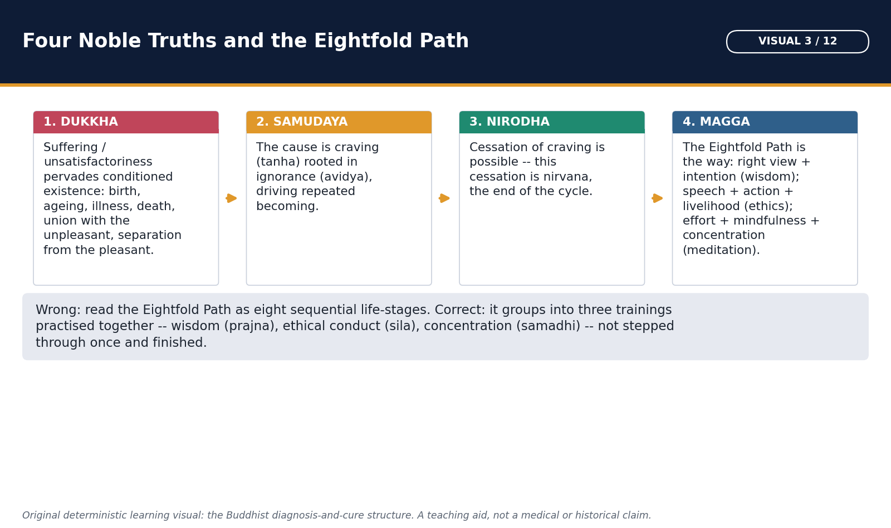

*Pairs with the Middle Way discussion that follows; the four boxes are the diagnosis-cause-cure-path frame UPSC MCQs test most often.*

The Four Noble Truths organize early Buddhist teaching as a practical analysis of dukkha rather than a claim that every experience is only pain. They identify conditioned unsatisfactoriness, craving, cessation and a path.

#### Doctrine / historical process flow

1. **Dukkha:** Conditioned unsatisfactoriness
2. **Samudaya:** Craving sustained by ignorance
3. **Nirodha:** Cessation/release is possible
4. **Magga:** Eightfold path

#### Core teaching / solved analysis

- FACT: Dukkha includes pain, change and the instability of clinging to conditioned phenomena.
- FACT: Samudaya identifies craving (tanha) and its supporting ignorance, not desire in every harmless sense.
- FACT: Nirodha is cessation of craving and release, not destruction of a permanent soul.
- FACT: Magga is the Noble Eightfold Path, integrating wisdom, ethics and meditation.
- INTERPRETATION: The medical analogy - diagnosis, cause, cure and treatment - captures structure but should not trivialize the existential claim.
- LIMIT: Different Buddhist traditions elaborate the truths through distinct Abhidharma, Mahayana and scholastic frameworks.

> **Memory hook:** D-S-N-M: Dukkha, Samudaya, Nirodha, Magga.

#### Must-know facts

- The truths are a linked analysis, not four unrelated beliefs.
- Nirodha is the third truth; the path is the fourth.
- Dukkha is broader than physical suffering.

#### UPSC traps

- **Wrong:** Buddhism says life is nothing but misery. **Correct:** It analyzes conditioned existence as unstable and unsatisfactory under clinging.
- **Wrong:** The cause is simply material poverty. **Correct:** Craving and ignorance are doctrinal causes; social conditions are historical context.

**Mains/PYQ use:** Explain each truth as a causal sequence and connect it to dependent origination and practice.

**Study link:** Early Buddhist doctrine.

#### CLOSING RECALL FLOW — FOUR NOBLE TRUTHS: DIAGNOSIS, CAUSE, CESSATION AND PATH — [CORE PRELIMS + CORE MAINS]

```text
START / CONCEPT: Four Noble Truths: diagnosis, cause, cessation and path — [CORE PRELIMS + CORE MAINS]
        |
        v
EXACT TERMS: Dukkha · Samudaya · Nirodha · Magga · Memory hook
        |
        v
MECHANISM / ARGUMENT: Samudaya: Craving sustained by ignorance
        |
        v
CONSEQUENCE / CONTRAST: The Four Noble Truths organize early Buddhist teaching as a practical analysis of dukkha rather than a claim that every experience is only pain.
        |
        v
UPSC TRAP / ANSWER-USE: The Four Noble Truths organize early Buddhist teaching as a practical analysis of dukkha rather than a claim that every experience is only pain.
        |
        v
ANSWER-GRABBING FORMULATION: !g3 visual -- Four Noble Truths and the Eightfold Path
```
### SESSION 18 — EIGHTFOLD PATH, MIDDLE WAY AND ETHICAL DISCIPLINE — [CORE PRELIMS + CORE MAINS]

#### DEFINITION / WHAT THIS IS CALLED

**Plain-language definition:** The Noble Eightfold Path avoids both sensual indulgence and self-mortification.

**Technical definition:** Wrong: Middle Path means moderate belief in everything.

#### ANSWER-GRABBING OPENING — WRITE/ADAPT IN THE EXAM

> The Noble Eightfold Path avoids both sensual indulgence and self-mortification.

#### MUST-WRITE KEYWORDS

- **Memory hook**
- **Mains/PYQ use**
- **Study link**

**How to use them:** The Noble Eightfold Path avoids both sensual indulgence and self-mortification.

The Noble Eightfold Path avoids both sensual indulgence and self-mortification. Its eight factors are usually grouped into wisdom, ethical conduct and mental discipline; they are cultivated together rather than as a simple staircase.

#### Evidence / comparison matrix

| Group | Factors | Purpose | Exam distinction |
| --- | --- | --- | --- |
| Prajna | Right view, intention | Understand reality and orient action | Not book knowledge alone |
| Sila | Speech, action, livelihood | Ethical restraint and trust | Monastic/lay rules differ |
| Samadhi | Effort, mindfulness, concentration | Train attention and insight | Not mere relaxation |

#### Core teaching / solved analysis

- FACT: Wisdom: right view and right intention.
- FACT: Ethics: right speech, right action and right livelihood.
- FACT: Meditation: right effort, right mindfulness and right concentration.
- FACT: Lay followers commonly undertake five precepts: avoid killing, stealing, sexual misconduct, false speech and intoxicants.
- INTERPRETATION: Right livelihood connects liberation practice to social conduct without prescribing one universal economic order.
- QUALIFICATION: 'Middle Way' does not mean compromise between truth and falsehood; it concerns disciplined avoidance of spiritually fruitless extremes.

> **Memory hook:** 2-3-3: Wisdom 2, Ethics 3, Meditation 3.

#### Must-know facts

- Eight factors are integrated into three trainings.
- Middle Way rejects indulgence and self-mortification.
- The five lay precepts are not identical to the full Vinaya.

#### UPSC traps

- **Wrong:** Middle Path means moderate belief in everything. **Correct:** It is a disciplined soteriological path, not vague centrism.
- **Wrong:** Right livelihood applies only to monks. **Correct:** It is an ethical path factor with lay implications, while monastic rules are more detailed.

**Mains/PYQ use:** A doctrine answer should group the eight factors and show their ethical/social implications.

**Study link:** Compare Jain severe asceticism without caricature.

#### CLOSING RECALL FLOW — EIGHTFOLD PATH, MIDDLE WAY AND ETHICAL DISCIPLINE — [CORE PRELIMS + CORE MAINS]

```text
START / CONCEPT: Eightfold Path, Middle Way and ethical discipline — [CORE PRELIMS + CORE MAINS]
        |
        v
EXACT TERMS: Memory hook · Mains/PYQ use · Study link
        |
        v
MECHANISM / ARGUMENT: Its eight factors are usually grouped into wisdom, ethical conduct and mental discipline; they are cultivated together rather than as a simple staircase.
        |
        v
CONSEQUENCE / CONTRAST: Correct: It is an ethical path factor with lay implications, while monastic rules are more detailed.
        |
        v
UPSC TRAP / ANSWER-USE: The Noble Eightfold Path avoids both sensual indulgence and self-mortification.
        |
        v
ANSWER-GRABBING FORMULATION: The Noble Eightfold Path avoids both sensual indulgence and self-mortification.
```
### SESSION 19 — DEPENDENT ORIGINATION: PROCESS WITHOUT A FIRST CAUSE — [CORE PRELIMS + CORE MAINS]

#### DEFINITION / WHAT THIS IS CALLED

**Plain-language definition:** Pratityasamutpada/paticcha-samuppada explains phenomena as arising in dependence on conditions.

**Technical definition:** Dependent origination: process without a first cause — [CORE PRELIMS + CORE MAINS]: Read the structure first; each arrow is a historical relationship, not an automatic law.

#### ANSWER-GRABBING OPENING — WRITE/ADAPT IN THE EXAM

> Pratityasamutpada/paticcha-samuppada explains phenomena as arising in dependence on conditions.

#### MUST-WRITE KEYWORDS

- **Memory hook**
- **Mains/PYQ use**
- **Study link**

**How to use them:** Pratityasamutpada/paticcha-samuppada explains phenomena as arising in dependence on conditions.

Pratityasamutpada/paticcha-samuppada explains phenomena as arising in dependence on conditions. In the rebirth formula, ignorance conditions formations and so on through ageing and death; removing conditions interrupts suffering.

#### Compact visual / answer logic

```text
IGNORANCE -> FORMATIONS -> CONSCIOUSNESS -> NAME/FORMS
     -> SIX SENSES -> CONTACT -> FEELING -> CRAVING
     -> CLINGING -> BECOMING -> BIRTH -> AGEING/DEATH

Remove supporting conditions -> the cycle is interrupted
```

*Read the structure first; each arrow is a historical relationship, not an automatic law.*

#### Core teaching / solved analysis

- FACT: A common twelve-link sequence is ignorance, formations, consciousness, name-and-form, six sense bases, contact, feeling, craving, clinging, becoming, birth, ageing-and-death.
- FACT: The teaching rejects both an unconditioned creator explanation for the cycle and a permanent self passing unchanged through it.
- INTERPRETATION: The chain can be read across lives, within moment-to-moment experience, or through scholastic combinations depending on tradition.
- FACT: Craving is important but not isolated; ignorance, sense contact and clinging show a wider causal psychology.
- LIMIT: The diagram is pedagogical. Different texts present shorter formulas and reverse-order contemplation.

> **Memory hook:** I-F-C-N-S-C-F-C-C-B-B-A: learn in four clusters, not as a chant alone.

#### Must-know facts

- Dependent origination is conditionality, not predestination.
- There is no single first link as an absolute cosmic beginning.
- The chain supports both rebirth and present-process analysis.

#### UPSC traps

- **Wrong:** Dependent origination is fatalism. **Correct:** Because conditions can cease, transformation is possible.
- **Wrong:** It proves a permanent transmigrating soul. **Correct:** It explains continuity without an unchanging self.

**Mains/PYQ use:** Use the chain to connect Four Truths, anatta, karma and practical cessation.

**Study link:** Anicca-anatta and Buddhist karma.

#### CLOSING RECALL FLOW — DEPENDENT ORIGINATION: PROCESS WITHOUT A FIRST CAUSE — [CORE PRELIMS + CORE MAINS]

```text
START / CONCEPT: Dependent origination: process without a first cause — [CORE PRELIMS + CORE MAINS]
        |
        v
EXACT TERMS: Memory hook · Mains/PYQ use · Study link
        |
        v
MECHANISM / ARGUMENT: In the rebirth formula, ignorance conditions formations and so on through ageing and death; removing conditions interrupts suffering.
        |
        v
CONSEQUENCE / CONTRAST: Read the structure first; each arrow is a historical relationship, not an automatic law.
        |
        v
UPSC TRAP / ANSWER-USE: Read the structure first; each arrow is a historical relationship, not an automatic law.
        |
        v
ANSWER-GRABBING FORMULATION: Pratityasamutpada/paticcha-samuppada explains phenomena as arising in dependence on conditions.
```
### SESSION 20 — IMPERMANENCE, NO-SELF, AGGREGATES, KARMA AND NIRVANA — [CORE PRELIMS + CORE MAINS]

#### DEFINITION / WHAT THIS IS CALLED

**Plain-language definition:** Early Buddhism links impermanence (anicca), unsatisfactoriness (dukkha) and no-self (anatta).

**Technical definition:** A person is analyzed as five changing aggregates; karmic continuity operates without an eternal atman.

#### ANSWER-GRABBING OPENING — WRITE/ADAPT IN THE EXAM

> Early Buddhism links impermanence (anicca), unsatisfactoriness (dukkha) and no-self (anatta).

#### MUST-WRITE KEYWORDS

- **Memory hook**
- **Mains/PYQ use**
- **Study link**

**How to use them:** Early Buddhism links impermanence (anicca), unsatisfactoriness (dukkha) and no-self (anatta).

Early Buddhism links impermanence (anicca), unsatisfactoriness (dukkha) and no-self (anatta). A person is analyzed as five changing aggregates; karmic continuity operates without an eternal atman.

#### Evidence / comparison matrix

| Term | Safe definition | Not this |
| --- | --- | --- |
| Anicca | Impermanence of conditioned phenomena | Nothing exists at all |
| Dukkha | Unsatisfactoriness under clinging | Only physical pain |
| Anatta | No permanent independent self | Moral nihilism |
| Karma | Intentional ethical action | Material substance |
| Nirvana | Cessation of greed, hatred, delusion | Heaven or annihilation of an atman |

#### Core teaching / solved analysis

- FACT: The five aggregates are form, feeling, perception, formations and consciousness.
- FACT: Anatta denies that any aggregate or their changing combination is a permanent, independent self.
- FACT: Karma is centrally intentional action (cetana) with ethical consequences; it is not Jain karmic matter.
- FACT: Nirvana is extinction of greed, hatred and delusion and release from the conditioned cycle; it is not a heaven.
- INTERPRETATION: Continuity can be compared to one flame lighting another: causal connection without numerical identity of a substance.
- LIMIT: Later Buddhist schools debate the status of persons, dharmas, Buddha bodies and nirvana; do not flatten all into one formula.

> **Memory hook:** F-F-P-F-C: Form, Feeling, Perception, Formations, Consciousness.

#### Must-know facts

- Five aggregates are not five parts of an immortal soul.
- Anatta differs fundamentally from Jain jiva pluralism.
- Nirvana and parinirvana should not be used carelessly as simple death synonyms.

#### UPSC traps

- **Wrong:** No-self means no ethical responsibility. **Correct:** Causal continuity and intentional karma sustain responsibility without a permanent self.
- **Wrong:** Nirvana is extinction of a real soul. **Correct:** Buddhism denies such a permanent soul in the first place.

**Mains/PYQ use:** A comparison answer should link ontology to karma and liberation, not just list terms.

**Study link:** Jain jiva-karma comparison.

#### CLOSING RECALL FLOW — IMPERMANENCE, NO-SELF, AGGREGATES, KARMA AND NIRVANA — [CORE PRELIMS + CORE MAINS]

```text
START / CONCEPT: Impermanence, no-self, aggregates, karma and nirvana — [CORE PRELIMS + CORE MAINS]
        |
        v
EXACT TERMS: Memory hook · Mains/PYQ use · Study link
        |
        v
MECHANISM / ARGUMENT: A person is analyzed as five changing aggregates; karmic continuity operates without an eternal atman.
        |
        v
CONSEQUENCE / CONTRAST: FACT: The five aggregates are form, feeling, perception, formations and consciousness.
        |
        v
UPSC TRAP / ANSWER-USE: FACT: Karma is centrally intentional action (cetana) with ethical consequences; it is not Jain karmic matter.
        |
        v
ANSWER-GRABBING FORMULATION: Early Buddhism links impermanence (anicca), unsatisfactoriness (dukkha) and no-self (anatta).
```
### SESSION 21 — SANGHA, VINAYA, LAY SUPPORT AND INSTITUTIONAL LIFE — [CORE PRELIMS + CORE MAINS]

#### DEFINITION / WHAT THIS IS CALLED

**Plain-language definition:** !g3 visual -- Sangha-Laity Patronage Network

**Technical definition:** Sangha is both a spiritual community and a historical institution.

#### ANSWER-GRABBING OPENING — WRITE/ADAPT IN THE EXAM

> !g3 visual -- Sangha-Laity Patronage Network

#### MUST-WRITE KEYWORDS

- **Lay surplus**
- **Sangha**
- **Routes**
- **Transmission**
- **Feedback**
- **Memory hook**
- **Mains/PYQ use**
- **Study link**

**How to use them:** !g3 visual -- Sangha-Laity Patronage Network

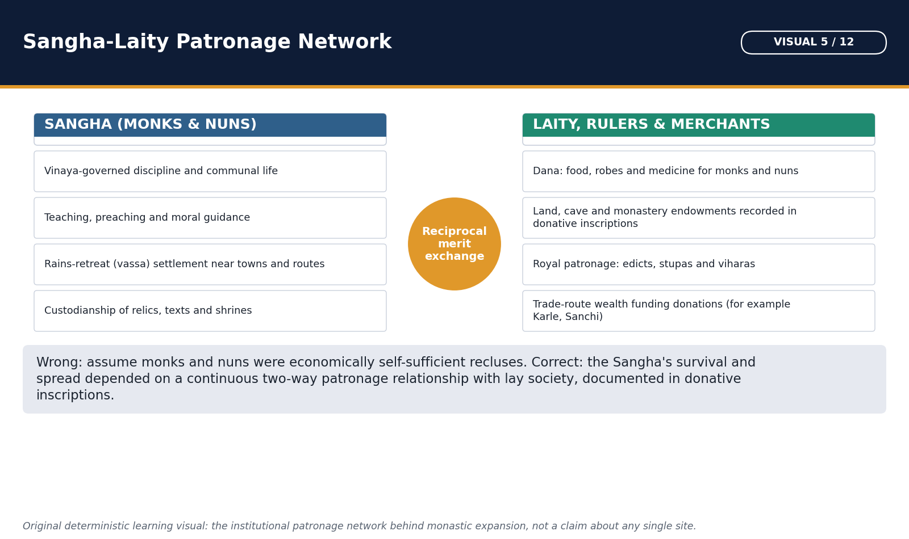

*Cross-check this network against the named dynasties and inscriptions in the patronage subtopic below; the diagram only orders the relationships.*

The Buddhist sangha transformed teaching into a disciplined, portable institution. Monks and nuns followed Vinaya; lay donors supplied food, robes, medicine, dwellings and endowments in exchange for teaching, merit and social prestige.

#### Doctrine / historical process flow

1. **Lay surplus:** Food, robes, medicine, caves, land or cash
2. **Sangha:** Discipline, teaching, ritual and merit field
3. **Routes:** Monasteries near towns and passes
4. **Transmission:** Texts, images, pilgrims and missions
5. **Feedback:** Prestige and wider patronage

#### Core teaching / solved analysis

- FACT: The Vinaya Pitaka preserves rules, origin stories, procedures, ordination and communal acts; Patimokkha recitation structures confession and discipline.
- FACT: The rainy-season residence encouraged durable monasteries and repeated lay-monastic contact.
- FACT: Anathapindika's Jetavana and Visakha's patronage are prominent textual examples of wealthy lay support.
- FACT: Donative inscriptions at Sanchi, Bharhut, Karle, Nasik and other sites show monks, nuns, merchants, artisans, guild-linked people and householders as donors.
- INTERPRETATION: Monasteries linked routes, towns and courts, but they were not simply commercial corporations.
- LIMIT: Textual ideals and inscriptional practice differ; donor labels do not reveal every motive.

> **Memory hook:** F-R-M-T: Four requisites, Rain retreat, Monastery, Transmission.

#### Must-know facts

- Sangha is both a spiritual community and a historical institution.
- Vinaya traditions differ across schools.
- Donors included more than kings and merchants.

#### UPSC traps

- **Wrong:** Monks produced their own food and wealth. **Correct:** The ideal was mendicant dependence, though later endowed monasteries managed substantial resources.
- **Wrong:** Every monastery followed the surviving Pali Vinaya. **Correct:** Several Vinaya lineages survive in Pali, Chinese and Tibetan transmission.

**Mains/PYQ use:** Use one textual donor and two inscriptional/site examples, then distinguish ideal from practice.

**Study link:** Merchant networks, cave monasteries and spread.

#### CLOSING RECALL FLOW — SANGHA, VINAYA, LAY SUPPORT AND INSTITUTIONAL LIFE — [CORE PRELIMS + CORE MAINS]

```text
START / CONCEPT: Sangha, Vinaya, lay support and institutional life — [CORE PRELIMS + CORE MAINS]
        |
        v
EXACT TERMS: Lay surplus · Sangha · Routes · Transmission · Feedback
        |
        v
MECHANISM / ARGUMENT: Cross-check this network against the named dynasties and inscriptions in the patronage subtopic below; the diagram only orders the relationships.
        |
        v
CONSEQUENCE / CONTRAST: The Buddhist sangha transformed teaching into a disciplined, portable institution.
        |
        v
UPSC TRAP / ANSWER-USE: INTERPRETATION: Monasteries linked routes, towns and courts, but they were not simply commercial corporations.
        |
        v
ANSWER-GRABBING FORMULATION: !g3 visual -- Sangha-Laity Patronage Network
```
### SESSION 22 — WOMEN, SOCIAL ACCESS AND THE CASTE-VARNA QUESTION — [CORE MAINS + SUPPORTING]

#### DEFINITION / WHAT THIS IS CALLED

**Plain-language definition:** Buddhism widened access to renunciation and moral status, but it did not create modern equality or abolish caste society.

**Technical definition:** Women, social access and the caste-varna question — [CORE MAINS + SUPPORTING]: Bhikkhuni means ordained Buddhist nun; upasika means lay female follower.

#### ANSWER-GRABBING OPENING — WRITE/ADAPT IN THE EXAM

> Buddhism widened access to renunciation and moral status, but it did not create modern equality or abolish caste society.

#### MUST-WRITE KEYWORDS

- **Memory hook**
- **Mains/PYQ use**
- **Study link**

**How to use them:** Buddhism widened access to renunciation and moral status, but it did not create modern equality or abolish caste society.

Buddhism widened access to renunciation and moral status, but it did not create modern equality or abolish caste society. Texts preserve both strong critiques of birth superiority and gendered institutional restrictions.

#### Evidence / comparison matrix

| Claim | Evidence | What it proves | Qualification |
| --- | --- | --- | --- |
| Women could renounce | Bhikkhuni tradition; Therigatha | Female religious agency | Institutional subordination debated |
| Birth was challenged | Ambattha and Vasettha-type arguments | Ethical status over heredity | Not a social revolution decree |
| Lower groups entered | Open recruitment ideal | Wider salvific community | Admission rules protected obligations |
| Lay women mattered | Visakha and inscriptions | Patronage and transmission | Elite examples do not cover all women |

#### Core teaching / solved analysis

- TRADITION: Mahapajapati Gotami's ordination marks the bhikkhuni order; the eight garudhammas are textually transmitted but their formation and dating are debated.
- FACT: Therigatha verses preserve female renunciant voices, although the collection's redaction history must be remembered.
- FACT: Dialogues such as the Ambattha Sutta challenge Brahmanical status claims; conduct and insight can outweigh birth in religious valuation.
- FACT: Sangha admission across varna widened salvific access, but rules restricting debtors, slaves, soldiers or those under obligations reveal accommodation to social order.
- INTERPRETATION: Buddhism relativized hereditary rank within the religious path more than it launched a political program to abolish caste.
- LIMIT: Later Buddhist societies reproduced hierarchy in varied forms; one textual sermon cannot represent all practice.

> **Memory hook:** A-A-L: Access, Agency, Limits.

#### Must-know facts

- Bhikkhuni means ordained Buddhist nun; upasika means lay female follower.
- Religious inclusion and social equality are not synonyms.
- Garudhamma historicity and formation require caution.

#### UPSC traps

- **Wrong:** Buddhism abolished caste in ancient India. **Correct:** It criticized birth superiority and widened access but did not erase social hierarchy.
- **Wrong:** Women's admission proves full institutional equality. **Correct:** Nuns gained an order and voice within gendered rules and later contested histories.

**Mains/PYQ use:** Pair each inclusion claim with a named text or donor and one institutional qualification.

**Study link:** Topic 13 state and varna society.

#### CLOSING RECALL FLOW — WOMEN, SOCIAL ACCESS AND THE CASTE-VARNA QUESTION — [CORE MAINS + SUPPORTING]

```text
START / CONCEPT: Women, social access and the caste-varna question — [CORE MAINS + SUPPORTING]
        |
        v
EXACT TERMS: Memory hook · Mains/PYQ use · Study link
        |
        v
MECHANISM / ARGUMENT: Texts preserve both strong critiques of birth superiority and gendered institutional restrictions.
        |
        v
CONSEQUENCE / CONTRAST: TRADITION: Mahapajapati Gotami's ordination marks the bhikkhuni order; the eight garudhammas are textually transmitted but their formation and dating are debated.
        |
        v
UPSC TRAP / ANSWER-USE: Buddhism widened access to renunciation and moral status, but it did not create modern equality or abolish caste society.
        |
        v
ANSWER-GRABBING FORMULATION: Buddhism widened access to renunciation and moral status, but it did not create modern equality or abolish caste society.
```
### SESSION 23 — BUDDHIST COUNCILS: CONVENTIONAL ACCOUNTS WITH SOURCE CAUTION — [CORE PRELIMS + CORE MAINS]

#### DEFINITION / WHAT THIS IS CALLED

**Plain-language definition:** !g3 visual -- Buddhist and Jain Councils: An Evidence Ladder

**Technical definition:** Climb this ladder before answering an 'assess the councils' Mains question; each rung is a caveat to state, not a fact to assert.

#### ANSWER-GRABBING OPENING — WRITE/ADAPT IN THE EXAM

> !g3 visual -- Buddhist and Jain Councils: An Evidence Ladder

#### MUST-WRITE KEYWORDS

- **Memory hook**
- **Mains/PYQ use**
- **Study link**

**How to use them:** !g3 visual -- Buddhist and Jain Councils: An Evidence Ladder

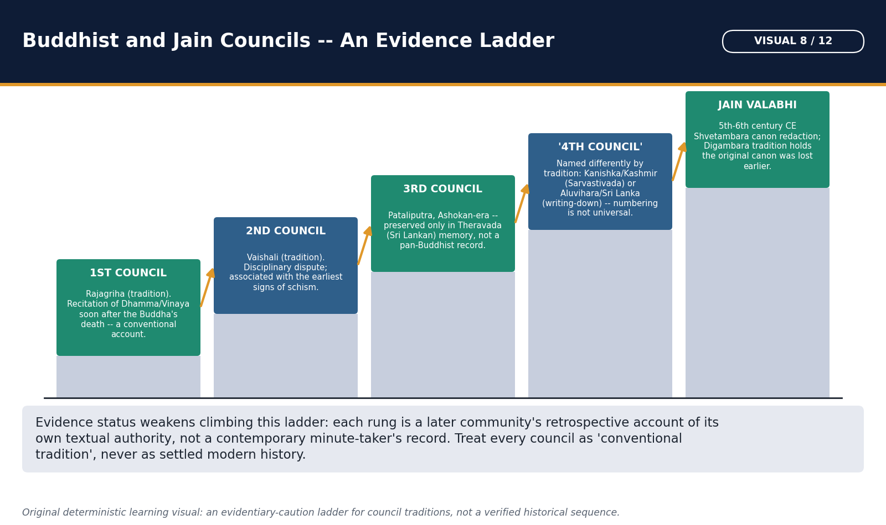

*Climb this ladder before answering an 'assess the councils' Mains question; each rung is a caveat to state, not a fact to assert.*

Council narratives explain communal memory, discipline and school identity. They should be learned for examinations but labelled by tradition because dates, patrons, participants and outcomes are not uniformly attested.

#### Evidence / comparison matrix

| Council tradition | Place/patron | Core issue | Evidence caution |
| --- | --- | --- | --- |
| First | Rajagriha/Ajatashatru | Recitation of dhamma and Vinaya | Known through later texts |
| Second | Vaishali/Kalashoka tradition | Disciplinary practices | Schism linkage varies |
| Third | Pataliputra/Ashoka in Theravada | Purification, doctrine, missions | Not common to all schools |
| Fourth (north) | Kashmir/Kanishka | Sarvastivada Abhidharma | Patron/date details debated |
| Fourth (Sri Lanka) | Aluvihara/Vattagamani | Pali canon written down | Different numbering tradition |

#### Core teaching / solved analysis

- FIRST: Rajagriha after the parinirvana; Mahakassapa presides, Ananda recites dhamma and Upali Vinaya in conventional Theravada accounts. Historic details are retrospective.
- SECOND: Vaishali roughly a century later; dispute over ten practices and discipline. The relation between this event and the Sthavira-Mahasanghika split varies across sources.
- THIRD: Pataliputra under Ashoka in Theravada chronicles; Moggaliputta Tissa, purification, Kathavatthu and missions. Other Buddhist traditions do not narrate it identically.
- FOURTH - NORTH: Kashmir/Kundalavana under Kanishka in Sarvastivada-linked tradition; Vasumitra and Abhidharma commentary are conventional associations.
- FOURTH - SRI LANKA: Aluvihara writing of the Pali canon in the first century BCE is also called a fourth council in Theravada memory.
- LIMIT: Numbering conceals multiple regional memories; use 'conventional account' rather than certitude.

> **Memory hook:** R-V-P-K/A: Rajagriha, Vaishali, Pataliputra, Kashmir/Aluvihara.

#### Must-know facts

- There is no single uncontested 'fourth Buddhist council'.
- The second council is primarily a Vinaya dispute in conventional accounts.
- Ashokan mission lists depend heavily on Sri Lankan chronicles.

#### UPSC traps

- **Wrong:** All councils produced the modern Tripitaka exactly as it exists. **Correct:** Collections and canons developed through longer school-specific transmission.
- **Wrong:** Kanishka's council is the Theravada third council. **Correct:** It belongs to a different northern/Sarvastivada-linked convention.

**Mains/PYQ use:** Name the tradition after every council claim and avoid treating numbering as universal.

**Study link:** Canons and school formation.

#### CLOSING RECALL FLOW — BUDDHIST COUNCILS: CONVENTIONAL ACCOUNTS WITH SOURCE CAUTION — [CORE PRELIMS + CORE MAINS]

```text
START / CONCEPT: Buddhist councils: conventional accounts with source caution — [CORE PRELIMS + CORE MAINS]
        |
        v
EXACT TERMS: Memory hook · Mains/PYQ use · Study link
        |
        v
MECHANISM / ARGUMENT: They should be learned for examinations but labelled by tradition because dates, patrons, participants and outcomes are not uniformly attested.
        |
        v
CONSEQUENCE / CONTRAST: Council narratives explain communal memory, discipline and school identity.
        |
        v
UPSC TRAP / ANSWER-USE: Climb this ladder before answering an 'assess the councils' Mains question; each rung is a caveat to state, not a fact to assert.
        |
        v
ANSWER-GRABBING FORMULATION: !g3 visual -- Buddhist and Jain Councils: An Evidence Ladder
```
### SESSION 24 — BUDDHIST CANONS: PALI, SANSKRIT, CHINESE AND TIBETAN WITNESSES — [CORE PRELIMS + CORE MAINS]

#### DEFINITION / WHAT THIS IS CALLED

**Plain-language definition:** !g3 visual -- Source and Canon Redaction Timeline

**Technical definition:** Buddhist textual history is plural.

#### ANSWER-GRABBING OPENING — WRITE/ADAPT IN THE EXAM

> !g3 visual -- Source and Canon Redaction Timeline

#### MUST-WRITE KEYWORDS

- **Memory hook**
- **Mains/PYQ use**
- **Study link**

**How to use them:** !g3 visual -- Source and Canon Redaction Timeline

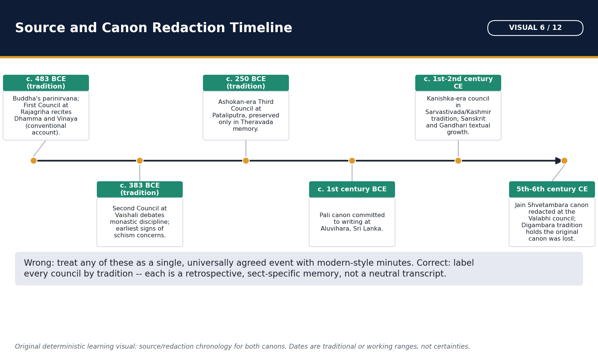

*Keep this beside the councils and canons subtopics; it visualises the redaction gaps that examiners test as source caution, not settled fact.*

Buddhist textual history is plural. The Pali Tipitaka is the complete canon of the Theravada tradition; Sanskrit and Buddhist Hybrid Sanskrit texts preserve other schools and Mahayana currents; Chinese and Tibetan translations preserve many Indic works now lost in India.

#### Evidence / comparison matrix

| Witness | Strength | Typical use | Caution |
| --- | --- | --- | --- |
| Pali | Complete Theravada Tipitaka | Early doctrine and Vinaya | Sri Lankan redaction history |
| Sanskrit/Hybrid Sanskrit | Fragments and full works of several currents | Schools, Mahayana, scholasticism | Survival is uneven |
| Chinese | Large translation corpus | Lost Indic Agamas/Vinayas/sutras | Translation terminology matters |
| Tibetan | Kangyur and Tengyur | Mulasarvastivada, Mahayana, tantra | Mostly later translation horizon |
| Inscriptions | Dated external evidence | Names, donors, relics, institutions | Sparse on full doctrine |

#### Core teaching / solved analysis

- FACT: Pali Tipitaka consists of Vinaya, Sutta and Abhidhamma Pitakas; oral transmission preceded writing in Sri Lanka, conventionally in the first century BCE.
- FACT: Sarvastivada and Mulasarvastivada materials survive in Sanskrit fragments and especially Chinese/Tibetan translations; their Vinayas are not the Pali Vinaya.
- FACT: Mahayana sutras such as Prajnaparamita and Saddharmapundarika developed in multiple recensions and languages.
- FACT: The Chinese Buddhist canon preserves translated Agamas, Vinayas, Abhidharma, Mahayana sutras and commentaries; the Tibetan Kangyur/Tengyur preserves translated scriptures and treatises.
- INTERPRETATION: Translation dates provide a latest possible date for an Indic text's existence, not necessarily its original composition date.
- LIMIT: Pali is not simply the exact spoken language of the Buddha, Sanskrit is not exclusively Mahayana, and 'the Buddhist canon' is not singular.

> **Memory hook:** P-S-C-T-I: Pali, Sanskrit, Chinese, Tibetan, Inscriptions.

#### Must-know facts

- Tipitaka literally refers to three baskets in the Pali tradition.
- Agamas in Chinese transmission parallel parts of the Pali Nikayas without being identical.
- Sanskrit use is not a sufficient test for Mahayana identity.

#### UPSC traps

- **Wrong:** Pali canon is the universal canon of all Buddhists. **Correct:** It is the Theravada canon among multiple textual traditions.
- **Wrong:** Chinese/Tibetan texts are non-Indian and irrelevant to Indian history. **Correct:** Many are translations preserving lost Indic works and school traditions.

**Mains/PYQ use:** Source answers should compare witnesses and specify what translation/redaction can and cannot prove.

**Study link:** Sanghabhuti and Sarvastivada Vinaya PYQ.

#### CLOSING RECALL FLOW — BUDDHIST CANONS: PALI, SANSKRIT, CHINESE AND TIBETAN WITNESSES — [CORE PRELIMS + CORE MAINS]

```text
START / CONCEPT: Buddhist canons: Pali, Sanskrit, Chinese and Tibetan witnesses — [CORE PRELIMS + CORE MAINS]
        |
        v
EXACT TERMS: Memory hook · Mains/PYQ use · Study link
        |
        v
MECHANISM / ARGUMENT: Keep this beside the councils and canons subtopics; it visualises the redaction gaps that examiners test as source caution, not settled fact.
        |
        v
CONSEQUENCE / CONTRAST: Buddhist textual history is plural.
        |
        v
UPSC TRAP / ANSWER-USE: Keep this beside the councils and canons subtopics; it visualises the redaction gaps that examiners test as source caution, not settled fact.
        |
        v
ANSWER-GRABBING FORMULATION: !g3 visual -- Source and Canon Redaction Timeline
```
### SESSION 25 — EARLY SCHOOLS AND THE THERAVADA-HINAYANA TERMINOLOGY FIREWALL — [CORE PRELIMS + CORE MAINS]

#### DEFINITION / WHAT THIS IS CALLED

**Plain-language definition:** !g3 visual -- Buddhist School Evolution: A Caution Map

**Technical definition:** Modern Theravada is one surviving Sthavira-derived lineage, not a synonym for every early school.

#### ANSWER-GRABBING OPENING — WRITE/ADAPT IN THE EXAM

> !g3 visual -- Buddhist School Evolution: A Caution Map

#### MUST-WRITE KEYWORDS

- **Memory hook**
- **Mains/PYQ use**
- **Study link**
- **2020**
- **2024**

**How to use them:** !g3 visual -- Buddhist School Evolution: A Caution Map

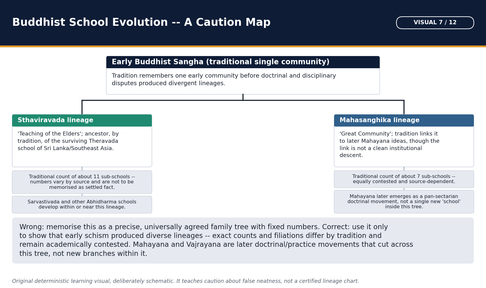

*Use this only to recall which school descended from which; the surrounding prose carries the doctrinal detail behind every split.*

Early Buddhism diversified into nikayas or schools over centuries. Sthavira and Mahasanghika are early broad lineages; Sarvastivada, Dharmaguptaka, Mahishasaka and others developed distinct Vinaya and Abhidharma traditions. Modern Theravada is one surviving Sthavira-derived lineage, not a synonym for every early school.

#### Compact visual / answer logic

```text
EARLY COMMUNITY
      |
      +-- STHAVIRA-DERIVED LINES --> Theravada, Sarvastivada, others
      |
      +-- MAHASANGHIKA-DERIVED LINES --> several regional schools

MAHAYANA CURRENTS later cross these monastic lineages
HINAYANA = polemical category, NOT modern Theravada
```

*Read the structure first; each arrow is a historical relationship, not an automatic law.*

#### Core teaching / solved analysis

- FACT: Sthavira means 'elders' and Mahasanghika 'great community/assembly'; the first split is remembered differently by school sources.
- FACT: Theravada developed in Sri Lanka and Southeast Asia through the Pali tradition; its exact genealogy should not be equated with all Sthaviravadins.
- FACT: Sarvastivada, influential in north-west India, Kashmir and Central Asia, held that dharmas exist across past, present and future in a technical sense.
- FACT: Dharmaguptaka Vinaya became foundational for East Asian ordination; Mulasarvastivada Vinaya survives in Tibetan monastic practice.
- CAUTION: 'Hinayana' is a later Mahayana polemical label for supposedly lesser vehicles. It should not be used as a neutral synonym for Theravada.
- LIMIT: Mahayana adherents often lived in monasteries governed by older Vinaya lineages; Mahayana was not simply a new centralized sect replacing them.

> **Memory hook:** T-S-M-H: Theravada specific; Sarvastivada separate; Mahayana cross-cutting; Hinayana hazardous.

#### Must-know facts

- Sanghabhuti is linked to Sarvastivada Vinaya commentary, not Theravada.
- Dhanyakataka in Andhra is associated with Mahasanghikas.
- School genealogy and Mahayana affiliation are not one simple tree.

#### UPSC traps

- **Wrong:** Theravada equals Hinayana. **Correct:** Avoid the polemical equation; identify Theravada by Pali and Sri Lankan/Southeast Asian lineage.
- **Wrong:** Mahayana monks had no Vinaya. **Correct:** They often ordained under established nikaya Vinayas.

**Mains/PYQ use:** Use lineage, canon, region and terminology in separate columns.

**Study link:** 2020 schools PYQ; 2024 Sanghabhuti PYQ.

#### CLOSING RECALL FLOW — EARLY SCHOOLS AND THE THERAVADA-HINAYANA TERMINOLOGY FIREWALL — [CORE PRELIMS + CORE MAINS]

```text
START / CONCEPT: Early schools and the Theravada-Hinayana terminology firewall — [CORE PRELIMS + CORE MAINS]
        |
        v
EXACT TERMS: Memory hook · Mains/PYQ use · Study link · 2020 · 2024
        |
        v
MECHANISM / ARGUMENT: FACT: Sthavira means 'elders' and Mahasanghika 'great community/assembly'; the first split is remembered differently by school sources.
        |
        v
CONSEQUENCE / CONTRAST: Early Buddhism diversified into nikayas or schools over centuries.
        |
        v
UPSC TRAP / ANSWER-USE: !g3 visual -- Buddhist School Evolution: A Caution Map
        |
        v
ANSWER-GRABBING FORMULATION: !g3 visual -- Buddhist School Evolution: A Caution Map
```
### SESSION 26 — MAHAYANA, THE BODHISATTVA PATH, MAITREYA AND PARAMITAS — [CORE PRELIMS + CORE MAINS]

#### DEFINITION / WHAT THIS IS CALLED

**Plain-language definition:** Mahayana developed as diverse textual, devotional and philosophical currents from around the late centuries BCE and early centuries CE.

**Technical definition:** FACT: Maitreya is the future Buddha in both Theravada and Mahayana traditions; Mahayana also venerates him as a Bodhisattva in Tushita.

#### ANSWER-GRABBING OPENING — WRITE/ADAPT IN THE EXAM

> Mahayana developed as diverse textual, devotional and philosophical currents from around the late centuries BCE and early centuries CE.

#### MUST-WRITE KEYWORDS

- **Memory hook**
- **Mains/PYQ use**
- **Study link**
- **2018**
- **2019**
- **2020**

**How to use them:** Mahayana developed as diverse textual, devotional and philosophical currents from around the late centuries BCE and early centuries CE.

Mahayana developed as diverse textual, devotional and philosophical currents from around the late centuries BCE and early centuries CE. It elevated the Bodhisattva path and expanded ideas of Buddhahood without instantly replacing earlier monastic institutions.

#### Evidence / comparison matrix

| Paramita | Meaning | Path function |
| --- | --- | --- |
| Dana | Generosity | Weakens attachment; supports beings |
| Shila | Ethical discipline | Stabilizes compassionate conduct |
| Kshanti | Patience/forbearance | Meets harm without hatred |
| Virya | Energy/diligence | Sustains practice |
| Dhyana | Meditative concentration | Cultivates stable mind |
| Prajna | Wisdom | Realizes emptiness/non-clinging |

#### Core teaching / solved analysis

- FACT: A Bodhisattva seeks full Buddhahood for the benefit of beings; the ideal combines compassion and wisdom.
- FACT: The six widely taught paramitas are dana, shila, kshanti, virya, dhyana and prajna; some lists expand to ten.
- FACT: Maitreya is the future Buddha in both Theravada and Mahayana traditions; Mahayana also venerates him as a Bodhisattva in Tushita.
- FACT: Avalokiteshvara and Manjushri became major Bodhisattvas; multiple Buddha-fields and expanded Buddha concepts appear in Mahayana texts.
- INTERPRETATION: Image worship, devotion and merit transfer widened modes of participation, but none alone defines every Mahayana community.
- LIMIT: Mahayana origins are debated; it should not be described simply as an offshoot of Mahasanghika or as a single council-created sect.

> **Memory hook:** D-S-K-V-D-P: Dana, Shila, Kshanti, Virya, Dhyana, Prajna.

#### Must-know facts

- Maitreya is the future Buddha, not exclusively a Mahayana figure.
- Paramitas are perfections on the Bodhisattva path; Theravada has related parami traditions.
- Mahayana is not defined solely by Sanskrit or image worship.

#### UPSC traps

- **Wrong:** Maitreya is a past Buddha. **Correct:** He is the future Buddha in Buddhist tradition.
- **Wrong:** All Mahayana developed directly from Mahasanghika. **Correct:** Connections are debated and regionally complex.

**Mains/PYQ use:** Define Mahayana as a plural movement, then use Bodhisattva, texts, devotion and institutional continuity.

**Study link:** 2018, 2019 and 2020 routed PYQs.

#### CLOSING RECALL FLOW — MAHAYANA, THE BODHISATTVA PATH, MAITREYA AND PARAMITAS — [CORE PRELIMS + CORE MAINS]

```text
START / CONCEPT: Mahayana, the Bodhisattva path, Maitreya and Paramitas — [CORE PRELIMS + CORE MAINS]
        |
        v
EXACT TERMS: Memory hook · Mains/PYQ use · Study link · 2018 · 2019
        |
        v
MECHANISM / ARGUMENT: Mahayana is not defined solely by Sanskrit or image worship.
        |
        v
CONSEQUENCE / CONTRAST: FACT: A Bodhisattva seeks full Buddhahood for the benefit of beings; the ideal combines compassion and wisdom.
        |
        v
UPSC TRAP / ANSWER-USE: LIMIT: Mahayana origins are debated; it should not be described simply as an offshoot of Mahasanghika or as a single council-created sect.
        |
        v
ANSWER-GRABBING FORMULATION: Mahayana developed as diverse textual, devotional and philosophical currents from around the late centuries BCE and early centuries CE.
```
### SESSION 27 — MADHYAMAKA AND YOGACARA: BOUNDED HISTORICAL DEPTH — [CORE MAINS + SUPPORTING]

#### DEFINITION / WHAT THIS IS CALLED

**Plain-language definition:** For Ancient History, Madhyamaka and Yogacara should be treated as major Mahayana scholastic developments, not turned into an optional-level metaphysics essay.

**Technical definition:** Madhyamaka and Yogacara: bounded historical depth — [CORE MAINS + SUPPORTING]: FACT: The two truths framework distinguishes conventional and ultimate truth; emptiness itself is not a substance.

#### ANSWER-GRABBING OPENING — WRITE/ADAPT IN THE EXAM

> For Ancient History, Madhyamaka and Yogacara should be treated as major Mahayana scholastic developments, not turned into an optional-level metaphysics essay.

#### MUST-WRITE KEYWORDS

- **Memory hook**
- **Mains/PYQ use**
- **Study link**
- **2022**

**How to use them:** For Ancient History, Madhyamaka and Yogacara should be treated as major Mahayana scholastic developments, not turned into an optional-level metaphysics essay.

For Ancient History, Madhyamaka and Yogacara should be treated as major Mahayana scholastic developments, not turned into an optional-level metaphysics essay. Name their core problem, representative thinkers and historical setting.

#### Evidence / comparison matrix

| School | Thinkers | Core exam-safe idea | Avoid |
| --- | --- | --- | --- |
| Madhyamaka | Nagarjuna, Aryadeva | Emptiness of svabhava; two truths | Nihilism |
| Yogacara | Asanga, Vasubandhu | Consciousness/representation analysis | Solipsism shortcut |
| Common frame | Mahayana scholasticism | Dependent arising and Bodhisattva path | Rigid mutually exclusive sects |

#### Core teaching / solved analysis

- FACT: Nagarjuna, associated with Madhyamaka, analyzes all phenomena as empty (shunya) of independent inherent nature because they arise dependently.
- FACT: The two truths framework distinguishes conventional and ultimate truth; emptiness itself is not a substance.
- FACT: Yogacara is associated with Asanga and Vasubandhu and analyzes experience through consciousness/representation, including store consciousness in developed formulations.
- INTERPRETATION: Both schools refine dependent origination and the Bodhisattva path through different analytical vocabularies.
- LIMIT: 'Nothing exists' is an inaccurate summary of Madhyamaka; 'only my mind exists' is an oversimplification of Yogacara.
- HISTORICAL USE: Their texts, translations and monastic curricula reveal trans-Asian scholastic networks.

> **Memory hook:** M = middle/emptiness; Y = yoga/consciousness analysis.

#### Must-know facts

- Shunyata means lack of independent inherent existence, not nonexistence.
- Aryadeva is a Buddhist scholar, a 2022-style identification trap.
- Vasubandhu's intellectual location is complex and should not be reduced to one slogan.

#### UPSC traps

- **Wrong:** Madhyamaka teaches that nothing exists. **Correct:** It rejects inherent existence while retaining conventional dependent reality.
- **Wrong:** Yogacara is simply Western subjective idealism. **Correct:** Use its own Buddhist analysis of cognition and representation.

**Mains/PYQ use:** Keep this to one bounded paragraph unless the question directly asks Buddhist philosophy.

**Study link:** Topic 24; Mahayana intellectual history.

#### CLOSING RECALL FLOW — MADHYAMAKA AND YOGACARA: BOUNDED HISTORICAL DEPTH — [CORE MAINS + SUPPORTING]

```text
START / CONCEPT: Madhyamaka and Yogacara: bounded historical depth — [CORE MAINS + SUPPORTING]
        |
        v
EXACT TERMS: Memory hook · Mains/PYQ use · Study link · 2022
        |
        v
MECHANISM / ARGUMENT: FACT: Nagarjuna, associated with Madhyamaka, analyzes all phenomena as empty (shunya) of independent inherent nature because they arise dependently.
        |
        v
CONSEQUENCE / CONTRAST: FACT: Nagarjuna, associated with Madhyamaka, analyzes all phenomena as empty (shunya) of independent inherent nature because they arise dependently.
        |
        v
UPSC TRAP / ANSWER-USE: For Ancient History, Madhyamaka and Yogacara should be treated as major Mahayana scholastic developments, not turned into an optional-level metaphysics essay.
        |
        v
ANSWER-GRABBING FORMULATION: For Ancient History, Madhyamaka and Yogacara should be treated as major Mahayana scholastic developments, not turned into an optional-level metaphysics essay.
```
### SESSION 28 — VAJRAYANA: LATER TANTRIC DEVELOPMENT AND INSTITUTIONAL SETTING — [CORE MAINS + SUPPORTING]

#### DEFINITION / WHAT THIS IS CALLED

**Plain-language definition:** Vajrayana developed within later Mahayana environments, especially from the mid-first millennium CE onward.

**Technical definition:** Vajrayana: later tantric development and institutional setting — [CORE MAINS + SUPPORTING]: It uses mantra, mandala, initiation, deity yoga and esoteric ritual as accelerated means, while retaining Bodhisattva and emptiness frameworks.

#### ANSWER-GRABBING OPENING — WRITE/ADAPT IN THE EXAM

> Vajrayana developed within later Mahayana environments, especially from the mid-first millennium CE onward.

#### MUST-WRITE KEYWORDS

- **Memory hook**
- **Mains/PYQ use**
- **Study link**

**How to use them:** Vajrayana developed within later Mahayana environments, especially from the mid-first millennium CE onward.

Vajrayana developed within later Mahayana environments, especially from the mid-first millennium CE onward. It uses mantra, mandala, initiation, deity yoga and esoteric ritual as accelerated means, while retaining Bodhisattva and emptiness frameworks.

#### Compact visual / answer logic

```text
EARLY BUDDHIST DISCIPLINE
        + MAHAYANA BODHISATTVA / EMPTINESS
        + MANTRA / MANDALA / INITIATION / DEITY YOGA
        = VAJRAYANA CONFIGURATIONS
          (later, diverse, institutionally embedded)
```

*Read the structure first; each arrow is a historical relationship, not an automatic law.*

#### Core teaching / solved analysis

- FACT: Vajrayana is not the Buddha's original sixth-century BCE institutional form; its major textual and ritual systems are later.
- FACT: Teacher-initiation, mantra, mudra, mandala and visualization are characteristic, though practices differ across tantras and regions.
- FACT: Siddha traditions and Pala-period mahaviharas such as Nalanda, Vikramashila, Odantapuri and Somapura were important in later Buddhist learning and transmission.
- FACT: Tibetan Buddhism preserves Mulasarvastivada Vinaya alongside Mahayana and Vajrayana traditions.
- INTERPRETATION: Esoteric methods show adaptation, competition and transregional exchange, not simply moral 'degeneration'.
- LIMIT: Older textbook narratives that reduce decline to corrupt Vajrayana practice are polemical and monocausal.

> **Memory hook:** M-M-I-D: Mantra, Mandala, Initiation, Deity yoga.

#### Must-know facts

- Vajrayana is later than early Buddhism and Mahayana's first emergence.
- Tantric ritual did not erase Vinaya everywhere.
- Pala mahaviharas were educational and transregional institutions.

#### UPSC traps

- **Wrong:** Vajrayana alone caused Buddhism's decline. **Correct:** Use transformation, patronage, institutional concentration and political disruption together.
- **Wrong:** Tibetan Buddhism is only Vajrayana. **Correct:** It combines Vinaya, Mahayana philosophy and tantric practice.

**Mains/PYQ use:** Present Vajrayana as transformation within Buddhist history, not a moralized endpoint.

**Study link:** Pala-period Mains PYQ and Nalanda heritage.

#### CLOSING RECALL FLOW — VAJRAYANA: LATER TANTRIC DEVELOPMENT AND INSTITUTIONAL SETTING — [CORE MAINS + SUPPORTING]

```text
START / CONCEPT: Vajrayana: later tantric development and institutional setting — [CORE MAINS + SUPPORTING]
        |
        v
EXACT TERMS: Memory hook · Mains/PYQ use · Study link
        |
        v
MECHANISM / ARGUMENT: It uses mantra, mandala, initiation, deity yoga and esoteric ritual as accelerated means, while retaining Bodhisattva and emptiness frameworks.
        |
        v
CONSEQUENCE / CONTRAST: Read the structure first; each arrow is a historical relationship, not an automatic law.
        |
        v
UPSC TRAP / ANSWER-USE: Read the structure first; each arrow is a historical relationship, not an automatic law.
        |
        v
ANSWER-GRABBING FORMULATION: Vajrayana developed within later Mahayana environments, especially from the mid-first millennium CE onward.
```
### SESSION 29 — WHY THE TRADITIONS BECAME POPULAR: LANGUAGE, ETHICS AND NETWORKS — [CORE MAINS]

#### DEFINITION / WHAT THIS IS CALLED

**Plain-language definition:** Neither tradition spread through doctrine alone.

**Technical definition:** Why the traditions became popular: language, ethics and networks — [CORE MAINS]: Merchant patronage is important but not exclusive.

#### ANSWER-GRABBING OPENING — WRITE/ADAPT IN THE EXAM

> Neither tradition spread through doctrine alone.

#### MUST-WRITE KEYWORDS

- **Message**
- **Carrier**
- **Support**
- **Nodes**
- **Adaptation**
- **Memory hook**
- **Mains/PYQ use**
- **Study link**

**How to use them:** Neither tradition spread through doctrine alone.

Neither tradition spread through doctrine alone. Accessible preaching, charismatic teachers, organized mendicants, lay merit, routes, courts, urban donors and adaptable ethical messages worked together.

#### Doctrine / historical process flow

1. **Message:** Ethics, liberation and accessible speech
2. **Carrier:** Monks, nuns, teachers and pilgrims
3. **Support:** Laity, guild-linked donors and rulers
4. **Nodes:** Towns, routes, caves, stupas and temples
5. **Adaptation:** Texts, images, languages and local patrons

#### Core teaching / solved analysis

- FACT: Early Buddhist and Jain preaching used Middle Indo-Aryan/Prakrit forms rather than relying exclusively on elite Vedic Sanskrit.
- FACT: Sanghas offered visible discipline, teaching, ritual occasions and fields of merit for donors.
- FACT: Merchants benefited from stable routes and valued ethics of nonviolence, truth and trust, but royal, rural and artisanal participation also mattered.
- FACT: Buddhist monasteries could travel and reproduce through ordination lineages; Jain ascetics and lay communities built durable regional circuits.
- INTERPRETATION: Buddhism's Middle Way may have eased recruitment compared with rigorous Jain ascetic ideals, while Jain anuvratas enabled strong lay continuity.
- LIMIT: 'Buddhism spread because it was simple' ignores complex doctrine; 'Jainism failed to spread' ignores its extensive regional history.

> **Memory hook:** M-C-S-N-A: Message, Carrier, Support, Nodes, Adaptation.

#### Must-know facts

- Language choice aided communication but does not prove mass literacy.
- Merchant patronage is important but not exclusive.
- Monastic organization and lay reciprocity are core spread mechanisms.

#### UPSC traps

- **Wrong:** The religions spread because they were anti-state. **Correct:** Both received substantial state and elite patronage.
- **Wrong:** Prakrit preaching means all canonical texts were fixed in one popular vernacular. **Correct:** Multiple dialects, redactions and later Sanskrit use developed.

**Mains/PYQ use:** A causes answer should use five interacting mechanisms and reject one-factor simplicity.

**Study link:** Patronage and spread map.

#### CLOSING RECALL FLOW — WHY THE TRADITIONS BECAME POPULAR: LANGUAGE, ETHICS AND NETWORKS — [CORE MAINS]

```text
START / CONCEPT: Why the traditions became popular: language, ethics and networks — [CORE MAINS]
        |
        v
EXACT TERMS: Message · Carrier · Support · Nodes · Adaptation
        |
        v
MECHANISM / ARGUMENT: Neither tradition spread through doctrine alone.
        |
        v
CONSEQUENCE / CONTRAST: Message: Ethics, liberation and accessible speech
        |
        v
UPSC TRAP / ANSWER-USE: FACT: Early Buddhist and Jain preaching used Middle Indo-Aryan/Prakrit forms rather than relying exclusively on elite Vedic Sanskrit.
        |
        v
ANSWER-GRABBING FORMULATION: Neither tradition spread through doctrine alone.
```
### SESSION 30 — PATRONAGE NETWORKS: MAURYAN AND POST-MAURYAN WORLDS — [CORE PRELIMS + CORE MAINS]

#### DEFINITION / WHAT THIS IS CALLED

**Plain-language definition:** Patronage linked rulers, donors, routes and monuments.

**Technical definition:** Ashoka is central but not the sole patron; post-Mauryan regional states, monks, nuns, merchants and artisans made Buddhism materially durable, while Jainism grew through different regional coalitions.

#### ANSWER-GRABBING OPENING — WRITE/ADAPT IN THE EXAM

> Patronage linked rulers, donors, routes and monuments.

#### MUST-WRITE KEYWORDS

- **Memory hook**
- **Mains/PYQ use**
- **Study link**

**How to use them:** Patronage linked rulers, donors, routes and monuments.

Patronage linked rulers, donors, routes and monuments. Ashoka is central but not the sole patron; post-Mauryan regional states, monks, nuns, merchants and artisans made Buddhism materially durable, while Jainism grew through different regional coalitions.

#### Compact visual / answer logic

```text
RULER / COURT --------- MONASTERY / TEACHER
      \                      /
       \                    /
       ROUTE --- TOWN --- DONOR GROUP
          \       |       /
          STUPA / CAVE / TEMPLE / TEXT

Patronage is a network, not a king-only gift.
```

*Read the structure first; each arrow is a historical relationship, not an automatic law.*

#### Core teaching / solved analysis

- FACT: Ashokan inscriptions at Lumbini and Nigali Sagar connect the emperor with Buddhist sacred geography; the Bhabru/Bairat edict commends selected teachings.
- FACT: Ashoka's dhamma was broader than Buddhism and his inscriptions do not document a compulsory mass conversion.
- TRADITION: Sri Lankan chronicles associate Ashoka with the third council and missions including Mahinda to Sri Lanka; use as valuable retrospective tradition, not direct inscriptional proof for every mission detail.
- FACT: Sanchi's brick stupa, pillar and later enlargements show Mauryan inception followed by Shunga, Satavahana and other patronage.
- FACT: Indo-Greek, Kushana, Satavahana, Ikshvaku and western Deccan contexts supported Buddhist texts, images, stupas and caves in distinct regions.
- FACT: Jain evidence includes Kharavela, Mathura donors and later southern/western dynastic support rather than one pan-imperial patron.

> **Memory hook:** K-L-D-M: King, Lay donor, Dynasty, Monastic institution.

#### Must-know facts

- Ashokan dhamma should not be equated wholly with Buddhist doctrine.
- Sanchi is a multi-dynastic, multi-donor site.
- Menander's Milindapanha persona and Kanishka's council are tradition-shaped evidence.

#### UPSC traps

- **Wrong:** Ashoka made Buddhism the compulsory state religion. **Correct:** His edicts promote dhamma and sect respect; Buddhist patronage does not equal coercive establishment.
- **Wrong:** Every monument is the work of one king. **Correct:** Inscriptions and building phases reveal cumulative patronage.

**Mains/PYQ use:** Use an Ashokan inscription, a multi-phase monument and non-royal donors in the same answer.

**Study link:** Topics 14, 16 and 17.

#### CLOSING RECALL FLOW — PATRONAGE NETWORKS: MAURYAN AND POST-MAURYAN WORLDS — [CORE PRELIMS + CORE MAINS]

```text
START / CONCEPT: Patronage networks: Mauryan and post-Mauryan worlds — [CORE PRELIMS + CORE MAINS]
        |
        v
EXACT TERMS: Memory hook · Mains/PYQ use · Study link
        |
        v
MECHANISM / ARGUMENT: Ashoka is central but not the sole patron; post-Mauryan regional states, monks, nuns, merchants and artisans made Buddhism materially durable, while Jainism grew through different regional coalitions.
        |
        v
CONSEQUENCE / CONTRAST: Read the structure first; each arrow is a historical relationship, not an automatic law.
        |
        v
UPSC TRAP / ANSWER-USE: Ashoka is central but not the sole patron; post-Mauryan regional states, monks, nuns, merchants and artisans made Buddhism materially durable, while Jainism grew through different regional coalitions.
        |
        v
ANSWER-GRABBING FORMULATION: Patronage linked rulers, donors, routes and monuments.
```
### SESSION 31 — REGIONAL AND INTERNATIONAL SPREAD: A TEXT MAP — [CORE PRELIMS + CORE MAINS]

#### DEFINITION / WHAT THIS IS CALLED

**Plain-language definition:** !g3 visual -- Spread and Patronage Routes: Schematic

**Technical definition:** Regional and international spread: a text map — [CORE PRELIMS + CORE MAINS]: Read the structure first; each arrow is a historical relationship, not an automatic law.

#### ANSWER-GRABBING OPENING — WRITE/ADAPT IN THE EXAM

> !g3 visual -- Spread and Patronage Routes: Schematic

#### MUST-WRITE KEYWORDS

- **Memory hook**
- **Mains/PYQ use**
- **Study link**

**How to use them:** !g3 visual -- Spread and Patronage Routes: Schematic

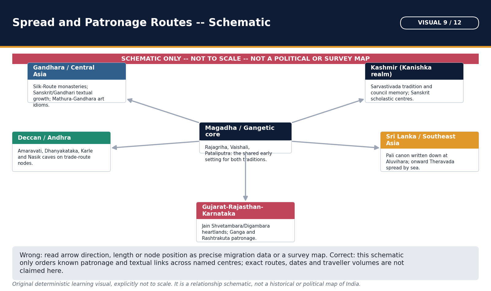

*Treat the arrows as relationships worth remembering, not as directions or distances; the prose names the actual regions and routes.*

Buddhism became a trans-Asian network through multiple routes and translations; Jainism achieved durable but more regionally concentrated expansion within India. Spread was not a single outward wave from one centre.

#### Compact visual / answer logic

```text
MAGADHA / MIDDLE GANGA
   | south                     | north-west
   v                           v
SRI LANKA -> SE ASIA       GANDHARA -> CENTRAL ASIA -> CHINA
   ^                           |
   | maritime                 TIBET / HIMALAYA (later)
ANDHRA COAST

JAIN: GANGA -> KALINGA / MATHURA -> KARNATAKA / TAMIL / GUJARAT-RAJASTHAN
```

*Read the structure first; each arrow is a historical relationship, not an automatic law.*

#### Core teaching / solved analysis

- FACT: Sri Lankan Theravada tradition associates Mahinda and Sanghamitta with transmission under Ashoka; Bodhi-tree and chronicle traditions became central to island Buddhism.
- FACT: North-western routes connected Gandhara and Central Asia, where manuscripts, monasteries and art moved toward China.
- FACT: Maritime links connected Andhra and Sri Lanka/Southeast Asia; Dhanyakataka-Amaravati-Nagarjunakonda formed major southern Buddhist zones.
- FACT: Chinese pilgrims Faxian, Xuanzang and Yijing later document Indian monasteries and routes from distinct centuries and Buddhist perspectives.
- FACT: Jainism spread strongly into Kalinga, Mathura, Karnataka, Tamil regions, Gujarat and Rajasthan through ascetic and lay networks.
- LIMIT: Mission chronicles, pilgrim accounts and art styles each represent different periods; do not project a seventh-century observation onto the Buddha's lifetime.

> **Memory hook:** S-G-A-C-T: Sri Lanka, Gandhara, Andhra, China, Tibet.

#### Must-know facts

- Dhanyakataka was in Andhra and linked to Mahasanghikas.
- Chinese and Tibetan canons are products of translation networks.
- Jainism's smaller overseas footprint does not mean historical failure.

#### UPSC traps

- **Wrong:** Ashoka's inscriptions directly list every later Buddhist country. **Correct:** Separate edict evidence from chronicle mission traditions.
- **Wrong:** Buddhism spread only by land. **Correct:** Maritime routes were important, especially for Sri Lanka and Southeast Asia.

**Mains/PYQ use:** Use routes, carriers, texts and sites, then add chronology control.

**Study link:** Topic 25 cultural interaction with Asia.

#### CLOSING RECALL FLOW — REGIONAL AND INTERNATIONAL SPREAD: A TEXT MAP — [CORE PRELIMS + CORE MAINS]

```text
START / CONCEPT: Regional and international spread: a text map — [CORE PRELIMS + CORE MAINS]
        |
        v
EXACT TERMS: Memory hook · Mains/PYQ use · Study link
        |
        v
MECHANISM / ARGUMENT: Buddhism became a trans-Asian network through multiple routes and translations; Jainism achieved durable but more regionally concentrated expansion within India.
        |
        v
CONSEQUENCE / CONTRAST: Buddhism became a trans-Asian network through multiple routes and translations; Jainism achieved durable but more regionally concentrated expansion within India.
        |
        v
UPSC TRAP / ANSWER-USE: Treat the arrows as relationships worth remembering, not as directions or distances; the prose names the actual regions and routes.
        |
        v
ANSWER-GRABBING FORMULATION: !g3 visual -- Spread and Patronage Routes: Schematic
```
### SESSION 32 — STUPAS, CAVES, MONASTERIES, IMAGES AND MATERIAL EVIDENCE — [CORE PRELIMS + CORE MAINS]

#### DEFINITION / WHAT THIS IS CALLED

**Plain-language definition:** !g3 visual -- Art, Symbol and Architecture Panel

**Technical definition:** Stupas, caves, monasteries, images and material evidence — [CORE PRELIMS + CORE MAINS]: FACT: Gandhara, Mathura and Amaravati developed overlapping anthropomorphic and narrative traditions; no simple one-school invention claim is secure.

#### ANSWER-GRABBING OPENING — WRITE/ADAPT IN THE EXAM

> !g3 visual -- Art, Symbol and Architecture Panel

#### MUST-WRITE KEYWORDS

- **Memory hook**
- **Mains/PYQ use**
- **Study link**

**How to use them:** !g3 visual -- Art, Symbol and Architecture Panel

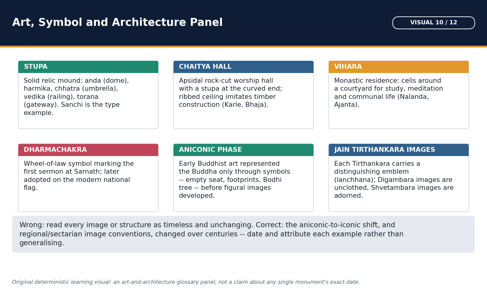

*A quick-reference glossary for identifying symbols and structures in an image-based Prelims question; exact site dating stays in the prose.*

Material remains test doctrine-in-practice, patronage and regional change. They cannot by themselves identify a text or prove a traditional biography, but inscriptions and stratigraphy can date institutions more firmly.

#### Evidence / comparison matrix

| Evidence | Examples | What it proves | Limit |
| --- | --- | --- | --- |
| Stupa | Sanchi, Bharhut, Amaravati | Relics, pilgrimage, donors, narrative art | Building phases vary |
| Cave | Karle, Nasik, Ajanta | Monastic space, routes, inscriptions | Not every cave is Buddhist |
| Image | Mathura, Gandhara, Amaravati | Devotion and iconographic change | Origin priority debated |
| Mahavihara | Nalanda, Vikramashila | Residential learning and patronage | Later than early sangha |
| Jain site | Kankali Tila, Khandagiri | Donors, images and regional presence | Local chronology only |
| Inscription | Sanchi donors, Hathigumpha, Ashokan pillars | Dated external anchors | Authorial agenda remains |

#### Core teaching / solved analysis

- FACT: Stupas developed as relic, commemorative and votive monuments; the concept was not exclusively Buddhist in origin, although Buddhism transformed it extensively.
- FACT: Sanchi and Bharhut preserve railings, gateways, Jataka scenes, symbols and donor inscriptions; early representation often uses footprints, throne, Bodhi tree and wheel without an anthropomorphic Buddha.
- FACT: Karle, Bhaja, Nasik, Kanheri and Ajanta show chaitya-vihara architecture connected to routes and changing patronage.
- FACT: Gandhara, Mathura and Amaravati developed overlapping anthropomorphic and narrative traditions; no simple one-school invention claim is secure.
- FACT: Barabar caves were donated by Ashoka and Dasharatha to Ajivikas, a reminder that rock-cut architecture is not only Buddhist.
- FACT: Jain material evidence includes Kankali Tila, Udayagiri-Khandagiri, Ellora Jain caves and later temple/manuscript traditions.

> **Memory hook:** S-C-I-M-J-I: Stupa, Cave, Image, Monastery, Jain site, Inscription.

#### Must-know facts

- Empty throne/seat is one early aniconic symbol whose exact narrative meaning depends on context.
- Amaravati lies in the lower Krishna valley.
- Gandhara and Mathura image traditions overlap chronologically.

#### UPSC traps

- **Wrong:** Every empty throne depicts the same event. **Correct:** Read associated wheel, tree, footprints and narrative context.
- **Wrong:** Rock-cut architecture is exclusively Buddhist. **Correct:** Ajivika, Jain and Brahmanical caves also exist.

**Mains/PYQ use:** Use form + named site + donor/inscription + inference + limit.

**Study link:** Indian Art and Culture Topics 02 and 06.

#### CLOSING RECALL FLOW — STUPAS, CAVES, MONASTERIES, IMAGES AND MATERIAL EVIDENCE — [CORE PRELIMS + CORE MAINS]

```text
START / CONCEPT: Stupas, caves, monasteries, images and material evidence — [CORE PRELIMS + CORE MAINS]
        |
        v
EXACT TERMS: Memory hook · Mains/PYQ use · Study link
        |
        v
MECHANISM / ARGUMENT: They cannot by themselves identify a text or prove a traditional biography, but inscriptions and stratigraphy can date institutions more firmly.
        |
        v
CONSEQUENCE / CONTRAST: Material remains test doctrine-in-practice, patronage and regional change.
        |
        v
UPSC TRAP / ANSWER-USE: They cannot by themselves identify a text or prove a traditional biography, but inscriptions and stratigraphy can date institutions more firmly.
        |
        v
ANSWER-GRABBING FORMULATION: !g3 visual -- Art, Symbol and Architecture Panel
```
### SESSION 33 — JAINISM AND BUDDHISM: A CONTROLLED COMPARISON — [CORE MAINS]

#### DEFINITION / WHAT THIS IS CALLED

**Plain-language definition:** !g3 visual -- Jain-Buddhist Doctrine Comparison Matrix

**Technical definition:** FACT: Jainism affirms plural eternal jivas; Buddhism analyzes persons without a permanent self.

#### ANSWER-GRABBING OPENING — WRITE/ADAPT IN THE EXAM

> !g3 visual -- Jain-Buddhist Doctrine Comparison Matrix

#### MUST-WRITE KEYWORDS

- **Memory hook**
- **Mains/PYQ use**
- **Study link**
- **Jainism and Buddhism: a controlled comparison — [CORE MAINS]**

**How to use them:** !g3 visual -- Jain-Buddhist Doctrine Comparison Matrix

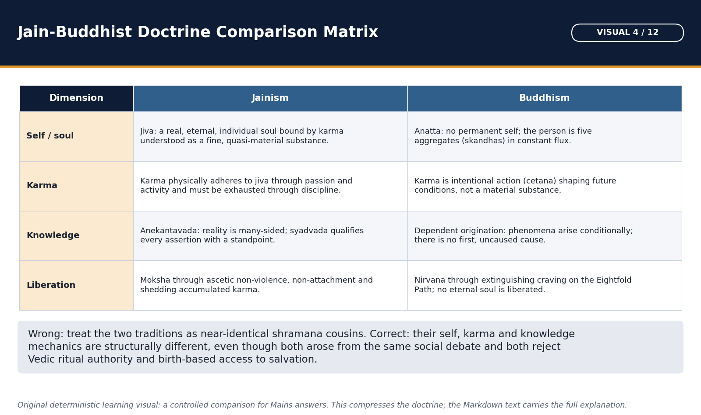

*Use this grid for rapid recall before attempting the controlled Jain-Buddhist comparison Mains question later in this package.*

The traditions share renunciation, karma, rebirth, nonviolence, mendicant organization and lay support, yet diverge sharply on self, karma, epistemology, ascetic intensity and institutional history.

#### Evidence / comparison matrix

| Dimension | Jainism | Buddhism |
| --- | --- | --- |
| Self/ontology | Plural eternal jiva; ajiva substances | Anatta; aggregates and conditioned dharmas |
| Karma | Subtle material bondage | Intentional action and causal result |
| Path | Triratna, five vows, austerity | Four Truths, Eightfold/Middle Way |
| Knowledge | Anekanta, naya, syat | Dependent arising; school-specific epistemologies |
| Ethic | Radical ahimsa/aparigraha | Compassion, non-harm, moderation |
| Institution | Fourfold sangha; strong lay networks | Sangha/Vinaya; wide monastic network |
| Texts | Shvetambara/Digambara histories | Pali/Sanskrit/Chinese/Tibetan traditions |
| Trajectory | Regional persistence in India | Trans-Asian spread; Indian transformation/decline |

#### Core teaching / solved analysis

- FACT: Jainism affirms plural eternal jivas; Buddhism analyzes persons without a permanent self.
- FACT: Jain karma is subtle matter binding jiva; Buddhist karma is intentional action within causal continuity.
- FACT: Jain liberation stresses Triratna, vows, samvara and nirjara; Buddhist liberation uses Four Truths, Eightfold Path and cessation of craving/ignorance.
- FACT: Jain epistemology emphasizes many-sidedness, standpoints and qualified predication; Buddhist schools develop dependent origination, Abhidharma and later emptiness/consciousness analyses.
- FACT: Both use monastic-lay reciprocity, but Buddhist institutions achieved wider trans-Asian monastic expansion while Jain networks remained more India-centred and lay-dense.
- QUALIFICATION: 'Jain extreme versus Buddhist moderate' is a starting contrast, not a complete history; both traditions contain varied disciplines and later devotional forms.

> **Memory hook:** S-K-P-E-I-T: Self, Karma, Path, Epistemology, Institution, Trajectory.

#### Must-know facts

- Both reject Vedic sacrifice as the exclusive path, but neither is identical to the other.
- Jiva versus anatta is the decisive ontology contrast.
- Both generated image, temple/pilgrimage and scholastic traditions later.

#### UPSC traps

- **Wrong:** Both religions deny the soul. **Correct:** Jainism strongly affirms jiva; Buddhism teaches anatta.
- **Wrong:** Only Buddhism had laity. **Correct:** Jainism developed an especially durable fourfold community and graded lay vows.

**Mains/PYQ use:** A high-scoring comparison moves dimension by dimension and ends with shared context plus divergent solutions.

**Study link:** Primary comparison answer framework.

#### CLOSING RECALL FLOW — JAINISM AND BUDDHISM: A CONTROLLED COMPARISON — [CORE MAINS]

```text
START / CONCEPT: Jainism and Buddhism: a controlled comparison — [CORE MAINS]
        |
        v
EXACT TERMS: Memory hook · Mains/PYQ use · Study link · Jainism and Buddhism: a controlled comparison — [CORE MAINS]
        |
        v
MECHANISM / ARGUMENT: Mains/PYQ use: A high-scoring comparison moves dimension by dimension and ends with shared context plus divergent solutions.
        |
        v
CONSEQUENCE / CONTRAST: QUALIFICATION: 'Jain extreme versus Buddhist moderate' is a starting contrast, not a complete history; both traditions contain varied disciplines and later devotional forms.
        |
        v
UPSC TRAP / ANSWER-USE: QUALIFICATION: 'Jain extreme versus Buddhist moderate' is a starting contrast, not a complete history; both traditions contain varied disciplines and later devotional forms.
        |
        v
ANSWER-GRABBING FORMULATION: !g3 visual -- Jain-Buddhist Doctrine Comparison Matrix
```
### SESSION 34 — BUDDHISM'S DECLINE AND TRANSFORMATION IN INDIA — [CORE MAINS]

#### DEFINITION / WHAT THIS IS CALLED

**Plain-language definition:** Buddhism did not disappear everywhere at one date.

**Technical definition:** Buddhism's decline and transformation in India — [CORE MAINS]: Its institutional contraction was regionally uneven and multi-causal, while doctrines, images, pilgrimage and communities persisted or were absorbed into new configurations.

#### ANSWER-GRABBING OPENING — WRITE/ADAPT IN THE EXAM

> Buddhism did not disappear everywhere at one date.

#### MUST-WRITE KEYWORDS

- **Patronage shifts**
- **Competition/absorption**
- **Institutional change**
- **Regional economy**
- **Political violence**
- **Outcome**
- **Memory hook**
- **Mains/PYQ use**

**How to use them:** Buddhism did not disappear everywhere at one date.

Buddhism did not disappear everywhere at one date. Its institutional contraction was regionally uneven and multi-causal, while doctrines, images, pilgrimage and communities persisted or were absorbed into new configurations.

#### Doctrine / historical process flow

1. **Patronage shifts:** Dynastic and local reallocation
2. **Competition/absorption:** Temple, bhakti and shared practices
3. **Institutional change:** Large endowed mahaviharas
4. **Regional economy:** Routes and urban support vary
5. **Political violence:** Damage to concentrated centres
6. **Outcome:** Contraction, absorption, survival and revival

#### Core teaching / solved analysis

- FACT: Patronage shifted among dynasties and regions; some monasteries accumulated land and wealth, becoming strong institutions but also vulnerable to fiscal and political change.
- FACT: Brahmanical/Puranic and bhakti traditions expanded temple, devotional and monastic forms and absorbed ethical, iconographic and pilgrimage elements.
- FACT: Buddhism transformed internally through Mahayana and Vajrayana rather than simply decaying.
- FACT: Changes in routes and urban support affected some western Deccan and north Indian establishments differently.
- FACT: Raids and warfare damaged major institutions such as Nalanda and Vikramashila, but attacks cannot explain centuries of earlier regional decline or transformation.
- FACT: Buddhism persisted in the Himalaya, eastern India and trans-Asian networks; modern revival movements further complicate 'extinction'.
- LIMIT: Older narratives blaming luxury, women, Sanskrit or Turks alone are reductive and sometimes polemical.

> **Memory hook:** P-C-I-R-V-S: Patronage, Competition, Institutions, Routes, Violence, Survival.

#### Must-know facts

- Decline is not a one-event story.
- Transformation and absorption are as important as disappearance.
- Turkish attacks are a late factor, not the single cause.

#### UPSC traps

- **Wrong:** Buddhism ended because one invader destroyed Nalanda. **Correct:** Use long-term regional and institutional causes plus late violence.
- **Wrong:** Mahayana/Vajrayana equal decline. **Correct:** They represent major transformations and new transregional vitality.

**Mains/PYQ use:** A 20-marker needs chronological phases and region-specific outcomes, not a list of blame factors.

**Study link:** Pala Mains PYQ; Topic 22.

#### CLOSING RECALL FLOW — BUDDHISM'S DECLINE AND TRANSFORMATION IN INDIA — [CORE MAINS]

```text
START / CONCEPT: Buddhism's decline and transformation in India — [CORE MAINS]
        |
        v
EXACT TERMS: Patronage shifts · Competition/absorption · Institutional change · Regional economy · Political violence
        |
        v
MECHANISM / ARGUMENT: FACT: Buddhism transformed internally through Mahayana and Vajrayana rather than simply decaying.
        |
        v
CONSEQUENCE / CONTRAST: Patronage shifts: Dynastic and local reallocation
        |
        v
UPSC TRAP / ANSWER-USE: Buddhism did not disappear everywhere at one date.
        |
        v
ANSWER-GRABBING FORMULATION: Buddhism did not disappear everywhere at one date.
```
### SESSION 35 — WHY JAINISM PERSISTED AND HOW IT TRANSFORMED — [CORE MAINS]

#### DEFINITION / WHAT THIS IS CALLED

**Plain-language definition:** !g3 visual -- Survival and Decline: A Multi-Causal Comparison

**Technical definition:** Why Jainism persisted and how it transformed — [CORE MAINS]: LIMIT: Jain history also includes decline in some regions, sectarian conflict, social accommodation and changes in patronage; continuity is not stasis.

#### ANSWER-GRABBING OPENING — WRITE/ADAPT IN THE EXAM

> !g3 visual -- Survival and Decline: A Multi-Causal Comparison

#### MUST-WRITE KEYWORDS

- **Memory hook**
- **Mains/PYQ use**
- **Study link**

**How to use them:** !g3 visual -- Survival and Decline: A Multi-Causal Comparison

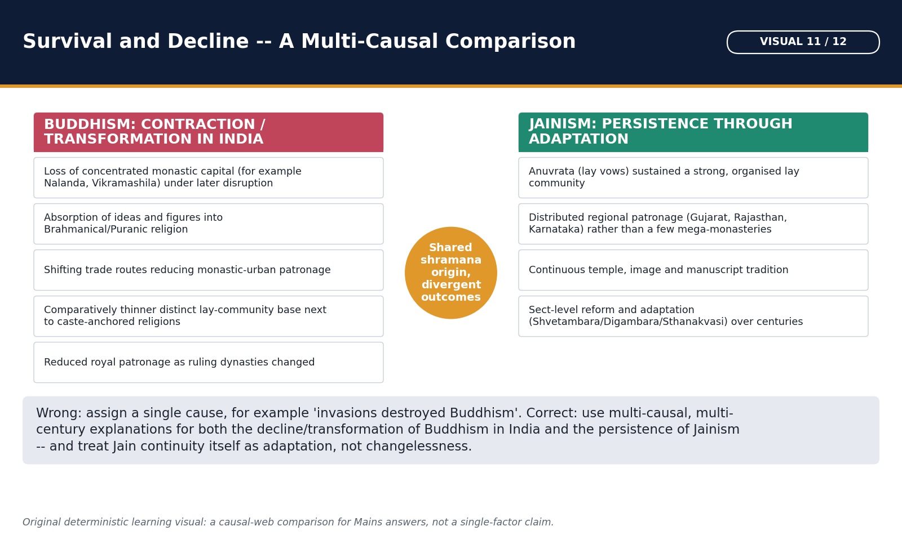

*Trace every arrow before drafting the Mains answer on Buddhism's transformation; no single box should be quoted alone as 'the' cause.*

Jainism's continuity rested on a dense fourfold community, adaptable lay vows, mercantile and artisanal support, regional courts, pilgrimage centres, manuscript cultures and vernacular literature. Persistence did not mean absence of internal change.

#### Evidence / comparison matrix

| Persistence mechanism | Evidence/example | Qualification |
| --- | --- | --- |
| Fourfold community | Monks, nuns, laymen, laywomen | Internal hierarchy remained |
| Graded vows | Anuvratas and donations | Ascetic ideal stayed central |
| Regional patronage | Ganga, Rashtrakuta, Chalukya, western courts | Patronage fluctuated |
| Literary adaptation | Prakrit, Sanskrit, Kannada, Apabhramsha | Texts are sect/genre specific |
| Pilgrimage/material culture | Shravanabelagola, Shatrunjaya, Dilwara | Many monuments are medieval |
| Reform | Sthanakvasi and other subsects | Do not project them into antiquity |

#### Core teaching / solved analysis

- FACT: Jain communities became durable in Karnataka, Tamil regions, Gujarat, Rajasthan, Bundelkhand and other zones under changing patrons.
- FACT: Lay householders could pursue anuvratas, fasting, charity and pilgrimage without full renunciation.
- FACT: Temple, image and manuscript cultures developed alongside non-image reform movements such as Sthanakvasi.
- FACT: Jain authors entered Sanskrit, Prakrit, Apabhramsha and regional literary fields, embedding the tradition in local courts and communities.
- INTERPRETATION: Distributed institutions were less dependent on a few giant residential universities than late Indian Buddhism.
- LIMIT: Jain history also includes decline in some regions, sectarian conflict, social accommodation and changes in patronage; continuity is not stasis.

> **Memory hook:** L-R-P-T: Laity, Regional patrons, Pilgrimage, Texts.

#### Must-know facts

- Jain continuity combines ascetic authority with lay adaptability.
- Regional literary production is a major survival mechanism.
- Persistence should not be explained only by merchant wealth.

#### UPSC traps

- **Wrong:** Jainism survived because it never changed. **Correct:** It transformed through sects, images, temples, literature and reform.
- **Wrong:** It survived only among one occupational group. **Correct:** Merchant support mattered within broader regional and social histories.

**Mains/PYQ use:** Compare distributed lay institutions with concentrated Buddhist mahaviharas, but avoid a deterministic contrast.

**Study link:** Jain regional and long-term history.

#### CLOSING RECALL FLOW — WHY JAINISM PERSISTED AND HOW IT TRANSFORMED — [CORE MAINS]

```text
START / CONCEPT: Why Jainism persisted and how it transformed — [CORE MAINS]
        |
        v
EXACT TERMS: Memory hook · Mains/PYQ use · Study link
        |
        v
MECHANISM / ARGUMENT: Regional literary production is a major survival mechanism.
        |
        v
CONSEQUENCE / CONTRAST: Mains/PYQ use: Compare distributed lay institutions with concentrated Buddhist mahaviharas, but avoid a deterministic contrast.
        |
        v
UPSC TRAP / ANSWER-USE: Persistence did not mean absence of internal change.
        |
        v
ANSWER-GRABBING FORMULATION: !g3 visual -- Survival and Decline: A Multi-Causal Comparison
```
### SESSION 36 — HISTORIOGRAPHY AND EVIDENCE LIMITS — [CORE MAINS + SUPPORTING]

#### DEFINITION / WHAT THIS IS CALLED

**Plain-language definition:** The history of Jainism and Buddhism is reconstructed from normative texts, rival accounts, inscriptions, monuments, art, manuscripts and later chronicles.

**Technical definition:** Historiography and evidence limits — [CORE MAINS + SUPPORTING]: The history of Jainism and Buddhism is reconstructed from normative texts, rival accounts, inscriptions, monuments, art, manuscripts and later chronicles.

#### ANSWER-GRABBING OPENING — WRITE/ADAPT IN THE EXAM

> The history of Jainism and Buddhism is reconstructed from normative texts, rival accounts, inscriptions, monuments, art, manuscripts and later chronicles.

#### MUST-WRITE KEYWORDS

- **Memory hook**
- **Mains/PYQ use**
- **Study link**
- **Historiography and evidence limits — [CORE MAINS + SUPPORTING]**

**How to use them:** The history of Jainism and Buddhism is reconstructed from normative texts, rival accounts, inscriptions, monuments, art, manuscripts and later chronicles.

The history of Jainism and Buddhism is reconstructed from normative texts, rival accounts, inscriptions, monuments, art, manuscripts and later chronicles. Each source reveals one layer and distorts another.

#### Evidence / comparison matrix

| Source | Best use | Bias/limit | Cross-check |
| --- | --- | --- | --- |
| Canonical discourse | Doctrine and institutional ideals | Layered/redacted | Parallel recensions and inscriptions |
| Vinaya | Rules and community procedures | Origin stories justify rules | Monastic archaeology/donations |
| Chronicle | Councils, missions, patronage memory | Regional legitimation | Edicts and external chronology |
| Inscription | Date, donor, office, site | Formulaic/self-representational | Stratigraphy and text |
| Art/architecture | Ritual, iconography, patronage | Dating and meaning debated | Inscriptions and context |
| Manuscript/translation | Text survival and circulation | Late copy/translation choices | Philology and parallel versions |

#### Core teaching / solved analysis

- FACT: Pali Nikayas/Agamas, Jain Agamas and Vinayas preserve early material through later transmission and school organization.
- FACT: Ashokan edicts, donor inscriptions and Hathigumpha provide firmer dated anchors but rarely explain doctrine comprehensively.
- FACT: Sri Lankan chronicles preserve crucial council and mission traditions while serving island monastic and royal histories.
- FACT: Chinese pilgrims and translations illuminate Indian sites and lost texts from later centuries and specific Buddhist perspectives.
- FACT: Art can reveal patronage, ritual and iconography, but aniconic symbols do not automatically identify one event without context.
- INTERPRETATION: Sectarian difference is evidence of institutional history, not noise to be erased.
- LIMIT: Modern textbook labels - reform movement, protest religion, simple doctrine, decline - are heuristic and require qualification.

> **Memory hook:** T-I-A-C-M: Text, Inscription, Art, Chronicle, Manuscript.

#### Must-know facts

- Later evidence can preserve earlier traditions but must be dated in layers.
- Rival Buddhist/Jain sources can independently anchor historical persons while polemicizing doctrine.
- Absence from one canon is not automatic proof of late invention.

#### UPSC traps

- **Wrong:** A dated manuscript dates the original composition. **Correct:** It dates that copy; philology is needed for earlier layers.
- **Wrong:** An inscription is unbiased because it is contemporary. **Correct:** It is closer in time but still purposeful and selective.

**Mains/PYQ use:** Every evidence paragraph should finish with the source's genre and reach.

**Study link:** Topic 02 sources of ancient history.

#### CLOSING RECALL FLOW — HISTORIOGRAPHY AND EVIDENCE LIMITS — [CORE MAINS + SUPPORTING]

```text
START / CONCEPT: Historiography and evidence limits — [CORE MAINS + SUPPORTING]
        |
        v
EXACT TERMS: Memory hook · Mains/PYQ use · Study link · Historiography and evidence limits — [CORE MAINS + SUPPORTING]
        |
        v
MECHANISM / ARGUMENT: FACT: Pali Nikayas/Agamas, Jain Agamas and Vinayas preserve early material through later transmission and school organization.
        |
        v
CONSEQUENCE / CONTRAST: FACT: Pali Nikayas/Agamas, Jain Agamas and Vinayas preserve early material through later transmission and school organization.
        |
        v
UPSC TRAP / ANSWER-USE: FACT: Art can reveal patronage, ritual and iconography, but aniconic symbols do not automatically identify one event without context.
        |
        v
ANSWER-GRABBING FORMULATION: The history of Jainism and Buddhism is reconstructed from normative texts, rival accounts, inscriptions, monuments, art, manuscripts and later chronicles.
```
### SESSION 37 — CONTEMPORARY HERITAGE AND CONSERVATION LINKAGES — [SUPPORTING]

#### DEFINITION / WHAT THIS IS CALLED

**Plain-language definition:** Modern heritage sources are used only to explain preservation, site management and continuing pilgrimage.

**Technical definition:** RETRIEVED FACT: UNESCO describes Sanchi as a multi-period complex of stupas, temples, viharas and pillars documenting Buddhism from the third century BCE into the medieval period, with ASI protection and conservation.

#### ANSWER-GRABBING OPENING — WRITE/ADAPT IN THE EXAM

> Modern heritage sources are used only to explain preservation, site management and continuing pilgrimage.

#### MUST-WRITE KEYWORDS

- **Memory hook**
- **Mains/PYQ use**
- **Study link**
- **524**
- **1056**
- **1502**
- **Contemporary heritage and conservation linkages — [SUPPORTING]**

**How to use them:** Modern heritage sources are used only to explain preservation, site management and continuing pilgrimage.

Modern heritage sources are used only to explain preservation, site management and continuing pilgrimage. They cannot verify the Buddha's words, Mahavira's dates or ancient council narratives.

#### Evidence / comparison matrix

| Modern source | Retrieved fact | Historical linkage | Firewall |
| --- | --- | --- | --- |
| UNESCO Sanchi | Multi-period stupas/viharas and conservation | Patronage and aniconic art | Not proof Buddha visited Sanchi |
| UNESCO Mahabodhi | Sacred enlightenment site; early brick temple history | Pilgrimage and architectural layers | Biography remains text-critical |
| UNESCO Nalanda | Monastic-scholastic complex; material evolution | Mahayana/Vajrayana and education | Later than early Buddhism |
| ASI Jain sites | Protected caves/inscriptions | Kalinga and regional Jain presence | Use exact report for new discoveries |

#### Core teaching / solved analysis

- RETRIEVED FACT: UNESCO describes Sanchi as a multi-period complex of stupas, temples, viharas and pillars documenting Buddhism from the third century BCE into the medieval period, with ASI protection and conservation.
- INTERPRETATION: Sanchi's phased architecture and inscriptions demonstrate cumulative patronage more securely than a one-dynasty textbook image.
- RETRIEVED FACT: UNESCO identifies the Mahabodhi complex with enlightenment memory, an Ashokan foundation and a standing late-Gupta-period brick temple.
- INTERPRETATION: The site shows how sacred biography, pilgrimage, architecture and conservation occupy different chronological layers.
- RETRIEVED FACT: UNESCO describes Nalanda's surviving viharas, temples and art as evidence of a long monastic-scholastic institution and notes conservation by ASI.
- INFERENCE: Heritage management today preserves evidence of Buddhist institutional transformation; it does not settle doctrinal authenticity.
- RETRIEVED FACT: ASI protection and excavation frameworks cover early Jain sites such as Udayagiri-Khandagiri; site-specific claims still require the relevant inscription or report.

> **Memory hook:** F-I-I: Fact retrieved, Interpretation, Inference - label each.

#### Must-know facts

- UNESCO listing is a modern heritage status, not ancient evidence by itself.
- Sanchi, Mahabodhi and Nalanda represent different periods and functions.
- No current-affairs story is forced into the package.

#### UPSC traps

- **Wrong:** UNESCO calls Sanchi a place visited by the Buddha. **Correct:** Its significance is monument history and relic/patronage tradition; Buddha's visit is not required.
- **Wrong:** Modern restoration equals original fabric. **Correct:** Authenticity assessments distinguish ancient fabric, restoration and management.

**Mains/PYQ use:** Use heritage only as a final contemporary linkage after the ancient evidence is complete.

**Study link:** UNESCO World Heritage Centre pages 524, 1056 and 1502.

#### CLOSING RECALL FLOW — CONTEMPORARY HERITAGE AND CONSERVATION LINKAGES — [SUPPORTING]

```text
START / CONCEPT: Contemporary heritage and conservation linkages — [SUPPORTING]
        |
        v
EXACT TERMS: Memory hook · Mains/PYQ use · Study link · 524 · 1056
        |
        v
MECHANISM / ARGUMENT: RETRIEVED FACT: UNESCO describes Nalanda's surviving viharas, temples and art as evidence of a long monastic-scholastic institution and notes conservation by ASI.
        |
        v
CONSEQUENCE / CONTRAST: Correct: Its significance is monument history and relic/patronage tradition; Buddha's visit is not required.
        |
        v
UPSC TRAP / ANSWER-USE: They cannot verify the Buddha's words, Mahavira's dates or ancient council narratives.
        |
        v
ANSWER-GRABBING FORMULATION: Modern heritage sources are used only to explain preservation, site management and continuing pilgrimage.
```
### SESSION 38 — CHRONOLOGY, TERMINOLOGY AND RAPID UPSC DISTINCTIONS — [CORE PRELIMS]

#### DEFINITION / WHAT THIS IS CALLED

**Plain-language definition:** This consolidation prevents the most common close-option errors: founder versus systematizer, early school versus Mahayana current, canon versus translation, tradition versus inscription, and doctrinal terms that look similar.

**Technical definition:** Chronology, terminology and rapid UPSC distinctions — [CORE PRELIMS]: Mahavira: twenty-fourth Tirthankara and historical systematizer, not first Jain teacher.

#### ANSWER-GRABBING OPENING — WRITE/ADAPT IN THE EXAM

> This consolidation prevents the most common close-option errors: founder versus systematizer, early school versus Mahayana current, canon versus translation, tradition versus inscription, and doctrinal terms that look similar.

#### MUST-WRITE KEYWORDS

- **Memory hook**
- **Mains/PYQ use**
- **Study link**
- **Chronology, terminology and rapid UPSC distinctions — [CORE PRELIMS]**

**How to use them:** This consolidation prevents the most common close-option errors: founder versus systematizer, early school versus Mahayana current, canon versus translation, tradition versus inscription, and doctrinal terms that look similar.

This consolidation prevents the most common close-option errors: founder versus systematizer, early school versus Mahayana current, canon versus translation, tradition versus inscription, and doctrinal terms that look similar.

#### Evidence / comparison matrix

| Term pair | Correct distinction |
| --- | --- |
| Jiva / anatta | Permanent plural souls / no permanent self |
| Kevala / nirvana | Jain omniscience-liberation path / Buddhist cessation-release |
| Agama / Tripitaka | Jain canonical usage / Buddhist three baskets |
| Sthavira / Theravada | Early broad lineage / surviving Pali school |
| Mahayana / Vajrayana | Bodhisattva-textual currents / later esoteric configurations |
| Stupa / vihara | Relic/commemorative mound / residence-monastery |

#### Core teaching / solved analysis

- Mahavira: twenty-fourth Tirthankara and historical systematizer, not first Jain teacher.
- Buddha: Shakyamuni/Tathagata; Mahavira: Nigantha Nataputta/Nayaputta.
- Jain Triratna: right faith, knowledge, conduct; Buddhist refuges: Buddha, Dhamma, Sangha.
- Anekantavada = many-sidedness; nayavada = standpoints; syadvada = qualified predication.
- Theravada = specific Pali lineage; Hinayana = polemical umbrella, not a safe synonym.
- Maitreya = future Buddha in Theravada and Mahayana traditions.
- Paramitas = Bodhisattva perfections; common Mahayana list six, some lists ten.
- Sanghabhuti = Sarvastivada Vinaya commentary; Sanghabhadra = different Vaibhashika scholar.
- Dhanyakataka = Andhra Buddhist centre associated with Mahasanghikas.
- Sthanakvasi = later Shvetambara non-image-worship Jain subsect.

> **Memory hook:** NAME -> SCHOOL -> TEXT -> REGION -> DATE -> CAVEAT.

#### Must-know facts

- Four Jain gatis: deva, manushya, naraki, tiryancha.
- The four Buddhist sites: Lumbini, Bodh Gaya, Sarnath, Kushinagara.
- Council accounts are conventional and tradition-specific.

#### UPSC traps

- **Wrong:** Sanghabhuti and Sanghabhadra are variants of one name. **Correct:** They are different historical monks/scholars.
- **Wrong:** Maitreya belongs only to Mahayana. **Correct:** Future-Buddha expectation also exists in Theravada.

**Mains/PYQ use:** Use this card to audit terminology before finalizing any answer.

**Study link:** All routed PYQs.

#### CLOSING RECALL FLOW — CHRONOLOGY, TERMINOLOGY AND RAPID UPSC DISTINCTIONS — [CORE PRELIMS]

```text
START / CONCEPT: Chronology, terminology and rapid UPSC distinctions — [CORE PRELIMS]
        |
        v
EXACT TERMS: Memory hook · Mains/PYQ use · Study link · Chronology, terminology and rapid UPSC distinctions — [CORE PRELIMS]
        |
        v
MECHANISM / ARGUMENT: Mahavira: twenty-fourth Tirthankara and historical systematizer, not first Jain teacher.
        |
        v
CONSEQUENCE / CONTRAST: Buddha: Shakyamuni/Tathagata; Mahavira: Nigantha Nataputta/Nayaputta.
        |
        v
UPSC TRAP / ANSWER-USE: Mahavira: twenty-fourth Tirthankara and historical systematizer, not first Jain teacher.
        |
        v
ANSWER-GRABBING FORMULATION: This consolidation prevents the most common close-option errors: founder versus systematizer, early school versus Mahayana current, canon versus translation, tradition versus inscription, and doctrinal terms that look similar.
```
## BASIC MCQS / REMEDIATION

### Diagnostic and repair protocol — [CORE PRELIMS + CORE MAINS]

- Attempt before reading the explanation.
- Classify each error as chronology, evidence, identity, causation, region or overclaim.
- Answer placement is balanced, deterministic and non-patterned using a stable topic seed.

> 48 hard MCQs and 12 remedials. Answer placement is balanced, deterministic and non-patterned using a stable topic seed.

#### Hard MCQ 01 - setting

Which formulation best explains the sixth-century BCE setting?

#### Evidence / comparison matrix

| Option | Choice |
| --- | --- |
| A | The movements arose outside towns and states. |
| B | Only merchant resentment created heterodoxy. |
| C | Urban, political and social change widened audiences, but did not mechanically determine doctrine. |
| D | Iron technology alone produced both religions. |

#### Core teaching / solved analysis

- OPTIONS: A. Urban, political and social change widened audiences, but did not mechanically determine doctrine. | B. Iron technology alone produced both religions. | C. Only merchant resentment created heterodoxy. | D. The movements arose outside towns and states.
- CORRECT ANSWER: C - Urban, political and social change widened audiences, but did not mechanically determine doctrine.
- EXPLANATION: Second urbanisation, states and new elites supplied context; ideas and institutions still require independent explanation.
- WHY THE DISTRACTORS FAIL: D ('Iron technology alone produced both religions') overclaims by turning a partial or context-bound truth into an absolute rule; B ('Only merchant resentment created heterodoxy') overclaims by turning a partial or context-bound truth into an absolute rule; A ('The movements arose outside towns and states') misstates the chronology or sequence of development.

> **Memory hook:** Q01 key C; logic: Second urbanisation, states and new elites supplied context; ideas and institutions still require independent explanation.

#### Must-know facts

- Coverage area: setting.
- Rotation position: 1 -> C.

#### UPSC traps

- **Wrong:** Absolutiser wording on setting. **Correct:** An option using words like 'only', 'alone' or 'all' is usually a trap. Test whether the qualifier survives a single counter-example.
- **Wrong:** List-completeness bait on setting. **Correct:** An option that looks complete may quietly drop or add one item from the real list; recount rather than pattern-match.

**Mains/PYQ use:** MCQ learning loop: answer -> explain -> eliminate -> state caveat.

**Study link:** Topic 10 consolidated practice.

#### Hard MCQ 02 - Jain chronology

Which is the safest historical statement about the Tirthankaras?

#### Evidence / comparison matrix

| Option | Choice |
| --- | --- |
| A | Mahavira was the first Tirthankara. |
| B | Rishabhanatha is proven by Harappan seals. |
| C | Parshvanatha is a plausible pre-Mahavira teacher, while the full sequence is primarily sacred tradition. |
| D | All twenty-four are securely dated by inscriptions. |

#### Core teaching / solved analysis

- OPTIONS: A. All twenty-four are securely dated by inscriptions. | B. Parshvanatha is a plausible pre-Mahavira teacher, while the full sequence is primarily sacred tradition. | C. Mahavira was the first Tirthankara. | D. Rishabhanatha is proven by Harappan seals.
- CORRECT ANSWER: C - Parshvanatha is a plausible pre-Mahavira teacher, while the full sequence is primarily sacred tradition.
- EXPLANATION: Evidence confidence is graded: Mahavira is historical, Parshva plausible, and remote traditional chronology cannot be archaeologically asserted.
- WHY THE DISTRACTORS FAIL: D ('All twenty-four are securely dated by inscriptions') breaks the specific factual pairing the question is testing; A ('Mahavira was the first Tirthankara') misstates the chronology or sequence of development; B ('Rishabhanatha is proven by Harappan seals') breaks the specific factual pairing the question is testing.

> **Memory hook:** Q02 key C; logic: Evidence confidence is graded: Mahavira is historical, Parshva plausible, and remote traditional chronology cannot be archaeologically asserted.

#### Must-know facts

- Coverage area: Jain chronology.
- Rotation position: 2 -> C.

#### UPSC traps

- **Wrong:** Cross-tradition swap on Jain chronology. **Correct:** A term that sounds right can still belong to the wrong tradition or school. Fix the tradition/school first, then the date.
- **Wrong:** False equivalence on Jain chronology. **Correct:** Two related-sounding ideas are not interchangeable in this context; hold their technical difference steady before choosing.

**Mains/PYQ use:** MCQ learning loop: answer -> explain -> eliminate -> state caveat.

**Study link:** Topic 10 consolidated practice.

#### Hard MCQ 03 - identities

Nigantha Nataputta/Nayaputta in Pali sources refers to:

#### Evidence / comparison matrix

| Option | Choice |
| --- | --- |
| A | Maitreya. |
| B | Gautama Buddha. |
| C | Nagarjuna. |
| D | Mahavira. |

#### Core teaching / solved analysis

- OPTIONS: A. Gautama Buddha. | B. Maitreya. | C. Mahavira. | D. Nagarjuna.
- CORRECT ANSWER: D - Mahavira.
- EXPLANATION: The 2024 epithets PYQ tests this person-name firewall: Buddha is Shakyamuni/Tathagata; Mahavira is Nataputta.
- WHY THE DISTRACTORS FAIL: B ('Gautama Buddha') breaks the specific factual pairing the question is testing; A ('Maitreya') breaks the specific factual pairing the question is testing; C ('Nagarjuna') breaks the specific factual pairing the question is testing.

> **Memory hook:** Q03 key D; logic: The 2024 epithets PYQ tests this person-name firewall: Buddha is Shakyamuni/Tathagata; Mahavira is Nataputta.

#### Must-know facts

- Coverage area: identities.
- Rotation position: 3 -> D.

#### UPSC traps

- **Wrong:** Anachronism on identities. **Correct:** A later school, sect or label can be silently projected backward onto an earlier period. Check whether the term existed at the time the question describes.
- **Wrong:** Translation literalism on identities. **Correct:** A modern or literal English gloss of the term can mislead; use the technical sense established in the teaching, not the everyday one.

**Mains/PYQ use:** MCQ learning loop: answer -> explain -> eliminate -> state caveat.

**Study link:** Topic 10 consolidated practice.

#### Hard MCQ 04 - Jain ontology

In Jain ontology, dharma-dravya is:

#### Evidence / comparison matrix

| Option | Choice |
| --- | --- |
| A | The creator principle. |
| B | The moral duty of a householder only. |
| C | The medium that enables motion. |
| D | Karmic merit stored in a soul. |

#### Core teaching / solved analysis

- OPTIONS: A. The moral duty of a householder only. | B. Karmic merit stored in a soul. | C. The creator principle. | D. The medium that enables motion.
- CORRECT ANSWER: C - The medium that enables motion.
- EXPLANATION: Dharma and adharma as substances are media of motion and rest, not simply ethical good and evil.
- WHY THE DISTRACTORS FAIL: B ('The moral duty of a householder only') overclaims by turning a partial or context-bound truth into an absolute rule; D ('Karmic merit stored in a soul') breaks the specific factual pairing the question is testing; A ('The creator principle') breaks the specific factual pairing the question is testing.

> **Memory hook:** Q04 key C; logic: Dharma and adharma as substances are media of motion and rest, not simply ethical good and evil.

#### Must-know facts

- Coverage area: Jain ontology.
- Rotation position: 4 -> C.

#### UPSC traps

- **Wrong:** Single-cause shortcut on Jain ontology. **Correct:** Reducing a multi-causal process to one driver (technology, one group, one ruler) is a common wrong answer pattern here.
- **Wrong:** Chronology telescoping on Jain ontology. **Correct:** Centuries of development can be compressed into one moment by a wrong option; keep the actual sequence of phases in view.

**Mains/PYQ use:** MCQ learning loop: answer -> explain -> eliminate -> state caveat.

**Study link:** Topic 10 consolidated practice.

#### Hard MCQ 05 - Jain karma

Which sequence correctly describes Jain liberation mechanics?

#### Evidence / comparison matrix

| Option | Choice |
| --- | --- |
| A | Asrava -> bandha -> samvara -> nirjara -> moksha. |
| B | Bandha -> asrava -> moksha -> nirjara -> samvara. |
| C | Craving -> aggregates -> grace -> heaven. |
| D | Jiva -> anatta -> nirvana -> rebirth. |

#### Core teaching / solved analysis

- OPTIONS: A. Asrava -> bandha -> samvara -> nirjara -> moksha. | B. Bandha -> asrava -> moksha -> nirjara -> samvara. | C. Craving -> aggregates -> grace -> heaven. | D. Jiva -> anatta -> nirvana -> rebirth.
- CORRECT ANSWER: A - Asrava -> bandha -> samvara -> nirjara -> moksha.
- EXPLANATION: Influx produces bondage; stopping new influx and shedding old karma lead to release.
- WHY THE DISTRACTORS FAIL: B ('Bandha -> asrava -> moksha -> nirjara -> samvara') breaks the specific factual pairing the question is testing; C ('Craving -> aggregates -> grace -> heaven') breaks the specific factual pairing the question is testing; D ('Jiva -> anatta -> nirvana -> rebirth') breaks the specific factual pairing the question is testing.

> **Memory hook:** Q05 key A; logic: Influx produces bondage; stopping new influx and shedding old karma lead to release.

#### Must-know facts

- Coverage area: Jain karma.
- Rotation position: 5 -> A.

#### UPSC traps

- **Wrong:** Textbook over-neatness on Jain karma. **Correct:** Real history rarely resolves this cleanly; treat any suspiciously tidy either/or option with caution.
- **Wrong:** Counter-example trap on Jain karma. **Correct:** A rule stated too broadly here usually has a known counter-example; hold the qualified version of the rule, not the sweeping one.

**Mains/PYQ use:** MCQ learning loop: answer -> explain -> eliminate -> state caveat.

**Study link:** Topic 10 consolidated practice.

#### Hard MCQ 06 - Jain vows

Which item is not one of the five Jain vows?

#### Evidence / comparison matrix

| Option | Choice |
| --- | --- |
| A | Ahimsa. |
| B | Aparigraha. |
| C | Asteya. |
| D | Right concentration. |

#### Core teaching / solved analysis

- OPTIONS: A. Ahimsa. | B. Right concentration. | C. Asteya. | D. Aparigraha.
- CORRECT ANSWER: D - Right concentration.
- EXPLANATION: Right concentration is an Eightfold Path factor; Jain vows are ahimsa, satya, asteya, brahmacharya and aparigraha.
- WHY THE DISTRACTORS FAIL: A ('Ahimsa') breaks the specific factual pairing the question is testing; C ('Asteya') breaks the specific factual pairing the question is testing; B ('Aparigraha') breaks the specific factual pairing the question is testing.

> **Memory hook:** Q06 key D; logic: Right concentration is an Eightfold Path factor; Jain vows are ahimsa, satya, asteya, brahmacharya and aparigraha.

#### Must-know facts

- Coverage area: Jain vows.
- Rotation position: 6 -> D.

#### UPSC traps

- **Wrong:** Geography/site swap on Jain vows. **Correct:** Sites and regions in this area are easy to interchange; re-anchor the option to the specific place named in the question.
- **Wrong:** Definition inversion on Jain vows. **Correct:** An option can invert cause and effect or reverse a definition; restate the relationship in your own words before matching an option.

**Mains/PYQ use:** MCQ learning loop: answer -> explain -> eliminate -> state caveat.

**Study link:** Topic 10 consolidated practice.

#### Hard MCQ 07 - Jain epistemology

The correct distinction is:

#### Evidence / comparison matrix

| Option | Choice |
| --- | --- |
| A | Anekantavada concerns many-sided reality; nayavada standpoints; syadvada qualified predication. |
| B | All three mean total scepticism. |
| C | Syadvada asserts contradictions in the same respect. |
| D | Nayavada is the Jain theory of karmic matter. |

#### Core teaching / solved analysis

- OPTIONS: A. All three mean total scepticism. | B. Nayavada is the Jain theory of karmic matter. | C. Anekantavada concerns many-sided reality; nayavada standpoints; syadvada qualified predication. | D. Syadvada asserts contradictions in the same respect.
- CORRECT ANSWER: A - Anekantavada concerns many-sided reality; nayavada standpoints; syadvada qualified predication.
- EXPLANATION: The three doctrines form a linked epistemic method but have distinct functions.
- WHY THE DISTRACTORS FAIL: B ('All three mean total scepticism') breaks the specific factual pairing the question is testing; D ('Nayavada is the Jain theory of karmic matter') misassigns the fact to the wrong tradition, sect or school; C ('Syadvada asserts contradictions in the same respect') breaks the specific factual pairing the question is testing.

> **Memory hook:** Q07 key A; logic: The three doctrines form a linked epistemic method but have distinct functions.

#### Must-know facts

- Coverage area: Jain epistemology.
- Rotation position: 7 -> A.

#### UPSC traps

- **Wrong:** Role/identity confusion on Jain epistemology. **Correct:** Two named individuals or offices are easy to swap here; verify who actually held the role before selecting.
- **Wrong:** Source-status trap on Jain epistemology. **Correct:** Do not treat an inferred or traditional account as if it were an officially verified fact; keep the evidence status attached to the claim.

**Mains/PYQ use:** MCQ learning loop: answer -> explain -> eliminate -> state caveat.

**Study link:** Topic 10 consolidated practice.

#### Hard MCQ 08 - Jain sects

Which issue significantly differentiates major Jain sects?

#### Evidence / comparison matrix

| Option | Choice |
| --- | --- |
| A | Acceptance versus rejection of all Tirthankaras. |
| B | Canonical survival and women's immediate liberation. |
| C | Whether ahimsa is valuable. |
| D | Belief in karma versus no karma. |

#### Core teaching / solved analysis

- OPTIONS: A. Belief in karma versus no karma. | B. Acceptance versus rejection of all Tirthankaras. | C. Whether ahimsa is valuable. | D. Canonical survival and women's immediate liberation.
- CORRECT ANSWER: B - Canonical survival and women's immediate liberation.
- EXPLANATION: Digambara and Shvetambara differences go well beyond clothing.
- WHY THE DISTRACTORS FAIL: D ('Belief in karma versus no karma') breaks the specific factual pairing the question is testing; A ('Acceptance versus rejection of all Tirthankaras') breaks the specific factual pairing the question is testing; C ('Whether ahimsa is valuable') breaks the specific factual pairing the question is testing.

> **Memory hook:** Q08 key B; logic: Digambara and Shvetambara differences go well beyond clothing.

#### Must-know facts

- Coverage area: Jain sects.
- Rotation position: 8 -> B.

#### UPSC traps

- **Wrong:** List-completeness bait on Jain sects. **Correct:** An option that looks complete may quietly drop or add one item from the real list; recount rather than pattern-match.
- **Wrong:** Adjacent-topic bleed on Jain sects. **Correct:** A neighbouring topic's fact can be borrowed into this option; confirm the fact is actually about this specific sub-topic before accepting it.

**Mains/PYQ use:** MCQ learning loop: answer -> explain -> eliminate -> state caveat.

**Study link:** Topic 10 consolidated practice.

#### Hard MCQ 09 - Sthanakvasi

Sthanakvasi is best identified as:

#### Evidence / comparison matrix

| Option | Choice |
| --- | --- |
| A | An early Mahasanghika school. |
| B | A later non-image-worship Shvetambara Jain tradition. |
| C | A Buddhist cave order in Andhra. |
| D | A Digambara canon council. |

#### Core teaching / solved analysis

- OPTIONS: A. A later non-image-worship Shvetambara Jain tradition. | B. An early Mahasanghika school. | C. A Digambara canon council. | D. A Buddhist cave order in Andhra.
- CORRECT ANSWER: B - A later non-image-worship Shvetambara Jain tradition.
- EXPLANATION: It is Jain and Shvetambara; its history is much later than Mahavira.
- WHY THE DISTRACTORS FAIL: A ('An early Mahasanghika school') breaks the specific factual pairing the question is testing; D ('B Digambara canon council') misassigns the fact to the wrong tradition, sect or school; C ('B Buddhist cave order in Andhra') misassigns the fact to the wrong tradition, sect or school.

> **Memory hook:** Q09 key B; logic: It is Jain and Shvetambara; its history is much later than Mahavira.

#### Must-know facts

- Coverage area: Sthanakvasi.
- Rotation position: 9 -> B.

#### UPSC traps

- **Wrong:** False equivalence on Sthanakvasi. **Correct:** Two related-sounding ideas are not interchangeable in this context; hold their technical difference steady before choosing.
- **Wrong:** Absolutiser wording on Sthanakvasi. **Correct:** An option using words like 'only', 'alone' or 'all' is usually a trap. Test whether the qualifier survives a single counter-example.

**Mains/PYQ use:** MCQ learning loop: answer -> explain -> eliminate -> state caveat.

**Study link:** Topic 10 consolidated practice.

#### Hard MCQ 10 - Jain canon

Valabhi is important in Jain history because of:

#### Evidence / comparison matrix

| Option | Choice |
| --- | --- |
| A | Kanishka's Sarvastivada council. |
| B | Ashoka's Kalinga war. |
| C | The Buddha's first sermon. |
| D | The conventional final redaction of the Shvetambara canon. |

#### Core teaching / solved analysis

- OPTIONS: A. The Buddha's first sermon. | B. The conventional final redaction of the Shvetambara canon. | C. Kanishka's Sarvastivada council. | D. Ashoka's Kalinga war.
- CORRECT ANSWER: D - The conventional final redaction of the Shvetambara canon.
- EXPLANATION: Valabhi belongs to later Shvetambara canonical memory, not the lifetime of Mahavira.
- WHY THE DISTRACTORS FAIL: C ('The Buddha's first sermon') misstates the chronology or sequence of development; A ('Kanishka's Sarvastivada council') breaks the specific factual pairing the question is testing; B ('Ashoka's Kalinga war') breaks the specific factual pairing the question is testing.

> **Memory hook:** Q10 key D; logic: Valabhi belongs to later Shvetambara canonical memory, not the lifetime of Mahavira.

#### Must-know facts

- Coverage area: Jain canon.
- Rotation position: 10 -> D.

#### UPSC traps

- **Wrong:** Translation literalism on Jain canon. **Correct:** A modern or literal English gloss of the term can mislead; use the technical sense established in the teaching, not the everyday one.
- **Wrong:** Cross-tradition swap on Jain canon. **Correct:** A term that sounds right can still belong to the wrong tradition or school. Fix the tradition/school first, then the date.

**Mains/PYQ use:** MCQ learning loop: answer -> explain -> eliminate -> state caveat.

**Study link:** Topic 10 consolidated practice.

#### Hard MCQ 11 - Jain sites

Kankali Tila is especially useful for studying:

#### Evidence / comparison matrix

| Option | Choice |
| --- | --- |
| A | The Pali council at Aluvihara. |
| B | Achaemenid rule in Gandhara. |
| C | Buddha's enlightenment. |
| D | Early Jain images, ayagapatas and donor communities at Mathura. |

#### Core teaching / solved analysis

- OPTIONS: A. The Pali council at Aluvihara. | B. Buddha's enlightenment. | C. Early Jain images, ayagapatas and donor communities at Mathura. | D. Achaemenid rule in Gandhara.
- CORRECT ANSWER: D - Early Jain images, ayagapatas and donor communities at Mathura.
- EXPLANATION: The site supplies material and inscriptional evidence for organized Jain life.
- WHY THE DISTRACTORS FAIL: A ('The Pali council at Aluvihara') breaks the specific factual pairing the question is testing; C ('Buddha's enlightenment') breaks the specific factual pairing the question is testing; B ('Achaemenid rule in Gandhara') breaks the specific factual pairing the question is testing.

> **Memory hook:** Q11 key D; logic: The site supplies material and inscriptional evidence for organized Jain life.

#### Must-know facts

- Coverage area: Jain sites.
- Rotation position: 11 -> D.

#### UPSC traps

- **Wrong:** Chronology telescoping on Jain sites. **Correct:** Centuries of development can be compressed into one moment by a wrong option; keep the actual sequence of phases in view.
- **Wrong:** Anachronism on Jain sites. **Correct:** A later school, sect or label can be silently projected backward onto an earlier period. Check whether the term existed at the time the question describes.

**Mains/PYQ use:** MCQ learning loop: answer -> explain -> eliminate -> state caveat.

**Study link:** Topic 10 consolidated practice.

#### Hard MCQ 12 - Jain spread

The safest use of the Chandragupta-Bhadrabahu tradition is:

#### Evidence / comparison matrix

| Option | Choice |
| --- | --- |
| A | As a later southern Jain memory requiring epigraphic caution. |
| B | As a contemporary Mauryan inscription. |
| C | As evidence that Jainism began in Karnataka. |
| D | As proof that Digambara and Shvetambara formed in one meeting. |

#### Core teaching / solved analysis

- OPTIONS: A. As a contemporary Mauryan inscription. | B. As proof that Digambara and Shvetambara formed in one meeting. | C. As evidence that Jainism began in Karnataka. | D. As a later southern Jain memory requiring epigraphic caution.
- CORRECT ANSWER: A - As a later southern Jain memory requiring epigraphic caution.
- EXPLANATION: Shravanabelagola's later epigraphic tradition cannot independently verify every early detail.
- WHY THE DISTRACTORS FAIL: B ('As a contemporary Mauryan inscription') breaks the specific factual pairing the question is testing; D ('As proof that Digambara and Shvetambara formed in one meeting') misassigns the fact to the wrong tradition, sect or school; C ('As evidence that Jainism began in Karnataka') misassigns the fact to the wrong tradition, sect or school.

> **Memory hook:** Q12 key A; logic: Shravanabelagola's later epigraphic tradition cannot independently verify every early detail.

#### Must-know facts

- Coverage area: Jain spread.
- Rotation position: 12 -> A.

#### UPSC traps

- **Wrong:** Counter-example trap on Jain spread. **Correct:** A rule stated too broadly here usually has a known counter-example; hold the qualified version of the rule, not the sweeping one.
- **Wrong:** Single-cause shortcut on Jain spread. **Correct:** Reducing a multi-causal process to one driver (technology, one group, one ruler) is a common wrong answer pattern here.

**Mains/PYQ use:** MCQ learning loop: answer -> explain -> eliminate -> state caveat.

**Study link:** Topic 10 consolidated practice.

#### Hard MCQ 13 - Jain patronage

Which source most directly anchors Kharavela-era Jain patronage?

#### Evidence / comparison matrix

| Option | Choice |
| --- | --- |
| A | The Hathigumpha inscription and Udayagiri-Khandagiri caves. |
| B | The Milindapanha alone. |
| C | The Rummindei pillar. |
| D | The Allahabad pillar. |

#### Core teaching / solved analysis

- OPTIONS: A. The Hathigumpha inscription and Udayagiri-Khandagiri caves. | B. The Rummindei pillar. | C. The Milindapanha alone. | D. The Allahabad pillar.
- CORRECT ANSWER: A - The Hathigumpha inscription and Udayagiri-Khandagiri caves.
- EXPLANATION: Hathigumpha is self-representational but provides a named Kalinga anchor.
- WHY THE DISTRACTORS FAIL: C ('The Rummindei pillar') breaks the specific factual pairing the question is testing; B ('The Milindapanha alone') overclaims by turning a partial or context-bound truth into an absolute rule; D ('The Allahabad pillar') breaks the specific factual pairing the question is testing.

> **Memory hook:** Q13 key A; logic: Hathigumpha is self-representational but provides a named Kalinga anchor.

#### Must-know facts

- Coverage area: Jain patronage.
- Rotation position: 13 -> A.

#### UPSC traps

- **Wrong:** Definition inversion on Jain patronage. **Correct:** An option can invert cause and effect or reverse a definition; restate the relationship in your own words before matching an option.
- **Wrong:** Textbook over-neatness on Jain patronage. **Correct:** Real history rarely resolves this cleanly; treat any suspiciously tidy either/or option with caution.

**Mains/PYQ use:** MCQ learning loop: answer -> explain -> eliminate -> state caveat.

**Study link:** Topic 10 consolidated practice.

#### Hard MCQ 14 - Jain gatis

The four principal Jain gatis include all except:

#### Evidence / comparison matrix

| Option | Choice |
| --- | --- |
| A | Tiryancha. |
| B | Deva. |
| C | Yaksha. |
| D | Manushya. |

#### Core teaching / solved analysis

- OPTIONS: A. Deva. | B. Yaksha. | C. Manushya. | D. Tiryancha.
- CORRECT ANSWER: C - Yaksha.
- EXPLANATION: The four are gods, humans, hell beings and animals/plants; yaksha is not the fourth category.
- WHY THE DISTRACTORS FAIL: B ('Deva') breaks the specific factual pairing the question is testing; D ('Manushya') breaks the specific factual pairing the question is testing; A ('Tiryancha') breaks the specific factual pairing the question is testing.

> **Memory hook:** Q14 key C; logic: The four are gods, humans, hell beings and animals/plants; yaksha is not the fourth category.

#### Must-know facts

- Coverage area: Jain gatis.
- Rotation position: 14 -> C.

#### UPSC traps

- **Wrong:** Source-status trap on Jain gatis. **Correct:** Do not treat an inferred or traditional account as if it were an officially verified fact; keep the evidence status attached to the claim.
- **Wrong:** Geography/site swap on Jain gatis. **Correct:** Sites and regions in this area are easy to interchange; re-anchor the option to the specific place named in the question.

**Mains/PYQ use:** MCQ learning loop: answer -> explain -> eliminate -> state caveat.

**Study link:** Topic 10 consolidated practice.

#### Hard MCQ 15 - Four Truths

The first Noble Truth concerns:

#### Evidence / comparison matrix

| Option | Choice |
| --- | --- |
| A | The permanent soul. |
| B | Dukkha, the unsatisfactoriness of conditioned existence under clinging. |
| C | Ritual sacrifice. |
| D | A creator god. |

#### Core teaching / solved analysis

- OPTIONS: A. A creator god. | B. The permanent soul. | C. Dukkha, the unsatisfactoriness of conditioned existence under clinging. | D. Ritual sacrifice.
- CORRECT ANSWER: B - Dukkha, the unsatisfactoriness of conditioned existence under clinging.
- EXPLANATION: Dukkha is broader than pain and is linked causally to craving and ignorance.
- WHY THE DISTRACTORS FAIL: D ('D creator god') breaks the specific factual pairing the question is testing; A ('The permanent soul') breaks the specific factual pairing the question is testing; C ('Ritual sacrifice') breaks the specific factual pairing the question is testing.

> **Memory hook:** Q15 key B; logic: Dukkha is broader than pain and is linked causally to craving and ignorance.

#### Must-know facts

- Coverage area: Four Truths.
- Rotation position: 15 -> B.

#### UPSC traps

- **Wrong:** Adjacent-topic bleed on Four Truths. **Correct:** A neighbouring topic's fact can be borrowed into this option; confirm the fact is actually about this specific sub-topic before accepting it.
- **Wrong:** Role/identity confusion on Four Truths. **Correct:** Two named individuals or offices are easy to swap here; verify who actually held the role before selecting.

**Mains/PYQ use:** MCQ learning loop: answer -> explain -> eliminate -> state caveat.

**Study link:** Topic 10 consolidated practice.

#### Hard MCQ 16 - dependent origination

Dependent origination implies that:

#### Evidence / comparison matrix

| Option | Choice |
| --- | --- |
| A | A permanent soul transmits unchanged. |
| B | Events are fixed by fate. |
| C | Conditioned processes arise and cease with conditions. |
| D | Craving is the first cosmic cause. |

#### Core teaching / solved analysis

- OPTIONS: A. Events are fixed by fate. | B. A permanent soul transmits unchanged. | C. Craving is the first cosmic cause. | D. Conditioned processes arise and cease with conditions.
- CORRECT ANSWER: C - Conditioned processes arise and cease with conditions.
- EXPLANATION: Conditionality allows cessation and denies both fatalism and an independent self.
- WHY THE DISTRACTORS FAIL: B ('Events are fixed by fate') breaks the specific factual pairing the question is testing; A ('B permanent soul transmits unchanged') breaks the specific factual pairing the question is testing; D ('Craving is the first cosmic cause') misstates the chronology or sequence of development.

> **Memory hook:** Q16 key C; logic: Conditionality allows cessation and denies both fatalism and an independent self.

#### Must-know facts

- Coverage area: dependent origination.
- Rotation position: 16 -> C.

#### UPSC traps

- **Wrong:** Absolutiser wording on dependent origination. **Correct:** An option using words like 'only', 'alone' or 'all' is usually a trap. Test whether the qualifier survives a single counter-example.
- **Wrong:** List-completeness bait on dependent origination. **Correct:** An option that looks complete may quietly drop or add one item from the real list; recount rather than pattern-match.

**Mains/PYQ use:** MCQ learning loop: answer -> explain -> eliminate -> state caveat.

**Study link:** Topic 10 consolidated practice.

#### Hard MCQ 17 - anatta

Buddhist anatta means:

#### Evidence / comparison matrix

| Option | Choice |
| --- | --- |
| A | No ethical consequences exist. |
| B | Every person has an eternal jiva. |
| C | Nothing exists conventionally. |
| D | No permanent independent self can be identified in the aggregates. |

#### Core teaching / solved analysis

- OPTIONS: A. No permanent independent self can be identified in the aggregates. | B. No ethical consequences exist. | C. Nothing exists conventionally. | D. Every person has an eternal jiva.
- CORRECT ANSWER: D - No permanent independent self can be identified in the aggregates.
- EXPLANATION: Causal continuity and karma remain without a permanent atman.
- WHY THE DISTRACTORS FAIL: A ('No ethical consequences exist') breaks the specific factual pairing the question is testing; C ('Nothing exists conventionally') breaks the specific factual pairing the question is testing; B ('Every person has an eternal jiva') breaks the specific factual pairing the question is testing.

> **Memory hook:** Q17 key D; logic: Causal continuity and karma remain without a permanent atman.

#### Must-know facts

- Coverage area: anatta.
- Rotation position: 17 -> D.

#### UPSC traps

- **Wrong:** Cross-tradition swap on anatta. **Correct:** A term that sounds right can still belong to the wrong tradition or school. Fix the tradition/school first, then the date.
- **Wrong:** False equivalence on anatta. **Correct:** Two related-sounding ideas are not interchangeable in this context; hold their technical difference steady before choosing.

**Mains/PYQ use:** MCQ learning loop: answer -> explain -> eliminate -> state caveat.

**Study link:** Topic 10 consolidated practice.

#### Hard MCQ 18 - Buddhist karma

Buddhist karma is best understood as:

#### Evidence / comparison matrix

| Option | Choice |
| --- | --- |
| A | A divine reward ledger. |
| B | Intentional action with ethical causal consequences. |
| C | Inherited caste status alone. |
| D | Subtle material particles binding a soul. |

#### Core teaching / solved analysis

- OPTIONS: A. Subtle material particles binding a soul. | B. Intentional action with ethical causal consequences. | C. A divine reward ledger. | D. Inherited caste status alone.
- CORRECT ANSWER: B - Intentional action with ethical causal consequences.
- EXPLANATION: This distinction is essential in Jain-Buddhist comparison.
- WHY THE DISTRACTORS FAIL: D ('Subtle material particles binding a soul') breaks the specific factual pairing the question is testing; A ('D divine reward ledger') breaks the specific factual pairing the question is testing; C ('Inherited caste status alone') overclaims by turning a partial or context-bound truth into an absolute rule.

> **Memory hook:** Q18 key B; logic: This distinction is essential in Jain-Buddhist comparison.

#### Must-know facts

- Coverage area: Buddhist karma.
- Rotation position: 18 -> B.

#### UPSC traps

- **Wrong:** Anachronism on Buddhist karma. **Correct:** A later school, sect or label can be silently projected backward onto an earlier period. Check whether the term existed at the time the question describes.
- **Wrong:** Translation literalism on Buddhist karma. **Correct:** A modern or literal English gloss of the term can mislead; use the technical sense established in the teaching, not the everyday one.

**Mains/PYQ use:** MCQ learning loop: answer -> explain -> eliminate -> state caveat.

**Study link:** Topic 10 consolidated practice.

#### Hard MCQ 19 - nirvana

Nirvana is safest described as:

#### Evidence / comparison matrix

| Option | Choice |
| --- | --- |
| A | Political equality. |
| B | A creator-god's heaven. |
| C | Cessation of greed, hatred and delusion and release from conditioned rebirth. |
| D | Annihilation of a permanent atman. |

#### Core teaching / solved analysis

- OPTIONS: A. A creator-god's heaven. | B. Annihilation of a permanent atman. | C. Cessation of greed, hatred and delusion and release from conditioned rebirth. | D. Political equality.
- CORRECT ANSWER: C - Cessation of greed, hatred and delusion and release from conditioned rebirth.
- EXPLANATION: The teaching cannot be reduced to death or nonexistence.
- WHY THE DISTRACTORS FAIL: B ('B creator-god's heaven') breaks the specific factual pairing the question is testing; D ('Annihilation of a permanent atman') breaks the specific factual pairing the question is testing; A ('Political equality') breaks the specific factual pairing the question is testing.

> **Memory hook:** Q19 key C; logic: The teaching cannot be reduced to death or nonexistence.

#### Must-know facts

- Coverage area: nirvana.
- Rotation position: 19 -> C.

#### UPSC traps

- **Wrong:** Single-cause shortcut on nirvana. **Correct:** Reducing a multi-causal process to one driver (technology, one group, one ruler) is a common wrong answer pattern here.
- **Wrong:** Chronology telescoping on nirvana. **Correct:** Centuries of development can be compressed into one moment by a wrong option; keep the actual sequence of phases in view.

**Mains/PYQ use:** MCQ learning loop: answer -> explain -> eliminate -> state caveat.

**Study link:** Topic 10 consolidated practice.

#### Hard MCQ 20 - Vinaya

The Vinaya Pitaka primarily concerns:

#### Evidence / comparison matrix

| Option | Choice |
| --- | --- |
| A | Royal genealogies. |
| B | Only philosophical emptiness. |
| C | Jain lay vows. |
| D | Monastic discipline, procedures and rules. |

#### Core teaching / solved analysis

- OPTIONS: A. Royal genealogies. | B. Only philosophical emptiness. | C. Jain lay vows. | D. Monastic discipline, procedures and rules.
- CORRECT ANSWER: D - Monastic discipline, procedures and rules.
- EXPLANATION: Vinaya is institution history as well as norm, though traditions preserve different Vinayas.
- WHY THE DISTRACTORS FAIL: A ('Royal genealogies') breaks the specific factual pairing the question is testing; B ('Only philosophical emptiness') overclaims by turning a partial or context-bound truth into an absolute rule; C ('Jain lay vows') misassigns the fact to the wrong tradition, sect or school.

> **Memory hook:** Q20 key D; logic: Vinaya is institution history as well as norm, though traditions preserve different Vinayas.

#### Must-know facts

- Coverage area: Vinaya.
- Rotation position: 20 -> D.

#### UPSC traps

- **Wrong:** Textbook over-neatness on Vinaya. **Correct:** Real history rarely resolves this cleanly; treat any suspiciously tidy either/or option with caution.
- **Wrong:** Counter-example trap on Vinaya. **Correct:** A rule stated too broadly here usually has a known counter-example; hold the qualified version of the rule, not the sweeping one.

**Mains/PYQ use:** MCQ learning loop: answer -> explain -> eliminate -> state caveat.

**Study link:** Topic 10 consolidated practice.

#### Hard MCQ 21 - lay support

Which pair best illustrates Buddhist lay patronage in texts?

#### Evidence / comparison matrix

| Option | Choice |
| --- | --- |
| A | Bhadrabahu and Sthulabhadra. |
| B | Anathapindika and Visakha. |
| C | Kharavela and Rudradaman. |
| D | Gargi and Maitreyi. |

#### Core teaching / solved analysis

- OPTIONS: A. Anathapindika and Visakha. | B. Gargi and Maitreyi. | C. Bhadrabahu and Sthulabhadra. | D. Kharavela and Rudradaman.
- CORRECT ANSWER: B - Anathapindika and Visakha.
- EXPLANATION: Textual examples should be supplemented by inscriptions from multi-social donors.
- WHY THE DISTRACTORS FAIL: D ('Gargi and Maitreyi') breaks the specific factual pairing the question is testing; A ('Bhadrabahu and Sthulabhadra') breaks the specific factual pairing the question is testing; C ('Kharavela and Rudradaman') breaks the specific factual pairing the question is testing.

> **Memory hook:** Q21 key B; logic: Textual examples should be supplemented by inscriptions from multi-social donors.

#### Must-know facts

- Coverage area: lay support.
- Rotation position: 21 -> B.

#### UPSC traps

- **Wrong:** Geography/site swap on lay support. **Correct:** Sites and regions in this area are easy to interchange; re-anchor the option to the specific place named in the question.
- **Wrong:** Definition inversion on lay support. **Correct:** An option can invert cause and effect or reverse a definition; restate the relationship in your own words before matching an option.

**Mains/PYQ use:** MCQ learning loop: answer -> explain -> eliminate -> state caveat.

**Study link:** Topic 10 consolidated practice.

#### Hard MCQ 22 - social access

Which is the most defensible statement on Buddhism and caste?

#### Evidence / comparison matrix

| Option | Choice |
| --- | --- |
| A | It challenged birth superiority and widened religious access without abolishing caste society. |
| B | It admitted no lower-status followers. |
| C | It accepted birth as the sole basis of worth. |
| D | It legally abolished varna in all kingdoms. |

#### Core teaching / solved analysis

- OPTIONS: A. It legally abolished varna in all kingdoms. | B. It challenged birth superiority and widened religious access without abolishing caste society. | C. It accepted birth as the sole basis of worth. | D. It admitted no lower-status followers.
- CORRECT ANSWER: A - It challenged birth superiority and widened religious access without abolishing caste society.
- EXPLANATION: A nuanced answer distinguishes salvific access from total social revolution.
- WHY THE DISTRACTORS FAIL: D ('It legally abolished varna in all kingdoms') breaks the specific factual pairing the question is testing; C ('It accepted birth as the sole basis of worth') breaks the specific factual pairing the question is testing; B ('It admitted no lower-status followers') breaks the specific factual pairing the question is testing.

> **Memory hook:** Q22 key D; logic: D nuanced answer distinguishes salvific access from total social revolution.

#### Must-know facts

- Coverage area: social access.
- Rotation position: 22 -> A.

#### UPSC traps

- **Wrong:** Role/identity confusion on social access. **Correct:** Two named individuals or offices are easy to swap here; verify who actually held the role before selecting.
- **Wrong:** Source-status trap on social access. **Correct:** Do not treat an inferred or traditional account as if it were an officially verified fact; keep the evidence status attached to the claim.

**Mains/PYQ use:** MCQ learning loop: answer -> explain -> eliminate -> state caveat.

**Study link:** Topic 10 consolidated practice.

#### Hard MCQ 23 - women

Therigatha is historically valuable because it preserves:

#### Evidence / comparison matrix

| Option | Choice |
| --- | --- |
| A | Ashoka's edicts. |
| B | Verses attributed to early Buddhist nuns, through a later transmitted collection. |
| C | Kanishka's inscriptional council minutes. |
| D | The Digambara canon. |

#### Core teaching / solved analysis

- OPTIONS: A. Ashoka's edicts. | B. The Digambara canon. | C. Verses attributed to early Buddhist nuns, through a later transmitted collection. | D. Kanishka's inscriptional council minutes.
- CORRECT ANSWER: B - Verses attributed to early Buddhist nuns, through a later transmitted collection.
- EXPLANATION: It offers female renunciant voices but remains a redacted textual source.
- WHY THE DISTRACTORS FAIL: A ('Ashoka's edicts') breaks the specific factual pairing the question is testing; D ('The Digambara canon') misassigns the fact to the wrong tradition, sect or school; C ('Kanishka's inscriptional council minutes') breaks the specific factual pairing the question is testing.

> **Memory hook:** Q23 key B; logic: It offers female renunciant voices but remains a redacted textual source.

#### Must-know facts

- Coverage area: women.
- Rotation position: 23 -> B.

#### UPSC traps

- **Wrong:** List-completeness bait on women. **Correct:** An option that looks complete may quietly drop or add one item from the real list; recount rather than pattern-match.
- **Wrong:** Adjacent-topic bleed on women. **Correct:** A neighbouring topic's fact can be borrowed into this option; confirm the fact is actually about this specific sub-topic before accepting it.

**Mains/PYQ use:** MCQ learning loop: answer -> explain -> eliminate -> state caveat.

**Study link:** Topic 10 consolidated practice.

#### Hard MCQ 24 - councils

Which council is conventionally linked to a Vinaya dispute at Vaishali?

#### Evidence / comparison matrix

| Option | Choice |
| --- | --- |
| A | The first Jain council. |
| B | The second Buddhist council. |
| C | The Valabhi redaction. |
| D | Kanishka's northern council. |

#### Core teaching / solved analysis

- OPTIONS: A. The first Jain council. | B. Kanishka's northern council. | C. The Valabhi redaction. | D. The second Buddhist council.
- CORRECT ANSWER: B - The second Buddhist council.
- EXPLANATION: The ten practices and exact schism relation vary in later accounts.
- WHY THE DISTRACTORS FAIL: A ('The first Jain council') misassigns the fact to the wrong tradition, sect or school; D ('Kanishka's northern council') breaks the specific factual pairing the question is testing; C ('The Valabhi redaction') breaks the specific factual pairing the question is testing.

> **Memory hook:** Q24 key B; logic: The ten practices and exact schism relation vary in later accounts.

#### Must-know facts

- Coverage area: councils.
- Rotation position: 24 -> B.

#### UPSC traps

- **Wrong:** False equivalence on councils. **Correct:** Two related-sounding ideas are not interchangeable in this context; hold their technical difference steady before choosing.
- **Wrong:** Absolutiser wording on councils. **Correct:** An option using words like 'only', 'alone' or 'all' is usually a trap. Test whether the qualifier survives a single counter-example.

**Mains/PYQ use:** MCQ learning loop: answer -> explain -> eliminate -> state caveat.

**Study link:** Topic 10 consolidated practice.

#### Hard MCQ 25 - councils

Why is 'the fourth Buddhist council' ambiguous?

#### Evidence / comparison matrix

| Option | Choice |
| --- | --- |
| A | Northern Kanishka and Sri Lankan Aluvihara traditions use different fourth-council memories. |
| B | It occurred before the Buddha. |
| C | No Buddhist text mentions councils. |
| D | It always means Valabhi. |

#### Core teaching / solved analysis

- OPTIONS: A. Northern Kanishka and Sri Lankan Aluvihara traditions use different fourth-council memories. | B. No Buddhist text mentions councils. | C. It always means Valabhi. | D. It occurred before the Buddha.
- CORRECT ANSWER: A - Northern Kanishka and Sri Lankan Aluvihara traditions use different fourth-council memories.
- EXPLANATION: Numbering hides school and regional differences.
- WHY THE DISTRACTORS FAIL: C ('No Buddhist text mentions councils') misassigns the fact to the wrong tradition, sect or school; D ('It always means Valabhi') overclaims by turning a partial or context-bound truth into an absolute rule; B ('It occurred before the Buddha') misstates the chronology or sequence of development.

> **Memory hook:** Q25 key A; logic: Numbering hides school and regional differences.

#### Must-know facts

- Coverage area: councils.
- Rotation position: 25 -> A.

#### UPSC traps

- **Wrong:** Translation literalism on councils. **Correct:** A modern or literal English gloss of the term can mislead; use the technical sense established in the teaching, not the everyday one.
- **Wrong:** Cross-tradition swap on councils. **Correct:** A term that sounds right can still belong to the wrong tradition or school. Fix the tradition/school first, then the date.

**Mains/PYQ use:** MCQ learning loop: answer -> explain -> eliminate -> state caveat.

**Study link:** Topic 10 consolidated practice.

#### Hard MCQ 26 - canons

The complete Pali Tipitaka is the canon of:

#### Evidence / comparison matrix

| Option | Choice |
| --- | --- |
| A | All Mahayana schools universally. |
| B | Theravada. |
| C | Ajivikas. |
| D | Digambara Jainism. |

#### Core teaching / solved analysis

- OPTIONS: A. All Mahayana schools universally. | B. Theravada. | C. Digambara Jainism. | D. Ajivikas.
- CORRECT ANSWER: B - Theravada.
- EXPLANATION: It is indispensable but not the universal Buddhist canon.
- WHY THE DISTRACTORS FAIL: A ('All Mahayana schools universally') overclaims by turning a partial or context-bound truth into an absolute rule; D ('Digambara Jainism') misassigns the fact to the wrong tradition, sect or school; C ('Ajivikas') breaks the specific factual pairing the question is testing.

> **Memory hook:** Q26 key B; logic: It is indispensable but not the universal Buddhist canon.

#### Must-know facts

- Coverage area: canons.
- Rotation position: 26 -> B.

#### UPSC traps

- **Wrong:** Chronology telescoping on canons. **Correct:** Centuries of development can be compressed into one moment by a wrong option; keep the actual sequence of phases in view.
- **Wrong:** Anachronism on canons. **Correct:** A later school, sect or label can be silently projected backward onto an earlier period. Check whether the term existed at the time the question describes.

**Mains/PYQ use:** MCQ learning loop: answer -> explain -> eliminate -> state caveat.

**Study link:** Topic 10 consolidated practice.

#### Hard MCQ 27 - canons

Chinese Buddhist translations are crucial because they:

#### Evidence / comparison matrix

| Option | Choice |
| --- | --- |
| A | Prove every Sanskrit text was Mahayana. |
| B | Replace the need for source criticism. |
| C | Preserve Agamas, Vinayas and Indic works lost in original languages. |
| D | Are all eyewitness records of the Buddha. |

#### Core teaching / solved analysis

- OPTIONS: A. Are all eyewitness records of the Buddha. | B. Prove every Sanskrit text was Mahayana. | C. Preserve Agamas, Vinayas and Indic works lost in original languages. | D. Replace the need for source criticism.
- CORRECT ANSWER: C - Preserve Agamas, Vinayas and Indic works lost in original languages.
- EXPLANATION: Translation date and vocabulary must still be evaluated.
- WHY THE DISTRACTORS FAIL: D ('Are all eyewitness records of the Buddha') breaks the specific factual pairing the question is testing; A ('Prove every Sanskrit text was Mahayana') misassigns the fact to the wrong tradition, sect or school; B ('Replace the need for source criticism') breaks the specific factual pairing the question is testing.

> **Memory hook:** Q27 key C; logic: Translation date and vocabulary must still be evaluated.

#### Must-know facts

- Coverage area: canons.
- Rotation position: 27 -> C.

#### UPSC traps

- **Wrong:** Counter-example trap on canons. **Correct:** A rule stated too broadly here usually has a known counter-example; hold the qualified version of the rule, not the sweeping one.
- **Wrong:** Single-cause shortcut on canons. **Correct:** Reducing a multi-causal process to one driver (technology, one group, one ruler) is a common wrong answer pattern here.

**Mains/PYQ use:** MCQ learning loop: answer -> explain -> eliminate -> state caveat.

**Study link:** Topic 10 consolidated practice.

#### Hard MCQ 28 - terminology

Theravada should not be equated simply with Hinayana because:

#### Evidence / comparison matrix

| Option | Choice |
| --- | --- |
| A | Hinayana means Vajrayana. |
| B | Theravada is a Jain sect. |
| C | Hinayana is a later polemical label covering supposed lesser vehicles. |
| D | Theravada began under Kanishka. |

#### Core teaching / solved analysis

- OPTIONS: A. Theravada is a Jain sect. | B. Theravada began under Kanishka. | C. Hinayana means Vajrayana. | D. Hinayana is a later polemical label covering supposed lesser vehicles.
- CORRECT ANSWER: C - Hinayana is a later polemical label covering supposed lesser vehicles.
- EXPLANATION: Use precise lineage and canon terms instead of a polemical shortcut.
- WHY THE DISTRACTORS FAIL: B ('Theravada is a Jain sect') misassigns the fact to the wrong tradition, sect or school; D ('Theravada began under Kanishka') misassigns the fact to the wrong tradition, sect or school; A ('Hinayana means Vajrayana') misassigns the fact to the wrong tradition, sect or school.

> **Memory hook:** Q28 key C; logic: Use precise lineage and canon terms instead of a polemical shortcut.

#### Must-know facts

- Coverage area: terminology.
- Rotation position: 28 -> C.

#### UPSC traps

- **Wrong:** Definition inversion on terminology. **Correct:** An option can invert cause and effect or reverse a definition; restate the relationship in your own words before matching an option.
- **Wrong:** Textbook over-neatness on terminology. **Correct:** Real history rarely resolves this cleanly; treat any suspiciously tidy either/or option with caution.

**Mains/PYQ use:** MCQ learning loop: answer -> explain -> eliminate -> state caveat.

**Study link:** Topic 10 consolidated practice.

#### Hard MCQ 29 - Sanghabhuti

Sanghabhuti is associated with a commentary on:

#### Evidence / comparison matrix

| Option | Choice |
| --- | --- |
| A | Pali Visuddhimagga. |
| B | Rig Veda. |
| C | Jain Acharanga. |
| D | Sarvastivada Vinaya. |

#### Core teaching / solved analysis

- OPTIONS: A. Sarvastivada Vinaya. | B. Pali Visuddhimagga. | C. Jain Acharanga. | D. Rig Veda.
- CORRECT ANSWER: D - Sarvastivada Vinaya.
- EXPLANATION: He must be distinguished from Sanghabhadra and from Theravada.
- WHY THE DISTRACTORS FAIL: A ('Pali Visuddhimagga') breaks the specific factual pairing the question is testing; C ('Jain Acharanga') misassigns the fact to the wrong tradition, sect or school; B ('Rig Veda') breaks the specific factual pairing the question is testing.

> **Memory hook:** Q29 key D; logic: He must be distinguished from Sanghabhadra and from Theravada.

#### Must-know facts

- Coverage area: Sanghabhuti.
- Rotation position: 29 -> D.

#### UPSC traps

- **Wrong:** Source-status trap on Sanghabhuti. **Correct:** Do not treat an inferred or traditional account as if it were an officially verified fact; keep the evidence status attached to the claim.
- **Wrong:** Geography/site swap on Sanghabhuti. **Correct:** Sites and regions in this area are easy to interchange; re-anchor the option to the specific place named in the question.

**Mains/PYQ use:** MCQ learning loop: answer -> explain -> eliminate -> state caveat.

**Study link:** Topic 10 consolidated practice.

#### Hard MCQ 30 - regional schools

Dhanyakataka was a major Buddhist centre in:

#### Evidence / comparison matrix

| Option | Choice |
| --- | --- |
| A | Kashmir. |
| B | Magadha. |
| C | Gandhara. |
| D | Andhra. |

#### Core teaching / solved analysis

- OPTIONS: A. Magadha. | B. Andhra. | C. Gandhara. | D. Kashmir.
- CORRECT ANSWER: D - Andhra.
- EXPLANATION: It belongs to the lower Krishna Buddhist zone and Mahasanghika context.
- WHY THE DISTRACTORS FAIL: B ('Magadha') breaks the specific factual pairing the question is testing; C ('Gandhara') breaks the specific factual pairing the question is testing; A ('Kashmir') breaks the specific factual pairing the question is testing.

> **Memory hook:** Q30 key D; logic: It belongs to the lower Krishna Buddhist zone and Mahasanghika context.

#### Must-know facts

- Coverage area: regional schools.
- Rotation position: 30 -> D.

#### UPSC traps

- **Wrong:** Adjacent-topic bleed on regional schools. **Correct:** A neighbouring topic's fact can be borrowed into this option; confirm the fact is actually about this specific sub-topic before accepting it.
- **Wrong:** Role/identity confusion on regional schools. **Correct:** Two named individuals or offices are easy to swap here; verify who actually held the role before selecting.

**Mains/PYQ use:** MCQ learning loop: answer -> explain -> eliminate -> state caveat.

**Study link:** Topic 10 consolidated practice.

#### Hard MCQ 31 - Maitreya

Maitreya is:

#### Evidence / comparison matrix

| Option | Choice |
| --- | --- |
| A | The author of Madhyamaka. |
| B | Only another name for Avalokiteshvara. |
| C | The future Buddha in both Theravada and Mahayana traditions. |
| D | A past Jain Tirthankara. |

#### Core teaching / solved analysis

- OPTIONS: A. A past Jain Tirthankara. | B. Only another name for Avalokiteshvara. | C. The future Buddha in both Theravada and Mahayana traditions. | D. The author of Madhyamaka.
- CORRECT ANSWER: C - The future Buddha in both Theravada and Mahayana traditions.
- EXPLANATION: In Mahayana he is also a Bodhisattva in Tushita, but the expectation is wider.
- WHY THE DISTRACTORS FAIL: D ('D past Jain Tirthankara') misassigns the fact to the wrong tradition, sect or school; B ('Only another name for Avalokiteshvara') overclaims by turning a partial or context-bound truth into an absolute rule; A ('The author of Madhyamaka') breaks the specific factual pairing the question is testing.

> **Memory hook:** Q31 key C; logic: In Mahayana he is also a Bodhisattva in Tushita, but the expectation is wider.

#### Must-know facts

- Coverage area: Maitreya.
- Rotation position: 31 -> C.

#### UPSC traps

- **Wrong:** Absolutiser wording on Maitreya. **Correct:** An option using words like 'only', 'alone' or 'all' is usually a trap. Test whether the qualifier survives a single counter-example.
- **Wrong:** List-completeness bait on Maitreya. **Correct:** An option that looks complete may quietly drop or add one item from the real list; recount rather than pattern-match.

**Mains/PYQ use:** MCQ learning loop: answer -> explain -> eliminate -> state caveat.

**Study link:** Topic 10 consolidated practice.

#### Hard MCQ 32 - Paramitas

Which list gives the six common Mahayana paramitas?

#### Evidence / comparison matrix

| Option | Choice |
| --- | --- |
| A | Form, feeling, perception, formations, consciousness, soul. |
| B | Buddha, Dhamma, Sangha, stupa, chaitya, vihara. |
| C | Ahimsa, satya, asteya, brahmacharya, aparigraha, yajna. |
| D | Dana, shila, kshanti, virya, dhyana, prajna. |

#### Core teaching / solved analysis

- OPTIONS: A. Ahimsa, satya, asteya, brahmacharya, aparigraha, yajna. | B. Form, feeling, perception, formations, consciousness, soul. | C. Buddha, Dhamma, Sangha, stupa, chaitya, vihara. | D. Dana, shila, kshanti, virya, dhyana, prajna.
- CORRECT ANSWER: D - Dana, shila, kshanti, virya, dhyana, prajna.
- EXPLANATION: Some traditions expand the six to ten; the six are a core PYQ list.
- WHY THE DISTRACTORS FAIL: C ('Ahimsa, satya, asteya, brahmacharya, aparigraha, yajna') breaks the specific factual pairing the question is testing; A ('Form, feeling, perception, formations, consciousness, soul') breaks the specific factual pairing the question is testing; B ('Buddha, Dhamma, Sangha, stupa, chaitya, vihara') breaks the specific factual pairing the question is testing.

> **Memory hook:** Q32 key D; logic: Some traditions expand the six to ten; the six are a core PYQ list.

#### Must-know facts

- Coverage area: Paramitas.
- Rotation position: 32 -> D.

#### UPSC traps

- **Wrong:** Cross-tradition swap on Paramitas. **Correct:** A term that sounds right can still belong to the wrong tradition or school. Fix the tradition/school first, then the date.
- **Wrong:** False equivalence on Paramitas. **Correct:** Two related-sounding ideas are not interchangeable in this context; hold their technical difference steady before choosing.

**Mains/PYQ use:** MCQ learning loop: answer -> explain -> eliminate -> state caveat.

**Study link:** Topic 10 consolidated practice.

#### Hard MCQ 33 - Madhyamaka

Madhyamaka shunyata means:

#### Evidence / comparison matrix

| Option | Choice |
| --- | --- |
| A | Only one cosmic self is real. |
| B | Phenomena lack independent inherent existence because they arise dependently. |
| C | Karmic matter covers jiva. |
| D | Absolutely nothing exists. |

#### Core teaching / solved analysis

- OPTIONS: A. Phenomena lack independent inherent existence because they arise dependently. | B. Absolutely nothing exists. | C. Only one cosmic self is real. | D. Karmic matter covers jiva.
- CORRECT ANSWER: B - Phenomena lack independent inherent existence because they arise dependently.
- EXPLANATION: Emptiness is not a substance or nihilism.
- WHY THE DISTRACTORS FAIL: D ('Absolutely nothing exists') breaks the specific factual pairing the question is testing; A ('Only one cosmic self is real') overclaims by turning a partial or context-bound truth into an absolute rule; C ('Karmic matter covers jiva') breaks the specific factual pairing the question is testing.

> **Memory hook:** Q33 key B; logic: Emptiness is not a substance or nihilism.

#### Must-know facts

- Coverage area: Madhyamaka.
- Rotation position: 33 -> B.

#### UPSC traps

- **Wrong:** Anachronism on Madhyamaka. **Correct:** A later school, sect or label can be silently projected backward onto an earlier period. Check whether the term existed at the time the question describes.
- **Wrong:** Translation literalism on Madhyamaka. **Correct:** A modern or literal English gloss of the term can mislead; use the technical sense established in the teaching, not the everyday one.

**Mains/PYQ use:** MCQ learning loop: answer -> explain -> eliminate -> state caveat.

**Study link:** Topic 10 consolidated practice.

#### Hard MCQ 34 - Yogacara

Yogacara is most safely linked with:

#### Evidence / comparison matrix

| Option | Choice |
| --- | --- |
| A | Mahavira and material karma. |
| B | Asanga, Vasubandhu and analysis of consciousness/representation. |
| C | Kharavela and caves. |
| D | Upali and first-council Vinaya only. |

#### Core teaching / solved analysis

- OPTIONS: A. Mahavira and material karma. | B. Asanga, Vasubandhu and analysis of consciousness/representation. | C. Kharavela and caves. | D. Upali and first-council Vinaya only.
- CORRECT ANSWER: B - Asanga, Vasubandhu and analysis of consciousness/representation.
- EXPLANATION: Avoid reducing it to Western-style solipsism.
- WHY THE DISTRACTORS FAIL: A ('Mahavira and material karma') breaks the specific factual pairing the question is testing; C ('Kharavela and caves') breaks the specific factual pairing the question is testing; D ('Upali and first-council Vinaya only') overclaims by turning a partial or context-bound truth into an absolute rule.

> **Memory hook:** Q34 key B; logic: Avoid reducing it to Western-style solipsism.

#### Must-know facts

- Coverage area: Yogacara.
- Rotation position: 34 -> B.

#### UPSC traps

- **Wrong:** Single-cause shortcut on Yogacara. **Correct:** Reducing a multi-causal process to one driver (technology, one group, one ruler) is a common wrong answer pattern here.
- **Wrong:** Chronology telescoping on Yogacara. **Correct:** Centuries of development can be compressed into one moment by a wrong option; keep the actual sequence of phases in view.

**Mains/PYQ use:** MCQ learning loop: answer -> explain -> eliminate -> state caveat.

**Study link:** Topic 10 consolidated practice.

#### Hard MCQ 35 - Vajrayana

Which best dates Vajrayana?

#### Evidence / comparison matrix

| Option | Choice |
| --- | --- |
| A | The Buddha's original sixth-century BCE council. |
| B | A colonial reconstruction without ancient texts. |
| C | A later development within Mahayana environments, especially from the mid-first millennium CE. |
| D | A pre-Mahavira Jain school. |

#### Core teaching / solved analysis

- OPTIONS: A. The Buddha's original sixth-century BCE council. | B. A pre-Mahavira Jain school. | C. A later development within Mahayana environments, especially from the mid-first millennium CE. | D. A colonial reconstruction without ancient texts.
- CORRECT ANSWER: C - A later development within Mahayana environments, especially from the mid-first millennium CE.
- EXPLANATION: Its tantras, institutions and siddha traditions are historically later.
- WHY THE DISTRACTORS FAIL: A ('The Buddha's original sixth-century BCE council') misstates the chronology or sequence of development; D ('A pre-Mahavira Jain school') misassigns the fact to the wrong tradition, sect or school; B ('A colonial reconstruction without ancient texts') breaks the specific factual pairing the question is testing.

> **Memory hook:** Q35 key C; logic: Its tantras, institutions and siddha traditions are historically later.

#### Must-know facts

- Coverage area: Vajrayana.
- Rotation position: 35 -> C.

#### UPSC traps

- **Wrong:** Textbook over-neatness on Vajrayana. **Correct:** Real history rarely resolves this cleanly; treat any suspiciously tidy either/or option with caution.
- **Wrong:** Counter-example trap on Vajrayana. **Correct:** A rule stated too broadly here usually has a known counter-example; hold the qualified version of the rule, not the sweeping one.

**Mains/PYQ use:** MCQ learning loop: answer -> explain -> eliminate -> state caveat.

**Study link:** Topic 10 consolidated practice.

#### Hard MCQ 36 - Pala

Which institution is most closely associated with Pala Buddhist scholasticism?

#### Evidence / comparison matrix

| Option | Choice |
| --- | --- |
| A | Sthanakvasi hall. |
| B | Vikramashila. |
| C | Kankali Tila. |
| D | Lumbini pillar alone. |

#### Core teaching / solved analysis

- OPTIONS: A. Kankali Tila. | B. Sthanakvasi hall. | C. Lumbini pillar alone. | D. Vikramashila.
- CORRECT ANSWER: B - Vikramashila.
- EXPLANATION: Vikramashila belongs with Nalanda, Odantapuri and Somapura in late Buddhist institutional networks.
- WHY THE DISTRACTORS FAIL: C ('Kankali Tila') breaks the specific factual pairing the question is testing; A ('Sthanakvasi hall') breaks the specific factual pairing the question is testing; D ('Lumbini pillar alone') overclaims by turning a partial or context-bound truth into an absolute rule.

> **Memory hook:** Q36 key B; logic: Vikramashila belongs with Nalanda, Odantapuri and Somapura in late Buddhist institutional networks.

#### Must-know facts

- Coverage area: Pala.
- Rotation position: 36 -> B.

#### UPSC traps

- **Wrong:** Geography/site swap on Pala. **Correct:** Sites and regions in this area are easy to interchange; re-anchor the option to the specific place named in the question.
- **Wrong:** Definition inversion on Pala. **Correct:** An option can invert cause and effect or reverse a definition; restate the relationship in your own words before matching an option.

**Mains/PYQ use:** MCQ learning loop: answer -> explain -> eliminate -> state caveat.

**Study link:** Topic 10 consolidated practice.

#### Hard MCQ 37 - spread

Which is the strongest explanation of Buddhist spread?

#### Evidence / comparison matrix

| Option | Choice |
| --- | --- |
| A | Only one emperor converted Asia. |
| B | Only simple doctrine mattered. |
| C | Portable monastic institutions, lay merit, routes, patrons, texts and adaptation worked together. |
| D | It avoided all royal contact. |

#### Core teaching / solved analysis

- OPTIONS: A. Portable monastic institutions, lay merit, routes, patrons, texts and adaptation worked together. | B. Only one emperor converted Asia. | C. Only simple doctrine mattered. | D. It avoided all royal contact.
- CORRECT ANSWER: C - Portable monastic institutions, lay merit, routes, patrons, texts and adaptation worked together.
- EXPLANATION: A network explanation handles regional and chronological diversity.
- WHY THE DISTRACTORS FAIL: A ('Only one emperor converted Asia') overclaims by turning a partial or context-bound truth into an absolute rule; B ('Only simple doctrine mattered') overclaims by turning a partial or context-bound truth into an absolute rule; D ('It avoided all royal contact') breaks the specific factual pairing the question is testing.

> **Memory hook:** Q37 key B; logic: C network explanation handles regional and chronological diversity.

#### Must-know facts

- Coverage area: spread.
- Rotation position: 37 -> C.

#### UPSC traps

- **Wrong:** Role/identity confusion on spread. **Correct:** Two named individuals or offices are easy to swap here; verify who actually held the role before selecting.
- **Wrong:** Source-status trap on spread. **Correct:** Do not treat an inferred or traditional account as if it were an officially verified fact; keep the evidence status attached to the claim.

**Mains/PYQ use:** MCQ learning loop: answer -> explain -> eliminate -> state caveat.

**Study link:** Topic 10 consolidated practice.

#### Hard MCQ 38 - Ashoka

Ashoka's dhamma should be understood as:

#### Evidence / comparison matrix

| Option | Choice |
| --- | --- |
| A | A broad imperial ethical policy overlapping with but not identical to Buddhism. |
| B | The complete Pali Abhidhamma. |
| C | A Jain council rule. |
| D | Compulsory conversion to Mahayana. |

#### Core teaching / solved analysis

- OPTIONS: A. The complete Pali Abhidhamma. | B. A broad imperial ethical policy overlapping with but not identical to Buddhism. | C. Compulsory conversion to Mahayana. | D. A Jain council rule.
- CORRECT ANSWER: A - A broad imperial ethical policy overlapping with but not identical to Buddhism.
- EXPLANATION: Buddhist patronage and sacred-site inscriptions do not make every dhamma edict sectarian doctrine.
- WHY THE DISTRACTORS FAIL: B ('The complete Pali Abhidhamma') breaks the specific factual pairing the question is testing; D ('Compulsory conversion to Mahayana') misassigns the fact to the wrong tradition, sect or school; C ('B Jain council rule') misassigns the fact to the wrong tradition, sect or school.

> **Memory hook:** Q38 key A; logic: Buddhist patronage and sacred-site inscriptions do not make every dhamma edict sectarian doctrine.

#### Must-know facts

- Coverage area: Ashoka.
- Rotation position: 38 -> A.

#### UPSC traps

- **Wrong:** List-completeness bait on Ashoka. **Correct:** An option that looks complete may quietly drop or add one item from the real list; recount rather than pattern-match.
- **Wrong:** Adjacent-topic bleed on Ashoka. **Correct:** A neighbouring topic's fact can be borrowed into this option; confirm the fact is actually about this specific sub-topic before accepting it.

**Mains/PYQ use:** MCQ learning loop: answer -> explain -> eliminate -> state caveat.

**Study link:** Topic 10 consolidated practice.

#### Hard MCQ 39 - inscriptions

Which inscription anchors Ashoka's association with the Buddha's birthplace?

#### Evidence / comparison matrix

| Option | Choice |
| --- | --- |
| A | Junagadh. |
| B | Aihole. |
| C | Rummindei/Lumbini pillar inscription. |
| D | Hathigumpha. |

#### Core teaching / solved analysis

- OPTIONS: A. Hathigumpha. | B. Junagadh. | C. Rummindei/Lumbini pillar inscription. | D. Aihole.
- CORRECT ANSWER: C - Rummindei/Lumbini pillar inscription.
- EXPLANATION: It is later than the Buddha but a firm early epigraphic association.
- WHY THE DISTRACTORS FAIL: D ('Hathigumpha') breaks the specific factual pairing the question is testing; A ('Junagadh') breaks the specific factual pairing the question is testing; B ('Aihole') breaks the specific factual pairing the question is testing.

> **Memory hook:** Q39 key C; logic: It is later than the Buddha but a firm early epigraphic association.

#### Must-know facts

- Coverage area: inscriptions.
- Rotation position: 39 -> C.

#### UPSC traps

- **Wrong:** False equivalence on inscriptions. **Correct:** Two related-sounding ideas are not interchangeable in this context; hold their technical difference steady before choosing.
- **Wrong:** Absolutiser wording on inscriptions. **Correct:** An option using words like 'only', 'alone' or 'all' is usually a trap. Test whether the qualifier survives a single counter-example.

**Mains/PYQ use:** MCQ learning loop: answer -> explain -> eliminate -> state caveat.

**Study link:** Topic 10 consolidated practice.

#### Hard MCQ 40 - Sanchi

Sanchi is best understood as:

#### Evidence / comparison matrix

| Option | Choice |
| --- | --- |
| A | An exclusively Gupta construction. |
| B | A Jain canon council site. |
| C | A multi-period, multi-donor Buddhist complex from Mauryan inception through later dynasties. |
| D | A monastery founded and completed only by Buddha. |

#### Core teaching / solved analysis

- OPTIONS: A. A monastery founded and completed only by Buddha. | B. An exclusively Gupta construction. | C. A Jain canon council site. | D. A multi-period, multi-donor Buddhist complex from Mauryan inception through later dynasties.
- CORRECT ANSWER: C - A multi-period, multi-donor Buddhist complex from Mauryan inception through later dynasties.
- EXPLANATION: UNESCO and inscriptional evidence emphasize phases, donors and long conservation history.
- WHY THE DISTRACTORS FAIL: D ('D monastery founded and completed only by Buddha') overclaims by turning a partial or context-bound truth into an absolute rule; A ('An exclusively Gupta construction') breaks the specific factual pairing the question is testing; B ('D Jain canon council site') misassigns the fact to the wrong tradition, sect or school.

> **Memory hook:** Q40 key C; logic: UNESCO and inscriptional evidence emphasize phases, donors and long conservation history.

#### Must-know facts

- Coverage area: Sanchi.
- Rotation position: 40 -> C.

#### UPSC traps

- **Wrong:** Translation literalism on Sanchi. **Correct:** A modern or literal English gloss of the term can mislead; use the technical sense established in the teaching, not the everyday one.
- **Wrong:** Cross-tradition swap on Sanchi. **Correct:** A term that sounds right can still belong to the wrong tradition or school. Fix the tradition/school first, then the date.

**Mains/PYQ use:** MCQ learning loop: answer -> explain -> eliminate -> state caveat.

**Study link:** Topic 10 consolidated practice.

#### Hard MCQ 41 - art

Which is a safe statement on Buddha images?

#### Evidence / comparison matrix

| Option | Choice |
| --- | --- |
| A | Buddha images existed unchanged from his lifetime. |
| B | Gandhara alone invented the image at a known date. |
| C | Amaravati produced no images. |
| D | Gandhara and Mathura developed overlapping early anthropomorphic traditions; priority is debated. |

#### Core teaching / solved analysis

- OPTIONS: A. Gandhara and Mathura developed overlapping early anthropomorphic traditions; priority is debated. | B. Gandhara alone invented the image at a known date. | C. Buddha images existed unchanged from his lifetime. | D. Amaravati produced no images.
- CORRECT ANSWER: D - Gandhara and Mathura developed overlapping early anthropomorphic traditions; priority is debated.
- EXPLANATION: Material evidence resists a single-origin slogan.
- WHY THE DISTRACTORS FAIL: B ('Gandhara alone invented the image at a known date') overclaims by turning a partial or context-bound truth into an absolute rule; A ('Buddha images existed unchanged from his lifetime') breaks the specific factual pairing the question is testing; C ('Amaravati produced no images') breaks the specific factual pairing the question is testing.

> **Memory hook:** Q41 key D; logic: Material evidence resists a single-origin slogan.

#### Must-know facts

- Coverage area: art.
- Rotation position: 41 -> D.

#### UPSC traps

- **Wrong:** Chronology telescoping on art. **Correct:** Centuries of development can be compressed into one moment by a wrong option; keep the actual sequence of phases in view.
- **Wrong:** Anachronism on art. **Correct:** A later school, sect or label can be silently projected backward onto an earlier period. Check whether the term existed at the time the question describes.

**Mains/PYQ use:** MCQ learning loop: answer -> explain -> eliminate -> state caveat.

**Study link:** Topic 10 consolidated practice.

#### Hard MCQ 42 - architecture

A chaitya and vihara are respectively:

#### Evidence / comparison matrix

| Option | Choice |
| --- | --- |
| A | A worship/congregational space and a monastic residence. |
| B | A stupa relic and royal tax. |
| C | A Jain soul and non-soul. |
| D | A Pali sutta and Vinaya rule. |

#### Core teaching / solved analysis

- OPTIONS: A. A Jain soul and non-soul. | B. A worship/congregational space and a monastic residence. | C. A stupa relic and royal tax. | D. A Pali sutta and Vinaya rule.
- CORRECT ANSWER: A - A worship/congregational space and a monastic residence.
- EXPLANATION: Rock-cut complexes often combine the two forms.
- WHY THE DISTRACTORS FAIL: C ('C Jain soul and non-soul') misassigns the fact to the wrong tradition, sect or school; B ('C stupa relic and royal tax') breaks the specific factual pairing the question is testing; D ('C Pali sutta and Vinaya rule') breaks the specific factual pairing the question is testing.

> **Memory hook:** Q42 key A; logic: Rock-cut complexes often combine the two forms.

#### Must-know facts

- Coverage area: architecture.
- Rotation position: 42 -> A.

#### UPSC traps

- **Wrong:** Counter-example trap on architecture. **Correct:** A rule stated too broadly here usually has a known counter-example; hold the qualified version of the rule, not the sweeping one.
- **Wrong:** Single-cause shortcut on architecture. **Correct:** Reducing a multi-causal process to one driver (technology, one group, one ruler) is a common wrong answer pattern here.

**Mains/PYQ use:** MCQ learning loop: answer -> explain -> eliminate -> state caveat.

**Study link:** Topic 10 consolidated practice.

#### Hard MCQ 43 - decline

Which statement on Buddhist decline is strongest?

#### Evidence / comparison matrix

| Option | Choice |
| --- | --- |
| A | Buddhism never declined anywhere in India. |
| B | Vajrayana alone destroyed Buddhism. |
| C | One invasion caused total disappearance overnight. |
| D | It was regionally uneven and involved patronage shifts, competition, institutional change, violence and survival. |

#### Core teaching / solved analysis

- OPTIONS: A. One invasion caused total disappearance overnight. | B. Vajrayana alone destroyed Buddhism. | C. It was regionally uneven and involved patronage shifts, competition, institutional change, violence and survival. | D. Buddhism never declined anywhere in India.
- CORRECT ANSWER: D - It was regionally uneven and involved patronage shifts, competition, institutional change, violence and survival.
- EXPLANATION: A multi-causal chronology avoids polemic and recognizes persistence.
- WHY THE DISTRACTORS FAIL: C ('One invasion caused total disappearance overnight') breaks the specific factual pairing the question is testing; B ('Vajrayana alone destroyed Buddhism') overclaims by turning a partial or context-bound truth into an absolute rule; A ('Buddhism never declined anywhere in India') overclaims by turning a partial or context-bound truth into an absolute rule.

> **Memory hook:** Q43 key A; logic: C multi-causal chronology avoids polemic and recognizes persistence.

#### Must-know facts

- Coverage area: decline.
- Rotation position: 43 -> D.

#### UPSC traps

- **Wrong:** Definition inversion on decline. **Correct:** An option can invert cause and effect or reverse a definition; restate the relationship in your own words before matching an option.
- **Wrong:** Textbook over-neatness on decline. **Correct:** Real history rarely resolves this cleanly; treat any suspiciously tidy either/or option with caution.

**Mains/PYQ use:** MCQ learning loop: answer -> explain -> eliminate -> state caveat.

**Study link:** Topic 10 consolidated practice.

#### Hard MCQ 44 - Jain persistence

Which helped Jainism persist?

#### Evidence / comparison matrix

| Option | Choice |
| --- | --- |
| A | Graded lay vows, regional patrons, distributed institutions and multilingual literature. |
| B | Dependence on one giant university. |
| C | Absence of sectarian change. |
| D | Rejection of all householders. |

#### Core teaching / solved analysis

- OPTIONS: A. Dependence on one giant university. | B. Rejection of all householders. | C. Absence of sectarian change. | D. Graded lay vows, regional patrons, distributed institutions and multilingual literature.
- CORRECT ANSWER: A - Graded lay vows, regional patrons, distributed institutions and multilingual literature.
- EXPLANATION: Continuity came through adaptation, not stasis.
- WHY THE DISTRACTORS FAIL: B ('Dependence on one giant university') breaks the specific factual pairing the question is testing; D ('Rejection of all householders') breaks the specific factual pairing the question is testing; C ('Absence of sectarian change') breaks the specific factual pairing the question is testing.

> **Memory hook:** Q44 key A; logic: Continuity came through adaptation, not stasis.

#### Must-know facts

- Coverage area: Jain persistence.
- Rotation position: 44 -> A.

#### UPSC traps

- **Wrong:** Source-status trap on Jain persistence. **Correct:** Do not treat an inferred or traditional account as if it were an officially verified fact; keep the evidence status attached to the claim.
- **Wrong:** Geography/site swap on Jain persistence. **Correct:** Sites and regions in this area are easy to interchange; re-anchor the option to the specific place named in the question.

**Mains/PYQ use:** MCQ learning loop: answer -> explain -> eliminate -> state caveat.

**Study link:** Topic 10 consolidated practice.

#### Hard MCQ 45 - comparison

Which comparison is correct?

#### Evidence / comparison matrix

| Option | Choice |
| --- | --- |
| A | Jainism affirms jiva; Buddhism teaches anatta. |
| B | Jainism denies rebirth. |
| C | Both deny any continuity. |
| D | Buddhism treats karma as material particles. |

#### Core teaching / solved analysis

- OPTIONS: A. Jainism affirms jiva; Buddhism teaches anatta. | B. Both deny any continuity. | C. Buddhism treats karma as material particles. | D. Jainism denies rebirth.
- CORRECT ANSWER: A - Jainism affirms jiva; Buddhism teaches anatta.
- EXPLANATION: This ontology contrast structures karma and liberation differences.
- WHY THE DISTRACTORS FAIL: C ('Both deny any continuity') breaks the specific factual pairing the question is testing; D ('Buddhism treats karma as material particles') misassigns the fact to the wrong tradition, sect or school; B ('Jainism denies rebirth') misassigns the fact to the wrong tradition, sect or school.

> **Memory hook:** Q45 key A; logic: This ontology contrast structures karma and liberation differences.

#### Must-know facts

- Coverage area: comparison.
- Rotation position: 45 -> A.

#### UPSC traps

- **Wrong:** Adjacent-topic bleed on comparison. **Correct:** A neighbouring topic's fact can be borrowed into this option; confirm the fact is actually about this specific sub-topic before accepting it.
- **Wrong:** Role/identity confusion on comparison. **Correct:** Two named individuals or offices are easy to swap here; verify who actually held the role before selecting.

**Mains/PYQ use:** MCQ learning loop: answer -> explain -> eliminate -> state caveat.

**Study link:** Topic 10 consolidated practice.

#### Hard MCQ 46 - sources

Which source provides the firmest dated evidence for a donor at a monument?

#### Evidence / comparison matrix

| Option | Choice |
| --- | --- |
| A | An undated analogy. |
| B | A much later hagiography alone. |
| C | A modern festival brochure. |
| D | A contemporary donative inscription in archaeological context. |

#### Core teaching / solved analysis

- OPTIONS: A. A much later hagiography alone. | B. A contemporary donative inscription in archaeological context. | C. A modern festival brochure. | D. An undated analogy.
- CORRECT ANSWER: D - A contemporary donative inscription in archaeological context.
- EXPLANATION: Even inscriptions remain selective, but their date and context are stronger anchors.
- WHY THE DISTRACTORS FAIL: B ('B much later hagiography alone') overclaims by turning a partial or context-bound truth into an absolute rule; C ('B modern festival brochure') breaks the specific factual pairing the question is testing; A ('An undated analogy') breaks the specific factual pairing the question is testing.

> **Memory hook:** Q46 key D; logic: Even inscriptions remain selective, but their date and context are stronger anchors.

#### Must-know facts

- Coverage area: sources.
- Rotation position: 46 -> D.

#### UPSC traps

- **Wrong:** Absolutiser wording on sources. **Correct:** An option using words like 'only', 'alone' or 'all' is usually a trap. Test whether the qualifier survives a single counter-example.
- **Wrong:** List-completeness bait on sources. **Correct:** An option that looks complete may quietly drop or add one item from the real list; recount rather than pattern-match.

**Mains/PYQ use:** MCQ learning loop: answer -> explain -> eliminate -> state caveat.

**Study link:** Topic 10 consolidated practice.

#### Hard MCQ 47 - sources

A Chinese translation date usually provides:

#### Evidence / comparison matrix

| Option | Choice |
| --- | --- |
| A | A latest possible date by which the translated Indic work existed. |
| B | The exact original composition year. |
| C | The Buddha's spoken wording. |
| D | Proof the work was composed in China. |

#### Core teaching / solved analysis

- OPTIONS: A. The exact original composition year. | B. Proof the work was composed in China. | C. A latest possible date by which the translated Indic work existed. | D. The Buddha's spoken wording.
- CORRECT ANSWER: A - A latest possible date by which the translated Indic work existed.
- EXPLANATION: Translations are powerful chronological controls but not composition certificates.
- WHY THE DISTRACTORS FAIL: B ('The exact original composition year') breaks the specific factual pairing the question is testing; D ('Proof the work was composed in China') breaks the specific factual pairing the question is testing; C ('The Buddha's spoken wording') breaks the specific factual pairing the question is testing.

> **Memory hook:** Q47 key A; logic: Translations are powerful chronological controls but not composition certificates.

#### Must-know facts

- Coverage area: sources.
- Rotation position: 47 -> A.

#### UPSC traps

- **Wrong:** Cross-tradition swap on sources. **Correct:** A term that sounds right can still belong to the wrong tradition or school. Fix the tradition/school first, then the date.
- **Wrong:** False equivalence on sources. **Correct:** Two related-sounding ideas are not interchangeable in this context; hold their technical difference steady before choosing.

**Mains/PYQ use:** MCQ learning loop: answer -> explain -> eliminate -> state caveat.

**Study link:** Topic 10 consolidated practice.

#### Hard MCQ 48 - heritage

Which is a safe heritage linkage?

#### Evidence / comparison matrix

| Option | Choice |
| --- | --- |
| A | A modern proposal equals inscription on the list. |
| B | Restored fabric is always original. |
| C | UNESCO/ASI information can document conservation and material phases, not authenticate ancient doctrine. |
| D | World Heritage status proves every sacred biography. |

#### Core teaching / solved analysis

- OPTIONS: A. World Heritage status proves every sacred biography. | B. Restored fabric is always original. | C. A modern proposal equals inscription on the list. | D. UNESCO/ASI information can document conservation and material phases, not authenticate ancient doctrine.
- CORRECT ANSWER: C - UNESCO/ASI information can document conservation and material phases, not authenticate ancient doctrine.
- EXPLANATION: Modern official sources must remain in a modern heritage evidence lane.
- WHY THE DISTRACTORS FAIL: D ('World Heritage status proves every sacred biography') breaks the specific factual pairing the question is testing; B ('Restored fabric is always original') overclaims by turning a partial or context-bound truth into an absolute rule; A ('D modern proposal equals inscription on the list') breaks the specific factual pairing the question is testing.

> **Memory hook:** Q48 key C; logic: Modern official sources must remain in a modern heritage evidence lane.

#### Must-know facts

- Coverage area: heritage.
- Rotation position: 48 -> C.

#### UPSC traps

- **Wrong:** Anachronism on heritage. **Correct:** A later school, sect or label can be silently projected backward onto an earlier period. Check whether the term existed at the time the question describes.
- **Wrong:** Translation literalism on heritage. **Correct:** A modern or literal English gloss of the term can mislead; use the technical sense established in the teaching, not the everyday one.

**Mains/PYQ use:** MCQ learning loop: answer -> explain -> eliminate -> state caveat.

**Study link:** Topic 10 consolidated practice.

#### Remedial MCQ 49 - remedial Jain chronology

Remedial: Mahavira is best described as:

#### Evidence / comparison matrix

| Option | Choice |
| --- | --- |
| A | A Buddhist Bodhisattva. |
| B | The first Tirthankara. |
| C | The twenty-fourth Tirthankara and major historical systematizer. |
| D | Founder of the Pali sangha. |

#### Core teaching / solved analysis

- OPTIONS: A. The twenty-fourth Tirthankara and major historical systematizer. | B. The first Tirthankara. | C. A Buddhist Bodhisattva. | D. Founder of the Pali sangha.
- CORRECT ANSWER: C - The twenty-fourth Tirthankara and major historical systematizer.
- EXPLANATION: This corrects the common founder shortcut.
- WHY THE DISTRACTORS FAIL: B ('The first Tirthankara') misstates the chronology or sequence of development; A ('C Buddhist Bodhisattva') misassigns the fact to the wrong tradition, sect or school; D ('Founder of the Pali sangha') breaks the specific factual pairing the question is testing.

> **Memory hook:** Q49 key C; logic: This corrects the common founder shortcut.

#### Must-know facts

- Coverage area: remedial Jain chronology.
- Rotation position: 49 -> C.

#### UPSC traps

- **Wrong:** Single-cause shortcut on remedial Jain chronology. **Correct:** Reducing a multi-causal process to one driver (technology, one group, one ruler) is a common wrong answer pattern here.
- **Wrong:** Chronology telescoping on remedial Jain chronology. **Correct:** Centuries of development can be compressed into one moment by a wrong option; keep the actual sequence of phases in view.

**Mains/PYQ use:** MCQ learning loop: answer -> explain -> eliminate -> state caveat.

**Study link:** Topic 10 consolidated practice.

#### Remedial MCQ 50 - remedial Jain epistemology

Remedial: Which Jain term means conditional predication?

#### Evidence / comparison matrix

| Option | Choice |
| --- | --- |
| A | Syadvada. |
| B | Nirjara. |
| C | Anekantavada. |
| D | Nayavada. |

#### Core teaching / solved analysis

- OPTIONS: A. Anekantavada. | B. Syadvada. | C. Nayavada. | D. Nirjara.
- CORRECT ANSWER: A - Syadvada.
- EXPLANATION: Anekanta is many-sidedness, naya standpoint, syat qualification.
- WHY THE DISTRACTORS FAIL: C ('Anekantavada') breaks the specific factual pairing the question is testing; D ('Nayavada') breaks the specific factual pairing the question is testing; B ('Nirjara') breaks the specific factual pairing the question is testing.

> **Memory hook:** Q50 key A; logic: Anekanta is many-sidedness, naya standpoint, syat qualification.

#### Must-know facts

- Coverage area: remedial Jain epistemology.
- Rotation position: 50 -> A.

#### UPSC traps

- **Wrong:** Textbook over-neatness on remedial Jain epistemology. **Correct:** Real history rarely resolves this cleanly; treat any suspiciously tidy either/or option with caution.
- **Wrong:** Counter-example trap on remedial Jain epistemology. **Correct:** A rule stated too broadly here usually has a known counter-example; hold the qualified version of the rule, not the sweeping one.

**Mains/PYQ use:** MCQ learning loop: answer -> explain -> eliminate -> state caveat.

**Study link:** Topic 10 consolidated practice.

#### Remedial MCQ 51 - remedial Buddhism

Remedial: Which Buddhist term means no permanent self?

#### Evidence / comparison matrix

| Option | Choice |
| --- | --- |
| A | Anatta. |
| B | Anicca. |
| C | Aparigraha. |
| D | Ajiva. |

#### Core teaching / solved analysis

- OPTIONS: A. Anicca. | B. Aparigraha. | C. Anatta. | D. Ajiva.
- CORRECT ANSWER: A - Anatta.
- EXPLANATION: Anicca is impermanence; anatta is no-self.
- WHY THE DISTRACTORS FAIL: B ('Anicca') breaks the specific factual pairing the question is testing; C ('Aparigraha') breaks the specific factual pairing the question is testing; D ('Ajiva') breaks the specific factual pairing the question is testing.

> **Memory hook:** Q51 key A; logic: Anicca is impermanence; anatta is no-self.

#### Must-know facts

- Coverage area: remedial Buddhism.
- Rotation position: 51 -> A.

#### UPSC traps

- **Wrong:** Geography/site swap on remedial Buddhism. **Correct:** Sites and regions in this area are easy to interchange; re-anchor the option to the specific place named in the question.
- **Wrong:** Definition inversion on remedial Buddhism. **Correct:** An option can invert cause and effect or reverse a definition; restate the relationship in your own words before matching an option.

**Mains/PYQ use:** MCQ learning loop: answer -> explain -> eliminate -> state caveat.

**Study link:** Topic 10 consolidated practice.

#### Remedial MCQ 52 - remedial triads

Remedial: The Buddhist three refuges are:

#### Evidence / comparison matrix

| Option | Choice |
| --- | --- |
| A | Dana, shila and prajna only. |
| B | Buddha, Dhamma and Sangha. |
| C | Right faith, knowledge and conduct. |
| D | Jiva, ajiva and karma. |

#### Core teaching / solved analysis

- OPTIONS: A. Right faith, knowledge and conduct. | B. Jiva, ajiva and karma. | C. Dana, shila and prajna only. | D. Buddha, Dhamma and Sangha.
- CORRECT ANSWER: B - Buddha, Dhamma and Sangha.
- EXPLANATION: Do not confuse the refuges with Jain Triratna.
- WHY THE DISTRACTORS FAIL: C ('Right faith, knowledge and conduct') breaks the specific factual pairing the question is testing; D ('Jiva, ajiva and karma') breaks the specific factual pairing the question is testing; A ('Dana, shila and prajna only') overclaims by turning a partial or context-bound truth into an absolute rule.

> **Memory hook:** Q52 key B; logic: Do not confuse the refuges with Jain Triratna.

#### Must-know facts

- Coverage area: remedial triads.
- Rotation position: 52 -> B.

#### UPSC traps

- **Wrong:** Role/identity confusion on remedial triads. **Correct:** Two named individuals or offices are easy to swap here; verify who actually held the role before selecting.
- **Wrong:** Source-status trap on remedial triads. **Correct:** Do not treat an inferred or traditional account as if it were an officially verified fact; keep the evidence status attached to the claim.

**Mains/PYQ use:** MCQ learning loop: answer -> explain -> eliminate -> state caveat.

**Study link:** Topic 10 consolidated practice.

#### Remedial MCQ 53 - remedial schools

Remedial: Sthaviravadin is:

#### Evidence / comparison matrix

| Option | Choice |
| --- | --- |
| A | A Jain subsect. |
| B | A Pala king. |
| C | A Gupta temple form. |
| D | An early Buddhist lineage label, not simply Mahayana. |

#### Core teaching / solved analysis

- OPTIONS: A. An early Buddhist lineage label, not simply Mahayana. | B. A Jain subsect. | C. A Gupta temple form. | D. A Pala king.
- CORRECT ANSWER: D - An early Buddhist lineage label, not simply Mahayana.
- EXPLANATION: The 2020 PYQ tests this early-school distinction.
- WHY THE DISTRACTORS FAIL: A ('D Jain subsect') misassigns the fact to the wrong tradition, sect or school; C ('D Gupta temple form') breaks the specific factual pairing the question is testing; B ('D Pala king') breaks the specific factual pairing the question is testing.

> **Memory hook:** Q53 key D; logic: The 2020 PYQ tests this early-school distinction.

#### Must-know facts

- Coverage area: remedial schools.
- Rotation position: 53 -> D.

#### UPSC traps

- **Wrong:** List-completeness bait on remedial schools. **Correct:** An option that looks complete may quietly drop or add one item from the real list; recount rather than pattern-match.
- **Wrong:** Adjacent-topic bleed on remedial schools. **Correct:** A neighbouring topic's fact can be borrowed into this option; confirm the fact is actually about this specific sub-topic before accepting it.

**Mains/PYQ use:** MCQ learning loop: answer -> explain -> eliminate -> state caveat.

**Study link:** Topic 10 consolidated practice.

#### Remedial MCQ 54 - remedial terminology

Remedial: 'Hinayana' should be used:

#### Evidence / comparison matrix

| Option | Choice |
| --- | --- |
| A | For all pre-Mahayana texts without qualification. |
| B | As another name for Vajrayana. |
| C | As the official name of modern Theravada. |
| D | Only with caveat as a polemical historical label, not a synonym for Theravada. |

#### Core teaching / solved analysis

- OPTIONS: A. As the official name of modern Theravada. | B. Only with caveat as a polemical historical label, not a synonym for Theravada. | C. As another name for Vajrayana. | D. For all pre-Mahayana texts without qualification.
- CORRECT ANSWER: D - Only with caveat as a polemical historical label, not a synonym for Theravada.
- EXPLANATION: Terminological care is mandatory.
- WHY THE DISTRACTORS FAIL: C ('As the official name of modern Theravada') misassigns the fact to the wrong tradition, sect or school; B ('As another name for Vajrayana') misassigns the fact to the wrong tradition, sect or school; A ('For all pre-Mahayana texts without qualification') misassigns the fact to the wrong tradition, sect or school.

> **Memory hook:** Q54 key D; logic: Terminological care is mandatory.

#### Must-know facts

- Coverage area: remedial terminology.
- Rotation position: 54 -> D.

#### UPSC traps

- **Wrong:** False equivalence on remedial terminology. **Correct:** Two related-sounding ideas are not interchangeable in this context; hold their technical difference steady before choosing.
- **Wrong:** Absolutiser wording on remedial terminology. **Correct:** An option using words like 'only', 'alone' or 'all' is usually a trap. Test whether the qualifier survives a single counter-example.

**Mains/PYQ use:** MCQ learning loop: answer -> explain -> eliminate -> state caveat.

**Study link:** Topic 10 consolidated practice.

#### Remedial MCQ 55 - remedial uncommon term

Remedial: Sanghabhuti is not:

#### Evidence / comparison matrix

| Option | Choice |
| --- | --- |
| A | Sanghabhadra, the later Vaibhashika scholar. |
| B | Associated with Sarvastivada Vinaya commentary. |
| C | A monk linked to China. |
| D | A UPSC 2024 routed term. |

#### Core teaching / solved analysis

- OPTIONS: A. A monk linked to China. | B. Associated with Sarvastivada Vinaya commentary. | C. Sanghabhadra, the later Vaibhashika scholar. | D. A UPSC 2024 routed term.
- CORRECT ANSWER: A - Sanghabhadra, the later Vaibhashika scholar.
- EXPLANATION: Similar names are a deliberate exam trap.
- WHY THE DISTRACTORS FAIL: C ('C monk linked to China') breaks the specific factual pairing the question is testing; B ('Associated with Sarvastivada Vinaya commentary') breaks the specific factual pairing the question is testing; D ('C UPSC 2024 routed term') breaks the specific factual pairing the question is testing.

> **Memory hook:** Q55 key A; logic: Similar names are a deliberate exam trap.

#### Must-know facts

- Coverage area: remedial uncommon term.
- Rotation position: 55 -> A.

#### UPSC traps

- **Wrong:** Translation literalism on remedial uncommon term. **Correct:** A modern or literal English gloss of the term can mislead; use the technical sense established in the teaching, not the everyday one.
- **Wrong:** Cross-tradition swap on remedial uncommon term. **Correct:** A term that sounds right can still belong to the wrong tradition or school. Fix the tradition/school first, then the date.

**Mains/PYQ use:** MCQ learning loop: answer -> explain -> eliminate -> state caveat.

**Study link:** Topic 10 consolidated practice.

#### Remedial MCQ 56 - remedial Maitreya

Remedial: Maitreya should be identified as:

#### Evidence / comparison matrix

| Option | Choice |
| --- | --- |
| A | A Jain Tirthankara. |
| B | The future Buddha. |
| C | The first Buddhist council president. |
| D | A past Buddha only. |

#### Core teaching / solved analysis

- OPTIONS: A. A past Buddha only. | B. A Jain Tirthankara. | C. The first Buddhist council president. | D. The future Buddha.
- CORRECT ANSWER: B - The future Buddha.
- EXPLANATION: The tradition exists beyond Mahayana alone.
- WHY THE DISTRACTORS FAIL: D ('D past Buddha only') overclaims by turning a partial or context-bound truth into an absolute rule; A ('D Jain Tirthankara') misassigns the fact to the wrong tradition, sect or school; C ('The first Buddhist council president') misassigns the fact to the wrong tradition, sect or school.

> **Memory hook:** Q56 key B; logic: The tradition exists beyond Mahayana alone.

#### Must-know facts

- Coverage area: remedial Maitreya.
- Rotation position: 56 -> B.

#### UPSC traps

- **Wrong:** Chronology telescoping on remedial Maitreya. **Correct:** Centuries of development can be compressed into one moment by a wrong option; keep the actual sequence of phases in view.
- **Wrong:** Anachronism on remedial Maitreya. **Correct:** A later school, sect or label can be silently projected backward onto an earlier period. Check whether the term existed at the time the question describes.

**Mains/PYQ use:** MCQ learning loop: answer -> explain -> eliminate -> state caveat.

**Study link:** Topic 10 consolidated practice.

#### Remedial MCQ 57 - remedial stupa

Remedial: A stupa is:

#### Evidence / comparison matrix

| Option | Choice |
| --- | --- |
| A | A Jain canonical basket. |
| B | A relic, commemorative or votive mound-form extensively developed by Buddhists. |
| C | Exclusively Buddhist in conceptual origin. |
| D | Necessarily a monastic residence. |

#### Core teaching / solved analysis

- OPTIONS: A. A relic, commemorative or votive mound-form extensively developed by Buddhists. | B. Necessarily a monastic residence. | C. Exclusively Buddhist in conceptual origin. | D. A Jain canonical basket.
- CORRECT ANSWER: B - A relic, commemorative or votive mound-form extensively developed by Buddhists.
- EXPLANATION: The 2023 PYQ turns on the overstatement in 'Buddhist in origin'.
- WHY THE DISTRACTORS FAIL: D ('Necessarily a monastic residence') breaks the specific factual pairing the question is testing; C ('Exclusively Buddhist in conceptual origin') misassigns the fact to the wrong tradition, sect or school; A ('B Jain canonical basket') misassigns the fact to the wrong tradition, sect or school.

> **Memory hook:** Q57 key B; logic: The 2023 PYQ turns on the overstatement in 'Buddhist in origin'.

#### Must-know facts

- Coverage area: remedial stupa.
- Rotation position: 57 -> B.

#### UPSC traps

- **Wrong:** Counter-example trap on remedial stupa. **Correct:** A rule stated too broadly here usually has a known counter-example; hold the qualified version of the rule, not the sweeping one.
- **Wrong:** Single-cause shortcut on remedial stupa. **Correct:** Reducing a multi-causal process to one driver (technology, one group, one ruler) is a common wrong answer pattern here.

**Mains/PYQ use:** MCQ learning loop: answer -> explain -> eliminate -> state caveat.

**Study link:** Topic 10 consolidated practice.

#### Remedial MCQ 58 - remedial decline

Remedial: Buddhism's decline in India was:

#### Evidence / comparison matrix

| Option | Choice |
| --- | --- |
| A | Proof that Buddhism vanished from Asia. |
| B | Completed everywhere by one fixed year. |
| C | Caused only by Sanskrit. |
| D | Multi-causal and regionally uneven. |

#### Core teaching / solved analysis

- OPTIONS: A. Caused only by Sanskrit. | B. Multi-causal and regionally uneven. | C. Completed everywhere by one fixed year. | D. Proof that Buddhism vanished from Asia.
- CORRECT ANSWER: D - Multi-causal and regionally uneven.
- EXPLANATION: Use contraction, transformation, absorption, violence and survival.
- WHY THE DISTRACTORS FAIL: C ('Caused only by Sanskrit') overclaims by turning a partial or context-bound truth into an absolute rule; B ('Completed everywhere by one fixed year') breaks the specific factual pairing the question is testing; A ('Proof that Buddhism vanished from Asia') misassigns the fact to the wrong tradition, sect or school.

> **Memory hook:** Q58 key D; logic: Use contraction, transformation, absorption, violence and survival.

#### Must-know facts

- Coverage area: remedial decline.
- Rotation position: 58 -> D.

#### UPSC traps

- **Wrong:** Definition inversion on remedial decline. **Correct:** An option can invert cause and effect or reverse a definition; restate the relationship in your own words before matching an option.
- **Wrong:** Textbook over-neatness on remedial decline. **Correct:** Real history rarely resolves this cleanly; treat any suspiciously tidy either/or option with caution.

**Mains/PYQ use:** MCQ learning loop: answer -> explain -> eliminate -> state caveat.

**Study link:** Topic 10 consolidated practice.

#### Remedial MCQ 59 - remedial canon

Remedial: Valabhi is associated with:

#### Evidence / comparison matrix

| Option | Choice |
| --- | --- |
| A | Ashoka's Kalinga edicts. |
| B | Shvetambara canonical redaction. |
| C | The Mahasanghika centre Dhanyakataka. |
| D | Buddha's enlightenment. |

#### Core teaching / solved analysis

- OPTIONS: A. Buddha's enlightenment. | B. Ashoka's Kalinga edicts. | C. Shvetambara canonical redaction. | D. The Mahasanghika centre Dhanyakataka.
- CORRECT ANSWER: B - Shvetambara canonical redaction.
- EXPLANATION: This separates Jain canon history from Buddhist sacred geography.
- WHY THE DISTRACTORS FAIL: D ('Buddha's enlightenment') breaks the specific factual pairing the question is testing; A ('Ashoka's Kalinga edicts') breaks the specific factual pairing the question is testing; C ('The Mahasanghika centre Dhanyakataka') breaks the specific factual pairing the question is testing.

> **Memory hook:** Q59 key B; logic: This separates Jain canon history from Buddhist sacred geography.

#### Must-know facts

- Coverage area: remedial canon.
- Rotation position: 59 -> B.

#### UPSC traps

- **Wrong:** Source-status trap on remedial canon. **Correct:** Do not treat an inferred or traditional account as if it were an officially verified fact; keep the evidence status attached to the claim.
- **Wrong:** Geography/site swap on remedial canon. **Correct:** Sites and regions in this area are easy to interchange; re-anchor the option to the specific place named in the question.

**Mains/PYQ use:** MCQ learning loop: answer -> explain -> eliminate -> state caveat.

**Study link:** Topic 10 consolidated practice.

#### Remedial MCQ 60 - remedial comparison

Remedial: The safest comparison of karma is:

#### Evidence / comparison matrix

| Option | Choice |
| --- | --- |
| A | Jain material bondage versus Buddhist intentional action. |
| B | Both are identical substances. |
| C | Only Buddhism accepts rebirth. |
| D | Only Jainism accepts consequences. |

#### Core teaching / solved analysis

- OPTIONS: A. Both are identical substances. | B. Only Jainism accepts consequences. | C. Only Buddhism accepts rebirth. | D. Jain material bondage versus Buddhist intentional action.
- CORRECT ANSWER: A - Jain material bondage versus Buddhist intentional action.
- EXPLANATION: The ontology of the agent makes the contrast meaningful.
- WHY THE DISTRACTORS FAIL: B ('Both are identical substances') breaks the specific factual pairing the question is testing; D ('Only Jainism accepts consequences') overclaims by turning a partial or context-bound truth into an absolute rule; C ('Only Buddhism accepts rebirth') overclaims by turning a partial or context-bound truth into an absolute rule.

> **Memory hook:** Q60 key A; logic: The ontology of the agent makes the contrast meaningful.

#### Must-know facts

- Coverage area: remedial comparison.
- Rotation position: 60 -> A.

#### UPSC traps

- **Wrong:** Adjacent-topic bleed on remedial comparison. **Correct:** A neighbouring topic's fact can be borrowed into this option; confirm the fact is actually about this specific sub-topic before accepting it.
- **Wrong:** Role/identity confusion on remedial comparison. **Correct:** Two named individuals or offices are easy to swap here; verify who actually held the role before selecting.

**Mains/PYQ use:** MCQ learning loop: answer -> explain -> eliminate -> state caveat.

**Study link:** Topic 10 consolidated practice.

## PYQS AND ANSWER PRACTICE

### Verification and answer protocol — [CORE PRELIMS + CORE MAINS]

- Preserve official-key status exactly; inferred keys remain prominently labelled.
- Every Mains answer must use claim -> named evidence -> analysis -> qualification -> verdict.
- Every solved Mains answer retains its specific Why this earns marks note.
- Shared audit standard (stated once, applies to every Mains answer below): each named example is tied to a claim and its proof/limitation; chronology, regional variation or source criticism replace artificial two-sidedness; in the exam, compress each evidence unit to one analytical sentence; use subheadings or a compact matrix only where the directive requires them.

> Official keys are named only where held and readable locally. Other answers are prominently labelled inferred.

#### Prelims PYQ - 2018 GS-I Q71

With reference to the religious practices in India, the "Sthanakvasi" sect belongs to:

#### Evidence / comparison matrix

| Option | Text |
| --- | --- |
| A | Buddhism |
| B | Jainism |
| C | Vaishnavism |
| D | Shaivism |

#### Core teaching / solved analysis

- ANSWER STATUS: INFERRED ANSWER - NOT OFFICIALLY VERIFIED LOCALLY; high confidence
- ANSWER: B - Jainism
- EXPLANATION: Sthanakvasi is a non-image-worship reform tradition within the Shvetambara Jain family.
- EVIDENCE AND LIMIT: The affiliation is standard Jain sect history; its roots are late medieval/early modern and must not be projected into ancient Jainism.
- ELIMINATION METHOD: Confirm the sect belongs to Jainism, then place Sthanakvasi within its non-image-worship reform lineage.

> **Memory hook:** 2018 Q71: B - Jainism.

#### Must-know facts

- Question source: local UPSC 2018 Prelims GS-I paper.
- An inferred answer is never represented as an official UPSC key.

#### UPSC traps

- **Wrong:** Assume any unfamiliar reform-sounding sect name must be modern or Buddhist. **Correct:** Sthanakvasi is a Shvetambara Jain reform lineage; keep it inside Jain sub-sect history.
- **Wrong:** Treat Sthanakvasi's non-image-worship stance as an ancient-period fact. **Correct:** Its distinct identity is a late medieval/early-modern reform, not a sixth-century BCE feature.

**Mains/PYQ use:** PYQ route: term -> tradition/school -> chronology -> elimination -> caveat.

**Study link:** Routed official-paper demand.

#### Prelims PYQ - 2018 GS-I Q74

With reference to Indian history, who among the following is a future Buddha, yet to come to save the world?

#### Evidence / comparison matrix

| Option | Text |
| --- | --- |
| A | Avalokiteshvara |
| B | Lokesvara |
| C | Maitreya |
| D | Padmapani |

#### Core teaching / solved analysis

- ANSWER STATUS: INFERRED ANSWER - NOT OFFICIALLY VERIFIED LOCALLY; high confidence
- ANSWER: C - Maitreya
- EXPLANATION: Maitreya is the future Buddha. Avalokiteshvara/Lokesvara/Padmapani are names or forms associated with a major Bodhisattva of compassion.
- EVIDENCE AND LIMIT: Maitreya expectation appears in both Theravada and Mahayana; do not describe it as exclusively Mahayana.
- ELIMINATION METHOD: Separate 'future Buddha' (Maitreya) from Bodhisattva-of-compassion names before matching options.

> **Memory hook:** 2018 Q74: C - Maitreya.

#### Must-know facts

- Question source: local UPSC 2018 Prelims GS-I paper.
- An inferred answer is never represented as an official UPSC key.

#### UPSC traps

- **Wrong:** Pick any Bodhisattva-sounding name (Avalokiteshvara, Lokesvara, Padmapani) because they appear together. **Correct:** Only Maitreya is defined as the future Buddha; the others are forms/epithets of the Bodhisattva of compassion.
- **Wrong:** Treat Maitreya as exclusively a Mahayana idea. **Correct:** Future-Buddha expectation is attested in Theravada tradition too, so do not restrict it to one vehicle.

**Mains/PYQ use:** PYQ route: term -> tradition/school -> chronology -> elimination -> caveat.

**Study link:** Routed official-paper demand.

#### Prelims PYQ - 2019 GS-I Q9

Which of the following are features of Mahayana Buddhism? 1. Deification of the Buddha 2. Treading the path of Bodhisattvas 3. Image worship and rituals

#### Evidence / comparison matrix

| Option | Text |
| --- | --- |
| A | 1 only |
| B | 1 and 2 only |
| C | 2 and 3 only |
| D | 1, 2 and 3 |

#### Core teaching / solved analysis

- ANSWER STATUS: INFERRED ANSWER - NOT OFFICIALLY VERIFIED LOCALLY; high confidence
- ANSWER: D - 1, 2 and 3
- EXPLANATION: UPSC's textbook framing treats all three as characteristic Mahayana developments.
- EVIDENCE AND LIMIT: Historically, Mahayana was diverse; images and ritual were not exclusive to Mahayana, and 'deification' is a compressed textbook term.
- ELIMINATION METHOD: Check each of the three statements against Mahayana's own doctrinal profile before accepting the combined 'all three' option.

> **Memory hook:** 2019 Q9: D - 1, 2 and 3.

#### Must-know facts

- Question source: local UPSC 2019 Prelims GS-I paper.
- An inferred answer is never represented as an official UPSC key.

#### UPSC traps

- **Wrong:** Default to the option that combines every statement whenever a list looks plausible. **Correct:** Verify deification, the Bodhisattva path and image worship individually against Mahayana's profile before combining them.
- **Wrong:** Assume image worship and ritual began only with Mahayana. **Correct:** Treat these as intensified, characteristic Mahayana developments, not features wholly absent elsewhere.

**Mains/PYQ use:** PYQ route: term -> tradition/school -> chronology -> elimination -> caveat.

**Study link:** Routed official-paper demand.

#### Prelims PYQ - 2020 GS-I Q22

Consider the statements: 1. Sthaviravadins belong to Mahayana Buddhism. 2. Lokottaravadin was an offshoot of the Mahasanghika sect. 3. The deification of Buddha by Mahasanghikas fostered Mahayana Buddhism.

#### Evidence / comparison matrix

| Option | Text |
| --- | --- |
| A | 1 and 2 only |
| B | 2 and 3 only |
| C | 3 only |
| D | 1, 2 and 3 |

#### Core teaching / solved analysis

- ANSWER STATUS: INFERRED ANSWER - NOT OFFICIALLY VERIFIED LOCALLY; high confidence
- ANSWER: B - 2 and 3 only
- EXPLANATION: Sthaviravadins are an early lineage, not Mahayana as such. Lokottaravada is Mahasanghika-linked, and Mahasanghika Buddha concepts are conventionally connected to Mahayana development.
- EVIDENCE AND LIMIT: The genealogy is more complex than a direct one-school origin; the answer follows the question's standard historical framing.
- ELIMINATION METHOD: Fix Sthaviravada as non-Mahayana first, then verify the Lokottaravada-Mahasanghika-Mahayana chain link by link.

> **Memory hook:** 2020 Q22: B - 2 and 3 only.

#### Must-know facts

- Question source: local UPSC 2020 Prelims GS-I paper.
- An inferred answer is never represented as an official UPSC key.

#### UPSC traps

- **Wrong:** Treat 'Sthaviravadin' as another name for Mahayana Buddhism. **Correct:** Sthaviravada is an early lineage distinct from Mahayana; do not collapse the two.
- **Wrong:** Read a three-statement genealogy as one unbroken chain. **Correct:** Test each link (Lokottaravada-Mahasanghika; Mahasanghika Buddha-concept-Mahayana) separately before accepting the combined statement.

**Mains/PYQ use:** PYQ route: term -> tradition/school -> chronology -> elimination -> caveat.

**Study link:** Routed official-paper demand.

#### Prelims PYQ - 2020 GS-I Q31

Which one of the following is the correct description of the term 'paramitas'?

#### Evidence / comparison matrix

| Option | Text |
| --- | --- |
| A | Earliest Dharmashastra texts in sutra style |
| B | Schools rejecting Vedic authority |
| C | Perfections whose attainment led to the Bodhisattva path |
| D | Powerful merchant guilds of early medieval South India |

#### Core teaching / solved analysis

- ANSWER STATUS: INFERRED ANSWER - NOT OFFICIALLY VERIFIED LOCALLY; high confidence
- ANSWER: C - Perfections on the Bodhisattva path
- EXPLANATION: Paramitas are cultivated perfections; the common Mahayana list includes generosity, morality, patience, effort, meditation and wisdom.
- EVIDENCE AND LIMIT: Theravada traditions also discuss parami; avoid saying the general idea of perfections is wholly absent outside Mahayana.
- ELIMINATION METHOD: Match 'paramitas' to its technical sense before considering unrelated textbook distractors sharing the option list.

> **Memory hook:** 2020 Q31: C - Perfections on the Bodhisattva path.

#### Must-know facts

- Question source: local UPSC 2020 Prelims GS-I paper.
- An inferred answer is never represented as an official UPSC key.

#### UPSC traps

- **Wrong:** Confuse 'paramitas' with unrelated textbook terms (early Dharmashastra sutras, Vedic-rejecting schools, merchant guilds) sharing the option list. **Correct:** Anchor the term to its precise sense: perfections cultivated on the Bodhisattva path.
- **Wrong:** Treat paramitas as an exclusively Mahayana monopoly. **Correct:** Theravada also discusses parami, so qualify any exclusivity claim.

**Mains/PYQ use:** PYQ route: term -> tradition/school -> chronology -> elimination -> caveat.

**Study link:** Routed official-paper demand.

#### Prelims PYQ - 2020 GS-I Q71

Consider the pairs: 1. Parivrajaka - renunciant and wanderer 2. Shramana - priest with a high status 3. Upasaka - lay follower of Buddhism. Which are correctly matched?

#### Evidence / comparison matrix

| Option | Text |
| --- | --- |
| A | 1 and 2 only |
| B | 1 and 3 only |
| C | 2 and 3 only |
| D | 1, 2 and 3 |

#### Core teaching / solved analysis

- ANSWER STATUS: INFERRED ANSWER - NOT OFFICIALLY VERIFIED LOCALLY; high confidence
- ANSWER: B - 1 and 3 only
- EXPLANATION: Parivrajaka is a wanderer; upasaka a Buddhist lay follower. Shramana is an ascetic/striver, not a high-status priest.
- EVIDENCE AND LIMIT: Shramana spans several renunciant traditions and is not a synonym for Buddhist monk alone.
- ELIMINATION METHOD: Classify shramana as a broad renunciant category before matching the other two Pali terms in the set.

> **Memory hook:** 2020 Q71: B - 1 and 3 only.

#### Must-know facts

- Question source: local UPSC 2020 Prelims GS-I paper.
- An inferred answer is never represented as an official UPSC key.

#### UPSC traps

- **Wrong:** Treat 'shramana' as a status title equivalent to a priest. **Correct:** Shramana means striver/ascetic across several renunciant traditions, not a high-status priestly office.
- **Wrong:** Assume every term in a matching set belongs to one religion. **Correct:** Parivrajaka and shramana span traditions; only upasaka is Buddhism-specific here.

**Mains/PYQ use:** PYQ route: term -> tradition/school -> chronology -> elimination -> caveat.

**Study link:** Routed official-paper demand.

#### Prelims PYQ - 2022 GS-I Q55

Which among the following are Jaina texts? 1. Nettipakarana 2. Parishishtaparvan 3. Avadanashataka 4. Trishashtilakshana Mahapurana

#### Evidence / comparison matrix

| Option | Text |
| --- | --- |
| A | 1, 2 and 3 |
| B | 2 and 4 only |
| C | 1, 3 and 4 |
| D | 2, 3 and 4 |

#### Core teaching / solved analysis

- ANSWER STATUS: INFERRED ANSWER - NOT OFFICIALLY VERIFIED LOCALLY; high confidence
- ANSWER: B - 2 and 4 only
- EXPLANATION: Parishishtaparvan and Trishashtilakshana Mahapurana are Jain; Nettipakarana and Avadanashataka are Buddhist.
- EVIDENCE AND LIMIT: The item tests literary affiliation, not whether every text is canonical in the narrow sectarian sense.
- ELIMINATION METHOD: Sort each of the four titles by tradition (Buddhist vs Jain) before selecting the option.

> **Memory hook:** 2022 Q55: B - 2 and 4 only.

#### Must-know facts

- Question source: local UPSC 2022 Prelims GS-I paper.
- An inferred answer is never represented as an official UPSC key.

#### UPSC traps

- **Wrong:** Assume all four listed titles share one affiliation because they appear in the same list. **Correct:** Sort each by its actual tradition first: Nettipakarana and Avadanashataka are Buddhist; Parishishtaparvan and Trishashtilakshana Mahapurana are Jain.
- **Wrong:** Require every listed text to be narrowly canonical before counting it. **Correct:** The question tests literary/religious affiliation, not strict canonical status.

**Mains/PYQ use:** PYQ route: term -> tradition/school -> chronology -> elimination -> caveat.

**Study link:** Routed official-paper demand.

#### Prelims PYQ - 2023 GS-I Q41

In which region was Dhanyakataka, which flourished as a prominent Buddhist centre under the Mahasanghikas, located?

#### Evidence / comparison matrix

| Option | Text |
| --- | --- |
| A | Andhra |
| B | Gandhara |
| C | Kalinga |
| D | Magadha |

#### Core teaching / solved analysis

- ANSWER STATUS: INFERRED ANSWER - NOT OFFICIALLY VERIFIED LOCALLY; high confidence
- ANSWER: A - Andhra
- EXPLANATION: Dhanyakataka/Dharanikota belongs to the lower Krishna-Andhra Buddhist zone associated with Amaravati and Mahasanghika traditions.
- EVIDENCE AND LIMIT: The exact relationship among regional schools, monuments and later texts should not be made more uniform than the evidence permits.
- ELIMINATION METHOD: Anchor Dhanyakataka to the lower Krishna-Andhra Mahasanghika zone before considering other regions.

> **Memory hook:** 2023 Q41: A - Andhra.

#### Must-know facts

- Question source: local UPSC 2023 Prelims GS-I paper.
- An inferred answer is never represented as an official UPSC key.

#### UPSC traps

- **Wrong:** Confuse Dhanyakataka with a north-western or Gangetic Buddhist centre because 'Buddhist centre' sounds generic. **Correct:** Anchor it specifically to the lower Krishna-Andhra zone linked with Amaravati.
- **Wrong:** Assume every regional Buddhist school/monument network was uniform. **Correct:** Keep regional schools (Mahasanghika-Andhra here) distinct from other regional lineages.

**Mains/PYQ use:** PYQ route: term -> tradition/school -> chronology -> elimination -> caveat.

**Study link:** Routed official-paper demand.

#### Adjacent Prelims PYQ - 2023 GS-I Q42

Consider the statements: 1. The concept of Stupa is Buddhist in origin. 2. Stupa was generally a repository of relics. 3. Stupa was a votive and commemorative structure in Buddhist tradition. How many are correct?

#### Evidence / comparison matrix

| Option | Text |
| --- | --- |
| A | Only one |
| B | Only two |
| C | All three |
| D | None |

#### Core teaching / solved analysis

- ANSWER STATUS: INFERRED ANSWER - NOT OFFICIALLY VERIFIED LOCALLY; high confidence
- ANSWER: B - Only two (statements 2 and 3)
- EXPLANATION: Buddhism extensively developed relic, commemorative and votive stupas, but mound/relic monument concepts predated or exceeded Buddhism.
- EVIDENCE AND LIMIT: This is adjacent art-history ownership included because stupas are central material evidence for Buddhist institutional history.
- ELIMINATION METHOD: Treat the stupa's Buddhist elaboration and its pre-existing mound/relic form as separate claims to verify.

> **Memory hook:** 2023 Q42: B - Only two (statements 2 and 3).

#### Must-know facts

- Question source: local UPSC 2023 Prelims GS-I paper.
- An inferred answer is never represented as an official UPSC key.

#### UPSC traps

- **Wrong:** Assume the mound/relic monument concept is exclusively Buddhist in origin. **Correct:** Buddhism greatly elaborated the stupa form, but the underlying mound/relic idea is not solely a Buddhist invention.
- **Wrong:** Treat this as a Jainism/Buddhism-doctrine demand. **Correct:** Recognise it as adjacent Indian Art and Culture ownership, included here only because stupas are core material evidence for Buddhist institutional history.

**Mains/PYQ use:** PYQ route: term -> tradition/school -> chronology -> elimination -> caveat.

**Study link:** Routed official-paper demand.

#### Prelims PYQ - 2023 GS-I Q47

"Souls are not only the property of animal and plant life, but also of rocks, running water and many other natural objects." Which sect does this core belief reflect?

#### Evidence / comparison matrix

| Option | Text |
| --- | --- |
| A | Buddhism |
| B | Jainism |
| C | Shaivism |
| D | Vaishnavism |

#### Core teaching / solved analysis

- ANSWER STATUS: INFERRED ANSWER - NOT OFFICIALLY VERIFIED LOCALLY; high confidence
- ANSWER: B - Jainism
- EXPLANATION: Jain jiva theory extends life categories to earth-, water-, fire-, air- and plant-bodied beings, grounding radical ahimsa.
- EVIDENCE AND LIMIT: Translate the ancient ontology carefully; it is not a modern biological classification.
- ELIMINATION METHOD: Match the life-in-all-elements ontology to Jain jiva theory, not to a modern ecological reading.

> **Memory hook:** 2023 Q47: B - Jainism.

#### Must-know facts

- Question source: local UPSC 2023 Prelims GS-I paper.
- An inferred answer is never represented as an official UPSC key.

#### UPSC traps

- **Wrong:** Read 'souls in rocks and running water' as a modern ecological claim. **Correct:** This is the ancient Jain jiva classification (earth-, water-, fire-, air- and plant-bodied beings), not a biological theory.
- **Wrong:** Assign this belief to Buddhism because both are shramana traditions. **Correct:** This life-in-all-elements ontology and the ahimsa it grounds are specifically Jain.

**Mains/PYQ use:** PYQ route: term -> tradition/school -> chronology -> elimination -> caveat.

**Study link:** Routed official-paper demand.

#### Prelims PYQ - 2024 GS-I Q54

Gautama Buddha was generally known by which epithets? 1. Nayaputta 2. Shakyamuni 3. Tathagata

#### Evidence / comparison matrix

| Option | Text |
| --- | --- |
| A | 1 only |
| B | 2 and 3 only |
| C | 1, 2 and 3 |
| D | None |

#### Core teaching / solved analysis

- ANSWER STATUS: OFFICIAL UPSC 2024 SET-A KEY VERIFIED LOCALLY
- ANSWER: B - 2 and 3 only
- EXPLANATION: Shakyamuni and Tathagata refer to Buddha; Nayaputta/Nataputta refers to Mahavira in Pali tradition.
- EVIDENCE AND LIMIT: Spelling varies across Pali transliteration, but the person distinction is firm.
- ELIMINATION METHOD: Separate Mahavira's Pali epithet (Nayaputta) from the Buddha's own epithets before selecting.

> **Memory hook:** 2024 Q54: B - 2 and 3 only.

#### Must-know facts

- Question source: local UPSC 2024 Prelims GS-I paper.
- An inferred answer is never represented as an official UPSC key.

#### UPSC traps

- **Wrong:** Treat Nayaputta/Nataputta as one of the Buddha's own names because it appears in the same list. **Correct:** Nayaputta refers to Mahavira in Pali sources, not to the Buddha.
- **Wrong:** Doubt Shakyamuni/Tathagata because of transliteration spelling variants. **Correct:** Spelling varies across Pali renderings, but both terms firmly denote the Buddha.

**Mains/PYQ use:** PYQ route: term -> tradition/school -> chronology -> elimination -> caveat.

**Study link:** Routed official-paper demand.

#### Prelims PYQ - 2024 GS-I Q64

Sanghabhuti, an Indian Buddhist monk who travelled to China at the end of the fourth century CE, authored a commentary on:

#### Evidence / comparison matrix

| Option | Text |
| --- | --- |
| A | Prajnaparamita Sutra |
| B | Visuddhimagga |
| C | Sarvastivada Vinaya |
| D | Lalitavistara |

#### Core teaching / solved analysis

- ANSWER STATUS: OFFICIAL UPSC 2024 SET-A KEY VERIFIED LOCALLY
- ANSWER: C - Sarvastivada Vinaya
- EXPLANATION: The audited official route identifies Sanghabhuti with Sarvastivada Vinaya commentary.
- EVIDENCE AND LIMIT: Do not confuse Sanghabhuti with Sanghabhadra, a different later Vaibhashika scholar, or with Theravada.
- ELIMINATION METHOD: Distinguish Sanghabhuti from the similarly-named Sanghabhadra before assigning the Vinaya commentary.

> **Memory hook:** 2024 Q64: C - Sarvastivada Vinaya.

#### Must-know facts

- Question source: local UPSC 2024 Prelims GS-I paper.
- An inferred answer is never represented as an official UPSC key.

#### UPSC traps

- **Wrong:** Confuse Sanghabhuti with Sanghabhadra, a different and later Vaibhashika scholar. **Correct:** Keep the two similarly-named figures strictly separate; this is a deliberate exam trap.
- **Wrong:** Assume any Indian monk who travelled to China must be linked to Theravada. **Correct:** Sanghabhuti's documented work is a Sarvastivada Vinaya commentary.

**Mains/PYQ use:** PYQ route: term -> tradition/school -> chronology -> elimination -> caveat.

**Study link:** Routed official-paper demand.

#### Prelims PYQ - 2026 GS-I Q5

Among the four main forms of existence recognized in Jainism, which is not included?

#### Evidence / comparison matrix

| Option | Text |
| --- | --- |
| A | Deva (gods) |
| B | Yaksha (demi-gods) |
| C | Manushya (humans) |
| D | Tiryancha (animals and plants) |

#### Core teaching / solved analysis

- ANSWER STATUS: INFERRED ANSWER - LOCAL 2026 KEY IS PROVISIONAL AND UNREADABLE IN TEXT EXTRACTION; high confidence
- ANSWER: B - Yaksha
- EXPLANATION: The four gatis are deva, manushya, naraki and tiryancha. Yaksha is not one of the four.
- EVIDENCE AND LIMIT: The repository routing ledger lists the demand but not an answer; this package does not mislabel the inference as official.
- ELIMINATION METHOD: List the four Jain gatis first, then test each option against that fixed list.

> **Memory hook:** 2026 Q5: B - Yaksha.

#### Must-know facts

- Question source: local UPSC 2026 Prelims GS-I paper.
- An inferred answer is never represented as an official UPSC key.

#### UPSC traps

- **Wrong:** Accept a demi-god-sounding term (yaksha) as one of the four Jain gatis because it fits the 'otherworldly being' theme. **Correct:** The four gatis are deva, manushya, naraki and tiryancha; yaksha is not one of them.
- **Wrong:** Treat this 2026 key as officially confirmed. **Correct:** The local key is provisional and unreadable in text extraction; this answer is clearly labelled an inference, never presented as official.

**Mains/PYQ use:** PYQ route: term -> tradition/school -> chronology -> elimination -> caveat.

**Study link:** Routed official-paper demand.

#### Adjacent Prelims PYQ - 2026 GS-I Q12

What does an empty seat represent in the specific early Buddhist iconography question?

#### Evidence / comparison matrix

| Option | Text |
| --- | --- |
| A | Meditation of the Buddha |
| B | Buddha's First Sermon |
| C | Mahaparinibbana |
| D | Mahabhinishkramana |

#### Core teaching / solved analysis

- ANSWER STATUS: INFERRED ANSWER - LOCAL 2026 KEY IS PROVISIONAL AND UNREADABLE IN TEXT EXTRACTION; moderate confidence
- ANSWER: B - Buddha's First Sermon
- EXPLANATION: In the question's intended iconographic pairing, the empty throne/seat with the relevant sacred context signifies the Buddha's presence at the First Sermon.
- EVIDENCE AND LIMIT: Empty seats can carry different meanings in different compositions; iconography must be read with associated wheel, tree, footprints and narrative setting.
- ELIMINATION METHOD: Read the empty seat within its full iconographic scene, not as an isolated universal symbol.

> **Memory hook:** 2026 Q12: B - Buddha's First Sermon.

#### Must-know facts

- Question source: local UPSC 2026 Prelims GS-I paper.
- An inferred answer is never represented as an official UPSC key.

#### UPSC traps

- **Wrong:** Assume an empty seat/throne always carries one fixed meaning across all Buddhist art. **Correct:** Read the specific narrative context (wheel, tree, footprints) before assigning a meaning such as the First Sermon.
- **Wrong:** Treat this as owned Ancient-Indian-History content. **Correct:** This item is adjacent Indian Art and Culture ownership, included only for cross-topic iconographic awareness.

**Mains/PYQ use:** PYQ route: term -> tradition/school -> chronology -> elimination -> caveat.

**Study link:** Routed official-paper demand.

#### Adjacent Prelims PYQ - 2026 GS-I Q15

Which statements on Amaravati Stupa are correct? 1. It was in the lower Krishna valley. 2. In India it was next only to Sanchi in size. 3. Its school influenced later South Indian sculpture and products travelled to Sri Lanka and Southeast Asia.

#### Evidence / comparison matrix

| Option | Text |
| --- | --- |
| A | 1 only |
| B | 2 and 3 only |
| C | 1 and 3 only |
| D | 1, 2 and 3 |

#### Core teaching / solved analysis

- ANSWER STATUS: INFERRED ANSWER - LOCAL 2026 KEY IS PROVISIONAL AND UNREADABLE IN TEXT EXTRACTION; high confidence
- ANSWER: C - 1 and 3 only
- EXPLANATION: The lower Krishna location and wider artistic circulation are sound; the claim that it was merely next to Sanchi in size is not secure and is treated as incorrect.
- EVIDENCE AND LIMIT: This is adjacent art-history ownership. The option letter follows the extracted Set-A layout and is not presented as an official key.
- ELIMINATION METHOD: Verify the location and influence claims separately from the comparative size claim before combining them.

> **Memory hook:** 2026 Q15: C - 1 and 3 only.

#### Must-know facts

- Question source: local UPSC 2026 Prelims GS-I paper.
- An inferred answer is never represented as an official UPSC key.

#### UPSC traps

- **Wrong:** Accept every claim in a multi-statement question (for example, 'next only to Sanchi in size') without checking each separately. **Correct:** The location and wider artistic influence are sound, but the relative-size ranking is not secure enough to accept.
- **Wrong:** Treat this as a core Jainism/Buddhism doctrinal demand. **Correct:** This is adjacent art-history ownership, routed here only because Amaravati is a major Buddhist-associated site.

**Mains/PYQ use:** PYQ route: term -> tradition/school -> chronology -> elimination -> caveat.

**Study link:** Routed official-paper demand.

#### Solved Mains PYQ - 2020 GS-I Q1: rock-cut architecture

The rock-cut architecture represents one of the most important sources of our knowledge of early Indian art and history. Discuss. (150 words)

#### Core teaching / solved analysis

- QUESTION: The rock-cut architecture represents one of the most important sources of our knowledge of early Indian art and history. Discuss. (150 words)
- DEMAND: Discuss why rock-cut monuments are historical sources, using art, patronage and social evidence, while noting limits.
- DIRECT THESIS: Rock-cut monuments are not merely aesthetic remains; their plans, images and inscriptions preserve changing religious institutions, routes, donors and technologies from Mauryan to early medieval India.
- SOURCE RANGE: Ashoka and Dasharatha's Barabar caves for Ajivikas prove that royal rock-cut patronage began beyond Buddhism; highly polished interiors show Mauryan stone technology, but sparse decoration limits social detail.
- INSTITUTIONS: Bhaja, Karle and Nasik chaitya-viharas reveal congregational halls, cells and route-side monasticism. Karle's donor records connect merchants and Yavanas to Buddhist patronage; inscriptions record donors, not all users.
- ART/DOCTRINE: Ajanta's chaityas, viharas, paintings and Jataka narratives show long institutional and devotional change; phases are separated by centuries and cannot be read as one moment.
- PLURALITY: Udayagiri-Khandagiri and later Ellora Jain caves demonstrate Jain ascetic, royal and artistic histories; Ellora's Buddhist, Brahmanical and Jain phases resist a single-religion narrative.
- CONCLUSION: Thus rock-cut sites combine architecture, epigraphy and iconography into unusually durable archives, but they must be dated phase by phase and cross-checked with texts and surface archaeology.
- WHY THIS EARNS MARKS: It answers 'source' rather than merely describing caves, uses four named complexes, explains what each proves and closes with method and limitation.

> **Memory hook:** Claim -> Evidence -> What it proves -> Limitation -> Verdict.

#### Must-know facts

- Marks/length calibration: 10 marks / 150 words.
- Four named complexes anchor the answer: Barabar caves, Karle/Nasik, Ajanta, Udayagiri-Khandagiri/Ellora.

#### UPSC traps

- **Wrong:** Treat rock-cut caves as art history alone. **Correct:** Read plans, donor inscriptions and phases as historical evidence of patronage and institutions.
- **Wrong:** Present Ajanta or Ellora as a single-moment creation. **Correct:** Date each phase separately; multi-century, multi-faith sites resist a single narrative.

**Mains/PYQ use:** Examiner-grade solved answer with demand fidelity.

**Study link:** Adjacent art-and-culture owner included for Buddhist/Jain material history.

#### Solved Mains PYQ - 2020 GS-I Q2: Pala Buddhism

Pala period is the most significant phase in the history of Buddhism in India. Enumerate. (150 words)

#### Core teaching / solved analysis

- QUESTION: Pala period is the most significant phase in the history of Buddhism in India. Enumerate. (150 words)
- DEMAND: Enumerate major Pala contributions while qualifying the superlative and staying within Buddhist history.
- DIRECT THESIS: The Pala centuries were a high point of late Indian Buddhist institutions and trans-Himalayan transmission, though 'most significant' is a question claim rather than an uncontested ranking over Ashoka or early Buddhism.
- INSTITUTIONS: Dharmapala-linked Vikramashila and the wider Nalanda-Odantapuri-Somapura network strengthened residential learning; royal foundation traditions and archaeological phases must be distinguished.
- SCHOLARSHIP: Mahayana and Vajrayana philosophy, logic and ritual flourished in mahaviharas; manuscript colophons and Tibetan histories preserve names but often reflect later lineages.
- TRANS-ASIAN LINK: Atisha Dipankara's movement to Tibet exemplifies teacher and text circulation; one famous journey should not stand for every route.
- ART: Pala stone/bronze images and illustrated palm-leaf manuscripts influenced Nepal and Tibet; stylistic influence is evidence of workshops and exchange, not political control.
- PATRONAGE/LIMIT: Landed support sustained large institutions yet concentrated resources and vulnerability; Buddhism also survived outside royal mahaviharas.
- CONCLUSION: The Pala phase was therefore decisive for late Buddhist scholasticism, Vajrayana and Himalayan transmission, but it was one transformative peak in a much longer history.
- WHY THIS EARNS MARKS: The enumerative structure gives five evidence-led contributions, includes Atisha, mahaviharas and Pala art, and qualifies the question's absolute wording.

> **Memory hook:** Claim -> Evidence -> What it proves -> Limitation -> Verdict.

#### Must-know facts

- Marks/length calibration: 10 marks / 150 words.
- Anchor evidence: the Vikramashila/Nalanda-Odantapuri-Somapura network and Atisha Dipankara's mission to Tibet.

#### UPSC traps

- **Wrong:** Accept 'most significant phase' as an uncontested ranking. **Correct:** Qualify the superlative against Ashokan and early Buddhist significance.
- **Wrong:** Let one famous journey (Atisha) stand for the whole trans-Asian network. **Correct:** Treat it as one example within a wider circulation of teachers and texts.

**Mains/PYQ use:** Examiner-grade solved answer with demand fidelity.

**Study link:** Topic 22 bridge and Buddhism's transformation/decline.

> Evidence-led 10-, 15- and 20-mark model answers. Every answer ends with 'Why this earns marks'.

#### Original Solved 10-Marker 1 - context without determinism

Explain the social-economic and political setting in which Jainism and Buddhism arose. (150 words)

#### Core teaching / solved analysis

- QUESTION: Explain the social-economic and political setting in which Jainism and Buddhism arose. (150 words)
- DEMAND: Explain context and causal relevance, but explicitly reject crude economic determinism.
- DIRECT THESIS: Jainism and Buddhism emerged from the sixth-century BCE convergence of agrarian expansion, states, towns, new wealth and an already vibrant renunciant debate, yet their doctrines were creative responses rather than automatic products of iron or trade.
- URBAN-AGRARIAN CHANGE: NBPW-phase centres such as Rajagriha and Vaishali and punch-marked coins indicate denser settlement and exchange; they widen audiences but do not generate anatta or jiva theory by themselves.
- NEW ELITES: Pali categories setthi and gahapati show wealth outside ritual rank; donations such as the Jetavana tradition make lay-monastic reciprocity intelligible, though textual donors are not a census.
- POLITY: Magadha, Kosala and Vajji-type gana-sanghas created warfare, taxation and court debate; gana-sanghas were oligarchic, not modern republics.
- SOCIAL/INTELLECTUAL STRAIN: Varna claims, sacrificial violence and competing shramanas made ethical and salvific alternatives meaningful; Brahmanical-shramana interaction prevents a simple revolt narrative.
- CONCLUSION: The setting explains timing, audience and institutional opportunity; doctrinal differences and regional spread must still be explained on their own terms.
- WHY THIS EARNS MARKS: It uses four named evidence clusters, states what each proves and repeatedly preserves the context-versus-determination distinction.

> **Memory hook:** Claim -> Evidence -> What it proves -> Limitation -> Verdict.

#### Must-know facts

- Marks/length calibration: 10 marks / 150 words.
- Four evidence clusters used: NBPW/coins, setthi/gahapati wealth, gana-sangha polity, Brahmanical-shramana strain.

#### UPSC traps

- **Wrong:** Let economic/urban context stand in for a full doctrinal explanation. **Correct:** Context explains timing and appeal; it does not derive jiva theory or anatta.
- **Wrong:** Romanticise gana-sanghas as proto-democracies. **Correct:** Describe them precisely as oligarchic, not modern republics.

**Mains/PYQ use:** Examiner-grade solved answer with demand fidelity.

**Study link:** Topics 11 and 13 context.

#### Original Solved 10-Marker 2 - Jain many-sided knowledge

Distinguish anekantavada, nayavada and syadvada, and show their historical significance. (150 words)

#### Core teaching / solved analysis

- QUESTION: Distinguish anekantavada, nayavada and syadvada, and show their historical significance. (150 words)
- DEMAND: Define each precisely, connect them and give a reasoned significance without calling Jainism relativist.
- DIRECT THESIS: Jain thought joins a many-sided ontology to a disciplined method of partial viewpoints and qualified speech; the triad restrains dogmatism without making all claims equally true.
- ANEKANTAVADA: Reality has many aspects. The Jain jiva-ajiva universe therefore cannot be exhausted by one predicate; this is an ontological-epistemic claim, not indecision.
- NAYAVADA: A naya selects a valid but partial standpoint for a purpose. Like a donor inscription that proves patronage but not total society, a standpoint is informative within limits.
- SYADVADA: 'Syat' qualifies a proposition by respect, time or mode; saptabhangi combines is, is-not and inexpressible forms. Qualification prevents contradiction in the same respect.
- SIGNIFICANCE: The method supports debate and intellectual non-absolutism, while Tattvartha-type scholasticism shows system rather than casual tolerance; the popular blind-men analogy is illustrative, not the doctrine itself.
- CONCLUSION: Thus anekanta supplies the many-sided reality, naya the angle of inquiry and syat the grammar of responsible assertion.
- WHY THIS EARNS MARKS: It gives exact definitions, one source-oriented analogy, a technical term and an anti-relativist qualification.

> **Memory hook:** Claim -> Evidence -> What it proves -> Limitation -> Verdict.

#### Must-know facts

- Marks/length calibration: 10 marks / 150 words.
- Triad defined precisely: anekantavada (ontology), nayavada (standpoint), syadvada (qualified speech).

#### UPSC traps

- **Wrong:** Call Jain epistemology relativist or indecisive. **Correct:** It is a disciplined method of partial viewpoints, not 'anything goes'.
- **Wrong:** Treat the popular blind-men-and-elephant story as the doctrine itself. **Correct:** Use it only as an illustration; the real doctrine is the anekanta-naya-syat system.

**Mains/PYQ use:** Examiner-grade solved answer with demand fidelity.

**Study link:** Jain doctrine and Indian philosophy.

#### Original Solved 10-Marker 3 - Sangha and social access

How far did the Buddhist sangha widen social and gender access in ancient India? (150 words)

#### Core teaching / solved analysis

- QUESTION: How far did the Buddhist sangha widen social and gender access in ancient India? (150 words)
- DEMAND: Evaluate degree: demonstrate access, then identify institutional and social limits.
- DIRECT THESIS: The sangha significantly widened salvific and institutional access beyond hereditary ritual privilege, but it did not abolish social hierarchy or create modern gender equality.
- CASTE/BIRTH: Ambattha and Vasettha-type arguments value conduct over birth, while ordination ideals crossed varna; sermons prove normative critique, not universal social practice.
- WOMEN: Mahapajapati Gotami's ordination tradition and Therigatha voices establish a bhikkhuni presence; the transmitted garudhammas and their debated formation reveal gendered subordination.
- LAY SOCIETY: Visakha and Sanchi's named female donors show women as patrons; elite examples cannot represent all women.
- LIMITS: Vinaya restrictions on slaves, debtors or soldiers protected existing obligations, and Buddhist societies continued to contain caste and status differences.
- CONCLUSION: The sangha was therefore socially porous and ethically critical, yet historically embedded in patriarchal and stratified societies.
- WHY THIS EARNS MARKS: It answers 'how far', uses four named textual/inscriptional examples and balances access with institutional limits.

> **Memory hook:** Claim -> Evidence -> What it proves -> Limitation -> Verdict.

#### Must-know facts

- Marks/length calibration: 10 marks / 150 words.
- Named evidence: Ambattha/Vasettha discourses, Mahapajapati/Therigatha, Visakha, Vinaya limits on slaves/debtors.

#### UPSC traps

- **Wrong:** Answer only with access examples and skip the limits. **Correct:** 'How far' demands both openness and its institutional/social limits.
- **Wrong:** Read the garudhammas as proof of full gender equality. **Correct:** They show conditional inclusion alongside real subordination.

**Mains/PYQ use:** Examiner-grade solved answer with demand fidelity.

**Study link:** Topic 13 and women/social base.

#### Original Solved 15-Marker 1 - Jain-Buddhist doctrinal comparison

Compare Jain and Buddhist conceptions of self, karma, knowledge and liberation. (250 words)

#### Core teaching / solved analysis

- QUESTION: Compare Jain and Buddhist conceptions of self, karma, knowledge and liberation. (250 words)
- DEMAND: Compare in parallel dimensions and explain how ontology shapes ethics and the path.
- DIRECT THESIS: Jainism and Buddhism share karma, rebirth, renunciation and liberation, yet construct opposite accounts of the person and therefore different mechanics of bondage and knowledge.
- SELF: Jain Tattvartha-type doctrine affirms countless eternal jivas whose consciousness is obscured; early Buddhist aggregate analysis and anatta deny a permanent independent self. The contrast is philosophical, while surviving texts are later transmissions.
- KARMA: Jain karma is subtle pudgala entering and binding jiva through passions; asrava-bandha require samvara and nirjara. Buddhism treats karma centrally as intentional action, allowing causal continuity without a soul.
- KNOWLEDGE: Jain anekantavada, nayavada and syadvada coordinate many-sided reality, partial standpoints and qualified predicates. Buddhism uses dependent origination and, later, Madhyamaka emptiness or Yogacara cognition; these later schools should not be projected into every early sermon.
- PATH: Jain Triratna and five vows culminate in rigorous ascetic purification, with anuvratas for laity. Buddhist Four Truths and Eightfold/Middle Path integrate wisdom, ethics and meditation while rejecting self-mortification.
- LIBERATION: Jain moksha reveals perfected disembodied jiva; Buddhist nirvana ends greed, hatred, delusion and rebirth without annihilating an atman that Buddhism already denies.
- ETHICAL EFFECT: Jain life-categories ground radical ahimsa; Buddhist compassion and intentional ethics allow a differently calibrated discipline.
- CONCLUSION: Their common shramana setting therefore produced not one doctrine but two coherent and enduring solutions to agency, suffering and release.
- WHY THIS EARNS MARKS: The answer uses a strict comparison matrix, more than six technical evidence units, connects doctrine to ethics and controls early-versus-later chronology.

> **Memory hook:** Claim -> Evidence -> What it proves -> Limitation -> Verdict.

#### Must-know facts

- Marks/length calibration: 15 marks / 250 words.
- Compares on four fixed dimensions -- self, karma, knowledge, liberation -- not a free-form list.

#### UPSC traps

- **Wrong:** Present Jain and Buddhist paths as minor variations of one idea. **Correct:** Their self/karma/knowledge mechanics are structurally opposed, not cosmetically different.
- **Wrong:** Project later Madhyamaka/Yogacara categories onto the earliest sermons. **Correct:** Keep dependent origination separate from later school elaborations.

**Mains/PYQ use:** Examiner-grade solved answer with demand fidelity.

**Study link:** Primary comparison framework.

#### Original Solved 15-Marker 2 - councils and canons

Examine how council and canonical traditions illuminate, but also complicate, the history of Jainism and Buddhism. (250 words)

#### Core teaching / solved analysis

- QUESTION: Examine how council and canonical traditions illuminate, but also complicate, the history of Jainism and Buddhism. (250 words)
- DEMAND: Examine evidentiary value and complication; cover both religions and distinguish redaction from event.
- DIRECT THESIS: Council narratives preserve institutional memory of discipline and textual loss, but because they were recorded by competing traditions they reveal sectarian self-definition as much as neutral chronology.
- BUDDHIST FIRST/SECOND: Rajagriha recitation by Ananda and Upali and Vaishali's ten-point dispute explain authority and Vinaya; later accounts disagree on the timing and cause of the Sthavira-Mahasanghika split.
- ASHOKAN THIRD: Dipavamsa/Mahavamsa tradition links Pataliputra, Moggaliputta Tissa, Kathavatthu and missions; Ashokan edicts confirm Buddhist patronage and sacred geography but not every chronicle detail.
- MULTIPLE FOURTHS: Kanishka-Kashmir Sarvastivada memory and Aluvihara writing of the Pali canon belong to different regional numberings; 'the fourth council' is therefore unsafe without a label.
- BUDDHIST CANONS: Pali Tipitaka, Sanskrit fragments and Chinese/Tibetan translations preserve different Vinayas, Agamas and Mahayana texts. Translation dates constrain chronology but do not date original composition.
- JAIN MEMORY: Famine, Bhadrabahu migration and Pataliputra collection explain perceived loss; the account is retrospective and linked to later sect identity.
- VALABHI: Shvetambara tradition associates Devardhigani with final Agama redaction, while Digambaras hold the original Angas lost and rely on Shatkhandagama/Kasayapahuda-type authorities.
- CONCLUSION: Councils are therefore historical evidence when used as tradition-specific redaction maps, not as universally accepted transcripts of founding speech.
- WHY THIS EARNS MARKS: It examines rather than narrates, uses six named traditions/texts, cross-checks chronicles with edicts and ends with a method verdict.

> **Memory hook:** Claim -> Evidence -> What it proves -> Limitation -> Verdict.

#### Must-know facts

- Marks/length calibration: 15 marks / 250 words.
- Six named traditions/texts used: Rajagriha, Vaishali, Ashokan Third, Kanishka/Aluvihara 'fourth', the four-language canons, Jain Valabhi/Digambara memory.

#### UPSC traps

- **Wrong:** Speak of 'the fourth Buddhist council' as one agreed event. **Correct:** Label it by tradition (Kanishka-Kashmir Sarvastivada or Aluvihara Sri Lankan); the numbering is not universal.
- **Wrong:** Treat council chronicles as neutral transcripts. **Correct:** Read them as tradition-specific redaction memories that reveal sectarian self-definition.

**Mains/PYQ use:** Examiner-grade solved answer with demand fidelity.

**Study link:** Councils, canons and source criticism.

#### Original Solved 15-Marker 3 - patronage and spread

Analyse the role of patronage and networks in the spread of Buddhism and Jainism. (250 words)

#### Core teaching / solved analysis

- QUESTION: Analyse the role of patronage and networks in the spread of Buddhism and Jainism. (250 words)
- DEMAND: Analyse mechanisms, compare trajectories and avoid a king-only or merchant-only explanation.
- DIRECT THESIS: Patronage converted ethical communities into durable regional institutions, but spread occurred through networks joining rulers, lay donors, routes, texts, monuments and teachers.
- MAURYAN BUDDHISM: Rummindei and Bhabru edicts show Ashoka's sacred-site and textual patronage; his dhamma remained broader than Buddhism, and Sri Lankan mission lists are chronicle traditions.
- CUMULATIVE MONUMENTS: Sanchi's Mauryan stupa/pillar, Shunga enlargement, Satavahana-era gateways and numerous donor inscriptions prove layered support rather than one royal act.
- TRADE ROUTES: Karle and Nasik caves near western Deccan routes record merchants, Yavanas, monks, nuns and rulers; proximity to trade supports a network inference, not a claim that monks were traders.
- POST-MAURYAN/ASIAN: Kanishka traditions, Gandharan manuscripts/art and Central Asian routes helped northward transmission; textual council details remain debated.
- ANDHRA/MARITIME: Dhanyakataka-Amaravati-Nagarjunakonda connected Mahasanghika/Mahayana environments to Sri Lanka and maritime Asia; art circulation does not prove political rule.
- JAIN REGIONS: Hathigumpha/Udayagiri-Khandagiri, Kankali Tila donors and later Ganga-Rashtrakuta patronage show multiple regional coalitions; the Chandragupta-Bhadrabahu story requires later-inscription caution.
- CONCLUSION: Buddhism achieved broader trans-Asian monastic replication, while Jainism built dense India-centred lay and court networks; both outcomes were cumulative and regionally contingent.
- WHY THIS EARNS MARKS: The answer links six named inscriptional/site clusters to mechanisms, compares the traditions and qualifies royal, merchant and mission evidence.

> **Memory hook:** Claim -> Evidence -> What it proves -> Limitation -> Verdict.

#### Must-know facts

- Marks/length calibration: 15 marks / 250 words.
- Six named clusters used: Ashokan edicts, Sanchi's layered phases, western Deccan routes, Gandhara/Central Asia, Andhra-maritime Asia, Jain Hathigumpha/Kankali Tila/Ganga-Rashtrakuta.

#### UPSC traps

- **Wrong:** Credit one ruler (Ashoka) with spreading Buddhism everywhere. **Correct:** Use cumulative, multi-dynasty, multi-donor evidence across centuries.
- **Wrong:** Treat proximity to trade routes as proof that monks themselves traded. **Correct:** Read it only as evidence of a shared patronage/mobility network.

**Mains/PYQ use:** Examiner-grade solved answer with demand fidelity.

**Study link:** Patronage, routes and international spread.

#### Original Solved 20-Marker 1 - rise, appeal and limits

Critically examine the factors behind the rise and popularity of Jainism and Buddhism in the sixth-century BCE and early historic periods. (250 words)

#### Core teaching / solved analysis

- QUESTION: Critically examine the factors behind the rise and popularity of Jainism and Buddhism in the sixth-century BCE and early historic periods. (250 words)
- DEMAND: Critically examine multiple factors, distinguish origin from later spread and reject one-cause explanations.
- DIRECT THESIS: The movements became influential because social churn created audiences, renunciant doctrines offered persuasive ethical paths, and disciplined communities converted teaching into networks; no economic, caste or linguistic factor alone explains both their rise and divergent trajectories.
- MATERIAL SETTING: NBPW centres, punch-marked coins and Gangetic agriculture support a second-urbanisation context; uneven archaeology prevents an all-India urban claim.
- SOCIAL GROUPS: Setthi/gahapati categories and Jetavana/Visakha narratives show wealthy laity; merchants were important patrons but not sole creators or followers.
- POLITY: Magadha-Kosala courts and Vajji/Shakya gana-sanghas supplied debate and mobility; oligarchic republics should not be romanticized.
- RITUAL/STATUS CRITIQUE: Ambattha-type Buddhist arguments and Jain claims that liberation depends on conduct relativized birth and sacrifice; neither tradition abolished caste society.
- ETHICAL APPEAL: Jain ahimsa/aparigraha and Buddhist five precepts/Middle Way addressed violence and self-control; Buddhist moderation may have eased wider recruitment, while Jain anuvratas sustained laity.
- LANGUAGE: Prakrit/Pali-type preaching widened communication; it did not imply mass literacy or one fixed vernacular canon.
- INSTITUTIONS: Vinaya sangha, fourfold Jain community, rainy-season residence and merit/donation created organizational continuity.
- PATRONAGE/MATERIAL: Ashokan Lumbini/Bhabru evidence, Sanchi donors, Kharavela and Kankali Tila show elite and lay support; each belongs to a later phase than founders' teaching.
- ADAPTATION: Mahayana Bodhisattvas/images and Jain regional languages/temples expanded participation; later transformation must not be read back into sixth-century origins.
- CONCLUSION: Their popularity was thus historically produced by a fit between ethical-intellectual innovation and adaptable institutions operating through changing regional networks.
- WHY THIS EARNS MARKS: It satisfies 'critically examine' with nine factors, named archaeology, texts, donors, inscriptions and a sustained origin-versus-spread chronology.

> **Memory hook:** Claim -> Evidence -> What it proves -> Limitation -> Verdict.

#### Must-know facts

- Marks/length calibration: 20 marks / 250 words.
- Nine named factors used, spanning material, social, political, ethical, linguistic, institutional, patronage and adaptation dimensions.

#### UPSC traps

- **Wrong:** Select one 'winning' cause (economic, caste or linguistic). **Correct:** 'Critically examine' demands multiple interacting factors, none sufficient alone.
- **Wrong:** Read later adaptations (Mahayana images, Jain regional temples) back into sixth-century BCE origins. **Correct:** Separate the moment of origin from later phases of spread.

**Mains/PYQ use:** Examiner-grade solved answer with demand fidelity.

**Study link:** Master causation answer.

#### Original Solved 20-Marker 2 - divergent historical trajectories

Why did Buddhism contract in much of India while Jainism persisted? Give a multi-causal and regionally sensitive answer. (250 words)

#### Core teaching / solved analysis

- QUESTION: Why did Buddhism contract in much of India while Jainism persisted? Give a multi-causal and regionally sensitive answer. (250 words)
- DEMAND: Compare long-term trajectories without a single-cause decline story or a static survival story.
- DIRECT THESIS: The contrast arose not from doctrinal merit alone but from different institutional geographies: late Buddhism concentrated resources in large patronage-dependent networks even as it transformed transnationally, whereas Jainism combined ascetic authority with distributed lay, literary and pilgrimage institutions.
- PATRONAGE SHIFTS: Nalanda and Vikramashila demonstrate the strength of endowed mahaviharas under Pala support; dynastic reallocation exposed concentrated institutions, while Buddhism persisted beyond them.
- RELIGIOUS COMPETITION/ABSORPTION: Expanding Puranic-bhakti temples, monasteries and pilgrimage shared ethical and iconographic fields; absorption explains transformation better than simple defeat.
- INTERNAL CHANGE: Mahayana and Vajrayana widened ritual, philosophy and trans-Himalayan links; calling them 'degeneration' repeats older polemic rather than analysis.
- ECONOMIC GEOGRAPHY: Western Deccan caves such as Karle/Nasik depended partly on route ecologies; route change affected regions differently and is not a universal explanation.
- POLITICAL VIOLENCE: Destruction at major eastern institutions accelerated contraction, but it occurred after centuries of regional change and cannot be the sole cause.
- SURVIVAL: Himalayan, eastern and overseas traditions, plus Pala manuscripts and Tibetan transmission, disprove total disappearance.
- JAIN LAY BASE: Anuvratas and the fourfold sangha integrated households; Kankali Tila and western/southern donor histories show long urban and regional roots.
- DISTRIBUTED PATRONAGE: Kharavela, Ganga, Rashtrakuta and western Indian courts supported varied centres; no single university's fall determined the tradition.
- ADAPTATION: Prakrit, Sanskrit, Apabhramsha, Kannada and Gujarati literature, temple pilgrimage and even Sthanakvasi reform show continuity through change.
- CONCLUSION: Buddhism's Indian history is contraction plus absorption and trans-Asian survival; Jain persistence is adaptation plus regional concentration, not immunity from historical change.
- WHY THIS EARNS MARKS: It compares institutions with nine named evidence routes, treats violence as one late factor, recognizes Buddhist survival and rejects a triumphalist Jain narrative.

> **Memory hook:** Claim -> Evidence -> What it proves -> Limitation -> Verdict.

#### Must-know facts

- Marks/length calibration: 20 marks / 250 words.
- Nine named evidence routes contrast Buddhist contraction (Nalanda/Vikramashila, absorption, route change, violence) with Jain persistence (anuvratas, distributed patronage, regional literature).

#### UPSC traps

- **Wrong:** Reduce Buddhism's contraction to a single event, such as one destruction. **Correct:** Treat violence as one late-stage accelerant among several longer-run causes.
- **Wrong:** Present Jain survival as simple immunity to change. **Correct:** Jain persistence is itself adaptation -- sects, images, temples and reform movements all changed over time.

**Mains/PYQ use:** Examiner-grade solved answer with demand fidelity.

**Study link:** Decline/transformation synthesis.

#### Original Solved 20-Marker 3 - reconstructing religious history

Assess the sources and methods used to reconstruct the early history of Jainism and Buddhism. (250 words)

#### Core teaching / solved analysis

- QUESTION: Assess the sources and methods used to reconstruct the early history of Jainism and Buddhism. (250 words)
- DEMAND: Assess strengths and limits by source class; compare textual traditions and show corroboration.
- DIRECT THESIS: No source independently yields the founders' history. Reliable reconstruction triangulates layered canons and rival memories with dated inscriptions, archaeology, art, translations and manuscripts.
- EARLY DISCOURSES: Pali Nikayas and Chinese Agamas preserve parallel early Buddhist material; agreements strengthen a core, while redaction and translation prevent verbatim attribution.
- VINAYAS: Pali, Dharmaguptaka, Sarvastivada and Mulasarvastivada rules reveal institutions; rule-origin stories justify norms and may be later than the practice described.
- MAHAYANA/TANTRA: Sanskrit/Hybrid Sanskrit sutras and Tibetan/Chinese translations date circulation and doctrinal development; translation supplies a terminus ante quem, not original date.
- JAIN CANONS: Shvetambara Agamas preserve Ardhamagadhi traditions redacted at Valabhi; Digambara loss claims and Shatkhandagama/Kasayapahuda create a necessary sectarian comparison.
- RIVAL WITNESS: Pali Nigantha Nataputta references independently anchor Mahavira's community while polemically representing doctrine.
- INSCRIPTIONS: Rummindei, Bhabru, Sanchi donations and Hathigumpha provide firmer dates, patrons and places; edicts and royal records remain selective.
- ARCHAEOLOGY/ART: Kankali Tila, Sanchi, Amaravati and caves reveal donors, images and ritual; iconographic meaning and building phases require context.
- CHRONICLES/PILGRIMS: Dipavamsa-Mahavamsa and Faxian-Xuanzang-Yijing preserve missions and institutions from specific regional/century perspectives.
- MANUSCRIPTS/HERITAGE: Surviving copies and UNESCO/ASI conservation document transmission and material survival, not eyewitness composition.
- CONCLUSION: The method is therefore layered corroboration: date the witness, identify its school and genre, extract the limited claim, cross-check externally and state what remains uncertain.
- WHY THIS EARNS MARKS: It assesses nine source classes, distinguishes four Buddhist language traditions and two Jain canon histories, and repeatedly links evidence to proof and limitation.

> **Memory hook:** Claim -> Evidence -> What it proves -> Limitation -> Verdict.

#### Must-know facts

- Marks/length calibration: 20 marks / 250 words.
- Nine source classes assessed: discourses, Vinayas, Mahayana/tantra texts, Jain canons, rival witness, inscriptions, archaeology/art, chronicles/pilgrims, manuscripts/heritage.

#### UPSC traps

- **Wrong:** Treat any single source class as sufficient on its own. **Correct:** 'Assess' requires triangulating across independent source classes.
- **Wrong:** Read a translation's date as the date of the original teaching. **Correct:** Translation supplies only a terminus ante quem, not the composition date.

**Mains/PYQ use:** Examiner-grade solved answer with demand fidelity.

**Study link:** Sources and historiography master answer.

## OPTIONAL ADVANCED DEPTH — NOT REQUIRED FOR A CORE ANSWER

> This block preserves the Advanced owner as optional enrichment. It is not a prerequisite for understanding or writing the core answer.

> **Subject:** History (Ancient India) · **Tier:** Advanced (analytical + historiographical) · **GS Paper:** GS-I (also Prelims).
> **Grounded in:** Upinder Singh, *A History of Ancient & Early Medieval India*, Ch-6 "Cities, Kings, and Renunciants: North India c.600–200 BCE" + current heritage/diplomacy (📰).
> ✅ = from source book · ⚠️ = inference / standard knowledge · 📰 = current affairs.
> *Companion (foundation): `basic/10_Jainism-and-Buddhism.md`. Chronology: `00_Master-Chronology.md`.*

---

#### Mini-timeline

| Phase | Date | Marker |
|---|---|---|
| ✅ Renunciant age | c. 600–200 BCE | Cities, kings and shramana movements |
| ✅ Buddha's teaching career | c. 6th–5th c. BCE | First sermon near Benaras; Sangha founded |
| ✅ Jain sectarian development | early historic to early medieval | Shvetambara western India; Digambara south India |
| ⚠️ Living heritage | contemporary | Pilgrimage, relic circulation and trans-Asian Buddhist networks |

#### 1. Snapshot & core idea

**Foundation — renunciation in an age of cities and kings.**

✅ Upinder Singh situates Jainism and Buddhism in the world of **cities, kings and renunciants** in north India c. 600–200 BCE. These movements were not isolated spirituality; they were embedded in urbanisation, trade, political competition and new social elites.
- ✅ The Buddha's first sermon was delivered in a deer park near Benaras, remembered as **dhammachakka-pavattana**.
- ✅ He taught for over four decades and established an order of monks and nuns called the **sangha**.
- ✅ Upinder Singh describes Jain doctrine through right faith, right knowledge and right conduct, with five great vows for monks and nuns.

**Advanced — institutions, laity and regional spread.**

✅ Jain monastic discipline was severe, but Jainism also developed detailed rules for lay followers. Upinder Singh notes that Shvetambaras came to predominate in western India and Digambaras in the south.
- ✅ Buddhist and Jain communities depended on lay support, merchants and urban networks.
- ✅ The sangha created a portable institution that helped Buddhism travel across regions.
- ⚠️ Decline of Buddhism in India must be explained through changing patronage, absorption, institutional vulnerability and later political disruptions — not one cause.

#### 2. Key classification / data

| Question | Advanced answer |
|---|---|
| ✅ Why here? | Mid-Gangetic cities, trade routes, kingship and social churn |
| ✅ Why renunciation? | Alternative to ritual household religion and status hierarchy |
| ✅ Jain organisation | Monks/nuns + laity; strict vows; sectarian regionalisation |
| ✅ Buddhist organisation | Sangha; preaching, discipline and monastic centres |
| ⚠️ Long-term impact | Ethics, art, pilgrimage, monastic education and Asian networks |

#### 3. Study links

> **Study link:** ✅ History → Ancient → Cities, Kings and Renunciants (Upinder Singh Ch-6).
> **Study link:** ⚠️ Mahajanapadas → `advanced/11_Mahajanapadas-and-Rise-of-Magadha.md`; Mauryan patronage → later Maurya files.

#### 4. Must-Know Facts (Prelims)

- ✅ Buddha's first sermon near Benaras is **dhammachakka-pavattana**.
- ✅ Buddha established the **sangha** of monks and nuns.
- ✅ Jain Triratna: right faith, right knowledge, right conduct.
- ✅ Jain five vows: ahimsa, satya, asteya, brahmacharya, non-possession.
- ✅ Shvetambaras later predominated in western India; Digambaras in the south.
- ✅ For source-based Prelims, distinguish Pali epithets: **Shakyamuni** and **Tathagata** refer to the Buddha; **Nigantha Nataputta/Nayaputta** refers to Mahavira.
- ⚠️ Buddhism's wider spread owed much to monastic organisation and patronage networks.

#### 5. UPSC Traps

> 🔑 Trap: Advanced UPSC frames these religions as **social history**, not just doctrine.

- ❌ Jainism and Buddhism were purely anti-Brahmanical revolts. → They were broader renunciant movements shaped by cities, elites and ethics.
- ❌ Sangha was only a spiritual idea. → It was also an institution of organisation, discipline and transmission.
- ❌ Jainism had no lay dimension. → Upinder notes texts regulating Jaina laity.
- ❌ Buddhist decline has a single cause. → Use multi-causal explanation.

#### 6. 📰 Current link

⚠️ **Current-link discipline:** Verify commemorations and UNESCO status from official records; a proposal is not inscription on the World Heritage List. The safe linkage is Jainism's living monastic, pilgrimage and ethical continuity.

#### 7. Mains angles

- ⚠️ Explain why renunciant religions flourished in the age of second urbanisation.
- ⚠️ Compare Jain and Buddhist institutions: discipline, laity, mobility and patronage.
- ⚠️ Assess Buddhism's transformation from a north Indian shramana movement into an Asian civilisational network.

## CONSOLIDATED REGISTER NOTES

> These compressed topic-specific notes are deliberately last. Use optional Advanced depth only to qualify a secure core answer; never let enrichment replace the Basic evidence spine.

> Topic-specific compressed revision notes remain the final substantive content. No forced Introduction/Origin template is used.

### FINAL REGISTER - Context

Compressed setting: second urbanisation, mahajanapadas and shramana debate created opportunities and tensions, not automatic doctrines.

#### Compact visual / answer logic

```text
CITIES + STATES + NEW ELITES + DEBATE -> OPPORTUNITY, NOT DETERMINISM
```

*Read the structure first; each arrow is a historical relationship, not an automatic law.*

#### Core teaching / solved analysis

- c. 6th-5th centuries BCE: middle Gangetic and adjoining world.
- Markers: NBPW, towns, punch-marked coins, gahapati/setthi, monarchies and gana-sanghas.
- Causal chain: surplus/routes/states -> new groups and tensions -> renunciant audiences -> institutions.
- Firewall: economic context explains timing and appeal; it does not derive jiva, anatta or dependent origination.
- Evidence set: Rajagriha, Vaishali, Kaushambi, Shravasti; Pali/Jain texts plus archaeology.

> **Memory hook:** C-K-R: Cities, Kings, Renunciants.

#### Must-know facts

- Gana-sangha is oligarchic.
- Shramana is broader than Buddhist.

#### UPSC traps

- **Wrong:** Only merchants caused heterodoxy. **Correct:** Use rulers, laity, women, artisans and renouncers too.

**Mains/PYQ use:** Opening paragraph for rise/popularity answers.

**Study link:** Topics 11 and 13.

### FINAL REGISTER - Jain chronology and doctrine

Recall ladder from pre-Mahavira tradition to liberation mechanics.

#### Evidence / comparison matrix

| Recall | Answer use |
| --- | --- |
| J-P-D-A-A-K | Six-substance ontology |
| A-B-S-N-M | Bondage-liberation flow |
| A-S-A-B-A | Five vows |
| A-N-S | Epistemology distinction |

#### Core teaching / solved analysis

- Tirthankaras: Rishabha 1st (sacred tradition), Parshva 23rd (plausible predecessor), Mahavira 24th (historical teacher).
- Mahavira: Nataputta/Nayaputta; kevala; Pavapuri; traditional dates require caveat.
- Ontology: jiva + ajiva; one-sensed earth/water/fire/air/plant beings.
- Karma flow: asrava -> bandha -> samvara -> nirjara -> moksha.
- Triratna: right faith, knowledge, conduct.
- Five vows: ahimsa, satya, asteya, brahmacharya, aparigraha; mahavrata versus anuvrata.
- Knowledge: anekanta (many aspects), naya (standpoint), syat (qualified statement).

> **Memory hook:** 24 + 3 + 5 + 3: Mahavira, Triratna, vows, knowledge doctrines.

#### Must-know facts

- Four gatis: deva, manushya, naraki, tiryancha.
- Yaksha is the 2026 trap.

#### UPSC traps

- **Wrong:** Mahavira founded Jainism. **Correct:** Call him 24th Tirthankara/systematizer.

**Mains/PYQ use:** Core Jain doctrine spine.

**Study link:** 2023 and 2026 PYQs.

### FINAL REGISTER - Jain sects and sources

Canon, sect and subsect distinctions in one revision block.

#### Core teaching / solved analysis

- Pataliputra council/famine-migration: conventional retrospective memory.
- Valabhi: final Shvetambara Agama redaction tradition, fifth-sixth century CE.
- Digambara: original Angas/Purvas lost; Shatkhandagama and Kasayapahuda important.
- Tattvartha Sutra: cross-sect philosophical authority with differences.
- Shvetambara/Digambara differences: clothes, canon, Mahavira marriage, women/liberation, images and region.
- Sthanakvasi: later Shvetambara non-image reform; not ancient and not Buddhist.
- Source rule: redaction date != first composition != surviving manuscript date.

> **Memory hook:** P-V-L + C-C-W-R.

#### Must-know facts

- Parishishtaparvan and Trishashtilakshana Mahapurana are Jain.
- Malli gender is a sectarian distinction.

#### UPSC traps

- **Wrong:** One Jain canon. **Correct:** Always specify Shvetambara or Digambara textual history.

**Mains/PYQ use:** Sect/canon paragraph.

**Study link:** 2018 and 2022 PYQs.

### FINAL REGISTER - Buddha and doctrine

Historical biography plus the doctrine chain.

#### Core teaching / solved analysis

- Sacred geography: Lumbini -> Bodh Gaya -> Sarnath -> Kushinagara.
- Epithets: Shakyamuni and Tathagata; Nayaputta is Mahavira.
- Four Truths: dukkha, origin, cessation, path.
- Eightfold Path: wisdom 2, ethics 3, meditation 3; Middle Way.
- Dependent origination: conditioned arising and ceasing; not fatalism.
- Three marks: anicca, dukkha, anatta.
- Five aggregates: form, feeling, perception, formations, consciousness.
- Karma = intentional action; nirvana = cessation/release, not heaven or soul-annihilation.

> **Memory hook:** 4 sites -> 4 truths -> 8 path -> 12 links -> 5 aggregates.

#### Must-know facts

- Traditional 563-483 BCE is conventional.
- Rummindei inscription anchors Lumbini later.

#### UPSC traps

- **Wrong:** No-self means no ethics. **Correct:** Causal continuity and intentional karma remain.

**Mains/PYQ use:** Doctrine answer sequence.

**Study link:** 2024 epithets PYQ.

### FINAL REGISTER - Sangha and social base

Institution and society revision.

#### Core teaching / solved analysis

- Vinaya: rules, ordination, procedures; Patimokkha confession/recitation.
- Four requisites: food, robes, lodging, medicine; rainy retreat supports monasteries.
- Text donors: Anathapindika, Visakha; inscription donors: Sanchi, Karle, Nasik.
- Women: Mahapajapati/bhikkhuni tradition, Therigatha voices, garudhamma caution.
- Varna: conduct over birth in key discourses; religious access widened.
- Limits: slaves, debtors, soldiers/obligations; caste and patriarchy persisted.
- Verdict: porous salvific institution, not modern equality revolution.

> **Memory hook:** V-D-W-L: Vinaya, Donors, Women, Limits.

#### Must-know facts

- Upasaka/upasika are lay followers.
- Sangha is both spiritual and institutional.

#### UPSC traps

- **Wrong:** Open ordination abolished caste. **Correct:** Separate religious valuation from total social structure.

**Mains/PYQ use:** Social implications paragraph.

**Study link:** Topic 13.

### FINAL REGISTER - Councils and canons

Council-control sheet.

#### Core teaching / solved analysis

- Rajagriha: recitation; Ananda/Upali; later account.
- Vaishali: ten disciplinary practices; schism relation varies.
- Pataliputra/Ashoka: Theravada third-council tradition; Moggaliputta, missions.
- Kashmir/Kanishka: northern Sarvastivada-linked fourth.
- Aluvihara: Sri Lankan writing-down tradition, also called fourth.
- Pali: Theravada Tipitaka; Sanskrit/Hybrid Sanskrit: multiple schools/Mahayana.
- Chinese: Agamas/Vinayas/lost Indic texts; Tibetan: Kangyur/Tengyur and Mulasarvastivada/tantra.
- Rule: name tradition after every council claim.

> **Memory hook:** R-V-P-K/A + P-S-C-T.

#### Must-know facts

- No universal fourth council.
- Translation date is a terminus, not composition date.

#### UPSC traps

- **Wrong:** All councils fixed today's canons. **Correct:** Canonical formation was longer and school-specific.

**Mains/PYQ use:** Council/canon answer spine.

**Study link:** 2024 Sanghabhuti.

### FINAL REGISTER - Buddhist schools

Early schools to later vehicles without collapse.

#### Core teaching / solved analysis

- Sthavira and Mahasanghika: early broad lines; split narratives differ.
- Theravada: surviving Pali/Sri Lankan-Southeast Asian lineage; not all Sthaviras.
- Sarvastivada: north-west/Kashmir/Central Asia; Sanghabhuti Vinaya route.
- Dharmaguptaka Vinaya: East Asian ordination; Mulasarvastivada: Tibetan Vinaya.
- Mahayana: plural Bodhisattva/text/devotional currents crossing Vinaya lineages.
- Maitreya: future Buddha in Theravada and Mahayana.
- Paramitas: dana, shila, kshanti, virya, dhyana, prajna.
- Madhyamaka: emptiness; Yogacara: consciousness analysis; Vajrayana later esoteric development.
- Firewall: Hinayana is polemical, not a neutral synonym for Theravada.

> **Memory hook:** T-S-M-V: Theravada, Sarvastivada, Mahayana, Vajrayana.

#### Must-know facts

- Dhanyakataka = Andhra/Mahasanghika context.
- Mahayana origin is debated.

#### UPSC traps

- **Wrong:** Mahayana is one new Vinaya sect. **Correct:** It often crossed older ordination lineages.

**Mains/PYQ use:** Schools paragraph with terminology caveat.

**Study link:** 2019-2020 PYQs.

### FINAL REGISTER - Patronage and spread

Network model for both traditions.

#### Core teaching / solved analysis

- Ashoka: Rummindei, Nigali Sagar, Bhabru; dhamma broader than Buddhism.
- Chronicle missions: valuable Theravada memory, not inscriptional proof for every detail.
- Sanchi: Mauryan base + Shunga/Satavahana/later phases + lay donors.
- Routes: Karle/Nasik western Deccan; Gandhara-Central Asia-China; Andhra-Sri Lanka-maritime Asia.
- Jain: Hathigumpha/Khandagiri, Kankali Tila, Shravanabelagola memory, Ganga/Rashtrakuta/western courts.
- Mechanism: message -> carrier -> patron -> node -> adaptation.
- Contrast: broader Buddhist trans-Asian monastic replication; denser Jain India-centred lay networks.

> **Memory hook:** M-C-P-N-A.

#### Must-know facts

- Merchant patronage is important, not exclusive.
- Patronage is cumulative and multi-social.

#### UPSC traps

- **Wrong:** One emperor spread Buddhism everywhere. **Correct:** Use routes, local donors, texts and later dynasties.

**Mains/PYQ use:** Spread/patronage answer.

**Study link:** Topics 14-17 and 25.

### FINAL REGISTER - Art and sites

Named material evidence for rapid answers.

#### Core teaching / solved analysis

- Sanchi/Bharhut: stupas, symbols, Jatakas, donor inscriptions.
- Bodh Gaya: enlightenment memory; Ashokan layer; later brick temple.
- Karle/Bhaja/Nasik/Ajanta: chaitya-vihara, routes, inscriptions, paintings.
- Mathura/Gandhara/Amaravati: overlapping image and narrative traditions; priority debate.
- Nalanda/Vikramashila: later monastic-scholastic systems.
- Kankali Tila: Jain images/ayagapatas/donors.
- Udayagiri-Khandagiri/Hathigumpha: Kharavela-era Jain evidence.
- Shravanabelagola: later southern memory and monumental Jain presence.
- Material rule: form + phase + inscription/donor + inference + limit.

> **Memory hook:** S-B-K-M-N + K-U-S.

#### Must-know facts

- Stupa may be relic, commemorative or votive.
- Rock-cut is not exclusively Buddhist.

#### UPSC traps

- **Wrong:** Empty seat has one universal meaning. **Correct:** Read iconographic context.

**Mains/PYQ use:** Art/site evidence bank.

**Study link:** Indian Art and Culture.

### FINAL REGISTER - Jain-Buddhist comparison

Parallel recall matrix.

#### Core teaching / solved analysis

- Self: jiva versus anatta.
- Karma: material bondage versus intentional action.
- Path: Triratna/five vows versus Four Truths/Eightfold Path.
- Knowledge: anekanta-naya-syat versus dependent origination and school analyses.
- Ethic: radical ahimsa/aparigraha versus compassion/non-harm/Middle Way.
- Institution: fourfold Jain community versus Vinaya sangha and laity.
- Texts: Shvetambara/Digambara histories versus Pali/Sanskrit/Chinese/Tibetan.
- Trajectory: India-centred Jain persistence versus trans-Asian Buddhist spread and Indian contraction.
- Shared: karma, rebirth, renunciation, nonviolence, monastic-lay reciprocity.

> **Memory hook:** S-K-P-E-I-T.

#### Must-know facts

- Both later developed images, pilgrimage and scholastic traditions.

#### UPSC traps

- **Wrong:** Both deny soul. **Correct:** Only Buddhism teaches anatta; Jainism affirms jiva.

**Mains/PYQ use:** Comparison conclusion: common context, divergent solutions.

**Study link:** 15-mark comparison.

### FINAL REGISTER - Decline and transformation

Two trajectories, both dynamic.

#### Core teaching / solved analysis

- Buddhist contraction factors: patronage shift, competition/absorption, institutional concentration, route change, internal transformation, political violence.
- Regional survival: Himalaya/east; trans-Asian continuity; modern revival.
- Do not use Sanskrit, women, Vajrayana or Turks as a lone cause.
- Jain persistence: fourfold community, anuvratas, distributed patrons, pilgrimage, manuscripts and regional languages.
- Jain continuity includes change: images, temples, sects, reform and uneven regional fortunes.
- Comparative thesis: institutional geography and adaptability matter more than a simple doctrine-wins story.

> **Memory hook:** Buddhist P-C-I-R-V-S; Jain L-R-P-T.

#### Must-know facts

- Nalanda's destruction is a late acceleration, not the whole explanation.
- Sthanakvasi proves later Jain reform.

#### UPSC traps

- **Wrong:** Decline equals complete disappearance. **Correct:** Use contraction, absorption, survival and revival.

**Mains/PYQ use:** 20-mark trajectory spine.

**Study link:** Topic 22.

### FINAL REGISTER - Source limits

Fast source-criticism checklist.

#### Core teaching / solved analysis

- Canonical discourse: doctrine; layered/redacted.
- Vinaya: institutional norms; origin stories justify rules.
- Chronicle: councils/missions; regional legitimation.
- Inscription: date/donor/site; selective and formulaic.
- Art/architecture: ritual/patronage; phase and meaning debated.
- Translation: lost Indic text/circulation; terminology and date limits.
- Manuscript: survival; copy date not composition date.
- Modern UNESCO/ASI: conservation/material status; not ancient doctrine.
- Method: date -> school -> genre -> claim -> cross-check -> limitation.

> **Memory hook:** D-S-G-C-L: Date, School, Genre, Claim, Limit.

#### Must-know facts

- Sectarian difference is historical evidence.
- No text is automatically eyewitness.

#### UPSC traps

- **Wrong:** Contemporary inscription is unbiased. **Correct:** It is closer in time but purposeful.

**Mains/PYQ use:** End each evidence paragraph with reach and limit.

**Study link:** Topic 02.

### FINAL REGISTER - PYQ answer spine

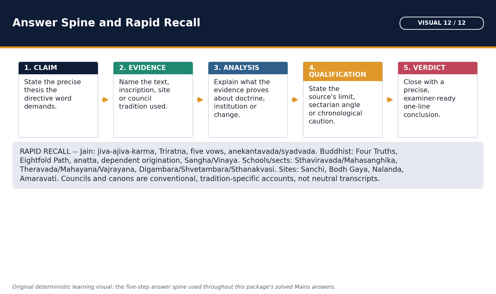

*Use this page as the last revision sheet before an exam; it is the fastest recall route through every solved Mains answer in this package.*

Last-page examiner route.

#### Core teaching / solved analysis

- Identity PYQ: name -> tradition -> school -> eliminate.
- Doctrine PYQ: define -> contrast nearest term -> one caveat.
- Council PYQ: place/patron/issue -> name tradition -> source caution.
- Art PYQ: form -> site -> phase/donor -> what it proves -> limit.
- 10 marks: thesis + 3 evidence units + one qualification + verdict.
- 15 marks: comparison/causal headings + 5-6 named units + balance.
- 20 marks: chronology and dimensions + 7-9 named units + historiography + graded verdict.
- Evidence sentence: claim -> named text/inscription/site/patron -> proof -> limitation.
- Workbook MCQ keys rotate A -> B -> C -> D without interruption.
- Approval remains approved=false until explicit user approval.

> **Memory hook:** T-E-L-V: Thesis, Evidence, Limit, Verdict.

#### Must-know facts

- Uncommon terms: Sthanakvasi-Jain; Maitreya-future Buddha; Paramitas-perfections; Sanghabhuti-Sarvastivada Vinaya.
- Do not equate Theravada and Hinayana.

#### UPSC traps

- **Wrong:** Evidence as a decorative list. **Correct:** Explain what each item proves and where it stops.

**Mains/PYQ use:** Final pre-exam audit.

**Study link:** All solved PYQs and original practice.

### COMPLETE TOPIC ASCII MASTER FLOW DIAGRAM

**High-yield use:** Follow the sessions consecutively as one continuous source-derived teaching and answer-writing route.

```ascii-master
Jainism and Buddhism — COMPLETE TOPIC ASCII MASTER FLOW DIAGRAM

START / CENTRAL QUESTION
  UPSC Relevance and Answer-Worthiness Audit: No unavailable key is treated as official; the 2026 key stays provisional and 2018-2023 unavailable keys are labelled inferred.
        |
        v
+-- SESSION 01: UPSC RELEVANCE AND ANSWER-WORTHINESS AUDIT
|   DEFINITION / TERMS : UPSC Relevance and Answer-Worthiness Audit: No unavailable key is treated as official; the 2026 key stays provisional and 2018-2023 unavailable keys are labelled inferred.
|   MECHANISM / ARGUMENT: Jainism and Buddhism carry direct Prelims value (fifteen routed 2018-2026 questions on doctrine, sects, schools and sites) and strong Mains support through comparison, causation (spread/decline/persistence) and source-criticism questions.
|   CONSEQUENCE / CONTRAST: No unavailable key is treated as official; the 2026 key stays provisional and 2018-2023 unavailable keys are labelled inferred.
|   TRAP / ANSWER-USE: Understand: doctrine is reconstructed from layered, redacted sources rather than eyewitness transcripts, and causation for spread, decline and persistence is multi-factor, never single-cause.
|   EXAM OPENING: Syllabus and verified-demand reality.
+--
        |
        v
+-- SESSION 02: REPRESENTATIVE SOURCE LEDGER
|   DEFINITION / TERMS : Representative source ledger: No fabricated quotation, date, key or canonical reference is used.
|   MECHANISM / ARGUMENT: Repository Markdown controls topic ownership, audited uncommon terms and PYQ routing.
|   CONSEQUENCE / CONTRAST: OCR-searchable books deepen doctrine, social history, institutions, art and historiography.
|   TRAP / ANSWER-USE: Qdrant was unnecessary and did not delay the package.
|   EXAM OPENING: The package follows the repository's required source hierarchy and uses the strongest source for each claim.
+--
        |
        v
+-- SESSION 03: ROADMAP, SOURCE ORDER AND EVIDENCE DISCIPLINE — [CORE MAINS]
|   DEFINITION / TERMS : Roadmap, source order and evidence discipline — [CORE MAINS]: Read the structure first; each arrow is a historical relationship, not an automatic law.
|   MECHANISM / ARGUMENT: INTERPRETATION: Doctrine must be reconstructed through comparison of textual lineages, inscriptions, archaeology, art and institutional history.
|   CONSEQUENCE / CONTRAST: Read the structure first; each arrow is a historical relationship, not an automatic law.
|   TRAP / ANSWER-USE: Read the structure first; each arrow is a historical relationship, not an automatic law.
|   EXAM OPENING: This package treats Jainism and Buddhism as historical traditions with several layers: early teaching, institutional development, sectarian memory, canonical redaction, material evidence and modern textbook reconstruction.
+--
        |
        v
+-- SESSION 04: SIXTH-CENTURY BCE SETTING: CITIES, STATES AND INTELLECTUAL FERMENT — [CORE PRELIMS + CORE MAINS]
|   DEFINITION / TERMS : FACT: Upinder Singh's useful frame is 'cities, kings and renunciants' for north India c.
|   MECHANISM / ARGUMENT: FACT: Monarchies and oligarchic gana-sanghas coexisted; Mahavira and Buddha were linked by tradition to kshatriya clan settings.
|   CONSEQUENCE / CONTRAST: Production: Agrarian expansion and surplus
|   TRAP / ANSWER-USE: These conditions widened their audience, but doctrine cannot be mechanically derived from iron or trade.
|   EXAM OPENING: Jainism and Buddhism emerged in the middle Gangetic and adjoining world of territorial states, gana-sanghas, agrarian expansion, towns, exchange and renunciation.
+--
        |
        v
+-- SESSION 05: THE SHRAMANA FIELD: HETERODOXY WITHOUT A FALSE BINARY — [CORE PRELIMS + CORE MAINS]
|   DEFINITION / TERMS : 'Shramana versus Brahmana' is a useful contrast of authority and practice, but historical interaction was continuous.
|   MECHANISM / ARGUMENT: INTERPRETATION: Competition occurred through debate, patronage, ethical reputation and recruitment, not through a single organized revolution.
|   CONSEQUENCE / CONTRAST: 'Shramana versus Brahmana' is a useful contrast of authority and practice, but historical interaction was continuous.
|   TRAP / ANSWER-USE: Read the structure first; each arrow is a historical relationship, not an automatic law.
|   EXAM OPENING: !g3 visual -- The Sixth-Century BCE Shramana Field
+--
        |
        v
+-- SESSION 06: PRE-MAHAVIRA JAIN TRADITION AND THE TIRTHANKARAS — [CORE PRELIMS + SUPPORTING]
|   DEFINITION / TERMS : Historical confidence is unequal: Parshvanatha is the strongest pre-Mahavira candidate, while claims for very early figures belong primarily to sacred tradition.
|   MECHANISM / ARGUMENT: Historical confidence is unequal: Parshvanatha is the strongest pre-Mahavira candidate, while claims for very early figures belong primarily to sacred tradition.
|   CONSEQUENCE / CONTRAST: FACT: A Tirthankara is a 'ford-maker' who discovers and teaches a route across bondage; the term is not a creator-god title.
|   TRAP / ANSWER-USE: FACT: A Tirthankara is a 'ford-maker' who discovers and teaches a route across bondage; the term is not a creator-god title.
|   EXAM OPENING: Jain tradition presents a succession of twenty-four Tirthankaras, with Mahavira as the twenty-fourth.
+--
        |
        v
+-- SESSION 07: MAHAVIRA: TRADITIONAL BIOGRAPHY AND HISTORICAL RECONSTRUCTION — [CORE PRELIMS + CORE MAINS]
|   DEFINITION / TERMS : Mahavira: traditional biography and historical reconstruction — [CORE PRELIMS + CORE MAINS]: Read the structure first; each arrow is a historical relationship, not an automatic law.
|   MECHANISM / ARGUMENT: FACT: Pali Buddhist texts know him as Nigantha Nataputta, proving that an organized Nigantha/Jain community was recognized by rival near-contemporary traditions.
|   CONSEQUENCE / CONTRAST: Read the structure first; each arrow is a historical relationship, not an automatic law.
|   TRAP / ANSWER-USE: Read the structure first; each arrow is a historical relationship, not an automatic law.
|   EXAM OPENING: Mahavira, also called Vardhamana and Nigantha Nataputta/Nayaputta in Pali sources, belonged to the sixth-fifth-century BCE Gangetic world.
+--
        |
        v
+-- SESSION 08: JAIN ONTOLOGY: JIVA, AJIVA AND A LIVING COSMOS — [CORE PRELIMS + CORE MAINS]
|   DEFINITION / TERMS : FACT: Jiva is conscious, potentially omniscient and capable of liberation; embodied jivas occupy many grades of sense-capacity.
|   MECHANISM / ARGUMENT: Its radical extension of life and sentience underlies strict ahimsa and the 2023 UPSC formulation about souls in plants, water, earth and other natural forms.
|   CONSEQUENCE / CONTRAST: FACT: Jiva is conscious, potentially omniscient and capable of liberation; embodied jivas occupy many grades of sense-capacity.
|   TRAP / ANSWER-USE: FACT: Dharma and adharma here are cosmological media, not simply moral merit and sin.
|   EXAM OPENING: Jainism posits a plurality of eternal jivas (souls) entangled with non-soul realities.
+--
        |
        v
+-- SESSION 09: JAIN KARMA, BONDAGE AND LIBERATION — [CORE PRELIMS + CORE MAINS]
|   DEFINITION / TERMS : Read bottom-to-top for the recurring exam question type: how a Jain soul is said to move from bondage toward moksha.
|   MECHANISM / ARGUMENT: Jain karma is subtle material matter that adheres to the soul because of activity and passions.
|   CONSEQUENCE / CONTRAST: Jain karma is subtle material matter that adheres to the soul because of activity and passions.
|   TRAP / ANSWER-USE: FACT: Liberation reveals the jiva's inherent knowledge, perception, bliss and energy; it does not merge into a creator god.
|   EXAM OPENING: !g3 visual -- The Jain Liberation Chain
+--
        |
        v
+-- SESSION 10: JAIN TRIRATNA, FIVE VOWS AND ASCETIC-LAY PATHS — [CORE PRELIMS + CORE MAINS]
|   DEFINITION / TERMS : Triratna is Jain in this formulation; Buddhist refuge in Buddha-Dhamma-Sangha is a different triad.
|   MECHANISM / ARGUMENT: QUALIFICATION: Ahimsa does not make historical Jain communities economically or politically identical; practice varied by region, sect and occupation.
|   CONSEQUENCE / CONTRAST: FACT: The Triratna are samyak-darshana, samyak-jnana and samyak-charitra: right faith/view, knowledge and conduct.
|   TRAP / ANSWER-USE: QUALIFICATION: Ahimsa does not make historical Jain communities economically or politically identical; practice varied by region, sect and occupation.
|   EXAM OPENING: Jain liberation rests on right faith, right knowledge and right conduct.
+--
        |
        v
+-- SESSION 11: ANEKANTAVADA, SYADVADA AND NAYAVADA — [CORE PRELIMS + CORE MAINS]
|   DEFINITION / TERMS : Anekantavada is the doctrine that reality has many aspects; nayavada analyzes partial standpoints; syadvada expresses qualified predication, conventionally through seven possible formulations.
|   MECHANISM / ARGUMENT: Anekantavada is the doctrine that reality has many aspects; nayavada analyzes partial standpoints; syadvada expresses qualified predication, conventionally through seven possible formulations.
|   CONSEQUENCE / CONTRAST: Read the structure first; each arrow is a historical relationship, not an automatic law.
|   TRAP / ANSWER-USE: The three terms are related but not synonyms.
|   EXAM OPENING: The three terms are related but not synonyms.
+--
        |
        v
+-- SESSION 12: JAIN SANGHA, WOMEN, SOCIAL ETHICS AND LIMITS — [CORE MAINS + SUPPORTING]
|   DEFINITION / TERMS : Jain sangha, women, social ethics and limits — [CORE MAINS + SUPPORTING]: Malli/Mallinatha is a major Shvetambara-Digambara distinction.
|   MECHANISM / ARGUMENT: FACT: Shvetambara tradition recognizes women's capacity for liberation and identifies Malli as a female Tirthankara; Digambara doctrine generally requires male rebirth for final liberation.
|   CONSEQUENCE / CONTRAST: FACT: Jain community structure recognizes sadhu, sadhvi, shravaka and shravika.
|   TRAP / ANSWER-USE: This widened participation, but access did not erase hierarchy, gender debates or the demanding ascetic definition of liberation.
|   EXAM OPENING: Jain traditions developed fourfold communities of monks, nuns, laymen and laywomen.
+--
        |
        v
+-- SESSION 13: JAIN COUNCILS, CANON AND REDACTION TRADITIONS — [CORE PRELIMS + CORE MAINS]
|   DEFINITION / TERMS : Jain canonical history is reconstructed differently by Shvetambara and Digambara traditions.
|   MECHANISM / ARGUMENT: Jain canonical history is reconstructed differently by Shvetambara and Digambara traditions.
|   CONSEQUENCE / CONTRAST: TRADITION: A famine in Magadha and migration under Bhadrabahu are linked to later differences between northern and southern ascetics; the chronology and details are retrospective.
|   TRAP / ANSWER-USE: TRADITION: A Pataliputra council under Sthulabhadra is said to have collected surviving teachings; Digambara tradition does not accept that the original canon survived intact.
|   EXAM OPENING: Jain canonical history is reconstructed differently by Shvetambara and Digambara traditions.
+--
        |
        v
+-- SESSION 14: DIGAMBARA, SHVETAMBARA AND BOUNDED SUBSECT HISTORY — [CORE PRELIMS + CORE MAINS]
|   DEFINITION / TERMS : FACT: Digambara means 'sky-clad' and Shvetambara 'white-clad'; clothing is visible but not the only distinction.
|   MECHANISM / ARGUMENT: It involved discipline, canon, images, biographies, gender and regional institutions.
|   CONSEQUENCE / CONTRAST: Later subsects belong to much later history.
|   TRAP / ANSWER-USE: The Digambara-Shvetambara division developed gradually and cannot be reduced to one famine or clothing dispute.
|   EXAM OPENING: The Digambara-Shvetambara division developed gradually and cannot be reduced to one famine or clothing dispute.
+--
        |
        v
+-- SESSION 15: JAIN SPREAD, PATRONS, SITES, ART AND LITERATURE — [CORE PRELIMS + SUPPORTING]
|   DEFINITION / TERMS : Jain spread, patrons, sites, art and literature — [CORE PRELIMS + SUPPORTING]: Its history is visible in inscriptions, caves, image deposits, temples and manuscripts rather than one imperial mission.
|   MECHANISM / ARGUMENT: Jainism expanded through mobile ascetics, urban laity, regional courts, pilgrimage and vernacular literary cultures.
|   CONSEQUENCE / CONTRAST: FACT: Kharavela's Hathigumpha inscription and Udayagiri-Khandagiri caves are major early Jain-linked evidence in Kalinga.
|   TRAP / ANSWER-USE: Its history is visible in inscriptions, caves, image deposits, temples and manuscripts rather than one imperial mission.
|   EXAM OPENING: Jainism expanded through mobile ascetics, urban laity, regional courts, pilgrimage and vernacular literary cultures.
+--
        |
        v
+-- SESSION 16: THE BUDDHA: HISTORICAL CORE AND TRADITIONAL LIFE — [CORE PRELIMS + CORE MAINS]
|   DEFINITION / TERMS : The Buddha is historically located in the fifth-century BCE Gangetic world, while detailed biographies were shaped over centuries.
|   MECHANISM / ARGUMENT: Siddhartha Gautama, Shakyamuni and Tathagata are Buddhist designations; Nayaputta/Nataputta belongs to Mahavira.
|   CONSEQUENCE / CONTRAST: Read the structure first; each arrow is a historical relationship, not an automatic law.
|   TRAP / ANSWER-USE: Read the structure first; each arrow is a historical relationship, not an automatic law.
|   EXAM OPENING: The Buddha is historically located in the fifth-century BCE Gangetic world, while detailed biographies were shaped over centuries.
+--
        |
        v
+-- SESSION 17: FOUR NOBLE TRUTHS: DIAGNOSIS, CAUSE, CESSATION AND PATH — [CORE PRELIMS + CORE MAINS]
|   DEFINITION / TERMS : The Four Noble Truths organize early Buddhist teaching as a practical analysis of dukkha rather than a claim that every experience is only pain.
|   MECHANISM / ARGUMENT: Samudaya: Craving sustained by ignorance
|   CONSEQUENCE / CONTRAST: The Four Noble Truths organize early Buddhist teaching as a practical analysis of dukkha rather than a claim that every experience is only pain.
|   TRAP / ANSWER-USE: The Four Noble Truths organize early Buddhist teaching as a practical analysis of dukkha rather than a claim that every experience is only pain.
|   EXAM OPENING: !g3 visual -- Four Noble Truths and the Eightfold Path
+--
        |
        v
+-- SESSION 18: EIGHTFOLD PATH, MIDDLE WAY AND ETHICAL DISCIPLINE — [CORE PRELIMS + CORE MAINS]
|   DEFINITION / TERMS : Wrong: Middle Path means moderate belief in everything.
|   MECHANISM / ARGUMENT: Its eight factors are usually grouped into wisdom, ethical conduct and mental discipline; they are cultivated together rather than as a simple staircase.
|   CONSEQUENCE / CONTRAST: Correct: It is an ethical path factor with lay implications, while monastic rules are more detailed.
|   TRAP / ANSWER-USE: The Noble Eightfold Path avoids both sensual indulgence and self-mortification.
|   EXAM OPENING: The Noble Eightfold Path avoids both sensual indulgence and self-mortification.
+--
        |
        v
+-- SESSION 19: DEPENDENT ORIGINATION: PROCESS WITHOUT A FIRST CAUSE — [CORE PRELIMS + CORE MAINS]
|   DEFINITION / TERMS : Dependent origination: process without a first cause — [CORE PRELIMS + CORE MAINS]: Read the structure first; each arrow is a historical relationship, not an automatic law.
|   MECHANISM / ARGUMENT: In the rebirth formula, ignorance conditions formations and so on through ageing and death; removing conditions interrupts suffering.
|   CONSEQUENCE / CONTRAST: Read the structure first; each arrow is a historical relationship, not an automatic law.
|   TRAP / ANSWER-USE: Read the structure first; each arrow is a historical relationship, not an automatic law.
|   EXAM OPENING: Pratityasamutpada/paticcha-samuppada explains phenomena as arising in dependence on conditions.
+--
        |
        v
+-- SESSION 20: IMPERMANENCE, NO-SELF, AGGREGATES, KARMA AND NIRVANA — [CORE PRELIMS + CORE MAINS]
|   DEFINITION / TERMS : A person is analyzed as five changing aggregates; karmic continuity operates without an eternal atman.
|   MECHANISM / ARGUMENT: A person is analyzed as five changing aggregates; karmic continuity operates without an eternal atman.
|   CONSEQUENCE / CONTRAST: FACT: The five aggregates are form, feeling, perception, formations and consciousness.
|   TRAP / ANSWER-USE: FACT: Karma is centrally intentional action (cetana) with ethical consequences; it is not Jain karmic matter.
|   EXAM OPENING: Early Buddhism links impermanence (anicca), unsatisfactoriness (dukkha) and no-self (anatta).
+--
        |
        v
+-- SESSION 21: SANGHA, VINAYA, LAY SUPPORT AND INSTITUTIONAL LIFE — [CORE PRELIMS + CORE MAINS]
|   DEFINITION / TERMS : Sangha is both a spiritual community and a historical institution.
|   MECHANISM / ARGUMENT: Cross-check this network against the named dynasties and inscriptions in the patronage subtopic below; the diagram only orders the relationships.
|   CONSEQUENCE / CONTRAST: The Buddhist sangha transformed teaching into a disciplined, portable institution.
|   TRAP / ANSWER-USE: INTERPRETATION: Monasteries linked routes, towns and courts, but they were not simply commercial corporations.
|   EXAM OPENING: !g3 visual -- Sangha-Laity Patronage Network
+--
        |
        v
+-- SESSION 22: WOMEN, SOCIAL ACCESS AND THE CASTE-VARNA QUESTION — [CORE MAINS + SUPPORTING]
|   DEFINITION / TERMS : Women, social access and the caste-varna question — [CORE MAINS + SUPPORTING]: Bhikkhuni means ordained Buddhist nun; upasika means lay female follower.
|   MECHANISM / ARGUMENT: Texts preserve both strong critiques of birth superiority and gendered institutional restrictions.
|   CONSEQUENCE / CONTRAST: TRADITION: Mahapajapati Gotami's ordination marks the bhikkhuni order; the eight garudhammas are textually transmitted but their formation and dating are debated.
|   TRAP / ANSWER-USE: Buddhism widened access to renunciation and moral status, but it did not create modern equality or abolish caste society.
|   EXAM OPENING: Buddhism widened access to renunciation and moral status, but it did not create modern equality or abolish caste society.
+--
        |
        v
+-- SESSION 23: BUDDHIST COUNCILS: CONVENTIONAL ACCOUNTS WITH SOURCE CAUTION — [CORE PRELIMS + CORE MAINS]
|   DEFINITION / TERMS : Climb this ladder before answering an 'assess the councils' Mains question; each rung is a caveat to state, not a fact to assert.
|   MECHANISM / ARGUMENT: They should be learned for examinations but labelled by tradition because dates, patrons, participants and outcomes are not uniformly attested.
|   CONSEQUENCE / CONTRAST: Council narratives explain communal memory, discipline and school identity.
|   TRAP / ANSWER-USE: Climb this ladder before answering an 'assess the councils' Mains question; each rung is a caveat to state, not a fact to assert.
|   EXAM OPENING: !g3 visual -- Buddhist and Jain Councils: An Evidence Ladder
+--
        |
        v
+-- SESSION 24: BUDDHIST CANONS: PALI, SANSKRIT, CHINESE AND TIBETAN WITNESSES — [CORE PRELIMS + CORE MAINS]
|   DEFINITION / TERMS : Buddhist textual history is plural.
|   MECHANISM / ARGUMENT: Keep this beside the councils and canons subtopics; it visualises the redaction gaps that examiners test as source caution, not settled fact.
|   CONSEQUENCE / CONTRAST: Buddhist textual history is plural.
|   TRAP / ANSWER-USE: Keep this beside the councils and canons subtopics; it visualises the redaction gaps that examiners test as source caution, not settled fact.
|   EXAM OPENING: !g3 visual -- Source and Canon Redaction Timeline
+--
        |
        v
+-- SESSION 25: EARLY SCHOOLS AND THE THERAVADA-HINAYANA TERMINOLOGY FIREWALL — [CORE PRELIMS + CORE MAINS]
|   DEFINITION / TERMS : Modern Theravada is one surviving Sthavira-derived lineage, not a synonym for every early school.
|   MECHANISM / ARGUMENT: FACT: Sthavira means 'elders' and Mahasanghika 'great community/assembly'; the first split is remembered differently by school sources.
|   CONSEQUENCE / CONTRAST: Early Buddhism diversified into nikayas or schools over centuries.
|   TRAP / ANSWER-USE: !g3 visual -- Buddhist School Evolution: A Caution Map
|   EXAM OPENING: !g3 visual -- Buddhist School Evolution: A Caution Map
+--
        |
        v
+-- SESSION 26: MAHAYANA, THE BODHISATTVA PATH, MAITREYA AND PARAMITAS — [CORE PRELIMS + CORE MAINS]
|   DEFINITION / TERMS : FACT: Maitreya is the future Buddha in both Theravada and Mahayana traditions; Mahayana also venerates him as a Bodhisattva in Tushita.
|   MECHANISM / ARGUMENT: Mahayana is not defined solely by Sanskrit or image worship.
|   CONSEQUENCE / CONTRAST: FACT: A Bodhisattva seeks full Buddhahood for the benefit of beings; the ideal combines compassion and wisdom.
|   TRAP / ANSWER-USE: LIMIT: Mahayana origins are debated; it should not be described simply as an offshoot of Mahasanghika or as a single council-created sect.
|   EXAM OPENING: Mahayana developed as diverse textual, devotional and philosophical currents from around the late centuries BCE and early centuries CE.
+--
        |
        v
+-- SESSION 27: MADHYAMAKA AND YOGACARA: BOUNDED HISTORICAL DEPTH — [CORE MAINS + SUPPORTING]
|   DEFINITION / TERMS : Madhyamaka and Yogacara: bounded historical depth — [CORE MAINS + SUPPORTING]: FACT: The two truths framework distinguishes conventional and ultimate truth; emptiness itself is not a substance.
|   MECHANISM / ARGUMENT: FACT: Nagarjuna, associated with Madhyamaka, analyzes all phenomena as empty (shunya) of independent inherent nature because they arise dependently.
|   CONSEQUENCE / CONTRAST: FACT: Nagarjuna, associated with Madhyamaka, analyzes all phenomena as empty (shunya) of independent inherent nature because they arise dependently.
|   TRAP / ANSWER-USE: For Ancient History, Madhyamaka and Yogacara should be treated as major Mahayana scholastic developments, not turned into an optional-level metaphysics essay.
|   EXAM OPENING: For Ancient History, Madhyamaka and Yogacara should be treated as major Mahayana scholastic developments, not turned into an optional-level metaphysics essay.
+--
        |
        v
+-- SESSION 28: VAJRAYANA: LATER TANTRIC DEVELOPMENT AND INSTITUTIONAL SETTING — [CORE MAINS + SUPPORTING]
|   DEFINITION / TERMS : Vajrayana: later tantric development and institutional setting — [CORE MAINS + SUPPORTING]: It uses mantra, mandala, initiation, deity yoga and esoteric ritual as accelerated means, while retaining Bodhisattva and emptiness frameworks.
|   MECHANISM / ARGUMENT: It uses mantra, mandala, initiation, deity yoga and esoteric ritual as accelerated means, while retaining Bodhisattva and emptiness frameworks.
|   CONSEQUENCE / CONTRAST: Read the structure first; each arrow is a historical relationship, not an automatic law.
|   TRAP / ANSWER-USE: Read the structure first; each arrow is a historical relationship, not an automatic law.
|   EXAM OPENING: Vajrayana developed within later Mahayana environments, especially from the mid-first millennium CE onward.
+--
        |
        v
+-- SESSION 29: WHY THE TRADITIONS BECAME POPULAR: LANGUAGE, ETHICS AND NETWORKS — [CORE MAINS]
|   DEFINITION / TERMS : Why the traditions became popular: language, ethics and networks — [CORE MAINS]: Merchant patronage is important but not exclusive.
|   MECHANISM / ARGUMENT: Neither tradition spread through doctrine alone.
|   CONSEQUENCE / CONTRAST: Message: Ethics, liberation and accessible speech
|   TRAP / ANSWER-USE: FACT: Early Buddhist and Jain preaching used Middle Indo-Aryan/Prakrit forms rather than relying exclusively on elite Vedic Sanskrit.
|   EXAM OPENING: Neither tradition spread through doctrine alone.
+--
        |
        v
+-- SESSION 30: PATRONAGE NETWORKS: MAURYAN AND POST-MAURYAN WORLDS — [CORE PRELIMS + CORE MAINS]
|   DEFINITION / TERMS : Ashoka is central but not the sole patron; post-Mauryan regional states, monks, nuns, merchants and artisans made Buddhism materially durable, while Jainism grew through different regional coalitions.
|   MECHANISM / ARGUMENT: Ashoka is central but not the sole patron; post-Mauryan regional states, monks, nuns, merchants and artisans made Buddhism materially durable, while Jainism grew through different regional coalitions.
|   CONSEQUENCE / CONTRAST: Read the structure first; each arrow is a historical relationship, not an automatic law.
|   TRAP / ANSWER-USE: Ashoka is central but not the sole patron; post-Mauryan regional states, monks, nuns, merchants and artisans made Buddhism materially durable, while Jainism grew through different regional coalitions.
|   EXAM OPENING: Patronage linked rulers, donors, routes and monuments.
+--
        |
        v
+-- SESSION 31: REGIONAL AND INTERNATIONAL SPREAD: A TEXT MAP — [CORE PRELIMS + CORE MAINS]
|   DEFINITION / TERMS : Regional and international spread: a text map — [CORE PRELIMS + CORE MAINS]: Read the structure first; each arrow is a historical relationship, not an automatic law.
|   MECHANISM / ARGUMENT: Buddhism became a trans-Asian network through multiple routes and translations; Jainism achieved durable but more regionally concentrated expansion within India.
|   CONSEQUENCE / CONTRAST: Buddhism became a trans-Asian network through multiple routes and translations; Jainism achieved durable but more regionally concentrated expansion within India.
|   TRAP / ANSWER-USE: Treat the arrows as relationships worth remembering, not as directions or distances; the prose names the actual regions and routes.
|   EXAM OPENING: !g3 visual -- Spread and Patronage Routes: Schematic
+--
        |
        v
+-- SESSION 32: STUPAS, CAVES, MONASTERIES, IMAGES AND MATERIAL EVIDENCE — [CORE PRELIMS + CORE MAINS]
|   DEFINITION / TERMS : Stupas, caves, monasteries, images and material evidence — [CORE PRELIMS + CORE MAINS]: FACT: Gandhara, Mathura and Amaravati developed overlapping anthropomorphic and narrative traditions; no simple one-school invention claim is secure.
|   MECHANISM / ARGUMENT: They cannot by themselves identify a text or prove a traditional biography, but inscriptions and stratigraphy can date institutions more firmly.
|   CONSEQUENCE / CONTRAST: Material remains test doctrine-in-practice, patronage and regional change.
|   TRAP / ANSWER-USE: They cannot by themselves identify a text or prove a traditional biography, but inscriptions and stratigraphy can date institutions more firmly.
|   EXAM OPENING: !g3 visual -- Art, Symbol and Architecture Panel
+--
        |
        v
+-- SESSION 33: JAINISM AND BUDDHISM: A CONTROLLED COMPARISON — [CORE MAINS]
|   DEFINITION / TERMS : FACT: Jainism affirms plural eternal jivas; Buddhism analyzes persons without a permanent self.
|   MECHANISM / ARGUMENT: Mains/PYQ use: A high-scoring comparison moves dimension by dimension and ends with shared context plus divergent solutions.
|   CONSEQUENCE / CONTRAST: QUALIFICATION: 'Jain extreme versus Buddhist moderate' is a starting contrast, not a complete history; both traditions contain varied disciplines and later devotional forms.
|   TRAP / ANSWER-USE: QUALIFICATION: 'Jain extreme versus Buddhist moderate' is a starting contrast, not a complete history; both traditions contain varied disciplines and later devotional forms.
|   EXAM OPENING: !g3 visual -- Jain-Buddhist Doctrine Comparison Matrix
+--
        |
        v
+-- SESSION 34: BUDDHISM'S DECLINE AND TRANSFORMATION IN INDIA — [CORE MAINS]
|   DEFINITION / TERMS : Buddhism's decline and transformation in India — [CORE MAINS]: Its institutional contraction was regionally uneven and multi-causal, while doctrines, images, pilgrimage and communities persisted or were absorbed into new configurations.
|   MECHANISM / ARGUMENT: FACT: Buddhism transformed internally through Mahayana and Vajrayana rather than simply decaying.
|   CONSEQUENCE / CONTRAST: Patronage shifts: Dynastic and local reallocation
|   TRAP / ANSWER-USE: Buddhism did not disappear everywhere at one date.
|   EXAM OPENING: Buddhism did not disappear everywhere at one date.
+--
        |
        v
+-- SESSION 35: WHY JAINISM PERSISTED AND HOW IT TRANSFORMED — [CORE MAINS]
|   DEFINITION / TERMS : Why Jainism persisted and how it transformed — [CORE MAINS]: LIMIT: Jain history also includes decline in some regions, sectarian conflict, social accommodation and changes in patronage; continuity is not stasis.
|   MECHANISM / ARGUMENT: Regional literary production is a major survival mechanism.
|   CONSEQUENCE / CONTRAST: Mains/PYQ use: Compare distributed lay institutions with concentrated Buddhist mahaviharas, but avoid a deterministic contrast.
|   TRAP / ANSWER-USE: Persistence did not mean absence of internal change.
|   EXAM OPENING: !g3 visual -- Survival and Decline: A Multi-Causal Comparison
+--
        |
        v
+-- SESSION 36: HISTORIOGRAPHY AND EVIDENCE LIMITS — [CORE MAINS + SUPPORTING]
|   DEFINITION / TERMS : Historiography and evidence limits — [CORE MAINS + SUPPORTING]: The history of Jainism and Buddhism is reconstructed from normative texts, rival accounts, inscriptions, monuments, art, manuscripts and later chronicles.
|   MECHANISM / ARGUMENT: FACT: Pali Nikayas/Agamas, Jain Agamas and Vinayas preserve early material through later transmission and school organization.
|   CONSEQUENCE / CONTRAST: FACT: Pali Nikayas/Agamas, Jain Agamas and Vinayas preserve early material through later transmission and school organization.
|   TRAP / ANSWER-USE: FACT: Art can reveal patronage, ritual and iconography, but aniconic symbols do not automatically identify one event without context.
|   EXAM OPENING: The history of Jainism and Buddhism is reconstructed from normative texts, rival accounts, inscriptions, monuments, art, manuscripts and later chronicles.
+--
        |
        v
+-- SESSION 37: CONTEMPORARY HERITAGE AND CONSERVATION LINKAGES — [SUPPORTING]
|   DEFINITION / TERMS : RETRIEVED FACT: UNESCO describes Sanchi as a multi-period complex of stupas, temples, viharas and pillars documenting Buddhism from the third century BCE into the medieval period, with ASI protection and conservation.
|   MECHANISM / ARGUMENT: RETRIEVED FACT: UNESCO describes Nalanda's surviving viharas, temples and art as evidence of a long monastic-scholastic institution and notes conservation by ASI.
|   CONSEQUENCE / CONTRAST: Correct: Its significance is monument history and relic/patronage tradition; Buddha's visit is not required.
|   TRAP / ANSWER-USE: They cannot verify the Buddha's words, Mahavira's dates or ancient council narratives.
|   EXAM OPENING: Modern heritage sources are used only to explain preservation, site management and continuing pilgrimage.
+--
        |
        v
+-- SESSION 38: CHRONOLOGY, TERMINOLOGY AND RAPID UPSC DISTINCTIONS — [CORE PRELIMS]
|   DEFINITION / TERMS : Chronology, terminology and rapid UPSC distinctions — [CORE PRELIMS]: Mahavira: twenty-fourth Tirthankara and historical systematizer, not first Jain teacher.
|   MECHANISM / ARGUMENT: Mahavira: twenty-fourth Tirthankara and historical systematizer, not first Jain teacher.
|   CONSEQUENCE / CONTRAST: Buddha: Shakyamuni/Tathagata; Mahavira: Nigantha Nataputta/Nayaputta.
|   TRAP / ANSWER-USE: Mahavira: twenty-fourth Tirthankara and historical systematizer, not first Jain teacher.
|   EXAM OPENING: This consolidation prevents the most common close-option errors: founder versus systematizer, early school versus Mahayana current, canon versus translation, tradition versus inscription, and doctrinal terms that look similar.
+--
        |
        v
ANSWER-WRITING SPINE
definition -> exact terms -> mechanism/evidence -> consequence/contrast
-> objection/trap -> qualified answer-use
```
