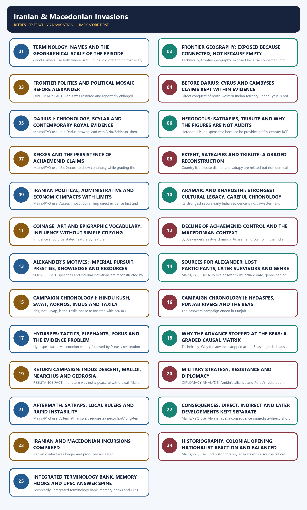

# Iranian & Macedonian Invasions - Complete Topic Package

> **Subject:** Ancient Indian History | **Paper:** Prelims GS-I + GS-I | **Topic:** 12 | **Date:** 13 August 2026
>
> **Evidence key:** FACT/MATERIAL EVIDENCE = directly supported by named repository, local-book, inscription, official-paper, museum or bounded heritage source. TEXTUAL REPORT = what a named ancient author/inscription reports. INTERPRETATION = analytical conclusion. LIMIT = uncertainty, genre, chronology or attribution constraint.
>
> **Approval state:** generated, **approved=false**. Only explicit user approval can change this state.

## BASIC LEARNING SESSION

### DEEP-REVIEW LEARNING CONTRACT

| Control | Binding rule for this package |
|---|---|
| Syllabus boundary | Complete Ancient History Core is taught before optional enrichment. |
| Evidence method | Claim → named site/text/inscription/coin/example → analysis → qualification. |
| Source hierarchy | Archaeology, textual testimony, inscriptions, coins and scholarly interpretation remain visibly distinct. |
| Contested issues | Competing interpretations are attributed, evidenced and bounded; certainty is not manufactured. |
| Practice contract | Every solved item has demand decoding, an examiner-grade model, an executable answer/compression plan, marks rationale and answer-specific improvement. |
| Approval | This immutable successor remains `approved: false` pending explicit approval. |

**Canonical Basic/Core owner:** `upsc-ai-kit\knowledge\Ancient-Indian-History\basic\12_Iranian-and-Macedonian-Invasions.md`  
**Canonical topic owner:** `upsc-ai-kit\knowledge\Ancient-Indian-History\basic\12_Iranian-and-Macedonian-Invasions.md`  
**Optional Advanced owner:** `upsc-ai-kit\knowledge\Ancient-Indian-History\advanced\12_Iranian-and-Macedonian-Invasions.md`  
**Official syllabus mapping:** `upsc-ai-kit\knowledge\Ancient-Indian-History\OFFICIAL-UPSC-SYLLABUS-MAPPING.md`

### EVIDENCE, PYQ AND CURRENT-STATUS CONTROL

- **Archaeological inference:** material context supports bounded reconstruction; absence is not automatic proof of non-existence.
- **Textual testimony:** genre, authorship, redaction, patronage and temporal distance control what a text can prove.
- **Inscription and coin evidence:** contemporary names, titles, claims and circulation are powerful but do not by themselves map uniform territorial control.
- **Scholarly interpretation:** historian labels are arguments to test, not facts to memorise without evidence.
- **PYQ discipline:** repository ledgers and locally held official papers control wording and metadata; reconstructed wording and unavailable official keys must be labelled.
- **Current-status note, rechecked 2026-08-30:** UNESCO Taxila was accessed on 29 August 2026 only to anchor Bhir, Sirkap and Sirsukh as distinct urban phases. No decorative current-affairs claim is forced.

**Live/primary context sources recorded by the predecessor generation:**

- `https://whc.unesco.org/en/list/139`




*Distinct embedded teaching-navigation image. The separate continuous Cārvāka-style flowchart package remains an independent at-a-glance artifact.*

### Package scope, approval state and practice counts

This is the complete learning-session package for Ancient Indian History Topic 12. It distinguishes Achaemenid imperial evidence from later Greek and Roman narratives, separates direct consequences from later Seleucid, Mauryan and Indo-Greek developments, and treats uncertainty as part of the answer rather than as a gap to be hidden.

**Approval state:** generated, **approved=false**. The package remains yellow/pending until explicit user approval.

#### Evidence / comparison matrix

| Component | Count / status |
| --- | --- |
| Direct verified on-topic official PYQs located | 0; none fabricated |
| Verified adjacent Prelims PYQs solved | 1 |
| Verified adjacent Mains PYQs solved | 1 |
| Hard MCQs with explanations | 48 |
| Remedial MCQs with explanations | 12 |
| Original solved 10-mark Mains | 3 |
| Original solved 15-mark Mains | 3 |
| Original solved 20-mark Mains | 3 |
| Final register-note modules | 11; placed last |

#### Core teaching / solved analysis

- PYQ SEARCH FACT: the repository's official/local UPSC papers and central routing were searched for Alexander, Macedonian, Porus, Hydaspes, Achaemenid, Iranian, Kharosthi and Persian empire. No directly on-topic official question was found in the bounded available set.
- PYQ DISCIPLINE: the package therefore solves only verified adjacent questions that genuinely test frontier geography and north-western political mapping; it does not invent a direct PYQ.
- ANSWER STANDARD: every solved Mains answer follows demand -> direct thesis -> claim -> named inscription/text/site/event/coin -> significance -> limit -> graded verdict.
- EVIDENCE DENSITY: 10-mark answers use at least 2-3 precise examples, 15-mark answers 4-6, and 20-mark answers 5-8, adjusted to the directive.
- CURRENT-LINK DISCIPLINE: no decorative current affairs item is forced. UNESCO Taxila and the British Museum object record are used only as bounded heritage/numismatic links.

> **Memory hook:** ZERO-FAB: zero fabricated PYQs, figures, inscriptions, routes or quotations.

#### Must-know facts

- Main PDF includes teaching, PYQs, MCQs, remedials, solved Mains and final register notes.
- Separate workbook includes all practice material and model solutions.
- The reusable Markdown is the content master for both PDFs.

#### UPSC traps

- **Wrong:** Assume that a familiar coaching question is a UPSC PYQ. **Correct:** Use only wording verified from a local official paper; label adjacent ownership honestly.
- **Wrong:** Treat generated status as approval. **Correct:** Only explicit user approval can change approved=false.

**Mains/PYQ use:** Use the package's source-status labels before every contested claim.

**Study link:** AGENTS.md; AGENT_MEMORY.md; Ancient History Topics 02-11 conventions.

### Source hierarchy, evidence labels and bounded authoritative links

The package follows the required order: audited repository Markdown first, OCR-searchable local books second, bounded live primary/heritage links third, and Qdrant only as an optional fallback. Qdrant was not used because the authored files and searchable books were sufficient.

The evidence labels are FACT, TEXTUAL REPORT, MATERIAL EVIDENCE, INTERPRETATION and LIMIT. A royal country list proves an imperial claim; it does not automatically prove uniform administration or exact borders. A later narrative preserves earlier material; it is not itself a contemporary eyewitness document.

#### Evidence / comparison matrix

| Layer | Named source | Proper use / limit |
| --- | --- | --- |
| Repository | Topic 12 basic/advanced; README; Master Chronology; Revision Chart; syllabus/PYQ routing; bounded Topics 11, 14 and 16 | Audited structure and answer-worthiness; canonical files remain separate from this synthesis. |
| Local book | R. S. Sharma, Ancient India, Ch. 16; Upinder Singh, Ch. 6, printed pp. 323-25 and related Mauryan discussion | Foundation plus source criticism; textbook formulations are qualified where evidence is uncertain. |
| Achaemenid primary | Darius DNa; Xerxes XPh; Herodotus 3.89-95 and 7.65-66 | Country lists, tribute report and contingents; imperial rhetoric and Greek quantification require caution. |
| Alexander tradition | Arrian, Curtius, Diodorus, Plutarch, Strabo, Justin using lost earlier writers | Campaign reconstruction through genre, source distance and comparison. |
| Material/heritage | Taxila/Bhir mound; Chaman-i Hazouri and Bhir coins; so-called Porus medallions; UNESCO Taxila | Settlement, circulation and iconography; attribution and phase limits remain explicit. |

#### Core teaching / solved analysis

- REPOSITORY FACT: Topic 12 basic supplies the textbook spine; advanced supplies the later-narrative warning and frontier interpretation.
- LOCAL BOOK FACT: Upinder Singh names DNa-type country-list evidence, Persepolis imagery, Kharoshthi's Aramaic derivation, Chaman-i Hazouri/Bhir coins and the later Alexander sources.
- PRIMARY-TEXT FACT: DNa names Gadara/Gandara and Hidush/India among Darius's subject countries; XPh repeats Gandara and India under Xerxes.
- HERODOTUS REPORT: Book 3 calls Indians the twentieth tribute district and reports 360 talents of gold dust; Book 7 describes Indian and Gandarian contingents in Xerxes's army.
- LIMIT: Herodotus's totals are not modern audited fiscal statistics. Royal lists and reliefs are programs of imperial legitimacy, not cadastral maps.
- LIVE HERITAGE FACT: UNESCO presents Bhir as the earliest historic city of Taxila and Sirkap as a later mid-second-century BCE Hellenistic-grid city; this helps prevent layer collapse.
- NUMISMATIC LINK: the British Museum record describes a c. 324 BCE silver decadrachm often associated with Alexander and Porus but explicitly notes uncertain production and the absence of Alexander's name.

> **Memory hook:** I-T-M-L: Inscription, Text, Material, Limit.

#### Must-know facts

- DNa and XPh are contemporary royal inscriptions; Herodotus is a fifth-century BCE Greek narrative.
- Arrian and the other surviving Alexander narratives are later than the campaign.
- UNESCO heritage wording is not a substitute for an excavation report.

#### UPSC traps

- **Wrong:** Treat every cited source as equally close to the event. **Correct:** Rank contemporary inscription, later near-source transmission, archaeology and interpretation separately.
- **Wrong:** Use a museum date as proof of uncontested attribution. **Correct:** Carry the museum's own uncertainty into the answer.

**Mains/PYQ use:** Open source questions by naming the evidence class, then state what it can and cannot prove.

**Study link:** Topic 02 Sources of Ancient Indian History; Topic 11 frontier polities; Topic 14 Mauryan transition; Topic 16 later Indo-Greeks.

### SESSION 1 — TERMINOLOGY, NAMES AND THE GEOGRAPHICAL SCALE OF THE EPISODE

#### DEFINITION / WHAT THIS IS CALLED

**Plain-language definition:** Mains/PYQ use: A terminology note earns precision when the question involves route, sources or geographical extent.

**Technical definition:** Good answers use both where useful but avoid pretending that every ancient name has one uncontested modern location.

#### ANSWER-GRABBING OPENING — WRITE/ADAPT IN THE EXAM

> Good answers use both where useful but avoid pretending that every ancient name has one uncontested modern location.

#### MUST-WRITE KEYWORDS

- **Terminology**
- **names**
- **the geographical scale of the episode**
- **Memory hook**
- **Mains/PYQ use**
- **Study link**

**How to use them:** Frame the answer through Terminology; define names, connect the geographical scale of the episode with Memory hook to explain the mechanism, and use Mains/PYQ use for the decisive comparison or qualification.

Names in the surviving narratives move between Indian, Old Persian and Greek forms. Good answers use both where useful but avoid pretending that every ancient name has one uncontested modern location.

#### Evidence / comparison matrix

| Preferred form | Classical/Old Persian form | Caution |
| --- | --- | --- |
| Takshashila / Taxila | Taxila | Bhir, Sirkap and Sirsukh are different urban phases. |
| Puru / Porus | Poros | The exact territorial extent and personal details come through Greek accounts. |
| Jhelum | Hydaspes | Battle river; ancient channel and exact battlefield remain debated. |
| Chenab | Acesines | Do not confuse with Jhelum/Hydaspes. |
| Ravi | Hydraotes | Part of the eastward campaign sequence. |
| Beas | Hyphasis | Limit of advance in 326 BCE. |
| Gandhara | Gadara/Gandara | A region, not automatically identical to one later satrapal map. |
| Indus region | Hidush/Hindush | Old Persian ethnogeographic label with uncertain exact limits. |
| Malloi / Malavas | Malloi | Classical identification is conventional, not a perfect ethnic equivalence. |
| Aornos | Aornos | Often linked to Pir-Sar; identification is not conclusive. |

#### Core teaching / solved analysis

- SCALE FACT: Achaemenid and Macedonian activity concerned the north-western borderlands and Indus-Punjab corridors, not the whole subcontinent.
- NAMING RULE: write 'Hydaspes (Jhelum)' and 'Hyphasis (Beas)' once, then use one consistent form.
- POLITICAL RULE: 'India' in Greek and Old Persian texts can mean an Indus-region people or territory, not the modern republic's boundaries.
- IDENTIFICATION LIMIT: Nysa's Dionysian associations belong to Greek mythic geography; its precise location and historical status are uncertain.
- ETHNONYM LIMIT: equivalences such as Malloi-Malavas or Oxydrakai-Kshudrakas are useful conventions but should not be used to claim perfect continuity.

> **Memory hook:** H-J, H-B: Hydaspes-Jhelum; Hyphasis-Beas.

#### Must-know facts

- Hydaspes = Jhelum; Hyphasis = Beas.
- Takshashila/Taxila was a major north-western node.
- Alexander's advance halted at the Beas, not the Ganga.

#### UPSC traps

- **Wrong:** Write 'Alexander conquered India.' **Correct:** State that his campaign was north-western and stopped at the Beas.
- **Wrong:** Present Aornos or Nysa as securely identified sites. **Correct:** Use 'often identified' or 'reported in the classical tradition' with a limit.

**Mains/PYQ use:** A terminology note earns precision when the question involves route, sources or geographical extent.

**Study link:** Topic 03 geography; Topic 11 Gandhara/Kamboja; Topic 16 later north-western polities.

#### CLOSING RECALL FLOW — TERMINOLOGY, NAMES AND THE GEOGRAPHICAL SCALE OF THE EPISODE

```text
START / CONCEPT: Terminology, names and the geographical scale of the episode
        |
        v
EXACT TERMS: Terminology · names · the geographical scale of the episode · Memory hook · Mains/PYQ use · Study link
        |
        v
MECHANISM / ARGUMENT: Mains/PYQ use: A terminology note earns precision when the question involves route, sources or geographical extent.
        |
        v
CONSEQUENCE / CONTRAST: POLITICAL RULE: 'India' in Greek and Old Persian texts can mean an Indus-region people or territory, not the modern republic's boundaries.
        |
        v
UPSC TRAP / ANSWER-USE: IDENTIFICATION LIMIT: Nysa's Dionysian associations belong to Greek mythic geography; its precise location and historical status are uncertain.
        |
        v
ANSWER-GRABBING FORMULATION: Good answers use both where useful but avoid pretending that every ancient name has one uncontested modern location.
```
### SESSION 2 — FRONTIER GEOGRAPHY: EXPOSED BECAUSE CONNECTED, NOT BECAUSE EMPTY

#### DEFINITION / WHAT THIS IS CALLED

**Plain-language definition:** Mains/PYQ use: For geography questions use factor - route/site - opportunity - constraint - political mediation.

**Technical definition:** Technically, Frontier geography: exposed because connected, not because empty is analysed by relating Frontier geography to exposed because connected, then testing the relationship through not because empty and Memory hook.

#### ANSWER-GRABBING OPENING — WRITE/ADAPT IN THE EXAM

> Mains/PYQ use: For geography questions use factor - route/site - opportunity - constraint - political mediation.

#### MUST-WRITE KEYWORDS

- **Frontier geography**
- **exposed because connected**
- **not because empty**
- **Memory hook**
- **Mains/PYQ use**
- **Study link**

**How to use them:** Frame the answer through Frontier geography; define exposed because connected, connect not because empty with Memory hook to explain the mechanism, and use Mains/PYQ use for the decisive comparison or qualification.

The north-west was a contact zone where highland passes, the Kabul-Indus system, Punjab rivers and the Uttarapatha linked South Asia to Iran, Central Asia and Afghanistan. Exposure to armies was one consequence of the same connectivity that sustained trade, migration and political exchange.

#### Compact visual / answer logic

```text
IRAN / CENTRAL ASIA
        |
Hindu Kush passes -- Kabul valley -- Gandhara/Pushkalavati
        |                         |
     Khyber route             Indus crossing
                                  |
                         Taxila/Takshashila
                                  |
              Jhelum -> Chenab -> Ravi -> Beas

Corridor logic: movement + exchange + armies; not a one-way invasion road.
```

*A text route map showing linked corridors rather than one guarded gate.*

#### Evidence / comparison matrix

| Geographical factor | Historical opportunity | Limit / counterpoint |
| --- | --- | --- |
| Hindu Kush and passes | Channels between Kabul-Gandhara and the Indus | Khyber was important, but not the only route. |
| Indus and Punjab rivers | Transport, fertile zones and sequential campaign lines | Floods and monsoon also obstructed movement. |
| Taxila crossroads | Routes toward Kashmir, Central Asia and the Ganga plain | Political importance varied by urban phase. |
| Fragmented uplands/plains | Multiple alliances and piecemeal conquest | Fragmentation did not mean weak resistance everywhere. |
| Makran/Gedrosian coast | Return and maritime reconnaissance | The land march imposed severe losses and logistical stress. |

#### Core teaching / solved analysis

- ARCHAEOLOGICAL FACT: Upinder Singh places Charsada/Pushkalavati and Taxila at crossings of routes over or around the Hindu Kush; Bala Hisar at Charsada has occupation from about 600 BCE and early fourth-century defences.
- POLITICAL FACT: Gandhara, Kamboja and neighbouring polities formed part of the mahajanapada-era north-western mosaic; later Greek accounts describe monarchies, fortified communities and corporate groups.
- CONNECTION ANALYSIS: the same passes that enabled external military entry also carried merchants, envoys, scripts, coin forms and information.
- ANTI-DETERMINISM: geography offered corridors and constraints, but invasion required imperial capacity, local alliances, intelligence and political opportunity.
- ROUTE CAUTION: saying 'through the Khyber pass' is a textbook shorthand. Alexander's forces operated through several Afghanistan-Gandhara routes before the Indus.

> **Memory hook:** PASS: Passes, Arteries, States, Seasons.

#### Must-know facts

- Taxila linked routes toward Kashmir, Central Asia and the Gangetic plain.
- The northwest was politically plural, not politically vacant.
- Monsoon-swollen rivers later became a major campaign constraint.

#### UPSC traps

- **Wrong:** Call the north-west a permanent weak spot. **Correct:** Describe it as a productive contact zone whose openness could aid both exchange and invasion.
- **Wrong:** Reduce the route to the Khyber alone. **Correct:** Mention Kabul, Swat/Kunar approaches and multiple passes.

**Mains/PYQ use:** For geography questions use factor -> route/site -> opportunity -> constraint -> political mediation.

**Study link:** Verified 2023 GS-I geography PYQ; Topic 03 geographical setting.

#### CLOSING RECALL FLOW — FRONTIER GEOGRAPHY: EXPOSED BECAUSE CONNECTED, NOT BECAUSE EMPTY

```text
START / CONCEPT: Frontier geography: exposed because connected, not because empty
        |
        v
EXACT TERMS: Frontier geography · exposed because connected · not because empty · Memory hook · Mains/PYQ use · Study link
        |
        v
MECHANISM / ARGUMENT: ROUTE CAUTION: saying 'through the Khyber pass' is a textbook shorthand.
        |
        v
CONSEQUENCE / CONTRAST: Exposure to armies was one consequence of the same connectivity that sustained trade, migration and political exchange.
        |
        v
UPSC TRAP / ANSWER-USE: The northwest was politically plural, not politically vacant.
        |
        v
ANSWER-GRABBING FORMULATION: Mains/PYQ use: For geography questions use factor - route/site - opportunity - constraint - political mediation.
```
### SESSION 3 — FRONTIER POLITIES AND POLITICAL MOSAIC BEFORE ALEXANDER

#### DEFINITION / WHAT THIS IS CALLED

**Plain-language definition:** POLITICAL FACT: Ambhi's alliance reduced the need for battle at Taxila and supplied resources; cooperation was a strategic choice, not evidence that the region welcomed conquest.

**Technical definition:** DIPLOMACY FACT: Porus was restored and reportedly enlarged because Alexander required a reliable local ruler beyond a thin Macedonian garrison network.

#### ANSWER-GRABBING OPENING — WRITE/ADAPT IN THE EXAM

> POLITICAL FACT: Ambhi's alliance reduced the need for battle at Taxila and supplied resources; cooperation was a strategic choice, not evidence that the region welcomed conquest.

#### MUST-WRITE KEYWORDS

- **Frontier polities**
- **political mosaic before Alexander**
- **Memory hook**
- **Mains/PYQ use**
- **Study link**
- **Ambhi of Taxila**

**How to use them:** Frame the answer through Frontier polities; define political mosaic before Alexander, connect Memory hook with Mains/PYQ use to explain the mechanism, and use Study link for the decisive comparison or qualification.

North-western politics combined hereditary kings, fortified settlements, oligarchic/corporate groups and shifting rivalries. This diversity explains both local resistance and Alexander's use of diplomacy; it does not justify a simple 'disunited India' slogan.

#### Evidence / comparison matrix

| Polity/actor | Reported action | Historical reading / limit |
| --- | --- | --- |
| Ambhi of Taxila | Submitted and supported Alexander | Alliance against regional rivals; Greek framing dominates. |
| Porus/Puru | Resisted at Hydaspes, then restored | Kingship plus pragmatic post-battle settlement. |
| Abhisara/Abisares | Negotiated/submitted through diplomacy | Mountain ruler balancing risks; details vary. |
| Assakenoi/Aspasioi | Fierce resistance in Swat/highlands | Strong local warfare contradicts easy-conquest narratives. |
| Malloi and Oxydrakai | Fought during the river descent | Corporate/tribal labels are mediated by Greek ethnography. |
| Taxila/Pushkalavati | Urban and route nodes | A city name does not erase local institutional variation. |

#### Core teaching / solved analysis

- POLITICAL FACT: Ambhi's alliance reduced the need for battle at Taxila and supplied resources; cooperation was a strategic choice, not evidence that the region welcomed conquest.
- RESISTANCE FACT: the Assakenoi strongholds and the later Mallian fighting imposed costs; Alexander was seriously wounded during the Mallian campaign.
- DIPLOMACY FACT: Porus was restored and reportedly enlarged because Alexander required a reliable local ruler beyond a thin Macedonian garrison network.
- STRUCTURAL ANALYSIS: rivalries enabled sequential campaigning, while forts, rivers and local armies repeatedly slowed it.
- LIMIT: most actor names, speeches and motives are filtered through later classical narratives; Indian textual traditions do not provide a matching campaign chronicle.

> **Memory hook:** A-P-A-M: Ambhi, Porus, Assakenoi, Malloi.

#### Must-know facts

- Ambhi allied; Porus resisted; several highland and riverine groups fought.
- Restoration of local rulers was part of imperial delegation.
- Political plurality produced both openings and resistance.

#### UPSC traps

- **Wrong:** Write 'India was disunited, therefore conquest was easy.' **Correct:** Show alliance, rivalry, fortification, resistance and the logistical limits of Macedonian control.
- **Wrong:** Treat gana labels as modern democratic republics. **Correct:** Use corporate or oligarchic polity with restricted participation.

**Mains/PYQ use:** A political-mosaic answer should pair each alliance with a resistance case.

**Study link:** Topic 11 monarchy/gana-sangha distinctions.

#### CLOSING RECALL FLOW — FRONTIER POLITIES AND POLITICAL MOSAIC BEFORE ALEXANDER

```text
START / CONCEPT: Frontier polities and political mosaic before Alexander
        |
        v
EXACT TERMS: Frontier polities · political mosaic before Alexander · Memory hook · Mains/PYQ use · Study link · Ambhi of Taxila
        |
        v
MECHANISM / ARGUMENT: DIPLOMACY FACT: Porus was restored and reportedly enlarged because Alexander required a reliable local ruler beyond a thin Macedonian garrison network.
        |
        v
CONSEQUENCE / CONTRAST: This diversity explains both local resistance and Alexander's use of diplomacy; it does not justify a simple 'disunited India' slogan.
        |
        v
UPSC TRAP / ANSWER-USE: STRUCTURAL ANALYSIS: rivalries enabled sequential campaigning, while forts, rivers and local armies repeatedly slowed it. most actor names, speeches and motives are filtered through later classical narratives; Indian textual traditions do not provide a matching campaign chronicle.
        |
        v
ANSWER-GRABBING FORMULATION: POLITICAL FACT: Ambhi's alliance reduced the need for battle at Taxila and supplied resources; cooperation was a strategic choice, not evidence that the region welcomed conquest.
```
### SESSION 4 — BEFORE DARIUS: CYRUS AND CAMBYSES CLAIMS KEPT WITHIN EVIDENCE

#### DEFINITION / WHAT THIS IS CALLED

**Plain-language definition:** Cambyses should be mentioned only as dynastic context unless a claim is specifically sourced.

**Technical definition:** Direct conquest of north-western Indian territory under Cyrus is not securely demonstrated by contemporary royal inscriptions.

#### ANSWER-GRABBING OPENING — WRITE/ADAPT IN THE EXAM

> Cambyses should be mentioned only as dynastic context unless a claim is specifically sourced.

#### MUST-WRITE KEYWORDS

- **Before Darius**
- **Cyrus**
- **Cambyses claims kept within evidence**
- **Memory hook**
- **Mains/PYQ use**
- **Study link**

**How to use them:** Frame the answer through Before Darius; define Cyrus, connect Cambyses claims kept within evidence with Memory hook to explain the mechanism, and use Mains/PYQ use for the decisive comparison or qualification.

Cyrus II created the Achaemenid Empire and expanded far into eastern Iran and Central Asia, bringing Persian power toward Arachosia and the Indus borderlands. Direct conquest of north-western Indian territory under Cyrus is not securely demonstrated by contemporary royal inscriptions. Cambyses II concentrated on Egypt; an India-specific annexation should not be asserted.

#### Evidence / comparison matrix

| Claim | Evidence status | UPSC-safe formulation |
| --- | --- | --- |
| Cyrus conquered Gandhara/India | Later classical traditions and modern reconstruction; contemporary proof weak | Cyrus's eastern expansion brought Achaemenid power near the frontier; precise Indian extent is uncertain. |
| Cambyses extended Indian rule | No firm India-specific evidence | Do not add an Indian conquest to Cambyses without proof. |
| Darius organized the eastern territories | Royal country lists, Herodotus and Scylax tradition | Darius provides the first defensible strong evidence for Hidush/Gandara claims. |

#### Core teaching / solved analysis

- DYNASTIC FACT: Cyrus II, not Cyrus I, is the empire-building 'Cyrus the Great' of the sixth century BCE.
- EVIDENCE RULE: a later report that Cyrus campaigned toward the east cannot be converted into a precise map of Punjab or Sindh.
- CAMBYSES LIMIT: Herodotus's discussion of Cambyses concerns imperial rule and Egypt; it does not establish a new Indian satrapy.
- CHRONOLOGY ANALYSIS: placing firm Indian annexation under Darius avoids importing later Achaemenid geography backward into Cyrus's reign.
- ANSWER VALUE: acknowledging uncertainty is stronger than reciting a maximal conquest claim.

> **Memory hook:** C-C-D: Cyrus context, Cambyses caution, Darius documentation.

#### Must-know facts

- Cyrus II founded the durable Achaemenid imperial system.
- Darius I supplies the first strong combined epigraphic/narrative evidence for the Indian frontier.
- Cambyses should be mentioned only as dynastic context unless a claim is specifically sourced.

#### UPSC traps

- **Wrong:** State that Cyrus certainly conquered the Indus valley. **Correct:** Say eastern expansion approached the frontier; exact Indian control is disputed.
- **Wrong:** Invent a Cambyses Indian campaign. **Correct:** Keep Cambyses to succession/background.

**Mains/PYQ use:** Use this section when a chronology question begins with Cyrus; grade certainty rather than omit him.

**Study link:** Achaemenid chronology leading to Darius I.

#### CLOSING RECALL FLOW — BEFORE DARIUS: CYRUS AND CAMBYSES CLAIMS KEPT WITHIN EVIDENCE

```text
START / CONCEPT: Before Darius: Cyrus and Cambyses claims kept within evidence
        |
        v
EXACT TERMS: Before Darius · Cyrus · Cambyses claims kept within evidence · Memory hook · Mains/PYQ use · Study link
        |
        v
MECHANISM / ARGUMENT: Direct conquest of north-western Indian territory under Cyrus is not securely demonstrated by contemporary royal inscriptions.
        |
        v
CONSEQUENCE / CONTRAST: DYNASTIC FACT: Cyrus II, not Cyrus I, is the empire-building 'Cyrus the Great' of the sixth century BCE.
        |
        v
UPSC TRAP / ANSWER-USE: Cambyses II concentrated on Egypt; an India-specific annexation should not be asserted.
        |
        v
ANSWER-GRABBING FORMULATION: Cambyses should be mentioned only as dynastic context unless a claim is specifically sourced.
```
### SESSION 5 — DARIUS I: CHRONOLOGY, SCYLAX AND CONTEMPORARY ROYAL EVIDENCE

#### DEFINITION / WHAT THIS IS CALLED

**Plain-language definition:** Darius I's eastern expansion is conventionally dated c.

**Technical definition:** Mains/PYQ use: In a Darius answer, lead with DNa/Behistun, then Herodotus, then archaeology, and finish with extent limits.

#### ANSWER-GRABBING OPENING — WRITE/ADAPT IN THE EXAM

> BEHISTUN FACT: Gandara belongs to Darius's eastern imperial horizon; the inscription's primary purpose is royal legitimacy after rebellions.

#### MUST-WRITE KEYWORDS

- **Darius I**
- **chronology**
- **Scylax**
- **contemporary royal evidence**
- **Memory hook**
- **Mains/PYQ use**

**How to use them:** Frame the answer through Darius I; define chronology, connect Scylax with contemporary royal evidence to explain the mechanism, and use Memory hook for the decisive comparison or qualification.

Darius I's eastern expansion is conventionally dated c. 518 BCE in Upinder Singh and 516 BCE in R. S. Sharma. The difference should be shown as a textbook convention, not resolved by false precision. His reign provides the strongest contemporary imperial claims involving Gandara and Hidush.

#### Timeline

| Date / phase | Event | Evidence significance / caution |
| --- | --- | --- |
| 522-486 BCE | Reign of Darius I | Achaemenid consolidation and expansion. |
| c. 518/516 BCE | Campaign/annexation convention for the Indus frontier | Date varies by modern synthesis. |
| Darius's reign | Scylax expedition down the Indus | Known through Herodotus; linked to route knowledge. |
| Late Darius reign | DNa country list and imperial relief program | Claims Gandara and Hidush; exact borders unstated. |

#### Evidence / comparison matrix

| Evidence | What it says/shows | What it cannot prove alone |
| --- | --- | --- |
| Behistun/DB | Gandara appears in Darius's imperial geography | Exact Indian borders or uniform administration. |
| Naqsh-i Rustam DNa | Gadara and Hidush listed as countries bearing tribute/obeying law | A modern provincial map or daily control. |
| Throne-bearer/Apadana imagery | Subject peoples visualized in royal ideology | Literal population or tax census. |
| Scylax tradition | Exploration from Indus toward western seas | That routes did not exist before Darius. |

#### Core teaching / solved analysis

- INSCRIPTION FACT: DNa's Old Persian list includes Gadara and Hidush among lands Darius claims to rule, receive tribute from and subject to his law.
- BEHISTUN FACT: Gandara belongs to Darius's eastern imperial horizon; the inscription's primary purpose is royal legitimacy after rebellions.
- ICONOGRAPHY FACT: delegations and throne-bearers at Persepolis/Naqsh-i Rustam materialize diversity under the king; identification of figures is scholarly and programmatic.
- SCYLAX REPORT: Herodotus associates Darius with a voyage down the Indus toward the sea, suggesting strategic and geographical interest.
- EXTENT LIMIT: 'Hidush' and 'Gandara' are ethnogeographic country labels. Their relationship to Herodotus's tribute districts and later satrapies is not one-to-one.

> **Memory hook:** D-S-L: DNa, Scylax, Limits.

#### Must-know facts

- Use c. 518/516 BCE with source attribution.
- DNa is stronger for imperial inclusion than for exact borders.
- Scylax signals route exploration, not first discovery of an inhabited corridor.

#### UPSC traps

- **Wrong:** Treat DNa as a cadastral map. **Correct:** Use it as a royal claim requiring material and narrative correlation.
- **Wrong:** Choose 516 or 518 as the only possible date. **Correct:** Attribute the textbook convention and keep c. before the date.

**Mains/PYQ use:** In a Darius answer, lead with DNa/Behistun, then Herodotus, then archaeology, and finish with extent limits.

**Study link:** Herodotus tribute report and Xerxes continuity.

#### CLOSING RECALL FLOW — DARIUS I: CHRONOLOGY, SCYLAX AND CONTEMPORARY ROYAL EVIDENCE

```text
START / CONCEPT: Darius I: chronology, Scylax and contemporary royal evidence
        |
        v
EXACT TERMS: Darius I · chronology · Scylax · contemporary royal evidence · Memory hook · Mains/PYQ use
        |
        v
MECHANISM / ARGUMENT: Mains/PYQ use: In a Darius answer, lead with DNa/Behistun, then Herodotus, then archaeology, and finish with extent limits.
        |
        v
CONSEQUENCE / CONTRAST: The difference should be shown as a textbook convention, not resolved by false precision.
        |
        v
UPSC TRAP / ANSWER-USE: Their relationship to Herodotus's tribute districts and later satrapies is not one-to-one.
        |
        v
ANSWER-GRABBING FORMULATION: BEHISTUN FACT: Gandara belongs to Darius's eastern imperial horizon; the inscription's primary purpose is royal legitimacy after rebellions.
```
### SESSION 6 — HERODOTUS: SATRAPIES, TRIBUTE AND WHY THE FIGURES ARE NOT AUDITS

#### DEFINITION / WHAT THIS IS CALLED

**Plain-language definition:** ADMINISTRATIVE LIMIT: Herodotus's twenty tribute districts are not identical to a universally fixed list of twenty satrapies or to every Achaemenid royal country list.

**Technical definition:** Herodotus is indispensable because he provides a fifth-century BCE Greek account of Darius's tribute organization and Xerxes's multinational army.

#### ANSWER-GRABBING OPENING — WRITE/ADAPT IN THE EXAM

> ADMINISTRATIVE LIMIT: Herodotus's twenty tribute districts are not identical to a universally fixed list of twenty satrapies or to every Achaemenid royal country list.

#### MUST-WRITE KEYWORDS

- **Herodotus**
- **satrapies**
- **tribute**
- **Memory hook**
- **Mains/PYQ use**
- **Study link**

**How to use them:** Frame the answer through Herodotus; define satrapies, connect tribute with Memory hook to explain the mechanism, and use Mains/PYQ use for the decisive comparison or qualification.

Herodotus is indispensable because he provides a fifth-century BCE Greek account of Darius's tribute organization and Xerxes's multinational army. He is also a literary historian using ethnography, reported numbers and Greek categories. His figures show perceived wealth and imperial ranking; they should not be treated as exact fiscal statistics.

#### Evidence / comparison matrix

| Herodotus passage | Report | Critical use |
| --- | --- | --- |
| 3.91 | Gandarians with Sattagydians, Dadicae and Aparytae in a seventh tribute district | Shows that Gandara and 'India' need not be one satrapy in his scheme. |
| 3.94-95 | Indians as twentieth district; 360 talents of gold dust; highest tribute | Evidence for Greek perception of wealth and imperial extraction, not an audited balance sheet. |
| 7.65 | Indian infantry equipment and command | Supports military participation under Xerxes; ethnographic simplification remains. |
| 7.66 | Gandarians grouped with other eastern contingents | Supports continued imperial military linkage. |

#### Core teaching / solved analysis

- TEXTUAL FACT: Herodotus explicitly distinguishes the Gandarian group from the 'Indians' in his tribute enumeration.
- NUMBER CAUTION: conversion among Babylonian, Euboic and gold/silver talents depends on Herodotus's own calculations and reported imperial arrangements.
- RHETORICAL ANALYSIS: the 'most numerous' and 'greatest tribute' framing contributes to an image of distant Indian abundance.
- ADMINISTRATIVE LIMIT: Herodotus's twenty tribute districts are not identical to a universally fixed list of twenty satrapies or to every Achaemenid royal country list.
- MILITARY SIGNIFICANCE: contingents demonstrate incorporation into imperial mobilization, but not their exact numbers, recruitment terms or ethnic homogeneity.

> **Memory hook:** H-3/H-7: tribute in Book 3, troops in Book 7.

#### Must-know facts

- Herodotus Book 3 provides tribute districts; Book 7 provides Xerxes's contingents.
- Gandarians and Indians appear separately in his organization.
- The 360-talent figure must always carry a source caveat.

#### UPSC traps

- **Wrong:** Quote 360 talents as exact annual revenue. **Correct:** Present it as Herodotus's report indicating perceived wealth and extraction.
- **Wrong:** Equate Herodotus's twentieth district with all Gandhara and Punjab. **Correct:** Distinguish his Gandarian seventh district and the uncertain extent of 'India.'

**Mains/PYQ use:** The strongest sentence is: Herodotus quantifies imperial extraction, but his categories and figures are literary reports rather than audited fiscal returns.

**Study link:** Topic 02 foreign accounts and quantitative caution.

#### CLOSING RECALL FLOW — HERODOTUS: SATRAPIES, TRIBUTE AND WHY THE FIGURES ARE NOT AUDITS

```text
START / CONCEPT: Herodotus: satrapies, tribute and why the figures are not audits
        |
        v
EXACT TERMS: Herodotus · satrapies · tribute · Memory hook · Mains/PYQ use · Study link
        |
        v
MECHANISM / ARGUMENT: Herodotus is indispensable because he provides a fifth-century BCE Greek account of Darius's tribute organization and Xerxes's multinational army.
        |
        v
CONSEQUENCE / CONTRAST: Mains/PYQ use: The strongest sentence is: Herodotus quantifies imperial extraction, but his categories and figures are literary reports rather than audited fiscal returns.
        |
        v
UPSC TRAP / ANSWER-USE: His figures show perceived wealth and imperial ranking; they should not be treated as exact fiscal statistics.
        |
        v
ANSWER-GRABBING FORMULATION: ADMINISTRATIVE LIMIT: Herodotus's twenty tribute districts are not identical to a universally fixed list of twenty satrapies or to every Achaemenid royal country list.
```
### SESSION 7 — XERXES AND THE PERSISTENCE OF ACHAEMENID CLAIMS

#### DEFINITION / WHAT THIS IS CALLED

**Plain-language definition:** DECLINE CAUTION: Achaemenid power weakened after Xerxes, but evidence of eastern peoples under later kings prevents an abrupt 'ended in 465 BCE' claim.

**Technical definition:** Mains/PYQ use: Use Xerxes to show continuity while grading the strength of political control.

#### ANSWER-GRABBING OPENING — WRITE/ADAPT IN THE EXAM

> DECLINE CAUTION: Achaemenid power weakened after Xerxes, but evidence of eastern peoples under later kings prevents an abrupt 'ended in 465 BCE' claim.

#### MUST-WRITE KEYWORDS

- **Xerxes**
- **the persistence of Achaemenid claims**
- **Memory hook**
- **Mains/PYQ use**
- **Study link**
- **XPh country list**

**How to use them:** Frame the answer through Xerxes; define the persistence of Achaemenid claims, connect Memory hook with Mains/PYQ use to explain the mechanism, and use Study link for the decisive comparison or qualification.

Xerxes I inherited the eastern imperial claims of Darius. His XPh or 'Daiva' inscription lists Gandara and India among the countries under his lordship, while Herodotus describes Indian and Gandarian troops in the invasion of Greece. Later evidence suggests that eastern links persisted, though the intensity of control changed.

#### Evidence / comparison matrix

| Evidence | Significance | Limit |
| --- | --- | --- |
| XPh country list | Contemporary Xerxean claim to Gandara and India | Formulaic royal ideology; the rebellious country in XPh is unidentified. |
| Herodotus 7.65-66 | Indian and Gandarian contingents in the royal army | Equipment descriptions are Greek ethnography. |
| Artaxerxes II-era mentions | Gandarians/Indians remain in imperial horizon | Do not infer unchanged administration for two centuries. |
| Darius III army | Indian troops reportedly present against Alexander | Could include mercenaries; political status is uncertain. |

#### Core teaching / solved analysis

- INSCRIPTION FACT: XPh lines 25-26 include Gadara and Hidush/India in the country list.
- TEXTUAL FACT: Herodotus describes Indian bows, cotton/tree-wool clothing and Gandarian equipment within Xerxes's army.
- RELIGIOUS LIMIT: XPh's destruction of a daiva sanctuary cannot be assigned confidently to Gandhara; the rebellious country is not named.
- LONG-DURATION ANALYSIS: repeated names show an imperial claim and military linkage, not necessarily continuous intensive rule in every locality.
- DECLINE CAUTION: Achaemenid power weakened after Xerxes, but evidence of eastern peoples under later kings prevents an abrupt 'ended in 465 BCE' claim.

> **Memory hook:** X-C-T: XPh, Country list, Troops.

#### Must-know facts

- XPh names both Gandara and India.
- Indian and Gandarian contingents appear in Herodotus's Xerxes narrative.
- The Daiva sanctuary's location is not securely Gandhara.

#### UPSC traps

- **Wrong:** Say Xerxes destroyed an Indian or Gandharan temple. **Correct:** State that XPh leaves the rebellious/daiva country unidentified.
- **Wrong:** Assume continuity of names means uniform control. **Correct:** Separate imperial claim, troop mobilization and local administration.

**Mains/PYQ use:** Use Xerxes to show continuity while grading the strength of political control.

**Study link:** Achaemenid decline and Darius III before Alexander.

#### CLOSING RECALL FLOW — XERXES AND THE PERSISTENCE OF ACHAEMENID CLAIMS

```text
START / CONCEPT: Xerxes and the persistence of Achaemenid claims
        |
        v
EXACT TERMS: Xerxes · the persistence of Achaemenid claims · Memory hook · Mains/PYQ use · Study link · XPh country list
        |
        v
MECHANISM / ARGUMENT: Mains/PYQ use: Use Xerxes to show continuity while grading the strength of political control.
        |
        v
CONSEQUENCE / CONTRAST: LONG-DURATION ANALYSIS: repeated names show an imperial claim and military linkage, not necessarily continuous intensive rule in every locality.
        |
        v
UPSC TRAP / ANSWER-USE: His XPh or 'Daiva' inscription lists Gandara and India among the countries under his lordship, while Herodotus describes Indian and Gandarian troops in the invasion of Greece.
        |
        v
ANSWER-GRABBING FORMULATION: DECLINE CAUTION: Achaemenid power weakened after Xerxes, but evidence of eastern peoples under later kings prevents an abrupt 'ended in 465 BCE' claim.
```
### SESSION 8 — EXTENT, SATRAPIES AND TRIBUTE: A GRADED RECONSTRUCTION

#### DEFINITION / WHAT THIS IS CALLED

**Plain-language definition:** The safest reconstruction is a layered one: Gandhara was clearly within Achaemenid imperial claims; Hidush referred to an Indus-region country; Herodotus separately organizes Gandarians and Indians in tribute districts.

**Technical definition:** Country list, tribute district and satrapy are related but not identical categories.

#### ANSWER-GRABBING OPENING — WRITE/ADAPT IN THE EXAM

> The safest reconstruction is a layered one: Gandhara was clearly within Achaemenid imperial claims; Hidush referred to an Indus-region country; Herodotus separately organizes Gandarians and Indians in tribute districts.

#### MUST-WRITE KEYWORDS

- **Extent**
- **satrapies**
- **tribute**
- **a graded reconstruction**
- **Memory hook**
- **Mains/PYQ use**

**How to use them:** Frame the answer through Extent; define satrapies, connect tribute with a graded reconstruction to explain the mechanism, and use Memory hook for the decisive comparison or qualification.

The safest reconstruction is a layered one: Gandhara was clearly within Achaemenid imperial claims; Hidush referred to an Indus-region country; Herodotus separately organizes Gandarians and Indians in tribute districts. Exact frontiers, capitals, sub-satrapies and the depth of rule remain uncertain.

#### Extent-certainty matrix

| Claim | Confidence | Reason |
| --- | --- | --- |
| Gandhara in Darius/Xerxes imperial lists | High | DNa/XPh plus other Achaemenid evidence. |
| An Indus-region Hidush under Darius/Xerxes | High | DNa/XPh and Herodotus's Indian tribute report. |
| Sindh and western Punjab included | Moderate | Textbook synthesis and Indus geography; exact boundaries not inscribed. |
| One unified 'Indian satrapy' with fixed borders | Low-moderate | Herodotus separates Gandarians and Indians; lists use countries, not a modern map. |
| Exact tribute quantity and fiscal share | Low as statistic | Herodotus's literary calculation, no matching imperial account. |
| Uniform direct rule in every settlement | Low | Limited architecture and evidence for local coin autonomy. |

#### Core teaching / solved analysis

- TERMINOLOGY FACT: the Old Persian word dahyava/dahyu can denote peoples/countries within imperial geography; translating every item as a standardized satrapy can mislead.
- ARCHAEOLOGICAL LIMIT: Upinder Singh notes the absence so far of secure Achaemenid monumental architecture in the subcontinent and interprets control as possibly nominal or loose.
- NUMISMATIC SUPPORT: Achaemenid darics/sigloi and local bent-bar forms show circulation and authority in the wider frontier, but coin movement does not draw borders.
- LOCAL AGENCY: bent-bar punch-marked issues south of the Hindu Kush may indicate local satrapal or regional autonomy within an imperial zone.
- ANSWER VERDICT: strong inclusion claim, moderate territorial reconstruction, weak precision about borders and revenue.

> **Memory hook:** H-M-L: High inclusion, Moderate map, Low fiscal precision.

#### Must-know facts

- Gandhara and Hidush should not be collapsed automatically.
- Country list, tribute district and satrapy are related but not identical categories.
- Use graded confidence in the conclusion.

#### UPSC traps

- **Wrong:** Draw a precise Achaemenid boundary across Punjab from one text. **Correct:** Use approximate zones and say the evidence does not define exact frontiers.
- **Wrong:** Use absence of palaces to deny all control. **Correct:** Balance inscriptions, troops and coins against the thin architectural record.

**Mains/PYQ use:** A 15/20-marker should explicitly grade confidence across inclusion, extent, administration and tribute.

**Study link:** Topic 02 evidence-to-inference rules.

#### CLOSING RECALL FLOW — EXTENT, SATRAPIES AND TRIBUTE: A GRADED RECONSTRUCTION

```text
START / CONCEPT: Extent, satrapies and tribute: a graded reconstruction
        |
        v
EXACT TERMS: Extent · satrapies · tribute · a graded reconstruction · Memory hook · Mains/PYQ use
        |
        v
MECHANISM / ARGUMENT: Mains/PYQ use: A 15/20-marker should explicitly grade confidence across inclusion, extent, administration and tribute.
        |
        v
CONSEQUENCE / CONTRAST: Country list, tribute district and satrapy are related but not identical categories.
        |
        v
UPSC TRAP / ANSWER-USE: NUMISMATIC SUPPORT: Achaemenid darics/sigloi and local bent-bar forms show circulation and authority in the wider frontier, but coin movement does not draw borders.
        |
        v
ANSWER-GRABBING FORMULATION: The safest reconstruction is a layered one: Gandhara was clearly within Achaemenid imperial claims; Hidush referred to an Indus-region country; Herodotus separately organizes Gandarians and Indians in tribute districts.
```
### SESSION 9 — IRANIAN POLITICAL, ADMINISTRATIVE AND ECONOMIC IMPACTS WITH LIMITS

#### DEFINITION / WHAT THIS IS CALLED

**Plain-language definition:** Administrative influence is plausible as contact, unproven as a blueprint.

**Technical definition:** Mains/PYQ use: Assess impact by ranking direct evidence first and analogy last.

#### ANSWER-GRABBING OPENING — WRITE/ADAPT IN THE EXAM

> Administrative influence is plausible as contact, unproven as a blueprint.

#### MUST-WRITE KEYWORDS

- **Iranian political**
- **administrative**
- **economic impacts with limits**
- **Memory hook**
- **Mains/PYQ use**
- **Study link**

**How to use them:** Frame the answer through Iranian political; define administrative, connect economic impacts with limits with Memory hook to explain the mechanism, and use Mains/PYQ use for the decisive comparison or qualification.

Achaemenid rule inserted parts of the north-west into a vast imperial network. Its strongest direct legacies concern political contact, Aramaic-linked writing and coin circulation. Claims that the Mauryan state copied Persian satrapies, bureaucracy or taxation require chronological and evidentiary restraint.

#### Impact-evidence-limit table

| Claimed impact | Named evidence | Significance | Limit |
| --- | --- | --- | --- |
| Imperial administration | Dahyava lists; satrapal framework | Experience of transregional rule and delegation | No manual proving Mauryan administrative copying. |
| Trade/contact | Scylax route; Kabul-Indus corridors; coins | Greater connection with Iran/West Asia | Routes and exchange predated conquest; volume unknown. |
| Military incorporation | Xerxes's Indian/Gandarian contingents | Frontier manpower entered imperial campaigns | Recruitment and numbers uncertain. |
| Fiscal extraction | Herodotus tribute report | Shows imperial demand and perceived wealth | Not exact audited revenue. |
| Political vocabulary | Satrap/governor concepts in later Greek usage | Comparative imperial vocabulary | Greek terms can flatten local offices. |

#### Core teaching / solved analysis

- DIRECT POLITICAL EFFECT: some north-western rulers and communities operated within, negotiated with or paid obligations to an empire centred far to the west.
- ADMINISTRATIVE POSSIBILITY: satrapal delegation offered one known imperial model, but the Mauryan province, mahamatra and edict system arose in a different political and linguistic context.
- ECONOMIC EFFECT: coin finds and route exploration indicate circulation and connectivity; they cannot quantify Indo-Iranian trade.
- MILITARY EFFECT: troops from the frontier appear in Persian warfare against Greeks, creating a long pre-Alexander history of Indo-Mediterranean military contact.
- INDEPENDENT-DEVELOPMENT CAVEAT: large states, revenue extraction and local officers also grew from subcontinental agrarian and political processes.

> **Memory hook:** P-A-E: Political direct, Administrative possible, Economic unquantified.

#### Must-know facts

- Achaemenid contact predates Alexander by roughly two centuries in textbook chronology.
- Administrative influence is plausible as contact, unproven as a blueprint.
- Routes were intensified/reframed, not created from nothing.

#### UPSC traps

- **Wrong:** Say Persian satrapies directly became Mauryan provinces. **Correct:** State possible precedent/contact, then name the missing institutional chain.
- **Wrong:** Make trade the automatic result of conquest. **Correct:** Use routes and coin circulation but admit that scale is unknown.

**Mains/PYQ use:** Assess impact by ranking direct evidence first and analogy last.

**Study link:** Topic 14 Mauryan administration and Topic 19 early historic trade.

#### CLOSING RECALL FLOW — IRANIAN POLITICAL, ADMINISTRATIVE AND ECONOMIC IMPACTS WITH LIMITS

```text
START / CONCEPT: Iranian political, administrative and economic impacts with limits
        |
        v
EXACT TERMS: Iranian political · administrative · economic impacts with limits · Memory hook · Mains/PYQ use · Study link
        |
        v
MECHANISM / ARGUMENT: Mains/PYQ use: Assess impact by ranking direct evidence first and analogy last.
        |
        v
CONSEQUENCE / CONTRAST: Correct: Use routes and coin circulation but admit that scale is unknown.
        |
        v
UPSC TRAP / ANSWER-USE: Routes were intensified/reframed, not created from nothing.
        |
        v
ANSWER-GRABBING FORMULATION: Administrative influence is plausible as contact, unproven as a blueprint.
```
### SESSION 10 — ARAMAIC AND KHAROSTHI: STRONGEST CULTURAL LEGACY, CAREFUL CHRONOLOGY

#### DEFINITION / WHAT THIS IS CALLED

**Plain-language definition:** SCRIPT FACT: Kharosthi is structurally linked to Aramaic and written right-to-left.

**Technical definition:** Its strongest secure early Indian evidence is north-western and Mauryan-period.

#### ANSWER-GRABBING OPENING — WRITE/ADAPT IN THE EXAM

> SCRIPT FACT: Kharosthi is structurally linked to Aramaic and written right-to-left.

#### MUST-WRITE KEYWORDS

- **Aramaic**
- **Kharosthi**
- **strongest cultural legacy**
- **careful chronology**
- **Memory hook**
- **Mains/PYQ use**

**How to use them:** Frame the answer through Aramaic; define Kharosthi, connect strongest cultural legacy with careful chronology to explain the mechanism, and use Memory hook for the decisive comparison or qualification.

Kharosthi is the clearest long-lived script connection between the Achaemenid world and north-western South Asia. Its direction and letter forms support derivation from Aramaic, the administrative script widely used in the western Achaemenid Empire. The earliest secure extensive use in India belongs to the Mauryan/Ashokan period, so transmission should not be narrated as an instant sixth-century event.

#### Evidence / comparison matrix

| Feature | Evidence/use | Caution |
| --- | --- | --- |
| Direction | Kharosthi written right-to-left | Direction alone is not the whole derivation proof. |
| Model | Aramaic letter ancestry | Adaptation was needed for Indo-Aryan phonology. |
| Secure early corpus | Ashokan north-western Kharosthi inscriptions | Earlier origins are reconstructed; exact first date debated. |
| Regional range | Gandhara/north-west and later Central Asian contexts | Not the dominant all-India script. |
| Duration | Used into early centuries CE | Later spread belongs to post-Mauryan networks too. |

#### Core teaching / solved analysis

- SCRIPT FACT: Kharosthi is structurally linked to Aramaic and written right-to-left.
- EPIGRAPHIC FACT: Ashoka used Kharosthi in north-western inscriptions and Aramaic/Greek in some frontier settings, demonstrating continued multilingual contact.
- CHRONOLOGY ANALYSIS: Achaemenid administration supplied the likely transmission environment, while the visible inscriptional corpus is later.
- ADAPTATION ANALYSIS: derivation does not mean passive copying; scribes modified a consonantal script for local linguistic needs.
- REGIONAL LIMIT: Brahmi, not Kharosthi, became the wider subcontinental inscriptional vehicle under the Mauryas.

> **Memory hook:** R-A-M: Right-to-left, Aramaic-derived, Mauryan corpus.

#### Must-know facts

- Kharosthi is right-to-left and Aramaic-derived.
- Its strongest secure early Indian evidence is north-western and Mauryan-period.
- Script adaptation is evidence of selective agency.

#### UPSC traps

- **Wrong:** Attribute Kharosthi to Alexander or Indo-Greeks. **Correct:** Connect it primarily to earlier Aramaic/Achaemenid contact.
- **Wrong:** Say Kharosthi was imposed across India by Darius. **Correct:** Keep it regional and distinguish origin from surviving corpus.

**Mains/PYQ use:** Use Kharosthi as a high-confidence impact, then add chronological and regional limits.

**Study link:** Topic 14 Ashokan inscriptions; Topic 02 epigraphy.

#### CLOSING RECALL FLOW — ARAMAIC AND KHAROSTHI: STRONGEST CULTURAL LEGACY, CAREFUL CHRONOLOGY

```text
START / CONCEPT: Aramaic and Kharosthi: strongest cultural legacy, careful chronology
        |
        v
EXACT TERMS: Aramaic · Kharosthi · strongest cultural legacy · careful chronology · Memory hook · Mains/PYQ use
        |
        v
MECHANISM / ARGUMENT: Wrong: Say Kharosthi was imposed across India by Darius.
        |
        v
CONSEQUENCE / CONTRAST: Mains/PYQ use: Use Kharosthi as a high-confidence impact, then add chronological and regional limits.
        |
        v
UPSC TRAP / ANSWER-USE: REGIONAL LIMIT: Brahmi, not Kharosthi, became the wider subcontinental inscriptional vehicle under the Mauryas.
        |
        v
ANSWER-GRABBING FORMULATION: SCRIPT FACT: Kharosthi is structurally linked to Aramaic and written right-to-left.
```
### SESSION 11 — COINAGE, ART AND EPIGRAPHIC VOCABULARY: INFLUENCE WITHOUT SIMPLE COPYING

#### DEFINITION / WHAT THIS IS CALLED

**Plain-language definition:** COINAGE LIMIT: the chronology and issuers of early punch-marked/bent-bar series are complex; Persian contact is one influence, not a single origin.

**Technical definition:** Influence should be stated feature by feature.

#### ANSWER-GRABBING OPENING — WRITE/ADAPT IN THE EXAM

> COINAGE LIMIT: the chronology and issuers of early punch-marked/bent-bar series are complex; Persian contact is one influence, not a single origin.

#### MUST-WRITE KEYWORDS

- **Coinage**
- **art**
- **epigraphic vocabulary**
- **influence without simple copying**
- **Memory hook**
- **Mains/PYQ use**

**How to use them:** Frame the answer through Coinage; define art, connect epigraphic vocabulary with influence without simple copying to explain the mechanism, and use Memory hook for the decisive comparison or qualification.

Coins, pillar forms and words such as dipi/lipi are often used to demonstrate Iranian influence. They are valuable when treated as contact evidence, but each requires an independent-development caveat and chronological separation from direct Achaemenid rule.

#### Impact-evidence-limit table

| Domain | Named evidence | Safe inference | Limit |
| --- | --- | --- | --- |
| Coinage | Darics/sigloi at Chaman-i Hazouri; Bhir finds; local bent bars | Achaemenid currency circulated in the frontier | Indian punch-marked coinage was not simply imported. |
| Pillar/art | Persepolitan columns vs Mauryan polish, lotus/bell and animal capitals | Artisans knew transregional forms | Mauryan monoliths, smooth shafts, abaci and message-bearing function differ. |
| Vocabulary | Darius's dipi and Ashokan lipi/dipi parallels | Possible Iranian epigraphic contact | A shared word does not prove copied government. |
| Imperial proclamation | Third- to first-person movement in royal texts | Comparable rhetoric of kingship | Genre resemblance can arise through wider court traditions. |

#### Core teaching / solved analysis

- NUMISMATIC FACT: Achaemenid coins in the Kabul-Taxila zone show circulation; local bent-bar coins suggest adaptation and autonomy.
- COINAGE LIMIT: the chronology and issuers of early punch-marked/bent-bar series are complex; Persian contact is one influence, not a single origin.
- ART FACT: similarities exist in polished stone, lotus/bell forms and heraldic animals, but Niharranjan Ray's comparison emphasizes major structural differences between Persian columns and Mauryan pillars.
- FUNCTIONAL TRANSFORMATION: Ashoka turned freestanding pillars into inscribed dhamma monuments, a distinctive political-ethical use.
- CHRONOLOGY FIREWALL: Mauryan art and edicts belong after Alexander and after the decline of direct Achaemenid power; they are later adaptations, not direct occupation remains.

> **Memory hook:** C-A-V: Circulation, Adaptation, Variation.

#### Must-know facts

- Chaman-i Hazouri and Bhir provide numismatic contact evidence.
- Mauryan pillars are not replicas of Persepolis.
- Influence should be stated feature by feature.

#### UPSC traps

- **Wrong:** Call punch-marked coins a Persian invention in India. **Correct:** Distinguish circulation, weight/shape influence and local development.
- **Wrong:** Describe Mauryan pillars as copied Achaemenid columns. **Correct:** Compare both similarities and different construction, placement and function.

**Mains/PYQ use:** The ideal influence answer uses similarity -> transmission possibility -> Indian transformation -> remaining uncertainty.

**Study link:** Topic 14 Ashokan art/edicts; Topic 16 later coin and art interaction.

#### CLOSING RECALL FLOW — COINAGE, ART AND EPIGRAPHIC VOCABULARY: INFLUENCE WITHOUT SIMPLE COPYING

```text
START / CONCEPT: Coinage, art and epigraphic vocabulary: influence without simple copying
        |
        v
EXACT TERMS: Coinage · art · epigraphic vocabulary · influence without simple copying · Memory hook · Mains/PYQ use
        |
        v
MECHANISM / ARGUMENT: Influence should be stated feature by feature.
        |
        v
CONSEQUENCE / CONTRAST: CHRONOLOGY FIREWALL: Mauryan art and edicts belong after Alexander and after the decline of direct Achaemenid power; they are later adaptations, not direct occupation remains.
        |
        v
UPSC TRAP / ANSWER-USE: They are valuable when treated as contact evidence, but each requires an independent-development caveat and chronological separation from direct Achaemenid rule.
        |
        v
ANSWER-GRABBING FORMULATION: COINAGE LIMIT: the chronology and issuers of early punch-marked/bent-bar series are complex; Persian contact is one influence, not a single origin.
```
### SESSION 12 — DECLINE OF ACHAEMENID CONTROL AND THE MACEDONIAN CONTEXT

#### DEFINITION / WHAT THIS IS CALLED

**Plain-language definition:** DECLINE FACT: no secure evidence demonstrates strong Achaemenid administrative control over the Punjab on the eve of Alexander.

**Technical definition:** By Alexander's eastward march, Achaemenid control in the Indian provinces was probably nominal, fragmented or absent in many localities.

#### ANSWER-GRABBING OPENING — WRITE/ADAPT IN THE EXAM

> CAUSAL LIMIT: Achaemenid decline explains opportunity, not Alexander's motives or the outcome of each local encounter.

#### MUST-WRITE KEYWORDS

- **Decline of Achaemenid control**
- **the Macedonian context**
- **Memory hook**
- **Mains/PYQ use**
- **Study link**
- **404-359 BCE**

**How to use them:** Frame the answer through Decline of Achaemenid control; define the Macedonian context, connect Memory hook with Mains/PYQ use to explain the mechanism, and use Study link for the decisive comparison or qualification.

By Alexander's eastward march, Achaemenid control in the Indian provinces was probably nominal, fragmented or absent in many localities. Yet Indian troops in Darius III's forces and the persistence of imperial country names show that the connection did not simply vanish after Xerxes.

#### Timeline

| Date / phase | Event | Evidence significance / caution |
| --- | --- | --- |
| 404-359 BCE | Artaxerxes II reign | Eastern peoples continue in imperial references. |
| 336-330 BCE | Darius III | Indian troops reported in the final Achaemenid struggle. |
| 330 BCE | Alexander defeats and replaces Achaemenid power | Turns toward eastern provinces of the former empire. |
| 327-326 BCE | Macedonian campaign enters the north-west | Local political mosaic, not a functioning uniform Persian province. |

#### Core teaching / solved analysis

- DECLINE FACT: no secure evidence demonstrates strong Achaemenid administrative control over the Punjab on the eve of Alexander.
- CONTINUITY FACT: frontier troops and remembered imperial geography linked the region to Darius III's collapsing empire.
- STRATEGIC CONTEXT: Alexander did not discover India from isolation; he moved through the eastern zones, routes and information networks of the conquered Achaemenid world.
- POLITICAL CONTEXT: local rulers such as Ambhi, Porus and Abhisara exercised meaningful autonomy.
- CAUSAL LIMIT: Achaemenid decline explains opportunity, not Alexander's motives or the outcome of each local encounter.

> **Memory hook:** C-W-L: Collapse west, weak control east, local rulers.

#### Must-know facts

- Alexander's campaign followed the conquest of Darius III's empire.
- Achaemenid political control and cultural contact had different end dates.
- Local autonomy was substantial by 327-326 BCE.

#### UPSC traps

- **Wrong:** Say Alexander invaded an intact Persian Indian satrapy. **Correct:** Describe a former imperial zone with strong local rulers and uncertain remaining control.
- **Wrong:** Say Persian influence ended when political control weakened. **Correct:** Separate administration from scripts, coins and long contact.

**Mains/PYQ use:** Use decline as a bridge: old imperial corridor -> local autonomy -> Macedonian campaign.

**Study link:** Alexander motives and route.

#### CLOSING RECALL FLOW — DECLINE OF ACHAEMENID CONTROL AND THE MACEDONIAN CONTEXT

```text
START / CONCEPT: Decline of Achaemenid control and the Macedonian context
        |
        v
EXACT TERMS: Decline of Achaemenid control · the Macedonian context · Memory hook · Mains/PYQ use · Study link · 404-359 BCE
        |
        v
MECHANISM / ARGUMENT: By Alexander's eastward march, Achaemenid control in the Indian provinces was probably nominal, fragmented or absent in many localities.
        |
        v
CONSEQUENCE / CONTRAST: DECLINE FACT: no secure evidence demonstrates strong Achaemenid administrative control over the Punjab on the eve of Alexander.
        |
        v
UPSC TRAP / ANSWER-USE: Yet Indian troops in Darius III's forces and the persistence of imperial country names show that the connection did not simply vanish after Xerxes.
        |
        v
ANSWER-GRABBING FORMULATION: CAUSAL LIMIT: Achaemenid decline explains opportunity, not Alexander's motives or the outcome of each local encounter.
```
### SESSION 13 — ALEXANDER'S MOTIVES: IMPERIAL PURSUIT, PRESTIGE, KNOWLEDGE AND RESOURCES

#### DEFINITION / WHAT THIS IS CALLED

**Plain-language definition:** Later authors dramatize some motives, so ranking is safer than certainty.

**Technical definition:** SOURCE LIMIT: speeches and internal intentions are reconstructed by writers far removed from Alexander's private deliberations.

#### ANSWER-GRABBING OPENING — WRITE/ADAPT IN THE EXAM

> Later authors dramatize some motives, so ranking is safer than certainty.

#### MUST-WRITE KEYWORDS

- **Alexander's motives**
- **imperial pursuit**
- **prestige**
- **knowledge**
- **resources**
- **Memory hook**

**How to use them:** Frame the answer through Alexander's motives; define imperial pursuit, connect prestige with knowledge to explain the mechanism, and use resources for the decisive comparison or qualification.

No single motive explains the campaign. Alexander pursued the eastern limits of the defeated Achaemenid Empire, sought universal-conquest prestige, responded to intelligence about wealth and geography, secured his frontier and used victory to sustain a mobile military monarchy. Later authors dramatize some motives, so ranking is safer than certainty.

#### Evidence / comparison matrix

| Motive | Evidence/logic | Evaluation |
| --- | --- | --- |
| Imperial succession | Continuation into former Achaemenid east | Very strong strategic context. |
| Security | Control of Afghanistan-Gandhara approaches and rebellious strongholds | Strong; needed to protect communications. |
| Prestige/heroic emulation | Classical stories of Herakles, Dionysus, world limits | Important royal ideology; narrative embellishment likely. |
| Wealth/tribute | Greek image of India as rich; frontier resources | Plausible but not independently measurable. |
| Geographical inquiry | Ocean/Indus interest and Nearchus voyage | Real intellectual-strategic dimension; not the sole cause. |

#### Core teaching / solved analysis

- STRATEGIC THESIS: the Indian campaign was an extension of the conquest of the Achaemenid imperial world, not an isolated expedition launched only for gold.
- SECURITY ANALYSIS: forts and highland communities behind the Indus had to be subdued or allied before deeper movement.
- IDEOLOGICAL ANALYSIS: Herakles/Aornos and Dionysus/Nysa stories inserted Alexander into Greek heroic geography; their historical content is uncertain.
- KNOWLEDGE ANALYSIS: survey, route description and Nearchus's coastal voyage combined curiosity with military logistics.
- SOURCE LIMIT: speeches and internal intentions are reconstructed by writers far removed from Alexander's private deliberations.

> **Memory hook:** S-S-P-K: Succession, Security, Prestige, Knowledge.

#### Must-know facts

- Motives were strategic, dynastic, ideological and exploratory.
- Wealth is a motive claim, not proof of treasure as the sole objective.
- Heroic myths reveal Alexander ideology even when not literal history.

#### UPSC traps

- **Wrong:** Explain the invasion only by India's wealth. **Correct:** Rank imperial succession/security first and treat wealth as one motive.
- **Wrong:** Use Nysa and Aornos myths as factual route guides. **Correct:** Use them as evidence for Greek heroic framing.

**Mains/PYQ use:** A motive answer should rank causes and identify which evidence reveals action versus later ideology.

**Study link:** Greek source criticism.

#### CLOSING RECALL FLOW — ALEXANDER'S MOTIVES: IMPERIAL PURSUIT, PRESTIGE, KNOWLEDGE AND RESOURCES

```text
START / CONCEPT: Alexander's motives: imperial pursuit, prestige, knowledge and resources
        |
        v
EXACT TERMS: Alexander's motives · imperial pursuit · prestige · knowledge · resources · Memory hook
        |
        v
MECHANISM / ARGUMENT: SOURCE LIMIT: speeches and internal intentions are reconstructed by writers far removed from Alexander's private deliberations.
        |
        v
CONSEQUENCE / CONTRAST: STRATEGIC THESIS: the Indian campaign was an extension of the conquest of the Achaemenid imperial world, not an isolated expedition launched only for gold.
        |
        v
UPSC TRAP / ANSWER-USE: Wealth is a motive claim, not proof of treasure as the sole objective.
        |
        v
ANSWER-GRABBING FORMULATION: Later authors dramatize some motives, so ranking is safer than certainty.
```
### SESSION 14 — SOURCES FOR ALEXANDER: LOST PARTICIPANTS, LATER SURVIVORS AND GENRE

#### DEFINITION / WHAT THIS IS CALLED

**Plain-language definition:** Participant accounts by Ptolemy, Aristobulus, Nearchus and Onesicritus are lost and survive through later authors.

**Technical definition:** Mains/PYQ use: A source answer must include date, genre, earlier source, useful content and bias for each author.

#### ANSWER-GRABBING OPENING — WRITE/ADAPT IN THE EXAM

> Participant accounts by Ptolemy, Aristobulus, Nearchus and Onesicritus are lost and survive through later authors.

#### MUST-WRITE KEYWORDS

- **Sources for Alexander**
- **lost participants**
- **later survivors**
- **genre**
- **Memory hook**
- **Mains/PYQ use**

**How to use them:** Frame the answer through Sources for Alexander; define lost participants, connect later survivors with genre to explain the mechanism, and use Memory hook for the decisive comparison or qualification.

The campaign is unusually visible but not contemporaneously narrated in any complete surviving text. Participant accounts by Ptolemy, Aristobulus, Nearchus and Onesicritus are lost and survive through later authors. The historian must compare traditions rather than call Arrian an eyewitness.

#### Greek source matrix

| Author/source | Date/genre | Earlier material | Bias/limit |
| --- | --- | --- | --- |
| Ptolemy and Aristobulus | Participant histories, now lost | Campaign experience | Royal/self-justifying perspectives possible; known only through later use. |
| Nearchus/Onesicritus | Voyage/ethnographic reports, lost | Indus-to-Persian Gulf and India descriptions | Onesicritus gained a reputation for marvels; mediation unavoidable. |
| Diodorus | 1st c. BCE universal history | Often associated with Cleitarchan/vulgate tradition | Compression and dramatic material. |
| Strabo | late 1st c. BCE-early 1st c. CE geography | Earlier Indica authors | Useful and explicitly skeptical; geographic agenda. |
| Curtius Rufus | Probably 1st c. CE rhetorical history | Vulgate/dramatic tradition | Moral drama, speeches, manuscript gaps. |
| Plutarch | late 1st-early 2nd c. CE moral biography | Many earlier accounts/anecdotes | Character over complete chronology. |
| Arrian | 2nd c. CE Anabasis and Indica | Prefers Ptolemy/Aristobulus; Nearchus | Military clarity but pro-Alexander selection and Roman-era distance. |
| Justin/Trogus | Later epitome of 1st c. BCE universal history | Pompeius Trogus and earlier traditions | Extreme compression and moralizing. |

#### Core teaching / solved analysis

- SOURCE-DISTANCE FACT: Arrian wrote roughly four centuries after the campaign, although he used earlier participant accounts.
- GENRE FACT: Plutarch explicitly writes lives/character; Strabo writes geography; Diodorus and Trogus/Justin write universal history; Curtius writes dramatic Roman history.
- TRADITION ANALYSIS: Arrian's Ptolemy-Aristobulus line and the so-called vulgate/Cleitarchan line can preserve different emphases.
- SPEECH CAUTION: Coenus's speech at the Beas and Porus's famous reply are literary reconstructions even if they preserve a plausible decision context.
- TRIANGULATION METHOD: compare agreement on sequence, then test topography, coins, settlement archaeology and each author's narrative purpose.

> **Memory hook:** P-A-N-O lost; D-S-C-P-A-J survive.

#### Must-know facts

- No complete contemporary campaign narrative survives.
- Arrian is later, not eyewitness.
- Genre explains why casualty totals, speeches and heroic scenes diverge.

#### UPSC traps

- **Wrong:** Call all Greek accounts contemporary. **Correct:** Distinguish lost participant sources from later surviving narratives.
- **Wrong:** Reject later texts as useless. **Correct:** Use them critically where independent traditions converge.

**Mains/PYQ use:** A source answer must include date, genre, earlier source, useful content and bias for each author.

**Study link:** Topic 02 foreign accounts; historiography section below.

#### CLOSING RECALL FLOW — SOURCES FOR ALEXANDER: LOST PARTICIPANTS, LATER SURVIVORS AND GENRE

```text
START / CONCEPT: Sources for Alexander: lost participants, later survivors and genre
        |
        v
EXACT TERMS: Sources for Alexander · lost participants · later survivors · genre · Memory hook · Mains/PYQ use
        |
        v
MECHANISM / ARGUMENT: Mains/PYQ use: A source answer must include date, genre, earlier source, useful content and bias for each author.
        |
        v
CONSEQUENCE / CONTRAST: The campaign is unusually visible but not contemporaneously narrated in any complete surviving text.
        |
        v
UPSC TRAP / ANSWER-USE: Do not miss this limiting distinction: genre explains why casualty totals, speeches and heroic scenes diverge.
        |
        v
ANSWER-GRABBING FORMULATION: Participant accounts by Ptolemy, Aristobulus, Nearchus and Onesicritus are lost and survive through later authors.
```
### SESSION 15 — CAMPAIGN CHRONOLOGY I: HINDU KUSH, SWAT, AORNOS, INDUS AND TAXILA

#### DEFINITION / WHAT THIS IS CALLED

**Plain-language definition:** ARCHAEOLOGICAL LINK: Bhir mound is the relevant early historic Taxila phase; Sirkap belongs to later Indo-Greek urbanism.

**Technical definition:** Bhir, not Sirkap, is the Taxila phase associated with 326 BCE.

#### ANSWER-GRABBING OPENING — WRITE/ADAPT IN THE EXAM

> MILITARY FACT: the advance to the Indus was not a bloodless march; the Assakenoi strongholds required major operations.

#### MUST-WRITE KEYWORDS

- **Campaign chronology I**
- **Hindu Kush**
- **Swat**
- **Aornos**
- **Indus**
- **Taxila**

**How to use them:** Frame the answer through Campaign chronology I; define Hindu Kush, connect Swat with Aornos to explain the mechanism, and use Indus for the decisive comparison or qualification.

Alexander spent 327-326 BCE securing the Afghanistan-Gandhara approaches before crossing the Indus. The campaign involved divided columns, sieges, forced marches and local alliances. Route precision is uneven because ancient place-names and modern identifications do not always align.

#### Compact visual / answer logic

```text
Bactria/Afghanistan (327 BCE)
        -> Hindu Kush crossings
        -> Kunar/Swat highland campaigns
        -> Assakenoi/Aspasioi resistance
        -> Aornos siege (site identification cautious)
        -> Indus crossing near the Taxila corridor
        -> Ambhi receives/allies with Alexander (326 BCE)
```

*Campaign flow before Hydaspes; arrows show sequence, not exact modern roads.*

#### Evidence / comparison matrix

| Stage | Action | Evidence limit |
| --- | --- | --- |
| Hindu Kush/Afghanistan | Outposts and communication security | Exact marching routes vary by reconstruction. |
| Aspasioi/Assakenoi zone | Hard fighting and sieges | Greek ethnonyms/locations are approximate. |
| Aornos | Prestige siege of a hill fortress | Often identified with Pir-Sar; not conclusive. |
| Indus crossing | Army enters Taxila sphere | Exact crossing point debated; Hund/Ohind often proposed. |
| Taxila | Ambhi supplies alliance and resources | Greek account emphasizes submission; local motives inferred. |

#### Core teaching / solved analysis

- MILITARY FACT: the advance to the Indus was not a bloodless march; the Assakenoi strongholds required major operations.
- IDEOLOGICAL FACT: authors magnify Aornos through a story that Herakles had failed there, turning siege success into heroic surpassing.
- ALLIANCE FACT: Ambhi's cooperation supplied treasure, troops or logistical support in the classical narrative and exposed rivalry with Porus.
- ARCHAEOLOGICAL LINK: Bhir mound is the relevant early historic Taxila phase; Sirkap belongs to later Indo-Greek urbanism.
- LIMIT: UNESCO's 'triumphant entry' wording describes association and public heritage; it does not independently verify every literary detail.

> **Memory hook:** H-S-A-I-T: Hindu Kush, Swat, Aornos, Indus, Taxila.

#### Must-know facts

- Campaign in the subcontinental northwest begins before Hydaspes.
- Aornos identification is cautious.
- Bhir, not Sirkap, is the Taxila phase associated with 326 BCE.

#### UPSC traps

- **Wrong:** Begin Alexander's India campaign at the Jhelum. **Correct:** Include the Afghanistan-Swat-Aornos-Indus sequence.
- **Wrong:** Place Alexander in Indo-Greek Sirkap. **Correct:** Use Bhir mound for the early historic Taxila phase; Sirkap is later.

**Mains/PYQ use:** A route answer should mark secure sequence and uncertain site identification differently.

**Study link:** UNESCO Taxila; Upinder Singh Ch. 6.

#### CLOSING RECALL FLOW — CAMPAIGN CHRONOLOGY I: HINDU KUSH, SWAT, AORNOS, INDUS AND TAXILA

```text
START / CONCEPT: Campaign chronology I: Hindu Kush, Swat, Aornos, Indus and Taxila
        |
        v
EXACT TERMS: Campaign chronology I · Hindu Kush · Swat · Aornos · Indus · Taxila
        |
        v
MECHANISM / ARGUMENT: IDEOLOGICAL FACT: authors magnify Aornos through a story that Herakles had failed there, turning siege success into heroic surpassing.
        |
        v
CONSEQUENCE / CONTRAST: Bhir, not Sirkap, is the Taxila phase associated with 326 BCE.
        |
        v
UPSC TRAP / ANSWER-USE: Campaign flow before Hydaspes; arrows show sequence, not exact modern roads.
        |
        v
ANSWER-GRABBING FORMULATION: MILITARY FACT: the advance to the Indus was not a bloodless march; the Assakenoi strongholds required major operations.
```
### SESSION 16 — CAMPAIGN CHRONOLOGY II: HYDASPES, PUNJAB RIVERS AND THE BEAS

#### DEFINITION / WHAT THIS IS CALLED

**Plain-language definition:** FOUNDATION CAUTION: Boukephala and Nikaia are reported near the Hydaspes, but exact sites and the durability of settlement are debated.

**Technical definition:** The eastward campaign ended in Punjab.

#### ANSWER-GRABBING OPENING — WRITE/ADAPT IN THE EXAM

> FOUNDATION CAUTION: Boukephala and Nikaia are reported near the Hydaspes, but exact sites and the durability of settlement are debated.

#### MUST-WRITE KEYWORDS

- **Campaign chronology II**
- **Hydaspes**
- **Punjab rivers**
- **the Beas**
- **Memory hook**
- **Mains/PYQ use**

**How to use them:** Frame the answer through Campaign chronology II; define Hydaspes, connect Punjab rivers with the Beas to explain the mechanism, and use Memory hook for the decisive comparison or qualification.

After Taxila, Alexander crossed the Hydaspes/Jhelum in 326 BCE and defeated Porus. He then moved through the Chenab and Ravi zones, fought further polities including the Cathaeans at Sangala, and reached the Hyphasis/Beas, where his army refused to advance.

#### Timeline

| Date / phase | Event | Evidence significance / caution |
| --- | --- | --- |
| 326 BCE | Hydaspes/Jhelum battle against Porus | Victory followed by restoration. |
| After Hydaspes | Boukephala and Nikaia foundations/traditions | Locations and archaeology debated. |
| 326 BCE | Movement across Acesines/Chenab and Hydraotes/Ravi | Further warfare and submissions. |
| 326 BCE | Sangala/Cathaean resistance | A major operation before the Beas. |
| 326 BCE | Hyphasis/Beas refusal | Army halts eastward advance. |

#### Evidence / comparison matrix

| River/point | Classical name | Campaign significance |
| --- | --- | --- |
| Jhelum | Hydaspes | Porus battle and fleet-building base. |
| Chenab | Acesines | Crossing and consolidation eastward. |
| Ravi | Hydraotes | Sangala/Cathaean operations. |
| Beas | Hyphasis | Limit of advance; mutiny/refusal. |

#### Core teaching / solved analysis

- SEQUENCE FACT: the army did not march from Hydaspes directly to the Ganga; it crossed the Punjab river system and fought additional campaigns.
- FOUNDATION CAUTION: Boukephala and Nikaia are reported near the Hydaspes, but exact sites and the durability of settlement are debated.
- SANGALA FACT: classical accounts describe hard resistance before the Beas, weakening any narrative of uninterrupted easy victory.
- HYphasis FACT: Alexander ultimately accepted the army's refusal and ordered a return after ritual/monumental acts reported by the sources.
- GEOGRAPHICAL LIMIT: the Beas remained far from the Nanda core in the middle Ganga region; reports about eastern powers shaped expectations rather than recording direct contact.

> **Memory hook:** J-C-R-B: Jhelum, Chenab, Ravi, Beas.

#### Must-know facts

- Hydaspes/Jhelum battle and Hyphasis/Beas halt both occurred in 326 BCE.
- Porus was restored after defeat.
- The eastward campaign ended in Punjab.

#### UPSC traps

- **Wrong:** Write that Alexander reached Magadha. **Correct:** State that he stopped at the Beas after hearing reports about eastern powers.
- **Wrong:** Skip Sangala and later resistance. **Correct:** Include it when assessing accumulated casualties and morale.

**Mains/PYQ use:** Use the four-river sequence as the central route spine.

**Study link:** Hydaspes analysis and halt-cause matrix.

#### CLOSING RECALL FLOW — CAMPAIGN CHRONOLOGY II: HYDASPES, PUNJAB RIVERS AND THE BEAS

```text
START / CONCEPT: Campaign chronology II: Hydaspes, Punjab rivers and the Beas
        |
        v
EXACT TERMS: Campaign chronology II · Hydaspes · Punjab rivers · the Beas · Memory hook · Mains/PYQ use
        |
        v
MECHANISM / ARGUMENT: The eastward campaign ended in Punjab.
        |
        v
CONSEQUENCE / CONTRAST: Mains/PYQ use: Use the four-river sequence as the central route spine.
        |
        v
UPSC TRAP / ANSWER-USE: Do not miss this limiting distinction: include it when assessing accumulated casualties and morale.
        |
        v
ANSWER-GRABBING FORMULATION: FOUNDATION CAUTION: Boukephala and Nikaia are reported near the Hydaspes, but exact sites and the durability of settlement are debated.
```
### SESSION 17 — HYDASPES: TACTICS, ELEPHANTS, PORUS AND THE EVIDENCE PROBLEM

#### DEFINITION / WHAT THIS IS CALLED

**Plain-language definition:** BATTLE FACT: Porus was defeated at the Hydaspes, but his resistance was strong enough to become central to the Alexander tradition.

**Technical definition:** Hydaspes was a Macedonian victory followed by Porus's restoration.

#### ANSWER-GRABBING OPENING — WRITE/ADAPT IN THE EXAM

> BATTLE FACT: Porus was defeated at the Hydaspes, but his resistance was strong enough to become central to the Alexander tradition.

#### MUST-WRITE KEYWORDS

- **Hydaspes**
- **tactics**
- **elephants**
- **Porus**
- **the evidence problem**
- **Memory hook**

**How to use them:** Frame the answer through Hydaspes; define tactics, connect elephants with Porus to explain the mechanism, and use the evidence problem for the decisive comparison or qualification.

Hydaspes was a difficult river-crossing battle fought against a substantial regional king. Alexander used deception, mobility and a crossing away from Porus's main watch, while Porus deployed infantry, cavalry, chariots and elephants. The Macedonian victory was real; casualty totals and dramatic dialogue vary across later sources.

#### Evidence / comparison matrix

| Dimension | Claim and named evidence | Qualification |
| --- | --- | --- |
| Crossing | Feints and a night/storm crossing described by Arrian and others | Topographic reconstruction and weather details vary. |
| Combined arms | Macedonian cavalry manoeuvre plus phalanx pressure | Victory was costly; not proof of universal tactical superiority. |
| Elephants | Porus's elephants disrupted formations and frightened horses | They also became disordered when wounded; source descriptions dramatize. |
| Settlement | Porus restored and reportedly enlarged | Pragmatic reliance on local kings, not equal alliance. |
| Numismatics | So-called Porus decadrachm/medallion depicts horseman vs elephant and thunderbolt-bearing figure | Issuer, mint and identification are debated; Alexander's name absent. |

#### Core teaching / solved analysis

- BATTLE FACT: Porus was defeated at the Hydaspes, but his resistance was strong enough to become central to the Alexander tradition.
- TACTICAL ANALYSIS: river deception and cavalry mobility mattered, yet monsoon conditions, elephants and local fighting capacity increased risk.
- POLITICAL ANALYSIS: restoration conserved scarce Macedonian manpower and converted a defeated rival into a buffer/delegate.
- SOURCE CRITICISM: Porus's famous 'treat me as a king' exchange is memorable literary characterization, not a stenographic transcript.
- COIN EVIDENCE: the British Museum describes the medallion as generally associated with Alexander's victory but admits no firm mint evidence and no royal name.

> **Memory hook:** C-E-R-L: Crossing, Elephants, Restoration, Limits.

#### Must-know facts

- Hydaspes was a Macedonian victory followed by Porus's restoration.
- Elephants were tactically significant but not a simple wonder weapon.
- The medallion is evidence of victory iconography with attribution limits.

#### UPSC traps

- **Wrong:** Say Porus decisively defeated Alexander. **Correct:** State Macedonian victory, strong resistance and pragmatic restoration.
- **Wrong:** Use the Porus medallion as an uncontested battle photograph. **Correct:** Treat it as debated political iconography.

**Mains/PYQ use:** A Hydaspes answer should integrate tactics, political settlement, source genre and numismatic caution.

**Study link:** British Museum silver decadrachm record; Upinder Singh campaign discussion.

#### CLOSING RECALL FLOW — HYDASPES: TACTICS, ELEPHANTS, PORUS AND THE EVIDENCE PROBLEM

```text
START / CONCEPT: Hydaspes: tactics, elephants, Porus and the evidence problem
        |
        v
EXACT TERMS: Hydaspes · tactics · elephants · Porus · the evidence problem · Memory hook
        |
        v
MECHANISM / ARGUMENT: Hydaspes was a Macedonian victory followed by Porus's restoration.
        |
        v
CONSEQUENCE / CONTRAST: Elephants were tactically significant but not a simple wonder weapon.
        |
        v
UPSC TRAP / ANSWER-USE: SOURCE CRITICISM: Porus's famous 'treat me as a king' exchange is memorable literary characterization, not a stenographic transcript.
        |
        v
ANSWER-GRABBING FORMULATION: BATTLE FACT: Porus was defeated at the Hydaspes, but his resistance was strong enough to become central to the Alexander tradition.
```
### SESSION 18 — WHY THE ADVANCE STOPPED AT THE BEAS: A GRADED CAUSAL MATRIX

#### DEFINITION / WHAT THIS IS CALLED

**Plain-language definition:** Mains/PYQ use: In 'why stopped' answers, rank causes explicitly and distinguish actual experience from reported threats.

**Technical definition:** Technically, Why the advance stopped at the Beas: a graded causal matrix is analysed by relating Why the advance stopped at the Beas to a graded causal matrix, then testing the relationship through Memory hook and Mains/PYQ use.

#### ANSWER-GRABBING OPENING — WRITE/ADAPT IN THE EXAM

> Mains/PYQ use: In 'why stopped' answers, rank causes explicitly and distinguish actual experience from reported threats.

#### MUST-WRITE KEYWORDS

- **Why the advance stopped at the Beas**
- **a graded causal matrix**
- **Memory hook**
- **Mains/PYQ use**
- **Study link**
- **Campaign fatigue and homesickness**

**How to use them:** Frame the answer through Why the advance stopped at the Beas; define a graded causal matrix, connect Memory hook with Mains/PYQ use to explain the mechanism, and use Study link for the decisive comparison or qualification.

The Beas refusal resulted from accumulated strain, not one frightening rumour. The most secure explanation combines a decade of campaigning, casualties, homesickness, monsoon rivers, distance and logistics. Reports of Nanda/Gangaridai power and elephants mattered chiefly by shaping morale; their enormous numbers are not exact statistics.

#### Halt causal matrix

| Cause | Weight | Evidence/logic | Limit |
| --- | --- | --- | --- |
| Campaign fatigue and homesickness | Very high | Long service from Macedonia through Persia and Central Asia; Coenus/refusal tradition | Speeches are literary reconstructions. |
| Casualties and hard resistance | High | Swat sieges, Hydaspes, Sangala and continuous operations | Ancient casualty totals vary. |
| Monsoon, rivers and terrain | High | Flooded Punjab rivers and prospect of more crossings | Army had crossed major rivers before; not sufficient alone. |
| Distance and logistics | High | Extended communication line, garrisons and supply burden | Alexander had often accepted strategic risk. |
| Reports of Nandas/Prasii-Gangaridai and elephants | Medium-high as morale factor | Diodorus/Plutarch/Curtius traditions of large eastern forces | Numbers are rhetorical/second-hand; no direct reconnaissance of Magadha. |
| Porus alone stopped Alexander | Low as sole cause | Battle showed Indian fighting capacity | Army advanced beyond Hydaspes. |
| Cowardice | Reject | Moral insult, not explanation | Ignores rational risk assessment and accumulated service. |

#### Core teaching / solved analysis

- PRIMARY DECISION FACT: the army refused further movement at the Hyphasis/Beas and Alexander ultimately accepted the decision.
- MORALE ANALYSIS: Nanda and Gangetic-power reports mattered because they interacted with fatigue and the prospect of more rivers and elephants.
- NUMBER CAUTION: huge army figures in later accounts indicate reputation and fear, not reliable Nanda establishment returns.
- LOGISTICS ANALYSIS: every new advance required river transport, fodder, food, replacements and garrisons while the army moved farther from its western bases.
- RANKED VERDICT: exhaustion/morale and logistics are primary; environment and resistance amplify them; eastern-power reports are an important perception multiplier.

> **Memory hook:** F-C-R-L-N: Fatigue, Casualties, Rivers, Logistics, Nanda reports.

#### Must-know facts

- Beas halt is multi-causal.
- Nanda reports are evidence of perception, not precise strength.
- The army advanced after Hydaspes, so Porus alone cannot explain the halt.

#### UPSC traps

- **Wrong:** Say the Nandas defeated Alexander. **Correct:** Say reports of eastern power affected morale before any encounter.
- **Wrong:** Explain the refusal as cowardice. **Correct:** Use fatigue, casualties, environment, logistics and strategic risk.

**Mains/PYQ use:** In 'why stopped' answers, rank causes explicitly and distinguish actual experience from reported threats.

**Study link:** Greek source matrix; Topic 11 Nanda power with army-number caution.

#### CLOSING RECALL FLOW — WHY THE ADVANCE STOPPED AT THE BEAS: A GRADED CAUSAL MATRIX

```text
START / CONCEPT: Why the advance stopped at the Beas: a graded causal matrix
        |
        v
EXACT TERMS: Why the advance stopped at the Beas · a graded causal matrix · Memory hook · Mains/PYQ use · Study link · Campaign fatigue and homesickness
        |
        v
MECHANISM / ARGUMENT: Reports of Nanda/Gangaridai power and elephants mattered chiefly by shaping morale; their enormous numbers are not exact statistics.
        |
        v
CONSEQUENCE / CONTRAST: Nanda reports are evidence of perception, not precise strength.
        |
        v
UPSC TRAP / ANSWER-USE: Do not miss this limiting distinction: exhaustion/morale and logistics are primary.
        |
        v
ANSWER-GRABBING FORMULATION: Mains/PYQ use: In 'why stopped' answers, rank causes explicitly and distinguish actual experience from reported threats.
```
### SESSION 19 — RETURN CAMPAIGN: INDUS DESCENT, MALLOI, NEARCHUS AND GEDROSIA

#### DEFINITION / WHAT THIS IS CALLED

**Plain-language definition:** Return campaign: Indus descent, Malloi, Nearchus and Gedrosia comprises Return campaign, Indus descent and Malloi as its core connected dimensions.

**Technical definition:** RESISTANCE FACT: the return was not a peaceful withdrawal; Malloi and other groups fought as the army descended.

#### ANSWER-GRABBING OPENING — WRITE/ADAPT IN THE EXAM

> Correct: Include the Indus descent, Malloi, delta, Nearchus and Gedrosia.

#### MUST-WRITE KEYWORDS

- **Return campaign**
- **Indus descent**
- **Malloi**
- **Nearchus**
- **Gedrosia**
- **Memory hook**

**How to use them:** Frame the answer through Return campaign; define Indus descent, connect Malloi with Nearchus to explain the mechanism, and use Gedrosia for the decisive comparison or qualification.

Alexander returned to the Hydaspes, organized a river fleet and moved down the Jhelum-Indus system. Resistance continued, especially among the Malloi, where he was seriously wounded. At the delta the forces divided: Nearchus sailed toward the Persian Gulf, while Alexander led a devastating march through Gedrosia; other troops used inland routes.

#### Compact visual / answer logic

```text
BEAS REFUSAL
     -> back to Hydaspes fleet
     -> Jhelum/Chenab/Indus descent
     -> Malloi and other resistance; Alexander wounded
     -> Indus delta
          |-- Nearchus: coastal voyage to Persian Gulf
          |-- Alexander: Gedrosia/Makran land march
          `-- other forces: inland/Arachosian routes
     -> imperial west; Alexander dies at Babylon in 323 BCE
```

*Return routes separated maritime reconnaissance from the high-cost desert march.*

#### Evidence / comparison matrix

| Return element | Significance | Limit |
| --- | --- | --- |
| River fleet | Transport and control along Indus system | Did not eliminate local resistance. |
| Mallian campaign | Shows fierce resistance and royal risk | Heroic accounts magnify individual action. |
| Nearchus voyage | Coastal route knowledge and ports | Narrative survives through Arrian; observations are selective. |
| Gedrosian march | Demonstrates overreach and logistical loss | Ancient loss totals vary; motives debated. |
| Garrisons/satraps | Attempted political continuity | Rapid instability after Alexander. |

#### Core teaching / solved analysis

- RESISTANCE FACT: the return was not a peaceful withdrawal; Malloi and other groups fought as the army descended.
- SOURCE FACT: Arrian preserves the dramatic Mallian-wall episode from earlier accounts, making it useful for combat sequence but also heroic self-fashioning.
- MARITIME FACT: Nearchus's voyage expanded Greek geographical description of the Arabian Sea route, but merchants and coastal communities already knew these waters.
- LOGISTICAL FACT: Gedrosia exposed the cost of moving a mass army through an arid littoral with inadequate supply.
- CHRONOLOGY FACT: Alexander died in Babylon in 323 BCE, not during the Indian campaign.

> **Memory hook:** F-M-D: Fleet, Malloi, Delta; N-G: Nearchus, Gedrosia.

#### Must-know facts

- The return followed multiple routes.
- Alexander was wounded in the Mallian fighting.
- Death: Babylon, 323 BCE.

#### UPSC traps

- **Wrong:** Say the campaign ended at the Beas. **Correct:** Include the Indus descent, Malloi, delta, Nearchus and Gedrosia.
- **Wrong:** Say Alexander died in India in 326 BCE. **Correct:** Use Babylon, 323 BCE.

**Mains/PYQ use:** Return routes show both geographical knowledge and the limits of conquest.

**Study link:** Direct consequences and Greek geographical writing.

#### CLOSING RECALL FLOW — RETURN CAMPAIGN: INDUS DESCENT, MALLOI, NEARCHUS AND GEDROSIA

```text
START / CONCEPT: Return campaign: Indus descent, Malloi, Nearchus and Gedrosia
        |
        v
EXACT TERMS: Return campaign · Indus descent · Malloi · Nearchus · Gedrosia · Memory hook
        |
        v
MECHANISM / ARGUMENT: RESISTANCE FACT: the return was not a peaceful withdrawal; Malloi and other groups fought as the army descended.
        |
        v
CONSEQUENCE / CONTRAST: Resistance continued, especially among the Malloi, where he was seriously wounded.
        |
        v
UPSC TRAP / ANSWER-USE: Do not miss this limiting distinction: return routes show both geographical knowledge and the limits of conquest.
        |
        v
ANSWER-GRABBING FORMULATION: Correct: Include the Indus descent, Malloi, delta, Nearchus and Gedrosia.
```
### SESSION 20 — MILITARY STRATEGY, RESISTANCE AND DIPLOMACY

#### DEFINITION / WHAT THIS IS CALLED

**Plain-language definition:** RESISTANCE FACT: mountain forts, Hydaspes, Sangala and Mallian operations demonstrate several modes of Indian resistance.

**Technical definition:** DIPLOMACY ANALYSIS: Ambhi's alliance and Porus's restoration reveal that the political mosaic was an operational resource for both conqueror and local ruler.

#### ANSWER-GRABBING OPENING — WRITE/ADAPT IN THE EXAM

> RESISTANCE FACT: mountain forts, Hydaspes, Sangala and Mallian operations demonstrate several modes of Indian resistance.

#### MUST-WRITE KEYWORDS

- **Military strategy**
- **resistance**
- **diplomacy**
- **Memory hook**
- **Mains/PYQ use**
- **Study link**

**How to use them:** Frame the answer through Military strategy; define resistance, connect diplomacy with Memory hook to explain the mechanism, and use Mains/PYQ use for the decisive comparison or qualification.

Macedonian success came from combined arms, speed, siegecraft, river-crossing improvisation and political bargaining. It did not eliminate local agency. Alliances reduced fronts, restored rulers substituted for occupation, and difficult sieges/corporate resistance exposed the limits of a thin expeditionary force.

#### Evidence / comparison matrix

| Instrument | Campaign example | Analytical value / limit |
| --- | --- | --- |
| Speed/divided columns | Afghanistan-Swat approaches | Surprise and encirclement; stretched communications. |
| Siegecraft | Assakenoi forts and Aornos | Technical capacity; costly and source-heroized. |
| Combined arms | Hydaspes cavalry-phalanx coordination | Effective adaptation; not effortless superiority. |
| River logistics | Hydaspes crossing and Indus fleet | Operational flexibility; monsoon remained a constraint. |
| Alliance | Ambhi of Taxila | Local rivalry converted into resources. |
| Delegation | Porus, Ambhi, Abhisara | Conserved manpower; loyalty and succession unstable. |

#### Core teaching / solved analysis

- STRATEGY FACT: Alexander alternated coercion and accommodation rather than annexing every polity through direct Macedonian administration.
- RESISTANCE FACT: mountain forts, Hydaspes, Sangala and Mallian operations demonstrate several modes of Indian resistance.
- DIPLOMACY ANALYSIS: Ambhi's alliance and Porus's restoration reveal that the political mosaic was an operational resource for both conqueror and local ruler.
- CAPACITY LIMIT: garrisons and satraps were too few to create uniform deep rule over a dispersed riverine frontier.
- COMPARATIVE VERDICT: tactical victories accumulated faster than durable institutions.

> **Memory hook:** S-S-R-A-D: Speed, Siege, Rivers, Alliance, Delegation.

#### Must-know facts

- Campaign success was military-diplomatic.
- Restored rulers were essential to indirect control.
- Resistance continued after Hydaspes.

#### UPSC traps

- **Wrong:** Contrast Macedonian organization with Indian chaos. **Correct:** Compare specific tactics and institutions while retaining Indian alliances and resistance.
- **Wrong:** Treat restoration as admiration alone. **Correct:** Add the manpower and governance logic.

**Mains/PYQ use:** Use instrument -> named event -> immediate result -> strategic limit.

**Study link:** Hydaspes, Beas and aftermath.

#### CLOSING RECALL FLOW — MILITARY STRATEGY, RESISTANCE AND DIPLOMACY

```text
START / CONCEPT: Military strategy, resistance and diplomacy
        |
        v
EXACT TERMS: Military strategy · resistance · diplomacy · Memory hook · Mains/PYQ use · Study link
        |
        v
MECHANISM / ARGUMENT: Mains/PYQ use: Use instrument - named event - immediate result - strategic limit.
        |
        v
CONSEQUENCE / CONTRAST: CAPACITY LIMIT: garrisons and satraps were too few to create uniform deep rule over a dispersed riverine frontier.
        |
        v
UPSC TRAP / ANSWER-USE: Do not miss this limiting distinction: ambhi's alliance and Porus's restoration reveal that the political mosaic was an operational resource...
        |
        v
ANSWER-GRABBING FORMULATION: RESISTANCE FACT: mountain forts, Hydaspes, Sangala and Mallian operations demonstrate several modes of Indian resistance.
```
### SESSION 21 — AFTERMATH: SATRAPS, LOCAL RULERS AND RAPID INSTABILITY

#### DEFINITION / WHAT THIS IS CALLED

**Plain-language definition:** Aftermath: satraps, local rulers and rapid instability comprises Aftermath, satraps and local rulers as its core connected dimensions.

**Technical definition:** Mains/PYQ use: Aftermath answers require a direct/short/long-term time scale.

#### ANSWER-GRABBING OPENING — WRITE/ADAPT IN THE EXAM

> POLITICAL FACT: conquered zones were parceled among local rulers, satraps and garrisons because Alexander lacked time and manpower for deep consolidation.

#### MUST-WRITE KEYWORDS

- **Aftermath**
- **satraps**
- **local rulers**
- **rapid instability**
- **Memory hook**
- **Mains/PYQ use**

**How to use them:** Frame the answer through Aftermath; define satraps, connect local rulers with rapid instability to explain the mechanism, and use Memory hook for the decisive comparison or qualification.

Alexander divided responsibility among Macedonian officers and local kings, but his death in 323 BCE triggered conflict among successors. Garrisons, satrapies and settlements did not become a stable Greek empire in India. The northwest passed through instability before Mauryan-Seleucid settlement.

#### Evidence / comparison matrix

| Arrangement/actor | Immediate function | Aftermath / caution |
| --- | --- | --- |
| Porus and Ambhi | Local delegated rule | Porus's later death is reported through uncertain successor-era traditions. |
| Philip, Peithon, Eudemus and other officers | Satrapal/garrison authority in different zones | Assignments changed; revolts and assassinations weakened control. |
| Boukephala/Nikaia/Alexandrias | Military-settlement and commemorative claims | Exact sites, scale and continuity vary. |
| Seleucus | Inherited eastern claims among successor struggles | His Indian conflict/treaty belongs c. 305/303 BCE, not Alexander's direct rule. |
| Chandragupta Maurya | Secured the northwest in the post-Alexander context | Rise also rested on Nanda-Magadhan structures and his own campaigns. |

#### Core teaching / solved analysis

- POLITICAL FACT: conquered zones were parceled among local rulers, satraps and garrisons because Alexander lacked time and manpower for deep consolidation.
- SUCCESSION FACT: the Wars of the Successors transformed a personal conquest into competing claims.
- DURABILITY LIMIT: Greek political possessions were short-lived in much of the northwest; this differs from later Indo-Greek kingdoms.
- MAURYAN ANALYSIS: disruption and withdrawal may have eased northwest consolidation, but saying Alexander 'created Mauryan unity' erases Magadha, Nanda capacity and Chandragupta's agency.
- SELEUCID FIREWALL: the Chandragupta-Seleucus settlement is a later inter-state episode, not evidence that Alexander's Indian administration endured unchanged.

> **Memory hook:** D-S-M: Delegation, Succession crisis, Mauryan consolidation.

#### Must-know facts

- Alexander's control was personal and thin.
- Successor instability followed 323 BCE.
- Mauryan and Seleucid developments must be treated as later contexts.

#### UPSC traps

- **Wrong:** Say Alexander's governors ruled India for centuries. **Correct:** Distinguish short-lived satrapies from later Indo-Greek kingdoms.
- **Wrong:** Make the Mauryan Empire an automatic result of invasion. **Correct:** Treat disruption as one opportunity among major indigenous causes.

**Mains/PYQ use:** Aftermath answers require a direct/short/long-term time scale.

**Study link:** Topic 14 Mauryan Empire; Topic 16 Indo-Greeks.

#### CLOSING RECALL FLOW — AFTERMATH: SATRAPS, LOCAL RULERS AND RAPID INSTABILITY

```text
START / CONCEPT: Aftermath: satraps, local rulers and rapid instability
        |
        v
EXACT TERMS: Aftermath · satraps · local rulers · rapid instability · Memory hook · Mains/PYQ use
        |
        v
MECHANISM / ARGUMENT: Correct: Treat disruption as one opportunity among major indigenous causes.
        |
        v
CONSEQUENCE / CONTRAST: DURABILITY LIMIT: Greek political possessions were short-lived in much of the northwest; this differs from later Indo-Greek kingdoms.
        |
        v
UPSC TRAP / ANSWER-USE: MAURYAN ANALYSIS: disruption and withdrawal may have eased northwest consolidation, but saying Alexander 'created Mauryan unity' erases Magadha, Nanda capacity and Chandragupta's agency.
        |
        v
ANSWER-GRABBING FORMULATION: POLITICAL FACT: conquered zones were parceled among local rulers, satraps and garrisons because Alexander lacked time and manpower for deep consolidation.
```
### SESSION 22 — CONSEQUENCES: DIRECT, INDIRECT AND LATER DEVELOPMENTS KEPT SEPARATE

#### DEFINITION / WHAT THIS IS CALLED

**Plain-language definition:** Indo-Greek and Gandhara developments are later.

**Technical definition:** Mains/PYQ use: Always label a consequence immediate/direct, short indirect or later connected development.

#### ANSWER-GRABBING OPENING — WRITE/ADAPT IN THE EXAM

> Mains/PYQ use: Always label a consequence immediate/direct, short indirect or later connected development.

#### MUST-WRITE KEYWORDS

- **Consequences**
- **direct**
- **indirect**
- **later developments kept separate**
- **Memory hook**
- **Mains/PYQ use**

**How to use them:** Frame the answer through Consequences; define direct, connect indirect with later developments kept separate to explain the mechanism, and use Memory hook for the decisive comparison or qualification.

The campaign's territorial results were brief, while some contact and knowledge effects lasted. Strong answers classify consequences by time and mechanism. They avoid moving Indo-Greek coins, Gandhara art or the Seleucid-Mauryan treaty backward into 326 BCE.

#### Direct-indirect consequence matrix

| Time layer | Consequence | Evidence | Limit |
| --- | --- | --- | --- |
| Immediate/direct | Deaths, destruction, tribute, garrisons, restored rulers | Campaign narratives; local political rearrangement | Scale uneven and source-centered on Alexander. |
| Immediate/direct | Greek settlements and route survey | Boukephala/Nikaia traditions; Nearchus voyage | Some sites/continuity uncertain; routes pre-existed. |
| Short indirect | North-western power vacuum/instability | Rapid satrapal breakdown | Not a sufficient cause of Mauryan expansion. |
| Short indirect | Greek geographical/ethnographic writing | Nearchus/Onesicritus traditions and later authors | Stereotypes and marvels accompany observation. |
| Later context | Seleucus-Chandragupta treaty | Successor-era diplomacy | About two decades after Hydaspes. |
| Long-term connected history | Indo-Greek bilingual coins, Hellenistic imagery, Gandhara interaction | 2nd c. BCE and later evidence | Not direct products of Alexander's nineteen-month textbook stay. |

#### Core teaching / solved analysis

- DIRECT POLITICAL IMPACT: some northwest polities were defeated, reconfigured or placed under dependent rulers and garrisons.
- KNOWLEDGE IMPACT: later Greek literature gained more detailed route, river and ethnographic material, though through selective observers.
- TRADE/ROUTE CAUTION: campaigns can intensify official knowledge and protection, but land and sea routes connected these zones long before Alexander.
- MAURYAN CAUTION: disruption and military demonstration may have assisted Chandragupta's northwest policy; 'paved the way' is an indirect, limited inference.
- ART/COIN FIREWALL: Indo-Greek portrait/bilingual coinage and Gandhara's hybrid art belong to later Hellenistic-Central Asian interaction, not Alexander's direct campaign.
- CHRONOLOGY VERDICT: limited conquest, meaningful contact, indirect political opportunity, much later cultural developments.

> **Memory hook:** D-I-L: Direct, Indirect, Later.

#### Must-know facts

- Direct impact was north-western and short.
- Routes existed before both invasions.
- Indo-Greek and Gandhara developments are later.

#### UPSC traps

- **Wrong:** Say Alexander opened India to the world. **Correct:** State that he reconfigured and documented pre-existing corridors.
- **Wrong:** List Gandhara art as a direct 326 BCE effect. **Correct:** Place it in later Indo-Greek, Shaka, Parthian and Kushana interaction.

**Mains/PYQ use:** Always label a consequence immediate/direct, short indirect or later connected development.

**Study link:** Topic 14 Seleucid-Mauryan diplomacy; Topic 16 Central Asian contacts.

#### CLOSING RECALL FLOW — CONSEQUENCES: DIRECT, INDIRECT AND LATER DEVELOPMENTS KEPT SEPARATE

```text
START / CONCEPT: Consequences: direct, indirect and later developments kept separate
        |
        v
EXACT TERMS: Consequences · direct · indirect · later developments kept separate · Memory hook · Mains/PYQ use
        |
        v
MECHANISM / ARGUMENT: The campaign's territorial results were brief, while some contact and knowledge effects lasted.
        |
        v
CONSEQUENCE / CONTRAST: DIRECT POLITICAL IMPACT: some northwest polities were defeated, reconfigured or placed under dependent rulers and garrisons.
        |
        v
UPSC TRAP / ANSWER-USE: Do not miss this limiting distinction: direct impact was north-western and short.
        |
        v
ANSWER-GRABBING FORMULATION: Mains/PYQ use: Always label a consequence immediate/direct, short indirect or later connected development.
```
### SESSION 23 — IRANIAN AND MACEDONIAN INCURSIONS COMPARED

#### DEFINITION / WHAT THIS IS CALLED

**Plain-language definition:** Macedonian cultural consequences are frequently confused with later Indo-Greeks.

**Technical definition:** Iranian contact was longer and produced a clearer script-administrative environment; Alexander's campaign was faster, more narratively visible and more disruptive militarily.

#### ANSWER-GRABBING OPENING — WRITE/ADAPT IN THE EXAM

> Macedonian cultural consequences are frequently confused with later Indo-Greeks.

#### MUST-WRITE KEYWORDS

- **Iranian**
- **Macedonian incursions compared**
- **Memory hook**
- **Mains/PYQ use**
- **Study link**
- **Chronology**

**How to use them:** Frame the answer through Iranian; define Macedonian incursions compared, connect Memory hook with Mains/PYQ use to explain the mechanism, and use Study link for the decisive comparison or qualification.

The Achaemenid and Macedonian episodes belong to the same connected frontier history but differed in duration, evidence and institutional depth. Iranian contact was longer and produced a clearer script-administrative environment; Alexander's campaign was faster, more narratively visible and more disruptive militarily.

#### Compact visual / answer logic

```text
ACHAEMENID / IRANIAN                 MACEDONIAN / ALEXANDER
longer frontier incorporation          rapid expeditionary campaign
DNa/XPh + Herodotus + coins            later narratives + route + coins/sites
tribute/troops/satrapal claims          sieges/battles/alliances/garrisons
Aramaic -> Kharosthi environment        Greek geographical knowledge
loose/variable local control            thin and short-lived delegated control
          BOTH: north-western, selective, mediated, not pan-Indian
```

*Comparison by duration, evidence, mechanism and legacy.*

#### Evidence / comparison matrix

| Axis | Achaemenid | Macedonian |
| --- | --- | --- |
| Chronology | 6th-4th c. BCE claims/contact | 327-325 BCE campaign; Hydaspes/Beas 326 |
| Objective | Imperial frontier incorporation and tribute | Conquest, security, prestige and eastern advance |
| Control | Longer but variable/possibly loose | Rapid, delegated and unstable |
| Evidence | Royal inscriptions, Herodotus, reliefs, coins | Later classical narratives, topography, settlements, debated medallions |
| Strongest legacy | Kharosthi/Aramaic environment and imperial contact | Political disruption and Greek route/ethnographic knowledge |
| Biggest exaggeration | Exact satrapal map and fiscal totals | Conquest/unification of India and direct creation of later Hellenism |

#### Core teaching / solved analysis

- COMMON GROUND: both episodes concentrated on the northwest and worked through local rulers and corridors.
- DIFFERENCE IN TIME: Achaemenid contact lasted across reigns; Alexander's Indian phase was brief and personally driven.
- DIFFERENCE IN SOURCE: contemporary Persian royal texts contrast with later surviving Alexander narratives.
- DIFFERENCE IN IMPACT: Kharosthi is a high-confidence Iranian-linked legacy; Alexander's strongest direct results are military-political and informational.
- SHARED LIMIT: neither episode equates to foreign conquest of the whole subcontinent.

> **Memory hook:** T-C-E-L: Time, Control, Evidence, Legacy.

#### Must-know facts

- Compare mechanism and evidence, not only dates.
- Iranian influence claims often appear later under the Mauryas.
- Macedonian cultural consequences are frequently confused with later Indo-Greeks.

#### UPSC traps

- **Wrong:** Say the two invasions had identical consequences. **Correct:** Contrast duration, source base, administration and afterlife.
- **Wrong:** Call one wholly important and the other irrelevant. **Correct:** Give each a different strongest legacy and limit.

**Mains/PYQ use:** A comparison answer should use identical axes and conclude with limited conquest plus durable/selective contact.

**Study link:** Complete comparison register below.

#### CLOSING RECALL FLOW — IRANIAN AND MACEDONIAN INCURSIONS COMPARED

```text
START / CONCEPT: Iranian and Macedonian incursions compared
        |
        v
EXACT TERMS: Iranian · Macedonian incursions compared · Memory hook · Mains/PYQ use · Study link · Chronology
        |
        v
MECHANISM / ARGUMENT: DIFFERENCE IN IMPACT: Kharosthi is a high-confidence Iranian-linked legacy; Alexander's strongest direct results are military-political and informational.
        |
        v
CONSEQUENCE / CONTRAST: Iranian contact was longer and produced a clearer script-administrative environment; Alexander's campaign was faster, more narratively visible and more disruptive militarily.
        |
        v
UPSC TRAP / ANSWER-USE: Do not miss this limiting distinction: a comparison answer should use identical axes and conclude with limited conquest plus durable/selective...
        |
        v
ANSWER-GRABBING FORMULATION: Macedonian cultural consequences are frequently confused with later Indo-Greeks.
```
### SESSION 24 — HISTORIOGRAPHY: COLONIAL OPENING, NATIONALIST REACTION AND BALANCED FRONTIER HISTORY

#### DEFINITION / WHAT THIS IS CALLED

**Plain-language definition:** Pre-existing contact is the key correction to 'opening'.

**Technical definition:** Mains/PYQ use: End historiography answers with a source-critical frontier model.

#### ANSWER-GRABBING OPENING — WRITE/ADAPT IN THE EXAM

> Mains/PYQ use: End historiography answers with a source-critical frontier model.

#### MUST-WRITE KEYWORDS

- **Historiography**
- **colonial opening**
- **nationalist reaction**
- **balanced frontier history**
- **Memory hook**
- **Mains/PYQ use**

**How to use them:** Frame the answer through Historiography; define colonial opening, connect nationalist reaction with balanced frontier history to explain the mechanism, and use Memory hook for the decisive comparison or qualification.

Alexander's campaign became a screen for modern arguments about Europe and India. Colonial histories often celebrated a Western conqueror who supposedly 'opened' or awakened India; nationalist responses sometimes minimized all impact or transformed Porus into the sole victor. Both can reproduce hero-centred history.

#### Evidence / comparison matrix

| Frame | Typical claim | Problem | Balanced correction |
| --- | --- | --- | --- |
| Colonial/Eurocentric | Alexander opened India and proved Western military superiority | Erases pre-existing routes, Achaemenid contact and local agency | Study connected corridors, resistance and thin control. |
| Nationalist-reaction | Porus defeated Alexander / invasion had no significance | Reverses hero worship and conflicts with broad source convergence | Accept Macedonian victory, strong resistance and limited long-term rule. |
| Textbook materialist | Invasion opened routes and paved Mauryan unity | Useful mechanisms can become over-causal | Routes pre-existed; Mauryan rise had Magadhan/Nanda foundations. |
| Recent connected/frontier | Borderlands are zones of exchange, violence and translation | Can underplay coercion if romanticized | Combine mobility with tribute, warfare and asymmetry. |
| Source-critical | Narratives are constructed through genre and distance | Skepticism can become paralysis | Grade certainty and triangulate. |

#### Core teaching / solved analysis

- COLONIAL CRITIQUE: 'opening India' assumes isolation before 326 BCE despite Achaemenid inscriptions, Herodotus, trade routes and frontier coin circulation.
- NATIONALIST CRITIQUE: valorizing Porus recovers resistance but becomes inaccurate if it turns tactical defeat into a decisive Macedonian rout.
- MATERIALIST VALUE: route, trade and Mauryan-consolidation arguments highlight structure, yet each needs a before/after chronology and causal limit.
- FRONTIER APPROACH: Taxila, Gandhara and the Punjab rivers reveal local choices, multilingual scripts and imperial coercion together.
- METHOD VERDICT: neither celebration nor dismissal; reconstruct event, mechanism, evidence status and temporal afterlife.

> **Memory hook:** C-N-M-F: Colonial, Nationalist, Materialist, Frontier.

#### Must-know facts

- Historiography changes the scale and meaning assigned to the same campaign.
- Pre-existing contact is the key correction to 'opening'.
- Strong resistance is compatible with Macedonian tactical victory.

#### UPSC traps

- **Wrong:** Replace colonial Alexander worship with uncritical Porus worship. **Correct:** Use tactical outcome, local agency and long-term limits together.
- **Wrong:** Assume source criticism means no history is possible. **Correct:** Grade secure sequence, plausible mechanism and uncertain detail.

**Mains/PYQ use:** End historiography answers with a source-critical frontier model.

**Study link:** Topics 01 and 02 historiography/source method.

#### CLOSING RECALL FLOW — HISTORIOGRAPHY: COLONIAL OPENING, NATIONALIST REACTION AND BALANCED FRONTIER HISTORY

```text
START / CONCEPT: Historiography: colonial opening, nationalist reaction and balanced frontier history
        |
        v
EXACT TERMS: Historiography · colonial opening · nationalist reaction · balanced frontier history · Memory hook · Mains/PYQ use
        |
        v
MECHANISM / ARGUMENT: Pre-existing contact is the key correction to 'opening'.
        |
        v
CONSEQUENCE / CONTRAST: Wrong: Assume source criticism means no history is possible.
        |
        v
UPSC TRAP / ANSWER-USE: Do not miss this limiting distinction: alexander's campaign became a screen for modern arguments about Europe and India.
        |
        v
ANSWER-GRABBING FORMULATION: Mains/PYQ use: End historiography answers with a source-critical frontier model.
```
### SESSION 25 — INTEGRATED TERMINOLOGY BANK, MEMORY HOOKS AND UPSC ANSWER SPINE

#### DEFINITION / WHAT THIS IS CALLED

**Plain-language definition:** Mains/PYQ use: Use C-E-S-L: claim - evidence - significance - limitation.

**Technical definition:** Technically, Integrated terminology bank, memory hooks and UPSC answer spine is analysed by relating Integrated terminology bank to memory hooks, then testing the relationship through UPSC answer spine and Memory hook.

#### ANSWER-GRABBING OPENING — WRITE/ADAPT IN THE EXAM

> Mains/PYQ use: Use C-E-S-L: claim - evidence - significance - limitation.

#### MUST-WRITE KEYWORDS

- **Integrated terminology bank**
- **memory hooks**
- **UPSC answer spine**
- **Memory hook**
- **Mains/PYQ use**
- **Study link**

**How to use them:** Frame the answer through Integrated terminology bank; define memory hooks, connect UPSC answer spine with Memory hook to explain the mechanism, and use Mains/PYQ use for the decisive comparison or qualification.

This final teaching module converts the episode into quick decision rules for Prelims and Mains without collapsing uncertainty.

#### Evidence / comparison matrix

| Term/route | One-line meaning | Trap firewall |
| --- | --- | --- |
| Hidush | Old Persian Indus-region country | Not modern India or a precisely mapped province. |
| Gandara | Achaemenid/Greek north-western region | Do not merge automatically with Hidush. |
| DNa/XPh | Darius/Xerxes country-list inscriptions | Imperial claims, not maps. |
| Kharosthi | Right-to-left Aramaic-derived script | Not created by Alexander. |
| Hydaspes | Jhelum battle against Porus | Victory plus restoration, not conquest of India. |
| Hyphasis | Beas refusal | No battle with Nandas. |
| Aornos/Nysa | Classical fortress/mythic geography | Identification/historicity cautious. |
| Nearchus | Return-voyage source | Later mediated, routes pre-existed. |

#### Core teaching / solved analysis

- PRELIMS SEQUENCE: Darius -> Xerxes -> Achaemenid decline -> Alexander -> Hydaspes -> Beas -> Indus return -> 323 BCE death -> later Seleucid-Mauryan settlement.
- SOURCE SEQUENCE: inscription/coin/site first -> later narrative second -> interpretation third -> limit always.
- IMPACT SEQUENCE: direct Achaemenid script/contact -> direct Macedonian disruption/knowledge -> indirect Mauryan opportunity -> later Seleucid/Indo-Greek/Gandhara developments.
- 10-MARK SPINE: direct thesis + 3 evidence units + one counterpoint + verdict.
- 15-MARK SPINE: 4-6 evidence units across political/material/source dimensions + comparison.
- 20-MARK SPINE: 5-8 evidence units + temporal classification + historiography + graded conclusion.
- GOLDEN VERDICT: the northwest was not opened from isolation; it was a connected frontier repeatedly reorganized by empires and local polities.

> **Memory hook:** D-X-A-H-B-R: Darius, Xerxes, Alexander, Hydaspes, Beas, Return.

#### Must-know facts

- Best formula: limited conquest, selective influence, durable contact.
- Every numerical ancient report needs a source label.
- Every later cultural consequence needs a chronology firewall.

#### UPSC traps

- **Wrong:** Write a ruler-and-battle narrative without evidence classes. **Correct:** Attach every claim to an inscription, text, site, event or coin and state its limit.
- **Wrong:** End with 'this unified India.' **Correct:** Conclude with indirect opportunity and indigenous Mauryan agency.

**Mains/PYQ use:** Use C-E-S-L: claim -> evidence -> significance -> limitation.

**Study link:** Final register PYQ spine.

#### CLOSING RECALL FLOW — INTEGRATED TERMINOLOGY BANK, MEMORY HOOKS AND UPSC ANSWER SPINE

```text
START / CONCEPT: Integrated terminology bank, memory hooks and UPSC answer spine
        |
        v
EXACT TERMS: Integrated terminology bank · memory hooks · UPSC answer spine · Memory hook · Mains/PYQ use · Study link
        |
        v
MECHANISM / ARGUMENT: This final teaching module converts the episode into quick decision rules for Prelims and Mains without collapsing uncertainty.
        |
        v
CONSEQUENCE / CONTRAST: The resulting consequence is that mains/PYQ use: Use C-E-S-L: claim - evidence - significance - limitation.
        |
        v
UPSC TRAP / ANSWER-USE: GOLDEN VERDICT: the northwest was not opened from isolation; it was a connected frontier repeatedly reorganized by empires and local polities.
        |
        v
ANSWER-GRABBING FORMULATION: Mains/PYQ use: Use C-E-S-L: claim - evidence - significance - limitation.
```
## BASIC MCQS / REMEDIATION

### Hard MCQ 01 - DNa evidence

Which statement best describes Darius I's DNa inscription?

#### Evidence / comparison matrix

| Option | Choice |
| --- | --- |
| A | It lists Gandara and Hidush among subject countries while leaving exact borders unstated. |
| B | It gives a surveyed map of Punjab districts. |
| C | It records Alexander's crossing of the Indus. |
| D | It proves Mauryan provinces copied Persian satrapies. |

#### Core teaching / solved analysis

- OPTIONS: A. It lists Gandara and Hidush among subject countries while leaving exact borders unstated. | B. It gives a surveyed map of Punjab districts. | C. It records Alexander's crossing of the Indus. | D. It proves Mauryan provinces copied Persian satrapies.
- CORRECT ANSWER: A - It lists Gandara and Hidush among subject countries while leaving exact borders unstated.
- EXPLANATION: DNa is a contemporary royal country list and tribute/law claim; it is not a cadastral map.
- EVIDENCE CAVEAT: Royal ideology supports inclusion but not uniform administration.
- WHY THE DISTRACTORS FAIL: each wrong option changes the source class, chronology, geographical scale or degree of certainty required by the evidence.

> **Memory hook:** Q1 key A: DNa is a contemporary royal country list and tribute/law claim; it is not a cadastral map.

#### Must-know facts

- Coverage area: DNa evidence.
- Rotation position: 1 -> A.

#### UPSC traps

- **Wrong:** Choose by a familiar proper noun. **Correct:** Test source date, route, evidence class and chronology.
- **Wrong:** Ignore absolute wording. **Correct:** Reject options that convert a qualified claim into certainty.

**Mains/PYQ use:** MCQ loop: answer -> explain -> eliminate -> state one evidence limit.

**Study link:** Topic 12 consolidated practice.

### Hard MCQ 02 - Herodotus tribute

How should Herodotus's report of 360 talents of Indian gold dust be used?

#### Evidence / comparison matrix

| Option | Choice |
| --- | --- |
| A | As an exact modern fiscal audit |
| B | As a literary report indicating perceived wealth and imperial extraction, with numerical caution |
| C | As a Mauryan revenue statistic |
| D | As proof Gandhara and Hidush were identical |

#### Core teaching / solved analysis

- OPTIONS: A. As an exact modern fiscal audit | B. As a literary report indicating perceived wealth and imperial extraction, with numerical caution | C. As a Mauryan revenue statistic | D. As proof Gandhara and Hidush were identical
- CORRECT ANSWER: B - As a literary report indicating perceived wealth and imperial extraction, with numerical caution
- EXPLANATION: Herodotus conveys imperial ranking and abundance, but his numbers and conversions are not audited accounts.
- EVIDENCE CAVEAT: Book 3 separates Gandarians from the Indian twentieth district.
- WHY THE DISTRACTORS FAIL: each wrong option changes the source class, chronology, geographical scale or degree of certainty required by the evidence.

> **Memory hook:** Q2 key B: Herodotus conveys imperial ranking and abundance, but his numbers and conversions are not audited accounts.

#### Must-know facts

- Coverage area: Herodotus tribute.
- Rotation position: 2 -> B.

#### UPSC traps

- **Wrong:** Choose by a familiar proper noun. **Correct:** Test source date, route, evidence class and chronology.
- **Wrong:** Ignore absolute wording. **Correct:** Reject options that convert a qualified claim into certainty.

**Mains/PYQ use:** MCQ loop: answer -> explain -> eliminate -> state one evidence limit.

**Study link:** Topic 12 consolidated practice.

### Hard MCQ 03 - Xerxes evidence

Which combination most securely supports continued eastern linkage under Xerxes?

#### Evidence / comparison matrix

| Option | Choice |
| --- | --- |
| A | Only later Buddhist legends |
| B | The Porus medallion |
| C | XPh's country list plus Herodotus's Indian and Gandarian contingents |
| D | Only a coin from Sirkap |

#### Core teaching / solved analysis

- OPTIONS: A. Only later Buddhist legends | B. The Porus medallion | C. XPh's country list plus Herodotus's Indian and Gandarian contingents | D. Only a coin from Sirkap
- CORRECT ANSWER: C - XPh's country list plus Herodotus's Indian and Gandarian contingents
- EXPLANATION: XPh is contemporary royal evidence and Herodotus provides a fifth-century troop narrative.
- EVIDENCE CAVEAT: XPh's unidentified daiva-rebellion should not be assigned to Gandhara.
- WHY THE DISTRACTORS FAIL: each wrong option changes the source class, chronology, geographical scale or degree of certainty required by the evidence.

> **Memory hook:** Q3 key C: XPh is contemporary royal evidence and Herodotus provides a fifth-century troop narrative.

#### Must-know facts

- Coverage area: Xerxes evidence.
- Rotation position: 3 -> C.

#### UPSC traps

- **Wrong:** Choose by a familiar proper noun. **Correct:** Test source date, route, evidence class and chronology.
- **Wrong:** Ignore absolute wording. **Correct:** Reject options that convert a qualified claim into certainty.

**Mains/PYQ use:** MCQ loop: answer -> explain -> eliminate -> state one evidence limit.

**Study link:** Topic 12 consolidated practice.

### Hard MCQ 04 - Cyrus and Cambyses

What is the safest statement about Cyrus II and Cambyses II in relation to India?

#### Evidence / comparison matrix

| Option | Choice |
| --- | --- |
| A | Cambyses created the twentieth Indian satrapy. |
| B | Cyrus founded Kharosthi at Taxila. |
| C | Both certainly ruled the Ganga plain. |
| D | Cyrus's eastern expansion approached the frontier, but firm Indian annexation is first defensible under Darius; Cambyses has no secure India-specific conquest. |

#### Core teaching / solved analysis

- OPTIONS: A. Cambyses created the twentieth Indian satrapy. | B. Cyrus founded Kharosthi at Taxila. | C. Both certainly ruled the Ganga plain. | D. Cyrus's eastern expansion approached the frontier, but firm Indian annexation is first defensible under Darius; Cambyses has no secure India-specific conquest.
- CORRECT ANSWER: D - Cyrus's eastern expansion approached the frontier, but firm Indian annexation is first defensible under Darius; Cambyses has no secure India-specific conquest.
- EXPLANATION: This formulation preserves dynastic context without converting later traditions into exact conquests.
- EVIDENCE CAVEAT: Absence of certainty is not proof that no contact occurred.
- WHY THE DISTRACTORS FAIL: each wrong option changes the source class, chronology, geographical scale or degree of certainty required by the evidence.

> **Memory hook:** Q4 key D: This formulation preserves dynastic context without converting later traditions into exact conquests.

#### Must-know facts

- Coverage area: Cyrus and Cambyses.
- Rotation position: 4 -> D.

#### UPSC traps

- **Wrong:** Choose by a familiar proper noun. **Correct:** Test source date, route, evidence class and chronology.
- **Wrong:** Ignore absolute wording. **Correct:** Reject options that convert a qualified claim into certainty.

**Mains/PYQ use:** MCQ loop: answer -> explain -> eliminate -> state one evidence limit.

**Study link:** Topic 12 consolidated practice.

### Hard MCQ 05 - Hidush

In Achaemenid inscriptions, Hidush is best understood as:

#### Evidence / comparison matrix

| Option | Choice |
| --- | --- |
| A | An Indus-region country/people within imperial geography, with uncertain exact boundaries |
| B | A Macedonian satrapy |
| C | The modern Indian nation-state |
| D | Only the city of Taxila |

#### Core teaching / solved analysis

- OPTIONS: A. An Indus-region country/people within imperial geography, with uncertain exact boundaries | B. A Macedonian satrapy | C. The modern Indian nation-state | D. Only the city of Taxila
- CORRECT ANSWER: A - An Indus-region country/people within imperial geography, with uncertain exact boundaries
- EXPLANATION: Old Persian Hidush is an ethnogeographic imperial label.
- EVIDENCE CAVEAT: Its relation to Herodotus's tribute district is not a one-to-one map.
- WHY THE DISTRACTORS FAIL: each wrong option changes the source class, chronology, geographical scale or degree of certainty required by the evidence.

> **Memory hook:** Q5 key A: Old Persian Hidush is an ethnogeographic imperial label.

#### Must-know facts

- Coverage area: Hidush.
- Rotation position: 5 -> A.

#### UPSC traps

- **Wrong:** Choose by a familiar proper noun. **Correct:** Test source date, route, evidence class and chronology.
- **Wrong:** Ignore absolute wording. **Correct:** Reject options that convert a qualified claim into certainty.

**Mains/PYQ use:** MCQ loop: answer -> explain -> eliminate -> state one evidence limit.

**Study link:** Topic 12 consolidated practice.

### Hard MCQ 06 - Gandara and Hidush

Why should Gandara and Hidush not be automatically merged?

#### Evidence / comparison matrix

| Option | Choice |
| --- | --- |
| A | Hidush means Bactria. |
| B | Achaemenid and Herodotean lists can name Gandarians and Indians separately, implying distinct categories. |
| C | Gandara was in the Deccan. |
| D | They belong to different millennia. |

#### Core teaching / solved analysis

- OPTIONS: A. Hidush means Bactria. | B. Achaemenid and Herodotean lists can name Gandarians and Indians separately, implying distinct categories. | C. Gandara was in the Deccan. | D. They belong to different millennia.
- CORRECT ANSWER: B - Achaemenid and Herodotean lists can name Gandarians and Indians separately, implying distinct categories.
- EXPLANATION: The source lists preserve distinct names and administrative groupings.
- EVIDENCE CAVEAT: Boundaries and overlaps remain debated.
- WHY THE DISTRACTORS FAIL: each wrong option changes the source class, chronology, geographical scale or degree of certainty required by the evidence.

> **Memory hook:** Q6 key B: The source lists preserve distinct names and administrative groupings.

#### Must-know facts

- Coverage area: Gandara and Hidush.
- Rotation position: 6 -> B.

#### UPSC traps

- **Wrong:** Choose by a familiar proper noun. **Correct:** Test source date, route, evidence class and chronology.
- **Wrong:** Ignore absolute wording. **Correct:** Reject options that convert a qualified claim into certainty.

**Mains/PYQ use:** MCQ loop: answer -> explain -> eliminate -> state one evidence limit.

**Study link:** Topic 12 consolidated practice.

### Hard MCQ 07 - Satrapy reconstruction

Which is the strongest graded conclusion about Achaemenid extent?

#### Evidence / comparison matrix

| Option | Choice |
| --- | --- |
| A | Only Gandhara was ever claimed. |
| B | There was no Achaemenid presence because no palace has been found. |
| C | Inclusion of Gandhara/Hidush is strong, territorial detail moderate and precise fiscal mapping weak. |
| D | Exact borders are known from DNa. |

#### Core teaching / solved analysis

- OPTIONS: A. Only Gandhara was ever claimed. | B. There was no Achaemenid presence because no palace has been found. | C. Inclusion of Gandhara/Hidush is strong, territorial detail moderate and precise fiscal mapping weak. | D. Exact borders are known from DNa.
- CORRECT ANSWER: C - Inclusion of Gandhara/Hidush is strong, territorial detail moderate and precise fiscal mapping weak.
- EXPLANATION: This conclusion matches the uneven strength of inscriptions, texts and archaeology.
- EVIDENCE CAVEAT: Absence of monumental architecture weakens, but does not erase, political claims.
- WHY THE DISTRACTORS FAIL: each wrong option changes the source class, chronology, geographical scale or degree of certainty required by the evidence.

> **Memory hook:** Q7 key C: This conclusion matches the uneven strength of inscriptions, texts and archaeology.

#### Must-know facts

- Coverage area: Satrapy reconstruction.
- Rotation position: 7 -> C.

#### UPSC traps

- **Wrong:** Choose by a familiar proper noun. **Correct:** Test source date, route, evidence class and chronology.
- **Wrong:** Ignore absolute wording. **Correct:** Reject options that convert a qualified claim into certainty.

**Mains/PYQ use:** MCQ loop: answer -> explain -> eliminate -> state one evidence limit.

**Study link:** Topic 12 consolidated practice.

### Hard MCQ 08 - Chaman-i Hazouri

What do Achaemenid darics/sigloi in the Chaman-i Hazouri horizon most safely show?

#### Evidence / comparison matrix

| Option | Choice |
| --- | --- |
| A | The invention of all Indian coinage |
| B | A uniform Persian tax office in every village |
| C | Alexander's mint at Taxila |
| D | Circulation/contact in the Kabul-northwest zone, not a complete political map |

#### Core teaching / solved analysis

- OPTIONS: A. The invention of all Indian coinage | B. A uniform Persian tax office in every village | C. Alexander's mint at Taxila | D. Circulation/contact in the Kabul-northwest zone, not a complete political map
- CORRECT ANSWER: D - Circulation/contact in the Kabul-northwest zone, not a complete political map
- EXPLANATION: Coins establish movement, valuation and contact better than borders.
- EVIDENCE CAVEAT: Hoard context and chronology must be controlled.
- WHY THE DISTRACTORS FAIL: each wrong option changes the source class, chronology, geographical scale or degree of certainty required by the evidence.

> **Memory hook:** Q8 key D: Coins establish movement, valuation and contact better than borders.

#### Must-know facts

- Coverage area: Chaman-i Hazouri.
- Rotation position: 8 -> D.

#### UPSC traps

- **Wrong:** Choose by a familiar proper noun. **Correct:** Test source date, route, evidence class and chronology.
- **Wrong:** Ignore absolute wording. **Correct:** Reject options that convert a qualified claim into certainty.

**Mains/PYQ use:** MCQ loop: answer -> explain -> eliminate -> state one evidence limit.

**Study link:** Topic 12 consolidated practice.

### Hard MCQ 09 - Kharosthi direction

Which pair is correctly matched?

#### Evidence / comparison matrix

| Option | Choice |
| --- | --- |
| A | Kharosthi - right-to-left, with an Aramaic derivational link |
| B | Brahmi - derived directly from Greek by Porus |
| C | Aramaic - created under Ashoka |
| D | Kharosthi - left-to-right, invented by Alexander |

#### Core teaching / solved analysis

- OPTIONS: A. Kharosthi - right-to-left, with an Aramaic derivational link | B. Brahmi - derived directly from Greek by Porus | C. Aramaic - created under Ashoka | D. Kharosthi - left-to-right, invented by Alexander
- CORRECT ANSWER: A - Kharosthi - right-to-left, with an Aramaic derivational link
- EXPLANATION: Direction and palaeographic structure support the Aramaic-Kharosthi relationship.
- EVIDENCE CAVEAT: Transmission involved adaptation for local language.
- WHY THE DISTRACTORS FAIL: each wrong option changes the source class, chronology, geographical scale or degree of certainty required by the evidence.

> **Memory hook:** Q9 key A: Direction and palaeographic structure support the Aramaic-Kharosthi relationship.

#### Must-know facts

- Coverage area: Kharosthi direction.
- Rotation position: 9 -> A.

#### UPSC traps

- **Wrong:** Choose by a familiar proper noun. **Correct:** Test source date, route, evidence class and chronology.
- **Wrong:** Ignore absolute wording. **Correct:** Reject options that convert a qualified claim into certainty.

**Mains/PYQ use:** MCQ loop: answer -> explain -> eliminate -> state one evidence limit.

**Study link:** Topic 12 consolidated practice.

### Hard MCQ 10 - Kharosthi chronology

Which statement best respects the chronology of Kharosthi?

#### Evidence / comparison matrix

| Option | Choice |
| --- | --- |
| A | A complete sixth-century BCE Indian corpus survives. |
| B | The Achaemenid environment likely aided transmission, while the earliest secure extensive Indian corpus is Mauryan/Ashokan and north-western. |
| C | It began with Indo-Greek Sirkap in the second century BCE. |
| D | It was the only Ashokan script across India. |

#### Core teaching / solved analysis

- OPTIONS: A. A complete sixth-century BCE Indian corpus survives. | B. The Achaemenid environment likely aided transmission, while the earliest secure extensive Indian corpus is Mauryan/Ashokan and north-western. | C. It began with Indo-Greek Sirkap in the second century BCE. | D. It was the only Ashokan script across India.
- CORRECT ANSWER: B - The Achaemenid environment likely aided transmission, while the earliest secure extensive Indian corpus is Mauryan/Ashokan and north-western.
- EXPLANATION: Origins and surviving corpus are different chronological questions.
- EVIDENCE CAVEAT: Earlier development may be reconstructed, but should not be stated as a fully documented corpus.
- WHY THE DISTRACTORS FAIL: each wrong option changes the source class, chronology, geographical scale or degree of certainty required by the evidence.

> **Memory hook:** Q10 key B: Origins and surviving corpus are different chronological questions.

#### Must-know facts

- Coverage area: Kharosthi chronology.
- Rotation position: 10 -> B.

#### UPSC traps

- **Wrong:** Choose by a familiar proper noun. **Correct:** Test source date, route, evidence class and chronology.
- **Wrong:** Ignore absolute wording. **Correct:** Reject options that convert a qualified claim into certainty.

**Mains/PYQ use:** MCQ loop: answer -> explain -> eliminate -> state one evidence limit.

**Study link:** Topic 12 consolidated practice.

### Hard MCQ 11 - Administrative influence

Which claim about Persian administrative influence is most defensible?

#### Evidence / comparison matrix

| Option | Choice |
| --- | --- |
| A | Every mahamatra was a satrap. |
| B | Ashoka used Persian as his sole official language. |
| C | Achaemenid imperial practice offered a contact precedent, but direct institutional copying of Mauryan administration is unproved. |
| D | Mauryan administration was wholly indigenous and knew no foreign models. |

#### Core teaching / solved analysis

- OPTIONS: A. Every mahamatra was a satrap. | B. Ashoka used Persian as his sole official language. | C. Achaemenid imperial practice offered a contact precedent, but direct institutional copying of Mauryan administration is unproved. | D. Mauryan administration was wholly indigenous and knew no foreign models.
- CORRECT ANSWER: C - Achaemenid imperial practice offered a contact precedent, but direct institutional copying of Mauryan administration is unproved.
- EXPLANATION: Contact can influence vocabulary and political imagination without producing a copied constitution.
- EVIDENCE CAVEAT: Independent subcontinental state formation remained central.
- WHY THE DISTRACTORS FAIL: each wrong option changes the source class, chronology, geographical scale or degree of certainty required by the evidence.

> **Memory hook:** Q11 key C: Contact can influence vocabulary and political imagination without producing a copied constitution.

#### Must-know facts

- Coverage area: Administrative influence.
- Rotation position: 11 -> C.

#### UPSC traps

- **Wrong:** Choose by a familiar proper noun. **Correct:** Test source date, route, evidence class and chronology.
- **Wrong:** Ignore absolute wording. **Correct:** Reject options that convert a qualified claim into certainty.

**Mains/PYQ use:** MCQ loop: answer -> explain -> eliminate -> state one evidence limit.

**Study link:** Topic 12 consolidated practice.

### Hard MCQ 12 - Mauryan art

Which comparison is most accurate?

#### Evidence / comparison matrix

| Option | Choice |
| --- | --- |
| A | Mauryan pillars are exact Persepolis replicas. |
| B | Persian columns and Mauryan pillars are unrelated in every feature. |
| C | Only Greek models explain Ashokan art. |
| D | Some polish, lotus/bell and animal forms invite comparison, but Mauryan monoliths, smooth shafts, abaci and dhamma function are distinctive. |

#### Core teaching / solved analysis

- OPTIONS: A. Mauryan pillars are exact Persepolis replicas. | B. Persian columns and Mauryan pillars are unrelated in every feature. | C. Only Greek models explain Ashokan art. | D. Some polish, lotus/bell and animal forms invite comparison, but Mauryan monoliths, smooth shafts, abaci and dhamma function are distinctive.
- CORRECT ANSWER: D - Some polish, lotus/bell and animal forms invite comparison, but Mauryan monoliths, smooth shafts, abaci and dhamma function are distinctive.
- EXPLANATION: Feature-level comparison avoids both denial and copying.
- EVIDENCE CAVEAT: Chronology places the Mauryan transformation after direct Achaemenid control.
- WHY THE DISTRACTORS FAIL: each wrong option changes the source class, chronology, geographical scale or degree of certainty required by the evidence.

> **Memory hook:** Q12 key D: Feature-level comparison avoids both denial and copying.

#### Must-know facts

- Coverage area: Mauryan art.
- Rotation position: 12 -> D.

#### UPSC traps

- **Wrong:** Choose by a familiar proper noun. **Correct:** Test source date, route, evidence class and chronology.
- **Wrong:** Ignore absolute wording. **Correct:** Reject options that convert a qualified claim into certainty.

**Mains/PYQ use:** MCQ loop: answer -> explain -> eliminate -> state one evidence limit.

**Study link:** Topic 12 consolidated practice.

### Hard MCQ 13 - Multiple routes

Which geographical statement is safest?

#### Evidence / comparison matrix

| Option | Choice |
| --- | --- |
| A | Khyber was important, but Alexander's forces used a wider Afghanistan-Gandhara network of passes and valleys. |
| B | Only one road crossed the Hindu Kush. |
| C | The Indus had no transport role. |
| D | Taxila was isolated from Kashmir and Central Asia. |

#### Core teaching / solved analysis

- OPTIONS: A. Khyber was important, but Alexander's forces used a wider Afghanistan-Gandhara network of passes and valleys. | B. Only one road crossed the Hindu Kush. | C. The Indus had no transport role. | D. Taxila was isolated from Kashmir and Central Asia.
- CORRECT ANSWER: A - Khyber was important, but Alexander's forces used a wider Afghanistan-Gandhara network of passes and valleys.
- EXPLANATION: The northwest was a networked corridor.
- EVIDENCE CAVEAT: Exact marching routes remain reconstructive.
- WHY THE DISTRACTORS FAIL: each wrong option changes the source class, chronology, geographical scale or degree of certainty required by the evidence.

> **Memory hook:** Q13 key A: The northwest was a networked corridor.

#### Must-know facts

- Coverage area: Multiple routes.
- Rotation position: 13 -> A.

#### UPSC traps

- **Wrong:** Choose by a familiar proper noun. **Correct:** Test source date, route, evidence class and chronology.
- **Wrong:** Ignore absolute wording. **Correct:** Reject options that convert a qualified claim into certainty.

**Mains/PYQ use:** MCQ loop: answer -> explain -> eliminate -> state one evidence limit.

**Study link:** Topic 12 consolidated practice.

### Hard MCQ 14 - Taxila phases

Which sequence is correct?

#### Evidence / comparison matrix

| Option | Choice |
| --- | --- |
| A | All three were founded in 326 BCE. |
| B | Bhir - earliest historic/Achaemenid-Alexander-Mauryan associations; Sirkap - later Indo-Greek/Hellenistic grid; Sirsukh - Kushana |
| C | Bhir was a Gupta capital. |
| D | Sirkap - Alexander; Bhir - Kushana; Sirsukh - Achaemenid |

#### Core teaching / solved analysis

- OPTIONS: A. All three were founded in 326 BCE. | B. Bhir - earliest historic/Achaemenid-Alexander-Mauryan associations; Sirkap - later Indo-Greek/Hellenistic grid; Sirsukh - Kushana | C. Bhir was a Gupta capital. | D. Sirkap - Alexander; Bhir - Kushana; Sirsukh - Achaemenid
- CORRECT ANSWER: B - Bhir - earliest historic/Achaemenid-Alexander-Mauryan associations; Sirkap - later Indo-Greek/Hellenistic grid; Sirsukh - Kushana
- EXPLANATION: Taxila's serial cities prevent phase collapse.
- EVIDENCE CAVEAT: UNESCO's synthesis is heritage framing; detailed stratigraphy still requires excavation reports.
- WHY THE DISTRACTORS FAIL: each wrong option changes the source class, chronology, geographical scale or degree of certainty required by the evidence.

> **Memory hook:** Q14 key B: Taxila's serial cities prevent phase collapse.

#### Must-know facts

- Coverage area: Taxila phases.
- Rotation position: 14 -> B.

#### UPSC traps

- **Wrong:** Choose by a familiar proper noun. **Correct:** Test source date, route, evidence class and chronology.
- **Wrong:** Ignore absolute wording. **Correct:** Reject options that convert a qualified claim into certainty.

**Mains/PYQ use:** MCQ loop: answer -> explain -> eliminate -> state one evidence limit.

**Study link:** Topic 12 consolidated practice.

### Hard MCQ 15 - Achaemenid decline

Which statement best describes the eve of Alexander's campaign?

#### Evidence / comparison matrix

| Option | Choice |
| --- | --- |
| A | The Mauryas already ruled Taxila. |
| B | A fully uniform Persian province controlled all Punjab. |
| C | Local control was strong and Achaemenid rule likely nominal/absent in many places, although eastern troops and imperial claims persisted. |
| D | No memory of Persian rule remained. |

#### Core teaching / solved analysis

- OPTIONS: A. The Mauryas already ruled Taxila. | B. A fully uniform Persian province controlled all Punjab. | C. Local control was strong and Achaemenid rule likely nominal/absent in many places, although eastern troops and imperial claims persisted. | D. No memory of Persian rule remained.
- CORRECT ANSWER: C - Local control was strong and Achaemenid rule likely nominal/absent in many places, although eastern troops and imperial claims persisted.
- EXPLANATION: Political control could weaken while military/cultural links persisted.
- EVIDENCE CAVEAT: Evidence differs by locality.
- WHY THE DISTRACTORS FAIL: each wrong option changes the source class, chronology, geographical scale or degree of certainty required by the evidence.

> **Memory hook:** Q15 key C: Political control could weaken while military/cultural links persisted.

#### Must-know facts

- Coverage area: Achaemenid decline.
- Rotation position: 15 -> C.

#### UPSC traps

- **Wrong:** Choose by a familiar proper noun. **Correct:** Test source date, route, evidence class and chronology.
- **Wrong:** Ignore absolute wording. **Correct:** Reject options that convert a qualified claim into certainty.

**Mains/PYQ use:** MCQ loop: answer -> explain -> eliminate -> state one evidence limit.

**Study link:** Topic 12 consolidated practice.

### Hard MCQ 16 - Macedonian context

Alexander's move into the northwest is best understood as:

#### Evidence / comparison matrix

| Option | Choice |
| --- | --- |
| A | A Buddhist pilgrimage |
| B | A direct Nanda invitation |
| C | A Roman campaign |
| D | An eastward extension of conquest through the former Achaemenid world, combined with security, prestige and knowledge motives |

#### Core teaching / solved analysis

- OPTIONS: A. A Buddhist pilgrimage | B. A direct Nanda invitation | C. A Roman campaign | D. An eastward extension of conquest through the former Achaemenid world, combined with security, prestige and knowledge motives
- CORRECT ANSWER: D - An eastward extension of conquest through the former Achaemenid world, combined with security, prestige and knowledge motives
- EXPLANATION: Imperial succession explains the strategic setting better than a wealth-only story.
- EVIDENCE CAVEAT: Private motives are reconstructed through later sources.
- WHY THE DISTRACTORS FAIL: each wrong option changes the source class, chronology, geographical scale or degree of certainty required by the evidence.

> **Memory hook:** Q16 key D: Imperial succession explains the strategic setting better than a wealth-only story.

#### Must-know facts

- Coverage area: Macedonian context.
- Rotation position: 16 -> D.

#### UPSC traps

- **Wrong:** Choose by a familiar proper noun. **Correct:** Test source date, route, evidence class and chronology.
- **Wrong:** Ignore absolute wording. **Correct:** Reject options that convert a qualified claim into certainty.

**Mains/PYQ use:** MCQ loop: answer -> explain -> eliminate -> state one evidence limit.

**Study link:** Topic 12 consolidated practice.

### Hard MCQ 17 - Lost sources

Which statement about Alexander sources is correct?

#### Evidence / comparison matrix

| Option | Choice |
| --- | --- |
| A | Participant accounts by Ptolemy, Aristobulus, Nearchus and Onesicritus are lost and mediated by later writers. |
| B | Plutarch wrote an official campaign diary. |
| C | Indian inscriptions narrate the battle in detail. |
| D | Arrian was present at Hydaspes. |

#### Core teaching / solved analysis

- OPTIONS: A. Participant accounts by Ptolemy, Aristobulus, Nearchus and Onesicritus are lost and mediated by later writers. | B. Plutarch wrote an official campaign diary. | C. Indian inscriptions narrate the battle in detail. | D. Arrian was present at Hydaspes.
- CORRECT ANSWER: A - Participant accounts by Ptolemy, Aristobulus, Nearchus and Onesicritus are lost and mediated by later writers.
- EXPLANATION: The source problem is mediation, not total absence.
- EVIDENCE CAVEAT: Participant status does not guarantee neutrality.
- WHY THE DISTRACTORS FAIL: each wrong option changes the source class, chronology, geographical scale or degree of certainty required by the evidence.

> **Memory hook:** Q17 key A: The source problem is mediation, not total absence.

#### Must-know facts

- Coverage area: Lost sources.
- Rotation position: 17 -> A.

#### UPSC traps

- **Wrong:** Choose by a familiar proper noun. **Correct:** Test source date, route, evidence class and chronology.
- **Wrong:** Ignore absolute wording. **Correct:** Reject options that convert a qualified claim into certainty.

**Mains/PYQ use:** MCQ loop: answer -> explain -> eliminate -> state one evidence limit.

**Study link:** Topic 12 consolidated practice.

### Hard MCQ 18 - Arrian

Why is Arrian valuable but not an eyewitness?

#### Evidence / comparison matrix

| Option | Choice |
| --- | --- |
| A | He wrote before Alexander. |
| B | He wrote in the second century CE, used earlier participants such as Ptolemy/Aristobulus, and selected a military-pro-Alexander narrative. |
| C | He was Porus's minister. |
| D | He copied Herodotus alone. |

#### Core teaching / solved analysis

- OPTIONS: A. He wrote before Alexander. | B. He wrote in the second century CE, used earlier participants such as Ptolemy/Aristobulus, and selected a military-pro-Alexander narrative. | C. He was Porus's minister. | D. He copied Herodotus alone.
- CORRECT ANSWER: B - He wrote in the second century CE, used earlier participants such as Ptolemy/Aristobulus, and selected a military-pro-Alexander narrative.
- EXPLANATION: Date, sources and genre must be stated together.
- EVIDENCE CAVEAT: Preference for participant sources does not remove four centuries of distance.
- WHY THE DISTRACTORS FAIL: each wrong option changes the source class, chronology, geographical scale or degree of certainty required by the evidence.

> **Memory hook:** Q18 key B: Date, sources and genre must be stated together.

#### Must-know facts

- Coverage area: Arrian.
- Rotation position: 18 -> B.

#### UPSC traps

- **Wrong:** Choose by a familiar proper noun. **Correct:** Test source date, route, evidence class and chronology.
- **Wrong:** Ignore absolute wording. **Correct:** Reject options that convert a qualified claim into certainty.

**Mains/PYQ use:** MCQ loop: answer -> explain -> eliminate -> state one evidence limit.

**Study link:** Topic 12 consolidated practice.

### Hard MCQ 19 - Plutarch

Plutarch's Life of Alexander should primarily be read as:

#### Evidence / comparison matrix

| Option | Choice |
| --- | --- |
| A | An excavation report |
| B | A tax register |
| C | A moral biography emphasizing character and anecdote rather than complete campaign chronology |
| D | A contemporary Indian chronicle |

#### Core teaching / solved analysis

- OPTIONS: A. An excavation report | B. A tax register | C. A moral biography emphasizing character and anecdote rather than complete campaign chronology | D. A contemporary Indian chronicle
- CORRECT ANSWER: C - A moral biography emphasizing character and anecdote rather than complete campaign chronology
- EXPLANATION: Genre explains the appeal and limit of memorable dialogue.
- EVIDENCE CAVEAT: Anecdotes can preserve earlier traditions but need corroboration.
- WHY THE DISTRACTORS FAIL: each wrong option changes the source class, chronology, geographical scale or degree of certainty required by the evidence.

> **Memory hook:** Q19 key C: Genre explains the appeal and limit of memorable dialogue.

#### Must-know facts

- Coverage area: Plutarch.
- Rotation position: 19 -> C.

#### UPSC traps

- **Wrong:** Choose by a familiar proper noun. **Correct:** Test source date, route, evidence class and chronology.
- **Wrong:** Ignore absolute wording. **Correct:** Reject options that convert a qualified claim into certainty.

**Mains/PYQ use:** MCQ loop: answer -> explain -> eliminate -> state one evidence limit.

**Study link:** Topic 12 consolidated practice.

### Hard MCQ 20 - Vulgate tradition

Which grouping is most associated with dramatic or compressed later traditions often linked to Cleitarchan material?

#### Evidence / comparison matrix

| Option | Choice |
| --- | --- |
| A | Ashoka, Megasthenes and Kautilya |
| B | DNa, XPh and Behistun |
| C | Nearchus only |
| D | Diodorus, Curtius and Justin/Trogus |

#### Core teaching / solved analysis

- OPTIONS: A. Ashoka, Megasthenes and Kautilya | B. DNa, XPh and Behistun | C. Nearchus only | D. Diodorus, Curtius and Justin/Trogus
- CORRECT ANSWER: D - Diodorus, Curtius and Justin/Trogus
- EXPLANATION: These later works often differ in tone and detail from Arrian's preferred line.
- EVIDENCE CAVEAT: The label does not mean every passage comes from one source.
- WHY THE DISTRACTORS FAIL: each wrong option changes the source class, chronology, geographical scale or degree of certainty required by the evidence.

> **Memory hook:** Q20 key D: These later works often differ in tone and detail from Arrian's preferred line.

#### Must-know facts

- Coverage area: Vulgate tradition.
- Rotation position: 20 -> D.

#### UPSC traps

- **Wrong:** Choose by a familiar proper noun. **Correct:** Test source date, route, evidence class and chronology.
- **Wrong:** Ignore absolute wording. **Correct:** Reject options that convert a qualified claim into certainty.

**Mains/PYQ use:** MCQ loop: answer -> explain -> eliminate -> state one evidence limit.

**Study link:** Topic 12 consolidated practice.

### Hard MCQ 21 - Strabo

What is Strabo's special value for this topic?

#### Evidence / comparison matrix

| Option | Choice |
| --- | --- |
| A | A geographical synthesis that preserves earlier India reports and sometimes criticizes their exaggeration |
| B | An official Porus inscription |
| C | A Persian tribute tablet |
| D | A Mauryan coin catalogue |

#### Core teaching / solved analysis

- OPTIONS: A. A geographical synthesis that preserves earlier India reports and sometimes criticizes their exaggeration | B. An official Porus inscription | C. A Persian tribute tablet | D. A Mauryan coin catalogue
- CORRECT ANSWER: A - A geographical synthesis that preserves earlier India reports and sometimes criticizes their exaggeration
- EXPLANATION: Strabo's skepticism is itself evidence about ancient ethnographic credibility.
- EVIDENCE CAVEAT: He writes geography, not a continuous campaign narrative.
- WHY THE DISTRACTORS FAIL: each wrong option changes the source class, chronology, geographical scale or degree of certainty required by the evidence.

> **Memory hook:** Q21 key A: Strabo's skepticism is itself evidence about ancient ethnographic credibility.

#### Must-know facts

- Coverage area: Strabo.
- Rotation position: 21 -> A.

#### UPSC traps

- **Wrong:** Choose by a familiar proper noun. **Correct:** Test source date, route, evidence class and chronology.
- **Wrong:** Ignore absolute wording. **Correct:** Reject options that convert a qualified claim into certainty.

**Mains/PYQ use:** MCQ loop: answer -> explain -> eliminate -> state one evidence limit.

**Study link:** Topic 12 consolidated practice.

### Hard MCQ 22 - Nysa

How should the Nysa-Dionysus tradition be treated?

#### Evidence / comparison matrix

| Option | Choice |
| --- | --- |
| A | As the capital of Porus |
| B | As Greek mythic-geographical framing whose location and historicity are uncertain |
| C | As proof of a Greek colony founded before Darius |
| D | As an Ashokan edict |

#### Core teaching / solved analysis

- OPTIONS: A. As the capital of Porus | B. As Greek mythic-geographical framing whose location and historicity are uncertain | C. As proof of a Greek colony founded before Darius | D. As an Ashokan edict
- CORRECT ANSWER: B - As Greek mythic-geographical framing whose location and historicity are uncertain
- EXPLANATION: The tradition reveals ideological interpretation of landscape.
- EVIDENCE CAVEAT: Mythic association does not make the settlement imaginary in every respect.
- WHY THE DISTRACTORS FAIL: each wrong option changes the source class, chronology, geographical scale or degree of certainty required by the evidence.

> **Memory hook:** Q22 key B: The tradition reveals ideological interpretation of landscape.

#### Must-know facts

- Coverage area: Nysa.
- Rotation position: 22 -> B.

#### UPSC traps

- **Wrong:** Choose by a familiar proper noun. **Correct:** Test source date, route, evidence class and chronology.
- **Wrong:** Ignore absolute wording. **Correct:** Reject options that convert a qualified claim into certainty.

**Mains/PYQ use:** MCQ loop: answer -> explain -> eliminate -> state one evidence limit.

**Study link:** Topic 12 consolidated practice.

### Hard MCQ 23 - Aornos

Which formulation is most accurate?

#### Evidence / comparison matrix

| Option | Choice |
| --- | --- |
| A | Herakles historically besieged it. |
| B | It was the Beas mutiny site. |
| C | Aornos was a reported hill fortress, often identified with Pir-Sar, but the identification remains debated. |
| D | Aornos is certainly modern Taxila. |

#### Core teaching / solved analysis

- OPTIONS: A. Herakles historically besieged it. | B. It was the Beas mutiny site. | C. Aornos was a reported hill fortress, often identified with Pir-Sar, but the identification remains debated. | D. Aornos is certainly modern Taxila.
- CORRECT ANSWER: C - Aornos was a reported hill fortress, often identified with Pir-Sar, but the identification remains debated.
- EXPLANATION: This preserves the siege while limiting modern site certainty.
- EVIDENCE CAVEAT: Greek heroic comparison can exaggerate strategic significance.
- WHY THE DISTRACTORS FAIL: each wrong option changes the source class, chronology, geographical scale or degree of certainty required by the evidence.

> **Memory hook:** Q23 key C: This preserves the siege while limiting modern site certainty.

#### Must-know facts

- Coverage area: Aornos.
- Rotation position: 23 -> C.

#### UPSC traps

- **Wrong:** Choose by a familiar proper noun. **Correct:** Test source date, route, evidence class and chronology.
- **Wrong:** Ignore absolute wording. **Correct:** Reject options that convert a qualified claim into certainty.

**Mains/PYQ use:** MCQ loop: answer -> explain -> eliminate -> state one evidence limit.

**Study link:** Topic 12 consolidated practice.

### Hard MCQ 24 - Ambhi

Ambhi's submission to Alexander most clearly demonstrates:

#### Evidence / comparison matrix

| Option | Choice |
| --- | --- |
| A | A pan-Indian alliance |
| B | The absence of politics in Taxila |
| C | Porus's control of Taxila |
| D | How regional rivalry and diplomacy could convert a local ruler into a Macedonian ally |

#### Core teaching / solved analysis

- OPTIONS: A. A pan-Indian alliance | B. The absence of politics in Taxila | C. Porus's control of Taxila | D. How regional rivalry and diplomacy could convert a local ruler into a Macedonian ally
- CORRECT ANSWER: D - How regional rivalry and diplomacy could convert a local ruler into a Macedonian ally
- EXPLANATION: Alliance was an exercise of local agency within unequal power.
- EVIDENCE CAVEAT: Greek accounts provide most motive details.
- WHY THE DISTRACTORS FAIL: each wrong option changes the source class, chronology, geographical scale or degree of certainty required by the evidence.

> **Memory hook:** Q24 key D: Alliance was an exercise of local agency within unequal power.

#### Must-know facts

- Coverage area: Ambhi.
- Rotation position: 24 -> D.

#### UPSC traps

- **Wrong:** Choose by a familiar proper noun. **Correct:** Test source date, route, evidence class and chronology.
- **Wrong:** Ignore absolute wording. **Correct:** Reject options that convert a qualified claim into certainty.

**Mains/PYQ use:** MCQ loop: answer -> explain -> eliminate -> state one evidence limit.

**Study link:** Topic 12 consolidated practice.

### Hard MCQ 25 - Route sequence

Which is the correct simplified sequence?

#### Evidence / comparison matrix

| Option | Choice |
| --- | --- |
| A | Hindu Kush/Swat -> Aornos -> Indus/Taxila -> Hydaspes |
| B | Hydaspes -> Darius -> Taxila -> Khyber |
| C | Ganga -> Hydaspes -> Indus |
| D | Beas -> Taxila -> Aornos -> Babylon |

#### Core teaching / solved analysis

- OPTIONS: A. Hindu Kush/Swat -> Aornos -> Indus/Taxila -> Hydaspes | B. Hydaspes -> Darius -> Taxila -> Khyber | C. Ganga -> Hydaspes -> Indus | D. Beas -> Taxila -> Aornos -> Babylon
- CORRECT ANSWER: A - Hindu Kush/Swat -> Aornos -> Indus/Taxila -> Hydaspes
- EXPLANATION: The sequence begins with highland operations before Taxila and Hydaspes.
- EVIDENCE CAVEAT: It is not an exact road map.
- WHY THE DISTRACTORS FAIL: each wrong option changes the source class, chronology, geographical scale or degree of certainty required by the evidence.

> **Memory hook:** Q25 key A: The sequence begins with highland operations before Taxila and Hydaspes.

#### Must-know facts

- Coverage area: Route sequence.
- Rotation position: 25 -> A.

#### UPSC traps

- **Wrong:** Choose by a familiar proper noun. **Correct:** Test source date, route, evidence class and chronology.
- **Wrong:** Ignore absolute wording. **Correct:** Reject options that convert a qualified claim into certainty.

**Mains/PYQ use:** MCQ loop: answer -> explain -> eliminate -> state one evidence limit.

**Study link:** Topic 12 consolidated practice.

### Hard MCQ 26 - River names

Which pair is incorrectly matched?

#### Evidence / comparison matrix

| Option | Choice |
| --- | --- |
| A | Hydraotes-Ravi |
| B | Hyphasis-Ravi |
| C | Acesines-Chenab |
| D | Hydaspes-Jhelum |

#### Core teaching / solved analysis

- OPTIONS: A. Hydraotes-Ravi | B. Hyphasis-Ravi | C. Acesines-Chenab | D. Hydaspes-Jhelum
- CORRECT ANSWER: B - Hyphasis-Ravi
- EXPLANATION: Hyphasis is Beas, while Hydraotes is Ravi.
- EVIDENCE CAVEAT: Ancient channel identification can still require local caution.
- WHY THE DISTRACTORS FAIL: each wrong option changes the source class, chronology, geographical scale or degree of certainty required by the evidence.

> **Memory hook:** Q26 key B: Hyphasis is Beas, while Hydraotes is Ravi.

#### Must-know facts

- Coverage area: River names.
- Rotation position: 26 -> B.

#### UPSC traps

- **Wrong:** Choose by a familiar proper noun. **Correct:** Test source date, route, evidence class and chronology.
- **Wrong:** Ignore absolute wording. **Correct:** Reject options that convert a qualified claim into certainty.

**Mains/PYQ use:** MCQ loop: answer -> explain -> eliminate -> state one evidence limit.

**Study link:** Topic 12 consolidated practice.

### Hard MCQ 27 - Porus settlement

What followed the Hydaspes battle according to broad source convergence?

#### Evidence / comparison matrix

| Option | Choice |
| --- | --- |
| A | Porus annexed Taxila. |
| B | The Nandas arrived at the battlefield. |
| C | Porus was defeated and then restored/enlarged as a dependent local ruler. |
| D | Alexander was expelled from the Punjab. |

#### Core teaching / solved analysis

- OPTIONS: A. Porus annexed Taxila. | B. The Nandas arrived at the battlefield. | C. Porus was defeated and then restored/enlarged as a dependent local ruler. | D. Alexander was expelled from the Punjab.
- CORRECT ANSWER: C - Porus was defeated and then restored/enlarged as a dependent local ruler.
- EXPLANATION: The settlement combined victory with pragmatic delegation.
- EVIDENCE CAVEAT: Famous speeches are literary reconstructions.
- WHY THE DISTRACTORS FAIL: each wrong option changes the source class, chronology, geographical scale or degree of certainty required by the evidence.

> **Memory hook:** Q27 key C: The settlement combined victory with pragmatic delegation.

#### Must-know facts

- Coverage area: Porus settlement.
- Rotation position: 27 -> C.

#### UPSC traps

- **Wrong:** Choose by a familiar proper noun. **Correct:** Test source date, route, evidence class and chronology.
- **Wrong:** Ignore absolute wording. **Correct:** Reject options that convert a qualified claim into certainty.

**Mains/PYQ use:** MCQ loop: answer -> explain -> eliminate -> state one evidence limit.

**Study link:** Topic 12 consolidated practice.

### Hard MCQ 28 - Porus medallion

Which statement about the so-called Porus medallion is safest?

#### Evidence / comparison matrix

| Option | Choice |
| --- | --- |
| A | It is a Mauryan coin. |
| B | It proves Porus defeated Alexander. |
| C | It bears an undisputed inscription naming Porus. |
| D | Its horseman-elephant and thunderbolt imagery is linked to victory propaganda, but issuer, mint and identifications remain debated. |

#### Core teaching / solved analysis

- OPTIONS: A. It is a Mauryan coin. | B. It proves Porus defeated Alexander. | C. It bears an undisputed inscription naming Porus. | D. Its horseman-elephant and thunderbolt imagery is linked to victory propaganda, but issuer, mint and identifications remain debated.
- CORRECT ANSWER: D - Its horseman-elephant and thunderbolt imagery is linked to victory propaganda, but issuer, mint and identifications remain debated.
- EXPLANATION: Museum and scholarship preserve attribution uncertainty.
- EVIDENCE CAVEAT: Iconography is political representation, not literal reportage.
- WHY THE DISTRACTORS FAIL: each wrong option changes the source class, chronology, geographical scale or degree of certainty required by the evidence.

> **Memory hook:** Q28 key D: Museum and scholarship preserve attribution uncertainty.

#### Must-know facts

- Coverage area: Porus medallion.
- Rotation position: 28 -> D.

#### UPSC traps

- **Wrong:** Choose by a familiar proper noun. **Correct:** Test source date, route, evidence class and chronology.
- **Wrong:** Ignore absolute wording. **Correct:** Reject options that convert a qualified claim into certainty.

**Mains/PYQ use:** MCQ loop: answer -> explain -> eliminate -> state one evidence limit.

**Study link:** Topic 12 consolidated practice.

### Hard MCQ 29 - Hydaspes tactics

Which combination best describes Macedonian tactics at Hydaspes?

#### Evidence / comparison matrix

| Option | Choice |
| --- | --- |
| A | Feints/remote crossing, cavalry manoeuvre and phalanx pressure |
| B | Naval blockade of the Ganga |
| C | Only frontal infantry attack |
| D | Withdrawal without battle |

#### Core teaching / solved analysis

- OPTIONS: A. Feints/remote crossing, cavalry manoeuvre and phalanx pressure | B. Naval blockade of the Ganga | C. Only frontal infantry attack | D. Withdrawal without battle
- CORRECT ANSWER: A - Feints/remote crossing, cavalry manoeuvre and phalanx pressure
- EXPLANATION: Combined arms and deception addressed river and elephant challenges.
- EVIDENCE CAVEAT: Ancient battle detail is later reconstructed.
- WHY THE DISTRACTORS FAIL: each wrong option changes the source class, chronology, geographical scale or degree of certainty required by the evidence.

> **Memory hook:** Q29 key A: Combined arms and deception addressed river and elephant challenges.

#### Must-know facts

- Coverage area: Hydaspes tactics.
- Rotation position: 29 -> A.

#### UPSC traps

- **Wrong:** Choose by a familiar proper noun. **Correct:** Test source date, route, evidence class and chronology.
- **Wrong:** Ignore absolute wording. **Correct:** Reject options that convert a qualified claim into certainty.

**Mains/PYQ use:** MCQ loop: answer -> explain -> eliminate -> state one evidence limit.

**Study link:** Topic 12 consolidated practice.

### Hard MCQ 30 - Sangala

Why is Sangala important in the campaign narrative?

#### Evidence / comparison matrix

| Option | Choice |
| --- | --- |
| A | It was Nearchus's port. |
| B | It represents significant Cathaean resistance after Hydaspes and before the Beas. |
| C | It was Darius's capital. |
| D | It was the site of Alexander's death. |

#### Core teaching / solved analysis

- OPTIONS: A. It was Nearchus's port. | B. It represents significant Cathaean resistance after Hydaspes and before the Beas. | C. It was Darius's capital. | D. It was the site of Alexander's death.
- CORRECT ANSWER: B - It represents significant Cathaean resistance after Hydaspes and before the Beas.
- EXPLANATION: Sangala adds accumulated resistance to the halt context.
- EVIDENCE CAVEAT: Location and casualty details require source caution.
- WHY THE DISTRACTORS FAIL: each wrong option changes the source class, chronology, geographical scale or degree of certainty required by the evidence.

> **Memory hook:** Q30 key B: Sangala adds accumulated resistance to the halt context.

#### Must-know facts

- Coverage area: Sangala.
- Rotation position: 30 -> B.

#### UPSC traps

- **Wrong:** Choose by a familiar proper noun. **Correct:** Test source date, route, evidence class and chronology.
- **Wrong:** Ignore absolute wording. **Correct:** Reject options that convert a qualified claim into certainty.

**Mains/PYQ use:** MCQ loop: answer -> explain -> eliminate -> state one evidence limit.

**Study link:** Topic 12 consolidated practice.

### Hard MCQ 31 - Beas limit

At which river did the army refuse further eastward advance?

#### Evidence / comparison matrix

| Option | Choice |
| --- | --- |
| A | Jhelum |
| B | Indus |
| C | Hyphasis/Beas |
| D | Ganga |

#### Core teaching / solved analysis

- OPTIONS: A. Jhelum | B. Indus | C. Hyphasis/Beas | D. Ganga
- CORRECT ANSWER: C - Hyphasis/Beas
- EXPLANATION: The Beas is the secure limit of advance.
- EVIDENCE CAVEAT: Alexander did not meet the Nandas.
- WHY THE DISTRACTORS FAIL: each wrong option changes the source class, chronology, geographical scale or degree of certainty required by the evidence.

> **Memory hook:** Q31 key C: The Beas is the secure limit of advance.

#### Must-know facts

- Coverage area: Beas limit.
- Rotation position: 31 -> C.

#### UPSC traps

- **Wrong:** Choose by a familiar proper noun. **Correct:** Test source date, route, evidence class and chronology.
- **Wrong:** Ignore absolute wording. **Correct:** Reject options that convert a qualified claim into certainty.

**Mains/PYQ use:** MCQ loop: answer -> explain -> eliminate -> state one evidence limit.

**Study link:** Topic 12 consolidated practice.

### Hard MCQ 32 - Halt causes

Which explanation best fits the Beas refusal?

#### Evidence / comparison matrix

| Option | Choice |
| --- | --- |
| A | Only monsoon rain mattered. |
| B | Porus alone ended the campaign. |
| C | The soldiers were inherently cowardly. |
| D | Accumulated fatigue, casualties, distance/logistics and monsoon-river difficulty, amplified by reports of eastern powers |

#### Core teaching / solved analysis

- OPTIONS: A. Only monsoon rain mattered. | B. Porus alone ended the campaign. | C. The soldiers were inherently cowardly. | D. Accumulated fatigue, casualties, distance/logistics and monsoon-river difficulty, amplified by reports of eastern powers
- CORRECT ANSWER: D - Accumulated fatigue, casualties, distance/logistics and monsoon-river difficulty, amplified by reports of eastern powers
- EXPLANATION: The explanation is conjunctural and ranked.
- EVIDENCE CAVEAT: No single cause is sufficient.
- WHY THE DISTRACTORS FAIL: each wrong option changes the source class, chronology, geographical scale or degree of certainty required by the evidence.

> **Memory hook:** Q32 key D: The explanation is conjunctural and ranked.

#### Must-know facts

- Coverage area: Halt causes.
- Rotation position: 32 -> D.

#### UPSC traps

- **Wrong:** Choose by a familiar proper noun. **Correct:** Test source date, route, evidence class and chronology.
- **Wrong:** Ignore absolute wording. **Correct:** Reject options that convert a qualified claim into certainty.

**Mains/PYQ use:** MCQ loop: answer -> explain -> eliminate -> state one evidence limit.

**Study link:** Topic 12 consolidated practice.

### Hard MCQ 33 - Nanda reports

How should the enormous eastern-army figures in later Alexander narratives be used?

#### Evidence / comparison matrix

| Option | Choice |
| --- | --- |
| A | As evidence that reports of Nanda/Gangaridai power affected morale, not as exact army returns |
| B | As proof of a battle at Pataliputra |
| C | As Ashokan census data |
| D | As the official Mauryan army size |

#### Core teaching / solved analysis

- OPTIONS: A. As evidence that reports of Nanda/Gangaridai power affected morale, not as exact army returns | B. As proof of a battle at Pataliputra | C. As Ashokan census data | D. As the official Mauryan army size
- CORRECT ANSWER: A - As evidence that reports of Nanda/Gangaridai power affected morale, not as exact army returns
- EXPLANATION: Perceived threat can be historically causal without exact numbers.
- EVIDENCE CAVEAT: Authors vary and write long after the event.
- WHY THE DISTRACTORS FAIL: each wrong option changes the source class, chronology, geographical scale or degree of certainty required by the evidence.

> **Memory hook:** Q33 key A: Perceived threat can be historically causal without exact numbers.

#### Must-know facts

- Coverage area: Nanda reports.
- Rotation position: 33 -> A.

#### UPSC traps

- **Wrong:** Choose by a familiar proper noun. **Correct:** Test source date, route, evidence class and chronology.
- **Wrong:** Ignore absolute wording. **Correct:** Reject options that convert a qualified claim into certainty.

**Mains/PYQ use:** MCQ loop: answer -> explain -> eliminate -> state one evidence limit.

**Study link:** Topic 12 consolidated practice.

### Hard MCQ 34 - Coenus speech

What is the correct source-critical use of Coenus's speech at the Beas?

#### Evidence / comparison matrix

| Option | Choice |
| --- | --- |
| A | A Persian inscription |
| B | A literary reconstruction expressing the army's exhaustion and strategic objections |
| C | A verbatim transcript |
| D | A Buddhist sermon |

#### Core teaching / solved analysis

- OPTIONS: A. A Persian inscription | B. A literary reconstruction expressing the army's exhaustion and strategic objections | C. A verbatim transcript | D. A Buddhist sermon
- CORRECT ANSWER: B - A literary reconstruction expressing the army's exhaustion and strategic objections
- EXPLANATION: Ancient historians composed speeches to represent plausible arguments.
- EVIDENCE CAVEAT: The refusal itself is more secure than exact wording.
- WHY THE DISTRACTORS FAIL: each wrong option changes the source class, chronology, geographical scale or degree of certainty required by the evidence.

> **Memory hook:** Q34 key B: Ancient historians composed speeches to represent plausible arguments.

#### Must-know facts

- Coverage area: Coenus speech.
- Rotation position: 34 -> B.

#### UPSC traps

- **Wrong:** Choose by a familiar proper noun. **Correct:** Test source date, route, evidence class and chronology.
- **Wrong:** Ignore absolute wording. **Correct:** Reject options that convert a qualified claim into certainty.

**Mains/PYQ use:** MCQ loop: answer -> explain -> eliminate -> state one evidence limit.

**Study link:** Topic 12 consolidated practice.

### Hard MCQ 35 - Return routes

Which statement correctly describes the return?

#### Evidence / comparison matrix

| Option | Choice |
| --- | --- |
| A | Everyone marched through the Khyber. |
| B | The army sailed directly to Greece. |
| C | Forces descended the Indus; Nearchus took a coastal route while Alexander marched through Gedrosia and others used inland routes. |
| D | Alexander crossed the Ganga. |

#### Core teaching / solved analysis

- OPTIONS: A. Everyone marched through the Khyber. | B. The army sailed directly to Greece. | C. Forces descended the Indus; Nearchus took a coastal route while Alexander marched through Gedrosia and others used inland routes. | D. Alexander crossed the Ganga.
- CORRECT ANSWER: C - Forces descended the Indus; Nearchus took a coastal route while Alexander marched through Gedrosia and others used inland routes.
- EXPLANATION: Multiple return routes served exploration and logistics.
- EVIDENCE CAVEAT: Ancient loss totals in Gedrosia vary.
- WHY THE DISTRACTORS FAIL: each wrong option changes the source class, chronology, geographical scale or degree of certainty required by the evidence.

> **Memory hook:** Q35 key C: Multiple return routes served exploration and logistics.

#### Must-know facts

- Coverage area: Return routes.
- Rotation position: 35 -> C.

#### UPSC traps

- **Wrong:** Choose by a familiar proper noun. **Correct:** Test source date, route, evidence class and chronology.
- **Wrong:** Ignore absolute wording. **Correct:** Reject options that convert a qualified claim into certainty.

**Mains/PYQ use:** MCQ loop: answer -> explain -> eliminate -> state one evidence limit.

**Study link:** Topic 12 consolidated practice.

### Hard MCQ 36 - Malloi

What does the Mallian episode demonstrate?

#### Evidence / comparison matrix

| Option | Choice |
| --- | --- |
| A | A Persian victory |
| B | Porus's death at Hydaspes |
| C | No resistance after Beas |
| D | Serious river-descent resistance in which Alexander was badly wounded |

#### Core teaching / solved analysis

- OPTIONS: A. A Persian victory | B. Porus's death at Hydaspes | C. No resistance after Beas | D. Serious river-descent resistance in which Alexander was badly wounded
- CORRECT ANSWER: D - Serious river-descent resistance in which Alexander was badly wounded
- EXPLANATION: The episode undermines a peaceful-withdrawal narrative.
- EVIDENCE CAVEAT: Heroic details remain source-shaped.
- WHY THE DISTRACTORS FAIL: each wrong option changes the source class, chronology, geographical scale or degree of certainty required by the evidence.

> **Memory hook:** Q36 key D: The episode undermines a peaceful-withdrawal narrative.

#### Must-know facts

- Coverage area: Malloi.
- Rotation position: 36 -> D.

#### UPSC traps

- **Wrong:** Choose by a familiar proper noun. **Correct:** Test source date, route, evidence class and chronology.
- **Wrong:** Ignore absolute wording. **Correct:** Reject options that convert a qualified claim into certainty.

**Mains/PYQ use:** MCQ loop: answer -> explain -> eliminate -> state one evidence limit.

**Study link:** Topic 12 consolidated practice.

### Hard MCQ 37 - Satraps and rulers

Why did Alexander restore or retain local rulers?

#### Evidence / comparison matrix

| Option | Choice |
| --- | --- |
| A | To conserve scarce manpower and govern through delegated authority |
| B | To create modern federalism |
| C | Because Macedonians refused all administration |
| D | Because Porus conquered Babylon |

#### Core teaching / solved analysis

- OPTIONS: A. To conserve scarce manpower and govern through delegated authority | B. To create modern federalism | C. Because Macedonians refused all administration | D. Because Porus conquered Babylon
- CORRECT ANSWER: A - To conserve scarce manpower and govern through delegated authority
- EXPLANATION: Indirect rule was a strategic response to distance and thin garrisons.
- EVIDENCE CAVEAT: Loyalty and succession remained unstable.
- WHY THE DISTRACTORS FAIL: each wrong option changes the source class, chronology, geographical scale or degree of certainty required by the evidence.

> **Memory hook:** Q37 key A: Indirect rule was a strategic response to distance and thin garrisons.

#### Must-know facts

- Coverage area: Satraps and rulers.
- Rotation position: 37 -> A.

#### UPSC traps

- **Wrong:** Choose by a familiar proper noun. **Correct:** Test source date, route, evidence class and chronology.
- **Wrong:** Ignore absolute wording. **Correct:** Reject options that convert a qualified claim into certainty.

**Mains/PYQ use:** MCQ loop: answer -> explain -> eliminate -> state one evidence limit.

**Study link:** Topic 12 consolidated practice.

### Hard MCQ 38 - Death date

Which chronology is correct?

#### Evidence / comparison matrix

| Option | Choice |
| --- | --- |
| A | Alexander died at Taxila in 305 BCE. |
| B | Alexander died in Babylon in 323 BCE. |
| C | Alexander lived to fight Ashoka. |
| D | Alexander died at the Beas in 326 BCE. |

#### Core teaching / solved analysis

- OPTIONS: A. Alexander died at Taxila in 305 BCE. | B. Alexander died in Babylon in 323 BCE. | C. Alexander lived to fight Ashoka. | D. Alexander died at the Beas in 326 BCE.
- CORRECT ANSWER: B - Alexander died in Babylon in 323 BCE.
- EXPLANATION: The 323 BCE death triggered successor conflict.
- EVIDENCE CAVEAT: OCR/textbook errors must not override secure chronology.
- WHY THE DISTRACTORS FAIL: each wrong option changes the source class, chronology, geographical scale or degree of certainty required by the evidence.

> **Memory hook:** Q38 key B: The 323 BCE death triggered successor conflict.

#### Must-know facts

- Coverage area: Death date.
- Rotation position: 38 -> B.

#### UPSC traps

- **Wrong:** Choose by a familiar proper noun. **Correct:** Test source date, route, evidence class and chronology.
- **Wrong:** Ignore absolute wording. **Correct:** Reject options that convert a qualified claim into certainty.

**Mains/PYQ use:** MCQ loop: answer -> explain -> eliminate -> state one evidence limit.

**Study link:** Topic 12 consolidated practice.

### Hard MCQ 39 - Direct consequence

Which is a direct consequence of the campaign?

#### Evidence / comparison matrix

| Option | Choice |
| --- | --- |
| A | Kushan Gandhara sculpture |
| B | Second-century BCE Indo-Greek bilingual coinage |
| C | Temporary garrisons, dependent rulers and political disruption in the northwest |
| D | Ashoka's Kalinga edicts |

#### Core teaching / solved analysis

- OPTIONS: A. Kushan Gandhara sculpture | B. Second-century BCE Indo-Greek bilingual coinage | C. Temporary garrisons, dependent rulers and political disruption in the northwest | D. Ashoka's Kalinga edicts
- CORRECT ANSWER: C - Temporary garrisons, dependent rulers and political disruption in the northwest
- EXPLANATION: Direct consequences belong to the campaign's immediate institutional footprint.
- EVIDENCE CAVEAT: Scale and duration were limited.
- WHY THE DISTRACTORS FAIL: each wrong option changes the source class, chronology, geographical scale or degree of certainty required by the evidence.

> **Memory hook:** Q39 key C: Direct consequences belong to the campaign's immediate institutional footprint.

#### Must-know facts

- Coverage area: Direct consequence.
- Rotation position: 39 -> C.

#### UPSC traps

- **Wrong:** Choose by a familiar proper noun. **Correct:** Test source date, route, evidence class and chronology.
- **Wrong:** Ignore absolute wording. **Correct:** Reject options that convert a qualified claim into certainty.

**Mains/PYQ use:** MCQ loop: answer -> explain -> eliminate -> state one evidence limit.

**Study link:** Topic 12 consolidated practice.

### Hard MCQ 40 - Routes claim

What is wrong with saying Alexander 'opened the routes to India'?

#### Evidence / comparison matrix

| Option | Choice |
| --- | --- |
| A | Nothing; no route existed before 326 BCE. |
| B | It refers only to sea routes. |
| C | It denies the Indus. |
| D | Achaemenid rule, Taxila and older exchange already used these corridors; the campaign documented and reconfigured them. |

#### Core teaching / solved analysis

- OPTIONS: A. Nothing; no route existed before 326 BCE. | B. It refers only to sea routes. | C. It denies the Indus. | D. Achaemenid rule, Taxila and older exchange already used these corridors; the campaign documented and reconfigured them.
- CORRECT ANSWER: D - Achaemenid rule, Taxila and older exchange already used these corridors; the campaign documented and reconfigured them.
- EXPLANATION: The correction preserves increased Greek knowledge without an isolation myth.
- EVIDENCE CAVEAT: Intensity after the campaign is difficult to quantify.
- WHY THE DISTRACTORS FAIL: each wrong option changes the source class, chronology, geographical scale or degree of certainty required by the evidence.

> **Memory hook:** Q40 key D: The correction preserves increased Greek knowledge without an isolation myth.

#### Must-know facts

- Coverage area: Routes claim.
- Rotation position: 40 -> D.

#### UPSC traps

- **Wrong:** Choose by a familiar proper noun. **Correct:** Test source date, route, evidence class and chronology.
- **Wrong:** Ignore absolute wording. **Correct:** Reject options that convert a qualified claim into certainty.

**Mains/PYQ use:** MCQ loop: answer -> explain -> eliminate -> state one evidence limit.

**Study link:** Topic 12 consolidated practice.

### Hard MCQ 41 - Mauryan causation

Which statement about Alexander and the Mauryan rise is best?

#### Evidence / comparison matrix

| Option | Choice |
| --- | --- |
| A | North-western disruption may have created an opportunity, but Nanda-Magadhan foundations and Chandragupta's agency were primary. |
| B | Alexander directly founded the Mauryan dynasty. |
| C | Porus became Chandragupta. |
| D | The Mauryas preceded the Achaemenids. |

#### Core teaching / solved analysis

- OPTIONS: A. North-western disruption may have created an opportunity, but Nanda-Magadhan foundations and Chandragupta's agency were primary. | B. Alexander directly founded the Mauryan dynasty. | C. Porus became Chandragupta. | D. The Mauryas preceded the Achaemenids.
- CORRECT ANSWER: A - North-western disruption may have created an opportunity, but Nanda-Magadhan foundations and Chandragupta's agency were primary.
- EXPLANATION: This treats 'paved the way' as limited indirect causation.
- EVIDENCE CAVEAT: Traditions of Chandragupta meeting Alexander are late and uncertain.
- WHY THE DISTRACTORS FAIL: each wrong option changes the source class, chronology, geographical scale or degree of certainty required by the evidence.

> **Memory hook:** Q41 key A: This treats 'paved the way' as limited indirect causation.

#### Must-know facts

- Coverage area: Mauryan causation.
- Rotation position: 41 -> A.

#### UPSC traps

- **Wrong:** Choose by a familiar proper noun. **Correct:** Test source date, route, evidence class and chronology.
- **Wrong:** Ignore absolute wording. **Correct:** Reject options that convert a qualified claim into certainty.

**Mains/PYQ use:** MCQ loop: answer -> explain -> eliminate -> state one evidence limit.

**Study link:** Topic 12 consolidated practice.

### Hard MCQ 42 - Seleucid context

The Seleucus-Chandragupta conflict/treaty belongs to:

#### Evidence / comparison matrix

| Option | Choice |
| --- | --- |
| A | The Kushana period |
| B | The successor-era context around c. 305/303 BCE, not Alexander's direct Indian campaign |
| C | Darius's reign |
| D | The Hydaspes battlefield in 326 BCE |

#### Core teaching / solved analysis

- OPTIONS: A. The Kushana period | B. The successor-era context around c. 305/303 BCE, not Alexander's direct Indian campaign | C. Darius's reign | D. The Hydaspes battlefield in 326 BCE
- CORRECT ANSWER: B - The successor-era context around c. 305/303 BCE, not Alexander's direct Indian campaign
- EXPLANATION: Chronology separates later Hellenistic diplomacy from direct invasion.
- EVIDENCE CAVEAT: Terms of the treaty are reconstructed from classical evidence.
- WHY THE DISTRACTORS FAIL: each wrong option changes the source class, chronology, geographical scale or degree of certainty required by the evidence.

> **Memory hook:** Q42 key B: Chronology separates later Hellenistic diplomacy from direct invasion.

#### Must-know facts

- Coverage area: Seleucid context.
- Rotation position: 42 -> B.

#### UPSC traps

- **Wrong:** Choose by a familiar proper noun. **Correct:** Test source date, route, evidence class and chronology.
- **Wrong:** Ignore absolute wording. **Correct:** Reject options that convert a qualified claim into certainty.

**Mains/PYQ use:** MCQ loop: answer -> explain -> eliminate -> state one evidence limit.

**Study link:** Topic 12 consolidated practice.

### Hard MCQ 43 - Indo-Greek coinage

Why should Indo-Greek bilingual/portrait coinage not be listed as Alexander's direct impact?

#### Evidence / comparison matrix

| Option | Choice |
| --- | --- |
| A | It was minted by the Nandas. |
| B | It is Persian. |
| C | It belongs mainly to later second-century BCE and subsequent Indo-Greek rule. |
| D | It is prehistoric. |

#### Core teaching / solved analysis

- OPTIONS: A. It was minted by the Nandas. | B. It is Persian. | C. It belongs mainly to later second-century BCE and subsequent Indo-Greek rule. | D. It is prehistoric.
- CORRECT ANSWER: C - It belongs mainly to later second-century BCE and subsequent Indo-Greek rule.
- EXPLANATION: Chronological distance and different dynasties matter.
- EVIDENCE CAVEAT: Alexander created a Hellenistic context, but not these specific series.
- WHY THE DISTRACTORS FAIL: each wrong option changes the source class, chronology, geographical scale or degree of certainty required by the evidence.

> **Memory hook:** Q43 key C: Chronological distance and different dynasties matter.

#### Must-know facts

- Coverage area: Indo-Greek coinage.
- Rotation position: 43 -> C.

#### UPSC traps

- **Wrong:** Choose by a familiar proper noun. **Correct:** Test source date, route, evidence class and chronology.
- **Wrong:** Ignore absolute wording. **Correct:** Reject options that convert a qualified claim into certainty.

**Mains/PYQ use:** MCQ loop: answer -> explain -> eliminate -> state one evidence limit.

**Study link:** Topic 12 consolidated practice.

### Hard MCQ 44 - Gandhara art

Which statement is correct?

#### Evidence / comparison matrix

| Option | Choice |
| --- | --- |
| A | It proves Achaemenid conquest of Magadha. |
| B | It is pure Greek art without Indian/Buddhist content. |
| C | Gandhara art began at Hydaspes in 326 BCE. |
| D | It is a later hybrid Buddhist art tradition shaped by multiple Hellenistic, Iranian, Central Asian and local processes. |

#### Core teaching / solved analysis

- OPTIONS: A. It proves Achaemenid conquest of Magadha. | B. It is pure Greek art without Indian/Buddhist content. | C. Gandhara art began at Hydaspes in 326 BCE. | D. It is a later hybrid Buddhist art tradition shaped by multiple Hellenistic, Iranian, Central Asian and local processes.
- CORRECT ANSWER: D - It is a later hybrid Buddhist art tradition shaped by multiple Hellenistic, Iranian, Central Asian and local processes.
- EXPLANATION: Hybrid and later are the essential qualifiers.
- EVIDENCE CAVEAT: Do not use one-directional diffusion.
- WHY THE DISTRACTORS FAIL: each wrong option changes the source class, chronology, geographical scale or degree of certainty required by the evidence.

> **Memory hook:** Q44 key D: Hybrid and later are the essential qualifiers.

#### Must-know facts

- Coverage area: Gandhara art.
- Rotation position: 44 -> D.

#### UPSC traps

- **Wrong:** Choose by a familiar proper noun. **Correct:** Test source date, route, evidence class and chronology.
- **Wrong:** Ignore absolute wording. **Correct:** Reject options that convert a qualified claim into certainty.

**Mains/PYQ use:** MCQ loop: answer -> explain -> eliminate -> state one evidence limit.

**Study link:** Topic 12 consolidated practice.

### Hard MCQ 45 - Duration comparison

What is the clearest contrast between the two incursions?

#### Evidence / comparison matrix

| Option | Choice |
| --- | --- |
| A | Achaemenid contact was longer and administratively embedded; the Macedonian campaign was rapid, military and unstable. |
| B | Neither left any contact evidence. |
| C | Alexander ruled longer than Darius's dynasty. |
| D | Both controlled the whole subcontinent. |

#### Core teaching / solved analysis

- OPTIONS: A. Achaemenid contact was longer and administratively embedded; the Macedonian campaign was rapid, military and unstable. | B. Neither left any contact evidence. | C. Alexander ruled longer than Darius's dynasty. | D. Both controlled the whole subcontinent.
- CORRECT ANSWER: A - Achaemenid contact was longer and administratively embedded; the Macedonian campaign was rapid, military and unstable.
- EXPLANATION: Duration helps explain the different strongest legacies.
- EVIDENCE CAVEAT: Achaemenid control was still uneven.
- WHY THE DISTRACTORS FAIL: each wrong option changes the source class, chronology, geographical scale or degree of certainty required by the evidence.

> **Memory hook:** Q45 key A: Duration helps explain the different strongest legacies.

#### Must-know facts

- Coverage area: Duration comparison.
- Rotation position: 45 -> A.

#### UPSC traps

- **Wrong:** Choose by a familiar proper noun. **Correct:** Test source date, route, evidence class and chronology.
- **Wrong:** Ignore absolute wording. **Correct:** Reject options that convert a qualified claim into certainty.

**Mains/PYQ use:** MCQ loop: answer -> explain -> eliminate -> state one evidence limit.

**Study link:** Topic 12 consolidated practice.

### Hard MCQ 46 - Colonial narrative

Which criticism best applies to the colonial claim that Alexander 'opened India'?

#### Evidence / comparison matrix

| Option | Choice |
| --- | --- |
| A | It concerns only coin weights. |
| B | It ignores pre-existing Achaemenid, trade and frontier connections and privileges a European conqueror's gaze. |
| C | It understates Roman rule. |
| D | It proves Porus won. |

#### Core teaching / solved analysis

- OPTIONS: A. It concerns only coin weights. | B. It ignores pre-existing Achaemenid, trade and frontier connections and privileges a European conqueror's gaze. | C. It understates Roman rule. | D. It proves Porus won.
- CORRECT ANSWER: B - It ignores pre-existing Achaemenid, trade and frontier connections and privileges a European conqueror's gaze.
- EXPLANATION: The critique replaces an isolation premise with connected history.
- EVIDENCE CAVEAT: It should not deny the campaign's real knowledge effects.
- WHY THE DISTRACTORS FAIL: each wrong option changes the source class, chronology, geographical scale or degree of certainty required by the evidence.

> **Memory hook:** Q46 key B: The critique replaces an isolation premise with connected history.

#### Must-know facts

- Coverage area: Colonial narrative.
- Rotation position: 46 -> B.

#### UPSC traps

- **Wrong:** Choose by a familiar proper noun. **Correct:** Test source date, route, evidence class and chronology.
- **Wrong:** Ignore absolute wording. **Correct:** Reject options that convert a qualified claim into certainty.

**Mains/PYQ use:** MCQ loop: answer -> explain -> eliminate -> state one evidence limit.

**Study link:** Topic 12 consolidated practice.

### Hard MCQ 47 - Nationalist reaction

What is the balanced response to nationalist claims that Porus defeated Alexander and the invasion had no impact?

#### Evidence / comparison matrix

| Option | Choice |
| --- | --- |
| A | Reject all Indian resistance. |
| B | Accept both claims. |
| C | Recognize Macedonian victory, strong resistance, brief control and limited but real contact/disruption. |
| D | Say Alexander conquered the Ganga plain. |

#### Core teaching / solved analysis

- OPTIONS: A. Reject all Indian resistance. | B. Accept both claims. | C. Recognize Macedonian victory, strong resistance, brief control and limited but real contact/disruption. | D. Say Alexander conquered the Ganga plain.
- CORRECT ANSWER: C - Recognize Macedonian victory, strong resistance, brief control and limited but real contact/disruption.
- EXPLANATION: This avoids reverse hero worship.
- EVIDENCE CAVEAT: Impact should be temporally classified.
- WHY THE DISTRACTORS FAIL: each wrong option changes the source class, chronology, geographical scale or degree of certainty required by the evidence.

> **Memory hook:** Q47 key C: This avoids reverse hero worship.

#### Must-know facts

- Coverage area: Nationalist reaction.
- Rotation position: 47 -> C.

#### UPSC traps

- **Wrong:** Choose by a familiar proper noun. **Correct:** Test source date, route, evidence class and chronology.
- **Wrong:** Ignore absolute wording. **Correct:** Reject options that convert a qualified claim into certainty.

**Mains/PYQ use:** MCQ loop: answer -> explain -> eliminate -> state one evidence limit.

**Study link:** Topic 12 consolidated practice.

### Hard MCQ 48 - Synthesis

Which conclusion best summarizes the topic?

#### Evidence / comparison matrix

| Option | Choice |
| --- | --- |
| A | Alexander created Kharosthi. |
| B | Herodotus provides exact revenue and army data. |
| C | Foreign conquest unified India. |
| D | The incursions produced limited north-western conquest, selective institutional/cultural contact and indirect aftereffects whose chronology and evidence must be kept separate. |

#### Core teaching / solved analysis

- OPTIONS: A. Alexander created Kharosthi. | B. Herodotus provides exact revenue and army data. | C. Foreign conquest unified India. | D. The incursions produced limited north-western conquest, selective institutional/cultural contact and indirect aftereffects whose chronology and evidence must be kept separate.
- CORRECT ANSWER: D - The incursions produced limited north-western conquest, selective institutional/cultural contact and indirect aftereffects whose chronology and evidence must be kept separate.
- EXPLANATION: The conclusion integrates scale, impact and source criticism.
- EVIDENCE CAVEAT: It avoids both dismissal and civilizational-break exaggeration.
- WHY THE DISTRACTORS FAIL: each wrong option changes the source class, chronology, geographical scale or degree of certainty required by the evidence.

> **Memory hook:** Q48 key D: The conclusion integrates scale, impact and source criticism.

#### Must-know facts

- Coverage area: Synthesis.
- Rotation position: 48 -> D.

#### UPSC traps

- **Wrong:** Choose by a familiar proper noun. **Correct:** Test source date, route, evidence class and chronology.
- **Wrong:** Ignore absolute wording. **Correct:** Reject options that convert a qualified claim into certainty.

**Mains/PYQ use:** MCQ loop: answer -> explain -> eliminate -> state one evidence limit.

**Study link:** Topic 12 consolidated practice.

### Remedial MCQ 49 - Herodotus precision repair

A candidate writes: 'India paid exactly 360 talents every year.' What is the best repair?

#### Evidence / comparison matrix

| Option | Choice |
| --- | --- |
| A | Herodotus reports 360 talents of gold dust, useful for perceived wealth/extraction but not an audited exact statistic. |
| B | The figure is an Ashokan tax rate. |
| C | The figure proves all Punjab was one province. |
| D | Delete Herodotus entirely. |

#### Core teaching / solved analysis

- OPTIONS: A. Herodotus reports 360 talents of gold dust, useful for perceived wealth/extraction but not an audited exact statistic. | B. The figure is an Ashokan tax rate. | C. The figure proves all Punjab was one province. | D. Delete Herodotus entirely.
- CORRECT ANSWER: A - Herodotus reports 360 talents of gold dust, useful for perceived wealth/extraction but not an audited exact statistic.
- EXPLANATION: The repair preserves evidence while qualifying genre and quantification.
- EVIDENCE CAVEAT: A source can be valuable without being statistically exact.
- WHY THE DISTRACTORS FAIL: each wrong option changes the source class, chronology, geographical scale or degree of certainty required by the evidence.

> **Memory hook:** Q49 key A: The repair preserves evidence while qualifying genre and quantification.

#### Must-know facts

- Coverage area: Herodotus precision repair.
- Rotation position: 49 -> A.

#### UPSC traps

- **Wrong:** Choose by a familiar proper noun. **Correct:** Test source date, route, evidence class and chronology.
- **Wrong:** Ignore absolute wording. **Correct:** Reject options that convert a qualified claim into certainty.

**Mains/PYQ use:** MCQ loop: answer -> explain -> eliminate -> state one evidence limit.

**Study link:** Topic 12 consolidated practice.

### Remedial MCQ 50 - conquest scale repair

Which sentence should replace 'Alexander conquered India'?

#### Evidence / comparison matrix

| Option | Choice |
| --- | --- |
| A | Alexander peacefully toured India. |
| B | Alexander campaigned in the northwest, won major battles and halted at the Beas without conquering the subcontinent. |
| C | Alexander annexed Magadha. |
| D | Alexander ruled until the Kushanas. |

#### Core teaching / solved analysis

- OPTIONS: A. Alexander peacefully toured India. | B. Alexander campaigned in the northwest, won major battles and halted at the Beas without conquering the subcontinent. | C. Alexander annexed Magadha. | D. Alexander ruled until the Kushanas.
- CORRECT ANSWER: B - Alexander campaigned in the northwest, won major battles and halted at the Beas without conquering the subcontinent.
- EXPLANATION: The corrected sentence states area, result and limit.
- EVIDENCE CAVEAT: North-western conquest was real but not pan-Indian.
- WHY THE DISTRACTORS FAIL: each wrong option changes the source class, chronology, geographical scale or degree of certainty required by the evidence.

> **Memory hook:** Q50 key B: The corrected sentence states area, result and limit.

#### Must-know facts

- Coverage area: conquest scale repair.
- Rotation position: 50 -> B.

#### UPSC traps

- **Wrong:** Choose by a familiar proper noun. **Correct:** Test source date, route, evidence class and chronology.
- **Wrong:** Ignore absolute wording. **Correct:** Reject options that convert a qualified claim into certainty.

**Mains/PYQ use:** MCQ loop: answer -> explain -> eliminate -> state one evidence limit.

**Study link:** Topic 12 consolidated practice.

### Remedial MCQ 51 - script chronology repair

A candidate attributes Kharosthi to Alexander. What is correct?

#### Evidence / comparison matrix

| Option | Choice |
| --- | --- |
| A | It was invented by Porus. |
| B | It came from Brahmi after the Guptas. |
| C | Its Aramaic derivation is linked to earlier Achaemenid contact; secure extensive use is Mauryan/Ashokan in the northwest. |
| D | It was the Greek alphabet unchanged. |

#### Core teaching / solved analysis

- OPTIONS: A. It was invented by Porus. | B. It came from Brahmi after the Guptas. | C. Its Aramaic derivation is linked to earlier Achaemenid contact; secure extensive use is Mauryan/Ashokan in the northwest. | D. It was the Greek alphabet unchanged.
- CORRECT ANSWER: C - Its Aramaic derivation is linked to earlier Achaemenid contact; secure extensive use is Mauryan/Ashokan in the northwest.
- EXPLANATION: This answer separates transmission environment from surviving corpus.
- EVIDENCE CAVEAT: Exact earliest development remains debated.
- WHY THE DISTRACTORS FAIL: each wrong option changes the source class, chronology, geographical scale or degree of certainty required by the evidence.

> **Memory hook:** Q51 key C: This answer separates transmission environment from surviving corpus.

#### Must-know facts

- Coverage area: script chronology repair.
- Rotation position: 51 -> C.

#### UPSC traps

- **Wrong:** Choose by a familiar proper noun. **Correct:** Test source date, route, evidence class and chronology.
- **Wrong:** Ignore absolute wording. **Correct:** Reject options that convert a qualified claim into certainty.

**Mains/PYQ use:** MCQ loop: answer -> explain -> eliminate -> state one evidence limit.

**Study link:** Topic 12 consolidated practice.

### Remedial MCQ 52 - Taxila layer repair

A candidate says Alexander founded Sirkap in 326 BCE. Which correction is best?

#### Evidence / comparison matrix

| Option | Choice |
| --- | --- |
| A | Bhir was a Kushana city. |
| B | Sirsukh was founded by Darius. |
| C | All Taxila cities were simultaneous. |
| D | Alexander is associated with the Bhir phase; Sirkap is a later mid-second-century BCE Indo-Greek/Hellenistic-grid city. |

#### Core teaching / solved analysis

- OPTIONS: A. Bhir was a Kushana city. | B. Sirsukh was founded by Darius. | C. All Taxila cities were simultaneous. | D. Alexander is associated with the Bhir phase; Sirkap is a later mid-second-century BCE Indo-Greek/Hellenistic-grid city.
- CORRECT ANSWER: D - Alexander is associated with the Bhir phase; Sirkap is a later mid-second-century BCE Indo-Greek/Hellenistic-grid city.
- EXPLANATION: The urban sequence prevents later Indo-Greek material being back-projected.
- EVIDENCE CAVEAT: UNESCO is a heritage synthesis, not a full stratigraphic report.
- WHY THE DISTRACTORS FAIL: each wrong option changes the source class, chronology, geographical scale or degree of certainty required by the evidence.

> **Memory hook:** Q52 key D: The urban sequence prevents later Indo-Greek material being back-projected.

#### Must-know facts

- Coverage area: Taxila layer repair.
- Rotation position: 52 -> D.

#### UPSC traps

- **Wrong:** Choose by a familiar proper noun. **Correct:** Test source date, route, evidence class and chronology.
- **Wrong:** Ignore absolute wording. **Correct:** Reject options that convert a qualified claim into certainty.

**Mains/PYQ use:** MCQ loop: answer -> explain -> eliminate -> state one evidence limit.

**Study link:** Topic 12 consolidated practice.

### Remedial MCQ 53 - Porus outcome repair

Which sentence best repairs 'Porus defeated Alexander'?

#### Evidence / comparison matrix

| Option | Choice |
| --- | --- |
| A | Alexander defeated Porus at Hydaspes, faced strong resistance and restored him for pragmatic rule. |
| B | Porus captured Babylon. |
| C | No battle occurred. |
| D | Porus joined the Nandas at the Beas. |

#### Core teaching / solved analysis

- OPTIONS: A. Alexander defeated Porus at Hydaspes, faced strong resistance and restored him for pragmatic rule. | B. Porus captured Babylon. | C. No battle occurred. | D. Porus joined the Nandas at the Beas.
- CORRECT ANSWER: A - Alexander defeated Porus at Hydaspes, faced strong resistance and restored him for pragmatic rule.
- EXPLANATION: It preserves the tactical outcome and Indian agency.
- EVIDENCE CAVEAT: Casualties and speeches vary by source.
- WHY THE DISTRACTORS FAIL: each wrong option changes the source class, chronology, geographical scale or degree of certainty required by the evidence.

> **Memory hook:** Q53 key A: It preserves the tactical outcome and Indian agency.

#### Must-know facts

- Coverage area: Porus outcome repair.
- Rotation position: 53 -> A.

#### UPSC traps

- **Wrong:** Choose by a familiar proper noun. **Correct:** Test source date, route, evidence class and chronology.
- **Wrong:** Ignore absolute wording. **Correct:** Reject options that convert a qualified claim into certainty.

**Mains/PYQ use:** MCQ loop: answer -> explain -> eliminate -> state one evidence limit.

**Study link:** Topic 12 consolidated practice.

### Remedial MCQ 54 - halt cause repair

Which sentence best repairs 'Alexander stopped because he feared the Nandas'?

#### Evidence / comparison matrix

| Option | Choice |
| --- | --- |
| A | The Beas was impassable forever. |
| B | Army fatigue, casualties, logistics and monsoon-river difficulty were primary, while reports of eastern power amplified morale concerns. |
| C | Nandas fought at Hydaspes. |
| D | Only Porus mattered. |

#### Core teaching / solved analysis

- OPTIONS: A. The Beas was impassable forever. | B. Army fatigue, casualties, logistics and monsoon-river difficulty were primary, while reports of eastern power amplified morale concerns. | C. Nandas fought at Hydaspes. | D. Only Porus mattered.
- CORRECT ANSWER: B - Army fatigue, casualties, logistics and monsoon-river difficulty were primary, while reports of eastern power amplified morale concerns.
- EXPLANATION: The repair ranks a multi-causal explanation.
- EVIDENCE CAVEAT: Nanda figures are perceptions, not exact data.
- WHY THE DISTRACTORS FAIL: each wrong option changes the source class, chronology, geographical scale or degree of certainty required by the evidence.

> **Memory hook:** Q54 key B: The repair ranks a multi-causal explanation.

#### Must-know facts

- Coverage area: halt cause repair.
- Rotation position: 54 -> B.

#### UPSC traps

- **Wrong:** Choose by a familiar proper noun. **Correct:** Test source date, route, evidence class and chronology.
- **Wrong:** Ignore absolute wording. **Correct:** Reject options that convert a qualified claim into certainty.

**Mains/PYQ use:** MCQ loop: answer -> explain -> eliminate -> state one evidence limit.

**Study link:** Topic 12 consolidated practice.

### Remedial MCQ 55 - Arrian status repair

Which sentence best repairs 'Arrian was an eyewitness'?

#### Evidence / comparison matrix

| Option | Choice |
| --- | --- |
| A | Arrian served under Darius. |
| B | Arrian wrote before Herodotus. |
| C | Arrian wrote in the second century CE using lost participant accounts, so he is source-rich but later and selective. |
| D | Arrian was a Mauryan ambassador. |

#### Core teaching / solved analysis

- OPTIONS: A. Arrian served under Darius. | B. Arrian wrote before Herodotus. | C. Arrian wrote in the second century CE using lost participant accounts, so he is source-rich but later and selective. | D. Arrian was a Mauryan ambassador.
- CORRECT ANSWER: C - Arrian wrote in the second century CE using lost participant accounts, so he is source-rich but later and selective.
- EXPLANATION: Date, mediation and value are stated together.
- EVIDENCE CAVEAT: Later does not mean useless.
- WHY THE DISTRACTORS FAIL: each wrong option changes the source class, chronology, geographical scale or degree of certainty required by the evidence.

> **Memory hook:** Q55 key C: Date, mediation and value are stated together.

#### Must-know facts

- Coverage area: Arrian status repair.
- Rotation position: 55 -> C.

#### UPSC traps

- **Wrong:** Choose by a familiar proper noun. **Correct:** Test source date, route, evidence class and chronology.
- **Wrong:** Ignore absolute wording. **Correct:** Reject options that convert a qualified claim into certainty.

**Mains/PYQ use:** MCQ loop: answer -> explain -> eliminate -> state one evidence limit.

**Study link:** Topic 12 consolidated practice.

### Remedial MCQ 56 - Aornos identification repair

How should Aornos be located in an answer?

#### Evidence / comparison matrix

| Option | Choice |
| --- | --- |
| A | Certainly at the Beas. |
| B | Nowhere; it is wholly fictional. |
| C | Certainly at Taxila. |
| D | As a classical hill-fort name often linked to Pir-Sar, with identification not conclusive. |

#### Core teaching / solved analysis

- OPTIONS: A. Certainly at the Beas. | B. Nowhere; it is wholly fictional. | C. Certainly at Taxila. | D. As a classical hill-fort name often linked to Pir-Sar, with identification not conclusive.
- CORRECT ANSWER: D - As a classical hill-fort name often linked to Pir-Sar, with identification not conclusive.
- EXPLANATION: This protects topographical uncertainty.
- EVIDENCE CAVEAT: The siege itself has broad narrative support.
- WHY THE DISTRACTORS FAIL: each wrong option changes the source class, chronology, geographical scale or degree of certainty required by the evidence.

> **Memory hook:** Q56 key D: This protects topographical uncertainty.

#### Must-know facts

- Coverage area: Aornos identification repair.
- Rotation position: 56 -> D.

#### UPSC traps

- **Wrong:** Choose by a familiar proper noun. **Correct:** Test source date, route, evidence class and chronology.
- **Wrong:** Ignore absolute wording. **Correct:** Reject options that convert a qualified claim into certainty.

**Mains/PYQ use:** MCQ loop: answer -> explain -> eliminate -> state one evidence limit.

**Study link:** Topic 12 consolidated practice.

### Remedial MCQ 57 - unity causation repair

Which sentence best replaces 'the invasion unified India'?

#### Evidence / comparison matrix

| Option | Choice |
| --- | --- |
| A | It disrupted some northwest polities and may have eased later Mauryan expansion there, but Mauryan consolidation depended on Magadhan-Nanda foundations and Chandragupta. |
| B | It directly elected Chandragupta. |
| C | It united the Nandas under Porus. |
| D | It created the sixteen mahajanapadas. |

#### Core teaching / solved analysis

- OPTIONS: A. It disrupted some northwest polities and may have eased later Mauryan expansion there, but Mauryan consolidation depended on Magadhan-Nanda foundations and Chandragupta. | B. It directly elected Chandragupta. | C. It united the Nandas under Porus. | D. It created the sixteen mahajanapadas.
- CORRECT ANSWER: A - It disrupted some northwest polities and may have eased later Mauryan expansion there, but Mauryan consolidation depended on Magadhan-Nanda foundations and Chandragupta.
- EXPLANATION: The correction makes causation indirect and plural.
- EVIDENCE CAVEAT: Late meeting traditions are not firm proof.
- WHY THE DISTRACTORS FAIL: each wrong option changes the source class, chronology, geographical scale or degree of certainty required by the evidence.

> **Memory hook:** Q57 key A: The correction makes causation indirect and plural.

#### Must-know facts

- Coverage area: unity causation repair.
- Rotation position: 57 -> A.

#### UPSC traps

- **Wrong:** Choose by a familiar proper noun. **Correct:** Test source date, route, evidence class and chronology.
- **Wrong:** Ignore absolute wording. **Correct:** Reject options that convert a qualified claim into certainty.

**Mains/PYQ use:** MCQ loop: answer -> explain -> eliminate -> state one evidence limit.

**Study link:** Topic 12 consolidated practice.

### Remedial MCQ 58 - later art repair

How should Gandhara art be used in this topic?

#### Evidence / comparison matrix

| Option | Choice |
| --- | --- |
| A | As proof of no local agency |
| B | As a later connected development, not a direct product of Alexander's 326 BCE campaign |
| C | As a Darius-period palace style in Magadha |
| D | As the cause of Kharosthi |

#### Core teaching / solved analysis

- OPTIONS: A. As proof of no local agency | B. As a later connected development, not a direct product of Alexander's 326 BCE campaign | C. As a Darius-period palace style in Magadha | D. As the cause of Kharosthi
- CORRECT ANSWER: B - As a later connected development, not a direct product of Alexander's 326 BCE campaign
- EXPLANATION: Chronology separates campaign from later Hellenistic/Central Asian interaction.
- EVIDENCE CAVEAT: Alexander is contextual, not the sole cause.
- WHY THE DISTRACTORS FAIL: each wrong option changes the source class, chronology, geographical scale or degree of certainty required by the evidence.

> **Memory hook:** Q58 key B: Chronology separates campaign from later Hellenistic/Central Asian interaction.

#### Must-know facts

- Coverage area: later art repair.
- Rotation position: 58 -> B.

#### UPSC traps

- **Wrong:** Choose by a familiar proper noun. **Correct:** Test source date, route, evidence class and chronology.
- **Wrong:** Ignore absolute wording. **Correct:** Reject options that convert a qualified claim into certainty.

**Mains/PYQ use:** MCQ loop: answer -> explain -> eliminate -> state one evidence limit.

**Study link:** Topic 12 consolidated practice.

### Remedial MCQ 59 - administration repair

Which sentence best repairs 'Mauryan government copied Persian satrapies'?

#### Evidence / comparison matrix

| Option | Choice |
| --- | --- |
| A | Every Mauryan province was independent. |
| B | Ashoka was a Persian satrap. |
| C | Achaemenid rule provided a possible imperial precedent and vocabulary, but direct institutional copying is unproved and indigenous state formation was fundamental. |
| D | There was no contact at all. |

#### Core teaching / solved analysis

- OPTIONS: A. Every Mauryan province was independent. | B. Ashoka was a Persian satrap. | C. Achaemenid rule provided a possible imperial precedent and vocabulary, but direct institutional copying is unproved and indigenous state formation was fundamental. | D. There was no contact at all.
- CORRECT ANSWER: C - Achaemenid rule provided a possible imperial precedent and vocabulary, but direct institutional copying is unproved and indigenous state formation was fundamental.
- EXPLANATION: This retains influence as a hypothesis with evidence limits.
- EVIDENCE CAVEAT: Similarity is not genealogy.
- WHY THE DISTRACTORS FAIL: each wrong option changes the source class, chronology, geographical scale or degree of certainty required by the evidence.

> **Memory hook:** Q59 key C: This retains influence as a hypothesis with evidence limits.

#### Must-know facts

- Coverage area: administration repair.
- Rotation position: 59 -> C.

#### UPSC traps

- **Wrong:** Choose by a familiar proper noun. **Correct:** Test source date, route, evidence class and chronology.
- **Wrong:** Ignore absolute wording. **Correct:** Reject options that convert a qualified claim into certainty.

**Mains/PYQ use:** MCQ loop: answer -> explain -> eliminate -> state one evidence limit.

**Study link:** Topic 12 consolidated practice.

### Remedial MCQ 60 - route repair

Which sentence best repairs 'Alexander opened India's routes'?

#### Evidence / comparison matrix

| Option | Choice |
| --- | --- |
| A | Routes began under the Kushanas. |
| B | Only the sea existed before Alexander. |
| C | Taxila had no earlier trade. |
| D | The campaign surveyed and reconfigured corridors already used under Achaemenid and earlier exchange networks. |

#### Core teaching / solved analysis

- OPTIONS: A. Routes began under the Kushanas. | B. Only the sea existed before Alexander. | C. Taxila had no earlier trade. | D. The campaign surveyed and reconfigured corridors already used under Achaemenid and earlier exchange networks.
- CORRECT ANSWER: D - The campaign surveyed and reconfigured corridors already used under Achaemenid and earlier exchange networks.
- EXPLANATION: The correction recognizes knowledge effects without an isolation myth.
- EVIDENCE CAVEAT: Post-campaign volume is not precisely measurable.
- WHY THE DISTRACTORS FAIL: each wrong option changes the source class, chronology, geographical scale or degree of certainty required by the evidence.

> **Memory hook:** Q60 key D: The correction recognizes knowledge effects without an isolation myth.

#### Must-know facts

- Coverage area: route repair.
- Rotation position: 60 -> D.

#### UPSC traps

- **Wrong:** Choose by a familiar proper noun. **Correct:** Test source date, route, evidence class and chronology.
- **Wrong:** Ignore absolute wording. **Correct:** Reject options that convert a qualified claim into certainty.

**Mains/PYQ use:** MCQ loop: answer -> explain -> eliminate -> state one evidence limit.

**Study link:** Topic 12 consolidated practice.

## PYQS AND ANSWER PRACTICE

### Verified adjacent Prelims PYQ - 2025 GS-I Set A Q17

Consider the following pairs: Territorial region and river flowing in the region: I. Asmaka-Godavari; II. Kamboja-Vipas; III. Avanti-Mahanadi; IV. Kosala-Sarayu. How many pairs are correctly matched? This is included as an adjacent north-western political-geography question; it is not presented as a direct invasion PYQ.

#### Evidence / comparison matrix

| Pair | Verdict | Reason |
| --- | --- | --- |
| Asmaka-Godavari | Correct | Assaka/Ashmaka is associated with the Godavari. |
| Kamboja-Vipas | Incorrect | Kamboja is a north-western frontier/highland polity; Vipasa is not its secure defining river. |
| Avanti-Mahanadi | Incorrect | Avanti is Malwa/Narmada-linked. |
| Kosala-Sarayu | Correct | Sarayu is securely associated with Kosala. |

#### Core teaching / solved analysis

- DEMAND: map territorial regions to river basins and count correct pairs.
- OFFICIAL KEY STATUS: local official 2025 Set-A answer key gives option B, only two.
- KAMBOJA LINK: the incorrect Kamboja-Vipas pair tests the same northwest-placement discipline needed for Achaemenid frontier questions.
- ELIMINATION: I and IV are correct; II and III are incorrect.
- WHY THIS EARNS MARKS: it uses political geography rather than familiar-name matching and clearly labels the question as adjacent ownership.

> **Memory hook:** A-K-A-K: yes, no, no, yes.

#### Must-know facts

- Correct count: two; Set-A option B.
- Kamboja belongs to the north-western frontier zone.
- This is a verified adjacent PYQ, not a direct Alexander question.

#### UPSC traps

- **Wrong:** Match every north-western polity to a famous Punjab river. **Correct:** Use the polity's securely attested core and source-specific limits.
- **Wrong:** Call an adjacent PYQ direct. **Correct:** State the precise routing reason.

**Mains/PYQ use:** Prelims method: region -> corridor/basin -> secure association -> eliminate.

**Study link:** Local 2025 GS-I Set A and official answer-key PDF; Topic 11 primary ownership.

**Demand decoding:** Treat “Verified adjacent Prelims PYQ - 2025 GS-I Set A Q17” as a source-and-elimination problem: verify each statement independently, preserve the official wording where available, and separate an inferred key from an official key.

**Detailed examiner-grade model status:** The model answer or solved analysis above is the executable content base; retain its named evidence, causal links and qualification rather than replacing it with a generic summary.

**Executable exam-length answer / compression plan:** Identify the tested chronology, site, text, inscription or institution; eliminate each option with one named fact; then state the evidence limit or key-verification status.

**How to improve this answer:** For “Verified adjacent Prelims PYQ - 2025 GS-I Set A Q17”, add one explicit sentence explaining why the closest distractor fails on chronology, geography, source class or degree of certainty.

### Verified adjacent Mains PYQ - 2023 GS-I Q1

Explain the role of geographical factors towards the development of Ancient India. (150 words, 10 marks). Topic 03 owns the full question; Topic 12 supplies the north-western corridor case.

#### Evidence / comparison matrix

| Claim | Named evidence | Significance / limit |
| --- | --- | --- |
| Passes connect and expose | Hindu Kush/Kabul-Gandhara routes | Trade, migration and invasion; not one-way penetration. |
| Rivers organize settlement and campaigns | Indus and Punjab rivers | Agriculture/transport plus monsoon barriers. |
| Floodplains sustain states | Ganga-Son and Magadha | Requires labour, technology and institutions. |
| Coasts extend networks | Monsoon seas and ports | Seasonal and technological constraints. |

#### Core teaching / solved analysis

- DEMAND: explain causal roles across Ancient India rather than list physical features.
- DIRECT THESIS: geography created corridors, resource zones and regional diversity, while communities and states converted these possibilities through technology and institutions.
- NORTH-WEST: Hindu Kush approaches, Kabul valley, Taxila and the Indus linked Iran/Central Asia with the subcontinent; the same connectivity enabled Achaemenid and Macedonian intervention.
- RIVER PLAINS: the Indus/Punjab rivers aided settlement and movement but monsoon floods complicated Alexander's logistics; the Ganga-Son system later supported Magadha.
- PLATEAUS/COASTS: mineral-forest zones and monsoon littorals supported regionally varied states and maritime exchange.
- VERDICT: geography enabled and constrained; it did not mechanically determine political outcomes.
- WHY THIS EARNS MARKS: it explains mechanisms, uses four named geographical-historical examples and explicitly rejects environmental determinism.

> **Memory hook:** C-R-P-A: Corridors, Rivers, Plateaus, Adaptation.

#### Must-know facts

- Question wording is verified from the local official 2023 GS-I paper.
- At least four geographical examples support a 10-marker.
- Northwest connectivity is an enabling and constraining case.

#### UPSC traps

- **Wrong:** Write only a physiography list. **Correct:** Connect feature -> process -> historical effect -> human mediation.
- **Wrong:** Call passes only invasion routes. **Correct:** Include trade, migration and cultural transmission.

**Mains/PYQ use:** Use PASS plus a wider all-India comparison.

**Study link:** Topic 03 primary ownership; Topic 12 frontier case.

**Demand decoding:** The directive **answer** requires a direct position on “Verified adjacent Mains PYQ - 2023 GS-I Q1”, coverage of every clause, evidence-led analysis and a qualified verdict.

**Detailed examiner-grade model status:** The model answer or solved analysis above is the executable content base; retain its named evidence, causal links and qualification rather than replacing it with a generic summary.

**Executable exam-length answer / compression plan:** For a 15-mark answer, open with a two-sentence thesis; organise five named evidence units as claim → evidence → inference → qualification; reserve the final lines for a graded conclusion.

**How to improve this answer:** For “Verified adjacent Mains PYQ - 2023 GS-I Q1”, replace the weakest generalisation with one additional named site, text, inscription, coin, ruler or scholarly position and state exactly what that evidence cannot prove.

### Original Solved 10-Marker 1 - Northwest geography as gateway

Explain why the north-western frontier was both exposed to invasion and central to transregional contact (10 marks). DEMAND: Explain the dual role of geography without environmental determinism

#### Evidence / comparison matrix

| Answer unit | Named evidence and analysis | Use |
| --- | --- | --- |
| THESIS | Hindu Kush passes, the Kabul-Indus system, Taxila and Punjab rivers made the northwest a connected frontier; the same corridors enabled exchange and armies, while outcomes depended on states and strategy. | Use as claim -> named evidence -> significance -> qualification. |
| PASSES | Khyber and other Hindu Kush approaches linked Afghanistan-Gandhara to the Indus; multiple routes prevent a one-gate explanation. | Use as claim -> named evidence -> significance -> qualification. |
| URBAN NODE | Taxila and Pushkalavati stood at route intersections toward Kashmir, Central Asia and the plains; urban importance, not emptiness, attracted empires. | Use as claim -> named evidence -> significance -> qualification. |
| RIVERS | The Indus/Jhelum-Chenab-Ravi network aided movement and settlement but monsoon floods imposed operational costs on Alexander. | Use as claim -> named evidence -> significance -> qualification. |
| POLITIES | Ambhi's alliance, Assakenoi forts and Porus's resistance show that geography required political mediation. | Use as claim -> named evidence -> significance -> qualification. |

#### Core teaching / solved analysis

- DEMAND: Explain the dual role of geography without environmental determinism
- DIRECT THESIS: Hindu Kush passes, the Kabul-Indus system, Taxila and Punjab rivers made the northwest a connected frontier; the same corridors enabled exchange and armies, while outcomes depended on states and strategy.
- PASSES: Khyber and other Hindu Kush approaches linked Afghanistan-Gandhara to the Indus; multiple routes prevent a one-gate explanation.
- URBAN NODE: Taxila and Pushkalavati stood at route intersections toward Kashmir, Central Asia and the plains; urban importance, not emptiness, attracted empires.
- RIVERS: The Indus/Jhelum-Chenab-Ravi network aided movement and settlement but monsoon floods imposed operational costs on Alexander.
- POLITIES: Ambhi's alliance, Assakenoi forts and Porus's resistance show that geography required political mediation.
- REASONED VERDICT: The frontier was exposed because it was connected and valuable, not because it lacked society; geography supplied corridors and constraints, while local politics determined access.
- WHY THIS EARNS MARKS: It uses four named geographical-political examples, explains mechanisms, rejects a single-pass myth and ends with a mediated causal verdict.

> **Memory hook:** C-E-S-L: Claim, Evidence, Significance, Limit.

#### Must-know facts

- Evidence density is calibrated to a 10-mark answer.
- Every claim is linked to a named inscription, text, site, event or coin and a limitation.

#### UPSC traps

- **Wrong:** Write a memorised invasion narrative. **Correct:** Answer the directive and connect each evidence unit to the argument.
- **Wrong:** Omit source criticism to save words. **Correct:** Use one compact qualification after the relevant claim.

**Mains/PYQ use:** Model answer: preserve demand fidelity, evidence density, balance and a graded verdict.

**Study link:** Final register PYQ spine.

**Demand decoding:** The directive **answer** requires a direct position on “Original Solved 10-Marker 1 - Northwest geography as gateway”, coverage of every clause, evidence-led analysis and a qualified verdict.

**Detailed examiner-grade model status:** The model answer or solved analysis above is the executable content base; retain its named evidence, causal links and qualification rather than replacing it with a generic summary.

**Executable exam-length answer / compression plan:** For a 15-mark answer, open with a two-sentence thesis; organise five named evidence units as claim → evidence → inference → qualification; reserve the final lines for a graded conclusion.

**How to improve this answer:** For “Original Solved 10-Marker 1 - Northwest geography as gateway”, replace the weakest generalisation with one additional named site, text, inscription, coin, ruler or scholarly position and state exactly what that evidence cannot prove.

### Original Solved 10-Marker 2 - Achaemenid extent and evidence

Assess the evidence for Achaemenid control over north-western India (10 marks). DEMAND: Assess evidence strength and geographical limits

#### Evidence / comparison matrix

| Answer unit | Named evidence and analysis | Use |
| --- | --- | --- |
| THESIS | Achaemenid inclusion of Gandhara and an Indus-region Hidush is strongly supported, but exact borders, satrapal structure and revenue remain uncertain. | Use as claim -> named evidence -> significance -> qualification. |
| INSCRIPTIONS | Darius's DNa and Xerxes's XPh name Gandara and India/Hidush; these are contemporary royal claims but also imperial ideology. | Use as claim -> named evidence -> significance -> qualification. |
| HERODOTUS | Books 3 and 7 report Indian tribute and Indian/Gandarian troops; figures and categories are Greek literary organization, not cadastral proof. | Use as claim -> named evidence -> significance -> qualification. |
| MATERIAL | Darics/sigloi at Chaman-i Hazouri and Bhir show circulation, while local bent bars suggest autonomy. | Use as claim -> named evidence -> significance -> qualification. |
| ABSENCE/LIMIT | Thin secure Achaemenid architecture in the subcontinent weakens claims of uniform deep rule without negating inscriptional inclusion. | Use as claim -> named evidence -> significance -> qualification. |

#### Core teaching / solved analysis

- DEMAND: Assess evidence strength and geographical limits
- DIRECT THESIS: Achaemenid inclusion of Gandhara and an Indus-region Hidush is strongly supported, but exact borders, satrapal structure and revenue remain uncertain.
- INSCRIPTIONS: Darius's DNa and Xerxes's XPh name Gandara and India/Hidush; these are contemporary royal claims but also imperial ideology.
- HERODOTUS: Books 3 and 7 report Indian tribute and Indian/Gandarian troops; figures and categories are Greek literary organization, not cadastral proof.
- MATERIAL: Darics/sigloi at Chaman-i Hazouri and Bhir show circulation, while local bent bars suggest autonomy.
- ABSENCE/LIMIT: Thin secure Achaemenid architecture in the subcontinent weakens claims of uniform deep rule without negating inscriptional inclusion.
- REASONED VERDICT: Reconstruction is strongest for imperial claim and military-fiscal linkage, moderate for territorial extent and weakest for exact borders or continuous local administration.
- WHY THIS EARNS MARKS: It directly answers 'assess', uses inscription, text and coins, and grades certainty rather than choosing total rule or no rule.

> **Memory hook:** C-E-S-L: Claim, Evidence, Significance, Limit.

#### Must-know facts

- Evidence density is calibrated to a 10-mark answer.
- Every claim is linked to a named inscription, text, site, event or coin and a limitation.

#### UPSC traps

- **Wrong:** Write a memorised invasion narrative. **Correct:** Answer the directive and connect each evidence unit to the argument.
- **Wrong:** Omit source criticism to save words. **Correct:** Use one compact qualification after the relevant claim.

**Mains/PYQ use:** Model answer: preserve demand fidelity, evidence density, balance and a graded verdict.

**Study link:** Final register PYQ spine.

**Demand decoding:** The directive **answer** requires a direct position on “Original Solved 10-Marker 2 - Achaemenid extent and evidence”, coverage of every clause, evidence-led analysis and a qualified verdict.

**Detailed examiner-grade model status:** The model answer or solved analysis above is the executable content base; retain its named evidence, causal links and qualification rather than replacing it with a generic summary.

**Executable exam-length answer / compression plan:** For a 15-mark answer, open with a two-sentence thesis; organise five named evidence units as claim → evidence → inference → qualification; reserve the final lines for a graded conclusion.

**How to improve this answer:** For “Original Solved 10-Marker 2 - Achaemenid extent and evidence”, replace the weakest generalisation with one additional named site, text, inscription, coin, ruler or scholarly position and state exactly what that evidence cannot prove.

### Original Solved 10-Marker 3 - Why the Beas halt occurred

Explain why Alexander's army refused to advance beyond the Beas (10 marks). DEMAND: Rank immediate and background causes; do not narrate the whole campaign

#### Evidence / comparison matrix

| Answer unit | Named evidence and analysis | Use |
| --- | --- | --- |
| THESIS | The Beas refusal was the accumulated result of exhaustion, casualties, distance and logistical-environmental risk, amplified by reports of powerful eastern armies. | Use as claim -> named evidence -> significance -> qualification. |
| FATIGUE | A decade of campaigning, homesickness and the literary Coenus/refusal tradition make morale the highest-confidence cause. | Use as claim -> named evidence -> significance -> qualification. |
| RESISTANCE | Swat sieges, Hydaspes and Sangala had imposed repeated costs; the army still advanced after Porus, so Hydaspes alone was not decisive. | Use as claim -> named evidence -> significance -> qualification. |
| ENVIRONMENT/LOGISTICS | Monsoon rivers, fodder/supply demands and an extended garrison line raised marginal risk with every eastward stage. | Use as claim -> named evidence -> significance -> qualification. |
| NANDA REPORTS | Diodorus/Plutarch/Curtius preserve large eastern-force traditions; their numbers are unreliable but their effect on expectation was real. | Use as claim -> named evidence -> significance -> qualification. |

#### Core teaching / solved analysis

- DEMAND: Rank immediate and background causes; do not narrate the whole campaign
- DIRECT THESIS: The Beas refusal was the accumulated result of exhaustion, casualties, distance and logistical-environmental risk, amplified by reports of powerful eastern armies.
- FATIGUE: A decade of campaigning, homesickness and the literary Coenus/refusal tradition make morale the highest-confidence cause.
- RESISTANCE: Swat sieges, Hydaspes and Sangala had imposed repeated costs; the army still advanced after Porus, so Hydaspes alone was not decisive.
- ENVIRONMENT/LOGISTICS: Monsoon rivers, fodder/supply demands and an extended garrison line raised marginal risk with every eastward stage.
- NANDA REPORTS: Diodorus/Plutarch/Curtius preserve large eastern-force traditions; their numbers are unreliable but their effect on expectation was real.
- REASONED VERDICT: Fatigue and logistics were primary, environment and casualties cumulative, and Nanda/Gangaridai reports a morale multiplier rather than an actual battlefield defeat.
- WHY THIS EARNS MARKS: It ranks causes, uses four named evidence clusters, rejects exact army figures and directly explains the decision.

> **Memory hook:** C-E-S-L: Claim, Evidence, Significance, Limit.

#### Must-know facts

- Evidence density is calibrated to a 10-mark answer.
- Every claim is linked to a named inscription, text, site, event or coin and a limitation.

#### UPSC traps

- **Wrong:** Write a memorised invasion narrative. **Correct:** Answer the directive and connect each evidence unit to the argument.
- **Wrong:** Omit source criticism to save words. **Correct:** Use one compact qualification after the relevant claim.

**Mains/PYQ use:** Model answer: preserve demand fidelity, evidence density, balance and a graded verdict.

**Study link:** Final register PYQ spine.

**Demand decoding:** The directive **answer** requires a direct position on “Original Solved 10-Marker 3 - Why the Beas halt occurred”, coverage of every clause, evidence-led analysis and a qualified verdict.

**Detailed examiner-grade model status:** The model answer or solved analysis above is the executable content base; retain its named evidence, causal links and qualification rather than replacing it with a generic summary.

**Executable exam-length answer / compression plan:** For a 15-mark answer, open with a two-sentence thesis; organise five named evidence units as claim → evidence → inference → qualification; reserve the final lines for a graded conclusion.

**How to improve this answer:** For “Original Solved 10-Marker 3 - Why the Beas halt occurred”, replace the weakest generalisation with one additional named site, text, inscription, coin, ruler or scholarly position and state exactly what that evidence cannot prove.

### Original Solved 15-Marker 1 - Iranian influences and Indian adaptation

Analyse the political and cultural effects of Achaemenid contact on north-western India and the Mauryan world (15 marks). DEMAND: Analyse domains of influence while distinguishing direct legacy, later adaptation and independent development

#### Evidence / comparison matrix

| Answer unit | Named evidence and analysis | Use |
| --- | --- | --- |
| THESIS | Achaemenid contact integrated the northwest into an imperial world and left its clearest legacy in Aramaic-linked writing and transregional circulation; administrative and artistic influence on the Mauryas was selective, later and non-genealogical. | Use as claim -> named evidence -> significance -> qualification. |
| SCRIPT | Kharosthi's right-to-left Aramaic derivation and Ashokan north-western use provide the strongest direct cultural chain, though the visible corpus is later than Darius. | Use as claim -> named evidence -> significance -> qualification. |
| ADMINISTRATION | Dahyava/satrapal practices supplied a model of delegated empire, but no source shows Mauryan provinces or mahamatras copied one-to-one. | Use as claim -> named evidence -> significance -> qualification. |
| COINS/TRADE | Chaman-i Hazouri/Bhir darics and sigloi plus local bent bars demonstrate circulation and adaptation; they do not make all punch-marked coinage Persian. | Use as claim -> named evidence -> significance -> qualification. |
| ART | Persepolitan polish, lotus/bell and animal comparisons illuminate contact, while smooth monolithic Mauryan shafts, distinctive abaci and dhamma inscriptions show transformation. | Use as claim -> named evidence -> significance -> qualification. |
| VOCABULARY/RHETORIC | Dipi/lipi and comparable royal proclamation forms suggest epigraphic contact; a word or formula cannot prove borrowed government. | Use as claim -> named evidence -> significance -> qualification. |

#### Core teaching / solved analysis

- DEMAND: Analyse domains of influence while distinguishing direct legacy, later adaptation and independent development
- DIRECT THESIS: Achaemenid contact integrated the northwest into an imperial world and left its clearest legacy in Aramaic-linked writing and transregional circulation; administrative and artistic influence on the Mauryas was selective, later and non-genealogical.
- SCRIPT: Kharosthi's right-to-left Aramaic derivation and Ashokan north-western use provide the strongest direct cultural chain, though the visible corpus is later than Darius.
- ADMINISTRATION: Dahyava/satrapal practices supplied a model of delegated empire, but no source shows Mauryan provinces or mahamatras copied one-to-one.
- COINS/TRADE: Chaman-i Hazouri/Bhir darics and sigloi plus local bent bars demonstrate circulation and adaptation; they do not make all punch-marked coinage Persian.
- ART: Persepolitan polish, lotus/bell and animal comparisons illuminate contact, while smooth monolithic Mauryan shafts, distinctive abaci and dhamma inscriptions show transformation.
- VOCABULARY/RHETORIC: Dipi/lipi and comparable royal proclamation forms suggest epigraphic contact; a word or formula cannot prove borrowed government.
- REASONED VERDICT: Iranian influence was real but uneven: strongest in the north-western script/contact environment, plausible in coin and court forms, and weakest when expanded into a complete Persian origin for Mauryan institutions.
- WHY THIS EARNS MARKS: It analyses five domains with named objects and inscriptions, supplies an independent-development caveat and ranks evidentiary confidence.

> **Memory hook:** C-E-S-L: Claim, Evidence, Significance, Limit.

#### Must-know facts

- Evidence density is calibrated to a 15-mark answer.
- Every claim is linked to a named inscription, text, site, event or coin and a limitation.

#### UPSC traps

- **Wrong:** Write a memorised invasion narrative. **Correct:** Answer the directive and connect each evidence unit to the argument.
- **Wrong:** Omit source criticism to save words. **Correct:** Use one compact qualification after the relevant claim.

**Mains/PYQ use:** Model answer: preserve demand fidelity, evidence density, balance and a graded verdict.

**Study link:** Final register PYQ spine.

**Demand decoding:** The directive **answer** requires a direct position on “Original Solved 15-Marker 1 - Iranian influences and Indian adaptation”, coverage of every clause, evidence-led analysis and a qualified verdict.

**Detailed examiner-grade model status:** The model answer or solved analysis above is the executable content base; retain its named evidence, causal links and qualification rather than replacing it with a generic summary.

**Executable exam-length answer / compression plan:** For a 15-mark answer, open with a two-sentence thesis; organise five named evidence units as claim → evidence → inference → qualification; reserve the final lines for a graded conclusion.

**How to improve this answer:** For “Original Solved 15-Marker 1 - Iranian influences and Indian adaptation”, replace the weakest generalisation with one additional named site, text, inscription, coin, ruler or scholarly position and state exactly what that evidence cannot prove.

### Original Solved 15-Marker 2 - Source criticism for Alexander

How far can the later Greek and Roman narratives be used to reconstruct Alexander's Indian campaign (15 marks). DEMAND: Evaluate usefulness by source distance, genre, earlier materials and corroboration

#### Evidence / comparison matrix

| Answer unit | Named evidence and analysis | Use |
| --- | --- | --- |
| THESIS | The later narratives preserve a reliable broad sequence and valuable operational detail because they use earlier accounts, but speeches, numbers, motives and heroic episodes require genre comparison and material checks. | Use as claim -> named evidence -> significance -> qualification. |
| LOST PARTICIPANTS | Ptolemy, Aristobulus, Nearchus and Onesicritus accompanied the expedition, yet their works are lost and survive only through selection. | Use as claim -> named evidence -> significance -> qualification. |
| ARRIAN | The second-century CE Anabasis prefers Ptolemy/Aristobulus and gives coherent military geography; its pro-Alexander choices and distance remain. | Use as claim -> named evidence -> significance -> qualification. |
| VULGATE AUTHORS | Diodorus, Curtius and Justin/Trogus preserve dramatic alternatives and casualty/morale traditions; universal-history and rhetorical compression shape them. | Use as claim -> named evidence -> significance -> qualification. |
| PLUTARCH/STRABO | Plutarch's moral biography preserves character anecdotes, while Strabo's geography preserves and criticizes Indica writers. | Use as claim -> named evidence -> significance -> qualification. |
| MATERIAL CHECKS | Bhir Taxila, frontier forts, river topography and debated Porus medallions can support context but rarely verify speeches or exact totals. | Use as claim -> named evidence -> significance -> qualification. |

#### Core teaching / solved analysis

- DEMAND: Evaluate usefulness by source distance, genre, earlier materials and corroboration
- DIRECT THESIS: The later narratives preserve a reliable broad sequence and valuable operational detail because they use earlier accounts, but speeches, numbers, motives and heroic episodes require genre comparison and material checks.
- LOST PARTICIPANTS: Ptolemy, Aristobulus, Nearchus and Onesicritus accompanied the expedition, yet their works are lost and survive only through selection.
- ARRIAN: The second-century CE Anabasis prefers Ptolemy/Aristobulus and gives coherent military geography; its pro-Alexander choices and distance remain.
- VULGATE AUTHORS: Diodorus, Curtius and Justin/Trogus preserve dramatic alternatives and casualty/morale traditions; universal-history and rhetorical compression shape them.
- PLUTARCH/STRABO: Plutarch's moral biography preserves character anecdotes, while Strabo's geography preserves and criticizes Indica writers.
- MATERIAL CHECKS: Bhir Taxila, frontier forts, river topography and debated Porus medallions can support context but rarely verify speeches or exact totals.
- REASONED VERDICT: Use the narratives confidently for broad route and decisions where traditions converge, cautiously for battle detail, and skeptically for dialogue, numerical precision and mythic claims.
- WHY THIS EARNS MARKS: It directly answers 'how far', names six source/evidence units, explains genres and finishes with a graded reconstruction method.

> **Memory hook:** C-E-S-L: Claim, Evidence, Significance, Limit.

#### Must-know facts

- Evidence density is calibrated to a 15-mark answer.
- Every claim is linked to a named inscription, text, site, event or coin and a limitation.

#### UPSC traps

- **Wrong:** Write a memorised invasion narrative. **Correct:** Answer the directive and connect each evidence unit to the argument.
- **Wrong:** Omit source criticism to save words. **Correct:** Use one compact qualification after the relevant claim.

**Mains/PYQ use:** Model answer: preserve demand fidelity, evidence density, balance and a graded verdict.

**Study link:** Final register PYQ spine.

**Demand decoding:** The directive **answer** requires a direct position on “Original Solved 15-Marker 2 - Source criticism for Alexander”, coverage of every clause, evidence-led analysis and a qualified verdict.

**Detailed examiner-grade model status:** The model answer or solved analysis above is the executable content base; retain its named evidence, causal links and qualification rather than replacing it with a generic summary.

**Executable exam-length answer / compression plan:** For a 15-mark answer, open with a two-sentence thesis; organise five named evidence units as claim → evidence → inference → qualification; reserve the final lines for a graded conclusion.

**How to improve this answer:** For “Original Solved 15-Marker 2 - Source criticism for Alexander”, replace the weakest generalisation with one additional named site, text, inscription, coin, ruler or scholarly position and state exactly what that evidence cannot prove.

### Original Solved 15-Marker 3 - Resistance, diplomacy and political mosaic

Analyse how resistance and diplomacy shaped Alexander's north-western campaign (15 marks). DEMAND: Show interaction between local agency and Macedonian strategy across several cases

#### Evidence / comparison matrix

| Answer unit | Named evidence and analysis | Use |
| --- | --- | --- |
| THESIS | Alexander advanced not through uniform collapse but by alternating siege, battle, alliance and delegated rule across a politically plural frontier. | Use as claim -> named evidence -> significance -> qualification. |
| ALLIANCE | Ambhi of Taxila supplied cooperation against regional rivals, reducing logistical costs but revealing local strategic agency. | Use as claim -> named evidence -> significance -> qualification. |
| HIGHLAND RESISTANCE | Aspasioi/Assakenoi campaigns and Aornos required siege operations, contradicting an effortless march. | Use as claim -> named evidence -> significance -> qualification. |
| HYDASPES | Porus's elephant-backed resistance forced a complex crossing battle; restoration turned a defeated king into a governing buffer. | Use as claim -> named evidence -> significance -> qualification. |
| SANGALA/BEAS | Cathaean resistance added attrition before the Hyphasis refusal; the army assessed cumulative risk. | Use as claim -> named evidence -> significance -> qualification. |
| RETURN RESISTANCE | Malloi/Oxydrakai fighting and Alexander's wound show that resistance continued during withdrawal. | Use as claim -> named evidence -> significance -> qualification. |

#### Core teaching / solved analysis

- DEMAND: Show interaction between local agency and Macedonian strategy across several cases
- DIRECT THESIS: Alexander advanced not through uniform collapse but by alternating siege, battle, alliance and delegated rule across a politically plural frontier.
- ALLIANCE: Ambhi of Taxila supplied cooperation against regional rivals, reducing logistical costs but revealing local strategic agency.
- HIGHLAND RESISTANCE: Aspasioi/Assakenoi campaigns and Aornos required siege operations, contradicting an effortless march.
- HYDASPES: Porus's elephant-backed resistance forced a complex crossing battle; restoration turned a defeated king into a governing buffer.
- SANGALA/BEAS: Cathaean resistance added attrition before the Hyphasis refusal; the army assessed cumulative risk.
- RETURN RESISTANCE: Malloi/Oxydrakai fighting and Alexander's wound show that resistance continued during withdrawal.
- REASONED VERDICT: Local rivalry enabled piecemeal advance, but resistance raised costs and thin manpower made diplomacy/delegation indispensable; tactical success never became deep uniform rule.
- WHY THIS EARNS MARKS: It uses five named cases across the full route, treats alliance as agency, links resistance to strategy and ends with a capacity-based verdict.

> **Memory hook:** C-E-S-L: Claim, Evidence, Significance, Limit.

#### Must-know facts

- Evidence density is calibrated to a 15-mark answer.
- Every claim is linked to a named inscription, text, site, event or coin and a limitation.

#### UPSC traps

- **Wrong:** Write a memorised invasion narrative. **Correct:** Answer the directive and connect each evidence unit to the argument.
- **Wrong:** Omit source criticism to save words. **Correct:** Use one compact qualification after the relevant claim.

**Mains/PYQ use:** Model answer: preserve demand fidelity, evidence density, balance and a graded verdict.

**Study link:** Final register PYQ spine.

**Demand decoding:** The directive **answer** requires a direct position on “Original Solved 15-Marker 3 - Resistance, diplomacy and political mosaic”, coverage of every clause, evidence-led analysis and a qualified verdict.

**Detailed examiner-grade model status:** The model answer or solved analysis above is the executable content base; retain its named evidence, causal links and qualification rather than replacing it with a generic summary.

**Executable exam-length answer / compression plan:** For a 15-mark answer, open with a two-sentence thesis; organise five named evidence units as claim → evidence → inference → qualification; reserve the final lines for a graded conclusion.

**How to improve this answer:** For “Original Solved 15-Marker 3 - Resistance, diplomacy and political mosaic”, replace the weakest generalisation with one additional named site, text, inscription, coin, ruler or scholarly position and state exactly what that evidence cannot prove.

### Original Solved 20-Marker 1 - Compare Iranian and Macedonian incursions

Compare the nature, evidence and consequences of the Iranian and Macedonian incursions into north-western India (20 marks). DEMAND: Compare across identical axes and evaluate relative significance

#### Evidence / comparison matrix

| Answer unit | Named evidence and analysis | Use |
| --- | --- | --- |
| THESIS | Both incursions integrated the northwest into wider imperial histories, but Achaemenid contact was longer, more administrative and script-linked, while Alexander's was rapid, military, narratively visible and politically unstable. | Use as claim -> named evidence -> significance -> qualification. |
| CHRONOLOGY/OBJECTIVE | Darius-Xerxes claims span the sixth-fifth centuries BCE and seek tribute/imperial incorporation; Alexander's 327-325 BCE expedition pursued the former Achaemenid east, security and prestige. | Use as claim -> named evidence -> significance -> qualification. |
| CONTROL | DNa/XPh and Herodotus support variable frontier inclusion under Persia; Macedonian control relied on Porus/Ambhi, satraps and small garrisons that fragmented after 323 BCE. | Use as claim -> named evidence -> significance -> qualification. |
| SOURCE BASE | Contemporary royal inscriptions, Herodotus, reliefs and coins contrast with later surviving Arrian/Curtius/Diodorus/Plutarch/Strabo/Justin narratives. | Use as claim -> named evidence -> significance -> qualification. |
| POLITICAL/MILITARY EFFECT | Persian rule mobilized tribute and contingents; Alexander destroyed/rearranged local powers through sieges, Hydaspes and the Indus return. | Use as claim -> named evidence -> significance -> qualification. |
| CULTURAL EFFECT | Aramaic-Kharosthi is the strongest Iranian-linked legacy; Alexander's strongest direct cultural result was Greek geographical knowledge, while Indo-Greek/Gandhara forms are later. | Use as claim -> named evidence -> significance -> qualification. |
| ECONOMIC/ROUTE EFFECT | Both used older corridors; Scylax and Nearchus expanded imperial knowledge, but neither 'opened' an isolated India. | Use as claim -> named evidence -> significance -> qualification. |
| LIMITS | Achaemenid borders/tribute are uncertain; Alexander stopped at Beas and never conquered the subcontinent. | Use as claim -> named evidence -> significance -> qualification. |

#### Core teaching / solved analysis

- DEMAND: Compare across identical axes and evaluate relative significance
- DIRECT THESIS: Both incursions integrated the northwest into wider imperial histories, but Achaemenid contact was longer, more administrative and script-linked, while Alexander's was rapid, military, narratively visible and politically unstable.
- CHRONOLOGY/OBJECTIVE: Darius-Xerxes claims span the sixth-fifth centuries BCE and seek tribute/imperial incorporation; Alexander's 327-325 BCE expedition pursued the former Achaemenid east, security and prestige.
- CONTROL: DNa/XPh and Herodotus support variable frontier inclusion under Persia; Macedonian control relied on Porus/Ambhi, satraps and small garrisons that fragmented after 323 BCE.
- SOURCE BASE: Contemporary royal inscriptions, Herodotus, reliefs and coins contrast with later surviving Arrian/Curtius/Diodorus/Plutarch/Strabo/Justin narratives.
- POLITICAL/MILITARY EFFECT: Persian rule mobilized tribute and contingents; Alexander destroyed/rearranged local powers through sieges, Hydaspes and the Indus return.
- CULTURAL EFFECT: Aramaic-Kharosthi is the strongest Iranian-linked legacy; Alexander's strongest direct cultural result was Greek geographical knowledge, while Indo-Greek/Gandhara forms are later.
- ECONOMIC/ROUTE EFFECT: Both used older corridors; Scylax and Nearchus expanded imperial knowledge, but neither 'opened' an isolated India.
- LIMITS: Achaemenid borders/tribute are uncertain; Alexander stopped at Beas and never conquered the subcontinent.
- REASONED VERDICT: Iranian significance lies in durable frontier incorporation and script-contact, Macedonian significance in concentrated military disruption and a new phase of Greek knowledge. Both mattered through selective, regionally mediated contact rather than civilizational replacement.
- WHY THIS EARNS MARKS: It sustains identical comparison axes, uses eight named evidence clusters, separates direct from later legacy and ends with a ranked comparative verdict.

> **Memory hook:** C-E-S-L: Claim, Evidence, Significance, Limit.

#### Must-know facts

- Evidence density is calibrated to a 20-mark answer.
- Every claim is linked to a named inscription, text, site, event or coin and a limitation.

#### UPSC traps

- **Wrong:** Write a memorised invasion narrative. **Correct:** Answer the directive and connect each evidence unit to the argument.
- **Wrong:** Omit source criticism to save words. **Correct:** Use one compact qualification after the relevant claim.

**Mains/PYQ use:** Model answer: preserve demand fidelity, evidence density, balance and a graded verdict.

**Study link:** Final register PYQ spine.

**Demand decoding:** The directive **compare** requires a direct position on “Original Solved 20-Marker 1 - Compare Iranian and Macedonian incursions”, coverage of every clause, evidence-led analysis and a qualified verdict.

**Detailed examiner-grade model status:** The model answer or solved analysis above is the executable content base; retain its named evidence, causal links and qualification rather than replacing it with a generic summary.

**Executable exam-length answer / compression plan:** For a 15-mark answer, open with a two-sentence thesis; organise five named evidence units as claim → evidence → inference → qualification; reserve the final lines for a graded conclusion.

**How to improve this answer:** For “Original Solved 20-Marker 1 - Compare Iranian and Macedonian incursions”, replace the weakest generalisation with one additional named site, text, inscription, coin, ruler or scholarly position and state exactly what that evidence cannot prove.

### Original Solved 20-Marker 2 - Consequences and Mauryan-Seleucid context

Critically examine the consequences of Alexander's Indian campaign (20 marks). DEMAND: Separate immediate, indirect and later effects and test the Mauryan-causation thesis

#### Evidence / comparison matrix

| Answer unit | Named evidence and analysis | Use |
| --- | --- | --- |
| THESIS | Alexander's territorial achievement in India was brief, but the campaign caused immediate north-western disruption and informational contact; its role in Mauryan and later Hellenistic developments was indirect and should not be exaggerated. | Use as claim -> named evidence -> significance -> qualification. |
| IMMEDIATE POLITICAL | Assakenoi/Cathaean/Mallian warfare, Hydaspes and satrapal arrangements rearranged local power; source narratives are conqueror-centred. | Use as claim -> named evidence -> significance -> qualification. |
| SETTLEMENT/KNOWLEDGE | Boukephala/Nikaia traditions and Nearchus's voyage increased Greek route knowledge; exact sites and the claim of 'opening routes' remain limited. | Use as claim -> named evidence -> significance -> qualification. |
| AFTERMATH | Porus/Ambhi and Macedonian satraps formed thin delegated control; assassination, revolt and successor war after 323 BCE undermined continuity. | Use as claim -> named evidence -> significance -> qualification. |
| MAURYAN OPPORTUNITY | North-western disruption and withdrawal could ease Chandragupta's advance, but Nanda fiscal-military foundations and Magadhan state formation predated Alexander. | Use as claim -> named evidence -> significance -> qualification. |
| SELEUCID LINK | The c. 305/303 BCE Seleucus-Chandragupta settlement belongs to a later successor-state context, demonstrating diplomacy after, not persistence of, Alexander's administration. | Use as claim -> named evidence -> significance -> qualification. |
| TRADE/GEOGRAPHY | Official reconnaissance may have facilitated contacts, yet Achaemenid and earlier networks already crossed Taxila and the Indus. | Use as claim -> named evidence -> significance -> qualification. |
| COIN/ART FIREWALL | Second-century BCE Indo-Greek bilingual coins and later Gandhara art reflect prolonged Hellenistic-Central Asian-local interaction, not a direct 326 BCE result. | Use as claim -> named evidence -> significance -> qualification. |

#### Core teaching / solved analysis

- DEMAND: Separate immediate, indirect and later effects and test the Mauryan-causation thesis
- DIRECT THESIS: Alexander's territorial achievement in India was brief, but the campaign caused immediate north-western disruption and informational contact; its role in Mauryan and later Hellenistic developments was indirect and should not be exaggerated.
- IMMEDIATE POLITICAL: Assakenoi/Cathaean/Mallian warfare, Hydaspes and satrapal arrangements rearranged local power; source narratives are conqueror-centred.
- SETTLEMENT/KNOWLEDGE: Boukephala/Nikaia traditions and Nearchus's voyage increased Greek route knowledge; exact sites and the claim of 'opening routes' remain limited.
- AFTERMATH: Porus/Ambhi and Macedonian satraps formed thin delegated control; assassination, revolt and successor war after 323 BCE undermined continuity.
- MAURYAN OPPORTUNITY: North-western disruption and withdrawal could ease Chandragupta's advance, but Nanda fiscal-military foundations and Magadhan state formation predated Alexander.
- SELEUCID LINK: The c. 305/303 BCE Seleucus-Chandragupta settlement belongs to a later successor-state context, demonstrating diplomacy after, not persistence of, Alexander's administration.
- TRADE/GEOGRAPHY: Official reconnaissance may have facilitated contacts, yet Achaemenid and earlier networks already crossed Taxila and the Indus.
- COIN/ART FIREWALL: Second-century BCE Indo-Greek bilingual coins and later Gandhara art reflect prolonged Hellenistic-Central Asian-local interaction, not a direct 326 BCE result.
- REASONED VERDICT: The campaign mattered most as a short political shock and a knowledge/contact episode. Mauryan consolidation used the resulting opportunity but was not caused or unified by Alexander; later Hellenistic developments require separate chronology.
- WHY THIS EARNS MARKS: It addresses 'critically examine', classifies eight consequences by time, evaluates counterclaims and protects Mauryan/Indo-Greek chronology.

> **Memory hook:** C-E-S-L: Claim, Evidence, Significance, Limit.

#### Must-know facts

- Evidence density is calibrated to a 20-mark answer.
- Every claim is linked to a named inscription, text, site, event or coin and a limitation.

#### UPSC traps

- **Wrong:** Write a memorised invasion narrative. **Correct:** Answer the directive and connect each evidence unit to the argument.
- **Wrong:** Omit source criticism to save words. **Correct:** Use one compact qualification after the relevant claim.

**Mains/PYQ use:** Model answer: preserve demand fidelity, evidence density, balance and a graded verdict.

**Study link:** Final register PYQ spine.

**Demand decoding:** The directive **answer** requires a direct position on “Original Solved 20-Marker 2 - Consequences and Mauryan-Seleucid context”, coverage of every clause, evidence-led analysis and a qualified verdict.

**Detailed examiner-grade model status:** The model answer or solved analysis above is the executable content base; retain its named evidence, causal links and qualification rather than replacing it with a generic summary.

**Executable exam-length answer / compression plan:** For a 15-mark answer, open with a two-sentence thesis; organise five named evidence units as claim → evidence → inference → qualification; reserve the final lines for a graded conclusion.

**How to improve this answer:** For “Original Solved 20-Marker 2 - Consequences and Mauryan-Seleucid context”, replace the weakest generalisation with one additional named site, text, inscription, coin, ruler or scholarly position and state exactly what that evidence cannot prove.

### Original Solved 20-Marker 3 - Historiography and source limits

Discuss how colonial, nationalist and recent source-critical approaches have interpreted Alexander's invasion of India (20 marks). DEMAND: Compare interpretive frames and construct an evidence-led alternative

#### Evidence / comparison matrix

| Answer unit | Named evidence and analysis | Use |
| --- | --- | --- |
| THESIS | Modern interpretations often turned Alexander into a symbol of Europe-India relations; an evidence-led frontier history must reject both colonial triumphalism and nationalist reversal while retaining real conquest, resistance and contact. | Use as claim -> named evidence -> significance -> qualification. |
| COLONIAL | The 'opening India' thesis celebrated Western arms and knowledge, but DNa/XPh, Herodotus, Taxila routes and Achaemenid coins prove substantial pre-326 connectivity. | Use as claim -> named evidence -> significance -> qualification. |
| NATIONALIST | Porus-centred narratives recover Indian courage, yet broad source convergence supports Macedonian victory followed by restoration rather than Alexander's defeat. | Use as claim -> named evidence -> significance -> qualification. |
| TEXTBOOK MATERIALIST | Claims about routes, trade and Mauryan opportunity identify structural effects; they become exaggerated when routes are called new or Mauryan unity is treated as an invasion product. | Use as claim -> named evidence -> significance -> qualification. |
| SOURCE-CRITICAL | Arrian's participant-based line, the Diodorus-Curtius-Justin dramatic line, Plutarch's moral biography and Strabo's geography must be separated by genre. | Use as claim -> named evidence -> significance -> qualification. |
| MATERIAL/FRONTIER | Bhir Taxila, Charsada fortification, Kharosthi, coin circulation and river topography restore borderland agency but cannot narrate every event. | Use as claim -> named evidence -> significance -> qualification. |
| TEMPORAL METHOD | Direct campaign effects must be separated from Seleucid diplomacy, Indo-Greek coinage and Gandhara art. | Use as claim -> named evidence -> significance -> qualification. |
| BALANCED FRAME | The northwest was a connected, coercively contested translation zone where local rulers chose alliance/resistance under unequal imperial pressure. | Use as claim -> named evidence -> significance -> qualification. |

#### Core teaching / solved analysis

- DEMAND: Compare interpretive frames and construct an evidence-led alternative
- DIRECT THESIS: Modern interpretations often turned Alexander into a symbol of Europe-India relations; an evidence-led frontier history must reject both colonial triumphalism and nationalist reversal while retaining real conquest, resistance and contact.
- COLONIAL: The 'opening India' thesis celebrated Western arms and knowledge, but DNa/XPh, Herodotus, Taxila routes and Achaemenid coins prove substantial pre-326 connectivity.
- NATIONALIST: Porus-centred narratives recover Indian courage, yet broad source convergence supports Macedonian victory followed by restoration rather than Alexander's defeat.
- TEXTBOOK MATERIALIST: Claims about routes, trade and Mauryan opportunity identify structural effects; they become exaggerated when routes are called new or Mauryan unity is treated as an invasion product.
- SOURCE-CRITICAL: Arrian's participant-based line, the Diodorus-Curtius-Justin dramatic line, Plutarch's moral biography and Strabo's geography must be separated by genre.
- MATERIAL/FRONTIER: Bhir Taxila, Charsada fortification, Kharosthi, coin circulation and river topography restore borderland agency but cannot narrate every event.
- TEMPORAL METHOD: Direct campaign effects must be separated from Seleucid diplomacy, Indo-Greek coinage and Gandhara art.
- BALANCED FRAME: The northwest was a connected, coercively contested translation zone where local rulers chose alliance/resistance under unequal imperial pressure.
- REASONED VERDICT: The best interpretation is neither Alexander-as-civilizer nor Alexander-as-irrelevance: it is a source-graded account of limited conquest, strong local agency, pre-existing connectivity and indirect aftereffects.
- WHY THIS EARNS MARKS: It compares four historiographical frames, uses eight named evidence units, explains source genre and ends with a balanced methodological verdict.

> **Memory hook:** C-E-S-L: Claim, Evidence, Significance, Limit.

#### Must-know facts

- Evidence density is calibrated to a 20-mark answer.
- Every claim is linked to a named inscription, text, site, event or coin and a limitation.

#### UPSC traps

- **Wrong:** Write a memorised invasion narrative. **Correct:** Answer the directive and connect each evidence unit to the argument.
- **Wrong:** Omit source criticism to save words. **Correct:** Use one compact qualification after the relevant claim.

**Mains/PYQ use:** Model answer: preserve demand fidelity, evidence density, balance and a graded verdict.

**Study link:** Final register PYQ spine.

**Demand decoding:** The directive **answer** requires a direct position on “Original Solved 20-Marker 3 - Historiography and source limits”, coverage of every clause, evidence-led analysis and a qualified verdict.

**Detailed examiner-grade model status:** The model answer or solved analysis above is the executable content base; retain its named evidence, causal links and qualification rather than replacing it with a generic summary.

**Executable exam-length answer / compression plan:** For a 15-mark answer, open with a two-sentence thesis; organise five named evidence units as claim → evidence → inference → qualification; reserve the final lines for a graded conclusion.

**How to improve this answer:** For “Original Solved 20-Marker 3 - Historiography and source limits”, replace the weakest generalisation with one additional named site, text, inscription, coin, ruler or scholarly position and state exactly what that evidence cannot prove.

## OPTIONAL ADVANCED DEPTH — NOT REQUIRED FOR A CORE ANSWER

> **Subject:** History (Ancient India) · **Tier:** Advanced (analytical + historiographical) · **GS Paper:** GS-I (also Prelims).
> **Grounded in:** Upinder Singh, *A History of Ancient & Early Medieval India*, Ch-6 "Cities, Kings, and Renunciants: North India c.600–200 BCE" + current heritage debates (📰).
> ✅ = from source book · ⚠️ = inference / standard knowledge · 📰 = current affairs.
> *Companion (foundation): `basic/12_Iranian-and-Macedonian-Invasions.md`. Chronology: `00_Master-Chronology.md`.*

---

### Mini-timeline

| Date / phase | Marker | Analytical significance |
|---|---|---|
| ✅ 6th c. BC | Achaemenid expansion touches north-western India | India enters the documentation horizon of West Asian empires |
| ✅ 516 BC | Darius annexes Punjab and Sindh (RS chronology) | Frontier becomes a fiscal/administrative zone |
| ✅ 327–326 BCE | Greek accounts describe Alexander's Indian campaign | Major external textual source for north-west politics |
| ✅ 326 BC | Hydaspes/Jhelum battle against Porus | Shows local monarchies, alliances and resistance |
| ✅ Post-326 BC | Greek settlements such as Boukephala, Nikaia and Alexandrias | Contact survives longer in settlements and memory than in empire |

### 1. Snapshot & core idea

**Advanced — read the event through sources, not legend.**

✅ Upinder Singh stresses that Alexander's invasion is known largely through later Graeco-Roman writers such as **Arrian, Curtius Rufus, Diodorus, Plutarch and Justin**, written centuries after the events. Therefore, the campaign must be read with attention to **source distance and heroic exaggeration**.
- ✅ The invasion "briefly grazed" the north-western rim of the subcontinent and did not create a major long-term empire in India.
- ✅ Its concrete results included a **Seleucid principality** in the north-west and Greek settlements such as **Boukephala, Nikaia and several Alexandrias**.
- ✅ The political map showed multiple systems: monarchies, oligarchic groups and tribal principalities.
- ✅ The fragmented north-west helps explain both Alexander's advance and the later Mauryan opportunity.

**Advanced — Achaemenid and Macedonian contact as frontier history.**

✅ The Achaemenid link matters because it inserted the north-west into an imperial zone before Alexander. Kharoshthi's relationship with Aramaic is one durable sign of that contact.
- ✅ R.S. Sharma also traces Iranian influence in some Mauryan capital forms and epigraphic vocabulary; present this as selective adaptation within an Indian imperial idiom, not simple copying.
- ✅ Alexander's campaign exposed the subcontinent to Hellenistic strategic geography, but political control was shallow.
- ✅ Greek settlements and later Indo-Greek coinage/art belong to the longer story of contact, not merely to Alexander's stay.
- ⚠️ UPSC-safe conclusion: avoid both extremes — neither "Alexander conquered India" nor "Alexander had no impact at all".

### 2. Key classification / data

| Analytical question | UPSC-safe answer |
|---|---|
| ✅ What is the source problem? | Main narratives are later Greek/Roman texts; archaeology and epigraphy must check them. |
| ✅ What was conquered? | The north-western rim, not the whole subcontinent. |
| ✅ What survived? | Greek settlements, routes, diplomatic memory and later Indo-Greek cultural traces. |
| ✅ What changed for India? | The north-west was weakened and opened for Mauryan consolidation. |
| ⚠️ What should be avoided? | Treating Alexander as founder of Indian history or dismissing him as irrelevant. |

### 3. Study links

> **Study link:** ✅ Upinder Singh Ch-6 → Persian and Macedonian invasions within **cities, kings and renunciants**.
> **Study link:** ⚠️ Compare with `advanced/16_Central-Asian-Contacts-Kushanas.md` for later Indo-Greek and Kushana cultural impact.
> **Study link:** ⚠️ Mauryan diplomacy with Seleucus → `advanced/14_Mauryan-Empire.md`.

### 4. Must-Know Facts (Prelims)

- ✅ Alexander's Indian campaign is dated **327–326 BCE** in Upinder Singh; RS chronology marks **326 BC** for the invasion.
- ✅ Greek sources include **Arrian, Curtius Rufus, Diodorus, Plutarch and Justin**.
- ✅ The campaign resulted in Greek settlements such as **Boukephala** and **Nikaia**.
- ✅ Alexander's impact was geographically limited to the north-west.
- ✅ Achaemenid contact is linked with **Aramaic/Kharoshthi** and imperial frontier administration.
- ⚠️ The Seleucid link later becomes important for Chandragupta Maurya's diplomacy.

### 5. UPSC Traps

> 🔑 Trap: Do not confuse **Greek textual visibility** with **Greek political dominance**.

- ❌ Greek writers give neutral eyewitness Indian history. → Many accounts are later and shaped by the Alexander legend.
- ❌ The invasion transformed the whole subcontinent. → It was limited, but strategically important in the north-west.
- ❌ Boukephala and Nikaia prove permanent Greek rule over India. → They show settlement/contact, not pan-Indian control.
- ❌ Achaemenid and Macedonian impacts were identical. → One was imperial frontier administration; the other was a fast military campaign.

### 6. 📰 Current link

⚠️ **Current-link discipline:** Verify the status and scope of a cultural-property agreement from the treaty/official release. The safe linkage is provenance research for artefacts with layered Achaemenid, Hellenistic and Indian contexts.

### 7. Mains angles

- ⚠️ "Alexander's invasion was more important as a contact event than as a conquest." Discuss with source criticism.
- ⚠️ Analyse north-west India as a **frontier zone** where scripts, coinage, settlement names and military techniques crossed boundaries.
- ⚠️ Use the episode to show how external invasions can accelerate internal state formation without directly causing it.

## CONSOLIDATED REGISTER NOTES

### FINAL REGISTER - Frontier geography

Revise the northwest as a connected frontier, not an empty invasion corridor.

#### Compact visual / answer logic

```text
Hindu Kush/Kabul -> Gandhara/Pushkalavati -> Indus -> Taxila
                                              |
                                  Jhelum-Chenab-Ravi-Beas
Connectivity = trade + migration + armies; rivers = routes + barriers.
```

*Gateway logic with opportunity and constraint.*

#### Core teaching / solved analysis

- Multiple passes and valleys; Khyber is shorthand, not the only route.
- Taxila linked Central Asia, Kashmir, the Indus and plains.
- Indus/Punjab rivers supported settlement and movement; monsoon/floods constrained armies.
- Political mosaic: Ambhi alliance, Porus kingship, Assakenoi forts, Malloi resistance.
- Answer formula: geography -> corridor -> polity -> constraint; reject environmental destiny.

> **Memory hook:** PASS.

#### Must-know facts

- Exposed because connected and valuable.
- Borders and routes are approximate.

#### UPSC traps

- **Wrong:** Northwest = permanent weak spot. **Correct:** Northwest = productive contact zone with variable state power.

**Mains/PYQ use:** Use PASS: Passes, Arteries, States, Seasons.

**Study link:** 2023 geography PYQ.

### FINAL REGISTER - Achaemenid chronology/evidence

Keep reign, inscription and confidence together.

#### Evidence / comparison matrix

| Marker | Evidence | Fast caution |
| --- | --- | --- |
| Cyrus II | Eastern imperial expansion | Exact Indian conquest uncertain. |
| Darius c. 518/516 | DNa; Gandara/Hidush; Scylax; Herodotus | Country claim, not exact map. |
| Xerxes | XPh; Herodotus troops | Daiva rebel country unidentified. |
| Later kings | Eastern names/troops persist | Control intensity changed. |

#### Core teaching / solved analysis

- DNa/XPh are contemporary royal texts; Herodotus is a fifth-century Greek narrative.
- Herodotus: Gandarian seventh district; Indian twentieth district; 360 talents report.
- Grade: high inclusion, moderate territorial reconstruction, low exact fiscal precision.
- No firm India-specific Cambyses annexation.

> **Memory hook:** C-C-D-X: Cyrus context, Cambyses caution, Darius/Xerxes documentation.

#### Must-know facts

- Gandara and Hidush remain distinct labels.
- Darius date convention varies.

#### UPSC traps

- **Wrong:** Royal list = cadastral map. **Correct:** Royal list = imperial claim plus ideology.

**Mains/PYQ use:** Inscription -> Herodotus -> coins/archaeology -> extent limit.

**Study link:** Source hierarchy.

### FINAL REGISTER - Iranian impacts/limits

Rank impact by evidence strength.

#### Evidence / comparison matrix

| Impact | Evidence | Limit |
| --- | --- | --- |
| Kharosthi | Right-to-left, Aramaic-derived; Ashokan NW corpus | Origin environment earlier than secure corpus. |
| Administration | Satrapal/dahyava contact | No Mauryan copy manual. |
| Coinage | Darics/sigloi, Chaman-i Hazouri/Bhir, bent bars | Circulation not full derivation. |
| Art/vocabulary | Pillar comparisons; dipi/lipi | Selective adaptation, major Mauryan differences. |
| Trade/military | Scylax routes; Xerxes contingents | Volume and recruitment unknown. |

#### Core teaching / solved analysis

- Strongest direct legacy: Aramaic-Kharosthi environment.
- Administrative impact: possible precedent, not genealogy.
- Mauryan pillars: similarities plus monolith/smooth shaft/abacus/dhamma differences.
- Punch-marked coinage had local development; Persian coins prove contact.
- Routes predated imperial conquest.

> **Memory hook:** S-A-C-A: Script, Administration, Coins, Art.

#### Must-know facts

- Influence != copying.
- Direct Achaemenid and later Mauryan evidence must be dated separately.

#### UPSC traps

- **Wrong:** All Mauryan forms Persian. **Correct:** Use feature-by-feature comparison and indigenous transformation.

**Mains/PYQ use:** Impact -> named object/text -> significance -> independent-development caveat.

**Study link:** Topics 14 and 16.

### FINAL REGISTER - Greek source criticism

Separate lost participant sources from later surviving genres.

#### Evidence / comparison matrix

| Source | Genre/value | Limit |
| --- | --- | --- |
| Ptolemy/Aristobulus | Lost participant histories | Known through later selection. |
| Nearchus/Onesicritus | Voyage/ethnography | Marvels and mediation. |
| Arrian | 2nd c. CE military narrative | Later, selective, pro-Alexander. |
| Diodorus/Curtius/Justin | Universal/rhetorical/vulgate traditions | Drama, compression, numbers. |
| Plutarch/Strabo | Moral biography/geography | Anecdote or geographic agenda. |

#### Core teaching / solved analysis

- No complete contemporary narrative survives.
- Secure: broad route, Hydaspes, Beas refusal, return.
- Moderate: tactical detail and local identifications.
- Weak: exact speeches, casualty totals, internal motives and mythic claims.
- Triangulate text, topography, settlement and coins.

> **Memory hook:** PANO lost; DSCPAJ survive.

#### Must-know facts

- Arrian is not eyewitness.
- Genre is an evidence variable.

#### UPSC traps

- **Wrong:** Later = useless. **Correct:** Later + earlier sources + convergence = usable with limits.

**Mains/PYQ use:** Date + genre + earlier source + bias + corroboration.

**Study link:** Topic 02.

### FINAL REGISTER - Alexander route/campaign

Fix the sequence before learning interpretation.

#### Compact visual / answer logic

```text
327: Afghanistan/Hindu Kush -> Swat/Assakenoi -> Aornos
326: Indus -> Taxila -> Hydaspes/Jhelum -> Chenab -> Ravi/Sangala -> Beas
325: back to Hydaspes -> Indus descent -> Malloi -> delta -> Nearchus/Gedrosia
323: death at Babylon
```

*Text route with date anchors.*

#### Core teaching / solved analysis

- Bhir is the Alexander-associated Taxila phase; Sirkap is later Indo-Greek.
- Aornos often = Pir-Sar, but not conclusive; Nysa legend is Greek mythic framing.
- Ambhi allied; Porus resisted; Abhisara negotiated; Assakenoi/Cathaeans/Malloi fought.
- Multiple return routes; Alexander died in 323 BCE.

> **Memory hook:** H-S-A-I-T-H-C-R-B-M-D.

#### Must-know facts

- J-C-R-B river order.
- Campaign was north-western.

#### UPSC traps

- **Wrong:** Hydaspes begins/ends campaign. **Correct:** Include highland approach and Indus return.

**Mains/PYQ use:** Secure sequence + uncertain site labels.

**Study link:** Campaign sections.

### FINAL REGISTER - Hydaspes/Beas

Pair the key battle with the key refusal.

#### Evidence / comparison matrix

| Hydaspes/Jhelum | Hyphasis/Beas |
| --- | --- |
| Porus battle; feint/crossing; elephants | Army refusal; no Nanda battle |
| Macedonian victory; strong resistance | Fatigue, logistics, rivers, morale |
| Porus restored/enlarged | Alexander accepts return |
| Medallion iconography debated | Eastern army figures are reports, not statistics |

#### Core teaching / solved analysis

- Hydaspes outcome: defeat + restoration; famous dialogue is literary.
- Porus medallion: horseman/elephant/thunderbolt; no name and uncertain mint/issuer.
- Army advanced beyond Hydaspes; Porus alone did not stop it.
- Beas was the eastern limit, far from direct Nanda contact.

> **Memory hook:** H = hard-won victory; B = refusal.

#### Must-know facts

- Hydaspes and Beas: 326 BCE.
- No conquest of the Ganga plain.

#### UPSC traps

- **Wrong:** Porus won / Nandas fought. **Correct:** Macedonian victory / reported Nanda power affected morale.

**Mains/PYQ use:** Battle result + political settlement + source limit.

**Study link:** Halt matrix.

### FINAL REGISTER - Halt causal matrix

Rank, do not list.

#### Evidence / comparison matrix

| Cause | Rank | Fast evidence |
| --- | --- | --- |
| Fatigue/homesickness | Very high | Long campaigns; refusal/Coenus tradition |
| Casualties/resistance | High | Swat, Hydaspes, Sangala |
| Logistics/distance | High | Supply, garrisons, replacements |
| Monsoon/rivers | High amplifier | Repeated flooded crossings |
| Nanda/Gangaridai reports | Medium-high morale factor | Large figures unreliable |

#### Core teaching / solved analysis

- Primary: fatigue/morale plus logistical overextension.
- Amplifiers: casualties, monsoon, rivers and elephants.
- Perception multiplier: eastern power reports.
- Reject cowardice, Porus-only and Nanda-battle explanations.

> **Memory hook:** FCRLN.

#### Must-know facts

- Multi-causal and cumulative.
- Ancient army numbers are not exact.

#### UPSC traps

- **Wrong:** One-cause answer. **Correct:** Rank causes and distinguish experience from report.

**Mains/PYQ use:** F-C-R-L-N.

**Study link:** 10-marker 3.

### FINAL REGISTER - Consequences/direct-indirect

Apply the chronology firewall.

#### Evidence / comparison matrix

| Layer | Examples | Caution |
| --- | --- | --- |
| Direct | Warfare, garrisons, restored rulers, settlements, route survey | Northwest and brief. |
| Short indirect | Satrapal instability; Mauryan opportunity | Not sole cause of Mauryan rise. |
| Later | Seleucid treaty; Indo-Greek coins; Gandhara art | Different dynasties/centuries. |

#### Core teaching / solved analysis

- Greek geographical knowledge increased; routes already existed.
- Political disruption was real but uneven.
- Mauryan consolidation rested on Nanda-Magadhan structures and Chandragupta.
- Indo-Greek/Gandhara developments are later connected history.
- Golden verdict: limited conquest, durable/selective contact.

> **Memory hook:** DIL.

#### Must-know facts

- Direct != later.
- No 'invasion unified India' claim.

#### UPSC traps

- **Wrong:** Everything Hellenistic = Alexander. **Correct:** Date the actual object, dynasty and site layer.

**Mains/PYQ use:** D-I-L classification.

**Study link:** Topics 14 and 16.

### FINAL REGISTER - Comparison

Use identical axes.

#### Evidence / comparison matrix

| Axis | Iranian | Macedonian |
| --- | --- | --- |
| Duration | Longer, reign-spanning | Brief expedition |
| Evidence | DNa/XPh, Herodotus, coins | Later narratives, route, sites/medallions |
| Control | Variable frontier incorporation | Delegated and unstable |
| Legacy | Kharosthi/contact | Disruption/Greek knowledge |
| Limit | Map/tribute uncertainty | Beas halt/no pan-India conquest |

#### Core teaching / solved analysis

- Both north-western, selective and locally mediated.
- Iranian impact strongest in script/contact environment.
- Macedonian impact strongest in military shock and textual visibility.
- Neither equals civilizational replacement.

> **Memory hook:** TCEL.

#### Must-know facts

- Compare time-control-evidence-legacy.
- Do not flatten satrapy and expedition.

#### UPSC traps

- **Wrong:** Identical 'foreign invasion' effects. **Correct:** Different mechanisms and chronologies.

**Mains/PYQ use:** T-C-E-L.

**Study link:** 20-marker 1.

### FINAL REGISTER - Historiography/source limits

Use frames as arguments, not labels.

#### Evidence / comparison matrix

| Frame | Use | Correction |
| --- | --- | --- |
| Colonial | Shows Alexander-centred 'opening' narrative | Pre-existing Achaemenid/routes/local agency. |
| Nationalist | Recovers Porus/resistance | Do not reverse tactical outcome. |
| Materialist | Routes, trade, Mauryan opportunity | Avoid over-causation. |
| Frontier/source-critical | Connected borderland and genre | Retain coercion and graded facts. |

#### Core teaching / solved analysis

- Opening myth fails against DNa/XPh, Herodotus, Taxila and coins.
- Porus heroism does not require claiming Macedonian defeat.
- Source criticism grades certainty; it does not abolish reconstruction.
- Strongest: sequence; moderate: tactics/institutions; weakest: speeches/numbers/motives.

> **Memory hook:** CNMF.

#### Must-know facts

- Balanced frontier history.
- No hero-centred civilizational verdict.

#### UPSC traps

- **Wrong:** Celebrate or dismiss. **Correct:** Reconstruct event, mechanism, evidence and afterlife.

**Mains/PYQ use:** C-N-M-F plus source grading.

**Study link:** Topics 01-02.

### FINAL REGISTER - PYQ spine

Last-page architecture for objective and analytical questions.

#### Evidence / comparison matrix

| Directive | Do | Avoid |
| --- | --- | --- |
| Explain | Mechanism + mediation | Chronology dump |
| Assess | Grade evidence/confidence | All-or-none verdict |
| Analyse | Dimensions + interaction | Decorative examples |
| Compare | Identical axes | Two separate narratives |
| Critically examine | Test thesis + counter-evidence + rank | Automatic rejection |

#### Core teaching / solved analysis

- PRELIMS: name/date -> route/river -> source class -> eliminate absolute claims.
- 10 MARKS: thesis + 3-4 named examples + one qualification + verdict.
- 15 MARKS: 4-6 evidence units across source/political/material dimensions.
- 20 MARKS: 5-8 evidence units + temporal matrix + historiography + graded synthesis.
- C-E-S-L: claim -> named evidence -> significance -> limitation.
- Closing line: the northwest was a connected frontier; incursions caused limited conquest, selective influence and indirect later effects.

> **Memory hook:** D-C-E-S-L-V: Demand, Claim, Evidence, Significance, Limit, Verdict.

#### Must-know facts

- Every solved Mains answer includes Why this earns marks.
- No direct PYQ is fabricated.

#### UPSC traps

- **Wrong:** Evidence as a list. **Correct:** State what each inscription/text/site/event/coin proves and cannot prove.

**Mains/PYQ use:** Demand fidelity first; chronology firewall always.

**Study link:** Revise Topic 12 -> Topic 14 Mauryan Empire -> Topic 16 Indo-Greeks.

### COMPLETE TOPIC ASCII MASTER FLOW DIAGRAM

#### ASCII MASTER FLOW — PANEL 1/12: North-western contact zone and evidence ladder

```ascii-master
IRAN / CENTRAL ASIA
         |
Hindu Kush -> Kabul-Gandhara -> Indus -> Taxila -> Punjab rivers
         |
         +-> armies + merchants + envoys + scripts + coin forms
EVIDENCE: royal inscription -> archaeology -> near-source report -> later narrative
RULE: geography enabled contact; imperial capacity and local politics shaped outcomes.
LIMIT: north-western campaigns must not be written as conquest of all India.
```

#### ASCII MASTER FLOW — PANEL 2/12: Achaemenid inclusion: claim, reach and limits

```ascii-master
DARIUS DNa / XERXES XPh
          |
Gandara + Hidush named among subject countries
          |
Herodotus: tribute district + Indian/Gandarian contingents
          v
SECURE: imperial claim, extraction and military connection
NOT SECURE: uniform borders, equal control or audited tribute totals
```

#### ASCII MASTER FLOW — PANEL 3/12: Achaemenid mechanisms in the Indus frontier

```ascii-master
IMPERIAL EXPANSION
      |
satrapal mediation + tribute + garrisons + roads + multilingual administration
      |
north-west linked more closely to Iranian imperial circuits
      v
POSSIBLE LEGACIES: Aramaic-Kharosthi link, coin forms, political vocabulary
CAUTION: contact precedent is not proof that Mauryan institutions were copied.
```

#### ASCII MASTER FLOW — PANEL 4/12: Kharosthi and Aramaic: transmission without copying

```ascii-master
ARAMAIC IMPERIAL ENVIRONMENT -> ADAPTATION -> KHAROSTHI
             |                              |
      right-to-left script            local language use
             |                              |
Achaemenid contact likely aided transmission
             v
Earliest extensive secure Indian corpus is Mauryan/Ashokan and north-western.
DISTINCTION: origin process != date of surviving inscriptions.
```

#### ASCII MASTER FLOW — PANEL 5/12: Alexander's route: from Achaemenid world to Punjab

```ascii-master
327 BCE: Hindu Kush / Swat campaigns
        -> Aornos tradition -> Indus crossing -> Taxila alliance
326 BCE: Hydaspes (Jhelum) battle against Porus
        -> Acesines (Chenab) -> Hydraotes (Ravi) -> Hyphasis (Beas)
325 BCE: lower Indus operations -> Gedrosian return
ROUTE RULE: several passes and valleys mattered; Khyber was not the only road.
SITE RULE: Bhir belongs to early Taxila; Sirkap is later Indo-Greek.
SOURCE RULE: surviving campaign narratives are later than the events.
```

#### ASCII MASTER FLOW — PANEL 6/12: Hydaspes: battle mechanism and political settlement

```ascii-master
RIVER + MONSOON + PORUS'S ELEPHANTS
              |
concealed crossing -> flank pressure -> close battle -> Macedonian victory
              |
Porus restored and enlarged as subordinate regional ruler
              v
MECHANISM: conserve manpower + retain local legitimacy + create a buffer
LIMIT: famous dialogue and exact tactics come through later literary shaping.
```

#### ASCII MASTER FLOW — PANEL 7/12: Why the army stopped at the Beas

```ascii-master
BEAS HALT
  |-- accumulated casualties and campaign fatigue
  |-- monsoon, rivers, distance and supply strain
  |-- reports of strong eastern armies and elephants
  |-- soldiers' bargaining power after years of service
  `-- diminishing confidence in unlimited advance
VERDICT: a cumulative military-logistical-political refusal, not one fear factor.
LIMIT: Nanda army figures are remembered scale, not audited statistics.
```

#### ASCII MASTER FLOW — PANEL 8/12: Local agency: alliance, resistance and negotiated rule

```ascii-master
AMBHI / TAXILA          PORUS / HYDASPES          MALLOI AND OTHERS
alliance and logistics  armed resistance          fortified resistance
rivalry used externally defeat then restoration   severe local fighting
          \                 |                 /
           \-------- LOCAL POLITICAL AGENCY -----/
External conquest advanced through existing conflicts, not across an empty frontier.
Alliance was strategic choice; resistance varied by polity and terrain.
Do not reduce north-western society to passive victims or willing collaborators.
```

#### ASCII MASTER FLOW — PANEL 9/12: Consequences: direct, indirect and overclaimed

```ascii-master
DIRECT: short-lived Macedonian garrisons, satrapies, route knowledge, naval survey
NEAR-TERM: power reordering in the north-west and successor conflicts
LONGER CONTACT: coinage, art and diplomacy through later Hellenistic polities
NOT DIRECT: Mauryan empire, Indo-Greek rule, Gandhara art centuries later
             |
             v
Answer by chronology: event -> mechanism -> later transmission -> explicit limit.
Avoid 'opened India to the West'; the corridor already had older connections.
```

#### ASCII MASTER FLOW — PANEL 10/12: Mauryan and Seleucid bridge

```ascii-master
ALEXANDER'S DEATH (323 BCE)
        -> unstable satrapies and successor struggles
        -> Chandragupta's north-western expansion
        -> Seleucus conflict and treaty, c. 305-301 BCE
        -> territorial adjustment + diplomatic exchange
MEGASTHENES: later-quoted observer at the Mauryan court
BRIDGE: Macedonian withdrawal created opportunity, not automatic Mauryan victory.
BOUNDARY: detailed Mauryan administration belongs to Topic 14.
```

#### ASCII MASTER FLOW — PANEL 11/12: Prelims distinction grid

```ascii-master
Hydaspes = Jhelum        Hyphasis = Beas
Acesines = Chenab        Hydraotes = Ravi
Bhir = earliest historic Taxila phase
Sirkap = later Hellenistic-grid city; Sirsukh = Kushana phase
DNa/XPh = royal country lists; Herodotus = Greek narrative
Arrian = later writer using lost earlier accounts
Kharosthi = right-to-left; Aramaic linkage, not Alexander's invention
TRAP FILTER: date + source class + geography + degree of certainty.
```

#### ASCII MASTER FLOW — PANEL 12/12: Examiner-ready invasion answer spine

```ascii-master
INTRO: define the north-western scale and separate Iranian from Macedonian phases.
BODY 1: geography and local polities
BODY 2: Achaemenid inscription/text evidence and administrative contact
BODY 3: Alexander route, Hydaspes settlement and Beas halt
BODY 4: direct consequences versus later Hellenistic developments
COUNTER: source distance, uncertain borders and exaggerated figures
CONCLUSION: connected frontier + local agency + selective institutional effects
WRITE: claim -> named evidence -> mechanism -> significance -> limit.
```
